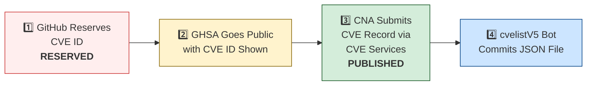

# 🛡️ OpenClaw CVE & Security Advisory Tracker

  
  
  
  
   
  
  
  
  
  

An automated tracker that continuously monitors [OpenClaw](https://github.com/openclaw/openclaw) security advisories across the GitHub Advisory Database, repo-level security advisories, and the [CVE V5 (cvelistV5)](https://github.com/CVEProject/cvelistV5) registry. Every hour it pulls the latest data, reconciles GHSA → CVE publication state, and regenerates this dashboard so you always have an up-to-date picture of the project's vulnerability landscape.

  Last updated: 2026-04-14 06:45 UTC · <a href="LICENSE">MIT License</a> · <a href="ADVISORIES.md">Full Advisory List</a> · <a href="SECURITY.md">Security Policy</a> · Data: <a href="https://github.com/CVEProject/cvelistV5">cvelistV5</a> + <a href="https://github.com/github/advisory-database">Advisory DB</a> · Updates hourly

---

  <a href="#-cves-published-in-cvelistv5-15">Published CVEs</a> ·
  <a href="#-cve-publication-pipeline">Pipeline</a> ·
  <a href="#-all-security-advisories-139">Advisories</a> ·
  <a href="#-vulnerability-categories">Categories</a> ·
  <a href="#-key-insights">Insights</a> ·
  <a href="#-project-identity">Identity</a>

---

## 🏗️ Project Identity

| Field | Value |
|-------|-------|
| **Current Name** | OpenClaw |
| **Previous Names** | Moltbot (second name), Clawdbot (original name) |
| **Repository** | [openclaw/openclaw](https://github.com/openclaw/openclaw) |
| **npm Package** | `openclaw` (formerly `clawdbot`) |
| **Author** | Peter Steinberger (steipete) |

<strong>Search terms for CVE discovery</strong>

To find all CVEs, search for: `openclaw`, `clawdbot`, `moltbot`, `clawhub`, `pkg:npm/clawdbot`, `pkg:npm/openclaw`

---

## 🚀 CVEs Published in cvelistV5 (15)

These CVEs have full records in the [CVEProject/cvelistV5](https://github.com/CVEProject/cvelistV5) repository:

| CVE ID | Severity | CVSS | Title | CWE | Published |
|--------|----------|------|-------|-----|-----------|
| [CVE-2026-22172](https://github.com/openclaw/openclaw/security/advisories/GHSA-rqpp-rjj8-7wv8) |  | 9.4 | OpenClaw < 2026.3.12 - Scope Elevation in WebSocket Shared-Auth Connections | CWE-862 | 2026-03-20 |
| [CVE-2026-32922](https://github.com/openclaw/openclaw/security/advisories/GHSA-4jpw-hj22-2xmc) |  | 9.4 | OpenClaw < 2026.3.11 - Privilege Escalation via Unvalidated Scope in device.token.rotate | CWE-266 | 2026-03-29 |
| [CVE-2026-32987](https://github.com/openclaw/openclaw/security/advisories/GHSA-63f5-hhc7-cx6p) |  | 9.3 | OpenClaw < 2026.3.13 - Bootstrap Setup Code Replay via Device Pairing | CWE-294 | 2026-03-29 |
| [CVE-2026-32916](https://github.com/openclaw/openclaw/security/advisories/GHSA-xw77-45gv-p728) |  | 9.2 | OpenClaw 2026.3.7 < 2026.3.11 - Authorization Bypass in Plugin Subagent Routes via Synthetic Admin Scopes | CWE-266 | 2026-03-31 |
| [CVE-2026-32917](https://github.com/openclaw/openclaw/security/advisories/GHSA-g2f6-pwvx-r275) |  | 9.2 | OpenClaw < 2026.3.13 - Remote Command Injection via Unsanitized iMessage Attachment Paths in SCP | CWE-78 | 2026-03-31 |
| [CVE-2026-24763](https://github.com/openclaw/openclaw/security/advisories/GHSA-mc68-q9jw-2h3v) |  | 8.8 | OpenClaw/Clawdbot Docker Execution has Authenticated Command Injection via PATH Environment Variable | CWE-78 | 2026-02-02 |
| [CVE-2026-25253](https://github.com/openclaw/openclaw/security/advisories/GHSA-g8p2-7wf7-98mq) |  | 8.8 | OpenClaw/Clawdbot has 1-Click RCE via Authentication Token Exfiltration From gatewayUrl | CWE-669 | 2026-02-01 |
| [CVE-2026-32913](https://github.com/openclaw/openclaw/security/advisories/GHSA-6mgf-v5j7-45cr) |  | 8.8 | OpenClaw < 2026.3.7 - Custom Authorization Header Leakage via Cross-Origin Redirects | CWE-522 | 2026-03-23 |
| [CVE-2026-32974](https://github.com/openclaw/openclaw/security/advisories/GHSA-g353-mgv3-8pcj) |  | 8.8 | OpenClaw < 2026.3.12 - Forged Event Injection via Feishu Webhook Verification Token | CWE-347 | 2026-03-29 |
| [CVE-2026-28479](https://github.com/openclaw/openclaw/security/advisories/GHSA-fh3f-q9qw-93j9) |  | 8.7 | OpenClaw < 2026.2.15 - Cache Poisoning via Deprecated SHA-1 Hash in Sandbox Configuration | CWE-327 | 2026-03-05 |
| [CVE-2026-28478](https://github.com/openclaw/openclaw/security/advisories/GHSA-q447-rj3r-2cgh) |  | 8.7 | OpenClaw affected by denial of service via unbounded webhook request body buffering | CWE-770 | 2026-03-05 |
| [CVE-2026-32013](https://github.com/openclaw/openclaw/security/advisories/GHSA-fgvx-58p6-gjwc) |  | 8.7 | OpenClaw < 2026.2.25 - Symlink Traversal in agents.files Methods | CWE-59 | 2026-03-19 |
| [CVE-2026-32051](https://github.com/openclaw/openclaw/security/advisories/GHSA-jr6x-2q95-fh2g) |  | 8.7 | OpenClaw < 2026.3.1 - Authorization Bypass in Agent Runs via Owner-Only Tool Access | CWE-863 | 2026-03-21 |
| [CVE-2026-32059](https://github.com/openclaw/openclaw/security/advisories/GHSA-3c6h-g97w-fg78) |  | 8.7 | OpenClaw 2026.2.22-2 < 2026.2.23 - Allowlist Bypass via sort Long-Option Abbreviation in tools.exec.safeBins | CWE-863 | 2026-03-11 |
| [CVE-2026-32060](https://github.com/openclaw/openclaw/security/advisories/GHSA-r5fq-947m-xm57) |  | 8.7 | OpenClaw < 2026.2.14 - Path Traversal in apply_patch via Crafted Paths | CWE-22 | 2026-03-11 |
| [CVE-2026-32914](https://github.com/openclaw/openclaw/security/advisories/GHSA-r7vr-gr74-94p8) |  | 8.7 | OpenClaw < 2026.3.12 - Insufficient Access Control in /config and /debug Endpoints | CWE-863 | 2026-03-29 |
| [CVE-2026-32980](https://github.com/openclaw/openclaw/security/advisories/GHSA-jq3f-vjww-8rq7) |  | 8.7 | OpenClaw < 2026.3.13 - Resource Exhaustion via Unauthenticated Telegram Webhook Request | CWE-770 | 2026-03-29 |
| [CVE-2026-33573](https://github.com/openclaw/openclaw/security/advisories/GHSA-2rqg-gjgv-84jm) |  | 8.7 | OpenClaw < 2026.3.11 - Workspace Boundary Bypass via Agent RPC Parameters | CWE-668 | 2026-03-29 |
| [CVE-2026-26323](https://github.com/openclaw/openclaw/security/advisories/GHSA-m7x8-2w3w-pr42) |  | 8.6 | OpenClaw has a command injection in maintainer clawtributors updater | CWE-78 | 2026-02-19 |
| [CVE-2026-32014](https://github.com/openclaw/openclaw/security/advisories/GHSA-r65x-2hqr-j5hf) |  | 8.6 | OpenClaw < 2026.2.26 - Node Reconnect Metadata Spoofing via Unsigned Platform Fields | CWE-290 | 2026-03-19 |
| [CVE-2026-35643](https://github.com/openclaw/openclaw/security/advisories/GHSA-cxmw-p77q-wchg) |  | 8.6 | OpenClaw < 2026.3.22 - Arbitrary Code Execution via Unvalidated WebView JavascriptInterface | CWE-940 | 2026-04-10 |
| [CVE-2026-28468](https://github.com/openclaw/openclaw/security/advisories/GHSA-h9g4-589h-68xv) |  | 8.5 | OpenClaw 2026.1.29-beta.1 < 2026.2.14 - Authentication Bypass in Sandbox Browser Bridge Server | CWE-306 | 2026-03-05 |
| [CVE-2026-31998](https://github.com/openclaw/openclaw/security/advisories/GHSA-gw85-xp4q-5gp9) |  | 8.3 | OpenClaw 2026.2.22 < 2026.2.24 - Authorization Bypass in Synology Chat Plugin via Empty allowedUserIds | CWE-863 | 2026-03-19 |
| [CVE-2026-35618](https://github.com/openclaw/openclaw/security/advisories/GHSA-cg6c-q2hx-69h7) |  | 8.3 | OpenClaw < 2026.3.23 - Replay Identity Drift via Query-Only Variants in Plivo V2 Verification | CWE-294 | 2026-04-09 |
| [CVE-2026-28469](https://github.com/openclaw/openclaw/security/advisories/GHSA-rq6g-px6m-c248) |  | 8.2 | OpenClaw Google Chat shared-path webhook target ambiguity allowed cross-account policy-context misrouting | CWE-639 | 2026-03-05 |
| [CVE-2026-28464](https://github.com/openclaw/openclaw/security/advisories/GHSA-jmm5-fvh5-gf4p) |  | 8.2 | OpenClaw < 2026.2.12 - Timing Attack in Hooks Token Authentication | CWE-208 | 2026-03-05 |
| [CVE-2026-32302](https://github.com/openclaw/openclaw/security/advisories/GHSA-5wcw-8jjv-m286) |  | 8.1 | OpenClaw: Untrusted web origins can obtain authenticated operator.admin access in trusted-proxy mode | CWE-346 | 2026-03-12 |
| [CVE-2026-25157](https://github.com/openclaw/openclaw/security/advisories/GHSA-q284-4pvr-m585) |  | 7.8 | OpenClaw/Clawdbot has OS Command Injection via Project Root Path in sshNodeCommand | CWE-78 | 2026-02-04 |
| [CVE-2026-27002](https://github.com/openclaw/openclaw/security/advisories/GHSA-w235-x559-36mg) |  | 7.7 | OpenClaw: Docker container escape via unvalidated bind mount config injection | CWE-250 | 2026-02-19 |
| [CVE-2026-29610](https://github.com/openclaw/openclaw/security/advisories/GHSA-jqpq-mgvm-f9r6) |  | 7.7 | OpenClaw < 2026.2.14 - Command Hijacking via Unsafe PATH Handling | CWE-427 | 2026-03-05 |
| [CVE-2026-32056](https://github.com/openclaw/openclaw/security/advisories/GHSA-xgf2-vxv2-rrmg) |  | 7.7 | OpenClaw < 2026.2.22 - Remote Code Execution via Shell Startup Environment Variable Injection in system.run | CWE-78 | 2026-03-21 |
| [CVE-2026-35650](https://github.com/openclaw/openclaw/security/advisories/GHSA-39pp-xp36-q6mg) |  | 7.7 | OpenClaw < 2026.3.22 - Environment Variable Override Bypass via Inconsistent Sanitization | CWE-15 | 2026-04-10 |
| [CVE-2026-35666](https://github.com/openclaw/openclaw/security/advisories/GHSA-qm9x-v7cx-7rq4) |  | 7.7 | OpenClaw < 2026.3.22 - Allowlist Bypass via Unregistered Time Dispatch Wrapper | CWE-706 | 2026-04-10 |
| [CVE-2026-28485](https://github.com/openclaw/openclaw/security/advisories/GHSA-qpjj-47vm-64pj) |  | 7.5 | OpenClaw 2026.1.5 < 2026.2.12 - Missing Authentication in Browser Control HTTP Endpoints | CWE-306 | 2026-03-05 |
| [CVE-2026-32003](https://github.com/openclaw/openclaw/security/advisories/GHSA-2fgq-7j6h-9rm4) |  | 7.5 | OpenClaw < 2026.2.22 - Remote Code Execution via SHELLOPTS/PS4 Environment Injection in system.run | CWE-78 | 2026-03-19 |
| [CVE-2026-32041](https://github.com/openclaw/openclaw/security/advisories/GHSA-vpj2-69hf-rppw) |  | 7.5 | OpenClaw < 2026.3.1 - Unauthenticated Browser Control Access via Failed Auth Bootstrap | CWE-306 | 2026-03-19 |
| [CVE-2026-28458](https://github.com/openclaw/openclaw/security/advisories/GHSA-mr32-vwc2-5j6h) |  | 7.4 | OpenClaw's Browser Relay /cdp websocket is missing auth which could allow cross-tab cookie access | CWE-306 | 2026-03-05 |
| [CVE-2026-32032](https://github.com/openclaw/openclaw/security/advisories/GHSA-f8mp-vj46-cq8v) |  | 7.3 | OpenClaw < 2026.2.22 - Arbitrary Shell Execution via Unvalidated SHELL Environment Variable | CWE-426 | 2026-03-19 |
| [CVE-2026-34512](https://github.com/openclaw/openclaw/security/advisories/GHSA-9p93-7j67-5pc2) |  | 7.2 | OpenClaw < 2026.3.25 - Improper Access Control in /sessions/:sessionKey/kill Endpoint | CWE-863 | 2026-04-09 |
| [CVE-2026-22175](https://github.com/openclaw/openclaw/security/advisories/GHSA-gwqp-86q6-w47g) |  | 7.1 | OpenClaw < 2026.2.23 - Exec Approval Bypass via Unrecognized Multiplexer Shell Wrappers | CWE-184 | 2026-03-18 |
| [CVE-2026-26320](https://github.com/openclaw/openclaw/security/advisories/GHSA-7q2j-c4q5-rm27) |  | 7.1 | OpenClaw macOS deep link confirmation truncation can conceal executed agent message | CWE-451 | 2026-02-19 |
| [CVE-2026-26317](https://github.com/openclaw/openclaw/security/advisories/GHSA-3fqr-4cg8-h96q) |  | 7.1 | OpenClaw affected by cross-site request forgery (CSRF) through loopback browser mutation endpoints | CWE-352 | 2026-02-19 |
| [CVE-2026-26329](https://github.com/openclaw/openclaw/security/advisories/GHSA-cv7m-c9jx-vg7q) |  | 7.1 | OpenClaw has a path traversal in browser upload allows local file read | CWE-22 | 2026-02-19 |
| [CVE-2026-27566](https://github.com/openclaw/openclaw/security/advisories/GHSA-jj82-76v6-933r) |  | 7.1 | OpenClaw < 2026.2.22 - Allowlist Bypass via Wrapper Binary Unwrapping in system.run | CWE-78 | 2026-03-19 |
| [CVE-2026-32027](https://github.com/openclaw/openclaw/security/advisories/GHSA-jv6r-27ww-4gw4) |  | 7.1 | OpenClaw < 2026.2.26 - Improper Authorization via DM Pairing Store Identity Inheritance in Group Allowlist | CWE-22 | 2026-03-19 |
| [CVE-2026-32976](https://github.com/openclaw/openclaw/security/advisories/GHSA-8jhh-jcqg-mj5p) |  | 7.1 | OpenClaw < 2026.3.11 - Account-Scoped configWrites Policy Bypass via Channel Commands | CWE-639 | 2026-03-31 |
| [CVE-2026-33581](https://github.com/openclaw/openclaw/security/advisories/GHSA-v8wv-jg3q-qwpq) |  | 7.1 | OpenClaw < 2026.3.24 - Arbitrary File Read via mediaUrl and fileUrl Parameters | CWE-22 | 2026-03-31 |
| [CVE-2026-35668](https://github.com/openclaw/openclaw/security/advisories/GHSA-hr5v-j9h9-xjhg) |  | 7.1 | OpenClaw < 2026.3.24 - Sandbox Media Root Bypass via Unnormalized mediaUrl and fileUrl Parameters | CWE-22 | 2026-04-10 |
| [CVE-2026-35657](https://github.com/openclaw/openclaw/security/advisories/GHSA-5jvj-hxmh-6h6j) |  | 7.1 | OpenClaw < 2026.3.25 - Authorization Bypass in HTTP Session History Route | CWE-863 | 2026-04-10 |
| [CVE-2026-40037](https://github.com/openclaw/openclaw/security/advisories/GHSA-qx8j-g322-qj6m) |  | 7.1 | OpenClaw: `fetchWithSsrFGuard` replays unsafe request bodies across cross-origin redirects | CWE-601 | 2026-04-08 |
| [CVE-2026-32979](https://github.com/openclaw/openclaw/security/advisories/GHSA-xf99-j42q-5w5p) |  | 7 | OpenClaw < 2026.3.11 - Unbound Interpreter and Runtime Commands Bypass in node-host Approval | CWE-367 | 2026-03-29 |
| [CVE-2026-22177](https://github.com/openclaw/openclaw/security/advisories/GHSA-8fmp-37rc-p5g7) |  | 6.9 | OpenClaw < 2026.2.21 - Environment Variable Injection via Config env.vars | CWE-15 | 2026-03-18 |
| [CVE-2026-27004](https://github.com/openclaw/openclaw/security/advisories/GHSA-6hf3-mhgc-cm65) |  | 6.9 | OpenClaw session tool visibility hardening and Telegram webhook secret fallback | CWE-209, CWE-346 | 2026-02-19 |
| [CVE-2026-28467](https://github.com/openclaw/openclaw/security/advisories/GHSA-wfp2-v9c7-fh79) |  | 6.9 | OpenClaw < 2026.2.2 - SSRF via Attachment Media URL Hydration | CWE-918 | 2026-03-05 |
| [CVE-2026-28480](https://github.com/openclaw/openclaw/security/advisories/GHSA-mj5r-hh7j-4gxf) |  | 6.9 | OpenClaw Telegram allowlist authorization accepted mutable usernames | CWE-290 | 2026-03-05 |
| [CVE-2026-32053](https://github.com/openclaw/openclaw/security/advisories/GHSA-vqx8-9xxw-f2m7) |  | 6.9 | OpenClaw < 2026.2.23 - Twilio Webhook Replay Bypass via Randomized Event ID Normalization | CWE-294 | 2026-03-21 |
| [CVE-2026-32975](https://github.com/openclaw/openclaw/security/advisories/GHSA-f5mf-3r52-r83w) |  | 6.9 | OpenClaw < 2026.3.12 - Weak Authorization via Mutable Group Names in Zalouser Allowlist | CWE-807 | 2026-03-29 |
| [CVE-2026-34504](https://github.com/openclaw/openclaw/security/advisories/GHSA-qxgf-hmcj-3xw3) |  | 6.9 | OpenClaw < 2026.3.28 - Server-Side Request Forgery via Unguarded Image Download in fal Provider | CWE-918 | 2026-03-31 |
| [CVE-2026-34510](https://github.com/openclaw/openclaw/security/advisories/GHSA-h3x4-hc5v-v2gm) |  | 6.9 | OpenClaw < 2026.3.22 - Remote File URL Acceptance in Windows Media Loaders | CWE-41 | 2026-04-01 |
| [CVE-2026-35627](https://github.com/openclaw/openclaw/security/advisories/GHSA-65h8-27jh-q8wv) |  | 6.9 | OpenClaw < 2026.3.22 - Unauthenticated Cryptographic Work in Nostr Inbound DM Handling | CWE-696 | 2026-04-09 |
| [CVE-2026-35647](https://github.com/openclaw/openclaw/security/advisories/GHSA-9wqx-g2cw-vc7r) |  | 6.9 | OpenClaw < 2026.3.25 - Direct Message Policy Bypass via Verification Notices | CWE-288 | 2026-04-10 |
| [CVE-2026-35655](https://github.com/openclaw/openclaw/security/advisories/GHSA-74wf-h43j-vvmj) |  | 6.9 | OpenClaw < 2026.3.22 - Identity Spoofing via rawInput Tool in ACP Permission Resolution | CWE-807 | 2026-04-10 |
| [CVE-2026-35637](https://github.com/openclaw/openclaw/security/advisories/GHSA-vfg3-pqpq-93m4) |  | 6.9 | OpenClaw < 2026.3.22 - Premature Cite Expansion Before Authorization in Channel and DM | CWE-696 | 2026-04-09 |
| [CVE-2026-29612](https://github.com/openclaw/openclaw/security/advisories/GHSA-w2cg-vxx6-5xjg) |  | 6.8 | OpenClaw < 2026.2.14 - Denial of Service via Large Base64 Media File Decoding | CWE-770 | 2026-03-05 |
| [CVE-2026-28486](https://github.com/openclaw/openclaw/security/advisories/GHSA-v892-hwpg-jwqp) |  | 6.8 | OpenClaw 2026.1.16-2 < 2026.2.14 - Path Traversal (Zip Slip) in Archive Extraction via Installation Commands | CWE-22 | 2026-03-05 |
| [CVE-2026-32024](https://github.com/openclaw/openclaw/security/advisories/GHSA-rx3g-mvc3-qfjf) |  | 6.8 | OpenClaw < 2026.2.22 - Symlink Traversal in Avatar Handling | CWE-59 | 2026-03-19 |
| [CVE-2026-28452](https://github.com/openclaw/openclaw/security/advisories/GHSA-h89v-j3x9-8wqj) |  | 6.7 | OpenClaw affected by denial of service through unguarded archive extraction allowing high expansion/resource abuse (ZIP/TAR) | CWE-770 | 2026-03-05 |
| [CVE-2026-32044](https://github.com/openclaw/openclaw/security/advisories/GHSA-77hf-7fqf-f227) |  | 6.7 | OpenClaw < 2026.3.2 - Tar Archive Safety Bypass in Skills Installation | CWE-409 | 2026-03-21 |
| [CVE-2026-25475](https://github.com/openclaw/openclaw/security/advisories/GHSA-r8g4-86fx-92mq) |  | 6.5 | OpenClaw Vulnerable to Local File Inclusion via MEDIA: Path Extraction | CWE-200, CWE-22 | 2026-02-04 |
| [CVE-2026-26328](https://github.com/openclaw/openclaw/security/advisories/GHSA-g34w-4xqq-h79m) |  | 6.5 | OpenClaw iMessage group allowlist authorization inherited DM pairing-store identities | CWE-284, CWE-863 | 2026-02-19 |
| [CVE-2026-28451](https://github.com/openclaw/openclaw/security/advisories/GHSA-x22m-j5qq-j49m) |  | 6.3 | OpenClaw < 2026.2.14 - SSRF via Feishu Extension Media Fetching | CWE-918 | 2026-03-05 |
| [CVE-2026-28449](https://github.com/openclaw/openclaw/security/advisories/GHSA-r9q5-c7qc-p26w) |  | 6.3 | OpenClaw < 2026.2.25 - Webhook Replay Attack via Missing Durable Replay Suppression | CWE-294 | 2026-03-19 |
| [CVE-2026-29606](https://github.com/openclaw/openclaw/security/advisories/GHSA-c37p-4qqg-3p76) |  | 6.3 | OpenClaw < 2026.2.14 - Webhook Signature Verification Bypass via ngrok Loopback Compatibility | CWE-306 | 2026-03-05 |
| [CVE-2026-32021](https://github.com/openclaw/openclaw/security/advisories/GHSA-j4xf-96qf-rx69) |  | 6.3 | OpenClaw < 2026.2.22 - Authorization Bypass via Display Name Collision in Feishu allowFrom | CWE-863 | 2026-03-19 |
| [CVE-2026-32029](https://github.com/openclaw/openclaw/security/advisories/GHSA-2rgf-hm63-5qph) |  | 6.3 | OpenClaw < 2026.2.21 - Client IP Spoofing via X-Forwarded-For Header Parsing | CWE-345 | 2026-03-19 |
| [CVE-2026-35656](https://github.com/openclaw/openclaw/security/advisories/GHSA-844j-xrrq-wgh4) |  | 6.3 | OpenClaw < 2026.3.22 - XFF Loopback Spoofing Bypass in Canvas Authentication and Rate Limiter | CWE-290 | 2026-04-10 |
| [CVE-2026-32017](https://github.com/openclaw/openclaw/security/advisories/GHSA-3x3x-h76w-hp98) |  | 6 | OpenClaw < 2026.2.19 - Arbitrary File Write via Short-Option Bypass in exec Allowlist | CWE-184 | 2026-03-19 |
| [CVE-2026-32057](https://github.com/openclaw/openclaw/security/advisories/GHSA-vvgp-4c28-m3jm) |  | 6 | OpenClaw < 2026.2.25 - Authentication Bypass via Control UI client.id Parameter | CWE-807 | 2026-03-21 |
| [CVE-2026-34511](https://github.com/openclaw/openclaw/security/advisories/GHSA-9jpj-g8vv-j5mf) |  | 6 | OpenClaw < 2026.4.2 - PKCE Verifier Exposure via OAuth State Parameter | CWE-330 | 2026-04-03 |
| [CVE-2026-22174](https://github.com/openclaw/openclaw/security/advisories/GHSA-v3j7-34xh-6g3w) |  | 5.9 | OpenClaw < 2026.2.22 - Gateway Token Disclosure via Chrome CDP Probe | CWE-306 | 2026-03-18 |
| [CVE-2026-28477](https://github.com/openclaw/openclaw/security/advisories/GHSA-7rcp-mxpq-72pj) |  | 5.9 | OpenClaw < 2026.2.14 - OAuth State Validation Bypass in Manual Chutes Login Flow | CWE-352 | 2026-03-05 |
| [CVE-2026-32054](https://github.com/openclaw/openclaw/security/advisories/GHSA-36h3-7c54-j27r) |  | 5.9 | OpenClaw < 2026.2.25 - Symlink Traversal in Browser Trace/Download Path Handling | CWE-59 | 2026-03-21 |
| [CVE-2026-22217](https://github.com/openclaw/openclaw/security/advisories/GHSA-p4wh-cr8m-gm6c) |  | 5.8 | OpenClaw 2026.2.22 < 2026.2.23 - Arbitrary Binary Execution via $SHELL Environment Variable Trusted Prefix Fallback | CWE-829 | 2026-03-18 |
| [CVE-2026-27670](https://github.com/openclaw/openclaw/security/advisories/GHSA-r54r-wmmq-mh84) |  | 5.8 | OpenClaw < 2026.3.2 - Arbitrary File Write via ZIP Extraction Parent Symlink Race Condition | CWE-367 | 2026-03-19 |
| [CVE-2026-31995](https://github.com/openclaw/openclaw/security/advisories/GHSA-fg3m-vhrr-8gj6) |  | 5.8 | OpenClaw 2026.1.21 < 2026.2.19 - Command Injection via Windows Shell Fallback in Lobster Extension | CWE-78 | 2026-03-19 |
| [CVE-2026-32000](https://github.com/openclaw/openclaw/security/advisories/GHSA-7fcc-cw49-xm78) |  | 5.8 | OpenClaw < 2026.2.19 - Command Injection via Windows Shell Fallback in Lobster Tool Execution | CWE-78 | 2026-03-19 |
| [CVE-2026-32035](https://github.com/openclaw/openclaw/security/advisories/GHSA-wpg9-4g4v-f9rc) |  | 5.8 | OpenClaw < 2026.3.2 - Missing Owner Flag Validation in Discord Voice Transcript Handler | CWE-863 | 2026-03-19 |
| [CVE-2026-32052](https://github.com/openclaw/openclaw/security/advisories/GHSA-6rcp-vxwf-3mfp) |  | 5.8 | OpenClaw < 2026.2.24 - Hidden Command Execution via Shell-Wrapper Positional argv Carriers | CWE-436 | 2026-03-21 |
| [CVE-2026-32977](https://github.com/openclaw/openclaw/security/advisories/GHSA-xvx8-77m6-gwg6) |  | 5.8 | OpenClaw < 2026.3.11 - Sandbox Boundary Bypass via Unanchored writeFile Commit Path | CWE-367 | 2026-03-31 |
| [CVE-2026-33574](https://github.com/openclaw/openclaw/security/advisories/GHSA-vhwf-4x96-vqx2) |  | 5.8 | OpenClaw < 2026.3.8 - Path Traversal via Tools Root Rebinding in Skills Download | CWE-367 | 2026-03-29 |
| [CVE-2026-26326](https://github.com/openclaw/openclaw/security/advisories/GHSA-8mh7-phf8-xgfm) |  | 5.3 | OpenClaw skills.status could leak secrets to operator.read clients | CWE-200 | 2026-02-19 |
| [CVE-2026-31989](https://github.com/openclaw/openclaw/security/advisories/GHSA-g99v-8hwm-g76g) |  | 5.3 | OpenClaw < 2026.3.1 - Server-Side Request Forgery via web_search Citation Redirect | CWE-918 | 2026-03-19 |
| [CVE-2026-32898](https://github.com/openclaw/openclaw/security/advisories/GHSA-7jx5-9fjg-hp4m) |  | 5.3 | OpenClaw < 2026.2.23 - ACP Permission Auto-Approval Bypass via Untrusted Tool Metadata | CWE-807 | 2026-03-21 |
| [CVE-2026-32921](https://github.com/openclaw/openclaw/security/advisories/GHSA-8g75-q649-6pv6) |  | 5.3 | OpenClaw < 2026.3.8 - Script Content Modification via Mutable Operand Binding in system.run | CWE-367 | 2026-03-31 |
| [CVE-2026-34425](https://github.com/openclaw/openclaw/security/advisories/GHSA-fvx6-pj3r-5q4q) |  | 5.3 | OpenClaw - Shell-Bleed Protection Preflight Validation Bypass | CWE-184 | 2026-04-02 |
| [CVE-2026-35619](https://github.com/openclaw/openclaw/security/advisories/GHSA-68f8-9mhj-h2mp) |  | 5.3 | OpenClaw < 2026.3.24 - Authorization Bypass via HTTP /v1/models Endpoint | CWE-863 | 2026-04-10 |
| [CVE-2026-35629](https://github.com/openclaw/openclaw/security/advisories/GHSA-rhfg-j8jq-7v2h) |  | 5.3 | OpenClaw < 2026.3.25 - Server-Side Request Forgery via Unguarded Configured Base URLs in Channel Extensions | CWE-918 | 2026-04-09 |
| [CVE-2026-35642](https://github.com/openclaw/openclaw/security/advisories/GHSA-mw7w-g3mg-xqm7) |  | 5.3 | OpenClaw < 2026.3.25 - Authorization Bypass in Group Reactions via requireMention Bypass | CWE-288 | 2026-04-09 |
| [CVE-2026-35634](https://github.com/openclaw/openclaw/security/advisories/GHSA-6mqc-jqh6-x8fc) |  | 5.1 | OpenClaw < 2026.3.23 - Authentication Bypass via Local-Direct Requests in Canvas Gateway | CWE-288 | 2026-04-09 |
| [CVE-2026-32020](https://github.com/openclaw/openclaw/security/advisories/GHSA-5ghc-98wh-gwwf) |  | 4.8 | OpenClaw < 2026.2.22 - Arbitrary File Read via Symlink Following in Static File Handler | CWE-59 | 2026-03-19 |
| [CVE-2026-27485](https://github.com/openclaw/openclaw/security/advisories/GHSA-r6h2-5gqq-v5v6) |  | 4.6 | OpenClaw affected by Stored XSS in Control UI via unsanitized assistant name/avatar in inline script injection | CWE-61 | 2026-02-21 |
| [CVE-2026-31997](https://github.com/openclaw/openclaw/security/advisories/GHSA-q399-23r3-hfx4) |  | 4.4 | OpenClaw < 2026.3.1 - Executable Rebind via Unbound PATH-token in system.run Approvals | CWE-367 | 2026-03-19 |
| [CVE-2026-27486](https://github.com/openclaw/openclaw/security/advisories/GHSA-jfv4-h8mc-jcp8) |  | 4.3 | OpenClaw: Process Safety - Unvalidated PID Kill via SIGKILL in Process Cleanup | CWE-283 | 2026-02-21 |
| [CVE-2026-32040](https://github.com/openclaw/openclaw/security/advisories/GHSA-2ww6-868g-2c56) |  | 2.4 | OpenClaw < 2026.2.23 - HTML Injection via Unvalidated Image MIME Type in Data-URL Interpolation | CWE-79 | 2026-03-19 |
| [CVE-2026-35648](https://github.com/openclaw/openclaw/security/advisories/GHSA-wj55-88gf-x564) |  | 2.3 | OpenClaw < 2026.3.22 - Policy Bypass via Unvalidated Queued Node Actions | CWE-367 | 2026-04-10 |
| [CVE-2026-32018](https://github.com/openclaw/openclaw/security/advisories/GHSA-gq83-8q7q-9hfx) |  | 2 | OpenClaw < 2026.2.19 - Race Condition in Sandbox Registry Write Operations | CWE-362 | 2026-03-19 |

<strong>📖 Detailed CVE Analysis (click to expand)</strong>

### CVE-2026-22172 — OpenClaw < 2026.3.12 - Scope Elevation in WebSocket Shared-Auth Connections

| Field | Detail |
|-------|--------|
| **CVSS** | 9.4 (CRITICAL) — `CVSS:4.0/AV:N/AC:L/AT:N/PR:L/UI:N/VC:H/VI:H/VA:H/SC:H/SI:H/SA:H` |
| **CWE** | CWE-862 (CWE-862 Missing Authorization) |
| **Affected** | < 2026.3.12 |
| **Vendor/Product** | OpenClaw / OpenClaw |
| **Advisory** | [GHSA-rqpp-rjj8-7wv8](https://github.com/openclaw/openclaw/security/advisories/GHSA-rqpp-rjj8-7wv8) |

OpenClaw versions prior to 2026.3.12 contain an authorization bypass vulnerability in the WebSocket connect path that allows shared-token or password-authenticated connections to self-declare elevated scopes without server-side binding. Attackers can exploit this logic flaw to present unauthorized scopes such as operator.admin and perform admin-only gateway operations.

**References:**
- [openclaw-scope-elevation-in-websocket-shared-auth-connections](https://www.vulncheck.com/advisories/openclaw-scope-elevation-in-websocket-shared-auth-connections)
---

### CVE-2026-32922 — OpenClaw < 2026.3.11 - Privilege Escalation via Unvalidated Scope in device.token.rotate

| Field | Detail |
|-------|--------|
| **CVSS** | 9.4 (CRITICAL) — `CVSS:4.0/AV:N/AC:L/AT:N/PR:L/UI:N/VC:H/VI:H/VA:H/SC:H/SI:H/SA:H` |
| **CWE** | CWE-266 (Incorrect Privilege Assignment) |
| **Affected** | < 2026.3.11 |
| **Vendor/Product** | OpenClaw / OpenClaw |
| **Advisory** | [GHSA-4jpw-hj22-2xmc](https://github.com/openclaw/openclaw/security/advisories/GHSA-4jpw-hj22-2xmc) |

OpenClaw before 2026.3.11 contains a privilege escalation vulnerability in device.token.rotate that allows callers with operator.pairing scope to mint tokens with broader scopes by failing to constrain newly minted scopes to the caller's current scope set. Attackers can obtain operator.admin tokens for paired devices and achieve remote code execution on connected nodes via system.run or gain unauthorized gateway-admin access.

**References:**
- [VulnCheck Advisory: OpenClaw < 2026.3.11 - Privilege Escalation via Unvalidated Scope in device.token.rotate](https://www.vulncheck.com/advisories/openclaw-privilege-escalation-via-unvalidated-scope-in-device-token-rotate)
---

### CVE-2026-32987 — OpenClaw < 2026.3.13 - Bootstrap Setup Code Replay via Device Pairing

| Field | Detail |
|-------|--------|
| **CVSS** | 9.3 (CRITICAL) — `CVSS:4.0/AV:N/AC:L/AT:N/PR:N/UI:N/VC:H/VI:H/VA:H/SC:N/SI:N/SA:N` |
| **CWE** | CWE-294 (Authentication Bypass by Capture-replay) |
| **Affected** | < 2026.3.13 |
| **Vendor/Product** | OpenClaw / OpenClaw |
| **Advisory** | [GHSA-63f5-hhc7-cx6p](https://github.com/openclaw/openclaw/security/advisories/GHSA-63f5-hhc7-cx6p) |

OpenClaw before 2026.3.13 allows bootstrap setup codes to be replayed during device pairing verification in src/infra/device-bootstrap.ts. Attackers can verify a valid bootstrap code multiple times before approval to escalate pending pairing scopes, including privilege escalation to operator.admin.

**References:**
- [Patch Commit](https://github.com/openclaw/openclaw/commit/1803d16d5cec970c54b0e1ac46b31b1cbade335c)
- [VulnCheck Advisory: OpenClaw < 2026.3.13 - Bootstrap Setup Code Replay via Device Pairing](https://www.vulncheck.com/advisories/openclaw-bootstrap-setup-code-replay-via-device-pairing)
---

### CVE-2026-32916 — OpenClaw 2026.3.7 < 2026.3.11 - Authorization Bypass in Plugin Subagent Routes via Synthetic Admin Scopes

| Field | Detail |
|-------|--------|
| **CVSS** | 9.2 (CRITICAL) — `CVSS:4.0/AV:N/AC:L/AT:P/PR:N/UI:N/VC:H/VI:H/VA:L/SC:N/SI:N/SA:N` |
| **CWE** | CWE-266 (CWE-266: Incorrect Privilege Assignment) |
| **Affected** | < 2026.3.11 |
| **Vendor/Product** | OpenClaw / OpenClaw |
| **Advisory** | [GHSA-xw77-45gv-p728](https://github.com/openclaw/openclaw/security/advisories/GHSA-xw77-45gv-p728) |

OpenClaw versions 2026.3.7 before 2026.3.11 contain an authorization bypass vulnerability where plugin subagent routes execute gateway methods through a synthetic operator client with broad administrative scopes. Remote unauthenticated requests to plugin-owned routes can invoke runtime.subagent methods to perform privileged gateway actions including session deletion and agent execution.

**References:**
- [VulnCheck Advisory: OpenClaw 2026.3.7 < 2026.3.11 - Authorization Bypass in Plugin Subagent Routes via Synthetic Admin Scopes](https://www.vulncheck.com/advisories/openclaw-authorization-bypass-in-plugin-subagent-routes-via-synthetic-admin-scopes)
---

### CVE-2026-32917 — OpenClaw < 2026.3.13 - Remote Command Injection via Unsanitized iMessage Attachment Paths in SCP

| Field | Detail |
|-------|--------|
| **CVSS** | 9.2 (CRITICAL) — `CVSS:4.0/AV:N/AC:L/AT:P/PR:N/UI:N/VC:H/VI:H/VA:H/SC:N/SI:N/SA:N` |
| **CWE** | CWE-78 (Improper Neutralization of Special Elements used in an OS Command ('OS Command Injection')) |
| **Affected** | < 2026.3.13 |
| **Vendor/Product** | OpenClaw / OpenClaw |
| **Advisory** | [GHSA-g2f6-pwvx-r275](https://github.com/openclaw/openclaw/security/advisories/GHSA-g2f6-pwvx-r275) |

OpenClaw before 2026.3.13 contains a remote command injection vulnerability in the iMessage attachment staging flow that allows attackers to execute arbitrary commands on configured remote hosts. The vulnerability exists because unsanitized remote attachment paths containing shell metacharacters are passed directly to the SCP remote operand without validation, enabling command execution when remote attachment staging is enabled.

**References:**
- [Patch Commit](https://github.com/openclaw/openclaw/commit/a54bf71b4c0cbe554a84340b773df37ee8e959de)
- [VulnCheck Advisory: OpenClaw < 2026.3.13 - Remote Command Injection via Unsanitized iMessage Attachment Paths in SCP](https://www.vulncheck.com/advisories/openclaw-remote-command-injection-via-unsanitized-imessage-attachment-paths-in-scp)
---

### CVE-2026-24763 — OpenClaw/Clawdbot Docker Execution has Authenticated Command Injection via PATH Environment Variable

| Field | Detail |
|-------|--------|
| **CVSS** | 8.8 (HIGH) — `CVSS:3.1/AV:N/AC:L/PR:L/UI:N/S:U/C:H/I:H/A:H` |
| **CWE** | CWE-78 (CWE-78: Improper Neutralization of Special Elements used in an OS Command ('OS Command Injection')) |
| **Affected** | < 2026.1.29 |
| **Vendor/Product** | clawdbot / clawdbot |
| **Advisory** | [GHSA-mc68-q9jw-2h3v](https://github.com/openclaw/openclaw/security/advisories/GHSA-mc68-q9jw-2h3v) |

OpenClaw (formerly  Clawdbot) is a personal AI assistant you run on your own devices. Prior to 2026.1.29, a command injection vulnerability existed in OpenClaw’s Docker sandbox execution mechanism due to unsafe handling of the PATH environment variable when constructing shell commands. An authenticated user able to control environment variables could influence command execution within the container context. This vulnerability is fixed in 2026.1.29.

> **Naming note:** Uses old name `clawdbot/clawdbot` as vendor/product.
**References:**
- [https://github.com/openclaw/openclaw/commit/771f23d36b95ec2204cc9a0054045f5d8439ea75](https://github.com/openclaw/openclaw/commit/771f23d36b95ec2204cc9a0054045f5d8439ea75)
- [https://github.com/openclaw/openclaw/releases/tag/v2026.1.29](https://github.com/openclaw/openclaw/releases/tag/v2026.1.29)
---

### CVE-2026-25253 — OpenClaw/Clawdbot has 1-Click RCE via Authentication Token Exfiltration From gatewayUrl

| Field | Detail |
|-------|--------|
| **CVSS** | 8.8 (HIGH) — `CVSS:3.1/AV:N/AC:L/PR:N/UI:R/S:U/C:H/I:H/A:H` |
| **CWE** | CWE-669 (CWE-669 Incorrect Resource Transfer Between Spheres) |
| **Affected** | < 2026.1.29 |
| **Vendor/Product** | OpenClaw / OpenClaw |
| **Advisory** | [GHSA-g8p2-7wf7-98mq](https://github.com/openclaw/openclaw/security/advisories/GHSA-g8p2-7wf7-98mq) |

OpenClaw (aka clawdbot or Moltbot) before 2026.1.29 obtains a gatewayUrl value from a query string and automatically makes a WebSocket connection without prompting, sending a token value.

> **Naming note:** Uses all three names in description. packageURL still references `pkg:npm/clawdbot`.
**References:**
- [1-click-rce-to-steal-your-moltbot-data-and-keys](https://depthfirst.com/post/1-click-rce-to-steal-your-moltbot-data-and-keys)
- [blog](https://openclaw.ai/blog)
- [one-click-rce-moltbot](https://ethiack.com/news/blog/one-click-rce-moltbot)
- [2016913750557651228](https://x.com/0xacb/status/2016913750557651228)
---

### CVE-2026-32913 — OpenClaw < 2026.3.7 - Custom Authorization Header Leakage via Cross-Origin Redirects

| Field | Detail |
|-------|--------|
| **CVSS** | 8.8 (HIGH) — `CVSS:4.0/AV:N/AC:L/AT:N/PR:N/UI:N/VC:H/VI:L/VA:N/SC:L/SI:L/SA:N` |
| **CWE** | CWE-522 (CWE-522 Insufficiently Protected Credentials) |
| **Affected** | < 2026.3.7 |
| **Vendor/Product** | OpenClaw / OpenClaw |
| **Advisory** | [GHSA-6mgf-v5j7-45cr](https://github.com/openclaw/openclaw/security/advisories/GHSA-6mgf-v5j7-45cr) |

OpenClaw before 2026.3.7 contains an improper header validation vulnerability in fetchWithSsrFGuard that forwards custom authorization headers across cross-origin redirects. Attackers can trigger redirects to different origins to intercept sensitive headers like X-Api-Key and Private-Token intended for the original destination.

**References:**
- [Patch Commit](https://github.com/openclaw/openclaw/commit/46715371b0612a6f9114dffd1466941ac476cef5)
- [VulnCheck Advisory](https://vulncheck.com/advisories/openclaw-mar-custom-authorization-header-leakage-via-cross-origin-redirects)
---

### CVE-2026-32974 — OpenClaw < 2026.3.12 - Forged Event Injection via Feishu Webhook Verification Token

| Field | Detail |
|-------|--------|
| **CVSS** | 8.8 (HIGH) — `CVSS:4.0/AV:N/AC:L/AT:N/PR:N/UI:N/VC:L/VI:H/VA:L/SC:N/SI:N/SA:N` |
| **CWE** | CWE-347 (Improper Verification of Cryptographic Signature) |
| **Affected** | < 2026.3.12 |
| **Vendor/Product** | OpenClaw / OpenClaw |
| **Advisory** | [GHSA-g353-mgv3-8pcj](https://github.com/openclaw/openclaw/security/advisories/GHSA-g353-mgv3-8pcj) |

OpenClaw before 2026.3.12 contains an authentication bypass vulnerability in Feishu webhook mode when only verificationToken is configured without encryptKey, allowing acceptance of forged events. Unauthenticated network attackers can inject forged Feishu events and trigger downstream tool execution by reaching the webhook endpoint.

**References:**
- [VulnCheck Advisory: OpenClaw < 2026.3.12 - Forged Event Injection via Feishu Webhook Verification Token](https://www.vulncheck.com/advisories/openclaw-forged-event-injection-via-feishu-webhook-verification-token)
---

### CVE-2026-28479 — OpenClaw < 2026.2.15 - Cache Poisoning via Deprecated SHA-1 Hash in Sandbox Configuration

| Field | Detail |
|-------|--------|
| **CVSS** | 8.7 (HIGH) — `CVSS:4.0/AV:N/AC:L/AT:N/PR:N/UI:N/VC:H/VI:N/VA:N/SC:N/SI:N/SA:N` |
| **CWE** | CWE-327 (Use of a Broken or Risky Cryptographic Algorithm) |
| **Affected** | < 2026.2.15 |
| **Vendor/Product** | OpenClaw / OpenClaw |
| **Advisory** | [GHSA-fh3f-q9qw-93j9](https://github.com/openclaw/openclaw/security/advisories/GHSA-fh3f-q9qw-93j9) |

OpenClaw versions prior to 2026.2.15 use SHA-1 to hash sandbox identifier cache keys for Docker and browser sandbox configurations, which is deprecated and vulnerable to collision attacks. An attacker can exploit SHA-1 collisions to cause cache poisoning, allowing one sandbox configuration to be misinterpreted as another and enabling unsafe sandbox state reuse.

**References:**
- [Patch Commit](https://github.com/openclaw/openclaw/commit/559c8d9930eebb5356506ff1a8cd3dbaec92be77)
- [VulnCheck Advisory: OpenClaw < 2026.2.15 - Cache Poisoning via Deprecated SHA-1 Hash in Sandbox Configuration](https://www.vulncheck.com/advisories/openclaw-cache-poisoning-via-deprecated-sha-hash-in-sandbox-configuration)
---

### CVE-2026-28478 — OpenClaw affected by denial of service via unbounded webhook request body buffering

| Field | Detail |
|-------|--------|
| **CVSS** | 8.7 (HIGH) — `CVSS:4.0/AV:N/AC:L/AT:N/PR:N/UI:N/VC:N/VI:N/VA:H/SC:N/SI:N/SA:N` |
| **CWE** | CWE-770 (Allocation of Resources Without Limits or Throttling) |
| **Affected** | < 2026.2.13 |
| **Vendor/Product** | OpenClaw / OpenClaw |
| **Advisory** | [GHSA-q447-rj3r-2cgh](https://github.com/openclaw/openclaw/security/advisories/GHSA-q447-rj3r-2cgh) |

OpenClaw versions prior to 2026.2.13 contain a denial of service vulnerability in webhook handlers that buffer request bodies without strict byte or time limits. Remote unauthenticated attackers can send oversized JSON payloads or slow uploads to webhook endpoints causing memory pressure and availability degradation.

**References:**
- [Patch Commit](https://github.com/openclaw/openclaw/commit/3cbcba10cf30c2ffb898f0d8c7dfb929f15f8930)
- [VulnCheck Advisory: OpenClaw < 2026.2.13 - Denial of Service via Unbounded Webhook Request Body Buffering](https://www.vulncheck.com/advisories/openclaw-denial-of-service-via-unbounded-webhook-request-body-buffering)
---

### CVE-2026-32013 — OpenClaw < 2026.2.25 - Symlink Traversal in agents.files Methods

| Field | Detail |
|-------|--------|
| **CVSS** | 8.7 (HIGH) — `CVSS:4.0/AV:N/AC:L/AT:N/PR:L/UI:N/VC:H/VI:H/VA:H/SC:N/SI:N/SA:N` |
| **CWE** | CWE-59 (CWE-59: Improper Link Resolution Before File Access ('Link Following')) |
| **Affected** | < 2026.2.25 |
| **Vendor/Product** | OpenClaw / OpenClaw |
| **Advisory** | [GHSA-fgvx-58p6-gjwc](https://github.com/openclaw/openclaw/security/advisories/GHSA-fgvx-58p6-gjwc) |

OpenClaw versions prior to 2026.2.25 contain a symlink traversal vulnerability in the agents.files.get and agents.files.set methods that allows reading and writing files outside the agent workspace. Attackers can exploit symlinked allowlisted files to access arbitrary host files within gateway process permissions, potentially enabling code execution through file overwrite attacks.

**References:**
- [Patch Commit](https://github.com/openclaw/openclaw/commit/125f4071bcbc0de32e769940d07967db47f09d3d)
- [VulnCheck Advisory: OpenClaw < 2026.2.25 - Symlink Traversal in agents.files Methods](https://www.vulncheck.com/advisories/openclaw-symlink-traversal-in-agents-files-methods)
---

### CVE-2026-32051 — OpenClaw < 2026.3.1 - Authorization Bypass in Agent Runs via Owner-Only Tool Access

| Field | Detail |
|-------|--------|
| **CVSS** | 8.7 (HIGH) — `CVSS:4.0/AV:N/AC:L/AT:N/PR:L/UI:N/VC:H/VI:H/VA:H/SC:N/SI:N/SA:N` |
| **CWE** | CWE-863 (CWE-863: Incorrect Authorization) |
| **Affected** | < 2026.3.1 |
| **Vendor/Product** | OpenClaw / OpenClaw |
| **Advisory** | [GHSA-jr6x-2q95-fh2g](https://github.com/openclaw/openclaw/security/advisories/GHSA-jr6x-2q95-fh2g) |

OpenClaw versions prior to 2026.3.1 contain an authorization mismatch vulnerability that allows authenticated callers with operator.write scope to invoke owner-only tool surfaces including gateway and cron through agent runs in scoped-token deployments. Attackers with write-scope access can perform control-plane actions beyond their intended authorization level by exploiting inconsistent owner-only gating during agent execution.

**References:**
- [VulnCheck Advisory: OpenClaw < 2026.3.1 - Authorization Bypass in Agent Runs via Owner-Only Tool Access](https://www.vulncheck.com/advisories/openclaw-authorization-bypass-in-agent-runs-via-owner-only-tool-access)
---

### CVE-2026-32059 — OpenClaw 2026.2.22-2 < 2026.2.23 - Allowlist Bypass via sort Long-Option Abbreviation in tools.exec.safeBins

| Field | Detail |
|-------|--------|
| **CVSS** | 8.7 (HIGH) — `CVSS:4.0/AV:N/AC:L/AT:N/PR:L/UI:N/VC:H/VI:H/VA:H/SC:N/SI:N/SA:N` |
| **CWE** | CWE-863 (Incorrect Authorization) |
| **Affected** | < 2026.2.23 |
| **Vendor/Product** | openclaw / openclaw |
| **Advisory** | [GHSA-3c6h-g97w-fg78](https://github.com/openclaw/openclaw/security/advisories/GHSA-3c6h-g97w-fg78) |

OpenClaw version 2026.2.22-2 prior to 2026.2.23 tools.exec.safeBins validation for sort command fails to properly validate GNU long-option abbreviations, allowing attackers to bypass denied-flag checks via abbreviated options. Remote attackers can execute sort commands with abbreviated long options to skip approval requirements in allowlist mode.

**References:**
- [Patch Commit](https://github.com/openclaw/openclaw/commit/3b8e33037ae2e12af7beb56fcf0346f1f8cbde6f)
- [VulnCheck Advisory: OpenClaw 2026.2.22-2 < 2026.2.23 - Allowlist Bypass via sort Long-Option Abbreviation in tools.exec.safeBins](https://www.vulncheck.com/advisories/openclaw-allowlist-bypass-via-sort-long-option-abbreviation-in-toolsexecsafebins)
---

### CVE-2026-32060 — OpenClaw < 2026.2.14 - Path Traversal in apply_patch via Crafted Paths

| Field | Detail |
|-------|--------|
| **CVSS** | 8.7 (HIGH) — `CVSS:4.0/AV:N/AC:L/AT:N/PR:L/UI:N/VC:H/VI:H/VA:H/SC:N/SI:N/SA:N` |
| **CWE** | CWE-22 (Improper Limitation of a Pathname to a Restricted Directory ('Path Traversal')) |
| **Affected** | < 2026.2.14 |
| **Vendor/Product** | openclaw / openclaw |
| **Advisory** | [GHSA-r5fq-947m-xm57](https://github.com/openclaw/openclaw/security/advisories/GHSA-r5fq-947m-xm57) |

OpenClaw versions prior to 2026.2.14 contain a path traversal vulnerability in apply_patch that allows attackers to write or delete files outside the configured workspace directory. When apply_patch is enabled without filesystem sandbox containment, attackers can exploit crafted paths including directory traversal sequences or absolute paths to escape workspace boundaries and modify arbitrary files.

**References:**
- [Patch Commit](https://github.com/openclaw/openclaw/commit/5544646a09c0121fca7d7093812dc2de8437c7f1)
- [VulnCheck Advisory: OpenClaw < 2026.2.14 - Path Traversal in apply_patch via Crafted Paths](https://www.vulncheck.com/advisories/openclaw-path-traversal-in-apply-patch-via-crafted-paths)
---

### CVE-2026-32914 — OpenClaw < 2026.3.12 - Insufficient Access Control in /config and /debug Endpoints

| Field | Detail |
|-------|--------|
| **CVSS** | 8.7 (HIGH) — `CVSS:4.0/AV:N/AC:L/AT:N/PR:L/UI:N/VC:H/VI:H/VA:H/SC:N/SI:N/SA:N` |
| **CWE** | CWE-863 (Incorrect Authorization) |
| **Affected** | < 2026.3.12 |
| **Vendor/Product** | OpenClaw / OpenClaw |
| **Advisory** | [GHSA-r7vr-gr74-94p8](https://github.com/openclaw/openclaw/security/advisories/GHSA-r7vr-gr74-94p8) |

OpenClaw before 2026.3.12 contains an insufficient access control vulnerability in the /config and /debug command handlers that allows command-authorized non-owners to access owner-only surfaces. Attackers with command authorization can read or modify privileged configuration settings restricted to owners by exploiting missing owner-level permission checks.

**References:**
- [VulnCheck Advisory: OpenClaw < 2026.3.12 - Insufficient Access Control in /config and /debug Endpoints](https://www.vulncheck.com/advisories/openclaw-insufficient-access-control-in-config-and-debug-endpoints)
---

### CVE-2026-32980 — OpenClaw < 2026.3.13 - Resource Exhaustion via Unauthenticated Telegram Webhook Request

| Field | Detail |
|-------|--------|
| **CVSS** | 8.7 (HIGH) — `CVSS:4.0/AV:N/AC:L/AT:N/PR:N/UI:N/VC:N/VI:N/VA:H/SC:N/SI:N/SA:N` |
| **CWE** | CWE-770 (Allocation of Resources Without Limits or Throttling) |
| **Affected** | < 2026.3.13 |
| **Vendor/Product** | OpenClaw / OpenClaw |
| **Advisory** | [GHSA-jq3f-vjww-8rq7](https://github.com/openclaw/openclaw/security/advisories/GHSA-jq3f-vjww-8rq7) |

OpenClaw before 2026.3.13 reads and buffers Telegram webhook request bodies before validating the x-telegram-bot-api-secret-token header, allowing unauthenticated attackers to exhaust server resources. Attackers can send POST requests to the webhook endpoint to force memory consumption, socket time, and JSON parsing work before authentication validation occurs.

**References:**
- [Patch Commit](https://github.com/openclaw/openclaw/commit/7e49e98f79073b11134beac27fdff547ba5a4a02)
- [VulnCheck Advisory: OpenClaw < 2026.3.13 - Resource Exhaustion via Unauthenticated Telegram Webhook Request](https://www.vulncheck.com/advisories/openclaw-resource-exhaustion-via-unauthenticated-telegram-webhook-request)
---

### CVE-2026-33573 — OpenClaw < 2026.3.11 - Workspace Boundary Bypass via Agent RPC Parameters

| Field | Detail |
|-------|--------|
| **CVSS** | 8.7 (HIGH) — `CVSS:4.0/AV:N/AC:L/AT:N/PR:L/UI:N/VC:H/VI:H/VA:H/SC:N/SI:N/SA:N` |
| **CWE** | CWE-668 (Exposure of Resource to Wrong Sphere) |
| **Affected** | < 2026.3.11 |
| **Vendor/Product** | OpenClaw / OpenClaw |
| **Advisory** | [GHSA-2rqg-gjgv-84jm](https://github.com/openclaw/openclaw/security/advisories/GHSA-2rqg-gjgv-84jm) |

OpenClaw before 2026.3.11 contains an authorization bypass vulnerability in the gateway agent RPC that allows authenticated operators with operator.write permission to override workspace boundaries by supplying attacker-controlled spawnedBy and workspaceDir values. Remote operators can escape the configured workspace boundary and execute arbitrary file and exec operations from any process-accessible directory.

**References:**
- [VulnCheck Advisory: OpenClaw < 2026.3.11 - Workspace Boundary Bypass via Agent RPC Parameters](https://www.vulncheck.com/advisories/openclaw-workspace-boundary-bypass-via-agent-rpc-parameters)
---

### CVE-2026-26323 — OpenClaw has a command injection in maintainer clawtributors updater

| Field | Detail |
|-------|--------|
| **CVSS** | 8.6 (HIGH) — `CVSS:4.0/AV:N/AC:L/AT:N/PR:N/UI:P/VC:H/VI:H/VA:N/SC:N/SI:N/SA:N` |
| **CWE** | CWE-78 (CWE-78: Improper Neutralization of Special Elements used in an OS Command ('OS Command Injection')) |
| **Affected** | < >= 2026.1.8, < 2026.2.14 |
| **Vendor/Product** | openclaw / openclaw |
| **Advisory** | [GHSA-m7x8-2w3w-pr42](https://github.com/openclaw/openclaw/security/advisories/GHSA-m7x8-2w3w-pr42) |

OpenClaw is a personal AI assistant. Versions 2026.1.8 through 2026.2.13 have a command injection in the maintainer/dev script `scripts/update-clawtributors.ts`. The issue affects contributors/maintainers (or CI) who run `bun scripts/update-clawtributors.ts` in a source checkout that contains a malicious commit author email (e.g. crafted `@users[.]noreply[.]github[.]com` values). Normal CLI usage is not affected (`npm i -g openclaw`): this script is not part of the shipped CLI and is not executed during routine operation. The script derived a GitHub login from `git log` author metadata and interpolated it into a shell command (via `execSync`). A malicious commit record could inject shell metacharacters and execute arbitrary commands when the script is run. Version 2026.2.14 contains a patch.

**References:**
- [https://github.com/openclaw/openclaw/commit/a429380e337152746031d290432a4b93aa553d55](https://github.com/openclaw/openclaw/commit/a429380e337152746031d290432a4b93aa553d55)
- [https://github.com/openclaw/openclaw/releases/tag/v2026.2.14](https://github.com/openclaw/openclaw/releases/tag/v2026.2.14)
---

### CVE-2026-32014 — OpenClaw < 2026.2.26 - Node Reconnect Metadata Spoofing via Unsigned Platform Fields

| Field | Detail |
|-------|--------|
| **CVSS** | 8.6 (HIGH) — `CVSS:4.0/AV:A/AC:L/AT:N/PR:L/UI:N/VC:H/VI:H/VA:H/SC:N/SI:N/SA:N` |
| **CWE** | CWE-290 (CWE-290: Authentication Bypass by Spoofing) |
| **Affected** | < 2026.2.26 |
| **Vendor/Product** | OpenClaw / OpenClaw |
| **Advisory** | [GHSA-r65x-2hqr-j5hf](https://github.com/openclaw/openclaw/security/advisories/GHSA-r65x-2hqr-j5hf) |

OpenClaw versions prior to 2026.2.26 contain a metadata spoofing vulnerability where reconnect platform and deviceFamily fields are accepted from the client without being bound into the device-auth signature. An attacker with a paired node identity on the trusted network can spoof reconnect metadata to bypass platform-based node command policies and gain access to restricted commands.

**References:**
- [Patch Commit](https://github.com/openclaw/openclaw/commit/7d8aeaaf06e2e616545d2c2cec7fa27f36b59b6a)
- [VulnCheck Advisory: OpenClaw < 2026.2.26 - Node Reconnect Metadata Spoofing via Unsigned Platform Fields](https://www.vulncheck.com/advisories/openclaw-node-reconnect-metadata-spoofing-via-unsigned-platform-fields)
---

### CVE-2026-35643 — OpenClaw < 2026.3.22 - Arbitrary Code Execution via Unvalidated WebView JavascriptInterface

| Field | Detail |
|-------|--------|
| **CVSS** | 8.6 (HIGH) — `CVSS:4.0/AV:N/AC:L/AT:N/PR:N/UI:A/VC:H/VI:H/VA:H/SC:N/SI:N/SA:N` |
| **CWE** | CWE-940 (CWE-940: Improper Verification of Source of a Communication Channel) |
| **Affected** | < 2026.3.22 |
| **Vendor/Product** | OpenClaw / OpenClaw |
| **Advisory** | [GHSA-cxmw-p77q-wchg](https://github.com/openclaw/openclaw/security/advisories/GHSA-cxmw-p77q-wchg) |

OpenClaw before 2026.3.22 contains an unvalidated WebView JavascriptInterface vulnerability allowing attackers to inject arbitrary instructions. Untrusted pages can invoke the canvas bridge to execute malicious code within the Android application context.

**References:**
- [Patch Commit #1](https://github.com/openclaw/openclaw/commit/630f1479c44f78484dfa21bb407cbe6f171dac87)
- [Patch Commit #2](https://github.com/openclaw/openclaw/commit/8b02ef133275be96d8aac2283100016c8a7f32e5)
- [VulnCheck Advisory: OpenClaw < 2026.3.22 - Arbitrary Code Execution via Unvalidated WebView JavascriptInterface](https://www.vulncheck.com/advisories/openclaw-arbitrary-code-execution-via-unvalidated-webview-javascriptinterface)
---

### CVE-2026-28468 — OpenClaw 2026.1.29-beta.1 < 2026.2.14 - Authentication Bypass in Sandbox Browser Bridge Server

| Field | Detail |
|-------|--------|
| **CVSS** | 8.5 (HIGH) — `CVSS:4.0/AV:L/AC:L/AT:N/PR:N/UI:N/VC:H/VI:H/VA:N/SC:N/SI:N/SA:N` |
| **CWE** | CWE-306 (Missing Authentication for Critical Function) |
| **Affected** | < 2026.2.14 |
| **Vendor/Product** | OpenClaw / OpenClaw |
| **Advisory** | [GHSA-h9g4-589h-68xv](https://github.com/openclaw/openclaw/security/advisories/GHSA-h9g4-589h-68xv) |

OpenClaw versions 2026.1.29-beta.1 prior to 2026.2.14 contain a vulnerability in the sandbox browser bridge server in which it accepts requests without requiring gateway authentication, allowing local attackers to access browser control endpoints. A local attacker can enumerate tabs, retrieve WebSocket URLs, execute JavaScript, and exfiltrate cookies and session data from authenticated browser contexts.

**References:**
- [Patch Commit #1](https://github.com/openclaw/openclaw/commit/4711a943e30bc58016247152ba06472dab09d0b0)
- [Patch Commit #2](https://github.com/openclaw/openclaw/commit/6dd6bce997c48752134f2d6ed89b27de01ced7e3)
- [Patch Commit #3](https://github.com/openclaw/openclaw/commit/cd84885a4ac78eadb7bf321aae98db9519426d67)
- [VulnCheck Advisory: OpenClaw 2026.1.29-beta.1 < 2026.2.14 - Authentication Bypass in Sandbox Browser Bridge Server](https://www.vulncheck.com/advisories/openclaw-beta-authentication-bypass-in-sandbox-browser-bridge-server)
---

### CVE-2026-31998 — OpenClaw 2026.2.22 < 2026.2.24 - Authorization Bypass in Synology Chat Plugin via Empty allowedUserIds

| Field | Detail |
|-------|--------|
| **CVSS** | 8.3 (HIGH) — `CVSS:4.0/AV:N/AC:L/AT:P/PR:N/UI:N/VC:L/VI:H/VA:L/SC:N/SI:N/SA:N` |
| **CWE** | CWE-863 (CWE-863: Incorrect Authorization) |
| **Affected** | < 2026.2.24 |
| **Vendor/Product** | OpenClaw / OpenClaw |
| **Advisory** | [GHSA-gw85-xp4q-5gp9](https://github.com/openclaw/openclaw/security/advisories/GHSA-gw85-xp4q-5gp9) |

OpenClaw versions 2026.2.22 and 2026.2.23 contain an authorization bypass vulnerability in the synology-chat channel plugin where dmPolicy set to allowlist with empty allowedUserIds fails open. Attackers with Synology sender access can bypass authorization checks and trigger unauthorized agent dispatch and downstream tool actions.

**References:**
- [Patch Commit](https://github.com/openclaw/openclaw/commit/0ee30361b8f6ef3f110f3a7b001da6dd3df96bb5)
- [Patch Commit](https://github.com/openclaw/openclaw/commit/7655c0cb3a47d0647cbbf5284e177f90b4b82ddb)
- [VulnCheck Advisory: OpenClaw 2026.2.22 < 2026.2.24 - Authorization Bypass in Synology Chat Plugin via Empty allowedUserIds](https://www.vulncheck.com/advisories/openclaw-authorization-bypass-in-synology-chat-plugin-via-empty-alloweduserids)
---

### CVE-2026-35618 — OpenClaw < 2026.3.23 - Replay Identity Drift via Query-Only Variants in Plivo V2 Verification

| Field | Detail |
|-------|--------|
| **CVSS** | 8.3 (HIGH) — `CVSS:4.0/AV:N/AC:H/AT:N/PR:N/UI:N/VC:L/VI:H/VA:N/SC:N/SI:N/SA:N` |
| **CWE** | CWE-294 (CWE-294 Authentication Bypass by Capture-replay) |
| **Affected** | < 2026.3.23 |
| **Vendor/Product** | OpenClaw / OpenClaw |
| **Advisory** | [GHSA-cg6c-q2hx-69h7](https://github.com/openclaw/openclaw/security/advisories/GHSA-cg6c-q2hx-69h7) |

OpenClaw before 2026.3.23 contains a replay identity vulnerability in Plivo V2 signature verification that allows attackers to bypass replay protection by modifying query parameters. The verification path derives replay keys from the full URL including query strings instead of the canonicalized base URL, enabling attackers to mint new verified request keys through unsigned query-only changes to signed requests.

**References:**
- [Patch Commit #1](https://github.com/openclaw/openclaw/commit/630f1479c44f78484dfa21bb407cbe6f171dac87)
- [Patch Commit #2](https://github.com/openclaw/openclaw/commit/b0ce53a79cf63834660270513e26d921899b4e5b)
- [VulnCheck Advisory: OpenClaw < 2026.3.23 - Replay Identity Drift via Query-Only Variants in Plivo V2 Verification](https://www.vulncheck.com/advisories/openclaw-replay-identity-drift-via-query-only-variants-in-plivo-v2-verification)
---

### CVE-2026-28469 — OpenClaw Google Chat shared-path webhook target ambiguity allowed cross-account policy-context misrouting

| Field | Detail |
|-------|--------|
| **CVSS** | 8.2 (HIGH) — `CVSS:4.0/AV:N/AC:L/AT:P/PR:N/UI:N/VC:N/VI:H/VA:N/SC:N/SI:N/SA:N` |
| **CWE** | CWE-639 (Authorization Bypass Through User-Controlled Key) |
| **Affected** | < 2026.2.14 |
| **Vendor/Product** | OpenClaw / OpenClaw |
| **Advisory** | [GHSA-rq6g-px6m-c248](https://github.com/openclaw/openclaw/security/advisories/GHSA-rq6g-px6m-c248) |

OpenClaw versions prior to 2026.2.14 contain a webhook routing vulnerability in the Google Chat monitor component that allows cross-account policy context misrouting when multiple webhook targets share the same HTTP path. Attackers can exploit first-match request verification semantics to process inbound webhook events under incorrect account contexts, bypassing intended allowlists and session policies.

**References:**
- [Patch Commit](https://github.com/openclaw/openclaw/commit/61d59a802869177d9cef52204767cd83357ab79e)
- [VulnCheck Advisory: OpenClaw < 2026.2.14 - Cross-Account Policy Context Misrouting via Shared Webhook Path Ambiguity](https://www.vulncheck.com/advisories/openclaw-cross-account-policy-context-misrouting-via-shared-webhook-path-ambiguity)
---

### CVE-2026-28464 — OpenClaw < 2026.2.12 - Timing Attack in Hooks Token Authentication

| Field | Detail |
|-------|--------|
| **CVSS** | 8.2 (HIGH) — `CVSS:4.0/AV:N/AC:H/AT:P/PR:N/UI:N/VC:H/VI:N/VA:N/SC:N/SI:N/SA:N` |
| **CWE** | CWE-208 (Observable Timing Discrepancy) |
| **Affected** | < 2026.2.12 |
| **Vendor/Product** | OpenClaw / OpenClaw |
| **Advisory** | [GHSA-jmm5-fvh5-gf4p](https://github.com/openclaw/openclaw/security/advisories/GHSA-jmm5-fvh5-gf4p) |

OpenClaw versions prior to 2026.2.12 use non-constant-time string comparison for hook token validation, allowing attackers to infer tokens through timing measurements. Remote attackers with network access to the hooks endpoint can exploit timing side-channels across multiple requests to gradually determine the authentication token.

**References:**
- [Patch Commit](https://github.com/openclaw/openclaw/commit/113ebfd6a23c4beb8a575d48f7482593254506ec)
- [VulnCheck Advisory: OpenClaw < 2026.2.12 - Timing Attack in Hooks Token Authentication](https://www.vulncheck.com/advisories/openclaw-timing-attack-in-hooks-token-authentication)
---

### CVE-2026-32302 — OpenClaw: Untrusted web origins can obtain authenticated operator.admin access in trusted-proxy mode

| Field | Detail |
|-------|--------|
| **CVSS** | 8.1 (HIGH) — `CVSS:3.1/AV:N/AC:L/PR:N/UI:R/S:U/C:H/I:H/A:N` |
| **CWE** | CWE-346 (CWE-346: Origin Validation Error) |
| **Affected** | < 2026.3.11 |
| **Vendor/Product** | openclaw / openclaw |
| **Advisory** | [GHSA-5wcw-8jjv-m286](https://github.com/openclaw/openclaw/security/advisories/GHSA-5wcw-8jjv-m286) |

OpenClaw is a personal AI assistant. Prior to 2026.3.11, browser-originated WebSocket connections could bypass origin validation when gateway.auth.mode was set to trusted-proxy and the request arrived with proxy headers. A page served from an untrusted origin could connect through a trusted reverse proxy, inherit proxy-authenticated identity, and establish a privileged operator session. This vulnerability is fixed in 2026.3.11.

**References:**
- [https://github.com/openclaw/openclaw/commit/ebed3bbde1a72a1aaa9b87b63b91e7c04a50036b](https://github.com/openclaw/openclaw/commit/ebed3bbde1a72a1aaa9b87b63b91e7c04a50036b)
- [https://github.com/openclaw/openclaw/releases/tag/v2026.3.11](https://github.com/openclaw/openclaw/releases/tag/v2026.3.11)
---

### CVE-2026-25157 — OpenClaw/Clawdbot has OS Command Injection via Project Root Path in sshNodeCommand

| Field | Detail |
|-------|--------|
| **CVSS** | 7.8 (HIGH) — `CVSS:3.1/AV:L/AC:H/PR:N/UI:R/S:C/C:H/I:H/A:H` |
| **CWE** | CWE-78 (CWE-78: Improper Neutralization of Special Elements used in an OS Command ('OS Command Injection')) |
| **Affected** | < 2026.1.29 |
| **Vendor/Product** | openclaw / openclaw |
| **Advisory** | [GHSA-q284-4pvr-m585](https://github.com/openclaw/openclaw/security/advisories/GHSA-q284-4pvr-m585) |

OpenClaw is a personal AI assistant. Prior to version 2026.1.29, there is an OS command injection vulnerability via the Project Root Path in sshNodeCommand. The sshNodeCommand function constructed a shell script without properly escaping the user-supplied project path in an error message. When the cd command failed, the unescaped path was interpolated directly into an echo statement, allowing arbitrary command execution on the remote SSH host. The parseSSHTarget function did not validate that SSH target strings could not begin with a dash. An attacker-supplied target like -oProxyCommand=... would be interpreted as an SSH configuration flag rather than a hostname, allowing arbitrary command execution on the local machine. This issue has been patched in version 2026.1.29.

---

### CVE-2026-27002 — OpenClaw: Docker container escape via unvalidated bind mount config injection

| Field | Detail |
|-------|--------|
| **CVSS** | 7.7 (HIGH) — `CVSS:4.0/AV:N/AC:L/AT:P/PR:N/UI:P/VC:H/VI:H/VA:H/SC:N/SI:N/SA:N` |
| **CWE** | CWE-250 (CWE-250: Execution with Unnecessary Privileges) |
| **Affected** | < 2026.2.15 |
| **Vendor/Product** | openclaw / openclaw |
| **Advisory** | [GHSA-w235-x559-36mg](https://github.com/openclaw/openclaw/security/advisories/GHSA-w235-x559-36mg) |

OpenClaw is a personal AI assistant. Prior to version 2026.2.15, a configuration injection issue in the Docker tool sandbox could allow dangerous Docker options (bind mounts, host networking, unconfined profiles) to be applied, enabling container escape or host data access. OpenClaw 2026.2.15 blocks dangerous sandbox Docker settings and includes runtime enforcement when building `docker create` args; config-schema validation for `network=host`, `seccompProfile=unconfined`, `apparmorProfile=unconfined`; and security audit findings to surface dangerous sandbox docker config. As a workaround, do not configure `agents.*.sandbox.docker.binds` to mount system directories or Docker socket paths, keep `agents.*.sandbox.docker.network` at `none` (default) or `bridge`, and do not use `unconfined` for seccomp/AppArmor profiles.

**References:**
- [https://github.com/openclaw/openclaw/commit/887b209db47f1f9322fead241a1c0b043fd38339](https://github.com/openclaw/openclaw/commit/887b209db47f1f9322fead241a1c0b043fd38339)
- [https://github.com/openclaw/openclaw/releases/tag/v2026.2.15](https://github.com/openclaw/openclaw/releases/tag/v2026.2.15)
---

### CVE-2026-29610 — OpenClaw < 2026.2.14 - Command Hijacking via Unsafe PATH Handling

| Field | Detail |
|-------|--------|
| **CVSS** | 7.7 (HIGH) — `CVSS:4.0/AV:N/AC:L/AT:P/PR:L/UI:N/VC:H/VI:H/VA:H/SC:N/SI:N/SA:N` |
| **CWE** | CWE-427 (Uncontrolled Search Path Element) |
| **Affected** | < 2026.2.14 |
| **Vendor/Product** | OpenClaw / OpenClaw |
| **Advisory** | [GHSA-jqpq-mgvm-f9r6](https://github.com/openclaw/openclaw/security/advisories/GHSA-jqpq-mgvm-f9r6) |

OpenClaw versions prior to 2026.2.14 contain a command hijacking vulnerability that allows attackers to execute unintended binaries by manipulating PATH environment variables through node-host execution or project-local bootstrapping. Attackers with authenticated access to node-host execution surfaces or those running OpenClaw in attacker-controlled directories can place malicious executables in PATH to override allowlisted safe-bin commands and achieve arbitrary command execution.

**References:**
- [Patch Commit](https://github.com/openclaw/openclaw/commit/013e8f6b3be3333a229a066eef26a45fec47ffcc)
- [VulnCheck Advisory: OpenClaw < 2026.2.14 - Command Hijacking via Unsafe PATH Handling](https://www.vulncheck.com/advisories/openclaw-command-hijacking-via-unsafe-path-handling)
---

### CVE-2026-32056 — OpenClaw < 2026.2.22 - Remote Code Execution via Shell Startup Environment Variable Injection in system.run

| Field | Detail |
|-------|--------|
| **CVSS** | 7.7 (HIGH) — `CVSS:4.0/AV:N/AC:H/AT:N/PR:L/UI:N/VC:H/VI:H/VA:H/SC:N/SI:N/SA:N` |
| **CWE** | CWE-78 (Improper Neutralization of Special Elements used in an OS Command ('OS Command Injection') (CWE-78)) |
| **Affected** | < 2026.2.22 |
| **Vendor/Product** | OpenClaw / OpenClaw |
| **Advisory** | [GHSA-xgf2-vxv2-rrmg](https://github.com/openclaw/openclaw/security/advisories/GHSA-xgf2-vxv2-rrmg) |

OpenClaw versions prior to 2026.2.22 fail to sanitize shell startup environment variables HOME and ZDOTDIR in the system.run function, allowing attackers to bypass command allowlist protections. Remote attackers can inject malicious startup files such as .bash_profile or .zshenv to achieve arbitrary code execution before allowlist-evaluated commands are executed.

**References:**
- [Patch Commit](https://github.com/openclaw/openclaw/commit/c2c7114ed39a547ab6276e1e933029b9530ee906)
- [VulnCheck Advisory: OpenClaw < 2026.2.22 - Remote Code Execution via Shell Startup Environment Variable Injection in system.run](https://www.vulncheck.com/advisories/openclaw-remote-code-execution-via-shell-startup-environment-variable-injection-in-system-run)
---

### CVE-2026-35650 — OpenClaw < 2026.3.22 - Environment Variable Override Bypass via Inconsistent Sanitization

| Field | Detail |
|-------|--------|
| **CVSS** | 7.7 (HIGH) — `CVSS:4.0/AV:N/AC:H/AT:N/PR:L/UI:N/VC:H/VI:H/VA:H/SC:N/SI:N/SA:N` |
| **CWE** | CWE-15 (CWE-15: External Control of System or Configuration Setting) |
| **Affected** | < 2026.3.22 |
| **Vendor/Product** | OpenClaw / OpenClaw |
| **Advisory** | [GHSA-39pp-xp36-q6mg](https://github.com/openclaw/openclaw/security/advisories/GHSA-39pp-xp36-q6mg) |

OpenClaw before 2026.3.22 contains an environment variable override handling vulnerability that allows attackers to bypass the shared host environment policy through inconsistent sanitization paths. Attackers can supply blocked or malformed override keys that slip through inconsistent validation to execute arbitrary code with unintended environment variables.

**References:**
- [Patch Commit #1](https://github.com/openclaw/openclaw/commit/630f1479c44f78484dfa21bb407cbe6f171dac87)
- [Patch Commit #2](https://github.com/openclaw/openclaw/commit/7abfff756d6c68d17e21d1657bbacbaec86de232)
- [VulnCheck Advisory: OpenClaw < 2026.3.22 - Environment Variable Override Bypass via Inconsistent Sanitization](https://www.vulncheck.com/advisories/openclaw-environment-variable-override-bypass-via-inconsistent-sanitization)
---

### CVE-2026-35666 — OpenClaw < 2026.3.22 - Allowlist Bypass via Unregistered Time Dispatch Wrapper

| Field | Detail |
|-------|--------|
| **CVSS** | 7.7 (HIGH) — `CVSS:4.0/AV:N/AC:L/AT:P/PR:L/UI:N/VC:H/VI:H/VA:H/SC:N/SI:N/SA:N` |
| **CWE** | CWE-706 (CWE-706: Use of Incorrectly-Resolved Name or Reference) |
| **Affected** | < 2026.3.22 |
| **Vendor/Product** | OpenClaw / OpenClaw |
| **Advisory** | [GHSA-qm9x-v7cx-7rq4](https://github.com/openclaw/openclaw/security/advisories/GHSA-qm9x-v7cx-7rq4) |

OpenClaw before 2026.3.22 contains an allowlist bypass vulnerability in system.run approvals that fails to unwrap /usr/bin/time wrappers. Attackers can bypass executable binding restrictions by using an unregistered time wrapper to reuse approval state for inner commands.

**References:**
- [Patch Commit #1](https://github.com/openclaw/openclaw/commit/630f1479c44f78484dfa21bb407cbe6f171dac87)
- [Patch Commit #2](https://github.com/openclaw/openclaw/commit/39409b6a6dd4239deea682e626bac9ba547bfb14)
- [VulnCheck Advisory: OpenClaw < 2026.3.22 - Allowlist Bypass via Unregistered Time Dispatch Wrapper](https://www.vulncheck.com/advisories/openclaw-allowlist-bypass-via-unregistered-time-dispatch-wrapper)
---

### CVE-2026-28485 — OpenClaw 2026.1.5 < 2026.2.12 - Missing Authentication in Browser Control HTTP Endpoints

| Field | Detail |
|-------|--------|
| **CVSS** | 7.5 (HIGH) — `CVSS:4.0/AV:L/AC:L/AT:P/PR:N/UI:N/VC:H/VI:H/VA:L/SC:N/SI:N/SA:N` |
| **CWE** | CWE-306 (Missing Authentication for Critical Function) |
| **Affected** | < 2026.2.12 |
| **Vendor/Product** | OpenClaw / OpenClaw |
| **Advisory** | [GHSA-qpjj-47vm-64pj](https://github.com/openclaw/openclaw/security/advisories/GHSA-qpjj-47vm-64pj) |

OpenClaw versions 2026.1.5 prior to 2026.2.12 fail to enforce mandatory authentication on the /agent/act browser-control HTTP route, allowing unauthorized local callers to invoke privileged operations. Remote attackers on the local network or local processes can execute arbitrary browser-context actions and access sensitive in-session data by sending requests to unauthenticated endpoints.

**References:**
- [Patch Commit](https://github.com/openclaw/openclaw/commit/9230a2ae14307740a13ada7afd6dcfab34e0287f)
- [VulnCheck Advisory: OpenClaw 2026.1.5 < 2026.2.12 - Missing Authentication in Browser Control HTTP Endpoints](https://www.vulncheck.com/advisories/openclaw-missing-authentication-in-browser-control-http-endpoints)
---

### CVE-2026-32003 — OpenClaw < 2026.2.22 - Remote Code Execution via SHELLOPTS/PS4 Environment Injection in system.run

| Field | Detail |
|-------|--------|
| **CVSS** | 7.5 (HIGH) — `CVSS:4.0/AV:N/AC:H/AT:N/PR:H/UI:N/VC:H/VI:H/VA:H/SC:N/SI:N/SA:N` |
| **CWE** | CWE-78 (Improper Neutralization of Special Elements used in an OS Command ('OS Command Injection') (CWE-78)) |
| **Affected** | < 2026.2.22 |
| **Vendor/Product** | OpenClaw / OpenClaw |
| **Advisory** | [GHSA-2fgq-7j6h-9rm4](https://github.com/openclaw/openclaw/security/advisories/GHSA-2fgq-7j6h-9rm4) |

OpenClaw versions prior to 2026.2.22 contain an environment variable injection vulnerability in the system.run function that allows attackers to bypass command allowlist restrictions via SHELLOPTS and PS4 environment variables. An attacker who can invoke system.run with request-scoped environment variables can execute arbitrary shell commands outside the intended allowlisted command body through bash xtrace expansion.

**References:**
- [Patch Commit](https://github.com/openclaw/openclaw/commit/e80c803fa887f9699ad87a9e906ab5c1ff85bd9a)
- [VulnCheck Advisory: OpenClaw < 2026.2.22 - Remote Code Execution via SHELLOPTS/PS4 Environment Injection in system.run](https://www.vulncheck.com/advisories/openclaw-remote-code-execution-via-shellopts-ps4-environment-injection-in-system-run)
---

### CVE-2026-32041 — OpenClaw < 2026.3.1 - Unauthenticated Browser Control Access via Failed Auth Bootstrap

| Field | Detail |
|-------|--------|
| **CVSS** | 7.5 (HIGH) — `CVSS:4.0/AV:L/AC:H/AT:P/PR:N/UI:N/VC:H/VI:H/VA:L/SC:N/SI:N/SA:N` |
| **CWE** | CWE-306 (CWE-306 Missing Authentication for Critical Function) |
| **Affected** | < 2026.3.1 |
| **Vendor/Product** | OpenClaw / OpenClaw |
| **Advisory** | [GHSA-vpj2-69hf-rppw](https://github.com/openclaw/openclaw/security/advisories/GHSA-vpj2-69hf-rppw) |

OpenClaw versions prior to 2026.3.1 fail to properly handle authentication bootstrap errors during startup, allowing browser-control routes to remain accessible without authentication. Local processes or loopback-reachable SSRF paths can exploit this to access browser-control routes including evaluate-capable actions without valid credentials.

**References:**
- [VulnCheck Advisory: OpenClaw < 2026.3.1 - Unauthenticated Browser Control Access via Failed Auth Bootstrap](https://www.vulncheck.com/advisories/openclaw-unauthenticated-browser-control-access-via-failed-auth-bootstrap)
---

### CVE-2026-28458 — OpenClaw's Browser Relay /cdp websocket is missing auth which could allow cross-tab cookie access

| Field | Detail |
|-------|--------|
| **CVSS** | 7.4 (HIGH) — `CVSS:4.0/AV:N/AC:L/AT:P/PR:N/UI:A/VC:H/VI:H/VA:N/SC:N/SI:N/SA:N` |
| **CWE** | CWE-306 (Missing Authentication for Critical Function) |
| **Affected** | < 2026.2.1 |
| **Vendor/Product** | OpenClaw / OpenClaw |
| **Advisory** | [GHSA-mr32-vwc2-5j6h](https://github.com/openclaw/openclaw/security/advisories/GHSA-mr32-vwc2-5j6h) |

OpenClaw version 2026.1.20 prior to 2026.2.1 contains a vulnerability in the Browser Relay (extension must be installed and enabled) /cdp WebSocket endpoint in which it does not require authentication tokens, allowing websites to connect via loopback and access sensitive data. Attackers can exploit this by connecting to ws://127.0.0.1:18792/cdp to steal session cookies and execute JavaScript in other browser tabs.

**References:**
- [Patch Commit](https://github.com/openclaw/openclaw/commit/a1e89afcc19efd641c02b24d66d689f181ae2b5c)
- [VulnCheck Advisory: OpenClaw 2026.1.20 < 2026.2.1 - Missing Authentication in Browser Relay /cdp WebSocket Endpoint](https://www.vulncheck.com/advisories/openclaw-missing-authentication-in-browser-relay-cdp-websocket-endpoint)
---

### CVE-2026-32032 — OpenClaw < 2026.2.22 - Arbitrary Shell Execution via Unvalidated SHELL Environment Variable

| Field | Detail |
|-------|--------|
| **CVSS** | 7.3 (HIGH) — `CVSS:4.0/AV:L/AC:L/AT:P/PR:L/UI:N/VC:H/VI:H/VA:H/SC:N/SI:N/SA:N` |
| **CWE** | CWE-426 (CWE-426: Untrusted Search Path) |
| **Affected** | < 2026.2.22 |
| **Vendor/Product** | OpenClaw / OpenClaw |
| **Advisory** | [GHSA-f8mp-vj46-cq8v](https://github.com/openclaw/openclaw/security/advisories/GHSA-f8mp-vj46-cq8v) |

OpenClaw versions prior to 2026.2.22 contain an arbitrary shell execution vulnerability in shell environment fallback that trusts the unvalidated SHELL path from the host environment. An attacker with local environment access can inject a malicious SHELL variable to execute arbitrary commands with the privileges of the OpenClaw process.

**References:**
- [Patch Commit](https://github.com/openclaw/openclaw/commit/25e89cc86338ef475d26be043aa541dfdb95e52a)
- [VulnCheck Advisory: OpenClaw < 2026.2.22 - Arbitrary Shell Execution via Unvalidated SHELL Environment Variable](https://www.vulncheck.com/advisories/openclaw-arbitrary-shell-execution-via-unvalidated-shell-environment-variable)
---

### CVE-2026-34512 — OpenClaw < 2026.3.25 - Improper Access Control in /sessions/:sessionKey/kill Endpoint

| Field | Detail |
|-------|--------|
| **CVSS** | 7.2 (HIGH) — `CVSS:4.0/AV:N/AC:L/AT:N/PR:L/UI:N/VC:N/VI:H/VA:H/SC:N/SI:N/SA:N` |
| **CWE** | CWE-863 (CWE-863: Incorrect Authorization) |
| **Affected** | < 2026.3.25 |
| **Vendor/Product** | OpenClaw / OpenClaw |
| **Advisory** | [GHSA-9p93-7j67-5pc2](https://github.com/openclaw/openclaw/security/advisories/GHSA-9p93-7j67-5pc2) |

OpenClaw before 2026.3.25 contains an improper access control vulnerability in the HTTP /sessions/:sessionKey/kill route that allows any bearer-authenticated user to invoke admin-level session termination functions without proper scope validation. Attackers can exploit this by sending authenticated requests to kill arbitrary subagent sessions via the killSubagentRunAdmin function, bypassing ownership and operator scope restrictions.

**References:**
- [Patch Commit](https://github.com/openclaw/openclaw/commit/02cf12371f9353a16455da01cc02e6c4ecfc4152)
- [VulnCheck Advisory: OpenClaw < 2026.3.25 - Improper Access Control in /sessions/:sessionKey/kill Endpoint](https://www.vulncheck.com/advisories/openclaw-improper-access-control-in-sessions-sessionkey-kill-endpoint)
---

### CVE-2026-22175 — OpenClaw < 2026.2.23 - Exec Approval Bypass via Unrecognized Multiplexer Shell Wrappers

| Field | Detail |
|-------|--------|
| **CVSS** | 7.1 (HIGH) — `CVSS:4.0/AV:N/AC:L/AT:N/PR:L/UI:N/VC:N/VI:H/VA:L/SC:N/SI:N/SA:N` |
| **CWE** | CWE-184 (CWE-184: Incomplete List of Disallowed Inputs) |
| **Affected** | < 2026.2.23 |
| **Vendor/Product** | OpenClaw / OpenClaw |
| **Advisory** | [GHSA-gwqp-86q6-w47g](https://github.com/openclaw/openclaw/security/advisories/GHSA-gwqp-86q6-w47g) |

OpenClaw versions prior to 2026.2.23 contain an exec approval bypass vulnerability in allowlist mode where allow-always grants could be circumvented through unrecognized multiplexer shell wrappers like busybox and toybox sh -c commands. Attackers can exploit this by invoking arbitrary payloads under the same multiplexer wrapper to satisfy stored allowlist rules, bypassing intended execution restrictions.

**References:**
- [Patch Commit](https://github.com/openclaw/openclaw/commit/a67689a7e3ad494b6637c76235a664322d526f9e)
- [VulnCheck Advisory: OpenClaw < 2026.2.23 - Exec Approval Bypass via Unrecognized Multiplexer Shell Wrappers](https://www.vulncheck.com/advisories/openclaw-exec-approval-bypass-via-unrecognized-multiplexer-shell-wrappers)
---

### CVE-2026-26320 — OpenClaw macOS deep link confirmation truncation can conceal executed agent message

| Field | Detail |
|-------|--------|
| **CVSS** | 7.1 (HIGH) — `CVSS:4.0/AV:N/AC:L/AT:N/PR:N/UI:P/VC:N/VI:H/VA:N/SC:N/SI:N/SA:N` |
| **CWE** | CWE-451 (CWE-451: User Interface (UI) Misrepresentation of Critical Information) |
| **Affected** | < >= 2026.2.6-0, < 2026.2.14 |
| **Vendor/Product** | openclaw / openclaw |
| **Advisory** | [GHSA-7q2j-c4q5-rm27](https://github.com/openclaw/openclaw/security/advisories/GHSA-7q2j-c4q5-rm27) |

OpenClaw is a personal AI assistant. OpenClaw macOS desktop client registers the `openclaw://` URL scheme. For `openclaw://agent` deep links without an unattended `key`, the app shows a confirmation dialog that previously displayed only the first 240 characters of the message, but executed the full message after the user clicked "Run." At the time of writing, the OpenClaw macOS desktop client is still in beta. In versions 2026.2.6 through 2026.2.13, an attacker could pad the message with whitespace to push a malicious payload outside the visible preview, increasing the chance a user approves a different message than the one that is actually executed. If a user runs the deep link, the agent may perform actions that can lead to arbitrary command execution depending on the user's configured tool approvals/allowlists. This is a social-engineering mediated vulnerability: the confirmation prompt could be made to misrepresent the executed message. The issue is fixed in 2026.2.14. Other mitigations include not approve unexpected "Run OpenClaw agent?" prompts triggered while browsing untrusted sites and usingunattended deep links only with a valid `key` for trusted personal automations.

**References:**
- [https://github.com/openclaw/openclaw/commit/28d9dd7a772501ccc3f71457b4adfee79084fe6f](https://github.com/openclaw/openclaw/commit/28d9dd7a772501ccc3f71457b4adfee79084fe6f)
- [https://github.com/openclaw/openclaw/releases/tag/v2026.2.14](https://github.com/openclaw/openclaw/releases/tag/v2026.2.14)
---

### CVE-2026-26317 — OpenClaw affected by cross-site request forgery (CSRF) through loopback browser mutation endpoints

| Field | Detail |
|-------|--------|
| **CVSS** | 7.1 (HIGH) — `CVSS:3.1/AV:N/AC:L/PR:N/UI:R/S:U/C:N/I:H/A:L` |
| **CWE** | CWE-352 (CWE-352: Cross-Site Request Forgery (CSRF)) |
| **Affected** | <= 2026.1.24-3 |
| **Vendor/Product** | openclaw / clawdbot |
| **Advisory** | [GHSA-3fqr-4cg8-h96q](https://github.com/openclaw/openclaw/security/advisories/GHSA-3fqr-4cg8-h96q) |

OpenClaw is a personal AI assistant. Prior to 2026.2.14, browser-facing localhost mutation routes accepted cross-origin browser requests without explicit Origin/Referer validation. Loopback binding reduces remote exposure but does not prevent browser-initiated requests from malicious origins. A malicious website can trigger unauthorized state changes against a victim's local OpenClaw browser control plane (for example opening tabs, starting/stopping the browser, mutating storage/cookies) if the browser control service is reachable on loopback in the victim's browser context. Starting in version 2026.2.14, mutating HTTP methods (POST/PUT/PATCH/DELETE) are rejected when the request indicates a non-loopback Origin/Referer (or `Sec-Fetch-Site: cross-site`). Other mitigations include enabling browser control auth (token/password) and avoid running with auth disabled.

> **Naming note:** Uses old name `openclaw/clawdbot` as vendor/product.
**References:**
- [https://github.com/openclaw/openclaw/commit/b566b09f81e2b704bf9398d8d97d5f7a90aa94c3](https://github.com/openclaw/openclaw/commit/b566b09f81e2b704bf9398d8d97d5f7a90aa94c3)
- [https://github.com/openclaw/openclaw/releases/tag/v2026.2.14](https://github.com/openclaw/openclaw/releases/tag/v2026.2.14)
---

### CVE-2026-26329 — OpenClaw has a path traversal in browser upload allows local file read

| Field | Detail |
|-------|--------|
| **CVSS** | 7.1 (HIGH) — `CVSS:4.0/AV:N/AC:L/AT:N/PR:L/UI:N/VC:H/VI:N/VA:N/SC:N/SI:N/SA:N` |
| **CWE** | CWE-22 (CWE-22: Improper Limitation of a Pathname to a Restricted Directory ('Path Traversal')) |
| **Affected** | < 2026.2.14 |
| **Vendor/Product** | openclaw / openclaw |
| **Advisory** | [GHSA-cv7m-c9jx-vg7q](https://github.com/openclaw/openclaw/security/advisories/GHSA-cv7m-c9jx-vg7q) |

OpenClaw is a personal AI assistant. Prior to version 2026.2.14, authenticated attackers can read arbitrary files from the Gateway host by supplying absolute paths or path traversal sequences to the browser tool's `upload` action. The server passed these paths to Playwright's `setInputFiles()` APIs without restricting them to a safe root. An attacker must reach the Gateway HTTP surface (or otherwise invoke the same browser control hook endpoints); present valid Gateway auth (bearer token / password), as required by the Gateway configuration (In common default setups, the Gateway binds to loopback and the onboarding wizard generates a gateway token even for loopback); and have the `browser` tool permitted by tool policy for the target session/context (and have browser support enabled). If an operator exposes the Gateway beyond loopback (LAN/tailnet/custom bind, reverse proxy, tunnels, etc.), the impact increases accordingly. Starting in version 2026.2.14, the upload paths are now confined to OpenClaw's temp uploads root (`DEFAULT_UPLOAD_DIR`) and traversal/escape paths are rejected.

**References:**
- [https://github.com/openclaw/openclaw/commit/3aa94afcfd12104c683c9cad81faf434d0dadf87](https://github.com/openclaw/openclaw/commit/3aa94afcfd12104c683c9cad81faf434d0dadf87)
- [https://github.com/openclaw/openclaw/releases/tag/v2026.2.14](https://github.com/openclaw/openclaw/releases/tag/v2026.2.14)
---

### CVE-2026-27566 — OpenClaw < 2026.2.22 - Allowlist Bypass via Wrapper Binary Unwrapping in system.run

| Field | Detail |
|-------|--------|
| **CVSS** | 7.1 (HIGH) — `CVSS:4.0/AV:N/AC:L/AT:N/PR:L/UI:N/VC:N/VI:H/VA:L/SC:N/SI:N/SA:N` |
| **CWE** | CWE-78 (Improper Neutralization of Special Elements used in an OS Command ('OS Command Injection') (CWE-78)) |
| **Affected** | < 2026.2.22 |
| **Vendor/Product** | OpenClaw / OpenClaw |
| **Advisory** | [GHSA-jj82-76v6-933r](https://github.com/openclaw/openclaw/security/advisories/GHSA-jj82-76v6-933r) |

OpenClaw versions prior to 2026.2.22 contain an allowlist bypass vulnerability in system.run exec analysis that fails to unwrap env and shell-dispatch wrapper chains. Attackers can route execution through wrapper binaries like env bash to smuggle payloads that satisfy allowlist entries while executing non-allowlisted commands.

**References:**
- [Patch Commit](https://github.com/openclaw/openclaw/commit/2b63592be57782c8946e521bc81286933f0f99c7)
- [VulnCheck Advisory: OpenClaw < 2026.2.22 - Allowlist Bypass via Wrapper Binary Unwrapping in system.run](https://www.vulncheck.com/advisories/openclaw-allowlist-bypass-via-wrapper-binary-unwrapping-in-system-run)
---

### CVE-2026-32027 — OpenClaw < 2026.2.26 - Improper Authorization via DM Pairing Store Identity Inheritance in Group Allowlist

| Field | Detail |
|-------|--------|
| **CVSS** | 7.1 (HIGH) — `CVSS:4.0/AV:N/AC:L/AT:N/PR:L/UI:N/VC:H/VI:N/VA:N/SC:N/SI:N/SA:N` |
| **CWE** | CWE-22 (CWE-22 Improper Limitation of a Pathname to a Restricted Directory ('Path Traversal')) |
| **Affected** | < 2026.2.26 |
| **Vendor/Product** | OpenClaw / OpenClaw |
| **Advisory** | [GHSA-jv6r-27ww-4gw4](https://github.com/openclaw/openclaw/security/advisories/GHSA-jv6r-27ww-4gw4) |

OpenClaw versions prior to 2026.2.26 contain an authorization bypass vulnerability where DM pairing-store identities are incorrectly eligible for group allowlist authorization checks. Attackers can exploit this cross-context authorization flaw by using a sender approved via DM pairing to satisfy group sender allowlist checks without explicit presence in groupAllowFrom, bypassing group message access controls.

**References:**
- [Patch Commit #1](https://github.com/openclaw/openclaw/commit/8bdda7a651c21e98faccdbbd73081e79cffe8be0)
- [Patch Commit #2](https://github.com/openclaw/openclaw/commit/051fdcc428129446e7c084260f837b7284279ce9)
- [VulnCheck Advisory: OpenClaw < 2026.2.26 - Improper Authorization via DM Pairing Store Identity Inheritance in Group Allowlist](https://www.vulncheck.com/advisories/openclaw-improper-authorization-via-dm-pairing-store-identity-inheritance-in-group-allowlist)
---

### CVE-2026-32976 — OpenClaw < 2026.3.11 - Account-Scoped configWrites Policy Bypass via Channel Commands

| Field | Detail |
|-------|--------|
| **CVSS** | 7.1 (HIGH) — `CVSS:4.0/AV:N/AC:L/AT:N/PR:L/UI:N/VC:N/VI:H/VA:N/SC:N/SI:N/SA:N` |
| **CWE** | CWE-639 (Authorization Bypass Through User-Controlled Key) |
| **Affected** | < 2026.3.11 |
| **Vendor/Product** | OpenClaw / OpenClaw |
| **Advisory** | [GHSA-8jhh-jcqg-mj5p](https://github.com/openclaw/openclaw/security/advisories/GHSA-8jhh-jcqg-mj5p) |

OpenClaw before 2026.3.11 contains an authorization bypass vulnerability allowing channel commands to mutate protected sibling-account configuration despite configWrites restrictions. Attackers with authorized access on one account can execute channel commands like /config set channels.<provider>.accounts.<id> to modify configuration on target accounts with configWrites: false.

**References:**
- [VulnCheck Advisory: OpenClaw < 2026.3.11 - Account-Scoped configWrites Policy Bypass via Channel Commands](https://www.vulncheck.com/advisories/openclaw-account-scoped-configwrites-policy-bypass-via-channel-commands)
---

### CVE-2026-33581 — OpenClaw < 2026.3.24 - Arbitrary File Read via mediaUrl and fileUrl Parameters

| Field | Detail |
|-------|--------|
| **CVSS** | 7.1 (HIGH) — `CVSS:4.0/AV:N/AC:L/AT:N/PR:L/UI:N/VC:H/VI:N/VA:N/SC:N/SI:N/SA:N` |
| **CWE** | CWE-22 (CWE-22 Improper Limitation of a Pathname to a Restricted Directory ('Path Traversal')) |
| **Affected** | < 2026.3.24 |
| **Vendor/Product** | OpenClaw / OpenClaw |
| **Advisory** | [GHSA-v8wv-jg3q-qwpq](https://github.com/openclaw/openclaw/security/advisories/GHSA-v8wv-jg3q-qwpq) |

OpenClaw before 2026.3.24 contains a sandbox bypass vulnerability in the message tool that allows attackers to read arbitrary local files by using mediaUrl and fileUrl alias parameters that bypass localRoots validation. Remote attackers can exploit this by routing file requests through unvalidated alias parameters to access files outside the intended sandbox directory.

**References:**
- [Patch Commit](https://github.com/openclaw/openclaw/commit/1d7cb6fc03552bbba00e7cffb3aa9741f5556416)
- [VulnCheck Advisory: OpenClaw < 2026.3.24 - Arbitrary File Read via mediaUrl and fileUrl Parameters](https://www.vulncheck.com/advisories/openclaw-arbitrary-file-read-via-mediaurl-and-fileurl-parameters)
---

### CVE-2026-35668 — OpenClaw < 2026.3.24 - Sandbox Media Root Bypass via Unnormalized mediaUrl and fileUrl Parameters

| Field | Detail |
|-------|--------|
| **CVSS** | 7.1 (HIGH) — `CVSS:4.0/AV:N/AC:L/AT:N/PR:L/UI:N/VC:H/VI:N/VA:N/SC:N/SI:N/SA:N` |
| **CWE** | CWE-22 (CWE-22 Improper Limitation of a Pathname to a Restricted Directory ('Path Traversal')) |
| **Affected** | < 2026.3.24 |
| **Vendor/Product** | OpenClaw / OpenClaw |
| **Advisory** | [GHSA-hr5v-j9h9-xjhg](https://github.com/openclaw/openclaw/security/advisories/GHSA-hr5v-j9h9-xjhg) |

OpenClaw before 2026.3.24 contains a path traversal vulnerability in sandbox enforcement allowing sandboxed agents to read arbitrary files from other agents' workspaces via unnormalized mediaUrl or fileUrl parameter keys. Attackers can exploit incomplete parameter validation in normalizeSandboxMediaParams and missing mediaLocalRoots context to access sensitive files including API keys and configuration data outside designated sandbox roots.

**References:**
- [VulnCheck Advisory: OpenClaw < 2026.3.24 - Sandbox Media Root Bypass via Unnormalized mediaUrl and fileUrl Parameters](https://www.vulncheck.com/advisories/openclaw-sandbox-media-root-bypass-via-unnormalized-mediaurl-and-fileurl-parameters)
---

### CVE-2026-35657 — OpenClaw < 2026.3.25 - Authorization Bypass in HTTP Session History Route

| Field | Detail |
|-------|--------|
| **CVSS** | 7.1 (HIGH) — `CVSS:4.0/AV:N/AC:L/AT:N/PR:L/UI:N/VC:H/VI:N/VA:N/SC:N/SI:N/SA:N` |
| **CWE** | CWE-863 (CWE-863: Incorrect Authorization) |
| **Affected** | < 2026.3.25 |
| **Vendor/Product** | OpenClaw / OpenClaw |
| **Advisory** | [GHSA-5jvj-hxmh-6h6j](https://github.com/openclaw/openclaw/security/advisories/GHSA-5jvj-hxmh-6h6j) |

OpenClaw before 2026.3.25 contains an authorization bypass vulnerability in the HTTP /sessions/:sessionKey/history route that skips operator.read scope validation. Attackers can access session history without proper operator read permissions by sending HTTP requests to the vulnerable endpoint.

**References:**
- [Patch Commit](https://github.com/openclaw/openclaw/commit/1c45123231516fa50f8cf8522ba5ff2fb2ca7aea)
- [VulnCheck Advisory: OpenClaw < 2026.3.25 - Authorization Bypass in HTTP Session History Route](https://www.vulncheck.com/advisories/openclaw-authorization-bypass-in-http-session-history-route)
---

### CVE-2026-40037 — OpenClaw: `fetchWithSsrFGuard` replays unsafe request bodies across cross-origin redirects

| Field | Detail |
|-------|--------|
| **CVSS** | 7.1 (HIGH) — `CVSS:4.0/AV:N/AC:L/AT:N/PR:N/UI:P/VC:H/VI:N/VA:N/SC:N/SI:N/SA:N` |
| **CWE** | CWE-601 (CWE-601 URL Redirection to Untrusted Site ('Open Redirect')) |
| **Affected** | < 2026.3.31 |
| **Vendor/Product** | OpenClaw / OpenClaw |
| **Advisory** | [GHSA-qx8j-g322-qj6m](https://github.com/openclaw/openclaw/security/advisories/GHSA-qx8j-g322-qj6m) |

OpenClaw before 2026.3.31 (patched in 2026.4.8) contains a request body replay vulnerability in fetchWithSsrFGuard that allows unsafe request bodies to be resent across cross-origin redirects. Attackers can exploit this by triggering redirects to exfiltrate sensitive request data or headers to unintended origins.

**References:**
- [Patch Commit](https://github.com/openclaw/openclaw/commit/d7c3210cd6f5fdfdc1beff4c9541673e814354d5)
- [VulnCheck Advisory: OpenClaw < 2026.3.31 - Unsafe Request Body Replay via fetchWithSsrFGuard Cross-Origin Redirects](https://www.vulncheck.com/advisories/openclaw-unsafe-request-body-replay-via-fetchwithssrfguard-cross-origin-redirects)
---

### CVE-2026-32979 — OpenClaw < 2026.3.11 - Unbound Interpreter and Runtime Commands Bypass in node-host Approval

| Field | Detail |
|-------|--------|
| **CVSS** | 7 (HIGH) — `CVSS:4.0/AV:L/AC:L/AT:N/PR:L/UI:P/VC:H/VI:H/VA:H/SC:N/SI:N/SA:N` |
| **CWE** | CWE-367 (Time-of-check Time-of-use (TOCTOU) Race Condition) |
| **Affected** | < 2026.3.11 |
| **Vendor/Product** | OpenClaw / OpenClaw |
| **Advisory** | [GHSA-xf99-j42q-5w5p](https://github.com/openclaw/openclaw/security/advisories/GHSA-xf99-j42q-5w5p) |

OpenClaw before 2026.3.11 contains an approval integrity vulnerability allowing attackers to execute rewritten local code by modifying scripts between approval and execution when exact file binding cannot occur. Remote attackers can change approved local scripts before execution to achieve unintended code execution as the OpenClaw runtime user.

**References:**
- [VulnCheck Advisory: OpenClaw < 2026.3.11 - Unbound Interpreter and Runtime Commands Bypass in node-host Approval](https://www.vulncheck.com/advisories/openclaw-unbound-interpreter-and-runtime-commands-bypass-in-node-host-approval)
---

### CVE-2026-22177 — OpenClaw < 2026.2.21 - Environment Variable Injection via Config env.vars

| Field | Detail |
|-------|--------|
| **CVSS** | 6.9 (MEDIUM) — `CVSS:4.0/AV:L/AC:L/AT:N/PR:L/UI:N/VC:N/VI:H/VA:L/SC:N/SI:N/SA:N` |
| **CWE** | CWE-15 (CWE-15: External Control of System or Configuration Setting) |
| **Affected** | < 2026.2.21 |
| **Vendor/Product** | OpenClaw / OpenClaw |
| **Advisory** | [GHSA-8fmp-37rc-p5g7](https://github.com/openclaw/openclaw/security/advisories/GHSA-8fmp-37rc-p5g7) |

OpenClaw versions prior to 2026.2.21 fail to filter dangerous process-control environment variables from config env.vars, allowing startup-time code execution. Attackers can inject variables like NODE_OPTIONS or LD_* through configuration to execute arbitrary code in the OpenClaw gateway service runtime context.

**References:**
- [Patch Commit](https://github.com/openclaw/openclaw/commit/2cdbadee1f8fcaa93302d7debbfc529e19868ea4)
- [VulnCheck Advisory: OpenClaw < 2026.2.21 - Environment Variable Injection via Config env.vars](https://www.vulncheck.com/advisories/openclaw-environment-variable-injection-via-config-env-vars)
---

### CVE-2026-27004 — OpenClaw session tool visibility hardening and Telegram webhook secret fallback

| Field | Detail |
|-------|--------|
| **CVSS** | 6.9 (MEDIUM) — `CVSS:4.0/AV:L/AC:L/AT:N/PR:N/UI:N/VC:H/VI:N/VA:N/SC:N/SI:N/SA:N` |
| **CWE** | CWE-209 (CWE-209: Generation of Error Message Containing Sensitive Information), CWE-346 (CWE-346: Origin Validation Error) |
| **Affected** | < 2026.2.15 |
| **Vendor/Product** | openclaw / openclaw |
| **Advisory** | [GHSA-6hf3-mhgc-cm65](https://github.com/openclaw/openclaw/security/advisories/GHSA-6hf3-mhgc-cm65) |

OpenClaw is a personal AI assistant. Prior to version 2026.2.15, in some shared-agent deployments, OpenClaw session tools (`sessions_list`, `sessions_history`, `sessions_send`) allowed broader session targeting than some operators intended. This is primarily a configuration/visibility-scoping issue in multi-user environments where peers are not equally trusted. In Telegram webhook mode, monitor startup also did not fall back to per-account `webhookSecret` when only the account-level secret was configured. In shared-agent, multi-user, less-trusted environments: session-tool access could expose transcript content across peer sessions. In single-agent or trusted environments, practical impact is limited. In Telegram webhook mode, account-level secret wiring could be missed unless an explicit monitor webhook secret override was provided. Version 2026.2.15 fixes the issue.

**References:**
- [https://github.com/openclaw/openclaw/commit/c6c53437f7da033b94a01d492e904974e7bda74c](https://github.com/openclaw/openclaw/commit/c6c53437f7da033b94a01d492e904974e7bda74c)
---

### CVE-2026-28467 — OpenClaw < 2026.2.2 - SSRF via Attachment Media URL Hydration

| Field | Detail |
|-------|--------|
| **CVSS** | 6.9 (MEDIUM) — `CVSS:4.0/AV:N/AC:L/AT:N/PR:N/UI:N/VC:N/VI:L/VA:N/SC:L/SI:L/SA:L` |
| **CWE** | CWE-918 (Server-Side Request Forgery (SSRF)) |
| **Affected** | < 2026.2.2 |
| **Vendor/Product** | OpenClaw / OpenClaw |
| **Advisory** | [GHSA-wfp2-v9c7-fh79](https://github.com/openclaw/openclaw/security/advisories/GHSA-wfp2-v9c7-fh79) |

OpenClaw versions prior to 2026.2.2 contain a server-side request forgery vulnerability in attachment and media URL hydration that allows remote attackers to fetch arbitrary HTTP(S) URLs. Attackers who can influence media URLs through model-controlled sendAttachment or auto-reply mechanisms can trigger SSRF to internal resources and exfiltrate fetched response bytes as outbound attachments.

**References:**
- [Patch Commit #1](https://github.com/openclaw/openclaw/commit/81c68f582d4a9a20d9cca9f367d2da9edc5a65ae)
- [Patch Commit #2](https://github.com/openclaw/openclaw/commit/9bd64c8a1f91dda602afc1d5246a2ff2be164647)
- [VulnCheck Advisory: OpenClaw < 2026.2.2 - SSRF via Attachment Media URL Hydration](https://www.vulncheck.com/advisories/openclaw-ssrf-via-attachment-media-url-hydration)
---

### CVE-2026-28480 — OpenClaw Telegram allowlist authorization accepted mutable usernames

| Field | Detail |
|-------|--------|
| **CVSS** | 6.9 (MEDIUM) — `CVSS:4.0/AV:N/AC:L/AT:N/PR:N/UI:N/VC:L/VI:L/VA:N/SC:N/SI:N/SA:N` |
| **CWE** | CWE-290 (Authentication Bypass by Spoofing) |
| **Affected** | < 2026.2.14 |
| **Vendor/Product** | OpenClaw / OpenClaw |
| **Advisory** | [GHSA-mj5r-hh7j-4gxf](https://github.com/openclaw/openclaw/security/advisories/GHSA-mj5r-hh7j-4gxf) |

OpenClaw versions prior to 2026.2.14 contain an authorization bypass vulnerability where Telegram allowlist matching accepts mutable usernames instead of immutable numeric sender IDs. Attackers can spoof identity by obtaining recycled usernames to bypass allowlist restrictions and interact with bots as unauthorized senders.

**References:**
- [Patch Commit #1](https://github.com/openclaw/openclaw/commit/e3b432e481a96b8fd41b91273818e514074e05c3)
- [Patch Commit #2](https://github.com/openclaw/openclaw/commit/9e147f00b48e63e7be6964e0e2a97f2980854128)
- [VulnCheck Advisory: OpenClaw < 2026.2.14 - Identity Spoofing via Mutable Username in Telegram Allowlist Authorization](https://www.vulncheck.com/advisories/openclaw-identity-spoofing-via-mutable-username-in-telegram-allowlist-authorization)
---

### CVE-2026-32053 — OpenClaw < 2026.2.23 - Twilio Webhook Replay Bypass via Randomized Event ID Normalization

| Field | Detail |
|-------|--------|
| **CVSS** | 6.9 (MEDIUM) — `CVSS:4.0/AV:N/AC:L/AT:N/PR:N/UI:N/VC:N/VI:L/VA:L/SC:N/SI:N/SA:N` |
| **CWE** | CWE-294 (CWE-294 Authentication Bypass by Capture-replay) |
| **Affected** | < 2026.2.23 |
| **Vendor/Product** | OpenClaw / OpenClaw |
| **Advisory** | [GHSA-vqx8-9xxw-f2m7](https://github.com/openclaw/openclaw/security/advisories/GHSA-vqx8-9xxw-f2m7) |

OpenClaw versions prior to 2026.2.23 contain a vulnerability in Twilio webhook event deduplication where normalized event IDs are randomized per parse, allowing replay events to bypass manager dedupe checks. Attackers can replay Twilio webhook events to trigger duplicate or stale call-state transitions, potentially causing incorrect call handling and state corruption.

**References:**
- [Patch Commit](https://github.com/openclaw/openclaw/commit/1d28da55a5d0ff409e34999e0961157e9db0a2ab)
- [VulnCheck Advisory: OpenClaw < 2026.2.23 - Twilio Webhook Replay Bypass via Randomized Event ID Normalization](https://www.vulncheck.com/advisories/openclaw-twilio-webhook-replay-bypass-via-randomized-event-id-normalization)
---

### CVE-2026-32975 — OpenClaw < 2026.3.12 - Weak Authorization via Mutable Group Names in Zalouser Allowlist

| Field | Detail |
|-------|--------|
| **CVSS** | 6.9 (MEDIUM) — `CVSS:4.0/AV:N/AC:L/AT:N/PR:N/UI:N/VC:L/VI:L/VA:N/SC:N/SI:N/SA:N` |
| **CWE** | CWE-807 (Reliance on Untrusted Inputs in a Security Decision) |
| **Affected** | < 2026.3.12 |
| **Vendor/Product** | OpenClaw / OpenClaw |
| **Advisory** | [GHSA-f5mf-3r52-r83w](https://github.com/openclaw/openclaw/security/advisories/GHSA-f5mf-3r52-r83w) |

OpenClaw before 2026.3.12 contains a weak authorization vulnerability in Zalouser allowlist mode that matches mutable group display names instead of stable group identifiers. Attackers can create groups with identical names to allowlisted groups to bypass channel authorization and route messages from unintended groups to the agent.

**References:**
- [VulnCheck Advisory: OpenClaw < 2026.3.12 - Weak Authorization via Mutable Group Names in Zalouser Allowlist](https://www.vulncheck.com/advisories/openclaw-weak-authorization-via-mutable-group-names-in-zalouser-allowlist)
---

### CVE-2026-34504 — OpenClaw < 2026.3.28 - Server-Side Request Forgery via Unguarded Image Download in fal Provider

| Field | Detail |
|-------|--------|
| **CVSS** | 6.9 (MEDIUM) — `CVSS:4.0/AV:N/AC:L/AT:N/PR:N/UI:N/VC:N/VI:L/VA:N/SC:L/SI:L/SA:L` |
| **CWE** | CWE-918 (CWE-918 Server-Side Request Forgery (SSRF)) |
| **Affected** | < 2026.3.28 |
| **Vendor/Product** | OpenClaw / OpenClaw |
| **Advisory** | [GHSA-qxgf-hmcj-3xw3](https://github.com/openclaw/openclaw/security/advisories/GHSA-qxgf-hmcj-3xw3) |

OpenClaw before 2026.3.28 contains a server-side request forgery vulnerability in the fal provider image-generation-provider.ts component that allows attackers to fetch internal URLs. A malicious or compromised fal relay can exploit unguarded image download fetches to expose internal service metadata and responses through the image pipeline.

**References:**
- [Patch Commit](https://github.com/openclaw/openclaw/commit/80d1e8a11a2ac118c7f7a70bba9c862b6141d928)
- [VulnCheck Advisory: OpenClaw < 2026.3.28 - Server-Side Request Forgery via Unguarded Image Download in fal Provider](https://www.vulncheck.com/advisories/openclaw-server-side-request-forgery-via-unguarded-image-download-in-fal-provider)
---

### CVE-2026-34510 — OpenClaw < 2026.3.22 - Remote File URL Acceptance in Windows Media Loaders

| Field | Detail |
|-------|--------|
| **CVSS** | 6.9 (MEDIUM) — `CVSS:4.0/AV:N/AC:L/AT:N/PR:N/UI:N/VC:L/VI:N/VA:N/SC:N/SI:N/SA:N` |
| **CWE** | CWE-41 (CWE-41: Improper Resolution of Path Equivalence) |
| **Affected** | < 2026.3.22 |
| **Vendor/Product** | OpenClaw / OpenClaw |
| **Advisory** | [GHSA-h3x4-hc5v-v2gm](https://github.com/openclaw/openclaw/security/advisories/GHSA-h3x4-hc5v-v2gm) |

OpenClaw before 2026.3.22 contains a path traversal vulnerability in Windows media loaders that accepts remote-host file URLs and UNC-style paths before local-path validation. Attackers can exploit this by providing network-hosted file targets that are treated as local content, bypassing intended access restrictions.

**References:**
- [Patch Commit #1](https://github.com/openclaw/openclaw/commit/630f1479c44f78484dfa21bb407cbe6f171dac87)
- [Patch Commit #2](https://github.com/openclaw/openclaw/commit/4fd7feb0fd4ec16c48ed983980dba79a09b3aaf5)
- [Patch Commit #3](https://github.com/openclaw/openclaw/commit/93880717f1cd34feaa45e74e939b7a5256288901)
- [openclaw-remote-file-url-acceptance-in-windows-media-loaders](https://www.vulncheck.com/advisories/openclaw-remote-file-url-acceptance-in-windows-media-loaders)
---

### CVE-2026-35627 — OpenClaw < 2026.3.22 - Unauthenticated Cryptographic Work in Nostr Inbound DM Handling

| Field | Detail |
|-------|--------|
| **CVSS** | 6.9 (MEDIUM) — `CVSS:4.0/AV:N/AC:L/AT:N/PR:N/UI:N/VC:N/VI:L/VA:L/SC:N/SI:N/SA:N` |
| **CWE** | CWE-696 (CWE-696: Incorrect Behavior Order) |
| **Affected** | < 2026.3.22 |
| **Vendor/Product** | OpenClaw / OpenClaw |
| **Advisory** | [GHSA-65h8-27jh-q8wv](https://github.com/openclaw/openclaw/security/advisories/GHSA-65h8-27jh-q8wv) |

OpenClaw before 2026.3.22 performs cryptographic and dispatch operations on inbound Nostr direct messages before enforcing sender and pairing policy validation. Attackers can trigger unauthorized pre-authentication computation by sending crafted DM messages, enabling denial of service through resource exhaustion.

**References:**
- [Patch Commit #1](https://github.com/openclaw/openclaw/commit/630f1479c44f78484dfa21bb407cbe6f171dac87)
- [Patch Commit #2](https://github.com/openclaw/openclaw/commit/1ee9611079e81b9122f4bed01abb3d9f56206c77)
- [VulnCheck Advisory: OpenClaw < 2026.3.22 - Unauthenticated Cryptographic Work in Nostr Inbound DM Handling](https://www.vulncheck.com/advisories/openclaw-unauthenticated-cryptographic-work-in-nostr-inbound-dm-handling)
---

### CVE-2026-35647 — OpenClaw < 2026.3.25 - Direct Message Policy Bypass via Verification Notices

| Field | Detail |
|-------|--------|
| **CVSS** | 6.9 (MEDIUM) — `CVSS:4.0/AV:N/AC:L/AT:N/PR:N/UI:N/VC:N/VI:L/VA:N/SC:N/SI:N/SA:N` |
| **CWE** | CWE-288 (CWE-288: Authentication Bypass Using an Alternate Path or Channel) |
| **Affected** | < 2026.3.25 |
| **Vendor/Product** | OpenClaw / OpenClaw |
| **Advisory** | [GHSA-9wqx-g2cw-vc7r](https://github.com/openclaw/openclaw/security/advisories/GHSA-9wqx-g2cw-vc7r) |

OpenClaw before 2026.3.25 contains an access control vulnerability where verification notices bypass DM policy checks and reply to unpaired peers. Attackers can send verification notices to users outside allowed direct message policies by exploiting insufficient access validation before message transmission.

**References:**
- [Patch Commit](https://github.com/openclaw/openclaw/commit/2383daf5c4a4e08d9553e0e949552ad755ef9ec2)
- [VulnCheck Advisory: OpenClaw < 2026.3.25 - Direct Message Policy Bypass via Verification Notices](https://www.vulncheck.com/advisories/openclaw-direct-message-policy-bypass-via-verification-notices)
---

### CVE-2026-35655 — OpenClaw < 2026.3.22 - Identity Spoofing via rawInput Tool in ACP Permission Resolution

| Field | Detail |
|-------|--------|
| **CVSS** | 6.9 (MEDIUM) — `CVSS:4.0/AV:N/AC:L/AT:N/PR:L/UI:P/VC:N/VI:H/VA:N/SC:N/SI:N/SA:N` |
| **CWE** | CWE-807 (CWE-807 Reliance on Untrusted Inputs in a Security Decision) |
| **Affected** | < 2026.3.22 |
| **Vendor/Product** | OpenClaw / OpenClaw |
| **Advisory** | [GHSA-74wf-h43j-vvmj](https://github.com/openclaw/openclaw/security/advisories/GHSA-74wf-h43j-vvmj) |

OpenClaw before 2026.3.22 contains an identity spoofing vulnerability in ACP permission resolution that trusts conflicting tool identity hints from rawInput and metadata. Attackers can spoof tool identities through rawInput parameters to suppress dangerous-tool prompting and bypass security restrictions.

**References:**
- [Patch Commit #1](https://github.com/openclaw/openclaw/commit/630f1479c44f78484dfa21bb407cbe6f171dac87)
- [Patch Commit #2](https://github.com/openclaw/openclaw/commit/e4c61723cd2d530680cc61789311d464ab8cdf60)
- [VulnCheck Advisory: OpenClaw < 2026.3.22 - Identity Spoofing via rawInput Tool in ACP Permission Resolution](https://www.vulncheck.com/advisories/openclaw-identity-spoofing-via-rawinput-tool-in-acp-permission-resolution)
---

### CVE-2026-35637 — OpenClaw < 2026.3.22 - Premature Cite Expansion Before Authorization in Channel and DM

| Field | Detail |
|-------|--------|
| **CVSS** | 6.9 (MEDIUM) — `CVSS:4.0/AV:N/AC:L/AT:N/PR:N/UI:N/VC:L/VI:L/VA:L/SC:N/SI:N/SA:N` |
| **CWE** | CWE-696 (CWE-696: Incorrect Behavior Order) |
| **Affected** | < 2026.3.22 |
| **Vendor/Product** | OpenClaw / OpenClaw |
| **Advisory** | [GHSA-vfg3-pqpq-93m4](https://github.com/openclaw/openclaw/security/advisories/GHSA-vfg3-pqpq-93m4) |

OpenClaw before 2026.3.22 performs cite expansion before completing channel and DM authorization checks, allowing cite work and content handling prior to final auth decisions. Attackers can exploit this timing vulnerability to access or manipulate content before proper authorization validation occurs.

**References:**
- [Patch Commit #1](https://github.com/openclaw/openclaw/commit/630f1479c44f78484dfa21bb407cbe6f171dac87)
- [Patch Commit #2](https://github.com/openclaw/openclaw/commit/3cbf932413e41d1836cb91aed1541a28a3122f93)
- [Patch Commit #3](https://github.com/openclaw/openclaw/commit/ebee4e2210e1f282a982c7ef2ad79d77a572fc87)
- [VulnCheck Advisory: OpenClaw < 2026.3.22 - Premature Cite Expansion Before Authorization in Channel and DM](https://www.vulncheck.com/advisories/openclaw-premature-cite-expansion-before-authorization-in-channel-and-dm)
---

### CVE-2026-29612 — OpenClaw < 2026.2.14 - Denial of Service via Large Base64 Media File Decoding

| Field | Detail |
|-------|--------|
| **CVSS** | 6.8 (MEDIUM) — `CVSS:4.0/AV:L/AC:L/AT:N/PR:L/UI:N/VC:N/VI:N/VA:H/SC:N/SI:N/SA:N` |
| **CWE** | CWE-770 (Allocation of Resources Without Limits or Throttling) |
| **Affected** | < 2026.2.14 |
| **Vendor/Product** | OpenClaw / OpenClaw |
| **Advisory** | [GHSA-w2cg-vxx6-5xjg](https://github.com/openclaw/openclaw/security/advisories/GHSA-w2cg-vxx6-5xjg) |

OpenClaw versions prior to 2026.2.14 decode base64-backed media inputs into buffers before enforcing decoded-size budget limits, allowing attackers to trigger large memory allocations. Remote attackers can supply oversized base64 payloads to cause memory pressure and denial of service.

**References:**
- [Patch Commit](https://github.com/openclaw/openclaw/commit/31791233d60495725fa012745dde8d6ee69e9595)
- [VulnCheck Advisory: OpenClaw < 2026.2.14 - Denial of Service via Large Base64 Media File Decoding](https://www.vulncheck.com/advisories/openclaw-denial-of-service-via-large-base-media-file-decoding)
---

### CVE-2026-28486 — OpenClaw 2026.1.16-2 < 2026.2.14 - Path Traversal (Zip Slip) in Archive Extraction via Installation Commands

| Field | Detail |
|-------|--------|
| **CVSS** | 6.8 (MEDIUM) — `CVSS:4.0/AV:L/AC:L/AT:N/PR:N/UI:A/VC:N/VI:H/VA:L/SC:N/SI:N/SA:N` |
| **CWE** | CWE-22 (Improper Limitation of a Pathname to a Restricted Directory ('Path Traversal')) |
| **Affected** | < 2026.2.14 |
| **Vendor/Product** | OpenClaw / OpenClaw |
| **Advisory** | [GHSA-v892-hwpg-jwqp](https://github.com/openclaw/openclaw/security/advisories/GHSA-v892-hwpg-jwqp) |

OpenClaw versions 2026.1.16-2 prior to 2026.2.14 contain a path traversal vulnerability in archive extraction during installation commands that allows arbitrary file writes outside the intended directory. Attackers can craft malicious archives that, when extracted via skills install, hooks install, plugins install, or signal install commands, write files to arbitrary locations enabling persistence or code execution.

**References:**
- [Patch Commit](https://github.com/openclaw/openclaw/commit/3aa94afcfd12104c683c9cad81faf434d0dadf87)
- [VulnCheck Advisory: OpenClaw 2026.1.16-2 < 2026.2.14 - Path Traversal (Zip Slip) in Archive Extraction via Installation Commands](https://www.vulncheck.com/advisories/openclaw-path-traversal-zip-slip-in-archive-extraction-via-installation-commands)
---

### CVE-2026-32024 — OpenClaw < 2026.2.22 - Symlink Traversal in Avatar Handling

| Field | Detail |
|-------|--------|
| **CVSS** | 6.8 (MEDIUM) — `CVSS:4.0/AV:L/AC:L/AT:N/PR:L/UI:N/VC:H/VI:N/VA:N/SC:N/SI:N/SA:N` |
| **CWE** | CWE-59 (CWE-59: Improper Link Resolution Before File Access ('Link Following')) |
| **Affected** | < 2026.2.22 |
| **Vendor/Product** | OpenClaw / OpenClaw |
| **Advisory** | [GHSA-rx3g-mvc3-qfjf](https://github.com/openclaw/openclaw/security/advisories/GHSA-rx3g-mvc3-qfjf) |

OpenClaw versions prior to 2026.2.22 contain a symlink traversal vulnerability in avatar handling that allows attackers to read arbitrary files outside the configured workspace boundary. Remote attackers can exploit this by requesting avatar resources through gateway surfaces to disclose local files accessible to the OpenClaw process.

**References:**
- [Patch Commit #1](https://github.com/openclaw/openclaw/commit/3d0337504349954237d09e4d957df5cb844d5e77)
- [Patch Commit #2](https://github.com/openclaw/openclaw/commit/6970c2c2db3ee069ef0fff0ade5cfbdd0134f9d2)
- [VulnCheck Advisory: OpenClaw < 2026.2.22 - Symlink Traversal in Avatar Handling](https://www.vulncheck.com/advisories/openclaw-symlink-traversal-in-avatar-handling)
---

### CVE-2026-28452 — OpenClaw affected by denial of service through unguarded archive extraction allowing high expansion/resource abuse (ZIP/TAR)

| Field | Detail |
|-------|--------|
| **CVSS** | 6.7 (MEDIUM) — `CVSS:4.0/AV:L/AC:L/AT:N/PR:N/UI:A/VC:N/VI:N/VA:H/SC:N/SI:N/SA:N` |
| **CWE** | CWE-770 (Allocation of Resources Without Limits or Throttling) |
| **Affected** | < 2026.2.14 |
| **Vendor/Product** | OpenClaw / OpenClaw |
| **Advisory** | [GHSA-h89v-j3x9-8wqj](https://github.com/openclaw/openclaw/security/advisories/GHSA-h89v-j3x9-8wqj) |

OpenClaw versions prior to 2026.2.14 contain a denial of service vulnerability in the extractArchive function within src/infra/archive.ts that allows attackers to consume excessive CPU, memory, and disk resources through high-expansion ZIP and TAR archives. Remote attackers can trigger resource exhaustion by providing maliciously crafted archive files during install or update operations, causing service degradation or system unavailability.

**References:**
- [Patch Commit #1](https://github.com/openclaw/openclaw/commit/d3ee5deb87ee2ad0ab83c92c365611165423cb71)
- [Patch Commit #2](https://github.com/openclaw/openclaw/commit/5f4b29145c236d124524c2c9af0f8acd048fbdea)
- [VulnCheck Advisory: OpenClaw < 2026.2.14 - Denial of Service via Unguarded Archive Extraction in extractArchive](https://www.vulncheck.com/advisories/openclaw-denial-of-service-via-unguarded-archive-extraction-in-extractarchive)
---

### CVE-2026-32044 — OpenClaw < 2026.3.2 - Tar Archive Safety Bypass in Skills Installation

| Field | Detail |
|-------|--------|
| **CVSS** | 6.7 (MEDIUM) — `CVSS:4.0/AV:L/AC:L/AT:N/PR:N/UI:A/VC:N/VI:N/VA:H/SC:N/SI:N/SA:N` |
| **CWE** | CWE-409 (CWE-409 Improper Handling of Highly Compressed Data (Data Amplification)) |
| **Affected** | < 2026.3.2 |
| **Vendor/Product** | OpenClaw / OpenClaw |
| **Advisory** | [GHSA-77hf-7fqf-f227](https://github.com/openclaw/openclaw/security/advisories/GHSA-77hf-7fqf-f227) |

OpenClaw versions prior to 2026.3.2 contain an archive extraction vulnerability in the tar.bz2 installer path that bypasses safety checks enforced on other archive formats. Attackers can craft malicious tar.bz2 skill archives to bypass special-entry blocking and extracted-size guardrails, causing local denial of service during skill installation.

**References:**
- [Patch Commit](https://github.com/openclaw/openclaw/commit/0dbb92dd2bcf9a32379d11c0f11ed016669dae3e)
- [VulnCheck Advisory: OpenClaw < 2026.3.2 - Tar Archive Safety Bypass in Skills Installation](https://www.vulncheck.com/advisories/openclaw-tar-archive-safety-bypass-in-skills-installation)
---

### CVE-2026-25475 — OpenClaw Vulnerable to Local File Inclusion via MEDIA: Path Extraction

| Field | Detail |
|-------|--------|
| **CVSS** | 6.5 (MEDIUM) — `CVSS:3.1/AV:N/AC:L/PR:L/UI:N/S:U/C:H/I:N/A:N` |
| **CWE** | CWE-200 (CWE-200: Exposure of Sensitive Information to an Unauthorized Actor), CWE-22 (CWE-22: Improper Limitation of a Pathname to a Restricted Directory ('Path Traversal')) |
| **Affected** | < 2026.1.30 |
| **Vendor/Product** | openclaw / openclaw |
| **Advisory** | [GHSA-r8g4-86fx-92mq](https://github.com/openclaw/openclaw/security/advisories/GHSA-r8g4-86fx-92mq) |

OpenClaw is a personal AI assistant. Prior to version 2026.1.30, the isValidMedia() function in src/media/parse.ts allows arbitrary file paths including absolute paths, home directory paths, and directory traversal sequences. An agent can read any file on the system by outputting MEDIA:/path/to/file, exfiltrating sensitive data to the user/channel. This issue has been patched in version 2026.1.30.

---

### CVE-2026-26328 — OpenClaw iMessage group allowlist authorization inherited DM pairing-store identities

| Field | Detail |
|-------|--------|
| **CVSS** | 6.5 (MEDIUM) — `CVSS:3.1/AV:N/AC:L/PR:L/UI:N/S:U/C:N/I:H/A:N` |
| **CWE** | CWE-284 (CWE-284: Improper Access Control), CWE-863 (CWE-863: Incorrect Authorization) |
| **Affected** | <= 2026.1.24-3 |
| **Vendor/Product** | openclaw / clawdbot |
| **Advisory** | [GHSA-g34w-4xqq-h79m](https://github.com/openclaw/openclaw/security/advisories/GHSA-g34w-4xqq-h79m) |

OpenClaw is a personal AI assistant. Prior to version 2026.2.14, under iMessage `groupPolicy=allowlist`, group authorization could be satisfied by sender identities coming from the DM pairing store, broadening DM trust into group contexts. Version 2026.2.14 fixes the issue.

> **Naming note:** Uses old name `openclaw/clawdbot` as vendor/product.
**References:**
- [https://github.com/openclaw/openclaw/commit/872079d42fe105ece2900a1dd6ab321b92da2d59](https://github.com/openclaw/openclaw/commit/872079d42fe105ece2900a1dd6ab321b92da2d59)
- [https://github.com/openclaw/openclaw/releases/tag/v2026.2.14](https://github.com/openclaw/openclaw/releases/tag/v2026.2.14)
---

### CVE-2026-28451 — OpenClaw < 2026.2.14 - SSRF via Feishu Extension Media Fetching

| Field | Detail |
|-------|--------|
| **CVSS** | 6.3 (MEDIUM) — `CVSS:4.0/AV:N/AC:L/AT:P/PR:N/UI:N/VC:N/VI:L/VA:N/SC:L/SI:L/SA:L` |
| **CWE** | CWE-918 (Server-Side Request Forgery (SSRF)) |
| **Affected** | < 2026.2.14 |
| **Vendor/Product** | OpenClaw / OpenClaw |
| **Advisory** | [GHSA-x22m-j5qq-j49m](https://github.com/openclaw/openclaw/security/advisories/GHSA-x22m-j5qq-j49m) |

OpenClaw versions prior to 2026.2.14 contain server-side request forgery vulnerabilities in the Feishu extension that allow attackers to fetch attacker-controlled remote URLs without SSRF protections via sendMediaFeishu function and markdown image processing. Attackers can influence tool calls through direct manipulation or prompt injection to trigger requests to internal services and re-upload responses as Feishu media.

**References:**
- [Patch Commit](https://github.com/openclaw/openclaw/commit/5b4121d6011a48c71e747e3c18197f180b872c5d)
- [VulnCheck Advisory: OpenClaw < 2026.2.14 - SSRF via Feishu Extension Media Fetching](https://www.vulncheck.com/advisories/openclaw-ssrf-via-feishu-extension-media-fetching)
---

### CVE-2026-28449 — OpenClaw < 2026.2.25 - Webhook Replay Attack via Missing Durable Replay Suppression

| Field | Detail |
|-------|--------|
| **CVSS** | 6.3 (MEDIUM) — `CVSS:4.0/AV:N/AC:L/AT:P/PR:N/UI:N/VC:N/VI:L/VA:L/SC:N/SI:N/SA:N` |
| **CWE** | CWE-294 (CWE-294 Authentication Bypass by Capture-replay) |
| **Affected** | < 2026.2.25 |
| **Vendor/Product** | OpenClaw / OpenClaw |
| **Advisory** | [GHSA-r9q5-c7qc-p26w](https://github.com/openclaw/openclaw/security/advisories/GHSA-r9q5-c7qc-p26w) |

OpenClaw versions prior to 2026.2.25 lack durable replay state for Nextcloud Talk webhook events, allowing valid signed webhook requests to be replayed without suppression. Attackers can capture and replay previously valid signed webhook requests to trigger duplicate inbound message processing and cause integrity or availability issues.

**References:**
- [Patch Commit](https://github.com/openclaw/openclaw/commit/d512163d686ad6741783e7119ddb3437f493dbbc)
- [VulnCheck Advisory: OpenClaw < 2026.2.25 - Webhook Replay Attack via Missing Durable Replay Suppression](https://www.vulncheck.com/advisories/openclaw-webhook-replay-attack-via-missing-durable-replay-suppression)
---

### CVE-2026-29606 — OpenClaw < 2026.2.14 - Webhook Signature Verification Bypass via ngrok Loopback Compatibility

| Field | Detail |
|-------|--------|
| **CVSS** | 6.3 (MEDIUM) — `CVSS:4.0/AV:N/AC:L/AT:P/PR:N/UI:N/VC:N/VI:L/VA:L/SC:N/SI:N/SA:N` |
| **CWE** | CWE-306 (Missing Authentication for Critical Function) |
| **Affected** | < 2026.2.14 |
| **Vendor/Product** | OpenClaw / OpenClaw |
| **Advisory** | [GHSA-c37p-4qqg-3p76](https://github.com/openclaw/openclaw/security/advisories/GHSA-c37p-4qqg-3p76) |

OpenClaw versions prior to 2026.2.14 contain a webhook signature-verification bypass in the voice-call extension that allows unauthenticated requests when the tunnel.allowNgrokFreeTierLoopbackBypass option is explicitly enabled. An external attacker can send forged requests to the publicly reachable webhook endpoint without a valid X-Twilio-Signature header, resulting in unauthorized webhook event handling and potential request flooding attacks.

**References:**
- [Patch Commit](https://github.com/openclaw/openclaw/commit/ff11d8793b90c52f8d84dae3fbb99307da51b5c9)
- [VulnCheck Advisory: OpenClaw < 2026.2.14 - Webhook Signature Verification Bypass via ngrok Loopback Compatibility](https://www.vulncheck.com/advisories/openclaw-webhook-signature-verification-bypass-via-ngrok-loopback-compatibility)
---

### CVE-2026-32021 — OpenClaw < 2026.2.22 - Authorization Bypass via Display Name Collision in Feishu allowFrom

| Field | Detail |
|-------|--------|
| **CVSS** | 6.3 (MEDIUM) — `CVSS:4.0/AV:N/AC:L/AT:P/PR:N/UI:N/VC:L/VI:L/VA:N/SC:N/SI:N/SA:N` |
| **CWE** | CWE-863 (CWE-863: Incorrect Authorization) |
| **Affected** | < 2026.2.22 |
| **Vendor/Product** | OpenClaw / OpenClaw |
| **Advisory** | [GHSA-j4xf-96qf-rx69](https://github.com/openclaw/openclaw/security/advisories/GHSA-j4xf-96qf-rx69) |

OpenClaw versions prior to 2026.2.22 contain an authorization bypass vulnerability in the Feishu allowFrom allowlist implementation that accepts mutable sender display names instead of enforcing ID-only matching. An attacker can set a display name equal to an allowlisted ID string to bypass authorization checks and gain unauthorized access.

**References:**
- [Patch Commit](https://github.com/openclaw/openclaw/commit/4ed87a667263ed2d422b9d5d5a5d326e099f92c7)
- [VulnCheck Advisory: OpenClaw < 2026.2.22 - Authorization Bypass via Display Name Collision in Feishu allowFrom](https://www.vulncheck.com/advisories/openclaw-authorization-bypass-via-display-name-collision-in-feishu-allowfrom)
---

### CVE-2026-32029 — OpenClaw < 2026.2.21 - Client IP Spoofing via X-Forwarded-For Header Parsing

| Field | Detail |
|-------|--------|
| **CVSS** | 6.3 (MEDIUM) — `CVSS:4.0/AV:N/AC:L/AT:P/PR:N/UI:N/VC:N/VI:L/VA:N/SC:N/SI:N/SA:N` |
| **CWE** | CWE-345 (CWE-345: Insufficient Verification of Data Authenticity) |
| **Affected** | < 2026.2.21 |
| **Vendor/Product** | OpenClaw / OpenClaw |
| **Advisory** | [GHSA-2rgf-hm63-5qph](https://github.com/openclaw/openclaw/security/advisories/GHSA-2rgf-hm63-5qph) |

OpenClaw versions prior to 2026.2.21 improperly parse the left-most X-Forwarded-For header value when requests originate from configured trusted proxies, allowing attackers to spoof client IP addresses. In proxy chains that append or preserve header values, attackers can inject malicious header content to influence security decisions including authentication rate-limiting and IP-based access controls.

**References:**
- [Patch Commit #1](https://github.com/openclaw/openclaw/commit/07039dc089e51589a213ec0d16f8d6f2cd871fa1)
- [Patch Commit #2](https://github.com/openclaw/openclaw/commit/8877bfd11ec7760b115b2d0d7500a45da2749747)
- [VulnCheck Advisory: OpenClaw < 2026.2.21 - Client IP Spoofing via X-Forwarded-For Header Parsing](https://www.vulncheck.com/advisories/openclaw-client-ip-spoofing-via-x-forwarded-for-header-parsing)
---

### CVE-2026-35656 — OpenClaw < 2026.3.22 - XFF Loopback Spoofing Bypass in Canvas Authentication and Rate Limiter

| Field | Detail |
|-------|--------|
| **CVSS** | 6.3 (MEDIUM) — `CVSS:4.0/AV:N/AC:L/AT:P/PR:N/UI:N/VC:L/VI:L/VA:N/SC:N/SI:N/SA:N` |
| **CWE** | CWE-290 (CWE-290: Authentication Bypass by Spoofing) |
| **Affected** | < 2026.3.22 |
| **Vendor/Product** | OpenClaw / OpenClaw |
| **Advisory** | [GHSA-844j-xrrq-wgh4](https://github.com/openclaw/openclaw/security/advisories/GHSA-844j-xrrq-wgh4) |

OpenClaw before 2026.3.22 contains an authentication bypass vulnerability in the X-Forwarded-For header processing when trustedProxies is configured, allowing attackers to spoof loopback hops. Remote attackers can inject forged forwarding headers to bypass canvas authentication and rate-limiting protections by masquerading as loopback clients.

**References:**
- [Patch Commit #1](https://github.com/openclaw/openclaw/commit/630f1479c44f78484dfa21bb407cbe6f171dac87)
- [Patch Commit #2](https://github.com/openclaw/openclaw/commit/fc2d29ea926f47c428c556e92ec981441228d2a4)
- [VulnCheck Advisory: OpenClaw < 2026.3.22 - XFF Loopback Spoofing Bypass in Canvas Authentication and Rate Limiter](https://www.vulncheck.com/advisories/openclaw-xff-loopback-spoofing-bypass-in-canvas-authentication-and-rate-limiter)
---

### CVE-2026-32017 — OpenClaw < 2026.2.19 - Arbitrary File Write via Short-Option Bypass in exec Allowlist

| Field | Detail |
|-------|--------|
| **CVSS** | 6 (MEDIUM) — `CVSS:4.0/AV:N/AC:L/AT:P/PR:L/UI:N/VC:N/VI:H/VA:L/SC:N/SI:N/SA:N` |
| **CWE** | CWE-184 (CWE-184: Incomplete List of Disallowed Inputs) |
| **Affected** | < 2026.2.19 |
| **Vendor/Product** | OpenClaw / OpenClaw |
| **Advisory** | [GHSA-3x3x-h76w-hp98](https://github.com/openclaw/openclaw/security/advisories/GHSA-3x3x-h76w-hp98) |

OpenClaw versions prior to 2026.2.19 contain an allowlist bypass vulnerability in the exec safeBins policy that allows attackers to write arbitrary files using short-option payloads. Attackers can bypass argument validation by attaching short options like -o to whitelisted binaries, enabling unauthorized file-write operations that should be denied by safeBins checks.

**References:**
- [Patch Commit #1](https://github.com/openclaw/openclaw/commit/cfe8457a0f4aae5324daec261d3b0aad1461a4bc)
- [Patch Commit #2](https://github.com/openclaw/openclaw/commit/bafdbb6f112409a65decd3d4e7350fbd637c7754)
- [Patch Commit #3](https://github.com/openclaw/openclaw/commit/fec48a5006eab37c6a5821726ccaeec886486b13)
- [VulnCheck Advisory: OpenClaw < 2026.2.19 - Arbitrary File Write via Short-Option Bypass in exec Allowlist](https://www.vulncheck.com/advisories/openclaw-arbitrary-file-write-via-short-option-bypass-in-exec-allowlist)
---

### CVE-2026-32057 — OpenClaw < 2026.2.25 - Authentication Bypass via Control UI client.id Parameter

| Field | Detail |
|-------|--------|
| **CVSS** | 6 (MEDIUM) — `CVSS:4.0/AV:N/AC:L/AT:P/PR:L/UI:N/VC:L/VI:H/VA:N/SC:N/SI:N/SA:N` |
| **CWE** | CWE-807 (CWE-807 Reliance on Untrusted Inputs in a Security Decision) |
| **Affected** | < 2026.2.25 |
| **Vendor/Product** | OpenClaw / OpenClaw |
| **Advisory** | [GHSA-vvgp-4c28-m3jm](https://github.com/openclaw/openclaw/security/advisories/GHSA-vvgp-4c28-m3jm) |

OpenClaw versions prior to 2026.2.25 contain an authentication bypass vulnerability in the trusted-proxy Control UI pairing mechanism that accepts client.id=control-ui without proper device identity verification. An authenticated node role websocket client can exploit this by using the control-ui client identifier to skip pairing requirements and gain unauthorized access to node event execution flows.

**References:**
- [Patch Commit](https://github.com/openclaw/openclaw/commit/ec45c317f5d0631a3d333b236da58c4749ede2a3)
- [VulnCheck Advisory: OpenClaw < 2026.2.25 - Authentication Bypass via Control UI client.id Parameter](https://www.vulncheck.com/advisories/openclaw-authentication-bypass-via-control-ui-client-id-parameter)
---

### CVE-2026-34511 — OpenClaw < 2026.4.2 - PKCE Verifier Exposure via OAuth State Parameter

| Field | Detail |
|-------|--------|
| **CVSS** | 6 (MEDIUM) — `CVSS:4.0/AV:N/AC:L/AT:P/PR:N/UI:P/VC:H/VI:N/VA:N/SC:N/SI:N/SA:N` |
| **CWE** | CWE-330 (CWE-330 Use of Insufficiently Random Values) |
| **Affected** | < 2026.4.2 |
| **Vendor/Product** | OpenClaw / OpenClaw |
| **Advisory** | [GHSA-9jpj-g8vv-j5mf](https://github.com/openclaw/openclaw/security/advisories/GHSA-9jpj-g8vv-j5mf) |

OpenClaw before 2026.4.2 reuses the PKCE verifier as the OAuth state parameter in the Gemini OAuth flow, exposing it through the redirect URL. Attackers who capture the redirect URL can obtain both the authorization code and PKCE verifier, defeating PKCE protection and enabling token redemption.

**References:**
- [Patch Commit](https://github.com/openclaw/openclaw/commit/a26f4d0f3ef0757db6c6c40277cc06a5de76c52f)
- [openclaw-pkce-verifier-exposure-via-oauth-state-parameter](https://www.vulncheck.com/advisories/openclaw-pkce-verifier-exposure-via-oauth-state-parameter)
---

### CVE-2026-22174 — OpenClaw < 2026.2.22 - Gateway Token Disclosure via Chrome CDP Probe

| Field | Detail |
|-------|--------|
| **CVSS** | 5.9 (MEDIUM) — `CVSS:4.0/AV:L/AC:L/AT:P/PR:N/UI:N/VC:H/VI:L/VA:N/SC:N/SI:N/SA:N` |
| **CWE** | CWE-306 (CWE-306 Missing Authentication for Critical Function) |
| **Affected** | < 2026.2.22 |
| **Vendor/Product** | OpenClaw / OpenClaw |
| **Advisory** | [GHSA-v3j7-34xh-6g3w](https://github.com/openclaw/openclaw/security/advisories/GHSA-v3j7-34xh-6g3w) |

OpenClaw versions prior to 2026.2.22 inject the x-OpenClaw-relay-token header into Chrome CDP probe traffic on loopback interfaces, allowing local processes to capture the Gateway authentication token. An attacker controlling a loopback port can intercept CDP reachability probes to the /json/version endpoint and reuse the leaked token as Gateway bearer authentication.

**References:**
- [Patch Commit](https://github.com/openclaw/openclaw/commit/afa22acc4a09fdf32be8a167ae216bee85c30dad)
- [VulnCheck Advisory: OpenClaw < 2026.2.22 - Gateway Token Disclosure via Chrome CDP Probe](https://www.vulncheck.com/advisories/openclaw-gateway-token-disclosure-via-chrome-cdp-probe)
---

### CVE-2026-28477 — OpenClaw < 2026.2.14 - OAuth State Validation Bypass in Manual Chutes Login Flow

| Field | Detail |
|-------|--------|
| **CVSS** | 5.9 (MEDIUM) — `CVSS:4.0/AV:N/AC:L/AT:P/PR:N/UI:A/VC:H/VI:L/VA:N/SC:N/SI:N/SA:N` |
| **CWE** | CWE-352 (Cross-Site Request Forgery (CSRF)) |
| **Affected** | < 2026.2.14 |
| **Vendor/Product** | OpenClaw / OpenClaw |
| **Advisory** | [GHSA-7rcp-mxpq-72pj](https://github.com/openclaw/openclaw/security/advisories/GHSA-7rcp-mxpq-72pj) |

OpenClaw versions prior to 2026.2.14 contain an oauth state validation bypass vulnerability in the manual Chutes login flow that allows attackers to bypass CSRF protection. An attacker can convince a user to paste attacker-controlled OAuth callback data, enabling credential substitution and token persistence for unauthorized accounts.

**References:**
- [Patch Commit](https://github.com/openclaw/openclaw/commit/a99ad11a4107ba8eac58f54a3c1a8a0cf5686f47)
- [VulnCheck Advisory: OpenClaw < 2026.2.14 - OAuth State Validation Bypass in Manual Chutes Login Flow](https://www.vulncheck.com/advisories/openclaw-oauth-state-validation-bypass-in-manual-chutes-login-flow)
---

### CVE-2026-32054 — OpenClaw < 2026.2.25 - Symlink Traversal in Browser Trace/Download Path Handling

| Field | Detail |
|-------|--------|
| **CVSS** | 5.9 (MEDIUM) — `CVSS:4.0/AV:L/AC:H/AT:N/PR:L/UI:N/VC:L/VI:H/VA:H/SC:N/SI:N/SA:N` |
| **CWE** | CWE-59 (CWE-59: Improper Link Resolution Before File Access ('Link Following')) |
| **Affected** | < 2026.2.25 |
| **Vendor/Product** | OpenClaw / OpenClaw |
| **Advisory** | [GHSA-36h3-7c54-j27r](https://github.com/openclaw/openclaw/security/advisories/GHSA-36h3-7c54-j27r) |

OpenClaw versions prior to 2026.2.25 contain a symlink traversal vulnerability in browser trace and download output path handling that allows local attackers to escape the managed temp root directory. An attacker with local access can create symlinks to route file writes outside the intended temp directory, enabling arbitrary file overwrite on the affected system.

**References:**
- [Patch Commit](https://github.com/openclaw/openclaw/commit/496a76c03ba85e15ea715e5a583e498ae04d36e3)
- [VulnCheck Advisory: OpenClaw < 2026.2.25 - Symlink Traversal in Browser Trace/Download Path Handling](https://www.vulncheck.com/advisories/openclaw-symlink-traversal-in-browser-trace-download-path-handling)
---

### CVE-2026-22217 — OpenClaw 2026.2.22 < 2026.2.23 - Arbitrary Binary Execution via $SHELL Environment Variable Trusted Prefix Fallback

| Field | Detail |
|-------|--------|
| **CVSS** | 5.8 (MEDIUM) — `CVSS:4.0/AV:L/AC:L/AT:P/PR:L/UI:N/VC:N/VI:H/VA:L/SC:N/SI:N/SA:N` |
| **CWE** | CWE-829 (CWE-829: Inclusion of Functionality from Untrusted Control Sphere) |
| **Affected** | < 2026.2.23 |
| **Vendor/Product** | OpenClaw / OpenClaw |
| **Advisory** | [GHSA-p4wh-cr8m-gm6c](https://github.com/openclaw/openclaw/security/advisories/GHSA-p4wh-cr8m-gm6c) |

OpenClaw version 2026.2.22 prior to 2026.2.23 contain an arbitrary code execution vulnerability in shell-env that allows attackers to execute attacker-controlled binaries by exploiting trusted-prefix fallback logic for the $SHELL variable. An attacker can influence the $SHELL environment variable on systems with writable trusted-prefix directories such as /opt/homebrew/bin to execute arbitrary binaries in the OpenClaw process context.

**References:**
- [Patch Commit](https://github.com/openclaw/openclaw/commit/ff10fe8b91670044a6bb0cd85deb736a0ec8fb55)
- [VulnCheck Advisory: OpenClaw 2026.2.22 < 2026.2.23 - Arbitrary Binary Execution via $SHELL Environment Variable Trusted Prefix Fallback](https://www.vulncheck.com/advisories/openclaw-arbitrary-binary-execution-via-shell-environment-variable-trusted-prefix-fallback)
---

### CVE-2026-27670 — OpenClaw < 2026.3.2 - Arbitrary File Write via ZIP Extraction Parent Symlink Race Condition

| Field | Detail |
|-------|--------|
| **CVSS** | 5.8 (MEDIUM) — `CVSS:4.0/AV:L/AC:H/AT:N/PR:L/UI:N/VC:N/VI:H/VA:L/SC:N/SI:N/SA:N` |
| **CWE** | CWE-367 (CWE-367: Time-of-check Time-of-use (TOCTOU) Race Condition) |
| **Affected** | < 2026.3.2 |
| **Vendor/Product** | OpenClaw / OpenClaw |
| **Advisory** | [GHSA-r54r-wmmq-mh84](https://github.com/openclaw/openclaw/security/advisories/GHSA-r54r-wmmq-mh84) |

OpenClaw versions prior to 2026.3.2 contain a race condition vulnerability in ZIP extraction that allows local attackers to write files outside the intended destination directory. Attackers can exploit a time-of-check-time-of-use race between path validation and file write operations by rebinding parent directory symlinks to redirect writes outside the extraction root.

**References:**
- [Patch Commit](https://github.com/openclaw/openclaw/commit/7dac9b05dd9d38dd3929637f26fa356fd8bdd107)
- [VulnCheck Advisory: OpenClaw < 2026.3.2 - Arbitrary File Write via ZIP Extraction Parent Symlink Race Condition](https://www.vulncheck.com/advisories/openclaw-arbitrary-file-write-via-zip-extraction-parent-symlink-race-condition)
---

### CVE-2026-31995 — OpenClaw 2026.1.21 < 2026.2.19 - Command Injection via Windows Shell Fallback in Lobster Extension

| Field | Detail |
|-------|--------|
| **CVSS** | 5.8 (MEDIUM) — `CVSS:4.0/AV:L/AC:H/AT:N/PR:L/UI:N/VC:N/VI:H/VA:L/SC:N/SI:N/SA:N` |
| **CWE** | CWE-78 (Improper Neutralization of Special Elements used in an OS Command ('OS Command Injection') (CWE-78)) |
| **Affected** | < 2026.2.19 |
| **Vendor/Product** | OpenClaw / OpenClaw |
| **Advisory** | [GHSA-fg3m-vhrr-8gj6](https://github.com/openclaw/openclaw/security/advisories/GHSA-fg3m-vhrr-8gj6) |

OpenClaw versions 2026.1.21 prior to 2026.2.19 contain a command injection vulnerability in the Lobster extension's Windows shell fallback mechanism that allows attackers to inject arbitrary commands through tool-provided arguments. When spawn failures trigger shell fallback with shell: true, attackers can exploit cmd.exe command interpretation to execute malicious commands by controlling workflow arguments.

**References:**
- [Patch Commit](https://github.com/openclaw/openclaw/commit/ba7be018da354ea9f803ed356d20464df0437916)
- [VulnCheck Advisory: OpenClaw 2026.1.21 < 2026.2.19 - Command Injection via Windows Shell Fallback in Lobster Extension](https://www.vulncheck.com/advisories/openclaw-command-injection-via-windows-shell-fallback-in-lobster-extension)
---

### CVE-2026-32000 — OpenClaw < 2026.2.19 - Command Injection via Windows Shell Fallback in Lobster Tool Execution

| Field | Detail |
|-------|--------|
| **CVSS** | 5.8 (MEDIUM) — `CVSS:4.0/AV:L/AC:L/AT:P/PR:L/UI:N/VC:N/VI:H/VA:H/SC:N/SI:N/SA:N` |
| **CWE** | CWE-78 (Improper Neutralization of Special Elements used in an OS Command ('OS Command Injection') (CWE-78)) |
| **Affected** | < 2026.2.19 |
| **Vendor/Product** | OpenClaw / OpenClaw |
| **Advisory** | [GHSA-7fcc-cw49-xm78](https://github.com/openclaw/openclaw/security/advisories/GHSA-7fcc-cw49-xm78) |

OpenClaw versions prior to 2026.2.19 contain a command injection vulnerability in the Lobster extension tool execution that uses Windows shell fallback with shell: true after spawn failures. Attackers can inject shell metacharacters in command arguments to execute arbitrary commands when subprocess launch fails with EINVAL or ENOENT errors.

**References:**
- [Patch Commit](https://github.com/openclaw/openclaw/commit/ba7be018da354ea9f803ed356d20464df0437916)
- [VulnCheck Advisory: OpenClaw < 2026.2.19 - Command Injection via Windows Shell Fallback in Lobster Tool Execution](https://www.vulncheck.com/advisories/openclaw-command-injection-via-windows-shell-fallback-in-lobster-tool-execution)
---

### CVE-2026-32035 — OpenClaw < 2026.3.2 - Missing Owner Flag Validation in Discord Voice Transcript Handler

| Field | Detail |
|-------|--------|
| **CVSS** | 5.8 (MEDIUM) — `CVSS:4.0/AV:N/AC:H/AT:P/PR:L/UI:A/VC:L/VI:H/VA:L/SC:N/SI:N/SA:N` |
| **CWE** | CWE-863 (CWE-863: Incorrect Authorization) |
| **Affected** | < 2026.3.2 |
| **Vendor/Product** | OpenClaw / OpenClaw |
| **Advisory** | [GHSA-wpg9-4g4v-f9rc](https://github.com/openclaw/openclaw/security/advisories/GHSA-wpg9-4g4v-f9rc) |

OpenClaw versions prior to 2026.3.2 fail to pass the senderIsOwner flag when processing Discord voice transcripts in agentCommand, causing the flag to default to true. Non-owner voice participants can exploit this omission to access owner-only tools including gateway and cron functionality in mixed-trust channels.

**References:**
- [VulnCheck Advisory: OpenClaw < 2026.3.2 - Missing Owner Flag Validation in Discord Voice Transcript Handler](https://www.vulncheck.com/advisories/openclaw-missing-owner-flag-validation-in-discord-voice-transcript-handler)
---

### CVE-2026-32052 — OpenClaw < 2026.2.24 - Hidden Command Execution via Shell-Wrapper Positional argv Carriers

| Field | Detail |
|-------|--------|
| **CVSS** | 5.8 (MEDIUM) — `CVSS:4.0/AV:N/AC:H/AT:N/PR:L/UI:A/VC:N/VI:H/VA:H/SC:N/SI:N/SA:N` |
| **CWE** | CWE-436 (Interpretation Conflict) |
| **Affected** | < 2026.2.24 |
| **Vendor/Product** | OpenClaw / OpenClaw |
| **Advisory** | [GHSA-6rcp-vxwf-3mfp](https://github.com/openclaw/openclaw/security/advisories/GHSA-6rcp-vxwf-3mfp) |

OpenClaw versions prior to 2026.2.24 contain a command injection vulnerability in the system.run shell-wrapper that allows attackers to execute hidden commands by injecting positional argv carriers after inline shell payloads. Attackers can craft misleading approval text while executing arbitrary commands through trailing positional arguments that bypass display context validation.

**References:**
- [Patch Commit #1](https://github.com/openclaw/openclaw/commit/0f0a680d3df81739ea5088a2f88e65f938b7936b)
- [Patch Commit #2](https://github.com/openclaw/openclaw/commit/55cf92578d266987e390c4bf688196af98eac748)
- [VulnCheck Advisory: OpenClaw < 2026.2.24 - Hidden Command Execution via Shell-Wrapper Positional argv Carriers](https://www.vulncheck.com/advisories/openclaw-hidden-command-execution-via-shell-wrapper-positional-argv-carriers)
---

### CVE-2026-32977 — OpenClaw < 2026.3.11 - Sandbox Boundary Bypass via Unanchored writeFile Commit Path

| Field | Detail |
|-------|--------|
| **CVSS** | 5.8 (MEDIUM) — `CVSS:4.0/AV:L/AC:H/AT:N/PR:L/UI:N/VC:N/VI:H/VA:H/SC:N/SI:N/SA:N` |
| **CWE** | CWE-367 (Time-of-check Time-of-use (TOCTOU) Race Condition) |
| **Affected** | < 2026.3.11 |
| **Vendor/Product** | OpenClaw / OpenClaw |
| **Advisory** | [GHSA-xvx8-77m6-gwg6](https://github.com/openclaw/openclaw/security/advisories/GHSA-xvx8-77m6-gwg6) |

OpenClaw before 2026.3.11 contains a sandbox boundary bypass vulnerability in the fs-bridge writeFile commit step that uses an unanchored container path during the final move operation. An attacker can exploit a time-of-check-time-of-use race condition by modifying parent paths inside the sandbox to redirect committed files outside the validated writable path within the container mount namespace.

**References:**
- [VulnCheck Advisory: OpenClaw < 2026.3.11 - Sandbox Boundary Bypass via Unanchored writeFile Commit Path](https://www.vulncheck.com/advisories/openclaw-sandbox-boundary-bypass-via-unanchored-writefile-commit-path)
---

### CVE-2026-33574 — OpenClaw < 2026.3.8 - Path Traversal via Tools Root Rebinding in Skills Download

| Field | Detail |
|-------|--------|
| **CVSS** | 5.8 (MEDIUM) — `CVSS:4.0/AV:L/AC:H/AT:N/PR:L/UI:N/VC:N/VI:H/VA:H/SC:N/SI:N/SA:N` |
| **CWE** | CWE-367 (Time-of-check Time-of-use (TOCTOU) Race Condition) |
| **Affected** | < 2026.3.8 |
| **Vendor/Product** | OpenClaw / OpenClaw |
| **Advisory** | [GHSA-vhwf-4x96-vqx2](https://github.com/openclaw/openclaw/security/advisories/GHSA-vhwf-4x96-vqx2) |

OpenClaw before 2026.3.8 contains a path traversal vulnerability in the skills download installer that validates the tools root lexically but reuses the mutable path during archive download and copy operations. A local attacker can rebind the tools-root path between validation and final write to redirect the installer outside the intended tools directory.

**References:**
- [Patch Commit](https://github.com/openclaw/openclaw/commit/9abf014f3502009faf9c73df5ca2cff719e54639)
- [VulnCheck Advisory: OpenClaw < 2026.3.8 - Path Traversal via Tools Root Rebinding in Skills Download](https://www.vulncheck.com/advisories/openclaw-path-traversal-via-tools-root-rebinding-in-skills-download)
---

### CVE-2026-26326 — OpenClaw skills.status could leak secrets to operator.read clients

| Field | Detail |
|-------|--------|
| **CVSS** | 5.3 (MEDIUM) — `CVSS:4.0/AV:N/AC:L/AT:N/PR:L/UI:N/VC:L/VI:N/VA:N/SC:N/SI:N/SA:N` |
| **CWE** | CWE-200 (CWE-200: Exposure of Sensitive Information to an Unauthorized Actor) |
| **Affected** | < 2026.2.14 |
| **Vendor/Product** | openclaw / openclaw |
| **Advisory** | [GHSA-8mh7-phf8-xgfm](https://github.com/openclaw/openclaw/security/advisories/GHSA-8mh7-phf8-xgfm) |

OpenClaw is a personal AI assistant. Prior to version 2026.2.14, `skills.status` could disclose secrets to `operator.read` clients by returning raw resolved config values in `configChecks` for skill `requires.config` paths. Version 2026.2.14 stops including raw resolved config values in requirement checks (return only `{ path, satisfied }`) and narrows the Discord skill requirement to the token key. In addition to upgrading, users should rotate any Discord tokens that may have been exposed to read-scoped clients.

**References:**
- [https://github.com/openclaw/openclaw/commit/d3428053d95eefbe10ecf04f92218ffcba55ae5a](https://github.com/openclaw/openclaw/commit/d3428053d95eefbe10ecf04f92218ffcba55ae5a)
- [https://github.com/openclaw/openclaw/commit/ebc68861a61067fc37f9298bded3eec9de0ba783](https://github.com/openclaw/openclaw/commit/ebc68861a61067fc37f9298bded3eec9de0ba783)
- [https://github.com/openclaw/openclaw/releases/tag/v2026.2.14](https://github.com/openclaw/openclaw/releases/tag/v2026.2.14)
---

### CVE-2026-31989 — OpenClaw < 2026.3.1 - Server-Side Request Forgery via web_search Citation Redirect

| Field | Detail |
|-------|--------|
| **CVSS** | 5.3 (MEDIUM) — `CVSS:4.0/AV:N/AC:L/AT:N/PR:L/UI:N/VC:N/VI:L/VA:N/SC:L/SI:L/SA:L` |
| **CWE** | CWE-918 (CWE-918 Server-Side Request Forgery (SSRF)) |
| **Affected** | < 2026.3.1 |
| **Vendor/Product** | OpenClaw / OpenClaw |
| **Advisory** | [GHSA-g99v-8hwm-g76g](https://github.com/openclaw/openclaw/security/advisories/GHSA-g99v-8hwm-g76g) |

OpenClaw versions prior to 2026.3.1 contain a server-side request forgery vulnerability in web_search citation redirect resolution that uses a private-network-allowing SSRF policy. An attacker who can influence citation redirect targets can trigger internal-network requests from the OpenClaw host to loopback, private, or internal destinations.

**References:**
- [VulnCheck Advisory: OpenClaw < 2026.3.1 - Server-Side Request Forgery via web_search Citation Redirect](https://www.vulncheck.com/advisories/openclaw-server-side-request-forgery-via-web-search-citation-redirect)
---

### CVE-2026-32898 — OpenClaw < 2026.2.23 - ACP Permission Auto-Approval Bypass via Untrusted Tool Metadata

| Field | Detail |
|-------|--------|
| **CVSS** | 5.3 (MEDIUM) — `CVSS:4.0/AV:N/AC:L/AT:N/PR:L/UI:N/VC:L/VI:L/VA:N/SC:N/SI:N/SA:N` |
| **CWE** | CWE-807 (CWE-807 Reliance on Untrusted Inputs in a Security Decision) |
| **Affected** | < 2026.2.23 |
| **Vendor/Product** | OpenClaw / OpenClaw |
| **Advisory** | [GHSA-7jx5-9fjg-hp4m](https://github.com/openclaw/openclaw/security/advisories/GHSA-7jx5-9fjg-hp4m) |

OpenClaw versions prior to 2026.2.23 contain an authorization bypass vulnerability in the ACP client that auto-approves tool calls based on untrusted toolCall.kind metadata and permissive name heuristics. Attackers can bypass interactive approval prompts for read-class operations by spoofing tool metadata or using non-core read-like names to reach auto-approve paths.

**References:**
- [Patch Commit #1](https://github.com/openclaw/openclaw/commit/12cc754332f9a7c92e158ce7644aa22df79c0904)
- [Patch Commit #2](https://github.com/openclaw/openclaw/commit/63dcd28ae0be2de1c75af09cc81841cebeec068f)
- [VulnCheck Advisory: OpenClaw < 2026.2.23 - ACP Permission Auto-Approval Bypass via Untrusted Tool Metadata](https://www.vulncheck.com/advisories/openclaw-acp-permission-auto-approval-bypass-via-untrusted-tool-metadata)
---

### CVE-2026-32921 — OpenClaw < 2026.3.8 - Script Content Modification via Mutable Operand Binding in system.run

| Field | Detail |
|-------|--------|
| **CVSS** | 5.3 (MEDIUM) — `CVSS:4.0/AV:N/AC:L/AT:N/PR:L/UI:N/VC:L/VI:L/VA:L/SC:N/SI:N/SA:N` |
| **CWE** | CWE-367 (Time-of-check Time-of-use (TOCTOU) Race Condition) |
| **Affected** | < 2026.3.8 |
| **Vendor/Product** | OpenClaw / OpenClaw |
| **Advisory** | [GHSA-8g75-q649-6pv6](https://github.com/openclaw/openclaw/security/advisories/GHSA-8g75-q649-6pv6) |

OpenClaw before 2026.3.8 contains an approval bypass vulnerability in system.run where mutable script operands are not bound across approval and execution phases. Attackers can obtain approval for script execution, modify the approved script file before execution, and execute different content while maintaining the same approved command shape.

**References:**
- [Patch Commit #1](https://github.com/openclaw/openclaw/commit/c76d29208bf6a7f058d2cf582519d28069e42240)
- [Patch Commit #2](https://github.com/openclaw/openclaw/commit/cf3a479bd1204f62eef7dd82b4aa328749ae6c91)
- [VulnCheck Advisory: OpenClaw < 2026.3.8 - Script Content Modification via Mutable Operand Binding in system.run](https://www.vulncheck.com/advisories/openclaw-script-content-modification-via-mutable-operand-binding-in-system-run)
---

### CVE-2026-34425 — OpenClaw - Shell-Bleed Protection Preflight Validation Bypass

| Field | Detail |
|-------|--------|
| **CVSS** | 5.3 (MEDIUM) — `CVSS:4.0/AV:N/AC:L/AT:N/PR:L/UI:N/VC:L/VI:L/VA:N/SC:N/SI:N/SA:N` |
| **CWE** | CWE-184 (CWE-184 Incomplete List of Disallowed Inputs) |
| **Affected** | < 8aceaf5d0f0ec552b75a792f7f0a3bfa5b091513 |
| **Vendor/Product** | OpenClaw / OpenClaw |
| **Advisory** | [GHSA-fvx6-pj3r-5q4q](https://github.com/openclaw/openclaw/security/advisories/GHSA-fvx6-pj3r-5q4q) |

OpenClaw versions prior to commit 8aceaf5 contain a preflight validation bypass vulnerability in shell-bleed protection that allows attackers to execute blocked script content by using piped or complex command forms that the parser fails to recognize. Attackers can craft commands such as piped execution, command substitution, or subshell invocation to bypass the validateScriptFileForShellBleed() validation checks and execute arbitrary script content that would otherwise be blocked.

**References:**
- [Patch Commit #1](https://github.com/openclaw/openclaw/commit/8aceaf5d0f0ec552b75a792f7f0a3bfa5b091513)
- [openclaw-shell-bleed-protection-preflight-validation-bypass](https://www.vulncheck.com/advisories/openclaw-shell-bleed-protection-preflight-validation-bypass)
---

### CVE-2026-35619 — OpenClaw < 2026.3.24 - Authorization Bypass via HTTP /v1/models Endpoint

| Field | Detail |
|-------|--------|
| **CVSS** | 5.3 (MEDIUM) — `CVSS:4.0/AV:N/AC:L/AT:N/PR:L/UI:N/VC:L/VI:N/VA:N/SC:N/SI:N/SA:N` |
| **CWE** | CWE-863 (CWE-863: Incorrect Authorization) |
| **Affected** | < 2026.3.24 |
| **Vendor/Product** | OpenClaw / OpenClaw |
| **Advisory** | [GHSA-68f8-9mhj-h2mp](https://github.com/openclaw/openclaw/security/advisories/GHSA-68f8-9mhj-h2mp) |

OpenClaw before 2026.3.24 contains an authorization bypass vulnerability in the HTTP /v1/models endpoint that fails to enforce operator read scope requirements. Attackers with only operator.approvals scope can enumerate gateway model metadata through the HTTP compatibility route, bypassing the stricter WebSocket RPC authorization checks.

**References:**
- [Patch Commit](https://github.com/openclaw/openclaw/commit/06de515b6c42816b62ec752e1c221cab67b38501)
- [VulnCheck Advisory: OpenClaw < 2026.3.24 - Authorization Bypass via HTTP /v1/models Endpoint](https://www.vulncheck.com/advisories/openclaw-authorization-bypass-via-http-v1-models-endpoint)
---

### CVE-2026-35629 — OpenClaw < 2026.3.25 - Server-Side Request Forgery via Unguarded Configured Base URLs in Channel Extensions

| Field | Detail |
|-------|--------|
| **CVSS** | 5.3 (MEDIUM) — `CVSS:4.0/AV:N/AC:L/AT:N/PR:L/UI:N/VC:N/VI:L/VA:N/SC:L/SI:L/SA:L` |
| **CWE** | CWE-918 (CWE-918 Server-Side Request Forgery (SSRF)) |
| **Affected** | < 2026.3.25 |
| **Vendor/Product** | OpenClaw / OpenClaw |
| **Advisory** | [GHSA-rhfg-j8jq-7v2h](https://github.com/openclaw/openclaw/security/advisories/GHSA-rhfg-j8jq-7v2h) |

OpenClaw before 2026.3.25 contains a server-side request forgery vulnerability in multiple channel extensions that fail to properly guard configured base URLs against SSRF attacks. Attackers can exploit unprotected fetch() calls against configured endpoints to rebind requests to blocked internal destinations and access restricted resources.

**References:**
- [Patch Commit](https://github.com/openclaw/openclaw/commit/f92c92515bd439a71bd03eb1bc969c1964f17acf)
- [VulnCheck Advisory: OpenClaw < 2026.3.25 - Server-Side Request Forgery via Unguarded Configured Base URLs in Channel Extensions](https://www.vulncheck.com/advisories/openclaw-server-side-request-forgery-via-unguarded-configured-base-urls-in-channel-extensions)
---

### CVE-2026-35642 — OpenClaw < 2026.3.25 - Authorization Bypass in Group Reactions via requireMention Bypass

| Field | Detail |
|-------|--------|
| **CVSS** | 5.3 (MEDIUM) — `CVSS:4.0/AV:N/AC:L/AT:N/PR:L/UI:N/VC:N/VI:L/VA:N/SC:N/SI:N/SA:N` |
| **CWE** | CWE-288 (CWE-288: Authentication Bypass Using an Alternate Path or Channel) |
| **Affected** | < 2026.3.25 |
| **Vendor/Product** | OpenClaw / OpenClaw |
| **Advisory** | [GHSA-mw7w-g3mg-xqm7](https://github.com/openclaw/openclaw/security/advisories/GHSA-mw7w-g3mg-xqm7) |

OpenClaw before 2026.3.25 contains an authorization bypass vulnerability where group reaction events bypass the requireMention access control mechanism. Attackers can trigger reactions in mention-gated groups to enqueue agent-visible system events that should remain restricted.

**References:**
- [Patch Commit](https://github.com/openclaw/openclaw/commit/f8c98630785288cc1f1d0893503ef3b653a3cede)
- [VulnCheck Advisory: OpenClaw < 2026.3.25 - Authorization Bypass in Group Reactions via requireMention Bypass](https://www.vulncheck.com/advisories/openclaw-authorization-bypass-in-group-reactions-via-requiremention-bypass)
---

### CVE-2026-35634 — OpenClaw < 2026.3.23 - Authentication Bypass via Local-Direct Requests in Canvas Gateway

| Field | Detail |
|-------|--------|
| **CVSS** | 5.1 (MEDIUM) — `CVSS:4.0/AV:L/AC:L/AT:N/PR:N/UI:N/VC:L/VI:L/VA:N/SC:N/SI:N/SA:N` |
| **CWE** | CWE-288 (CWE-288: Authentication Bypass Using an Alternate Path or Channel) |
| **Affected** | < 2026.3.23 |
| **Vendor/Product** | OpenClaw / OpenClaw |
| **Advisory** | [GHSA-6mqc-jqh6-x8fc](https://github.com/openclaw/openclaw/security/advisories/GHSA-6mqc-jqh6-x8fc) |

OpenClaw before 2026.3.23 contains an authentication bypass vulnerability in the Canvas gateway where authorizeCanvasRequest() unconditionally allows local-direct requests without validating bearer tokens or canvas capabilities. Attackers can send unauthenticated loopback HTTP and WebSocket requests to Canvas routes to bypass authentication and gain unauthorized access.

**References:**
- [Patch Commit #1](https://github.com/openclaw/openclaw/commit/630f1479c44f78484dfa21bb407cbe6f171dac87)
- [Patch Commit #2](https://github.com/openclaw/openclaw/commit/d5dc6b6573ae489bc7e5651090f4767b93537c9e)
- [VulnCheck Advisory: OpenClaw < 2026.3.23 - Authentication Bypass via Local-Direct Requests in Canvas Gateway](https://www.vulncheck.com/advisories/openclaw-authentication-bypass-via-local-direct-requests-in-canvas-gateway)
---

### CVE-2026-32020 — OpenClaw < 2026.2.22 - Arbitrary File Read via Symlink Following in Static File Handler

| Field | Detail |
|-------|--------|
| **CVSS** | 4.8 (MEDIUM) — `CVSS:4.0/AV:L/AC:L/AT:N/PR:L/UI:N/VC:L/VI:N/VA:N/SC:N/SI:N/SA:N` |
| **CWE** | CWE-59 (CWE-59: Improper Link Resolution Before File Access ('Link Following')) |
| **Affected** | < 2026.2.22 |
| **Vendor/Product** | OpenClaw / OpenClaw |
| **Advisory** | [GHSA-5ghc-98wh-gwwf](https://github.com/openclaw/openclaw/security/advisories/GHSA-5ghc-98wh-gwwf) |

OpenClaw versions prior to 2026.2.22 contain a path traversal vulnerability in the static file handler that follows symbolic links, allowing out-of-root file reads. Attackers can place symlinks under the Control UI root directory to bypass directory confinement checks and read arbitrary files outside the intended root.

**References:**
- [Patch Commit](https://github.com/openclaw/openclaw/commit/7c500ff6236fa087ec1ec88696ca9f6881e90dc5)
- [VulnCheck Advisory: OpenClaw < 2026.2.22 - Arbitrary File Read via Symlink Following in Static File Handler](https://www.vulncheck.com/advisories/openclaw-arbitrary-file-read-via-symlink-following-in-static-file-handler)
---

### CVE-2026-27485 — OpenClaw affected by Stored XSS in Control UI via unsanitized assistant name/avatar in inline script injection

| Field | Detail |
|-------|--------|
| **CVSS** | 4.6 (MEDIUM) — `CVSS:4.0/AV:L/AC:L/AT:N/PR:N/UI:A/VC:N/VI:L/VA:N/SC:N/SI:N/SA:N` |
| **CWE** | CWE-61 (CWE-61: UNIX Symbolic Link (Symlink) Following) |
| **Affected** | < 2026.2.19 |
| **Vendor/Product** | openclaw / openclaw |
| **Advisory** | [GHSA-r6h2-5gqq-v5v6](https://github.com/openclaw/openclaw/security/advisories/GHSA-r6h2-5gqq-v5v6) |

OpenClaw is a personal AI assistant. In versions 2026.2.17 and below, skills/skill-creator/scripts/package_skill.py (a local helper script used when authors package skills) previously followed symlinks while building .skill archives. If an author runs this script on a crafted local skill directory containing symlinks to files outside the skill root, the resulting archive can include unintended file contents. If exploited, this vulnerability can lead to potential unintentional disclosure of local files from the packaging machine into a generated .skill artifact, but requires local execution of the packaging script on attacker-controlled skill contents. This issue has been fixed in version 2026.2.18.

**References:**
- [https://github.com/openclaw/openclaw/pull/20796](https://github.com/openclaw/openclaw/pull/20796)
- [https://github.com/openclaw/openclaw/commit/c275932aa4230fb7a8212fe1b9d2a18424874b3f](https://github.com/openclaw/openclaw/commit/c275932aa4230fb7a8212fe1b9d2a18424874b3f)
- [https://github.com/openclaw/openclaw/commit/ee1d6427b544ccadd73e02b1630ea5c29ba9a9f0](https://github.com/openclaw/openclaw/commit/ee1d6427b544ccadd73e02b1630ea5c29ba9a9f0)
- [https://github.com/openclaw/openclaw/releases/tag/v2026.2.19](https://github.com/openclaw/openclaw/releases/tag/v2026.2.19)
---

### CVE-2026-31997 — OpenClaw < 2026.3.1 - Executable Rebind via Unbound PATH-token in system.run Approvals

| Field | Detail |
|-------|--------|
| **CVSS** | 4.4 (MEDIUM) — `CVSS:4.0/AV:L/AC:H/AT:N/PR:L/UI:A/VC:N/VI:H/VA:H/SC:N/SI:N/SA:N` |
| **CWE** | CWE-367 (CWE-367: Time-of-check Time-of-use (TOCTOU) Race Condition) |
| **Affected** | < 2026.3.1 |
| **Vendor/Product** | OpenClaw / OpenClaw |
| **Advisory** | [GHSA-q399-23r3-hfx4](https://github.com/openclaw/openclaw/security/advisories/GHSA-q399-23r3-hfx4) |

OpenClaw versions prior to 2026.3.1 fail to pin executable identity for non-path-like argv[0] tokens in system.run approvals, allowing post-approval executable rebind attacks. Attackers can modify PATH resolution after approval to execute a different binary than the operator approved, enabling arbitrary command execution.

**References:**
- [VulnCheck Advisory: OpenClaw < 2026.3.1 - Executable Rebind via Unbound PATH-token in system.run Approvals](https://www.vulncheck.com/advisories/openclaw-executable-rebind-via-unbound-path-token-in-system-run-approvals)
---

### CVE-2026-27486 — OpenClaw: Process Safety - Unvalidated PID Kill via SIGKILL in Process Cleanup

| Field | Detail |
|-------|--------|
| **CVSS** | 4.3 (MEDIUM) — `CVSS:4.0/AV:L/AC:L/AT:P/PR:L/UI:N/VC:N/VI:N/VA:N/SC:N/SI:N/SA:H` |
| **CWE** | CWE-283 (CWE-283: Unverified Ownership) |
| **Affected** | < 2026.2.14 |
| **Vendor/Product** | openclaw / openclaw |
| **Advisory** | [GHSA-jfv4-h8mc-jcp8](https://github.com/openclaw/openclaw/security/advisories/GHSA-jfv4-h8mc-jcp8) |

OpenClaw is a personal AI assistant. In versions 2026.2.13 and below of the OpenClaw CLI, the process cleanup uses system-wide process enumeration and pattern matching to terminate processes without verifying if they are owned by the current OpenClaw process. On shared hosts, unrelated processes can be terminated if they match the pattern. The CLI runner cleanup helpers can kill processes matched by command-line patterns without validating process ownership. This issue has been fixed in version 2026.2.14.

**References:**
- [https://github.com/openclaw/openclaw/commit/6084d13b956119e3cf95daaf9a1cae1670ea3557](https://github.com/openclaw/openclaw/commit/6084d13b956119e3cf95daaf9a1cae1670ea3557)
- [https://github.com/openclaw/openclaw/commit/eb60e2e1b213740c3c587a7ba4dbf10da620ca66](https://github.com/openclaw/openclaw/commit/eb60e2e1b213740c3c587a7ba4dbf10da620ca66)
- [https://github.com/openclaw/openclaw/releases/tag/v2026.2.14](https://github.com/openclaw/openclaw/releases/tag/v2026.2.14)
---

### CVE-2026-32040 — OpenClaw < 2026.2.23 - HTML Injection via Unvalidated Image MIME Type in Data-URL Interpolation

| Field | Detail |
|-------|--------|
| **CVSS** | 2.4 (LOW) — `CVSS:4.0/AV:L/AC:L/AT:N/PR:L/UI:P/VC:N/VI:N/VA:N/SC:L/SI:L/SA:N` |
| **CWE** | CWE-79 (CWE-79 Improper Neutralization of Input During Web Page Generation ('Cross-site Scripting')) |
| **Affected** | < 2026.2.23 |
| **Vendor/Product** | OpenClaw / OpenClaw |
| **Advisory** | [GHSA-2ww6-868g-2c56](https://github.com/openclaw/openclaw/security/advisories/GHSA-2ww6-868g-2c56) |

OpenClaw versions prior to 2026.2.23 contain an html injection vulnerability in the HTML session exporter that allows attackers to execute arbitrary javascript by injecting malicious mimeType values in image content blocks. Attackers can craft session entries with specially crafted mimeType attributes that break out of the img src data-URL context to achieve cross-site scripting when exported HTML is opened.

**References:**
- [Patch PR](https://github.com/openclaw/openclaw/pull/24140)
- [VulnCheck Advisory: OpenClaw < 2026.2.23 - HTML Injection via Unvalidated Image MIME Type in Data-URL Interpolation](https://www.vulncheck.com/advisories/openclaw-html-injection-via-unvalidated-image-mime-type-in-data-url-interpolation)
---

### CVE-2026-35648 — OpenClaw < 2026.3.22 - Policy Bypass via Unvalidated Queued Node Actions

| Field | Detail |
|-------|--------|
| **CVSS** | 2.3 (LOW) — `CVSS:4.0/AV:N/AC:H/AT:P/PR:L/UI:N/VC:N/VI:L/VA:N/SC:N/SI:N/SA:N` |
| **CWE** | CWE-367 (CWE-367: Time-of-check Time-of-use (TOCTOU) Race Condition) |
| **Affected** | < 2026.3.22 |
| **Vendor/Product** | OpenClaw / OpenClaw |
| **Advisory** | [GHSA-wj55-88gf-x564](https://github.com/openclaw/openclaw/security/advisories/GHSA-wj55-88gf-x564) |

OpenClaw before 2026.3.22 contains a policy bypass vulnerability where queued node actions are not revalidated against current command policy when delivered. Attackers can exploit stale allowlists or declarations that survive policy tightening to execute unauthorized commands.

**References:**
- [Patch Commit #1](https://github.com/openclaw/openclaw/commit/630f1479c44f78484dfa21bb407cbe6f171dac87)
- [Patch Commit #2](https://github.com/openclaw/openclaw/commit/ec2c6d83b9f5f91d6d9094842e0f19b88e63e3e2)
- [VulnCheck Advisory: OpenClaw < 2026.3.22 - Policy Bypass via Unvalidated Queued Node Actions](https://www.vulncheck.com/advisories/openclaw-policy-bypass-via-unvalidated-queued-node-actions)
---

### CVE-2026-32018 — OpenClaw < 2026.2.19 - Race Condition in Sandbox Registry Write Operations

| Field | Detail |
|-------|--------|
| **CVSS** | 2 (LOW) — `CVSS:4.0/AV:L/AC:H/AT:N/PR:L/UI:N/VC:N/VI:L/VA:L/SC:N/SI:N/SA:N` |
| **CWE** | CWE-362 (CWE-362: Concurrent Execution using Shared Resource with Improper Synchronization ('Race Condition')) |
| **Affected** | < 2026.2.19 |
| **Vendor/Product** | OpenClaw / OpenClaw |
| **Advisory** | [GHSA-gq83-8q7q-9hfx](https://github.com/openclaw/openclaw/security/advisories/GHSA-gq83-8q7q-9hfx) |

OpenClaw versions prior to 2026.2.19 contain a race condition vulnerability in concurrent updateRegistry and removeRegistryEntry operations for sandbox containers and browsers. Attackers can exploit unsynchronized read-modify-write operations without locking to cause registry updates to lose data, resurrect removed entries, or corrupt sandbox state affecting list, prune, and recreate operations.

**References:**
- [Patch Commit](https://github.com/openclaw/openclaw/commit/cc29be8c9bcdfaecb90f0ab13124c8f5362a6741)
- [VulnCheck Advisory: OpenClaw < 2026.2.19 - Race Condition in Sandbox Registry Write Operations](https://www.vulncheck.com/advisories/openclaw-race-condition-in-sandbox-registry-write-operations)
---

---

## ⏳ CVE Publication Pipeline

Of 15 GHSAs with CVE IDs, **15** are fully published and **0** remain `RESERVED`.

| CVE ID | State | cvelistV5 | GHSA Published | CNA |
|--------|-------|-----------|----------------|-----|
| CVE-2026-24763 | ✅ **PUBLISHED** | ✅ | 2026-02-02 | GitHub_M |
| CVE-2026-25157 | ✅ **PUBLISHED** | ✅ | 2026-02-02 | GitHub_M |
| CVE-2026-25253 | ✅ **PUBLISHED** | ✅ | 2026-02-02 | mitre |
| CVE-2026-26317 | ✅ **PUBLISHED** | ✅ | 2026-02-18 | GitHub_M |
| CVE-2026-26328 | ✅ **PUBLISHED** | ✅ | 2026-02-18 | GitHub_M |
| CVE-2026-28452 | ✅ **PUBLISHED** | ✅ | 2026-02-18 | VulnCheck |
| CVE-2026-28458 | ✅ **PUBLISHED** | ✅ | 2026-02-17 | VulnCheck |
| CVE-2026-28469 | ✅ **PUBLISHED** | ✅ | 2026-02-18 | VulnCheck |
| CVE-2026-28478 | ✅ **PUBLISHED** | ✅ | 2026-02-18 | VulnCheck |
| CVE-2026-28480 | ✅ **PUBLISHED** | ✅ | 2026-02-18 | VulnCheck |
| CVE-2026-29612 | ✅ **PUBLISHED** | ✅ | 2026-02-18 | VulnCheck |
| CVE-2026-34425 | ✅ **PUBLISHED** | ✅ | 2026-04-06 | VulnCheck |
| CVE-2026-34511 | ✅ **PUBLISHED** | ✅ | 2026-04-04 | VulnCheck |
| CVE-2026-40037 | ✅ **PUBLISHED** | ✅ | 2026-04-09 | VulnCheck |
| CVE-2026-6011 | ✅ **PUBLISHED** | ❌ | 2026-04-10 | — |

---

## 🔑 Key Insights

| Insight | Detail |
|---------|--------|
| **Dominant Weakness** | 40% of categorized issues relate to **Allowlist Bypass** (40/99) |
| **V5 Sync Rate** | 15/15 CVE IDs (100%) have full cvelistV5 records |
| **Advisory Velocity** | 139 security advisories across 2026-02-02 → 2026-04-10 |
| **Top Severity** | 2 Critical + 39 High = 41 high-impact issues (29%) |

### Vulnerability Categories

| Category | Count | Examples |
|----------|------:|----------|
| **OS Command Injection (CWE-78)** | 18 | PATH injection, SSH command injection, Docker exec, keychain writes |
| **Path Traversal (CWE-22)** | 6 | MEDIA: paths, plugin install, browser downloads, Zip Slip, transcript paths |
| **SSRF** | 10 | Image tool fetch, Feishu extension, attachment/media URLs, IPv6 bypass |
| **Auth Bypass / Missing Auth** | 11 | WebSocket config.apply, webhook verification, browser relay, sandbox bridge |
| **Allowlist Bypass** | 40 | Telegram usernames, Matrix displayName, Slack DM, Twitch, voice-call |
| **Injection (XSS/CSRF/Prompt)** | 9 | XSS in Control UI, prompt injection via Slack/CWD/logs, CSRF |
| **Denial of Service** | 5 | Unbounded media fetch, webhook body buffering, archive expansion |

---

## 📋 All Security Advisories (139)

### Critical & High Severity

| GHSA | CVE | Severity | Title | Published |
|------|-----|----------|-------|-----------|
| [GHSA-r3v5-2grc-429h](https://github.com/advisories/GHSA-r3v5-2grc-429h) | — |  | Duplicate Advisory: OpenClaw Gateway: RCE and Privilege Escalation from operator.pairing to operator.admin via device.pair.approve | 2026-04-10 |
| [GHSA-j56c-wpqm-h24x](https://github.com/advisories/GHSA-j56c-wpqm-h24x) | — |  | Duplicate Advisory: OpenClaw: Plivo V2 verified replay identity drifts on query-only variants | 2026-04-10 |
| [GHSA-qx8j-g322-qj6m](https://github.com/advisories/GHSA-qx8j-g322-qj6m) | CVE-2026-40037 |  | OpenClaw: `fetchWithSsrFGuard` replays unsafe request bodies across cross-origin redirects | 2026-04-09 |
| [GHSA-5wj5-87vq-39xm](https://github.com/advisories/GHSA-5wj5-87vq-39xm) | — |  | OpenClaw: Node Pairing Reconnect Command Escalation Bypasses operator.admin Scope Requirement | 2026-04-09 |
| [GHSA-7437-7hg8-frrw](https://github.com/advisories/GHSA-7437-7hg8-frrw) | — |  | OpenClaw: HGRCPATH, CARGO_BUILD_RUSTC_WRAPPER, RUSTC_WRAPPER, and MAKEFLAGS missing from exec env denylist — RCE via build tool env injection (GHSA-cm8v-2vh9-cxf3 class) | 2026-04-09 |
| [GHSA-jf56-mccx-5f3f](https://github.com/advisories/GHSA-jf56-mccx-5f3f) | — |  | OpenClaw: Authenticated `/hooks/wake` and mapped `wake` payloads are promoted into the trusted `System:` prompt channel | 2026-04-09 |
| [GHSA-gfmx-pph7-g46x](https://github.com/advisories/GHSA-gfmx-pph7-g46x) | — |  | OpenClaw: Lower-trust background runtime output is injected into trusted `System:` events, and local async exec completion misses the intended `exec-event` downgrade | 2026-04-09 |
| [GHSA-pg8g-f2hf-x82m](https://github.com/advisories/GHSA-pg8g-f2hf-x82m) | — |  | Duplicate Advisory: OpenClaw: `fetchWithSsrFGuard` replays unsafe request bodies across cross-origin redirects | 2026-04-09 |
| [GHSA-vfw7-6rhc-6xxg](https://github.com/advisories/GHSA-vfw7-6rhc-6xxg) | — |  | OpenClaw Has Incomplete Fix for CVE-2026-4039: CLI Backend Environment Variable Injection via Workspace Config | 2026-04-07 |
| [GHSA-9jpj-g8vv-j5mf](https://github.com/advisories/GHSA-9jpj-g8vv-j5mf) | CVE-2026-34511 |  | OpenClaw: Gemini OAuth exposed the PKCE verifier through the OAuth state parameter | 2026-04-04 |
| [GHSA-q9w8-cf67-r238](https://github.com/advisories/GHSA-q9w8-cf67-r238) | — |  | OpenClaw: macOS Tailnet DNS Spoofing & Credential Exfiltration | 2026-04-03 |
| [GHSA-gg9v-mgcp-v6m7](https://github.com/advisories/GHSA-gg9v-mgcp-v6m7) | — |  | OpenClaw: Unbound bootstrap setup codes allow privilege escalation during pairing | 2026-04-03 |
| [GHSA-h5hg-h7rr-gpf3](https://github.com/advisories/GHSA-h5hg-h7rr-gpf3) | — |  | OpenClaw: Node browser proxy `allowProfiles` bypass through persistent profile mutation and runtime profile selection | 2026-04-03 |
| [GHSA-gjm7-hw8f-73rq](https://github.com/advisories/GHSA-gjm7-hw8f-73rq) | — |  | OpenClaw: Paired node escalates to gateway RCE via unrestricted node.event agent dispatch | 2026-04-03 |
| [GHSA-9p3r-hh9g-5cmg](https://github.com/advisories/GHSA-9p3r-hh9g-5cmg) | — |  | OpenClaw: Sandbox escape via TOCTOU race in remote FS bridge readFile | 2026-04-03 |
| [GHSA-g374-mggx-p6xc](https://github.com/advisories/GHSA-g374-mggx-p6xc) | — |  | OpenClaw: Incomplete scope-clearing fix allows operator.admin escalation via trusted-proxy auth mode | 2026-04-03 |
| [GHSA-f6pf-4gjx-c94r](https://github.com/advisories/GHSA-f6pf-4gjx-c94r) | — |  | OpenClaw: Media Parsing Path Traversal Leads to Arbitrary File Read | 2026-04-03 |
| [GHSA-v3qc-wrwx-j3pw](https://github.com/advisories/GHSA-v3qc-wrwx-j3pw) | — |  | OpenClaw: Agentic Consent Bypass — LLM Agent Can Silently Disable Exec Approval via `config.patch` | 2026-04-03 |
| [GHSA-g8xp-qx39-9jq9](https://github.com/advisories/GHSA-g8xp-qx39-9jq9) | — |  | OpenClaw: Incomplete host-env-security-policy allows untrusted model to substitute compiler binaries via env overrides | 2026-04-03 |
| [GHSA-xj9w-5r6q-x6v4](https://github.com/advisories/GHSA-xj9w-5r6q-x6v4) | — |  | OpenClaw: Device-Paired Node Skips Node Scope Gate → Host RCE.md | 2026-04-03 |
| [GHSA-57gh-m6rq-54cf](https://github.com/advisories/GHSA-57gh-m6rq-54cf) | — |  | OpenClaw: Self-Whitelisting in appendLocalMediaParentRoots Allows Arbitrary File Read & Credential Exfiltration | 2026-04-03 |
| [GHSA-cwf8-44x6-32c2](https://github.com/advisories/GHSA-cwf8-44x6-32c2) | — |  | OpenClaw: OpenShell Mirror Sync — Sandbox Escape via Unrestricted File Sync + Symlink Traversal | 2026-04-03 |
| [GHSA-qcj9-wwgw-6gm8](https://github.com/advisories/GHSA-qcj9-wwgw-6gm8) | — |  | OpenClaw: Workspace `.env` can override the bundled plugin trust root | 2026-04-03 |
| [GHSA-rq6g-px6m-c248](https://github.com/advisories/GHSA-rq6g-px6m-c248) | CVE-2026-28469 |  | OpenClaw Google Chat shared-path webhook target ambiguity allowed cross-account policy-context misrouting | 2026-02-18 |
| [GHSA-3fqr-4cg8-h96q](https://github.com/advisories/GHSA-3fqr-4cg8-h96q) | CVE-2026-26317 |  | OpenClaw affected by cross-site request forgery (CSRF) through loopback browser mutation endpoints | 2026-02-18 |
| [GHSA-q447-rj3r-2cgh](https://github.com/advisories/GHSA-q447-rj3r-2cgh) | CVE-2026-28478 |  | OpenClaw affected by denial of service via unbounded webhook request body buffering | 2026-02-18 |
| [GHSA-mr32-vwc2-5j6h](https://github.com/advisories/GHSA-mr32-vwc2-5j6h) | CVE-2026-28458 |  | OpenClaw's Browser Relay /cdp websocket is missing auth which could allow cross-tab cookie access | 2026-02-17 |
| [GHSA-q284-4pvr-m585](https://github.com/advisories/GHSA-q284-4pvr-m585) | CVE-2026-25157 |  | OpenClaw/Clawdbot has OS Command Injection via Project Root Path in sshNodeCommand | 2026-02-02 |
| [GHSA-g8p2-7wf7-98mq](https://github.com/advisories/GHSA-g8p2-7wf7-98mq) | CVE-2026-25253 |  | OpenClaw/Clawdbot has 1-Click RCE via Authentication Token Exfiltration From gatewayUrl | 2026-02-02 |
| [GHSA-mc68-q9jw-2h3v](https://github.com/advisories/GHSA-mc68-q9jw-2h3v) | CVE-2026-24763 |  | OpenClaw/Clawdbot Docker Execution has Authenticated Command Injection via PATH Environment Variable | 2026-02-02 |
| [GHSA-r2c6-8jc8-g32w](https://github.com/advisories/GHSA-r2c6-8jc8-g32w) | — |  | Duplicate Advisory: 1-Click RCE via Authentication Token Exfiltration From gatewayUrl | 2026-02-02 |

### Medium Severity

| GHSA | CVE | Severity | Title | Published |
|------|-----|----------|-------|-----------|
| [GHSA-p6j4-wvmc-vx2h](https://github.com/advisories/GHSA-p6j4-wvmc-vx2h) | — |  | Duplicate Advisory: OpenClaw: Tlon cite expansion happens before channel and DM authorization is complete | 2026-04-10 |
| [GHSA-59xc-5v89-r7pr](https://github.com/advisories/GHSA-59xc-5v89-r7pr) | — |  | Duplicate Advisory: OpenClaw: Synology Chat Webhook Pre-Auth Rate-Limit Bypass Enables Brute-Force Guessing of Webhook Token | 2026-04-10 |
| [GHSA-hm63-vwj4-mj2q](https://github.com/advisories/GHSA-hm63-vwj4-mj2q) | — |  | Duplicate Advisory: OpenClaw: Remote media error responses could trigger unbounded memory allocation before failure | 2026-04-10 |
| [GHSA-2j53-2c28-g9v2](https://github.com/advisories/GHSA-2j53-2c28-g9v2) | — |  | Duplicate Advisory: OpenClaw: Nostr inbound DMs could trigger unauthenticated crypto work before sender policy enforcement | 2026-04-10 |
| [GHSA-8f9r-gr6r-x63q](https://github.com/advisories/GHSA-8f9r-gr6r-x63q) | — |  | Duplicate Advisory: OpenClaw: Feishu webhook reads and parses unauthenticated request bodies before signature validation | 2026-04-10 |
| [GHSA-8j7f-g9gv-7jhc](https://github.com/advisories/GHSA-8j7f-g9gv-7jhc) | — |  | Duplicate Advisory: OpenClaw: SSRF via Unguarded Configured Base URLs in Multiple Channel Extensions (Incomplete Fix for CVE-2026-28476) | 2026-04-10 |
| [GHSA-9gvx-vj57-vqqx](https://github.com/advisories/GHSA-9gvx-vj57-vqqx) | — |  | Duplicate Advisory: OpenClaw: Gateway Canvas local-direct requests bypass Canvas HTTP and WebSocket authentication | 2026-04-10 |
| [GHSA-36cp-mh65-x882](https://github.com/advisories/GHSA-36cp-mh65-x882) | — |  | Duplicate Advisory: OpenClaw is vulnerable to unauthenticated resource exhaustion through its voice call webhook handling | 2026-04-10 |
| [GHSA-g8mc-c5f2-mqg7](https://github.com/advisories/GHSA-g8mc-c5f2-mqg7) | — |  | Duplicate Advisory: OpenClaw Bypasses DM Policy Separation via Synology Chat Webhook Path Collision | 2026-04-10 |
| [GHSA-ccx3-fw7q-rr2r](https://github.com/advisories/GHSA-ccx3-fw7q-rr2r) | — |  | OpenClaw: Multiple Code Paths Missing Base64 Pre-Allocation Size Checks | 2026-04-09 |
| [GHSA-3vvq-q2qc-7rmp](https://github.com/advisories/GHSA-3vvq-q2qc-7rmp) | — |  | OpenClaw B-M3: ClawHub package downloads are not enforced with integrity verification | 2026-04-09 |
| [GHSA-w9j9-w4cp-6wgr](https://github.com/advisories/GHSA-w9j9-w4cp-6wgr) | — |  | OpenClaw Host-Exec Environment Variable Injection | 2026-04-09 |
| [GHSA-w8g9-x8gx-crmm](https://github.com/advisories/GHSA-w8g9-x8gx-crmm) | — |  | OpenClaw: Strict browser SSRF bypass in Playwright redirect handling leaves private targets reachable | 2026-04-09 |
| [GHSA-vr5g-mmx7-h897](https://github.com/advisories/GHSA-vr5g-mmx7-h897) | — |  | OpenClaw has Browser SSRF Policy Bypass via Interaction-Triggered Navigation | 2026-04-09 |
| [GHSA-67mf-f936-ppxf](https://github.com/advisories/GHSA-67mf-f936-ppxf) | — |  | OpenClaw `node.pair.approve` placed in `operator.write` scope instead of `operator.pairing` allows unprivileged pairing approval | 2026-04-09 |
| [GHSA-3fv3-6p2v-gxwj](https://github.com/advisories/GHSA-3fv3-6p2v-gxwj) | — |  | OpenClaw QQ Bot Extension missing SSRF Protection on All Media Fetch Paths | 2026-04-09 |
| [GHSA-5h3f-885m-v22w](https://github.com/advisories/GHSA-5h3f-885m-v22w) | — |  | OpenClaw: Existing WS sessions survive shared gateway token rotation | 2026-04-09 |
| [GHSA-vc32-h5mq-453v](https://github.com/advisories/GHSA-vc32-h5mq-453v) | — |  | OpenClaw: /allowlist omits owner-only enforcement for cross-channel allowlist writes | 2026-04-09 |
| [GHSA-68x5-xx89-w9mm](https://github.com/advisories/GHSA-68x5-xx89-w9mm) | — |  | OpenClaw: resolvedAuth closure becomes stale after config reload | 2026-04-09 |
| [GHSA-cmfr-9m2r-xwhq](https://github.com/advisories/GHSA-cmfr-9m2r-xwhq) | — |  | OpenClaw `node.invoke(browser.proxy)` bypasses `browser.request` persistent profile-mutation guard | 2026-04-09 |
| [GHSA-whf9-3hcx-gq54](https://github.com/advisories/GHSA-whf9-3hcx-gq54) | — |  | OpenClaw `device.token.rotate` mints tokens for unapproved roles, bypassing device role-upgrade pairing | 2026-04-09 |
| [GHSA-qqq7-4hxc-x63c](https://github.com/advisories/GHSA-qqq7-4hxc-x63c) | — |  | OpenClaw: Shared reply MEDIA - paths are treated as trusted and can trigger cross-channel local file exfiltration | 2026-04-09 |
| [GHSA-q2gc-xjqw-qp89](https://github.com/advisories/GHSA-q2gc-xjqw-qp89) | — |  | OpenClaw: strictInlineEval explicit-approval boundary bypassed by approval-timeout fallback on gateway and node exec hosts | 2026-04-09 |
| [GHSA-83f3-hh45-vfw9](https://github.com/advisories/GHSA-83f3-hh45-vfw9) | — |  | OpenClaw: Android accepted cleartext remote gateway endpoints and sent stored credentials over ws:// | 2026-04-07 |
| [GHSA-jj6q-rrrf-h66h](https://github.com/advisories/GHSA-jj6q-rrrf-h66h) | — |  | OpenClaw: Shared-secret comparison call sites leaked length information through timing | 2026-04-07 |
| [GHSA-rxmx-g7hr-8mx4](https://github.com/advisories/GHSA-rxmx-g7hr-8mx4) | — |  | OpenClaw: Zalo replay dedupe keys could suppress messages across chats or senders | 2026-04-07 |
| [GHSA-fh32-73r9-rgh5](https://github.com/advisories/GHSA-fh32-73r9-rgh5) | — |  | OpenClaw: Trailing-dot localhost CDP hosts could bypass remote loopback protections | 2026-04-07 |
| [GHSA-w6wx-jq6j-6mcj](https://github.com/advisories/GHSA-w6wx-jq6j-6mcj) | — |  | OpenClaw: pnpm dlx approvals did not bind local script operands | 2026-04-07 |
| [GHSA-98ch-45wp-ch47](https://github.com/advisories/GHSA-98ch-45wp-ch47) | — |  | OpenClaw: Windows-compatible env override keys could bypass system.run approval binding | 2026-04-07 |
| [GHSA-2f7j-rp58-mr42](https://github.com/advisories/GHSA-2f7j-rp58-mr42) | — |  | OpenClaw: Gateway hello snapshots exposed host config and state paths to non-admin clients | 2026-04-07 |
| [GHSA-2qrv-rc5x-2g2h](https://github.com/advisories/GHSA-2qrv-rc5x-2g2h) | — |  | OpenClaw: Untrusted workspace channel shadows could execute during built-in channel setup | 2026-04-07 |
| [GHSA-5hff-46vh-rxmw](https://github.com/advisories/GHSA-5hff-46vh-rxmw) | — |  | OpenClaw: Read-scoped identity-bearing HTTP clients could kill sessions via /sessions/:sessionKey/kill | 2026-04-07 |
| [GHSA-4p4f-fc8q-84m3](https://github.com/advisories/GHSA-4p4f-fc8q-84m3) | — |  | OpenClaw: iOS A2UI bridge trusted generic local-network pages for agent.request dispatch | 2026-04-07 |
| [GHSA-846p-hgpv-vphc](https://github.com/advisories/GHSA-846p-hgpv-vphc) | — |  | OpenClaw: QQ Bot structured payloads could read arbitrary local files | 2026-04-07 |
| [GHSA-m34q-h93w-vg5x](https://github.com/advisories/GHSA-m34q-h93w-vg5x) | — |  | OpenClaw: OpenShell mirror mode could delete arbitrary remote directories when roots were mis-scoped | 2026-04-07 |
| [GHSA-wwfp-w96m-c6x8](https://github.com/advisories/GHSA-wwfp-w96m-c6x8) | — |  | OpenClaw: Pairing pending-request caps were enforced per channel instead of per account | 2026-04-07 |
| [GHSA-h43v-27wg-5mf9](https://github.com/advisories/GHSA-h43v-27wg-5mf9) | — |  | OpenClaw: Forged Nostr DMs could create pairing state before signature verification | 2026-04-07 |
| [GHSA-wpc6-37g7-8q4w](https://github.com/advisories/GHSA-wpc6-37g7-8q4w) | — |  | OpenClaw: Shell init-file options could satisfy exec allowlist script matching | 2026-04-07 |
| [GHSA-42mx-vp8m-j7qh](https://github.com/advisories/GHSA-42mx-vp8m-j7qh) | — |  | OpenClaw: OpenShell `mirror` mode can convert untrusted sandbox files into explicitly enabled workspace hooks and execute them on the host during gateway startup | 2026-04-07 |
| [GHSA-fwjq-xwfj-gv75](https://github.com/advisories/GHSA-fwjq-xwfj-gv75) | — |  | OpenClaw: `session_status` still bypasses configured `tools.sessions.visibility` for unsandboxed invocations | 2026-04-07 |
| [GHSA-3q42-xmxv-9vfr](https://github.com/advisories/GHSA-3q42-xmxv-9vfr) | — |  | OpenClaw: Gateway operator.write Can Reach Admin-Class Talk Voice Config Persistence via chat.send | 2026-04-07 |
| [GHSA-vjx8-8p7h-82gr](https://github.com/advisories/GHSA-vjx8-8p7h-82gr) | — |  | OpenClaw: Marketplace Plugin Download Follows Redirects Without SSRF Protection | 2026-04-07 |
| [GHSA-4g5x-2jfc-xm98](https://github.com/advisories/GHSA-4g5x-2jfc-xm98) | — |  | OpenClaw: Tlon media downloads can bypass core safety limits and exhaust disk | 2026-04-07 |
| [GHSA-h2v7-xc88-xx8c](https://github.com/advisories/GHSA-h2v7-xc88-xx8c) | — |  | OpenClaw: `/phone arm`/`/phone disarm` Bypasses `operator.admin` Scope Check for External Channels | 2026-04-07 |
| [GHSA-fvx6-pj3r-5q4q](https://github.com/advisories/GHSA-fvx6-pj3r-5q4q) | CVE-2026-34425 |  | OpenClaw's complex interpreter pipelines could skip exec script preflight validation | 2026-04-06 |
| [GHSA-ch86-pxr9-j9h9](https://github.com/advisories/GHSA-ch86-pxr9-j9h9) | — |  | Duplicate Advisory: OpenClaw: Gemini OAuth exposed the PKCE verifier through the OAuth state parameter | 2026-04-03 |
| [GHSA-6336-qqw9-v6x6](https://github.com/advisories/GHSA-6336-qqw9-v6x6) | — |  | OpenClaw: Discord Component Interaction Misclassifies Group DM as Direct Message | 2026-04-03 |
| [GHSA-9f4w-67g7-mqwv](https://github.com/advisories/GHSA-9f4w-67g7-mqwv) | — |  | OpenClaw: Endpoint persists after trust decline, leaking gateway credentials | 2026-04-03 |
| [GHSA-3xv9-89fm-7h4r](https://github.com/advisories/GHSA-3xv9-89fm-7h4r) | — |  | OpenClaw: diffs viewer misclassifies proxied remote requests as loopback when `allowRemoteViewer` is disabled | 2026-04-03 |
| [GHSA-rvvf-6vh3-9j43](https://github.com/advisories/GHSA-rvvf-6vh3-9j43) | — |  | OpenClaw: Discord Slash Commands Bypass Group DM Channel Allowlist | 2026-04-03 |
| [GHSA-f693-58pc-2gfr](https://github.com/advisories/GHSA-f693-58pc-2gfr) | — |  | OpenClaw: Telegram legacy allowFrom migration fans default-account trust into all named accounts | 2026-04-03 |
| [GHSA-cqgw-44wg-44rf](https://github.com/advisories/GHSA-cqgw-44wg-44rf) | — |  | OpenClaw: Discord voice manager bypasses channel-level member access allowlist | 2026-04-03 |
| [GHSA-m6fx-m8hc-572m](https://github.com/advisories/GHSA-m6fx-m8hc-572m) | — |  | OpenClaw: Telegram audio preflight transcription enables resource consumption by unauthorized senders | 2026-04-03 |
| [GHSA-2w79-r9g8-wmcr](https://github.com/advisories/GHSA-2w79-r9g8-wmcr) | — |  | OpenClaw: Voice-call still parses large WebSocket frames before start validation (Incomplete fix for CVE-2026-32062) | 2026-04-03 |
| [GHSA-6p8r-6m93-557f](https://github.com/advisories/GHSA-6p8r-6m93-557f) | — |  | OpenClaw: Fake DeviceToken Bypasses Shared Auth Rate Limiting | 2026-04-03 |
| [GHSA-cg7q-fg22-4g98](https://github.com/advisories/GHSA-cg7q-fg22-4g98) | — |  | OpenClaw: Host exec environment sanitization misses package, registry, Docker, compiler, and TLS override variables | 2026-04-03 |
| [GHSA-58q2-7r52-jq62](https://github.com/advisories/GHSA-58q2-7r52-jq62) | — |  | OpenClaw: Path traversal via inbound channel attachment path in ACP dispatch allows arbitrary file read | 2026-04-03 |
| [GHSA-hr8g-2q7x-3f4w](https://github.com/advisories/GHSA-hr8g-2q7x-3f4w) | — |  | OpenClaw Has a Gateway Control Interface Information Disclosure Vulnerability | 2026-04-03 |
| [GHSA-rm5c-4rmf-vvhw](https://github.com/advisories/GHSA-rm5c-4rmf-vvhw) | — |  | OpenClaw: Sandbox file operations use check-then-act, bypassing fd-based TOCTOU defenses | 2026-04-03 |
| [GHSA-w85g-3h6x-4xh2](https://github.com/advisories/GHSA-w85g-3h6x-4xh2) | — |  | OpenClaw: Image pixel-limit guard can fail open on sips and allow decompression-bomb DoS | 2026-04-03 |
| [GHSA-9gp8-hjxr-6f34](https://github.com/advisories/GHSA-9gp8-hjxr-6f34) | — |  | OpenClaw: Host exec environment overrides miss proxy, TLS, Docker, and Git TLS controls | 2026-04-03 |
| [GHSA-hhff-fj5f-qg48](https://github.com/advisories/GHSA-hhff-fj5f-qg48) | — |  | OpenClaw runs Discord audio preflight transcription before member authorization | 2026-04-03 |
| [GHSA-mhr7-2xmv-4c4q](https://github.com/advisories/GHSA-mhr7-2xmv-4c4q) | — |  | OpenClaw: HTTP operator endpoints lack browser-origin validation in trusted-proxy mode | 2026-04-03 |
| [GHSA-p464-m8x6-vhv8](https://github.com/advisories/GHSA-p464-m8x6-vhv8) | — |  | OpenClaw: MS Teams webhook parses body before JWT validation, enabling unauthenticated resource exhaustion | 2026-04-03 |
| [GHSA-68v4-hmwv-f43h](https://github.com/advisories/GHSA-68v4-hmwv-f43h) | — |  | OpenClaw: Media download follows cross-origin redirects with Authorization headers intact | 2026-04-03 |
| [GHSA-rf75-g96h-j3rm](https://github.com/advisories/GHSA-rf75-g96h-j3rm) | — |  | Duplicate Advisory: OpenClaw's complex interpreter pipelines could skip exec script preflight validation | 2026-04-02 |
| [GHSA-mj5r-hh7j-4gxf](https://github.com/advisories/GHSA-mj5r-hh7j-4gxf) | CVE-2026-28480 |  | OpenClaw Telegram allowlist authorization accepted mutable usernames | 2026-02-18 |
| [GHSA-h89v-j3x9-8wqj](https://github.com/advisories/GHSA-h89v-j3x9-8wqj) | CVE-2026-28452 |  | OpenClaw affected by denial of service through unguarded archive extraction allowing high expansion/resource abuse (ZIP/TAR) | 2026-02-18 |
| [GHSA-w2cg-vxx6-5xjg](https://github.com/advisories/GHSA-w2cg-vxx6-5xjg) | CVE-2026-29612 |  | OpenClaw: denial of service through large base64 media files allocating large buffers before limit checks | 2026-02-18 |
| [GHSA-g34w-4xqq-h79m](https://github.com/advisories/GHSA-g34w-4xqq-h79m) | CVE-2026-26328 |  | OpenClaw iMessage group allowlist authorization inherited DM pairing-store identities | 2026-02-18 |

### Low Severity

| GHSA | CVE | Severity | Title | Published |
|------|-----|----------|-------|-----------|
| [GHSA-52vj-fvrv-7q82](https://github.com/advisories/GHSA-52vj-fvrv-7q82) | CVE-2026-6011 |  | OpenClaw vulnerable to SSRF in src/agents/tools/web-fetch.ts | 2026-04-10 |
| [GHSA-cm8v-2vh9-cxf3](https://github.com/advisories/GHSA-cm8v-2vh9-cxf3) | — |  | OpenClaw: GIT_DIR and related git plumbing env vars missing from exec env denylist (GHSA-m866-6qv5-p2fg variant) | 2026-04-09 |
| [GHSA-4f8g-77mw-3rxc](https://github.com/advisories/GHSA-4f8g-77mw-3rxc) | — |  | OpenClaw: Gateway plugin HTTP `auth: gateway` widens identity-bearing `operator.read` requests into runtime `operator.write` | 2026-04-09 |
| [GHSA-5fc7-f62m-8983](https://github.com/advisories/GHSA-5fc7-f62m-8983) | — |  | OpenClaw: Feishu docx upload_file/upload_image Bypasses Workspace-Only Filesystem Policy (GHSA-qf48-qfv4-jjm9 Incomplete Fix) | 2026-04-09 |
| [GHSA-25wv-8phj-8p7r](https://github.com/advisories/GHSA-25wv-8phj-8p7r) | — |  | OpenClaw: Concurrent async auth attempts can bypass the intended shared-secret rate-limit budget on Tailscale-capable paths | 2026-04-09 |
| [GHSA-fqrj-m88p-qf3v](https://github.com/advisories/GHSA-fqrj-m88p-qf3v) | — |  | OpenClaw: Zalo replay dedupe cache could suppress events across authenticated webhook targets | 2026-04-07 |
| [GHSA-767m-xrhc-fxm7](https://github.com/advisories/GHSA-767m-xrhc-fxm7) | — |  | OpenClaw: Gateway operator.write Can Reach Admin-Class Telegram Config and Cron Persistence via send | 2026-04-07 |
| [GHSA-x2m8-53h4-6hch](https://github.com/advisories/GHSA-x2m8-53h4-6hch) | — |  | OpenClaw: Discord voice ingress authorization can be bypassed via channel, name, and stale-role validation gaps | 2026-04-03 |
| [GHSA-3pm9-5j7m-59vc](https://github.com/advisories/GHSA-3pm9-5j7m-59vc) | — |  | OpenClaw: Tlon Startup Migration Rehydrates Empty-Array Revocations From File Config | 2026-04-03 |
| [GHSA-rfqg-qgf8-xr9x](https://github.com/advisories/GHSA-rfqg-qgf8-xr9x) | — |  | OpenClaw: Gateway `device.token.rotate` does not terminate active WebSocket sessions after credential rotation | 2026-04-03 |
| [GHSA-37v6-fxx8-xjmx](https://github.com/advisories/GHSA-37v6-fxx8-xjmx) | — |  | OpenClaw: Telnyx Webhook Replay Detection Bypass via Base64 Signature Re-encoding | 2026-04-03 |
| [GHSA-chm2-m3w2-wcxm](https://github.com/advisories/GHSA-chm2-m3w2-wcxm) | — |  | OpenClaw Google Chat spoofing access with allowlist authorized mutable email principal despite sender-ID mismatch | 2026-02-17 |

### Repo-Only Advisories (~26 more)

These advisories are listed on the [repo security page](https://github.com/openclaw/openclaw/security/advisories) but not yet indexed in the GitHub Advisory Database. See the [full advisory list](ADVISORIES.md) for details.

<strong>Show 26 repo-only advisories</strong>

| GHSA | Severity | Title | Published |
|------|----------|-------|-----------|
| [GHSA-g5cg-8x5w-7jpm](https://github.com/openclaw/openclaw/security/advisories/GHSA-g5cg-8x5w-7jpm) |  | Heartbeat context inheritance bypasses sandbox via senderIsOwner escalation | 2026-03-31 |
| [GHSA-2pr2-hcv6-7gwv](https://github.com/openclaw/openclaw/security/advisories/GHSA-2pr2-hcv6-7gwv) |  | Device removal and token revocation do not terminate active WebSocket sessions | 2026-03-29 |
| [GHSA-2x4x-cc5g-qmmg](https://github.com/openclaw/openclaw/security/advisories/GHSA-2x4x-cc5g-qmmg) |  | node.pair.approve missing callerScopes validation allows low-privilege operator to approve malicious nodes | 2026-03-29 |
| [GHSA-3cw3-5vxw-g2h3](https://github.com/openclaw/openclaw/security/advisories/GHSA-3cw3-5vxw-g2h3) |  | CLI Remote Onboarding Persists Unauthenticated Discovery Endpoint and Exfiltrates Gateway Credentials | 2026-03-29 |
| [GHSA-3qpv-xf3v-mm45](https://github.com/openclaw/openclaw/security/advisories/GHSA-3qpv-xf3v-mm45) |  | Workspace `.env` can override the bundled hooks root and load attacker hook code | 2026-03-31 |
| [GHSA-7ggg-pvrf-458v](https://github.com/openclaw/openclaw/security/advisories/GHSA-7ggg-pvrf-458v) |  | `PIP_INDEX_URL` and `UV_INDEX_URL` bypass host exec env sanitization and redirect Python package-index traffic | 2026-03-31 |
| [GHSA-8689-gm9g-jgr6](https://github.com/openclaw/openclaw/security/advisories/GHSA-8689-gm9g-jgr6) |  | Voice-call Plivo V3 webhook replay key uses unsorted URL, allowing replay via query-parameter reordering | 2026-03-29 |
| [GHSA-98hh-7ghg-x6rq](https://github.com/openclaw/openclaw/security/advisories/GHSA-98hh-7ghg-x6rq) |  | Discord text `/approve` bypasses `channels.discord.execApprovals.approvers` and allows non-approvers to resolve pending exec approvals | 2026-03-29 |
| [GHSA-fv94-qvg8-xqpw](https://github.com/openclaw/openclaw/security/advisories/GHSA-fv94-qvg8-xqpw) |  | SSH sandbox tar upload follows symlinks, enabling arbitrary file write on remote host | 2026-03-31 |
| [GHSA-qxgf-hmcj-3xw3](https://github.com/openclaw/openclaw/security/advisories/GHSA-qxgf-hmcj-3xw3) |  | SSRF via unguarded image download in fal provider | 2026-03-29 |
| [GHSA-63mg-xp9j-jfcm](https://github.com/openclaw/openclaw/security/advisories/GHSA-63mg-xp9j-jfcm) |  | Google Chat and Zalouser group sender allowlist bypass via policy downgrade | 2026-03-29 |
| [GHSA-877v-w3f5-3pcq](https://github.com/openclaw/openclaw/security/advisories/GHSA-877v-w3f5-3pcq) |  | Feishu thread history and quoted messages bypass sender allowlist | 2026-03-31 |
| [GHSA-9528-x887-j2fp](https://github.com/openclaw/openclaw/security/advisories/GHSA-9528-x887-j2fp) |  | Nextcloud Talk webhook missing rate limiting on shared secret authentication | 2026-03-29 |
| [GHSA-9q7v-8mr7-g23p](https://github.com/openclaw/openclaw/security/advisories/GHSA-9q7v-8mr7-g23p) |  | SSRF via Unguarded `fetch()` in Marketplace Plugin Download and Ollama Model Discovery | 2026-03-31 |
| [GHSA-chfm-xgc4-47rj](https://github.com/openclaw/openclaw/security/advisories/GHSA-chfm-xgc4-47rj) |  | MSTeams thread history bypasses sender allowlist via Graph API | 2026-03-31 |
| [GHSA-jjw7-3vjf-fg5j](https://github.com/openclaw/openclaw/security/advisories/GHSA-jjw7-3vjf-fg5j) |  | OpenClaw Nostr privateKey config redaction bypass leaks plaintext signing key via config.get | 2026-03-31 |
| [GHSA-jp4j-q5fc-58gv](https://github.com/openclaw/openclaw/security/advisories/GHSA-jp4j-q5fc-58gv) |  | Discord component interaction ingress skips guild/channel policy enforcement | 2026-03-29 |
| [GHSA-mhgq-xpfq-6r66](https://github.com/openclaw/openclaw/security/advisories/GHSA-mhgq-xpfq-6r66) |  | Unauthenticated plugin-auth HTTP routes receive operator runtime scopes | 2026-03-31 |
| [GHSA-qm77-8qjp-4vcm](https://github.com/openclaw/openclaw/security/advisories/GHSA-qm77-8qjp-4vcm) |  | Slack thread context could include messages from non-allowlisted senders | 2026-04-02 |
| [GHSA-rg8m-3943-vm6q](https://github.com/openclaw/openclaw/security/advisories/GHSA-rg8m-3943-vm6q) |  | Matrix thread root and reply context bypass sender allowlist | 2026-03-31 |
| [GHSA-v2v2-f783-358j](https://github.com/openclaw/openclaw/security/advisories/GHSA-v2v2-f783-358j) |  | Zalo channel downloads media before sender authorization | 2026-03-29 |
| [GHSA-89r3-6x4j-v7wf](https://github.com/openclaw/openclaw/security/advisories/GHSA-89r3-6x4j-v7wf) |  | Voice-call Plivo replay mutates in-process callback origin before replay rejection | 2026-03-31 |
| [GHSA-cwq8-6f96-g3q4](https://github.com/openclaw/openclaw/security/advisories/GHSA-cwq8-6f96-g3q4) |  | Security Scan Failure Does Not Block Plugin Installation (Fail-Open) | 2026-03-31 |
| [GHSA-hhq4-97c2-p447](https://github.com/openclaw/openclaw/security/advisories/GHSA-hhq4-97c2-p447) |  | Zalo webhook replay cache cross-target messageId scope bypass | 2026-03-31 |
| [GHSA-j9pv-rrcj-6pfx](https://github.com/openclaw/openclaw/security/advisories/GHSA-j9pv-rrcj-6pfx) |  | SSH-based sandbox backends pass unsanitized process.env to child processes | 2026-03-31 |
| [GHSA-qcc3-jqwp-5vh2](https://github.com/openclaw/openclaw/security/advisories/GHSA-qcc3-jqwp-5vh2) |  | LINE webhook handler lacks shared pre-auth concurrency budget before signature verification | 2026-03-31 |

---

## Naming Inconsistencies

The OpenClaw project has been renamed multiple times, causing inconsistencies across CVE records:

| CVE | vendor | product | packageURL | Description Names |
|-----|--------|---------|------------|-------------------|
| CVE-2026-22172 | `OpenClaw` | `OpenClaw` | `pkg:npm/openclaw` | OpenClaw |
| CVE-2026-32922 | `OpenClaw` | `OpenClaw` | `pkg:npm/openclaw` | OpenClaw |
| CVE-2026-32987 | `OpenClaw` | `OpenClaw` | `pkg:npm/openclaw` | OpenClaw |
| CVE-2026-32916 | `OpenClaw` | `OpenClaw` | `pkg:npm/openclaw` | OpenClaw |
| CVE-2026-32917 | `OpenClaw` | `OpenClaw` | `pkg:npm/openclaw` | OpenClaw |
| CVE-2026-24763 | `clawdbot` | `clawdbot` | — | OpenClaw (formerly Clawdbot) |
| CVE-2026-25253 | `OpenClaw` | `OpenClaw` | `pkg:npm/clawdbot` | OpenClaw / clawdbot / Moltbot |
| CVE-2026-32913 | `OpenClaw` | `OpenClaw` | `pkg:npm/openclaw` | OpenClaw |
| CVE-2026-32974 | `OpenClaw` | `OpenClaw` | `pkg:npm/openclaw` | OpenClaw |
| CVE-2026-28479 | `OpenClaw` | `OpenClaw` | `pkg:npm/openclaw` | OpenClaw |
| CVE-2026-28478 | `OpenClaw` | `OpenClaw` | `pkg:npm/openclaw` | OpenClaw |
| CVE-2026-32013 | `OpenClaw` | `OpenClaw` | `pkg:npm/openclaw` | OpenClaw |
| CVE-2026-32051 | `OpenClaw` | `OpenClaw` | `pkg:npm/openclaw` | OpenClaw |
| CVE-2026-32059 | `openclaw` | `openclaw` | `pkg:npm/openclaw` | OpenClaw |
| CVE-2026-32060 | `openclaw` | `openclaw` | `pkg:npm/openclaw` | OpenClaw |
| CVE-2026-32914 | `OpenClaw` | `OpenClaw` | `pkg:npm/openclaw` | OpenClaw |
| CVE-2026-32980 | `OpenClaw` | `OpenClaw` | `pkg:npm/openclaw` | OpenClaw |
| CVE-2026-33573 | `OpenClaw` | `OpenClaw` | `pkg:npm/openclaw` | OpenClaw |
| CVE-2026-26323 | `openclaw` | `openclaw` | — | OpenClaw |
| CVE-2026-32014 | `OpenClaw` | `OpenClaw` | `pkg:npm/openclaw` | OpenClaw |
| CVE-2026-35643 | `OpenClaw` | `OpenClaw` | `pkg:npm/openclaw` | OpenClaw |
| CVE-2026-28468 | `OpenClaw` | `OpenClaw` | `pkg:npm/openclaw` | OpenClaw |
| CVE-2026-31998 | `OpenClaw` | `OpenClaw` | `pkg:npm/openclaw` | OpenClaw |
| CVE-2026-35618 | `OpenClaw` | `OpenClaw` | `pkg:npm/openclaw` | OpenClaw |
| CVE-2026-28469 | `OpenClaw` | `OpenClaw` | `pkg:npm/openclaw` | OpenClaw |
| CVE-2026-28464 | `OpenClaw` | `OpenClaw` | `pkg:npm/openclaw` | OpenClaw |
| CVE-2026-32302 | `openclaw` | `openclaw` | — | OpenClaw |
| CVE-2026-25157 | `openclaw` | `openclaw` | — | OpenClaw |
| CVE-2026-27002 | `openclaw` | `openclaw` | — | OpenClaw |
| CVE-2026-29610 | `OpenClaw` | `OpenClaw` | `pkg:npm/openclaw` | OpenClaw |
| CVE-2026-32056 | `OpenClaw` | `OpenClaw` | `pkg:npm/openclaw` | OpenClaw |
| CVE-2026-35650 | `OpenClaw` | `OpenClaw` | `pkg:npm/openclaw` | OpenClaw |
| CVE-2026-35666 | `OpenClaw` | `OpenClaw` | `pkg:npm/openclaw` | OpenClaw |
| CVE-2026-28485 | `OpenClaw` | `OpenClaw` | `pkg:npm/openclaw` | OpenClaw |
| CVE-2026-32003 | `OpenClaw` | `OpenClaw` | `pkg:npm/openclaw` | OpenClaw |
| CVE-2026-32041 | `OpenClaw` | `OpenClaw` | `pkg:npm/openclaw` | OpenClaw |
| CVE-2026-28458 | `OpenClaw` | `OpenClaw` | `pkg:npm/openclaw` | OpenClaw |
| CVE-2026-32032 | `OpenClaw` | `OpenClaw` | `pkg:npm/openclaw` | OpenClaw |
| CVE-2026-34512 | `OpenClaw` | `OpenClaw` | `pkg:npm/openclaw` | OpenClaw |
| CVE-2026-22175 | `OpenClaw` | `OpenClaw` | `pkg:npm/openclaw` | OpenClaw |
| CVE-2026-26320 | `openclaw` | `openclaw` | — | OpenClaw |
| CVE-2026-26317 | `openclaw` | `clawdbot` | — | OpenClaw (formerly Clawdbot) |
| CVE-2026-26329 | `openclaw` | `openclaw` | — | OpenClaw |
| CVE-2026-27566 | `OpenClaw` | `OpenClaw` | `pkg:npm/openclaw` | OpenClaw |
| CVE-2026-32027 | `OpenClaw` | `OpenClaw` | `pkg:npm/openclaw` | OpenClaw |
| CVE-2026-32976 | `OpenClaw` | `OpenClaw` | `pkg:npm/openclaw` | OpenClaw |
| CVE-2026-33581 | `OpenClaw` | `OpenClaw` | `pkg:npm/openclaw` | OpenClaw |
| CVE-2026-35668 | `OpenClaw` | `OpenClaw` | `pkg:npm/openclaw` | OpenClaw |
| CVE-2026-35657 | `OpenClaw` | `OpenClaw` | `pkg:npm/openclaw` | OpenClaw |
| CVE-2026-40037 | `OpenClaw` | `OpenClaw` | `pkg:npm/openclaw` | OpenClaw |
| CVE-2026-32979 | `OpenClaw` | `OpenClaw` | `pkg:npm/openclaw` | OpenClaw |
| CVE-2026-22177 | `OpenClaw` | `OpenClaw` | `pkg:npm/openclaw` | OpenClaw |
| CVE-2026-27004 | `openclaw` | `openclaw` | — | OpenClaw |
| CVE-2026-28467 | `OpenClaw` | `OpenClaw` | `pkg:npm/openclaw` | OpenClaw |
| CVE-2026-28480 | `OpenClaw` | `OpenClaw` | `pkg:npm/openclaw` | OpenClaw |
| CVE-2026-32053 | `OpenClaw` | `OpenClaw` | `pkg:npm/openclaw` | OpenClaw |
| CVE-2026-32975 | `OpenClaw` | `OpenClaw` | `pkg:npm/openclaw` | OpenClaw |
| CVE-2026-34504 | `OpenClaw` | `OpenClaw` | `pkg:npm/openclaw` | OpenClaw |
| CVE-2026-34510 | `OpenClaw` | `OpenClaw` | `pkg:npm/openclaw` | OpenClaw |
| CVE-2026-35627 | `OpenClaw` | `OpenClaw` | `pkg:npm/openclaw` | OpenClaw |
| CVE-2026-35647 | `OpenClaw` | `OpenClaw` | `pkg:npm/openclaw` | OpenClaw |
| CVE-2026-35655 | `OpenClaw` | `OpenClaw` | `pkg:npm/openclaw` | OpenClaw |
| CVE-2026-35637 | `OpenClaw` | `OpenClaw` | `pkg:npm/openclaw` | OpenClaw |
| CVE-2026-29612 | `OpenClaw` | `OpenClaw` | `pkg:npm/openclaw` | OpenClaw |
| CVE-2026-28486 | `OpenClaw` | `OpenClaw` | `pkg:npm/openclaw` | OpenClaw |
| CVE-2026-32024 | `OpenClaw` | `OpenClaw` | `pkg:npm/openclaw` | OpenClaw |
| CVE-2026-28452 | `OpenClaw` | `OpenClaw` | `pkg:npm/openclaw` | OpenClaw |
| CVE-2026-32044 | `OpenClaw` | `OpenClaw` | `pkg:npm/openclaw` | OpenClaw |
| CVE-2026-25475 | `openclaw` | `openclaw` | — | OpenClaw |
| CVE-2026-26328 | `openclaw` | `clawdbot` | — | OpenClaw (formerly Clawdbot) |
| CVE-2026-28451 | `OpenClaw` | `OpenClaw` | `pkg:npm/openclaw` | OpenClaw |
| CVE-2026-28449 | `OpenClaw` | `OpenClaw` | `pkg:npm/openclaw` | OpenClaw |
| CVE-2026-29606 | `OpenClaw` | `OpenClaw` | `pkg:npm/openclaw` | OpenClaw |
| CVE-2026-32021 | `OpenClaw` | `OpenClaw` | `pkg:npm/openclaw` | OpenClaw |
| CVE-2026-32029 | `OpenClaw` | `OpenClaw` | `pkg:npm/openclaw` | OpenClaw |
| CVE-2026-35656 | `OpenClaw` | `OpenClaw` | `pkg:npm/openclaw` | OpenClaw |
| CVE-2026-32017 | `OpenClaw` | `OpenClaw` | `pkg:npm/openclaw` | OpenClaw |
| CVE-2026-32057 | `OpenClaw` | `OpenClaw` | `pkg:npm/openclaw` | OpenClaw |
| CVE-2026-34511 | `OpenClaw` | `OpenClaw` | `pkg:npm/openclaw` | OpenClaw |
| CVE-2026-22174 | `OpenClaw` | `OpenClaw` | `pkg:npm/openclaw` | OpenClaw |
| CVE-2026-28477 | `OpenClaw` | `OpenClaw` | `pkg:npm/openclaw` | OpenClaw |
| CVE-2026-32054 | `OpenClaw` | `OpenClaw` | `pkg:npm/openclaw` | OpenClaw |
| CVE-2026-22217 | `OpenClaw` | `OpenClaw` | `pkg:npm/openclaw` | OpenClaw |
| CVE-2026-27670 | `OpenClaw` | `OpenClaw` | `pkg:npm/openclaw` | OpenClaw |
| CVE-2026-31995 | `OpenClaw` | `OpenClaw` | `pkg:npm/openclaw` | OpenClaw |
| CVE-2026-32000 | `OpenClaw` | `OpenClaw` | `pkg:npm/openclaw` | OpenClaw |
| CVE-2026-32035 | `OpenClaw` | `OpenClaw` | `pkg:npm/openclaw` | OpenClaw |
| CVE-2026-32052 | `OpenClaw` | `OpenClaw` | `pkg:npm/openclaw` | OpenClaw |
| CVE-2026-32977 | `OpenClaw` | `OpenClaw` | `pkg:npm/openclaw` | OpenClaw |
| CVE-2026-33574 | `OpenClaw` | `OpenClaw` | `pkg:npm/openclaw` | OpenClaw |
| CVE-2026-26326 | `openclaw` | `openclaw` | — | OpenClaw |
| CVE-2026-31989 | `OpenClaw` | `OpenClaw` | `pkg:npm/openclaw` | OpenClaw |
| CVE-2026-32898 | `OpenClaw` | `OpenClaw` | `pkg:npm/openclaw` | OpenClaw |
| CVE-2026-32921 | `OpenClaw` | `OpenClaw` | `pkg:npm/openclaw` | OpenClaw |
| CVE-2026-34425 | `OpenClaw` | `OpenClaw` | `pkg:npm/openclaw` | OpenClaw |
| CVE-2026-35619 | `OpenClaw` | `OpenClaw` | `pkg:npm/openclaw` | OpenClaw |
| CVE-2026-35629 | `OpenClaw` | `OpenClaw` | `pkg:npm/openclaw` | OpenClaw |
| CVE-2026-35642 | `OpenClaw` | `OpenClaw` | `pkg:npm/openclaw` | OpenClaw |
| CVE-2026-35634 | `OpenClaw` | `OpenClaw` | `pkg:npm/openclaw` | OpenClaw |
| CVE-2026-32020 | `OpenClaw` | `OpenClaw` | `pkg:npm/openclaw` | OpenClaw |
| CVE-2026-27485 | `openclaw` | `openclaw` | — | OpenClaw |
| CVE-2026-31997 | `OpenClaw` | `OpenClaw` | `pkg:npm/openclaw` | OpenClaw |
| CVE-2026-27486 | `openclaw` | `openclaw` | — | OpenClaw |
| CVE-2026-32040 | `OpenClaw` | `OpenClaw` | `pkg:npm/openclaw` | OpenClaw |
| CVE-2026-35648 | `OpenClaw` | `OpenClaw` | `pkg:npm/openclaw` | OpenClaw |
| CVE-2026-32018 | `OpenClaw` | `OpenClaw` | `pkg:npm/openclaw` | OpenClaw |

---

## Data Sources

| Source | URL |
|--------|-----|
| CVE List v5 | [CVEProject/cvelistV5](https://github.com/CVEProject/cvelistV5) |
| GitHub Advisory DB | [github.com/advisories](https://github.com/advisories?query=openclaw) |
| Repo Security Tab | [openclaw/openclaw/security](https://github.com/openclaw/openclaw/security/advisories) |
| CVE Services API | `https://cveawg.mitre.org/api/cve-id/{CVE-ID}` |

---

  
    Auto-generated by <a href="update_readme.py"><code>update_readme.py</code></a> · Updated hourly via <a href=".github/workflows/update-readme.yml">GitHub Actions</a> 
    Data: <a href="ghsa-advisories.json"><code>ghsa-advisories.json</code></a> · <a href="cves.json"><code>cves.json</code></a> · <a href="cve-pipeline-status.json"><code>cve-pipeline-status.json</code></a>  
    Maintained by <a href="https://github.com/jgamblin">Jerry Gamblin</a> · <a href="https://github.com/jgamblin/OpenClawCVEs">OpenClawCVEs</a>
  

