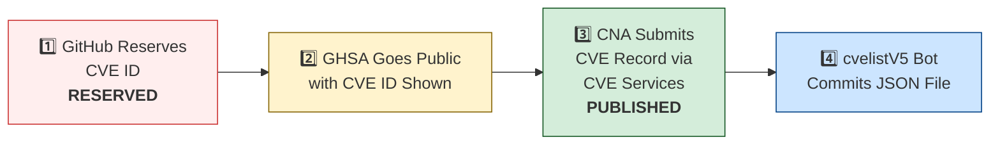

# 🛡️ OpenClaw CVE & Security Advisory Tracker

  
  
  
  
   
  
  
  
  
  

An automated tracker that continuously monitors [OpenClaw](https://github.com/openclaw/openclaw) security advisories across the GitHub Advisory Database, repo-level security advisories, and the [CVE V5 (cvelistV5)](https://github.com/CVEProject/cvelistV5) registry. Every hour it pulls the latest data, reconciles GHSA → CVE publication state, and regenerates this dashboard so you always have an up-to-date picture of the project's vulnerability landscape.

  Last updated: 2026-04-28 07:04 UTC · <a href="LICENSE">MIT License</a> · <a href="ADVISORIES.md">Full Advisory List</a> · <a href="SECURITY.md">Security Policy</a> · Data: <a href="https://github.com/CVEProject/cvelistV5">cvelistV5</a> + <a href="https://github.com/github/advisory-database">Advisory DB</a> · Updates hourly

---

  <a href="#-cves-published-in-cvelistv5-14">Published CVEs</a> ·
  <a href="#-cve-publication-pipeline">Pipeline</a> ·
  <a href="#-all-security-advisories-137">Advisories</a> ·
  <a href="#-vulnerability-categories">Categories</a> ·
  <a href="#-key-insights">Insights</a> ·
  <a href="#-project-identity">Identity</a>

---

## 🏗️ Project Identity

| Field | Value |
|-------|-------|
| **Current Name** | OpenClaw |
| **Previous Names** | Moltbot (second name), Clawdbot (original name) |
| **Repository** | [openclaw/openclaw](https://github.com/openclaw/openclaw) |
| **npm Package** | `openclaw` (formerly `clawdbot`) |
| **Author** | Peter Steinberger (steipete) |

<strong>Search terms for CVE discovery</strong>

To find all CVEs, search for: `openclaw`, `clawdbot`, `moltbot`, `clawhub`, `pkg:npm/clawdbot`, `pkg:npm/openclaw`

---

## 🚀 CVEs Published in cvelistV5 (14)

These CVEs have full records in the [CVEProject/cvelistV5](https://github.com/CVEProject/cvelistV5) repository:

| CVE ID | Severity | CVSS | Title | CWE | Published |
|--------|----------|------|-------|-----|-----------|
| [CVE-2026-22172](https://github.com/openclaw/openclaw/security/advisories/GHSA-rqpp-rjj8-7wv8) |  | 9.4 | OpenClaw < 2026.3.12 - Scope Elevation in WebSocket Shared-Auth Connections | CWE-862 | 2026-03-20 |
| [CVE-2026-28466](https://github.com/openclaw/openclaw/security/advisories/GHSA-gv46-4xfq-jv58) |  | 9.4 | OpenClaw < 2026.2.14 - Remote Code Execution via Node Invoke Approval Bypass | CWE-863 | 2026-03-05 |
| [CVE-2026-32922](https://github.com/openclaw/openclaw/security/advisories/GHSA-4jpw-hj22-2xmc) |  | 9.4 | OpenClaw < 2026.3.11 - Privilege Escalation via Unvalidated Scope in device.token.rotate | CWE-266 | 2026-03-29 |
| [CVE-2026-32038](https://github.com/openclaw/openclaw/security/advisories/GHSA-ww6v-v748-x7g9) |  | 9.3 | OpenClaw - Sandbox Network Isolation Bypass via docker.network=container Parameter | CWE-284 | 2026-03-19 |
| [CVE-2026-32916](https://github.com/openclaw/openclaw/security/advisories/GHSA-xw77-45gv-p728) |  | 9.2 | OpenClaw 2026.3.7 < 2026.3.11 - Authorization Bypass in Plugin Subagent Routes via Synthetic Admin Scopes | CWE-266 | 2026-03-31 |
| [CVE-2026-25253](https://github.com/openclaw/openclaw/security/advisories/GHSA-g8p2-7wf7-98mq) |  | 8.8 | OpenClaw/Clawdbot has 1-Click RCE via Authentication Token Exfiltration From gatewayUrl | CWE-669 | 2026-02-01 |
| [CVE-2026-24763](https://github.com/openclaw/openclaw/security/advisories/GHSA-mc68-q9jw-2h3v) |  | 8.8 | OpenClaw/Clawdbot Docker Execution has Authenticated Command Injection via PATH Environment Variable | CWE-78 | 2026-02-02 |
| [CVE-2026-32974](https://github.com/openclaw/openclaw/security/advisories/GHSA-g353-mgv3-8pcj) |  | 8.8 | OpenClaw < 2026.3.12 - Forged Event Injection via Feishu Webhook Verification Token | CWE-347 | 2026-03-29 |
| [CVE-2026-28478](https://github.com/openclaw/openclaw/security/advisories/GHSA-q447-rj3r-2cgh) |  | 8.7 | OpenClaw affected by denial of service via unbounded webhook request body buffering | CWE-770 | 2026-03-05 |
| [CVE-2026-32049](https://github.com/openclaw/openclaw/security/advisories/GHSA-rxxp-482v-7mrh) |  | 8.7 | OpenClaw < 2026.2.22 - Denial of Service via Inbound Media Download Byte Limit Bypass | CWE-770 | 2026-03-21 |
| [CVE-2026-32062](https://github.com/openclaw/openclaw/security/advisories/GHSA-mfg5-7q5g-f37j) |  | 8.7 | OpenClaw 2026.2.21-2 < 2026.2.22 - Unauthenticated WebSocket Resource Exhaustion via Media Stream | CWE-770 | 2026-03-11 |
| [CVE-2026-35663](https://github.com/openclaw/openclaw/security/advisories/GHSA-9hjh-fr4f-gxc4) |  | 8.7 | OpenClaw < 2026.3.25 - Privilege Escalation via Backend Reconnect Scope Self-Claim | CWE-648 | 2026-04-10 |
| [CVE-2026-33579](https://github.com/openclaw/openclaw/security/advisories/GHSA-hc5h-pmr3-3497) |  | 8.6 | OpenClaw < 2026.3.28 - Privilege Escalation via Missing Caller Scope Validation in Device Pair Approval | CWE-863 | 2026-03-31 |
| [CVE-2026-34503](https://github.com/openclaw/openclaw/security/advisories/GHSA-2pr2-hcv6-7gwv) |  | 8.6 | OpenClaw < 2026.3.28 - Incomplete WebSocket Session Termination on Device Removal and Token Revocation | CWE-613 | 2026-03-31 |
| [CVE-2026-35643](https://github.com/openclaw/openclaw/security/advisories/GHSA-cxmw-p77q-wchg) |  | 8.6 | OpenClaw < 2026.3.22 - Arbitrary Code Execution via Unvalidated WebView JavascriptInterface | CWE-940 | 2026-04-10 |
| [CVE-2026-32064](https://github.com/openclaw/openclaw/security/advisories/GHSA-25gx-x37c-7pph) |  | 8.5 | OpenClaw < 2026.2.21 - Missing VNC Authentication in Sandbox Browser noVNC Observer | CWE-306 | 2026-03-21 |
| [CVE-2026-32004](https://github.com/openclaw/openclaw/security/advisories/GHSA-v865-p3gq-hw6m) |  | 8.3 | OpenClaw < 2026.3.2 - Authentication Bypass via Encoded Path in /api/channels Route | CWE-288 | 2026-03-19 |
| [CVE-2026-35618](https://github.com/openclaw/openclaw/security/advisories/GHSA-cg6c-q2hx-69h7) |  | 8.3 | OpenClaw < 2026.3.23 - Replay Identity Drift via Query-Only Variants in Plivo V2 Verification | CWE-294 | 2026-04-09 |
| [CVE-2026-28469](https://github.com/openclaw/openclaw/security/advisories/GHSA-rq6g-px6m-c248) |  | 8.2 | OpenClaw Google Chat shared-path webhook target ambiguity allowed cross-account policy-context misrouting | CWE-639 | 2026-03-05 |
| [CVE-2026-29613](https://github.com/openclaw/openclaw/security/advisories/GHSA-xc7w-v5x6-cc87) |  | 8.2 | OpenClaw < 2026.2.12 - Webhook Authentication Bypass via Loopback remoteAddress Trust | CWE-306 | 2026-03-05 |
| [CVE-2026-25157](https://github.com/openclaw/openclaw/security/advisories/GHSA-q284-4pvr-m585) |  | 7.8 | OpenClaw/Clawdbot has OS Command Injection via Project Root Path in sshNodeCommand | CWE-78 | 2026-02-04 |
| [CVE-2026-32048](https://github.com/openclaw/openclaw/security/advisories/GHSA-p7gr-f84w-hqg5) |  | 7.7 | OpenClaw < 2026.3.1 - Sandbox Escape via Cross-Agent sessions_spawn | CWE-732 | 2026-03-21 |
| [CVE-2026-32056](https://github.com/openclaw/openclaw/security/advisories/GHSA-xgf2-vxv2-rrmg) |  | 7.7 | OpenClaw < 2026.2.22 - Remote Code Execution via Shell Startup Environment Variable Injection in system.run | CWE-78 | 2026-03-21 |
| [CVE-2026-35666](https://github.com/openclaw/openclaw/security/advisories/GHSA-qm9x-v7cx-7rq4) |  | 7.7 | OpenClaw < 2026.3.22 - Allowlist Bypass via Unregistered Time Dispatch Wrapper | CWE-706 | 2026-04-10 |
| [CVE-2026-32007](https://github.com/openclaw/openclaw/security/advisories/GHSA-h9xm-j4qg-fvpg) |  | 7.6 | OpenClaw < 2026.2.23 - Sandbox Bypass in apply_patch Tool via Workspace-Only Check Bypass | CWE-22 | 2026-03-19 |
| [CVE-2026-25474](https://github.com/openclaw/openclaw/security/advisories/GHSA-mp5h-m6qj-6292) |  | 7.5 | OpenClaw has a Telegram webhook request forgery (missing `channels.telegram.webhookSecret`) → auth bypass | CWE-345 | 2026-02-19 |
| [CVE-2026-28485](https://github.com/openclaw/openclaw/security/advisories/GHSA-qpjj-47vm-64pj) |  | 7.5 | OpenClaw 2026.1.5 < 2026.2.12 - Missing Authentication in Browser Control HTTP Endpoints | CWE-306 | 2026-03-05 |
| [CVE-2026-32041](https://github.com/openclaw/openclaw/security/advisories/GHSA-vpj2-69hf-rppw) |  | 7.5 | OpenClaw < 2026.3.1 - Unauthenticated Browser Control Access via Failed Auth Bootstrap | CWE-306 | 2026-03-19 |
| [CVE-2026-28458](https://github.com/openclaw/openclaw/security/advisories/GHSA-mr32-vwc2-5j6h) |  | 7.4 | OpenClaw's Browser Relay /cdp websocket is missing auth which could allow cross-tab cookie access | CWE-306 | 2026-03-05 |
| [CVE-2026-26329](https://github.com/openclaw/openclaw/security/advisories/GHSA-cv7m-c9jx-vg7q) |  | 7.1 | OpenClaw has a path traversal in browser upload allows local file read | CWE-22 | 2026-02-19 |
| [CVE-2026-26317](https://github.com/openclaw/openclaw/security/advisories/GHSA-3fqr-4cg8-h96q) |  | 7.1 | OpenClaw affected by cross-site request forgery (CSRF) through loopback browser mutation endpoints | CWE-352 | 2026-02-19 |
| [CVE-2026-22175](https://github.com/openclaw/openclaw/security/advisories/GHSA-gwqp-86q6-w47g) |  | 7.1 | OpenClaw < 2026.2.23 - Exec Approval Bypass via Unrecognized Multiplexer Shell Wrappers | CWE-184 | 2026-03-18 |
| [CVE-2026-26320](https://github.com/openclaw/openclaw/security/advisories/GHSA-7q2j-c4q5-rm27) |  | 7.1 | OpenClaw macOS deep link confirmation truncation can conceal executed agent message | CWE-451 | 2026-02-19 |
| [CVE-2026-31992](https://github.com/openclaw/openclaw/security/advisories/GHSA-48wf-g7cp-gr3m) |  | 7.1 | OpenClaw < 2026.2.23 - Allowlist Exec-Guard Bypass via env -S | CWE-184 | 2026-03-19 |
| [CVE-2026-32976](https://github.com/openclaw/openclaw/security/advisories/GHSA-8jhh-jcqg-mj5p) |  | 7.1 | OpenClaw < 2026.3.11 - Account-Scoped configWrites Policy Bypass via Channel Commands | CWE-639 | 2026-03-31 |
| [CVE-2026-35631](https://github.com/openclaw/openclaw/security/advisories/GHSA-3w6x-gv34-mqpf) |  | 7.1 | OpenClaw < 2026.3.22 - Missing Authorization Enforcement in Internal ACP Chat Commands | CWE-862 | 2026-04-09 |
| [CVE-2026-35644](https://github.com/openclaw/openclaw/security/advisories/GHSA-ppwq-6v66-5m6j) |  | 7.1 | OpenClaw < 2026.3.22 - Credential Exposure via baseUrl Fields in Gateway Snapshots | CWE-312 | 2026-04-09 |
| [CVE-2026-40037](https://github.com/openclaw/openclaw/security/advisories/GHSA-qx8j-g322-qj6m) |  | 7.1 | OpenClaw: `fetchWithSsrFGuard` replays unsafe request bodies across cross-origin redirects | CWE-601 | 2026-04-08 |
| [CVE-2026-27004](https://github.com/openclaw/openclaw/security/advisories/GHSA-6hf3-mhgc-cm65) |  | 6.9 | OpenClaw session tool visibility hardening and Telegram webhook secret fallback | CWE-209, CWE-346 | 2026-02-19 |
| [CVE-2026-28480](https://github.com/openclaw/openclaw/security/advisories/GHSA-mj5r-hh7j-4gxf) |  | 6.9 | OpenClaw Telegram allowlist authorization accepted mutable usernames | CWE-290 | 2026-03-05 |
| [CVE-2026-31994](https://github.com/openclaw/openclaw/security/advisories/GHSA-mqr9-vqhq-3jxw) |  | 6.9 | OpenClaw < 2026.2.19 - Local Command Injection via Unsafe cmd Argument Handling in Windows Scheduled Task Script Generation | CWE-78 | 2026-03-19 |
| [CVE-2026-32924](https://github.com/openclaw/openclaw/security/advisories/GHSA-m69h-jm2f-2pv8) |  | 6.9 | OpenClaw < 2026.3.12 - Authorization Bypass via Misclassified Reaction Events in Feishu | CWE-863 | 2026-03-29 |
| [CVE-2026-35632](https://github.com/openclaw/openclaw/security/advisories/GHSA-7xr2-q9vf-x4r5) |  | 6.9 | OpenClaw < 2026.2.22 - Symlink Traversal via IDENTITY.md appendFile in agents.create/update | CWE-61 | 2026-04-09 |
| [CVE-2026-35637](https://github.com/openclaw/openclaw/security/advisories/GHSA-vfg3-pqpq-93m4) |  | 6.9 | OpenClaw < 2026.3.22 - Premature Cite Expansion Before Authorization in Channel and DM | CWE-696 | 2026-04-09 |
| [CVE-2026-35626](https://github.com/openclaw/openclaw/security/advisories/GHSA-rm59-992w-x2mv) |  | 6.9 | OpenClaw < 2026.3.22 - Unauthenticated Resource Exhaustion via Voice Call Webhook | CWE-405 | 2026-04-09 |
| [CVE-2026-35664](https://github.com/openclaw/openclaw/security/advisories/GHSA-77w2-crqv-cmv3) |  | 6.9 | OpenClaw < 2026.3.25 - DM Pairing Bypass via Legacy Card Callbacks | CWE-288 | 2026-04-10 |
| [CVE-2026-35654](https://github.com/openclaw/openclaw/security/advisories/GHSA-rf6h-5gpw-qrgq) |  | 6.9 | OpenClaw < 2026.3.25 - Authorization Bypass in Microsoft Teams Feedback Invoke | CWE-288 | 2026-04-10 |
| [CVE-2026-41335](https://github.com/openclaw/openclaw/security/advisories/GHSA-hr8g-2q7x-3f4w) |  | 6.9 | OpenClaw < 2026.3.31 - Information Disclosure via Control UI Bootstrap JSON | CWE-497 | 2026-04-23 |
| [CVE-2026-41301](https://github.com/openclaw/openclaw/security/advisories/GHSA-h43v-27wg-5mf9) |  | 6.9 | OpenClaw 2026.3.22 < 2026.3.31 - Forged Nostr DM Pairing State Creation via Signature Verification Bypass | CWE-347 | 2026-04-20 |
| [CVE-2026-41343](https://github.com/openclaw/openclaw/security/advisories/GHSA-qcc3-jqwp-5vh2) |  | 6.9 | OpenClaw < 2026.3.31 - Denial of Service via LINE Webhook Handler Pre-Auth Concurrency | CWE-799 | 2026-04-23 |
| [CVE-2026-27008](https://github.com/openclaw/openclaw/security/advisories/GHSA-h7f7-89mm-pqh6) |  | 6.8 | OpenClaw hardened the skill download target directory validation | CWE-73 | 2026-02-19 |
| [CVE-2026-29612](https://github.com/openclaw/openclaw/security/advisories/GHSA-w2cg-vxx6-5xjg) |  | 6.8 | OpenClaw < 2026.2.14 - Denial of Service via Large Base64 Media File Decoding | CWE-770 | 2026-03-05 |
| [CVE-2026-33572](https://github.com/openclaw/openclaw/security/advisories/GHSA-vr7j-g7jv-h5mp) |  | 6.8 | OpenClaw < 2026.2.17 - Insufficient File Permissions in Session Transcript Files | CWE-378 | 2026-03-29 |
| [CVE-2026-28452](https://github.com/openclaw/openclaw/security/advisories/GHSA-h89v-j3x9-8wqj) |  | 6.7 | OpenClaw affected by denial of service through unguarded archive extraction allowing high expansion/resource abuse (ZIP/TAR) | CWE-770 | 2026-03-05 |
| [CVE-2026-26328](https://github.com/openclaw/openclaw/security/advisories/GHSA-g34w-4xqq-h79m) |  | 6.5 | OpenClaw iMessage group allowlist authorization inherited DM pairing-store identities | CWE-284, CWE-863 | 2026-02-19 |
| [CVE-2026-28475](https://github.com/openclaw/openclaw/security/advisories/GHSA-47q7-97xp-m272) |  | 6.3 | OpenClaw < 2026.2.13 - Timing Attack via Hook Token Comparison | CWE-208 | 2026-03-05 |
| [CVE-2026-32897](https://github.com/openclaw/openclaw/security/advisories/GHSA-v6x2-2qvm-6gv8) |  | 6.3 | OpenClaw < 2026.2.22 - Authentication Token Reuse in Owner ID Prompt Hashing Fallback | CWE-320 | 2026-03-21 |
| [CVE-2026-35628](https://github.com/openclaw/openclaw/security/advisories/GHSA-vcx4-4qxg-mfp4) |  | 6.3 | OpenClaw < 2026.3.25 - Brute-Force Attack via Missing Telegram Webhook Rate Limiting | CWE-307 | 2026-04-09 |
| [CVE-2026-35635](https://github.com/openclaw/openclaw/security/advisories/GHSA-rqp8-q22p-5j9q) |  | 6.3 | OpenClaw < 2026.3.22 - Webhook Path Route Replacement Vulnerability in Synology Chat | CWE-706 | 2026-04-09 |
| [CVE-2026-35649](https://github.com/openclaw/openclaw/security/advisories/GHSA-pw7h-9g6p-c378) |  | 6.3 | OpenClaw < 2026.3.22 - Settings Reconciliation Bypass via Empty Allowlist | CWE-183 | 2026-04-10 |
| [CVE-2026-35646](https://github.com/openclaw/openclaw/security/advisories/GHSA-mf5g-6r6f-ghhm) |  | 6.3 | OpenClaw < 2026.3.25 - Pre-Authentication Rate-Limit Bypass in Webhook Token Validation | CWE-307 | 2026-04-09 |
| [CVE-2026-41333](https://github.com/openclaw/openclaw/security/advisories/GHSA-6p8r-6m93-557f) |  | 6.3 | OpenClaw < 2026.3.31 - Authentication Rate Limiting Bypass via Fake DeviceToken | CWE-799 | 2026-04-23 |
| [CVE-2026-41340](https://github.com/openclaw/openclaw/security/advisories/GHSA-f693-58pc-2gfr) |  | 6.3 | OpenClaw < 2026.3.31 - Authentication Boundary Bypass via Telegram Legacy allowFrom Migration | CWE-372 | 2026-04-23 |
| [CVE-2026-41337](https://github.com/openclaw/openclaw/security/advisories/GHSA-89r3-6x4j-v7wf) |  | 6.3 | OpenClaw < 2026.3.31 - Callback Origin Mutation in Plivo Voice-call Replay | CWE-367 | 2026-04-23 |
| [CVE-2026-41354](https://github.com/openclaw/openclaw/security/advisories/GHSA-rxmx-g7hr-8mx4) |  | 6.3 | OpenClaw < 2026.4.2 - Insufficient Scope in Zalo Webhook Replay Dedupe Keys | CWE-706 | 2026-04-23 |
| [CVE-2026-22181](https://github.com/openclaw/openclaw/security/advisories/GHSA-8mvx-p2r9-r375) |  | 6.1 | OpenClaw < 2026.3.2 - DNS Pinning Bypass via Environment Proxy Configuration in web_fetch | CWE-918 | 2026-03-18 |
| [CVE-2026-32034](https://github.com/openclaw/openclaw/security/advisories/GHSA-3cvx-236h-m9fj) |  | 6.1 | OpenClaw < 2026.2.21 - Insecure Control UI Authentication over Plaintext HTTP | CWE-78 | 2026-03-19 |
| [CVE-2026-32002](https://github.com/openclaw/openclaw/security/advisories/GHSA-q6qf-4p5j-r25g) |  | 6 | OpenClaw < 2026.2.23 - Sandbox Boundary Bypass via Image Tool workspaceOnly Bypass | CWE-200 | 2026-03-19 |
| [CVE-2026-32033](https://github.com/openclaw/openclaw/security/advisories/GHSA-27cr-4p5m-74rj) |  | 6 | OpenClaw < 2026.2.24 - Path Traversal via @-prefixed Absolute Paths in Workspace Boundary Validation | CWE-22 | 2026-03-19 |
| [CVE-2026-32057](https://github.com/openclaw/openclaw/security/advisories/GHSA-vvgp-4c28-m3jm) |  | 6 | OpenClaw < 2026.2.25 - Authentication Bypass via Control UI client.id Parameter | CWE-807 | 2026-03-21 |
| [CVE-2026-35670](https://github.com/openclaw/openclaw/security/advisories/GHSA-wv46-v6xc-2qhf) |  | 6 | OpenClaw < 2026.3.22 - Webhook Reply Rebinding via Username Resolution in Synology Chat | CWE-807 | 2026-04-10 |
| [CVE-2026-41363](https://github.com/openclaw/openclaw/security/advisories/GHSA-qf48-qfv4-jjm9) |  | 6 | OpenClaw 2026.2.6 < 2026.3.28 - Arbitrary File Read via Feishu upload_image Parameter | CWE-22 | 2026-04-27 |
| [CVE-2026-28481](https://github.com/openclaw/openclaw/security/advisories/GHSA-7vwx-582j-j332) |  | 5.9 | OpenClaw < 2026.2.1 - Bearer Token Leakage via MS Teams Attachment Downloader Suffix Matching | CWE-201 | 2026-03-05 |
| [CVE-2026-40045](https://github.com/openclaw/openclaw/security/advisories/GHSA-83f3-hh45-vfw9) |  | 5.9 | OpenClaw: Android accepted cleartext remote gateway endpoints and sent stored credentials over ws:// | CWE-319 | 2026-04-20 |
| [CVE-2026-27670](https://github.com/openclaw/openclaw/security/advisories/GHSA-r54r-wmmq-mh84) |  | 5.8 | OpenClaw < 2026.3.2 - Arbitrary File Write via ZIP Extraction Parent Symlink Race Condition | CWE-367 | 2026-03-19 |
| [CVE-2026-32010](https://github.com/openclaw/openclaw/security/advisories/GHSA-4gc7-qcvf-38wg) |  | 5.8 | OpenClaw < 2026.2.22 - Allowlist Bypass via sort --compress-program Parameter | CWE-78 | 2026-03-19 |
| [CVE-2026-32977](https://github.com/openclaw/openclaw/security/advisories/GHSA-xvx8-77m6-gwg6) |  | 5.8 | OpenClaw < 2026.3.11 - Sandbox Boundary Bypass via Unanchored writeFile Commit Path | CWE-367 | 2026-03-31 |
| [CVE-2026-32065](https://github.com/openclaw/openclaw/security/advisories/GHSA-hwpq-rrpf-pgcq) |  | 5.7 | OpenClaw < 2026.2.25 - Approval Identity Mismatch in system.run Command Execution | CWE-436 | 2026-03-21 |
| [CVE-2026-29608](https://github.com/openclaw/openclaw/security/advisories/GHSA-h3rm-6x7g-882f) |  | 5.4 | OpenClaw 2026.3.1 < 2026.3.2 - Approval Integrity Bypass via system.run argv Rewriting | CWE-88 | 2026-03-19 |
| [CVE-2026-32899](https://github.com/openclaw/openclaw/security/advisories/GHSA-rm2p-j3r7-4x4j) |  | 5.3 | OpenClaw < 2026.2.25 - Sender Policy Bypass in Slack Reaction and Pin Event Handlers | CWE-863 | 2026-03-21 |
| [CVE-2026-32898](https://github.com/openclaw/openclaw/security/advisories/GHSA-7jx5-9fjg-hp4m) |  | 5.3 | OpenClaw < 2026.2.23 - ACP Permission Auto-Approval Bypass via Untrusted Tool Metadata | CWE-807 | 2026-03-21 |
| [CVE-2026-35619](https://github.com/openclaw/openclaw/security/advisories/GHSA-68f8-9mhj-h2mp) |  | 5.3 | OpenClaw < 2026.3.24 - Authorization Bypass via HTTP /v1/models Endpoint | CWE-863 | 2026-04-10 |
| [CVE-2026-32895](https://github.com/openclaw/openclaw/security/advisories/GHSA-v8cg-4474-49v8) |  | 5.3 | OpenClaw < 2026.2.26 - Sender Authorization Bypass in Slack System Event Handlers | CWE-863 | 2026-03-21 |
| [CVE-2026-33578](https://github.com/openclaw/openclaw/security/advisories/GHSA-63mg-xp9j-jfcm) |  | 5.3 | OpenClaw < 2026.3.28 - Sender Policy Allowlist Bypass via Policy Downgrade in Google Chat and Zalouser Extensions | CWE-863 | 2026-03-31 |
| [CVE-2026-35620](https://github.com/openclaw/openclaw/security/advisories/GHSA-vqvg-86cc-cg83) |  | 5.3 | OpenClaw < 2026.3.24 - Missing Authorization in /send and /allowlist Chat Commands | CWE-862 | 2026-04-10 |
| [CVE-2026-35642](https://github.com/openclaw/openclaw/security/advisories/GHSA-mw7w-g3mg-xqm7) |  | 5.3 | OpenClaw < 2026.3.25 - Authorization Bypass in Group Reactions via requireMention Bypass | CWE-288 | 2026-04-09 |
| [CVE-2026-41339](https://github.com/openclaw/openclaw/security/advisories/GHSA-2f7j-rp58-mr42) |  | 5.3 | OpenClaw < 2026.4.2 - Information Disclosure via Gateway Connect Snapshot | CWE-497 | 2026-04-23 |
| [CVE-2026-41350](https://github.com/openclaw/openclaw/security/advisories/GHSA-fwjq-xwfj-gv75) |  | 5.3 | OpenClaw < 2026.3.31 - Session Visibility Bypass via session_status in Unsandboxed Invocations | CWE-863 | 2026-04-23 |
| [CVE-2026-41365](https://github.com/openclaw/openclaw/security/advisories/GHSA-chfm-xgc4-47rj) |  | 5.3 | OpenClaw < 2026.3.31 - Sender Allowlist Bypass via Graph API Thread History | CWE-441 | 2026-04-27 |
| [CVE-2026-41367](https://github.com/openclaw/openclaw/security/advisories/GHSA-jp4j-q5fc-58gv) |  | 5.3 | OpenClaw 2026.2.14 < 2026.3.28 - Policy Enforcement Bypass in Discord Component Interactions | CWE-863 | 2026-04-27 |
| [CVE-2026-35634](https://github.com/openclaw/openclaw/security/advisories/GHSA-6mqc-jqh6-x8fc) |  | 5.1 | OpenClaw < 2026.3.23 - Authentication Bypass via Local-Direct Requests in Canvas Gateway | CWE-288 | 2026-04-09 |
| [CVE-2026-27007](https://github.com/openclaw/openclaw/security/advisories/GHSA-xxvh-5hwj-42pp) |  | 4.8 | OpenClaw's sandbox config hash sorted primitive arrays and suppressed needed container recreation | CWE-1254 | 2026-02-19 |
| [CVE-2026-27576](https://github.com/openclaw/openclaw/security/advisories/GHSA-cxpw-2g23-2vgw) |  | 4.8 | OpenClaw: ACP prompt-size checks missing in local stdio bridge could reduce responsiveness with very large inputs | CWE-400 | 2026-02-21 |
| [CVE-2026-32046](https://github.com/openclaw/openclaw/security/advisories/GHSA-43x4-g22p-3hrq) |  | 4.8 | OpenClaw < 2026.2.21 - OS-level Sandbox Bypass via --no-sandbox Flag | CWE-1188 | 2026-03-21 |
| [CVE-2026-32020](https://github.com/openclaw/openclaw/security/advisories/GHSA-5ghc-98wh-gwwf) |  | 4.8 | OpenClaw < 2026.2.22 - Arbitrary File Read via Symlink Following in Static File Handler | CWE-59 | 2026-03-19 |
| [CVE-2026-27486](https://github.com/openclaw/openclaw/security/advisories/GHSA-jfv4-h8mc-jcp8) |  | 4.3 | OpenClaw: Process Safety - Unvalidated PID Kill via SIGKILL in Process Cleanup | CWE-283 | 2026-02-21 |
| [CVE-2026-24764](https://github.com/openclaw/openclaw/security/advisories/GHSA-782p-5fr5-7fj8) |  | 3.7 | OpenClaw has Remote Code Execution via System Prompt Injection in Slack Channel Descriptions | CWE-74, CWE-94 | 2026-02-19 |
| [CVE-2026-32037](https://github.com/openclaw/openclaw/security/advisories/GHSA-w76h-8m22-hpgh) |  | 2.3 | OpenClaw < 2026.2.22 - Redirect Chain Bypass of Media Host Allowlist in MSTeams Attachment Handling | CWE-918 | 2026-03-19 |
| [CVE-2026-32006](https://github.com/openclaw/openclaw/security/advisories/GHSA-25pw-4h6w-qwvm) |  | 2.3 | OpenClaw < 2026.2.26 - Authorization Bypass via DM Pairing-Store Fallback in Group Allowlist | CWE-863 | 2026-03-19 |
| [CVE-2026-41341](https://github.com/openclaw/openclaw/security/advisories/GHSA-6336-qqw9-v6x6) |  | 2.3 | OpenClaw < 2026.3.31 - Component Interaction Misclassification in Discord Extension | CWE-351 | 2026-04-23 |
| [CVE-2026-41347](https://github.com/openclaw/openclaw/security/advisories/GHSA-mhr7-2xmv-4c4q) |  | 2.3 | OpenClaw < 2026.3.31 - Cross-Site Request Forgery via Missing Browser-Origin Validation in HTTP Operator Endpoints | CWE-352 | 2026-04-23 |
| [CVE-2026-41362](https://github.com/openclaw/openclaw/security/advisories/GHSA-fqrj-m88p-qf3v) |  | 2.3 | OpenClaw 2026.2.19 < 2026.3.31 - Webhook Replay Dedupe Cache Event Suppression via Shared Authentication | CWE-668 | 2026-04-27 |
| [CVE-2026-41348](https://github.com/openclaw/openclaw/security/advisories/GHSA-rvvf-6vh3-9j43) |  | 2.3 | OpenClaw < 2026.3.31 - Group DM Channel Allowlist Bypass via Discord Slash Commands | CWE-863 | 2026-04-23 |
| [CVE-2026-31991](https://github.com/openclaw/openclaw/security/advisories/GHSA-wm8r-w8pf-2v6w) |  | 2 | OpenClaw < 2026.2.26 - Authorization Bypass via DM Pairing-Store Leakage in Signal Group Allowlist | CWE-863 | 2026-03-19 |
| [CVE-2026-32067](https://github.com/openclaw/openclaw/security/advisories/GHSA-vjp8-wprm-2jw9) |  | 2 | OpenClaw < 2026.2.26 - Cross-Account Authorization Bypass in DM Pairing Store | CWE-863 | 2026-03-21 |
| [CVE-2026-32970](https://github.com/openclaw/openclaw/security/advisories/GHSA-qvr7-g57c-mrc7) |  | 2 | OpenClaw < 2026.3.11 - Credential Fallback Logic Bypass via Unavailable Local Auth SecretRefs | CWE-636 | 2026-03-31 |

<strong>📖 Detailed CVE Analysis (click to expand)</strong>

### CVE-2026-22172 — OpenClaw < 2026.3.12 - Scope Elevation in WebSocket Shared-Auth Connections

| Field | Detail |
|-------|--------|
| **CVSS** | 9.4 (CRITICAL) — `CVSS:4.0/AV:N/AC:L/AT:N/PR:L/UI:N/VC:H/VI:H/VA:H/SC:H/SI:H/SA:H` |
| **CWE** | CWE-862 (CWE-862 Missing Authorization) |
| **Affected** | < 2026.3.12 |
| **Vendor/Product** | OpenClaw / OpenClaw |
| **Advisory** | [GHSA-rqpp-rjj8-7wv8](https://github.com/openclaw/openclaw/security/advisories/GHSA-rqpp-rjj8-7wv8) |

OpenClaw versions prior to 2026.3.12 contain an authorization bypass vulnerability in the WebSocket connect path that allows shared-token or password-authenticated connections to self-declare elevated scopes without server-side binding. Attackers can exploit this logic flaw to present unauthorized scopes such as operator.admin and perform admin-only gateway operations.

**References:**
- [openclaw-scope-elevation-in-websocket-shared-auth-connections](https://www.vulncheck.com/advisories/openclaw-scope-elevation-in-websocket-shared-auth-connections)
---

### CVE-2026-28466 — OpenClaw < 2026.2.14 - Remote Code Execution via Node Invoke Approval Bypass

| Field | Detail |
|-------|--------|
| **CVSS** | 9.4 (CRITICAL) — `CVSS:4.0/AV:N/AC:L/AT:N/PR:L/UI:N/VC:H/VI:H/VA:H/SC:H/SI:H/SA:H` |
| **CWE** | CWE-863 (Incorrect Authorization) |
| **Affected** | < 2026.2.14 |
| **Vendor/Product** | OpenClaw / OpenClaw |
| **Advisory** | [GHSA-gv46-4xfq-jv58](https://github.com/openclaw/openclaw/security/advisories/GHSA-gv46-4xfq-jv58) |

OpenClaw versions prior to 2026.2.14 contain a vulnerability in the gateway in which it fails to sanitize internal approval fields in node.invoke parameters, allowing authenticated clients to bypass exec approval gating for system.run commands. Attackers with valid gateway credentials can inject approval control fields to execute arbitrary commands on connected node hosts, potentially compromising developer workstations and CI runners.

**References:**
- [Patch Commit #1](https://github.com/openclaw/openclaw/commit/318379cdb8d045da0009b0051bd0e712e5c65e2d)
- [Patch Commit #2](https://github.com/openclaw/openclaw/commit/a7af646fdab124a7536998db6bd6ad567d2b06b0)
- [Patch Commit #3](https://github.com/openclaw/openclaw/commit/c1594627421f95b6bc4ad7c606657dc75b5ad0ce)
- [Patch Commit #4](https://github.com/openclaw/openclaw/commit/0af76f5f0e93540efbdf054895216c398692afcd)
- [VulnCheck Advisory: OpenClaw < 2026.2.14 - Remote Code Execution via Node Invoke Approval Bypass](https://www.vulncheck.com/advisories/openclaw-remote-code-execution-via-node-invoke-approval-bypass)
---

### CVE-2026-32922 — OpenClaw < 2026.3.11 - Privilege Escalation via Unvalidated Scope in device.token.rotate

| Field | Detail |
|-------|--------|
| **CVSS** | 9.4 (CRITICAL) — `CVSS:4.0/AV:N/AC:L/AT:N/PR:L/UI:N/VC:H/VI:H/VA:H/SC:H/SI:H/SA:H` |
| **CWE** | CWE-266 (Incorrect Privilege Assignment) |
| **Affected** | < 2026.3.11 |
| **Vendor/Product** | OpenClaw / OpenClaw |
| **Advisory** | [GHSA-4jpw-hj22-2xmc](https://github.com/openclaw/openclaw/security/advisories/GHSA-4jpw-hj22-2xmc) |

OpenClaw before 2026.3.11 contains a privilege escalation vulnerability in device.token.rotate that allows callers with operator.pairing scope to mint tokens with broader scopes by failing to constrain newly minted scopes to the caller's current scope set. Attackers can obtain operator.admin tokens for paired devices and achieve remote code execution on connected nodes via system.run or gain unauthorized gateway-admin access.

**References:**
- [VulnCheck Advisory: OpenClaw < 2026.3.11 - Privilege Escalation via Unvalidated Scope in device.token.rotate](https://www.vulncheck.com/advisories/openclaw-privilege-escalation-via-unvalidated-scope-in-device-token-rotate)
---

### CVE-2026-32038 — OpenClaw - Sandbox Network Isolation Bypass via docker.network=container Parameter

| Field | Detail |
|-------|--------|
| **CVSS** | 9.3 (CRITICAL) — `CVSS:4.0/AV:N/AC:L/AT:N/PR:N/UI:N/VC:H/VI:H/VA:H/SC:N/SI:N/SA:N` |
| **CWE** | CWE-284 (Improper Access Control) |
| **Affected** | < 2026.2.24 |
| **Vendor/Product** | OpenClaw / OpenClaw |
| **Advisory** | [GHSA-ww6v-v748-x7g9](https://github.com/openclaw/openclaw/security/advisories/GHSA-ww6v-v748-x7g9) |

OpenClaw before 2026.2.24 contains a sandbox network isolation bypass vulnerability that allows trusted operators to join another container's network namespace. Attackers can configure the docker.network parameter with container:<id> values to reach services in target container namespaces and bypass network hardening controls.

**References:**
- [VulnCheck Advisory: OpenClaw - Sandbox Network Isolation Bypass via docker.network=container Parameter](https://www.vulncheck.com/advisories/openclaw-sandbox-network-isolation-bypass-via-docker-network-container-parameter)
---

### CVE-2026-32916 — OpenClaw 2026.3.7 < 2026.3.11 - Authorization Bypass in Plugin Subagent Routes via Synthetic Admin Scopes

| Field | Detail |
|-------|--------|
| **CVSS** | 9.2 (CRITICAL) — `CVSS:4.0/AV:N/AC:L/AT:P/PR:N/UI:N/VC:H/VI:H/VA:L/SC:N/SI:N/SA:N` |
| **CWE** | CWE-266 (CWE-266: Incorrect Privilege Assignment) |
| **Affected** | < 2026.3.11 |
| **Vendor/Product** | OpenClaw / OpenClaw |
| **Advisory** | [GHSA-xw77-45gv-p728](https://github.com/openclaw/openclaw/security/advisories/GHSA-xw77-45gv-p728) |

OpenClaw versions 2026.3.7 before 2026.3.11 contain an authorization bypass vulnerability where plugin subagent routes execute gateway methods through a synthetic operator client with broad administrative scopes. Remote unauthenticated requests to plugin-owned routes can invoke runtime.subagent methods to perform privileged gateway actions including session deletion and agent execution.

**References:**
- [VulnCheck Advisory: OpenClaw 2026.3.7 < 2026.3.11 - Authorization Bypass in Plugin Subagent Routes via Synthetic Admin Scopes](https://www.vulncheck.com/advisories/openclaw-authorization-bypass-in-plugin-subagent-routes-via-synthetic-admin-scopes)
---

### CVE-2026-25253 — OpenClaw/Clawdbot has 1-Click RCE via Authentication Token Exfiltration From gatewayUrl

| Field | Detail |
|-------|--------|
| **CVSS** | 8.8 (HIGH) — `CVSS:3.1/AV:N/AC:L/PR:N/UI:R/S:U/C:H/I:H/A:H` |
| **CWE** | CWE-669 (CWE-669 Incorrect Resource Transfer Between Spheres) |
| **Affected** | < 2026.1.29 |
| **Vendor/Product** | OpenClaw / OpenClaw |
| **Advisory** | [GHSA-g8p2-7wf7-98mq](https://github.com/openclaw/openclaw/security/advisories/GHSA-g8p2-7wf7-98mq) |

OpenClaw (aka clawdbot or Moltbot) before 2026.1.29 obtains a gatewayUrl value from a query string and automatically makes a WebSocket connection without prompting, sending a token value.

> **Naming note:** Uses all three names in description. packageURL still references `pkg:npm/clawdbot`.
**References:**
- [1-click-rce-to-steal-your-moltbot-data-and-keys](https://depthfirst.com/post/1-click-rce-to-steal-your-moltbot-data-and-keys)
- [blog](https://openclaw.ai/blog)
- [one-click-rce-moltbot](https://ethiack.com/news/blog/one-click-rce-moltbot)
- [2016913750557651228](https://x.com/0xacb/status/2016913750557651228)
---

### CVE-2026-24763 — OpenClaw/Clawdbot Docker Execution has Authenticated Command Injection via PATH Environment Variable

| Field | Detail |
|-------|--------|
| **CVSS** | 8.8 (HIGH) — `CVSS:3.1/AV:N/AC:L/PR:L/UI:N/S:U/C:H/I:H/A:H` |
| **CWE** | CWE-78 (CWE-78: Improper Neutralization of Special Elements used in an OS Command ('OS Command Injection')) |
| **Affected** | < 2026.1.29 |
| **Vendor/Product** | clawdbot / clawdbot |
| **Advisory** | [GHSA-mc68-q9jw-2h3v](https://github.com/openclaw/openclaw/security/advisories/GHSA-mc68-q9jw-2h3v) |

OpenClaw (formerly  Clawdbot) is a personal AI assistant you run on your own devices. Prior to 2026.1.29, a command injection vulnerability existed in OpenClaw’s Docker sandbox execution mechanism due to unsafe handling of the PATH environment variable when constructing shell commands. An authenticated user able to control environment variables could influence command execution within the container context. This vulnerability is fixed in 2026.1.29.

> **Naming note:** Uses old name `clawdbot/clawdbot` as vendor/product.
**References:**
- [https://github.com/openclaw/openclaw/commit/771f23d36b95ec2204cc9a0054045f5d8439ea75](https://github.com/openclaw/openclaw/commit/771f23d36b95ec2204cc9a0054045f5d8439ea75)
- [https://github.com/openclaw/openclaw/releases/tag/v2026.1.29](https://github.com/openclaw/openclaw/releases/tag/v2026.1.29)
---

### CVE-2026-32974 — OpenClaw < 2026.3.12 - Forged Event Injection via Feishu Webhook Verification Token

| Field | Detail |
|-------|--------|
| **CVSS** | 8.8 (HIGH) — `CVSS:4.0/AV:N/AC:L/AT:N/PR:N/UI:N/VC:L/VI:H/VA:L/SC:N/SI:N/SA:N` |
| **CWE** | CWE-347 (Improper Verification of Cryptographic Signature) |
| **Affected** | < 2026.3.12 |
| **Vendor/Product** | OpenClaw / OpenClaw |
| **Advisory** | [GHSA-g353-mgv3-8pcj](https://github.com/openclaw/openclaw/security/advisories/GHSA-g353-mgv3-8pcj) |

OpenClaw before 2026.3.12 contains an authentication bypass vulnerability in Feishu webhook mode when only verificationToken is configured without encryptKey, allowing acceptance of forged events. Unauthenticated network attackers can inject forged Feishu events and trigger downstream tool execution by reaching the webhook endpoint.

**References:**
- [VulnCheck Advisory: OpenClaw < 2026.3.12 - Forged Event Injection via Feishu Webhook Verification Token](https://www.vulncheck.com/advisories/openclaw-forged-event-injection-via-feishu-webhook-verification-token)
---

### CVE-2026-28478 — OpenClaw affected by denial of service via unbounded webhook request body buffering

| Field | Detail |
|-------|--------|
| **CVSS** | 8.7 (HIGH) — `CVSS:4.0/AV:N/AC:L/AT:N/PR:N/UI:N/VC:N/VI:N/VA:H/SC:N/SI:N/SA:N` |
| **CWE** | CWE-770 (Allocation of Resources Without Limits or Throttling) |
| **Affected** | < 2026.2.13 |
| **Vendor/Product** | OpenClaw / OpenClaw |
| **Advisory** | [GHSA-q447-rj3r-2cgh](https://github.com/openclaw/openclaw/security/advisories/GHSA-q447-rj3r-2cgh) |

OpenClaw versions prior to 2026.2.13 contain a denial of service vulnerability in webhook handlers that buffer request bodies without strict byte or time limits. Remote unauthenticated attackers can send oversized JSON payloads or slow uploads to webhook endpoints causing memory pressure and availability degradation.

**References:**
- [Patch Commit](https://github.com/openclaw/openclaw/commit/3cbcba10cf30c2ffb898f0d8c7dfb929f15f8930)
- [VulnCheck Advisory: OpenClaw < 2026.2.13 - Denial of Service via Unbounded Webhook Request Body Buffering](https://www.vulncheck.com/advisories/openclaw-denial-of-service-via-unbounded-webhook-request-body-buffering)
---

### CVE-2026-32049 — OpenClaw < 2026.2.22 - Denial of Service via Inbound Media Download Byte Limit Bypass

| Field | Detail |
|-------|--------|
| **CVSS** | 8.7 (HIGH) — `CVSS:4.0/AV:N/AC:L/AT:N/PR:N/UI:N/VC:N/VI:N/VA:H/SC:N/SI:N/SA:N` |
| **CWE** | CWE-770 (CWE-770: Allocation of Resources Without Limits or Throttling) |
| **Affected** | < 2026.2.22 |
| **Vendor/Product** | OpenClaw / OpenClaw |
| **Advisory** | [GHSA-rxxp-482v-7mrh](https://github.com/openclaw/openclaw/security/advisories/GHSA-rxxp-482v-7mrh) |

OpenClaw versions prior to 2026.2.22 fail to consistently enforce configured inbound media byte limits before buffering remote media across multiple channel ingestion paths. Remote attackers can send oversized media payloads to trigger elevated memory usage and potential process instability.

**References:**
- [Patch Commit](https://github.com/openclaw/openclaw/commit/73d93dee64127a26f1acd09d0403b794cdeb4f5c)
- [VulnCheck Advisory: OpenClaw < 2026.2.22 - Denial of Service via Inbound Media Download Byte Limit Bypass](https://www.vulncheck.com/advisories/openclaw-denial-of-service-via-inbound-media-download-byte-limit-bypass)
---

### CVE-2026-32062 — OpenClaw 2026.2.21-2 < 2026.2.22 - Unauthenticated WebSocket Resource Exhaustion via Media Stream

| Field | Detail |
|-------|--------|
| **CVSS** | 8.7 (HIGH) — `CVSS:4.0/AV:N/AC:L/AT:N/PR:N/UI:N/VC:N/VI:N/VA:H/SC:N/SI:N/SA:N` |
| **CWE** | CWE-770 (Allocation of Resources Without Limits or Throttling) |
| **Affected** | < 2026.2.22 |
| **Vendor/Product** | openclaw / voice-call |
| **Advisory** | [GHSA-mfg5-7q5g-f37j](https://github.com/openclaw/openclaw/security/advisories/GHSA-mfg5-7q5g-f37j) |

OpenClaw versions2026.2.21-2 prior to 2026.2.22 and @openclaw/voice-call versions 2026.2.21 prior to 2026.2.22 accept media-stream WebSocket upgrades before stream validation, allowing unauthenticated clients to establish connections. Remote attackers can hold idle pre-authenticated sockets open to consume connection resources and degrade service availability for legitimate streams.

**References:**
- [Patch Commit](https://github.com/openclaw/openclaw/commit/1d8968c8a821ff1a05c294a1846b3bcb6f343794)
- [VulnCheck Advisory: OpenClaw 2026.2.21-2 < 2026.2.22 - Unauthenticated WebSocket Resource Exhaustion via Media Stream](https://www.vulncheck.com/advisories/openclaw-unauthenticated-websocket-resource-exhaustion-via-media-stream)
---

### CVE-2026-35663 — OpenClaw < 2026.3.25 - Privilege Escalation via Backend Reconnect Scope Self-Claim

| Field | Detail |
|-------|--------|
| **CVSS** | 8.7 (HIGH) — `CVSS:4.0/AV:N/AC:L/AT:N/PR:L/UI:N/VC:H/VI:H/VA:H/SC:N/SI:N/SA:N` |
| **CWE** | CWE-648 (CWE-648: Incorrect Use of Privileged APIs) |
| **Affected** | < 2026.3.25 |
| **Vendor/Product** | OpenClaw / OpenClaw |
| **Advisory** | [GHSA-9hjh-fr4f-gxc4](https://github.com/openclaw/openclaw/security/advisories/GHSA-9hjh-fr4f-gxc4) |

OpenClaw before 2026.3.25 contains a privilege escalation vulnerability allowing non-admin operators to self-request broader scopes during backend reconnect. Attackers can bypass pairing requirements to reconnect as operator.admin, gaining unauthorized administrative privileges.

**References:**
- [Patch Commit](https://github.com/openclaw/openclaw/commit/d3d8e316bd819d3c7e34253aeb7eccb2510f5f48)
- [VulnCheck Advisory: OpenClaw < 2026.3.25 - Privilege Escalation via Backend Reconnect Scope Self-Claim](https://www.vulncheck.com/advisories/openclaw-privilege-escalation-via-backend-reconnect-scope-self-claim)
---

### CVE-2026-33579 — OpenClaw < 2026.3.28 - Privilege Escalation via Missing Caller Scope Validation in Device Pair Approval

| Field | Detail |
|-------|--------|
| **CVSS** | 8.6 (HIGH) — `CVSS:4.0/AV:N/AC:L/AT:N/PR:L/UI:N/VC:H/VI:H/VA:N/SC:N/SI:N/SA:N` |
| **CWE** | CWE-863 (CWE-863 Incorrect Authorization) |
| **Affected** | < 2026.3.28 |
| **Vendor/Product** | OpenClaw / OpenClaw |
| **Advisory** | [GHSA-hc5h-pmr3-3497](https://github.com/openclaw/openclaw/security/advisories/GHSA-hc5h-pmr3-3497) |

OpenClaw before 2026.3.28 contains a privilege escalation vulnerability in the /pair approve command path that fails to forward caller scopes into the core approval check. A caller with pairing privileges but without admin privileges can approve pending device requests asking for broader scopes including admin access by exploiting the missing scope validation in extensions/device-pair/index.ts and src/infra/device-pairing.ts.

**References:**
- [Patch Commit](https://github.com/openclaw/openclaw/commit/e403decb6e20091b5402780a7ccd2085f98aa3cd)
- [VulnCheck Advisory: OpenClaw < 2026.3.28 - Privilege Escalation via Missing Caller Scope Validation in Device Pair Approval](https://www.vulncheck.com/advisories/openclaw-privilege-escalation-via-missing-caller-scope-validation-in-device-pair-approval)
---

### CVE-2026-34503 — OpenClaw < 2026.3.28 - Incomplete WebSocket Session Termination on Device Removal and Token Revocation

| Field | Detail |
|-------|--------|
| **CVSS** | 8.6 (HIGH) — `CVSS:4.0/AV:N/AC:L/AT:N/PR:L/UI:N/VC:H/VI:H/VA:N/SC:N/SI:N/SA:N` |
| **CWE** | CWE-613 (CWE-613 Insufficient Session Expiration) |
| **Affected** | < 2026.3.28 |
| **Vendor/Product** | OpenClaw / OpenClaw |
| **Advisory** | [GHSA-2pr2-hcv6-7gwv](https://github.com/openclaw/openclaw/security/advisories/GHSA-2pr2-hcv6-7gwv) |

OpenClaw before 2026.3.28 fails to disconnect active WebSocket sessions when devices are removed or tokens are revoked. Attackers with revoked credentials can maintain unauthorized access through existing live sessions until forced reconnection.

**References:**
- [Patch Commit](https://github.com/openclaw/openclaw/commit/7a801cc451e9e667b705eeccff651923a1b8c863)
- [VulnCheck Advisory: OpenClaw < 2026.3.28 - Incomplete WebSocket Session Termination on Device Removal and Token Revocation](https://www.vulncheck.com/advisories/openclaw-incomplete-websocket-session-termination-on-device-removal-and-token-revocation)
---

### CVE-2026-35643 — OpenClaw < 2026.3.22 - Arbitrary Code Execution via Unvalidated WebView JavascriptInterface

| Field | Detail |
|-------|--------|
| **CVSS** | 8.6 (HIGH) — `CVSS:4.0/AV:N/AC:L/AT:N/PR:N/UI:A/VC:H/VI:H/VA:H/SC:N/SI:N/SA:N` |
| **CWE** | CWE-940 (CWE-940: Improper Verification of Source of a Communication Channel) |
| **Affected** | < 2026.3.22 |
| **Vendor/Product** | OpenClaw / OpenClaw |
| **Advisory** | [GHSA-cxmw-p77q-wchg](https://github.com/openclaw/openclaw/security/advisories/GHSA-cxmw-p77q-wchg) |

OpenClaw before 2026.3.22 contains an unvalidated WebView JavascriptInterface vulnerability allowing attackers to inject arbitrary instructions. Untrusted pages can invoke the canvas bridge to execute malicious code within the Android application context.

**References:**
- [Patch Commit #1](https://github.com/openclaw/openclaw/commit/630f1479c44f78484dfa21bb407cbe6f171dac87)
- [Patch Commit #2](https://github.com/openclaw/openclaw/commit/8b02ef133275be96d8aac2283100016c8a7f32e5)
- [VulnCheck Advisory: OpenClaw < 2026.3.22 - Arbitrary Code Execution via Unvalidated WebView JavascriptInterface](https://www.vulncheck.com/advisories/openclaw-arbitrary-code-execution-via-unvalidated-webview-javascriptinterface)
---

### CVE-2026-32064 — OpenClaw < 2026.2.21 - Missing VNC Authentication in Sandbox Browser noVNC Observer

| Field | Detail |
|-------|--------|
| **CVSS** | 8.5 (HIGH) — `CVSS:4.0/AV:L/AC:L/AT:N/PR:N/UI:N/VC:H/VI:H/VA:N/SC:N/SI:N/SA:N` |
| **CWE** | CWE-306 (CWE-306 Missing Authentication for Critical Function) |
| **Affected** | < 2026.2.21 |
| **Vendor/Product** | OpenClaw / OpenClaw |
| **Advisory** | [GHSA-25gx-x37c-7pph](https://github.com/openclaw/openclaw/security/advisories/GHSA-25gx-x37c-7pph) |

OpenClaw versions prior to 2026.2.21 sandbox browser entrypoint launches x11vnc without authentication for noVNC observer sessions, allowing unauthenticated access to the VNC interface. Remote attackers on the host loopback interface can connect to the exposed noVNC port to observe or interact with the sandbox browser without credentials.

**References:**
- [Patch Commit #1](https://github.com/openclaw/openclaw/commit/621d8e1312482f122f18c43c72c67211b141da01)
- [Patch Commit #2](https://github.com/openclaw/openclaw/commit/8c1518f0f3e0533593cd2dec3a46c9b746753661)
- [VulnCheck Advisory: OpenClaw < 2026.2.21 - Missing VNC Authentication in Sandbox Browser noVNC Observer](https://www.vulncheck.com/advisories/openclaw-missing-vnc-authentication-in-sandbox-browser-novnc-observer)
---

### CVE-2026-32004 — OpenClaw < 2026.3.2 - Authentication Bypass via Encoded Path in /api/channels Route

| Field | Detail |
|-------|--------|
| **CVSS** | 8.3 (HIGH) — `CVSS:4.0/AV:N/AC:H/AT:N/PR:N/UI:N/VC:L/VI:H/VA:N/SC:N/SI:N/SA:N` |
| **CWE** | CWE-288 (CWE-288: Authentication Bypass Using an Alternate Path or Channel) |
| **Affected** | < 2026.3.2 |
| **Vendor/Product** | OpenClaw / OpenClaw |
| **Advisory** | [GHSA-v865-p3gq-hw6m](https://github.com/openclaw/openclaw/security/advisories/GHSA-v865-p3gq-hw6m) |

OpenClaw versions prior to 2026.3.2 contain an authentication bypass vulnerability in the /api/channels route classification due to canonicalization depth mismatch between auth-path classification and route-path canonicalization. Attackers can bypass plugin route authentication checks by submitting deeply encoded slash variants such as multi-encoded %2f to access protected /api/channels endpoints.

**References:**
- [Patch Commit #1](https://github.com/openclaw/openclaw/commit/93b07240257919f770d1e263e1f22753937b80ea)
- [Patch Commit #2](https://github.com/openclaw/openclaw/commit/2fd8264ab03bd178e62a5f0c50d1c8556c17f12d)
- [Patch Commit #3](https://github.com/openclaw/openclaw/commit/d74bc257d8432f17e50b23ae713d7e0623a1fe0f)
- [Patch Commit #4](https://github.com/openclaw/openclaw/commit/7a7eee920a176a0043398c6b37bf4cc6eb983eeb)
- [VulnCheck Advisory: OpenClaw < 2026.3.2 - Authentication Bypass via Encoded Path in /api/channels Route](https://www.vulncheck.com/advisories/openclaw-authentication-bypass-via-encoded-path-in-api-channels-route)
---

### CVE-2026-35618 — OpenClaw < 2026.3.23 - Replay Identity Drift via Query-Only Variants in Plivo V2 Verification

| Field | Detail |
|-------|--------|
| **CVSS** | 8.3 (HIGH) — `CVSS:4.0/AV:N/AC:H/AT:N/PR:N/UI:N/VC:L/VI:H/VA:N/SC:N/SI:N/SA:N` |
| **CWE** | CWE-294 (CWE-294 Authentication Bypass by Capture-replay) |
| **Affected** | < 2026.3.23 |
| **Vendor/Product** | OpenClaw / OpenClaw |
| **Advisory** | [GHSA-cg6c-q2hx-69h7](https://github.com/openclaw/openclaw/security/advisories/GHSA-cg6c-q2hx-69h7) |

OpenClaw before 2026.3.23 contains a replay identity vulnerability in Plivo V2 signature verification that allows attackers to bypass replay protection by modifying query parameters. The verification path derives replay keys from the full URL including query strings instead of the canonicalized base URL, enabling attackers to mint new verified request keys through unsigned query-only changes to signed requests.

**References:**
- [Patch Commit #1](https://github.com/openclaw/openclaw/commit/630f1479c44f78484dfa21bb407cbe6f171dac87)
- [Patch Commit #2](https://github.com/openclaw/openclaw/commit/b0ce53a79cf63834660270513e26d921899b4e5b)
- [VulnCheck Advisory: OpenClaw < 2026.3.23 - Replay Identity Drift via Query-Only Variants in Plivo V2 Verification](https://www.vulncheck.com/advisories/openclaw-replay-identity-drift-via-query-only-variants-in-plivo-v2-verification)
---

### CVE-2026-28469 — OpenClaw Google Chat shared-path webhook target ambiguity allowed cross-account policy-context misrouting

| Field | Detail |
|-------|--------|
| **CVSS** | 8.2 (HIGH) — `CVSS:4.0/AV:N/AC:L/AT:P/PR:N/UI:N/VC:N/VI:H/VA:N/SC:N/SI:N/SA:N` |
| **CWE** | CWE-639 (Authorization Bypass Through User-Controlled Key) |
| **Affected** | < 2026.2.14 |
| **Vendor/Product** | OpenClaw / OpenClaw |
| **Advisory** | [GHSA-rq6g-px6m-c248](https://github.com/openclaw/openclaw/security/advisories/GHSA-rq6g-px6m-c248) |

OpenClaw versions prior to 2026.2.14 contain a webhook routing vulnerability in the Google Chat monitor component that allows cross-account policy context misrouting when multiple webhook targets share the same HTTP path. Attackers can exploit first-match request verification semantics to process inbound webhook events under incorrect account contexts, bypassing intended allowlists and session policies.

**References:**
- [Patch Commit](https://github.com/openclaw/openclaw/commit/61d59a802869177d9cef52204767cd83357ab79e)
- [VulnCheck Advisory: OpenClaw < 2026.2.14 - Cross-Account Policy Context Misrouting via Shared Webhook Path Ambiguity](https://www.vulncheck.com/advisories/openclaw-cross-account-policy-context-misrouting-via-shared-webhook-path-ambiguity)
---

### CVE-2026-29613 — OpenClaw < 2026.2.12 - Webhook Authentication Bypass via Loopback remoteAddress Trust

| Field | Detail |
|-------|--------|
| **CVSS** | 8.2 (HIGH) — `CVSS:4.0/AV:N/AC:H/AT:P/PR:N/UI:N/VC:N/VI:H/VA:N/SC:N/SI:N/SA:N` |
| **CWE** | CWE-306 (Missing Authentication for Critical Function) |
| **Affected** | < 2026.2.12 |
| **Vendor/Product** | OpenClaw / OpenClaw |
| **Advisory** | [GHSA-xc7w-v5x6-cc87](https://github.com/openclaw/openclaw/security/advisories/GHSA-xc7w-v5x6-cc87) |

OpenClaw versions prior to 2026.2.12 contain a vulnerability in the BlueBubbles (optional plugin) webhook handler in which it authenticates requests based solely on loopback remoteAddress without validating forwarding headers, allowing bypass of configured webhook passwords. When the gateway operates behind a reverse proxy, unauthenticated remote attackers can inject arbitrary BlueBubbles message and reaction events by reaching the proxy endpoint.

**References:**
- [Patch Commit](https://github.com/openclaw/openclaw/commit/f836c385ffc746cb954e8ee409f99d079bfdcd2f)
- [Hardening Commit](https://github.com/openclaw/openclaw/commit/743f4b28495cdeb0d5bf76f6ebf4af01f6a02e5a)
- [VulnCheck Advisory: OpenClaw < 2026.2.12 - Webhook Authentication Bypass via Loopback remoteAddress Trust](https://www.vulncheck.com/advisories/openclaw-webhook-authentication-bypass-via-loopback-remoteaddress-trust)
---

### CVE-2026-25157 — OpenClaw/Clawdbot has OS Command Injection via Project Root Path in sshNodeCommand

| Field | Detail |
|-------|--------|
| **CVSS** | 7.8 (HIGH) — `CVSS:3.1/AV:L/AC:H/PR:N/UI:R/S:C/C:H/I:H/A:H` |
| **CWE** | CWE-78 (CWE-78: Improper Neutralization of Special Elements used in an OS Command ('OS Command Injection')) |
| **Affected** | < 2026.1.29 |
| **Vendor/Product** | openclaw / openclaw |
| **Advisory** | [GHSA-q284-4pvr-m585](https://github.com/openclaw/openclaw/security/advisories/GHSA-q284-4pvr-m585) |

OpenClaw is a personal AI assistant. Prior to version 2026.1.29, there is an OS command injection vulnerability via the Project Root Path in sshNodeCommand. The sshNodeCommand function constructed a shell script without properly escaping the user-supplied project path in an error message. When the cd command failed, the unescaped path was interpolated directly into an echo statement, allowing arbitrary command execution on the remote SSH host. The parseSSHTarget function did not validate that SSH target strings could not begin with a dash. An attacker-supplied target like -oProxyCommand=... would be interpreted as an SSH configuration flag rather than a hostname, allowing arbitrary command execution on the local machine. This issue has been patched in version 2026.1.29.

---

### CVE-2026-32048 — OpenClaw < 2026.3.1 - Sandbox Escape via Cross-Agent sessions_spawn

| Field | Detail |
|-------|--------|
| **CVSS** | 7.7 (HIGH) — `CVSS:4.0/AV:N/AC:H/AT:P/PR:L/UI:N/VC:H/VI:H/VA:H/SC:N/SI:N/SA:N` |
| **CWE** | CWE-732 (CWE-732: Incorrect Permission Assignment for Critical Resource) |
| **Affected** | < 2026.3.1 |
| **Vendor/Product** | OpenClaw / OpenClaw |
| **Advisory** | [GHSA-p7gr-f84w-hqg5](https://github.com/openclaw/openclaw/security/advisories/GHSA-p7gr-f84w-hqg5) |

OpenClaw versions prior to 2026.3.1 fail to enforce sandbox inheritance during cross-agent sessions_spawn operations, allowing sandboxed sessions to create child processes under unsandboxed agents. An attacker with a sandboxed session can exploit this to spawn child runtimes with sandbox.mode set to off, bypassing runtime confinement restrictions.

**References:**
- [VulnCheck Advisory: OpenClaw < 2026.3.1 - Sandbox Escape via Cross-Agent sessions_spawn](https://www.vulncheck.com/advisories/openclaw-sandbox-escape-via-cross-agent-sessions-spawn)
---

### CVE-2026-32056 — OpenClaw < 2026.2.22 - Remote Code Execution via Shell Startup Environment Variable Injection in system.run

| Field | Detail |
|-------|--------|
| **CVSS** | 7.7 (HIGH) — `CVSS:4.0/AV:N/AC:H/AT:N/PR:L/UI:N/VC:H/VI:H/VA:H/SC:N/SI:N/SA:N` |
| **CWE** | CWE-78 (Improper Neutralization of Special Elements used in an OS Command ('OS Command Injection') (CWE-78)) |
| **Affected** | < 2026.2.22 |
| **Vendor/Product** | OpenClaw / OpenClaw |
| **Advisory** | [GHSA-xgf2-vxv2-rrmg](https://github.com/openclaw/openclaw/security/advisories/GHSA-xgf2-vxv2-rrmg) |

OpenClaw versions prior to 2026.2.22 fail to sanitize shell startup environment variables HOME and ZDOTDIR in the system.run function, allowing attackers to bypass command allowlist protections. Remote attackers can inject malicious startup files such as .bash_profile or .zshenv to achieve arbitrary code execution before allowlist-evaluated commands are executed.

**References:**
- [Patch Commit](https://github.com/openclaw/openclaw/commit/c2c7114ed39a547ab6276e1e933029b9530ee906)
- [VulnCheck Advisory: OpenClaw < 2026.2.22 - Remote Code Execution via Shell Startup Environment Variable Injection in system.run](https://www.vulncheck.com/advisories/openclaw-remote-code-execution-via-shell-startup-environment-variable-injection-in-system-run)
---

### CVE-2026-35666 — OpenClaw < 2026.3.22 - Allowlist Bypass via Unregistered Time Dispatch Wrapper

| Field | Detail |
|-------|--------|
| **CVSS** | 7.7 (HIGH) — `CVSS:4.0/AV:N/AC:L/AT:P/PR:L/UI:N/VC:H/VI:H/VA:H/SC:N/SI:N/SA:N` |
| **CWE** | CWE-706 (CWE-706: Use of Incorrectly-Resolved Name or Reference) |
| **Affected** | < 2026.3.22 |
| **Vendor/Product** | OpenClaw / OpenClaw |
| **Advisory** | [GHSA-qm9x-v7cx-7rq4](https://github.com/openclaw/openclaw/security/advisories/GHSA-qm9x-v7cx-7rq4) |

OpenClaw before 2026.3.22 contains an allowlist bypass vulnerability in system.run approvals that fails to unwrap /usr/bin/time wrappers. Attackers can bypass executable binding restrictions by using an unregistered time wrapper to reuse approval state for inner commands.

**References:**
- [Patch Commit #1](https://github.com/openclaw/openclaw/commit/630f1479c44f78484dfa21bb407cbe6f171dac87)
- [Patch Commit #2](https://github.com/openclaw/openclaw/commit/39409b6a6dd4239deea682e626bac9ba547bfb14)
- [VulnCheck Advisory: OpenClaw < 2026.3.22 - Allowlist Bypass via Unregistered Time Dispatch Wrapper](https://www.vulncheck.com/advisories/openclaw-allowlist-bypass-via-unregistered-time-dispatch-wrapper)
---

### CVE-2026-32007 — OpenClaw < 2026.2.23 - Sandbox Bypass in apply_patch Tool via Workspace-Only Check Bypass

| Field | Detail |
|-------|--------|
| **CVSS** | 7.6 (HIGH) — `CVSS:4.0/AV:N/AC:H/AT:P/PR:L/UI:N/VC:H/VI:H/VA:N/SC:N/SI:N/SA:N` |
| **CWE** | CWE-22 (CWE-22 Improper Limitation of a Pathname to a Restricted Directory ('Path Traversal')) |
| **Affected** | < 2026.2.23 |
| **Vendor/Product** | OpenClaw / OpenClaw |
| **Advisory** | [GHSA-h9xm-j4qg-fvpg](https://github.com/openclaw/openclaw/security/advisories/GHSA-h9xm-j4qg-fvpg) |

OpenClaw versions prior to 2026.2.23 contain a path traversal vulnerability in the experimental apply_patch tool that allows attackers with sandbox access to modify files outside the workspace directory by exploiting inconsistent enforcement of workspace-only checks on mounted paths. Attackers can use apply_patch operations on writable mounts outside the workspace root to access and modify arbitrary files on the system.

**References:**
- [Patch Commit](https://github.com/openclaw/openclaw/commit/6634030be31e1a1842967df046c2f2e47490e6bf)
- [VulnCheck Advisory: OpenClaw < 2026.2.23 - Sandbox Bypass in apply_patch Tool via Workspace-Only Check Bypass](https://www.vulncheck.com/advisories/openclaw-sandbox-bypass-in-apply-patch-tool-via-workspace-only-check-bypass)
---

### CVE-2026-25474 — OpenClaw has a Telegram webhook request forgery (missing `channels.telegram.webhookSecret`) → auth bypass

| Field | Detail |
|-------|--------|
| **CVSS** | 7.5 (HIGH) — `CVSS:3.1/AV:N/AC:L/PR:N/UI:N/S:U/C:N/I:H/A:N` |
| **CWE** | CWE-345 (CWE-345: Insufficient Verification of Data Authenticity) |
| **Affected** | < 2026.2.1 |
| **Vendor/Product** | openclaw / openclaw |
| **Advisory** | [GHSA-mp5h-m6qj-6292](https://github.com/openclaw/openclaw/security/advisories/GHSA-mp5h-m6qj-6292) |

OpenClaw is a personal AI assistant. In versions 2026.1.30 and below, if channels.telegram.webhookSecret is not set when in Telegram webhook mode, OpenClaw may accept webhook HTTP requests without verifying Telegram’s secret token header. In deployments where the webhook endpoint is reachable by an attacker, this can allow forged Telegram updates (for example spoofing message.from.id). If an attacker can reach the webhook endpoint, they may be able to send forged updates that are processed as if they came from Telegram. Depending on enabled commands/tools and configuration, this could lead to unintended bot actions. Note: Telegram webhook mode is not enabled by default. It is enabled only when `channels.telegram.webhookUrl` is configured. This issue has been fixed in version 2026.2.1.

**References:**
- [https://github.com/openclaw/openclaw/commit/3cbcba10cf30c2ffb898f0d8c7dfb929f15f8930](https://github.com/openclaw/openclaw/commit/3cbcba10cf30c2ffb898f0d8c7dfb929f15f8930)
- [https://github.com/openclaw/openclaw/commit/5643a934799dc523ec2ef18c007e1aa2c386b670](https://github.com/openclaw/openclaw/commit/5643a934799dc523ec2ef18c007e1aa2c386b670)
- [https://github.com/openclaw/openclaw/commit/633fe8b9c17f02fcc68ecdb5ec212a5ace932f09](https://github.com/openclaw/openclaw/commit/633fe8b9c17f02fcc68ecdb5ec212a5ace932f09)
- [https://github.com/openclaw/openclaw/commit/ca92597e1f9593236ad86810b66633144b69314d](https://github.com/openclaw/openclaw/commit/ca92597e1f9593236ad86810b66633144b69314d)
- [https://github.com/openclaw/openclaw/releases/tag/v2026.2.1](https://github.com/openclaw/openclaw/releases/tag/v2026.2.1)
---

### CVE-2026-28485 — OpenClaw 2026.1.5 < 2026.2.12 - Missing Authentication in Browser Control HTTP Endpoints

| Field | Detail |
|-------|--------|
| **CVSS** | 7.5 (HIGH) — `CVSS:4.0/AV:L/AC:L/AT:P/PR:N/UI:N/VC:H/VI:H/VA:L/SC:N/SI:N/SA:N` |
| **CWE** | CWE-306 (Missing Authentication for Critical Function) |
| **Affected** | < 2026.2.12 |
| **Vendor/Product** | OpenClaw / OpenClaw |
| **Advisory** | [GHSA-qpjj-47vm-64pj](https://github.com/openclaw/openclaw/security/advisories/GHSA-qpjj-47vm-64pj) |

OpenClaw versions 2026.1.5 prior to 2026.2.12 fail to enforce mandatory authentication on the /agent/act browser-control HTTP route, allowing unauthorized local callers to invoke privileged operations. Remote attackers on the local network or local processes can execute arbitrary browser-context actions and access sensitive in-session data by sending requests to unauthenticated endpoints.

**References:**
- [Patch Commit](https://github.com/openclaw/openclaw/commit/9230a2ae14307740a13ada7afd6dcfab34e0287f)
- [VulnCheck Advisory: OpenClaw 2026.1.5 < 2026.2.12 - Missing Authentication in Browser Control HTTP Endpoints](https://www.vulncheck.com/advisories/openclaw-missing-authentication-in-browser-control-http-endpoints)
---

### CVE-2026-32041 — OpenClaw < 2026.3.1 - Unauthenticated Browser Control Access via Failed Auth Bootstrap

| Field | Detail |
|-------|--------|
| **CVSS** | 7.5 (HIGH) — `CVSS:4.0/AV:L/AC:H/AT:P/PR:N/UI:N/VC:H/VI:H/VA:L/SC:N/SI:N/SA:N` |
| **CWE** | CWE-306 (CWE-306 Missing Authentication for Critical Function) |
| **Affected** | < 2026.3.1 |
| **Vendor/Product** | OpenClaw / OpenClaw |
| **Advisory** | [GHSA-vpj2-69hf-rppw](https://github.com/openclaw/openclaw/security/advisories/GHSA-vpj2-69hf-rppw) |

OpenClaw versions prior to 2026.3.1 fail to properly handle authentication bootstrap errors during startup, allowing browser-control routes to remain accessible without authentication. Local processes or loopback-reachable SSRF paths can exploit this to access browser-control routes including evaluate-capable actions without valid credentials.

**References:**
- [VulnCheck Advisory: OpenClaw < 2026.3.1 - Unauthenticated Browser Control Access via Failed Auth Bootstrap](https://www.vulncheck.com/advisories/openclaw-unauthenticated-browser-control-access-via-failed-auth-bootstrap)
---

### CVE-2026-28458 — OpenClaw's Browser Relay /cdp websocket is missing auth which could allow cross-tab cookie access

| Field | Detail |
|-------|--------|
| **CVSS** | 7.4 (HIGH) — `CVSS:4.0/AV:N/AC:L/AT:P/PR:N/UI:A/VC:H/VI:H/VA:N/SC:N/SI:N/SA:N` |
| **CWE** | CWE-306 (Missing Authentication for Critical Function) |
| **Affected** | < 2026.2.1 |
| **Vendor/Product** | OpenClaw / OpenClaw |
| **Advisory** | [GHSA-mr32-vwc2-5j6h](https://github.com/openclaw/openclaw/security/advisories/GHSA-mr32-vwc2-5j6h) |

OpenClaw version 2026.1.20 prior to 2026.2.1 contains a vulnerability in the Browser Relay (extension must be installed and enabled) /cdp WebSocket endpoint in which it does not require authentication tokens, allowing websites to connect via loopback and access sensitive data. Attackers can exploit this by connecting to ws://127.0.0.1:18792/cdp to steal session cookies and execute JavaScript in other browser tabs.

**References:**
- [Patch Commit](https://github.com/openclaw/openclaw/commit/a1e89afcc19efd641c02b24d66d689f181ae2b5c)
- [VulnCheck Advisory: OpenClaw 2026.1.20 < 2026.2.1 - Missing Authentication in Browser Relay /cdp WebSocket Endpoint](https://www.vulncheck.com/advisories/openclaw-missing-authentication-in-browser-relay-cdp-websocket-endpoint)
---

### CVE-2026-26329 — OpenClaw has a path traversal in browser upload allows local file read

| Field | Detail |
|-------|--------|
| **CVSS** | 7.1 (HIGH) — `CVSS:4.0/AV:N/AC:L/AT:N/PR:L/UI:N/VC:H/VI:N/VA:N/SC:N/SI:N/SA:N` |
| **CWE** | CWE-22 (CWE-22: Improper Limitation of a Pathname to a Restricted Directory ('Path Traversal')) |
| **Affected** | < 2026.2.14 |
| **Vendor/Product** | openclaw / openclaw |
| **Advisory** | [GHSA-cv7m-c9jx-vg7q](https://github.com/openclaw/openclaw/security/advisories/GHSA-cv7m-c9jx-vg7q) |

OpenClaw is a personal AI assistant. Prior to version 2026.2.14, authenticated attackers can read arbitrary files from the Gateway host by supplying absolute paths or path traversal sequences to the browser tool's `upload` action. The server passed these paths to Playwright's `setInputFiles()` APIs without restricting them to a safe root. An attacker must reach the Gateway HTTP surface (or otherwise invoke the same browser control hook endpoints); present valid Gateway auth (bearer token / password), as required by the Gateway configuration (In common default setups, the Gateway binds to loopback and the onboarding wizard generates a gateway token even for loopback); and have the `browser` tool permitted by tool policy for the target session/context (and have browser support enabled). If an operator exposes the Gateway beyond loopback (LAN/tailnet/custom bind, reverse proxy, tunnels, etc.), the impact increases accordingly. Starting in version 2026.2.14, the upload paths are now confined to OpenClaw's temp uploads root (`DEFAULT_UPLOAD_DIR`) and traversal/escape paths are rejected.

**References:**
- [https://github.com/openclaw/openclaw/commit/3aa94afcfd12104c683c9cad81faf434d0dadf87](https://github.com/openclaw/openclaw/commit/3aa94afcfd12104c683c9cad81faf434d0dadf87)
- [https://github.com/openclaw/openclaw/releases/tag/v2026.2.14](https://github.com/openclaw/openclaw/releases/tag/v2026.2.14)
---

### CVE-2026-26317 — OpenClaw affected by cross-site request forgery (CSRF) through loopback browser mutation endpoints

| Field | Detail |
|-------|--------|
| **CVSS** | 7.1 (HIGH) — `CVSS:3.1/AV:N/AC:L/PR:N/UI:R/S:U/C:N/I:H/A:L` |
| **CWE** | CWE-352 (CWE-352: Cross-Site Request Forgery (CSRF)) |
| **Affected** | <= 2026.1.24-3 |
| **Vendor/Product** | openclaw / clawdbot |
| **Advisory** | [GHSA-3fqr-4cg8-h96q](https://github.com/openclaw/openclaw/security/advisories/GHSA-3fqr-4cg8-h96q) |

OpenClaw is a personal AI assistant. Prior to 2026.2.14, browser-facing localhost mutation routes accepted cross-origin browser requests without explicit Origin/Referer validation. Loopback binding reduces remote exposure but does not prevent browser-initiated requests from malicious origins. A malicious website can trigger unauthorized state changes against a victim's local OpenClaw browser control plane (for example opening tabs, starting/stopping the browser, mutating storage/cookies) if the browser control service is reachable on loopback in the victim's browser context. Starting in version 2026.2.14, mutating HTTP methods (POST/PUT/PATCH/DELETE) are rejected when the request indicates a non-loopback Origin/Referer (or `Sec-Fetch-Site: cross-site`). Other mitigations include enabling browser control auth (token/password) and avoid running with auth disabled.

> **Naming note:** Uses old name `openclaw/clawdbot` as vendor/product.
**References:**
- [https://github.com/openclaw/openclaw/commit/b566b09f81e2b704bf9398d8d97d5f7a90aa94c3](https://github.com/openclaw/openclaw/commit/b566b09f81e2b704bf9398d8d97d5f7a90aa94c3)
- [https://github.com/openclaw/openclaw/releases/tag/v2026.2.14](https://github.com/openclaw/openclaw/releases/tag/v2026.2.14)
---

### CVE-2026-22175 — OpenClaw < 2026.2.23 - Exec Approval Bypass via Unrecognized Multiplexer Shell Wrappers

| Field | Detail |
|-------|--------|
| **CVSS** | 7.1 (HIGH) — `CVSS:4.0/AV:N/AC:L/AT:N/PR:L/UI:N/VC:N/VI:H/VA:L/SC:N/SI:N/SA:N` |
| **CWE** | CWE-184 (CWE-184: Incomplete List of Disallowed Inputs) |
| **Affected** | < 2026.2.23 |
| **Vendor/Product** | OpenClaw / OpenClaw |
| **Advisory** | [GHSA-gwqp-86q6-w47g](https://github.com/openclaw/openclaw/security/advisories/GHSA-gwqp-86q6-w47g) |

OpenClaw versions prior to 2026.2.23 contain an exec approval bypass vulnerability in allowlist mode where allow-always grants could be circumvented through unrecognized multiplexer shell wrappers like busybox and toybox sh -c commands. Attackers can exploit this by invoking arbitrary payloads under the same multiplexer wrapper to satisfy stored allowlist rules, bypassing intended execution restrictions.

**References:**
- [Patch Commit](https://github.com/openclaw/openclaw/commit/a67689a7e3ad494b6637c76235a664322d526f9e)
- [VulnCheck Advisory: OpenClaw < 2026.2.23 - Exec Approval Bypass via Unrecognized Multiplexer Shell Wrappers](https://www.vulncheck.com/advisories/openclaw-exec-approval-bypass-via-unrecognized-multiplexer-shell-wrappers)
---

### CVE-2026-26320 — OpenClaw macOS deep link confirmation truncation can conceal executed agent message

| Field | Detail |
|-------|--------|
| **CVSS** | 7.1 (HIGH) — `CVSS:4.0/AV:N/AC:L/AT:N/PR:N/UI:P/VC:N/VI:H/VA:N/SC:N/SI:N/SA:N` |
| **CWE** | CWE-451 (CWE-451: User Interface (UI) Misrepresentation of Critical Information) |
| **Affected** | < >= 2026.2.6-0, < 2026.2.14 |
| **Vendor/Product** | openclaw / openclaw |
| **Advisory** | [GHSA-7q2j-c4q5-rm27](https://github.com/openclaw/openclaw/security/advisories/GHSA-7q2j-c4q5-rm27) |

OpenClaw is a personal AI assistant. OpenClaw macOS desktop client registers the `openclaw://` URL scheme. For `openclaw://agent` deep links without an unattended `key`, the app shows a confirmation dialog that previously displayed only the first 240 characters of the message, but executed the full message after the user clicked "Run." At the time of writing, the OpenClaw macOS desktop client is still in beta. In versions 2026.2.6 through 2026.2.13, an attacker could pad the message with whitespace to push a malicious payload outside the visible preview, increasing the chance a user approves a different message than the one that is actually executed. If a user runs the deep link, the agent may perform actions that can lead to arbitrary command execution depending on the user's configured tool approvals/allowlists. This is a social-engineering mediated vulnerability: the confirmation prompt could be made to misrepresent the executed message. The issue is fixed in 2026.2.14. Other mitigations include not approve unexpected "Run OpenClaw agent?" prompts triggered while browsing untrusted sites and usingunattended deep links only with a valid `key` for trusted personal automations.

**References:**
- [https://github.com/openclaw/openclaw/commit/28d9dd7a772501ccc3f71457b4adfee79084fe6f](https://github.com/openclaw/openclaw/commit/28d9dd7a772501ccc3f71457b4adfee79084fe6f)
- [https://github.com/openclaw/openclaw/releases/tag/v2026.2.14](https://github.com/openclaw/openclaw/releases/tag/v2026.2.14)
---

### CVE-2026-31992 — OpenClaw < 2026.2.23 - Allowlist Exec-Guard Bypass via env -S

| Field | Detail |
|-------|--------|
| **CVSS** | 7.1 (HIGH) — `CVSS:4.0/AV:N/AC:L/AT:N/PR:L/UI:N/VC:N/VI:H/VA:L/SC:N/SI:N/SA:N` |
| **CWE** | CWE-184 (CWE-184: Incomplete List of Disallowed Inputs) |
| **Affected** | < 2026.2.23 |
| **Vendor/Product** | OpenClaw / OpenClaw |
| **Advisory** | [GHSA-48wf-g7cp-gr3m](https://github.com/openclaw/openclaw/security/advisories/GHSA-48wf-g7cp-gr3m) |

OpenClaw versions prior to 2026.2.23 contain an allowlist bypass vulnerability in system.run guardrails that allows authenticated operators to execute unintended commands. When /usr/bin/env is allowlisted, attackers can use env -S to bypass policy analysis and execute shell wrapper payloads at runtime.

**References:**
- [Patch Commit](https://github.com/openclaw/openclaw/commit/a1c4bf07c6baad3ef87a0e710fe9aef127b1f606)
- [Patch Commit](https://github.com/openclaw/openclaw/commit/3f923e831364d83d0f23499ee49961de334cf58b)
- [VulnCheck Advisory: OpenClaw < 2026.2.23 - Allowlist Exec-Guard Bypass via env -S](https://www.vulncheck.com/advisories/openclaw-allowlist-exec-guard-bypass-via-env-s)
---

### CVE-2026-32976 — OpenClaw < 2026.3.11 - Account-Scoped configWrites Policy Bypass via Channel Commands

| Field | Detail |
|-------|--------|
| **CVSS** | 7.1 (HIGH) — `CVSS:4.0/AV:N/AC:L/AT:N/PR:L/UI:N/VC:N/VI:H/VA:N/SC:N/SI:N/SA:N` |
| **CWE** | CWE-639 (Authorization Bypass Through User-Controlled Key) |
| **Affected** | < 2026.3.11 |
| **Vendor/Product** | OpenClaw / OpenClaw |
| **Advisory** | [GHSA-8jhh-jcqg-mj5p](https://github.com/openclaw/openclaw/security/advisories/GHSA-8jhh-jcqg-mj5p) |

OpenClaw before 2026.3.11 contains an authorization bypass vulnerability allowing channel commands to mutate protected sibling-account configuration despite configWrites restrictions. Attackers with authorized access on one account can execute channel commands like /config set channels.<provider>.accounts.<id> to modify configuration on target accounts with configWrites: false.

**References:**
- [VulnCheck Advisory: OpenClaw < 2026.3.11 - Account-Scoped configWrites Policy Bypass via Channel Commands](https://www.vulncheck.com/advisories/openclaw-account-scoped-configwrites-policy-bypass-via-channel-commands)
---

### CVE-2026-35631 — OpenClaw < 2026.3.22 - Missing Authorization Enforcement in Internal ACP Chat Commands

| Field | Detail |
|-------|--------|
| **CVSS** | 7.1 (HIGH) — `CVSS:4.0/AV:N/AC:L/AT:N/PR:L/UI:N/VC:N/VI:H/VA:N/SC:N/SI:N/SA:N` |
| **CWE** | CWE-862 (CWE-862 Missing Authorization) |
| **Affected** | < 2026.3.22 |
| **Vendor/Product** | OpenClaw / OpenClaw |
| **Advisory** | [GHSA-3w6x-gv34-mqpf](https://github.com/openclaw/openclaw/security/advisories/GHSA-3w6x-gv34-mqpf) |

OpenClaw before 2026.3.22 fails to enforce operator.admin scope on mutating internal ACP chat commands, allowing unauthorized modifications. Attackers without admin privileges can execute mutating control-plane actions by directly invoking affected ACP commands to bypass authorization gates.

**References:**
- [Patch Commit #1](https://github.com/openclaw/openclaw/commit/630f1479c44f78484dfa21bb407cbe6f171dac87)
- [Patch Commit #2](https://github.com/openclaw/openclaw/commit/229426a257e49694a59fa4e3895861d02a4d767f)
- [VulnCheck Advisory: OpenClaw < 2026.3.22 - Missing Authorization Enforcement in Internal ACP Chat Commands](https://www.vulncheck.com/advisories/openclaw-missing-authorization-enforcement-in-internal-acp-chat-commands)
---

### CVE-2026-35644 — OpenClaw < 2026.3.22 - Credential Exposure via baseUrl Fields in Gateway Snapshots

| Field | Detail |
|-------|--------|
| **CVSS** | 7.1 (HIGH) — `CVSS:4.0/AV:N/AC:L/AT:N/PR:L/UI:N/VC:H/VI:N/VA:N/SC:N/SI:N/SA:N` |
| **CWE** | CWE-312 (CWE-312: Cleartext Storage of Sensitive Information) |
| **Affected** | < 2026.3.22 |
| **Vendor/Product** | OpenClaw / OpenClaw |
| **Advisory** | [GHSA-ppwq-6v66-5m6j](https://github.com/openclaw/openclaw/security/advisories/GHSA-ppwq-6v66-5m6j) |

OpenClaw before 2026.3.22 contains an information disclosure vulnerability that allows attackers with operator.read scope to expose credentials embedded in channel baseUrl and httpUrl fields. Attackers can access gateway snapshots via config.get and channels.status endpoints to retrieve sensitive authentication information from URL userinfo components.

**References:**
- [Patch Commit #1](https://github.com/openclaw/openclaw/commit/630f1479c44f78484dfa21bb407cbe6f171dac87)
- [Patch Commit #2](https://github.com/openclaw/openclaw/commit/f0202264d0de7ad345382b9008c5963bcefb01b7)
- [VulnCheck Advisory: OpenClaw < 2026.3.22 - Credential Exposure via baseUrl Fields in Gateway Snapshots](https://www.vulncheck.com/advisories/openclaw-credential-exposure-via-baseurl-fields-in-gateway-snapshots)
---

### CVE-2026-40037 — OpenClaw: `fetchWithSsrFGuard` replays unsafe request bodies across cross-origin redirects

| Field | Detail |
|-------|--------|
| **CVSS** | 7.1 (HIGH) — `CVSS:4.0/AV:N/AC:L/AT:N/PR:N/UI:P/VC:H/VI:N/VA:N/SC:N/SI:N/SA:N` |
| **CWE** | CWE-601 (CWE-601 URL Redirection to Untrusted Site ('Open Redirect')) |
| **Affected** | < 2026.3.31 |
| **Vendor/Product** | OpenClaw / OpenClaw |
| **Advisory** | [GHSA-qx8j-g322-qj6m](https://github.com/openclaw/openclaw/security/advisories/GHSA-qx8j-g322-qj6m) |

OpenClaw before 2026.3.31 (patched in 2026.4.8) contains a request body replay vulnerability in fetchWithSsrFGuard that allows unsafe request bodies to be resent across cross-origin redirects. Attackers can exploit this by triggering redirects to exfiltrate sensitive request data or headers to unintended origins.

**References:**
- [Patch Commit](https://github.com/openclaw/openclaw/commit/d7c3210cd6f5fdfdc1beff4c9541673e814354d5)
- [VulnCheck Advisory: OpenClaw < 2026.3.31 - Unsafe Request Body Replay via fetchWithSsrFGuard Cross-Origin Redirects](https://www.vulncheck.com/advisories/openclaw-unsafe-request-body-replay-via-fetchwithssrfguard-cross-origin-redirects)
---

### CVE-2026-27004 — OpenClaw session tool visibility hardening and Telegram webhook secret fallback

| Field | Detail |
|-------|--------|
| **CVSS** | 6.9 (MEDIUM) — `CVSS:4.0/AV:L/AC:L/AT:N/PR:N/UI:N/VC:H/VI:N/VA:N/SC:N/SI:N/SA:N` |
| **CWE** | CWE-209 (CWE-209: Generation of Error Message Containing Sensitive Information), CWE-346 (CWE-346: Origin Validation Error) |
| **Affected** | < 2026.2.15 |
| **Vendor/Product** | openclaw / openclaw |
| **Advisory** | [GHSA-6hf3-mhgc-cm65](https://github.com/openclaw/openclaw/security/advisories/GHSA-6hf3-mhgc-cm65) |

OpenClaw is a personal AI assistant. Prior to version 2026.2.15, in some shared-agent deployments, OpenClaw session tools (`sessions_list`, `sessions_history`, `sessions_send`) allowed broader session targeting than some operators intended. This is primarily a configuration/visibility-scoping issue in multi-user environments where peers are not equally trusted. In Telegram webhook mode, monitor startup also did not fall back to per-account `webhookSecret` when only the account-level secret was configured. In shared-agent, multi-user, less-trusted environments: session-tool access could expose transcript content across peer sessions. In single-agent or trusted environments, practical impact is limited. In Telegram webhook mode, account-level secret wiring could be missed unless an explicit monitor webhook secret override was provided. Version 2026.2.15 fixes the issue.

**References:**
- [https://github.com/openclaw/openclaw/commit/c6c53437f7da033b94a01d492e904974e7bda74c](https://github.com/openclaw/openclaw/commit/c6c53437f7da033b94a01d492e904974e7bda74c)
---

### CVE-2026-28480 — OpenClaw Telegram allowlist authorization accepted mutable usernames

| Field | Detail |
|-------|--------|
| **CVSS** | 6.9 (MEDIUM) — `CVSS:4.0/AV:N/AC:L/AT:N/PR:N/UI:N/VC:L/VI:L/VA:N/SC:N/SI:N/SA:N` |
| **CWE** | CWE-290 (Authentication Bypass by Spoofing) |
| **Affected** | < 2026.2.14 |
| **Vendor/Product** | OpenClaw / OpenClaw |
| **Advisory** | [GHSA-mj5r-hh7j-4gxf](https://github.com/openclaw/openclaw/security/advisories/GHSA-mj5r-hh7j-4gxf) |

OpenClaw versions prior to 2026.2.14 contain an authorization bypass vulnerability where Telegram allowlist matching accepts mutable usernames instead of immutable numeric sender IDs. Attackers can spoof identity by obtaining recycled usernames to bypass allowlist restrictions and interact with bots as unauthorized senders.

**References:**
- [Patch Commit #1](https://github.com/openclaw/openclaw/commit/e3b432e481a96b8fd41b91273818e514074e05c3)
- [Patch Commit #2](https://github.com/openclaw/openclaw/commit/9e147f00b48e63e7be6964e0e2a97f2980854128)
- [VulnCheck Advisory: OpenClaw < 2026.2.14 - Identity Spoofing via Mutable Username in Telegram Allowlist Authorization](https://www.vulncheck.com/advisories/openclaw-identity-spoofing-via-mutable-username-in-telegram-allowlist-authorization)
---

### CVE-2026-31994 — OpenClaw < 2026.2.19 - Local Command Injection via Unsafe cmd Argument Handling in Windows Scheduled Task Script Generation

| Field | Detail |
|-------|--------|
| **CVSS** | 6.9 (MEDIUM) — `CVSS:4.0/AV:L/AC:L/AT:N/PR:L/UI:N/VC:N/VI:H/VA:H/SC:N/SI:N/SA:N` |
| **CWE** | CWE-78 (Improper Neutralization of Special Elements used in an OS Command ('OS Command Injection') (CWE-78)) |
| **Affected** | < 2026.2.19 |
| **Vendor/Product** | OpenClaw / OpenClaw |
| **Advisory** | [GHSA-mqr9-vqhq-3jxw](https://github.com/openclaw/openclaw/security/advisories/GHSA-mqr9-vqhq-3jxw) |

OpenClaw versions prior to 2026.2.19 contain a local command injection vulnerability in Windows scheduled task script generation due to unsafe handling of cmd metacharacters and expansion-sensitive characters in gateway.cmd files. Local attackers with control over service script generation arguments can inject arbitrary commands by providing metacharacter-only values or CR/LF sequences that execute unintended code in the scheduled task context.

**References:**
- [Patch Commit](https://github.com/openclaw/openclaw/commit/280c6b117b2f0e24f398e5219048cd4cc3b82396)
- [VulnCheck Advisory: OpenClaw < 2026.2.19 - Local Command Injection via Unsafe cmd Argument Handling in Windows Scheduled Task Script Generation](https://www.vulncheck.com/advisories/openclaw-local-command-injection-via-unsafe-cmd-argument-handling-in-windows-scheduled-task)
---

### CVE-2026-32924 — OpenClaw < 2026.3.12 - Authorization Bypass via Misclassified Reaction Events in Feishu

| Field | Detail |
|-------|--------|
| **CVSS** | 6.9 (MEDIUM) — `CVSS:4.0/AV:N/AC:L/AT:N/PR:N/UI:N/VC:L/VI:L/VA:N/SC:N/SI:N/SA:N` |
| **CWE** | CWE-863 (Incorrect Authorization) |
| **Affected** | < 2026.3.12 |
| **Vendor/Product** | OpenClaw / OpenClaw |
| **Advisory** | [GHSA-m69h-jm2f-2pv8](https://github.com/openclaw/openclaw/security/advisories/GHSA-m69h-jm2f-2pv8) |

OpenClaw before 2026.3.12 contains an authorization bypass vulnerability where Feishu reaction events with omitted chat_type are misclassified as p2p conversations instead of group chats. Attackers can exploit this misclassification to bypass groupAllowFrom and requireMention protections in group chat reaction-derived events.

**References:**
- [VulnCheck Advisory: OpenClaw < 2026.3.12 - Authorization Bypass via Misclassified Reaction Events in Feishu](https://www.vulncheck.com/advisories/openclaw-authorization-bypass-via-misclassified-reaction-events-in-feishu)
---

### CVE-2026-35632 — OpenClaw < 2026.2.22 - Symlink Traversal via IDENTITY.md appendFile in agents.create/update

| Field | Detail |
|-------|--------|
| **CVSS** | 6.9 (MEDIUM) — `CVSS:4.0/AV:L/AC:L/AT:N/PR:L/UI:N/VC:N/VI:H/VA:H/SC:N/SI:N/SA:N` |
| **CWE** | CWE-61 (CWE-61 UNIX Symbolic Link (Symlink) Following) |
| **Affected** | < None |
| **Vendor/Product** | OpenClaw / OpenClaw |
| **Advisory** | [GHSA-7xr2-q9vf-x4r5](https://github.com/openclaw/openclaw/security/advisories/GHSA-7xr2-q9vf-x4r5) |

OpenClaw through 2026.2.22 contains a symlink traversal vulnerability in agents.create and agents.update handlers that use fs.appendFile on IDENTITY.md without symlink containment checks. Attackers with workspace access can plant symlinks to append attacker-controlled content to arbitrary files, enabling remote code execution via crontab injection or unauthorized access via SSH key manipulation.

**References:**
- [VulnCheck Advisory: OpenClaw < 2026.2.22 - Symlink Traversal via IDENTITY.md appendFile in agents.create/update](https://www.vulncheck.com/advisories/openclaw-symlink-traversal-via-identity-md-appendfile-in-agents-create-update)
---

### CVE-2026-35637 — OpenClaw < 2026.3.22 - Premature Cite Expansion Before Authorization in Channel and DM

| Field | Detail |
|-------|--------|
| **CVSS** | 6.9 (MEDIUM) — `CVSS:4.0/AV:N/AC:L/AT:N/PR:N/UI:N/VC:L/VI:L/VA:L/SC:N/SI:N/SA:N` |
| **CWE** | CWE-696 (CWE-696: Incorrect Behavior Order) |
| **Affected** | < 2026.3.22 |
| **Vendor/Product** | OpenClaw / OpenClaw |
| **Advisory** | [GHSA-vfg3-pqpq-93m4](https://github.com/openclaw/openclaw/security/advisories/GHSA-vfg3-pqpq-93m4) |

OpenClaw before 2026.3.22 performs cite expansion before completing channel and DM authorization checks, allowing cite work and content handling prior to final auth decisions. Attackers can exploit this timing vulnerability to access or manipulate content before proper authorization validation occurs.

**References:**
- [Patch Commit #1](https://github.com/openclaw/openclaw/commit/630f1479c44f78484dfa21bb407cbe6f171dac87)
- [Patch Commit #2](https://github.com/openclaw/openclaw/commit/3cbf932413e41d1836cb91aed1541a28a3122f93)
- [Patch Commit #3](https://github.com/openclaw/openclaw/commit/ebee4e2210e1f282a982c7ef2ad79d77a572fc87)
- [VulnCheck Advisory: OpenClaw < 2026.3.22 - Premature Cite Expansion Before Authorization in Channel and DM](https://www.vulncheck.com/advisories/openclaw-premature-cite-expansion-before-authorization-in-channel-and-dm)
---

### CVE-2026-35626 — OpenClaw < 2026.3.22 - Unauthenticated Resource Exhaustion via Voice Call Webhook

| Field | Detail |
|-------|--------|
| **CVSS** | 6.9 (MEDIUM) — `CVSS:4.0/AV:N/AC:L/AT:N/PR:N/UI:N/VC:N/VI:N/VA:L/SC:N/SI:N/SA:N` |
| **CWE** | CWE-405 (CWE-405 Asymmetric Resource Consumption (Amplification)) |
| **Affected** | < 2026.3.22 |
| **Vendor/Product** | OpenClaw / OpenClaw |
| **Advisory** | [GHSA-rm59-992w-x2mv](https://github.com/openclaw/openclaw/security/advisories/GHSA-rm59-992w-x2mv) |

OpenClaw before 2026.3.22 contains an unauthenticated resource exhaustion vulnerability in voice call webhook handling that buffers request bodies before provider signature checks. Attackers can send large or malicious webhook requests to exhaust server resources without authentication by bypassing signature validation.

**References:**
- [Patch Commit #1](https://github.com/openclaw/openclaw/commit/630f1479c44f78484dfa21bb407cbe6f171dac87)
- [Patch Commit #2](https://github.com/openclaw/openclaw/commit/651dc7450b68a5396a009db78ef9382633707ead)
- [VulnCheck Advisory: OpenClaw < 2026.3.22 - Unauthenticated Resource Exhaustion via Voice Call Webhook](https://www.vulncheck.com/advisories/openclaw-unauthenticated-resource-exhaustion-via-voice-call-webhook)
---

### CVE-2026-35664 — OpenClaw < 2026.3.25 - DM Pairing Bypass via Legacy Card Callbacks

| Field | Detail |
|-------|--------|
| **CVSS** | 6.9 (MEDIUM) — `CVSS:4.0/AV:N/AC:L/AT:N/PR:N/UI:N/VC:N/VI:L/VA:N/SC:N/SI:N/SA:N` |
| **CWE** | CWE-288 (CWE-288: Authentication Bypass Using an Alternate Path or Channel) |
| **Affected** | < 2026.3.25 |
| **Vendor/Product** | OpenClaw / OpenClaw |
| **Advisory** | [GHSA-77w2-crqv-cmv3](https://github.com/openclaw/openclaw/security/advisories/GHSA-77w2-crqv-cmv3) |

OpenClaw before 2026.3.25 contains an authentication bypass vulnerability in raw card send surface that allows unpaired recipients to mint legacy callback payloads. Attackers can send raw card commands to bypass DM pairing restrictions and reach callback handling without proper authorization.

**References:**
- [Patch Commit](https://github.com/openclaw/openclaw/commit/81c45976db532324b5a0918a70decc19520dc354)
- [VulnCheck Advisory: OpenClaw < 2026.3.25 - DM Pairing Bypass via Legacy Card Callbacks](https://www.vulncheck.com/advisories/openclaw-dm-pairing-bypass-via-legacy-card-callbacks)
---

### CVE-2026-35654 — OpenClaw < 2026.3.25 - Authorization Bypass in Microsoft Teams Feedback Invoke

| Field | Detail |
|-------|--------|
| **CVSS** | 6.9 (MEDIUM) — `CVSS:4.0/AV:N/AC:L/AT:N/PR:N/UI:N/VC:N/VI:L/VA:N/SC:N/SI:N/SA:N` |
| **CWE** | CWE-288 (CWE-288: Authentication Bypass Using an Alternate Path or Channel) |
| **Affected** | < 2026.3.25 |
| **Vendor/Product** | OpenClaw / OpenClaw |
| **Advisory** | [GHSA-rf6h-5gpw-qrgq](https://github.com/openclaw/openclaw/security/advisories/GHSA-rf6h-5gpw-qrgq) |

OpenClaw before 2026.3.25 contains an authorization bypass vulnerability in Microsoft Teams feedback invokes that allows unauthorized senders to record session feedback. Attackers can bypass sender allowlist checks via feedback invoke endpoints to trigger unauthorized feedback recording or reflection.

**References:**
- [Patch Commit](https://github.com/openclaw/openclaw/commit/c5415a474bb085404c20f8b312e436997977b1ea)
- [VulnCheck Advisory: OpenClaw < 2026.3.25 - Authorization Bypass in Microsoft Teams Feedback Invoke](https://www.vulncheck.com/advisories/openclaw-authorization-bypass-in-microsoft-teams-feedback-invoke)
---

### CVE-2026-41335 — OpenClaw < 2026.3.31 - Information Disclosure via Control UI Bootstrap JSON

| Field | Detail |
|-------|--------|
| **CVSS** | 6.9 (MEDIUM) — `CVSS:4.0/AV:N/AC:L/AT:N/PR:N/UI:N/VC:L/VI:N/VA:N/SC:N/SI:N/SA:N` |
| **CWE** | CWE-497 (CWE-497: Exposure of Sensitive System Information to an Unauthorized Control Sphere) |
| **Affected** | < 2026.3.31 |
| **Vendor/Product** | OpenClaw / OpenClaw |
| **Advisory** | [GHSA-hr8g-2q7x-3f4w](https://github.com/openclaw/openclaw/security/advisories/GHSA-hr8g-2q7x-3f4w) |

OpenClaw before 2026.3.31 contains an information disclosure vulnerability in the Control Interface bootstrap JSON that exposes version and assistant agent identifiers. Attackers can extract sensitive fingerprinting information from the Control UI bootstrap payload to identify system versions and agent configurations.

**References:**
- [Patch Commit](https://github.com/openclaw/openclaw/commit/c5c10adc022f42eb75ebb3bf364dd607738683b3)
- [VulnCheck Advisory: OpenClaw < 2026.3.31 - Information Disclosure via Control UI Bootstrap JSON](https://www.vulncheck.com/advisories/openclaw-information-disclosure-via-control-ui-bootstrap-json)
---

### CVE-2026-41301 — OpenClaw 2026.3.22 < 2026.3.31 - Forged Nostr DM Pairing State Creation via Signature Verification Bypass

| Field | Detail |
|-------|--------|
| **CVSS** | 6.9 (MEDIUM) — `CVSS:4.0/AV:N/AC:L/AT:N/PR:N/UI:N/VC:N/VI:N/VA:L/SC:N/SI:N/SA:N` |
| **CWE** | CWE-347 (CWE-347: Improper Verification of Cryptographic Signature) |
| **Affected** | < 2026.3.31 |
| **Vendor/Product** | OpenClaw / OpenClaw |
| **Advisory** | [GHSA-h43v-27wg-5mf9](https://github.com/openclaw/openclaw/security/advisories/GHSA-h43v-27wg-5mf9) |

OpenClaw versions 2026.3.22 before 2026.3.31 contain a signature verification bypass vulnerability in the Nostr DM ingress path that allows pairing challenges to be issued before event signature validation. An unauthenticated remote attacker can send forged direct messages to create pending pairing entries and trigger pairing-reply attempts, consuming shared pairing capacity and triggering bounded relay and logging work on the Nostr channel.

**References:**
- [Patch Commit](https://github.com/openclaw/openclaw/commit/4ee742174f36b5445703e3b1ef2fbd6ae6700fa4)
- [VulnCheck Advisory: OpenClaw 2026.3.22 < 2026.3.31 - Forged Nostr DM Pairing State Creation via Signature Verification Bypass](https://www.vulncheck.com/advisories/openclaw-forged-nostr-dm-pairing-state-creation-via-signature-verification-bypass)
---

### CVE-2026-41343 — OpenClaw < 2026.3.31 - Denial of Service via LINE Webhook Handler Pre-Auth Concurrency

| Field | Detail |
|-------|--------|
| **CVSS** | 6.9 (MEDIUM) — `CVSS:4.0/AV:N/AC:L/AT:N/PR:N/UI:N/VC:N/VI:N/VA:L/SC:N/SI:N/SA:N` |
| **CWE** | CWE-799 (Improper Control of Interaction Frequency) |
| **Affected** | < 2026.3.31 |
| **Vendor/Product** | OpenClaw / OpenClaw |
| **Advisory** | [GHSA-qcc3-jqwp-5vh2](https://github.com/openclaw/openclaw/security/advisories/GHSA-qcc3-jqwp-5vh2) |

OpenClaw before 2026.3.31 lacks a shared pre-auth concurrency budget on the public LINE webhook path, allowing attackers to cause transient availability loss. Remote attackers can flood the webhook endpoint with concurrent requests before signature verification to exhaust resources and degrade service availability.

**References:**
- [Patch Commit](https://github.com/openclaw/openclaw/commit/57c47d8c7fbf5a2e70cc4dec2380977968903cad)
- [VulnCheck Advisory: OpenClaw < 2026.3.31 - Denial of Service via LINE Webhook Handler Pre-Auth Concurrency](https://www.vulncheck.com/advisories/openclaw-denial-of-service-via-line-webhook-handler-pre-auth-concurrency)
---

### CVE-2026-27008 — OpenClaw hardened the skill download target directory validation

| Field | Detail |
|-------|--------|
| **CVSS** | 6.8 (MEDIUM) — `CVSS:4.0/AV:L/AC:L/AT:N/PR:H/UI:N/VC:L/VI:H/VA:N/SC:N/SI:N/SA:N` |
| **CWE** | CWE-73 (CWE-73: External Control of File Name or Path) |
| **Affected** | < 2026.2.15 |
| **Vendor/Product** | openclaw / openclaw |
| **Advisory** | [GHSA-h7f7-89mm-pqh6](https://github.com/openclaw/openclaw/security/advisories/GHSA-h7f7-89mm-pqh6) |

OpenClaw is a personal AI assistant. Prior to version 2026.2.15, a bug in `download` skill installation allowed `targetDir` values from skill frontmatter to resolve outside the per-skill tools directory if not strictly validated. In the admin-only `skills.install` flow, this could write files outside the intended install sandbox. Version 2026.2.15 contains a fix for the issue.

**References:**
- [https://github.com/openclaw/openclaw/commit/2363e1b0853a028e47f90dcc1066e3e9809d65f1](https://github.com/openclaw/openclaw/commit/2363e1b0853a028e47f90dcc1066e3e9809d65f1)
- [https://github.com/openclaw/openclaw/commit/b6305e97256d67e439719faacf5af3de9727d6e1](https://github.com/openclaw/openclaw/commit/b6305e97256d67e439719faacf5af3de9727d6e1)
- [https://github.com/openclaw/openclaw/releases/tag/v2026.2.15](https://github.com/openclaw/openclaw/releases/tag/v2026.2.15)
---

### CVE-2026-29612 — OpenClaw < 2026.2.14 - Denial of Service via Large Base64 Media File Decoding

| Field | Detail |
|-------|--------|
| **CVSS** | 6.8 (MEDIUM) — `CVSS:4.0/AV:L/AC:L/AT:N/PR:L/UI:N/VC:N/VI:N/VA:H/SC:N/SI:N/SA:N` |
| **CWE** | CWE-770 (Allocation of Resources Without Limits or Throttling) |
| **Affected** | < 2026.2.14 |
| **Vendor/Product** | OpenClaw / OpenClaw |
| **Advisory** | [GHSA-w2cg-vxx6-5xjg](https://github.com/openclaw/openclaw/security/advisories/GHSA-w2cg-vxx6-5xjg) |

OpenClaw versions prior to 2026.2.14 decode base64-backed media inputs into buffers before enforcing decoded-size budget limits, allowing attackers to trigger large memory allocations. Remote attackers can supply oversized base64 payloads to cause memory pressure and denial of service.

**References:**
- [Patch Commit](https://github.com/openclaw/openclaw/commit/31791233d60495725fa012745dde8d6ee69e9595)
- [VulnCheck Advisory: OpenClaw < 2026.2.14 - Denial of Service via Large Base64 Media File Decoding](https://www.vulncheck.com/advisories/openclaw-denial-of-service-via-large-base-media-file-decoding)
---

### CVE-2026-33572 — OpenClaw < 2026.2.17 - Insufficient File Permissions in Session Transcript Files

| Field | Detail |
|-------|--------|
| **CVSS** | 6.8 (MEDIUM) — `CVSS:4.0/AV:L/AC:L/AT:N/PR:L/UI:N/VC:H/VI:N/VA:N/SC:N/SI:N/SA:N` |
| **CWE** | CWE-378 (Creation of Temporary File With Insecure Permissions) |
| **Affected** | < 2026.2.17 |
| **Vendor/Product** | OpenClaw / OpenClaw |
| **Advisory** | [GHSA-vr7j-g7jv-h5mp](https://github.com/openclaw/openclaw/security/advisories/GHSA-vr7j-g7jv-h5mp) |

OpenClaw before 2026.2.17 creates session transcript JSONL files with overly broad default permissions, allowing local users to read transcript contents. Attackers with local access can read transcript files to extract sensitive information including secrets from tool output.

**References:**
- [Patch Commit](https://github.com/openclaw/openclaw/commit/095d522099653367e1b76fa5bb09d4ddf7c8a57c)
- [VulnCheck Advisory: OpenClaw < 2026.2.17 - Insufficient File Permissions in Session Transcript Files](https://www.vulncheck.com/advisories/openclaw-insufficient-file-permissions-in-session-transcript-files)
---

### CVE-2026-28452 — OpenClaw affected by denial of service through unguarded archive extraction allowing high expansion/resource abuse (ZIP/TAR)

| Field | Detail |
|-------|--------|
| **CVSS** | 6.7 (MEDIUM) — `CVSS:4.0/AV:L/AC:L/AT:N/PR:N/UI:A/VC:N/VI:N/VA:H/SC:N/SI:N/SA:N` |
| **CWE** | CWE-770 (Allocation of Resources Without Limits or Throttling) |
| **Affected** | < 2026.2.14 |
| **Vendor/Product** | OpenClaw / OpenClaw |
| **Advisory** | [GHSA-h89v-j3x9-8wqj](https://github.com/openclaw/openclaw/security/advisories/GHSA-h89v-j3x9-8wqj) |

OpenClaw versions prior to 2026.2.14 contain a denial of service vulnerability in the extractArchive function within src/infra/archive.ts that allows attackers to consume excessive CPU, memory, and disk resources through high-expansion ZIP and TAR archives. Remote attackers can trigger resource exhaustion by providing maliciously crafted archive files during install or update operations, causing service degradation or system unavailability.

**References:**
- [Patch Commit #1](https://github.com/openclaw/openclaw/commit/d3ee5deb87ee2ad0ab83c92c365611165423cb71)
- [Patch Commit #2](https://github.com/openclaw/openclaw/commit/5f4b29145c236d124524c2c9af0f8acd048fbdea)
- [VulnCheck Advisory: OpenClaw < 2026.2.14 - Denial of Service via Unguarded Archive Extraction in extractArchive](https://www.vulncheck.com/advisories/openclaw-denial-of-service-via-unguarded-archive-extraction-in-extractarchive)
---

### CVE-2026-26328 — OpenClaw iMessage group allowlist authorization inherited DM pairing-store identities

| Field | Detail |
|-------|--------|
| **CVSS** | 6.5 (MEDIUM) — `CVSS:3.1/AV:N/AC:L/PR:L/UI:N/S:U/C:N/I:H/A:N` |
| **CWE** | CWE-284 (CWE-284: Improper Access Control), CWE-863 (CWE-863: Incorrect Authorization) |
| **Affected** | <= 2026.1.24-3 |
| **Vendor/Product** | openclaw / clawdbot |
| **Advisory** | [GHSA-g34w-4xqq-h79m](https://github.com/openclaw/openclaw/security/advisories/GHSA-g34w-4xqq-h79m) |

OpenClaw is a personal AI assistant. Prior to version 2026.2.14, under iMessage `groupPolicy=allowlist`, group authorization could be satisfied by sender identities coming from the DM pairing store, broadening DM trust into group contexts. Version 2026.2.14 fixes the issue.

> **Naming note:** Uses old name `openclaw/clawdbot` as vendor/product.
**References:**
- [https://github.com/openclaw/openclaw/commit/872079d42fe105ece2900a1dd6ab321b92da2d59](https://github.com/openclaw/openclaw/commit/872079d42fe105ece2900a1dd6ab321b92da2d59)
- [https://github.com/openclaw/openclaw/releases/tag/v2026.2.14](https://github.com/openclaw/openclaw/releases/tag/v2026.2.14)
---

### CVE-2026-28475 — OpenClaw < 2026.2.13 - Timing Attack via Hook Token Comparison

| Field | Detail |
|-------|--------|
| **CVSS** | 6.3 (MEDIUM) — `CVSS:4.0/AV:N/AC:H/AT:N/PR:N/UI:N/VC:L/VI:L/VA:N/SC:N/SI:N/SA:N` |
| **CWE** | CWE-208 (Observable Timing Discrepancy) |
| **Affected** | < 2026.2.13 |
| **Vendor/Product** | OpenClaw / OpenClaw |
| **Advisory** | [GHSA-47q7-97xp-m272](https://github.com/openclaw/openclaw/security/advisories/GHSA-47q7-97xp-m272) |

OpenClaw versions prior to 2026.2.13 use non-constant-time string comparison for hook token validation, allowing attackers to infer tokens through timing measurements. Remote attackers with network access to the hooks endpoint can exploit timing side-channels across multiple requests to gradually recover the authentication token.

**References:**
- [Patch Commit](https://github.com/openclaw/openclaw/commit/113ebfd6a23c4beb8a575d48f7482593254506ec)
- [VulnCheck Advisory: OpenClaw < 2026.2.13 - Timing Attack via Hook Token Comparison](https://www.vulncheck.com/advisories/openclaw-timing-attack-via-hook-token-comparison)
---

### CVE-2026-32897 — OpenClaw < 2026.2.22 - Authentication Token Reuse in Owner ID Prompt Hashing Fallback

| Field | Detail |
|-------|--------|
| **CVSS** | 6.3 (MEDIUM) — `CVSS:4.0/AV:N/AC:H/AT:P/PR:N/UI:N/VC:L/VI:N/VA:N/SC:N/SI:N/SA:N` |
| **CWE** | CWE-320 (Key Management Error) |
| **Affected** | < 2026.2.22 |
| **Vendor/Product** | OpenClaw / OpenClaw |
| **Advisory** | [GHSA-v6x2-2qvm-6gv8](https://github.com/openclaw/openclaw/security/advisories/GHSA-v6x2-2qvm-6gv8) |

OpenClaw versions prior to 2026.2.22 reuse gateway.auth.token as a fallback hash secret for owner-ID prompt obfuscation when commands.ownerDisplay is set to hash and commands.ownerDisplaySecret is unset, creating dual-use of authentication secrets across security domains. Attackers with access to system prompts sent to third-party model providers can derive the gateway authentication token from the hash outputs, compromising gateway authentication security.

**References:**
- [Patch Commit](https://github.com/openclaw/openclaw/commit/c99e7696e6893083b256f0a6c88fb060f3a76fb7)
- [VulnCheck Advisory: OpenClaw < 2026.2.22 - Authentication Token Reuse in Owner ID Prompt Hashing Fallback](https://www.vulncheck.com/advisories/openclaw-authentication-token-reuse-in-owner-id-prompt-hashing-fallback)
---

### CVE-2026-35628 — OpenClaw < 2026.3.25 - Brute-Force Attack via Missing Telegram Webhook Rate Limiting

| Field | Detail |
|-------|--------|
| **CVSS** | 6.3 (MEDIUM) — `CVSS:4.0/AV:N/AC:H/AT:N/PR:N/UI:N/VC:L/VI:L/VA:N/SC:N/SI:N/SA:N` |
| **CWE** | CWE-307 (CWE-307 Improper Restriction of Excessive Authentication Attempts) |
| **Affected** | < 2026.3.25 |
| **Vendor/Product** | OpenClaw / OpenClaw |
| **Advisory** | [GHSA-vcx4-4qxg-mfp4](https://github.com/openclaw/openclaw/security/advisories/GHSA-vcx4-4qxg-mfp4) |

OpenClaw before 2026.3.25 contains a missing rate limiting vulnerability in Telegram webhook authentication that allows attackers to brute-force weak webhook secrets. The vulnerability enables repeated authentication guesses without throttling, permitting attackers to systematically guess webhook secrets through brute-force attacks.

**References:**
- [Patch Commit](https://github.com/openclaw/openclaw/commit/c2c136ae9517ddd0789d742a0fdf4c10e8c729a7)
- [VulnCheck Advisory: OpenClaw < 2026.3.25 - Brute-Force Attack via Missing Telegram Webhook Rate Limiting](https://www.vulncheck.com/advisories/openclaw-brute-force-attack-via-missing-telegram-webhook-rate-limiting)
---

### CVE-2026-35635 — OpenClaw < 2026.3.22 - Webhook Path Route Replacement Vulnerability in Synology Chat

| Field | Detail |
|-------|--------|
| **CVSS** | 6.3 (MEDIUM) — `CVSS:4.0/AV:N/AC:H/AT:P/PR:N/UI:N/VC:L/VI:L/VA:N/SC:N/SI:N/SA:N` |
| **CWE** | CWE-706 (CWE-706: Use of Incorrectly-Resolved Name or Reference) |
| **Affected** | < 2026.3.22 |
| **Vendor/Product** | OpenClaw / OpenClaw |
| **Advisory** | [GHSA-rqp8-q22p-5j9q](https://github.com/openclaw/openclaw/security/advisories/GHSA-rqp8-q22p-5j9q) |

OpenClaw before 2026.3.22 contains a webhook path route replacement vulnerability in the Synology Chat extension that allows attackers to collapse multi-account configurations onto shared webhook paths. Attackers can exploit inherited or duplicate webhook paths to bypass per-account DM access control policies and replace route ownership across accounts.

**References:**
- [Patch Commit #1](https://github.com/openclaw/openclaw/commit/630f1479c44f78484dfa21bb407cbe6f171dac87)
- [Patch Commit #2](https://github.com/openclaw/openclaw/commit/980940aa58f862da4e19372597bbc2a9f268d70b)
- [VulnCheck Advisory: OpenClaw < 2026.3.22 - Webhook Path Route Replacement Vulnerability in Synology Chat](https://www.vulncheck.com/advisories/openclaw-webhook-path-route-replacement-vulnerability-in-synology-chat)
---

### CVE-2026-35649 — OpenClaw < 2026.3.22 - Settings Reconciliation Bypass via Empty Allowlist

| Field | Detail |
|-------|--------|
| **CVSS** | 6.3 (MEDIUM) — `CVSS:4.0/AV:N/AC:L/AT:P/PR:N/UI:N/VC:L/VI:L/VA:N/SC:N/SI:N/SA:N` |
| **CWE** | CWE-183 (CWE-183: Permissive List of Allowed Inputs) |
| **Affected** | < 2026.3.22 |
| **Vendor/Product** | OpenClaw / OpenClaw |
| **Advisory** | [GHSA-pw7h-9g6p-c378](https://github.com/openclaw/openclaw/security/advisories/GHSA-pw7h-9g6p-c378) |

OpenClaw before 2026.3.22 contains a settings reconciliation vulnerability that allows attackers to bypass intended deny-all revocations by exploiting empty allowlist handling. The vulnerability treats explicit empty allowlists as unset during reconciliation, silently undoing intended access control denials and restoring previously revoked permissions.

**References:**
- [Patch Commit #1](https://github.com/openclaw/openclaw/commit/630f1479c44f78484dfa21bb407cbe6f171dac87)
- [Patch Commit #2](https://github.com/openclaw/openclaw/commit/3cbf932413e41d1836cb91aed1541a28a3122f93)
- [VulnCheck Advisory: OpenClaw < 2026.3.22 - Settings Reconciliation Bypass via Empty Allowlist](https://www.vulncheck.com/advisories/openclaw-settings-reconciliation-bypass-via-empty-allowlist)
---

### CVE-2026-35646 — OpenClaw < 2026.3.25 - Pre-Authentication Rate-Limit Bypass in Webhook Token Validation

| Field | Detail |
|-------|--------|
| **CVSS** | 6.3 (MEDIUM) — `CVSS:4.0/AV:N/AC:H/AT:N/PR:N/UI:N/VC:L/VI:L/VA:N/SC:N/SI:N/SA:N` |
| **CWE** | CWE-307 (CWE-307 Improper Restriction of Excessive Authentication Attempts) |
| **Affected** | < 2026.3.25 |
| **Vendor/Product** | OpenClaw / OpenClaw |
| **Advisory** | [GHSA-mf5g-6r6f-ghhm](https://github.com/openclaw/openclaw/security/advisories/GHSA-mf5g-6r6f-ghhm) |

OpenClaw before 2026.3.25 contains a pre-authentication rate-limit bypass vulnerability in webhook token validation that allows attackers to brute-force weak webhook secrets. The vulnerability exists because invalid webhook tokens are rejected without throttling repeated authentication attempts, enabling attackers to guess weak tokens through rapid successive requests.

**References:**
- [Patch Commit](https://github.com/openclaw/openclaw/commit/0b4d07337467f4d40a0cc1ced83d45ceaec0863c)
- [VulnCheck Advisory: OpenClaw < 2026.3.25 - Pre-Authentication Rate-Limit Bypass in Webhook Token Validation](https://www.vulncheck.com/advisories/openclaw-pre-authentication-rate-limit-bypass-in-webhook-token-validation)
---

### CVE-2026-41333 — OpenClaw < 2026.3.31 - Authentication Rate Limiting Bypass via Fake DeviceToken

| Field | Detail |
|-------|--------|
| **CVSS** | 6.3 (MEDIUM) — `CVSS:4.0/AV:N/AC:H/AT:N/PR:N/UI:N/VC:L/VI:N/VA:N/SC:N/SI:N/SA:N` |
| **CWE** | CWE-799 (Improper Control of Interaction Frequency) |
| **Affected** | < 2026.3.31 |
| **Vendor/Product** | OpenClaw / OpenClaw |
| **Advisory** | [GHSA-6p8r-6m93-557f](https://github.com/openclaw/openclaw/security/advisories/GHSA-6p8r-6m93-557f) |

OpenClaw before 2026.3.31 contains an authentication rate limiting bypass vulnerability that allows attackers to circumvent shared authentication protections using fake device tokens. Attackers can exploit the mixed WebSocket authentication flow to bypass rate limiting controls and conduct brute force attacks against weak shared passwords.

**References:**
- [Patch Commit](https://github.com/openclaw/openclaw/commit/af0c0862f22ca4492406a3103d05e3628f94cbe9)
- [VulnCheck Advisory: OpenClaw < 2026.3.31 - Authentication Rate Limiting Bypass via Fake DeviceToken](https://www.vulncheck.com/advisories/openclaw-authentication-rate-limiting-bypass-via-fake-devicetoken)
---

### CVE-2026-41340 — OpenClaw < 2026.3.31 - Authentication Boundary Bypass via Telegram Legacy allowFrom Migration

| Field | Detail |
|-------|--------|
| **CVSS** | 6.3 (MEDIUM) — `CVSS:4.0/AV:N/AC:L/AT:P/PR:N/UI:N/VC:L/VI:L/VA:N/SC:N/SI:N/SA:N` |
| **CWE** | CWE-372 (CWE-372: Incomplete Internal State Distinction) |
| **Affected** | < 2026.3.31 |
| **Vendor/Product** | OpenClaw / OpenClaw |
| **Advisory** | [GHSA-f693-58pc-2gfr](https://github.com/openclaw/openclaw/security/advisories/GHSA-f693-58pc-2gfr) |

OpenClaw before 2026.3.31 contains an authentication boundary vulnerability where Telegram legacy allowFrom migration incorrectly fans default-account trust into all named accounts. Attackers can exploit this trust propagation to bypass authentication controls and gain unauthorized access to named accounts.

**References:**
- [Patch Commit](https://github.com/openclaw/openclaw/commit/d8c68c8d4265ea6fa5e8c5e056534c351bddef37)
- [VulnCheck Advisory: OpenClaw < 2026.3.31 - Authentication Boundary Bypass via Telegram Legacy allowFrom Migration](https://www.vulncheck.com/advisories/openclaw-authentication-boundary-bypass-via-telegram-legacy-allowfrom-migration)
---

### CVE-2026-41337 — OpenClaw < 2026.3.31 - Callback Origin Mutation in Plivo Voice-call Replay

| Field | Detail |
|-------|--------|
| **CVSS** | 6.3 (MEDIUM) — `CVSS:4.0/AV:N/AC:L/AT:P/PR:N/UI:N/VC:L/VI:N/VA:N/SC:N/SI:N/SA:N` |
| **CWE** | CWE-367 (CWE-367: Time-of-check Time-of-use (TOCTOU) Race Condition) |
| **Affected** | < 2026.3.31 |
| **Vendor/Product** | OpenClaw / OpenClaw |
| **Advisory** | [GHSA-89r3-6x4j-v7wf](https://github.com/openclaw/openclaw/security/advisories/GHSA-89r3-6x4j-v7wf) |

OpenClaw before 2026.3.31 contains a callback origin mutation vulnerability in Plivo voice-call replay that allows attackers to mutate in-process callback origin before replay rejection. Attackers with captured valid callbacks for live calls can exploit this to manipulate callback origins during the replay process.

**References:**
- [Patch Commit](https://github.com/openclaw/openclaw/commit/efe9183f9d2fd5e01c8068fa01f4a07a58a63c0b)
- [VulnCheck Advisory: OpenClaw < 2026.3.31 - Callback Origin Mutation in Plivo Voice-call Replay](https://www.vulncheck.com/advisories/openclaw-callback-origin-mutation-in-plivo-voice-call-replay)
---

### CVE-2026-41354 — OpenClaw < 2026.4.2 - Insufficient Scope in Zalo Webhook Replay Dedupe Keys

| Field | Detail |
|-------|--------|
| **CVSS** | 6.3 (MEDIUM) — `CVSS:4.0/AV:N/AC:H/AT:N/PR:N/UI:N/VC:N/VI:N/VA:L/SC:N/SI:N/SA:N` |
| **CWE** | CWE-706 (CWE-706: Use of Incorrectly-Resolved Name or Reference) |
| **Affected** | < 2026.4.2 |
| **Vendor/Product** | OpenClaw / OpenClaw |
| **Advisory** | [GHSA-rxmx-g7hr-8mx4](https://github.com/openclaw/openclaw/security/advisories/GHSA-rxmx-g7hr-8mx4) |

OpenClaw before 2026.4.2 contains an insufficient scope vulnerability in Zalo webhook replay dedupe keys that allows legitimate events from different conversations or senders to collide. Attackers can exploit weak deduplication scoping to cause silent message suppression and disrupt bot workflows across chat sessions.

**References:**
- [Patch Commit](https://github.com/openclaw/openclaw/commit/ef7c553dd16ee579f1d1a363f5881a99726c1412)
- [VulnCheck Advisory: OpenClaw < 2026.4.2 - Insufficient Scope in Zalo Webhook Replay Dedupe Keys](https://www.vulncheck.com/advisories/openclaw-insufficient-scope-in-zalo-webhook-replay-dedupe-keys)
---

### CVE-2026-22181 — OpenClaw < 2026.3.2 - DNS Pinning Bypass via Environment Proxy Configuration in web_fetch

| Field | Detail |
|-------|--------|
| **CVSS** | 6.1 (MEDIUM) — `CVSS:4.0/AV:N/AC:L/AT:P/PR:L/UI:N/VC:H/VI:L/VA:L/SC:N/SI:N/SA:N` |
| **CWE** | CWE-918 (CWE-918 Server-Side Request Forgery (SSRF)) |
| **Affected** | < 2026.3.2 |
| **Vendor/Product** | OpenClaw / OpenClaw |
| **Advisory** | [GHSA-8mvx-p2r9-r375](https://github.com/openclaw/openclaw/security/advisories/GHSA-8mvx-p2r9-r375) |

OpenClaw versions prior to 2026.3.2 contain a DNS pinning bypass vulnerability in strict URL fetch paths that allows attackers to circumvent SSRF guards when environment proxy variables are configured. When HTTP_PROXY, HTTPS_PROXY, or ALL_PROXY environment variables are present, attacker-influenced URLs can be routed through proxy behavior instead of pinned-destination routing, enabling access to internal targets reachable from the proxy environment.

**References:**
- [Patch Commit](https://github.com/openclaw/openclaw/commit/345abf0b2e0f43b0f229e96f252ebf56f1e5549e)
- [VulnCheck Advisory: OpenClaw < 2026.3.2 - DNS Pinning Bypass via Environment Proxy Configuration in web_fetch](https://www.vulncheck.com/advisories/openclaw-dns-pinning-bypass-via-environment-proxy-configuration-in-web-fetch)
---

### CVE-2026-32034 — OpenClaw < 2026.2.21 - Insecure Control UI Authentication over Plaintext HTTP

| Field | Detail |
|-------|--------|
| **CVSS** | 6.1 (MEDIUM) — `CVSS:4.0/AV:N/AC:L/AT:P/PR:L/UI:N/VC:N/VI:H/VA:H/SC:N/SI:N/SA:N` |
| **CWE** | CWE-78 (Improper Neutralization of Special Elements used in an OS Command ('OS Command Injection') (CWE-78)) |
| **Affected** | < 2026.2.21 |
| **Vendor/Product** | OpenClaw / OpenClaw |
| **Advisory** | [GHSA-3cvx-236h-m9fj](https://github.com/openclaw/openclaw/security/advisories/GHSA-3cvx-236h-m9fj) |

OpenClaw versions prior to 2026.2.21 contain an authentication bypass vulnerability in the Control UI when allowInsecureAuth is explicitly enabled and the gateway is exposed over plaintext HTTP, allowing attackers to bypass device identity and pairing verification. An attacker with leaked or intercepted credentials can obtain high-privilege Control UI access by exploiting the lack of secure authentication enforcement over unencrypted HTTP connections.

**References:**
- [Patch Commit](https://github.com/openclaw/openclaw/commit/40a292619e1f2be3a3b1db663d7494c9c2dc0abf)
- [VulnCheck Advisory: OpenClaw < 2026.2.21 - Insecure Control UI Authentication over Plaintext HTTP](https://www.vulncheck.com/advisories/openclaw-insecure-control-ui-authentication-over-plaintext-http)
---

### CVE-2026-32002 — OpenClaw < 2026.2.23 - Sandbox Boundary Bypass via Image Tool workspaceOnly Bypass

| Field | Detail |
|-------|--------|
| **CVSS** | 6 (MEDIUM) — `CVSS:4.0/AV:N/AC:H/AT:N/PR:L/UI:N/VC:H/VI:N/VA:N/SC:N/SI:N/SA:N` |
| **CWE** | CWE-200 (CWE-200 Exposure of Sensitive Information to an Unauthorized Actor) |
| **Affected** | < 2026.2.23 |
| **Vendor/Product** | OpenClaw / OpenClaw |
| **Advisory** | [GHSA-q6qf-4p5j-r25g](https://github.com/openclaw/openclaw/security/advisories/GHSA-q6qf-4p5j-r25g) |

OpenClaw versions prior to 2026.2.23 contain a sandbox bypass vulnerability in the sandboxed image tool that fails to enforce tools.fs.workspaceOnly restrictions on mounted sandbox paths, allowing attackers to read out-of-workspace files. Attackers can load restricted mounted images and exfiltrate them through vision model provider requests to bypass sandbox confidentiality controls.

**References:**
- [Patch Commit](https://github.com/openclaw/openclaw/commit/dd9d9c1c609dcb4579f9e57bd7b5c879d0146b53)
- [VulnCheck Advisory: OpenClaw < 2026.2.23 - Sandbox Boundary Bypass via Image Tool workspaceOnly Bypass](https://www.vulncheck.com/advisories/openclaw-sandbox-boundary-bypass-via-image-tool-workspaceonly-bypass)
---

### CVE-2026-32033 — OpenClaw < 2026.2.24 - Path Traversal via @-prefixed Absolute Paths in Workspace Boundary Validation

| Field | Detail |
|-------|--------|
| **CVSS** | 6 (MEDIUM) — `CVSS:4.0/AV:N/AC:L/AT:P/PR:L/UI:N/VC:H/VI:N/VA:N/SC:N/SI:N/SA:N` |
| **CWE** | CWE-22 (CWE-22 Improper Limitation of a Pathname to a Restricted Directory ('Path Traversal')) |
| **Affected** | < 2026.2.24 |
| **Vendor/Product** | OpenClaw / OpenClaw |
| **Advisory** | [GHSA-27cr-4p5m-74rj](https://github.com/openclaw/openclaw/security/advisories/GHSA-27cr-4p5m-74rj) |

OpenClaw versions prior to 2026.2.24 contain a path traversal vulnerability where @-prefixed absolute paths bypass workspace-only file-system boundary validation due to canonicalization mismatch. Attackers can exploit this by crafting @-prefixed paths like @/etc/passwd to read files outside the intended workspace boundary when tools.fs.workspaceOnly is enabled.

**References:**
- [Patch Commit](https://github.com/openclaw/openclaw/commit/9ef0fc2ff8fa7b145d1e746d6eb030b1bf692260)
- [VulnCheck Advisory: OpenClaw < 2026.2.24 - Path Traversal via @-prefixed Absolute Paths in Workspace Boundary Validation](https://www.vulncheck.com/advisories/openclaw-path-traversal-via-prefixed-absolute-paths-in-workspace-boundary-validation)
---

### CVE-2026-32057 — OpenClaw < 2026.2.25 - Authentication Bypass via Control UI client.id Parameter

| Field | Detail |
|-------|--------|
| **CVSS** | 6 (MEDIUM) — `CVSS:4.0/AV:N/AC:L/AT:P/PR:L/UI:N/VC:L/VI:H/VA:N/SC:N/SI:N/SA:N` |
| **CWE** | CWE-807 (CWE-807 Reliance on Untrusted Inputs in a Security Decision) |
| **Affected** | < 2026.2.25 |
| **Vendor/Product** | OpenClaw / OpenClaw |
| **Advisory** | [GHSA-vvgp-4c28-m3jm](https://github.com/openclaw/openclaw/security/advisories/GHSA-vvgp-4c28-m3jm) |

OpenClaw versions prior to 2026.2.25 contain an authentication bypass vulnerability in the trusted-proxy Control UI pairing mechanism that accepts client.id=control-ui without proper device identity verification. An authenticated node role websocket client can exploit this by using the control-ui client identifier to skip pairing requirements and gain unauthorized access to node event execution flows.

**References:**
- [Patch Commit](https://github.com/openclaw/openclaw/commit/ec45c317f5d0631a3d333b236da58c4749ede2a3)
- [VulnCheck Advisory: OpenClaw < 2026.2.25 - Authentication Bypass via Control UI client.id Parameter](https://www.vulncheck.com/advisories/openclaw-authentication-bypass-via-control-ui-client-id-parameter)
---

### CVE-2026-35670 — OpenClaw < 2026.3.22 - Webhook Reply Rebinding via Username Resolution in Synology Chat

| Field | Detail |
|-------|--------|
| **CVSS** | 6 (MEDIUM) — `CVSS:4.0/AV:N/AC:H/AT:N/PR:L/UI:N/VC:H/VI:L/VA:N/SC:N/SI:N/SA:N` |
| **CWE** | CWE-807 (CWE-807 Reliance on Untrusted Inputs in a Security Decision) |
| **Affected** | < 2026.3.22 |
| **Vendor/Product** | OpenClaw / OpenClaw |
| **Advisory** | [GHSA-wv46-v6xc-2qhf](https://github.com/openclaw/openclaw/security/advisories/GHSA-wv46-v6xc-2qhf) |

OpenClaw before 2026.3.22 contains a webhook reply delivery vulnerability that allows attackers to rebind chat replies to unintended users by exploiting mutable username matching instead of stable numeric user identifiers. Attackers can manipulate username changes to redirect webhook-triggered replies to different users, bypassing the intended recipient binding recorded in webhook events.

**References:**
- [Patch Commit #1](https://github.com/openclaw/openclaw/commit/630f1479c44f78484dfa21bb407cbe6f171dac87)
- [Patch Commit #2](https://github.com/openclaw/openclaw/commit/7ade3553b74ee3f461c4acd216653d5ba411f455)
- [VulnCheck Advisory: OpenClaw < 2026.3.22 - Webhook Reply Rebinding via Username Resolution in Synology Chat](https://www.vulncheck.com/advisories/openclaw-webhook-reply-rebinding-via-username-resolution-in-synology-chat)
---

### CVE-2026-41363 — OpenClaw 2026.2.6 < 2026.3.28 - Arbitrary File Read via Feishu upload_image Parameter

| Field | Detail |
|-------|--------|
| **CVSS** | 6 (MEDIUM) — `CVSS:4.0/AV:N/AC:H/AT:N/PR:L/UI:N/VC:H/VI:N/VA:N/SC:N/SI:N/SA:N` |
| **CWE** | CWE-22 (CWE-22 Improper Limitation of a Pathname to a Restricted Directory ('Path Traversal')) |
| **Affected** | < * |
| **Vendor/Product** | OpenClaw / OpenClaw |
| **Advisory** | [GHSA-qf48-qfv4-jjm9](https://github.com/openclaw/openclaw/security/advisories/GHSA-qf48-qfv4-jjm9) |

OpenClaw versions 2026.2.6 through 2026.3.24 contain a path traversal vulnerability in the Feishu extension resolveUploadInput function that bypasses file-system sandbox restrictions. Attackers can exploit improper path resolution during upload_image operations to read arbitrary files outside configured localRoots boundaries.

**References:**
- [VulnCheck Advisory: OpenClaw 2026.2.6 < 2026.3.28 - Arbitrary File Read via Feishu upload_image Parameter](https://www.vulncheck.com/advisories/openclaw-arbitrary-file-read-via-feishu-upload-image-parameter)
---

### CVE-2026-28481 — OpenClaw < 2026.2.1 - Bearer Token Leakage via MS Teams Attachment Downloader Suffix Matching

| Field | Detail |
|-------|--------|
| **CVSS** | 5.9 (MEDIUM) — `CVSS:4.0/AV:N/AC:L/AT:P/PR:N/UI:A/VC:H/VI:N/VA:N/SC:N/SI:N/SA:N` |
| **CWE** | CWE-201 (Insertion of Sensitive Information Into Sent Data) |
| **Affected** | < 0 |
| **Vendor/Product** | OpenClaw / OpenClaw |
| **Advisory** | [GHSA-7vwx-582j-j332](https://github.com/openclaw/openclaw/security/advisories/GHSA-7vwx-582j-j332) |

OpenClaw versions 2026.1.30 and earlier, contain an information disclosure vulnerability, patched in 2026.2.1, in the MS Teams attachment downloader (optional extension must be enabled) that leaks bearer tokens to allowlisted suffix domains. When retrying downloads after receiving 401 or 403 responses, the application sends Authorization bearer tokens to untrusted hosts matching the permissive suffix-based allowlist, enabling token theft.

**References:**
- [Patch Commit](https://github.com/openclaw/openclaw/commit/41cc5bcd4f1d434ad1bbdfa55b56f25025ecbf6b)
- [VulnCheck Advisory: OpenClaw < 2026.2.1 - Bearer Token Leakage via MS Teams Attachment Downloader Suffix Matching](https://www.vulncheck.com/advisories/openclaw-bearer-token-leakage-via-ms-teams-attachment-downloader-suffix-matching)
---

### CVE-2026-40045 — OpenClaw: Android accepted cleartext remote gateway endpoints and sent stored credentials over ws://

| Field | Detail |
|-------|--------|
| **CVSS** | 5.9 (MEDIUM) — `CVSS:4.0/AV:A/AC:L/AT:P/PR:N/UI:P/VC:H/VI:N/VA:N/SC:N/SI:N/SA:N` |
| **CWE** | CWE-319 (CWE-319: Cleartext Transmission of Sensitive Information) |
| **Affected** | < 2026.4.2 |
| **Vendor/Product** | OpenClaw / OpenClaw |
| **Advisory** | [GHSA-83f3-hh45-vfw9](https://github.com/openclaw/openclaw/security/advisories/GHSA-83f3-hh45-vfw9) |

OpenClaw before 2026.4.2 accepts non-loopback cleartext ws:// gateway endpoints and transmits stored gateway credentials over unencrypted connections. Attackers can forge discovery results or craft setup codes to redirect clients to malicious endpoints, disclosing plaintext gateway credentials.

**References:**
- [Patch Commit](https://github.com/openclaw/openclaw/commit/a941a4fef9bc43b2973c92d0dcff5b8a426210c5)
- [VulnCheck Advisory: OpenClaw < 2026.4.2 - Cleartext Credential Transmission via Unencrypted WebSocket Gateway Endpoints](https://www.vulncheck.com/advisories/openclaw-cleartext-credential-transmission-via-unencrypted-websocket-gateway-endpoints)
---

### CVE-2026-27670 — OpenClaw < 2026.3.2 - Arbitrary File Write via ZIP Extraction Parent Symlink Race Condition

| Field | Detail |
|-------|--------|
| **CVSS** | 5.8 (MEDIUM) — `CVSS:4.0/AV:L/AC:H/AT:N/PR:L/UI:N/VC:N/VI:H/VA:L/SC:N/SI:N/SA:N` |
| **CWE** | CWE-367 (CWE-367: Time-of-check Time-of-use (TOCTOU) Race Condition) |
| **Affected** | < 2026.3.2 |
| **Vendor/Product** | OpenClaw / OpenClaw |
| **Advisory** | [GHSA-r54r-wmmq-mh84](https://github.com/openclaw/openclaw/security/advisories/GHSA-r54r-wmmq-mh84) |

OpenClaw versions prior to 2026.3.2 contain a race condition vulnerability in ZIP extraction that allows local attackers to write files outside the intended destination directory. Attackers can exploit a time-of-check-time-of-use race between path validation and file write operations by rebinding parent directory symlinks to redirect writes outside the extraction root.

**References:**
- [Patch Commit](https://github.com/openclaw/openclaw/commit/7dac9b05dd9d38dd3929637f26fa356fd8bdd107)
- [VulnCheck Advisory: OpenClaw < 2026.3.2 - Arbitrary File Write via ZIP Extraction Parent Symlink Race Condition](https://www.vulncheck.com/advisories/openclaw-arbitrary-file-write-via-zip-extraction-parent-symlink-race-condition)
---

### CVE-2026-32010 — OpenClaw < 2026.2.22 - Allowlist Bypass via sort --compress-program Parameter

| Field | Detail |
|-------|--------|
| **CVSS** | 5.8 (MEDIUM) — `CVSS:4.0/AV:L/AC:H/AT:P/PR:L/UI:N/VC:N/VI:H/VA:H/SC:N/SI:N/SA:N` |
| **CWE** | CWE-78 (Improper Neutralization of Special Elements used in an OS Command ('OS Command Injection') (CWE-78)) |
| **Affected** | < 2026.2.22 |
| **Vendor/Product** | OpenClaw / OpenClaw |
| **Advisory** | [GHSA-4gc7-qcvf-38wg](https://github.com/openclaw/openclaw/security/advisories/GHSA-4gc7-qcvf-38wg) |

OpenClaw versions prior to 2026.2.22 contain an allowlist bypass vulnerability in the safe-bin configuration when sort is manually added to tools.exec.safeBins. Attackers can invoke sort with the --compress-program flag to execute arbitrary external programs without operator approval in allowlist mode with ask=on-miss enabled.

**References:**
- [Patch Commit](https://github.com/openclaw/openclaw/commit/57fbbaebca4d34d17549accf6092ae26eb7b605c)
- [VulnCheck Advisory: OpenClaw < 2026.2.22 - Allowlist Bypass via sort --compress-program Parameter](https://www.vulncheck.com/advisories/openclaw-allowlist-bypass-via-sort-compress-program-parameter)
---

### CVE-2026-32977 — OpenClaw < 2026.3.11 - Sandbox Boundary Bypass via Unanchored writeFile Commit Path

| Field | Detail |
|-------|--------|
| **CVSS** | 5.8 (MEDIUM) — `CVSS:4.0/AV:L/AC:H/AT:N/PR:L/UI:N/VC:N/VI:H/VA:H/SC:N/SI:N/SA:N` |
| **CWE** | CWE-367 (Time-of-check Time-of-use (TOCTOU) Race Condition) |
| **Affected** | < 2026.3.11 |
| **Vendor/Product** | OpenClaw / OpenClaw |
| **Advisory** | [GHSA-xvx8-77m6-gwg6](https://github.com/openclaw/openclaw/security/advisories/GHSA-xvx8-77m6-gwg6) |

OpenClaw before 2026.3.11 contains a sandbox boundary bypass vulnerability in the fs-bridge writeFile commit step that uses an unanchored container path during the final move operation. An attacker can exploit a time-of-check-time-of-use race condition by modifying parent paths inside the sandbox to redirect committed files outside the validated writable path within the container mount namespace.

**References:**
- [VulnCheck Advisory: OpenClaw < 2026.3.11 - Sandbox Boundary Bypass via Unanchored writeFile Commit Path](https://www.vulncheck.com/advisories/openclaw-sandbox-boundary-bypass-via-unanchored-writefile-commit-path)
---

### CVE-2026-32065 — OpenClaw < 2026.2.25 - Approval Identity Mismatch in system.run Command Execution

| Field | Detail |
|-------|--------|
| **CVSS** | 5.7 (MEDIUM) — `CVSS:4.0/AV:N/AC:H/AT:P/PR:L/UI:A/VC:N/VI:H/VA:N/SC:N/SI:N/SA:N` |
| **CWE** | CWE-436 (Interpretation Conflict) |
| **Affected** | < 2026.2.25 |
| **Vendor/Product** | OpenClaw / OpenClaw |
| **Advisory** | [GHSA-hwpq-rrpf-pgcq](https://github.com/openclaw/openclaw/security/advisories/GHSA-hwpq-rrpf-pgcq) |

OpenClaw versions prior to 2026.2.25 contain an approval-integrity bypass vulnerability in system.run where rendered command text is used as approval identity while trimming argv token whitespace, but runtime execution uses raw argv. An attacker can craft a trailing-space executable token to execute a different binary than what the approver displayed, allowing unexpected command execution under the OpenClaw runtime user when they can influence command argv and reuse an approval context.

**References:**
- [Patch Commit](https://github.com/openclaw/openclaw/commit/03e689fc89bbecbcd02876a95957ef1ad9caa176)
- [VulnCheck Advisory: OpenClaw < 2026.2.25 - Approval Identity Mismatch in system.run Command Execution](https://www.vulncheck.com/advisories/openclaw-approval-identity-mismatch-in-system-run-command-execution)
---

### CVE-2026-29608 — OpenClaw 2026.3.1 < 2026.3.2 - Approval Integrity Bypass via system.run argv Rewriting

| Field | Detail |
|-------|--------|
| **CVSS** | 5.4 (MEDIUM) — `CVSS:4.0/AV:L/AC:H/AT:N/PR:L/UI:A/VC:H/VI:H/VA:H/SC:N/SI:N/SA:N` |
| **CWE** | CWE-88 (CWE-88 Argument Injection or Modification) |
| **Affected** | < 2026.3.2 |
| **Vendor/Product** | OpenClaw / OpenClaw |
| **Advisory** | [GHSA-h3rm-6x7g-882f](https://github.com/openclaw/openclaw/security/advisories/GHSA-h3rm-6x7g-882f) |

OpenClaw 2026.3.1 contains an approval integrity vulnerability in system.run node-host execution where argv rewriting changes command semantics. Attackers can place malicious local scripts in the working directory to execute unintended code despite operator approval of different command text.

**References:**
- [Patch Commit](https://github.com/openclaw/openclaw/commit/dded569626b0d8e7bdab10b5e7528b6caf73a0f1)
- [VulnCheck Advisory: OpenClaw 2026.3.1 < 2026.3.2 - Approval Integrity Bypass via system.run argv Rewriting](https://www.vulncheck.com/advisories/openclaw-approval-integrity-bypass-via-system-run-argv-rewriting)
---

### CVE-2026-32899 — OpenClaw < 2026.2.25 - Sender Policy Bypass in Slack Reaction and Pin Event Handlers

| Field | Detail |
|-------|--------|
| **CVSS** | 5.3 (MEDIUM) — `CVSS:4.0/AV:N/AC:L/AT:N/PR:L/UI:N/VC:N/VI:L/VA:N/SC:N/SI:N/SA:N` |
| **CWE** | CWE-863 (CWE-863: Incorrect Authorization) |
| **Affected** | < 2026.2.25 |
| **Vendor/Product** | OpenClaw / OpenClaw |
| **Advisory** | [GHSA-rm2p-j3r7-4x4j](https://github.com/openclaw/openclaw/security/advisories/GHSA-rm2p-j3r7-4x4j) |

OpenClaw versions prior to 2026.2.25 fail to consistently apply sender-policy checks to reaction_* and pin_* non-message events before adding them to system-event context. Attackers can bypass configured DM policies and channel user allowlists to inject unauthorized reaction and pin events from restricted senders.

**References:**
- [Patch Commit #1](https://github.com/openclaw/openclaw/commit/aedf62ac7e669a89c7b299201bf6537dc6b12e0e)
- [Patch Commit #2](https://github.com/openclaw/openclaw/commit/75dfb71e4e8b7c2feba5a8ca662f92ea840e0147)
- [VulnCheck Advisory: OpenClaw < 2026.2.25 - Sender Policy Bypass in Slack Reaction and Pin Event Handlers](https://www.vulncheck.com/advisories/openclaw-sender-policy-bypass-in-slack-reaction-and-pin-event-handlers)
---

### CVE-2026-32898 — OpenClaw < 2026.2.23 - ACP Permission Auto-Approval Bypass via Untrusted Tool Metadata

| Field | Detail |
|-------|--------|
| **CVSS** | 5.3 (MEDIUM) — `CVSS:4.0/AV:N/AC:L/AT:N/PR:L/UI:N/VC:L/VI:L/VA:N/SC:N/SI:N/SA:N` |
| **CWE** | CWE-807 (CWE-807 Reliance on Untrusted Inputs in a Security Decision) |
| **Affected** | < 2026.2.23 |
| **Vendor/Product** | OpenClaw / OpenClaw |
| **Advisory** | [GHSA-7jx5-9fjg-hp4m](https://github.com/openclaw/openclaw/security/advisories/GHSA-7jx5-9fjg-hp4m) |

OpenClaw versions prior to 2026.2.23 contain an authorization bypass vulnerability in the ACP client that auto-approves tool calls based on untrusted toolCall.kind metadata and permissive name heuristics. Attackers can bypass interactive approval prompts for read-class operations by spoofing tool metadata or using non-core read-like names to reach auto-approve paths.

**References:**
- [Patch Commit #1](https://github.com/openclaw/openclaw/commit/12cc754332f9a7c92e158ce7644aa22df79c0904)
- [Patch Commit #2](https://github.com/openclaw/openclaw/commit/63dcd28ae0be2de1c75af09cc81841cebeec068f)
- [VulnCheck Advisory: OpenClaw < 2026.2.23 - ACP Permission Auto-Approval Bypass via Untrusted Tool Metadata](https://www.vulncheck.com/advisories/openclaw-acp-permission-auto-approval-bypass-via-untrusted-tool-metadata)
---

### CVE-2026-35619 — OpenClaw < 2026.3.24 - Authorization Bypass via HTTP /v1/models Endpoint

| Field | Detail |
|-------|--------|
| **CVSS** | 5.3 (MEDIUM) — `CVSS:4.0/AV:N/AC:L/AT:N/PR:L/UI:N/VC:L/VI:N/VA:N/SC:N/SI:N/SA:N` |
| **CWE** | CWE-863 (CWE-863: Incorrect Authorization) |
| **Affected** | < 2026.3.24 |
| **Vendor/Product** | OpenClaw / OpenClaw |
| **Advisory** | [GHSA-68f8-9mhj-h2mp](https://github.com/openclaw/openclaw/security/advisories/GHSA-68f8-9mhj-h2mp) |

OpenClaw before 2026.3.24 contains an authorization bypass vulnerability in the HTTP /v1/models endpoint that fails to enforce operator read scope requirements. Attackers with only operator.approvals scope can enumerate gateway model metadata through the HTTP compatibility route, bypassing the stricter WebSocket RPC authorization checks.

**References:**
- [Patch Commit](https://github.com/openclaw/openclaw/commit/06de515b6c42816b62ec752e1c221cab67b38501)
- [VulnCheck Advisory: OpenClaw < 2026.3.24 - Authorization Bypass via HTTP /v1/models Endpoint](https://www.vulncheck.com/advisories/openclaw-authorization-bypass-via-http-v1-models-endpoint)
---

### CVE-2026-32895 — OpenClaw < 2026.2.26 - Sender Authorization Bypass in Slack System Event Handlers

| Field | Detail |
|-------|--------|
| **CVSS** | 5.3 (MEDIUM) — `CVSS:4.0/AV:N/AC:L/AT:N/PR:L/UI:N/VC:L/VI:L/VA:N/SC:N/SI:N/SA:N` |
| **CWE** | CWE-863 (CWE-863: Incorrect Authorization) |
| **Affected** | < 2026.2.26 |
| **Vendor/Product** | OpenClaw / OpenClaw |
| **Advisory** | [GHSA-v8cg-4474-49v8](https://github.com/openclaw/openclaw/security/advisories/GHSA-v8cg-4474-49v8) |

OpenClaw versions prior to 2026.2.26 fail to enforce sender authorization in member and message subtype system event handlers, allowing unauthorized events to be enqueued. Attackers can bypass Slack DM allowlists and per-channel user allowlists by sending system events from non-allowlisted senders through message_changed, message_deleted, and thread_broadcast events.

**References:**
- [Patch Commit](https://github.com/openclaw/openclaw/commit/3d30ba18a2aba1e1b302e77ff33145c3b06c01c8)
- [VulnCheck Advisory: OpenClaw < 2026.2.26 - Sender Authorization Bypass in Slack System Event Handlers](https://www.vulncheck.com/advisories/openclaw-sender-authorization-bypass-in-slack-system-event-handlers)
---

### CVE-2026-33578 — OpenClaw < 2026.3.28 - Sender Policy Allowlist Bypass via Policy Downgrade in Google Chat and Zalouser Extensions

| Field | Detail |
|-------|--------|
| **CVSS** | 5.3 (MEDIUM) — `CVSS:4.0/AV:N/AC:L/AT:N/PR:L/UI:N/VC:L/VI:N/VA:N/SC:N/SI:N/SA:N` |
| **CWE** | CWE-863 (CWE-863 Incorrect Authorization) |
| **Affected** | < 2026.3.28 |
| **Vendor/Product** | OpenClaw / OpenClaw |
| **Advisory** | [GHSA-63mg-xp9j-jfcm](https://github.com/openclaw/openclaw/security/advisories/GHSA-63mg-xp9j-jfcm) |

OpenClaw before 2026.3.28 contains a sender policy bypass vulnerability in the Google Chat and Zalouser extensions where route-level group allowlist policies silently downgrade to open policy. Attackers can exploit this policy resolution flaw to bypass sender restrictions and interact with bots despite configured allowlist restrictions.

**References:**
- [Patch Commit](https://github.com/openclaw/openclaw/commit/e64a881ae0fb8af18e451163f4c2d611d60cc8e4)
- [VulnCheck Advisory: OpenClaw < 2026.3.28 - Sender Policy Allowlist Bypass via Policy Downgrade in Google Chat and Zalouser Extensions](https://www.vulncheck.com/advisories/openclaw-sender-policy-allowlist-bypass-via-policy-downgrade-in-google-chat-and-zalouser-extensions)
---

### CVE-2026-35620 — OpenClaw < 2026.3.24 - Missing Authorization in /send and /allowlist Chat Commands

| Field | Detail |
|-------|--------|
| **CVSS** | 5.3 (MEDIUM) — `CVSS:4.0/AV:N/AC:L/AT:N/PR:L/UI:N/VC:N/VI:L/VA:L/SC:N/SI:N/SA:N` |
| **CWE** | CWE-862 (CWE-862 Missing Authorization) |
| **Affected** | < 2026.3.24 |
| **Vendor/Product** | OpenClaw / OpenClaw |
| **Advisory** | [GHSA-vqvg-86cc-cg83](https://github.com/openclaw/openclaw/security/advisories/GHSA-vqvg-86cc-cg83) |

OpenClaw before 2026.3.24 contains missing authorization vulnerabilities in the /send and /allowlist chat command handlers. The /send command allows non-owner command-authorized senders to change owner-only session delivery policy settings, and the /allowlist mutating commands fail to enforce operator.admin scope. Attackers with operator.write scope can invoke /send on|off|inherit to persistently mutate the current session's sendPolicy, and execute /allowlist add commands to modify config-backed allowFrom entries and pairing-store allowlist entries without proper admin authorization.

**References:**
- [Patch Commit #1](https://github.com/openclaw/openclaw/commit/ccfeecb6887cd97937e33a71877ad512741e82b2)
- [Patch Commit #2](https://github.com/openclaw/openclaw/commit/ea018a68ccb92dbc735bc1df9880d5c95c63ca35)
- [Patch Commit #3](https://github.com/openclaw/openclaw/commit/555b2578a8cc6e1b93f717496935ead97bfbed8b)
- [VulnCheck Advisory: OpenClaw < 2026.3.24 - Missing Authorization in /send and /allowlist Chat Commands](https://www.vulncheck.com/advisories/openclaw-missing-authorization-in-send-and-allowlist-chat-commands)
---

### CVE-2026-35642 — OpenClaw < 2026.3.25 - Authorization Bypass in Group Reactions via requireMention Bypass

| Field | Detail |
|-------|--------|
| **CVSS** | 5.3 (MEDIUM) — `CVSS:4.0/AV:N/AC:L/AT:N/PR:L/UI:N/VC:N/VI:L/VA:N/SC:N/SI:N/SA:N` |
| **CWE** | CWE-288 (CWE-288: Authentication Bypass Using an Alternate Path or Channel) |
| **Affected** | < 2026.3.25 |
| **Vendor/Product** | OpenClaw / OpenClaw |
| **Advisory** | [GHSA-mw7w-g3mg-xqm7](https://github.com/openclaw/openclaw/security/advisories/GHSA-mw7w-g3mg-xqm7) |

OpenClaw before 2026.3.25 contains an authorization bypass vulnerability where group reaction events bypass the requireMention access control mechanism. Attackers can trigger reactions in mention-gated groups to enqueue agent-visible system events that should remain restricted.

**References:**
- [Patch Commit](https://github.com/openclaw/openclaw/commit/f8c98630785288cc1f1d0893503ef3b653a3cede)
- [VulnCheck Advisory: OpenClaw < 2026.3.25 - Authorization Bypass in Group Reactions via requireMention Bypass](https://www.vulncheck.com/advisories/openclaw-authorization-bypass-in-group-reactions-via-requiremention-bypass)
---

### CVE-2026-41339 — OpenClaw < 2026.4.2 - Information Disclosure via Gateway Connect Snapshot

| Field | Detail |
|-------|--------|
| **CVSS** | 5.3 (MEDIUM) — `CVSS:4.0/AV:N/AC:L/AT:N/PR:L/UI:N/VC:L/VI:N/VA:N/SC:N/SI:N/SA:N` |
| **CWE** | CWE-497 (CWE-497: Exposure of Sensitive System Information to an Unauthorized Control Sphere) |
| **Affected** | < 2026.4.2 |
| **Vendor/Product** | OpenClaw / OpenClaw |
| **Advisory** | [GHSA-2f7j-rp58-mr42](https://github.com/openclaw/openclaw/security/advisories/GHSA-2f7j-rp58-mr42) |

OpenClaw before 2026.4.2 exposes configPath and stateDir metadata in Gateway connect success snapshots to non-admin authenticated clients. Non-admin clients can recover host-specific filesystem paths and deployment details, enabling host fingerprinting and facilitating chained attacks.

**References:**
- [Patch Commit](https://github.com/openclaw/openclaw/commit/676b748056b5efca6f1255708e9dd9469edf5e2e)
- [VulnCheck Advisory: OpenClaw < 2026.4.2 - Information Disclosure via Gateway Connect Snapshot](https://www.vulncheck.com/advisories/openclaw-information-disclosure-via-gateway-connect-snapshot)
---

### CVE-2026-41350 — OpenClaw < 2026.3.31 - Session Visibility Bypass via session_status in Unsandboxed Invocations

| Field | Detail |
|-------|--------|
| **CVSS** | 5.3 (MEDIUM) — `CVSS:4.0/AV:N/AC:L/AT:N/PR:L/UI:N/VC:L/VI:N/VA:N/SC:N/SI:N/SA:N` |
| **CWE** | CWE-863 (CWE-863: Incorrect Authorization) |
| **Affected** | < 2026.3.31 |
| **Vendor/Product** | OpenClaw / OpenClaw |
| **Advisory** | [GHSA-fwjq-xwfj-gv75](https://github.com/openclaw/openclaw/security/advisories/GHSA-fwjq-xwfj-gv75) |

OpenClaw before 2026.3.31 contains a session visibility bypass vulnerability where the session_status function fails to enforce configured tools.sessions.visibility restrictions for unsandboxed invocations. Attackers can invoke session_status without sandbox constraints to bypass session-policy controls and access restricted session information.

**References:**
- [Patch Commit](https://github.com/openclaw/openclaw/commit/4d369a3400dc9b737fbe8daa63f09d909ce7beb8)
- [VulnCheck Advisory: OpenClaw < 2026.3.31 - Session Visibility Bypass via session_status in Unsandboxed Invocations](https://www.vulncheck.com/advisories/openclaw-session-visibility-bypass-via-session-status-in-unsandboxed-invocations)
---

### CVE-2026-41365 — OpenClaw < 2026.3.31 - Sender Allowlist Bypass via Graph API Thread History

| Field | Detail |
|-------|--------|
| **CVSS** | 5.3 (MEDIUM) — `CVSS:4.0/AV:N/AC:L/AT:N/PR:L/UI:N/VC:L/VI:L/VA:N/SC:N/SI:N/SA:N` |
| **CWE** | CWE-441 (CWE-441: Unintended Proxy or Intermediary ('Confused Deputy')) |
| **Affected** | < 2026.3.31 |
| **Vendor/Product** | OpenClaw / OpenClaw |
| **Advisory** | [GHSA-chfm-xgc4-47rj](https://github.com/openclaw/openclaw/security/advisories/GHSA-chfm-xgc4-47rj) |

OpenClaw before 2026.3.31 contains a sender allowlist bypass vulnerability in MS Teams thread history fetched via Graph API. Attackers can retrieve thread messages that should be filtered by sender allowlists, bypassing message filtering restrictions.

**References:**
- [Patch Commit](https://github.com/openclaw/openclaw/commit/5cca38084074fb5095aa11b6a59820d63e4937c9)
- [VulnCheck Advisory: OpenClaw < 2026.3.31 - Sender Allowlist Bypass via Graph API Thread History](https://www.vulncheck.com/advisories/openclaw-sender-allowlist-bypass-via-graph-api-thread-history)
---

### CVE-2026-41367 — OpenClaw 2026.2.14 < 2026.3.28 - Policy Enforcement Bypass in Discord Component Interactions

| Field | Detail |
|-------|--------|
| **CVSS** | 5.3 (MEDIUM) — `CVSS:4.0/AV:N/AC:L/AT:N/PR:L/UI:N/VC:N/VI:L/VA:N/SC:N/SI:L/SA:N` |
| **CWE** | CWE-863 (CWE-863: Incorrect Authorization) |
| **Affected** | < * |
| **Vendor/Product** | OpenClaw / OpenClaw |
| **Advisory** | [GHSA-jp4j-q5fc-58gv](https://github.com/openclaw/openclaw/security/advisories/GHSA-jp4j-q5fc-58gv) |

OpenClaw versions 2026.2.14 through 2026.3.24 fail to consistently apply guild and channel policy gates to Discord button and component interactions. Attackers can trigger privileged component actions from blocked contexts by bypassing channel policy enforcement.

**References:**
- [VulnCheck Advisory: OpenClaw 2026.2.14 < 2026.3.28 - Policy Enforcement Bypass in Discord Component Interactions](https://www.vulncheck.com/advisories/openclaw-policy-enforcement-bypass-in-discord-component-interactions)
---

### CVE-2026-35634 — OpenClaw < 2026.3.23 - Authentication Bypass via Local-Direct Requests in Canvas Gateway

| Field | Detail |
|-------|--------|
| **CVSS** | 5.1 (MEDIUM) — `CVSS:4.0/AV:L/AC:L/AT:N/PR:N/UI:N/VC:L/VI:L/VA:N/SC:N/SI:N/SA:N` |
| **CWE** | CWE-288 (CWE-288: Authentication Bypass Using an Alternate Path or Channel) |
| **Affected** | < 2026.3.23 |
| **Vendor/Product** | OpenClaw / OpenClaw |
| **Advisory** | [GHSA-6mqc-jqh6-x8fc](https://github.com/openclaw/openclaw/security/advisories/GHSA-6mqc-jqh6-x8fc) |

OpenClaw before 2026.3.23 contains an authentication bypass vulnerability in the Canvas gateway where authorizeCanvasRequest() unconditionally allows local-direct requests without validating bearer tokens or canvas capabilities. Attackers can send unauthenticated loopback HTTP and WebSocket requests to Canvas routes to bypass authentication and gain unauthorized access.

**References:**
- [Patch Commit #1](https://github.com/openclaw/openclaw/commit/630f1479c44f78484dfa21bb407cbe6f171dac87)
- [Patch Commit #2](https://github.com/openclaw/openclaw/commit/d5dc6b6573ae489bc7e5651090f4767b93537c9e)
- [VulnCheck Advisory: OpenClaw < 2026.3.23 - Authentication Bypass via Local-Direct Requests in Canvas Gateway](https://www.vulncheck.com/advisories/openclaw-authentication-bypass-via-local-direct-requests-in-canvas-gateway)
---

### CVE-2026-27007 — OpenClaw's sandbox config hash sorted primitive arrays and suppressed needed container recreation

| Field | Detail |
|-------|--------|
| **CVSS** | 4.8 (MEDIUM) — `CVSS:4.0/AV:L/AC:L/AT:N/PR:L/UI:N/VC:N/VI:L/VA:N/SC:N/SI:N/SA:N` |
| **CWE** | CWE-1254 (CWE-1254: Incorrect Comparison Logic Granularity) |
| **Affected** | < 2026.2.15 |
| **Vendor/Product** | openclaw / openclaw |
| **Advisory** | [GHSA-xxvh-5hwj-42pp](https://github.com/openclaw/openclaw/security/advisories/GHSA-xxvh-5hwj-42pp) |

OpenClaw is a personal AI assistant. Prior to version 2026.2.15, `normalizeForHash` in `src/agents/sandbox/config-hash.ts` recursively sorted arrays that contained only primitive values. This made order-sensitive sandbox configuration arrays hash to the same value even when order changed. In OpenClaw sandbox flows, this hash is used to decide whether existing sandbox containers should be recreated. As a result, order-only config changes (for example Docker `dns` and `binds` array order) could be treated as unchanged and stale containers could be reused. This is a configuration integrity issue affecting sandbox recreation behavior. Starting in version 2026.2.15, array ordering is preserved during hash normalization; only object key ordering remains normalized for deterministic hashing.

**References:**
- [https://github.com/openclaw/openclaw/commit/41ded303b4f6dae5afa854531ff837c3276ad60b](https://github.com/openclaw/openclaw/commit/41ded303b4f6dae5afa854531ff837c3276ad60b)
- [https://github.com/openclaw/openclaw/releases/tag/v2026.2.15](https://github.com/openclaw/openclaw/releases/tag/v2026.2.15)
---

### CVE-2026-27576 — OpenClaw: ACP prompt-size checks missing in local stdio bridge could reduce responsiveness with very large inputs

| Field | Detail |
|-------|--------|
| **CVSS** | 4.8 (MEDIUM) — `CVSS:4.0/AV:L/AC:L/AT:N/PR:L/UI:N/VC:N/VI:N/VA:L/SC:N/SI:N/SA:N` |
| **CWE** | CWE-400 (CWE-400: Uncontrolled Resource Consumption) |
| **Affected** | < 2026.2.19 |
| **Vendor/Product** | openclaw / openclaw |
| **Advisory** | [GHSA-cxpw-2g23-2vgw](https://github.com/openclaw/openclaw/security/advisories/GHSA-cxpw-2g23-2vgw) |

OpenClaw is a personal AI assistant. In versions 2026.2.17 and below, the ACP bridge accepts very large prompt text blocks and can assemble oversized prompt payloads before forwarding them to chat.send. Because ACP runs over local stdio, this mainly affects local ACP clients (for example IDE integrations) that send unusually large inputs. This issue has been fixed in version 2026.2.19.

**References:**
- [https://github.com/openclaw/openclaw/commit/63e39d7f57ac4ad4a5e38d17e7394ae7c4dd0b9c](https://github.com/openclaw/openclaw/commit/63e39d7f57ac4ad4a5e38d17e7394ae7c4dd0b9c)
- [https://github.com/openclaw/openclaw/commit/8ae2d5110f6ceadef73822aa3db194fb60d2ba68](https://github.com/openclaw/openclaw/commit/8ae2d5110f6ceadef73822aa3db194fb60d2ba68)
- [https://github.com/openclaw/openclaw/commit/ebcf19746f5c500a41817e03abecadea8655654a](https://github.com/openclaw/openclaw/commit/ebcf19746f5c500a41817e03abecadea8655654a)
- [https://github.com/openclaw/openclaw/releases/tag/v2026.2.19](https://github.com/openclaw/openclaw/releases/tag/v2026.2.19)
---

### CVE-2026-32046 — OpenClaw < 2026.2.21 - OS-level Sandbox Bypass via --no-sandbox Flag

| Field | Detail |
|-------|--------|
| **CVSS** | 4.8 (MEDIUM) — `CVSS:4.0/AV:L/AC:L/AT:N/PR:L/UI:N/VC:L/VI:L/VA:L/SC:N/SI:N/SA:N` |
| **CWE** | CWE-1188 (CWE-1188) |
| **Affected** | < 2026.2.21 |
| **Vendor/Product** | OpenClaw / OpenClaw |
| **Advisory** | [GHSA-43x4-g22p-3hrq](https://github.com/openclaw/openclaw/security/advisories/GHSA-43x4-g22p-3hrq) |

OpenClaw versions prior to 2026.2.21 contain an improper sandbox configuration vulnerability that allows attackers to execute arbitrary code by exploiting renderer-side vulnerabilities without requiring a sandbox escape. Attackers can leverage the disabled OS-level sandbox protections in the Chromium browser container to achieve code execution on the host system.

**References:**
- [Patch Commit #1](https://github.com/openclaw/openclaw/commit/e7eba01efc4c3c400e9cfd3ce3d661cbc788a631)
- [Patch Commit #2](https://github.com/openclaw/openclaw/commit/1835dec2004fe7a62c6a7ba46b8485f124ec6199)
- [VulnCheck Advisory: OpenClaw < 2026.2.21 - OS-level Sandbox Bypass via --no-sandbox Flag](https://www.vulncheck.com/advisories/openclaw-os-level-sandbox-bypass-via-no-sandbox-flag)
---

### CVE-2026-32020 — OpenClaw < 2026.2.22 - Arbitrary File Read via Symlink Following in Static File Handler

| Field | Detail |
|-------|--------|
| **CVSS** | 4.8 (MEDIUM) — `CVSS:4.0/AV:L/AC:L/AT:N/PR:L/UI:N/VC:L/VI:N/VA:N/SC:N/SI:N/SA:N` |
| **CWE** | CWE-59 (CWE-59: Improper Link Resolution Before File Access ('Link Following')) |
| **Affected** | < 2026.2.22 |
| **Vendor/Product** | OpenClaw / OpenClaw |
| **Advisory** | [GHSA-5ghc-98wh-gwwf](https://github.com/openclaw/openclaw/security/advisories/GHSA-5ghc-98wh-gwwf) |

OpenClaw versions prior to 2026.2.22 contain a path traversal vulnerability in the static file handler that follows symbolic links, allowing out-of-root file reads. Attackers can place symlinks under the Control UI root directory to bypass directory confinement checks and read arbitrary files outside the intended root.

**References:**
- [Patch Commit](https://github.com/openclaw/openclaw/commit/7c500ff6236fa087ec1ec88696ca9f6881e90dc5)
- [VulnCheck Advisory: OpenClaw < 2026.2.22 - Arbitrary File Read via Symlink Following in Static File Handler](https://www.vulncheck.com/advisories/openclaw-arbitrary-file-read-via-symlink-following-in-static-file-handler)
---

### CVE-2026-27486 — OpenClaw: Process Safety - Unvalidated PID Kill via SIGKILL in Process Cleanup

| Field | Detail |
|-------|--------|
| **CVSS** | 4.3 (MEDIUM) — `CVSS:4.0/AV:L/AC:L/AT:P/PR:L/UI:N/VC:N/VI:N/VA:N/SC:N/SI:N/SA:H` |
| **CWE** | CWE-283 (CWE-283: Unverified Ownership) |
| **Affected** | < 2026.2.14 |
| **Vendor/Product** | openclaw / openclaw |
| **Advisory** | [GHSA-jfv4-h8mc-jcp8](https://github.com/openclaw/openclaw/security/advisories/GHSA-jfv4-h8mc-jcp8) |

OpenClaw is a personal AI assistant. In versions 2026.2.13 and below of the OpenClaw CLI, the process cleanup uses system-wide process enumeration and pattern matching to terminate processes without verifying if they are owned by the current OpenClaw process. On shared hosts, unrelated processes can be terminated if they match the pattern. The CLI runner cleanup helpers can kill processes matched by command-line patterns without validating process ownership. This issue has been fixed in version 2026.2.14.

**References:**
- [https://github.com/openclaw/openclaw/commit/6084d13b956119e3cf95daaf9a1cae1670ea3557](https://github.com/openclaw/openclaw/commit/6084d13b956119e3cf95daaf9a1cae1670ea3557)
- [https://github.com/openclaw/openclaw/commit/eb60e2e1b213740c3c587a7ba4dbf10da620ca66](https://github.com/openclaw/openclaw/commit/eb60e2e1b213740c3c587a7ba4dbf10da620ca66)
- [https://github.com/openclaw/openclaw/releases/tag/v2026.2.14](https://github.com/openclaw/openclaw/releases/tag/v2026.2.14)
---

### CVE-2026-24764 — OpenClaw has Remote Code Execution via System Prompt Injection in Slack Channel Descriptions

| Field | Detail |
|-------|--------|
| **CVSS** | 3.7 (LOW) — `CVSS:3.1/AV:N/AC:H/PR:L/UI:R/S:U/C:L/I:L/A:N` |
| **CWE** | CWE-74 (CWE-74: Improper Neutralization of Special Elements in Output Used by a Downstream Component ('Injection')), CWE-94 (CWE-94: Improper Control of Generation of Code ('Code Injection')) |
| **Affected** | < 2026.2.3 |
| **Vendor/Product** | clawdbot / clawdbot |
| **Advisory** | [GHSA-782p-5fr5-7fj8](https://github.com/openclaw/openclaw/security/advisories/GHSA-782p-5fr5-7fj8) |

OpenClaw (formerly Clawdbot) is a personal AI assistant users run on their own devices. In versions 2026.2.2 and below, when the Slack integration is enabled, channel metadata (topic/description) can be incorporated into the model's system prompt. Prompt injection is a documented risk for LLM-driven systems. This issue increases the injection surface by allowing untrusted Slack channel metadata to be treated as higher-trust system input. This issue has been fixed in version 2026.2.3.

> **Naming note:** Uses old name `clawdbot/clawdbot` as vendor/product.
**References:**
- [https://github.com/openclaw/openclaw/commit/35eb40a7000b59085e9c638a80fd03917c7a095e](https://github.com/openclaw/openclaw/commit/35eb40a7000b59085e9c638a80fd03917c7a095e)
- [https://github.com/openclaw/openclaw/releases/tag/v2026.2.3](https://github.com/openclaw/openclaw/releases/tag/v2026.2.3)
---

### CVE-2026-32037 — OpenClaw < 2026.2.22 - Redirect Chain Bypass of Media Host Allowlist in MSTeams Attachment Handling

| Field | Detail |
|-------|--------|
| **CVSS** | 2.3 (LOW) — `CVSS:4.0/AV:N/AC:H/AT:N/PR:L/UI:N/VC:N/VI:L/VA:N/SC:L/SI:L/SA:L` |
| **CWE** | CWE-918 (CWE-918 Server-Side Request Forgery (SSRF)) |
| **Affected** | < 2026.2.22 |
| **Vendor/Product** | OpenClaw / OpenClaw |
| **Advisory** | [GHSA-w76h-8m22-hpgh](https://github.com/openclaw/openclaw/security/advisories/GHSA-w76h-8m22-hpgh) |

OpenClaw versions prior to 2026.2.22 fail to consistently validate redirect chains against configured mediaAllowHosts allowlists during MSTeams media downloads. Attackers can supply or influence attachment URLs to force redirects to non-allowlisted targets, bypassing SSRF boundary controls.

**References:**
- [Patch Commit #1](https://github.com/openclaw/openclaw/commit/73d93dee64127a26f1acd09d0403b794cdeb4f5c)
- [Patch Commit #2](https://github.com/openclaw/openclaw/commit/b34097f62df9d1960cc22600269cd3f3284e2124)
- [VulnCheck Advisory: OpenClaw < 2026.2.22 - Redirect Chain Bypass of Media Host Allowlist in MSTeams Attachment Handling](https://www.vulncheck.com/advisories/openclaw-redirect-chain-bypass-of-media-host-allowlist-in-msteams-attachment-handling)
---

### CVE-2026-32006 — OpenClaw < 2026.2.26 - Authorization Bypass via DM Pairing-Store Fallback in Group Allowlist

| Field | Detail |
|-------|--------|
| **CVSS** | 2.3 (LOW) — `CVSS:4.0/AV:N/AC:H/AT:P/PR:L/UI:N/VC:N/VI:L/VA:N/SC:N/SI:N/SA:N` |
| **CWE** | CWE-863 (CWE-863: Incorrect Authorization) |
| **Affected** | < 2026.2.26 |
| **Vendor/Product** | OpenClaw / OpenClaw |
| **Advisory** | [GHSA-25pw-4h6w-qwvm](https://github.com/openclaw/openclaw/security/advisories/GHSA-25pw-4h6w-qwvm) |

OpenClaw versions prior to 2026.2.26 contain an authorization bypass vulnerability where DM pairing-store identities are incorrectly treated as group allowlist identities when dmPolicy=pairing and groupPolicy=allowlist. Remote attackers can send messages and reactions as DM-paired identities without explicit groupAllowFrom membership to bypass group sender authorization checks.

**References:**
- [Patch Commit](https://github.com/openclaw/openclaw/commit/051fdcc428129446e7c084260f837b7284279ce9)
- [VulnCheck Advisory: OpenClaw < 2026.2.26 - Authorization Bypass via DM Pairing-Store Fallback in Group Allowlist](https://www.vulncheck.com/advisories/openclaw-authorization-bypass-via-dm-pairing-store-fallback-in-group-allowlist)
---

### CVE-2026-41341 — OpenClaw < 2026.3.31 - Component Interaction Misclassification in Discord Extension

| Field | Detail |
|-------|--------|
| **CVSS** | 2.3 (LOW) — `CVSS:4.0/AV:N/AC:L/AT:P/PR:L/UI:N/VC:L/VI:L/VA:N/SC:N/SI:N/SA:N` |
| **CWE** | CWE-351 (CWE-351 Insufficient Type Distinction) |
| **Affected** | < 2026.3.31 |
| **Vendor/Product** | OpenClaw / OpenClaw |
| **Advisory** | [GHSA-6336-qqw9-v6x6](https://github.com/openclaw/openclaw/security/advisories/GHSA-6336-qqw9-v6x6) |

OpenClaw before 2026.3.31 contains a logic error in Discord component interaction routing that misclassifies group direct messages as direct messages in extensions/discord/src/monitor/agent-components-helpers.ts. Attackers can exploit this misclassification to bypass group DM policy enforcement or trigger incorrect session handling.

**References:**
- [Patch Commit](https://github.com/openclaw/openclaw/commit/8c83128fc38d5a3642b8ccbea58550755fdbbbaf)
- [VulnCheck Advisory: OpenClaw < 2026.3.31 - Component Interaction Misclassification in Discord Extension](https://www.vulncheck.com/advisories/openclaw-component-interaction-misclassification-in-discord-extension)
---

### CVE-2026-41347 — OpenClaw < 2026.3.31 - Cross-Site Request Forgery via Missing Browser-Origin Validation in HTTP Operator Endpoints

| Field | Detail |
|-------|--------|
| **CVSS** | 2.3 (LOW) — `CVSS:4.0/AV:N/AC:L/AT:P/PR:N/UI:P/VC:N/VI:L/VA:N/SC:L/SI:L/SA:L` |
| **CWE** | CWE-352 (CWE-352 Cross-Site Request Forgery (CSRF)) |
| **Affected** | < 2026.3.31 |
| **Vendor/Product** | OpenClaw / OpenClaw |
| **Advisory** | [GHSA-mhr7-2xmv-4c4q](https://github.com/openclaw/openclaw/security/advisories/GHSA-mhr7-2xmv-4c4q) |

OpenClaw before 2026.3.31 lacks browser-origin validation in HTTP operator endpoints when operating in trusted-proxy mode, allowing cross-site request forgery attacks. Attackers can exploit this by sending malicious requests from a browser in trusted-proxy deployments to perform unauthorized actions on HTTP operator endpoints.

**References:**
- [Patch Commit](https://github.com/openclaw/openclaw/commit/6b3f99a11f4d070fa5ed2533abbb3d7329ea4f0d)
- [VulnCheck Advisory: OpenClaw < 2026.3.31 - Cross-Site Request Forgery via Missing Browser-Origin Validation in HTTP Operator Endpoints](https://www.vulncheck.com/advisories/openclaw-cross-site-request-forgery-via-missing-browser-origin-validation-in-http-operator-endpoints)
---

### CVE-2026-41362 — OpenClaw 2026.2.19 < 2026.3.31 - Webhook Replay Dedupe Cache Event Suppression via Shared Authentication

| Field | Detail |
|-------|--------|
| **CVSS** | 2.3 (LOW) — `CVSS:4.0/AV:N/AC:L/AT:P/PR:L/UI:N/VC:N/VI:N/VA:L/SC:N/SI:N/SA:N` |
| **CWE** | CWE-668 (CWE-668: Exposure of Resource to Wrong Sphere) |
| **Affected** | < 2026.3.31 |
| **Vendor/Product** | OpenClaw / OpenClaw |
| **Advisory** | [GHSA-fqrj-m88p-qf3v](https://github.com/openclaw/openclaw/security/advisories/GHSA-fqrj-m88p-qf3v) |

OpenClaw versions 2026.2.19 before 2026.3.31 contain an improper cache isolation vulnerability in the Zalo webhook replay-dedupe mechanism that is shared across authenticated webhook targets. Attackers controlling one authenticated Zalo webhook path in multi-account deployments can suppress legitimate events on different accounts by matching event_name and message_id parameters.

**References:**
- [Patch Commit](https://github.com/openclaw/openclaw/commit/4d038bb242c11f39e45f6a4bde400e5fd42e4ebf)
- [Patch Commit](https://github.com/openclaw/openclaw/commit/7cea7c29705b188b464cc9cdc107c275b94b2a72)
- [VulnCheck Advisory: OpenClaw 2026.2.19 < 2026.3.31 - Webhook Replay Dedupe Cache Event Suppression via Shared Authentication](https://www.vulncheck.com/advisories/openclaw-webhook-replay-dedupe-cache-event-suppression-via-shared-authentication)
---

### CVE-2026-41348 — OpenClaw < 2026.3.31 - Group DM Channel Allowlist Bypass via Discord Slash Commands

| Field | Detail |
|-------|--------|
| **CVSS** | 2.3 (LOW) — `CVSS:4.0/AV:N/AC:L/AT:P/PR:L/UI:N/VC:L/VI:L/VA:N/SC:N/SI:N/SA:N` |
| **CWE** | CWE-863 (CWE-863: Incorrect Authorization) |
| **Affected** | < 2026.3.31 |
| **Vendor/Product** | OpenClaw / OpenClaw |
| **Advisory** | [GHSA-rvvf-6vh3-9j43](https://github.com/openclaw/openclaw/security/advisories/GHSA-rvvf-6vh3-9j43) |

OpenClaw before 2026.3.31 contains an authorization bypass vulnerability in Discord slash command and autocomplete paths that fail to enforce group DM channel allowlist restrictions. Authorized Discord users can bypass channel restrictions by invoking slash commands, allowing access to restricted group DM channels.

**References:**
- [Patch Commit](https://github.com/openclaw/openclaw/commit/8fdb19676ab44cf85d47ee13c578195f2e527591)
- [VulnCheck Advisory: OpenClaw < 2026.3.31 - Group DM Channel Allowlist Bypass via Discord Slash Commands](https://www.vulncheck.com/advisories/openclaw-group-dm-channel-allowlist-bypass-via-discord-slash-commands)
---

### CVE-2026-31991 — OpenClaw < 2026.2.26 - Authorization Bypass via DM Pairing-Store Leakage in Signal Group Allowlist

| Field | Detail |
|-------|--------|
| **CVSS** | 2 (LOW) — `CVSS:4.0/AV:N/AC:H/AT:N/PR:L/UI:A/VC:L/VI:L/VA:N/SC:N/SI:N/SA:N` |
| **CWE** | CWE-863 (CWE-863: Incorrect Authorization) |
| **Affected** | < 2026.2.26 |
| **Vendor/Product** | OpenClaw / OpenClaw |
| **Advisory** | [GHSA-wm8r-w8pf-2v6w](https://github.com/openclaw/openclaw/security/advisories/GHSA-wm8r-w8pf-2v6w) |

OpenClaw versions prior to 2026.2.26 contain an authorization bypass vulnerability where Signal group allowlist policy incorrectly accepts sender identities from DM pairing-store approvals. Attackers can exploit this boundary weakness by obtaining DM pairing approval to bypass group allowlist checks and gain unauthorized group access.

**References:**
- [Patch Commit](https://github.com/openclaw/openclaw/commit/8bdda7a651c21e98faccdbbd73081e79cffe8be0)
- [Patch Commit](https://github.com/openclaw/openclaw/commit/64de4b6d6ae81e269ceb4ca16f53cda99ced967a)
- [VulnCheck Advisory: OpenClaw < 2026.2.26 - Authorization Bypass via DM Pairing-Store Leakage in Signal Group Allowlist](https://www.vulncheck.com/advisories/openclaw-authorization-bypass-via-dm-pairing-store-leakage-in-signal-group-allowlist)
---

### CVE-2026-32067 — OpenClaw < 2026.2.26 - Cross-Account Authorization Bypass in DM Pairing Store

| Field | Detail |
|-------|--------|
| **CVSS** | 2 (LOW) — `CVSS:4.0/AV:N/AC:H/AT:P/PR:L/UI:A/VC:L/VI:L/VA:N/SC:N/SI:N/SA:N` |
| **CWE** | CWE-863 (CWE-863: Incorrect Authorization) |
| **Affected** | < 2026.2.26 |
| **Vendor/Product** | OpenClaw / OpenClaw |
| **Advisory** | [GHSA-vjp8-wprm-2jw9](https://github.com/openclaw/openclaw/security/advisories/GHSA-vjp8-wprm-2jw9) |

OpenClaw versions prior to 2026.2.26 contains an authorization bypass vulnerability in the pairing-store access control for direct message pairing policy that allows attackers to reuse pairing approvals across multiple accounts. An attacker approved as a sender in one account can be automatically accepted in another account in multi-account deployments without explicit approval, bypassing authorization boundaries.

**References:**
- [Patch Commit #1](https://github.com/openclaw/openclaw/commit/a0c5e28f3bf0cc0cd9311f9e9ec2ca0352550dcf)
- [Patch Commit #2](https://github.com/openclaw/openclaw/commit/bce643a0bd145d3e9cb55400af33bd1b85baeb02)
- [VulnCheck Advisory: OpenClaw < 2026.2.26 - Cross-Account Authorization Bypass in DM Pairing Store](https://www.vulncheck.com/advisories/openclaw-cross-account-authorization-bypass-in-dm-pairing-store)
---

### CVE-2026-32970 — OpenClaw < 2026.3.11 - Credential Fallback Logic Bypass via Unavailable Local Auth SecretRefs

| Field | Detail |
|-------|--------|
| **CVSS** | 2 (LOW) — `CVSS:4.0/AV:L/AC:H/AT:N/PR:L/UI:N/VC:L/VI:N/VA:N/SC:N/SI:N/SA:N` |
| **CWE** | CWE-636 (Not Failing Securely ('Failing Open')) |
| **Affected** | < 2026.3.11 |
| **Vendor/Product** | OpenClaw / OpenClaw |
| **Advisory** | [GHSA-qvr7-g57c-mrc7](https://github.com/openclaw/openclaw/security/advisories/GHSA-qvr7-g57c-mrc7) |

OpenClaw before 2026.3.11 contains a credential fallback vulnerability where unavailable local gateway.auth.token and gateway.auth.password SecretRefs are treated as unset, allowing fallback to remote credentials in local mode. Attackers can exploit misconfigured local auth references to cause CLI and helper paths to select incorrect credential sources, potentially bypassing intended local authentication boundaries.

**References:**
- [VulnCheck Advisory: OpenClaw < 2026.3.11 - Credential Fallback Logic Bypass via Unavailable Local Auth SecretRefs](https://www.vulncheck.com/advisories/openclaw-credential-fallback-logic-bypass-via-unavailable-local-auth-secretrefs)
---

---

## ⏳ CVE Publication Pipeline

Of 14 GHSAs with CVE IDs, **14** are fully published and **0** remain `RESERVED`.

| CVE ID | State | cvelistV5 | GHSA Published | CNA |
|--------|-------|-----------|----------------|-----|
| CVE-2026-24763 | ✅ **PUBLISHED** | ✅ | 2026-02-02 | GitHub_M |
| CVE-2026-25157 | ✅ **PUBLISHED** | ✅ | 2026-02-02 | GitHub_M |
| CVE-2026-25253 | ✅ **PUBLISHED** | ✅ | 2026-02-02 | mitre |
| CVE-2026-26317 | ✅ **PUBLISHED** | ✅ | 2026-02-18 | GitHub_M |
| CVE-2026-26328 | ✅ **PUBLISHED** | ✅ | 2026-02-18 | GitHub_M |
| CVE-2026-28452 | ✅ **PUBLISHED** | ✅ | 2026-02-18 | VulnCheck |
| CVE-2026-28458 | ✅ **PUBLISHED** | ✅ | 2026-02-17 | VulnCheck |
| CVE-2026-28469 | ✅ **PUBLISHED** | ✅ | 2026-02-18 | VulnCheck |
| CVE-2026-28478 | ✅ **PUBLISHED** | ✅ | 2026-02-18 | VulnCheck |
| CVE-2026-28480 | ✅ **PUBLISHED** | ✅ | 2026-02-18 | VulnCheck |
| CVE-2026-29612 | ✅ **PUBLISHED** | ✅ | 2026-02-18 | VulnCheck |
| CVE-2026-40037 | ✅ **PUBLISHED** | ✅ | 2026-04-09 | VulnCheck |
| CVE-2026-40045 | ✅ **PUBLISHED** | ✅ | 2026-04-07 | VulnCheck |
| CVE-2026-6011 | ✅ **PUBLISHED** | ❌ | 2026-04-10 | — |

---

## 🔑 Key Insights

| Insight | Detail |
|---------|--------|
| **Dominant Weakness** | 33% of categorized issues relate to **Allowlist Bypass** (30/90) |
| **V5 Sync Rate** | 14/14 CVE IDs (100%) have full cvelistV5 records |
| **Advisory Velocity** | 137 security advisories across 2026-02-02 → 2026-04-25 |
| **Top Severity** | 1 Critical + 36 High = 37 high-impact issues (27%) |

### Vulnerability Categories

| Category | Count | Examples |
|----------|------:|----------|
| **OS Command Injection (CWE-78)** | 20 | PATH injection, SSH command injection, Docker exec, keychain writes |
| **Path Traversal (CWE-22)** | 6 | MEDIA: paths, plugin install, browser downloads, Zip Slip, transcript paths |
| **SSRF** | 15 | Image tool fetch, Feishu extension, attachment/media URLs, IPv6 bypass |
| **Auth Bypass / Missing Auth** | 7 | WebSocket config.apply, webhook verification, browser relay, sandbox bridge |
| **Allowlist Bypass** | 30 | Telegram usernames, Matrix displayName, Slack DM, Twitch, voice-call |
| **Injection (XSS/CSRF/Prompt)** | 8 | XSS in Control UI, prompt injection via Slack/CWD/logs, CSRF |
| **Denial of Service** | 4 | Unbounded media fetch, webhook body buffering, archive expansion |

---

## 📋 All Security Advisories (137)

### Critical & High Severity

| GHSA | CVE | Severity | Title | Published |
|------|-----|----------|-------|-----------|
| [GHSA-mr34-9552-qr95](https://github.com/advisories/GHSA-mr34-9552-qr95) | — |  | OpenClaw: Webchat media embedding enforces local-root containment for tool-result files | 2026-04-17 |
| [GHSA-xh72-v6v9-mwhc](https://github.com/advisories/GHSA-xh72-v6v9-mwhc) | — |  | OpenClaw: Feishu webhook and card-action validation now fail closed | 2026-04-17 |
| [GHSA-2gvc-4f3c-2855](https://github.com/advisories/GHSA-2gvc-4f3c-2855) | — |  | OpenClaw: Matrix room control-command authorization no longer trusts DM pairing-store entries | 2026-04-17 |
| [GHSA-xmxx-7p24-h892](https://github.com/advisories/GHSA-xmxx-7p24-h892) | — |  | OpenClaw: Gateway HTTP endpoints re-resolve bearer auth after SecretRef rotation | 2026-04-17 |
| [GHSA-66r7-m7xm-v49h](https://github.com/advisories/GHSA-66r7-m7xm-v49h) | — |  | OpenClaw: QQBot media tags could read arbitrary local files through reply text | 2026-04-17 |
| [GHSA-2cq5-mf3v-mx44](https://github.com/advisories/GHSA-2cq5-mf3v-mx44) | — |  | OpenClaw: busybox and toybox applet execution weakened exec approval binding | 2026-04-17 |
| [GHSA-7jp6-r74r-995q](https://github.com/advisories/GHSA-7jp6-r74r-995q) | — |  | OpenClaw: Matrix profile config persistence was reachable from operator.write message tools | 2026-04-17 |
| [GHSA-736r-jwj6-4w23](https://github.com/advisories/GHSA-736r-jwj6-4w23) | — |  | OpenClaw: Sandboxed agents could escape exec routing via host=node override | 2026-04-17 |
| [GHSA-939r-rj45-g2rj](https://github.com/advisories/GHSA-939r-rj45-g2rj) | — |  | OpenClaw: Workspace provider auth choices could auto-enable untrusted provider plugins | 2026-04-17 |
| [GHSA-525j-hqq2-66r4](https://github.com/advisories/GHSA-525j-hqq2-66r4) | — |  | OpenClaw: Sandbox browser CDP relay could expose DevTools protocol on 0.0.0.0 | 2026-04-17 |
| [GHSA-82qx-6vj7-p8m2](https://github.com/advisories/GHSA-82qx-6vj7-p8m2) | — |  | OpenClaw: Channel setup catalog lookups could include untrusted workspace plugin shadows | 2026-04-17 |
| [GHSA-vfp4-8x56-j7c5](https://github.com/advisories/GHSA-vfp4-8x56-j7c5) | — |  | OpenClaw: Exec environment denylist missed high-risk interpreter startup variables | 2026-04-17 |
| [GHSA-vw3h-q6xq-jjm5](https://github.com/advisories/GHSA-vw3h-q6xq-jjm5) | — |  | OpenClaw: Voice-call realtime WebSocket accepted oversized frames | 2026-04-17 |
| [GHSA-8372-7vhw-cm6q](https://github.com/advisories/GHSA-8372-7vhw-cm6q) | — |  | OpenClaw: config.get redaction bypass through sourceConfig and runtimeConfig aliases | 2026-04-17 |
| [GHSA-r3v5-2grc-429h](https://github.com/advisories/GHSA-r3v5-2grc-429h) | — |  | Duplicate Advisory: OpenClaw Gateway: RCE and Privilege Escalation from operator.pairing to operator.admin via device.pair.approve | 2026-04-10 |
| [GHSA-j56c-wpqm-h24x](https://github.com/advisories/GHSA-j56c-wpqm-h24x) | — |  | Duplicate Advisory: OpenClaw: Plivo V2 verified replay identity drifts on query-only variants | 2026-04-10 |
| [GHSA-qx8j-g322-qj6m](https://github.com/advisories/GHSA-qx8j-g322-qj6m) | CVE-2026-40037 |  | OpenClaw: `fetchWithSsrFGuard` replays unsafe request bodies across cross-origin redirects | 2026-04-09 |
| [GHSA-5wj5-87vq-39xm](https://github.com/advisories/GHSA-5wj5-87vq-39xm) | — |  | OpenClaw: Node Pairing Reconnect Command Escalation Bypasses operator.admin Scope Requirement | 2026-04-09 |
| [GHSA-7437-7hg8-frrw](https://github.com/advisories/GHSA-7437-7hg8-frrw) | — |  | OpenClaw: HGRCPATH, CARGO_BUILD_RUSTC_WRAPPER, RUSTC_WRAPPER, and MAKEFLAGS missing from exec env denylist — RCE via build tool env injection (GHSA-cm8v-2vh9-cxf3 class) | 2026-04-09 |
| [GHSA-jf56-mccx-5f3f](https://github.com/advisories/GHSA-jf56-mccx-5f3f) | — |  | OpenClaw: Authenticated `/hooks/wake` and mapped `wake` payloads are promoted into the trusted `System:` prompt channel | 2026-04-09 |
| [GHSA-gfmx-pph7-g46x](https://github.com/advisories/GHSA-gfmx-pph7-g46x) | — |  | OpenClaw: Lower-trust background runtime output is injected into trusted `System:` events, and local async exec completion misses the intended `exec-event` downgrade | 2026-04-09 |
| [GHSA-pg8g-f2hf-x82m](https://github.com/advisories/GHSA-pg8g-f2hf-x82m) | — |  | Duplicate Advisory: OpenClaw: `fetchWithSsrFGuard` replays unsafe request bodies across cross-origin redirects | 2026-04-09 |
| [GHSA-rq6g-px6m-c248](https://github.com/advisories/GHSA-rq6g-px6m-c248) | CVE-2026-28469 |  | OpenClaw Google Chat shared-path webhook target ambiguity allowed cross-account policy-context misrouting | 2026-02-18 |
| [GHSA-3fqr-4cg8-h96q](https://github.com/advisories/GHSA-3fqr-4cg8-h96q) | CVE-2026-26317 |  | OpenClaw affected by cross-site request forgery (CSRF) through loopback browser mutation endpoints | 2026-02-18 |
| [GHSA-q447-rj3r-2cgh](https://github.com/advisories/GHSA-q447-rj3r-2cgh) | CVE-2026-28478 |  | OpenClaw affected by denial of service via unbounded webhook request body buffering | 2026-02-18 |
| [GHSA-mr32-vwc2-5j6h](https://github.com/advisories/GHSA-mr32-vwc2-5j6h) | CVE-2026-28458 |  | OpenClaw's Browser Relay /cdp websocket is missing auth which could allow cross-tab cookie access | 2026-02-17 |
| [GHSA-q284-4pvr-m585](https://github.com/advisories/GHSA-q284-4pvr-m585) | CVE-2026-25157 |  | OpenClaw/Clawdbot has OS Command Injection via Project Root Path in sshNodeCommand | 2026-02-02 |
| [GHSA-g8p2-7wf7-98mq](https://github.com/advisories/GHSA-g8p2-7wf7-98mq) | CVE-2026-25253 |  | OpenClaw/Clawdbot has 1-Click RCE via Authentication Token Exfiltration From gatewayUrl | 2026-02-02 |
| [GHSA-mc68-q9jw-2h3v](https://github.com/advisories/GHSA-mc68-q9jw-2h3v) | CVE-2026-24763 |  | OpenClaw/Clawdbot Docker Execution has Authenticated Command Injection via PATH Environment Variable | 2026-02-02 |
| [GHSA-r2c6-8jc8-g32w](https://github.com/advisories/GHSA-r2c6-8jc8-g32w) | — |  | Duplicate Advisory: 1-Click RCE via Authentication Token Exfiltration From gatewayUrl | 2026-02-02 |

### Medium Severity

| GHSA | CVE | Severity | Title | Published |
|------|-----|----------|-------|-----------|
| [GHSA-7jm2-g593-4qrc](https://github.com/advisories/GHSA-7jm2-g593-4qrc) | — |  | OpenClaw: Agent gateway config mutations could change protected operator settings | 2026-04-25 |
| [GHSA-qrp5-gfw2-gxv4](https://github.com/advisories/GHSA-qrp5-gfw2-gxv4) | — |  | OpenClaw: Bundled MCP/LSP tools could bypass configured tool policy | 2026-04-25 |
| [GHSA-h2vw-ph2c-jvwf](https://github.com/advisories/GHSA-h2vw-ph2c-jvwf) | — |  | OpenClaw: Workspace dotenv MiniMax host override could redirect credentialed requests | 2026-04-25 |
| [GHSA-mj59-h3q9-ghfh](https://github.com/advisories/GHSA-mj59-h3q9-ghfh) | — |  | OpenClaw: MCP stdio server env could load dangerous startup variables from workspace config | 2026-04-25 |
| [GHSA-hxvm-xjvf-93f3](https://github.com/advisories/GHSA-hxvm-xjvf-93f3) | — |  | OpenClaw: Workspace dotenv could override runtime-control environment variables | 2026-04-25 |
| [GHSA-72q8-jcmc-97wx](https://github.com/advisories/GHSA-72q8-jcmc-97wx) | — |  | OpenClaw: Feishu card actions could misclassify DMs and skip dmPolicy | 2026-04-25 |
| [GHSA-2xcp-x87w-q377](https://github.com/advisories/GHSA-2xcp-x87w-q377) | — |  | OpenClaw: Hook mapping templates could bypass hook session-key opt-in | 2026-04-25 |
| [GHSA-f934-5rqf-xx47](https://github.com/advisories/GHSA-f934-5rqf-xx47) | — |  | OpenClaw: QMD memory_get restricts reads to canonical or indexed memory paths | 2026-04-17 |
| [GHSA-f7fh-qg34-x2xh](https://github.com/advisories/GHSA-f7fh-qg34-x2xh) | — |  | OpenClaw: CDP /json/version WebSocket URL could pivot to untrusted second-hop targets | 2026-04-17 |
| [GHSA-jhpv-5j76-m56h](https://github.com/advisories/GHSA-jhpv-5j76-m56h) | — |  | OpenClaw: Sender policy bypass in host media attachment reads allows unauthorized local file disclosure | 2026-04-17 |
| [GHSA-536q-mj95-h29h](https://github.com/advisories/GHSA-536q-mj95-h29h) | — |  | OpenClaw: Browser press/type interaction routes missed complete navigation guard coverage | 2026-04-17 |
| [GHSA-qmwg-qprg-3j38](https://github.com/advisories/GHSA-qmwg-qprg-3j38) | — |  | OpenClaw: Browser interaction routes could pivot into local CDP and regain file reads | 2026-04-17 |
| [GHSA-527m-976r-jf79](https://github.com/advisories/GHSA-527m-976r-jf79) | — |  | OpenClaw: Existing-session browser interaction routes bypassed SSRF policy enforcement | 2026-04-17 |
| [GHSA-rj2p-j66c-mgqh](https://github.com/advisories/GHSA-rj2p-j66c-mgqh) | — |  | OpenClaw: Browser tabs action select and close routes bypassed SSRF policy | 2026-04-17 |
| [GHSA-f3h5-h452-vp3j](https://github.com/advisories/GHSA-f3h5-h452-vp3j) | — |  | OpenClaw: Nostr profile mutation routes allowed operator.write config persistence | 2026-04-17 |
| [GHSA-jf25-7968-h2h5](https://github.com/advisories/GHSA-jf25-7968-h2h5) | — |  | OpenClaw: screen_record outPath bypassed workspace-only filesystem guard | 2026-04-17 |
| [GHSA-53vx-pmqw-863c](https://github.com/advisories/GHSA-53vx-pmqw-863c) | — |  | OpenClaw: Browser SSRF policy default allowed private-network navigation | 2026-04-17 |
| [GHSA-xq94-r468-qwgj](https://github.com/advisories/GHSA-xq94-r468-qwgj) | — |  | OpenClaw: Browser SSRF hostname validation could be bypassed by DNS rebinding | 2026-04-17 |
| [GHSA-2767-2q9v-9326](https://github.com/advisories/GHSA-2767-2q9v-9326) | — |  | OpenClaw: QQBot reply media URL handling could trigger SSRF and re-upload fetched bytes | 2026-04-17 |
| [GHSA-7wv4-cc7p-jhxc](https://github.com/advisories/GHSA-7wv4-cc7p-jhxc) | — |  | OpenClaw: Workspace .env could inject OpenClaw runtime-control variables | 2026-04-17 |
| [GHSA-c9h3-5p7r-mrjh](https://github.com/advisories/GHSA-c9h3-5p7r-mrjh) | — |  | OpenClaw: Discord event cover images bypassed sandbox media normalization | 2026-04-17 |
| [GHSA-49cg-279w-m73x](https://github.com/advisories/GHSA-49cg-279w-m73x) | — |  | OpenClaw: Empty approver lists could grant explicit approval authorization | 2026-04-17 |
| [GHSA-7g8c-cfr3-vqqr](https://github.com/advisories/GHSA-7g8c-cfr3-vqqr) | — |  | OpenClaw: Agent hook events could enqueue trusted system events from unsanitized external input | 2026-04-17 |
| [GHSA-j6c7-3h5x-99g9](https://github.com/advisories/GHSA-j6c7-3h5x-99g9) | — |  | OpenClaw: Shell-wrapper detection missed env-argv assignment injection forms | 2026-04-17 |
| [GHSA-5gjc-grvm-m88j](https://github.com/advisories/GHSA-5gjc-grvm-m88j) | — |  | OpenClaw: Memory dreaming config persistence was reachable from operator.write commands | 2026-04-17 |
| [GHSA-g375-h3v6-4873](https://github.com/advisories/GHSA-g375-h3v6-4873) | — |  | OpenClaw: Heartbeat owner downgrade missed local async exec completion events | 2026-04-17 |
| [GHSA-g2hm-779g-vm32](https://github.com/advisories/GHSA-g2hm-779g-vm32) | — |  | OpenClaw: Heartbeat owner downgrade missed untrusted webhook wake events | 2026-04-17 |
| [GHSA-c4qm-58hj-j6pj](https://github.com/advisories/GHSA-c4qm-58hj-j6pj) | — |  | OpenClaw: Browser snapshot and screenshot routes could expose internal page content after navigation | 2026-04-17 |
| [GHSA-jwrq-8g5x-5fhm](https://github.com/advisories/GHSA-jwrq-8g5x-5fhm) | — |  | OpenClaw: Collect-mode queue batches could reuse the last sender authorization context | 2026-04-17 |
| [GHSA-92jp-89mq-4374](https://github.com/advisories/GHSA-92jp-89mq-4374) | — |  | OpenClaw: Sandbox noVNC helper route exposed interactive browser session credentials | 2026-04-17 |
| [GHSA-p6j4-wvmc-vx2h](https://github.com/advisories/GHSA-p6j4-wvmc-vx2h) | — |  | Duplicate Advisory: OpenClaw: Tlon cite expansion happens before channel and DM authorization is complete | 2026-04-10 |
| [GHSA-59xc-5v89-r7pr](https://github.com/advisories/GHSA-59xc-5v89-r7pr) | — |  | Duplicate Advisory: OpenClaw: Synology Chat Webhook Pre-Auth Rate-Limit Bypass Enables Brute-Force Guessing of Webhook Token | 2026-04-10 |
| [GHSA-pmf3-2q63-jmp6](https://github.com/advisories/GHSA-pmf3-2q63-jmp6) | — |  | Duplicate Advisory: OpenClaw: Symlink Traversal via IDENTITY.md appendFile in agents.create/update (Incomplete Fix for CVE-2026-32013) | 2026-04-10 |
| [GHSA-m5jp-p3r5-mfqp](https://github.com/advisories/GHSA-m5jp-p3r5-mfqp) | — |  | Duplicate Advisory: OpenClaw: Gateway Plugin Subagent Fallback `deleteSession` Uses Synthetic `operator.admin` | 2026-04-10 |
| [GHSA-hm63-vwj4-mj2q](https://github.com/advisories/GHSA-hm63-vwj4-mj2q) | — |  | Duplicate Advisory: OpenClaw: Remote media error responses could trigger unbounded memory allocation before failure | 2026-04-10 |
| [GHSA-2j53-2c28-g9v2](https://github.com/advisories/GHSA-2j53-2c28-g9v2) | — |  | Duplicate Advisory: OpenClaw: Nostr inbound DMs could trigger unauthenticated crypto work before sender policy enforcement | 2026-04-10 |
| [GHSA-8f9r-gr6r-x63q](https://github.com/advisories/GHSA-8f9r-gr6r-x63q) | — |  | Duplicate Advisory: OpenClaw: Feishu webhook reads and parses unauthenticated request bodies before signature validation | 2026-04-10 |
| [GHSA-8j7f-g9gv-7jhc](https://github.com/advisories/GHSA-8j7f-g9gv-7jhc) | — |  | Duplicate Advisory: OpenClaw: SSRF via Unguarded Configured Base URLs in Multiple Channel Extensions (Incomplete Fix for CVE-2026-28476) | 2026-04-10 |
| [GHSA-9gvx-vj57-vqqx](https://github.com/advisories/GHSA-9gvx-vj57-vqqx) | — |  | Duplicate Advisory: OpenClaw: Gateway Canvas local-direct requests bypass Canvas HTTP and WebSocket authentication | 2026-04-10 |
| [GHSA-36cp-mh65-x882](https://github.com/advisories/GHSA-36cp-mh65-x882) | — |  | Duplicate Advisory: OpenClaw is vulnerable to unauthenticated resource exhaustion through its voice call webhook handling | 2026-04-10 |
| [GHSA-g8mc-c5f2-mqg7](https://github.com/advisories/GHSA-g8mc-c5f2-mqg7) | — |  | Duplicate Advisory: OpenClaw Bypasses DM Policy Separation via Synology Chat Webhook Path Collision | 2026-04-10 |
| [GHSA-r4c2-gq3j-7rpj](https://github.com/advisories/GHSA-r4c2-gq3j-7rpj) | — |  | Duplicate Advisory: OpenClaw: Telegram Webhook Missing Guess Rate Limiting Enables Brute-Force Guessing of Weak Webhook Secret | 2026-04-10 |
| [GHSA-hgwr-wr8h-rxm7](https://github.com/advisories/GHSA-hgwr-wr8h-rxm7) | — |  | Duplicate Advisory: OpenClaw: Google Chat app-url webhook auth accepted non-deployment add-on principals | 2026-04-10 |
| [GHSA-rc8f-r29c-chr6](https://github.com/advisories/GHSA-rc8f-r29c-chr6) | — |  | Duplicate Advisory: OpenClaw: BlueBubbles Webhook Missing Rate Limiting Enables Brute-Force Password Guessing | 2026-04-10 |
| [GHSA-ccx3-fw7q-rr2r](https://github.com/advisories/GHSA-ccx3-fw7q-rr2r) | — |  | OpenClaw: Multiple Code Paths Missing Base64 Pre-Allocation Size Checks | 2026-04-09 |
| [GHSA-3vvq-q2qc-7rmp](https://github.com/advisories/GHSA-3vvq-q2qc-7rmp) | — |  | OpenClaw B-M3: ClawHub package downloads are not enforced with integrity verification | 2026-04-09 |
| [GHSA-w9j9-w4cp-6wgr](https://github.com/advisories/GHSA-w9j9-w4cp-6wgr) | — |  | OpenClaw Host-Exec Environment Variable Injection | 2026-04-09 |
| [GHSA-w8g9-x8gx-crmm](https://github.com/advisories/GHSA-w8g9-x8gx-crmm) | — |  | OpenClaw: Strict browser SSRF bypass in Playwright redirect handling leaves private targets reachable | 2026-04-09 |
| [GHSA-vr5g-mmx7-h897](https://github.com/advisories/GHSA-vr5g-mmx7-h897) | — |  | OpenClaw has Browser SSRF Policy Bypass via Interaction-Triggered Navigation | 2026-04-09 |
| [GHSA-67mf-f936-ppxf](https://github.com/advisories/GHSA-67mf-f936-ppxf) | — |  | OpenClaw `node.pair.approve` placed in `operator.write` scope instead of `operator.pairing` allows unprivileged pairing approval | 2026-04-09 |
| [GHSA-3fv3-6p2v-gxwj](https://github.com/advisories/GHSA-3fv3-6p2v-gxwj) | — |  | OpenClaw QQ Bot Extension missing SSRF Protection on All Media Fetch Paths | 2026-04-09 |
| [GHSA-5h3f-885m-v22w](https://github.com/advisories/GHSA-5h3f-885m-v22w) | — |  | OpenClaw: Existing WS sessions survive shared gateway token rotation | 2026-04-09 |
| [GHSA-vc32-h5mq-453v](https://github.com/advisories/GHSA-vc32-h5mq-453v) | — |  | OpenClaw: /allowlist omits owner-only enforcement for cross-channel allowlist writes | 2026-04-09 |
| [GHSA-68x5-xx89-w9mm](https://github.com/advisories/GHSA-68x5-xx89-w9mm) | — |  | OpenClaw: resolvedAuth closure becomes stale after config reload | 2026-04-09 |
| [GHSA-cmfr-9m2r-xwhq](https://github.com/advisories/GHSA-cmfr-9m2r-xwhq) | — |  | OpenClaw `node.invoke(browser.proxy)` bypasses `browser.request` persistent profile-mutation guard | 2026-04-09 |
| [GHSA-whf9-3hcx-gq54](https://github.com/advisories/GHSA-whf9-3hcx-gq54) | — |  | OpenClaw `device.token.rotate` mints tokens for unapproved roles, bypassing device role-upgrade pairing | 2026-04-09 |
| [GHSA-qqq7-4hxc-x63c](https://github.com/advisories/GHSA-qqq7-4hxc-x63c) | — |  | OpenClaw: Shared reply MEDIA - paths are treated as trusted and can trigger cross-channel local file exfiltration | 2026-04-09 |
| [GHSA-q2gc-xjqw-qp89](https://github.com/advisories/GHSA-q2gc-xjqw-qp89) | — |  | OpenClaw: strictInlineEval explicit-approval boundary bypassed by approval-timeout fallback on gateway and node exec hosts | 2026-04-09 |
| [GHSA-83f3-hh45-vfw9](https://github.com/advisories/GHSA-83f3-hh45-vfw9) | CVE-2026-40045 |  | OpenClaw: Android accepted cleartext remote gateway endpoints and sent stored credentials over ws:// | 2026-04-07 |
| [GHSA-jj6q-rrrf-h66h](https://github.com/advisories/GHSA-jj6q-rrrf-h66h) | — |  | OpenClaw: Shared-secret comparison call sites leaked length information through timing | 2026-04-07 |
| [GHSA-rxmx-g7hr-8mx4](https://github.com/advisories/GHSA-rxmx-g7hr-8mx4) | — |  | OpenClaw: Zalo replay dedupe keys could suppress messages across chats or senders | 2026-04-07 |
| [GHSA-fh32-73r9-rgh5](https://github.com/advisories/GHSA-fh32-73r9-rgh5) | — |  | OpenClaw: Trailing-dot localhost CDP hosts could bypass remote loopback protections | 2026-04-07 |
| [GHSA-w6wx-jq6j-6mcj](https://github.com/advisories/GHSA-w6wx-jq6j-6mcj) | — |  | OpenClaw: pnpm dlx approvals did not bind local script operands | 2026-04-07 |
| [GHSA-mj5r-hh7j-4gxf](https://github.com/advisories/GHSA-mj5r-hh7j-4gxf) | CVE-2026-28480 |  | OpenClaw Telegram allowlist authorization accepted mutable usernames | 2026-02-18 |
| [GHSA-h89v-j3x9-8wqj](https://github.com/advisories/GHSA-h89v-j3x9-8wqj) | CVE-2026-28452 |  | OpenClaw affected by denial of service through unguarded archive extraction allowing high expansion/resource abuse (ZIP/TAR) | 2026-02-18 |
| [GHSA-w2cg-vxx6-5xjg](https://github.com/advisories/GHSA-w2cg-vxx6-5xjg) | CVE-2026-29612 |  | OpenClaw: denial of service through large base64 media files allocating large buffers before limit checks | 2026-02-18 |
| [GHSA-g34w-4xqq-h79m](https://github.com/advisories/GHSA-g34w-4xqq-h79m) | CVE-2026-26328 |  | OpenClaw iMessage group allowlist authorization inherited DM pairing-store identities | 2026-02-18 |

### Low Severity

| GHSA | CVE | Severity | Title | Published |
|------|-----|----------|-------|-----------|
| [GHSA-j4c5-89f5-f3pm](https://github.com/advisories/GHSA-j4c5-89f5-f3pm) | — |  | OpenClaw: Browser CDP profile creation skipped strict-mode SSRF checks | 2026-04-25 |
| [GHSA-xrq9-jm7v-g9h7](https://github.com/advisories/GHSA-xrq9-jm7v-g9h7) | — |  | OpenClaw: Paired-device pairing actions were not limited to the caller device | 2026-04-25 |
| [GHSA-c4qg-j8jg-42q5](https://github.com/advisories/GHSA-c4qg-j8jg-42q5) | — |  | OpenClaw: QQBot direct media upload skipped URL SSRF validation | 2026-04-25 |
| [GHSA-57r2-h2wj-g887](https://github.com/advisories/GHSA-57r2-h2wj-g887) | — |  | OpenClaw: Isolated cron awareness events were recorded as trusted system events | 2026-04-25 |
| [GHSA-v8qf-fr4g-28p2](https://github.com/advisories/GHSA-v8qf-fr4g-28p2) | — |  | OpenClaw: Assistant media route missed scope enforcement for trusted-proxy authorization | 2026-04-25 |
| [GHSA-gc9r-867r-j85f](https://github.com/advisories/GHSA-gc9r-867r-j85f) | — |  | OpenClaw: Microsoft Teams SSO invoke handler missed sender authorization checks | 2026-04-17 |
| [GHSA-r77c-2cmr-7p47](https://github.com/advisories/GHSA-r77c-2cmr-7p47) | — |  | OpenClaw: Delivery queue recovery could lose group tool-policy context for media replay | 2026-04-17 |
| [GHSA-gj9q-8w99-mp8j](https://github.com/advisories/GHSA-gj9q-8w99-mp8j) | — |  | OpenClaw: TOCTOU read in exec script preflight | 2026-04-16 |
| [GHSA-52vj-fvrv-7q82](https://github.com/advisories/GHSA-52vj-fvrv-7q82) | CVE-2026-6011 |  | OpenClaw vulnerable to SSRF in src/agents/tools/web-fetch.ts | 2026-04-10 |
| [GHSA-5f7h-p83x-5vc2](https://github.com/advisories/GHSA-5f7h-p83x-5vc2) | — |  | Duplicate Advisory: OpenClaw: Nextcloud Talk room allowlist matched colliding room names instead of stable room tokens | 2026-04-10 |
| [GHSA-j42q-r6qx-xrfp](https://github.com/advisories/GHSA-j42q-r6qx-xrfp) | — |  | Duplicate Advisory: OpenClaw: Google Chat Authz Bypass via Group Policy Rebinding with Mutable Space displayName | 2026-04-10 |
| [GHSA-cm8v-2vh9-cxf3](https://github.com/advisories/GHSA-cm8v-2vh9-cxf3) | — |  | OpenClaw: GIT_DIR and related git plumbing env vars missing from exec env denylist (GHSA-m866-6qv5-p2fg variant) | 2026-04-09 |
| [GHSA-4f8g-77mw-3rxc](https://github.com/advisories/GHSA-4f8g-77mw-3rxc) | — |  | OpenClaw: Gateway plugin HTTP `auth: gateway` widens identity-bearing `operator.read` requests into runtime `operator.write` | 2026-04-09 |
| [GHSA-5fc7-f62m-8983](https://github.com/advisories/GHSA-5fc7-f62m-8983) | — |  | OpenClaw: Feishu docx upload_file/upload_image Bypasses Workspace-Only Filesystem Policy (GHSA-qf48-qfv4-jjm9 Incomplete Fix) | 2026-04-09 |
| [GHSA-25wv-8phj-8p7r](https://github.com/advisories/GHSA-25wv-8phj-8p7r) | — |  | OpenClaw: Concurrent async auth attempts can bypass the intended shared-secret rate-limit budget on Tailscale-capable paths | 2026-04-09 |
| [GHSA-chm2-m3w2-wcxm](https://github.com/advisories/GHSA-chm2-m3w2-wcxm) | — |  | OpenClaw Google Chat spoofing access with allowlist authorized mutable email principal despite sender-ID mismatch | 2026-02-17 |

### Repo-Only Advisories (~24 more)

These advisories are listed on the [repo security page](https://github.com/openclaw/openclaw/security/advisories) but not yet indexed in the GitHub Advisory Database. See the [full advisory list](ADVISORIES.md) for details.

<strong>Show 24 repo-only advisories</strong>

| GHSA | Severity | Title | Published |
|------|----------|-------|-----------|
| [GHSA-5h3g-6xhh-rg6p](https://github.com/openclaw/openclaw/security/advisories/GHSA-5h3g-6xhh-rg6p) |  | OpenShell FS bridge reads pin and verify the opened file before returning bytes | 2026-04-23 |
| [GHSA-846p-hgpv-vphc](https://github.com/openclaw/openclaw/security/advisories/GHSA-846p-hgpv-vphc) |  | QQ Bot structured payloads could read arbitrary local files | 2026-04-02 |
| [GHSA-cwj3-vqpp-pmxr](https://github.com/openclaw/openclaw/security/advisories/GHSA-cwj3-vqpp-pmxr) |  | Gateway config mutation guard allowed unsafe model-driven config writes | 2026-04-24 |
| [GHSA-m34q-h93w-vg5x](https://github.com/openclaw/openclaw/security/advisories/GHSA-m34q-h93w-vg5x) |  | OpenShell mirror mode could delete arbitrary remote directories when roots were mis-scoped | 2026-04-02 |
| [GHSA-r39h-4c2p-3jxp](https://github.com/openclaw/openclaw/security/advisories/GHSA-r39h-4c2p-3jxp) |  | Arbitrary code execution via attacker-controlled setup-api.js loaded from cwd during env-key resolution | 2026-04-24 |
| [GHSA-r6xh-pqhr-v4xh](https://github.com/openclaw/openclaw/security/advisories/GHSA-r6xh-pqhr-v4xh) |  | MCP loopback owner context is derived from server-issued bearer tokens | 2026-04-23 |
| [GHSA-wppj-c6mr-83jj](https://github.com/openclaw/openclaw/security/advisories/GHSA-wppj-c6mr-83jj) |  | OpenShell FS bridge writes stay pinned to the sandbox mount root | 2026-04-23 |
| [GHSA-2hh7-c75g-qj2r](https://github.com/openclaw/openclaw/security/advisories/GHSA-2hh7-c75g-qj2r) |  | Zalo outbound photo URLs are validated through the SSRF guard | 2026-04-23 |
| [GHSA-2qrv-rc5x-2g2h](https://github.com/openclaw/openclaw/security/advisories/GHSA-2qrv-rc5x-2g2h) |  | Untrusted workspace channel shadows could execute during built-in channel setup | 2026-04-02 |
| [GHSA-4p4f-fc8q-84m3](https://github.com/openclaw/openclaw/security/advisories/GHSA-4p4f-fc8q-84m3) |  | iOS A2UI bridge trusted generic local-network pages for agent.request dispatch | 2026-04-02 |
| [GHSA-55cf-xx38-4p9p](https://github.com/openclaw/openclaw/security/advisories/GHSA-55cf-xx38-4p9p) |  | Workspace dotenv files cannot override connector endpoint hosts | 2026-04-23 |
| [GHSA-5hff-46vh-rxmw](https://github.com/openclaw/openclaw/security/advisories/GHSA-5hff-46vh-rxmw) |  | Read-scoped identity-bearing HTTP clients could kill sessions via /sessions/:sessionKey/kill | 2026-04-02 |
| [GHSA-98ch-45wp-ch47](https://github.com/openclaw/openclaw/security/advisories/GHSA-98ch-45wp-ch47) |  | Windows-compatible env override keys could bypass system.run approval binding | 2026-04-02 |
| [GHSA-9jpj-g8vv-j5mf](https://github.com/openclaw/openclaw/security/advisories/GHSA-9jpj-g8vv-j5mf) |  | Gemini OAuth exposed the PKCE verifier through the OAuth state parameter | 2026-04-02 |
| [GHSA-c28g-vh7m-fm7v](https://github.com/openclaw/openclaw/security/advisories/GHSA-c28g-vh7m-fm7v) |  | Owner-enforced commands could accept wildcard channel senders as command owners | 2026-04-22 |
| [GHSA-cqgw-44wg-44rf](https://github.com/openclaw/openclaw/security/advisories/GHSA-cqgw-44wg-44rf) |  | Discord voice manager bypasses channel-level member access allowlist | 2026-03-31 |
| [GHSA-cr8r-7g2h-6wr6](https://github.com/openclaw/openclaw/security/advisories/GHSA-cr8r-7g2h-6wr6) |  | Remote marketplace repository paths could escape through symlink traversal | 2026-04-16 |
| [GHSA-fvx6-pj3r-5q4q](https://github.com/openclaw/openclaw/security/advisories/GHSA-fvx6-pj3r-5q4q) |  | Complex interpreter pipelines could skip exec script preflight validation | 2026-04-02 |
| [GHSA-gfg9-5357-hv4c](https://github.com/openclaw/openclaw/security/advisories/GHSA-gfg9-5357-hv4c) |  | Webchat audio embedding could read local files without local-root containment | 2026-04-22 |
| [GHSA-q3jj-46pq-826r](https://github.com/openclaw/openclaw/security/advisories/GHSA-q3jj-46pq-826r) |  | ACP child sessions inherit subagent security envelope constraints | 2026-04-23 |
| [GHSA-q8ff-7ffm-m3r9](https://github.com/openclaw/openclaw/security/advisories/GHSA-q8ff-7ffm-m3r9) |  | Webhooks SecretRef route secret remains valid after rotation/reload | 2026-04-24 |
| [GHSA-x3h8-jrgh-p8jx](https://github.com/openclaw/openclaw/security/advisories/GHSA-x3h8-jrgh-p8jx) |  | Exec allowlist analysis rejects shell expansion in unquoted heredocs | 2026-04-23 |
| [GHSA-2f7j-rp58-mr42](https://github.com/openclaw/openclaw/security/advisories/GHSA-2f7j-rp58-mr42) |  | Gateway hello snapshots exposed host config and state paths to non-admin clients | 2026-04-02 |
| [GHSA-93rg-2xm5-2p9v](https://github.com/openclaw/openclaw/security/advisories/GHSA-93rg-2xm5-2p9v) |  | Gateway Control UI bootstrap config required Gateway auth | 2026-04-23 |

---

## Naming Inconsistencies

The OpenClaw project has been renamed multiple times, causing inconsistencies across CVE records:

| CVE | vendor | product | packageURL | Description Names |
|-----|--------|---------|------------|-------------------|
| CVE-2026-22172 | `OpenClaw` | `OpenClaw` | `pkg:npm/openclaw` | OpenClaw |
| CVE-2026-28466 | `OpenClaw` | `OpenClaw` | `pkg:npm/openclaw` | OpenClaw |
| CVE-2026-32922 | `OpenClaw` | `OpenClaw` | `pkg:npm/openclaw` | OpenClaw |
| CVE-2026-32038 | `OpenClaw` | `OpenClaw` | `pkg:npm/openclaw` | OpenClaw |
| CVE-2026-32916 | `OpenClaw` | `OpenClaw` | `pkg:npm/openclaw` | OpenClaw |
| CVE-2026-25253 | `OpenClaw` | `OpenClaw` | `pkg:npm/clawdbot` | OpenClaw / clawdbot / Moltbot |
| CVE-2026-24763 | `clawdbot` | `clawdbot` | — | OpenClaw (formerly Clawdbot) |
| CVE-2026-32974 | `OpenClaw` | `OpenClaw` | `pkg:npm/openclaw` | OpenClaw |
| CVE-2026-28478 | `OpenClaw` | `OpenClaw` | `pkg:npm/openclaw` | OpenClaw |
| CVE-2026-32049 | `OpenClaw` | `OpenClaw` | `pkg:npm/openclaw` | OpenClaw |
| CVE-2026-32062 | `openclaw` | `voice-call` | `pkg:npm/openclaw` | OpenClaw |
| CVE-2026-35663 | `OpenClaw` | `OpenClaw` | `pkg:npm/openclaw` | OpenClaw |
| CVE-2026-33579 | `OpenClaw` | `OpenClaw` | `pkg:npm/openclaw` | OpenClaw |
| CVE-2026-34503 | `OpenClaw` | `OpenClaw` | `pkg:npm/openclaw` | OpenClaw |
| CVE-2026-35643 | `OpenClaw` | `OpenClaw` | `pkg:npm/openclaw` | OpenClaw |
| CVE-2026-32064 | `OpenClaw` | `OpenClaw` | — | OpenClaw |
| CVE-2026-32004 | `OpenClaw` | `OpenClaw` | `pkg:npm/openclaw` | OpenClaw |
| CVE-2026-35618 | `OpenClaw` | `OpenClaw` | `pkg:npm/openclaw` | OpenClaw |
| CVE-2026-28469 | `OpenClaw` | `OpenClaw` | `pkg:npm/openclaw` | OpenClaw |
| CVE-2026-29613 | `OpenClaw` | `OpenClaw` | `pkg:npm/openclaw` | OpenClaw |
| CVE-2026-25157 | `openclaw` | `openclaw` | — | OpenClaw |
| CVE-2026-32048 | `OpenClaw` | `OpenClaw` | `pkg:npm/openclaw` | OpenClaw |
| CVE-2026-32056 | `OpenClaw` | `OpenClaw` | `pkg:npm/openclaw` | OpenClaw |
| CVE-2026-35666 | `OpenClaw` | `OpenClaw` | `pkg:npm/openclaw` | OpenClaw |
| CVE-2026-32007 | `OpenClaw` | `OpenClaw` | `pkg:npm/openclaw` | OpenClaw |
| CVE-2026-25474 | `openclaw` | `openclaw` | — | OpenClaw |
| CVE-2026-28485 | `OpenClaw` | `OpenClaw` | `pkg:npm/openclaw` | OpenClaw |
| CVE-2026-32041 | `OpenClaw` | `OpenClaw` | `pkg:npm/openclaw` | OpenClaw |
| CVE-2026-28458 | `OpenClaw` | `OpenClaw` | `pkg:npm/openclaw` | OpenClaw |
| CVE-2026-26329 | `openclaw` | `openclaw` | — | OpenClaw |
| CVE-2026-26317 | `openclaw` | `clawdbot` | — | OpenClaw (formerly Clawdbot) |
| CVE-2026-22175 | `OpenClaw` | `OpenClaw` | `pkg:npm/openclaw` | OpenClaw |
| CVE-2026-26320 | `openclaw` | `openclaw` | — | OpenClaw |
| CVE-2026-31992 | `OpenClaw` | `OpenClaw` | `pkg:npm/openclaw` | OpenClaw |
| CVE-2026-32976 | `OpenClaw` | `OpenClaw` | `pkg:npm/openclaw` | OpenClaw |
| CVE-2026-35631 | `OpenClaw` | `OpenClaw` | `pkg:npm/openclaw` | OpenClaw |
| CVE-2026-35644 | `OpenClaw` | `OpenClaw` | `pkg:npm/openclaw` | OpenClaw |
| CVE-2026-40037 | `OpenClaw` | `OpenClaw` | `pkg:npm/openclaw` | OpenClaw |
| CVE-2026-27004 | `openclaw` | `openclaw` | — | OpenClaw |
| CVE-2026-28480 | `OpenClaw` | `OpenClaw` | `pkg:npm/openclaw` | OpenClaw |
| CVE-2026-31994 | `OpenClaw` | `OpenClaw` | `pkg:npm/openclaw` | OpenClaw |
| CVE-2026-32924 | `OpenClaw` | `OpenClaw` | `pkg:npm/openclaw` | OpenClaw |
| CVE-2026-35632 | `OpenClaw` | `OpenClaw` | `pkg:npm/openclaw` | OpenClaw |
| CVE-2026-35637 | `OpenClaw` | `OpenClaw` | `pkg:npm/openclaw` | OpenClaw |
| CVE-2026-35626 | `OpenClaw` | `OpenClaw` | `pkg:npm/openclaw` | OpenClaw |
| CVE-2026-35664 | `OpenClaw` | `OpenClaw` | `pkg:npm/openclaw` | OpenClaw |
| CVE-2026-35654 | `OpenClaw` | `OpenClaw` | `pkg:npm/openclaw` | OpenClaw |
| CVE-2026-41335 | `OpenClaw` | `OpenClaw` | `pkg:npm/openclaw` | OpenClaw |
| CVE-2026-41301 | `OpenClaw` | `OpenClaw` | `pkg:npm/openclaw` | OpenClaw |
| CVE-2026-41343 | `OpenClaw` | `OpenClaw` | `pkg:npm/openclaw` | OpenClaw |
| CVE-2026-27008 | `openclaw` | `openclaw` | — | OpenClaw |
| CVE-2026-29612 | `OpenClaw` | `OpenClaw` | `pkg:npm/openclaw` | OpenClaw |
| CVE-2026-33572 | `OpenClaw` | `OpenClaw` | `pkg:npm/openclaw` | OpenClaw |
| CVE-2026-28452 | `OpenClaw` | `OpenClaw` | `pkg:npm/openclaw` | OpenClaw |
| CVE-2026-26328 | `openclaw` | `clawdbot` | — | OpenClaw (formerly Clawdbot) |
| CVE-2026-28475 | `OpenClaw` | `OpenClaw` | `pkg:npm/openclaw` | OpenClaw |
| CVE-2026-32897 | `OpenClaw` | `OpenClaw` | `pkg:npm/openclaw` | OpenClaw |
| CVE-2026-35628 | `OpenClaw` | `OpenClaw` | `pkg:npm/openclaw` | OpenClaw |
| CVE-2026-35635 | `OpenClaw` | `OpenClaw` | `pkg:npm/openclaw` | OpenClaw |
| CVE-2026-35649 | `OpenClaw` | `OpenClaw` | `pkg:npm/openclaw` | OpenClaw |
| CVE-2026-35646 | `OpenClaw` | `OpenClaw` | `pkg:npm/openclaw` | OpenClaw |
| CVE-2026-41333 | `OpenClaw` | `OpenClaw` | `pkg:npm/openclaw` | OpenClaw |
| CVE-2026-41340 | `OpenClaw` | `OpenClaw` | `pkg:npm/openclaw` | OpenClaw |
| CVE-2026-41337 | `OpenClaw` | `OpenClaw` | `pkg:npm/openclaw` | OpenClaw |
| CVE-2026-41354 | `OpenClaw` | `OpenClaw` | `pkg:npm/openclaw` | OpenClaw |
| CVE-2026-22181 | `OpenClaw` | `OpenClaw` | `pkg:npm/openclaw` | OpenClaw |
| CVE-2026-32034 | `OpenClaw` | `OpenClaw` | `pkg:npm/openclaw` | OpenClaw |
| CVE-2026-32002 | `OpenClaw` | `OpenClaw` | `pkg:npm/openclaw` | OpenClaw |
| CVE-2026-32033 | `OpenClaw` | `OpenClaw` | `pkg:npm/openclaw` | OpenClaw |
| CVE-2026-32057 | `OpenClaw` | `OpenClaw` | `pkg:npm/openclaw` | OpenClaw |
| CVE-2026-35670 | `OpenClaw` | `OpenClaw` | `pkg:npm/openclaw` | OpenClaw |
| CVE-2026-41363 | `OpenClaw` | `OpenClaw` | `pkg:npm/openclaw` | OpenClaw |
| CVE-2026-28481 | `OpenClaw` | `OpenClaw` | `pkg:npm/openclaw` | OpenClaw |
| CVE-2026-40045 | `OpenClaw` | `OpenClaw` | `pkg:npm/openclaw` | OpenClaw |
| CVE-2026-27670 | `OpenClaw` | `OpenClaw` | `pkg:npm/openclaw` | OpenClaw |
| CVE-2026-32010 | `OpenClaw` | `OpenClaw` | `pkg:npm/openclaw` | OpenClaw |
| CVE-2026-32977 | `OpenClaw` | `OpenClaw` | `pkg:npm/openclaw` | OpenClaw |
| CVE-2026-32065 | `OpenClaw` | `OpenClaw` | `pkg:npm/openclaw` | OpenClaw |
| CVE-2026-29608 | `OpenClaw` | `OpenClaw` | `pkg:npm/openclaw` | OpenClaw |
| CVE-2026-32899 | `OpenClaw` | `OpenClaw` | `pkg:npm/openclaw` | OpenClaw |
| CVE-2026-32898 | `OpenClaw` | `OpenClaw` | `pkg:npm/openclaw` | OpenClaw |
| CVE-2026-35619 | `OpenClaw` | `OpenClaw` | `pkg:npm/openclaw` | OpenClaw |
| CVE-2026-32895 | `OpenClaw` | `OpenClaw` | `pkg:npm/openclaw` | OpenClaw |
| CVE-2026-33578 | `OpenClaw` | `OpenClaw` | `pkg:npm/openclaw` | OpenClaw |
| CVE-2026-35620 | `OpenClaw` | `OpenClaw` | `pkg:npm/openclaw` | OpenClaw |
| CVE-2026-35642 | `OpenClaw` | `OpenClaw` | `pkg:npm/openclaw` | OpenClaw |
| CVE-2026-41339 | `OpenClaw` | `OpenClaw` | `pkg:npm/openclaw` | OpenClaw |
| CVE-2026-41350 | `OpenClaw` | `OpenClaw` | `pkg:npm/openclaw` | OpenClaw |
| CVE-2026-41365 | `OpenClaw` | `OpenClaw` | `pkg:npm/openclaw` | OpenClaw |
| CVE-2026-41367 | `OpenClaw` | `OpenClaw` | `pkg:npm/openclaw` | OpenClaw |
| CVE-2026-35634 | `OpenClaw` | `OpenClaw` | `pkg:npm/openclaw` | OpenClaw |
| CVE-2026-27007 | `openclaw` | `openclaw` | — | OpenClaw |
| CVE-2026-27576 | `openclaw` | `openclaw` | — | OpenClaw |
| CVE-2026-32046 | `OpenClaw` | `OpenClaw` | `pkg:npm/openclaw` | OpenClaw |
| CVE-2026-32020 | `OpenClaw` | `OpenClaw` | `pkg:npm/openclaw` | OpenClaw |
| CVE-2026-27486 | `openclaw` | `openclaw` | — | OpenClaw |
| CVE-2026-24764 | `clawdbot` | `clawdbot` | — | OpenClaw (formerly Clawdbot) |
| CVE-2026-32037 | `OpenClaw` | `OpenClaw` | `pkg:npm/openclaw` | OpenClaw |
| CVE-2026-32006 | `OpenClaw` | `OpenClaw` | `pkg:npm/openclaw` | OpenClaw |
| CVE-2026-41341 | `OpenClaw` | `OpenClaw` | `pkg:npm/openclaw` | OpenClaw |
| CVE-2026-41347 | `OpenClaw` | `OpenClaw` | `pkg:npm/openclaw` | OpenClaw |
| CVE-2026-41362 | `OpenClaw` | `OpenClaw` | `pkg:npm/openclaw` | OpenClaw |
| CVE-2026-41348 | `OpenClaw` | `OpenClaw` | `pkg:npm/openclaw` | OpenClaw |
| CVE-2026-31991 | `OpenClaw` | `OpenClaw` | `pkg:npm/openclaw` | OpenClaw |
| CVE-2026-32067 | `OpenClaw` | `OpenClaw` | `pkg:npm/openclaw` | OpenClaw |
| CVE-2026-32970 | `OpenClaw` | `OpenClaw` | `pkg:npm/openclaw` | OpenClaw |

---

## Data Sources

| Source | URL |
|--------|-----|
| CVE List v5 | [CVEProject/cvelistV5](https://github.com/CVEProject/cvelistV5) |
| GitHub Advisory DB | [github.com/advisories](https://github.com/advisories?query=openclaw) |
| Repo Security Tab | [openclaw/openclaw/security](https://github.com/openclaw/openclaw/security/advisories) |
| CVE Services API | `https://cveawg.mitre.org/api/cve-id/{CVE-ID}` |

---

  
    Auto-generated by <a href="update_readme.py"><code>update_readme.py</code></a> · Updated hourly via <a href=".github/workflows/update-readme.yml">GitHub Actions</a> 
    Data: <a href="ghsa-advisories.json"><code>ghsa-advisories.json</code></a> · <a href="cves.json"><code>cves.json</code></a> · <a href="cve-pipeline-status.json"><code>cve-pipeline-status.json</code></a>  
    Maintained by <a href="https://github.com/jgamblin">Jerry Gamblin</a> · <a href="https://github.com/jgamblin/OpenClawCVEs">OpenClawCVEs</a>
  

