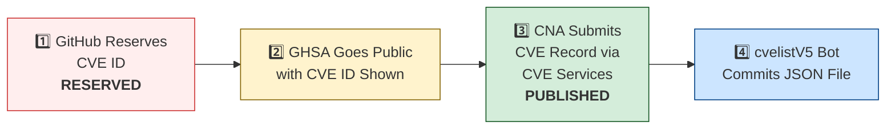

# 🛡️ OpenClaw CVE & Security Advisory Tracker

  
  
  
  
   
  
  
  
  
  

An automated tracker that continuously monitors [OpenClaw](https://github.com/openclaw/openclaw) security advisories across the GitHub Advisory Database, repo-level security advisories, and the [CVE V5 (cvelistV5)](https://github.com/CVEProject/cvelistV5) registry. Every hour it pulls the latest data, reconciles GHSA → CVE publication state, and regenerates this dashboard so you always have an up-to-date picture of the project's vulnerability landscape.

  Last updated: 2026-05-12 18:45 UTC · <a href="LICENSE">MIT License</a> · <a href="ADVISORIES.md">Full Advisory List</a> · <a href="SECURITY.md">Security Policy</a> · Data: <a href="https://github.com/CVEProject/cvelistV5">cvelistV5</a> + <a href="https://github.com/github/advisory-database">Advisory DB</a> · Updates hourly

---

  <a href="#-cves-published-in-cvelistv5-48">Published CVEs</a> ·
  <a href="#-cve-publication-pipeline">Pipeline</a> ·
  <a href="#-all-security-advisories-156">Advisories</a> ·
  <a href="#-vulnerability-categories">Categories</a> ·
  <a href="#-key-insights">Insights</a> ·
  <a href="#-project-identity">Identity</a>

---

## 🏗️ Project Identity

| Field | Value |
|-------|-------|
| **Current Name** | OpenClaw |
| **Previous Names** | Moltbot (second name), Clawdbot (original name) |
| **Repository** | [openclaw/openclaw](https://github.com/openclaw/openclaw) |
| **npm Package** | `openclaw` (formerly `clawdbot`) |
| **Author** | Peter Steinberger (steipete) |

<strong>Search terms for CVE discovery</strong>

To find all CVEs, search for: `openclaw`, `clawdbot`, `moltbot`, `clawhub`, `pkg:npm/clawdbot`, `pkg:npm/openclaw`

---

## 🚀 CVEs Published in cvelistV5 (48)

These CVEs have full records in the [CVEProject/cvelistV5](https://github.com/CVEProject/cvelistV5) repository:

| CVE ID | Severity | CVSS | Title | CWE | Published |
|--------|----------|------|-------|-----|-----------|
| [CVE-2026-28466](https://github.com/openclaw/openclaw/security/advisories/GHSA-gv46-4xfq-jv58) |  | 9.4 | OpenClaw < 2026.2.14 - Remote Code Execution via Node Invoke Approval Bypass | CWE-863 | 2026-03-05 |
| [CVE-2026-28474](https://github.com/openclaw/openclaw/security/advisories/GHSA-r5h9-vjqc-hq3r) |  | 9.3 | OpenClaw Nextcloud Talk < 2026.2.6 - Allowlist Bypass via actor.name Display Name Spoofing | CWE-863 | 2026-03-05 |
| [CVE-2026-43534](https://github.com/openclaw/openclaw/security/advisories/GHSA-7g8c-cfr3-vqqr) |  | 9.3 | OpenClaw < 2026.4.10 - Unsanitized External Input in Agent Hook Events | CWE-345 | 2026-05-05 |
| [CVE-2026-32916](https://github.com/openclaw/openclaw/security/advisories/GHSA-xw77-45gv-p728) |  | 9.2 | OpenClaw 2026.3.7 < 2026.3.11 - Authorization Bypass in Plugin Subagent Routes via Synthetic Admin Scopes | CWE-266 | 2026-03-31 |
| [CVE-2026-43585](https://github.com/openclaw/openclaw/security/advisories/GHSA-xmxx-7p24-h892) |  | 9.2 | OpenClaw: Gateway HTTP endpoints re-resolve bearer auth after SecretRef rotation | CWE-672 | 2026-05-06 |
| [CVE-2026-44109](https://github.com/openclaw/openclaw/security/advisories/GHSA-xh72-v6v9-mwhc) |  | 9.2 | OpenClaw: Feishu webhook and card-action validation now fail closed | CWE-1188 | 2026-05-06 |
| [CVE-2026-43581](https://github.com/openclaw/openclaw/security/advisories/GHSA-525j-hqq2-66r4) |  | 9 | OpenClaw < 2026.4.10 - Chrome DevTools Protocol Exposure via Overly Broad CDP Relay Binding | CWE-1188 | 2026-05-06 |
| [CVE-2026-43533](https://github.com/openclaw/openclaw/security/advisories/GHSA-66r7-m7xm-v49h) |  | 8.9 | OpenClaw < 2026.4.10 - Arbitrary Local File Read via QQBot Media Tags | CWE-23 | 2026-05-05 |
| [CVE-2026-24763](https://github.com/openclaw/openclaw/security/advisories/GHSA-mc68-q9jw-2h3v) |  | 8.8 | OpenClaw/Clawdbot Docker Execution has Authenticated Command Injection via PATH Environment Variable | CWE-78 | 2026-02-02 |
| [CVE-2026-25253](https://github.com/openclaw/openclaw/security/advisories/GHSA-g8p2-7wf7-98mq) |  | 8.8 | OpenClaw/Clawdbot has 1-Click RCE via Authentication Token Exfiltration From gatewayUrl | CWE-669 | 2026-02-01 |
| [CVE-2026-32974](https://github.com/openclaw/openclaw/security/advisories/GHSA-g353-mgv3-8pcj) |  | 8.8 | OpenClaw < 2026.3.12 - Forged Event Injection via Feishu Webhook Verification Token | CWE-347 | 2026-03-29 |
| [CVE-2026-41394](https://github.com/openclaw/openclaw/security/advisories/GHSA-mhgq-xpfq-6r66) |  | 8.8 | OpenClaw < 2026.3.31 - Unauthorized Operator Scope Access in Unauthenticated Plugin-Auth Routes | CWE-862 | 2026-04-28 |
| [CVE-2026-28478](https://github.com/openclaw/openclaw/security/advisories/GHSA-q447-rj3r-2cgh) |  | 8.7 | OpenClaw affected by denial of service via unbounded webhook request body buffering | CWE-770 | 2026-03-05 |
| [CVE-2026-32042](https://github.com/openclaw/openclaw/security/advisories/GHSA-553v-f69r-656j) |  | 8.7 | OpenClaw < 2026.2.25 - Privilege Escalation via Unpaired Device Identity in Shared Gateway Authentication | CWE-863 | 2026-03-21 |
| [CVE-2026-32049](https://github.com/openclaw/openclaw/security/advisories/GHSA-rxxp-482v-7mrh) |  | 8.7 | OpenClaw < 2026.2.22 - Denial of Service via Inbound Media Download Byte Limit Bypass | CWE-770 | 2026-03-21 |
| [CVE-2026-35638](https://github.com/openclaw/openclaw/security/advisories/GHSA-48vw-m3qc-wr99) |  | 8.7 | OpenClaw < 2026.3.22 - Privilege Escalation via Self-Declared Scopes in Trusted-Proxy Control UI | CWE-286 | 2026-04-09 |
| [CVE-2026-35663](https://github.com/openclaw/openclaw/security/advisories/GHSA-9hjh-fr4f-gxc4) |  | 8.7 | OpenClaw < 2026.3.25 - Privilege Escalation via Backend Reconnect Scope Self-Claim | CWE-648 | 2026-04-10 |
| [CVE-2026-42435](https://github.com/openclaw/openclaw/security/advisories/GHSA-j6c7-3h5x-99g9) |  | 8.7 | OpenClaw: Shell-wrapper detection missed env-argv assignment injection forms | CWE-184 | 2026-05-05 |
| [CVE-2026-42434](https://github.com/openclaw/openclaw/security/advisories/GHSA-736r-jwj6-4w23) |  | 8.7 | OpenClaw: Sandboxed agents could escape exec routing via host=node override | CWE-863 | 2026-05-05 |
| [CVE-2026-42426](https://github.com/openclaw/openclaw/security/advisories/GHSA-67mf-f936-ppxf) |  | 8.7 | OpenClaw < 2026.4.8 - Improper Authorization in node.pair.approve via operator.write Scope | CWE-863 | 2026-04-28 |
| [CVE-2026-43530](https://github.com/openclaw/openclaw/security/advisories/GHSA-2cq5-mf3v-mx44) |  | 8.7 | OpenClaw: busybox and toybox applet execution weakened exec approval binding | CWE-863 | 2026-05-05 |
| [CVE-2026-43584](https://github.com/openclaw/openclaw/security/advisories/GHSA-vfp4-8x56-j7c5) |  | 8.7 | OpenClaw < 2026.4.10 - Insufficient Environment Variable Denylist in Exec Policy | CWE-184 | 2026-05-06 |
| [CVE-2026-32920](https://github.com/openclaw/openclaw/security/advisories/GHSA-99qw-6mr3-36qr) |  | 8.6 | OpenClaw < 2026.3.12 - Arbitrary Code Execution via Auto-Discovery of Workspace Plugins | CWE-829 | 2026-03-31 |
| [CVE-2026-33579](https://github.com/openclaw/openclaw/security/advisories/GHSA-hc5h-pmr3-3497) |  | 8.6 | OpenClaw < 2026.3.28 - Privilege Escalation via Missing Caller Scope Validation in Device Pair Approval | CWE-863 | 2026-03-31 |
| [CVE-2026-33575](https://github.com/openclaw/openclaw/security/advisories/GHSA-7h7g-x2px-94hj) |  | 8.6 | OpenClaw < 2026.3.12 - Long-lived Credential Exposure in Pairing Setup Codes | CWE-522 | 2026-03-29 |
| [CVE-2026-44114](https://github.com/openclaw/openclaw/security/advisories/GHSA-hxvm-xjvf-93f3) |  | 8.5 | OpenClaw: Workspace dotenv could override runtime-control environment variables | CWE-184 | 2026-05-06 |
| [CVE-2026-44118](https://github.com/openclaw/openclaw/security/advisories/GHSA-r6xh-pqhr-v4xh) |  | 8.5 | OpenClaw < 2026.4.22 - Owner Context Spoofing via Bearer Token Header | CWE-290 | 2026-05-06 |
| [CVE-2026-35641](https://github.com/openclaw/openclaw/security/advisories/GHSA-m3mh-3mpg-37hw) |  | 8.4 | OpenClaw < 2026.3.24 - Arbitrary Code Execution via .npmrc in Local Plugin/Hook Installation | CWE-349 | 2026-04-10 |
| [CVE-2026-28393](https://github.com/openclaw/openclaw/security/advisories/GHSA-7xhj-55q9-pc3m) |  | 8.3 | OpenClaw 2.0.0-beta3 < 2026.2.14 - Arbitrary JavaScript Module Loading via Hook Transform Path Traversal | CWE-427 | 2026-03-05 |
| [CVE-2026-32036](https://github.com/openclaw/openclaw/security/advisories/GHSA-mwxv-35wr-4vvj) |  | 8.3 | OpenClaw < 2026.2.26- Authentication Bypass via Encoded Dot-Segment Traversal in /api/channels | CWE-289 | 2026-03-19 |
| [CVE-2026-43526](https://github.com/openclaw/openclaw/security/advisories/GHSA-2767-2q9v-9326) |  | 8.3 | OpenClaw: QQBot reply media URL handling could trigger SSRF and re-upload fetched bytes | CWE-918 | 2026-05-05 |
| [CVE-2026-28469](https://github.com/openclaw/openclaw/security/advisories/GHSA-rq6g-px6m-c248) |  | 8.2 | OpenClaw Google Chat shared-path webhook target ambiguity allowed cross-account policy-context misrouting | CWE-639 | 2026-03-05 |
| [CVE-2026-32045](https://github.com/openclaw/openclaw/security/advisories/GHSA-hff7-ccv5-52f8) |  | 8.2 | OpenClaw < 2026.2.21 - Authentication Bypass in HTTP Gateway Routes via Tokenless Tailscale Auth | CWE-290 | 2026-03-21 |
| [CVE-2026-41395](https://github.com/openclaw/openclaw/security/advisories/GHSA-8689-gm9g-jgr6) |  | 8.2 | OpenClaw < 2026.3.28 - Webhook Replay via Query Parameter Reordering in Plivo V3 | CWE-325 | 2026-04-28 |
| [CVE-2026-25157](https://github.com/openclaw/openclaw/security/advisories/GHSA-q284-4pvr-m585) |  | 7.8 | OpenClaw/Clawdbot has OS Command Injection via Project Root Path in sshNodeCommand | CWE-78 | 2026-02-04 |
| [CVE-2026-27002](https://github.com/openclaw/openclaw/security/advisories/GHSA-w235-x559-36mg) |  | 7.7 | OpenClaw: Docker container escape via unvalidated bind mount config injection | CWE-250 | 2026-02-19 |
| [CVE-2026-32056](https://github.com/openclaw/openclaw/security/advisories/GHSA-xgf2-vxv2-rrmg) |  | 7.7 | OpenClaw < 2026.2.22 - Remote Code Execution via Shell Startup Environment Variable Injection in system.run | CWE-78 | 2026-03-21 |
| [CVE-2026-32048](https://github.com/openclaw/openclaw/security/advisories/GHSA-p7gr-f84w-hqg5) |  | 7.7 | OpenClaw < 2026.3.1 - Sandbox Escape via Cross-Agent sessions_spawn | CWE-732 | 2026-03-21 |
| [CVE-2026-35666](https://github.com/openclaw/openclaw/security/advisories/GHSA-qm9x-v7cx-7rq4) |  | 7.7 | OpenClaw < 2026.3.22 - Allowlist Bypass via Unregistered Time Dispatch Wrapper | CWE-706 | 2026-04-10 |
| [CVE-2026-41404](https://github.com/openclaw/openclaw/security/advisories/GHSA-g374-mggx-p6xc) |  | 7.7 | OpenClaw < 2026.3.31 - Operator Admin Privilege Escalation via Trusted-Proxy Authentication | CWE-863 | 2026-04-28 |
| [CVE-2026-42423](https://github.com/openclaw/openclaw/security/advisories/GHSA-q2gc-xjqw-qp89) |  | 7.7 | OpenClaw < 2026.4.8 - strictInlineEval Approval Boundary Bypass via Approval-Timeout Fallback | CWE-636 | 2026-04-28 |
| [CVE-2026-43571](https://github.com/openclaw/openclaw/security/advisories/GHSA-82qx-6vj7-p8m2) |  | 7.7 | OpenClaw: Channel setup catalog lookups could include untrusted workspace plugin shadows | CWE-829 | 2026-05-05 |
| [CVE-2026-43569](https://github.com/openclaw/openclaw/security/advisories/GHSA-939r-rj45-g2rj) |  | 7.7 | OpenClaw: Workspace provider auth choices could auto-enable untrusted provider plugins | CWE-829 | 2026-05-05 |
| [CVE-2026-44110](https://github.com/openclaw/openclaw/security/advisories/GHSA-2gvc-4f3c-2855) |  | 7.7 | OpenClaw: Matrix room control-command authorization no longer trusts DM pairing-store entries | CWE-863 | 2026-05-06 |
| [CVE-2026-45006](https://github.com/openclaw/openclaw/security/advisories/GHSA-cwj3-vqpp-pmxr) |  | 7.7 | OpenClaw < 2026.4.23 - Unsafe Config Mutation via Gateway Tool Denylist Bypass | CWE-184 | 2026-05-11 |
| [CVE-2026-27487](https://github.com/openclaw/openclaw/security/advisories/GHSA-4564-pvr2-qq4h) |  | 7.6 | OpenClaw: Prevent shell injection in macOS keychain credential write | CWE-78 | 2026-02-21 |
| [CVE-2026-42431](https://github.com/openclaw/openclaw/security/advisories/GHSA-cmfr-9m2r-xwhq) |  | 7.6 | OpenClaw < 2026.4.8 - Persistent Profile Mutation via node.invoke(browser.proxy) Bypass | CWE-863 | 2026-04-28 |
| [CVE-2026-43535](https://github.com/openclaw/openclaw/security/advisories/GHSA-jwrq-8g5x-5fhm) |  | 7.6 | OpenClaw < 2026.4.14 - Authorization Context Reuse in Collect-Mode Queue Batches | CWE-266 | 2026-05-05 |
| [CVE-2026-26316](https://github.com/openclaw/openclaw/security/advisories/GHSA-pchc-86f6-8758) |  | 7.5 | OpenClaw has BlueBubbles webhook auth bypass via loopback proxy trust | CWE-863 | 2026-02-19 |
| [CVE-2026-28485](https://github.com/openclaw/openclaw/security/advisories/GHSA-qpjj-47vm-64pj) |  | 7.5 | OpenClaw 2026.1.5 < 2026.2.12 - Missing Authentication in Browser Control HTTP Endpoints | CWE-306 | 2026-03-05 |
| [CVE-2026-32025](https://github.com/openclaw/openclaw/security/advisories/GHSA-jmmg-jqc7-5qf4) |  | 7.5 | OpenClaw < 2026.2.25 - Password Brute-Force via Browser-Origin WebSocket Authentication Bypass | CWE-307 | 2026-03-19 |
| [CVE-2026-42428](https://github.com/openclaw/openclaw/security/advisories/GHSA-3vvq-q2qc-7rmp) |  | 7.5 | OpenClaw < 2026.4.8 - Missing Integrity Verification in Package Downloads | CWE-353 | 2026-04-28 |
| [CVE-2026-28458](https://github.com/openclaw/openclaw/security/advisories/GHSA-mr32-vwc2-5j6h) |  | 7.4 | OpenClaw's Browser Relay /cdp websocket is missing auth which could allow cross-tab cookie access | CWE-306 | 2026-03-05 |
| [CVE-2026-32015](https://github.com/openclaw/openclaw/security/advisories/GHSA-g75x-8qqm-2vxp) |  | 7.3 | OpenClaw 2026.1.21 < 2026.2.19 - PATH Hijacking Bypass in tools.exec.safeBins Allowlist Validation | CWE-426 | 2026-03-19 |
| [CVE-2026-32016](https://github.com/openclaw/openclaw/security/advisories/GHSA-7f4q-9rqh-x36p) |  | 7.3 | OpenClaw < 2026.2.22 - Path Traversal via Basename-Only Allowlist Matching on macOS | CWE-426 | 2026-03-19 |
| [CVE-2026-42432](https://github.com/openclaw/openclaw/security/advisories/GHSA-5wj5-87vq-39xm) |  | 7.3 | OpenClaw < 2026.4.8 - Command Escalation via Node Pairing Reconnect Bypass | CWE-863 | 2026-04-28 |
| [CVE-2026-35660](https://github.com/openclaw/openclaw/security/advisories/GHSA-wq58-2pvg-5h4f) |  | 7.2 | OpenClaw < 2026.3.23 - Insufficient Access Control in Gateway Agent Session Reset | CWE-862 | 2026-04-10 |
| [CVE-2026-26317](https://github.com/openclaw/openclaw/security/advisories/GHSA-3fqr-4cg8-h96q) |  | 7.1 | OpenClaw affected by cross-site request forgery (CSRF) through loopback browser mutation endpoints | CWE-352 | 2026-02-19 |
| [CVE-2026-29607](https://github.com/openclaw/openclaw/security/advisories/GHSA-6j27-pc5c-m8w8) |  | 7.1 | OpenClaw < 2026.2.22 - Authorization Bypass via allow-always Wrapper Persistence | CWE-78 | 2026-03-19 |
| [CVE-2026-32008](https://github.com/openclaw/openclaw/security/advisories/GHSA-45cg-2683-gfmq) |  | 7.1 | OpenClaw < 2026.2.21 - Arbitrary Local File Read via Browser Navigation Guard | CWE-610 | 2026-03-19 |
| [CVE-2026-35644](https://github.com/openclaw/openclaw/security/advisories/GHSA-ppwq-6v66-5m6j) |  | 7.1 | OpenClaw < 2026.3.22 - Credential Exposure via baseUrl Fields in Gateway Snapshots | CWE-312 | 2026-04-09 |
| [CVE-2026-40037](https://github.com/openclaw/openclaw/security/advisories/GHSA-qx8j-g322-qj6m) |  | 7.1 | OpenClaw < 2026.3.31 - Unsafe Request Body Replay via fetchWithSsrFGuard Cross-Origin Redirects | CWE-601 | 2026-04-08 |
| [CVE-2026-41359](https://github.com/openclaw/openclaw/security/advisories/GHSA-767m-xrhc-fxm7) |  | 7.1 | OpenClaw < 2026.3.28 - Privilege Escalation via operator.write to Admin-Class Telegram Config and Cron Persistence | CWE-269 | 2026-04-23 |
| [CVE-2026-41369](https://github.com/openclaw/openclaw/security/advisories/GHSA-cg7q-fg22-4g98) |  | 7.1 | OpenClaw < 2026.3.31 - Insufficient Environment Variable Sanitization in Host Execution | CWE-668 | 2026-04-27 |
| [CVE-2026-41375](https://github.com/openclaw/openclaw/security/advisories/GHSA-h2v7-xc88-xx8c) |  | 7.1 | OpenClaw < 2026.3.28 - Authorization Bypass in /phone arm and /phone disarm Endpoints | CWE-863 | 2026-04-28 |
| [CVE-2026-42433](https://github.com/openclaw/openclaw/security/advisories/GHSA-7jp6-r74r-995q) |  | 7.1 | OpenClaw: Matrix profile config persistence was reachable from operator.write message tools | CWE-862 | 2026-05-05 |
| [CVE-2026-43567](https://github.com/openclaw/openclaw/security/advisories/GHSA-jf25-7968-h2h5) |  | 7.1 | OpenClaw < 2026.4.10 - Path Traversal in screen_record outPath Parameter | CWE-862 | 2026-05-05 |
| [CVE-2026-43568](https://github.com/openclaw/openclaw/security/advisories/GHSA-5gjc-grvm-m88j) |  | 7.1 | OpenClaw: Memory dreaming config persistence was reachable from operator.write commands | CWE-862 | 2026-05-05 |
| [CVE-2026-32009](https://github.com/openclaw/openclaw/security/advisories/GHSA-5gj7-jf77-q2q2) |  | 7 | OpenClaw < 2026.2.24 - Binary Hijacking via Static Default Trusted Directories in safeBins | CWE-426 | 2026-03-19 |
| [CVE-2026-43531](https://github.com/openclaw/openclaw/security/advisories/GHSA-7wv4-cc7p-jhxc) |  | 7 | OpenClaw < 2026.4.9 - Environment Variable Injection via Workspace .env File | CWE-15 | 2026-05-05 |
| [CVE-2026-27488](https://github.com/openclaw/openclaw/security/advisories/GHSA-w45g-5746-x9fp) |  | 6.9 | OpenClaw hardened cron webhook delivery against SSRF | CWE-918 | 2026-02-21 |
| [CVE-2026-27545](https://github.com/openclaw/openclaw/security/advisories/GHSA-f7ww-2725-qvw2) |  | 6.9 | OpenClaw < 2026.2.26 - Approval Bypass via Parent Symlink Current Working Directory Rebind | CWE-367 | 2026-03-18 |
| [CVE-2026-28480](https://github.com/openclaw/openclaw/security/advisories/GHSA-mj5r-hh7j-4gxf) |  | 6.9 | OpenClaw Telegram allowlist authorization accepted mutable usernames | CWE-290 | 2026-03-05 |
| [CVE-2026-35640](https://github.com/openclaw/openclaw/security/advisories/GHSA-3h52-cx59-c456) |  | 6.9 | OpenClaw < 2026.3.25 - Denial of Service via Unauthenticated Webhook Request Parsing | CWE-696 | 2026-04-09 |
| [CVE-2026-35627](https://github.com/openclaw/openclaw/security/advisories/GHSA-65h8-27jh-q8wv) |  | 6.9 | OpenClaw < 2026.3.22 - Unauthenticated Cryptographic Work in Nostr Inbound DM Handling | CWE-696 | 2026-04-09 |
| [CVE-2026-35652](https://github.com/openclaw/openclaw/security/advisories/GHSA-8883-9w57-vwv6) |  | 6.9 | OpenClaw < 2026.3.22 - Unauthorized Action Execution via Callback Dispatch | CWE-696 | 2026-04-10 |
| [CVE-2026-41374](https://github.com/openclaw/openclaw/security/advisories/GHSA-hhff-fj5f-qg48) |  | 6.9 | OpenClaw < 2026.3.31 - Resource Consumption via Discord Audio Preflight Before Member Authorization | CWE-408 | 2026-04-28 |
| [CVE-2026-44116](https://github.com/openclaw/openclaw/security/advisories/GHSA-2hh7-c75g-qj2r) |  | 6.9 | OpenClaw < 2026.4.22 - Server-Side Request Forgery in Zalo Photo URL Validation | CWE-918 | 2026-05-06 |
| [CVE-2026-29612](https://github.com/openclaw/openclaw/security/advisories/GHSA-w2cg-vxx6-5xjg) |  | 6.8 | OpenClaw < 2026.2.14 - Denial of Service via Large Base64 Media File Decoding | CWE-770 | 2026-03-05 |
| [CVE-2026-33572](https://github.com/openclaw/openclaw/security/advisories/GHSA-vr7j-g7jv-h5mp) |  | 6.8 | OpenClaw < 2026.2.17 - Insufficient File Permissions in Session Transcript Files | CWE-378 | 2026-03-29 |
| [CVE-2026-28452](https://github.com/openclaw/openclaw/security/advisories/GHSA-h89v-j3x9-8wqj) |  | 6.7 | OpenClaw affected by denial of service through unguarded archive extraction allowing high expansion/resource abuse (ZIP/TAR) | CWE-770 | 2026-03-05 |
| [CVE-2026-26328](https://github.com/openclaw/openclaw/security/advisories/GHSA-g34w-4xqq-h79m) |  | 6.5 | OpenClaw iMessage group allowlist authorization inherited DM pairing-store identities | CWE-284, CWE-863 | 2026-02-19 |
| [CVE-2026-29606](https://github.com/openclaw/openclaw/security/advisories/GHSA-c37p-4qqg-3p76) |  | 6.3 | OpenClaw < 2026.2.14 - Webhook Signature Verification Bypass via ngrok Loopback Compatibility | CWE-306 | 2026-03-05 |
| [CVE-2026-32031](https://github.com/openclaw/openclaw/security/advisories/GHSA-8j2w-6fmm-m587) |  | 6.3 | OpenClaw < 2026.2.26 - Authentication Bypass via Path Canonicalization Mismatch in /api/channels Gateway | CWE-288 | 2026-03-19 |
| [CVE-2026-33580](https://github.com/openclaw/openclaw/security/advisories/GHSA-9528-x887-j2fp) |  | 6.3 | OpenClaw < 2026.3.28 - Brute Force Attack via Missing Rate Limiting on Webhook Shared Secret Authentication | CWE-307 | 2026-03-31 |
| [CVE-2026-35635](https://github.com/openclaw/openclaw/security/advisories/GHSA-rqp8-q22p-5j9q) |  | 6.3 | OpenClaw < 2026.3.22 - Webhook Path Route Replacement Vulnerability in Synology Chat | CWE-706 | 2026-04-09 |
| [CVE-2026-35646](https://github.com/openclaw/openclaw/security/advisories/GHSA-mf5g-6r6f-ghhm) |  | 6.3 | OpenClaw < 2026.3.25 - Pre-Authentication Rate-Limit Bypass in Webhook Token Validation | CWE-307 | 2026-04-09 |
| [CVE-2026-41351](https://github.com/openclaw/openclaw/security/advisories/GHSA-37v6-fxx8-xjmx) |  | 6.3 | OpenClaw < 2026.3.31 - Webhook Replay Detection Bypass via Base64 Signature Re-encoding | CWE-294 | 2026-04-23 |
| [CVE-2026-41354](https://github.com/openclaw/openclaw/security/advisories/GHSA-rxmx-g7hr-8mx4) |  | 6.3 | OpenClaw < 2026.4.2 - Insufficient Scope in Zalo Webhook Replay Dedupe Keys | CWE-706 | 2026-04-23 |
| [CVE-2026-41389](https://github.com/openclaw/openclaw/security/advisories/GHSA-mr34-9552-qr95) |  | 6.3 | OpenClaw: Webchat media embedding enforces local-root containment for tool-result files | CWE-73 | 2026-04-20 |
| [CVE-2026-41337](https://github.com/openclaw/openclaw/security/advisories/GHSA-89r3-6x4j-v7wf) |  | 6.3 | OpenClaw < 2026.3.31 - Callback Origin Mutation in Plivo Voice-call Replay | CWE-367 | 2026-04-23 |
| [CVE-2026-41913](https://github.com/openclaw/openclaw/security/advisories/GHSA-25wv-8phj-8p7r) |  | 6.3 | OpenClaw < 2026.4.4 - Rate-Limit Bypass via Concurrent Async Authentication Attempts | CWE-362 | 2026-04-28 |
| [CVE-2026-43527](https://github.com/openclaw/openclaw/security/advisories/GHSA-53vx-pmqw-863c) |  | 6.3 | OpenClaw: Browser SSRF policy default allowed private-network navigation | CWE-918, CWE-1188 | 2026-05-05 |
| [CVE-2026-43572](https://github.com/openclaw/openclaw/security/advisories/GHSA-gc9r-867r-j85f) |  | 6.3 | OpenClaw: Microsoft Teams SSO invoke handler missed sender authorization checks | CWE-862 | 2026-05-05 |
| [CVE-2026-44117](https://github.com/openclaw/openclaw/security/advisories/GHSA-c4qg-j8jg-42q5) |  | 6.3 | OpenClaw < 2026.4.20 - Server-Side Request Forgery in QQBot Direct Media Upload | CWE-918 | 2026-05-06 |
| [CVE-2026-44994](https://github.com/openclaw/openclaw/security/advisories/GHSA-93rg-2xm5-2p9v) |  | 6.3 | OpenClaw < 2026.4.22 - Authentication Bypass in Gateway Control UI Bootstrap Config Endpoint | CWE-862 | 2026-05-11 |
| [CVE-2026-35645](https://github.com/openclaw/openclaw/security/advisories/GHSA-h4jx-hjr3-fhgc) |  | 6.1 | OpenClaw < 2026.3.25 - Privilege Escalation via Synthetic operator.admin in deleteSession | CWE-648 | 2026-04-09 |
| [CVE-2026-35670](https://github.com/openclaw/openclaw/security/advisories/GHSA-wv46-v6xc-2qhf) |  | 6 | OpenClaw < 2026.3.22 - Webhook Reply Rebinding via Username Resolution in Synology Chat | CWE-807 | 2026-04-10 |
| [CVE-2026-43570](https://github.com/openclaw/openclaw/security/advisories/GHSA-cr8r-7g2h-6wr6) |  | 6 | OpenClaw contains a symlink traversal vulnerability | CWE-61 | 2026-05-05 |
| [CVE-2026-43574](https://github.com/openclaw/openclaw/security/advisories/GHSA-49cg-279w-m73x) |  | 6 | OpenClaw < 2026.4.12 - Improper Authorization via Empty Approver Lists | CWE-183 | 2026-05-05 |
| [CVE-2026-43583](https://github.com/openclaw/openclaw/security/advisories/GHSA-r77c-2cmr-7p47) |  | 6 | OpenClaw: Delivery queue recovery could lose group tool-policy context for media replay | CWE-862 | 2026-05-06 |
| [CVE-2026-44112](https://github.com/openclaw/openclaw/security/advisories/GHSA-wppj-c6mr-83jj) |  | 6 | OpenClaw < 2026.4.22 - Symlink Swap Race Condition in OpenShell FS Bridge Writes | CWE-367 | 2026-05-06 |
| [CVE-2026-44113](https://github.com/openclaw/openclaw/security/advisories/GHSA-5h3g-6xhh-rg6p) |  | 6 | OpenClaw: OpenShell FS bridge reads pin and verify the opened file before returning bytes | CWE-367 | 2026-05-06 |
| [CVE-2026-28481](https://github.com/openclaw/openclaw/security/advisories/GHSA-7vwx-582j-j332) |  | 5.9 | OpenClaw < 2026.2.1 - Bearer Token Leakage via MS Teams Attachment Downloader Suffix Matching | CWE-201 | 2026-03-05 |
| [CVE-2026-32054](https://github.com/openclaw/openclaw/security/advisories/GHSA-36h3-7c54-j27r) |  | 5.9 | OpenClaw < 2026.2.25 - Symlink Traversal in Browser Trace/Download Path Handling | CWE-59 | 2026-03-21 |
| [CVE-2026-42424](https://github.com/openclaw/openclaw/security/advisories/GHSA-qqq7-4hxc-x63c) |  | 5.9 | OpenClaw < 2026.4.8 - Local File Exfiltration via Shared Reply MEDIA Paths | CWE-73 | 2026-04-28 |
| [CVE-2026-45005](https://github.com/openclaw/openclaw/security/advisories/GHSA-q8ff-7ffm-m3r9) |  | 5.9 | OpenClaw < 2026.4.23 - Webhook Route Secret Cache Not Invalidated After Rotation | CWE-672 | 2026-05-11 |
| [CVE-2026-32000](https://github.com/openclaw/openclaw/security/advisories/GHSA-7fcc-cw49-xm78) |  | 5.8 | OpenClaw < 2026.2.19 - Command Injection via Windows Shell Fallback in Lobster Tool Execution | CWE-78 | 2026-03-19 |
| [CVE-2026-32035](https://github.com/openclaw/openclaw/security/advisories/GHSA-wpg9-4g4v-f9rc) |  | 5.8 | OpenClaw < 2026.3.2 - Missing Owner Flag Validation in Discord Voice Transcript Handler | CWE-863 | 2026-03-19 |
| [CVE-2026-41392](https://github.com/openclaw/openclaw/security/advisories/GHSA-wpc6-37g7-8q4w) |  | 5.4 | OpenClaw < 2026.3.31 - Exec Allowlist Bypass via Shell Init-File Options | CWE-184 | 2026-04-28 |
| [CVE-2026-41360](https://github.com/openclaw/openclaw/security/advisories/GHSA-w6wx-jq6j-6mcj) |  | 5.4 | OpenClaw < 2026.4.2 - Approval Integrity Bypass in pnpm dlx Local Script Binding | CWE-367 | 2026-04-23 |
| [CVE-2026-32921](https://github.com/openclaw/openclaw/security/advisories/GHSA-8g75-q649-6pv6) |  | 5.3 | OpenClaw < 2026.3.8 - Script Content Modification via Mutable Operand Binding in system.run | CWE-367 | 2026-03-31 |
| [CVE-2026-32898](https://github.com/openclaw/openclaw/security/advisories/GHSA-7jx5-9fjg-hp4m) |  | 5.3 | OpenClaw < 2026.2.23 - ACP Permission Auto-Approval Bypass via Untrusted Tool Metadata | CWE-807 | 2026-03-21 |
| [CVE-2026-32923](https://github.com/openclaw/openclaw/security/advisories/GHSA-9vvh-2768-c8vp) |  | 5.3 | OpenClaw < 2026.3.11 - Authorization Bypass in Discord Guild Reaction Allowlist Enforcement | CWE-863 | 2026-03-29 |
| [CVE-2026-35651](https://github.com/openclaw/openclaw/security/advisories/GHSA-4hmj-39m8-jwc7) |  | 5.3 | OpenClaw 2026.2.13 < 2026.3.25 - ANSI Escape Sequence Injection in Approval Prompt | CWE-150 | 2026-04-10 |
| [CVE-2026-42438](https://github.com/openclaw/openclaw/security/advisories/GHSA-jhpv-5j76-m56h) |  | 4.9 | OpenClaw: Sender policy bypass in host media attachment reads allows unauthorized local file disclosure | CWE-863 | 2026-05-05 |
| [CVE-2026-42439](https://github.com/openclaw/openclaw/security/advisories/GHSA-rj2p-j66c-mgqh) |  | 4.9 | OpenClaw < 2026.4.10 - SSRF Policy Bypass in Browser Tabs Action Routes | CWE-862 | 2026-05-05 |
| [CVE-2026-43532](https://github.com/openclaw/openclaw/security/advisories/GHSA-c9h3-5p7r-mrjh) |  | 4.9 | OpenClaw: Discord event cover images bypassed sandbox media normalization | CWE-184 | 2026-05-05 |
| [CVE-2026-43576](https://github.com/openclaw/openclaw/security/advisories/GHSA-f7fh-qg34-x2xh) |  | 4.9 | OpenClaw < 2026.4.5 - Second-hop SSRF via CDP /json/version WebSocket URL | CWE-601, CWE-918 | 2026-05-06 |
| [CVE-2026-43573](https://github.com/openclaw/openclaw/security/advisories/GHSA-527m-976r-jf79) |  | 4.9 | OpenClaw: Existing-session browser interaction routes bypassed SSRF policy enforcement | CWE-862, CWE-918 | 2026-05-05 |
| [CVE-2026-43582](https://github.com/openclaw/openclaw/security/advisories/GHSA-xq94-r468-qwgj) |  | 4.9 | OpenClaw < 2026.4.10 - DNS Rebinding SSRF via Hostname Validation Bypass | CWE-367 | 2026-05-06 |
| [CVE-2026-43580](https://github.com/openclaw/openclaw/security/advisories/GHSA-536q-mj95-h29h) |  | 4.9 | OpenClaw: Browser press/type interaction routes missed complete navigation guard coverage | CWE-862 | 2026-05-06 |
| [CVE-2026-22180](https://github.com/openclaw/openclaw/security/advisories/GHSA-3pxq-f3cp-jmxp) |  | 4.8 | OpenClaw < 2026.3.2 - Path Confinement Bypass in Browser Output and File Write Operations | CWE-59 | 2026-03-18 |
| [CVE-2026-32020](https://github.com/openclaw/openclaw/security/advisories/GHSA-5ghc-98wh-gwwf) |  | 4.8 | OpenClaw < 2026.2.22 - Arbitrary File Read via Symlink Following in Static File Handler | CWE-59 | 2026-03-19 |
| [CVE-2026-41297](https://github.com/openclaw/openclaw/security/advisories/GHSA-vjx8-8p7h-82gr) |  | 4.8 | OpenClaw < 2026.3.31 - Server-Side Request Forgery via Marketplace Plugin Download Redirect | CWE-918 | 2026-04-20 |
| [CVE-2026-24764](https://github.com/openclaw/openclaw/security/advisories/GHSA-782p-5fr5-7fj8) |  | 3.7 | OpenClaw has Remote Code Execution via System Prompt Injection in Slack Channel Descriptions | CWE-74, CWE-94 | 2026-02-19 |
| [CVE-2026-41356](https://github.com/openclaw/openclaw/security/advisories/GHSA-rfqg-qgf8-xr9x) |  | 2.3 | OpenClaw < 2026.3.31 - Incomplete WebSocket Session Termination in device.token.rotate | CWE-613 | 2026-04-23 |
| [CVE-2026-41382](https://github.com/openclaw/openclaw/security/advisories/GHSA-x2m8-53h4-6hch) |  | 2.3 | OpenClaw < 2026.3.31 - Discord Voice Ingress Authorization Bypass via Channel and Role Validation Gaps | CWE-862 | 2026-04-28 |
| [CVE-2026-41406](https://github.com/openclaw/openclaw/security/advisories/GHSA-877v-w3f5-3pcq) |  | 2.3 | OpenClaw < 2026.3.31 - Sender Allowlist Bypass via Thread History and Quoted Messages | CWE-639 | 2026-04-28 |
| [CVE-2026-41358](https://github.com/openclaw/openclaw/security/advisories/GHSA-qm77-8qjp-4vcm) |  | 2.3 | OpenClaw < 2026.4.2 - Sender Allowlist Bypass via Slack Thread Context | CWE-346 | 2026-04-23 |
| [CVE-2026-41908](https://github.com/openclaw/openclaw/security/advisories/GHSA-v8qf-fr4g-28p2) |  | 2.3 | OpenClaw < 2026.4.20 - Scope Enforcement Bypass in Assistant-Media Route | CWE-863 | 2026-04-23 |
| [CVE-2026-32067](https://github.com/openclaw/openclaw/security/advisories/GHSA-vjp8-wprm-2jw9) |  | 2 | OpenClaw < 2026.2.26 - Cross-Account Authorization Bypass in DM Pairing Store | CWE-863 | 2026-03-21 |
| [CVE-2026-32970](https://github.com/openclaw/openclaw/security/advisories/GHSA-qvr7-g57c-mrc7) |  | 2 | OpenClaw < 2026.3.11 - Credential Fallback Logic Bypass via Unavailable Local Auth SecretRefs | CWE-636 | 2026-03-31 |

<strong>📖 Detailed CVE Analysis (click to expand)</strong>

### CVE-2026-28466 — OpenClaw < 2026.2.14 - Remote Code Execution via Node Invoke Approval Bypass

| Field | Detail |
|-------|--------|
| **CVSS** | 9.4 (CRITICAL) — `CVSS:4.0/AV:N/AC:L/AT:N/PR:L/UI:N/VC:H/VI:H/VA:H/SC:H/SI:H/SA:H` |
| **CWE** | CWE-863 (Incorrect Authorization) |
| **Affected** | < 2026.2.14 |
| **Vendor/Product** | OpenClaw / OpenClaw |
| **Advisory** | [GHSA-gv46-4xfq-jv58](https://github.com/openclaw/openclaw/security/advisories/GHSA-gv46-4xfq-jv58) |

OpenClaw versions prior to 2026.2.14 contain a vulnerability in the gateway in which it fails to sanitize internal approval fields in node.invoke parameters, allowing authenticated clients to bypass exec approval gating for system.run commands. Attackers with valid gateway credentials can inject approval control fields to execute arbitrary commands on connected node hosts, potentially compromising developer workstations and CI runners.

**References:**
- [Patch Commit #1](https://github.com/openclaw/openclaw/commit/318379cdb8d045da0009b0051bd0e712e5c65e2d)
- [Patch Commit #2](https://github.com/openclaw/openclaw/commit/a7af646fdab124a7536998db6bd6ad567d2b06b0)
- [Patch Commit #3](https://github.com/openclaw/openclaw/commit/c1594627421f95b6bc4ad7c606657dc75b5ad0ce)
- [Patch Commit #4](https://github.com/openclaw/openclaw/commit/0af76f5f0e93540efbdf054895216c398692afcd)
- [VulnCheck Advisory: OpenClaw < 2026.2.14 - Remote Code Execution via Node Invoke Approval Bypass](https://www.vulncheck.com/advisories/openclaw-remote-code-execution-via-node-invoke-approval-bypass)
---

### CVE-2026-28474 — OpenClaw Nextcloud Talk < 2026.2.6 - Allowlist Bypass via actor.name Display Name Spoofing

| Field | Detail |
|-------|--------|
| **CVSS** | 9.3 (CRITICAL) — `CVSS:4.0/AV:N/AC:L/AT:N/PR:N/UI:N/VC:H/VI:H/VA:H/SC:N/SI:N/SA:N` |
| **CWE** | CWE-863 (Incorrect Authorization) |
| **Affected** | < 2026.2.6 |
| **Vendor/Product** | OpenClaw / nextcloud-talk |
| **Advisory** | [GHSA-r5h9-vjqc-hq3r](https://github.com/openclaw/openclaw/security/advisories/GHSA-r5h9-vjqc-hq3r) |

OpenClaw's Nextcloud Talk plugin versions prior to 2026.2.6 accept equality matching on the mutable actor.name display name field for allowlist validation, allowing attackers to bypass DM and room allowlists. An attacker can change their Nextcloud display name to match an allowlisted user ID and gain unauthorized access to restricted conversations.

**References:**
- [Patch Commit #1](https://github.com/openclaw/openclaw/commit/6b4b6049b47c3329a7014509594647826669892d)
- [VulnCheck Advisory: OpenClaw Nextcloud Talk < 2026.2.6 - Allowlist Bypass via actor.name Display Name Spoofing](https://www.vulncheck.com/advisories/openclaw-nextcloud-talk-allowlist-bypass-via-actorname-display-name-spoofing)
---

### CVE-2026-43534 — OpenClaw < 2026.4.10 - Unsanitized External Input in Agent Hook Events

| Field | Detail |
|-------|--------|
| **CVSS** | 9.3 (CRITICAL) — `CVSS:4.0/AV:N/AC:L/AT:N/PR:N/UI:N/VC:H/VI:H/VA:N/SC:N/SI:N/SA:N` |
| **CWE** | CWE-345 (CWE-345: Insufficient Verification of Data Authenticity) |
| **Affected** | < 2026.4.10 |
| **Vendor/Product** | OpenClaw / OpenClaw |
| **Advisory** | [GHSA-7g8c-cfr3-vqqr](https://github.com/openclaw/openclaw/security/advisories/GHSA-7g8c-cfr3-vqqr) |

OpenClaw before 2026.4.10 contains an input validation vulnerability that allows external hook metadata to be enqueued as trusted system events. Attackers can supply malicious hook names to escalate untrusted input into higher-trust agent context.

**References:**
- [Patch Commit](https://github.com/openclaw/openclaw/commit/e3a845bde5b54f4f1e742d0a51ba9860f9619b29)
- [VulnCheck Advisory: OpenClaw < 2026.4.10 - Unsanitized External Input in Agent Hook Events](https://www.vulncheck.com/advisories/openclaw-unsanitized-external-input-in-agent-hook-events)
---

### CVE-2026-32916 — OpenClaw 2026.3.7 < 2026.3.11 - Authorization Bypass in Plugin Subagent Routes via Synthetic Admin Scopes

| Field | Detail |
|-------|--------|
| **CVSS** | 9.2 (CRITICAL) — `CVSS:4.0/AV:N/AC:L/AT:P/PR:N/UI:N/VC:H/VI:H/VA:L/SC:N/SI:N/SA:N` |
| **CWE** | CWE-266 (CWE-266: Incorrect Privilege Assignment) |
| **Affected** | < 2026.3.11 |
| **Vendor/Product** | OpenClaw / OpenClaw |
| **Advisory** | [GHSA-xw77-45gv-p728](https://github.com/openclaw/openclaw/security/advisories/GHSA-xw77-45gv-p728) |

OpenClaw versions 2026.3.7 before 2026.3.11 contain an authorization bypass vulnerability where plugin subagent routes execute gateway methods through a synthetic operator client with broad administrative scopes. Remote unauthenticated requests to plugin-owned routes can invoke runtime.subagent methods to perform privileged gateway actions including session deletion and agent execution.

**References:**
- [VulnCheck Advisory: OpenClaw 2026.3.7 < 2026.3.11 - Authorization Bypass in Plugin Subagent Routes via Synthetic Admin Scopes](https://www.vulncheck.com/advisories/openclaw-authorization-bypass-in-plugin-subagent-routes-via-synthetic-admin-scopes)
---

### CVE-2026-43585 — OpenClaw: Gateway HTTP endpoints re-resolve bearer auth after SecretRef rotation

| Field | Detail |
|-------|--------|
| **CVSS** | 9.2 (CRITICAL) — `CVSS:4.0/AV:N/AC:H/AT:P/PR:N/UI:N/VC:H/VI:H/VA:H/SC:N/SI:N/SA:N` |
| **CWE** | CWE-672 (Operation on a Resource after Expiration or Release) |
| **Affected** | < 2026.4.15 |
| **Vendor/Product** | OpenClaw / OpenClaw |
| **Advisory** | [GHSA-xmxx-7p24-h892](https://github.com/openclaw/openclaw/security/advisories/GHSA-xmxx-7p24-h892) |

OpenClaw before 2026.4.15 captures resolved bearer-auth configuration at startup, allowing revoked tokens to remain valid after SecretRef rotation. Gateway HTTP and WebSocket handlers fail to re-resolve authentication per-request, enabling attackers to use rotated-out bearer tokens for unauthorized gateway access.

**References:**
- [Patch Commit](https://github.com/openclaw/openclaw/commit/acd4e0a32f12e1ad85f3130f63b42443ce90f094)
- [VulnCheck Advisory: OpenClaw < 2026.4.15 - Bearer Token Validation Bypass via Stale SecretRef Resolution](https://www.vulncheck.com/advisories/openclaw-bearer-token-validation-bypass-via-stale-secretref-resolution)
---

### CVE-2026-44109 — OpenClaw: Feishu webhook and card-action validation now fail closed

| Field | Detail |
|-------|--------|
| **CVSS** | 9.2 (CRITICAL) — `CVSS:4.0/AV:N/AC:L/AT:P/PR:N/UI:N/VC:H/VI:H/VA:H/SC:N/SI:N/SA:N` |
| **CWE** | CWE-1188 (CWE-1188 Initialization of a Resource with an Insecure Default) |
| **Affected** | < 2026.4.15 |
| **Vendor/Product** | OpenClaw / OpenClaw |
| **Advisory** | [GHSA-xh72-v6v9-mwhc](https://github.com/openclaw/openclaw/security/advisories/GHSA-xh72-v6v9-mwhc) |

OpenClaw before 2026.4.15 contains an authentication bypass vulnerability in Feishu webhook and card-action validation that allows unauthenticated requests to reach command dispatch. Missing encryptKey configuration and blank callback tokens fail open instead of rejecting requests, enabling attackers to bypass signature verification and replay protection to execute arbitrary commands.

**References:**
- [Patch Commit](https://github.com/openclaw/openclaw/commit/c8003f1b33ed2924be5f62131bd28742c5a41aae)
- [VulnCheck Advisory: OpenClaw < 2026.4.15 - Authentication Bypass in Feishu Webhook and Card-Action Validation](https://www.vulncheck.com/advisories/openclaw-authentication-bypass-in-feishu-webhook-and-card-action-validation)
---

### CVE-2026-43581 — OpenClaw < 2026.4.10 - Chrome DevTools Protocol Exposure via Overly Broad CDP Relay Binding

| Field | Detail |
|-------|--------|
| **CVSS** | 9 (CRITICAL) — `CVSS:4.0/AV:A/AC:L/AT:P/PR:N/UI:N/VC:H/VI:H/VA:H/SC:H/SI:H/SA:H` |
| **CWE** | CWE-1188 (CWE-1188 Initialization of a Resource with an Insecure Default) |
| **Affected** | < 2026.4.10 |
| **Vendor/Product** | OpenClaw / OpenClaw |
| **Advisory** | [GHSA-525j-hqq2-66r4](https://github.com/openclaw/openclaw/security/advisories/GHSA-525j-hqq2-66r4) |

OpenClaw before 2026.4.10 contains an improper network binding vulnerability in the sandbox browser CDP relay that exposes Chrome DevTools Protocol on 0.0.0.0. Attackers can access the DevTools protocol outside intended local sandbox boundaries by exploiting the overly broad binding configuration.

**References:**
- [Patch Commit](https://github.com/openclaw/openclaw/commit/fbf11ebdb7110632f93926d0ac7b48f04cb44d77)
- [VulnCheck Advisory: OpenClaw < 2026.4.10 - Chrome DevTools Protocol Exposure via Overly Broad CDP Relay Binding](https://www.vulncheck.com/advisories/openclaw-chrome-devtools-protocol-exposure-via-overly-broad-cdp-relay-binding)
---

### CVE-2026-43533 — OpenClaw < 2026.4.10 - Arbitrary Local File Read via QQBot Media Tags

| Field | Detail |
|-------|--------|
| **CVSS** | 8.9 (HIGH) — `CVSS:4.0/AV:N/AC:L/AT:P/PR:N/UI:N/VC:H/VI:N/VA:N/SC:H/SI:N/SA:N` |
| **CWE** | CWE-23 (CWE-23: Relative Path Traversal) |
| **Affected** | < 2026.4.10 |
| **Vendor/Product** | OpenClaw / OpenClaw |
| **Advisory** | [GHSA-66r7-m7xm-v49h](https://github.com/openclaw/openclaw/security/advisories/GHSA-66r7-m7xm-v49h) |

OpenClaw before 2026.4.10 contains an arbitrary file read vulnerability in QQBot media tags that allows attackers to reference host-local paths outside the intended media storage boundary. Attackers can craft malicious reply text containing media tags to disclose arbitrary local files through outbound media handling.

**References:**
- [Patch Commit](https://github.com/openclaw/openclaw/commit/604777e4414cc3b2ff8861f18f4fb04374c702c6)
- [VulnCheck Advisory: OpenClaw < 2026.4.10 - Arbitrary Local File Read via QQBot Media Tags](https://www.vulncheck.com/advisories/openclaw-arbitrary-local-file-read-via-qqbot-media-tags)
---

### CVE-2026-24763 — OpenClaw/Clawdbot Docker Execution has Authenticated Command Injection via PATH Environment Variable

| Field | Detail |
|-------|--------|
| **CVSS** | 8.8 (HIGH) — `CVSS:3.1/AV:N/AC:L/PR:L/UI:N/S:U/C:H/I:H/A:H` |
| **CWE** | CWE-78 (CWE-78: Improper Neutralization of Special Elements used in an OS Command ('OS Command Injection')) |
| **Affected** | < 2026.1.29 |
| **Vendor/Product** | clawdbot / clawdbot |
| **Advisory** | [GHSA-mc68-q9jw-2h3v](https://github.com/openclaw/openclaw/security/advisories/GHSA-mc68-q9jw-2h3v) |

OpenClaw (formerly  Clawdbot) is a personal AI assistant you run on your own devices. Prior to 2026.1.29, a command injection vulnerability existed in OpenClaw’s Docker sandbox execution mechanism due to unsafe handling of the PATH environment variable when constructing shell commands. An authenticated user able to control environment variables could influence command execution within the container context. This vulnerability is fixed in 2026.1.29.

> **Naming note:** Uses old name `clawdbot/clawdbot` as vendor/product.
**References:**
- [https://github.com/openclaw/openclaw/commit/771f23d36b95ec2204cc9a0054045f5d8439ea75](https://github.com/openclaw/openclaw/commit/771f23d36b95ec2204cc9a0054045f5d8439ea75)
- [https://github.com/openclaw/openclaw/releases/tag/v2026.1.29](https://github.com/openclaw/openclaw/releases/tag/v2026.1.29)
---

### CVE-2026-25253 — OpenClaw/Clawdbot has 1-Click RCE via Authentication Token Exfiltration From gatewayUrl

| Field | Detail |
|-------|--------|
| **CVSS** | 8.8 (HIGH) — `CVSS:3.1/AV:N/AC:L/PR:N/UI:R/S:U/C:H/I:H/A:H` |
| **CWE** | CWE-669 (CWE-669 Incorrect Resource Transfer Between Spheres) |
| **Affected** | < 2026.1.29 |
| **Vendor/Product** | OpenClaw / OpenClaw |
| **Advisory** | [GHSA-g8p2-7wf7-98mq](https://github.com/openclaw/openclaw/security/advisories/GHSA-g8p2-7wf7-98mq) |

OpenClaw (aka clawdbot or Moltbot) before 2026.1.29 obtains a gatewayUrl value from a query string and automatically makes a WebSocket connection without prompting, sending a token value.

> **Naming note:** Uses all three names in description. packageURL still references `pkg:npm/clawdbot`.
**References:**
- [1-click-rce-to-steal-your-moltbot-data-and-keys](https://depthfirst.com/post/1-click-rce-to-steal-your-moltbot-data-and-keys)
- [blog](https://openclaw.ai/blog)
- [one-click-rce-moltbot](https://ethiack.com/news/blog/one-click-rce-moltbot)
- [2016913750557651228](https://x.com/0xacb/status/2016913750557651228)
---

### CVE-2026-32974 — OpenClaw < 2026.3.12 - Forged Event Injection via Feishu Webhook Verification Token

| Field | Detail |
|-------|--------|
| **CVSS** | 8.8 (HIGH) — `CVSS:4.0/AV:N/AC:L/AT:N/PR:N/UI:N/VC:L/VI:H/VA:L/SC:N/SI:N/SA:N` |
| **CWE** | CWE-347 (Improper Verification of Cryptographic Signature) |
| **Affected** | < 2026.3.12 |
| **Vendor/Product** | OpenClaw / OpenClaw |
| **Advisory** | [GHSA-g353-mgv3-8pcj](https://github.com/openclaw/openclaw/security/advisories/GHSA-g353-mgv3-8pcj) |

OpenClaw before 2026.3.12 contains an authentication bypass vulnerability in Feishu webhook mode when only verificationToken is configured without encryptKey, allowing acceptance of forged events. Unauthenticated network attackers can inject forged Feishu events and trigger downstream tool execution by reaching the webhook endpoint.

**References:**
- [VulnCheck Advisory: OpenClaw < 2026.3.12 - Forged Event Injection via Feishu Webhook Verification Token](https://www.vulncheck.com/advisories/openclaw-forged-event-injection-via-feishu-webhook-verification-token)
---

### CVE-2026-41394 — OpenClaw < 2026.3.31 - Unauthorized Operator Scope Access in Unauthenticated Plugin-Auth Routes

| Field | Detail |
|-------|--------|
| **CVSS** | 8.8 (HIGH) — `CVSS:4.0/AV:N/AC:L/AT:N/PR:N/UI:N/VC:L/VI:H/VA:N/SC:N/SI:N/SA:N` |
| **CWE** | CWE-862 (CWE-862 Missing Authorization) |
| **Affected** | < 2026.3.31 |
| **Vendor/Product** | OpenClaw / OpenClaw |
| **Advisory** | [GHSA-mhgq-xpfq-6r66](https://github.com/openclaw/openclaw/security/advisories/GHSA-mhgq-xpfq-6r66) |

OpenClaw before 2026.3.31 contains an authentication bypass vulnerability where unauthenticated plugin-auth HTTP routes receive operator runtime write scopes. Attackers can access these routes without authentication to perform privileged runtime actions intended for authorized operators.

**References:**
- [Patch Commit](https://github.com/openclaw/openclaw/commit/2a1db0c0f1fa375004a95ba0ef030534790a6d47)
- [VulnCheck Advisory: OpenClaw < 2026.3.31 - Unauthorized Operator Scope Access in Unauthenticated Plugin-Auth Routes](https://www.vulncheck.com/advisories/openclaw-unauthorized-operator-scope-access-in-unauthenticated-plugin-auth-routes)
---

### CVE-2026-28478 — OpenClaw affected by denial of service via unbounded webhook request body buffering

| Field | Detail |
|-------|--------|
| **CVSS** | 8.7 (HIGH) — `CVSS:4.0/AV:N/AC:L/AT:N/PR:N/UI:N/VC:N/VI:N/VA:H/SC:N/SI:N/SA:N` |
| **CWE** | CWE-770 (Allocation of Resources Without Limits or Throttling) |
| **Affected** | < 2026.2.13 |
| **Vendor/Product** | OpenClaw / OpenClaw |
| **Advisory** | [GHSA-q447-rj3r-2cgh](https://github.com/openclaw/openclaw/security/advisories/GHSA-q447-rj3r-2cgh) |

OpenClaw versions prior to 2026.2.13 contain a denial of service vulnerability in webhook handlers that buffer request bodies without strict byte or time limits. Remote unauthenticated attackers can send oversized JSON payloads or slow uploads to webhook endpoints causing memory pressure and availability degradation.

**References:**
- [Patch Commit](https://github.com/openclaw/openclaw/commit/3cbcba10cf30c2ffb898f0d8c7dfb929f15f8930)
- [VulnCheck Advisory: OpenClaw < 2026.2.13 - Denial of Service via Unbounded Webhook Request Body Buffering](https://www.vulncheck.com/advisories/openclaw-denial-of-service-via-unbounded-webhook-request-body-buffering)
---

### CVE-2026-32042 — OpenClaw < 2026.2.25 - Privilege Escalation via Unpaired Device Identity in Shared Gateway Authentication

| Field | Detail |
|-------|--------|
| **CVSS** | 8.7 (HIGH) — `CVSS:4.0/AV:N/AC:L/AT:N/PR:L/UI:N/VC:H/VI:H/VA:H/SC:N/SI:N/SA:N` |
| **CWE** | CWE-863 (CWE-863: Incorrect Authorization) |
| **Affected** | < 2026.2.25 |
| **Vendor/Product** | OpenClaw / OpenClaw |
| **Advisory** | [GHSA-553v-f69r-656j](https://github.com/openclaw/openclaw/security/advisories/GHSA-553v-f69r-656j) |

OpenClaw versions 2026.2.22 prior to 2026.2.25 contain a privilege escalation vulnerability allowing unpaired device identities to bypass operator pairing requirements and self-assign elevated operator scopes including operator.admin. Attackers with valid shared gateway authentication can present a self-signed unpaired device identity to request and obtain higher operator scopes before pairing approval is granted.

**References:**
- [Patch Commit](https://github.com/openclaw/openclaw/commit/8d1481cb4a9d31bd617e52dc8c392c35689d9dea)
- [VulnCheck Advisory: OpenClaw < 2026.2.25 - Privilege Escalation via Unpaired Device Identity in Shared Gateway Authentication](https://www.vulncheck.com/advisories/openclaw-privilege-escalation-via-unpaired-device-identity-in-shared-gateway-authentication)
---

### CVE-2026-32049 — OpenClaw < 2026.2.22 - Denial of Service via Inbound Media Download Byte Limit Bypass

| Field | Detail |
|-------|--------|
| **CVSS** | 8.7 (HIGH) — `CVSS:4.0/AV:N/AC:L/AT:N/PR:N/UI:N/VC:N/VI:N/VA:H/SC:N/SI:N/SA:N` |
| **CWE** | CWE-770 (CWE-770: Allocation of Resources Without Limits or Throttling) |
| **Affected** | < 2026.2.22 |
| **Vendor/Product** | OpenClaw / OpenClaw |
| **Advisory** | [GHSA-rxxp-482v-7mrh](https://github.com/openclaw/openclaw/security/advisories/GHSA-rxxp-482v-7mrh) |

OpenClaw versions prior to 2026.2.22 fail to consistently enforce configured inbound media byte limits before buffering remote media across multiple channel ingestion paths. Remote attackers can send oversized media payloads to trigger elevated memory usage and potential process instability.

**References:**
- [Patch Commit](https://github.com/openclaw/openclaw/commit/73d93dee64127a26f1acd09d0403b794cdeb4f5c)
- [VulnCheck Advisory: OpenClaw < 2026.2.22 - Denial of Service via Inbound Media Download Byte Limit Bypass](https://www.vulncheck.com/advisories/openclaw-denial-of-service-via-inbound-media-download-byte-limit-bypass)
---

### CVE-2026-35638 — OpenClaw < 2026.3.22 - Privilege Escalation via Self-Declared Scopes in Trusted-Proxy Control UI

| Field | Detail |
|-------|--------|
| **CVSS** | 8.7 (HIGH) — `CVSS:4.0/AV:N/AC:L/AT:N/PR:L/UI:N/VC:H/VI:H/VA:H/SC:N/SI:N/SA:N` |
| **CWE** | CWE-286 (Execute unauthorized code or commands) |
| **Affected** | < 2026.3.22 |
| **Vendor/Product** | OpenClaw / OpenClaw |
| **Advisory** | [GHSA-48vw-m3qc-wr99](https://github.com/openclaw/openclaw/security/advisories/GHSA-48vw-m3qc-wr99) |

OpenClaw before 2026.3.22 contains a privilege escalation vulnerability in the Control UI that allows unauthenticated sessions to retain self-declared privileged scopes without device identity verification. Attackers can exploit the device-less allow path in the trusted-proxy mechanism to maintain elevated permissions by declaring arbitrary scopes, bypassing device identity requirements.

**References:**
- [Patch Commit #1](https://github.com/openclaw/openclaw/commit/630f1479c44f78484dfa21bb407cbe6f171dac87)
- [Patch Commit #2](https://github.com/openclaw/openclaw/commit/ccf16cd8892402022439346ae1d23352e3707e9e)
- [VulnCheck Advisory: OpenClaw < 2026.3.22 - Privilege Escalation via Self-Declared Scopes in Trusted-Proxy Control UI](https://www.vulncheck.com/advisories/openclaw-privilege-escalation-via-self-declared-scopes-in-trusted-proxy-control-ui)
---

### CVE-2026-35663 — OpenClaw < 2026.3.25 - Privilege Escalation via Backend Reconnect Scope Self-Claim

| Field | Detail |
|-------|--------|
| **CVSS** | 8.7 (HIGH) — `CVSS:4.0/AV:N/AC:L/AT:N/PR:L/UI:N/VC:H/VI:H/VA:H/SC:N/SI:N/SA:N` |
| **CWE** | CWE-648 (CWE-648: Incorrect Use of Privileged APIs) |
| **Affected** | < 2026.3.25 |
| **Vendor/Product** | OpenClaw / OpenClaw |
| **Advisory** | [GHSA-9hjh-fr4f-gxc4](https://github.com/openclaw/openclaw/security/advisories/GHSA-9hjh-fr4f-gxc4) |

OpenClaw before 2026.3.25 contains a privilege escalation vulnerability allowing non-admin operators to self-request broader scopes during backend reconnect. Attackers can bypass pairing requirements to reconnect as operator.admin, gaining unauthorized administrative privileges.

**References:**
- [Patch Commit](https://github.com/openclaw/openclaw/commit/d3d8e316bd819d3c7e34253aeb7eccb2510f5f48)
- [VulnCheck Advisory: OpenClaw < 2026.3.25 - Privilege Escalation via Backend Reconnect Scope Self-Claim](https://www.vulncheck.com/advisories/openclaw-privilege-escalation-via-backend-reconnect-scope-self-claim)
---

### CVE-2026-42435 — OpenClaw: Shell-wrapper detection missed env-argv assignment injection forms

| Field | Detail |
|-------|--------|
| **CVSS** | 8.7 (HIGH) — `CVSS:4.0/AV:N/AC:L/AT:N/PR:L/UI:N/VC:H/VI:H/VA:H/SC:N/SI:N/SA:N` |
| **CWE** | CWE-184 (CWE-184: Incomplete List of Disallowed Inputs) |
| **Affected** | < 2026.4.12 |
| **Vendor/Product** | OpenClaw / OpenClaw |
| **Advisory** | [GHSA-j6c7-3h5x-99g9](https://github.com/openclaw/openclaw/security/advisories/GHSA-j6c7-3h5x-99g9) |

OpenClaw versions from 2026.2.22 before 2026.4.12 contain an insufficient shell-wrapper detection vulnerability allowing attackers to inject environment variable assignments at the argv level. Attackers can bypass exec preflight handling to manipulate high-risk shell variables like SHELLOPTS and PS4, affecting execution semantics and security controls.

**References:**
- [Patch Commit](https://github.com/openclaw/openclaw/commit/8f8492d172f4c5b4fd7dd9a47855ed620c8770ab)
- [VulnCheck Advisory: OpenClaw 2026.2.22 < 2026.4.12 - Shell-Wrapper Detection Bypass via Environment Variable Assignment Injection](https://www.vulncheck.com/advisories/openclaw-shell-wrapper-detection-bypass-via-environment-variable-assignment-injection)
---

### CVE-2026-42434 — OpenClaw: Sandboxed agents could escape exec routing via host=node override

| Field | Detail |
|-------|--------|
| **CVSS** | 8.7 (HIGH) — `CVSS:4.0/AV:N/AC:L/AT:N/PR:L/UI:N/VC:H/VI:H/VA:H/SC:N/SI:N/SA:N` |
| **CWE** | CWE-863 (CWE-863: Incorrect Authorization) |
| **Affected** | < 2026.4.10 |
| **Vendor/Product** | OpenClaw / OpenClaw |
| **Advisory** | [GHSA-736r-jwj6-4w23](https://github.com/openclaw/openclaw/security/advisories/GHSA-736r-jwj6-4w23) |

OpenClaw versions 2026.4.5 before 2026.4.10 contain a sandbox escape vulnerability allowing sandboxed agents to override exec routing by specifying host=node. Attackers can bypass sandbox boundaries and route execution to remote nodes instead of intended sandbox paths.

**References:**
- [Patch Commit](https://github.com/openclaw/openclaw/commit/dffad08529202edbf34e4808788e1182fe10f6a9)
- [VulnCheck Advisory: OpenClaw 2026.4.5 < 2026.4.10 - Sandbox Escape via host Parameter Override in Exec Routing](https://www.vulncheck.com/advisories/openclaw-sandbox-escape-via-host-parameter-override-in-exec-routing)
---

### CVE-2026-42426 — OpenClaw < 2026.4.8 - Improper Authorization in node.pair.approve via operator.write Scope

| Field | Detail |
|-------|--------|
| **CVSS** | 8.7 (HIGH) — `CVSS:4.0/AV:N/AC:L/AT:N/PR:L/UI:N/VC:H/VI:H/VA:H/SC:N/SI:N/SA:N` |
| **CWE** | CWE-863 (CWE-863: Incorrect Authorization) |
| **Affected** | < 2026.4.8 |
| **Vendor/Product** | OpenClaw / OpenClaw |
| **Advisory** | [GHSA-67mf-f936-ppxf](https://github.com/openclaw/openclaw/security/advisories/GHSA-67mf-f936-ppxf) |

OpenClaw before 2026.4.8 contains an improper authorization vulnerability where the node.pair.approve method accepts operator.write scope instead of the narrower operator.pairing scope, allowing unprivileged users to approve node pairing. Attackers with operator.write permissions can bypass pairing approval restrictions to gain unauthorized access to exec-capable nodes.

**References:**
- [Patch Commit](https://github.com/openclaw/openclaw/commit/d7c3210cd6f5fdfdc1beff4c9541673e814354d5)
- [VulnCheck Advisory: OpenClaw < 2026.4.8 - Improper Authorization in node.pair.approve via operator.write Scope](https://www.vulncheck.com/advisories/openclaw-improper-authorization-in-node-pair-approve-via-operator-write-scope)
---

### CVE-2026-43530 — OpenClaw: busybox and toybox applet execution weakened exec approval binding

| Field | Detail |
|-------|--------|
| **CVSS** | 8.7 (HIGH) — `CVSS:4.0/AV:N/AC:L/AT:N/PR:L/UI:N/VC:H/VI:H/VA:H/SC:N/SI:N/SA:N` |
| **CWE** | CWE-863 (CWE-863: Incorrect Authorization) |
| **Affected** | < 2026.4.12 |
| **Vendor/Product** | OpenClaw / OpenClaw |
| **Advisory** | [GHSA-2cq5-mf3v-mx44](https://github.com/openclaw/openclaw/security/advisories/GHSA-2cq5-mf3v-mx44) |

OpenClaw versions 2026.2.23 before 2026.4.12 contain a weakened exec approval binding vulnerability in busybox and toybox applet execution that allows attackers to obscure which applet would actually run. Attackers can exploit opaque multi-call binaries to bypass exec approval mechanisms and weaken risk classification of unsafe applet invocations.

**References:**
- [Patch Commit](https://github.com/openclaw/openclaw/commit/666f48d9b882a8a1415ca53f9567c72499d850c9)
- [VulnCheck Advisory: OpenClaw 2026.2.23 < 2026.4.12 - Weakened Exec Approval Binding via busybox and toybox Applet Execution](https://www.vulncheck.com/advisories/openclaw-weakened-exec-approval-binding-via-busybox-and-toybox-applet-execution)
---

### CVE-2026-43584 — OpenClaw < 2026.4.10 - Insufficient Environment Variable Denylist in Exec Policy

| Field | Detail |
|-------|--------|
| **CVSS** | 8.7 (HIGH) — `CVSS:4.0/AV:N/AC:L/AT:N/PR:L/UI:N/VC:H/VI:H/VA:H/SC:N/SI:N/SA:N` |
| **CWE** | CWE-184 (CWE-184: Incomplete List of Disallowed Inputs) |
| **Affected** | < 2026.4.10 |
| **Vendor/Product** | OpenClaw / OpenClaw |
| **Advisory** | [GHSA-vfp4-8x56-j7c5](https://github.com/openclaw/openclaw/security/advisories/GHSA-vfp4-8x56-j7c5) |

OpenClaw before 2026.4.10 contains an insufficient environment variable denylist vulnerability in its exec environment policy that allows operator-supplied overrides of high-risk interpreter startup variables including VIMINIT, EXINIT, LUA_INIT, and HOSTALIASES. Attackers can exploit this by manipulating these environment variables to influence downstream execution behavior or network connectivity.

**References:**
- [Patch Commit](https://github.com/openclaw/openclaw/commit/2d126fc62343a7b6895351f96e4e1474bc358140)
- [VulnCheck Advisory: OpenClaw < 2026.4.10 - Insufficient Environment Variable Denylist in Exec Policy](https://www.vulncheck.com/advisories/openclaw-insufficient-environment-variable-denylist-in-exec-policy)
---

### CVE-2026-32920 — OpenClaw < 2026.3.12 - Arbitrary Code Execution via Auto-Discovery of Workspace Plugins

| Field | Detail |
|-------|--------|
| **CVSS** | 8.6 (HIGH) — `CVSS:4.0/AV:L/AC:L/AT:N/PR:N/UI:N/VC:H/VI:H/VA:H/SC:N/SI:N/SA:N` |
| **CWE** | CWE-829 (Inclusion of Functionality from Untrusted Control Sphere) |
| **Affected** | < 2026.3.12 |
| **Vendor/Product** | OpenClaw / OpenClaw |
| **Advisory** | [GHSA-99qw-6mr3-36qr](https://github.com/openclaw/openclaw/security/advisories/GHSA-99qw-6mr3-36qr) |

OpenClaw before 2026.3.12 automatically discovers and loads plugins from .OpenClaw/extensions/ without explicit trust verification, allowing arbitrary code execution. Attackers can execute malicious code by including crafted workspace plugins in cloned repositories that execute when users run OpenClaw from the directory.

**References:**
- [VulnCheck Advisory: OpenClaw < 2026.3.12 - Arbitrary Code Execution via Auto-Discovery of Workspace Plugins](https://www.vulncheck.com/advisories/openclaw-arbitrary-code-execution-via-auto-discovery-of-workspace-plugins)
---

### CVE-2026-33579 — OpenClaw < 2026.3.28 - Privilege Escalation via Missing Caller Scope Validation in Device Pair Approval

| Field | Detail |
|-------|--------|
| **CVSS** | 8.6 (HIGH) — `CVSS:4.0/AV:N/AC:L/AT:N/PR:L/UI:N/VC:H/VI:H/VA:N/SC:N/SI:N/SA:N` |
| **CWE** | CWE-863 (CWE-863 Incorrect Authorization) |
| **Affected** | < 2026.3.28 |
| **Vendor/Product** | OpenClaw / OpenClaw |
| **Advisory** | [GHSA-hc5h-pmr3-3497](https://github.com/openclaw/openclaw/security/advisories/GHSA-hc5h-pmr3-3497) |

OpenClaw before 2026.3.28 contains a privilege escalation vulnerability in the /pair approve command path that fails to forward caller scopes into the core approval check. A caller with pairing privileges but without admin privileges can approve pending device requests asking for broader scopes including admin access by exploiting the missing scope validation in extensions/device-pair/index.ts and src/infra/device-pairing.ts.

**References:**
- [Patch Commit](https://github.com/openclaw/openclaw/commit/e403decb6e20091b5402780a7ccd2085f98aa3cd)
- [VulnCheck Advisory: OpenClaw < 2026.3.28 - Privilege Escalation via Missing Caller Scope Validation in Device Pair Approval](https://www.vulncheck.com/advisories/openclaw-privilege-escalation-via-missing-caller-scope-validation-in-device-pair-approval)
---

### CVE-2026-33575 — OpenClaw < 2026.3.12 - Long-lived Credential Exposure in Pairing Setup Codes

| Field | Detail |
|-------|--------|
| **CVSS** | 8.6 (HIGH) — `CVSS:4.0/AV:N/AC:L/AT:N/PR:N/UI:A/VC:H/VI:H/VA:H/SC:N/SI:N/SA:N` |
| **CWE** | CWE-522 (Insufficiently Protected Credentials) |
| **Affected** | < 2026.3.12 |
| **Vendor/Product** | OpenClaw / OpenClaw |
| **Advisory** | [GHSA-7h7g-x2px-94hj](https://github.com/openclaw/openclaw/security/advisories/GHSA-7h7g-x2px-94hj) |

OpenClaw before 2026.3.12 embeds long-lived shared gateway credentials directly in pairing setup codes generated by /pair endpoint and OpenClaw qr command. Attackers with access to leaked setup codes from chat history, logs, or screenshots can recover and reuse the shared gateway credential outside the intended one-time pairing flow.

**References:**
- [VulnCheck Advisory: OpenClaw < 2026.3.12 - Long-lived Credential Exposure in Pairing Setup Codes](https://www.vulncheck.com/advisories/openclaw-long-lived-credential-exposure-in-pairing-setup-codes)
---

### CVE-2026-44114 — OpenClaw: Workspace dotenv could override runtime-control environment variables

| Field | Detail |
|-------|--------|
| **CVSS** | 8.5 (HIGH) — `CVSS:4.0/AV:L/AC:L/AT:N/PR:N/UI:P/VC:H/VI:H/VA:H/SC:N/SI:N/SA:N` |
| **CWE** | CWE-184 (CWE-184: Incomplete List of Disallowed Inputs) |
| **Affected** | < 2026.4.20 |
| **Vendor/Product** | OpenClaw / OpenClaw |
| **Advisory** | [GHSA-hxvm-xjvf-93f3](https://github.com/openclaw/openclaw/security/advisories/GHSA-hxvm-xjvf-93f3) |

OpenClaw before 2026.4.20 fails to properly reserve the OPENCLAW_ runtime-control environment namespace in workspace dotenv files, allowing attackers to override critical runtime variables. Malicious workspaces can set variables like OPENCLAW_GIT_DIR to manipulate trusted OpenClaw runtime behavior during source-update or installer flows.

**References:**
- [Patch Commit](https://github.com/openclaw/openclaw/commit/018494fa3ebb9145112e68b56fe1cb2e9f9a9ed6)
- [VulnCheck Advisory: OpenClaw < 2026.4.20 - Environment Variable Namespace Collision via Workspace dotenv](https://www.vulncheck.com/advisories/openclaw-environment-variable-namespace-collision-via-workspace-dotenv)
---

### CVE-2026-44118 — OpenClaw < 2026.4.22 - Owner Context Spoofing via Bearer Token Header

| Field | Detail |
|-------|--------|
| **CVSS** | 8.5 (HIGH) — `CVSS:4.0/AV:L/AC:L/AT:N/PR:L/UI:N/VC:H/VI:H/VA:H/SC:N/SI:N/SA:N` |
| **CWE** | CWE-290 (CWE-290: Authentication Bypass by Spoofing) |
| **Affected** | < 2026.4.22 |
| **Vendor/Product** | OpenClaw / OpenClaw |
| **Advisory** | [GHSA-r6xh-pqhr-v4xh](https://github.com/openclaw/openclaw/security/advisories/GHSA-r6xh-pqhr-v4xh) |

OpenClaw before 2026.4.22 derives loopback MCP owner context from spoofable server-issued bearer tokens in request headers. Non-owner loopback clients can present themselves as owner to bypass owner-gated operations by manipulating the sender-owner header metadata.

**References:**
- [Patch Commit](https://github.com/openclaw/openclaw/commit/3cb1a56bfc9579a0f2336f9cfa12a8a744332a19)
- [VulnCheck Advisory: OpenClaw < 2026.4.22 - Owner Context Spoofing via Bearer Token Header](https://www.vulncheck.com/advisories/openclaw-owner-context-spoofing-via-bearer-token-header)
---

### CVE-2026-35641 — OpenClaw < 2026.3.24 - Arbitrary Code Execution via .npmrc in Local Plugin/Hook Installation

| Field | Detail |
|-------|--------|
| **CVSS** | 8.4 (HIGH) — `CVSS:4.0/AV:L/AC:L/AT:N/PR:N/UI:A/VC:H/VI:H/VA:H/SC:N/SI:N/SA:N` |
| **CWE** | CWE-349 (CWE-349: Acceptance of Extraneous Untrusted Data With Trusted Data) |
| **Affected** | < 2026.3.24 |
| **Vendor/Product** | OpenClaw / OpenClaw |
| **Advisory** | [GHSA-m3mh-3mpg-37hw](https://github.com/openclaw/openclaw/security/advisories/GHSA-m3mh-3mpg-37hw) |

OpenClaw before 2026.3.24 contains an arbitrary code execution vulnerability in local plugin and hook installation that allows attackers to execute malicious code by crafting a .npmrc file with a git executable override. During npm install execution in the staged package directory, attackers can leverage git dependencies to trigger execution of arbitrary programs specified in the attacker-controlled .npmrc configuration file.

**References:**
- [VulnCheck Advisory: OpenClaw < 2026.3.24 - Arbitrary Code Execution via .npmrc in Local Plugin/Hook Installation](https://www.vulncheck.com/advisories/openclaw-arbitrary-code-execution-via-npmrc-in-local-plugin-hook-installation)
---

### CVE-2026-28393 — OpenClaw 2.0.0-beta3 < 2026.2.14 - Arbitrary JavaScript Module Loading via Hook Transform Path Traversal

| Field | Detail |
|-------|--------|
| **CVSS** | 8.3 (HIGH) — `CVSS:4.0/AV:L/AC:L/AT:N/PR:H/UI:N/VC:H/VI:H/VA:N/SC:N/SI:N/SA:N` |
| **CWE** | CWE-427 (Uncontrolled Search Path Element) |
| **Affected** | < 2026.2.14 |
| **Vendor/Product** | OpenClaw / OpenClaw |
| **Advisory** | [GHSA-7xhj-55q9-pc3m](https://github.com/openclaw/openclaw/security/advisories/GHSA-7xhj-55q9-pc3m) |

OpenClaw versions 2.0.0-beta3 prior to 2026.2.14 contain a path traversal vulnerability in hook transform module loading that allows arbitrary JavaScript execution. The hooks.mappings[].transform.module parameter accepts absolute paths and traversal sequences, enabling attackers with configuration write access to load and execute malicious modules with gateway process privileges.

**References:**
- [Patch Commit #1](https://github.com/openclaw/openclaw/commit/a0361b8ba959e8506dc79d638b6e6a00d12887e4)
- [Patch Commit #2](https://github.com/openclaw/openclaw/commit/18e8bd68c5015a894f999c6d5e6e32468965bfb5)
- [VulnCheck Advisory: OpenClaw 2.0.0-beta3 < 2026.2.14 - Arbitrary JavaScript Module Loading via Hook Transform Path Traversal](https://www.vulncheck.com/advisories/openclaw-beta-arbitrary-javascript-module-loading-via-hook-transform-path-traversal)
---

### CVE-2026-32036 — OpenClaw < 2026.2.26- Authentication Bypass via Encoded Dot-Segment Traversal in /api/channels

| Field | Detail |
|-------|--------|
| **CVSS** | 8.3 (HIGH) — `CVSS:4.0/AV:N/AC:H/AT:N/PR:N/UI:N/VC:L/VI:H/VA:N/SC:N/SI:N/SA:N` |
| **CWE** | CWE-289 (CWE-289 Authentication Bypass by Alternate Name) |
| **Affected** | < 2026.2.26 |
| **Vendor/Product** | OpenClaw / OpenClaw |
| **Advisory** | [GHSA-mwxv-35wr-4vvj](https://github.com/openclaw/openclaw/security/advisories/GHSA-mwxv-35wr-4vvj) |

OpenClaw gateway plugin versions prior to 2026.2.26 contain a path traversal vulnerability that allows remote attackers to bypass route authentication checks by manipulating /api/channels paths with encoded dot-segment traversal sequences. Attackers can craft alternate paths using encoded traversal patterns to access protected plugin channel routes when handlers normalize the incoming path, circumventing security controls.

**References:**
- [Patch Commit](https://github.com/openclaw/openclaw/commit/258d615c45527ffda37cecd08cd268f97461bde0)
- [VulnCheck Advisory: OpenClaw < 2026.2.26- Authentication Bypass via Encoded Dot-Segment Traversal in /api/channels](https://www.vulncheck.com/advisories/openclaw-authentication-bypass-via-encoded-dot-segment-traversal-in-api-channels)
---

### CVE-2026-43526 — OpenClaw: QQBot reply media URL handling could trigger SSRF and re-upload fetched bytes

| Field | Detail |
|-------|--------|
| **CVSS** | 8.3 (HIGH) — `CVSS:4.0/AV:N/AC:L/AT:P/PR:N/UI:N/VC:H/VI:L/VA:N/SC:N/SI:N/SA:N` |
| **CWE** | CWE-918 (CWE-918 Server-Side Request Forgery (SSRF)) |
| **Affected** | < 2026.4.12 |
| **Vendor/Product** | OpenClaw / OpenClaw |
| **Advisory** | [GHSA-2767-2q9v-9326](https://github.com/openclaw/openclaw/security/advisories/GHSA-2767-2q9v-9326) |

OpenClaw before 2026.4.12 contains a server-side request forgery vulnerability in QQBot reply media URL handling that allows attackers to fetch arbitrary content. Attackers can exploit this by providing malicious media URLs that trigger SSRF requests, with fetched bytes subsequently re-uploaded through the channel.

**References:**
- [Patch Commit (1)](https://github.com/openclaw/openclaw/commit/08ae021d1f4f02e0ca5fd8a3b9659291c1ecf95a)
- [Patch Commit (2)](https://github.com/openclaw/openclaw/commit/ddb7a8dd80b8d5dd04aafa44ce7a4354b568bb2d)
- [VulnCheck Advisory: OpenClaw < 2026.4.12 - Server-Side Request Forgery via QQBot Reply Media URL Handling](https://www.vulncheck.com/advisories/openclaw-server-side-request-forgery-via-qqbot-reply-media-url-handling)
---

### CVE-2026-28469 — OpenClaw Google Chat shared-path webhook target ambiguity allowed cross-account policy-context misrouting

| Field | Detail |
|-------|--------|
| **CVSS** | 8.2 (HIGH) — `CVSS:4.0/AV:N/AC:L/AT:P/PR:N/UI:N/VC:N/VI:H/VA:N/SC:N/SI:N/SA:N` |
| **CWE** | CWE-639 (Authorization Bypass Through User-Controlled Key) |
| **Affected** | < 2026.2.14 |
| **Vendor/Product** | OpenClaw / OpenClaw |
| **Advisory** | [GHSA-rq6g-px6m-c248](https://github.com/openclaw/openclaw/security/advisories/GHSA-rq6g-px6m-c248) |

OpenClaw versions prior to 2026.2.14 contain a webhook routing vulnerability in the Google Chat monitor component that allows cross-account policy context misrouting when multiple webhook targets share the same HTTP path. Attackers can exploit first-match request verification semantics to process inbound webhook events under incorrect account contexts, bypassing intended allowlists and session policies.

**References:**
- [Patch Commit](https://github.com/openclaw/openclaw/commit/61d59a802869177d9cef52204767cd83357ab79e)
- [VulnCheck Advisory: OpenClaw < 2026.2.14 - Cross-Account Policy Context Misrouting via Shared Webhook Path Ambiguity](https://www.vulncheck.com/advisories/openclaw-cross-account-policy-context-misrouting-via-shared-webhook-path-ambiguity)
---

### CVE-2026-32045 — OpenClaw < 2026.2.21 - Authentication Bypass in HTTP Gateway Routes via Tokenless Tailscale Auth

| Field | Detail |
|-------|--------|
| **CVSS** | 8.2 (HIGH) — `CVSS:4.0/AV:N/AC:H/AT:P/PR:N/UI:N/VC:H/VI:N/VA:N/SC:N/SI:N/SA:N` |
| **CWE** | CWE-290 (CWE-290: Authentication Bypass by Spoofing) |
| **Affected** | < 2026.2.21 |
| **Vendor/Product** | OpenClaw / OpenClaw |
| **Advisory** | [GHSA-hff7-ccv5-52f8](https://github.com/openclaw/openclaw/security/advisories/GHSA-hff7-ccv5-52f8) |

OpenClaw versions prior to 2026.2.21 incorrectly apply tokenless Tailscale header authentication to HTTP gateway routes, allowing bypass of token and password requirements. Attackers on trusted networks can exploit this misconfiguration to access HTTP gateway routes without proper authentication credentials.

**References:**
- [Patch Commit](https://github.com/openclaw/openclaw/commit/356d61aacfa5b0f1d5830716ec59d70682a3e7b8)
- [VulnCheck Advisory: OpenClaw < 2026.2.21 - Authentication Bypass in HTTP Gateway Routes via Tokenless Tailscale Auth](https://www.vulncheck.com/advisories/openclaw-authentication-bypass-in-http-gateway-routes-via-tokenless-tailscale-auth)
---

### CVE-2026-41395 — OpenClaw < 2026.3.28 - Webhook Replay via Query Parameter Reordering in Plivo V3

| Field | Detail |
|-------|--------|
| **CVSS** | 8.2 (HIGH) — `CVSS:4.0/AV:N/AC:L/AT:P/PR:N/UI:N/VC:N/VI:H/VA:N/SC:N/SI:N/SA:N` |
| **CWE** | CWE-325 (CWE-325: Missing Cryptographic Step) |
| **Affected** | < 2026.3.28 |
| **Vendor/Product** | OpenClaw / OpenClaw |
| **Advisory** | [GHSA-8689-gm9g-jgr6](https://github.com/openclaw/openclaw/security/advisories/GHSA-8689-gm9g-jgr6) |

OpenClaw before 2026.3.28 contains a webhook replay vulnerability in Plivo V3 signature verification that canonicalizes query ordering for signatures but hashes raw URLs for replay detection. Attackers can reorder query parameters to bypass replay cache detection and trigger duplicate voice-call processing with a captured valid signed webhook.

**References:**
- [VulnCheck Advisory: OpenClaw < 2026.3.28 - Webhook Replay via Query Parameter Reordering in Plivo V3](https://www.vulncheck.com/advisories/openclaw-webhook-replay-via-query-parameter-reordering-in-plivo-v3)
---

### CVE-2026-25157 — OpenClaw/Clawdbot has OS Command Injection via Project Root Path in sshNodeCommand

| Field | Detail |
|-------|--------|
| **CVSS** | 7.8 (HIGH) — `CVSS:3.1/AV:L/AC:H/PR:N/UI:R/S:C/C:H/I:H/A:H` |
| **CWE** | CWE-78 (CWE-78: Improper Neutralization of Special Elements used in an OS Command ('OS Command Injection')) |
| **Affected** | < 2026.1.29 |
| **Vendor/Product** | openclaw / openclaw |
| **Advisory** | [GHSA-q284-4pvr-m585](https://github.com/openclaw/openclaw/security/advisories/GHSA-q284-4pvr-m585) |

OpenClaw is a personal AI assistant. Prior to version 2026.1.29, there is an OS command injection vulnerability via the Project Root Path in sshNodeCommand. The sshNodeCommand function constructed a shell script without properly escaping the user-supplied project path in an error message. When the cd command failed, the unescaped path was interpolated directly into an echo statement, allowing arbitrary command execution on the remote SSH host. The parseSSHTarget function did not validate that SSH target strings could not begin with a dash. An attacker-supplied target like -oProxyCommand=... would be interpreted as an SSH configuration flag rather than a hostname, allowing arbitrary command execution on the local machine. This issue has been patched in version 2026.1.29.

---

### CVE-2026-27002 — OpenClaw: Docker container escape via unvalidated bind mount config injection

| Field | Detail |
|-------|--------|
| **CVSS** | 7.7 (HIGH) — `CVSS:4.0/AV:N/AC:L/AT:P/PR:N/UI:P/VC:H/VI:H/VA:H/SC:N/SI:N/SA:N` |
| **CWE** | CWE-250 (CWE-250: Execution with Unnecessary Privileges) |
| **Affected** | < 2026.2.15 |
| **Vendor/Product** | openclaw / openclaw |
| **Advisory** | [GHSA-w235-x559-36mg](https://github.com/openclaw/openclaw/security/advisories/GHSA-w235-x559-36mg) |

OpenClaw is a personal AI assistant. Prior to version 2026.2.15, a configuration injection issue in the Docker tool sandbox could allow dangerous Docker options (bind mounts, host networking, unconfined profiles) to be applied, enabling container escape or host data access. OpenClaw 2026.2.15 blocks dangerous sandbox Docker settings and includes runtime enforcement when building `docker create` args; config-schema validation for `network=host`, `seccompProfile=unconfined`, `apparmorProfile=unconfined`; and security audit findings to surface dangerous sandbox docker config. As a workaround, do not configure `agents.*.sandbox.docker.binds` to mount system directories or Docker socket paths, keep `agents.*.sandbox.docker.network` at `none` (default) or `bridge`, and do not use `unconfined` for seccomp/AppArmor profiles.

**References:**
- [https://github.com/openclaw/openclaw/commit/887b209db47f1f9322fead241a1c0b043fd38339](https://github.com/openclaw/openclaw/commit/887b209db47f1f9322fead241a1c0b043fd38339)
- [https://github.com/openclaw/openclaw/releases/tag/v2026.2.15](https://github.com/openclaw/openclaw/releases/tag/v2026.2.15)
---

### CVE-2026-32056 — OpenClaw < 2026.2.22 - Remote Code Execution via Shell Startup Environment Variable Injection in system.run

| Field | Detail |
|-------|--------|
| **CVSS** | 7.7 (HIGH) — `CVSS:4.0/AV:N/AC:H/AT:N/PR:L/UI:N/VC:H/VI:H/VA:H/SC:N/SI:N/SA:N` |
| **CWE** | CWE-78 (Improper Neutralization of Special Elements used in an OS Command ('OS Command Injection') (CWE-78)) |
| **Affected** | < 2026.2.22 |
| **Vendor/Product** | OpenClaw / OpenClaw |
| **Advisory** | [GHSA-xgf2-vxv2-rrmg](https://github.com/openclaw/openclaw/security/advisories/GHSA-xgf2-vxv2-rrmg) |

OpenClaw versions prior to 2026.2.22 fail to sanitize shell startup environment variables HOME and ZDOTDIR in the system.run function, allowing attackers to bypass command allowlist protections. Remote attackers can inject malicious startup files such as .bash_profile or .zshenv to achieve arbitrary code execution before allowlist-evaluated commands are executed.

**References:**
- [Patch Commit](https://github.com/openclaw/openclaw/commit/c2c7114ed39a547ab6276e1e933029b9530ee906)
- [VulnCheck Advisory: OpenClaw < 2026.2.22 - Remote Code Execution via Shell Startup Environment Variable Injection in system.run](https://www.vulncheck.com/advisories/openclaw-remote-code-execution-via-shell-startup-environment-variable-injection-in-system-run)
---

### CVE-2026-32048 — OpenClaw < 2026.3.1 - Sandbox Escape via Cross-Agent sessions_spawn

| Field | Detail |
|-------|--------|
| **CVSS** | 7.7 (HIGH) — `CVSS:4.0/AV:N/AC:H/AT:P/PR:L/UI:N/VC:H/VI:H/VA:H/SC:N/SI:N/SA:N` |
| **CWE** | CWE-732 (CWE-732: Incorrect Permission Assignment for Critical Resource) |
| **Affected** | < 2026.3.1 |
| **Vendor/Product** | OpenClaw / OpenClaw |
| **Advisory** | [GHSA-p7gr-f84w-hqg5](https://github.com/openclaw/openclaw/security/advisories/GHSA-p7gr-f84w-hqg5) |

OpenClaw versions prior to 2026.3.1 fail to enforce sandbox inheritance during cross-agent sessions_spawn operations, allowing sandboxed sessions to create child processes under unsandboxed agents. An attacker with a sandboxed session can exploit this to spawn child runtimes with sandbox.mode set to off, bypassing runtime confinement restrictions.

**References:**
- [VulnCheck Advisory: OpenClaw < 2026.3.1 - Sandbox Escape via Cross-Agent sessions_spawn](https://www.vulncheck.com/advisories/openclaw-sandbox-escape-via-cross-agent-sessions-spawn)
---

### CVE-2026-35666 — OpenClaw < 2026.3.22 - Allowlist Bypass via Unregistered Time Dispatch Wrapper

| Field | Detail |
|-------|--------|
| **CVSS** | 7.7 (HIGH) — `CVSS:4.0/AV:N/AC:L/AT:P/PR:L/UI:N/VC:H/VI:H/VA:H/SC:N/SI:N/SA:N` |
| **CWE** | CWE-706 (CWE-706: Use of Incorrectly-Resolved Name or Reference) |
| **Affected** | < 2026.3.22 |
| **Vendor/Product** | OpenClaw / OpenClaw |
| **Advisory** | [GHSA-qm9x-v7cx-7rq4](https://github.com/openclaw/openclaw/security/advisories/GHSA-qm9x-v7cx-7rq4) |

OpenClaw before 2026.3.22 contains an allowlist bypass vulnerability in system.run approvals that fails to unwrap /usr/bin/time wrappers. Attackers can bypass executable binding restrictions by using an unregistered time wrapper to reuse approval state for inner commands.

**References:**
- [Patch Commit #1](https://github.com/openclaw/openclaw/commit/630f1479c44f78484dfa21bb407cbe6f171dac87)
- [Patch Commit #2](https://github.com/openclaw/openclaw/commit/39409b6a6dd4239deea682e626bac9ba547bfb14)
- [VulnCheck Advisory: OpenClaw < 2026.3.22 - Allowlist Bypass via Unregistered Time Dispatch Wrapper](https://www.vulncheck.com/advisories/openclaw-allowlist-bypass-via-unregistered-time-dispatch-wrapper)
---

### CVE-2026-41404 — OpenClaw < 2026.3.31 - Operator Admin Privilege Escalation via Trusted-Proxy Authentication

| Field | Detail |
|-------|--------|
| **CVSS** | 7.7 (HIGH) — `CVSS:4.0/AV:N/AC:L/AT:P/PR:L/UI:N/VC:H/VI:H/VA:H/SC:N/SI:N/SA:N` |
| **CWE** | CWE-863 (CWE-863: Incorrect Authorization) |
| **Affected** | < 2026.3.31 |
| **Vendor/Product** | OpenClaw / OpenClaw |
| **Advisory** | [GHSA-g374-mggx-p6xc](https://github.com/openclaw/openclaw/security/advisories/GHSA-g374-mggx-p6xc) |

OpenClaw before 2026.3.31 contains an incomplete scope-clearing vulnerability in trusted-proxy authentication mode that allows operator.admin privilege escalation. Attackers can exploit this by declaring operator scopes on non-Control-UI clients, allowing self-declared scopes to persist on identity-bearing authentication paths and escalate privileges.

**References:**
- [Patch Commit](https://github.com/openclaw/openclaw/commit/8b88b927cb0747ad24d95b07d35682bf85dc5b0e)
- [VulnCheck Advisory: OpenClaw < 2026.3.31 - Operator Admin Privilege Escalation via Trusted-Proxy Authentication](https://www.vulncheck.com/advisories/openclaw-operator-admin-privilege-escalation-via-trusted-proxy-authentication)
---

### CVE-2026-42423 — OpenClaw < 2026.4.8 - strictInlineEval Approval Boundary Bypass via Approval-Timeout Fallback

| Field | Detail |
|-------|--------|
| **CVSS** | 7.7 (HIGH) — `CVSS:4.0/AV:N/AC:L/AT:P/PR:L/UI:N/VC:H/VI:H/VA:H/SC:N/SI:N/SA:N` |
| **CWE** | CWE-636 (CWE-636: Not Failing Securely (Failing Open)) |
| **Affected** | < 2026.4.8 |
| **Vendor/Product** | OpenClaw / OpenClaw |
| **Advisory** | [GHSA-q2gc-xjqw-qp89](https://github.com/openclaw/openclaw/security/advisories/GHSA-q2gc-xjqw-qp89) |

OpenClaw before 2026.4.8 contains an approval-timeout fallback mechanism that bypasses strictInlineEval explicit-approval requirements on gateway and node exec hosts. Attackers can exploit this timeout fallback to execute inline eval commands that should require explicit user approval, circumventing the intended security boundary.

**References:**
- [Patch Commit](https://github.com/openclaw/openclaw/commit/d7c3210cd6f5fdfdc1beff4c9541673e814354d5)
- [VulnCheck Advisory: OpenClaw < 2026.4.8 - strictInlineEval Approval Boundary Bypass via Approval-Timeout Fallback](https://www.vulncheck.com/advisories/openclaw-strictinlineeval-approval-boundary-bypass-via-approval-timeout-fallback)
---

### CVE-2026-43571 — OpenClaw: Channel setup catalog lookups could include untrusted workspace plugin shadows

| Field | Detail |
|-------|--------|
| **CVSS** | 7.7 (HIGH) — `CVSS:4.0/AV:N/AC:L/AT:P/PR:L/UI:N/VC:H/VI:H/VA:H/SC:N/SI:N/SA:N` |
| **CWE** | CWE-829 (CWE-829: Inclusion of Functionality from Untrusted Control Sphere) |
| **Affected** | < 2026.4.10 |
| **Vendor/Product** | OpenClaw / OpenClaw |
| **Advisory** | [GHSA-82qx-6vj7-p8m2](https://github.com/openclaw/openclaw/security/advisories/GHSA-82qx-6vj7-p8m2) |

OpenClaw before 2026.4.10 contains a plugin trust bypass vulnerability that allows channel setup catalog lookups to resolve workspace plugin shadows before bundled channel plugins. Attackers can exploit this by crafting malicious workspace plugins that bypass intended trust gates during setup-time plugin loading.

**References:**
- [Patch Commit](https://github.com/openclaw/openclaw/commit/1fede43b948df40ca8674511d4bd08d39f6c5837)
- [VulnCheck Advisory: OpenClaw < 2026.4.10 - Untrusted Workspace Plugin Shadow Resolution in Channel Setup](https://www.vulncheck.com/advisories/openclaw-untrusted-workspace-plugin-shadow-resolution-in-channel-setup)
---

### CVE-2026-43569 — OpenClaw: Workspace provider auth choices could auto-enable untrusted provider plugins

| Field | Detail |
|-------|--------|
| **CVSS** | 7.7 (HIGH) — `CVSS:4.0/AV:N/AC:L/AT:P/PR:N/UI:P/VC:H/VI:H/VA:H/SC:N/SI:N/SA:N` |
| **CWE** | CWE-829 (CWE-829: Inclusion of Functionality from Untrusted Control Sphere) |
| **Affected** | < 2026.4.9 |
| **Vendor/Product** | OpenClaw / OpenClaw |
| **Advisory** | [GHSA-939r-rj45-g2rj](https://github.com/openclaw/openclaw/security/advisories/GHSA-939r-rj45-g2rj) |

OpenClaw before 2026.4.9 contains an authentication bypass vulnerability allowing untrusted workspace plugins to be auto-enabled during non-interactive onboarding when provider auth choices are shadowed. Attackers can exploit this by crafting malicious workspace plugins that are automatically selected and enabled during authentication setup without explicit user consent.

**References:**
- [Patch Commit](https://github.com/openclaw/openclaw/commit/2d97eae53e212ae26f3aebcd6a50ffc6877f770d)
- [VulnCheck Advisory: OpenClaw < 2026.4.9 - Untrusted Provider Plugin Auto-enablement via Workspace Provider Auth](https://www.vulncheck.com/advisories/openclaw-untrusted-provider-plugin-auto-enablement-via-workspace-provider-auth)
---

### CVE-2026-44110 — OpenClaw: Matrix room control-command authorization no longer trusts DM pairing-store entries

| Field | Detail |
|-------|--------|
| **CVSS** | 7.7 (HIGH) — `CVSS:4.0/AV:N/AC:L/AT:P/PR:L/UI:N/VC:H/VI:H/VA:H/SC:N/SI:N/SA:N` |
| **CWE** | CWE-863 (CWE-863: Incorrect Authorization) |
| **Affected** | < 2026.4.15 |
| **Vendor/Product** | OpenClaw / OpenClaw |
| **Advisory** | [GHSA-2gvc-4f3c-2855](https://github.com/openclaw/openclaw/security/advisories/GHSA-2gvc-4f3c-2855) |

OpenClaw before 2026.4.15 contains an authorization bypass vulnerability in Matrix room control-command authorization that trusts DM pairing-store entries. Attackers with DM-paired sender IDs can execute room control commands without being in configured allowlists by posting in bot rooms, potentially enabling privileged OpenClaw behavior.

**References:**
- [Patch Commit (1)](https://github.com/openclaw/openclaw/commit/f8705f512b09043df02b5da372c33374734bd921)
- [Patch Commit (2)](https://github.com/openclaw/openclaw/commit/2bfd808a83116bd888e3e2633a61473fa2ed81b6)
- [VulnCheck Advisory: OpenClaw <  2026.4.15 - Authorization Bypass in Matrix Room Control Commands via DM Pairing Store](https://www.vulncheck.com/advisories/openclaw-authorization-bypass-in-matrix-room-control-commands-via-dm-pairing-store)
---

### CVE-2026-45006 — OpenClaw < 2026.4.23 - Unsafe Config Mutation via Gateway Tool Denylist Bypass

| Field | Detail |
|-------|--------|
| **CVSS** | 7.7 (HIGH) — `CVSS:4.0/AV:N/AC:L/AT:P/PR:L/UI:N/VC:H/VI:H/VA:H/SC:N/SI:N/SA:N` |
| **CWE** | CWE-184 (Incomplete List of Disallowed Inputs) |
| **Affected** | < 2026.4.23 |
| **Vendor/Product** | OpenClaw / OpenClaw |
| **Advisory** | [GHSA-cwj3-vqpp-pmxr](https://github.com/openclaw/openclaw/security/advisories/GHSA-cwj3-vqpp-pmxr) |

OpenClaw before 2026.4.23 contains an improper access control vulnerability in the gateway tool's config.apply and config.patch operations that allows compromised models to write unsafe configuration changes by bypassing an incomplete denylist protection. Attackers can persist malicious config modifications affecting command execution, network behavior, credentials, and operator policies that survive restart.

**References:**
- [Patch Commit](https://github.com/openclaw/openclaw/commit/bceda6089aa7b3695cc7696b43c61ae3d01bb0ec)
- [VulnCheck Advisory: OpenClaw < 2026.4.23 - Unsafe Config Mutation via Gateway Tool Denylist Bypass](https://www.vulncheck.com/advisories/openclaw-unsafe-config-mutation-via-gateway-tool-denylist-bypass)
---

### CVE-2026-27487 — OpenClaw: Prevent shell injection in macOS keychain credential write

| Field | Detail |
|-------|--------|
| **CVSS** | 7.6 (HIGH) — `CVSS:3.1/AV:N/AC:L/PR:L/UI:R/S:U/C:H/I:H/A:L` |
| **CWE** | CWE-78 (CWE-78: Improper Neutralization of Special Elements used in an OS Command ('OS Command Injection')) |
| **Affected** | < 2026.2.14 |
| **Vendor/Product** | openclaw / openclaw |
| **Advisory** | [GHSA-4564-pvr2-qq4h](https://github.com/openclaw/openclaw/security/advisories/GHSA-4564-pvr2-qq4h) |

OpenClaw is a personal AI assistant. In versions 2026.2.13 and below, when using macOS, the Claude CLI keychain credential refresh path constructed a shell command to write the updated JSON blob into Keychain via security add-generic-password -w .... Because OAuth tokens are user-controlled data, this created an OS command injection risk. This issue has been fixed in version 2026.2.14.

**References:**
- [https://github.com/openclaw/openclaw/pull/15924](https://github.com/openclaw/openclaw/pull/15924)
- [https://github.com/openclaw/openclaw/commit/66d7178f2d6f9d60abad35797f97f3e61389b70c](https://github.com/openclaw/openclaw/commit/66d7178f2d6f9d60abad35797f97f3e61389b70c)
- [https://github.com/openclaw/openclaw/commit/9dce3d8bf83f13c067bc3c32291643d2f1f10a06](https://github.com/openclaw/openclaw/commit/9dce3d8bf83f13c067bc3c32291643d2f1f10a06)
- [https://github.com/openclaw/openclaw/commit/b908388245764fb3586859f44d1dff5372b19caf](https://github.com/openclaw/openclaw/commit/b908388245764fb3586859f44d1dff5372b19caf)
- [https://github.com/openclaw/openclaw/releases/tag/v2026.2.14](https://github.com/openclaw/openclaw/releases/tag/v2026.2.14)
---

### CVE-2026-42431 — OpenClaw < 2026.4.8 - Persistent Profile Mutation via node.invoke(browser.proxy) Bypass

| Field | Detail |
|-------|--------|
| **CVSS** | 7.6 (HIGH) — `CVSS:4.0/AV:N/AC:L/AT:P/PR:L/UI:N/VC:H/VI:H/VA:N/SC:N/SI:N/SA:N` |
| **CWE** | CWE-863 (CWE-863: Incorrect Authorization) |
| **Affected** | < 2026.4.8 |
| **Vendor/Product** | OpenClaw / OpenClaw |
| **Advisory** | [GHSA-cmfr-9m2r-xwhq](https://github.com/openclaw/openclaw/security/advisories/GHSA-cmfr-9m2r-xwhq) |

OpenClaw before 2026.4.8 contains a security bypass vulnerability in node.invoke(browser.proxy) that allows mutation of persistent browser profiles. Attackers can exploit this path to circumvent the browser.request persistent profile-mutation guard and modify browser configurations.

**References:**
- [Patch Commit](https://github.com/openclaw/openclaw/commit/d7c3210cd6f5fdfdc1beff4c9541673e814354d5)
- [VulnCheck Advisory: OpenClaw < 2026.4.8 - Persistent Profile Mutation via node.invoke(browser.proxy) Bypass](https://www.vulncheck.com/advisories/openclaw-persistent-profile-mutation-via-node-invoke-browser-proxy-bypass)
---

### CVE-2026-43535 — OpenClaw < 2026.4.14 - Authorization Context Reuse in Collect-Mode Queue Batches

| Field | Detail |
|-------|--------|
| **CVSS** | 7.6 (HIGH) — `CVSS:4.0/AV:N/AC:H/AT:P/PR:L/UI:N/VC:H/VI:H/VA:N/SC:N/SI:N/SA:N` |
| **CWE** | CWE-266 (CWE-266: Incorrect Privilege Assignment) |
| **Affected** | < 2026.4.14 |
| **Vendor/Product** | OpenClaw / OpenClaw |
| **Advisory** | [GHSA-jwrq-8g5x-5fhm](https://github.com/openclaw/openclaw/security/advisories/GHSA-jwrq-8g5x-5fhm) |

OpenClaw before 2026.4.14 contains an authorization context reuse vulnerability in collect-mode queue batches that allows messages from different senders to inherit the final sender's authorization context. Attackers can exploit this by sending multiple queued messages to drain batches using a more privileged sender's context, causing earlier messages to execute with elevated permissions.

**References:**
- [Patch Commit](https://github.com/openclaw/openclaw/commit/43d4be902755c970b3d15608679761877718da69)
- [VulnCheck Advisory: OpenClaw < 2026.4.14 - Authorization Context Reuse in Collect-Mode Queue Batches](https://www.vulncheck.com/advisories/openclaw-authorization-context-reuse-in-collect-mode-queue-batches)
---

### CVE-2026-26316 — OpenClaw has BlueBubbles webhook auth bypass via loopback proxy trust

| Field | Detail |
|-------|--------|
| **CVSS** | 7.5 (HIGH) — `CVSS:3.1/AV:N/AC:L/PR:N/UI:N/S:U/C:N/I:H/A:N` |
| **CWE** | CWE-863 (CWE-863: Incorrect Authorization) |
| **Affected** | < 2026.2.13 |
| **Vendor/Product** | openclaw / @openclaw/bluebubbles |
| **Advisory** | [GHSA-pchc-86f6-8758](https://github.com/openclaw/openclaw/security/advisories/GHSA-pchc-86f6-8758) |

OpenClaw is a personal AI assistant. Prior to 2026.2.13, the optional BlueBubbles iMessage channel plugin could accept webhook requests as authenticated based only on the TCP peer address being loopback (`127.0.0.1`, `::1`, `::ffff:127.0.0.1`) even when the configured webhook secret was missing or incorrect. This does not affect the default iMessage integration unless BlueBubbles is installed and enabled. Version 2026.2.13 contains a patch. Other mitigations include setting a non-empty BlueBubbles webhook password and avoiding deployments where a public-facing reverse proxy forwards to a loopback-bound Gateway without strong upstream authentication.

**References:**
- [https://github.com/openclaw/openclaw/commit/743f4b28495cdeb0d5bf76f6ebf4af01f6a02e5a](https://github.com/openclaw/openclaw/commit/743f4b28495cdeb0d5bf76f6ebf4af01f6a02e5a)
- [https://github.com/openclaw/openclaw/commit/f836c385ffc746cb954e8ee409f99d079bfdcd2f](https://github.com/openclaw/openclaw/commit/f836c385ffc746cb954e8ee409f99d079bfdcd2f)
- [https://github.com/openclaw/openclaw/releases/tag/v2026.2.13](https://github.com/openclaw/openclaw/releases/tag/v2026.2.13)
---

### CVE-2026-28485 — OpenClaw 2026.1.5 < 2026.2.12 - Missing Authentication in Browser Control HTTP Endpoints

| Field | Detail |
|-------|--------|
| **CVSS** | 7.5 (HIGH) — `CVSS:4.0/AV:L/AC:L/AT:P/PR:N/UI:N/VC:H/VI:H/VA:L/SC:N/SI:N/SA:N` |
| **CWE** | CWE-306 (Missing Authentication for Critical Function) |
| **Affected** | < 2026.2.12 |
| **Vendor/Product** | OpenClaw / OpenClaw |
| **Advisory** | [GHSA-qpjj-47vm-64pj](https://github.com/openclaw/openclaw/security/advisories/GHSA-qpjj-47vm-64pj) |

OpenClaw versions 2026.1.5 prior to 2026.2.12 fail to enforce mandatory authentication on the /agent/act browser-control HTTP route, allowing unauthorized local callers to invoke privileged operations. Remote attackers on the local network or local processes can execute arbitrary browser-context actions and access sensitive in-session data by sending requests to unauthenticated endpoints.

**References:**
- [Patch Commit](https://github.com/openclaw/openclaw/commit/9230a2ae14307740a13ada7afd6dcfab34e0287f)
- [VulnCheck Advisory: OpenClaw 2026.1.5 < 2026.2.12 - Missing Authentication in Browser Control HTTP Endpoints](https://www.vulncheck.com/advisories/openclaw-missing-authentication-in-browser-control-http-endpoints)
---

### CVE-2026-32025 — OpenClaw < 2026.2.25 - Password Brute-Force via Browser-Origin WebSocket Authentication Bypass

| Field | Detail |
|-------|--------|
| **CVSS** | 7.5 (HIGH) — `CVSS:4.0/AV:N/AC:H/AT:P/PR:N/UI:A/VC:H/VI:H/VA:H/SC:N/SI:N/SA:N` |
| **CWE** | CWE-307 (CWE-307 Improper Restriction of Excessive Authentication Attempts) |
| **Affected** | < 2026.2.25 |
| **Vendor/Product** | OpenClaw / OpenClaw |
| **Advisory** | [GHSA-jmmg-jqc7-5qf4](https://github.com/openclaw/openclaw/security/advisories/GHSA-jmmg-jqc7-5qf4) |

OpenClaw versions prior to 2026.2.25 contain an authentication hardening gap in browser-origin WebSocket clients that allows attackers to bypass origin checks and auth throttling on loopback deployments. An attacker can trick a user into opening a malicious webpage and perform password brute-force attacks against the gateway to establish an authenticated operator session and invoke control-plane methods.

**References:**
- [Patch Commit](https://github.com/openclaw/openclaw/commit/c736f11a16d6bc27ea62a0fe40fffae4cb071fdb)
- [VulnCheck Advisory: OpenClaw < 2026.2.25 - Password Brute-Force via Browser-Origin WebSocket Authentication Bypass](https://www.vulncheck.com/advisories/openclaw-password-brute-force-via-browser-origin-websocket-authentication-bypass)
---

### CVE-2026-42428 — OpenClaw < 2026.4.8 - Missing Integrity Verification in Package Downloads

| Field | Detail |
|-------|--------|
| **CVSS** | 7.5 (HIGH) — `CVSS:4.0/AV:N/AC:H/AT:N/PR:L/UI:P/VC:H/VI:H/VA:H/SC:N/SI:N/SA:N` |
| **CWE** | CWE-353 (CWE-353 Missing Support for Integrity Check) |
| **Affected** | < 2026.4.8 |
| **Vendor/Product** | OpenClaw / OpenClaw |
| **Advisory** | [GHSA-3vvq-q2qc-7rmp](https://github.com/openclaw/openclaw/security/advisories/GHSA-3vvq-q2qc-7rmp) |

OpenClaw versions before 2026.4.8 fail to enforce integrity verification on downloaded plugin archives. Attackers can install malicious or tampered plugin packages without detection, compromising the local assistant environment.

**References:**
- [Patch Commit](https://github.com/openclaw/openclaw/commit/d7c3210cd6f5fdfdc1beff4c9541673e814354d5)
- [VulnCheck Advisory: OpenClaw < 2026.4.8 - Missing Integrity Verification in Package Downloads](https://www.vulncheck.com/advisories/openclaw-missing-integrity-verification-in-package-downloads)
---

### CVE-2026-28458 — OpenClaw's Browser Relay /cdp websocket is missing auth which could allow cross-tab cookie access

| Field | Detail |
|-------|--------|
| **CVSS** | 7.4 (HIGH) — `CVSS:4.0/AV:N/AC:L/AT:P/PR:N/UI:A/VC:H/VI:H/VA:N/SC:N/SI:N/SA:N` |
| **CWE** | CWE-306 (Missing Authentication for Critical Function) |
| **Affected** | < 2026.2.1 |
| **Vendor/Product** | OpenClaw / OpenClaw |
| **Advisory** | [GHSA-mr32-vwc2-5j6h](https://github.com/openclaw/openclaw/security/advisories/GHSA-mr32-vwc2-5j6h) |

OpenClaw version 2026.1.20 prior to 2026.2.1 contains a vulnerability in the Browser Relay (extension must be installed and enabled) /cdp WebSocket endpoint in which it does not require authentication tokens, allowing websites to connect via loopback and access sensitive data. Attackers can exploit this by connecting to ws://127.0.0.1:18792/cdp to steal session cookies and execute JavaScript in other browser tabs.

**References:**
- [Patch Commit](https://github.com/openclaw/openclaw/commit/a1e89afcc19efd641c02b24d66d689f181ae2b5c)
- [VulnCheck Advisory: OpenClaw 2026.1.20 < 2026.2.1 - Missing Authentication in Browser Relay /cdp WebSocket Endpoint](https://www.vulncheck.com/advisories/openclaw-missing-authentication-in-browser-relay-cdp-websocket-endpoint)
---

### CVE-2026-32015 — OpenClaw 2026.1.21 < 2026.2.19 - PATH Hijacking Bypass in tools.exec.safeBins Allowlist Validation

| Field | Detail |
|-------|--------|
| **CVSS** | 7.3 (HIGH) — `CVSS:4.0/AV:L/AC:L/AT:P/PR:L/UI:N/VC:H/VI:H/VA:H/SC:N/SI:N/SA:N` |
| **CWE** | CWE-426 (CWE-426: Untrusted Search Path) |
| **Affected** | < 2026.2.19 |
| **Vendor/Product** | OpenClaw / OpenClaw |
| **Advisory** | [GHSA-g75x-8qqm-2vxp](https://github.com/openclaw/openclaw/security/advisories/GHSA-g75x-8qqm-2vxp) |

OpenClaw versions 2026.1.21 prior to 2026.2.19 contain a path hijacking vulnerability in tools.exec.safeBins that allows attackers to bypass allowlist checks by controlling process PATH resolution. Attackers who can influence the gateway process PATH or launch environment can execute trojan binaries with allowlisted names, such as jq, circumventing executable validation controls.

**References:**
- [Patch Commit](https://github.com/openclaw/openclaw/commit/28bac46c92069dc728524fbf383024c1b64e5c23)
- [VulnCheck Advisory: OpenClaw 2026.1.21 < 2026.2.19 - PATH Hijacking Bypass in tools.exec.safeBins Allowlist Validation](https://www.vulncheck.com/advisories/openclaw-path-hijacking-bypass-in-tools-exec-safebins-allowlist-validation)
---

### CVE-2026-32016 — OpenClaw < 2026.2.22 - Path Traversal via Basename-Only Allowlist Matching on macOS

| Field | Detail |
|-------|--------|
| **CVSS** | 7.3 (HIGH) — `CVSS:4.0/AV:L/AC:L/AT:P/PR:L/UI:N/VC:H/VI:H/VA:H/SC:N/SI:N/SA:N` |
| **CWE** | CWE-426 (CWE-426: Untrusted Search Path) |
| **Affected** | < 2026.2.22 |
| **Vendor/Product** | OpenClaw / OpenClaw |
| **Advisory** | [GHSA-7f4q-9rqh-x36p](https://github.com/openclaw/openclaw/security/advisories/GHSA-7f4q-9rqh-x36p) |

OpenClaw versions prior to 2026.2.22 on macOS contain a path validation bypass vulnerability in the exec-approval allowlist mode that allows local attackers to execute unauthorized binaries by exploiting basename-only allowlist entries. Attackers can execute same-name local binaries ./echo without approval when security=allowlist and ask=on-miss are configured, bypassing intended path-based policy restrictions.

**References:**
- [Patch Commit](https://github.com/openclaw/openclaw/commit/dd41fadcaf58fd9deb963d6e163c56161e7b35dd)
- [VulnCheck Advisory: OpenClaw < 2026.2.22 - Path Traversal via Basename-Only Allowlist Matching on macOS](https://www.vulncheck.com/advisories/openclaw-path-traversal-via-basename-only-allowlist-matching-on-macos)
---

### CVE-2026-42432 — OpenClaw < 2026.4.8 - Command Escalation via Node Pairing Reconnect Bypass

| Field | Detail |
|-------|--------|
| **CVSS** | 7.3 (HIGH) — `CVSS:4.0/AV:L/AC:L/AT:P/PR:L/UI:N/VC:H/VI:H/VA:H/SC:N/SI:N/SA:N` |
| **CWE** | CWE-863 (CWE-863: Incorrect Authorization) |
| **Affected** | < 2026.4.8 |
| **Vendor/Product** | OpenClaw / OpenClaw |
| **Advisory** | [GHSA-5wj5-87vq-39xm](https://github.com/openclaw/openclaw/security/advisories/GHSA-5wj5-87vq-39xm) |

OpenClaw before 2026.4.8 contains a privilege escalation vulnerability allowing previously paired nodes to reconnect with exec-capable commands without operator.admin scope requirement. Attackers can bypass re-pairing authentication to execute privileged commands on the local assistant system.

**References:**
- [Patch Commit](https://github.com/openclaw/openclaw/commit/d7c3210cd6f5fdfdc1beff4c9541673e814354d5)
- [VulnCheck Advisory: OpenClaw < 2026.4.8 - Command Escalation via Node Pairing Reconnect Bypass](https://www.vulncheck.com/advisories/openclaw-command-escalation-via-node-pairing-reconnect-bypass)
---

### CVE-2026-35660 — OpenClaw < 2026.3.23 - Insufficient Access Control in Gateway Agent Session Reset

| Field | Detail |
|-------|--------|
| **CVSS** | 7.2 (HIGH) — `CVSS:4.0/AV:N/AC:L/AT:N/PR:L/UI:N/VC:N/VI:H/VA:H/SC:N/SI:N/SA:N` |
| **CWE** | CWE-862 (CWE-862 Missing Authorization) |
| **Affected** | < 2026.3.23 |
| **Vendor/Product** | OpenClaw / OpenClaw |
| **Advisory** | [GHSA-wq58-2pvg-5h4f](https://github.com/openclaw/openclaw/security/advisories/GHSA-wq58-2pvg-5h4f) |

OpenClaw before 2026.3.23 contains an insufficient access control vulnerability in the Gateway agent /reset endpoint that allows callers with operator.write permission to reset admin sessions. Attackers with operator.write privileges can invoke /reset or /new messages with an explicit sessionKey to bypass operator.admin requirements and reset arbitrary sessions.

**References:**
- [Patch Commit #1](https://github.com/openclaw/openclaw/commit/630f1479c44f78484dfa21bb407cbe6f171dac87)
- [Patch Commit #2](https://github.com/openclaw/openclaw/commit/50f6a2f136fed85b58548a38f7a3dbb98d2cd1a0)
- [VulnCheck Advisory: OpenClaw < 2026.3.23 - Insufficient Access Control in Gateway Agent Session Reset](https://www.vulncheck.com/advisories/openclaw-insufficient-access-control-in-gateway-agent-session-reset)
---

### CVE-2026-26317 — OpenClaw affected by cross-site request forgery (CSRF) through loopback browser mutation endpoints

| Field | Detail |
|-------|--------|
| **CVSS** | 7.1 (HIGH) — `CVSS:3.1/AV:N/AC:L/PR:N/UI:R/S:U/C:N/I:H/A:L` |
| **CWE** | CWE-352 (CWE-352: Cross-Site Request Forgery (CSRF)) |
| **Affected** | <= 2026.1.24-3 |
| **Vendor/Product** | openclaw / clawdbot |
| **Advisory** | [GHSA-3fqr-4cg8-h96q](https://github.com/openclaw/openclaw/security/advisories/GHSA-3fqr-4cg8-h96q) |

OpenClaw is a personal AI assistant. Prior to 2026.2.14, browser-facing localhost mutation routes accepted cross-origin browser requests without explicit Origin/Referer validation. Loopback binding reduces remote exposure but does not prevent browser-initiated requests from malicious origins. A malicious website can trigger unauthorized state changes against a victim's local OpenClaw browser control plane (for example opening tabs, starting/stopping the browser, mutating storage/cookies) if the browser control service is reachable on loopback in the victim's browser context. Starting in version 2026.2.14, mutating HTTP methods (POST/PUT/PATCH/DELETE) are rejected when the request indicates a non-loopback Origin/Referer (or `Sec-Fetch-Site: cross-site`). Other mitigations include enabling browser control auth (token/password) and avoid running with auth disabled.

> **Naming note:** Uses old name `openclaw/clawdbot` as vendor/product.
**References:**
- [https://github.com/openclaw/openclaw/commit/b566b09f81e2b704bf9398d8d97d5f7a90aa94c3](https://github.com/openclaw/openclaw/commit/b566b09f81e2b704bf9398d8d97d5f7a90aa94c3)
- [https://github.com/openclaw/openclaw/releases/tag/v2026.2.14](https://github.com/openclaw/openclaw/releases/tag/v2026.2.14)
---

### CVE-2026-29607 — OpenClaw < 2026.2.22 - Authorization Bypass via allow-always Wrapper Persistence

| Field | Detail |
|-------|--------|
| **CVSS** | 7.1 (HIGH) — `CVSS:4.0/AV:N/AC:L/AT:P/PR:H/UI:A/VC:H/VI:H/VA:H/SC:N/SI:N/SA:N` |
| **CWE** | CWE-78 (Improper Neutralization of Special Elements used in an OS Command ('OS Command Injection') (CWE-78)) |
| **Affected** | < 2026.2.22 |
| **Vendor/Product** | OpenClaw / OpenClaw |
| **Advisory** | [GHSA-6j27-pc5c-m8w8](https://github.com/openclaw/openclaw/security/advisories/GHSA-6j27-pc5c-m8w8) |

OpenClaw versions prior to 2026.2.22 contain an authorization bypass vulnerability in allow-always wrapper persistence that allows attackers to bypass approval checks by persisting wrapper-level allowlist entries instead of validating inner executable intent. Remote attackers can approve benign wrapped system.run commands and subsequently execute different payloads without approval, enabling remote code execution on gateway and node-host execution flows.

**References:**
- [Patch Commit](https://github.com/openclaw/openclaw/commit/24c954d972400f508814532dea0e4dcb38418bb0)
- [VulnCheck Advisory: OpenClaw < 2026.2.22 - Authorization Bypass via allow-always Wrapper Persistence](https://www.vulncheck.com/advisories/openclaw-authorization-bypass-via-allow-always-wrapper-persistence)
---

### CVE-2026-32008 — OpenClaw < 2026.2.21 - Arbitrary Local File Read via Browser Navigation Guard

| Field | Detail |
|-------|--------|
| **CVSS** | 7.1 (HIGH) — `CVSS:4.0/AV:N/AC:L/AT:N/PR:L/UI:N/VC:H/VI:N/VA:N/SC:N/SI:N/SA:N` |
| **CWE** | CWE-610 (CWE-610: Externally Controlled Reference to a Resource in Another Sphere) |
| **Affected** | < 2026.2.21 |
| **Vendor/Product** | OpenClaw / OpenClaw |
| **Advisory** | [GHSA-45cg-2683-gfmq](https://github.com/openclaw/openclaw/security/advisories/GHSA-45cg-2683-gfmq) |

OpenClaw versions prior to 2026.2.21 contain an improper URL scheme validation vulnerability in the assertBrowserNavigationAllowed() function that allows authenticated users with browser-tool access to navigate to file:// URLs. Attackers can exploit this by accessing local files readable by the OpenClaw process user through browser snapshot and extraction actions to exfiltrate sensitive data.

**References:**
- [Patch Commit](https://github.com/openclaw/openclaw/commit/220bd95eff6838234e8b4b711f86d4565e16e401)
- [VulnCheck Advisory: OpenClaw < 2026.2.21 - Arbitrary Local File Read via Browser Navigation Guard](https://www.vulncheck.com/advisories/openclaw-arbitrary-local-file-read-via-browser-navigation-guard)
---

### CVE-2026-35644 — OpenClaw < 2026.3.22 - Credential Exposure via baseUrl Fields in Gateway Snapshots

| Field | Detail |
|-------|--------|
| **CVSS** | 7.1 (HIGH) — `CVSS:4.0/AV:N/AC:L/AT:N/PR:L/UI:N/VC:H/VI:N/VA:N/SC:N/SI:N/SA:N` |
| **CWE** | CWE-312 (CWE-312: Cleartext Storage of Sensitive Information) |
| **Affected** | < 2026.3.22 |
| **Vendor/Product** | OpenClaw / OpenClaw |
| **Advisory** | [GHSA-ppwq-6v66-5m6j](https://github.com/openclaw/openclaw/security/advisories/GHSA-ppwq-6v66-5m6j) |

OpenClaw before 2026.3.22 contains an information disclosure vulnerability that allows attackers with operator.read scope to expose credentials embedded in channel baseUrl and httpUrl fields. Attackers can access gateway snapshots via config.get and channels.status endpoints to retrieve sensitive authentication information from URL userinfo components.

**References:**
- [Patch Commit #1](https://github.com/openclaw/openclaw/commit/630f1479c44f78484dfa21bb407cbe6f171dac87)
- [Patch Commit #2](https://github.com/openclaw/openclaw/commit/f0202264d0de7ad345382b9008c5963bcefb01b7)
- [VulnCheck Advisory: OpenClaw < 2026.3.22 - Credential Exposure via baseUrl Fields in Gateway Snapshots](https://www.vulncheck.com/advisories/openclaw-credential-exposure-via-baseurl-fields-in-gateway-snapshots)
---

### CVE-2026-40037 — OpenClaw < 2026.3.31 - Unsafe Request Body Replay via fetchWithSsrFGuard Cross-Origin Redirects

| Field | Detail |
|-------|--------|
| **CVSS** | 7.1 (HIGH) — `CVSS:4.0/AV:N/AC:L/AT:N/PR:N/UI:P/VC:H/VI:N/VA:N/SC:N/SI:N/SA:N` |
| **CWE** | CWE-601 (CWE-601 URL Redirection to Untrusted Site ('Open Redirect')) |
| **Affected** | < 2026.3.31 |
| **Vendor/Product** | OpenClaw / OpenClaw |
| **Advisory** | [GHSA-qx8j-g322-qj6m](https://github.com/openclaw/openclaw/security/advisories/GHSA-qx8j-g322-qj6m) |

OpenClaw before 2026.3.31 (patched in 2026.4.8) contains a request body replay vulnerability in fetchWithSsrFGuard that allows unsafe request bodies to be resent across cross-origin redirects. Attackers can exploit this by triggering redirects to exfiltrate sensitive request data or headers to unintended origins.

**References:**
- [Patch Commit](https://github.com/openclaw/openclaw/commit/d7c3210cd6f5fdfdc1beff4c9541673e814354d5)
- [VulnCheck Advisory: OpenClaw < 2026.3.31 - Unsafe Request Body Replay via fetchWithSsrFGuard Cross-Origin Redirects](https://www.vulncheck.com/advisories/openclaw-unsafe-request-body-replay-via-fetchwithssrfguard-cross-origin-redirects)
---

### CVE-2026-41359 — OpenClaw < 2026.3.28 - Privilege Escalation via operator.write to Admin-Class Telegram Config and Cron Persistence

| Field | Detail |
|-------|--------|
| **CVSS** | 7.1 (HIGH) — `CVSS:4.0/AV:N/AC:L/AT:N/PR:L/UI:N/VC:L/VI:H/VA:N/SC:N/SI:N/SA:N` |
| **CWE** | CWE-269 (CWE-269 Improper Privilege Management) |
| **Affected** | < 2026.3.28 |
| **Vendor/Product** | OpenClaw / OpenClaw |
| **Advisory** | [GHSA-767m-xrhc-fxm7](https://github.com/openclaw/openclaw/security/advisories/GHSA-767m-xrhc-fxm7) |

OpenClaw before 2026.3.28 contains a privilege escalation vulnerability allowing authenticated operators with write permissions to access admin-class Telegram configuration and cron persistence settings via the send endpoint. Attackers with operator.write credentials can exploit insufficient access controls to reach sensitive administrative functionality and modify persistence mechanisms.

**References:**
- [Patch Commit](https://github.com/openclaw/openclaw/commit/b7d70ade3b9900dbe97bd73be9c02e924ff3c986)
- [VulnCheck Advisory: OpenClaw < 2026.3.28 - Privilege Escalation via operator.write to Admin-Class Telegram Config and Cron Persistence](https://www.vulncheck.com/advisories/openclaw-privilege-escalation-via-operator-write-to-admin-class-telegram-config-and-cron-persistence)
---

### CVE-2026-41369 — OpenClaw < 2026.3.31 - Insufficient Environment Variable Sanitization in Host Execution

| Field | Detail |
|-------|--------|
| **CVSS** | 7.1 (HIGH) — `CVSS:4.0/AV:N/AC:L/AT:N/PR:L/UI:N/VC:H/VI:N/VA:N/SC:N/SI:N/SA:N` |
| **CWE** | CWE-668 (CWE-668: Exposure of Resource to Wrong Sphere) |
| **Affected** | < 2026.3.31 |
| **Vendor/Product** | OpenClaw / OpenClaw |
| **Advisory** | [GHSA-cg7q-fg22-4g98](https://github.com/openclaw/openclaw/security/advisories/GHSA-cg7q-fg22-4g98) |

OpenClaw before 2026.3.31 contains insufficient environment variable sanitization in host exec operations, failing to filter package, registry, Docker, compiler, and TLS override variables. Attackers can exploit this by injecting malicious environment variables to override critical system configurations and compromise host execution integrity.

**References:**
- [Patch Commit](https://github.com/openclaw/openclaw/commit/eb8de6715f02949c21c4e895fffc8a6dcb00975c)
- [VulnCheck Advisory: OpenClaw < 2026.3.31 - Insufficient Environment Variable Sanitization in Host Execution](https://www.vulncheck.com/advisories/openclaw-insufficient-environment-variable-sanitization-in-host-execution)
---

### CVE-2026-41375 — OpenClaw < 2026.3.28 - Authorization Bypass in /phone arm and /phone disarm Endpoints

| Field | Detail |
|-------|--------|
| **CVSS** | 7.1 (HIGH) — `CVSS:4.0/AV:N/AC:L/AT:N/PR:L/UI:N/VC:N/VI:H/VA:N/SC:N/SI:N/SA:N` |
| **CWE** | CWE-863 (CWE-863: Incorrect Authorization) |
| **Affected** | < 2026.3.28 |
| **Vendor/Product** | OpenClaw / OpenClaw |
| **Advisory** | [GHSA-h2v7-xc88-xx8c](https://github.com/openclaw/openclaw/security/advisories/GHSA-h2v7-xc88-xx8c) |

OpenClaw before 2026.3.28 contains an authorization bypass vulnerability in the /phone arm and /phone disarm endpoints that fails to properly enforce operator.admin scope checks for external channels. Attackers can bypass authentication restrictions to arm or disarm phone channels without proper administrative privileges.

**References:**
- [Patch Commit](https://github.com/openclaw/openclaw/commit/aa66ae1fc797d3298cc409ed2c5da69a89950a45)
- [VulnCheck Advisory: OpenClaw < 2026.3.28 - Authorization Bypass in /phone arm and /phone disarm Endpoints](https://www.vulncheck.com/advisories/openclaw-authorization-bypass-in-phone-arm-and-phone-disarm-endpoints)
---

### CVE-2026-42433 — OpenClaw: Matrix profile config persistence was reachable from operator.write message tools

| Field | Detail |
|-------|--------|
| **CVSS** | 7.1 (HIGH) — `CVSS:4.0/AV:N/AC:L/AT:N/PR:L/UI:N/VC:N/VI:H/VA:N/SC:N/SI:N/SA:N` |
| **CWE** | CWE-862 (CWE-862 Missing Authorization) |
| **Affected** | < 2026.4.10 |
| **Vendor/Product** | OpenClaw / OpenClaw |
| **Advisory** | [GHSA-7jp6-r74r-995q](https://github.com/openclaw/openclaw/security/advisories/GHSA-7jp6-r74r-995q) |

OpenClaw before 2026.4.10 contains an authorization bypass vulnerability allowing operator.write message-tool paths to access Matrix profile persistence requiring admin-level authority. Attackers can exploit insufficient access controls to mutate persistent profile configuration through non-owner message-tool runs.

**References:**
- [Patch Commit](https://github.com/openclaw/openclaw/commit/fe0f686c9228fffcec6de4011da45e69a6e23e54)
- [VulnCheck Advisory: OpenClaw < 2026.4.10 - Unauthorized Matrix Profile Config Persistence Access via operator.write Message Tools](https://www.vulncheck.com/advisories/openclaw-unauthorized-matrix-profile-config-persistence-access-via-operator-write-message-tools)
---

### CVE-2026-43567 — OpenClaw < 2026.4.10 - Path Traversal in screen_record outPath Parameter

| Field | Detail |
|-------|--------|
| **CVSS** | 7.1 (HIGH) — `CVSS:4.0/AV:N/AC:L/AT:N/PR:L/UI:N/VC:N/VI:H/VA:N/SC:N/SI:N/SA:N` |
| **CWE** | CWE-862 (CWE-862 Missing Authorization) |
| **Affected** | < 2026.4.10 |
| **Vendor/Product** | OpenClaw / OpenClaw |
| **Advisory** | [GHSA-jf25-7968-h2h5](https://github.com/openclaw/openclaw/security/advisories/GHSA-jf25-7968-h2h5) |

OpenClaw before 2026.4.10 contains a path traversal vulnerability in the screen_record tool's outPath parameter that bypasses workspace-only filesystem guards. Attackers can exploit this by specifying an outPath outside the workspace boundary to write files to unintended locations on the system.

**References:**
- [Patch Commit](https://github.com/openclaw/openclaw/commit/635bb35b68d8faa5bfa2fda35feadd315122748a)
- [VulnCheck Advisory: OpenClaw < 2026.4.10 - Path Traversal in screen_record outPath Parameter](https://www.vulncheck.com/advisories/openclaw-path-traversal-in-screen-record-outpath-parameter)
---

### CVE-2026-43568 — OpenClaw: Memory dreaming config persistence was reachable from operator.write commands

| Field | Detail |
|-------|--------|
| **CVSS** | 7.1 (HIGH) — `CVSS:4.0/AV:N/AC:L/AT:N/PR:L/UI:N/VC:N/VI:H/VA:N/SC:N/SI:N/SA:N` |
| **CWE** | CWE-862 (CWE-862 Missing Authorization) |
| **Affected** | < 2026.4.10 |
| **Vendor/Product** | OpenClaw / OpenClaw |
| **Advisory** | [GHSA-5gjc-grvm-m88j](https://github.com/openclaw/openclaw/security/advisories/GHSA-5gjc-grvm-m88j) |

OpenClaw versions 2026.4.5 before 2026.4.10 contain a privilege escalation vulnerability allowing write-scoped operators to modify persistent memory dreaming settings. Attackers with write-scoped gateway access can toggle admin-class configuration mutations through the /dreaming endpoint to escalate privileges.

**References:**
- [Patch Commit](https://github.com/openclaw/openclaw/commit/6af17b39e11f5f35e23b7e5a5f71a7d0aa3c7310)
- [VulnCheck Advisory: OpenClaw 2026.4.5 < 2026.4.10 - Privilege Escalation via Memory Dreaming Configuration in /dreaming Endpoint](https://www.vulncheck.com/advisories/openclaw-privilege-escalation-via-memory-dreaming-configuration-in-dreaming-endpoint)
---

### CVE-2026-32009 — OpenClaw < 2026.2.24 - Binary Hijacking via Static Default Trusted Directories in safeBins

| Field | Detail |
|-------|--------|
| **CVSS** | 7 (HIGH) — `CVSS:4.0/AV:L/AC:H/AT:P/PR:H/UI:N/VC:H/VI:H/VA:N/SC:N/SI:N/SA:N` |
| **CWE** | CWE-426 (CWE-426: Untrusted Search Path) |
| **Affected** | < 2026.2.24 |
| **Vendor/Product** | OpenClaw / OpenClaw |
| **Advisory** | [GHSA-5gj7-jf77-q2q2](https://github.com/openclaw/openclaw/security/advisories/GHSA-5gj7-jf77-q2q2) |

OpenClaw versions prior to 2026.2.24 contain a policy bypass vulnerability in the safeBins allowlist evaluation that trusts static default directories including writable package-manager paths like /opt/homebrew/bin and /usr/local/bin. An attacker with write access to these trusted directories can place a malicious binary with the same name as an allowed executable to achieve arbitrary command execution within the OpenClaw runtime context.

**References:**
- [Patch Commit](https://github.com/openclaw/openclaw/commit/b67e600bff696ff2ed9b470826590c0ce6b3bb0a)
- [VulnCheck Advisory: OpenClaw < 2026.2.24 - Binary Hijacking via Static Default Trusted Directories in safeBins](https://www.vulncheck.com/advisories/openclaw-binary-hijacking-via-static-default-trusted-directories-in-safebins)
---

### CVE-2026-43531 — OpenClaw < 2026.4.9 - Environment Variable Injection via Workspace .env File

| Field | Detail |
|-------|--------|
| **CVSS** | 7 (HIGH) — `CVSS:4.0/AV:L/AC:L/AT:N/PR:L/UI:P/VC:H/VI:H/VA:H/SC:N/SI:N/SA:N` |
| **CWE** | CWE-15 (CWE-15: External Control of System or Configuration Setting) |
| **Affected** | < 2026.4.9 |
| **Vendor/Product** | OpenClaw / OpenClaw |
| **Advisory** | [GHSA-7wv4-cc7p-jhxc](https://github.com/openclaw/openclaw/security/advisories/GHSA-7wv4-cc7p-jhxc) |

OpenClaw before 2026.4.9 contains an environment variable injection vulnerability allowing malicious workspace .env files to set runtime-control variables. Attackers can inject variables affecting update sources, gateway URLs, ClawHub resolution, and browser executable paths to compromise application behavior.

**References:**
- [Patch Commit](https://github.com/openclaw/openclaw/commit/dbfcef319618158fa40b31cdac386ea34c392c0c)
- [VulnCheck Advisory: OpenClaw < 2026.4.9 - Environment Variable Injection via Workspace .env File](https://www.vulncheck.com/advisories/openclaw-environment-variable-injection-via-workspace-env-file)
---

### CVE-2026-27488 — OpenClaw hardened cron webhook delivery against SSRF

| Field | Detail |
|-------|--------|
| **CVSS** | 6.9 (MEDIUM) — `CVSS:4.0/AV:N/AC:L/AT:N/PR:N/UI:N/VC:N/VI:N/VA:N/SC:N/SI:L/SA:L` |
| **CWE** | CWE-918 (CWE-918: Server-Side Request Forgery (SSRF)) |
| **Affected** | < 2026.2.19 |
| **Vendor/Product** | openclaw / openclaw |
| **Advisory** | [GHSA-w45g-5746-x9fp](https://github.com/openclaw/openclaw/security/advisories/GHSA-w45g-5746-x9fp) |

OpenClaw is a personal AI assistant. In versions 2026.2.17 and below, Cron webhook delivery in src/gateway/server-cron.ts uses fetch() directly, so webhook targets can reach private/metadata/internal endpoints without SSRF policy checks. This issue was fixed in version 2026.2.19.

**References:**
- [https://github.com/openclaw/openclaw/commit/99db4d13e5c139883ef0def9ff963e9273179655](https://github.com/openclaw/openclaw/commit/99db4d13e5c139883ef0def9ff963e9273179655)
- [https://github.com/openclaw/openclaw/releases/tag/v2026.2.19](https://github.com/openclaw/openclaw/releases/tag/v2026.2.19)
---

### CVE-2026-27545 — OpenClaw < 2026.2.26 - Approval Bypass via Parent Symlink Current Working Directory Rebind

| Field | Detail |
|-------|--------|
| **CVSS** | 6.9 (MEDIUM) — `CVSS:4.0/AV:L/AC:L/AT:N/PR:L/UI:N/VC:N/VI:H/VA:L/SC:N/SI:N/SA:N` |
| **CWE** | CWE-367 (CWE-367: Time-of-check Time-of-use (TOCTOU) Race Condition) |
| **Affected** | < 2026.2.26 |
| **Vendor/Product** | OpenClaw / OpenClaw |
| **Advisory** | [GHSA-f7ww-2725-qvw2](https://github.com/openclaw/openclaw/security/advisories/GHSA-f7ww-2725-qvw2) |

OpenClaw versions prior to 2026.2.26 contain an approval bypass vulnerability in system.run execution that allows attackers to execute commands from unintended filesystem locations by rebinding writable parent symlinks in the current working directory after approval. An attacker can modify mutable parent symlink path components between approval and execution time to redirect command execution to a different location while preserving the visible working directory string.

**References:**
- [Patch Commit #1](https://github.com/openclaw/openclaw/commit/78a7ff2d50fb3bcef351571cb5a0f21430a340c1)
- [Patch Commit #2](https://github.com/openclaw/openclaw/commit/d82c042b09727a6148f3ca651b254c4a677aff26)
- [Patch Commit #3](https://github.com/openclaw/openclaw/commit/d06632ba45a8482192792c55d5ff0b2e21abb0a7)
- [Patch Commit #4](https://github.com/openclaw/openclaw/commit/4e690e09c746408b5e27617a20cb3fdc5190dbda)
- [Patch Commit #5](https://github.com/openclaw/openclaw/commit/4b4718c8dfce2e2c48404aa5088af7c013bed60b)
- [VulnCheck Advisory: OpenClaw < 2026.2.26 - Approval Bypass via Parent Symlink Current Working Directory Rebind](https://www.vulncheck.com/advisories/openclaw-approval-bypass-via-parent-symlink-current-working-directory-rebind)
---

### CVE-2026-28480 — OpenClaw Telegram allowlist authorization accepted mutable usernames

| Field | Detail |
|-------|--------|
| **CVSS** | 6.9 (MEDIUM) — `CVSS:4.0/AV:N/AC:L/AT:N/PR:N/UI:N/VC:L/VI:L/VA:N/SC:N/SI:N/SA:N` |
| **CWE** | CWE-290 (Authentication Bypass by Spoofing) |
| **Affected** | < 2026.2.14 |
| **Vendor/Product** | OpenClaw / OpenClaw |
| **Advisory** | [GHSA-mj5r-hh7j-4gxf](https://github.com/openclaw/openclaw/security/advisories/GHSA-mj5r-hh7j-4gxf) |

OpenClaw versions prior to 2026.2.14 contain an authorization bypass vulnerability where Telegram allowlist matching accepts mutable usernames instead of immutable numeric sender IDs. Attackers can spoof identity by obtaining recycled usernames to bypass allowlist restrictions and interact with bots as unauthorized senders.

**References:**
- [Patch Commit #1](https://github.com/openclaw/openclaw/commit/e3b432e481a96b8fd41b91273818e514074e05c3)
- [Patch Commit #2](https://github.com/openclaw/openclaw/commit/9e147f00b48e63e7be6964e0e2a97f2980854128)
- [VulnCheck Advisory: OpenClaw < 2026.2.14 - Identity Spoofing via Mutable Username in Telegram Allowlist Authorization](https://www.vulncheck.com/advisories/openclaw-identity-spoofing-via-mutable-username-in-telegram-allowlist-authorization)
---

### CVE-2026-35640 — OpenClaw < 2026.3.25 - Denial of Service via Unauthenticated Webhook Request Parsing

| Field | Detail |
|-------|--------|
| **CVSS** | 6.9 (MEDIUM) — `CVSS:4.0/AV:N/AC:L/AT:N/PR:N/UI:N/VC:N/VI:N/VA:L/SC:N/SI:N/SA:N` |
| **CWE** | CWE-696 (CWE-696: Incorrect Behavior Order) |
| **Affected** | < 2026.3.25 |
| **Vendor/Product** | OpenClaw / OpenClaw |
| **Advisory** | [GHSA-3h52-cx59-c456](https://github.com/openclaw/openclaw/security/advisories/GHSA-3h52-cx59-c456) |

OpenClaw before 2026.3.25 parses JSON request bodies before validating webhook signatures, allowing unauthenticated attackers to force resource-intensive parsing operations. Remote attackers can send malicious webhook requests to trigger denial of service by exhausting server resources through forced JSON parsing before signature rejection.

**References:**
- [Patch Commit](https://github.com/openclaw/openclaw/commit/5e8cb22176e9235e224be0bc530699261eb60e53)
- [VulnCheck Advisory: OpenClaw < 2026.3.25 - Denial of Service via Unauthenticated Webhook Request Parsing](https://www.vulncheck.com/advisories/openclaw-denial-of-service-via-unauthenticated-webhook-request-parsing)
---

### CVE-2026-35627 — OpenClaw < 2026.3.22 - Unauthenticated Cryptographic Work in Nostr Inbound DM Handling

| Field | Detail |
|-------|--------|
| **CVSS** | 6.9 (MEDIUM) — `CVSS:4.0/AV:N/AC:L/AT:N/PR:N/UI:N/VC:N/VI:L/VA:L/SC:N/SI:N/SA:N` |
| **CWE** | CWE-696 (CWE-696: Incorrect Behavior Order) |
| **Affected** | < 2026.3.22 |
| **Vendor/Product** | OpenClaw / OpenClaw |
| **Advisory** | [GHSA-65h8-27jh-q8wv](https://github.com/openclaw/openclaw/security/advisories/GHSA-65h8-27jh-q8wv) |

OpenClaw before 2026.3.22 performs cryptographic and dispatch operations on inbound Nostr direct messages before enforcing sender and pairing policy validation. Attackers can trigger unauthorized pre-authentication computation by sending crafted DM messages, enabling denial of service through resource exhaustion.

**References:**
- [Patch Commit #1](https://github.com/openclaw/openclaw/commit/630f1479c44f78484dfa21bb407cbe6f171dac87)
- [Patch Commit #2](https://github.com/openclaw/openclaw/commit/1ee9611079e81b9122f4bed01abb3d9f56206c77)
- [VulnCheck Advisory: OpenClaw < 2026.3.22 - Unauthenticated Cryptographic Work in Nostr Inbound DM Handling](https://www.vulncheck.com/advisories/openclaw-unauthenticated-cryptographic-work-in-nostr-inbound-dm-handling)
---

### CVE-2026-35652 — OpenClaw < 2026.3.22 - Unauthorized Action Execution via Callback Dispatch

| Field | Detail |
|-------|--------|
| **CVSS** | 6.9 (MEDIUM) — `CVSS:4.0/AV:N/AC:L/AT:N/PR:N/UI:N/VC:N/VI:L/VA:L/SC:N/SI:N/SA:N` |
| **CWE** | CWE-696 (CWE-696: Incorrect Behavior Order) |
| **Affected** | < 2026.3.22 |
| **Vendor/Product** | OpenClaw / OpenClaw |
| **Advisory** | [GHSA-8883-9w57-vwv6](https://github.com/openclaw/openclaw/security/advisories/GHSA-8883-9w57-vwv6) |

OpenClaw before 2026.3.22 contains an authorization bypass vulnerability in interactive callback dispatch that allows non-allowlisted senders to execute action handlers. Attackers can bypass sender authorization checks by dispatching callbacks before normal security validation completes, enabling unauthorized actions.

**References:**
- [Patch Commit #1](https://github.com/openclaw/openclaw/commit/630f1479c44f78484dfa21bb407cbe6f171dac87)
- [Patch Commit #2](https://github.com/openclaw/openclaw/commit/a47722de7e3c9cbda8d5512747ca7e3bb8f6ee66)
- [VulnCheck Advisory: OpenClaw < 2026.3.22 - Unauthorized Action Execution via Callback Dispatch](https://www.vulncheck.com/advisories/openclaw-unauthorized-action-execution-via-callback-dispatch)
---

### CVE-2026-41374 — OpenClaw < 2026.3.31 - Resource Consumption via Discord Audio Preflight Before Member Authorization

| Field | Detail |
|-------|--------|
| **CVSS** | 6.9 (MEDIUM) — `CVSS:4.0/AV:N/AC:L/AT:N/PR:N/UI:N/VC:N/VI:N/VA:L/SC:N/SI:N/SA:N` |
| **CWE** | CWE-408 (CWE-408: Incorrect Behavior Order: Early Amplification) |
| **Affected** | < 2026.3.31 |
| **Vendor/Product** | OpenClaw / OpenClaw |
| **Advisory** | [GHSA-hhff-fj5f-qg48](https://github.com/openclaw/openclaw/security/advisories/GHSA-hhff-fj5f-qg48) |

OpenClaw before 2026.3.31 performs Discord audio preflight transcription before validating member authorization, allowing unauthenticated attackers to consume resources. Remote attackers can trigger audio preflight processing without member allowlist validation to cause resource exhaustion.

**References:**
- [Patch Commit](https://github.com/openclaw/openclaw/commit/ee52f64226a03efadfdf1e3b759e13424a3d4e41)
- [VulnCheck Advisory: OpenClaw < 2026.3.31 - Resource Consumption via Discord Audio Preflight Before Member Authorization](https://www.vulncheck.com/advisories/openclaw-resource-consumption-via-discord-audio-preflight-before-member-authorization)
---

### CVE-2026-44116 — OpenClaw < 2026.4.22 - Server-Side Request Forgery in Zalo Photo URL Validation

| Field | Detail |
|-------|--------|
| **CVSS** | 6.9 (MEDIUM) — `CVSS:4.0/AV:N/AC:L/AT:P/PR:N/UI:N/VC:N/VI:L/VA:N/SC:H/SI:N/SA:N` |
| **CWE** | CWE-918 (CWE-918 Server-Side Request Forgery (SSRF)) |
| **Affected** | < 2026.4.22 |
| **Vendor/Product** | OpenClaw / OpenClaw |
| **Advisory** | [GHSA-2hh7-c75g-qj2r](https://github.com/openclaw/openclaw/security/advisories/GHSA-2hh7-c75g-qj2r) |

OpenClaw before 2026.4.22 contains a server-side request forgery vulnerability in the Zalo plugin's sendPhoto function that fails to validate outbound photo URLs through the SSRF guard. Attackers can bypass SSRF protection by providing malicious photo URLs to the Zalo Bot API, enabling unauthorized access to internal resources.

**References:**
- [Patch Commit](https://github.com/openclaw/openclaw/commit/a65eb1b864b7630c1242a82de9e5799b80583c3f)
- [VulnCheck Advisory: OpenClaw < 2026.4.22 - Server-Side Request Forgery in Zalo Photo URL Validation](https://www.vulncheck.com/advisories/openclaw-server-side-request-forgery-in-zalo-photo-url-validation)
---

### CVE-2026-29612 — OpenClaw < 2026.2.14 - Denial of Service via Large Base64 Media File Decoding

| Field | Detail |
|-------|--------|
| **CVSS** | 6.8 (MEDIUM) — `CVSS:4.0/AV:L/AC:L/AT:N/PR:L/UI:N/VC:N/VI:N/VA:H/SC:N/SI:N/SA:N` |
| **CWE** | CWE-770 (Allocation of Resources Without Limits or Throttling) |
| **Affected** | < 2026.2.14 |
| **Vendor/Product** | OpenClaw / OpenClaw |
| **Advisory** | [GHSA-w2cg-vxx6-5xjg](https://github.com/openclaw/openclaw/security/advisories/GHSA-w2cg-vxx6-5xjg) |

OpenClaw versions prior to 2026.2.14 decode base64-backed media inputs into buffers before enforcing decoded-size budget limits, allowing attackers to trigger large memory allocations. Remote attackers can supply oversized base64 payloads to cause memory pressure and denial of service.

**References:**
- [Patch Commit](https://github.com/openclaw/openclaw/commit/31791233d60495725fa012745dde8d6ee69e9595)
- [VulnCheck Advisory: OpenClaw < 2026.2.14 - Denial of Service via Large Base64 Media File Decoding](https://www.vulncheck.com/advisories/openclaw-denial-of-service-via-large-base-media-file-decoding)
---

### CVE-2026-33572 — OpenClaw < 2026.2.17 - Insufficient File Permissions in Session Transcript Files

| Field | Detail |
|-------|--------|
| **CVSS** | 6.8 (MEDIUM) — `CVSS:4.0/AV:L/AC:L/AT:N/PR:L/UI:N/VC:H/VI:N/VA:N/SC:N/SI:N/SA:N` |
| **CWE** | CWE-378 (Creation of Temporary File With Insecure Permissions) |
| **Affected** | < 2026.2.17 |
| **Vendor/Product** | OpenClaw / OpenClaw |
| **Advisory** | [GHSA-vr7j-g7jv-h5mp](https://github.com/openclaw/openclaw/security/advisories/GHSA-vr7j-g7jv-h5mp) |

OpenClaw before 2026.2.17 creates session transcript JSONL files with overly broad default permissions, allowing local users to read transcript contents. Attackers with local access can read transcript files to extract sensitive information including secrets from tool output.

**References:**
- [Patch Commit](https://github.com/openclaw/openclaw/commit/095d522099653367e1b76fa5bb09d4ddf7c8a57c)
- [VulnCheck Advisory: OpenClaw < 2026.2.17 - Insufficient File Permissions in Session Transcript Files](https://www.vulncheck.com/advisories/openclaw-insufficient-file-permissions-in-session-transcript-files)
---

### CVE-2026-28452 — OpenClaw affected by denial of service through unguarded archive extraction allowing high expansion/resource abuse (ZIP/TAR)

| Field | Detail |
|-------|--------|
| **CVSS** | 6.7 (MEDIUM) — `CVSS:4.0/AV:L/AC:L/AT:N/PR:N/UI:A/VC:N/VI:N/VA:H/SC:N/SI:N/SA:N` |
| **CWE** | CWE-770 (Allocation of Resources Without Limits or Throttling) |
| **Affected** | < 2026.2.14 |
| **Vendor/Product** | OpenClaw / OpenClaw |
| **Advisory** | [GHSA-h89v-j3x9-8wqj](https://github.com/openclaw/openclaw/security/advisories/GHSA-h89v-j3x9-8wqj) |

OpenClaw versions prior to 2026.2.14 contain a denial of service vulnerability in the extractArchive function within src/infra/archive.ts that allows attackers to consume excessive CPU, memory, and disk resources through high-expansion ZIP and TAR archives. Remote attackers can trigger resource exhaustion by providing maliciously crafted archive files during install or update operations, causing service degradation or system unavailability.

**References:**
- [Patch Commit #1](https://github.com/openclaw/openclaw/commit/d3ee5deb87ee2ad0ab83c92c365611165423cb71)
- [Patch Commit #2](https://github.com/openclaw/openclaw/commit/5f4b29145c236d124524c2c9af0f8acd048fbdea)
- [VulnCheck Advisory: OpenClaw < 2026.2.14 - Denial of Service via Unguarded Archive Extraction in extractArchive](https://www.vulncheck.com/advisories/openclaw-denial-of-service-via-unguarded-archive-extraction-in-extractarchive)
---

### CVE-2026-26328 — OpenClaw iMessage group allowlist authorization inherited DM pairing-store identities

| Field | Detail |
|-------|--------|
| **CVSS** | 6.5 (MEDIUM) — `CVSS:3.1/AV:N/AC:L/PR:L/UI:N/S:U/C:N/I:H/A:N` |
| **CWE** | CWE-284 (CWE-284: Improper Access Control), CWE-863 (CWE-863: Incorrect Authorization) |
| **Affected** | <= 2026.1.24-3 |
| **Vendor/Product** | openclaw / clawdbot |
| **Advisory** | [GHSA-g34w-4xqq-h79m](https://github.com/openclaw/openclaw/security/advisories/GHSA-g34w-4xqq-h79m) |

OpenClaw is a personal AI assistant. Prior to version 2026.2.14, under iMessage `groupPolicy=allowlist`, group authorization could be satisfied by sender identities coming from the DM pairing store, broadening DM trust into group contexts. Version 2026.2.14 fixes the issue.

> **Naming note:** Uses old name `openclaw/clawdbot` as vendor/product.
**References:**
- [https://github.com/openclaw/openclaw/commit/872079d42fe105ece2900a1dd6ab321b92da2d59](https://github.com/openclaw/openclaw/commit/872079d42fe105ece2900a1dd6ab321b92da2d59)
- [https://github.com/openclaw/openclaw/releases/tag/v2026.2.14](https://github.com/openclaw/openclaw/releases/tag/v2026.2.14)
---

### CVE-2026-29606 — OpenClaw < 2026.2.14 - Webhook Signature Verification Bypass via ngrok Loopback Compatibility

| Field | Detail |
|-------|--------|
| **CVSS** | 6.3 (MEDIUM) — `CVSS:4.0/AV:N/AC:L/AT:P/PR:N/UI:N/VC:N/VI:L/VA:L/SC:N/SI:N/SA:N` |
| **CWE** | CWE-306 (Missing Authentication for Critical Function) |
| **Affected** | < 2026.2.14 |
| **Vendor/Product** | OpenClaw / OpenClaw |
| **Advisory** | [GHSA-c37p-4qqg-3p76](https://github.com/openclaw/openclaw/security/advisories/GHSA-c37p-4qqg-3p76) |

OpenClaw versions prior to 2026.2.14 contain a webhook signature-verification bypass in the voice-call extension that allows unauthenticated requests when the tunnel.allowNgrokFreeTierLoopbackBypass option is explicitly enabled. An external attacker can send forged requests to the publicly reachable webhook endpoint without a valid X-Twilio-Signature header, resulting in unauthorized webhook event handling and potential request flooding attacks.

**References:**
- [Patch Commit](https://github.com/openclaw/openclaw/commit/ff11d8793b90c52f8d84dae3fbb99307da51b5c9)
- [VulnCheck Advisory: OpenClaw < 2026.2.14 - Webhook Signature Verification Bypass via ngrok Loopback Compatibility](https://www.vulncheck.com/advisories/openclaw-webhook-signature-verification-bypass-via-ngrok-loopback-compatibility)
---

### CVE-2026-32031 — OpenClaw < 2026.2.26 - Authentication Bypass via Path Canonicalization Mismatch in /api/channels Gateway

| Field | Detail |
|-------|--------|
| **CVSS** | 6.3 (MEDIUM) — `CVSS:4.0/AV:N/AC:H/AT:N/PR:N/UI:N/VC:L/VI:L/VA:N/SC:N/SI:N/SA:N` |
| **CWE** | CWE-288 (CWE-288: Authentication Bypass Using an Alternate Path or Channel) |
| **Affected** | < 2026.2.26 |
| **Vendor/Product** | OpenClaw / OpenClaw |
| **Advisory** | [GHSA-8j2w-6fmm-m587](https://github.com/openclaw/openclaw/security/advisories/GHSA-8j2w-6fmm-m587) |

OpenClaw versions prior to 2026.2.26 server-http contains an authentication bypass vulnerability in gateway authentication for plugin channel endpoints due to path canonicalization mismatch between the gateway guard and plugin handler routing. Attackers can bypass authentication by sending requests with alternative path encodings to access protected plugin channel APIs without proper gateway authentication.

**References:**
- [VulnCheck Advisory: OpenClaw < 2026.2.26 - Authentication Bypass via Path Canonicalization Mismatch in /api/channels Gateway](https://www.vulncheck.com/advisories/openclaw-authentication-bypass-via-path-canonicalization-mismatch-in-api-channels-gateway)
---

### CVE-2026-33580 — OpenClaw < 2026.3.28 - Brute Force Attack via Missing Rate Limiting on Webhook Shared Secret Authentication

| Field | Detail |
|-------|--------|
| **CVSS** | 6.3 (MEDIUM) — `CVSS:4.0/AV:N/AC:L/AT:P/PR:N/UI:N/VC:L/VI:L/VA:N/SC:N/SI:N/SA:N` |
| **CWE** | CWE-307 (CWE-307 Improper Restriction of Excessive Authentication Attempts) |
| **Affected** | < 2026.3.28 |
| **Vendor/Product** | OpenClaw / OpenClaw |
| **Advisory** | [GHSA-9528-x887-j2fp](https://github.com/openclaw/openclaw/security/advisories/GHSA-9528-x887-j2fp) |

OpenClaw before 2026.3.28 contains a missing rate limiting vulnerability in the Nextcloud Talk webhook authentication that allows attackers to brute-force weak shared secrets. Attackers who can reach the webhook endpoint can exploit this to forge inbound webhook events by repeatedly attempting authentication without throttling.

**References:**
- [Patch Commit](https://github.com/openclaw/openclaw/commit/e403decb6e20091b5402780a7ccd2085f98aa3cd)
- [VulnCheck Advisory: OpenClaw < 2026.3.28 - Brute Force Attack via Missing Rate Limiting on Webhook Shared Secret Authentication](https://www.vulncheck.com/advisories/openclaw-brute-force-attack-via-missing-rate-limiting-on-webhook-shared-secret-authentication)
---

### CVE-2026-35635 — OpenClaw < 2026.3.22 - Webhook Path Route Replacement Vulnerability in Synology Chat

| Field | Detail |
|-------|--------|
| **CVSS** | 6.3 (MEDIUM) — `CVSS:4.0/AV:N/AC:H/AT:P/PR:N/UI:N/VC:L/VI:L/VA:N/SC:N/SI:N/SA:N` |
| **CWE** | CWE-706 (CWE-706: Use of Incorrectly-Resolved Name or Reference) |
| **Affected** | < 2026.3.22 |
| **Vendor/Product** | OpenClaw / OpenClaw |
| **Advisory** | [GHSA-rqp8-q22p-5j9q](https://github.com/openclaw/openclaw/security/advisories/GHSA-rqp8-q22p-5j9q) |

OpenClaw before 2026.3.22 contains a webhook path route replacement vulnerability in the Synology Chat extension that allows attackers to collapse multi-account configurations onto shared webhook paths. Attackers can exploit inherited or duplicate webhook paths to bypass per-account DM access control policies and replace route ownership across accounts.

**References:**
- [Patch Commit #1](https://github.com/openclaw/openclaw/commit/630f1479c44f78484dfa21bb407cbe6f171dac87)
- [Patch Commit #2](https://github.com/openclaw/openclaw/commit/980940aa58f862da4e19372597bbc2a9f268d70b)
- [VulnCheck Advisory: OpenClaw < 2026.3.22 - Webhook Path Route Replacement Vulnerability in Synology Chat](https://www.vulncheck.com/advisories/openclaw-webhook-path-route-replacement-vulnerability-in-synology-chat)
---

### CVE-2026-35646 — OpenClaw < 2026.3.25 - Pre-Authentication Rate-Limit Bypass in Webhook Token Validation

| Field | Detail |
|-------|--------|
| **CVSS** | 6.3 (MEDIUM) — `CVSS:4.0/AV:N/AC:H/AT:N/PR:N/UI:N/VC:L/VI:L/VA:N/SC:N/SI:N/SA:N` |
| **CWE** | CWE-307 (CWE-307 Improper Restriction of Excessive Authentication Attempts) |
| **Affected** | < 2026.3.25 |
| **Vendor/Product** | OpenClaw / OpenClaw |
| **Advisory** | [GHSA-mf5g-6r6f-ghhm](https://github.com/openclaw/openclaw/security/advisories/GHSA-mf5g-6r6f-ghhm) |

OpenClaw before 2026.3.25 contains a pre-authentication rate-limit bypass vulnerability in webhook token validation that allows attackers to brute-force weak webhook secrets. The vulnerability exists because invalid webhook tokens are rejected without throttling repeated authentication attempts, enabling attackers to guess weak tokens through rapid successive requests.

**References:**
- [Patch Commit](https://github.com/openclaw/openclaw/commit/0b4d07337467f4d40a0cc1ced83d45ceaec0863c)
- [VulnCheck Advisory: OpenClaw < 2026.3.25 - Pre-Authentication Rate-Limit Bypass in Webhook Token Validation](https://www.vulncheck.com/advisories/openclaw-pre-authentication-rate-limit-bypass-in-webhook-token-validation)
---

### CVE-2026-41351 — OpenClaw < 2026.3.31 - Webhook Replay Detection Bypass via Base64 Signature Re-encoding

| Field | Detail |
|-------|--------|
| **CVSS** | 6.3 (MEDIUM) — `CVSS:4.0/AV:N/AC:L/AT:P/PR:N/UI:N/VC:L/VI:N/VA:N/SC:N/SI:N/SA:N` |
| **CWE** | CWE-294 (CWE-294 Authentication Bypass by Capture-replay) |
| **Affected** | < 2026.3.31 |
| **Vendor/Product** | OpenClaw / OpenClaw |
| **Advisory** | [GHSA-37v6-fxx8-xjmx](https://github.com/openclaw/openclaw/security/advisories/GHSA-37v6-fxx8-xjmx) |

OpenClaw before 2026.3.31 contains a replay detection bypass vulnerability in webhook signature handling that treats Base64 and Base64URL encoded signatures as distinct requests. Attackers can re-encode Telnyx webhook signatures to bypass replay detection while maintaining valid signature verification.

**References:**
- [Patch Commit](https://github.com/openclaw/openclaw/commit/ad77666054651c1fd77b1dc60fd6a8db6600a29a)
- [VulnCheck Advisory: OpenClaw < 2026.3.31 - Webhook Replay Detection Bypass via Base64 Signature Re-encoding](https://www.vulncheck.com/advisories/openclaw-webhook-replay-detection-bypass-via-base64-signature-re-encoding)
---

### CVE-2026-41354 — OpenClaw < 2026.4.2 - Insufficient Scope in Zalo Webhook Replay Dedupe Keys

| Field | Detail |
|-------|--------|
| **CVSS** | 6.3 (MEDIUM) — `CVSS:4.0/AV:N/AC:H/AT:N/PR:N/UI:N/VC:N/VI:N/VA:L/SC:N/SI:N/SA:N` |
| **CWE** | CWE-706 (CWE-706: Use of Incorrectly-Resolved Name or Reference) |
| **Affected** | < 2026.4.2 |
| **Vendor/Product** | OpenClaw / OpenClaw |
| **Advisory** | [GHSA-rxmx-g7hr-8mx4](https://github.com/openclaw/openclaw/security/advisories/GHSA-rxmx-g7hr-8mx4) |

OpenClaw before 2026.4.2 contains an insufficient scope vulnerability in Zalo webhook replay dedupe keys that allows legitimate events from different conversations or senders to collide. Attackers can exploit weak deduplication scoping to cause silent message suppression and disrupt bot workflows across chat sessions.

**References:**
- [Patch Commit](https://github.com/openclaw/openclaw/commit/ef7c553dd16ee579f1d1a363f5881a99726c1412)
- [VulnCheck Advisory: OpenClaw < 2026.4.2 - Insufficient Scope in Zalo Webhook Replay Dedupe Keys](https://www.vulncheck.com/advisories/openclaw-insufficient-scope-in-zalo-webhook-replay-dedupe-keys)
---

### CVE-2026-41389 — OpenClaw: Webchat media embedding enforces local-root containment for tool-result files

| Field | Detail |
|-------|--------|
| **CVSS** | 6.3 (MEDIUM) — `CVSS:4.0/AV:N/AC:L/AT:P/PR:N/UI:N/VC:L/VI:N/VA:N/SC:L/SI:N/SA:N` |
| **CWE** | CWE-73 (CWE-73: External Control of File Name or Path) |
| **Affected** | < 2026.4.15 |
| **Vendor/Product** | OpenClaw / OpenClaw |
| **Advisory** | [GHSA-mr34-9552-qr95](https://github.com/openclaw/openclaw/security/advisories/GHSA-mr34-9552-qr95) |

OpenClaw versions 2026.4.7 before 2026.4.15 fail to enforce local-root containment on tool-result media paths, allowing arbitrary local and UNC file access. Attackers can craft malicious tool-result media references to trigger host-side file reads or Windows network path access, potentially disclosing sensitive files or exposing credentials.

**References:**
- [Patch Commit](https://github.com/openclaw/openclaw/commit/1470de5d3e0970856d86cd99336bb8ada3fe87da)
- [Patch Commit](https://github.com/openclaw/openclaw/commit/6e58f1f9f54bca1fea1268ec0ee4c01a2af03dde)
- [Patch Commit](https://github.com/openclaw/openclaw/commit/52ef42302ead9e183e6c8810e0a04ee4ef8ae9fc)
- [openclaw-arbitrary-file-read-via-unvalidated-tool-result-media-paths](https://www.vulncheck.com/advisories/openclaw-arbitrary-file-read-via-unvalidated-tool-result-media-paths)
---

### CVE-2026-41337 — OpenClaw < 2026.3.31 - Callback Origin Mutation in Plivo Voice-call Replay

| Field | Detail |
|-------|--------|
| **CVSS** | 6.3 (MEDIUM) — `CVSS:4.0/AV:N/AC:L/AT:P/PR:N/UI:N/VC:L/VI:N/VA:N/SC:N/SI:N/SA:N` |
| **CWE** | CWE-367 (CWE-367: Time-of-check Time-of-use (TOCTOU) Race Condition) |
| **Affected** | < 2026.3.31 |
| **Vendor/Product** | OpenClaw / OpenClaw |
| **Advisory** | [GHSA-89r3-6x4j-v7wf](https://github.com/openclaw/openclaw/security/advisories/GHSA-89r3-6x4j-v7wf) |

OpenClaw before 2026.3.31 contains a callback origin mutation vulnerability in Plivo voice-call replay that allows attackers to mutate in-process callback origin before replay rejection. Attackers with captured valid callbacks for live calls can exploit this to manipulate callback origins during the replay process.

**References:**
- [Patch Commit](https://github.com/openclaw/openclaw/commit/efe9183f9d2fd5e01c8068fa01f4a07a58a63c0b)
- [VulnCheck Advisory: OpenClaw < 2026.3.31 - Callback Origin Mutation in Plivo Voice-call Replay](https://www.vulncheck.com/advisories/openclaw-callback-origin-mutation-in-plivo-voice-call-replay)
---

### CVE-2026-41913 — OpenClaw < 2026.4.4 - Rate-Limit Bypass via Concurrent Async Authentication Attempts

| Field | Detail |
|-------|--------|
| **CVSS** | 6.3 (MEDIUM) — `CVSS:4.0/AV:N/AC:H/AT:P/PR:N/UI:N/VC:L/VI:N/VA:N/SC:N/SI:N/SA:N` |
| **CWE** | CWE-362 (CWE-362: Concurrent Execution using Shared Resource with Improper Synchronization ('Race Condition')) |
| **Affected** | < 2026.4.4 |
| **Vendor/Product** | OpenClaw / OpenClaw |
| **Advisory** | [GHSA-25wv-8phj-8p7r](https://github.com/openclaw/openclaw/security/advisories/GHSA-25wv-8phj-8p7r) |

OpenClaw before 2026.4.4 contains a race condition vulnerability in shared-secret authentication that allows concurrent asynchronous requests to bypass the per-key rate-limit budget. Attackers can exploit this by sending multiple simultaneous authentication attempts to circumvent intended rate-limiting protections on Tailscale-capable paths.

**References:**
- [Patch Commit](https://github.com/openclaw/openclaw/commit/d7c3210cd6f5fdfdc1beff4c9541673e814354d5)
- [VulnCheck Advisory: OpenClaw < 2026.4.4 - Rate-Limit Bypass via Concurrent Async Authentication Attempts](https://www.vulncheck.com/advisories/openclaw-rate-limit-bypass-via-concurrent-async-authentication-attempts)
---

### CVE-2026-43527 — OpenClaw: Browser SSRF policy default allowed private-network navigation

| Field | Detail |
|-------|--------|
| **CVSS** | 6.3 (MEDIUM) — `CVSS:4.0/AV:N/AC:L/AT:N/PR:L/UI:N/VC:N/VI:N/VA:N/SC:H/SI:N/SA:N` |
| **CWE** | CWE-918 (CWE-918 Server-Side Request Forgery (SSRF)), CWE-1188 (CWE-1188 Initialization of a Resource with an Insecure Default) |
| **Affected** | < 2026.4.14 |
| **Vendor/Product** | OpenClaw / OpenClaw |
| **Advisory** | [GHSA-53vx-pmqw-863c](https://github.com/openclaw/openclaw/security/advisories/GHSA-53vx-pmqw-863c) |

OpenClaw before 2026.4.14 contains a server-side request forgery vulnerability in browser SSRF policy that allows private-network navigation by default. Attackers can exploit this misconfiguration to access internal services or metadata endpoints through browser-driven requests.

**References:**
- [Patch Commit (1)](https://github.com/openclaw/openclaw/commit/024f4614a1a1831406e763adc40ef226e3d5e9ed)
- [Patch Commit (2)](https://github.com/openclaw/openclaw/commit/1dabfef28db523e7de81edeb3dd689e9171236a2)
- [Patch Commit (3)](https://github.com/openclaw/openclaw/commit/213c36cf51121ef6c05cfccd78037371f968f31a)
- [Patch Commit (4)](https://github.com/openclaw/openclaw/commit/7eecfa411df3d12e6b810e6ca5df47254fc3db3f)
- [VulnCheck Advisory: OpenClaw < 2026.4.14 - Server-Side Request Forgery via Private Network Navigation](https://www.vulncheck.com/advisories/openclaw-server-side-request-forgery-via-private-network-navigation)
---

### CVE-2026-43572 — OpenClaw: Microsoft Teams SSO invoke handler missed sender authorization checks

| Field | Detail |
|-------|--------|
| **CVSS** | 6.3 (MEDIUM) — `CVSS:4.0/AV:N/AC:L/AT:P/PR:N/UI:N/VC:L/VI:N/VA:N/SC:N/SI:N/SA:N` |
| **CWE** | CWE-862 (CWE-862 Missing Authorization) |
| **Affected** | < 2026.4.14 |
| **Vendor/Product** | OpenClaw / OpenClaw |
| **Advisory** | [GHSA-gc9r-867r-j85f](https://github.com/openclaw/openclaw/security/advisories/GHSA-gc9r-867r-j85f) |

OpenClaw versions 2026.4.10 before 2026.4.14 contain a missing authorization vulnerability in the Microsoft Teams SSO invoke handler that fails to apply sender allowlist checks. Attackers can bypass sender authorization by sending SSO invoke requests that are processed without proper validation, allowing unauthorized access to Teams SSO signin functionality.

**References:**
- [Patch Commit](https://github.com/openclaw/openclaw/commit/80b1fa17bfc3f6a668492f0326ea52f48bb89776)
- [VulnCheck Advisory: OpenClaw 2026.4.10 < 2026.4.14 - Missing Sender Authorization in Microsoft Teams SSO Invoke Handler](https://www.vulncheck.com/advisories/openclaw-missing-sender-authorization-in-microsoft-teams-sso-invoke-handler)
---

### CVE-2026-44117 — OpenClaw < 2026.4.20 - Server-Side Request Forgery in QQBot Direct Media Upload

| Field | Detail |
|-------|--------|
| **CVSS** | 6.3 (MEDIUM) — `CVSS:4.0/AV:N/AC:L/AT:P/PR:N/UI:N/VC:N/VI:N/VA:N/SC:L/SI:N/SA:N` |
| **CWE** | CWE-918 (CWE-918 Server-Side Request Forgery (SSRF)) |
| **Affected** | < 2026.4.20 |
| **Vendor/Product** | OpenClaw / OpenClaw |
| **Advisory** | [GHSA-c4qg-j8jg-42q5](https://github.com/openclaw/openclaw/security/advisories/GHSA-c4qg-j8jg-42q5) |

OpenClaw before 2026.4.20 contains a server-side request forgery vulnerability in QQBot direct media upload that skips URL validation. Attackers can bypass SSRF protections by sending crafted image URLs to uploadC2CMedia and uploadGroupMedia endpoints to relay unintended requests.

**References:**
- [Patch Commit](https://github.com/openclaw/openclaw/commit/49db424c8001f2f419aad85f434894d8d85c1a09)
- [VulnCheck Advisory: OpenClaw < 2026.4.20 - Server-Side Request Forgery in QQBot Direct Media Upload](https://www.vulncheck.com/advisories/openclaw-server-side-request-forgery-in-qqbot-direct-media-upload)
---

### CVE-2026-44994 — OpenClaw < 2026.4.22 - Authentication Bypass in Gateway Control UI Bootstrap Config Endpoint

| Field | Detail |
|-------|--------|
| **CVSS** | 6.3 (MEDIUM) — `CVSS:4.0/AV:N/AC:L/AT:P/PR:N/UI:N/VC:L/VI:N/VA:N/SC:N/SI:N/SA:N` |
| **CWE** | CWE-862 (Missing Authorization) |
| **Affected** | < 2026.4.22 |
| **Vendor/Product** | OpenClaw / OpenClaw |
| **Advisory** | [GHSA-93rg-2xm5-2p9v](https://github.com/openclaw/openclaw/security/advisories/GHSA-93rg-2xm5-2p9v) |

OpenClaw before 2026.4.22 contains an authentication bypass vulnerability in the Control UI bootstrap config endpoint that allows unauthenticated attackers to read sensitive configuration fields. Attackers can access the bootstrap config route without a valid Gateway token to expose sensitive bootstrap and config information intended only for authenticated Control UI sessions.

**References:**
- [Patch Commit](https://github.com/openclaw/openclaw/commit/2321d67263bc710e357644d59f746b08d891051b)
- [VulnCheck Advisory: OpenClaw < 2026.4.22 - Authentication Bypass in Gateway Control UI Bootstrap Config Endpoint](https://www.vulncheck.com/advisories/openclaw-authentication-bypass-in-gateway-control-ui-bootstrap-config-endpoint)
---

### CVE-2026-35645 — OpenClaw < 2026.3.25 - Privilege Escalation via Synthetic operator.admin in deleteSession

| Field | Detail |
|-------|--------|
| **CVSS** | 6.1 (MEDIUM) — `CVSS:4.0/AV:N/AC:L/AT:P/PR:L/UI:N/VC:N/VI:H/VA:H/SC:N/SI:N/SA:N` |
| **CWE** | CWE-648 (CWE-648: Incorrect Use of Privileged APIs) |
| **Affected** | < 2026.3.25 |
| **Vendor/Product** | OpenClaw / OpenClaw |
| **Advisory** | [GHSA-h4jx-hjr3-fhgc](https://github.com/openclaw/openclaw/security/advisories/GHSA-h4jx-hjr3-fhgc) |

OpenClaw before 2026.3.25 contains a privilege escalation vulnerability in the gateway plugin subagent fallback deleteSession function that uses a synthetic operator.admin runtime scope. Attackers can exploit this by triggering session deletion without a request-scoped client to execute privileged operations with unintended administrative scope.

**References:**
- [Patch Commit](https://github.com/openclaw/openclaw/commit/b5d785f1a59a56c3471f2cef328f7c9a6c15f3e7)
- [VulnCheck Advisory: OpenClaw < 2026.3.25 - Privilege Escalation via Synthetic operator.admin in deleteSession](https://www.vulncheck.com/advisories/openclaw-privilege-escalation-via-synthetic-operator-admin-in-deletesession)
---

### CVE-2026-35670 — OpenClaw < 2026.3.22 - Webhook Reply Rebinding via Username Resolution in Synology Chat

| Field | Detail |
|-------|--------|
| **CVSS** | 6 (MEDIUM) — `CVSS:4.0/AV:N/AC:H/AT:N/PR:L/UI:N/VC:H/VI:L/VA:N/SC:N/SI:N/SA:N` |
| **CWE** | CWE-807 (CWE-807 Reliance on Untrusted Inputs in a Security Decision) |
| **Affected** | < 2026.3.22 |
| **Vendor/Product** | OpenClaw / OpenClaw |
| **Advisory** | [GHSA-wv46-v6xc-2qhf](https://github.com/openclaw/openclaw/security/advisories/GHSA-wv46-v6xc-2qhf) |

OpenClaw before 2026.3.22 contains a webhook reply delivery vulnerability that allows attackers to rebind chat replies to unintended users by exploiting mutable username matching instead of stable numeric user identifiers. Attackers can manipulate username changes to redirect webhook-triggered replies to different users, bypassing the intended recipient binding recorded in webhook events.

**References:**
- [Patch Commit #1](https://github.com/openclaw/openclaw/commit/630f1479c44f78484dfa21bb407cbe6f171dac87)
- [Patch Commit #2](https://github.com/openclaw/openclaw/commit/7ade3553b74ee3f461c4acd216653d5ba411f455)
- [VulnCheck Advisory: OpenClaw < 2026.3.22 - Webhook Reply Rebinding via Username Resolution in Synology Chat](https://www.vulncheck.com/advisories/openclaw-webhook-reply-rebinding-via-username-resolution-in-synology-chat)
---

### CVE-2026-43570 — OpenClaw contains a symlink traversal vulnerability

| Field | Detail |
|-------|--------|
| **CVSS** | 6 (MEDIUM) — `CVSS:4.0/AV:N/AC:L/AT:P/PR:N/UI:P/VC:H/VI:N/VA:N/SC:N/SI:N/SA:N` |
| **CWE** | CWE-61 (CWE-61 UNIX Symbolic Link (Symlink) Following) |
| **Affected** | < 2026.4.5 |
| **Vendor/Product** | OpenClaw / OpenClaw |
| **Advisory** | [GHSA-cr8r-7g2h-6wr6](https://github.com/openclaw/openclaw/security/advisories/GHSA-cr8r-7g2h-6wr6) |

OpenClaw versions 2026.3.22 before 2026.4.5 contain a symlink traversal vulnerability in remote marketplace repository path handling that allows attackers to escape the expected repository root. Attackers can exploit this by providing crafted symlink paths to access files outside the intended repository directory.

**References:**
- [Patch Commit (1)](https://github.com/openclaw/openclaw/commit/94b0062e90467e1582b47cc971f308457c537f3a)
- [Patch Commit (2)](https://github.com/openclaw/openclaw/commit/b1dd3ded3589f6fa60ab85b3930a82d538edaeae)
- [VulnCheck Advisory: OpenClaw 2026.3.22 < 2026.4.5 - Symlink Traversal in Remote Marketplace Repository Path Handling](https://www.vulncheck.com/advisories/openclaw-symlink-traversal-in-remote-marketplace-repository-path-handling)
---

### CVE-2026-43574 — OpenClaw < 2026.4.12 - Improper Authorization via Empty Approver Lists

| Field | Detail |
|-------|--------|
| **CVSS** | 6 (MEDIUM) — `CVSS:4.0/AV:N/AC:L/AT:P/PR:L/UI:N/VC:N/VI:H/VA:N/SC:N/SI:N/SA:N` |
| **CWE** | CWE-183 (CWE-183: Permissive List of Allowed Inputs) |
| **Affected** | < 2026.4.12 |
| **Vendor/Product** | OpenClaw / OpenClaw |
| **Advisory** | [GHSA-49cg-279w-m73x](https://github.com/openclaw/openclaw/security/advisories/GHSA-49cg-279w-m73x) |

OpenClaw before 2026.4.12 contains an improper authorization vulnerability in helper-backed channels where empty resolved approver lists are interpreted as explicit approval authorization. Attackers can resolve pending approvals without proper authorization by exploiting this logic flaw if they know an approval id.

**References:**
- [Patch Commit](https://github.com/openclaw/openclaw/commit/0a105c0900de701d2ee9f1abc96b017afbd0afdd)
- [VulnCheck Advisory: OpenClaw < 2026.4.12 - Improper Authorization via Empty Approver Lists](https://www.vulncheck.com/advisories/openclaw-improper-authorization-via-empty-approver-lists)
---

### CVE-2026-43583 — OpenClaw: Delivery queue recovery could lose group tool-policy context for media replay

| Field | Detail |
|-------|--------|
| **CVSS** | 6 (MEDIUM) — `CVSS:4.0/AV:N/AC:H/AT:P/PR:L/UI:N/VC:N/VI:H/VA:N/SC:N/SI:N/SA:N` |
| **CWE** | CWE-862 (CWE-862 Missing Authorization) |
| **Affected** | < 2026.4.14 |
| **Vendor/Product** | OpenClaw / OpenClaw |
| **Advisory** | [GHSA-r77c-2cmr-7p47](https://github.com/openclaw/openclaw/security/advisories/GHSA-r77c-2cmr-7p47) |

OpenClaw versions 2026.4.10 before 2026.4.14 fail to persist session context during delivery queue recovery for media replay. Attackers can exploit recovered queued outbound media to bypass group tool policy enforcement and weaken channel media restrictions after service restart or recovery.

**References:**
- [Patch Commit](https://github.com/openclaw/openclaw/commit/48aae82bbc19ba8b0741e61a08063eb0d1df464e)
- [VulnCheck Advisory: OpenClaw 2026.4.10 < 2026.4.14 - Loss of Group Tool-Policy Context in Delivery Queue Recovery](https://www.vulncheck.com/advisories/openclaw-loss-of-group-tool-policy-context-in-delivery-queue-recovery)
---

### CVE-2026-44112 — OpenClaw < 2026.4.22 - Symlink Swap Race Condition in OpenShell FS Bridge Writes

| Field | Detail |
|-------|--------|
| **CVSS** | 6 (MEDIUM) — `CVSS:4.0/AV:N/AC:H/AT:P/PR:L/UI:N/VC:N/VI:H/VA:N/SC:N/SI:N/SA:N` |
| **CWE** | CWE-367 (CWE-367: Time-of-check Time-of-use (TOCTOU) Race Condition) |
| **Affected** | < 2026.4.22 |
| **Vendor/Product** | OpenClaw / OpenClaw |
| **Advisory** | [GHSA-wppj-c6mr-83jj](https://github.com/openclaw/openclaw/security/advisories/GHSA-wppj-c6mr-83jj) |

OpenClaw before 2026.4.22 contains a time-of-check/time-of-use race condition in OpenShell sandbox filesystem writes that allows attackers to redirect writes outside the intended mount root. Attackers can exploit symlink swaps during filesystem operations to bypass sandbox restrictions and write files outside the local mount root.

**References:**
- [Patch Commit](https://github.com/openclaw/openclaw/commit/7be82d4fd1193bcb7e44ee38838f00bf924ffa76)
- [VulnCheck Advisory: OpenClaw < 2026.4.22 - Symlink Swap Race Condition in OpenShell FS Bridge Writes](https://www.vulncheck.com/advisories/openclaw-symlink-swap-race-condition-in-openshell-fs-bridge-writes)
---

### CVE-2026-44113 — OpenClaw: OpenShell FS bridge reads pin and verify the opened file before returning bytes

| Field | Detail |
|-------|--------|
| **CVSS** | 6 (MEDIUM) — `CVSS:4.0/AV:N/AC:H/AT:P/PR:L/UI:N/VC:H/VI:N/VA:N/SC:N/SI:N/SA:N` |
| **CWE** | CWE-367 (CWE-367: Time-of-check Time-of-use (TOCTOU) Race Condition) |
| **Affected** | < 2026.4.22 |
| **Vendor/Product** | OpenClaw / OpenClaw |
| **Advisory** | [GHSA-5h3g-6xhh-rg6p](https://github.com/openclaw/openclaw/security/advisories/GHSA-5h3g-6xhh-rg6p) |

OpenClaw before 2026.4.22 contains a time-of-check/time-of-use race condition in the OpenShell filesystem bridge that allows attackers to read files outside the intended mount root. Attackers can exploit symlink swaps during filesystem operations to bypass sandbox restrictions and access unauthorized file contents.

**References:**
- [Patch Commit](https://github.com/openclaw/openclaw/commit/95119017c847c737bd113f0bff728c4666d79c45)
- [VulnCheck Advisory: OpenClaw < 2026.4.22 - Time-of-Check/Time-of-Use Race Condition in OpenShell FS Bridge](https://www.vulncheck.com/advisories/openclaw-time-of-check-time-of-use-race-condition-in-openshell-fs-bridge)
---

### CVE-2026-28481 — OpenClaw < 2026.2.1 - Bearer Token Leakage via MS Teams Attachment Downloader Suffix Matching

| Field | Detail |
|-------|--------|
| **CVSS** | 5.9 (MEDIUM) — `CVSS:4.0/AV:N/AC:L/AT:P/PR:N/UI:A/VC:H/VI:N/VA:N/SC:N/SI:N/SA:N` |
| **CWE** | CWE-201 (Insertion of Sensitive Information Into Sent Data) |
| **Affected** | < 0 |
| **Vendor/Product** | OpenClaw / OpenClaw |
| **Advisory** | [GHSA-7vwx-582j-j332](https://github.com/openclaw/openclaw/security/advisories/GHSA-7vwx-582j-j332) |

OpenClaw versions 2026.1.30 and earlier, contain an information disclosure vulnerability, patched in 2026.2.1, in the MS Teams attachment downloader (optional extension must be enabled) that leaks bearer tokens to allowlisted suffix domains. When retrying downloads after receiving 401 or 403 responses, the application sends Authorization bearer tokens to untrusted hosts matching the permissive suffix-based allowlist, enabling token theft.

**References:**
- [Patch Commit](https://github.com/openclaw/openclaw/commit/41cc5bcd4f1d434ad1bbdfa55b56f25025ecbf6b)
- [VulnCheck Advisory: OpenClaw < 2026.2.1 - Bearer Token Leakage via MS Teams Attachment Downloader Suffix Matching](https://www.vulncheck.com/advisories/openclaw-bearer-token-leakage-via-ms-teams-attachment-downloader-suffix-matching)
---

### CVE-2026-32054 — OpenClaw < 2026.2.25 - Symlink Traversal in Browser Trace/Download Path Handling

| Field | Detail |
|-------|--------|
| **CVSS** | 5.9 (MEDIUM) — `CVSS:4.0/AV:L/AC:H/AT:N/PR:L/UI:N/VC:L/VI:H/VA:H/SC:N/SI:N/SA:N` |
| **CWE** | CWE-59 (CWE-59: Improper Link Resolution Before File Access ('Link Following')) |
| **Affected** | < 2026.2.25 |
| **Vendor/Product** | OpenClaw / OpenClaw |
| **Advisory** | [GHSA-36h3-7c54-j27r](https://github.com/openclaw/openclaw/security/advisories/GHSA-36h3-7c54-j27r) |

OpenClaw versions prior to 2026.2.25 contain a symlink traversal vulnerability in browser trace and download output path handling that allows local attackers to escape the managed temp root directory. An attacker with local access can create symlinks to route file writes outside the intended temp directory, enabling arbitrary file overwrite on the affected system.

**References:**
- [Patch Commit](https://github.com/openclaw/openclaw/commit/496a76c03ba85e15ea715e5a583e498ae04d36e3)
- [VulnCheck Advisory: OpenClaw < 2026.2.25 - Symlink Traversal in Browser Trace/Download Path Handling](https://www.vulncheck.com/advisories/openclaw-symlink-traversal-in-browser-trace-download-path-handling)
---

### CVE-2026-42424 — OpenClaw < 2026.4.8 - Local File Exfiltration via Shared Reply MEDIA Paths

| Field | Detail |
|-------|--------|
| **CVSS** | 5.9 (MEDIUM) — `CVSS:4.0/AV:N/AC:L/AT:P/PR:L/UI:P/VC:H/VI:N/VA:N/SC:N/SI:N/SA:N` |
| **CWE** | CWE-73 (CWE-73: External Control of File Name or Path) |
| **Affected** | < 2026.4.8 |
| **Vendor/Product** | OpenClaw / OpenClaw |
| **Advisory** | [GHSA-qqq7-4hxc-x63c](https://github.com/openclaw/openclaw/security/advisories/GHSA-qqq7-4hxc-x63c) |

OpenClaw before 2026.4.8 treats shared reply MEDIA paths as trusted, allowing crafted references to trigger cross-channel local file exfiltration. Attackers can exploit this by crafting malicious shared reply MEDIA references to cause another channel to read local file paths as trusted generated media.

**References:**
- [Patch Commit](https://github.com/openclaw/openclaw/commit/d7c3210cd6f5fdfdc1beff4c9541673e814354d5)
- [VulnCheck Advisory: OpenClaw < 2026.4.8 - Local File Exfiltration via Shared Reply MEDIA Paths](https://www.vulncheck.com/advisories/openclaw-local-file-exfiltration-via-shared-reply-media-paths)
---

### CVE-2026-45005 — OpenClaw < 2026.4.23 - Webhook Route Secret Cache Not Invalidated After Rotation

| Field | Detail |
|-------|--------|
| **CVSS** | 5.9 (MEDIUM) — `CVSS:4.0/AV:N/AC:L/AT:P/PR:H/UI:N/VC:L/VI:H/VA:L/SC:N/SI:N/SA:N` |
| **CWE** | CWE-672 (Operation on a Resource after Expiration or Release) |
| **Affected** | < 2026.4.23 |
| **Vendor/Product** | OpenClaw / OpenClaw |
| **Advisory** | [GHSA-q8ff-7ffm-m3r9](https://github.com/openclaw/openclaw/security/advisories/GHSA-q8ff-7ffm-m3r9) |

OpenClaw before 2026.4.23 caches resolved webhook route secrets backed by SecretRef values, allowing stale secrets to remain valid after rotation and reload. Attackers with previously valid webhook route secrets can continue authenticating requests and invoking configured webhook task flows until gateway or plugin restart.

**References:**
- [Patch Commit](https://github.com/openclaw/openclaw/commit/36c4a372a0ad5dca8bfc0d93f7aab9c2f2de66fa)
- [VulnCheck Advisory: OpenClaw < 2026.4.23 - Webhook Route Secret Cache Not Invalidated After Rotation](https://www.vulncheck.com/advisories/openclaw-webhook-route-secret-cache-not-invalidated-after-rotation)
---

### CVE-2026-32000 — OpenClaw < 2026.2.19 - Command Injection via Windows Shell Fallback in Lobster Tool Execution

| Field | Detail |
|-------|--------|
| **CVSS** | 5.8 (MEDIUM) — `CVSS:4.0/AV:L/AC:L/AT:P/PR:L/UI:N/VC:N/VI:H/VA:H/SC:N/SI:N/SA:N` |
| **CWE** | CWE-78 (Improper Neutralization of Special Elements used in an OS Command ('OS Command Injection') (CWE-78)) |
| **Affected** | < 2026.2.19 |
| **Vendor/Product** | OpenClaw / OpenClaw |
| **Advisory** | [GHSA-7fcc-cw49-xm78](https://github.com/openclaw/openclaw/security/advisories/GHSA-7fcc-cw49-xm78) |

OpenClaw versions prior to 2026.2.19 contain a command injection vulnerability in the Lobster extension tool execution that uses Windows shell fallback with shell: true after spawn failures. Attackers can inject shell metacharacters in command arguments to execute arbitrary commands when subprocess launch fails with EINVAL or ENOENT errors.

**References:**
- [Patch Commit](https://github.com/openclaw/openclaw/commit/ba7be018da354ea9f803ed356d20464df0437916)
- [VulnCheck Advisory: OpenClaw < 2026.2.19 - Command Injection via Windows Shell Fallback in Lobster Tool Execution](https://www.vulncheck.com/advisories/openclaw-command-injection-via-windows-shell-fallback-in-lobster-tool-execution)
---

### CVE-2026-32035 — OpenClaw < 2026.3.2 - Missing Owner Flag Validation in Discord Voice Transcript Handler

| Field | Detail |
|-------|--------|
| **CVSS** | 5.8 (MEDIUM) — `CVSS:4.0/AV:N/AC:H/AT:P/PR:L/UI:A/VC:L/VI:H/VA:L/SC:N/SI:N/SA:N` |
| **CWE** | CWE-863 (CWE-863: Incorrect Authorization) |
| **Affected** | < 2026.3.2 |
| **Vendor/Product** | OpenClaw / OpenClaw |
| **Advisory** | [GHSA-wpg9-4g4v-f9rc](https://github.com/openclaw/openclaw/security/advisories/GHSA-wpg9-4g4v-f9rc) |

OpenClaw versions prior to 2026.3.2 fail to pass the senderIsOwner flag when processing Discord voice transcripts in agentCommand, causing the flag to default to true. Non-owner voice participants can exploit this omission to access owner-only tools including gateway and cron functionality in mixed-trust channels.

**References:**
- [VulnCheck Advisory: OpenClaw < 2026.3.2 - Missing Owner Flag Validation in Discord Voice Transcript Handler](https://www.vulncheck.com/advisories/openclaw-missing-owner-flag-validation-in-discord-voice-transcript-handler)
---

### CVE-2026-41392 — OpenClaw < 2026.3.31 - Exec Allowlist Bypass via Shell Init-File Options

| Field | Detail |
|-------|--------|
| **CVSS** | 5.4 (MEDIUM) — `CVSS:4.0/AV:L/AC:H/AT:P/PR:L/UI:P/VC:H/VI:H/VA:H/SC:N/SI:N/SA:N` |
| **CWE** | CWE-184 (CWE-184: Incomplete List of Disallowed Inputs) |
| **Affected** | < 2026.3.31 |
| **Vendor/Product** | OpenClaw / OpenClaw |
| **Advisory** | [GHSA-wpc6-37g7-8q4w](https://github.com/openclaw/openclaw/security/advisories/GHSA-wpc6-37g7-8q4w) |

OpenClaw before 2026.3.31 contains an exec allowlist bypass vulnerability allowing attackers to inherit allowlist trust via shell init-file wrapper invocations. Attackers can exploit shell options like --rcfile, --init-file, and --startup-file to load attacker-chosen initialization files while bypassing exec allowlist matching restrictions.

**References:**
- [Patch Commit](https://github.com/openclaw/openclaw/commit/0c8375424620e12777ef24c162eedc7e9fcfd7e3)
- [VulnCheck Advisory: OpenClaw < 2026.3.31 - Exec Allowlist Bypass via Shell Init-File Options](https://www.vulncheck.com/advisories/openclaw-exec-allowlist-bypass-via-shell-init-file-options)
---

### CVE-2026-41360 — OpenClaw < 2026.4.2 - Approval Integrity Bypass in pnpm dlx Local Script Binding

| Field | Detail |
|-------|--------|
| **CVSS** | 5.4 (MEDIUM) — `CVSS:4.0/AV:L/AC:H/AT:N/PR:L/UI:P/VC:H/VI:H/VA:H/SC:N/SI:N/SA:N` |
| **CWE** | CWE-367 (CWE-367: Time-of-check Time-of-use (TOCTOU) Race Condition) |
| **Affected** | < 2026.4.2 |
| **Vendor/Product** | OpenClaw / OpenClaw |
| **Advisory** | [GHSA-w6wx-jq6j-6mcj](https://github.com/openclaw/openclaw/security/advisories/GHSA-w6wx-jq6j-6mcj) |

OpenClaw before 2026.4.2 contains an approval integrity vulnerability in pnpm dlx that fails to bind local script operands consistently with pnpm exec flows. Attackers can replace approved local scripts before execution without invalidating the approval plan, allowing execution of modified script contents.

**References:**
- [Patch Commit](https://github.com/openclaw/openclaw/commit/176c059b05357df1bc09d4328a2380670859eeff)
- [VulnCheck Advisory: OpenClaw < 2026.4.2 - Approval Integrity Bypass in pnpm dlx Local Script Binding](https://www.vulncheck.com/advisories/openclaw-approval-integrity-bypass-in-pnpm-dlx-local-script-binding)
---

### CVE-2026-32921 — OpenClaw < 2026.3.8 - Script Content Modification via Mutable Operand Binding in system.run

| Field | Detail |
|-------|--------|
| **CVSS** | 5.3 (MEDIUM) — `CVSS:4.0/AV:N/AC:L/AT:N/PR:L/UI:N/VC:L/VI:L/VA:L/SC:N/SI:N/SA:N` |
| **CWE** | CWE-367 (Time-of-check Time-of-use (TOCTOU) Race Condition) |
| **Affected** | < 2026.3.8 |
| **Vendor/Product** | OpenClaw / OpenClaw |
| **Advisory** | [GHSA-8g75-q649-6pv6](https://github.com/openclaw/openclaw/security/advisories/GHSA-8g75-q649-6pv6) |

OpenClaw before 2026.3.8 contains an approval bypass vulnerability in system.run where mutable script operands are not bound across approval and execution phases. Attackers can obtain approval for script execution, modify the approved script file before execution, and execute different content while maintaining the same approved command shape.

**References:**
- [Patch Commit #1](https://github.com/openclaw/openclaw/commit/c76d29208bf6a7f058d2cf582519d28069e42240)
- [Patch Commit #2](https://github.com/openclaw/openclaw/commit/cf3a479bd1204f62eef7dd82b4aa328749ae6c91)
- [VulnCheck Advisory: OpenClaw < 2026.3.8 - Script Content Modification via Mutable Operand Binding in system.run](https://www.vulncheck.com/advisories/openclaw-script-content-modification-via-mutable-operand-binding-in-system-run)
---

### CVE-2026-32898 — OpenClaw < 2026.2.23 - ACP Permission Auto-Approval Bypass via Untrusted Tool Metadata

| Field | Detail |
|-------|--------|
| **CVSS** | 5.3 (MEDIUM) — `CVSS:4.0/AV:N/AC:L/AT:N/PR:L/UI:N/VC:L/VI:L/VA:N/SC:N/SI:N/SA:N` |
| **CWE** | CWE-807 (CWE-807 Reliance on Untrusted Inputs in a Security Decision) |
| **Affected** | < 2026.2.23 |
| **Vendor/Product** | OpenClaw / OpenClaw |
| **Advisory** | [GHSA-7jx5-9fjg-hp4m](https://github.com/openclaw/openclaw/security/advisories/GHSA-7jx5-9fjg-hp4m) |

OpenClaw versions prior to 2026.2.23 contain an authorization bypass vulnerability in the ACP client that auto-approves tool calls based on untrusted toolCall.kind metadata and permissive name heuristics. Attackers can bypass interactive approval prompts for read-class operations by spoofing tool metadata or using non-core read-like names to reach auto-approve paths.

**References:**
- [Patch Commit #1](https://github.com/openclaw/openclaw/commit/12cc754332f9a7c92e158ce7644aa22df79c0904)
- [Patch Commit #2](https://github.com/openclaw/openclaw/commit/63dcd28ae0be2de1c75af09cc81841cebeec068f)
- [VulnCheck Advisory: OpenClaw < 2026.2.23 - ACP Permission Auto-Approval Bypass via Untrusted Tool Metadata](https://www.vulncheck.com/advisories/openclaw-acp-permission-auto-approval-bypass-via-untrusted-tool-metadata)
---

### CVE-2026-32923 — OpenClaw < 2026.3.11 - Authorization Bypass in Discord Guild Reaction Allowlist Enforcement

| Field | Detail |
|-------|--------|
| **CVSS** | 5.3 (MEDIUM) — `CVSS:4.0/AV:N/AC:L/AT:N/PR:L/UI:N/VC:L/VI:L/VA:N/SC:N/SI:N/SA:N` |
| **CWE** | CWE-863 (Incorrect Authorization) |
| **Affected** | < 2026.3.11 |
| **Vendor/Product** | OpenClaw / OpenClaw |
| **Advisory** | [GHSA-9vvh-2768-c8vp](https://github.com/openclaw/openclaw/security/advisories/GHSA-9vvh-2768-c8vp) |

OpenClaw before 2026.3.11 contains an authorization bypass vulnerability in Discord guild reaction ingestion that fails to enforce member users and roles allowlist checks. Non-allowlisted guild members can trigger reaction events accepted as trusted system events, injecting reaction text into downstream session context.

**References:**
- [VulnCheck Advisory: OpenClaw < 2026.3.11 - Authorization Bypass in Discord Guild Reaction Allowlist Enforcement](https://www.vulncheck.com/advisories/openclaw-authorization-bypass-in-discord-guild-reaction-allowlist-enforcement)
---

### CVE-2026-35651 — OpenClaw 2026.2.13 < 2026.3.25 - ANSI Escape Sequence Injection in Approval Prompt

| Field | Detail |
|-------|--------|
| **CVSS** | 5.3 (MEDIUM) — `CVSS:4.0/AV:N/AC:L/AT:N/PR:N/UI:P/VC:N/VI:L/VA:N/SC:N/SI:N/SA:N` |
| **CWE** | CWE-150 (CWE-150: Improper Neutralization of Escape, Meta, or Control Sequences) |
| **Affected** | < 2026.2.13 |
| **Vendor/Product** | OpenClaw / OpenClaw |
| **Advisory** | [GHSA-4hmj-39m8-jwc7](https://github.com/openclaw/openclaw/security/advisories/GHSA-4hmj-39m8-jwc7) |

OpenClaw versions 2026.2.13 through 2026.3.24 contain an ANSI escape sequence injection vulnerability in approval prompts that allows attackers to spoof terminal output. Untrusted tool metadata can carry ANSI control sequences into approval prompts and permission logs, enabling attackers to manipulate displayed information through malicious tool titles.

**References:**
- [Patch Commit](https://github.com/openclaw/openclaw/commit/464e2c10a5edceb380d815adb6ff56e1a4c50f60)
- [VulnCheck Advisory: OpenClaw 2026.2.13 < 2026.3.25 - ANSI Escape Sequence Injection in Approval Prompt](https://www.vulncheck.com/advisories/openclaw-ansi-escape-sequence-injection-in-approval-prompt)
---

### CVE-2026-42438 — OpenClaw: Sender policy bypass in host media attachment reads allows unauthorized local file disclosure

| Field | Detail |
|-------|--------|
| **CVSS** | 4.9 (MEDIUM) — `CVSS:4.0/AV:N/AC:L/AT:P/PR:L/UI:N/VC:L/VI:N/VA:N/SC:H/SI:N/SA:N` |
| **CWE** | CWE-863 (CWE-863: Incorrect Authorization) |
| **Affected** | < 2026.4.10 |
| **Vendor/Product** | OpenClaw / OpenClaw |
| **Advisory** | [GHSA-jhpv-5j76-m56h](https://github.com/openclaw/openclaw/security/advisories/GHSA-jhpv-5j76-m56h) |

OpenClaw versions 2026.4.9 before 2026.4.10 contain a sender policy bypass vulnerability in the outbound host-media attachment read helper that allows unauthorized local file disclosure. Attackers with denied read access via toolsBySender or group policy can trigger host-media attachment loading to bypass sender and group-scoped authorization boundaries and retrieve readable local files through the outbound media path.

**References:**
- [Patch Commit](https://github.com/openclaw/openclaw/commit/c949af9fabf3873b5b7c484090cb5f5ab6049a98)
- [VulnCheck Advisory: OpenClaw 2026.4.9 < 2026.4.10 - Sender Policy Bypass in Host Media Attachment Reads](https://www.vulncheck.com/advisories/openclaw-sender-policy-bypass-in-host-media-attachment-reads)
---

### CVE-2026-42439 — OpenClaw < 2026.4.10 - SSRF Policy Bypass in Browser Tabs Action Routes

| Field | Detail |
|-------|--------|
| **CVSS** | 4.9 (MEDIUM) — `CVSS:4.0/AV:N/AC:L/AT:P/PR:L/UI:N/VC:N/VI:L/VA:N/SC:H/SI:N/SA:N` |
| **CWE** | CWE-862 (CWE-862 Missing Authorization) |
| **Affected** | < 2026.4.10 |
| **Vendor/Product** | OpenClaw / OpenClaw |
| **Advisory** | [GHSA-rj2p-j66c-mgqh](https://github.com/openclaw/openclaw/security/advisories/GHSA-rj2p-j66c-mgqh) |

OpenClaw before 2026.4.10 contains a server-side request forgery policy bypass vulnerability in the browser tabs action select and close routes. Attackers can bypass configured browser SSRF policy protections by exploiting the /tabs/action endpoint to perform unauthorized tab navigation operations.

**References:**
- [Patch Commit](https://github.com/openclaw/openclaw/commit/48c0347921b7e9438af0312968fc360ca88023f3)
- [VulnCheck Advisory: OpenClaw < 2026.4.10 - SSRF Policy Bypass in Browser Tabs Action Routes](https://www.vulncheck.com/advisories/openclaw-ssrf-policy-bypass-in-browser-tabs-action-routes)
---

### CVE-2026-43532 — OpenClaw: Discord event cover images bypassed sandbox media normalization

| Field | Detail |
|-------|--------|
| **CVSS** | 4.9 (MEDIUM) — `CVSS:4.0/AV:N/AC:L/AT:P/PR:L/UI:N/VC:N/VI:N/VA:N/SC:H/SI:N/SA:N` |
| **CWE** | CWE-184 (CWE-184: Incomplete List of Disallowed Inputs) |
| **Affected** | < 2026.4.10 |
| **Vendor/Product** | OpenClaw / OpenClaw |
| **Advisory** | [GHSA-c9h3-5p7r-mrjh](https://github.com/openclaw/openclaw/security/advisories/GHSA-c9h3-5p7r-mrjh) |

OpenClaw versions 2026.4.7 before 2026.4.10 fail to normalize Discord event cover image parameters in sandbox media processing. Attackers can bypass media normalization to inject host-local media references into channel action paths expecting normalized media.

**References:**
- [Patch Commit](https://github.com/openclaw/openclaw/commit/979c6f09d6fad96596feb91c905934be7e0b4f15)
- [VulnCheck Advisory: OpenClaw 2026.4.7 < 2026.4.10 - Sandbox Media Normalization Bypass via Discord Event Cover Image](https://www.vulncheck.com/advisories/openclaw-sandbox-media-normalization-bypass-via-discord-event-cover-image)
---

### CVE-2026-43576 — OpenClaw < 2026.4.5 - Second-hop SSRF via CDP /json/version WebSocket URL

| Field | Detail |
|-------|--------|
| **CVSS** | 4.9 (MEDIUM) — `CVSS:4.0/AV:N/AC:L/AT:P/PR:L/UI:N/VC:N/VI:N/VA:N/SC:H/SI:N/SA:N` |
| **CWE** | CWE-601 (CWE-601 URL Redirection to Untrusted Site ('Open Redirect')), CWE-918 (CWE-918 Server-Side Request Forgery (SSRF)) |
| **Affected** | < 2026.4.5 |
| **Vendor/Product** | OpenClaw / OpenClaw |
| **Advisory** | [GHSA-f7fh-qg34-x2xh](https://github.com/openclaw/openclaw/security/advisories/GHSA-f7fh-qg34-x2xh) |

OpenClaw before 2026.4.5 contains a server-side request forgery vulnerability in the CDP /json/version WebSocket endpoint that allows attackers to pivot to untrusted second-hop targets. The webSocketDebuggerUrl response field is not properly validated, enabling attackers to redirect connections to arbitrary hosts and perform SSRF-style attacks.

**References:**
- [Patch Commit](https://github.com/openclaw/openclaw/commit/bc356cc8c2beaa747c71dd86cceab8f804699665)
- [VulnCheck Advisory: OpenClaw < 2026.4.5 - Second-hop SSRF via CDP /json/version WebSocket URL](https://www.vulncheck.com/advisories/openclaw-second-hop-ssrf-via-cdp-json-version-websocket-url)
---

### CVE-2026-43573 — OpenClaw: Existing-session browser interaction routes bypassed SSRF policy enforcement

| Field | Detail |
|-------|--------|
| **CVSS** | 4.9 (MEDIUM) — `CVSS:4.0/AV:N/AC:L/AT:P/PR:L/UI:N/VC:N/VI:N/VA:N/SC:H/SI:N/SA:N` |
| **CWE** | CWE-862 (CWE-862 Missing Authorization), CWE-918 (CWE-918 Server-Side Request Forgery (SSRF)) |
| **Affected** | < 2026.4.10 |
| **Vendor/Product** | OpenClaw / OpenClaw |
| **Advisory** | [GHSA-527m-976r-jf79](https://github.com/openclaw/openclaw/security/advisories/GHSA-527m-976r-jf79) |

OpenClaw before 2026.4.10 contains a server-side request forgery policy bypass vulnerability in existing-session browser interaction routes. Attackers can bypass SSRF navigation guards to interact with or navigate to unauthorized targets without policy enforcement.

**References:**
- [Patch Commit](https://github.com/openclaw/openclaw/commit/daeb74920d5ad986cb600625180037e23221e93a)
- [VulnCheck Advisory: OpenClaw < 2026.4.10 - SSRF Policy Bypass in Existing-Session Browser Interaction Routes](https://www.vulncheck.com/advisories/openclaw-ssrf-policy-bypass-in-existing-session-browser-interaction-routes)
---

### CVE-2026-43582 — OpenClaw < 2026.4.10 - DNS Rebinding SSRF via Hostname Validation Bypass

| Field | Detail |
|-------|--------|
| **CVSS** | 4.9 (MEDIUM) — `CVSS:4.0/AV:N/AC:H/AT:P/PR:L/UI:N/VC:N/VI:N/VA:N/SC:H/SI:N/SA:N` |
| **CWE** | CWE-367 (CWE-367: Time-of-check Time-of-use (TOCTOU) Race Condition) |
| **Affected** | < 2026.4.10 |
| **Vendor/Product** | OpenClaw / OpenClaw |
| **Advisory** | [GHSA-xq94-r468-qwgj](https://github.com/openclaw/openclaw/security/advisories/GHSA-xq94-r468-qwgj) |

OpenClaw before 2026.4.10 contains a server-side request forgery vulnerability in browser navigation policy that allows attackers to bypass hostname validation through DNS rebinding attacks. Attackers can exploit inconsistent hostname resolution between validation and actual network requests to pivot to internal resources via unallowlisted hostname URLs.

**References:**
- [Patch Commit](https://github.com/openclaw/openclaw/commit/121c452d666d4749744dc2089287d0227aae2ed3)
- [VulnCheck Advisory: OpenClaw < 2026.4.10 - DNS Rebinding SSRF via Hostname Validation Bypass](https://www.vulncheck.com/advisories/openclaw-dns-rebinding-ssrf-via-hostname-validation-bypass)
---

### CVE-2026-43580 — OpenClaw: Browser press/type interaction routes missed complete navigation guard coverage

| Field | Detail |
|-------|--------|
| **CVSS** | 4.9 (MEDIUM) — `CVSS:4.0/AV:N/AC:L/AT:P/PR:L/UI:N/VC:N/VI:N/VA:N/SC:H/SI:N/SA:N` |
| **CWE** | CWE-862 (CWE-862 Missing Authorization) |
| **Affected** | < 2026.4.10 |
| **Vendor/Product** | OpenClaw / OpenClaw |
| **Advisory** | [GHSA-536q-mj95-h29h](https://github.com/openclaw/openclaw/security/advisories/GHSA-536q-mj95-h29h) |

OpenClaw before 2026.4.10 contains an incomplete navigation guard vulnerability that allows attackers to trigger navigation without complete SSRF policy enforcement. Browser press/type style interactions, including pressKey and type submit flows, can bypass post-action security checks to execute unauthorized navigation.

**References:**
- [Patch Commit (1)](https://github.com/openclaw/openclaw/commit/049acf23cb03e1b92f5c71cd99c6ec5f35cc56fe)
- [Patch Commit (2)](https://github.com/openclaw/openclaw/commit/5f5b3d733bdd791cb457f838514179e1288b10b3)
- [Patch Commit (3)](https://github.com/openclaw/openclaw/commit/e0b8ddc1a55185aff1cf9e0e095014d2e4f1d894)
- [VulnCheck Advisory: OpenClaw < 2026.4.10 - Incomplete Navigation Guard Coverage in Browser Interactions](https://www.vulncheck.com/advisories/openclaw-incomplete-navigation-guard-coverage-in-browser-interactions)
---

### CVE-2026-22180 — OpenClaw < 2026.3.2 - Path Confinement Bypass in Browser Output and File Write Operations

| Field | Detail |
|-------|--------|
| **CVSS** | 4.8 (MEDIUM) — `CVSS:4.0/AV:L/AC:L/AT:N/PR:L/UI:N/VC:L/VI:L/VA:L/SC:N/SI:N/SA:N` |
| **CWE** | CWE-59 (CWE-59: Improper Link Resolution Before File Access ('Link Following')) |
| **Affected** | < 2026.3.2 |
| **Vendor/Product** | OpenClaw / OpenClaw |
| **Advisory** | [GHSA-3pxq-f3cp-jmxp](https://github.com/openclaw/openclaw/security/advisories/GHSA-3pxq-f3cp-jmxp) |

OpenClaw versions prior to 2026.3.2 contain a path-confinement bypass vulnerability in browser output handling that allows writes outside intended root directories. Attackers can exploit insufficient canonical path-boundary validation in file write operations to escape root-bound restrictions and write files to arbitrary locations.

**References:**
- [Patch Commit](https://github.com/openclaw/openclaw/commit/104d32bb64cdf19d5e77f70553a511a2ae90ad1c)
- [VulnCheck Advisory: OpenClaw < 2026.3.2 - Path Confinement Bypass in Browser Output and File Write Operations](https://www.vulncheck.com/advisories/openclaw-path-confinement-bypass-in-browser-output-and-file-write-operations)
---

### CVE-2026-32020 — OpenClaw < 2026.2.22 - Arbitrary File Read via Symlink Following in Static File Handler

| Field | Detail |
|-------|--------|
| **CVSS** | 4.8 (MEDIUM) — `CVSS:4.0/AV:L/AC:L/AT:N/PR:L/UI:N/VC:L/VI:N/VA:N/SC:N/SI:N/SA:N` |
| **CWE** | CWE-59 (CWE-59: Improper Link Resolution Before File Access ('Link Following')) |
| **Affected** | < 2026.2.22 |
| **Vendor/Product** | OpenClaw / OpenClaw |
| **Advisory** | [GHSA-5ghc-98wh-gwwf](https://github.com/openclaw/openclaw/security/advisories/GHSA-5ghc-98wh-gwwf) |

OpenClaw versions prior to 2026.2.22 contain a path traversal vulnerability in the static file handler that follows symbolic links, allowing out-of-root file reads. Attackers can place symlinks under the Control UI root directory to bypass directory confinement checks and read arbitrary files outside the intended root.

**References:**
- [Patch Commit](https://github.com/openclaw/openclaw/commit/7c500ff6236fa087ec1ec88696ca9f6881e90dc5)
- [VulnCheck Advisory: OpenClaw < 2026.2.22 - Arbitrary File Read via Symlink Following in Static File Handler](https://www.vulncheck.com/advisories/openclaw-arbitrary-file-read-via-symlink-following-in-static-file-handler)
---

### CVE-2026-41297 — OpenClaw < 2026.3.31 - Server-Side Request Forgery via Marketplace Plugin Download Redirect

| Field | Detail |
|-------|--------|
| **CVSS** | 4.8 (MEDIUM) — `CVSS:4.0/AV:N/AC:L/AT:P/PR:L/UI:P/VC:N/VI:L/VA:N/SC:H/SI:L/SA:N` |
| **CWE** | CWE-918 (CWE-918 Server-Side Request Forgery (SSRF)) |
| **Affected** | < 2026.3.31 |
| **Vendor/Product** | OpenClaw / OpenClaw |
| **Advisory** | [GHSA-vjx8-8p7h-82gr](https://github.com/openclaw/openclaw/security/advisories/GHSA-vjx8-8p7h-82gr) |

OpenClaw before 2026.3.31 contains a server-side request forgery vulnerability in the marketplace plugin download functionality that allows attackers to access internal resources by following unvalidated redirects. The marketplace.ts module fails to restrict redirect destinations during archive downloads, enabling remote attackers to redirect requests to arbitrary internal or external servers.

**References:**
- [Patch Commit](https://github.com/openclaw/openclaw/commit/2ce44ca6a1302b166a128abbd78f72114f2f4f52)
- [VulnCheck Advisory: OpenClaw < 2026.3.31 - Server-Side Request Forgery via Marketplace Plugin Download Redirect](https://www.vulncheck.com/advisories/openclaw-server-side-request-forgery-via-marketplace-plugin-download-redirect)
---

### CVE-2026-24764 — OpenClaw has Remote Code Execution via System Prompt Injection in Slack Channel Descriptions

| Field | Detail |
|-------|--------|
| **CVSS** | 3.7 (LOW) — `CVSS:3.1/AV:N/AC:H/PR:L/UI:R/S:U/C:L/I:L/A:N` |
| **CWE** | CWE-74 (CWE-74: Improper Neutralization of Special Elements in Output Used by a Downstream Component ('Injection')), CWE-94 (CWE-94: Improper Control of Generation of Code ('Code Injection')) |
| **Affected** | < 2026.2.3 |
| **Vendor/Product** | clawdbot / clawdbot |
| **Advisory** | [GHSA-782p-5fr5-7fj8](https://github.com/openclaw/openclaw/security/advisories/GHSA-782p-5fr5-7fj8) |

OpenClaw (formerly Clawdbot) is a personal AI assistant users run on their own devices. In versions 2026.2.2 and below, when the Slack integration is enabled, channel metadata (topic/description) can be incorporated into the model's system prompt. Prompt injection is a documented risk for LLM-driven systems. This issue increases the injection surface by allowing untrusted Slack channel metadata to be treated as higher-trust system input. This issue has been fixed in version 2026.2.3.

> **Naming note:** Uses old name `clawdbot/clawdbot` as vendor/product.
**References:**
- [https://github.com/openclaw/openclaw/commit/35eb40a7000b59085e9c638a80fd03917c7a095e](https://github.com/openclaw/openclaw/commit/35eb40a7000b59085e9c638a80fd03917c7a095e)
- [https://github.com/openclaw/openclaw/releases/tag/v2026.2.3](https://github.com/openclaw/openclaw/releases/tag/v2026.2.3)
---

### CVE-2026-41356 — OpenClaw < 2026.3.31 - Incomplete WebSocket Session Termination in device.token.rotate

| Field | Detail |
|-------|--------|
| **CVSS** | 2.3 (LOW) — `CVSS:4.0/AV:N/AC:L/AT:P/PR:L/UI:N/VC:L/VI:L/VA:N/SC:N/SI:N/SA:N` |
| **CWE** | CWE-613 (CWE-613: Insufficient Session Expiration) |
| **Affected** | < 2026.3.31 |
| **Vendor/Product** | OpenClaw / OpenClaw |
| **Advisory** | [GHSA-rfqg-qgf8-xr9x](https://github.com/openclaw/openclaw/security/advisories/GHSA-rfqg-qgf8-xr9x) |

OpenClaw before 2026.3.31 fails to terminate active WebSocket sessions when rotating device tokens. Attackers with previously compromised credentials can maintain unauthorized access through existing WebSocket connections after token rotation.

**References:**
- [Patch Commit](https://github.com/openclaw/openclaw/commit/91f7a6b0fd67b703897e6e307762d471ca09333d)
- [VulnCheck Advisory: OpenClaw < 2026.3.31 - Incomplete WebSocket Session Termination in device.token.rotate](https://www.vulncheck.com/advisories/openclaw-incomplete-websocket-session-termination-in-device-token-rotate)
---

### CVE-2026-41382 — OpenClaw < 2026.3.31 - Discord Voice Ingress Authorization Bypass via Channel and Role Validation Gaps

| Field | Detail |
|-------|--------|
| **CVSS** | 2.3 (LOW) — `CVSS:4.0/AV:N/AC:L/AT:P/PR:L/UI:N/VC:L/VI:L/VA:N/SC:N/SI:N/SA:N` |
| **CWE** | CWE-862 (CWE-862 Missing Authorization) |
| **Affected** | < 2026.3.31 |
| **Vendor/Product** | OpenClaw / OpenClaw |
| **Advisory** | [GHSA-x2m8-53h4-6hch](https://github.com/openclaw/openclaw/security/advisories/GHSA-x2m8-53h4-6hch) |

OpenClaw before 2026.3.31 contains an authorization bypass vulnerability in Discord voice ingress that allows attackers to bypass channel and member allowlist restrictions. Attackers can exploit stale-role validation gaps and improper channel name validation to gain unauthorized access to restricted voice channels.

**References:**
- [Patch Commit](https://github.com/openclaw/openclaw/commit/dba96e7507e0900f120e5e28e57755d69bf78759)
- [VulnCheck Advisory: OpenClaw < 2026.3.31 - Discord Voice Ingress Authorization Bypass via Channel and Role Validation Gaps](https://www.vulncheck.com/advisories/openclaw-discord-voice-ingress-authorization-bypass-via-channel-and-role-validation-gaps)
---

### CVE-2026-41406 — OpenClaw < 2026.3.31 - Sender Allowlist Bypass via Thread History and Quoted Messages

| Field | Detail |
|-------|--------|
| **CVSS** | 2.3 (LOW) — `CVSS:4.0/AV:N/AC:L/AT:P/PR:N/UI:P/VC:L/VI:L/VA:N/SC:N/SI:N/SA:N` |
| **CWE** | CWE-639 (CWE-639 Authorization Bypass Through User-Controlled Key) |
| **Affected** | < 2026.3.31 |
| **Vendor/Product** | OpenClaw / OpenClaw |
| **Advisory** | [GHSA-877v-w3f5-3pcq](https://github.com/openclaw/openclaw/security/advisories/GHSA-877v-w3f5-3pcq) |

OpenClaw before 2026.3.31 contains a sender allowlist bypass vulnerability that allows remote attackers to access restricted messages. Attackers can exploit fetched quoted, root, and thread context messages to bypass sender allowlist restrictions and retrieve unauthorized content.

**References:**
- [Patch Commit](https://github.com/openclaw/openclaw/commit/f45e5a6569aab1d58cc6de25b19f1dc4c8779b85)
- [VulnCheck Advisory: OpenClaw < 2026.3.31 - Sender Allowlist Bypass via Thread History and Quoted Messages](https://www.vulncheck.com/advisories/openclaw-sender-allowlist-bypass-via-thread-history-and-quoted-messages)
---

### CVE-2026-41358 — OpenClaw < 2026.4.2 - Sender Allowlist Bypass via Slack Thread Context

| Field | Detail |
|-------|--------|
| **CVSS** | 2.3 (LOW) — `CVSS:4.0/AV:N/AC:L/AT:P/PR:N/UI:P/VC:L/VI:L/VA:N/SC:N/SI:N/SA:N` |
| **CWE** | CWE-346 (CWE-346: Origin Validation Error) |
| **Affected** | < 2026.4.2 |
| **Vendor/Product** | OpenClaw / OpenClaw |
| **Advisory** | [GHSA-qm77-8qjp-4vcm](https://github.com/openclaw/openclaw/security/advisories/GHSA-qm77-8qjp-4vcm) |

OpenClaw before 2026.4.2 fails to filter Slack thread context by sender allowlist, allowing non-allowlisted messages to enter agent context. Attackers can inject unauthorized thread messages through allowlisted user replies to bypass sender access controls and manipulate model context.

**References:**
- [Patch Commit](https://github.com/openclaw/openclaw/commit/ac5bc4fb37becc64a2ec314864cca1565e921f2d)
- [VulnCheck Advisory: OpenClaw < 2026.4.2 - Sender Allowlist Bypass via Slack Thread Context](https://www.vulncheck.com/advisories/openclaw-sender-allowlist-bypass-via-slack-thread-context)
---

### CVE-2026-41908 — OpenClaw < 2026.4.20 - Scope Enforcement Bypass in Assistant-Media Route

| Field | Detail |
|-------|--------|
| **CVSS** | 2.3 (LOW) — `CVSS:4.0/AV:N/AC:L/AT:P/PR:L/UI:N/VC:L/VI:N/VA:N/SC:N/SI:N/SA:N` |
| **CWE** | CWE-863 (CWE-863 Incorrect Authorization) |
| **Affected** | < 2026.4.20 |
| **Vendor/Product** | OpenClaw / OpenClaw |
| **Advisory** | [GHSA-v8qf-fr4g-28p2](https://github.com/openclaw/openclaw/security/advisories/GHSA-v8qf-fr4g-28p2) |

OpenClaw before 2026.4.20 contains a scope enforcement bypass vulnerability in the assistant-media route that allows trusted-proxy callers without operator.read scope to access protected assistant-media files and metadata. Attackers can bypass identity-bearing HTTP auth path scope validation to retrieve sensitive media content within allowed media roots.

**References:**
- [Patch Commit](https://github.com/openclaw/openclaw/commit/99ef3a63c58440d53f8e45ad861b846032fcb036)
- [openclaw-scope-enforcement-bypass-in-assistant-media-route](https://www.vulncheck.com/advisories/openclaw-scope-enforcement-bypass-in-assistant-media-route)
---

### CVE-2026-32067 — OpenClaw < 2026.2.26 - Cross-Account Authorization Bypass in DM Pairing Store

| Field | Detail |
|-------|--------|
| **CVSS** | 2 (LOW) — `CVSS:4.0/AV:N/AC:H/AT:P/PR:L/UI:A/VC:L/VI:L/VA:N/SC:N/SI:N/SA:N` |
| **CWE** | CWE-863 (CWE-863: Incorrect Authorization) |
| **Affected** | < 2026.2.26 |
| **Vendor/Product** | OpenClaw / OpenClaw |
| **Advisory** | [GHSA-vjp8-wprm-2jw9](https://github.com/openclaw/openclaw/security/advisories/GHSA-vjp8-wprm-2jw9) |

OpenClaw versions prior to 2026.2.26 contains an authorization bypass vulnerability in the pairing-store access control for direct message pairing policy that allows attackers to reuse pairing approvals across multiple accounts. An attacker approved as a sender in one account can be automatically accepted in another account in multi-account deployments without explicit approval, bypassing authorization boundaries.

**References:**
- [Patch Commit #1](https://github.com/openclaw/openclaw/commit/a0c5e28f3bf0cc0cd9311f9e9ec2ca0352550dcf)
- [Patch Commit #2](https://github.com/openclaw/openclaw/commit/bce643a0bd145d3e9cb55400af33bd1b85baeb02)
- [VulnCheck Advisory: OpenClaw < 2026.2.26 - Cross-Account Authorization Bypass in DM Pairing Store](https://www.vulncheck.com/advisories/openclaw-cross-account-authorization-bypass-in-dm-pairing-store)
---

### CVE-2026-32970 — OpenClaw < 2026.3.11 - Credential Fallback Logic Bypass via Unavailable Local Auth SecretRefs

| Field | Detail |
|-------|--------|
| **CVSS** | 2 (LOW) — `CVSS:4.0/AV:L/AC:H/AT:N/PR:L/UI:N/VC:L/VI:N/VA:N/SC:N/SI:N/SA:N` |
| **CWE** | CWE-636 (Not Failing Securely ('Failing Open')) |
| **Affected** | < 2026.3.11 |
| **Vendor/Product** | OpenClaw / OpenClaw |
| **Advisory** | [GHSA-qvr7-g57c-mrc7](https://github.com/openclaw/openclaw/security/advisories/GHSA-qvr7-g57c-mrc7) |

OpenClaw before 2026.3.11 contains a credential fallback vulnerability where unavailable local gateway.auth.token and gateway.auth.password SecretRefs are treated as unset, allowing fallback to remote credentials in local mode. Attackers can exploit misconfigured local auth references to cause CLI and helper paths to select incorrect credential sources, potentially bypassing intended local authentication boundaries.

**References:**
- [VulnCheck Advisory: OpenClaw < 2026.3.11 - Credential Fallback Logic Bypass via Unavailable Local Auth SecretRefs](https://www.vulncheck.com/advisories/openclaw-credential-fallback-logic-bypass-via-unavailable-local-auth-secretrefs)
---

---

## ⏳ CVE Publication Pipeline

Of 48 GHSAs with CVE IDs, **48** are fully published and **0** remain `RESERVED`.

| CVE ID | State | cvelistV5 | GHSA Published | CNA |
|--------|-------|-----------|----------------|-----|
| CVE-2026-24763 | ✅ **PUBLISHED** | ✅ | 2026-02-02 | GitHub_M |
| CVE-2026-25157 | ✅ **PUBLISHED** | ✅ | 2026-02-02 | GitHub_M |
| CVE-2026-25253 | ✅ **PUBLISHED** | ✅ | 2026-02-02 | mitre |
| CVE-2026-26317 | ✅ **PUBLISHED** | ✅ | 2026-02-18 | GitHub_M |
| CVE-2026-26328 | ✅ **PUBLISHED** | ✅ | 2026-02-18 | GitHub_M |
| CVE-2026-28452 | ✅ **PUBLISHED** | ✅ | 2026-02-18 | VulnCheck |
| CVE-2026-28458 | ✅ **PUBLISHED** | ✅ | 2026-02-17 | VulnCheck |
| CVE-2026-28469 | ✅ **PUBLISHED** | ✅ | 2026-02-18 | VulnCheck |
| CVE-2026-28478 | ✅ **PUBLISHED** | ✅ | 2026-02-18 | VulnCheck |
| CVE-2026-28480 | ✅ **PUBLISHED** | ✅ | 2026-02-18 | VulnCheck |
| CVE-2026-29612 | ✅ **PUBLISHED** | ✅ | 2026-02-18 | VulnCheck |
| CVE-2026-41358 | ✅ **PUBLISHED** | ✅ | 2026-05-04 | VulnCheck |
| CVE-2026-41389 | ✅ **PUBLISHED** | ✅ | 2026-04-17 | VulnCheck |
| CVE-2026-41908 | ✅ **PUBLISHED** | ✅ | 2026-04-25 | VulnCheck |
| CVE-2026-42433 | ✅ **PUBLISHED** | ✅ | 2026-04-17 | VulnCheck |
| CVE-2026-42434 | ✅ **PUBLISHED** | ✅ | 2026-04-17 | VulnCheck |
| CVE-2026-42435 | ✅ **PUBLISHED** | ✅ | 2026-04-17 | VulnCheck |
| CVE-2026-42438 | ✅ **PUBLISHED** | ✅ | 2026-04-17 | VulnCheck |
| CVE-2026-42439 | ✅ **PUBLISHED** | ✅ | 2026-04-17 | VulnCheck |
| CVE-2026-43526 | ✅ **PUBLISHED** | ✅ | 2026-04-17 | VulnCheck |
| CVE-2026-43527 | ✅ **PUBLISHED** | ✅ | 2026-04-17 | VulnCheck |
| CVE-2026-43530 | ✅ **PUBLISHED** | ✅ | 2026-04-17 | VulnCheck |
| CVE-2026-43531 | ✅ **PUBLISHED** | ✅ | 2026-04-17 | VulnCheck |
| CVE-2026-43532 | ✅ **PUBLISHED** | ✅ | 2026-04-17 | VulnCheck |
| CVE-2026-43533 | ✅ **PUBLISHED** | ✅ | 2026-04-17 | VulnCheck |
| CVE-2026-43534 | ✅ **PUBLISHED** | ✅ | 2026-04-17 | VulnCheck |
| CVE-2026-43567 | ✅ **PUBLISHED** | ✅ | 2026-04-17 | VulnCheck |
| CVE-2026-43568 | ✅ **PUBLISHED** | ✅ | 2026-04-17 | VulnCheck |
| CVE-2026-43569 | ✅ **PUBLISHED** | ✅ | 2026-04-17 | VulnCheck |
| CVE-2026-43570 | ✅ **PUBLISHED** | ✅ | 2026-05-05 | VulnCheck |
| CVE-2026-43571 | ✅ **PUBLISHED** | ✅ | 2026-04-17 | VulnCheck |
| CVE-2026-43572 | ✅ **PUBLISHED** | ✅ | 2026-04-17 | VulnCheck |
| CVE-2026-43573 | ✅ **PUBLISHED** | ✅ | 2026-04-17 | VulnCheck |
| CVE-2026-43574 | ✅ **PUBLISHED** | ✅ | 2026-04-17 | VulnCheck |
| CVE-2026-43576 | ✅ **PUBLISHED** | ✅ | 2026-04-17 | VulnCheck |
| CVE-2026-43580 | ✅ **PUBLISHED** | ✅ | 2026-04-17 | VulnCheck |
| CVE-2026-43582 | ✅ **PUBLISHED** | ✅ | 2026-04-17 | VulnCheck |
| CVE-2026-43583 | ✅ **PUBLISHED** | ✅ | 2026-04-17 | VulnCheck |
| CVE-2026-43584 | ✅ **PUBLISHED** | ✅ | 2026-04-17 | VulnCheck |
| CVE-2026-43585 | ✅ **PUBLISHED** | ✅ | 2026-04-17 | VulnCheck |
| CVE-2026-44109 | ✅ **PUBLISHED** | ✅ | 2026-04-17 | VulnCheck |
| CVE-2026-44110 | ✅ **PUBLISHED** | ✅ | 2026-04-17 | VulnCheck |
| CVE-2026-44112 | ✅ **PUBLISHED** | ✅ | 2026-05-04 | VulnCheck |
| CVE-2026-44113 | ✅ **PUBLISHED** | ✅ | 2026-05-04 | VulnCheck |
| CVE-2026-44114 | ✅ **PUBLISHED** | ✅ | 2026-04-25 | VulnCheck |
| CVE-2026-44116 | ✅ **PUBLISHED** | ✅ | 2026-05-04 | VulnCheck |
| CVE-2026-44117 | ✅ **PUBLISHED** | ✅ | 2026-04-25 | VulnCheck |
| CVE-2026-44118 | ✅ **PUBLISHED** | ✅ | 2026-05-04 | VulnCheck |

---

## 🔑 Key Insights

| Insight | Detail |
|---------|--------|
| **Dominant Weakness** | 36% of categorized issues relate to **Allowlist Bypass** (32/88) |
| **V5 Sync Rate** | 48/48 CVE IDs (100%) have full cvelistV5 records |
| **Advisory Velocity** | 156 security advisories across 2026-02-02 → 2026-05-06 |
| **Top Severity** | 4 Critical + 49 High = 53 high-impact issues (34%) |

### Vulnerability Categories

| Category | Count | Examples |
|----------|------:|----------|
| **OS Command Injection (CWE-78)** | 19 | PATH injection, SSH command injection, Docker exec, keychain writes |
| **Path Traversal (CWE-22)** | 8 | MEDIA: paths, plugin install, browser downloads, Zip Slip, transcript paths |
| **SSRF** | 14 | Image tool fetch, Feishu extension, attachment/media URLs, IPv6 bypass |
| **Auth Bypass / Missing Auth** | 4 | WebSocket config.apply, webhook verification, browser relay, sandbox bridge |
| **Allowlist Bypass** | 32 | Telegram usernames, Matrix displayName, Slack DM, Twitch, voice-call |
| **Injection (XSS/CSRF/Prompt)** | 8 | XSS in Control UI, prompt injection via Slack/CWD/logs, CSRF |
| **Denial of Service** | 3 | Unbounded media fetch, webhook body buffering, archive expansion |

---

## 📋 All Security Advisories (156)

### Critical & High Severity

| GHSA | CVE | Severity | Title | Published |
|------|-----|----------|-------|-----------|
| [GHSA-9r9j-3r2w-fg3v](https://github.com/advisories/GHSA-9r9j-3r2w-fg3v) | — |  | Duplicate Advisory: OpenClaw: Workspace dotenv could override runtime-control environment variables | 2026-05-06 |
| [GHSA-35vf-vw9f-q3cr](https://github.com/advisories/GHSA-35vf-vw9f-q3cr) | — |  | Duplicate Advisory: OpenClaw: MCP loopback owner context is derived from server-issued bearer tokens | 2026-05-06 |
| [GHSA-m8wm-r5vq-qjpg](https://github.com/advisories/GHSA-m8wm-r5vq-qjpg) | — |  | Duplicate Advisory: OpenClaw: Gateway HTTP endpoints re-resolve bearer auth after SecretRef rotation | 2026-05-06 |
| [GHSA-xrgf-r9gr-jjjf](https://github.com/advisories/GHSA-xrgf-r9gr-jjjf) | — |  | Duplicate Advisory: OpenClaw: Exec environment denylist missed high-risk interpreter startup variables | 2026-05-06 |
| [GHSA-cjg8-85gj-v9q2](https://github.com/advisories/GHSA-cjg8-85gj-v9q2) | — |  | Duplicate Advisory: OpenClaw: Feishu webhook and card-action validation now fail closed | 2026-05-06 |
| [GHSA-79rr-5c85-xvw3](https://github.com/advisories/GHSA-79rr-5c85-xvw3) | — |  | Duplicate Advisory: OpenClaw: Matrix room control-command authorization no longer trusts DM pairing-store entries | 2026-05-06 |
| [GHSA-cwj3-vqpp-pmxr](https://github.com/advisories/GHSA-cwj3-vqpp-pmxr) | — |  | OpenClaw's gateway config mutation guard allowed unsafe model-driven config writes | 2026-05-05 |
| [GHSA-r39h-4c2p-3jxp](https://github.com/advisories/GHSA-r39h-4c2p-3jxp) | — |  | OpenClaw vulnerable to arbitrary code execution via attacker-controlled setup-api.js loaded from cwd during env-key resolution | 2026-05-05 |
| [GHSA-r6xh-pqhr-v4xh](https://github.com/advisories/GHSA-r6xh-pqhr-v4xh) | CVE-2026-44118 |  | OpenClaw: MCP loopback owner context is derived from server-issued bearer tokens | 2026-05-04 |
| [GHSA-5mh4-3rv3-fpcf](https://github.com/advisories/GHSA-5mh4-3rv3-fpcf) | — |  | Duplicate Advisory: OpenClaw: Host exec environment sanitization misses package, registry, Docker, compiler, and TLS override variables | 2026-04-28 |
| [GHSA-5799-3xg7-rfrv](https://github.com/advisories/GHSA-5799-3xg7-rfrv) | — |  | Duplicate Advisory: OpenClaw: SSH sandbox tar upload follows symlinks, enabling arbitrary file write on remote host | 2026-04-28 |
| [GHSA-hxvm-xjvf-93f3](https://github.com/advisories/GHSA-hxvm-xjvf-93f3) | CVE-2026-44114 |  | OpenClaw: Workspace dotenv could override runtime-control environment variables | 2026-04-25 |
| [GHSA-394x-274p-mqc6](https://github.com/advisories/GHSA-394x-274p-mqc6) | — |  | Duplicate Advisory: OpenClaw: Gateway operator.write Can Reach Admin-Class Telegram Config and Cron Persistence via send | 2026-04-24 |
| [GHSA-7vq9-42cc-33j4](https://github.com/advisories/GHSA-7vq9-42cc-33j4) | — |  | Duplicate Advisory: OpenClaw: Device-Paired Node Skips Node Scope Gate → Host RCE.md | 2026-04-24 |
| [GHSA-gv2f-q4wp-fvh5](https://github.com/advisories/GHSA-gv2f-q4wp-fvh5) | — |  | Duplicate Advisory: OpenClaw: CLI Remote Onboarding Persists Unauthenticated Discovery Endpoint and Exfiltrates Gateway Credentials | 2026-04-24 |
| [GHSA-jx3c-247h-cxwp](https://github.com/advisories/GHSA-jx3c-247h-cxwp) | — |  | Duplicate Advisory: OpenClaw: Workspace `.env` can override the bundled hooks root and load attacker hook code | 2026-04-24 |
| [GHSA-xh72-v6v9-mwhc](https://github.com/advisories/GHSA-xh72-v6v9-mwhc) | CVE-2026-44109 |  | OpenClaw: Feishu webhook and card-action validation now fail closed | 2026-04-17 |
| [GHSA-2gvc-4f3c-2855](https://github.com/advisories/GHSA-2gvc-4f3c-2855) | CVE-2026-44110 |  | OpenClaw: Matrix room control-command authorization no longer trusts DM pairing-store entries | 2026-04-17 |
| [GHSA-xmxx-7p24-h892](https://github.com/advisories/GHSA-xmxx-7p24-h892) | CVE-2026-43585 |  | OpenClaw: Gateway HTTP endpoints re-resolve bearer auth after SecretRef rotation | 2026-04-17 |
| [GHSA-66r7-m7xm-v49h](https://github.com/advisories/GHSA-66r7-m7xm-v49h) | CVE-2026-43533 |  | OpenClaw: QQBot media tags could read arbitrary local files through reply text | 2026-04-17 |
| [GHSA-2cq5-mf3v-mx44](https://github.com/advisories/GHSA-2cq5-mf3v-mx44) | CVE-2026-43530 |  | OpenClaw: busybox and toybox applet execution weakened exec approval binding | 2026-04-17 |
| [GHSA-7jp6-r74r-995q](https://github.com/advisories/GHSA-7jp6-r74r-995q) | CVE-2026-42433 |  | OpenClaw: Matrix profile config persistence was reachable from operator.write message tools | 2026-04-17 |
| [GHSA-736r-jwj6-4w23](https://github.com/advisories/GHSA-736r-jwj6-4w23) | CVE-2026-42434 |  | OpenClaw: Sandboxed agents could escape exec routing via host=node override | 2026-04-17 |
| [GHSA-939r-rj45-g2rj](https://github.com/advisories/GHSA-939r-rj45-g2rj) | CVE-2026-43569 |  | OpenClaw: Workspace provider auth choices could auto-enable untrusted provider plugins | 2026-04-17 |
| [GHSA-82qx-6vj7-p8m2](https://github.com/advisories/GHSA-82qx-6vj7-p8m2) | CVE-2026-43571 |  | OpenClaw: Channel setup catalog lookups could include untrusted workspace plugin shadows | 2026-04-17 |
| [GHSA-vfp4-8x56-j7c5](https://github.com/advisories/GHSA-vfp4-8x56-j7c5) | CVE-2026-43584 |  | OpenClaw: Exec environment denylist missed high-risk interpreter startup variables | 2026-04-17 |
| [GHSA-525j-hqq2-66r4](https://github.com/advisories/GHSA-525j-hqq2-66r4) | — |  | OpenClaw: Sandbox browser CDP relay could expose DevTools protocol on 0.0.0.0 | 2026-04-17 |
| [GHSA-rq6g-px6m-c248](https://github.com/advisories/GHSA-rq6g-px6m-c248) | CVE-2026-28469 |  | OpenClaw Google Chat shared-path webhook target ambiguity allowed cross-account policy-context misrouting | 2026-02-18 |
| [GHSA-3fqr-4cg8-h96q](https://github.com/advisories/GHSA-3fqr-4cg8-h96q) | CVE-2026-26317 |  | OpenClaw affected by cross-site request forgery (CSRF) through loopback browser mutation endpoints | 2026-02-18 |
| [GHSA-q447-rj3r-2cgh](https://github.com/advisories/GHSA-q447-rj3r-2cgh) | CVE-2026-28478 |  | OpenClaw affected by denial of service via unbounded webhook request body buffering | 2026-02-18 |
| [GHSA-mr32-vwc2-5j6h](https://github.com/advisories/GHSA-mr32-vwc2-5j6h) | CVE-2026-28458 |  | OpenClaw's Browser Relay /cdp websocket is missing auth which could allow cross-tab cookie access | 2026-02-17 |
| [GHSA-q284-4pvr-m585](https://github.com/advisories/GHSA-q284-4pvr-m585) | CVE-2026-25157 |  | OpenClaw/Clawdbot has OS Command Injection via Project Root Path in sshNodeCommand | 2026-02-02 |
| [GHSA-g8p2-7wf7-98mq](https://github.com/advisories/GHSA-g8p2-7wf7-98mq) | CVE-2026-25253 |  | OpenClaw/Clawdbot has 1-Click RCE via Authentication Token Exfiltration From gatewayUrl | 2026-02-02 |
| [GHSA-mc68-q9jw-2h3v](https://github.com/advisories/GHSA-mc68-q9jw-2h3v) | CVE-2026-24763 |  | OpenClaw/Clawdbot Docker Execution has Authenticated Command Injection via PATH Environment Variable | 2026-02-02 |
| [GHSA-r2c6-8jc8-g32w](https://github.com/advisories/GHSA-r2c6-8jc8-g32w) | — |  | Duplicate Advisory: 1-Click RCE via Authentication Token Exfiltration From gatewayUrl | 2026-02-02 |

### Medium Severity

| GHSA | CVE | Severity | Title | Published |
|------|-----|----------|-------|-----------|
| [GHSA-6f72-9gxx-98mj](https://github.com/advisories/GHSA-6f72-9gxx-98mj) | — |  | Duplicate Advisory: OpenClaw: OpenShell FS bridge writes stay pinned to the sandbox mount root | 2026-05-06 |
| [GHSA-frr5-j3mh-h9ch](https://github.com/advisories/GHSA-frr5-j3mh-h9ch) | — |  | Duplicate Advisory: OpenClaw: OpenShell FS bridge reads pin and verify the opened file before returning bytes | 2026-05-06 |
| [GHSA-qvmw-h675-h7qg](https://github.com/advisories/GHSA-qvmw-h675-h7qg) | — |  | Duplicate Advisory: OpenClaw validates Zalo outbound photo URLs through the SSRF guard | 2026-05-06 |
| [GHSA-r747-33r4-rmjw](https://github.com/advisories/GHSA-r747-33r4-rmjw) | — |  | Duplicate Advisory: OpenClaw: QQBot direct media upload skipped URL SSRF validation | 2026-05-06 |
| [GHSA-82rm-qcfx-2v78](https://github.com/advisories/GHSA-82rm-qcfx-2v78) | — |  | Duplicate Advisory: OpenClaw: Delivery queue recovery could lose group tool-policy context for media replay | 2026-05-06 |
| [GHSA-w7rc-vvgx-pj45](https://github.com/advisories/GHSA-w7rc-vvgx-pj45) | — |  | Duplicate Advisory: OpenClaw: Browser SSRF hostname validation could be bypassed by DNS rebinding | 2026-05-06 |
| [GHSA-3r56-7hhr-vfg9](https://github.com/advisories/GHSA-3r56-7hhr-vfg9) | — |  | Duplicate Advisory: OpenClaw: CDP /json/version WebSocket URL could pivot to untrusted second-hop targets | 2026-05-06 |
| [GHSA-wwwc-f646-vj2j](https://github.com/advisories/GHSA-wwwc-f646-vj2j) | — |  | Duplicate Advisory: OpenClaw: Browser press/type interaction routes missed complete navigation guard coverage | 2026-05-06 |
| [GHSA-35mw-5vvr-vrxc](https://github.com/advisories/GHSA-35mw-5vvr-vrxc) | CVE-2026-43570 |  | OpenClaw contains a symlink traversal vulnerability | 2026-05-05 |
| [GHSA-q8ff-7ffm-m3r9](https://github.com/advisories/GHSA-q8ff-7ffm-m3r9) | — |  | OpenClaw's Webhooks SecretRef route secret remains valid after rotation/reload | 2026-05-05 |
| [GHSA-5h3g-6xhh-rg6p](https://github.com/advisories/GHSA-5h3g-6xhh-rg6p) | CVE-2026-44113 |  | OpenClaw: OpenShell FS bridge reads pin and verify the opened file before returning bytes | 2026-05-04 |
| [GHSA-wppj-c6mr-83jj](https://github.com/advisories/GHSA-wppj-c6mr-83jj) | CVE-2026-44112 |  | OpenClaw: OpenShell FS bridge writes stay pinned to the sandbox mount root | 2026-05-04 |
| [GHSA-2hh7-c75g-qj2r](https://github.com/advisories/GHSA-2hh7-c75g-qj2r) | CVE-2026-44116 |  | OpenClaw validates Zalo outbound photo URLs through the SSRF guard | 2026-05-04 |
| [GHSA-93rg-2xm5-2p9v](https://github.com/advisories/GHSA-93rg-2xm5-2p9v) | — |  | OpenClaw's Gateway Control UI bootstrap config required Gateway auth | 2026-05-04 |
| [GHSA-x3h8-jrgh-p8jx](https://github.com/advisories/GHSA-x3h8-jrgh-p8jx) | — |  | OpenClaw's exec allowlist analysis rejects shell expansion in unquoted heredocs | 2026-05-04 |
| [GHSA-55cf-xx38-4p9p](https://github.com/advisories/GHSA-55cf-xx38-4p9p) | — |  | OpenClaw: Workspace dotenv files cannot override connector endpoint hosts | 2026-05-04 |
| [GHSA-q3jj-46pq-826r](https://github.com/advisories/GHSA-q3jj-46pq-826r) | — |  | OpenClaw's ACP child sessions inherit subagent security envelope constraints | 2026-05-04 |
| [GHSA-gfg9-5357-hv4c](https://github.com/advisories/GHSA-gfg9-5357-hv4c) | — |  | OpenClaw: Webchat audio embedding could read local files without local-root containment | 2026-04-29 |
| [GHSA-c28g-vh7m-fm7v](https://github.com/advisories/GHSA-c28g-vh7m-fm7v) | — |  | OpenClaw: Owner-enforced commands could accept wildcard channel senders as command owners | 2026-04-29 |
| [GHSA-f5fm-9jmp-c88r](https://github.com/advisories/GHSA-f5fm-9jmp-c88r) | — |  | Duplicate Advisory: OpenClaw: Trailing-dot localhost CDP hosts could bypass remote loopback protections | 2026-04-28 |
| [GHSA-8pf2-vj79-4wxg](https://github.com/advisories/GHSA-8pf2-vj79-4wxg) | — |  | Duplicate Advisory: OpenClaw: MSTeams thread history bypasses sender allowlist via Graph API | 2026-04-28 |
| [GHSA-qp56-gp47-jwj3](https://github.com/advisories/GHSA-qp56-gp47-jwj3) | — |  | Duplicate Advisory: OpenClaw: Feishu extension resolveUploadInput bypasses file-system sandbox and allows arbitrary file reads via upload_image | 2026-04-28 |
| [GHSA-c4qg-j8jg-42q5](https://github.com/advisories/GHSA-c4qg-j8jg-42q5) | CVE-2026-44117 |  | OpenClaw: QQBot direct media upload skipped URL SSRF validation | 2026-04-25 |
| [GHSA-7jm2-g593-4qrc](https://github.com/advisories/GHSA-7jm2-g593-4qrc) | — |  | OpenClaw: Agent gateway config mutations could change protected operator settings | 2026-04-25 |
| [GHSA-qrp5-gfw2-gxv4](https://github.com/advisories/GHSA-qrp5-gfw2-gxv4) | — |  | OpenClaw: Bundled MCP/LSP tools could bypass configured tool policy | 2026-04-25 |
| [GHSA-h2vw-ph2c-jvwf](https://github.com/advisories/GHSA-h2vw-ph2c-jvwf) | — |  | OpenClaw: Workspace dotenv MiniMax host override could redirect credentialed requests | 2026-04-25 |
| [GHSA-mj59-h3q9-ghfh](https://github.com/advisories/GHSA-mj59-h3q9-ghfh) | — |  | OpenClaw: MCP stdio server env could load dangerous startup variables from workspace config | 2026-04-25 |
| [GHSA-72q8-jcmc-97wx](https://github.com/advisories/GHSA-72q8-jcmc-97wx) | — |  | OpenClaw: Feishu card actions could misclassify DMs and skip dmPolicy | 2026-04-25 |
| [GHSA-2xcp-x87w-q377](https://github.com/advisories/GHSA-2xcp-x87w-q377) | — |  | OpenClaw: Hook mapping templates could bypass hook session-key opt-in | 2026-04-25 |
| [GHSA-m563-373q-885c](https://github.com/advisories/GHSA-m563-373q-885c) | — |  | Duplicate Advisory: OpenClaw: OpenShell `mirror` mode can convert untrusted sandbox files into explicitly enabled workspace hooks and execute them on the host during gateway startup | 2026-04-24 |
| [GHSA-6477-wvjj-47v6](https://github.com/advisories/GHSA-6477-wvjj-47v6) | — |  | Duplicate Advisory: OpenClaw: Zalo replay dedupe keys could suppress messages across chats or senders | 2026-04-24 |
| [GHSA-m958-864j-xq5w](https://github.com/advisories/GHSA-m958-864j-xq5w) | — |  | Duplicate Advisory: OpenClaw: Telnyx Webhook Replay Detection Bypass via Base64 Signature Re-encoding | 2026-04-24 |
| [GHSA-mf69-r24q-ghhr](https://github.com/advisories/GHSA-mf69-r24q-ghhr) | — |  | Duplicate Advisory: OpenClaw: Pairing pending-request caps were enforced per channel instead of per account | 2026-04-24 |
| [GHSA-v3c2-39fm-jq4h](https://github.com/advisories/GHSA-v3c2-39fm-jq4h) | — |  | Duplicate Advisory: OpenClaw: Gateway `operator.write` can reach admin-only persisted `verboseLevel` via `chat.send` `/verbose` | 2026-04-24 |
| [GHSA-2hv5-4h3g-4hjv](https://github.com/advisories/GHSA-2hv5-4h3g-4hjv) | — |  | Duplicate Advisory: OpenClaw: LINE webhook handler lacks shared pre-auth concurrency budget before signature verification | 2026-04-24 |
| [GHSA-cw28-63x4-37c3](https://github.com/advisories/GHSA-cw28-63x4-37c3) | — |  | Duplicate Advisory: OpenClaw: Voice-call Plivo replay mutates in-process callback origin before replay rejection | 2026-04-24 |
| [GHSA-fjm8-mgc9-mf65](https://github.com/advisories/GHSA-fjm8-mgc9-mf65) | — |  | Duplicate Advisory: OpenClaw Has a Gateway Control Interface Information Disclosure Vulnerability | 2026-04-24 |
| [GHSA-r7p2-r9g4-4xph](https://github.com/advisories/GHSA-r7p2-r9g4-4xph) | — |  | Duplicate Advisory: OpenClaw: Gateway hello snapshots exposed host config and state paths to non-admin clients | 2026-04-24 |
| [GHSA-w9f5-8q83-qwpx](https://github.com/advisories/GHSA-w9f5-8q83-qwpx) | — |  | Duplicate Advisory: OpenClaw: Fake DeviceToken Bypasses Shared Auth Rate Limiting | 2026-04-24 |
| [GHSA-wcm7-94wg-h74h](https://github.com/advisories/GHSA-wcm7-94wg-h74h) | — |  | Duplicate Advisory: OpenClaw host-env blocklist missing `GIT_TEMPLATE_DIR` and `AWS_CONFIG_FILE` allows code execution via env override | 2026-04-24 |
| [GHSA-qc5j-2mqx-x83q](https://github.com/advisories/GHSA-qc5j-2mqx-x83q) | — |  | Duplicate Advisory: OpenClaw: Webchat media embedding enforces local-root containment for tool-result files | 2026-04-20 |
| [GHSA-mr34-9552-qr95](https://github.com/advisories/GHSA-mr34-9552-qr95) | CVE-2026-41389 |  | OpenClaw: Webchat media embedding enforces local-root containment for tool-result files | 2026-04-17 |
| [GHSA-f7fh-qg34-x2xh](https://github.com/advisories/GHSA-f7fh-qg34-x2xh) | CVE-2026-43576 |  | OpenClaw: CDP /json/version WebSocket URL could pivot to untrusted second-hop targets | 2026-04-17 |
| [GHSA-jhpv-5j76-m56h](https://github.com/advisories/GHSA-jhpv-5j76-m56h) | CVE-2026-42438 |  | OpenClaw: Sender policy bypass in host media attachment reads allows unauthorized local file disclosure | 2026-04-17 |
| [GHSA-536q-mj95-h29h](https://github.com/advisories/GHSA-536q-mj95-h29h) | CVE-2026-43580 |  | OpenClaw: Browser press/type interaction routes missed complete navigation guard coverage | 2026-04-17 |
| [GHSA-527m-976r-jf79](https://github.com/advisories/GHSA-527m-976r-jf79) | CVE-2026-43573 |  | OpenClaw: Existing-session browser interaction routes bypassed SSRF policy enforcement | 2026-04-17 |
| [GHSA-rj2p-j66c-mgqh](https://github.com/advisories/GHSA-rj2p-j66c-mgqh) | CVE-2026-42439 |  | OpenClaw: Browser tabs action select and close routes bypassed SSRF policy | 2026-04-17 |
| [GHSA-jf25-7968-h2h5](https://github.com/advisories/GHSA-jf25-7968-h2h5) | CVE-2026-43567 |  | OpenClaw: screen_record outPath bypassed workspace-only filesystem guard | 2026-04-17 |
| [GHSA-53vx-pmqw-863c](https://github.com/advisories/GHSA-53vx-pmqw-863c) | CVE-2026-43527 |  | OpenClaw: Browser SSRF policy default allowed private-network navigation | 2026-04-17 |
| [GHSA-xq94-r468-qwgj](https://github.com/advisories/GHSA-xq94-r468-qwgj) | CVE-2026-43582 |  | OpenClaw: Browser SSRF hostname validation could be bypassed by DNS rebinding | 2026-04-17 |
| [GHSA-2767-2q9v-9326](https://github.com/advisories/GHSA-2767-2q9v-9326) | CVE-2026-43526 |  | OpenClaw: QQBot reply media URL handling could trigger SSRF and re-upload fetched bytes | 2026-04-17 |
| [GHSA-7wv4-cc7p-jhxc](https://github.com/advisories/GHSA-7wv4-cc7p-jhxc) | CVE-2026-43531 |  | OpenClaw: Workspace .env could inject OpenClaw runtime-control variables | 2026-04-17 |
| [GHSA-c9h3-5p7r-mrjh](https://github.com/advisories/GHSA-c9h3-5p7r-mrjh) | CVE-2026-43532 |  | OpenClaw: Discord event cover images bypassed sandbox media normalization | 2026-04-17 |
| [GHSA-49cg-279w-m73x](https://github.com/advisories/GHSA-49cg-279w-m73x) | CVE-2026-43574 |  | OpenClaw: Empty approver lists could grant explicit approval authorization | 2026-04-17 |
| [GHSA-7g8c-cfr3-vqqr](https://github.com/advisories/GHSA-7g8c-cfr3-vqqr) | CVE-2026-43534 |  | OpenClaw: Agent hook events could enqueue trusted system events from unsanitized external input | 2026-04-17 |
| [GHSA-j6c7-3h5x-99g9](https://github.com/advisories/GHSA-j6c7-3h5x-99g9) | CVE-2026-42435 |  | OpenClaw: Shell-wrapper detection missed env-argv assignment injection forms | 2026-04-17 |
| [GHSA-5gjc-grvm-m88j](https://github.com/advisories/GHSA-5gjc-grvm-m88j) | CVE-2026-43568 |  | OpenClaw: Memory dreaming config persistence was reachable from operator.write commands | 2026-04-17 |
| [GHSA-f934-5rqf-xx47](https://github.com/advisories/GHSA-f934-5rqf-xx47) | — |  | OpenClaw: QMD memory_get restricts reads to canonical or indexed memory paths | 2026-04-17 |
| [GHSA-qmwg-qprg-3j38](https://github.com/advisories/GHSA-qmwg-qprg-3j38) | — |  | OpenClaw: Browser interaction routes could pivot into local CDP and regain file reads | 2026-04-17 |
| [GHSA-f3h5-h452-vp3j](https://github.com/advisories/GHSA-f3h5-h452-vp3j) | — |  | OpenClaw: Nostr profile mutation routes allowed operator.write config persistence | 2026-04-17 |
| [GHSA-mj5r-hh7j-4gxf](https://github.com/advisories/GHSA-mj5r-hh7j-4gxf) | CVE-2026-28480 |  | OpenClaw Telegram allowlist authorization accepted mutable usernames | 2026-02-18 |
| [GHSA-h89v-j3x9-8wqj](https://github.com/advisories/GHSA-h89v-j3x9-8wqj) | CVE-2026-28452 |  | OpenClaw affected by denial of service through unguarded archive extraction allowing high expansion/resource abuse (ZIP/TAR) | 2026-02-18 |
| [GHSA-w2cg-vxx6-5xjg](https://github.com/advisories/GHSA-w2cg-vxx6-5xjg) | CVE-2026-29612 |  | OpenClaw: denial of service through large base64 media files allocating large buffers before limit checks | 2026-02-18 |
| [GHSA-g34w-4xqq-h79m](https://github.com/advisories/GHSA-g34w-4xqq-h79m) | CVE-2026-26328 |  | OpenClaw iMessage group allowlist authorization inherited DM pairing-store identities | 2026-02-18 |

### Low Severity

| GHSA | CVE | Severity | Title | Published |
|------|-----|----------|-------|-----------|
| [GHSA-qm77-8qjp-4vcm](https://github.com/advisories/GHSA-qm77-8qjp-4vcm) | CVE-2026-41358 |  | OpenClaw: Slack thread context could include messages from non-allowlisted senders | 2026-05-04 |
| [GHSA-v8qf-fr4g-28p2](https://github.com/advisories/GHSA-v8qf-fr4g-28p2) | CVE-2026-41908 |  | OpenClaw: Assistant media route missed scope enforcement for trusted-proxy authorization | 2026-04-25 |
| [GHSA-j4c5-89f5-f3pm](https://github.com/advisories/GHSA-j4c5-89f5-f3pm) | — |  | OpenClaw: Browser CDP profile creation skipped strict-mode SSRF checks | 2026-04-25 |
| [GHSA-xrq9-jm7v-g9h7](https://github.com/advisories/GHSA-xrq9-jm7v-g9h7) | — |  | OpenClaw: Paired-device pairing actions were not limited to the caller device | 2026-04-25 |
| [GHSA-57r2-h2wj-g887](https://github.com/advisories/GHSA-57r2-h2wj-g887) | — |  | OpenClaw: Isolated cron awareness events were recorded as trusted system events | 2026-04-25 |
| [GHSA-7hrg-5w46-5r2x](https://github.com/advisories/GHSA-7hrg-5w46-5r2x) | — |  | Duplicate Advisory: OpenClaw: Slack thread context could include messages from non-allowlisted senders | 2026-04-24 |
| [GHSA-wwc3-c577-533m](https://github.com/advisories/GHSA-wwc3-c577-533m) | — |  | Duplicate Advisory: OpenClaw: Gateway `device.token.rotate` does not terminate active WebSocket sessions after credential rotation | 2026-04-24 |
| [GHSA-qgp3-3rj7-qqq4](https://github.com/advisories/GHSA-qgp3-3rj7-qqq4) | — |  | Duplicate Advisory: OpenClaw: Discord Slash Commands Bypass Group DM Channel Allowlist | 2026-04-24 |
| [GHSA-2xp4-qhr4-xqm2](https://github.com/advisories/GHSA-2xp4-qhr4-xqm2) | — |  | Duplicate Advisory: OpenClaw: HTTP operator endpoints lack browser-origin validation in trusted-proxy mode | 2026-04-24 |
| [GHSA-pr66-whqj-rq5p](https://github.com/advisories/GHSA-pr66-whqj-rq5p) | — |  | Duplicate Advisory: OpenClaw: Discord Component Interaction Misclassifies Group DM as Direct Message | 2026-04-24 |
| [GHSA-qgx9-6px9-7p75](https://github.com/advisories/GHSA-qgx9-6px9-7p75) | — |  | Duplicate Advisory: OpenClaw: Assistant media route missed scope enforcement for trusted-proxy authorization | 2026-04-23 |
| [GHSA-gc9r-867r-j85f](https://github.com/advisories/GHSA-gc9r-867r-j85f) | CVE-2026-43572 |  | OpenClaw: Microsoft Teams SSO invoke handler missed sender authorization checks | 2026-04-17 |
| [GHSA-r77c-2cmr-7p47](https://github.com/advisories/GHSA-r77c-2cmr-7p47) | CVE-2026-43583 |  | OpenClaw: Delivery queue recovery could lose group tool-policy context for media replay | 2026-04-17 |
| [GHSA-chm2-m3w2-wcxm](https://github.com/advisories/GHSA-chm2-m3w2-wcxm) | — |  | OpenClaw Google Chat spoofing access with allowlist authorized mutable email principal despite sender-ID mismatch | 2026-02-17 |

### Repo-Only Advisories (~43 more)

These advisories are listed on the [repo security page](https://github.com/openclaw/openclaw/security/advisories) but not yet indexed in the GitHub Advisory Database. See the [full advisory list](ADVISORIES.md) for details.

<strong>Show 43 repo-only advisories</strong>

| GHSA | Severity | Title | Published |
|------|----------|-------|-----------|
| [GHSA-3vvq-q2qc-7rmp](https://github.com/openclaw/openclaw/security/advisories/GHSA-3vvq-q2qc-7rmp) |  | B-M3: ClawHub package downloads are not enforced with integrity verification | 2026-04-08 |
| [GHSA-4f8g-77mw-3rxc](https://github.com/openclaw/openclaw/security/advisories/GHSA-4f8g-77mw-3rxc) |  | Gateway plugin HTTP `auth: gateway` widens identity-bearing `operator.read` requests into runtime `operator.write` | 2026-04-08 |
| [GHSA-5wj5-87vq-39xm](https://github.com/openclaw/openclaw/security/advisories/GHSA-5wj5-87vq-39xm) |  | Node Pairing Reconnect Command Escalation Bypasses operator.admin Scope Requirement | 2026-04-08 |
| [GHSA-67mf-f936-ppxf](https://github.com/openclaw/openclaw/security/advisories/GHSA-67mf-f936-ppxf) |  | OpenClaw `node.pair.approve` placed in `operator.write` scope instead of `operator.pairing` allows unprivileged pairing approval | 2026-04-08 |
| [GHSA-7437-7hg8-frrw](https://github.com/openclaw/openclaw/security/advisories/GHSA-7437-7hg8-frrw) |  | HGRCPATH, CARGO_BUILD_RUSTC_WRAPPER, RUSTC_WRAPPER, and MAKEFLAGS missing from exec env denylist — RCE via build tool env injection (GHSA-cm8v-2vh9-cxf3 class) | 2026-04-08 |
| [GHSA-8372-7vhw-cm6q](https://github.com/openclaw/openclaw/security/advisories/GHSA-8372-7vhw-cm6q) |  | config.get redaction bypass through sourceConfig and runtimeConfig aliases | 2026-04-16 |
| [GHSA-846p-hgpv-vphc](https://github.com/openclaw/openclaw/security/advisories/GHSA-846p-hgpv-vphc) |  | QQ Bot structured payloads could read arbitrary local files | 2026-04-02 |
| [GHSA-92jp-89mq-4374](https://github.com/openclaw/openclaw/security/advisories/GHSA-92jp-89mq-4374) |  | Sandbox noVNC helper route exposed interactive browser session credentials | 2026-04-16 |
| [GHSA-cm8v-2vh9-cxf3](https://github.com/openclaw/openclaw/security/advisories/GHSA-cm8v-2vh9-cxf3) |  | GIT_DIR and related git plumbing env vars missing from exec env denylist (GHSA-m866-6qv5-p2fg variant) | 2026-04-08 |
| [GHSA-cmfr-9m2r-xwhq](https://github.com/openclaw/openclaw/security/advisories/GHSA-cmfr-9m2r-xwhq) |  | OpenClaw `node.invoke(browser.proxy)` bypasses `browser.request` persistent profile-mutation guard | 2026-04-08 |
| [GHSA-gfmx-pph7-g46x](https://github.com/openclaw/openclaw/security/advisories/GHSA-gfmx-pph7-g46x) |  | Lower-trust background runtime output is injected into trusted `System:` events, and local async exec completion misses the intended `exec-event` downgrade | 2026-04-08 |
| [GHSA-jf56-mccx-5f3f](https://github.com/openclaw/openclaw/security/advisories/GHSA-jf56-mccx-5f3f) |  | Authenticated `/hooks/wake` and mapped `wake` payloads are promoted into the trusted `System:` prompt channel | 2026-04-08 |
| [GHSA-m34q-h93w-vg5x](https://github.com/openclaw/openclaw/security/advisories/GHSA-m34q-h93w-vg5x) |  | OpenShell mirror mode could delete arbitrary remote directories when roots were mis-scoped | 2026-04-02 |
| [GHSA-q2gc-xjqw-qp89](https://github.com/openclaw/openclaw/security/advisories/GHSA-q2gc-xjqw-qp89) |  | strictInlineEval explicit-approval boundary bypassed by approval-timeout fallback on gateway and node exec hosts | 2026-04-08 |
| [GHSA-qqq7-4hxc-x63c](https://github.com/openclaw/openclaw/security/advisories/GHSA-qqq7-4hxc-x63c) |  | Shared reply MEDIA: paths are treated as trusted and can trigger cross-channel local file exfiltration | 2026-04-08 |
| [GHSA-qx8j-g322-qj6m](https://github.com/openclaw/openclaw/security/advisories/GHSA-qx8j-g322-qj6m) |  | `fetchWithSsrFGuard` replays unsafe request bodies across cross-origin redirects | 2026-04-08 |
| [GHSA-w9j9-w4cp-6wgr](https://github.com/openclaw/openclaw/security/advisories/GHSA-w9j9-w4cp-6wgr) |  | OpenClaw Host-Exec Environment Variable Injection | 2026-04-08 |
| [GHSA-whf9-3hcx-gq54](https://github.com/openclaw/openclaw/security/advisories/GHSA-whf9-3hcx-gq54) |  | OpenClaw `device.token.rotate` mints tokens for unapproved roles, bypassing device role-upgrade pairing | 2026-04-08 |
| [GHSA-25wv-8phj-8p7r](https://github.com/openclaw/openclaw/security/advisories/GHSA-25wv-8phj-8p7r) |  | Concurrent async auth attempts can bypass the intended shared-secret rate-limit budget on Tailscale-capable paths | 2026-04-08 |
| [GHSA-2qrv-rc5x-2g2h](https://github.com/openclaw/openclaw/security/advisories/GHSA-2qrv-rc5x-2g2h) |  | Untrusted workspace channel shadows could execute during built-in channel setup | 2026-04-02 |
| [GHSA-3fv3-6p2v-gxwj](https://github.com/openclaw/openclaw/security/advisories/GHSA-3fv3-6p2v-gxwj) |  | QQ Bot Extension: Missing SSRF Protection on All Media Fetch Paths | 2026-04-08 |
| [GHSA-4p4f-fc8q-84m3](https://github.com/openclaw/openclaw/security/advisories/GHSA-4p4f-fc8q-84m3) |  | iOS A2UI bridge trusted generic local-network pages for agent.request dispatch | 2026-04-02 |
| [GHSA-5fc7-f62m-8983](https://github.com/openclaw/openclaw/security/advisories/GHSA-5fc7-f62m-8983) |  | Feishu docx upload_file/upload_image Bypasses Workspace-Only Filesystem Policy (GHSA-qf48-qfv4-jjm9 Incomplete Fix) | 2026-04-08 |
| [GHSA-5h3f-885m-v22w](https://github.com/openclaw/openclaw/security/advisories/GHSA-5h3f-885m-v22w) |  | Existing WS sessions survive shared gateway token rotation | 2026-04-08 |
| [GHSA-5hff-46vh-rxmw](https://github.com/openclaw/openclaw/security/advisories/GHSA-5hff-46vh-rxmw) |  | Read-scoped identity-bearing HTTP clients could kill sessions via /sessions/:sessionKey/kill | 2026-04-02 |
| [GHSA-68x5-xx89-w9mm](https://github.com/openclaw/openclaw/security/advisories/GHSA-68x5-xx89-w9mm) |  | resolvedAuth closure becomes stale after config reload | 2026-04-08 |
| [GHSA-98ch-45wp-ch47](https://github.com/openclaw/openclaw/security/advisories/GHSA-98ch-45wp-ch47) |  | Windows-compatible env override keys could bypass system.run approval binding | 2026-04-02 |
| [GHSA-9jpj-g8vv-j5mf](https://github.com/openclaw/openclaw/security/advisories/GHSA-9jpj-g8vv-j5mf) |  | Gemini OAuth exposed the PKCE verifier through the OAuth state parameter | 2026-04-02 |
| [GHSA-c4qm-58hj-j6pj](https://github.com/openclaw/openclaw/security/advisories/GHSA-c4qm-58hj-j6pj) |  | Browser snapshot and screenshot routes could expose internal page content after navigation | 2026-04-16 |
| [GHSA-ccx3-fw7q-rr2r](https://github.com/openclaw/openclaw/security/advisories/GHSA-ccx3-fw7q-rr2r) |  | Multiple Code Paths Missing Base64 Pre-Allocation Size Checks | 2026-04-08 |
| [GHSA-cqgw-44wg-44rf](https://github.com/openclaw/openclaw/security/advisories/GHSA-cqgw-44wg-44rf) |  | Discord voice manager bypasses channel-level member access allowlist | 2026-03-31 |
| [GHSA-cr8r-7g2h-6wr6](https://github.com/openclaw/openclaw/security/advisories/GHSA-cr8r-7g2h-6wr6) |  | Remote marketplace repository paths could escape through symlink traversal | 2026-04-16 |
| [GHSA-fvx6-pj3r-5q4q](https://github.com/openclaw/openclaw/security/advisories/GHSA-fvx6-pj3r-5q4q) |  | Complex interpreter pipelines could skip exec script preflight validation | 2026-04-02 |
| [GHSA-g2hm-779g-vm32](https://github.com/openclaw/openclaw/security/advisories/GHSA-g2hm-779g-vm32) |  | Heartbeat owner downgrade missed untrusted webhook wake events | 2026-04-16 |
| [GHSA-g375-h3v6-4873](https://github.com/openclaw/openclaw/security/advisories/GHSA-g375-h3v6-4873) |  | Heartbeat owner downgrade missed local async exec completion events | 2026-04-16 |
| [GHSA-jwrq-8g5x-5fhm](https://github.com/openclaw/openclaw/security/advisories/GHSA-jwrq-8g5x-5fhm) |  | Collect-mode queue batches could reuse the last sender authorization context | 2026-04-16 |
| [GHSA-rxmx-g7hr-8mx4](https://github.com/openclaw/openclaw/security/advisories/GHSA-rxmx-g7hr-8mx4) |  | Zalo replay dedupe keys could suppress messages across chats or senders | 2026-04-02 |
| [GHSA-vc32-h5mq-453v](https://github.com/openclaw/openclaw/security/advisories/GHSA-vc32-h5mq-453v) |  | /allowlist omits owner-only enforcement for cross-channel allowlist writes | 2026-04-08 |
| [GHSA-vr5g-mmx7-h897](https://github.com/openclaw/openclaw/security/advisories/GHSA-vr5g-mmx7-h897) |  | Browser SSRF Policy Bypass via Interaction-Triggered Navigation | 2026-04-08 |
| [GHSA-vw3h-q6xq-jjm5](https://github.com/openclaw/openclaw/security/advisories/GHSA-vw3h-q6xq-jjm5) |  | Voice-call realtime WebSocket accepted oversized frames | 2026-04-16 |
| [GHSA-2f7j-rp58-mr42](https://github.com/openclaw/openclaw/security/advisories/GHSA-2f7j-rp58-mr42) |  | Gateway hello snapshots exposed host config and state paths to non-admin clients | 2026-04-02 |
| [GHSA-gj9q-8w99-mp8j](https://github.com/openclaw/openclaw/security/advisories/GHSA-gj9q-8w99-mp8j) |  | TOCTOU read in exec script preflight | 2026-04-15 |
| [GHSA-jj6q-rrrf-h66h](https://github.com/openclaw/openclaw/security/advisories/GHSA-jj6q-rrrf-h66h) |  | Shared-secret comparison call sites leaked length information through timing | 2026-04-02 |

---

## Naming Inconsistencies

The OpenClaw project has been renamed multiple times, causing inconsistencies across CVE records:

| CVE | vendor | product | packageURL | Description Names |
|-----|--------|---------|------------|-------------------|
| CVE-2026-28466 | `OpenClaw` | `OpenClaw` | `pkg:npm/openclaw` | OpenClaw |
| CVE-2026-28474 | `OpenClaw` | `nextcloud-talk` | `pkg:npm/openclaw-nextcloud-talk` | OpenClaw |
| CVE-2026-43534 | `OpenClaw` | `OpenClaw` | `pkg:npm/openclaw` | OpenClaw |
| CVE-2026-32916 | `OpenClaw` | `OpenClaw` | `pkg:npm/openclaw` | OpenClaw |
| CVE-2026-43585 | `OpenClaw` | `OpenClaw` | `pkg:npm/openclaw` | OpenClaw |
| CVE-2026-44109 | `OpenClaw` | `OpenClaw` | `pkg:npm/openclaw` | OpenClaw |
| CVE-2026-43581 | `OpenClaw` | `OpenClaw` | `pkg:npm/openclaw` | OpenClaw |
| CVE-2026-43533 | `OpenClaw` | `OpenClaw` | `pkg:npm/openclaw` | OpenClaw |
| CVE-2026-24763 | `clawdbot` | `clawdbot` | — | OpenClaw (formerly Clawdbot) |
| CVE-2026-25253 | `OpenClaw` | `OpenClaw` | `pkg:npm/clawdbot` | OpenClaw / clawdbot / Moltbot |
| CVE-2026-32974 | `OpenClaw` | `OpenClaw` | `pkg:npm/openclaw` | OpenClaw |
| CVE-2026-41394 | `OpenClaw` | `OpenClaw` | `pkg:npm/openclaw` | OpenClaw |
| CVE-2026-28478 | `OpenClaw` | `OpenClaw` | `pkg:npm/openclaw` | OpenClaw |
| CVE-2026-32042 | `OpenClaw` | `OpenClaw` | `pkg:npm/openclaw` | OpenClaw |
| CVE-2026-32049 | `OpenClaw` | `OpenClaw` | `pkg:npm/openclaw` | OpenClaw |
| CVE-2026-35638 | `OpenClaw` | `OpenClaw` | `pkg:npm/openclaw` | OpenClaw |
| CVE-2026-35663 | `OpenClaw` | `OpenClaw` | `pkg:npm/openclaw` | OpenClaw |
| CVE-2026-42435 | `OpenClaw` | `OpenClaw` | `pkg:npm/openclaw` | OpenClaw |
| CVE-2026-42434 | `OpenClaw` | `OpenClaw` | `pkg:npm/openclaw` | OpenClaw |
| CVE-2026-42426 | `OpenClaw` | `OpenClaw` | `pkg:npm/openclaw` | OpenClaw |
| CVE-2026-43530 | `OpenClaw` | `OpenClaw` | `pkg:npm/openclaw` | OpenClaw |
| CVE-2026-43584 | `OpenClaw` | `OpenClaw` | `pkg:npm/openclaw` | OpenClaw |
| CVE-2026-32920 | `OpenClaw` | `OpenClaw` | `pkg:npm/openclaw` | OpenClaw |
| CVE-2026-33579 | `OpenClaw` | `OpenClaw` | `pkg:npm/openclaw` | OpenClaw |
| CVE-2026-33575 | `OpenClaw` | `OpenClaw` | `pkg:npm/openclaw` | OpenClaw |
| CVE-2026-44114 | `OpenClaw` | `OpenClaw` | `pkg:npm/openclaw` | OpenClaw |
| CVE-2026-44118 | `OpenClaw` | `OpenClaw` | `pkg:npm/openclaw` | OpenClaw |
| CVE-2026-35641 | `OpenClaw` | `OpenClaw` | `pkg:npm/openclaw` | OpenClaw |
| CVE-2026-28393 | `OpenClaw` | `OpenClaw` | `pkg:npm/openclaw` | OpenClaw |
| CVE-2026-32036 | `OpenClaw` | `OpenClaw` | `pkg:npm/openclaw` | OpenClaw |
| CVE-2026-43526 | `OpenClaw` | `OpenClaw` | `pkg:npm/openclaw` | OpenClaw |
| CVE-2026-28469 | `OpenClaw` | `OpenClaw` | `pkg:npm/openclaw` | OpenClaw |
| CVE-2026-32045 | `OpenClaw` | `OpenClaw` | `pkg:npm/openclaw` | OpenClaw |
| CVE-2026-41395 | `OpenClaw` | `OpenClaw` | `pkg:npm/openclaw` | OpenClaw |
| CVE-2026-25157 | `openclaw` | `openclaw` | — | OpenClaw |
| CVE-2026-27002 | `openclaw` | `openclaw` | — | OpenClaw |
| CVE-2026-32056 | `OpenClaw` | `OpenClaw` | `pkg:npm/openclaw` | OpenClaw |
| CVE-2026-32048 | `OpenClaw` | `OpenClaw` | `pkg:npm/openclaw` | OpenClaw |
| CVE-2026-35666 | `OpenClaw` | `OpenClaw` | `pkg:npm/openclaw` | OpenClaw |
| CVE-2026-41404 | `OpenClaw` | `OpenClaw` | `pkg:npm/openclaw` | OpenClaw |
| CVE-2026-42423 | `OpenClaw` | `OpenClaw` | `pkg:npm/openclaw` | OpenClaw |
| CVE-2026-43571 | `OpenClaw` | `OpenClaw` | `pkg:npm/openclaw` | OpenClaw |
| CVE-2026-43569 | `OpenClaw` | `OpenClaw` | `pkg:npm/openclaw` | OpenClaw |
| CVE-2026-44110 | `OpenClaw` | `OpenClaw` | `pkg:npm/openclaw` | OpenClaw |
| CVE-2026-45006 | `OpenClaw` | `OpenClaw` | `pkg:npm/openclaw` | OpenClaw |
| CVE-2026-27487 | `openclaw` | `openclaw` | — | OpenClaw |
| CVE-2026-42431 | `OpenClaw` | `OpenClaw` | `pkg:npm/openclaw` | OpenClaw |
| CVE-2026-43535 | `OpenClaw` | `OpenClaw` | `pkg:npm/openclaw` | OpenClaw |
| CVE-2026-26316 | `openclaw` | `@openclaw/bluebubbles` | — | OpenClaw |
| CVE-2026-28485 | `OpenClaw` | `OpenClaw` | `pkg:npm/openclaw` | OpenClaw |
| CVE-2026-32025 | `OpenClaw` | `OpenClaw` | `pkg:npm/openclaw` | OpenClaw |
| CVE-2026-42428 | `OpenClaw` | `OpenClaw` | `pkg:npm/openclaw` | OpenClaw |
| CVE-2026-28458 | `OpenClaw` | `OpenClaw` | `pkg:npm/openclaw` | OpenClaw |
| CVE-2026-32015 | `OpenClaw` | `OpenClaw` | `pkg:npm/openclaw` | OpenClaw |
| CVE-2026-32016 | `OpenClaw` | `OpenClaw` | `pkg:npm/openclaw` | OpenClaw |
| CVE-2026-42432 | `OpenClaw` | `OpenClaw` | `pkg:npm/openclaw` | OpenClaw |
| CVE-2026-35660 | `OpenClaw` | `OpenClaw` | `pkg:npm/openclaw` | OpenClaw |
| CVE-2026-26317 | `openclaw` | `clawdbot` | — | OpenClaw (formerly Clawdbot) |
| CVE-2026-29607 | `OpenClaw` | `OpenClaw` | `pkg:npm/openclaw` | OpenClaw |
| CVE-2026-32008 | `OpenClaw` | `OpenClaw` | `pkg:npm/openclaw` | OpenClaw |
| CVE-2026-35644 | `OpenClaw` | `OpenClaw` | `pkg:npm/openclaw` | OpenClaw |
| CVE-2026-40037 | `OpenClaw` | `OpenClaw` | `pkg:npm/openclaw` | OpenClaw |
| CVE-2026-41359 | `OpenClaw` | `OpenClaw` | `pkg:npm/openclaw` | OpenClaw |
| CVE-2026-41369 | `OpenClaw` | `OpenClaw` | `pkg:npm/openclaw` | OpenClaw |
| CVE-2026-41375 | `OpenClaw` | `OpenClaw` | `pkg:npm/openclaw` | OpenClaw |
| CVE-2026-42433 | `OpenClaw` | `OpenClaw` | `pkg:npm/openclaw` | OpenClaw |
| CVE-2026-43567 | `OpenClaw` | `OpenClaw` | `pkg:npm/openclaw` | OpenClaw |
| CVE-2026-43568 | `OpenClaw` | `OpenClaw` | `pkg:npm/openclaw` | OpenClaw |
| CVE-2026-32009 | `OpenClaw` | `OpenClaw` | `pkg:npm/openclaw` | OpenClaw |
| CVE-2026-43531 | `OpenClaw` | `OpenClaw` | `pkg:npm/openclaw` | OpenClaw |
| CVE-2026-27488 | `openclaw` | `openclaw` | — | OpenClaw |
| CVE-2026-27545 | `OpenClaw` | `OpenClaw` | `pkg:npm/openclaw` | OpenClaw |
| CVE-2026-28480 | `OpenClaw` | `OpenClaw` | `pkg:npm/openclaw` | OpenClaw |
| CVE-2026-35640 | `OpenClaw` | `OpenClaw` | `pkg:npm/openclaw` | OpenClaw |
| CVE-2026-35627 | `OpenClaw` | `OpenClaw` | `pkg:npm/openclaw` | OpenClaw |
| CVE-2026-35652 | `OpenClaw` | `OpenClaw` | `pkg:npm/openclaw` | OpenClaw |
| CVE-2026-41374 | `OpenClaw` | `OpenClaw` | `pkg:npm/openclaw` | OpenClaw |
| CVE-2026-44116 | `OpenClaw` | `OpenClaw` | `pkg:npm/openclaw` | OpenClaw |
| CVE-2026-29612 | `OpenClaw` | `OpenClaw` | `pkg:npm/openclaw` | OpenClaw |
| CVE-2026-33572 | `OpenClaw` | `OpenClaw` | `pkg:npm/openclaw` | OpenClaw |
| CVE-2026-28452 | `OpenClaw` | `OpenClaw` | `pkg:npm/openclaw` | OpenClaw |
| CVE-2026-26328 | `openclaw` | `clawdbot` | — | OpenClaw (formerly Clawdbot) |
| CVE-2026-29606 | `OpenClaw` | `OpenClaw` | `pkg:npm/openclaw` | OpenClaw |
| CVE-2026-32031 | `OpenClaw` | `OpenClaw` | `pkg:npm/openclaw` | OpenClaw |
| CVE-2026-33580 | `OpenClaw` | `OpenClaw` | `pkg:npm/openclaw` | OpenClaw |
| CVE-2026-35635 | `OpenClaw` | `OpenClaw` | `pkg:npm/openclaw` | OpenClaw |
| CVE-2026-35646 | `OpenClaw` | `OpenClaw` | `pkg:npm/openclaw` | OpenClaw |
| CVE-2026-41351 | `OpenClaw` | `OpenClaw` | `pkg:npm/openclaw` | OpenClaw |
| CVE-2026-41354 | `OpenClaw` | `OpenClaw` | `pkg:npm/openclaw` | OpenClaw |
| CVE-2026-41389 | `OpenClaw` | `OpenClaw` | `pkg:npm/openclaw` | OpenClaw |
| CVE-2026-41337 | `OpenClaw` | `OpenClaw` | `pkg:npm/openclaw` | OpenClaw |
| CVE-2026-41913 | `OpenClaw` | `OpenClaw` | `pkg:npm/openclaw` | OpenClaw |
| CVE-2026-43527 | `OpenClaw` | `OpenClaw` | `pkg:npm/openclaw` | OpenClaw |
| CVE-2026-43572 | `OpenClaw` | `OpenClaw` | `pkg:npm/openclaw` | OpenClaw |
| CVE-2026-44117 | `OpenClaw` | `OpenClaw` | `pkg:npm/openclaw` | OpenClaw |
| CVE-2026-44994 | `OpenClaw` | `OpenClaw` | `pkg:npm/openclaw` | OpenClaw |
| CVE-2026-35645 | `OpenClaw` | `OpenClaw` | `pkg:npm/openclaw` | OpenClaw |
| CVE-2026-35670 | `OpenClaw` | `OpenClaw` | `pkg:npm/openclaw` | OpenClaw |
| CVE-2026-43570 | `OpenClaw` | `OpenClaw` | `pkg:npm/openclaw` | OpenClaw |
| CVE-2026-43574 | `OpenClaw` | `OpenClaw` | `pkg:npm/openclaw` | OpenClaw |
| CVE-2026-43583 | `OpenClaw` | `OpenClaw` | `pkg:npm/openclaw` | OpenClaw |
| CVE-2026-44112 | `OpenClaw` | `OpenClaw` | `pkg:npm/openclaw` | OpenClaw |
| CVE-2026-44113 | `OpenClaw` | `OpenClaw` | `pkg:npm/openclaw` | OpenClaw |
| CVE-2026-28481 | `OpenClaw` | `OpenClaw` | `pkg:npm/openclaw` | OpenClaw |
| CVE-2026-32054 | `OpenClaw` | `OpenClaw` | `pkg:npm/openclaw` | OpenClaw |
| CVE-2026-42424 | `OpenClaw` | `OpenClaw` | `pkg:npm/openclaw` | OpenClaw |
| CVE-2026-45005 | `OpenClaw` | `OpenClaw` | `pkg:npm/openclaw` | OpenClaw |
| CVE-2026-32000 | `OpenClaw` | `OpenClaw` | `pkg:npm/openclaw` | OpenClaw |
| CVE-2026-32035 | `OpenClaw` | `OpenClaw` | `pkg:npm/openclaw` | OpenClaw |
| CVE-2026-41392 | `OpenClaw` | `OpenClaw` | `pkg:npm/openclaw` | OpenClaw |
| CVE-2026-41360 | `OpenClaw` | `OpenClaw` | `pkg:npm/openclaw` | OpenClaw |
| CVE-2026-32921 | `OpenClaw` | `OpenClaw` | `pkg:npm/openclaw` | OpenClaw |
| CVE-2026-32898 | `OpenClaw` | `OpenClaw` | `pkg:npm/openclaw` | OpenClaw |
| CVE-2026-32923 | `OpenClaw` | `OpenClaw` | `pkg:npm/openclaw` | OpenClaw |
| CVE-2026-35651 | `OpenClaw` | `OpenClaw` | `pkg:npm/openclaw` | OpenClaw |
| CVE-2026-42438 | `OpenClaw` | `OpenClaw` | `pkg:npm/openclaw` | OpenClaw |
| CVE-2026-42439 | `OpenClaw` | `OpenClaw` | `pkg:npm/openclaw` | OpenClaw |
| CVE-2026-43532 | `OpenClaw` | `OpenClaw` | `pkg:npm/openclaw` | OpenClaw |
| CVE-2026-43576 | `OpenClaw` | `OpenClaw` | `pkg:npm/openclaw` | OpenClaw |
| CVE-2026-43573 | `OpenClaw` | `OpenClaw` | `pkg:npm/openclaw` | OpenClaw |
| CVE-2026-43582 | `OpenClaw` | `OpenClaw` | `pkg:npm/openclaw` | OpenClaw |
| CVE-2026-43580 | `OpenClaw` | `OpenClaw` | `pkg:npm/openclaw` | OpenClaw |
| CVE-2026-22180 | `OpenClaw` | `OpenClaw` | `pkg:npm/openclaw` | OpenClaw |
| CVE-2026-32020 | `OpenClaw` | `OpenClaw` | `pkg:npm/openclaw` | OpenClaw |
| CVE-2026-41297 | `OpenClaw` | `OpenClaw` | `pkg:npm/openclaw` | OpenClaw |
| CVE-2026-24764 | `clawdbot` | `clawdbot` | — | OpenClaw (formerly Clawdbot) |
| CVE-2026-41356 | `OpenClaw` | `OpenClaw` | `pkg:npm/openclaw` | OpenClaw |
| CVE-2026-41382 | `OpenClaw` | `OpenClaw` | `pkg:npm/openclaw` | OpenClaw |
| CVE-2026-41406 | `OpenClaw` | `OpenClaw` | `pkg:npm/openclaw` | OpenClaw |
| CVE-2026-41358 | `OpenClaw` | `OpenClaw` | `pkg:npm/openclaw` | OpenClaw |
| CVE-2026-41908 | `OpenClaw` | `OpenClaw` | `pkg:npm/openclaw` | OpenClaw |
| CVE-2026-32067 | `OpenClaw` | `OpenClaw` | `pkg:npm/openclaw` | OpenClaw |
| CVE-2026-32970 | `OpenClaw` | `OpenClaw` | `pkg:npm/openclaw` | OpenClaw |

---

## Data Sources

| Source | URL |
|--------|-----|
| CVE List v5 | [CVEProject/cvelistV5](https://github.com/CVEProject/cvelistV5) |
| GitHub Advisory DB | [github.com/advisories](https://github.com/advisories?query=openclaw) |
| Repo Security Tab | [openclaw/openclaw/security](https://github.com/openclaw/openclaw/security/advisories) |
| CVE Services API | `https://cveawg.mitre.org/api/cve-id/{CVE-ID}` |

---

  
    Auto-generated by <a href="update_readme.py"><code>update_readme.py</code></a> · Updated hourly via <a href=".github/workflows/update-readme.yml">GitHub Actions</a> 
    Data: <a href="ghsa-advisories.json"><code>ghsa-advisories.json</code></a> · <a href="cves.json"><code>cves.json</code></a> · <a href="cve-pipeline-status.json"><code>cve-pipeline-status.json</code></a>  
    Maintained by <a href="https://github.com/jgamblin">Jerry Gamblin</a> · <a href="https://github.com/jgamblin/OpenClawCVEs">OpenClawCVEs</a>
  

