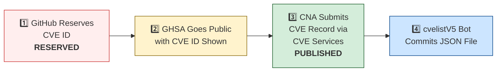

# 🛡️ OpenClaw CVE & Security Advisory Tracker

  
  
  
  
   
  
  
  
  
  

An automated tracker that continuously monitors [OpenClaw](https://github.com/openclaw/openclaw) security advisories across the GitHub Advisory Database, repo-level security advisories, and the [CVE V5 (cvelistV5)](https://github.com/CVEProject/cvelistV5) registry. Every hour it pulls the latest data, reconciles GHSA → CVE publication state, and regenerates this dashboard so you always have an up-to-date picture of the project's vulnerability landscape.

  Last updated: 2026-04-08 12:28 UTC · <a href="LICENSE">MIT License</a> · <a href="ADVISORIES.md">Full Advisory List</a> · <a href="SECURITY.md">Security Policy</a> · Data: <a href="https://github.com/CVEProject/cvelistV5">cvelistV5</a> + <a href="https://github.com/github/advisory-database">Advisory DB</a> · Updates hourly

---

  <a href="#-cves-published-in-cvelistv5-19">Published CVEs</a> ·
  <a href="#-cve-publication-pipeline">Pipeline</a> ·
  <a href="#-all-security-advisories-138">Advisories</a> ·
  <a href="#-vulnerability-categories">Categories</a> ·
  <a href="#-key-insights">Insights</a> ·
  <a href="#-project-identity">Identity</a>

---

## 🏗️ Project Identity

| Field | Value |
|-------|-------|
| **Current Name** | OpenClaw |
| **Previous Names** | Moltbot (second name), Clawdbot (original name) |
| **Repository** | [openclaw/openclaw](https://github.com/openclaw/openclaw) |
| **npm Package** | `openclaw` (formerly `clawdbot`) |
| **Author** | Peter Steinberger (steipete) |

<strong>Search terms for CVE discovery</strong>

To find all CVEs, search for: `openclaw`, `clawdbot`, `moltbot`, `clawhub`, `pkg:npm/clawdbot`, `pkg:npm/openclaw`

---

## 🚀 CVEs Published in cvelistV5 (19)

These CVEs have full records in the [CVEProject/cvelistV5](https://github.com/CVEProject/cvelistV5) repository:

| CVE ID | Severity | CVSS | Title | CWE | Published |
|--------|----------|------|-------|-----|-----------|
| [CVE-2026-22172](https://github.com/openclaw/openclaw/security/advisories/GHSA-rqpp-rjj8-7wv8) |  | 9.4 | OpenClaw < 2026.3.12 - Scope Elevation in WebSocket Shared-Auth Connections | CWE-862 | 2026-03-20 |
| [CVE-2026-32922](https://github.com/openclaw/openclaw/security/advisories/GHSA-4jpw-hj22-2xmc) |  | 9.4 | OpenClaw < 2026.3.11 - Privilege Escalation via Unvalidated Scope in device.token.rotate | CWE-266 | 2026-03-29 |
| [CVE-2026-32915](https://github.com/openclaw/openclaw/security/advisories/GHSA-4w7m-58cg-cmff) |  | 9.3 | OpenClaw < 2026.3.11 - Sandbox Boundary Bypass via Subagent Control Surface | CWE-863 | 2026-03-29 |
| [CVE-2026-32987](https://github.com/openclaw/openclaw/security/advisories/GHSA-63f5-hhc7-cx6p) |  | 9.3 | OpenClaw < 2026.3.13 - Bootstrap Setup Code Replay via Device Pairing | CWE-294 | 2026-03-29 |
| [CVE-2026-32918](https://github.com/openclaw/openclaw/security/advisories/GHSA-wcxr-59v9-rxr8) |  | 9.2 | OpenClaw < 2026.3.11 - Session Sandbox Escape via session_status Tool | CWE-863 | 2026-03-29 |
| [CVE-2026-32916](https://github.com/openclaw/openclaw/security/advisories/GHSA-xw77-45gv-p728) |  | 9.2 | OpenClaw 2026.3.7 < 2026.3.11 - Authorization Bypass in Plugin Subagent Routes via Synthetic Admin Scopes | CWE-266 | 2026-03-31 |
| [CVE-2026-24763](https://github.com/openclaw/openclaw/security/advisories/GHSA-mc68-q9jw-2h3v) |  | 8.8 | OpenClaw/Clawdbot Docker Execution has Authenticated Command Injection via PATH Environment Variable | CWE-78 | 2026-02-02 |
| [CVE-2026-25253](https://github.com/openclaw/openclaw/security/advisories/GHSA-g8p2-7wf7-98mq) |  | 8.8 | OpenClaw/Clawdbot has 1-Click RCE via Authentication Token Exfiltration From gatewayUrl | CWE-669 | 2026-02-01 |
| [CVE-2026-32974](https://github.com/openclaw/openclaw/security/advisories/GHSA-g353-mgv3-8pcj) |  | 8.8 | OpenClaw < 2026.3.12 - Forged Event Injection via Feishu Webhook Verification Token | CWE-347 | 2026-03-29 |
| [CVE-2026-28462](https://github.com/openclaw/openclaw/security/advisories/GHSA-gq9c-wg68-gwj2) |  | 8.7 | OpenClaw < 2026.2.13 - Path Traversal in Trace and Download Output Paths | CWE-22 | 2026-03-05 |
| [CVE-2026-28478](https://github.com/openclaw/openclaw/security/advisories/GHSA-q447-rj3r-2cgh) |  | 8.7 | OpenClaw affected by denial of service via unbounded webhook request body buffering | CWE-770 | 2026-03-05 |
| [CVE-2026-28479](https://github.com/openclaw/openclaw/security/advisories/GHSA-fh3f-q9qw-93j9) |  | 8.7 | OpenClaw < 2026.2.15 - Cache Poisoning via Deprecated SHA-1 Hash in Sandbox Configuration | CWE-327 | 2026-03-05 |
| [CVE-2026-29609](https://github.com/openclaw/openclaw/security/advisories/GHSA-j27p-hq53-9wgc) |  | 8.7 | OpenClaw < 2026.2.14 - Denial of Service via Unbounded URL-backed Media Fetch | CWE-770 | 2026-03-05 |
| [CVE-2026-32011](https://github.com/openclaw/openclaw/security/advisories/GHSA-x4vp-4235-65hg) |  | 8.7 | OpenClaw < 2026.3.2 - Slow-Request Denial of Service via Pre-Auth Webhook Body Parsing | CWE-770 | 2026-03-19 |
| [CVE-2026-32013](https://github.com/openclaw/openclaw/security/advisories/GHSA-fgvx-58p6-gjwc) |  | 8.7 | OpenClaw < 2026.2.25 - Symlink Traversal in agents.files Methods | CWE-59 | 2026-03-19 |
| [CVE-2026-32049](https://github.com/openclaw/openclaw/security/advisories/GHSA-rxxp-482v-7mrh) |  | 8.7 | OpenClaw < 2026.2.22 - Denial of Service via Inbound Media Download Byte Limit Bypass | CWE-770 | 2026-03-21 |
| [CVE-2026-32059](https://github.com/openclaw/openclaw/security/advisories/GHSA-3c6h-g97w-fg78) |  | 8.7 | OpenClaw 2026.2.22-2 < 2026.2.23 - Allowlist Bypass via sort Long-Option Abbreviation in tools.exec.safeBins | CWE-863 | 2026-03-11 |
| [CVE-2026-32062](https://github.com/openclaw/openclaw/security/advisories/GHSA-mfg5-7q5g-f37j) |  | 8.7 | OpenClaw 2026.2.21-2 < 2026.2.22 - Unauthenticated WebSocket Resource Exhaustion via Media Stream | CWE-770 | 2026-03-11 |
| [CVE-2026-32846](https://github.com/openclaw/openclaw/security/advisories/GHSA-f6pf-4gjx-c94r) |  | 8.7 | OpenClaw Media Parsing Path Traversal to Arbitrary File Read | CWE-22 | 2026-03-26 |
| [CVE-2026-32982](https://github.com/openclaw/openclaw/security/advisories/GHSA-xwcj-hwhf-h378) |  | 8.7 | OpenClaw < 2026.3.13 - Telegram Bot Token Exposure in Media Fetch Error Logs | CWE-532 | 2026-03-31 |
| [CVE-2026-26323](https://github.com/openclaw/openclaw/security/advisories/GHSA-m7x8-2w3w-pr42) |  | 8.6 | OpenClaw has a command injection in maintainer clawtributors updater | CWE-78 | 2026-02-19 |
| [CVE-2026-32014](https://github.com/openclaw/openclaw/security/advisories/GHSA-r65x-2hqr-j5hf) |  | 8.6 | OpenClaw < 2026.2.26 - Node Reconnect Metadata Spoofing via Unsigned Platform Fields | CWE-290 | 2026-03-19 |
| [CVE-2026-32920](https://github.com/openclaw/openclaw/security/advisories/GHSA-99qw-6mr3-36qr) |  | 8.6 | OpenClaw < 2026.3.12 - Arbitrary Code Execution via Auto-Discovery of Workspace Plugins | CWE-829 | 2026-03-31 |
| [CVE-2026-33575](https://github.com/openclaw/openclaw/security/advisories/GHSA-7h7g-x2px-94hj) |  | 8.6 | OpenClaw < 2026.3.12 - Long-lived Credential Exposure in Pairing Setup Codes | CWE-522 | 2026-03-29 |
| [CVE-2026-33577](https://github.com/openclaw/openclaw/security/advisories/GHSA-2x4x-cc5g-qmmg) |  | 8.6 | OpenClaw < 2026.3.28 - Insufficient Scope Validation in node.pair.approve | CWE-863 | 2026-03-31 |
| [CVE-2026-34503](https://github.com/openclaw/openclaw/security/advisories/GHSA-2pr2-hcv6-7gwv) |  | 8.6 | OpenClaw's device removal and token revocation do not terminate active WebSocket sessions | CWE-613 | 2026-03-31 |
| [CVE-2026-28468](https://github.com/openclaw/openclaw/security/advisories/GHSA-h9g4-589h-68xv) |  | 8.5 | OpenClaw 2026.1.29-beta.1 < 2026.2.14 - Authentication Bypass in Sandbox Browser Bridge Server | CWE-306 | 2026-03-05 |
| [CVE-2026-32064](https://github.com/openclaw/openclaw/security/advisories/GHSA-25gx-x37c-7pph) |  | 8.5 | OpenClaw < 2026.2.21 - Missing VNC Authentication in Sandbox Browser noVNC Observer | CWE-306 | 2026-03-21 |
| [CVE-2026-28453](https://github.com/openclaw/openclaw/security/advisories/GHSA-p25h-9q54-ffvw) |  | 8.3 | OpenClaw < 2026.2.14 - Zip Slip Path Traversal in TAR Archive Extraction | CWE-22 | 2026-03-05 |
| [CVE-2026-28393](https://github.com/openclaw/openclaw/security/advisories/GHSA-7xhj-55q9-pc3m) |  | 8.3 | OpenClaw 2.0.0-beta3 < 2026.2.14 - Arbitrary JavaScript Module Loading via Hook Transform Path Traversal | CWE-427 | 2026-03-05 |
| [CVE-2026-28450](https://github.com/openclaw/openclaw/security/advisories/GHSA-mv9j-6xhh-g383) |  | 8.3 | OpenClaw < 2026.2.12 - Unauthenticated Profile Tampering via Nostr Plugin HTTP Endpoints | CWE-306 | 2026-03-05 |
| [CVE-2026-32004](https://github.com/openclaw/openclaw/security/advisories/GHSA-v865-p3gq-hw6m) |  | 8.3 | OpenClaw < 2026.3.2 - Authentication Bypass via Encoded Path in /api/channels Route | CWE-288 | 2026-03-19 |
| [CVE-2026-32036](https://github.com/openclaw/openclaw/security/advisories/GHSA-mwxv-35wr-4vvj) |  | 8.3 | OpenClaw < 2026.2.26- Authentication Bypass via Encoded Dot-Segment Traversal in /api/channels | CWE-289 | 2026-03-19 |
| [CVE-2026-28464](https://github.com/openclaw/openclaw/security/advisories/GHSA-jmm5-fvh5-gf4p) |  | 8.2 | OpenClaw < 2026.2.12 - Timing Attack in Hooks Token Authentication | CWE-208 | 2026-03-05 |
| [CVE-2026-28454](https://github.com/openclaw/openclaw/security/advisories/GHSA-fhvm-j76f-qmjv) |  | 8.2 | OpenClaw < 2026.2.2 - Authorization Bypass via Unauthenticated Telegram Webhook | CWE-345 | 2026-03-05 |
| [CVE-2026-28465](https://github.com/openclaw/openclaw/security/advisories/GHSA-3m3q-x3gj-f79x) |  | 8.2 | OpenClaw voice-call < 2026.2.3 - Webhook Verification Bypass via Forwarded Headers | CWE-345 | 2026-03-05 |
| [CVE-2026-28469](https://github.com/openclaw/openclaw/security/advisories/GHSA-rq6g-px6m-c248) |  | 8.2 | OpenClaw Google Chat shared-path webhook target ambiguity allowed cross-account policy-context misrouting | CWE-639 | 2026-03-05 |
| [CVE-2026-32302](https://github.com/openclaw/openclaw/security/advisories/GHSA-5wcw-8jjv-m286) |  | 8.1 | OpenClaw: Untrusted web origins can obtain authenticated operator.admin access in trusted-proxy mode | CWE-346 | 2026-03-12 |
| [CVE-2026-25157](https://github.com/openclaw/openclaw/security/advisories/GHSA-q284-4pvr-m585) |  | 7.8 | OpenClaw/Clawdbot has OS Command Injection via Project Root Path in sshNodeCommand | CWE-78 | 2026-02-04 |
| [CVE-2026-32048](https://github.com/openclaw/openclaw/security/advisories/GHSA-p7gr-f84w-hqg5) |  | 7.7 | OpenClaw < 2026.3.1 - Sandbox Escape via Cross-Agent sessions_spawn | CWE-732 | 2026-03-21 |
| [CVE-2026-27487](https://github.com/openclaw/openclaw/security/advisories/GHSA-4564-pvr2-qq4h) |  | 7.6 | OpenClaw: Prevent shell injection in macOS keychain credential write | CWE-78 | 2026-02-21 |
| [CVE-2026-32005](https://github.com/openclaw/openclaw/security/advisories/GHSA-x2ff-j5c2-ggpr) |  | 7.6 | OpenClaw < 2026.2.25 - Authorization Bypass in Interactive Callbacks via Sender Check Skip | CWE-863 | 2026-03-19 |
| [CVE-2026-26316](https://github.com/openclaw/openclaw/security/advisories/GHSA-pchc-86f6-8758) |  | 7.5 | OpenClaw has BlueBubbles webhook auth bypass via loopback proxy trust | CWE-863 | 2026-02-19 |
| [CVE-2026-22179](https://github.com/openclaw/openclaw/security/advisories/GHSA-9p38-94jf-hgjj) |  | 7.5 | OpenClaw < 2026.2.22 - Allowlist Bypass via Command Substitution in system.run | CWE-78 | 2026-03-18 |
| [CVE-2026-26321](https://github.com/openclaw/openclaw/security/advisories/GHSA-8jpq-5h99-ff5r) |  | 7.5 | OpenClaw has a local file disclosure via sendMediaFeishu in Feishu extension | CWE-22 | 2026-02-19 |
| [CVE-2026-25474](https://github.com/openclaw/openclaw/security/advisories/GHSA-mp5h-m6qj-6292) |  | 7.5 | OpenClaw has a Telegram webhook request forgery (missing `channels.telegram.webhookSecret`) → auth bypass | CWE-345 | 2026-02-19 |
| [CVE-2026-26324](https://github.com/openclaw/openclaw/security/advisories/GHSA-jrvc-8ff5-2f9f) |  | 7.5 | OpenClaw has a SSRF guard bypass via full-form IPv4-mapped IPv6 (loopback / metadata reachable) | CWE-918 | 2026-02-19 |
| [CVE-2026-28485](https://github.com/openclaw/openclaw/security/advisories/GHSA-qpjj-47vm-64pj) |  | 7.5 | OpenClaw 2026.1.5 < 2026.2.12 - Missing Authentication in Browser Control HTTP Endpoints | CWE-306 | 2026-03-05 |
| [CVE-2026-32003](https://github.com/openclaw/openclaw/security/advisories/GHSA-2fgq-7j6h-9rm4) |  | 7.5 | OpenClaw < 2026.2.22 - Remote Code Execution via SHELLOPTS/PS4 Environment Injection in system.run | CWE-78 | 2026-03-19 |
| [CVE-2026-28458](https://github.com/openclaw/openclaw/security/advisories/GHSA-mr32-vwc2-5j6h) |  | 7.4 | OpenClaw's Browser Relay /cdp websocket is missing auth which could allow cross-tab cookie access | CWE-306 | 2026-03-05 |
| [CVE-2026-32016](https://github.com/openclaw/openclaw/security/advisories/GHSA-7f4q-9rqh-x36p) |  | 7.3 | OpenClaw < 2026.2.22 - Path Traversal via Basename-Only Allowlist Matching on macOS | CWE-426 | 2026-03-19 |
| [CVE-2026-32032](https://github.com/openclaw/openclaw/security/advisories/GHSA-f8mp-vj46-cq8v) |  | 7.3 | OpenClaw < 2026.2.22 - Arbitrary Shell Execution via Unvalidated SHELL Environment Variable | CWE-426 | 2026-03-19 |
| [CVE-2026-26325](https://github.com/openclaw/openclaw/security/advisories/GHSA-h3f9-mjwj-w476) |  | 7.2 | OpenClaw Node host system.run rawCommand/command mismatch can bypass allowlist/approvals | CWE-284 | 2026-02-19 |
| [CVE-2026-22175](https://github.com/openclaw/openclaw/security/advisories/GHSA-gwqp-86q6-w47g) |  | 7.1 | OpenClaw < 2026.2.23 - Exec Approval Bypass via Unrecognized Multiplexer Shell Wrappers | CWE-184 | 2026-03-18 |
| [CVE-2026-26317](https://github.com/openclaw/openclaw/security/advisories/GHSA-3fqr-4cg8-h96q) |  | 7.1 | OpenClaw affected by cross-site request forgery (CSRF) through loopback browser mutation endpoints | CWE-352 | 2026-02-19 |
| [CVE-2026-26327](https://github.com/openclaw/openclaw/security/advisories/GHSA-pv58-549p-qh99) |  | 7.1 | OpenClaw allows unauthenticated discovery TXT records to steer routing and TLS pinning | CWE-345 | 2026-02-19 |
| [CVE-2026-27566](https://github.com/openclaw/openclaw/security/advisories/GHSA-jj82-76v6-933r) |  | 7.1 | OpenClaw < 2026.2.22 - Allowlist Bypass via Wrapper Binary Unwrapping in system.run | CWE-78 | 2026-03-19 |
| [CVE-2026-32008](https://github.com/openclaw/openclaw/security/advisories/GHSA-45cg-2683-gfmq) |  | 7.1 | OpenClaw < 2026.2.21 - Arbitrary Local File Read via Browser Navigation Guard | CWE-610 | 2026-03-19 |
| [CVE-2026-33581](https://github.com/openclaw/openclaw/security/advisories/GHSA-v8wv-jg3q-qwpq) |  | 7.1 | OpenClaw < 2026.3.24 - Arbitrary File Read via mediaUrl and fileUrl Parameters | CWE-22 | 2026-03-31 |
| [CVE-2026-32009](https://github.com/openclaw/openclaw/security/advisories/GHSA-5gj7-jf77-q2q2) |  | 7 | OpenClaw < 2026.2.24 - Binary Hijacking via Static Default Trusted Directories in safeBins | CWE-426 | 2026-03-19 |
| [CVE-2026-32979](https://github.com/openclaw/openclaw/security/advisories/GHSA-xf99-j42q-5w5p) |  | 7 | OpenClaw < 2026.3.11 - Unbound Interpreter and Runtime Commands Bypass in node-host Approval | CWE-367 | 2026-03-29 |
| [CVE-2026-22177](https://github.com/openclaw/openclaw/security/advisories/GHSA-8fmp-37rc-p5g7) |  | 6.9 | OpenClaw < 2026.2.21 - Environment Variable Injection via Config env.vars | CWE-15 | 2026-03-18 |
| [CVE-2026-27523](https://github.com/openclaw/openclaw/security/advisories/GHSA-m8v2-6wwh-r4gc) |  | 6.9 | OpenClaw < 2026.2.24 - Sandbox Bind Validation Bypass via Symlink-Parent Missing-Leaf Paths | CWE-22 | 2026-03-18 |
| [CVE-2026-31990](https://github.com/openclaw/openclaw/security/advisories/GHSA-cfvj-7rx7-fc7c) |  | 6.9 | OpenClaw < 2026.3.2 - Symlink Traversal in stageSandboxMedia Destination | CWE-59 | 2026-03-19 |
| [CVE-2026-28480](https://github.com/openclaw/openclaw/security/advisories/GHSA-mj5r-hh7j-4gxf) |  | 6.9 | OpenClaw Telegram allowlist authorization accepted mutable usernames | CWE-290 | 2026-03-05 |
| [CVE-2026-32919](https://github.com/openclaw/openclaw/security/advisories/GHSA-jf6w-m8jw-jfxc) |  | 6.9 | OpenClaw < 2026.3.11 - Unauthorized Session Reset via agent Slash Commands | CWE-863 | 2026-03-29 |
| [CVE-2026-34505](https://github.com/openclaw/openclaw/security/advisories/GHSA-5m9r-p9g7-679c) |  | 6.9 | OpenClaw < 2026.3.12 - Webhook Rate Limiting Bypass via Pre-Authentication Secret Validation | CWE-307 | 2026-03-31 |
| [CVE-2026-34504](https://github.com/openclaw/openclaw/security/advisories/GHSA-qxgf-hmcj-3xw3) |  | 6.9 | OpenClaw affected by SSRF via unguarded image download in fal provider | CWE-918 | 2026-03-31 |
| [CVE-2026-34510](https://github.com/openclaw/openclaw/security/advisories/GHSA-h3x4-hc5v-v2gm) |  | 6.9 | OpenClaw < 2026.3.22 - Remote File URL Acceptance in Windows Media Loaders | CWE-41 | 2026-04-01 |
| [CVE-2026-29612](https://github.com/openclaw/openclaw/security/advisories/GHSA-w2cg-vxx6-5xjg) |  | 6.8 | OpenClaw < 2026.2.14 - Denial of Service via Large Base64 Media File Decoding | CWE-770 | 2026-03-05 |
| [CVE-2026-28452](https://github.com/openclaw/openclaw/security/advisories/GHSA-h89v-j3x9-8wqj) |  | 6.7 | OpenClaw affected by denial of service through unguarded archive extraction allowing high expansion/resource abuse (ZIP/TAR) | CWE-770 | 2026-03-05 |
| [CVE-2026-26328](https://github.com/openclaw/openclaw/security/advisories/GHSA-g34w-4xqq-h79m) |  | 6.5 | OpenClaw iMessage group allowlist authorization inherited DM pairing-store identities | CWE-284, CWE-863 | 2026-02-19 |
| [CVE-2026-28448](https://github.com/openclaw/openclaw/security/advisories/GHSA-33rq-m5x2-fvgf) |  | 6.3 | OpenClaw 2026.1.29 < 2026.2.1 - Authorization Bypass in Twitch Plugin allowFrom Access Control | CWE-285 | 2026-03-05 |
| [CVE-2026-28451](https://github.com/openclaw/openclaw/security/advisories/GHSA-x22m-j5qq-j49m) |  | 6.3 | OpenClaw < 2026.2.14 - SSRF via Feishu Extension Media Fetching | CWE-918 | 2026-03-05 |
| [CVE-2026-28471](https://github.com/openclaw/openclaw/security/advisories/GHSA-rmxw-jxxx-4cpc) |  | 6.3 | OpenClaw 2026.1.14-1 < 2026.2.2 - Allowlist Bypass via displayName and Cross-Homeserver localpart Matching in Matrix Plugin | CWE-287 | 2026-03-05 |
| [CVE-2026-28475](https://github.com/openclaw/openclaw/security/advisories/GHSA-47q7-97xp-m272) |  | 6.3 | OpenClaw < 2026.2.13 - Timing Attack via Hook Token Comparison | CWE-208 | 2026-03-05 |
| [CVE-2026-32028](https://github.com/openclaw/openclaw/security/advisories/GHSA-354r-7mfh-7rh2) |  | 6.3 | OpenClaw < 2026.2.25 - Missing Authorization Check in Discord DM Reaction Ingress | CWE-863 | 2026-03-19 |
| [CVE-2026-32031](https://github.com/openclaw/openclaw/security/advisories/GHSA-8j2w-6fmm-m587) |  | 6.3 | OpenClaw < 2026.2.26 - Authentication Bypass via Path Canonicalization Mismatch in /api/channels Gateway | CWE-288 | 2026-03-19 |
| [CVE-2026-32029](https://github.com/openclaw/openclaw/security/advisories/GHSA-2rgf-hm63-5qph) |  | 6.3 | OpenClaw < 2026.2.21 - Client IP Spoofing via X-Forwarded-For Header Parsing | CWE-345 | 2026-03-19 |
| [CVE-2026-32050](https://github.com/openclaw/openclaw/security/advisories/GHSA-792q-qw95-f446) |  | 6.3 | OpenClaw < 2026.2.25 - Unauthorized Reaction Status Event Enqueue via Access Check Bypass | CWE-863 | 2026-03-21 |
| [CVE-2026-32897](https://github.com/openclaw/openclaw/security/advisories/GHSA-v6x2-2qvm-6gv8) |  | 6.3 | OpenClaw < 2026.2.22 - Authentication Token Reuse in Owner ID Prompt Hashing Fallback | CWE-320 | 2026-03-21 |
| [CVE-2026-33580](https://github.com/openclaw/openclaw/security/advisories/GHSA-9528-x887-j2fp) |  | 6.3 | OpenClaw's Nextcloud Talk webhook missing rate limiting on shared secret authentication | CWE-307 | 2026-03-31 |
| [CVE-2026-22181](https://github.com/openclaw/openclaw/security/advisories/GHSA-8mvx-p2r9-r375) |  | 6.1 | OpenClaw < 2026.3.2 - DNS Pinning Bypass via Environment Proxy Configuration in web_fetch | CWE-918 | 2026-03-18 |
| [CVE-2026-32002](https://github.com/openclaw/openclaw/security/advisories/GHSA-q6qf-4p5j-r25g) |  | 6 | OpenClaw < 2026.2.23 - Sandbox Boundary Bypass via Image Tool workspaceOnly Bypass | CWE-200 | 2026-03-19 |
| [CVE-2026-32039](https://github.com/openclaw/openclaw/security/advisories/GHSA-wpph-cjgr-7c39) |  | 6 | OpenClaw < 2026.2.22 - Sender Authorization Bypass via Identity Collision in toolsBySender | CWE-639 | 2026-03-19 |
| [CVE-2026-32057](https://github.com/openclaw/openclaw/security/advisories/GHSA-vvgp-4c28-m3jm) |  | 6 | OpenClaw < 2026.2.25 - Authentication Bypass via Control UI client.id Parameter | CWE-807 | 2026-03-21 |
| [CVE-2026-34511](https://github.com/openclaw/openclaw/security/advisories/GHSA-9jpj-g8vv-j5mf) |  | 6 | OpenClaw < 2026.4.2 - PKCE Verifier Exposure via OAuth State Parameter | CWE-330 | 2026-04-03 |
| [CVE-2026-28481](https://github.com/openclaw/openclaw/security/advisories/GHSA-7vwx-582j-j332) |  | 5.9 | OpenClaw < 2026.2.1 - Bearer Token Leakage via MS Teams Attachment Downloader Suffix Matching | CWE-201 | 2026-03-05 |
| [CVE-2026-32043](https://github.com/openclaw/openclaw/security/advisories/GHSA-mwcg-wfq3-4gjc) |  | 5.9 | OpenClaw < 2026.2.25 - Time-of-Check-Time-of-Use via Mutable Symlink in system.run cwd Parameter | CWE-367 | 2026-03-21 |
| [CVE-2026-22217](https://github.com/openclaw/openclaw/security/advisories/GHSA-p4wh-cr8m-gm6c) |  | 5.8 | OpenClaw 2026.2.22 < 2026.2.23 - Arbitrary Binary Execution via $SHELL Environment Variable Trusted Prefix Fallback | CWE-829 | 2026-03-18 |
| [CVE-2026-27670](https://github.com/openclaw/openclaw/security/advisories/GHSA-r54r-wmmq-mh84) |  | 5.8 | OpenClaw < 2026.3.2 - Arbitrary File Write via ZIP Extraction Parent Symlink Race Condition | CWE-367 | 2026-03-19 |
| [CVE-2026-32065](https://github.com/openclaw/openclaw/security/advisories/GHSA-hwpq-rrpf-pgcq) |  | 5.7 | OpenClaw < 2026.2.25 - Approval Identity Mismatch in system.run Command Execution | CWE-436 | 2026-03-21 |
| [CVE-2026-28457](https://github.com/openclaw/openclaw/security/advisories/GHSA-xw4p-pw82-hqr7) |  | 5.6 | OpenClaw < 2026.2.14 - Path Traversal in Sandbox Skill Mirroring via Name Parameter | CWE-22 | 2026-03-05 |
| [CVE-2026-31993](https://github.com/openclaw/openclaw/security/advisories/GHSA-5f9p-f3w2-fwch) |  | 5.6 | OpenClaw < 2026.2.22 - Allowlist Parsing Mismatch in system.run Shell Chains | CWE-184 | 2026-03-19 |
| [CVE-2026-32898](https://github.com/openclaw/openclaw/security/advisories/GHSA-7jx5-9fjg-hp4m) |  | 5.3 | OpenClaw < 2026.2.23 - ACP Permission Auto-Approval Bypass via Untrusted Tool Metadata | CWE-807 | 2026-03-21 |
| [CVE-2026-32923](https://github.com/openclaw/openclaw/security/advisories/GHSA-9vvh-2768-c8vp) |  | 5.3 | OpenClaw < 2026.3.11 - Authorization Bypass in Discord Guild Reaction Allowlist Enforcement | CWE-863 | 2026-03-29 |
| [CVE-2026-34425](https://github.com/openclaw/openclaw/security/advisories/GHSA-fvx6-pj3r-5q4q) |  | 5.3 | OpenClaw - Shell-Bleed Protection Preflight Validation Bypass | CWE-184 | 2026-04-02 |
| [CVE-2026-33578](https://github.com/openclaw/openclaw/security/advisories/GHSA-63mg-xp9j-jfcm) |  | 5.3 | OpenClaw: Google Chat and Zalouser group sender allowlist bypass via policy downgrade | CWE-863 | 2026-03-31 |
| [CVE-2026-22180](https://github.com/openclaw/openclaw/security/advisories/GHSA-3pxq-f3cp-jmxp) |  | 4.8 | OpenClaw < 2026.3.2 - Path Confinement Bypass in Browser Output and File Write Operations | CWE-59 | 2026-03-18 |
| [CVE-2026-24764](https://github.com/openclaw/openclaw/security/advisories/GHSA-782p-5fr5-7fj8) |  | 3.7 | OpenClaw has Remote Code Execution via System Prompt Injection in Slack Channel Descriptions | CWE-74, CWE-94 | 2026-02-19 |
| [CVE-2026-27524](https://github.com/openclaw/openclaw/security/advisories/GHSA-62f6-mrcj-v8h5) |  | 2.3 | OpenClaw < 2026.2.21 - Prototype Pollution via Debug Override Path | CWE-1321 | 2026-03-18 |
| [CVE-2026-32019](https://github.com/openclaw/openclaw/security/advisories/GHSA-4rqq-w8v4-7p47) |  | 2.3 | OpenClaw < 2026.2.22 - Incomplete IPv4 Special-Use Range Blocking in SSRF Guard | CWE-918 | 2026-03-19 |
| [CVE-2026-32006](https://github.com/openclaw/openclaw/security/advisories/GHSA-25pw-4h6w-qwvm) |  | 2.3 | OpenClaw < 2026.2.26 - Authorization Bypass via DM Pairing-Store Fallback in Group Allowlist | CWE-863 | 2026-03-19 |
| [CVE-2026-34506](https://github.com/openclaw/openclaw/security/advisories/GHSA-g7cr-9h7q-4qxq) |  | 2.3 | OpenClaw < 2026.3.8 - Sender Allowlist Bypass in Microsoft Teams Plugin via Route Allowlist Configuration | CWE-863 | 2026-03-31 |
| [CVE-2026-31991](https://github.com/openclaw/openclaw/security/advisories/GHSA-wm8r-w8pf-2v6w) |  | 2 | OpenClaw < 2026.2.26 - Authorization Bypass via DM Pairing-Store Leakage in Signal Group Allowlist | CWE-863 | 2026-03-19 |
| [CVE-2026-32018](https://github.com/openclaw/openclaw/security/advisories/GHSA-gq83-8q7q-9hfx) |  | 2 | OpenClaw < 2026.2.19 - Race Condition in Sandbox Registry Write Operations | CWE-362 | 2026-03-19 |
| [CVE-2026-32058](https://github.com/openclaw/openclaw/security/advisories/GHSA-hjvp-qhm6-wrh2) |  | 2 | OpenClaw < 2026.2.26 - Approval Context-Binding Weakness in system.run via host=node | CWE-863 | 2026-03-21 |
| [CVE-2026-32067](https://github.com/openclaw/openclaw/security/advisories/GHSA-vjp8-wprm-2jw9) |  | 2 | OpenClaw < 2026.2.26 - Cross-Account Authorization Bypass in DM Pairing Store | CWE-863 | 2026-03-21 |
| [CVE-2026-32970](https://github.com/openclaw/openclaw/security/advisories/GHSA-qvr7-g57c-mrc7) |  | 2 | OpenClaw < 2026.3.11 - Credential Fallback Logic Bypass via Unavailable Local Auth SecretRefs | CWE-636 | 2026-03-31 |

<strong>📖 Detailed CVE Analysis (click to expand)</strong>

### CVE-2026-22172 — OpenClaw < 2026.3.12 - Scope Elevation in WebSocket Shared-Auth Connections

| Field | Detail |
|-------|--------|
| **CVSS** | 9.4 (CRITICAL) — `CVSS:4.0/AV:N/AC:L/AT:N/PR:L/UI:N/VC:H/VI:H/VA:H/SC:H/SI:H/SA:H` |
| **CWE** | CWE-862 (CWE-862 Missing Authorization) |
| **Affected** | < 2026.3.12 |
| **Vendor/Product** | OpenClaw / OpenClaw |
| **Advisory** | [GHSA-rqpp-rjj8-7wv8](https://github.com/openclaw/openclaw/security/advisories/GHSA-rqpp-rjj8-7wv8) |

OpenClaw versions prior to 2026.3.12 contain an authorization bypass vulnerability in the WebSocket connect path that allows shared-token or password-authenticated connections to self-declare elevated scopes without server-side binding. Attackers can exploit this logic flaw to present unauthorized scopes such as operator.admin and perform admin-only gateway operations.

**References:**
- [openclaw-scope-elevation-in-websocket-shared-auth-connections](https://www.vulncheck.com/advisories/openclaw-scope-elevation-in-websocket-shared-auth-connections)
---

### CVE-2026-32922 — OpenClaw < 2026.3.11 - Privilege Escalation via Unvalidated Scope in device.token.rotate

| Field | Detail |
|-------|--------|
| **CVSS** | 9.4 (CRITICAL) — `CVSS:4.0/AV:N/AC:L/AT:N/PR:L/UI:N/VC:H/VI:H/VA:H/SC:H/SI:H/SA:H` |
| **CWE** | CWE-266 (Incorrect Privilege Assignment) |
| **Affected** | < 2026.3.11 |
| **Vendor/Product** | OpenClaw / OpenClaw |
| **Advisory** | [GHSA-4jpw-hj22-2xmc](https://github.com/openclaw/openclaw/security/advisories/GHSA-4jpw-hj22-2xmc) |

OpenClaw before 2026.3.11 contains a privilege escalation vulnerability in device.token.rotate that allows callers with operator.pairing scope to mint tokens with broader scopes by failing to constrain newly minted scopes to the caller's current scope set. Attackers can obtain operator.admin tokens for paired devices and achieve remote code execution on connected nodes via system.run or gain unauthorized gateway-admin access.

**References:**
- [VulnCheck Advisory: OpenClaw < 2026.3.11 - Privilege Escalation via Unvalidated Scope in device.token.rotate](https://www.vulncheck.com/advisories/openclaw-privilege-escalation-via-unvalidated-scope-in-device-token-rotate)
---

### CVE-2026-32915 — OpenClaw < 2026.3.11 - Sandbox Boundary Bypass via Subagent Control Surface

| Field | Detail |
|-------|--------|
| **CVSS** | 9.3 (CRITICAL) — `CVSS:4.0/AV:L/AC:L/AT:N/PR:L/UI:N/VC:H/VI:H/VA:H/SC:H/SI:H/SA:H` |
| **CWE** | CWE-863 (Incorrect Authorization) |
| **Affected** | < 2026.3.11 |
| **Vendor/Product** | OpenClaw / OpenClaw |
| **Advisory** | [GHSA-4w7m-58cg-cmff](https://github.com/openclaw/openclaw/security/advisories/GHSA-4w7m-58cg-cmff) |

OpenClaw before 2026.3.11 contains a sandbox boundary bypass vulnerability allowing leaf subagents to access the subagents control surface and resolve against parent requester scope instead of their own session tree. A low-privilege sandboxed leaf worker can steer or kill sibling runs and cause execution with broader tool policies by exploiting insufficient authorization checks on subagent control requests.

**References:**
- [VulnCheck Advisory: OpenClaw < 2026.3.11 - Sandbox Boundary Bypass via Subagent Control Surface](https://www.vulncheck.com/advisories/openclaw-sandbox-boundary-bypass-via-subagent-control-surface)
---

### CVE-2026-32987 — OpenClaw < 2026.3.13 - Bootstrap Setup Code Replay via Device Pairing

| Field | Detail |
|-------|--------|
| **CVSS** | 9.3 (CRITICAL) — `CVSS:4.0/AV:N/AC:L/AT:N/PR:N/UI:N/VC:H/VI:H/VA:H/SC:N/SI:N/SA:N` |
| **CWE** | CWE-294 (Authentication Bypass by Capture-replay) |
| **Affected** | < 2026.3.13 |
| **Vendor/Product** | OpenClaw / OpenClaw |
| **Advisory** | [GHSA-63f5-hhc7-cx6p](https://github.com/openclaw/openclaw/security/advisories/GHSA-63f5-hhc7-cx6p) |

OpenClaw before 2026.3.13 allows bootstrap setup codes to be replayed during device pairing verification in src/infra/device-bootstrap.ts. Attackers can verify a valid bootstrap code multiple times before approval to escalate pending pairing scopes, including privilege escalation to operator.admin.

**References:**
- [Patch Commit](https://github.com/openclaw/openclaw/commit/1803d16d5cec970c54b0e1ac46b31b1cbade335c)
- [VulnCheck Advisory: OpenClaw < 2026.3.13 - Bootstrap Setup Code Replay via Device Pairing](https://www.vulncheck.com/advisories/openclaw-bootstrap-setup-code-replay-via-device-pairing)
---

### CVE-2026-32918 — OpenClaw < 2026.3.11 - Session Sandbox Escape via session_status Tool

| Field | Detail |
|-------|--------|
| **CVSS** | 9.2 (CRITICAL) — `CVSS:4.0/AV:L/AC:L/AT:N/PR:L/UI:N/VC:H/VI:H/VA:N/SC:H/SI:H/SA:N` |
| **CWE** | CWE-863 (Incorrect Authorization) |
| **Affected** | < 2026.3.11 |
| **Vendor/Product** | OpenClaw / OpenClaw |
| **Advisory** | [GHSA-wcxr-59v9-rxr8](https://github.com/openclaw/openclaw/security/advisories/GHSA-wcxr-59v9-rxr8) |

OpenClaw before 2026.3.11 contains a session sandbox escape vulnerability in the session_status tool that allows sandboxed subagents to access parent or sibling session state. Attackers can supply arbitrary sessionKey values to read or modify session data outside their sandbox scope, including persisted model overrides.

**References:**
- [VulnCheck Advisory: OpenClaw < 2026.3.11 - Session Sandbox Escape via session_status Tool](https://www.vulncheck.com/advisories/openclaw-session-sandbox-escape-via-session-status-tool)
---

### CVE-2026-32916 — OpenClaw 2026.3.7 < 2026.3.11 - Authorization Bypass in Plugin Subagent Routes via Synthetic Admin Scopes

| Field | Detail |
|-------|--------|
| **CVSS** | 9.2 (CRITICAL) — `CVSS:4.0/AV:N/AC:L/AT:P/PR:N/UI:N/VC:H/VI:H/VA:L/SC:N/SI:N/SA:N` |
| **CWE** | CWE-266 (CWE-266: Incorrect Privilege Assignment) |
| **Affected** | < 2026.3.11 |
| **Vendor/Product** | OpenClaw / OpenClaw |
| **Advisory** | [GHSA-xw77-45gv-p728](https://github.com/openclaw/openclaw/security/advisories/GHSA-xw77-45gv-p728) |

OpenClaw versions 2026.3.7 before 2026.3.11 contain an authorization bypass vulnerability where plugin subagent routes execute gateway methods through a synthetic operator client with broad administrative scopes. Remote unauthenticated requests to plugin-owned routes can invoke runtime.subagent methods to perform privileged gateway actions including session deletion and agent execution.

**References:**
- [VulnCheck Advisory: OpenClaw 2026.3.7 < 2026.3.11 - Authorization Bypass in Plugin Subagent Routes via Synthetic Admin Scopes](https://www.vulncheck.com/advisories/openclaw-authorization-bypass-in-plugin-subagent-routes-via-synthetic-admin-scopes)
---

### CVE-2026-24763 — OpenClaw/Clawdbot Docker Execution has Authenticated Command Injection via PATH Environment Variable

| Field | Detail |
|-------|--------|
| **CVSS** | 8.8 (HIGH) — `CVSS:3.1/AV:N/AC:L/PR:L/UI:N/S:U/C:H/I:H/A:H` |
| **CWE** | CWE-78 (CWE-78: Improper Neutralization of Special Elements used in an OS Command ('OS Command Injection')) |
| **Affected** | < 2026.1.29 |
| **Vendor/Product** | clawdbot / clawdbot |
| **Advisory** | [GHSA-mc68-q9jw-2h3v](https://github.com/openclaw/openclaw/security/advisories/GHSA-mc68-q9jw-2h3v) |

OpenClaw (formerly  Clawdbot) is a personal AI assistant you run on your own devices. Prior to 2026.1.29, a command injection vulnerability existed in OpenClaw’s Docker sandbox execution mechanism due to unsafe handling of the PATH environment variable when constructing shell commands. An authenticated user able to control environment variables could influence command execution within the container context. This vulnerability is fixed in 2026.1.29.

> **Naming note:** Uses old name `clawdbot/clawdbot` as vendor/product.
**References:**
- [https://github.com/openclaw/openclaw/commit/771f23d36b95ec2204cc9a0054045f5d8439ea75](https://github.com/openclaw/openclaw/commit/771f23d36b95ec2204cc9a0054045f5d8439ea75)
- [https://github.com/openclaw/openclaw/releases/tag/v2026.1.29](https://github.com/openclaw/openclaw/releases/tag/v2026.1.29)
---

### CVE-2026-25253 — OpenClaw/Clawdbot has 1-Click RCE via Authentication Token Exfiltration From gatewayUrl

| Field | Detail |
|-------|--------|
| **CVSS** | 8.8 (HIGH) — `CVSS:3.1/AV:N/AC:L/PR:N/UI:R/S:U/C:H/I:H/A:H` |
| **CWE** | CWE-669 (CWE-669 Incorrect Resource Transfer Between Spheres) |
| **Affected** | < 2026.1.29 |
| **Vendor/Product** | OpenClaw / OpenClaw |
| **Advisory** | [GHSA-g8p2-7wf7-98mq](https://github.com/openclaw/openclaw/security/advisories/GHSA-g8p2-7wf7-98mq) |

OpenClaw (aka clawdbot or Moltbot) before 2026.1.29 obtains a gatewayUrl value from a query string and automatically makes a WebSocket connection without prompting, sending a token value.

> **Naming note:** Uses all three names in description. packageURL still references `pkg:npm/clawdbot`.
**References:**
- [1-click-rce-to-steal-your-moltbot-data-and-keys](https://depthfirst.com/post/1-click-rce-to-steal-your-moltbot-data-and-keys)
- [blog](https://openclaw.ai/blog)
- [one-click-rce-moltbot](https://ethiack.com/news/blog/one-click-rce-moltbot)
- [2016913750557651228](https://x.com/0xacb/status/2016913750557651228)
---

### CVE-2026-32974 — OpenClaw < 2026.3.12 - Forged Event Injection via Feishu Webhook Verification Token

| Field | Detail |
|-------|--------|
| **CVSS** | 8.8 (HIGH) — `CVSS:4.0/AV:N/AC:L/AT:N/PR:N/UI:N/VC:L/VI:H/VA:L/SC:N/SI:N/SA:N` |
| **CWE** | CWE-347 (Improper Verification of Cryptographic Signature) |
| **Affected** | < 2026.3.12 |
| **Vendor/Product** | OpenClaw / OpenClaw |
| **Advisory** | [GHSA-g353-mgv3-8pcj](https://github.com/openclaw/openclaw/security/advisories/GHSA-g353-mgv3-8pcj) |

OpenClaw before 2026.3.12 contains an authentication bypass vulnerability in Feishu webhook mode when only verificationToken is configured without encryptKey, allowing acceptance of forged events. Unauthenticated network attackers can inject forged Feishu events and trigger downstream tool execution by reaching the webhook endpoint.

**References:**
- [VulnCheck Advisory: OpenClaw < 2026.3.12 - Forged Event Injection via Feishu Webhook Verification Token](https://www.vulncheck.com/advisories/openclaw-forged-event-injection-via-feishu-webhook-verification-token)
---

### CVE-2026-28462 — OpenClaw < 2026.2.13 - Path Traversal in Trace and Download Output Paths

| Field | Detail |
|-------|--------|
| **CVSS** | 8.7 (HIGH) — `CVSS:4.0/AV:N/AC:L/AT:N/PR:N/UI:N/VC:H/VI:N/VA:N/SC:N/SI:N/SA:N` |
| **CWE** | CWE-22 (Improper Limitation of a Pathname to a Restricted Directory ('Path Traversal')) |
| **Affected** | < 2026.2.13 |
| **Vendor/Product** | OpenClaw / OpenClaw |
| **Advisory** | [GHSA-gq9c-wg68-gwj2](https://github.com/openclaw/openclaw/security/advisories/GHSA-gq9c-wg68-gwj2) |

OpenClaw versions prior to 2026.2.13 contain a vulnerability in the browser control API in which it accepts user-supplied output paths for trace and download files without consistently constraining writes to temporary directories. Attackers with API access can exploit path traversal in POST /trace/stop, POST /wait/download, and POST /download endpoints to write files outside intended temp roots.

**References:**
- [Patch Commit](https://github.com/openclaw/openclaw/commit/7f0489e4731c8d965d78d6eac4a60312e46a9426)
- [VulnCheck Advisory: OpenClaw < 2026.2.13 - Path Traversal in Trace and Download Output Paths](https://www.vulncheck.com/advisories/openclaw-path-traversal-in-trace-and-download-output-paths)
---

### CVE-2026-28478 — OpenClaw affected by denial of service via unbounded webhook request body buffering

| Field | Detail |
|-------|--------|
| **CVSS** | 8.7 (HIGH) — `CVSS:4.0/AV:N/AC:L/AT:N/PR:N/UI:N/VC:N/VI:N/VA:H/SC:N/SI:N/SA:N` |
| **CWE** | CWE-770 (Allocation of Resources Without Limits or Throttling) |
| **Affected** | < 2026.2.13 |
| **Vendor/Product** | OpenClaw / OpenClaw |
| **Advisory** | [GHSA-q447-rj3r-2cgh](https://github.com/openclaw/openclaw/security/advisories/GHSA-q447-rj3r-2cgh) |

OpenClaw versions prior to 2026.2.13 contain a denial of service vulnerability in webhook handlers that buffer request bodies without strict byte or time limits. Remote unauthenticated attackers can send oversized JSON payloads or slow uploads to webhook endpoints causing memory pressure and availability degradation.

**References:**
- [Patch Commit](https://github.com/openclaw/openclaw/commit/3cbcba10cf30c2ffb898f0d8c7dfb929f15f8930)
- [VulnCheck Advisory: OpenClaw < 2026.2.13 - Denial of Service via Unbounded Webhook Request Body Buffering](https://www.vulncheck.com/advisories/openclaw-denial-of-service-via-unbounded-webhook-request-body-buffering)
---

### CVE-2026-28479 — OpenClaw < 2026.2.15 - Cache Poisoning via Deprecated SHA-1 Hash in Sandbox Configuration

| Field | Detail |
|-------|--------|
| **CVSS** | 8.7 (HIGH) — `CVSS:4.0/AV:N/AC:L/AT:N/PR:N/UI:N/VC:H/VI:N/VA:N/SC:N/SI:N/SA:N` |
| **CWE** | CWE-327 (Use of a Broken or Risky Cryptographic Algorithm) |
| **Affected** | < 2026.2.15 |
| **Vendor/Product** | OpenClaw / OpenClaw |
| **Advisory** | [GHSA-fh3f-q9qw-93j9](https://github.com/openclaw/openclaw/security/advisories/GHSA-fh3f-q9qw-93j9) |

OpenClaw versions prior to 2026.2.15 use SHA-1 to hash sandbox identifier cache keys for Docker and browser sandbox configurations, which is deprecated and vulnerable to collision attacks. An attacker can exploit SHA-1 collisions to cause cache poisoning, allowing one sandbox configuration to be misinterpreted as another and enabling unsafe sandbox state reuse.

**References:**
- [Patch Commit](https://github.com/openclaw/openclaw/commit/559c8d9930eebb5356506ff1a8cd3dbaec92be77)
- [VulnCheck Advisory: OpenClaw < 2026.2.15 - Cache Poisoning via Deprecated SHA-1 Hash in Sandbox Configuration](https://www.vulncheck.com/advisories/openclaw-cache-poisoning-via-deprecated-sha-hash-in-sandbox-configuration)
---

### CVE-2026-29609 — OpenClaw < 2026.2.14 - Denial of Service via Unbounded URL-backed Media Fetch

| Field | Detail |
|-------|--------|
| **CVSS** | 8.7 (HIGH) — `CVSS:4.0/AV:N/AC:L/AT:N/PR:N/UI:N/VC:N/VI:N/VA:H/SC:N/SI:N/SA:N` |
| **CWE** | CWE-770 (Allocation of Resources Without Limits or Throttling) |
| **Affected** | < 2026.2.14 |
| **Vendor/Product** | OpenClaw / OpenClaw |
| **Advisory** | [GHSA-j27p-hq53-9wgc](https://github.com/openclaw/openclaw/security/advisories/GHSA-j27p-hq53-9wgc) |

OpenClaw versions prior to 2026.2.14 contain a denial of service vulnerability in the fetchWithGuard function that allocates entire response payloads in memory before enforcing maxBytes limits. Remote attackers can trigger memory exhaustion by serving oversized responses without content-length headers to cause availability loss.

**References:**
- [Patch Commit](https://github.com/openclaw/openclaw/commit/00a08908892d1743d1fc52e5cbd9499dd5da2fe0)
- [VulnCheck Advisory: OpenClaw < 2026.2.14 - Denial of Service via Unbounded URL-backed Media Fetch](https://www.vulncheck.com/advisories/openclaw-denial-of-service-via-unbounded-url-backed-media-fetch)
---

### CVE-2026-32011 — OpenClaw < 2026.3.2 - Slow-Request Denial of Service via Pre-Auth Webhook Body Parsing

| Field | Detail |
|-------|--------|
| **CVSS** | 8.7 (HIGH) — `CVSS:4.0/AV:N/AC:L/AT:N/PR:N/UI:N/VC:N/VI:N/VA:H/SC:N/SI:N/SA:N` |
| **CWE** | CWE-770 (CWE-770: Allocation of Resources Without Limits or Throttling) |
| **Affected** | < 2026.3.2 |
| **Vendor/Product** | OpenClaw / OpenClaw |
| **Advisory** | [GHSA-x4vp-4235-65hg](https://github.com/openclaw/openclaw/security/advisories/GHSA-x4vp-4235-65hg) |

OpenClaw versions prior to 2026.3.2 contain a denial of service vulnerability in webhook handlers for BlueBubbles and Google Chat that parse request bodies before performing authentication and signature validation. Unauthenticated attackers can exploit this by sending slow or oversized request bodies to exhaust parser resources and degrade service availability.

**References:**
- [Patch Commit](https://github.com/openclaw/openclaw/commit/d3e8b17aa6432536806b4853edc7939d891d0f25)
- [VulnCheck Advisory: OpenClaw < 2026.3.2 - Slow-Request Denial of Service via Pre-Auth Webhook Body Parsing](https://www.vulncheck.com/advisories/openclaw-slow-request-denial-of-service-via-pre-auth-webhook-body-parsing)
---

### CVE-2026-32013 — OpenClaw < 2026.2.25 - Symlink Traversal in agents.files Methods

| Field | Detail |
|-------|--------|
| **CVSS** | 8.7 (HIGH) — `CVSS:4.0/AV:N/AC:L/AT:N/PR:L/UI:N/VC:H/VI:H/VA:H/SC:N/SI:N/SA:N` |
| **CWE** | CWE-59 (CWE-59: Improper Link Resolution Before File Access ('Link Following')) |
| **Affected** | < 2026.2.25 |
| **Vendor/Product** | OpenClaw / OpenClaw |
| **Advisory** | [GHSA-fgvx-58p6-gjwc](https://github.com/openclaw/openclaw/security/advisories/GHSA-fgvx-58p6-gjwc) |

OpenClaw versions prior to 2026.2.25 contain a symlink traversal vulnerability in the agents.files.get and agents.files.set methods that allows reading and writing files outside the agent workspace. Attackers can exploit symlinked allowlisted files to access arbitrary host files within gateway process permissions, potentially enabling code execution through file overwrite attacks.

**References:**
- [Patch Commit](https://github.com/openclaw/openclaw/commit/125f4071bcbc0de32e769940d07967db47f09d3d)
- [VulnCheck Advisory: OpenClaw < 2026.2.25 - Symlink Traversal in agents.files Methods](https://www.vulncheck.com/advisories/openclaw-symlink-traversal-in-agents-files-methods)
---

### CVE-2026-32049 — OpenClaw < 2026.2.22 - Denial of Service via Inbound Media Download Byte Limit Bypass

| Field | Detail |
|-------|--------|
| **CVSS** | 8.7 (HIGH) — `CVSS:4.0/AV:N/AC:L/AT:N/PR:N/UI:N/VC:N/VI:N/VA:H/SC:N/SI:N/SA:N` |
| **CWE** | CWE-770 (CWE-770: Allocation of Resources Without Limits or Throttling) |
| **Affected** | < 2026.2.22 |
| **Vendor/Product** | OpenClaw / OpenClaw |
| **Advisory** | [GHSA-rxxp-482v-7mrh](https://github.com/openclaw/openclaw/security/advisories/GHSA-rxxp-482v-7mrh) |

OpenClaw versions prior to 2026.2.22 fail to consistently enforce configured inbound media byte limits before buffering remote media across multiple channel ingestion paths. Remote attackers can send oversized media payloads to trigger elevated memory usage and potential process instability.

**References:**
- [Patch Commit](https://github.com/openclaw/openclaw/commit/73d93dee64127a26f1acd09d0403b794cdeb4f5c)
- [VulnCheck Advisory: OpenClaw < 2026.2.22 - Denial of Service via Inbound Media Download Byte Limit Bypass](https://www.vulncheck.com/advisories/openclaw-denial-of-service-via-inbound-media-download-byte-limit-bypass)
---

### CVE-2026-32059 — OpenClaw 2026.2.22-2 < 2026.2.23 - Allowlist Bypass via sort Long-Option Abbreviation in tools.exec.safeBins

| Field | Detail |
|-------|--------|
| **CVSS** | 8.7 (HIGH) — `CVSS:4.0/AV:N/AC:L/AT:N/PR:L/UI:N/VC:H/VI:H/VA:H/SC:N/SI:N/SA:N` |
| **CWE** | CWE-863 (Incorrect Authorization) |
| **Affected** | < 2026.2.23 |
| **Vendor/Product** | openclaw / openclaw |
| **Advisory** | [GHSA-3c6h-g97w-fg78](https://github.com/openclaw/openclaw/security/advisories/GHSA-3c6h-g97w-fg78) |

OpenClaw version 2026.2.22-2 prior to 2026.2.23 tools.exec.safeBins validation for sort command fails to properly validate GNU long-option abbreviations, allowing attackers to bypass denied-flag checks via abbreviated options. Remote attackers can execute sort commands with abbreviated long options to skip approval requirements in allowlist mode.

**References:**
- [Patch Commit](https://github.com/openclaw/openclaw/commit/3b8e33037ae2e12af7beb56fcf0346f1f8cbde6f)
- [VulnCheck Advisory: OpenClaw 2026.2.22-2 < 2026.2.23 - Allowlist Bypass via sort Long-Option Abbreviation in tools.exec.safeBins](https://www.vulncheck.com/advisories/openclaw-allowlist-bypass-via-sort-long-option-abbreviation-in-toolsexecsafebins)
---

### CVE-2026-32062 — OpenClaw 2026.2.21-2 < 2026.2.22 - Unauthenticated WebSocket Resource Exhaustion via Media Stream

| Field | Detail |
|-------|--------|
| **CVSS** | 8.7 (HIGH) — `CVSS:4.0/AV:N/AC:L/AT:N/PR:N/UI:N/VC:N/VI:N/VA:H/SC:N/SI:N/SA:N` |
| **CWE** | CWE-770 (Allocation of Resources Without Limits or Throttling) |
| **Affected** | < 2026.2.22 |
| **Vendor/Product** | openclaw / voice-call |
| **Advisory** | [GHSA-mfg5-7q5g-f37j](https://github.com/openclaw/openclaw/security/advisories/GHSA-mfg5-7q5g-f37j) |

OpenClaw versions2026.2.21-2 prior to 2026.2.22 and @openclaw/voice-call versions 2026.2.21 prior to 2026.2.22 accept media-stream WebSocket upgrades before stream validation, allowing unauthenticated clients to establish connections. Remote attackers can hold idle pre-authenticated sockets open to consume connection resources and degrade service availability for legitimate streams.

**References:**
- [Patch Commit](https://github.com/openclaw/openclaw/commit/1d8968c8a821ff1a05c294a1846b3bcb6f343794)
- [VulnCheck Advisory: OpenClaw 2026.2.21-2 < 2026.2.22 - Unauthenticated WebSocket Resource Exhaustion via Media Stream](https://www.vulncheck.com/advisories/openclaw-unauthenticated-websocket-resource-exhaustion-via-media-stream)
---

### CVE-2026-32846 — OpenClaw Media Parsing Path Traversal to Arbitrary File Read

| Field | Detail |
|-------|--------|
| **CVSS** | 8.7 (HIGH) — `CVSS:4.0/AV:N/AC:L/AT:N/PR:N/UI:N/VC:H/VI:N/VA:N/SC:N/SI:N/SA:N` |
| **CWE** | CWE-22 (CWE-22: Improper Limitation of a Pathname to a Restricted Directory ('Path Traversal')) |
| **Affected** | < 4797bbc5b96e2cca5532e43b58915c051746fe37 |
| **Vendor/Product** | OpenClaw / OpenClaw |
| **Advisory** | [GHSA-f6pf-4gjx-c94r](https://github.com/openclaw/openclaw/security/advisories/GHSA-f6pf-4gjx-c94r) |

OpenClaw through 2026.3.23 (fixed in commit 4797bbc) contains a path traversal vulnerability in media parsing that allows attackers to read arbitrary files by bypassing path validation in the isLikelyLocalPath() and isValidMedia() functions. Attackers can exploit incomplete validation and the allowBareFilename bypass to reference files outside the intended application sandbox, resulting in disclosure of sensitive information including system files, environment files, and SSH keys.

**References:**
- [54642](https://github.com/openclaw/openclaw/pull/54642)
- [4797bbc5b96e2cca5532e43b58915c051746fe37](https://github.com/openclaw/openclaw/commit/4797bbc5b96e2cca5532e43b58915c051746fe37)
- [openclaw-media-parsing-path-traversal-to-arbitrary-file-read](https://www.vulncheck.com/advisories/openclaw-media-parsing-path-traversal-to-arbitrary-file-read)
---

### CVE-2026-32982 — OpenClaw < 2026.3.13 - Telegram Bot Token Exposure in Media Fetch Error Logs

| Field | Detail |
|-------|--------|
| **CVSS** | 8.7 (HIGH) — `CVSS:4.0/AV:N/AC:L/AT:N/PR:N/UI:N/VC:H/VI:N/VA:N/SC:N/SI:N/SA:N` |
| **CWE** | CWE-532 (Insertion of Sensitive Information into Log File) |
| **Affected** | < 2026.3.13 |
| **Vendor/Product** | OpenClaw / OpenClaw |
| **Advisory** | [GHSA-xwcj-hwhf-h378](https://github.com/openclaw/openclaw/security/advisories/GHSA-xwcj-hwhf-h378) |

OpenClaw before 2026.3.13 contains an information disclosure vulnerability in the fetchRemoteMedia function that exposes Telegram bot tokens in error messages. When media downloads fail, the original Telegram file URLs containing bot tokens are embedded in MediaFetchError strings and leaked to logs and error surfaces.

**References:**
- [Patch Commit](https://github.com/openclaw/openclaw/commit/7a53eb7ea8295b08be137e231c9a98c1a79b5cd5)
- [VulnCheck Advisory: OpenClaw < 2026.3.13 - Telegram Bot Token Exposure in Media Fetch Error Logs](https://www.vulncheck.com/advisories/openclaw-telegram-bot-token-exposure-in-media-fetch-error-logs)
---

### CVE-2026-26323 — OpenClaw has a command injection in maintainer clawtributors updater

| Field | Detail |
|-------|--------|
| **CVSS** | 8.6 (HIGH) — `CVSS:4.0/AV:N/AC:L/AT:N/PR:N/UI:P/VC:H/VI:H/VA:N/SC:N/SI:N/SA:N` |
| **CWE** | CWE-78 (CWE-78: Improper Neutralization of Special Elements used in an OS Command ('OS Command Injection')) |
| **Affected** | < >= 2026.1.8, < 2026.2.14 |
| **Vendor/Product** | openclaw / openclaw |
| **Advisory** | [GHSA-m7x8-2w3w-pr42](https://github.com/openclaw/openclaw/security/advisories/GHSA-m7x8-2w3w-pr42) |

OpenClaw is a personal AI assistant. Versions 2026.1.8 through 2026.2.13 have a command injection in the maintainer/dev script `scripts/update-clawtributors.ts`. The issue affects contributors/maintainers (or CI) who run `bun scripts/update-clawtributors.ts` in a source checkout that contains a malicious commit author email (e.g. crafted `@users[.]noreply[.]github[.]com` values). Normal CLI usage is not affected (`npm i -g openclaw`): this script is not part of the shipped CLI and is not executed during routine operation. The script derived a GitHub login from `git log` author metadata and interpolated it into a shell command (via `execSync`). A malicious commit record could inject shell metacharacters and execute arbitrary commands when the script is run. Version 2026.2.14 contains a patch.

**References:**
- [https://github.com/openclaw/openclaw/commit/a429380e337152746031d290432a4b93aa553d55](https://github.com/openclaw/openclaw/commit/a429380e337152746031d290432a4b93aa553d55)
- [https://github.com/openclaw/openclaw/releases/tag/v2026.2.14](https://github.com/openclaw/openclaw/releases/tag/v2026.2.14)
---

### CVE-2026-32014 — OpenClaw < 2026.2.26 - Node Reconnect Metadata Spoofing via Unsigned Platform Fields

| Field | Detail |
|-------|--------|
| **CVSS** | 8.6 (HIGH) — `CVSS:4.0/AV:A/AC:L/AT:N/PR:L/UI:N/VC:H/VI:H/VA:H/SC:N/SI:N/SA:N` |
| **CWE** | CWE-290 (CWE-290: Authentication Bypass by Spoofing) |
| **Affected** | < 2026.2.26 |
| **Vendor/Product** | OpenClaw / OpenClaw |
| **Advisory** | [GHSA-r65x-2hqr-j5hf](https://github.com/openclaw/openclaw/security/advisories/GHSA-r65x-2hqr-j5hf) |

OpenClaw versions prior to 2026.2.26 contain a metadata spoofing vulnerability where reconnect platform and deviceFamily fields are accepted from the client without being bound into the device-auth signature. An attacker with a paired node identity on the trusted network can spoof reconnect metadata to bypass platform-based node command policies and gain access to restricted commands.

**References:**
- [Patch Commit](https://github.com/openclaw/openclaw/commit/7d8aeaaf06e2e616545d2c2cec7fa27f36b59b6a)
- [VulnCheck Advisory: OpenClaw < 2026.2.26 - Node Reconnect Metadata Spoofing via Unsigned Platform Fields](https://www.vulncheck.com/advisories/openclaw-node-reconnect-metadata-spoofing-via-unsigned-platform-fields)
---

### CVE-2026-32920 — OpenClaw < 2026.3.12 - Arbitrary Code Execution via Auto-Discovery of Workspace Plugins

| Field | Detail |
|-------|--------|
| **CVSS** | 8.6 (HIGH) — `CVSS:4.0/AV:L/AC:L/AT:N/PR:N/UI:N/VC:H/VI:H/VA:H/SC:N/SI:N/SA:N` |
| **CWE** | CWE-829 (Inclusion of Functionality from Untrusted Control Sphere) |
| **Affected** | < 2026.3.12 |
| **Vendor/Product** | OpenClaw / OpenClaw |
| **Advisory** | [GHSA-99qw-6mr3-36qr](https://github.com/openclaw/openclaw/security/advisories/GHSA-99qw-6mr3-36qr) |

OpenClaw before 2026.3.12 automatically discovers and loads plugins from .OpenClaw/extensions/ without explicit trust verification, allowing arbitrary code execution. Attackers can execute malicious code by including crafted workspace plugins in cloned repositories that execute when users run OpenClaw from the directory.

**References:**
- [VulnCheck Advisory: OpenClaw < 2026.3.12 - Arbitrary Code Execution via Auto-Discovery of Workspace Plugins](https://www.vulncheck.com/advisories/openclaw-arbitrary-code-execution-via-auto-discovery-of-workspace-plugins)
---

### CVE-2026-33575 — OpenClaw < 2026.3.12 - Long-lived Credential Exposure in Pairing Setup Codes

| Field | Detail |
|-------|--------|
| **CVSS** | 8.6 (HIGH) — `CVSS:4.0/AV:N/AC:L/AT:N/PR:N/UI:A/VC:H/VI:H/VA:H/SC:N/SI:N/SA:N` |
| **CWE** | CWE-522 (Insufficiently Protected Credentials) |
| **Affected** | < 2026.3.12 |
| **Vendor/Product** | OpenClaw / OpenClaw |
| **Advisory** | [GHSA-7h7g-x2px-94hj](https://github.com/openclaw/openclaw/security/advisories/GHSA-7h7g-x2px-94hj) |

OpenClaw before 2026.3.12 embeds long-lived shared gateway credentials directly in pairing setup codes generated by /pair endpoint and OpenClaw qr command. Attackers with access to leaked setup codes from chat history, logs, or screenshots can recover and reuse the shared gateway credential outside the intended one-time pairing flow.

**References:**
- [VulnCheck Advisory: OpenClaw < 2026.3.12 - Long-lived Credential Exposure in Pairing Setup Codes](https://www.vulncheck.com/advisories/openclaw-long-lived-credential-exposure-in-pairing-setup-codes)
---

### CVE-2026-33577 — OpenClaw < 2026.3.28 - Insufficient Scope Validation in node.pair.approve

| Field | Detail |
|-------|--------|
| **CVSS** | 8.6 (HIGH) — `CVSS:4.0/AV:N/AC:L/AT:N/PR:L/UI:N/VC:H/VI:H/VA:N/SC:N/SI:N/SA:N` |
| **CWE** | CWE-863 (CWE-863 Incorrect Authorization) |
| **Affected** | < 2026.3.28 |
| **Vendor/Product** | OpenClaw / OpenClaw |
| **Advisory** | [GHSA-2x4x-cc5g-qmmg](https://github.com/openclaw/openclaw/security/advisories/GHSA-2x4x-cc5g-qmmg) |

OpenClaw before 2026.3.28 contains an insufficient scope validation vulnerability in the node pairing approval path that allows low-privilege operators to approve nodes with broader scopes. Attackers can exploit missing callerScopes validation in node-pairing.ts to extend privileges onto paired nodes beyond their authorization level.

**References:**
- [Patch Commit](https://github.com/openclaw/openclaw/commit/4d7cc6bb4fac68b5a5fadd1c5a23168281221f34)
- [VulnCheck Advisory: OpenClaw < 2026.3.28 - Insufficient Scope Validation in node.pair.approve](https://www.vulncheck.com/advisories/openclaw-insufficient-scope-validation-in-node-pair-approve)
---

### CVE-2026-34503 — OpenClaw's device removal and token revocation do not terminate active WebSocket sessions

| Field | Detail |
|-------|--------|
| **CVSS** | 8.6 (HIGH) — `CVSS:4.0/AV:N/AC:L/AT:N/PR:L/UI:N/VC:H/VI:H/VA:N/SC:N/SI:N/SA:N` |
| **CWE** | CWE-613 (CWE-613 Insufficient Session Expiration) |
| **Affected** | < 2026.3.28 |
| **Vendor/Product** | OpenClaw / OpenClaw |
| **Advisory** | [GHSA-2pr2-hcv6-7gwv](https://github.com/openclaw/openclaw/security/advisories/GHSA-2pr2-hcv6-7gwv) |

OpenClaw before 2026.3.28 fails to disconnect active WebSocket sessions when devices are removed or tokens are revoked. Attackers with revoked credentials can maintain unauthorized access through existing live sessions until forced reconnection.

**References:**
- [Patch Commit](https://github.com/openclaw/openclaw/commit/7a801cc451e9e667b705eeccff651923a1b8c863)
- [VulnCheck Advisory: OpenClaw < 2026.3.28 - Incomplete WebSocket Session Termination on Device Removal and Token Revocation](https://www.vulncheck.com/advisories/openclaw-incomplete-websocket-session-termination-on-device-removal-and-token-revocation)
---

### CVE-2026-28468 — OpenClaw 2026.1.29-beta.1 < 2026.2.14 - Authentication Bypass in Sandbox Browser Bridge Server

| Field | Detail |
|-------|--------|
| **CVSS** | 8.5 (HIGH) — `CVSS:4.0/AV:L/AC:L/AT:N/PR:N/UI:N/VC:H/VI:H/VA:N/SC:N/SI:N/SA:N` |
| **CWE** | CWE-306 (Missing Authentication for Critical Function) |
| **Affected** | < 2026.2.14 |
| **Vendor/Product** | OpenClaw / OpenClaw |
| **Advisory** | [GHSA-h9g4-589h-68xv](https://github.com/openclaw/openclaw/security/advisories/GHSA-h9g4-589h-68xv) |

OpenClaw versions 2026.1.29-beta.1 prior to 2026.2.14 contain a vulnerability in the sandbox browser bridge server in which it accepts requests without requiring gateway authentication, allowing local attackers to access browser control endpoints. A local attacker can enumerate tabs, retrieve WebSocket URLs, execute JavaScript, and exfiltrate cookies and session data from authenticated browser contexts.

**References:**
- [Patch Commit #1](https://github.com/openclaw/openclaw/commit/4711a943e30bc58016247152ba06472dab09d0b0)
- [Patch Commit #2](https://github.com/openclaw/openclaw/commit/6dd6bce997c48752134f2d6ed89b27de01ced7e3)
- [Patch Commit #3](https://github.com/openclaw/openclaw/commit/cd84885a4ac78eadb7bf321aae98db9519426d67)
- [VulnCheck Advisory: OpenClaw 2026.1.29-beta.1 < 2026.2.14 - Authentication Bypass in Sandbox Browser Bridge Server](https://www.vulncheck.com/advisories/openclaw-beta-authentication-bypass-in-sandbox-browser-bridge-server)
---

### CVE-2026-32064 — OpenClaw < 2026.2.21 - Missing VNC Authentication in Sandbox Browser noVNC Observer

| Field | Detail |
|-------|--------|
| **CVSS** | 8.5 (HIGH) — `CVSS:4.0/AV:L/AC:L/AT:N/PR:N/UI:N/VC:H/VI:H/VA:N/SC:N/SI:N/SA:N` |
| **CWE** | CWE-306 (CWE-306 Missing Authentication for Critical Function) |
| **Affected** | < 2026.2.21 |
| **Vendor/Product** | OpenClaw / OpenClaw |
| **Advisory** | [GHSA-25gx-x37c-7pph](https://github.com/openclaw/openclaw/security/advisories/GHSA-25gx-x37c-7pph) |

OpenClaw versions prior to 2026.2.21 sandbox browser entrypoint launches x11vnc without authentication for noVNC observer sessions, allowing unauthenticated access to the VNC interface. Remote attackers on the host loopback interface can connect to the exposed noVNC port to observe or interact with the sandbox browser without credentials.

**References:**
- [Patch Commit #1](https://github.com/openclaw/openclaw/commit/621d8e1312482f122f18c43c72c67211b141da01)
- [Patch Commit #2](https://github.com/openclaw/openclaw/commit/8c1518f0f3e0533593cd2dec3a46c9b746753661)
- [VulnCheck Advisory: OpenClaw < 2026.2.21 - Missing VNC Authentication in Sandbox Browser noVNC Observer](https://www.vulncheck.com/advisories/openclaw-missing-vnc-authentication-in-sandbox-browser-novnc-observer)
---

### CVE-2026-28453 — OpenClaw < 2026.2.14 - Zip Slip Path Traversal in TAR Archive Extraction

| Field | Detail |
|-------|--------|
| **CVSS** | 8.3 (HIGH) — `CVSS:4.0/AV:L/AC:L/AT:N/PR:N/UI:A/VC:H/VI:H/VA:N/SC:N/SI:N/SA:N` |
| **CWE** | CWE-22 (Improper Limitation of a Pathname to a Restricted Directory ('Path Traversal')) |
| **Affected** | < 2026.2.14 |
| **Vendor/Product** | OpenClaw / OpenClaw |
| **Advisory** | [GHSA-p25h-9q54-ffvw](https://github.com/openclaw/openclaw/security/advisories/GHSA-p25h-9q54-ffvw) |

OpenClaw versions prior to 2026.2.14 fail to validate TAR archive entry paths during extraction, allowing path traversal sequences to write files outside the intended directory. Attackers can craft malicious archives with traversal sequences like ../../ to write files outside extraction boundaries, potentially enabling configuration tampering and code execution.

**References:**
- [Patch Commit](https://github.com/openclaw/openclaw/commit/3aa94afcfd12104c683c9cad81faf434d0dadf87)
- [VulnCheck Advisory: OpenClaw < 2026.2.14 - Zip Slip Path Traversal in TAR Archive Extraction](https://www.vulncheck.com/advisories/openclaw-zip-slip-path-traversal-in-tar-archive-extraction)
---

### CVE-2026-28393 — OpenClaw 2.0.0-beta3 < 2026.2.14 - Arbitrary JavaScript Module Loading via Hook Transform Path Traversal

| Field | Detail |
|-------|--------|
| **CVSS** | 8.3 (HIGH) — `CVSS:4.0/AV:L/AC:L/AT:N/PR:H/UI:N/VC:H/VI:H/VA:N/SC:N/SI:N/SA:N` |
| **CWE** | CWE-427 (Uncontrolled Search Path Element) |
| **Affected** | < 2026.2.14 |
| **Vendor/Product** | OpenClaw / OpenClaw |
| **Advisory** | [GHSA-7xhj-55q9-pc3m](https://github.com/openclaw/openclaw/security/advisories/GHSA-7xhj-55q9-pc3m) |

OpenClaw versions 2.0.0-beta3 prior to 2026.2.14 contain a path traversal vulnerability in hook transform module loading that allows arbitrary JavaScript execution. The hooks.mappings[].transform.module parameter accepts absolute paths and traversal sequences, enabling attackers with configuration write access to load and execute malicious modules with gateway process privileges.

**References:**
- [Patch Commit #1](https://github.com/openclaw/openclaw/commit/a0361b8ba959e8506dc79d638b6e6a00d12887e4)
- [Patch Commit #2](https://github.com/openclaw/openclaw/commit/18e8bd68c5015a894f999c6d5e6e32468965bfb5)
- [VulnCheck Advisory: OpenClaw 2.0.0-beta3 < 2026.2.14 - Arbitrary JavaScript Module Loading via Hook Transform Path Traversal](https://www.vulncheck.com/advisories/openclaw-beta-arbitrary-javascript-module-loading-via-hook-transform-path-traversal)
---

### CVE-2026-28450 — OpenClaw < 2026.2.12 - Unauthenticated Profile Tampering via Nostr Plugin HTTP Endpoints

| Field | Detail |
|-------|--------|
| **CVSS** | 8.3 (HIGH) — `CVSS:4.0/AV:N/AC:L/AT:P/PR:N/UI:N/VC:L/VI:H/VA:N/SC:N/SI:N/SA:N` |
| **CWE** | CWE-306 (Missing Authentication for Critical Function) |
| **Affected** | < 2026.2.12 |
| **Vendor/Product** | OpenClaw / OpenClaw |
| **Advisory** | [GHSA-mv9j-6xhh-g383](https://github.com/openclaw/openclaw/security/advisories/GHSA-mv9j-6xhh-g383) |

OpenClaw versions prior to 2026.2.12 with the optional Nostr plugin enabled expose unauthenticated HTTP endpoints at /api/channels/nostr/:accountId/profile and /api/channels/nostr/:accountId/profile/import that allow reading and modifying Nostr profiles without gateway authentication. Remote attackers can exploit these endpoints to read sensitive profile data, modify Nostr profiles, persist malicious changes to gateway configuration, and publish signed Nostr events using the bot's private key when the gateway HTTP port is accessible beyond localhost.

**References:**
- [Patch Commit](https://github.com/openclaw/openclaw/commit/647d929c9d0fd114249230d939a5cb3b36dc70e7)
- [VulnCheck Advisory: OpenClaw < 2026.2.12 - Unauthenticated Profile Tampering via Nostr Plugin HTTP Endpoints](https://www.vulncheck.com/advisories/openclaw-unauthenticated-profile-tampering-via-nostr-plugin-http-endpoints)
---

### CVE-2026-32004 — OpenClaw < 2026.3.2 - Authentication Bypass via Encoded Path in /api/channels Route

| Field | Detail |
|-------|--------|
| **CVSS** | 8.3 (HIGH) — `CVSS:4.0/AV:N/AC:H/AT:N/PR:N/UI:N/VC:L/VI:H/VA:N/SC:N/SI:N/SA:N` |
| **CWE** | CWE-288 (CWE-288: Authentication Bypass Using an Alternate Path or Channel) |
| **Affected** | < 2026.3.2 |
| **Vendor/Product** | OpenClaw / OpenClaw |
| **Advisory** | [GHSA-v865-p3gq-hw6m](https://github.com/openclaw/openclaw/security/advisories/GHSA-v865-p3gq-hw6m) |

OpenClaw versions prior to 2026.3.2 contain an authentication bypass vulnerability in the /api/channels route classification due to canonicalization depth mismatch between auth-path classification and route-path canonicalization. Attackers can bypass plugin route authentication checks by submitting deeply encoded slash variants such as multi-encoded %2f to access protected /api/channels endpoints.

**References:**
- [Patch Commit #1](https://github.com/openclaw/openclaw/commit/93b07240257919f770d1e263e1f22753937b80ea)
- [Patch Commit #2](https://github.com/openclaw/openclaw/commit/2fd8264ab03bd178e62a5f0c50d1c8556c17f12d)
- [Patch Commit #3](https://github.com/openclaw/openclaw/commit/d74bc257d8432f17e50b23ae713d7e0623a1fe0f)
- [Patch Commit #4](https://github.com/openclaw/openclaw/commit/7a7eee920a176a0043398c6b37bf4cc6eb983eeb)
- [VulnCheck Advisory: OpenClaw < 2026.3.2 - Authentication Bypass via Encoded Path in /api/channels Route](https://www.vulncheck.com/advisories/openclaw-authentication-bypass-via-encoded-path-in-api-channels-route)
---

### CVE-2026-32036 — OpenClaw < 2026.2.26- Authentication Bypass via Encoded Dot-Segment Traversal in /api/channels

| Field | Detail |
|-------|--------|
| **CVSS** | 8.3 (HIGH) — `CVSS:4.0/AV:N/AC:H/AT:N/PR:N/UI:N/VC:L/VI:H/VA:N/SC:N/SI:N/SA:N` |
| **CWE** | CWE-289 (CWE-289 Authentication Bypass by Alternate Name) |
| **Affected** | < 2026.2.26 |
| **Vendor/Product** | OpenClaw / OpenClaw |
| **Advisory** | [GHSA-mwxv-35wr-4vvj](https://github.com/openclaw/openclaw/security/advisories/GHSA-mwxv-35wr-4vvj) |

OpenClaw gateway plugin versions prior to 2026.2.26 contain a path traversal vulnerability that allows remote attackers to bypass route authentication checks by manipulating /api/channels paths with encoded dot-segment traversal sequences. Attackers can craft alternate paths using encoded traversal patterns to access protected plugin channel routes when handlers normalize the incoming path, circumventing security controls.

**References:**
- [Patch Commit](https://github.com/openclaw/openclaw/commit/258d615c45527ffda37cecd08cd268f97461bde0)
- [VulnCheck Advisory: OpenClaw < 2026.2.26- Authentication Bypass via Encoded Dot-Segment Traversal in /api/channels](https://www.vulncheck.com/advisories/openclaw-authentication-bypass-via-encoded-dot-segment-traversal-in-api-channels)
---

### CVE-2026-28464 — OpenClaw < 2026.2.12 - Timing Attack in Hooks Token Authentication

| Field | Detail |
|-------|--------|
| **CVSS** | 8.2 (HIGH) — `CVSS:4.0/AV:N/AC:H/AT:P/PR:N/UI:N/VC:H/VI:N/VA:N/SC:N/SI:N/SA:N` |
| **CWE** | CWE-208 (Observable Timing Discrepancy) |
| **Affected** | < 2026.2.12 |
| **Vendor/Product** | OpenClaw / OpenClaw |
| **Advisory** | [GHSA-jmm5-fvh5-gf4p](https://github.com/openclaw/openclaw/security/advisories/GHSA-jmm5-fvh5-gf4p) |

OpenClaw versions prior to 2026.2.12 use non-constant-time string comparison for hook token validation, allowing attackers to infer tokens through timing measurements. Remote attackers with network access to the hooks endpoint can exploit timing side-channels across multiple requests to gradually determine the authentication token.

**References:**
- [Patch Commit](https://github.com/openclaw/openclaw/commit/113ebfd6a23c4beb8a575d48f7482593254506ec)
- [VulnCheck Advisory: OpenClaw < 2026.2.12 - Timing Attack in Hooks Token Authentication](https://www.vulncheck.com/advisories/openclaw-timing-attack-in-hooks-token-authentication)
---

### CVE-2026-28454 — OpenClaw < 2026.2.2 - Authorization Bypass via Unauthenticated Telegram Webhook

| Field | Detail |
|-------|--------|
| **CVSS** | 8.2 (HIGH) — `CVSS:4.0/AV:N/AC:L/AT:P/PR:N/UI:N/VC:N/VI:H/VA:N/SC:N/SI:N/SA:N` |
| **CWE** | CWE-345 (Insufficient Verification of Data Authenticity) |
| **Affected** | < 2026.2.2 |
| **Vendor/Product** | OpenClaw / OpenClaw |
| **Advisory** | [GHSA-fhvm-j76f-qmjv](https://github.com/openclaw/openclaw/security/advisories/GHSA-fhvm-j76f-qmjv) |

OpenClaw versions prior to 2026.2.2 fail to validate webhook secrets in Telegram webhook mode (must be enabled), allowing unauthenticated HTTP POST requests to the webhook endpoint that trust attacker-controlled JSON payloads. Remote attackers can forge Telegram updates by spoofing message.from.id and chat.id fields to bypass sender allowlists and execute privileged bot commands.

**References:**
- [Patch Commit](https://github.com/openclaw/openclaw/commit/ca92597e1f9593236ad86810b66633144b69314d)
- [Hardening Commit #1](https://github.com/openclaw/openclaw/commit/5643a934799dc523ec2ef18c007e1aa2c386b670)
- [Hardening Commit #2](https://github.com/openclaw/openclaw/commit/3cbcba10cf30c2ffb898f0d8c7dfb929f15f8930)
- [Hardening Commit #3](https://github.com/openclaw/openclaw/commit/633fe8b9c17f02fcc68ecdb5ec212a5ace932f09)
- [VulnCheck Advisory: OpenClaw < 2026.2.2 - Authorization Bypass via Unauthenticated Telegram Webhook](https://www.vulncheck.com/advisories/openclaw-authorization-bypass-via-unauthenticated-telegram-webhook)
---

### CVE-2026-28465 — OpenClaw voice-call < 2026.2.3 - Webhook Verification Bypass via Forwarded Headers

| Field | Detail |
|-------|--------|
| **CVSS** | 8.2 (HIGH) — `CVSS:4.0/AV:N/AC:H/AT:P/PR:N/UI:N/VC:N/VI:H/VA:N/SC:N/SI:N/SA:N` |
| **CWE** | CWE-345 (Insufficient Verification of Data Authenticity) |
| **Affected** | < 2026.2.3 |
| **Vendor/Product** | OpenClaw / voice-call |
| **Advisory** | [GHSA-3m3q-x3gj-f79x](https://github.com/openclaw/openclaw/security/advisories/GHSA-3m3q-x3gj-f79x) |

OpenClaw's voice-call plugin versions before 2026.2.3 contain an improper authentication vulnerability in webhook verification that allows remote attackers to bypass verification by supplying untrusted forwarded headers. Attackers can spoof webhook events by manipulating Forwarded or X-Forwarded-* headers in reverse-proxy configurations that implicitly trust these headers.

**References:**
- [Patch Commit](https://github.com/openclaw/openclaw/commit/a749db9820eb6d6224032a5a34223d286d2dcc2f)
- [VulnCheck Advisory: OpenClaw voice-call < 2026.2.3 - Webhook Verification Bypass via Forwarded Headers](https://www.vulncheck.com/advisories/openclaw-voice-call-webhook-verification-bypass-via-forwarded-headers)
---

### CVE-2026-28469 — OpenClaw Google Chat shared-path webhook target ambiguity allowed cross-account policy-context misrouting

| Field | Detail |
|-------|--------|
| **CVSS** | 8.2 (HIGH) — `CVSS:4.0/AV:N/AC:L/AT:P/PR:N/UI:N/VC:N/VI:H/VA:N/SC:N/SI:N/SA:N` |
| **CWE** | CWE-639 (Authorization Bypass Through User-Controlled Key) |
| **Affected** | < 2026.2.14 |
| **Vendor/Product** | OpenClaw / OpenClaw |
| **Advisory** | [GHSA-rq6g-px6m-c248](https://github.com/openclaw/openclaw/security/advisories/GHSA-rq6g-px6m-c248) |

OpenClaw versions prior to 2026.2.14 contain a webhook routing vulnerability in the Google Chat monitor component that allows cross-account policy context misrouting when multiple webhook targets share the same HTTP path. Attackers can exploit first-match request verification semantics to process inbound webhook events under incorrect account contexts, bypassing intended allowlists and session policies.

**References:**
- [Patch Commit](https://github.com/openclaw/openclaw/commit/61d59a802869177d9cef52204767cd83357ab79e)
- [VulnCheck Advisory: OpenClaw < 2026.2.14 - Cross-Account Policy Context Misrouting via Shared Webhook Path Ambiguity](https://www.vulncheck.com/advisories/openclaw-cross-account-policy-context-misrouting-via-shared-webhook-path-ambiguity)
---

### CVE-2026-32302 — OpenClaw: Untrusted web origins can obtain authenticated operator.admin access in trusted-proxy mode

| Field | Detail |
|-------|--------|
| **CVSS** | 8.1 (HIGH) — `CVSS:3.1/AV:N/AC:L/PR:N/UI:R/S:U/C:H/I:H/A:N` |
| **CWE** | CWE-346 (CWE-346: Origin Validation Error) |
| **Affected** | < 2026.3.11 |
| **Vendor/Product** | openclaw / openclaw |
| **Advisory** | [GHSA-5wcw-8jjv-m286](https://github.com/openclaw/openclaw/security/advisories/GHSA-5wcw-8jjv-m286) |

OpenClaw is a personal AI assistant. Prior to 2026.3.11, browser-originated WebSocket connections could bypass origin validation when gateway.auth.mode was set to trusted-proxy and the request arrived with proxy headers. A page served from an untrusted origin could connect through a trusted reverse proxy, inherit proxy-authenticated identity, and establish a privileged operator session. This vulnerability is fixed in 2026.3.11.

**References:**
- [https://github.com/openclaw/openclaw/commit/ebed3bbde1a72a1aaa9b87b63b91e7c04a50036b](https://github.com/openclaw/openclaw/commit/ebed3bbde1a72a1aaa9b87b63b91e7c04a50036b)
- [https://github.com/openclaw/openclaw/releases/tag/v2026.3.11](https://github.com/openclaw/openclaw/releases/tag/v2026.3.11)
---

### CVE-2026-25157 — OpenClaw/Clawdbot has OS Command Injection via Project Root Path in sshNodeCommand

| Field | Detail |
|-------|--------|
| **CVSS** | 7.8 (HIGH) — `CVSS:3.1/AV:L/AC:H/PR:N/UI:R/S:C/C:H/I:H/A:H` |
| **CWE** | CWE-78 (CWE-78: Improper Neutralization of Special Elements used in an OS Command ('OS Command Injection')) |
| **Affected** | < 2026.1.29 |
| **Vendor/Product** | openclaw / openclaw |
| **Advisory** | [GHSA-q284-4pvr-m585](https://github.com/openclaw/openclaw/security/advisories/GHSA-q284-4pvr-m585) |

OpenClaw is a personal AI assistant. Prior to version 2026.1.29, there is an OS command injection vulnerability via the Project Root Path in sshNodeCommand. The sshNodeCommand function constructed a shell script without properly escaping the user-supplied project path in an error message. When the cd command failed, the unescaped path was interpolated directly into an echo statement, allowing arbitrary command execution on the remote SSH host. The parseSSHTarget function did not validate that SSH target strings could not begin with a dash. An attacker-supplied target like -oProxyCommand=... would be interpreted as an SSH configuration flag rather than a hostname, allowing arbitrary command execution on the local machine. This issue has been patched in version 2026.1.29.

---

### CVE-2026-32048 — OpenClaw < 2026.3.1 - Sandbox Escape via Cross-Agent sessions_spawn

| Field | Detail |
|-------|--------|
| **CVSS** | 7.7 (HIGH) — `CVSS:4.0/AV:N/AC:H/AT:P/PR:L/UI:N/VC:H/VI:H/VA:H/SC:N/SI:N/SA:N` |
| **CWE** | CWE-732 (CWE-732: Incorrect Permission Assignment for Critical Resource) |
| **Affected** | < 2026.3.1 |
| **Vendor/Product** | OpenClaw / OpenClaw |
| **Advisory** | [GHSA-p7gr-f84w-hqg5](https://github.com/openclaw/openclaw/security/advisories/GHSA-p7gr-f84w-hqg5) |

OpenClaw versions prior to 2026.3.1 fail to enforce sandbox inheritance during cross-agent sessions_spawn operations, allowing sandboxed sessions to create child processes under unsandboxed agents. An attacker with a sandboxed session can exploit this to spawn child runtimes with sandbox.mode set to off, bypassing runtime confinement restrictions.

**References:**
- [VulnCheck Advisory: OpenClaw < 2026.3.1 - Sandbox Escape via Cross-Agent sessions_spawn](https://www.vulncheck.com/advisories/openclaw-sandbox-escape-via-cross-agent-sessions-spawn)
---

### CVE-2026-27487 — OpenClaw: Prevent shell injection in macOS keychain credential write

| Field | Detail |
|-------|--------|
| **CVSS** | 7.6 (HIGH) — `CVSS:3.1/AV:N/AC:L/PR:L/UI:R/S:U/C:H/I:H/A:L` |
| **CWE** | CWE-78 (CWE-78: Improper Neutralization of Special Elements used in an OS Command ('OS Command Injection')) |
| **Affected** | < 2026.2.14 |
| **Vendor/Product** | openclaw / openclaw |
| **Advisory** | [GHSA-4564-pvr2-qq4h](https://github.com/openclaw/openclaw/security/advisories/GHSA-4564-pvr2-qq4h) |

OpenClaw is a personal AI assistant. In versions 2026.2.13 and below, when using macOS, the Claude CLI keychain credential refresh path constructed a shell command to write the updated JSON blob into Keychain via security add-generic-password -w .... Because OAuth tokens are user-controlled data, this created an OS command injection risk. This issue has been fixed in version 2026.2.14.

**References:**
- [https://github.com/openclaw/openclaw/pull/15924](https://github.com/openclaw/openclaw/pull/15924)
- [https://github.com/openclaw/openclaw/commit/66d7178f2d6f9d60abad35797f97f3e61389b70c](https://github.com/openclaw/openclaw/commit/66d7178f2d6f9d60abad35797f97f3e61389b70c)
- [https://github.com/openclaw/openclaw/commit/9dce3d8bf83f13c067bc3c32291643d2f1f10a06](https://github.com/openclaw/openclaw/commit/9dce3d8bf83f13c067bc3c32291643d2f1f10a06)
- [https://github.com/openclaw/openclaw/commit/b908388245764fb3586859f44d1dff5372b19caf](https://github.com/openclaw/openclaw/commit/b908388245764fb3586859f44d1dff5372b19caf)
- [https://github.com/openclaw/openclaw/releases/tag/v2026.2.14](https://github.com/openclaw/openclaw/releases/tag/v2026.2.14)
---

### CVE-2026-32005 — OpenClaw < 2026.2.25 - Authorization Bypass in Interactive Callbacks via Sender Check Skip

| Field | Detail |
|-------|--------|
| **CVSS** | 7.6 (HIGH) — `CVSS:4.0/AV:N/AC:H/AT:P/PR:L/UI:N/VC:H/VI:H/VA:N/SC:N/SI:N/SA:N` |
| **CWE** | CWE-863 (CWE-863: Incorrect Authorization) |
| **Affected** | < 2026.2.25 |
| **Vendor/Product** | OpenClaw / OpenClaw |
| **Advisory** | [GHSA-x2ff-j5c2-ggpr](https://github.com/openclaw/openclaw/security/advisories/GHSA-x2ff-j5c2-ggpr) |

OpenClaw versions prior to 2026.2.25 fail to enforce sender authorization checks for interactive callbacks including block_action, view_submission, and view_closed in shared workspace deployments. Unauthorized workspace members can bypass allowFrom restrictions and channel user allowlists to enqueue system-event text into active sessions.

**References:**
- [Patch Commit](https://github.com/openclaw/openclaw/commit/ce8c67c314b93f570f53c2a9abc124e1e3a54715)
- [VulnCheck Advisory: OpenClaw < 2026.2.25 - Authorization Bypass in Interactive Callbacks via Sender Check Skip](https://www.vulncheck.com/advisories/openclaw-authorization-bypass-in-interactive-callbacks-via-sender-check-skip)
---

### CVE-2026-26316 — OpenClaw has BlueBubbles webhook auth bypass via loopback proxy trust

| Field | Detail |
|-------|--------|
| **CVSS** | 7.5 (HIGH) — `CVSS:3.1/AV:N/AC:L/PR:N/UI:N/S:U/C:N/I:H/A:N` |
| **CWE** | CWE-863 (CWE-863: Incorrect Authorization) |
| **Affected** | < 2026.2.13 |
| **Vendor/Product** | openclaw / @openclaw/bluebubbles |
| **Advisory** | [GHSA-pchc-86f6-8758](https://github.com/openclaw/openclaw/security/advisories/GHSA-pchc-86f6-8758) |

OpenClaw is a personal AI assistant. Prior to 2026.2.13, the optional BlueBubbles iMessage channel plugin could accept webhook requests as authenticated based only on the TCP peer address being loopback (`127.0.0.1`, `::1`, `::ffff:127.0.0.1`) even when the configured webhook secret was missing or incorrect. This does not affect the default iMessage integration unless BlueBubbles is installed and enabled. Version 2026.2.13 contains a patch. Other mitigations include setting a non-empty BlueBubbles webhook password and avoiding deployments where a public-facing reverse proxy forwards to a loopback-bound Gateway without strong upstream authentication.

**References:**
- [https://github.com/openclaw/openclaw/commit/743f4b28495cdeb0d5bf76f6ebf4af01f6a02e5a](https://github.com/openclaw/openclaw/commit/743f4b28495cdeb0d5bf76f6ebf4af01f6a02e5a)
- [https://github.com/openclaw/openclaw/commit/f836c385ffc746cb954e8ee409f99d079bfdcd2f](https://github.com/openclaw/openclaw/commit/f836c385ffc746cb954e8ee409f99d079bfdcd2f)
- [https://github.com/openclaw/openclaw/releases/tag/v2026.2.13](https://github.com/openclaw/openclaw/releases/tag/v2026.2.13)
---

### CVE-2026-22179 — OpenClaw < 2026.2.22 - Allowlist Bypass via Command Substitution in system.run

| Field | Detail |
|-------|--------|
| **CVSS** | 7.5 (HIGH) — `CVSS:4.0/AV:N/AC:L/AT:P/PR:H/UI:N/VC:H/VI:H/VA:H/SC:N/SI:N/SA:N` |
| **CWE** | CWE-78 (Improper Neutralization of Special Elements used in an OS Command ('OS Command Injection') (CWE-78)) |
| **Affected** | < 2026.2.22 |
| **Vendor/Product** | OpenClaw / OpenClaw |
| **Advisory** | [GHSA-9p38-94jf-hgjj](https://github.com/openclaw/openclaw/security/advisories/GHSA-9p38-94jf-hgjj) |

OpenClaw versions prior to 2026.2.22 in macOS node-host system.run contain an allowlist bypass vulnerability that allows remote attackers to execute non-allowlisted commands by exploiting improper parsing of command substitution tokens. Attackers can craft shell payloads with command substitution syntax within double-quoted text to bypass security restrictions and execute arbitrary commands on the system.

**References:**
- [Patch Commit](https://github.com/openclaw/openclaw/commit/90a378ca3a9ecbf1634cd247f17a35f4612c6ca6)
- [VulnCheck Advisory: OpenClaw < 2026.2.22 - Allowlist Bypass via Command Substitution in system.run](https://www.vulncheck.com/advisories/openclaw-allowlist-bypass-via-command-substitution-in-system-run)
---

### CVE-2026-26321 — OpenClaw has a local file disclosure via sendMediaFeishu in Feishu extension

| Field | Detail |
|-------|--------|
| **CVSS** | 7.5 (HIGH) — `CVSS:3.1/AV:N/AC:L/PR:N/UI:N/S:U/C:H/I:N/A:N` |
| **CWE** | CWE-22 (CWE-22: Improper Limitation of a Pathname to a Restricted Directory ('Path Traversal')) |
| **Affected** | < 2026.2.14 |
| **Vendor/Product** | openclaw / openclaw |
| **Advisory** | [GHSA-8jpq-5h99-ff5r](https://github.com/openclaw/openclaw/security/advisories/GHSA-8jpq-5h99-ff5r) |

OpenClaw is a personal AI assistant. Prior to OpenClaw version 2026.2.14, the Feishu extension previously allowed `sendMediaFeishu` to treat attacker-controlled `mediaUrl` values as local filesystem paths and read them directly. If an attacker can influence tool calls (directly or via prompt injection), they may be able to exfiltrate local files by supplying paths such as `/etc/passwd` as `mediaUrl`. Upgrade to OpenClaw `2026.2.14` or newer to receive a fix. The fix removes direct local file reads from this path and routes media loading through hardened helpers that enforce local-root restrictions.

**References:**
- [https://github.com/openclaw/openclaw/commit/5b4121d6011a48c71e747e3c18197f180b872c5d](https://github.com/openclaw/openclaw/commit/5b4121d6011a48c71e747e3c18197f180b872c5d)
- [https://github.com/openclaw/openclaw/releases/tag/v2026.2.14](https://github.com/openclaw/openclaw/releases/tag/v2026.2.14)
---

### CVE-2026-25474 — OpenClaw has a Telegram webhook request forgery (missing `channels.telegram.webhookSecret`) → auth bypass

| Field | Detail |
|-------|--------|
| **CVSS** | 7.5 (HIGH) — `CVSS:3.1/AV:N/AC:L/PR:N/UI:N/S:U/C:N/I:H/A:N` |
| **CWE** | CWE-345 (CWE-345: Insufficient Verification of Data Authenticity) |
| **Affected** | < 2026.2.1 |
| **Vendor/Product** | openclaw / openclaw |
| **Advisory** | [GHSA-mp5h-m6qj-6292](https://github.com/openclaw/openclaw/security/advisories/GHSA-mp5h-m6qj-6292) |

OpenClaw is a personal AI assistant. In versions 2026.1.30 and below, if channels.telegram.webhookSecret is not set when in Telegram webhook mode, OpenClaw may accept webhook HTTP requests without verifying Telegram’s secret token header. In deployments where the webhook endpoint is reachable by an attacker, this can allow forged Telegram updates (for example spoofing message.from.id). If an attacker can reach the webhook endpoint, they may be able to send forged updates that are processed as if they came from Telegram. Depending on enabled commands/tools and configuration, this could lead to unintended bot actions. Note: Telegram webhook mode is not enabled by default. It is enabled only when `channels.telegram.webhookUrl` is configured. This issue has been fixed in version 2026.2.1.

**References:**
- [https://github.com/openclaw/openclaw/commit/3cbcba10cf30c2ffb898f0d8c7dfb929f15f8930](https://github.com/openclaw/openclaw/commit/3cbcba10cf30c2ffb898f0d8c7dfb929f15f8930)
- [https://github.com/openclaw/openclaw/commit/5643a934799dc523ec2ef18c007e1aa2c386b670](https://github.com/openclaw/openclaw/commit/5643a934799dc523ec2ef18c007e1aa2c386b670)
- [https://github.com/openclaw/openclaw/commit/633fe8b9c17f02fcc68ecdb5ec212a5ace932f09](https://github.com/openclaw/openclaw/commit/633fe8b9c17f02fcc68ecdb5ec212a5ace932f09)
- [https://github.com/openclaw/openclaw/commit/ca92597e1f9593236ad86810b66633144b69314d](https://github.com/openclaw/openclaw/commit/ca92597e1f9593236ad86810b66633144b69314d)
- [https://github.com/openclaw/openclaw/releases/tag/v2026.2.1](https://github.com/openclaw/openclaw/releases/tag/v2026.2.1)
---

### CVE-2026-26324 — OpenClaw has a SSRF guard bypass via full-form IPv4-mapped IPv6 (loopback / metadata reachable)

| Field | Detail |
|-------|--------|
| **CVSS** | 7.5 (HIGH) — `CVSS:3.1/AV:N/AC:L/PR:N/UI:N/S:U/C:H/I:N/A:N` |
| **CWE** | CWE-918 (CWE-918: Server-Side Request Forgery (SSRF)) |
| **Affected** | < 2026.2.14 |
| **Vendor/Product** | openclaw / openclaw |
| **Advisory** | [GHSA-jrvc-8ff5-2f9f](https://github.com/openclaw/openclaw/security/advisories/GHSA-jrvc-8ff5-2f9f) |

OpenClaw is a personal AI assistant. Prior to version 2026.2.14, OpenClaw's SSRF protection could be bypassed using full-form IPv4-mapped IPv6 literals such as `0:0:0:0:0:ffff:7f00:1` (which is `127.0.0.1`). This could allow requests that should be blocked (loopback / private network / link-local metadata) to pass the SSRF guard. Version 2026.2.14 patches the issue.

**References:**
- [https://github.com/openclaw/openclaw/commit/c0c0e0f9aecb913e738742f73e091f2f72d39a19](https://github.com/openclaw/openclaw/commit/c0c0e0f9aecb913e738742f73e091f2f72d39a19)
- [https://github.com/openclaw/openclaw/releases/tag/v2026.2.14](https://github.com/openclaw/openclaw/releases/tag/v2026.2.14)
---

### CVE-2026-28485 — OpenClaw 2026.1.5 < 2026.2.12 - Missing Authentication in Browser Control HTTP Endpoints

| Field | Detail |
|-------|--------|
| **CVSS** | 7.5 (HIGH) — `CVSS:4.0/AV:L/AC:L/AT:P/PR:N/UI:N/VC:H/VI:H/VA:L/SC:N/SI:N/SA:N` |
| **CWE** | CWE-306 (Missing Authentication for Critical Function) |
| **Affected** | < 2026.2.12 |
| **Vendor/Product** | OpenClaw / OpenClaw |
| **Advisory** | [GHSA-qpjj-47vm-64pj](https://github.com/openclaw/openclaw/security/advisories/GHSA-qpjj-47vm-64pj) |

OpenClaw versions 2026.1.5 prior to 2026.2.12 fail to enforce mandatory authentication on the /agent/act browser-control HTTP route, allowing unauthorized local callers to invoke privileged operations. Remote attackers on the local network or local processes can execute arbitrary browser-context actions and access sensitive in-session data by sending requests to unauthenticated endpoints.

**References:**
- [Patch Commit](https://github.com/openclaw/openclaw/commit/9230a2ae14307740a13ada7afd6dcfab34e0287f)
- [VulnCheck Advisory: OpenClaw 2026.1.5 < 2026.2.12 - Missing Authentication in Browser Control HTTP Endpoints](https://www.vulncheck.com/advisories/openclaw-missing-authentication-in-browser-control-http-endpoints)
---

### CVE-2026-32003 — OpenClaw < 2026.2.22 - Remote Code Execution via SHELLOPTS/PS4 Environment Injection in system.run

| Field | Detail |
|-------|--------|
| **CVSS** | 7.5 (HIGH) — `CVSS:4.0/AV:N/AC:H/AT:N/PR:H/UI:N/VC:H/VI:H/VA:H/SC:N/SI:N/SA:N` |
| **CWE** | CWE-78 (Improper Neutralization of Special Elements used in an OS Command ('OS Command Injection') (CWE-78)) |
| **Affected** | < 2026.2.22 |
| **Vendor/Product** | OpenClaw / OpenClaw |
| **Advisory** | [GHSA-2fgq-7j6h-9rm4](https://github.com/openclaw/openclaw/security/advisories/GHSA-2fgq-7j6h-9rm4) |

OpenClaw versions prior to 2026.2.22 contain an environment variable injection vulnerability in the system.run function that allows attackers to bypass command allowlist restrictions via SHELLOPTS and PS4 environment variables. An attacker who can invoke system.run with request-scoped environment variables can execute arbitrary shell commands outside the intended allowlisted command body through bash xtrace expansion.

**References:**
- [Patch Commit](https://github.com/openclaw/openclaw/commit/e80c803fa887f9699ad87a9e906ab5c1ff85bd9a)
- [VulnCheck Advisory: OpenClaw < 2026.2.22 - Remote Code Execution via SHELLOPTS/PS4 Environment Injection in system.run](https://www.vulncheck.com/advisories/openclaw-remote-code-execution-via-shellopts-ps4-environment-injection-in-system-run)
---

### CVE-2026-28458 — OpenClaw's Browser Relay /cdp websocket is missing auth which could allow cross-tab cookie access

| Field | Detail |
|-------|--------|
| **CVSS** | 7.4 (HIGH) — `CVSS:4.0/AV:N/AC:L/AT:P/PR:N/UI:A/VC:H/VI:H/VA:N/SC:N/SI:N/SA:N` |
| **CWE** | CWE-306 (Missing Authentication for Critical Function) |
| **Affected** | < 2026.2.1 |
| **Vendor/Product** | OpenClaw / OpenClaw |
| **Advisory** | [GHSA-mr32-vwc2-5j6h](https://github.com/openclaw/openclaw/security/advisories/GHSA-mr32-vwc2-5j6h) |

OpenClaw version 2026.1.20 prior to 2026.2.1 contains a vulnerability in the Browser Relay (extension must be installed and enabled) /cdp WebSocket endpoint in which it does not require authentication tokens, allowing websites to connect via loopback and access sensitive data. Attackers can exploit this by connecting to ws://127.0.0.1:18792/cdp to steal session cookies and execute JavaScript in other browser tabs.

**References:**
- [Patch Commit](https://github.com/openclaw/openclaw/commit/a1e89afcc19efd641c02b24d66d689f181ae2b5c)
- [VulnCheck Advisory: OpenClaw 2026.1.20 < 2026.2.1 - Missing Authentication in Browser Relay /cdp WebSocket Endpoint](https://www.vulncheck.com/advisories/openclaw-missing-authentication-in-browser-relay-cdp-websocket-endpoint)
---

### CVE-2026-32016 — OpenClaw < 2026.2.22 - Path Traversal via Basename-Only Allowlist Matching on macOS

| Field | Detail |
|-------|--------|
| **CVSS** | 7.3 (HIGH) — `CVSS:4.0/AV:L/AC:L/AT:P/PR:L/UI:N/VC:H/VI:H/VA:H/SC:N/SI:N/SA:N` |
| **CWE** | CWE-426 (CWE-426: Untrusted Search Path) |
| **Affected** | < 2026.2.22 |
| **Vendor/Product** | OpenClaw / OpenClaw |
| **Advisory** | [GHSA-7f4q-9rqh-x36p](https://github.com/openclaw/openclaw/security/advisories/GHSA-7f4q-9rqh-x36p) |

OpenClaw versions prior to 2026.2.22 on macOS contain a path validation bypass vulnerability in the exec-approval allowlist mode that allows local attackers to execute unauthorized binaries by exploiting basename-only allowlist entries. Attackers can execute same-name local binaries ./echo without approval when security=allowlist and ask=on-miss are configured, bypassing intended path-based policy restrictions.

**References:**
- [Patch Commit](https://github.com/openclaw/openclaw/commit/dd41fadcaf58fd9deb963d6e163c56161e7b35dd)
- [VulnCheck Advisory: OpenClaw < 2026.2.22 - Path Traversal via Basename-Only Allowlist Matching on macOS](https://www.vulncheck.com/advisories/openclaw-path-traversal-via-basename-only-allowlist-matching-on-macos)
---

### CVE-2026-32032 — OpenClaw < 2026.2.22 - Arbitrary Shell Execution via Unvalidated SHELL Environment Variable

| Field | Detail |
|-------|--------|
| **CVSS** | 7.3 (HIGH) — `CVSS:4.0/AV:L/AC:L/AT:P/PR:L/UI:N/VC:H/VI:H/VA:H/SC:N/SI:N/SA:N` |
| **CWE** | CWE-426 (CWE-426: Untrusted Search Path) |
| **Affected** | < 2026.2.22 |
| **Vendor/Product** | OpenClaw / OpenClaw |
| **Advisory** | [GHSA-f8mp-vj46-cq8v](https://github.com/openclaw/openclaw/security/advisories/GHSA-f8mp-vj46-cq8v) |

OpenClaw versions prior to 2026.2.22 contain an arbitrary shell execution vulnerability in shell environment fallback that trusts the unvalidated SHELL path from the host environment. An attacker with local environment access can inject a malicious SHELL variable to execute arbitrary commands with the privileges of the OpenClaw process.

**References:**
- [Patch Commit](https://github.com/openclaw/openclaw/commit/25e89cc86338ef475d26be043aa541dfdb95e52a)
- [VulnCheck Advisory: OpenClaw < 2026.2.22 - Arbitrary Shell Execution via Unvalidated SHELL Environment Variable](https://www.vulncheck.com/advisories/openclaw-arbitrary-shell-execution-via-unvalidated-shell-environment-variable)
---

### CVE-2026-26325 — OpenClaw Node host system.run rawCommand/command mismatch can bypass allowlist/approvals

| Field | Detail |
|-------|--------|
| **CVSS** | 7.2 (HIGH) — `CVSS:3.1/AV:N/AC:L/PR:H/UI:N/S:U/C:H/I:H/A:H` |
| **CWE** | CWE-284 (CWE-284: Improper Access Control) |
| **Affected** | < 2026.2.14 |
| **Vendor/Product** | openclaw / openclaw |
| **Advisory** | [GHSA-h3f9-mjwj-w476](https://github.com/openclaw/openclaw/security/advisories/GHSA-h3f9-mjwj-w476) |

OpenClaw is a personal AI assistant. Prior to version 2026.2.14, a mismatch between `rawCommand` and `command[]` in the node host `system.run` handler could cause allowlist/approval evaluation to be performed on one command while executing a different argv. This only impacts deployments that use the node host / companion node execution path (`system.run` on a node), enable allowlist-based exec policy (`security=allowlist`) with approval prompting driven by allowlist misses (for example `ask=on-miss`), allow an attacker to invoke `system.run`. Default/non-node configurations are not affected. Version 2026.2.14 enforces `rawCommand`/`command[]` consistency (gateway fail-fast + node host validation).

**References:**
- [https://github.com/openclaw/openclaw/commit/cb3290fca32593956638f161d9776266b90ab891](https://github.com/openclaw/openclaw/commit/cb3290fca32593956638f161d9776266b90ab891)
- [https://github.com/openclaw/openclaw/releases/tag/v2026.2.14](https://github.com/openclaw/openclaw/releases/tag/v2026.2.14)
---

### CVE-2026-22175 — OpenClaw < 2026.2.23 - Exec Approval Bypass via Unrecognized Multiplexer Shell Wrappers

| Field | Detail |
|-------|--------|
| **CVSS** | 7.1 (HIGH) — `CVSS:4.0/AV:N/AC:L/AT:N/PR:L/UI:N/VC:N/VI:H/VA:L/SC:N/SI:N/SA:N` |
| **CWE** | CWE-184 (CWE-184: Incomplete List of Disallowed Inputs) |
| **Affected** | < 2026.2.23 |
| **Vendor/Product** | OpenClaw / OpenClaw |
| **Advisory** | [GHSA-gwqp-86q6-w47g](https://github.com/openclaw/openclaw/security/advisories/GHSA-gwqp-86q6-w47g) |

OpenClaw versions prior to 2026.2.23 contain an exec approval bypass vulnerability in allowlist mode where allow-always grants could be circumvented through unrecognized multiplexer shell wrappers like busybox and toybox sh -c commands. Attackers can exploit this by invoking arbitrary payloads under the same multiplexer wrapper to satisfy stored allowlist rules, bypassing intended execution restrictions.

**References:**
- [Patch Commit](https://github.com/openclaw/openclaw/commit/a67689a7e3ad494b6637c76235a664322d526f9e)
- [VulnCheck Advisory: OpenClaw < 2026.2.23 - Exec Approval Bypass via Unrecognized Multiplexer Shell Wrappers](https://www.vulncheck.com/advisories/openclaw-exec-approval-bypass-via-unrecognized-multiplexer-shell-wrappers)
---

### CVE-2026-26317 — OpenClaw affected by cross-site request forgery (CSRF) through loopback browser mutation endpoints

| Field | Detail |
|-------|--------|
| **CVSS** | 7.1 (HIGH) — `CVSS:3.1/AV:N/AC:L/PR:N/UI:R/S:U/C:N/I:H/A:L` |
| **CWE** | CWE-352 (CWE-352: Cross-Site Request Forgery (CSRF)) |
| **Affected** | <= 2026.1.24-3 |
| **Vendor/Product** | openclaw / clawdbot |
| **Advisory** | [GHSA-3fqr-4cg8-h96q](https://github.com/openclaw/openclaw/security/advisories/GHSA-3fqr-4cg8-h96q) |

OpenClaw is a personal AI assistant. Prior to 2026.2.14, browser-facing localhost mutation routes accepted cross-origin browser requests without explicit Origin/Referer validation. Loopback binding reduces remote exposure but does not prevent browser-initiated requests from malicious origins. A malicious website can trigger unauthorized state changes against a victim's local OpenClaw browser control plane (for example opening tabs, starting/stopping the browser, mutating storage/cookies) if the browser control service is reachable on loopback in the victim's browser context. Starting in version 2026.2.14, mutating HTTP methods (POST/PUT/PATCH/DELETE) are rejected when the request indicates a non-loopback Origin/Referer (or `Sec-Fetch-Site: cross-site`). Other mitigations include enabling browser control auth (token/password) and avoid running with auth disabled.

> **Naming note:** Uses old name `openclaw/clawdbot` as vendor/product.
**References:**
- [https://github.com/openclaw/openclaw/commit/b566b09f81e2b704bf9398d8d97d5f7a90aa94c3](https://github.com/openclaw/openclaw/commit/b566b09f81e2b704bf9398d8d97d5f7a90aa94c3)
- [https://github.com/openclaw/openclaw/releases/tag/v2026.2.14](https://github.com/openclaw/openclaw/releases/tag/v2026.2.14)
---

### CVE-2026-26327 — OpenClaw allows unauthenticated discovery TXT records to steer routing and TLS pinning

| Field | Detail |
|-------|--------|
| **CVSS** | 7.1 (HIGH) — `CVSS:4.0/AV:A/AC:L/AT:N/PR:N/UI:N/VC:H/VI:N/VA:N/SC:N/SI:N/SA:N` |
| **CWE** | CWE-345 (CWE-345: Insufficient Verification of Data Authenticity) |
| **Affected** | < 2026.2.14 |
| **Vendor/Product** | openclaw / openclaw |
| **Advisory** | [GHSA-pv58-549p-qh99](https://github.com/openclaw/openclaw/security/advisories/GHSA-pv58-549p-qh99) |

OpenClaw is a personal AI assistant. Discovery beacons (Bonjour/mDNS and DNS-SD) include TXT records such as `lanHost`, `tailnetDns`, `gatewayPort`, and `gatewayTlsSha256`. TXT records are unauthenticated. Prior to version 2026.2.14, some clients treated TXT values as authoritative routing/pinning inputs. iOS and macOS used TXT-provided host hints (`lanHost`/`tailnetDns`) and ports (`gatewayPort`) to build the connection URL. iOS and Android allowed the discovery-provided TLS fingerprint (`gatewayTlsSha256`) to override a previously stored TLS pin. On a shared/untrusted LAN, an attacker could advertise a rogue `_openclaw-gw._tcp` service. This could cause a client to connect to an attacker-controlled endpoint and/or accept an attacker certificate, potentially exfiltrating Gateway credentials (`auth.token` / `auth.password`) during connection. As of time of publication, the iOS and Android apps are alpha/not broadly shipped (no public App Store / Play Store release). Practical impact is primarily limited to developers/testers running those builds, plus any other shipped clients relying on discovery on a shared/untrusted LAN. Version 2026.2.14 fixes the issue. Clients now prefer the resolved service endpoint (SRV + A/AAAA) over TXT-provided routing hints. Discovery-provided fingerprints no longer override stored TLS pins. In iOS/Android, first-time TLS pins require explicit user confirmation (fingerprint shown; no silent TOFU) and discovery-based direct connects are TLS-only. In Android, hostname verification is no longer globally disabled (only bypassed when pinning).

**References:**
- [https://github.com/openclaw/openclaw/commit/d583782ee322a6faa1fe87ae52455e0d349de586](https://github.com/openclaw/openclaw/commit/d583782ee322a6faa1fe87ae52455e0d349de586)
- [https://github.com/openclaw/openclaw/releases/tag/v2026.2.14](https://github.com/openclaw/openclaw/releases/tag/v2026.2.14)
---

### CVE-2026-27566 — OpenClaw < 2026.2.22 - Allowlist Bypass via Wrapper Binary Unwrapping in system.run

| Field | Detail |
|-------|--------|
| **CVSS** | 7.1 (HIGH) — `CVSS:4.0/AV:N/AC:L/AT:N/PR:L/UI:N/VC:N/VI:H/VA:L/SC:N/SI:N/SA:N` |
| **CWE** | CWE-78 (Improper Neutralization of Special Elements used in an OS Command ('OS Command Injection') (CWE-78)) |
| **Affected** | < 2026.2.22 |
| **Vendor/Product** | OpenClaw / OpenClaw |
| **Advisory** | [GHSA-jj82-76v6-933r](https://github.com/openclaw/openclaw/security/advisories/GHSA-jj82-76v6-933r) |

OpenClaw versions prior to 2026.2.22 contain an allowlist bypass vulnerability in system.run exec analysis that fails to unwrap env and shell-dispatch wrapper chains. Attackers can route execution through wrapper binaries like env bash to smuggle payloads that satisfy allowlist entries while executing non-allowlisted commands.

**References:**
- [Patch Commit](https://github.com/openclaw/openclaw/commit/2b63592be57782c8946e521bc81286933f0f99c7)
- [VulnCheck Advisory: OpenClaw < 2026.2.22 - Allowlist Bypass via Wrapper Binary Unwrapping in system.run](https://www.vulncheck.com/advisories/openclaw-allowlist-bypass-via-wrapper-binary-unwrapping-in-system-run)
---

### CVE-2026-32008 — OpenClaw < 2026.2.21 - Arbitrary Local File Read via Browser Navigation Guard

| Field | Detail |
|-------|--------|
| **CVSS** | 7.1 (HIGH) — `CVSS:4.0/AV:N/AC:L/AT:N/PR:L/UI:N/VC:H/VI:N/VA:N/SC:N/SI:N/SA:N` |
| **CWE** | CWE-610 (CWE-610: Externally Controlled Reference to a Resource in Another Sphere) |
| **Affected** | < 2026.2.21 |
| **Vendor/Product** | OpenClaw / OpenClaw |
| **Advisory** | [GHSA-45cg-2683-gfmq](https://github.com/openclaw/openclaw/security/advisories/GHSA-45cg-2683-gfmq) |

OpenClaw versions prior to 2026.2.21 contain an improper URL scheme validation vulnerability in the assertBrowserNavigationAllowed() function that allows authenticated users with browser-tool access to navigate to file:// URLs. Attackers can exploit this by accessing local files readable by the OpenClaw process user through browser snapshot and extraction actions to exfiltrate sensitive data.

**References:**
- [Patch Commit](https://github.com/openclaw/openclaw/commit/220bd95eff6838234e8b4b711f86d4565e16e401)
- [VulnCheck Advisory: OpenClaw < 2026.2.21 - Arbitrary Local File Read via Browser Navigation Guard](https://www.vulncheck.com/advisories/openclaw-arbitrary-local-file-read-via-browser-navigation-guard)
---

### CVE-2026-33581 — OpenClaw < 2026.3.24 - Arbitrary File Read via mediaUrl and fileUrl Parameters

| Field | Detail |
|-------|--------|
| **CVSS** | 7.1 (HIGH) — `CVSS:4.0/AV:N/AC:L/AT:N/PR:L/UI:N/VC:H/VI:N/VA:N/SC:N/SI:N/SA:N` |
| **CWE** | CWE-22 (CWE-22 Improper Limitation of a Pathname to a Restricted Directory ('Path Traversal')) |
| **Affected** | < 2026.3.24 |
| **Vendor/Product** | OpenClaw / OpenClaw |
| **Advisory** | [GHSA-v8wv-jg3q-qwpq](https://github.com/openclaw/openclaw/security/advisories/GHSA-v8wv-jg3q-qwpq) |

OpenClaw before 2026.3.24 contains a sandbox bypass vulnerability in the message tool that allows attackers to read arbitrary local files by using mediaUrl and fileUrl alias parameters that bypass localRoots validation. Remote attackers can exploit this by routing file requests through unvalidated alias parameters to access files outside the intended sandbox directory.

**References:**
- [Patch Commit](https://github.com/openclaw/openclaw/commit/1d7cb6fc03552bbba00e7cffb3aa9741f5556416)
- [VulnCheck Advisory: OpenClaw < 2026.3.24 - Arbitrary File Read via mediaUrl and fileUrl Parameters](https://www.vulncheck.com/advisories/openclaw-arbitrary-file-read-via-mediaurl-and-fileurl-parameters)
---

### CVE-2026-32009 — OpenClaw < 2026.2.24 - Binary Hijacking via Static Default Trusted Directories in safeBins

| Field | Detail |
|-------|--------|
| **CVSS** | 7 (HIGH) — `CVSS:4.0/AV:L/AC:H/AT:P/PR:H/UI:N/VC:H/VI:H/VA:N/SC:N/SI:N/SA:N` |
| **CWE** | CWE-426 (CWE-426: Untrusted Search Path) |
| **Affected** | < 2026.2.24 |
| **Vendor/Product** | OpenClaw / OpenClaw |
| **Advisory** | [GHSA-5gj7-jf77-q2q2](https://github.com/openclaw/openclaw/security/advisories/GHSA-5gj7-jf77-q2q2) |

OpenClaw versions prior to 2026.2.24 contain a policy bypass vulnerability in the safeBins allowlist evaluation that trusts static default directories including writable package-manager paths like /opt/homebrew/bin and /usr/local/bin. An attacker with write access to these trusted directories can place a malicious binary with the same name as an allowed executable to achieve arbitrary command execution within the OpenClaw runtime context.

**References:**
- [Patch Commit](https://github.com/openclaw/openclaw/commit/b67e600bff696ff2ed9b470826590c0ce6b3bb0a)
- [VulnCheck Advisory: OpenClaw < 2026.2.24 - Binary Hijacking via Static Default Trusted Directories in safeBins](https://www.vulncheck.com/advisories/openclaw-binary-hijacking-via-static-default-trusted-directories-in-safebins)
---

### CVE-2026-32979 — OpenClaw < 2026.3.11 - Unbound Interpreter and Runtime Commands Bypass in node-host Approval

| Field | Detail |
|-------|--------|
| **CVSS** | 7 (HIGH) — `CVSS:4.0/AV:L/AC:L/AT:N/PR:L/UI:P/VC:H/VI:H/VA:H/SC:N/SI:N/SA:N` |
| **CWE** | CWE-367 (Time-of-check Time-of-use (TOCTOU) Race Condition) |
| **Affected** | < 2026.3.11 |
| **Vendor/Product** | OpenClaw / OpenClaw |
| **Advisory** | [GHSA-xf99-j42q-5w5p](https://github.com/openclaw/openclaw/security/advisories/GHSA-xf99-j42q-5w5p) |

OpenClaw before 2026.3.11 contains an approval integrity vulnerability allowing attackers to execute rewritten local code by modifying scripts between approval and execution when exact file binding cannot occur. Remote attackers can change approved local scripts before execution to achieve unintended code execution as the OpenClaw runtime user.

**References:**
- [VulnCheck Advisory: OpenClaw < 2026.3.11 - Unbound Interpreter and Runtime Commands Bypass in node-host Approval](https://www.vulncheck.com/advisories/openclaw-unbound-interpreter-and-runtime-commands-bypass-in-node-host-approval)
---

### CVE-2026-22177 — OpenClaw < 2026.2.21 - Environment Variable Injection via Config env.vars

| Field | Detail |
|-------|--------|
| **CVSS** | 6.9 (MEDIUM) — `CVSS:4.0/AV:L/AC:L/AT:N/PR:L/UI:N/VC:N/VI:H/VA:L/SC:N/SI:N/SA:N` |
| **CWE** | CWE-15 (CWE-15: External Control of System or Configuration Setting) |
| **Affected** | < 2026.2.21 |
| **Vendor/Product** | OpenClaw / OpenClaw |
| **Advisory** | [GHSA-8fmp-37rc-p5g7](https://github.com/openclaw/openclaw/security/advisories/GHSA-8fmp-37rc-p5g7) |

OpenClaw versions prior to 2026.2.21 fail to filter dangerous process-control environment variables from config env.vars, allowing startup-time code execution. Attackers can inject variables like NODE_OPTIONS or LD_* through configuration to execute arbitrary code in the OpenClaw gateway service runtime context.

**References:**
- [Patch Commit](https://github.com/openclaw/openclaw/commit/2cdbadee1f8fcaa93302d7debbfc529e19868ea4)
- [VulnCheck Advisory: OpenClaw < 2026.2.21 - Environment Variable Injection via Config env.vars](https://www.vulncheck.com/advisories/openclaw-environment-variable-injection-via-config-env-vars)
---

### CVE-2026-27523 — OpenClaw < 2026.2.24 - Sandbox Bind Validation Bypass via Symlink-Parent Missing-Leaf Paths

| Field | Detail |
|-------|--------|
| **CVSS** | 6.9 (MEDIUM) — `CVSS:4.0/AV:L/AC:L/AT:N/PR:L/UI:N/VC:N/VI:H/VA:L/SC:N/SI:N/SA:N` |
| **CWE** | CWE-22 (CWE-22 Improper Limitation of a Pathname to a Restricted Directory ('Path Traversal')) |
| **Affected** | < 2026.2.24 |
| **Vendor/Product** | OpenClaw / OpenClaw |
| **Advisory** | [GHSA-m8v2-6wwh-r4gc](https://github.com/openclaw/openclaw/security/advisories/GHSA-m8v2-6wwh-r4gc) |

OpenClaw versions prior to 2026.2.24 contain a sandbox bind validation vulnerability allowing attackers to bypass allowed-root and blocked-path checks via symlinked parent directories with non-existent leaf paths. Attackers can craft bind source paths that appear within allowed roots but resolve outside sandbox boundaries once missing leaf components are created, weakening bind-source isolation enforcement.

**References:**
- [Patch Commit](https://github.com/openclaw/openclaw/commit/b5787e4abba0dcc6baf09051099f6773c1679ec1)
- [VulnCheck Advisory: OpenClaw < 2026.2.24 - Sandbox Bind Validation Bypass via Symlink-Parent Missing-Leaf Paths](https://www.vulncheck.com/advisories/openclaw-sandbox-bind-validation-bypass-via-symlink-parent-missing-leaf-paths)
---

### CVE-2026-31990 — OpenClaw < 2026.3.2 - Symlink Traversal in stageSandboxMedia Destination

| Field | Detail |
|-------|--------|
| **CVSS** | 6.9 (MEDIUM) — `CVSS:4.0/AV:L/AC:L/AT:N/PR:L/UI:N/VC:N/VI:H/VA:L/SC:N/SI:N/SA:N` |
| **CWE** | CWE-59 (CWE-59: Improper Link Resolution Before File Access ('Link Following')) |
| **Affected** | < 2026.3.2 |
| **Vendor/Product** | OpenClaw / OpenClaw |
| **Advisory** | [GHSA-cfvj-7rx7-fc7c](https://github.com/openclaw/openclaw/security/advisories/GHSA-cfvj-7rx7-fc7c) |

OpenClaw versions prior to 2026.3.2 contain a vulnerability in the stageSandboxMedia function in which it fails to validate destination symlinks during media staging, allowing writes to follow symlinks outside the sandbox workspace. Attackers can exploit this by placing symlinks in the media/inbound directory to overwrite arbitrary files on the host system outside sandbox boundaries.

**References:**
- [Patch Commit](https://github.com/openclaw/openclaw/commit/17ede52a4be3034f6ec4b883ac6b81ad0101558a)
- [VulnCheck Advisory: OpenClaw < 2026.3.2 - Symlink Traversal in stageSandboxMedia Destination](https://www.vulncheck.com/advisories/openclaw-symlink-traversal-in-stagesandboxmedia-destination)
---

### CVE-2026-28480 — OpenClaw Telegram allowlist authorization accepted mutable usernames

| Field | Detail |
|-------|--------|
| **CVSS** | 6.9 (MEDIUM) — `CVSS:4.0/AV:N/AC:L/AT:N/PR:N/UI:N/VC:L/VI:L/VA:N/SC:N/SI:N/SA:N` |
| **CWE** | CWE-290 (Authentication Bypass by Spoofing) |
| **Affected** | < 2026.2.14 |
| **Vendor/Product** | OpenClaw / OpenClaw |
| **Advisory** | [GHSA-mj5r-hh7j-4gxf](https://github.com/openclaw/openclaw/security/advisories/GHSA-mj5r-hh7j-4gxf) |

OpenClaw versions prior to 2026.2.14 contain an authorization bypass vulnerability where Telegram allowlist matching accepts mutable usernames instead of immutable numeric sender IDs. Attackers can spoof identity by obtaining recycled usernames to bypass allowlist restrictions and interact with bots as unauthorized senders.

**References:**
- [Patch Commit #1](https://github.com/openclaw/openclaw/commit/e3b432e481a96b8fd41b91273818e514074e05c3)
- [Patch Commit #2](https://github.com/openclaw/openclaw/commit/9e147f00b48e63e7be6964e0e2a97f2980854128)
- [VulnCheck Advisory: OpenClaw < 2026.2.14 - Identity Spoofing via Mutable Username in Telegram Allowlist Authorization](https://www.vulncheck.com/advisories/openclaw-identity-spoofing-via-mutable-username-in-telegram-allowlist-authorization)
---

### CVE-2026-32919 — OpenClaw < 2026.3.11 - Unauthorized Session Reset via agent Slash Commands

| Field | Detail |
|-------|--------|
| **CVSS** | 6.9 (MEDIUM) — `CVSS:4.0/AV:L/AC:L/AT:N/PR:L/UI:N/VC:N/VI:L/VA:H/SC:N/SI:N/SA:N` |
| **CWE** | CWE-863 (Incorrect Authorization) |
| **Affected** | < 2026.3.11 |
| **Vendor/Product** | OpenClaw / OpenClaw |
| **Advisory** | [GHSA-jf6w-m8jw-jfxc](https://github.com/openclaw/openclaw/security/advisories/GHSA-jf6w-m8jw-jfxc) |

OpenClaw before 2026.3.11 contains an authorization bypass vulnerability allowing write-scoped callers to reach admin-only session reset logic. Attackers with operator.write scope can issue agent requests containing /new or /reset slash commands to reset targeted conversation state without holding operator.admin privileges.

**References:**
- [VulnCheck Advisory: OpenClaw < 2026.3.11 - Unauthorized Session Reset via agent Slash Commands](https://www.vulncheck.com/advisories/openclaw-unauthorized-session-reset-via-agent-slash-commands)
---

### CVE-2026-34505 — OpenClaw < 2026.3.12 - Webhook Rate Limiting Bypass via Pre-Authentication Secret Validation

| Field | Detail |
|-------|--------|
| **CVSS** | 6.9 (MEDIUM) — `CVSS:4.0/AV:N/AC:L/AT:N/PR:N/UI:N/VC:L/VI:L/VA:N/SC:N/SI:N/SA:N` |
| **CWE** | CWE-307 (Improper Restriction of Excessive Authentication Attempts) |
| **Affected** | < 2026.3.12 |
| **Vendor/Product** | OpenClaw / OpenClaw |
| **Advisory** | [GHSA-5m9r-p9g7-679c](https://github.com/openclaw/openclaw/security/advisories/GHSA-5m9r-p9g7-679c) |

OpenClaw before 2026.3.12 applies rate limiting only after successful webhook authentication, allowing attackers to bypass rate limits and brute-force webhook secrets. Attackers can submit repeated authentication requests with invalid secrets without triggering rate limit responses, enabling systematic secret guessing and subsequent forged webhook submission.

**References:**
- [VulnCheck Advisory: OpenClaw < 2026.3.12 - Webhook Rate Limiting Bypass via Pre-Authentication Secret Validation](https://www.vulncheck.com/advisories/openclaw-webhook-rate-limiting-bypass-via-pre-authentication-secret-validation)
---

### CVE-2026-34504 — OpenClaw affected by SSRF via unguarded image download in fal provider

| Field | Detail |
|-------|--------|
| **CVSS** | 6.9 (MEDIUM) — `CVSS:4.0/AV:N/AC:L/AT:N/PR:N/UI:N/VC:N/VI:L/VA:N/SC:L/SI:L/SA:L` |
| **CWE** | CWE-918 (CWE-918 Server-Side Request Forgery (SSRF)) |
| **Affected** | < 2026.3.28 |
| **Vendor/Product** | OpenClaw / OpenClaw |
| **Advisory** | [GHSA-qxgf-hmcj-3xw3](https://github.com/openclaw/openclaw/security/advisories/GHSA-qxgf-hmcj-3xw3) |

OpenClaw before 2026.3.28 contains a server-side request forgery vulnerability in the fal provider image-generation-provider.ts component that allows attackers to fetch internal URLs. A malicious or compromised fal relay can exploit unguarded image download fetches to expose internal service metadata and responses through the image pipeline.

**References:**
- [Patch Commit](https://github.com/openclaw/openclaw/commit/80d1e8a11a2ac118c7f7a70bba9c862b6141d928)
- [VulnCheck Advisory: OpenClaw < 2026.3.28 - Server-Side Request Forgery via Unguarded Image Download in fal Provider](https://www.vulncheck.com/advisories/openclaw-server-side-request-forgery-via-unguarded-image-download-in-fal-provider)
---

### CVE-2026-34510 — OpenClaw < 2026.3.22 - Remote File URL Acceptance in Windows Media Loaders

| Field | Detail |
|-------|--------|
| **CVSS** | 6.9 (MEDIUM) — `CVSS:4.0/AV:N/AC:L/AT:N/PR:N/UI:N/VC:L/VI:N/VA:N/SC:N/SI:N/SA:N` |
| **CWE** | CWE-41 (CWE-41: Improper Resolution of Path Equivalence) |
| **Affected** | < 2026.3.22 |
| **Vendor/Product** | OpenClaw / OpenClaw |
| **Advisory** | [GHSA-h3x4-hc5v-v2gm](https://github.com/openclaw/openclaw/security/advisories/GHSA-h3x4-hc5v-v2gm) |

OpenClaw before 2026.3.22 contains a path traversal vulnerability in Windows media loaders that accepts remote-host file URLs and UNC-style paths before local-path validation. Attackers can exploit this by providing network-hosted file targets that are treated as local content, bypassing intended access restrictions.

**References:**
- [Patch Commit #1](https://github.com/openclaw/openclaw/commit/630f1479c44f78484dfa21bb407cbe6f171dac87)
- [Patch Commit #2](https://github.com/openclaw/openclaw/commit/4fd7feb0fd4ec16c48ed983980dba79a09b3aaf5)
- [Patch Commit #3](https://github.com/openclaw/openclaw/commit/93880717f1cd34feaa45e74e939b7a5256288901)
- [openclaw-remote-file-url-acceptance-in-windows-media-loaders](https://www.vulncheck.com/advisories/openclaw-remote-file-url-acceptance-in-windows-media-loaders)
---

### CVE-2026-29612 — OpenClaw < 2026.2.14 - Denial of Service via Large Base64 Media File Decoding

| Field | Detail |
|-------|--------|
| **CVSS** | 6.8 (MEDIUM) — `CVSS:4.0/AV:L/AC:L/AT:N/PR:L/UI:N/VC:N/VI:N/VA:H/SC:N/SI:N/SA:N` |
| **CWE** | CWE-770 (Allocation of Resources Without Limits or Throttling) |
| **Affected** | < 2026.2.14 |
| **Vendor/Product** | OpenClaw / OpenClaw |
| **Advisory** | [GHSA-w2cg-vxx6-5xjg](https://github.com/openclaw/openclaw/security/advisories/GHSA-w2cg-vxx6-5xjg) |

OpenClaw versions prior to 2026.2.14 decode base64-backed media inputs into buffers before enforcing decoded-size budget limits, allowing attackers to trigger large memory allocations. Remote attackers can supply oversized base64 payloads to cause memory pressure and denial of service.

**References:**
- [Patch Commit](https://github.com/openclaw/openclaw/commit/31791233d60495725fa012745dde8d6ee69e9595)
- [VulnCheck Advisory: OpenClaw < 2026.2.14 - Denial of Service via Large Base64 Media File Decoding](https://www.vulncheck.com/advisories/openclaw-denial-of-service-via-large-base-media-file-decoding)
---

### CVE-2026-28452 — OpenClaw affected by denial of service through unguarded archive extraction allowing high expansion/resource abuse (ZIP/TAR)

| Field | Detail |
|-------|--------|
| **CVSS** | 6.7 (MEDIUM) — `CVSS:4.0/AV:L/AC:L/AT:N/PR:N/UI:A/VC:N/VI:N/VA:H/SC:N/SI:N/SA:N` |
| **CWE** | CWE-770 (Allocation of Resources Without Limits or Throttling) |
| **Affected** | < 2026.2.14 |
| **Vendor/Product** | OpenClaw / OpenClaw |
| **Advisory** | [GHSA-h89v-j3x9-8wqj](https://github.com/openclaw/openclaw/security/advisories/GHSA-h89v-j3x9-8wqj) |

OpenClaw versions prior to 2026.2.14 contain a denial of service vulnerability in the extractArchive function within src/infra/archive.ts that allows attackers to consume excessive CPU, memory, and disk resources through high-expansion ZIP and TAR archives. Remote attackers can trigger resource exhaustion by providing maliciously crafted archive files during install or update operations, causing service degradation or system unavailability.

**References:**
- [Patch Commit #1](https://github.com/openclaw/openclaw/commit/d3ee5deb87ee2ad0ab83c92c365611165423cb71)
- [Patch Commit #2](https://github.com/openclaw/openclaw/commit/5f4b29145c236d124524c2c9af0f8acd048fbdea)
- [VulnCheck Advisory: OpenClaw < 2026.2.14 - Denial of Service via Unguarded Archive Extraction in extractArchive](https://www.vulncheck.com/advisories/openclaw-denial-of-service-via-unguarded-archive-extraction-in-extractarchive)
---

### CVE-2026-26328 — OpenClaw iMessage group allowlist authorization inherited DM pairing-store identities

| Field | Detail |
|-------|--------|
| **CVSS** | 6.5 (MEDIUM) — `CVSS:3.1/AV:N/AC:L/PR:L/UI:N/S:U/C:N/I:H/A:N` |
| **CWE** | CWE-284 (CWE-284: Improper Access Control), CWE-863 (CWE-863: Incorrect Authorization) |
| **Affected** | <= 2026.1.24-3 |
| **Vendor/Product** | openclaw / clawdbot |
| **Advisory** | [GHSA-g34w-4xqq-h79m](https://github.com/openclaw/openclaw/security/advisories/GHSA-g34w-4xqq-h79m) |

OpenClaw is a personal AI assistant. Prior to version 2026.2.14, under iMessage `groupPolicy=allowlist`, group authorization could be satisfied by sender identities coming from the DM pairing store, broadening DM trust into group contexts. Version 2026.2.14 fixes the issue.

> **Naming note:** Uses old name `openclaw/clawdbot` as vendor/product.
**References:**
- [https://github.com/openclaw/openclaw/commit/872079d42fe105ece2900a1dd6ab321b92da2d59](https://github.com/openclaw/openclaw/commit/872079d42fe105ece2900a1dd6ab321b92da2d59)
- [https://github.com/openclaw/openclaw/releases/tag/v2026.2.14](https://github.com/openclaw/openclaw/releases/tag/v2026.2.14)
---

### CVE-2026-28448 — OpenClaw 2026.1.29 < 2026.2.1 - Authorization Bypass in Twitch Plugin allowFrom Access Control

| Field | Detail |
|-------|--------|
| **CVSS** | 6.3 (MEDIUM) — `CVSS:4.0/AV:N/AC:L/AT:P/PR:N/UI:N/VC:L/VI:L/VA:L/SC:N/SI:N/SA:N` |
| **CWE** | CWE-285 (Improper Authorization) |
| **Affected** | < 2026.2.1 |
| **Vendor/Product** | OpenClaw / OpenClaw |
| **Advisory** | [GHSA-33rq-m5x2-fvgf](https://github.com/openclaw/openclaw/security/advisories/GHSA-33rq-m5x2-fvgf) |

OpenClaw versions 2026.1.29 prior to 2026.2.1 contain a vulnerability in the Twitch plugin (must be installed and enabled) in which it fails to enforce the allowFrom allowlist when allowedRoles is unset or empty, allowing unauthorized Twitch users to trigger agent dispatch. Remote attackers can mention the bot in Twitch chat to bypass access control and invoke the agent pipeline, potentially causing unintended actions or resource exhaustion.

**References:**
- [Patch Commit](https://github.com/openclaw/openclaw/commit/8c7901c984866a776eb59662dc9d8b028de4f0d0)
- [VulnCheck Advisory: OpenClaw 2026.1.29 < 2026.2.1 - Authorization Bypass in Twitch Plugin allowFrom Access Control](https://www.vulncheck.com/advisories/openclaw-authorization-bypass-in-twitch-plugin-allowfrom-access-control)
---

### CVE-2026-28451 — OpenClaw < 2026.2.14 - SSRF via Feishu Extension Media Fetching

| Field | Detail |
|-------|--------|
| **CVSS** | 6.3 (MEDIUM) — `CVSS:4.0/AV:N/AC:L/AT:P/PR:N/UI:N/VC:N/VI:L/VA:N/SC:L/SI:L/SA:L` |
| **CWE** | CWE-918 (Server-Side Request Forgery (SSRF)) |
| **Affected** | < 2026.2.14 |
| **Vendor/Product** | OpenClaw / OpenClaw |
| **Advisory** | [GHSA-x22m-j5qq-j49m](https://github.com/openclaw/openclaw/security/advisories/GHSA-x22m-j5qq-j49m) |

OpenClaw versions prior to 2026.2.14 contain server-side request forgery vulnerabilities in the Feishu extension that allow attackers to fetch attacker-controlled remote URLs without SSRF protections via sendMediaFeishu function and markdown image processing. Attackers can influence tool calls through direct manipulation or prompt injection to trigger requests to internal services and re-upload responses as Feishu media.

**References:**
- [Patch Commit](https://github.com/openclaw/openclaw/commit/5b4121d6011a48c71e747e3c18197f180b872c5d)
- [VulnCheck Advisory: OpenClaw < 2026.2.14 - SSRF via Feishu Extension Media Fetching](https://www.vulncheck.com/advisories/openclaw-ssrf-via-feishu-extension-media-fetching)
---

### CVE-2026-28471 — OpenClaw 2026.1.14-1 < 2026.2.2 - Allowlist Bypass via displayName and Cross-Homeserver localpart Matching in Matrix Plugin

| Field | Detail |
|-------|--------|
| **CVSS** | 6.3 (MEDIUM) — `CVSS:4.0/AV:N/AC:L/AT:P/PR:N/UI:N/VC:L/VI:N/VA:N/SC:N/SI:N/SA:N` |
| **CWE** | CWE-287 (Improper Authentication) |
| **Affected** | < 2026.2.2 |
| **Vendor/Product** | OpenClaw / OpenClaw |
| **Advisory** | [GHSA-rmxw-jxxx-4cpc](https://github.com/openclaw/openclaw/security/advisories/GHSA-rmxw-jxxx-4cpc) |

OpenClaw version 2026.1.14-1 prior to 2026.2.2, with the Matrix plugin installed and enabled, contain a vulnerability in which DM allowlist matching could be bypassed by exact-matching against sender display names and localparts without homeserver validation. Remote Matrix users can impersonate allowed identities by using attacker-controlled display names or matching localparts from different homeservers to reach the routing and agent pipeline.

**References:**
- [Patch Commit](https://github.com/openclaw/openclaw/commit/8f3bfbd1c4fb967a2ddb5b4b9a05784920814bcf)
- [VulnCheck Advisory: OpenClaw 2026.1.14-1 < 2026.2.2 - Allowlist Bypass via displayName and Cross-Homeserver localpart Matching in Matrix Plugin](https://www.vulncheck.com/advisories/openclaw-allowlist-bypass-via-displayname-and-cross-homeserver-localpart-matching-in-matrix)
---

### CVE-2026-28475 — OpenClaw < 2026.2.13 - Timing Attack via Hook Token Comparison

| Field | Detail |
|-------|--------|
| **CVSS** | 6.3 (MEDIUM) — `CVSS:4.0/AV:N/AC:H/AT:N/PR:N/UI:N/VC:L/VI:L/VA:N/SC:N/SI:N/SA:N` |
| **CWE** | CWE-208 (Observable Timing Discrepancy) |
| **Affected** | < 2026.2.13 |
| **Vendor/Product** | OpenClaw / OpenClaw |
| **Advisory** | [GHSA-47q7-97xp-m272](https://github.com/openclaw/openclaw/security/advisories/GHSA-47q7-97xp-m272) |

OpenClaw versions prior to 2026.2.13 use non-constant-time string comparison for hook token validation, allowing attackers to infer tokens through timing measurements. Remote attackers with network access to the hooks endpoint can exploit timing side-channels across multiple requests to gradually recover the authentication token.

**References:**
- [Patch Commit](https://github.com/openclaw/openclaw/commit/113ebfd6a23c4beb8a575d48f7482593254506ec)
- [VulnCheck Advisory: OpenClaw < 2026.2.13 - Timing Attack via Hook Token Comparison](https://www.vulncheck.com/advisories/openclaw-timing-attack-via-hook-token-comparison)
---

### CVE-2026-32028 — OpenClaw < 2026.2.25 - Missing Authorization Check in Discord DM Reaction Ingress

| Field | Detail |
|-------|--------|
| **CVSS** | 6.3 (MEDIUM) — `CVSS:4.0/AV:N/AC:L/AT:P/PR:N/UI:N/VC:N/VI:L/VA:N/SC:N/SI:N/SA:N` |
| **CWE** | CWE-863 (CWE-863: Incorrect Authorization) |
| **Affected** | < 2026.2.25 |
| **Vendor/Product** | OpenClaw / OpenClaw |
| **Advisory** | [GHSA-354r-7mfh-7rh2](https://github.com/openclaw/openclaw/security/advisories/GHSA-354r-7mfh-7rh2) |

OpenClaw versions prior to 2026.2.25 fail to enforce dmPolicy and allowFrom authorization checks on Discord direct-message reaction notifications, allowing non-allowlisted users to enqueue reaction-derived system events. Attackers can exploit this inconsistency by reacting to bot-authored DM messages to bypass DM authorization restrictions and trigger downstream automation or tool policies.

**References:**
- [Patch Commit](https://github.com/openclaw/openclaw/commit/aedf62ac7e669a89c7b299201bf6537dc6b12e0e)
- [VulnCheck Advisory: OpenClaw < 2026.2.25 - Missing Authorization Check in Discord DM Reaction Ingress](https://www.vulncheck.com/advisories/openclaw-missing-authorization-check-in-discord-dm-reaction-ingress)
---

### CVE-2026-32031 — OpenClaw < 2026.2.26 - Authentication Bypass via Path Canonicalization Mismatch in /api/channels Gateway

| Field | Detail |
|-------|--------|
| **CVSS** | 6.3 (MEDIUM) — `CVSS:4.0/AV:N/AC:H/AT:N/PR:N/UI:N/VC:L/VI:L/VA:N/SC:N/SI:N/SA:N` |
| **CWE** | CWE-288 (CWE-288: Authentication Bypass Using an Alternate Path or Channel) |
| **Affected** | < 2026.2.26 |
| **Vendor/Product** | OpenClaw / OpenClaw |
| **Advisory** | [GHSA-8j2w-6fmm-m587](https://github.com/openclaw/openclaw/security/advisories/GHSA-8j2w-6fmm-m587) |

OpenClaw versions prior to 2026.2.26 server-http contains an authentication bypass vulnerability in gateway authentication for plugin channel endpoints due to path canonicalization mismatch between the gateway guard and plugin handler routing. Attackers can bypass authentication by sending requests with alternative path encodings to access protected plugin channel APIs without proper gateway authentication.

**References:**
- [VulnCheck Advisory: OpenClaw < 2026.2.26 - Authentication Bypass via Path Canonicalization Mismatch in /api/channels Gateway](https://www.vulncheck.com/advisories/openclaw-authentication-bypass-via-path-canonicalization-mismatch-in-api-channels-gateway)
---

### CVE-2026-32029 — OpenClaw < 2026.2.21 - Client IP Spoofing via X-Forwarded-For Header Parsing

| Field | Detail |
|-------|--------|
| **CVSS** | 6.3 (MEDIUM) — `CVSS:4.0/AV:N/AC:L/AT:P/PR:N/UI:N/VC:N/VI:L/VA:N/SC:N/SI:N/SA:N` |
| **CWE** | CWE-345 (CWE-345: Insufficient Verification of Data Authenticity) |
| **Affected** | < 2026.2.21 |
| **Vendor/Product** | OpenClaw / OpenClaw |
| **Advisory** | [GHSA-2rgf-hm63-5qph](https://github.com/openclaw/openclaw/security/advisories/GHSA-2rgf-hm63-5qph) |

OpenClaw versions prior to 2026.2.21 improperly parse the left-most X-Forwarded-For header value when requests originate from configured trusted proxies, allowing attackers to spoof client IP addresses. In proxy chains that append or preserve header values, attackers can inject malicious header content to influence security decisions including authentication rate-limiting and IP-based access controls.

**References:**
- [Patch Commit #1](https://github.com/openclaw/openclaw/commit/07039dc089e51589a213ec0d16f8d6f2cd871fa1)
- [Patch Commit #2](https://github.com/openclaw/openclaw/commit/8877bfd11ec7760b115b2d0d7500a45da2749747)
- [VulnCheck Advisory: OpenClaw < 2026.2.21 - Client IP Spoofing via X-Forwarded-For Header Parsing](https://www.vulncheck.com/advisories/openclaw-client-ip-spoofing-via-x-forwarded-for-header-parsing)
---

### CVE-2026-32050 — OpenClaw < 2026.2.25 - Unauthorized Reaction Status Event Enqueue via Access Check Bypass

| Field | Detail |
|-------|--------|
| **CVSS** | 6.3 (MEDIUM) — `CVSS:4.0/AV:N/AC:H/AT:N/PR:N/UI:N/VC:N/VI:L/VA:N/SC:N/SI:N/SA:N` |
| **CWE** | CWE-863 (CWE-863: Incorrect Authorization) |
| **Affected** | < 2026.2.25 |
| **Vendor/Product** | OpenClaw / OpenClaw |
| **Advisory** | [GHSA-792q-qw95-f446](https://github.com/openclaw/openclaw/security/advisories/GHSA-792q-qw95-f446) |

OpenClaw versions prior to 2026.2.25 contain an access control vulnerability in signal reaction notification handling that allows unauthorized senders to enqueue status events before authorization checks are applied. Attackers can exploit the reaction-only event path in event-handler.ts to queue signal reaction status lines for sessions without proper DM or group access validation.

**References:**
- [Patch Commit](https://github.com/openclaw/openclaw/commit/2aa7842adeedef423be7ce283a9144b9f1a0a669)
- [VulnCheck Advisory: OpenClaw < 2026.2.25 - Unauthorized Reaction Status Event Enqueue via Access Check Bypass](https://www.vulncheck.com/advisories/openclaw-unauthorized-reaction-status-event-enqueue-via-access-check-bypass)
---

### CVE-2026-32897 — OpenClaw < 2026.2.22 - Authentication Token Reuse in Owner ID Prompt Hashing Fallback

| Field | Detail |
|-------|--------|
| **CVSS** | 6.3 (MEDIUM) — `CVSS:4.0/AV:N/AC:H/AT:P/PR:N/UI:N/VC:L/VI:N/VA:N/SC:N/SI:N/SA:N` |
| **CWE** | CWE-320 (Key Management Error) |
| **Affected** | < 2026.2.22 |
| **Vendor/Product** | OpenClaw / OpenClaw |
| **Advisory** | [GHSA-v6x2-2qvm-6gv8](https://github.com/openclaw/openclaw/security/advisories/GHSA-v6x2-2qvm-6gv8) |

OpenClaw versions prior to 2026.2.22 reuse gateway.auth.token as a fallback hash secret for owner-ID prompt obfuscation when commands.ownerDisplay is set to hash and commands.ownerDisplaySecret is unset, creating dual-use of authentication secrets across security domains. Attackers with access to system prompts sent to third-party model providers can derive the gateway authentication token from the hash outputs, compromising gateway authentication security.

**References:**
- [Patch Commit](https://github.com/openclaw/openclaw/commit/c99e7696e6893083b256f0a6c88fb060f3a76fb7)
- [VulnCheck Advisory: OpenClaw < 2026.2.22 - Authentication Token Reuse in Owner ID Prompt Hashing Fallback](https://www.vulncheck.com/advisories/openclaw-authentication-token-reuse-in-owner-id-prompt-hashing-fallback)
---

### CVE-2026-33580 — OpenClaw's Nextcloud Talk webhook missing rate limiting on shared secret authentication

| Field | Detail |
|-------|--------|
| **CVSS** | 6.3 (MEDIUM) — `CVSS:4.0/AV:N/AC:L/AT:P/PR:N/UI:N/VC:L/VI:L/VA:N/SC:N/SI:N/SA:N` |
| **CWE** | CWE-307 (CWE-307 Improper Restriction of Excessive Authentication Attempts) |
| **Affected** | < 2026.3.28 |
| **Vendor/Product** | OpenClaw / OpenClaw |
| **Advisory** | [GHSA-9528-x887-j2fp](https://github.com/openclaw/openclaw/security/advisories/GHSA-9528-x887-j2fp) |

OpenClaw before 2026.3.28 contains a missing rate limiting vulnerability in the Nextcloud Talk webhook authentication that allows attackers to brute-force weak shared secrets. Attackers who can reach the webhook endpoint can exploit this to forge inbound webhook events by repeatedly attempting authentication without throttling.

**References:**
- [Patch Commit](https://github.com/openclaw/openclaw/commit/e403decb6e20091b5402780a7ccd2085f98aa3cd)
- [VulnCheck Advisory: OpenClaw < 2026.3.28 - Brute Force Attack via Missing Rate Limiting on Webhook Shared Secret Authentication](https://www.vulncheck.com/advisories/openclaw-brute-force-attack-via-missing-rate-limiting-on-webhook-shared-secret-authentication)
---

### CVE-2026-22181 — OpenClaw < 2026.3.2 - DNS Pinning Bypass via Environment Proxy Configuration in web_fetch

| Field | Detail |
|-------|--------|
| **CVSS** | 6.1 (MEDIUM) — `CVSS:4.0/AV:N/AC:L/AT:P/PR:L/UI:N/VC:H/VI:L/VA:L/SC:N/SI:N/SA:N` |
| **CWE** | CWE-918 (CWE-918 Server-Side Request Forgery (SSRF)) |
| **Affected** | < 2026.3.2 |
| **Vendor/Product** | OpenClaw / OpenClaw |
| **Advisory** | [GHSA-8mvx-p2r9-r375](https://github.com/openclaw/openclaw/security/advisories/GHSA-8mvx-p2r9-r375) |

OpenClaw versions prior to 2026.3.2 contain a DNS pinning bypass vulnerability in strict URL fetch paths that allows attackers to circumvent SSRF guards when environment proxy variables are configured. When HTTP_PROXY, HTTPS_PROXY, or ALL_PROXY environment variables are present, attacker-influenced URLs can be routed through proxy behavior instead of pinned-destination routing, enabling access to internal targets reachable from the proxy environment.

**References:**
- [Patch Commit](https://github.com/openclaw/openclaw/commit/345abf0b2e0f43b0f229e96f252ebf56f1e5549e)
- [VulnCheck Advisory: OpenClaw < 2026.3.2 - DNS Pinning Bypass via Environment Proxy Configuration in web_fetch](https://www.vulncheck.com/advisories/openclaw-dns-pinning-bypass-via-environment-proxy-configuration-in-web-fetch)
---

### CVE-2026-32002 — OpenClaw < 2026.2.23 - Sandbox Boundary Bypass via Image Tool workspaceOnly Bypass

| Field | Detail |
|-------|--------|
| **CVSS** | 6 (MEDIUM) — `CVSS:4.0/AV:N/AC:H/AT:N/PR:L/UI:N/VC:H/VI:N/VA:N/SC:N/SI:N/SA:N` |
| **CWE** | CWE-200 (CWE-200 Exposure of Sensitive Information to an Unauthorized Actor) |
| **Affected** | < 2026.2.23 |
| **Vendor/Product** | OpenClaw / OpenClaw |
| **Advisory** | [GHSA-q6qf-4p5j-r25g](https://github.com/openclaw/openclaw/security/advisories/GHSA-q6qf-4p5j-r25g) |

OpenClaw versions prior to 2026.2.23 contain a sandbox bypass vulnerability in the sandboxed image tool that fails to enforce tools.fs.workspaceOnly restrictions on mounted sandbox paths, allowing attackers to read out-of-workspace files. Attackers can load restricted mounted images and exfiltrate them through vision model provider requests to bypass sandbox confidentiality controls.

**References:**
- [Patch Commit](https://github.com/openclaw/openclaw/commit/dd9d9c1c609dcb4579f9e57bd7b5c879d0146b53)
- [VulnCheck Advisory: OpenClaw < 2026.2.23 - Sandbox Boundary Bypass via Image Tool workspaceOnly Bypass](https://www.vulncheck.com/advisories/openclaw-sandbox-boundary-bypass-via-image-tool-workspaceonly-bypass)
---

### CVE-2026-32039 — OpenClaw < 2026.2.22 - Sender Authorization Bypass via Identity Collision in toolsBySender

| Field | Detail |
|-------|--------|
| **CVSS** | 6 (MEDIUM) — `CVSS:4.0/AV:N/AC:H/AT:N/PR:L/UI:N/VC:L/VI:H/VA:N/SC:N/SI:N/SA:N` |
| **CWE** | CWE-639 (CWE-639 Authorization Bypass Through User-Controlled Key) |
| **Affected** | < 2026.2.22 |
| **Vendor/Product** | OpenClaw / OpenClaw |
| **Advisory** | [GHSA-wpph-cjgr-7c39](https://github.com/openclaw/openclaw/security/advisories/GHSA-wpph-cjgr-7c39) |

OpenClaw versions prior to 2026.2.22 contain an authorization bypass vulnerability in the toolsBySender group policy matching that allows attackers to inherit elevated tool permissions through identifier collision attacks. Attackers can exploit untyped sender keys by forcing collisions with mutable identity values such as senderName or senderUsername to bypass sender-authorization policies and gain unauthorized access to privileged tools.

**References:**
- [Patch Commit](https://github.com/openclaw/openclaw/commit/5547a2275cb69413af3b62c795b93214fe913b57)
- [VulnCheck Advisory: OpenClaw < 2026.2.22 - Sender Authorization Bypass via Identity Collision in toolsBySender](https://www.vulncheck.com/advisories/openclaw-sender-authorization-bypass-via-identity-collision-in-toolsbysender)
---

### CVE-2026-32057 — OpenClaw < 2026.2.25 - Authentication Bypass via Control UI client.id Parameter

| Field | Detail |
|-------|--------|
| **CVSS** | 6 (MEDIUM) — `CVSS:4.0/AV:N/AC:L/AT:P/PR:L/UI:N/VC:L/VI:H/VA:N/SC:N/SI:N/SA:N` |
| **CWE** | CWE-807 (CWE-807 Reliance on Untrusted Inputs in a Security Decision) |
| **Affected** | < 2026.2.25 |
| **Vendor/Product** | OpenClaw / OpenClaw |
| **Advisory** | [GHSA-vvgp-4c28-m3jm](https://github.com/openclaw/openclaw/security/advisories/GHSA-vvgp-4c28-m3jm) |

OpenClaw versions prior to 2026.2.25 contain an authentication bypass vulnerability in the trusted-proxy Control UI pairing mechanism that accepts client.id=control-ui without proper device identity verification. An authenticated node role websocket client can exploit this by using the control-ui client identifier to skip pairing requirements and gain unauthorized access to node event execution flows.

**References:**
- [Patch Commit](https://github.com/openclaw/openclaw/commit/ec45c317f5d0631a3d333b236da58c4749ede2a3)
- [VulnCheck Advisory: OpenClaw < 2026.2.25 - Authentication Bypass via Control UI client.id Parameter](https://www.vulncheck.com/advisories/openclaw-authentication-bypass-via-control-ui-client-id-parameter)
---

### CVE-2026-34511 — OpenClaw < 2026.4.2 - PKCE Verifier Exposure via OAuth State Parameter

| Field | Detail |
|-------|--------|
| **CVSS** | 6 (MEDIUM) — `CVSS:4.0/AV:N/AC:L/AT:P/PR:N/UI:P/VC:H/VI:N/VA:N/SC:N/SI:N/SA:N` |
| **CWE** | CWE-330 (CWE-330 Use of Insufficiently Random Values) |
| **Affected** | < 2026.4.2 |
| **Vendor/Product** | OpenClaw / OpenClaw |
| **Advisory** | [GHSA-9jpj-g8vv-j5mf](https://github.com/openclaw/openclaw/security/advisories/GHSA-9jpj-g8vv-j5mf) |

OpenClaw before 2026.4.2 reuses the PKCE verifier as the OAuth state parameter in the Gemini OAuth flow, exposing it through the redirect URL. Attackers who capture the redirect URL can obtain both the authorization code and PKCE verifier, defeating PKCE protection and enabling token redemption.

**References:**
- [Patch Commit](https://github.com/openclaw/openclaw/commit/a26f4d0f3ef0757db6c6c40277cc06a5de76c52f)
- [openclaw-pkce-verifier-exposure-via-oauth-state-parameter](https://www.vulncheck.com/advisories/openclaw-pkce-verifier-exposure-via-oauth-state-parameter)
---

### CVE-2026-28481 — OpenClaw < 2026.2.1 - Bearer Token Leakage via MS Teams Attachment Downloader Suffix Matching

| Field | Detail |
|-------|--------|
| **CVSS** | 5.9 (MEDIUM) — `CVSS:4.0/AV:N/AC:L/AT:P/PR:N/UI:A/VC:H/VI:N/VA:N/SC:N/SI:N/SA:N` |
| **CWE** | CWE-201 (Insertion of Sensitive Information Into Sent Data) |
| **Affected** | < 0 |
| **Vendor/Product** | OpenClaw / OpenClaw |
| **Advisory** | [GHSA-7vwx-582j-j332](https://github.com/openclaw/openclaw/security/advisories/GHSA-7vwx-582j-j332) |

OpenClaw versions 2026.1.30 and earlier, contain an information disclosure vulnerability, patched in 2026.2.1, in the MS Teams attachment downloader (optional extension must be enabled) that leaks bearer tokens to allowlisted suffix domains. When retrying downloads after receiving 401 or 403 responses, the application sends Authorization bearer tokens to untrusted hosts matching the permissive suffix-based allowlist, enabling token theft.

**References:**
- [Patch Commit](https://github.com/openclaw/openclaw/commit/41cc5bcd4f1d434ad1bbdfa55b56f25025ecbf6b)
- [VulnCheck Advisory: OpenClaw < 2026.2.1 - Bearer Token Leakage via MS Teams Attachment Downloader Suffix Matching](https://www.vulncheck.com/advisories/openclaw-bearer-token-leakage-via-ms-teams-attachment-downloader-suffix-matching)
---

### CVE-2026-32043 — OpenClaw < 2026.2.25 - Time-of-Check-Time-of-Use via Mutable Symlink in system.run cwd Parameter

| Field | Detail |
|-------|--------|
| **CVSS** | 5.9 (MEDIUM) — `CVSS:4.0/AV:L/AC:H/AT:N/PR:L/UI:N/VC:L/VI:H/VA:H/SC:N/SI:N/SA:N` |
| **CWE** | CWE-367 (CWE-367: Time-of-check Time-of-use (TOCTOU) Race Condition) |
| **Affected** | < 2026.2.25 |
| **Vendor/Product** | OpenClaw / OpenClaw |
| **Advisory** | [GHSA-mwcg-wfq3-4gjc](https://github.com/openclaw/openclaw/security/advisories/GHSA-mwcg-wfq3-4gjc) |

OpenClaw versions prior to 2026.2.25 contain a time-of-check-time-of-use vulnerability in approval-bound system.run execution where the cwd parameter is validated at approval time but resolved at execution time. Attackers can retarget a symlinked cwd between approval and execution to bypass command execution restrictions and execute arbitrary commands on node hosts.

**References:**
- [Patch Commit](https://github.com/openclaw/openclaw/commit/f789f880c934caa8be25b38832f27f90f37903db)
- [VulnCheck Advisory: OpenClaw < 2026.2.25 - Time-of-Check-Time-of-Use via Mutable Symlink in system.run cwd Parameter](https://www.vulncheck.com/advisories/openclaw-time-of-check-time-of-use-via-mutable-symlink-in-system-run-cwd-parameter)
---

### CVE-2026-22217 — OpenClaw 2026.2.22 < 2026.2.23 - Arbitrary Binary Execution via $SHELL Environment Variable Trusted Prefix Fallback

| Field | Detail |
|-------|--------|
| **CVSS** | 5.8 (MEDIUM) — `CVSS:4.0/AV:L/AC:L/AT:P/PR:L/UI:N/VC:N/VI:H/VA:L/SC:N/SI:N/SA:N` |
| **CWE** | CWE-829 (CWE-829: Inclusion of Functionality from Untrusted Control Sphere) |
| **Affected** | < 2026.2.23 |
| **Vendor/Product** | OpenClaw / OpenClaw |
| **Advisory** | [GHSA-p4wh-cr8m-gm6c](https://github.com/openclaw/openclaw/security/advisories/GHSA-p4wh-cr8m-gm6c) |

OpenClaw version 2026.2.22 prior to 2026.2.23 contain an arbitrary code execution vulnerability in shell-env that allows attackers to execute attacker-controlled binaries by exploiting trusted-prefix fallback logic for the $SHELL variable. An attacker can influence the $SHELL environment variable on systems with writable trusted-prefix directories such as /opt/homebrew/bin to execute arbitrary binaries in the OpenClaw process context.

**References:**
- [Patch Commit](https://github.com/openclaw/openclaw/commit/ff10fe8b91670044a6bb0cd85deb736a0ec8fb55)
- [VulnCheck Advisory: OpenClaw 2026.2.22 < 2026.2.23 - Arbitrary Binary Execution via $SHELL Environment Variable Trusted Prefix Fallback](https://www.vulncheck.com/advisories/openclaw-arbitrary-binary-execution-via-shell-environment-variable-trusted-prefix-fallback)
---

### CVE-2026-27670 — OpenClaw < 2026.3.2 - Arbitrary File Write via ZIP Extraction Parent Symlink Race Condition

| Field | Detail |
|-------|--------|
| **CVSS** | 5.8 (MEDIUM) — `CVSS:4.0/AV:L/AC:H/AT:N/PR:L/UI:N/VC:N/VI:H/VA:L/SC:N/SI:N/SA:N` |
| **CWE** | CWE-367 (CWE-367: Time-of-check Time-of-use (TOCTOU) Race Condition) |
| **Affected** | < 2026.3.2 |
| **Vendor/Product** | OpenClaw / OpenClaw |
| **Advisory** | [GHSA-r54r-wmmq-mh84](https://github.com/openclaw/openclaw/security/advisories/GHSA-r54r-wmmq-mh84) |

OpenClaw versions prior to 2026.3.2 contain a race condition vulnerability in ZIP extraction that allows local attackers to write files outside the intended destination directory. Attackers can exploit a time-of-check-time-of-use race between path validation and file write operations by rebinding parent directory symlinks to redirect writes outside the extraction root.

**References:**
- [Patch Commit](https://github.com/openclaw/openclaw/commit/7dac9b05dd9d38dd3929637f26fa356fd8bdd107)
- [VulnCheck Advisory: OpenClaw < 2026.3.2 - Arbitrary File Write via ZIP Extraction Parent Symlink Race Condition](https://www.vulncheck.com/advisories/openclaw-arbitrary-file-write-via-zip-extraction-parent-symlink-race-condition)
---

### CVE-2026-32065 — OpenClaw < 2026.2.25 - Approval Identity Mismatch in system.run Command Execution

| Field | Detail |
|-------|--------|
| **CVSS** | 5.7 (MEDIUM) — `CVSS:4.0/AV:N/AC:H/AT:P/PR:L/UI:A/VC:N/VI:H/VA:N/SC:N/SI:N/SA:N` |
| **CWE** | CWE-436 (Interpretation Conflict) |
| **Affected** | < 2026.2.25 |
| **Vendor/Product** | OpenClaw / OpenClaw |
| **Advisory** | [GHSA-hwpq-rrpf-pgcq](https://github.com/openclaw/openclaw/security/advisories/GHSA-hwpq-rrpf-pgcq) |

OpenClaw versions prior to 2026.2.25 contain an approval-integrity bypass vulnerability in system.run where rendered command text is used as approval identity while trimming argv token whitespace, but runtime execution uses raw argv. An attacker can craft a trailing-space executable token to execute a different binary than what the approver displayed, allowing unexpected command execution under the OpenClaw runtime user when they can influence command argv and reuse an approval context.

**References:**
- [Patch Commit](https://github.com/openclaw/openclaw/commit/03e689fc89bbecbcd02876a95957ef1ad9caa176)
- [VulnCheck Advisory: OpenClaw < 2026.2.25 - Approval Identity Mismatch in system.run Command Execution](https://www.vulncheck.com/advisories/openclaw-approval-identity-mismatch-in-system-run-command-execution)
---

### CVE-2026-28457 — OpenClaw < 2026.2.14 - Path Traversal in Sandbox Skill Mirroring via Name Parameter

| Field | Detail |
|-------|--------|
| **CVSS** | 5.6 (MEDIUM) — `CVSS:4.0/AV:L/AC:L/AT:P/PR:N/UI:A/VC:N/VI:H/VA:L/SC:N/SI:N/SA:N` |
| **CWE** | CWE-22 (Improper Limitation of a Pathname to a Restricted Directory ('Path Traversal')) |
| **Affected** | < 2026.2.14 |
| **Vendor/Product** | OpenClaw / OpenClaw |
| **Advisory** | [GHSA-xw4p-pw82-hqr7](https://github.com/openclaw/openclaw/security/advisories/GHSA-xw4p-pw82-hqr7) |

OpenClaw versions prior to 2026.2.14 contain a path traversal vulnerability in sandbox skill mirroring (must be enabled) that uses the skill frontmatter name parameter unsanitized when copying skills into the sandbox workspace. Attackers who provide a crafted skill package with traversal sequences like ../ or absolute paths in the name field can write files outside the sandbox workspace root directory.

**References:**
- [Patch Commit](https://github.com/openclaw/openclaw/commit/3eb6a31b6fcf8268456988bfa8e3637d373438c2)
- [VulnCheck Advisory: OpenClaw < 2026.2.14 - Path Traversal in Sandbox Skill Mirroring via Name Parameter](https://www.vulncheck.com/advisories/openclaw-path-traversal-in-sandbox-skill-mirroring-via-name-parameter)
---

### CVE-2026-31993 — OpenClaw < 2026.2.22 - Allowlist Parsing Mismatch in system.run Shell Chains

| Field | Detail |
|-------|--------|
| **CVSS** | 5.6 (MEDIUM) — `CVSS:4.0/AV:N/AC:H/AT:N/PR:H/UI:A/VC:N/VI:H/VA:L/SC:N/SI:N/SA:N` |
| **CWE** | CWE-184 (CWE-184: Incomplete List of Disallowed Inputs) |
| **Affected** | < 2026.2.22 |
| **Vendor/Product** | OpenClaw / OpenClaw |
| **Advisory** | [GHSA-5f9p-f3w2-fwch](https://github.com/openclaw/openclaw/security/advisories/GHSA-5f9p-f3w2-fwch) |

OpenClaw versions prior to 2026.2.22 contain an allowlist parsing mismatch vulnerability in the macOS companion app that allows authenticated operators to bypass exec approval checks. Attackers with operator.write privileges and a paired macOS beta node can craft shell-chain payloads that pass incomplete allowlist validation and execute arbitrary commands on the paired host.

**References:**
- [Patch Commit](https://github.com/openclaw/openclaw/commit/5da03e622119fa012285cdb590fcf4264c965cb5)
- [Patch Commit](https://github.com/openclaw/openclaw/commit/e371da38aab99521c4e076cd3d95fd775e00b784)
- [VulnCheck Advisory: OpenClaw < 2026.2.22 - Allowlist Parsing Mismatch in system.run Shell Chains](https://www.vulncheck.com/advisories/openclaw-allowlist-parsing-mismatch-in-system-run-shell-chains)
---

### CVE-2026-32898 — OpenClaw < 2026.2.23 - ACP Permission Auto-Approval Bypass via Untrusted Tool Metadata

| Field | Detail |
|-------|--------|
| **CVSS** | 5.3 (MEDIUM) — `CVSS:4.0/AV:N/AC:L/AT:N/PR:L/UI:N/VC:L/VI:L/VA:N/SC:N/SI:N/SA:N` |
| **CWE** | CWE-807 (CWE-807 Reliance on Untrusted Inputs in a Security Decision) |
| **Affected** | < 2026.2.23 |
| **Vendor/Product** | OpenClaw / OpenClaw |
| **Advisory** | [GHSA-7jx5-9fjg-hp4m](https://github.com/openclaw/openclaw/security/advisories/GHSA-7jx5-9fjg-hp4m) |

OpenClaw versions prior to 2026.2.23 contain an authorization bypass vulnerability in the ACP client that auto-approves tool calls based on untrusted toolCall.kind metadata and permissive name heuristics. Attackers can bypass interactive approval prompts for read-class operations by spoofing tool metadata or using non-core read-like names to reach auto-approve paths.

**References:**
- [Patch Commit #1](https://github.com/openclaw/openclaw/commit/12cc754332f9a7c92e158ce7644aa22df79c0904)
- [Patch Commit #2](https://github.com/openclaw/openclaw/commit/63dcd28ae0be2de1c75af09cc81841cebeec068f)
- [VulnCheck Advisory: OpenClaw < 2026.2.23 - ACP Permission Auto-Approval Bypass via Untrusted Tool Metadata](https://www.vulncheck.com/advisories/openclaw-acp-permission-auto-approval-bypass-via-untrusted-tool-metadata)
---

### CVE-2026-32923 — OpenClaw < 2026.3.11 - Authorization Bypass in Discord Guild Reaction Allowlist Enforcement

| Field | Detail |
|-------|--------|
| **CVSS** | 5.3 (MEDIUM) — `CVSS:4.0/AV:N/AC:L/AT:N/PR:L/UI:N/VC:L/VI:L/VA:N/SC:N/SI:N/SA:N` |
| **CWE** | CWE-863 (Incorrect Authorization) |
| **Affected** | < 2026.3.11 |
| **Vendor/Product** | OpenClaw / OpenClaw |
| **Advisory** | [GHSA-9vvh-2768-c8vp](https://github.com/openclaw/openclaw/security/advisories/GHSA-9vvh-2768-c8vp) |

OpenClaw before 2026.3.11 contains an authorization bypass vulnerability in Discord guild reaction ingestion that fails to enforce member users and roles allowlist checks. Non-allowlisted guild members can trigger reaction events accepted as trusted system events, injecting reaction text into downstream session context.

**References:**
- [VulnCheck Advisory: OpenClaw < 2026.3.11 - Authorization Bypass in Discord Guild Reaction Allowlist Enforcement](https://www.vulncheck.com/advisories/openclaw-authorization-bypass-in-discord-guild-reaction-allowlist-enforcement)
---

### CVE-2026-34425 — OpenClaw - Shell-Bleed Protection Preflight Validation Bypass

| Field | Detail |
|-------|--------|
| **CVSS** | 5.3 (MEDIUM) — `CVSS:4.0/AV:N/AC:L/AT:N/PR:L/UI:N/VC:L/VI:L/VA:N/SC:N/SI:N/SA:N` |
| **CWE** | CWE-184 (CWE-184 Incomplete List of Disallowed Inputs) |
| **Affected** | < 8aceaf5d0f0ec552b75a792f7f0a3bfa5b091513 |
| **Vendor/Product** | OpenClaw / OpenClaw |
| **Advisory** | [GHSA-fvx6-pj3r-5q4q](https://github.com/openclaw/openclaw/security/advisories/GHSA-fvx6-pj3r-5q4q) |

OpenClaw versions prior to commit 8aceaf5 contain a preflight validation bypass vulnerability in shell-bleed protection that allows attackers to execute blocked script content by using piped or complex command forms that the parser fails to recognize. Attackers can craft commands such as piped execution, command substitution, or subshell invocation to bypass the validateScriptFileForShellBleed() validation checks and execute arbitrary script content that would otherwise be blocked.

**References:**
- [Patch Commit #1](https://github.com/openclaw/openclaw/commit/8aceaf5d0f0ec552b75a792f7f0a3bfa5b091513)
- [openclaw-shell-bleed-protection-preflight-validation-bypass](https://www.vulncheck.com/advisories/openclaw-shell-bleed-protection-preflight-validation-bypass)
---

### CVE-2026-33578 — OpenClaw: Google Chat and Zalouser group sender allowlist bypass via policy downgrade

| Field | Detail |
|-------|--------|
| **CVSS** | 5.3 (MEDIUM) — `CVSS:4.0/AV:N/AC:L/AT:N/PR:L/UI:N/VC:L/VI:N/VA:N/SC:N/SI:N/SA:N` |
| **CWE** | CWE-863 (CWE-863 Incorrect Authorization) |
| **Affected** | < 2026.3.28 |
| **Vendor/Product** | OpenClaw / OpenClaw |
| **Advisory** | [GHSA-63mg-xp9j-jfcm](https://github.com/openclaw/openclaw/security/advisories/GHSA-63mg-xp9j-jfcm) |

OpenClaw before 2026.3.28 contains a sender policy bypass vulnerability in the Google Chat and Zalouser extensions where route-level group allowlist policies silently downgrade to open policy. Attackers can exploit this policy resolution flaw to bypass sender restrictions and interact with bots despite configured allowlist restrictions.

**References:**
- [Patch Commit](https://github.com/openclaw/openclaw/commit/e64a881ae0fb8af18e451163f4c2d611d60cc8e4)
- [VulnCheck Advisory: OpenClaw < 2026.3.28 - Sender Policy Allowlist Bypass via Policy Downgrade in Google Chat and Zalouser Extensions](https://www.vulncheck.com/advisories/openclaw-sender-policy-allowlist-bypass-via-policy-downgrade-in-google-chat-and-zalouser-extensions)
---

### CVE-2026-22180 — OpenClaw < 2026.3.2 - Path Confinement Bypass in Browser Output and File Write Operations

| Field | Detail |
|-------|--------|
| **CVSS** | 4.8 (MEDIUM) — `CVSS:4.0/AV:L/AC:L/AT:N/PR:L/UI:N/VC:L/VI:L/VA:L/SC:N/SI:N/SA:N` |
| **CWE** | CWE-59 (CWE-59: Improper Link Resolution Before File Access ('Link Following')) |
| **Affected** | < 2026.3.2 |
| **Vendor/Product** | OpenClaw / OpenClaw |
| **Advisory** | [GHSA-3pxq-f3cp-jmxp](https://github.com/openclaw/openclaw/security/advisories/GHSA-3pxq-f3cp-jmxp) |

OpenClaw versions prior to 2026.3.2 contain a path-confinement bypass vulnerability in browser output handling that allows writes outside intended root directories. Attackers can exploit insufficient canonical path-boundary validation in file write operations to escape root-bound restrictions and write files to arbitrary locations.

**References:**
- [Patch Commit](https://github.com/openclaw/openclaw/commit/104d32bb64cdf19d5e77f70553a511a2ae90ad1c)
- [VulnCheck Advisory: OpenClaw < 2026.3.2 - Path Confinement Bypass in Browser Output and File Write Operations](https://www.vulncheck.com/advisories/openclaw-path-confinement-bypass-in-browser-output-and-file-write-operations)
---

### CVE-2026-24764 — OpenClaw has Remote Code Execution via System Prompt Injection in Slack Channel Descriptions

| Field | Detail |
|-------|--------|
| **CVSS** | 3.7 (LOW) — `CVSS:3.1/AV:N/AC:H/PR:L/UI:R/S:U/C:L/I:L/A:N` |
| **CWE** | CWE-74 (CWE-74: Improper Neutralization of Special Elements in Output Used by a Downstream Component ('Injection')), CWE-94 (CWE-94: Improper Control of Generation of Code ('Code Injection')) |
| **Affected** | < 2026.2.3 |
| **Vendor/Product** | clawdbot / clawdbot |
| **Advisory** | [GHSA-782p-5fr5-7fj8](https://github.com/openclaw/openclaw/security/advisories/GHSA-782p-5fr5-7fj8) |

OpenClaw (formerly Clawdbot) is a personal AI assistant users run on their own devices. In versions 2026.2.2 and below, when the Slack integration is enabled, channel metadata (topic/description) can be incorporated into the model's system prompt. Prompt injection is a documented risk for LLM-driven systems. This issue increases the injection surface by allowing untrusted Slack channel metadata to be treated as higher-trust system input. This issue has been fixed in version 2026.2.3.

> **Naming note:** Uses old name `clawdbot/clawdbot` as vendor/product.
**References:**
- [https://github.com/openclaw/openclaw/commit/35eb40a7000b59085e9c638a80fd03917c7a095e](https://github.com/openclaw/openclaw/commit/35eb40a7000b59085e9c638a80fd03917c7a095e)
- [https://github.com/openclaw/openclaw/releases/tag/v2026.2.3](https://github.com/openclaw/openclaw/releases/tag/v2026.2.3)
---

### CVE-2026-27524 — OpenClaw < 2026.2.21 - Prototype Pollution via Debug Override Path

| Field | Detail |
|-------|--------|
| **CVSS** | 2.3 (LOW) — `CVSS:4.0/AV:N/AC:L/AT:P/PR:L/UI:N/VC:N/VI:L/VA:N/SC:N/SI:N/SA:N` |
| **CWE** | CWE-1321 (CWE-1321: Improperly Controlled Modification of Object Prototype Attributes ('Prototype Pollution')) |
| **Affected** | < 2026.2.21 |
| **Vendor/Product** | OpenClaw / OpenClaw |
| **Advisory** | [GHSA-62f6-mrcj-v8h5](https://github.com/openclaw/openclaw/security/advisories/GHSA-62f6-mrcj-v8h5) |

OpenClaw versions prior to 2026.2.21 accept prototype-reserved keys in runtime /debug set override object values, allowing prototype pollution attacks. Authorized /debug set callers can inject __proto__, constructor, or prototype keys to manipulate object prototypes and bypass command gate restrictions.

**References:**
- [Patch Commit](https://github.com/openclaw/openclaw/commit/fbb79d4013000552d6a2c23b9613d8b3cb92f6b6)
- [VulnCheck Advisory: OpenClaw < 2026.2.21 - Prototype Pollution via Debug Override Path](https://www.vulncheck.com/advisories/openclaw-prototype-pollution-via-debug-override-path)
---

### CVE-2026-32019 — OpenClaw < 2026.2.22 - Incomplete IPv4 Special-Use Range Blocking in SSRF Guard

| Field | Detail |
|-------|--------|
| **CVSS** | 2.3 (LOW) — `CVSS:4.0/AV:N/AC:L/AT:P/PR:L/UI:N/VC:L/VI:N/VA:N/SC:L/SI:L/SA:L` |
| **CWE** | CWE-918 (CWE-918 Server-Side Request Forgery (SSRF)) |
| **Affected** | < 2026.2.22 |
| **Vendor/Product** | OpenClaw / OpenClaw |
| **Advisory** | [GHSA-4rqq-w8v4-7p47](https://github.com/openclaw/openclaw/security/advisories/GHSA-4rqq-w8v4-7p47) |

OpenClaw versions prior to 2026.2.22 contain incomplete IPv4 special-use range validation in the isPrivateIpv4() function, allowing requests to RFC-reserved ranges to bypass SSRF policy checks. Attackers with network reachability to special-use IPv4 ranges can exploit web_fetch functionality to access blocked addresses such as 198.18.0.0/15 and other non-global ranges.

**References:**
- [Patch Commit #1](https://github.com/openclaw/openclaw/commit/71bd15bb4294d3d1b54386064d69cd0f5f731bd8)
- [Patch Commit #2](https://github.com/openclaw/openclaw/commit/44dfbd23df453e51b71ef79a148c28c53e89168c)
- [Patch Commit #3](https://github.com/openclaw/openclaw/commit/333fbb86347998526dd514290adfd5f727caa6d9)
- [Patch Commit #4](https://github.com/openclaw/openclaw/commit/f14ebd743cfc73f667fae80af70043d0ab1f88bd)
- [VulnCheck Advisory: OpenClaw < 2026.2.22 - Incomplete IPv4 Special-Use Range Blocking in SSRF Guard](https://www.vulncheck.com/advisories/openclaw-incomplete-ipv4-special-use-range-blocking-in-ssrf-guard)
---

### CVE-2026-32006 — OpenClaw < 2026.2.26 - Authorization Bypass via DM Pairing-Store Fallback in Group Allowlist

| Field | Detail |
|-------|--------|
| **CVSS** | 2.3 (LOW) — `CVSS:4.0/AV:N/AC:H/AT:P/PR:L/UI:N/VC:N/VI:L/VA:N/SC:N/SI:N/SA:N` |
| **CWE** | CWE-863 (CWE-863: Incorrect Authorization) |
| **Affected** | < 2026.2.26 |
| **Vendor/Product** | OpenClaw / OpenClaw |
| **Advisory** | [GHSA-25pw-4h6w-qwvm](https://github.com/openclaw/openclaw/security/advisories/GHSA-25pw-4h6w-qwvm) |

OpenClaw versions prior to 2026.2.26 contain an authorization bypass vulnerability where DM pairing-store identities are incorrectly treated as group allowlist identities when dmPolicy=pairing and groupPolicy=allowlist. Remote attackers can send messages and reactions as DM-paired identities without explicit groupAllowFrom membership to bypass group sender authorization checks.

**References:**
- [Patch Commit](https://github.com/openclaw/openclaw/commit/051fdcc428129446e7c084260f837b7284279ce9)
- [VulnCheck Advisory: OpenClaw < 2026.2.26 - Authorization Bypass via DM Pairing-Store Fallback in Group Allowlist](https://www.vulncheck.com/advisories/openclaw-authorization-bypass-via-dm-pairing-store-fallback-in-group-allowlist)
---

### CVE-2026-34506 — OpenClaw < 2026.3.8 - Sender Allowlist Bypass in Microsoft Teams Plugin via Route Allowlist Configuration

| Field | Detail |
|-------|--------|
| **CVSS** | 2.3 (LOW) — `CVSS:4.0/AV:N/AC:L/AT:P/PR:L/UI:N/VC:L/VI:N/VA:N/SC:N/SI:N/SA:N` |
| **CWE** | CWE-863 (CWE-863: Incorrect Authorization) |
| **Affected** | < 2026.3.8 |
| **Vendor/Product** | OpenClaw / OpenClaw |
| **Advisory** | [GHSA-g7cr-9h7q-4qxq](https://github.com/openclaw/openclaw/security/advisories/GHSA-g7cr-9h7q-4qxq) |

OpenClaw before 2026.3.8 contains a sender allowlist bypass vulnerability in its Microsoft Teams plugin that allows unauthorized senders to bypass intended authorization checks. When a team/channel route allowlist is configured with an empty groupAllowFrom parameter, the message handler synthesizes wildcard sender authorization, permitting any sender in the matched team/channel to trigger replies in allowlisted Teams routes.

**References:**
- [Patch Commit](https://github.com/openclaw/openclaw/commit/88aee9161e0e6d32e810a25711e32a808a1777b2)
- [VulnCheck Advisory: OpenClaw < 2026.3.8 - Sender Allowlist Bypass in Microsoft Teams Plugin via Route Allowlist Configuration](https://www.vulncheck.com/advisories/openclaw-sender-allowlist-bypass-in-microsoft-teams-plugin-via-route-allowlist-configuration)
---

### CVE-2026-31991 — OpenClaw < 2026.2.26 - Authorization Bypass via DM Pairing-Store Leakage in Signal Group Allowlist

| Field | Detail |
|-------|--------|
| **CVSS** | 2 (LOW) — `CVSS:4.0/AV:N/AC:H/AT:N/PR:L/UI:A/VC:L/VI:L/VA:N/SC:N/SI:N/SA:N` |
| **CWE** | CWE-863 (CWE-863: Incorrect Authorization) |
| **Affected** | < 2026.2.26 |
| **Vendor/Product** | OpenClaw / OpenClaw |
| **Advisory** | [GHSA-wm8r-w8pf-2v6w](https://github.com/openclaw/openclaw/security/advisories/GHSA-wm8r-w8pf-2v6w) |

OpenClaw versions prior to 2026.2.26 contain an authorization bypass vulnerability where Signal group allowlist policy incorrectly accepts sender identities from DM pairing-store approvals. Attackers can exploit this boundary weakness by obtaining DM pairing approval to bypass group allowlist checks and gain unauthorized group access.

**References:**
- [Patch Commit](https://github.com/openclaw/openclaw/commit/8bdda7a651c21e98faccdbbd73081e79cffe8be0)
- [Patch Commit](https://github.com/openclaw/openclaw/commit/64de4b6d6ae81e269ceb4ca16f53cda99ced967a)
- [VulnCheck Advisory: OpenClaw < 2026.2.26 - Authorization Bypass via DM Pairing-Store Leakage in Signal Group Allowlist](https://www.vulncheck.com/advisories/openclaw-authorization-bypass-via-dm-pairing-store-leakage-in-signal-group-allowlist)
---

### CVE-2026-32018 — OpenClaw < 2026.2.19 - Race Condition in Sandbox Registry Write Operations

| Field | Detail |
|-------|--------|
| **CVSS** | 2 (LOW) — `CVSS:4.0/AV:L/AC:H/AT:N/PR:L/UI:N/VC:N/VI:L/VA:L/SC:N/SI:N/SA:N` |
| **CWE** | CWE-362 (CWE-362: Concurrent Execution using Shared Resource with Improper Synchronization ('Race Condition')) |
| **Affected** | < 2026.2.19 |
| **Vendor/Product** | OpenClaw / OpenClaw |
| **Advisory** | [GHSA-gq83-8q7q-9hfx](https://github.com/openclaw/openclaw/security/advisories/GHSA-gq83-8q7q-9hfx) |

OpenClaw versions prior to 2026.2.19 contain a race condition vulnerability in concurrent updateRegistry and removeRegistryEntry operations for sandbox containers and browsers. Attackers can exploit unsynchronized read-modify-write operations without locking to cause registry updates to lose data, resurrect removed entries, or corrupt sandbox state affecting list, prune, and recreate operations.

**References:**
- [Patch Commit](https://github.com/openclaw/openclaw/commit/cc29be8c9bcdfaecb90f0ab13124c8f5362a6741)
- [VulnCheck Advisory: OpenClaw < 2026.2.19 - Race Condition in Sandbox Registry Write Operations](https://www.vulncheck.com/advisories/openclaw-race-condition-in-sandbox-registry-write-operations)
---

### CVE-2026-32058 — OpenClaw < 2026.2.26 - Approval Context-Binding Weakness in system.run via host=node

| Field | Detail |
|-------|--------|
| **CVSS** | 2 (LOW) — `CVSS:4.0/AV:N/AC:H/AT:P/PR:L/UI:A/VC:N/VI:L/VA:N/SC:N/SI:N/SA:N` |
| **CWE** | CWE-863 (CWE-863: Incorrect Authorization) |
| **Affected** | < 2026.2.26 |
| **Vendor/Product** | OpenClaw / OpenClaw |
| **Advisory** | [GHSA-hjvp-qhm6-wrh2](https://github.com/openclaw/openclaw/security/advisories/GHSA-hjvp-qhm6-wrh2) |

OpenClaw versions prior to 2026.2.26 contain an approval context-binding weakness in system.run execution flows with host=node that allows reuse of previously approved requests with modified environment variables. Attackers with access to an approval id can exploit this by reusing an approval with changed env input, bypassing execution-integrity controls in approval-enabled workflows.

**References:**
- [Patch Commit](https://github.com/openclaw/openclaw/commit/10481097f8e6dd0346db9be0b5f27570e1bdfcfa)
- [VulnCheck Advisory: OpenClaw < 2026.2.26 - Approval Context-Binding Weakness in system.run via host=node](https://www.vulncheck.com/advisories/openclaw-approval-context-binding-weakness-in-system-run-via-host-node)
---

### CVE-2026-32067 — OpenClaw < 2026.2.26 - Cross-Account Authorization Bypass in DM Pairing Store

| Field | Detail |
|-------|--------|
| **CVSS** | 2 (LOW) — `CVSS:4.0/AV:N/AC:H/AT:P/PR:L/UI:A/VC:L/VI:L/VA:N/SC:N/SI:N/SA:N` |
| **CWE** | CWE-863 (CWE-863: Incorrect Authorization) |
| **Affected** | < 2026.2.26 |
| **Vendor/Product** | OpenClaw / OpenClaw |
| **Advisory** | [GHSA-vjp8-wprm-2jw9](https://github.com/openclaw/openclaw/security/advisories/GHSA-vjp8-wprm-2jw9) |

OpenClaw versions prior to 2026.2.26 contains an authorization bypass vulnerability in the pairing-store access control for direct message pairing policy that allows attackers to reuse pairing approvals across multiple accounts. An attacker approved as a sender in one account can be automatically accepted in another account in multi-account deployments without explicit approval, bypassing authorization boundaries.

**References:**
- [Patch Commit #1](https://github.com/openclaw/openclaw/commit/a0c5e28f3bf0cc0cd9311f9e9ec2ca0352550dcf)
- [Patch Commit #2](https://github.com/openclaw/openclaw/commit/bce643a0bd145d3e9cb55400af33bd1b85baeb02)
- [VulnCheck Advisory: OpenClaw < 2026.2.26 - Cross-Account Authorization Bypass in DM Pairing Store](https://www.vulncheck.com/advisories/openclaw-cross-account-authorization-bypass-in-dm-pairing-store)
---

### CVE-2026-32970 — OpenClaw < 2026.3.11 - Credential Fallback Logic Bypass via Unavailable Local Auth SecretRefs

| Field | Detail |
|-------|--------|
| **CVSS** | 2 (LOW) — `CVSS:4.0/AV:L/AC:H/AT:N/PR:L/UI:N/VC:L/VI:N/VA:N/SC:N/SI:N/SA:N` |
| **CWE** | CWE-636 (Not Failing Securely ('Failing Open')) |
| **Affected** | < 2026.3.11 |
| **Vendor/Product** | OpenClaw / OpenClaw |
| **Advisory** | [GHSA-qvr7-g57c-mrc7](https://github.com/openclaw/openclaw/security/advisories/GHSA-qvr7-g57c-mrc7) |

OpenClaw before 2026.3.11 contains a credential fallback vulnerability where unavailable local gateway.auth.token and gateway.auth.password SecretRefs are treated as unset, allowing fallback to remote credentials in local mode. Attackers can exploit misconfigured local auth references to cause CLI and helper paths to select incorrect credential sources, potentially bypassing intended local authentication boundaries.

**References:**
- [VulnCheck Advisory: OpenClaw < 2026.3.11 - Credential Fallback Logic Bypass via Unavailable Local Auth SecretRefs](https://www.vulncheck.com/advisories/openclaw-credential-fallback-logic-bypass-via-unavailable-local-auth-secretrefs)
---

---

## ⏳ CVE Publication Pipeline

Of 19 GHSAs with CVE IDs, **19** are fully published and **0** remain `RESERVED`.

| CVE ID | State | cvelistV5 | GHSA Published | CNA |
|--------|-------|-----------|----------------|-----|
| CVE-2026-24763 | ✅ **PUBLISHED** | ✅ | 2026-02-02 | GitHub_M |
| CVE-2026-25157 | ✅ **PUBLISHED** | ✅ | 2026-02-02 | GitHub_M |
| CVE-2026-25253 | ✅ **PUBLISHED** | ✅ | 2026-02-02 | mitre |
| CVE-2026-26317 | ✅ **PUBLISHED** | ✅ | 2026-02-18 | GitHub_M |
| CVE-2026-26328 | ✅ **PUBLISHED** | ✅ | 2026-02-18 | GitHub_M |
| CVE-2026-28452 | ✅ **PUBLISHED** | ✅ | 2026-02-18 | VulnCheck |
| CVE-2026-28458 | ✅ **PUBLISHED** | ✅ | 2026-02-17 | VulnCheck |
| CVE-2026-28469 | ✅ **PUBLISHED** | ✅ | 2026-02-18 | VulnCheck |
| CVE-2026-28478 | ✅ **PUBLISHED** | ✅ | 2026-02-18 | VulnCheck |
| CVE-2026-28480 | ✅ **PUBLISHED** | ✅ | 2026-02-18 | VulnCheck |
| CVE-2026-29612 | ✅ **PUBLISHED** | ✅ | 2026-02-18 | VulnCheck |
| CVE-2026-33577 | ✅ **PUBLISHED** | ✅ | 2026-04-01 | VulnCheck |
| CVE-2026-33578 | ✅ **PUBLISHED** | ✅ | 2026-04-01 | VulnCheck |
| CVE-2026-33580 | ✅ **PUBLISHED** | ✅ | 2026-03-31 | VulnCheck |
| CVE-2026-33581 | ✅ **PUBLISHED** | ✅ | 2026-03-31 | VulnCheck |
| CVE-2026-34425 | ✅ **PUBLISHED** | ✅ | 2026-04-06 | VulnCheck |
| CVE-2026-34503 | ✅ **PUBLISHED** | ✅ | 2026-03-31 | VulnCheck |
| CVE-2026-34504 | ✅ **PUBLISHED** | ✅ | 2026-04-01 | VulnCheck |
| CVE-2026-34511 | ✅ **PUBLISHED** | ✅ | 2026-04-04 | VulnCheck |

---

## 🔑 Key Insights

| Insight | Detail |
|---------|--------|
| **Dominant Weakness** | 45% of categorized issues relate to **Allowlist Bypass** (42/94) |
| **V5 Sync Rate** | 19/19 CVE IDs (100%) have full cvelistV5 records |
| **Advisory Velocity** | 138 security advisories across 2026-02-02 → 2026-04-07 |
| **Top Severity** | 4 Critical + 49 High = 53 high-impact issues (38%) |

### Vulnerability Categories

| Category | Count | Examples |
|----------|------:|----------|
| **OS Command Injection (CWE-78)** | 15 | PATH injection, SSH command injection, Docker exec, keychain writes |
| **Path Traversal (CWE-22)** | 7 | MEDIA: paths, plugin install, browser downloads, Zip Slip, transcript paths |
| **SSRF** | 7 | Image tool fetch, Feishu extension, attachment/media URLs, IPv6 bypass |
| **Auth Bypass / Missing Auth** | 7 | WebSocket config.apply, webhook verification, browser relay, sandbox bridge |
| **Allowlist Bypass** | 42 | Telegram usernames, Matrix displayName, Slack DM, Twitch, voice-call |
| **Injection (XSS/CSRF/Prompt)** | 11 | XSS in Control UI, prompt injection via Slack/CWD/logs, CSRF |
| **Denial of Service** | 5 | Unbounded media fetch, webhook body buffering, archive expansion |

---

## 📋 All Security Advisories (138)

### Critical & High Severity

| GHSA | CVE | Severity | Title | Published |
|------|-----|----------|-------|-----------|
| [GHSA-vfw7-6rhc-6xxg](https://github.com/advisories/GHSA-vfw7-6rhc-6xxg) | — |  | OpenClaw Has Incomplete Fix for CVE-2026-4039: CLI Backend Environment Variable Injection via Workspace Config | 2026-04-07 |
| [GHSA-9jpj-g8vv-j5mf](https://github.com/advisories/GHSA-9jpj-g8vv-j5mf) | CVE-2026-34511 |  | OpenClaw: Gemini OAuth exposed the PKCE verifier through the OAuth state parameter | 2026-04-04 |
| [GHSA-q9w8-cf67-r238](https://github.com/advisories/GHSA-q9w8-cf67-r238) | — |  | OpenClaw: macOS Tailnet DNS Spoofing & Credential Exfiltration | 2026-04-03 |
| [GHSA-gg9v-mgcp-v6m7](https://github.com/advisories/GHSA-gg9v-mgcp-v6m7) | — |  | OpenClaw: Unbound bootstrap setup codes allow privilege escalation during pairing | 2026-04-03 |
| [GHSA-h5hg-h7rr-gpf3](https://github.com/advisories/GHSA-h5hg-h7rr-gpf3) | — |  | OpenClaw: Node browser proxy `allowProfiles` bypass through persistent profile mutation and runtime profile selection | 2026-04-03 |
| [GHSA-gjm7-hw8f-73rq](https://github.com/advisories/GHSA-gjm7-hw8f-73rq) | — |  | OpenClaw: Paired node escalates to gateway RCE via unrestricted node.event agent dispatch | 2026-04-03 |
| [GHSA-9p3r-hh9g-5cmg](https://github.com/advisories/GHSA-9p3r-hh9g-5cmg) | — |  | OpenClaw: Sandbox escape via TOCTOU race in remote FS bridge readFile | 2026-04-03 |
| [GHSA-g374-mggx-p6xc](https://github.com/advisories/GHSA-g374-mggx-p6xc) | — |  | OpenClaw: Incomplete scope-clearing fix allows operator.admin escalation via trusted-proxy auth mode | 2026-04-03 |
| [GHSA-f6pf-4gjx-c94r](https://github.com/advisories/GHSA-f6pf-4gjx-c94r) | — |  | OpenClaw: Media Parsing Path Traversal Leads to Arbitrary File Read | 2026-04-03 |
| [GHSA-v3qc-wrwx-j3pw](https://github.com/advisories/GHSA-v3qc-wrwx-j3pw) | — |  | OpenClaw: Agentic Consent Bypass — LLM Agent Can Silently Disable Exec Approval via `config.patch` | 2026-04-03 |
| [GHSA-g8xp-qx39-9jq9](https://github.com/advisories/GHSA-g8xp-qx39-9jq9) | — |  | OpenClaw: Incomplete host-env-security-policy allows untrusted model to substitute compiler binaries via env overrides | 2026-04-03 |
| [GHSA-xj9w-5r6q-x6v4](https://github.com/advisories/GHSA-xj9w-5r6q-x6v4) | — |  | OpenClaw: Device-Paired Node Skips Node Scope Gate → Host RCE.md | 2026-04-03 |
| [GHSA-57gh-m6rq-54cf](https://github.com/advisories/GHSA-57gh-m6rq-54cf) | — |  | OpenClaw: Self-Whitelisting in appendLocalMediaParentRoots Allows Arbitrary File Read & Credential Exfiltration | 2026-04-03 |
| [GHSA-cwf8-44x6-32c2](https://github.com/advisories/GHSA-cwf8-44x6-32c2) | — |  | OpenClaw: OpenShell Mirror Sync — Sandbox Escape via Unrestricted File Sync + Symlink Traversal | 2026-04-03 |
| [GHSA-qcj9-wwgw-6gm8](https://github.com/advisories/GHSA-qcj9-wwgw-6gm8) | — |  | OpenClaw: Workspace `.env` can override the bundled plugin trust root | 2026-04-03 |
| [GHSA-3qpv-xf3v-mm45](https://github.com/advisories/GHSA-3qpv-xf3v-mm45) | — |  | OpenClaw: Workspace `.env` can override the bundled hooks root and load attacker hook code | 2026-04-02 |
| [GHSA-g5cg-8x5w-7jpm](https://github.com/advisories/GHSA-g5cg-8x5w-7jpm) | — |  | OpenClaw: Heartbeat context inheritance bypasses sandbox via senderIsOwner escalation | 2026-04-02 |
| [GHSA-7ggg-pvrf-458v](https://github.com/advisories/GHSA-7ggg-pvrf-458v) | — |  | OpenClaw: PIP_INDEX_URL and UV_INDEX_URL bypass host exec env sanitization and redirect Python package-index traffic | 2026-04-02 |
| [GHSA-8rh7-6779-cjqq](https://github.com/advisories/GHSA-8rh7-6779-cjqq) | — |  | OpenClaw has a CWD `.env` environment variable injection which bypasses host-env policy and allows config takeover | 2026-04-01 |
| [GHSA-p4x4-2r7f-wjxg](https://github.com/advisories/GHSA-p4x4-2r7f-wjxg) | — |  | OpenClaw gateway exec allow-always over-trusts positional carrier executables | 2026-04-01 |
| [GHSA-5r8f-96gm-5j6g](https://github.com/advisories/GHSA-5r8f-96gm-5j6g) | — |  | OpenClaw Gateway `operator.write` can reach admin-only session reset via `chat.send` `/reset` | 2026-04-01 |
| [GHSA-v8wv-jg3q-qwpq](https://github.com/advisories/GHSA-v8wv-jg3q-qwpq) | CVE-2026-33581 |  | OpenClaw's message tool media parameter bypasses tool policy filesystem isolation | 2026-03-31 |
| [GHSA-2pr2-hcv6-7gwv](https://github.com/advisories/GHSA-2pr2-hcv6-7gwv) | CVE-2026-34503 |  | OpenClaw's device removal and token revocation do not terminate active WebSocket sessions | 2026-03-31 |
| [GHSA-6pfc-6m7w-m8fx](https://github.com/advisories/GHSA-6pfc-6m7w-m8fx) | — |  | OpenClaw has a gateway exec allowlist allow-always bypass via unregistered /usr/bin/script wrapper | 2026-03-31 |
| [GHSA-j7p2-qcwm-94v4](https://github.com/advisories/GHSA-j7p2-qcwm-94v4) | — |  | OpenClaw's incomplete host env sanitization blocklist allows supply-chain redirection via package-manager env overrides | 2026-03-31 |
| [GHSA-6xg4-82hv-cp6f](https://github.com/advisories/GHSA-6xg4-82hv-cp6f) | — |  | OpenClaw: Gateway chat.send ACP-only provenance guard could be bypassed by client identity spoofing | 2026-03-31 |
| [GHSA-5h2w-qmfp-ggp6](https://github.com/advisories/GHSA-5h2w-qmfp-ggp6) | — |  | OpenClaw: Gateway `operator.write` can reach admin-only persisted `verboseLevel` via `chat.send` `/verbose` | 2026-03-31 |
| [GHSA-jccr-rrw2-vc8h](https://github.com/advisories/GHSA-jccr-rrw2-vc8h) | — |  | OpenClaw safeBins jq `$ENV` filter bypass allows environment variable disclosure | 2026-03-31 |
| [GHSA-98hh-7ghg-x6rq](https://github.com/advisories/GHSA-98hh-7ghg-x6rq) | — |  | OpenClaw: Discord text `/approve` bypasses `channels.discord.execApprovals.approvers` and allows non-approvers to resolve pending exec approvals | 2026-03-31 |
| [GHSA-3cw3-5vxw-g2h3](https://github.com/advisories/GHSA-3cw3-5vxw-g2h3) | — |  | OpenClaw: CLI Remote Onboarding Persists Unauthenticated Discovery Endpoint and Exfiltrates Gateway Credentials | 2026-03-31 |
| [GHSA-rq6g-px6m-c248](https://github.com/advisories/GHSA-rq6g-px6m-c248) | CVE-2026-28469 |  | OpenClaw Google Chat shared-path webhook target ambiguity allowed cross-account policy-context misrouting | 2026-02-18 |
| [GHSA-3fqr-4cg8-h96q](https://github.com/advisories/GHSA-3fqr-4cg8-h96q) | CVE-2026-26317 |  | OpenClaw affected by cross-site request forgery (CSRF) through loopback browser mutation endpoints | 2026-02-18 |
| [GHSA-q447-rj3r-2cgh](https://github.com/advisories/GHSA-q447-rj3r-2cgh) | CVE-2026-28478 |  | OpenClaw affected by denial of service via unbounded webhook request body buffering | 2026-02-18 |
| [GHSA-mr32-vwc2-5j6h](https://github.com/advisories/GHSA-mr32-vwc2-5j6h) | CVE-2026-28458 |  | OpenClaw's Browser Relay /cdp websocket is missing auth which could allow cross-tab cookie access | 2026-02-17 |
| [GHSA-q284-4pvr-m585](https://github.com/advisories/GHSA-q284-4pvr-m585) | CVE-2026-25157 |  | OpenClaw/Clawdbot has OS Command Injection via Project Root Path in sshNodeCommand | 2026-02-02 |
| [GHSA-g8p2-7wf7-98mq](https://github.com/advisories/GHSA-g8p2-7wf7-98mq) | CVE-2026-25253 |  | OpenClaw/Clawdbot has 1-Click RCE via Authentication Token Exfiltration From gatewayUrl | 2026-02-02 |
| [GHSA-mc68-q9jw-2h3v](https://github.com/advisories/GHSA-mc68-q9jw-2h3v) | CVE-2026-24763 |  | OpenClaw/Clawdbot Docker Execution has Authenticated Command Injection via PATH Environment Variable | 2026-02-02 |
| [GHSA-r2c6-8jc8-g32w](https://github.com/advisories/GHSA-r2c6-8jc8-g32w) | — |  | Duplicate Advisory: 1-Click RCE via Authentication Token Exfiltration From gatewayUrl | 2026-02-02 |

### Medium Severity

| GHSA | CVE | Severity | Title | Published |
|------|-----|----------|-------|-----------|
| [GHSA-83f3-hh45-vfw9](https://github.com/advisories/GHSA-83f3-hh45-vfw9) | — |  | OpenClaw: Android accepted cleartext remote gateway endpoints and sent stored credentials over ws:// | 2026-04-07 |
| [GHSA-jj6q-rrrf-h66h](https://github.com/advisories/GHSA-jj6q-rrrf-h66h) | — |  | OpenClaw: Shared-secret comparison call sites leaked length information through timing | 2026-04-07 |
| [GHSA-rxmx-g7hr-8mx4](https://github.com/advisories/GHSA-rxmx-g7hr-8mx4) | — |  | OpenClaw: Zalo replay dedupe keys could suppress messages across chats or senders | 2026-04-07 |
| [GHSA-fh32-73r9-rgh5](https://github.com/advisories/GHSA-fh32-73r9-rgh5) | — |  | OpenClaw: Trailing-dot localhost CDP hosts could bypass remote loopback protections | 2026-04-07 |
| [GHSA-w6wx-jq6j-6mcj](https://github.com/advisories/GHSA-w6wx-jq6j-6mcj) | — |  | OpenClaw: pnpm dlx approvals did not bind local script operands | 2026-04-07 |
| [GHSA-98ch-45wp-ch47](https://github.com/advisories/GHSA-98ch-45wp-ch47) | — |  | OpenClaw: Windows-compatible env override keys could bypass system.run approval binding | 2026-04-07 |
| [GHSA-2f7j-rp58-mr42](https://github.com/advisories/GHSA-2f7j-rp58-mr42) | — |  | OpenClaw: Gateway hello snapshots exposed host config and state paths to non-admin clients | 2026-04-07 |
| [GHSA-2qrv-rc5x-2g2h](https://github.com/advisories/GHSA-2qrv-rc5x-2g2h) | — |  | OpenClaw: Untrusted workspace channel shadows could execute during built-in channel setup | 2026-04-07 |
| [GHSA-5hff-46vh-rxmw](https://github.com/advisories/GHSA-5hff-46vh-rxmw) | — |  | OpenClaw: Read-scoped identity-bearing HTTP clients could kill sessions via /sessions/:sessionKey/kill | 2026-04-07 |
| [GHSA-4p4f-fc8q-84m3](https://github.com/advisories/GHSA-4p4f-fc8q-84m3) | — |  | OpenClaw: iOS A2UI bridge trusted generic local-network pages for agent.request dispatch | 2026-04-07 |
| [GHSA-846p-hgpv-vphc](https://github.com/advisories/GHSA-846p-hgpv-vphc) | — |  | OpenClaw: QQ Bot structured payloads could read arbitrary local files | 2026-04-07 |
| [GHSA-m34q-h93w-vg5x](https://github.com/advisories/GHSA-m34q-h93w-vg5x) | — |  | OpenClaw: OpenShell mirror mode could delete arbitrary remote directories when roots were mis-scoped | 2026-04-07 |
| [GHSA-wwfp-w96m-c6x8](https://github.com/advisories/GHSA-wwfp-w96m-c6x8) | — |  | OpenClaw: Pairing pending-request caps were enforced per channel instead of per account | 2026-04-07 |
| [GHSA-h43v-27wg-5mf9](https://github.com/advisories/GHSA-h43v-27wg-5mf9) | — |  | OpenClaw: Forged Nostr DMs could create pairing state before signature verification | 2026-04-07 |
| [GHSA-wpc6-37g7-8q4w](https://github.com/advisories/GHSA-wpc6-37g7-8q4w) | — |  | OpenClaw: Shell init-file options could satisfy exec allowlist script matching | 2026-04-07 |
| [GHSA-42mx-vp8m-j7qh](https://github.com/advisories/GHSA-42mx-vp8m-j7qh) | — |  | OpenClaw: OpenShell `mirror` mode can convert untrusted sandbox files into explicitly enabled workspace hooks and execute them on the host during gateway startup | 2026-04-07 |
| [GHSA-fwjq-xwfj-gv75](https://github.com/advisories/GHSA-fwjq-xwfj-gv75) | — |  | OpenClaw: `session_status` still bypasses configured `tools.sessions.visibility` for unsandboxed invocations | 2026-04-07 |
| [GHSA-3q42-xmxv-9vfr](https://github.com/advisories/GHSA-3q42-xmxv-9vfr) | — |  | OpenClaw: Gateway operator.write Can Reach Admin-Class Talk Voice Config Persistence via chat.send | 2026-04-07 |
| [GHSA-vjx8-8p7h-82gr](https://github.com/advisories/GHSA-vjx8-8p7h-82gr) | — |  | OpenClaw: Marketplace Plugin Download Follows Redirects Without SSRF Protection | 2026-04-07 |
| [GHSA-4g5x-2jfc-xm98](https://github.com/advisories/GHSA-4g5x-2jfc-xm98) | — |  | OpenClaw: Tlon media downloads can bypass core safety limits and exhaust disk | 2026-04-07 |
| [GHSA-h2v7-xc88-xx8c](https://github.com/advisories/GHSA-h2v7-xc88-xx8c) | — |  | OpenClaw: `/phone arm`/`/phone disarm` Bypasses `operator.admin` Scope Check for External Channels | 2026-04-07 |
| [GHSA-fvx6-pj3r-5q4q](https://github.com/advisories/GHSA-fvx6-pj3r-5q4q) | CVE-2026-34425 |  | OpenClaw's complex interpreter pipelines could skip exec script preflight validation | 2026-04-06 |
| [GHSA-ch86-pxr9-j9h9](https://github.com/advisories/GHSA-ch86-pxr9-j9h9) | — |  | Duplicate Advisory: OpenClaw: Gemini OAuth exposed the PKCE verifier through the OAuth state parameter | 2026-04-03 |
| [GHSA-6336-qqw9-v6x6](https://github.com/advisories/GHSA-6336-qqw9-v6x6) | — |  | OpenClaw: Discord Component Interaction Misclassifies Group DM as Direct Message | 2026-04-03 |
| [GHSA-9f4w-67g7-mqwv](https://github.com/advisories/GHSA-9f4w-67g7-mqwv) | — |  | OpenClaw: Endpoint persists after trust decline, leaking gateway credentials | 2026-04-03 |
| [GHSA-3xv9-89fm-7h4r](https://github.com/advisories/GHSA-3xv9-89fm-7h4r) | — |  | OpenClaw: diffs viewer misclassifies proxied remote requests as loopback when `allowRemoteViewer` is disabled | 2026-04-03 |
| [GHSA-rvvf-6vh3-9j43](https://github.com/advisories/GHSA-rvvf-6vh3-9j43) | — |  | OpenClaw: Discord Slash Commands Bypass Group DM Channel Allowlist | 2026-04-03 |
| [GHSA-f693-58pc-2gfr](https://github.com/advisories/GHSA-f693-58pc-2gfr) | — |  | OpenClaw: Telegram legacy allowFrom migration fans default-account trust into all named accounts | 2026-04-03 |
| [GHSA-cqgw-44wg-44rf](https://github.com/advisories/GHSA-cqgw-44wg-44rf) | — |  | OpenClaw: Discord voice manager bypasses channel-level member access allowlist | 2026-04-03 |
| [GHSA-m6fx-m8hc-572m](https://github.com/advisories/GHSA-m6fx-m8hc-572m) | — |  | OpenClaw: Telegram audio preflight transcription enables resource consumption by unauthorized senders | 2026-04-03 |
| [GHSA-2w79-r9g8-wmcr](https://github.com/advisories/GHSA-2w79-r9g8-wmcr) | — |  | OpenClaw: Voice-call still parses large WebSocket frames before start validation (Incomplete fix for CVE-2026-32062) | 2026-04-03 |
| [GHSA-6p8r-6m93-557f](https://github.com/advisories/GHSA-6p8r-6m93-557f) | — |  | OpenClaw: Fake DeviceToken Bypasses Shared Auth Rate Limiting | 2026-04-03 |
| [GHSA-cg7q-fg22-4g98](https://github.com/advisories/GHSA-cg7q-fg22-4g98) | — |  | OpenClaw: Host exec environment sanitization misses package, registry, Docker, compiler, and TLS override variables | 2026-04-03 |
| [GHSA-58q2-7r52-jq62](https://github.com/advisories/GHSA-58q2-7r52-jq62) | — |  | OpenClaw: Path traversal via inbound channel attachment path in ACP dispatch allows arbitrary file read | 2026-04-03 |
| [GHSA-hr8g-2q7x-3f4w](https://github.com/advisories/GHSA-hr8g-2q7x-3f4w) | — |  | OpenClaw Has a Gateway Control Interface Information Disclosure Vulnerability | 2026-04-03 |
| [GHSA-rm5c-4rmf-vvhw](https://github.com/advisories/GHSA-rm5c-4rmf-vvhw) | — |  | OpenClaw: Sandbox file operations use check-then-act, bypassing fd-based TOCTOU defenses | 2026-04-03 |
| [GHSA-w85g-3h6x-4xh2](https://github.com/advisories/GHSA-w85g-3h6x-4xh2) | — |  | OpenClaw: Image pixel-limit guard can fail open on sips and allow decompression-bomb DoS | 2026-04-03 |
| [GHSA-9gp8-hjxr-6f34](https://github.com/advisories/GHSA-9gp8-hjxr-6f34) | — |  | OpenClaw: Host exec environment overrides miss proxy, TLS, Docker, and Git TLS controls | 2026-04-03 |
| [GHSA-hhff-fj5f-qg48](https://github.com/advisories/GHSA-hhff-fj5f-qg48) | — |  | OpenClaw runs Discord audio preflight transcription before member authorization | 2026-04-03 |
| [GHSA-mhr7-2xmv-4c4q](https://github.com/advisories/GHSA-mhr7-2xmv-4c4q) | — |  | OpenClaw: HTTP operator endpoints lack browser-origin validation in trusted-proxy mode | 2026-04-03 |
| [GHSA-p464-m8x6-vhv8](https://github.com/advisories/GHSA-p464-m8x6-vhv8) | — |  | OpenClaw: MS Teams webhook parses body before JWT validation, enabling unauthenticated resource exhaustion | 2026-04-03 |
| [GHSA-68v4-hmwv-f43h](https://github.com/advisories/GHSA-68v4-hmwv-f43h) | — |  | OpenClaw: Media download follows cross-origin redirects with Authorization headers intact | 2026-04-03 |
| [GHSA-rf75-g96h-j3rm](https://github.com/advisories/GHSA-rf75-g96h-j3rm) | — |  | Duplicate Advisory: OpenClaw's complex interpreter pipelines could skip exec script preflight validation | 2026-04-02 |
| [GHSA-fv94-qvg8-xqpw](https://github.com/advisories/GHSA-fv94-qvg8-xqpw) | — |  | OpenClaw: SSH sandbox tar upload follows symlinks, enabling arbitrary file write on remote host | 2026-04-02 |
| [GHSA-9q7v-8mr7-g23p](https://github.com/advisories/GHSA-9q7v-8mr7-g23p) | — |  | OpenClaw: SSRF via Unguarded `fetch()` in Marketplace Plugin Download and Ollama Model Discovery | 2026-04-02 |
| [GHSA-j9pv-rrcj-6pfx](https://github.com/advisories/GHSA-j9pv-rrcj-6pfx) | — |  | OpenClaw: SSH-based sandbox backends pass unsanitized process.env to child processes | 2026-04-02 |
| [GHSA-qcc3-jqwp-5vh2](https://github.com/advisories/GHSA-qcc3-jqwp-5vh2) | — |  | OpenClaw: LINE webhook handler lacks shared pre-auth concurrency budget before signature verification | 2026-04-02 |
| [GHSA-877v-w3f5-3pcq](https://github.com/advisories/GHSA-877v-w3f5-3pcq) | — |  | OpenClaw: Feishu thread history and quoted messages bypass sender allowlist | 2026-04-02 |
| [GHSA-jjw7-3vjf-fg5j](https://github.com/advisories/GHSA-jjw7-3vjf-fg5j) | — |  | OpenClaw Nostr privateKey config redaction bypass leaks plaintext signing key via config.get | 2026-04-02 |
| [GHSA-mhgq-xpfq-6r66](https://github.com/advisories/GHSA-mhgq-xpfq-6r66) | — |  | OpenClaw: Unauthenticated plugin-auth HTTP routes receive operator runtime scopes | 2026-04-02 |
| [GHSA-63mg-xp9j-jfcm](https://github.com/advisories/GHSA-63mg-xp9j-jfcm) | CVE-2026-33578 |  | OpenClaw: Google Chat and Zalouser group sender allowlist bypass via policy downgrade | 2026-04-01 |
| [GHSA-2x4x-cc5g-qmmg](https://github.com/advisories/GHSA-2x4x-cc5g-qmmg) | CVE-2026-33577 |  | OpenClaw: node.pair.approve missing callerScopes validation allows low-privilege operator to approve malicious nodes | 2026-04-01 |
| [GHSA-9528-x887-j2fp](https://github.com/advisories/GHSA-9528-x887-j2fp) | CVE-2026-33580 |  | OpenClaw's Nextcloud Talk webhook missing rate limiting on shared secret authentication | 2026-03-31 |
| [GHSA-jp4j-q5fc-58gv](https://github.com/advisories/GHSA-jp4j-q5fc-58gv) | — |  | OpenClaw's Discord component interaction ingress skips guild/channel policy enforcement | 2026-03-31 |
| [GHSA-m866-6qv5-p2fg](https://github.com/advisories/GHSA-m866-6qv5-p2fg) | — |  | OpenClaw host-env blocklist missing `GIT_TEMPLATE_DIR` and `AWS_CONFIG_FILE` allows code execution via env override | 2026-03-31 |
| [GHSA-f44p-c7w9-7xr7](https://github.com/advisories/GHSA-f44p-c7w9-7xr7) | — |  | OpenClaw: Gateway WebSocket Denial of Service via unbounded pre-auth upgrades | 2026-03-31 |
| [GHSA-qf48-qfv4-jjm9](https://github.com/advisories/GHSA-qf48-qfv4-jjm9) | — |  | OpenClaw: Feishu extension resolveUploadInput bypasses file-system sandbox and allows arbitrary file reads via upload_image | 2026-03-31 |
| [GHSA-mj5r-hh7j-4gxf](https://github.com/advisories/GHSA-mj5r-hh7j-4gxf) | CVE-2026-28480 |  | OpenClaw Telegram allowlist authorization accepted mutable usernames | 2026-02-18 |
| [GHSA-h89v-j3x9-8wqj](https://github.com/advisories/GHSA-h89v-j3x9-8wqj) | CVE-2026-28452 |  | OpenClaw affected by denial of service through unguarded archive extraction allowing high expansion/resource abuse (ZIP/TAR) | 2026-02-18 |
| [GHSA-w2cg-vxx6-5xjg](https://github.com/advisories/GHSA-w2cg-vxx6-5xjg) | CVE-2026-29612 |  | OpenClaw: denial of service through large base64 media files allocating large buffers before limit checks | 2026-02-18 |
| [GHSA-g34w-4xqq-h79m](https://github.com/advisories/GHSA-g34w-4xqq-h79m) | CVE-2026-26328 |  | OpenClaw iMessage group allowlist authorization inherited DM pairing-store identities | 2026-02-18 |

### Low Severity

| GHSA | CVE | Severity | Title | Published |
|------|-----|----------|-------|-----------|
| [GHSA-fqrj-m88p-qf3v](https://github.com/advisories/GHSA-fqrj-m88p-qf3v) | — |  | OpenClaw: Zalo replay dedupe cache could suppress events across authenticated webhook targets | 2026-04-07 |
| [GHSA-767m-xrhc-fxm7](https://github.com/advisories/GHSA-767m-xrhc-fxm7) | — |  | OpenClaw: Gateway operator.write Can Reach Admin-Class Telegram Config and Cron Persistence via send | 2026-04-07 |
| [GHSA-x2m8-53h4-6hch](https://github.com/advisories/GHSA-x2m8-53h4-6hch) | — |  | OpenClaw: Discord voice ingress authorization can be bypassed via channel, name, and stale-role validation gaps | 2026-04-03 |
| [GHSA-3pm9-5j7m-59vc](https://github.com/advisories/GHSA-3pm9-5j7m-59vc) | — |  | OpenClaw: Tlon Startup Migration Rehydrates Empty-Array Revocations From File Config | 2026-04-03 |
| [GHSA-rfqg-qgf8-xr9x](https://github.com/advisories/GHSA-rfqg-qgf8-xr9x) | — |  | OpenClaw: Gateway `device.token.rotate` does not terminate active WebSocket sessions after credential rotation | 2026-04-03 |
| [GHSA-37v6-fxx8-xjmx](https://github.com/advisories/GHSA-37v6-fxx8-xjmx) | — |  | OpenClaw: Telnyx Webhook Replay Detection Bypass via Base64 Signature Re-encoding | 2026-04-03 |
| [GHSA-cwq8-6f96-g3q4](https://github.com/advisories/GHSA-cwq8-6f96-g3q4) | — |  | OpenClaw: Security Scan Failure Does Not Block Plugin Installation (Fail-Open) | 2026-04-02 |
| [GHSA-chfm-xgc4-47rj](https://github.com/advisories/GHSA-chfm-xgc4-47rj) | — |  | OpenClaw: MSTeams thread history bypasses sender allowlist via Graph API | 2026-04-02 |
| [GHSA-rg8m-3943-vm6q](https://github.com/advisories/GHSA-rg8m-3943-vm6q) | — |  | OpenClaw: Matrix thread root and reply context bypass sender allowlist | 2026-04-02 |
| [GHSA-hhq4-97c2-p447](https://github.com/advisories/GHSA-hhq4-97c2-p447) | — |  | OpenClaw: Zalo webhook replay cache cross-target messageId scope bypass | 2026-04-02 |
| [GHSA-89r3-6x4j-v7wf](https://github.com/advisories/GHSA-89r3-6x4j-v7wf) | — |  | OpenClaw: Voice-call Plivo replay mutates in-process callback origin before replay rejection | 2026-04-02 |
| [GHSA-qxgf-hmcj-3xw3](https://github.com/advisories/GHSA-qxgf-hmcj-3xw3) | CVE-2026-34504 |  | OpenClaw affected by SSRF via unguarded image download in fal provider | 2026-04-01 |
| [GHSA-g86v-f9qv-rh6m](https://github.com/advisories/GHSA-g86v-f9qv-rh6m) | — |  | OpenClaw SSRF guard misses four IPv6 special-use ranges | 2026-03-31 |
| [GHSA-chm2-m3w2-wcxm](https://github.com/advisories/GHSA-chm2-m3w2-wcxm) | — |  | OpenClaw Google Chat spoofing access with allowlist authorized mutable email principal despite sender-ID mismatch | 2026-02-17 |

### Repo-Only Advisories (~25 more)

These advisories are listed on the [repo security page](https://github.com/openclaw/openclaw/security/advisories) but not yet indexed in the GitHub Advisory Database. See the [full advisory list](ADVISORIES.md) for details.

<strong>Show 25 repo-only advisories</strong>

| GHSA | Severity | Title | Published |
|------|----------|-------|-----------|
| [GHSA-3vvq-q2qc-7rmp](https://github.com/openclaw/openclaw/security/advisories/GHSA-3vvq-q2qc-7rmp) |  | B-M3: ClawHub package downloads are not enforced with integrity verification | 2026-04-08 |
| [GHSA-4f8g-77mw-3rxc](https://github.com/openclaw/openclaw/security/advisories/GHSA-4f8g-77mw-3rxc) |  | Gateway plugin HTTP `auth: gateway` widens identity-bearing `operator.read` requests into runtime `operator.write` | 2026-04-08 |
| [GHSA-5wj5-87vq-39xm](https://github.com/openclaw/openclaw/security/advisories/GHSA-5wj5-87vq-39xm) |  | Node Pairing Reconnect Command Escalation Bypasses operator.admin Scope Requirement | 2026-04-08 |
| [GHSA-67mf-f936-ppxf](https://github.com/openclaw/openclaw/security/advisories/GHSA-67mf-f936-ppxf) |  | OpenClaw `node.pair.approve` placed in `operator.write` scope instead of `operator.pairing` allows unprivileged pairing approval | 2026-04-08 |
| [GHSA-7437-7hg8-frrw](https://github.com/openclaw/openclaw/security/advisories/GHSA-7437-7hg8-frrw) |  | HGRCPATH, CARGO_BUILD_RUSTC_WRAPPER, RUSTC_WRAPPER, and MAKEFLAGS missing from exec env denylist — RCE via build tool env injection (GHSA-cm8v-2vh9-cxf3 class) | 2026-04-08 |
| [GHSA-8689-gm9g-jgr6](https://github.com/openclaw/openclaw/security/advisories/GHSA-8689-gm9g-jgr6) |  | Voice-call Plivo V3 webhook replay key uses unsorted URL, allowing replay via query-parameter reordering | 2026-03-29 |
| [GHSA-cm8v-2vh9-cxf3](https://github.com/openclaw/openclaw/security/advisories/GHSA-cm8v-2vh9-cxf3) |  | GIT_DIR and related git plumbing env vars missing from exec env denylist (GHSA-m866-6qv5-p2fg variant) | 2026-04-08 |
| [GHSA-cmfr-9m2r-xwhq](https://github.com/openclaw/openclaw/security/advisories/GHSA-cmfr-9m2r-xwhq) |  | OpenClaw `node.invoke(browser.proxy)` bypasses `browser.request` persistent profile-mutation guard | 2026-04-08 |
| [GHSA-gfmx-pph7-g46x](https://github.com/openclaw/openclaw/security/advisories/GHSA-gfmx-pph7-g46x) |  | Lower-trust background runtime output is injected into trusted `System:` events, and local async exec completion misses the intended `exec-event` downgrade | 2026-04-08 |
| [GHSA-jf56-mccx-5f3f](https://github.com/openclaw/openclaw/security/advisories/GHSA-jf56-mccx-5f3f) |  | Authenticated `/hooks/wake` and mapped `wake` payloads are promoted into the trusted `System:` prompt channel | 2026-04-08 |
| [GHSA-q2gc-xjqw-qp89](https://github.com/openclaw/openclaw/security/advisories/GHSA-q2gc-xjqw-qp89) |  | strictInlineEval explicit-approval boundary bypassed by approval-timeout fallback on gateway and node exec hosts | 2026-04-08 |
| [GHSA-qqq7-4hxc-x63c](https://github.com/openclaw/openclaw/security/advisories/GHSA-qqq7-4hxc-x63c) |  | Shared reply MEDIA: paths are treated as trusted and can trigger cross-channel local file exfiltration | 2026-04-08 |
| [GHSA-qx8j-g322-qj6m](https://github.com/openclaw/openclaw/security/advisories/GHSA-qx8j-g322-qj6m) |  | `fetchWithSsrFGuard` replays unsafe request bodies across cross-origin redirects | 2026-04-08 |
| [GHSA-w9j9-w4cp-6wgr](https://github.com/openclaw/openclaw/security/advisories/GHSA-w9j9-w4cp-6wgr) |  | OpenClaw Host-Exec Environment Variable Injection | 2026-04-08 |
| [GHSA-whf9-3hcx-gq54](https://github.com/openclaw/openclaw/security/advisories/GHSA-whf9-3hcx-gq54) |  | OpenClaw `device.token.rotate` mints tokens for unapproved roles, bypassing device role-upgrade pairing | 2026-04-08 |
| [GHSA-25wv-8phj-8p7r](https://github.com/openclaw/openclaw/security/advisories/GHSA-25wv-8phj-8p7r) |  | Concurrent async auth attempts can bypass the intended shared-secret rate-limit budget on Tailscale-capable paths | 2026-04-08 |
| [GHSA-3fv3-6p2v-gxwj](https://github.com/openclaw/openclaw/security/advisories/GHSA-3fv3-6p2v-gxwj) |  | QQ Bot Extension: Missing SSRF Protection on All Media Fetch Paths | 2026-04-08 |
| [GHSA-5fc7-f62m-8983](https://github.com/openclaw/openclaw/security/advisories/GHSA-5fc7-f62m-8983) |  | Feishu docx upload_file/upload_image Bypasses Workspace-Only Filesystem Policy (GHSA-qf48-qfv4-jjm9 Incomplete Fix) | 2026-04-08 |
| [GHSA-5h3f-885m-v22w](https://github.com/openclaw/openclaw/security/advisories/GHSA-5h3f-885m-v22w) |  | Existing WS sessions survive shared gateway token rotation | 2026-04-08 |
| [GHSA-68x5-xx89-w9mm](https://github.com/openclaw/openclaw/security/advisories/GHSA-68x5-xx89-w9mm) |  | resolvedAuth closure becomes stale after config reload | 2026-04-08 |
| [GHSA-ccx3-fw7q-rr2r](https://github.com/openclaw/openclaw/security/advisories/GHSA-ccx3-fw7q-rr2r) |  | Multiple Code Paths Missing Base64 Pre-Allocation Size Checks | 2026-04-08 |
| [GHSA-qm77-8qjp-4vcm](https://github.com/openclaw/openclaw/security/advisories/GHSA-qm77-8qjp-4vcm) |  | Slack thread context could include messages from non-allowlisted senders | 2026-04-02 |
| [GHSA-v2v2-f783-358j](https://github.com/openclaw/openclaw/security/advisories/GHSA-v2v2-f783-358j) |  | Zalo channel downloads media before sender authorization | 2026-03-29 |
| [GHSA-vc32-h5mq-453v](https://github.com/openclaw/openclaw/security/advisories/GHSA-vc32-h5mq-453v) |  | /allowlist omits owner-only enforcement for cross-channel allowlist writes | 2026-04-08 |
| [GHSA-vr5g-mmx7-h897](https://github.com/openclaw/openclaw/security/advisories/GHSA-vr5g-mmx7-h897) |  | Browser SSRF Policy Bypass via Interaction-Triggered Navigation | 2026-04-08 |

---

## Naming Inconsistencies

The OpenClaw project has been renamed multiple times, causing inconsistencies across CVE records:

| CVE | vendor | product | packageURL | Description Names |
|-----|--------|---------|------------|-------------------|
| CVE-2026-22172 | `OpenClaw` | `OpenClaw` | `pkg:npm/openclaw` | OpenClaw |
| CVE-2026-32922 | `OpenClaw` | `OpenClaw` | `pkg:npm/openclaw` | OpenClaw |
| CVE-2026-32915 | `OpenClaw` | `OpenClaw` | `pkg:npm/openclaw` | OpenClaw |
| CVE-2026-32987 | `OpenClaw` | `OpenClaw` | `pkg:npm/openclaw` | OpenClaw |
| CVE-2026-32918 | `OpenClaw` | `OpenClaw` | `pkg:npm/openclaw` | OpenClaw |
| CVE-2026-32916 | `OpenClaw` | `OpenClaw` | `pkg:npm/openclaw` | OpenClaw |
| CVE-2026-24763 | `clawdbot` | `clawdbot` | — | OpenClaw (formerly Clawdbot) |
| CVE-2026-25253 | `OpenClaw` | `OpenClaw` | `pkg:npm/clawdbot` | OpenClaw / clawdbot / Moltbot |
| CVE-2026-32974 | `OpenClaw` | `OpenClaw` | `pkg:npm/openclaw` | OpenClaw |
| CVE-2026-28462 | `OpenClaw` | `OpenClaw` | `pkg:npm/openclaw` | OpenClaw |
| CVE-2026-28478 | `OpenClaw` | `OpenClaw` | `pkg:npm/openclaw` | OpenClaw |
| CVE-2026-28479 | `OpenClaw` | `OpenClaw` | `pkg:npm/openclaw` | OpenClaw |
| CVE-2026-29609 | `OpenClaw` | `OpenClaw` | `pkg:npm/openclaw` | OpenClaw |
| CVE-2026-32011 | `OpenClaw` | `OpenClaw` | `pkg:npm/openclaw` | OpenClaw |
| CVE-2026-32013 | `OpenClaw` | `OpenClaw` | `pkg:npm/openclaw` | OpenClaw |
| CVE-2026-32049 | `OpenClaw` | `OpenClaw` | `pkg:npm/openclaw` | OpenClaw |
| CVE-2026-32059 | `openclaw` | `openclaw` | `pkg:npm/openclaw` | OpenClaw |
| CVE-2026-32062 | `openclaw` | `voice-call` | `pkg:npm/openclaw` | OpenClaw |
| CVE-2026-32846 | `OpenClaw` | `OpenClaw` | — | OpenClaw |
| CVE-2026-32982 | `OpenClaw` | `OpenClaw` | `pkg:npm/openclaw` | OpenClaw |
| CVE-2026-26323 | `openclaw` | `openclaw` | — | OpenClaw |
| CVE-2026-32014 | `OpenClaw` | `OpenClaw` | `pkg:npm/openclaw` | OpenClaw |
| CVE-2026-32920 | `OpenClaw` | `OpenClaw` | `pkg:npm/openclaw` | OpenClaw |
| CVE-2026-33575 | `OpenClaw` | `OpenClaw` | `pkg:npm/openclaw` | OpenClaw |
| CVE-2026-33577 | `OpenClaw` | `OpenClaw` | `pkg:npm/openclaw` | OpenClaw |
| CVE-2026-34503 | `OpenClaw` | `OpenClaw` | `pkg:npm/openclaw` | OpenClaw |
| CVE-2026-28468 | `OpenClaw` | `OpenClaw` | `pkg:npm/openclaw` | OpenClaw |
| CVE-2026-32064 | `OpenClaw` | `OpenClaw` | — | OpenClaw |
| CVE-2026-28453 | `OpenClaw` | `OpenClaw` | `pkg:npm/openclaw` | OpenClaw |
| CVE-2026-28393 | `OpenClaw` | `OpenClaw` | `pkg:npm/openclaw` | OpenClaw |
| CVE-2026-28450 | `OpenClaw` | `OpenClaw` | `pkg:npm/openclaw` | OpenClaw |
| CVE-2026-32004 | `OpenClaw` | `OpenClaw` | `pkg:npm/openclaw` | OpenClaw |
| CVE-2026-32036 | `OpenClaw` | `OpenClaw` | `pkg:npm/openclaw` | OpenClaw |
| CVE-2026-28464 | `OpenClaw` | `OpenClaw` | `pkg:npm/openclaw` | OpenClaw |
| CVE-2026-28454 | `OpenClaw` | `OpenClaw` | `pkg:npm/openclaw` | OpenClaw |
| CVE-2026-28465 | `OpenClaw` | `voice-call` | `pkg:npm/openclaw-voice-call` | OpenClaw |
| CVE-2026-28469 | `OpenClaw` | `OpenClaw` | `pkg:npm/openclaw` | OpenClaw |
| CVE-2026-32302 | `openclaw` | `openclaw` | — | OpenClaw |
| CVE-2026-25157 | `openclaw` | `openclaw` | — | OpenClaw |
| CVE-2026-32048 | `OpenClaw` | `OpenClaw` | `pkg:npm/openclaw` | OpenClaw |
| CVE-2026-27487 | `openclaw` | `openclaw` | — | OpenClaw |
| CVE-2026-32005 | `OpenClaw` | `OpenClaw` | `pkg:npm/openclaw` | OpenClaw |
| CVE-2026-26316 | `openclaw` | `@openclaw/bluebubbles` | — | OpenClaw |
| CVE-2026-22179 | `OpenClaw` | `OpenClaw` | `pkg:npm/openclaw` | OpenClaw |
| CVE-2026-26321 | `openclaw` | `openclaw` | — | OpenClaw |
| CVE-2026-25474 | `openclaw` | `openclaw` | — | OpenClaw |
| CVE-2026-26324 | `openclaw` | `openclaw` | — | OpenClaw |
| CVE-2026-28485 | `OpenClaw` | `OpenClaw` | `pkg:npm/openclaw` | OpenClaw |
| CVE-2026-32003 | `OpenClaw` | `OpenClaw` | `pkg:npm/openclaw` | OpenClaw |
| CVE-2026-28458 | `OpenClaw` | `OpenClaw` | `pkg:npm/openclaw` | OpenClaw |
| CVE-2026-32016 | `OpenClaw` | `OpenClaw` | `pkg:npm/openclaw` | OpenClaw |
| CVE-2026-32032 | `OpenClaw` | `OpenClaw` | `pkg:npm/openclaw` | OpenClaw |
| CVE-2026-26325 | `openclaw` | `openclaw` | — | OpenClaw |
| CVE-2026-22175 | `OpenClaw` | `OpenClaw` | `pkg:npm/openclaw` | OpenClaw |
| CVE-2026-26317 | `openclaw` | `clawdbot` | — | OpenClaw (formerly Clawdbot) |
| CVE-2026-26327 | `openclaw` | `openclaw` | — | OpenClaw |
| CVE-2026-27566 | `OpenClaw` | `OpenClaw` | `pkg:npm/openclaw` | OpenClaw |
| CVE-2026-32008 | `OpenClaw` | `OpenClaw` | `pkg:npm/openclaw` | OpenClaw |
| CVE-2026-33581 | `OpenClaw` | `OpenClaw` | `pkg:npm/openclaw` | OpenClaw |
| CVE-2026-32009 | `OpenClaw` | `OpenClaw` | `pkg:npm/openclaw` | OpenClaw |
| CVE-2026-32979 | `OpenClaw` | `OpenClaw` | `pkg:npm/openclaw` | OpenClaw |
| CVE-2026-22177 | `OpenClaw` | `OpenClaw` | `pkg:npm/openclaw` | OpenClaw |
| CVE-2026-27523 | `OpenClaw` | `OpenClaw` | `pkg:npm/openclaw` | OpenClaw |
| CVE-2026-31990 | `OpenClaw` | `OpenClaw` | `pkg:npm/openclaw` | OpenClaw |
| CVE-2026-28480 | `OpenClaw` | `OpenClaw` | `pkg:npm/openclaw` | OpenClaw |
| CVE-2026-32919 | `OpenClaw` | `OpenClaw` | `pkg:npm/openclaw` | OpenClaw |
| CVE-2026-34505 | `OpenClaw` | `OpenClaw` | `pkg:npm/openclaw` | OpenClaw |
| CVE-2026-34504 | `OpenClaw` | `OpenClaw` | `pkg:npm/openclaw` | OpenClaw |
| CVE-2026-34510 | `OpenClaw` | `OpenClaw` | `pkg:npm/openclaw` | OpenClaw |
| CVE-2026-29612 | `OpenClaw` | `OpenClaw` | `pkg:npm/openclaw` | OpenClaw |
| CVE-2026-28452 | `OpenClaw` | `OpenClaw` | `pkg:npm/openclaw` | OpenClaw |
| CVE-2026-26328 | `openclaw` | `clawdbot` | — | OpenClaw (formerly Clawdbot) |
| CVE-2026-28448 | `OpenClaw` | `OpenClaw` | `pkg:npm/openclaw` | OpenClaw |
| CVE-2026-28451 | `OpenClaw` | `OpenClaw` | `pkg:npm/openclaw` | OpenClaw |
| CVE-2026-28471 | `OpenClaw` | `OpenClaw` | `pkg:npm/openclaw` | OpenClaw |
| CVE-2026-28475 | `OpenClaw` | `OpenClaw` | `pkg:npm/openclaw` | OpenClaw |
| CVE-2026-32028 | `OpenClaw` | `OpenClaw` | `pkg:npm/openclaw` | OpenClaw |
| CVE-2026-32031 | `OpenClaw` | `OpenClaw` | `pkg:npm/openclaw` | OpenClaw |
| CVE-2026-32029 | `OpenClaw` | `OpenClaw` | `pkg:npm/openclaw` | OpenClaw |
| CVE-2026-32050 | `OpenClaw` | `OpenClaw` | `pkg:npm/openclaw` | OpenClaw |
| CVE-2026-32897 | `OpenClaw` | `OpenClaw` | `pkg:npm/openclaw` | OpenClaw |
| CVE-2026-33580 | `OpenClaw` | `OpenClaw` | `pkg:npm/openclaw` | OpenClaw |
| CVE-2026-22181 | `OpenClaw` | `OpenClaw` | `pkg:npm/openclaw` | OpenClaw |
| CVE-2026-32002 | `OpenClaw` | `OpenClaw` | `pkg:npm/openclaw` | OpenClaw |
| CVE-2026-32039 | `OpenClaw` | `OpenClaw` | `pkg:npm/openclaw` | OpenClaw |
| CVE-2026-32057 | `OpenClaw` | `OpenClaw` | `pkg:npm/openclaw` | OpenClaw |
| CVE-2026-34511 | `OpenClaw` | `OpenClaw` | `pkg:npm/openclaw` | OpenClaw |
| CVE-2026-28481 | `OpenClaw` | `OpenClaw` | `pkg:npm/openclaw` | OpenClaw |
| CVE-2026-32043 | `OpenClaw` | `OpenClaw` | `pkg:npm/openclaw` | OpenClaw |
| CVE-2026-22217 | `OpenClaw` | `OpenClaw` | `pkg:npm/openclaw` | OpenClaw |
| CVE-2026-27670 | `OpenClaw` | `OpenClaw` | `pkg:npm/openclaw` | OpenClaw |
| CVE-2026-32065 | `OpenClaw` | `OpenClaw` | `pkg:npm/openclaw` | OpenClaw |
| CVE-2026-28457 | `OpenClaw` | `OpenClaw` | `pkg:npm/openclaw` | OpenClaw |
| CVE-2026-31993 | `OpenClaw` | `OpenClaw` | `pkg:npm/openclaw` | OpenClaw |
| CVE-2026-32898 | `OpenClaw` | `OpenClaw` | `pkg:npm/openclaw` | OpenClaw |
| CVE-2026-32923 | `OpenClaw` | `OpenClaw` | `pkg:npm/openclaw` | OpenClaw |
| CVE-2026-34425 | `OpenClaw` | `OpenClaw` | `pkg:npm/openclaw` | OpenClaw |
| CVE-2026-33578 | `OpenClaw` | `OpenClaw` | `pkg:npm/openclaw` | OpenClaw |
| CVE-2026-22180 | `OpenClaw` | `OpenClaw` | `pkg:npm/openclaw` | OpenClaw |
| CVE-2026-24764 | `clawdbot` | `clawdbot` | — | OpenClaw (formerly Clawdbot) |
| CVE-2026-27524 | `OpenClaw` | `OpenClaw` | `pkg:npm/openclaw` | OpenClaw |
| CVE-2026-32019 | `OpenClaw` | `OpenClaw` | `pkg:npm/openclaw` | OpenClaw |
| CVE-2026-32006 | `OpenClaw` | `OpenClaw` | `pkg:npm/openclaw` | OpenClaw |
| CVE-2026-34506 | `OpenClaw` | `OpenClaw` | `pkg:npm/openclaw` | OpenClaw |
| CVE-2026-31991 | `OpenClaw` | `OpenClaw` | `pkg:npm/openclaw` | OpenClaw |
| CVE-2026-32018 | `OpenClaw` | `OpenClaw` | `pkg:npm/openclaw` | OpenClaw |
| CVE-2026-32058 | `OpenClaw` | `OpenClaw` | `pkg:npm/openclaw` | OpenClaw |
| CVE-2026-32067 | `OpenClaw` | `OpenClaw` | `pkg:npm/openclaw` | OpenClaw |
| CVE-2026-32970 | `OpenClaw` | `OpenClaw` | `pkg:npm/openclaw` | OpenClaw |

---

## Data Sources

| Source | URL |
|--------|-----|
| CVE List v5 | [CVEProject/cvelistV5](https://github.com/CVEProject/cvelistV5) |
| GitHub Advisory DB | [github.com/advisories](https://github.com/advisories?query=openclaw) |
| Repo Security Tab | [openclaw/openclaw/security](https://github.com/openclaw/openclaw/security/advisories) |
| CVE Services API | `https://cveawg.mitre.org/api/cve-id/{CVE-ID}` |

---

  
    Auto-generated by <a href="update_readme.py"><code>update_readme.py</code></a> · Updated hourly via <a href=".github/workflows/update-readme.yml">GitHub Actions</a> 
    Data: <a href="ghsa-advisories.json"><code>ghsa-advisories.json</code></a> · <a href="cves.json"><code>cves.json</code></a> · <a href="cve-pipeline-status.json"><code>cve-pipeline-status.json</code></a>  
    Maintained by <a href="https://github.com/jgamblin">Jerry Gamblin</a> · <a href="https://github.com/jgamblin/OpenClawCVEs">OpenClawCVEs</a>
  

