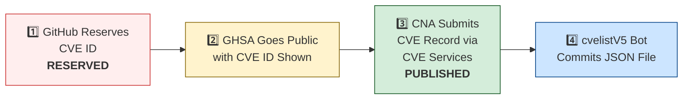

# 🛡️ OpenClaw CVE & Security Advisory Tracker

  
  
  
  
   
  
  
  
  
  

An automated tracker that continuously monitors [OpenClaw](https://github.com/openclaw/openclaw) security advisories across the GitHub Advisory Database, repo-level security advisories, and the [CVE V5 (cvelistV5)](https://github.com/CVEProject/cvelistV5) registry. Every hour it pulls the latest data, reconciles GHSA → CVE publication state, and regenerates this dashboard so you always have an up-to-date picture of the project's vulnerability landscape.

  Last updated: 2026-04-05 12:18 UTC · <a href="LICENSE">MIT License</a> · <a href="ADVISORIES.md">Full Advisory List</a> · <a href="SECURITY.md">Security Policy</a> · Data: <a href="https://github.com/CVEProject/cvelistV5">cvelistV5</a> + <a href="https://github.com/github/advisory-database">Advisory DB</a> · Updates hourly

---

  <a href="#-cves-published-in-cvelistv5-16">Published CVEs</a> ·
  <a href="#-cve-publication-pipeline">Pipeline</a> ·
  <a href="#-all-security-advisories-137">Advisories</a> ·
  <a href="#-vulnerability-categories">Categories</a> ·
  <a href="#-key-insights">Insights</a> ·
  <a href="#-project-identity">Identity</a>

---

## 🏗️ Project Identity

| Field | Value |
|-------|-------|
| **Current Name** | OpenClaw |
| **Previous Names** | Moltbot (second name), Clawdbot (original name) |
| **Repository** | [openclaw/openclaw](https://github.com/openclaw/openclaw) |
| **npm Package** | `openclaw` (formerly `clawdbot`) |
| **Author** | Peter Steinberger (steipete) |

<strong>Search terms for CVE discovery</strong>

To find all CVEs, search for: `openclaw`, `clawdbot`, `moltbot`, `clawhub`, `pkg:npm/clawdbot`, `pkg:npm/openclaw`

---

## 🚀 CVEs Published in cvelistV5 (16)

These CVEs have full records in the [CVEProject/cvelistV5](https://github.com/CVEProject/cvelistV5) repository:

| CVE ID | Severity | CVSS | Title | CWE | Published |
|--------|----------|------|-------|-----|-----------|
| [CVE-2026-28363](https://github.com/openclaw/openclaw/security/advisories/GHSA-3c6h-g97w-fg78) |  | 9.9 | In OpenClaw before 2026.2.23, tools.exec.safeBins validation for sort could be… | CWE-184 | 2026-02-27 |
| [CVE-2026-28466](https://github.com/openclaw/openclaw/security/advisories/GHSA-gv46-4xfq-jv58) |  | 9.4 | OpenClaw < 2026.2.14 - Remote Code Execution via Node Invoke Approval Bypass | CWE-863 | 2026-03-05 |
| [CVE-2026-32978](https://github.com/openclaw/openclaw/security/advisories/GHSA-qc36-x95h-7j53) |  | 9.4 | OpenClaw < 2026.3.11 - Approval Bypass via Unrecognized Script Runners | CWE-863 | 2026-03-29 |
| [CVE-2026-28474](https://github.com/openclaw/openclaw/security/advisories/GHSA-r5h9-vjqc-hq3r) |  | 9.3 | OpenClaw Nextcloud Talk < 2026.2.6 - Allowlist Bypass via actor.name Display Name Spoofing | CWE-863 | 2026-03-05 |
| [CVE-2026-32038](https://github.com/openclaw/openclaw/security/advisories/GHSA-ww6v-v748-x7g9) |  | 9.3 | OpenClaw - Sandbox Network Isolation Bypass via docker.network=container Parameter | CWE-284 | 2026-03-19 |
| [CVE-2026-28391](https://github.com/openclaw/openclaw/security/advisories/GHSA-qj77-c3c8-9c3q) |  | 9.2 | OpenClaw < 2026.2.2 - Command Injection via cmd.exe Parsing Bypass in Allowlist Enforcement | CWE-184 | 2026-03-05 |
| [CVE-2026-28472](https://github.com/openclaw/openclaw/security/advisories/GHSA-rv39-79c4-7459) |  | 9.2 | OpenClaw < 2026.2.2 - Device Identity Check Bypass in Gateway WebSocket Connect Handshake | CWE-306 | 2026-03-05 |
| [CVE-2026-32918](https://github.com/openclaw/openclaw/security/advisories/GHSA-wcxr-59v9-rxr8) |  | 9.2 | OpenClaw < 2026.3.11 - Session Sandbox Escape via session_status Tool | CWE-863 | 2026-03-29 |
| [CVE-2026-32916](https://github.com/openclaw/openclaw/security/advisories/GHSA-xw77-45gv-p728) |  | 9.2 | OpenClaw 2026.3.7 < 2026.3.11 - Authorization Bypass in Plugin Subagent Routes via Synthetic Admin Scopes | CWE-266 | 2026-03-31 |
| [CVE-2026-25253](https://github.com/openclaw/openclaw/security/advisories/GHSA-g8p2-7wf7-98mq) |  | 8.8 | OpenClaw/Clawdbot has 1-Click RCE via Authentication Token Exfiltration From gatewayUrl | CWE-669 | 2026-02-01 |
| [CVE-2026-24763](https://github.com/openclaw/openclaw/security/advisories/GHSA-mc68-q9jw-2h3v) |  | 8.8 | OpenClaw/Clawdbot Docker Execution has Authenticated Command Injection via PATH Environment Variable | CWE-78 | 2026-02-02 |
| [CVE-2026-32913](https://github.com/openclaw/openclaw/security/advisories/GHSA-6mgf-v5j7-45cr) |  | 8.8 | OpenClaw < 2026.3.7 - Custom Authorization Header Leakage via Cross-Origin Redirects | CWE-522 | 2026-03-23 |
| [CVE-2026-32974](https://github.com/openclaw/openclaw/security/advisories/GHSA-g353-mgv3-8pcj) |  | 8.8 | OpenClaw < 2026.3.12 - Forged Event Injection via Feishu Webhook Verification Token | CWE-347 | 2026-03-29 |
| [CVE-2026-28462](https://github.com/openclaw/openclaw/security/advisories/GHSA-gq9c-wg68-gwj2) |  | 8.7 | OpenClaw < 2026.2.13 - Path Traversal in Trace and Download Output Paths | CWE-22 | 2026-03-05 |
| [CVE-2026-28478](https://github.com/openclaw/openclaw/security/advisories/GHSA-q447-rj3r-2cgh) |  | 8.7 | OpenClaw affected by denial of service via unbounded webhook request body buffering | CWE-770 | 2026-03-05 |
| [CVE-2026-32011](https://github.com/openclaw/openclaw/security/advisories/GHSA-x4vp-4235-65hg) |  | 8.7 | OpenClaw < 2026.3.2 - Slow-Request Denial of Service via Pre-Auth Webhook Body Parsing | CWE-770 | 2026-03-19 |
| [CVE-2026-32049](https://github.com/openclaw/openclaw/security/advisories/GHSA-rxxp-482v-7mrh) |  | 8.7 | OpenClaw < 2026.2.22 - Denial of Service via Inbound Media Download Byte Limit Bypass | CWE-770 | 2026-03-21 |
| [CVE-2026-32059](https://github.com/openclaw/openclaw/security/advisories/GHSA-3c6h-g97w-fg78) |  | 8.7 | OpenClaw 2026.2.22-2 < 2026.2.23 - Allowlist Bypass via sort Long-Option Abbreviation in tools.exec.safeBins | CWE-863 | 2026-03-11 |
| [CVE-2026-32042](https://github.com/openclaw/openclaw/security/advisories/GHSA-553v-f69r-656j) |  | 8.7 | OpenClaw < 2026.2.25 - Privilege Escalation via Unpaired Device Identity in Shared Gateway Authentication | CWE-863 | 2026-03-21 |
| [CVE-2026-32914](https://github.com/openclaw/openclaw/security/advisories/GHSA-r7vr-gr74-94p8) |  | 8.7 | OpenClaw < 2026.3.12 - Insufficient Access Control in /config and /debug Endpoints | CWE-863 | 2026-03-29 |
| [CVE-2026-26323](https://github.com/openclaw/openclaw/security/advisories/GHSA-m7x8-2w3w-pr42) |  | 8.6 | OpenClaw has a command injection in maintainer clawtributors updater | CWE-78 | 2026-02-19 |
| [CVE-2026-27001](https://github.com/openclaw/openclaw/security/advisories/GHSA-2qj5-gwg2-xwc4) |  | 8.6 | OpenClaw: Unsanitized CWD path injection into LLM prompts | CWE-77 | 2026-02-19 |
| [CVE-2026-28463](https://github.com/openclaw/openclaw/security/advisories/GHSA-xvhf-x56f-2hpp) |  | 8.6 | OpenClaw < 2026.2.14 - Arbitrary File Read via Shell Expansion in Safe Bins Allowlist | CWE-78 | 2026-03-05 |
| [CVE-2026-33577](https://github.com/openclaw/openclaw/security/advisories/GHSA-2x4x-cc5g-qmmg) |  | 8.6 | OpenClaw < 2026.3.28 - Insufficient Scope Validation in node.pair.approve | CWE-863 | 2026-03-31 |
| [CVE-2026-34503](https://github.com/openclaw/openclaw/security/advisories/GHSA-2pr2-hcv6-7gwv) |  | 8.6 | OpenClaw's device removal and token revocation do not terminate active WebSocket sessions | CWE-613 | 2026-03-31 |
| [CVE-2026-32064](https://github.com/openclaw/openclaw/security/advisories/GHSA-25gx-x37c-7pph) |  | 8.5 | OpenClaw < 2026.2.21 - Missing VNC Authentication in Sandbox Browser noVNC Observer | CWE-306 | 2026-03-21 |
| [CVE-2026-31998](https://github.com/openclaw/openclaw/security/advisories/GHSA-gw85-xp4q-5gp9) |  | 8.3 | OpenClaw 2026.2.22 < 2026.2.24 - Authorization Bypass in Synology Chat Plugin via Empty allowedUserIds | CWE-863 | 2026-03-19 |
| [CVE-2026-32036](https://github.com/openclaw/openclaw/security/advisories/GHSA-mwxv-35wr-4vvj) |  | 8.3 | OpenClaw < 2026.2.26- Authentication Bypass via Encoded Dot-Segment Traversal in /api/channels | CWE-289 | 2026-03-19 |
| [CVE-2026-28464](https://github.com/openclaw/openclaw/security/advisories/GHSA-jmm5-fvh5-gf4p) |  | 8.2 | OpenClaw < 2026.2.12 - Timing Attack in Hooks Token Authentication | CWE-208 | 2026-03-05 |
| [CVE-2026-28454](https://github.com/openclaw/openclaw/security/advisories/GHSA-fhvm-j76f-qmjv) |  | 8.2 | OpenClaw < 2026.2.2 - Authorization Bypass via Unauthenticated Telegram Webhook | CWE-345 | 2026-03-05 |
| [CVE-2026-28469](https://github.com/openclaw/openclaw/security/advisories/GHSA-rq6g-px6m-c248) |  | 8.2 | OpenClaw Google Chat shared-path webhook target ambiguity allowed cross-account policy-context misrouting | CWE-639 | 2026-03-05 |
| [CVE-2026-28465](https://github.com/openclaw/openclaw/security/advisories/GHSA-3m3q-x3gj-f79x) |  | 8.2 | OpenClaw voice-call < 2026.2.3 - Webhook Verification Bypass via Forwarded Headers | CWE-345 | 2026-03-05 |
| [CVE-2026-32302](https://github.com/openclaw/openclaw/security/advisories/GHSA-5wcw-8jjv-m286) |  | 8.1 | OpenClaw: Untrusted web origins can obtain authenticated operator.admin access in trusted-proxy mode | CWE-346 | 2026-03-12 |
| [CVE-2026-25157](https://github.com/openclaw/openclaw/security/advisories/GHSA-q284-4pvr-m585) |  | 7.8 | OpenClaw/Clawdbot has OS Command Injection via Project Root Path in sshNodeCommand | CWE-78 | 2026-02-04 |
| [CVE-2026-32048](https://github.com/openclaw/openclaw/security/advisories/GHSA-p7gr-f84w-hqg5) |  | 7.7 | OpenClaw < 2026.3.1 - Sandbox Escape via Cross-Agent sessions_spawn | CWE-732 | 2026-03-21 |
| [CVE-2026-32056](https://github.com/openclaw/openclaw/security/advisories/GHSA-xgf2-vxv2-rrmg) |  | 7.7 | OpenClaw < 2026.2.22 - Remote Code Execution via Shell Startup Environment Variable Injection in system.run | CWE-78 | 2026-03-21 |
| [CVE-2026-26322](https://github.com/openclaw/openclaw/security/advisories/GHSA-g6q9-8fvw-f7rf) |  | 7.6 | OpenClaw Gateway tool allowed unrestricted gatewayUrl override | CWE-918 | 2026-02-19 |
| [CVE-2026-32007](https://github.com/openclaw/openclaw/security/advisories/GHSA-h9xm-j4qg-fvpg) |  | 7.6 | OpenClaw < 2026.2.23 - Sandbox Bypass in apply_patch Tool via Workspace-Only Check Bypass | CWE-22 | 2026-03-19 |
| [CVE-2026-22179](https://github.com/openclaw/openclaw/security/advisories/GHSA-9p38-94jf-hgjj) |  | 7.5 | OpenClaw < 2026.2.22 - Allowlist Bypass via Command Substitution in system.run | CWE-78 | 2026-03-18 |
| [CVE-2026-32025](https://github.com/openclaw/openclaw/security/advisories/GHSA-jmmg-jqc7-5qf4) |  | 7.5 | OpenClaw < 2026.2.25 - Password Brute-Force via Browser-Origin WebSocket Authentication Bypass | CWE-307 | 2026-03-19 |
| [CVE-2026-28485](https://github.com/openclaw/openclaw/security/advisories/GHSA-qpjj-47vm-64pj) |  | 7.5 | OpenClaw 2026.1.5 < 2026.2.12 - Missing Authentication in Browser Control HTTP Endpoints | CWE-306 | 2026-03-05 |
| [CVE-2026-28458](https://github.com/openclaw/openclaw/security/advisories/GHSA-mr32-vwc2-5j6h) |  | 7.4 | OpenClaw's Browser Relay /cdp websocket is missing auth which could allow cross-tab cookie access | CWE-306 | 2026-03-05 |
| [CVE-2026-32055](https://github.com/openclaw/openclaw/security/advisories/GHSA-mgrq-9f93-wpp5) |  | 7.2 | OpenClaw < 2026.2.26 - Workspace Path Boundary Bypass via Non-existent Symlink | CWE-22 | 2026-03-21 |
| [CVE-2026-26317](https://github.com/openclaw/openclaw/security/advisories/GHSA-3fqr-4cg8-h96q) |  | 7.1 | OpenClaw affected by cross-site request forgery (CSRF) through loopback browser mutation endpoints | CWE-352 | 2026-02-19 |
| [CVE-2026-22168](https://github.com/openclaw/openclaw/security/advisories/GHSA-5v6x-rfc3-7qfr) |  | 7.1 | OpenClaw < 2026.2.21 - Command Injection via cmd.exe /c Trailing Arguments in system.run | CWE-88 | 2026-03-18 |
| [CVE-2026-32027](https://github.com/openclaw/openclaw/security/advisories/GHSA-jv6r-27ww-4gw4) |  | 7.1 | OpenClaw < 2026.2.26 - Improper Authorization via DM Pairing Store Identity Inheritance in Group Allowlist | CWE-22 | 2026-03-19 |
| [CVE-2026-32026](https://github.com/openclaw/openclaw/security/advisories/GHSA-33hm-cq8r-wc49) |  | 7.1 | OpenClaw < 2026.2.24 - Arbitrary File Read via Improper Temporary Path Validation in Sandbox | CWE-22 | 2026-03-19 |
| [CVE-2026-33581](https://github.com/openclaw/openclaw/security/advisories/GHSA-v8wv-jg3q-qwpq) |  | 7.1 | OpenClaw < 2026.3.24 - Arbitrary File Read via mediaUrl and fileUrl Parameters | CWE-22 | 2026-03-31 |
| [CVE-2026-28447](https://github.com/openclaw/openclaw/security/advisories/GHSA-qrq5-wjgg-rvqw) |  | 7 | OpenClaw 2026.1.29-beta.1 < 2026.2.1 - Path Traversal in Plugin Installation via Package Name | CWE-22 | 2026-03-05 |
| [CVE-2026-32979](https://github.com/openclaw/openclaw/security/advisories/GHSA-xf99-j42q-5w5p) |  | 7 | OpenClaw < 2026.3.11 - Unbound Interpreter and Runtime Commands Bypass in node-host Approval | CWE-367 | 2026-03-29 |
| [CVE-2026-22176](https://github.com/openclaw/openclaw/security/advisories/GHSA-pj5x-38rw-6fph) |  | 6.9 | OpenClaw < 2026.2.19 - Command Injection via Unescaped Environment Variables in Windows Scheduled Task Script Generation | CWE-78 | 2026-03-19 |
| [CVE-2026-28394](https://github.com/openclaw/openclaw/security/advisories/GHSA-p536-vvpp-9mc8) |  | 6.9 | OpenClaw < 2026.2.15 - Denial of Service via Unbounded Response Parsing in web_fetch Tool | CWE-770 | 2026-03-05 |
| [CVE-2026-28480](https://github.com/openclaw/openclaw/security/advisories/GHSA-mj5r-hh7j-4gxf) |  | 6.9 | OpenClaw Telegram allowlist authorization accepted mutable usernames | CWE-290 | 2026-03-05 |
| [CVE-2026-31990](https://github.com/openclaw/openclaw/security/advisories/GHSA-cfvj-7rx7-fc7c) |  | 6.9 | OpenClaw < 2026.3.2 - Symlink Traversal in stageSandboxMedia Destination | CWE-59 | 2026-03-19 |
| [CVE-2026-32063](https://github.com/openclaw/openclaw/security/advisories/GHSA-vffc-f7r7-rx2w) |  | 6.9 | OpenClaw 2026.2.19-2 < 2026.2.21 - Command Injection via Newline in systemd Unit Generation | CWE-77 | 2026-03-11 |
| [CVE-2026-32924](https://github.com/openclaw/openclaw/security/advisories/GHSA-m69h-jm2f-2pv8) |  | 6.9 | OpenClaw < 2026.3.12 - Authorization Bypass via Misclassified Reaction Events in Feishu | CWE-863 | 2026-03-29 |
| [CVE-2026-32919](https://github.com/openclaw/openclaw/security/advisories/GHSA-jf6w-m8jw-jfxc) |  | 6.9 | OpenClaw < 2026.3.11 - Unauthorized Session Reset via agent Slash Commands | CWE-863 | 2026-03-29 |
| [CVE-2026-33576](https://github.com/openclaw/openclaw/security/advisories/GHSA-v2v2-f783-358j) |  | 6.9 | OpenClaw < 2026.3.28 - Unauthorized Media Download via Zalo Channel | CWE-863 | 2026-03-31 |
| [CVE-2026-34505](https://github.com/openclaw/openclaw/security/advisories/GHSA-5m9r-p9g7-679c) |  | 6.9 | OpenClaw < 2026.3.12 - Webhook Rate Limiting Bypass via Pre-Authentication Secret Validation | CWE-307 | 2026-03-31 |
| [CVE-2026-34510](https://github.com/openclaw/openclaw/security/advisories/GHSA-h3x4-hc5v-v2gm) |  | 6.9 | OpenClaw < 2026.3.22 - Remote File URL Acceptance in Windows Media Loaders | CWE-41 | 2026-04-01 |
| [CVE-2026-29612](https://github.com/openclaw/openclaw/security/advisories/GHSA-w2cg-vxx6-5xjg) |  | 6.8 | OpenClaw < 2026.2.14 - Denial of Service via Large Base64 Media File Decoding | CWE-770 | 2026-03-05 |
| [CVE-2026-28486](https://github.com/openclaw/openclaw/security/advisories/GHSA-v892-hwpg-jwqp) |  | 6.8 | OpenClaw 2026.1.16-2 < 2026.2.14 - Path Traversal (Zip Slip) in Archive Extraction via Installation Commands | CWE-22 | 2026-03-05 |
| [CVE-2026-32024](https://github.com/openclaw/openclaw/security/advisories/GHSA-rx3g-mvc3-qfjf) |  | 6.8 | OpenClaw < 2026.2.22 - Symlink Traversal in Avatar Handling | CWE-59 | 2026-03-19 |
| [CVE-2026-28452](https://github.com/openclaw/openclaw/security/advisories/GHSA-h89v-j3x9-8wqj) |  | 6.7 | OpenClaw affected by denial of service through unguarded archive extraction allowing high expansion/resource abuse (ZIP/TAR) | CWE-770 | 2026-03-05 |
| [CVE-2026-32044](https://github.com/openclaw/openclaw/security/advisories/GHSA-77hf-7fqf-f227) |  | 6.7 | OpenClaw < 2026.3.2 - Tar Archive Safety Bypass in Skills Installation | CWE-409 | 2026-03-21 |
| [CVE-2026-26328](https://github.com/openclaw/openclaw/security/advisories/GHSA-g34w-4xqq-h79m) |  | 6.5 | OpenClaw iMessage group allowlist authorization inherited DM pairing-store identities | CWE-284, CWE-863 | 2026-02-19 |
| [CVE-2026-28448](https://github.com/openclaw/openclaw/security/advisories/GHSA-33rq-m5x2-fvgf) |  | 6.3 | OpenClaw 2026.1.29 < 2026.2.1 - Authorization Bypass in Twitch Plugin allowFrom Access Control | CWE-285 | 2026-03-05 |
| [CVE-2026-28451](https://github.com/openclaw/openclaw/security/advisories/GHSA-x22m-j5qq-j49m) |  | 6.3 | OpenClaw < 2026.2.14 - SSRF via Feishu Extension Media Fetching | CWE-918 | 2026-03-05 |
| [CVE-2026-28475](https://github.com/openclaw/openclaw/security/advisories/GHSA-47q7-97xp-m272) |  | 6.3 | OpenClaw < 2026.2.13 - Timing Attack via Hook Token Comparison | CWE-208 | 2026-03-05 |
| [CVE-2026-32031](https://github.com/openclaw/openclaw/security/advisories/GHSA-8j2w-6fmm-m587) |  | 6.3 | OpenClaw < 2026.2.26 - Authentication Bypass via Path Canonicalization Mismatch in /api/channels Gateway | CWE-288 | 2026-03-19 |
| [CVE-2026-32050](https://github.com/openclaw/openclaw/security/advisories/GHSA-792q-qw95-f446) |  | 6.3 | OpenClaw < 2026.2.25 - Unauthorized Reaction Status Event Enqueue via Access Check Bypass | CWE-863 | 2026-03-21 |
| [CVE-2026-32896](https://github.com/openclaw/openclaw/security/advisories/GHSA-5mx2-2mgw-x8rm) |  | 6.3 | OpenClaw < 2026.2.21 - Unauthenticated Webhook Access via Passwordless Fallback in BlueBubbles Plugin | CWE-306 | 2026-03-21 |
| [CVE-2026-32897](https://github.com/openclaw/openclaw/security/advisories/GHSA-v6x2-2qvm-6gv8) |  | 6.3 | OpenClaw < 2026.2.22 - Authentication Token Reuse in Owner ID Prompt Hashing Fallback | CWE-320 | 2026-03-21 |
| [CVE-2026-33580](https://github.com/openclaw/openclaw/security/advisories/GHSA-9528-x887-j2fp) |  | 6.3 | OpenClaw < 2026.3.28 - Brute Force Attack via Missing Rate Limiting on Webhook Shared Secret Authentication | CWE-307 | 2026-03-31 |
| [CVE-2026-32023](https://github.com/openclaw/openclaw/security/advisories/GHSA-ccg8-46r6-9qgj) |  | 6 | OpenClaw < 2026.2.24 - Approval Gating Bypass via Dispatch-Wrapper Depth-Cap Mismatch in system.run | CWE-863 | 2026-03-19 |
| [CVE-2026-32033](https://github.com/openclaw/openclaw/security/advisories/GHSA-27cr-4p5m-74rj) |  | 6 | OpenClaw < 2026.2.24 - Path Traversal via @-prefixed Absolute Paths in Workspace Boundary Validation | CWE-22 | 2026-03-19 |
| [CVE-2026-32039](https://github.com/openclaw/openclaw/security/advisories/GHSA-wpph-cjgr-7c39) |  | 6 | OpenClaw < 2026.2.22 - Sender Authorization Bypass via Identity Collision in toolsBySender | CWE-639 | 2026-03-19 |
| [CVE-2026-22174](https://github.com/openclaw/openclaw/security/advisories/GHSA-v3j7-34xh-6g3w) |  | 5.9 | OpenClaw < 2026.2.22 - Gateway Token Disclosure via Chrome CDP Probe | CWE-306 | 2026-03-18 |
| [CVE-2026-28477](https://github.com/openclaw/openclaw/security/advisories/GHSA-7rcp-mxpq-72pj) |  | 5.9 | OpenClaw < 2026.2.14 - OAuth State Validation Bypass in Manual Chutes Login Flow | CWE-352 | 2026-03-05 |
| [CVE-2026-32054](https://github.com/openclaw/openclaw/security/advisories/GHSA-36h3-7c54-j27r) |  | 5.9 | OpenClaw < 2026.2.25 - Symlink Traversal in Browser Trace/Download Path Handling | CWE-59 | 2026-03-21 |
| [CVE-2026-27646](https://github.com/openclaw/openclaw/security/advisories/GHSA-9q36-67vc-rrwg) |  | 5.8 | OpenClaw < 2026.3.7 - Sandbox Escape via /acp spawn Command | CWE-863 | 2026-03-23 |
| [CVE-2026-22217](https://github.com/openclaw/openclaw/security/advisories/GHSA-p4wh-cr8m-gm6c) |  | 5.8 | OpenClaw 2026.2.22 < 2026.2.23 - Arbitrary Binary Execution via $SHELL Environment Variable Trusted Prefix Fallback | CWE-829 | 2026-03-18 |
| [CVE-2026-27670](https://github.com/openclaw/openclaw/security/advisories/GHSA-r54r-wmmq-mh84) |  | 5.8 | OpenClaw < 2026.3.2 - Arbitrary File Write via ZIP Extraction Parent Symlink Race Condition | CWE-367 | 2026-03-19 |
| [CVE-2026-31999](https://github.com/openclaw/openclaw/security/advisories/GHSA-6f6j-wx9w-ff4j) |  | 5.8 | OpenClaw 2026.2.26 < 2026.3.1 - Current Working Directory Injection via Windows Wrapper Resolution Fallback | CWE-78 | 2026-03-19 |
| [CVE-2026-32035](https://github.com/openclaw/openclaw/security/advisories/GHSA-wpg9-4g4v-f9rc) |  | 5.8 | OpenClaw < 2026.3.2 - Missing Owner Flag Validation in Discord Voice Transcript Handler | CWE-863 | 2026-03-19 |
| [CVE-2026-32052](https://github.com/openclaw/openclaw/security/advisories/GHSA-6rcp-vxwf-3mfp) |  | 5.8 | OpenClaw < 2026.2.24 - Hidden Command Execution via Shell-Wrapper Positional argv Carriers | CWE-436 | 2026-03-21 |
| [CVE-2026-32977](https://github.com/openclaw/openclaw/security/advisories/GHSA-xvx8-77m6-gwg6) |  | 5.8 | OpenClaw < 2026.3.11 - Sandbox Boundary Bypass via Unanchored writeFile Commit Path | CWE-367 | 2026-03-31 |
| [CVE-2026-32065](https://github.com/openclaw/openclaw/security/advisories/GHSA-hwpq-rrpf-pgcq) |  | 5.7 | OpenClaw < 2026.2.25 - Approval Identity Mismatch in system.run Command Execution | CWE-436 | 2026-03-21 |
| [CVE-2026-28457](https://github.com/openclaw/openclaw/security/advisories/GHSA-xw4p-pw82-hqr7) |  | 5.6 | OpenClaw < 2026.2.14 - Path Traversal in Sandbox Skill Mirroring via Name Parameter | CWE-22 | 2026-03-05 |
| [CVE-2026-31993](https://github.com/openclaw/openclaw/security/advisories/GHSA-5f9p-f3w2-fwch) |  | 5.6 | OpenClaw < 2026.2.22 - Allowlist Parsing Mismatch in system.run Shell Chains | CWE-184 | 2026-03-19 |
| [CVE-2026-31989](https://github.com/openclaw/openclaw/security/advisories/GHSA-g99v-8hwm-g76g) |  | 5.3 | OpenClaw < 2026.3.1 - Server-Side Request Forgery via web_search Citation Redirect | CWE-918 | 2026-03-19 |
| [CVE-2026-32001](https://github.com/openclaw/openclaw/security/advisories/GHSA-rv2q-f2h5-6xmg) |  | 5.3 | OpenClaw < 2026.2.22 - Node Role Device-Identity Bypass via WebSocket Authentication | CWE-863 | 2026-03-19 |
| [CVE-2026-32921](https://github.com/openclaw/openclaw/security/advisories/GHSA-8g75-q649-6pv6) |  | 5.3 | OpenClaw < 2026.3.8 - Script Content Modification via Mutable Operand Binding in system.run | CWE-367 | 2026-03-31 |
| [CVE-2026-32899](https://github.com/openclaw/openclaw/security/advisories/GHSA-rm2p-j3r7-4x4j) |  | 5.3 | OpenClaw < 2026.2.25 - Sender Policy Bypass in Slack Reaction and Pin Event Handlers | CWE-863 | 2026-03-21 |
| [CVE-2026-32895](https://github.com/openclaw/openclaw/security/advisories/GHSA-v8cg-4474-49v8) |  | 5.3 | OpenClaw < 2026.2.26 - Sender Authorization Bypass in Slack System Event Handlers | CWE-863 | 2026-03-21 |
| [CVE-2026-33578](https://github.com/openclaw/openclaw/security/advisories/GHSA-63mg-xp9j-jfcm) |  | 5.3 | OpenClaw: Google Chat and Zalouser group sender allowlist bypass via policy downgrade | CWE-863 | 2026-03-31 |
| [CVE-2026-32020](https://github.com/openclaw/openclaw/security/advisories/GHSA-5ghc-98wh-gwwf) |  | 4.8 | OpenClaw < 2026.2.22 - Arbitrary File Read via Symlink Following in Static File Handler | CWE-59 | 2026-03-19 |
| [CVE-2026-32046](https://github.com/openclaw/openclaw/security/advisories/GHSA-43x4-g22p-3hrq) |  | 4.8 | OpenClaw < 2026.2.21 - OS-level Sandbox Bypass via --no-sandbox Flag | CWE-1188 | 2026-03-21 |
| [CVE-2026-31997](https://github.com/openclaw/openclaw/security/advisories/GHSA-q399-23r3-hfx4) |  | 4.4 | OpenClaw < 2026.3.1 - Executable Rebind via Unbound PATH-token in system.run Approvals | CWE-367 | 2026-03-19 |
| [CVE-2026-27486](https://github.com/openclaw/openclaw/security/advisories/GHSA-jfv4-h8mc-jcp8) |  | 4.3 | OpenClaw: Process Safety - Unvalidated PID Kill via SIGKILL in Process Cleanup | CWE-283 | 2026-02-21 |
| [CVE-2026-24764](https://github.com/openclaw/openclaw/security/advisories/GHSA-782p-5fr5-7fj8) |  | 3.7 | OpenClaw has Remote Code Execution via System Prompt Injection in Slack Channel Descriptions | CWE-74, CWE-94 | 2026-02-19 |
| [CVE-2026-27524](https://github.com/openclaw/openclaw/security/advisories/GHSA-62f6-mrcj-v8h5) |  | 2.3 | OpenClaw < 2026.2.21 - Prototype Pollution via Debug Override Path | CWE-1321 | 2026-03-18 |
| [CVE-2026-27484](https://github.com/openclaw/openclaw/security/advisories/GHSA-wh94-p5m6-mr7j) |  | 2.3 | OpenClaw Discord moderation authorization used untrusted sender identity in tool-driven flows | CWE-862 | 2026-02-21 |
| [CVE-2026-34506](https://github.com/openclaw/openclaw/security/advisories/GHSA-g7cr-9h7q-4qxq) |  | 2.3 | OpenClaw < 2026.3.8 - Sender Allowlist Bypass in Microsoft Teams Plugin via Route Allowlist Configuration | CWE-863 | 2026-03-31 |
| [CVE-2026-31991](https://github.com/openclaw/openclaw/security/advisories/GHSA-wm8r-w8pf-2v6w) |  | 2 | OpenClaw < 2026.2.26 - Authorization Bypass via DM Pairing-Store Leakage in Signal Group Allowlist | CWE-863 | 2026-03-19 |
| [CVE-2026-32018](https://github.com/openclaw/openclaw/security/advisories/GHSA-gq83-8q7q-9hfx) |  | 2 | OpenClaw < 2026.2.19 - Race Condition in Sandbox Registry Write Operations | CWE-362 | 2026-03-19 |
| [CVE-2026-32067](https://github.com/openclaw/openclaw/security/advisories/GHSA-vjp8-wprm-2jw9) |  | 2 | OpenClaw < 2026.2.26 - Cross-Account Authorization Bypass in DM Pairing Store | CWE-863 | 2026-03-21 |
| [CVE-2026-30741]() |  | None | A remote code execution (RCE) vulnerability in OpenClaw Agent Platform v2026.2.6 |  | 2026-03-11 |

<strong>📖 Detailed CVE Analysis (click to expand)</strong>

### CVE-2026-28363 — In OpenClaw before 2026.2.23, tools.exec.safeBins validation for sort could be…

| Field | Detail |
|-------|--------|
| **CVSS** | 9.9 (CRITICAL) — `CVSS:3.1/AV:N/AC:L/PR:L/UI:N/S:C/C:H/I:H/A:H` |
| **CWE** | CWE-184 (CWE-184 Incomplete List of Disallowed Inputs) |
| **Affected** | < 2026.2.23 |
| **Vendor/Product** | OpenClaw / OpenClaw |
| **Advisory** | [GHSA-3c6h-g97w-fg78](https://github.com/openclaw/openclaw/security/advisories/GHSA-3c6h-g97w-fg78) |

In OpenClaw before 2026.2.23, tools.exec.safeBins validation for sort could be bypassed via GNU long-option abbreviations (such as --compress-prog) in allowlist mode, leading to approval-free execution paths that were intended to require approval. Only an exact string such as --compress-program was denied.

---

### CVE-2026-28466 — OpenClaw < 2026.2.14 - Remote Code Execution via Node Invoke Approval Bypass

| Field | Detail |
|-------|--------|
| **CVSS** | 9.4 (CRITICAL) — `CVSS:4.0/AV:N/AC:L/AT:N/PR:L/UI:N/VC:H/VI:H/VA:H/SC:H/SI:H/SA:H` |
| **CWE** | CWE-863 (Incorrect Authorization) |
| **Affected** | < 2026.2.14 |
| **Vendor/Product** | OpenClaw / OpenClaw |
| **Advisory** | [GHSA-gv46-4xfq-jv58](https://github.com/openclaw/openclaw/security/advisories/GHSA-gv46-4xfq-jv58) |

OpenClaw versions prior to 2026.2.14 contain a vulnerability in the gateway in which it fails to sanitize internal approval fields in node.invoke parameters, allowing authenticated clients to bypass exec approval gating for system.run commands. Attackers with valid gateway credentials can inject approval control fields to execute arbitrary commands on connected node hosts, potentially compromising developer workstations and CI runners.

**References:**
- [Patch Commit #1](https://github.com/openclaw/openclaw/commit/318379cdb8d045da0009b0051bd0e712e5c65e2d)
- [Patch Commit #2](https://github.com/openclaw/openclaw/commit/a7af646fdab124a7536998db6bd6ad567d2b06b0)
- [Patch Commit #3](https://github.com/openclaw/openclaw/commit/c1594627421f95b6bc4ad7c606657dc75b5ad0ce)
- [Patch Commit #4](https://github.com/openclaw/openclaw/commit/0af76f5f0e93540efbdf054895216c398692afcd)
- [VulnCheck Advisory: OpenClaw < 2026.2.14 - Remote Code Execution via Node Invoke Approval Bypass](https://www.vulncheck.com/advisories/openclaw-remote-code-execution-via-node-invoke-approval-bypass)
---

### CVE-2026-32978 — OpenClaw < 2026.3.11 - Approval Bypass via Unrecognized Script Runners

| Field | Detail |
|-------|--------|
| **CVSS** | 9.4 (CRITICAL) — `CVSS:4.0/AV:N/AC:L/AT:N/PR:L/UI:P/VC:H/VI:H/VA:H/SC:H/SI:H/SA:H` |
| **CWE** | CWE-863 (Incorrect Authorization) |
| **Affected** | < 2026.3.11 |
| **Vendor/Product** | OpenClaw / OpenClaw |
| **Advisory** | [GHSA-qc36-x95h-7j53](https://github.com/openclaw/openclaw/security/advisories/GHSA-qc36-x95h-7j53) |

OpenClaw before 2026.3.11 contains an approval integrity vulnerability where system.run approvals fail to bind mutable file operands for certain script runners like tsx and jiti. Attackers can obtain approval for benign script commands, rewrite referenced scripts on disk, and execute modified code under the approved run context.

**References:**
- [VulnCheck Advisory: OpenClaw < 2026.3.11 - Approval Bypass via Unrecognized Script Runners](https://www.vulncheck.com/advisories/openclaw-approval-bypass-via-unrecognized-script-runners)
---

### CVE-2026-28474 — OpenClaw Nextcloud Talk < 2026.2.6 - Allowlist Bypass via actor.name Display Name Spoofing

| Field | Detail |
|-------|--------|
| **CVSS** | 9.3 (CRITICAL) — `CVSS:4.0/AV:N/AC:L/AT:N/PR:N/UI:N/VC:H/VI:H/VA:H/SC:N/SI:N/SA:N` |
| **CWE** | CWE-863 (Incorrect Authorization) |
| **Affected** | < 2026.2.6 |
| **Vendor/Product** | OpenClaw / nextcloud-talk |
| **Advisory** | [GHSA-r5h9-vjqc-hq3r](https://github.com/openclaw/openclaw/security/advisories/GHSA-r5h9-vjqc-hq3r) |

OpenClaw's Nextcloud Talk plugin versions prior to 2026.2.6 accept equality matching on the mutable actor.name display name field for allowlist validation, allowing attackers to bypass DM and room allowlists. An attacker can change their Nextcloud display name to match an allowlisted user ID and gain unauthorized access to restricted conversations.

**References:**
- [Patch Commit #1](https://github.com/openclaw/openclaw/commit/6b4b6049b47c3329a7014509594647826669892d)
- [VulnCheck Advisory: OpenClaw Nextcloud Talk < 2026.2.6 - Allowlist Bypass via actor.name Display Name Spoofing](https://www.vulncheck.com/advisories/openclaw-nextcloud-talk-allowlist-bypass-via-actorname-display-name-spoofing)
---

### CVE-2026-32038 — OpenClaw - Sandbox Network Isolation Bypass via docker.network=container Parameter

| Field | Detail |
|-------|--------|
| **CVSS** | 9.3 (CRITICAL) — `CVSS:4.0/AV:N/AC:L/AT:N/PR:N/UI:N/VC:H/VI:H/VA:H/SC:N/SI:N/SA:N` |
| **CWE** | CWE-284 (Improper Access Control) |
| **Affected** | < 2026.2.24 |
| **Vendor/Product** | OpenClaw / OpenClaw |
| **Advisory** | [GHSA-ww6v-v748-x7g9](https://github.com/openclaw/openclaw/security/advisories/GHSA-ww6v-v748-x7g9) |

OpenClaw before 2026.2.24 contains a sandbox network isolation bypass vulnerability that allows trusted operators to join another container's network namespace. Attackers can configure the docker.network parameter with container:<id> values to reach services in target container namespaces and bypass network hardening controls.

**References:**
- [VulnCheck Advisory: OpenClaw - Sandbox Network Isolation Bypass via docker.network=container Parameter](https://www.vulncheck.com/advisories/openclaw-sandbox-network-isolation-bypass-via-docker-network-container-parameter)
---

### CVE-2026-28391 — OpenClaw < 2026.2.2 - Command Injection via cmd.exe Parsing Bypass in Allowlist Enforcement

| Field | Detail |
|-------|--------|
| **CVSS** | 9.2 (CRITICAL) — `CVSS:4.0/AV:N/AC:L/AT:P/PR:N/UI:N/VC:H/VI:H/VA:H/SC:N/SI:N/SA:N` |
| **CWE** | CWE-184 (Incomplete List of Disallowed Inputs) |
| **Affected** | < 2026.2.2 |
| **Vendor/Product** | OpenClaw / OpenClaw |
| **Advisory** | [GHSA-qj77-c3c8-9c3q](https://github.com/openclaw/openclaw/security/advisories/GHSA-qj77-c3c8-9c3q) |

OpenClaw versions prior to 2026.2.2 fail to properly validate Windows cmd.exe metacharacters in allowlist-gated exec requests, allowing attackers to bypass command approval restrictions. Remote attackers can craft command strings with shell metacharacters like & or %...% to execute unapproved commands beyond the allowlisted operations.

**References:**
- [Patch Commit](https://github.com/openclaw/openclaw/commit/a7f4a53ce80c98ba1452eb90802d447fca9bf3d6)
- [VulnCheck Advisory: OpenClaw < 2026.2.2 - Command Injection via cmd.exe Parsing Bypass in Allowlist Enforcement](https://www.vulncheck.com/advisories/openclaw-command-injection-via-cmdexe-parsing-bypass-in-allowlist-enforcement)
---

### CVE-2026-28472 — OpenClaw < 2026.2.2 - Device Identity Check Bypass in Gateway WebSocket Connect Handshake

| Field | Detail |
|-------|--------|
| **CVSS** | 9.2 (CRITICAL) — `CVSS:4.0/AV:N/AC:H/AT:N/PR:N/UI:N/VC:H/VI:H/VA:H/SC:N/SI:N/SA:N` |
| **CWE** | CWE-306 (Missing Authentication for Critical Function) |
| **Affected** | < 2026.2.2 |
| **Vendor/Product** | OpenClaw / OpenClaw |
| **Advisory** | [GHSA-rv39-79c4-7459](https://github.com/openclaw/openclaw/security/advisories/GHSA-rv39-79c4-7459) |

OpenClaw versions prior to 2026.2.2 contain a vulnerability in the gateway WebSocket connect handshake in which it allows skipping device identity checks when auth.token is present but not validated. Attackers can connect to the gateway without providing device identity or pairing by exploiting the presence check instead of validation, potentially gaining operator access in vulnerable deployments.

**References:**
- [Patch Commit](https://github.com/openclaw/openclaw/commit/fe81b1d7125a014b8280da461f34efbf5f761575)
- [VulnCheck Advisory: OpenClaw < 2026.2.2 - Device Identity Check Bypass in Gateway WebSocket Connect Handshake](https://www.vulncheck.com/advisories/openclaw-device-identity-check-bypass-in-gateway-websocket-connect-handshake)
---

### CVE-2026-32918 — OpenClaw < 2026.3.11 - Session Sandbox Escape via session_status Tool

| Field | Detail |
|-------|--------|
| **CVSS** | 9.2 (CRITICAL) — `CVSS:4.0/AV:L/AC:L/AT:N/PR:L/UI:N/VC:H/VI:H/VA:N/SC:H/SI:H/SA:N` |
| **CWE** | CWE-863 (Incorrect Authorization) |
| **Affected** | < 2026.3.11 |
| **Vendor/Product** | OpenClaw / OpenClaw |
| **Advisory** | [GHSA-wcxr-59v9-rxr8](https://github.com/openclaw/openclaw/security/advisories/GHSA-wcxr-59v9-rxr8) |

OpenClaw before 2026.3.11 contains a session sandbox escape vulnerability in the session_status tool that allows sandboxed subagents to access parent or sibling session state. Attackers can supply arbitrary sessionKey values to read or modify session data outside their sandbox scope, including persisted model overrides.

**References:**
- [VulnCheck Advisory: OpenClaw < 2026.3.11 - Session Sandbox Escape via session_status Tool](https://www.vulncheck.com/advisories/openclaw-session-sandbox-escape-via-session-status-tool)
---

### CVE-2026-32916 — OpenClaw 2026.3.7 < 2026.3.11 - Authorization Bypass in Plugin Subagent Routes via Synthetic Admin Scopes

| Field | Detail |
|-------|--------|
| **CVSS** | 9.2 (CRITICAL) — `CVSS:4.0/AV:N/AC:L/AT:P/PR:N/UI:N/VC:H/VI:H/VA:L/SC:N/SI:N/SA:N` |
| **CWE** | CWE-266 (CWE-266: Incorrect Privilege Assignment) |
| **Affected** | < 2026.3.11 |
| **Vendor/Product** | OpenClaw / OpenClaw |
| **Advisory** | [GHSA-xw77-45gv-p728](https://github.com/openclaw/openclaw/security/advisories/GHSA-xw77-45gv-p728) |

OpenClaw versions 2026.3.7 before 2026.3.11 contain an authorization bypass vulnerability where plugin subagent routes execute gateway methods through a synthetic operator client with broad administrative scopes. Remote unauthenticated requests to plugin-owned routes can invoke runtime.subagent methods to perform privileged gateway actions including session deletion and agent execution.

**References:**
- [VulnCheck Advisory: OpenClaw 2026.3.7 < 2026.3.11 - Authorization Bypass in Plugin Subagent Routes via Synthetic Admin Scopes](https://www.vulncheck.com/advisories/openclaw-authorization-bypass-in-plugin-subagent-routes-via-synthetic-admin-scopes)
---

### CVE-2026-25253 — OpenClaw/Clawdbot has 1-Click RCE via Authentication Token Exfiltration From gatewayUrl

| Field | Detail |
|-------|--------|
| **CVSS** | 8.8 (HIGH) — `CVSS:3.1/AV:N/AC:L/PR:N/UI:R/S:U/C:H/I:H/A:H` |
| **CWE** | CWE-669 (CWE-669 Incorrect Resource Transfer Between Spheres) |
| **Affected** | < 2026.1.29 |
| **Vendor/Product** | OpenClaw / OpenClaw |
| **Advisory** | [GHSA-g8p2-7wf7-98mq](https://github.com/openclaw/openclaw/security/advisories/GHSA-g8p2-7wf7-98mq) |

OpenClaw (aka clawdbot or Moltbot) before 2026.1.29 obtains a gatewayUrl value from a query string and automatically makes a WebSocket connection without prompting, sending a token value.

> **Naming note:** Uses all three names in description. packageURL still references `pkg:npm/clawdbot`.
**References:**
- [1-click-rce-to-steal-your-moltbot-data-and-keys](https://depthfirst.com/post/1-click-rce-to-steal-your-moltbot-data-and-keys)
- [blog](https://openclaw.ai/blog)
- [one-click-rce-moltbot](https://ethiack.com/news/blog/one-click-rce-moltbot)
- [2016913750557651228](https://x.com/0xacb/status/2016913750557651228)
---

### CVE-2026-24763 — OpenClaw/Clawdbot Docker Execution has Authenticated Command Injection via PATH Environment Variable

| Field | Detail |
|-------|--------|
| **CVSS** | 8.8 (HIGH) — `CVSS:3.1/AV:N/AC:L/PR:L/UI:N/S:U/C:H/I:H/A:H` |
| **CWE** | CWE-78 (CWE-78: Improper Neutralization of Special Elements used in an OS Command ('OS Command Injection')) |
| **Affected** | < 2026.1.29 |
| **Vendor/Product** | clawdbot / clawdbot |
| **Advisory** | [GHSA-mc68-q9jw-2h3v](https://github.com/openclaw/openclaw/security/advisories/GHSA-mc68-q9jw-2h3v) |

OpenClaw (formerly  Clawdbot) is a personal AI assistant you run on your own devices. Prior to 2026.1.29, a command injection vulnerability existed in OpenClaw’s Docker sandbox execution mechanism due to unsafe handling of the PATH environment variable when constructing shell commands. An authenticated user able to control environment variables could influence command execution within the container context. This vulnerability is fixed in 2026.1.29.

> **Naming note:** Uses old name `clawdbot/clawdbot` as vendor/product.
**References:**
- [https://github.com/openclaw/openclaw/commit/771f23d36b95ec2204cc9a0054045f5d8439ea75](https://github.com/openclaw/openclaw/commit/771f23d36b95ec2204cc9a0054045f5d8439ea75)
- [https://github.com/openclaw/openclaw/releases/tag/v2026.1.29](https://github.com/openclaw/openclaw/releases/tag/v2026.1.29)
---

### CVE-2026-32913 — OpenClaw < 2026.3.7 - Custom Authorization Header Leakage via Cross-Origin Redirects

| Field | Detail |
|-------|--------|
| **CVSS** | 8.8 (HIGH) — `CVSS:4.0/AV:N/AC:L/AT:N/PR:N/UI:N/VC:H/VI:L/VA:N/SC:L/SI:L/SA:N` |
| **CWE** | CWE-522 (CWE-522 Insufficiently Protected Credentials) |
| **Affected** | < 2026.3.7 |
| **Vendor/Product** | OpenClaw / OpenClaw |
| **Advisory** | [GHSA-6mgf-v5j7-45cr](https://github.com/openclaw/openclaw/security/advisories/GHSA-6mgf-v5j7-45cr) |

OpenClaw before 2026.3.7 contains an improper header validation vulnerability in fetchWithSsrFGuard that forwards custom authorization headers across cross-origin redirects. Attackers can trigger redirects to different origins to intercept sensitive headers like X-Api-Key and Private-Token intended for the original destination.

**References:**
- [Patch Commit](https://github.com/openclaw/openclaw/commit/46715371b0612a6f9114dffd1466941ac476cef5)
- [VulnCheck Advisory](https://vulncheck.com/advisories/openclaw-mar-custom-authorization-header-leakage-via-cross-origin-redirects)
---

### CVE-2026-32974 — OpenClaw < 2026.3.12 - Forged Event Injection via Feishu Webhook Verification Token

| Field | Detail |
|-------|--------|
| **CVSS** | 8.8 (HIGH) — `CVSS:4.0/AV:N/AC:L/AT:N/PR:N/UI:N/VC:L/VI:H/VA:L/SC:N/SI:N/SA:N` |
| **CWE** | CWE-347 (Improper Verification of Cryptographic Signature) |
| **Affected** | < 2026.3.12 |
| **Vendor/Product** | OpenClaw / OpenClaw |
| **Advisory** | [GHSA-g353-mgv3-8pcj](https://github.com/openclaw/openclaw/security/advisories/GHSA-g353-mgv3-8pcj) |

OpenClaw before 2026.3.12 contains an authentication bypass vulnerability in Feishu webhook mode when only verificationToken is configured without encryptKey, allowing acceptance of forged events. Unauthenticated network attackers can inject forged Feishu events and trigger downstream tool execution by reaching the webhook endpoint.

**References:**
- [VulnCheck Advisory: OpenClaw < 2026.3.12 - Forged Event Injection via Feishu Webhook Verification Token](https://www.vulncheck.com/advisories/openclaw-forged-event-injection-via-feishu-webhook-verification-token)
---

### CVE-2026-28462 — OpenClaw < 2026.2.13 - Path Traversal in Trace and Download Output Paths

| Field | Detail |
|-------|--------|
| **CVSS** | 8.7 (HIGH) — `CVSS:4.0/AV:N/AC:L/AT:N/PR:N/UI:N/VC:H/VI:N/VA:N/SC:N/SI:N/SA:N` |
| **CWE** | CWE-22 (Improper Limitation of a Pathname to a Restricted Directory ('Path Traversal')) |
| **Affected** | < 2026.2.13 |
| **Vendor/Product** | OpenClaw / OpenClaw |
| **Advisory** | [GHSA-gq9c-wg68-gwj2](https://github.com/openclaw/openclaw/security/advisories/GHSA-gq9c-wg68-gwj2) |

OpenClaw versions prior to 2026.2.13 contain a vulnerability in the browser control API in which it accepts user-supplied output paths for trace and download files without consistently constraining writes to temporary directories. Attackers with API access can exploit path traversal in POST /trace/stop, POST /wait/download, and POST /download endpoints to write files outside intended temp roots.

**References:**
- [Patch Commit](https://github.com/openclaw/openclaw/commit/7f0489e4731c8d965d78d6eac4a60312e46a9426)
- [VulnCheck Advisory: OpenClaw < 2026.2.13 - Path Traversal in Trace and Download Output Paths](https://www.vulncheck.com/advisories/openclaw-path-traversal-in-trace-and-download-output-paths)
---

### CVE-2026-28478 — OpenClaw affected by denial of service via unbounded webhook request body buffering

| Field | Detail |
|-------|--------|
| **CVSS** | 8.7 (HIGH) — `CVSS:4.0/AV:N/AC:L/AT:N/PR:N/UI:N/VC:N/VI:N/VA:H/SC:N/SI:N/SA:N` |
| **CWE** | CWE-770 (Allocation of Resources Without Limits or Throttling) |
| **Affected** | < 2026.2.13 |
| **Vendor/Product** | OpenClaw / OpenClaw |
| **Advisory** | [GHSA-q447-rj3r-2cgh](https://github.com/openclaw/openclaw/security/advisories/GHSA-q447-rj3r-2cgh) |

OpenClaw versions prior to 2026.2.13 contain a denial of service vulnerability in webhook handlers that buffer request bodies without strict byte or time limits. Remote unauthenticated attackers can send oversized JSON payloads or slow uploads to webhook endpoints causing memory pressure and availability degradation.

**References:**
- [Patch Commit](https://github.com/openclaw/openclaw/commit/3cbcba10cf30c2ffb898f0d8c7dfb929f15f8930)
- [VulnCheck Advisory: OpenClaw < 2026.2.13 - Denial of Service via Unbounded Webhook Request Body Buffering](https://www.vulncheck.com/advisories/openclaw-denial-of-service-via-unbounded-webhook-request-body-buffering)
---

### CVE-2026-32011 — OpenClaw < 2026.3.2 - Slow-Request Denial of Service via Pre-Auth Webhook Body Parsing

| Field | Detail |
|-------|--------|
| **CVSS** | 8.7 (HIGH) — `CVSS:4.0/AV:N/AC:L/AT:N/PR:N/UI:N/VC:N/VI:N/VA:H/SC:N/SI:N/SA:N` |
| **CWE** | CWE-770 (CWE-770: Allocation of Resources Without Limits or Throttling) |
| **Affected** | < 2026.3.2 |
| **Vendor/Product** | OpenClaw / OpenClaw |
| **Advisory** | [GHSA-x4vp-4235-65hg](https://github.com/openclaw/openclaw/security/advisories/GHSA-x4vp-4235-65hg) |

OpenClaw versions prior to 2026.3.2 contain a denial of service vulnerability in webhook handlers for BlueBubbles and Google Chat that parse request bodies before performing authentication and signature validation. Unauthenticated attackers can exploit this by sending slow or oversized request bodies to exhaust parser resources and degrade service availability.

**References:**
- [Patch Commit](https://github.com/openclaw/openclaw/commit/d3e8b17aa6432536806b4853edc7939d891d0f25)
- [VulnCheck Advisory: OpenClaw < 2026.3.2 - Slow-Request Denial of Service via Pre-Auth Webhook Body Parsing](https://www.vulncheck.com/advisories/openclaw-slow-request-denial-of-service-via-pre-auth-webhook-body-parsing)
---

### CVE-2026-32049 — OpenClaw < 2026.2.22 - Denial of Service via Inbound Media Download Byte Limit Bypass

| Field | Detail |
|-------|--------|
| **CVSS** | 8.7 (HIGH) — `CVSS:4.0/AV:N/AC:L/AT:N/PR:N/UI:N/VC:N/VI:N/VA:H/SC:N/SI:N/SA:N` |
| **CWE** | CWE-770 (CWE-770: Allocation of Resources Without Limits or Throttling) |
| **Affected** | < 2026.2.22 |
| **Vendor/Product** | OpenClaw / OpenClaw |
| **Advisory** | [GHSA-rxxp-482v-7mrh](https://github.com/openclaw/openclaw/security/advisories/GHSA-rxxp-482v-7mrh) |

OpenClaw versions prior to 2026.2.22 fail to consistently enforce configured inbound media byte limits before buffering remote media across multiple channel ingestion paths. Remote attackers can send oversized media payloads to trigger elevated memory usage and potential process instability.

**References:**
- [Patch Commit](https://github.com/openclaw/openclaw/commit/73d93dee64127a26f1acd09d0403b794cdeb4f5c)
- [VulnCheck Advisory: OpenClaw < 2026.2.22 - Denial of Service via Inbound Media Download Byte Limit Bypass](https://www.vulncheck.com/advisories/openclaw-denial-of-service-via-inbound-media-download-byte-limit-bypass)
---

### CVE-2026-32059 — OpenClaw 2026.2.22-2 < 2026.2.23 - Allowlist Bypass via sort Long-Option Abbreviation in tools.exec.safeBins

| Field | Detail |
|-------|--------|
| **CVSS** | 8.7 (HIGH) — `CVSS:4.0/AV:N/AC:L/AT:N/PR:L/UI:N/VC:H/VI:H/VA:H/SC:N/SI:N/SA:N` |
| **CWE** | CWE-863 (Incorrect Authorization) |
| **Affected** | < 2026.2.23 |
| **Vendor/Product** | openclaw / openclaw |
| **Advisory** | [GHSA-3c6h-g97w-fg78](https://github.com/openclaw/openclaw/security/advisories/GHSA-3c6h-g97w-fg78) |

OpenClaw version 2026.2.22-2 prior to 2026.2.23 tools.exec.safeBins validation for sort command fails to properly validate GNU long-option abbreviations, allowing attackers to bypass denied-flag checks via abbreviated options. Remote attackers can execute sort commands with abbreviated long options to skip approval requirements in allowlist mode.

**References:**
- [Patch Commit](https://github.com/openclaw/openclaw/commit/3b8e33037ae2e12af7beb56fcf0346f1f8cbde6f)
- [VulnCheck Advisory: OpenClaw 2026.2.22-2 < 2026.2.23 - Allowlist Bypass via sort Long-Option Abbreviation in tools.exec.safeBins](https://www.vulncheck.com/advisories/openclaw-allowlist-bypass-via-sort-long-option-abbreviation-in-toolsexecsafebins)
---

### CVE-2026-32042 — OpenClaw < 2026.2.25 - Privilege Escalation via Unpaired Device Identity in Shared Gateway Authentication

| Field | Detail |
|-------|--------|
| **CVSS** | 8.7 (HIGH) — `CVSS:4.0/AV:N/AC:L/AT:N/PR:L/UI:N/VC:H/VI:H/VA:H/SC:N/SI:N/SA:N` |
| **CWE** | CWE-863 (CWE-863: Incorrect Authorization) |
| **Affected** | < 2026.2.25 |
| **Vendor/Product** | OpenClaw / OpenClaw |
| **Advisory** | [GHSA-553v-f69r-656j](https://github.com/openclaw/openclaw/security/advisories/GHSA-553v-f69r-656j) |

OpenClaw versions 2026.2.22 prior to 2026.2.25 contain a privilege escalation vulnerability allowing unpaired device identities to bypass operator pairing requirements and self-assign elevated operator scopes including operator.admin. Attackers with valid shared gateway authentication can present a self-signed unpaired device identity to request and obtain higher operator scopes before pairing approval is granted.

**References:**
- [Patch Commit](https://github.com/openclaw/openclaw/commit/8d1481cb4a9d31bd617e52dc8c392c35689d9dea)
- [VulnCheck Advisory: OpenClaw < 2026.2.25 - Privilege Escalation via Unpaired Device Identity in Shared Gateway Authentication](https://www.vulncheck.com/advisories/openclaw-privilege-escalation-via-unpaired-device-identity-in-shared-gateway-authentication)
---

### CVE-2026-32914 — OpenClaw < 2026.3.12 - Insufficient Access Control in /config and /debug Endpoints

| Field | Detail |
|-------|--------|
| **CVSS** | 8.7 (HIGH) — `CVSS:4.0/AV:N/AC:L/AT:N/PR:L/UI:N/VC:H/VI:H/VA:H/SC:N/SI:N/SA:N` |
| **CWE** | CWE-863 (Incorrect Authorization) |
| **Affected** | < 2026.3.12 |
| **Vendor/Product** | OpenClaw / OpenClaw |
| **Advisory** | [GHSA-r7vr-gr74-94p8](https://github.com/openclaw/openclaw/security/advisories/GHSA-r7vr-gr74-94p8) |

OpenClaw before 2026.3.12 contains an insufficient access control vulnerability in the /config and /debug command handlers that allows command-authorized non-owners to access owner-only surfaces. Attackers with command authorization can read or modify privileged configuration settings restricted to owners by exploiting missing owner-level permission checks.

**References:**
- [VulnCheck Advisory: OpenClaw < 2026.3.12 - Insufficient Access Control in /config and /debug Endpoints](https://www.vulncheck.com/advisories/openclaw-insufficient-access-control-in-config-and-debug-endpoints)
---

### CVE-2026-26323 — OpenClaw has a command injection in maintainer clawtributors updater

| Field | Detail |
|-------|--------|
| **CVSS** | 8.6 (HIGH) — `CVSS:4.0/AV:N/AC:L/AT:N/PR:N/UI:P/VC:H/VI:H/VA:N/SC:N/SI:N/SA:N` |
| **CWE** | CWE-78 (CWE-78: Improper Neutralization of Special Elements used in an OS Command ('OS Command Injection')) |
| **Affected** | < >= 2026.1.8, < 2026.2.14 |
| **Vendor/Product** | openclaw / openclaw |
| **Advisory** | [GHSA-m7x8-2w3w-pr42](https://github.com/openclaw/openclaw/security/advisories/GHSA-m7x8-2w3w-pr42) |

OpenClaw is a personal AI assistant. Versions 2026.1.8 through 2026.2.13 have a command injection in the maintainer/dev script `scripts/update-clawtributors.ts`. The issue affects contributors/maintainers (or CI) who run `bun scripts/update-clawtributors.ts` in a source checkout that contains a malicious commit author email (e.g. crafted `@users[.]noreply[.]github[.]com` values). Normal CLI usage is not affected (`npm i -g openclaw`): this script is not part of the shipped CLI and is not executed during routine operation. The script derived a GitHub login from `git log` author metadata and interpolated it into a shell command (via `execSync`). A malicious commit record could inject shell metacharacters and execute arbitrary commands when the script is run. Version 2026.2.14 contains a patch.

**References:**
- [https://github.com/openclaw/openclaw/commit/a429380e337152746031d290432a4b93aa553d55](https://github.com/openclaw/openclaw/commit/a429380e337152746031d290432a4b93aa553d55)
- [https://github.com/openclaw/openclaw/releases/tag/v2026.2.14](https://github.com/openclaw/openclaw/releases/tag/v2026.2.14)
---

### CVE-2026-27001 — OpenClaw: Unsanitized CWD path injection into LLM prompts

| Field | Detail |
|-------|--------|
| **CVSS** | 8.6 (HIGH) — `CVSS:4.0/AV:L/AC:L/AT:N/PR:N/UI:N/VC:H/VI:H/VA:H/SC:N/SI:N/SA:N` |
| **CWE** | CWE-77 (CWE-77: Improper Neutralization of Special Elements used in a Command ('Command Injection')) |
| **Affected** | < 2026.2.15 |
| **Vendor/Product** | openclaw / openclaw |
| **Advisory** | [GHSA-2qj5-gwg2-xwc4](https://github.com/openclaw/openclaw/security/advisories/GHSA-2qj5-gwg2-xwc4) |

OpenClaw is a personal AI assistant. Prior to version 2026.2.15, OpenClaw embedded the current working directory (workspace path) into the agent system prompt without sanitization. If an attacker can cause OpenClaw to run inside a directory whose name contains control/format characters (for example newlines or Unicode bidi/zero-width markers), those characters could break the prompt structure and inject attacker-controlled instructions. Starting in version 2026.2.15, the workspace path is sanitized before it is embedded into any LLM prompt output, stripping Unicode control/format characters and explicit line/paragraph separators. Workspace path resolution also applies the same sanitization as defense-in-depth.

**References:**
- [https://github.com/openclaw/openclaw/commit/6254e96acf16e70ceccc8f9b2abecee44d606f79](https://github.com/openclaw/openclaw/commit/6254e96acf16e70ceccc8f9b2abecee44d606f79)
- [https://github.com/openclaw/openclaw/releases/tag/v2026.2.15](https://github.com/openclaw/openclaw/releases/tag/v2026.2.15)
---

### CVE-2026-28463 — OpenClaw < 2026.2.14 - Arbitrary File Read via Shell Expansion in Safe Bins Allowlist

| Field | Detail |
|-------|--------|
| **CVSS** | 8.6 (HIGH) — `CVSS:4.0/AV:L/AC:L/AT:N/PR:N/UI:N/VC:H/VI:H/VA:H/SC:N/SI:N/SA:N` |
| **CWE** | CWE-78 (Improper Neutralization of Special Elements used in an OS Command ('OS Command Injection')) |
| **Affected** | < 2026.2.14 |
| **Vendor/Product** | OpenClaw / OpenClaw |
| **Advisory** | [GHSA-xvhf-x56f-2hpp](https://github.com/openclaw/openclaw/security/advisories/GHSA-xvhf-x56f-2hpp) |

OpenClaw exec-approvals allowlist validation checks pre-expansion argv tokens but execution uses real shell expansion, allowing safe bins like head, tail, or grep to read arbitrary local files via glob patterns or environment variables. Authorized callers or prompt-injection attacks can exploit this to disclose files readable by the gateway or node process when host execution is enabled in allowlist mode.

**References:**
- [Patch Commit](https://github.com/openclaw/openclaw/commit/77b89719d5b7e271f48b6f49e334a8b991468c3b)
- [VulnCheck Advisory: OpenClaw < 2026.2.14 - Arbitrary File Read via Shell Expansion in Safe Bins Allowlist](https://www.vulncheck.com/advisories/openclaw-arbitrary-file-read-via-shell-expansion-in-safe-bins-allowlist)
---

### CVE-2026-33577 — OpenClaw < 2026.3.28 - Insufficient Scope Validation in node.pair.approve

| Field | Detail |
|-------|--------|
| **CVSS** | 8.6 (HIGH) — `CVSS:4.0/AV:N/AC:L/AT:N/PR:L/UI:N/VC:H/VI:H/VA:N/SC:N/SI:N/SA:N` |
| **CWE** | CWE-863 (CWE-863 Incorrect Authorization) |
| **Affected** | < 2026.3.28 |
| **Vendor/Product** | OpenClaw / OpenClaw |
| **Advisory** | [GHSA-2x4x-cc5g-qmmg](https://github.com/openclaw/openclaw/security/advisories/GHSA-2x4x-cc5g-qmmg) |

OpenClaw before 2026.3.28 contains an insufficient scope validation vulnerability in the node pairing approval path that allows low-privilege operators to approve nodes with broader scopes. Attackers can exploit missing callerScopes validation in node-pairing.ts to extend privileges onto paired nodes beyond their authorization level.

**References:**
- [Patch Commit](https://github.com/openclaw/openclaw/commit/4d7cc6bb4fac68b5a5fadd1c5a23168281221f34)
- [VulnCheck Advisory: OpenClaw < 2026.3.28 - Insufficient Scope Validation in node.pair.approve](https://www.vulncheck.com/advisories/openclaw-insufficient-scope-validation-in-node-pair-approve)
---

### CVE-2026-34503 — OpenClaw's device removal and token revocation do not terminate active WebSocket sessions

| Field | Detail |
|-------|--------|
| **CVSS** | 8.6 (HIGH) — `CVSS:4.0/AV:N/AC:L/AT:N/PR:L/UI:N/VC:H/VI:H/VA:N/SC:N/SI:N/SA:N` |
| **CWE** | CWE-613 (CWE-613 Insufficient Session Expiration) |
| **Affected** | < 2026.3.28 |
| **Vendor/Product** | OpenClaw / OpenClaw |
| **Advisory** | [GHSA-2pr2-hcv6-7gwv](https://github.com/openclaw/openclaw/security/advisories/GHSA-2pr2-hcv6-7gwv) |

OpenClaw before 2026.3.28 fails to disconnect active WebSocket sessions when devices are removed or tokens are revoked. Attackers with revoked credentials can maintain unauthorized access through existing live sessions until forced reconnection.

**References:**
- [Patch Commit](https://github.com/openclaw/openclaw/commit/7a801cc451e9e667b705eeccff651923a1b8c863)
- [VulnCheck Advisory: OpenClaw < 2026.3.28 - Incomplete WebSocket Session Termination on Device Removal and Token Revocation](https://www.vulncheck.com/advisories/openclaw-incomplete-websocket-session-termination-on-device-removal-and-token-revocation)
---

### CVE-2026-32064 — OpenClaw < 2026.2.21 - Missing VNC Authentication in Sandbox Browser noVNC Observer

| Field | Detail |
|-------|--------|
| **CVSS** | 8.5 (HIGH) — `CVSS:4.0/AV:L/AC:L/AT:N/PR:N/UI:N/VC:H/VI:H/VA:N/SC:N/SI:N/SA:N` |
| **CWE** | CWE-306 (CWE-306 Missing Authentication for Critical Function) |
| **Affected** | < 2026.2.21 |
| **Vendor/Product** | OpenClaw / OpenClaw |
| **Advisory** | [GHSA-25gx-x37c-7pph](https://github.com/openclaw/openclaw/security/advisories/GHSA-25gx-x37c-7pph) |

OpenClaw versions prior to 2026.2.21 sandbox browser entrypoint launches x11vnc without authentication for noVNC observer sessions, allowing unauthenticated access to the VNC interface. Remote attackers on the host loopback interface can connect to the exposed noVNC port to observe or interact with the sandbox browser without credentials.

**References:**
- [Patch Commit #1](https://github.com/openclaw/openclaw/commit/621d8e1312482f122f18c43c72c67211b141da01)
- [Patch Commit #2](https://github.com/openclaw/openclaw/commit/8c1518f0f3e0533593cd2dec3a46c9b746753661)
- [VulnCheck Advisory: OpenClaw < 2026.2.21 - Missing VNC Authentication in Sandbox Browser noVNC Observer](https://www.vulncheck.com/advisories/openclaw-missing-vnc-authentication-in-sandbox-browser-novnc-observer)
---

### CVE-2026-31998 — OpenClaw 2026.2.22 < 2026.2.24 - Authorization Bypass in Synology Chat Plugin via Empty allowedUserIds

| Field | Detail |
|-------|--------|
| **CVSS** | 8.3 (HIGH) — `CVSS:4.0/AV:N/AC:L/AT:P/PR:N/UI:N/VC:L/VI:H/VA:L/SC:N/SI:N/SA:N` |
| **CWE** | CWE-863 (CWE-863: Incorrect Authorization) |
| **Affected** | < 2026.2.24 |
| **Vendor/Product** | OpenClaw / OpenClaw |
| **Advisory** | [GHSA-gw85-xp4q-5gp9](https://github.com/openclaw/openclaw/security/advisories/GHSA-gw85-xp4q-5gp9) |

OpenClaw versions 2026.2.22 and 2026.2.23 contain an authorization bypass vulnerability in the synology-chat channel plugin where dmPolicy set to allowlist with empty allowedUserIds fails open. Attackers with Synology sender access can bypass authorization checks and trigger unauthorized agent dispatch and downstream tool actions.

**References:**
- [Patch Commit](https://github.com/openclaw/openclaw/commit/0ee30361b8f6ef3f110f3a7b001da6dd3df96bb5)
- [Patch Commit](https://github.com/openclaw/openclaw/commit/7655c0cb3a47d0647cbbf5284e177f90b4b82ddb)
- [VulnCheck Advisory: OpenClaw 2026.2.22 < 2026.2.24 - Authorization Bypass in Synology Chat Plugin via Empty allowedUserIds](https://www.vulncheck.com/advisories/openclaw-authorization-bypass-in-synology-chat-plugin-via-empty-alloweduserids)
---

### CVE-2026-32036 — OpenClaw < 2026.2.26- Authentication Bypass via Encoded Dot-Segment Traversal in /api/channels

| Field | Detail |
|-------|--------|
| **CVSS** | 8.3 (HIGH) — `CVSS:4.0/AV:N/AC:H/AT:N/PR:N/UI:N/VC:L/VI:H/VA:N/SC:N/SI:N/SA:N` |
| **CWE** | CWE-289 (CWE-289 Authentication Bypass by Alternate Name) |
| **Affected** | < 2026.2.26 |
| **Vendor/Product** | OpenClaw / OpenClaw |
| **Advisory** | [GHSA-mwxv-35wr-4vvj](https://github.com/openclaw/openclaw/security/advisories/GHSA-mwxv-35wr-4vvj) |

OpenClaw gateway plugin versions prior to 2026.2.26 contain a path traversal vulnerability that allows remote attackers to bypass route authentication checks by manipulating /api/channels paths with encoded dot-segment traversal sequences. Attackers can craft alternate paths using encoded traversal patterns to access protected plugin channel routes when handlers normalize the incoming path, circumventing security controls.

**References:**
- [Patch Commit](https://github.com/openclaw/openclaw/commit/258d615c45527ffda37cecd08cd268f97461bde0)
- [VulnCheck Advisory: OpenClaw < 2026.2.26- Authentication Bypass via Encoded Dot-Segment Traversal in /api/channels](https://www.vulncheck.com/advisories/openclaw-authentication-bypass-via-encoded-dot-segment-traversal-in-api-channels)
---

### CVE-2026-28464 — OpenClaw < 2026.2.12 - Timing Attack in Hooks Token Authentication

| Field | Detail |
|-------|--------|
| **CVSS** | 8.2 (HIGH) — `CVSS:4.0/AV:N/AC:H/AT:P/PR:N/UI:N/VC:H/VI:N/VA:N/SC:N/SI:N/SA:N` |
| **CWE** | CWE-208 (Observable Timing Discrepancy) |
| **Affected** | < 2026.2.12 |
| **Vendor/Product** | OpenClaw / OpenClaw |
| **Advisory** | [GHSA-jmm5-fvh5-gf4p](https://github.com/openclaw/openclaw/security/advisories/GHSA-jmm5-fvh5-gf4p) |

OpenClaw versions prior to 2026.2.12 use non-constant-time string comparison for hook token validation, allowing attackers to infer tokens through timing measurements. Remote attackers with network access to the hooks endpoint can exploit timing side-channels across multiple requests to gradually determine the authentication token.

**References:**
- [Patch Commit](https://github.com/openclaw/openclaw/commit/113ebfd6a23c4beb8a575d48f7482593254506ec)
- [VulnCheck Advisory: OpenClaw < 2026.2.12 - Timing Attack in Hooks Token Authentication](https://www.vulncheck.com/advisories/openclaw-timing-attack-in-hooks-token-authentication)
---

### CVE-2026-28454 — OpenClaw < 2026.2.2 - Authorization Bypass via Unauthenticated Telegram Webhook

| Field | Detail |
|-------|--------|
| **CVSS** | 8.2 (HIGH) — `CVSS:4.0/AV:N/AC:L/AT:P/PR:N/UI:N/VC:N/VI:H/VA:N/SC:N/SI:N/SA:N` |
| **CWE** | CWE-345 (Insufficient Verification of Data Authenticity) |
| **Affected** | < 2026.2.2 |
| **Vendor/Product** | OpenClaw / OpenClaw |
| **Advisory** | [GHSA-fhvm-j76f-qmjv](https://github.com/openclaw/openclaw/security/advisories/GHSA-fhvm-j76f-qmjv) |

OpenClaw versions prior to 2026.2.2 fail to validate webhook secrets in Telegram webhook mode (must be enabled), allowing unauthenticated HTTP POST requests to the webhook endpoint that trust attacker-controlled JSON payloads. Remote attackers can forge Telegram updates by spoofing message.from.id and chat.id fields to bypass sender allowlists and execute privileged bot commands.

**References:**
- [Patch Commit](https://github.com/openclaw/openclaw/commit/ca92597e1f9593236ad86810b66633144b69314d)
- [Hardening Commit #1](https://github.com/openclaw/openclaw/commit/5643a934799dc523ec2ef18c007e1aa2c386b670)
- [Hardening Commit #2](https://github.com/openclaw/openclaw/commit/3cbcba10cf30c2ffb898f0d8c7dfb929f15f8930)
- [Hardening Commit #3](https://github.com/openclaw/openclaw/commit/633fe8b9c17f02fcc68ecdb5ec212a5ace932f09)
- [VulnCheck Advisory: OpenClaw < 2026.2.2 - Authorization Bypass via Unauthenticated Telegram Webhook](https://www.vulncheck.com/advisories/openclaw-authorization-bypass-via-unauthenticated-telegram-webhook)
---

### CVE-2026-28469 — OpenClaw Google Chat shared-path webhook target ambiguity allowed cross-account policy-context misrouting

| Field | Detail |
|-------|--------|
| **CVSS** | 8.2 (HIGH) — `CVSS:4.0/AV:N/AC:L/AT:P/PR:N/UI:N/VC:N/VI:H/VA:N/SC:N/SI:N/SA:N` |
| **CWE** | CWE-639 (Authorization Bypass Through User-Controlled Key) |
| **Affected** | < 2026.2.14 |
| **Vendor/Product** | OpenClaw / OpenClaw |
| **Advisory** | [GHSA-rq6g-px6m-c248](https://github.com/openclaw/openclaw/security/advisories/GHSA-rq6g-px6m-c248) |

OpenClaw versions prior to 2026.2.14 contain a webhook routing vulnerability in the Google Chat monitor component that allows cross-account policy context misrouting when multiple webhook targets share the same HTTP path. Attackers can exploit first-match request verification semantics to process inbound webhook events under incorrect account contexts, bypassing intended allowlists and session policies.

**References:**
- [Patch Commit](https://github.com/openclaw/openclaw/commit/61d59a802869177d9cef52204767cd83357ab79e)
- [VulnCheck Advisory: OpenClaw < 2026.2.14 - Cross-Account Policy Context Misrouting via Shared Webhook Path Ambiguity](https://www.vulncheck.com/advisories/openclaw-cross-account-policy-context-misrouting-via-shared-webhook-path-ambiguity)
---

### CVE-2026-28465 — OpenClaw voice-call < 2026.2.3 - Webhook Verification Bypass via Forwarded Headers

| Field | Detail |
|-------|--------|
| **CVSS** | 8.2 (HIGH) — `CVSS:4.0/AV:N/AC:H/AT:P/PR:N/UI:N/VC:N/VI:H/VA:N/SC:N/SI:N/SA:N` |
| **CWE** | CWE-345 (Insufficient Verification of Data Authenticity) |
| **Affected** | < 2026.2.3 |
| **Vendor/Product** | OpenClaw / voice-call |
| **Advisory** | [GHSA-3m3q-x3gj-f79x](https://github.com/openclaw/openclaw/security/advisories/GHSA-3m3q-x3gj-f79x) |

OpenClaw's voice-call plugin versions before 2026.2.3 contain an improper authentication vulnerability in webhook verification that allows remote attackers to bypass verification by supplying untrusted forwarded headers. Attackers can spoof webhook events by manipulating Forwarded or X-Forwarded-* headers in reverse-proxy configurations that implicitly trust these headers.

**References:**
- [Patch Commit](https://github.com/openclaw/openclaw/commit/a749db9820eb6d6224032a5a34223d286d2dcc2f)
- [VulnCheck Advisory: OpenClaw voice-call < 2026.2.3 - Webhook Verification Bypass via Forwarded Headers](https://www.vulncheck.com/advisories/openclaw-voice-call-webhook-verification-bypass-via-forwarded-headers)
---

### CVE-2026-32302 — OpenClaw: Untrusted web origins can obtain authenticated operator.admin access in trusted-proxy mode

| Field | Detail |
|-------|--------|
| **CVSS** | 8.1 (HIGH) — `CVSS:3.1/AV:N/AC:L/PR:N/UI:R/S:U/C:H/I:H/A:N` |
| **CWE** | CWE-346 (CWE-346: Origin Validation Error) |
| **Affected** | < 2026.3.11 |
| **Vendor/Product** | openclaw / openclaw |
| **Advisory** | [GHSA-5wcw-8jjv-m286](https://github.com/openclaw/openclaw/security/advisories/GHSA-5wcw-8jjv-m286) |

OpenClaw is a personal AI assistant. Prior to 2026.3.11, browser-originated WebSocket connections could bypass origin validation when gateway.auth.mode was set to trusted-proxy and the request arrived with proxy headers. A page served from an untrusted origin could connect through a trusted reverse proxy, inherit proxy-authenticated identity, and establish a privileged operator session. This vulnerability is fixed in 2026.3.11.

**References:**
- [https://github.com/openclaw/openclaw/commit/ebed3bbde1a72a1aaa9b87b63b91e7c04a50036b](https://github.com/openclaw/openclaw/commit/ebed3bbde1a72a1aaa9b87b63b91e7c04a50036b)
- [https://github.com/openclaw/openclaw/releases/tag/v2026.3.11](https://github.com/openclaw/openclaw/releases/tag/v2026.3.11)
---

### CVE-2026-25157 — OpenClaw/Clawdbot has OS Command Injection via Project Root Path in sshNodeCommand

| Field | Detail |
|-------|--------|
| **CVSS** | 7.8 (HIGH) — `CVSS:3.1/AV:L/AC:H/PR:N/UI:R/S:C/C:H/I:H/A:H` |
| **CWE** | CWE-78 (CWE-78: Improper Neutralization of Special Elements used in an OS Command ('OS Command Injection')) |
| **Affected** | < 2026.1.29 |
| **Vendor/Product** | openclaw / openclaw |
| **Advisory** | [GHSA-q284-4pvr-m585](https://github.com/openclaw/openclaw/security/advisories/GHSA-q284-4pvr-m585) |

OpenClaw is a personal AI assistant. Prior to version 2026.1.29, there is an OS command injection vulnerability via the Project Root Path in sshNodeCommand. The sshNodeCommand function constructed a shell script without properly escaping the user-supplied project path in an error message. When the cd command failed, the unescaped path was interpolated directly into an echo statement, allowing arbitrary command execution on the remote SSH host. The parseSSHTarget function did not validate that SSH target strings could not begin with a dash. An attacker-supplied target like -oProxyCommand=... would be interpreted as an SSH configuration flag rather than a hostname, allowing arbitrary command execution on the local machine. This issue has been patched in version 2026.1.29.

---

### CVE-2026-32048 — OpenClaw < 2026.3.1 - Sandbox Escape via Cross-Agent sessions_spawn

| Field | Detail |
|-------|--------|
| **CVSS** | 7.7 (HIGH) — `CVSS:4.0/AV:N/AC:H/AT:P/PR:L/UI:N/VC:H/VI:H/VA:H/SC:N/SI:N/SA:N` |
| **CWE** | CWE-732 (CWE-732: Incorrect Permission Assignment for Critical Resource) |
| **Affected** | < 2026.3.1 |
| **Vendor/Product** | OpenClaw / OpenClaw |
| **Advisory** | [GHSA-p7gr-f84w-hqg5](https://github.com/openclaw/openclaw/security/advisories/GHSA-p7gr-f84w-hqg5) |

OpenClaw versions prior to 2026.3.1 fail to enforce sandbox inheritance during cross-agent sessions_spawn operations, allowing sandboxed sessions to create child processes under unsandboxed agents. An attacker with a sandboxed session can exploit this to spawn child runtimes with sandbox.mode set to off, bypassing runtime confinement restrictions.

**References:**
- [VulnCheck Advisory: OpenClaw < 2026.3.1 - Sandbox Escape via Cross-Agent sessions_spawn](https://www.vulncheck.com/advisories/openclaw-sandbox-escape-via-cross-agent-sessions-spawn)
---

### CVE-2026-32056 — OpenClaw < 2026.2.22 - Remote Code Execution via Shell Startup Environment Variable Injection in system.run

| Field | Detail |
|-------|--------|
| **CVSS** | 7.7 (HIGH) — `CVSS:4.0/AV:N/AC:H/AT:N/PR:L/UI:N/VC:H/VI:H/VA:H/SC:N/SI:N/SA:N` |
| **CWE** | CWE-78 (Improper Neutralization of Special Elements used in an OS Command ('OS Command Injection') (CWE-78)) |
| **Affected** | < 2026.2.22 |
| **Vendor/Product** | OpenClaw / OpenClaw |
| **Advisory** | [GHSA-xgf2-vxv2-rrmg](https://github.com/openclaw/openclaw/security/advisories/GHSA-xgf2-vxv2-rrmg) |

OpenClaw versions prior to 2026.2.22 fail to sanitize shell startup environment variables HOME and ZDOTDIR in the system.run function, allowing attackers to bypass command allowlist protections. Remote attackers can inject malicious startup files such as .bash_profile or .zshenv to achieve arbitrary code execution before allowlist-evaluated commands are executed.

**References:**
- [Patch Commit](https://github.com/openclaw/openclaw/commit/c2c7114ed39a547ab6276e1e933029b9530ee906)
- [VulnCheck Advisory: OpenClaw < 2026.2.22 - Remote Code Execution via Shell Startup Environment Variable Injection in system.run](https://www.vulncheck.com/advisories/openclaw-remote-code-execution-via-shell-startup-environment-variable-injection-in-system-run)
---

### CVE-2026-26322 — OpenClaw Gateway tool allowed unrestricted gatewayUrl override

| Field | Detail |
|-------|--------|
| **CVSS** | 7.6 (HIGH) — `CVSS:3.1/AV:N/AC:L/PR:L/UI:N/S:U/C:H/I:L/A:L` |
| **CWE** | CWE-918 (CWE-918: Server-Side Request Forgery (SSRF)) |
| **Affected** | < 2026.2.14 |
| **Vendor/Product** | openclaw / openclaw |
| **Advisory** | [GHSA-g6q9-8fvw-f7rf](https://github.com/openclaw/openclaw/security/advisories/GHSA-g6q9-8fvw-f7rf) |

OpenClaw is a personal AI assistant. Prior to OpenClaw version 2026.2.14, the Gateway tool accepted a tool-supplied `gatewayUrl` without sufficient restrictions, which could cause the OpenClaw host to attempt outbound WebSocket connections to user-specified targets. This requires the ability to invoke tools that accept `gatewayUrl` overrides (directly or indirectly). In typical setups this is limited to authenticated operators, trusted automation, or environments where tool calls are exposed to non-operators. In other words, this is not a drive-by issue for arbitrary internet users unless a deployment explicitly allows untrusted users to trigger these tool calls. Some tool call paths allowed `gatewayUrl` overrides to flow into the Gateway WebSocket client without validation or allowlisting. This meant the host could be instructed to attempt connections to non-gateway endpoints (for example, localhost services, private network addresses, or cloud metadata IPs). In the common case, this results in an outbound connection attempt from the OpenClaw host (and corresponding errors/timeouts). In environments where the tool caller can observe the results, this can also be used for limited network reachability probing. If the target speaks WebSocket and is reachable, further interaction may be possible. Starting in version 2026.2.14, tool-supplied `gatewayUrl` overrides are restricted to loopback (on the configured gateway port) or the configured `gateway.remote.url`. Disallowed protocols, credentials, query/hash, and non-root paths are rejected.

**References:**
- [https://github.com/openclaw/openclaw/commit/c5406e1d2434be2ef6eb4d26d8f1798d718713f4](https://github.com/openclaw/openclaw/commit/c5406e1d2434be2ef6eb4d26d8f1798d718713f4)
- [https://github.com/openclaw/openclaw/releases/tag/v2026.2.14](https://github.com/openclaw/openclaw/releases/tag/v2026.2.14)
---

### CVE-2026-32007 — OpenClaw < 2026.2.23 - Sandbox Bypass in apply_patch Tool via Workspace-Only Check Bypass

| Field | Detail |
|-------|--------|
| **CVSS** | 7.6 (HIGH) — `CVSS:4.0/AV:N/AC:H/AT:P/PR:L/UI:N/VC:H/VI:H/VA:N/SC:N/SI:N/SA:N` |
| **CWE** | CWE-22 (CWE-22 Improper Limitation of a Pathname to a Restricted Directory ('Path Traversal')) |
| **Affected** | < 2026.2.23 |
| **Vendor/Product** | OpenClaw / OpenClaw |
| **Advisory** | [GHSA-h9xm-j4qg-fvpg](https://github.com/openclaw/openclaw/security/advisories/GHSA-h9xm-j4qg-fvpg) |

OpenClaw versions prior to 2026.2.23 contain a path traversal vulnerability in the experimental apply_patch tool that allows attackers with sandbox access to modify files outside the workspace directory by exploiting inconsistent enforcement of workspace-only checks on mounted paths. Attackers can use apply_patch operations on writable mounts outside the workspace root to access and modify arbitrary files on the system.

**References:**
- [Patch Commit](https://github.com/openclaw/openclaw/commit/6634030be31e1a1842967df046c2f2e47490e6bf)
- [VulnCheck Advisory: OpenClaw < 2026.2.23 - Sandbox Bypass in apply_patch Tool via Workspace-Only Check Bypass](https://www.vulncheck.com/advisories/openclaw-sandbox-bypass-in-apply-patch-tool-via-workspace-only-check-bypass)
---

### CVE-2026-22179 — OpenClaw < 2026.2.22 - Allowlist Bypass via Command Substitution in system.run

| Field | Detail |
|-------|--------|
| **CVSS** | 7.5 (HIGH) — `CVSS:4.0/AV:N/AC:L/AT:P/PR:H/UI:N/VC:H/VI:H/VA:H/SC:N/SI:N/SA:N` |
| **CWE** | CWE-78 (Improper Neutralization of Special Elements used in an OS Command ('OS Command Injection') (CWE-78)) |
| **Affected** | < 2026.2.22 |
| **Vendor/Product** | OpenClaw / OpenClaw |
| **Advisory** | [GHSA-9p38-94jf-hgjj](https://github.com/openclaw/openclaw/security/advisories/GHSA-9p38-94jf-hgjj) |

OpenClaw versions prior to 2026.2.22 in macOS node-host system.run contain an allowlist bypass vulnerability that allows remote attackers to execute non-allowlisted commands by exploiting improper parsing of command substitution tokens. Attackers can craft shell payloads with command substitution syntax within double-quoted text to bypass security restrictions and execute arbitrary commands on the system.

**References:**
- [Patch Commit](https://github.com/openclaw/openclaw/commit/90a378ca3a9ecbf1634cd247f17a35f4612c6ca6)
- [VulnCheck Advisory: OpenClaw < 2026.2.22 - Allowlist Bypass via Command Substitution in system.run](https://www.vulncheck.com/advisories/openclaw-allowlist-bypass-via-command-substitution-in-system-run)
---

### CVE-2026-32025 — OpenClaw < 2026.2.25 - Password Brute-Force via Browser-Origin WebSocket Authentication Bypass

| Field | Detail |
|-------|--------|
| **CVSS** | 7.5 (HIGH) — `CVSS:4.0/AV:N/AC:H/AT:P/PR:N/UI:A/VC:H/VI:H/VA:H/SC:N/SI:N/SA:N` |
| **CWE** | CWE-307 (CWE-307 Improper Restriction of Excessive Authentication Attempts) |
| **Affected** | < 2026.2.25 |
| **Vendor/Product** | OpenClaw / OpenClaw |
| **Advisory** | [GHSA-jmmg-jqc7-5qf4](https://github.com/openclaw/openclaw/security/advisories/GHSA-jmmg-jqc7-5qf4) |

OpenClaw versions prior to 2026.2.25 contain an authentication hardening gap in browser-origin WebSocket clients that allows attackers to bypass origin checks and auth throttling on loopback deployments. An attacker can trick a user into opening a malicious webpage and perform password brute-force attacks against the gateway to establish an authenticated operator session and invoke control-plane methods.

**References:**
- [Patch Commit](https://github.com/openclaw/openclaw/commit/c736f11a16d6bc27ea62a0fe40fffae4cb071fdb)
- [VulnCheck Advisory: OpenClaw < 2026.2.25 - Password Brute-Force via Browser-Origin WebSocket Authentication Bypass](https://www.vulncheck.com/advisories/openclaw-password-brute-force-via-browser-origin-websocket-authentication-bypass)
---

### CVE-2026-28485 — OpenClaw 2026.1.5 < 2026.2.12 - Missing Authentication in Browser Control HTTP Endpoints

| Field | Detail |
|-------|--------|
| **CVSS** | 7.5 (HIGH) — `CVSS:4.0/AV:L/AC:L/AT:P/PR:N/UI:N/VC:H/VI:H/VA:L/SC:N/SI:N/SA:N` |
| **CWE** | CWE-306 (Missing Authentication for Critical Function) |
| **Affected** | < 2026.2.12 |
| **Vendor/Product** | OpenClaw / OpenClaw |
| **Advisory** | [GHSA-qpjj-47vm-64pj](https://github.com/openclaw/openclaw/security/advisories/GHSA-qpjj-47vm-64pj) |

OpenClaw versions 2026.1.5 prior to 2026.2.12 fail to enforce mandatory authentication on the /agent/act browser-control HTTP route, allowing unauthorized local callers to invoke privileged operations. Remote attackers on the local network or local processes can execute arbitrary browser-context actions and access sensitive in-session data by sending requests to unauthenticated endpoints.

**References:**
- [Patch Commit](https://github.com/openclaw/openclaw/commit/9230a2ae14307740a13ada7afd6dcfab34e0287f)
- [VulnCheck Advisory: OpenClaw 2026.1.5 < 2026.2.12 - Missing Authentication in Browser Control HTTP Endpoints](https://www.vulncheck.com/advisories/openclaw-missing-authentication-in-browser-control-http-endpoints)
---

### CVE-2026-28458 — OpenClaw's Browser Relay /cdp websocket is missing auth which could allow cross-tab cookie access

| Field | Detail |
|-------|--------|
| **CVSS** | 7.4 (HIGH) — `CVSS:4.0/AV:N/AC:L/AT:P/PR:N/UI:A/VC:H/VI:H/VA:N/SC:N/SI:N/SA:N` |
| **CWE** | CWE-306 (Missing Authentication for Critical Function) |
| **Affected** | < 2026.2.1 |
| **Vendor/Product** | OpenClaw / OpenClaw |
| **Advisory** | [GHSA-mr32-vwc2-5j6h](https://github.com/openclaw/openclaw/security/advisories/GHSA-mr32-vwc2-5j6h) |

OpenClaw version 2026.1.20 prior to 2026.2.1 contains a vulnerability in the Browser Relay (extension must be installed and enabled) /cdp WebSocket endpoint in which it does not require authentication tokens, allowing websites to connect via loopback and access sensitive data. Attackers can exploit this by connecting to ws://127.0.0.1:18792/cdp to steal session cookies and execute JavaScript in other browser tabs.

**References:**
- [Patch Commit](https://github.com/openclaw/openclaw/commit/a1e89afcc19efd641c02b24d66d689f181ae2b5c)
- [VulnCheck Advisory: OpenClaw 2026.1.20 < 2026.2.1 - Missing Authentication in Browser Relay /cdp WebSocket Endpoint](https://www.vulncheck.com/advisories/openclaw-missing-authentication-in-browser-relay-cdp-websocket-endpoint)
---

### CVE-2026-32055 — OpenClaw < 2026.2.26 - Workspace Path Boundary Bypass via Non-existent Symlink

| Field | Detail |
|-------|--------|
| **CVSS** | 7.2 (HIGH) — `CVSS:4.0/AV:N/AC:L/AT:N/PR:L/UI:N/VC:L/VI:H/VA:L/SC:N/SI:N/SA:N` |
| **CWE** | CWE-22 (CWE-22 Improper Limitation of a Pathname to a Restricted Directory ('Path Traversal')) |
| **Affected** | < 2026.2.26 |
| **Vendor/Product** | OpenClaw / OpenClaw |
| **Advisory** | [GHSA-mgrq-9f93-wpp5](https://github.com/openclaw/openclaw/security/advisories/GHSA-mgrq-9f93-wpp5) |

OpenClaw versions prior to 2026.2.26 contain a path traversal vulnerability in workspace boundary validation that allows attackers to write files outside the workspace through in-workspace symlinks pointing to non-existent out-of-root targets. The vulnerability exists because the boundary check improperly resolves aliases, permitting the first write operation to escape the workspace boundary and create files in arbitrary locations.

**References:**
- [Patch Commit #1](https://github.com/openclaw/openclaw/commit/46eba86b45e9db05b7b792e914c4fe0de1b40a23)
- [Patch Commit #2](https://github.com/openclaw/openclaw/commit/1aef45bc060b28a0af45a67dc66acd36aef763c9)
- [VulnCheck Advisory: OpenClaw < 2026.2.26 - Workspace Path Boundary Bypass via Non-existent Symlink](https://www.vulncheck.com/advisories/openclaw-workspace-path-boundary-bypass-via-non-existent-symlink)
---

### CVE-2026-26317 — OpenClaw affected by cross-site request forgery (CSRF) through loopback browser mutation endpoints

| Field | Detail |
|-------|--------|
| **CVSS** | 7.1 (HIGH) — `CVSS:3.1/AV:N/AC:L/PR:N/UI:R/S:U/C:N/I:H/A:L` |
| **CWE** | CWE-352 (CWE-352: Cross-Site Request Forgery (CSRF)) |
| **Affected** | <= 2026.1.24-3 |
| **Vendor/Product** | openclaw / clawdbot |
| **Advisory** | [GHSA-3fqr-4cg8-h96q](https://github.com/openclaw/openclaw/security/advisories/GHSA-3fqr-4cg8-h96q) |

OpenClaw is a personal AI assistant. Prior to 2026.2.14, browser-facing localhost mutation routes accepted cross-origin browser requests without explicit Origin/Referer validation. Loopback binding reduces remote exposure but does not prevent browser-initiated requests from malicious origins. A malicious website can trigger unauthorized state changes against a victim's local OpenClaw browser control plane (for example opening tabs, starting/stopping the browser, mutating storage/cookies) if the browser control service is reachable on loopback in the victim's browser context. Starting in version 2026.2.14, mutating HTTP methods (POST/PUT/PATCH/DELETE) are rejected when the request indicates a non-loopback Origin/Referer (or `Sec-Fetch-Site: cross-site`). Other mitigations include enabling browser control auth (token/password) and avoid running with auth disabled.

> **Naming note:** Uses old name `openclaw/clawdbot` as vendor/product.
**References:**
- [https://github.com/openclaw/openclaw/commit/b566b09f81e2b704bf9398d8d97d5f7a90aa94c3](https://github.com/openclaw/openclaw/commit/b566b09f81e2b704bf9398d8d97d5f7a90aa94c3)
- [https://github.com/openclaw/openclaw/releases/tag/v2026.2.14](https://github.com/openclaw/openclaw/releases/tag/v2026.2.14)
---

### CVE-2026-22168 — OpenClaw < 2026.2.21 - Command Injection via cmd.exe /c Trailing Arguments in system.run

| Field | Detail |
|-------|--------|
| **CVSS** | 7.1 (HIGH) — `CVSS:4.0/AV:N/AC:L/AT:N/PR:L/UI:N/VC:H/VI:N/VA:N/SC:N/SI:N/SA:N` |
| **CWE** | CWE-88 (CWE-88 Argument Injection or Modification) |
| **Affected** | < 2026.2.21 |
| **Vendor/Product** | OpenClaw / OpenClaw |
| **Advisory** | [GHSA-5v6x-rfc3-7qfr](https://github.com/openclaw/openclaw/security/advisories/GHSA-5v6x-rfc3-7qfr) |

OpenClaw versions prior to 2026.2.21 contain an approval-integrity mismatch vulnerability in system.run that allows authenticated operators to execute arbitrary trailing arguments after cmd.exe /c while approval text reflects only a benign command. Attackers can smuggle malicious arguments through cmd.exe /c to achieve local command execution on trusted Windows nodes with mismatched audit logs.

**References:**
- [Patch Commit](https://github.com/openclaw/openclaw/commit/6007941f04df1edcca679dd6c95949744fdbd4df)
- [VulnCheck Advisory: OpenClaw <= 2026.2.19-2 - Command Injection via cmd.exe /c Trailing Arguments in system.run](https://www.vulncheck.com/advisories/openclaw-command-injection-via-cmd-exe-c-trailing-arguments-in-system-run)
---

### CVE-2026-32027 — OpenClaw < 2026.2.26 - Improper Authorization via DM Pairing Store Identity Inheritance in Group Allowlist

| Field | Detail |
|-------|--------|
| **CVSS** | 7.1 (HIGH) — `CVSS:4.0/AV:N/AC:L/AT:N/PR:L/UI:N/VC:H/VI:N/VA:N/SC:N/SI:N/SA:N` |
| **CWE** | CWE-22 (CWE-22 Improper Limitation of a Pathname to a Restricted Directory ('Path Traversal')) |
| **Affected** | < 2026.2.26 |
| **Vendor/Product** | OpenClaw / OpenClaw |
| **Advisory** | [GHSA-jv6r-27ww-4gw4](https://github.com/openclaw/openclaw/security/advisories/GHSA-jv6r-27ww-4gw4) |

OpenClaw versions prior to 2026.2.26 contain an authorization bypass vulnerability where DM pairing-store identities are incorrectly eligible for group allowlist authorization checks. Attackers can exploit this cross-context authorization flaw by using a sender approved via DM pairing to satisfy group sender allowlist checks without explicit presence in groupAllowFrom, bypassing group message access controls.

**References:**
- [Patch Commit #1](https://github.com/openclaw/openclaw/commit/8bdda7a651c21e98faccdbbd73081e79cffe8be0)
- [Patch Commit #2](https://github.com/openclaw/openclaw/commit/051fdcc428129446e7c084260f837b7284279ce9)
- [VulnCheck Advisory: OpenClaw < 2026.2.26 - Improper Authorization via DM Pairing Store Identity Inheritance in Group Allowlist](https://www.vulncheck.com/advisories/openclaw-improper-authorization-via-dm-pairing-store-identity-inheritance-in-group-allowlist)
---

### CVE-2026-32026 — OpenClaw < 2026.2.24 - Arbitrary File Read via Improper Temporary Path Validation in Sandbox

| Field | Detail |
|-------|--------|
| **CVSS** | 7.1 (HIGH) — `CVSS:4.0/AV:N/AC:L/AT:N/PR:L/UI:N/VC:H/VI:N/VA:N/SC:N/SI:N/SA:N` |
| **CWE** | CWE-22 (CWE-22 Improper Limitation of a Pathname to a Restricted Directory ('Path Traversal')) |
| **Affected** | < 2026.2.24 |
| **Vendor/Product** | OpenClaw / OpenClaw |
| **Advisory** | [GHSA-33hm-cq8r-wc49](https://github.com/openclaw/openclaw/security/advisories/GHSA-33hm-cq8r-wc49) |

OpenClaw versions prior to 2026.2.24 contain an improper path validation vulnerability in sandbox media handling that allows absolute paths under the host temporary directory outside the active sandbox root. Attackers can exploit this by providing malicious media references to read and exfiltrate arbitrary files from the host temporary directory through attachment delivery mechanisms.

**References:**
- [Patch Commit #1](https://github.com/openclaw/openclaw/commit/d3da67c7a9b463edc1a9b1c1f7af107a34ca32f5)
- [Patch Commit #2](https://github.com/openclaw/openclaw/commit/79a7b3d22ef92e36a4031093d80a0acb0d82f351)
- [Patch Commit #3](https://github.com/openclaw/openclaw/commit/def993dbd843ff28f2b3bad5cc24603874ba9f1e)
- [VulnCheck Advisory: OpenClaw < 2026.2.24 - Arbitrary File Read via Improper Temporary Path Validation in Sandbox](https://www.vulncheck.com/advisories/openclaw-arbitrary-file-read-via-improper-temporary-path-validation-in-sandbox)
---

### CVE-2026-33581 — OpenClaw < 2026.3.24 - Arbitrary File Read via mediaUrl and fileUrl Parameters

| Field | Detail |
|-------|--------|
| **CVSS** | 7.1 (HIGH) — `CVSS:4.0/AV:N/AC:L/AT:N/PR:L/UI:N/VC:H/VI:N/VA:N/SC:N/SI:N/SA:N` |
| **CWE** | CWE-22 (CWE-22 Improper Limitation of a Pathname to a Restricted Directory ('Path Traversal')) |
| **Affected** | < 2026.3.24 |
| **Vendor/Product** | OpenClaw / OpenClaw |
| **Advisory** | [GHSA-v8wv-jg3q-qwpq](https://github.com/openclaw/openclaw/security/advisories/GHSA-v8wv-jg3q-qwpq) |

OpenClaw before 2026.3.24 contains a sandbox bypass vulnerability in the message tool that allows attackers to read arbitrary local files by using mediaUrl and fileUrl alias parameters that bypass localRoots validation. Remote attackers can exploit this by routing file requests through unvalidated alias parameters to access files outside the intended sandbox directory.

**References:**
- [Patch Commit](https://github.com/openclaw/openclaw/commit/1d7cb6fc03552bbba00e7cffb3aa9741f5556416)
- [VulnCheck Advisory: OpenClaw < 2026.3.24 - Arbitrary File Read via mediaUrl and fileUrl Parameters](https://www.vulncheck.com/advisories/openclaw-arbitrary-file-read-via-mediaurl-and-fileurl-parameters)
---

### CVE-2026-28447 — OpenClaw 2026.1.29-beta.1 < 2026.2.1 - Path Traversal in Plugin Installation via Package Name

| Field | Detail |
|-------|--------|
| **CVSS** | 7 (HIGH) — `CVSS:4.0/AV:N/AC:L/AT:N/PR:N/UI:A/VC:N/VI:H/VA:H/SC:N/SI:N/SA:N` |
| **CWE** | CWE-22 (Improper Limitation of a Pathname to a Restricted Directory ('Path Traversal')) |
| **Affected** | < 2026.2.1 |
| **Vendor/Product** | OpenClaw / OpenClaw |
| **Advisory** | [GHSA-qrq5-wjgg-rvqw](https://github.com/openclaw/openclaw/security/advisories/GHSA-qrq5-wjgg-rvqw) |

OpenClaw versions 2026.1.29-beta.1 prior to 2026.2.1 contain a path traversal vulnerability in plugin installation that allows malicious plugin package names to escape the extensions directory. Attackers can craft scoped package names containing path traversal sequences like .. to write files outside the intended installation directory when victims run the plugins install command.

**References:**
- [Patch Commit](https://github.com/openclaw/openclaw/commit/d03eca8450dc493b198a88b105fd180895238e57)
- [VulnCheck Advisory: OpenClaw 2026.1.29-beta.1 < 2026.2.1 - Path Traversal in Plugin Installation via Package Name](https://www.vulncheck.com/advisories/openclaw-beta-path-traversal-in-plugin-installation-via-package-name)
---

### CVE-2026-32979 — OpenClaw < 2026.3.11 - Unbound Interpreter and Runtime Commands Bypass in node-host Approval

| Field | Detail |
|-------|--------|
| **CVSS** | 7 (HIGH) — `CVSS:4.0/AV:L/AC:L/AT:N/PR:L/UI:P/VC:H/VI:H/VA:H/SC:N/SI:N/SA:N` |
| **CWE** | CWE-367 (Time-of-check Time-of-use (TOCTOU) Race Condition) |
| **Affected** | < 2026.3.11 |
| **Vendor/Product** | OpenClaw / OpenClaw |
| **Advisory** | [GHSA-xf99-j42q-5w5p](https://github.com/openclaw/openclaw/security/advisories/GHSA-xf99-j42q-5w5p) |

OpenClaw before 2026.3.11 contains an approval integrity vulnerability allowing attackers to execute rewritten local code by modifying scripts between approval and execution when exact file binding cannot occur. Remote attackers can change approved local scripts before execution to achieve unintended code execution as the OpenClaw runtime user.

**References:**
- [VulnCheck Advisory: OpenClaw < 2026.3.11 - Unbound Interpreter and Runtime Commands Bypass in node-host Approval](https://www.vulncheck.com/advisories/openclaw-unbound-interpreter-and-runtime-commands-bypass-in-node-host-approval)
---

### CVE-2026-22176 — OpenClaw < 2026.2.19 - Command Injection via Unescaped Environment Variables in Windows Scheduled Task Script Generation

| Field | Detail |
|-------|--------|
| **CVSS** | 6.9 (MEDIUM) — `CVSS:4.0/AV:L/AC:L/AT:N/PR:L/UI:N/VC:N/VI:H/VA:L/SC:N/SI:N/SA:N` |
| **CWE** | CWE-78 (Improper Neutralization of Special Elements used in an OS Command ('OS Command Injection') (CWE-78)) |
| **Affected** | < 2026.2.19 |
| **Vendor/Product** | OpenClaw / OpenClaw |
| **Advisory** | [GHSA-pj5x-38rw-6fph](https://github.com/openclaw/openclaw/security/advisories/GHSA-pj5x-38rw-6fph) |

OpenClaw versions prior to 2026.2.19 contain a command injection vulnerability in Windows Scheduled Task script generation where environment variables are written to gateway.cmd using unquoted set KEY=VALUE assignments, allowing shell metacharacters to break out of assignment context. Attackers can inject arbitrary commands through environment variable values containing metacharacters like &, |, ^, %, or ! to achieve command execution when the scheduled task script is generated and executed.

**References:**
- [Patch Commit](https://github.com/openclaw/openclaw/commit/dafe52e8cf1a041d898cfb304a485fa05e5f58fb)
- [VulnCheck Advisory: OpenClaw < 2026.2.19 - Command Injection via Unescaped Environment Variables in Windows Scheduled Task Script Generation](https://www.vulncheck.com/advisories/openclaw-command-injection-via-unescaped-environment-variables-in-windows-scheduled-task)
---

### CVE-2026-28394 — OpenClaw < 2026.2.15 - Denial of Service via Unbounded Response Parsing in web_fetch Tool

| Field | Detail |
|-------|--------|
| **CVSS** | 6.9 (MEDIUM) — `CVSS:4.0/AV:N/AC:L/AT:N/PR:N/UI:A/VC:N/VI:N/VA:H/SC:N/SI:N/SA:N` |
| **CWE** | CWE-770 (Allocation of Resources Without Limits or Throttling) |
| **Affected** | < 2026.2.15 |
| **Vendor/Product** | OpenClaw / OpenClaw |
| **Advisory** | [GHSA-p536-vvpp-9mc8](https://github.com/openclaw/openclaw/security/advisories/GHSA-p536-vvpp-9mc8) |

OpenClaw versions prior to 2026.2.15 contain a denial of service vulnerability in the web_fetch tool that allows attackers to crash the Gateway process through memory exhaustion by parsing oversized or deeply nested HTML responses. Remote attackers can social-engineer users into fetching malicious URLs with pathological HTML structures to exhaust server memory and cause service unavailability.

**References:**
- [Patch Commit](https://github.com/openclaw/openclaw/commit/166cf6a3e04c7df42bea70a7ad5ce2b9df46d147)
- [VulnCheck Advisory: OpenClaw < 2026.2.15 - Denial of Service via Unbounded Response Parsing in web_fetch Tool](https://www.vulncheck.com/advisories/openclaw-denial-of-service-via-unbounded-response-parsing-in-web-fetch-tool)
---

### CVE-2026-28480 — OpenClaw Telegram allowlist authorization accepted mutable usernames

| Field | Detail |
|-------|--------|
| **CVSS** | 6.9 (MEDIUM) — `CVSS:4.0/AV:N/AC:L/AT:N/PR:N/UI:N/VC:L/VI:L/VA:N/SC:N/SI:N/SA:N` |
| **CWE** | CWE-290 (Authentication Bypass by Spoofing) |
| **Affected** | < 2026.2.14 |
| **Vendor/Product** | OpenClaw / OpenClaw |
| **Advisory** | [GHSA-mj5r-hh7j-4gxf](https://github.com/openclaw/openclaw/security/advisories/GHSA-mj5r-hh7j-4gxf) |

OpenClaw versions prior to 2026.2.14 contain an authorization bypass vulnerability where Telegram allowlist matching accepts mutable usernames instead of immutable numeric sender IDs. Attackers can spoof identity by obtaining recycled usernames to bypass allowlist restrictions and interact with bots as unauthorized senders.

**References:**
- [Patch Commit #1](https://github.com/openclaw/openclaw/commit/e3b432e481a96b8fd41b91273818e514074e05c3)
- [Patch Commit #2](https://github.com/openclaw/openclaw/commit/9e147f00b48e63e7be6964e0e2a97f2980854128)
- [VulnCheck Advisory: OpenClaw < 2026.2.14 - Identity Spoofing via Mutable Username in Telegram Allowlist Authorization](https://www.vulncheck.com/advisories/openclaw-identity-spoofing-via-mutable-username-in-telegram-allowlist-authorization)
---

### CVE-2026-31990 — OpenClaw < 2026.3.2 - Symlink Traversal in stageSandboxMedia Destination

| Field | Detail |
|-------|--------|
| **CVSS** | 6.9 (MEDIUM) — `CVSS:4.0/AV:L/AC:L/AT:N/PR:L/UI:N/VC:N/VI:H/VA:L/SC:N/SI:N/SA:N` |
| **CWE** | CWE-59 (CWE-59: Improper Link Resolution Before File Access ('Link Following')) |
| **Affected** | < 2026.3.2 |
| **Vendor/Product** | OpenClaw / OpenClaw |
| **Advisory** | [GHSA-cfvj-7rx7-fc7c](https://github.com/openclaw/openclaw/security/advisories/GHSA-cfvj-7rx7-fc7c) |

OpenClaw versions prior to 2026.3.2 contain a vulnerability in the stageSandboxMedia function in which it fails to validate destination symlinks during media staging, allowing writes to follow symlinks outside the sandbox workspace. Attackers can exploit this by placing symlinks in the media/inbound directory to overwrite arbitrary files on the host system outside sandbox boundaries.

**References:**
- [Patch Commit](https://github.com/openclaw/openclaw/commit/17ede52a4be3034f6ec4b883ac6b81ad0101558a)
- [VulnCheck Advisory: OpenClaw < 2026.3.2 - Symlink Traversal in stageSandboxMedia Destination](https://www.vulncheck.com/advisories/openclaw-symlink-traversal-in-stagesandboxmedia-destination)
---

### CVE-2026-32063 — OpenClaw 2026.2.19-2 < 2026.2.21 - Command Injection via Newline in systemd Unit Generation

| Field | Detail |
|-------|--------|
| **CVSS** | 6.9 (MEDIUM) — `CVSS:4.0/AV:L/AC:L/AT:N/PR:L/UI:N/VC:N/VI:H/VA:H/SC:N/SI:N/SA:N` |
| **CWE** | CWE-77 (Improper Neutralization of Special Elements used in a Command ('Command Injection')) |
| **Affected** | < 2026.2.21 |
| **Vendor/Product** | openclaw / openclaw |
| **Advisory** | [GHSA-vffc-f7r7-rx2w](https://github.com/openclaw/openclaw/security/advisories/GHSA-vffc-f7r7-rx2w) |

OpenClaw version 2026.2.19-2 prior to 2026.2.21 contains a command injection vulnerability in systemd unit file generation where attacker-controlled environment values are not validated for CR/LF characters, allowing newline injection to break out of Environment= lines and inject arbitrary systemd directives. An attacker who can influence config.env.vars and trigger service install or restart can execute arbitrary commands with the privileges of the OpenClaw gateway service user.

**References:**
- [Patch Commit](https://github.com/openclaw/openclaw/commit/61f646c41fb43cd87ed48f9125b4718a30d38e84)
- [VulnCheck Advisory: OpenClaw 2026.2.19-2 < 2026.2.21 - Command Injection via Newline in systemd Unit Generation](https://www.vulncheck.com/advisories/openclaw-command-injection-via-newline-in-systemd-unit-generation)
---

### CVE-2026-32924 — OpenClaw < 2026.3.12 - Authorization Bypass via Misclassified Reaction Events in Feishu

| Field | Detail |
|-------|--------|
| **CVSS** | 6.9 (MEDIUM) — `CVSS:4.0/AV:N/AC:L/AT:N/PR:N/UI:N/VC:L/VI:L/VA:N/SC:N/SI:N/SA:N` |
| **CWE** | CWE-863 (Incorrect Authorization) |
| **Affected** | < 2026.3.12 |
| **Vendor/Product** | OpenClaw / OpenClaw |
| **Advisory** | [GHSA-m69h-jm2f-2pv8](https://github.com/openclaw/openclaw/security/advisories/GHSA-m69h-jm2f-2pv8) |

OpenClaw before 2026.3.12 contains an authorization bypass vulnerability where Feishu reaction events with omitted chat_type are misclassified as p2p conversations instead of group chats. Attackers can exploit this misclassification to bypass groupAllowFrom and requireMention protections in group chat reaction-derived events.

**References:**
- [VulnCheck Advisory: OpenClaw < 2026.3.12 - Authorization Bypass via Misclassified Reaction Events in Feishu](https://www.vulncheck.com/advisories/openclaw-authorization-bypass-via-misclassified-reaction-events-in-feishu)
---

### CVE-2026-32919 — OpenClaw < 2026.3.11 - Unauthorized Session Reset via agent Slash Commands

| Field | Detail |
|-------|--------|
| **CVSS** | 6.9 (MEDIUM) — `CVSS:4.0/AV:L/AC:L/AT:N/PR:L/UI:N/VC:N/VI:L/VA:H/SC:N/SI:N/SA:N` |
| **CWE** | CWE-863 (Incorrect Authorization) |
| **Affected** | < 2026.3.11 |
| **Vendor/Product** | OpenClaw / OpenClaw |
| **Advisory** | [GHSA-jf6w-m8jw-jfxc](https://github.com/openclaw/openclaw/security/advisories/GHSA-jf6w-m8jw-jfxc) |

OpenClaw before 2026.3.11 contains an authorization bypass vulnerability allowing write-scoped callers to reach admin-only session reset logic. Attackers with operator.write scope can issue agent requests containing /new or /reset slash commands to reset targeted conversation state without holding operator.admin privileges.

**References:**
- [VulnCheck Advisory: OpenClaw < 2026.3.11 - Unauthorized Session Reset via agent Slash Commands](https://www.vulncheck.com/advisories/openclaw-unauthorized-session-reset-via-agent-slash-commands)
---

### CVE-2026-33576 — OpenClaw < 2026.3.28 - Unauthorized Media Download via Zalo Channel

| Field | Detail |
|-------|--------|
| **CVSS** | 6.9 (MEDIUM) — `CVSS:4.0/AV:N/AC:L/AT:N/PR:N/UI:N/VC:N/VI:L/VA:L/SC:N/SI:N/SA:N` |
| **CWE** | CWE-863 (CWE-863 Incorrect Authorization) |
| **Affected** | < 2026.3.28 |
| **Vendor/Product** | OpenClaw / OpenClaw |
| **Advisory** | [GHSA-v2v2-f783-358j](https://github.com/openclaw/openclaw/security/advisories/GHSA-v2v2-f783-358j) |

OpenClaw before 2026.3.28 downloads and stores inbound media from Zalo channels before validating sender authorization. Unauthorized senders can force network fetches and disk writes to the media store by sending messages that are subsequently rejected.

**References:**
- [Patch Commit](https://github.com/openclaw/openclaw/commit/68ceaf7a5f64a23e78b95eff055e4b497218312a)
- [VulnCheck Advisory: OpenClaw < 2026.3.28 - Unauthorized Media Download via Zalo Channel](https://www.vulncheck.com/advisories/openclaw-unauthorized-media-download-via-zalo-channel)
---

### CVE-2026-34505 — OpenClaw < 2026.3.12 - Webhook Rate Limiting Bypass via Pre-Authentication Secret Validation

| Field | Detail |
|-------|--------|
| **CVSS** | 6.9 (MEDIUM) — `CVSS:4.0/AV:N/AC:L/AT:N/PR:N/UI:N/VC:L/VI:L/VA:N/SC:N/SI:N/SA:N` |
| **CWE** | CWE-307 (Improper Restriction of Excessive Authentication Attempts) |
| **Affected** | < 2026.3.12 |
| **Vendor/Product** | OpenClaw / OpenClaw |
| **Advisory** | [GHSA-5m9r-p9g7-679c](https://github.com/openclaw/openclaw/security/advisories/GHSA-5m9r-p9g7-679c) |

OpenClaw before 2026.3.12 applies rate limiting only after successful webhook authentication, allowing attackers to bypass rate limits and brute-force webhook secrets. Attackers can submit repeated authentication requests with invalid secrets without triggering rate limit responses, enabling systematic secret guessing and subsequent forged webhook submission.

**References:**
- [VulnCheck Advisory: OpenClaw < 2026.3.12 - Webhook Rate Limiting Bypass via Pre-Authentication Secret Validation](https://www.vulncheck.com/advisories/openclaw-webhook-rate-limiting-bypass-via-pre-authentication-secret-validation)
---

### CVE-2026-34510 — OpenClaw < 2026.3.22 - Remote File URL Acceptance in Windows Media Loaders

| Field | Detail |
|-------|--------|
| **CVSS** | 6.9 (MEDIUM) — `CVSS:4.0/AV:N/AC:L/AT:N/PR:N/UI:N/VC:L/VI:N/VA:N/SC:N/SI:N/SA:N` |
| **CWE** | CWE-41 (CWE-41: Improper Resolution of Path Equivalence) |
| **Affected** | < 2026.3.22 |
| **Vendor/Product** | OpenClaw / OpenClaw |
| **Advisory** | [GHSA-h3x4-hc5v-v2gm](https://github.com/openclaw/openclaw/security/advisories/GHSA-h3x4-hc5v-v2gm) |

OpenClaw before 2026.3.22 contains a path traversal vulnerability in Windows media loaders that accepts remote-host file URLs and UNC-style paths before local-path validation. Attackers can exploit this by providing network-hosted file targets that are treated as local content, bypassing intended access restrictions.

**References:**
- [Patch Commit #1](https://github.com/openclaw/openclaw/commit/630f1479c44f78484dfa21bb407cbe6f171dac87)
- [Patch Commit #2](https://github.com/openclaw/openclaw/commit/4fd7feb0fd4ec16c48ed983980dba79a09b3aaf5)
- [Patch Commit #3](https://github.com/openclaw/openclaw/commit/93880717f1cd34feaa45e74e939b7a5256288901)
- [openclaw-remote-file-url-acceptance-in-windows-media-loaders](https://www.vulncheck.com/advisories/openclaw-remote-file-url-acceptance-in-windows-media-loaders)
---

### CVE-2026-29612 — OpenClaw < 2026.2.14 - Denial of Service via Large Base64 Media File Decoding

| Field | Detail |
|-------|--------|
| **CVSS** | 6.8 (MEDIUM) — `CVSS:4.0/AV:L/AC:L/AT:N/PR:L/UI:N/VC:N/VI:N/VA:H/SC:N/SI:N/SA:N` |
| **CWE** | CWE-770 (Allocation of Resources Without Limits or Throttling) |
| **Affected** | < 2026.2.14 |
| **Vendor/Product** | OpenClaw / OpenClaw |
| **Advisory** | [GHSA-w2cg-vxx6-5xjg](https://github.com/openclaw/openclaw/security/advisories/GHSA-w2cg-vxx6-5xjg) |

OpenClaw versions prior to 2026.2.14 decode base64-backed media inputs into buffers before enforcing decoded-size budget limits, allowing attackers to trigger large memory allocations. Remote attackers can supply oversized base64 payloads to cause memory pressure and denial of service.

**References:**
- [Patch Commit](https://github.com/openclaw/openclaw/commit/31791233d60495725fa012745dde8d6ee69e9595)
- [VulnCheck Advisory: OpenClaw < 2026.2.14 - Denial of Service via Large Base64 Media File Decoding](https://www.vulncheck.com/advisories/openclaw-denial-of-service-via-large-base-media-file-decoding)
---

### CVE-2026-28486 — OpenClaw 2026.1.16-2 < 2026.2.14 - Path Traversal (Zip Slip) in Archive Extraction via Installation Commands

| Field | Detail |
|-------|--------|
| **CVSS** | 6.8 (MEDIUM) — `CVSS:4.0/AV:L/AC:L/AT:N/PR:N/UI:A/VC:N/VI:H/VA:L/SC:N/SI:N/SA:N` |
| **CWE** | CWE-22 (Improper Limitation of a Pathname to a Restricted Directory ('Path Traversal')) |
| **Affected** | < 2026.2.14 |
| **Vendor/Product** | OpenClaw / OpenClaw |
| **Advisory** | [GHSA-v892-hwpg-jwqp](https://github.com/openclaw/openclaw/security/advisories/GHSA-v892-hwpg-jwqp) |

OpenClaw versions 2026.1.16-2 prior to 2026.2.14 contain a path traversal vulnerability in archive extraction during installation commands that allows arbitrary file writes outside the intended directory. Attackers can craft malicious archives that, when extracted via skills install, hooks install, plugins install, or signal install commands, write files to arbitrary locations enabling persistence or code execution.

**References:**
- [Patch Commit](https://github.com/openclaw/openclaw/commit/3aa94afcfd12104c683c9cad81faf434d0dadf87)
- [VulnCheck Advisory: OpenClaw 2026.1.16-2 < 2026.2.14 - Path Traversal (Zip Slip) in Archive Extraction via Installation Commands](https://www.vulncheck.com/advisories/openclaw-path-traversal-zip-slip-in-archive-extraction-via-installation-commands)
---

### CVE-2026-32024 — OpenClaw < 2026.2.22 - Symlink Traversal in Avatar Handling

| Field | Detail |
|-------|--------|
| **CVSS** | 6.8 (MEDIUM) — `CVSS:4.0/AV:L/AC:L/AT:N/PR:L/UI:N/VC:H/VI:N/VA:N/SC:N/SI:N/SA:N` |
| **CWE** | CWE-59 (CWE-59: Improper Link Resolution Before File Access ('Link Following')) |
| **Affected** | < 2026.2.22 |
| **Vendor/Product** | OpenClaw / OpenClaw |
| **Advisory** | [GHSA-rx3g-mvc3-qfjf](https://github.com/openclaw/openclaw/security/advisories/GHSA-rx3g-mvc3-qfjf) |

OpenClaw versions prior to 2026.2.22 contain a symlink traversal vulnerability in avatar handling that allows attackers to read arbitrary files outside the configured workspace boundary. Remote attackers can exploit this by requesting avatar resources through gateway surfaces to disclose local files accessible to the OpenClaw process.

**References:**
- [Patch Commit #1](https://github.com/openclaw/openclaw/commit/3d0337504349954237d09e4d957df5cb844d5e77)
- [Patch Commit #2](https://github.com/openclaw/openclaw/commit/6970c2c2db3ee069ef0fff0ade5cfbdd0134f9d2)
- [VulnCheck Advisory: OpenClaw < 2026.2.22 - Symlink Traversal in Avatar Handling](https://www.vulncheck.com/advisories/openclaw-symlink-traversal-in-avatar-handling)
---

### CVE-2026-28452 — OpenClaw affected by denial of service through unguarded archive extraction allowing high expansion/resource abuse (ZIP/TAR)

| Field | Detail |
|-------|--------|
| **CVSS** | 6.7 (MEDIUM) — `CVSS:4.0/AV:L/AC:L/AT:N/PR:N/UI:A/VC:N/VI:N/VA:H/SC:N/SI:N/SA:N` |
| **CWE** | CWE-770 (Allocation of Resources Without Limits or Throttling) |
| **Affected** | < 2026.2.14 |
| **Vendor/Product** | OpenClaw / OpenClaw |
| **Advisory** | [GHSA-h89v-j3x9-8wqj](https://github.com/openclaw/openclaw/security/advisories/GHSA-h89v-j3x9-8wqj) |

OpenClaw versions prior to 2026.2.14 contain a denial of service vulnerability in the extractArchive function within src/infra/archive.ts that allows attackers to consume excessive CPU, memory, and disk resources through high-expansion ZIP and TAR archives. Remote attackers can trigger resource exhaustion by providing maliciously crafted archive files during install or update operations, causing service degradation or system unavailability.

**References:**
- [Patch Commit #1](https://github.com/openclaw/openclaw/commit/d3ee5deb87ee2ad0ab83c92c365611165423cb71)
- [Patch Commit #2](https://github.com/openclaw/openclaw/commit/5f4b29145c236d124524c2c9af0f8acd048fbdea)
- [VulnCheck Advisory: OpenClaw < 2026.2.14 - Denial of Service via Unguarded Archive Extraction in extractArchive](https://www.vulncheck.com/advisories/openclaw-denial-of-service-via-unguarded-archive-extraction-in-extractarchive)
---

### CVE-2026-32044 — OpenClaw < 2026.3.2 - Tar Archive Safety Bypass in Skills Installation

| Field | Detail |
|-------|--------|
| **CVSS** | 6.7 (MEDIUM) — `CVSS:4.0/AV:L/AC:L/AT:N/PR:N/UI:A/VC:N/VI:N/VA:H/SC:N/SI:N/SA:N` |
| **CWE** | CWE-409 (CWE-409 Improper Handling of Highly Compressed Data (Data Amplification)) |
| **Affected** | < 2026.3.2 |
| **Vendor/Product** | OpenClaw / OpenClaw |
| **Advisory** | [GHSA-77hf-7fqf-f227](https://github.com/openclaw/openclaw/security/advisories/GHSA-77hf-7fqf-f227) |

OpenClaw versions prior to 2026.3.2 contain an archive extraction vulnerability in the tar.bz2 installer path that bypasses safety checks enforced on other archive formats. Attackers can craft malicious tar.bz2 skill archives to bypass special-entry blocking and extracted-size guardrails, causing local denial of service during skill installation.

**References:**
- [Patch Commit](https://github.com/openclaw/openclaw/commit/0dbb92dd2bcf9a32379d11c0f11ed016669dae3e)
- [VulnCheck Advisory: OpenClaw < 2026.3.2 - Tar Archive Safety Bypass in Skills Installation](https://www.vulncheck.com/advisories/openclaw-tar-archive-safety-bypass-in-skills-installation)
---

### CVE-2026-26328 — OpenClaw iMessage group allowlist authorization inherited DM pairing-store identities

| Field | Detail |
|-------|--------|
| **CVSS** | 6.5 (MEDIUM) — `CVSS:3.1/AV:N/AC:L/PR:L/UI:N/S:U/C:N/I:H/A:N` |
| **CWE** | CWE-284 (CWE-284: Improper Access Control), CWE-863 (CWE-863: Incorrect Authorization) |
| **Affected** | <= 2026.1.24-3 |
| **Vendor/Product** | openclaw / clawdbot |
| **Advisory** | [GHSA-g34w-4xqq-h79m](https://github.com/openclaw/openclaw/security/advisories/GHSA-g34w-4xqq-h79m) |

OpenClaw is a personal AI assistant. Prior to version 2026.2.14, under iMessage `groupPolicy=allowlist`, group authorization could be satisfied by sender identities coming from the DM pairing store, broadening DM trust into group contexts. Version 2026.2.14 fixes the issue.

> **Naming note:** Uses old name `openclaw/clawdbot` as vendor/product.
**References:**
- [https://github.com/openclaw/openclaw/commit/872079d42fe105ece2900a1dd6ab321b92da2d59](https://github.com/openclaw/openclaw/commit/872079d42fe105ece2900a1dd6ab321b92da2d59)
- [https://github.com/openclaw/openclaw/releases/tag/v2026.2.14](https://github.com/openclaw/openclaw/releases/tag/v2026.2.14)
---

### CVE-2026-28448 — OpenClaw 2026.1.29 < 2026.2.1 - Authorization Bypass in Twitch Plugin allowFrom Access Control

| Field | Detail |
|-------|--------|
| **CVSS** | 6.3 (MEDIUM) — `CVSS:4.0/AV:N/AC:L/AT:P/PR:N/UI:N/VC:L/VI:L/VA:L/SC:N/SI:N/SA:N` |
| **CWE** | CWE-285 (Improper Authorization) |
| **Affected** | < 2026.2.1 |
| **Vendor/Product** | OpenClaw / OpenClaw |
| **Advisory** | [GHSA-33rq-m5x2-fvgf](https://github.com/openclaw/openclaw/security/advisories/GHSA-33rq-m5x2-fvgf) |

OpenClaw versions 2026.1.29 prior to 2026.2.1 contain a vulnerability in the Twitch plugin (must be installed and enabled) in which it fails to enforce the allowFrom allowlist when allowedRoles is unset or empty, allowing unauthorized Twitch users to trigger agent dispatch. Remote attackers can mention the bot in Twitch chat to bypass access control and invoke the agent pipeline, potentially causing unintended actions or resource exhaustion.

**References:**
- [Patch Commit](https://github.com/openclaw/openclaw/commit/8c7901c984866a776eb59662dc9d8b028de4f0d0)
- [VulnCheck Advisory: OpenClaw 2026.1.29 < 2026.2.1 - Authorization Bypass in Twitch Plugin allowFrom Access Control](https://www.vulncheck.com/advisories/openclaw-authorization-bypass-in-twitch-plugin-allowfrom-access-control)
---

### CVE-2026-28451 — OpenClaw < 2026.2.14 - SSRF via Feishu Extension Media Fetching

| Field | Detail |
|-------|--------|
| **CVSS** | 6.3 (MEDIUM) — `CVSS:4.0/AV:N/AC:L/AT:P/PR:N/UI:N/VC:N/VI:L/VA:N/SC:L/SI:L/SA:L` |
| **CWE** | CWE-918 (Server-Side Request Forgery (SSRF)) |
| **Affected** | < 2026.2.14 |
| **Vendor/Product** | OpenClaw / OpenClaw |
| **Advisory** | [GHSA-x22m-j5qq-j49m](https://github.com/openclaw/openclaw/security/advisories/GHSA-x22m-j5qq-j49m) |

OpenClaw versions prior to 2026.2.14 contain server-side request forgery vulnerabilities in the Feishu extension that allow attackers to fetch attacker-controlled remote URLs without SSRF protections via sendMediaFeishu function and markdown image processing. Attackers can influence tool calls through direct manipulation or prompt injection to trigger requests to internal services and re-upload responses as Feishu media.

**References:**
- [Patch Commit](https://github.com/openclaw/openclaw/commit/5b4121d6011a48c71e747e3c18197f180b872c5d)
- [VulnCheck Advisory: OpenClaw < 2026.2.14 - SSRF via Feishu Extension Media Fetching](https://www.vulncheck.com/advisories/openclaw-ssrf-via-feishu-extension-media-fetching)
---

### CVE-2026-28475 — OpenClaw < 2026.2.13 - Timing Attack via Hook Token Comparison

| Field | Detail |
|-------|--------|
| **CVSS** | 6.3 (MEDIUM) — `CVSS:4.0/AV:N/AC:H/AT:N/PR:N/UI:N/VC:L/VI:L/VA:N/SC:N/SI:N/SA:N` |
| **CWE** | CWE-208 (Observable Timing Discrepancy) |
| **Affected** | < 2026.2.13 |
| **Vendor/Product** | OpenClaw / OpenClaw |
| **Advisory** | [GHSA-47q7-97xp-m272](https://github.com/openclaw/openclaw/security/advisories/GHSA-47q7-97xp-m272) |

OpenClaw versions prior to 2026.2.13 use non-constant-time string comparison for hook token validation, allowing attackers to infer tokens through timing measurements. Remote attackers with network access to the hooks endpoint can exploit timing side-channels across multiple requests to gradually recover the authentication token.

**References:**
- [Patch Commit](https://github.com/openclaw/openclaw/commit/113ebfd6a23c4beb8a575d48f7482593254506ec)
- [VulnCheck Advisory: OpenClaw < 2026.2.13 - Timing Attack via Hook Token Comparison](https://www.vulncheck.com/advisories/openclaw-timing-attack-via-hook-token-comparison)
---

### CVE-2026-32031 — OpenClaw < 2026.2.26 - Authentication Bypass via Path Canonicalization Mismatch in /api/channels Gateway

| Field | Detail |
|-------|--------|
| **CVSS** | 6.3 (MEDIUM) — `CVSS:4.0/AV:N/AC:H/AT:N/PR:N/UI:N/VC:L/VI:L/VA:N/SC:N/SI:N/SA:N` |
| **CWE** | CWE-288 (CWE-288: Authentication Bypass Using an Alternate Path or Channel) |
| **Affected** | < 2026.2.26 |
| **Vendor/Product** | OpenClaw / OpenClaw |
| **Advisory** | [GHSA-8j2w-6fmm-m587](https://github.com/openclaw/openclaw/security/advisories/GHSA-8j2w-6fmm-m587) |

OpenClaw versions prior to 2026.2.26 server-http contains an authentication bypass vulnerability in gateway authentication for plugin channel endpoints due to path canonicalization mismatch between the gateway guard and plugin handler routing. Attackers can bypass authentication by sending requests with alternative path encodings to access protected plugin channel APIs without proper gateway authentication.

**References:**
- [VulnCheck Advisory: OpenClaw < 2026.2.26 - Authentication Bypass via Path Canonicalization Mismatch in /api/channels Gateway](https://www.vulncheck.com/advisories/openclaw-authentication-bypass-via-path-canonicalization-mismatch-in-api-channels-gateway)
---

### CVE-2026-32050 — OpenClaw < 2026.2.25 - Unauthorized Reaction Status Event Enqueue via Access Check Bypass

| Field | Detail |
|-------|--------|
| **CVSS** | 6.3 (MEDIUM) — `CVSS:4.0/AV:N/AC:H/AT:N/PR:N/UI:N/VC:N/VI:L/VA:N/SC:N/SI:N/SA:N` |
| **CWE** | CWE-863 (CWE-863: Incorrect Authorization) |
| **Affected** | < 2026.2.25 |
| **Vendor/Product** | OpenClaw / OpenClaw |
| **Advisory** | [GHSA-792q-qw95-f446](https://github.com/openclaw/openclaw/security/advisories/GHSA-792q-qw95-f446) |

OpenClaw versions prior to 2026.2.25 contain an access control vulnerability in signal reaction notification handling that allows unauthorized senders to enqueue status events before authorization checks are applied. Attackers can exploit the reaction-only event path in event-handler.ts to queue signal reaction status lines for sessions without proper DM or group access validation.

**References:**
- [Patch Commit](https://github.com/openclaw/openclaw/commit/2aa7842adeedef423be7ce283a9144b9f1a0a669)
- [VulnCheck Advisory: OpenClaw < 2026.2.25 - Unauthorized Reaction Status Event Enqueue via Access Check Bypass](https://www.vulncheck.com/advisories/openclaw-unauthorized-reaction-status-event-enqueue-via-access-check-bypass)
---

### CVE-2026-32896 — OpenClaw < 2026.2.21 - Unauthenticated Webhook Access via Passwordless Fallback in BlueBubbles Plugin

| Field | Detail |
|-------|--------|
| **CVSS** | 6.3 (MEDIUM) — `CVSS:4.0/AV:N/AC:H/AT:P/PR:N/UI:N/VC:L/VI:L/VA:N/SC:N/SI:N/SA:N` |
| **CWE** | CWE-306 (CWE-306 Missing Authentication for Critical Function) |
| **Affected** | < 2026.2.21 |
| **Vendor/Product** | OpenClaw / OpenClaw |
| **Advisory** | [GHSA-5mx2-2mgw-x8rm](https://github.com/openclaw/openclaw/security/advisories/GHSA-5mx2-2mgw-x8rm) |

OpenClaw versions prior to 2026.2.21 BlueBubbles webhook handler contains a passwordless fallback authentication path that allows unauthenticated webhook events in certain reverse-proxy or local routing configurations. Attackers can bypass webhook authentication by exploiting the loopback/proxy heuristics to send unauthenticated webhook events to the BlueBubbles plugin.

**References:**
- [Patch Commit #1](https://github.com/openclaw/openclaw/commit/6b2f2811dc623e5faaf2f76afaa9279637174590)
- [Patch Commit #2](https://github.com/openclaw/openclaw/commit/283029bdea23164ab7482b320cb420d1b90df806)
- [VulnCheck Advisory: OpenClaw < 2026.2.21 - Unauthenticated Webhook Access via Passwordless Fallback in BlueBubbles Plugin](https://www.vulncheck.com/advisories/openclaw-unauthenticated-webhook-access-via-passwordless-fallback-in-bluebubbles-plugin)
---

### CVE-2026-32897 — OpenClaw < 2026.2.22 - Authentication Token Reuse in Owner ID Prompt Hashing Fallback

| Field | Detail |
|-------|--------|
| **CVSS** | 6.3 (MEDIUM) — `CVSS:4.0/AV:N/AC:H/AT:P/PR:N/UI:N/VC:L/VI:N/VA:N/SC:N/SI:N/SA:N` |
| **CWE** | CWE-320 (Key Management Error) |
| **Affected** | < 2026.2.22 |
| **Vendor/Product** | OpenClaw / OpenClaw |
| **Advisory** | [GHSA-v6x2-2qvm-6gv8](https://github.com/openclaw/openclaw/security/advisories/GHSA-v6x2-2qvm-6gv8) |

OpenClaw versions prior to 2026.2.22 reuse gateway.auth.token as a fallback hash secret for owner-ID prompt obfuscation when commands.ownerDisplay is set to hash and commands.ownerDisplaySecret is unset, creating dual-use of authentication secrets across security domains. Attackers with access to system prompts sent to third-party model providers can derive the gateway authentication token from the hash outputs, compromising gateway authentication security.

**References:**
- [Patch Commit](https://github.com/openclaw/openclaw/commit/c99e7696e6893083b256f0a6c88fb060f3a76fb7)
- [VulnCheck Advisory: OpenClaw < 2026.2.22 - Authentication Token Reuse in Owner ID Prompt Hashing Fallback](https://www.vulncheck.com/advisories/openclaw-authentication-token-reuse-in-owner-id-prompt-hashing-fallback)
---

### CVE-2026-33580 — OpenClaw < 2026.3.28 - Brute Force Attack via Missing Rate Limiting on Webhook Shared Secret Authentication

| Field | Detail |
|-------|--------|
| **CVSS** | 6.3 (MEDIUM) — `CVSS:4.0/AV:N/AC:L/AT:P/PR:N/UI:N/VC:L/VI:L/VA:N/SC:N/SI:N/SA:N` |
| **CWE** | CWE-307 (CWE-307 Improper Restriction of Excessive Authentication Attempts) |
| **Affected** | < 2026.3.28 |
| **Vendor/Product** | OpenClaw / OpenClaw |
| **Advisory** | [GHSA-9528-x887-j2fp](https://github.com/openclaw/openclaw/security/advisories/GHSA-9528-x887-j2fp) |

OpenClaw before 2026.3.28 contains a missing rate limiting vulnerability in the Nextcloud Talk webhook authentication that allows attackers to brute-force weak shared secrets. Attackers who can reach the webhook endpoint can exploit this to forge inbound webhook events by repeatedly attempting authentication without throttling.

**References:**
- [Patch Commit](https://github.com/openclaw/openclaw/commit/e403decb6e20091b5402780a7ccd2085f98aa3cd)
- [VulnCheck Advisory: OpenClaw < 2026.3.28 - Brute Force Attack via Missing Rate Limiting on Webhook Shared Secret Authentication](https://www.vulncheck.com/advisories/openclaw-brute-force-attack-via-missing-rate-limiting-on-webhook-shared-secret-authentication)
---

### CVE-2026-32023 — OpenClaw < 2026.2.24 - Approval Gating Bypass via Dispatch-Wrapper Depth-Cap Mismatch in system.run

| Field | Detail |
|-------|--------|
| **CVSS** | 6 (MEDIUM) — `CVSS:4.0/AV:N/AC:L/AT:P/PR:L/UI:N/VC:N/VI:H/VA:L/SC:N/SI:N/SA:N` |
| **CWE** | CWE-863 (CWE-863: Incorrect Authorization) |
| **Affected** | < 2026.2.24 |
| **Vendor/Product** | OpenClaw / OpenClaw |
| **Advisory** | [GHSA-ccg8-46r6-9qgj](https://github.com/openclaw/openclaw/security/advisories/GHSA-ccg8-46r6-9qgj) |

OpenClaw versions prior to 2026.2.24 contain an approval gating bypass vulnerability in system.run allowlist mode where nested transparent dispatch wrappers can suppress shell-wrapper detection. Attackers can exploit this by chaining multiple dispatch wrappers like /usr/bin/env to execute /bin/sh -c commands without triggering the expected approval prompt in allowlist plus ask=on-miss configurations.

**References:**
- [Patch Commit](https://github.com/openclaw/openclaw/commit/57c9a18180c8b14885bbd95474cbb17ff2d03f0b)
- [VulnCheck Advisory: OpenClaw < 2026.2.24 - Approval Gating Bypass via Dispatch-Wrapper Depth-Cap Mismatch in system.run](https://www.vulncheck.com/advisories/openclaw-approval-gating-bypass-via-dispatch-wrapper-depth-cap-mismatch-in-system-run)
---

### CVE-2026-32033 — OpenClaw < 2026.2.24 - Path Traversal via @-prefixed Absolute Paths in Workspace Boundary Validation

| Field | Detail |
|-------|--------|
| **CVSS** | 6 (MEDIUM) — `CVSS:4.0/AV:N/AC:L/AT:P/PR:L/UI:N/VC:H/VI:N/VA:N/SC:N/SI:N/SA:N` |
| **CWE** | CWE-22 (CWE-22 Improper Limitation of a Pathname to a Restricted Directory ('Path Traversal')) |
| **Affected** | < 2026.2.24 |
| **Vendor/Product** | OpenClaw / OpenClaw |
| **Advisory** | [GHSA-27cr-4p5m-74rj](https://github.com/openclaw/openclaw/security/advisories/GHSA-27cr-4p5m-74rj) |

OpenClaw versions prior to 2026.2.24 contain a path traversal vulnerability where @-prefixed absolute paths bypass workspace-only file-system boundary validation due to canonicalization mismatch. Attackers can exploit this by crafting @-prefixed paths like @/etc/passwd to read files outside the intended workspace boundary when tools.fs.workspaceOnly is enabled.

**References:**
- [Patch Commit](https://github.com/openclaw/openclaw/commit/9ef0fc2ff8fa7b145d1e746d6eb030b1bf692260)
- [VulnCheck Advisory: OpenClaw < 2026.2.24 - Path Traversal via @-prefixed Absolute Paths in Workspace Boundary Validation](https://www.vulncheck.com/advisories/openclaw-path-traversal-via-prefixed-absolute-paths-in-workspace-boundary-validation)
---

### CVE-2026-32039 — OpenClaw < 2026.2.22 - Sender Authorization Bypass via Identity Collision in toolsBySender

| Field | Detail |
|-------|--------|
| **CVSS** | 6 (MEDIUM) — `CVSS:4.0/AV:N/AC:H/AT:N/PR:L/UI:N/VC:L/VI:H/VA:N/SC:N/SI:N/SA:N` |
| **CWE** | CWE-639 (CWE-639 Authorization Bypass Through User-Controlled Key) |
| **Affected** | < 2026.2.22 |
| **Vendor/Product** | OpenClaw / OpenClaw |
| **Advisory** | [GHSA-wpph-cjgr-7c39](https://github.com/openclaw/openclaw/security/advisories/GHSA-wpph-cjgr-7c39) |

OpenClaw versions prior to 2026.2.22 contain an authorization bypass vulnerability in the toolsBySender group policy matching that allows attackers to inherit elevated tool permissions through identifier collision attacks. Attackers can exploit untyped sender keys by forcing collisions with mutable identity values such as senderName or senderUsername to bypass sender-authorization policies and gain unauthorized access to privileged tools.

**References:**
- [Patch Commit](https://github.com/openclaw/openclaw/commit/5547a2275cb69413af3b62c795b93214fe913b57)
- [VulnCheck Advisory: OpenClaw < 2026.2.22 - Sender Authorization Bypass via Identity Collision in toolsBySender](https://www.vulncheck.com/advisories/openclaw-sender-authorization-bypass-via-identity-collision-in-toolsbysender)
---

### CVE-2026-22174 — OpenClaw < 2026.2.22 - Gateway Token Disclosure via Chrome CDP Probe

| Field | Detail |
|-------|--------|
| **CVSS** | 5.9 (MEDIUM) — `CVSS:4.0/AV:L/AC:L/AT:P/PR:N/UI:N/VC:H/VI:L/VA:N/SC:N/SI:N/SA:N` |
| **CWE** | CWE-306 (CWE-306 Missing Authentication for Critical Function) |
| **Affected** | < 2026.2.22 |
| **Vendor/Product** | OpenClaw / OpenClaw |
| **Advisory** | [GHSA-v3j7-34xh-6g3w](https://github.com/openclaw/openclaw/security/advisories/GHSA-v3j7-34xh-6g3w) |

OpenClaw versions prior to 2026.2.22 inject the x-OpenClaw-relay-token header into Chrome CDP probe traffic on loopback interfaces, allowing local processes to capture the Gateway authentication token. An attacker controlling a loopback port can intercept CDP reachability probes to the /json/version endpoint and reuse the leaked token as Gateway bearer authentication.

**References:**
- [Patch Commit](https://github.com/openclaw/openclaw/commit/afa22acc4a09fdf32be8a167ae216bee85c30dad)
- [VulnCheck Advisory: OpenClaw < 2026.2.22 - Gateway Token Disclosure via Chrome CDP Probe](https://www.vulncheck.com/advisories/openclaw-gateway-token-disclosure-via-chrome-cdp-probe)
---

### CVE-2026-28477 — OpenClaw < 2026.2.14 - OAuth State Validation Bypass in Manual Chutes Login Flow

| Field | Detail |
|-------|--------|
| **CVSS** | 5.9 (MEDIUM) — `CVSS:4.0/AV:N/AC:L/AT:P/PR:N/UI:A/VC:H/VI:L/VA:N/SC:N/SI:N/SA:N` |
| **CWE** | CWE-352 (Cross-Site Request Forgery (CSRF)) |
| **Affected** | < 2026.2.14 |
| **Vendor/Product** | OpenClaw / OpenClaw |
| **Advisory** | [GHSA-7rcp-mxpq-72pj](https://github.com/openclaw/openclaw/security/advisories/GHSA-7rcp-mxpq-72pj) |

OpenClaw versions prior to 2026.2.14 contain an oauth state validation bypass vulnerability in the manual Chutes login flow that allows attackers to bypass CSRF protection. An attacker can convince a user to paste attacker-controlled OAuth callback data, enabling credential substitution and token persistence for unauthorized accounts.

**References:**
- [Patch Commit](https://github.com/openclaw/openclaw/commit/a99ad11a4107ba8eac58f54a3c1a8a0cf5686f47)
- [VulnCheck Advisory: OpenClaw < 2026.2.14 - OAuth State Validation Bypass in Manual Chutes Login Flow](https://www.vulncheck.com/advisories/openclaw-oauth-state-validation-bypass-in-manual-chutes-login-flow)
---

### CVE-2026-32054 — OpenClaw < 2026.2.25 - Symlink Traversal in Browser Trace/Download Path Handling

| Field | Detail |
|-------|--------|
| **CVSS** | 5.9 (MEDIUM) — `CVSS:4.0/AV:L/AC:H/AT:N/PR:L/UI:N/VC:L/VI:H/VA:H/SC:N/SI:N/SA:N` |
| **CWE** | CWE-59 (CWE-59: Improper Link Resolution Before File Access ('Link Following')) |
| **Affected** | < 2026.2.25 |
| **Vendor/Product** | OpenClaw / OpenClaw |
| **Advisory** | [GHSA-36h3-7c54-j27r](https://github.com/openclaw/openclaw/security/advisories/GHSA-36h3-7c54-j27r) |

OpenClaw versions prior to 2026.2.25 contain a symlink traversal vulnerability in browser trace and download output path handling that allows local attackers to escape the managed temp root directory. An attacker with local access can create symlinks to route file writes outside the intended temp directory, enabling arbitrary file overwrite on the affected system.

**References:**
- [Patch Commit](https://github.com/openclaw/openclaw/commit/496a76c03ba85e15ea715e5a583e498ae04d36e3)
- [VulnCheck Advisory: OpenClaw < 2026.2.25 - Symlink Traversal in Browser Trace/Download Path Handling](https://www.vulncheck.com/advisories/openclaw-symlink-traversal-in-browser-trace-download-path-handling)
---

### CVE-2026-27646 — OpenClaw < 2026.3.7 - Sandbox Escape via /acp spawn Command

| Field | Detail |
|-------|--------|
| **CVSS** | 5.8 (MEDIUM) — `CVSS:4.0/AV:L/AC:L/AT:P/PR:L/UI:N/VC:L/VI:H/VA:N/SC:N/SI:N/SA:N` |
| **CWE** | CWE-863 (CWE-863: Incorrect Authorization) |
| **Affected** | < 2026.3.7 |
| **Vendor/Product** | OpenClaw / OpenClaw |
| **Advisory** | [GHSA-9q36-67vc-rrwg](https://github.com/openclaw/openclaw/security/advisories/GHSA-9q36-67vc-rrwg) |

OpenClaw versions prior to 2026.3.7 contain a sandbox escape vulnerability in the /acp spawn command that allows authorized sandboxed sessions to initialize host-side ACP runtime. Attackers can bypass sandbox restrictions by invoking the /acp spawn slash-command to cross from sandboxed chat context into host-side ACP session initialization when ACP is enabled.

**References:**
- [Patch Commit](https://github.com/openclaw/openclaw/commit/61000b8e4ded919ca1a825d4700db4cb3fdc56e3)
- [VulnCheck Advisory](https://vulncheck.com/advisories/openclaw-mar-sandbox-escape-via-acp-spawn-command)
---

### CVE-2026-22217 — OpenClaw 2026.2.22 < 2026.2.23 - Arbitrary Binary Execution via $SHELL Environment Variable Trusted Prefix Fallback

| Field | Detail |
|-------|--------|
| **CVSS** | 5.8 (MEDIUM) — `CVSS:4.0/AV:L/AC:L/AT:P/PR:L/UI:N/VC:N/VI:H/VA:L/SC:N/SI:N/SA:N` |
| **CWE** | CWE-829 (CWE-829: Inclusion of Functionality from Untrusted Control Sphere) |
| **Affected** | < 2026.2.23 |
| **Vendor/Product** | OpenClaw / OpenClaw |
| **Advisory** | [GHSA-p4wh-cr8m-gm6c](https://github.com/openclaw/openclaw/security/advisories/GHSA-p4wh-cr8m-gm6c) |

OpenClaw version 2026.2.22 prior to 2026.2.23 contain an arbitrary code execution vulnerability in shell-env that allows attackers to execute attacker-controlled binaries by exploiting trusted-prefix fallback logic for the $SHELL variable. An attacker can influence the $SHELL environment variable on systems with writable trusted-prefix directories such as /opt/homebrew/bin to execute arbitrary binaries in the OpenClaw process context.

**References:**
- [Patch Commit](https://github.com/openclaw/openclaw/commit/ff10fe8b91670044a6bb0cd85deb736a0ec8fb55)
- [VulnCheck Advisory: OpenClaw 2026.2.22 < 2026.2.23 - Arbitrary Binary Execution via $SHELL Environment Variable Trusted Prefix Fallback](https://www.vulncheck.com/advisories/openclaw-arbitrary-binary-execution-via-shell-environment-variable-trusted-prefix-fallback)
---

### CVE-2026-27670 — OpenClaw < 2026.3.2 - Arbitrary File Write via ZIP Extraction Parent Symlink Race Condition

| Field | Detail |
|-------|--------|
| **CVSS** | 5.8 (MEDIUM) — `CVSS:4.0/AV:L/AC:H/AT:N/PR:L/UI:N/VC:N/VI:H/VA:L/SC:N/SI:N/SA:N` |
| **CWE** | CWE-367 (CWE-367: Time-of-check Time-of-use (TOCTOU) Race Condition) |
| **Affected** | < 2026.3.2 |
| **Vendor/Product** | OpenClaw / OpenClaw |
| **Advisory** | [GHSA-r54r-wmmq-mh84](https://github.com/openclaw/openclaw/security/advisories/GHSA-r54r-wmmq-mh84) |

OpenClaw versions prior to 2026.3.2 contain a race condition vulnerability in ZIP extraction that allows local attackers to write files outside the intended destination directory. Attackers can exploit a time-of-check-time-of-use race between path validation and file write operations by rebinding parent directory symlinks to redirect writes outside the extraction root.

**References:**
- [Patch Commit](https://github.com/openclaw/openclaw/commit/7dac9b05dd9d38dd3929637f26fa356fd8bdd107)
- [VulnCheck Advisory: OpenClaw < 2026.3.2 - Arbitrary File Write via ZIP Extraction Parent Symlink Race Condition](https://www.vulncheck.com/advisories/openclaw-arbitrary-file-write-via-zip-extraction-parent-symlink-race-condition)
---

### CVE-2026-31999 — OpenClaw 2026.2.26 < 2026.3.1 - Current Working Directory Injection via Windows Wrapper Resolution Fallback

| Field | Detail |
|-------|--------|
| **CVSS** | 5.8 (MEDIUM) — `CVSS:4.0/AV:L/AC:H/AT:N/PR:L/UI:N/VC:N/VI:H/VA:H/SC:N/SI:N/SA:N` |
| **CWE** | CWE-78 (Improper Neutralization of Special Elements used in an OS Command ('OS Command Injection') (CWE-78)) |
| **Affected** | < 2026.3.1 |
| **Vendor/Product** | OpenClaw / OpenClaw |
| **Advisory** | [GHSA-6f6j-wx9w-ff4j](https://github.com/openclaw/openclaw/security/advisories/GHSA-6f6j-wx9w-ff4j) |

OpenClaw versions 2026.2.26 prior to 2026.3.1 on Windows contain a current working directory injection vulnerability in wrapper resolution for .cmd/.bat files that allows attackers to influence execution behavior through cwd manipulation. Remote attackers can exploit improper shell execution fallback mechanisms to achieve command execution integrity loss by controlling the current working directory during wrapper resolution.

**References:**
- [VulnCheck Advisory: OpenClaw 2026.2.26 < 2026.3.1 - Current Working Directory Injection via Windows Wrapper Resolution Fallback](https://www.vulncheck.com/advisories/openclaw-current-working-directory-injection-via-windows-wrapper-resolution-fallback)
---

### CVE-2026-32035 — OpenClaw < 2026.3.2 - Missing Owner Flag Validation in Discord Voice Transcript Handler

| Field | Detail |
|-------|--------|
| **CVSS** | 5.8 (MEDIUM) — `CVSS:4.0/AV:N/AC:H/AT:P/PR:L/UI:A/VC:L/VI:H/VA:L/SC:N/SI:N/SA:N` |
| **CWE** | CWE-863 (CWE-863: Incorrect Authorization) |
| **Affected** | < 2026.3.2 |
| **Vendor/Product** | OpenClaw / OpenClaw |
| **Advisory** | [GHSA-wpg9-4g4v-f9rc](https://github.com/openclaw/openclaw/security/advisories/GHSA-wpg9-4g4v-f9rc) |

OpenClaw versions prior to 2026.3.2 fail to pass the senderIsOwner flag when processing Discord voice transcripts in agentCommand, causing the flag to default to true. Non-owner voice participants can exploit this omission to access owner-only tools including gateway and cron functionality in mixed-trust channels.

**References:**
- [VulnCheck Advisory: OpenClaw < 2026.3.2 - Missing Owner Flag Validation in Discord Voice Transcript Handler](https://www.vulncheck.com/advisories/openclaw-missing-owner-flag-validation-in-discord-voice-transcript-handler)
---

### CVE-2026-32052 — OpenClaw < 2026.2.24 - Hidden Command Execution via Shell-Wrapper Positional argv Carriers

| Field | Detail |
|-------|--------|
| **CVSS** | 5.8 (MEDIUM) — `CVSS:4.0/AV:N/AC:H/AT:N/PR:L/UI:A/VC:N/VI:H/VA:H/SC:N/SI:N/SA:N` |
| **CWE** | CWE-436 (Interpretation Conflict) |
| **Affected** | < 2026.2.24 |
| **Vendor/Product** | OpenClaw / OpenClaw |
| **Advisory** | [GHSA-6rcp-vxwf-3mfp](https://github.com/openclaw/openclaw/security/advisories/GHSA-6rcp-vxwf-3mfp) |

OpenClaw versions prior to 2026.2.24 contain a command injection vulnerability in the system.run shell-wrapper that allows attackers to execute hidden commands by injecting positional argv carriers after inline shell payloads. Attackers can craft misleading approval text while executing arbitrary commands through trailing positional arguments that bypass display context validation.

**References:**
- [Patch Commit #1](https://github.com/openclaw/openclaw/commit/0f0a680d3df81739ea5088a2f88e65f938b7936b)
- [Patch Commit #2](https://github.com/openclaw/openclaw/commit/55cf92578d266987e390c4bf688196af98eac748)
- [VulnCheck Advisory: OpenClaw < 2026.2.24 - Hidden Command Execution via Shell-Wrapper Positional argv Carriers](https://www.vulncheck.com/advisories/openclaw-hidden-command-execution-via-shell-wrapper-positional-argv-carriers)
---

### CVE-2026-32977 — OpenClaw < 2026.3.11 - Sandbox Boundary Bypass via Unanchored writeFile Commit Path

| Field | Detail |
|-------|--------|
| **CVSS** | 5.8 (MEDIUM) — `CVSS:4.0/AV:L/AC:H/AT:N/PR:L/UI:N/VC:N/VI:H/VA:H/SC:N/SI:N/SA:N` |
| **CWE** | CWE-367 (Time-of-check Time-of-use (TOCTOU) Race Condition) |
| **Affected** | < 2026.3.11 |
| **Vendor/Product** | OpenClaw / OpenClaw |
| **Advisory** | [GHSA-xvx8-77m6-gwg6](https://github.com/openclaw/openclaw/security/advisories/GHSA-xvx8-77m6-gwg6) |

OpenClaw before 2026.3.11 contains a sandbox boundary bypass vulnerability in the fs-bridge writeFile commit step that uses an unanchored container path during the final move operation. An attacker can exploit a time-of-check-time-of-use race condition by modifying parent paths inside the sandbox to redirect committed files outside the validated writable path within the container mount namespace.

**References:**
- [VulnCheck Advisory: OpenClaw < 2026.3.11 - Sandbox Boundary Bypass via Unanchored writeFile Commit Path](https://www.vulncheck.com/advisories/openclaw-sandbox-boundary-bypass-via-unanchored-writefile-commit-path)
---

### CVE-2026-32065 — OpenClaw < 2026.2.25 - Approval Identity Mismatch in system.run Command Execution

| Field | Detail |
|-------|--------|
| **CVSS** | 5.7 (MEDIUM) — `CVSS:4.0/AV:N/AC:H/AT:P/PR:L/UI:A/VC:N/VI:H/VA:N/SC:N/SI:N/SA:N` |
| **CWE** | CWE-436 (Interpretation Conflict) |
| **Affected** | < 2026.2.25 |
| **Vendor/Product** | OpenClaw / OpenClaw |
| **Advisory** | [GHSA-hwpq-rrpf-pgcq](https://github.com/openclaw/openclaw/security/advisories/GHSA-hwpq-rrpf-pgcq) |

OpenClaw versions prior to 2026.2.25 contain an approval-integrity bypass vulnerability in system.run where rendered command text is used as approval identity while trimming argv token whitespace, but runtime execution uses raw argv. An attacker can craft a trailing-space executable token to execute a different binary than what the approver displayed, allowing unexpected command execution under the OpenClaw runtime user when they can influence command argv and reuse an approval context.

**References:**
- [Patch Commit](https://github.com/openclaw/openclaw/commit/03e689fc89bbecbcd02876a95957ef1ad9caa176)
- [VulnCheck Advisory: OpenClaw < 2026.2.25 - Approval Identity Mismatch in system.run Command Execution](https://www.vulncheck.com/advisories/openclaw-approval-identity-mismatch-in-system-run-command-execution)
---

### CVE-2026-28457 — OpenClaw < 2026.2.14 - Path Traversal in Sandbox Skill Mirroring via Name Parameter

| Field | Detail |
|-------|--------|
| **CVSS** | 5.6 (MEDIUM) — `CVSS:4.0/AV:L/AC:L/AT:P/PR:N/UI:A/VC:N/VI:H/VA:L/SC:N/SI:N/SA:N` |
| **CWE** | CWE-22 (Improper Limitation of a Pathname to a Restricted Directory ('Path Traversal')) |
| **Affected** | < 2026.2.14 |
| **Vendor/Product** | OpenClaw / OpenClaw |
| **Advisory** | [GHSA-xw4p-pw82-hqr7](https://github.com/openclaw/openclaw/security/advisories/GHSA-xw4p-pw82-hqr7) |

OpenClaw versions prior to 2026.2.14 contain a path traversal vulnerability in sandbox skill mirroring (must be enabled) that uses the skill frontmatter name parameter unsanitized when copying skills into the sandbox workspace. Attackers who provide a crafted skill package with traversal sequences like ../ or absolute paths in the name field can write files outside the sandbox workspace root directory.

**References:**
- [Patch Commit](https://github.com/openclaw/openclaw/commit/3eb6a31b6fcf8268456988bfa8e3637d373438c2)
- [VulnCheck Advisory: OpenClaw < 2026.2.14 - Path Traversal in Sandbox Skill Mirroring via Name Parameter](https://www.vulncheck.com/advisories/openclaw-path-traversal-in-sandbox-skill-mirroring-via-name-parameter)
---

### CVE-2026-31993 — OpenClaw < 2026.2.22 - Allowlist Parsing Mismatch in system.run Shell Chains

| Field | Detail |
|-------|--------|
| **CVSS** | 5.6 (MEDIUM) — `CVSS:4.0/AV:N/AC:H/AT:N/PR:H/UI:A/VC:N/VI:H/VA:L/SC:N/SI:N/SA:N` |
| **CWE** | CWE-184 (CWE-184: Incomplete List of Disallowed Inputs) |
| **Affected** | < 2026.2.22 |
| **Vendor/Product** | OpenClaw / OpenClaw |
| **Advisory** | [GHSA-5f9p-f3w2-fwch](https://github.com/openclaw/openclaw/security/advisories/GHSA-5f9p-f3w2-fwch) |

OpenClaw versions prior to 2026.2.22 contain an allowlist parsing mismatch vulnerability in the macOS companion app that allows authenticated operators to bypass exec approval checks. Attackers with operator.write privileges and a paired macOS beta node can craft shell-chain payloads that pass incomplete allowlist validation and execute arbitrary commands on the paired host.

**References:**
- [Patch Commit](https://github.com/openclaw/openclaw/commit/5da03e622119fa012285cdb590fcf4264c965cb5)
- [Patch Commit](https://github.com/openclaw/openclaw/commit/e371da38aab99521c4e076cd3d95fd775e00b784)
- [VulnCheck Advisory: OpenClaw < 2026.2.22 - Allowlist Parsing Mismatch in system.run Shell Chains](https://www.vulncheck.com/advisories/openclaw-allowlist-parsing-mismatch-in-system-run-shell-chains)
---

### CVE-2026-31989 — OpenClaw < 2026.3.1 - Server-Side Request Forgery via web_search Citation Redirect

| Field | Detail |
|-------|--------|
| **CVSS** | 5.3 (MEDIUM) — `CVSS:4.0/AV:N/AC:L/AT:N/PR:L/UI:N/VC:N/VI:L/VA:N/SC:L/SI:L/SA:L` |
| **CWE** | CWE-918 (CWE-918 Server-Side Request Forgery (SSRF)) |
| **Affected** | < 2026.3.1 |
| **Vendor/Product** | OpenClaw / OpenClaw |
| **Advisory** | [GHSA-g99v-8hwm-g76g](https://github.com/openclaw/openclaw/security/advisories/GHSA-g99v-8hwm-g76g) |

OpenClaw versions prior to 2026.3.1 contain a server-side request forgery vulnerability in web_search citation redirect resolution that uses a private-network-allowing SSRF policy. An attacker who can influence citation redirect targets can trigger internal-network requests from the OpenClaw host to loopback, private, or internal destinations.

**References:**
- [VulnCheck Advisory: OpenClaw < 2026.3.1 - Server-Side Request Forgery via web_search Citation Redirect](https://www.vulncheck.com/advisories/openclaw-server-side-request-forgery-via-web-search-citation-redirect)
---

### CVE-2026-32001 — OpenClaw < 2026.2.22 - Node Role Device-Identity Bypass via WebSocket Authentication

| Field | Detail |
|-------|--------|
| **CVSS** | 5.3 (MEDIUM) — `CVSS:4.0/AV:N/AC:L/AT:N/PR:L/UI:N/VC:L/VI:L/VA:N/SC:N/SI:N/SA:N` |
| **CWE** | CWE-863 (CWE-863: Incorrect Authorization) |
| **Affected** | < 2026.2.22 |
| **Vendor/Product** | OpenClaw / OpenClaw |
| **Advisory** | [GHSA-rv2q-f2h5-6xmg](https://github.com/openclaw/openclaw/security/advisories/GHSA-rv2q-f2h5-6xmg) |

OpenClaw versions prior to 2026.2.22 contain an authentication bypass vulnerability that allows clients authenticated with a shared gateway token to connect as role=node without device identity verification. Attackers can exploit this by claiming the node role during WebSocket handshake to inject unauthorized node.event calls, triggering agent.request and voice.transcript flows without proper device pairing.

**References:**
- [Patch Commit](https://github.com/openclaw/openclaw/commit/ddcb2d79b17bf2a42c5037d8aeff1537a12b931e)
- [VulnCheck Advisory: OpenClaw < 2026.2.22 - Node Role Device-Identity Bypass via WebSocket Authentication](https://www.vulncheck.com/advisories/openclaw-node-role-device-identity-bypass-via-websocket-authentication)
---

### CVE-2026-32921 — OpenClaw < 2026.3.8 - Script Content Modification via Mutable Operand Binding in system.run

| Field | Detail |
|-------|--------|
| **CVSS** | 5.3 (MEDIUM) — `CVSS:4.0/AV:N/AC:L/AT:N/PR:L/UI:N/VC:L/VI:L/VA:L/SC:N/SI:N/SA:N` |
| **CWE** | CWE-367 (Time-of-check Time-of-use (TOCTOU) Race Condition) |
| **Affected** | < 2026.3.8 |
| **Vendor/Product** | OpenClaw / OpenClaw |
| **Advisory** | [GHSA-8g75-q649-6pv6](https://github.com/openclaw/openclaw/security/advisories/GHSA-8g75-q649-6pv6) |

OpenClaw before 2026.3.8 contains an approval bypass vulnerability in system.run where mutable script operands are not bound across approval and execution phases. Attackers can obtain approval for script execution, modify the approved script file before execution, and execute different content while maintaining the same approved command shape.

**References:**
- [Patch Commit #1](https://github.com/openclaw/openclaw/commit/c76d29208bf6a7f058d2cf582519d28069e42240)
- [Patch Commit #2](https://github.com/openclaw/openclaw/commit/cf3a479bd1204f62eef7dd82b4aa328749ae6c91)
- [VulnCheck Advisory: OpenClaw < 2026.3.8 - Script Content Modification via Mutable Operand Binding in system.run](https://www.vulncheck.com/advisories/openclaw-script-content-modification-via-mutable-operand-binding-in-system-run)
---

### CVE-2026-32899 — OpenClaw < 2026.2.25 - Sender Policy Bypass in Slack Reaction and Pin Event Handlers

| Field | Detail |
|-------|--------|
| **CVSS** | 5.3 (MEDIUM) — `CVSS:4.0/AV:N/AC:L/AT:N/PR:L/UI:N/VC:N/VI:L/VA:N/SC:N/SI:N/SA:N` |
| **CWE** | CWE-863 (CWE-863: Incorrect Authorization) |
| **Affected** | < 2026.2.25 |
| **Vendor/Product** | OpenClaw / OpenClaw |
| **Advisory** | [GHSA-rm2p-j3r7-4x4j](https://github.com/openclaw/openclaw/security/advisories/GHSA-rm2p-j3r7-4x4j) |

OpenClaw versions prior to 2026.2.25 fail to consistently apply sender-policy checks to reaction_* and pin_* non-message events before adding them to system-event context. Attackers can bypass configured DM policies and channel user allowlists to inject unauthorized reaction and pin events from restricted senders.

**References:**
- [Patch Commit #1](https://github.com/openclaw/openclaw/commit/aedf62ac7e669a89c7b299201bf6537dc6b12e0e)
- [Patch Commit #2](https://github.com/openclaw/openclaw/commit/75dfb71e4e8b7c2feba5a8ca662f92ea840e0147)
- [VulnCheck Advisory: OpenClaw < 2026.2.25 - Sender Policy Bypass in Slack Reaction and Pin Event Handlers](https://www.vulncheck.com/advisories/openclaw-sender-policy-bypass-in-slack-reaction-and-pin-event-handlers)
---

### CVE-2026-32895 — OpenClaw < 2026.2.26 - Sender Authorization Bypass in Slack System Event Handlers

| Field | Detail |
|-------|--------|
| **CVSS** | 5.3 (MEDIUM) — `CVSS:4.0/AV:N/AC:L/AT:N/PR:L/UI:N/VC:L/VI:L/VA:N/SC:N/SI:N/SA:N` |
| **CWE** | CWE-863 (CWE-863: Incorrect Authorization) |
| **Affected** | < 2026.2.26 |
| **Vendor/Product** | OpenClaw / OpenClaw |
| **Advisory** | [GHSA-v8cg-4474-49v8](https://github.com/openclaw/openclaw/security/advisories/GHSA-v8cg-4474-49v8) |

OpenClaw versions prior to 2026.2.26 fail to enforce sender authorization in member and message subtype system event handlers, allowing unauthorized events to be enqueued. Attackers can bypass Slack DM allowlists and per-channel user allowlists by sending system events from non-allowlisted senders through message_changed, message_deleted, and thread_broadcast events.

**References:**
- [Patch Commit](https://github.com/openclaw/openclaw/commit/3d30ba18a2aba1e1b302e77ff33145c3b06c01c8)
- [VulnCheck Advisory: OpenClaw < 2026.2.26 - Sender Authorization Bypass in Slack System Event Handlers](https://www.vulncheck.com/advisories/openclaw-sender-authorization-bypass-in-slack-system-event-handlers)
---

### CVE-2026-33578 — OpenClaw: Google Chat and Zalouser group sender allowlist bypass via policy downgrade

| Field | Detail |
|-------|--------|
| **CVSS** | 5.3 (MEDIUM) — `CVSS:4.0/AV:N/AC:L/AT:N/PR:L/UI:N/VC:L/VI:N/VA:N/SC:N/SI:N/SA:N` |
| **CWE** | CWE-863 (CWE-863 Incorrect Authorization) |
| **Affected** | < 2026.3.28 |
| **Vendor/Product** | OpenClaw / OpenClaw |
| **Advisory** | [GHSA-63mg-xp9j-jfcm](https://github.com/openclaw/openclaw/security/advisories/GHSA-63mg-xp9j-jfcm) |

OpenClaw before 2026.3.28 contains a sender policy bypass vulnerability in the Google Chat and Zalouser extensions where route-level group allowlist policies silently downgrade to open policy. Attackers can exploit this policy resolution flaw to bypass sender restrictions and interact with bots despite configured allowlist restrictions.

**References:**
- [Patch Commit](https://github.com/openclaw/openclaw/commit/e64a881ae0fb8af18e451163f4c2d611d60cc8e4)
- [VulnCheck Advisory: OpenClaw < 2026.3.28 - Sender Policy Allowlist Bypass via Policy Downgrade in Google Chat and Zalouser Extensions](https://www.vulncheck.com/advisories/openclaw-sender-policy-allowlist-bypass-via-policy-downgrade-in-google-chat-and-zalouser-extensions)
---

### CVE-2026-32020 — OpenClaw < 2026.2.22 - Arbitrary File Read via Symlink Following in Static File Handler

| Field | Detail |
|-------|--------|
| **CVSS** | 4.8 (MEDIUM) — `CVSS:4.0/AV:L/AC:L/AT:N/PR:L/UI:N/VC:L/VI:N/VA:N/SC:N/SI:N/SA:N` |
| **CWE** | CWE-59 (CWE-59: Improper Link Resolution Before File Access ('Link Following')) |
| **Affected** | < 2026.2.22 |
| **Vendor/Product** | OpenClaw / OpenClaw |
| **Advisory** | [GHSA-5ghc-98wh-gwwf](https://github.com/openclaw/openclaw/security/advisories/GHSA-5ghc-98wh-gwwf) |

OpenClaw versions prior to 2026.2.22 contain a path traversal vulnerability in the static file handler that follows symbolic links, allowing out-of-root file reads. Attackers can place symlinks under the Control UI root directory to bypass directory confinement checks and read arbitrary files outside the intended root.

**References:**
- [Patch Commit](https://github.com/openclaw/openclaw/commit/7c500ff6236fa087ec1ec88696ca9f6881e90dc5)
- [VulnCheck Advisory: OpenClaw < 2026.2.22 - Arbitrary File Read via Symlink Following in Static File Handler](https://www.vulncheck.com/advisories/openclaw-arbitrary-file-read-via-symlink-following-in-static-file-handler)
---

### CVE-2026-32046 — OpenClaw < 2026.2.21 - OS-level Sandbox Bypass via --no-sandbox Flag

| Field | Detail |
|-------|--------|
| **CVSS** | 4.8 (MEDIUM) — `CVSS:4.0/AV:L/AC:L/AT:N/PR:L/UI:N/VC:L/VI:L/VA:L/SC:N/SI:N/SA:N` |
| **CWE** | CWE-1188 (CWE-1188) |
| **Affected** | < 2026.2.21 |
| **Vendor/Product** | OpenClaw / OpenClaw |
| **Advisory** | [GHSA-43x4-g22p-3hrq](https://github.com/openclaw/openclaw/security/advisories/GHSA-43x4-g22p-3hrq) |

OpenClaw versions prior to 2026.2.21 contain an improper sandbox configuration vulnerability that allows attackers to execute arbitrary code by exploiting renderer-side vulnerabilities without requiring a sandbox escape. Attackers can leverage the disabled OS-level sandbox protections in the Chromium browser container to achieve code execution on the host system.

**References:**
- [Patch Commit #1](https://github.com/openclaw/openclaw/commit/e7eba01efc4c3c400e9cfd3ce3d661cbc788a631)
- [Patch Commit #2](https://github.com/openclaw/openclaw/commit/1835dec2004fe7a62c6a7ba46b8485f124ec6199)
- [VulnCheck Advisory: OpenClaw < 2026.2.21 - OS-level Sandbox Bypass via --no-sandbox Flag](https://www.vulncheck.com/advisories/openclaw-os-level-sandbox-bypass-via-no-sandbox-flag)
---

### CVE-2026-31997 — OpenClaw < 2026.3.1 - Executable Rebind via Unbound PATH-token in system.run Approvals

| Field | Detail |
|-------|--------|
| **CVSS** | 4.4 (MEDIUM) — `CVSS:4.0/AV:L/AC:H/AT:N/PR:L/UI:A/VC:N/VI:H/VA:H/SC:N/SI:N/SA:N` |
| **CWE** | CWE-367 (CWE-367: Time-of-check Time-of-use (TOCTOU) Race Condition) |
| **Affected** | < 2026.3.1 |
| **Vendor/Product** | OpenClaw / OpenClaw |
| **Advisory** | [GHSA-q399-23r3-hfx4](https://github.com/openclaw/openclaw/security/advisories/GHSA-q399-23r3-hfx4) |

OpenClaw versions prior to 2026.3.1 fail to pin executable identity for non-path-like argv[0] tokens in system.run approvals, allowing post-approval executable rebind attacks. Attackers can modify PATH resolution after approval to execute a different binary than the operator approved, enabling arbitrary command execution.

**References:**
- [VulnCheck Advisory: OpenClaw < 2026.3.1 - Executable Rebind via Unbound PATH-token in system.run Approvals](https://www.vulncheck.com/advisories/openclaw-executable-rebind-via-unbound-path-token-in-system-run-approvals)
---

### CVE-2026-27486 — OpenClaw: Process Safety - Unvalidated PID Kill via SIGKILL in Process Cleanup

| Field | Detail |
|-------|--------|
| **CVSS** | 4.3 (MEDIUM) — `CVSS:4.0/AV:L/AC:L/AT:P/PR:L/UI:N/VC:N/VI:N/VA:N/SC:N/SI:N/SA:H` |
| **CWE** | CWE-283 (CWE-283: Unverified Ownership) |
| **Affected** | < 2026.2.14 |
| **Vendor/Product** | openclaw / openclaw |
| **Advisory** | [GHSA-jfv4-h8mc-jcp8](https://github.com/openclaw/openclaw/security/advisories/GHSA-jfv4-h8mc-jcp8) |

OpenClaw is a personal AI assistant. In versions 2026.2.13 and below of the OpenClaw CLI, the process cleanup uses system-wide process enumeration and pattern matching to terminate processes without verifying if they are owned by the current OpenClaw process. On shared hosts, unrelated processes can be terminated if they match the pattern. The CLI runner cleanup helpers can kill processes matched by command-line patterns without validating process ownership. This issue has been fixed in version 2026.2.14.

**References:**
- [https://github.com/openclaw/openclaw/commit/6084d13b956119e3cf95daaf9a1cae1670ea3557](https://github.com/openclaw/openclaw/commit/6084d13b956119e3cf95daaf9a1cae1670ea3557)
- [https://github.com/openclaw/openclaw/commit/eb60e2e1b213740c3c587a7ba4dbf10da620ca66](https://github.com/openclaw/openclaw/commit/eb60e2e1b213740c3c587a7ba4dbf10da620ca66)
- [https://github.com/openclaw/openclaw/releases/tag/v2026.2.14](https://github.com/openclaw/openclaw/releases/tag/v2026.2.14)
---

### CVE-2026-24764 — OpenClaw has Remote Code Execution via System Prompt Injection in Slack Channel Descriptions

| Field | Detail |
|-------|--------|
| **CVSS** | 3.7 (LOW) — `CVSS:3.1/AV:N/AC:H/PR:L/UI:R/S:U/C:L/I:L/A:N` |
| **CWE** | CWE-74 (CWE-74: Improper Neutralization of Special Elements in Output Used by a Downstream Component ('Injection')), CWE-94 (CWE-94: Improper Control of Generation of Code ('Code Injection')) |
| **Affected** | < 2026.2.3 |
| **Vendor/Product** | clawdbot / clawdbot |
| **Advisory** | [GHSA-782p-5fr5-7fj8](https://github.com/openclaw/openclaw/security/advisories/GHSA-782p-5fr5-7fj8) |

OpenClaw (formerly Clawdbot) is a personal AI assistant users run on their own devices. In versions 2026.2.2 and below, when the Slack integration is enabled, channel metadata (topic/description) can be incorporated into the model's system prompt. Prompt injection is a documented risk for LLM-driven systems. This issue increases the injection surface by allowing untrusted Slack channel metadata to be treated as higher-trust system input. This issue has been fixed in version 2026.2.3.

> **Naming note:** Uses old name `clawdbot/clawdbot` as vendor/product.
**References:**
- [https://github.com/openclaw/openclaw/commit/35eb40a7000b59085e9c638a80fd03917c7a095e](https://github.com/openclaw/openclaw/commit/35eb40a7000b59085e9c638a80fd03917c7a095e)
- [https://github.com/openclaw/openclaw/releases/tag/v2026.2.3](https://github.com/openclaw/openclaw/releases/tag/v2026.2.3)
---

### CVE-2026-27524 — OpenClaw < 2026.2.21 - Prototype Pollution via Debug Override Path

| Field | Detail |
|-------|--------|
| **CVSS** | 2.3 (LOW) — `CVSS:4.0/AV:N/AC:L/AT:P/PR:L/UI:N/VC:N/VI:L/VA:N/SC:N/SI:N/SA:N` |
| **CWE** | CWE-1321 (CWE-1321: Improperly Controlled Modification of Object Prototype Attributes ('Prototype Pollution')) |
| **Affected** | < 2026.2.21 |
| **Vendor/Product** | OpenClaw / OpenClaw |
| **Advisory** | [GHSA-62f6-mrcj-v8h5](https://github.com/openclaw/openclaw/security/advisories/GHSA-62f6-mrcj-v8h5) |

OpenClaw versions prior to 2026.2.21 accept prototype-reserved keys in runtime /debug set override object values, allowing prototype pollution attacks. Authorized /debug set callers can inject __proto__, constructor, or prototype keys to manipulate object prototypes and bypass command gate restrictions.

**References:**
- [Patch Commit](https://github.com/openclaw/openclaw/commit/fbb79d4013000552d6a2c23b9613d8b3cb92f6b6)
- [VulnCheck Advisory: OpenClaw < 2026.2.21 - Prototype Pollution via Debug Override Path](https://www.vulncheck.com/advisories/openclaw-prototype-pollution-via-debug-override-path)
---

### CVE-2026-27484 — OpenClaw Discord moderation authorization used untrusted sender identity in tool-driven flows

| Field | Detail |
|-------|--------|
| **CVSS** | 2.3 (LOW) — `CVSS:4.0/AV:N/AC:L/AT:P/PR:L/UI:N/VC:N/VI:N/VA:L/SC:N/SI:N/SA:N` |
| **CWE** | CWE-862 (CWE-862: Missing Authorization) |
| **Affected** | < 2026.2.18 |
| **Vendor/Product** | openclaw / openclaw |
| **Advisory** | [GHSA-wh94-p5m6-mr7j](https://github.com/openclaw/openclaw/security/advisories/GHSA-wh94-p5m6-mr7j) |

OpenClaw is a personal AI assistant. In versions 2026.2.17 and below, the Discord moderation action handling (timeout, kick, ban) uses sender identity from request parameters in tool-driven flows, instead of trusted runtime sender context. In setups where Discord moderation actions are enabled and the bot has the necessary guild permissions, a non-admin user can request moderation actions by spoofing sender identity fields. This issue has been fixed in version 2026.2.18.

**References:**
- [https://github.com/openclaw/openclaw/commit/775816035ecc6bb243843f8000c9a58ff609e32d](https://github.com/openclaw/openclaw/commit/775816035ecc6bb243843f8000c9a58ff609e32d)
- [https://github.com/openclaw/openclaw/releases/tag/v2026.2.19](https://github.com/openclaw/openclaw/releases/tag/v2026.2.19)
---

### CVE-2026-34506 — OpenClaw < 2026.3.8 - Sender Allowlist Bypass in Microsoft Teams Plugin via Route Allowlist Configuration

| Field | Detail |
|-------|--------|
| **CVSS** | 2.3 (LOW) — `CVSS:4.0/AV:N/AC:L/AT:P/PR:L/UI:N/VC:L/VI:N/VA:N/SC:N/SI:N/SA:N` |
| **CWE** | CWE-863 (CWE-863: Incorrect Authorization) |
| **Affected** | < 2026.3.8 |
| **Vendor/Product** | OpenClaw / OpenClaw |
| **Advisory** | [GHSA-g7cr-9h7q-4qxq](https://github.com/openclaw/openclaw/security/advisories/GHSA-g7cr-9h7q-4qxq) |

OpenClaw before 2026.3.8 contains a sender allowlist bypass vulnerability in its Microsoft Teams plugin that allows unauthorized senders to bypass intended authorization checks. When a team/channel route allowlist is configured with an empty groupAllowFrom parameter, the message handler synthesizes wildcard sender authorization, permitting any sender in the matched team/channel to trigger replies in allowlisted Teams routes.

**References:**
- [Patch Commit](https://github.com/openclaw/openclaw/commit/88aee9161e0e6d32e810a25711e32a808a1777b2)
- [VulnCheck Advisory: OpenClaw < 2026.3.8 - Sender Allowlist Bypass in Microsoft Teams Plugin via Route Allowlist Configuration](https://www.vulncheck.com/advisories/openclaw-sender-allowlist-bypass-in-microsoft-teams-plugin-via-route-allowlist-configuration)
---

### CVE-2026-31991 — OpenClaw < 2026.2.26 - Authorization Bypass via DM Pairing-Store Leakage in Signal Group Allowlist

| Field | Detail |
|-------|--------|
| **CVSS** | 2 (LOW) — `CVSS:4.0/AV:N/AC:H/AT:N/PR:L/UI:A/VC:L/VI:L/VA:N/SC:N/SI:N/SA:N` |
| **CWE** | CWE-863 (CWE-863: Incorrect Authorization) |
| **Affected** | < 2026.2.26 |
| **Vendor/Product** | OpenClaw / OpenClaw |
| **Advisory** | [GHSA-wm8r-w8pf-2v6w](https://github.com/openclaw/openclaw/security/advisories/GHSA-wm8r-w8pf-2v6w) |

OpenClaw versions prior to 2026.2.26 contain an authorization bypass vulnerability where Signal group allowlist policy incorrectly accepts sender identities from DM pairing-store approvals. Attackers can exploit this boundary weakness by obtaining DM pairing approval to bypass group allowlist checks and gain unauthorized group access.

**References:**
- [Patch Commit](https://github.com/openclaw/openclaw/commit/8bdda7a651c21e98faccdbbd73081e79cffe8be0)
- [Patch Commit](https://github.com/openclaw/openclaw/commit/64de4b6d6ae81e269ceb4ca16f53cda99ced967a)
- [VulnCheck Advisory: OpenClaw < 2026.2.26 - Authorization Bypass via DM Pairing-Store Leakage in Signal Group Allowlist](https://www.vulncheck.com/advisories/openclaw-authorization-bypass-via-dm-pairing-store-leakage-in-signal-group-allowlist)
---

### CVE-2026-32018 — OpenClaw < 2026.2.19 - Race Condition in Sandbox Registry Write Operations

| Field | Detail |
|-------|--------|
| **CVSS** | 2 (LOW) — `CVSS:4.0/AV:L/AC:H/AT:N/PR:L/UI:N/VC:N/VI:L/VA:L/SC:N/SI:N/SA:N` |
| **CWE** | CWE-362 (CWE-362: Concurrent Execution using Shared Resource with Improper Synchronization ('Race Condition')) |
| **Affected** | < 2026.2.19 |
| **Vendor/Product** | OpenClaw / OpenClaw |
| **Advisory** | [GHSA-gq83-8q7q-9hfx](https://github.com/openclaw/openclaw/security/advisories/GHSA-gq83-8q7q-9hfx) |

OpenClaw versions prior to 2026.2.19 contain a race condition vulnerability in concurrent updateRegistry and removeRegistryEntry operations for sandbox containers and browsers. Attackers can exploit unsynchronized read-modify-write operations without locking to cause registry updates to lose data, resurrect removed entries, or corrupt sandbox state affecting list, prune, and recreate operations.

**References:**
- [Patch Commit](https://github.com/openclaw/openclaw/commit/cc29be8c9bcdfaecb90f0ab13124c8f5362a6741)
- [VulnCheck Advisory: OpenClaw < 2026.2.19 - Race Condition in Sandbox Registry Write Operations](https://www.vulncheck.com/advisories/openclaw-race-condition-in-sandbox-registry-write-operations)
---

### CVE-2026-32067 — OpenClaw < 2026.2.26 - Cross-Account Authorization Bypass in DM Pairing Store

| Field | Detail |
|-------|--------|
| **CVSS** | 2 (LOW) — `CVSS:4.0/AV:N/AC:H/AT:P/PR:L/UI:A/VC:L/VI:L/VA:N/SC:N/SI:N/SA:N` |
| **CWE** | CWE-863 (CWE-863: Incorrect Authorization) |
| **Affected** | < 2026.2.26 |
| **Vendor/Product** | OpenClaw / OpenClaw |
| **Advisory** | [GHSA-vjp8-wprm-2jw9](https://github.com/openclaw/openclaw/security/advisories/GHSA-vjp8-wprm-2jw9) |

OpenClaw versions prior to 2026.2.26 contains an authorization bypass vulnerability in the pairing-store access control for direct message pairing policy that allows attackers to reuse pairing approvals across multiple accounts. An attacker approved as a sender in one account can be automatically accepted in another account in multi-account deployments without explicit approval, bypassing authorization boundaries.

**References:**
- [Patch Commit #1](https://github.com/openclaw/openclaw/commit/a0c5e28f3bf0cc0cd9311f9e9ec2ca0352550dcf)
- [Patch Commit #2](https://github.com/openclaw/openclaw/commit/bce643a0bd145d3e9cb55400af33bd1b85baeb02)
- [VulnCheck Advisory: OpenClaw < 2026.2.26 - Cross-Account Authorization Bypass in DM Pairing Store](https://www.vulncheck.com/advisories/openclaw-cross-account-authorization-bypass-in-dm-pairing-store)
---

### CVE-2026-30741 — A remote code execution (RCE) vulnerability in OpenClaw Agent Platform v2026.2.6

| Field | Detail |
|-------|--------|
| **CVSS** | None () — `` |
| **CWE** |  |
| **Affected** | < n/a |
| **Vendor/Product** | n/a / n/a |
| **Advisory** |  |

A remote code execution (RCE) vulnerability in OpenClaw Agent Platform v2026.2.6 allows attackers to execute arbitrary code via a Request-Side prompt injection attack.

**References:**
- [OpenClaw](https://github.com/OpenClaw/OpenClaw)
- [BV1LoFazeEBM](https://www.bilibili.com/video/BV1LoFazeEBM)
- [CVE-2026-30741](https://github.com/Named1ess/CVE-2026-30741)
---

---

## ⏳ CVE Publication Pipeline

Of 16 GHSAs with CVE IDs, **16** are fully published and **0** remain `RESERVED`.

| CVE ID | State | cvelistV5 | GHSA Published | CNA |
|--------|-------|-----------|----------------|-----|
| CVE-2026-24763 | ✅ **PUBLISHED** | ✅ | 2026-02-02 | GitHub_M |
| CVE-2026-25157 | ✅ **PUBLISHED** | ✅ | 2026-02-02 | GitHub_M |
| CVE-2026-25253 | ✅ **PUBLISHED** | ✅ | 2026-02-02 | mitre |
| CVE-2026-26317 | ✅ **PUBLISHED** | ✅ | 2026-02-18 | GitHub_M |
| CVE-2026-26328 | ✅ **PUBLISHED** | ✅ | 2026-02-18 | GitHub_M |
| CVE-2026-28452 | ✅ **PUBLISHED** | ✅ | 2026-02-18 | VulnCheck |
| CVE-2026-28458 | ✅ **PUBLISHED** | ✅ | 2026-02-17 | VulnCheck |
| CVE-2026-28469 | ✅ **PUBLISHED** | ✅ | 2026-02-18 | VulnCheck |
| CVE-2026-28478 | ✅ **PUBLISHED** | ✅ | 2026-02-18 | VulnCheck |
| CVE-2026-28480 | ✅ **PUBLISHED** | ✅ | 2026-02-18 | VulnCheck |
| CVE-2026-29612 | ✅ **PUBLISHED** | ✅ | 2026-02-18 | VulnCheck |
| CVE-2026-33576 | ✅ **PUBLISHED** | ✅ | 2026-03-31 | VulnCheck |
| CVE-2026-33577 | ✅ **PUBLISHED** | ✅ | 2026-04-01 | VulnCheck |
| CVE-2026-33578 | ✅ **PUBLISHED** | ✅ | 2026-04-01 | VulnCheck |
| CVE-2026-33581 | ✅ **PUBLISHED** | ✅ | 2026-03-31 | VulnCheck |
| CVE-2026-34503 | ✅ **PUBLISHED** | ✅ | 2026-03-31 | VulnCheck |

---

## 🔑 Key Insights

| Insight | Detail |
|---------|--------|
| **Dominant Weakness** | 47% of categorized issues relate to **Allowlist Bypass** (45/95) |
| **V5 Sync Rate** | 16/16 CVE IDs (100%) have full cvelistV5 records |
| **Advisory Velocity** | 137 security advisories across 2026-02-02 → 2026-04-04 |
| **Top Severity** | 6 Critical + 50 High = 56 high-impact issues (41%) |

### Vulnerability Categories

| Category | Count | Examples |
|----------|------:|----------|
| **OS Command Injection (CWE-78)** | 16 | PATH injection, SSH command injection, Docker exec, keychain writes |
| **Path Traversal (CWE-22)** | 6 | MEDIA: paths, plugin install, browser downloads, Zip Slip, transcript paths |
| **SSRF** | 5 | Image tool fetch, Feishu extension, attachment/media URLs, IPv6 bypass |
| **Auth Bypass / Missing Auth** | 9 | WebSocket config.apply, webhook verification, browser relay, sandbox bridge |
| **Allowlist Bypass** | 45 | Telegram usernames, Matrix displayName, Slack DM, Twitch, voice-call |
| **Injection (XSS/CSRF/Prompt)** | 8 | XSS in Control UI, prompt injection via Slack/CWD/logs, CSRF |
| **Denial of Service** | 6 | Unbounded media fetch, webhook body buffering, archive expansion |

---

## 📋 All Security Advisories (137)

### Critical & High Severity

| GHSA | CVE | Severity | Title | Published |
|------|-----|----------|-------|-----------|
| [GHSA-9jpj-g8vv-j5mf](https://github.com/advisories/GHSA-9jpj-g8vv-j5mf) | — |  | OpenClaw: Gemini OAuth exposed the PKCE verifier through the OAuth state parameter | 2026-04-04 |
| [GHSA-q9w8-cf67-r238](https://github.com/advisories/GHSA-q9w8-cf67-r238) | — |  | OpenClaw: macOS Tailnet DNS Spoofing & Credential Exfiltration | 2026-04-03 |
| [GHSA-gg9v-mgcp-v6m7](https://github.com/advisories/GHSA-gg9v-mgcp-v6m7) | — |  | OpenClaw: Unbound bootstrap setup codes allow privilege escalation during pairing | 2026-04-03 |
| [GHSA-h5hg-h7rr-gpf3](https://github.com/advisories/GHSA-h5hg-h7rr-gpf3) | — |  | OpenClaw: Node browser proxy `allowProfiles` bypass through persistent profile mutation and runtime profile selection | 2026-04-03 |
| [GHSA-gjm7-hw8f-73rq](https://github.com/advisories/GHSA-gjm7-hw8f-73rq) | — |  | OpenClaw: Paired node escalates to gateway RCE via unrestricted node.event agent dispatch | 2026-04-03 |
| [GHSA-9p3r-hh9g-5cmg](https://github.com/advisories/GHSA-9p3r-hh9g-5cmg) | — |  | OpenClaw: Sandbox escape via TOCTOU race in remote FS bridge readFile | 2026-04-03 |
| [GHSA-g374-mggx-p6xc](https://github.com/advisories/GHSA-g374-mggx-p6xc) | — |  | OpenClaw: Incomplete scope-clearing fix allows operator.admin escalation via trusted-proxy auth mode | 2026-04-03 |
| [GHSA-f6pf-4gjx-c94r](https://github.com/advisories/GHSA-f6pf-4gjx-c94r) | — |  | OpenClaw: Media Parsing Path Traversal Leads to Arbitrary File Read | 2026-04-03 |
| [GHSA-v3qc-wrwx-j3pw](https://github.com/advisories/GHSA-v3qc-wrwx-j3pw) | — |  | OpenClaw: Agentic Consent Bypass — LLM Agent Can Silently Disable Exec Approval via `config.patch` | 2026-04-03 |
| [GHSA-g8xp-qx39-9jq9](https://github.com/advisories/GHSA-g8xp-qx39-9jq9) | — |  | OpenClaw: Incomplete host-env-security-policy allows untrusted model to substitute compiler binaries via env overrides | 2026-04-03 |
| [GHSA-xj9w-5r6q-x6v4](https://github.com/advisories/GHSA-xj9w-5r6q-x6v4) | — |  | OpenClaw: Device-Paired Node Skips Node Scope Gate → Host RCE.md | 2026-04-03 |
| [GHSA-57gh-m6rq-54cf](https://github.com/advisories/GHSA-57gh-m6rq-54cf) | — |  | OpenClaw: Self-Whitelisting in appendLocalMediaParentRoots Allows Arbitrary File Read & Credential Exfiltration | 2026-04-03 |
| [GHSA-cwf8-44x6-32c2](https://github.com/advisories/GHSA-cwf8-44x6-32c2) | — |  | OpenClaw: OpenShell Mirror Sync — Sandbox Escape via Unrestricted File Sync + Symlink Traversal | 2026-04-03 |
| [GHSA-qcj9-wwgw-6gm8](https://github.com/advisories/GHSA-qcj9-wwgw-6gm8) | — |  | OpenClaw: Workspace `.env` can override the bundled plugin trust root | 2026-04-03 |
| [GHSA-3qpv-xf3v-mm45](https://github.com/advisories/GHSA-3qpv-xf3v-mm45) | — |  | OpenClaw: Workspace `.env` can override the bundled hooks root and load attacker hook code | 2026-04-02 |
| [GHSA-g5cg-8x5w-7jpm](https://github.com/advisories/GHSA-g5cg-8x5w-7jpm) | — |  | OpenClaw: Heartbeat context inheritance bypasses sandbox via senderIsOwner escalation | 2026-04-02 |
| [GHSA-7ggg-pvrf-458v](https://github.com/advisories/GHSA-7ggg-pvrf-458v) | — |  | OpenClaw: PIP_INDEX_URL and UV_INDEX_URL bypass host exec env sanitization and redirect Python package-index traffic | 2026-04-02 |
| [GHSA-8rh7-6779-cjqq](https://github.com/advisories/GHSA-8rh7-6779-cjqq) | — |  | OpenClaw has a CWD `.env` environment variable injection which bypasses host-env policy and allows config takeover | 2026-04-01 |
| [GHSA-p4x4-2r7f-wjxg](https://github.com/advisories/GHSA-p4x4-2r7f-wjxg) | — |  | OpenClaw gateway exec allow-always over-trusts positional carrier executables | 2026-04-01 |
| [GHSA-5r8f-96gm-5j6g](https://github.com/advisories/GHSA-5r8f-96gm-5j6g) | — |  | OpenClaw Gateway `operator.write` can reach admin-only session reset via `chat.send` `/reset` | 2026-04-01 |
| [GHSA-v8wv-jg3q-qwpq](https://github.com/advisories/GHSA-v8wv-jg3q-qwpq) | CVE-2026-33581 |  | OpenClaw's message tool media parameter bypasses tool policy filesystem isolation | 2026-03-31 |
| [GHSA-2pr2-hcv6-7gwv](https://github.com/advisories/GHSA-2pr2-hcv6-7gwv) | CVE-2026-34503 |  | OpenClaw's device removal and token revocation do not terminate active WebSocket sessions | 2026-03-31 |
| [GHSA-6pfc-6m7w-m8fx](https://github.com/advisories/GHSA-6pfc-6m7w-m8fx) | — |  | OpenClaw has a gateway exec allowlist allow-always bypass via unregistered /usr/bin/script wrapper | 2026-03-31 |
| [GHSA-j7p2-qcwm-94v4](https://github.com/advisories/GHSA-j7p2-qcwm-94v4) | — |  | OpenClaw's incomplete host env sanitization blocklist allows supply-chain redirection via package-manager env overrides | 2026-03-31 |
| [GHSA-6xg4-82hv-cp6f](https://github.com/advisories/GHSA-6xg4-82hv-cp6f) | — |  | OpenClaw: Gateway chat.send ACP-only provenance guard could be bypassed by client identity spoofing | 2026-03-31 |
| [GHSA-5h2w-qmfp-ggp6](https://github.com/advisories/GHSA-5h2w-qmfp-ggp6) | — |  | OpenClaw: Gateway `operator.write` can reach admin-only persisted `verboseLevel` via `chat.send` `/verbose` | 2026-03-31 |
| [GHSA-jccr-rrw2-vc8h](https://github.com/advisories/GHSA-jccr-rrw2-vc8h) | — |  | OpenClaw safeBins jq `$ENV` filter bypass allows environment variable disclosure | 2026-03-31 |
| [GHSA-98hh-7ghg-x6rq](https://github.com/advisories/GHSA-98hh-7ghg-x6rq) | — |  | OpenClaw: Discord text `/approve` bypasses `channels.discord.execApprovals.approvers` and allows non-approvers to resolve pending exec approvals | 2026-03-31 |
| [GHSA-3cw3-5vxw-g2h3](https://github.com/advisories/GHSA-3cw3-5vxw-g2h3) | — |  | OpenClaw: CLI Remote Onboarding Persists Unauthenticated Discovery Endpoint and Exfiltrates Gateway Credentials | 2026-03-31 |
| [GHSA-hc5h-pmr3-3497](https://github.com/advisories/GHSA-hc5h-pmr3-3497) | — |  | OpenClaw: /pair approve command path omitted caller scope subsetting and reopened device pairing escalation | 2026-03-31 |
| [GHSA-8689-gm9g-jgr6](https://github.com/advisories/GHSA-8689-gm9g-jgr6) | — |  | OpenClaw: Voice-call Plivo V3 webhook replay key uses unsorted URL, allowing replay via query-parameter reordering | 2026-03-31 |
| [GHSA-89hr-6x2p-8xjv](https://github.com/advisories/GHSA-89hr-6x2p-8xjv) | — |  | Duplicate Advisory: OpenClaw's device removal and token revocation do not terminate active WebSocket sessions | 2026-03-31 |
| [GHSA-3gr8-2752-h46q](https://github.com/advisories/GHSA-3gr8-2752-h46q) | — |  | Duplicate Advisory: OpenClaw's message tool media parameter bypasses tool policy filesystem isolation | 2026-03-31 |
| [GHSA-xp9r-prpg-373r](https://github.com/advisories/GHSA-xp9r-prpg-373r) | — |  | OpenClaw: `browser.request` still allows `POST /reset-profile` through the `operator.write` surface | 2026-03-30 |
| [GHSA-94pw-c6m8-p9p9](https://github.com/advisories/GHSA-94pw-c6m8-p9p9) | — |  | OpenClaw: Gateway operator.write Can Reach Admin-Class Channel Allowlist Persistence via chat.send | 2026-03-30 |
| [GHSA-m3mh-3mpg-37hw](https://github.com/advisories/GHSA-m3mh-3mpg-37hw) | — |  | OpenClaw has an Arbitrary Malicious Code Execution Vulnerability | 2026-03-30 |
| [GHSA-hr5v-j9h9-xjhg](https://github.com/advisories/GHSA-hr5v-j9h9-xjhg) | — |  | OpenClaw has Sandbox Media Root Bypass via Unnormalized `mediaUrl` / `fileUrl` Parameter Keys (CWE-22) | 2026-03-30 |
| [GHSA-h4jx-hjr3-fhgc](https://github.com/advisories/GHSA-h4jx-hjr3-fhgc) | — |  | OpenClaw: Gateway Plugin Subagent Fallback `deleteSession` Uses Synthetic `operator.admin` | 2026-03-29 |
| [GHSA-rhfg-j8jq-7v2h](https://github.com/advisories/GHSA-rhfg-j8jq-7v2h) | — |  | OpenClaw: SSRF via Unguarded Configured Base URLs in Multiple Channel Extensions (Incomplete Fix for CVE-2026-28476) | 2026-03-29 |
| [GHSA-q2qc-744p-66r2](https://github.com/advisories/GHSA-q2qc-744p-66r2) | — |  | OpenClaw: `session_status` sessionId resolution bypasses sandboxed session-tree visibility | 2026-03-29 |
| [GHSA-c447-w54g-f55j](https://github.com/advisories/GHSA-c447-w54g-f55j) | — |  | Duplicate Advisory: OpenClaw Telegram webhook request bodies were read before secret validation, enabling unauthenticated resource exhaustion | 2026-03-29 |
| [GHSA-hh43-q692-2xmq](https://github.com/advisories/GHSA-hh43-q692-2xmq) | — |  | Duplicate Advisory: `OpenClaw: session_status` let sandboxed subagents access parent or sibling session state | 2026-03-29 |
| [GHSA-rq6g-px6m-c248](https://github.com/advisories/GHSA-rq6g-px6m-c248) | CVE-2026-28469 |  | OpenClaw Google Chat shared-path webhook target ambiguity allowed cross-account policy-context misrouting | 2026-02-18 |
| [GHSA-3fqr-4cg8-h96q](https://github.com/advisories/GHSA-3fqr-4cg8-h96q) | CVE-2026-26317 |  | OpenClaw affected by cross-site request forgery (CSRF) through loopback browser mutation endpoints | 2026-02-18 |
| [GHSA-q447-rj3r-2cgh](https://github.com/advisories/GHSA-q447-rj3r-2cgh) | CVE-2026-28478 |  | OpenClaw affected by denial of service via unbounded webhook request body buffering | 2026-02-18 |
| [GHSA-mr32-vwc2-5j6h](https://github.com/advisories/GHSA-mr32-vwc2-5j6h) | CVE-2026-28458 |  | OpenClaw's Browser Relay /cdp websocket is missing auth which could allow cross-tab cookie access | 2026-02-17 |
| [GHSA-q284-4pvr-m585](https://github.com/advisories/GHSA-q284-4pvr-m585) | CVE-2026-25157 |  | OpenClaw/Clawdbot has OS Command Injection via Project Root Path in sshNodeCommand | 2026-02-02 |
| [GHSA-g8p2-7wf7-98mq](https://github.com/advisories/GHSA-g8p2-7wf7-98mq) | CVE-2026-25253 |  | OpenClaw/Clawdbot has 1-Click RCE via Authentication Token Exfiltration From gatewayUrl | 2026-02-02 |
| [GHSA-mc68-q9jw-2h3v](https://github.com/advisories/GHSA-mc68-q9jw-2h3v) | CVE-2026-24763 |  | OpenClaw/Clawdbot Docker Execution has Authenticated Command Injection via PATH Environment Variable | 2026-02-02 |
| [GHSA-r2c6-8jc8-g32w](https://github.com/advisories/GHSA-r2c6-8jc8-g32w) | — |  | Duplicate Advisory: 1-Click RCE via Authentication Token Exfiltration From gatewayUrl | 2026-02-02 |

### Medium Severity

| GHSA | CVE | Severity | Title | Published |
|------|-----|----------|-------|-----------|
| [GHSA-6336-qqw9-v6x6](https://github.com/advisories/GHSA-6336-qqw9-v6x6) | — |  | OpenClaw: Discord Component Interaction Misclassifies Group DM as Direct Message | 2026-04-03 |
| [GHSA-9f4w-67g7-mqwv](https://github.com/advisories/GHSA-9f4w-67g7-mqwv) | — |  | OpenClaw: Endpoint persists after trust decline, leaking gateway credentials | 2026-04-03 |
| [GHSA-3xv9-89fm-7h4r](https://github.com/advisories/GHSA-3xv9-89fm-7h4r) | — |  | OpenClaw: diffs viewer misclassifies proxied remote requests as loopback when `allowRemoteViewer` is disabled | 2026-04-03 |
| [GHSA-rvvf-6vh3-9j43](https://github.com/advisories/GHSA-rvvf-6vh3-9j43) | — |  | OpenClaw: Discord Slash Commands Bypass Group DM Channel Allowlist | 2026-04-03 |
| [GHSA-f693-58pc-2gfr](https://github.com/advisories/GHSA-f693-58pc-2gfr) | — |  | OpenClaw: Telegram legacy allowFrom migration fans default-account trust into all named accounts | 2026-04-03 |
| [GHSA-cqgw-44wg-44rf](https://github.com/advisories/GHSA-cqgw-44wg-44rf) | — |  | OpenClaw: Discord voice manager bypasses channel-level member access allowlist | 2026-04-03 |
| [GHSA-m6fx-m8hc-572m](https://github.com/advisories/GHSA-m6fx-m8hc-572m) | — |  | OpenClaw: Telegram audio preflight transcription enables resource consumption by unauthorized senders | 2026-04-03 |
| [GHSA-2w79-r9g8-wmcr](https://github.com/advisories/GHSA-2w79-r9g8-wmcr) | — |  | OpenClaw: Voice-call still parses large WebSocket frames before start validation (Incomplete fix for CVE-2026-32062) | 2026-04-03 |
| [GHSA-6p8r-6m93-557f](https://github.com/advisories/GHSA-6p8r-6m93-557f) | — |  | OpenClaw: Fake DeviceToken Bypasses Shared Auth Rate Limiting | 2026-04-03 |
| [GHSA-cg7q-fg22-4g98](https://github.com/advisories/GHSA-cg7q-fg22-4g98) | — |  | OpenClaw: Host exec environment sanitization misses package, registry, Docker, compiler, and TLS override variables | 2026-04-03 |
| [GHSA-58q2-7r52-jq62](https://github.com/advisories/GHSA-58q2-7r52-jq62) | — |  | OpenClaw: Path traversal via inbound channel attachment path in ACP dispatch allows arbitrary file read | 2026-04-03 |
| [GHSA-hr8g-2q7x-3f4w](https://github.com/advisories/GHSA-hr8g-2q7x-3f4w) | — |  | OpenClaw Has a Gateway Control Interface Information Disclosure Vulnerability | 2026-04-03 |
| [GHSA-rm5c-4rmf-vvhw](https://github.com/advisories/GHSA-rm5c-4rmf-vvhw) | — |  | OpenClaw: Sandbox file operations use check-then-act, bypassing fd-based TOCTOU defenses | 2026-04-03 |
| [GHSA-w85g-3h6x-4xh2](https://github.com/advisories/GHSA-w85g-3h6x-4xh2) | — |  | OpenClaw: Image pixel-limit guard can fail open on sips and allow decompression-bomb DoS | 2026-04-03 |
| [GHSA-9gp8-hjxr-6f34](https://github.com/advisories/GHSA-9gp8-hjxr-6f34) | — |  | OpenClaw: Host exec environment overrides miss proxy, TLS, Docker, and Git TLS controls | 2026-04-03 |
| [GHSA-hhff-fj5f-qg48](https://github.com/advisories/GHSA-hhff-fj5f-qg48) | — |  | OpenClaw runs Discord audio preflight transcription before member authorization | 2026-04-03 |
| [GHSA-mhr7-2xmv-4c4q](https://github.com/advisories/GHSA-mhr7-2xmv-4c4q) | — |  | OpenClaw: HTTP operator endpoints lack browser-origin validation in trusted-proxy mode | 2026-04-03 |
| [GHSA-p464-m8x6-vhv8](https://github.com/advisories/GHSA-p464-m8x6-vhv8) | — |  | OpenClaw: MS Teams webhook parses body before JWT validation, enabling unauthenticated resource exhaustion | 2026-04-03 |
| [GHSA-68v4-hmwv-f43h](https://github.com/advisories/GHSA-68v4-hmwv-f43h) | — |  | OpenClaw: Media download follows cross-origin redirects with Authorization headers intact | 2026-04-03 |
| [GHSA-fv94-qvg8-xqpw](https://github.com/advisories/GHSA-fv94-qvg8-xqpw) | — |  | OpenClaw: SSH sandbox tar upload follows symlinks, enabling arbitrary file write on remote host | 2026-04-02 |
| [GHSA-9q7v-8mr7-g23p](https://github.com/advisories/GHSA-9q7v-8mr7-g23p) | — |  | OpenClaw: SSRF via Unguarded `fetch()` in Marketplace Plugin Download and Ollama Model Discovery | 2026-04-02 |
| [GHSA-j9pv-rrcj-6pfx](https://github.com/advisories/GHSA-j9pv-rrcj-6pfx) | — |  | OpenClaw: SSH-based sandbox backends pass unsanitized process.env to child processes | 2026-04-02 |
| [GHSA-qcc3-jqwp-5vh2](https://github.com/advisories/GHSA-qcc3-jqwp-5vh2) | — |  | OpenClaw: LINE webhook handler lacks shared pre-auth concurrency budget before signature verification | 2026-04-02 |
| [GHSA-877v-w3f5-3pcq](https://github.com/advisories/GHSA-877v-w3f5-3pcq) | — |  | OpenClaw: Feishu thread history and quoted messages bypass sender allowlist | 2026-04-02 |
| [GHSA-jjw7-3vjf-fg5j](https://github.com/advisories/GHSA-jjw7-3vjf-fg5j) | — |  | OpenClaw Nostr privateKey config redaction bypass leaks plaintext signing key via config.get | 2026-04-02 |
| [GHSA-mhgq-xpfq-6r66](https://github.com/advisories/GHSA-mhgq-xpfq-6r66) | — |  | OpenClaw: Unauthenticated plugin-auth HTTP routes receive operator runtime scopes | 2026-04-02 |
| [GHSA-63mg-xp9j-jfcm](https://github.com/advisories/GHSA-63mg-xp9j-jfcm) | CVE-2026-33578 |  | OpenClaw: Google Chat and Zalouser group sender allowlist bypass via policy downgrade | 2026-04-01 |
| [GHSA-2x4x-cc5g-qmmg](https://github.com/advisories/GHSA-2x4x-cc5g-qmmg) | CVE-2026-33577 |  | OpenClaw: node.pair.approve missing callerScopes validation allows low-privilege operator to approve malicious nodes | 2026-04-01 |
| [GHSA-v2v2-f783-358j](https://github.com/advisories/GHSA-v2v2-f783-358j) | CVE-2026-33576 |  | OpenClaw: Zalo channel downloads media before sender authorization | 2026-03-31 |
| [GHSA-9528-x887-j2fp](https://github.com/advisories/GHSA-9528-x887-j2fp) | — |  | OpenClaw's Nextcloud Talk webhook missing rate limiting on shared secret authentication | 2026-03-31 |
| [GHSA-jp4j-q5fc-58gv](https://github.com/advisories/GHSA-jp4j-q5fc-58gv) | — |  | OpenClaw's Discord component interaction ingress skips guild/channel policy enforcement | 2026-03-31 |
| [GHSA-m866-6qv5-p2fg](https://github.com/advisories/GHSA-m866-6qv5-p2fg) | — |  | OpenClaw host-env blocklist missing `GIT_TEMPLATE_DIR` and `AWS_CONFIG_FILE` allows code execution via env override | 2026-03-31 |
| [GHSA-f44p-c7w9-7xr7](https://github.com/advisories/GHSA-f44p-c7w9-7xr7) | — |  | OpenClaw: Gateway WebSocket Denial of Service via unbounded pre-auth upgrades | 2026-03-31 |
| [GHSA-qf48-qfv4-jjm9](https://github.com/advisories/GHSA-qf48-qfv4-jjm9) | — |  | OpenClaw: Feishu extension resolveUploadInput bypasses file-system sandbox and allows arbitrary file reads via upload_image | 2026-03-31 |
| [GHSA-39mp-545q-w789](https://github.com/advisories/GHSA-39mp-545q-w789) | — |  | OpenClaw: Non-owner command-authorized sender can change the owner-only `/send` session delivery policy | 2026-03-30 |
| [GHSA-vqvg-86cc-cg83](https://github.com/advisories/GHSA-vqvg-86cc-cg83) | — |  | OpenClaw: Mutating internal `/allowlist` chat commands missed `operator.admin` scope enforcement | 2026-03-30 |
| [GHSA-68f8-9mhj-h2mp](https://github.com/advisories/GHSA-68f8-9mhj-h2mp) | — |  | OpenClaw has a Gateway HTTP /v1/models Route Bypasses Operator Read Scope | 2026-03-30 |
| [GHSA-w6m8-cqvj-pg5v](https://github.com/advisories/GHSA-w6m8-cqvj-pg5v) | — |  | OpenClaw has incomplete Fix for CVE-2026-32011: Feishu Webhook Pre-Auth Body Parsing DoS (Slow-Body / Slowloris Variant) | 2026-03-30 |
| [GHSA-3298-56p6-rpw2](https://github.com/advisories/GHSA-3298-56p6-rpw2) | — |  | OpenClaw has incomplete Fix for CVE-2026-27486: Unvalidated SIGKILL in `!stop` Chat Command via `shell-utils.ts` | 2026-03-30 |
| [GHSA-4hmj-39m8-jwc7](https://github.com/advisories/GHSA-4hmj-39m8-jwc7) | — |  | OpenClaw has ACP CLI approval prompt ANSI escape sequence injection | 2026-03-29 |
| [GHSA-j4c9-w69r-cw33](https://github.com/advisories/GHSA-j4c9-w69r-cw33) | — |  | OpenClaw: Telegram DM-Scoped Inline Button Callbacks Bypass DM Pairing and Mutate Session State | 2026-03-29 |
| [GHSA-mf5g-6r6f-ghhm](https://github.com/advisories/GHSA-mf5g-6r6f-ghhm) | — |  | OpenClaw: Synology Chat Webhook Pre-Auth Rate-Limit Bypass Enables Brute-Force Guessing of Webhook Token | 2026-03-29 |
| [GHSA-rf6h-5gpw-qrgq](https://github.com/advisories/GHSA-rf6h-5gpw-qrgq) | — |  | OpenClaw: MS Teams Feedback Invocation Bypasses Sender Allowlists and Records Unauthorized Session Feedback | 2026-03-29 |
| [GHSA-77w2-crqv-cmv3](https://github.com/advisories/GHSA-77w2-crqv-cmv3) | — |  | OpenClaw: Feishu Raw Card Send Surface Can Mint Legacy Card Callbacks That Bypass DM Pairing | 2026-03-29 |
| [GHSA-3h52-cx59-c456](https://github.com/advisories/GHSA-3h52-cx59-c456) | — |  | OpenClaw: Feishu webhook reads and parses unauthenticated request bodies before signature validation | 2026-03-29 |
| [GHSA-52q4-3xjc-6778](https://github.com/advisories/GHSA-52q4-3xjc-6778) | — |  | OpenClaw: Google Chat Authz Bypass via Group Policy Rebinding with Mutable Space displayName | 2026-03-29 |
| [GHSA-5jvj-hxmh-6h6j](https://github.com/advisories/GHSA-5jvj-hxmh-6h6j) | — |  | OpenClaw: Gateway HTTP Session History Route Bypasses Operator Read Scope | 2026-03-29 |
| [GHSA-mj5r-hh7j-4gxf](https://github.com/advisories/GHSA-mj5r-hh7j-4gxf) | CVE-2026-28480 |  | OpenClaw Telegram allowlist authorization accepted mutable usernames | 2026-02-18 |
| [GHSA-h89v-j3x9-8wqj](https://github.com/advisories/GHSA-h89v-j3x9-8wqj) | CVE-2026-28452 |  | OpenClaw affected by denial of service through unguarded archive extraction allowing high expansion/resource abuse (ZIP/TAR) | 2026-02-18 |
| [GHSA-w2cg-vxx6-5xjg](https://github.com/advisories/GHSA-w2cg-vxx6-5xjg) | CVE-2026-29612 |  | OpenClaw: denial of service through large base64 media files allocating large buffers before limit checks | 2026-02-18 |
| [GHSA-g34w-4xqq-h79m](https://github.com/advisories/GHSA-g34w-4xqq-h79m) | CVE-2026-26328 |  | OpenClaw iMessage group allowlist authorization inherited DM pairing-store identities | 2026-02-18 |

### Low Severity

| GHSA | CVE | Severity | Title | Published |
|------|-----|----------|-------|-----------|
| [GHSA-x2m8-53h4-6hch](https://github.com/advisories/GHSA-x2m8-53h4-6hch) | — |  | OpenClaw: Discord voice ingress authorization can be bypassed via channel, name, and stale-role validation gaps | 2026-04-03 |
| [GHSA-3pm9-5j7m-59vc](https://github.com/advisories/GHSA-3pm9-5j7m-59vc) | — |  | OpenClaw: Tlon Startup Migration Rehydrates Empty-Array Revocations From File Config | 2026-04-03 |
| [GHSA-rfqg-qgf8-xr9x](https://github.com/advisories/GHSA-rfqg-qgf8-xr9x) | — |  | OpenClaw: Gateway `device.token.rotate` does not terminate active WebSocket sessions after credential rotation | 2026-04-03 |
| [GHSA-37v6-fxx8-xjmx](https://github.com/advisories/GHSA-37v6-fxx8-xjmx) | — |  | OpenClaw: Telnyx Webhook Replay Detection Bypass via Base64 Signature Re-encoding | 2026-04-03 |
| [GHSA-cwq8-6f96-g3q4](https://github.com/advisories/GHSA-cwq8-6f96-g3q4) | — |  | OpenClaw: Security Scan Failure Does Not Block Plugin Installation (Fail-Open) | 2026-04-02 |
| [GHSA-chfm-xgc4-47rj](https://github.com/advisories/GHSA-chfm-xgc4-47rj) | — |  | OpenClaw: MSTeams thread history bypasses sender allowlist via Graph API | 2026-04-02 |
| [GHSA-rg8m-3943-vm6q](https://github.com/advisories/GHSA-rg8m-3943-vm6q) | — |  | OpenClaw: Matrix thread root and reply context bypass sender allowlist | 2026-04-02 |
| [GHSA-hhq4-97c2-p447](https://github.com/advisories/GHSA-hhq4-97c2-p447) | — |  | OpenClaw: Zalo webhook replay cache cross-target messageId scope bypass | 2026-04-02 |
| [GHSA-89r3-6x4j-v7wf](https://github.com/advisories/GHSA-89r3-6x4j-v7wf) | — |  | OpenClaw: Voice-call Plivo replay mutates in-process callback origin before replay rejection | 2026-04-02 |
| [GHSA-qxgf-hmcj-3xw3](https://github.com/advisories/GHSA-qxgf-hmcj-3xw3) | — |  | OpenClaw affected by SSRF via unguarded image download in fal provider | 2026-04-01 |
| [GHSA-g86v-f9qv-rh6m](https://github.com/advisories/GHSA-g86v-f9qv-rh6m) | — |  | OpenClaw SSRF guard misses four IPv6 special-use ranges | 2026-03-31 |
| [GHSA-chm2-m3w2-wcxm](https://github.com/advisories/GHSA-chm2-m3w2-wcxm) | — |  | OpenClaw Google Chat spoofing access with allowlist authorized mutable email principal despite sender-ID mismatch | 2026-02-17 |

### Repo-Only Advisories (~24 more)

These advisories are listed on the [repo security page](https://github.com/openclaw/openclaw/security/advisories) but not yet indexed in the GitHub Advisory Database. See the [full advisory list](ADVISORIES.md) for details.

<strong>Show 24 repo-only advisories</strong>

| GHSA | Severity | Title | Published |
|------|----------|-------|-----------|
| [GHSA-9hjh-fr4f-gxc4](https://github.com/openclaw/openclaw/security/advisories/GHSA-9hjh-fr4f-gxc4) |  | Gateway Backend Reconnect lets Non-Admin Operator Scopes Self-Claim operator.admin | 2026-03-26 |
| [GHSA-846p-hgpv-vphc](https://github.com/openclaw/openclaw/security/advisories/GHSA-846p-hgpv-vphc) |  | QQ Bot structured payloads could read arbitrary local files | 2026-04-02 |
| [GHSA-9p93-7j67-5pc2](https://github.com/openclaw/openclaw/security/advisories/GHSA-9p93-7j67-5pc2) |  | Gateway HTTP /sessions/:sessionKey/kill Reaches Admin Kill Path Without Caller Scope Binding | 2026-03-26 |
| [GHSA-m34q-h93w-vg5x](https://github.com/openclaw/openclaw/security/advisories/GHSA-m34q-h93w-vg5x) |  | OpenShell mirror mode could delete arbitrary remote directories when roots were mis-scoped | 2026-04-02 |
| [GHSA-qm2m-28pf-hgjw](https://github.com/openclaw/openclaw/security/advisories/GHSA-qm2m-28pf-hgjw) |  | Gateway Plugin HTTP auth: "gateway" Mints operator.admin Runtime Scope | 2026-03-26 |
| [GHSA-w6wx-jq6j-6mcj](https://github.com/openclaw/openclaw/security/advisories/GHSA-w6wx-jq6j-6mcj) |  | pnpm dlx approvals did not bind local script operands | 2026-04-02 |
| [GHSA-2qrv-rc5x-2g2h](https://github.com/openclaw/openclaw/security/advisories/GHSA-2qrv-rc5x-2g2h) |  | Untrusted workspace channel shadows could execute during built-in channel setup | 2026-04-02 |
| [GHSA-4p4f-fc8q-84m3](https://github.com/openclaw/openclaw/security/advisories/GHSA-4p4f-fc8q-84m3) |  | iOS A2UI bridge trusted generic local-network pages for agent.request dispatch | 2026-04-02 |
| [GHSA-5hff-46vh-rxmw](https://github.com/openclaw/openclaw/security/advisories/GHSA-5hff-46vh-rxmw) |  | Read-scoped identity-bearing HTTP clients could kill sessions via /sessions/:sessionKey/kill | 2026-04-02 |
| [GHSA-98ch-45wp-ch47](https://github.com/openclaw/openclaw/security/advisories/GHSA-98ch-45wp-ch47) |  | Windows-compatible env override keys could bypass system.run approval binding | 2026-04-02 |
| [GHSA-fvx6-pj3r-5q4q](https://github.com/openclaw/openclaw/security/advisories/GHSA-fvx6-pj3r-5q4q) |  | Complex interpreter pipelines could skip exec script preflight validation | 2026-04-02 |
| [GHSA-h2v7-xc88-xx8c](https://github.com/openclaw/openclaw/security/advisories/GHSA-h2v7-xc88-xx8c) |  | `/phone arm`/`/phone disarm` Bypasses `operator.admin` Scope Check for External Channels | 2026-03-31 |
| [GHSA-h43v-27wg-5mf9](https://github.com/openclaw/openclaw/security/advisories/GHSA-h43v-27wg-5mf9) |  | Forged Nostr DMs could create pairing state before signature verification | 2026-04-02 |
| [GHSA-qm77-8qjp-4vcm](https://github.com/openclaw/openclaw/security/advisories/GHSA-qm77-8qjp-4vcm) |  | Slack thread context could include messages from non-allowlisted senders | 2026-04-02 |
| [GHSA-rxmx-g7hr-8mx4](https://github.com/openclaw/openclaw/security/advisories/GHSA-rxmx-g7hr-8mx4) |  | Zalo replay dedupe keys could suppress messages across chats or senders | 2026-04-02 |
| [GHSA-vjx8-8p7h-82gr](https://github.com/openclaw/openclaw/security/advisories/GHSA-vjx8-8p7h-82gr) |  | Marketplace Plugin Download Follows Redirects Without SSRF Protection | 2026-03-31 |
| [GHSA-wpc6-37g7-8q4w](https://github.com/openclaw/openclaw/security/advisories/GHSA-wpc6-37g7-8q4w) |  | Shell init-file options could satisfy exec allowlist script matching | 2026-04-02 |
| [GHSA-2f7j-rp58-mr42](https://github.com/openclaw/openclaw/security/advisories/GHSA-2f7j-rp58-mr42) |  | Gateway hello snapshots exposed host config and state paths to non-admin clients | 2026-04-02 |
| [GHSA-4g5x-2jfc-xm98](https://github.com/openclaw/openclaw/security/advisories/GHSA-4g5x-2jfc-xm98) |  | Tlon media downloads can bypass core safety limits and exhaust disk | 2026-03-31 |
| [GHSA-83f3-hh45-vfw9](https://github.com/openclaw/openclaw/security/advisories/GHSA-83f3-hh45-vfw9) |  | Android accepted cleartext remote gateway endpoints and sent stored credentials over ws:// | 2026-04-02 |
| [GHSA-fh32-73r9-rgh5](https://github.com/openclaw/openclaw/security/advisories/GHSA-fh32-73r9-rgh5) |  | Trailing-dot localhost CDP hosts could bypass remote loopback protections | 2026-04-02 |
| [GHSA-fqrj-m88p-qf3v](https://github.com/openclaw/openclaw/security/advisories/GHSA-fqrj-m88p-qf3v) |  | Zalo replay dedupe cache could suppress events across authenticated webhook targets | 2026-04-02 |
| [GHSA-jj6q-rrrf-h66h](https://github.com/openclaw/openclaw/security/advisories/GHSA-jj6q-rrrf-h66h) |  | Shared-secret comparison call sites leaked length information through timing | 2026-04-02 |
| [GHSA-wwfp-w96m-c6x8](https://github.com/openclaw/openclaw/security/advisories/GHSA-wwfp-w96m-c6x8) |  | Pairing pending-request caps were enforced per channel instead of per account | 2026-04-02 |

---

## Naming Inconsistencies

The OpenClaw project has been renamed multiple times, causing inconsistencies across CVE records:

| CVE | vendor | product | packageURL | Description Names |
|-----|--------|---------|------------|-------------------|
| CVE-2026-28363 | `OpenClaw` | `OpenClaw` | `pkg:npm/openclaw` | OpenClaw |
| CVE-2026-28466 | `OpenClaw` | `OpenClaw` | `pkg:npm/openclaw` | OpenClaw |
| CVE-2026-32978 | `OpenClaw` | `OpenClaw` | `pkg:npm/openclaw` | OpenClaw |
| CVE-2026-28474 | `OpenClaw` | `nextcloud-talk` | `pkg:npm/openclaw-nextcloud-talk` | OpenClaw |
| CVE-2026-32038 | `OpenClaw` | `OpenClaw` | `pkg:npm/openclaw` | OpenClaw |
| CVE-2026-28391 | `OpenClaw` | `OpenClaw` | `pkg:npm/openclaw` | OpenClaw |
| CVE-2026-28472 | `OpenClaw` | `OpenClaw` | `pkg:npm/openclaw` | OpenClaw |
| CVE-2026-32918 | `OpenClaw` | `OpenClaw` | `pkg:npm/openclaw` | OpenClaw |
| CVE-2026-32916 | `OpenClaw` | `OpenClaw` | `pkg:npm/openclaw` | OpenClaw |
| CVE-2026-25253 | `OpenClaw` | `OpenClaw` | `pkg:npm/clawdbot` | OpenClaw / clawdbot / Moltbot |
| CVE-2026-24763 | `clawdbot` | `clawdbot` | — | OpenClaw (formerly Clawdbot) |
| CVE-2026-32913 | `OpenClaw` | `OpenClaw` | `pkg:npm/openclaw` | OpenClaw |
| CVE-2026-32974 | `OpenClaw` | `OpenClaw` | `pkg:npm/openclaw` | OpenClaw |
| CVE-2026-28462 | `OpenClaw` | `OpenClaw` | `pkg:npm/openclaw` | OpenClaw |
| CVE-2026-28478 | `OpenClaw` | `OpenClaw` | `pkg:npm/openclaw` | OpenClaw |
| CVE-2026-32011 | `OpenClaw` | `OpenClaw` | `pkg:npm/openclaw` | OpenClaw |
| CVE-2026-32049 | `OpenClaw` | `OpenClaw` | `pkg:npm/openclaw` | OpenClaw |
| CVE-2026-32059 | `openclaw` | `openclaw` | `pkg:npm/openclaw` | OpenClaw |
| CVE-2026-32042 | `OpenClaw` | `OpenClaw` | `pkg:npm/openclaw` | OpenClaw |
| CVE-2026-32914 | `OpenClaw` | `OpenClaw` | `pkg:npm/openclaw` | OpenClaw |
| CVE-2026-26323 | `openclaw` | `openclaw` | — | OpenClaw |
| CVE-2026-27001 | `openclaw` | `openclaw` | — | OpenClaw |
| CVE-2026-28463 | `OpenClaw` | `OpenClaw` | `pkg:npm/openclaw` | OpenClaw |
| CVE-2026-33577 | `OpenClaw` | `OpenClaw` | `pkg:npm/openclaw` | OpenClaw |
| CVE-2026-34503 | `OpenClaw` | `OpenClaw` | `pkg:npm/openclaw` | OpenClaw |
| CVE-2026-32064 | `OpenClaw` | `OpenClaw` | — | OpenClaw |
| CVE-2026-31998 | `OpenClaw` | `OpenClaw` | `pkg:npm/openclaw` | OpenClaw |
| CVE-2026-32036 | `OpenClaw` | `OpenClaw` | `pkg:npm/openclaw` | OpenClaw |
| CVE-2026-28464 | `OpenClaw` | `OpenClaw` | `pkg:npm/openclaw` | OpenClaw |
| CVE-2026-28454 | `OpenClaw` | `OpenClaw` | `pkg:npm/openclaw` | OpenClaw |
| CVE-2026-28469 | `OpenClaw` | `OpenClaw` | `pkg:npm/openclaw` | OpenClaw |
| CVE-2026-28465 | `OpenClaw` | `voice-call` | `pkg:npm/openclaw-voice-call` | OpenClaw |
| CVE-2026-32302 | `openclaw` | `openclaw` | — | OpenClaw |
| CVE-2026-25157 | `openclaw` | `openclaw` | — | OpenClaw |
| CVE-2026-32048 | `OpenClaw` | `OpenClaw` | `pkg:npm/openclaw` | OpenClaw |
| CVE-2026-32056 | `OpenClaw` | `OpenClaw` | `pkg:npm/openclaw` | OpenClaw |
| CVE-2026-26322 | `openclaw` | `openclaw` | — | OpenClaw |
| CVE-2026-32007 | `OpenClaw` | `OpenClaw` | `pkg:npm/openclaw` | OpenClaw |
| CVE-2026-22179 | `OpenClaw` | `OpenClaw` | `pkg:npm/openclaw` | OpenClaw |
| CVE-2026-32025 | `OpenClaw` | `OpenClaw` | `pkg:npm/openclaw` | OpenClaw |
| CVE-2026-28485 | `OpenClaw` | `OpenClaw` | `pkg:npm/openclaw` | OpenClaw |
| CVE-2026-28458 | `OpenClaw` | `OpenClaw` | `pkg:npm/openclaw` | OpenClaw |
| CVE-2026-32055 | `OpenClaw` | `OpenClaw` | `pkg:npm/openclaw` | OpenClaw |
| CVE-2026-26317 | `openclaw` | `clawdbot` | — | OpenClaw (formerly Clawdbot) |
| CVE-2026-22168 | `OpenClaw` | `OpenClaw` | `pkg:npm/openclaw` | OpenClaw |
| CVE-2026-32027 | `OpenClaw` | `OpenClaw` | `pkg:npm/openclaw` | OpenClaw |
| CVE-2026-32026 | `OpenClaw` | `OpenClaw` | `pkg:npm/openclaw` | OpenClaw |
| CVE-2026-33581 | `OpenClaw` | `OpenClaw` | `pkg:npm/openclaw` | OpenClaw |
| CVE-2026-28447 | `OpenClaw` | `OpenClaw` | `pkg:npm/openclaw` | OpenClaw |
| CVE-2026-32979 | `OpenClaw` | `OpenClaw` | `pkg:npm/openclaw` | OpenClaw |
| CVE-2026-22176 | `OpenClaw` | `OpenClaw` | `pkg:npm/openclaw` | OpenClaw |
| CVE-2026-28394 | `OpenClaw` | `OpenClaw` | `pkg:npm/openclaw` | OpenClaw |
| CVE-2026-28480 | `OpenClaw` | `OpenClaw` | `pkg:npm/openclaw` | OpenClaw |
| CVE-2026-31990 | `OpenClaw` | `OpenClaw` | `pkg:npm/openclaw` | OpenClaw |
| CVE-2026-32063 | `openclaw` | `openclaw` | `pkg:npm/openclaw` | OpenClaw |
| CVE-2026-32924 | `OpenClaw` | `OpenClaw` | `pkg:npm/openclaw` | OpenClaw |
| CVE-2026-32919 | `OpenClaw` | `OpenClaw` | `pkg:npm/openclaw` | OpenClaw |
| CVE-2026-33576 | `OpenClaw` | `OpenClaw` | `pkg:npm/openclaw` | OpenClaw |
| CVE-2026-34505 | `OpenClaw` | `OpenClaw` | `pkg:npm/openclaw` | OpenClaw |
| CVE-2026-34510 | `OpenClaw` | `OpenClaw` | `pkg:npm/openclaw` | OpenClaw |
| CVE-2026-29612 | `OpenClaw` | `OpenClaw` | `pkg:npm/openclaw` | OpenClaw |
| CVE-2026-28486 | `OpenClaw` | `OpenClaw` | `pkg:npm/openclaw` | OpenClaw |
| CVE-2026-32024 | `OpenClaw` | `OpenClaw` | `pkg:npm/openclaw` | OpenClaw |
| CVE-2026-28452 | `OpenClaw` | `OpenClaw` | `pkg:npm/openclaw` | OpenClaw |
| CVE-2026-32044 | `OpenClaw` | `OpenClaw` | `pkg:npm/openclaw` | OpenClaw |
| CVE-2026-26328 | `openclaw` | `clawdbot` | — | OpenClaw (formerly Clawdbot) |
| CVE-2026-28448 | `OpenClaw` | `OpenClaw` | `pkg:npm/openclaw` | OpenClaw |
| CVE-2026-28451 | `OpenClaw` | `OpenClaw` | `pkg:npm/openclaw` | OpenClaw |
| CVE-2026-28475 | `OpenClaw` | `OpenClaw` | `pkg:npm/openclaw` | OpenClaw |
| CVE-2026-32031 | `OpenClaw` | `OpenClaw` | `pkg:npm/openclaw` | OpenClaw |
| CVE-2026-32050 | `OpenClaw` | `OpenClaw` | `pkg:npm/openclaw` | OpenClaw |
| CVE-2026-32896 | `OpenClaw` | `OpenClaw` | `pkg:npm/openclaw/openclaw` | OpenClaw |
| CVE-2026-32897 | `OpenClaw` | `OpenClaw` | `pkg:npm/openclaw` | OpenClaw |
| CVE-2026-33580 | `OpenClaw` | `OpenClaw` | `pkg:npm/openclaw` | OpenClaw |
| CVE-2026-32023 | `OpenClaw` | `OpenClaw` | `pkg:npm/openclaw` | OpenClaw |
| CVE-2026-32033 | `OpenClaw` | `OpenClaw` | `pkg:npm/openclaw` | OpenClaw |
| CVE-2026-32039 | `OpenClaw` | `OpenClaw` | `pkg:npm/openclaw` | OpenClaw |
| CVE-2026-22174 | `OpenClaw` | `OpenClaw` | `pkg:npm/openclaw` | OpenClaw |
| CVE-2026-28477 | `OpenClaw` | `OpenClaw` | `pkg:npm/openclaw` | OpenClaw |
| CVE-2026-32054 | `OpenClaw` | `OpenClaw` | `pkg:npm/openclaw` | OpenClaw |
| CVE-2026-27646 | `OpenClaw` | `OpenClaw` | `pkg:npm/openclaw` | OpenClaw |
| CVE-2026-22217 | `OpenClaw` | `OpenClaw` | `pkg:npm/openclaw` | OpenClaw |
| CVE-2026-27670 | `OpenClaw` | `OpenClaw` | `pkg:npm/openclaw` | OpenClaw |
| CVE-2026-31999 | `OpenClaw` | `OpenClaw` | `pkg:npm/openclaw` | OpenClaw |
| CVE-2026-32035 | `OpenClaw` | `OpenClaw` | `pkg:npm/openclaw` | OpenClaw |
| CVE-2026-32052 | `OpenClaw` | `OpenClaw` | `pkg:npm/openclaw` | OpenClaw |
| CVE-2026-32977 | `OpenClaw` | `OpenClaw` | `pkg:npm/openclaw` | OpenClaw |
| CVE-2026-32065 | `OpenClaw` | `OpenClaw` | `pkg:npm/openclaw` | OpenClaw |
| CVE-2026-28457 | `OpenClaw` | `OpenClaw` | `pkg:npm/openclaw` | OpenClaw |
| CVE-2026-31993 | `OpenClaw` | `OpenClaw` | `pkg:npm/openclaw` | OpenClaw |
| CVE-2026-31989 | `OpenClaw` | `OpenClaw` | `pkg:npm/openclaw` | OpenClaw |
| CVE-2026-32001 | `OpenClaw` | `OpenClaw` | `pkg:npm/openclaw` | OpenClaw |
| CVE-2026-32921 | `OpenClaw` | `OpenClaw` | `pkg:npm/openclaw` | OpenClaw |
| CVE-2026-32899 | `OpenClaw` | `OpenClaw` | `pkg:npm/openclaw` | OpenClaw |
| CVE-2026-32895 | `OpenClaw` | `OpenClaw` | `pkg:npm/openclaw` | OpenClaw |
| CVE-2026-33578 | `OpenClaw` | `OpenClaw` | `pkg:npm/openclaw` | OpenClaw |
| CVE-2026-32020 | `OpenClaw` | `OpenClaw` | `pkg:npm/openclaw` | OpenClaw |
| CVE-2026-32046 | `OpenClaw` | `OpenClaw` | `pkg:npm/openclaw` | OpenClaw |
| CVE-2026-31997 | `OpenClaw` | `OpenClaw` | `pkg:npm/openclaw` | OpenClaw |
| CVE-2026-27486 | `openclaw` | `openclaw` | — | OpenClaw |
| CVE-2026-24764 | `clawdbot` | `clawdbot` | — | OpenClaw (formerly Clawdbot) |
| CVE-2026-27524 | `OpenClaw` | `OpenClaw` | `pkg:npm/openclaw` | OpenClaw |
| CVE-2026-27484 | `openclaw` | `openclaw` | — | OpenClaw |
| CVE-2026-34506 | `OpenClaw` | `OpenClaw` | `pkg:npm/openclaw` | OpenClaw |
| CVE-2026-31991 | `OpenClaw` | `OpenClaw` | `pkg:npm/openclaw` | OpenClaw |
| CVE-2026-32018 | `OpenClaw` | `OpenClaw` | `pkg:npm/openclaw` | OpenClaw |
| CVE-2026-32067 | `OpenClaw` | `OpenClaw` | `pkg:npm/openclaw` | OpenClaw |
| CVE-2026-30741 | `n/a` | `n/a` | — | OpenClaw |

---

## Data Sources

| Source | URL |
|--------|-----|
| CVE List v5 | [CVEProject/cvelistV5](https://github.com/CVEProject/cvelistV5) |
| GitHub Advisory DB | [github.com/advisories](https://github.com/advisories?query=openclaw) |
| Repo Security Tab | [openclaw/openclaw/security](https://github.com/openclaw/openclaw/security/advisories) |
| CVE Services API | `https://cveawg.mitre.org/api/cve-id/{CVE-ID}` |

---

  
    Auto-generated by <a href="update_readme.py"><code>update_readme.py</code></a> · Updated hourly via <a href=".github/workflows/update-readme.yml">GitHub Actions</a> 
    Data: <a href="ghsa-advisories.json"><code>ghsa-advisories.json</code></a> · <a href="cves.json"><code>cves.json</code></a> · <a href="cve-pipeline-status.json"><code>cve-pipeline-status.json</code></a>  
    Maintained by <a href="https://github.com/jgamblin">Jerry Gamblin</a> · <a href="https://github.com/jgamblin/OpenClawCVEs">OpenClawCVEs</a>
  

