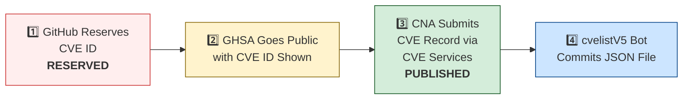

# 🛡️ OpenClaw CVE & Security Advisory Tracker

  
  
  
  
   
  
  
  
  
  

An automated tracker that continuously monitors [OpenClaw](https://github.com/openclaw/openclaw) security advisories across the GitHub Advisory Database, repo-level security advisories, and the [CVE V5 (cvelistV5)](https://github.com/CVEProject/cvelistV5) registry. Every hour it pulls the latest data, reconciles GHSA → CVE publication state, and regenerates this dashboard so you always have an up-to-date picture of the project's vulnerability landscape.

  Last updated: 2026-03-02 14:22 UTC · <a href="LICENSE">MIT License</a> · <a href="ADVISORIES.md">Full Advisory List</a> · <a href="SECURITY.md">Security Policy</a> · Data: <a href="https://github.com/CVEProject/cvelistV5">cvelistV5</a> + <a href="https://github.com/github/advisory-database">Advisory DB</a> · Updates hourly

---

  <a href="#-cves-published-in-cvelistv5-35">Published CVEs</a> ·
  <a href="#-cve-publication-pipeline">Pipeline</a> ·
  <a href="#-all-security-advisories-236">Advisories</a> ·
  <a href="#-vulnerability-categories">Categories</a> ·
  <a href="#-key-insights">Insights</a> ·
  <a href="#-project-identity">Identity</a>

---

## 🏗️ Project Identity

| Field | Value |
|-------|-------|
| **Current Name** | OpenClaw |
| **Previous Names** | Moltbot (second name), Clawdbot (original name) |
| **Repository** | [openclaw/openclaw](https://github.com/openclaw/openclaw) |
| **npm Package** | `openclaw` (formerly `clawdbot`) |
| **Author** | Peter Steinberger (steipete) |

<strong>Search terms for CVE discovery</strong>

To find all CVEs, search for: `openclaw`, `clawdbot`, `moltbot`, `clawhub`, `pkg:npm/clawdbot`, `pkg:npm/openclaw`

---

## 🚀 CVEs Published in cvelistV5 (35)

These CVEs have full records in the [CVEProject/cvelistV5](https://github.com/CVEProject/cvelistV5) repository:

| CVE ID | Severity | CVSS | Title | CWE | Published |
|--------|----------|------|-------|-----|-----------|
| [CVE-2026-28363](https://github.com/openclaw/openclaw/security/advisories/GHSA-3c6h-g97w-fg78) |  | 9.9 | In OpenClaw before 2026.2.23, tools.exec.safeBins validation for sort could be… | CWE-184 | 2026-02-27 |
| [CVE-2026-24763](https://github.com/openclaw/openclaw/security/advisories/GHSA-mc68-q9jw-2h3v) |  | 8.8 | OpenClaw/Clawdbot Docker Execution has Authenticated Command Injection via PATH Environment Variable | CWE-78 | 2026-02-02 |
| [CVE-2026-25253](https://github.com/openclaw/openclaw/security/advisories/GHSA-g8p2-7wf7-98mq) |  | 8.8 | OpenClaw/Clawdbot has 1-Click RCE via Authentication Token Exfiltration From gatewayUrl | CWE-669 | 2026-02-01 |
| [CVE-2026-26323](https://github.com/openclaw/openclaw/security/advisories/GHSA-m7x8-2w3w-pr42) |  | 8.6 | OpenClaw has a command injection in maintainer clawtributors updater | CWE-78 | 2026-02-19 |
| [CVE-2026-27001](https://github.com/openclaw/openclaw/security/advisories/GHSA-2qj5-gwg2-xwc4) |  | 8.6 | OpenClaw: Unsanitized CWD path injection into LLM prompts | CWE-77 | 2026-02-19 |
| [CVE-2026-25593](https://github.com/openclaw/openclaw/security/advisories/GHSA-g55j-c2v4-pjcg) |  | 8.4 | OpenClaw Affected by Unauthenticated Local RCE via WebSocket config.apply | CWE-78, CWE-306 | 2026-02-06 |
| [CVE-2026-25157](https://github.com/openclaw/openclaw/security/advisories/GHSA-q284-4pvr-m585) |  | 7.8 | OpenClaw/Clawdbot has OS Command Injection via Project Root Path in sshNodeCommand | CWE-78 | 2026-02-04 |
| [CVE-2026-27002](https://github.com/openclaw/openclaw/security/advisories/GHSA-w235-x559-36mg) |  | 7.7 | OpenClaw: Docker container escape via unvalidated bind mount config injection | CWE-250 | 2026-02-19 |
| [CVE-2026-26322](https://github.com/openclaw/openclaw/security/advisories/GHSA-g6q9-8fvw-f7rf) |  | 7.6 | OpenClaw Gateway tool allowed unrestricted gatewayUrl override | CWE-918 | 2026-02-19 |
| [CVE-2026-27487](https://github.com/openclaw/openclaw/security/advisories/GHSA-4564-pvr2-qq4h) |  | 7.6 | OpenClaw: Prevent shell injection in macOS keychain credential write | CWE-78 | 2026-02-21 |
| [CVE-2026-25474](https://github.com/openclaw/openclaw/security/advisories/GHSA-mp5h-m6qj-6292) |  | 7.5 | OpenClaw has a Telegram webhook request forgery (missing `channels.telegram.webhookSecret`) → auth bypass | CWE-345 | 2026-02-19 |
| [CVE-2026-26316](https://github.com/openclaw/openclaw/security/advisories/GHSA-pchc-86f6-8758) |  | 7.5 | OpenClaw has BlueBubbles webhook auth bypass via loopback proxy trust | CWE-863 | 2026-02-19 |
| [CVE-2026-26319](https://github.com/openclaw/openclaw/security/advisories/GHSA-4hg8-92x6-h2f3) |  | 7.5 | OpenClaw is Missing Webhook Authentication in Telnyx Provider Allows Unauthenticated Requests | CWE-306 | 2026-02-19 |
| [CVE-2026-26321](https://github.com/openclaw/openclaw/security/advisories/GHSA-8jpq-5h99-ff5r) |  | 7.5 | OpenClaw has a local file disclosure via sendMediaFeishu in Feishu extension | CWE-22 | 2026-02-19 |
| [CVE-2026-26324](https://github.com/openclaw/openclaw/security/advisories/GHSA-jrvc-8ff5-2f9f) |  | 7.5 | OpenClaw has a SSRF guard bypass via full-form IPv4-mapped IPv6 (loopback / metadata reachable) | CWE-918 | 2026-02-19 |
| [CVE-2026-26325](https://github.com/openclaw/openclaw/security/advisories/GHSA-h3f9-mjwj-w476) |  | 7.2 | OpenClaw Node host system.run rawCommand/command mismatch can bypass allowlist/approvals | CWE-284 | 2026-02-19 |
| [CVE-2026-26317](https://github.com/openclaw/openclaw/security/advisories/GHSA-3fqr-4cg8-h96q) |  | 7.1 | OpenClaw affected by cross-site request forgery (CSRF) through loopback browser mutation endpoints | CWE-352 | 2026-02-19 |
| [CVE-2026-26320](https://github.com/openclaw/openclaw/security/advisories/GHSA-7q2j-c4q5-rm27) |  | 7.1 | OpenClaw macOS deep link confirmation truncation can conceal executed agent message | CWE-451 | 2026-02-19 |
| [CVE-2026-26327](https://github.com/openclaw/openclaw/security/advisories/GHSA-pv58-549p-qh99) |  | 7.1 | OpenClaw allows unauthenticated discovery TXT records to steer routing and TLS pinning | CWE-345 | 2026-02-19 |
| [CVE-2026-26329](https://github.com/openclaw/openclaw/security/advisories/GHSA-cv7m-c9jx-vg7q) |  | 7.1 | OpenClaw has a path traversal in browser upload allows local file read | CWE-22 | 2026-02-19 |
| [CVE-2026-27003](https://github.com/openclaw/openclaw/security/advisories/GHSA-chf7-jq6g-qrwv) |  | 6.9 | OpenClaw: Telegram bot token exposure via logs | CWE-522 | 2026-02-19 |
| [CVE-2026-27004](https://github.com/openclaw/openclaw/security/advisories/GHSA-6hf3-mhgc-cm65) |  | 6.9 | OpenClaw session tool visibility hardening and Telegram webhook secret fallback | CWE-209, CWE-346 | 2026-02-19 |
| [CVE-2026-27488](https://github.com/openclaw/openclaw/security/advisories/GHSA-w45g-5746-x9fp) |  | 6.9 | OpenClaw hardened cron webhook delivery against SSRF | CWE-918 | 2026-02-21 |
| [CVE-2026-27008](https://github.com/openclaw/openclaw/security/advisories/GHSA-h7f7-89mm-pqh6) |  | 6.8 | OpenClaw hardened the skill download target directory validation | CWE-73 | 2026-02-19 |
| [CVE-2026-26972](https://github.com/openclaw/openclaw/security/advisories/GHSA-xwjm-j929-xq7c) |  | 6.7 | OpenClaw has a Path Traversal in Browser Download Functionality | CWE-22 | 2026-02-19 |
| [CVE-2026-25475](https://github.com/openclaw/openclaw/security/advisories/GHSA-r8g4-86fx-92mq) |  | 6.5 | OpenClaw Vulnerable to Local File Inclusion via MEDIA: Path Extraction | CWE-200, CWE-22 | 2026-02-04 |
| [CVE-2026-26328](https://github.com/openclaw/openclaw/security/advisories/GHSA-g34w-4xqq-h79m) |  | 6.5 | OpenClaw iMessage group allowlist authorization inherited DM pairing-store identities | CWE-284, CWE-863 | 2026-02-19 |
| [CVE-2026-27009](https://github.com/openclaw/openclaw/security/advisories/GHSA-37gc-85xm-2ww6) |  | 5.8 | OpenClaw affected by Stored XSS in Control UI via unsanitized assistant name/avatar in inline script injection | CWE-79 | 2026-02-19 |
| [CVE-2026-26326](https://github.com/openclaw/openclaw/security/advisories/GHSA-8mh7-phf8-xgfm) |  | 5.3 | OpenClaw skills.status could leak secrets to operator.read clients | CWE-200 | 2026-02-19 |
| [CVE-2026-27007](https://github.com/openclaw/openclaw/security/advisories/GHSA-xxvh-5hwj-42pp) |  | 4.8 | OpenClaw's sandbox config hash sorted primitive arrays and suppressed needed container recreation | CWE-1254 | 2026-02-19 |
| [CVE-2026-27576](https://github.com/openclaw/openclaw/security/advisories/GHSA-cxpw-2g23-2vgw) |  | 4.8 | OpenClaw: ACP prompt-size checks missing in local stdio bridge could reduce responsiveness with very large inputs | CWE-400 | 2026-02-21 |
| [CVE-2026-27485](https://github.com/openclaw/openclaw/security/advisories/GHSA-r6h2-5gqq-v5v6) |  | 4.6 | OpenClaw: Reject symlinks in local skill packaging script | CWE-61 | 2026-02-21 |
| [CVE-2026-27486](https://github.com/openclaw/openclaw/security/advisories/GHSA-jfv4-h8mc-jcp8) |  | 4.3 | OpenClaw: Process Safety - Unvalidated PID Kill via SIGKILL in Process Cleanup | CWE-283 | 2026-02-21 |
| [CVE-2026-24764](https://github.com/openclaw/openclaw/security/advisories/GHSA-782p-5fr5-7fj8) |  | 3.7 | OpenClaw Affected by Remote Code Execution via System Prompt Injection in Slack Channel Descriptions | CWE-74, CWE-94 | 2026-02-19 |
| [CVE-2026-27484](https://github.com/openclaw/openclaw/security/advisories/GHSA-wh94-p5m6-mr7j) |  | 2.3 | OpenClaw Discord moderation authorization used untrusted sender identity in tool-driven flows | CWE-862 | 2026-02-21 |

<strong>📖 Detailed CVE Analysis (click to expand)</strong>

### CVE-2026-28363 — In OpenClaw before 2026.2.23, tools.exec.safeBins validation for sort could be…

| Field | Detail |
|-------|--------|
| **CVSS** | 9.9 (CRITICAL) — `CVSS:3.1/AV:N/AC:L/PR:L/UI:N/S:C/C:H/I:H/A:H` |
| **CWE** | CWE-184 (CWE-184 Incomplete List of Disallowed Inputs) |
| **Affected** | < 2026.2.23 |
| **Vendor/Product** | OpenClaw / OpenClaw |
| **Advisory** | [GHSA-3c6h-g97w-fg78](https://github.com/openclaw/openclaw/security/advisories/GHSA-3c6h-g97w-fg78) |

In OpenClaw before 2026.2.23, tools.exec.safeBins validation for sort could be bypassed via GNU long-option abbreviations (such as --compress-prog) in allowlist mode, leading to approval-free execution paths that were intended to require approval. Only an exact string such as --compress-program was denied.

---

### CVE-2026-24763 — OpenClaw/Clawdbot Docker Execution has Authenticated Command Injection via PATH Environment Variable

| Field | Detail |
|-------|--------|
| **CVSS** | 8.8 (HIGH) — `CVSS:3.1/AV:N/AC:L/PR:L/UI:N/S:U/C:H/I:H/A:H` |
| **CWE** | CWE-78 (CWE-78: Improper Neutralization of Special Elements used in an OS Command ('OS Command Injection')) |
| **Affected** | < 2026.1.29 |
| **Vendor/Product** | clawdbot / clawdbot |
| **Advisory** | [GHSA-mc68-q9jw-2h3v](https://github.com/openclaw/openclaw/security/advisories/GHSA-mc68-q9jw-2h3v) |

OpenClaw (formerly  Clawdbot) is a personal AI assistant you run on your own devices. Prior to 2026.1.29, a command injection vulnerability existed in OpenClaw’s Docker sandbox execution mechanism due to unsafe handling of the PATH environment variable when constructing shell commands. An authenticated user able to control environment variables could influence command execution within the container context. This vulnerability is fixed in 2026.1.29.

> **Naming note:** Uses old name `clawdbot/clawdbot` as vendor/product.
**References:**
- [https://github.com/openclaw/openclaw/commit/771f23d36b95ec2204cc9a0054045f5d8439ea75](https://github.com/openclaw/openclaw/commit/771f23d36b95ec2204cc9a0054045f5d8439ea75)
- [https://github.com/openclaw/openclaw/releases/tag/v2026.1.29](https://github.com/openclaw/openclaw/releases/tag/v2026.1.29)
---

### CVE-2026-25253 — OpenClaw/Clawdbot has 1-Click RCE via Authentication Token Exfiltration From gatewayUrl

| Field | Detail |
|-------|--------|
| **CVSS** | 8.8 (HIGH) — `CVSS:3.1/AV:N/AC:L/PR:N/UI:R/S:U/C:H/I:H/A:H` |
| **CWE** | CWE-669 (CWE-669 Incorrect Resource Transfer Between Spheres) |
| **Affected** | < 2026.1.29 |
| **Vendor/Product** | OpenClaw / OpenClaw |
| **Advisory** | [GHSA-g8p2-7wf7-98mq](https://github.com/openclaw/openclaw/security/advisories/GHSA-g8p2-7wf7-98mq) |

OpenClaw (aka clawdbot or Moltbot) before 2026.1.29 obtains a gatewayUrl value from a query string and automatically makes a WebSocket connection without prompting, sending a token value.

> **Naming note:** Uses all three names in description. packageURL still references `pkg:npm/clawdbot`.
**References:**
- [1-click-rce-to-steal-your-moltbot-data-and-keys](https://depthfirst.com/post/1-click-rce-to-steal-your-moltbot-data-and-keys)
- [blog](https://openclaw.ai/blog)
- [one-click-rce-moltbot](https://ethiack.com/news/blog/one-click-rce-moltbot)
- [2016913750557651228](https://x.com/0xacb/status/2016913750557651228)
---

### CVE-2026-26323 — OpenClaw has a command injection in maintainer clawtributors updater

| Field | Detail |
|-------|--------|
| **CVSS** | 8.6 (HIGH) — `CVSS:4.0/AV:N/AC:L/AT:N/PR:N/UI:P/VC:H/VI:H/VA:N/SC:N/SI:N/SA:N` |
| **CWE** | CWE-78 (CWE-78: Improper Neutralization of Special Elements used in an OS Command ('OS Command Injection')) |
| **Affected** | < >= 2026.1.8, < 2026.2.14 |
| **Vendor/Product** | openclaw / openclaw |
| **Advisory** | [GHSA-m7x8-2w3w-pr42](https://github.com/openclaw/openclaw/security/advisories/GHSA-m7x8-2w3w-pr42) |

OpenClaw is a personal AI assistant. Versions 2026.1.8 through 2026.2.13 have a command injection in the maintainer/dev script `scripts/update-clawtributors.ts`. The issue affects contributors/maintainers (or CI) who run `bun scripts/update-clawtributors.ts` in a source checkout that contains a malicious commit author email (e.g. crafted `@users[.]noreply[.]github[.]com` values). Normal CLI usage is not affected (`npm i -g openclaw`): this script is not part of the shipped CLI and is not executed during routine operation. The script derived a GitHub login from `git log` author metadata and interpolated it into a shell command (via `execSync`). A malicious commit record could inject shell metacharacters and execute arbitrary commands when the script is run. Version 2026.2.14 contains a patch.

**References:**
- [https://github.com/openclaw/openclaw/commit/a429380e337152746031d290432a4b93aa553d55](https://github.com/openclaw/openclaw/commit/a429380e337152746031d290432a4b93aa553d55)
- [https://github.com/openclaw/openclaw/releases/tag/v2026.2.14](https://github.com/openclaw/openclaw/releases/tag/v2026.2.14)
---

### CVE-2026-27001 — OpenClaw: Unsanitized CWD path injection into LLM prompts

| Field | Detail |
|-------|--------|
| **CVSS** | 8.6 (HIGH) — `CVSS:4.0/AV:L/AC:L/AT:N/PR:N/UI:N/VC:H/VI:H/VA:H/SC:N/SI:N/SA:N` |
| **CWE** | CWE-77 (CWE-77: Improper Neutralization of Special Elements used in a Command ('Command Injection')) |
| **Affected** | < 2026.2.15 |
| **Vendor/Product** | openclaw / openclaw |
| **Advisory** | [GHSA-2qj5-gwg2-xwc4](https://github.com/openclaw/openclaw/security/advisories/GHSA-2qj5-gwg2-xwc4) |

OpenClaw is a personal AI assistant. Prior to version 2026.2.15, OpenClaw embedded the current working directory (workspace path) into the agent system prompt without sanitization. If an attacker can cause OpenClaw to run inside a directory whose name contains control/format characters (for example newlines or Unicode bidi/zero-width markers), those characters could break the prompt structure and inject attacker-controlled instructions. Starting in version 2026.2.15, the workspace path is sanitized before it is embedded into any LLM prompt output, stripping Unicode control/format characters and explicit line/paragraph separators. Workspace path resolution also applies the same sanitization as defense-in-depth.

**References:**
- [https://github.com/openclaw/openclaw/commit/6254e96acf16e70ceccc8f9b2abecee44d606f79](https://github.com/openclaw/openclaw/commit/6254e96acf16e70ceccc8f9b2abecee44d606f79)
- [https://github.com/openclaw/openclaw/releases/tag/v2026.2.15](https://github.com/openclaw/openclaw/releases/tag/v2026.2.15)
---

### CVE-2026-25593 — OpenClaw Affected by Unauthenticated Local RCE via WebSocket config.apply

| Field | Detail |
|-------|--------|
| **CVSS** | 8.4 (HIGH) — `CVSS:3.1/AV:L/AC:L/PR:N/UI:N/S:U/C:H/I:H/A:H` |
| **CWE** | CWE-78 (CWE-78: Improper Neutralization of Special Elements used in an OS Command ('OS Command Injection')), CWE-306 (CWE-306: Missing Authentication for Critical Function) |
| **Affected** | < 2026.1.20 |
| **Vendor/Product** | openclaw / openclaw |
| **Advisory** | [GHSA-g55j-c2v4-pjcg](https://github.com/openclaw/openclaw/security/advisories/GHSA-g55j-c2v4-pjcg) |

OpenClaw is a personal AI assistant. Prior to 2026.1.20, an unauthenticated local client could use the Gateway WebSocket API to write config via config.apply and set unsafe cliPath values that were later used for command discovery, enabling command injection as the gateway user. This vulnerability is fixed in 2026.1.20.

---

### CVE-2026-25157 — OpenClaw/Clawdbot has OS Command Injection via Project Root Path in sshNodeCommand

| Field | Detail |
|-------|--------|
| **CVSS** | 7.8 (HIGH) — `CVSS:3.1/AV:L/AC:H/PR:N/UI:R/S:C/C:H/I:H/A:H` |
| **CWE** | CWE-78 (CWE-78: Improper Neutralization of Special Elements used in an OS Command ('OS Command Injection')) |
| **Affected** | < 2026.1.29 |
| **Vendor/Product** | openclaw / openclaw |
| **Advisory** | [GHSA-q284-4pvr-m585](https://github.com/openclaw/openclaw/security/advisories/GHSA-q284-4pvr-m585) |

OpenClaw is a personal AI assistant. Prior to version 2026.1.29, there is an OS command injection vulnerability via the Project Root Path in sshNodeCommand. The sshNodeCommand function constructed a shell script without properly escaping the user-supplied project path in an error message. When the cd command failed, the unescaped path was interpolated directly into an echo statement, allowing arbitrary command execution on the remote SSH host. The parseSSHTarget function did not validate that SSH target strings could not begin with a dash. An attacker-supplied target like -oProxyCommand=... would be interpreted as an SSH configuration flag rather than a hostname, allowing arbitrary command execution on the local machine. This issue has been patched in version 2026.1.29.

---

### CVE-2026-27002 — OpenClaw: Docker container escape via unvalidated bind mount config injection

| Field | Detail |
|-------|--------|
| **CVSS** | 7.7 (HIGH) — `CVSS:4.0/AV:N/AC:L/AT:P/PR:N/UI:P/VC:H/VI:H/VA:H/SC:N/SI:N/SA:N` |
| **CWE** | CWE-250 (CWE-250: Execution with Unnecessary Privileges) |
| **Affected** | < 2026.2.15 |
| **Vendor/Product** | openclaw / openclaw |
| **Advisory** | [GHSA-w235-x559-36mg](https://github.com/openclaw/openclaw/security/advisories/GHSA-w235-x559-36mg) |

OpenClaw is a personal AI assistant. Prior to version 2026.2.15, a configuration injection issue in the Docker tool sandbox could allow dangerous Docker options (bind mounts, host networking, unconfined profiles) to be applied, enabling container escape or host data access. OpenClaw 2026.2.15 blocks dangerous sandbox Docker settings and includes runtime enforcement when building `docker create` args; config-schema validation for `network=host`, `seccompProfile=unconfined`, `apparmorProfile=unconfined`; and security audit findings to surface dangerous sandbox docker config. As a workaround, do not configure `agents.*.sandbox.docker.binds` to mount system directories or Docker socket paths, keep `agents.*.sandbox.docker.network` at `none` (default) or `bridge`, and do not use `unconfined` for seccomp/AppArmor profiles.

**References:**
- [https://github.com/openclaw/openclaw/commit/887b209db47f1f9322fead241a1c0b043fd38339](https://github.com/openclaw/openclaw/commit/887b209db47f1f9322fead241a1c0b043fd38339)
- [https://github.com/openclaw/openclaw/releases/tag/v2026.2.15](https://github.com/openclaw/openclaw/releases/tag/v2026.2.15)
---

### CVE-2026-26322 — OpenClaw Gateway tool allowed unrestricted gatewayUrl override

| Field | Detail |
|-------|--------|
| **CVSS** | 7.6 (HIGH) — `CVSS:3.1/AV:N/AC:L/PR:L/UI:N/S:U/C:H/I:L/A:L` |
| **CWE** | CWE-918 (CWE-918: Server-Side Request Forgery (SSRF)) |
| **Affected** | < 2026.2.14 |
| **Vendor/Product** | openclaw / openclaw |
| **Advisory** | [GHSA-g6q9-8fvw-f7rf](https://github.com/openclaw/openclaw/security/advisories/GHSA-g6q9-8fvw-f7rf) |

OpenClaw is a personal AI assistant. Prior to OpenClaw version 2026.2.14, the Gateway tool accepted a tool-supplied `gatewayUrl` without sufficient restrictions, which could cause the OpenClaw host to attempt outbound WebSocket connections to user-specified targets. This requires the ability to invoke tools that accept `gatewayUrl` overrides (directly or indirectly). In typical setups this is limited to authenticated operators, trusted automation, or environments where tool calls are exposed to non-operators. In other words, this is not a drive-by issue for arbitrary internet users unless a deployment explicitly allows untrusted users to trigger these tool calls. Some tool call paths allowed `gatewayUrl` overrides to flow into the Gateway WebSocket client without validation or allowlisting. This meant the host could be instructed to attempt connections to non-gateway endpoints (for example, localhost services, private network addresses, or cloud metadata IPs). In the common case, this results in an outbound connection attempt from the OpenClaw host (and corresponding errors/timeouts). In environments where the tool caller can observe the results, this can also be used for limited network reachability probing. If the target speaks WebSocket and is reachable, further interaction may be possible. Starting in version 2026.2.14, tool-supplied `gatewayUrl` overrides are restricted to loopback (on the configured gateway port) or the configured `gateway.remote.url`. Disallowed protocols, credentials, query/hash, and non-root paths are rejected.

**References:**
- [https://github.com/openclaw/openclaw/commit/c5406e1d2434be2ef6eb4d26d8f1798d718713f4](https://github.com/openclaw/openclaw/commit/c5406e1d2434be2ef6eb4d26d8f1798d718713f4)
- [https://github.com/openclaw/openclaw/releases/tag/v2026.2.14](https://github.com/openclaw/openclaw/releases/tag/v2026.2.14)
---

### CVE-2026-27487 — OpenClaw: Prevent shell injection in macOS keychain credential write

| Field | Detail |
|-------|--------|
| **CVSS** | 7.6 (HIGH) — `CVSS:3.1/AV:N/AC:L/PR:L/UI:R/S:U/C:H/I:H/A:L` |
| **CWE** | CWE-78 (CWE-78: Improper Neutralization of Special Elements used in an OS Command ('OS Command Injection')) |
| **Affected** | < 2026.2.14 |
| **Vendor/Product** | openclaw / openclaw |
| **Advisory** | [GHSA-4564-pvr2-qq4h](https://github.com/openclaw/openclaw/security/advisories/GHSA-4564-pvr2-qq4h) |

OpenClaw is a personal AI assistant. In versions 2026.2.13 and below, when using macOS, the Claude CLI keychain credential refresh path constructed a shell command to write the updated JSON blob into Keychain via security add-generic-password -w .... Because OAuth tokens are user-controlled data, this created an OS command injection risk. This issue has been fixed in version 2026.2.14.

**References:**
- [https://github.com/openclaw/openclaw/pull/15924](https://github.com/openclaw/openclaw/pull/15924)
- [https://github.com/openclaw/openclaw/commit/66d7178f2d6f9d60abad35797f97f3e61389b70c](https://github.com/openclaw/openclaw/commit/66d7178f2d6f9d60abad35797f97f3e61389b70c)
- [https://github.com/openclaw/openclaw/commit/9dce3d8bf83f13c067bc3c32291643d2f1f10a06](https://github.com/openclaw/openclaw/commit/9dce3d8bf83f13c067bc3c32291643d2f1f10a06)
- [https://github.com/openclaw/openclaw/commit/b908388245764fb3586859f44d1dff5372b19caf](https://github.com/openclaw/openclaw/commit/b908388245764fb3586859f44d1dff5372b19caf)
- [https://github.com/openclaw/openclaw/releases/tag/v2026.2.14](https://github.com/openclaw/openclaw/releases/tag/v2026.2.14)
---

### CVE-2026-25474 — OpenClaw has a Telegram webhook request forgery (missing `channels.telegram.webhookSecret`) → auth bypass

| Field | Detail |
|-------|--------|
| **CVSS** | 7.5 (HIGH) — `CVSS:3.1/AV:N/AC:L/PR:N/UI:N/S:U/C:N/I:H/A:N` |
| **CWE** | CWE-345 (CWE-345: Insufficient Verification of Data Authenticity) |
| **Affected** | < 2026.2.1 |
| **Vendor/Product** | openclaw / openclaw |
| **Advisory** | [GHSA-mp5h-m6qj-6292](https://github.com/openclaw/openclaw/security/advisories/GHSA-mp5h-m6qj-6292) |

OpenClaw is a personal AI assistant. In versions 2026.1.30 and below, if channels.telegram.webhookSecret is not set when in Telegram webhook mode, OpenClaw may accept webhook HTTP requests without verifying Telegram’s secret token header. In deployments where the webhook endpoint is reachable by an attacker, this can allow forged Telegram updates (for example spoofing message.from.id). If an attacker can reach the webhook endpoint, they may be able to send forged updates that are processed as if they came from Telegram. Depending on enabled commands/tools and configuration, this could lead to unintended bot actions. Note: Telegram webhook mode is not enabled by default. It is enabled only when `channels.telegram.webhookUrl` is configured. This issue has been fixed in version 2026.2.1.

**References:**
- [https://github.com/openclaw/openclaw/commit/3cbcba10cf30c2ffb898f0d8c7dfb929f15f8930](https://github.com/openclaw/openclaw/commit/3cbcba10cf30c2ffb898f0d8c7dfb929f15f8930)
- [https://github.com/openclaw/openclaw/commit/5643a934799dc523ec2ef18c007e1aa2c386b670](https://github.com/openclaw/openclaw/commit/5643a934799dc523ec2ef18c007e1aa2c386b670)
- [https://github.com/openclaw/openclaw/commit/633fe8b9c17f02fcc68ecdb5ec212a5ace932f09](https://github.com/openclaw/openclaw/commit/633fe8b9c17f02fcc68ecdb5ec212a5ace932f09)
- [https://github.com/openclaw/openclaw/commit/ca92597e1f9593236ad86810b66633144b69314d](https://github.com/openclaw/openclaw/commit/ca92597e1f9593236ad86810b66633144b69314d)
- [https://github.com/openclaw/openclaw/releases/tag/v2026.2.1](https://github.com/openclaw/openclaw/releases/tag/v2026.2.1)
---

### CVE-2026-26316 — OpenClaw has BlueBubbles webhook auth bypass via loopback proxy trust

| Field | Detail |
|-------|--------|
| **CVSS** | 7.5 (HIGH) — `CVSS:3.1/AV:N/AC:L/PR:N/UI:N/S:U/C:N/I:H/A:N` |
| **CWE** | CWE-863 (CWE-863: Incorrect Authorization) |
| **Affected** | < 2026.2.13 |
| **Vendor/Product** | openclaw / @openclaw/bluebubbles |
| **Advisory** | [GHSA-pchc-86f6-8758](https://github.com/openclaw/openclaw/security/advisories/GHSA-pchc-86f6-8758) |

OpenClaw is a personal AI assistant. Prior to 2026.2.13, the optional BlueBubbles iMessage channel plugin could accept webhook requests as authenticated based only on the TCP peer address being loopback (`127.0.0.1`, `::1`, `::ffff:127.0.0.1`) even when the configured webhook secret was missing or incorrect. This does not affect the default iMessage integration unless BlueBubbles is installed and enabled. Version 2026.2.13 contains a patch. Other mitigations include setting a non-empty BlueBubbles webhook password and avoiding deployments where a public-facing reverse proxy forwards to a loopback-bound Gateway without strong upstream authentication.

**References:**
- [https://github.com/openclaw/openclaw/commit/743f4b28495cdeb0d5bf76f6ebf4af01f6a02e5a](https://github.com/openclaw/openclaw/commit/743f4b28495cdeb0d5bf76f6ebf4af01f6a02e5a)
- [https://github.com/openclaw/openclaw/commit/f836c385ffc746cb954e8ee409f99d079bfdcd2f](https://github.com/openclaw/openclaw/commit/f836c385ffc746cb954e8ee409f99d079bfdcd2f)
- [https://github.com/openclaw/openclaw/releases/tag/v2026.2.13](https://github.com/openclaw/openclaw/releases/tag/v2026.2.13)
---

### CVE-2026-26319 — OpenClaw is Missing Webhook Authentication in Telnyx Provider Allows Unauthenticated Requests

| Field | Detail |
|-------|--------|
| **CVSS** | 7.5 (HIGH) — `CVSS:3.1/AV:N/AC:L/PR:N/UI:N/S:U/C:N/I:H/A:N` |
| **CWE** | CWE-306 (CWE-306: Missing Authentication for Critical Function) |
| **Affected** | < 2026.2.14 |
| **Vendor/Product** | openclaw / openclaw |
| **Advisory** | [GHSA-4hg8-92x6-h2f3](https://github.com/openclaw/openclaw/security/advisories/GHSA-4hg8-92x6-h2f3) |

OpenClaw is a personal AI assistant. Versions 2026.2.13 and below allow the optional @openclaw/voice-call plugin Telnyx webhook handler to accept unsigned inbound webhook requests when telnyx.publicKey is not configured, enabling unauthenticated callers to forge Telnyx events. Telnyx webhooks are expected to be authenticated via Ed25519 signature verification. In affected versions, TelnyxProvider.verifyWebhook() could effectively fail open when no Telnyx public key was configured, allowing arbitrary HTTP POST requests to the voice-call webhook endpoint to be treated as legitimate Telnyx events. This only impacts deployments where the Voice Call plugin is installed, enabled, and the webhook endpoint is reachable from the attacker (for example, publicly exposed via a tunnel/proxy). The issue has been fixed in version 2026.2.14.

**References:**
- [https://github.com/openclaw/openclaw/commit/29b587e73cbdc941caec573facd16e87d52f007b](https://github.com/openclaw/openclaw/commit/29b587e73cbdc941caec573facd16e87d52f007b)
- [https://github.com/openclaw/openclaw/commit/f47584fec86d6d73f2d483043a2ad0e7e3c50411](https://github.com/openclaw/openclaw/commit/f47584fec86d6d73f2d483043a2ad0e7e3c50411)
- [https://github.com/openclaw/openclaw/releases/tag/v2026.2.14](https://github.com/openclaw/openclaw/releases/tag/v2026.2.14)
---

### CVE-2026-26321 — OpenClaw has a local file disclosure via sendMediaFeishu in Feishu extension

| Field | Detail |
|-------|--------|
| **CVSS** | 7.5 (HIGH) — `CVSS:3.1/AV:N/AC:L/PR:N/UI:N/S:U/C:H/I:N/A:N` |
| **CWE** | CWE-22 (CWE-22: Improper Limitation of a Pathname to a Restricted Directory ('Path Traversal')) |
| **Affected** | < 2026.2.14 |
| **Vendor/Product** | openclaw / openclaw |
| **Advisory** | [GHSA-8jpq-5h99-ff5r](https://github.com/openclaw/openclaw/security/advisories/GHSA-8jpq-5h99-ff5r) |

OpenClaw is a personal AI assistant. Prior to OpenClaw version 2026.2.14, the Feishu extension previously allowed `sendMediaFeishu` to treat attacker-controlled `mediaUrl` values as local filesystem paths and read them directly. If an attacker can influence tool calls (directly or via prompt injection), they may be able to exfiltrate local files by supplying paths such as `/etc/passwd` as `mediaUrl`. Upgrade to OpenClaw `2026.2.14` or newer to receive a fix. The fix removes direct local file reads from this path and routes media loading through hardened helpers that enforce local-root restrictions.

**References:**
- [https://github.com/openclaw/openclaw/commit/5b4121d6011a48c71e747e3c18197f180b872c5d](https://github.com/openclaw/openclaw/commit/5b4121d6011a48c71e747e3c18197f180b872c5d)
- [https://github.com/openclaw/openclaw/releases/tag/v2026.2.14](https://github.com/openclaw/openclaw/releases/tag/v2026.2.14)
---

### CVE-2026-26324 — OpenClaw has a SSRF guard bypass via full-form IPv4-mapped IPv6 (loopback / metadata reachable)

| Field | Detail |
|-------|--------|
| **CVSS** | 7.5 (HIGH) — `CVSS:3.1/AV:N/AC:L/PR:N/UI:N/S:U/C:H/I:N/A:N` |
| **CWE** | CWE-918 (CWE-918: Server-Side Request Forgery (SSRF)) |
| **Affected** | < 2026.2.14 |
| **Vendor/Product** | openclaw / openclaw |
| **Advisory** | [GHSA-jrvc-8ff5-2f9f](https://github.com/openclaw/openclaw/security/advisories/GHSA-jrvc-8ff5-2f9f) |

OpenClaw is a personal AI assistant. Prior to version 2026.2.14, OpenClaw's SSRF protection could be bypassed using full-form IPv4-mapped IPv6 literals such as `0:0:0:0:0:ffff:7f00:1` (which is `127.0.0.1`). This could allow requests that should be blocked (loopback / private network / link-local metadata) to pass the SSRF guard. Version 2026.2.14 patches the issue.

**References:**
- [https://github.com/openclaw/openclaw/commit/c0c0e0f9aecb913e738742f73e091f2f72d39a19](https://github.com/openclaw/openclaw/commit/c0c0e0f9aecb913e738742f73e091f2f72d39a19)
- [https://github.com/openclaw/openclaw/releases/tag/v2026.2.14](https://github.com/openclaw/openclaw/releases/tag/v2026.2.14)
---

### CVE-2026-26325 — OpenClaw Node host system.run rawCommand/command mismatch can bypass allowlist/approvals

| Field | Detail |
|-------|--------|
| **CVSS** | 7.2 (HIGH) — `CVSS:3.1/AV:N/AC:L/PR:H/UI:N/S:U/C:H/I:H/A:H` |
| **CWE** | CWE-284 (CWE-284: Improper Access Control) |
| **Affected** | < 2026.2.14 |
| **Vendor/Product** | openclaw / openclaw |
| **Advisory** | [GHSA-h3f9-mjwj-w476](https://github.com/openclaw/openclaw/security/advisories/GHSA-h3f9-mjwj-w476) |

OpenClaw is a personal AI assistant. Prior to version 2026.2.14, a mismatch between `rawCommand` and `command[]` in the node host `system.run` handler could cause allowlist/approval evaluation to be performed on one command while executing a different argv. This only impacts deployments that use the node host / companion node execution path (`system.run` on a node), enable allowlist-based exec policy (`security=allowlist`) with approval prompting driven by allowlist misses (for example `ask=on-miss`), allow an attacker to invoke `system.run`. Default/non-node configurations are not affected. Version 2026.2.14 enforces `rawCommand`/`command[]` consistency (gateway fail-fast + node host validation).

**References:**
- [https://github.com/openclaw/openclaw/commit/cb3290fca32593956638f161d9776266b90ab891](https://github.com/openclaw/openclaw/commit/cb3290fca32593956638f161d9776266b90ab891)
- [https://github.com/openclaw/openclaw/releases/tag/v2026.2.14](https://github.com/openclaw/openclaw/releases/tag/v2026.2.14)
---

### CVE-2026-26317 — OpenClaw affected by cross-site request forgery (CSRF) through loopback browser mutation endpoints

| Field | Detail |
|-------|--------|
| **CVSS** | 7.1 (HIGH) — `CVSS:3.1/AV:N/AC:L/PR:N/UI:R/S:U/C:N/I:H/A:L` |
| **CWE** | CWE-352 (CWE-352: Cross-Site Request Forgery (CSRF)) |
| **Affected** | <= 2026.1.24-3 |
| **Vendor/Product** | openclaw / clawdbot |
| **Advisory** | [GHSA-3fqr-4cg8-h96q](https://github.com/openclaw/openclaw/security/advisories/GHSA-3fqr-4cg8-h96q) |

OpenClaw is a personal AI assistant. Prior to 2026.2.14, browser-facing localhost mutation routes accepted cross-origin browser requests without explicit Origin/Referer validation. Loopback binding reduces remote exposure but does not prevent browser-initiated requests from malicious origins. A malicious website can trigger unauthorized state changes against a victim's local OpenClaw browser control plane (for example opening tabs, starting/stopping the browser, mutating storage/cookies) if the browser control service is reachable on loopback in the victim's browser context. Starting in version 2026.2.14, mutating HTTP methods (POST/PUT/PATCH/DELETE) are rejected when the request indicates a non-loopback Origin/Referer (or `Sec-Fetch-Site: cross-site`). Other mitigations include enabling browser control auth (token/password) and avoid running with auth disabled.

> **Naming note:** Uses old name `openclaw/clawdbot` as vendor/product.
**References:**
- [https://github.com/openclaw/openclaw/commit/b566b09f81e2b704bf9398d8d97d5f7a90aa94c3](https://github.com/openclaw/openclaw/commit/b566b09f81e2b704bf9398d8d97d5f7a90aa94c3)
- [https://github.com/openclaw/openclaw/releases/tag/v2026.2.14](https://github.com/openclaw/openclaw/releases/tag/v2026.2.14)
---

### CVE-2026-26320 — OpenClaw macOS deep link confirmation truncation can conceal executed agent message

| Field | Detail |
|-------|--------|
| **CVSS** | 7.1 (HIGH) — `CVSS:4.0/AV:N/AC:L/AT:N/PR:N/UI:P/VC:N/VI:H/VA:N/SC:N/SI:N/SA:N` |
| **CWE** | CWE-451 (CWE-451: User Interface (UI) Misrepresentation of Critical Information) |
| **Affected** | < >= 2026.2.6-0, < 2026.2.14 |
| **Vendor/Product** | openclaw / openclaw |
| **Advisory** | [GHSA-7q2j-c4q5-rm27](https://github.com/openclaw/openclaw/security/advisories/GHSA-7q2j-c4q5-rm27) |

OpenClaw is a personal AI assistant. OpenClaw macOS desktop client registers the `openclaw://` URL scheme. For `openclaw://agent` deep links without an unattended `key`, the app shows a confirmation dialog that previously displayed only the first 240 characters of the message, but executed the full message after the user clicked "Run." At the time of writing, the OpenClaw macOS desktop client is still in beta. In versions 2026.2.6 through 2026.2.13, an attacker could pad the message with whitespace to push a malicious payload outside the visible preview, increasing the chance a user approves a different message than the one that is actually executed. If a user runs the deep link, the agent may perform actions that can lead to arbitrary command execution depending on the user's configured tool approvals/allowlists. This is a social-engineering mediated vulnerability: the confirmation prompt could be made to misrepresent the executed message. The issue is fixed in 2026.2.14. Other mitigations include not approve unexpected "Run OpenClaw agent?" prompts triggered while browsing untrusted sites and usingunattended deep links only with a valid `key` for trusted personal automations.

**References:**
- [https://github.com/openclaw/openclaw/commit/28d9dd7a772501ccc3f71457b4adfee79084fe6f](https://github.com/openclaw/openclaw/commit/28d9dd7a772501ccc3f71457b4adfee79084fe6f)
- [https://github.com/openclaw/openclaw/releases/tag/v2026.2.14](https://github.com/openclaw/openclaw/releases/tag/v2026.2.14)
---

### CVE-2026-26327 — OpenClaw allows unauthenticated discovery TXT records to steer routing and TLS pinning

| Field | Detail |
|-------|--------|
| **CVSS** | 7.1 (HIGH) — `CVSS:4.0/AV:A/AC:L/AT:N/PR:N/UI:N/VC:H/VI:N/VA:N/SC:N/SI:N/SA:N` |
| **CWE** | CWE-345 (CWE-345: Insufficient Verification of Data Authenticity) |
| **Affected** | < 2026.2.14 |
| **Vendor/Product** | openclaw / openclaw |
| **Advisory** | [GHSA-pv58-549p-qh99](https://github.com/openclaw/openclaw/security/advisories/GHSA-pv58-549p-qh99) |

OpenClaw is a personal AI assistant. Discovery beacons (Bonjour/mDNS and DNS-SD) include TXT records such as `lanHost`, `tailnetDns`, `gatewayPort`, and `gatewayTlsSha256`. TXT records are unauthenticated. Prior to version 2026.2.14, some clients treated TXT values as authoritative routing/pinning inputs. iOS and macOS used TXT-provided host hints (`lanHost`/`tailnetDns`) and ports (`gatewayPort`) to build the connection URL. iOS and Android allowed the discovery-provided TLS fingerprint (`gatewayTlsSha256`) to override a previously stored TLS pin. On a shared/untrusted LAN, an attacker could advertise a rogue `_openclaw-gw._tcp` service. This could cause a client to connect to an attacker-controlled endpoint and/or accept an attacker certificate, potentially exfiltrating Gateway credentials (`auth.token` / `auth.password`) during connection. As of time of publication, the iOS and Android apps are alpha/not broadly shipped (no public App Store / Play Store release). Practical impact is primarily limited to developers/testers running those builds, plus any other shipped clients relying on discovery on a shared/untrusted LAN. Version 2026.2.14 fixes the issue. Clients now prefer the resolved service endpoint (SRV + A/AAAA) over TXT-provided routing hints. Discovery-provided fingerprints no longer override stored TLS pins. In iOS/Android, first-time TLS pins require explicit user confirmation (fingerprint shown; no silent TOFU) and discovery-based direct connects are TLS-only. In Android, hostname verification is no longer globally disabled (only bypassed when pinning).

**References:**
- [https://github.com/openclaw/openclaw/commit/d583782ee322a6faa1fe87ae52455e0d349de586](https://github.com/openclaw/openclaw/commit/d583782ee322a6faa1fe87ae52455e0d349de586)
- [https://github.com/openclaw/openclaw/releases/tag/v2026.2.14](https://github.com/openclaw/openclaw/releases/tag/v2026.2.14)
---

### CVE-2026-26329 — OpenClaw has a path traversal in browser upload allows local file read

| Field | Detail |
|-------|--------|
| **CVSS** | 7.1 (HIGH) — `CVSS:4.0/AV:N/AC:L/AT:N/PR:L/UI:N/VC:H/VI:N/VA:N/SC:N/SI:N/SA:N` |
| **CWE** | CWE-22 (CWE-22: Improper Limitation of a Pathname to a Restricted Directory ('Path Traversal')) |
| **Affected** | < 2026.2.14 |
| **Vendor/Product** | openclaw / openclaw |
| **Advisory** | [GHSA-cv7m-c9jx-vg7q](https://github.com/openclaw/openclaw/security/advisories/GHSA-cv7m-c9jx-vg7q) |

OpenClaw is a personal AI assistant. Prior to version 2026.2.14, authenticated attackers can read arbitrary files from the Gateway host by supplying absolute paths or path traversal sequences to the browser tool's `upload` action. The server passed these paths to Playwright's `setInputFiles()` APIs without restricting them to a safe root. An attacker must reach the Gateway HTTP surface (or otherwise invoke the same browser control hook endpoints); present valid Gateway auth (bearer token / password), as required by the Gateway configuration (In common default setups, the Gateway binds to loopback and the onboarding wizard generates a gateway token even for loopback); and have the `browser` tool permitted by tool policy for the target session/context (and have browser support enabled). If an operator exposes the Gateway beyond loopback (LAN/tailnet/custom bind, reverse proxy, tunnels, etc.), the impact increases accordingly. Starting in version 2026.2.14, the upload paths are now confined to OpenClaw's temp uploads root (`DEFAULT_UPLOAD_DIR`) and traversal/escape paths are rejected.

**References:**
- [https://github.com/openclaw/openclaw/commit/3aa94afcfd12104c683c9cad81faf434d0dadf87](https://github.com/openclaw/openclaw/commit/3aa94afcfd12104c683c9cad81faf434d0dadf87)
- [https://github.com/openclaw/openclaw/releases/tag/v2026.2.14](https://github.com/openclaw/openclaw/releases/tag/v2026.2.14)
---

### CVE-2026-27003 — OpenClaw: Telegram bot token exposure via logs

| Field | Detail |
|-------|--------|
| **CVSS** | 6.9 (MEDIUM) — `CVSS:4.0/AV:L/AC:L/AT:N/PR:N/UI:N/VC:H/VI:N/VA:N/SC:N/SI:N/SA:N` |
| **CWE** | CWE-522 (CWE-522: Insufficiently Protected Credentials) |
| **Affected** | < 2026.2.15 |
| **Vendor/Product** | openclaw / openclaw |
| **Advisory** | [GHSA-chf7-jq6g-qrwv](https://github.com/openclaw/openclaw/security/advisories/GHSA-chf7-jq6g-qrwv) |

OpenClaw is a personal AI assistant. Telegram bot tokens can appear in error messages and stack traces (for example, when request URLs include `https://api.telegram.org/bot<token>/...`). Prior to version 2026.2.15, OpenClaw logged these strings without redaction, which could leak the bot token into logs, crash reports, CI output, or support bundles. Disclosure of a Telegram bot token allows an attacker to impersonate the bot and take over Bot API access. Users should upgrade to version 2026.2.15 to obtain a fix and rotate the Telegram bot token if it may have been exposed.

**References:**
- [https://github.com/openclaw/openclaw/commit/cf69907015b659e5025efb735ee31bd05c4ee3d5](https://github.com/openclaw/openclaw/commit/cf69907015b659e5025efb735ee31bd05c4ee3d5)
---

### CVE-2026-27004 — OpenClaw session tool visibility hardening and Telegram webhook secret fallback

| Field | Detail |
|-------|--------|
| **CVSS** | 6.9 (MEDIUM) — `CVSS:4.0/AV:L/AC:L/AT:N/PR:N/UI:N/VC:H/VI:N/VA:N/SC:N/SI:N/SA:N` |
| **CWE** | CWE-209 (CWE-209: Generation of Error Message Containing Sensitive Information), CWE-346 (CWE-346: Origin Validation Error) |
| **Affected** | < 2026.2.15 |
| **Vendor/Product** | openclaw / openclaw |
| **Advisory** | [GHSA-6hf3-mhgc-cm65](https://github.com/openclaw/openclaw/security/advisories/GHSA-6hf3-mhgc-cm65) |

OpenClaw is a personal AI assistant. Prior to version 2026.2.15, in some shared-agent deployments, OpenClaw session tools (`sessions_list`, `sessions_history`, `sessions_send`) allowed broader session targeting than some operators intended. This is primarily a configuration/visibility-scoping issue in multi-user environments where peers are not equally trusted. In Telegram webhook mode, monitor startup also did not fall back to per-account `webhookSecret` when only the account-level secret was configured. In shared-agent, multi-user, less-trusted environments: session-tool access could expose transcript content across peer sessions. In single-agent or trusted environments, practical impact is limited. In Telegram webhook mode, account-level secret wiring could be missed unless an explicit monitor webhook secret override was provided. Version 2026.2.15 fixes the issue.

**References:**
- [https://github.com/openclaw/openclaw/commit/c6c53437f7da033b94a01d492e904974e7bda74c](https://github.com/openclaw/openclaw/commit/c6c53437f7da033b94a01d492e904974e7bda74c)
---

### CVE-2026-27488 — OpenClaw hardened cron webhook delivery against SSRF

| Field | Detail |
|-------|--------|
| **CVSS** | 6.9 (MEDIUM) — `CVSS:4.0/AV:N/AC:L/AT:N/PR:N/UI:N/VC:N/VI:N/VA:N/SC:N/SI:L/SA:L` |
| **CWE** | CWE-918 (CWE-918: Server-Side Request Forgery (SSRF)) |
| **Affected** | < 2026.2.19 |
| **Vendor/Product** | openclaw / openclaw |
| **Advisory** | [GHSA-w45g-5746-x9fp](https://github.com/openclaw/openclaw/security/advisories/GHSA-w45g-5746-x9fp) |

OpenClaw is a personal AI assistant. In versions 2026.2.17 and below, Cron webhook delivery in src/gateway/server-cron.ts uses fetch() directly, so webhook targets can reach private/metadata/internal endpoints without SSRF policy checks. This issue was fixed in version 2026.2.19.

**References:**
- [https://github.com/openclaw/openclaw/commit/99db4d13e5c139883ef0def9ff963e9273179655](https://github.com/openclaw/openclaw/commit/99db4d13e5c139883ef0def9ff963e9273179655)
- [https://github.com/openclaw/openclaw/releases/tag/v2026.2.19](https://github.com/openclaw/openclaw/releases/tag/v2026.2.19)
---

### CVE-2026-27008 — OpenClaw hardened the skill download target directory validation

| Field | Detail |
|-------|--------|
| **CVSS** | 6.8 (MEDIUM) — `CVSS:4.0/AV:L/AC:L/AT:N/PR:H/UI:N/VC:L/VI:H/VA:N/SC:N/SI:N/SA:N` |
| **CWE** | CWE-73 (CWE-73: External Control of File Name or Path) |
| **Affected** | < 2026.2.15 |
| **Vendor/Product** | openclaw / openclaw |
| **Advisory** | [GHSA-h7f7-89mm-pqh6](https://github.com/openclaw/openclaw/security/advisories/GHSA-h7f7-89mm-pqh6) |

OpenClaw is a personal AI assistant. Prior to version 2026.2.15, a bug in `download` skill installation allowed `targetDir` values from skill frontmatter to resolve outside the per-skill tools directory if not strictly validated. In the admin-only `skills.install` flow, this could write files outside the intended install sandbox. Version 2026.2.15 contains a fix for the issue.

**References:**
- [https://github.com/openclaw/openclaw/commit/2363e1b0853a028e47f90dcc1066e3e9809d65f1](https://github.com/openclaw/openclaw/commit/2363e1b0853a028e47f90dcc1066e3e9809d65f1)
- [https://github.com/openclaw/openclaw/commit/b6305e97256d67e439719faacf5af3de9727d6e1](https://github.com/openclaw/openclaw/commit/b6305e97256d67e439719faacf5af3de9727d6e1)
- [https://github.com/openclaw/openclaw/releases/tag/v2026.2.15](https://github.com/openclaw/openclaw/releases/tag/v2026.2.15)
---

### CVE-2026-26972 — OpenClaw has a Path Traversal in Browser Download Functionality

| Field | Detail |
|-------|--------|
| **CVSS** | 6.7 (MEDIUM) — `CVSS:3.1/AV:L/AC:L/PR:H/UI:N/S:U/C:H/I:H/A:H` |
| **CWE** | CWE-22 (CWE-22: Improper Limitation of a Pathname to a Restricted Directory ('Path Traversal')) |
| **Affected** | < >= 2026.1.12, < 2026.2.13 |
| **Vendor/Product** | openclaw / openclaw |
| **Advisory** | [GHSA-xwjm-j929-xq7c](https://github.com/openclaw/openclaw/security/advisories/GHSA-xwjm-j929-xq7c) |

OpenClaw is a personal AI assistant. In versions 2026.1.12 through 2026.2.12, OpenClaw browser download helpers accepted an unsanitized output path. When invoked via the browser control gateway routes, this allowed path traversal to write downloads outside the intended OpenClaw temp downloads directory. This issue is not exposed via the AI agent tool schema (no `download` action). Exploitation requires authenticated CLI access or an authenticated gateway RPC token. Version 2026.2.13 fixes the issue.

**References:**
- [https://github.com/openclaw/openclaw/commit/7f0489e4731c8d965d78d6eac4a60312e46a9426](https://github.com/openclaw/openclaw/commit/7f0489e4731c8d965d78d6eac4a60312e46a9426)
- [https://github.com/openclaw/openclaw/releases/tag/v2026.2.13](https://github.com/openclaw/openclaw/releases/tag/v2026.2.13)
---

### CVE-2026-25475 — OpenClaw Vulnerable to Local File Inclusion via MEDIA: Path Extraction

| Field | Detail |
|-------|--------|
| **CVSS** | 6.5 (MEDIUM) — `CVSS:3.1/AV:N/AC:L/PR:L/UI:N/S:U/C:H/I:N/A:N` |
| **CWE** | CWE-200 (CWE-200: Exposure of Sensitive Information to an Unauthorized Actor), CWE-22 (CWE-22: Improper Limitation of a Pathname to a Restricted Directory ('Path Traversal')) |
| **Affected** | < 2026.1.30 |
| **Vendor/Product** | openclaw / openclaw |
| **Advisory** | [GHSA-r8g4-86fx-92mq](https://github.com/openclaw/openclaw/security/advisories/GHSA-r8g4-86fx-92mq) |

OpenClaw is a personal AI assistant. Prior to version 2026.1.30, the isValidMedia() function in src/media/parse.ts allows arbitrary file paths including absolute paths, home directory paths, and directory traversal sequences. An agent can read any file on the system by outputting MEDIA:/path/to/file, exfiltrating sensitive data to the user/channel. This issue has been patched in version 2026.1.30.

---

### CVE-2026-26328 — OpenClaw iMessage group allowlist authorization inherited DM pairing-store identities

| Field | Detail |
|-------|--------|
| **CVSS** | 6.5 (MEDIUM) — `CVSS:3.1/AV:N/AC:L/PR:L/UI:N/S:U/C:N/I:H/A:N` |
| **CWE** | CWE-284 (CWE-284: Improper Access Control), CWE-863 (CWE-863: Incorrect Authorization) |
| **Affected** | <= 2026.1.24-3 |
| **Vendor/Product** | openclaw / clawdbot |
| **Advisory** | [GHSA-g34w-4xqq-h79m](https://github.com/openclaw/openclaw/security/advisories/GHSA-g34w-4xqq-h79m) |

OpenClaw is a personal AI assistant. Prior to version 2026.2.14, under iMessage `groupPolicy=allowlist`, group authorization could be satisfied by sender identities coming from the DM pairing store, broadening DM trust into group contexts. Version 2026.2.14 fixes the issue.

> **Naming note:** Uses old name `openclaw/clawdbot` as vendor/product.
**References:**
- [https://github.com/openclaw/openclaw/commit/872079d42fe105ece2900a1dd6ab321b92da2d59](https://github.com/openclaw/openclaw/commit/872079d42fe105ece2900a1dd6ab321b92da2d59)
- [https://github.com/openclaw/openclaw/releases/tag/v2026.2.14](https://github.com/openclaw/openclaw/releases/tag/v2026.2.14)
---

### CVE-2026-27009 — OpenClaw affected by Stored XSS in Control UI via unsanitized assistant name/avatar in inline script injection

| Field | Detail |
|-------|--------|
| **CVSS** | 5.8 (MEDIUM) — `CVSS:3.1/AV:L/AC:L/PR:H/UI:R/S:U/C:H/I:H/A:N` |
| **CWE** | CWE-79 (CWE-79: Improper Neutralization of Input During Web Page Generation ('Cross-site Scripting')) |
| **Affected** | < 2026.2.15 |
| **Vendor/Product** | openclaw / openclaw |
| **Advisory** | [GHSA-37gc-85xm-2ww6](https://github.com/openclaw/openclaw/security/advisories/GHSA-37gc-85xm-2ww6) |

OpenClaw is a personal AI assistant. Prior to version 2026.2.15, a atored XSS issue in the OpenClaw Control UI when rendering assistant identity (name/avatar) into an inline `` could break out of the script tag and execute attacker-controlled JavaScript in the Control UI origin. Version 2026.2.15 removed inline script injection and serve bootstrap config from a JSON endpoint and added a restrictive Content Security Policy for the Control UI (`script-src 'self'`, no inline scripts).

**References:**
- [https://github.com/openclaw/openclaw/commit/3b4096e02e7e335f99f5986ec1bd566e90b14a7e](https://github.com/openclaw/openclaw/commit/3b4096e02e7e335f99f5986ec1bd566e90b14a7e)
- [https://github.com/openclaw/openclaw/commit/adc818db4a4b3b8d663e7674ef20436947514e1b](https://github.com/openclaw/openclaw/commit/adc818db4a4b3b8d663e7674ef20436947514e1b)
- [https://github.com/openclaw/openclaw/releases/tag/v2026.2.15](https://github.com/openclaw/openclaw/releases/tag/v2026.2.15)
---

### CVE-2026-26326 — OpenClaw skills.status could leak secrets to operator.read clients

| Field | Detail |
|-------|--------|
| **CVSS** | 5.3 (MEDIUM) — `CVSS:4.0/AV:N/AC:L/AT:N/PR:L/UI:N/VC:L/VI:N/VA:N/SC:N/SI:N/SA:N` |
| **CWE** | CWE-200 (CWE-200: Exposure of Sensitive Information to an Unauthorized Actor) |
| **Affected** | < 2026.2.14 |
| **Vendor/Product** | openclaw / openclaw |
| **Advisory** | [GHSA-8mh7-phf8-xgfm](https://github.com/openclaw/openclaw/security/advisories/GHSA-8mh7-phf8-xgfm) |

OpenClaw is a personal AI assistant. Prior to version 2026.2.14, `skills.status` could disclose secrets to `operator.read` clients by returning raw resolved config values in `configChecks` for skill `requires.config` paths. Version 2026.2.14 stops including raw resolved config values in requirement checks (return only `{ path, satisfied }`) and narrows the Discord skill requirement to the token key. In addition to upgrading, users should rotate any Discord tokens that may have been exposed to read-scoped clients.

**References:**
- [https://github.com/openclaw/openclaw/commit/d3428053d95eefbe10ecf04f92218ffcba55ae5a](https://github.com/openclaw/openclaw/commit/d3428053d95eefbe10ecf04f92218ffcba55ae5a)
- [https://github.com/openclaw/openclaw/commit/ebc68861a61067fc37f9298bded3eec9de0ba783](https://github.com/openclaw/openclaw/commit/ebc68861a61067fc37f9298bded3eec9de0ba783)
- [https://github.com/openclaw/openclaw/releases/tag/v2026.2.14](https://github.com/openclaw/openclaw/releases/tag/v2026.2.14)
---

### CVE-2026-27007 — OpenClaw's sandbox config hash sorted primitive arrays and suppressed needed container recreation

| Field | Detail |
|-------|--------|
| **CVSS** | 4.8 (MEDIUM) — `CVSS:4.0/AV:L/AC:L/AT:N/PR:L/UI:N/VC:N/VI:L/VA:N/SC:N/SI:N/SA:N` |
| **CWE** | CWE-1254 (CWE-1254: Incorrect Comparison Logic Granularity) |
| **Affected** | < 2026.2.15 |
| **Vendor/Product** | openclaw / openclaw |
| **Advisory** | [GHSA-xxvh-5hwj-42pp](https://github.com/openclaw/openclaw/security/advisories/GHSA-xxvh-5hwj-42pp) |

OpenClaw is a personal AI assistant. Prior to version 2026.2.15, `normalizeForHash` in `src/agents/sandbox/config-hash.ts` recursively sorted arrays that contained only primitive values. This made order-sensitive sandbox configuration arrays hash to the same value even when order changed. In OpenClaw sandbox flows, this hash is used to decide whether existing sandbox containers should be recreated. As a result, order-only config changes (for example Docker `dns` and `binds` array order) could be treated as unchanged and stale containers could be reused. This is a configuration integrity issue affecting sandbox recreation behavior. Starting in version 2026.2.15, array ordering is preserved during hash normalization; only object key ordering remains normalized for deterministic hashing.

**References:**
- [https://github.com/openclaw/openclaw/commit/41ded303b4f6dae5afa854531ff837c3276ad60b](https://github.com/openclaw/openclaw/commit/41ded303b4f6dae5afa854531ff837c3276ad60b)
- [https://github.com/openclaw/openclaw/releases/tag/v2026.2.15](https://github.com/openclaw/openclaw/releases/tag/v2026.2.15)
---

### CVE-2026-27576 — OpenClaw: ACP prompt-size checks missing in local stdio bridge could reduce responsiveness with very large inputs

| Field | Detail |
|-------|--------|
| **CVSS** | 4.8 (MEDIUM) — `CVSS:4.0/AV:L/AC:L/AT:N/PR:L/UI:N/VC:N/VI:N/VA:L/SC:N/SI:N/SA:N` |
| **CWE** | CWE-400 (CWE-400: Uncontrolled Resource Consumption) |
| **Affected** | < 2026.2.19 |
| **Vendor/Product** | openclaw / openclaw |
| **Advisory** | [GHSA-cxpw-2g23-2vgw](https://github.com/openclaw/openclaw/security/advisories/GHSA-cxpw-2g23-2vgw) |

OpenClaw is a personal AI assistant. In versions 2026.2.17 and below, the ACP bridge accepts very large prompt text blocks and can assemble oversized prompt payloads before forwarding them to chat.send. Because ACP runs over local stdio, this mainly affects local ACP clients (for example IDE integrations) that send unusually large inputs. This issue has been fixed in version 2026.2.19.

**References:**
- [https://github.com/openclaw/openclaw/commit/63e39d7f57ac4ad4a5e38d17e7394ae7c4dd0b9c](https://github.com/openclaw/openclaw/commit/63e39d7f57ac4ad4a5e38d17e7394ae7c4dd0b9c)
- [https://github.com/openclaw/openclaw/commit/8ae2d5110f6ceadef73822aa3db194fb60d2ba68](https://github.com/openclaw/openclaw/commit/8ae2d5110f6ceadef73822aa3db194fb60d2ba68)
- [https://github.com/openclaw/openclaw/commit/ebcf19746f5c500a41817e03abecadea8655654a](https://github.com/openclaw/openclaw/commit/ebcf19746f5c500a41817e03abecadea8655654a)
- [https://github.com/openclaw/openclaw/releases/tag/v2026.2.19](https://github.com/openclaw/openclaw/releases/tag/v2026.2.19)
---

### CVE-2026-27485 — OpenClaw: Reject symlinks in local skill packaging script

| Field | Detail |
|-------|--------|
| **CVSS** | 4.6 (MEDIUM) — `CVSS:4.0/AV:L/AC:L/AT:N/PR:N/UI:A/VC:N/VI:L/VA:N/SC:N/SI:N/SA:N` |
| **CWE** | CWE-61 (CWE-61: UNIX Symbolic Link (Symlink) Following) |
| **Affected** | < 2026.2.19 |
| **Vendor/Product** | openclaw / openclaw |
| **Advisory** | [GHSA-r6h2-5gqq-v5v6](https://github.com/openclaw/openclaw/security/advisories/GHSA-r6h2-5gqq-v5v6) |

OpenClaw is a personal AI assistant. In versions 2026.2.17 and below, skills/skill-creator/scripts/package_skill.py (a local helper script used when authors package skills) previously followed symlinks while building .skill archives. If an author runs this script on a crafted local skill directory containing symlinks to files outside the skill root, the resulting archive can include unintended file contents. If exploited, this vulnerability can lead to potential unintentional disclosure of local files from the packaging machine into a generated .skill artifact, but requires local execution of the packaging script on attacker-controlled skill contents. This issue has been fixed in version 2026.2.18.

**References:**
- [https://github.com/openclaw/openclaw/pull/20796](https://github.com/openclaw/openclaw/pull/20796)
- [https://github.com/openclaw/openclaw/commit/c275932aa4230fb7a8212fe1b9d2a18424874b3f](https://github.com/openclaw/openclaw/commit/c275932aa4230fb7a8212fe1b9d2a18424874b3f)
- [https://github.com/openclaw/openclaw/commit/ee1d6427b544ccadd73e02b1630ea5c29ba9a9f0](https://github.com/openclaw/openclaw/commit/ee1d6427b544ccadd73e02b1630ea5c29ba9a9f0)
- [https://github.com/openclaw/openclaw/releases/tag/v2026.2.19](https://github.com/openclaw/openclaw/releases/tag/v2026.2.19)
---

### CVE-2026-27486 — OpenClaw: Process Safety - Unvalidated PID Kill via SIGKILL in Process Cleanup

| Field | Detail |
|-------|--------|
| **CVSS** | 4.3 (MEDIUM) — `CVSS:4.0/AV:L/AC:L/AT:P/PR:L/UI:N/VC:N/VI:N/VA:N/SC:N/SI:N/SA:H` |
| **CWE** | CWE-283 (CWE-283: Unverified Ownership) |
| **Affected** | < 2026.2.14 |
| **Vendor/Product** | openclaw / openclaw |
| **Advisory** | [GHSA-jfv4-h8mc-jcp8](https://github.com/openclaw/openclaw/security/advisories/GHSA-jfv4-h8mc-jcp8) |

OpenClaw is a personal AI assistant. In versions 2026.2.13 and below of the OpenClaw CLI, the process cleanup uses system-wide process enumeration and pattern matching to terminate processes without verifying if they are owned by the current OpenClaw process. On shared hosts, unrelated processes can be terminated if they match the pattern. The CLI runner cleanup helpers can kill processes matched by command-line patterns without validating process ownership. This issue has been fixed in version 2026.2.14.

**References:**
- [https://github.com/openclaw/openclaw/commit/6084d13b956119e3cf95daaf9a1cae1670ea3557](https://github.com/openclaw/openclaw/commit/6084d13b956119e3cf95daaf9a1cae1670ea3557)
- [https://github.com/openclaw/openclaw/commit/eb60e2e1b213740c3c587a7ba4dbf10da620ca66](https://github.com/openclaw/openclaw/commit/eb60e2e1b213740c3c587a7ba4dbf10da620ca66)
- [https://github.com/openclaw/openclaw/releases/tag/v2026.2.14](https://github.com/openclaw/openclaw/releases/tag/v2026.2.14)
---

### CVE-2026-24764 — OpenClaw Affected by Remote Code Execution via System Prompt Injection in Slack Channel Descriptions

| Field | Detail |
|-------|--------|
| **CVSS** | 3.7 (LOW) — `CVSS:3.1/AV:N/AC:H/PR:L/UI:R/S:U/C:L/I:L/A:N` |
| **CWE** | CWE-74 (CWE-74: Improper Neutralization of Special Elements in Output Used by a Downstream Component ('Injection')), CWE-94 (CWE-94: Improper Control of Generation of Code ('Code Injection')) |
| **Affected** | < 2026.2.3 |
| **Vendor/Product** | clawdbot / clawdbot |
| **Advisory** | [GHSA-782p-5fr5-7fj8](https://github.com/openclaw/openclaw/security/advisories/GHSA-782p-5fr5-7fj8) |

OpenClaw (formerly Clawdbot) is a personal AI assistant users run on their own devices. In versions 2026.2.2 and below, when the Slack integration is enabled, channel metadata (topic/description) can be incorporated into the model's system prompt. Prompt injection is a documented risk for LLM-driven systems. This issue increases the injection surface by allowing untrusted Slack channel metadata to be treated as higher-trust system input. This issue has been fixed in version 2026.2.3.

> **Naming note:** Uses old name `clawdbot/clawdbot` as vendor/product.
**References:**
- [https://github.com/openclaw/openclaw/commit/35eb40a7000b59085e9c638a80fd03917c7a095e](https://github.com/openclaw/openclaw/commit/35eb40a7000b59085e9c638a80fd03917c7a095e)
- [https://github.com/openclaw/openclaw/releases/tag/v2026.2.3](https://github.com/openclaw/openclaw/releases/tag/v2026.2.3)
---

### CVE-2026-27484 — OpenClaw Discord moderation authorization used untrusted sender identity in tool-driven flows

| Field | Detail |
|-------|--------|
| **CVSS** | 2.3 (LOW) — `CVSS:4.0/AV:N/AC:L/AT:P/PR:L/UI:N/VC:N/VI:N/VA:L/SC:N/SI:N/SA:N` |
| **CWE** | CWE-862 (CWE-862: Missing Authorization) |
| **Affected** | < 2026.2.18 |
| **Vendor/Product** | openclaw / openclaw |
| **Advisory** | [GHSA-wh94-p5m6-mr7j](https://github.com/openclaw/openclaw/security/advisories/GHSA-wh94-p5m6-mr7j) |

OpenClaw is a personal AI assistant. In versions 2026.2.17 and below, the Discord moderation action handling (timeout, kick, ban) uses sender identity from request parameters in tool-driven flows, instead of trusted runtime sender context. In setups where Discord moderation actions are enabled and the bot has the necessary guild permissions, a non-admin user can request moderation actions by spoofing sender identity fields. This issue has been fixed in version 2026.2.18.

**References:**
- [https://github.com/openclaw/openclaw/commit/775816035ecc6bb243843f8000c9a58ff609e32d](https://github.com/openclaw/openclaw/commit/775816035ecc6bb243843f8000c9a58ff609e32d)
- [https://github.com/openclaw/openclaw/releases/tag/v2026.2.19](https://github.com/openclaw/openclaw/releases/tag/v2026.2.19)
---

---

## ⏳ CVE Publication Pipeline

Of 40 GHSAs with CVE IDs, **35** are fully published and **5** remain `RESERVED`.

| CVE ID | State | cvelistV5 | GHSA Published | CNA |
|--------|-------|-----------|----------------|-----|
| CVE-2026-24763 | ✅ **PUBLISHED** | ✅ | 2026-02-02 | GitHub_M |
| CVE-2026-24764 | ✅ **PUBLISHED** | ✅ | 2026-02-17 | GitHub_M |
| CVE-2026-25157 | ✅ **PUBLISHED** | ✅ | 2026-02-02 | GitHub_M |
| CVE-2026-25253 | ✅ **PUBLISHED** | ✅ | 2026-02-02 | mitre |
| CVE-2026-25474 | ✅ **PUBLISHED** | ✅ | 2026-02-17 | GitHub_M |
| CVE-2026-25475 | ✅ **PUBLISHED** | ✅ | 2026-02-04 | GitHub_M |
| CVE-2026-25593 | ✅ **PUBLISHED** | ✅ | 2026-02-04 | GitHub_M |
| CVE-2026-26316 | ✅ **PUBLISHED** | ✅ | 2026-02-17 | GitHub_M |
| CVE-2026-26317 | ✅ **PUBLISHED** | ✅ | 2026-02-18 | GitHub_M |
| CVE-2026-26319 | ✅ **PUBLISHED** | ✅ | 2026-02-17 | GitHub_M |
| CVE-2026-26320 | ✅ **PUBLISHED** | ✅ | 2026-02-17 | GitHub_M |
| CVE-2026-26321 | ✅ **PUBLISHED** | ✅ | 2026-02-17 | GitHub_M |
| CVE-2026-26322 | ✅ **PUBLISHED** | ✅ | 2026-02-17 | GitHub_M |
| CVE-2026-26323 | ✅ **PUBLISHED** | ✅ | 2026-02-18 | GitHub_M |
| CVE-2026-26324 | ✅ **PUBLISHED** | ✅ | 2026-02-17 | GitHub_M |
| CVE-2026-26325 | ✅ **PUBLISHED** | ✅ | 2026-02-17 | GitHub_M |
| CVE-2026-26326 | ✅ **PUBLISHED** | ✅ | 2026-02-17 | GitHub_M |
| CVE-2026-26327 | ✅ **PUBLISHED** | ✅ | 2026-02-18 | GitHub_M |
| CVE-2026-26328 | ✅ **PUBLISHED** | ✅ | 2026-02-18 | GitHub_M |
| CVE-2026-26329 | ✅ **PUBLISHED** | ✅ | 2026-02-18 | GitHub_M |
| CVE-2026-26972 | ✅ **PUBLISHED** | ✅ | 2026-02-18 | GitHub_M |
| CVE-2026-27001 | ✅ **PUBLISHED** | ✅ | 2026-02-18 | GitHub_M |
| CVE-2026-27002 | ✅ **PUBLISHED** | ✅ | 2026-02-18 | GitHub_M |
| CVE-2026-27003 | ✅ **PUBLISHED** | ✅ | 2026-02-18 | GitHub_M |
| CVE-2026-27004 | ✅ **PUBLISHED** | ✅ | 2026-02-18 | GitHub_M |
| CVE-2026-27007 | ✅ **PUBLISHED** | ✅ | 2026-02-18 | GitHub_M |
| CVE-2026-27008 | ✅ **PUBLISHED** | ✅ | 2026-02-18 | GitHub_M |
| CVE-2026-27009 | ✅ **PUBLISHED** | ✅ | 2026-02-18 | GitHub_M |
| CVE-2026-27158 | ⏳ RESERVED | ❌ |  | — |
| CVE-2026-27159 | ⏳ RESERVED | ❌ |  | — |
| CVE-2026-27164 | ⏳ RESERVED | ❌ |  | — |
| CVE-2026-27165 | ⏳ RESERVED | ❌ |  | — |
| CVE-2026-27209 | ⏳ RESERVED | ❌ |  | — |
| CVE-2026-27484 | ✅ **PUBLISHED** | ✅ | 2026-02-20 | GitHub_M |
| CVE-2026-27485 | ✅ **PUBLISHED** | ✅ | 2026-02-20 | GitHub_M |
| CVE-2026-27486 | ✅ **PUBLISHED** | ✅ | 2026-02-18 | GitHub_M |
| CVE-2026-27487 | ✅ **PUBLISHED** | ✅ | 2026-02-18 | GitHub_M |
| CVE-2026-27488 | ✅ **PUBLISHED** | ✅ | 2026-02-20 | GitHub_M |
| CVE-2026-27576 | ✅ **PUBLISHED** | ✅ | 2026-02-20 | GitHub_M |
| CVE-2026-28363 | ✅ **PUBLISHED** | ✅ | 2026-02-27 | mitre |

---

## 🔑 Key Insights

| Insight | Detail |
|---------|--------|
| **Dominant Weakness** | 42% of categorized issues relate to **Allowlist Bypass** (90/216) |
| **V5 Sync Rate** | 35/40 CVE IDs (88%) have full cvelistV5 records |
| **Advisory Velocity** | 236 security advisories across 2026-02-02 → 2026-02-27 |
| **Top Severity** | 6 Critical + 68 High = 74 high-impact issues (31%) |

### Vulnerability Categories

| Category | Count | Examples |
|----------|------:|----------|
| **OS Command Injection (CWE-78)** | 24 | PATH injection, SSH command injection, Docker exec, keychain writes |
| **Path Traversal (CWE-22)** | 25 | MEDIA: paths, plugin install, browser downloads, Zip Slip, transcript paths |
| **SSRF** | 11 | Image tool fetch, Feishu extension, attachment/media URLs, IPv6 bypass |
| **Auth Bypass / Missing Auth** | 21 | WebSocket config.apply, webhook verification, browser relay, sandbox bridge |
| **Allowlist Bypass** | 90 | Telegram usernames, Matrix displayName, Slack DM, Twitch, voice-call |
| **Injection (XSS/CSRF/Prompt)** | 38 | XSS in Control UI, prompt injection via Slack/CWD/logs, CSRF |
| **Denial of Service** | 7 | Unbounded media fetch, webhook body buffering, archive expansion |

---

## 📋 All Security Advisories (236)

### Critical & High Severity

| GHSA | CVE | Severity | Title | Published |
|------|-----|----------|-------|-----------|
| [GHSA-7977-c43c-xpwj](https://github.com/advisories/GHSA-7977-c43c-xpwj) | CVE-2026-28363 |  | OpenClaw is vulnerable to validation bypass through GNU long-option abbreviations in allowlist mode | 2026-02-27 |
| [GHSA-r5fq-947m-xm57](https://github.com/advisories/GHSA-r5fq-947m-xm57) | — |  | OpenClaw has a path traversal in apply_patch could write/delete files outside the workspace | 2026-02-19 |
| [GHSA-w235-x559-36mg](https://github.com/advisories/GHSA-w235-x559-36mg) | CVE-2026-27002 |  | OpenClaw: Docker container escape via unvalidated bind mount config injection | 2026-02-18 |
| [GHSA-2qj5-gwg2-xwc4](https://github.com/advisories/GHSA-2qj5-gwg2-xwc4) | CVE-2026-27001 |  | OpenClaw: Unsanitized CWD path injection into LLM prompts | 2026-02-18 |
| [GHSA-4564-pvr2-qq4h](https://github.com/advisories/GHSA-4564-pvr2-qq4h) | CVE-2026-27487 |  | OpenClaw: Prevent shell injection in macOS keychain credential write | 2026-02-18 |
| [GHSA-3fqr-4cg8-h96q](https://github.com/advisories/GHSA-3fqr-4cg8-h96q) | CVE-2026-26317 |  | OpenClaw affected by cross-site request forgery (CSRF) through loopback browser mutation endpoints | 2026-02-18 |
| [GHSA-m7x8-2w3w-pr42](https://github.com/advisories/GHSA-m7x8-2w3w-pr42) | CVE-2026-26323 |  | OpenClaw has a command injection in maintainer clawtributors updater | 2026-02-18 |
| [GHSA-cv7m-c9jx-vg7q](https://github.com/advisories/GHSA-cv7m-c9jx-vg7q) | CVE-2026-26329 |  | OpenClaw has a path traversal in browser upload allows local file read | 2026-02-18 |
| [GHSA-pv58-549p-qh99](https://github.com/advisories/GHSA-pv58-549p-qh99) | CVE-2026-26327 |  | OpenClaw allows unauthenticated discovery TXT records to steer routing and TLS pinning | 2026-02-18 |
| [GHSA-h9g4-589h-68xv](https://github.com/advisories/GHSA-h9g4-589h-68xv) | — |  | OpenClaw has an authentication bypass in sandbox browser bridge server | 2026-02-18 |
| [GHSA-x22m-j5qq-j49m](https://github.com/advisories/GHSA-x22m-j5qq-j49m) | — |  | OpenClaw has two SSRF via sendMediaFeishu and markdown image fetching in Feishu extension | 2026-02-18 |
| [GHSA-rwj8-p9vq-25gv](https://github.com/advisories/GHSA-rwj8-p9vq-25gv) | — |  | OpenClaw has a LFI in BlueBubbles media path handling | 2026-02-18 |
| [GHSA-gq9c-wg68-gwj2](https://github.com/advisories/GHSA-gq9c-wg68-gwj2) | — |  | OpenClaw has a path traversal in browser trace/download output paths may allow arbitrary file writes | 2026-02-18 |
| [GHSA-v6c6-vqqg-w888](https://github.com/advisories/GHSA-v6c6-vqqg-w888) | — |  | OpenClaw affected by potential code execution via unsafe hook module path handling in Gateway | 2026-02-18 |
| [GHSA-w5c7-9qqw-6645](https://github.com/advisories/GHSA-w5c7-9qqw-6645) | — |  | OpenClaw inter-session prompts could be treated as direct user instructions | 2026-02-18 |
| [GHSA-jqpq-mgvm-f9r6](https://github.com/advisories/GHSA-jqpq-mgvm-f9r6) | — |  | OpenClaw: Command hijacking via unsafe PATH handling (bootstrapping + node-host PATH overrides) | 2026-02-18 |
| [GHSA-rq6g-px6m-c248](https://github.com/advisories/GHSA-rq6g-px6m-c248) | — |  | OpenClaw Google Chat shared-path webhook target ambiguity allowed cross-account policy-context misrouting | 2026-02-18 |
| [GHSA-q447-rj3r-2cgh](https://github.com/advisories/GHSA-q447-rj3r-2cgh) | — |  | OpenClaw affected by denial of service via unbounded webhook request body buffering | 2026-02-18 |
| [GHSA-j27p-hq53-9wgc](https://github.com/advisories/GHSA-j27p-hq53-9wgc) | — |  | OpenClaw affected by denial of service via unbounded URL-backed media fetch | 2026-02-18 |
| [GHSA-h3f9-mjwj-w476](https://github.com/advisories/GHSA-h3f9-mjwj-w476) | CVE-2026-26325 |  | OpenClaw Node host system.run rawCommand/command mismatch can bypass allowlist/approvals | 2026-02-17 |
| [GHSA-jrvc-8ff5-2f9f](https://github.com/advisories/GHSA-jrvc-8ff5-2f9f) | CVE-2026-26324 |  | OpenClaw has a SSRF guard bypass via full-form IPv4-mapped IPv6 (loopback / metadata reachable) | 2026-02-17 |
| [GHSA-g6q9-8fvw-f7rf](https://github.com/advisories/GHSA-g6q9-8fvw-f7rf) | CVE-2026-26322 |  | OpenClaw Gateway tool allowed unrestricted gatewayUrl override | 2026-02-17 |
| [GHSA-8jpq-5h99-ff5r](https://github.com/advisories/GHSA-8jpq-5h99-ff5r) | CVE-2026-26321 |  | OpenClaw has a local file disclosure via sendMediaFeishu in Feishu extension | 2026-02-17 |
| [GHSA-7q2j-c4q5-rm27](https://github.com/advisories/GHSA-7q2j-c4q5-rm27) | CVE-2026-26320 |  | OpenClaw macOS deep link confirmation truncation can conceal executed agent message | 2026-02-17 |
| [GHSA-4hg8-92x6-h2f3](https://github.com/advisories/GHSA-4hg8-92x6-h2f3) | CVE-2026-26319 |  | OpenClaw is Missing Webhook Authentication in Telnyx Provider Allows Unauthenticated Requests | 2026-02-17 |
| [GHSA-pchc-86f6-8758](https://github.com/advisories/GHSA-pchc-86f6-8758) | CVE-2026-26316 |  | OpenClaw BlueBubbles webhook auth bypass via loopback proxy trust | 2026-02-17 |
| [GHSA-mp5h-m6qj-6292](https://github.com/advisories/GHSA-mp5h-m6qj-6292) | CVE-2026-25474 |  | OpenClaw has a Telegram webhook request forgery (missing `channels.telegram.webhookSecret`) → auth bypass | 2026-02-17 |
| [GHSA-qrq5-wjgg-rvqw](https://github.com/advisories/GHSA-qrq5-wjgg-rvqw) | — |  | OpenClaw has a Path Traversal in Plugin Installation | 2026-02-17 |
| [GHSA-mqpw-46fh-299h](https://github.com/advisories/GHSA-mqpw-46fh-299h) | — |  | OpenClaw authorization bypass: operator.write can resolve exec approvals via chat.send -> /approve | 2026-02-17 |
| [GHSA-7vwx-582j-j332](https://github.com/advisories/GHSA-7vwx-582j-j332) | — |  | OpenClaw MS Teams inbound attachment downloader leaks bearer tokens to allowlisted suffix domains | 2026-02-17 |
| [GHSA-33rq-m5x2-fvgf](https://github.com/advisories/GHSA-33rq-m5x2-fvgf) | — |  | OpenClaw Twitch allowFrom is not enforced in optional plugin, unauthorized chat users can trigger agent pipeline | 2026-02-17 |
| [GHSA-4rj2-gpmh-qq5x](https://github.com/advisories/GHSA-4rj2-gpmh-qq5x) | — |  | OpenClaw has an inbound allowlist policy bypass in voice-call extension (empty caller ID + suffix matching) | 2026-02-17 |
| [GHSA-fhvm-j76f-qmjv](https://github.com/advisories/GHSA-fhvm-j76f-qmjv) | — |  | OpenClaw has a potential access-group authorization bypass if channel type lookup fails | 2026-02-17 |
| [GHSA-56f2-hvwg-5743](https://github.com/advisories/GHSA-56f2-hvwg-5743) | — |  | OpenClaw affected by SSRF in Image Tool Remote Fetch | 2026-02-17 |
| [GHSA-3hcm-ggvf-rch5](https://github.com/advisories/GHSA-3hcm-ggvf-rch5) | — |  | OpenClaw has an exec allowlist bypass via command substitution/backticks inside double quotes | 2026-02-17 |
| [GHSA-mr32-vwc2-5j6h](https://github.com/advisories/GHSA-mr32-vwc2-5j6h) | — |  | OpenClaw's Browser Relay /cdp websocket is missing auth which could allow cross-tab cookie access | 2026-02-17 |
| [GHSA-qj77-c3c8-9c3q](https://github.com/advisories/GHSA-qj77-c3c8-9c3q) | — |  | OpenClaw's Windows cmd.exe parsing may bypass exec allowlist/approval gating | 2026-02-17 |
| [GHSA-64qx-vpxx-mvqf](https://github.com/advisories/GHSA-64qx-vpxx-mvqf) | — |  | OpenClaw has an arbitrary transcript path file write via gateway sessionFile | 2026-02-17 |
| [GHSA-hv93-r4j3-q65f](https://github.com/advisories/GHSA-hv93-r4j3-q65f) | — |  | OpenClaw Hook Session Key Override Enables Targeted Cross-Session Routing | 2026-02-17 |
| [GHSA-rv39-79c4-7459](https://github.com/advisories/GHSA-rv39-79c4-7459) | — |  | OpenClaw's gateway connect could skip device identity checks when auth.token was present but not yet validated | 2026-02-17 |
| [GHSA-g55j-c2v4-pjcg](https://github.com/advisories/GHSA-g55j-c2v4-pjcg) | CVE-2026-25593 |  | OpenClaw vulnerable to Unauthenticated Local RCE via WebSocket config.apply | 2026-02-04 |
| [GHSA-q284-4pvr-m585](https://github.com/advisories/GHSA-q284-4pvr-m585) | CVE-2026-25157 |  | OpenClaw/Clawdbot has OS Command Injection via Project Root Path in sshNodeCommand | 2026-02-02 |
| [GHSA-g8p2-7wf7-98mq](https://github.com/advisories/GHSA-g8p2-7wf7-98mq) | CVE-2026-25253 |  | OpenClaw/Clawdbot has 1-Click RCE via Authentication Token Exfiltration From gatewayUrl | 2026-02-02 |
| [GHSA-mc68-q9jw-2h3v](https://github.com/advisories/GHSA-mc68-q9jw-2h3v) | CVE-2026-24763 |  | OpenClaw/Clawdbot Docker Execution has Authenticated Command Injection via PATH Environment Variable | 2026-02-02 |
| [GHSA-r2c6-8jc8-g32w](https://github.com/advisories/GHSA-r2c6-8jc8-g32w) | — |  | Duplicate Advisory: 1-Click RCE via Authentication Token Exfiltration From gatewayUrl | 2026-02-02 |

### Medium Severity

| GHSA | CVE | Severity | Title | Published |
|------|-----|----------|-------|-----------|
| [GHSA-7jx5-9fjg-hp4m](https://github.com/advisories/GHSA-7jx5-9fjg-hp4m) | — |  | OpenClaw ACP client has permission auto-approval bypass via untrusted tool metadata | 2026-02-27 |
| [GHSA-82g8-464f-2mv7](https://github.com/advisories/GHSA-82g8-464f-2mv7) | — |  | OpenClaw: Skill env override host env injection via applySkillConfigEnvOverrides (defense-in-depth) | 2026-02-27 |
| [GHSA-cxpw-2g23-2vgw](https://github.com/advisories/GHSA-cxpw-2g23-2vgw) | CVE-2026-27576 |  | OpenClaw: ACP prompt-size checks missing in local stdio bridge could reduce responsiveness with very large inputs | 2026-02-20 |
| [GHSA-w45g-5746-x9fp](https://github.com/advisories/GHSA-w45g-5746-x9fp) | CVE-2026-27488 |  | OpenClaw hardened cron webhook delivery against SSRF | 2026-02-20 |
| [GHSA-r6h2-5gqq-v5v6](https://github.com/advisories/GHSA-r6h2-5gqq-v5v6) | CVE-2026-27485 |  | OpenClaw: Reject symlinks in local skill packaging script | 2026-02-20 |
| [GHSA-6c9j-x93c-rw6j](https://github.com/advisories/GHSA-6c9j-x93c-rw6j) | — |  | OpenClaw safeBins file-existence oracle information disclosure | 2026-02-19 |
| [GHSA-fh3f-q9qw-93j9](https://github.com/advisories/GHSA-fh3f-q9qw-93j9) | — |  | OpenClaw replaced a deprecated sandbox hash algorithm | 2026-02-19 |
| [GHSA-p536-vvpp-9mc8](https://github.com/advisories/GHSA-p536-vvpp-9mc8) | — |  | OpenClaw has a Web Fetch DoS via unbounded response parsing | 2026-02-19 |
| [GHSA-37gc-85xm-2ww6](https://github.com/advisories/GHSA-37gc-85xm-2ww6) | CVE-2026-27009 |  | OpenClaw affected by Stored XSS in Control UI via unsanitized assistant name/avatar in inline script injection | 2026-02-18 |
| [GHSA-h7f7-89mm-pqh6](https://github.com/advisories/GHSA-h7f7-89mm-pqh6) | CVE-2026-27008 |  | OpenClaw hardened the skill download target directory validation | 2026-02-18 |
| [GHSA-xxvh-5hwj-42pp](https://github.com/advisories/GHSA-xxvh-5hwj-42pp) | CVE-2026-27007 |  | OpenClaw's sandbox config hash sorted primitive arrays and suppressed needed container recreation | 2026-02-18 |
| [GHSA-6hf3-mhgc-cm65](https://github.com/advisories/GHSA-6hf3-mhgc-cm65) | CVE-2026-27004 |  | OpenClaw session tool visibility hardening and Telegram webhook secret fallback | 2026-02-18 |
| [GHSA-chf7-jq6g-qrwv](https://github.com/advisories/GHSA-chf7-jq6g-qrwv) | CVE-2026-27003 |  | OpenClaw: Telegram bot token exposure via logs | 2026-02-18 |
| [GHSA-jfv4-h8mc-jcp8](https://github.com/advisories/GHSA-jfv4-h8mc-jcp8) | CVE-2026-27486 |  | OpenClaw: Process Safety - Unvalidated PID Kill via SIGKILL in Process Cleanup | 2026-02-18 |
| [GHSA-xwjm-j929-xq7c](https://github.com/advisories/GHSA-xwjm-j929-xq7c) | CVE-2026-26972 |  | OpenClaw has a Path Traversal in Browser Download Functionality | 2026-02-18 |
| [GHSA-g34w-4xqq-h79m](https://github.com/advisories/GHSA-g34w-4xqq-h79m) | CVE-2026-26328 |  | OpenClaw iMessage group allowlist authorization inherited DM pairing-store identities | 2026-02-18 |
| [GHSA-7rcp-mxpq-72pj](https://github.com/advisories/GHSA-7rcp-mxpq-72pj) | — |  | OpenClaw Chutes manual OAuth state validation bypass can cause credential substitution | 2026-02-18 |
| [GHSA-5xfq-5mr7-426q](https://github.com/advisories/GHSA-5xfq-5mr7-426q) | — |  | OpenClaw's unsanitized session ID enables path traversal in transcript file operations | 2026-02-18 |
| [GHSA-pg2v-8xwh-qhcc](https://github.com/advisories/GHSA-pg2v-8xwh-qhcc) | — |  | OpenClaw affected by SSRF in optional Tlon (Urbit) extension authentication | 2026-02-18 |
| [GHSA-c37p-4qqg-3p76](https://github.com/advisories/GHSA-c37p-4qqg-3p76) | — |  | OpenClaw Twilio voice-call webhook auth bypass when ngrok loopback compatibility is enabled | 2026-02-18 |
| [GHSA-mj5r-hh7j-4gxf](https://github.com/advisories/GHSA-mj5r-hh7j-4gxf) | — |  | OpenClaw Telegram allowlist authorization accepted mutable usernames | 2026-02-18 |
| [GHSA-h89v-j3x9-8wqj](https://github.com/advisories/GHSA-h89v-j3x9-8wqj) | — |  | OpenClaw affected by denial of service through unguarded archive extraction allowing high expansion/resource abuse (ZIP/TAR) | 2026-02-18 |
| [GHSA-w2cg-vxx6-5xjg](https://github.com/advisories/GHSA-w2cg-vxx6-5xjg) | — |  | OpenClaw: denial of service through large base64 media files allocating large buffers before limit checks | 2026-02-18 |
| [GHSA-v773-r54f-q32w](https://github.com/advisories/GHSA-v773-r54f-q32w) | — |  | OpenClaw Slack: dmPolicy=open allowed any DM sender to run privileged slash commands | 2026-02-18 |
| [GHSA-xvhf-x56f-2hpp](https://github.com/advisories/GHSA-xvhf-x56f-2hpp) | — |  | OpenClaw exec approvals: safeBins could bypass stdin-only constraints via shell expansion | 2026-02-18 |
| [GHSA-8mh7-phf8-xgfm](https://github.com/advisories/GHSA-8mh7-phf8-xgfm) | CVE-2026-26326 |  | OpenClaw skills.status could leak secrets to operator.read clients | 2026-02-17 |
| [GHSA-rmxw-jxxx-4cpc](https://github.com/advisories/GHSA-rmxw-jxxx-4cpc) | — |  | OpenClaw has a Matrix allowlist bypass via displayName and cross-homeserver localpart matching | 2026-02-17 |
| [GHSA-mv9j-6xhh-g383](https://github.com/advisories/GHSA-mv9j-6xhh-g383) | — |  | OpenClaw's unauthenticated Nostr profile HTTP endpoints allow remote profile/config tampering | 2026-02-17 |
| [GHSA-wfp2-v9c7-fh79](https://github.com/advisories/GHSA-wfp2-v9c7-fh79) | — |  | OpenClaw affected by SSRF via attachment/media URL hydration | 2026-02-17 |
| [GHSA-xc7w-v5x6-cc87](https://github.com/advisories/GHSA-xc7w-v5x6-cc87) | — |  | OpenClaw has a webhook auth bypass when gateway is behind a reverse proxy (loopback remoteAddress trust) | 2026-02-17 |
| [GHSA-qw99-grcx-4pvm](https://github.com/advisories/GHSA-qw99-grcx-4pvm) | — |  | OpenClaw's Chrome extension relay binds publicly due to wildcard treated as loopback | 2026-02-17 |
| [GHSA-r8g4-86fx-92mq](https://github.com/advisories/GHSA-r8g4-86fx-92mq) | CVE-2026-25475 |  | OpenClaw Vulnerable to Local File Inclusion via MEDIA: Path Extraction | 2026-02-04 |

### Low Severity

| GHSA | CVE | Severity | Title | Published |
|------|-----|----------|-------|-----------|
| [GHSA-wh94-p5m6-mr7j](https://github.com/advisories/GHSA-wh94-p5m6-mr7j) | CVE-2026-27484 |  | OpenClaw Discord moderation authorization used untrusted sender identity in tool-driven flows | 2026-02-20 |
| [GHSA-4685-c5cp-vp95](https://github.com/advisories/GHSA-4685-c5cp-vp95) | — |  | OpenClaw safeBins stdin-only bypass via sort output and recursive grep flags | 2026-02-19 |
| [GHSA-782p-5fr5-7fj8](https://github.com/advisories/GHSA-782p-5fr5-7fj8) | CVE-2026-24764 |  | OpenClaw Affected by Remote Code Execution via System Prompt Injection in Slack Channel Descriptions | 2026-02-17 |
| [GHSA-chm2-m3w2-wcxm](https://github.com/advisories/GHSA-chm2-m3w2-wcxm) | — |  | OpenClaw Google Chat spoofing access with allowlist authorized mutable email principal despite sender-ID mismatch | 2026-02-17 |
| [GHSA-g27f-9qjv-22pm](https://github.com/advisories/GHSA-g27f-9qjv-22pm) | — |  | OpenClaw log poisoning (indirect prompt injection) via WebSocket headers | 2026-02-17 |

### Repo-Only Advisories (~154 more)

These advisories are listed on the [repo security page](https://github.com/openclaw/openclaw/security/advisories) but not yet indexed in the GitHub Advisory Database. See the [full advisory list](ADVISORIES.md) for details.

<strong>Show 154 repo-only advisories</strong>

| GHSA | Severity | Title | Published |
|------|----------|-------|-----------|
| [GHSA-gv46-4xfq-jv58](https://github.com/openclaw/openclaw/security/advisories/GHSA-gv46-4xfq-jv58) |  | Remote Code Execution via Node Invoke Approval Bypass in Gateway | 2026-02-14 |
| [GHSA-3c6h-g97w-fg78](https://github.com/openclaw/openclaw/security/advisories/GHSA-3c6h-g97w-fg78) |  | tools.exec.safeBins sort long-option abbreviation bypass can skip exec approval in allowlist mode | 2026-02-24 |
| [GHSA-3jx4-q2m7-r496](https://github.com/openclaw/openclaw/security/advisories/GHSA-3jx4-q2m7-r496) |  | Hardlink alias checks could bypass workspace-only file boundaries in specific configurations | 2026-02-26 |
| [GHSA-56pc-6hvp-4gv4](https://github.com/openclaw/openclaw/security/advisories/GHSA-56pc-6hvp-4gv4) |  | OC-06: Arbitrary file read via $include directive | 2026-02-21 |
| [GHSA-65rx-fvh6-r4h2](https://github.com/openclaw/openclaw/security/advisories/GHSA-65rx-fvh6-r4h2) |  | Shell command injection in exec allowlist mode via unquoted heredoc expansion | 2026-02-21 |
| [GHSA-6f6j-wx9w-ff4j](https://github.com/openclaw/openclaw/security/advisories/GHSA-6f6j-wx9w-ff4j) |  | ACPX Windows wrapper shell fallback allowed cwd injection in specific paths | 2026-03-02 |
| [GHSA-796m-2973-wc5q](https://github.com/openclaw/openclaw/security/advisories/GHSA-796m-2973-wc5q) |  | exec allowlist/safeBins policy-runtime mismatch via env -S wrapper interpretation | 2026-02-24 |
| [GHSA-943q-mwmv-hhvh](https://github.com/openclaw/openclaw/security/advisories/GHSA-943q-mwmv-hhvh) |  | OC-02: Gateway /tools/invoke tool escalation + ACP permission auto-approval | 2026-02-14 |
| [GHSA-9f72-qcpw-2hxc](https://github.com/openclaw/openclaw/security/advisories/GHSA-9f72-qcpw-2hxc) |  | Native prompt image auto-load did not honor tools.fs.workspaceOnly in sandboxed runs | 2026-02-25 |
| [GHSA-gp3q-wpq4-5c5h](https://github.com/openclaw/openclaw/security/advisories/GHSA-gp3q-wpq4-5c5h) |  | LINE group allowlist scope mismatch with DM pairing-store entries | 2026-02-26 |
| [GHSA-hwpq-rrpf-pgcq](https://github.com/openclaw/openclaw/security/advisories/GHSA-hwpq-rrpf-pgcq) |  | system.run approval identity mismatch could execute a different binary than displayed | 2026-02-26 |
| [GHSA-jmmg-jqc7-5qf4](https://github.com/openclaw/openclaw/security/advisories/GHSA-jmmg-jqc7-5qf4) |  | Browser-origin WebSocket auth hardening gap could enable loopback password brute-force chains | 2026-02-26 |
| [GHSA-jr6x-2q95-fh2g](https://github.com/openclaw/openclaw/security/advisories/GHSA-jr6x-2q95-fh2g) |  | Authorization mismatch allowed write-scope agent runs to reach owner-only tools | 2026-03-02 |
| [GHSA-mfg5-7q5g-f37j](https://github.com/openclaw/openclaw/security/advisories/GHSA-mfg5-7q5g-f37j) |  | voice-call media stream validated streams after upgrade, which could allow pre-start unauthenticated sockets to increase resource pressure | 2026-02-23 |
| [GHSA-mgrq-9f93-wpp5](https://github.com/openclaw/openclaw/security/advisories/GHSA-mgrq-9f93-wpp5) |  | workspace path guard bypass on non-existent out-of-root symlink leaf | 2026-02-26 |
| [GHSA-mwxv-35wr-4vvj](https://github.com/openclaw/openclaw/security/advisories/GHSA-mwxv-35wr-4vvj) |  | Gateway plugin auth bypass via encoded dot-segment traversal in protected /api/channels paths | 2026-02-26 |
| [GHSA-p25h-9q54-ffvw](https://github.com/openclaw/openclaw/security/advisories/GHSA-p25h-9q54-ffvw) |  | Zip Slip path traversal in tar archive extraction | 2026-02-16 |
| [GHSA-p7gr-f84w-hqg5](https://github.com/openclaw/openclaw/security/advisories/GHSA-p7gr-f84w-hqg5) |  | Sandboxed sessions_spawn now enforces sandbox inheritance for cross-agent spawns | 2026-03-02 |
| [GHSA-q399-23r3-hfx4](https://github.com/openclaw/openclaw/security/advisories/GHSA-q399-23r3-hfx4) |  | system.run approvals did not bind PATH-token executable identity, enabling post-approval executable rebind | 2026-03-02 |
| [GHSA-qcc4-p59m-p54m](https://github.com/openclaw/openclaw/security/advisories/GHSA-qcc4-p59m-p54m) |  | Sandbox dangling-symlink alias handling could bypass workspace-only write boundary | 2026-02-26 |
| [GHSA-qpjj-47vm-64pj](https://github.com/openclaw/openclaw/security/advisories/GHSA-qpjj-47vm-64pj) |  | missing authentication for local browser-control endpoints | 2026-02-16 |
| [GHSA-r5h9-vjqc-hq3r](https://github.com/openclaw/openclaw/security/advisories/GHSA-r5h9-vjqc-hq3r) |  | Nextcloud Talk allowlist bypass via actor.name display name spoofing | 2026-02-14 |
| [GHSA-r65x-2hqr-j5hf](https://github.com/openclaw/openclaw/security/advisories/GHSA-r65x-2hqr-j5hf) |  | Node reconnect metadata spoofing could bypass platform-based node command policy | 2026-02-26 |
| [GHSA-v892-hwpg-jwqp](https://github.com/openclaw/openclaw/security/advisories/GHSA-v892-hwpg-jwqp) |  | Path traversal (Zip Slip) in archive extraction during explicit installation commands | 2026-02-15 |
| [GHSA-vffc-f7r7-rx2w](https://github.com/openclaw/openclaw/security/advisories/GHSA-vffc-f7r7-rx2w) |  | Improper Neutralization of Line Breaks in systemd Unit Generation Enables Local Command Execution (Linux) | 2026-02-21 |
| [GHSA-vvjh-f6p9-5vcf](https://github.com/openclaw/openclaw/security/advisories/GHSA-vvjh-f6p9-5vcf) |  | ZDI-CAN-29311: OpenClaw Canvas Authentication Bypass Vulnerability | 2026-02-21 |
| [GHSA-w7j5-j98m-w679](https://github.com/openclaw/openclaw/security/advisories/GHSA-w7j5-j98m-w679) |  | Multiple E2E/test Dockerfiles run all processes as root | 2026-02-21 |
| [GHSA-x2ff-j5c2-ggpr](https://github.com/openclaw/openclaw/security/advisories/GHSA-x2ff-j5c2-ggpr) |  | Slack interactive callbacks could skip configured sender checks in some shared-workspace flows | 2026-02-26 |
| [GHSA-xw4p-pw82-hqr7](https://github.com/openclaw/openclaw/security/advisories/GHSA-xw4p-pw82-hqr7) |  | Sandbox skill mirroring path traversal could write outside the sandbox workspace | 2026-02-15 |
| [GHSA-25gx-x37c-7pph](https://github.com/openclaw/openclaw/security/advisories/GHSA-25gx-x37c-7pph) |  | Sandbox browser noVNC observer lacked VNC authentication | 2026-02-21 |
| [GHSA-27cr-4p5m-74rj](https://github.com/openclaw/openclaw/security/advisories/GHSA-27cr-4p5m-74rj) |  | Workspace-only sandbox guard mismatch for @-prefixed absolute paths | 2026-02-25 |
| [GHSA-2ch6-x3g4-7759](https://github.com/openclaw/openclaw/security/advisories/GHSA-2ch6-x3g4-7759) |  | commands.allowFrom sender authorization accepted conversation identifiers via ctx.From | 2026-02-24 |
| [GHSA-2fgq-7j6h-9rm4](https://github.com/openclaw/openclaw/security/advisories/GHSA-2fgq-7j6h-9rm4) |  | system.run shell-wrapper env injection via SHELLOPTS/PS4 can bypass allowlist intent (RCE) | 2026-02-23 |
| [GHSA-2mc2-g238-722j](https://github.com/openclaw/openclaw/security/advisories/GHSA-2mc2-g238-722j) |  | iMessage remote attachment SCP hardening (strict host-key checks and remoteHost validation) | 2026-02-21 |
| [GHSA-2prf-9cw7-fq62](https://github.com/openclaw/openclaw/security/advisories/GHSA-2prf-9cw7-fq62) |  | OC-91: WhatsApp reaction action bypasses JID authorization for allowFrom-restricted targets | 2026-02-21 |
| [GHSA-2ww6-868g-2c56](https://github.com/openclaw/openclaw/security/advisories/GHSA-2ww6-868g-2c56) |  | HTML injection via unvalidated image MIME type in data-URL interpolation | 2026-02-24 |
| [GHSA-33hm-cq8r-wc49](https://github.com/openclaw/openclaw/security/advisories/GHSA-33hm-cq8r-wc49) |  | Temporary path handling could write outside OpenClaw temp boundary | 2026-02-25 |
| [GHSA-354r-7mfh-7rh2](https://github.com/openclaw/openclaw/security/advisories/GHSA-354r-7mfh-7rh2) |  | Discord DM reaction ingress missed dmPolicy/allowFrom checks in restricted setups | 2026-02-26 |
| [GHSA-36h3-7c54-j27r](https://github.com/openclaw/openclaw/security/advisories/GHSA-36h3-7c54-j27r) |  | Browser trace/download path symlink escape in temp output handling | 2026-02-26 |
| [GHSA-392f-ggf5-fp3c](https://github.com/openclaw/openclaw/security/advisories/GHSA-392f-ggf5-fp3c) |  | Unicode canonicalization drift in node metadata policy classification could broaden node allowlists | 2026-03-02 |
| [GHSA-3cvx-236h-m9fj](https://github.com/openclaw/openclaw/security/advisories/GHSA-3cvx-236h-m9fj) |  | Opt-in insecure Control UI auth over plaintext HTTP could allow privileged access in affected releases | 2026-02-21 |
| [GHSA-3m3q-x3gj-f79x](https://github.com/openclaw/openclaw/security/advisories/GHSA-3m3q-x3gj-f79x) |  | Optional voice-call plugin: webhook verification may be bypassed behind certain proxy configurations | 2026-02-14 |
| [GHSA-3x3x-h76w-hp98](https://github.com/openclaw/openclaw/security/advisories/GHSA-3x3x-h76w-hp98) |  | OpenClaw exec allowlist safeBins short-option bypass could permit arbitrary file write | 2026-02-21 |
| [GHSA-3xfw-4pmr-4xc5](https://github.com/openclaw/openclaw/security/advisories/GHSA-3xfw-4pmr-4xc5) |  | OpenClaw safeBins grep -e File Read Bypass (stdin-only policy bypass) | 2026-02-21 |
| [GHSA-43x4-g22p-3hrq](https://github.com/openclaw/openclaw/security/advisories/GHSA-43x4-g22p-3hrq) |  | Chrome --no-sandbox disabled OS-level browser sandbox in sandbox browser container | 2026-02-21 |
| [GHSA-45cg-2683-gfmq](https://github.com/openclaw/openclaw/security/advisories/GHSA-45cg-2683-gfmq) |  | Browser navigation guard allowed non-network URL schemes, enabling authenticated browser-tool users to access file:// local files. | 2026-02-21 |
| [GHSA-47q7-97xp-m272](https://github.com/openclaw/openclaw/security/advisories/GHSA-47q7-97xp-m272) |  | Config writes could persist resolved ${VAR} secrets to disk | 2026-02-15 |
| [GHSA-48wf-g7cp-gr3m](https://github.com/openclaw/openclaw/security/advisories/GHSA-48wf-g7cp-gr3m) |  | allowlist exec-guard bypass via env -S | 2026-02-24 |
| [GHSA-4cqv-h74h-93j4](https://github.com/openclaw/openclaw/security/advisories/GHSA-4cqv-h74h-93j4) |  | Discord `allowFrom` slug-collision authorization bypass | 2026-02-23 |
| [GHSA-4gc7-qcvf-38wg](https://github.com/openclaw/openclaw/security/advisories/GHSA-4gc7-qcvf-38wg) |  | non-default configuration: manually adding sort to tools.exec.safeBins could bypass allowlist approval via --compress-program | 2026-02-23 |
| [GHSA-534w-2vm4-89xr](https://github.com/openclaw/openclaw/security/advisories/GHSA-534w-2vm4-89xr) |  | Zalo group sender allowlist bypass permits unauthorized GROUP dispatch | 2026-02-25 |
| [GHSA-553v-f69r-656j](https://github.com/openclaw/openclaw/security/advisories/GHSA-553v-f69r-656j) |  | Unpaired device identity can bypass operator pairing and self-assign operator scopes with shared auth | 2026-02-26 |
| [GHSA-5847-rm3g-23mw](https://github.com/openclaw/openclaw/security/advisories/GHSA-5847-rm3g-23mw) |  | Hook auth rate limiter bypass via IPv4-mapped IPv6 client key variants | 2026-02-23 |
| [GHSA-5gj7-jf77-q2q2](https://github.com/openclaw/openclaw/security/advisories/GHSA-5gj7-jf77-q2q2) |  | safeBins static default trusted dirs allow writable-dir binary hijack (`jq`) | 2026-02-25 |
| [GHSA-5h2c-8v84-qpvr](https://github.com/openclaw/openclaw/security/advisories/GHSA-5h2c-8v84-qpvr) |  | Shell-env fallback trusted startup env and could execute attacker-influenced login-shell paths | 2026-02-23 |
| [GHSA-5mx2-2mgw-x8rm](https://github.com/openclaw/openclaw/security/advisories/GHSA-5mx2-2mgw-x8rm) |  | BlueBubbles beta plugin webhook auth hardening (remove passwordless fallback) | 2026-02-21 |
| [GHSA-5v6x-rfc3-7qfr](https://github.com/openclaw/openclaw/security/advisories/GHSA-5v6x-rfc3-7qfr) |  | Windows system.run approval mismatch on cmd.exe /c trailing arguments | 2026-02-21 |
| [GHSA-659f-22xc-98f2](https://github.com/openclaw/openclaw/security/advisories/GHSA-659f-22xc-98f2) |  | Hook transform path containment missed symlink-resolved escapes | 2026-02-23 |
| [GHSA-6j27-pc5c-m8w8](https://github.com/openclaw/openclaw/security/advisories/GHSA-6j27-pc5c-m8w8) |  | allow-always wrapper persistence could bypass future approvals and enable command execution | 2026-02-23 |
| [GHSA-6rcp-vxwf-3mfp](https://github.com/openclaw/openclaw/security/advisories/GHSA-6rcp-vxwf-3mfp) |  | system.run shell-wrapper positional argv carriers could execute hidden commands under misleading approval text | 2026-02-25 |
| [GHSA-6x2m-hqfw-hvpj](https://github.com/openclaw/openclaw/security/advisories/GHSA-6x2m-hqfw-hvpj) |  | Node exec approvals could be replayed across nodes | 2026-02-24 |
| [GHSA-74xj-763f-264w](https://github.com/openclaw/openclaw/security/advisories/GHSA-74xj-763f-264w) |  | ACP resource_link metadata prompt interpolation allowed prompt-injection content via title/URI fields | 2026-02-21 |
| [GHSA-792q-qw95-f446](https://github.com/openclaw/openclaw/security/advisories/GHSA-792q-qw95-f446) |  | Signal reaction-only status events could, in limited cases, be enqueued before access checks | 2026-02-26 |
| [GHSA-7f4q-9rqh-x36p](https://github.com/openclaw/openclaw/security/advisories/GHSA-7f4q-9rqh-x36p) |  | macOS optional allowlist basename matching could bypass path-based policy | 2026-02-23 |
| [GHSA-7fcc-cw49-xm78](https://github.com/openclaw/openclaw/security/advisories/GHSA-7fcc-cw49-xm78) |  | Command injection via Windows shell fallback in Lobster tool execution | 2026-02-21 |
| [GHSA-7ff8-xjh3-mgh6](https://github.com/openclaw/openclaw/security/advisories/GHSA-7ff8-xjh3-mgh6) |  | non-default autoAllowSkills setting could bypass on-miss exec prompt | 2026-02-24 |
| [GHSA-7qf6-h84j-8fq4](https://github.com/openclaw/openclaw/security/advisories/GHSA-7qf6-h84j-8fq4) |  | Microsoft Teams media fetch SSRF hardening: unified guarded fetch across Graph and attachment paths | 2026-02-26 |
| [GHSA-7xhj-55q9-pc3m](https://github.com/openclaw/openclaw/security/advisories/GHSA-7xhj-55q9-pc3m) |  | Hook transform module path allows traversal and arbitrary JavaScript module loading | 2026-02-16 |
| [GHSA-7xmq-g46g-f8pv](https://github.com/openclaw/openclaw/security/advisories/GHSA-7xmq-g46g-f8pv) |  | Sandbox media TOCTOU could read files outside sandbox root | 2026-03-02 |
| [GHSA-8cp7-rp8r-mg77](https://github.com/openclaw/openclaw/security/advisories/GHSA-8cp7-rp8r-mg77) |  | SSRF guard bypass via IPv6 transition over ISATAP | 2026-02-21 |
| [GHSA-8fmp-37rc-p5g7](https://github.com/openclaw/openclaw/security/advisories/GHSA-8fmp-37rc-p5g7) |  | Config env vars allowed startup env injection into service runtime | 2026-02-21 |
| [GHSA-8j2w-6fmm-m587](https://github.com/openclaw/openclaw/security/advisories/GHSA-8j2w-6fmm-m587) |  | /api/channels gateway-auth boundary bypass via path canonicalization mismatch | 2026-02-26 |
| [GHSA-8j9w-9pm5-pv8m](https://github.com/openclaw/openclaw/security/advisories/GHSA-8j9w-9pm5-pv8m) |  | DUPLICATE of GHSA-3c6h-g97w-fg78: safeBins denied flags can be bypassed via GNU long-option abbreviations | 2026-02-24 |
| [GHSA-8m9v-xpgf-g99m](https://github.com/openclaw/openclaw/security/advisories/GHSA-8m9v-xpgf-g99m) |  | Unauthorized sender bypass in stop triggers and /models command authorization | 2026-03-02 |
| [GHSA-9868-vxmx-w862](https://github.com/openclaw/openclaw/security/advisories/GHSA-9868-vxmx-w862) |  | system.run allowlist bypass via shell line-continuation command substitution | 2026-02-23 |
| [GHSA-9mph-4f7v-fmvh](https://github.com/openclaw/openclaw/security/advisories/GHSA-9mph-4f7v-fmvh) |  | Agent avatar symlink traversal in gateway session metadata | 2026-02-23 |
| [GHSA-9p38-94jf-hgjj](https://github.com/openclaw/openclaw/security/advisories/GHSA-9p38-94jf-hgjj) |  | macOS `system.run` allowlist bypass via quoted command substitution | 2026-02-23 |
| [GHSA-c6hr-w26q-c636](https://github.com/openclaw/openclaw/security/advisories/GHSA-c6hr-w26q-c636) |  | ReDoS and regex injection via unescaped Feishu mention metadata in RegExp construction | 2026-02-21 |
| [GHSA-ccg8-46r6-9qgj](https://github.com/openclaw/openclaw/security/advisories/GHSA-ccg8-46r6-9qgj) |  | Dispatch-wrapper depth-cap mismatch can bypass shell-wrapper approval gating in system.run allowlist mode | 2026-02-25 |
| [GHSA-cjv3-m589-v3rx](https://github.com/openclaw/openclaw/security/advisories/GHSA-cjv3-m589-v3rx) |  | Canvas route hardening for mixed-trust deployments | 2026-02-21 |
| [GHSA-f6h3-846h-2r8w](https://github.com/openclaw/openclaw/security/advisories/GHSA-f6h3-846h-2r8w) |  | Elevated allowFrom matching tightened for sender-scoped authorization | 2026-02-23 |
| [GHSA-f7ww-2725-qvw2](https://github.com/openclaw/openclaw/security/advisories/GHSA-f7ww-2725-qvw2) |  | Node system.run approval bypass via parent-symlink cwd rebind | 2026-02-26 |
| [GHSA-f8mp-vj46-cq8v](https://github.com/openclaw/openclaw/security/advisories/GHSA-f8mp-vj46-cq8v) |  | Shell env fallback trusts unvalidated SHELL path from host environment | 2026-02-23 |
| [GHSA-fgvx-58p6-gjwc](https://github.com/openclaw/openclaw/security/advisories/GHSA-fgvx-58p6-gjwc) |  | Gateway agents.files symlink escape allowed out-of-workspace file read/write | 2026-02-26 |
| [GHSA-fqcm-97m6-w7rm](https://github.com/openclaw/openclaw/security/advisories/GHSA-fqcm-97m6-w7rm) |  | Message action attachment hydration bypasses local media root checks when sandboxRoot is unset | 2026-02-25 |
| [GHSA-g75x-8qqm-2vxp](https://github.com/openclaw/openclaw/security/advisories/GHSA-g75x-8qqm-2vxp) |  | `tools.exec.safeBins` PATH-hijack allowed trojan binaries to bypass allowlist checks | 2026-02-21 |
| [GHSA-g99v-8hwm-g76g](https://github.com/openclaw/openclaw/security/advisories/GHSA-g99v-8hwm-g76g) |  | web_search citation redirect SSRF via private-network-allowing policy | 2026-03-02 |
| [GHSA-gq83-8q7q-9hfx](https://github.com/openclaw/openclaw/security/advisories/GHSA-gq83-8q7q-9hfx) |  | Serialize sandbox registry writes to prevent races and delete-rollback corruption | 2026-02-21 |
| [GHSA-gw85-xp4q-5gp9](https://github.com/openclaw/openclaw/security/advisories/GHSA-gw85-xp4q-5gp9) |  | Synology Chat dmPolicy=allowlist failed open on empty allowedUserIds, allowing unauthorized agent dispatch | 2026-02-25 |
| [GHSA-gwqp-86q6-w47g](https://github.com/openclaw/openclaw/security/advisories/GHSA-gwqp-86q6-w47g) |  | exec allow-always can be bypassed via unrecognized multiplexer shell wrappers (busybox/toybox sh -c) | 2026-02-24 |
| [GHSA-h656-5vcf-cm23](https://github.com/openclaw/openclaw/security/advisories/GHSA-h656-5vcf-cm23) |  | Telegram: Unauthorized Senders Trigger Media Download and Disk Write Before Access Check | 2026-02-25 |
| [GHSA-h9xm-j4qg-fvpg](https://github.com/openclaw/openclaw/security/advisories/GHSA-h9xm-j4qg-fvpg) |  | Experimental apply_patch may bypass workspace-only checks in opt-in sandbox mounts (off by default) | 2026-02-24 |
| [GHSA-hff7-ccv5-52f8](https://github.com/openclaw/openclaw/security/advisories/GHSA-hff7-ccv5-52f8) |  | Gateway tokenless Tailscale auth applied to HTTP routes | 2026-02-21 |
| [GHSA-hjvp-qhm6-wrh2](https://github.com/openclaw/openclaw/security/advisories/GHSA-hjvp-qhm6-wrh2) |  | Node system.run approval context-binding weakness in approval-enabled host=node flows | 2026-02-26 |
| [GHSA-j26j-7qc4-3mrf](https://github.com/openclaw/openclaw/security/advisories/GHSA-j26j-7qc4-3mrf) |  | MS Teams fileConsent/invoke missing conversation binding allowed cross-conversation pending-upload consumption | 2026-02-26 |
| [GHSA-j4xf-96qf-rx69](https://github.com/openclaw/openclaw/security/advisories/GHSA-j4xf-96qf-rx69) |  | Feishu allowFrom authorization bypass via display-name collision | 2026-02-23 |
| [GHSA-jj82-76v6-933r](https://github.com/openclaw/openclaw/security/advisories/GHSA-jj82-76v6-933r) |  | Exec allowlist wrapper analysis did not unwrap env/shell dispatch chains | 2026-02-23 |
| [GHSA-jjgj-cpp9-cvpv](https://github.com/openclaw/openclaw/security/advisories/GHSA-jjgj-cpp9-cvpv) |  | Local File Exfiltration via MCP Tool Result MEDIA: Directive Injection | 2026-02-21 |
| [GHSA-jmm5-fvh5-gf4p](https://github.com/openclaw/openclaw/security/advisories/GHSA-jmm5-fvh5-gf4p) |  | Non-constant-time token comparison in hooks authentication | 2026-02-15 |
| [GHSA-jq4x-98m3-ggq6](https://github.com/openclaw/openclaw/security/advisories/GHSA-jq4x-98m3-ggq6) |  | ZDI-CAN-29312: OpenClaw Canvas Path Traversal Information Disclosure Vulnerability | 2026-02-21 |
| [GHSA-jv6r-27ww-4gw4](https://github.com/openclaw/openclaw/security/advisories/GHSA-jv6r-27ww-4gw4) |  | DM pairing-store identities could satisfy group allowlist authorization | 2026-02-26 |
| [GHSA-jwf4-8wf4-jf2m](https://github.com/openclaw/openclaw/security/advisories/GHSA-jwf4-8wf4-jf2m) |  | BlueBubbles (optional plugin) pairing/allowlist mismatch when allowFrom is empty | 2026-02-23 |
| [GHSA-jxrq-8fm4-9p58](https://github.com/openclaw/openclaw/security/advisories/GHSA-jxrq-8fm4-9p58) |  | Zip extraction symlink traversal could write outside destination | 2026-02-23 |
| [GHSA-m8v2-6wwh-r4gc](https://github.com/openclaw/openclaw/security/advisories/GHSA-m8v2-6wwh-r4gc) |  | Sandbox bind validation could bypass allowed-root and blocked-path checks via symlink-parent missing-leaf paths | 2026-02-25 |
| [GHSA-mqr9-vqhq-3jxw](https://github.com/openclaw/openclaw/security/advisories/GHSA-mqr9-vqhq-3jxw) |  | Windows Scheduled Task script generation allowed local command injection via unsafe cmd argument handling | 2026-02-21 |
| [GHSA-mwcg-wfq3-4gjc](https://github.com/openclaw/openclaw/security/advisories/GHSA-mwcg-wfq3-4gjc) |  | system.run approval TOCTOU via mutable symlink cwd target on node host | 2026-02-26 |
| [GHSA-p4wh-cr8m-gm6c](https://github.com/openclaw/openclaw/security/advisories/GHSA-p4wh-cr8m-gm6c) |  | shell-env trusted-prefix fallback allowed attacker-controlled binary execution via $SHELL | 2026-02-24 |
| [GHSA-pfv7-rr5m-qmv6](https://github.com/openclaw/openclaw/security/advisories/GHSA-pfv7-rr5m-qmv6) |  | Auth inconsistency on local Browser Extension Relay /extension endpoint | 2026-02-21 |
| [GHSA-pj5x-38rw-6fph](https://github.com/openclaw/openclaw/security/advisories/GHSA-pj5x-38rw-6fph) |  | Command Injection via unescaped environment assignments in Windows Scheduled Task script generation | 2026-02-21 |
| [GHSA-q6qf-4p5j-r25g](https://github.com/openclaw/openclaw/security/advisories/GHSA-q6qf-4p5j-r25g) |  | image tool bypasses tools.fs.workspaceOnly on sandbox mount paths and exfiltrates out-of-workspace images | 2026-02-24 |
| [GHSA-qhrr-grqp-6x2g](https://github.com/openclaw/openclaw/security/advisories/GHSA-qhrr-grqp-6x2g) |  | tools.exec.safeBins trusted PATH directories allowed binary shadowing in allowlist mode | 2026-02-23 |
| [GHSA-qj22-xqjr-v83v](https://github.com/openclaw/openclaw/security/advisories/GHSA-qj22-xqjr-v83v) |  | Telegram message_reaction authorization bypass allows unauthorized system-event injection | 2026-02-26 |
| [GHSA-r294-2894-92j3](https://github.com/openclaw/openclaw/security/advisories/GHSA-r294-2894-92j3) |  | Stored XSS in exported session HTML viewer via markdown/raw-HTML rendering | 2026-02-24 |
| [GHSA-r9q5-c7qc-p26w](https://github.com/openclaw/openclaw/security/advisories/GHSA-r9q5-c7qc-p26w) |  | Nextcloud Talk webhook replay could trigger duplicate inbound processing | 2026-02-26 |
| [GHSA-rv2q-f2h5-6xmg](https://github.com/openclaw/openclaw/security/advisories/GHSA-rv2q-f2h5-6xmg) |  | Node role device-identity bypass allows unauthorized node.event injection | 2026-02-23 |
| [GHSA-rx3g-mvc3-qfjf](https://github.com/openclaw/openclaw/security/advisories/GHSA-rx3g-mvc3-qfjf) |  | Avatar symlink traversal can expose out-of-workspace local files | 2026-02-23 |
| [GHSA-rxxp-482v-7mrh](https://github.com/openclaw/openclaw/security/advisories/GHSA-rxxp-482v-7mrh) |  | Inbound media downloads could exceed configured byte limits before rejection across multiple channels | 2026-02-23 |
| [GHSA-v3j7-34xh-6g3w](https://github.com/openclaw/openclaw/security/advisories/GHSA-v3j7-34xh-6g3w) |  | Loopback CDP probe can leak Gateway token to local listener | 2026-02-23 |
| [GHSA-v8cg-4474-49v8](https://github.com/openclaw/openclaw/security/advisories/GHSA-v8cg-4474-49v8) |  | Slack system events bypass sender authorization in member and message subtype handlers | 2026-02-26 |
| [GHSA-vj3g-5px3-gr46](https://github.com/openclaw/openclaw/security/advisories/GHSA-vj3g-5px3-gr46) |  | Path traversal in Feishu media temp-file naming allows writes outside os.tmpdir() | 2026-02-21 |
| [GHSA-vmqr-rc7x-3446](https://github.com/openclaw/openclaw/security/advisories/GHSA-vmqr-rc7x-3446) |  | Non-default safeBins sort configuration can bypass intended allowlist approval constraints | 2026-02-23 |
| [GHSA-vpj2-69hf-rppw](https://github.com/openclaw/openclaw/security/advisories/GHSA-vpj2-69hf-rppw) |  | Browser control startup could continue unauthenticated after auth bootstrap failure | 2026-03-02 |
| [GHSA-vqx8-9xxw-f2m7](https://github.com/openclaw/openclaw/security/advisories/GHSA-vqx8-9xxw-f2m7) |  | voice-call Twilio webhook replay could bypass manager dedupe because normalized event IDs were randomized per parse | 2026-02-24 |
| [GHSA-vvgp-4c28-m3jm](https://github.com/openclaw/openclaw/security/advisories/GHSA-vvgp-4c28-m3jm) |  | Trusted-proxy Control UI pairing bypass allowed unpaired node sessions | 2026-02-26 |
| [GHSA-w76h-8m22-hpgh](https://github.com/openclaw/openclaw/security/advisories/GHSA-w76h-8m22-hpgh) |  | MSTeams attachment redirect handling could bypass configured media host allowlists | 2026-02-23 |
| [GHSA-w9cg-v44m-4qv8](https://github.com/openclaw/openclaw/security/advisories/GHSA-w9cg-v44m-4qv8) |  | BASH_ENV / ENV startup-file injection into spawned shell commands | 2026-02-21 |
| [GHSA-wpph-cjgr-7c39](https://github.com/openclaw/openclaw/security/advisories/GHSA-wpph-cjgr-7c39) |  | Typed sender-key matching for toolsBySender prevents identity-collision policy bypass | 2026-02-23 |
| [GHSA-wr6m-jg37-68xh](https://github.com/openclaw/openclaw/security/advisories/GHSA-wr6m-jg37-68xh) |  | Unbounded memory growth in Zalo webhook via query-string key churn (unauthenticated DoS) | 2026-03-02 |
| [GHSA-x82f-27x3-q89c](https://github.com/openclaw/openclaw/security/advisories/GHSA-x82f-27x3-q89c) |  | TOCTOU symlink race in writeFileWithinRoot could create or truncate files outside root boundaries | 2026-03-02 |
| [GHSA-x9cf-3w63-rpq9](https://github.com/openclaw/openclaw/security/advisories/GHSA-x9cf-3w63-rpq9) |  | Sensitive file disclosure via stageSandboxMedia | 2026-02-21 |
| [GHSA-xgf2-vxv2-rrmg](https://github.com/openclaw/openclaw/security/advisories/GHSA-xgf2-vxv2-rrmg) |  | Shell startup env injection bypasses system.run allowlist intent (RCE class) | 2026-02-23 |
| [GHSA-xmv6-r34m-62p4](https://github.com/openclaw/openclaw/security/advisories/GHSA-xmv6-r34m-62p4) |  | Sandbox media fallback tmp symlink alias bypass allows host file reads outside sandboxRoot | 2026-02-26 |
| [GHSA-xwcr-v472-8hhr](https://github.com/openclaw/openclaw/security/advisories/GHSA-xwcr-v472-8hhr) |  | TTS model directives allowed provider switching by default | 2026-02-21 |
| [GHSA-25pw-4h6w-qwvm](https://github.com/openclaw/openclaw/security/advisories/GHSA-25pw-4h6w-qwvm) |  | BlueBubbles group allowlist mismatch via DM pairing-store fallback | 2026-02-26 |
| [GHSA-2hm8-rqrm-xfjq](https://github.com/openclaw/openclaw/security/advisories/GHSA-2hm8-rqrm-xfjq) |  | Owner-only gateway tool access checks were incomplete in specific authenticated DM flows | 2026-02-21 |
| [GHSA-2j9j-gf59-p4p5](https://github.com/openclaw/openclaw/security/advisories/GHSA-2j9j-gf59-p4p5) |  | iOS deep link (openclaw://agent) can trigger gateway agent requests without local confirmation | 2026-02-24 |
| [GHSA-2rgf-hm63-5qph](https://github.com/openclaw/openclaw/security/advisories/GHSA-2rgf-hm63-5qph) |  | Improper X-Forwarded-For parsing behind trusted proxies allows client IP spoofing in security decisions | 2026-02-21 |
| [GHSA-4rqq-w8v4-7p47](https://github.com/openclaw/openclaw/security/advisories/GHSA-4rqq-w8v4-7p47) |  | Incomplete IPv4 special-use SSRF blocking in web fetch guard | 2026-02-23 |
| [GHSA-5f9p-f3w2-fwch](https://github.com/openclaw/openclaw/security/advisories/GHSA-5f9p-f3w2-fwch) |  | macOS companion app (beta): allowlist parsing mismatch for system.run shell chains | 2026-02-23 |
| [GHSA-5ghc-98wh-gwwf](https://github.com/openclaw/openclaw/security/advisories/GHSA-5ghc-98wh-gwwf) |  | Control UI Static File Handler Follows Symlinks and Allows Out-of-Root File Read | 2026-02-23 |
| [GHSA-62f6-mrcj-v8h5](https://github.com/openclaw/openclaw/security/advisories/GHSA-62f6-mrcj-v8h5) |  | Runtime /debug override path accepted prototype-reserved keys | 2026-02-21 |
| [GHSA-6g25-pc82-vfwp](https://github.com/openclaw/openclaw/security/advisories/GHSA-6g25-pc82-vfwp) |  | macOS beta onboarding exposed PKCE verifier via OAuth state | 2026-02-26 |
| [GHSA-8mf7-vv8w-hjr2](https://github.com/openclaw/openclaw/security/advisories/GHSA-8mf7-vv8w-hjr2) |  | tools.exec.safeBins generic fallback allowed interpreter-style inline payload execution in allowlist mode | 2026-02-23 |
| [GHSA-ff98-w8hj-qrxf](https://github.com/openclaw/openclaw/security/advisories/GHSA-ff98-w8hj-qrxf) |  | Plugin runtime command execution is part of trusted plugin boundary | 2026-02-21 |
| [GHSA-fg3m-vhrr-8gj6](https://github.com/openclaw/openclaw/security/advisories/GHSA-fg3m-vhrr-8gj6) |  | Windows Lobster shell fallback command injection in constrained fallback path | 2026-02-21 |
| [GHSA-gcj7-r3hg-m7w6](https://github.com/openclaw/openclaw/security/advisories/GHSA-gcj7-r3hg-m7w6) |  | voice-call Twilio replay dedupe now bound to authenticated webhook identity | 2026-02-26 |
| [GHSA-h97f-6pqj-q452](https://github.com/openclaw/openclaw/security/advisories/GHSA-h97f-6pqj-q452) |  | IPv6 multicast SSRF classifier bypass | 2026-02-26 |
| [GHSA-mmpf-jwf4-h3qv](https://github.com/openclaw/openclaw/security/advisories/GHSA-mmpf-jwf4-h3qv) |  | Option injection in pre-commit hook can stage ignored files | 2026-02-18 |
| [GHSA-rm2p-j3r7-4x4j](https://github.com/openclaw/openclaw/security/advisories/GHSA-rm2p-j3r7-4x4j) |  | Slack reaction/pin sender-policy consistency issue in non-message ingress | 2026-02-26 |
| [GHSA-v6x2-2qvm-6gv8](https://github.com/openclaw/openclaw/security/advisories/GHSA-v6x2-2qvm-6gv8) |  | Gateway auth token reuse in owner ID prompt hashing fallback | 2026-02-23 |
| [GHSA-vjp8-wprm-2jw9](https://github.com/openclaw/openclaw/security/advisories/GHSA-vjp8-wprm-2jw9) |  | Cross-account DM pairing authorization bypass via unscoped pairing store access | 2026-02-26 |
| [GHSA-wm8r-w8pf-2v6w](https://github.com/openclaw/openclaw/security/advisories/GHSA-wm8r-w8pf-2v6w) |  | Signal group allowlist authorization bypass via DM pairing-store leakage | 2026-02-26 |
| [GHSA-ww6v-v748-x7g9](https://github.com/openclaw/openclaw/security/advisories/GHSA-ww6v-v748-x7g9) |  | sandbox network isolation bypass via docker.network=container:<id> | 2026-02-25 |
| [GHSA-x2g4-7mj7-2hhj](https://github.com/openclaw/openclaw/security/advisories/GHSA-x2g4-7mj7-2hhj) |  | OC-65: overflow compaction retry counter reset after truncation amplifies bounded retry/cost cycles | 2026-02-21 |

---

## Naming Inconsistencies

The OpenClaw project has been renamed multiple times, causing inconsistencies across CVE records:

| CVE | vendor | product | packageURL | Description Names |
|-----|--------|---------|------------|-------------------|
| CVE-2026-28363 | `OpenClaw` | `OpenClaw` | `pkg:npm/openclaw` | OpenClaw |
| CVE-2026-24763 | `clawdbot` | `clawdbot` | — | OpenClaw (formerly Clawdbot) |
| CVE-2026-25253 | `OpenClaw` | `OpenClaw` | `pkg:npm/clawdbot` | OpenClaw / clawdbot / Moltbot |
| CVE-2026-26323 | `openclaw` | `openclaw` | — | OpenClaw |
| CVE-2026-27001 | `openclaw` | `openclaw` | — | OpenClaw |
| CVE-2026-25593 | `openclaw` | `openclaw` | — | OpenClaw |
| CVE-2026-25157 | `openclaw` | `openclaw` | — | OpenClaw |
| CVE-2026-27002 | `openclaw` | `openclaw` | — | OpenClaw |
| CVE-2026-26322 | `openclaw` | `openclaw` | — | OpenClaw |
| CVE-2026-27487 | `openclaw` | `openclaw` | — | OpenClaw |
| CVE-2026-25474 | `openclaw` | `openclaw` | — | OpenClaw |
| CVE-2026-26316 | `openclaw` | `@openclaw/bluebubbles` | — | OpenClaw |
| CVE-2026-26319 | `openclaw` | `openclaw` | — | OpenClaw |
| CVE-2026-26321 | `openclaw` | `openclaw` | — | OpenClaw |
| CVE-2026-26324 | `openclaw` | `openclaw` | — | OpenClaw |
| CVE-2026-26325 | `openclaw` | `openclaw` | — | OpenClaw |
| CVE-2026-26317 | `openclaw` | `clawdbot` | — | OpenClaw (formerly Clawdbot) |
| CVE-2026-26320 | `openclaw` | `openclaw` | — | OpenClaw |
| CVE-2026-26327 | `openclaw` | `openclaw` | — | OpenClaw |
| CVE-2026-26329 | `openclaw` | `openclaw` | — | OpenClaw |
| CVE-2026-27003 | `openclaw` | `openclaw` | — | OpenClaw |
| CVE-2026-27004 | `openclaw` | `openclaw` | — | OpenClaw |
| CVE-2026-27488 | `openclaw` | `openclaw` | — | OpenClaw |
| CVE-2026-27008 | `openclaw` | `openclaw` | — | OpenClaw |
| CVE-2026-26972 | `openclaw` | `openclaw` | — | OpenClaw |
| CVE-2026-25475 | `openclaw` | `openclaw` | — | OpenClaw |
| CVE-2026-26328 | `openclaw` | `clawdbot` | — | OpenClaw (formerly Clawdbot) |
| CVE-2026-27009 | `openclaw` | `openclaw` | — | OpenClaw |
| CVE-2026-26326 | `openclaw` | `openclaw` | — | OpenClaw |
| CVE-2026-27007 | `openclaw` | `openclaw` | — | OpenClaw |
| CVE-2026-27576 | `openclaw` | `openclaw` | — | OpenClaw |
| CVE-2026-27485 | `openclaw` | `openclaw` | — | OpenClaw |
| CVE-2026-27486 | `openclaw` | `openclaw` | — | OpenClaw |
| CVE-2026-24764 | `clawdbot` | `clawdbot` | — | OpenClaw (formerly Clawdbot) |
| CVE-2026-27484 | `openclaw` | `openclaw` | — | OpenClaw |

---

## Data Sources

| Source | URL |
|--------|-----|
| CVE List v5 | [CVEProject/cvelistV5](https://github.com/CVEProject/cvelistV5) |
| GitHub Advisory DB | [github.com/advisories](https://github.com/advisories?query=openclaw) |
| Repo Security Tab | [openclaw/openclaw/security](https://github.com/openclaw/openclaw/security/advisories) |
| CVE Services API | `https://cveawg.mitre.org/api/cve-id/{CVE-ID}` |

---

  
    Auto-generated by <a href="update_readme.py"><code>update_readme.py</code></a> · Updated hourly via <a href=".github/workflows/update-readme.yml">GitHub Actions</a> 
    Data: <a href="ghsa-advisories.json"><code>ghsa-advisories.json</code></a> · <a href="cves.json"><code>cves.json</code></a> · <a href="cve-pipeline-status.json"><code>cve-pipeline-status.json</code></a>  
    Maintained by <a href="https://github.com/jgamblin">Jerry Gamblin</a> · <a href="https://github.com/jgamblin/OpenClawCVEs">OpenClawCVEs</a>
  

