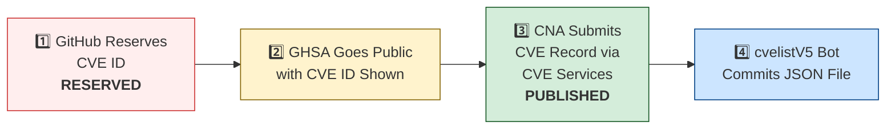

# 🛡️ OpenClaw CVE & Security Advisory Tracker

  
  
  
  
   
  
  
  
  
  

An automated tracker that continuously monitors [OpenClaw](https://github.com/openclaw/openclaw) security advisories across the GitHub Advisory Database, repo-level security advisories, and the [CVE V5 (cvelistV5)](https://github.com/CVEProject/cvelistV5) registry. Every hour it pulls the latest data, reconciles GHSA → CVE publication state, and regenerates this dashboard so you always have an up-to-date picture of the project's vulnerability landscape.

  Last updated: 2026-04-07 18:26 UTC · <a href="LICENSE">MIT License</a> · <a href="ADVISORIES.md">Full Advisory List</a> · <a href="SECURITY.md">Security Policy</a> · Data: <a href="https://github.com/CVEProject/cvelistV5">cvelistV5</a> + <a href="https://github.com/github/advisory-database">Advisory DB</a> · Updates hourly

---

  <a href="#-cves-published-in-cvelistv5-19">Published CVEs</a> ·
  <a href="#-cve-publication-pipeline">Pipeline</a> ·
  <a href="#-all-security-advisories-123">Advisories</a> ·
  <a href="#-vulnerability-categories">Categories</a> ·
  <a href="#-key-insights">Insights</a> ·
  <a href="#-project-identity">Identity</a>

---

## 🏗️ Project Identity

| Field | Value |
|-------|-------|
| **Current Name** | OpenClaw |
| **Previous Names** | Moltbot (second name), Clawdbot (original name) |
| **Repository** | [openclaw/openclaw](https://github.com/openclaw/openclaw) |
| **npm Package** | `openclaw` (formerly `clawdbot`) |
| **Author** | Peter Steinberger (steipete) |

<strong>Search terms for CVE discovery</strong>

To find all CVEs, search for: `openclaw`, `clawdbot`, `moltbot`, `clawhub`, `pkg:npm/clawdbot`, `pkg:npm/openclaw`

---

## 🚀 CVEs Published in cvelistV5 (19)

These CVEs have full records in the [CVEProject/cvelistV5](https://github.com/CVEProject/cvelistV5) repository:

| CVE ID | Severity | CVSS | Title | CWE | Published |
|--------|----------|------|-------|-----|-----------|
| [CVE-2026-25253](https://github.com/openclaw/openclaw/security/advisories/GHSA-g8p2-7wf7-98mq) |  | 8.8 | OpenClaw/Clawdbot has 1-Click RCE via Authentication Token Exfiltration From gatewayUrl | CWE-669 | 2026-02-01 |
| [CVE-2026-24763](https://github.com/openclaw/openclaw/security/advisories/GHSA-mc68-q9jw-2h3v) |  | 8.8 | OpenClaw/Clawdbot Docker Execution has Authenticated Command Injection via PATH Environment Variable | CWE-78 | 2026-02-02 |
| [CVE-2026-28478](https://github.com/openclaw/openclaw/security/advisories/GHSA-q447-rj3r-2cgh) |  | 8.7 | OpenClaw affected by denial of service via unbounded webhook request body buffering | CWE-770 | 2026-03-05 |
| [CVE-2026-33577](https://github.com/openclaw/openclaw/security/advisories/GHSA-2x4x-cc5g-qmmg) |  | 8.6 | OpenClaw < 2026.3.28 - Insufficient Scope Validation in node.pair.approve | CWE-863 | 2026-03-31 |
| [CVE-2026-34503](https://github.com/openclaw/openclaw/security/advisories/GHSA-2pr2-hcv6-7gwv) |  | 8.6 | OpenClaw's device removal and token revocation do not terminate active WebSocket sessions | CWE-613 | 2026-03-31 |
| [CVE-2026-28469](https://github.com/openclaw/openclaw/security/advisories/GHSA-rq6g-px6m-c248) |  | 8.2 | OpenClaw Google Chat shared-path webhook target ambiguity allowed cross-account policy-context misrouting | CWE-639 | 2026-03-05 |
| [CVE-2026-25157](https://github.com/openclaw/openclaw/security/advisories/GHSA-q284-4pvr-m585) |  | 7.8 | OpenClaw/Clawdbot has OS Command Injection via Project Root Path in sshNodeCommand | CWE-78 | 2026-02-04 |
| [CVE-2026-28458](https://github.com/openclaw/openclaw/security/advisories/GHSA-mr32-vwc2-5j6h) |  | 7.4 | OpenClaw's Browser Relay /cdp websocket is missing auth which could allow cross-tab cookie access | CWE-306 | 2026-03-05 |
| [CVE-2026-26317](https://github.com/openclaw/openclaw/security/advisories/GHSA-3fqr-4cg8-h96q) |  | 7.1 | OpenClaw affected by cross-site request forgery (CSRF) through loopback browser mutation endpoints | CWE-352 | 2026-02-19 |
| [CVE-2026-33581](https://github.com/openclaw/openclaw/security/advisories/GHSA-v8wv-jg3q-qwpq) |  | 7.1 | OpenClaw < 2026.3.24 - Arbitrary File Read via mediaUrl and fileUrl Parameters | CWE-22 | 2026-03-31 |
| [CVE-2026-28480](https://github.com/openclaw/openclaw/security/advisories/GHSA-mj5r-hh7j-4gxf) |  | 6.9 | OpenClaw Telegram allowlist authorization accepted mutable usernames | CWE-290 | 2026-03-05 |
| [CVE-2026-34504](https://github.com/openclaw/openclaw/security/advisories/GHSA-qxgf-hmcj-3xw3) |  | 6.9 | OpenClaw affected by SSRF via unguarded image download in fal provider | CWE-918 | 2026-03-31 |
| [CVE-2026-29612](https://github.com/openclaw/openclaw/security/advisories/GHSA-w2cg-vxx6-5xjg) |  | 6.8 | OpenClaw < 2026.2.14 - Denial of Service via Large Base64 Media File Decoding | CWE-770 | 2026-03-05 |
| [CVE-2026-28452](https://github.com/openclaw/openclaw/security/advisories/GHSA-h89v-j3x9-8wqj) |  | 6.7 | OpenClaw affected by denial of service through unguarded archive extraction allowing high expansion/resource abuse (ZIP/TAR) | CWE-770 | 2026-03-05 |
| [CVE-2026-26328](https://github.com/openclaw/openclaw/security/advisories/GHSA-g34w-4xqq-h79m) |  | 6.5 | OpenClaw iMessage group allowlist authorization inherited DM pairing-store identities | CWE-284, CWE-863 | 2026-02-19 |
| [CVE-2026-33580](https://github.com/openclaw/openclaw/security/advisories/GHSA-9528-x887-j2fp) |  | 6.3 | OpenClaw's Nextcloud Talk webhook missing rate limiting on shared secret authentication | CWE-307 | 2026-03-31 |
| [CVE-2026-34511](https://github.com/openclaw/openclaw/security/advisories/GHSA-9jpj-g8vv-j5mf) |  | 6 | OpenClaw < 2026.4.2 - PKCE Verifier Exposure via OAuth State Parameter | CWE-330 | 2026-04-03 |
| [CVE-2026-33578](https://github.com/openclaw/openclaw/security/advisories/GHSA-63mg-xp9j-jfcm) |  | 5.3 | OpenClaw: Google Chat and Zalouser group sender allowlist bypass via policy downgrade | CWE-863 | 2026-03-31 |
| [CVE-2026-34425](https://github.com/openclaw/openclaw/security/advisories/GHSA-fvx6-pj3r-5q4q) |  | 5.3 | OpenClaw - Shell-Bleed Protection Preflight Validation Bypass | CWE-184 | 2026-04-02 |

<strong>📖 Detailed CVE Analysis (click to expand)</strong>

### CVE-2026-25253 — OpenClaw/Clawdbot has 1-Click RCE via Authentication Token Exfiltration From gatewayUrl

| Field | Detail |
|-------|--------|
| **CVSS** | 8.8 (HIGH) — `CVSS:3.1/AV:N/AC:L/PR:N/UI:R/S:U/C:H/I:H/A:H` |
| **CWE** | CWE-669 (CWE-669 Incorrect Resource Transfer Between Spheres) |
| **Affected** | < 2026.1.29 |
| **Vendor/Product** | OpenClaw / OpenClaw |
| **Advisory** | [GHSA-g8p2-7wf7-98mq](https://github.com/openclaw/openclaw/security/advisories/GHSA-g8p2-7wf7-98mq) |

OpenClaw (aka clawdbot or Moltbot) before 2026.1.29 obtains a gatewayUrl value from a query string and automatically makes a WebSocket connection without prompting, sending a token value.

> **Naming note:** Uses all three names in description. packageURL still references `pkg:npm/clawdbot`.
**References:**
- [1-click-rce-to-steal-your-moltbot-data-and-keys](https://depthfirst.com/post/1-click-rce-to-steal-your-moltbot-data-and-keys)
- [blog](https://openclaw.ai/blog)
- [one-click-rce-moltbot](https://ethiack.com/news/blog/one-click-rce-moltbot)
- [2016913750557651228](https://x.com/0xacb/status/2016913750557651228)
---

### CVE-2026-24763 — OpenClaw/Clawdbot Docker Execution has Authenticated Command Injection via PATH Environment Variable

| Field | Detail |
|-------|--------|
| **CVSS** | 8.8 (HIGH) — `CVSS:3.1/AV:N/AC:L/PR:L/UI:N/S:U/C:H/I:H/A:H` |
| **CWE** | CWE-78 (CWE-78: Improper Neutralization of Special Elements used in an OS Command ('OS Command Injection')) |
| **Affected** | < 2026.1.29 |
| **Vendor/Product** | clawdbot / clawdbot |
| **Advisory** | [GHSA-mc68-q9jw-2h3v](https://github.com/openclaw/openclaw/security/advisories/GHSA-mc68-q9jw-2h3v) |

OpenClaw (formerly  Clawdbot) is a personal AI assistant you run on your own devices. Prior to 2026.1.29, a command injection vulnerability existed in OpenClaw’s Docker sandbox execution mechanism due to unsafe handling of the PATH environment variable when constructing shell commands. An authenticated user able to control environment variables could influence command execution within the container context. This vulnerability is fixed in 2026.1.29.

> **Naming note:** Uses old name `clawdbot/clawdbot` as vendor/product.
**References:**
- [https://github.com/openclaw/openclaw/commit/771f23d36b95ec2204cc9a0054045f5d8439ea75](https://github.com/openclaw/openclaw/commit/771f23d36b95ec2204cc9a0054045f5d8439ea75)
- [https://github.com/openclaw/openclaw/releases/tag/v2026.1.29](https://github.com/openclaw/openclaw/releases/tag/v2026.1.29)
---

### CVE-2026-28478 — OpenClaw affected by denial of service via unbounded webhook request body buffering

| Field | Detail |
|-------|--------|
| **CVSS** | 8.7 (HIGH) — `CVSS:4.0/AV:N/AC:L/AT:N/PR:N/UI:N/VC:N/VI:N/VA:H/SC:N/SI:N/SA:N` |
| **CWE** | CWE-770 (Allocation of Resources Without Limits or Throttling) |
| **Affected** | < 2026.2.13 |
| **Vendor/Product** | OpenClaw / OpenClaw |
| **Advisory** | [GHSA-q447-rj3r-2cgh](https://github.com/openclaw/openclaw/security/advisories/GHSA-q447-rj3r-2cgh) |

OpenClaw versions prior to 2026.2.13 contain a denial of service vulnerability in webhook handlers that buffer request bodies without strict byte or time limits. Remote unauthenticated attackers can send oversized JSON payloads or slow uploads to webhook endpoints causing memory pressure and availability degradation.

**References:**
- [Patch Commit](https://github.com/openclaw/openclaw/commit/3cbcba10cf30c2ffb898f0d8c7dfb929f15f8930)
- [VulnCheck Advisory: OpenClaw < 2026.2.13 - Denial of Service via Unbounded Webhook Request Body Buffering](https://www.vulncheck.com/advisories/openclaw-denial-of-service-via-unbounded-webhook-request-body-buffering)
---

### CVE-2026-33577 — OpenClaw < 2026.3.28 - Insufficient Scope Validation in node.pair.approve

| Field | Detail |
|-------|--------|
| **CVSS** | 8.6 (HIGH) — `CVSS:4.0/AV:N/AC:L/AT:N/PR:L/UI:N/VC:H/VI:H/VA:N/SC:N/SI:N/SA:N` |
| **CWE** | CWE-863 (CWE-863 Incorrect Authorization) |
| **Affected** | < 2026.3.28 |
| **Vendor/Product** | OpenClaw / OpenClaw |
| **Advisory** | [GHSA-2x4x-cc5g-qmmg](https://github.com/openclaw/openclaw/security/advisories/GHSA-2x4x-cc5g-qmmg) |

OpenClaw before 2026.3.28 contains an insufficient scope validation vulnerability in the node pairing approval path that allows low-privilege operators to approve nodes with broader scopes. Attackers can exploit missing callerScopes validation in node-pairing.ts to extend privileges onto paired nodes beyond their authorization level.

**References:**
- [Patch Commit](https://github.com/openclaw/openclaw/commit/4d7cc6bb4fac68b5a5fadd1c5a23168281221f34)
- [VulnCheck Advisory: OpenClaw < 2026.3.28 - Insufficient Scope Validation in node.pair.approve](https://www.vulncheck.com/advisories/openclaw-insufficient-scope-validation-in-node-pair-approve)
---

### CVE-2026-34503 — OpenClaw's device removal and token revocation do not terminate active WebSocket sessions

| Field | Detail |
|-------|--------|
| **CVSS** | 8.6 (HIGH) — `CVSS:4.0/AV:N/AC:L/AT:N/PR:L/UI:N/VC:H/VI:H/VA:N/SC:N/SI:N/SA:N` |
| **CWE** | CWE-613 (CWE-613 Insufficient Session Expiration) |
| **Affected** | < 2026.3.28 |
| **Vendor/Product** | OpenClaw / OpenClaw |
| **Advisory** | [GHSA-2pr2-hcv6-7gwv](https://github.com/openclaw/openclaw/security/advisories/GHSA-2pr2-hcv6-7gwv) |

OpenClaw before 2026.3.28 fails to disconnect active WebSocket sessions when devices are removed or tokens are revoked. Attackers with revoked credentials can maintain unauthorized access through existing live sessions until forced reconnection.

**References:**
- [Patch Commit](https://github.com/openclaw/openclaw/commit/7a801cc451e9e667b705eeccff651923a1b8c863)
- [VulnCheck Advisory: OpenClaw < 2026.3.28 - Incomplete WebSocket Session Termination on Device Removal and Token Revocation](https://www.vulncheck.com/advisories/openclaw-incomplete-websocket-session-termination-on-device-removal-and-token-revocation)
---

### CVE-2026-28469 — OpenClaw Google Chat shared-path webhook target ambiguity allowed cross-account policy-context misrouting

| Field | Detail |
|-------|--------|
| **CVSS** | 8.2 (HIGH) — `CVSS:4.0/AV:N/AC:L/AT:P/PR:N/UI:N/VC:N/VI:H/VA:N/SC:N/SI:N/SA:N` |
| **CWE** | CWE-639 (Authorization Bypass Through User-Controlled Key) |
| **Affected** | < 2026.2.14 |
| **Vendor/Product** | OpenClaw / OpenClaw |
| **Advisory** | [GHSA-rq6g-px6m-c248](https://github.com/openclaw/openclaw/security/advisories/GHSA-rq6g-px6m-c248) |

OpenClaw versions prior to 2026.2.14 contain a webhook routing vulnerability in the Google Chat monitor component that allows cross-account policy context misrouting when multiple webhook targets share the same HTTP path. Attackers can exploit first-match request verification semantics to process inbound webhook events under incorrect account contexts, bypassing intended allowlists and session policies.

**References:**
- [Patch Commit](https://github.com/openclaw/openclaw/commit/61d59a802869177d9cef52204767cd83357ab79e)
- [VulnCheck Advisory: OpenClaw < 2026.2.14 - Cross-Account Policy Context Misrouting via Shared Webhook Path Ambiguity](https://www.vulncheck.com/advisories/openclaw-cross-account-policy-context-misrouting-via-shared-webhook-path-ambiguity)
---

### CVE-2026-25157 — OpenClaw/Clawdbot has OS Command Injection via Project Root Path in sshNodeCommand

| Field | Detail |
|-------|--------|
| **CVSS** | 7.8 (HIGH) — `CVSS:3.1/AV:L/AC:H/PR:N/UI:R/S:C/C:H/I:H/A:H` |
| **CWE** | CWE-78 (CWE-78: Improper Neutralization of Special Elements used in an OS Command ('OS Command Injection')) |
| **Affected** | < 2026.1.29 |
| **Vendor/Product** | openclaw / openclaw |
| **Advisory** | [GHSA-q284-4pvr-m585](https://github.com/openclaw/openclaw/security/advisories/GHSA-q284-4pvr-m585) |

OpenClaw is a personal AI assistant. Prior to version 2026.1.29, there is an OS command injection vulnerability via the Project Root Path in sshNodeCommand. The sshNodeCommand function constructed a shell script without properly escaping the user-supplied project path in an error message. When the cd command failed, the unescaped path was interpolated directly into an echo statement, allowing arbitrary command execution on the remote SSH host. The parseSSHTarget function did not validate that SSH target strings could not begin with a dash. An attacker-supplied target like -oProxyCommand=... would be interpreted as an SSH configuration flag rather than a hostname, allowing arbitrary command execution on the local machine. This issue has been patched in version 2026.1.29.

---

### CVE-2026-28458 — OpenClaw's Browser Relay /cdp websocket is missing auth which could allow cross-tab cookie access

| Field | Detail |
|-------|--------|
| **CVSS** | 7.4 (HIGH) — `CVSS:4.0/AV:N/AC:L/AT:P/PR:N/UI:A/VC:H/VI:H/VA:N/SC:N/SI:N/SA:N` |
| **CWE** | CWE-306 (Missing Authentication for Critical Function) |
| **Affected** | < 2026.2.1 |
| **Vendor/Product** | OpenClaw / OpenClaw |
| **Advisory** | [GHSA-mr32-vwc2-5j6h](https://github.com/openclaw/openclaw/security/advisories/GHSA-mr32-vwc2-5j6h) |

OpenClaw version 2026.1.20 prior to 2026.2.1 contains a vulnerability in the Browser Relay (extension must be installed and enabled) /cdp WebSocket endpoint in which it does not require authentication tokens, allowing websites to connect via loopback and access sensitive data. Attackers can exploit this by connecting to ws://127.0.0.1:18792/cdp to steal session cookies and execute JavaScript in other browser tabs.

**References:**
- [Patch Commit](https://github.com/openclaw/openclaw/commit/a1e89afcc19efd641c02b24d66d689f181ae2b5c)
- [VulnCheck Advisory: OpenClaw 2026.1.20 < 2026.2.1 - Missing Authentication in Browser Relay /cdp WebSocket Endpoint](https://www.vulncheck.com/advisories/openclaw-missing-authentication-in-browser-relay-cdp-websocket-endpoint)
---

### CVE-2026-26317 — OpenClaw affected by cross-site request forgery (CSRF) through loopback browser mutation endpoints

| Field | Detail |
|-------|--------|
| **CVSS** | 7.1 (HIGH) — `CVSS:3.1/AV:N/AC:L/PR:N/UI:R/S:U/C:N/I:H/A:L` |
| **CWE** | CWE-352 (CWE-352: Cross-Site Request Forgery (CSRF)) |
| **Affected** | <= 2026.1.24-3 |
| **Vendor/Product** | openclaw / clawdbot |
| **Advisory** | [GHSA-3fqr-4cg8-h96q](https://github.com/openclaw/openclaw/security/advisories/GHSA-3fqr-4cg8-h96q) |

OpenClaw is a personal AI assistant. Prior to 2026.2.14, browser-facing localhost mutation routes accepted cross-origin browser requests without explicit Origin/Referer validation. Loopback binding reduces remote exposure but does not prevent browser-initiated requests from malicious origins. A malicious website can trigger unauthorized state changes against a victim's local OpenClaw browser control plane (for example opening tabs, starting/stopping the browser, mutating storage/cookies) if the browser control service is reachable on loopback in the victim's browser context. Starting in version 2026.2.14, mutating HTTP methods (POST/PUT/PATCH/DELETE) are rejected when the request indicates a non-loopback Origin/Referer (or `Sec-Fetch-Site: cross-site`). Other mitigations include enabling browser control auth (token/password) and avoid running with auth disabled.

> **Naming note:** Uses old name `openclaw/clawdbot` as vendor/product.
**References:**
- [https://github.com/openclaw/openclaw/commit/b566b09f81e2b704bf9398d8d97d5f7a90aa94c3](https://github.com/openclaw/openclaw/commit/b566b09f81e2b704bf9398d8d97d5f7a90aa94c3)
- [https://github.com/openclaw/openclaw/releases/tag/v2026.2.14](https://github.com/openclaw/openclaw/releases/tag/v2026.2.14)
---

### CVE-2026-33581 — OpenClaw < 2026.3.24 - Arbitrary File Read via mediaUrl and fileUrl Parameters

| Field | Detail |
|-------|--------|
| **CVSS** | 7.1 (HIGH) — `CVSS:4.0/AV:N/AC:L/AT:N/PR:L/UI:N/VC:H/VI:N/VA:N/SC:N/SI:N/SA:N` |
| **CWE** | CWE-22 (CWE-22 Improper Limitation of a Pathname to a Restricted Directory ('Path Traversal')) |
| **Affected** | < 2026.3.24 |
| **Vendor/Product** | OpenClaw / OpenClaw |
| **Advisory** | [GHSA-v8wv-jg3q-qwpq](https://github.com/openclaw/openclaw/security/advisories/GHSA-v8wv-jg3q-qwpq) |

OpenClaw before 2026.3.24 contains a sandbox bypass vulnerability in the message tool that allows attackers to read arbitrary local files by using mediaUrl and fileUrl alias parameters that bypass localRoots validation. Remote attackers can exploit this by routing file requests through unvalidated alias parameters to access files outside the intended sandbox directory.

**References:**
- [Patch Commit](https://github.com/openclaw/openclaw/commit/1d7cb6fc03552bbba00e7cffb3aa9741f5556416)
- [VulnCheck Advisory: OpenClaw < 2026.3.24 - Arbitrary File Read via mediaUrl and fileUrl Parameters](https://www.vulncheck.com/advisories/openclaw-arbitrary-file-read-via-mediaurl-and-fileurl-parameters)
---

### CVE-2026-28480 — OpenClaw Telegram allowlist authorization accepted mutable usernames

| Field | Detail |
|-------|--------|
| **CVSS** | 6.9 (MEDIUM) — `CVSS:4.0/AV:N/AC:L/AT:N/PR:N/UI:N/VC:L/VI:L/VA:N/SC:N/SI:N/SA:N` |
| **CWE** | CWE-290 (Authentication Bypass by Spoofing) |
| **Affected** | < 2026.2.14 |
| **Vendor/Product** | OpenClaw / OpenClaw |
| **Advisory** | [GHSA-mj5r-hh7j-4gxf](https://github.com/openclaw/openclaw/security/advisories/GHSA-mj5r-hh7j-4gxf) |

OpenClaw versions prior to 2026.2.14 contain an authorization bypass vulnerability where Telegram allowlist matching accepts mutable usernames instead of immutable numeric sender IDs. Attackers can spoof identity by obtaining recycled usernames to bypass allowlist restrictions and interact with bots as unauthorized senders.

**References:**
- [Patch Commit #1](https://github.com/openclaw/openclaw/commit/e3b432e481a96b8fd41b91273818e514074e05c3)
- [Patch Commit #2](https://github.com/openclaw/openclaw/commit/9e147f00b48e63e7be6964e0e2a97f2980854128)
- [VulnCheck Advisory: OpenClaw < 2026.2.14 - Identity Spoofing via Mutable Username in Telegram Allowlist Authorization](https://www.vulncheck.com/advisories/openclaw-identity-spoofing-via-mutable-username-in-telegram-allowlist-authorization)
---

### CVE-2026-34504 — OpenClaw affected by SSRF via unguarded image download in fal provider

| Field | Detail |
|-------|--------|
| **CVSS** | 6.9 (MEDIUM) — `CVSS:4.0/AV:N/AC:L/AT:N/PR:N/UI:N/VC:N/VI:L/VA:N/SC:L/SI:L/SA:L` |
| **CWE** | CWE-918 (CWE-918 Server-Side Request Forgery (SSRF)) |
| **Affected** | < 2026.3.28 |
| **Vendor/Product** | OpenClaw / OpenClaw |
| **Advisory** | [GHSA-qxgf-hmcj-3xw3](https://github.com/openclaw/openclaw/security/advisories/GHSA-qxgf-hmcj-3xw3) |

OpenClaw before 2026.3.28 contains a server-side request forgery vulnerability in the fal provider image-generation-provider.ts component that allows attackers to fetch internal URLs. A malicious or compromised fal relay can exploit unguarded image download fetches to expose internal service metadata and responses through the image pipeline.

**References:**
- [Patch Commit](https://github.com/openclaw/openclaw/commit/80d1e8a11a2ac118c7f7a70bba9c862b6141d928)
- [VulnCheck Advisory: OpenClaw < 2026.3.28 - Server-Side Request Forgery via Unguarded Image Download in fal Provider](https://www.vulncheck.com/advisories/openclaw-server-side-request-forgery-via-unguarded-image-download-in-fal-provider)
---

### CVE-2026-29612 — OpenClaw < 2026.2.14 - Denial of Service via Large Base64 Media File Decoding

| Field | Detail |
|-------|--------|
| **CVSS** | 6.8 (MEDIUM) — `CVSS:4.0/AV:L/AC:L/AT:N/PR:L/UI:N/VC:N/VI:N/VA:H/SC:N/SI:N/SA:N` |
| **CWE** | CWE-770 (Allocation of Resources Without Limits or Throttling) |
| **Affected** | < 2026.2.14 |
| **Vendor/Product** | OpenClaw / OpenClaw |
| **Advisory** | [GHSA-w2cg-vxx6-5xjg](https://github.com/openclaw/openclaw/security/advisories/GHSA-w2cg-vxx6-5xjg) |

OpenClaw versions prior to 2026.2.14 decode base64-backed media inputs into buffers before enforcing decoded-size budget limits, allowing attackers to trigger large memory allocations. Remote attackers can supply oversized base64 payloads to cause memory pressure and denial of service.

**References:**
- [Patch Commit](https://github.com/openclaw/openclaw/commit/31791233d60495725fa012745dde8d6ee69e9595)
- [VulnCheck Advisory: OpenClaw < 2026.2.14 - Denial of Service via Large Base64 Media File Decoding](https://www.vulncheck.com/advisories/openclaw-denial-of-service-via-large-base-media-file-decoding)
---

### CVE-2026-28452 — OpenClaw affected by denial of service through unguarded archive extraction allowing high expansion/resource abuse (ZIP/TAR)

| Field | Detail |
|-------|--------|
| **CVSS** | 6.7 (MEDIUM) — `CVSS:4.0/AV:L/AC:L/AT:N/PR:N/UI:A/VC:N/VI:N/VA:H/SC:N/SI:N/SA:N` |
| **CWE** | CWE-770 (Allocation of Resources Without Limits or Throttling) |
| **Affected** | < 2026.2.14 |
| **Vendor/Product** | OpenClaw / OpenClaw |
| **Advisory** | [GHSA-h89v-j3x9-8wqj](https://github.com/openclaw/openclaw/security/advisories/GHSA-h89v-j3x9-8wqj) |

OpenClaw versions prior to 2026.2.14 contain a denial of service vulnerability in the extractArchive function within src/infra/archive.ts that allows attackers to consume excessive CPU, memory, and disk resources through high-expansion ZIP and TAR archives. Remote attackers can trigger resource exhaustion by providing maliciously crafted archive files during install or update operations, causing service degradation or system unavailability.

**References:**
- [Patch Commit #1](https://github.com/openclaw/openclaw/commit/d3ee5deb87ee2ad0ab83c92c365611165423cb71)
- [Patch Commit #2](https://github.com/openclaw/openclaw/commit/5f4b29145c236d124524c2c9af0f8acd048fbdea)
- [VulnCheck Advisory: OpenClaw < 2026.2.14 - Denial of Service via Unguarded Archive Extraction in extractArchive](https://www.vulncheck.com/advisories/openclaw-denial-of-service-via-unguarded-archive-extraction-in-extractarchive)
---

### CVE-2026-26328 — OpenClaw iMessage group allowlist authorization inherited DM pairing-store identities

| Field | Detail |
|-------|--------|
| **CVSS** | 6.5 (MEDIUM) — `CVSS:3.1/AV:N/AC:L/PR:L/UI:N/S:U/C:N/I:H/A:N` |
| **CWE** | CWE-284 (CWE-284: Improper Access Control), CWE-863 (CWE-863: Incorrect Authorization) |
| **Affected** | <= 2026.1.24-3 |
| **Vendor/Product** | openclaw / clawdbot |
| **Advisory** | [GHSA-g34w-4xqq-h79m](https://github.com/openclaw/openclaw/security/advisories/GHSA-g34w-4xqq-h79m) |

OpenClaw is a personal AI assistant. Prior to version 2026.2.14, under iMessage `groupPolicy=allowlist`, group authorization could be satisfied by sender identities coming from the DM pairing store, broadening DM trust into group contexts. Version 2026.2.14 fixes the issue.

> **Naming note:** Uses old name `openclaw/clawdbot` as vendor/product.
**References:**
- [https://github.com/openclaw/openclaw/commit/872079d42fe105ece2900a1dd6ab321b92da2d59](https://github.com/openclaw/openclaw/commit/872079d42fe105ece2900a1dd6ab321b92da2d59)
- [https://github.com/openclaw/openclaw/releases/tag/v2026.2.14](https://github.com/openclaw/openclaw/releases/tag/v2026.2.14)
---

### CVE-2026-33580 — OpenClaw's Nextcloud Talk webhook missing rate limiting on shared secret authentication

| Field | Detail |
|-------|--------|
| **CVSS** | 6.3 (MEDIUM) — `CVSS:4.0/AV:N/AC:L/AT:P/PR:N/UI:N/VC:L/VI:L/VA:N/SC:N/SI:N/SA:N` |
| **CWE** | CWE-307 (CWE-307 Improper Restriction of Excessive Authentication Attempts) |
| **Affected** | < 2026.3.28 |
| **Vendor/Product** | OpenClaw / OpenClaw |
| **Advisory** | [GHSA-9528-x887-j2fp](https://github.com/openclaw/openclaw/security/advisories/GHSA-9528-x887-j2fp) |

OpenClaw before 2026.3.28 contains a missing rate limiting vulnerability in the Nextcloud Talk webhook authentication that allows attackers to brute-force weak shared secrets. Attackers who can reach the webhook endpoint can exploit this to forge inbound webhook events by repeatedly attempting authentication without throttling.

**References:**
- [Patch Commit](https://github.com/openclaw/openclaw/commit/e403decb6e20091b5402780a7ccd2085f98aa3cd)
- [VulnCheck Advisory: OpenClaw < 2026.3.28 - Brute Force Attack via Missing Rate Limiting on Webhook Shared Secret Authentication](https://www.vulncheck.com/advisories/openclaw-brute-force-attack-via-missing-rate-limiting-on-webhook-shared-secret-authentication)
---

### CVE-2026-34511 — OpenClaw < 2026.4.2 - PKCE Verifier Exposure via OAuth State Parameter

| Field | Detail |
|-------|--------|
| **CVSS** | 6 (MEDIUM) — `CVSS:4.0/AV:N/AC:L/AT:P/PR:N/UI:P/VC:H/VI:N/VA:N/SC:N/SI:N/SA:N` |
| **CWE** | CWE-330 (CWE-330 Use of Insufficiently Random Values) |
| **Affected** | < 2026.4.2 |
| **Vendor/Product** | OpenClaw / OpenClaw |
| **Advisory** | [GHSA-9jpj-g8vv-j5mf](https://github.com/openclaw/openclaw/security/advisories/GHSA-9jpj-g8vv-j5mf) |

OpenClaw before 2026.4.2 reuses the PKCE verifier as the OAuth state parameter in the Gemini OAuth flow, exposing it through the redirect URL. Attackers who capture the redirect URL can obtain both the authorization code and PKCE verifier, defeating PKCE protection and enabling token redemption.

**References:**
- [Patch Commit](https://github.com/openclaw/openclaw/commit/a26f4d0f3ef0757db6c6c40277cc06a5de76c52f)
- [openclaw-pkce-verifier-exposure-via-oauth-state-parameter](https://www.vulncheck.com/advisories/openclaw-pkce-verifier-exposure-via-oauth-state-parameter)
---

### CVE-2026-33578 — OpenClaw: Google Chat and Zalouser group sender allowlist bypass via policy downgrade

| Field | Detail |
|-------|--------|
| **CVSS** | 5.3 (MEDIUM) — `CVSS:4.0/AV:N/AC:L/AT:N/PR:L/UI:N/VC:L/VI:N/VA:N/SC:N/SI:N/SA:N` |
| **CWE** | CWE-863 (CWE-863 Incorrect Authorization) |
| **Affected** | < 2026.3.28 |
| **Vendor/Product** | OpenClaw / OpenClaw |
| **Advisory** | [GHSA-63mg-xp9j-jfcm](https://github.com/openclaw/openclaw/security/advisories/GHSA-63mg-xp9j-jfcm) |

OpenClaw before 2026.3.28 contains a sender policy bypass vulnerability in the Google Chat and Zalouser extensions where route-level group allowlist policies silently downgrade to open policy. Attackers can exploit this policy resolution flaw to bypass sender restrictions and interact with bots despite configured allowlist restrictions.

**References:**
- [Patch Commit](https://github.com/openclaw/openclaw/commit/e64a881ae0fb8af18e451163f4c2d611d60cc8e4)
- [VulnCheck Advisory: OpenClaw < 2026.3.28 - Sender Policy Allowlist Bypass via Policy Downgrade in Google Chat and Zalouser Extensions](https://www.vulncheck.com/advisories/openclaw-sender-policy-allowlist-bypass-via-policy-downgrade-in-google-chat-and-zalouser-extensions)
---

### CVE-2026-34425 — OpenClaw - Shell-Bleed Protection Preflight Validation Bypass

| Field | Detail |
|-------|--------|
| **CVSS** | 5.3 (MEDIUM) — `CVSS:4.0/AV:N/AC:L/AT:N/PR:L/UI:N/VC:L/VI:L/VA:N/SC:N/SI:N/SA:N` |
| **CWE** | CWE-184 (CWE-184 Incomplete List of Disallowed Inputs) |
| **Affected** | < 8aceaf5d0f0ec552b75a792f7f0a3bfa5b091513 |
| **Vendor/Product** | OpenClaw / OpenClaw |
| **Advisory** | [GHSA-fvx6-pj3r-5q4q](https://github.com/openclaw/openclaw/security/advisories/GHSA-fvx6-pj3r-5q4q) |

OpenClaw versions prior to commit 8aceaf5 contain a preflight validation bypass vulnerability in shell-bleed protection that allows attackers to execute blocked script content by using piped or complex command forms that the parser fails to recognize. Attackers can craft commands such as piped execution, command substitution, or subshell invocation to bypass the validateScriptFileForShellBleed() validation checks and execute arbitrary script content that would otherwise be blocked.

**References:**
- [Patch Commit #1](https://github.com/openclaw/openclaw/commit/8aceaf5d0f0ec552b75a792f7f0a3bfa5b091513)
- [openclaw-shell-bleed-protection-preflight-validation-bypass](https://www.vulncheck.com/advisories/openclaw-shell-bleed-protection-preflight-validation-bypass)
---

---

## ⏳ CVE Publication Pipeline

Of 19 GHSAs with CVE IDs, **19** are fully published and **0** remain `RESERVED`.

| CVE ID | State | cvelistV5 | GHSA Published | CNA |
|--------|-------|-----------|----------------|-----|
| CVE-2026-24763 | ✅ **PUBLISHED** | ✅ | 2026-02-02 | GitHub_M |
| CVE-2026-25157 | ✅ **PUBLISHED** | ✅ | 2026-02-02 | GitHub_M |
| CVE-2026-25253 | ✅ **PUBLISHED** | ✅ | 2026-02-02 | mitre |
| CVE-2026-26317 | ✅ **PUBLISHED** | ✅ | 2026-02-18 | GitHub_M |
| CVE-2026-26328 | ✅ **PUBLISHED** | ✅ | 2026-02-18 | GitHub_M |
| CVE-2026-28452 | ✅ **PUBLISHED** | ✅ | 2026-02-18 | VulnCheck |
| CVE-2026-28458 | ✅ **PUBLISHED** | ✅ | 2026-02-17 | VulnCheck |
| CVE-2026-28469 | ✅ **PUBLISHED** | ✅ | 2026-02-18 | VulnCheck |
| CVE-2026-28478 | ✅ **PUBLISHED** | ✅ | 2026-02-18 | VulnCheck |
| CVE-2026-28480 | ✅ **PUBLISHED** | ✅ | 2026-02-18 | VulnCheck |
| CVE-2026-29612 | ✅ **PUBLISHED** | ✅ | 2026-02-18 | VulnCheck |
| CVE-2026-33577 | ✅ **PUBLISHED** | ✅ | 2026-04-01 | VulnCheck |
| CVE-2026-33578 | ✅ **PUBLISHED** | ✅ | 2026-04-01 | VulnCheck |
| CVE-2026-33580 | ✅ **PUBLISHED** | ✅ | 2026-03-31 | VulnCheck |
| CVE-2026-33581 | ✅ **PUBLISHED** | ✅ | 2026-03-31 | VulnCheck |
| CVE-2026-34425 | ✅ **PUBLISHED** | ✅ | 2026-04-06 | VulnCheck |
| CVE-2026-34503 | ✅ **PUBLISHED** | ✅ | 2026-03-31 | VulnCheck |
| CVE-2026-34504 | ✅ **PUBLISHED** | ✅ | 2026-04-01 | VulnCheck |
| CVE-2026-34511 | ✅ **PUBLISHED** | ✅ | 2026-04-04 | VulnCheck |

---

## 🔑 Key Insights

| Insight | Detail |
|---------|--------|
| **Dominant Weakness** | 46% of categorized issues relate to **Allowlist Bypass** (36/78) |
| **V5 Sync Rate** | 19/19 CVE IDs (100%) have full cvelistV5 records |
| **Advisory Velocity** | 123 security advisories across 2026-02-02 → 2026-04-07 |
| **Top Severity** | 6 Critical + 38 High = 44 high-impact issues (36%) |

### Vulnerability Categories

| Category | Count | Examples |
|----------|------:|----------|
| **OS Command Injection (CWE-78)** | 12 | PATH injection, SSH command injection, Docker exec, keychain writes |
| **Path Traversal (CWE-22)** | 6 | MEDIA: paths, plugin install, browser downloads, Zip Slip, transcript paths |
| **SSRF** | 4 | Image tool fetch, Feishu extension, attachment/media URLs, IPv6 bypass |
| **Auth Bypass / Missing Auth** | 7 | WebSocket config.apply, webhook verification, browser relay, sandbox bridge |
| **Allowlist Bypass** | 36 | Telegram usernames, Matrix displayName, Slack DM, Twitch, voice-call |
| **Injection (XSS/CSRF/Prompt)** | 8 | XSS in Control UI, prompt injection via Slack/CWD/logs, CSRF |
| **Denial of Service** | 5 | Unbounded media fetch, webhook body buffering, archive expansion |

---

## 📋 All Security Advisories (123)

### Critical & High Severity

| GHSA | CVE | Severity | Title | Published |
|------|-----|----------|-------|-----------|
| [GHSA-vfw7-6rhc-6xxg](https://github.com/advisories/GHSA-vfw7-6rhc-6xxg) | — |  | OpenClaw Has Incomplete Fix for CVE-2026-4039: CLI Backend Environment Variable Injection via Workspace Config | 2026-04-07 |
| [GHSA-9jpj-g8vv-j5mf](https://github.com/advisories/GHSA-9jpj-g8vv-j5mf) | CVE-2026-34511 |  | OpenClaw: Gemini OAuth exposed the PKCE verifier through the OAuth state parameter | 2026-04-04 |
| [GHSA-q9w8-cf67-r238](https://github.com/advisories/GHSA-q9w8-cf67-r238) | — |  | OpenClaw: macOS Tailnet DNS Spoofing & Credential Exfiltration | 2026-04-03 |
| [GHSA-gg9v-mgcp-v6m7](https://github.com/advisories/GHSA-gg9v-mgcp-v6m7) | — |  | OpenClaw: Unbound bootstrap setup codes allow privilege escalation during pairing | 2026-04-03 |
| [GHSA-h5hg-h7rr-gpf3](https://github.com/advisories/GHSA-h5hg-h7rr-gpf3) | — |  | OpenClaw: Node browser proxy `allowProfiles` bypass through persistent profile mutation and runtime profile selection | 2026-04-03 |
| [GHSA-gjm7-hw8f-73rq](https://github.com/advisories/GHSA-gjm7-hw8f-73rq) | — |  | OpenClaw: Paired node escalates to gateway RCE via unrestricted node.event agent dispatch | 2026-04-03 |
| [GHSA-9p3r-hh9g-5cmg](https://github.com/advisories/GHSA-9p3r-hh9g-5cmg) | — |  | OpenClaw: Sandbox escape via TOCTOU race in remote FS bridge readFile | 2026-04-03 |
| [GHSA-g374-mggx-p6xc](https://github.com/advisories/GHSA-g374-mggx-p6xc) | — |  | OpenClaw: Incomplete scope-clearing fix allows operator.admin escalation via trusted-proxy auth mode | 2026-04-03 |
| [GHSA-f6pf-4gjx-c94r](https://github.com/advisories/GHSA-f6pf-4gjx-c94r) | — |  | OpenClaw: Media Parsing Path Traversal Leads to Arbitrary File Read | 2026-04-03 |
| [GHSA-v3qc-wrwx-j3pw](https://github.com/advisories/GHSA-v3qc-wrwx-j3pw) | — |  | OpenClaw: Agentic Consent Bypass — LLM Agent Can Silently Disable Exec Approval via `config.patch` | 2026-04-03 |
| [GHSA-g8xp-qx39-9jq9](https://github.com/advisories/GHSA-g8xp-qx39-9jq9) | — |  | OpenClaw: Incomplete host-env-security-policy allows untrusted model to substitute compiler binaries via env overrides | 2026-04-03 |
| [GHSA-xj9w-5r6q-x6v4](https://github.com/advisories/GHSA-xj9w-5r6q-x6v4) | — |  | OpenClaw: Device-Paired Node Skips Node Scope Gate → Host RCE.md | 2026-04-03 |
| [GHSA-57gh-m6rq-54cf](https://github.com/advisories/GHSA-57gh-m6rq-54cf) | — |  | OpenClaw: Self-Whitelisting in appendLocalMediaParentRoots Allows Arbitrary File Read & Credential Exfiltration | 2026-04-03 |
| [GHSA-cwf8-44x6-32c2](https://github.com/advisories/GHSA-cwf8-44x6-32c2) | — |  | OpenClaw: OpenShell Mirror Sync — Sandbox Escape via Unrestricted File Sync + Symlink Traversal | 2026-04-03 |
| [GHSA-qcj9-wwgw-6gm8](https://github.com/advisories/GHSA-qcj9-wwgw-6gm8) | — |  | OpenClaw: Workspace `.env` can override the bundled plugin trust root | 2026-04-03 |
| [GHSA-3qpv-xf3v-mm45](https://github.com/advisories/GHSA-3qpv-xf3v-mm45) | — |  | OpenClaw: Workspace `.env` can override the bundled hooks root and load attacker hook code | 2026-04-02 |
| [GHSA-g5cg-8x5w-7jpm](https://github.com/advisories/GHSA-g5cg-8x5w-7jpm) | — |  | OpenClaw: Heartbeat context inheritance bypasses sandbox via senderIsOwner escalation | 2026-04-02 |
| [GHSA-7ggg-pvrf-458v](https://github.com/advisories/GHSA-7ggg-pvrf-458v) | — |  | OpenClaw: PIP_INDEX_URL and UV_INDEX_URL bypass host exec env sanitization and redirect Python package-index traffic | 2026-04-02 |
| [GHSA-8rh7-6779-cjqq](https://github.com/advisories/GHSA-8rh7-6779-cjqq) | — |  | OpenClaw has a CWD `.env` environment variable injection which bypasses host-env policy and allows config takeover | 2026-04-01 |
| [GHSA-p4x4-2r7f-wjxg](https://github.com/advisories/GHSA-p4x4-2r7f-wjxg) | — |  | OpenClaw gateway exec allow-always over-trusts positional carrier executables | 2026-04-01 |
| [GHSA-5r8f-96gm-5j6g](https://github.com/advisories/GHSA-5r8f-96gm-5j6g) | — |  | OpenClaw Gateway `operator.write` can reach admin-only session reset via `chat.send` `/reset` | 2026-04-01 |
| [GHSA-v8wv-jg3q-qwpq](https://github.com/advisories/GHSA-v8wv-jg3q-qwpq) | CVE-2026-33581 |  | OpenClaw's message tool media parameter bypasses tool policy filesystem isolation | 2026-03-31 |
| [GHSA-2pr2-hcv6-7gwv](https://github.com/advisories/GHSA-2pr2-hcv6-7gwv) | CVE-2026-34503 |  | OpenClaw's device removal and token revocation do not terminate active WebSocket sessions | 2026-03-31 |
| [GHSA-6pfc-6m7w-m8fx](https://github.com/advisories/GHSA-6pfc-6m7w-m8fx) | — |  | OpenClaw has a gateway exec allowlist allow-always bypass via unregistered /usr/bin/script wrapper | 2026-03-31 |
| [GHSA-j7p2-qcwm-94v4](https://github.com/advisories/GHSA-j7p2-qcwm-94v4) | — |  | OpenClaw's incomplete host env sanitization blocklist allows supply-chain redirection via package-manager env overrides | 2026-03-31 |
| [GHSA-6xg4-82hv-cp6f](https://github.com/advisories/GHSA-6xg4-82hv-cp6f) | — |  | OpenClaw: Gateway chat.send ACP-only provenance guard could be bypassed by client identity spoofing | 2026-03-31 |
| [GHSA-5h2w-qmfp-ggp6](https://github.com/advisories/GHSA-5h2w-qmfp-ggp6) | — |  | OpenClaw: Gateway `operator.write` can reach admin-only persisted `verboseLevel` via `chat.send` `/verbose` | 2026-03-31 |
| [GHSA-jccr-rrw2-vc8h](https://github.com/advisories/GHSA-jccr-rrw2-vc8h) | — |  | OpenClaw safeBins jq `$ENV` filter bypass allows environment variable disclosure | 2026-03-31 |
| [GHSA-98hh-7ghg-x6rq](https://github.com/advisories/GHSA-98hh-7ghg-x6rq) | — |  | OpenClaw: Discord text `/approve` bypasses `channels.discord.execApprovals.approvers` and allows non-approvers to resolve pending exec approvals | 2026-03-31 |
| [GHSA-3cw3-5vxw-g2h3](https://github.com/advisories/GHSA-3cw3-5vxw-g2h3) | — |  | OpenClaw: CLI Remote Onboarding Persists Unauthenticated Discovery Endpoint and Exfiltrates Gateway Credentials | 2026-03-31 |
| [GHSA-rq6g-px6m-c248](https://github.com/advisories/GHSA-rq6g-px6m-c248) | CVE-2026-28469 |  | OpenClaw Google Chat shared-path webhook target ambiguity allowed cross-account policy-context misrouting | 2026-02-18 |
| [GHSA-3fqr-4cg8-h96q](https://github.com/advisories/GHSA-3fqr-4cg8-h96q) | CVE-2026-26317 |  | OpenClaw affected by cross-site request forgery (CSRF) through loopback browser mutation endpoints | 2026-02-18 |
| [GHSA-q447-rj3r-2cgh](https://github.com/advisories/GHSA-q447-rj3r-2cgh) | CVE-2026-28478 |  | OpenClaw affected by denial of service via unbounded webhook request body buffering | 2026-02-18 |
| [GHSA-mr32-vwc2-5j6h](https://github.com/advisories/GHSA-mr32-vwc2-5j6h) | CVE-2026-28458 |  | OpenClaw's Browser Relay /cdp websocket is missing auth which could allow cross-tab cookie access | 2026-02-17 |
| [GHSA-q284-4pvr-m585](https://github.com/advisories/GHSA-q284-4pvr-m585) | CVE-2026-25157 |  | OpenClaw/Clawdbot has OS Command Injection via Project Root Path in sshNodeCommand | 2026-02-02 |
| [GHSA-g8p2-7wf7-98mq](https://github.com/advisories/GHSA-g8p2-7wf7-98mq) | CVE-2026-25253 |  | OpenClaw/Clawdbot has 1-Click RCE via Authentication Token Exfiltration From gatewayUrl | 2026-02-02 |
| [GHSA-mc68-q9jw-2h3v](https://github.com/advisories/GHSA-mc68-q9jw-2h3v) | CVE-2026-24763 |  | OpenClaw/Clawdbot Docker Execution has Authenticated Command Injection via PATH Environment Variable | 2026-02-02 |
| [GHSA-r2c6-8jc8-g32w](https://github.com/advisories/GHSA-r2c6-8jc8-g32w) | — |  | Duplicate Advisory: 1-Click RCE via Authentication Token Exfiltration From gatewayUrl | 2026-02-02 |

### Medium Severity

| GHSA | CVE | Severity | Title | Published |
|------|-----|----------|-------|-----------|
| [GHSA-83f3-hh45-vfw9](https://github.com/advisories/GHSA-83f3-hh45-vfw9) | — |  | OpenClaw: Android accepted cleartext remote gateway endpoints and sent stored credentials over ws:// | 2026-04-07 |
| [GHSA-jj6q-rrrf-h66h](https://github.com/advisories/GHSA-jj6q-rrrf-h66h) | — |  | OpenClaw: Shared-secret comparison call sites leaked length information through timing | 2026-04-07 |
| [GHSA-rxmx-g7hr-8mx4](https://github.com/advisories/GHSA-rxmx-g7hr-8mx4) | — |  | OpenClaw: Zalo replay dedupe keys could suppress messages across chats or senders | 2026-04-07 |
| [GHSA-fh32-73r9-rgh5](https://github.com/advisories/GHSA-fh32-73r9-rgh5) | — |  | OpenClaw: Trailing-dot localhost CDP hosts could bypass remote loopback protections | 2026-04-07 |
| [GHSA-w6wx-jq6j-6mcj](https://github.com/advisories/GHSA-w6wx-jq6j-6mcj) | — |  | OpenClaw: pnpm dlx approvals did not bind local script operands | 2026-04-07 |
| [GHSA-98ch-45wp-ch47](https://github.com/advisories/GHSA-98ch-45wp-ch47) | — |  | OpenClaw: Windows-compatible env override keys could bypass system.run approval binding | 2026-04-07 |
| [GHSA-2f7j-rp58-mr42](https://github.com/advisories/GHSA-2f7j-rp58-mr42) | — |  | OpenClaw: Gateway hello snapshots exposed host config and state paths to non-admin clients | 2026-04-07 |
| [GHSA-2qrv-rc5x-2g2h](https://github.com/advisories/GHSA-2qrv-rc5x-2g2h) | — |  | OpenClaw: Untrusted workspace channel shadows could execute during built-in channel setup | 2026-04-07 |
| [GHSA-5hff-46vh-rxmw](https://github.com/advisories/GHSA-5hff-46vh-rxmw) | — |  | OpenClaw: Read-scoped identity-bearing HTTP clients could kill sessions via /sessions/:sessionKey/kill | 2026-04-07 |
| [GHSA-4p4f-fc8q-84m3](https://github.com/advisories/GHSA-4p4f-fc8q-84m3) | — |  | OpenClaw: iOS A2UI bridge trusted generic local-network pages for agent.request dispatch | 2026-04-07 |
| [GHSA-846p-hgpv-vphc](https://github.com/advisories/GHSA-846p-hgpv-vphc) | — |  | OpenClaw: QQ Bot structured payloads could read arbitrary local files | 2026-04-07 |
| [GHSA-m34q-h93w-vg5x](https://github.com/advisories/GHSA-m34q-h93w-vg5x) | — |  | OpenClaw: OpenShell mirror mode could delete arbitrary remote directories when roots were mis-scoped | 2026-04-07 |
| [GHSA-wwfp-w96m-c6x8](https://github.com/advisories/GHSA-wwfp-w96m-c6x8) | — |  | OpenClaw: Pairing pending-request caps were enforced per channel instead of per account | 2026-04-07 |
| [GHSA-h43v-27wg-5mf9](https://github.com/advisories/GHSA-h43v-27wg-5mf9) | — |  | OpenClaw: Forged Nostr DMs could create pairing state before signature verification | 2026-04-07 |
| [GHSA-wpc6-37g7-8q4w](https://github.com/advisories/GHSA-wpc6-37g7-8q4w) | — |  | OpenClaw: Shell init-file options could satisfy exec allowlist script matching | 2026-04-07 |
| [GHSA-42mx-vp8m-j7qh](https://github.com/advisories/GHSA-42mx-vp8m-j7qh) | — |  | OpenClaw: OpenShell `mirror` mode can convert untrusted sandbox files into explicitly enabled workspace hooks and execute them on the host during gateway startup | 2026-04-07 |
| [GHSA-fwjq-xwfj-gv75](https://github.com/advisories/GHSA-fwjq-xwfj-gv75) | — |  | OpenClaw: `session_status` still bypasses configured `tools.sessions.visibility` for unsandboxed invocations | 2026-04-07 |
| [GHSA-3q42-xmxv-9vfr](https://github.com/advisories/GHSA-3q42-xmxv-9vfr) | — |  | OpenClaw: Gateway operator.write Can Reach Admin-Class Talk Voice Config Persistence via chat.send | 2026-04-07 |
| [GHSA-vjx8-8p7h-82gr](https://github.com/advisories/GHSA-vjx8-8p7h-82gr) | — |  | OpenClaw: Marketplace Plugin Download Follows Redirects Without SSRF Protection | 2026-04-07 |
| [GHSA-4g5x-2jfc-xm98](https://github.com/advisories/GHSA-4g5x-2jfc-xm98) | — |  | OpenClaw: Tlon media downloads can bypass core safety limits and exhaust disk | 2026-04-07 |
| [GHSA-h2v7-xc88-xx8c](https://github.com/advisories/GHSA-h2v7-xc88-xx8c) | — |  | OpenClaw: `/phone arm`/`/phone disarm` Bypasses `operator.admin` Scope Check for External Channels | 2026-04-07 |
| [GHSA-fvx6-pj3r-5q4q](https://github.com/advisories/GHSA-fvx6-pj3r-5q4q) | CVE-2026-34425 |  | OpenClaw's complex interpreter pipelines could skip exec script preflight validation | 2026-04-06 |
| [GHSA-ch86-pxr9-j9h9](https://github.com/advisories/GHSA-ch86-pxr9-j9h9) | — |  | Duplicate Advisory: OpenClaw: Gemini OAuth exposed the PKCE verifier through the OAuth state parameter | 2026-04-03 |
| [GHSA-6336-qqw9-v6x6](https://github.com/advisories/GHSA-6336-qqw9-v6x6) | — |  | OpenClaw: Discord Component Interaction Misclassifies Group DM as Direct Message | 2026-04-03 |
| [GHSA-9f4w-67g7-mqwv](https://github.com/advisories/GHSA-9f4w-67g7-mqwv) | — |  | OpenClaw: Endpoint persists after trust decline, leaking gateway credentials | 2026-04-03 |
| [GHSA-3xv9-89fm-7h4r](https://github.com/advisories/GHSA-3xv9-89fm-7h4r) | — |  | OpenClaw: diffs viewer misclassifies proxied remote requests as loopback when `allowRemoteViewer` is disabled | 2026-04-03 |
| [GHSA-rvvf-6vh3-9j43](https://github.com/advisories/GHSA-rvvf-6vh3-9j43) | — |  | OpenClaw: Discord Slash Commands Bypass Group DM Channel Allowlist | 2026-04-03 |
| [GHSA-f693-58pc-2gfr](https://github.com/advisories/GHSA-f693-58pc-2gfr) | — |  | OpenClaw: Telegram legacy allowFrom migration fans default-account trust into all named accounts | 2026-04-03 |
| [GHSA-cqgw-44wg-44rf](https://github.com/advisories/GHSA-cqgw-44wg-44rf) | — |  | OpenClaw: Discord voice manager bypasses channel-level member access allowlist | 2026-04-03 |
| [GHSA-m6fx-m8hc-572m](https://github.com/advisories/GHSA-m6fx-m8hc-572m) | — |  | OpenClaw: Telegram audio preflight transcription enables resource consumption by unauthorized senders | 2026-04-03 |
| [GHSA-2w79-r9g8-wmcr](https://github.com/advisories/GHSA-2w79-r9g8-wmcr) | — |  | OpenClaw: Voice-call still parses large WebSocket frames before start validation (Incomplete fix for CVE-2026-32062) | 2026-04-03 |
| [GHSA-6p8r-6m93-557f](https://github.com/advisories/GHSA-6p8r-6m93-557f) | — |  | OpenClaw: Fake DeviceToken Bypasses Shared Auth Rate Limiting | 2026-04-03 |
| [GHSA-cg7q-fg22-4g98](https://github.com/advisories/GHSA-cg7q-fg22-4g98) | — |  | OpenClaw: Host exec environment sanitization misses package, registry, Docker, compiler, and TLS override variables | 2026-04-03 |
| [GHSA-58q2-7r52-jq62](https://github.com/advisories/GHSA-58q2-7r52-jq62) | — |  | OpenClaw: Path traversal via inbound channel attachment path in ACP dispatch allows arbitrary file read | 2026-04-03 |
| [GHSA-hr8g-2q7x-3f4w](https://github.com/advisories/GHSA-hr8g-2q7x-3f4w) | — |  | OpenClaw Has a Gateway Control Interface Information Disclosure Vulnerability | 2026-04-03 |
| [GHSA-rm5c-4rmf-vvhw](https://github.com/advisories/GHSA-rm5c-4rmf-vvhw) | — |  | OpenClaw: Sandbox file operations use check-then-act, bypassing fd-based TOCTOU defenses | 2026-04-03 |
| [GHSA-w85g-3h6x-4xh2](https://github.com/advisories/GHSA-w85g-3h6x-4xh2) | — |  | OpenClaw: Image pixel-limit guard can fail open on sips and allow decompression-bomb DoS | 2026-04-03 |
| [GHSA-9gp8-hjxr-6f34](https://github.com/advisories/GHSA-9gp8-hjxr-6f34) | — |  | OpenClaw: Host exec environment overrides miss proxy, TLS, Docker, and Git TLS controls | 2026-04-03 |
| [GHSA-hhff-fj5f-qg48](https://github.com/advisories/GHSA-hhff-fj5f-qg48) | — |  | OpenClaw runs Discord audio preflight transcription before member authorization | 2026-04-03 |
| [GHSA-mhr7-2xmv-4c4q](https://github.com/advisories/GHSA-mhr7-2xmv-4c4q) | — |  | OpenClaw: HTTP operator endpoints lack browser-origin validation in trusted-proxy mode | 2026-04-03 |
| [GHSA-p464-m8x6-vhv8](https://github.com/advisories/GHSA-p464-m8x6-vhv8) | — |  | OpenClaw: MS Teams webhook parses body before JWT validation, enabling unauthenticated resource exhaustion | 2026-04-03 |
| [GHSA-68v4-hmwv-f43h](https://github.com/advisories/GHSA-68v4-hmwv-f43h) | — |  | OpenClaw: Media download follows cross-origin redirects with Authorization headers intact | 2026-04-03 |
| [GHSA-rf75-g96h-j3rm](https://github.com/advisories/GHSA-rf75-g96h-j3rm) | — |  | Duplicate Advisory: OpenClaw's complex interpreter pipelines could skip exec script preflight validation | 2026-04-02 |
| [GHSA-fv94-qvg8-xqpw](https://github.com/advisories/GHSA-fv94-qvg8-xqpw) | — |  | OpenClaw: SSH sandbox tar upload follows symlinks, enabling arbitrary file write on remote host | 2026-04-02 |
| [GHSA-9q7v-8mr7-g23p](https://github.com/advisories/GHSA-9q7v-8mr7-g23p) | — |  | OpenClaw: SSRF via Unguarded `fetch()` in Marketplace Plugin Download and Ollama Model Discovery | 2026-04-02 |
| [GHSA-j9pv-rrcj-6pfx](https://github.com/advisories/GHSA-j9pv-rrcj-6pfx) | — |  | OpenClaw: SSH-based sandbox backends pass unsanitized process.env to child processes | 2026-04-02 |
| [GHSA-qcc3-jqwp-5vh2](https://github.com/advisories/GHSA-qcc3-jqwp-5vh2) | — |  | OpenClaw: LINE webhook handler lacks shared pre-auth concurrency budget before signature verification | 2026-04-02 |
| [GHSA-877v-w3f5-3pcq](https://github.com/advisories/GHSA-877v-w3f5-3pcq) | — |  | OpenClaw: Feishu thread history and quoted messages bypass sender allowlist | 2026-04-02 |
| [GHSA-jjw7-3vjf-fg5j](https://github.com/advisories/GHSA-jjw7-3vjf-fg5j) | — |  | OpenClaw Nostr privateKey config redaction bypass leaks plaintext signing key via config.get | 2026-04-02 |
| [GHSA-mhgq-xpfq-6r66](https://github.com/advisories/GHSA-mhgq-xpfq-6r66) | — |  | OpenClaw: Unauthenticated plugin-auth HTTP routes receive operator runtime scopes | 2026-04-02 |
| [GHSA-63mg-xp9j-jfcm](https://github.com/advisories/GHSA-63mg-xp9j-jfcm) | CVE-2026-33578 |  | OpenClaw: Google Chat and Zalouser group sender allowlist bypass via policy downgrade | 2026-04-01 |
| [GHSA-2x4x-cc5g-qmmg](https://github.com/advisories/GHSA-2x4x-cc5g-qmmg) | CVE-2026-33577 |  | OpenClaw: node.pair.approve missing callerScopes validation allows low-privilege operator to approve malicious nodes | 2026-04-01 |
| [GHSA-9528-x887-j2fp](https://github.com/advisories/GHSA-9528-x887-j2fp) | CVE-2026-33580 |  | OpenClaw's Nextcloud Talk webhook missing rate limiting on shared secret authentication | 2026-03-31 |
| [GHSA-jp4j-q5fc-58gv](https://github.com/advisories/GHSA-jp4j-q5fc-58gv) | — |  | OpenClaw's Discord component interaction ingress skips guild/channel policy enforcement | 2026-03-31 |
| [GHSA-m866-6qv5-p2fg](https://github.com/advisories/GHSA-m866-6qv5-p2fg) | — |  | OpenClaw host-env blocklist missing `GIT_TEMPLATE_DIR` and `AWS_CONFIG_FILE` allows code execution via env override | 2026-03-31 |
| [GHSA-f44p-c7w9-7xr7](https://github.com/advisories/GHSA-f44p-c7w9-7xr7) | — |  | OpenClaw: Gateway WebSocket Denial of Service via unbounded pre-auth upgrades | 2026-03-31 |
| [GHSA-qf48-qfv4-jjm9](https://github.com/advisories/GHSA-qf48-qfv4-jjm9) | — |  | OpenClaw: Feishu extension resolveUploadInput bypasses file-system sandbox and allows arbitrary file reads via upload_image | 2026-03-31 |
| [GHSA-mj5r-hh7j-4gxf](https://github.com/advisories/GHSA-mj5r-hh7j-4gxf) | CVE-2026-28480 |  | OpenClaw Telegram allowlist authorization accepted mutable usernames | 2026-02-18 |
| [GHSA-h89v-j3x9-8wqj](https://github.com/advisories/GHSA-h89v-j3x9-8wqj) | CVE-2026-28452 |  | OpenClaw affected by denial of service through unguarded archive extraction allowing high expansion/resource abuse (ZIP/TAR) | 2026-02-18 |
| [GHSA-w2cg-vxx6-5xjg](https://github.com/advisories/GHSA-w2cg-vxx6-5xjg) | CVE-2026-29612 |  | OpenClaw: denial of service through large base64 media files allocating large buffers before limit checks | 2026-02-18 |
| [GHSA-g34w-4xqq-h79m](https://github.com/advisories/GHSA-g34w-4xqq-h79m) | CVE-2026-26328 |  | OpenClaw iMessage group allowlist authorization inherited DM pairing-store identities | 2026-02-18 |

### Low Severity

| GHSA | CVE | Severity | Title | Published |
|------|-----|----------|-------|-----------|
| [GHSA-fqrj-m88p-qf3v](https://github.com/advisories/GHSA-fqrj-m88p-qf3v) | — |  | OpenClaw: Zalo replay dedupe cache could suppress events across authenticated webhook targets | 2026-04-07 |
| [GHSA-767m-xrhc-fxm7](https://github.com/advisories/GHSA-767m-xrhc-fxm7) | — |  | OpenClaw: Gateway operator.write Can Reach Admin-Class Telegram Config and Cron Persistence via send | 2026-04-07 |
| [GHSA-x2m8-53h4-6hch](https://github.com/advisories/GHSA-x2m8-53h4-6hch) | — |  | OpenClaw: Discord voice ingress authorization can be bypassed via channel, name, and stale-role validation gaps | 2026-04-03 |
| [GHSA-3pm9-5j7m-59vc](https://github.com/advisories/GHSA-3pm9-5j7m-59vc) | — |  | OpenClaw: Tlon Startup Migration Rehydrates Empty-Array Revocations From File Config | 2026-04-03 |
| [GHSA-rfqg-qgf8-xr9x](https://github.com/advisories/GHSA-rfqg-qgf8-xr9x) | — |  | OpenClaw: Gateway `device.token.rotate` does not terminate active WebSocket sessions after credential rotation | 2026-04-03 |
| [GHSA-37v6-fxx8-xjmx](https://github.com/advisories/GHSA-37v6-fxx8-xjmx) | — |  | OpenClaw: Telnyx Webhook Replay Detection Bypass via Base64 Signature Re-encoding | 2026-04-03 |
| [GHSA-cwq8-6f96-g3q4](https://github.com/advisories/GHSA-cwq8-6f96-g3q4) | — |  | OpenClaw: Security Scan Failure Does Not Block Plugin Installation (Fail-Open) | 2026-04-02 |
| [GHSA-chfm-xgc4-47rj](https://github.com/advisories/GHSA-chfm-xgc4-47rj) | — |  | OpenClaw: MSTeams thread history bypasses sender allowlist via Graph API | 2026-04-02 |
| [GHSA-rg8m-3943-vm6q](https://github.com/advisories/GHSA-rg8m-3943-vm6q) | — |  | OpenClaw: Matrix thread root and reply context bypass sender allowlist | 2026-04-02 |
| [GHSA-hhq4-97c2-p447](https://github.com/advisories/GHSA-hhq4-97c2-p447) | — |  | OpenClaw: Zalo webhook replay cache cross-target messageId scope bypass | 2026-04-02 |
| [GHSA-89r3-6x4j-v7wf](https://github.com/advisories/GHSA-89r3-6x4j-v7wf) | — |  | OpenClaw: Voice-call Plivo replay mutates in-process callback origin before replay rejection | 2026-04-02 |
| [GHSA-qxgf-hmcj-3xw3](https://github.com/advisories/GHSA-qxgf-hmcj-3xw3) | CVE-2026-34504 |  | OpenClaw affected by SSRF via unguarded image download in fal provider | 2026-04-01 |
| [GHSA-g86v-f9qv-rh6m](https://github.com/advisories/GHSA-g86v-f9qv-rh6m) | — |  | OpenClaw SSRF guard misses four IPv6 special-use ranges | 2026-03-31 |
| [GHSA-chm2-m3w2-wcxm](https://github.com/advisories/GHSA-chm2-m3w2-wcxm) | — |  | OpenClaw Google Chat spoofing access with allowlist authorized mutable email principal despite sender-ID mismatch | 2026-02-17 |

### Repo-Only Advisories (~10 more)

These advisories are listed on the [repo security page](https://github.com/openclaw/openclaw/security/advisories) but not yet indexed in the GitHub Advisory Database. See the [full advisory list](ADVISORIES.md) for details.

<strong>Show 10 repo-only advisories</strong>

| GHSA | Severity | Title | Published |
|------|----------|-------|-----------|
| [GHSA-9hjh-fr4f-gxc4](https://github.com/openclaw/openclaw/security/advisories/GHSA-9hjh-fr4f-gxc4) |  | Gateway Backend Reconnect lets Non-Admin Operator Scopes Self-Claim operator.admin | 2026-03-26 |
| [GHSA-hc5h-pmr3-3497](https://github.com/openclaw/openclaw/security/advisories/GHSA-hc5h-pmr3-3497) |  | /pair approve command path omitted caller scope subsetting and reopened device pairing escalation | 2026-03-29 |
| [GHSA-8689-gm9g-jgr6](https://github.com/openclaw/openclaw/security/advisories/GHSA-8689-gm9g-jgr6) |  | Voice-call Plivo V3 webhook replay key uses unsorted URL, allowing replay via query-parameter reordering | 2026-03-29 |
| [GHSA-9p93-7j67-5pc2](https://github.com/openclaw/openclaw/security/advisories/GHSA-9p93-7j67-5pc2) |  | Gateway HTTP /sessions/:sessionKey/kill Reaches Admin Kill Path Without Caller Scope Binding | 2026-03-26 |
| [GHSA-h4jx-hjr3-fhgc](https://github.com/openclaw/openclaw/security/advisories/GHSA-h4jx-hjr3-fhgc) |  | Gateway Plugin Subagent Fallback `deleteSession` Uses Synthetic `operator.admin` | 2026-03-26 |
| [GHSA-qm2m-28pf-hgjw](https://github.com/openclaw/openclaw/security/advisories/GHSA-qm2m-28pf-hgjw) |  | Gateway Plugin HTTP auth: "gateway" Mints operator.admin Runtime Scope | 2026-03-26 |
| [GHSA-5jvj-hxmh-6h6j](https://github.com/openclaw/openclaw/security/advisories/GHSA-5jvj-hxmh-6h6j) |  | Gateway HTTP Session History Route Bypasses Operator Read Scope | 2026-03-26 |
| [GHSA-68f8-9mhj-h2mp](https://github.com/openclaw/openclaw/security/advisories/GHSA-68f8-9mhj-h2mp) |  | Gateway HTTP /v1/models Route Bypasses Operator Read Scope | 2026-03-27 |
| [GHSA-qm77-8qjp-4vcm](https://github.com/openclaw/openclaw/security/advisories/GHSA-qm77-8qjp-4vcm) |  | Slack thread context could include messages from non-allowlisted senders | 2026-04-02 |
| [GHSA-v2v2-f783-358j](https://github.com/openclaw/openclaw/security/advisories/GHSA-v2v2-f783-358j) |  | Zalo channel downloads media before sender authorization | 2026-03-29 |

---

## Naming Inconsistencies

The OpenClaw project has been renamed multiple times, causing inconsistencies across CVE records:

| CVE | vendor | product | packageURL | Description Names |
|-----|--------|---------|------------|-------------------|
| CVE-2026-25253 | `OpenClaw` | `OpenClaw` | `pkg:npm/clawdbot` | OpenClaw / clawdbot / Moltbot |
| CVE-2026-24763 | `clawdbot` | `clawdbot` | — | OpenClaw (formerly Clawdbot) |
| CVE-2026-28478 | `OpenClaw` | `OpenClaw` | `pkg:npm/openclaw` | OpenClaw |
| CVE-2026-33577 | `OpenClaw` | `OpenClaw` | `pkg:npm/openclaw` | OpenClaw |
| CVE-2026-34503 | `OpenClaw` | `OpenClaw` | `pkg:npm/openclaw` | OpenClaw |
| CVE-2026-28469 | `OpenClaw` | `OpenClaw` | `pkg:npm/openclaw` | OpenClaw |
| CVE-2026-25157 | `openclaw` | `openclaw` | — | OpenClaw |
| CVE-2026-28458 | `OpenClaw` | `OpenClaw` | `pkg:npm/openclaw` | OpenClaw |
| CVE-2026-26317 | `openclaw` | `clawdbot` | — | OpenClaw (formerly Clawdbot) |
| CVE-2026-33581 | `OpenClaw` | `OpenClaw` | `pkg:npm/openclaw` | OpenClaw |
| CVE-2026-28480 | `OpenClaw` | `OpenClaw` | `pkg:npm/openclaw` | OpenClaw |
| CVE-2026-34504 | `OpenClaw` | `OpenClaw` | `pkg:npm/openclaw` | OpenClaw |
| CVE-2026-29612 | `OpenClaw` | `OpenClaw` | `pkg:npm/openclaw` | OpenClaw |
| CVE-2026-28452 | `OpenClaw` | `OpenClaw` | `pkg:npm/openclaw` | OpenClaw |
| CVE-2026-26328 | `openclaw` | `clawdbot` | — | OpenClaw (formerly Clawdbot) |
| CVE-2026-33580 | `OpenClaw` | `OpenClaw` | `pkg:npm/openclaw` | OpenClaw |
| CVE-2026-34511 | `OpenClaw` | `OpenClaw` | `pkg:npm/openclaw` | OpenClaw |
| CVE-2026-33578 | `OpenClaw` | `OpenClaw` | `pkg:npm/openclaw` | OpenClaw |
| CVE-2026-34425 | `OpenClaw` | `OpenClaw` | `pkg:npm/openclaw` | OpenClaw |

---

## Data Sources

| Source | URL |
|--------|-----|
| CVE List v5 | [CVEProject/cvelistV5](https://github.com/CVEProject/cvelistV5) |
| GitHub Advisory DB | [github.com/advisories](https://github.com/advisories?query=openclaw) |
| Repo Security Tab | [openclaw/openclaw/security](https://github.com/openclaw/openclaw/security/advisories) |
| CVE Services API | `https://cveawg.mitre.org/api/cve-id/{CVE-ID}` |

---

  
    Auto-generated by <a href="update_readme.py"><code>update_readme.py</code></a> · Updated hourly via <a href=".github/workflows/update-readme.yml">GitHub Actions</a> 
    Data: <a href="ghsa-advisories.json"><code>ghsa-advisories.json</code></a> · <a href="cves.json"><code>cves.json</code></a> · <a href="cve-pipeline-status.json"><code>cve-pipeline-status.json</code></a>  
    Maintained by <a href="https://github.com/jgamblin">Jerry Gamblin</a> · <a href="https://github.com/jgamblin/OpenClawCVEs">OpenClawCVEs</a>
  

