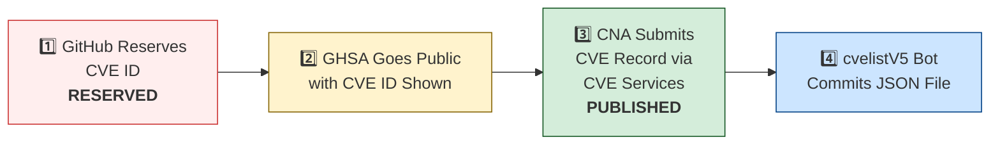

# 🛡️ OpenClaw CVE & Security Advisory Tracker

  
  
  
  
   
  
  
  
  
  

An automated tracker that continuously monitors [OpenClaw](https://github.com/openclaw/openclaw) security advisories across the GitHub Advisory Database, repo-level security advisories, and the [CVE V5 (cvelistV5)](https://github.com/CVEProject/cvelistV5) registry. Every hour it pulls the latest data, reconciles GHSA → CVE publication state, and regenerates this dashboard so you always have an up-to-date picture of the project's vulnerability landscape.

  Last updated: 2026-06-19 01:16 UTC · <a href="LICENSE">MIT License</a> · <a href="ADVISORIES.md">Full Advisory List</a> · <a href="SECURITY.md">Security Policy</a> · Data: <a href="https://github.com/CVEProject/cvelistV5">cvelistV5</a> + <a href="https://github.com/github/advisory-database">Advisory DB</a> · Updates hourly

---

  <a href="#-cves-published-in-cvelistv5-50">Published CVEs</a> ·
  <a href="#-cve-publication-pipeline">Pipeline</a> ·
  <a href="#-all-security-advisories-170">Advisories</a> ·
  <a href="#-vulnerability-categories">Categories</a> ·
  <a href="#-key-insights">Insights</a> ·
  <a href="#-project-identity">Identity</a>

---

## 🏗️ Project Identity

| Field | Value |
|-------|-------|
| **Current Name** | OpenClaw |
| **Previous Names** | Moltbot (second name), Clawdbot (original name) |
| **Repository** | [openclaw/openclaw](https://github.com/openclaw/openclaw) |
| **npm Package** | `openclaw` (formerly `clawdbot`) |
| **Author** | Peter Steinberger (steipete) |

<strong>Search terms for CVE discovery</strong>

To find all CVEs, search for: `openclaw`, `clawdbot`, `moltbot`, `clawhub`, `pkg:npm/clawdbot`, `pkg:npm/openclaw`

---

## 🚀 CVEs Published in cvelistV5 (50)

These CVEs have full records in the [CVEProject/cvelistV5](https://github.com/CVEProject/cvelistV5) repository:

| CVE ID | Severity | CVSS | Title | CWE | Published |
|--------|----------|------|-------|-----|-----------|
| [CVE-2026-28466](https://github.com/openclaw/openclaw/security/advisories/GHSA-gv46-4xfq-jv58) |  | 9.4 | OpenClaw < 2026.2.14 - Remote Code Execution via Node Invoke Approval Bypass | CWE-863 | 2026-03-05 |
| [CVE-2026-32038](https://github.com/openclaw/openclaw/security/advisories/GHSA-ww6v-v748-x7g9) |  | 9.3 | OpenClaw - Sandbox Network Isolation Bypass via docker.network=container Parameter | CWE-284 | 2026-03-19 |
| [CVE-2026-32915](https://github.com/openclaw/openclaw/security/advisories/GHSA-4w7m-58cg-cmff) |  | 9.3 | OpenClaw < 2026.3.11 - Sandbox Boundary Bypass via Subagent Control Surface | CWE-863 | 2026-03-29 |
| [CVE-2026-43534](https://github.com/openclaw/openclaw/security/advisories/GHSA-7g8c-cfr3-vqqr) |  | 9.3 | OpenClaw < 2026.4.10 - Unsanitized External Input in Agent Hook Events | CWE-345 | 2026-05-05 |
| [CVE-2026-43575](https://github.com/openclaw/openclaw/security/advisories/GHSA-92jp-89mq-4374) |  | 9.2 | OpenClaw 2026.2.21 < 2026.4.10 - Authentication Bypass in Sandbox noVNC Helper Route | CWE-862 | 2026-05-06 |
| [CVE-2026-43585](https://github.com/openclaw/openclaw/security/advisories/GHSA-xmxx-7p24-h892) |  | 9.2 | OpenClaw < 2026.4.15 - Bearer Token Validation Bypass via Stale SecretRef Resolution | CWE-672 | 2026-05-06 |
| [CVE-2026-43578](https://github.com/openclaw/openclaw/security/advisories/GHSA-g375-h3v6-4873) |  | 9.1 | OpenClaw 2026.3.31 < 2026.4.10 - Privilege Escalation via Missed Async Exec Completion Events in Heartbeat Owner Downgrade | CWE-184 | 2026-05-06 |
| [CVE-2026-41329](https://github.com/openclaw/openclaw/security/advisories/GHSA-g5cg-8x5w-7jpm) |  | 9 | OpenClaw < 2026.3.31 - Sandbox Bypass via Heartbeat Context Inheritance and senderIsOwner Escalation | CWE-648 | 2026-04-20 |
| [CVE-2026-24763](https://github.com/openclaw/openclaw/security/advisories/GHSA-mc68-q9jw-2h3v) |  | 8.8 | OpenClaw/Clawdbot Docker Execution has Authenticated Command Injection via PATH Environment Variable | CWE-78 | 2026-02-02 |
| [CVE-2026-25253](https://github.com/openclaw/openclaw/security/advisories/GHSA-g8p2-7wf7-98mq) |  | 8.8 | OpenClaw/Clawdbot has 1-Click RCE via Authentication Token Exfiltration From gatewayUrl | CWE-669 | 2026-02-01 |
| [CVE-2026-28478](https://github.com/openclaw/openclaw/security/advisories/GHSA-q447-rj3r-2cgh) |  | 8.7 | OpenClaw affected by denial of service via unbounded webhook request body buffering | CWE-770 | 2026-03-05 |
| [CVE-2026-29609](https://github.com/openclaw/openclaw/security/advisories/GHSA-j27p-hq53-9wgc) |  | 8.7 | OpenClaw < 2026.2.14 - Denial of Service via Unbounded URL-backed Media Fetch | CWE-770 | 2026-03-05 |
| [CVE-2026-32042](https://github.com/openclaw/openclaw/security/advisories/GHSA-553v-f69r-656j) |  | 8.7 | OpenClaw < 2026.2.25 - Privilege Escalation via Unpaired Device Identity in Shared Gateway Authentication | CWE-863 | 2026-03-21 |
| [CVE-2026-35638](https://github.com/openclaw/openclaw/security/advisories/GHSA-48vw-m3qc-wr99) |  | 8.7 | OpenClaw < 2026.3.22 - Privilege Escalation via Self-Declared Scopes in Trusted-Proxy Control UI | CWE-286 | 2026-04-09 |
| [CVE-2026-41303](https://github.com/openclaw/openclaw/security/advisories/GHSA-98hh-7ghg-x6rq) |  | 8.7 | OpenClaw < 2026.3.28 - Authorization Bypass in Discord Text Approval Commands | CWE-863 | 2026-04-20 |
| [CVE-2026-41399](https://github.com/openclaw/openclaw/security/advisories/GHSA-f44p-c7w9-7xr7) |  | 8.7 | OpenClaw < 2026.3.28 - Denial of Service via Unbounded Pre-auth WebSocket Upgrades | CWE-770 | 2026-04-28 |
| [CVE-2026-43530](https://github.com/openclaw/openclaw/security/advisories/GHSA-2cq5-mf3v-mx44) |  | 8.7 | OpenClaw 2026.2.23 < 2026.4.12 - Weakened Exec Approval Binding via busybox and toybox Applet Execution | CWE-863 | 2026-05-05 |
| [CVE-2026-53819](https://github.com/openclaw/openclaw/security/advisories/GHSA-8wg3-5mcm-fjq8) |  | 8.7 | OpenClaw < 2026.5.27 - Arbitrary Homebrew Executable Execution via Workspace .env Override | CWE-426 | 2026-06-11 |
| [CVE-2026-53843](https://github.com/openclaw/openclaw/security/advisories/GHSA-q99w-vh6v-q3v7) |  | 8.7 | OpenClaw: Pairing-scoped device session could restore revoked node token authority | CWE-613 | 2026-06-16 |
| [CVE-2026-33579](https://github.com/openclaw/openclaw/security/advisories/GHSA-hc5h-pmr3-3497) |  | 8.6 | OpenClaw < 2026.3.28 - Privilege Escalation via Missing Caller Scope Validation in Device Pair Approval | CWE-863 | 2026-03-31 |
| [CVE-2026-53816](https://github.com/openclaw/openclaw/security/advisories/GHSA-3c6j-hq33-3jv4) |  | 8.6 | OpenClaw < 2026.5.18 - Exec Lifecycle Event Forgery via Paired Node | CWE-862 | 2026-06-11 |
| [CVE-2026-53849](https://github.com/openclaw/openclaw/security/advisories/GHSA-cw4q-gqg5-g38h) |  | 8.6 | OpenClaw: Discord allowFrom could bind to mutable display names | CWE-290 | 2026-06-16 |
| [CVE-2026-53857](https://github.com/openclaw/openclaw/security/advisories/GHSA-8c59-hr4w-qg69) |  | 8.6 | OpenClaw < 2026.5.3 - Mutable Display Name Binding in Zalo allowFrom Policy | CWE-290 | 2026-06-16 |
| [CVE-2026-41396](https://github.com/openclaw/openclaw/security/advisories/GHSA-qcj9-wwgw-6gm8) |  | 8.5 | OpenClaw < 2026.3.31 - Environment Variable Override of Plugin Trust Root | CWE-829 | 2026-04-28 |
| [CVE-2026-44118](https://github.com/openclaw/openclaw/security/advisories/GHSA-r6xh-pqhr-v4xh) |  | 8.5 | OpenClaw < 2026.4.22 - Owner Context Spoofing via Bearer Token Header | CWE-290 | 2026-05-06 |
| [CVE-2026-41371](https://github.com/openclaw/openclaw/security/advisories/GHSA-5r8f-96gm-5j6g) |  | 8.4 | OpenClaw < 2026.3.28 - Privilege Escalation via chat.send Reset Command | CWE-863 | 2026-04-27 |
| [CVE-2026-45004](https://github.com/openclaw/openclaw/security/advisories/GHSA-r39h-4c2p-3jxp) |  | 8.4 | OpenClaw vulnerable to arbitrary code execution via attacker-controlled setup-api.js loaded from cwd during env-key resolution | CWE-427 | 2026-05-11 |
| [CVE-2026-28453](https://github.com/openclaw/openclaw/security/advisories/GHSA-p25h-9q54-ffvw) |  | 8.3 | OpenClaw < 2026.2.14 - Zip Slip Path Traversal in TAR Archive Extraction | CWE-22 | 2026-03-05 |
| [CVE-2026-28469](https://github.com/openclaw/openclaw/security/advisories/GHSA-rq6g-px6m-c248) |  | 8.2 | OpenClaw Google Chat shared-path webhook target ambiguity allowed cross-account policy-context misrouting | CWE-639 | 2026-03-05 |
| [CVE-2026-41395](https://github.com/openclaw/openclaw/security/advisories/GHSA-8689-gm9g-jgr6) |  | 8.2 | OpenClaw < 2026.3.28 - Webhook Replay via Query Parameter Reordering in Plivo V3 | CWE-325 | 2026-04-28 |
| [CVE-2026-42437](https://github.com/openclaw/openclaw/security/advisories/GHSA-vw3h-q6xq-jjm5) |  | 8.2 | OpenClaw 2026.4.9 < 2026.4.10 - Denial of Service via Oversized WebSocket Frames in Voice-call Realtime Path | CWE-770 | 2026-05-05 |
| [CVE-2026-25157](https://github.com/openclaw/openclaw/security/advisories/GHSA-q284-4pvr-m585) |  | 7.8 | OpenClaw/Clawdbot has OS Command Injection via Project Root Path in sshNodeCommand | CWE-78 | 2026-02-04 |
| [CVE-2026-41352](https://github.com/openclaw/openclaw/security/advisories/GHSA-xj9w-5r6q-x6v4) |  | 7.7 | OpenClaw < 2026.3.31 - Remote Code Execution via Node Scope Gate Bypass | CWE-862 | 2026-04-23 |
| [CVE-2026-43571](https://github.com/openclaw/openclaw/security/advisories/GHSA-82qx-6vj7-p8m2) |  | 7.7 | OpenClaw < 2026.4.10 - Untrusted Workspace Plugin Shadow Resolution in Channel Setup | CWE-829 | 2026-05-05 |
| [CVE-2026-53807](https://github.com/openclaw/openclaw/security/advisories/GHSA-w5ww-7chg-mxcq) |  | 7.7 | OpenClaw < 2026.5.6 - Authorization Bypass in Telegram Interactive Callbacks via commands.allowFrom | CWE-863 | 2026-06-11 |
| [CVE-2026-53853](https://github.com/openclaw/openclaw/security/advisories/GHSA-v2ww-5rh7-2h5v) |  | 7.6 | OpenClaw: Linux and macOS exec allowlists skipped configured argument patterns | CWE-693, CWE-863 | 2026-06-16 |
| [CVE-2026-53864](https://github.com/openclaw/openclaw/security/advisories/GHSA-ccwh-wwpp-6wg5) |  | 7.6 | OpenClaw: Host environment sanitizer missed two Node.js control variables | CWE-184 | 2026-06-16 |
| [CVE-2026-53866](https://github.com/openclaw/openclaw/security/advisories/GHSA-f397-5vjw-v2c2) |  | 7.6 | OpenClaw < 2026.5.12 - Allowlist Bypass in Shell Inline-Command Parsing | CWE-862 | 2026-06-16 |
| [CVE-2026-53855](https://github.com/openclaw/openclaw/security/advisories/GHSA-5cj2-3jr2-5h77) |  | 7.6 | OpenClaw < 2026.4.2 - Shell Positional Parameters Bypass in Inline-Eval Checks | CWE-184, CWE-863 | 2026-06-16 |
| [CVE-2026-25474](https://github.com/openclaw/openclaw/security/advisories/GHSA-mp5h-m6qj-6292) |  | 7.5 | OpenClaw has a Telegram webhook request forgery (missing `channels.telegram.webhookSecret`) → auth bypass | CWE-345 | 2026-02-19 |
| [CVE-2026-26321](https://github.com/openclaw/openclaw/security/advisories/GHSA-8jpq-5h99-ff5r) |  | 7.5 | OpenClaw has a local file disclosure via sendMediaFeishu in Feishu extension | CWE-22 | 2026-02-19 |
| [CVE-2026-28458](https://github.com/openclaw/openclaw/security/advisories/GHSA-mr32-vwc2-5j6h) |  | 7.4 | OpenClaw's Browser Relay /cdp websocket is missing auth which could allow cross-tab cookie access | CWE-306 | 2026-03-05 |
| [CVE-2026-53865](https://github.com/openclaw/openclaw/security/advisories/GHSA-rx78-29qr-5hq8) |  | 7.2 | OpenClaw: Workspace-derived service PATH could influence trash command selection | CWE-426 | 2026-06-16 |
| [CVE-2026-22175](https://github.com/openclaw/openclaw/security/advisories/GHSA-gwqp-86q6-w47g) |  | 7.1 | OpenClaw < 2026.2.23 - Exec Approval Bypass via Unrecognized Multiplexer Shell Wrappers | CWE-184 | 2026-03-18 |
| [CVE-2026-26327](https://github.com/openclaw/openclaw/security/advisories/GHSA-pv58-549p-qh99) |  | 7.1 | OpenClaw allows unauthenticated discovery TXT records to steer routing and TLS pinning | CWE-345 | 2026-02-19 |
| [CVE-2026-26317](https://github.com/openclaw/openclaw/security/advisories/GHSA-3fqr-4cg8-h96q) |  | 7.1 | OpenClaw affected by cross-site request forgery (CSRF) through loopback browser mutation endpoints | CWE-352 | 2026-02-19 |
| [CVE-2026-27522](https://github.com/openclaw/openclaw/security/advisories/GHSA-fqcm-97m6-w7rm) |  | 7.1 | OpenClaw < 2026.2.24 - Arbitrary File Read via sendAttachment and setGroupIcon Message Actions | CWE-22 | 2026-03-18 |
| [CVE-2026-32026](https://github.com/openclaw/openclaw/security/advisories/GHSA-33hm-cq8r-wc49) |  | 7.1 | OpenClaw < 2026.2.24 - Arbitrary File Read via Improper Temporary Path Validation in Sandbox | CWE-22 | 2026-03-19 |
| [CVE-2026-35644](https://github.com/openclaw/openclaw/security/advisories/GHSA-ppwq-6v66-5m6j) |  | 7.1 | OpenClaw < 2026.3.22 - Credential Exposure via baseUrl Fields in Gateway Snapshots | CWE-312 | 2026-04-09 |
| [CVE-2026-35668](https://github.com/openclaw/openclaw/security/advisories/GHSA-hr5v-j9h9-xjhg) |  | 7.1 | OpenClaw < 2026.3.24 - Sandbox Media Root Bypass via Unnormalized mediaUrl and fileUrl Parameters | CWE-22 | 2026-04-10 |
| [CVE-2026-40037](https://github.com/openclaw/openclaw/security/advisories/GHSA-qx8j-g322-qj6m) |  | 7.1 | OpenClaw < 2026.3.31 - Unsafe Request Body Replay via fetchWithSsrFGuard Cross-Origin Redirects | CWE-601 | 2026-04-08 |
| [CVE-2026-41334](https://github.com/openclaw/openclaw/security/advisories/GHSA-w85g-3h6x-4xh2) |  | 7.1 | OpenClaw < 2026.3.31 - Decompression Bomb Denial of Service via Image Pixel-Limit Guard Bypass | CWE-636 | 2026-04-23 |
| [CVE-2026-43567](https://github.com/openclaw/openclaw/security/advisories/GHSA-jf25-7968-h2h5) |  | 7.1 | OpenClaw < 2026.4.10 - Path Traversal in screen_record outPath Parameter | CWE-862 | 2026-05-05 |
| [CVE-2026-53815](https://github.com/openclaw/openclaw/security/advisories/GHSA-q7q8-3mgw-q67r) |  | 7.1 | OpenClaw < 2026.5.19 - Channel Allowlist Bypass in Message Read Actions | CWE-862 | 2026-06-11 |
| [CVE-2026-28447](https://github.com/openclaw/openclaw/security/advisories/GHSA-qrq5-wjgg-rvqw) |  | 7 | OpenClaw 2026.1.29-beta.1 < 2026.2.1 - Path Traversal in Plugin Installation via Package Name | CWE-22 | 2026-03-05 |
| [CVE-2026-32979](https://github.com/openclaw/openclaw/security/advisories/GHSA-xf99-j42q-5w5p) |  | 7 | OpenClaw < 2026.3.11 - Unbound Interpreter and Runtime Commands Bypass in node-host Approval | CWE-367 | 2026-03-29 |
| [CVE-2026-43531](https://github.com/openclaw/openclaw/security/advisories/GHSA-7wv4-cc7p-jhxc) |  | 7 | OpenClaw < 2026.4.9 - Environment Variable Injection via Workspace .env File | CWE-15 | 2026-05-05 |
| [CVE-2026-53842](https://github.com/openclaw/openclaw/security/advisories/GHSA-fq9j-vw4w-fr6v) |  | 7 | OpenClaw: Workspace .env CLOUDSDK_PYTHON could influence Gmail setup gcloud execution | CWE-426 | 2026-06-16 |
| [CVE-2026-53846](https://github.com/openclaw/openclaw/security/advisories/GHSA-24vr-rprv-67rf) |  | 7 | OpenClaw: Workspace .env npm_execpath could influence bundled runtime dependency install | CWE-426 | 2026-06-16 |
| [CVE-2026-53858](https://github.com/openclaw/openclaw/security/advisories/GHSA-wc84-j36w-pw4x) |  | 7 | OpenClaw: Workspace .env STATE_DIRECTORY could influence bundled runtime dependency roots | CWE-426 | 2026-06-16 |
| [CVE-2026-22178](https://github.com/openclaw/openclaw/security/advisories/GHSA-c6hr-w26q-c636) |  | 6.9 | OpenClaw < 2026.2.19 - ReDoS and Regex Injection via Unescaped Feishu Mention Metadata | CWE-1333 | 2026-03-18 |
| [CVE-2026-27003](https://github.com/openclaw/openclaw/security/advisories/GHSA-chf7-jq6g-qrwv) |  | 6.9 | OpenClaw: Telegram bot token exposure via logs | CWE-522 | 2026-02-19 |
| [CVE-2026-28480](https://github.com/openclaw/openclaw/security/advisories/GHSA-mj5r-hh7j-4gxf) |  | 6.9 | OpenClaw Telegram allowlist authorization accepted mutable usernames | CWE-290 | 2026-03-05 |
| [CVE-2026-35664](https://github.com/openclaw/openclaw/security/advisories/GHSA-77w2-crqv-cmv3) |  | 6.9 | OpenClaw < 2026.3.25 - DM Pairing Bypass via Legacy Card Callbacks | CWE-288 | 2026-04-10 |
| [CVE-2026-34505](https://github.com/openclaw/openclaw/security/advisories/GHSA-5m9r-p9g7-679c) |  | 6.9 | OpenClaw < 2026.3.12 - Webhook Rate Limiting Bypass via Pre-Authentication Secret Validation | CWE-307 | 2026-03-31 |
| [CVE-2026-35655](https://github.com/openclaw/openclaw/security/advisories/GHSA-74wf-h43j-vvmj) |  | 6.9 | OpenClaw < 2026.3.22 - Identity Spoofing via rawInput Tool in ACP Permission Resolution | CWE-807 | 2026-04-10 |
| [CVE-2026-41331](https://github.com/openclaw/openclaw/security/advisories/GHSA-m6fx-m8hc-572m) |  | 6.9 | OpenClaw < 2026.3.31 - Resource Consumption via Unauthorized Telegram Audio Preflight Transcription | CWE-408 | 2026-04-20 |
| [CVE-2026-44116](https://github.com/openclaw/openclaw/security/advisories/GHSA-2hh7-c75g-qj2r) |  | 6.9 | OpenClaw < 2026.4.22 - Server-Side Request Forgery in Zalo Photo URL Validation | CWE-918 | 2026-05-06 |
| [CVE-2026-53818](https://github.com/openclaw/openclaw/security/advisories/GHSA-rj6p-xmxr-qj4h) |  | 6.9 | OpenClaw < 2026.4.24 - Owner-Only Tool Policy Bypass via MCP Loopback | CWE-862 | 2026-06-11 |
| [CVE-2026-53820](https://github.com/openclaw/openclaw/security/advisories/GHSA-qh2f-99mv-mrcf) |  | 6.9 | OpenClaw < 2026.5.12 - Exec Denylist Bypass in Bundle MCP Loopback Session Spawn | CWE-862 | 2026-06-12 |
| [CVE-2026-27008](https://github.com/openclaw/openclaw/security/advisories/GHSA-h7f7-89mm-pqh6) |  | 6.8 | OpenClaw hardened the skill download target directory validation | CWE-73 | 2026-02-19 |
| [CVE-2026-28486](https://github.com/openclaw/openclaw/security/advisories/GHSA-v892-hwpg-jwqp) |  | 6.8 | OpenClaw 2026.1.16-2 < 2026.2.14 - Path Traversal (Zip Slip) in Archive Extraction via Installation Commands | CWE-22 | 2026-03-05 |
| [CVE-2026-29612](https://github.com/openclaw/openclaw/security/advisories/GHSA-w2cg-vxx6-5xjg) |  | 6.8 | OpenClaw < 2026.2.14 - Denial of Service via Large Base64 Media File Decoding | CWE-770 | 2026-03-05 |
| [CVE-2026-53850](https://github.com/openclaw/openclaw/security/advisories/GHSA-mpc8-jxjh-qpgh) |  | 6.8 | OpenClaw < 2026.4.25 - Control Scope Enforcement Bypass in Focus Command | CWE-862 | 2026-06-16 |
| [CVE-2026-28452](https://github.com/openclaw/openclaw/security/advisories/GHSA-h89v-j3x9-8wqj) |  | 6.7 | OpenClaw affected by denial of service through unguarded archive extraction allowing high expansion/resource abuse (ZIP/TAR) | CWE-770 | 2026-03-05 |
| [CVE-2026-26328](https://github.com/openclaw/openclaw/security/advisories/GHSA-g34w-4xqq-h79m) |  | 6.5 | OpenClaw iMessage group allowlist authorization inherited DM pairing-store identities | CWE-284, CWE-863 | 2026-02-19 |
| [CVE-2026-35673](https://github.com/openclaw/openclaw/security/advisories/GHSA-hcm3-8f6r-6xwg) |  | 6.5 | OpenClaw < 2026.4.29 - SSRF Policy Bypass via Browser Debug/Export Routes | CWE-863 | 2026-05-29 |
| [CVE-2026-28471](https://github.com/openclaw/openclaw/security/advisories/GHSA-rmxw-jxxx-4cpc) |  | 6.3 | OpenClaw 2026.1.14-1 < 2026.2.2 - Allowlist Bypass via displayName and Cross-Homeserver localpart Matching in Matrix Plugin | CWE-287 | 2026-03-05 |
| [CVE-2026-29606](https://github.com/openclaw/openclaw/security/advisories/GHSA-c37p-4qqg-3p76) |  | 6.3 | OpenClaw < 2026.2.14 - Webhook Signature Verification Bypass via ngrok Loopback Compatibility | CWE-306 | 2026-03-05 |
| [CVE-2026-32029](https://github.com/openclaw/openclaw/security/advisories/GHSA-2rgf-hm63-5qph) |  | 6.3 | OpenClaw < 2026.2.21 - Client IP Spoofing via X-Forwarded-For Header Parsing | CWE-345 | 2026-03-19 |
| [CVE-2026-32896](https://github.com/openclaw/openclaw/security/advisories/GHSA-5mx2-2mgw-x8rm) |  | 6.3 | OpenClaw < 2026.2.21 - Unauthenticated Webhook Access via Passwordless Fallback in BlueBubbles Plugin | CWE-306 | 2026-03-21 |
| [CVE-2026-35649](https://github.com/openclaw/openclaw/security/advisories/GHSA-pw7h-9g6p-c378) |  | 6.3 | OpenClaw < 2026.3.22 - Settings Reconciliation Bypass via Empty Allowlist | CWE-183 | 2026-04-10 |
| [CVE-2026-32897](https://github.com/openclaw/openclaw/security/advisories/GHSA-v6x2-2qvm-6gv8) |  | 6.3 | OpenClaw < 2026.2.22 - Authentication Token Reuse in Owner ID Prompt Hashing Fallback | CWE-320 | 2026-03-21 |
| [CVE-2026-41340](https://github.com/openclaw/openclaw/security/advisories/GHSA-f693-58pc-2gfr) |  | 6.3 | OpenClaw < 2026.3.31 - Authentication Boundary Bypass via Telegram Legacy allowFrom Migration | CWE-372 | 2026-04-23 |
| [CVE-2026-41913](https://github.com/openclaw/openclaw/security/advisories/GHSA-25wv-8phj-8p7r) |  | 6.3 | OpenClaw < 2026.4.4 - Rate-Limit Bypass via Concurrent Async Authentication Attempts | CWE-362 | 2026-04-28 |
| [CVE-2026-41351](https://github.com/openclaw/openclaw/security/advisories/GHSA-37v6-fxx8-xjmx) |  | 6.3 | OpenClaw < 2026.3.31 - Webhook Replay Detection Bypass via Base64 Signature Re-encoding | CWE-294 | 2026-04-23 |
| [CVE-2026-53851](https://github.com/openclaw/openclaw/security/advisories/GHSA-fcvx-5cxc-v5p8) |  | 6.3 | OpenClaw < 2026.5.12 - Slack Reaction Event Notification Bypass | CWE-862 | 2026-06-16 |
| [CVE-2026-53837](https://github.com/openclaw/openclaw/security/advisories/GHSA-gp79-m99v-gjmh) |  | 6.3 | OpenClaw < 2026.5.6 - Missing Channel Type Validation in Mattermost Event Handlers | CWE-636 | 2026-06-12 |
| [CVE-2026-32002](https://github.com/openclaw/openclaw/security/advisories/GHSA-q6qf-4p5j-r25g) |  | 6 | OpenClaw < 2026.2.23 - Sandbox Boundary Bypass via Image Tool workspaceOnly Bypass | CWE-200 | 2026-03-19 |
| [CVE-2026-43570](https://github.com/openclaw/openclaw/security/advisories/GHSA-cr8r-7g2h-6wr6) |  | 6 | OpenClaw contains a symlink traversal vulnerability | CWE-61 | 2026-05-05 |
| [CVE-2026-43574](https://github.com/openclaw/openclaw/security/advisories/GHSA-49cg-279w-m73x) |  | 6 | OpenClaw < 2026.4.12 - Improper Authorization via Empty Approver Lists | CWE-183 | 2026-05-05 |
| [CVE-2026-43583](https://github.com/openclaw/openclaw/security/advisories/GHSA-r77c-2cmr-7p47) |  | 6 | OpenClaw 2026.4.10 < 2026.4.14 - Loss of Group Tool-Policy Context in Delivery Queue Recovery | CWE-862 | 2026-05-06 |
| [CVE-2026-44112](https://github.com/openclaw/openclaw/security/advisories/GHSA-wppj-c6mr-83jj) |  | 6 | OpenClaw < 2026.4.22 - Symlink Swap Race Condition in OpenShell FS Bridge Writes | CWE-367 | 2026-05-06 |
| [CVE-2026-44113](https://github.com/openclaw/openclaw/security/advisories/GHSA-5h3g-6xhh-rg6p) |  | 6 | OpenClaw: OpenShell FS bridge reads pin and verify the opened file before returning bytes | CWE-367 | 2026-05-06 |
| [CVE-2026-43579](https://github.com/openclaw/openclaw/security/advisories/GHSA-f3h5-h452-vp3j) |  | 6 | OpenClaw < 2026.4.10 - Insufficient Access Control in Nostr Profile Mutation Routes | CWE-862 | 2026-05-06 |
| [CVE-2026-53840](https://github.com/openclaw/openclaw/security/advisories/GHSA-rjxq-qqhf-8hwh) |  | 6 | OpenClaw: MCP Streamable HTTP redirects could forward configured custom headers to another origin | CWE-522 | 2026-06-16 |
| [CVE-2026-53844](https://github.com/openclaw/openclaw/security/advisories/GHSA-72fw-cqh5-f324) |  | 6 | OpenClaw < 2026.4.29 - Session Visibility Check Bypass in Shared Memory Search | CWE-862 | 2026-06-16 |
| [CVE-2026-53863](https://github.com/openclaw/openclaw/security/advisories/GHSA-985f-72mj-8gf7) |  | 6 | OpenClaw < 2026.4.25 - Unvalidated Group ID Acceptance in Tool Group Policy | CWE-639 | 2026-06-16 |
| [CVE-2026-53854](https://github.com/openclaw/openclaw/security/advisories/GHSA-4hpg-mp64-x7xq) |  | 6 | OpenClaw: Internal/webchat command auth could inherit ownerAllowFrom wildcard state | CWE-863 | 2026-06-16 |
| [CVE-2026-53859](https://github.com/openclaw/openclaw/security/advisories/GHSA-gxg4-2rrr-jhc7) |  | 6 | OpenClaw < 2026.5.26 - Hostname Validation Bypass via Trailing-Dot Inconsistency | CWE-1023, CWE-918 | 2026-06-16 |
| [CVE-2026-28477](https://github.com/openclaw/openclaw/security/advisories/GHSA-7rcp-mxpq-72pj) |  | 5.9 | OpenClaw < 2026.2.14 - OAuth State Validation Bypass in Manual Chutes Login Flow | CWE-352 | 2026-03-05 |
| [CVE-2026-45005](https://github.com/openclaw/openclaw/security/advisories/GHSA-q8ff-7ffm-m3r9) |  | 5.9 | OpenClaw < 2026.4.23 - Webhook Route Secret Cache Not Invalidated After Rotation | CWE-672 | 2026-05-11 |
| [CVE-2026-27646](https://github.com/openclaw/openclaw/security/advisories/GHSA-9q36-67vc-rrwg) |  | 5.8 | OpenClaw < 2026.3.7 - Sandbox Escape via /acp spawn Command | CWE-863 | 2026-03-23 |
| [CVE-2026-53856](https://github.com/openclaw/openclaw/security/advisories/GHSA-rwp6-7w3q-75fq) |  | 5.7 | OpenClaw: Config recovery could restore openclaw.json with broad file permissions | CWE-732 | 2026-06-16 |
| [CVE-2026-41360](https://github.com/openclaw/openclaw/security/advisories/GHSA-w6wx-jq6j-6mcj) |  | 5.4 | OpenClaw < 2026.4.2 - Approval Integrity Bypass in pnpm dlx Local Script Binding | CWE-367 | 2026-04-23 |
| [CVE-2026-35642](https://github.com/openclaw/openclaw/security/advisories/GHSA-mw7w-g3mg-xqm7) |  | 5.3 | OpenClaw < 2026.3.25 - Authorization Bypass in Group Reactions via requireMention Bypass | CWE-288 | 2026-04-09 |
| [CVE-2026-41909](https://github.com/openclaw/openclaw/security/advisories/GHSA-xrq9-jm7v-g9h7) |  | 5.3 | OpenClaw < 2026.4.20 - Improper Authorization in Paired-Device Pairing Actions | CWE-863 | 2026-04-23 |
| [CVE-2026-53861](https://github.com/openclaw/openclaw/security/advisories/GHSA-c226-q6fx-6j6c) |  | 5.3 | OpenClaw < 2026.5.6 - Allowlist Bypass via Combined POSIX Inline Flags on macOS | CWE-184 | 2026-06-16 |
| [CVE-2026-53847](https://github.com/openclaw/openclaw/security/advisories/GHSA-x629-46cc-7xgw) |  | 5.3 | OpenClaw < 2026.5.6 - Privilege Escalation via Active Memory Write Scope | CWE-266 | 2026-06-16 |
| [CVE-2026-43582](https://github.com/openclaw/openclaw/security/advisories/GHSA-xq94-r468-qwgj) |  | 4.9 | OpenClaw < 2026.4.10 - DNS Rebinding SSRF via Hostname Validation Bypass | CWE-367 | 2026-05-06 |
| [CVE-2026-53812](https://github.com/openclaw/openclaw/security/advisories/GHSA-2hfg-4fh4-qp7f) |  | 4.9 | OpenClaw < 2026.5.18 - Private-Network Navigation Bypass via Browser Act Interactions | CWE-918 | 2026-06-11 |
| [CVE-2026-32020](https://github.com/openclaw/openclaw/security/advisories/GHSA-5ghc-98wh-gwwf) |  | 4.8 | OpenClaw < 2026.2.22 - Arbitrary File Read via Symlink Following in Static File Handler | CWE-59 | 2026-03-19 |
| [CVE-2026-27486](https://github.com/openclaw/openclaw/security/advisories/GHSA-jfv4-h8mc-jcp8) |  | 4.3 | OpenClaw: Process Safety - Unvalidated PID Kill via SIGKILL in Process Cleanup | CWE-283 | 2026-02-21 |
| [CVE-2026-44992](https://github.com/openclaw/openclaw/security/advisories/GHSA-h2vw-ph2c-jvwf) |  | 4.1 | OpenClaw 2026.4.5 < 2026.4.20 - MiniMax API Host Override via Workspace dotenv | CWE-441 | 2026-05-11 |
| [CVE-2026-45003](https://github.com/openclaw/openclaw/security/advisories/GHSA-55cf-xx38-4p9p) |  | 4.1 | OpenClaw: Workspace dotenv files cannot override connector endpoint hosts | CWE-441 | 2026-05-11 |
| [CVE-2026-24764](https://github.com/openclaw/openclaw/security/advisories/GHSA-782p-5fr5-7fj8) |  | 3.7 | OpenClaw has Remote Code Execution via System Prompt Injection in Slack Channel Descriptions | CWE-74, CWE-94 | 2026-02-19 |
| [CVE-2026-32906](https://github.com/openclaw/openclaw/security/advisories/GHSA-wv26-j37q-2g7p) |  | 2.3 | OpenClaw < 2026.5.12 - Privilege Escalation in Slack Plugin Approvals via Exec Approver Gate | CWE-863 | 2026-05-29 |
| [CVE-2026-41358](https://github.com/openclaw/openclaw/security/advisories/GHSA-qm77-8qjp-4vcm) |  | 2.3 | OpenClaw < 2026.4.2 - Sender Allowlist Bypass via Slack Thread Context | CWE-346 | 2026-04-23 |
| [CVE-2026-41362](https://github.com/openclaw/openclaw/security/advisories/GHSA-fqrj-m88p-qf3v) |  | 2.3 | OpenClaw 2026.2.19 < 2026.3.31 - Webhook Replay Dedupe Cache Event Suppression via Shared Authentication | CWE-668 | 2026-04-27 |
| [CVE-2026-41916](https://github.com/openclaw/openclaw/security/advisories/GHSA-68x5-xx89-w9mm) |  | 2.3 | OpenClaw < 2026.4.8 - Stale Authentication State via Config Reload | CWE-613 | 2026-04-28 |
| [CVE-2026-41341](https://github.com/openclaw/openclaw/security/advisories/GHSA-6336-qqw9-v6x6) |  | 2.3 | OpenClaw < 2026.3.31 - Component Interaction Misclassification in Discord Extension | CWE-351 | 2026-04-23 |
| [CVE-2026-44997](https://github.com/openclaw/openclaw/security/advisories/GHSA-q3jj-46pq-826r) |  | 2.3 | OpenClaw < 2026.4.22 - Security Envelope Constraint Bypass in ACP Child Sessions | CWE-266 | 2026-05-11 |
| [CVE-2026-44998](https://github.com/openclaw/openclaw/security/advisories/GHSA-qrp5-gfw2-gxv4) |  | 2.3 | OpenClaw < 2026.4.20 - Tool Policy Bypass via Bundled MCP/LSP Tools | CWE-863 | 2026-05-11 |
| [CVE-2026-44991](https://github.com/openclaw/openclaw/security/advisories/GHSA-c28g-vh7m-fm7v) |  | 2.3 | OpenClaw: Owner-enforced commands could accept wildcard channel senders as command owners | CWE-863 | 2026-05-11 |
| [CVE-2026-53848](https://github.com/openclaw/openclaw/security/advisories/GHSA-cwpp-5962-q4f6) |  | 2.3 | OpenClaw < 2026.5.26 - Exec Allowlist Bypass via Transparent Command Wrappers | CWE-184 | 2026-06-16 |
| [CVE-2026-53852](https://github.com/openclaw/openclaw/security/advisories/GHSA-8mg9-j9cf-54cj) |  | 2.3 | OpenClaw < 2026.4.25 - Scope Bypass via Empty-Scope Device Re-pairing | CWE-636 | 2026-06-16 |
| [CVE-2026-53845](https://github.com/openclaw/openclaw/security/advisories/GHSA-68xw-r643-9p5w) |  | 2.3 | OpenClaw: Skill-command dispatch could skip before-tool-call hooks | CWE-693 | 2026-06-16 |
| [CVE-2026-53862](https://github.com/openclaw/openclaw/security/advisories/GHSA-9v8j-9c9g-w66c) |  | 2.3 | OpenClaw < 2026.5.12 - Bootstrap Token Replay via Pending Pairing Scope Widening | CWE-266, CWE-345 | 2026-06-16 |
| [CVE-2026-53860](https://github.com/openclaw/openclaw/security/advisories/GHSA-8j37-5w68-wj2g) |  | 2.3 | OpenClaw: BlueBubbles sender policy could match mutable conversation identifiers | CWE-807, CWE-863 | 2026-06-16 |
| [CVE-2026-27183](https://github.com/openclaw/openclaw/security/advisories/GHSA-r6qf-8968-wj9q) |  | 2.1 | OpenClaw < 2026.3.7 - Shell Approval Gating Bypass via Dispatch Wrapper Depth Mismatch | CWE-863 | 2026-03-23 |
| [CVE-2026-53841](https://github.com/openclaw/openclaw/security/advisories/GHSA-w9hf-3pp7-pvxv) |  | 2.1 | OpenClaw: Exported session HTML could keep unsafe markdown links | CWE-83 | 2026-06-16 |
| [CVE-2026-32018](https://github.com/openclaw/openclaw/security/advisories/GHSA-gq83-8q7q-9hfx) |  | 2 | OpenClaw < 2026.2.19 - Race Condition in Sandbox Registry Write Operations | CWE-362 | 2026-03-19 |
| [CVE-2026-41357](https://github.com/openclaw/openclaw/security/advisories/GHSA-j9pv-rrcj-6pfx) |  | 2 | OpenClaw < 2026.3.31 - Unsanitized Environment Variable Leakage in SSH Sandbox Backends | CWE-214 | 2026-04-23 |

<strong>📖 Detailed CVE Analysis (click to expand)</strong>

### CVE-2026-28466 — OpenClaw < 2026.2.14 - Remote Code Execution via Node Invoke Approval Bypass

| Field | Detail |
|-------|--------|
| **CVSS** | 9.4 (CRITICAL) — `CVSS:4.0/AV:N/AC:L/AT:N/PR:L/UI:N/VC:H/VI:H/VA:H/SC:H/SI:H/SA:H` |
| **CWE** | CWE-863 (Incorrect Authorization) |
| **Affected** | < 2026.2.14 |
| **Vendor/Product** | OpenClaw / OpenClaw |
| **Advisory** | [GHSA-gv46-4xfq-jv58](https://github.com/openclaw/openclaw/security/advisories/GHSA-gv46-4xfq-jv58) |

OpenClaw versions prior to 2026.2.14 contain a vulnerability in the gateway in which it fails to sanitize internal approval fields in node.invoke parameters, allowing authenticated clients to bypass exec approval gating for system.run commands. Attackers with valid gateway credentials can inject approval control fields to execute arbitrary commands on connected node hosts, potentially compromising developer workstations and CI runners.

**References:**
- [Patch Commit #1](https://github.com/openclaw/openclaw/commit/318379cdb8d045da0009b0051bd0e712e5c65e2d)
- [Patch Commit #2](https://github.com/openclaw/openclaw/commit/a7af646fdab124a7536998db6bd6ad567d2b06b0)
- [Patch Commit #3](https://github.com/openclaw/openclaw/commit/c1594627421f95b6bc4ad7c606657dc75b5ad0ce)
- [Patch Commit #4](https://github.com/openclaw/openclaw/commit/0af76f5f0e93540efbdf054895216c398692afcd)
- [VulnCheck Advisory: OpenClaw < 2026.2.14 - Remote Code Execution via Node Invoke Approval Bypass](https://www.vulncheck.com/advisories/openclaw-remote-code-execution-via-node-invoke-approval-bypass)
---

### CVE-2026-32038 — OpenClaw - Sandbox Network Isolation Bypass via docker.network=container Parameter

| Field | Detail |
|-------|--------|
| **CVSS** | 9.3 (CRITICAL) — `CVSS:4.0/AV:N/AC:L/AT:N/PR:N/UI:N/VC:H/VI:H/VA:H/SC:N/SI:N/SA:N` |
| **CWE** | CWE-284 (Improper Access Control) |
| **Affected** | < 2026.2.24 |
| **Vendor/Product** | OpenClaw / OpenClaw |
| **Advisory** | [GHSA-ww6v-v748-x7g9](https://github.com/openclaw/openclaw/security/advisories/GHSA-ww6v-v748-x7g9) |

OpenClaw before 2026.2.24 contains a sandbox network isolation bypass vulnerability that allows trusted operators to join another container's network namespace. Attackers can configure the docker.network parameter with container:<id> values to reach services in target container namespaces and bypass network hardening controls.

**References:**
- [VulnCheck Advisory: OpenClaw - Sandbox Network Isolation Bypass via docker.network=container Parameter](https://www.vulncheck.com/advisories/openclaw-sandbox-network-isolation-bypass-via-docker-network-container-parameter)
---

### CVE-2026-32915 — OpenClaw < 2026.3.11 - Sandbox Boundary Bypass via Subagent Control Surface

| Field | Detail |
|-------|--------|
| **CVSS** | 9.3 (CRITICAL) — `CVSS:4.0/AV:L/AC:L/AT:N/PR:L/UI:N/VC:H/VI:H/VA:H/SC:H/SI:H/SA:H` |
| **CWE** | CWE-863 (Incorrect Authorization) |
| **Affected** | < 2026.3.11 |
| **Vendor/Product** | OpenClaw / OpenClaw |
| **Advisory** | [GHSA-4w7m-58cg-cmff](https://github.com/openclaw/openclaw/security/advisories/GHSA-4w7m-58cg-cmff) |

OpenClaw before 2026.3.11 contains a sandbox boundary bypass vulnerability allowing leaf subagents to access the subagents control surface and resolve against parent requester scope instead of their own session tree. A low-privilege sandboxed leaf worker can steer or kill sibling runs and cause execution with broader tool policies by exploiting insufficient authorization checks on subagent control requests.

**References:**
- [VulnCheck Advisory: OpenClaw < 2026.3.11 - Sandbox Boundary Bypass via Subagent Control Surface](https://www.vulncheck.com/advisories/openclaw-sandbox-boundary-bypass-via-subagent-control-surface)
---

### CVE-2026-43534 — OpenClaw < 2026.4.10 - Unsanitized External Input in Agent Hook Events

| Field | Detail |
|-------|--------|
| **CVSS** | 9.3 (CRITICAL) — `CVSS:4.0/AV:N/AC:L/AT:N/PR:N/UI:N/VC:H/VI:H/VA:N/SC:N/SI:N/SA:N` |
| **CWE** | CWE-345 (CWE-345: Insufficient Verification of Data Authenticity) |
| **Affected** | < 2026.4.10 |
| **Vendor/Product** | OpenClaw / OpenClaw |
| **Advisory** | [GHSA-7g8c-cfr3-vqqr](https://github.com/openclaw/openclaw/security/advisories/GHSA-7g8c-cfr3-vqqr) |

OpenClaw before 2026.4.10 contains an input validation vulnerability that allows external hook metadata to be enqueued as trusted system events. Attackers can supply malicious hook names to escalate untrusted input into higher-trust agent context.

**References:**
- [Patch Commit](https://github.com/openclaw/openclaw/commit/e3a845bde5b54f4f1e742d0a51ba9860f9619b29)
- [VulnCheck Advisory: OpenClaw < 2026.4.10 - Unsanitized External Input in Agent Hook Events](https://www.vulncheck.com/advisories/openclaw-unsanitized-external-input-in-agent-hook-events)
---

### CVE-2026-43575 — OpenClaw 2026.2.21 < 2026.4.10 - Authentication Bypass in Sandbox noVNC Helper Route

| Field | Detail |
|-------|--------|
| **CVSS** | 9.2 (CRITICAL) — `CVSS:4.0/AV:N/AC:L/AT:P/PR:N/UI:N/VC:H/VI:H/VA:H/SC:N/SI:N/SA:N` |
| **CWE** | CWE-862 (CWE-862 Missing Authorization) |
| **Affected** | < 2026.4.10 |
| **Vendor/Product** | OpenClaw / OpenClaw |
| **Advisory** | [GHSA-92jp-89mq-4374](https://github.com/openclaw/openclaw/security/advisories/GHSA-92jp-89mq-4374) |

OpenClaw versions 2026.2.21 before 2026.4.10 contain an authentication bypass vulnerability in the sandbox noVNC helper route that exposes interactive browser session credentials. Attackers can access the noVNC helper route without bridge authentication to gain unauthorized access to the interactive browser session.

**References:**
- [Patch Commit](https://github.com/openclaw/openclaw/commit/8dfbf3268bd224b7377d1ecca77a445100746085)
- [VulnCheck Advisory: OpenClaw 2026.2.21 < 2026.4.10 - Authentication Bypass in Sandbox noVNC Helper Route](https://www.vulncheck.com/advisories/openclaw-authentication-bypass-in-sandbox-novnc-helper-route)
---

### CVE-2026-43585 — OpenClaw < 2026.4.15 - Bearer Token Validation Bypass via Stale SecretRef Resolution

| Field | Detail |
|-------|--------|
| **CVSS** | 9.2 (CRITICAL) — `CVSS:4.0/AV:N/AC:H/AT:P/PR:N/UI:N/VC:H/VI:H/VA:H/SC:N/SI:N/SA:N` |
| **CWE** | CWE-672 (Operation on a Resource after Expiration or Release) |
| **Affected** | < 2026.4.15 |
| **Vendor/Product** | OpenClaw / OpenClaw |
| **Advisory** | [GHSA-xmxx-7p24-h892](https://github.com/openclaw/openclaw/security/advisories/GHSA-xmxx-7p24-h892) |

OpenClaw before 2026.4.15 captures resolved bearer-auth configuration at startup, allowing revoked tokens to remain valid after SecretRef rotation. Gateway HTTP and WebSocket handlers fail to re-resolve authentication per-request, enabling attackers to use rotated-out bearer tokens for unauthorized gateway access.

**References:**
- [Patch Commit](https://github.com/openclaw/openclaw/commit/acd4e0a32f12e1ad85f3130f63b42443ce90f094)
- [VulnCheck Advisory: OpenClaw < 2026.4.15 - Bearer Token Validation Bypass via Stale SecretRef Resolution](https://www.vulncheck.com/advisories/openclaw-bearer-token-validation-bypass-via-stale-secretref-resolution)
---

### CVE-2026-43578 — OpenClaw 2026.3.31 < 2026.4.10 - Privilege Escalation via Missed Async Exec Completion Events in Heartbeat Owner Downgrade

| Field | Detail |
|-------|--------|
| **CVSS** | 9.1 (CRITICAL) — `CVSS:4.0/AV:N/AC:L/AT:P/PR:N/UI:N/VC:H/VI:H/VA:N/SC:N/SI:N/SA:N` |
| **CWE** | CWE-184 (CWE-184: Incomplete List of Disallowed Inputs) |
| **Affected** | < 2026.4.10 |
| **Vendor/Product** | OpenClaw / OpenClaw |
| **Advisory** | [GHSA-g375-h3v6-4873](https://github.com/openclaw/openclaw/security/advisories/GHSA-g375-h3v6-4873) |

OpenClaw versions 2026.3.31 before 2026.4.10 contain a privilege escalation vulnerability where heartbeat owner downgrade detection misses local background async exec completion events. Attackers can exploit this by providing untrusted completion content to leave a run in a more privileged context than intended.

**References:**
- [Patch Commit](https://github.com/openclaw/openclaw/commit/19a2e9ddb5a8a494abcba812bb11f51075026a27)
- [VulnCheck Advisory: OpenClaw 2026.3.31 < 2026.4.10 - Privilege Escalation via Missed Async Exec Completion Events in Heartbeat Owner Downgrade](https://www.vulncheck.com/advisories/openclaw-privilege-escalation-via-missed-async-exec-completion-events-in-heartbeat-owner-downgrade)
---

### CVE-2026-41329 — OpenClaw < 2026.3.31 - Sandbox Bypass via Heartbeat Context Inheritance and senderIsOwner Escalation

| Field | Detail |
|-------|--------|
| **CVSS** | 9 (CRITICAL) — `CVSS:4.0/AV:N/AC:L/AT:P/PR:L/UI:N/VC:H/VI:H/VA:H/SC:H/SI:H/SA:H` |
| **CWE** | CWE-648 (CWE-648: Incorrect Use of Privileged APIs) |
| **Affected** | < 2026.3.31 |
| **Vendor/Product** | OpenClaw / OpenClaw |
| **Advisory** | [GHSA-g5cg-8x5w-7jpm](https://github.com/openclaw/openclaw/security/advisories/GHSA-g5cg-8x5w-7jpm) |

OpenClaw before 2026.3.31 contains a sandbox bypass vulnerability allowing attackers to escalate privileges via heartbeat context inheritance and senderIsOwner parameter manipulation. Attackers can exploit improper context validation to bypass sandbox restrictions and achieve unauthorized privilege escalation.

**References:**
- [Patch Commit](https://github.com/openclaw/openclaw/commit/a30214a624946fc5c85c9558a27c1580172374fd)
- [VulnCheck Advisory: OpenClaw < 2026.3.31 - Sandbox Bypass via Heartbeat Context Inheritance and senderIsOwner Escalation](https://www.vulncheck.com/advisories/openclaw-sandbox-bypass-via-heartbeat-context-inheritance-and-senderisowner-escalation)
---

### CVE-2026-24763 — OpenClaw/Clawdbot Docker Execution has Authenticated Command Injection via PATH Environment Variable

| Field | Detail |
|-------|--------|
| **CVSS** | 8.8 (HIGH) — `CVSS:3.1/AV:N/AC:L/PR:L/UI:N/S:U/C:H/I:H/A:H` |
| **CWE** | CWE-78 (CWE-78: Improper Neutralization of Special Elements used in an OS Command ('OS Command Injection')) |
| **Affected** | < 2026.1.29 |
| **Vendor/Product** | clawdbot / clawdbot |
| **Advisory** | [GHSA-mc68-q9jw-2h3v](https://github.com/openclaw/openclaw/security/advisories/GHSA-mc68-q9jw-2h3v) |

OpenClaw (formerly  Clawdbot) is a personal AI assistant you run on your own devices. Prior to 2026.1.29, a command injection vulnerability existed in OpenClaw’s Docker sandbox execution mechanism due to unsafe handling of the PATH environment variable when constructing shell commands. An authenticated user able to control environment variables could influence command execution within the container context. This vulnerability is fixed in 2026.1.29.

> **Naming note:** Uses old name `clawdbot/clawdbot` as vendor/product.
**References:**
- [https://github.com/openclaw/openclaw/commit/771f23d36b95ec2204cc9a0054045f5d8439ea75](https://github.com/openclaw/openclaw/commit/771f23d36b95ec2204cc9a0054045f5d8439ea75)
- [https://github.com/openclaw/openclaw/releases/tag/v2026.1.29](https://github.com/openclaw/openclaw/releases/tag/v2026.1.29)
---

### CVE-2026-25253 — OpenClaw/Clawdbot has 1-Click RCE via Authentication Token Exfiltration From gatewayUrl

| Field | Detail |
|-------|--------|
| **CVSS** | 8.8 (HIGH) — `CVSS:3.1/AV:N/AC:L/PR:N/UI:R/S:U/C:H/I:H/A:H` |
| **CWE** | CWE-669 (CWE-669 Incorrect Resource Transfer Between Spheres) |
| **Affected** | < 2026.1.29 |
| **Vendor/Product** | OpenClaw / OpenClaw |
| **Advisory** | [GHSA-g8p2-7wf7-98mq](https://github.com/openclaw/openclaw/security/advisories/GHSA-g8p2-7wf7-98mq) |

OpenClaw (aka clawdbot or Moltbot) before 2026.1.29 obtains a gatewayUrl value from a query string and automatically makes a WebSocket connection without prompting, sending a token value.

> **Naming note:** Uses all three names in description. packageURL still references `pkg:npm/clawdbot`.
**References:**
- [1-click-rce-to-steal-your-moltbot-data-and-keys](https://depthfirst.com/post/1-click-rce-to-steal-your-moltbot-data-and-keys)
- [blog](https://openclaw.ai/blog)
- [one-click-rce-moltbot](https://ethiack.com/news/blog/one-click-rce-moltbot)
- [2016913750557651228](https://x.com/0xacb/status/2016913750557651228)
---

### CVE-2026-28478 — OpenClaw affected by denial of service via unbounded webhook request body buffering

| Field | Detail |
|-------|--------|
| **CVSS** | 8.7 (HIGH) — `CVSS:4.0/AV:N/AC:L/AT:N/PR:N/UI:N/VC:N/VI:N/VA:H/SC:N/SI:N/SA:N` |
| **CWE** | CWE-770 (Allocation of Resources Without Limits or Throttling) |
| **Affected** | < 2026.2.13 |
| **Vendor/Product** | OpenClaw / OpenClaw |
| **Advisory** | [GHSA-q447-rj3r-2cgh](https://github.com/openclaw/openclaw/security/advisories/GHSA-q447-rj3r-2cgh) |

OpenClaw versions prior to 2026.2.13 contain a denial of service vulnerability in webhook handlers that buffer request bodies without strict byte or time limits. Remote unauthenticated attackers can send oversized JSON payloads or slow uploads to webhook endpoints causing memory pressure and availability degradation.

**References:**
- [Patch Commit](https://github.com/openclaw/openclaw/commit/3cbcba10cf30c2ffb898f0d8c7dfb929f15f8930)
- [VulnCheck Advisory: OpenClaw < 2026.2.13 - Denial of Service via Unbounded Webhook Request Body Buffering](https://www.vulncheck.com/advisories/openclaw-denial-of-service-via-unbounded-webhook-request-body-buffering)
---

### CVE-2026-29609 — OpenClaw < 2026.2.14 - Denial of Service via Unbounded URL-backed Media Fetch

| Field | Detail |
|-------|--------|
| **CVSS** | 8.7 (HIGH) — `CVSS:4.0/AV:N/AC:L/AT:N/PR:N/UI:N/VC:N/VI:N/VA:H/SC:N/SI:N/SA:N` |
| **CWE** | CWE-770 (Allocation of Resources Without Limits or Throttling) |
| **Affected** | < 2026.2.14 |
| **Vendor/Product** | OpenClaw / OpenClaw |
| **Advisory** | [GHSA-j27p-hq53-9wgc](https://github.com/openclaw/openclaw/security/advisories/GHSA-j27p-hq53-9wgc) |

OpenClaw versions prior to 2026.2.14 contain a denial of service vulnerability in the fetchWithGuard function that allocates entire response payloads in memory before enforcing maxBytes limits. Remote attackers can trigger memory exhaustion by serving oversized responses without content-length headers to cause availability loss.

**References:**
- [Patch Commit](https://github.com/openclaw/openclaw/commit/00a08908892d1743d1fc52e5cbd9499dd5da2fe0)
- [VulnCheck Advisory: OpenClaw < 2026.2.14 - Denial of Service via Unbounded URL-backed Media Fetch](https://www.vulncheck.com/advisories/openclaw-denial-of-service-via-unbounded-url-backed-media-fetch)
---

### CVE-2026-32042 — OpenClaw < 2026.2.25 - Privilege Escalation via Unpaired Device Identity in Shared Gateway Authentication

| Field | Detail |
|-------|--------|
| **CVSS** | 8.7 (HIGH) — `CVSS:4.0/AV:N/AC:L/AT:N/PR:L/UI:N/VC:H/VI:H/VA:H/SC:N/SI:N/SA:N` |
| **CWE** | CWE-863 (CWE-863: Incorrect Authorization) |
| **Affected** | < 2026.2.25 |
| **Vendor/Product** | OpenClaw / OpenClaw |
| **Advisory** | [GHSA-553v-f69r-656j](https://github.com/openclaw/openclaw/security/advisories/GHSA-553v-f69r-656j) |

OpenClaw versions 2026.2.22 prior to 2026.2.25 contain a privilege escalation vulnerability allowing unpaired device identities to bypass operator pairing requirements and self-assign elevated operator scopes including operator.admin. Attackers with valid shared gateway authentication can present a self-signed unpaired device identity to request and obtain higher operator scopes before pairing approval is granted.

**References:**
- [Patch Commit](https://github.com/openclaw/openclaw/commit/8d1481cb4a9d31bd617e52dc8c392c35689d9dea)
- [VulnCheck Advisory: OpenClaw < 2026.2.25 - Privilege Escalation via Unpaired Device Identity in Shared Gateway Authentication](https://www.vulncheck.com/advisories/openclaw-privilege-escalation-via-unpaired-device-identity-in-shared-gateway-authentication)
---

### CVE-2026-35638 — OpenClaw < 2026.3.22 - Privilege Escalation via Self-Declared Scopes in Trusted-Proxy Control UI

| Field | Detail |
|-------|--------|
| **CVSS** | 8.7 (HIGH) — `CVSS:4.0/AV:N/AC:L/AT:N/PR:L/UI:N/VC:H/VI:H/VA:H/SC:N/SI:N/SA:N` |
| **CWE** | CWE-286 (Execute unauthorized code or commands) |
| **Affected** | < 2026.3.22 |
| **Vendor/Product** | OpenClaw / OpenClaw |
| **Advisory** | [GHSA-48vw-m3qc-wr99](https://github.com/openclaw/openclaw/security/advisories/GHSA-48vw-m3qc-wr99) |

OpenClaw before 2026.3.22 contains a privilege escalation vulnerability in the Control UI that allows unauthenticated sessions to retain self-declared privileged scopes without device identity verification. Attackers can exploit the device-less allow path in the trusted-proxy mechanism to maintain elevated permissions by declaring arbitrary scopes, bypassing device identity requirements.

**References:**
- [Patch Commit #1](https://github.com/openclaw/openclaw/commit/630f1479c44f78484dfa21bb407cbe6f171dac87)
- [Patch Commit #2](https://github.com/openclaw/openclaw/commit/ccf16cd8892402022439346ae1d23352e3707e9e)
- [VulnCheck Advisory: OpenClaw < 2026.3.22 - Privilege Escalation via Self-Declared Scopes in Trusted-Proxy Control UI](https://www.vulncheck.com/advisories/openclaw-privilege-escalation-via-self-declared-scopes-in-trusted-proxy-control-ui)
---

### CVE-2026-41303 — OpenClaw < 2026.3.28 - Authorization Bypass in Discord Text Approval Commands

| Field | Detail |
|-------|--------|
| **CVSS** | 8.7 (HIGH) — `CVSS:4.0/AV:N/AC:L/AT:N/PR:L/UI:N/VC:H/VI:H/VA:H/SC:N/SI:N/SA:N` |
| **CWE** | CWE-863 (CWE-863: Incorrect Authorization) |
| **Affected** | < 2026.3.28 |
| **Vendor/Product** | OpenClaw / OpenClaw |
| **Advisory** | [GHSA-98hh-7ghg-x6rq](https://github.com/openclaw/openclaw/security/advisories/GHSA-98hh-7ghg-x6rq) |

OpenClaw before 2026.3.28 contains an authorization bypass vulnerability in Discord text approval commands that allows non-approvers to resolve pending exec approvals. Attackers can send Discord text commands to bypass the channels.discord.execApprovals.approvers allowlist and approve pending host execution requests.

**References:**
- [VulnCheck Advisory: OpenClaw < 2026.3.28 - Authorization Bypass in Discord Text Approval Commands](https://www.vulncheck.com/advisories/openclaw-authorization-bypass-in-discord-text-approval-commands)
---

### CVE-2026-41399 — OpenClaw < 2026.3.28 - Denial of Service via Unbounded Pre-auth WebSocket Upgrades

| Field | Detail |
|-------|--------|
| **CVSS** | 8.7 (HIGH) — `CVSS:4.0/AV:N/AC:L/AT:N/PR:N/UI:N/VC:N/VI:N/VA:H/SC:N/SI:N/SA:N` |
| **CWE** | CWE-770 (CWE-770: Allocation of Resources Without Limits or Throttling) |
| **Affected** | < 2026.3.28 |
| **Vendor/Product** | OpenClaw / OpenClaw |
| **Advisory** | [GHSA-f44p-c7w9-7xr7](https://github.com/openclaw/openclaw/security/advisories/GHSA-f44p-c7w9-7xr7) |

OpenClaw before 2026.3.28 accepts unbounded concurrent unauthenticated WebSocket upgrades without pre-authentication budget allocation. Unauthenticated network attackers can exhaust socket and worker capacity to disrupt WebSocket availability for legitimate clients.

**References:**
- [VulnCheck Advisory: OpenClaw < 2026.3.28 - Denial of Service via Unbounded Pre-auth WebSocket Upgrades](https://www.vulncheck.com/advisories/openclaw-denial-of-service-via-unbounded-pre-auth-websocket-upgrades)
---

### CVE-2026-43530 — OpenClaw 2026.2.23 < 2026.4.12 - Weakened Exec Approval Binding via busybox and toybox Applet Execution

| Field | Detail |
|-------|--------|
| **CVSS** | 8.7 (HIGH) — `CVSS:4.0/AV:N/AC:L/AT:N/PR:L/UI:N/VC:H/VI:H/VA:H/SC:N/SI:N/SA:N` |
| **CWE** | CWE-863 (CWE-863: Incorrect Authorization) |
| **Affected** | < 2026.4.12 |
| **Vendor/Product** | OpenClaw / OpenClaw |
| **Advisory** | [GHSA-2cq5-mf3v-mx44](https://github.com/openclaw/openclaw/security/advisories/GHSA-2cq5-mf3v-mx44) |

OpenClaw versions 2026.2.23 before 2026.4.12 contain a weakened exec approval binding vulnerability in busybox and toybox applet execution that allows attackers to obscure which applet would actually run. Attackers can exploit opaque multi-call binaries to bypass exec approval mechanisms and weaken risk classification of unsafe applet invocations.

**References:**
- [Patch Commit](https://github.com/openclaw/openclaw/commit/666f48d9b882a8a1415ca53f9567c72499d850c9)
- [VulnCheck Advisory: OpenClaw 2026.2.23 < 2026.4.12 - Weakened Exec Approval Binding via busybox and toybox Applet Execution](https://www.vulncheck.com/advisories/openclaw-weakened-exec-approval-binding-via-busybox-and-toybox-applet-execution)
---

### CVE-2026-53819 — OpenClaw < 2026.5.27 - Arbitrary Homebrew Executable Execution via Workspace .env Override

| Field | Detail |
|-------|--------|
| **CVSS** | 8.7 (HIGH) — `CVSS:4.0/AV:N/AC:L/AT:N/PR:N/UI:P/VC:H/VI:H/VA:H/SC:N/SI:N/SA:N` |
| **CWE** | CWE-426 (Untrusted Search Path) |
| **Affected** | < 2026.5.27 |
| **Vendor/Product** | OpenClaw / OpenClaw |
| **Advisory** | [GHSA-8wg3-5mcm-fjq8](https://github.com/openclaw/openclaw/security/advisories/GHSA-8wg3-5mcm-fjq8) |

OpenClaw before 2026.5.27 contains an arbitrary code execution vulnerability in skill install flows where workspace .env files can override the Homebrew executable selection. Attackers with access to trusted operator workspaces can execute unintended Homebrew-compatible executables during skill setup to compromise the system.

**References:**
- [openclaw-arbitrary-homebrew-executable-execution-via-workspace-env-override](https://www.vulncheck.com/advisories/openclaw-arbitrary-homebrew-executable-execution-via-workspace-env-override)
---

### CVE-2026-53843 — OpenClaw: Pairing-scoped device session could restore revoked node token authority

| Field | Detail |
|-------|--------|
| **CVSS** | 8.7 (HIGH) — `CVSS:4.0/AV:N/AC:L/AT:N/PR:L/UI:N/VC:H/VI:H/VA:H/SC:N/SI:N/SA:N` |
| **CWE** | CWE-613 (Insufficient Session Expiration) |
| **Affected** | < 2026.5.26 |
| **Vendor/Product** | OpenClaw / OpenClaw |
| **Advisory** | [GHSA-q99w-vh6v-q3v7](https://github.com/openclaw/openclaw/security/advisories/GHSA-q99w-vh6v-q3v7) |

OpenClaw before 2026.5.26 contains an authorization bypass vulnerability where a surviving pairing-scoped device session can re-establish node token authority after revocation. Attackers with a paired device can regain WebSocket node-level access without renewed approval, weakening revocation controls and maintaining unauthorized access longer than intended.

**References:**
- [VulnCheck Advisory: OpenClaw < 2026.5.26 - Node Token Revocation Bypass via Pairing-Scoped Device Session](https://www.vulncheck.com/advisories/openclaw-node-token-revocation-bypass-via-pairing-scoped-device-session)
---

### CVE-2026-33579 — OpenClaw < 2026.3.28 - Privilege Escalation via Missing Caller Scope Validation in Device Pair Approval

| Field | Detail |
|-------|--------|
| **CVSS** | 8.6 (HIGH) — `CVSS:4.0/AV:N/AC:L/AT:N/PR:L/UI:N/VC:H/VI:H/VA:N/SC:N/SI:N/SA:N` |
| **CWE** | CWE-863 (CWE-863 Incorrect Authorization) |
| **Affected** | < 2026.3.28 |
| **Vendor/Product** | OpenClaw / OpenClaw |
| **Advisory** | [GHSA-hc5h-pmr3-3497](https://github.com/openclaw/openclaw/security/advisories/GHSA-hc5h-pmr3-3497) |

OpenClaw before 2026.3.28 contains a privilege escalation vulnerability in the /pair approve command path that fails to forward caller scopes into the core approval check. A caller with pairing privileges but without admin privileges can approve pending device requests asking for broader scopes including admin access by exploiting the missing scope validation in extensions/device-pair/index.ts and src/infra/device-pairing.ts.

**References:**
- [Patch Commit](https://github.com/openclaw/openclaw/commit/e403decb6e20091b5402780a7ccd2085f98aa3cd)
- [VulnCheck Advisory: OpenClaw < 2026.3.28 - Privilege Escalation via Missing Caller Scope Validation in Device Pair Approval](https://www.vulncheck.com/advisories/openclaw-privilege-escalation-via-missing-caller-scope-validation-in-device-pair-approval)
---

### CVE-2026-53816 — OpenClaw < 2026.5.18 - Exec Lifecycle Event Forgery via Paired Node

| Field | Detail |
|-------|--------|
| **CVSS** | 8.6 (HIGH) — `CVSS:4.0/AV:N/AC:L/AT:N/PR:H/UI:N/VC:H/VI:H/VA:H/SC:N/SI:N/SA:N` |
| **CWE** | CWE-862 (Missing Authorization) |
| **Affected** | < 2026.5.18 |
| **Vendor/Product** | OpenClaw / OpenClaw |
| **Advisory** | [GHSA-3c6j-hq33-3jv4](https://github.com/openclaw/openclaw/security/advisories/GHSA-3c6j-hq33-3jv4) |

OpenClaw before 2026.5.18 contains an insufficient provenance validation vulnerability in node event handling that allows paired nodes to forge exec lifecycle events without system.run authorization. A malicious or compromised paired node can send crafted node.event messages to the gateway, steering target sessions into exec-event paths that expose capabilities the reduced node surface should not provide.

**References:**
- [openclaw-exec-lifecycle-event-forgery-via-paired-node](https://www.vulncheck.com/advisories/openclaw-exec-lifecycle-event-forgery-via-paired-node)
---

### CVE-2026-53849 — OpenClaw: Discord allowFrom could bind to mutable display names

| Field | Detail |
|-------|--------|
| **CVSS** | 8.6 (HIGH) — `CVSS:4.0/AV:N/AC:L/AT:N/PR:L/UI:N/VC:H/VI:H/VA:N/SC:N/SI:N/SA:N` |
| **CWE** | CWE-290 (Authentication Bypass by Spoofing) |
| **Affected** | < 2026.5.7 |
| **Vendor/Product** | OpenClaw / OpenClaw |
| **Advisory** | [GHSA-cw4q-gqg5-g38h](https://github.com/openclaw/openclaw/security/advisories/GHSA-cw4q-gqg5-g38h) |

OpenClaw before 2026.5.7 contains a privilege escalation vulnerability where the allowFrom feature improperly validates Discord account identity using mutable display names instead of immutable user IDs. Attackers with Discord accounts can change their display name to match a policy entry and gain unauthorized agent access intended for another Discord identity.

**References:**
- [VulnCheck Advisory: OpenClaw < 2026.5.7 - Privilege Escalation via Mutable Discord Display Names in allowFrom](https://www.vulncheck.com/advisories/openclaw-privilege-escalation-via-mutable-discord-display-names-in-allowfrom)
---

### CVE-2026-53857 — OpenClaw < 2026.5.3 - Mutable Display Name Binding in Zalo allowFrom Policy

| Field | Detail |
|-------|--------|
| **CVSS** | 8.6 (HIGH) — `CVSS:4.0/AV:N/AC:L/AT:N/PR:L/UI:N/VC:H/VI:H/VA:N/SC:N/SI:N/SA:N` |
| **CWE** | CWE-290 (Authentication Bypass by Spoofing) |
| **Affected** | < 2026.5.3 |
| **Vendor/Product** | OpenClaw / OpenClaw |
| **Advisory** | [GHSA-8c59-hr4w-qg69](https://github.com/openclaw/openclaw/security/advisories/GHSA-8c59-hr4w-qg69) |

OpenClaw before 2026.5.3 contains a policy enforcement vulnerability where Zalo contacts with mutable display metadata could match allowFrom policy entries through display name changes. Attackers with mutable display names could receive agent responses intended for different Zalo identities when the feature is enabled.

**References:**
- [VulnCheck Advisory: OpenClaw < 2026.5.3 - Mutable Display Name Binding in Zalo allowFrom Policy](https://www.vulncheck.com/advisories/openclaw-mutable-display-name-binding-in-zalo-allowfrom-policy)
---

### CVE-2026-41396 — OpenClaw < 2026.3.31 - Environment Variable Override of Plugin Trust Root

| Field | Detail |
|-------|--------|
| **CVSS** | 8.5 (HIGH) — `CVSS:4.0/AV:L/AC:L/AT:N/PR:N/UI:P/VC:H/VI:H/VA:H/SC:N/SI:N/SA:N` |
| **CWE** | CWE-829 (CWE-829: Inclusion of Functionality from Untrusted Control Sphere) |
| **Affected** | < 2026.3.31 |
| **Vendor/Product** | OpenClaw / OpenClaw |
| **Advisory** | [GHSA-qcj9-wwgw-6gm8](https://github.com/openclaw/openclaw/security/advisories/GHSA-qcj9-wwgw-6gm8) |

OpenClaw before 2026.3.31 allows workspace .env files to override the OPENCLAW_BUNDLED_PLUGINS_DIR environment variable, compromising plugin trust verification. Attackers with control over workspace configuration can inject malicious plugins by overriding the bundled plugin trust root directory.

**References:**
- [Patch Commit](https://github.com/openclaw/openclaw/commit/330a9f98cb29c79b1c16a2117e03d6276a0d6289)
- [VulnCheck Advisory: OpenClaw < 2026.3.31 - Environment Variable Override of Plugin Trust Root](https://www.vulncheck.com/advisories/openclaw-environment-variable-override-of-plugin-trust-root)
---

### CVE-2026-44118 — OpenClaw < 2026.4.22 - Owner Context Spoofing via Bearer Token Header

| Field | Detail |
|-------|--------|
| **CVSS** | 8.5 (HIGH) — `CVSS:4.0/AV:L/AC:L/AT:N/PR:L/UI:N/VC:H/VI:H/VA:H/SC:N/SI:N/SA:N` |
| **CWE** | CWE-290 (CWE-290: Authentication Bypass by Spoofing) |
| **Affected** | < 2026.4.22 |
| **Vendor/Product** | OpenClaw / OpenClaw |
| **Advisory** | [GHSA-r6xh-pqhr-v4xh](https://github.com/openclaw/openclaw/security/advisories/GHSA-r6xh-pqhr-v4xh) |

OpenClaw before 2026.4.22 derives loopback MCP owner context from spoofable server-issued bearer tokens in request headers. Non-owner loopback clients can present themselves as owner to bypass owner-gated operations by manipulating the sender-owner header metadata.

**References:**
- [Patch Commit](https://github.com/openclaw/openclaw/commit/3cb1a56bfc9579a0f2336f9cfa12a8a744332a19)
- [VulnCheck Advisory: OpenClaw < 2026.4.22 - Owner Context Spoofing via Bearer Token Header](https://www.vulncheck.com/advisories/openclaw-owner-context-spoofing-via-bearer-token-header)
---

### CVE-2026-41371 — OpenClaw < 2026.3.28 - Privilege Escalation via chat.send Reset Command

| Field | Detail |
|-------|--------|
| **CVSS** | 8.4 (HIGH) — `CVSS:4.0/AV:N/AC:L/AT:N/PR:L/UI:N/VC:N/VI:H/VA:L/SC:N/SI:H/SA:L` |
| **CWE** | CWE-863 (CWE-863: Incorrect Authorization) |
| **Affected** | < 2026.3.28 |
| **Vendor/Product** | OpenClaw / OpenClaw |
| **Advisory** | [GHSA-5r8f-96gm-5j6g](https://github.com/openclaw/openclaw/security/advisories/GHSA-5r8f-96gm-5j6g) |

OpenClaw before 2026.3.28 contains a privilege escalation vulnerability in chat.send that allows write-scoped gateway callers to trigger admin-only session reset operations. Attackers can rotate target sessions, archive prior transcript state, and force new session IDs without requiring admin scope by exploiting improper authorization checks in the chat.send path.

**References:**
- [VulnCheck Advisory: OpenClaw < 2026.3.28 - Privilege Escalation via chat.send Reset Command](https://www.vulncheck.com/advisories/openclaw-privilege-escalation-via-chat-send-reset-command)
---

### CVE-2026-45004 — OpenClaw vulnerable to arbitrary code execution via attacker-controlled setup-api.js loaded from cwd during env-key resolution

| Field | Detail |
|-------|--------|
| **CVSS** | 8.4 (HIGH) — `CVSS:4.0/AV:L/AC:L/AT:N/PR:N/UI:A/VC:H/VI:H/VA:H/SC:N/SI:N/SA:N` |
| **CWE** | CWE-427 (Uncontrolled Search Path Element) |
| **Affected** | < 2026.4.23 |
| **Vendor/Product** | OpenClaw / OpenClaw |
| **Advisory** | [GHSA-r39h-4c2p-3jxp](https://github.com/openclaw/openclaw/security/advisories/GHSA-r39h-4c2p-3jxp) |

OpenClaw before 2026.4.23 contains an arbitrary code execution vulnerability in the bundled plugin setup resolver that loads setup-api.js from process.cwd() during provider setup metadata resolution. Attackers can execute arbitrary JavaScript under the current user account by placing a malicious extensions/<plugin>/setup-api.js file in a repository and convincing a user to run OpenClaw commands from that directory.

**References:**
- [Patch Commit](https://github.com/openclaw/openclaw/commit/993781e6e6eaf50f033cfc3e3bf4f47059740707)
- [VulnCheck Advisory: OpenClaw < 2026.4.23 - Arbitrary Code Execution via setup-api.js in Current Working Directory](https://www.vulncheck.com/advisories/openclaw-arbitrary-code-execution-via-setup-api-js-in-current-working-directory)
---

### CVE-2026-28453 — OpenClaw < 2026.2.14 - Zip Slip Path Traversal in TAR Archive Extraction

| Field | Detail |
|-------|--------|
| **CVSS** | 8.3 (HIGH) — `CVSS:4.0/AV:L/AC:L/AT:N/PR:N/UI:A/VC:H/VI:H/VA:N/SC:N/SI:N/SA:N` |
| **CWE** | CWE-22 (Improper Limitation of a Pathname to a Restricted Directory ('Path Traversal')) |
| **Affected** | < 2026.2.14 |
| **Vendor/Product** | OpenClaw / OpenClaw |
| **Advisory** | [GHSA-p25h-9q54-ffvw](https://github.com/openclaw/openclaw/security/advisories/GHSA-p25h-9q54-ffvw) |

OpenClaw versions prior to 2026.2.14 fail to validate TAR archive entry paths during extraction, allowing path traversal sequences to write files outside the intended directory. Attackers can craft malicious archives with traversal sequences like ../../ to write files outside extraction boundaries, potentially enabling configuration tampering and code execution.

**References:**
- [Patch Commit](https://github.com/openclaw/openclaw/commit/3aa94afcfd12104c683c9cad81faf434d0dadf87)
- [VulnCheck Advisory: OpenClaw < 2026.2.14 - Zip Slip Path Traversal in TAR Archive Extraction](https://www.vulncheck.com/advisories/openclaw-zip-slip-path-traversal-in-tar-archive-extraction)
---

### CVE-2026-28469 — OpenClaw Google Chat shared-path webhook target ambiguity allowed cross-account policy-context misrouting

| Field | Detail |
|-------|--------|
| **CVSS** | 8.2 (HIGH) — `CVSS:4.0/AV:N/AC:L/AT:P/PR:N/UI:N/VC:N/VI:H/VA:N/SC:N/SI:N/SA:N` |
| **CWE** | CWE-639 (Authorization Bypass Through User-Controlled Key) |
| **Affected** | < 2026.2.14 |
| **Vendor/Product** | OpenClaw / OpenClaw |
| **Advisory** | [GHSA-rq6g-px6m-c248](https://github.com/openclaw/openclaw/security/advisories/GHSA-rq6g-px6m-c248) |

OpenClaw versions prior to 2026.2.14 contain a webhook routing vulnerability in the Google Chat monitor component that allows cross-account policy context misrouting when multiple webhook targets share the same HTTP path. Attackers can exploit first-match request verification semantics to process inbound webhook events under incorrect account contexts, bypassing intended allowlists and session policies.

**References:**
- [Patch Commit](https://github.com/openclaw/openclaw/commit/61d59a802869177d9cef52204767cd83357ab79e)
- [VulnCheck Advisory: OpenClaw < 2026.2.14 - Cross-Account Policy Context Misrouting via Shared Webhook Path Ambiguity](https://www.vulncheck.com/advisories/openclaw-cross-account-policy-context-misrouting-via-shared-webhook-path-ambiguity)
---

### CVE-2026-41395 — OpenClaw < 2026.3.28 - Webhook Replay via Query Parameter Reordering in Plivo V3

| Field | Detail |
|-------|--------|
| **CVSS** | 8.2 (HIGH) — `CVSS:4.0/AV:N/AC:L/AT:P/PR:N/UI:N/VC:N/VI:H/VA:N/SC:N/SI:N/SA:N` |
| **CWE** | CWE-325 (CWE-325: Missing Cryptographic Step) |
| **Affected** | < 2026.3.28 |
| **Vendor/Product** | OpenClaw / OpenClaw |
| **Advisory** | [GHSA-8689-gm9g-jgr6](https://github.com/openclaw/openclaw/security/advisories/GHSA-8689-gm9g-jgr6) |

OpenClaw before 2026.3.28 contains a webhook replay vulnerability in Plivo V3 signature verification that canonicalizes query ordering for signatures but hashes raw URLs for replay detection. Attackers can reorder query parameters to bypass replay cache detection and trigger duplicate voice-call processing with a captured valid signed webhook.

**References:**
- [VulnCheck Advisory: OpenClaw < 2026.3.28 - Webhook Replay via Query Parameter Reordering in Plivo V3](https://www.vulncheck.com/advisories/openclaw-webhook-replay-via-query-parameter-reordering-in-plivo-v3)
---

### CVE-2026-42437 — OpenClaw 2026.4.9 < 2026.4.10 - Denial of Service via Oversized WebSocket Frames in Voice-call Realtime Path

| Field | Detail |
|-------|--------|
| **CVSS** | 8.2 (HIGH) — `CVSS:4.0/AV:N/AC:L/AT:P/PR:N/UI:N/VC:N/VI:N/VA:H/SC:N/SI:N/SA:N` |
| **CWE** | CWE-770 (CWE-770: Allocation of Resources Without Limits or Throttling) |
| **Affected** | < 2026.4.10 |
| **Vendor/Product** | OpenClaw / OpenClaw |
| **Advisory** | [GHSA-vw3h-q6xq-jjm5](https://github.com/openclaw/openclaw/security/advisories/GHSA-vw3h-q6xq-jjm5) |

OpenClaw versions 2026.4.9 before 2026.4.10 contain a denial of service vulnerability in the voice-call realtime WebSocket path that accepts oversized frames without proper validation. Remote attackers can send oversized WebSocket frames to cause service unavailability for deployments exposing the webhook path.

**References:**
- [Patch Commit](https://github.com/openclaw/openclaw/commit/afadb7dae6738819ad9c7d2597ace0516957d20e)
- [VulnCheck Advisory: OpenClaw 2026.4.9 < 2026.4.10 - Denial of Service via Oversized WebSocket Frames in Voice-call Realtime Path](https://www.vulncheck.com/advisories/openclaw-denial-of-service-via-oversized-websocket-frames-in-voice-call-realtime-path)
---

### CVE-2026-25157 — OpenClaw/Clawdbot has OS Command Injection via Project Root Path in sshNodeCommand

| Field | Detail |
|-------|--------|
| **CVSS** | 7.8 (HIGH) — `CVSS:3.1/AV:L/AC:H/PR:N/UI:R/S:C/C:H/I:H/A:H` |
| **CWE** | CWE-78 (CWE-78: Improper Neutralization of Special Elements used in an OS Command ('OS Command Injection')) |
| **Affected** | < 2026.1.29 |
| **Vendor/Product** | openclaw / openclaw |
| **Advisory** | [GHSA-q284-4pvr-m585](https://github.com/openclaw/openclaw/security/advisories/GHSA-q284-4pvr-m585) |

OpenClaw is a personal AI assistant. Prior to version 2026.1.29, there is an OS command injection vulnerability via the Project Root Path in sshNodeCommand. The sshNodeCommand function constructed a shell script without properly escaping the user-supplied project path in an error message. When the cd command failed, the unescaped path was interpolated directly into an echo statement, allowing arbitrary command execution on the remote SSH host. The parseSSHTarget function did not validate that SSH target strings could not begin with a dash. An attacker-supplied target like -oProxyCommand=... would be interpreted as an SSH configuration flag rather than a hostname, allowing arbitrary command execution on the local machine. This issue has been patched in version 2026.1.29.

---

### CVE-2026-41352 — OpenClaw < 2026.3.31 - Remote Code Execution via Node Scope Gate Bypass

| Field | Detail |
|-------|--------|
| **CVSS** | 7.7 (HIGH) — `CVSS:4.0/AV:N/AC:L/AT:P/PR:L/UI:N/VC:H/VI:H/VA:H/SC:N/SI:N/SA:N` |
| **CWE** | CWE-862 (CWE-862 Missing Authorization) |
| **Affected** | < 2026.3.31 |
| **Vendor/Product** | OpenClaw / OpenClaw |
| **Advisory** | [GHSA-xj9w-5r6q-x6v4](https://github.com/openclaw/openclaw/security/advisories/GHSA-xj9w-5r6q-x6v4) |

OpenClaw before 2026.3.31 contains a remote code execution vulnerability where a device-paired node can bypass the node scope gate authentication mechanism. Attackers with device pairing credentials can execute arbitrary node commands on the host system without proper node pairing validation.

**References:**
- [Patch Commit](https://github.com/openclaw/openclaw/commit/3886b65ef21d02808c1a106fa1f9f69e22f71c32)
- [VulnCheck Advisory: OpenClaw < 2026.3.31 - Remote Code Execution via Node Scope Gate Bypass](https://www.vulncheck.com/advisories/openclaw-remote-code-execution-via-node-scope-gate-bypass)
---

### CVE-2026-43571 — OpenClaw < 2026.4.10 - Untrusted Workspace Plugin Shadow Resolution in Channel Setup

| Field | Detail |
|-------|--------|
| **CVSS** | 7.7 (HIGH) — `CVSS:4.0/AV:N/AC:L/AT:P/PR:L/UI:N/VC:H/VI:H/VA:H/SC:N/SI:N/SA:N` |
| **CWE** | CWE-829 (CWE-829: Inclusion of Functionality from Untrusted Control Sphere) |
| **Affected** | < 2026.4.10 |
| **Vendor/Product** | OpenClaw / OpenClaw |
| **Advisory** | [GHSA-82qx-6vj7-p8m2](https://github.com/openclaw/openclaw/security/advisories/GHSA-82qx-6vj7-p8m2) |

OpenClaw before 2026.4.10 contains a plugin trust bypass vulnerability that allows channel setup catalog lookups to resolve workspace plugin shadows before bundled channel plugins. Attackers can exploit this by crafting malicious workspace plugins that bypass intended trust gates during setup-time plugin loading.

**References:**
- [Patch Commit](https://github.com/openclaw/openclaw/commit/1fede43b948df40ca8674511d4bd08d39f6c5837)
- [VulnCheck Advisory: OpenClaw < 2026.4.10 - Untrusted Workspace Plugin Shadow Resolution in Channel Setup](https://www.vulncheck.com/advisories/openclaw-untrusted-workspace-plugin-shadow-resolution-in-channel-setup)
---

### CVE-2026-53807 — OpenClaw < 2026.5.6 - Authorization Bypass in Telegram Interactive Callbacks via commands.allowFrom

| Field | Detail |
|-------|--------|
| **CVSS** | 7.7 (HIGH) — `CVSS:4.0/AV:N/AC:L/AT:P/PR:L/UI:N/VC:H/VI:H/VA:H/SC:N/SI:N/SA:N` |
| **CWE** | CWE-863 (Incorrect Authorization) |
| **Affected** | < 2026.5.6 |
| **Vendor/Product** | OpenClaw / OpenClaw |
| **Advisory** | [GHSA-w5ww-7chg-mxcq](https://github.com/openclaw/openclaw/security/advisories/GHSA-w5ww-7chg-mxcq) |

OpenClaw before 2026.5.6 contains an authorization bypass vulnerability in Telegram interactive callbacks that allows authenticated users to skip commands.allowFrom validation. Attackers can invoke affected callbacks to mark themselves as authorized senders before allowlist checks are applied, triggering command behavior outside configured Telegram sender restrictions.

**References:**
- [openclaw-authorization-bypass-in-telegram-interactive-callbacks-via-commands-allowfrom](https://www.vulncheck.com/advisories/openclaw-authorization-bypass-in-telegram-interactive-callbacks-via-commands-allowfrom)
---

### CVE-2026-53853 — OpenClaw: Linux and macOS exec allowlists skipped configured argument patterns

| Field | Detail |
|-------|--------|
| **CVSS** | 7.6 (HIGH) — `CVSS:4.0/AV:N/AC:L/AT:P/PR:L/UI:N/VC:H/VI:H/VA:L/SC:N/SI:N/SA:N` |
| **CWE** | CWE-693 (Protection Mechanism Failure), CWE-863 (Incorrect Authorization) |
| **Affected** | < 2026.5.12 |
| **Vendor/Product** | OpenClaw / OpenClaw |
| **Advisory** | [GHSA-v2ww-5rh7-2h5v](https://github.com/openclaw/openclaw/security/advisories/GHSA-v2ww-5rh7-2h5v) |

OpenClaw before 2026.5.12 contains an argument pattern validation bypass in the exec allowlist that allows attackers to execute disallowed arguments for allowlisted executables on Linux and macOS systems. Attackers can bypass configured argPattern restrictions by directly invoking allowlisted executables with unrestricted arguments, potentially enabling unauthorized file access, network access, or command execution.

**References:**
- [VulnCheck Advisory: OpenClaw < 2026.5.12 - Argument Pattern Bypass in Exec Allowlist via Linux and macOS](https://www.vulncheck.com/advisories/openclaw-argument-pattern-bypass-in-exec-allowlist-via-linux-and-macos)
---

### CVE-2026-53864 — OpenClaw: Host environment sanitizer missed two Node.js control variables

| Field | Detail |
|-------|--------|
| **CVSS** | 7.6 (HIGH) — `CVSS:4.0/AV:N/AC:L/AT:P/PR:L/UI:N/VC:H/VI:H/VA:N/SC:N/SI:N/SA:N` |
| **CWE** | CWE-184 (Incomplete List of Disallowed Inputs) |
| **Affected** | < 2026.5.26 |
| **Vendor/Product** | OpenClaw / OpenClaw |
| **Advisory** | [GHSA-ccwh-wwpp-6wg5](https://github.com/openclaw/openclaw/security/advisories/GHSA-ccwh-wwpp-6wg5) |

OpenClaw before 2026.5.26 contains an insufficient sanitization vulnerability in the host environment sanitizer that allows Node.js control variables to bypass validation. Attackers with access to workspace .env files, tool environment overrides, or skill environment blocks can pass malicious Node.js control variables to influence child processes or coverage output paths.

**References:**
- [VulnCheck Advisory: OpenClaw < 2026.5.26 - Insufficient Environment Variable Sanitization in Node.js Control Variables](https://www.vulncheck.com/advisories/openclaw-insufficient-environment-variable-sanitization-in-node-js-control-variables)
---

### CVE-2026-53866 — OpenClaw < 2026.5.12 - Allowlist Bypass in Shell Inline-Command Parsing

| Field | Detail |
|-------|--------|
| **CVSS** | 7.6 (HIGH) — `CVSS:4.0/AV:N/AC:L/AT:P/PR:L/UI:N/VC:H/VI:H/VA:N/SC:N/SI:N/SA:N` |
| **CWE** | CWE-862 (Missing Authorization) |
| **Affected** | < 2026.5.12 |
| **Vendor/Product** | OpenClaw / OpenClaw |
| **Advisory** | [GHSA-f397-5vjw-v2c2](https://github.com/openclaw/openclaw/security/advisories/GHSA-f397-5vjw-v2c2) |

OpenClaw before 2026.5.12 contains an allowlist bypass vulnerability in shell inline-command parsing that allows authenticated operators to execute unapproved commands. A command request using shell inline-command forms could route through a parser case missing the expected allowlist decision, enabling shell content execution without intended approval prompts.

**References:**
- [VulnCheck Advisory: OpenClaw < 2026.5.12 - Allowlist Bypass in Shell Inline-Command Parsing](https://www.vulncheck.com/advisories/openclaw-allowlist-bypass-in-shell-inline-command-parsing)
---

### CVE-2026-53855 — OpenClaw < 2026.4.2 - Shell Positional Parameters Bypass in Inline-Eval Checks

| Field | Detail |
|-------|--------|
| **CVSS** | 7.6 (HIGH) — `CVSS:4.0/AV:N/AC:L/AT:P/PR:L/UI:N/VC:H/VI:H/VA:N/SC:N/SI:N/SA:N` |
| **CWE** | CWE-184 (Incomplete List of Disallowed Inputs), CWE-863 (Incorrect Authorization) |
| **Affected** | < 2026.4.2 |
| **Vendor/Product** | OpenClaw / OpenClaw |
| **Advisory** | [GHSA-5cj2-3jr2-5h77](https://github.com/openclaw/openclaw/security/advisories/GHSA-5cj2-3jr2-5h77) |

OpenClaw before 2026.4.2 contains an inline-eval bypass vulnerability allowing authenticated operators to weaken strict allowlist checks via shell positional parameters. Attackers can combine allowlisted tools with shell positional arguments to place inline-eval content in shell carriers outside intended allowlist rules, enabling execution of unapproved shell-provided content.

**References:**
- [VulnCheck Advisory: OpenClaw < 2026.4.2 - Shell Positional Parameters Bypass in Inline-Eval Checks](https://www.vulncheck.com/advisories/openclaw-shell-positional-parameters-bypass-in-inline-eval-checks)
---

### CVE-2026-25474 — OpenClaw has a Telegram webhook request forgery (missing `channels.telegram.webhookSecret`) → auth bypass

| Field | Detail |
|-------|--------|
| **CVSS** | 7.5 (HIGH) — `CVSS:3.1/AV:N/AC:L/PR:N/UI:N/S:U/C:N/I:H/A:N` |
| **CWE** | CWE-345 (CWE-345: Insufficient Verification of Data Authenticity) |
| **Affected** | < 2026.2.1 |
| **Vendor/Product** | openclaw / openclaw |
| **Advisory** | [GHSA-mp5h-m6qj-6292](https://github.com/openclaw/openclaw/security/advisories/GHSA-mp5h-m6qj-6292) |

OpenClaw is a personal AI assistant. In versions 2026.1.30 and below, if channels.telegram.webhookSecret is not set when in Telegram webhook mode, OpenClaw may accept webhook HTTP requests without verifying Telegram’s secret token header. In deployments where the webhook endpoint is reachable by an attacker, this can allow forged Telegram updates (for example spoofing message.from.id). If an attacker can reach the webhook endpoint, they may be able to send forged updates that are processed as if they came from Telegram. Depending on enabled commands/tools and configuration, this could lead to unintended bot actions. Note: Telegram webhook mode is not enabled by default. It is enabled only when `channels.telegram.webhookUrl` is configured. This issue has been fixed in version 2026.2.1.

**References:**
- [https://github.com/openclaw/openclaw/commit/3cbcba10cf30c2ffb898f0d8c7dfb929f15f8930](https://github.com/openclaw/openclaw/commit/3cbcba10cf30c2ffb898f0d8c7dfb929f15f8930)
- [https://github.com/openclaw/openclaw/commit/5643a934799dc523ec2ef18c007e1aa2c386b670](https://github.com/openclaw/openclaw/commit/5643a934799dc523ec2ef18c007e1aa2c386b670)
- [https://github.com/openclaw/openclaw/commit/633fe8b9c17f02fcc68ecdb5ec212a5ace932f09](https://github.com/openclaw/openclaw/commit/633fe8b9c17f02fcc68ecdb5ec212a5ace932f09)
- [https://github.com/openclaw/openclaw/commit/ca92597e1f9593236ad86810b66633144b69314d](https://github.com/openclaw/openclaw/commit/ca92597e1f9593236ad86810b66633144b69314d)
- [https://github.com/openclaw/openclaw/releases/tag/v2026.2.1](https://github.com/openclaw/openclaw/releases/tag/v2026.2.1)
---

### CVE-2026-26321 — OpenClaw has a local file disclosure via sendMediaFeishu in Feishu extension

| Field | Detail |
|-------|--------|
| **CVSS** | 7.5 (HIGH) — `CVSS:3.1/AV:N/AC:L/PR:N/UI:N/S:U/C:H/I:N/A:N` |
| **CWE** | CWE-22 (CWE-22: Improper Limitation of a Pathname to a Restricted Directory ('Path Traversal')) |
| **Affected** | < 2026.2.14 |
| **Vendor/Product** | openclaw / openclaw |
| **Advisory** | [GHSA-8jpq-5h99-ff5r](https://github.com/openclaw/openclaw/security/advisories/GHSA-8jpq-5h99-ff5r) |

OpenClaw is a personal AI assistant. Prior to OpenClaw version 2026.2.14, the Feishu extension previously allowed `sendMediaFeishu` to treat attacker-controlled `mediaUrl` values as local filesystem paths and read them directly. If an attacker can influence tool calls (directly or via prompt injection), they may be able to exfiltrate local files by supplying paths such as `/etc/passwd` as `mediaUrl`. Upgrade to OpenClaw `2026.2.14` or newer to receive a fix. The fix removes direct local file reads from this path and routes media loading through hardened helpers that enforce local-root restrictions.

**References:**
- [https://github.com/openclaw/openclaw/commit/5b4121d6011a48c71e747e3c18197f180b872c5d](https://github.com/openclaw/openclaw/commit/5b4121d6011a48c71e747e3c18197f180b872c5d)
- [https://github.com/openclaw/openclaw/releases/tag/v2026.2.14](https://github.com/openclaw/openclaw/releases/tag/v2026.2.14)
---

### CVE-2026-28458 — OpenClaw's Browser Relay /cdp websocket is missing auth which could allow cross-tab cookie access

| Field | Detail |
|-------|--------|
| **CVSS** | 7.4 (HIGH) — `CVSS:4.0/AV:N/AC:L/AT:P/PR:N/UI:A/VC:H/VI:H/VA:N/SC:N/SI:N/SA:N` |
| **CWE** | CWE-306 (Missing Authentication for Critical Function) |
| **Affected** | < 2026.2.1 |
| **Vendor/Product** | OpenClaw / OpenClaw |
| **Advisory** | [GHSA-mr32-vwc2-5j6h](https://github.com/openclaw/openclaw/security/advisories/GHSA-mr32-vwc2-5j6h) |

OpenClaw version 2026.1.20 prior to 2026.2.1 contains a vulnerability in the Browser Relay (extension must be installed and enabled) /cdp WebSocket endpoint in which it does not require authentication tokens, allowing websites to connect via loopback and access sensitive data. Attackers can exploit this by connecting to ws://127.0.0.1:18792/cdp to steal session cookies and execute JavaScript in other browser tabs.

**References:**
- [Patch Commit](https://github.com/openclaw/openclaw/commit/a1e89afcc19efd641c02b24d66d689f181ae2b5c)
- [VulnCheck Advisory: OpenClaw 2026.1.20 < 2026.2.1 - Missing Authentication in Browser Relay /cdp WebSocket Endpoint](https://www.vulncheck.com/advisories/openclaw-missing-authentication-in-browser-relay-cdp-websocket-endpoint)
---

### CVE-2026-53865 — OpenClaw: Workspace-derived service PATH could influence trash command selection

| Field | Detail |
|-------|--------|
| **CVSS** | 7.2 (HIGH) — `CVSS:4.0/AV:L/AC:L/AT:P/PR:L/UI:N/VC:H/VI:H/VA:N/SC:N/SI:N/SA:N` |
| **CWE** | CWE-426 (Untrusted Search Path) |
| **Affected** | < 2026.5.2 |
| **Vendor/Product** | OpenClaw / OpenClaw |
| **Advisory** | [GHSA-rx78-29qr-5hq8](https://github.com/openclaw/openclaw/security/advisories/GHSA-rx78-29qr-5hq8) |

OpenClaw before 2026.5.2 contains a path traversal vulnerability in maintenance task execution that allows workspace-derived service paths to influence trash command selection. Attackers can execute unintended local executables from operator-unintended paths during maintenance operations by manipulating workspace-derived environment paths.

**References:**
- [VulnCheck Advisory: OpenClaw < 2026.5.2  - Arbitrary Command Execution via Workspace-Derived Service PATH](https://www.vulncheck.com/advisories/openclaw-arbitrary-command-execution-via-workspace-derived-service-path)
---

### CVE-2026-22175 — OpenClaw < 2026.2.23 - Exec Approval Bypass via Unrecognized Multiplexer Shell Wrappers

| Field | Detail |
|-------|--------|
| **CVSS** | 7.1 (HIGH) — `CVSS:4.0/AV:N/AC:L/AT:N/PR:L/UI:N/VC:N/VI:H/VA:L/SC:N/SI:N/SA:N` |
| **CWE** | CWE-184 (CWE-184: Incomplete List of Disallowed Inputs) |
| **Affected** | < 2026.2.23 |
| **Vendor/Product** | OpenClaw / OpenClaw |
| **Advisory** | [GHSA-gwqp-86q6-w47g](https://github.com/openclaw/openclaw/security/advisories/GHSA-gwqp-86q6-w47g) |

OpenClaw versions prior to 2026.2.23 contain an exec approval bypass vulnerability in allowlist mode where allow-always grants could be circumvented through unrecognized multiplexer shell wrappers like busybox and toybox sh -c commands. Attackers can exploit this by invoking arbitrary payloads under the same multiplexer wrapper to satisfy stored allowlist rules, bypassing intended execution restrictions.

**References:**
- [Patch Commit](https://github.com/openclaw/openclaw/commit/a67689a7e3ad494b6637c76235a664322d526f9e)
- [VulnCheck Advisory: OpenClaw < 2026.2.23 - Exec Approval Bypass via Unrecognized Multiplexer Shell Wrappers](https://www.vulncheck.com/advisories/openclaw-exec-approval-bypass-via-unrecognized-multiplexer-shell-wrappers)
---

### CVE-2026-26327 — OpenClaw allows unauthenticated discovery TXT records to steer routing and TLS pinning

| Field | Detail |
|-------|--------|
| **CVSS** | 7.1 (HIGH) — `CVSS:4.0/AV:A/AC:L/AT:N/PR:N/UI:N/VC:H/VI:N/VA:N/SC:N/SI:N/SA:N` |
| **CWE** | CWE-345 (CWE-345: Insufficient Verification of Data Authenticity) |
| **Affected** | < 2026.2.14 |
| **Vendor/Product** | openclaw / openclaw |
| **Advisory** | [GHSA-pv58-549p-qh99](https://github.com/openclaw/openclaw/security/advisories/GHSA-pv58-549p-qh99) |

OpenClaw is a personal AI assistant. Discovery beacons (Bonjour/mDNS and DNS-SD) include TXT records such as `lanHost`, `tailnetDns`, `gatewayPort`, and `gatewayTlsSha256`. TXT records are unauthenticated. Prior to version 2026.2.14, some clients treated TXT values as authoritative routing/pinning inputs. iOS and macOS used TXT-provided host hints (`lanHost`/`tailnetDns`) and ports (`gatewayPort`) to build the connection URL. iOS and Android allowed the discovery-provided TLS fingerprint (`gatewayTlsSha256`) to override a previously stored TLS pin. On a shared/untrusted LAN, an attacker could advertise a rogue `_openclaw-gw._tcp` service. This could cause a client to connect to an attacker-controlled endpoint and/or accept an attacker certificate, potentially exfiltrating Gateway credentials (`auth.token` / `auth.password`) during connection. As of time of publication, the iOS and Android apps are alpha/not broadly shipped (no public App Store / Play Store release). Practical impact is primarily limited to developers/testers running those builds, plus any other shipped clients relying on discovery on a shared/untrusted LAN. Version 2026.2.14 fixes the issue. Clients now prefer the resolved service endpoint (SRV + A/AAAA) over TXT-provided routing hints. Discovery-provided fingerprints no longer override stored TLS pins. In iOS/Android, first-time TLS pins require explicit user confirmation (fingerprint shown; no silent TOFU) and discovery-based direct connects are TLS-only. In Android, hostname verification is no longer globally disabled (only bypassed when pinning).

**References:**
- [https://github.com/openclaw/openclaw/commit/d583782ee322a6faa1fe87ae52455e0d349de586](https://github.com/openclaw/openclaw/commit/d583782ee322a6faa1fe87ae52455e0d349de586)
- [https://github.com/openclaw/openclaw/releases/tag/v2026.2.14](https://github.com/openclaw/openclaw/releases/tag/v2026.2.14)
---

### CVE-2026-26317 — OpenClaw affected by cross-site request forgery (CSRF) through loopback browser mutation endpoints

| Field | Detail |
|-------|--------|
| **CVSS** | 7.1 (HIGH) — `CVSS:3.1/AV:N/AC:L/PR:N/UI:R/S:U/C:N/I:H/A:L` |
| **CWE** | CWE-352 (CWE-352: Cross-Site Request Forgery (CSRF)) |
| **Affected** | <= 2026.1.24-3 |
| **Vendor/Product** | openclaw / clawdbot |
| **Advisory** | [GHSA-3fqr-4cg8-h96q](https://github.com/openclaw/openclaw/security/advisories/GHSA-3fqr-4cg8-h96q) |

OpenClaw is a personal AI assistant. Prior to 2026.2.14, browser-facing localhost mutation routes accepted cross-origin browser requests without explicit Origin/Referer validation. Loopback binding reduces remote exposure but does not prevent browser-initiated requests from malicious origins. A malicious website can trigger unauthorized state changes against a victim's local OpenClaw browser control plane (for example opening tabs, starting/stopping the browser, mutating storage/cookies) if the browser control service is reachable on loopback in the victim's browser context. Starting in version 2026.2.14, mutating HTTP methods (POST/PUT/PATCH/DELETE) are rejected when the request indicates a non-loopback Origin/Referer (or `Sec-Fetch-Site: cross-site`). Other mitigations include enabling browser control auth (token/password) and avoid running with auth disabled.

> **Naming note:** Uses old name `openclaw/clawdbot` as vendor/product.
**References:**
- [https://github.com/openclaw/openclaw/commit/b566b09f81e2b704bf9398d8d97d5f7a90aa94c3](https://github.com/openclaw/openclaw/commit/b566b09f81e2b704bf9398d8d97d5f7a90aa94c3)
- [https://github.com/openclaw/openclaw/releases/tag/v2026.2.14](https://github.com/openclaw/openclaw/releases/tag/v2026.2.14)
---

### CVE-2026-27522 — OpenClaw < 2026.2.24 - Arbitrary File Read via sendAttachment and setGroupIcon Message Actions

| Field | Detail |
|-------|--------|
| **CVSS** | 7.1 (HIGH) — `CVSS:4.0/AV:N/AC:L/AT:N/PR:L/UI:N/VC:H/VI:N/VA:N/SC:N/SI:N/SA:N` |
| **CWE** | CWE-22 (CWE-22 Improper Limitation of a Pathname to a Restricted Directory ('Path Traversal')) |
| **Affected** | < 2026.2.24 |
| **Vendor/Product** | OpenClaw / OpenClaw |
| **Advisory** | [GHSA-fqcm-97m6-w7rm](https://github.com/openclaw/openclaw/security/advisories/GHSA-fqcm-97m6-w7rm) |

OpenClaw versions prior to 2026.2.24 contain a local media root bypass vulnerability in sendAttachment and setGroupIcon message actions when sandboxRoot is unset. Attackers can hydrate media from local absolute paths to read arbitrary host files accessible by the runtime user.

**References:**
- [Patch Commit](https://github.com/openclaw/openclaw/commit/270ab03e379f9653e15f7033c9830399b66b7e51)
- [VulnCheck Advisory: OpenClaw < 2026.2.24 - Arbitrary File Read via sendAttachment and setGroupIcon Message Actions](https://www.vulncheck.com/advisories/openclaw-arbitrary-file-read-via-sendattachment-and-setgroupicon-message-actions)
---

### CVE-2026-32026 — OpenClaw < 2026.2.24 - Arbitrary File Read via Improper Temporary Path Validation in Sandbox

| Field | Detail |
|-------|--------|
| **CVSS** | 7.1 (HIGH) — `CVSS:4.0/AV:N/AC:L/AT:N/PR:L/UI:N/VC:H/VI:N/VA:N/SC:N/SI:N/SA:N` |
| **CWE** | CWE-22 (CWE-22 Improper Limitation of a Pathname to a Restricted Directory ('Path Traversal')) |
| **Affected** | < 2026.2.24 |
| **Vendor/Product** | OpenClaw / OpenClaw |
| **Advisory** | [GHSA-33hm-cq8r-wc49](https://github.com/openclaw/openclaw/security/advisories/GHSA-33hm-cq8r-wc49) |

OpenClaw versions prior to 2026.2.24 contain an improper path validation vulnerability in sandbox media handling that allows absolute paths under the host temporary directory outside the active sandbox root. Attackers can exploit this by providing malicious media references to read and exfiltrate arbitrary files from the host temporary directory through attachment delivery mechanisms.

**References:**
- [Patch Commit #1](https://github.com/openclaw/openclaw/commit/d3da67c7a9b463edc1a9b1c1f7af107a34ca32f5)
- [Patch Commit #2](https://github.com/openclaw/openclaw/commit/79a7b3d22ef92e36a4031093d80a0acb0d82f351)
- [Patch Commit #3](https://github.com/openclaw/openclaw/commit/def993dbd843ff28f2b3bad5cc24603874ba9f1e)
- [VulnCheck Advisory: OpenClaw < 2026.2.24 - Arbitrary File Read via Improper Temporary Path Validation in Sandbox](https://www.vulncheck.com/advisories/openclaw-arbitrary-file-read-via-improper-temporary-path-validation-in-sandbox)
---

### CVE-2026-35644 — OpenClaw < 2026.3.22 - Credential Exposure via baseUrl Fields in Gateway Snapshots

| Field | Detail |
|-------|--------|
| **CVSS** | 7.1 (HIGH) — `CVSS:4.0/AV:N/AC:L/AT:N/PR:L/UI:N/VC:H/VI:N/VA:N/SC:N/SI:N/SA:N` |
| **CWE** | CWE-312 (CWE-312: Cleartext Storage of Sensitive Information) |
| **Affected** | < 2026.3.22 |
| **Vendor/Product** | OpenClaw / OpenClaw |
| **Advisory** | [GHSA-ppwq-6v66-5m6j](https://github.com/openclaw/openclaw/security/advisories/GHSA-ppwq-6v66-5m6j) |

OpenClaw before 2026.3.22 contains an information disclosure vulnerability that allows attackers with operator.read scope to expose credentials embedded in channel baseUrl and httpUrl fields. Attackers can access gateway snapshots via config.get and channels.status endpoints to retrieve sensitive authentication information from URL userinfo components.

**References:**
- [Patch Commit #1](https://github.com/openclaw/openclaw/commit/630f1479c44f78484dfa21bb407cbe6f171dac87)
- [Patch Commit #2](https://github.com/openclaw/openclaw/commit/f0202264d0de7ad345382b9008c5963bcefb01b7)
- [VulnCheck Advisory: OpenClaw < 2026.3.22 - Credential Exposure via baseUrl Fields in Gateway Snapshots](https://www.vulncheck.com/advisories/openclaw-credential-exposure-via-baseurl-fields-in-gateway-snapshots)
---

### CVE-2026-35668 — OpenClaw < 2026.3.24 - Sandbox Media Root Bypass via Unnormalized mediaUrl and fileUrl Parameters

| Field | Detail |
|-------|--------|
| **CVSS** | 7.1 (HIGH) — `CVSS:4.0/AV:N/AC:L/AT:N/PR:L/UI:N/VC:H/VI:N/VA:N/SC:N/SI:N/SA:N` |
| **CWE** | CWE-22 (CWE-22 Improper Limitation of a Pathname to a Restricted Directory ('Path Traversal')) |
| **Affected** | < 2026.3.24 |
| **Vendor/Product** | OpenClaw / OpenClaw |
| **Advisory** | [GHSA-hr5v-j9h9-xjhg](https://github.com/openclaw/openclaw/security/advisories/GHSA-hr5v-j9h9-xjhg) |

OpenClaw before 2026.3.24 contains a path traversal vulnerability in sandbox enforcement allowing sandboxed agents to read arbitrary files from other agents' workspaces via unnormalized mediaUrl or fileUrl parameter keys. Attackers can exploit incomplete parameter validation in normalizeSandboxMediaParams and missing mediaLocalRoots context to access sensitive files including API keys and configuration data outside designated sandbox roots.

**References:**
- [VulnCheck Advisory: OpenClaw < 2026.3.24 - Sandbox Media Root Bypass via Unnormalized mediaUrl and fileUrl Parameters](https://www.vulncheck.com/advisories/openclaw-sandbox-media-root-bypass-via-unnormalized-mediaurl-and-fileurl-parameters)
---

### CVE-2026-40037 — OpenClaw < 2026.3.31 - Unsafe Request Body Replay via fetchWithSsrFGuard Cross-Origin Redirects

| Field | Detail |
|-------|--------|
| **CVSS** | 7.1 (HIGH) — `CVSS:4.0/AV:N/AC:L/AT:N/PR:N/UI:P/VC:H/VI:N/VA:N/SC:N/SI:N/SA:N` |
| **CWE** | CWE-601 (CWE-601 URL Redirection to Untrusted Site ('Open Redirect')) |
| **Affected** | < 2026.3.31 |
| **Vendor/Product** | OpenClaw / OpenClaw |
| **Advisory** | [GHSA-qx8j-g322-qj6m](https://github.com/openclaw/openclaw/security/advisories/GHSA-qx8j-g322-qj6m) |

OpenClaw before 2026.3.31 (patched in 2026.4.8) contains a request body replay vulnerability in fetchWithSsrFGuard that allows unsafe request bodies to be resent across cross-origin redirects. Attackers can exploit this by triggering redirects to exfiltrate sensitive request data or headers to unintended origins.

**References:**
- [Patch Commit](https://github.com/openclaw/openclaw/commit/d7c3210cd6f5fdfdc1beff4c9541673e814354d5)
- [VulnCheck Advisory: OpenClaw < 2026.3.31 - Unsafe Request Body Replay via fetchWithSsrFGuard Cross-Origin Redirects](https://www.vulncheck.com/advisories/openclaw-unsafe-request-body-replay-via-fetchwithssrfguard-cross-origin-redirects)
---

### CVE-2026-41334 — OpenClaw < 2026.3.31 - Decompression Bomb Denial of Service via Image Pixel-Limit Guard Bypass

| Field | Detail |
|-------|--------|
| **CVSS** | 7.1 (HIGH) — `CVSS:4.0/AV:N/AC:L/AT:N/PR:N/UI:P/VC:N/VI:N/VA:H/SC:N/SI:N/SA:N` |
| **CWE** | CWE-636 (CWE-636: Not Failing Securely (Failing Open)) |
| **Affected** | < 2026.3.31 |
| **Vendor/Product** | OpenClaw / OpenClaw |
| **Advisory** | [GHSA-w85g-3h6x-4xh2](https://github.com/openclaw/openclaw/security/advisories/GHSA-w85g-3h6x-4xh2) |

OpenClaw before 2026.3.31 contains a decompression bomb vulnerability in image processing that fails to properly enforce pixel-limit guards on sips. Attackers can exploit this by uploading oversized images to cause denial of service through excessive memory consumption.

**References:**
- [Patch Commit](https://github.com/openclaw/openclaw/commit/0ed4f8a72bb140045962e97ab01c94c076b758a4)
- [VulnCheck Advisory: OpenClaw < 2026.3.31 - Decompression Bomb Denial of Service via Image Pixel-Limit Guard Bypass](https://www.vulncheck.com/advisories/openclaw-decompression-bomb-denial-of-service-via-image-pixel-limit-guard-bypass)
---

### CVE-2026-43567 — OpenClaw < 2026.4.10 - Path Traversal in screen_record outPath Parameter

| Field | Detail |
|-------|--------|
| **CVSS** | 7.1 (HIGH) — `CVSS:4.0/AV:N/AC:L/AT:N/PR:L/UI:N/VC:N/VI:H/VA:N/SC:N/SI:N/SA:N` |
| **CWE** | CWE-862 (CWE-862 Missing Authorization) |
| **Affected** | < 2026.4.10 |
| **Vendor/Product** | OpenClaw / OpenClaw |
| **Advisory** | [GHSA-jf25-7968-h2h5](https://github.com/openclaw/openclaw/security/advisories/GHSA-jf25-7968-h2h5) |

OpenClaw before 2026.4.10 contains a path traversal vulnerability in the screen_record tool's outPath parameter that bypasses workspace-only filesystem guards. Attackers can exploit this by specifying an outPath outside the workspace boundary to write files to unintended locations on the system.

**References:**
- [Patch Commit](https://github.com/openclaw/openclaw/commit/635bb35b68d8faa5bfa2fda35feadd315122748a)
- [VulnCheck Advisory: OpenClaw < 2026.4.10 - Path Traversal in screen_record outPath Parameter](https://www.vulncheck.com/advisories/openclaw-path-traversal-in-screen-record-outpath-parameter)
---

### CVE-2026-53815 — OpenClaw < 2026.5.19 - Channel Allowlist Bypass in Message Read Actions

| Field | Detail |
|-------|--------|
| **CVSS** | 7.1 (HIGH) — `CVSS:4.0/AV:N/AC:L/AT:N/PR:L/UI:N/VC:H/VI:N/VA:N/SC:N/SI:N/SA:N` |
| **CWE** | CWE-862 (Missing Authorization) |
| **Affected** | < 2026.5.19 |
| **Vendor/Product** | OpenClaw / OpenClaw |
| **Advisory** | [GHSA-q7q8-3mgw-q67r](https://github.com/openclaw/openclaw/security/advisories/GHSA-q7q8-3mgw-q67r) |

OpenClaw before 2026.5.19 contains an authorization bypass vulnerability in message read actions that skips channel allowlist checks. Lower-trust callers can request messages from channels not intended for them by exploiting insufficient validation in the affected feature, potentially exposing sensitive channel messages.

**References:**
- [openclaw-channel-allowlist-bypass-in-message-read-actions](https://www.vulncheck.com/advisories/openclaw-channel-allowlist-bypass-in-message-read-actions)
---

### CVE-2026-28447 — OpenClaw 2026.1.29-beta.1 < 2026.2.1 - Path Traversal in Plugin Installation via Package Name

| Field | Detail |
|-------|--------|
| **CVSS** | 7 (HIGH) — `CVSS:4.0/AV:N/AC:L/AT:N/PR:N/UI:A/VC:N/VI:H/VA:H/SC:N/SI:N/SA:N` |
| **CWE** | CWE-22 (Improper Limitation of a Pathname to a Restricted Directory ('Path Traversal')) |
| **Affected** | < 2026.2.1 |
| **Vendor/Product** | OpenClaw / OpenClaw |
| **Advisory** | [GHSA-qrq5-wjgg-rvqw](https://github.com/openclaw/openclaw/security/advisories/GHSA-qrq5-wjgg-rvqw) |

OpenClaw versions 2026.1.29-beta.1 prior to 2026.2.1 contain a path traversal vulnerability in plugin installation that allows malicious plugin package names to escape the extensions directory. Attackers can craft scoped package names containing path traversal sequences like .. to write files outside the intended installation directory when victims run the plugins install command.

**References:**
- [Patch Commit](https://github.com/openclaw/openclaw/commit/d03eca8450dc493b198a88b105fd180895238e57)
- [VulnCheck Advisory: OpenClaw 2026.1.29-beta.1 < 2026.2.1 - Path Traversal in Plugin Installation via Package Name](https://www.vulncheck.com/advisories/openclaw-beta-path-traversal-in-plugin-installation-via-package-name)
---

### CVE-2026-32979 — OpenClaw < 2026.3.11 - Unbound Interpreter and Runtime Commands Bypass in node-host Approval

| Field | Detail |
|-------|--------|
| **CVSS** | 7 (HIGH) — `CVSS:4.0/AV:L/AC:L/AT:N/PR:L/UI:P/VC:H/VI:H/VA:H/SC:N/SI:N/SA:N` |
| **CWE** | CWE-367 (Time-of-check Time-of-use (TOCTOU) Race Condition) |
| **Affected** | < 2026.3.11 |
| **Vendor/Product** | OpenClaw / OpenClaw |
| **Advisory** | [GHSA-xf99-j42q-5w5p](https://github.com/openclaw/openclaw/security/advisories/GHSA-xf99-j42q-5w5p) |

OpenClaw before 2026.3.11 contains an approval integrity vulnerability allowing attackers to execute rewritten local code by modifying scripts between approval and execution when exact file binding cannot occur. Remote attackers can change approved local scripts before execution to achieve unintended code execution as the OpenClaw runtime user.

**References:**
- [VulnCheck Advisory: OpenClaw < 2026.3.11 - Unbound Interpreter and Runtime Commands Bypass in node-host Approval](https://www.vulncheck.com/advisories/openclaw-unbound-interpreter-and-runtime-commands-bypass-in-node-host-approval)
---

### CVE-2026-43531 — OpenClaw < 2026.4.9 - Environment Variable Injection via Workspace .env File

| Field | Detail |
|-------|--------|
| **CVSS** | 7 (HIGH) — `CVSS:4.0/AV:L/AC:L/AT:N/PR:L/UI:P/VC:H/VI:H/VA:H/SC:N/SI:N/SA:N` |
| **CWE** | CWE-15 (CWE-15: External Control of System or Configuration Setting) |
| **Affected** | < 2026.4.9 |
| **Vendor/Product** | OpenClaw / OpenClaw |
| **Advisory** | [GHSA-7wv4-cc7p-jhxc](https://github.com/openclaw/openclaw/security/advisories/GHSA-7wv4-cc7p-jhxc) |

OpenClaw before 2026.4.9 contains an environment variable injection vulnerability allowing malicious workspace .env files to set runtime-control variables. Attackers can inject variables affecting update sources, gateway URLs, ClawHub resolution, and browser executable paths to compromise application behavior.

**References:**
- [Patch Commit](https://github.com/openclaw/openclaw/commit/dbfcef319618158fa40b31cdac386ea34c392c0c)
- [VulnCheck Advisory: OpenClaw < 2026.4.9 - Environment Variable Injection via Workspace .env File](https://www.vulncheck.com/advisories/openclaw-environment-variable-injection-via-workspace-env-file)
---

### CVE-2026-53842 — OpenClaw: Workspace .env CLOUDSDK_PYTHON could influence Gmail setup gcloud execution

| Field | Detail |
|-------|--------|
| **CVSS** | 7 (HIGH) — `CVSS:4.0/AV:L/AC:L/AT:P/PR:N/UI:A/VC:H/VI:H/VA:N/SC:N/SI:N/SA:N` |
| **CWE** | CWE-426 (Untrusted Search Path) |
| **Affected** | < 2026.5.2 |
| **Vendor/Product** | OpenClaw / OpenClaw |
| **Advisory** | [GHSA-fq9j-vw4w-fr6v](https://github.com/openclaw/openclaw/security/advisories/GHSA-fq9j-vw4w-fr6v) |

OpenClaw before 2026.5.2 contains an environment variable injection vulnerability allowing workspace .env files to influence Python runtime selection through CLOUDSDK_PYTHON during Gmail setup gcloud execution. Attackers with repository access can manipulate the CLOUDSDK_PYTHON variable to execute setup through unintended local Python paths, potentially enabling arbitrary code execution.

**References:**
- [VulnCheck Advisory: OpenClaw < 2026.5.2 - Arbitrary Python Runtime Execution via CLOUDSDK_PYTHON Environment Variable](https://www.vulncheck.com/advisories/openclaw-arbitrary-python-runtime-execution-via-cloudsdk-python-environment-variable)
---

### CVE-2026-53846 — OpenClaw: Workspace .env npm_execpath could influence bundled runtime dependency install

| Field | Detail |
|-------|--------|
| **CVSS** | 7 (HIGH) — `CVSS:4.0/AV:L/AC:L/AT:P/PR:N/UI:A/VC:H/VI:H/VA:N/SC:N/SI:N/SA:N` |
| **CWE** | CWE-426 (Untrusted Search Path) |
| **Affected** | < 2026.4.29 |
| **Vendor/Product** | OpenClaw / OpenClaw |
| **Advisory** | [GHSA-24vr-rprv-67rf](https://github.com/openclaw/openclaw/security/advisories/GHSA-24vr-rprv-67rf) |

OpenClaw before 2026.4.29 contains a path traversal vulnerability in the install helper that allows workspace .env files to override the npm_execpath configuration used for bundled runtime dependency installation. Attackers with workspace access can execute unintended local package-manager executables during dependency setup to compromise the build environment.

**References:**
- [VulnCheck Advisory: OpenClaw < 2026.4.29 - Arbitrary Package Manager Execution via Workspace .env npm_execpath](https://www.vulncheck.com/advisories/openclaw-arbitrary-package-manager-execution-via-workspace-env-npm-execpath)
---

### CVE-2026-53858 — OpenClaw: Workspace .env STATE_DIRECTORY could influence bundled runtime dependency roots

| Field | Detail |
|-------|--------|
| **CVSS** | 7 (HIGH) — `CVSS:4.0/AV:L/AC:L/AT:P/PR:N/UI:A/VC:H/VI:H/VA:N/SC:N/SI:N/SA:N` |
| **CWE** | CWE-426 (Untrusted Search Path) |
| **Affected** | < 2026.5.2 |
| **Vendor/Product** | OpenClaw / OpenClaw |
| **Advisory** | [GHSA-wc84-j36w-pw4x](https://github.com/openclaw/openclaw/security/advisories/GHSA-wc84-j36w-pw4x) |

OpenClaw before 2026.5.2 contains an environment variable injection vulnerability where workspace .env STATE_DIRECTORY could influence bundled runtime dependency roots. Attackers can manipulate the STATE_DIRECTORY variable to load runtime dependencies from unintended local paths, potentially executing malicious code during dependency resolution.

**References:**
- [VulnCheck Advisory: OpenClaw < 2026.5.2 - Arbitrary Runtime Dependency Loading via STATE_DIRECTORY Environment Variable](https://www.vulncheck.com/advisories/openclaw-arbitrary-runtime-dependency-loading-via-state-directory-environment-variable)
---

### CVE-2026-22178 — OpenClaw < 2026.2.19 - ReDoS and Regex Injection via Unescaped Feishu Mention Metadata

| Field | Detail |
|-------|--------|
| **CVSS** | 6.9 (MEDIUM) — `CVSS:4.0/AV:N/AC:L/AT:N/PR:N/UI:N/VC:N/VI:L/VA:L/SC:N/SI:N/SA:N` |
| **CWE** | CWE-1333 (CWE-1333) |
| **Affected** | < 2026.2.19 |
| **Vendor/Product** | OpenClaw / OpenClaw |
| **Advisory** | [GHSA-c6hr-w26q-c636](https://github.com/openclaw/openclaw/security/advisories/GHSA-c6hr-w26q-c636) |

OpenClaw versions prior to 2026.2.19 construct RegExp objects directly from unescaped Feishu mention metadata in the stripBotMention function, allowing regex injection and denial of service. Attackers can craft nested-quantifier patterns or metacharacters in mention metadata to trigger catastrophic backtracking, block message processing, or remove unintended content before model processing.

**References:**
- [Patch Commit #1](https://github.com/openclaw/openclaw/commit/7e67ab75cc2f0e93569d12fecd1411c2961fcc8c)
- [Patch Commit #2](https://github.com/openclaw/openclaw/commit/74268489137510b6f6349919d1e197b17290d92c)
- [VulnCheck Advisory: OpenClaw < 2026.2.19 - ReDoS and Regex Injection via Unescaped Feishu Mention Metadata](https://www.vulncheck.com/advisories/openclaw-redos-and-regex-injection-via-unescaped-feishu-mention-metadata)
---

### CVE-2026-27003 — OpenClaw: Telegram bot token exposure via logs

| Field | Detail |
|-------|--------|
| **CVSS** | 6.9 (MEDIUM) — `CVSS:4.0/AV:L/AC:L/AT:N/PR:N/UI:N/VC:H/VI:N/VA:N/SC:N/SI:N/SA:N` |
| **CWE** | CWE-522 (CWE-522: Insufficiently Protected Credentials) |
| **Affected** | < 2026.2.15 |
| **Vendor/Product** | openclaw / openclaw |
| **Advisory** | [GHSA-chf7-jq6g-qrwv](https://github.com/openclaw/openclaw/security/advisories/GHSA-chf7-jq6g-qrwv) |

OpenClaw is a personal AI assistant. Telegram bot tokens can appear in error messages and stack traces (for example, when request URLs include `https://api.telegram.org/bot<token>/...`). Prior to version 2026.2.15, OpenClaw logged these strings without redaction, which could leak the bot token into logs, crash reports, CI output, or support bundles. Disclosure of a Telegram bot token allows an attacker to impersonate the bot and take over Bot API access. Users should upgrade to version 2026.2.15 to obtain a fix and rotate the Telegram bot token if it may have been exposed.

**References:**
- [https://github.com/openclaw/openclaw/commit/cf69907015b659e5025efb735ee31bd05c4ee3d5](https://github.com/openclaw/openclaw/commit/cf69907015b659e5025efb735ee31bd05c4ee3d5)
---

### CVE-2026-28480 — OpenClaw Telegram allowlist authorization accepted mutable usernames

| Field | Detail |
|-------|--------|
| **CVSS** | 6.9 (MEDIUM) — `CVSS:4.0/AV:N/AC:L/AT:N/PR:N/UI:N/VC:L/VI:L/VA:N/SC:N/SI:N/SA:N` |
| **CWE** | CWE-290 (Authentication Bypass by Spoofing) |
| **Affected** | < 2026.2.14 |
| **Vendor/Product** | OpenClaw / OpenClaw |
| **Advisory** | [GHSA-mj5r-hh7j-4gxf](https://github.com/openclaw/openclaw/security/advisories/GHSA-mj5r-hh7j-4gxf) |

OpenClaw versions prior to 2026.2.14 contain an authorization bypass vulnerability where Telegram allowlist matching accepts mutable usernames instead of immutable numeric sender IDs. Attackers can spoof identity by obtaining recycled usernames to bypass allowlist restrictions and interact with bots as unauthorized senders.

**References:**
- [Patch Commit #1](https://github.com/openclaw/openclaw/commit/e3b432e481a96b8fd41b91273818e514074e05c3)
- [Patch Commit #2](https://github.com/openclaw/openclaw/commit/9e147f00b48e63e7be6964e0e2a97f2980854128)
- [VulnCheck Advisory: OpenClaw < 2026.2.14 - Identity Spoofing via Mutable Username in Telegram Allowlist Authorization](https://www.vulncheck.com/advisories/openclaw-identity-spoofing-via-mutable-username-in-telegram-allowlist-authorization)
---

### CVE-2026-35664 — OpenClaw < 2026.3.25 - DM Pairing Bypass via Legacy Card Callbacks

| Field | Detail |
|-------|--------|
| **CVSS** | 6.9 (MEDIUM) — `CVSS:4.0/AV:N/AC:L/AT:N/PR:N/UI:N/VC:N/VI:L/VA:N/SC:N/SI:N/SA:N` |
| **CWE** | CWE-288 (CWE-288: Authentication Bypass Using an Alternate Path or Channel) |
| **Affected** | < 2026.3.25 |
| **Vendor/Product** | OpenClaw / OpenClaw |
| **Advisory** | [GHSA-77w2-crqv-cmv3](https://github.com/openclaw/openclaw/security/advisories/GHSA-77w2-crqv-cmv3) |

OpenClaw before 2026.3.25 contains an authentication bypass vulnerability in raw card send surface that allows unpaired recipients to mint legacy callback payloads. Attackers can send raw card commands to bypass DM pairing restrictions and reach callback handling without proper authorization.

**References:**
- [Patch Commit](https://github.com/openclaw/openclaw/commit/81c45976db532324b5a0918a70decc19520dc354)
- [VulnCheck Advisory: OpenClaw < 2026.3.25 - DM Pairing Bypass via Legacy Card Callbacks](https://www.vulncheck.com/advisories/openclaw-dm-pairing-bypass-via-legacy-card-callbacks)
---

### CVE-2026-34505 — OpenClaw < 2026.3.12 - Webhook Rate Limiting Bypass via Pre-Authentication Secret Validation

| Field | Detail |
|-------|--------|
| **CVSS** | 6.9 (MEDIUM) — `CVSS:4.0/AV:N/AC:L/AT:N/PR:N/UI:N/VC:L/VI:L/VA:N/SC:N/SI:N/SA:N` |
| **CWE** | CWE-307 (Improper Restriction of Excessive Authentication Attempts) |
| **Affected** | < 2026.3.12 |
| **Vendor/Product** | OpenClaw / OpenClaw |
| **Advisory** | [GHSA-5m9r-p9g7-679c](https://github.com/openclaw/openclaw/security/advisories/GHSA-5m9r-p9g7-679c) |

OpenClaw before 2026.3.12 applies rate limiting only after successful webhook authentication, allowing attackers to bypass rate limits and brute-force webhook secrets. Attackers can submit repeated authentication requests with invalid secrets without triggering rate limit responses, enabling systematic secret guessing and subsequent forged webhook submission.

**References:**
- [VulnCheck Advisory: OpenClaw < 2026.3.12 - Webhook Rate Limiting Bypass via Pre-Authentication Secret Validation](https://www.vulncheck.com/advisories/openclaw-webhook-rate-limiting-bypass-via-pre-authentication-secret-validation)
---

### CVE-2026-35655 — OpenClaw < 2026.3.22 - Identity Spoofing via rawInput Tool in ACP Permission Resolution

| Field | Detail |
|-------|--------|
| **CVSS** | 6.9 (MEDIUM) — `CVSS:4.0/AV:N/AC:L/AT:N/PR:L/UI:P/VC:N/VI:H/VA:N/SC:N/SI:N/SA:N` |
| **CWE** | CWE-807 (CWE-807 Reliance on Untrusted Inputs in a Security Decision) |
| **Affected** | < 2026.3.22 |
| **Vendor/Product** | OpenClaw / OpenClaw |
| **Advisory** | [GHSA-74wf-h43j-vvmj](https://github.com/openclaw/openclaw/security/advisories/GHSA-74wf-h43j-vvmj) |

OpenClaw before 2026.3.22 contains an identity spoofing vulnerability in ACP permission resolution that trusts conflicting tool identity hints from rawInput and metadata. Attackers can spoof tool identities through rawInput parameters to suppress dangerous-tool prompting and bypass security restrictions.

**References:**
- [Patch Commit #1](https://github.com/openclaw/openclaw/commit/630f1479c44f78484dfa21bb407cbe6f171dac87)
- [Patch Commit #2](https://github.com/openclaw/openclaw/commit/e4c61723cd2d530680cc61789311d464ab8cdf60)
- [VulnCheck Advisory: OpenClaw < 2026.3.22 - Identity Spoofing via rawInput Tool in ACP Permission Resolution](https://www.vulncheck.com/advisories/openclaw-identity-spoofing-via-rawinput-tool-in-acp-permission-resolution)
---

### CVE-2026-41331 — OpenClaw < 2026.3.31 - Resource Consumption via Unauthorized Telegram Audio Preflight Transcription

| Field | Detail |
|-------|--------|
| **CVSS** | 6.9 (MEDIUM) — `CVSS:4.0/AV:N/AC:L/AT:N/PR:N/UI:N/VC:N/VI:N/VA:L/SC:N/SI:N/SA:N` |
| **CWE** | CWE-408 (CWE-408: Incorrect Behavior Order: Early Amplification) |
| **Affected** | < 2026.3.31 |
| **Vendor/Product** | OpenClaw / OpenClaw |
| **Advisory** | [GHSA-m6fx-m8hc-572m](https://github.com/openclaw/openclaw/security/advisories/GHSA-m6fx-m8hc-572m) |

OpenClaw before 2026.3.31 contains a resource consumption vulnerability in Telegram audio preflight transcription that allows unauthorized group senders to trigger transcription processing. Attackers can exploit insufficient allowlist enforcement to cause resource or billing consumption by initiating audio preflight operations before authorization checks are applied.

**References:**
- [Patch Commit](https://github.com/openclaw/openclaw/commit/c4fa8635d03943ffe9e294d501089521dca635c5)
- [VulnCheck Advisory: OpenClaw < 2026.3.31 - Resource Consumption via Unauthorized Telegram Audio Preflight Transcription](https://www.vulncheck.com/advisories/openclaw-resource-consumption-via-unauthorized-telegram-audio-preflight-transcription)
---

### CVE-2026-44116 — OpenClaw < 2026.4.22 - Server-Side Request Forgery in Zalo Photo URL Validation

| Field | Detail |
|-------|--------|
| **CVSS** | 6.9 (MEDIUM) — `CVSS:4.0/AV:N/AC:L/AT:P/PR:N/UI:N/VC:N/VI:L/VA:N/SC:H/SI:N/SA:N` |
| **CWE** | CWE-918 (CWE-918 Server-Side Request Forgery (SSRF)) |
| **Affected** | < 2026.4.22 |
| **Vendor/Product** | OpenClaw / OpenClaw |
| **Advisory** | [GHSA-2hh7-c75g-qj2r](https://github.com/openclaw/openclaw/security/advisories/GHSA-2hh7-c75g-qj2r) |

OpenClaw before 2026.4.22 contains a server-side request forgery vulnerability in the Zalo plugin's sendPhoto function that fails to validate outbound photo URLs through the SSRF guard. Attackers can bypass SSRF protection by providing malicious photo URLs to the Zalo Bot API, enabling unauthorized access to internal resources.

**References:**
- [Patch Commit](https://github.com/openclaw/openclaw/commit/a65eb1b864b7630c1242a82de9e5799b80583c3f)
- [VulnCheck Advisory: OpenClaw < 2026.4.22 - Server-Side Request Forgery in Zalo Photo URL Validation](https://www.vulncheck.com/advisories/openclaw-server-side-request-forgery-in-zalo-photo-url-validation)
---

### CVE-2026-53818 — OpenClaw < 2026.4.24 - Owner-Only Tool Policy Bypass via MCP Loopback

| Field | Detail |
|-------|--------|
| **CVSS** | 6.9 (MEDIUM) — `CVSS:4.0/AV:L/AC:L/AT:N/PR:L/UI:N/VC:L/VI:H/VA:L/SC:N/SI:N/SA:N` |
| **CWE** | CWE-862 (Missing Authorization) |
| **Affected** | < 2026.4.24 |
| **Vendor/Product** | OpenClaw / OpenClaw |
| **Advisory** | [GHSA-rj6p-xmxr-qj4h](https://github.com/openclaw/openclaw/security/advisories/GHSA-rj6p-xmxr-qj4h) |

OpenClaw before 2026.4.24 contains an authorization bypass vulnerability in the MCP loopback feature that allows non-owner callers to skip owner-only tool policies and before-tool-call hooks. Attackers can invoke owner-only behavior through the affected loopback path to execute restricted tools when the feature is enabled and reachable.

**References:**
- [openclaw-owner-only-tool-policy-bypass-via-mcp-loopback](https://www.vulncheck.com/advisories/openclaw-owner-only-tool-policy-bypass-via-mcp-loopback)
---

### CVE-2026-53820 — OpenClaw < 2026.5.12 - Exec Denylist Bypass in Bundle MCP Loopback Session Spawn

| Field | Detail |
|-------|--------|
| **CVSS** | 6.9 (MEDIUM) — `CVSS:4.0/AV:L/AC:L/AT:N/PR:L/UI:N/VC:L/VI:H/VA:L/SC:N/SI:N/SA:N` |
| **CWE** | CWE-862 (Missing Authorization) |
| **Affected** | < 2026.5.12 |
| **Vendor/Product** | OpenClaw / OpenClaw |
| **Advisory** | [GHSA-qh2f-99mv-mrcf](https://github.com/openclaw/openclaw/security/advisories/GHSA-qh2f-99mv-mrcf) |

OpenClaw before 2026.5.12 contains an exec denylist bypass vulnerability in the bundle MCP loopback session-spawn path that allows authenticated callers to bypass intended command restrictions. Attackers can reach the affected bundled MCP session-spawn path to start sessions with broader command reach than intended.

**References:**
- [VulnCheck Advisory: OpenClaw < 2026.5.12 - Exec Denylist Bypass in Bundle MCP Loopback Session Spawn](https://www.vulncheck.com/advisories/openclaw-exec-denylist-bypass-in-bundle-mcp-loopback-session-spawn)
---

### CVE-2026-27008 — OpenClaw hardened the skill download target directory validation

| Field | Detail |
|-------|--------|
| **CVSS** | 6.8 (MEDIUM) — `CVSS:4.0/AV:L/AC:L/AT:N/PR:H/UI:N/VC:L/VI:H/VA:N/SC:N/SI:N/SA:N` |
| **CWE** | CWE-73 (CWE-73: External Control of File Name or Path) |
| **Affected** | < 2026.2.15 |
| **Vendor/Product** | openclaw / openclaw |
| **Advisory** | [GHSA-h7f7-89mm-pqh6](https://github.com/openclaw/openclaw/security/advisories/GHSA-h7f7-89mm-pqh6) |

OpenClaw is a personal AI assistant. Prior to version 2026.2.15, a bug in `download` skill installation allowed `targetDir` values from skill frontmatter to resolve outside the per-skill tools directory if not strictly validated. In the admin-only `skills.install` flow, this could write files outside the intended install sandbox. Version 2026.2.15 contains a fix for the issue.

**References:**
- [https://github.com/openclaw/openclaw/commit/2363e1b0853a028e47f90dcc1066e3e9809d65f1](https://github.com/openclaw/openclaw/commit/2363e1b0853a028e47f90dcc1066e3e9809d65f1)
- [https://github.com/openclaw/openclaw/commit/b6305e97256d67e439719faacf5af3de9727d6e1](https://github.com/openclaw/openclaw/commit/b6305e97256d67e439719faacf5af3de9727d6e1)
- [https://github.com/openclaw/openclaw/releases/tag/v2026.2.15](https://github.com/openclaw/openclaw/releases/tag/v2026.2.15)
---

### CVE-2026-28486 — OpenClaw 2026.1.16-2 < 2026.2.14 - Path Traversal (Zip Slip) in Archive Extraction via Installation Commands

| Field | Detail |
|-------|--------|
| **CVSS** | 6.8 (MEDIUM) — `CVSS:4.0/AV:L/AC:L/AT:N/PR:N/UI:A/VC:N/VI:H/VA:L/SC:N/SI:N/SA:N` |
| **CWE** | CWE-22 (Improper Limitation of a Pathname to a Restricted Directory ('Path Traversal')) |
| **Affected** | < 2026.2.14 |
| **Vendor/Product** | OpenClaw / OpenClaw |
| **Advisory** | [GHSA-v892-hwpg-jwqp](https://github.com/openclaw/openclaw/security/advisories/GHSA-v892-hwpg-jwqp) |

OpenClaw versions 2026.1.16-2 prior to 2026.2.14 contain a path traversal vulnerability in archive extraction during installation commands that allows arbitrary file writes outside the intended directory. Attackers can craft malicious archives that, when extracted via skills install, hooks install, plugins install, or signal install commands, write files to arbitrary locations enabling persistence or code execution.

**References:**
- [Patch Commit](https://github.com/openclaw/openclaw/commit/3aa94afcfd12104c683c9cad81faf434d0dadf87)
- [VulnCheck Advisory: OpenClaw 2026.1.16-2 < 2026.2.14 - Path Traversal (Zip Slip) in Archive Extraction via Installation Commands](https://www.vulncheck.com/advisories/openclaw-path-traversal-zip-slip-in-archive-extraction-via-installation-commands)
---

### CVE-2026-29612 — OpenClaw < 2026.2.14 - Denial of Service via Large Base64 Media File Decoding

| Field | Detail |
|-------|--------|
| **CVSS** | 6.8 (MEDIUM) — `CVSS:4.0/AV:L/AC:L/AT:N/PR:L/UI:N/VC:N/VI:N/VA:H/SC:N/SI:N/SA:N` |
| **CWE** | CWE-770 (Allocation of Resources Without Limits or Throttling) |
| **Affected** | < 2026.2.14 |
| **Vendor/Product** | OpenClaw / OpenClaw |
| **Advisory** | [GHSA-w2cg-vxx6-5xjg](https://github.com/openclaw/openclaw/security/advisories/GHSA-w2cg-vxx6-5xjg) |

OpenClaw versions prior to 2026.2.14 decode base64-backed media inputs into buffers before enforcing decoded-size budget limits, allowing attackers to trigger large memory allocations. Remote attackers can supply oversized base64 payloads to cause memory pressure and denial of service.

**References:**
- [Patch Commit](https://github.com/openclaw/openclaw/commit/31791233d60495725fa012745dde8d6ee69e9595)
- [VulnCheck Advisory: OpenClaw < 2026.2.14 - Denial of Service via Large Base64 Media File Decoding](https://www.vulncheck.com/advisories/openclaw-denial-of-service-via-large-base-media-file-decoding)
---

### CVE-2026-53850 — OpenClaw < 2026.4.25 - Control Scope Enforcement Bypass in Focus Command

| Field | Detail |
|-------|--------|
| **CVSS** | 6.8 (MEDIUM) — `CVSS:4.0/AV:L/AC:L/AT:N/PR:L/UI:N/VC:N/VI:H/VA:N/SC:N/SI:N/SA:N` |
| **CWE** | CWE-862 (Missing Authorization) |
| **Affected** | < 2026.4.25 |
| **Vendor/Product** | OpenClaw / OpenClaw |
| **Advisory** | [GHSA-mpc8-jxjh-qpgh](https://github.com/openclaw/openclaw/security/advisories/GHSA-mpc8-jxjh-qpgh) |

OpenClaw before 2026.4.25 contains a control scope enforcement bypass vulnerability in the focus command that allows authenticated callers to execute the command without proper authorization checks. Attackers can trigger the focus command to change focus state outside intended caller authority, potentially enabling unauthorized operations depending on gateway configuration and input trust levels.

**References:**
- [VulnCheck Advisory: OpenClaw < 2026.4.25 - Control Scope Enforcement Bypass in Focus Command](https://www.vulncheck.com/advisories/openclaw-control-scope-enforcement-bypass-in-focus-command)
---

### CVE-2026-28452 — OpenClaw affected by denial of service through unguarded archive extraction allowing high expansion/resource abuse (ZIP/TAR)

| Field | Detail |
|-------|--------|
| **CVSS** | 6.7 (MEDIUM) — `CVSS:4.0/AV:L/AC:L/AT:N/PR:N/UI:A/VC:N/VI:N/VA:H/SC:N/SI:N/SA:N` |
| **CWE** | CWE-770 (Allocation of Resources Without Limits or Throttling) |
| **Affected** | < 2026.2.14 |
| **Vendor/Product** | OpenClaw / OpenClaw |
| **Advisory** | [GHSA-h89v-j3x9-8wqj](https://github.com/openclaw/openclaw/security/advisories/GHSA-h89v-j3x9-8wqj) |

OpenClaw versions prior to 2026.2.14 contain a denial of service vulnerability in the extractArchive function within src/infra/archive.ts that allows attackers to consume excessive CPU, memory, and disk resources through high-expansion ZIP and TAR archives. Remote attackers can trigger resource exhaustion by providing maliciously crafted archive files during install or update operations, causing service degradation or system unavailability.

**References:**
- [Patch Commit #1](https://github.com/openclaw/openclaw/commit/d3ee5deb87ee2ad0ab83c92c365611165423cb71)
- [Patch Commit #2](https://github.com/openclaw/openclaw/commit/5f4b29145c236d124524c2c9af0f8acd048fbdea)
- [VulnCheck Advisory: OpenClaw < 2026.2.14 - Denial of Service via Unguarded Archive Extraction in extractArchive](https://www.vulncheck.com/advisories/openclaw-denial-of-service-via-unguarded-archive-extraction-in-extractarchive)
---

### CVE-2026-26328 — OpenClaw iMessage group allowlist authorization inherited DM pairing-store identities

| Field | Detail |
|-------|--------|
| **CVSS** | 6.5 (MEDIUM) — `CVSS:3.1/AV:N/AC:L/PR:L/UI:N/S:U/C:N/I:H/A:N` |
| **CWE** | CWE-284 (CWE-284: Improper Access Control), CWE-863 (CWE-863: Incorrect Authorization) |
| **Affected** | <= 2026.1.24-3 |
| **Vendor/Product** | openclaw / clawdbot |
| **Advisory** | [GHSA-g34w-4xqq-h79m](https://github.com/openclaw/openclaw/security/advisories/GHSA-g34w-4xqq-h79m) |

OpenClaw is a personal AI assistant. Prior to version 2026.2.14, under iMessage `groupPolicy=allowlist`, group authorization could be satisfied by sender identities coming from the DM pairing store, broadening DM trust into group contexts. Version 2026.2.14 fixes the issue.

> **Naming note:** Uses old name `openclaw/clawdbot` as vendor/product.
**References:**
- [https://github.com/openclaw/openclaw/commit/872079d42fe105ece2900a1dd6ab321b92da2d59](https://github.com/openclaw/openclaw/commit/872079d42fe105ece2900a1dd6ab321b92da2d59)
- [https://github.com/openclaw/openclaw/releases/tag/v2026.2.14](https://github.com/openclaw/openclaw/releases/tag/v2026.2.14)
---

### CVE-2026-35673 — OpenClaw < 2026.4.29 - SSRF Policy Bypass via Browser Debug/Export Routes

| Field | Detail |
|-------|--------|
| **CVSS** | 6.5 (MEDIUM) — `CVSS:3.1/AV:N/AC:H/PR:L/UI:R/S:C/C:H/I:L/A:N` |
| **CWE** | CWE-863 (Incorrect Authorization) |
| **Affected** | < 2026.4.29 |
| **Vendor/Product** | OpenClaw / OpenClaw |
| **Advisory** | [GHSA-hcm3-8f6r-6xwg](https://github.com/openclaw/openclaw/security/advisories/GHSA-hcm3-8f6r-6xwg) |

OpenClaw before 2026.4.29 contains an SSRF policy bypass vulnerability in browser debug and export routes that allows reuse of already-open blocked tabs. Attackers with access to these routes can bypass private-network SSRF policies by reusing blocked tabs to export or inspect content that should remain protected.

**References:**
- [openclaw-ssrf-policy-bypass-via-browser-debug-export-routes](https://www.vulncheck.com/advisories/openclaw-ssrf-policy-bypass-via-browser-debug-export-routes)
---

### CVE-2026-28471 — OpenClaw 2026.1.14-1 < 2026.2.2 - Allowlist Bypass via displayName and Cross-Homeserver localpart Matching in Matrix Plugin

| Field | Detail |
|-------|--------|
| **CVSS** | 6.3 (MEDIUM) — `CVSS:4.0/AV:N/AC:L/AT:P/PR:N/UI:N/VC:L/VI:N/VA:N/SC:N/SI:N/SA:N` |
| **CWE** | CWE-287 (Improper Authentication) |
| **Affected** | < 2026.2.2 |
| **Vendor/Product** | OpenClaw / OpenClaw |
| **Advisory** | [GHSA-rmxw-jxxx-4cpc](https://github.com/openclaw/openclaw/security/advisories/GHSA-rmxw-jxxx-4cpc) |

OpenClaw version 2026.1.14-1 prior to 2026.2.2, with the Matrix plugin installed and enabled, contain a vulnerability in which DM allowlist matching could be bypassed by exact-matching against sender display names and localparts without homeserver validation. Remote Matrix users can impersonate allowed identities by using attacker-controlled display names or matching localparts from different homeservers to reach the routing and agent pipeline.

**References:**
- [Patch Commit](https://github.com/openclaw/openclaw/commit/8f3bfbd1c4fb967a2ddb5b4b9a05784920814bcf)
- [VulnCheck Advisory: OpenClaw 2026.1.14-1 < 2026.2.2 - Allowlist Bypass via displayName and Cross-Homeserver localpart Matching in Matrix Plugin](https://www.vulncheck.com/advisories/openclaw-allowlist-bypass-via-displayname-and-cross-homeserver-localpart-matching-in-matrix)
---

### CVE-2026-29606 — OpenClaw < 2026.2.14 - Webhook Signature Verification Bypass via ngrok Loopback Compatibility

| Field | Detail |
|-------|--------|
| **CVSS** | 6.3 (MEDIUM) — `CVSS:4.0/AV:N/AC:L/AT:P/PR:N/UI:N/VC:N/VI:L/VA:L/SC:N/SI:N/SA:N` |
| **CWE** | CWE-306 (Missing Authentication for Critical Function) |
| **Affected** | < 2026.2.14 |
| **Vendor/Product** | OpenClaw / OpenClaw |
| **Advisory** | [GHSA-c37p-4qqg-3p76](https://github.com/openclaw/openclaw/security/advisories/GHSA-c37p-4qqg-3p76) |

OpenClaw versions prior to 2026.2.14 contain a webhook signature-verification bypass in the voice-call extension that allows unauthenticated requests when the tunnel.allowNgrokFreeTierLoopbackBypass option is explicitly enabled. An external attacker can send forged requests to the publicly reachable webhook endpoint without a valid X-Twilio-Signature header, resulting in unauthorized webhook event handling and potential request flooding attacks.

**References:**
- [Patch Commit](https://github.com/openclaw/openclaw/commit/ff11d8793b90c52f8d84dae3fbb99307da51b5c9)
- [VulnCheck Advisory: OpenClaw < 2026.2.14 - Webhook Signature Verification Bypass via ngrok Loopback Compatibility](https://www.vulncheck.com/advisories/openclaw-webhook-signature-verification-bypass-via-ngrok-loopback-compatibility)
---

### CVE-2026-32029 — OpenClaw < 2026.2.21 - Client IP Spoofing via X-Forwarded-For Header Parsing

| Field | Detail |
|-------|--------|
| **CVSS** | 6.3 (MEDIUM) — `CVSS:4.0/AV:N/AC:L/AT:P/PR:N/UI:N/VC:N/VI:L/VA:N/SC:N/SI:N/SA:N` |
| **CWE** | CWE-345 (CWE-345: Insufficient Verification of Data Authenticity) |
| **Affected** | < 2026.2.21 |
| **Vendor/Product** | OpenClaw / OpenClaw |
| **Advisory** | [GHSA-2rgf-hm63-5qph](https://github.com/openclaw/openclaw/security/advisories/GHSA-2rgf-hm63-5qph) |

OpenClaw versions prior to 2026.2.21 improperly parse the left-most X-Forwarded-For header value when requests originate from configured trusted proxies, allowing attackers to spoof client IP addresses. In proxy chains that append or preserve header values, attackers can inject malicious header content to influence security decisions including authentication rate-limiting and IP-based access controls.

**References:**
- [Patch Commit #1](https://github.com/openclaw/openclaw/commit/07039dc089e51589a213ec0d16f8d6f2cd871fa1)
- [Patch Commit #2](https://github.com/openclaw/openclaw/commit/8877bfd11ec7760b115b2d0d7500a45da2749747)
- [VulnCheck Advisory: OpenClaw < 2026.2.21 - Client IP Spoofing via X-Forwarded-For Header Parsing](https://www.vulncheck.com/advisories/openclaw-client-ip-spoofing-via-x-forwarded-for-header-parsing)
---

### CVE-2026-32896 — OpenClaw < 2026.2.21 - Unauthenticated Webhook Access via Passwordless Fallback in BlueBubbles Plugin

| Field | Detail |
|-------|--------|
| **CVSS** | 6.3 (MEDIUM) — `CVSS:4.0/AV:N/AC:H/AT:P/PR:N/UI:N/VC:L/VI:L/VA:N/SC:N/SI:N/SA:N` |
| **CWE** | CWE-306 (CWE-306 Missing Authentication for Critical Function) |
| **Affected** | < 2026.2.21 |
| **Vendor/Product** | OpenClaw / OpenClaw |
| **Advisory** | [GHSA-5mx2-2mgw-x8rm](https://github.com/openclaw/openclaw/security/advisories/GHSA-5mx2-2mgw-x8rm) |

OpenClaw versions prior to 2026.2.21 BlueBubbles webhook handler contains a passwordless fallback authentication path that allows unauthenticated webhook events in certain reverse-proxy or local routing configurations. Attackers can bypass webhook authentication by exploiting the loopback/proxy heuristics to send unauthenticated webhook events to the BlueBubbles plugin.

**References:**
- [Patch Commit #1](https://github.com/openclaw/openclaw/commit/6b2f2811dc623e5faaf2f76afaa9279637174590)
- [Patch Commit #2](https://github.com/openclaw/openclaw/commit/283029bdea23164ab7482b320cb420d1b90df806)
- [VulnCheck Advisory: OpenClaw < 2026.2.21 - Unauthenticated Webhook Access via Passwordless Fallback in BlueBubbles Plugin](https://www.vulncheck.com/advisories/openclaw-unauthenticated-webhook-access-via-passwordless-fallback-in-bluebubbles-plugin)
---

### CVE-2026-35649 — OpenClaw < 2026.3.22 - Settings Reconciliation Bypass via Empty Allowlist

| Field | Detail |
|-------|--------|
| **CVSS** | 6.3 (MEDIUM) — `CVSS:4.0/AV:N/AC:L/AT:P/PR:N/UI:N/VC:L/VI:L/VA:N/SC:N/SI:N/SA:N` |
| **CWE** | CWE-183 (CWE-183: Permissive List of Allowed Inputs) |
| **Affected** | < 2026.3.22 |
| **Vendor/Product** | OpenClaw / OpenClaw |
| **Advisory** | [GHSA-pw7h-9g6p-c378](https://github.com/openclaw/openclaw/security/advisories/GHSA-pw7h-9g6p-c378) |

OpenClaw before 2026.3.22 contains a settings reconciliation vulnerability that allows attackers to bypass intended deny-all revocations by exploiting empty allowlist handling. The vulnerability treats explicit empty allowlists as unset during reconciliation, silently undoing intended access control denials and restoring previously revoked permissions.

**References:**
- [Patch Commit #1](https://github.com/openclaw/openclaw/commit/630f1479c44f78484dfa21bb407cbe6f171dac87)
- [Patch Commit #2](https://github.com/openclaw/openclaw/commit/3cbf932413e41d1836cb91aed1541a28a3122f93)
- [VulnCheck Advisory: OpenClaw < 2026.3.22 - Settings Reconciliation Bypass via Empty Allowlist](https://www.vulncheck.com/advisories/openclaw-settings-reconciliation-bypass-via-empty-allowlist)
---

### CVE-2026-32897 — OpenClaw < 2026.2.22 - Authentication Token Reuse in Owner ID Prompt Hashing Fallback

| Field | Detail |
|-------|--------|
| **CVSS** | 6.3 (MEDIUM) — `CVSS:4.0/AV:N/AC:H/AT:P/PR:N/UI:N/VC:L/VI:N/VA:N/SC:N/SI:N/SA:N` |
| **CWE** | CWE-320 (Key Management Error) |
| **Affected** | < 2026.2.22 |
| **Vendor/Product** | OpenClaw / OpenClaw |
| **Advisory** | [GHSA-v6x2-2qvm-6gv8](https://github.com/openclaw/openclaw/security/advisories/GHSA-v6x2-2qvm-6gv8) |

OpenClaw versions prior to 2026.2.22 reuse gateway.auth.token as a fallback hash secret for owner-ID prompt obfuscation when commands.ownerDisplay is set to hash and commands.ownerDisplaySecret is unset, creating dual-use of authentication secrets across security domains. Attackers with access to system prompts sent to third-party model providers can derive the gateway authentication token from the hash outputs, compromising gateway authentication security.

**References:**
- [Patch Commit](https://github.com/openclaw/openclaw/commit/c99e7696e6893083b256f0a6c88fb060f3a76fb7)
- [VulnCheck Advisory: OpenClaw < 2026.2.22 - Authentication Token Reuse in Owner ID Prompt Hashing Fallback](https://www.vulncheck.com/advisories/openclaw-authentication-token-reuse-in-owner-id-prompt-hashing-fallback)
---

### CVE-2026-41340 — OpenClaw < 2026.3.31 - Authentication Boundary Bypass via Telegram Legacy allowFrom Migration

| Field | Detail |
|-------|--------|
| **CVSS** | 6.3 (MEDIUM) — `CVSS:4.0/AV:N/AC:L/AT:P/PR:N/UI:N/VC:L/VI:L/VA:N/SC:N/SI:N/SA:N` |
| **CWE** | CWE-372 (CWE-372: Incomplete Internal State Distinction) |
| **Affected** | < 2026.3.31 |
| **Vendor/Product** | OpenClaw / OpenClaw |
| **Advisory** | [GHSA-f693-58pc-2gfr](https://github.com/openclaw/openclaw/security/advisories/GHSA-f693-58pc-2gfr) |

OpenClaw before 2026.3.31 contains an authentication boundary vulnerability where Telegram legacy allowFrom migration incorrectly fans default-account trust into all named accounts. Attackers can exploit this trust propagation to bypass authentication controls and gain unauthorized access to named accounts.

**References:**
- [Patch Commit](https://github.com/openclaw/openclaw/commit/d8c68c8d4265ea6fa5e8c5e056534c351bddef37)
- [VulnCheck Advisory: OpenClaw < 2026.3.31 - Authentication Boundary Bypass via Telegram Legacy allowFrom Migration](https://www.vulncheck.com/advisories/openclaw-authentication-boundary-bypass-via-telegram-legacy-allowfrom-migration)
---

### CVE-2026-41913 — OpenClaw < 2026.4.4 - Rate-Limit Bypass via Concurrent Async Authentication Attempts

| Field | Detail |
|-------|--------|
| **CVSS** | 6.3 (MEDIUM) — `CVSS:4.0/AV:N/AC:H/AT:P/PR:N/UI:N/VC:L/VI:N/VA:N/SC:N/SI:N/SA:N` |
| **CWE** | CWE-362 (CWE-362: Concurrent Execution using Shared Resource with Improper Synchronization ('Race Condition')) |
| **Affected** | < 2026.4.4 |
| **Vendor/Product** | OpenClaw / OpenClaw |
| **Advisory** | [GHSA-25wv-8phj-8p7r](https://github.com/openclaw/openclaw/security/advisories/GHSA-25wv-8phj-8p7r) |

OpenClaw before 2026.4.4 contains a race condition vulnerability in shared-secret authentication that allows concurrent asynchronous requests to bypass the per-key rate-limit budget. Attackers can exploit this by sending multiple simultaneous authentication attempts to circumvent intended rate-limiting protections on Tailscale-capable paths.

**References:**
- [Patch Commit](https://github.com/openclaw/openclaw/commit/d7c3210cd6f5fdfdc1beff4c9541673e814354d5)
- [VulnCheck Advisory: OpenClaw < 2026.4.4 - Rate-Limit Bypass via Concurrent Async Authentication Attempts](https://www.vulncheck.com/advisories/openclaw-rate-limit-bypass-via-concurrent-async-authentication-attempts)
---

### CVE-2026-41351 — OpenClaw < 2026.3.31 - Webhook Replay Detection Bypass via Base64 Signature Re-encoding

| Field | Detail |
|-------|--------|
| **CVSS** | 6.3 (MEDIUM) — `CVSS:4.0/AV:N/AC:L/AT:P/PR:N/UI:N/VC:L/VI:N/VA:N/SC:N/SI:N/SA:N` |
| **CWE** | CWE-294 (CWE-294 Authentication Bypass by Capture-replay) |
| **Affected** | < 2026.3.31 |
| **Vendor/Product** | OpenClaw / OpenClaw |
| **Advisory** | [GHSA-37v6-fxx8-xjmx](https://github.com/openclaw/openclaw/security/advisories/GHSA-37v6-fxx8-xjmx) |

OpenClaw before 2026.3.31 contains a replay detection bypass vulnerability in webhook signature handling that treats Base64 and Base64URL encoded signatures as distinct requests. Attackers can re-encode Telnyx webhook signatures to bypass replay detection while maintaining valid signature verification.

**References:**
- [Patch Commit](https://github.com/openclaw/openclaw/commit/ad77666054651c1fd77b1dc60fd6a8db6600a29a)
- [VulnCheck Advisory: OpenClaw < 2026.3.31 - Webhook Replay Detection Bypass via Base64 Signature Re-encoding](https://www.vulncheck.com/advisories/openclaw-webhook-replay-detection-bypass-via-base64-signature-re-encoding)
---

### CVE-2026-53851 — OpenClaw < 2026.5.12 - Slack Reaction Event Notification Bypass

| Field | Detail |
|-------|--------|
| **CVSS** | 6.3 (MEDIUM) — `CVSS:4.0/AV:N/AC:L/AT:P/PR:N/UI:N/VC:N/VI:L/VA:N/SC:N/SI:N/SA:N` |
| **CWE** | CWE-862 (Missing Authorization) |
| **Affected** | < 2026.5.12 |
| **Vendor/Product** | OpenClaw / OpenClaw |
| **Advisory** | [GHSA-fcvx-5cxc-v5p8](https://github.com/openclaw/openclaw/security/advisories/GHSA-fcvx-5cxc-v5p8) |

OpenClaw before 2026.5.12 contains a notification bypass vulnerability allowing Slack reaction events to enter the agent pipeline despite disabled reaction notifications. Attackers can trigger unintended agent processing by sending reaction events when the feature is enabled, potentially leading to unauthorized processing of lower-trust input.

**References:**
- [VulnCheck Advisory: OpenClaw < 2026.5.12 - Slack Reaction Event Notification Bypass](https://www.vulncheck.com/advisories/openclaw-slack-reaction-event-notification-bypass)
---

### CVE-2026-53837 — OpenClaw < 2026.5.6 - Missing Channel Type Validation in Mattermost Event Handlers

| Field | Detail |
|-------|--------|
| **CVSS** | 6.3 (MEDIUM) — `CVSS:4.0/AV:N/AC:H/AT:P/PR:N/UI:N/VC:N/VI:L/VA:N/SC:N/SI:N/SA:N` |
| **CWE** | CWE-636 (Not Failing Securely ('Failing Open')) |
| **Affected** | < 2026.5.6 |
| **Vendor/Product** | OpenClaw / OpenClaw |
| **Advisory** | [GHSA-gp79-m99v-gjmh](https://github.com/openclaw/openclaw/security/advisories/GHSA-gp79-m99v-gjmh) |

OpenClaw before 2026.5.6 contains an improper access control vulnerability in Mattermost event handlers that fails to validate channel type metadata. Attackers can bypass intended DM policy decisions by sending crafted Mattermost events missing channel type information to process restricted content.

**References:**
- [VulnCheck Advisory: OpenClaw < 2026.5.6 - Missing Channel Type Validation in Mattermost Event Handlers](https://www.vulncheck.com/advisories/openclaw-missing-channel-type-validation-in-mattermost-event-handlers)
---

### CVE-2026-32002 — OpenClaw < 2026.2.23 - Sandbox Boundary Bypass via Image Tool workspaceOnly Bypass

| Field | Detail |
|-------|--------|
| **CVSS** | 6 (MEDIUM) — `CVSS:4.0/AV:N/AC:H/AT:N/PR:L/UI:N/VC:H/VI:N/VA:N/SC:N/SI:N/SA:N` |
| **CWE** | CWE-200 (CWE-200 Exposure of Sensitive Information to an Unauthorized Actor) |
| **Affected** | < 2026.2.23 |
| **Vendor/Product** | OpenClaw / OpenClaw |
| **Advisory** | [GHSA-q6qf-4p5j-r25g](https://github.com/openclaw/openclaw/security/advisories/GHSA-q6qf-4p5j-r25g) |

OpenClaw versions prior to 2026.2.23 contain a sandbox bypass vulnerability in the sandboxed image tool that fails to enforce tools.fs.workspaceOnly restrictions on mounted sandbox paths, allowing attackers to read out-of-workspace files. Attackers can load restricted mounted images and exfiltrate them through vision model provider requests to bypass sandbox confidentiality controls.

**References:**
- [Patch Commit](https://github.com/openclaw/openclaw/commit/dd9d9c1c609dcb4579f9e57bd7b5c879d0146b53)
- [VulnCheck Advisory: OpenClaw < 2026.2.23 - Sandbox Boundary Bypass via Image Tool workspaceOnly Bypass](https://www.vulncheck.com/advisories/openclaw-sandbox-boundary-bypass-via-image-tool-workspaceonly-bypass)
---

### CVE-2026-43570 — OpenClaw contains a symlink traversal vulnerability

| Field | Detail |
|-------|--------|
| **CVSS** | 6 (MEDIUM) — `CVSS:4.0/AV:N/AC:L/AT:P/PR:N/UI:P/VC:H/VI:N/VA:N/SC:N/SI:N/SA:N` |
| **CWE** | CWE-61 (CWE-61 UNIX Symbolic Link (Symlink) Following) |
| **Affected** | < 2026.4.5 |
| **Vendor/Product** | OpenClaw / OpenClaw |
| **Advisory** | [GHSA-cr8r-7g2h-6wr6](https://github.com/openclaw/openclaw/security/advisories/GHSA-cr8r-7g2h-6wr6) |

OpenClaw versions 2026.3.22 before 2026.4.5 contain a symlink traversal vulnerability in remote marketplace repository path handling that allows attackers to escape the expected repository root. Attackers can exploit this by providing crafted symlink paths to access files outside the intended repository directory.

**References:**
- [Patch Commit (1)](https://github.com/openclaw/openclaw/commit/94b0062e90467e1582b47cc971f308457c537f3a)
- [Patch Commit (2)](https://github.com/openclaw/openclaw/commit/b1dd3ded3589f6fa60ab85b3930a82d538edaeae)
- [VulnCheck Advisory: OpenClaw 2026.3.22 < 2026.4.5 - Symlink Traversal in Remote Marketplace Repository Path Handling](https://www.vulncheck.com/advisories/openclaw-symlink-traversal-in-remote-marketplace-repository-path-handling)
---

### CVE-2026-43574 — OpenClaw < 2026.4.12 - Improper Authorization via Empty Approver Lists

| Field | Detail |
|-------|--------|
| **CVSS** | 6 (MEDIUM) — `CVSS:4.0/AV:N/AC:L/AT:P/PR:L/UI:N/VC:N/VI:H/VA:N/SC:N/SI:N/SA:N` |
| **CWE** | CWE-183 (CWE-183: Permissive List of Allowed Inputs) |
| **Affected** | < 2026.4.12 |
| **Vendor/Product** | OpenClaw / OpenClaw |
| **Advisory** | [GHSA-49cg-279w-m73x](https://github.com/openclaw/openclaw/security/advisories/GHSA-49cg-279w-m73x) |

OpenClaw before 2026.4.12 contains an improper authorization vulnerability in helper-backed channels where empty resolved approver lists are interpreted as explicit approval authorization. Attackers can resolve pending approvals without proper authorization by exploiting this logic flaw if they know an approval id.

**References:**
- [Patch Commit](https://github.com/openclaw/openclaw/commit/0a105c0900de701d2ee9f1abc96b017afbd0afdd)
- [VulnCheck Advisory: OpenClaw < 2026.4.12 - Improper Authorization via Empty Approver Lists](https://www.vulncheck.com/advisories/openclaw-improper-authorization-via-empty-approver-lists)
---

### CVE-2026-43583 — OpenClaw 2026.4.10 < 2026.4.14 - Loss of Group Tool-Policy Context in Delivery Queue Recovery

| Field | Detail |
|-------|--------|
| **CVSS** | 6 (MEDIUM) — `CVSS:4.0/AV:N/AC:H/AT:P/PR:L/UI:N/VC:N/VI:H/VA:N/SC:N/SI:N/SA:N` |
| **CWE** | CWE-862 (CWE-862 Missing Authorization) |
| **Affected** | < 2026.4.14 |
| **Vendor/Product** | OpenClaw / OpenClaw |
| **Advisory** | [GHSA-r77c-2cmr-7p47](https://github.com/openclaw/openclaw/security/advisories/GHSA-r77c-2cmr-7p47) |

OpenClaw versions 2026.4.10 before 2026.4.14 fail to persist session context during delivery queue recovery for media replay. Attackers can exploit recovered queued outbound media to bypass group tool policy enforcement and weaken channel media restrictions after service restart or recovery.

**References:**
- [Patch Commit](https://github.com/openclaw/openclaw/commit/48aae82bbc19ba8b0741e61a08063eb0d1df464e)
- [VulnCheck Advisory: OpenClaw 2026.4.10 < 2026.4.14 - Loss of Group Tool-Policy Context in Delivery Queue Recovery](https://www.vulncheck.com/advisories/openclaw-loss-of-group-tool-policy-context-in-delivery-queue-recovery)
---

### CVE-2026-44112 — OpenClaw < 2026.4.22 - Symlink Swap Race Condition in OpenShell FS Bridge Writes

| Field | Detail |
|-------|--------|
| **CVSS** | 6 (MEDIUM) — `CVSS:4.0/AV:N/AC:H/AT:P/PR:L/UI:N/VC:N/VI:H/VA:N/SC:N/SI:N/SA:N` |
| **CWE** | CWE-367 (CWE-367: Time-of-check Time-of-use (TOCTOU) Race Condition) |
| **Affected** | < 2026.4.22 |
| **Vendor/Product** | OpenClaw / OpenClaw |
| **Advisory** | [GHSA-wppj-c6mr-83jj](https://github.com/openclaw/openclaw/security/advisories/GHSA-wppj-c6mr-83jj) |

OpenClaw before 2026.4.22 contains a time-of-check/time-of-use race condition in OpenShell sandbox filesystem writes that allows attackers to redirect writes outside the intended mount root. Attackers can exploit symlink swaps during filesystem operations to bypass sandbox restrictions and write files outside the local mount root.

**References:**
- [Patch Commit](https://github.com/openclaw/openclaw/commit/7be82d4fd1193bcb7e44ee38838f00bf924ffa76)
- [VulnCheck Advisory: OpenClaw < 2026.4.22 - Symlink Swap Race Condition in OpenShell FS Bridge Writes](https://www.vulncheck.com/advisories/openclaw-symlink-swap-race-condition-in-openshell-fs-bridge-writes)
---

### CVE-2026-44113 — OpenClaw: OpenShell FS bridge reads pin and verify the opened file before returning bytes

| Field | Detail |
|-------|--------|
| **CVSS** | 6 (MEDIUM) — `CVSS:4.0/AV:N/AC:H/AT:P/PR:L/UI:N/VC:H/VI:N/VA:N/SC:N/SI:N/SA:N` |
| **CWE** | CWE-367 (CWE-367: Time-of-check Time-of-use (TOCTOU) Race Condition) |
| **Affected** | < 2026.4.22 |
| **Vendor/Product** | OpenClaw / OpenClaw |
| **Advisory** | [GHSA-5h3g-6xhh-rg6p](https://github.com/openclaw/openclaw/security/advisories/GHSA-5h3g-6xhh-rg6p) |

OpenClaw before 2026.4.22 contains a time-of-check/time-of-use race condition in the OpenShell filesystem bridge that allows attackers to read files outside the intended mount root. Attackers can exploit symlink swaps during filesystem operations to bypass sandbox restrictions and access unauthorized file contents.

**References:**
- [Patch Commit](https://github.com/openclaw/openclaw/commit/95119017c847c737bd113f0bff728c4666d79c45)
- [VulnCheck Advisory: OpenClaw < 2026.4.22 - Time-of-Check/Time-of-Use Race Condition in OpenShell FS Bridge](https://www.vulncheck.com/advisories/openclaw-time-of-check-time-of-use-race-condition-in-openshell-fs-bridge)
---

### CVE-2026-43579 — OpenClaw < 2026.4.10 - Insufficient Access Control in Nostr Profile Mutation Routes

| Field | Detail |
|-------|--------|
| **CVSS** | 6 (MEDIUM) — `CVSS:4.0/AV:N/AC:L/AT:P/PR:L/UI:N/VC:N/VI:H/VA:N/SC:N/SI:N/SA:N` |
| **CWE** | CWE-862 (CWE-862 Missing Authorization) |
| **Affected** | < 2026.4.10 |
| **Vendor/Product** | OpenClaw / OpenClaw |
| **Advisory** | [GHSA-f3h5-h452-vp3j](https://github.com/openclaw/openclaw/security/advisories/GHSA-f3h5-h452-vp3j) |

OpenClaw before 2026.4.10 contains an insufficient access control vulnerability in Nostr plugin HTTP profile routes that allows operators with write permissions to persist profile configuration without requiring admin authority. Attackers with operator.write scope can modify Nostr profile settings through unprotected mutation endpoints to gain unauthorized configuration persistence.

**References:**
- [Patch Commit](https://github.com/openclaw/openclaw/commit/6517c700de9bb0ee11b41ab625ef3b63d01b6083)
- [VulnCheck Advisory: OpenClaw < 2026.4.10 - Insufficient Access Control in Nostr Profile Mutation Routes](https://www.vulncheck.com/advisories/openclaw-insufficient-access-control-in-nostr-profile-mutation-routes)
---

### CVE-2026-53840 — OpenClaw: MCP Streamable HTTP redirects could forward configured custom headers to another origin

| Field | Detail |
|-------|--------|
| **CVSS** | 6 (MEDIUM) — `CVSS:4.0/AV:N/AC:L/AT:P/PR:L/UI:N/VC:H/VI:L/VA:N/SC:N/SI:N/SA:N` |
| **CWE** | CWE-522 (Insufficiently Protected Credentials) |
| **Affected** | < 2026.5.12 |
| **Vendor/Product** | OpenClaw / OpenClaw |
| **Advisory** | [GHSA-rjxq-qqhf-8hwh](https://github.com/openclaw/openclaw/security/advisories/GHSA-rjxq-qqhf-8hwh) |

OpenClaw before 2026.5.12 contains an information disclosure vulnerability in streamable-http MCP servers that forwards operator-configured custom headers during cross-origin redirects. Attackers controlling or compromising an MCP endpoint can redirect requests to exfiltrate sensitive headers like API keys or tenant-routing credentials to attacker-controlled origins.

**References:**
- [VulnCheck Advisory: OpenClaw < 2026.5.12 - Custom Header Leakage via MCP Streamable HTTP Cross-Origin Redirects](https://www.vulncheck.com/advisories/openclaw-custom-header-leakage-via-mcp-streamable-http-cross-origin-redirects)
---

### CVE-2026-53844 — OpenClaw < 2026.4.29 - Session Visibility Check Bypass in Shared Memory Search

| Field | Detail |
|-------|--------|
| **CVSS** | 6 (MEDIUM) — `CVSS:4.0/AV:N/AC:L/AT:P/PR:L/UI:N/VC:H/VI:N/VA:N/SC:N/SI:N/SA:N` |
| **CWE** | CWE-862 (Missing Authorization) |
| **Affected** | < 2026.4.29 |
| **Vendor/Product** | OpenClaw / OpenClaw |
| **Advisory** | [GHSA-72fw-cqh5-f324](https://github.com/openclaw/openclaw/security/advisories/GHSA-72fw-cqh5-f324) |

OpenClaw before 2026.4.29 contains a session visibility check bypass vulnerability in shared memory search that allows authenticated callers to access memory entries without proper authorization. Attackers can skip session visibility guards on the search path to retrieve memory entries that should not be visible to their session.

**References:**
- [VulnCheck Advisory: OpenClaw < 2026.4.29 - Session Visibility Check Bypass in Shared Memory Search](https://www.vulncheck.com/advisories/openclaw-session-visibility-check-bypass-in-shared-memory-search)
---

### CVE-2026-53863 — OpenClaw < 2026.4.25 - Unvalidated Group ID Acceptance in Tool Group Policy

| Field | Detail |
|-------|--------|
| **CVSS** | 6 (MEDIUM) — `CVSS:4.0/AV:N/AC:L/AT:P/PR:L/UI:N/VC:L/VI:H/VA:N/SC:N/SI:N/SA:N` |
| **CWE** | CWE-639 (Authorization Bypass Through User-Controlled Key) |
| **Affected** | < 2026.4.25 |
| **Vendor/Product** | OpenClaw / OpenClaw |
| **Advisory** | [GHSA-985f-72mj-8gf7](https://github.com/openclaw/openclaw/security/advisories/GHSA-985f-72mj-8gf7) |

OpenClaw before 2026.4.25 contains an input validation vulnerability in tool group policy callers that accept unvalidated group IDs. Attackers who can supply a group ID to the policy resolver could trigger incorrect group-policy decisions for tool invocations, potentially bypassing intended access controls.

**References:**
- [VulnCheck Advisory: OpenClaw < 2026.4.25 - Unvalidated Group ID Acceptance in Tool Group Policy](https://www.vulncheck.com/advisories/openclaw-unvalidated-group-id-acceptance-in-tool-group-policy)
---

### CVE-2026-53854 — OpenClaw: Internal/webchat command auth could inherit ownerAllowFrom wildcard state

| Field | Detail |
|-------|--------|
| **CVSS** | 6 (MEDIUM) — `CVSS:4.0/AV:N/AC:L/AT:P/PR:L/UI:N/VC:N/VI:H/VA:N/SC:N/SI:N/SA:N` |
| **CWE** | CWE-863 (Incorrect Authorization) |
| **Affected** | < 2026.4.25 |
| **Vendor/Product** | OpenClaw / OpenClaw |
| **Advisory** | [GHSA-4hpg-mp64-x7xq](https://github.com/openclaw/openclaw/security/advisories/GHSA-4hpg-mp64-x7xq) |

OpenClaw before 2026.4.25 contains a privilege escalation vulnerability in internal and webchat command authentication that allows senders to inherit wildcard ownerAllowFrom state across channel boundaries. Attackers can exploit this by sending commands on affected internal or webchat paths to execute owner-style command behavior outside intended channel scope, potentially bypassing access controls.

**References:**
- [VulnCheck Advisory: OpenClaw < 2026.4.25 - Privilege Escalation via ownerAllowFrom Wildcard Inheritance in Internal/Webchat Commands](https://www.vulncheck.com/advisories/openclaw-privilege-escalation-via-ownerallowfrom-wildcard-inheritance-in-internal-webchat-commands)
---

### CVE-2026-53859 — OpenClaw < 2026.5.26 - Hostname Validation Bypass via Trailing-Dot Inconsistency

| Field | Detail |
|-------|--------|
| **CVSS** | 6 (MEDIUM) — `CVSS:4.0/AV:N/AC:L/AT:P/PR:L/UI:N/VC:H/VI:N/VA:N/SC:N/SI:N/SA:N` |
| **CWE** | CWE-1023 (Incomplete Comparison with Missing Factors), CWE-918 (Server-Side Request Forgery (SSRF)) |
| **Affected** | < 2026.5.26 |
| **Vendor/Product** | OpenClaw / OpenClaw |
| **Advisory** | [GHSA-gxg4-2rrr-jhc7](https://github.com/openclaw/openclaw/security/advisories/GHSA-gxg4-2rrr-jhc7) |

OpenClaw before 2026.5.26 contains a hostname validation vulnerability allowing attackers to bypass blocklist comparisons using trailing-dot notation in model or workspace-derived URLs. Attackers can exploit inconsistent hostname checks to reach destinations that operators intended to block through hostname policies.

**References:**
- [VulnCheck Advisory: OpenClaw < 2026.5.26 - Hostname Validation Bypass via Trailing-Dot Inconsistency](https://www.vulncheck.com/advisories/openclaw-hostname-validation-bypass-via-trailing-dot-inconsistency)
---

### CVE-2026-28477 — OpenClaw < 2026.2.14 - OAuth State Validation Bypass in Manual Chutes Login Flow

| Field | Detail |
|-------|--------|
| **CVSS** | 5.9 (MEDIUM) — `CVSS:4.0/AV:N/AC:L/AT:P/PR:N/UI:A/VC:H/VI:L/VA:N/SC:N/SI:N/SA:N` |
| **CWE** | CWE-352 (Cross-Site Request Forgery (CSRF)) |
| **Affected** | < 2026.2.14 |
| **Vendor/Product** | OpenClaw / OpenClaw |
| **Advisory** | [GHSA-7rcp-mxpq-72pj](https://github.com/openclaw/openclaw/security/advisories/GHSA-7rcp-mxpq-72pj) |

OpenClaw versions prior to 2026.2.14 contain an oauth state validation bypass vulnerability in the manual Chutes login flow that allows attackers to bypass CSRF protection. An attacker can convince a user to paste attacker-controlled OAuth callback data, enabling credential substitution and token persistence for unauthorized accounts.

**References:**
- [Patch Commit](https://github.com/openclaw/openclaw/commit/a99ad11a4107ba8eac58f54a3c1a8a0cf5686f47)
- [VulnCheck Advisory: OpenClaw < 2026.2.14 - OAuth State Validation Bypass in Manual Chutes Login Flow](https://www.vulncheck.com/advisories/openclaw-oauth-state-validation-bypass-in-manual-chutes-login-flow)
---

### CVE-2026-45005 — OpenClaw < 2026.4.23 - Webhook Route Secret Cache Not Invalidated After Rotation

| Field | Detail |
|-------|--------|
| **CVSS** | 5.9 (MEDIUM) — `CVSS:4.0/AV:N/AC:L/AT:P/PR:H/UI:N/VC:L/VI:H/VA:L/SC:N/SI:N/SA:N` |
| **CWE** | CWE-672 (Operation on a Resource after Expiration or Release) |
| **Affected** | < 2026.4.23 |
| **Vendor/Product** | OpenClaw / OpenClaw |
| **Advisory** | [GHSA-q8ff-7ffm-m3r9](https://github.com/openclaw/openclaw/security/advisories/GHSA-q8ff-7ffm-m3r9) |

OpenClaw before 2026.4.23 caches resolved webhook route secrets backed by SecretRef values, allowing stale secrets to remain valid after rotation and reload. Attackers with previously valid webhook route secrets can continue authenticating requests and invoking configured webhook task flows until gateway or plugin restart.

**References:**
- [Patch Commit](https://github.com/openclaw/openclaw/commit/36c4a372a0ad5dca8bfc0d93f7aab9c2f2de66fa)
- [VulnCheck Advisory: OpenClaw < 2026.4.23 - Webhook Route Secret Cache Not Invalidated After Rotation](https://www.vulncheck.com/advisories/openclaw-webhook-route-secret-cache-not-invalidated-after-rotation)
---

### CVE-2026-27646 — OpenClaw < 2026.3.7 - Sandbox Escape via /acp spawn Command

| Field | Detail |
|-------|--------|
| **CVSS** | 5.8 (MEDIUM) — `CVSS:4.0/AV:L/AC:L/AT:P/PR:L/UI:N/VC:L/VI:H/VA:N/SC:N/SI:N/SA:N` |
| **CWE** | CWE-863 (CWE-863: Incorrect Authorization) |
| **Affected** | < 2026.3.7 |
| **Vendor/Product** | OpenClaw / OpenClaw |
| **Advisory** | [GHSA-9q36-67vc-rrwg](https://github.com/openclaw/openclaw/security/advisories/GHSA-9q36-67vc-rrwg) |

OpenClaw versions prior to 2026.3.7 contain a sandbox escape vulnerability in the /acp spawn command that allows authorized sandboxed sessions to initialize host-side ACP runtime. Attackers can bypass sandbox restrictions by invoking the /acp spawn slash-command to cross from sandboxed chat context into host-side ACP session initialization when ACP is enabled.

**References:**
- [Patch Commit](https://github.com/openclaw/openclaw/commit/61000b8e4ded919ca1a825d4700db4cb3fdc56e3)
- [VulnCheck Advisory](https://vulncheck.com/advisories/openclaw-mar-sandbox-escape-via-acp-spawn-command)
---

### CVE-2026-53856 — OpenClaw: Config recovery could restore openclaw.json with broad file permissions

| Field | Detail |
|-------|--------|
| **CVSS** | 5.7 (MEDIUM) — `CVSS:4.0/AV:L/AC:L/AT:P/PR:L/UI:N/VC:H/VI:N/VA:N/SC:N/SI:N/SA:N` |
| **CWE** | CWE-732 (Incorrect Permission Assignment for Critical Resource) |
| **Affected** | < 2026.4.24 |
| **Vendor/Product** | OpenClaw / OpenClaw |
| **Advisory** | [GHSA-rwp6-7w3q-75fq](https://github.com/openclaw/openclaw/security/advisories/GHSA-rwp6-7w3q-75fq) |

OpenClaw 2026.4.23 before 2026.4.24 contains an insecure file permissions vulnerability in config recovery that restores OpenClaw.json with overly broad permissions. Local attackers on shared hosts can read sensitive configuration data by exploiting the recovery path to access the restored config file.

**References:**
- [VulnCheck Advisory: OpenClaw < 2026.4.24 - Insecure File Permissions in Config Recovery via OpenClaw.json](https://www.vulncheck.com/advisories/openclaw-insecure-file-permissions-in-config-recovery-via-openclaw-json)
---

### CVE-2026-41360 — OpenClaw < 2026.4.2 - Approval Integrity Bypass in pnpm dlx Local Script Binding

| Field | Detail |
|-------|--------|
| **CVSS** | 5.4 (MEDIUM) — `CVSS:4.0/AV:L/AC:H/AT:N/PR:L/UI:P/VC:H/VI:H/VA:H/SC:N/SI:N/SA:N` |
| **CWE** | CWE-367 (CWE-367: Time-of-check Time-of-use (TOCTOU) Race Condition) |
| **Affected** | < 2026.4.2 |
| **Vendor/Product** | OpenClaw / OpenClaw |
| **Advisory** | [GHSA-w6wx-jq6j-6mcj](https://github.com/openclaw/openclaw/security/advisories/GHSA-w6wx-jq6j-6mcj) |

OpenClaw before 2026.4.2 contains an approval integrity vulnerability in pnpm dlx that fails to bind local script operands consistently with pnpm exec flows. Attackers can replace approved local scripts before execution without invalidating the approval plan, allowing execution of modified script contents.

**References:**
- [Patch Commit](https://github.com/openclaw/openclaw/commit/176c059b05357df1bc09d4328a2380670859eeff)
- [VulnCheck Advisory: OpenClaw < 2026.4.2 - Approval Integrity Bypass in pnpm dlx Local Script Binding](https://www.vulncheck.com/advisories/openclaw-approval-integrity-bypass-in-pnpm-dlx-local-script-binding)
---

### CVE-2026-35642 — OpenClaw < 2026.3.25 - Authorization Bypass in Group Reactions via requireMention Bypass

| Field | Detail |
|-------|--------|
| **CVSS** | 5.3 (MEDIUM) — `CVSS:4.0/AV:N/AC:L/AT:N/PR:L/UI:N/VC:N/VI:L/VA:N/SC:N/SI:N/SA:N` |
| **CWE** | CWE-288 (CWE-288: Authentication Bypass Using an Alternate Path or Channel) |
| **Affected** | < 2026.3.25 |
| **Vendor/Product** | OpenClaw / OpenClaw |
| **Advisory** | [GHSA-mw7w-g3mg-xqm7](https://github.com/openclaw/openclaw/security/advisories/GHSA-mw7w-g3mg-xqm7) |

OpenClaw before 2026.3.25 contains an authorization bypass vulnerability where group reaction events bypass the requireMention access control mechanism. Attackers can trigger reactions in mention-gated groups to enqueue agent-visible system events that should remain restricted.

**References:**
- [Patch Commit](https://github.com/openclaw/openclaw/commit/f8c98630785288cc1f1d0893503ef3b653a3cede)
- [VulnCheck Advisory: OpenClaw < 2026.3.25 - Authorization Bypass in Group Reactions via requireMention Bypass](https://www.vulncheck.com/advisories/openclaw-authorization-bypass-in-group-reactions-via-requiremention-bypass)
---

### CVE-2026-41909 — OpenClaw < 2026.4.20 - Improper Authorization in Paired-Device Pairing Actions

| Field | Detail |
|-------|--------|
| **CVSS** | 5.3 (MEDIUM) — `CVSS:4.0/AV:N/AC:L/AT:N/PR:L/UI:N/VC:L/VI:L/VA:N/SC:N/SI:N/SA:N` |
| **CWE** | CWE-863 (CWE-863 Incorrect Authorization) |
| **Affected** | < 2026.4.20 |
| **Vendor/Product** | OpenClaw / OpenClaw |
| **Advisory** | [GHSA-xrq9-jm7v-g9h7](https://github.com/openclaw/openclaw/security/advisories/GHSA-xrq9-jm7v-g9h7) |

OpenClaw before 2026.4.20 contains an improper authorization vulnerability in paired-device pairing management that allows limited-scope sessions to enumerate and act on pairing requests. Attackers with paired-device access can approve or operate on unrelated pending device requests within the same gateway scope.

**References:**
- [Patch Commit](https://github.com/openclaw/openclaw/commit/5a12f30441d5b0b151f550daa2c5c9e8db61e2e6)
- [openclaw-improper-authorization-in-paired-device-pairing-actions](https://www.vulncheck.com/advisories/openclaw-improper-authorization-in-paired-device-pairing-actions)
---

### CVE-2026-53861 — OpenClaw < 2026.5.6 - Allowlist Bypass via Combined POSIX Inline Flags on macOS

| Field | Detail |
|-------|--------|
| **CVSS** | 5.3 (MEDIUM) — `CVSS:4.0/AV:L/AC:L/AT:P/PR:L/UI:P/VC:H/VI:H/VA:N/SC:N/SI:N/SA:N` |
| **CWE** | CWE-184 (Incomplete List of Disallowed Inputs) |
| **Affected** | < 2026.5.6 |
| **Vendor/Product** | OpenClaw / OpenClaw |
| **Advisory** | [GHSA-c226-q6fx-6j6c](https://github.com/openclaw/openclaw/security/advisories/GHSA-c226-q6fx-6j6c) |

OpenClaw before 2026.5.6 contains an allowlist bypass vulnerability in the macOS Swift exec feature that misses combined POSIX inline-command flags. Attackers can execute shell content outside the intended allowlist check by using combined flag forms, potentially allowing unauthorized command execution depending on operator configuration.

**References:**
- [VulnCheck Advisory: OpenClaw < 2026.5.6 - Allowlist Bypass via Combined POSIX Inline Flags on macOS](https://www.vulncheck.com/advisories/openclaw-allowlist-bypass-via-combined-posix-inline-flags-on-macos)
---

### CVE-2026-53847 — OpenClaw < 2026.5.6 - Privilege Escalation via Active Memory Write Scope

| Field | Detail |
|-------|--------|
| **CVSS** | 5.3 (MEDIUM) — `CVSS:4.0/AV:N/AC:L/AT:N/PR:L/UI:N/VC:N/VI:L/VA:L/SC:N/SI:N/SA:N` |
| **CWE** | CWE-266 (Incorrect Privilege Assignment) |
| **Affected** | < 2026.5.6 |
| **Vendor/Product** | OpenClaw / OpenClaw |
| **Advisory** | [GHSA-x629-46cc-7xgw](https://github.com/openclaw/openclaw/security/advisories/GHSA-x629-46cc-7xgw) |

OpenClaw before 2026.5.6 contains a privilege escalation vulnerability in the Active Memory write scope that allows Gateway operators with operator.write access to modify global configuration without requiring operator.admin privileges. Attackers with operator.write access can exploit insufficient scope validation to apply unauthorized configuration changes beyond the intended write scope.

**References:**
- [VulnCheck Advisory: OpenClaw < 2026.5.6 - Privilege Escalation via Active Memory Write Scope](https://www.vulncheck.com/advisories/openclaw-privilege-escalation-via-active-memory-write-scope)
---

### CVE-2026-43582 — OpenClaw < 2026.4.10 - DNS Rebinding SSRF via Hostname Validation Bypass

| Field | Detail |
|-------|--------|
| **CVSS** | 4.9 (MEDIUM) — `CVSS:4.0/AV:N/AC:H/AT:P/PR:L/UI:N/VC:N/VI:N/VA:N/SC:H/SI:N/SA:N` |
| **CWE** | CWE-367 (CWE-367: Time-of-check Time-of-use (TOCTOU) Race Condition) |
| **Affected** | < 2026.4.10 |
| **Vendor/Product** | OpenClaw / OpenClaw |
| **Advisory** | [GHSA-xq94-r468-qwgj](https://github.com/openclaw/openclaw/security/advisories/GHSA-xq94-r468-qwgj) |

OpenClaw before 2026.4.10 contains a server-side request forgery vulnerability in browser navigation policy that allows attackers to bypass hostname validation through DNS rebinding attacks. Attackers can exploit inconsistent hostname resolution between validation and actual network requests to pivot to internal resources via unallowlisted hostname URLs.

**References:**
- [Patch Commit](https://github.com/openclaw/openclaw/commit/121c452d666d4749744dc2089287d0227aae2ed3)
- [VulnCheck Advisory: OpenClaw < 2026.4.10 - DNS Rebinding SSRF via Hostname Validation Bypass](https://www.vulncheck.com/advisories/openclaw-dns-rebinding-ssrf-via-hostname-validation-bypass)
---

### CVE-2026-53812 — OpenClaw < 2026.5.18 - Private-Network Navigation Bypass via Browser Act Interactions

| Field | Detail |
|-------|--------|
| **CVSS** | 4.9 (MEDIUM) — `CVSS:4.0/AV:N/AC:L/AT:P/PR:L/UI:N/VC:N/VI:N/VA:N/SC:H/SI:N/SA:N` |
| **CWE** | CWE-918 (Server-Side Request Forgery (SSRF)) |
| **Affected** | < 2026.5.18 |
| **Vendor/Product** | OpenClaw / OpenClaw |
| **Advisory** | [GHSA-2hfg-4fh4-qp7f](https://github.com/openclaw/openclaw/security/advisories/GHSA-2hfg-4fh4-qp7f) |

OpenClaw before 2026.5.18 contains a server-side request forgery vulnerability in browser control that allows authenticated users to bypass private-network navigation checks through Playwright act interactions. Attackers can trigger navigation to private-network targets via action-triggered redirects and subsequently read restricted page content using browser evaluation capabilities.

**References:**
- [openclaw-private-network-navigation-bypass-via-browser-act-interactions](https://www.vulncheck.com/advisories/openclaw-private-network-navigation-bypass-via-browser-act-interactions)
---

### CVE-2026-32020 — OpenClaw < 2026.2.22 - Arbitrary File Read via Symlink Following in Static File Handler

| Field | Detail |
|-------|--------|
| **CVSS** | 4.8 (MEDIUM) — `CVSS:4.0/AV:L/AC:L/AT:N/PR:L/UI:N/VC:L/VI:N/VA:N/SC:N/SI:N/SA:N` |
| **CWE** | CWE-59 (CWE-59: Improper Link Resolution Before File Access ('Link Following')) |
| **Affected** | < 2026.2.22 |
| **Vendor/Product** | OpenClaw / OpenClaw |
| **Advisory** | [GHSA-5ghc-98wh-gwwf](https://github.com/openclaw/openclaw/security/advisories/GHSA-5ghc-98wh-gwwf) |

OpenClaw versions prior to 2026.2.22 contain a path traversal vulnerability in the static file handler that follows symbolic links, allowing out-of-root file reads. Attackers can place symlinks under the Control UI root directory to bypass directory confinement checks and read arbitrary files outside the intended root.

**References:**
- [Patch Commit](https://github.com/openclaw/openclaw/commit/7c500ff6236fa087ec1ec88696ca9f6881e90dc5)
- [VulnCheck Advisory: OpenClaw < 2026.2.22 - Arbitrary File Read via Symlink Following in Static File Handler](https://www.vulncheck.com/advisories/openclaw-arbitrary-file-read-via-symlink-following-in-static-file-handler)
---

### CVE-2026-27486 — OpenClaw: Process Safety - Unvalidated PID Kill via SIGKILL in Process Cleanup

| Field | Detail |
|-------|--------|
| **CVSS** | 4.3 (MEDIUM) — `CVSS:4.0/AV:L/AC:L/AT:P/PR:L/UI:N/VC:N/VI:N/VA:N/SC:N/SI:N/SA:H` |
| **CWE** | CWE-283 (CWE-283: Unverified Ownership) |
| **Affected** | < 2026.2.14 |
| **Vendor/Product** | openclaw / openclaw |
| **Advisory** | [GHSA-jfv4-h8mc-jcp8](https://github.com/openclaw/openclaw/security/advisories/GHSA-jfv4-h8mc-jcp8) |

OpenClaw is a personal AI assistant. In versions 2026.2.13 and below of the OpenClaw CLI, the process cleanup uses system-wide process enumeration and pattern matching to terminate processes without verifying if they are owned by the current OpenClaw process. On shared hosts, unrelated processes can be terminated if they match the pattern. The CLI runner cleanup helpers can kill processes matched by command-line patterns without validating process ownership. This issue has been fixed in version 2026.2.14.

**References:**
- [https://github.com/openclaw/openclaw/commit/6084d13b956119e3cf95daaf9a1cae1670ea3557](https://github.com/openclaw/openclaw/commit/6084d13b956119e3cf95daaf9a1cae1670ea3557)
- [https://github.com/openclaw/openclaw/commit/eb60e2e1b213740c3c587a7ba4dbf10da620ca66](https://github.com/openclaw/openclaw/commit/eb60e2e1b213740c3c587a7ba4dbf10da620ca66)
- [https://github.com/openclaw/openclaw/releases/tag/v2026.2.14](https://github.com/openclaw/openclaw/releases/tag/v2026.2.14)
---

### CVE-2026-44992 — OpenClaw 2026.4.5 < 2026.4.20 - MiniMax API Host Override via Workspace dotenv

| Field | Detail |
|-------|--------|
| **CVSS** | 4.1 (MEDIUM) — `CVSS:4.0/AV:L/AC:L/AT:P/PR:L/UI:P/VC:H/VI:N/VA:N/SC:N/SI:N/SA:N` |
| **CWE** | CWE-441 (Unintended Proxy or Intermediary ('Confused Deputy')) |
| **Affected** | < 2026.4.20 |
| **Vendor/Product** | OpenClaw / OpenClaw |
| **Advisory** | [GHSA-h2vw-ph2c-jvwf](https://github.com/openclaw/openclaw/security/advisories/GHSA-h2vw-ph2c-jvwf) |

OpenClaw versions 2026.4.5 before 2026.4.20 contain an environment variable injection vulnerability allowing workspace dotenv to override MINIMAX_API_HOST. Attackers can redirect credentialed MiniMax API requests to attacker-controlled origins, exposing the MiniMax API key in Authorization headers.

**References:**
- [Patch Commit](https://github.com/openclaw/openclaw/commit/2f06696579a1ab0cb5bbbbb6a900414a6b2e3cd1)
- [VulnCheck Advisory: OpenClaw 2026.4.5 < 2026.4.20 - MiniMax API Host Override via Workspace dotenv](https://www.vulncheck.com/advisories/openclaw-minimax-api-host-override-via-workspace-dotenv)
---

### CVE-2026-45003 — OpenClaw: Workspace dotenv files cannot override connector endpoint hosts

| Field | Detail |
|-------|--------|
| **CVSS** | 4.1 (MEDIUM) — `CVSS:4.0/AV:L/AC:L/AT:P/PR:L/UI:P/VC:H/VI:N/VA:N/SC:N/SI:N/SA:N` |
| **CWE** | CWE-441 (Unintended Proxy or Intermediary ('Confused Deputy')) |
| **Affected** | < 2026.4.22 |
| **Vendor/Product** | OpenClaw / OpenClaw |
| **Advisory** | [GHSA-55cf-xx38-4p9p](https://github.com/openclaw/openclaw/security/advisories/GHSA-55cf-xx38-4p9p) |

OpenClaw before 2026.4.22 allows workspace dotenv files to override connector endpoint hosts for Matrix, Mattermost, IRC, and Synology connectors. Attackers with workspace access can redirect runtime traffic to malicious endpoints by setting endpoint variables in dotenv files.

**References:**
- [Patch Commit](https://github.com/openclaw/openclaw/commit/0623079e98abf7202591f1b04a89755eb7ec9272)
- [VulnCheck Advisory: OpenClaw < 2026.4.22 - Connector Endpoint Host Override via Workspace dotenv Files](https://www.vulncheck.com/advisories/openclaw-connector-endpoint-host-override-via-workspace-dotenv-files)
---

### CVE-2026-24764 — OpenClaw has Remote Code Execution via System Prompt Injection in Slack Channel Descriptions

| Field | Detail |
|-------|--------|
| **CVSS** | 3.7 (LOW) — `CVSS:3.1/AV:N/AC:H/PR:L/UI:R/S:U/C:L/I:L/A:N` |
| **CWE** | CWE-74 (CWE-74: Improper Neutralization of Special Elements in Output Used by a Downstream Component ('Injection')), CWE-94 (CWE-94: Improper Control of Generation of Code ('Code Injection')) |
| **Affected** | < 2026.2.3 |
| **Vendor/Product** | clawdbot / clawdbot |
| **Advisory** | [GHSA-782p-5fr5-7fj8](https://github.com/openclaw/openclaw/security/advisories/GHSA-782p-5fr5-7fj8) |

OpenClaw (formerly Clawdbot) is a personal AI assistant users run on their own devices. In versions 2026.2.2 and below, when the Slack integration is enabled, channel metadata (topic/description) can be incorporated into the model's system prompt. Prompt injection is a documented risk for LLM-driven systems. This issue increases the injection surface by allowing untrusted Slack channel metadata to be treated as higher-trust system input. This issue has been fixed in version 2026.2.3.

> **Naming note:** Uses old name `clawdbot/clawdbot` as vendor/product.
**References:**
- [https://github.com/openclaw/openclaw/commit/35eb40a7000b59085e9c638a80fd03917c7a095e](https://github.com/openclaw/openclaw/commit/35eb40a7000b59085e9c638a80fd03917c7a095e)
- [https://github.com/openclaw/openclaw/releases/tag/v2026.2.3](https://github.com/openclaw/openclaw/releases/tag/v2026.2.3)
---

### CVE-2026-32906 — OpenClaw < 2026.5.12 - Privilege Escalation in Slack Plugin Approvals via Exec Approver Gate

| Field | Detail |
|-------|--------|
| **CVSS** | 2.3 (LOW) — `CVSS:4.0/AV:N/AC:L/AT:P/PR:L/UI:N/VC:L/VI:N/VA:N/SC:N/SI:N/SA:N` |
| **CWE** | CWE-863 (Incorrect Authorization) |
| **Affected** | < 2026.5.12 |
| **Vendor/Product** | OpenClaw / OpenClaw |
| **Advisory** | [GHSA-wv26-j37q-2g7p](https://github.com/openclaw/openclaw/security/advisories/GHSA-wv26-j37q-2g7p) |

OpenClaw before 2026.5.12 contains a privilege escalation vulnerability in Slack plugin approvals that allows exec-authorized users to resolve plugin approvals through the exec approver gate. Attackers with limited exec approval permissions can bypass intended approval splits to approve plugin actions outside operator configuration.

**References:**
- [openclaw-privilege-escalation-in-slack-plugin-approvals-via-exec-approver-gate](https://www.vulncheck.com/advisories/openclaw-privilege-escalation-in-slack-plugin-approvals-via-exec-approver-gate)
---

### CVE-2026-41358 — OpenClaw < 2026.4.2 - Sender Allowlist Bypass via Slack Thread Context

| Field | Detail |
|-------|--------|
| **CVSS** | 2.3 (LOW) — `CVSS:4.0/AV:N/AC:L/AT:P/PR:N/UI:P/VC:L/VI:L/VA:N/SC:N/SI:N/SA:N` |
| **CWE** | CWE-346 (CWE-346: Origin Validation Error) |
| **Affected** | < 2026.4.2 |
| **Vendor/Product** | OpenClaw / OpenClaw |
| **Advisory** | [GHSA-qm77-8qjp-4vcm](https://github.com/openclaw/openclaw/security/advisories/GHSA-qm77-8qjp-4vcm) |

OpenClaw before 2026.4.2 fails to filter Slack thread context by sender allowlist, allowing non-allowlisted messages to enter agent context. Attackers can inject unauthorized thread messages through allowlisted user replies to bypass sender access controls and manipulate model context.

**References:**
- [Patch Commit](https://github.com/openclaw/openclaw/commit/ac5bc4fb37becc64a2ec314864cca1565e921f2d)
- [VulnCheck Advisory: OpenClaw < 2026.4.2 - Sender Allowlist Bypass via Slack Thread Context](https://www.vulncheck.com/advisories/openclaw-sender-allowlist-bypass-via-slack-thread-context)
---

### CVE-2026-41362 — OpenClaw 2026.2.19 < 2026.3.31 - Webhook Replay Dedupe Cache Event Suppression via Shared Authentication

| Field | Detail |
|-------|--------|
| **CVSS** | 2.3 (LOW) — `CVSS:4.0/AV:N/AC:L/AT:P/PR:L/UI:N/VC:N/VI:N/VA:L/SC:N/SI:N/SA:N` |
| **CWE** | CWE-668 (CWE-668: Exposure of Resource to Wrong Sphere) |
| **Affected** | < 2026.3.31 |
| **Vendor/Product** | OpenClaw / OpenClaw |
| **Advisory** | [GHSA-fqrj-m88p-qf3v](https://github.com/openclaw/openclaw/security/advisories/GHSA-fqrj-m88p-qf3v) |

OpenClaw versions 2026.2.19 before 2026.3.31 contain an improper cache isolation vulnerability in the Zalo webhook replay-dedupe mechanism that is shared across authenticated webhook targets. Attackers controlling one authenticated Zalo webhook path in multi-account deployments can suppress legitimate events on different accounts by matching event_name and message_id parameters.

**References:**
- [Patch Commit](https://github.com/openclaw/openclaw/commit/4d038bb242c11f39e45f6a4bde400e5fd42e4ebf)
- [Patch Commit](https://github.com/openclaw/openclaw/commit/7cea7c29705b188b464cc9cdc107c275b94b2a72)
- [VulnCheck Advisory: OpenClaw 2026.2.19 < 2026.3.31 - Webhook Replay Dedupe Cache Event Suppression via Shared Authentication](https://www.vulncheck.com/advisories/openclaw-webhook-replay-dedupe-cache-event-suppression-via-shared-authentication)
---

### CVE-2026-41916 — OpenClaw < 2026.4.8 - Stale Authentication State via Config Reload

| Field | Detail |
|-------|--------|
| **CVSS** | 2.3 (LOW) — `CVSS:4.0/AV:N/AC:L/AT:P/PR:L/UI:N/VC:L/VI:L/VA:N/SC:N/SI:N/SA:N` |
| **CWE** | CWE-613 (CWE-613: Insufficient Session Expiration) |
| **Affected** | < 2026.4.8 |
| **Vendor/Product** | OpenClaw / OpenClaw |
| **Advisory** | [GHSA-68x5-xx89-w9mm](https://github.com/openclaw/openclaw/security/advisories/GHSA-68x5-xx89-w9mm) |

OpenClaw before 2026.4.8 contains an authentication state management vulnerability where the resolvedAuth closure becomes stale after configuration reload. Newly accepted gateway connections continue using outdated resolved auth state, allowing attackers to bypass authentication controls through config reload operations.

**References:**
- [Patch Commit](https://github.com/openclaw/openclaw/commit/d7c3210cd6f5fdfdc1beff4c9541673e814354d5)
- [VulnCheck Advisory: OpenClaw < 2026.4.8 - Stale Authentication State via Config Reload](https://www.vulncheck.com/advisories/openclaw-stale-authentication-state-via-config-reload)
---

### CVE-2026-41341 — OpenClaw < 2026.3.31 - Component Interaction Misclassification in Discord Extension

| Field | Detail |
|-------|--------|
| **CVSS** | 2.3 (LOW) — `CVSS:4.0/AV:N/AC:L/AT:P/PR:L/UI:N/VC:L/VI:L/VA:N/SC:N/SI:N/SA:N` |
| **CWE** | CWE-351 (CWE-351 Insufficient Type Distinction) |
| **Affected** | < 2026.3.31 |
| **Vendor/Product** | OpenClaw / OpenClaw |
| **Advisory** | [GHSA-6336-qqw9-v6x6](https://github.com/openclaw/openclaw/security/advisories/GHSA-6336-qqw9-v6x6) |

OpenClaw before 2026.3.31 contains a logic error in Discord component interaction routing that misclassifies group direct messages as direct messages in extensions/discord/src/monitor/agent-components-helpers.ts. Attackers can exploit this misclassification to bypass group DM policy enforcement or trigger incorrect session handling.

**References:**
- [Patch Commit](https://github.com/openclaw/openclaw/commit/8c83128fc38d5a3642b8ccbea58550755fdbbbaf)
- [VulnCheck Advisory: OpenClaw < 2026.3.31 - Component Interaction Misclassification in Discord Extension](https://www.vulncheck.com/advisories/openclaw-component-interaction-misclassification-in-discord-extension)
---

### CVE-2026-44997 — OpenClaw < 2026.4.22 - Security Envelope Constraint Bypass in ACP Child Sessions

| Field | Detail |
|-------|--------|
| **CVSS** | 2.3 (LOW) — `CVSS:4.0/AV:N/AC:L/AT:P/PR:L/UI:N/VC:N/VI:L/VA:N/SC:N/SI:N/SA:N` |
| **CWE** | CWE-266 (Incorrect Privilege Assignment) |
| **Affected** | < 2026.4.22 |
| **Vendor/Product** | OpenClaw / OpenClaw |
| **Advisory** | [GHSA-q3jj-46pq-826r](https://github.com/openclaw/openclaw/security/advisories/GHSA-q3jj-46pq-826r) |

OpenClaw before 2026.4.22 contains a security envelope constraint bypass vulnerability allowing restricted subagents to spawn ACP child sessions that fail to inherit depth, child-count limits, control scope, or target-agent restrictions. Attackers can exploit this by spawning child sessions that bypass subagent-only constraints, potentially escalating privileges or accessing restricted resources.

**References:**
- [Patch Commit](https://github.com/openclaw/openclaw/commit/31160dc069b7cc5d833b39c53736a41ad3befda2)
- [VulnCheck Advisory: OpenClaw < 2026.4.22 - Security Envelope Constraint Bypass in ACP Child Sessions](https://www.vulncheck.com/advisories/openclaw-security-envelope-constraint-bypass-in-acp-child-sessions)
---

### CVE-2026-44998 — OpenClaw < 2026.4.20 - Tool Policy Bypass via Bundled MCP/LSP Tools

| Field | Detail |
|-------|--------|
| **CVSS** | 2.3 (LOW) — `CVSS:4.0/AV:N/AC:L/AT:P/PR:L/UI:N/VC:L/VI:L/VA:N/SC:N/SI:N/SA:N` |
| **CWE** | CWE-863 (Incorrect Authorization) |
| **Affected** | < 2026.4.20 |
| **Vendor/Product** | OpenClaw / OpenClaw |
| **Advisory** | [GHSA-qrp5-gfw2-gxv4](https://github.com/openclaw/openclaw/security/advisories/GHSA-qrp5-gfw2-gxv4) |

OpenClaw before 2026.4.20 contains a tool policy bypass vulnerability allowing bundled MCP and LSP tools to circumvent configured tool restrictions. Attackers with local agent access can append restricted tools to the effective tool set after policy filtering, bypassing profile policies, allow/deny lists, owner-only restrictions, sandbox policies, and subagent policies.

**References:**
- [Patch Commit](https://github.com/openclaw/openclaw/commit/0e7a992d3f3155199c1acc2dd9a53c5b3a4d3ada)
- [VulnCheck Advisory: OpenClaw < 2026.4.20 - Tool Policy Bypass via Bundled MCP/LSP Tools](https://www.vulncheck.com/advisories/openclaw-tool-policy-bypass-via-bundled-mcp-lsp-tools)
---

### CVE-2026-44991 — OpenClaw: Owner-enforced commands could accept wildcard channel senders as command owners

| Field | Detail |
|-------|--------|
| **CVSS** | 2.3 (LOW) — `CVSS:4.0/AV:N/AC:L/AT:P/PR:L/UI:N/VC:L/VI:L/VA:N/SC:N/SI:N/SA:N` |
| **CWE** | CWE-863 (Incorrect Authorization) |
| **Affected** | < 2026.4.21 |
| **Vendor/Product** | OpenClaw / OpenClaw |
| **Advisory** | [GHSA-c28g-vh7m-fm7v](https://github.com/openclaw/openclaw/security/advisories/GHSA-c28g-vh7m-fm7v) |

OpenClaw before 2026.4.21 contains an authorization bypass vulnerability in command-auth.ts that allows non-owner senders to execute owner-enforced slash commands when wildcard inbound senders are configured without explicit owner allowFrom settings. Attackers can exploit this by sending commands like /send, /config, or /debug on affected channels to bypass owner-only command authorization checks.

**References:**
- [Patch Commit (1)](https://github.com/openclaw/openclaw/commit/2aa93d44a1b2c7058c371f261fda2b5d4de4a882)
- [Patch Commit (2)](https://github.com/openclaw/openclaw/commit/995febb7b1e811ff6a1df5b18c22de94103f4c9f)
- [VulnCheck Advisory: OpenClaw < 2026.4.21 - Authorization Bypass in Owner-Enforced Commands via Wildcard Channel Senders](https://www.vulncheck.com/advisories/openclaw-authorization-bypass-in-owner-enforced-commands-via-wildcard-channel-senders)
---

### CVE-2026-53848 — OpenClaw < 2026.5.26 - Exec Allowlist Bypass via Transparent Command Wrappers

| Field | Detail |
|-------|--------|
| **CVSS** | 2.3 (LOW) — `CVSS:4.0/AV:N/AC:L/AT:P/PR:L/UI:N/VC:N/VI:L/VA:N/SC:N/SI:N/SA:N` |
| **CWE** | CWE-184 (Incomplete List of Disallowed Inputs) |
| **Affected** | < 2026.5.26 |
| **Vendor/Product** | OpenClaw / OpenClaw |
| **Advisory** | [GHSA-cwpp-5962-q4f6](https://github.com/openclaw/openclaw/security/advisories/GHSA-cwpp-5962-q4f6) |

OpenClaw before 2026.5.26 contains an exec allowlist bypass vulnerability allowing authenticated operators to execute wrapper-level side effects outside allowlisted command intent. Attackers can craft command requests that bypass allowlist validation by leveraging transparent command wrappers to perform unintended operations.

**References:**
- [VulnCheck Advisory: OpenClaw < 2026.5.26 - Exec Allowlist Bypass via Transparent Command Wrappers](https://www.vulncheck.com/advisories/openclaw-exec-allowlist-bypass-via-transparent-command-wrappers)
---

### CVE-2026-53852 — OpenClaw < 2026.4.25 - Scope Bypass via Empty-Scope Device Re-pairing

| Field | Detail |
|-------|--------|
| **CVSS** | 2.3 (LOW) — `CVSS:4.0/AV:N/AC:L/AT:P/PR:L/UI:N/VC:L/VI:L/VA:N/SC:N/SI:N/SA:N` |
| **CWE** | CWE-636 (Not Failing Securely ('Failing Open')) |
| **Affected** | < 2026.4.25 |
| **Vendor/Product** | OpenClaw / OpenClaw |
| **Advisory** | [GHSA-8mg9-j9cf-54cj](https://github.com/openclaw/openclaw/security/advisories/GHSA-8mg9-j9cf-54cj) |

OpenClaw before 2026.4.25 contains a scope containment bypass vulnerability in device re-pairing that allows authenticated operators to restore broader scopes than intended by submitting empty-scope re-pairing requests. Attackers can exploit this by sending re-pairing requests with empty scope sets to skip containment guards and retain unauthorized device access.

**References:**
- [VulnCheck Advisory: OpenClaw < 2026.4.25 - Scope Bypass via Empty-Scope Device Re-pairing](https://www.vulncheck.com/advisories/openclaw-scope-bypass-via-empty-scope-device-re-pairing)
---

### CVE-2026-53845 — OpenClaw: Skill-command dispatch could skip before-tool-call hooks

| Field | Detail |
|-------|--------|
| **CVSS** | 2.3 (LOW) — `CVSS:4.0/AV:N/AC:L/AT:P/PR:L/UI:N/VC:N/VI:L/VA:N/SC:N/SI:N/SA:N` |
| **CWE** | CWE-693 (Protection Mechanism Failure) |
| **Affected** | < 2026.5.6 |
| **Vendor/Product** | OpenClaw / OpenClaw |
| **Advisory** | [GHSA-68xw-r643-9p5w](https://github.com/openclaw/openclaw/security/advisories/GHSA-68xw-r643-9p5w) |

OpenClaw before 2026.5.6 contains a hook bypass vulnerability where skill commands routed through the affected dispatch path skip before-tool-call hook coverage. Attackers can exploit this by sending skill commands through the vulnerable dispatch path to bypass hook-based auditing and policy enforcement mechanisms.

**References:**
- [VulnCheck Advisory: OpenClaw < 2026.5.6 - Skill-Command Dispatch Hook Bypass via Before-Tool-Call Hook Skipping](https://www.vulncheck.com/advisories/openclaw-skill-command-dispatch-hook-bypass-via-before-tool-call-hook-skipping)
---

### CVE-2026-53862 — OpenClaw < 2026.5.12 - Bootstrap Token Replay via Pending Pairing Scope Widening

| Field | Detail |
|-------|--------|
| **CVSS** | 2.3 (LOW) — `CVSS:4.0/AV:N/AC:H/AT:P/PR:N/UI:P/VC:L/VI:L/VA:N/SC:N/SI:N/SA:N` |
| **CWE** | CWE-266 (Incorrect Privilege Assignment), CWE-345 (Insufficient Verification of Data Authenticity) |
| **Affected** | < 2026.5.12 |
| **Vendor/Product** | OpenClaw / OpenClaw |
| **Advisory** | [GHSA-9v8j-9c9g-w66c](https://github.com/openclaw/openclaw/security/advisories/GHSA-9v8j-9c9g-w66c) |

OpenClaw before 2026.5.12 contains a bootstrap token replay vulnerability allowing callers with pending token access to reuse tokens with broader requested scopes. Attackers can replay bootstrap tokens before approval to escalate pairing authority beyond intended scope limits.

**References:**
- [VulnCheck Advisory: OpenClaw < 2026.5.12 - Bootstrap Token Replay via Pending Pairing Scope Widening](https://www.vulncheck.com/advisories/openclaw-bootstrap-token-replay-via-pending-pairing-scope-widening)
---

### CVE-2026-53860 — OpenClaw: BlueBubbles sender policy could match mutable conversation identifiers

| Field | Detail |
|-------|--------|
| **CVSS** | 2.3 (LOW) — `CVSS:4.0/AV:N/AC:H/AT:P/PR:L/UI:N/VC:L/VI:L/VA:N/SC:N/SI:N/SA:N` |
| **CWE** | CWE-807 (Reliance on Untrusted Inputs in a Security Decision), CWE-863 (Incorrect Authorization) |
| **Affected** | < 2026.5.7 |
| **Vendor/Product** | OpenClaw / OpenClaw |
| **Advisory** | [GHSA-8j37-5w68-wj2g](https://github.com/openclaw/openclaw/security/advisories/GHSA-8j37-5w68-wj2g) |

OpenClaw before 2026.5.7 contains a sender policy bypass vulnerability in BlueBubbles that allows participants to match allowlist entries through conversation metadata rather than stable sender identity. Attackers can influence conversation-level identifiers to receive agent responses intended for configured senders, potentially bypassing access controls.

**References:**
- [VulnCheck Advisory: OpenClaw < 2026.5.7 - Sender Policy Bypass via Mutable Conversation Identifiers in BlueBubbles](https://www.vulncheck.com/advisories/openclaw-sender-policy-bypass-via-mutable-conversation-identifiers-in-bluebubbles)
---

### CVE-2026-27183 — OpenClaw < 2026.3.7 - Shell Approval Gating Bypass via Dispatch Wrapper Depth Mismatch

| Field | Detail |
|-------|--------|
| **CVSS** | 2.1 (LOW) — `CVSS:4.0/AV:L/AC:L/AT:P/PR:N/UI:N/VC:L/VI:L/VA:L/SC:N/SI:N/SA:N` |
| **CWE** | CWE-863 (CWE-863: Incorrect Authorization) |
| **Affected** | < 2026.3.7 |
| **Vendor/Product** | OpenClaw / OpenClaw |
| **Advisory** | [GHSA-r6qf-8968-wj9q](https://github.com/openclaw/openclaw/security/advisories/GHSA-r6qf-8968-wj9q) |

OpenClaw versions prior to 2026.3.7 contain a shell approval gating bypass vulnerability in system.run dispatch-wrapper handling that allows attackers to skip shell wrapper approval requirements. The approval classifier and execution planner apply different depth-boundary rules, permitting exactly four transparent dispatch wrappers like repeated env invocations before /bin/sh -c to bypass security=allowlist approval gating by misaligning classification with execution planning.

**References:**
- [Patch Commit](https://github.com/openclaw/openclaw/commit/2fc95a7cfc1eb9306356510b0251b6d51fb1c0b0)
- [VulnCheck Advisory](https://vulncheck.com/advisories/openclaw-mar-shell-approval-gating-bypass-via-dispatch-wrapper-depth-mismatch)
---

### CVE-2026-53841 — OpenClaw: Exported session HTML could keep unsafe markdown links

| Field | Detail |
|-------|--------|
| **CVSS** | 2.1 (LOW) — `CVSS:4.0/AV:N/AC:L/AT:P/PR:N/UI:A/VC:N/VI:N/VA:N/SC:L/SI:L/SA:N` |
| **CWE** | CWE-83 (Improper Neutralization of Script in Attributes in a Web Page) |
| **Affected** | < 2026.5.12 |
| **Vendor/Product** | OpenClaw / OpenClaw |
| **Advisory** | [GHSA-w9hf-3pp7-pvxv](https://github.com/openclaw/openclaw/security/advisories/GHSA-w9hf-3pp7-pvxv) |

OpenClaw before 2026.5.12 contains a cross-site scripting vulnerability in exported session HTML that preserves unsafe javascript: and data: links in generated content. Attackers can execute browser-side scripts if a trusted operator opens the exported file and activates a malicious link.

**References:**
- [VulnCheck Advisory: OpenClaw < 2026.5.12 - Cross-Site Scripting via Unsafe Markdown Links in Exported Session HTML](https://www.vulncheck.com/advisories/openclaw-cross-site-scripting-via-unsafe-markdown-links-in-exported-session-html)
---

### CVE-2026-32018 — OpenClaw < 2026.2.19 - Race Condition in Sandbox Registry Write Operations

| Field | Detail |
|-------|--------|
| **CVSS** | 2 (LOW) — `CVSS:4.0/AV:L/AC:H/AT:N/PR:L/UI:N/VC:N/VI:L/VA:L/SC:N/SI:N/SA:N` |
| **CWE** | CWE-362 (CWE-362: Concurrent Execution using Shared Resource with Improper Synchronization ('Race Condition')) |
| **Affected** | < 2026.2.19 |
| **Vendor/Product** | OpenClaw / OpenClaw |
| **Advisory** | [GHSA-gq83-8q7q-9hfx](https://github.com/openclaw/openclaw/security/advisories/GHSA-gq83-8q7q-9hfx) |

OpenClaw versions prior to 2026.2.19 contain a race condition vulnerability in concurrent updateRegistry and removeRegistryEntry operations for sandbox containers and browsers. Attackers can exploit unsynchronized read-modify-write operations without locking to cause registry updates to lose data, resurrect removed entries, or corrupt sandbox state affecting list, prune, and recreate operations.

**References:**
- [Patch Commit](https://github.com/openclaw/openclaw/commit/cc29be8c9bcdfaecb90f0ab13124c8f5362a6741)
- [VulnCheck Advisory: OpenClaw < 2026.2.19 - Race Condition in Sandbox Registry Write Operations](https://www.vulncheck.com/advisories/openclaw-race-condition-in-sandbox-registry-write-operations)
---

### CVE-2026-41357 — OpenClaw < 2026.3.31 - Unsanitized Environment Variable Leakage in SSH Sandbox Backends

| Field | Detail |
|-------|--------|
| **CVSS** | 2 (LOW) — `CVSS:4.0/AV:L/AC:L/AT:P/PR:L/UI:N/VC:L/VI:N/VA:N/SC:N/SI:N/SA:N` |
| **CWE** | CWE-214 (CWE-214 Invocation of Process Using Visible Sensitive Information) |
| **Affected** | < 2026.3.31 |
| **Vendor/Product** | OpenClaw / OpenClaw |
| **Advisory** | [GHSA-j9pv-rrcj-6pfx](https://github.com/openclaw/openclaw/security/advisories/GHSA-j9pv-rrcj-6pfx) |

OpenClaw before 2026.3.31 contains an environment variable leakage vulnerability in SSH-based sandbox backends that pass unsanitized process.env to child processes. Attackers can exploit this by leveraging non-default SSH environment forwarding configurations to leak sensitive environment variables from parent processes to SSH child processes.

**References:**
- [Patch Commit](https://github.com/openclaw/openclaw/commit/cfe14459531e002a1c61c27d97ec7dc8aecddc1f)
- [VulnCheck Advisory: OpenClaw < 2026.3.31 - Unsanitized Environment Variable Leakage in SSH Sandbox Backends](https://www.vulncheck.com/advisories/openclaw-unsanitized-environment-variable-leakage-in-ssh-sandbox-backends)
---

---

## ⏳ CVE Publication Pipeline

Of 50 GHSAs with CVE IDs, **50** are fully published and **0** remain `RESERVED`.

| CVE ID | State | cvelistV5 | GHSA Published | CNA |
|--------|-------|-----------|----------------|-----|
| CVE-2026-24763 | ✅ **PUBLISHED** | ✅ | 2026-02-02 | GitHub_M |
| CVE-2026-25157 | ✅ **PUBLISHED** | ✅ | 2026-02-02 | GitHub_M |
| CVE-2026-25253 | ✅ **PUBLISHED** | ✅ | 2026-02-02 | mitre |
| CVE-2026-26317 | ✅ **PUBLISHED** | ✅ | 2026-02-18 | GitHub_M |
| CVE-2026-26328 | ✅ **PUBLISHED** | ✅ | 2026-02-18 | GitHub_M |
| CVE-2026-28452 | ✅ **PUBLISHED** | ✅ | 2026-02-18 | VulnCheck |
| CVE-2026-28458 | ✅ **PUBLISHED** | ✅ | 2026-02-17 | VulnCheck |
| CVE-2026-28469 | ✅ **PUBLISHED** | ✅ | 2026-02-18 | VulnCheck |
| CVE-2026-28478 | ✅ **PUBLISHED** | ✅ | 2026-02-18 | VulnCheck |
| CVE-2026-28480 | ✅ **PUBLISHED** | ✅ | 2026-02-18 | VulnCheck |
| CVE-2026-29612 | ✅ **PUBLISHED** | ✅ | 2026-02-18 | VulnCheck |
| CVE-2026-41358 | ✅ **PUBLISHED** | ✅ | 2026-05-04 | VulnCheck |
| CVE-2026-43570 | ✅ **PUBLISHED** | ✅ | 2026-05-05 | VulnCheck |
| CVE-2026-44112 | ✅ **PUBLISHED** | ✅ | 2026-05-04 | VulnCheck |
| CVE-2026-44113 | ✅ **PUBLISHED** | ✅ | 2026-05-04 | VulnCheck |
| CVE-2026-44116 | ✅ **PUBLISHED** | ✅ | 2026-05-04 | VulnCheck |
| CVE-2026-44118 | ✅ **PUBLISHED** | ✅ | 2026-05-04 | VulnCheck |
| CVE-2026-44991 | ✅ **PUBLISHED** | ✅ | 2026-04-29 | VulnCheck |
| CVE-2026-44992 | ✅ **PUBLISHED** | ✅ | 2026-04-25 | VulnCheck |
| CVE-2026-44997 | ✅ **PUBLISHED** | ✅ | 2026-05-04 | VulnCheck |
| CVE-2026-45003 | ✅ **PUBLISHED** | ✅ | 2026-05-04 | VulnCheck |
| CVE-2026-45004 | ✅ **PUBLISHED** | ✅ | 2026-05-05 | VulnCheck |
| CVE-2026-45005 | ✅ **PUBLISHED** | ✅ | 2026-05-05 | VulnCheck |
| CVE-2026-53840 | ✅ **PUBLISHED** | ✅ | 2026-06-17 | VulnCheck |
| CVE-2026-53841 | ✅ **PUBLISHED** | ✅ | 2026-06-18 | VulnCheck |
| CVE-2026-53842 | ✅ **PUBLISHED** | ✅ | 2026-06-18 | VulnCheck |
| CVE-2026-53843 | ✅ **PUBLISHED** | ✅ | 2026-06-18 | VulnCheck |
| CVE-2026-53844 | ✅ **PUBLISHED** | ✅ | 2026-06-18 | VulnCheck |
| CVE-2026-53845 | ✅ **PUBLISHED** | ✅ | 2026-06-18 | VulnCheck |
| CVE-2026-53846 | ✅ **PUBLISHED** | ✅ | 2026-06-18 | VulnCheck |
| CVE-2026-53847 | ✅ **PUBLISHED** | ✅ | 2026-06-18 | VulnCheck |
| CVE-2026-53848 | ✅ **PUBLISHED** | ✅ | 2026-06-18 | VulnCheck |
| CVE-2026-53849 | ✅ **PUBLISHED** | ✅ | 2026-06-18 | VulnCheck |
| CVE-2026-53850 | ✅ **PUBLISHED** | ✅ | 2026-06-18 | VulnCheck |
| CVE-2026-53851 | ✅ **PUBLISHED** | ✅ | 2026-06-18 | VulnCheck |
| CVE-2026-53852 | ✅ **PUBLISHED** | ✅ | 2026-06-18 | VulnCheck |
| CVE-2026-53853 | ✅ **PUBLISHED** | ✅ | 2026-06-18 | VulnCheck |
| CVE-2026-53854 | ✅ **PUBLISHED** | ✅ | 2026-06-18 | VulnCheck |
| CVE-2026-53855 | ✅ **PUBLISHED** | ✅ | 2026-06-18 | VulnCheck |
| CVE-2026-53856 | ✅ **PUBLISHED** | ✅ | 2026-06-18 | VulnCheck |
| CVE-2026-53857 | ✅ **PUBLISHED** | ✅ | 2026-06-18 | VulnCheck |
| CVE-2026-53858 | ✅ **PUBLISHED** | ✅ | 2026-06-18 | VulnCheck |
| CVE-2026-53859 | ✅ **PUBLISHED** | ✅ | 2026-06-18 | VulnCheck |
| CVE-2026-53860 | ✅ **PUBLISHED** | ✅ | 2026-06-18 | VulnCheck |
| CVE-2026-53861 | ✅ **PUBLISHED** | ✅ | 2026-06-18 | VulnCheck |
| CVE-2026-53862 | ✅ **PUBLISHED** | ✅ | 2026-06-18 | VulnCheck |
| CVE-2026-53863 | ✅ **PUBLISHED** | ✅ | 2026-06-18 | VulnCheck |
| CVE-2026-53864 | ✅ **PUBLISHED** | ✅ | 2026-06-18 | VulnCheck |
| CVE-2026-53865 | ✅ **PUBLISHED** | ✅ | 2026-06-18 | VulnCheck |
| CVE-2026-53866 | ✅ **PUBLISHED** | ✅ | 2026-06-18 | VulnCheck |

---

## 🔑 Key Insights

| Insight | Detail |
|---------|--------|
| **Dominant Weakness** | 50% of categorized issues relate to **Allowlist Bypass** (38/76) |
| **V5 Sync Rate** | 50/50 CVE IDs (100%) have full cvelistV5 records |
| **Advisory Velocity** | 170 security advisories across 2026-02-02 → 2026-06-18 |
| **Top Severity** | 2 Critical + 54 High = 56 high-impact issues (33%) |

### Vulnerability Categories

| Category | Count | Examples |
|----------|------:|----------|
| **OS Command Injection (CWE-78)** | 17 | PATH injection, SSH command injection, Docker exec, keychain writes |
| **Path Traversal (CWE-22)** | 4 | MEDIA: paths, plugin install, browser downloads, Zip Slip, transcript paths |
| **SSRF** | 5 | Image tool fetch, Feishu extension, attachment/media URLs, IPv6 bypass |
| **Auth Bypass / Missing Auth** | 3 | WebSocket config.apply, webhook verification, browser relay, sandbox bridge |
| **Allowlist Bypass** | 38 | Telegram usernames, Matrix displayName, Slack DM, Twitch, voice-call |
| **Injection (XSS/CSRF/Prompt)** | 6 | XSS in Control UI, prompt injection via Slack/CWD/logs, CSRF |
| **Denial of Service** | 3 | Unbounded media fetch, webhook body buffering, archive expansion |

---

## 📋 All Security Advisories (170)

### Critical & High Severity

| GHSA | CVE | Severity | Title | Published |
|------|-----|----------|-------|-----------|
| [GHSA-rx78-29qr-5hq8](https://github.com/advisories/GHSA-rx78-29qr-5hq8) | CVE-2026-53865 |  | OpenClaw: Workspace-derived service PATH could influence trash command selection | 2026-06-18 |
| [GHSA-wc84-j36w-pw4x](https://github.com/advisories/GHSA-wc84-j36w-pw4x) | CVE-2026-53858 |  | OpenClaw: Workspace .env STATE_DIRECTORY could influence bundled runtime dependency roots | 2026-06-18 |
| [GHSA-cw4q-gqg5-g38h](https://github.com/advisories/GHSA-cw4q-gqg5-g38h) | CVE-2026-53849 |  | OpenClaw: Discord allowFrom could bind to mutable display names | 2026-06-18 |
| [GHSA-24vr-rprv-67rf](https://github.com/advisories/GHSA-24vr-rprv-67rf) | CVE-2026-53846 |  | OpenClaw: Workspace .env npm_execpath could influence bundled runtime dependency install | 2026-06-18 |
| [GHSA-v2ww-5rh7-2h5v](https://github.com/advisories/GHSA-v2ww-5rh7-2h5v) | CVE-2026-53853 |  | OpenClaw: Linux and macOS exec allowlists skipped configured argument patterns | 2026-06-18 |
| [GHSA-8c59-hr4w-qg69](https://github.com/advisories/GHSA-8c59-hr4w-qg69) | CVE-2026-53857 |  | OpenClaw: Zalo allowFrom could bind to mutable display names | 2026-06-18 |
| [GHSA-5cj2-3jr2-5h77](https://github.com/advisories/GHSA-5cj2-3jr2-5h77) | CVE-2026-53855 |  | OpenClaw: Shell positional parameters could weaken strict inline-eval checks | 2026-06-18 |
| [GHSA-fq9j-vw4w-fr6v](https://github.com/advisories/GHSA-fq9j-vw4w-fr6v) | CVE-2026-53842 |  | OpenClaw: Workspace .env CLOUDSDK_PYTHON could influence Gmail setup gcloud execution | 2026-06-18 |
| [GHSA-f397-5vjw-v2c2](https://github.com/advisories/GHSA-f397-5vjw-v2c2) | CVE-2026-53866 |  | OpenClaw: Shell inline-command parsing could miss an allowlist check | 2026-06-18 |
| [GHSA-q99w-vh6v-q3v7](https://github.com/advisories/GHSA-q99w-vh6v-q3v7) | CVE-2026-53843 |  | OpenClaw: Pairing-scoped device session could restore revoked node token authority | 2026-06-18 |
| [GHSA-ccwh-wwpp-6wg5](https://github.com/advisories/GHSA-ccwh-wwpp-6wg5) | CVE-2026-53864 |  | OpenClaw: Host environment sanitizer missed two Node.js control variables | 2026-06-18 |
| [GHSA-rjxq-qqhf-8hwh](https://github.com/advisories/GHSA-rjxq-qqhf-8hwh) | CVE-2026-53840 |  | OpenClaw: MCP Streamable HTTP redirects could forward configured custom headers to another origin | 2026-06-17 |
| [GHSA-2w22-3f6x-3hf4](https://github.com/advisories/GHSA-2w22-3f6x-3hf4) | — |  | Duplicate Advisory: Workspace-derived service PATH could influence trash command selection | 2026-06-16 |
| [GHSA-vr6h-vxqj-3pjx](https://github.com/advisories/GHSA-vr6h-vxqj-3pjx) | — |  | Duplicate Advisory: Host environment sanitizer missed two Node.js control variables | 2026-06-16 |
| [GHSA-v383-2wgg-v483](https://github.com/advisories/GHSA-v383-2wgg-v483) | — |  | Duplicate Advisory: Shell inline-command parsing could miss an allowlist check | 2026-06-16 |
| [GHSA-3v3j-737j-7g74](https://github.com/advisories/GHSA-3v3j-737j-7g74) | — |  | Duplicate Advisory: Linux and macOS exec allowlists skipped configured argument patterns | 2026-06-16 |
| [GHSA-4qgr-57jq-93vh](https://github.com/advisories/GHSA-4qgr-57jq-93vh) | — |  | Duplicate Advisory: Workspace .env STATE_DIRECTORY could influence bundled runtime dependency roots | 2026-06-16 |
| [GHSA-w7m7-3xcf-mp48](https://github.com/advisories/GHSA-w7m7-3xcf-mp48) | — |  | Duplicate Advisory: Zalo allowFrom could bind to mutable display names | 2026-06-16 |
| [GHSA-27pq-2ph8-8x25](https://github.com/advisories/GHSA-27pq-2ph8-8x25) | — |  | Duplicate Advisory: Shell positional parameters could weaken strict inline-eval checks | 2026-06-16 |
| [GHSA-qp5j-jr73-m2pw](https://github.com/advisories/GHSA-qp5j-jr73-m2pw) | — |  | Duplicate Advisory: Workspace .env npm_execpath could influence bundled runtime dependency install | 2026-06-16 |
| [GHSA-p44v-rx83-vjp4](https://github.com/advisories/GHSA-p44v-rx83-vjp4) | — |  | Duplicate Advisory: Discord allowFrom could bind to mutable display names | 2026-06-16 |
| [GHSA-9fr2-p65v-gqxq](https://github.com/advisories/GHSA-9fr2-p65v-gqxq) | — |  | Duplicate Advisory: Workspace .env CLOUDSDK_PYTHON could influence Gmail setup gcloud execution | 2026-06-16 |
| [GHSA-wrmq-9fc4-gwwj](https://github.com/advisories/GHSA-wrmq-9fc4-gwwj) | — |  | Duplicate Advisory: Pairing-scoped device session could restore revoked node token authority | 2026-06-16 |
| [GHSA-xpr6-2hgm-4wwp](https://github.com/advisories/GHSA-xpr6-2hgm-4wwp) | — |  | Duplicate Advisory: OpenClaw vulnerable to arbitrary code execution via attacker-controlled setup-api.js loaded from cwd during env-key resolution | 2026-05-11 |
| [GHSA-9r9j-3r2w-fg3v](https://github.com/advisories/GHSA-9r9j-3r2w-fg3v) | — |  | Duplicate Advisory: OpenClaw: Workspace dotenv could override runtime-control environment variables | 2026-05-06 |
| [GHSA-35vf-vw9f-q3cr](https://github.com/advisories/GHSA-35vf-vw9f-q3cr) | — |  | Duplicate Advisory: OpenClaw: MCP loopback owner context is derived from server-issued bearer tokens | 2026-05-06 |
| [GHSA-m8wm-r5vq-qjpg](https://github.com/advisories/GHSA-m8wm-r5vq-qjpg) | — |  | Duplicate Advisory: OpenClaw: Gateway HTTP endpoints re-resolve bearer auth after SecretRef rotation | 2026-05-06 |
| [GHSA-xrgf-r9gr-jjjf](https://github.com/advisories/GHSA-xrgf-r9gr-jjjf) | — |  | Duplicate Advisory: OpenClaw: Exec environment denylist missed high-risk interpreter startup variables | 2026-05-06 |
| [GHSA-cjg8-85gj-v9q2](https://github.com/advisories/GHSA-cjg8-85gj-v9q2) | — |  | Duplicate Advisory: OpenClaw: Feishu webhook and card-action validation now fail closed | 2026-05-06 |
| [GHSA-79rr-5c85-xvw3](https://github.com/advisories/GHSA-79rr-5c85-xvw3) | — |  | Duplicate Advisory: OpenClaw: Matrix room control-command authorization no longer trusts DM pairing-store entries | 2026-05-06 |
| [GHSA-r39h-4c2p-3jxp](https://github.com/advisories/GHSA-r39h-4c2p-3jxp) | CVE-2026-45004 |  | OpenClaw vulnerable to arbitrary code execution via attacker-controlled setup-api.js loaded from cwd during env-key resolution | 2026-05-05 |
| [GHSA-cwj3-vqpp-pmxr](https://github.com/advisories/GHSA-cwj3-vqpp-pmxr) | — |  | OpenClaw's gateway config mutation guard allowed unsafe model-driven config writes | 2026-05-05 |
| [GHSA-r6xh-pqhr-v4xh](https://github.com/advisories/GHSA-r6xh-pqhr-v4xh) | CVE-2026-44118 |  | OpenClaw: MCP loopback owner context is derived from server-issued bearer tokens | 2026-05-04 |
| [GHSA-5mh4-3rv3-fpcf](https://github.com/advisories/GHSA-5mh4-3rv3-fpcf) | — |  | Duplicate Advisory: OpenClaw: Host exec environment sanitization misses package, registry, Docker, compiler, and TLS override variables | 2026-04-28 |
| [GHSA-5799-3xg7-rfrv](https://github.com/advisories/GHSA-5799-3xg7-rfrv) | — |  | Duplicate Advisory: OpenClaw: SSH sandbox tar upload follows symlinks, enabling arbitrary file write on remote host | 2026-04-28 |
| [GHSA-rq6g-px6m-c248](https://github.com/advisories/GHSA-rq6g-px6m-c248) | CVE-2026-28469 |  | OpenClaw Google Chat shared-path webhook target ambiguity allowed cross-account policy-context misrouting | 2026-02-18 |
| [GHSA-3fqr-4cg8-h96q](https://github.com/advisories/GHSA-3fqr-4cg8-h96q) | CVE-2026-26317 |  | OpenClaw affected by cross-site request forgery (CSRF) through loopback browser mutation endpoints | 2026-02-18 |
| [GHSA-q447-rj3r-2cgh](https://github.com/advisories/GHSA-q447-rj3r-2cgh) | CVE-2026-28478 |  | OpenClaw affected by denial of service via unbounded webhook request body buffering | 2026-02-18 |
| [GHSA-mr32-vwc2-5j6h](https://github.com/advisories/GHSA-mr32-vwc2-5j6h) | CVE-2026-28458 |  | OpenClaw's Browser Relay /cdp websocket is missing auth which could allow cross-tab cookie access | 2026-02-17 |
| [GHSA-q284-4pvr-m585](https://github.com/advisories/GHSA-q284-4pvr-m585) | CVE-2026-25157 |  | OpenClaw/Clawdbot has OS Command Injection via Project Root Path in sshNodeCommand | 2026-02-02 |
| [GHSA-g8p2-7wf7-98mq](https://github.com/advisories/GHSA-g8p2-7wf7-98mq) | CVE-2026-25253 |  | OpenClaw/Clawdbot has 1-Click RCE via Authentication Token Exfiltration From gatewayUrl | 2026-02-02 |
| [GHSA-mc68-q9jw-2h3v](https://github.com/advisories/GHSA-mc68-q9jw-2h3v) | CVE-2026-24763 |  | OpenClaw/Clawdbot Docker Execution has Authenticated Command Injection via PATH Environment Variable | 2026-02-02 |
| [GHSA-r2c6-8jc8-g32w](https://github.com/advisories/GHSA-r2c6-8jc8-g32w) | — |  | Duplicate Advisory: 1-Click RCE via Authentication Token Exfiltration From gatewayUrl | 2026-02-02 |

### Medium Severity

| GHSA | CVE | Severity | Title | Published |
|------|-----|----------|-------|-----------|
| [GHSA-4hpg-mp64-x7xq](https://github.com/advisories/GHSA-4hpg-mp64-x7xq) | CVE-2026-53854 |  | OpenClaw: Internal/webchat command auth could inherit ownerAllowFrom wildcard state | 2026-06-18 |
| [GHSA-mpc8-jxjh-qpgh](https://github.com/advisories/GHSA-mpc8-jxjh-qpgh) | CVE-2026-53850 |  | OpenClaw: Focus command could miss controlScope enforcement | 2026-06-18 |
| [GHSA-72fw-cqh5-f324](https://github.com/advisories/GHSA-72fw-cqh5-f324) | CVE-2026-53844 |  | OpenClaw: memory-wiki shared search could miss session visibility checks | 2026-06-18 |
| [GHSA-rwp6-7w3q-75fq](https://github.com/advisories/GHSA-rwp6-7w3q-75fq) | CVE-2026-53856 |  | OpenClaw: Config recovery could restore openclaw.json with broad file permissions | 2026-06-18 |
| [GHSA-x629-46cc-7xgw](https://github.com/advisories/GHSA-x629-46cc-7xgw) | CVE-2026-53847 |  | OpenClaw: Active Memory write scope could mutate global config | 2026-06-18 |
| [GHSA-w9hf-3pp7-pvxv](https://github.com/advisories/GHSA-w9hf-3pp7-pvxv) | CVE-2026-53841 |  | OpenClaw: Exported session HTML could keep unsafe markdown links | 2026-06-18 |
| [GHSA-fcvx-5cxc-v5p8](https://github.com/advisories/GHSA-fcvx-5cxc-v5p8) | CVE-2026-53851 |  | OpenClaw: Slack reaction events could ignore reaction notification settings | 2026-06-18 |
| [GHSA-gxg4-2rrr-jhc7](https://github.com/advisories/GHSA-gxg4-2rrr-jhc7) | CVE-2026-53859 |  | OpenClaw: Hostname checks could treat trailing-dot hosts inconsistently | 2026-06-18 |
| [GHSA-c226-q6fx-6j6c](https://github.com/advisories/GHSA-c226-q6fx-6j6c) | CVE-2026-53861 |  | OpenClaw: macOS Swift exec allowlist missed combined POSIX inline flags | 2026-06-18 |
| [GHSA-985f-72mj-8gf7](https://github.com/advisories/GHSA-985f-72mj-8gf7) | CVE-2026-53863 |  | OpenClaw: Tool group policy callers could accept unvalidated group IDs | 2026-06-18 |
| [GHSA-8wmm-344f-mpjg](https://github.com/advisories/GHSA-8wmm-344f-mpjg) | — |  | Duplicate Advisory: Tool group policy callers could accept unvalidated group IDs | 2026-06-16 |
| [GHSA-g796-jqmx-wf9q](https://github.com/advisories/GHSA-g796-jqmx-wf9q) | — |  | Duplicate Advisory: macOS Swift exec allowlist missed combined POSIX inline flags | 2026-06-16 |
| [GHSA-vqx6-6j84-2794](https://github.com/advisories/GHSA-vqx6-6j84-2794) | — |  | Duplicate Advisory: Hostname checks could treat trailing-dot hosts inconsistently | 2026-06-16 |
| [GHSA-r2fx-hp6p-pgrm](https://github.com/advisories/GHSA-r2fx-hp6p-pgrm) | — |  | Duplicate Advisory: Internal/webchat command auth could inherit ownerAllowFrom wildcard state | 2026-06-16 |
| [GHSA-vqj9-vhg4-27mg](https://github.com/advisories/GHSA-vqj9-vhg4-27mg) | — |  | Duplicate Advisory: Config recovery could restore openclaw.json with broad file permissions | 2026-06-16 |
| [GHSA-c8w7-9w9h-x69q](https://github.com/advisories/GHSA-c8w7-9w9h-x69q) | — |  | Duplicate Advisory: Slack reaction events could ignore reaction notification settings | 2026-06-16 |
| [GHSA-gw2c-6hcg-5g52](https://github.com/advisories/GHSA-gw2c-6hcg-5g52) | — |  | Duplicate Advisory: Focus command could miss controlScope enforcement | 2026-06-16 |
| [GHSA-58wc-8wrv-xp9j](https://github.com/advisories/GHSA-58wc-8wrv-xp9j) | — |  | Duplicate Advisory: Active Memory write scope could mutate global config | 2026-06-16 |
| [GHSA-x7cf-6gp3-q5f8](https://github.com/advisories/GHSA-x7cf-6gp3-q5f8) | — |  | Duplicate Advisory: MCP Streamable HTTP redirects could forward configured custom headers to another origin | 2026-06-16 |
| [GHSA-6jm4-83g2-35gv](https://github.com/advisories/GHSA-6jm4-83g2-35gv) | — |  | Duplicate Advisory: memory-wiki shared search could miss session visibility checks | 2026-06-16 |
| [GHSA-v8j2-5f9p-fmh4](https://github.com/advisories/GHSA-v8j2-5f9p-fmh4) | — |  | Duplicate Advisory: OpenClaw's Webhooks SecretRef route secret remains valid after rotation/reload | 2026-05-11 |
| [GHSA-5jgm-f9wr-9qm7](https://github.com/advisories/GHSA-5jgm-f9wr-9qm7) | — |  | Duplicate Advisory: OpenClaw: Workspace dotenv files cannot override connector endpoint hosts | 2026-05-11 |
| [GHSA-9j32-3m66-mc4m](https://github.com/advisories/GHSA-9j32-3m66-mc4m) | — |  | Duplicate Advisory: OpenClaw: Hook mapping templates could bypass hook session-key opt-in | 2026-05-11 |
| [GHSA-m5j2-r859-r5cv](https://github.com/advisories/GHSA-m5j2-r859-r5cv) | — |  | Duplicate Advisory: OpenClaw: Isolated cron awareness events were recorded as trusted system events | 2026-05-11 |
| [GHSA-4mhr-cxr4-2prm](https://github.com/advisories/GHSA-4mhr-cxr4-2prm) | — |  | Duplicate Advisory: OpenClaw: Workspace dotenv MiniMax host override could redirect credentialed requests | 2026-05-11 |
| [GHSA-p3m6-jr2h-hhxj](https://github.com/advisories/GHSA-p3m6-jr2h-hhxj) | — |  | Duplicate Advisory: OpenClaw: MCP stdio server env could load dangerous startup variables from workspace config | 2026-05-11 |
| [GHSA-6f72-9gxx-98mj](https://github.com/advisories/GHSA-6f72-9gxx-98mj) | — |  | Duplicate Advisory: OpenClaw: OpenShell FS bridge writes stay pinned to the sandbox mount root | 2026-05-06 |
| [GHSA-frr5-j3mh-h9ch](https://github.com/advisories/GHSA-frr5-j3mh-h9ch) | — |  | Duplicate Advisory: OpenClaw: OpenShell FS bridge reads pin and verify the opened file before returning bytes | 2026-05-06 |
| [GHSA-qvmw-h675-h7qg](https://github.com/advisories/GHSA-qvmw-h675-h7qg) | — |  | Duplicate Advisory: OpenClaw validates Zalo outbound photo URLs through the SSRF guard | 2026-05-06 |
| [GHSA-r747-33r4-rmjw](https://github.com/advisories/GHSA-r747-33r4-rmjw) | — |  | Duplicate Advisory: OpenClaw: QQBot direct media upload skipped URL SSRF validation | 2026-05-06 |
| [GHSA-82rm-qcfx-2v78](https://github.com/advisories/GHSA-82rm-qcfx-2v78) | — |  | Duplicate Advisory: OpenClaw: Delivery queue recovery could lose group tool-policy context for media replay | 2026-05-06 |
| [GHSA-w7rc-vvgx-pj45](https://github.com/advisories/GHSA-w7rc-vvgx-pj45) | — |  | Duplicate Advisory: OpenClaw: Browser SSRF hostname validation could be bypassed by DNS rebinding | 2026-05-06 |
| [GHSA-3r56-7hhr-vfg9](https://github.com/advisories/GHSA-3r56-7hhr-vfg9) | — |  | Duplicate Advisory: OpenClaw: CDP /json/version WebSocket URL could pivot to untrusted second-hop targets | 2026-05-06 |
| [GHSA-wwwc-f646-vj2j](https://github.com/advisories/GHSA-wwwc-f646-vj2j) | — |  | Duplicate Advisory: OpenClaw: Browser press/type interaction routes missed complete navigation guard coverage | 2026-05-06 |
| [GHSA-q8ff-7ffm-m3r9](https://github.com/advisories/GHSA-q8ff-7ffm-m3r9) | CVE-2026-45005 |  | OpenClaw's Webhooks SecretRef route secret remains valid after rotation/reload | 2026-05-05 |
| [GHSA-35mw-5vvr-vrxc](https://github.com/advisories/GHSA-35mw-5vvr-vrxc) | CVE-2026-43570 |  | OpenClaw contains a symlink traversal vulnerability | 2026-05-05 |
| [GHSA-5h3g-6xhh-rg6p](https://github.com/advisories/GHSA-5h3g-6xhh-rg6p) | CVE-2026-44113 |  | OpenClaw: OpenShell FS bridge reads pin and verify the opened file before returning bytes | 2026-05-04 |
| [GHSA-wppj-c6mr-83jj](https://github.com/advisories/GHSA-wppj-c6mr-83jj) | CVE-2026-44112 |  | OpenClaw: OpenShell FS bridge writes stay pinned to the sandbox mount root | 2026-05-04 |
| [GHSA-55cf-xx38-4p9p](https://github.com/advisories/GHSA-55cf-xx38-4p9p) | CVE-2026-45003 |  | OpenClaw: Workspace dotenv files cannot override connector endpoint hosts | 2026-05-04 |
| [GHSA-q3jj-46pq-826r](https://github.com/advisories/GHSA-q3jj-46pq-826r) | CVE-2026-44997 |  | OpenClaw's ACP child sessions inherit subagent security envelope constraints | 2026-05-04 |
| [GHSA-2hh7-c75g-qj2r](https://github.com/advisories/GHSA-2hh7-c75g-qj2r) | CVE-2026-44116 |  | OpenClaw validates Zalo outbound photo URLs through the SSRF guard | 2026-05-04 |
| [GHSA-93rg-2xm5-2p9v](https://github.com/advisories/GHSA-93rg-2xm5-2p9v) | — |  | OpenClaw's Gateway Control UI bootstrap config required Gateway auth | 2026-05-04 |
| [GHSA-x3h8-jrgh-p8jx](https://github.com/advisories/GHSA-x3h8-jrgh-p8jx) | — |  | OpenClaw's exec allowlist analysis rejects shell expansion in unquoted heredocs | 2026-05-04 |
| [GHSA-c28g-vh7m-fm7v](https://github.com/advisories/GHSA-c28g-vh7m-fm7v) | CVE-2026-44991 |  | OpenClaw: Owner-enforced commands could accept wildcard channel senders as command owners | 2026-04-29 |
| [GHSA-gfg9-5357-hv4c](https://github.com/advisories/GHSA-gfg9-5357-hv4c) | — |  | OpenClaw: Webchat audio embedding could read local files without local-root containment | 2026-04-29 |
| [GHSA-f5fm-9jmp-c88r](https://github.com/advisories/GHSA-f5fm-9jmp-c88r) | — |  | Duplicate Advisory: OpenClaw: Trailing-dot localhost CDP hosts could bypass remote loopback protections | 2026-04-28 |
| [GHSA-8pf2-vj79-4wxg](https://github.com/advisories/GHSA-8pf2-vj79-4wxg) | — |  | Duplicate Advisory: OpenClaw: MSTeams thread history bypasses sender allowlist via Graph API | 2026-04-28 |
| [GHSA-qp56-gp47-jwj3](https://github.com/advisories/GHSA-qp56-gp47-jwj3) | — |  | Duplicate Advisory: OpenClaw: Feishu extension resolveUploadInput bypasses file-system sandbox and allows arbitrary file reads via upload_image | 2026-04-28 |
| [GHSA-h2vw-ph2c-jvwf](https://github.com/advisories/GHSA-h2vw-ph2c-jvwf) | CVE-2026-44992 |  | OpenClaw: Workspace dotenv MiniMax host override could redirect credentialed requests | 2026-04-25 |
| [GHSA-7jm2-g593-4qrc](https://github.com/advisories/GHSA-7jm2-g593-4qrc) | — |  | OpenClaw: Agent gateway config mutations could change protected operator settings | 2026-04-25 |
| [GHSA-qrp5-gfw2-gxv4](https://github.com/advisories/GHSA-qrp5-gfw2-gxv4) | — |  | OpenClaw: Bundled MCP/LSP tools could bypass configured tool policy | 2026-04-25 |
| [GHSA-mj5r-hh7j-4gxf](https://github.com/advisories/GHSA-mj5r-hh7j-4gxf) | CVE-2026-28480 |  | OpenClaw Telegram allowlist authorization accepted mutable usernames | 2026-02-18 |
| [GHSA-h89v-j3x9-8wqj](https://github.com/advisories/GHSA-h89v-j3x9-8wqj) | CVE-2026-28452 |  | OpenClaw affected by denial of service through unguarded archive extraction allowing high expansion/resource abuse (ZIP/TAR) | 2026-02-18 |
| [GHSA-w2cg-vxx6-5xjg](https://github.com/advisories/GHSA-w2cg-vxx6-5xjg) | CVE-2026-29612 |  | OpenClaw: denial of service through large base64 media files allocating large buffers before limit checks | 2026-02-18 |
| [GHSA-g34w-4xqq-h79m](https://github.com/advisories/GHSA-g34w-4xqq-h79m) | CVE-2026-26328 |  | OpenClaw iMessage group allowlist authorization inherited DM pairing-store identities | 2026-02-18 |

### Low Severity

| GHSA | CVE | Severity | Title | Published |
|------|-----|----------|-------|-----------|
| [GHSA-8mg9-j9cf-54cj](https://github.com/advisories/GHSA-8mg9-j9cf-54cj) | CVE-2026-53852 |  | OpenClaw: Empty-scope device re-pairing could confuse caller scope containment | 2026-06-18 |
| [GHSA-8j37-5w68-wj2g](https://github.com/advisories/GHSA-8j37-5w68-wj2g) | CVE-2026-53860 |  | OpenClaw: BlueBubbles sender policy could match mutable conversation identifiers | 2026-06-18 |
| [GHSA-68xw-r643-9p5w](https://github.com/advisories/GHSA-68xw-r643-9p5w) | CVE-2026-53845 |  | OpenClaw: Skill-command dispatch could skip before-tool-call hooks | 2026-06-18 |
| [GHSA-9v8j-9c9g-w66c](https://github.com/advisories/GHSA-9v8j-9c9g-w66c) | CVE-2026-53862 |  | OpenClaw: Bootstrap token replay could widen pending pairing scopes | 2026-06-18 |
| [GHSA-cwpp-5962-q4f6](https://github.com/advisories/GHSA-cwpp-5962-q4f6) | CVE-2026-53848 |  | OpenClaw: Exec allowlist could miss side effects from transparent command wrappers | 2026-06-18 |
| [GHSA-h9h6-pwqv-j9hv](https://github.com/advisories/GHSA-h9h6-pwqv-j9hv) | — |  | Duplicate Advisory: Bootstrap token replay could widen pending pairing scopes | 2026-06-16 |
| [GHSA-8hj2-w4c9-fjfq](https://github.com/advisories/GHSA-8hj2-w4c9-fjfq) | — |  | Duplicate Advisory: BlueBubbles sender policy could match mutable conversation identifiers | 2026-06-16 |
| [GHSA-hc4w-hm59-9w88](https://github.com/advisories/GHSA-hc4w-hm59-9w88) | — |  | Duplicate Advisory: Empty-scope device re-pairing could confuse caller scope containment | 2026-06-16 |
| [GHSA-r7vv-6763-m739](https://github.com/advisories/GHSA-r7vv-6763-m739) | — |  | Duplicate Advisory: Skill-command dispatch could skip before-tool-call hooks | 2026-06-16 |
| [GHSA-wrr6-p5r6-474m](https://github.com/advisories/GHSA-wrr6-p5r6-474m) | — |  | Duplicate Advisory: Exec allowlist could miss side effects from transparent command wrappers | 2026-06-16 |
| [GHSA-6xcg-6q43-rj2v](https://github.com/advisories/GHSA-6xcg-6q43-rj2v) | — |  | Duplicate Advisory: Exported session HTML could keep unsafe markdown links | 2026-06-16 |
| [GHSA-p3pv-c954-9m6f](https://github.com/advisories/GHSA-p3pv-c954-9m6f) | — |  | Duplicate Advisory: OpenClaw: Owner-enforced commands could accept wildcard channel senders as command owners | 2026-05-11 |
| [GHSA-w626-296m-8f85](https://github.com/advisories/GHSA-w626-296m-8f85) | — |  | Duplicate Advisory: OpenClaw's ACP child sessions inherit subagent security envelope constraints | 2026-05-11 |
| [GHSA-qm77-8qjp-4vcm](https://github.com/advisories/GHSA-qm77-8qjp-4vcm) | CVE-2026-41358 |  | OpenClaw: Slack thread context could include messages from non-allowlisted senders | 2026-05-04 |
| [GHSA-chm2-m3w2-wcxm](https://github.com/advisories/GHSA-chm2-m3w2-wcxm) | — |  | OpenClaw Google Chat spoofing access with allowlist authorized mutable email principal despite sender-ID mismatch | 2026-02-17 |

### Repo-Only Advisories (~57 more)

These advisories are listed on the [repo security page](https://github.com/openclaw/openclaw/security/advisories) but not yet indexed in the GitHub Advisory Database. See the [full advisory list](ADVISORIES.md) for details.

<strong>Show 57 repo-only advisories</strong>

| GHSA | Severity | Title | Published |
|------|----------|-------|-----------|
| [GHSA-2gvc-4f3c-2855](https://github.com/openclaw/openclaw/security/advisories/GHSA-2gvc-4f3c-2855) |  | Matrix room control-command authorization no longer trusts DM pairing-store entries | 2026-04-16 |
| [GHSA-2hfg-4fh4-qp7f](https://github.com/openclaw/openclaw/security/advisories/GHSA-2hfg-4fh4-qp7f) |  | Browser act interactions could bypass private-network navigation checks | 2026-05-28 |
| [GHSA-3c6j-hq33-3jv4](https://github.com/openclaw/openclaw/security/advisories/GHSA-3c6j-hq33-3jv4) |  | Paired nodes could forge exec lifecycle events without system.run provenance | 2026-05-28 |
| [GHSA-6fvr-66p3-3qj4](https://github.com/openclaw/openclaw/security/advisories/GHSA-6fvr-66p3-3qj4) |  | Hook-triggered CLI runs could receive owner MCP tool authority | 2026-05-28 |
| [GHSA-8372-7vhw-cm6q](https://github.com/openclaw/openclaw/security/advisories/GHSA-8372-7vhw-cm6q) |  | config.get redaction bypass through sourceConfig and runtimeConfig aliases | 2026-04-16 |
| [GHSA-chr9-m4q2-76hw](https://github.com/openclaw/openclaw/security/advisories/GHSA-chr9-m4q2-76hw) |  | Control UI locality spoofing could mint a durable admin device token | 2026-05-28 |
| [GHSA-hw9r-h9mr-4jff](https://github.com/openclaw/openclaw/security/advisories/GHSA-hw9r-h9mr-4jff) |  | Scoped chat.send route inheritance could bypass admin command scope gates | 2026-05-28 |
| [GHSA-mgq6-vr84-7m2j](https://github.com/openclaw/openclaw/security/advisories/GHSA-mgq6-vr84-7m2j) |  | QQBot native approval buttons did not enforce configured approver identity | 2026-05-28 |
| [GHSA-mhq8-78pj-5j79](https://github.com/openclaw/openclaw/security/advisories/GHSA-mhq8-78pj-5j79) |  | POSIX node system.run safe-bin allowlist could be widened by shell expansion | 2026-05-28 |
| [GHSA-qjpc-qf9m-xwmr](https://github.com/openclaw/openclaw/security/advisories/GHSA-qjpc-qf9m-xwmr) |  | Trusted-proxy Control UI WebSocket accepted client-declared scopes before pairing | 2026-05-28 |
| [GHSA-xmxx-7p24-h892](https://github.com/openclaw/openclaw/security/advisories/GHSA-xmxx-7p24-h892) |  | Gateway HTTP endpoints re-resolve bearer auth after SecretRef rotation | 2026-04-16 |
| [GHSA-xr4f-mjxj-w6w5](https://github.com/openclaw/openclaw/security/advisories/GHSA-xr4f-mjxj-w6w5) |  | Non-owner chat senders could issue device-pairing bootstrap codes | 2026-05-28 |
| [GHSA-xww8-gqvh-92x9](https://github.com/openclaw/openclaw/security/advisories/GHSA-xww8-gqvh-92x9) |  | Exec approval display truncation could hide the command being approved | 2026-05-28 |
| [GHSA-275c-xpvc-jgfw](https://github.com/openclaw/openclaw/security/advisories/GHSA-275c-xpvc-jgfw) |  | Slack and Zalo webhook secrets could remain active after secrets.reload | 2026-05-28 |
| [GHSA-2j8v-hwgc-x698](https://github.com/openclaw/openclaw/security/advisories/GHSA-2j8v-hwgc-x698) |  | Shell wrapper argv could change between approval and execution | 2026-05-28 |
| [GHSA-2xcp-x87w-q377](https://github.com/openclaw/openclaw/security/advisories/GHSA-2xcp-x87w-q377) |  | Hook mapping templates could bypass hook session-key opt-in | 2026-04-21 |
| [GHSA-4m3v-q747-pc6h](https://github.com/openclaw/openclaw/security/advisories/GHSA-4m3v-q747-pc6h) |  | Mattermost slash token revocation could lag until monitor refresh | 2026-05-28 |
| [GHSA-6c4r-g249-wv3c](https://github.com/openclaw/openclaw/security/advisories/GHSA-6c4r-g249-wv3c) |  | Sandboxed session spawn could expose the real workspace path to child prompts | 2026-05-28 |
| [GHSA-72q8-jcmc-97wx](https://github.com/openclaw/openclaw/security/advisories/GHSA-72q8-jcmc-97wx) |  | Feishu card actions could misclassify DMs and skip dmPolicy | 2026-04-21 |
| [GHSA-77pv-3w4q-vrj5](https://github.com/openclaw/openclaw/security/advisories/GHSA-77pv-3w4q-vrj5) |  | QQBot pre-dispatch slash commands could skip allowFrom checks | 2026-05-28 |
| [GHSA-77q5-rr5v-x43q](https://github.com/openclaw/openclaw/security/advisories/GHSA-77q5-rr5v-x43q) |  | Trusted retry endpoint checks could match hostname prefixes | 2026-05-28 |
| [GHSA-7hxm-f538-3xp6](https://github.com/openclaw/openclaw/security/advisories/GHSA-7hxm-f538-3xp6) |  | Matrix allowFrom could bind to mutable display names | 2026-05-28 |
| [GHSA-83w9-h5wv-j9xm](https://github.com/openclaw/openclaw/security/advisories/GHSA-83w9-h5wv-j9xm) |  | Node pairing reconnection could confuse approval scope state | 2026-05-28 |
| [GHSA-8wg3-5mcm-fjq8](https://github.com/openclaw/openclaw/security/advisories/GHSA-8wg3-5mcm-fjq8) |  | Workspace .env could override Homebrew executable selection for skill install flows | 2026-05-28 |
| [GHSA-c29c-2q9c-pc86](https://github.com/openclaw/openclaw/security/advisories/GHSA-c29c-2q9c-pc86) |  | Slack allowFrom could bind to mutable display names | 2026-05-28 |
| [GHSA-c4qm-58hj-j6pj](https://github.com/openclaw/openclaw/security/advisories/GHSA-c4qm-58hj-j6pj) |  | Browser snapshot and screenshot routes could expose internal page content after navigation | 2026-04-16 |
| [GHSA-cqwv-9qjx-vxw2](https://github.com/openclaw/openclaw/security/advisories/GHSA-cqwv-9qjx-vxw2) |  | Skill Workshop apply flow could override pending approval | 2026-05-28 |
| [GHSA-g2hm-779g-vm32](https://github.com/openclaw/openclaw/security/advisories/GHSA-g2hm-779g-vm32) |  | Heartbeat owner downgrade missed untrusted webhook wake events | 2026-04-16 |
| [GHSA-gp79-m99v-gjmh](https://github.com/openclaw/openclaw/security/advisories/GHSA-gp79-m99v-gjmh) |  | Mattermost handlers could fall open when channel type was missing | 2026-05-28 |
| [GHSA-grc3-2j34-p6gm](https://github.com/openclaw/openclaw/security/advisories/GHSA-grc3-2j34-p6gm) |  | message.action forwarding could send Gateway credentials to model-supplied loopback URLs | 2026-05-28 |
| [GHSA-hcm3-8f6r-6xwg](https://github.com/openclaw/openclaw/security/advisories/GHSA-hcm3-8f6r-6xwg) |  | Browser debug/export routes could reuse already-open blocked tabs | 2026-05-28 |
| [GHSA-hxvm-xjvf-93f3](https://github.com/openclaw/openclaw/security/advisories/GHSA-hxvm-xjvf-93f3) |  | Workspace dotenv could override OpenClaw runtime-control environment variables | 2026-04-21 |
| [GHSA-j472-gf56-x589](https://github.com/openclaw/openclaw/security/advisories/GHSA-j472-gf56-x589) |  | PowerShell encoded-command aliases could miss exec allowlist checks | 2026-05-28 |
| [GHSA-jvm4-4j77-39p6](https://github.com/openclaw/openclaw/security/advisories/GHSA-jvm4-4j77-39p6) |  | QQBot streaming command could mutate config without explicit allowFrom | 2026-05-28 |
| [GHSA-jwrq-8g5x-5fhm](https://github.com/openclaw/openclaw/security/advisories/GHSA-jwrq-8g5x-5fhm) |  | Collect-mode queue batches could reuse the last sender authorization context | 2026-04-16 |
| [GHSA-mj59-h3q9-ghfh](https://github.com/openclaw/openclaw/security/advisories/GHSA-mj59-h3q9-ghfh) |  | MCP stdio server env could load dangerous startup variables from workspace config | 2026-04-21 |
| [GHSA-mr34-9552-qr95](https://github.com/openclaw/openclaw/security/advisories/GHSA-mr34-9552-qr95) |  | Webchat media embedding enforces local-root containment for tool-result files | 2026-04-16 |
| [GHSA-p2fh-f5fc-44hr](https://github.com/openclaw/openclaw/security/advisories/GHSA-p2fh-f5fc-44hr) |  | memory-wiki ingest could read local files with operator.write scope | 2026-05-28 |
| [GHSA-p39j-x9h5-q66m](https://github.com/openclaw/openclaw/security/advisories/GHSA-p39j-x9h5-q66m) |  | Embedded runner policy could be confused by provider aliases | 2026-05-28 |
| [GHSA-p73f-w79w-jqr5](https://github.com/openclaw/openclaw/security/advisories/GHSA-p73f-w79w-jqr5) |  | Native command authorization could skip owner-command enforcement | 2026-05-28 |
| [GHSA-q7q8-3mgw-q67r](https://github.com/openclaw/openclaw/security/advisories/GHSA-q7q8-3mgw-q67r) |  | Message read actions could skip channel allowlist checks | 2026-05-28 |
| [GHSA-qh2f-99mv-mrcf](https://github.com/openclaw/openclaw/security/advisories/GHSA-qh2f-99mv-mrcf) |  | Bundle MCP loopback could miss its exec denylist on session spawn | 2026-05-28 |
| [GHSA-r77c-2cmr-7p47](https://github.com/openclaw/openclaw/security/advisories/GHSA-r77c-2cmr-7p47) |  | Delivery queue recovery could lose group tool-policy context for media replay | 2026-04-16 |
| [GHSA-rggc-m335-3wvj](https://github.com/openclaw/openclaw/security/advisories/GHSA-rggc-m335-3wvj) |  | Same-host trusted-proxy deployments could accept local forged identity headers | 2026-05-28 |
| [GHSA-rj6p-xmxr-qj4h](https://github.com/openclaw/openclaw/security/advisories/GHSA-rj6p-xmxr-qj4h) |  | MCP loopback could skip owner-only tool policy for non-owner callers | 2026-05-28 |
| [GHSA-v6r2-jh58-xx6w](https://github.com/openclaw/openclaw/security/advisories/GHSA-v6r2-jh58-xx6w) |  | Marketplace runtime extension metadata could point at unscanned payloads | 2026-05-28 |
| [GHSA-v8cx-933x-r976](https://github.com/openclaw/openclaw/security/advisories/GHSA-v8cx-933x-r976) |  | Fake package roots could influence memory-core artifact loading | 2026-05-28 |
| [GHSA-vxx3-6hc9-7cc3](https://github.com/openclaw/openclaw/security/advisories/GHSA-vxx3-6hc9-7cc3) |  | Combined POSIX shell options could confuse exec revalidation | 2026-05-28 |
| [GHSA-w4v6-g3wm-w36c](https://github.com/openclaw/openclaw/security/advisories/GHSA-w4v6-g3wm-w36c) |  | QQBot admin commands could skip DM-only and allowFrom policy | 2026-05-28 |
| [GHSA-w5ww-7chg-mxcq](https://github.com/openclaw/openclaw/security/advisories/GHSA-w5ww-7chg-mxcq) |  | Telegram interactive callbacks could skip commands.allowFrom | 2026-05-28 |
| [GHSA-wv26-j37q-2g7p](https://github.com/openclaw/openclaw/security/advisories/GHSA-wv26-j37q-2g7p) |  | Slack plugin approvals used the exec approver gate for plugin actions | 2026-05-28 |
| [GHSA-3wqp-prf6-2m72](https://github.com/openclaw/openclaw/security/advisories/GHSA-3wqp-prf6-2m72) |  | Feishu dynamic-agent bindings could miss configWrites enforcement | 2026-05-28 |
| [GHSA-57r2-h2wj-g887](https://github.com/openclaw/openclaw/security/advisories/GHSA-57r2-h2wj-g887) |  | Isolated cron awareness events were recorded as trusted system events | 2026-04-21 |
| [GHSA-c4qg-j8jg-42q5](https://github.com/openclaw/openclaw/security/advisories/GHSA-c4qg-j8jg-42q5) |  | QQBot direct media upload skipped URL SSRF validation | 2026-04-21 |
| [GHSA-gc9r-867r-j85f](https://github.com/openclaw/openclaw/security/advisories/GHSA-gc9r-867r-j85f) |  | Microsoft Teams SSO invoke handler missed sender authorization checks | 2026-04-16 |
| [GHSA-v8qf-fr4g-28p2](https://github.com/openclaw/openclaw/security/advisories/GHSA-v8qf-fr4g-28p2) |  | Assistant media route missed scope enforcement for trusted-proxy auth | 2026-04-21 |
| [GHSA-xrq9-jm7v-g9h7](https://github.com/openclaw/openclaw/security/advisories/GHSA-xrq9-jm7v-g9h7) |  | Paired-device pairing actions were not limited to the caller device | 2026-04-21 |

---

## Naming Inconsistencies

The OpenClaw project has been renamed multiple times, causing inconsistencies across CVE records:

| CVE | vendor | product | packageURL | Description Names |
|-----|--------|---------|------------|-------------------|
| CVE-2026-28466 | `OpenClaw` | `OpenClaw` | `pkg:npm/openclaw` | OpenClaw |
| CVE-2026-32038 | `OpenClaw` | `OpenClaw` | `pkg:npm/openclaw` | OpenClaw |
| CVE-2026-32915 | `OpenClaw` | `OpenClaw` | `pkg:npm/openclaw` | OpenClaw |
| CVE-2026-43534 | `OpenClaw` | `OpenClaw` | `pkg:npm/openclaw` | OpenClaw |
| CVE-2026-43575 | `OpenClaw` | `OpenClaw` | `pkg:npm/openclaw` | OpenClaw |
| CVE-2026-43585 | `OpenClaw` | `OpenClaw` | `pkg:npm/openclaw` | OpenClaw |
| CVE-2026-43578 | `OpenClaw` | `OpenClaw` | `pkg:npm/openclaw` | OpenClaw |
| CVE-2026-41329 | `OpenClaw` | `OpenClaw` | `pkg:npm/openclaw` | OpenClaw |
| CVE-2026-24763 | `clawdbot` | `clawdbot` | — | OpenClaw (formerly Clawdbot) |
| CVE-2026-25253 | `OpenClaw` | `OpenClaw` | `pkg:npm/clawdbot` | OpenClaw / clawdbot / Moltbot |
| CVE-2026-28478 | `OpenClaw` | `OpenClaw` | `pkg:npm/openclaw` | OpenClaw |
| CVE-2026-29609 | `OpenClaw` | `OpenClaw` | `pkg:npm/openclaw` | OpenClaw |
| CVE-2026-32042 | `OpenClaw` | `OpenClaw` | `pkg:npm/openclaw` | OpenClaw |
| CVE-2026-35638 | `OpenClaw` | `OpenClaw` | `pkg:npm/openclaw` | OpenClaw |
| CVE-2026-41303 | `OpenClaw` | `OpenClaw` | `pkg:npm/openclaw` | OpenClaw |
| CVE-2026-41399 | `OpenClaw` | `OpenClaw` | `pkg:npm/openclaw` | OpenClaw |
| CVE-2026-43530 | `OpenClaw` | `OpenClaw` | `pkg:npm/openclaw` | OpenClaw |
| CVE-2026-53819 | `OpenClaw` | `OpenClaw` | `pkg:npm/openclaw` | OpenClaw |
| CVE-2026-53843 | `OpenClaw` | `OpenClaw` | `pkg:npm/openclaw` | OpenClaw |
| CVE-2026-33579 | `OpenClaw` | `OpenClaw` | `pkg:npm/openclaw` | OpenClaw |
| CVE-2026-53816 | `OpenClaw` | `OpenClaw` | `pkg:npm/openclaw` | OpenClaw |
| CVE-2026-53849 | `OpenClaw` | `OpenClaw` | `pkg:npm/openclaw` | OpenClaw |
| CVE-2026-53857 | `OpenClaw` | `OpenClaw` | `pkg:npm/openclaw` | OpenClaw |
| CVE-2026-41396 | `OpenClaw` | `OpenClaw` | `pkg:npm/openclaw` | OpenClaw |
| CVE-2026-44118 | `OpenClaw` | `OpenClaw` | `pkg:npm/openclaw` | OpenClaw |
| CVE-2026-41371 | `OpenClaw` | `OpenClaw` | `pkg:npm/openclaw` | OpenClaw |
| CVE-2026-45004 | `OpenClaw` | `OpenClaw` | `pkg:npm/openclaw` | OpenClaw |
| CVE-2026-28453 | `OpenClaw` | `OpenClaw` | `pkg:npm/openclaw` | OpenClaw |
| CVE-2026-28469 | `OpenClaw` | `OpenClaw` | `pkg:npm/openclaw` | OpenClaw |
| CVE-2026-41395 | `OpenClaw` | `OpenClaw` | `pkg:npm/openclaw` | OpenClaw |
| CVE-2026-42437 | `OpenClaw` | `OpenClaw` | `pkg:npm/openclaw` | OpenClaw |
| CVE-2026-25157 | `openclaw` | `openclaw` | — | OpenClaw |
| CVE-2026-41352 | `OpenClaw` | `OpenClaw` | `pkg:npm/openclaw` | OpenClaw |
| CVE-2026-43571 | `OpenClaw` | `OpenClaw` | `pkg:npm/openclaw` | OpenClaw |
| CVE-2026-53807 | `OpenClaw` | `OpenClaw` | `pkg:npm/openclaw` | OpenClaw |
| CVE-2026-53853 | `OpenClaw` | `OpenClaw` | `pkg:npm/openclaw` | OpenClaw |
| CVE-2026-53864 | `OpenClaw` | `OpenClaw` | `pkg:npm/openclaw` | OpenClaw |
| CVE-2026-53866 | `OpenClaw` | `OpenClaw` | `pkg:npm/openclaw` | OpenClaw |
| CVE-2026-53855 | `OpenClaw` | `OpenClaw` | `pkg:npm/openclaw` | OpenClaw |
| CVE-2026-25474 | `openclaw` | `openclaw` | — | OpenClaw |
| CVE-2026-26321 | `openclaw` | `openclaw` | — | OpenClaw |
| CVE-2026-28458 | `OpenClaw` | `OpenClaw` | `pkg:npm/openclaw` | OpenClaw |
| CVE-2026-53865 | `OpenClaw` | `OpenClaw` | `pkg:npm/openclaw` | OpenClaw |
| CVE-2026-22175 | `OpenClaw` | `OpenClaw` | `pkg:npm/openclaw` | OpenClaw |
| CVE-2026-26327 | `openclaw` | `openclaw` | — | OpenClaw |
| CVE-2026-26317 | `openclaw` | `clawdbot` | — | OpenClaw (formerly Clawdbot) |
| CVE-2026-27522 | `OpenClaw` | `OpenClaw` | `pkg:npm/openclaw` | OpenClaw |
| CVE-2026-32026 | `OpenClaw` | `OpenClaw` | `pkg:npm/openclaw` | OpenClaw |
| CVE-2026-35644 | `OpenClaw` | `OpenClaw` | `pkg:npm/openclaw` | OpenClaw |
| CVE-2026-35668 | `OpenClaw` | `OpenClaw` | `pkg:npm/openclaw` | OpenClaw |
| CVE-2026-40037 | `OpenClaw` | `OpenClaw` | `pkg:npm/openclaw` | OpenClaw |
| CVE-2026-41334 | `OpenClaw` | `OpenClaw` | `pkg:npm/openclaw` | OpenClaw |
| CVE-2026-43567 | `OpenClaw` | `OpenClaw` | `pkg:npm/openclaw` | OpenClaw |
| CVE-2026-53815 | `OpenClaw` | `OpenClaw` | `pkg:npm/openclaw` | OpenClaw |
| CVE-2026-28447 | `OpenClaw` | `OpenClaw` | `pkg:npm/openclaw` | OpenClaw |
| CVE-2026-32979 | `OpenClaw` | `OpenClaw` | `pkg:npm/openclaw` | OpenClaw |
| CVE-2026-43531 | `OpenClaw` | `OpenClaw` | `pkg:npm/openclaw` | OpenClaw |
| CVE-2026-53842 | `OpenClaw` | `OpenClaw` | `pkg:npm/openclaw` | OpenClaw |
| CVE-2026-53846 | `OpenClaw` | `OpenClaw` | `pkg:npm/openclaw` | OpenClaw |
| CVE-2026-53858 | `OpenClaw` | `OpenClaw` | `pkg:npm/openclaw` | OpenClaw |
| CVE-2026-22178 | `OpenClaw` | `OpenClaw` | `pkg:npm/openclaw` | OpenClaw |
| CVE-2026-27003 | `openclaw` | `openclaw` | — | OpenClaw |
| CVE-2026-28480 | `OpenClaw` | `OpenClaw` | `pkg:npm/openclaw` | OpenClaw |
| CVE-2026-35664 | `OpenClaw` | `OpenClaw` | `pkg:npm/openclaw` | OpenClaw |
| CVE-2026-34505 | `OpenClaw` | `OpenClaw` | `pkg:npm/openclaw` | OpenClaw |
| CVE-2026-35655 | `OpenClaw` | `OpenClaw` | `pkg:npm/openclaw` | OpenClaw |
| CVE-2026-41331 | `OpenClaw` | `OpenClaw` | `pkg:npm/openclaw` | OpenClaw |
| CVE-2026-44116 | `OpenClaw` | `OpenClaw` | `pkg:npm/openclaw` | OpenClaw |
| CVE-2026-53818 | `OpenClaw` | `OpenClaw` | `pkg:npm/openclaw` | OpenClaw |
| CVE-2026-53820 | `OpenClaw` | `OpenClaw` | `pkg:npm/openclaw` | OpenClaw |
| CVE-2026-27008 | `openclaw` | `openclaw` | — | OpenClaw |
| CVE-2026-28486 | `OpenClaw` | `OpenClaw` | `pkg:npm/openclaw` | OpenClaw |
| CVE-2026-29612 | `OpenClaw` | `OpenClaw` | `pkg:npm/openclaw` | OpenClaw |
| CVE-2026-53850 | `OpenClaw` | `OpenClaw` | `pkg:npm/openclaw` | OpenClaw |
| CVE-2026-28452 | `OpenClaw` | `OpenClaw` | `pkg:npm/openclaw` | OpenClaw |
| CVE-2026-26328 | `openclaw` | `clawdbot` | — | OpenClaw (formerly Clawdbot) |
| CVE-2026-35673 | `OpenClaw` | `OpenClaw` | `pkg:npm/OpenClaw` | OpenClaw |
| CVE-2026-28471 | `OpenClaw` | `OpenClaw` | `pkg:npm/openclaw` | OpenClaw |
| CVE-2026-29606 | `OpenClaw` | `OpenClaw` | `pkg:npm/openclaw` | OpenClaw |
| CVE-2026-32029 | `OpenClaw` | `OpenClaw` | `pkg:npm/openclaw` | OpenClaw |
| CVE-2026-32896 | `OpenClaw` | `OpenClaw` | `pkg:npm/openclaw/openclaw` | OpenClaw |
| CVE-2026-35649 | `OpenClaw` | `OpenClaw` | `pkg:npm/openclaw` | OpenClaw |
| CVE-2026-32897 | `OpenClaw` | `OpenClaw` | `pkg:npm/openclaw` | OpenClaw |
| CVE-2026-41340 | `OpenClaw` | `OpenClaw` | `pkg:npm/openclaw` | OpenClaw |
| CVE-2026-41913 | `OpenClaw` | `OpenClaw` | `pkg:npm/openclaw` | OpenClaw |
| CVE-2026-41351 | `OpenClaw` | `OpenClaw` | `pkg:npm/openclaw` | OpenClaw |
| CVE-2026-53851 | `OpenClaw` | `OpenClaw` | `pkg:npm/openclaw` | OpenClaw |
| CVE-2026-53837 | `OpenClaw` | `OpenClaw` | `pkg:npm/openclaw` | OpenClaw |
| CVE-2026-32002 | `OpenClaw` | `OpenClaw` | `pkg:npm/openclaw` | OpenClaw |
| CVE-2026-43570 | `OpenClaw` | `OpenClaw` | `pkg:npm/openclaw` | OpenClaw |
| CVE-2026-43574 | `OpenClaw` | `OpenClaw` | `pkg:npm/openclaw` | OpenClaw |
| CVE-2026-43583 | `OpenClaw` | `OpenClaw` | `pkg:npm/openclaw` | OpenClaw |
| CVE-2026-44112 | `OpenClaw` | `OpenClaw` | `pkg:npm/openclaw` | OpenClaw |
| CVE-2026-44113 | `OpenClaw` | `OpenClaw` | `pkg:npm/openclaw` | OpenClaw |
| CVE-2026-43579 | `OpenClaw` | `OpenClaw` | `pkg:npm/openclaw` | OpenClaw |
| CVE-2026-53840 | `OpenClaw` | `OpenClaw` | `pkg:npm/openclaw` | OpenClaw |
| CVE-2026-53844 | `OpenClaw` | `OpenClaw` | `pkg:npm/openclaw` | OpenClaw |
| CVE-2026-53863 | `OpenClaw` | `OpenClaw` | `pkg:npm/openclaw` | OpenClaw |
| CVE-2026-53854 | `OpenClaw` | `OpenClaw` | `pkg:npm/openclaw` | OpenClaw |
| CVE-2026-53859 | `OpenClaw` | `OpenClaw` | `pkg:npm/openclaw` | OpenClaw |
| CVE-2026-28477 | `OpenClaw` | `OpenClaw` | `pkg:npm/openclaw` | OpenClaw |
| CVE-2026-45005 | `OpenClaw` | `OpenClaw` | `pkg:npm/openclaw` | OpenClaw |
| CVE-2026-27646 | `OpenClaw` | `OpenClaw` | `pkg:npm/openclaw` | OpenClaw |
| CVE-2026-53856 | `OpenClaw` | `OpenClaw` | `pkg:npm/openclaw` | OpenClaw |
| CVE-2026-41360 | `OpenClaw` | `OpenClaw` | `pkg:npm/openclaw` | OpenClaw |
| CVE-2026-35642 | `OpenClaw` | `OpenClaw` | `pkg:npm/openclaw` | OpenClaw |
| CVE-2026-41909 | `OpenClaw` | `OpenClaw` | `pkg:npm/openclaw` | OpenClaw |
| CVE-2026-53861 | `OpenClaw` | `OpenClaw` | `pkg:npm/openclaw` | OpenClaw |
| CVE-2026-53847 | `OpenClaw` | `OpenClaw` | `pkg:npm/openclaw` | OpenClaw |
| CVE-2026-43582 | `OpenClaw` | `OpenClaw` | `pkg:npm/openclaw` | OpenClaw |
| CVE-2026-53812 | `OpenClaw` | `OpenClaw` | `pkg:npm/openclaw` | OpenClaw |
| CVE-2026-32020 | `OpenClaw` | `OpenClaw` | `pkg:npm/openclaw` | OpenClaw |
| CVE-2026-27486 | `openclaw` | `openclaw` | — | OpenClaw |
| CVE-2026-44992 | `OpenClaw` | `OpenClaw` | `pkg:npm/openclaw` | OpenClaw |
| CVE-2026-45003 | `OpenClaw` | `OpenClaw` | `pkg:npm/openclaw` | OpenClaw |
| CVE-2026-24764 | `clawdbot` | `clawdbot` | — | OpenClaw (formerly Clawdbot) |
| CVE-2026-32906 | `OpenClaw` | `OpenClaw` | `pkg:npm/openclaw` | OpenClaw |
| CVE-2026-41358 | `OpenClaw` | `OpenClaw` | `pkg:npm/openclaw` | OpenClaw |
| CVE-2026-41362 | `OpenClaw` | `OpenClaw` | `pkg:npm/openclaw` | OpenClaw |
| CVE-2026-41916 | `OpenClaw` | `OpenClaw` | `pkg:npm/openclaw` | OpenClaw |
| CVE-2026-41341 | `OpenClaw` | `OpenClaw` | `pkg:npm/openclaw` | OpenClaw |
| CVE-2026-44997 | `OpenClaw` | `OpenClaw` | `pkg:npm/openclaw` | OpenClaw |
| CVE-2026-44998 | `OpenClaw` | `OpenClaw` | `pkg:npm/openclaw` | OpenClaw |
| CVE-2026-44991 | `OpenClaw` | `OpenClaw` | `pkg:npm/openclaw` | OpenClaw |
| CVE-2026-53848 | `OpenClaw` | `OpenClaw` | `pkg:npm/openclaw` | OpenClaw |
| CVE-2026-53852 | `OpenClaw` | `OpenClaw` | `pkg:npm/openclaw` | OpenClaw |
| CVE-2026-53845 | `OpenClaw` | `OpenClaw` | `pkg:npm/openclaw` | OpenClaw |
| CVE-2026-53862 | `OpenClaw` | `OpenClaw` | `pkg:npm/openclaw` | OpenClaw |
| CVE-2026-53860 | `OpenClaw` | `OpenClaw` | `pkg:npm/openclaw` | OpenClaw |
| CVE-2026-27183 | `OpenClaw` | `OpenClaw` | `pkg:npm/openclaw` | OpenClaw |
| CVE-2026-53841 | `OpenClaw` | `OpenClaw` | `pkg:npm/openclaw` | OpenClaw |
| CVE-2026-32018 | `OpenClaw` | `OpenClaw` | `pkg:npm/openclaw` | OpenClaw |
| CVE-2026-41357 | `OpenClaw` | `OpenClaw` | `pkg:npm/openclaw` | OpenClaw |

---

## Data Sources

| Source | URL |
|--------|-----|
| CVE List v5 | [CVEProject/cvelistV5](https://github.com/CVEProject/cvelistV5) |
| GitHub Advisory DB | [github.com/advisories](https://github.com/advisories?query=openclaw) |
| Repo Security Tab | [openclaw/openclaw/security](https://github.com/openclaw/openclaw/security/advisories) |
| CVE Services API | `https://cveawg.mitre.org/api/cve-id/{CVE-ID}` |

---

  
    Auto-generated by <a href="update_readme.py"><code>update_readme.py</code></a> · Updated hourly via <a href=".github/workflows/update-readme.yml">GitHub Actions</a> 
    Data: <a href="ghsa-advisories.json"><code>ghsa-advisories.json</code></a> · <a href="cves.json"><code>cves.json</code></a> · <a href="cve-pipeline-status.json"><code>cve-pipeline-status.json</code></a>  
    Maintained by <a href="https://github.com/jgamblin">Jerry Gamblin</a> · <a href="https://github.com/jgamblin/OpenClawCVEs">OpenClawCVEs</a>
  

