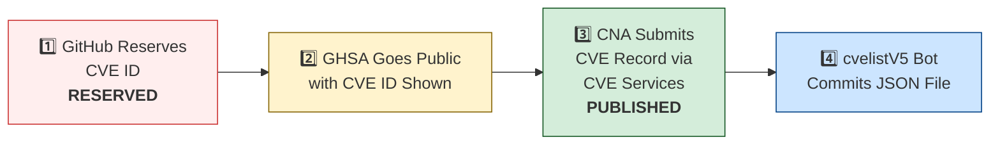

# 🛡️ OpenClaw CVE & Security Advisory Tracker

  
  
  
  
   
  
  
  
  
  

An automated tracker that continuously monitors [OpenClaw](https://github.com/openclaw/openclaw) security advisories across the GitHub Advisory Database, repo-level security advisories, and the [CVE V5 (cvelistV5)](https://github.com/CVEProject/cvelistV5) registry. Every hour it pulls the latest data, reconciles GHSA → CVE publication state, and regenerates this dashboard so you always have an up-to-date picture of the project's vulnerability landscape.

  Last updated: 2026-03-22 00:42 UTC · <a href="LICENSE">MIT License</a> · <a href="ADVISORIES.md">Full Advisory List</a> · <a href="SECURITY.md">Security Policy</a> · Data: <a href="https://github.com/CVEProject/cvelistV5">cvelistV5</a> + <a href="https://github.com/github/advisory-database">Advisory DB</a> · Updates hourly

---

  <a href="#-cves-published-in-cvelistv5-28">Published CVEs</a> ·
  <a href="#-cve-publication-pipeline">Pipeline</a> ·
  <a href="#-all-security-advisories-156">Advisories</a> ·
  <a href="#-vulnerability-categories">Categories</a> ·
  <a href="#-key-insights">Insights</a> ·
  <a href="#-project-identity">Identity</a>

---

## 🏗️ Project Identity

| Field | Value |
|-------|-------|
| **Current Name** | OpenClaw |
| **Previous Names** | Moltbot (second name), Clawdbot (original name) |
| **Repository** | [openclaw/openclaw](https://github.com/openclaw/openclaw) |
| **npm Package** | `openclaw` (formerly `clawdbot`) |
| **Author** | Peter Steinberger (steipete) |

<strong>Search terms for CVE discovery</strong>

To find all CVEs, search for: `openclaw`, `clawdbot`, `moltbot`, `clawhub`, `pkg:npm/clawdbot`, `pkg:npm/openclaw`

---

## 🚀 CVEs Published in cvelistV5 (28)

These CVEs have full records in the [CVEProject/cvelistV5](https://github.com/CVEProject/cvelistV5) repository:

| CVE ID | Severity | CVSS | Title | CWE | Published |
|--------|----------|------|-------|-----|-----------|
| [CVE-2026-28363](https://github.com/openclaw/openclaw/security/advisories/GHSA-3c6h-g97w-fg78) |  | 9.9 | In OpenClaw before 2026.2.23, tools.exec.safeBins validation for sort could be… | CWE-184 | 2026-02-27 |
| [CVE-2026-22172](https://github.com/openclaw/openclaw/security/advisories/GHSA-rqpp-rjj8-7wv8) |  | 9.4 | OpenClaw < 2026.3.12 - Scope Elevation in WebSocket Shared-Auth Connections | CWE-862 | 2026-03-20 |
| [CVE-2026-28474](https://github.com/openclaw/openclaw/security/advisories/GHSA-r5h9-vjqc-hq3r) |  | 9.3 | OpenClaw Nextcloud Talk < 2026.2.6 - Allowlist Bypass via actor.name Display Name Spoofing | CWE-863 | 2026-03-05 |
| [CVE-2026-28446](https://github.com/openclaw/openclaw/security/advisories/GHSA-4rj2-gpmh-qq5x) |  | 9.2 | OpenClaw < 2026.2.1 - Inbound Allowlist Policy Bypass in voice-call Extension via Empty Caller ID and Suffix Matching | CWE-303 | 2026-03-05 |
| [CVE-2026-28472](https://github.com/openclaw/openclaw/security/advisories/GHSA-rv39-79c4-7459) |  | 9.2 | OpenClaw < 2026.2.2 - Device Identity Check Bypass in Gateway WebSocket Connect Handshake | CWE-306 | 2026-03-05 |
| [CVE-2026-24763](https://github.com/openclaw/openclaw/security/advisories/GHSA-mc68-q9jw-2h3v) |  | 8.8 | OpenClaw/Clawdbot Docker Execution has Authenticated Command Injection via PATH Environment Variable | CWE-78 | 2026-02-02 |
| [CVE-2026-25253](https://github.com/openclaw/openclaw/security/advisories/GHSA-g8p2-7wf7-98mq) |  | 8.8 | OpenClaw/Clawdbot has 1-Click RCE via Authentication Token Exfiltration From gatewayUrl | CWE-669 | 2026-02-01 |
| [CVE-2026-28461](https://github.com/openclaw/openclaw/security/advisories/GHSA-wr6m-jg37-68xh) |  | 8.7 | OpenClaw < 2026.3.1 - Unbounded Memory Growth in Zalo Webhook via Query String Key Churn | CWE-770 | 2026-03-19 |
| [CVE-2026-28478](https://github.com/openclaw/openclaw/security/advisories/GHSA-q447-rj3r-2cgh) |  | 8.7 | OpenClaw affected by denial of service via unbounded webhook request body buffering | CWE-770 | 2026-03-05 |
| [CVE-2026-28479](https://github.com/openclaw/openclaw/security/advisories/GHSA-fh3f-q9qw-93j9) |  | 8.7 | OpenClaw < 2026.2.15 - Cache Poisoning via Deprecated SHA-1 Hash in Sandbox Configuration | CWE-327 | 2026-03-05 |
| [CVE-2026-32013](https://github.com/openclaw/openclaw/security/advisories/GHSA-fgvx-58p6-gjwc) |  | 8.7 | OpenClaw < 2026.2.25 - Symlink Traversal in agents.files Methods | CWE-59 | 2026-03-19 |
| [CVE-2026-32042](https://github.com/openclaw/openclaw/security/advisories/GHSA-553v-f69r-656j) |  | 8.7 | OpenClaw < 2026.2.25 - Privilege Escalation via Unpaired Device Identity in Shared Gateway Authentication | CWE-863 | 2026-03-21 |
| [CVE-2026-32049](https://github.com/openclaw/openclaw/security/advisories/GHSA-rxxp-482v-7mrh) |  | 8.7 | OpenClaw < 2026.2.22 - Denial of Service via Inbound Media Download Byte Limit Bypass | CWE-770 | 2026-03-21 |
| [CVE-2026-32062](https://github.com/openclaw/openclaw/security/advisories/GHSA-mfg5-7q5g-f37j) |  | 8.7 | OpenClaw 2026.2.21-2 < 2026.2.22 - Unauthenticated WebSocket Resource Exhaustion via Media Stream | CWE-770 | 2026-03-11 |
| [CVE-2026-32060](https://github.com/openclaw/openclaw/security/advisories/GHSA-r5fq-947m-xm57) |  | 8.7 | OpenClaw < 2026.2.14 - Path Traversal in apply_patch via Crafted Paths | CWE-22 | 2026-03-11 |
| [CVE-2026-28456](https://github.com/openclaw/openclaw/security/advisories/GHSA-v6c6-vqqg-w888) |  | 8.6 | OpenClaw 2026.1.5 < 2026.2.14 - Arbitrary Code Execution via Unsafe Hook Module Path Handling | CWE-427 | 2026-03-05 |
| [CVE-2026-28463](https://github.com/openclaw/openclaw/security/advisories/GHSA-xvhf-x56f-2hpp) |  | 8.6 | OpenClaw < 2026.2.14 - Arbitrary File Read via Shell Expansion in Safe Bins Allowlist | CWE-78 | 2026-03-05 |
| [CVE-2026-32014](https://github.com/openclaw/openclaw/security/advisories/GHSA-r65x-2hqr-j5hf) |  | 8.6 | OpenClaw < 2026.2.26 - Node Reconnect Metadata Spoofing via Unsigned Platform Fields | CWE-290 | 2026-03-19 |
| [CVE-2026-28468](https://github.com/openclaw/openclaw/security/advisories/GHSA-h9g4-589h-68xv) |  | 8.5 | OpenClaw 2026.1.29-beta.1 < 2026.2.14 - Authentication Bypass in Sandbox Browser Bridge Server | CWE-306 | 2026-03-05 |
| [CVE-2026-32064](https://github.com/openclaw/openclaw/security/advisories/GHSA-25gx-x37c-7pph) |  | 8.5 | OpenClaw < 2026.2.21 - Missing VNC Authentication in Sandbox Browser noVNC Observer | CWE-306 | 2026-03-21 |
| [CVE-2026-28482](https://github.com/openclaw/openclaw/security/advisories/GHSA-5xfq-5mr7-426q) |  | 8.4 | OpenClaw < 2026.2.12 - Path Traversal via Unsanitized sessionId and sessionFile Parameters | CWE-22 | 2026-03-05 |
| [CVE-2026-28393](https://github.com/openclaw/openclaw/security/advisories/GHSA-7xhj-55q9-pc3m) |  | 8.3 | OpenClaw 2.0.0-beta3 < 2026.2.14 - Arbitrary JavaScript Module Loading via Hook Transform Path Traversal | CWE-427 | 2026-03-05 |
| [CVE-2026-31998](https://github.com/openclaw/openclaw/security/advisories/GHSA-gw85-xp4q-5gp9) |  | 8.3 | OpenClaw's Synology Chat dmPolicy=allowlist failed open on empty allowedUserIds, allowing unauthorized agent dispatch | CWE-863 | 2026-03-19 |
| [CVE-2026-32036](https://github.com/openclaw/openclaw/security/advisories/GHSA-mwxv-35wr-4vvj) |  | 8.3 | OpenClaw < 2026.2.26- Authentication Bypass via Encoded Dot-Segment Traversal in /api/channels | CWE-289 | 2026-03-19 |
| [CVE-2026-28392](https://github.com/openclaw/openclaw/security/advisories/GHSA-v773-r54f-q32w) |  | 8.2 | OpenClaw < 2026.2.14 - Privilege Escalation in Slack Slash Command Handler via Direct Messages | CWE-863 | 2026-03-05 |
| [CVE-2026-28469](https://github.com/openclaw/openclaw/security/advisories/GHSA-rq6g-px6m-c248) |  | 8.2 | OpenClaw Google Chat shared-path webhook target ambiguity allowed cross-account policy-context misrouting | CWE-639 | 2026-03-05 |
| [CVE-2026-29613](https://github.com/openclaw/openclaw/security/advisories/GHSA-xc7w-v5x6-cc87) |  | 8.2 | OpenClaw < 2026.2.12 - Webhook Authentication Bypass via Loopback remoteAddress Trust | CWE-306 | 2026-03-05 |
| [CVE-2026-32030](https://github.com/openclaw/openclaw/security/advisories/GHSA-x9cf-3w63-rpq9) |  | 8.2 | OpenClaw < 2026.2.19 - Sensitive File Disclosure via stageSandboxMedia Path Traversal | CWE-22 | 2026-03-19 |
| [CVE-2026-32045](https://github.com/openclaw/openclaw/security/advisories/GHSA-hff7-ccv5-52f8) |  | 8.2 | OpenClaw < 2026.2.21 - Authentication Bypass in HTTP Gateway Routes via Tokenless Tailscale Auth | CWE-290 | 2026-03-21 |
| [CVE-2026-32302](https://github.com/openclaw/openclaw/security/advisories/GHSA-5wcw-8jjv-m286) |  | 8.1 | OpenClaw: Untrusted web origins can obtain authenticated operator.admin access in trusted-proxy mode | CWE-346 | 2026-03-12 |
| [CVE-2026-25157](https://github.com/openclaw/openclaw/security/advisories/GHSA-q284-4pvr-m585) |  | 7.8 | OpenClaw/Clawdbot has OS Command Injection via Project Root Path in sshNodeCommand | CWE-78 | 2026-02-04 |
| [CVE-2026-32048](https://github.com/openclaw/openclaw/security/advisories/GHSA-p7gr-f84w-hqg5) |  | 7.7 | OpenClaw < 2026.3.1 - Sandbox Escape via Cross-Agent sessions_spawn | CWE-732 | 2026-03-21 |
| [CVE-2026-32005](https://github.com/openclaw/openclaw/security/advisories/GHSA-x2ff-j5c2-ggpr) |  | 7.6 | OpenClaw: Slack interactive callbacks could skip configured sender checks in some shared-workspace flows | CWE-863 | 2026-03-19 |
| [CVE-2026-32007](https://github.com/openclaw/openclaw/security/advisories/GHSA-h9xm-j4qg-fvpg) |  | 7.6 | OpenClaw < 2026.2.23 - Sandbox Bypass in apply_patch Tool via Workspace-Only Check Bypass | CWE-22 | 2026-03-19 |
| [CVE-2026-22179](https://github.com/openclaw/openclaw/security/advisories/GHSA-9p38-94jf-hgjj) |  | 7.5 | OpenClaw < 2026.2.22 - Allowlist Bypass via Command Substitution in system.run | CWE-78 | 2026-03-18 |
| [CVE-2026-25474](https://github.com/openclaw/openclaw/security/advisories/GHSA-mp5h-m6qj-6292) |  | 7.5 | OpenClaw has a Telegram webhook request forgery (missing `channels.telegram.webhookSecret`) → auth bypass | CWE-345 | 2026-02-19 |
| [CVE-2026-26324](https://github.com/openclaw/openclaw/security/advisories/GHSA-jrvc-8ff5-2f9f) |  | 7.5 | OpenClaw has a SSRF guard bypass via full-form IPv4-mapped IPv6 (loopback / metadata reachable) | CWE-918 | 2026-02-19 |
| [CVE-2026-26319](https://github.com/openclaw/openclaw/security/advisories/GHSA-4hg8-92x6-h2f3) |  | 7.5 | OpenClaw has Missing Webhook Authentication in Telnyx Provider Allowing Unauthenticated Requests | CWE-306 | 2026-02-19 |
| [CVE-2026-32025](https://github.com/openclaw/openclaw/security/advisories/GHSA-jmmg-jqc7-5qf4) |  | 7.5 | OpenClaw < 2026.2.25 - Password Brute-Force via Browser-Origin WebSocket Authentication Bypass | CWE-307 | 2026-03-19 |
| [CVE-2026-28458](https://github.com/openclaw/openclaw/security/advisories/GHSA-mr32-vwc2-5j6h) |  | 7.4 | OpenClaw's Browser Relay /cdp websocket is missing auth which could allow cross-tab cookie access | CWE-306 | 2026-03-05 |
| [CVE-2026-32015](https://github.com/openclaw/openclaw/security/advisories/GHSA-g75x-8qqm-2vxp) |  | 7.3 | OpenClaw 2026.1.21 < 2026.2.19 - PATH Hijacking Bypass in tools.exec.safeBins Allowlist Validation | CWE-426 | 2026-03-19 |
| [CVE-2026-32016](https://github.com/openclaw/openclaw/security/advisories/GHSA-7f4q-9rqh-x36p) |  | 7.3 | OpenClaw < 2026.2.22 - Path Traversal via Basename-Only Allowlist Matching on macOS | CWE-426 | 2026-03-19 |
| [CVE-2026-32032](https://github.com/openclaw/openclaw/security/advisories/GHSA-f8mp-vj46-cq8v) |  | 7.3 | OpenClaw < 2026.2.22 - Arbitrary Shell Execution via Unvalidated SHELL Environment Variable | CWE-426 | 2026-03-19 |
| [CVE-2026-22169](https://github.com/openclaw/openclaw/security/advisories/GHSA-vmqr-rc7x-3446) |  | 7.1 | OpenClaw < 2026.2.22 - Allowlist Bypass via sort Configuration in safeBins | CWE-78 | 2026-03-18 |
| [CVE-2026-22175](https://github.com/openclaw/openclaw/security/advisories/GHSA-gwqp-86q6-w47g) |  | 7.1 | OpenClaw < 2026.2.23 - Exec Approval Bypass via Unrecognized Multiplexer Shell Wrappers | CWE-184 | 2026-03-18 |
| [CVE-2026-26317](https://github.com/openclaw/openclaw/security/advisories/GHSA-3fqr-4cg8-h96q) |  | 7.1 | OpenClaw affected by cross-site request forgery (CSRF) through loopback browser mutation endpoints | CWE-352 | 2026-02-19 |
| [CVE-2026-26329](https://github.com/openclaw/openclaw/security/advisories/GHSA-cv7m-c9jx-vg7q) |  | 7.1 | OpenClaw has a path traversal in browser upload allows local file read | CWE-22 | 2026-02-19 |
| [CVE-2026-26320](https://github.com/openclaw/openclaw/security/advisories/GHSA-7q2j-c4q5-rm27) |  | 7.1 | OpenClaw macOS deep link confirmation truncation can conceal executed agent message | CWE-451 | 2026-02-19 |
| [CVE-2026-27566](https://github.com/openclaw/openclaw/security/advisories/GHSA-jj82-76v6-933r) |  | 7.1 | OpenClaw's exec allowlist wrapper analysis did not unwrap env/shell dispatch chains | CWE-78 | 2026-03-19 |
| [CVE-2026-32026](https://github.com/openclaw/openclaw/security/advisories/GHSA-33hm-cq8r-wc49) |  | 7.1 | OpenClaw < 2026.2.24 - Arbitrary File Read via Improper Temporary Path Validation in Sandbox | CWE-22 | 2026-03-19 |
| [CVE-2026-32009](https://github.com/openclaw/openclaw/security/advisories/GHSA-5gj7-jf77-q2q2) |  | 7 | OpenClaw < 2026.2.24 - Binary Hijacking via Static Default Trusted Directories in safeBins | CWE-426 | 2026-03-19 |
| [CVE-2026-22178](https://github.com/openclaw/openclaw/security/advisories/GHSA-c6hr-w26q-c636) |  | 6.9 | OpenClaw < 2026.2.19 - ReDoS and Regex Injection via Unescaped Feishu Mention Metadata | CWE-1333 | 2026-03-18 |
| [CVE-2026-22177](https://github.com/openclaw/openclaw/security/advisories/GHSA-8fmp-37rc-p5g7) |  | 6.9 | OpenClaw < 2026.2.21 - Environment Variable Injection via Config env.vars | CWE-15 | 2026-03-18 |
| [CVE-2026-27004](https://github.com/openclaw/openclaw/security/advisories/GHSA-6hf3-mhgc-cm65) |  | 6.9 | OpenClaw session tool visibility hardening and Telegram webhook secret fallback | CWE-209, CWE-346 | 2026-02-19 |
| [CVE-2026-28394](https://github.com/openclaw/openclaw/security/advisories/GHSA-p536-vvpp-9mc8) |  | 6.9 | OpenClaw < 2026.2.15 - Denial of Service via Unbounded Response Parsing in web_fetch Tool | CWE-770 | 2026-03-05 |
| [CVE-2026-27523](https://github.com/openclaw/openclaw/security/advisories/GHSA-m8v2-6wwh-r4gc) |  | 6.9 | OpenClaw's sandbox bind validation could bypass allowed-root and blocked-path checks via symlink-parent missing-leaf paths | CWE-22 | 2026-03-18 |
| [CVE-2026-28480](https://github.com/openclaw/openclaw/security/advisories/GHSA-mj5r-hh7j-4gxf) |  | 6.9 | OpenClaw Telegram allowlist authorization accepted mutable usernames | CWE-290 | 2026-03-05 |
| [CVE-2026-31994](https://github.com/openclaw/openclaw/security/advisories/GHSA-mqr9-vqhq-3jxw) |  | 6.9 | OpenClaw < 2026.2.19 - Local Command Injection via Unsafe cmd Argument Handling in Windows Scheduled Task Script Generation | CWE-78 | 2026-03-19 |
| [CVE-2026-32053](https://github.com/openclaw/openclaw/security/advisories/GHSA-vqx8-9xxw-f2m7) |  | 6.9 | OpenClaw < 2026.2.23 - Twilio Webhook Replay Bypass via Randomized Event ID Normalization | CWE-294 | 2026-03-21 |
| [CVE-2026-27008](https://github.com/openclaw/openclaw/security/advisories/GHSA-h7f7-89mm-pqh6) |  | 6.8 | OpenClaw hardened the skill download target directory validation | CWE-73 | 2026-02-19 |
| [CVE-2026-28486](https://github.com/openclaw/openclaw/security/advisories/GHSA-v892-hwpg-jwqp) |  | 6.8 | OpenClaw 2026.1.16-2 < 2026.2.14 - Path Traversal (Zip Slip) in Archive Extraction via Installation Commands | CWE-22 | 2026-03-05 |
| [CVE-2026-29612](https://github.com/openclaw/openclaw/security/advisories/GHSA-w2cg-vxx6-5xjg) |  | 6.8 | OpenClaw < 2026.2.14 - Denial of Service via Large Base64 Media File Decoding | CWE-770 | 2026-03-05 |
| [CVE-2026-32024](https://github.com/openclaw/openclaw/security/advisories/GHSA-rx3g-mvc3-qfjf) |  | 6.8 | OpenClaw < 2026.2.22 - Symlink Traversal in Avatar Handling | CWE-59 | 2026-03-19 |
| [CVE-2026-26972](https://github.com/openclaw/openclaw/security/advisories/GHSA-xwjm-j929-xq7c) |  | 6.7 | OpenClaw has a Path Traversal in Browser Download Functionality | CWE-22 | 2026-02-19 |
| [CVE-2026-28452](https://github.com/openclaw/openclaw/security/advisories/GHSA-h89v-j3x9-8wqj) |  | 6.7 | OpenClaw affected by denial of service through unguarded archive extraction allowing high expansion/resource abuse (ZIP/TAR) | CWE-770 | 2026-03-05 |
| [CVE-2026-26328](https://github.com/openclaw/openclaw/security/advisories/GHSA-g34w-4xqq-h79m) |  | 6.5 | OpenClaw iMessage group allowlist authorization inherited DM pairing-store identities | CWE-284, CWE-863 | 2026-02-19 |
| [CVE-2026-22170](https://github.com/openclaw/openclaw/security/advisories/GHSA-jwf4-8wf4-jf2m) |  | 6.3 | OpenClaw: BlueBubbles (optional plugin) pairing/allowlist mismatch when allowFrom is empty | CWE-863 | 2026-03-18 |
| [CVE-2026-28395](https://github.com/openclaw/openclaw/security/advisories/GHSA-qw99-grcx-4pvm) |  | 6.3 | OpenClaw 2026.1.14-1 < 2026.2.12 - Unintended Public Binding of Chrome Extension Relay via Wildcard cdpUrl | CWE-1327 | 2026-03-05 |
| [CVE-2026-28449](https://github.com/openclaw/openclaw/security/advisories/GHSA-r9q5-c7qc-p26w) |  | 6.3 | OpenClaw's Nextcloud Talk webhook replay could trigger duplicate inbound processing | CWE-294 | 2026-03-19 |
| [CVE-2026-28451](https://github.com/openclaw/openclaw/security/advisories/GHSA-x22m-j5qq-j49m) |  | 6.3 | OpenClaw < 2026.2.14 - SSRF via Feishu Extension Media Fetching | CWE-918 | 2026-03-05 |
| [CVE-2026-28475](https://github.com/openclaw/openclaw/security/advisories/GHSA-47q7-97xp-m272) |  | 6.3 | OpenClaw < 2026.2.13 - Timing Attack via Hook Token Comparison | CWE-208 | 2026-03-05 |
| [CVE-2026-32021](https://github.com/openclaw/openclaw/security/advisories/GHSA-j4xf-96qf-rx69) |  | 6.3 | OpenClaw < 2026.2.22 - Authorization Bypass via Display Name Collision in Feishu allowFrom | CWE-863 | 2026-03-19 |
| [CVE-2026-32031](https://github.com/openclaw/openclaw/security/advisories/GHSA-8j2w-6fmm-m587) |  | 6.3 | OpenClaw: /api/channels gateway-auth boundary bypass via path canonicalization mismatch | CWE-288 | 2026-03-19 |
| [CVE-2026-32050](https://github.com/openclaw/openclaw/security/advisories/GHSA-792q-qw95-f446) |  | 6.3 | OpenClaw < 2026.2.25 - Unauthorized Reaction Status Event Enqueue via Access Check Bypass | CWE-863 | 2026-03-21 |
| [CVE-2026-32897](https://github.com/openclaw/openclaw/security/advisories/GHSA-v6x2-2qvm-6gv8) |  | 6.3 | OpenClaw < 2026.2.22 - Authentication Token Reuse in Owner ID Prompt Hashing Fallback | CWE-320 | 2026-03-21 |
| [CVE-2026-32896](https://github.com/openclaw/openclaw/security/advisories/GHSA-5mx2-2mgw-x8rm) |  | 6.3 | OpenClaw < 2026.2.21 - Unauthenticated Webhook Access via Passwordless Fallback in BlueBubbles Plugin | CWE-306 | 2026-03-21 |
| [CVE-2026-22181](https://github.com/openclaw/openclaw/security/advisories/GHSA-8mvx-p2r9-r375) |  | 6.1 | OpenClaw < 2026.3.2 - DNS Pinning Bypass via Environment Proxy Configuration in web_fetch | CWE-918 | 2026-03-18 |
| [CVE-2026-28460](https://github.com/openclaw/openclaw/security/advisories/GHSA-9868-vxmx-w862) |  | 6 | OpenClaw < 2026.2.22 - Allowlist Bypass via Shell Line-Continuation Command Substitution in system.run | CWE-78 | 2026-03-19 |
| [CVE-2026-32002](https://github.com/openclaw/openclaw/security/advisories/GHSA-q6qf-4p5j-r25g) |  | 6 | OpenClaw's image tool bypasses tools.fs.workspaceOnly on sandbox mount paths and exfiltrates out-of-workspace images | CWE-200 | 2026-03-19 |
| [CVE-2026-32022](https://github.com/openclaw/openclaw/security/advisories/GHSA-3xfw-4pmr-4xc5) |  | 6 | OpenClaw < 2026.2.21 - Arbitrary File Read via grep -e Flag Policy Bypass | CWE-184 | 2026-03-19 |
| [CVE-2026-32023](https://github.com/openclaw/openclaw/security/advisories/GHSA-ccg8-46r6-9qgj) |  | 6 | OpenClaw < 2026.2.24 - Approval Gating Bypass via Dispatch-Wrapper Depth-Cap Mismatch in system.run | CWE-863 | 2026-03-19 |
| [CVE-2026-32039](https://github.com/openclaw/openclaw/security/advisories/GHSA-wpph-cjgr-7c39) |  | 6 | OpenClaw's typed sender-key matching for toolsBySender prevents identity-collision policy bypass | CWE-639 | 2026-03-19 |
| [CVE-2026-32057](https://github.com/openclaw/openclaw/security/advisories/GHSA-vvgp-4c28-m3jm) |  | 6 | OpenClaw < 2026.2.25 - Authentication Bypass via Control UI client.id Parameter | CWE-807 | 2026-03-21 |
| [CVE-2026-22174](https://github.com/openclaw/openclaw/security/advisories/GHSA-v3j7-34xh-6g3w) |  | 5.9 | OpenClaw < 2026.2.22 - Gateway Token Disclosure via Chrome CDP Probe | CWE-306 | 2026-03-18 |
| [CVE-2026-28481](https://github.com/openclaw/openclaw/security/advisories/GHSA-7vwx-582j-j332) |  | 5.9 | OpenClaw < 2026.2.1 - Bearer Token Leakage via MS Teams Attachment Downloader Suffix Matching | CWE-201 | 2026-03-05 |
| [CVE-2026-22217](https://github.com/openclaw/openclaw/security/advisories/GHSA-p4wh-cr8m-gm6c) |  | 5.8 | OpenClaw 2026.2.22 < 2026.2.23 - Arbitrary Binary Execution via $SHELL Environment Variable Trusted Prefix Fallback | CWE-829 | 2026-03-18 |
| [CVE-2026-27670](https://github.com/openclaw/openclaw/security/advisories/GHSA-r54r-wmmq-mh84) |  | 5.8 | OpenClaw < 2026.3.2 - Arbitrary File Write via ZIP Extraction Parent Symlink Race Condition | CWE-367 | 2026-03-19 |
| [CVE-2026-32000](https://github.com/openclaw/openclaw/security/advisories/GHSA-7fcc-cw49-xm78) |  | 5.8 | OpenClaw < 2026.2.19 - Command Injection via Windows Shell Fallback in Lobster Tool Execution | CWE-78 | 2026-03-19 |
| [CVE-2026-31999](https://github.com/openclaw/openclaw/security/advisories/GHSA-6f6j-wx9w-ff4j) |  | 5.8 | OpenClaw 2026.2.26 < 2026.3.1 - Current Working Directory Injection via Windows Wrapper Resolution Fallback | CWE-78 | 2026-03-19 |
| [CVE-2026-31995](https://github.com/openclaw/openclaw/security/advisories/GHSA-fg3m-vhrr-8gj6) |  | 5.8 | OpenClaw has Windows Lobster shell fallback command injection in constrained fallback path | CWE-78 | 2026-03-19 |
| [CVE-2026-32010](https://github.com/openclaw/openclaw/security/advisories/GHSA-4gc7-qcvf-38wg) |  | 5.8 | OpenClaw < 2026.2.22 - Allowlist Bypass via sort --compress-program Parameter | CWE-78 | 2026-03-19 |
| [CVE-2026-32052](https://github.com/openclaw/openclaw/security/advisories/GHSA-6rcp-vxwf-3mfp) |  | 5.8 | OpenClaw < 2026.2.24 - Hidden Command Execution via Shell-Wrapper Positional argv Carriers | CWE-436 | 2026-03-21 |
| [CVE-2026-28457](https://github.com/openclaw/openclaw/security/advisories/GHSA-xw4p-pw82-hqr7) |  | 5.6 | OpenClaw < 2026.2.14 - Path Traversal in Sandbox Skill Mirroring via Name Parameter | CWE-22 | 2026-03-05 |
| [CVE-2026-29608](https://github.com/openclaw/openclaw/security/advisories/GHSA-h3rm-6x7g-882f) |  | 5.4 | OpenClaw 2026.3.1 < 2026.3.2 - Approval Integrity Bypass via system.run argv Rewriting | CWE-88 | 2026-03-19 |
| [CVE-2026-26326](https://github.com/openclaw/openclaw/security/advisories/GHSA-8mh7-phf8-xgfm) |  | 5.3 | OpenClaw skills.status could leak secrets to operator.read clients | CWE-200 | 2026-02-19 |
| [CVE-2026-32001](https://github.com/openclaw/openclaw/security/advisories/GHSA-rv2q-f2h5-6xmg) |  | 5.3 | OpenClaw's Node role device-identity bypass allows unauthorized node.event injection | CWE-863 | 2026-03-19 |
| [CVE-2026-32899](https://github.com/openclaw/openclaw/security/advisories/GHSA-rm2p-j3r7-4x4j) |  | 5.3 | OpenClaw < 2026.2.25 - Sender Policy Bypass in Slack Reaction and Pin Event Handlers | CWE-863 | 2026-03-21 |
| [CVE-2026-32898](https://github.com/openclaw/openclaw/security/advisories/GHSA-7jx5-9fjg-hp4m) |  | 5.3 | OpenClaw < 2026.2.23 - ACP Permission Auto-Approval Bypass via Untrusted Tool Metadata | CWE-807 | 2026-03-21 |
| [CVE-2026-22180](https://github.com/openclaw/openclaw/security/advisories/GHSA-3pxq-f3cp-jmxp) |  | 4.8 | OpenClaw < 2026.3.2 - Path Confinement Bypass in Browser Output and File Write Operations | CWE-59 | 2026-03-18 |
| [CVE-2026-32020](https://github.com/openclaw/openclaw/security/advisories/GHSA-5ghc-98wh-gwwf) |  | 4.8 | OpenClaw < 2026.2.22 - Arbitrary File Read via Symlink Following in Static File Handler | CWE-59 | 2026-03-19 |
| [CVE-2026-32046](https://github.com/openclaw/openclaw/security/advisories/GHSA-43x4-g22p-3hrq) |  | 4.8 | OpenClaw < 2026.2.21 - OS-level Sandbox Bypass via --no-sandbox Flag | CWE-1188 | 2026-03-21 |
| [CVE-2026-24764](https://github.com/openclaw/openclaw/security/advisories/GHSA-782p-5fr5-7fj8) |  | 3.7 | OpenClaw has Remote Code Execution via System Prompt Injection in Slack Channel Descriptions | CWE-74, CWE-94 | 2026-02-19 |
| [CVE-2026-32040](https://github.com/openclaw/openclaw/security/advisories/GHSA-2ww6-868g-2c56) |  | 2.4 | OpenClaw < 2026.2.23 - HTML Injection via Unvalidated Image MIME Type in Data-URL Interpolation | CWE-79 | 2026-03-19 |
| [CVE-2026-27524](https://github.com/openclaw/openclaw/security/advisories/GHSA-62f6-mrcj-v8h5) |  | 2.3 | OpenClaw < 2026.2.21 - Prototype Pollution via Debug Override Path | CWE-1321 | 2026-03-18 |
| [CVE-2026-32006](https://github.com/openclaw/openclaw/security/advisories/GHSA-25pw-4h6w-qwvm) |  | 2.3 | OpenClaw has a BlueBubbles group allowlist mismatch via DM pairing-store fallback | CWE-863 | 2026-03-19 |
| [CVE-2026-32019](https://github.com/openclaw/openclaw/security/advisories/GHSA-4rqq-w8v4-7p47) |  | 2.3 | OpenClaw < 2026.2.22 - Incomplete IPv4 Special-Use Range Blocking in SSRF Guard | CWE-918 | 2026-03-19 |
| [CVE-2026-31991](https://github.com/openclaw/openclaw/security/advisories/GHSA-wm8r-w8pf-2v6w) |  | 2 | OpenClaw < 2026.2.26 - Authorization Bypass via DM Pairing-Store Leakage in Signal Group Allowlist | CWE-863 | 2026-03-19 |
| [CVE-2026-31996](https://github.com/openclaw/openclaw/security/advisories/GHSA-4685-c5cp-vp95) |  | 2 | OpenClaw < 2026.2.19 - safeBins stdin-only bypass via sort output and recursive grep flags | CWE-78 | 2026-03-19 |
| [CVE-2026-32018](https://github.com/openclaw/openclaw/security/advisories/GHSA-gq83-8q7q-9hfx) |  | 2 | OpenClaw < 2026.2.19 - Race Condition in Sandbox Registry Write Operations | CWE-362 | 2026-03-19 |
| [CVE-2026-32067](https://github.com/openclaw/openclaw/security/advisories/GHSA-vjp8-wprm-2jw9) |  | 2 | OpenClaw < 2026.2.26 - Cross-Account Authorization Bypass in DM Pairing Store | CWE-863 | 2026-03-21 |
| [CVE-2026-30741]() |  | None | A remote code execution (RCE) vulnerability in OpenClaw Agent Platform v2026.2.6 |  | 2026-03-11 |

<strong>📖 Detailed CVE Analysis (click to expand)</strong>

### CVE-2026-28363 — In OpenClaw before 2026.2.23, tools.exec.safeBins validation for sort could be…

| Field | Detail |
|-------|--------|
| **CVSS** | 9.9 (CRITICAL) — `CVSS:3.1/AV:N/AC:L/PR:L/UI:N/S:C/C:H/I:H/A:H` |
| **CWE** | CWE-184 (CWE-184 Incomplete List of Disallowed Inputs) |
| **Affected** | < 2026.2.23 |
| **Vendor/Product** | OpenClaw / OpenClaw |
| **Advisory** | [GHSA-3c6h-g97w-fg78](https://github.com/openclaw/openclaw/security/advisories/GHSA-3c6h-g97w-fg78) |

In OpenClaw before 2026.2.23, tools.exec.safeBins validation for sort could be bypassed via GNU long-option abbreviations (such as --compress-prog) in allowlist mode, leading to approval-free execution paths that were intended to require approval. Only an exact string such as --compress-program was denied.

---

### CVE-2026-22172 — OpenClaw < 2026.3.12 - Scope Elevation in WebSocket Shared-Auth Connections

| Field | Detail |
|-------|--------|
| **CVSS** | 9.4 (CRITICAL) — `CVSS:4.0/AV:N/AC:L/AT:N/PR:L/UI:N/VC:H/VI:H/VA:H/SC:H/SI:H/SA:H` |
| **CWE** | CWE-862 (CWE-862 Missing Authorization) |
| **Affected** | < 2026.3.12 |
| **Vendor/Product** | OpenClaw / OpenClaw |
| **Advisory** | [GHSA-rqpp-rjj8-7wv8](https://github.com/openclaw/openclaw/security/advisories/GHSA-rqpp-rjj8-7wv8) |

OpenClaw versions prior to 2026.3.12 contain an authorization bypass vulnerability in the WebSocket connect path that allows shared-token or password-authenticated connections to self-declare elevated scopes without server-side binding. Attackers can exploit this logic flaw to present unauthorized scopes such as operator.admin and perform admin-only gateway operations.

**References:**
- [openclaw-scope-elevation-in-websocket-shared-auth-connections](https://www.vulncheck.com/advisories/openclaw-scope-elevation-in-websocket-shared-auth-connections)
---

### CVE-2026-28474 — OpenClaw Nextcloud Talk < 2026.2.6 - Allowlist Bypass via actor.name Display Name Spoofing

| Field | Detail |
|-------|--------|
| **CVSS** | 9.3 (CRITICAL) — `CVSS:4.0/AV:N/AC:L/AT:N/PR:N/UI:N/VC:H/VI:H/VA:H/SC:N/SI:N/SA:N` |
| **CWE** | CWE-863 (Incorrect Authorization) |
| **Affected** | < 2026.2.6 |
| **Vendor/Product** | OpenClaw / nextcloud-talk |
| **Advisory** | [GHSA-r5h9-vjqc-hq3r](https://github.com/openclaw/openclaw/security/advisories/GHSA-r5h9-vjqc-hq3r) |

OpenClaw's Nextcloud Talk plugin versions prior to 2026.2.6 accept equality matching on the mutable actor.name display name field for allowlist validation, allowing attackers to bypass DM and room allowlists. An attacker can change their Nextcloud display name to match an allowlisted user ID and gain unauthorized access to restricted conversations.

**References:**
- [Patch Commit #1](https://github.com/openclaw/openclaw/commit/6b4b6049b47c3329a7014509594647826669892d)
- [VulnCheck Advisory: OpenClaw Nextcloud Talk < 2026.2.6 - Allowlist Bypass via actor.name Display Name Spoofing](https://www.vulncheck.com/advisories/openclaw-nextcloud-talk-allowlist-bypass-via-actorname-display-name-spoofing)
---

### CVE-2026-28446 — OpenClaw < 2026.2.1 - Inbound Allowlist Policy Bypass in voice-call Extension via Empty Caller ID and Suffix Matching

| Field | Detail |
|-------|--------|
| **CVSS** | 9.2 (CRITICAL) — `CVSS:4.0/AV:N/AC:L/AT:P/PR:N/UI:N/VC:H/VI:H/VA:L/SC:N/SI:N/SA:N` |
| **CWE** | CWE-303 (Incorrect Implementation of Authentication Algorithm) |
| **Affected** | < 2026.2.1 |
| **Vendor/Product** | OpenClaw / OpenClaw |
| **Advisory** | [GHSA-4rj2-gpmh-qq5x](https://github.com/openclaw/openclaw/security/advisories/GHSA-4rj2-gpmh-qq5x) |

OpenClaw versions prior to 2026.2.1 with the voice-call extension installed and enabled contain an authentication bypass vulnerability in inbound allowlist policy validation that accepts empty caller IDs and uses suffix-based matching instead of strict equality. Remote attackers can bypass inbound access controls by placing calls with missing caller IDs or numbers ending with allowlisted digits to reach the voice-call agent and execute tools.

**References:**
- [Patch Commit](https://github.com/openclaw/openclaw/commit/f8dfd034f5d9235c5485f492a9e4ccc114e97fdb)
- [VulnCheck Advisory: OpenClaw < 2026.2.1 - Inbound Allowlist Policy Bypass in voice-call Extension via Empty Caller ID and Suffix Matching](https://www.vulncheck.com/advisories/openclaw-inbound-allowlist-policy-bypass-in-voice-call-extension-via-empty-caller-id)
---

### CVE-2026-28472 — OpenClaw < 2026.2.2 - Device Identity Check Bypass in Gateway WebSocket Connect Handshake

| Field | Detail |
|-------|--------|
| **CVSS** | 9.2 (CRITICAL) — `CVSS:4.0/AV:N/AC:H/AT:N/PR:N/UI:N/VC:H/VI:H/VA:H/SC:N/SI:N/SA:N` |
| **CWE** | CWE-306 (Missing Authentication for Critical Function) |
| **Affected** | < 2026.2.2 |
| **Vendor/Product** | OpenClaw / OpenClaw |
| **Advisory** | [GHSA-rv39-79c4-7459](https://github.com/openclaw/openclaw/security/advisories/GHSA-rv39-79c4-7459) |

OpenClaw versions prior to 2026.2.2 contain a vulnerability in the gateway WebSocket connect handshake in which it allows skipping device identity checks when auth.token is present but not validated. Attackers can connect to the gateway without providing device identity or pairing by exploiting the presence check instead of validation, potentially gaining operator access in vulnerable deployments.

**References:**
- [Patch Commit](https://github.com/openclaw/openclaw/commit/fe81b1d7125a014b8280da461f34efbf5f761575)
- [VulnCheck Advisory: OpenClaw < 2026.2.2 - Device Identity Check Bypass in Gateway WebSocket Connect Handshake](https://www.vulncheck.com/advisories/openclaw-device-identity-check-bypass-in-gateway-websocket-connect-handshake)
---

### CVE-2026-24763 — OpenClaw/Clawdbot Docker Execution has Authenticated Command Injection via PATH Environment Variable

| Field | Detail |
|-------|--------|
| **CVSS** | 8.8 (HIGH) — `CVSS:3.1/AV:N/AC:L/PR:L/UI:N/S:U/C:H/I:H/A:H` |
| **CWE** | CWE-78 (CWE-78: Improper Neutralization of Special Elements used in an OS Command ('OS Command Injection')) |
| **Affected** | < 2026.1.29 |
| **Vendor/Product** | clawdbot / clawdbot |
| **Advisory** | [GHSA-mc68-q9jw-2h3v](https://github.com/openclaw/openclaw/security/advisories/GHSA-mc68-q9jw-2h3v) |

OpenClaw (formerly  Clawdbot) is a personal AI assistant you run on your own devices. Prior to 2026.1.29, a command injection vulnerability existed in OpenClaw’s Docker sandbox execution mechanism due to unsafe handling of the PATH environment variable when constructing shell commands. An authenticated user able to control environment variables could influence command execution within the container context. This vulnerability is fixed in 2026.1.29.

> **Naming note:** Uses old name `clawdbot/clawdbot` as vendor/product.
**References:**
- [https://github.com/openclaw/openclaw/commit/771f23d36b95ec2204cc9a0054045f5d8439ea75](https://github.com/openclaw/openclaw/commit/771f23d36b95ec2204cc9a0054045f5d8439ea75)
- [https://github.com/openclaw/openclaw/releases/tag/v2026.1.29](https://github.com/openclaw/openclaw/releases/tag/v2026.1.29)
---

### CVE-2026-25253 — OpenClaw/Clawdbot has 1-Click RCE via Authentication Token Exfiltration From gatewayUrl

| Field | Detail |
|-------|--------|
| **CVSS** | 8.8 (HIGH) — `CVSS:3.1/AV:N/AC:L/PR:N/UI:R/S:U/C:H/I:H/A:H` |
| **CWE** | CWE-669 (CWE-669 Incorrect Resource Transfer Between Spheres) |
| **Affected** | < 2026.1.29 |
| **Vendor/Product** | OpenClaw / OpenClaw |
| **Advisory** | [GHSA-g8p2-7wf7-98mq](https://github.com/openclaw/openclaw/security/advisories/GHSA-g8p2-7wf7-98mq) |

OpenClaw (aka clawdbot or Moltbot) before 2026.1.29 obtains a gatewayUrl value from a query string and automatically makes a WebSocket connection without prompting, sending a token value.

> **Naming note:** Uses all three names in description. packageURL still references `pkg:npm/clawdbot`.
**References:**
- [1-click-rce-to-steal-your-moltbot-data-and-keys](https://depthfirst.com/post/1-click-rce-to-steal-your-moltbot-data-and-keys)
- [blog](https://openclaw.ai/blog)
- [one-click-rce-moltbot](https://ethiack.com/news/blog/one-click-rce-moltbot)
- [2016913750557651228](https://x.com/0xacb/status/2016913750557651228)
---

### CVE-2026-28461 — OpenClaw < 2026.3.1 - Unbounded Memory Growth in Zalo Webhook via Query String Key Churn

| Field | Detail |
|-------|--------|
| **CVSS** | 8.7 (HIGH) — `CVSS:4.0/AV:N/AC:L/AT:N/PR:N/UI:N/VC:N/VI:N/VA:H/SC:N/SI:N/SA:N` |
| **CWE** | CWE-770 (CWE-770: Allocation of Resources Without Limits or Throttling) |
| **Affected** | < 2026.3.1 |
| **Vendor/Product** | OpenClaw / OpenClaw |
| **Advisory** | [GHSA-wr6m-jg37-68xh](https://github.com/openclaw/openclaw/security/advisories/GHSA-wr6m-jg37-68xh) |

OpenClaw versions prior to 2026.3.1 contain an unbounded memory growth vulnerability in the Zalo webhook endpoint that allows unauthenticated attackers to trigger in-memory key accumulation by varying query strings. Remote attackers can exploit this by sending repeated requests with different query parameters to cause memory pressure, process instability, or out-of-memory conditions that degrade service availability.

**References:**
- [VulnCheck Advisory: OpenClaw < 2026.3.1 - Unbounded Memory Growth in Zalo Webhook via Query String Key Churn](https://www.vulncheck.com/advisories/openclaw-unbounded-memory-growth-in-zalo-webhook-via-query-string-key-churn)
---

### CVE-2026-28478 — OpenClaw affected by denial of service via unbounded webhook request body buffering

| Field | Detail |
|-------|--------|
| **CVSS** | 8.7 (HIGH) — `CVSS:4.0/AV:N/AC:L/AT:N/PR:N/UI:N/VC:N/VI:N/VA:H/SC:N/SI:N/SA:N` |
| **CWE** | CWE-770 (Allocation of Resources Without Limits or Throttling) |
| **Affected** | < 2026.2.13 |
| **Vendor/Product** | OpenClaw / OpenClaw |
| **Advisory** | [GHSA-q447-rj3r-2cgh](https://github.com/openclaw/openclaw/security/advisories/GHSA-q447-rj3r-2cgh) |

OpenClaw versions prior to 2026.2.13 contain a denial of service vulnerability in webhook handlers that buffer request bodies without strict byte or time limits. Remote unauthenticated attackers can send oversized JSON payloads or slow uploads to webhook endpoints causing memory pressure and availability degradation.

**References:**
- [Patch Commit](https://github.com/openclaw/openclaw/commit/3cbcba10cf30c2ffb898f0d8c7dfb929f15f8930)
- [VulnCheck Advisory: OpenClaw < 2026.2.13 - Denial of Service via Unbounded Webhook Request Body Buffering](https://www.vulncheck.com/advisories/openclaw-denial-of-service-via-unbounded-webhook-request-body-buffering)
---

### CVE-2026-28479 — OpenClaw < 2026.2.15 - Cache Poisoning via Deprecated SHA-1 Hash in Sandbox Configuration

| Field | Detail |
|-------|--------|
| **CVSS** | 8.7 (HIGH) — `CVSS:4.0/AV:N/AC:L/AT:N/PR:N/UI:N/VC:H/VI:N/VA:N/SC:N/SI:N/SA:N` |
| **CWE** | CWE-327 (Use of a Broken or Risky Cryptographic Algorithm) |
| **Affected** | < 2026.2.15 |
| **Vendor/Product** | OpenClaw / OpenClaw |
| **Advisory** | [GHSA-fh3f-q9qw-93j9](https://github.com/openclaw/openclaw/security/advisories/GHSA-fh3f-q9qw-93j9) |

OpenClaw versions prior to 2026.2.15 use SHA-1 to hash sandbox identifier cache keys for Docker and browser sandbox configurations, which is deprecated and vulnerable to collision attacks. An attacker can exploit SHA-1 collisions to cause cache poisoning, allowing one sandbox configuration to be misinterpreted as another and enabling unsafe sandbox state reuse.

**References:**
- [Patch Commit](https://github.com/openclaw/openclaw/commit/559c8d9930eebb5356506ff1a8cd3dbaec92be77)
- [VulnCheck Advisory: OpenClaw < 2026.2.15 - Cache Poisoning via Deprecated SHA-1 Hash in Sandbox Configuration](https://www.vulncheck.com/advisories/openclaw-cache-poisoning-via-deprecated-sha-hash-in-sandbox-configuration)
---

### CVE-2026-32013 — OpenClaw < 2026.2.25 - Symlink Traversal in agents.files Methods

| Field | Detail |
|-------|--------|
| **CVSS** | 8.7 (HIGH) — `CVSS:4.0/AV:N/AC:L/AT:N/PR:L/UI:N/VC:H/VI:H/VA:H/SC:N/SI:N/SA:N` |
| **CWE** | CWE-59 (CWE-59: Improper Link Resolution Before File Access ('Link Following')) |
| **Affected** | < 2026.2.25 |
| **Vendor/Product** | OpenClaw / OpenClaw |
| **Advisory** | [GHSA-fgvx-58p6-gjwc](https://github.com/openclaw/openclaw/security/advisories/GHSA-fgvx-58p6-gjwc) |

OpenClaw versions prior to 2026.2.25 contain a symlink traversal vulnerability in the agents.files.get and agents.files.set methods that allows reading and writing files outside the agent workspace. Attackers can exploit symlinked allowlisted files to access arbitrary host files within gateway process permissions, potentially enabling code execution through file overwrite attacks.

**References:**
- [Patch Commit](https://github.com/openclaw/openclaw/commit/125f4071bcbc0de32e769940d07967db47f09d3d)
- [VulnCheck Advisory: OpenClaw < 2026.2.25 - Symlink Traversal in agents.files Methods](https://www.vulncheck.com/advisories/openclaw-symlink-traversal-in-agents-files-methods)
---

### CVE-2026-32042 — OpenClaw < 2026.2.25 - Privilege Escalation via Unpaired Device Identity in Shared Gateway Authentication

| Field | Detail |
|-------|--------|
| **CVSS** | 8.7 (HIGH) — `CVSS:4.0/AV:N/AC:L/AT:N/PR:L/UI:N/VC:H/VI:H/VA:H/SC:N/SI:N/SA:N` |
| **CWE** | CWE-863 (CWE-863: Incorrect Authorization) |
| **Affected** | < 2026.2.25 |
| **Vendor/Product** | OpenClaw / OpenClaw |
| **Advisory** | [GHSA-553v-f69r-656j](https://github.com/openclaw/openclaw/security/advisories/GHSA-553v-f69r-656j) |

OpenClaw versions 2026.2.22 prior to 2026.2.25 contain a privilege escalation vulnerability allowing unpaired device identities to bypass operator pairing requirements and self-assign elevated operator scopes including operator.admin. Attackers with valid shared gateway authentication can present a self-signed unpaired device identity to request and obtain higher operator scopes before pairing approval is granted.

**References:**
- [Patch Commit](https://github.com/openclaw/openclaw/commit/8d1481cb4a9d31bd617e52dc8c392c35689d9dea)
- [VulnCheck Advisory: OpenClaw < 2026.2.25 - Privilege Escalation via Unpaired Device Identity in Shared Gateway Authentication](https://www.vulncheck.com/advisories/openclaw-privilege-escalation-via-unpaired-device-identity-in-shared-gateway-authentication)
---

### CVE-2026-32049 — OpenClaw < 2026.2.22 - Denial of Service via Inbound Media Download Byte Limit Bypass

| Field | Detail |
|-------|--------|
| **CVSS** | 8.7 (HIGH) — `CVSS:4.0/AV:N/AC:L/AT:N/PR:N/UI:N/VC:N/VI:N/VA:H/SC:N/SI:N/SA:N` |
| **CWE** | CWE-770 (CWE-770: Allocation of Resources Without Limits or Throttling) |
| **Affected** | < 2026.2.22 |
| **Vendor/Product** | OpenClaw / OpenClaw |
| **Advisory** | [GHSA-rxxp-482v-7mrh](https://github.com/openclaw/openclaw/security/advisories/GHSA-rxxp-482v-7mrh) |

OpenClaw versions prior to 2026.2.22 fail to consistently enforce configured inbound media byte limits before buffering remote media across multiple channel ingestion paths. Remote attackers can send oversized media payloads to trigger elevated memory usage and potential process instability.

**References:**
- [Patch Commit](https://github.com/openclaw/openclaw/commit/73d93dee64127a26f1acd09d0403b794cdeb4f5c)
- [VulnCheck Advisory: OpenClaw < 2026.2.22 - Denial of Service via Inbound Media Download Byte Limit Bypass](https://www.vulncheck.com/advisories/openclaw-denial-of-service-via-inbound-media-download-byte-limit-bypass)
---

### CVE-2026-32062 — OpenClaw 2026.2.21-2 < 2026.2.22 - Unauthenticated WebSocket Resource Exhaustion via Media Stream

| Field | Detail |
|-------|--------|
| **CVSS** | 8.7 (HIGH) — `CVSS:4.0/AV:N/AC:L/AT:N/PR:N/UI:N/VC:N/VI:N/VA:H/SC:N/SI:N/SA:N` |
| **CWE** | CWE-770 (Allocation of Resources Without Limits or Throttling) |
| **Affected** | < 2026.2.22 |
| **Vendor/Product** | openclaw / voice-call |
| **Advisory** | [GHSA-mfg5-7q5g-f37j](https://github.com/openclaw/openclaw/security/advisories/GHSA-mfg5-7q5g-f37j) |

OpenClaw versions2026.2.21-2 prior to 2026.2.22 and @openclaw/voice-call versions 2026.2.21 prior to 2026.2.22 accept media-stream WebSocket upgrades before stream validation, allowing unauthenticated clients to establish connections. Remote attackers can hold idle pre-authenticated sockets open to consume connection resources and degrade service availability for legitimate streams.

**References:**
- [Patch Commit](https://github.com/openclaw/openclaw/commit/1d8968c8a821ff1a05c294a1846b3bcb6f343794)
- [VulnCheck Advisory: OpenClaw 2026.2.21-2 < 2026.2.22 - Unauthenticated WebSocket Resource Exhaustion via Media Stream](https://www.vulncheck.com/advisories/openclaw-unauthenticated-websocket-resource-exhaustion-via-media-stream)
---

### CVE-2026-32060 — OpenClaw < 2026.2.14 - Path Traversal in apply_patch via Crafted Paths

| Field | Detail |
|-------|--------|
| **CVSS** | 8.7 (HIGH) — `CVSS:4.0/AV:N/AC:L/AT:N/PR:L/UI:N/VC:H/VI:H/VA:H/SC:N/SI:N/SA:N` |
| **CWE** | CWE-22 (Improper Limitation of a Pathname to a Restricted Directory ('Path Traversal')) |
| **Affected** | < 2026.2.14 |
| **Vendor/Product** | openclaw / openclaw |
| **Advisory** | [GHSA-r5fq-947m-xm57](https://github.com/openclaw/openclaw/security/advisories/GHSA-r5fq-947m-xm57) |

OpenClaw versions prior to 2026.2.14 contain a path traversal vulnerability in apply_patch that allows attackers to write or delete files outside the configured workspace directory. When apply_patch is enabled without filesystem sandbox containment, attackers can exploit crafted paths including directory traversal sequences or absolute paths to escape workspace boundaries and modify arbitrary files.

**References:**
- [Patch Commit](https://github.com/openclaw/openclaw/commit/5544646a09c0121fca7d7093812dc2de8437c7f1)
- [VulnCheck Advisory: OpenClaw < 2026.2.14 - Path Traversal in apply_patch via Crafted Paths](https://www.vulncheck.com/advisories/openclaw-path-traversal-in-apply-patch-via-crafted-paths)
---

### CVE-2026-28456 — OpenClaw 2026.1.5 < 2026.2.14 - Arbitrary Code Execution via Unsafe Hook Module Path Handling

| Field | Detail |
|-------|--------|
| **CVSS** | 8.6 (HIGH) — `CVSS:4.0/AV:N/AC:L/AT:N/PR:H/UI:N/VC:H/VI:H/VA:H/SC:N/SI:N/SA:N` |
| **CWE** | CWE-427 (Uncontrolled Search Path Element) |
| **Affected** | < 2026.2.14 |
| **Vendor/Product** | OpenClaw / OpenClaw |
| **Advisory** | [GHSA-v6c6-vqqg-w888](https://github.com/openclaw/openclaw/security/advisories/GHSA-v6c6-vqqg-w888) |

OpenClaw versions 2026.1.5 prior to 2026.2.14 contain a vulnerability in the Gateway in which it does not sufficiently constrain configured hook module paths before passing them to dynamic import(), allowing code execution. An attacker with gateway configuration modification access can load and execute unintended local modules in the Node.js process.

**References:**
- [Patch Commit #1](https://github.com/openclaw/openclaw/commit/a0361b8ba959e8506dc79d638b6e6a00d12887e4)
- [Patch Commit #2](https://github.com/openclaw/openclaw/commit/35c0e66ed057f1a9f7ad2515fdcef516bd6584ce)
- [VulnCheck Advisory: OpenClaw 2026.1.5 < 2026.2.14 - Arbitrary Code Execution via Unsafe Hook Module Path Handling](https://www.vulncheck.com/advisories/openclaw-arbitrary-code-execution-via-unsafe-hook-module-path-handling)
---

### CVE-2026-28463 — OpenClaw < 2026.2.14 - Arbitrary File Read via Shell Expansion in Safe Bins Allowlist

| Field | Detail |
|-------|--------|
| **CVSS** | 8.6 (HIGH) — `CVSS:4.0/AV:L/AC:L/AT:N/PR:N/UI:N/VC:H/VI:H/VA:H/SC:N/SI:N/SA:N` |
| **CWE** | CWE-78 (Improper Neutralization of Special Elements used in an OS Command ('OS Command Injection')) |
| **Affected** | < 2026.2.14 |
| **Vendor/Product** | OpenClaw / OpenClaw |
| **Advisory** | [GHSA-xvhf-x56f-2hpp](https://github.com/openclaw/openclaw/security/advisories/GHSA-xvhf-x56f-2hpp) |

OpenClaw exec-approvals allowlist validation checks pre-expansion argv tokens but execution uses real shell expansion, allowing safe bins like head, tail, or grep to read arbitrary local files via glob patterns or environment variables. Authorized callers or prompt-injection attacks can exploit this to disclose files readable by the gateway or node process when host execution is enabled in allowlist mode.

**References:**
- [Patch Commit](https://github.com/openclaw/openclaw/commit/77b89719d5b7e271f48b6f49e334a8b991468c3b)
- [VulnCheck Advisory: OpenClaw < 2026.2.14 - Arbitrary File Read via Shell Expansion in Safe Bins Allowlist](https://www.vulncheck.com/advisories/openclaw-arbitrary-file-read-via-shell-expansion-in-safe-bins-allowlist)
---

### CVE-2026-32014 — OpenClaw < 2026.2.26 - Node Reconnect Metadata Spoofing via Unsigned Platform Fields

| Field | Detail |
|-------|--------|
| **CVSS** | 8.6 (HIGH) — `CVSS:4.0/AV:A/AC:L/AT:N/PR:L/UI:N/VC:H/VI:H/VA:H/SC:N/SI:N/SA:N` |
| **CWE** | CWE-290 (CWE-290: Authentication Bypass by Spoofing) |
| **Affected** | < 2026.2.26 |
| **Vendor/Product** | OpenClaw / OpenClaw |
| **Advisory** | [GHSA-r65x-2hqr-j5hf](https://github.com/openclaw/openclaw/security/advisories/GHSA-r65x-2hqr-j5hf) |

OpenClaw versions prior to 2026.2.26 contain a metadata spoofing vulnerability where reconnect platform and deviceFamily fields are accepted from the client without being bound into the device-auth signature. An attacker with a paired node identity on the trusted network can spoof reconnect metadata to bypass platform-based node command policies and gain access to restricted commands.

**References:**
- [Patch Commit](https://github.com/openclaw/openclaw/commit/7d8aeaaf06e2e616545d2c2cec7fa27f36b59b6a)
- [VulnCheck Advisory: OpenClaw < 2026.2.26 - Node Reconnect Metadata Spoofing via Unsigned Platform Fields](https://www.vulncheck.com/advisories/openclaw-node-reconnect-metadata-spoofing-via-unsigned-platform-fields)
---

### CVE-2026-28468 — OpenClaw 2026.1.29-beta.1 < 2026.2.14 - Authentication Bypass in Sandbox Browser Bridge Server

| Field | Detail |
|-------|--------|
| **CVSS** | 8.5 (HIGH) — `CVSS:4.0/AV:L/AC:L/AT:N/PR:N/UI:N/VC:H/VI:H/VA:N/SC:N/SI:N/SA:N` |
| **CWE** | CWE-306 (Missing Authentication for Critical Function) |
| **Affected** | < 2026.2.14 |
| **Vendor/Product** | OpenClaw / OpenClaw |
| **Advisory** | [GHSA-h9g4-589h-68xv](https://github.com/openclaw/openclaw/security/advisories/GHSA-h9g4-589h-68xv) |

OpenClaw versions 2026.1.29-beta.1 prior to 2026.2.14 contain a vulnerability in the sandbox browser bridge server in which it accepts requests without requiring gateway authentication, allowing local attackers to access browser control endpoints. A local attacker can enumerate tabs, retrieve WebSocket URLs, execute JavaScript, and exfiltrate cookies and session data from authenticated browser contexts.

**References:**
- [Patch Commit #1](https://github.com/openclaw/openclaw/commit/4711a943e30bc58016247152ba06472dab09d0b0)
- [Patch Commit #2](https://github.com/openclaw/openclaw/commit/6dd6bce997c48752134f2d6ed89b27de01ced7e3)
- [Patch Commit #3](https://github.com/openclaw/openclaw/commit/cd84885a4ac78eadb7bf321aae98db9519426d67)
- [VulnCheck Advisory: OpenClaw 2026.1.29-beta.1 < 2026.2.14 - Authentication Bypass in Sandbox Browser Bridge Server](https://www.vulncheck.com/advisories/openclaw-beta-authentication-bypass-in-sandbox-browser-bridge-server)
---

### CVE-2026-32064 — OpenClaw < 2026.2.21 - Missing VNC Authentication in Sandbox Browser noVNC Observer

| Field | Detail |
|-------|--------|
| **CVSS** | 8.5 (HIGH) — `CVSS:4.0/AV:L/AC:L/AT:N/PR:N/UI:N/VC:H/VI:H/VA:N/SC:N/SI:N/SA:N` |
| **CWE** | CWE-306 (CWE-306 Missing Authentication for Critical Function) |
| **Affected** | < 2026.2.21 |
| **Vendor/Product** | OpenClaw / OpenClaw |
| **Advisory** | [GHSA-25gx-x37c-7pph](https://github.com/openclaw/openclaw/security/advisories/GHSA-25gx-x37c-7pph) |

OpenClaw versions prior to 2026.2.21 sandbox browser entrypoint launches x11vnc without authentication for noVNC observer sessions, allowing unauthenticated access to the VNC interface. Remote attackers on the host loopback interface can connect to the exposed noVNC port to observe or interact with the sandbox browser without credentials.

**References:**
- [Patch Commit #1](https://github.com/openclaw/openclaw/commit/621d8e1312482f122f18c43c72c67211b141da01)
- [Patch Commit #2](https://github.com/openclaw/openclaw/commit/8c1518f0f3e0533593cd2dec3a46c9b746753661)
- [VulnCheck Advisory: OpenClaw < 2026.2.21 - Missing VNC Authentication in Sandbox Browser noVNC Observer](https://www.vulncheck.com/advisories/openclaw-missing-vnc-authentication-in-sandbox-browser-novnc-observer)
---

### CVE-2026-28482 — OpenClaw < 2026.2.12 - Path Traversal via Unsanitized sessionId and sessionFile Parameters

| Field | Detail |
|-------|--------|
| **CVSS** | 8.4 (HIGH) — `CVSS:4.0/AV:L/AC:L/AT:N/PR:L/UI:N/VC:H/VI:H/VA:N/SC:N/SI:N/SA:N` |
| **CWE** | CWE-22 (Improper Limitation of a Pathname to a Restricted Directory ('Path Traversal')) |
| **Affected** | < 2026.2.12 |
| **Vendor/Product** | OpenClaw / OpenClaw |
| **Advisory** | [GHSA-5xfq-5mr7-426q](https://github.com/openclaw/openclaw/security/advisories/GHSA-5xfq-5mr7-426q) |

OpenClaw versions prior to 2026.2.12 construct transcript file paths using unsanitized sessionId parameters and sessionFile paths without enforcing directory containment. Authenticated attackers can exploit path traversal sequences like ../../etc/passwd in sessionId or sessionFile parameters to read or write arbitrary files outside the agent sessions directory.

**References:**
- [Patch Commit](https://github.com/openclaw/openclaw/commit/4199f9889f0c307b77096a229b9e085b8d856c26)
- [Hardening Commit](https://github.com/openclaw/openclaw/commit/cab0abf52ac91e12ea7a0cf04fff315cf0c94d64)
- [VulnCheck Advisory: OpenClaw < 2026.2.12 - Path Traversal via Unsanitized sessionId and sessionFile Parameters](https://www.vulncheck.com/advisories/openclaw-path-traversal-via-unsanitized-sessionid-and-sessionfile-parameters)
---

### CVE-2026-28393 — OpenClaw 2.0.0-beta3 < 2026.2.14 - Arbitrary JavaScript Module Loading via Hook Transform Path Traversal

| Field | Detail |
|-------|--------|
| **CVSS** | 8.3 (HIGH) — `CVSS:4.0/AV:L/AC:L/AT:N/PR:H/UI:N/VC:H/VI:H/VA:N/SC:N/SI:N/SA:N` |
| **CWE** | CWE-427 (Uncontrolled Search Path Element) |
| **Affected** | < 2026.2.14 |
| **Vendor/Product** | OpenClaw / OpenClaw |
| **Advisory** | [GHSA-7xhj-55q9-pc3m](https://github.com/openclaw/openclaw/security/advisories/GHSA-7xhj-55q9-pc3m) |

OpenClaw versions 2.0.0-beta3 prior to 2026.2.14 contain a path traversal vulnerability in hook transform module loading that allows arbitrary JavaScript execution. The hooks.mappings[].transform.module parameter accepts absolute paths and traversal sequences, enabling attackers with configuration write access to load and execute malicious modules with gateway process privileges.

**References:**
- [Patch Commit #1](https://github.com/openclaw/openclaw/commit/a0361b8ba959e8506dc79d638b6e6a00d12887e4)
- [Patch Commit #2](https://github.com/openclaw/openclaw/commit/18e8bd68c5015a894f999c6d5e6e32468965bfb5)
- [VulnCheck Advisory: OpenClaw 2.0.0-beta3 < 2026.2.14 - Arbitrary JavaScript Module Loading via Hook Transform Path Traversal](https://www.vulncheck.com/advisories/openclaw-beta-arbitrary-javascript-module-loading-via-hook-transform-path-traversal)
---

### CVE-2026-31998 — OpenClaw's Synology Chat dmPolicy=allowlist failed open on empty allowedUserIds, allowing unauthorized agent dispatch

| Field | Detail |
|-------|--------|
| **CVSS** | 8.3 (HIGH) — `CVSS:4.0/AV:N/AC:L/AT:P/PR:N/UI:N/VC:L/VI:H/VA:L/SC:N/SI:N/SA:N` |
| **CWE** | CWE-863 (CWE-863: Incorrect Authorization) |
| **Affected** | < 2026.2.24 |
| **Vendor/Product** | OpenClaw / OpenClaw |
| **Advisory** | [GHSA-gw85-xp4q-5gp9](https://github.com/openclaw/openclaw/security/advisories/GHSA-gw85-xp4q-5gp9) |

OpenClaw versions 2026.2.22 and 2026.2.23 contain an authorization bypass vulnerability in the synology-chat channel plugin where dmPolicy set to allowlist with empty allowedUserIds fails open. Attackers with Synology sender access can bypass authorization checks and trigger unauthorized agent dispatch and downstream tool actions.

**References:**
- [Patch Commit](https://github.com/openclaw/openclaw/commit/0ee30361b8f6ef3f110f3a7b001da6dd3df96bb5)
- [Patch Commit](https://github.com/openclaw/openclaw/commit/7655c0cb3a47d0647cbbf5284e177f90b4b82ddb)
- [VulnCheck Advisory: OpenClaw 2026.2.22 < 2026.2.24 - Authorization Bypass in Synology Chat Plugin via Empty allowedUserIds](https://www.vulncheck.com/advisories/openclaw-authorization-bypass-in-synology-chat-plugin-via-empty-alloweduserids)
---

### CVE-2026-32036 — OpenClaw < 2026.2.26- Authentication Bypass via Encoded Dot-Segment Traversal in /api/channels

| Field | Detail |
|-------|--------|
| **CVSS** | 8.3 (HIGH) — `CVSS:4.0/AV:N/AC:H/AT:N/PR:N/UI:N/VC:L/VI:H/VA:N/SC:N/SI:N/SA:N` |
| **CWE** | CWE-289 (CWE-289 Authentication Bypass by Alternate Name) |
| **Affected** | < 2026.2.26 |
| **Vendor/Product** | OpenClaw / OpenClaw |
| **Advisory** | [GHSA-mwxv-35wr-4vvj](https://github.com/openclaw/openclaw/security/advisories/GHSA-mwxv-35wr-4vvj) |

OpenClaw gateway plugin versions prior to 2026.2.26 contain a path traversal vulnerability that allows remote attackers to bypass route authentication checks by manipulating /api/channels paths with encoded dot-segment traversal sequences. Attackers can craft alternate paths using encoded traversal patterns to access protected plugin channel routes when handlers normalize the incoming path, circumventing security controls.

**References:**
- [Patch Commit](https://github.com/openclaw/openclaw/commit/258d615c45527ffda37cecd08cd268f97461bde0)
- [VulnCheck Advisory: OpenClaw < 2026.2.26- Authentication Bypass via Encoded Dot-Segment Traversal in /api/channels](https://www.vulncheck.com/advisories/openclaw-authentication-bypass-via-encoded-dot-segment-traversal-in-api-channels)
---

### CVE-2026-28392 — OpenClaw < 2026.2.14 - Privilege Escalation in Slack Slash Command Handler via Direct Messages

| Field | Detail |
|-------|--------|
| **CVSS** | 8.2 (HIGH) — `CVSS:4.0/AV:N/AC:L/AT:P/PR:N/UI:N/VC:N/VI:H/VA:N/SC:N/SI:N/SA:N` |
| **CWE** | CWE-863 (Incorrect Authorization) |
| **Affected** | < 2026.2.14 |
| **Vendor/Product** | OpenClaw / OpenClaw |
| **Advisory** | [GHSA-v773-r54f-q32w](https://github.com/openclaw/openclaw/security/advisories/GHSA-v773-r54f-q32w) |

OpenClaw versions prior to 2026.2.14 contain a privilege escalation vulnerability in the Slack slash-command handler that incorrectly authorizes any direct message sender when dmPolicy is set to open (must be configured). Attackers can execute privileged slash commands via direct message to bypass allowlist and access-group restrictions.

**References:**
- [Patch Commit](https://github.com/openclaw/openclaw/commit/f19eabee54c49e9a2e264b4965edf28a2f92e657)
- [VulnCheck Advisory: OpenClaw < 2026.2.14 - Privilege Escalation in Slack Slash Command Handler via Direct Messages](https://www.vulncheck.com/advisories/openclaw-privilege-escalation-in-slack-slash-command-handler-via-direct-messages)
---

### CVE-2026-28469 — OpenClaw Google Chat shared-path webhook target ambiguity allowed cross-account policy-context misrouting

| Field | Detail |
|-------|--------|
| **CVSS** | 8.2 (HIGH) — `CVSS:4.0/AV:N/AC:L/AT:P/PR:N/UI:N/VC:N/VI:H/VA:N/SC:N/SI:N/SA:N` |
| **CWE** | CWE-639 (Authorization Bypass Through User-Controlled Key) |
| **Affected** | < 2026.2.14 |
| **Vendor/Product** | OpenClaw / OpenClaw |
| **Advisory** | [GHSA-rq6g-px6m-c248](https://github.com/openclaw/openclaw/security/advisories/GHSA-rq6g-px6m-c248) |

OpenClaw versions prior to 2026.2.14 contain a webhook routing vulnerability in the Google Chat monitor component that allows cross-account policy context misrouting when multiple webhook targets share the same HTTP path. Attackers can exploit first-match request verification semantics to process inbound webhook events under incorrect account contexts, bypassing intended allowlists and session policies.

**References:**
- [Patch Commit](https://github.com/openclaw/openclaw/commit/61d59a802869177d9cef52204767cd83357ab79e)
- [VulnCheck Advisory: OpenClaw < 2026.2.14 - Cross-Account Policy Context Misrouting via Shared Webhook Path Ambiguity](https://www.vulncheck.com/advisories/openclaw-cross-account-policy-context-misrouting-via-shared-webhook-path-ambiguity)
---

### CVE-2026-29613 — OpenClaw < 2026.2.12 - Webhook Authentication Bypass via Loopback remoteAddress Trust

| Field | Detail |
|-------|--------|
| **CVSS** | 8.2 (HIGH) — `CVSS:4.0/AV:N/AC:H/AT:P/PR:N/UI:N/VC:N/VI:H/VA:N/SC:N/SI:N/SA:N` |
| **CWE** | CWE-306 (Missing Authentication for Critical Function) |
| **Affected** | < 2026.2.12 |
| **Vendor/Product** | OpenClaw / OpenClaw |
| **Advisory** | [GHSA-xc7w-v5x6-cc87](https://github.com/openclaw/openclaw/security/advisories/GHSA-xc7w-v5x6-cc87) |

OpenClaw versions prior to 2026.2.12 contain a vulnerability in the BlueBubbles (optional plugin) webhook handler in which it authenticates requests based solely on loopback remoteAddress without validating forwarding headers, allowing bypass of configured webhook passwords. When the gateway operates behind a reverse proxy, unauthenticated remote attackers can inject arbitrary BlueBubbles message and reaction events by reaching the proxy endpoint.

**References:**
- [Patch Commit](https://github.com/openclaw/openclaw/commit/f836c385ffc746cb954e8ee409f99d079bfdcd2f)
- [Hardening Commit](https://github.com/openclaw/openclaw/commit/743f4b28495cdeb0d5bf76f6ebf4af01f6a02e5a)
- [VulnCheck Advisory: OpenClaw < 2026.2.12 - Webhook Authentication Bypass via Loopback remoteAddress Trust](https://www.vulncheck.com/advisories/openclaw-webhook-authentication-bypass-via-loopback-remoteaddress-trust)
---

### CVE-2026-32030 — OpenClaw < 2026.2.19 - Sensitive File Disclosure via stageSandboxMedia Path Traversal

| Field | Detail |
|-------|--------|
| **CVSS** | 8.2 (HIGH) — `CVSS:4.0/AV:N/AC:L/AT:P/PR:N/UI:N/VC:H/VI:N/VA:N/SC:N/SI:N/SA:N` |
| **CWE** | CWE-22 (CWE-22 Improper Limitation of a Pathname to a Restricted Directory ('Path Traversal')) |
| **Affected** | < 2026.2.19 |
| **Vendor/Product** | OpenClaw / OpenClaw |
| **Advisory** | [GHSA-x9cf-3w63-rpq9](https://github.com/openclaw/openclaw/security/advisories/GHSA-x9cf-3w63-rpq9) |

OpenClaw versions prior to 2026.2.19 contain a path traversal vulnerability in the stageSandboxMedia function that accepts arbitrary absolute paths when iMessage remote attachment fetching is enabled. An attacker who can tamper with attachment path metadata can disclose files readable by the OpenClaw process on the configured remote host via SCP.

**References:**
- [Patch Commit](https://github.com/openclaw/openclaw/commit/1316e5740382926e45a42097b4bfe0aef7d63e8e)
- [VulnCheck Advisory: OpenClaw < 2026.2.19 - Sensitive File Disclosure via stageSandboxMedia Path Traversal](https://www.vulncheck.com/advisories/openclaw-sensitive-file-disclosure-via-stagesandboxmedia-path-traversal)
---

### CVE-2026-32045 — OpenClaw < 2026.2.21 - Authentication Bypass in HTTP Gateway Routes via Tokenless Tailscale Auth

| Field | Detail |
|-------|--------|
| **CVSS** | 8.2 (HIGH) — `CVSS:4.0/AV:N/AC:H/AT:P/PR:N/UI:N/VC:H/VI:N/VA:N/SC:N/SI:N/SA:N` |
| **CWE** | CWE-290 (CWE-290: Authentication Bypass by Spoofing) |
| **Affected** | < 2026.2.21 |
| **Vendor/Product** | OpenClaw / OpenClaw |
| **Advisory** | [GHSA-hff7-ccv5-52f8](https://github.com/openclaw/openclaw/security/advisories/GHSA-hff7-ccv5-52f8) |

OpenClaw versions prior to 2026.2.21 incorrectly apply tokenless Tailscale header authentication to HTTP gateway routes, allowing bypass of token and password requirements. Attackers on trusted networks can exploit this misconfiguration to access HTTP gateway routes without proper authentication credentials.

**References:**
- [Patch Commit](https://github.com/openclaw/openclaw/commit/356d61aacfa5b0f1d5830716ec59d70682a3e7b8)
- [VulnCheck Advisory: OpenClaw < 2026.2.21 - Authentication Bypass in HTTP Gateway Routes via Tokenless Tailscale Auth](https://www.vulncheck.com/advisories/openclaw-authentication-bypass-in-http-gateway-routes-via-tokenless-tailscale-auth)
---

### CVE-2026-32302 — OpenClaw: Untrusted web origins can obtain authenticated operator.admin access in trusted-proxy mode

| Field | Detail |
|-------|--------|
| **CVSS** | 8.1 (HIGH) — `CVSS:3.1/AV:N/AC:L/PR:N/UI:R/S:U/C:H/I:H/A:N` |
| **CWE** | CWE-346 (CWE-346: Origin Validation Error) |
| **Affected** | < 2026.3.11 |
| **Vendor/Product** | openclaw / openclaw |
| **Advisory** | [GHSA-5wcw-8jjv-m286](https://github.com/openclaw/openclaw/security/advisories/GHSA-5wcw-8jjv-m286) |

OpenClaw is a personal AI assistant. Prior to 2026.3.11, browser-originated WebSocket connections could bypass origin validation when gateway.auth.mode was set to trusted-proxy and the request arrived with proxy headers. A page served from an untrusted origin could connect through a trusted reverse proxy, inherit proxy-authenticated identity, and establish a privileged operator session. This vulnerability is fixed in 2026.3.11.

**References:**
- [https://github.com/openclaw/openclaw/commit/ebed3bbde1a72a1aaa9b87b63b91e7c04a50036b](https://github.com/openclaw/openclaw/commit/ebed3bbde1a72a1aaa9b87b63b91e7c04a50036b)
- [https://github.com/openclaw/openclaw/releases/tag/v2026.3.11](https://github.com/openclaw/openclaw/releases/tag/v2026.3.11)
---

### CVE-2026-25157 — OpenClaw/Clawdbot has OS Command Injection via Project Root Path in sshNodeCommand

| Field | Detail |
|-------|--------|
| **CVSS** | 7.8 (HIGH) — `CVSS:3.1/AV:L/AC:H/PR:N/UI:R/S:C/C:H/I:H/A:H` |
| **CWE** | CWE-78 (CWE-78: Improper Neutralization of Special Elements used in an OS Command ('OS Command Injection')) |
| **Affected** | < 2026.1.29 |
| **Vendor/Product** | openclaw / openclaw |
| **Advisory** | [GHSA-q284-4pvr-m585](https://github.com/openclaw/openclaw/security/advisories/GHSA-q284-4pvr-m585) |

OpenClaw is a personal AI assistant. Prior to version 2026.1.29, there is an OS command injection vulnerability via the Project Root Path in sshNodeCommand. The sshNodeCommand function constructed a shell script without properly escaping the user-supplied project path in an error message. When the cd command failed, the unescaped path was interpolated directly into an echo statement, allowing arbitrary command execution on the remote SSH host. The parseSSHTarget function did not validate that SSH target strings could not begin with a dash. An attacker-supplied target like -oProxyCommand=... would be interpreted as an SSH configuration flag rather than a hostname, allowing arbitrary command execution on the local machine. This issue has been patched in version 2026.1.29.

---

### CVE-2026-32048 — OpenClaw < 2026.3.1 - Sandbox Escape via Cross-Agent sessions_spawn

| Field | Detail |
|-------|--------|
| **CVSS** | 7.7 (HIGH) — `CVSS:4.0/AV:N/AC:H/AT:P/PR:L/UI:N/VC:H/VI:H/VA:H/SC:N/SI:N/SA:N` |
| **CWE** | CWE-732 (CWE-732: Incorrect Permission Assignment for Critical Resource) |
| **Affected** | < 2026.3.1 |
| **Vendor/Product** | OpenClaw / OpenClaw |
| **Advisory** | [GHSA-p7gr-f84w-hqg5](https://github.com/openclaw/openclaw/security/advisories/GHSA-p7gr-f84w-hqg5) |

OpenClaw versions prior to 2026.3.1 fail to enforce sandbox inheritance during cross-agent sessions_spawn operations, allowing sandboxed sessions to create child processes under unsandboxed agents. An attacker with a sandboxed session can exploit this to spawn child runtimes with sandbox.mode set to off, bypassing runtime confinement restrictions.

**References:**
- [VulnCheck Advisory: OpenClaw < 2026.3.1 - Sandbox Escape via Cross-Agent sessions_spawn](https://www.vulncheck.com/advisories/openclaw-sandbox-escape-via-cross-agent-sessions-spawn)
---

### CVE-2026-32005 — OpenClaw: Slack interactive callbacks could skip configured sender checks in some shared-workspace flows

| Field | Detail |
|-------|--------|
| **CVSS** | 7.6 (HIGH) — `CVSS:4.0/AV:N/AC:H/AT:P/PR:L/UI:N/VC:H/VI:H/VA:N/SC:N/SI:N/SA:N` |
| **CWE** | CWE-863 (CWE-863: Incorrect Authorization) |
| **Affected** | < 2026.2.25 |
| **Vendor/Product** | OpenClaw / OpenClaw |
| **Advisory** | [GHSA-x2ff-j5c2-ggpr](https://github.com/openclaw/openclaw/security/advisories/GHSA-x2ff-j5c2-ggpr) |

OpenClaw versions prior to 2026.2.25 fail to enforce sender authorization checks for interactive callbacks including block_action, view_submission, and view_closed in shared workspace deployments. Unauthorized workspace members can bypass allowFrom restrictions and channel user allowlists to enqueue system-event text into active sessions.

**References:**
- [Patch Commit](https://github.com/openclaw/openclaw/commit/ce8c67c314b93f570f53c2a9abc124e1e3a54715)
- [VulnCheck Advisory: OpenClaw < 2026.2.25 - Authorization Bypass in Interactive Callbacks via Sender Check Skip](https://www.vulncheck.com/advisories/openclaw-authorization-bypass-in-interactive-callbacks-via-sender-check-skip)
---

### CVE-2026-32007 — OpenClaw < 2026.2.23 - Sandbox Bypass in apply_patch Tool via Workspace-Only Check Bypass

| Field | Detail |
|-------|--------|
| **CVSS** | 7.6 (HIGH) — `CVSS:4.0/AV:N/AC:H/AT:P/PR:L/UI:N/VC:H/VI:H/VA:N/SC:N/SI:N/SA:N` |
| **CWE** | CWE-22 (CWE-22 Improper Limitation of a Pathname to a Restricted Directory ('Path Traversal')) |
| **Affected** | < 2026.2.23 |
| **Vendor/Product** | OpenClaw / OpenClaw |
| **Advisory** | [GHSA-h9xm-j4qg-fvpg](https://github.com/openclaw/openclaw/security/advisories/GHSA-h9xm-j4qg-fvpg) |

OpenClaw versions prior to 2026.2.23 contain a path traversal vulnerability in the experimental apply_patch tool that allows attackers with sandbox access to modify files outside the workspace directory by exploiting inconsistent enforcement of workspace-only checks on mounted paths. Attackers can use apply_patch operations on writable mounts outside the workspace root to access and modify arbitrary files on the system.

**References:**
- [Patch Commit](https://github.com/openclaw/openclaw/commit/6634030be31e1a1842967df046c2f2e47490e6bf)
- [VulnCheck Advisory: OpenClaw < 2026.2.23 - Sandbox Bypass in apply_patch Tool via Workspace-Only Check Bypass](https://www.vulncheck.com/advisories/openclaw-sandbox-bypass-in-apply-patch-tool-via-workspace-only-check-bypass)
---

### CVE-2026-22179 — OpenClaw < 2026.2.22 - Allowlist Bypass via Command Substitution in system.run

| Field | Detail |
|-------|--------|
| **CVSS** | 7.5 (HIGH) — `CVSS:4.0/AV:N/AC:L/AT:P/PR:H/UI:N/VC:H/VI:H/VA:H/SC:N/SI:N/SA:N` |
| **CWE** | CWE-78 (Improper Neutralization of Special Elements used in an OS Command ('OS Command Injection') (CWE-78)) |
| **Affected** | < 2026.2.22 |
| **Vendor/Product** | OpenClaw / OpenClaw |
| **Advisory** | [GHSA-9p38-94jf-hgjj](https://github.com/openclaw/openclaw/security/advisories/GHSA-9p38-94jf-hgjj) |

OpenClaw versions prior to 2026.2.22 in macOS node-host system.run contain an allowlist bypass vulnerability that allows remote attackers to execute non-allowlisted commands by exploiting improper parsing of command substitution tokens. Attackers can craft shell payloads with command substitution syntax within double-quoted text to bypass security restrictions and execute arbitrary commands on the system.

**References:**
- [Patch Commit](https://github.com/openclaw/openclaw/commit/90a378ca3a9ecbf1634cd247f17a35f4612c6ca6)
- [VulnCheck Advisory: OpenClaw < 2026.2.22 - Allowlist Bypass via Command Substitution in system.run](https://www.vulncheck.com/advisories/openclaw-allowlist-bypass-via-command-substitution-in-system-run)
---

### CVE-2026-25474 — OpenClaw has a Telegram webhook request forgery (missing `channels.telegram.webhookSecret`) → auth bypass

| Field | Detail |
|-------|--------|
| **CVSS** | 7.5 (HIGH) — `CVSS:3.1/AV:N/AC:L/PR:N/UI:N/S:U/C:N/I:H/A:N` |
| **CWE** | CWE-345 (CWE-345: Insufficient Verification of Data Authenticity) |
| **Affected** | < 2026.2.1 |
| **Vendor/Product** | openclaw / openclaw |
| **Advisory** | [GHSA-mp5h-m6qj-6292](https://github.com/openclaw/openclaw/security/advisories/GHSA-mp5h-m6qj-6292) |

OpenClaw is a personal AI assistant. In versions 2026.1.30 and below, if channels.telegram.webhookSecret is not set when in Telegram webhook mode, OpenClaw may accept webhook HTTP requests without verifying Telegram’s secret token header. In deployments where the webhook endpoint is reachable by an attacker, this can allow forged Telegram updates (for example spoofing message.from.id). If an attacker can reach the webhook endpoint, they may be able to send forged updates that are processed as if they came from Telegram. Depending on enabled commands/tools and configuration, this could lead to unintended bot actions. Note: Telegram webhook mode is not enabled by default. It is enabled only when `channels.telegram.webhookUrl` is configured. This issue has been fixed in version 2026.2.1.

**References:**
- [https://github.com/openclaw/openclaw/commit/3cbcba10cf30c2ffb898f0d8c7dfb929f15f8930](https://github.com/openclaw/openclaw/commit/3cbcba10cf30c2ffb898f0d8c7dfb929f15f8930)
- [https://github.com/openclaw/openclaw/commit/5643a934799dc523ec2ef18c007e1aa2c386b670](https://github.com/openclaw/openclaw/commit/5643a934799dc523ec2ef18c007e1aa2c386b670)
- [https://github.com/openclaw/openclaw/commit/633fe8b9c17f02fcc68ecdb5ec212a5ace932f09](https://github.com/openclaw/openclaw/commit/633fe8b9c17f02fcc68ecdb5ec212a5ace932f09)
- [https://github.com/openclaw/openclaw/commit/ca92597e1f9593236ad86810b66633144b69314d](https://github.com/openclaw/openclaw/commit/ca92597e1f9593236ad86810b66633144b69314d)
- [https://github.com/openclaw/openclaw/releases/tag/v2026.2.1](https://github.com/openclaw/openclaw/releases/tag/v2026.2.1)
---

### CVE-2026-26324 — OpenClaw has a SSRF guard bypass via full-form IPv4-mapped IPv6 (loopback / metadata reachable)

| Field | Detail |
|-------|--------|
| **CVSS** | 7.5 (HIGH) — `CVSS:3.1/AV:N/AC:L/PR:N/UI:N/S:U/C:H/I:N/A:N` |
| **CWE** | CWE-918 (CWE-918: Server-Side Request Forgery (SSRF)) |
| **Affected** | < 2026.2.14 |
| **Vendor/Product** | openclaw / openclaw |
| **Advisory** | [GHSA-jrvc-8ff5-2f9f](https://github.com/openclaw/openclaw/security/advisories/GHSA-jrvc-8ff5-2f9f) |

OpenClaw is a personal AI assistant. Prior to version 2026.2.14, OpenClaw's SSRF protection could be bypassed using full-form IPv4-mapped IPv6 literals such as `0:0:0:0:0:ffff:7f00:1` (which is `127.0.0.1`). This could allow requests that should be blocked (loopback / private network / link-local metadata) to pass the SSRF guard. Version 2026.2.14 patches the issue.

**References:**
- [https://github.com/openclaw/openclaw/commit/c0c0e0f9aecb913e738742f73e091f2f72d39a19](https://github.com/openclaw/openclaw/commit/c0c0e0f9aecb913e738742f73e091f2f72d39a19)
- [https://github.com/openclaw/openclaw/releases/tag/v2026.2.14](https://github.com/openclaw/openclaw/releases/tag/v2026.2.14)
---

### CVE-2026-26319 — OpenClaw has Missing Webhook Authentication in Telnyx Provider Allowing Unauthenticated Requests

| Field | Detail |
|-------|--------|
| **CVSS** | 7.5 (HIGH) — `CVSS:3.1/AV:N/AC:L/PR:N/UI:N/S:U/C:N/I:H/A:N` |
| **CWE** | CWE-306 (CWE-306: Missing Authentication for Critical Function) |
| **Affected** | < 2026.2.14 |
| **Vendor/Product** | openclaw / openclaw |
| **Advisory** | [GHSA-4hg8-92x6-h2f3](https://github.com/openclaw/openclaw/security/advisories/GHSA-4hg8-92x6-h2f3) |

OpenClaw is a personal AI assistant. Versions 2026.2.13 and below allow the optional @openclaw/voice-call plugin Telnyx webhook handler to accept unsigned inbound webhook requests when telnyx.publicKey is not configured, enabling unauthenticated callers to forge Telnyx events. Telnyx webhooks are expected to be authenticated via Ed25519 signature verification. In affected versions, TelnyxProvider.verifyWebhook() could effectively fail open when no Telnyx public key was configured, allowing arbitrary HTTP POST requests to the voice-call webhook endpoint to be treated as legitimate Telnyx events. This only impacts deployments where the Voice Call plugin is installed, enabled, and the webhook endpoint is reachable from the attacker (for example, publicly exposed via a tunnel/proxy). The issue has been fixed in version 2026.2.14.

**References:**
- [https://github.com/openclaw/openclaw/commit/29b587e73cbdc941caec573facd16e87d52f007b](https://github.com/openclaw/openclaw/commit/29b587e73cbdc941caec573facd16e87d52f007b)
- [https://github.com/openclaw/openclaw/commit/f47584fec86d6d73f2d483043a2ad0e7e3c50411](https://github.com/openclaw/openclaw/commit/f47584fec86d6d73f2d483043a2ad0e7e3c50411)
- [https://github.com/openclaw/openclaw/releases/tag/v2026.2.14](https://github.com/openclaw/openclaw/releases/tag/v2026.2.14)
---

### CVE-2026-32025 — OpenClaw < 2026.2.25 - Password Brute-Force via Browser-Origin WebSocket Authentication Bypass

| Field | Detail |
|-------|--------|
| **CVSS** | 7.5 (HIGH) — `CVSS:4.0/AV:N/AC:H/AT:P/PR:N/UI:A/VC:H/VI:H/VA:H/SC:N/SI:N/SA:N` |
| **CWE** | CWE-307 (CWE-307 Improper Restriction of Excessive Authentication Attempts) |
| **Affected** | < 2026.2.25 |
| **Vendor/Product** | OpenClaw / OpenClaw |
| **Advisory** | [GHSA-jmmg-jqc7-5qf4](https://github.com/openclaw/openclaw/security/advisories/GHSA-jmmg-jqc7-5qf4) |

OpenClaw versions prior to 2026.2.25 contain an authentication hardening gap in browser-origin WebSocket clients that allows attackers to bypass origin checks and auth throttling on loopback deployments. An attacker can trick a user into opening a malicious webpage and perform password brute-force attacks against the gateway to establish an authenticated operator session and invoke control-plane methods.

**References:**
- [Patch Commit](https://github.com/openclaw/openclaw/commit/c736f11a16d6bc27ea62a0fe40fffae4cb071fdb)
- [VulnCheck Advisory: OpenClaw < 2026.2.25 - Password Brute-Force via Browser-Origin WebSocket Authentication Bypass](https://www.vulncheck.com/advisories/openclaw-password-brute-force-via-browser-origin-websocket-authentication-bypass)
---

### CVE-2026-28458 — OpenClaw's Browser Relay /cdp websocket is missing auth which could allow cross-tab cookie access

| Field | Detail |
|-------|--------|
| **CVSS** | 7.4 (HIGH) — `CVSS:4.0/AV:N/AC:L/AT:P/PR:N/UI:A/VC:H/VI:H/VA:N/SC:N/SI:N/SA:N` |
| **CWE** | CWE-306 (Missing Authentication for Critical Function) |
| **Affected** | < 2026.2.1 |
| **Vendor/Product** | OpenClaw / OpenClaw |
| **Advisory** | [GHSA-mr32-vwc2-5j6h](https://github.com/openclaw/openclaw/security/advisories/GHSA-mr32-vwc2-5j6h) |

OpenClaw version 2026.1.20 prior to 2026.2.1 contains a vulnerability in the Browser Relay (extension must be installed and enabled) /cdp WebSocket endpoint in which it does not require authentication tokens, allowing websites to connect via loopback and access sensitive data. Attackers can exploit this by connecting to ws://127.0.0.1:18792/cdp to steal session cookies and execute JavaScript in other browser tabs.

**References:**
- [Patch Commit](https://github.com/openclaw/openclaw/commit/a1e89afcc19efd641c02b24d66d689f181ae2b5c)
- [VulnCheck Advisory: OpenClaw 2026.1.20 < 2026.2.1 - Missing Authentication in Browser Relay /cdp WebSocket Endpoint](https://www.vulncheck.com/advisories/openclaw-missing-authentication-in-browser-relay-cdp-websocket-endpoint)
---

### CVE-2026-32015 — OpenClaw 2026.1.21 < 2026.2.19 - PATH Hijacking Bypass in tools.exec.safeBins Allowlist Validation

| Field | Detail |
|-------|--------|
| **CVSS** | 7.3 (HIGH) — `CVSS:4.0/AV:L/AC:L/AT:P/PR:L/UI:N/VC:H/VI:H/VA:H/SC:N/SI:N/SA:N` |
| **CWE** | CWE-426 (CWE-426: Untrusted Search Path) |
| **Affected** | < 2026.2.19 |
| **Vendor/Product** | OpenClaw / OpenClaw |
| **Advisory** | [GHSA-g75x-8qqm-2vxp](https://github.com/openclaw/openclaw/security/advisories/GHSA-g75x-8qqm-2vxp) |

OpenClaw versions 2026.1.21 prior to 2026.2.19 contain a path hijacking vulnerability in tools.exec.safeBins that allows attackers to bypass allowlist checks by controlling process PATH resolution. Attackers who can influence the gateway process PATH or launch environment can execute trojan binaries with allowlisted names, such as jq, circumventing executable validation controls.

**References:**
- [Patch Commit](https://github.com/openclaw/openclaw/commit/28bac46c92069dc728524fbf383024c1b64e5c23)
- [VulnCheck Advisory: OpenClaw 2026.1.21 < 2026.2.19 - PATH Hijacking Bypass in tools.exec.safeBins Allowlist Validation](https://www.vulncheck.com/advisories/openclaw-path-hijacking-bypass-in-tools-exec-safebins-allowlist-validation)
---

### CVE-2026-32016 — OpenClaw < 2026.2.22 - Path Traversal via Basename-Only Allowlist Matching on macOS

| Field | Detail |
|-------|--------|
| **CVSS** | 7.3 (HIGH) — `CVSS:4.0/AV:L/AC:L/AT:P/PR:L/UI:N/VC:H/VI:H/VA:H/SC:N/SI:N/SA:N` |
| **CWE** | CWE-426 (CWE-426: Untrusted Search Path) |
| **Affected** | < 2026.2.22 |
| **Vendor/Product** | OpenClaw / OpenClaw |
| **Advisory** | [GHSA-7f4q-9rqh-x36p](https://github.com/openclaw/openclaw/security/advisories/GHSA-7f4q-9rqh-x36p) |

OpenClaw versions prior to 2026.2.22 on macOS contain a path validation bypass vulnerability in the exec-approval allowlist mode that allows local attackers to execute unauthorized binaries by exploiting basename-only allowlist entries. Attackers can execute same-name local binaries ./echo without approval when security=allowlist and ask=on-miss are configured, bypassing intended path-based policy restrictions.

**References:**
- [Patch Commit](https://github.com/openclaw/openclaw/commit/dd41fadcaf58fd9deb963d6e163c56161e7b35dd)
- [VulnCheck Advisory: OpenClaw < 2026.2.22 - Path Traversal via Basename-Only Allowlist Matching on macOS](https://www.vulncheck.com/advisories/openclaw-path-traversal-via-basename-only-allowlist-matching-on-macos)
---

### CVE-2026-32032 — OpenClaw < 2026.2.22 - Arbitrary Shell Execution via Unvalidated SHELL Environment Variable

| Field | Detail |
|-------|--------|
| **CVSS** | 7.3 (HIGH) — `CVSS:4.0/AV:L/AC:L/AT:P/PR:L/UI:N/VC:H/VI:H/VA:H/SC:N/SI:N/SA:N` |
| **CWE** | CWE-426 (CWE-426: Untrusted Search Path) |
| **Affected** | < 2026.2.22 |
| **Vendor/Product** | OpenClaw / OpenClaw |
| **Advisory** | [GHSA-f8mp-vj46-cq8v](https://github.com/openclaw/openclaw/security/advisories/GHSA-f8mp-vj46-cq8v) |

OpenClaw versions prior to 2026.2.22 contain an arbitrary shell execution vulnerability in shell environment fallback that trusts the unvalidated SHELL path from the host environment. An attacker with local environment access can inject a malicious SHELL variable to execute arbitrary commands with the privileges of the OpenClaw process.

**References:**
- [Patch Commit](https://github.com/openclaw/openclaw/commit/25e89cc86338ef475d26be043aa541dfdb95e52a)
- [VulnCheck Advisory: OpenClaw < 2026.2.22 - Arbitrary Shell Execution via Unvalidated SHELL Environment Variable](https://www.vulncheck.com/advisories/openclaw-arbitrary-shell-execution-via-unvalidated-shell-environment-variable)
---

### CVE-2026-22169 — OpenClaw < 2026.2.22 - Allowlist Bypass via sort Configuration in safeBins

| Field | Detail |
|-------|--------|
| **CVSS** | 7.1 (HIGH) — `CVSS:4.0/AV:L/AC:L/AT:P/PR:H/UI:N/VC:H/VI:H/VA:H/SC:N/SI:N/SA:N` |
| **CWE** | CWE-78 (Improper Neutralization of Special Elements used in an OS Command ('OS Command Injection') (CWE-78)) |
| **Affected** | < 2026.2.22 |
| **Vendor/Product** | OpenClaw / OpenClaw |
| **Advisory** | [GHSA-vmqr-rc7x-3446](https://github.com/openclaw/openclaw/security/advisories/GHSA-vmqr-rc7x-3446) |

OpenClaw versions prior to 2026.2.22 contain an allowlist bypass vulnerability in the safeBins configuration that allows attackers to invoke external helpers through the compress-program option. When sort is explicitly added to tools.exec.safeBins, remote attackers can bypass intended safe-bin approval constraints by leveraging the compress-program parameter to execute unauthorized external programs.

**References:**
- [Patch Commit](https://github.com/openclaw/openclaw/commit/57fbbaebca4d34d17549accf6092ae26eb7b605c)
- [VulnCheck Advisory: OpenClaw < 2026.2.22 - Allowlist Bypass via sort Configuration in safeBins](https://www.vulncheck.com/advisories/openclaw-allowlist-bypass-via-sort-configuration-in-safebins)
---

### CVE-2026-22175 — OpenClaw < 2026.2.23 - Exec Approval Bypass via Unrecognized Multiplexer Shell Wrappers

| Field | Detail |
|-------|--------|
| **CVSS** | 7.1 (HIGH) — `CVSS:4.0/AV:N/AC:L/AT:N/PR:L/UI:N/VC:N/VI:H/VA:L/SC:N/SI:N/SA:N` |
| **CWE** | CWE-184 (CWE-184: Incomplete List of Disallowed Inputs) |
| **Affected** | < 2026.2.23 |
| **Vendor/Product** | OpenClaw / OpenClaw |
| **Advisory** | [GHSA-gwqp-86q6-w47g](https://github.com/openclaw/openclaw/security/advisories/GHSA-gwqp-86q6-w47g) |

OpenClaw versions prior to 2026.2.23 contain an exec approval bypass vulnerability in allowlist mode where allow-always grants could be circumvented through unrecognized multiplexer shell wrappers like busybox and toybox sh -c commands. Attackers can exploit this by invoking arbitrary payloads under the same multiplexer wrapper to satisfy stored allowlist rules, bypassing intended execution restrictions.

**References:**
- [Patch Commit](https://github.com/openclaw/openclaw/commit/a67689a7e3ad494b6637c76235a664322d526f9e)
- [VulnCheck Advisory: OpenClaw < 2026.2.23 - Exec Approval Bypass via Unrecognized Multiplexer Shell Wrappers](https://www.vulncheck.com/advisories/openclaw-exec-approval-bypass-via-unrecognized-multiplexer-shell-wrappers)
---

### CVE-2026-26317 — OpenClaw affected by cross-site request forgery (CSRF) through loopback browser mutation endpoints

| Field | Detail |
|-------|--------|
| **CVSS** | 7.1 (HIGH) — `CVSS:3.1/AV:N/AC:L/PR:N/UI:R/S:U/C:N/I:H/A:L` |
| **CWE** | CWE-352 (CWE-352: Cross-Site Request Forgery (CSRF)) |
| **Affected** | <= 2026.1.24-3 |
| **Vendor/Product** | openclaw / clawdbot |
| **Advisory** | [GHSA-3fqr-4cg8-h96q](https://github.com/openclaw/openclaw/security/advisories/GHSA-3fqr-4cg8-h96q) |

OpenClaw is a personal AI assistant. Prior to 2026.2.14, browser-facing localhost mutation routes accepted cross-origin browser requests without explicit Origin/Referer validation. Loopback binding reduces remote exposure but does not prevent browser-initiated requests from malicious origins. A malicious website can trigger unauthorized state changes against a victim's local OpenClaw browser control plane (for example opening tabs, starting/stopping the browser, mutating storage/cookies) if the browser control service is reachable on loopback in the victim's browser context. Starting in version 2026.2.14, mutating HTTP methods (POST/PUT/PATCH/DELETE) are rejected when the request indicates a non-loopback Origin/Referer (or `Sec-Fetch-Site: cross-site`). Other mitigations include enabling browser control auth (token/password) and avoid running with auth disabled.

> **Naming note:** Uses old name `openclaw/clawdbot` as vendor/product.
**References:**
- [https://github.com/openclaw/openclaw/commit/b566b09f81e2b704bf9398d8d97d5f7a90aa94c3](https://github.com/openclaw/openclaw/commit/b566b09f81e2b704bf9398d8d97d5f7a90aa94c3)
- [https://github.com/openclaw/openclaw/releases/tag/v2026.2.14](https://github.com/openclaw/openclaw/releases/tag/v2026.2.14)
---

### CVE-2026-26329 — OpenClaw has a path traversal in browser upload allows local file read

| Field | Detail |
|-------|--------|
| **CVSS** | 7.1 (HIGH) — `CVSS:4.0/AV:N/AC:L/AT:N/PR:L/UI:N/VC:H/VI:N/VA:N/SC:N/SI:N/SA:N` |
| **CWE** | CWE-22 (CWE-22: Improper Limitation of a Pathname to a Restricted Directory ('Path Traversal')) |
| **Affected** | < 2026.2.14 |
| **Vendor/Product** | openclaw / openclaw |
| **Advisory** | [GHSA-cv7m-c9jx-vg7q](https://github.com/openclaw/openclaw/security/advisories/GHSA-cv7m-c9jx-vg7q) |

OpenClaw is a personal AI assistant. Prior to version 2026.2.14, authenticated attackers can read arbitrary files from the Gateway host by supplying absolute paths or path traversal sequences to the browser tool's `upload` action. The server passed these paths to Playwright's `setInputFiles()` APIs without restricting them to a safe root. An attacker must reach the Gateway HTTP surface (or otherwise invoke the same browser control hook endpoints); present valid Gateway auth (bearer token / password), as required by the Gateway configuration (In common default setups, the Gateway binds to loopback and the onboarding wizard generates a gateway token even for loopback); and have the `browser` tool permitted by tool policy for the target session/context (and have browser support enabled). If an operator exposes the Gateway beyond loopback (LAN/tailnet/custom bind, reverse proxy, tunnels, etc.), the impact increases accordingly. Starting in version 2026.2.14, the upload paths are now confined to OpenClaw's temp uploads root (`DEFAULT_UPLOAD_DIR`) and traversal/escape paths are rejected.

**References:**
- [https://github.com/openclaw/openclaw/commit/3aa94afcfd12104c683c9cad81faf434d0dadf87](https://github.com/openclaw/openclaw/commit/3aa94afcfd12104c683c9cad81faf434d0dadf87)
- [https://github.com/openclaw/openclaw/releases/tag/v2026.2.14](https://github.com/openclaw/openclaw/releases/tag/v2026.2.14)
---

### CVE-2026-26320 — OpenClaw macOS deep link confirmation truncation can conceal executed agent message

| Field | Detail |
|-------|--------|
| **CVSS** | 7.1 (HIGH) — `CVSS:4.0/AV:N/AC:L/AT:N/PR:N/UI:P/VC:N/VI:H/VA:N/SC:N/SI:N/SA:N` |
| **CWE** | CWE-451 (CWE-451: User Interface (UI) Misrepresentation of Critical Information) |
| **Affected** | < >= 2026.2.6-0, < 2026.2.14 |
| **Vendor/Product** | openclaw / openclaw |
| **Advisory** | [GHSA-7q2j-c4q5-rm27](https://github.com/openclaw/openclaw/security/advisories/GHSA-7q2j-c4q5-rm27) |

OpenClaw is a personal AI assistant. OpenClaw macOS desktop client registers the `openclaw://` URL scheme. For `openclaw://agent` deep links without an unattended `key`, the app shows a confirmation dialog that previously displayed only the first 240 characters of the message, but executed the full message after the user clicked "Run." At the time of writing, the OpenClaw macOS desktop client is still in beta. In versions 2026.2.6 through 2026.2.13, an attacker could pad the message with whitespace to push a malicious payload outside the visible preview, increasing the chance a user approves a different message than the one that is actually executed. If a user runs the deep link, the agent may perform actions that can lead to arbitrary command execution depending on the user's configured tool approvals/allowlists. This is a social-engineering mediated vulnerability: the confirmation prompt could be made to misrepresent the executed message. The issue is fixed in 2026.2.14. Other mitigations include not approve unexpected "Run OpenClaw agent?" prompts triggered while browsing untrusted sites and usingunattended deep links only with a valid `key` for trusted personal automations.

**References:**
- [https://github.com/openclaw/openclaw/commit/28d9dd7a772501ccc3f71457b4adfee79084fe6f](https://github.com/openclaw/openclaw/commit/28d9dd7a772501ccc3f71457b4adfee79084fe6f)
- [https://github.com/openclaw/openclaw/releases/tag/v2026.2.14](https://github.com/openclaw/openclaw/releases/tag/v2026.2.14)
---

### CVE-2026-27566 — OpenClaw's exec allowlist wrapper analysis did not unwrap env/shell dispatch chains

| Field | Detail |
|-------|--------|
| **CVSS** | 7.1 (HIGH) — `CVSS:4.0/AV:N/AC:L/AT:N/PR:L/UI:N/VC:N/VI:H/VA:L/SC:N/SI:N/SA:N` |
| **CWE** | CWE-78 (Improper Neutralization of Special Elements used in an OS Command ('OS Command Injection') (CWE-78)) |
| **Affected** | < 2026.2.22 |
| **Vendor/Product** | OpenClaw / OpenClaw |
| **Advisory** | [GHSA-jj82-76v6-933r](https://github.com/openclaw/openclaw/security/advisories/GHSA-jj82-76v6-933r) |

OpenClaw versions prior to 2026.2.22 contain an allowlist bypass vulnerability in system.run exec analysis that fails to unwrap env and shell-dispatch wrapper chains. Attackers can route execution through wrapper binaries like env bash to smuggle payloads that satisfy allowlist entries while executing non-allowlisted commands.

**References:**
- [Patch Commit](https://github.com/openclaw/openclaw/commit/2b63592be57782c8946e521bc81286933f0f99c7)
- [VulnCheck Advisory: OpenClaw < 2026.2.22 - Allowlist Bypass via Wrapper Binary Unwrapping in system.run](https://www.vulncheck.com/advisories/openclaw-allowlist-bypass-via-wrapper-binary-unwrapping-in-system-run)
---

### CVE-2026-32026 — OpenClaw < 2026.2.24 - Arbitrary File Read via Improper Temporary Path Validation in Sandbox

| Field | Detail |
|-------|--------|
| **CVSS** | 7.1 (HIGH) — `CVSS:4.0/AV:N/AC:L/AT:N/PR:L/UI:N/VC:H/VI:N/VA:N/SC:N/SI:N/SA:N` |
| **CWE** | CWE-22 (CWE-22 Improper Limitation of a Pathname to a Restricted Directory ('Path Traversal')) |
| **Affected** | < 2026.2.24 |
| **Vendor/Product** | OpenClaw / OpenClaw |
| **Advisory** | [GHSA-33hm-cq8r-wc49](https://github.com/openclaw/openclaw/security/advisories/GHSA-33hm-cq8r-wc49) |

OpenClaw versions prior to 2026.2.24 contain an improper path validation vulnerability in sandbox media handling that allows absolute paths under the host temporary directory outside the active sandbox root. Attackers can exploit this by providing malicious media references to read and exfiltrate arbitrary files from the host temporary directory through attachment delivery mechanisms.

**References:**
- [Patch Commit #1](https://github.com/openclaw/openclaw/commit/d3da67c7a9b463edc1a9b1c1f7af107a34ca32f5)
- [Patch Commit #2](https://github.com/openclaw/openclaw/commit/79a7b3d22ef92e36a4031093d80a0acb0d82f351)
- [Patch Commit #3](https://github.com/openclaw/openclaw/commit/def993dbd843ff28f2b3bad5cc24603874ba9f1e)
- [VulnCheck Advisory: OpenClaw < 2026.2.24 - Arbitrary File Read via Improper Temporary Path Validation in Sandbox](https://www.vulncheck.com/advisories/openclaw-arbitrary-file-read-via-improper-temporary-path-validation-in-sandbox)
---

### CVE-2026-32009 — OpenClaw < 2026.2.24 - Binary Hijacking via Static Default Trusted Directories in safeBins

| Field | Detail |
|-------|--------|
| **CVSS** | 7 (HIGH) — `CVSS:4.0/AV:L/AC:H/AT:P/PR:H/UI:N/VC:H/VI:H/VA:N/SC:N/SI:N/SA:N` |
| **CWE** | CWE-426 (CWE-426: Untrusted Search Path) |
| **Affected** | < 2026.2.24 |
| **Vendor/Product** | OpenClaw / OpenClaw |
| **Advisory** | [GHSA-5gj7-jf77-q2q2](https://github.com/openclaw/openclaw/security/advisories/GHSA-5gj7-jf77-q2q2) |

OpenClaw versions prior to 2026.2.24 contain a policy bypass vulnerability in the safeBins allowlist evaluation that trusts static default directories including writable package-manager paths like /opt/homebrew/bin and /usr/local/bin. An attacker with write access to these trusted directories can place a malicious binary with the same name as an allowed executable to achieve arbitrary command execution within the OpenClaw runtime context.

**References:**
- [Patch Commit](https://github.com/openclaw/openclaw/commit/b67e600bff696ff2ed9b470826590c0ce6b3bb0a)
- [VulnCheck Advisory: OpenClaw < 2026.2.24 - Binary Hijacking via Static Default Trusted Directories in safeBins](https://www.vulncheck.com/advisories/openclaw-binary-hijacking-via-static-default-trusted-directories-in-safebins)
---

### CVE-2026-22178 — OpenClaw < 2026.2.19 - ReDoS and Regex Injection via Unescaped Feishu Mention Metadata

| Field | Detail |
|-------|--------|
| **CVSS** | 6.9 (MEDIUM) — `CVSS:4.0/AV:N/AC:L/AT:N/PR:N/UI:N/VC:N/VI:L/VA:L/SC:N/SI:N/SA:N` |
| **CWE** | CWE-1333 (CWE-1333) |
| **Affected** | < 2026.2.19 |
| **Vendor/Product** | OpenClaw / OpenClaw |
| **Advisory** | [GHSA-c6hr-w26q-c636](https://github.com/openclaw/openclaw/security/advisories/GHSA-c6hr-w26q-c636) |

OpenClaw versions prior to 2026.2.19 construct RegExp objects directly from unescaped Feishu mention metadata in the stripBotMention function, allowing regex injection and denial of service. Attackers can craft nested-quantifier patterns or metacharacters in mention metadata to trigger catastrophic backtracking, block message processing, or remove unintended content before model processing.

**References:**
- [Patch Commit #1](https://github.com/openclaw/openclaw/commit/7e67ab75cc2f0e93569d12fecd1411c2961fcc8c)
- [Patch Commit #2](https://github.com/openclaw/openclaw/commit/74268489137510b6f6349919d1e197b17290d92c)
- [VulnCheck Advisory: OpenClaw < 2026.2.19 - ReDoS and Regex Injection via Unescaped Feishu Mention Metadata](https://www.vulncheck.com/advisories/openclaw-redos-and-regex-injection-via-unescaped-feishu-mention-metadata)
---

### CVE-2026-22177 — OpenClaw < 2026.2.21 - Environment Variable Injection via Config env.vars

| Field | Detail |
|-------|--------|
| **CVSS** | 6.9 (MEDIUM) — `CVSS:4.0/AV:L/AC:L/AT:N/PR:L/UI:N/VC:N/VI:H/VA:L/SC:N/SI:N/SA:N` |
| **CWE** | CWE-15 (CWE-15: External Control of System or Configuration Setting) |
| **Affected** | < 2026.2.21 |
| **Vendor/Product** | OpenClaw / OpenClaw |
| **Advisory** | [GHSA-8fmp-37rc-p5g7](https://github.com/openclaw/openclaw/security/advisories/GHSA-8fmp-37rc-p5g7) |

OpenClaw versions prior to 2026.2.21 fail to filter dangerous process-control environment variables from config env.vars, allowing startup-time code execution. Attackers can inject variables like NODE_OPTIONS or LD_* through configuration to execute arbitrary code in the OpenClaw gateway service runtime context.

**References:**
- [Patch Commit](https://github.com/openclaw/openclaw/commit/2cdbadee1f8fcaa93302d7debbfc529e19868ea4)
- [VulnCheck Advisory: OpenClaw < 2026.2.21 - Environment Variable Injection via Config env.vars](https://www.vulncheck.com/advisories/openclaw-environment-variable-injection-via-config-env-vars)
---

### CVE-2026-27004 — OpenClaw session tool visibility hardening and Telegram webhook secret fallback

| Field | Detail |
|-------|--------|
| **CVSS** | 6.9 (MEDIUM) — `CVSS:4.0/AV:L/AC:L/AT:N/PR:N/UI:N/VC:H/VI:N/VA:N/SC:N/SI:N/SA:N` |
| **CWE** | CWE-209 (CWE-209: Generation of Error Message Containing Sensitive Information), CWE-346 (CWE-346: Origin Validation Error) |
| **Affected** | < 2026.2.15 |
| **Vendor/Product** | openclaw / openclaw |
| **Advisory** | [GHSA-6hf3-mhgc-cm65](https://github.com/openclaw/openclaw/security/advisories/GHSA-6hf3-mhgc-cm65) |

OpenClaw is a personal AI assistant. Prior to version 2026.2.15, in some shared-agent deployments, OpenClaw session tools (`sessions_list`, `sessions_history`, `sessions_send`) allowed broader session targeting than some operators intended. This is primarily a configuration/visibility-scoping issue in multi-user environments where peers are not equally trusted. In Telegram webhook mode, monitor startup also did not fall back to per-account `webhookSecret` when only the account-level secret was configured. In shared-agent, multi-user, less-trusted environments: session-tool access could expose transcript content across peer sessions. In single-agent or trusted environments, practical impact is limited. In Telegram webhook mode, account-level secret wiring could be missed unless an explicit monitor webhook secret override was provided. Version 2026.2.15 fixes the issue.

**References:**
- [https://github.com/openclaw/openclaw/commit/c6c53437f7da033b94a01d492e904974e7bda74c](https://github.com/openclaw/openclaw/commit/c6c53437f7da033b94a01d492e904974e7bda74c)
---

### CVE-2026-28394 — OpenClaw < 2026.2.15 - Denial of Service via Unbounded Response Parsing in web_fetch Tool

| Field | Detail |
|-------|--------|
| **CVSS** | 6.9 (MEDIUM) — `CVSS:4.0/AV:N/AC:L/AT:N/PR:N/UI:A/VC:N/VI:N/VA:H/SC:N/SI:N/SA:N` |
| **CWE** | CWE-770 (Allocation of Resources Without Limits or Throttling) |
| **Affected** | < 2026.2.15 |
| **Vendor/Product** | OpenClaw / OpenClaw |
| **Advisory** | [GHSA-p536-vvpp-9mc8](https://github.com/openclaw/openclaw/security/advisories/GHSA-p536-vvpp-9mc8) |

OpenClaw versions prior to 2026.2.15 contain a denial of service vulnerability in the web_fetch tool that allows attackers to crash the Gateway process through memory exhaustion by parsing oversized or deeply nested HTML responses. Remote attackers can social-engineer users into fetching malicious URLs with pathological HTML structures to exhaust server memory and cause service unavailability.

**References:**
- [Patch Commit](https://github.com/openclaw/openclaw/commit/166cf6a3e04c7df42bea70a7ad5ce2b9df46d147)
- [VulnCheck Advisory: OpenClaw < 2026.2.15 - Denial of Service via Unbounded Response Parsing in web_fetch Tool](https://www.vulncheck.com/advisories/openclaw-denial-of-service-via-unbounded-response-parsing-in-web-fetch-tool)
---

### CVE-2026-27523 — OpenClaw's sandbox bind validation could bypass allowed-root and blocked-path checks via symlink-parent missing-leaf paths

| Field | Detail |
|-------|--------|
| **CVSS** | 6.9 (MEDIUM) — `CVSS:4.0/AV:L/AC:L/AT:N/PR:L/UI:N/VC:N/VI:H/VA:L/SC:N/SI:N/SA:N` |
| **CWE** | CWE-22 (CWE-22 Improper Limitation of a Pathname to a Restricted Directory ('Path Traversal')) |
| **Affected** | < 2026.2.24 |
| **Vendor/Product** | OpenClaw / OpenClaw |
| **Advisory** | [GHSA-m8v2-6wwh-r4gc](https://github.com/openclaw/openclaw/security/advisories/GHSA-m8v2-6wwh-r4gc) |

OpenClaw versions prior to 2026.2.24 contain a sandbox bind validation vulnerability allowing attackers to bypass allowed-root and blocked-path checks via symlinked parent directories with non-existent leaf paths. Attackers can craft bind source paths that appear within allowed roots but resolve outside sandbox boundaries once missing leaf components are created, weakening bind-source isolation enforcement.

**References:**
- [Patch Commit](https://github.com/openclaw/openclaw/commit/b5787e4abba0dcc6baf09051099f6773c1679ec1)
- [VulnCheck Advisory: OpenClaw < 2026.2.24 - Sandbox Bind Validation Bypass via Symlink-Parent Missing-Leaf Paths](https://www.vulncheck.com/advisories/openclaw-sandbox-bind-validation-bypass-via-symlink-parent-missing-leaf-paths)
---

### CVE-2026-28480 — OpenClaw Telegram allowlist authorization accepted mutable usernames

| Field | Detail |
|-------|--------|
| **CVSS** | 6.9 (MEDIUM) — `CVSS:4.0/AV:N/AC:L/AT:N/PR:N/UI:N/VC:L/VI:L/VA:N/SC:N/SI:N/SA:N` |
| **CWE** | CWE-290 (Authentication Bypass by Spoofing) |
| **Affected** | < 2026.2.14 |
| **Vendor/Product** | OpenClaw / OpenClaw |
| **Advisory** | [GHSA-mj5r-hh7j-4gxf](https://github.com/openclaw/openclaw/security/advisories/GHSA-mj5r-hh7j-4gxf) |

OpenClaw versions prior to 2026.2.14 contain an authorization bypass vulnerability where Telegram allowlist matching accepts mutable usernames instead of immutable numeric sender IDs. Attackers can spoof identity by obtaining recycled usernames to bypass allowlist restrictions and interact with bots as unauthorized senders.

**References:**
- [Patch Commit #1](https://github.com/openclaw/openclaw/commit/e3b432e481a96b8fd41b91273818e514074e05c3)
- [Patch Commit #2](https://github.com/openclaw/openclaw/commit/9e147f00b48e63e7be6964e0e2a97f2980854128)
- [VulnCheck Advisory: OpenClaw < 2026.2.14 - Identity Spoofing via Mutable Username in Telegram Allowlist Authorization](https://www.vulncheck.com/advisories/openclaw-identity-spoofing-via-mutable-username-in-telegram-allowlist-authorization)
---

### CVE-2026-31994 — OpenClaw < 2026.2.19 - Local Command Injection via Unsafe cmd Argument Handling in Windows Scheduled Task Script Generation

| Field | Detail |
|-------|--------|
| **CVSS** | 6.9 (MEDIUM) — `CVSS:4.0/AV:L/AC:L/AT:N/PR:L/UI:N/VC:N/VI:H/VA:H/SC:N/SI:N/SA:N` |
| **CWE** | CWE-78 (Improper Neutralization of Special Elements used in an OS Command ('OS Command Injection') (CWE-78)) |
| **Affected** | < 2026.2.19 |
| **Vendor/Product** | OpenClaw / OpenClaw |
| **Advisory** | [GHSA-mqr9-vqhq-3jxw](https://github.com/openclaw/openclaw/security/advisories/GHSA-mqr9-vqhq-3jxw) |

OpenClaw versions prior to 2026.2.19 contain a local command injection vulnerability in Windows scheduled task script generation due to unsafe handling of cmd metacharacters and expansion-sensitive characters in gateway.cmd files. Local attackers with control over service script generation arguments can inject arbitrary commands by providing metacharacter-only values or CR/LF sequences that execute unintended code in the scheduled task context.

**References:**
- [Patch Commit](https://github.com/openclaw/openclaw/commit/280c6b117b2f0e24f398e5219048cd4cc3b82396)
- [VulnCheck Advisory: OpenClaw < 2026.2.19 - Local Command Injection via Unsafe cmd Argument Handling in Windows Scheduled Task Script Generation](https://www.vulncheck.com/advisories/openclaw-local-command-injection-via-unsafe-cmd-argument-handling-in-windows-scheduled-task)
---

### CVE-2026-32053 — OpenClaw < 2026.2.23 - Twilio Webhook Replay Bypass via Randomized Event ID Normalization

| Field | Detail |
|-------|--------|
| **CVSS** | 6.9 (MEDIUM) — `CVSS:4.0/AV:N/AC:L/AT:N/PR:N/UI:N/VC:N/VI:L/VA:L/SC:N/SI:N/SA:N` |
| **CWE** | CWE-294 (CWE-294 Authentication Bypass by Capture-replay) |
| **Affected** | < 2026.2.23 |
| **Vendor/Product** | OpenClaw / OpenClaw |
| **Advisory** | [GHSA-vqx8-9xxw-f2m7](https://github.com/openclaw/openclaw/security/advisories/GHSA-vqx8-9xxw-f2m7) |

OpenClaw versions prior to 2026.2.23 contain a vulnerability in Twilio webhook event deduplication where normalized event IDs are randomized per parse, allowing replay events to bypass manager dedupe checks. Attackers can replay Twilio webhook events to trigger duplicate or stale call-state transitions, potentially causing incorrect call handling and state corruption.

**References:**
- [Patch Commit](https://github.com/openclaw/openclaw/commit/1d28da55a5d0ff409e34999e0961157e9db0a2ab)
- [VulnCheck Advisory: OpenClaw < 2026.2.23 - Twilio Webhook Replay Bypass via Randomized Event ID Normalization](https://www.vulncheck.com/advisories/openclaw-twilio-webhook-replay-bypass-via-randomized-event-id-normalization)
---

### CVE-2026-27008 — OpenClaw hardened the skill download target directory validation

| Field | Detail |
|-------|--------|
| **CVSS** | 6.8 (MEDIUM) — `CVSS:4.0/AV:L/AC:L/AT:N/PR:H/UI:N/VC:L/VI:H/VA:N/SC:N/SI:N/SA:N` |
| **CWE** | CWE-73 (CWE-73: External Control of File Name or Path) |
| **Affected** | < 2026.2.15 |
| **Vendor/Product** | openclaw / openclaw |
| **Advisory** | [GHSA-h7f7-89mm-pqh6](https://github.com/openclaw/openclaw/security/advisories/GHSA-h7f7-89mm-pqh6) |

OpenClaw is a personal AI assistant. Prior to version 2026.2.15, a bug in `download` skill installation allowed `targetDir` values from skill frontmatter to resolve outside the per-skill tools directory if not strictly validated. In the admin-only `skills.install` flow, this could write files outside the intended install sandbox. Version 2026.2.15 contains a fix for the issue.

**References:**
- [https://github.com/openclaw/openclaw/commit/2363e1b0853a028e47f90dcc1066e3e9809d65f1](https://github.com/openclaw/openclaw/commit/2363e1b0853a028e47f90dcc1066e3e9809d65f1)
- [https://github.com/openclaw/openclaw/commit/b6305e97256d67e439719faacf5af3de9727d6e1](https://github.com/openclaw/openclaw/commit/b6305e97256d67e439719faacf5af3de9727d6e1)
- [https://github.com/openclaw/openclaw/releases/tag/v2026.2.15](https://github.com/openclaw/openclaw/releases/tag/v2026.2.15)
---

### CVE-2026-28486 — OpenClaw 2026.1.16-2 < 2026.2.14 - Path Traversal (Zip Slip) in Archive Extraction via Installation Commands

| Field | Detail |
|-------|--------|
| **CVSS** | 6.8 (MEDIUM) — `CVSS:4.0/AV:L/AC:L/AT:N/PR:N/UI:A/VC:N/VI:H/VA:L/SC:N/SI:N/SA:N` |
| **CWE** | CWE-22 (Improper Limitation of a Pathname to a Restricted Directory ('Path Traversal')) |
| **Affected** | < 2026.2.14 |
| **Vendor/Product** | OpenClaw / OpenClaw |
| **Advisory** | [GHSA-v892-hwpg-jwqp](https://github.com/openclaw/openclaw/security/advisories/GHSA-v892-hwpg-jwqp) |

OpenClaw versions 2026.1.16-2 prior to 2026.2.14 contain a path traversal vulnerability in archive extraction during installation commands that allows arbitrary file writes outside the intended directory. Attackers can craft malicious archives that, when extracted via skills install, hooks install, plugins install, or signal install commands, write files to arbitrary locations enabling persistence or code execution.

**References:**
- [Patch Commit](https://github.com/openclaw/openclaw/commit/3aa94afcfd12104c683c9cad81faf434d0dadf87)
- [VulnCheck Advisory: OpenClaw 2026.1.16-2 < 2026.2.14 - Path Traversal (Zip Slip) in Archive Extraction via Installation Commands](https://www.vulncheck.com/advisories/openclaw-path-traversal-zip-slip-in-archive-extraction-via-installation-commands)
---

### CVE-2026-29612 — OpenClaw < 2026.2.14 - Denial of Service via Large Base64 Media File Decoding

| Field | Detail |
|-------|--------|
| **CVSS** | 6.8 (MEDIUM) — `CVSS:4.0/AV:L/AC:L/AT:N/PR:L/UI:N/VC:N/VI:N/VA:H/SC:N/SI:N/SA:N` |
| **CWE** | CWE-770 (Allocation of Resources Without Limits or Throttling) |
| **Affected** | < 2026.2.14 |
| **Vendor/Product** | OpenClaw / OpenClaw |
| **Advisory** | [GHSA-w2cg-vxx6-5xjg](https://github.com/openclaw/openclaw/security/advisories/GHSA-w2cg-vxx6-5xjg) |

OpenClaw versions prior to 2026.2.14 decode base64-backed media inputs into buffers before enforcing decoded-size budget limits, allowing attackers to trigger large memory allocations. Remote attackers can supply oversized base64 payloads to cause memory pressure and denial of service.

**References:**
- [Patch Commit](https://github.com/openclaw/openclaw/commit/31791233d60495725fa012745dde8d6ee69e9595)
- [VulnCheck Advisory: OpenClaw < 2026.2.14 - Denial of Service via Large Base64 Media File Decoding](https://www.vulncheck.com/advisories/openclaw-denial-of-service-via-large-base-media-file-decoding)
---

### CVE-2026-32024 — OpenClaw < 2026.2.22 - Symlink Traversal in Avatar Handling

| Field | Detail |
|-------|--------|
| **CVSS** | 6.8 (MEDIUM) — `CVSS:4.0/AV:L/AC:L/AT:N/PR:L/UI:N/VC:H/VI:N/VA:N/SC:N/SI:N/SA:N` |
| **CWE** | CWE-59 (CWE-59: Improper Link Resolution Before File Access ('Link Following')) |
| **Affected** | < 2026.2.22 |
| **Vendor/Product** | OpenClaw / OpenClaw |
| **Advisory** | [GHSA-rx3g-mvc3-qfjf](https://github.com/openclaw/openclaw/security/advisories/GHSA-rx3g-mvc3-qfjf) |

OpenClaw versions prior to 2026.2.22 contain a symlink traversal vulnerability in avatar handling that allows attackers to read arbitrary files outside the configured workspace boundary. Remote attackers can exploit this by requesting avatar resources through gateway surfaces to disclose local files accessible to the OpenClaw process.

**References:**
- [Patch Commit #1](https://github.com/openclaw/openclaw/commit/3d0337504349954237d09e4d957df5cb844d5e77)
- [Patch Commit #2](https://github.com/openclaw/openclaw/commit/6970c2c2db3ee069ef0fff0ade5cfbdd0134f9d2)
- [VulnCheck Advisory: OpenClaw < 2026.2.22 - Symlink Traversal in Avatar Handling](https://www.vulncheck.com/advisories/openclaw-symlink-traversal-in-avatar-handling)
---

### CVE-2026-26972 — OpenClaw has a Path Traversal in Browser Download Functionality

| Field | Detail |
|-------|--------|
| **CVSS** | 6.7 (MEDIUM) — `CVSS:3.1/AV:L/AC:L/PR:H/UI:N/S:U/C:H/I:H/A:H` |
| **CWE** | CWE-22 (CWE-22: Improper Limitation of a Pathname to a Restricted Directory ('Path Traversal')) |
| **Affected** | < >= 2026.1.12, < 2026.2.13 |
| **Vendor/Product** | openclaw / openclaw |
| **Advisory** | [GHSA-xwjm-j929-xq7c](https://github.com/openclaw/openclaw/security/advisories/GHSA-xwjm-j929-xq7c) |

OpenClaw is a personal AI assistant. In versions 2026.1.12 through 2026.2.12, OpenClaw browser download helpers accepted an unsanitized output path. When invoked via the browser control gateway routes, this allowed path traversal to write downloads outside the intended OpenClaw temp downloads directory. This issue is not exposed via the AI agent tool schema (no `download` action). Exploitation requires authenticated CLI access or an authenticated gateway RPC token. Version 2026.2.13 fixes the issue.

**References:**
- [https://github.com/openclaw/openclaw/commit/7f0489e4731c8d965d78d6eac4a60312e46a9426](https://github.com/openclaw/openclaw/commit/7f0489e4731c8d965d78d6eac4a60312e46a9426)
- [https://github.com/openclaw/openclaw/releases/tag/v2026.2.13](https://github.com/openclaw/openclaw/releases/tag/v2026.2.13)
---

### CVE-2026-28452 — OpenClaw affected by denial of service through unguarded archive extraction allowing high expansion/resource abuse (ZIP/TAR)

| Field | Detail |
|-------|--------|
| **CVSS** | 6.7 (MEDIUM) — `CVSS:4.0/AV:L/AC:L/AT:N/PR:N/UI:A/VC:N/VI:N/VA:H/SC:N/SI:N/SA:N` |
| **CWE** | CWE-770 (Allocation of Resources Without Limits or Throttling) |
| **Affected** | < 2026.2.14 |
| **Vendor/Product** | OpenClaw / OpenClaw |
| **Advisory** | [GHSA-h89v-j3x9-8wqj](https://github.com/openclaw/openclaw/security/advisories/GHSA-h89v-j3x9-8wqj) |

OpenClaw versions prior to 2026.2.14 contain a denial of service vulnerability in the extractArchive function within src/infra/archive.ts that allows attackers to consume excessive CPU, memory, and disk resources through high-expansion ZIP and TAR archives. Remote attackers can trigger resource exhaustion by providing maliciously crafted archive files during install or update operations, causing service degradation or system unavailability.

**References:**
- [Patch Commit #1](https://github.com/openclaw/openclaw/commit/d3ee5deb87ee2ad0ab83c92c365611165423cb71)
- [Patch Commit #2](https://github.com/openclaw/openclaw/commit/5f4b29145c236d124524c2c9af0f8acd048fbdea)
- [VulnCheck Advisory: OpenClaw < 2026.2.14 - Denial of Service via Unguarded Archive Extraction in extractArchive](https://www.vulncheck.com/advisories/openclaw-denial-of-service-via-unguarded-archive-extraction-in-extractarchive)
---

### CVE-2026-26328 — OpenClaw iMessage group allowlist authorization inherited DM pairing-store identities

| Field | Detail |
|-------|--------|
| **CVSS** | 6.5 (MEDIUM) — `CVSS:3.1/AV:N/AC:L/PR:L/UI:N/S:U/C:N/I:H/A:N` |
| **CWE** | CWE-284 (CWE-284: Improper Access Control), CWE-863 (CWE-863: Incorrect Authorization) |
| **Affected** | <= 2026.1.24-3 |
| **Vendor/Product** | openclaw / clawdbot |
| **Advisory** | [GHSA-g34w-4xqq-h79m](https://github.com/openclaw/openclaw/security/advisories/GHSA-g34w-4xqq-h79m) |

OpenClaw is a personal AI assistant. Prior to version 2026.2.14, under iMessage `groupPolicy=allowlist`, group authorization could be satisfied by sender identities coming from the DM pairing store, broadening DM trust into group contexts. Version 2026.2.14 fixes the issue.

> **Naming note:** Uses old name `openclaw/clawdbot` as vendor/product.
**References:**
- [https://github.com/openclaw/openclaw/commit/872079d42fe105ece2900a1dd6ab321b92da2d59](https://github.com/openclaw/openclaw/commit/872079d42fe105ece2900a1dd6ab321b92da2d59)
- [https://github.com/openclaw/openclaw/releases/tag/v2026.2.14](https://github.com/openclaw/openclaw/releases/tag/v2026.2.14)
---

### CVE-2026-22170 — OpenClaw: BlueBubbles (optional plugin) pairing/allowlist mismatch when allowFrom is empty

| Field | Detail |
|-------|--------|
| **CVSS** | 6.3 (MEDIUM) — `CVSS:4.0/AV:N/AC:L/AT:P/PR:N/UI:N/VC:L/VI:L/VA:N/SC:N/SI:N/SA:N` |
| **CWE** | CWE-863 (CWE-863: Incorrect Authorization) |
| **Affected** | < 2026.2.22 |
| **Vendor/Product** | OpenClaw / OpenClaw |
| **Advisory** | [GHSA-jwf4-8wf4-jf2m](https://github.com/openclaw/openclaw/security/advisories/GHSA-jwf4-8wf4-jf2m) |

OpenClaw versions prior to 2026.2.22 with the optional BlueBubbles plugin contain an access control bypass vulnerability where empty allowFrom configuration causes dmPolicy pairing and allowlist restrictions to be ineffective. Remote attackers can send direct messages to BlueBubbles accounts by exploiting the misconfigured allowlist validation logic to bypass intended sender authorization checks.

**References:**
- [Patch Commit #1](https://github.com/openclaw/openclaw/commit/9632b9bcf032c5f2280c3103961fde912ab1f920)
- [Patch Commit #2](https://github.com/openclaw/openclaw/commit/2ba6de7eaad812e5e8603018e14e54e96bdd57dd)
- [Patch Commit #3](https://github.com/openclaw/openclaw/commit/51c0893673de8e5cea64e64351dbfa4680ba0dec)
- [Patch Commit #4](https://github.com/openclaw/openclaw/commit/4540790cb62412676f7b61cfc6e47443f84a251e)
- [VulnCheck Advisory: OpenClaw < 2026.2.22 BlueBubbles - Access Control Bypass via Empty allowFrom Configuration](https://www.vulncheck.com/advisories/openclaw-bluebubbles-access-control-bypass-via-empty-allowfrom-configuration)
---

### CVE-2026-28395 — OpenClaw 2026.1.14-1 < 2026.2.12 - Unintended Public Binding of Chrome Extension Relay via Wildcard cdpUrl

| Field | Detail |
|-------|--------|
| **CVSS** | 6.3 (MEDIUM) — `CVSS:4.0/AV:N/AC:L/AT:P/PR:N/UI:N/VC:L/VI:N/VA:L/SC:N/SI:N/SA:N` |
| **CWE** | CWE-1327 (Binding to an Unrestricted IP Address) |
| **Affected** | < 2026.2.12 |
| **Vendor/Product** | OpenClaw / OpenClaw |
| **Advisory** | [GHSA-qw99-grcx-4pvm](https://github.com/openclaw/openclaw/security/advisories/GHSA-qw99-grcx-4pvm) |

OpenClaw version 2026.1.14-1 prior to 2026.2.12 contain an improper network binding vulnerability in the Chrome extension (must be installed and enabled) relay server that treats wildcard hosts as loopback addresses, allowing the relay HTTP/WS server to bind to all interfaces when a wildcard cdpUrl is configured. Remote attackers can access relay HTTP endpoints off-host to leak service presence and port information, or conduct denial-of-service and brute-force attacks against the relay token header.

**References:**
- [Patch Commit](https://github.com/openclaw/openclaw/commit/8d75a496bf5aaab1755c56cf48502d967c75a1d0)
- [Hardening Commit](https://github.com/openclaw/openclaw/commit/a1e89afcc19efd641c02b24d66d689f181ae2b5c)
- [VulnCheck Advisory: OpenClaw 2026.1.14-1 < 2026.2.12 - Unintended Public Binding of Chrome Extension Relay via Wildcard cdpUrl](https://www.vulncheck.com/advisories/openclaw-unintended-public-binding-of-chrome-extension-relay-via-wildcard-cdpurl)
---

### CVE-2026-28449 — OpenClaw's Nextcloud Talk webhook replay could trigger duplicate inbound processing

| Field | Detail |
|-------|--------|
| **CVSS** | 6.3 (MEDIUM) — `CVSS:4.0/AV:N/AC:L/AT:P/PR:N/UI:N/VC:N/VI:L/VA:L/SC:N/SI:N/SA:N` |
| **CWE** | CWE-294 (CWE-294 Authentication Bypass by Capture-replay) |
| **Affected** | < 2026.2.25 |
| **Vendor/Product** | OpenClaw / OpenClaw |
| **Advisory** | [GHSA-r9q5-c7qc-p26w](https://github.com/openclaw/openclaw/security/advisories/GHSA-r9q5-c7qc-p26w) |

OpenClaw versions prior to 2026.2.25 lack durable replay state for Nextcloud Talk webhook events, allowing valid signed webhook requests to be replayed without suppression. Attackers can capture and replay previously valid signed webhook requests to trigger duplicate inbound message processing and cause integrity or availability issues.

**References:**
- [Patch Commit](https://github.com/openclaw/openclaw/commit/d512163d686ad6741783e7119ddb3437f493dbbc)
- [VulnCheck Advisory: OpenClaw < 2026.2.25 - Webhook Replay Attack via Missing Durable Replay Suppression](https://www.vulncheck.com/advisories/openclaw-webhook-replay-attack-via-missing-durable-replay-suppression)
---

### CVE-2026-28451 — OpenClaw < 2026.2.14 - SSRF via Feishu Extension Media Fetching

| Field | Detail |
|-------|--------|
| **CVSS** | 6.3 (MEDIUM) — `CVSS:4.0/AV:N/AC:L/AT:P/PR:N/UI:N/VC:N/VI:L/VA:N/SC:L/SI:L/SA:L` |
| **CWE** | CWE-918 (Server-Side Request Forgery (SSRF)) |
| **Affected** | < 2026.2.14 |
| **Vendor/Product** | OpenClaw / OpenClaw |
| **Advisory** | [GHSA-x22m-j5qq-j49m](https://github.com/openclaw/openclaw/security/advisories/GHSA-x22m-j5qq-j49m) |

OpenClaw versions prior to 2026.2.14 contain server-side request forgery vulnerabilities in the Feishu extension that allow attackers to fetch attacker-controlled remote URLs without SSRF protections via sendMediaFeishu function and markdown image processing. Attackers can influence tool calls through direct manipulation or prompt injection to trigger requests to internal services and re-upload responses as Feishu media.

**References:**
- [Patch Commit](https://github.com/openclaw/openclaw/commit/5b4121d6011a48c71e747e3c18197f180b872c5d)
- [VulnCheck Advisory: OpenClaw < 2026.2.14 - SSRF via Feishu Extension Media Fetching](https://www.vulncheck.com/advisories/openclaw-ssrf-via-feishu-extension-media-fetching)
---

### CVE-2026-28475 — OpenClaw < 2026.2.13 - Timing Attack via Hook Token Comparison

| Field | Detail |
|-------|--------|
| **CVSS** | 6.3 (MEDIUM) — `CVSS:4.0/AV:N/AC:H/AT:N/PR:N/UI:N/VC:L/VI:L/VA:N/SC:N/SI:N/SA:N` |
| **CWE** | CWE-208 (Observable Timing Discrepancy) |
| **Affected** | < 2026.2.13 |
| **Vendor/Product** | OpenClaw / OpenClaw |
| **Advisory** | [GHSA-47q7-97xp-m272](https://github.com/openclaw/openclaw/security/advisories/GHSA-47q7-97xp-m272) |

OpenClaw versions prior to 2026.2.13 use non-constant-time string comparison for hook token validation, allowing attackers to infer tokens through timing measurements. Remote attackers with network access to the hooks endpoint can exploit timing side-channels across multiple requests to gradually recover the authentication token.

**References:**
- [Patch Commit](https://github.com/openclaw/openclaw/commit/113ebfd6a23c4beb8a575d48f7482593254506ec)
- [VulnCheck Advisory: OpenClaw < 2026.2.13 - Timing Attack via Hook Token Comparison](https://www.vulncheck.com/advisories/openclaw-timing-attack-via-hook-token-comparison)
---

### CVE-2026-32021 — OpenClaw < 2026.2.22 - Authorization Bypass via Display Name Collision in Feishu allowFrom

| Field | Detail |
|-------|--------|
| **CVSS** | 6.3 (MEDIUM) — `CVSS:4.0/AV:N/AC:L/AT:P/PR:N/UI:N/VC:L/VI:L/VA:N/SC:N/SI:N/SA:N` |
| **CWE** | CWE-863 (CWE-863: Incorrect Authorization) |
| **Affected** | < 2026.2.22 |
| **Vendor/Product** | OpenClaw / OpenClaw |
| **Advisory** | [GHSA-j4xf-96qf-rx69](https://github.com/openclaw/openclaw/security/advisories/GHSA-j4xf-96qf-rx69) |

OpenClaw versions prior to 2026.2.22 contain an authorization bypass vulnerability in the Feishu allowFrom allowlist implementation that accepts mutable sender display names instead of enforcing ID-only matching. An attacker can set a display name equal to an allowlisted ID string to bypass authorization checks and gain unauthorized access.

**References:**
- [Patch Commit](https://github.com/openclaw/openclaw/commit/4ed87a667263ed2d422b9d5d5a5d326e099f92c7)
- [VulnCheck Advisory: OpenClaw < 2026.2.22 - Authorization Bypass via Display Name Collision in Feishu allowFrom](https://www.vulncheck.com/advisories/openclaw-authorization-bypass-via-display-name-collision-in-feishu-allowfrom)
---

### CVE-2026-32031 — OpenClaw: /api/channels gateway-auth boundary bypass via path canonicalization mismatch

| Field | Detail |
|-------|--------|
| **CVSS** | 6.3 (MEDIUM) — `CVSS:4.0/AV:N/AC:H/AT:N/PR:N/UI:N/VC:L/VI:L/VA:N/SC:N/SI:N/SA:N` |
| **CWE** | CWE-288 (CWE-288: Authentication Bypass Using an Alternate Path or Channel) |
| **Affected** | < 2026.2.26 |
| **Vendor/Product** | OpenClaw / OpenClaw |
| **Advisory** | [GHSA-8j2w-6fmm-m587](https://github.com/openclaw/openclaw/security/advisories/GHSA-8j2w-6fmm-m587) |

OpenClaw versions prior to 2026.2.26 server-http contains an authentication bypass vulnerability in gateway authentication for plugin channel endpoints due to path canonicalization mismatch between the gateway guard and plugin handler routing. Attackers can bypass authentication by sending requests with alternative path encodings to access protected plugin channel APIs without proper gateway authentication.

**References:**
- [VulnCheck Advisory: OpenClaw < 2026.2.26 - Authentication Bypass via Path Canonicalization Mismatch in /api/channels Gateway](https://www.vulncheck.com/advisories/openclaw-authentication-bypass-via-path-canonicalization-mismatch-in-api-channels-gateway)
---

### CVE-2026-32050 — OpenClaw < 2026.2.25 - Unauthorized Reaction Status Event Enqueue via Access Check Bypass

| Field | Detail |
|-------|--------|
| **CVSS** | 6.3 (MEDIUM) — `CVSS:4.0/AV:N/AC:H/AT:N/PR:N/UI:N/VC:N/VI:L/VA:N/SC:N/SI:N/SA:N` |
| **CWE** | CWE-863 (CWE-863: Incorrect Authorization) |
| **Affected** | < 2026.2.25 |
| **Vendor/Product** | OpenClaw / OpenClaw |
| **Advisory** | [GHSA-792q-qw95-f446](https://github.com/openclaw/openclaw/security/advisories/GHSA-792q-qw95-f446) |

OpenClaw versions prior to 2026.2.25 contain an access control vulnerability in signal reaction notification handling that allows unauthorized senders to enqueue status events before authorization checks are applied. Attackers can exploit the reaction-only event path in event-handler.ts to queue signal reaction status lines for sessions without proper DM or group access validation.

**References:**
- [Patch Commit](https://github.com/openclaw/openclaw/commit/2aa7842adeedef423be7ce283a9144b9f1a0a669)
- [VulnCheck Advisory: OpenClaw < 2026.2.25 - Unauthorized Reaction Status Event Enqueue via Access Check Bypass](https://www.vulncheck.com/advisories/openclaw-unauthorized-reaction-status-event-enqueue-via-access-check-bypass)
---

### CVE-2026-32897 — OpenClaw < 2026.2.22 - Authentication Token Reuse in Owner ID Prompt Hashing Fallback

| Field | Detail |
|-------|--------|
| **CVSS** | 6.3 (MEDIUM) — `CVSS:4.0/AV:N/AC:H/AT:P/PR:N/UI:N/VC:L/VI:N/VA:N/SC:N/SI:N/SA:N` |
| **CWE** | CWE-320 (Key Management Error) |
| **Affected** | < 2026.2.22 |
| **Vendor/Product** | OpenClaw / OpenClaw |
| **Advisory** | [GHSA-v6x2-2qvm-6gv8](https://github.com/openclaw/openclaw/security/advisories/GHSA-v6x2-2qvm-6gv8) |

OpenClaw versions prior to 2026.2.22 reuse gateway.auth.token as a fallback hash secret for owner-ID prompt obfuscation when commands.ownerDisplay is set to hash and commands.ownerDisplaySecret is unset, creating dual-use of authentication secrets across security domains. Attackers with access to system prompts sent to third-party model providers can derive the gateway authentication token from the hash outputs, compromising gateway authentication security.

**References:**
- [Patch Commit](https://github.com/openclaw/openclaw/commit/c99e7696e6893083b256f0a6c88fb060f3a76fb7)
- [VulnCheck Advisory: OpenClaw < 2026.2.22 - Authentication Token Reuse in Owner ID Prompt Hashing Fallback](https://www.vulncheck.com/advisories/openclaw-authentication-token-reuse-in-owner-id-prompt-hashing-fallback)
---

### CVE-2026-32896 — OpenClaw < 2026.2.21 - Unauthenticated Webhook Access via Passwordless Fallback in BlueBubbles Plugin

| Field | Detail |
|-------|--------|
| **CVSS** | 6.3 (MEDIUM) — `CVSS:4.0/AV:N/AC:H/AT:P/PR:N/UI:N/VC:L/VI:L/VA:N/SC:N/SI:N/SA:N` |
| **CWE** | CWE-306 (CWE-306 Missing Authentication for Critical Function) |
| **Affected** | < 2026.2.21 |
| **Vendor/Product** | OpenClaw / OpenClaw |
| **Advisory** | [GHSA-5mx2-2mgw-x8rm](https://github.com/openclaw/openclaw/security/advisories/GHSA-5mx2-2mgw-x8rm) |

OpenClaw versions prior to 2026.2.21 BlueBubbles webhook handler contains a passwordless fallback authentication path that allows unauthenticated webhook events in certain reverse-proxy or local routing configurations. Attackers can bypass webhook authentication by exploiting the loopback/proxy heuristics to send unauthenticated webhook events to the BlueBubbles plugin.

**References:**
- [Patch Commit #1](https://github.com/openclaw/openclaw/commit/6b2f2811dc623e5faaf2f76afaa9279637174590)
- [Patch Commit #2](https://github.com/openclaw/openclaw/commit/283029bdea23164ab7482b320cb420d1b90df806)
- [VulnCheck Advisory: OpenClaw < 2026.2.21 - Unauthenticated Webhook Access via Passwordless Fallback in BlueBubbles Plugin](https://www.vulncheck.com/advisories/openclaw-unauthenticated-webhook-access-via-passwordless-fallback-in-bluebubbles-plugin)
---

### CVE-2026-22181 — OpenClaw < 2026.3.2 - DNS Pinning Bypass via Environment Proxy Configuration in web_fetch

| Field | Detail |
|-------|--------|
| **CVSS** | 6.1 (MEDIUM) — `CVSS:4.0/AV:N/AC:L/AT:P/PR:L/UI:N/VC:H/VI:L/VA:L/SC:N/SI:N/SA:N` |
| **CWE** | CWE-918 (CWE-918 Server-Side Request Forgery (SSRF)) |
| **Affected** | < 2026.3.2 |
| **Vendor/Product** | OpenClaw / OpenClaw |
| **Advisory** | [GHSA-8mvx-p2r9-r375](https://github.com/openclaw/openclaw/security/advisories/GHSA-8mvx-p2r9-r375) |

OpenClaw versions prior to 2026.3.2 contain a DNS pinning bypass vulnerability in strict URL fetch paths that allows attackers to circumvent SSRF guards when environment proxy variables are configured. When HTTP_PROXY, HTTPS_PROXY, or ALL_PROXY environment variables are present, attacker-influenced URLs can be routed through proxy behavior instead of pinned-destination routing, enabling access to internal targets reachable from the proxy environment.

**References:**
- [Patch Commit](https://github.com/openclaw/openclaw/commit/345abf0b2e0f43b0f229e96f252ebf56f1e5549e)
- [VulnCheck Advisory: OpenClaw < 2026.3.2 - DNS Pinning Bypass via Environment Proxy Configuration in web_fetch](https://www.vulncheck.com/advisories/openclaw-dns-pinning-bypass-via-environment-proxy-configuration-in-web-fetch)
---

### CVE-2026-28460 — OpenClaw < 2026.2.22 - Allowlist Bypass via Shell Line-Continuation Command Substitution in system.run

| Field | Detail |
|-------|--------|
| **CVSS** | 6 (MEDIUM) — `CVSS:4.0/AV:N/AC:L/AT:P/PR:L/UI:N/VC:N/VI:H/VA:L/SC:N/SI:N/SA:N` |
| **CWE** | CWE-78 (Improper Neutralization of Special Elements used in an OS Command ('OS Command Injection') (CWE-78)) |
| **Affected** | < 2026.2.22 |
| **Vendor/Product** | OpenClaw / OpenClaw |
| **Advisory** | [GHSA-9868-vxmx-w862](https://github.com/openclaw/openclaw/security/advisories/GHSA-9868-vxmx-w862) |

OpenClaw versions prior to 2026.2.22 contain an allowlist bypass vulnerability in system.run that allows attackers to execute non-allowlisted commands by splitting command substitution using shell line-continuation characters. Attackers can bypass security analysis by injecting $\\ followed by a newline and opening parenthesis inside double quotes, causing the shell to fold the line continuation into executable command substitution that circumvents approval boundaries.

**References:**
- [Patch Commit](https://github.com/openclaw/openclaw/commit/3f0b9dbb36c86e308267924c0d3d4a4e1fc4d1e9)
- [VulnCheck Advisory: OpenClaw < 2026.2.22 - Allowlist Bypass via Shell Line-Continuation Command Substitution in system.run](https://www.vulncheck.com/advisories/openclaw-allowlist-bypass-via-shell-line-continuation-command-substitution-in-system-run)
---

### CVE-2026-32002 — OpenClaw's image tool bypasses tools.fs.workspaceOnly on sandbox mount paths and exfiltrates out-of-workspace images

| Field | Detail |
|-------|--------|
| **CVSS** | 6 (MEDIUM) — `CVSS:4.0/AV:N/AC:H/AT:N/PR:L/UI:N/VC:H/VI:N/VA:N/SC:N/SI:N/SA:N` |
| **CWE** | CWE-200 (CWE-200 Exposure of Sensitive Information to an Unauthorized Actor) |
| **Affected** | < 2026.2.23 |
| **Vendor/Product** | OpenClaw / OpenClaw |
| **Advisory** | [GHSA-q6qf-4p5j-r25g](https://github.com/openclaw/openclaw/security/advisories/GHSA-q6qf-4p5j-r25g) |

OpenClaw versions prior to 2026.2.23 contain a sandbox bypass vulnerability in the sandboxed image tool that fails to enforce tools.fs.workspaceOnly restrictions on mounted sandbox paths, allowing attackers to read out-of-workspace files. Attackers can load restricted mounted images and exfiltrate them through vision model provider requests to bypass sandbox confidentiality controls.

**References:**
- [Patch Commit](https://github.com/openclaw/openclaw/commit/dd9d9c1c609dcb4579f9e57bd7b5c879d0146b53)
- [VulnCheck Advisory: OpenClaw < 2026.2.23 - Sandbox Boundary Bypass via Image Tool workspaceOnly Bypass](https://www.vulncheck.com/advisories/openclaw-sandbox-boundary-bypass-via-image-tool-workspaceonly-bypass)
---

### CVE-2026-32022 — OpenClaw < 2026.2.21 - Arbitrary File Read via grep -e Flag Policy Bypass

| Field | Detail |
|-------|--------|
| **CVSS** | 6 (MEDIUM) — `CVSS:4.0/AV:N/AC:L/AT:P/PR:L/UI:N/VC:H/VI:N/VA:N/SC:N/SI:N/SA:N` |
| **CWE** | CWE-184 (CWE-184: Incomplete List of Disallowed Inputs) |
| **Affected** | < 2026.2.21 |
| **Vendor/Product** | OpenClaw / OpenClaw |
| **Advisory** | [GHSA-3xfw-4pmr-4xc5](https://github.com/openclaw/openclaw/security/advisories/GHSA-3xfw-4pmr-4xc5) |

OpenClaw versions prior to 2026.2.21 contain a stdin-only policy bypass vulnerability in the grep tool within tools.exec.safeBins that allows attackers to read arbitrary files by supplying a pattern via the -e flag parameter. Attackers can include a positional filename operand to bypass file access restrictions and read sensitive files .env from the working directory.

**References:**
- [Patch Commit](https://github.com/openclaw/openclaw/commit/c6ee14d60e4cbd6a82f9b2d74ebeb1e8ee814964)
- [VulnCheck Advisory: OpenClaw < 2026.2.21 - Arbitrary File Read via grep -e Flag Policy Bypass](https://www.vulncheck.com/advisories/openclaw-arbitrary-file-read-via-grep-e-flag-policy-bypass)
---

### CVE-2026-32023 — OpenClaw < 2026.2.24 - Approval Gating Bypass via Dispatch-Wrapper Depth-Cap Mismatch in system.run

| Field | Detail |
|-------|--------|
| **CVSS** | 6 (MEDIUM) — `CVSS:4.0/AV:N/AC:L/AT:P/PR:L/UI:N/VC:N/VI:H/VA:L/SC:N/SI:N/SA:N` |
| **CWE** | CWE-863 (CWE-863: Incorrect Authorization) |
| **Affected** | < 2026.2.24 |
| **Vendor/Product** | OpenClaw / OpenClaw |
| **Advisory** | [GHSA-ccg8-46r6-9qgj](https://github.com/openclaw/openclaw/security/advisories/GHSA-ccg8-46r6-9qgj) |

OpenClaw versions prior to 2026.2.24 contain an approval gating bypass vulnerability in system.run allowlist mode where nested transparent dispatch wrappers can suppress shell-wrapper detection. Attackers can exploit this by chaining multiple dispatch wrappers like /usr/bin/env to execute /bin/sh -c commands without triggering the expected approval prompt in allowlist plus ask=on-miss configurations.

**References:**
- [Patch Commit](https://github.com/openclaw/openclaw/commit/57c9a18180c8b14885bbd95474cbb17ff2d03f0b)
- [VulnCheck Advisory: OpenClaw < 2026.2.24 - Approval Gating Bypass via Dispatch-Wrapper Depth-Cap Mismatch in system.run](https://www.vulncheck.com/advisories/openclaw-approval-gating-bypass-via-dispatch-wrapper-depth-cap-mismatch-in-system-run)
---

### CVE-2026-32039 — OpenClaw's typed sender-key matching for toolsBySender prevents identity-collision policy bypass

| Field | Detail |
|-------|--------|
| **CVSS** | 6 (MEDIUM) — `CVSS:4.0/AV:N/AC:H/AT:N/PR:L/UI:N/VC:L/VI:H/VA:N/SC:N/SI:N/SA:N` |
| **CWE** | CWE-639 (CWE-639 Authorization Bypass Through User-Controlled Key) |
| **Affected** | < 2026.2.22 |
| **Vendor/Product** | OpenClaw / OpenClaw |
| **Advisory** | [GHSA-wpph-cjgr-7c39](https://github.com/openclaw/openclaw/security/advisories/GHSA-wpph-cjgr-7c39) |

OpenClaw versions prior to 2026.2.22 contain an authorization bypass vulnerability in the toolsBySender group policy matching that allows attackers to inherit elevated tool permissions through identifier collision attacks. Attackers can exploit untyped sender keys by forcing collisions with mutable identity values such as senderName or senderUsername to bypass sender-authorization policies and gain unauthorized access to privileged tools.

**References:**
- [Patch Commit](https://github.com/openclaw/openclaw/commit/5547a2275cb69413af3b62c795b93214fe913b57)
- [VulnCheck Advisory: OpenClaw < 2026.2.22 - Sender Authorization Bypass via Identity Collision in toolsBySender](https://www.vulncheck.com/advisories/openclaw-sender-authorization-bypass-via-identity-collision-in-toolsbysender)
---

### CVE-2026-32057 — OpenClaw < 2026.2.25 - Authentication Bypass via Control UI client.id Parameter

| Field | Detail |
|-------|--------|
| **CVSS** | 6 (MEDIUM) — `CVSS:4.0/AV:N/AC:L/AT:P/PR:L/UI:N/VC:L/VI:H/VA:N/SC:N/SI:N/SA:N` |
| **CWE** | CWE-807 (CWE-807 Reliance on Untrusted Inputs in a Security Decision) |
| **Affected** | < 2026.2.25 |
| **Vendor/Product** | OpenClaw / OpenClaw |
| **Advisory** | [GHSA-vvgp-4c28-m3jm](https://github.com/openclaw/openclaw/security/advisories/GHSA-vvgp-4c28-m3jm) |

OpenClaw versions prior to 2026.2.25 contain an authentication bypass vulnerability in the trusted-proxy Control UI pairing mechanism that accepts client.id=control-ui without proper device identity verification. An authenticated node role websocket client can exploit this by using the control-ui client identifier to skip pairing requirements and gain unauthorized access to node event execution flows.

**References:**
- [Patch Commit](https://github.com/openclaw/openclaw/commit/ec45c317f5d0631a3d333b236da58c4749ede2a3)
- [VulnCheck Advisory: OpenClaw < 2026.2.25 - Authentication Bypass via Control UI client.id Parameter](https://www.vulncheck.com/advisories/openclaw-authentication-bypass-via-control-ui-client-id-parameter)
---

### CVE-2026-22174 — OpenClaw < 2026.2.22 - Gateway Token Disclosure via Chrome CDP Probe

| Field | Detail |
|-------|--------|
| **CVSS** | 5.9 (MEDIUM) — `CVSS:4.0/AV:L/AC:L/AT:P/PR:N/UI:N/VC:H/VI:L/VA:N/SC:N/SI:N/SA:N` |
| **CWE** | CWE-306 (CWE-306 Missing Authentication for Critical Function) |
| **Affected** | < 2026.2.22 |
| **Vendor/Product** | OpenClaw / OpenClaw |
| **Advisory** | [GHSA-v3j7-34xh-6g3w](https://github.com/openclaw/openclaw/security/advisories/GHSA-v3j7-34xh-6g3w) |

OpenClaw versions prior to 2026.2.22 inject the x-OpenClaw-relay-token header into Chrome CDP probe traffic on loopback interfaces, allowing local processes to capture the Gateway authentication token. An attacker controlling a loopback port can intercept CDP reachability probes to the /json/version endpoint and reuse the leaked token as Gateway bearer authentication.

**References:**
- [Patch Commit](https://github.com/openclaw/openclaw/commit/afa22acc4a09fdf32be8a167ae216bee85c30dad)
- [VulnCheck Advisory: OpenClaw < 2026.2.22 - Gateway Token Disclosure via Chrome CDP Probe](https://www.vulncheck.com/advisories/openclaw-gateway-token-disclosure-via-chrome-cdp-probe)
---

### CVE-2026-28481 — OpenClaw < 2026.2.1 - Bearer Token Leakage via MS Teams Attachment Downloader Suffix Matching

| Field | Detail |
|-------|--------|
| **CVSS** | 5.9 (MEDIUM) — `CVSS:4.0/AV:N/AC:L/AT:P/PR:N/UI:A/VC:H/VI:N/VA:N/SC:N/SI:N/SA:N` |
| **CWE** | CWE-201 (Insertion of Sensitive Information Into Sent Data) |
| **Affected** | < 0 |
| **Vendor/Product** | OpenClaw / OpenClaw |
| **Advisory** | [GHSA-7vwx-582j-j332](https://github.com/openclaw/openclaw/security/advisories/GHSA-7vwx-582j-j332) |

OpenClaw versions 2026.1.30 and earlier, contain an information disclosure vulnerability, patched in 2026.2.1, in the MS Teams attachment downloader (optional extension must be enabled) that leaks bearer tokens to allowlisted suffix domains. When retrying downloads after receiving 401 or 403 responses, the application sends Authorization bearer tokens to untrusted hosts matching the permissive suffix-based allowlist, enabling token theft.

**References:**
- [Patch Commit](https://github.com/openclaw/openclaw/commit/41cc5bcd4f1d434ad1bbdfa55b56f25025ecbf6b)
- [VulnCheck Advisory: OpenClaw < 2026.2.1 - Bearer Token Leakage via MS Teams Attachment Downloader Suffix Matching](https://www.vulncheck.com/advisories/openclaw-bearer-token-leakage-via-ms-teams-attachment-downloader-suffix-matching)
---

### CVE-2026-22217 — OpenClaw 2026.2.22 < 2026.2.23 - Arbitrary Binary Execution via $SHELL Environment Variable Trusted Prefix Fallback

| Field | Detail |
|-------|--------|
| **CVSS** | 5.8 (MEDIUM) — `CVSS:4.0/AV:L/AC:L/AT:P/PR:L/UI:N/VC:N/VI:H/VA:L/SC:N/SI:N/SA:N` |
| **CWE** | CWE-829 (CWE-829: Inclusion of Functionality from Untrusted Control Sphere) |
| **Affected** | < 2026.2.23 |
| **Vendor/Product** | OpenClaw / OpenClaw |
| **Advisory** | [GHSA-p4wh-cr8m-gm6c](https://github.com/openclaw/openclaw/security/advisories/GHSA-p4wh-cr8m-gm6c) |

OpenClaw version 2026.2.22 prior to 2026.2.23 contain an arbitrary code execution vulnerability in shell-env that allows attackers to execute attacker-controlled binaries by exploiting trusted-prefix fallback logic for the $SHELL variable. An attacker can influence the $SHELL environment variable on systems with writable trusted-prefix directories such as /opt/homebrew/bin to execute arbitrary binaries in the OpenClaw process context.

**References:**
- [Patch Commit](https://github.com/openclaw/openclaw/commit/ff10fe8b91670044a6bb0cd85deb736a0ec8fb55)
- [VulnCheck Advisory: OpenClaw 2026.2.22 < 2026.2.23 - Arbitrary Binary Execution via $SHELL Environment Variable Trusted Prefix Fallback](https://www.vulncheck.com/advisories/openclaw-arbitrary-binary-execution-via-shell-environment-variable-trusted-prefix-fallback)
---

### CVE-2026-27670 — OpenClaw < 2026.3.2 - Arbitrary File Write via ZIP Extraction Parent Symlink Race Condition

| Field | Detail |
|-------|--------|
| **CVSS** | 5.8 (MEDIUM) — `CVSS:4.0/AV:L/AC:H/AT:N/PR:L/UI:N/VC:N/VI:H/VA:L/SC:N/SI:N/SA:N` |
| **CWE** | CWE-367 (CWE-367: Time-of-check Time-of-use (TOCTOU) Race Condition) |
| **Affected** | < 2026.3.2 |
| **Vendor/Product** | OpenClaw / OpenClaw |
| **Advisory** | [GHSA-r54r-wmmq-mh84](https://github.com/openclaw/openclaw/security/advisories/GHSA-r54r-wmmq-mh84) |

OpenClaw versions prior to 2026.3.2 contain a race condition vulnerability in ZIP extraction that allows local attackers to write files outside the intended destination directory. Attackers can exploit a time-of-check-time-of-use race between path validation and file write operations by rebinding parent directory symlinks to redirect writes outside the extraction root.

**References:**
- [Patch Commit](https://github.com/openclaw/openclaw/commit/7dac9b05dd9d38dd3929637f26fa356fd8bdd107)
- [VulnCheck Advisory: OpenClaw < 2026.3.2 - Arbitrary File Write via ZIP Extraction Parent Symlink Race Condition](https://www.vulncheck.com/advisories/openclaw-arbitrary-file-write-via-zip-extraction-parent-symlink-race-condition)
---

### CVE-2026-32000 — OpenClaw < 2026.2.19 - Command Injection via Windows Shell Fallback in Lobster Tool Execution

| Field | Detail |
|-------|--------|
| **CVSS** | 5.8 (MEDIUM) — `CVSS:4.0/AV:L/AC:L/AT:P/PR:L/UI:N/VC:N/VI:H/VA:H/SC:N/SI:N/SA:N` |
| **CWE** | CWE-78 (Improper Neutralization of Special Elements used in an OS Command ('OS Command Injection') (CWE-78)) |
| **Affected** | < 2026.2.19 |
| **Vendor/Product** | OpenClaw / OpenClaw |
| **Advisory** | [GHSA-7fcc-cw49-xm78](https://github.com/openclaw/openclaw/security/advisories/GHSA-7fcc-cw49-xm78) |

OpenClaw versions prior to 2026.2.19 contain a command injection vulnerability in the Lobster extension tool execution that uses Windows shell fallback with shell: true after spawn failures. Attackers can inject shell metacharacters in command arguments to execute arbitrary commands when subprocess launch fails with EINVAL or ENOENT errors.

**References:**
- [Patch Commit](https://github.com/openclaw/openclaw/commit/ba7be018da354ea9f803ed356d20464df0437916)
- [VulnCheck Advisory: OpenClaw < 2026.2.19 - Command Injection via Windows Shell Fallback in Lobster Tool Execution](https://www.vulncheck.com/advisories/openclaw-command-injection-via-windows-shell-fallback-in-lobster-tool-execution)
---

### CVE-2026-31999 — OpenClaw 2026.2.26 < 2026.3.1 - Current Working Directory Injection via Windows Wrapper Resolution Fallback

| Field | Detail |
|-------|--------|
| **CVSS** | 5.8 (MEDIUM) — `CVSS:4.0/AV:L/AC:H/AT:N/PR:L/UI:N/VC:N/VI:H/VA:H/SC:N/SI:N/SA:N` |
| **CWE** | CWE-78 (Improper Neutralization of Special Elements used in an OS Command ('OS Command Injection') (CWE-78)) |
| **Affected** | < 2026.3.1 |
| **Vendor/Product** | OpenClaw / OpenClaw |
| **Advisory** | [GHSA-6f6j-wx9w-ff4j](https://github.com/openclaw/openclaw/security/advisories/GHSA-6f6j-wx9w-ff4j) |

OpenClaw versions 2026.2.26 prior to 2026.3.1 on Windows contain a current working directory injection vulnerability in wrapper resolution for .cmd/.bat files that allows attackers to influence execution behavior through cwd manipulation. Remote attackers can exploit improper shell execution fallback mechanisms to achieve command execution integrity loss by controlling the current working directory during wrapper resolution.

**References:**
- [VulnCheck Advisory: OpenClaw 2026.2.26 < 2026.3.1 - Current Working Directory Injection via Windows Wrapper Resolution Fallback](https://www.vulncheck.com/advisories/openclaw-current-working-directory-injection-via-windows-wrapper-resolution-fallback)
---

### CVE-2026-31995 — OpenClaw has Windows Lobster shell fallback command injection in constrained fallback path

| Field | Detail |
|-------|--------|
| **CVSS** | 5.8 (MEDIUM) — `CVSS:4.0/AV:L/AC:H/AT:N/PR:L/UI:N/VC:N/VI:H/VA:L/SC:N/SI:N/SA:N` |
| **CWE** | CWE-78 (Improper Neutralization of Special Elements used in an OS Command ('OS Command Injection') (CWE-78)) |
| **Affected** | < 2026.2.19 |
| **Vendor/Product** | OpenClaw / OpenClaw |
| **Advisory** | [GHSA-fg3m-vhrr-8gj6](https://github.com/openclaw/openclaw/security/advisories/GHSA-fg3m-vhrr-8gj6) |

OpenClaw versions 2026.1.21 prior to 2026.2.19 contain a command injection vulnerability in the Lobster extension's Windows shell fallback mechanism that allows attackers to inject arbitrary commands through tool-provided arguments. When spawn failures trigger shell fallback with shell: true, attackers can exploit cmd.exe command interpretation to execute malicious commands by controlling workflow arguments.

**References:**
- [Patch Commit](https://github.com/openclaw/openclaw/commit/ba7be018da354ea9f803ed356d20464df0437916)
- [VulnCheck Advisory: OpenClaw 2026.1.21 < 2026.2.19 - Command Injection via Windows Shell Fallback in Lobster Extension](https://www.vulncheck.com/advisories/openclaw-command-injection-via-windows-shell-fallback-in-lobster-extension)
---

### CVE-2026-32010 — OpenClaw < 2026.2.22 - Allowlist Bypass via sort --compress-program Parameter

| Field | Detail |
|-------|--------|
| **CVSS** | 5.8 (MEDIUM) — `CVSS:4.0/AV:L/AC:H/AT:P/PR:L/UI:N/VC:N/VI:H/VA:H/SC:N/SI:N/SA:N` |
| **CWE** | CWE-78 (Improper Neutralization of Special Elements used in an OS Command ('OS Command Injection') (CWE-78)) |
| **Affected** | < 2026.2.22 |
| **Vendor/Product** | OpenClaw / OpenClaw |
| **Advisory** | [GHSA-4gc7-qcvf-38wg](https://github.com/openclaw/openclaw/security/advisories/GHSA-4gc7-qcvf-38wg) |

OpenClaw versions prior to 2026.2.22 contain an allowlist bypass vulnerability in the safe-bin configuration when sort is manually added to tools.exec.safeBins. Attackers can invoke sort with the --compress-program flag to execute arbitrary external programs without operator approval in allowlist mode with ask=on-miss enabled.

**References:**
- [Patch Commit](https://github.com/openclaw/openclaw/commit/57fbbaebca4d34d17549accf6092ae26eb7b605c)
- [VulnCheck Advisory: OpenClaw < 2026.2.22 - Allowlist Bypass via sort --compress-program Parameter](https://www.vulncheck.com/advisories/openclaw-allowlist-bypass-via-sort-compress-program-parameter)
---

### CVE-2026-32052 — OpenClaw < 2026.2.24 - Hidden Command Execution via Shell-Wrapper Positional argv Carriers

| Field | Detail |
|-------|--------|
| **CVSS** | 5.8 (MEDIUM) — `CVSS:4.0/AV:N/AC:H/AT:N/PR:L/UI:A/VC:N/VI:H/VA:H/SC:N/SI:N/SA:N` |
| **CWE** | CWE-436 (Interpretation Conflict) |
| **Affected** | < 2026.2.24 |
| **Vendor/Product** | OpenClaw / OpenClaw |
| **Advisory** | [GHSA-6rcp-vxwf-3mfp](https://github.com/openclaw/openclaw/security/advisories/GHSA-6rcp-vxwf-3mfp) |

OpenClaw versions prior to 2026.2.24 contain a command injection vulnerability in the system.run shell-wrapper that allows attackers to execute hidden commands by injecting positional argv carriers after inline shell payloads. Attackers can craft misleading approval text while executing arbitrary commands through trailing positional arguments that bypass display context validation.

**References:**
- [Patch Commit #1](https://github.com/openclaw/openclaw/commit/0f0a680d3df81739ea5088a2f88e65f938b7936b)
- [Patch Commit #2](https://github.com/openclaw/openclaw/commit/55cf92578d266987e390c4bf688196af98eac748)
- [VulnCheck Advisory: OpenClaw < 2026.2.24 - Hidden Command Execution via Shell-Wrapper Positional argv Carriers](https://www.vulncheck.com/advisories/openclaw-hidden-command-execution-via-shell-wrapper-positional-argv-carriers)
---

### CVE-2026-28457 — OpenClaw < 2026.2.14 - Path Traversal in Sandbox Skill Mirroring via Name Parameter

| Field | Detail |
|-------|--------|
| **CVSS** | 5.6 (MEDIUM) — `CVSS:4.0/AV:L/AC:L/AT:P/PR:N/UI:A/VC:N/VI:H/VA:L/SC:N/SI:N/SA:N` |
| **CWE** | CWE-22 (Improper Limitation of a Pathname to a Restricted Directory ('Path Traversal')) |
| **Affected** | < 2026.2.14 |
| **Vendor/Product** | OpenClaw / OpenClaw |
| **Advisory** | [GHSA-xw4p-pw82-hqr7](https://github.com/openclaw/openclaw/security/advisories/GHSA-xw4p-pw82-hqr7) |

OpenClaw versions prior to 2026.2.14 contain a path traversal vulnerability in sandbox skill mirroring (must be enabled) that uses the skill frontmatter name parameter unsanitized when copying skills into the sandbox workspace. Attackers who provide a crafted skill package with traversal sequences like ../ or absolute paths in the name field can write files outside the sandbox workspace root directory.

**References:**
- [Patch Commit](https://github.com/openclaw/openclaw/commit/3eb6a31b6fcf8268456988bfa8e3637d373438c2)
- [VulnCheck Advisory: OpenClaw < 2026.2.14 - Path Traversal in Sandbox Skill Mirroring via Name Parameter](https://www.vulncheck.com/advisories/openclaw-path-traversal-in-sandbox-skill-mirroring-via-name-parameter)
---

### CVE-2026-29608 — OpenClaw 2026.3.1 < 2026.3.2 - Approval Integrity Bypass via system.run argv Rewriting

| Field | Detail |
|-------|--------|
| **CVSS** | 5.4 (MEDIUM) — `CVSS:4.0/AV:L/AC:H/AT:N/PR:L/UI:A/VC:H/VI:H/VA:H/SC:N/SI:N/SA:N` |
| **CWE** | CWE-88 (CWE-88 Argument Injection or Modification) |
| **Affected** | < 2026.3.2 |
| **Vendor/Product** | OpenClaw / OpenClaw |
| **Advisory** | [GHSA-h3rm-6x7g-882f](https://github.com/openclaw/openclaw/security/advisories/GHSA-h3rm-6x7g-882f) |

OpenClaw 2026.3.1 contains an approval integrity vulnerability in system.run node-host execution where argv rewriting changes command semantics. Attackers can place malicious local scripts in the working directory to execute unintended code despite operator approval of different command text.

**References:**
- [Patch Commit](https://github.com/openclaw/openclaw/commit/dded569626b0d8e7bdab10b5e7528b6caf73a0f1)
- [VulnCheck Advisory: OpenClaw 2026.3.1 < 2026.3.2 - Approval Integrity Bypass via system.run argv Rewriting](https://www.vulncheck.com/advisories/openclaw-approval-integrity-bypass-via-system-run-argv-rewriting)
---

### CVE-2026-26326 — OpenClaw skills.status could leak secrets to operator.read clients

| Field | Detail |
|-------|--------|
| **CVSS** | 5.3 (MEDIUM) — `CVSS:4.0/AV:N/AC:L/AT:N/PR:L/UI:N/VC:L/VI:N/VA:N/SC:N/SI:N/SA:N` |
| **CWE** | CWE-200 (CWE-200: Exposure of Sensitive Information to an Unauthorized Actor) |
| **Affected** | < 2026.2.14 |
| **Vendor/Product** | openclaw / openclaw |
| **Advisory** | [GHSA-8mh7-phf8-xgfm](https://github.com/openclaw/openclaw/security/advisories/GHSA-8mh7-phf8-xgfm) |

OpenClaw is a personal AI assistant. Prior to version 2026.2.14, `skills.status` could disclose secrets to `operator.read` clients by returning raw resolved config values in `configChecks` for skill `requires.config` paths. Version 2026.2.14 stops including raw resolved config values in requirement checks (return only `{ path, satisfied }`) and narrows the Discord skill requirement to the token key. In addition to upgrading, users should rotate any Discord tokens that may have been exposed to read-scoped clients.

**References:**
- [https://github.com/openclaw/openclaw/commit/d3428053d95eefbe10ecf04f92218ffcba55ae5a](https://github.com/openclaw/openclaw/commit/d3428053d95eefbe10ecf04f92218ffcba55ae5a)
- [https://github.com/openclaw/openclaw/commit/ebc68861a61067fc37f9298bded3eec9de0ba783](https://github.com/openclaw/openclaw/commit/ebc68861a61067fc37f9298bded3eec9de0ba783)
- [https://github.com/openclaw/openclaw/releases/tag/v2026.2.14](https://github.com/openclaw/openclaw/releases/tag/v2026.2.14)
---

### CVE-2026-32001 — OpenClaw's Node role device-identity bypass allows unauthorized node.event injection

| Field | Detail |
|-------|--------|
| **CVSS** | 5.3 (MEDIUM) — `CVSS:4.0/AV:N/AC:L/AT:N/PR:L/UI:N/VC:L/VI:L/VA:N/SC:N/SI:N/SA:N` |
| **CWE** | CWE-863 (CWE-863: Incorrect Authorization) |
| **Affected** | < 2026.2.22 |
| **Vendor/Product** | OpenClaw / OpenClaw |
| **Advisory** | [GHSA-rv2q-f2h5-6xmg](https://github.com/openclaw/openclaw/security/advisories/GHSA-rv2q-f2h5-6xmg) |

OpenClaw versions prior to 2026.2.22 contain an authentication bypass vulnerability that allows clients authenticated with a shared gateway token to connect as role=node without device identity verification. Attackers can exploit this by claiming the node role during WebSocket handshake to inject unauthorized node.event calls, triggering agent.request and voice.transcript flows without proper device pairing.

**References:**
- [Patch Commit](https://github.com/openclaw/openclaw/commit/ddcb2d79b17bf2a42c5037d8aeff1537a12b931e)
- [VulnCheck Advisory: OpenClaw < 2026.2.22 - Node Role Device-Identity Bypass via WebSocket Authentication](https://www.vulncheck.com/advisories/openclaw-node-role-device-identity-bypass-via-websocket-authentication)
---

### CVE-2026-32899 — OpenClaw < 2026.2.25 - Sender Policy Bypass in Slack Reaction and Pin Event Handlers

| Field | Detail |
|-------|--------|
| **CVSS** | 5.3 (MEDIUM) — `CVSS:4.0/AV:N/AC:L/AT:N/PR:L/UI:N/VC:N/VI:L/VA:N/SC:N/SI:N/SA:N` |
| **CWE** | CWE-863 (CWE-863: Incorrect Authorization) |
| **Affected** | < 2026.2.25 |
| **Vendor/Product** | OpenClaw / OpenClaw |
| **Advisory** | [GHSA-rm2p-j3r7-4x4j](https://github.com/openclaw/openclaw/security/advisories/GHSA-rm2p-j3r7-4x4j) |

OpenClaw versions prior to 2026.2.25 fail to consistently apply sender-policy checks to reaction_* and pin_* non-message events before adding them to system-event context. Attackers can bypass configured DM policies and channel user allowlists to inject unauthorized reaction and pin events from restricted senders.

**References:**
- [Patch Commit #1](https://github.com/openclaw/openclaw/commit/aedf62ac7e669a89c7b299201bf6537dc6b12e0e)
- [Patch Commit #2](https://github.com/openclaw/openclaw/commit/75dfb71e4e8b7c2feba5a8ca662f92ea840e0147)
- [VulnCheck Advisory: OpenClaw < 2026.2.25 - Sender Policy Bypass in Slack Reaction and Pin Event Handlers](https://www.vulncheck.com/advisories/openclaw-sender-policy-bypass-in-slack-reaction-and-pin-event-handlers)
---

### CVE-2026-32898 — OpenClaw < 2026.2.23 - ACP Permission Auto-Approval Bypass via Untrusted Tool Metadata

| Field | Detail |
|-------|--------|
| **CVSS** | 5.3 (MEDIUM) — `CVSS:4.0/AV:N/AC:L/AT:N/PR:L/UI:N/VC:L/VI:L/VA:N/SC:N/SI:N/SA:N` |
| **CWE** | CWE-807 (CWE-807 Reliance on Untrusted Inputs in a Security Decision) |
| **Affected** | < 2026.2.23 |
| **Vendor/Product** | OpenClaw / OpenClaw |
| **Advisory** | [GHSA-7jx5-9fjg-hp4m](https://github.com/openclaw/openclaw/security/advisories/GHSA-7jx5-9fjg-hp4m) |

OpenClaw versions prior to 2026.2.23 contain an authorization bypass vulnerability in the ACP client that auto-approves tool calls based on untrusted toolCall.kind metadata and permissive name heuristics. Attackers can bypass interactive approval prompts for read-class operations by spoofing tool metadata or using non-core read-like names to reach auto-approve paths.

**References:**
- [Patch Commit #1](https://github.com/openclaw/openclaw/commit/12cc754332f9a7c92e158ce7644aa22df79c0904)
- [Patch Commit #2](https://github.com/openclaw/openclaw/commit/63dcd28ae0be2de1c75af09cc81841cebeec068f)
- [VulnCheck Advisory: OpenClaw < 2026.2.23 - ACP Permission Auto-Approval Bypass via Untrusted Tool Metadata](https://www.vulncheck.com/advisories/openclaw-acp-permission-auto-approval-bypass-via-untrusted-tool-metadata)
---

### CVE-2026-22180 — OpenClaw < 2026.3.2 - Path Confinement Bypass in Browser Output and File Write Operations

| Field | Detail |
|-------|--------|
| **CVSS** | 4.8 (MEDIUM) — `CVSS:4.0/AV:L/AC:L/AT:N/PR:L/UI:N/VC:L/VI:L/VA:L/SC:N/SI:N/SA:N` |
| **CWE** | CWE-59 (CWE-59: Improper Link Resolution Before File Access ('Link Following')) |
| **Affected** | < 2026.3.2 |
| **Vendor/Product** | OpenClaw / OpenClaw |
| **Advisory** | [GHSA-3pxq-f3cp-jmxp](https://github.com/openclaw/openclaw/security/advisories/GHSA-3pxq-f3cp-jmxp) |

OpenClaw versions prior to 2026.3.2 contain a path-confinement bypass vulnerability in browser output handling that allows writes outside intended root directories. Attackers can exploit insufficient canonical path-boundary validation in file write operations to escape root-bound restrictions and write files to arbitrary locations.

**References:**
- [Patch Commit](https://github.com/openclaw/openclaw/commit/104d32bb64cdf19d5e77f70553a511a2ae90ad1c)
- [VulnCheck Advisory: OpenClaw < 2026.3.2 - Path Confinement Bypass in Browser Output and File Write Operations](https://www.vulncheck.com/advisories/openclaw-path-confinement-bypass-in-browser-output-and-file-write-operations)
---

### CVE-2026-32020 — OpenClaw < 2026.2.22 - Arbitrary File Read via Symlink Following in Static File Handler

| Field | Detail |
|-------|--------|
| **CVSS** | 4.8 (MEDIUM) — `CVSS:4.0/AV:L/AC:L/AT:N/PR:L/UI:N/VC:L/VI:N/VA:N/SC:N/SI:N/SA:N` |
| **CWE** | CWE-59 (CWE-59: Improper Link Resolution Before File Access ('Link Following')) |
| **Affected** | < 2026.2.22 |
| **Vendor/Product** | OpenClaw / OpenClaw |
| **Advisory** | [GHSA-5ghc-98wh-gwwf](https://github.com/openclaw/openclaw/security/advisories/GHSA-5ghc-98wh-gwwf) |

OpenClaw versions prior to 2026.2.22 contain a path traversal vulnerability in the static file handler that follows symbolic links, allowing out-of-root file reads. Attackers can place symlinks under the Control UI root directory to bypass directory confinement checks and read arbitrary files outside the intended root.

**References:**
- [Patch Commit](https://github.com/openclaw/openclaw/commit/7c500ff6236fa087ec1ec88696ca9f6881e90dc5)
- [VulnCheck Advisory: OpenClaw < 2026.2.22 - Arbitrary File Read via Symlink Following in Static File Handler](https://www.vulncheck.com/advisories/openclaw-arbitrary-file-read-via-symlink-following-in-static-file-handler)
---

### CVE-2026-32046 — OpenClaw < 2026.2.21 - OS-level Sandbox Bypass via --no-sandbox Flag

| Field | Detail |
|-------|--------|
| **CVSS** | 4.8 (MEDIUM) — `CVSS:4.0/AV:L/AC:L/AT:N/PR:L/UI:N/VC:L/VI:L/VA:L/SC:N/SI:N/SA:N` |
| **CWE** | CWE-1188 (CWE-1188) |
| **Affected** | < 2026.2.21 |
| **Vendor/Product** | OpenClaw / OpenClaw |
| **Advisory** | [GHSA-43x4-g22p-3hrq](https://github.com/openclaw/openclaw/security/advisories/GHSA-43x4-g22p-3hrq) |

OpenClaw versions prior to 2026.2.21 contain an improper sandbox configuration vulnerability that allows attackers to execute arbitrary code by exploiting renderer-side vulnerabilities without requiring a sandbox escape. Attackers can leverage the disabled OS-level sandbox protections in the Chromium browser container to achieve code execution on the host system.

**References:**
- [Patch Commit #1](https://github.com/openclaw/openclaw/commit/e7eba01efc4c3c400e9cfd3ce3d661cbc788a631)
- [Patch Commit #2](https://github.com/openclaw/openclaw/commit/1835dec2004fe7a62c6a7ba46b8485f124ec6199)
- [VulnCheck Advisory: OpenClaw < 2026.2.21 - OS-level Sandbox Bypass via --no-sandbox Flag](https://www.vulncheck.com/advisories/openclaw-os-level-sandbox-bypass-via-no-sandbox-flag)
---

### CVE-2026-24764 — OpenClaw has Remote Code Execution via System Prompt Injection in Slack Channel Descriptions

| Field | Detail |
|-------|--------|
| **CVSS** | 3.7 (LOW) — `CVSS:3.1/AV:N/AC:H/PR:L/UI:R/S:U/C:L/I:L/A:N` |
| **CWE** | CWE-74 (CWE-74: Improper Neutralization of Special Elements in Output Used by a Downstream Component ('Injection')), CWE-94 (CWE-94: Improper Control of Generation of Code ('Code Injection')) |
| **Affected** | < 2026.2.3 |
| **Vendor/Product** | clawdbot / clawdbot |
| **Advisory** | [GHSA-782p-5fr5-7fj8](https://github.com/openclaw/openclaw/security/advisories/GHSA-782p-5fr5-7fj8) |

OpenClaw (formerly Clawdbot) is a personal AI assistant users run on their own devices. In versions 2026.2.2 and below, when the Slack integration is enabled, channel metadata (topic/description) can be incorporated into the model's system prompt. Prompt injection is a documented risk for LLM-driven systems. This issue increases the injection surface by allowing untrusted Slack channel metadata to be treated as higher-trust system input. This issue has been fixed in version 2026.2.3.

> **Naming note:** Uses old name `clawdbot/clawdbot` as vendor/product.
**References:**
- [https://github.com/openclaw/openclaw/commit/35eb40a7000b59085e9c638a80fd03917c7a095e](https://github.com/openclaw/openclaw/commit/35eb40a7000b59085e9c638a80fd03917c7a095e)
- [https://github.com/openclaw/openclaw/releases/tag/v2026.2.3](https://github.com/openclaw/openclaw/releases/tag/v2026.2.3)
---

### CVE-2026-32040 — OpenClaw < 2026.2.23 - HTML Injection via Unvalidated Image MIME Type in Data-URL Interpolation

| Field | Detail |
|-------|--------|
| **CVSS** | 2.4 (LOW) — `CVSS:4.0/AV:L/AC:L/AT:N/PR:L/UI:P/VC:N/VI:N/VA:N/SC:L/SI:L/SA:N` |
| **CWE** | CWE-79 (CWE-79 Improper Neutralization of Input During Web Page Generation ('Cross-site Scripting')) |
| **Affected** | < 2026.2.23 |
| **Vendor/Product** | OpenClaw / OpenClaw |
| **Advisory** | [GHSA-2ww6-868g-2c56](https://github.com/openclaw/openclaw/security/advisories/GHSA-2ww6-868g-2c56) |

OpenClaw versions prior to 2026.2.23 contain an html injection vulnerability in the HTML session exporter that allows attackers to execute arbitrary javascript by injecting malicious mimeType values in image content blocks. Attackers can craft session entries with specially crafted mimeType attributes that break out of the img src data-URL context to achieve cross-site scripting when exported HTML is opened.

**References:**
- [Patch PR](https://github.com/openclaw/openclaw/pull/24140)
- [VulnCheck Advisory: OpenClaw < 2026.2.23 - HTML Injection via Unvalidated Image MIME Type in Data-URL Interpolation](https://www.vulncheck.com/advisories/openclaw-html-injection-via-unvalidated-image-mime-type-in-data-url-interpolation)
---

### CVE-2026-27524 — OpenClaw < 2026.2.21 - Prototype Pollution via Debug Override Path

| Field | Detail |
|-------|--------|
| **CVSS** | 2.3 (LOW) — `CVSS:4.0/AV:N/AC:L/AT:P/PR:L/UI:N/VC:N/VI:L/VA:N/SC:N/SI:N/SA:N` |
| **CWE** | CWE-1321 (CWE-1321: Improperly Controlled Modification of Object Prototype Attributes ('Prototype Pollution')) |
| **Affected** | < 2026.2.21 |
| **Vendor/Product** | OpenClaw / OpenClaw |
| **Advisory** | [GHSA-62f6-mrcj-v8h5](https://github.com/openclaw/openclaw/security/advisories/GHSA-62f6-mrcj-v8h5) |

OpenClaw versions prior to 2026.2.21 accept prototype-reserved keys in runtime /debug set override object values, allowing prototype pollution attacks. Authorized /debug set callers can inject __proto__, constructor, or prototype keys to manipulate object prototypes and bypass command gate restrictions.

**References:**
- [Patch Commit](https://github.com/openclaw/openclaw/commit/fbb79d4013000552d6a2c23b9613d8b3cb92f6b6)
- [VulnCheck Advisory: OpenClaw < 2026.2.21 - Prototype Pollution via Debug Override Path](https://www.vulncheck.com/advisories/openclaw-prototype-pollution-via-debug-override-path)
---

### CVE-2026-32006 — OpenClaw has a BlueBubbles group allowlist mismatch via DM pairing-store fallback

| Field | Detail |
|-------|--------|
| **CVSS** | 2.3 (LOW) — `CVSS:4.0/AV:N/AC:H/AT:P/PR:L/UI:N/VC:N/VI:L/VA:N/SC:N/SI:N/SA:N` |
| **CWE** | CWE-863 (CWE-863: Incorrect Authorization) |
| **Affected** | < 2026.2.26 |
| **Vendor/Product** | OpenClaw / OpenClaw |
| **Advisory** | [GHSA-25pw-4h6w-qwvm](https://github.com/openclaw/openclaw/security/advisories/GHSA-25pw-4h6w-qwvm) |

OpenClaw versions prior to 2026.2.26 contain an authorization bypass vulnerability where DM pairing-store identities are incorrectly treated as group allowlist identities when dmPolicy=pairing and groupPolicy=allowlist. Remote attackers can send messages and reactions as DM-paired identities without explicit groupAllowFrom membership to bypass group sender authorization checks.

**References:**
- [Patch Commit](https://github.com/openclaw/openclaw/commit/051fdcc428129446e7c084260f837b7284279ce9)
- [VulnCheck Advisory: OpenClaw < 2026.2.26 - Authorization Bypass via DM Pairing-Store Fallback in Group Allowlist](https://www.vulncheck.com/advisories/openclaw-authorization-bypass-via-dm-pairing-store-fallback-in-group-allowlist)
---

### CVE-2026-32019 — OpenClaw < 2026.2.22 - Incomplete IPv4 Special-Use Range Blocking in SSRF Guard

| Field | Detail |
|-------|--------|
| **CVSS** | 2.3 (LOW) — `CVSS:4.0/AV:N/AC:L/AT:P/PR:L/UI:N/VC:L/VI:N/VA:N/SC:L/SI:L/SA:L` |
| **CWE** | CWE-918 (CWE-918 Server-Side Request Forgery (SSRF)) |
| **Affected** | < 2026.2.22 |
| **Vendor/Product** | OpenClaw / OpenClaw |
| **Advisory** | [GHSA-4rqq-w8v4-7p47](https://github.com/openclaw/openclaw/security/advisories/GHSA-4rqq-w8v4-7p47) |

OpenClaw versions prior to 2026.2.22 contain incomplete IPv4 special-use range validation in the isPrivateIpv4() function, allowing requests to RFC-reserved ranges to bypass SSRF policy checks. Attackers with network reachability to special-use IPv4 ranges can exploit web_fetch functionality to access blocked addresses such as 198.18.0.0/15 and other non-global ranges.

**References:**
- [Patch Commit #1](https://github.com/openclaw/openclaw/commit/71bd15bb4294d3d1b54386064d69cd0f5f731bd8)
- [Patch Commit #2](https://github.com/openclaw/openclaw/commit/44dfbd23df453e51b71ef79a148c28c53e89168c)
- [Patch Commit #3](https://github.com/openclaw/openclaw/commit/333fbb86347998526dd514290adfd5f727caa6d9)
- [Patch Commit #4](https://github.com/openclaw/openclaw/commit/f14ebd743cfc73f667fae80af70043d0ab1f88bd)
- [VulnCheck Advisory: OpenClaw < 2026.2.22 - Incomplete IPv4 Special-Use Range Blocking in SSRF Guard](https://www.vulncheck.com/advisories/openclaw-incomplete-ipv4-special-use-range-blocking-in-ssrf-guard)
---

### CVE-2026-31991 — OpenClaw < 2026.2.26 - Authorization Bypass via DM Pairing-Store Leakage in Signal Group Allowlist

| Field | Detail |
|-------|--------|
| **CVSS** | 2 (LOW) — `CVSS:4.0/AV:N/AC:H/AT:N/PR:L/UI:A/VC:L/VI:L/VA:N/SC:N/SI:N/SA:N` |
| **CWE** | CWE-863 (CWE-863: Incorrect Authorization) |
| **Affected** | < 2026.2.26 |
| **Vendor/Product** | OpenClaw / OpenClaw |
| **Advisory** | [GHSA-wm8r-w8pf-2v6w](https://github.com/openclaw/openclaw/security/advisories/GHSA-wm8r-w8pf-2v6w) |

OpenClaw versions prior to 2026.2.26 contain an authorization bypass vulnerability where Signal group allowlist policy incorrectly accepts sender identities from DM pairing-store approvals. Attackers can exploit this boundary weakness by obtaining DM pairing approval to bypass group allowlist checks and gain unauthorized group access.

**References:**
- [Patch Commit](https://github.com/openclaw/openclaw/commit/8bdda7a651c21e98faccdbbd73081e79cffe8be0)
- [Patch Commit](https://github.com/openclaw/openclaw/commit/64de4b6d6ae81e269ceb4ca16f53cda99ced967a)
- [VulnCheck Advisory: OpenClaw < 2026.2.26 - Authorization Bypass via DM Pairing-Store Leakage in Signal Group Allowlist](https://www.vulncheck.com/advisories/openclaw-authorization-bypass-via-dm-pairing-store-leakage-in-signal-group-allowlist)
---

### CVE-2026-31996 — OpenClaw < 2026.2.19 - safeBins stdin-only bypass via sort output and recursive grep flags

| Field | Detail |
|-------|--------|
| **CVSS** | 2 (LOW) — `CVSS:4.0/AV:L/AC:L/AT:P/PR:L/UI:N/VC:L/VI:L/VA:N/SC:N/SI:N/SA:N` |
| **CWE** | CWE-78 (Improper Neutralization of Special Elements used in an OS Command ('OS Command Injection') (CWE-78)) |
| **Affected** | < 2026.2.19 |
| **Vendor/Product** | OpenClaw / OpenClaw |
| **Advisory** | [GHSA-4685-c5cp-vp95](https://github.com/openclaw/openclaw/security/advisories/GHSA-4685-c5cp-vp95) |

OpenClaw versions prior to 2026.2.19 tools.exec.safeBins contains an input validation bypass vulnerability that allows attackers to execute unintended filesystem operations through sort output flags or recursive grep flags. Attackers with command execution access can leverage sort -o flag for arbitrary file writes or grep -R flag for recursive file reads, circumventing intended stdin-only restrictions.

**References:**
- [Patch Commit](https://github.com/openclaw/openclaw/commit/2c05cbb43e48ebad03626d3125746fb1b9a8520f)
- [VulnCheck Advisory: OpenClaw < 2026.2.19 - safeBins stdin-only bypass via sort output and recursive grep flags](https://www.vulncheck.com/advisories/openclaw-safebins-stdin-only-bypass-via-sort-output-and-recursive-grep-flags)
---

### CVE-2026-32018 — OpenClaw < 2026.2.19 - Race Condition in Sandbox Registry Write Operations

| Field | Detail |
|-------|--------|
| **CVSS** | 2 (LOW) — `CVSS:4.0/AV:L/AC:H/AT:N/PR:L/UI:N/VC:N/VI:L/VA:L/SC:N/SI:N/SA:N` |
| **CWE** | CWE-362 (CWE-362: Concurrent Execution using Shared Resource with Improper Synchronization ('Race Condition')) |
| **Affected** | < 2026.2.19 |
| **Vendor/Product** | OpenClaw / OpenClaw |
| **Advisory** | [GHSA-gq83-8q7q-9hfx](https://github.com/openclaw/openclaw/security/advisories/GHSA-gq83-8q7q-9hfx) |

OpenClaw versions prior to 2026.2.19 contain a race condition vulnerability in concurrent updateRegistry and removeRegistryEntry operations for sandbox containers and browsers. Attackers can exploit unsynchronized read-modify-write operations without locking to cause registry updates to lose data, resurrect removed entries, or corrupt sandbox state affecting list, prune, and recreate operations.

**References:**
- [Patch Commit](https://github.com/openclaw/openclaw/commit/cc29be8c9bcdfaecb90f0ab13124c8f5362a6741)
- [VulnCheck Advisory: OpenClaw < 2026.2.19 - Race Condition in Sandbox Registry Write Operations](https://www.vulncheck.com/advisories/openclaw-race-condition-in-sandbox-registry-write-operations)
---

### CVE-2026-32067 — OpenClaw < 2026.2.26 - Cross-Account Authorization Bypass in DM Pairing Store

| Field | Detail |
|-------|--------|
| **CVSS** | 2 (LOW) — `CVSS:4.0/AV:N/AC:H/AT:P/PR:L/UI:A/VC:L/VI:L/VA:N/SC:N/SI:N/SA:N` |
| **CWE** | CWE-863 (CWE-863: Incorrect Authorization) |
| **Affected** | < 2026.2.26 |
| **Vendor/Product** | OpenClaw / OpenClaw |
| **Advisory** | [GHSA-vjp8-wprm-2jw9](https://github.com/openclaw/openclaw/security/advisories/GHSA-vjp8-wprm-2jw9) |

OpenClaw versions prior to 2026.2.26 contains an authorization bypass vulnerability in the pairing-store access control for direct message pairing policy that allows attackers to reuse pairing approvals across multiple accounts. An attacker approved as a sender in one account can be automatically accepted in another account in multi-account deployments without explicit approval, bypassing authorization boundaries.

**References:**
- [Patch Commit #1](https://github.com/openclaw/openclaw/commit/a0c5e28f3bf0cc0cd9311f9e9ec2ca0352550dcf)
- [Patch Commit #2](https://github.com/openclaw/openclaw/commit/bce643a0bd145d3e9cb55400af33bd1b85baeb02)
- [VulnCheck Advisory: OpenClaw < 2026.2.26 - Cross-Account Authorization Bypass in DM Pairing Store](https://www.vulncheck.com/advisories/openclaw-cross-account-authorization-bypass-in-dm-pairing-store)
---

### CVE-2026-30741 — A remote code execution (RCE) vulnerability in OpenClaw Agent Platform v2026.2.6

| Field | Detail |
|-------|--------|
| **CVSS** | None () — `` |
| **CWE** |  |
| **Affected** | < n/a |
| **Vendor/Product** | n/a / n/a |
| **Advisory** |  |

A remote code execution (RCE) vulnerability in OpenClaw Agent Platform v2026.2.6 allows attackers to execute arbitrary code via a Request-Side prompt injection attack.

**References:**
- [OpenClaw](https://github.com/OpenClaw/OpenClaw)
- [BV1LoFazeEBM](https://www.bilibili.com/video/BV1LoFazeEBM)
- [CVE-2026-30741](https://github.com/Named1ess/CVE-2026-30741)
---

---

## ⏳ CVE Publication Pipeline

Of 28 GHSAs with CVE IDs, **28** are fully published and **0** remain `RESERVED`.

| CVE ID | State | cvelistV5 | GHSA Published | CNA |
|--------|-------|-----------|----------------|-----|
| CVE-2026-22170 | ✅ **PUBLISHED** | ✅ | 2026-03-04 | VulnCheck |
| CVE-2026-22172 | ✅ **PUBLISHED** | ✅ | 2026-03-13 | VulnCheck |
| CVE-2026-24763 | ✅ **PUBLISHED** | ✅ | 2026-02-02 | GitHub_M |
| CVE-2026-25157 | ✅ **PUBLISHED** | ✅ | 2026-02-02 | GitHub_M |
| CVE-2026-25253 | ✅ **PUBLISHED** | ✅ | 2026-02-02 | mitre |
| CVE-2026-26317 | ✅ **PUBLISHED** | ✅ | 2026-02-18 | GitHub_M |
| CVE-2026-26328 | ✅ **PUBLISHED** | ✅ | 2026-02-18 | GitHub_M |
| CVE-2026-27523 | ✅ **PUBLISHED** | ✅ | 2026-03-03 | VulnCheck |
| CVE-2026-27566 | ✅ **PUBLISHED** | ✅ | 2026-03-03 | VulnCheck |
| CVE-2026-28449 | ✅ **PUBLISHED** | ✅ | 2026-03-03 | VulnCheck |
| CVE-2026-28452 | ✅ **PUBLISHED** | ✅ | 2026-02-18 | VulnCheck |
| CVE-2026-28458 | ✅ **PUBLISHED** | ✅ | 2026-02-17 | VulnCheck |
| CVE-2026-28469 | ✅ **PUBLISHED** | ✅ | 2026-02-18 | VulnCheck |
| CVE-2026-28478 | ✅ **PUBLISHED** | ✅ | 2026-02-18 | VulnCheck |
| CVE-2026-28480 | ✅ **PUBLISHED** | ✅ | 2026-02-18 | VulnCheck |
| CVE-2026-29612 | ✅ **PUBLISHED** | ✅ | 2026-02-18 | VulnCheck |
| CVE-2026-31995 | ✅ **PUBLISHED** | ✅ | 2026-03-03 | VulnCheck |
| CVE-2026-31998 | ✅ **PUBLISHED** | ✅ | 2026-03-03 | VulnCheck |
| CVE-2026-32001 | ✅ **PUBLISHED** | ✅ | 2026-03-03 | VulnCheck |
| CVE-2026-32002 | ✅ **PUBLISHED** | ✅ | 2026-03-04 | VulnCheck |
| CVE-2026-32005 | ✅ **PUBLISHED** | ✅ | 2026-03-04 | VulnCheck |
| CVE-2026-32006 | ✅ **PUBLISHED** | ✅ | 2026-03-03 | VulnCheck |
| CVE-2026-32010 | ✅ **PUBLISHED** | ✅ | 2026-03-03 | VulnCheck |
| CVE-2026-32018 | ✅ **PUBLISHED** | ✅ | 2026-03-03 | VulnCheck |
| CVE-2026-32019 | ✅ **PUBLISHED** | ✅ | 2026-03-04 | VulnCheck |
| CVE-2026-32031 | ✅ **PUBLISHED** | ✅ | 2026-03-12 | VulnCheck |
| CVE-2026-32039 | ✅ **PUBLISHED** | ✅ | 2026-03-03 | VulnCheck |
| CVE-2026-32302 | ✅ **PUBLISHED** | ✅ | 2026-03-12 | GitHub_M |

---

## 🔑 Key Insights

| Insight | Detail |
|---------|--------|
| **Dominant Weakness** | 52% of categorized issues relate to **Allowlist Bypass** (62/120) |
| **V5 Sync Rate** | 28/28 CVE IDs (100%) have full cvelistV5 records |
| **Advisory Velocity** | 156 security advisories across 2026-02-02 → 2026-03-20 |
| **Top Severity** | 4 Critical + 52 High = 56 high-impact issues (36%) |

### Vulnerability Categories

| Category | Count | Examples |
|----------|------:|----------|
| **OS Command Injection (CWE-78)** | 16 | PATH injection, SSH command injection, Docker exec, keychain writes |
| **Path Traversal (CWE-22)** | 3 | MEDIA: paths, plugin install, browser downloads, Zip Slip, transcript paths |
| **SSRF** | 6 | Image tool fetch, Feishu extension, attachment/media URLs, IPv6 bypass |
| **Auth Bypass / Missing Auth** | 10 | WebSocket config.apply, webhook verification, browser relay, sandbox bridge |
| **Allowlist Bypass** | 62 | Telegram usernames, Matrix displayName, Slack DM, Twitch, voice-call |
| **Injection (XSS/CSRF/Prompt)** | 17 | XSS in Control UI, prompt injection via Slack/CWD/logs, CSRF |
| **Denial of Service** | 6 | Unbounded media fetch, webhook body buffering, archive expansion |

---

## 📋 All Security Advisories (156)

### Critical & High Severity

| GHSA | CVE | Severity | Title | Published |
|------|-----|----------|-------|-----------|
| [GHSA-x49q-fhhm-r9jf](https://github.com/advisories/GHSA-x49q-fhhm-r9jf) | — |  | Duplicate Advisory: OpenClaw: WebSocket shared-auth connections could self-declare elevated scopes | 2026-03-20 |
| [GHSA-jqpf-vj28-9v7r](https://github.com/advisories/GHSA-jqpf-vj28-9v7r) | — |  | Duplicate Advisory: Synology Chat dmPolicy=allowlist failed open on empty allowedUserIds, allowing unauthorized agent dispatch | 2026-03-19 |
| [GHSA-x742-88jj-7hv9](https://github.com/advisories/GHSA-x742-88jj-7hv9) | — |  | Duplicate Advisory: allowlist exec-guard bypass via env -S | 2026-03-19 |
| [GHSA-3846-mfvc-xwpf](https://github.com/advisories/GHSA-3846-mfvc-xwpf) | — |  | Duplicate Advisory: Exec allowlist wrapper analysis did not unwrap env/shell dispatch chains | 2026-03-19 |
| [GHSA-pfv5-rpcw-x34x](https://github.com/advisories/GHSA-pfv5-rpcw-x34x) | — |  | Duplicate Advisory: OpenClaw's allow-always wrapper persistence could bypass future approvals and enable command execution | 2026-03-19 |
| [GHSA-g2f6-pwvx-r275](https://github.com/advisories/GHSA-g2f6-pwvx-r275) | — |  | OpneClaw accepts unsanitized iMessage attachment paths which allowed SCP remote-path command injection | 2026-03-16 |
| [GHSA-jq3f-vjww-8rq7](https://github.com/advisories/GHSA-jq3f-vjww-8rq7) | — |  | OpenClaw Telegram webhook request bodies were read before secret validation, enabling unauthenticated resource exhaustion | 2026-03-16 |
| [GHSA-63f5-hhc7-cx6p](https://github.com/advisories/GHSA-63f5-hhc7-cx6p) | — |  | OpenClaw bootstrap setup codes could be replayed to escalate pending pairing scopes before approval | 2026-03-16 |
| [GHSA-rqpp-rjj8-7wv8](https://github.com/advisories/GHSA-rqpp-rjj8-7wv8) | CVE-2026-22172 |  | OpenClaw: WebSocket shared-auth connections could self-declare elevated scopes | 2026-03-13 |
| [GHSA-g353-mgv3-8pcj](https://github.com/advisories/GHSA-g353-mgv3-8pcj) | — |  | OpenClaw: Feishu webhook mode accepted forged events when only `verificationToken` was configured | 2026-03-13 |
| [GHSA-2rqg-gjgv-84jm](https://github.com/advisories/GHSA-2rqg-gjgv-84jm) | — |  | OpenClaw: Gateway `agent` calls could override the workspace boundary | 2026-03-13 |
| [GHSA-wcxr-59v9-rxr8](https://github.com/advisories/GHSA-wcxr-59v9-rxr8) | — |  | `OpenClaw: session_status` let sandboxed subagents access parent or sibling session state | 2026-03-13 |
| [GHSA-99qw-6mr3-36qr](https://github.com/advisories/GHSA-99qw-6mr3-36qr) | — |  | OpenClaw: Workspace plugin auto-discovery allowed code execution from cloned repositories | 2026-03-13 |
| [GHSA-r7vr-gr74-94p8](https://github.com/advisories/GHSA-r7vr-gr74-94p8) | — |  | OpenClaw: Command-authorized non-owners could reach owner-only `/config` and `/debug` surfaces | 2026-03-13 |
| [GHSA-vmhq-cqm9-6p7q](https://github.com/advisories/GHSA-vmhq-cqm9-6p7q) | — |  | OpenClaw: `browser.request` let `operator.write` persist admin-only browser profile changes | 2026-03-13 |
| [GHSA-mj4p-rc52-m843](https://github.com/advisories/GHSA-mj4p-rc52-m843) | — |  | OpenClaw: Sandbox staged writes could escape the verified parent directory before commit | 2026-03-13 |
| [GHSA-qc36-x95h-7j53](https://github.com/advisories/GHSA-qc36-x95h-7j53) | — |  | OpenClaw: Unrecognized script runners could bypass `system.run` approval integrity | 2026-03-13 |
| [GHSA-rw39-5899-8mxp](https://github.com/advisories/GHSA-rw39-5899-8mxp) | — |  | OpenClaw: Node-host approvals could show misleading shell payloads instead of the executed argv | 2026-03-13 |
| [GHSA-xf99-j42q-5w5p](https://github.com/advisories/GHSA-xf99-j42q-5w5p) | — |  | OpenClaw: Unbound interpreter and runtime commands could bypass node-host approval integrity | 2026-03-13 |
| [GHSA-4w7m-58cg-cmff](https://github.com/advisories/GHSA-4w7m-58cg-cmff) | — |  | OpenClaw: Leaf subagents could steer sibling sessions across sandbox boundaries | 2026-03-13 |
| [GHSA-4jpw-hj22-2xmc](https://github.com/advisories/GHSA-4jpw-hj22-2xmc) | — |  | OpenClaw: Pairing-scoped device tokens could mint `operator.admin` and reach node RCE | 2026-03-13 |
| [GHSA-xw77-45gv-p728](https://github.com/advisories/GHSA-xw77-45gv-p728) | — |  | OpenClaw: Plugin subagent routes could bypass gateway authorization with synthetic admin scopes | 2026-03-13 |
| [GHSA-5wcw-8jjv-m286](https://github.com/advisories/GHSA-5wcw-8jjv-m286) | CVE-2026-32302 |  | OpenClaw: Untrusted web origins can obtain authenticated operator.admin access in trusted-proxy mode | 2026-03-12 |
| [GHSA-qcc4-p59m-p54m](https://github.com/advisories/GHSA-qcc4-p59m-p54m) | — |  | OpenClaw: Sandbox dangling-symlink alias handling could bypass workspace-only write boundary | 2026-03-12 |
| [GHSA-mgrq-9f93-wpp5](https://github.com/advisories/GHSA-mgrq-9f93-wpp5) | — |  | OpenClaw: workspace path guard bypass on non-existent out-of-root symlink leaf | 2026-03-12 |
| [GHSA-gp3q-wpq4-5c5h](https://github.com/advisories/GHSA-gp3q-wpq4-5c5h) | — |  | OpenClaw: LINE group allowlist scope mismatch with DM pairing-store entries | 2026-03-12 |
| [GHSA-6mgf-v5j7-45cr](https://github.com/advisories/GHSA-6mgf-v5j7-45cr) | — |  | OpenClaw: fetch-guard forwards custom authorization headers across cross-origin redirects | 2026-03-09 |
| [GHSA-rchv-x836-w7xp](https://github.com/advisories/GHSA-rchv-x836-w7xp) | — |  | OpenClaw's dashboard leaked gateway auth material via browser URL/query and localStorage | 2026-03-09 |
| [GHSA-x2ff-j5c2-ggpr](https://github.com/advisories/GHSA-x2ff-j5c2-ggpr) | CVE-2026-32005 |  | OpenClaw: Slack interactive callbacks could skip configured sender checks in some shared-workspace flows | 2026-03-04 |
| [GHSA-3jx4-q2m7-r496](https://github.com/advisories/GHSA-3jx4-q2m7-r496) | — |  | OpenClaw: Hardlink alias checks could bypass workspace-only file boundaries in specific configurations | 2026-03-04 |
| [GHSA-vvjh-f6p9-5vcf](https://github.com/advisories/GHSA-vvjh-f6p9-5vcf) | — |  | OpenClaw Canvas Authentication Bypass Vulnerability | 2026-03-04 |
| [GHSA-jj82-76v6-933r](https://github.com/advisories/GHSA-jj82-76v6-933r) | CVE-2026-27566 |  | OpenClaw's exec allowlist wrapper analysis did not unwrap env/shell dispatch chains | 2026-03-03 |
| [GHSA-m8v2-6wwh-r4gc](https://github.com/advisories/GHSA-m8v2-6wwh-r4gc) | CVE-2026-27523 |  | OpenClaw's sandbox bind validation could bypass allowed-root and blocked-path checks via symlink-parent missing-leaf paths | 2026-03-03 |
| [GHSA-4gc7-qcvf-38wg](https://github.com/advisories/GHSA-4gc7-qcvf-38wg) | CVE-2026-32010 |  | In OpenClaw, manually adding sort to tools.exec.safeBins could bypass allowlist approval via --compress-program | 2026-03-03 |
| [GHSA-2ch6-x3g4-7759](https://github.com/advisories/GHSA-2ch6-x3g4-7759) | — |  | OpenClaw's commands.allowFrom sender authorization accepted conversation identifiers via ctx.From | 2026-03-03 |
| [GHSA-jxrq-8fm4-9p58](https://github.com/advisories/GHSA-jxrq-8fm4-9p58) | — |  | OpenClaw: Zip extraction symlink traversal could write outside destination | 2026-03-03 |
| [GHSA-659f-22xc-98f2](https://github.com/advisories/GHSA-659f-22xc-98f2) | — |  | OpenClaw hook transform path containment missed symlink-resolved escapes | 2026-03-03 |
| [GHSA-w7j5-j98m-w679](https://github.com/advisories/GHSA-w7j5-j98m-w679) | — |  | OpenClaw has multiple E2E/test Dockerfiles that run all processes as root | 2026-03-03 |
| [GHSA-rq6g-px6m-c248](https://github.com/advisories/GHSA-rq6g-px6m-c248) | CVE-2026-28469 |  | OpenClaw Google Chat shared-path webhook target ambiguity allowed cross-account policy-context misrouting | 2026-02-18 |
| [GHSA-3fqr-4cg8-h96q](https://github.com/advisories/GHSA-3fqr-4cg8-h96q) | CVE-2026-26317 |  | OpenClaw affected by cross-site request forgery (CSRF) through loopback browser mutation endpoints | 2026-02-18 |
| [GHSA-q447-rj3r-2cgh](https://github.com/advisories/GHSA-q447-rj3r-2cgh) | CVE-2026-28478 |  | OpenClaw affected by denial of service via unbounded webhook request body buffering | 2026-02-18 |
| [GHSA-mr32-vwc2-5j6h](https://github.com/advisories/GHSA-mr32-vwc2-5j6h) | CVE-2026-28458 |  | OpenClaw's Browser Relay /cdp websocket is missing auth which could allow cross-tab cookie access | 2026-02-17 |
| [GHSA-q284-4pvr-m585](https://github.com/advisories/GHSA-q284-4pvr-m585) | CVE-2026-25157 |  | OpenClaw/Clawdbot has OS Command Injection via Project Root Path in sshNodeCommand | 2026-02-02 |
| [GHSA-g8p2-7wf7-98mq](https://github.com/advisories/GHSA-g8p2-7wf7-98mq) | CVE-2026-25253 |  | OpenClaw/Clawdbot has 1-Click RCE via Authentication Token Exfiltration From gatewayUrl | 2026-02-02 |
| [GHSA-mc68-q9jw-2h3v](https://github.com/advisories/GHSA-mc68-q9jw-2h3v) | CVE-2026-24763 |  | OpenClaw/Clawdbot Docker Execution has Authenticated Command Injection via PATH Environment Variable | 2026-02-02 |
| [GHSA-r2c6-8jc8-g32w](https://github.com/advisories/GHSA-r2c6-8jc8-g32w) | — |  | Duplicate Advisory: 1-Click RCE via Authentication Token Exfiltration From gatewayUrl | 2026-02-02 |

### Medium Severity

| GHSA | CVE | Severity | Title | Published |
|------|-----|----------|-------|-----------|
| [GHSA-5rp4-cwgh-gvwq](https://github.com/advisories/GHSA-5rp4-cwgh-gvwq) | — |  | Duplicate Advisory: OpenClaw: WebSocket shared-auth connections could self-declare elevated scopes | 2026-03-19 |
| [GHSA-2cwr-f5hx-gg3w](https://github.com/advisories/GHSA-2cwr-f5hx-gg3w) | — |  | Duplicate Advisory: OpenClaw: stageSandboxMedia destination symlink traversal can overwrite files outside sandbox workspace | 2026-03-19 |
| [GHSA-h36m-2vh5-x699](https://github.com/advisories/GHSA-h36m-2vh5-x699) | — |  | Duplicate Advisory: ACPX Windows wrapper shell fallback allowed cwd injection in specific paths | 2026-03-19 |
| [GHSA-g87j-gm7p-6vw2](https://github.com/advisories/GHSA-g87j-gm7p-6vw2) | — |  | Duplicate Advisory: OpenClaw's Node system.run approval hardening wrapper semantic drift can execute unintended local scripts | 2026-03-19 |
| [GHSA-5326-6f73-m96w](https://github.com/advisories/GHSA-5326-6f73-m96w) | — |  | Duplicate Advisory: OpenClaw macOS companion app (beta): allowlist parsing mismatch for system.run shell chains | 2026-03-19 |
| [GHSA-5gqg-mqh5-2v39](https://github.com/advisories/GHSA-5gqg-mqh5-2v39) | — |  | Duplicate Advisory: OpenClaw Windows Scheduled Task script generation allowed local command injection via unsafe cmd argument handling | 2026-03-19 |
| [GHSA-82gw-wqw6-r2cf](https://github.com/advisories/GHSA-82gw-wqw6-r2cf) | — |  | Duplicate Advisory: Command Injection via unescaped environment assignments in Windows Scheduled Task script generation | 2026-03-19 |
| [GHSA-q86m-697p-h7fh](https://github.com/advisories/GHSA-q86m-697p-h7fh) | — |  | Duplicate Advisory: OpenClaw: system.run approvals did not bind PATH-token executable identity, enabling post-approval executable rebind | 2026-03-19 |
| [GHSA-866c-wwm5-4rj7](https://github.com/advisories/GHSA-866c-wwm5-4rj7) | — |  | Duplicate Advisory: OpenClaw's Nextcloud Talk webhook replay could trigger duplicate inbound processing | 2026-03-19 |
| [GHSA-44c9-4rg5-qjgq](https://github.com/advisories/GHSA-44c9-4rg5-qjgq) | — |  | Duplicate Advisory: web_search citation redirect SSRF via private-network-allowing policy | 2026-03-19 |
| [GHSA-8px5-2gfr-7ph6](https://github.com/advisories/GHSA-8px5-2gfr-7ph6) | — |  | Duplicate Advisory: OpenClaw has Windows Lobster shell fallback command injection in constrained fallback path | 2026-03-19 |
| [GHSA-xrgv-34cc-q765](https://github.com/advisories/GHSA-xrgv-34cc-q765) | — |  | Duplicate Advisory: OpenClaw's system.run allowlist bypass via shell line-continuation command substitution | 2026-03-19 |
| [GHSA-vr7j-g7jv-h5mp](https://github.com/advisories/GHSA-vr7j-g7jv-h5mp) | — |  | OpenClaw session transcript files were created without forced user-only permissions | 2026-03-16 |
| [GHSA-xwcj-hwhf-h378](https://github.com/advisories/GHSA-xwcj-hwhf-h378) | — |  | OpenClaw Telegram media fetch errors exposed bot tokens in logged file URLs | 2026-03-16 |
| [GHSA-5m9r-p9g7-679c](https://github.com/advisories/GHSA-5m9r-p9g7-679c) | — |  | OpenClaw: Zalo webhook rate limiting could be bypassed before secret validation | 2026-03-13 |
| [GHSA-f8r2-vg7x-gh8m](https://github.com/advisories/GHSA-f8r2-vg7x-gh8m) | — |  | OpenClaw: Exec approval allowlist patterns overmatched on POSIX paths | 2026-03-13 |
| [GHSA-m69h-jm2f-2pv8](https://github.com/advisories/GHSA-m69h-jm2f-2pv8) | — |  | OpenClaw: Feishu reaction events could bypass group authorization and mention gating | 2026-03-13 |
| [GHSA-7h7g-x2px-94hj](https://github.com/advisories/GHSA-7h7g-x2px-94hj) | — |  | OpenClaw: Pairing setup codes exposed long-lived shared gateway credentials instead of short-lived bootstrap tokens | 2026-03-13 |
| [GHSA-f5mf-3r52-r83w](https://github.com/advisories/GHSA-f5mf-3r52-r83w) | — |  | OpenClaw's Zalouser allowlist authorization matched mutable group names by default | 2026-03-13 |
| [GHSA-9vvh-2768-c8vp](https://github.com/advisories/GHSA-9vvh-2768-c8vp) | — |  | OpenClaw: Discord guild reaction ingress could bypass users and roles allowlists | 2026-03-13 |
| [GHSA-jf6w-m8jw-jfxc](https://github.com/advisories/GHSA-jf6w-m8jw-jfxc) | — |  | OpenClaw: Write-scoped callers could reach admin-only session reset logic through `agent` | 2026-03-13 |
| [GHSA-8jhh-jcqg-mj5p](https://github.com/advisories/GHSA-8jhh-jcqg-mj5p) | — |  | OpenClaw: Channel commands could bypass account-scoped `configWrites` restrictions | 2026-03-13 |
| [GHSA-xvx8-77m6-gwg6](https://github.com/advisories/GHSA-xvx8-77m6-gwg6) | — |  | OpenClaw: Sandbox `writeFile` commit could race outside the validated path | 2026-03-13 |
| [GHSA-8j2w-6fmm-m587](https://github.com/advisories/GHSA-8j2w-6fmm-m587) | CVE-2026-32031 |  | OpenClaw: /api/channels gateway-auth boundary bypass via path canonicalization mismatch | 2026-03-12 |
| [GHSA-v8cg-4474-49v8](https://github.com/advisories/GHSA-v8cg-4474-49v8) | — |  | OpenClaw: Slack system events bypass sender authorization in member and message subtype handlers | 2026-03-12 |
| [GHSA-g7cr-9h7q-4qxq](https://github.com/advisories/GHSA-g7cr-9h7q-4qxq) | — |  | OpenClaw's MS Teams sender allowlist bypass when route allowlist is configured and sender allowlist is empty | 2026-03-12 |
| [GHSA-vhwf-4x96-vqx2](https://github.com/advisories/GHSA-vhwf-4x96-vqx2) | — |  | OpenClaw's skills-install-download can be redirected outside the tools root by rebinding the validated base path | 2026-03-12 |
| [GHSA-8g75-q649-6pv6](https://github.com/advisories/GHSA-8g75-q649-6pv6) | — |  | OpenClaw's system.run approvals did not bind mutable script operands across approval and execution | 2026-03-12 |
| [GHSA-wgx8-r9vw-2w4h](https://github.com/advisories/GHSA-wgx8-r9vw-2w4h) | — |  | Duplicate Advisory: OpenClaw: Skill env override host env injection via applySkillConfigEnvOverrides (defense-in-depth) | 2026-03-12 |
| [GHSA-xjj9-2w6f-jg55](https://github.com/advisories/GHSA-xjj9-2w6f-jg55) | — |  | Duplicate Advisory: OpenClaw safeBins file-existence oracle information disclosure | 2026-03-12 |
| [GHSA-9q36-67vc-rrwg](https://github.com/advisories/GHSA-9q36-67vc-rrwg) | — |  | OpenClaw: Sandboxed /acp spawn requests could initialize host ACP sessions | 2026-03-09 |
| [GHSA-9q2p-vc84-2rwm](https://github.com/advisories/GHSA-9q2p-vc84-2rwm) | — |  | OpenClaw: system.run allow-always persistence included shell-commented payload tails | 2026-03-09 |
| [GHSA-hfpr-jhpq-x4rm](https://github.com/advisories/GHSA-hfpr-jhpq-x4rm) | — |  | OpenClaw: `operator.write` chat.send could reach admin-only config writes | 2026-03-09 |
| [GHSA-r6qf-8968-wj9q](https://github.com/advisories/GHSA-r6qf-8968-wj9q) | — |  | OpenClaw: system.run wrapper-depth boundary could skip shell approval gating | 2026-03-09 |
| [GHSA-pjvx-rx66-r3fg](https://github.com/advisories/GHSA-pjvx-rx66-r3fg) | — |  | OpenClaw: Cross-account sender authorization expansion in `/allowlist ... --store` account scoping | 2026-03-09 |
| [GHSA-3h2q-j2v4-6w5r](https://github.com/advisories/GHSA-3h2q-j2v4-6w5r) | — |  | OpenClaw's system.run allowlist approval parsing missed PowerShell encoded-command wrappers | 2026-03-09 |
| [GHSA-j425-whc4-4jgc](https://github.com/advisories/GHSA-j425-whc4-4jgc) | — |  | OpenClaw's `system.run` env override filtering allowed dangerous helper-command pivots | 2026-03-09 |
| [GHSA-6rmx-gvvg-vh6j](https://github.com/advisories/GHSA-6rmx-gvvg-vh6j) | — |  | OpenClaw's hooks count non-POST requests toward auth lockout | 2026-03-09 |
| [GHSA-jwf4-8wf4-jf2m](https://github.com/advisories/GHSA-jwf4-8wf4-jf2m) | CVE-2026-22170 |  | OpenClaw: BlueBubbles (optional plugin) pairing/allowlist mismatch when allowFrom is empty | 2026-03-04 |
| [GHSA-q6qf-4p5j-r25g](https://github.com/advisories/GHSA-q6qf-4p5j-r25g) | CVE-2026-32002 |  | OpenClaw's image tool bypasses tools.fs.workspaceOnly on sandbox mount paths and exfiltrates out-of-workspace images | 2026-03-04 |
| [GHSA-4rqq-w8v4-7p47](https://github.com/advisories/GHSA-4rqq-w8v4-7p47) | CVE-2026-32019 |  | OpenClaw has incomplete IPv4 special-use SSRF blocking in web fetch guard | 2026-03-04 |
| [GHSA-jjgj-cpp9-cvpv](https://github.com/advisories/GHSA-jjgj-cpp9-cvpv) | — |  | OpenClaw Vulnerable to Local File Exfiltration via MCP Tool Result MEDIA: Directive Injection | 2026-03-04 |
| [GHSA-9mph-4f7v-fmvh](https://github.com/advisories/GHSA-9mph-4f7v-fmvh) | — |  | OpenClaw has agent avatar symlink traversal in gateway session metadata | 2026-03-04 |
| [GHSA-f6h3-846h-2r8w](https://github.com/advisories/GHSA-f6h3-846h-2r8w) | — |  | OpenClaw's elevated allowFrom accepted broader identity signals than specified within sender-scoped authorization | 2026-03-04 |
| [GHSA-8cp7-rp8r-mg77](https://github.com/advisories/GHSA-8cp7-rp8r-mg77) | — |  | OpenClaw has SSRF guard bypass via IPv6 transition over ISATAP | 2026-03-04 |
| [GHSA-gq83-8q7q-9hfx](https://github.com/advisories/GHSA-gq83-8q7q-9hfx) | CVE-2026-32018 |  | OpenClaw's serialize sandbox registry writes to prevent races and delete-rollback corruption | 2026-03-03 |
| [GHSA-rv2q-f2h5-6xmg](https://github.com/advisories/GHSA-rv2q-f2h5-6xmg) | CVE-2026-32001 |  | OpenClaw's Node role device-identity bypass allows unauthorized node.event injection | 2026-03-03 |
| [GHSA-fg3m-vhrr-8gj6](https://github.com/advisories/GHSA-fg3m-vhrr-8gj6) | CVE-2026-31995 |  | OpenClaw has Windows Lobster shell fallback command injection in constrained fallback path | 2026-03-03 |
| [GHSA-wpph-cjgr-7c39](https://github.com/advisories/GHSA-wpph-cjgr-7c39) | CVE-2026-32039 |  | OpenClaw's typed sender-key matching for toolsBySender prevents identity-collision policy bypass | 2026-03-03 |
| [GHSA-r9q5-c7qc-p26w](https://github.com/advisories/GHSA-r9q5-c7qc-p26w) | CVE-2026-28449 |  | OpenClaw's Nextcloud Talk webhook replay could trigger duplicate inbound processing | 2026-03-03 |
| [GHSA-gw85-xp4q-5gp9](https://github.com/advisories/GHSA-gw85-xp4q-5gp9) | CVE-2026-31998 |  | OpenClaw's Synology Chat dmPolicy=allowlist failed open on empty allowedUserIds, allowing unauthorized agent dispatch | 2026-03-03 |
| [GHSA-25pw-4h6w-qwvm](https://github.com/advisories/GHSA-25pw-4h6w-qwvm) | CVE-2026-32006 |  | OpenClaw has a BlueBubbles group allowlist mismatch via DM pairing-store fallback | 2026-03-03 |
| [GHSA-534w-2vm4-89xr](https://github.com/advisories/GHSA-534w-2vm4-89xr) | — |  | OpenClaw's Zalo group sender allowlist bypass permits unauthorized GROUP dispatch | 2026-03-03 |
| [GHSA-cjv3-m589-v3rx](https://github.com/advisories/GHSA-cjv3-m589-v3rx) | — |  | OpenClaw has Canvas route hardening for mixed-trust deployments | 2026-03-03 |
| [GHSA-792q-qw95-f446](https://github.com/advisories/GHSA-792q-qw95-f446) | — |  | OpenClaw's Signal reaction-only status events could, in limited cases, be enqueued before access checks | 2026-03-03 |
| [GHSA-mj5r-hh7j-4gxf](https://github.com/advisories/GHSA-mj5r-hh7j-4gxf) | CVE-2026-28480 |  | OpenClaw Telegram allowlist authorization accepted mutable usernames | 2026-02-18 |
| [GHSA-h89v-j3x9-8wqj](https://github.com/advisories/GHSA-h89v-j3x9-8wqj) | CVE-2026-28452 |  | OpenClaw affected by denial of service through unguarded archive extraction allowing high expansion/resource abuse (ZIP/TAR) | 2026-02-18 |
| [GHSA-w2cg-vxx6-5xjg](https://github.com/advisories/GHSA-w2cg-vxx6-5xjg) | CVE-2026-29612 |  | OpenClaw: denial of service through large base64 media files allocating large buffers before limit checks | 2026-02-18 |
| [GHSA-g34w-4xqq-h79m](https://github.com/advisories/GHSA-g34w-4xqq-h79m) | CVE-2026-26328 |  | OpenClaw iMessage group allowlist authorization inherited DM pairing-store identities | 2026-02-18 |

### Low Severity

| GHSA | CVE | Severity | Title | Published |
|------|-----|----------|-------|-----------|
| [GHSA-r849-826x-wgqm](https://github.com/advisories/GHSA-r849-826x-wgqm) | — |  | Duplicate Advisory: Signal group allowlist authorization bypass via DM pairing-store leakage | 2026-03-19 |
| [GHSA-ggm6-h3mx-cmmp](https://github.com/advisories/GHSA-ggm6-h3mx-cmmp) | — |  | Duplicate Advisory: safeBins stdin-only bypass via sort output and recursive grep flags | 2026-03-19 |
| [GHSA-qvr7-g57c-mrc7](https://github.com/advisories/GHSA-qvr7-g57c-mrc7) | — |  | OpenClaw: Unavailable local auth SecretRefs could fall through to remote credentials in local mode | 2026-03-13 |
| [GHSA-vjp8-wprm-2jw9](https://github.com/advisories/GHSA-vjp8-wprm-2jw9) | — |  | OpenClaw has cross-account DM pairing authorization bypass via unscoped pairing store access | 2026-03-04 |
| [GHSA-8mf7-vv8w-hjr2](https://github.com/advisories/GHSA-8mf7-vv8w-hjr2) | — |  | OpenClaw's tools.exec.safeBins generic fallback allowed interpreter-style inline payload execution in allowlist mode | 2026-03-03 |
| [GHSA-v6x2-2qvm-6gv8](https://github.com/advisories/GHSA-v6x2-2qvm-6gv8) | — |  | OpenClaw reuses the gateway auth token in the owner ID prompt hashing fallback | 2026-03-03 |
| [GHSA-gcj7-r3hg-m7w6](https://github.com/advisories/GHSA-gcj7-r3hg-m7w6) | — |  | OpenClaw's voice-call Twilio replay dedupe now bound to authenticated webhook identity | 2026-03-03 |
| [GHSA-chm2-m3w2-wcxm](https://github.com/advisories/GHSA-chm2-m3w2-wcxm) | — |  | OpenClaw Google Chat spoofing access with allowlist authorized mutable email principal despite sender-ID mismatch | 2026-02-17 |

### Repo-Only Advisories (~43 more)

These advisories are listed on the [repo security page](https://github.com/openclaw/openclaw/security/advisories) but not yet indexed in the GitHub Advisory Database. See the [full advisory list](ADVISORIES.md) for details.

<strong>Show 43 repo-only advisories</strong>

| GHSA | Severity | Title | Published |
|------|----------|-------|-----------|
| [GHSA-474h-prjg-mmw3](https://github.com/openclaw/openclaw/security/advisories/GHSA-474h-prjg-mmw3) |  | Sandboxed sessions_spawn(runtime="acp") bypassed sandbox inheritance and allowed host ACP initialization | 2026-03-03 |
| [GHSA-6f6j-wx9w-ff4j](https://github.com/openclaw/openclaw/security/advisories/GHSA-6f6j-wx9w-ff4j) |  | ACPX Windows wrapper shell fallback allowed cwd injection in specific paths | 2026-03-02 |
| [GHSA-8mvx-p2r9-r375](https://github.com/openclaw/openclaw/security/advisories/GHSA-8mvx-p2r9-r375) |  | web tools strict URL guard could lose DNS pinning when env proxy is configured | 2026-03-03 |
| [GHSA-hwpq-rrpf-pgcq](https://github.com/openclaw/openclaw/security/advisories/GHSA-hwpq-rrpf-pgcq) |  | system.run approval identity mismatch could execute a different binary than displayed | 2026-02-26 |
| [GHSA-jmmg-jqc7-5qf4](https://github.com/openclaw/openclaw/security/advisories/GHSA-jmmg-jqc7-5qf4) |  | Browser-origin WebSocket auth hardening gap could enable loopback password brute-force chains | 2026-02-26 |
| [GHSA-jr6x-2q95-fh2g](https://github.com/openclaw/openclaw/security/advisories/GHSA-jr6x-2q95-fh2g) |  | Authorization mismatch allowed write-scope agent runs to reach owner-only tools | 2026-03-02 |
| [GHSA-mwxv-35wr-4vvj](https://github.com/openclaw/openclaw/security/advisories/GHSA-mwxv-35wr-4vvj) |  | Gateway plugin auth bypass via encoded dot-segment traversal in protected /api/channels paths | 2026-02-26 |
| [GHSA-p7gr-f84w-hqg5](https://github.com/openclaw/openclaw/security/advisories/GHSA-p7gr-f84w-hqg5) |  | Sandboxed sessions_spawn now enforces sandbox inheritance for cross-agent spawns | 2026-03-02 |
| [GHSA-q399-23r3-hfx4](https://github.com/openclaw/openclaw/security/advisories/GHSA-q399-23r3-hfx4) |  | system.run approvals did not bind PATH-token executable identity, enabling post-approval executable rebind | 2026-03-02 |
| [GHSA-r65x-2hqr-j5hf](https://github.com/openclaw/openclaw/security/advisories/GHSA-r65x-2hqr-j5hf) |  | Node reconnect metadata spoofing could bypass platform-based node command policy | 2026-02-26 |
| [GHSA-2858-xg23-26fp](https://github.com/openclaw/openclaw/security/advisories/GHSA-2858-xg23-26fp) |  | Node camera URL payload host-binding bypass allowed gateway fetch pivots | 2026-03-03 |
| [GHSA-354r-7mfh-7rh2](https://github.com/openclaw/openclaw/security/advisories/GHSA-354r-7mfh-7rh2) |  | Discord DM reaction ingress missed dmPolicy/allowFrom checks in restricted setups | 2026-02-26 |
| [GHSA-36h3-7c54-j27r](https://github.com/openclaw/openclaw/security/advisories/GHSA-36h3-7c54-j27r) |  | Browser trace/download path symlink escape in temp output handling | 2026-02-26 |
| [GHSA-392f-ggf5-fp3c](https://github.com/openclaw/openclaw/security/advisories/GHSA-392f-ggf5-fp3c) |  | Unicode canonicalization drift in node metadata policy classification could broaden node allowlists | 2026-03-02 |
| [GHSA-3pxq-f3cp-jmxp](https://github.com/openclaw/openclaw/security/advisories/GHSA-3pxq-f3cp-jmxp) |  | Unified root-bound write hardening for browser output and related path-boundary flows | 2026-03-03 |
| [GHSA-553v-f69r-656j](https://github.com/openclaw/openclaw/security/advisories/GHSA-553v-f69r-656j) |  | Unpaired device identity can bypass operator pairing and self-assign operator scopes with shared auth | 2026-02-26 |
| [GHSA-77hf-7fqf-f227](https://github.com/openclaw/openclaw/security/advisories/GHSA-77hf-7fqf-f227) |  | skills-install-download: tar.bz2 extraction bypassed archive safety parity checks (local DoS) | 2026-03-03 |
| [GHSA-7qf6-h84j-8fq4](https://github.com/openclaw/openclaw/security/advisories/GHSA-7qf6-h84j-8fq4) |  | Microsoft Teams media fetch SSRF hardening: unified guarded fetch across Graph and attachment paths | 2026-02-26 |
| [GHSA-7xmq-g46g-f8pv](https://github.com/openclaw/openclaw/security/advisories/GHSA-7xmq-g46g-f8pv) |  | Sandbox media TOCTOU could read files outside sandbox root | 2026-03-02 |
| [GHSA-8m9v-xpgf-g99m](https://github.com/openclaw/openclaw/security/advisories/GHSA-8m9v-xpgf-g99m) |  | Unauthorized sender bypass in stop triggers and /models command authorization | 2026-03-02 |
| [GHSA-cfvj-7rx7-fc7c](https://github.com/openclaw/openclaw/security/advisories/GHSA-cfvj-7rx7-fc7c) |  | stageSandboxMedia destination symlink traversal can overwrite files outside sandbox workspace | 2026-03-03 |
| [GHSA-f7ww-2725-qvw2](https://github.com/openclaw/openclaw/security/advisories/GHSA-f7ww-2725-qvw2) |  | Node system.run approval bypass via parent-symlink cwd rebind | 2026-02-26 |
| [GHSA-fgvx-58p6-gjwc](https://github.com/openclaw/openclaw/security/advisories/GHSA-fgvx-58p6-gjwc) |  | Gateway agents.files symlink escape allowed out-of-workspace file read/write | 2026-02-26 |
| [GHSA-g99v-8hwm-g76g](https://github.com/openclaw/openclaw/security/advisories/GHSA-g99v-8hwm-g76g) |  | web_search citation redirect SSRF via private-network-allowing policy | 2026-03-02 |
| [GHSA-h3rm-6x7g-882f](https://github.com/openclaw/openclaw/security/advisories/GHSA-h3rm-6x7g-882f) |  | Node system.run approval hardening wrapper semantic drift can execute unintended local scripts | 2026-03-03 |
| [GHSA-hjvp-qhm6-wrh2](https://github.com/openclaw/openclaw/security/advisories/GHSA-hjvp-qhm6-wrh2) |  | Node system.run approval context-binding weakness in approval-enabled host=node flows | 2026-02-26 |
| [GHSA-j26j-7qc4-3mrf](https://github.com/openclaw/openclaw/security/advisories/GHSA-j26j-7qc4-3mrf) |  | MS Teams fileConsent/invoke missing conversation binding allowed cross-conversation pending-upload consumption | 2026-02-26 |
| [GHSA-jv6r-27ww-4gw4](https://github.com/openclaw/openclaw/security/advisories/GHSA-jv6r-27ww-4gw4) |  | DM pairing-store identities could satisfy group allowlist authorization | 2026-02-26 |
| [GHSA-mwcg-wfq3-4gjc](https://github.com/openclaw/openclaw/security/advisories/GHSA-mwcg-wfq3-4gjc) |  | system.run approval TOCTOU via mutable symlink cwd target on node host | 2026-02-26 |
| [GHSA-qj22-xqjr-v83v](https://github.com/openclaw/openclaw/security/advisories/GHSA-qj22-xqjr-v83v) |  | Telegram message_reaction authorization bypass allows unauthorized system-event injection | 2026-02-26 |
| [GHSA-r54r-wmmq-mh84](https://github.com/openclaw/openclaw/security/advisories/GHSA-r54r-wmmq-mh84) |  | ZIP extraction race could write outside destination via parent symlink rebind | 2026-03-03 |
| [GHSA-v865-p3gq-hw6m](https://github.com/openclaw/openclaw/security/advisories/GHSA-v865-p3gq-hw6m) |  | Encoded-path auth bypass in plugin `/api/channels` route classification | 2026-03-03 |
| [GHSA-vpj2-69hf-rppw](https://github.com/openclaw/openclaw/security/advisories/GHSA-vpj2-69hf-rppw) |  | Browser control startup could continue unauthenticated after auth bootstrap failure | 2026-03-02 |
| [GHSA-vvgp-4c28-m3jm](https://github.com/openclaw/openclaw/security/advisories/GHSA-vvgp-4c28-m3jm) |  | Trusted-proxy Control UI pairing bypass allowed unpaired node sessions | 2026-02-26 |
| [GHSA-wpg9-4g4v-f9rc](https://github.com/openclaw/openclaw/security/advisories/GHSA-wpg9-4g4v-f9rc) |  | Discord voice transcript owner-flag omission could expose owner-only tools in mixed-trust channels | 2026-03-03 |
| [GHSA-wr6m-jg37-68xh](https://github.com/openclaw/openclaw/security/advisories/GHSA-wr6m-jg37-68xh) |  | Unbounded memory growth in Zalo webhook via query-string key churn (unauthenticated DoS) | 2026-03-02 |
| [GHSA-x4vp-4235-65hg](https://github.com/openclaw/openclaw/security/advisories/GHSA-x4vp-4235-65hg) |  | Pre-auth webhook body parsing can enable unauthenticated slow-request DoS | 2026-03-03 |
| [GHSA-x82f-27x3-q89c](https://github.com/openclaw/openclaw/security/advisories/GHSA-x82f-27x3-q89c) |  | TOCTOU symlink race in writeFileWithinRoot could create or truncate files outside root boundaries | 2026-03-02 |
| [GHSA-xmv6-r34m-62p4](https://github.com/openclaw/openclaw/security/advisories/GHSA-xmv6-r34m-62p4) |  | Sandbox media fallback tmp symlink alias bypass allows host file reads outside sandboxRoot | 2026-02-26 |
| [GHSA-6g25-pc82-vfwp](https://github.com/openclaw/openclaw/security/advisories/GHSA-6g25-pc82-vfwp) |  | macOS beta onboarding exposed PKCE verifier via OAuth state | 2026-02-26 |
| [GHSA-h97f-6pqj-q452](https://github.com/openclaw/openclaw/security/advisories/GHSA-h97f-6pqj-q452) |  | IPv6 multicast SSRF classifier bypass | 2026-02-26 |
| [GHSA-rm2p-j3r7-4x4j](https://github.com/openclaw/openclaw/security/advisories/GHSA-rm2p-j3r7-4x4j) |  | Slack reaction/pin sender-policy consistency issue in non-message ingress | 2026-02-26 |
| [GHSA-wm8r-w8pf-2v6w](https://github.com/openclaw/openclaw/security/advisories/GHSA-wm8r-w8pf-2v6w) |  | Signal group allowlist authorization bypass via DM pairing-store leakage | 2026-02-26 |

---

## Naming Inconsistencies

The OpenClaw project has been renamed multiple times, causing inconsistencies across CVE records:

| CVE | vendor | product | packageURL | Description Names |
|-----|--------|---------|------------|-------------------|
| CVE-2026-28363 | `OpenClaw` | `OpenClaw` | `pkg:npm/openclaw` | OpenClaw |
| CVE-2026-22172 | `OpenClaw` | `OpenClaw` | `pkg:npm/openclaw` | OpenClaw |
| CVE-2026-28474 | `OpenClaw` | `nextcloud-talk` | `pkg:npm/openclaw-nextcloud-talk` | OpenClaw |
| CVE-2026-28446 | `OpenClaw` | `OpenClaw` | `pkg:npm/openclaw` | OpenClaw |
| CVE-2026-28472 | `OpenClaw` | `OpenClaw` | `pkg:npm/openclaw` | OpenClaw |
| CVE-2026-24763 | `clawdbot` | `clawdbot` | — | OpenClaw (formerly Clawdbot) |
| CVE-2026-25253 | `OpenClaw` | `OpenClaw` | `pkg:npm/clawdbot` | OpenClaw / clawdbot / Moltbot |
| CVE-2026-28461 | `OpenClaw` | `OpenClaw` | `pkg:npm/openclaw` | OpenClaw |
| CVE-2026-28478 | `OpenClaw` | `OpenClaw` | `pkg:npm/openclaw` | OpenClaw |
| CVE-2026-28479 | `OpenClaw` | `OpenClaw` | `pkg:npm/openclaw` | OpenClaw |
| CVE-2026-32013 | `OpenClaw` | `OpenClaw` | `pkg:npm/openclaw` | OpenClaw |
| CVE-2026-32042 | `OpenClaw` | `OpenClaw` | `pkg:npm/openclaw` | OpenClaw |
| CVE-2026-32049 | `OpenClaw` | `OpenClaw` | `pkg:npm/openclaw` | OpenClaw |
| CVE-2026-32062 | `openclaw` | `voice-call` | `pkg:npm/openclaw` | OpenClaw |
| CVE-2026-32060 | `openclaw` | `openclaw` | `pkg:npm/openclaw` | OpenClaw |
| CVE-2026-28456 | `OpenClaw` | `OpenClaw` | `pkg:npm/openclaw` | OpenClaw |
| CVE-2026-28463 | `OpenClaw` | `OpenClaw` | `pkg:npm/openclaw` | OpenClaw |
| CVE-2026-32014 | `OpenClaw` | `OpenClaw` | `pkg:npm/openclaw` | OpenClaw |
| CVE-2026-28468 | `OpenClaw` | `OpenClaw` | `pkg:npm/openclaw` | OpenClaw |
| CVE-2026-32064 | `OpenClaw` | `OpenClaw` | — | OpenClaw |
| CVE-2026-28482 | `OpenClaw` | `OpenClaw` | `pkg:npm/openclaw` | OpenClaw |
| CVE-2026-28393 | `OpenClaw` | `OpenClaw` | `pkg:npm/openclaw` | OpenClaw |
| CVE-2026-31998 | `OpenClaw` | `OpenClaw` | `pkg:npm/openclaw` | OpenClaw |
| CVE-2026-32036 | `OpenClaw` | `OpenClaw` | `pkg:npm/openclaw` | OpenClaw |
| CVE-2026-28392 | `OpenClaw` | `OpenClaw` | `pkg:npm/openclaw` | OpenClaw |
| CVE-2026-28469 | `OpenClaw` | `OpenClaw` | `pkg:npm/openclaw` | OpenClaw |
| CVE-2026-29613 | `OpenClaw` | `OpenClaw` | `pkg:npm/openclaw` | OpenClaw |
| CVE-2026-32030 | `OpenClaw` | `OpenClaw` | `pkg:npm/openclaw` | OpenClaw |
| CVE-2026-32045 | `OpenClaw` | `OpenClaw` | `pkg:npm/openclaw` | OpenClaw |
| CVE-2026-32302 | `openclaw` | `openclaw` | — | OpenClaw |
| CVE-2026-25157 | `openclaw` | `openclaw` | — | OpenClaw |
| CVE-2026-32048 | `OpenClaw` | `OpenClaw` | `pkg:npm/openclaw` | OpenClaw |
| CVE-2026-32005 | `OpenClaw` | `OpenClaw` | `pkg:npm/openclaw` | OpenClaw |
| CVE-2026-32007 | `OpenClaw` | `OpenClaw` | `pkg:npm/openclaw` | OpenClaw |
| CVE-2026-22179 | `OpenClaw` | `OpenClaw` | `pkg:npm/openclaw` | OpenClaw |
| CVE-2026-25474 | `openclaw` | `openclaw` | — | OpenClaw |
| CVE-2026-26324 | `openclaw` | `openclaw` | — | OpenClaw |
| CVE-2026-26319 | `openclaw` | `openclaw` | — | OpenClaw |
| CVE-2026-32025 | `OpenClaw` | `OpenClaw` | `pkg:npm/openclaw` | OpenClaw |
| CVE-2026-28458 | `OpenClaw` | `OpenClaw` | `pkg:npm/openclaw` | OpenClaw |
| CVE-2026-32015 | `OpenClaw` | `OpenClaw` | `pkg:npm/openclaw` | OpenClaw |
| CVE-2026-32016 | `OpenClaw` | `OpenClaw` | `pkg:npm/openclaw` | OpenClaw |
| CVE-2026-32032 | `OpenClaw` | `OpenClaw` | `pkg:npm/openclaw` | OpenClaw |
| CVE-2026-22169 | `OpenClaw` | `OpenClaw` | `pkg:npm/openclaw` | OpenClaw |
| CVE-2026-22175 | `OpenClaw` | `OpenClaw` | `pkg:npm/openclaw` | OpenClaw |
| CVE-2026-26317 | `openclaw` | `clawdbot` | — | OpenClaw (formerly Clawdbot) |
| CVE-2026-26329 | `openclaw` | `openclaw` | — | OpenClaw |
| CVE-2026-26320 | `openclaw` | `openclaw` | — | OpenClaw |
| CVE-2026-27566 | `OpenClaw` | `OpenClaw` | `pkg:npm/openclaw` | OpenClaw |
| CVE-2026-32026 | `OpenClaw` | `OpenClaw` | `pkg:npm/openclaw` | OpenClaw |
| CVE-2026-32009 | `OpenClaw` | `OpenClaw` | `pkg:npm/openclaw` | OpenClaw |
| CVE-2026-22178 | `OpenClaw` | `OpenClaw` | `pkg:npm/openclaw` | OpenClaw |
| CVE-2026-22177 | `OpenClaw` | `OpenClaw` | `pkg:npm/openclaw` | OpenClaw |
| CVE-2026-27004 | `openclaw` | `openclaw` | — | OpenClaw |
| CVE-2026-28394 | `OpenClaw` | `OpenClaw` | `pkg:npm/openclaw` | OpenClaw |
| CVE-2026-27523 | `OpenClaw` | `OpenClaw` | `pkg:npm/openclaw` | OpenClaw |
| CVE-2026-28480 | `OpenClaw` | `OpenClaw` | `pkg:npm/openclaw` | OpenClaw |
| CVE-2026-31994 | `OpenClaw` | `OpenClaw` | `pkg:npm/openclaw` | OpenClaw |
| CVE-2026-32053 | `OpenClaw` | `OpenClaw` | `pkg:npm/openclaw` | OpenClaw |
| CVE-2026-27008 | `openclaw` | `openclaw` | — | OpenClaw |
| CVE-2026-28486 | `OpenClaw` | `OpenClaw` | `pkg:npm/openclaw` | OpenClaw |
| CVE-2026-29612 | `OpenClaw` | `OpenClaw` | `pkg:npm/openclaw` | OpenClaw |
| CVE-2026-32024 | `OpenClaw` | `OpenClaw` | `pkg:npm/openclaw` | OpenClaw |
| CVE-2026-26972 | `openclaw` | `openclaw` | — | OpenClaw |
| CVE-2026-28452 | `OpenClaw` | `OpenClaw` | `pkg:npm/openclaw` | OpenClaw |
| CVE-2026-26328 | `openclaw` | `clawdbot` | — | OpenClaw (formerly Clawdbot) |
| CVE-2026-22170 | `OpenClaw` | `OpenClaw` | `pkg:npm/openclaw` | OpenClaw |
| CVE-2026-28395 | `OpenClaw` | `OpenClaw` | `pkg:npm/openclaw` | OpenClaw |
| CVE-2026-28449 | `OpenClaw` | `OpenClaw` | `pkg:npm/openclaw` | OpenClaw |
| CVE-2026-28451 | `OpenClaw` | `OpenClaw` | `pkg:npm/openclaw` | OpenClaw |
| CVE-2026-28475 | `OpenClaw` | `OpenClaw` | `pkg:npm/openclaw` | OpenClaw |
| CVE-2026-32021 | `OpenClaw` | `OpenClaw` | `pkg:npm/openclaw` | OpenClaw |
| CVE-2026-32031 | `OpenClaw` | `OpenClaw` | `pkg:npm/openclaw` | OpenClaw |
| CVE-2026-32050 | `OpenClaw` | `OpenClaw` | `pkg:npm/openclaw` | OpenClaw |
| CVE-2026-32897 | `OpenClaw` | `OpenClaw` | `pkg:npm/openclaw` | OpenClaw |
| CVE-2026-32896 | `OpenClaw` | `OpenClaw` | `pkg:npm/openclaw/openclaw` | OpenClaw |
| CVE-2026-22181 | `OpenClaw` | `OpenClaw` | `pkg:npm/openclaw` | OpenClaw |
| CVE-2026-28460 | `OpenClaw` | `OpenClaw` | `pkg:npm/openclaw` | OpenClaw |
| CVE-2026-32002 | `OpenClaw` | `OpenClaw` | `pkg:npm/openclaw` | OpenClaw |
| CVE-2026-32022 | `OpenClaw` | `OpenClaw` | `pkg:npm/openclaw` | OpenClaw |
| CVE-2026-32023 | `OpenClaw` | `OpenClaw` | `pkg:npm/openclaw` | OpenClaw |
| CVE-2026-32039 | `OpenClaw` | `OpenClaw` | `pkg:npm/openclaw` | OpenClaw |
| CVE-2026-32057 | `OpenClaw` | `OpenClaw` | `pkg:npm/openclaw` | OpenClaw |
| CVE-2026-22174 | `OpenClaw` | `OpenClaw` | `pkg:npm/openclaw` | OpenClaw |
| CVE-2026-28481 | `OpenClaw` | `OpenClaw` | `pkg:npm/openclaw` | OpenClaw |
| CVE-2026-22217 | `OpenClaw` | `OpenClaw` | `pkg:npm/openclaw` | OpenClaw |
| CVE-2026-27670 | `OpenClaw` | `OpenClaw` | `pkg:npm/openclaw` | OpenClaw |
| CVE-2026-32000 | `OpenClaw` | `OpenClaw` | `pkg:npm/openclaw` | OpenClaw |
| CVE-2026-31999 | `OpenClaw` | `OpenClaw` | `pkg:npm/openclaw` | OpenClaw |
| CVE-2026-31995 | `OpenClaw` | `OpenClaw` | `pkg:npm/openclaw` | OpenClaw |
| CVE-2026-32010 | `OpenClaw` | `OpenClaw` | `pkg:npm/openclaw` | OpenClaw |
| CVE-2026-32052 | `OpenClaw` | `OpenClaw` | `pkg:npm/openclaw` | OpenClaw |
| CVE-2026-28457 | `OpenClaw` | `OpenClaw` | `pkg:npm/openclaw` | OpenClaw |
| CVE-2026-29608 | `OpenClaw` | `OpenClaw` | `pkg:npm/openclaw` | OpenClaw |
| CVE-2026-26326 | `openclaw` | `openclaw` | — | OpenClaw |
| CVE-2026-32001 | `OpenClaw` | `OpenClaw` | `pkg:npm/openclaw` | OpenClaw |
| CVE-2026-32899 | `OpenClaw` | `OpenClaw` | `pkg:npm/openclaw` | OpenClaw |
| CVE-2026-32898 | `OpenClaw` | `OpenClaw` | `pkg:npm/openclaw` | OpenClaw |
| CVE-2026-22180 | `OpenClaw` | `OpenClaw` | `pkg:npm/openclaw` | OpenClaw |
| CVE-2026-32020 | `OpenClaw` | `OpenClaw` | `pkg:npm/openclaw` | OpenClaw |
| CVE-2026-32046 | `OpenClaw` | `OpenClaw` | `pkg:npm/openclaw` | OpenClaw |
| CVE-2026-24764 | `clawdbot` | `clawdbot` | — | OpenClaw (formerly Clawdbot) |
| CVE-2026-32040 | `OpenClaw` | `OpenClaw` | `pkg:npm/openclaw` | OpenClaw |
| CVE-2026-27524 | `OpenClaw` | `OpenClaw` | `pkg:npm/openclaw` | OpenClaw |
| CVE-2026-32006 | `OpenClaw` | `OpenClaw` | `pkg:npm/openclaw` | OpenClaw |
| CVE-2026-32019 | `OpenClaw` | `OpenClaw` | `pkg:npm/openclaw` | OpenClaw |
| CVE-2026-31991 | `OpenClaw` | `OpenClaw` | `pkg:npm/openclaw` | OpenClaw |
| CVE-2026-31996 | `OpenClaw` | `OpenClaw` | `pkg:npm/openclaw` | OpenClaw |
| CVE-2026-32018 | `OpenClaw` | `OpenClaw` | `pkg:npm/openclaw` | OpenClaw |
| CVE-2026-32067 | `OpenClaw` | `OpenClaw` | `pkg:npm/openclaw` | OpenClaw |
| CVE-2026-30741 | `n/a` | `n/a` | — | OpenClaw |

---

## Data Sources

| Source | URL |
|--------|-----|
| CVE List v5 | [CVEProject/cvelistV5](https://github.com/CVEProject/cvelistV5) |
| GitHub Advisory DB | [github.com/advisories](https://github.com/advisories?query=openclaw) |
| Repo Security Tab | [openclaw/openclaw/security](https://github.com/openclaw/openclaw/security/advisories) |
| CVE Services API | `https://cveawg.mitre.org/api/cve-id/{CVE-ID}` |

---

  
    Auto-generated by <a href="update_readme.py"><code>update_readme.py</code></a> · Updated hourly via <a href=".github/workflows/update-readme.yml">GitHub Actions</a> 
    Data: <a href="ghsa-advisories.json"><code>ghsa-advisories.json</code></a> · <a href="cves.json"><code>cves.json</code></a> · <a href="cve-pipeline-status.json"><code>cve-pipeline-status.json</code></a>  
    Maintained by <a href="https://github.com/jgamblin">Jerry Gamblin</a> · <a href="https://github.com/jgamblin/OpenClawCVEs">OpenClawCVEs</a>
  

