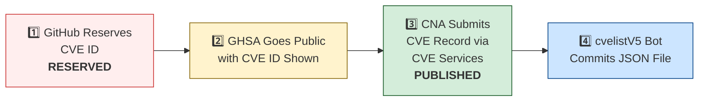

# 🛡️ OpenClaw CVE & Security Advisory Tracker

  
  
  
  
   
  
  
  
  
  

An automated tracker that continuously monitors [OpenClaw](https://github.com/openclaw/openclaw) security advisories across the GitHub Advisory Database, repo-level security advisories, and the [CVE V5 (cvelistV5)](https://github.com/CVEProject/cvelistV5) registry. Every hour it pulls the latest data, reconciles GHSA → CVE publication state, and regenerates this dashboard so you always have an up-to-date picture of the project's vulnerability landscape.

  Last updated: 2026-04-21 00:50 UTC · <a href="LICENSE">MIT License</a> · <a href="ADVISORIES.md">Full Advisory List</a> · <a href="SECURITY.md">Security Policy</a> · Data: <a href="https://github.com/CVEProject/cvelistV5">cvelistV5</a> + <a href="https://github.com/github/advisory-database">Advisory DB</a> · Updates hourly

---

  <a href="#-cves-published-in-cvelistv5-17">Published CVEs</a> ·
  <a href="#-cve-publication-pipeline">Pipeline</a> ·
  <a href="#-all-security-advisories-139">Advisories</a> ·
  <a href="#-vulnerability-categories">Categories</a> ·
  <a href="#-key-insights">Insights</a> ·
  <a href="#-project-identity">Identity</a>

---

## 🏗️ Project Identity

| Field | Value |
|-------|-------|
| **Current Name** | OpenClaw |
| **Previous Names** | Moltbot (second name), Clawdbot (original name) |
| **Repository** | [openclaw/openclaw](https://github.com/openclaw/openclaw) |
| **npm Package** | `openclaw` (formerly `clawdbot`) |
| **Author** | Peter Steinberger (steipete) |

<strong>Search terms for CVE discovery</strong>

To find all CVEs, search for: `openclaw`, `clawdbot`, `moltbot`, `clawhub`, `pkg:npm/clawdbot`, `pkg:npm/openclaw`

---

## 🚀 CVEs Published in cvelistV5 (17)

These CVEs have full records in the [CVEProject/cvelistV5](https://github.com/CVEProject/cvelistV5) repository:

| CVE ID | Severity | CVSS | Title | CWE | Published |
|--------|----------|------|-------|-----|-----------|
| [CVE-2026-28474](https://github.com/openclaw/openclaw/security/advisories/GHSA-r5h9-vjqc-hq3r) |  | 9.3 | OpenClaw Nextcloud Talk < 2026.2.6 - Allowlist Bypass via actor.name Display Name Spoofing | CWE-863 | 2026-03-05 |
| [CVE-2026-32038](https://github.com/openclaw/openclaw/security/advisories/GHSA-ww6v-v748-x7g9) |  | 9.3 | OpenClaw - Sandbox Network Isolation Bypass via docker.network=container Parameter | CWE-284 | 2026-03-19 |
| [CVE-2026-24763](https://github.com/openclaw/openclaw/security/advisories/GHSA-mc68-q9jw-2h3v) |  | 8.8 | OpenClaw/Clawdbot Docker Execution has Authenticated Command Injection via PATH Environment Variable | CWE-78 | 2026-02-02 |
| [CVE-2026-25253](https://github.com/openclaw/openclaw/security/advisories/GHSA-g8p2-7wf7-98mq) |  | 8.8 | OpenClaw/Clawdbot has 1-Click RCE via Authentication Token Exfiltration From gatewayUrl | CWE-669 | 2026-02-01 |
| [CVE-2026-32913](https://github.com/openclaw/openclaw/security/advisories/GHSA-6mgf-v5j7-45cr) |  | 8.8 | OpenClaw < 2026.3.7 - Custom Authorization Header Leakage via Cross-Origin Redirects | CWE-522 | 2026-03-23 |
| [CVE-2026-28479](https://github.com/openclaw/openclaw/security/advisories/GHSA-fh3f-q9qw-93j9) |  | 8.7 | OpenClaw < 2026.2.15 - Cache Poisoning via Deprecated SHA-1 Hash in Sandbox Configuration | CWE-327 | 2026-03-05 |
| [CVE-2026-32013](https://github.com/openclaw/openclaw/security/advisories/GHSA-fgvx-58p6-gjwc) |  | 8.7 | OpenClaw < 2026.2.25 - Symlink Traversal in agents.files Methods | CWE-59 | 2026-03-19 |
| [CVE-2026-28478](https://github.com/openclaw/openclaw/security/advisories/GHSA-q447-rj3r-2cgh) |  | 8.7 | OpenClaw affected by denial of service via unbounded webhook request body buffering | CWE-770 | 2026-03-05 |
| [CVE-2026-29609](https://github.com/openclaw/openclaw/security/advisories/GHSA-j27p-hq53-9wgc) |  | 8.7 | OpenClaw < 2026.2.14 - Denial of Service via Unbounded URL-backed Media Fetch | CWE-770 | 2026-03-05 |
| [CVE-2026-32062](https://github.com/openclaw/openclaw/security/advisories/GHSA-mfg5-7q5g-f37j) |  | 8.7 | OpenClaw 2026.2.21-2 < 2026.2.22 - Unauthenticated WebSocket Resource Exhaustion via Media Stream | CWE-770 | 2026-03-11 |
| [CVE-2026-32060](https://github.com/openclaw/openclaw/security/advisories/GHSA-r5fq-947m-xm57) |  | 8.7 | OpenClaw < 2026.2.14 - Path Traversal in apply_patch via Crafted Paths | CWE-22 | 2026-03-11 |
| [CVE-2026-32049](https://github.com/openclaw/openclaw/security/advisories/GHSA-rxxp-482v-7mrh) |  | 8.7 | OpenClaw < 2026.2.22 - Denial of Service via Inbound Media Download Byte Limit Bypass | CWE-770 | 2026-03-21 |
| [CVE-2026-32980](https://github.com/openclaw/openclaw/security/advisories/GHSA-jq3f-vjww-8rq7) |  | 8.7 | OpenClaw < 2026.3.13 - Resource Exhaustion via Unauthenticated Telegram Webhook Request | CWE-770 | 2026-03-29 |
| [CVE-2026-33573](https://github.com/openclaw/openclaw/security/advisories/GHSA-2rqg-gjgv-84jm) |  | 8.7 | OpenClaw < 2026.3.11 - Workspace Boundary Bypass via Agent RPC Parameters | CWE-668 | 2026-03-29 |
| [CVE-2026-35669](https://github.com/openclaw/openclaw/security/advisories/GHSA-qm2m-28pf-hgjw) |  | 8.7 | OpenClaw < 2026.3.25 - Privilege Escalation via Gateway Plugin HTTP Authentication Scope | CWE-648 | 2026-04-10 |
| [CVE-2026-26323](https://github.com/openclaw/openclaw/security/advisories/GHSA-m7x8-2w3w-pr42) |  | 8.6 | OpenClaw has a command injection in maintainer clawtributors updater | CWE-78 | 2026-02-19 |
| [CVE-2026-32920](https://github.com/openclaw/openclaw/security/advisories/GHSA-99qw-6mr3-36qr) |  | 8.6 | OpenClaw < 2026.3.12 - Arbitrary Code Execution via Auto-Discovery of Workspace Plugins | CWE-829 | 2026-03-31 |
| [CVE-2026-33575](https://github.com/openclaw/openclaw/security/advisories/GHSA-7h7g-x2px-94hj) |  | 8.6 | OpenClaw < 2026.3.12 - Long-lived Credential Exposure in Pairing Setup Codes | CWE-522 | 2026-03-29 |
| [CVE-2026-33579](https://github.com/openclaw/openclaw/security/advisories/GHSA-hc5h-pmr3-3497) |  | 8.6 | OpenClaw < 2026.3.28 - Privilege Escalation via Missing Caller Scope Validation in Device Pair Approval | CWE-863 | 2026-03-31 |
| [CVE-2026-35643](https://github.com/openclaw/openclaw/security/advisories/GHSA-cxmw-p77q-wchg) |  | 8.6 | OpenClaw < 2026.3.22 - Arbitrary Code Execution via Unvalidated WebView JavascriptInterface | CWE-940 | 2026-04-10 |
| [CVE-2026-28468](https://github.com/openclaw/openclaw/security/advisories/GHSA-h9g4-589h-68xv) |  | 8.5 | OpenClaw 2026.1.29-beta.1 < 2026.2.14 - Authentication Bypass in Sandbox Browser Bridge Server | CWE-306 | 2026-03-05 |
| [CVE-2026-35625](https://github.com/openclaw/openclaw/security/advisories/GHSA-fqw4-mph7-2vr8) |  | 8.5 | OpenClaw < 2026.3.25 - Privilege Escalation via Silent Local Shared-Auth Reconnect | CWE-648 | 2026-04-09 |
| [CVE-2026-41295](https://github.com/openclaw/openclaw/security/advisories/GHSA-2qrv-rc5x-2g2h) |  | 8.5 | OpenClaw: Untrusted workspace channel shadows could execute during built-in channel setup | CWE-829 | 2026-04-20 |
| [CVE-2026-28450](https://github.com/openclaw/openclaw/security/advisories/GHSA-mv9j-6xhh-g383) |  | 8.3 | OpenClaw < 2026.2.12 - Unauthenticated Profile Tampering via Nostr Plugin HTTP Endpoints | CWE-306 | 2026-03-05 |
| [CVE-2026-28393](https://github.com/openclaw/openclaw/security/advisories/GHSA-7xhj-55q9-pc3m) |  | 8.3 | OpenClaw 2.0.0-beta3 < 2026.2.14 - Arbitrary JavaScript Module Loading via Hook Transform Path Traversal | CWE-427 | 2026-03-05 |
| [CVE-2026-32004](https://github.com/openclaw/openclaw/security/advisories/GHSA-v865-p3gq-hw6m) |  | 8.3 | OpenClaw < 2026.3.2 - Authentication Bypass via Encoded Path in /api/channels Route | CWE-288 | 2026-03-19 |
| [CVE-2026-35618](https://github.com/openclaw/openclaw/security/advisories/GHSA-cg6c-q2hx-69h7) |  | 8.3 | OpenClaw < 2026.3.23 - Replay Identity Drift via Query-Only Variants in Plivo V2 Verification | CWE-294 | 2026-04-09 |
| [CVE-2026-28465](https://github.com/openclaw/openclaw/security/advisories/GHSA-3m3q-x3gj-f79x) |  | 8.2 | OpenClaw voice-call < 2026.2.3 - Webhook Verification Bypass via Forwarded Headers | CWE-345 | 2026-03-05 |
| [CVE-2026-28469](https://github.com/openclaw/openclaw/security/advisories/GHSA-rq6g-px6m-c248) |  | 8.2 | OpenClaw Google Chat shared-path webhook target ambiguity allowed cross-account policy-context misrouting | CWE-639 | 2026-03-05 |
| [CVE-2026-29613](https://github.com/openclaw/openclaw/security/advisories/GHSA-xc7w-v5x6-cc87) |  | 8.2 | OpenClaw < 2026.2.12 - Webhook Authentication Bypass via Loopback remoteAddress Trust | CWE-306 | 2026-03-05 |
| [CVE-2026-32045](https://github.com/openclaw/openclaw/security/advisories/GHSA-hff7-ccv5-52f8) |  | 8.2 | OpenClaw < 2026.2.21 - Authentication Bypass in HTTP Gateway Routes via Tokenless Tailscale Auth | CWE-290 | 2026-03-21 |
| [CVE-2026-32302](https://github.com/openclaw/openclaw/security/advisories/GHSA-5wcw-8jjv-m286) |  | 8.1 | OpenClaw: Untrusted web origins can obtain authenticated operator.admin access in trusted-proxy mode | CWE-346 | 2026-03-12 |
| [CVE-2026-25157](https://github.com/openclaw/openclaw/security/advisories/GHSA-q284-4pvr-m585) |  | 7.8 | OpenClaw/Clawdbot has OS Command Injection via Project Root Path in sshNodeCommand | CWE-78 | 2026-02-04 |
| [CVE-2026-26322](https://github.com/openclaw/openclaw/security/advisories/GHSA-g6q9-8fvw-f7rf) |  | 7.6 | OpenClaw Gateway tool allowed unrestricted gatewayUrl override | CWE-918 | 2026-02-19 |
| [CVE-2026-25474](https://github.com/openclaw/openclaw/security/advisories/GHSA-mp5h-m6qj-6292) |  | 7.5 | OpenClaw has a Telegram webhook request forgery (missing `channels.telegram.webhookSecret`) → auth bypass | CWE-345 | 2026-02-19 |
| [CVE-2026-28458](https://github.com/openclaw/openclaw/security/advisories/GHSA-mr32-vwc2-5j6h) |  | 7.4 | OpenClaw's Browser Relay /cdp websocket is missing auth which could allow cross-tab cookie access | CWE-306 | 2026-03-05 |
| [CVE-2026-32015](https://github.com/openclaw/openclaw/security/advisories/GHSA-g75x-8qqm-2vxp) |  | 7.3 | OpenClaw 2026.1.21 < 2026.2.19 - PATH Hijacking Bypass in tools.exec.safeBins Allowlist Validation | CWE-426 | 2026-03-19 |
| [CVE-2026-32055](https://github.com/openclaw/openclaw/security/advisories/GHSA-mgrq-9f93-wpp5) |  | 7.2 | OpenClaw < 2026.2.26 - Workspace Path Boundary Bypass via Non-existent Symlink | CWE-22 | 2026-03-21 |
| [CVE-2026-34512](https://github.com/openclaw/openclaw/security/advisories/GHSA-9p93-7j67-5pc2) |  | 7.2 | OpenClaw < 2026.3.25 - Improper Access Control in /sessions/:sessionKey/kill Endpoint | CWE-863 | 2026-04-09 |
| [CVE-2026-26317](https://github.com/openclaw/openclaw/security/advisories/GHSA-3fqr-4cg8-h96q) |  | 7.1 | OpenClaw affected by cross-site request forgery (CSRF) through loopback browser mutation endpoints | CWE-352 | 2026-02-19 |
| [CVE-2026-22175](https://github.com/openclaw/openclaw/security/advisories/GHSA-gwqp-86q6-w47g) |  | 7.1 | OpenClaw < 2026.2.23 - Exec Approval Bypass via Unrecognized Multiplexer Shell Wrappers | CWE-184 | 2026-03-18 |
| [CVE-2026-27522](https://github.com/openclaw/openclaw/security/advisories/GHSA-fqcm-97m6-w7rm) |  | 7.1 | OpenClaw < 2026.2.24 - Arbitrary File Read via sendAttachment and setGroupIcon Message Actions | CWE-22 | 2026-03-18 |
| [CVE-2026-32008](https://github.com/openclaw/openclaw/security/advisories/GHSA-45cg-2683-gfmq) |  | 7.1 | OpenClaw < 2026.2.21 - Arbitrary Local File Read via Browser Navigation Guard | CWE-610 | 2026-03-19 |
| [CVE-2026-32027](https://github.com/openclaw/openclaw/security/advisories/GHSA-jv6r-27ww-4gw4) |  | 7.1 | OpenClaw < 2026.2.26 - Improper Authorization via DM Pairing Store Identity Inheritance in Group Allowlist | CWE-22 | 2026-03-19 |
| [CVE-2026-32976](https://github.com/openclaw/openclaw/security/advisories/GHSA-8jhh-jcqg-mj5p) |  | 7.1 | OpenClaw < 2026.3.11 - Account-Scoped configWrites Policy Bypass via Channel Commands | CWE-639 | 2026-03-31 |
| [CVE-2026-32972](https://github.com/openclaw/openclaw/security/advisories/GHSA-vmhq-cqm9-6p7q) |  | 7.1 | OpenClaw < 2026.3.11 - Authorization Bypass in Browser Profile Management via browser.request | CWE-863 | 2026-03-29 |
| [CVE-2026-35621](https://github.com/openclaw/openclaw/security/advisories/GHSA-94pw-c6m8-p9p9) |  | 7.1 | OpenClaw < 2026.3.24 - Privilege Escalation via chat.send to Allowlist Persistence | CWE-862 | 2026-04-10 |
| [CVE-2026-35657](https://github.com/openclaw/openclaw/security/advisories/GHSA-5jvj-hxmh-6h6j) |  | 7.1 | OpenClaw < 2026.3.25 - Authorization Bypass in HTTP Session History Route | CWE-863 | 2026-04-10 |
| [CVE-2026-35636](https://github.com/openclaw/openclaw/security/advisories/GHSA-q2qc-744p-66r2) |  | 7.1 | OpenClaw 2026.3.11 < 2026.3.25 - Session Isolation Bypass via sessionId Resolution | CWE-696 | 2026-04-09 |
| [CVE-2026-35668](https://github.com/openclaw/openclaw/security/advisories/GHSA-hr5v-j9h9-xjhg) |  | 7.1 | OpenClaw < 2026.3.24 - Sandbox Media Root Bypass via Unnormalized mediaUrl and fileUrl Parameters | CWE-22 | 2026-04-10 |
| [CVE-2026-40037](https://github.com/openclaw/openclaw/security/advisories/GHSA-qx8j-g322-qj6m) |  | 7.1 | OpenClaw: `fetchWithSsrFGuard` replays unsafe request bodies across cross-origin redirects | CWE-601 | 2026-04-08 |
| [CVE-2026-41299](https://github.com/openclaw/openclaw/security/advisories/GHSA-6xg4-82hv-cp6f) |  | 7.1 | OpenClaw < 2026.3.28 - Client Identity Spoofing in chat.send Gateway Provenance Guard | CWE-807 | 2026-04-20 |
| [CVE-2026-32009](https://github.com/openclaw/openclaw/security/advisories/GHSA-5gj7-jf77-q2q2) |  | 7 | OpenClaw < 2026.2.24 - Binary Hijacking via Static Default Trusted Directories in safeBins | CWE-426 | 2026-03-19 |
| [CVE-2026-32979](https://github.com/openclaw/openclaw/security/advisories/GHSA-xf99-j42q-5w5p) |  | 7 | OpenClaw < 2026.3.11 - Unbound Interpreter and Runtime Commands Bypass in node-host Approval | CWE-367 | 2026-03-29 |
| [CVE-2026-22176](https://github.com/openclaw/openclaw/security/advisories/GHSA-pj5x-38rw-6fph) |  | 6.9 | OpenClaw < 2026.2.19 - Command Injection via Unescaped Environment Variables in Windows Scheduled Task Script Generation | CWE-78 | 2026-03-19 |
| [CVE-2026-27004](https://github.com/openclaw/openclaw/security/advisories/GHSA-6hf3-mhgc-cm65) |  | 6.9 | OpenClaw session tool visibility hardening and Telegram webhook secret fallback | CWE-209, CWE-346 | 2026-02-19 |
| [CVE-2026-27003](https://github.com/openclaw/openclaw/security/advisories/GHSA-chf7-jq6g-qrwv) |  | 6.9 | OpenClaw: Telegram bot token exposure via logs | CWE-522 | 2026-02-19 |
| [CVE-2026-28480](https://github.com/openclaw/openclaw/security/advisories/GHSA-mj5r-hh7j-4gxf) |  | 6.9 | OpenClaw Telegram allowlist authorization accepted mutable usernames | CWE-290 | 2026-03-05 |
| [CVE-2026-32924](https://github.com/openclaw/openclaw/security/advisories/GHSA-m69h-jm2f-2pv8) |  | 6.9 | OpenClaw < 2026.3.12 - Authorization Bypass via Misclassified Reaction Events in Feishu | CWE-863 | 2026-03-29 |
| [CVE-2026-35627](https://github.com/openclaw/openclaw/security/advisories/GHSA-65h8-27jh-q8wv) |  | 6.9 | OpenClaw < 2026.3.22 - Unauthenticated Cryptographic Work in Nostr Inbound DM Handling | CWE-696 | 2026-04-09 |
| [CVE-2026-35626](https://github.com/openclaw/openclaw/security/advisories/GHSA-rm59-992w-x2mv) |  | 6.9 | OpenClaw < 2026.3.22 - Unauthenticated Resource Exhaustion via Voice Call Webhook | CWE-405 | 2026-04-09 |
| [CVE-2026-35655](https://github.com/openclaw/openclaw/security/advisories/GHSA-74wf-h43j-vvmj) |  | 6.9 | OpenClaw < 2026.3.22 - Identity Spoofing via rawInput Tool in ACP Permission Resolution | CWE-807 | 2026-04-10 |
| [CVE-2026-35664](https://github.com/openclaw/openclaw/security/advisories/GHSA-77w2-crqv-cmv3) |  | 6.9 | OpenClaw < 2026.3.25 - DM Pairing Bypass via Legacy Card Callbacks | CWE-288 | 2026-04-10 |
| [CVE-2026-35633](https://github.com/openclaw/openclaw/security/advisories/GHSA-4qwc-c7g9-4xcw) |  | 6.9 | OpenClaw < 2026.3.22 - Unbounded Memory Allocation via Remote Media Error Responses | CWE-789 | 2026-04-09 |
| [CVE-2026-35661](https://github.com/openclaw/openclaw/security/advisories/GHSA-j4c9-w69r-cw33) |  | 6.9 | OpenClaw < 2026.3.25 - Telegram DM-Scoped Inline Button Callback Authorization Bypass | CWE-288 | 2026-04-10 |
| [CVE-2026-41301](https://github.com/openclaw/openclaw/security/advisories/GHSA-h43v-27wg-5mf9) |  | 6.9 | OpenClaw: Forged Nostr DMs could create pairing state before signature verification | CWE-347 | 2026-04-20 |
| [CVE-2026-41331](https://github.com/openclaw/openclaw/security/advisories/GHSA-m6fx-m8hc-572m) |  | 6.9 | OpenClaw < 2026.3.31 - Resource Consumption via Unauthorized Telegram Audio Preflight Transcription | CWE-408 | 2026-04-20 |
| [CVE-2026-29612](https://github.com/openclaw/openclaw/security/advisories/GHSA-w2cg-vxx6-5xjg) |  | 6.8 | OpenClaw < 2026.2.14 - Denial of Service via Large Base64 Media File Decoding | CWE-770 | 2026-03-05 |
| [CVE-2026-26972](https://github.com/openclaw/openclaw/security/advisories/GHSA-xwjm-j929-xq7c) |  | 6.7 | OpenClaw has a Path Traversal in Browser Download Functionality | CWE-22 | 2026-02-19 |
| [CVE-2026-28452](https://github.com/openclaw/openclaw/security/advisories/GHSA-h89v-j3x9-8wqj) |  | 6.7 | OpenClaw affected by denial of service through unguarded archive extraction allowing high expansion/resource abuse (ZIP/TAR) | CWE-770 | 2026-03-05 |
| [CVE-2026-32061](https://github.com/openclaw/openclaw/security/advisories/GHSA-56pc-6hvp-4gv4) |  | 6.7 | OpenClaw < 2026.2.17 - Arbitrary File Read via $include Directive Path Traversal | CWE-22 | 2026-03-11 |
| [CVE-2026-26328](https://github.com/openclaw/openclaw/security/advisories/GHSA-g34w-4xqq-h79m) |  | 6.5 | OpenClaw iMessage group allowlist authorization inherited DM pairing-store identities | CWE-284, CWE-863 | 2026-02-19 |
| [CVE-2026-28395](https://github.com/openclaw/openclaw/security/advisories/GHSA-qw99-grcx-4pvm) |  | 6.3 | OpenClaw 2026.1.14-1 < 2026.2.12 - Unintended Public Binding of Chrome Extension Relay via Wildcard cdpUrl | CWE-1327 | 2026-03-05 |
| [CVE-2026-28475](https://github.com/openclaw/openclaw/security/advisories/GHSA-47q7-97xp-m272) |  | 6.3 | OpenClaw < 2026.2.13 - Timing Attack via Hook Token Comparison | CWE-208 | 2026-03-05 |
| [CVE-2026-32021](https://github.com/openclaw/openclaw/security/advisories/GHSA-j4xf-96qf-rx69) |  | 6.3 | OpenClaw < 2026.2.22 - Authorization Bypass via Display Name Collision in Feishu allowFrom | CWE-863 | 2026-03-19 |
| [CVE-2026-32029](https://github.com/openclaw/openclaw/security/advisories/GHSA-2rgf-hm63-5qph) |  | 6.3 | OpenClaw < 2026.2.21 - Client IP Spoofing via X-Forwarded-For Header Parsing | CWE-345 | 2026-03-19 |
| [CVE-2026-35656](https://github.com/openclaw/openclaw/security/advisories/GHSA-844j-xrrq-wgh4) |  | 6.3 | OpenClaw < 2026.3.22 - XFF Loopback Spoofing Bypass in Canvas Authentication and Rate Limiter | CWE-290 | 2026-04-10 |
| [CVE-2026-35646](https://github.com/openclaw/openclaw/security/advisories/GHSA-mf5g-6r6f-ghhm) |  | 6.3 | OpenClaw < 2026.3.25 - Pre-Authentication Rate-Limit Bypass in Webhook Token Validation | CWE-307 | 2026-04-09 |
| [CVE-2026-41389](https://github.com/openclaw/openclaw/security/advisories/GHSA-mr34-9552-qr95) |  | 6.3 | OpenClaw 2026.4.7 < 2026.4.15 - Arbitrary File Read via Unvalidated Tool-Result Media Paths | CWE-73 | 2026-04-20 |
| [CVE-2026-22181](https://github.com/openclaw/openclaw/security/advisories/GHSA-8mvx-p2r9-r375) |  | 6.1 | OpenClaw < 2026.3.2 - DNS Pinning Bypass via Environment Proxy Configuration in web_fetch | CWE-918 | 2026-03-18 |
| [CVE-2026-32034](https://github.com/openclaw/openclaw/security/advisories/GHSA-3cvx-236h-m9fj) |  | 6.1 | OpenClaw < 2026.2.21 - Insecure Control UI Authentication over Plaintext HTTP | CWE-78 | 2026-03-19 |
| [CVE-2026-32057](https://github.com/openclaw/openclaw/security/advisories/GHSA-vvgp-4c28-m3jm) |  | 6 | OpenClaw < 2026.2.25 - Authentication Bypass via Control UI client.id Parameter | CWE-807 | 2026-03-21 |
| [CVE-2026-28481](https://github.com/openclaw/openclaw/security/advisories/GHSA-7vwx-582j-j332) |  | 5.9 | OpenClaw < 2026.2.1 - Bearer Token Leakage via MS Teams Attachment Downloader Suffix Matching | CWE-201 | 2026-03-05 |
| [CVE-2026-32054](https://github.com/openclaw/openclaw/security/advisories/GHSA-36h3-7c54-j27r) |  | 5.9 | OpenClaw < 2026.2.25 - Symlink Traversal in Browser Trace/Download Path Handling | CWE-59 | 2026-03-21 |
| [CVE-2026-40045](https://github.com/openclaw/openclaw/security/advisories/GHSA-83f3-hh45-vfw9) |  | 5.9 | OpenClaw: Android accepted cleartext remote gateway endpoints and sent stored credentials over ws:// | CWE-319 | 2026-04-20 |
| [CVE-2026-27009](https://github.com/openclaw/openclaw/security/advisories/GHSA-37gc-85xm-2ww6) |  | 5.8 | OpenClaw affected by Stored XSS in Control UI via unsanitized assistant name/avatar in inline script injection | CWE-79 | 2026-02-19 |
| [CVE-2026-32010](https://github.com/openclaw/openclaw/security/advisories/GHSA-4gc7-qcvf-38wg) |  | 5.8 | OpenClaw < 2026.2.22 - Allowlist Bypass via sort --compress-program Parameter | CWE-78 | 2026-03-19 |
| [CVE-2026-32035](https://github.com/openclaw/openclaw/security/advisories/GHSA-wpg9-4g4v-f9rc) |  | 5.8 | OpenClaw < 2026.3.2 - Missing Owner Flag Validation in Discord Voice Transcript Handler | CWE-863 | 2026-03-19 |
| [CVE-2026-32052](https://github.com/openclaw/openclaw/security/advisories/GHSA-6rcp-vxwf-3mfp) |  | 5.8 | OpenClaw < 2026.2.24 - Hidden Command Execution via Shell-Wrapper Positional argv Carriers | CWE-436 | 2026-03-21 |
| [CVE-2026-32065](https://github.com/openclaw/openclaw/security/advisories/GHSA-hwpq-rrpf-pgcq) |  | 5.7 | OpenClaw < 2026.2.25 - Approval Identity Mismatch in system.run Command Execution | CWE-436 | 2026-03-21 |
| [CVE-2026-28457](https://github.com/openclaw/openclaw/security/advisories/GHSA-xw4p-pw82-hqr7) |  | 5.6 | OpenClaw < 2026.2.14 - Path Traversal in Sandbox Skill Mirroring via Name Parameter | CWE-22 | 2026-03-05 |
| [CVE-2026-29608](https://github.com/openclaw/openclaw/security/advisories/GHSA-h3rm-6x7g-882f) |  | 5.4 | OpenClaw 2026.3.1 < 2026.3.2 - Approval Integrity Bypass via system.run argv Rewriting | CWE-88 | 2026-03-19 |
| [CVE-2026-32001](https://github.com/openclaw/openclaw/security/advisories/GHSA-rv2q-f2h5-6xmg) |  | 5.3 | OpenClaw < 2026.2.22 - Node Role Device-Identity Bypass via WebSocket Authentication | CWE-863 | 2026-03-19 |
| [CVE-2026-32921](https://github.com/openclaw/openclaw/security/advisories/GHSA-8g75-q649-6pv6) |  | 5.3 | OpenClaw < 2026.3.8 - Script Content Modification via Mutable Operand Binding in system.run | CWE-367 | 2026-03-31 |
| [CVE-2026-35642](https://github.com/openclaw/openclaw/security/advisories/GHSA-mw7w-g3mg-xqm7) |  | 5.3 | OpenClaw < 2026.3.25 - Authorization Bypass in Group Reactions via requireMention Bypass | CWE-288 | 2026-04-09 |
| [CVE-2026-41298](https://github.com/openclaw/openclaw/security/advisories/GHSA-5hff-46vh-rxmw) |  | 5.3 | OpenClaw < 2026.4.2 - Authorization Bypass in Session Termination Endpoint | CWE-862 | 2026-04-20 |
| [CVE-2026-35620](https://github.com/openclaw/openclaw/security/advisories/GHSA-vqvg-86cc-cg83) |  | 5.3 | OpenClaw < 2026.3.24 - Missing Authorization in /send and /allowlist Chat Commands | CWE-862 | 2026-04-10 |
| [CVE-2026-35659](https://github.com/openclaw/openclaw/security/advisories/GHSA-rvqr-hrcc-j9vv) |  | 5.1 | OpenClaw < 2026.3.22 - Unresolved Service Metadata Routing via Bonjour and DNS-SD Discovery | CWE-345 | 2026-04-10 |
| [CVE-2026-22180](https://github.com/openclaw/openclaw/security/advisories/GHSA-3pxq-f3cp-jmxp) |  | 4.8 | OpenClaw < 2026.3.2 - Path Confinement Bypass in Browser Output and File Write Operations | CWE-59 | 2026-03-18 |
| [CVE-2026-27576](https://github.com/openclaw/openclaw/security/advisories/GHSA-cxpw-2g23-2vgw) |  | 4.8 | OpenClaw: ACP prompt-size checks missing in local stdio bridge could reduce responsiveness with very large inputs | CWE-400 | 2026-02-21 |
| [CVE-2026-32020](https://github.com/openclaw/openclaw/security/advisories/GHSA-5ghc-98wh-gwwf) |  | 4.8 | OpenClaw < 2026.2.22 - Arbitrary File Read via Symlink Following in Static File Handler | CWE-59 | 2026-03-19 |
| [CVE-2026-41302](https://github.com/openclaw/openclaw/security/advisories/GHSA-9q7v-8mr7-g23p) |  | 4.8 | OpenClaw < 2026.3.31 - Server-Side Request Forgery via Unguarded fetch() in Marketplace Plugin Download | CWE-918 | 2026-04-20 |
| [CVE-2026-27485](https://github.com/openclaw/openclaw/security/advisories/GHSA-r6h2-5gqq-v5v6) |  | 4.6 | OpenClaw affected by Stored XSS in Control UI via unsanitized assistant name/avatar in inline script injection | CWE-61 | 2026-02-21 |
| [CVE-2026-24764](https://github.com/openclaw/openclaw/security/advisories/GHSA-782p-5fr5-7fj8) |  | 3.7 | OpenClaw has Remote Code Execution via System Prompt Injection in Slack Channel Descriptions | CWE-74, CWE-94 | 2026-02-19 |
| [CVE-2026-32040](https://github.com/openclaw/openclaw/security/advisories/GHSA-2ww6-868g-2c56) |  | 2.4 | OpenClaw < 2026.2.23 - HTML Injection via Unvalidated Image MIME Type in Data-URL Interpolation | CWE-79 | 2026-03-19 |
| [CVE-2026-34506](https://github.com/openclaw/openclaw/security/advisories/GHSA-g7cr-9h7q-4qxq) |  | 2.3 | OpenClaw < 2026.3.8 - Sender Allowlist Bypass in Microsoft Teams Plugin via Route Allowlist Configuration | CWE-863 | 2026-03-31 |
| [CVE-2026-32970](https://github.com/openclaw/openclaw/security/advisories/GHSA-qvr7-g57c-mrc7) |  | 2 | OpenClaw < 2026.3.11 - Credential Fallback Logic Bypass via Unavailable Local Auth SecretRefs | CWE-636 | 2026-03-31 |
| [CVE-2026-41330](https://github.com/openclaw/openclaw/security/advisories/GHSA-9gp8-hjxr-6f34) |  | 2 | OpenClaw < 2026.3.31 - Environment Variable Override via Host Exec Policy | CWE-453 | 2026-04-20 |

<strong>📖 Detailed CVE Analysis (click to expand)</strong>

### CVE-2026-28474 — OpenClaw Nextcloud Talk < 2026.2.6 - Allowlist Bypass via actor.name Display Name Spoofing

| Field | Detail |
|-------|--------|
| **CVSS** | 9.3 (CRITICAL) — `CVSS:4.0/AV:N/AC:L/AT:N/PR:N/UI:N/VC:H/VI:H/VA:H/SC:N/SI:N/SA:N` |
| **CWE** | CWE-863 (Incorrect Authorization) |
| **Affected** | < 2026.2.6 |
| **Vendor/Product** | OpenClaw / nextcloud-talk |
| **Advisory** | [GHSA-r5h9-vjqc-hq3r](https://github.com/openclaw/openclaw/security/advisories/GHSA-r5h9-vjqc-hq3r) |

OpenClaw's Nextcloud Talk plugin versions prior to 2026.2.6 accept equality matching on the mutable actor.name display name field for allowlist validation, allowing attackers to bypass DM and room allowlists. An attacker can change their Nextcloud display name to match an allowlisted user ID and gain unauthorized access to restricted conversations.

**References:**
- [Patch Commit #1](https://github.com/openclaw/openclaw/commit/6b4b6049b47c3329a7014509594647826669892d)
- [VulnCheck Advisory: OpenClaw Nextcloud Talk < 2026.2.6 - Allowlist Bypass via actor.name Display Name Spoofing](https://www.vulncheck.com/advisories/openclaw-nextcloud-talk-allowlist-bypass-via-actorname-display-name-spoofing)
---

### CVE-2026-32038 — OpenClaw - Sandbox Network Isolation Bypass via docker.network=container Parameter

| Field | Detail |
|-------|--------|
| **CVSS** | 9.3 (CRITICAL) — `CVSS:4.0/AV:N/AC:L/AT:N/PR:N/UI:N/VC:H/VI:H/VA:H/SC:N/SI:N/SA:N` |
| **CWE** | CWE-284 (Improper Access Control) |
| **Affected** | < 2026.2.24 |
| **Vendor/Product** | OpenClaw / OpenClaw |
| **Advisory** | [GHSA-ww6v-v748-x7g9](https://github.com/openclaw/openclaw/security/advisories/GHSA-ww6v-v748-x7g9) |

OpenClaw before 2026.2.24 contains a sandbox network isolation bypass vulnerability that allows trusted operators to join another container's network namespace. Attackers can configure the docker.network parameter with container:<id> values to reach services in target container namespaces and bypass network hardening controls.

**References:**
- [VulnCheck Advisory: OpenClaw - Sandbox Network Isolation Bypass via docker.network=container Parameter](https://www.vulncheck.com/advisories/openclaw-sandbox-network-isolation-bypass-via-docker-network-container-parameter)
---

### CVE-2026-24763 — OpenClaw/Clawdbot Docker Execution has Authenticated Command Injection via PATH Environment Variable

| Field | Detail |
|-------|--------|
| **CVSS** | 8.8 (HIGH) — `CVSS:3.1/AV:N/AC:L/PR:L/UI:N/S:U/C:H/I:H/A:H` |
| **CWE** | CWE-78 (CWE-78: Improper Neutralization of Special Elements used in an OS Command ('OS Command Injection')) |
| **Affected** | < 2026.1.29 |
| **Vendor/Product** | clawdbot / clawdbot |
| **Advisory** | [GHSA-mc68-q9jw-2h3v](https://github.com/openclaw/openclaw/security/advisories/GHSA-mc68-q9jw-2h3v) |

OpenClaw (formerly  Clawdbot) is a personal AI assistant you run on your own devices. Prior to 2026.1.29, a command injection vulnerability existed in OpenClaw’s Docker sandbox execution mechanism due to unsafe handling of the PATH environment variable when constructing shell commands. An authenticated user able to control environment variables could influence command execution within the container context. This vulnerability is fixed in 2026.1.29.

> **Naming note:** Uses old name `clawdbot/clawdbot` as vendor/product.
**References:**
- [https://github.com/openclaw/openclaw/commit/771f23d36b95ec2204cc9a0054045f5d8439ea75](https://github.com/openclaw/openclaw/commit/771f23d36b95ec2204cc9a0054045f5d8439ea75)
- [https://github.com/openclaw/openclaw/releases/tag/v2026.1.29](https://github.com/openclaw/openclaw/releases/tag/v2026.1.29)
---

### CVE-2026-25253 — OpenClaw/Clawdbot has 1-Click RCE via Authentication Token Exfiltration From gatewayUrl

| Field | Detail |
|-------|--------|
| **CVSS** | 8.8 (HIGH) — `CVSS:3.1/AV:N/AC:L/PR:N/UI:R/S:U/C:H/I:H/A:H` |
| **CWE** | CWE-669 (CWE-669 Incorrect Resource Transfer Between Spheres) |
| **Affected** | < 2026.1.29 |
| **Vendor/Product** | OpenClaw / OpenClaw |
| **Advisory** | [GHSA-g8p2-7wf7-98mq](https://github.com/openclaw/openclaw/security/advisories/GHSA-g8p2-7wf7-98mq) |

OpenClaw (aka clawdbot or Moltbot) before 2026.1.29 obtains a gatewayUrl value from a query string and automatically makes a WebSocket connection without prompting, sending a token value.

> **Naming note:** Uses all three names in description. packageURL still references `pkg:npm/clawdbot`.
**References:**
- [1-click-rce-to-steal-your-moltbot-data-and-keys](https://depthfirst.com/post/1-click-rce-to-steal-your-moltbot-data-and-keys)
- [blog](https://openclaw.ai/blog)
- [one-click-rce-moltbot](https://ethiack.com/news/blog/one-click-rce-moltbot)
- [2016913750557651228](https://x.com/0xacb/status/2016913750557651228)
---

### CVE-2026-32913 — OpenClaw < 2026.3.7 - Custom Authorization Header Leakage via Cross-Origin Redirects

| Field | Detail |
|-------|--------|
| **CVSS** | 8.8 (HIGH) — `CVSS:4.0/AV:N/AC:L/AT:N/PR:N/UI:N/VC:H/VI:L/VA:N/SC:L/SI:L/SA:N` |
| **CWE** | CWE-522 (CWE-522 Insufficiently Protected Credentials) |
| **Affected** | < 2026.3.7 |
| **Vendor/Product** | OpenClaw / OpenClaw |
| **Advisory** | [GHSA-6mgf-v5j7-45cr](https://github.com/openclaw/openclaw/security/advisories/GHSA-6mgf-v5j7-45cr) |

OpenClaw before 2026.3.7 contains an improper header validation vulnerability in fetchWithSsrFGuard that forwards custom authorization headers across cross-origin redirects. Attackers can trigger redirects to different origins to intercept sensitive headers like X-Api-Key and Private-Token intended for the original destination.

**References:**
- [Patch Commit](https://github.com/openclaw/openclaw/commit/46715371b0612a6f9114dffd1466941ac476cef5)
- [VulnCheck Advisory](https://vulncheck.com/advisories/openclaw-mar-custom-authorization-header-leakage-via-cross-origin-redirects)
---

### CVE-2026-28479 — OpenClaw < 2026.2.15 - Cache Poisoning via Deprecated SHA-1 Hash in Sandbox Configuration

| Field | Detail |
|-------|--------|
| **CVSS** | 8.7 (HIGH) — `CVSS:4.0/AV:N/AC:L/AT:N/PR:N/UI:N/VC:H/VI:N/VA:N/SC:N/SI:N/SA:N` |
| **CWE** | CWE-327 (Use of a Broken or Risky Cryptographic Algorithm) |
| **Affected** | < 2026.2.15 |
| **Vendor/Product** | OpenClaw / OpenClaw |
| **Advisory** | [GHSA-fh3f-q9qw-93j9](https://github.com/openclaw/openclaw/security/advisories/GHSA-fh3f-q9qw-93j9) |

OpenClaw versions prior to 2026.2.15 use SHA-1 to hash sandbox identifier cache keys for Docker and browser sandbox configurations, which is deprecated and vulnerable to collision attacks. An attacker can exploit SHA-1 collisions to cause cache poisoning, allowing one sandbox configuration to be misinterpreted as another and enabling unsafe sandbox state reuse.

**References:**
- [Patch Commit](https://github.com/openclaw/openclaw/commit/559c8d9930eebb5356506ff1a8cd3dbaec92be77)
- [VulnCheck Advisory: OpenClaw < 2026.2.15 - Cache Poisoning via Deprecated SHA-1 Hash in Sandbox Configuration](https://www.vulncheck.com/advisories/openclaw-cache-poisoning-via-deprecated-sha-hash-in-sandbox-configuration)
---

### CVE-2026-32013 — OpenClaw < 2026.2.25 - Symlink Traversal in agents.files Methods

| Field | Detail |
|-------|--------|
| **CVSS** | 8.7 (HIGH) — `CVSS:4.0/AV:N/AC:L/AT:N/PR:L/UI:N/VC:H/VI:H/VA:H/SC:N/SI:N/SA:N` |
| **CWE** | CWE-59 (CWE-59: Improper Link Resolution Before File Access ('Link Following')) |
| **Affected** | < 2026.2.25 |
| **Vendor/Product** | OpenClaw / OpenClaw |
| **Advisory** | [GHSA-fgvx-58p6-gjwc](https://github.com/openclaw/openclaw/security/advisories/GHSA-fgvx-58p6-gjwc) |

OpenClaw versions prior to 2026.2.25 contain a symlink traversal vulnerability in the agents.files.get and agents.files.set methods that allows reading and writing files outside the agent workspace. Attackers can exploit symlinked allowlisted files to access arbitrary host files within gateway process permissions, potentially enabling code execution through file overwrite attacks.

**References:**
- [Patch Commit](https://github.com/openclaw/openclaw/commit/125f4071bcbc0de32e769940d07967db47f09d3d)
- [VulnCheck Advisory: OpenClaw < 2026.2.25 - Symlink Traversal in agents.files Methods](https://www.vulncheck.com/advisories/openclaw-symlink-traversal-in-agents-files-methods)
---

### CVE-2026-28478 — OpenClaw affected by denial of service via unbounded webhook request body buffering

| Field | Detail |
|-------|--------|
| **CVSS** | 8.7 (HIGH) — `CVSS:4.0/AV:N/AC:L/AT:N/PR:N/UI:N/VC:N/VI:N/VA:H/SC:N/SI:N/SA:N` |
| **CWE** | CWE-770 (Allocation of Resources Without Limits or Throttling) |
| **Affected** | < 2026.2.13 |
| **Vendor/Product** | OpenClaw / OpenClaw |
| **Advisory** | [GHSA-q447-rj3r-2cgh](https://github.com/openclaw/openclaw/security/advisories/GHSA-q447-rj3r-2cgh) |

OpenClaw versions prior to 2026.2.13 contain a denial of service vulnerability in webhook handlers that buffer request bodies without strict byte or time limits. Remote unauthenticated attackers can send oversized JSON payloads or slow uploads to webhook endpoints causing memory pressure and availability degradation.

**References:**
- [Patch Commit](https://github.com/openclaw/openclaw/commit/3cbcba10cf30c2ffb898f0d8c7dfb929f15f8930)
- [VulnCheck Advisory: OpenClaw < 2026.2.13 - Denial of Service via Unbounded Webhook Request Body Buffering](https://www.vulncheck.com/advisories/openclaw-denial-of-service-via-unbounded-webhook-request-body-buffering)
---

### CVE-2026-29609 — OpenClaw < 2026.2.14 - Denial of Service via Unbounded URL-backed Media Fetch

| Field | Detail |
|-------|--------|
| **CVSS** | 8.7 (HIGH) — `CVSS:4.0/AV:N/AC:L/AT:N/PR:N/UI:N/VC:N/VI:N/VA:H/SC:N/SI:N/SA:N` |
| **CWE** | CWE-770 (Allocation of Resources Without Limits or Throttling) |
| **Affected** | < 2026.2.14 |
| **Vendor/Product** | OpenClaw / OpenClaw |
| **Advisory** | [GHSA-j27p-hq53-9wgc](https://github.com/openclaw/openclaw/security/advisories/GHSA-j27p-hq53-9wgc) |

OpenClaw versions prior to 2026.2.14 contain a denial of service vulnerability in the fetchWithGuard function that allocates entire response payloads in memory before enforcing maxBytes limits. Remote attackers can trigger memory exhaustion by serving oversized responses without content-length headers to cause availability loss.

**References:**
- [Patch Commit](https://github.com/openclaw/openclaw/commit/00a08908892d1743d1fc52e5cbd9499dd5da2fe0)
- [VulnCheck Advisory: OpenClaw < 2026.2.14 - Denial of Service via Unbounded URL-backed Media Fetch](https://www.vulncheck.com/advisories/openclaw-denial-of-service-via-unbounded-url-backed-media-fetch)
---

### CVE-2026-32062 — OpenClaw 2026.2.21-2 < 2026.2.22 - Unauthenticated WebSocket Resource Exhaustion via Media Stream

| Field | Detail |
|-------|--------|
| **CVSS** | 8.7 (HIGH) — `CVSS:4.0/AV:N/AC:L/AT:N/PR:N/UI:N/VC:N/VI:N/VA:H/SC:N/SI:N/SA:N` |
| **CWE** | CWE-770 (Allocation of Resources Without Limits or Throttling) |
| **Affected** | < 2026.2.22 |
| **Vendor/Product** | openclaw / voice-call |
| **Advisory** | [GHSA-mfg5-7q5g-f37j](https://github.com/openclaw/openclaw/security/advisories/GHSA-mfg5-7q5g-f37j) |

OpenClaw versions2026.2.21-2 prior to 2026.2.22 and @openclaw/voice-call versions 2026.2.21 prior to 2026.2.22 accept media-stream WebSocket upgrades before stream validation, allowing unauthenticated clients to establish connections. Remote attackers can hold idle pre-authenticated sockets open to consume connection resources and degrade service availability for legitimate streams.

**References:**
- [Patch Commit](https://github.com/openclaw/openclaw/commit/1d8968c8a821ff1a05c294a1846b3bcb6f343794)
- [VulnCheck Advisory: OpenClaw 2026.2.21-2 < 2026.2.22 - Unauthenticated WebSocket Resource Exhaustion via Media Stream](https://www.vulncheck.com/advisories/openclaw-unauthenticated-websocket-resource-exhaustion-via-media-stream)
---

### CVE-2026-32060 — OpenClaw < 2026.2.14 - Path Traversal in apply_patch via Crafted Paths

| Field | Detail |
|-------|--------|
| **CVSS** | 8.7 (HIGH) — `CVSS:4.0/AV:N/AC:L/AT:N/PR:L/UI:N/VC:H/VI:H/VA:H/SC:N/SI:N/SA:N` |
| **CWE** | CWE-22 (Improper Limitation of a Pathname to a Restricted Directory ('Path Traversal')) |
| **Affected** | < 2026.2.14 |
| **Vendor/Product** | openclaw / openclaw |
| **Advisory** | [GHSA-r5fq-947m-xm57](https://github.com/openclaw/openclaw/security/advisories/GHSA-r5fq-947m-xm57) |

OpenClaw versions prior to 2026.2.14 contain a path traversal vulnerability in apply_patch that allows attackers to write or delete files outside the configured workspace directory. When apply_patch is enabled without filesystem sandbox containment, attackers can exploit crafted paths including directory traversal sequences or absolute paths to escape workspace boundaries and modify arbitrary files.

**References:**
- [Patch Commit](https://github.com/openclaw/openclaw/commit/5544646a09c0121fca7d7093812dc2de8437c7f1)
- [VulnCheck Advisory: OpenClaw < 2026.2.14 - Path Traversal in apply_patch via Crafted Paths](https://www.vulncheck.com/advisories/openclaw-path-traversal-in-apply-patch-via-crafted-paths)
---

### CVE-2026-32049 — OpenClaw < 2026.2.22 - Denial of Service via Inbound Media Download Byte Limit Bypass

| Field | Detail |
|-------|--------|
| **CVSS** | 8.7 (HIGH) — `CVSS:4.0/AV:N/AC:L/AT:N/PR:N/UI:N/VC:N/VI:N/VA:H/SC:N/SI:N/SA:N` |
| **CWE** | CWE-770 (CWE-770: Allocation of Resources Without Limits or Throttling) |
| **Affected** | < 2026.2.22 |
| **Vendor/Product** | OpenClaw / OpenClaw |
| **Advisory** | [GHSA-rxxp-482v-7mrh](https://github.com/openclaw/openclaw/security/advisories/GHSA-rxxp-482v-7mrh) |

OpenClaw versions prior to 2026.2.22 fail to consistently enforce configured inbound media byte limits before buffering remote media across multiple channel ingestion paths. Remote attackers can send oversized media payloads to trigger elevated memory usage and potential process instability.

**References:**
- [Patch Commit](https://github.com/openclaw/openclaw/commit/73d93dee64127a26f1acd09d0403b794cdeb4f5c)
- [VulnCheck Advisory: OpenClaw < 2026.2.22 - Denial of Service via Inbound Media Download Byte Limit Bypass](https://www.vulncheck.com/advisories/openclaw-denial-of-service-via-inbound-media-download-byte-limit-bypass)
---

### CVE-2026-32980 — OpenClaw < 2026.3.13 - Resource Exhaustion via Unauthenticated Telegram Webhook Request

| Field | Detail |
|-------|--------|
| **CVSS** | 8.7 (HIGH) — `CVSS:4.0/AV:N/AC:L/AT:N/PR:N/UI:N/VC:N/VI:N/VA:H/SC:N/SI:N/SA:N` |
| **CWE** | CWE-770 (Allocation of Resources Without Limits or Throttling) |
| **Affected** | < 2026.3.13 |
| **Vendor/Product** | OpenClaw / OpenClaw |
| **Advisory** | [GHSA-jq3f-vjww-8rq7](https://github.com/openclaw/openclaw/security/advisories/GHSA-jq3f-vjww-8rq7) |

OpenClaw before 2026.3.13 reads and buffers Telegram webhook request bodies before validating the x-telegram-bot-api-secret-token header, allowing unauthenticated attackers to exhaust server resources. Attackers can send POST requests to the webhook endpoint to force memory consumption, socket time, and JSON parsing work before authentication validation occurs.

**References:**
- [Patch Commit](https://github.com/openclaw/openclaw/commit/7e49e98f79073b11134beac27fdff547ba5a4a02)
- [VulnCheck Advisory: OpenClaw < 2026.3.13 - Resource Exhaustion via Unauthenticated Telegram Webhook Request](https://www.vulncheck.com/advisories/openclaw-resource-exhaustion-via-unauthenticated-telegram-webhook-request)
---

### CVE-2026-33573 — OpenClaw < 2026.3.11 - Workspace Boundary Bypass via Agent RPC Parameters

| Field | Detail |
|-------|--------|
| **CVSS** | 8.7 (HIGH) — `CVSS:4.0/AV:N/AC:L/AT:N/PR:L/UI:N/VC:H/VI:H/VA:H/SC:N/SI:N/SA:N` |
| **CWE** | CWE-668 (Exposure of Resource to Wrong Sphere) |
| **Affected** | < 2026.3.11 |
| **Vendor/Product** | OpenClaw / OpenClaw |
| **Advisory** | [GHSA-2rqg-gjgv-84jm](https://github.com/openclaw/openclaw/security/advisories/GHSA-2rqg-gjgv-84jm) |

OpenClaw before 2026.3.11 contains an authorization bypass vulnerability in the gateway agent RPC that allows authenticated operators with operator.write permission to override workspace boundaries by supplying attacker-controlled spawnedBy and workspaceDir values. Remote operators can escape the configured workspace boundary and execute arbitrary file and exec operations from any process-accessible directory.

**References:**
- [VulnCheck Advisory: OpenClaw < 2026.3.11 - Workspace Boundary Bypass via Agent RPC Parameters](https://www.vulncheck.com/advisories/openclaw-workspace-boundary-bypass-via-agent-rpc-parameters)
---

### CVE-2026-35669 — OpenClaw < 2026.3.25 - Privilege Escalation via Gateway Plugin HTTP Authentication Scope

| Field | Detail |
|-------|--------|
| **CVSS** | 8.7 (HIGH) — `CVSS:4.0/AV:N/AC:L/AT:N/PR:L/UI:N/VC:H/VI:H/VA:H/SC:N/SI:N/SA:N` |
| **CWE** | CWE-648 (CWE-648: Incorrect Use of Privileged APIs) |
| **Affected** | < 2026.3.25 |
| **Vendor/Product** | OpenClaw / OpenClaw |
| **Advisory** | [GHSA-qm2m-28pf-hgjw](https://github.com/openclaw/openclaw/security/advisories/GHSA-qm2m-28pf-hgjw) |

OpenClaw before 2026.3.25 contains a privilege escalation vulnerability in gateway-authenticated plugin HTTP routes that incorrectly mint operator.admin runtime scope regardless of caller-granted scopes. Attackers can exploit this scope boundary bypass to gain elevated privileges and perform unauthorized administrative actions.

**References:**
- [Patch Commit](https://github.com/openclaw/openclaw/commit/ec2dbcff9afd8a52e00de054b506c91726d9fbbe)
- [VulnCheck Advisory: OpenClaw < 2026.3.25 - Privilege Escalation via Gateway Plugin HTTP Authentication Scope](https://www.vulncheck.com/advisories/openclaw-privilege-escalation-via-gateway-plugin-http-authentication-scope)
---

### CVE-2026-26323 — OpenClaw has a command injection in maintainer clawtributors updater

| Field | Detail |
|-------|--------|
| **CVSS** | 8.6 (HIGH) — `CVSS:4.0/AV:N/AC:L/AT:N/PR:N/UI:P/VC:H/VI:H/VA:N/SC:N/SI:N/SA:N` |
| **CWE** | CWE-78 (CWE-78: Improper Neutralization of Special Elements used in an OS Command ('OS Command Injection')) |
| **Affected** | < >= 2026.1.8, < 2026.2.14 |
| **Vendor/Product** | openclaw / openclaw |
| **Advisory** | [GHSA-m7x8-2w3w-pr42](https://github.com/openclaw/openclaw/security/advisories/GHSA-m7x8-2w3w-pr42) |

OpenClaw is a personal AI assistant. Versions 2026.1.8 through 2026.2.13 have a command injection in the maintainer/dev script `scripts/update-clawtributors.ts`. The issue affects contributors/maintainers (or CI) who run `bun scripts/update-clawtributors.ts` in a source checkout that contains a malicious commit author email (e.g. crafted `@users[.]noreply[.]github[.]com` values). Normal CLI usage is not affected (`npm i -g openclaw`): this script is not part of the shipped CLI and is not executed during routine operation. The script derived a GitHub login from `git log` author metadata and interpolated it into a shell command (via `execSync`). A malicious commit record could inject shell metacharacters and execute arbitrary commands when the script is run. Version 2026.2.14 contains a patch.

**References:**
- [https://github.com/openclaw/openclaw/commit/a429380e337152746031d290432a4b93aa553d55](https://github.com/openclaw/openclaw/commit/a429380e337152746031d290432a4b93aa553d55)
- [https://github.com/openclaw/openclaw/releases/tag/v2026.2.14](https://github.com/openclaw/openclaw/releases/tag/v2026.2.14)
---

### CVE-2026-32920 — OpenClaw < 2026.3.12 - Arbitrary Code Execution via Auto-Discovery of Workspace Plugins

| Field | Detail |
|-------|--------|
| **CVSS** | 8.6 (HIGH) — `CVSS:4.0/AV:L/AC:L/AT:N/PR:N/UI:N/VC:H/VI:H/VA:H/SC:N/SI:N/SA:N` |
| **CWE** | CWE-829 (Inclusion of Functionality from Untrusted Control Sphere) |
| **Affected** | < 2026.3.12 |
| **Vendor/Product** | OpenClaw / OpenClaw |
| **Advisory** | [GHSA-99qw-6mr3-36qr](https://github.com/openclaw/openclaw/security/advisories/GHSA-99qw-6mr3-36qr) |

OpenClaw before 2026.3.12 automatically discovers and loads plugins from .OpenClaw/extensions/ without explicit trust verification, allowing arbitrary code execution. Attackers can execute malicious code by including crafted workspace plugins in cloned repositories that execute when users run OpenClaw from the directory.

**References:**
- [VulnCheck Advisory: OpenClaw < 2026.3.12 - Arbitrary Code Execution via Auto-Discovery of Workspace Plugins](https://www.vulncheck.com/advisories/openclaw-arbitrary-code-execution-via-auto-discovery-of-workspace-plugins)
---

### CVE-2026-33575 — OpenClaw < 2026.3.12 - Long-lived Credential Exposure in Pairing Setup Codes

| Field | Detail |
|-------|--------|
| **CVSS** | 8.6 (HIGH) — `CVSS:4.0/AV:N/AC:L/AT:N/PR:N/UI:A/VC:H/VI:H/VA:H/SC:N/SI:N/SA:N` |
| **CWE** | CWE-522 (Insufficiently Protected Credentials) |
| **Affected** | < 2026.3.12 |
| **Vendor/Product** | OpenClaw / OpenClaw |
| **Advisory** | [GHSA-7h7g-x2px-94hj](https://github.com/openclaw/openclaw/security/advisories/GHSA-7h7g-x2px-94hj) |

OpenClaw before 2026.3.12 embeds long-lived shared gateway credentials directly in pairing setup codes generated by /pair endpoint and OpenClaw qr command. Attackers with access to leaked setup codes from chat history, logs, or screenshots can recover and reuse the shared gateway credential outside the intended one-time pairing flow.

**References:**
- [VulnCheck Advisory: OpenClaw < 2026.3.12 - Long-lived Credential Exposure in Pairing Setup Codes](https://www.vulncheck.com/advisories/openclaw-long-lived-credential-exposure-in-pairing-setup-codes)
---

### CVE-2026-33579 — OpenClaw < 2026.3.28 - Privilege Escalation via Missing Caller Scope Validation in Device Pair Approval

| Field | Detail |
|-------|--------|
| **CVSS** | 8.6 (HIGH) — `CVSS:4.0/AV:N/AC:L/AT:N/PR:L/UI:N/VC:H/VI:H/VA:N/SC:N/SI:N/SA:N` |
| **CWE** | CWE-863 (CWE-863 Incorrect Authorization) |
| **Affected** | < 2026.3.28 |
| **Vendor/Product** | OpenClaw / OpenClaw |
| **Advisory** | [GHSA-hc5h-pmr3-3497](https://github.com/openclaw/openclaw/security/advisories/GHSA-hc5h-pmr3-3497) |

OpenClaw before 2026.3.28 contains a privilege escalation vulnerability in the /pair approve command path that fails to forward caller scopes into the core approval check. A caller with pairing privileges but without admin privileges can approve pending device requests asking for broader scopes including admin access by exploiting the missing scope validation in extensions/device-pair/index.ts and src/infra/device-pairing.ts.

**References:**
- [Patch Commit](https://github.com/openclaw/openclaw/commit/e403decb6e20091b5402780a7ccd2085f98aa3cd)
- [VulnCheck Advisory: OpenClaw < 2026.3.28 - Privilege Escalation via Missing Caller Scope Validation in Device Pair Approval](https://www.vulncheck.com/advisories/openclaw-privilege-escalation-via-missing-caller-scope-validation-in-device-pair-approval)
---

### CVE-2026-35643 — OpenClaw < 2026.3.22 - Arbitrary Code Execution via Unvalidated WebView JavascriptInterface

| Field | Detail |
|-------|--------|
| **CVSS** | 8.6 (HIGH) — `CVSS:4.0/AV:N/AC:L/AT:N/PR:N/UI:A/VC:H/VI:H/VA:H/SC:N/SI:N/SA:N` |
| **CWE** | CWE-940 (CWE-940: Improper Verification of Source of a Communication Channel) |
| **Affected** | < 2026.3.22 |
| **Vendor/Product** | OpenClaw / OpenClaw |
| **Advisory** | [GHSA-cxmw-p77q-wchg](https://github.com/openclaw/openclaw/security/advisories/GHSA-cxmw-p77q-wchg) |

OpenClaw before 2026.3.22 contains an unvalidated WebView JavascriptInterface vulnerability allowing attackers to inject arbitrary instructions. Untrusted pages can invoke the canvas bridge to execute malicious code within the Android application context.

**References:**
- [Patch Commit #1](https://github.com/openclaw/openclaw/commit/630f1479c44f78484dfa21bb407cbe6f171dac87)
- [Patch Commit #2](https://github.com/openclaw/openclaw/commit/8b02ef133275be96d8aac2283100016c8a7f32e5)
- [VulnCheck Advisory: OpenClaw < 2026.3.22 - Arbitrary Code Execution via Unvalidated WebView JavascriptInterface](https://www.vulncheck.com/advisories/openclaw-arbitrary-code-execution-via-unvalidated-webview-javascriptinterface)
---

### CVE-2026-28468 — OpenClaw 2026.1.29-beta.1 < 2026.2.14 - Authentication Bypass in Sandbox Browser Bridge Server

| Field | Detail |
|-------|--------|
| **CVSS** | 8.5 (HIGH) — `CVSS:4.0/AV:L/AC:L/AT:N/PR:N/UI:N/VC:H/VI:H/VA:N/SC:N/SI:N/SA:N` |
| **CWE** | CWE-306 (Missing Authentication for Critical Function) |
| **Affected** | < 2026.2.14 |
| **Vendor/Product** | OpenClaw / OpenClaw |
| **Advisory** | [GHSA-h9g4-589h-68xv](https://github.com/openclaw/openclaw/security/advisories/GHSA-h9g4-589h-68xv) |

OpenClaw versions 2026.1.29-beta.1 prior to 2026.2.14 contain a vulnerability in the sandbox browser bridge server in which it accepts requests without requiring gateway authentication, allowing local attackers to access browser control endpoints. A local attacker can enumerate tabs, retrieve WebSocket URLs, execute JavaScript, and exfiltrate cookies and session data from authenticated browser contexts.

**References:**
- [Patch Commit #1](https://github.com/openclaw/openclaw/commit/4711a943e30bc58016247152ba06472dab09d0b0)
- [Patch Commit #2](https://github.com/openclaw/openclaw/commit/6dd6bce997c48752134f2d6ed89b27de01ced7e3)
- [Patch Commit #3](https://github.com/openclaw/openclaw/commit/cd84885a4ac78eadb7bf321aae98db9519426d67)
- [VulnCheck Advisory: OpenClaw 2026.1.29-beta.1 < 2026.2.14 - Authentication Bypass in Sandbox Browser Bridge Server](https://www.vulncheck.com/advisories/openclaw-beta-authentication-bypass-in-sandbox-browser-bridge-server)
---

### CVE-2026-35625 — OpenClaw < 2026.3.25 - Privilege Escalation via Silent Local Shared-Auth Reconnect

| Field | Detail |
|-------|--------|
| **CVSS** | 8.5 (HIGH) — `CVSS:4.0/AV:L/AC:L/AT:N/PR:L/UI:N/VC:H/VI:H/VA:H/SC:N/SI:N/SA:N` |
| **CWE** | CWE-648 (CWE-648: Incorrect Use of Privileged APIs) |
| **Affected** | < 2026.3.25 |
| **Vendor/Product** | OpenClaw / OpenClaw |
| **Advisory** | [GHSA-fqw4-mph7-2vr8](https://github.com/openclaw/openclaw/security/advisories/GHSA-fqw4-mph7-2vr8) |

OpenClaw before 2026.3.25 contains a privilege escalation vulnerability where silent local shared-auth reconnects auto-approve scope-upgrade requests, widening paired device permissions from operator.read to operator.admin. Attackers can exploit this by triggering local reconnection to silently escalate privileges and achieve remote code execution on the node.

**References:**
- [Patch Commit](https://github.com/openclaw/openclaw/commit/81ebc7e0344fd19c85778e883bad45e2da972229)
- [VulnCheck Advisory: OpenClaw < 2026.3.25 - Privilege Escalation via Silent Local Shared-Auth Reconnect](https://www.vulncheck.com/advisories/openclaw-privilege-escalation-via-silent-local-shared-auth-reconnect)
---

### CVE-2026-41295 — OpenClaw: Untrusted workspace channel shadows could execute during built-in channel setup

| Field | Detail |
|-------|--------|
| **CVSS** | 8.5 (HIGH) — `CVSS:4.0/AV:L/AC:L/AT:N/PR:N/UI:P/VC:H/VI:H/VA:H/SC:N/SI:N/SA:N` |
| **CWE** | CWE-829 (CWE-829: Inclusion of Functionality from Untrusted Control Sphere) |
| **Affected** | < 2026.4.2 |
| **Vendor/Product** | OpenClaw / OpenClaw |
| **Advisory** | [GHSA-2qrv-rc5x-2g2h](https://github.com/openclaw/openclaw/security/advisories/GHSA-2qrv-rc5x-2g2h) |

OpenClaw before 2026.4.2 contains an improper trust boundary vulnerability allowing untrusted workspace channel shadows to execute during built-in channel setup and login. Attackers can clone a workspace with a malicious plugin claiming a bundled channel id to achieve unintended in-process code execution before the plugin is explicitly trusted.

**References:**
- [Patch Commit](https://github.com/openclaw/openclaw/commit/53c29df2a9eb242a70d0ff29f3d1e67c8d6801f0)
- [VulnCheck Advisory: OpenClaw < 2026.4.2 - Untrusted Workspace Channel Shadow Code Execution during Built-in Channel Setup](https://www.vulncheck.com/advisories/openclaw-untrusted-workspace-channel-shadow-code-execution-during-built-in-channel-setup)
---

### CVE-2026-28450 — OpenClaw < 2026.2.12 - Unauthenticated Profile Tampering via Nostr Plugin HTTP Endpoints

| Field | Detail |
|-------|--------|
| **CVSS** | 8.3 (HIGH) — `CVSS:4.0/AV:N/AC:L/AT:P/PR:N/UI:N/VC:L/VI:H/VA:N/SC:N/SI:N/SA:N` |
| **CWE** | CWE-306 (Missing Authentication for Critical Function) |
| **Affected** | < 2026.2.12 |
| **Vendor/Product** | OpenClaw / OpenClaw |
| **Advisory** | [GHSA-mv9j-6xhh-g383](https://github.com/openclaw/openclaw/security/advisories/GHSA-mv9j-6xhh-g383) |

OpenClaw versions prior to 2026.2.12 with the optional Nostr plugin enabled expose unauthenticated HTTP endpoints at /api/channels/nostr/:accountId/profile and /api/channels/nostr/:accountId/profile/import that allow reading and modifying Nostr profiles without gateway authentication. Remote attackers can exploit these endpoints to read sensitive profile data, modify Nostr profiles, persist malicious changes to gateway configuration, and publish signed Nostr events using the bot's private key when the gateway HTTP port is accessible beyond localhost.

**References:**
- [Patch Commit](https://github.com/openclaw/openclaw/commit/647d929c9d0fd114249230d939a5cb3b36dc70e7)
- [VulnCheck Advisory: OpenClaw < 2026.2.12 - Unauthenticated Profile Tampering via Nostr Plugin HTTP Endpoints](https://www.vulncheck.com/advisories/openclaw-unauthenticated-profile-tampering-via-nostr-plugin-http-endpoints)
---

### CVE-2026-28393 — OpenClaw 2.0.0-beta3 < 2026.2.14 - Arbitrary JavaScript Module Loading via Hook Transform Path Traversal

| Field | Detail |
|-------|--------|
| **CVSS** | 8.3 (HIGH) — `CVSS:4.0/AV:L/AC:L/AT:N/PR:H/UI:N/VC:H/VI:H/VA:N/SC:N/SI:N/SA:N` |
| **CWE** | CWE-427 (Uncontrolled Search Path Element) |
| **Affected** | < 2026.2.14 |
| **Vendor/Product** | OpenClaw / OpenClaw |
| **Advisory** | [GHSA-7xhj-55q9-pc3m](https://github.com/openclaw/openclaw/security/advisories/GHSA-7xhj-55q9-pc3m) |

OpenClaw versions 2.0.0-beta3 prior to 2026.2.14 contain a path traversal vulnerability in hook transform module loading that allows arbitrary JavaScript execution. The hooks.mappings[].transform.module parameter accepts absolute paths and traversal sequences, enabling attackers with configuration write access to load and execute malicious modules with gateway process privileges.

**References:**
- [Patch Commit #1](https://github.com/openclaw/openclaw/commit/a0361b8ba959e8506dc79d638b6e6a00d12887e4)
- [Patch Commit #2](https://github.com/openclaw/openclaw/commit/18e8bd68c5015a894f999c6d5e6e32468965bfb5)
- [VulnCheck Advisory: OpenClaw 2.0.0-beta3 < 2026.2.14 - Arbitrary JavaScript Module Loading via Hook Transform Path Traversal](https://www.vulncheck.com/advisories/openclaw-beta-arbitrary-javascript-module-loading-via-hook-transform-path-traversal)
---

### CVE-2026-32004 — OpenClaw < 2026.3.2 - Authentication Bypass via Encoded Path in /api/channels Route

| Field | Detail |
|-------|--------|
| **CVSS** | 8.3 (HIGH) — `CVSS:4.0/AV:N/AC:H/AT:N/PR:N/UI:N/VC:L/VI:H/VA:N/SC:N/SI:N/SA:N` |
| **CWE** | CWE-288 (CWE-288: Authentication Bypass Using an Alternate Path or Channel) |
| **Affected** | < 2026.3.2 |
| **Vendor/Product** | OpenClaw / OpenClaw |
| **Advisory** | [GHSA-v865-p3gq-hw6m](https://github.com/openclaw/openclaw/security/advisories/GHSA-v865-p3gq-hw6m) |

OpenClaw versions prior to 2026.3.2 contain an authentication bypass vulnerability in the /api/channels route classification due to canonicalization depth mismatch between auth-path classification and route-path canonicalization. Attackers can bypass plugin route authentication checks by submitting deeply encoded slash variants such as multi-encoded %2f to access protected /api/channels endpoints.

**References:**
- [Patch Commit #1](https://github.com/openclaw/openclaw/commit/93b07240257919f770d1e263e1f22753937b80ea)
- [Patch Commit #2](https://github.com/openclaw/openclaw/commit/2fd8264ab03bd178e62a5f0c50d1c8556c17f12d)
- [Patch Commit #3](https://github.com/openclaw/openclaw/commit/d74bc257d8432f17e50b23ae713d7e0623a1fe0f)
- [Patch Commit #4](https://github.com/openclaw/openclaw/commit/7a7eee920a176a0043398c6b37bf4cc6eb983eeb)
- [VulnCheck Advisory: OpenClaw < 2026.3.2 - Authentication Bypass via Encoded Path in /api/channels Route](https://www.vulncheck.com/advisories/openclaw-authentication-bypass-via-encoded-path-in-api-channels-route)
---

### CVE-2026-35618 — OpenClaw < 2026.3.23 - Replay Identity Drift via Query-Only Variants in Plivo V2 Verification

| Field | Detail |
|-------|--------|
| **CVSS** | 8.3 (HIGH) — `CVSS:4.0/AV:N/AC:H/AT:N/PR:N/UI:N/VC:L/VI:H/VA:N/SC:N/SI:N/SA:N` |
| **CWE** | CWE-294 (CWE-294 Authentication Bypass by Capture-replay) |
| **Affected** | < 2026.3.23 |
| **Vendor/Product** | OpenClaw / OpenClaw |
| **Advisory** | [GHSA-cg6c-q2hx-69h7](https://github.com/openclaw/openclaw/security/advisories/GHSA-cg6c-q2hx-69h7) |

OpenClaw before 2026.3.23 contains a replay identity vulnerability in Plivo V2 signature verification that allows attackers to bypass replay protection by modifying query parameters. The verification path derives replay keys from the full URL including query strings instead of the canonicalized base URL, enabling attackers to mint new verified request keys through unsigned query-only changes to signed requests.

**References:**
- [Patch Commit #1](https://github.com/openclaw/openclaw/commit/630f1479c44f78484dfa21bb407cbe6f171dac87)
- [Patch Commit #2](https://github.com/openclaw/openclaw/commit/b0ce53a79cf63834660270513e26d921899b4e5b)
- [VulnCheck Advisory: OpenClaw < 2026.3.23 - Replay Identity Drift via Query-Only Variants in Plivo V2 Verification](https://www.vulncheck.com/advisories/openclaw-replay-identity-drift-via-query-only-variants-in-plivo-v2-verification)
---

### CVE-2026-28465 — OpenClaw voice-call < 2026.2.3 - Webhook Verification Bypass via Forwarded Headers

| Field | Detail |
|-------|--------|
| **CVSS** | 8.2 (HIGH) — `CVSS:4.0/AV:N/AC:H/AT:P/PR:N/UI:N/VC:N/VI:H/VA:N/SC:N/SI:N/SA:N` |
| **CWE** | CWE-345 (Insufficient Verification of Data Authenticity) |
| **Affected** | < 2026.2.3 |
| **Vendor/Product** | OpenClaw / voice-call |
| **Advisory** | [GHSA-3m3q-x3gj-f79x](https://github.com/openclaw/openclaw/security/advisories/GHSA-3m3q-x3gj-f79x) |

OpenClaw's voice-call plugin versions before 2026.2.3 contain an improper authentication vulnerability in webhook verification that allows remote attackers to bypass verification by supplying untrusted forwarded headers. Attackers can spoof webhook events by manipulating Forwarded or X-Forwarded-* headers in reverse-proxy configurations that implicitly trust these headers.

**References:**
- [Patch Commit](https://github.com/openclaw/openclaw/commit/a749db9820eb6d6224032a5a34223d286d2dcc2f)
- [VulnCheck Advisory: OpenClaw voice-call < 2026.2.3 - Webhook Verification Bypass via Forwarded Headers](https://www.vulncheck.com/advisories/openclaw-voice-call-webhook-verification-bypass-via-forwarded-headers)
---

### CVE-2026-28469 — OpenClaw Google Chat shared-path webhook target ambiguity allowed cross-account policy-context misrouting

| Field | Detail |
|-------|--------|
| **CVSS** | 8.2 (HIGH) — `CVSS:4.0/AV:N/AC:L/AT:P/PR:N/UI:N/VC:N/VI:H/VA:N/SC:N/SI:N/SA:N` |
| **CWE** | CWE-639 (Authorization Bypass Through User-Controlled Key) |
| **Affected** | < 2026.2.14 |
| **Vendor/Product** | OpenClaw / OpenClaw |
| **Advisory** | [GHSA-rq6g-px6m-c248](https://github.com/openclaw/openclaw/security/advisories/GHSA-rq6g-px6m-c248) |

OpenClaw versions prior to 2026.2.14 contain a webhook routing vulnerability in the Google Chat monitor component that allows cross-account policy context misrouting when multiple webhook targets share the same HTTP path. Attackers can exploit first-match request verification semantics to process inbound webhook events under incorrect account contexts, bypassing intended allowlists and session policies.

**References:**
- [Patch Commit](https://github.com/openclaw/openclaw/commit/61d59a802869177d9cef52204767cd83357ab79e)
- [VulnCheck Advisory: OpenClaw < 2026.2.14 - Cross-Account Policy Context Misrouting via Shared Webhook Path Ambiguity](https://www.vulncheck.com/advisories/openclaw-cross-account-policy-context-misrouting-via-shared-webhook-path-ambiguity)
---

### CVE-2026-29613 — OpenClaw < 2026.2.12 - Webhook Authentication Bypass via Loopback remoteAddress Trust

| Field | Detail |
|-------|--------|
| **CVSS** | 8.2 (HIGH) — `CVSS:4.0/AV:N/AC:H/AT:P/PR:N/UI:N/VC:N/VI:H/VA:N/SC:N/SI:N/SA:N` |
| **CWE** | CWE-306 (Missing Authentication for Critical Function) |
| **Affected** | < 2026.2.12 |
| **Vendor/Product** | OpenClaw / OpenClaw |
| **Advisory** | [GHSA-xc7w-v5x6-cc87](https://github.com/openclaw/openclaw/security/advisories/GHSA-xc7w-v5x6-cc87) |

OpenClaw versions prior to 2026.2.12 contain a vulnerability in the BlueBubbles (optional plugin) webhook handler in which it authenticates requests based solely on loopback remoteAddress without validating forwarding headers, allowing bypass of configured webhook passwords. When the gateway operates behind a reverse proxy, unauthenticated remote attackers can inject arbitrary BlueBubbles message and reaction events by reaching the proxy endpoint.

**References:**
- [Patch Commit](https://github.com/openclaw/openclaw/commit/f836c385ffc746cb954e8ee409f99d079bfdcd2f)
- [Hardening Commit](https://github.com/openclaw/openclaw/commit/743f4b28495cdeb0d5bf76f6ebf4af01f6a02e5a)
- [VulnCheck Advisory: OpenClaw < 2026.2.12 - Webhook Authentication Bypass via Loopback remoteAddress Trust](https://www.vulncheck.com/advisories/openclaw-webhook-authentication-bypass-via-loopback-remoteaddress-trust)
---

### CVE-2026-32045 — OpenClaw < 2026.2.21 - Authentication Bypass in HTTP Gateway Routes via Tokenless Tailscale Auth

| Field | Detail |
|-------|--------|
| **CVSS** | 8.2 (HIGH) — `CVSS:4.0/AV:N/AC:H/AT:P/PR:N/UI:N/VC:H/VI:N/VA:N/SC:N/SI:N/SA:N` |
| **CWE** | CWE-290 (CWE-290: Authentication Bypass by Spoofing) |
| **Affected** | < 2026.2.21 |
| **Vendor/Product** | OpenClaw / OpenClaw |
| **Advisory** | [GHSA-hff7-ccv5-52f8](https://github.com/openclaw/openclaw/security/advisories/GHSA-hff7-ccv5-52f8) |

OpenClaw versions prior to 2026.2.21 incorrectly apply tokenless Tailscale header authentication to HTTP gateway routes, allowing bypass of token and password requirements. Attackers on trusted networks can exploit this misconfiguration to access HTTP gateway routes without proper authentication credentials.

**References:**
- [Patch Commit](https://github.com/openclaw/openclaw/commit/356d61aacfa5b0f1d5830716ec59d70682a3e7b8)
- [VulnCheck Advisory: OpenClaw < 2026.2.21 - Authentication Bypass in HTTP Gateway Routes via Tokenless Tailscale Auth](https://www.vulncheck.com/advisories/openclaw-authentication-bypass-in-http-gateway-routes-via-tokenless-tailscale-auth)
---

### CVE-2026-32302 — OpenClaw: Untrusted web origins can obtain authenticated operator.admin access in trusted-proxy mode

| Field | Detail |
|-------|--------|
| **CVSS** | 8.1 (HIGH) — `CVSS:3.1/AV:N/AC:L/PR:N/UI:R/S:U/C:H/I:H/A:N` |
| **CWE** | CWE-346 (CWE-346: Origin Validation Error) |
| **Affected** | < 2026.3.11 |
| **Vendor/Product** | openclaw / openclaw |
| **Advisory** | [GHSA-5wcw-8jjv-m286](https://github.com/openclaw/openclaw/security/advisories/GHSA-5wcw-8jjv-m286) |

OpenClaw is a personal AI assistant. Prior to 2026.3.11, browser-originated WebSocket connections could bypass origin validation when gateway.auth.mode was set to trusted-proxy and the request arrived with proxy headers. A page served from an untrusted origin could connect through a trusted reverse proxy, inherit proxy-authenticated identity, and establish a privileged operator session. This vulnerability is fixed in 2026.3.11.

**References:**
- [https://github.com/openclaw/openclaw/commit/ebed3bbde1a72a1aaa9b87b63b91e7c04a50036b](https://github.com/openclaw/openclaw/commit/ebed3bbde1a72a1aaa9b87b63b91e7c04a50036b)
- [https://github.com/openclaw/openclaw/releases/tag/v2026.3.11](https://github.com/openclaw/openclaw/releases/tag/v2026.3.11)
---

### CVE-2026-25157 — OpenClaw/Clawdbot has OS Command Injection via Project Root Path in sshNodeCommand

| Field | Detail |
|-------|--------|
| **CVSS** | 7.8 (HIGH) — `CVSS:3.1/AV:L/AC:H/PR:N/UI:R/S:C/C:H/I:H/A:H` |
| **CWE** | CWE-78 (CWE-78: Improper Neutralization of Special Elements used in an OS Command ('OS Command Injection')) |
| **Affected** | < 2026.1.29 |
| **Vendor/Product** | openclaw / openclaw |
| **Advisory** | [GHSA-q284-4pvr-m585](https://github.com/openclaw/openclaw/security/advisories/GHSA-q284-4pvr-m585) |

OpenClaw is a personal AI assistant. Prior to version 2026.1.29, there is an OS command injection vulnerability via the Project Root Path in sshNodeCommand. The sshNodeCommand function constructed a shell script without properly escaping the user-supplied project path in an error message. When the cd command failed, the unescaped path was interpolated directly into an echo statement, allowing arbitrary command execution on the remote SSH host. The parseSSHTarget function did not validate that SSH target strings could not begin with a dash. An attacker-supplied target like -oProxyCommand=... would be interpreted as an SSH configuration flag rather than a hostname, allowing arbitrary command execution on the local machine. This issue has been patched in version 2026.1.29.

---

### CVE-2026-26322 — OpenClaw Gateway tool allowed unrestricted gatewayUrl override

| Field | Detail |
|-------|--------|
| **CVSS** | 7.6 (HIGH) — `CVSS:3.1/AV:N/AC:L/PR:L/UI:N/S:U/C:H/I:L/A:L` |
| **CWE** | CWE-918 (CWE-918: Server-Side Request Forgery (SSRF)) |
| **Affected** | < 2026.2.14 |
| **Vendor/Product** | openclaw / openclaw |
| **Advisory** | [GHSA-g6q9-8fvw-f7rf](https://github.com/openclaw/openclaw/security/advisories/GHSA-g6q9-8fvw-f7rf) |

OpenClaw is a personal AI assistant. Prior to OpenClaw version 2026.2.14, the Gateway tool accepted a tool-supplied `gatewayUrl` without sufficient restrictions, which could cause the OpenClaw host to attempt outbound WebSocket connections to user-specified targets. This requires the ability to invoke tools that accept `gatewayUrl` overrides (directly or indirectly). In typical setups this is limited to authenticated operators, trusted automation, or environments where tool calls are exposed to non-operators. In other words, this is not a drive-by issue for arbitrary internet users unless a deployment explicitly allows untrusted users to trigger these tool calls. Some tool call paths allowed `gatewayUrl` overrides to flow into the Gateway WebSocket client without validation or allowlisting. This meant the host could be instructed to attempt connections to non-gateway endpoints (for example, localhost services, private network addresses, or cloud metadata IPs). In the common case, this results in an outbound connection attempt from the OpenClaw host (and corresponding errors/timeouts). In environments where the tool caller can observe the results, this can also be used for limited network reachability probing. If the target speaks WebSocket and is reachable, further interaction may be possible. Starting in version 2026.2.14, tool-supplied `gatewayUrl` overrides are restricted to loopback (on the configured gateway port) or the configured `gateway.remote.url`. Disallowed protocols, credentials, query/hash, and non-root paths are rejected.

**References:**
- [https://github.com/openclaw/openclaw/commit/c5406e1d2434be2ef6eb4d26d8f1798d718713f4](https://github.com/openclaw/openclaw/commit/c5406e1d2434be2ef6eb4d26d8f1798d718713f4)
- [https://github.com/openclaw/openclaw/releases/tag/v2026.2.14](https://github.com/openclaw/openclaw/releases/tag/v2026.2.14)
---

### CVE-2026-25474 — OpenClaw has a Telegram webhook request forgery (missing `channels.telegram.webhookSecret`) → auth bypass

| Field | Detail |
|-------|--------|
| **CVSS** | 7.5 (HIGH) — `CVSS:3.1/AV:N/AC:L/PR:N/UI:N/S:U/C:N/I:H/A:N` |
| **CWE** | CWE-345 (CWE-345: Insufficient Verification of Data Authenticity) |
| **Affected** | < 2026.2.1 |
| **Vendor/Product** | openclaw / openclaw |
| **Advisory** | [GHSA-mp5h-m6qj-6292](https://github.com/openclaw/openclaw/security/advisories/GHSA-mp5h-m6qj-6292) |

OpenClaw is a personal AI assistant. In versions 2026.1.30 and below, if channels.telegram.webhookSecret is not set when in Telegram webhook mode, OpenClaw may accept webhook HTTP requests without verifying Telegram’s secret token header. In deployments where the webhook endpoint is reachable by an attacker, this can allow forged Telegram updates (for example spoofing message.from.id). If an attacker can reach the webhook endpoint, they may be able to send forged updates that are processed as if they came from Telegram. Depending on enabled commands/tools and configuration, this could lead to unintended bot actions. Note: Telegram webhook mode is not enabled by default. It is enabled only when `channels.telegram.webhookUrl` is configured. This issue has been fixed in version 2026.2.1.

**References:**
- [https://github.com/openclaw/openclaw/commit/3cbcba10cf30c2ffb898f0d8c7dfb929f15f8930](https://github.com/openclaw/openclaw/commit/3cbcba10cf30c2ffb898f0d8c7dfb929f15f8930)
- [https://github.com/openclaw/openclaw/commit/5643a934799dc523ec2ef18c007e1aa2c386b670](https://github.com/openclaw/openclaw/commit/5643a934799dc523ec2ef18c007e1aa2c386b670)
- [https://github.com/openclaw/openclaw/commit/633fe8b9c17f02fcc68ecdb5ec212a5ace932f09](https://github.com/openclaw/openclaw/commit/633fe8b9c17f02fcc68ecdb5ec212a5ace932f09)
- [https://github.com/openclaw/openclaw/commit/ca92597e1f9593236ad86810b66633144b69314d](https://github.com/openclaw/openclaw/commit/ca92597e1f9593236ad86810b66633144b69314d)
- [https://github.com/openclaw/openclaw/releases/tag/v2026.2.1](https://github.com/openclaw/openclaw/releases/tag/v2026.2.1)
---

### CVE-2026-28458 — OpenClaw's Browser Relay /cdp websocket is missing auth which could allow cross-tab cookie access

| Field | Detail |
|-------|--------|
| **CVSS** | 7.4 (HIGH) — `CVSS:4.0/AV:N/AC:L/AT:P/PR:N/UI:A/VC:H/VI:H/VA:N/SC:N/SI:N/SA:N` |
| **CWE** | CWE-306 (Missing Authentication for Critical Function) |
| **Affected** | < 2026.2.1 |
| **Vendor/Product** | OpenClaw / OpenClaw |
| **Advisory** | [GHSA-mr32-vwc2-5j6h](https://github.com/openclaw/openclaw/security/advisories/GHSA-mr32-vwc2-5j6h) |

OpenClaw version 2026.1.20 prior to 2026.2.1 contains a vulnerability in the Browser Relay (extension must be installed and enabled) /cdp WebSocket endpoint in which it does not require authentication tokens, allowing websites to connect via loopback and access sensitive data. Attackers can exploit this by connecting to ws://127.0.0.1:18792/cdp to steal session cookies and execute JavaScript in other browser tabs.

**References:**
- [Patch Commit](https://github.com/openclaw/openclaw/commit/a1e89afcc19efd641c02b24d66d689f181ae2b5c)
- [VulnCheck Advisory: OpenClaw 2026.1.20 < 2026.2.1 - Missing Authentication in Browser Relay /cdp WebSocket Endpoint](https://www.vulncheck.com/advisories/openclaw-missing-authentication-in-browser-relay-cdp-websocket-endpoint)
---

### CVE-2026-32015 — OpenClaw 2026.1.21 < 2026.2.19 - PATH Hijacking Bypass in tools.exec.safeBins Allowlist Validation

| Field | Detail |
|-------|--------|
| **CVSS** | 7.3 (HIGH) — `CVSS:4.0/AV:L/AC:L/AT:P/PR:L/UI:N/VC:H/VI:H/VA:H/SC:N/SI:N/SA:N` |
| **CWE** | CWE-426 (CWE-426: Untrusted Search Path) |
| **Affected** | < 2026.2.19 |
| **Vendor/Product** | OpenClaw / OpenClaw |
| **Advisory** | [GHSA-g75x-8qqm-2vxp](https://github.com/openclaw/openclaw/security/advisories/GHSA-g75x-8qqm-2vxp) |

OpenClaw versions 2026.1.21 prior to 2026.2.19 contain a path hijacking vulnerability in tools.exec.safeBins that allows attackers to bypass allowlist checks by controlling process PATH resolution. Attackers who can influence the gateway process PATH or launch environment can execute trojan binaries with allowlisted names, such as jq, circumventing executable validation controls.

**References:**
- [Patch Commit](https://github.com/openclaw/openclaw/commit/28bac46c92069dc728524fbf383024c1b64e5c23)
- [VulnCheck Advisory: OpenClaw 2026.1.21 < 2026.2.19 - PATH Hijacking Bypass in tools.exec.safeBins Allowlist Validation](https://www.vulncheck.com/advisories/openclaw-path-hijacking-bypass-in-tools-exec-safebins-allowlist-validation)
---

### CVE-2026-32055 — OpenClaw < 2026.2.26 - Workspace Path Boundary Bypass via Non-existent Symlink

| Field | Detail |
|-------|--------|
| **CVSS** | 7.2 (HIGH) — `CVSS:4.0/AV:N/AC:L/AT:N/PR:L/UI:N/VC:L/VI:H/VA:L/SC:N/SI:N/SA:N` |
| **CWE** | CWE-22 (CWE-22 Improper Limitation of a Pathname to a Restricted Directory ('Path Traversal')) |
| **Affected** | < 2026.2.26 |
| **Vendor/Product** | OpenClaw / OpenClaw |
| **Advisory** | [GHSA-mgrq-9f93-wpp5](https://github.com/openclaw/openclaw/security/advisories/GHSA-mgrq-9f93-wpp5) |

OpenClaw versions prior to 2026.2.26 contain a path traversal vulnerability in workspace boundary validation that allows attackers to write files outside the workspace through in-workspace symlinks pointing to non-existent out-of-root targets. The vulnerability exists because the boundary check improperly resolves aliases, permitting the first write operation to escape the workspace boundary and create files in arbitrary locations.

**References:**
- [Patch Commit #1](https://github.com/openclaw/openclaw/commit/46eba86b45e9db05b7b792e914c4fe0de1b40a23)
- [Patch Commit #2](https://github.com/openclaw/openclaw/commit/1aef45bc060b28a0af45a67dc66acd36aef763c9)
- [VulnCheck Advisory: OpenClaw < 2026.2.26 - Workspace Path Boundary Bypass via Non-existent Symlink](https://www.vulncheck.com/advisories/openclaw-workspace-path-boundary-bypass-via-non-existent-symlink)
---

### CVE-2026-34512 — OpenClaw < 2026.3.25 - Improper Access Control in /sessions/:sessionKey/kill Endpoint

| Field | Detail |
|-------|--------|
| **CVSS** | 7.2 (HIGH) — `CVSS:4.0/AV:N/AC:L/AT:N/PR:L/UI:N/VC:N/VI:H/VA:H/SC:N/SI:N/SA:N` |
| **CWE** | CWE-863 (CWE-863: Incorrect Authorization) |
| **Affected** | < 2026.3.25 |
| **Vendor/Product** | OpenClaw / OpenClaw |
| **Advisory** | [GHSA-9p93-7j67-5pc2](https://github.com/openclaw/openclaw/security/advisories/GHSA-9p93-7j67-5pc2) |

OpenClaw before 2026.3.25 contains an improper access control vulnerability in the HTTP /sessions/:sessionKey/kill route that allows any bearer-authenticated user to invoke admin-level session termination functions without proper scope validation. Attackers can exploit this by sending authenticated requests to kill arbitrary subagent sessions via the killSubagentRunAdmin function, bypassing ownership and operator scope restrictions.

**References:**
- [Patch Commit](https://github.com/openclaw/openclaw/commit/02cf12371f9353a16455da01cc02e6c4ecfc4152)
- [VulnCheck Advisory: OpenClaw < 2026.3.25 - Improper Access Control in /sessions/:sessionKey/kill Endpoint](https://www.vulncheck.com/advisories/openclaw-improper-access-control-in-sessions-sessionkey-kill-endpoint)
---

### CVE-2026-26317 — OpenClaw affected by cross-site request forgery (CSRF) through loopback browser mutation endpoints

| Field | Detail |
|-------|--------|
| **CVSS** | 7.1 (HIGH) — `CVSS:3.1/AV:N/AC:L/PR:N/UI:R/S:U/C:N/I:H/A:L` |
| **CWE** | CWE-352 (CWE-352: Cross-Site Request Forgery (CSRF)) |
| **Affected** | <= 2026.1.24-3 |
| **Vendor/Product** | openclaw / clawdbot |
| **Advisory** | [GHSA-3fqr-4cg8-h96q](https://github.com/openclaw/openclaw/security/advisories/GHSA-3fqr-4cg8-h96q) |

OpenClaw is a personal AI assistant. Prior to 2026.2.14, browser-facing localhost mutation routes accepted cross-origin browser requests without explicit Origin/Referer validation. Loopback binding reduces remote exposure but does not prevent browser-initiated requests from malicious origins. A malicious website can trigger unauthorized state changes against a victim's local OpenClaw browser control plane (for example opening tabs, starting/stopping the browser, mutating storage/cookies) if the browser control service is reachable on loopback in the victim's browser context. Starting in version 2026.2.14, mutating HTTP methods (POST/PUT/PATCH/DELETE) are rejected when the request indicates a non-loopback Origin/Referer (or `Sec-Fetch-Site: cross-site`). Other mitigations include enabling browser control auth (token/password) and avoid running with auth disabled.

> **Naming note:** Uses old name `openclaw/clawdbot` as vendor/product.
**References:**
- [https://github.com/openclaw/openclaw/commit/b566b09f81e2b704bf9398d8d97d5f7a90aa94c3](https://github.com/openclaw/openclaw/commit/b566b09f81e2b704bf9398d8d97d5f7a90aa94c3)
- [https://github.com/openclaw/openclaw/releases/tag/v2026.2.14](https://github.com/openclaw/openclaw/releases/tag/v2026.2.14)
---

### CVE-2026-22175 — OpenClaw < 2026.2.23 - Exec Approval Bypass via Unrecognized Multiplexer Shell Wrappers

| Field | Detail |
|-------|--------|
| **CVSS** | 7.1 (HIGH) — `CVSS:4.0/AV:N/AC:L/AT:N/PR:L/UI:N/VC:N/VI:H/VA:L/SC:N/SI:N/SA:N` |
| **CWE** | CWE-184 (CWE-184: Incomplete List of Disallowed Inputs) |
| **Affected** | < 2026.2.23 |
| **Vendor/Product** | OpenClaw / OpenClaw |
| **Advisory** | [GHSA-gwqp-86q6-w47g](https://github.com/openclaw/openclaw/security/advisories/GHSA-gwqp-86q6-w47g) |

OpenClaw versions prior to 2026.2.23 contain an exec approval bypass vulnerability in allowlist mode where allow-always grants could be circumvented through unrecognized multiplexer shell wrappers like busybox and toybox sh -c commands. Attackers can exploit this by invoking arbitrary payloads under the same multiplexer wrapper to satisfy stored allowlist rules, bypassing intended execution restrictions.

**References:**
- [Patch Commit](https://github.com/openclaw/openclaw/commit/a67689a7e3ad494b6637c76235a664322d526f9e)
- [VulnCheck Advisory: OpenClaw < 2026.2.23 - Exec Approval Bypass via Unrecognized Multiplexer Shell Wrappers](https://www.vulncheck.com/advisories/openclaw-exec-approval-bypass-via-unrecognized-multiplexer-shell-wrappers)
---

### CVE-2026-27522 — OpenClaw < 2026.2.24 - Arbitrary File Read via sendAttachment and setGroupIcon Message Actions

| Field | Detail |
|-------|--------|
| **CVSS** | 7.1 (HIGH) — `CVSS:4.0/AV:N/AC:L/AT:N/PR:L/UI:N/VC:H/VI:N/VA:N/SC:N/SI:N/SA:N` |
| **CWE** | CWE-22 (CWE-22 Improper Limitation of a Pathname to a Restricted Directory ('Path Traversal')) |
| **Affected** | < 2026.2.24 |
| **Vendor/Product** | OpenClaw / OpenClaw |
| **Advisory** | [GHSA-fqcm-97m6-w7rm](https://github.com/openclaw/openclaw/security/advisories/GHSA-fqcm-97m6-w7rm) |

OpenClaw versions prior to 2026.2.24 contain a local media root bypass vulnerability in sendAttachment and setGroupIcon message actions when sandboxRoot is unset. Attackers can hydrate media from local absolute paths to read arbitrary host files accessible by the runtime user.

**References:**
- [Patch Commit](https://github.com/openclaw/openclaw/commit/270ab03e379f9653e15f7033c9830399b66b7e51)
- [VulnCheck Advisory: OpenClaw < 2026.2.24 - Arbitrary File Read via sendAttachment and setGroupIcon Message Actions](https://www.vulncheck.com/advisories/openclaw-arbitrary-file-read-via-sendattachment-and-setgroupicon-message-actions)
---

### CVE-2026-32008 — OpenClaw < 2026.2.21 - Arbitrary Local File Read via Browser Navigation Guard

| Field | Detail |
|-------|--------|
| **CVSS** | 7.1 (HIGH) — `CVSS:4.0/AV:N/AC:L/AT:N/PR:L/UI:N/VC:H/VI:N/VA:N/SC:N/SI:N/SA:N` |
| **CWE** | CWE-610 (CWE-610: Externally Controlled Reference to a Resource in Another Sphere) |
| **Affected** | < 2026.2.21 |
| **Vendor/Product** | OpenClaw / OpenClaw |
| **Advisory** | [GHSA-45cg-2683-gfmq](https://github.com/openclaw/openclaw/security/advisories/GHSA-45cg-2683-gfmq) |

OpenClaw versions prior to 2026.2.21 contain an improper URL scheme validation vulnerability in the assertBrowserNavigationAllowed() function that allows authenticated users with browser-tool access to navigate to file:// URLs. Attackers can exploit this by accessing local files readable by the OpenClaw process user through browser snapshot and extraction actions to exfiltrate sensitive data.

**References:**
- [Patch Commit](https://github.com/openclaw/openclaw/commit/220bd95eff6838234e8b4b711f86d4565e16e401)
- [VulnCheck Advisory: OpenClaw < 2026.2.21 - Arbitrary Local File Read via Browser Navigation Guard](https://www.vulncheck.com/advisories/openclaw-arbitrary-local-file-read-via-browser-navigation-guard)
---

### CVE-2026-32027 — OpenClaw < 2026.2.26 - Improper Authorization via DM Pairing Store Identity Inheritance in Group Allowlist

| Field | Detail |
|-------|--------|
| **CVSS** | 7.1 (HIGH) — `CVSS:4.0/AV:N/AC:L/AT:N/PR:L/UI:N/VC:H/VI:N/VA:N/SC:N/SI:N/SA:N` |
| **CWE** | CWE-22 (CWE-22 Improper Limitation of a Pathname to a Restricted Directory ('Path Traversal')) |
| **Affected** | < 2026.2.26 |
| **Vendor/Product** | OpenClaw / OpenClaw |
| **Advisory** | [GHSA-jv6r-27ww-4gw4](https://github.com/openclaw/openclaw/security/advisories/GHSA-jv6r-27ww-4gw4) |

OpenClaw versions prior to 2026.2.26 contain an authorization bypass vulnerability where DM pairing-store identities are incorrectly eligible for group allowlist authorization checks. Attackers can exploit this cross-context authorization flaw by using a sender approved via DM pairing to satisfy group sender allowlist checks without explicit presence in groupAllowFrom, bypassing group message access controls.

**References:**
- [Patch Commit #1](https://github.com/openclaw/openclaw/commit/8bdda7a651c21e98faccdbbd73081e79cffe8be0)
- [Patch Commit #2](https://github.com/openclaw/openclaw/commit/051fdcc428129446e7c084260f837b7284279ce9)
- [VulnCheck Advisory: OpenClaw < 2026.2.26 - Improper Authorization via DM Pairing Store Identity Inheritance in Group Allowlist](https://www.vulncheck.com/advisories/openclaw-improper-authorization-via-dm-pairing-store-identity-inheritance-in-group-allowlist)
---

### CVE-2026-32976 — OpenClaw < 2026.3.11 - Account-Scoped configWrites Policy Bypass via Channel Commands

| Field | Detail |
|-------|--------|
| **CVSS** | 7.1 (HIGH) — `CVSS:4.0/AV:N/AC:L/AT:N/PR:L/UI:N/VC:N/VI:H/VA:N/SC:N/SI:N/SA:N` |
| **CWE** | CWE-639 (Authorization Bypass Through User-Controlled Key) |
| **Affected** | < 2026.3.11 |
| **Vendor/Product** | OpenClaw / OpenClaw |
| **Advisory** | [GHSA-8jhh-jcqg-mj5p](https://github.com/openclaw/openclaw/security/advisories/GHSA-8jhh-jcqg-mj5p) |

OpenClaw before 2026.3.11 contains an authorization bypass vulnerability allowing channel commands to mutate protected sibling-account configuration despite configWrites restrictions. Attackers with authorized access on one account can execute channel commands like /config set channels.<provider>.accounts.<id> to modify configuration on target accounts with configWrites: false.

**References:**
- [VulnCheck Advisory: OpenClaw < 2026.3.11 - Account-Scoped configWrites Policy Bypass via Channel Commands](https://www.vulncheck.com/advisories/openclaw-account-scoped-configwrites-policy-bypass-via-channel-commands)
---

### CVE-2026-32972 — OpenClaw < 2026.3.11 - Authorization Bypass in Browser Profile Management via browser.request

| Field | Detail |
|-------|--------|
| **CVSS** | 7.1 (HIGH) — `CVSS:4.0/AV:N/AC:L/AT:N/PR:L/UI:N/VC:N/VI:H/VA:L/SC:N/SI:N/SA:N` |
| **CWE** | CWE-863 (Incorrect Authorization) |
| **Affected** | < 2026.3.11 |
| **Vendor/Product** | OpenClaw / OpenClaw |
| **Advisory** | [GHSA-vmhq-cqm9-6p7q](https://github.com/openclaw/openclaw/security/advisories/GHSA-vmhq-cqm9-6p7q) |

OpenClaw before 2026.3.11 contains an authorization bypass vulnerability allowing authenticated operators with only operator.write permission to access admin-only browser profile management routes through browser.request. Attackers can create or modify browser profiles and persist attacker-controlled remote CDP endpoints to disk without holding operator.admin privileges.

**References:**
- [VulnCheck Advisory: OpenClaw < 2026.3.11 - Authorization Bypass in Browser Profile Management via browser.request](https://www.vulncheck.com/advisories/openclaw-authorization-bypass-in-browser-profile-management-via-browser-request)
---

### CVE-2026-35621 — OpenClaw < 2026.3.24 - Privilege Escalation via chat.send to Allowlist Persistence

| Field | Detail |
|-------|--------|
| **CVSS** | 7.1 (HIGH) — `CVSS:4.0/AV:N/AC:L/AT:N/PR:L/UI:N/VC:N/VI:H/VA:N/SC:N/SI:N/SA:N` |
| **CWE** | CWE-862 (CWE-862 Missing Authorization) |
| **Affected** | < 2026.3.24 |
| **Vendor/Product** | OpenClaw / OpenClaw |
| **Advisory** | [GHSA-94pw-c6m8-p9p9](https://github.com/openclaw/openclaw/security/advisories/GHSA-94pw-c6m8-p9p9) |

OpenClaw before 2026.3.24 contains a privilege escalation vulnerability where the /allowlist command fails to re-validate gateway client scopes for internal callers, allowing operator.write-scoped clients to mutate channel authorization policy. Attackers can exploit chat.send to build an internal command-authorized context and persist channel allowFrom and groupAllowFrom policy changes reserved for operator.admin scope.

**References:**
- [VulnCheck Advisory: OpenClaw < 2026.3.24 - Privilege Escalation via chat.send to Allowlist Persistence](https://www.vulncheck.com/advisories/openclaw-privilege-escalation-via-chat-send-to-allowlist-persistence)
---

### CVE-2026-35657 — OpenClaw < 2026.3.25 - Authorization Bypass in HTTP Session History Route

| Field | Detail |
|-------|--------|
| **CVSS** | 7.1 (HIGH) — `CVSS:4.0/AV:N/AC:L/AT:N/PR:L/UI:N/VC:H/VI:N/VA:N/SC:N/SI:N/SA:N` |
| **CWE** | CWE-863 (CWE-863: Incorrect Authorization) |
| **Affected** | < 2026.3.25 |
| **Vendor/Product** | OpenClaw / OpenClaw |
| **Advisory** | [GHSA-5jvj-hxmh-6h6j](https://github.com/openclaw/openclaw/security/advisories/GHSA-5jvj-hxmh-6h6j) |

OpenClaw before 2026.3.25 contains an authorization bypass vulnerability in the HTTP /sessions/:sessionKey/history route that skips operator.read scope validation. Attackers can access session history without proper operator read permissions by sending HTTP requests to the vulnerable endpoint.

**References:**
- [Patch Commit](https://github.com/openclaw/openclaw/commit/1c45123231516fa50f8cf8522ba5ff2fb2ca7aea)
- [VulnCheck Advisory: OpenClaw < 2026.3.25 - Authorization Bypass in HTTP Session History Route](https://www.vulncheck.com/advisories/openclaw-authorization-bypass-in-http-session-history-route)
---

### CVE-2026-35636 — OpenClaw 2026.3.11 < 2026.3.25 - Session Isolation Bypass via sessionId Resolution

| Field | Detail |
|-------|--------|
| **CVSS** | 7.1 (HIGH) — `CVSS:4.0/AV:N/AC:L/AT:N/PR:L/UI:N/VC:H/VI:N/VA:N/SC:N/SI:N/SA:N` |
| **CWE** | CWE-696 (CWE-696: Incorrect Behavior Order) |
| **Affected** | < * |
| **Vendor/Product** | OpenClaw / OpenClaw |
| **Advisory** | [GHSA-q2qc-744p-66r2](https://github.com/openclaw/openclaw/security/advisories/GHSA-q2qc-744p-66r2) |

OpenClaw versions 2026.3.11 through 2026.3.24 contain a session isolation bypass vulnerability where session_status resolves sessionId to canonical session keys before enforcing visibility checks. Sandboxed child sessions can exploit this to access parent or sibling sessions that should be blocked by explicit sessionKey restrictions.

**References:**
- [Patch Commit](https://github.com/openclaw/openclaw/commit/d9810811b6c3c9266d7580f00574e5e02f7663de)
- [VulnCheck Advisory: OpenClaw 2026.3.11 < 2026.3.25 - Session Isolation Bypass via sessionId Resolution](https://www.vulncheck.com/advisories/openclaw-session-isolation-bypass-via-sessionid-resolution)
---

### CVE-2026-35668 — OpenClaw < 2026.3.24 - Sandbox Media Root Bypass via Unnormalized mediaUrl and fileUrl Parameters

| Field | Detail |
|-------|--------|
| **CVSS** | 7.1 (HIGH) — `CVSS:4.0/AV:N/AC:L/AT:N/PR:L/UI:N/VC:H/VI:N/VA:N/SC:N/SI:N/SA:N` |
| **CWE** | CWE-22 (CWE-22 Improper Limitation of a Pathname to a Restricted Directory ('Path Traversal')) |
| **Affected** | < 2026.3.24 |
| **Vendor/Product** | OpenClaw / OpenClaw |
| **Advisory** | [GHSA-hr5v-j9h9-xjhg](https://github.com/openclaw/openclaw/security/advisories/GHSA-hr5v-j9h9-xjhg) |

OpenClaw before 2026.3.24 contains a path traversal vulnerability in sandbox enforcement allowing sandboxed agents to read arbitrary files from other agents' workspaces via unnormalized mediaUrl or fileUrl parameter keys. Attackers can exploit incomplete parameter validation in normalizeSandboxMediaParams and missing mediaLocalRoots context to access sensitive files including API keys and configuration data outside designated sandbox roots.

**References:**
- [VulnCheck Advisory: OpenClaw < 2026.3.24 - Sandbox Media Root Bypass via Unnormalized mediaUrl and fileUrl Parameters](https://www.vulncheck.com/advisories/openclaw-sandbox-media-root-bypass-via-unnormalized-mediaurl-and-fileurl-parameters)
---

### CVE-2026-40037 — OpenClaw: `fetchWithSsrFGuard` replays unsafe request bodies across cross-origin redirects

| Field | Detail |
|-------|--------|
| **CVSS** | 7.1 (HIGH) — `CVSS:4.0/AV:N/AC:L/AT:N/PR:N/UI:P/VC:H/VI:N/VA:N/SC:N/SI:N/SA:N` |
| **CWE** | CWE-601 (CWE-601 URL Redirection to Untrusted Site ('Open Redirect')) |
| **Affected** | < 2026.3.31 |
| **Vendor/Product** | OpenClaw / OpenClaw |
| **Advisory** | [GHSA-qx8j-g322-qj6m](https://github.com/openclaw/openclaw/security/advisories/GHSA-qx8j-g322-qj6m) |

OpenClaw before 2026.3.31 (patched in 2026.4.8) contains a request body replay vulnerability in fetchWithSsrFGuard that allows unsafe request bodies to be resent across cross-origin redirects. Attackers can exploit this by triggering redirects to exfiltrate sensitive request data or headers to unintended origins.

**References:**
- [Patch Commit](https://github.com/openclaw/openclaw/commit/d7c3210cd6f5fdfdc1beff4c9541673e814354d5)
- [VulnCheck Advisory: OpenClaw < 2026.3.31 - Unsafe Request Body Replay via fetchWithSsrFGuard Cross-Origin Redirects](https://www.vulncheck.com/advisories/openclaw-unsafe-request-body-replay-via-fetchwithssrfguard-cross-origin-redirects)
---

### CVE-2026-41299 — OpenClaw < 2026.3.28 - Client Identity Spoofing in chat.send Gateway Provenance Guard

| Field | Detail |
|-------|--------|
| **CVSS** | 7.1 (HIGH) — `CVSS:4.0/AV:N/AC:L/AT:N/PR:L/UI:N/VC:L/VI:H/VA:N/SC:N/SI:N/SA:N` |
| **CWE** | CWE-807 (CWE-807 Reliance on Untrusted Inputs in a Security Decision) |
| **Affected** | < 2026.3.28 |
| **Vendor/Product** | OpenClaw / OpenClaw |
| **Advisory** | [GHSA-6xg4-82hv-cp6f](https://github.com/openclaw/openclaw/security/advisories/GHSA-6xg4-82hv-cp6f) |

OpenClaw before 2026.3.28 contains an authorization bypass vulnerability in the chat.send gateway method where ACP-only provenance fields are gated by self-declared client metadata from WebSocket handshake rather than verified authorization state. Authenticated operator clients can spoof ACP identity labels and inject reserved provenance fields intended only for the ACP bridge by manipulating client metadata during connection.

**References:**
- [VulnCheck Advisory: OpenClaw < 2026.3.28 - Client Identity Spoofing in chat.send Gateway Provenance Guard](https://www.vulncheck.com/advisories/openclaw-client-identity-spoofing-in-chat-send-gateway-provenance-guard)
---

### CVE-2026-32009 — OpenClaw < 2026.2.24 - Binary Hijacking via Static Default Trusted Directories in safeBins

| Field | Detail |
|-------|--------|
| **CVSS** | 7 (HIGH) — `CVSS:4.0/AV:L/AC:H/AT:P/PR:H/UI:N/VC:H/VI:H/VA:N/SC:N/SI:N/SA:N` |
| **CWE** | CWE-426 (CWE-426: Untrusted Search Path) |
| **Affected** | < 2026.2.24 |
| **Vendor/Product** | OpenClaw / OpenClaw |
| **Advisory** | [GHSA-5gj7-jf77-q2q2](https://github.com/openclaw/openclaw/security/advisories/GHSA-5gj7-jf77-q2q2) |

OpenClaw versions prior to 2026.2.24 contain a policy bypass vulnerability in the safeBins allowlist evaluation that trusts static default directories including writable package-manager paths like /opt/homebrew/bin and /usr/local/bin. An attacker with write access to these trusted directories can place a malicious binary with the same name as an allowed executable to achieve arbitrary command execution within the OpenClaw runtime context.

**References:**
- [Patch Commit](https://github.com/openclaw/openclaw/commit/b67e600bff696ff2ed9b470826590c0ce6b3bb0a)
- [VulnCheck Advisory: OpenClaw < 2026.2.24 - Binary Hijacking via Static Default Trusted Directories in safeBins](https://www.vulncheck.com/advisories/openclaw-binary-hijacking-via-static-default-trusted-directories-in-safebins)
---

### CVE-2026-32979 — OpenClaw < 2026.3.11 - Unbound Interpreter and Runtime Commands Bypass in node-host Approval

| Field | Detail |
|-------|--------|
| **CVSS** | 7 (HIGH) — `CVSS:4.0/AV:L/AC:L/AT:N/PR:L/UI:P/VC:H/VI:H/VA:H/SC:N/SI:N/SA:N` |
| **CWE** | CWE-367 (Time-of-check Time-of-use (TOCTOU) Race Condition) |
| **Affected** | < 2026.3.11 |
| **Vendor/Product** | OpenClaw / OpenClaw |
| **Advisory** | [GHSA-xf99-j42q-5w5p](https://github.com/openclaw/openclaw/security/advisories/GHSA-xf99-j42q-5w5p) |

OpenClaw before 2026.3.11 contains an approval integrity vulnerability allowing attackers to execute rewritten local code by modifying scripts between approval and execution when exact file binding cannot occur. Remote attackers can change approved local scripts before execution to achieve unintended code execution as the OpenClaw runtime user.

**References:**
- [VulnCheck Advisory: OpenClaw < 2026.3.11 - Unbound Interpreter and Runtime Commands Bypass in node-host Approval](https://www.vulncheck.com/advisories/openclaw-unbound-interpreter-and-runtime-commands-bypass-in-node-host-approval)
---

### CVE-2026-22176 — OpenClaw < 2026.2.19 - Command Injection via Unescaped Environment Variables in Windows Scheduled Task Script Generation

| Field | Detail |
|-------|--------|
| **CVSS** | 6.9 (MEDIUM) — `CVSS:4.0/AV:L/AC:L/AT:N/PR:L/UI:N/VC:N/VI:H/VA:L/SC:N/SI:N/SA:N` |
| **CWE** | CWE-78 (Improper Neutralization of Special Elements used in an OS Command ('OS Command Injection') (CWE-78)) |
| **Affected** | < 2026.2.19 |
| **Vendor/Product** | OpenClaw / OpenClaw |
| **Advisory** | [GHSA-pj5x-38rw-6fph](https://github.com/openclaw/openclaw/security/advisories/GHSA-pj5x-38rw-6fph) |

OpenClaw versions prior to 2026.2.19 contain a command injection vulnerability in Windows Scheduled Task script generation where environment variables are written to gateway.cmd using unquoted set KEY=VALUE assignments, allowing shell metacharacters to break out of assignment context. Attackers can inject arbitrary commands through environment variable values containing metacharacters like &, |, ^, %, or ! to achieve command execution when the scheduled task script is generated and executed.

**References:**
- [Patch Commit](https://github.com/openclaw/openclaw/commit/dafe52e8cf1a041d898cfb304a485fa05e5f58fb)
- [VulnCheck Advisory: OpenClaw < 2026.2.19 - Command Injection via Unescaped Environment Variables in Windows Scheduled Task Script Generation](https://www.vulncheck.com/advisories/openclaw-command-injection-via-unescaped-environment-variables-in-windows-scheduled-task)
---

### CVE-2026-27004 — OpenClaw session tool visibility hardening and Telegram webhook secret fallback

| Field | Detail |
|-------|--------|
| **CVSS** | 6.9 (MEDIUM) — `CVSS:4.0/AV:L/AC:L/AT:N/PR:N/UI:N/VC:H/VI:N/VA:N/SC:N/SI:N/SA:N` |
| **CWE** | CWE-209 (CWE-209: Generation of Error Message Containing Sensitive Information), CWE-346 (CWE-346: Origin Validation Error) |
| **Affected** | < 2026.2.15 |
| **Vendor/Product** | openclaw / openclaw |
| **Advisory** | [GHSA-6hf3-mhgc-cm65](https://github.com/openclaw/openclaw/security/advisories/GHSA-6hf3-mhgc-cm65) |

OpenClaw is a personal AI assistant. Prior to version 2026.2.15, in some shared-agent deployments, OpenClaw session tools (`sessions_list`, `sessions_history`, `sessions_send`) allowed broader session targeting than some operators intended. This is primarily a configuration/visibility-scoping issue in multi-user environments where peers are not equally trusted. In Telegram webhook mode, monitor startup also did not fall back to per-account `webhookSecret` when only the account-level secret was configured. In shared-agent, multi-user, less-trusted environments: session-tool access could expose transcript content across peer sessions. In single-agent or trusted environments, practical impact is limited. In Telegram webhook mode, account-level secret wiring could be missed unless an explicit monitor webhook secret override was provided. Version 2026.2.15 fixes the issue.

**References:**
- [https://github.com/openclaw/openclaw/commit/c6c53437f7da033b94a01d492e904974e7bda74c](https://github.com/openclaw/openclaw/commit/c6c53437f7da033b94a01d492e904974e7bda74c)
---

### CVE-2026-27003 — OpenClaw: Telegram bot token exposure via logs

| Field | Detail |
|-------|--------|
| **CVSS** | 6.9 (MEDIUM) — `CVSS:4.0/AV:L/AC:L/AT:N/PR:N/UI:N/VC:H/VI:N/VA:N/SC:N/SI:N/SA:N` |
| **CWE** | CWE-522 (CWE-522: Insufficiently Protected Credentials) |
| **Affected** | < 2026.2.15 |
| **Vendor/Product** | openclaw / openclaw |
| **Advisory** | [GHSA-chf7-jq6g-qrwv](https://github.com/openclaw/openclaw/security/advisories/GHSA-chf7-jq6g-qrwv) |

OpenClaw is a personal AI assistant. Telegram bot tokens can appear in error messages and stack traces (for example, when request URLs include `https://api.telegram.org/bot<token>/...`). Prior to version 2026.2.15, OpenClaw logged these strings without redaction, which could leak the bot token into logs, crash reports, CI output, or support bundles. Disclosure of a Telegram bot token allows an attacker to impersonate the bot and take over Bot API access. Users should upgrade to version 2026.2.15 to obtain a fix and rotate the Telegram bot token if it may have been exposed.

**References:**
- [https://github.com/openclaw/openclaw/commit/cf69907015b659e5025efb735ee31bd05c4ee3d5](https://github.com/openclaw/openclaw/commit/cf69907015b659e5025efb735ee31bd05c4ee3d5)
---

### CVE-2026-28480 — OpenClaw Telegram allowlist authorization accepted mutable usernames

| Field | Detail |
|-------|--------|
| **CVSS** | 6.9 (MEDIUM) — `CVSS:4.0/AV:N/AC:L/AT:N/PR:N/UI:N/VC:L/VI:L/VA:N/SC:N/SI:N/SA:N` |
| **CWE** | CWE-290 (Authentication Bypass by Spoofing) |
| **Affected** | < 2026.2.14 |
| **Vendor/Product** | OpenClaw / OpenClaw |
| **Advisory** | [GHSA-mj5r-hh7j-4gxf](https://github.com/openclaw/openclaw/security/advisories/GHSA-mj5r-hh7j-4gxf) |

OpenClaw versions prior to 2026.2.14 contain an authorization bypass vulnerability where Telegram allowlist matching accepts mutable usernames instead of immutable numeric sender IDs. Attackers can spoof identity by obtaining recycled usernames to bypass allowlist restrictions and interact with bots as unauthorized senders.

**References:**
- [Patch Commit #1](https://github.com/openclaw/openclaw/commit/e3b432e481a96b8fd41b91273818e514074e05c3)
- [Patch Commit #2](https://github.com/openclaw/openclaw/commit/9e147f00b48e63e7be6964e0e2a97f2980854128)
- [VulnCheck Advisory: OpenClaw < 2026.2.14 - Identity Spoofing via Mutable Username in Telegram Allowlist Authorization](https://www.vulncheck.com/advisories/openclaw-identity-spoofing-via-mutable-username-in-telegram-allowlist-authorization)
---

### CVE-2026-32924 — OpenClaw < 2026.3.12 - Authorization Bypass via Misclassified Reaction Events in Feishu

| Field | Detail |
|-------|--------|
| **CVSS** | 6.9 (MEDIUM) — `CVSS:4.0/AV:N/AC:L/AT:N/PR:N/UI:N/VC:L/VI:L/VA:N/SC:N/SI:N/SA:N` |
| **CWE** | CWE-863 (Incorrect Authorization) |
| **Affected** | < 2026.3.12 |
| **Vendor/Product** | OpenClaw / OpenClaw |
| **Advisory** | [GHSA-m69h-jm2f-2pv8](https://github.com/openclaw/openclaw/security/advisories/GHSA-m69h-jm2f-2pv8) |

OpenClaw before 2026.3.12 contains an authorization bypass vulnerability where Feishu reaction events with omitted chat_type are misclassified as p2p conversations instead of group chats. Attackers can exploit this misclassification to bypass groupAllowFrom and requireMention protections in group chat reaction-derived events.

**References:**
- [VulnCheck Advisory: OpenClaw < 2026.3.12 - Authorization Bypass via Misclassified Reaction Events in Feishu](https://www.vulncheck.com/advisories/openclaw-authorization-bypass-via-misclassified-reaction-events-in-feishu)
---

### CVE-2026-35627 — OpenClaw < 2026.3.22 - Unauthenticated Cryptographic Work in Nostr Inbound DM Handling

| Field | Detail |
|-------|--------|
| **CVSS** | 6.9 (MEDIUM) — `CVSS:4.0/AV:N/AC:L/AT:N/PR:N/UI:N/VC:N/VI:L/VA:L/SC:N/SI:N/SA:N` |
| **CWE** | CWE-696 (CWE-696: Incorrect Behavior Order) |
| **Affected** | < 2026.3.22 |
| **Vendor/Product** | OpenClaw / OpenClaw |
| **Advisory** | [GHSA-65h8-27jh-q8wv](https://github.com/openclaw/openclaw/security/advisories/GHSA-65h8-27jh-q8wv) |

OpenClaw before 2026.3.22 performs cryptographic and dispatch operations on inbound Nostr direct messages before enforcing sender and pairing policy validation. Attackers can trigger unauthorized pre-authentication computation by sending crafted DM messages, enabling denial of service through resource exhaustion.

**References:**
- [Patch Commit #1](https://github.com/openclaw/openclaw/commit/630f1479c44f78484dfa21bb407cbe6f171dac87)
- [Patch Commit #2](https://github.com/openclaw/openclaw/commit/1ee9611079e81b9122f4bed01abb3d9f56206c77)
- [VulnCheck Advisory: OpenClaw < 2026.3.22 - Unauthenticated Cryptographic Work in Nostr Inbound DM Handling](https://www.vulncheck.com/advisories/openclaw-unauthenticated-cryptographic-work-in-nostr-inbound-dm-handling)
---

### CVE-2026-35626 — OpenClaw < 2026.3.22 - Unauthenticated Resource Exhaustion via Voice Call Webhook

| Field | Detail |
|-------|--------|
| **CVSS** | 6.9 (MEDIUM) — `CVSS:4.0/AV:N/AC:L/AT:N/PR:N/UI:N/VC:N/VI:N/VA:L/SC:N/SI:N/SA:N` |
| **CWE** | CWE-405 (CWE-405 Asymmetric Resource Consumption (Amplification)) |
| **Affected** | < 2026.3.22 |
| **Vendor/Product** | OpenClaw / OpenClaw |
| **Advisory** | [GHSA-rm59-992w-x2mv](https://github.com/openclaw/openclaw/security/advisories/GHSA-rm59-992w-x2mv) |

OpenClaw before 2026.3.22 contains an unauthenticated resource exhaustion vulnerability in voice call webhook handling that buffers request bodies before provider signature checks. Attackers can send large or malicious webhook requests to exhaust server resources without authentication by bypassing signature validation.

**References:**
- [Patch Commit #1](https://github.com/openclaw/openclaw/commit/630f1479c44f78484dfa21bb407cbe6f171dac87)
- [Patch Commit #2](https://github.com/openclaw/openclaw/commit/651dc7450b68a5396a009db78ef9382633707ead)
- [VulnCheck Advisory: OpenClaw < 2026.3.22 - Unauthenticated Resource Exhaustion via Voice Call Webhook](https://www.vulncheck.com/advisories/openclaw-unauthenticated-resource-exhaustion-via-voice-call-webhook)
---

### CVE-2026-35655 — OpenClaw < 2026.3.22 - Identity Spoofing via rawInput Tool in ACP Permission Resolution

| Field | Detail |
|-------|--------|
| **CVSS** | 6.9 (MEDIUM) — `CVSS:4.0/AV:N/AC:L/AT:N/PR:L/UI:P/VC:N/VI:H/VA:N/SC:N/SI:N/SA:N` |
| **CWE** | CWE-807 (CWE-807 Reliance on Untrusted Inputs in a Security Decision) |
| **Affected** | < 2026.3.22 |
| **Vendor/Product** | OpenClaw / OpenClaw |
| **Advisory** | [GHSA-74wf-h43j-vvmj](https://github.com/openclaw/openclaw/security/advisories/GHSA-74wf-h43j-vvmj) |

OpenClaw before 2026.3.22 contains an identity spoofing vulnerability in ACP permission resolution that trusts conflicting tool identity hints from rawInput and metadata. Attackers can spoof tool identities through rawInput parameters to suppress dangerous-tool prompting and bypass security restrictions.

**References:**
- [Patch Commit #1](https://github.com/openclaw/openclaw/commit/630f1479c44f78484dfa21bb407cbe6f171dac87)
- [Patch Commit #2](https://github.com/openclaw/openclaw/commit/e4c61723cd2d530680cc61789311d464ab8cdf60)
- [VulnCheck Advisory: OpenClaw < 2026.3.22 - Identity Spoofing via rawInput Tool in ACP Permission Resolution](https://www.vulncheck.com/advisories/openclaw-identity-spoofing-via-rawinput-tool-in-acp-permission-resolution)
---

### CVE-2026-35664 — OpenClaw < 2026.3.25 - DM Pairing Bypass via Legacy Card Callbacks

| Field | Detail |
|-------|--------|
| **CVSS** | 6.9 (MEDIUM) — `CVSS:4.0/AV:N/AC:L/AT:N/PR:N/UI:N/VC:N/VI:L/VA:N/SC:N/SI:N/SA:N` |
| **CWE** | CWE-288 (CWE-288: Authentication Bypass Using an Alternate Path or Channel) |
| **Affected** | < 2026.3.25 |
| **Vendor/Product** | OpenClaw / OpenClaw |
| **Advisory** | [GHSA-77w2-crqv-cmv3](https://github.com/openclaw/openclaw/security/advisories/GHSA-77w2-crqv-cmv3) |

OpenClaw before 2026.3.25 contains an authentication bypass vulnerability in raw card send surface that allows unpaired recipients to mint legacy callback payloads. Attackers can send raw card commands to bypass DM pairing restrictions and reach callback handling without proper authorization.

**References:**
- [Patch Commit](https://github.com/openclaw/openclaw/commit/81c45976db532324b5a0918a70decc19520dc354)
- [VulnCheck Advisory: OpenClaw < 2026.3.25 - DM Pairing Bypass via Legacy Card Callbacks](https://www.vulncheck.com/advisories/openclaw-dm-pairing-bypass-via-legacy-card-callbacks)
---

### CVE-2026-35633 — OpenClaw < 2026.3.22 - Unbounded Memory Allocation via Remote Media Error Responses

| Field | Detail |
|-------|--------|
| **CVSS** | 6.9 (MEDIUM) — `CVSS:4.0/AV:N/AC:L/AT:N/PR:N/UI:N/VC:N/VI:N/VA:L/SC:N/SI:N/SA:N` |
| **CWE** | CWE-789 (Uncontrolled Memory Allocation) |
| **Affected** | < 2026.3.22 |
| **Vendor/Product** | OpenClaw / OpenClaw |
| **Advisory** | [GHSA-4qwc-c7g9-4xcw](https://github.com/openclaw/openclaw/security/advisories/GHSA-4qwc-c7g9-4xcw) |

OpenClaw before 2026.3.22 contains an unbounded memory allocation vulnerability in remote media HTTP error handling that allows attackers to trigger excessive memory consumption. Attackers can send crafted HTTP error responses with large bodies to remote media endpoints, causing the application to allocate unbounded memory before failure handling occurs.

**References:**
- [Patch Commit #1](https://github.com/openclaw/openclaw/commit/630f1479c44f78484dfa21bb407cbe6f171dac87)
- [Patch Commit #2](https://github.com/openclaw/openclaw/commit/81445a901091a5d27ef0b56fceedbe4724566438)
- [VulnCheck Advisory: OpenClaw < 2026.3.22 - Unbounded Memory Allocation via Remote Media Error Responses](https://www.vulncheck.com/advisories/openclaw-unbounded-memory-allocation-via-remote-media-error-responses)
---

### CVE-2026-35661 — OpenClaw < 2026.3.25 - Telegram DM-Scoped Inline Button Callback Authorization Bypass

| Field | Detail |
|-------|--------|
| **CVSS** | 6.9 (MEDIUM) — `CVSS:4.0/AV:N/AC:L/AT:N/PR:N/UI:N/VC:N/VI:L/VA:N/SC:N/SI:N/SA:N` |
| **CWE** | CWE-288 (CWE-288: Authentication Bypass Using an Alternate Path or Channel) |
| **Affected** | < 2026.3.25 |
| **Vendor/Product** | OpenClaw / OpenClaw |
| **Advisory** | [GHSA-j4c9-w69r-cw33](https://github.com/openclaw/openclaw/security/advisories/GHSA-j4c9-w69r-cw33) |

OpenClaw before 2026.3.25 contains an authorization bypass vulnerability in Telegram callback query handling that allows attackers to mutate session state without satisfying normal DM pairing requirements. Remote attackers can exploit weaker callback-only authorization in direct messages to bypass DM pairing and modify session state.

**References:**
- [Patch Commit](https://github.com/openclaw/openclaw/commit/269282ac69ab6030d5f30d04822668f607f13065)
- [VulnCheck Advisory: OpenClaw < 2026.3.25 - Telegram DM-Scoped Inline Button Callback Authorization Bypass](https://www.vulncheck.com/advisories/openclaw-telegram-dm-scoped-inline-button-callback-authorization-bypass)
---

### CVE-2026-41301 — OpenClaw: Forged Nostr DMs could create pairing state before signature verification

| Field | Detail |
|-------|--------|
| **CVSS** | 6.9 (MEDIUM) — `CVSS:4.0/AV:N/AC:L/AT:N/PR:N/UI:N/VC:N/VI:N/VA:L/SC:N/SI:N/SA:N` |
| **CWE** | CWE-347 (CWE-347: Improper Verification of Cryptographic Signature) |
| **Affected** | < 2026.3.31 |
| **Vendor/Product** | OpenClaw / OpenClaw |
| **Advisory** | [GHSA-h43v-27wg-5mf9](https://github.com/openclaw/openclaw/security/advisories/GHSA-h43v-27wg-5mf9) |

OpenClaw versions 2026.3.22 before 2026.3.31 contain a signature verification bypass vulnerability in the Nostr DM ingress path that allows pairing challenges to be issued before event signature validation. An unauthenticated remote attacker can send forged direct messages to create pending pairing entries and trigger pairing-reply attempts, consuming shared pairing capacity and triggering bounded relay and logging work on the Nostr channel.

**References:**
- [Patch Commit](https://github.com/openclaw/openclaw/commit/4ee742174f36b5445703e3b1ef2fbd6ae6700fa4)
- [VulnCheck Advisory: OpenClaw 2026.3.22 < 2026.3.31 - Forged Nostr DM Pairing State Creation via Signature Verification Bypass](https://www.vulncheck.com/advisories/openclaw-forged-nostr-dm-pairing-state-creation-via-signature-verification-bypass)
---

### CVE-2026-41331 — OpenClaw < 2026.3.31 - Resource Consumption via Unauthorized Telegram Audio Preflight Transcription

| Field | Detail |
|-------|--------|
| **CVSS** | 6.9 (MEDIUM) — `CVSS:4.0/AV:N/AC:L/AT:N/PR:N/UI:N/VC:N/VI:N/VA:L/SC:N/SI:N/SA:N` |
| **CWE** | CWE-408 (CWE-408: Incorrect Behavior Order: Early Amplification) |
| **Affected** | < 2026.3.31 |
| **Vendor/Product** | OpenClaw / OpenClaw |
| **Advisory** | [GHSA-m6fx-m8hc-572m](https://github.com/openclaw/openclaw/security/advisories/GHSA-m6fx-m8hc-572m) |

OpenClaw before 2026.3.31 contains a resource consumption vulnerability in Telegram audio preflight transcription that allows unauthorized group senders to trigger transcription processing. Attackers can exploit insufficient allowlist enforcement to cause resource or billing consumption by initiating audio preflight operations before authorization checks are applied.

**References:**
- [Patch Commit](https://github.com/openclaw/openclaw/commit/c4fa8635d03943ffe9e294d501089521dca635c5)
- [VulnCheck Advisory: OpenClaw < 2026.3.31 - Resource Consumption via Unauthorized Telegram Audio Preflight Transcription](https://www.vulncheck.com/advisories/openclaw-resource-consumption-via-unauthorized-telegram-audio-preflight-transcription)
---

### CVE-2026-29612 — OpenClaw < 2026.2.14 - Denial of Service via Large Base64 Media File Decoding

| Field | Detail |
|-------|--------|
| **CVSS** | 6.8 (MEDIUM) — `CVSS:4.0/AV:L/AC:L/AT:N/PR:L/UI:N/VC:N/VI:N/VA:H/SC:N/SI:N/SA:N` |
| **CWE** | CWE-770 (Allocation of Resources Without Limits or Throttling) |
| **Affected** | < 2026.2.14 |
| **Vendor/Product** | OpenClaw / OpenClaw |
| **Advisory** | [GHSA-w2cg-vxx6-5xjg](https://github.com/openclaw/openclaw/security/advisories/GHSA-w2cg-vxx6-5xjg) |

OpenClaw versions prior to 2026.2.14 decode base64-backed media inputs into buffers before enforcing decoded-size budget limits, allowing attackers to trigger large memory allocations. Remote attackers can supply oversized base64 payloads to cause memory pressure and denial of service.

**References:**
- [Patch Commit](https://github.com/openclaw/openclaw/commit/31791233d60495725fa012745dde8d6ee69e9595)
- [VulnCheck Advisory: OpenClaw < 2026.2.14 - Denial of Service via Large Base64 Media File Decoding](https://www.vulncheck.com/advisories/openclaw-denial-of-service-via-large-base-media-file-decoding)
---

### CVE-2026-26972 — OpenClaw has a Path Traversal in Browser Download Functionality

| Field | Detail |
|-------|--------|
| **CVSS** | 6.7 (MEDIUM) — `CVSS:3.1/AV:L/AC:L/PR:H/UI:N/S:U/C:H/I:H/A:H` |
| **CWE** | CWE-22 (CWE-22: Improper Limitation of a Pathname to a Restricted Directory ('Path Traversal')) |
| **Affected** | < >= 2026.1.12, < 2026.2.13 |
| **Vendor/Product** | openclaw / openclaw |
| **Advisory** | [GHSA-xwjm-j929-xq7c](https://github.com/openclaw/openclaw/security/advisories/GHSA-xwjm-j929-xq7c) |

OpenClaw is a personal AI assistant. In versions 2026.1.12 through 2026.2.12, OpenClaw browser download helpers accepted an unsanitized output path. When invoked via the browser control gateway routes, this allowed path traversal to write downloads outside the intended OpenClaw temp downloads directory. This issue is not exposed via the AI agent tool schema (no `download` action). Exploitation requires authenticated CLI access or an authenticated gateway RPC token. Version 2026.2.13 fixes the issue.

**References:**
- [https://github.com/openclaw/openclaw/commit/7f0489e4731c8d965d78d6eac4a60312e46a9426](https://github.com/openclaw/openclaw/commit/7f0489e4731c8d965d78d6eac4a60312e46a9426)
- [https://github.com/openclaw/openclaw/releases/tag/v2026.2.13](https://github.com/openclaw/openclaw/releases/tag/v2026.2.13)
---

### CVE-2026-28452 — OpenClaw affected by denial of service through unguarded archive extraction allowing high expansion/resource abuse (ZIP/TAR)

| Field | Detail |
|-------|--------|
| **CVSS** | 6.7 (MEDIUM) — `CVSS:4.0/AV:L/AC:L/AT:N/PR:N/UI:A/VC:N/VI:N/VA:H/SC:N/SI:N/SA:N` |
| **CWE** | CWE-770 (Allocation of Resources Without Limits or Throttling) |
| **Affected** | < 2026.2.14 |
| **Vendor/Product** | OpenClaw / OpenClaw |
| **Advisory** | [GHSA-h89v-j3x9-8wqj](https://github.com/openclaw/openclaw/security/advisories/GHSA-h89v-j3x9-8wqj) |

OpenClaw versions prior to 2026.2.14 contain a denial of service vulnerability in the extractArchive function within src/infra/archive.ts that allows attackers to consume excessive CPU, memory, and disk resources through high-expansion ZIP and TAR archives. Remote attackers can trigger resource exhaustion by providing maliciously crafted archive files during install or update operations, causing service degradation or system unavailability.

**References:**
- [Patch Commit #1](https://github.com/openclaw/openclaw/commit/d3ee5deb87ee2ad0ab83c92c365611165423cb71)
- [Patch Commit #2](https://github.com/openclaw/openclaw/commit/5f4b29145c236d124524c2c9af0f8acd048fbdea)
- [VulnCheck Advisory: OpenClaw < 2026.2.14 - Denial of Service via Unguarded Archive Extraction in extractArchive](https://www.vulncheck.com/advisories/openclaw-denial-of-service-via-unguarded-archive-extraction-in-extractarchive)
---

### CVE-2026-32061 — OpenClaw < 2026.2.17 - Arbitrary File Read via $include Directive Path Traversal

| Field | Detail |
|-------|--------|
| **CVSS** | 6.7 (MEDIUM) — `CVSS:4.0/AV:L/AC:L/AT:N/PR:H/UI:N/VC:H/VI:N/VA:N/SC:N/SI:N/SA:N` |
| **CWE** | CWE-22 (Improper Limitation of a Pathname to a Restricted Directory ('Path Traversal')) |
| **Affected** | < 2026.2.17 |
| **Vendor/Product** | openclaw / openclaw |
| **Advisory** | [GHSA-56pc-6hvp-4gv4](https://github.com/openclaw/openclaw/security/advisories/GHSA-56pc-6hvp-4gv4) |

OpenClaw versions prior to 2026.2.17 contain a path traversal vulnerability in the $include directive resolution that allows reading arbitrary local files outside the config directory boundary. Attackers with config modification capabilities can exploit this by specifying absolute paths, traversal sequences, or symlinks to access sensitive files readable by the OpenClaw process user, including API keys and credentials.

**References:**
- [Patch Commit](https://github.com/openclaw/openclaw/commit/d1c00dbb7c64a39e205464dae7f2a068420e91c1)
- [VulnCheck Advisory: OpenClaw < 2026.2.17 - Arbitrary File Read via $include Directive Path Traversal](https://www.vulncheck.com/advisories/openclaw-arbitrary-file-read-via-include-directive-path-traversal)
---

### CVE-2026-26328 — OpenClaw iMessage group allowlist authorization inherited DM pairing-store identities

| Field | Detail |
|-------|--------|
| **CVSS** | 6.5 (MEDIUM) — `CVSS:3.1/AV:N/AC:L/PR:L/UI:N/S:U/C:N/I:H/A:N` |
| **CWE** | CWE-284 (CWE-284: Improper Access Control), CWE-863 (CWE-863: Incorrect Authorization) |
| **Affected** | <= 2026.1.24-3 |
| **Vendor/Product** | openclaw / clawdbot |
| **Advisory** | [GHSA-g34w-4xqq-h79m](https://github.com/openclaw/openclaw/security/advisories/GHSA-g34w-4xqq-h79m) |

OpenClaw is a personal AI assistant. Prior to version 2026.2.14, under iMessage `groupPolicy=allowlist`, group authorization could be satisfied by sender identities coming from the DM pairing store, broadening DM trust into group contexts. Version 2026.2.14 fixes the issue.

> **Naming note:** Uses old name `openclaw/clawdbot` as vendor/product.
**References:**
- [https://github.com/openclaw/openclaw/commit/872079d42fe105ece2900a1dd6ab321b92da2d59](https://github.com/openclaw/openclaw/commit/872079d42fe105ece2900a1dd6ab321b92da2d59)
- [https://github.com/openclaw/openclaw/releases/tag/v2026.2.14](https://github.com/openclaw/openclaw/releases/tag/v2026.2.14)
---

### CVE-2026-28395 — OpenClaw 2026.1.14-1 < 2026.2.12 - Unintended Public Binding of Chrome Extension Relay via Wildcard cdpUrl

| Field | Detail |
|-------|--------|
| **CVSS** | 6.3 (MEDIUM) — `CVSS:4.0/AV:N/AC:L/AT:P/PR:N/UI:N/VC:L/VI:N/VA:L/SC:N/SI:N/SA:N` |
| **CWE** | CWE-1327 (Binding to an Unrestricted IP Address) |
| **Affected** | < 2026.2.12 |
| **Vendor/Product** | OpenClaw / OpenClaw |
| **Advisory** | [GHSA-qw99-grcx-4pvm](https://github.com/openclaw/openclaw/security/advisories/GHSA-qw99-grcx-4pvm) |

OpenClaw version 2026.1.14-1 prior to 2026.2.12 contain an improper network binding vulnerability in the Chrome extension (must be installed and enabled) relay server that treats wildcard hosts as loopback addresses, allowing the relay HTTP/WS server to bind to all interfaces when a wildcard cdpUrl is configured. Remote attackers can access relay HTTP endpoints off-host to leak service presence and port information, or conduct denial-of-service and brute-force attacks against the relay token header.

**References:**
- [Patch Commit](https://github.com/openclaw/openclaw/commit/8d75a496bf5aaab1755c56cf48502d967c75a1d0)
- [Hardening Commit](https://github.com/openclaw/openclaw/commit/a1e89afcc19efd641c02b24d66d689f181ae2b5c)
- [VulnCheck Advisory: OpenClaw 2026.1.14-1 < 2026.2.12 - Unintended Public Binding of Chrome Extension Relay via Wildcard cdpUrl](https://www.vulncheck.com/advisories/openclaw-unintended-public-binding-of-chrome-extension-relay-via-wildcard-cdpurl)
---

### CVE-2026-28475 — OpenClaw < 2026.2.13 - Timing Attack via Hook Token Comparison

| Field | Detail |
|-------|--------|
| **CVSS** | 6.3 (MEDIUM) — `CVSS:4.0/AV:N/AC:H/AT:N/PR:N/UI:N/VC:L/VI:L/VA:N/SC:N/SI:N/SA:N` |
| **CWE** | CWE-208 (Observable Timing Discrepancy) |
| **Affected** | < 2026.2.13 |
| **Vendor/Product** | OpenClaw / OpenClaw |
| **Advisory** | [GHSA-47q7-97xp-m272](https://github.com/openclaw/openclaw/security/advisories/GHSA-47q7-97xp-m272) |

OpenClaw versions prior to 2026.2.13 use non-constant-time string comparison for hook token validation, allowing attackers to infer tokens through timing measurements. Remote attackers with network access to the hooks endpoint can exploit timing side-channels across multiple requests to gradually recover the authentication token.

**References:**
- [Patch Commit](https://github.com/openclaw/openclaw/commit/113ebfd6a23c4beb8a575d48f7482593254506ec)
- [VulnCheck Advisory: OpenClaw < 2026.2.13 - Timing Attack via Hook Token Comparison](https://www.vulncheck.com/advisories/openclaw-timing-attack-via-hook-token-comparison)
---

### CVE-2026-32021 — OpenClaw < 2026.2.22 - Authorization Bypass via Display Name Collision in Feishu allowFrom

| Field | Detail |
|-------|--------|
| **CVSS** | 6.3 (MEDIUM) — `CVSS:4.0/AV:N/AC:L/AT:P/PR:N/UI:N/VC:L/VI:L/VA:N/SC:N/SI:N/SA:N` |
| **CWE** | CWE-863 (CWE-863: Incorrect Authorization) |
| **Affected** | < 2026.2.22 |
| **Vendor/Product** | OpenClaw / OpenClaw |
| **Advisory** | [GHSA-j4xf-96qf-rx69](https://github.com/openclaw/openclaw/security/advisories/GHSA-j4xf-96qf-rx69) |

OpenClaw versions prior to 2026.2.22 contain an authorization bypass vulnerability in the Feishu allowFrom allowlist implementation that accepts mutable sender display names instead of enforcing ID-only matching. An attacker can set a display name equal to an allowlisted ID string to bypass authorization checks and gain unauthorized access.

**References:**
- [Patch Commit](https://github.com/openclaw/openclaw/commit/4ed87a667263ed2d422b9d5d5a5d326e099f92c7)
- [VulnCheck Advisory: OpenClaw < 2026.2.22 - Authorization Bypass via Display Name Collision in Feishu allowFrom](https://www.vulncheck.com/advisories/openclaw-authorization-bypass-via-display-name-collision-in-feishu-allowfrom)
---

### CVE-2026-32029 — OpenClaw < 2026.2.21 - Client IP Spoofing via X-Forwarded-For Header Parsing

| Field | Detail |
|-------|--------|
| **CVSS** | 6.3 (MEDIUM) — `CVSS:4.0/AV:N/AC:L/AT:P/PR:N/UI:N/VC:N/VI:L/VA:N/SC:N/SI:N/SA:N` |
| **CWE** | CWE-345 (CWE-345: Insufficient Verification of Data Authenticity) |
| **Affected** | < 2026.2.21 |
| **Vendor/Product** | OpenClaw / OpenClaw |
| **Advisory** | [GHSA-2rgf-hm63-5qph](https://github.com/openclaw/openclaw/security/advisories/GHSA-2rgf-hm63-5qph) |

OpenClaw versions prior to 2026.2.21 improperly parse the left-most X-Forwarded-For header value when requests originate from configured trusted proxies, allowing attackers to spoof client IP addresses. In proxy chains that append or preserve header values, attackers can inject malicious header content to influence security decisions including authentication rate-limiting and IP-based access controls.

**References:**
- [Patch Commit #1](https://github.com/openclaw/openclaw/commit/07039dc089e51589a213ec0d16f8d6f2cd871fa1)
- [Patch Commit #2](https://github.com/openclaw/openclaw/commit/8877bfd11ec7760b115b2d0d7500a45da2749747)
- [VulnCheck Advisory: OpenClaw < 2026.2.21 - Client IP Spoofing via X-Forwarded-For Header Parsing](https://www.vulncheck.com/advisories/openclaw-client-ip-spoofing-via-x-forwarded-for-header-parsing)
---

### CVE-2026-35656 — OpenClaw < 2026.3.22 - XFF Loopback Spoofing Bypass in Canvas Authentication and Rate Limiter

| Field | Detail |
|-------|--------|
| **CVSS** | 6.3 (MEDIUM) — `CVSS:4.0/AV:N/AC:L/AT:P/PR:N/UI:N/VC:L/VI:L/VA:N/SC:N/SI:N/SA:N` |
| **CWE** | CWE-290 (CWE-290: Authentication Bypass by Spoofing) |
| **Affected** | < 2026.3.22 |
| **Vendor/Product** | OpenClaw / OpenClaw |
| **Advisory** | [GHSA-844j-xrrq-wgh4](https://github.com/openclaw/openclaw/security/advisories/GHSA-844j-xrrq-wgh4) |

OpenClaw before 2026.3.22 contains an authentication bypass vulnerability in the X-Forwarded-For header processing when trustedProxies is configured, allowing attackers to spoof loopback hops. Remote attackers can inject forged forwarding headers to bypass canvas authentication and rate-limiting protections by masquerading as loopback clients.

**References:**
- [Patch Commit #1](https://github.com/openclaw/openclaw/commit/630f1479c44f78484dfa21bb407cbe6f171dac87)
- [Patch Commit #2](https://github.com/openclaw/openclaw/commit/fc2d29ea926f47c428c556e92ec981441228d2a4)
- [VulnCheck Advisory: OpenClaw < 2026.3.22 - XFF Loopback Spoofing Bypass in Canvas Authentication and Rate Limiter](https://www.vulncheck.com/advisories/openclaw-xff-loopback-spoofing-bypass-in-canvas-authentication-and-rate-limiter)
---

### CVE-2026-35646 — OpenClaw < 2026.3.25 - Pre-Authentication Rate-Limit Bypass in Webhook Token Validation

| Field | Detail |
|-------|--------|
| **CVSS** | 6.3 (MEDIUM) — `CVSS:4.0/AV:N/AC:H/AT:N/PR:N/UI:N/VC:L/VI:L/VA:N/SC:N/SI:N/SA:N` |
| **CWE** | CWE-307 (CWE-307 Improper Restriction of Excessive Authentication Attempts) |
| **Affected** | < 2026.3.25 |
| **Vendor/Product** | OpenClaw / OpenClaw |
| **Advisory** | [GHSA-mf5g-6r6f-ghhm](https://github.com/openclaw/openclaw/security/advisories/GHSA-mf5g-6r6f-ghhm) |

OpenClaw before 2026.3.25 contains a pre-authentication rate-limit bypass vulnerability in webhook token validation that allows attackers to brute-force weak webhook secrets. The vulnerability exists because invalid webhook tokens are rejected without throttling repeated authentication attempts, enabling attackers to guess weak tokens through rapid successive requests.

**References:**
- [Patch Commit](https://github.com/openclaw/openclaw/commit/0b4d07337467f4d40a0cc1ced83d45ceaec0863c)
- [VulnCheck Advisory: OpenClaw < 2026.3.25 - Pre-Authentication Rate-Limit Bypass in Webhook Token Validation](https://www.vulncheck.com/advisories/openclaw-pre-authentication-rate-limit-bypass-in-webhook-token-validation)
---

### CVE-2026-41389 — OpenClaw 2026.4.7 < 2026.4.15 - Arbitrary File Read via Unvalidated Tool-Result Media Paths

| Field | Detail |
|-------|--------|
| **CVSS** | 6.3 (MEDIUM) — `CVSS:4.0/AV:N/AC:L/AT:P/PR:N/UI:N/VC:L/VI:N/VA:N/SC:L/SI:N/SA:N` |
| **CWE** | CWE-73 (CWE-73: External Control of File Name or Path) |
| **Affected** | < 2026.4.15 |
| **Vendor/Product** | OpenClaw / OpenClaw |
| **Advisory** | [GHSA-mr34-9552-qr95](https://github.com/openclaw/openclaw/security/advisories/GHSA-mr34-9552-qr95) |

OpenClaw versions 2026.4.7 before 2026.4.15 fail to enforce local-root containment on tool-result media paths, allowing arbitrary local and UNC file access. Attackers can craft malicious tool-result media references to trigger host-side file reads or Windows network path access, potentially disclosing sensitive files or exposing credentials.

**References:**
- [Patch Commit](https://github.com/openclaw/openclaw/commit/1470de5d3e0970856d86cd99336bb8ada3fe87da)
- [Patch Commit](https://github.com/openclaw/openclaw/commit/6e58f1f9f54bca1fea1268ec0ee4c01a2af03dde)
- [Patch Commit](https://github.com/openclaw/openclaw/commit/52ef42302ead9e183e6c8810e0a04ee4ef8ae9fc)
- [openclaw-arbitrary-file-read-via-unvalidated-tool-result-media-paths](https://www.vulncheck.com/advisories/openclaw-arbitrary-file-read-via-unvalidated-tool-result-media-paths)
---

### CVE-2026-22181 — OpenClaw < 2026.3.2 - DNS Pinning Bypass via Environment Proxy Configuration in web_fetch

| Field | Detail |
|-------|--------|
| **CVSS** | 6.1 (MEDIUM) — `CVSS:4.0/AV:N/AC:L/AT:P/PR:L/UI:N/VC:H/VI:L/VA:L/SC:N/SI:N/SA:N` |
| **CWE** | CWE-918 (CWE-918 Server-Side Request Forgery (SSRF)) |
| **Affected** | < 2026.3.2 |
| **Vendor/Product** | OpenClaw / OpenClaw |
| **Advisory** | [GHSA-8mvx-p2r9-r375](https://github.com/openclaw/openclaw/security/advisories/GHSA-8mvx-p2r9-r375) |

OpenClaw versions prior to 2026.3.2 contain a DNS pinning bypass vulnerability in strict URL fetch paths that allows attackers to circumvent SSRF guards when environment proxy variables are configured. When HTTP_PROXY, HTTPS_PROXY, or ALL_PROXY environment variables are present, attacker-influenced URLs can be routed through proxy behavior instead of pinned-destination routing, enabling access to internal targets reachable from the proxy environment.

**References:**
- [Patch Commit](https://github.com/openclaw/openclaw/commit/345abf0b2e0f43b0f229e96f252ebf56f1e5549e)
- [VulnCheck Advisory: OpenClaw < 2026.3.2 - DNS Pinning Bypass via Environment Proxy Configuration in web_fetch](https://www.vulncheck.com/advisories/openclaw-dns-pinning-bypass-via-environment-proxy-configuration-in-web-fetch)
---

### CVE-2026-32034 — OpenClaw < 2026.2.21 - Insecure Control UI Authentication over Plaintext HTTP

| Field | Detail |
|-------|--------|
| **CVSS** | 6.1 (MEDIUM) — `CVSS:4.0/AV:N/AC:L/AT:P/PR:L/UI:N/VC:N/VI:H/VA:H/SC:N/SI:N/SA:N` |
| **CWE** | CWE-78 (Improper Neutralization of Special Elements used in an OS Command ('OS Command Injection') (CWE-78)) |
| **Affected** | < 2026.2.21 |
| **Vendor/Product** | OpenClaw / OpenClaw |
| **Advisory** | [GHSA-3cvx-236h-m9fj](https://github.com/openclaw/openclaw/security/advisories/GHSA-3cvx-236h-m9fj) |

OpenClaw versions prior to 2026.2.21 contain an authentication bypass vulnerability in the Control UI when allowInsecureAuth is explicitly enabled and the gateway is exposed over plaintext HTTP, allowing attackers to bypass device identity and pairing verification. An attacker with leaked or intercepted credentials can obtain high-privilege Control UI access by exploiting the lack of secure authentication enforcement over unencrypted HTTP connections.

**References:**
- [Patch Commit](https://github.com/openclaw/openclaw/commit/40a292619e1f2be3a3b1db663d7494c9c2dc0abf)
- [VulnCheck Advisory: OpenClaw < 2026.2.21 - Insecure Control UI Authentication over Plaintext HTTP](https://www.vulncheck.com/advisories/openclaw-insecure-control-ui-authentication-over-plaintext-http)
---

### CVE-2026-32057 — OpenClaw < 2026.2.25 - Authentication Bypass via Control UI client.id Parameter

| Field | Detail |
|-------|--------|
| **CVSS** | 6 (MEDIUM) — `CVSS:4.0/AV:N/AC:L/AT:P/PR:L/UI:N/VC:L/VI:H/VA:N/SC:N/SI:N/SA:N` |
| **CWE** | CWE-807 (CWE-807 Reliance on Untrusted Inputs in a Security Decision) |
| **Affected** | < 2026.2.25 |
| **Vendor/Product** | OpenClaw / OpenClaw |
| **Advisory** | [GHSA-vvgp-4c28-m3jm](https://github.com/openclaw/openclaw/security/advisories/GHSA-vvgp-4c28-m3jm) |

OpenClaw versions prior to 2026.2.25 contain an authentication bypass vulnerability in the trusted-proxy Control UI pairing mechanism that accepts client.id=control-ui without proper device identity verification. An authenticated node role websocket client can exploit this by using the control-ui client identifier to skip pairing requirements and gain unauthorized access to node event execution flows.

**References:**
- [Patch Commit](https://github.com/openclaw/openclaw/commit/ec45c317f5d0631a3d333b236da58c4749ede2a3)
- [VulnCheck Advisory: OpenClaw < 2026.2.25 - Authentication Bypass via Control UI client.id Parameter](https://www.vulncheck.com/advisories/openclaw-authentication-bypass-via-control-ui-client-id-parameter)
---

### CVE-2026-28481 — OpenClaw < 2026.2.1 - Bearer Token Leakage via MS Teams Attachment Downloader Suffix Matching

| Field | Detail |
|-------|--------|
| **CVSS** | 5.9 (MEDIUM) — `CVSS:4.0/AV:N/AC:L/AT:P/PR:N/UI:A/VC:H/VI:N/VA:N/SC:N/SI:N/SA:N` |
| **CWE** | CWE-201 (Insertion of Sensitive Information Into Sent Data) |
| **Affected** | < 0 |
| **Vendor/Product** | OpenClaw / OpenClaw |
| **Advisory** | [GHSA-7vwx-582j-j332](https://github.com/openclaw/openclaw/security/advisories/GHSA-7vwx-582j-j332) |

OpenClaw versions 2026.1.30 and earlier, contain an information disclosure vulnerability, patched in 2026.2.1, in the MS Teams attachment downloader (optional extension must be enabled) that leaks bearer tokens to allowlisted suffix domains. When retrying downloads after receiving 401 or 403 responses, the application sends Authorization bearer tokens to untrusted hosts matching the permissive suffix-based allowlist, enabling token theft.

**References:**
- [Patch Commit](https://github.com/openclaw/openclaw/commit/41cc5bcd4f1d434ad1bbdfa55b56f25025ecbf6b)
- [VulnCheck Advisory: OpenClaw < 2026.2.1 - Bearer Token Leakage via MS Teams Attachment Downloader Suffix Matching](https://www.vulncheck.com/advisories/openclaw-bearer-token-leakage-via-ms-teams-attachment-downloader-suffix-matching)
---

### CVE-2026-32054 — OpenClaw < 2026.2.25 - Symlink Traversal in Browser Trace/Download Path Handling

| Field | Detail |
|-------|--------|
| **CVSS** | 5.9 (MEDIUM) — `CVSS:4.0/AV:L/AC:H/AT:N/PR:L/UI:N/VC:L/VI:H/VA:H/SC:N/SI:N/SA:N` |
| **CWE** | CWE-59 (CWE-59: Improper Link Resolution Before File Access ('Link Following')) |
| **Affected** | < 2026.2.25 |
| **Vendor/Product** | OpenClaw / OpenClaw |
| **Advisory** | [GHSA-36h3-7c54-j27r](https://github.com/openclaw/openclaw/security/advisories/GHSA-36h3-7c54-j27r) |

OpenClaw versions prior to 2026.2.25 contain a symlink traversal vulnerability in browser trace and download output path handling that allows local attackers to escape the managed temp root directory. An attacker with local access can create symlinks to route file writes outside the intended temp directory, enabling arbitrary file overwrite on the affected system.

**References:**
- [Patch Commit](https://github.com/openclaw/openclaw/commit/496a76c03ba85e15ea715e5a583e498ae04d36e3)
- [VulnCheck Advisory: OpenClaw < 2026.2.25 - Symlink Traversal in Browser Trace/Download Path Handling](https://www.vulncheck.com/advisories/openclaw-symlink-traversal-in-browser-trace-download-path-handling)
---

### CVE-2026-40045 — OpenClaw: Android accepted cleartext remote gateway endpoints and sent stored credentials over ws://

| Field | Detail |
|-------|--------|
| **CVSS** | 5.9 (MEDIUM) — `CVSS:4.0/AV:A/AC:L/AT:P/PR:N/UI:P/VC:H/VI:N/VA:N/SC:N/SI:N/SA:N` |
| **CWE** | CWE-319 (CWE-319: Cleartext Transmission of Sensitive Information) |
| **Affected** | < 2026.4.2 |
| **Vendor/Product** | OpenClaw / OpenClaw |
| **Advisory** | [GHSA-83f3-hh45-vfw9](https://github.com/openclaw/openclaw/security/advisories/GHSA-83f3-hh45-vfw9) |

OpenClaw before 2026.4.2 accepts non-loopback cleartext ws:// gateway endpoints and transmits stored gateway credentials over unencrypted connections. Attackers can forge discovery results or craft setup codes to redirect clients to malicious endpoints, disclosing plaintext gateway credentials.

**References:**
- [Patch Commit](https://github.com/openclaw/openclaw/commit/a941a4fef9bc43b2973c92d0dcff5b8a426210c5)
- [VulnCheck Advisory: OpenClaw < 2026.4.2 - Cleartext Credential Transmission via Unencrypted WebSocket Gateway Endpoints](https://www.vulncheck.com/advisories/openclaw-cleartext-credential-transmission-via-unencrypted-websocket-gateway-endpoints)
---

### CVE-2026-27009 — OpenClaw affected by Stored XSS in Control UI via unsanitized assistant name/avatar in inline script injection

| Field | Detail |
|-------|--------|
| **CVSS** | 5.8 (MEDIUM) — `CVSS:3.1/AV:L/AC:L/PR:H/UI:R/S:U/C:H/I:H/A:N` |
| **CWE** | CWE-79 (CWE-79: Improper Neutralization of Input During Web Page Generation ('Cross-site Scripting')) |
| **Affected** | < 2026.2.15 |
| **Vendor/Product** | openclaw / openclaw |
| **Advisory** | [GHSA-37gc-85xm-2ww6](https://github.com/openclaw/openclaw/security/advisories/GHSA-37gc-85xm-2ww6) |

OpenClaw is a personal AI assistant. Prior to version 2026.2.15, a atored XSS issue in the OpenClaw Control UI when rendering assistant identity (name/avatar) into an inline `` could break out of the script tag and execute attacker-controlled JavaScript in the Control UI origin. Version 2026.2.15 removed inline script injection and serve bootstrap config from a JSON endpoint and added a restrictive Content Security Policy for the Control UI (`script-src 'self'`, no inline scripts).

**References:**
- [https://github.com/openclaw/openclaw/commit/3b4096e02e7e335f99f5986ec1bd566e90b14a7e](https://github.com/openclaw/openclaw/commit/3b4096e02e7e335f99f5986ec1bd566e90b14a7e)
- [https://github.com/openclaw/openclaw/commit/adc818db4a4b3b8d663e7674ef20436947514e1b](https://github.com/openclaw/openclaw/commit/adc818db4a4b3b8d663e7674ef20436947514e1b)
- [https://github.com/openclaw/openclaw/releases/tag/v2026.2.15](https://github.com/openclaw/openclaw/releases/tag/v2026.2.15)
---

### CVE-2026-32010 — OpenClaw < 2026.2.22 - Allowlist Bypass via sort --compress-program Parameter

| Field | Detail |
|-------|--------|
| **CVSS** | 5.8 (MEDIUM) — `CVSS:4.0/AV:L/AC:H/AT:P/PR:L/UI:N/VC:N/VI:H/VA:H/SC:N/SI:N/SA:N` |
| **CWE** | CWE-78 (Improper Neutralization of Special Elements used in an OS Command ('OS Command Injection') (CWE-78)) |
| **Affected** | < 2026.2.22 |
| **Vendor/Product** | OpenClaw / OpenClaw |
| **Advisory** | [GHSA-4gc7-qcvf-38wg](https://github.com/openclaw/openclaw/security/advisories/GHSA-4gc7-qcvf-38wg) |

OpenClaw versions prior to 2026.2.22 contain an allowlist bypass vulnerability in the safe-bin configuration when sort is manually added to tools.exec.safeBins. Attackers can invoke sort with the --compress-program flag to execute arbitrary external programs without operator approval in allowlist mode with ask=on-miss enabled.

**References:**
- [Patch Commit](https://github.com/openclaw/openclaw/commit/57fbbaebca4d34d17549accf6092ae26eb7b605c)
- [VulnCheck Advisory: OpenClaw < 2026.2.22 - Allowlist Bypass via sort --compress-program Parameter](https://www.vulncheck.com/advisories/openclaw-allowlist-bypass-via-sort-compress-program-parameter)
---

### CVE-2026-32035 — OpenClaw < 2026.3.2 - Missing Owner Flag Validation in Discord Voice Transcript Handler

| Field | Detail |
|-------|--------|
| **CVSS** | 5.8 (MEDIUM) — `CVSS:4.0/AV:N/AC:H/AT:P/PR:L/UI:A/VC:L/VI:H/VA:L/SC:N/SI:N/SA:N` |
| **CWE** | CWE-863 (CWE-863: Incorrect Authorization) |
| **Affected** | < 2026.3.2 |
| **Vendor/Product** | OpenClaw / OpenClaw |
| **Advisory** | [GHSA-wpg9-4g4v-f9rc](https://github.com/openclaw/openclaw/security/advisories/GHSA-wpg9-4g4v-f9rc) |

OpenClaw versions prior to 2026.3.2 fail to pass the senderIsOwner flag when processing Discord voice transcripts in agentCommand, causing the flag to default to true. Non-owner voice participants can exploit this omission to access owner-only tools including gateway and cron functionality in mixed-trust channels.

**References:**
- [VulnCheck Advisory: OpenClaw < 2026.3.2 - Missing Owner Flag Validation in Discord Voice Transcript Handler](https://www.vulncheck.com/advisories/openclaw-missing-owner-flag-validation-in-discord-voice-transcript-handler)
---

### CVE-2026-32052 — OpenClaw < 2026.2.24 - Hidden Command Execution via Shell-Wrapper Positional argv Carriers

| Field | Detail |
|-------|--------|
| **CVSS** | 5.8 (MEDIUM) — `CVSS:4.0/AV:N/AC:H/AT:N/PR:L/UI:A/VC:N/VI:H/VA:H/SC:N/SI:N/SA:N` |
| **CWE** | CWE-436 (Interpretation Conflict) |
| **Affected** | < 2026.2.24 |
| **Vendor/Product** | OpenClaw / OpenClaw |
| **Advisory** | [GHSA-6rcp-vxwf-3mfp](https://github.com/openclaw/openclaw/security/advisories/GHSA-6rcp-vxwf-3mfp) |

OpenClaw versions prior to 2026.2.24 contain a command injection vulnerability in the system.run shell-wrapper that allows attackers to execute hidden commands by injecting positional argv carriers after inline shell payloads. Attackers can craft misleading approval text while executing arbitrary commands through trailing positional arguments that bypass display context validation.

**References:**
- [Patch Commit #1](https://github.com/openclaw/openclaw/commit/0f0a680d3df81739ea5088a2f88e65f938b7936b)
- [Patch Commit #2](https://github.com/openclaw/openclaw/commit/55cf92578d266987e390c4bf688196af98eac748)
- [VulnCheck Advisory: OpenClaw < 2026.2.24 - Hidden Command Execution via Shell-Wrapper Positional argv Carriers](https://www.vulncheck.com/advisories/openclaw-hidden-command-execution-via-shell-wrapper-positional-argv-carriers)
---

### CVE-2026-32065 — OpenClaw < 2026.2.25 - Approval Identity Mismatch in system.run Command Execution

| Field | Detail |
|-------|--------|
| **CVSS** | 5.7 (MEDIUM) — `CVSS:4.0/AV:N/AC:H/AT:P/PR:L/UI:A/VC:N/VI:H/VA:N/SC:N/SI:N/SA:N` |
| **CWE** | CWE-436 (Interpretation Conflict) |
| **Affected** | < 2026.2.25 |
| **Vendor/Product** | OpenClaw / OpenClaw |
| **Advisory** | [GHSA-hwpq-rrpf-pgcq](https://github.com/openclaw/openclaw/security/advisories/GHSA-hwpq-rrpf-pgcq) |

OpenClaw versions prior to 2026.2.25 contain an approval-integrity bypass vulnerability in system.run where rendered command text is used as approval identity while trimming argv token whitespace, but runtime execution uses raw argv. An attacker can craft a trailing-space executable token to execute a different binary than what the approver displayed, allowing unexpected command execution under the OpenClaw runtime user when they can influence command argv and reuse an approval context.

**References:**
- [Patch Commit](https://github.com/openclaw/openclaw/commit/03e689fc89bbecbcd02876a95957ef1ad9caa176)
- [VulnCheck Advisory: OpenClaw < 2026.2.25 - Approval Identity Mismatch in system.run Command Execution](https://www.vulncheck.com/advisories/openclaw-approval-identity-mismatch-in-system-run-command-execution)
---

### CVE-2026-28457 — OpenClaw < 2026.2.14 - Path Traversal in Sandbox Skill Mirroring via Name Parameter

| Field | Detail |
|-------|--------|
| **CVSS** | 5.6 (MEDIUM) — `CVSS:4.0/AV:L/AC:L/AT:P/PR:N/UI:A/VC:N/VI:H/VA:L/SC:N/SI:N/SA:N` |
| **CWE** | CWE-22 (Improper Limitation of a Pathname to a Restricted Directory ('Path Traversal')) |
| **Affected** | < 2026.2.14 |
| **Vendor/Product** | OpenClaw / OpenClaw |
| **Advisory** | [GHSA-xw4p-pw82-hqr7](https://github.com/openclaw/openclaw/security/advisories/GHSA-xw4p-pw82-hqr7) |

OpenClaw versions prior to 2026.2.14 contain a path traversal vulnerability in sandbox skill mirroring (must be enabled) that uses the skill frontmatter name parameter unsanitized when copying skills into the sandbox workspace. Attackers who provide a crafted skill package with traversal sequences like ../ or absolute paths in the name field can write files outside the sandbox workspace root directory.

**References:**
- [Patch Commit](https://github.com/openclaw/openclaw/commit/3eb6a31b6fcf8268456988bfa8e3637d373438c2)
- [VulnCheck Advisory: OpenClaw < 2026.2.14 - Path Traversal in Sandbox Skill Mirroring via Name Parameter](https://www.vulncheck.com/advisories/openclaw-path-traversal-in-sandbox-skill-mirroring-via-name-parameter)
---

### CVE-2026-29608 — OpenClaw 2026.3.1 < 2026.3.2 - Approval Integrity Bypass via system.run argv Rewriting

| Field | Detail |
|-------|--------|
| **CVSS** | 5.4 (MEDIUM) — `CVSS:4.0/AV:L/AC:H/AT:N/PR:L/UI:A/VC:H/VI:H/VA:H/SC:N/SI:N/SA:N` |
| **CWE** | CWE-88 (CWE-88 Argument Injection or Modification) |
| **Affected** | < 2026.3.2 |
| **Vendor/Product** | OpenClaw / OpenClaw |
| **Advisory** | [GHSA-h3rm-6x7g-882f](https://github.com/openclaw/openclaw/security/advisories/GHSA-h3rm-6x7g-882f) |

OpenClaw 2026.3.1 contains an approval integrity vulnerability in system.run node-host execution where argv rewriting changes command semantics. Attackers can place malicious local scripts in the working directory to execute unintended code despite operator approval of different command text.

**References:**
- [Patch Commit](https://github.com/openclaw/openclaw/commit/dded569626b0d8e7bdab10b5e7528b6caf73a0f1)
- [VulnCheck Advisory: OpenClaw 2026.3.1 < 2026.3.2 - Approval Integrity Bypass via system.run argv Rewriting](https://www.vulncheck.com/advisories/openclaw-approval-integrity-bypass-via-system-run-argv-rewriting)
---

### CVE-2026-32001 — OpenClaw < 2026.2.22 - Node Role Device-Identity Bypass via WebSocket Authentication

| Field | Detail |
|-------|--------|
| **CVSS** | 5.3 (MEDIUM) — `CVSS:4.0/AV:N/AC:L/AT:N/PR:L/UI:N/VC:L/VI:L/VA:N/SC:N/SI:N/SA:N` |
| **CWE** | CWE-863 (CWE-863: Incorrect Authorization) |
| **Affected** | < 2026.2.22 |
| **Vendor/Product** | OpenClaw / OpenClaw |
| **Advisory** | [GHSA-rv2q-f2h5-6xmg](https://github.com/openclaw/openclaw/security/advisories/GHSA-rv2q-f2h5-6xmg) |

OpenClaw versions prior to 2026.2.22 contain an authentication bypass vulnerability that allows clients authenticated with a shared gateway token to connect as role=node without device identity verification. Attackers can exploit this by claiming the node role during WebSocket handshake to inject unauthorized node.event calls, triggering agent.request and voice.transcript flows without proper device pairing.

**References:**
- [Patch Commit](https://github.com/openclaw/openclaw/commit/ddcb2d79b17bf2a42c5037d8aeff1537a12b931e)
- [VulnCheck Advisory: OpenClaw < 2026.2.22 - Node Role Device-Identity Bypass via WebSocket Authentication](https://www.vulncheck.com/advisories/openclaw-node-role-device-identity-bypass-via-websocket-authentication)
---

### CVE-2026-32921 — OpenClaw < 2026.3.8 - Script Content Modification via Mutable Operand Binding in system.run

| Field | Detail |
|-------|--------|
| **CVSS** | 5.3 (MEDIUM) — `CVSS:4.0/AV:N/AC:L/AT:N/PR:L/UI:N/VC:L/VI:L/VA:L/SC:N/SI:N/SA:N` |
| **CWE** | CWE-367 (Time-of-check Time-of-use (TOCTOU) Race Condition) |
| **Affected** | < 2026.3.8 |
| **Vendor/Product** | OpenClaw / OpenClaw |
| **Advisory** | [GHSA-8g75-q649-6pv6](https://github.com/openclaw/openclaw/security/advisories/GHSA-8g75-q649-6pv6) |

OpenClaw before 2026.3.8 contains an approval bypass vulnerability in system.run where mutable script operands are not bound across approval and execution phases. Attackers can obtain approval for script execution, modify the approved script file before execution, and execute different content while maintaining the same approved command shape.

**References:**
- [Patch Commit #1](https://github.com/openclaw/openclaw/commit/c76d29208bf6a7f058d2cf582519d28069e42240)
- [Patch Commit #2](https://github.com/openclaw/openclaw/commit/cf3a479bd1204f62eef7dd82b4aa328749ae6c91)
- [VulnCheck Advisory: OpenClaw < 2026.3.8 - Script Content Modification via Mutable Operand Binding in system.run](https://www.vulncheck.com/advisories/openclaw-script-content-modification-via-mutable-operand-binding-in-system-run)
---

### CVE-2026-35642 — OpenClaw < 2026.3.25 - Authorization Bypass in Group Reactions via requireMention Bypass

| Field | Detail |
|-------|--------|
| **CVSS** | 5.3 (MEDIUM) — `CVSS:4.0/AV:N/AC:L/AT:N/PR:L/UI:N/VC:N/VI:L/VA:N/SC:N/SI:N/SA:N` |
| **CWE** | CWE-288 (CWE-288: Authentication Bypass Using an Alternate Path or Channel) |
| **Affected** | < 2026.3.25 |
| **Vendor/Product** | OpenClaw / OpenClaw |
| **Advisory** | [GHSA-mw7w-g3mg-xqm7](https://github.com/openclaw/openclaw/security/advisories/GHSA-mw7w-g3mg-xqm7) |

OpenClaw before 2026.3.25 contains an authorization bypass vulnerability where group reaction events bypass the requireMention access control mechanism. Attackers can trigger reactions in mention-gated groups to enqueue agent-visible system events that should remain restricted.

**References:**
- [Patch Commit](https://github.com/openclaw/openclaw/commit/f8c98630785288cc1f1d0893503ef3b653a3cede)
- [VulnCheck Advisory: OpenClaw < 2026.3.25 - Authorization Bypass in Group Reactions via requireMention Bypass](https://www.vulncheck.com/advisories/openclaw-authorization-bypass-in-group-reactions-via-requiremention-bypass)
---

### CVE-2026-41298 — OpenClaw < 2026.4.2 - Authorization Bypass in Session Termination Endpoint

| Field | Detail |
|-------|--------|
| **CVSS** | 5.3 (MEDIUM) — `CVSS:4.0/AV:N/AC:L/AT:N/PR:L/UI:N/VC:L/VI:L/VA:N/SC:N/SI:N/SA:N` |
| **CWE** | CWE-862 (CWE-862 Missing Authorization) |
| **Affected** | < 2026.4.2 |
| **Vendor/Product** | OpenClaw / OpenClaw |
| **Advisory** | [GHSA-5hff-46vh-rxmw](https://github.com/openclaw/openclaw/security/advisories/GHSA-5hff-46vh-rxmw) |

OpenClaw before 2026.4.2 fails to enforce write scopes on the POST /sessions/:sessionKey/kill endpoint in identity-bearing HTTP modes. Read-scoped callers can terminate running subagent sessions by sending requests to this endpoint, bypassing authorization controls.

**References:**
- [Patch Commit](https://github.com/openclaw/openclaw/commit/54a0878517167c6e49900498cf77420dadb74beb)
- [VulnCheck Advisory: OpenClaw < 2026.4.2 - Authorization Bypass in Session Termination Endpoint](https://www.vulncheck.com/advisories/openclaw-authorization-bypass-in-session-termination-endpoint)
---

### CVE-2026-35620 — OpenClaw < 2026.3.24 - Missing Authorization in /send and /allowlist Chat Commands

| Field | Detail |
|-------|--------|
| **CVSS** | 5.3 (MEDIUM) — `CVSS:4.0/AV:N/AC:L/AT:N/PR:L/UI:N/VC:N/VI:L/VA:L/SC:N/SI:N/SA:N` |
| **CWE** | CWE-862 (CWE-862 Missing Authorization) |
| **Affected** | < 2026.3.24 |
| **Vendor/Product** | OpenClaw / OpenClaw |
| **Advisory** | [GHSA-vqvg-86cc-cg83](https://github.com/openclaw/openclaw/security/advisories/GHSA-vqvg-86cc-cg83) |

OpenClaw before 2026.3.24 contains missing authorization vulnerabilities in the /send and /allowlist chat command handlers. The /send command allows non-owner command-authorized senders to change owner-only session delivery policy settings, and the /allowlist mutating commands fail to enforce operator.admin scope. Attackers with operator.write scope can invoke /send on|off|inherit to persistently mutate the current session's sendPolicy, and execute /allowlist add commands to modify config-backed allowFrom entries and pairing-store allowlist entries without proper admin authorization.

**References:**
- [Patch Commit #1](https://github.com/openclaw/openclaw/commit/ccfeecb6887cd97937e33a71877ad512741e82b2)
- [Patch Commit #2](https://github.com/openclaw/openclaw/commit/ea018a68ccb92dbc735bc1df9880d5c95c63ca35)
- [Patch Commit #3](https://github.com/openclaw/openclaw/commit/555b2578a8cc6e1b93f717496935ead97bfbed8b)
- [VulnCheck Advisory: OpenClaw < 2026.3.24 - Missing Authorization in /send and /allowlist Chat Commands](https://www.vulncheck.com/advisories/openclaw-missing-authorization-in-send-and-allowlist-chat-commands)
---

### CVE-2026-35659 — OpenClaw < 2026.3.22 - Unresolved Service Metadata Routing via Bonjour and DNS-SD Discovery

| Field | Detail |
|-------|--------|
| **CVSS** | 5.1 (MEDIUM) — `CVSS:4.0/AV:A/AC:L/AT:N/PR:N/UI:P/VC:L/VI:L/VA:N/SC:N/SI:N/SA:N` |
| **CWE** | CWE-345 (CWE-345: Insufficient Verification of Data Authenticity) |
| **Affected** | < 2026.3.22 |
| **Vendor/Product** | OpenClaw / OpenClaw |
| **Advisory** | [GHSA-rvqr-hrcc-j9vv](https://github.com/openclaw/openclaw/security/advisories/GHSA-rvqr-hrcc-j9vv) |

OpenClaw before 2026.3.22 contains a service discovery vulnerability where TXT metadata from Bonjour and DNS-SD could influence CLI routing even when actual service resolution failed. Attackers can exploit unresolved hints to steer routing decisions to unintended targets by providing malicious discovery metadata.

**References:**
- [Patch Commit #1](https://github.com/openclaw/openclaw/commit/630f1479c44f78484dfa21bb407cbe6f171dac87)
- [Patch Commit #2](https://github.com/openclaw/openclaw/commit/deecf68b59a9b7eea978e40fd3c2fe543087b569)
- [VulnCheck Advisory: OpenClaw < 2026.3.22 - Unresolved Service Metadata Routing via Bonjour and DNS-SD Discovery](https://www.vulncheck.com/advisories/openclaw-unresolved-service-metadata-routing-via-bonjour-and-dns-sd-discovery)
---

### CVE-2026-22180 — OpenClaw < 2026.3.2 - Path Confinement Bypass in Browser Output and File Write Operations

| Field | Detail |
|-------|--------|
| **CVSS** | 4.8 (MEDIUM) — `CVSS:4.0/AV:L/AC:L/AT:N/PR:L/UI:N/VC:L/VI:L/VA:L/SC:N/SI:N/SA:N` |
| **CWE** | CWE-59 (CWE-59: Improper Link Resolution Before File Access ('Link Following')) |
| **Affected** | < 2026.3.2 |
| **Vendor/Product** | OpenClaw / OpenClaw |
| **Advisory** | [GHSA-3pxq-f3cp-jmxp](https://github.com/openclaw/openclaw/security/advisories/GHSA-3pxq-f3cp-jmxp) |

OpenClaw versions prior to 2026.3.2 contain a path-confinement bypass vulnerability in browser output handling that allows writes outside intended root directories. Attackers can exploit insufficient canonical path-boundary validation in file write operations to escape root-bound restrictions and write files to arbitrary locations.

**References:**
- [Patch Commit](https://github.com/openclaw/openclaw/commit/104d32bb64cdf19d5e77f70553a511a2ae90ad1c)
- [VulnCheck Advisory: OpenClaw < 2026.3.2 - Path Confinement Bypass in Browser Output and File Write Operations](https://www.vulncheck.com/advisories/openclaw-path-confinement-bypass-in-browser-output-and-file-write-operations)
---

### CVE-2026-27576 — OpenClaw: ACP prompt-size checks missing in local stdio bridge could reduce responsiveness with very large inputs

| Field | Detail |
|-------|--------|
| **CVSS** | 4.8 (MEDIUM) — `CVSS:4.0/AV:L/AC:L/AT:N/PR:L/UI:N/VC:N/VI:N/VA:L/SC:N/SI:N/SA:N` |
| **CWE** | CWE-400 (CWE-400: Uncontrolled Resource Consumption) |
| **Affected** | < 2026.2.19 |
| **Vendor/Product** | openclaw / openclaw |
| **Advisory** | [GHSA-cxpw-2g23-2vgw](https://github.com/openclaw/openclaw/security/advisories/GHSA-cxpw-2g23-2vgw) |

OpenClaw is a personal AI assistant. In versions 2026.2.17 and below, the ACP bridge accepts very large prompt text blocks and can assemble oversized prompt payloads before forwarding them to chat.send. Because ACP runs over local stdio, this mainly affects local ACP clients (for example IDE integrations) that send unusually large inputs. This issue has been fixed in version 2026.2.19.

**References:**
- [https://github.com/openclaw/openclaw/commit/63e39d7f57ac4ad4a5e38d17e7394ae7c4dd0b9c](https://github.com/openclaw/openclaw/commit/63e39d7f57ac4ad4a5e38d17e7394ae7c4dd0b9c)
- [https://github.com/openclaw/openclaw/commit/8ae2d5110f6ceadef73822aa3db194fb60d2ba68](https://github.com/openclaw/openclaw/commit/8ae2d5110f6ceadef73822aa3db194fb60d2ba68)
- [https://github.com/openclaw/openclaw/commit/ebcf19746f5c500a41817e03abecadea8655654a](https://github.com/openclaw/openclaw/commit/ebcf19746f5c500a41817e03abecadea8655654a)
- [https://github.com/openclaw/openclaw/releases/tag/v2026.2.19](https://github.com/openclaw/openclaw/releases/tag/v2026.2.19)
---

### CVE-2026-32020 — OpenClaw < 2026.2.22 - Arbitrary File Read via Symlink Following in Static File Handler

| Field | Detail |
|-------|--------|
| **CVSS** | 4.8 (MEDIUM) — `CVSS:4.0/AV:L/AC:L/AT:N/PR:L/UI:N/VC:L/VI:N/VA:N/SC:N/SI:N/SA:N` |
| **CWE** | CWE-59 (CWE-59: Improper Link Resolution Before File Access ('Link Following')) |
| **Affected** | < 2026.2.22 |
| **Vendor/Product** | OpenClaw / OpenClaw |
| **Advisory** | [GHSA-5ghc-98wh-gwwf](https://github.com/openclaw/openclaw/security/advisories/GHSA-5ghc-98wh-gwwf) |

OpenClaw versions prior to 2026.2.22 contain a path traversal vulnerability in the static file handler that follows symbolic links, allowing out-of-root file reads. Attackers can place symlinks under the Control UI root directory to bypass directory confinement checks and read arbitrary files outside the intended root.

**References:**
- [Patch Commit](https://github.com/openclaw/openclaw/commit/7c500ff6236fa087ec1ec88696ca9f6881e90dc5)
- [VulnCheck Advisory: OpenClaw < 2026.2.22 - Arbitrary File Read via Symlink Following in Static File Handler](https://www.vulncheck.com/advisories/openclaw-arbitrary-file-read-via-symlink-following-in-static-file-handler)
---

### CVE-2026-41302 — OpenClaw < 2026.3.31 - Server-Side Request Forgery via Unguarded fetch() in Marketplace Plugin Download

| Field | Detail |
|-------|--------|
| **CVSS** | 4.8 (MEDIUM) — `CVSS:4.0/AV:N/AC:L/AT:P/PR:L/UI:P/VC:N/VI:L/VA:N/SC:H/SI:L/SA:N` |
| **CWE** | CWE-918 (CWE-918 Server-Side Request Forgery (SSRF)) |
| **Affected** | < 2026.3.31 |
| **Vendor/Product** | OpenClaw / OpenClaw |
| **Advisory** | [GHSA-9q7v-8mr7-g23p](https://github.com/openclaw/openclaw/security/advisories/GHSA-9q7v-8mr7-g23p) |

OpenClaw before 2026.3.31 contains a server-side request forgery vulnerability in the marketplace plugin download functionality that allows remote attackers to make arbitrary network requests. Attackers can exploit unguarded fetch() calls to access internal resources or interact with external services on behalf of the affected system.

**References:**
- [Patch Commit](https://github.com/openclaw/openclaw/commit/8deb9522f3d2680820588b190adb4a2a52f3670b)
- [VulnCheck Advisory: OpenClaw < 2026.3.31 - Server-Side Request Forgery via Unguarded fetch() in Marketplace Plugin Download](https://www.vulncheck.com/advisories/openclaw-server-side-request-forgery-via-unguarded-fetch-in-marketplace-plugin-download)
---

### CVE-2026-27485 — OpenClaw affected by Stored XSS in Control UI via unsanitized assistant name/avatar in inline script injection

| Field | Detail |
|-------|--------|
| **CVSS** | 4.6 (MEDIUM) — `CVSS:4.0/AV:L/AC:L/AT:N/PR:N/UI:A/VC:N/VI:L/VA:N/SC:N/SI:N/SA:N` |
| **CWE** | CWE-61 (CWE-61: UNIX Symbolic Link (Symlink) Following) |
| **Affected** | < 2026.2.19 |
| **Vendor/Product** | openclaw / openclaw |
| **Advisory** | [GHSA-r6h2-5gqq-v5v6](https://github.com/openclaw/openclaw/security/advisories/GHSA-r6h2-5gqq-v5v6) |

OpenClaw is a personal AI assistant. In versions 2026.2.17 and below, skills/skill-creator/scripts/package_skill.py (a local helper script used when authors package skills) previously followed symlinks while building .skill archives. If an author runs this script on a crafted local skill directory containing symlinks to files outside the skill root, the resulting archive can include unintended file contents. If exploited, this vulnerability can lead to potential unintentional disclosure of local files from the packaging machine into a generated .skill artifact, but requires local execution of the packaging script on attacker-controlled skill contents. This issue has been fixed in version 2026.2.18.

**References:**
- [https://github.com/openclaw/openclaw/pull/20796](https://github.com/openclaw/openclaw/pull/20796)
- [https://github.com/openclaw/openclaw/commit/c275932aa4230fb7a8212fe1b9d2a18424874b3f](https://github.com/openclaw/openclaw/commit/c275932aa4230fb7a8212fe1b9d2a18424874b3f)
- [https://github.com/openclaw/openclaw/commit/ee1d6427b544ccadd73e02b1630ea5c29ba9a9f0](https://github.com/openclaw/openclaw/commit/ee1d6427b544ccadd73e02b1630ea5c29ba9a9f0)
- [https://github.com/openclaw/openclaw/releases/tag/v2026.2.19](https://github.com/openclaw/openclaw/releases/tag/v2026.2.19)
---

### CVE-2026-24764 — OpenClaw has Remote Code Execution via System Prompt Injection in Slack Channel Descriptions

| Field | Detail |
|-------|--------|
| **CVSS** | 3.7 (LOW) — `CVSS:3.1/AV:N/AC:H/PR:L/UI:R/S:U/C:L/I:L/A:N` |
| **CWE** | CWE-74 (CWE-74: Improper Neutralization of Special Elements in Output Used by a Downstream Component ('Injection')), CWE-94 (CWE-94: Improper Control of Generation of Code ('Code Injection')) |
| **Affected** | < 2026.2.3 |
| **Vendor/Product** | clawdbot / clawdbot |
| **Advisory** | [GHSA-782p-5fr5-7fj8](https://github.com/openclaw/openclaw/security/advisories/GHSA-782p-5fr5-7fj8) |

OpenClaw (formerly Clawdbot) is a personal AI assistant users run on their own devices. In versions 2026.2.2 and below, when the Slack integration is enabled, channel metadata (topic/description) can be incorporated into the model's system prompt. Prompt injection is a documented risk for LLM-driven systems. This issue increases the injection surface by allowing untrusted Slack channel metadata to be treated as higher-trust system input. This issue has been fixed in version 2026.2.3.

> **Naming note:** Uses old name `clawdbot/clawdbot` as vendor/product.
**References:**
- [https://github.com/openclaw/openclaw/commit/35eb40a7000b59085e9c638a80fd03917c7a095e](https://github.com/openclaw/openclaw/commit/35eb40a7000b59085e9c638a80fd03917c7a095e)
- [https://github.com/openclaw/openclaw/releases/tag/v2026.2.3](https://github.com/openclaw/openclaw/releases/tag/v2026.2.3)
---

### CVE-2026-32040 — OpenClaw < 2026.2.23 - HTML Injection via Unvalidated Image MIME Type in Data-URL Interpolation

| Field | Detail |
|-------|--------|
| **CVSS** | 2.4 (LOW) — `CVSS:4.0/AV:L/AC:L/AT:N/PR:L/UI:P/VC:N/VI:N/VA:N/SC:L/SI:L/SA:N` |
| **CWE** | CWE-79 (CWE-79 Improper Neutralization of Input During Web Page Generation ('Cross-site Scripting')) |
| **Affected** | < 2026.2.23 |
| **Vendor/Product** | OpenClaw / OpenClaw |
| **Advisory** | [GHSA-2ww6-868g-2c56](https://github.com/openclaw/openclaw/security/advisories/GHSA-2ww6-868g-2c56) |

OpenClaw versions prior to 2026.2.23 contain an html injection vulnerability in the HTML session exporter that allows attackers to execute arbitrary javascript by injecting malicious mimeType values in image content blocks. Attackers can craft session entries with specially crafted mimeType attributes that break out of the img src data-URL context to achieve cross-site scripting when exported HTML is opened.

**References:**
- [Patch PR](https://github.com/openclaw/openclaw/pull/24140)
- [VulnCheck Advisory: OpenClaw < 2026.2.23 - HTML Injection via Unvalidated Image MIME Type in Data-URL Interpolation](https://www.vulncheck.com/advisories/openclaw-html-injection-via-unvalidated-image-mime-type-in-data-url-interpolation)
---

### CVE-2026-34506 — OpenClaw < 2026.3.8 - Sender Allowlist Bypass in Microsoft Teams Plugin via Route Allowlist Configuration

| Field | Detail |
|-------|--------|
| **CVSS** | 2.3 (LOW) — `CVSS:4.0/AV:N/AC:L/AT:P/PR:L/UI:N/VC:L/VI:N/VA:N/SC:N/SI:N/SA:N` |
| **CWE** | CWE-863 (CWE-863: Incorrect Authorization) |
| **Affected** | < 2026.3.8 |
| **Vendor/Product** | OpenClaw / OpenClaw |
| **Advisory** | [GHSA-g7cr-9h7q-4qxq](https://github.com/openclaw/openclaw/security/advisories/GHSA-g7cr-9h7q-4qxq) |

OpenClaw before 2026.3.8 contains a sender allowlist bypass vulnerability in its Microsoft Teams plugin that allows unauthorized senders to bypass intended authorization checks. When a team/channel route allowlist is configured with an empty groupAllowFrom parameter, the message handler synthesizes wildcard sender authorization, permitting any sender in the matched team/channel to trigger replies in allowlisted Teams routes.

**References:**
- [Patch Commit](https://github.com/openclaw/openclaw/commit/88aee9161e0e6d32e810a25711e32a808a1777b2)
- [VulnCheck Advisory: OpenClaw < 2026.3.8 - Sender Allowlist Bypass in Microsoft Teams Plugin via Route Allowlist Configuration](https://www.vulncheck.com/advisories/openclaw-sender-allowlist-bypass-in-microsoft-teams-plugin-via-route-allowlist-configuration)
---

### CVE-2026-32970 — OpenClaw < 2026.3.11 - Credential Fallback Logic Bypass via Unavailable Local Auth SecretRefs

| Field | Detail |
|-------|--------|
| **CVSS** | 2 (LOW) — `CVSS:4.0/AV:L/AC:H/AT:N/PR:L/UI:N/VC:L/VI:N/VA:N/SC:N/SI:N/SA:N` |
| **CWE** | CWE-636 (Not Failing Securely ('Failing Open')) |
| **Affected** | < 2026.3.11 |
| **Vendor/Product** | OpenClaw / OpenClaw |
| **Advisory** | [GHSA-qvr7-g57c-mrc7](https://github.com/openclaw/openclaw/security/advisories/GHSA-qvr7-g57c-mrc7) |

OpenClaw before 2026.3.11 contains a credential fallback vulnerability where unavailable local gateway.auth.token and gateway.auth.password SecretRefs are treated as unset, allowing fallback to remote credentials in local mode. Attackers can exploit misconfigured local auth references to cause CLI and helper paths to select incorrect credential sources, potentially bypassing intended local authentication boundaries.

**References:**
- [VulnCheck Advisory: OpenClaw < 2026.3.11 - Credential Fallback Logic Bypass via Unavailable Local Auth SecretRefs](https://www.vulncheck.com/advisories/openclaw-credential-fallback-logic-bypass-via-unavailable-local-auth-secretrefs)
---

### CVE-2026-41330 — OpenClaw < 2026.3.31 - Environment Variable Override via Host Exec Policy

| Field | Detail |
|-------|--------|
| **CVSS** | 2 (LOW) — `CVSS:4.0/AV:L/AC:L/AT:P/PR:L/UI:N/VC:L/VI:L/VA:N/SC:N/SI:N/SA:N` |
| **CWE** | CWE-453 (CWE-453: Insecure Default Variable Initialization) |
| **Affected** | < 2026.3.31 |
| **Vendor/Product** | OpenClaw / OpenClaw |
| **Advisory** | [GHSA-9gp8-hjxr-6f34](https://github.com/openclaw/openclaw/security/advisories/GHSA-9gp8-hjxr-6f34) |

OpenClaw before 2026.3.31 contains an environment variable override vulnerability in host exec policy that fails to properly enforce proxy, TLS, Docker, and Git TLS controls. Attackers can bypass security controls by overriding environment variables to circumvent proxy settings, TLS verification, Docker restrictions, and Git TLS enforcement.

**References:**
- [Patch Commit](https://github.com/openclaw/openclaw/commit/4d912e04519b4bd53b248437c53748cdebce9a41)
- [VulnCheck Advisory: OpenClaw < 2026.3.31 - Environment Variable Override via Host Exec Policy](https://www.vulncheck.com/advisories/openclaw-environment-variable-override-via-host-exec-policy)
---

---

## ⏳ CVE Publication Pipeline

Of 17 GHSAs with CVE IDs, **17** are fully published and **0** remain `RESERVED`.

| CVE ID | State | cvelistV5 | GHSA Published | CNA |
|--------|-------|-----------|----------------|-----|
| CVE-2026-24763 | ✅ **PUBLISHED** | ✅ | 2026-02-02 | GitHub_M |
| CVE-2026-25157 | ✅ **PUBLISHED** | ✅ | 2026-02-02 | GitHub_M |
| CVE-2026-25253 | ✅ **PUBLISHED** | ✅ | 2026-02-02 | mitre |
| CVE-2026-26317 | ✅ **PUBLISHED** | ✅ | 2026-02-18 | GitHub_M |
| CVE-2026-26328 | ✅ **PUBLISHED** | ✅ | 2026-02-18 | GitHub_M |
| CVE-2026-28452 | ✅ **PUBLISHED** | ✅ | 2026-02-18 | VulnCheck |
| CVE-2026-28458 | ✅ **PUBLISHED** | ✅ | 2026-02-17 | VulnCheck |
| CVE-2026-28469 | ✅ **PUBLISHED** | ✅ | 2026-02-18 | VulnCheck |
| CVE-2026-28478 | ✅ **PUBLISHED** | ✅ | 2026-02-18 | VulnCheck |
| CVE-2026-28480 | ✅ **PUBLISHED** | ✅ | 2026-02-18 | VulnCheck |
| CVE-2026-29612 | ✅ **PUBLISHED** | ✅ | 2026-02-18 | VulnCheck |
| CVE-2026-40037 | ✅ **PUBLISHED** | ✅ | 2026-04-09 | VulnCheck |
| CVE-2026-40045 | ✅ **PUBLISHED** | ✅ | 2026-04-07 | VulnCheck |
| CVE-2026-41295 | ✅ **PUBLISHED** | ✅ | 2026-04-07 | VulnCheck |
| CVE-2026-41298 | ✅ **PUBLISHED** | ✅ | 2026-04-07 | VulnCheck |
| CVE-2026-41301 | ✅ **PUBLISHED** | ✅ | 2026-04-07 | VulnCheck |
| CVE-2026-6011 | ✅ **PUBLISHED** | ❌ | 2026-04-10 | — |

---

## 🔑 Key Insights

| Insight | Detail |
|---------|--------|
| **Dominant Weakness** | 41% of categorized issues relate to **Allowlist Bypass** (39/95) |
| **V5 Sync Rate** | 17/17 CVE IDs (100%) have full cvelistV5 records |
| **Advisory Velocity** | 139 security advisories across 2026-02-02 → 2026-04-17 |
| **Top Severity** | 3 Critical + 33 High = 36 high-impact issues (26%) |

### Vulnerability Categories

| Category | Count | Examples |
|----------|------:|----------|
| **OS Command Injection (CWE-78)** | 19 | PATH injection, SSH command injection, Docker exec, keychain writes |
| **Path Traversal (CWE-22)** | 5 | MEDIA: paths, plugin install, browser downloads, Zip Slip, transcript paths |
| **SSRF** | 12 | Image tool fetch, Feishu extension, attachment/media URLs, IPv6 bypass |
| **Auth Bypass / Missing Auth** | 8 | WebSocket config.apply, webhook verification, browser relay, sandbox bridge |
| **Allowlist Bypass** | 39 | Telegram usernames, Matrix displayName, Slack DM, Twitch, voice-call |
| **Injection (XSS/CSRF/Prompt)** | 8 | XSS in Control UI, prompt injection via Slack/CWD/logs, CSRF |
| **Denial of Service** | 4 | Unbounded media fetch, webhook body buffering, archive expansion |

---

## 📋 All Security Advisories (139)

### Critical & High Severity

| GHSA | CVE | Severity | Title | Published |
|------|-----|----------|-------|-----------|
| [GHSA-mr34-9552-qr95](https://github.com/advisories/GHSA-mr34-9552-qr95) | — |  | OpenClaw: Webchat media embedding enforces local-root containment for tool-result files | 2026-04-17 |
| [GHSA-xh72-v6v9-mwhc](https://github.com/advisories/GHSA-xh72-v6v9-mwhc) | — |  | OpenClaw: Feishu webhook and card-action validation now fail closed | 2026-04-17 |
| [GHSA-2gvc-4f3c-2855](https://github.com/advisories/GHSA-2gvc-4f3c-2855) | — |  | OpenClaw: Matrix room control-command authorization no longer trusts DM pairing-store entries | 2026-04-17 |
| [GHSA-xmxx-7p24-h892](https://github.com/advisories/GHSA-xmxx-7p24-h892) | — |  | OpenClaw: Gateway HTTP endpoints re-resolve bearer auth after SecretRef rotation | 2026-04-17 |
| [GHSA-66r7-m7xm-v49h](https://github.com/advisories/GHSA-66r7-m7xm-v49h) | — |  | OpenClaw: QQBot media tags could read arbitrary local files through reply text | 2026-04-17 |
| [GHSA-2cq5-mf3v-mx44](https://github.com/advisories/GHSA-2cq5-mf3v-mx44) | — |  | OpenClaw: busybox and toybox applet execution weakened exec approval binding | 2026-04-17 |
| [GHSA-7jp6-r74r-995q](https://github.com/advisories/GHSA-7jp6-r74r-995q) | — |  | OpenClaw: Matrix profile config persistence was reachable from operator.write message tools | 2026-04-17 |
| [GHSA-736r-jwj6-4w23](https://github.com/advisories/GHSA-736r-jwj6-4w23) | — |  | OpenClaw: Sandboxed agents could escape exec routing via host=node override | 2026-04-17 |
| [GHSA-939r-rj45-g2rj](https://github.com/advisories/GHSA-939r-rj45-g2rj) | — |  | OpenClaw: Workspace provider auth choices could auto-enable untrusted provider plugins | 2026-04-17 |
| [GHSA-525j-hqq2-66r4](https://github.com/advisories/GHSA-525j-hqq2-66r4) | — |  | OpenClaw: Sandbox browser CDP relay could expose DevTools protocol on 0.0.0.0 | 2026-04-17 |
| [GHSA-82qx-6vj7-p8m2](https://github.com/advisories/GHSA-82qx-6vj7-p8m2) | — |  | OpenClaw: Channel setup catalog lookups could include untrusted workspace plugin shadows | 2026-04-17 |
| [GHSA-vfp4-8x56-j7c5](https://github.com/advisories/GHSA-vfp4-8x56-j7c5) | — |  | OpenClaw: Exec environment denylist missed high-risk interpreter startup variables | 2026-04-17 |
| [GHSA-vw3h-q6xq-jjm5](https://github.com/advisories/GHSA-vw3h-q6xq-jjm5) | — |  | OpenClaw: Voice-call realtime WebSocket accepted oversized frames | 2026-04-17 |
| [GHSA-8372-7vhw-cm6q](https://github.com/advisories/GHSA-8372-7vhw-cm6q) | — |  | OpenClaw: config.get redaction bypass through sourceConfig and runtimeConfig aliases | 2026-04-17 |
| [GHSA-r3v5-2grc-429h](https://github.com/advisories/GHSA-r3v5-2grc-429h) | — |  | Duplicate Advisory: OpenClaw Gateway: RCE and Privilege Escalation from operator.pairing to operator.admin via device.pair.approve | 2026-04-10 |
| [GHSA-j56c-wpqm-h24x](https://github.com/advisories/GHSA-j56c-wpqm-h24x) | — |  | Duplicate Advisory: OpenClaw: Plivo V2 verified replay identity drifts on query-only variants | 2026-04-10 |
| [GHSA-qx8j-g322-qj6m](https://github.com/advisories/GHSA-qx8j-g322-qj6m) | CVE-2026-40037 |  | OpenClaw: `fetchWithSsrFGuard` replays unsafe request bodies across cross-origin redirects | 2026-04-09 |
| [GHSA-5wj5-87vq-39xm](https://github.com/advisories/GHSA-5wj5-87vq-39xm) | — |  | OpenClaw: Node Pairing Reconnect Command Escalation Bypasses operator.admin Scope Requirement | 2026-04-09 |
| [GHSA-7437-7hg8-frrw](https://github.com/advisories/GHSA-7437-7hg8-frrw) | — |  | OpenClaw: HGRCPATH, CARGO_BUILD_RUSTC_WRAPPER, RUSTC_WRAPPER, and MAKEFLAGS missing from exec env denylist — RCE via build tool env injection (GHSA-cm8v-2vh9-cxf3 class) | 2026-04-09 |
| [GHSA-jf56-mccx-5f3f](https://github.com/advisories/GHSA-jf56-mccx-5f3f) | — |  | OpenClaw: Authenticated `/hooks/wake` and mapped `wake` payloads are promoted into the trusted `System:` prompt channel | 2026-04-09 |
| [GHSA-gfmx-pph7-g46x](https://github.com/advisories/GHSA-gfmx-pph7-g46x) | — |  | OpenClaw: Lower-trust background runtime output is injected into trusted `System:` events, and local async exec completion misses the intended `exec-event` downgrade | 2026-04-09 |
| [GHSA-pg8g-f2hf-x82m](https://github.com/advisories/GHSA-pg8g-f2hf-x82m) | — |  | Duplicate Advisory: OpenClaw: `fetchWithSsrFGuard` replays unsafe request bodies across cross-origin redirects | 2026-04-09 |
| [GHSA-rq6g-px6m-c248](https://github.com/advisories/GHSA-rq6g-px6m-c248) | CVE-2026-28469 |  | OpenClaw Google Chat shared-path webhook target ambiguity allowed cross-account policy-context misrouting | 2026-02-18 |
| [GHSA-3fqr-4cg8-h96q](https://github.com/advisories/GHSA-3fqr-4cg8-h96q) | CVE-2026-26317 |  | OpenClaw affected by cross-site request forgery (CSRF) through loopback browser mutation endpoints | 2026-02-18 |
| [GHSA-q447-rj3r-2cgh](https://github.com/advisories/GHSA-q447-rj3r-2cgh) | CVE-2026-28478 |  | OpenClaw affected by denial of service via unbounded webhook request body buffering | 2026-02-18 |
| [GHSA-mr32-vwc2-5j6h](https://github.com/advisories/GHSA-mr32-vwc2-5j6h) | CVE-2026-28458 |  | OpenClaw's Browser Relay /cdp websocket is missing auth which could allow cross-tab cookie access | 2026-02-17 |
| [GHSA-q284-4pvr-m585](https://github.com/advisories/GHSA-q284-4pvr-m585) | CVE-2026-25157 |  | OpenClaw/Clawdbot has OS Command Injection via Project Root Path in sshNodeCommand | 2026-02-02 |
| [GHSA-g8p2-7wf7-98mq](https://github.com/advisories/GHSA-g8p2-7wf7-98mq) | CVE-2026-25253 |  | OpenClaw/Clawdbot has 1-Click RCE via Authentication Token Exfiltration From gatewayUrl | 2026-02-02 |
| [GHSA-mc68-q9jw-2h3v](https://github.com/advisories/GHSA-mc68-q9jw-2h3v) | CVE-2026-24763 |  | OpenClaw/Clawdbot Docker Execution has Authenticated Command Injection via PATH Environment Variable | 2026-02-02 |
| [GHSA-r2c6-8jc8-g32w](https://github.com/advisories/GHSA-r2c6-8jc8-g32w) | — |  | Duplicate Advisory: 1-Click RCE via Authentication Token Exfiltration From gatewayUrl | 2026-02-02 |

### Medium Severity

| GHSA | CVE | Severity | Title | Published |
|------|-----|----------|-------|-----------|
| [GHSA-f934-5rqf-xx47](https://github.com/advisories/GHSA-f934-5rqf-xx47) | — |  | OpenClaw: QMD memory_get restricts reads to canonical or indexed memory paths | 2026-04-17 |
| [GHSA-f7fh-qg34-x2xh](https://github.com/advisories/GHSA-f7fh-qg34-x2xh) | — |  | OpenClaw: CDP /json/version WebSocket URL could pivot to untrusted second-hop targets | 2026-04-17 |
| [GHSA-jhpv-5j76-m56h](https://github.com/advisories/GHSA-jhpv-5j76-m56h) | — |  | OpenClaw: Sender policy bypass in host media attachment reads allows unauthorized local file disclosure | 2026-04-17 |
| [GHSA-536q-mj95-h29h](https://github.com/advisories/GHSA-536q-mj95-h29h) | — |  | OpenClaw: Browser press/type interaction routes missed complete navigation guard coverage | 2026-04-17 |
| [GHSA-qmwg-qprg-3j38](https://github.com/advisories/GHSA-qmwg-qprg-3j38) | — |  | OpenClaw: Browser interaction routes could pivot into local CDP and regain file reads | 2026-04-17 |
| [GHSA-527m-976r-jf79](https://github.com/advisories/GHSA-527m-976r-jf79) | — |  | OpenClaw: Existing-session browser interaction routes bypassed SSRF policy enforcement | 2026-04-17 |
| [GHSA-rj2p-j66c-mgqh](https://github.com/advisories/GHSA-rj2p-j66c-mgqh) | — |  | OpenClaw: Browser tabs action select and close routes bypassed SSRF policy | 2026-04-17 |
| [GHSA-f3h5-h452-vp3j](https://github.com/advisories/GHSA-f3h5-h452-vp3j) | — |  | OpenClaw: Nostr profile mutation routes allowed operator.write config persistence | 2026-04-17 |
| [GHSA-jf25-7968-h2h5](https://github.com/advisories/GHSA-jf25-7968-h2h5) | — |  | OpenClaw: screen_record outPath bypassed workspace-only filesystem guard | 2026-04-17 |
| [GHSA-53vx-pmqw-863c](https://github.com/advisories/GHSA-53vx-pmqw-863c) | — |  | OpenClaw: Browser SSRF policy default allowed private-network navigation | 2026-04-17 |
| [GHSA-xq94-r468-qwgj](https://github.com/advisories/GHSA-xq94-r468-qwgj) | — |  | OpenClaw: Browser SSRF hostname validation could be bypassed by DNS rebinding | 2026-04-17 |
| [GHSA-2767-2q9v-9326](https://github.com/advisories/GHSA-2767-2q9v-9326) | — |  | OpenClaw: QQBot reply media URL handling could trigger SSRF and re-upload fetched bytes | 2026-04-17 |
| [GHSA-7wv4-cc7p-jhxc](https://github.com/advisories/GHSA-7wv4-cc7p-jhxc) | — |  | OpenClaw: Workspace .env could inject OpenClaw runtime-control variables | 2026-04-17 |
| [GHSA-c9h3-5p7r-mrjh](https://github.com/advisories/GHSA-c9h3-5p7r-mrjh) | — |  | OpenClaw: Discord event cover images bypassed sandbox media normalization | 2026-04-17 |
| [GHSA-49cg-279w-m73x](https://github.com/advisories/GHSA-49cg-279w-m73x) | — |  | OpenClaw: Empty approver lists could grant explicit approval authorization | 2026-04-17 |
| [GHSA-7g8c-cfr3-vqqr](https://github.com/advisories/GHSA-7g8c-cfr3-vqqr) | — |  | OpenClaw: Agent hook events could enqueue trusted system events from unsanitized external input | 2026-04-17 |
| [GHSA-j6c7-3h5x-99g9](https://github.com/advisories/GHSA-j6c7-3h5x-99g9) | — |  | OpenClaw: Shell-wrapper detection missed env-argv assignment injection forms | 2026-04-17 |
| [GHSA-5gjc-grvm-m88j](https://github.com/advisories/GHSA-5gjc-grvm-m88j) | — |  | OpenClaw: Memory dreaming config persistence was reachable from operator.write commands | 2026-04-17 |
| [GHSA-g375-h3v6-4873](https://github.com/advisories/GHSA-g375-h3v6-4873) | — |  | OpenClaw: Heartbeat owner downgrade missed local async exec completion events | 2026-04-17 |
| [GHSA-g2hm-779g-vm32](https://github.com/advisories/GHSA-g2hm-779g-vm32) | — |  | OpenClaw: Heartbeat owner downgrade missed untrusted webhook wake events | 2026-04-17 |
| [GHSA-c4qm-58hj-j6pj](https://github.com/advisories/GHSA-c4qm-58hj-j6pj) | — |  | OpenClaw: Browser snapshot and screenshot routes could expose internal page content after navigation | 2026-04-17 |
| [GHSA-jwrq-8g5x-5fhm](https://github.com/advisories/GHSA-jwrq-8g5x-5fhm) | — |  | OpenClaw: Collect-mode queue batches could reuse the last sender authorization context | 2026-04-17 |
| [GHSA-92jp-89mq-4374](https://github.com/advisories/GHSA-92jp-89mq-4374) | — |  | OpenClaw: Sandbox noVNC helper route exposed interactive browser session credentials | 2026-04-17 |
| [GHSA-p6j4-wvmc-vx2h](https://github.com/advisories/GHSA-p6j4-wvmc-vx2h) | — |  | Duplicate Advisory: OpenClaw: Tlon cite expansion happens before channel and DM authorization is complete | 2026-04-10 |
| [GHSA-59xc-5v89-r7pr](https://github.com/advisories/GHSA-59xc-5v89-r7pr) | — |  | Duplicate Advisory: OpenClaw: Synology Chat Webhook Pre-Auth Rate-Limit Bypass Enables Brute-Force Guessing of Webhook Token | 2026-04-10 |
| [GHSA-pmf3-2q63-jmp6](https://github.com/advisories/GHSA-pmf3-2q63-jmp6) | — |  | Duplicate Advisory: OpenClaw: Symlink Traversal via IDENTITY.md appendFile in agents.create/update (Incomplete Fix for CVE-2026-32013) | 2026-04-10 |
| [GHSA-m5jp-p3r5-mfqp](https://github.com/advisories/GHSA-m5jp-p3r5-mfqp) | — |  | Duplicate Advisory: OpenClaw: Gateway Plugin Subagent Fallback `deleteSession` Uses Synthetic `operator.admin` | 2026-04-10 |
| [GHSA-hm63-vwj4-mj2q](https://github.com/advisories/GHSA-hm63-vwj4-mj2q) | — |  | Duplicate Advisory: OpenClaw: Remote media error responses could trigger unbounded memory allocation before failure | 2026-04-10 |
| [GHSA-2j53-2c28-g9v2](https://github.com/advisories/GHSA-2j53-2c28-g9v2) | — |  | Duplicate Advisory: OpenClaw: Nostr inbound DMs could trigger unauthenticated crypto work before sender policy enforcement | 2026-04-10 |
| [GHSA-8f9r-gr6r-x63q](https://github.com/advisories/GHSA-8f9r-gr6r-x63q) | — |  | Duplicate Advisory: OpenClaw: Feishu webhook reads and parses unauthenticated request bodies before signature validation | 2026-04-10 |
| [GHSA-8j7f-g9gv-7jhc](https://github.com/advisories/GHSA-8j7f-g9gv-7jhc) | — |  | Duplicate Advisory: OpenClaw: SSRF via Unguarded Configured Base URLs in Multiple Channel Extensions (Incomplete Fix for CVE-2026-28476) | 2026-04-10 |
| [GHSA-9gvx-vj57-vqqx](https://github.com/advisories/GHSA-9gvx-vj57-vqqx) | — |  | Duplicate Advisory: OpenClaw: Gateway Canvas local-direct requests bypass Canvas HTTP and WebSocket authentication | 2026-04-10 |
| [GHSA-36cp-mh65-x882](https://github.com/advisories/GHSA-36cp-mh65-x882) | — |  | Duplicate Advisory: OpenClaw is vulnerable to unauthenticated resource exhaustion through its voice call webhook handling | 2026-04-10 |
| [GHSA-g8mc-c5f2-mqg7](https://github.com/advisories/GHSA-g8mc-c5f2-mqg7) | — |  | Duplicate Advisory: OpenClaw Bypasses DM Policy Separation via Synology Chat Webhook Path Collision | 2026-04-10 |
| [GHSA-r4c2-gq3j-7rpj](https://github.com/advisories/GHSA-r4c2-gq3j-7rpj) | — |  | Duplicate Advisory: OpenClaw: Telegram Webhook Missing Guess Rate Limiting Enables Brute-Force Guessing of Weak Webhook Secret | 2026-04-10 |
| [GHSA-hgwr-wr8h-rxm7](https://github.com/advisories/GHSA-hgwr-wr8h-rxm7) | — |  | Duplicate Advisory: OpenClaw: Google Chat app-url webhook auth accepted non-deployment add-on principals | 2026-04-10 |
| [GHSA-rc8f-r29c-chr6](https://github.com/advisories/GHSA-rc8f-r29c-chr6) | — |  | Duplicate Advisory: OpenClaw: BlueBubbles Webhook Missing Rate Limiting Enables Brute-Force Password Guessing | 2026-04-10 |
| [GHSA-ccx3-fw7q-rr2r](https://github.com/advisories/GHSA-ccx3-fw7q-rr2r) | — |  | OpenClaw: Multiple Code Paths Missing Base64 Pre-Allocation Size Checks | 2026-04-09 |
| [GHSA-3vvq-q2qc-7rmp](https://github.com/advisories/GHSA-3vvq-q2qc-7rmp) | — |  | OpenClaw B-M3: ClawHub package downloads are not enforced with integrity verification | 2026-04-09 |
| [GHSA-w9j9-w4cp-6wgr](https://github.com/advisories/GHSA-w9j9-w4cp-6wgr) | — |  | OpenClaw Host-Exec Environment Variable Injection | 2026-04-09 |
| [GHSA-w8g9-x8gx-crmm](https://github.com/advisories/GHSA-w8g9-x8gx-crmm) | — |  | OpenClaw: Strict browser SSRF bypass in Playwright redirect handling leaves private targets reachable | 2026-04-09 |
| [GHSA-vr5g-mmx7-h897](https://github.com/advisories/GHSA-vr5g-mmx7-h897) | — |  | OpenClaw has Browser SSRF Policy Bypass via Interaction-Triggered Navigation | 2026-04-09 |
| [GHSA-67mf-f936-ppxf](https://github.com/advisories/GHSA-67mf-f936-ppxf) | — |  | OpenClaw `node.pair.approve` placed in `operator.write` scope instead of `operator.pairing` allows unprivileged pairing approval | 2026-04-09 |
| [GHSA-3fv3-6p2v-gxwj](https://github.com/advisories/GHSA-3fv3-6p2v-gxwj) | — |  | OpenClaw QQ Bot Extension missing SSRF Protection on All Media Fetch Paths | 2026-04-09 |
| [GHSA-5h3f-885m-v22w](https://github.com/advisories/GHSA-5h3f-885m-v22w) | — |  | OpenClaw: Existing WS sessions survive shared gateway token rotation | 2026-04-09 |
| [GHSA-vc32-h5mq-453v](https://github.com/advisories/GHSA-vc32-h5mq-453v) | — |  | OpenClaw: /allowlist omits owner-only enforcement for cross-channel allowlist writes | 2026-04-09 |
| [GHSA-68x5-xx89-w9mm](https://github.com/advisories/GHSA-68x5-xx89-w9mm) | — |  | OpenClaw: resolvedAuth closure becomes stale after config reload | 2026-04-09 |
| [GHSA-cmfr-9m2r-xwhq](https://github.com/advisories/GHSA-cmfr-9m2r-xwhq) | — |  | OpenClaw `node.invoke(browser.proxy)` bypasses `browser.request` persistent profile-mutation guard | 2026-04-09 |
| [GHSA-whf9-3hcx-gq54](https://github.com/advisories/GHSA-whf9-3hcx-gq54) | — |  | OpenClaw `device.token.rotate` mints tokens for unapproved roles, bypassing device role-upgrade pairing | 2026-04-09 |
| [GHSA-qqq7-4hxc-x63c](https://github.com/advisories/GHSA-qqq7-4hxc-x63c) | — |  | OpenClaw: Shared reply MEDIA - paths are treated as trusted and can trigger cross-channel local file exfiltration | 2026-04-09 |
| [GHSA-q2gc-xjqw-qp89](https://github.com/advisories/GHSA-q2gc-xjqw-qp89) | — |  | OpenClaw: strictInlineEval explicit-approval boundary bypassed by approval-timeout fallback on gateway and node exec hosts | 2026-04-09 |
| [GHSA-83f3-hh45-vfw9](https://github.com/advisories/GHSA-83f3-hh45-vfw9) | CVE-2026-40045 |  | OpenClaw: Android accepted cleartext remote gateway endpoints and sent stored credentials over ws:// | 2026-04-07 |
| [GHSA-2qrv-rc5x-2g2h](https://github.com/advisories/GHSA-2qrv-rc5x-2g2h) | CVE-2026-41295 |  | OpenClaw: Untrusted workspace channel shadows could execute during built-in channel setup | 2026-04-07 |
| [GHSA-5hff-46vh-rxmw](https://github.com/advisories/GHSA-5hff-46vh-rxmw) | CVE-2026-41298 |  | OpenClaw: Read-scoped identity-bearing HTTP clients could kill sessions via /sessions/:sessionKey/kill | 2026-04-07 |
| [GHSA-h43v-27wg-5mf9](https://github.com/advisories/GHSA-h43v-27wg-5mf9) | CVE-2026-41301 |  | OpenClaw: Forged Nostr DMs could create pairing state before signature verification | 2026-04-07 |
| [GHSA-jj6q-rrrf-h66h](https://github.com/advisories/GHSA-jj6q-rrrf-h66h) | — |  | OpenClaw: Shared-secret comparison call sites leaked length information through timing | 2026-04-07 |
| [GHSA-rxmx-g7hr-8mx4](https://github.com/advisories/GHSA-rxmx-g7hr-8mx4) | — |  | OpenClaw: Zalo replay dedupe keys could suppress messages across chats or senders | 2026-04-07 |
| [GHSA-fh32-73r9-rgh5](https://github.com/advisories/GHSA-fh32-73r9-rgh5) | — |  | OpenClaw: Trailing-dot localhost CDP hosts could bypass remote loopback protections | 2026-04-07 |
| [GHSA-w6wx-jq6j-6mcj](https://github.com/advisories/GHSA-w6wx-jq6j-6mcj) | — |  | OpenClaw: pnpm dlx approvals did not bind local script operands | 2026-04-07 |
| [GHSA-98ch-45wp-ch47](https://github.com/advisories/GHSA-98ch-45wp-ch47) | — |  | OpenClaw: Windows-compatible env override keys could bypass system.run approval binding | 2026-04-07 |
| [GHSA-2f7j-rp58-mr42](https://github.com/advisories/GHSA-2f7j-rp58-mr42) | — |  | OpenClaw: Gateway hello snapshots exposed host config and state paths to non-admin clients | 2026-04-07 |
| [GHSA-4p4f-fc8q-84m3](https://github.com/advisories/GHSA-4p4f-fc8q-84m3) | — |  | OpenClaw: iOS A2UI bridge trusted generic local-network pages for agent.request dispatch | 2026-04-07 |
| [GHSA-846p-hgpv-vphc](https://github.com/advisories/GHSA-846p-hgpv-vphc) | — |  | OpenClaw: QQ Bot structured payloads could read arbitrary local files | 2026-04-07 |
| [GHSA-m34q-h93w-vg5x](https://github.com/advisories/GHSA-m34q-h93w-vg5x) | — |  | OpenClaw: OpenShell mirror mode could delete arbitrary remote directories when roots were mis-scoped | 2026-04-07 |
| [GHSA-wwfp-w96m-c6x8](https://github.com/advisories/GHSA-wwfp-w96m-c6x8) | — |  | OpenClaw: Pairing pending-request caps were enforced per channel instead of per account | 2026-04-07 |
| [GHSA-wpc6-37g7-8q4w](https://github.com/advisories/GHSA-wpc6-37g7-8q4w) | — |  | OpenClaw: Shell init-file options could satisfy exec allowlist script matching | 2026-04-07 |
| [GHSA-42mx-vp8m-j7qh](https://github.com/advisories/GHSA-42mx-vp8m-j7qh) | — |  | OpenClaw: OpenShell `mirror` mode can convert untrusted sandbox files into explicitly enabled workspace hooks and execute them on the host during gateway startup | 2026-04-07 |
| [GHSA-mj5r-hh7j-4gxf](https://github.com/advisories/GHSA-mj5r-hh7j-4gxf) | CVE-2026-28480 |  | OpenClaw Telegram allowlist authorization accepted mutable usernames | 2026-02-18 |
| [GHSA-h89v-j3x9-8wqj](https://github.com/advisories/GHSA-h89v-j3x9-8wqj) | CVE-2026-28452 |  | OpenClaw affected by denial of service through unguarded archive extraction allowing high expansion/resource abuse (ZIP/TAR) | 2026-02-18 |
| [GHSA-w2cg-vxx6-5xjg](https://github.com/advisories/GHSA-w2cg-vxx6-5xjg) | CVE-2026-29612 |  | OpenClaw: denial of service through large base64 media files allocating large buffers before limit checks | 2026-02-18 |
| [GHSA-g34w-4xqq-h79m](https://github.com/advisories/GHSA-g34w-4xqq-h79m) | CVE-2026-26328 |  | OpenClaw iMessage group allowlist authorization inherited DM pairing-store identities | 2026-02-18 |

### Low Severity

| GHSA | CVE | Severity | Title | Published |
|------|-----|----------|-------|-----------|
| [GHSA-gc9r-867r-j85f](https://github.com/advisories/GHSA-gc9r-867r-j85f) | — |  | OpenClaw: Microsoft Teams SSO invoke handler missed sender authorization checks | 2026-04-17 |
| [GHSA-r77c-2cmr-7p47](https://github.com/advisories/GHSA-r77c-2cmr-7p47) | — |  | OpenClaw: Delivery queue recovery could lose group tool-policy context for media replay | 2026-04-17 |
| [GHSA-gj9q-8w99-mp8j](https://github.com/advisories/GHSA-gj9q-8w99-mp8j) | — |  | OpenClaw: TOCTOU read in exec script preflight | 2026-04-16 |
| [GHSA-52vj-fvrv-7q82](https://github.com/advisories/GHSA-52vj-fvrv-7q82) | CVE-2026-6011 |  | OpenClaw vulnerable to SSRF in src/agents/tools/web-fetch.ts | 2026-04-10 |
| [GHSA-5f7h-p83x-5vc2](https://github.com/advisories/GHSA-5f7h-p83x-5vc2) | — |  | Duplicate Advisory: OpenClaw: Nextcloud Talk room allowlist matched colliding room names instead of stable room tokens | 2026-04-10 |
| [GHSA-j42q-r6qx-xrfp](https://github.com/advisories/GHSA-j42q-r6qx-xrfp) | — |  | Duplicate Advisory: OpenClaw: Google Chat Authz Bypass via Group Policy Rebinding with Mutable Space displayName | 2026-04-10 |
| [GHSA-cm8v-2vh9-cxf3](https://github.com/advisories/GHSA-cm8v-2vh9-cxf3) | — |  | OpenClaw: GIT_DIR and related git plumbing env vars missing from exec env denylist (GHSA-m866-6qv5-p2fg variant) | 2026-04-09 |
| [GHSA-4f8g-77mw-3rxc](https://github.com/advisories/GHSA-4f8g-77mw-3rxc) | — |  | OpenClaw: Gateway plugin HTTP `auth: gateway` widens identity-bearing `operator.read` requests into runtime `operator.write` | 2026-04-09 |
| [GHSA-5fc7-f62m-8983](https://github.com/advisories/GHSA-5fc7-f62m-8983) | — |  | OpenClaw: Feishu docx upload_file/upload_image Bypasses Workspace-Only Filesystem Policy (GHSA-qf48-qfv4-jjm9 Incomplete Fix) | 2026-04-09 |
| [GHSA-25wv-8phj-8p7r](https://github.com/advisories/GHSA-25wv-8phj-8p7r) | — |  | OpenClaw: Concurrent async auth attempts can bypass the intended shared-secret rate-limit budget on Tailscale-capable paths | 2026-04-09 |
| [GHSA-fqrj-m88p-qf3v](https://github.com/advisories/GHSA-fqrj-m88p-qf3v) | — |  | OpenClaw: Zalo replay dedupe cache could suppress events across authenticated webhook targets | 2026-04-07 |
| [GHSA-chm2-m3w2-wcxm](https://github.com/advisories/GHSA-chm2-m3w2-wcxm) | — |  | OpenClaw Google Chat spoofing access with allowlist authorized mutable email principal despite sender-ID mismatch | 2026-02-17 |

### Repo-Only Advisories (~26 more)

These advisories are listed on the [repo security page](https://github.com/openclaw/openclaw/security/advisories) but not yet indexed in the GitHub Advisory Database. See the [full advisory list](ADVISORIES.md) for details.

<strong>Show 26 repo-only advisories</strong>

| GHSA | Severity | Title | Published |
|------|----------|-------|-----------|
| [GHSA-9p3r-hh9g-5cmg](https://github.com/openclaw/openclaw/security/advisories/GHSA-9p3r-hh9g-5cmg) |  | Sandbox escape via TOCTOU race in remote FS bridge readFile | 2026-03-31 |
| [GHSA-g5cg-8x5w-7jpm](https://github.com/openclaw/openclaw/security/advisories/GHSA-g5cg-8x5w-7jpm) |  | Heartbeat context inheritance bypasses sandbox via senderIsOwner escalation | 2026-03-31 |
| [GHSA-3qpv-xf3v-mm45](https://github.com/openclaw/openclaw/security/advisories/GHSA-3qpv-xf3v-mm45) |  | Workspace `.env` can override the bundled hooks root and load attacker hook code | 2026-03-31 |
| [GHSA-7ggg-pvrf-458v](https://github.com/openclaw/openclaw/security/advisories/GHSA-7ggg-pvrf-458v) |  | `PIP_INDEX_URL` and `UV_INDEX_URL` bypass host exec env sanitization and redirect Python package-index traffic | 2026-03-31 |
| [GHSA-qcj9-wwgw-6gm8](https://github.com/openclaw/openclaw/security/advisories/GHSA-qcj9-wwgw-6gm8) |  | Workspace `.env` can override the bundled plugin trust root | 2026-03-31 |
| [GHSA-xj9w-5r6q-x6v4](https://github.com/openclaw/openclaw/security/advisories/GHSA-xj9w-5r6q-x6v4) |  | Device-Paired Node Skips Node Scope Gate → Host RCE.md | 2026-03-31 |
| [GHSA-2w79-r9g8-wmcr](https://github.com/openclaw/openclaw/security/advisories/GHSA-2w79-r9g8-wmcr) |  | Incomplete fix for CVE-2026-32062: voice-call still parses large WebSocket frames before start validation | 2026-03-31 |
| [GHSA-877v-w3f5-3pcq](https://github.com/openclaw/openclaw/security/advisories/GHSA-877v-w3f5-3pcq) |  | Feishu thread history and quoted messages bypass sender allowlist | 2026-03-31 |
| [GHSA-9jpj-g8vv-j5mf](https://github.com/openclaw/openclaw/security/advisories/GHSA-9jpj-g8vv-j5mf) |  | Gemini OAuth exposed the PKCE verifier through the OAuth state parameter | 2026-04-02 |
| [GHSA-chfm-xgc4-47rj](https://github.com/openclaw/openclaw/security/advisories/GHSA-chfm-xgc4-47rj) |  | MSTeams thread history bypasses sender allowlist via Graph API | 2026-03-31 |
| [GHSA-cqgw-44wg-44rf](https://github.com/openclaw/openclaw/security/advisories/GHSA-cqgw-44wg-44rf) |  | Discord voice manager bypasses channel-level member access allowlist | 2026-03-31 |
| [GHSA-cr8r-7g2h-6wr6](https://github.com/openclaw/openclaw/security/advisories/GHSA-cr8r-7g2h-6wr6) |  | Remote marketplace repository paths could escape through symlink traversal | 2026-04-16 |
| [GHSA-fvx6-pj3r-5q4q](https://github.com/openclaw/openclaw/security/advisories/GHSA-fvx6-pj3r-5q4q) |  | Complex interpreter pipelines could skip exec script preflight validation | 2026-04-02 |
| [GHSA-jjw7-3vjf-fg5j](https://github.com/openclaw/openclaw/security/advisories/GHSA-jjw7-3vjf-fg5j) |  | OpenClaw Nostr privateKey config redaction bypass leaks plaintext signing key via config.get | 2026-03-31 |
| [GHSA-mhgq-xpfq-6r66](https://github.com/openclaw/openclaw/security/advisories/GHSA-mhgq-xpfq-6r66) |  | Unauthenticated plugin-auth HTTP routes receive operator runtime scopes | 2026-03-31 |
| [GHSA-qm77-8qjp-4vcm](https://github.com/openclaw/openclaw/security/advisories/GHSA-qm77-8qjp-4vcm) |  | Slack thread context could include messages from non-allowlisted senders | 2026-04-02 |
| [GHSA-rg8m-3943-vm6q](https://github.com/openclaw/openclaw/security/advisories/GHSA-rg8m-3943-vm6q) |  | Matrix thread root and reply context bypass sender allowlist | 2026-03-31 |
| [GHSA-x2m8-53h4-6hch](https://github.com/openclaw/openclaw/security/advisories/GHSA-x2m8-53h4-6hch) |  | Discord voice ingress authorization can be bypassed via channel, name, and stale-role validation gaps | 2026-03-31 |
| [GHSA-37v6-fxx8-xjmx](https://github.com/openclaw/openclaw/security/advisories/GHSA-37v6-fxx8-xjmx) |  | Telnyx Webhook Replay Detection Bypass via Base64 Signature Re-encoding | 2026-03-31 |
| [GHSA-3pm9-5j7m-59vc](https://github.com/openclaw/openclaw/security/advisories/GHSA-3pm9-5j7m-59vc) |  | Tlon Startup Migration Rehydrates Empty-Array Revocations From File Config | 2026-03-31 |
| [GHSA-6p8r-6m93-557f](https://github.com/openclaw/openclaw/security/advisories/GHSA-6p8r-6m93-557f) |  | Fake DeviceToken Bypasses Shared Auth Rate Limiting | 2026-03-31 |
| [GHSA-89r3-6x4j-v7wf](https://github.com/openclaw/openclaw/security/advisories/GHSA-89r3-6x4j-v7wf) |  | Voice-call Plivo replay mutates in-process callback origin before replay rejection | 2026-03-31 |
| [GHSA-cwq8-6f96-g3q4](https://github.com/openclaw/openclaw/security/advisories/GHSA-cwq8-6f96-g3q4) |  | Security Scan Failure Does Not Block Plugin Installation (Fail-Open) | 2026-03-31 |
| [GHSA-hhq4-97c2-p447](https://github.com/openclaw/openclaw/security/advisories/GHSA-hhq4-97c2-p447) |  | Zalo webhook replay cache cross-target messageId scope bypass | 2026-03-31 |
| [GHSA-qcc3-jqwp-5vh2](https://github.com/openclaw/openclaw/security/advisories/GHSA-qcc3-jqwp-5vh2) |  | LINE webhook handler lacks shared pre-auth concurrency budget before signature verification | 2026-03-31 |
| [GHSA-rfqg-qgf8-xr9x](https://github.com/openclaw/openclaw/security/advisories/GHSA-rfqg-qgf8-xr9x) |  | Gateway `device.token.rotate` does not terminate active WebSocket sessions after credential rotation | 2026-03-31 |

---

## Naming Inconsistencies

The OpenClaw project has been renamed multiple times, causing inconsistencies across CVE records:

| CVE | vendor | product | packageURL | Description Names |
|-----|--------|---------|------------|-------------------|
| CVE-2026-28474 | `OpenClaw` | `nextcloud-talk` | `pkg:npm/openclaw-nextcloud-talk` | OpenClaw |
| CVE-2026-32038 | `OpenClaw` | `OpenClaw` | `pkg:npm/openclaw` | OpenClaw |
| CVE-2026-24763 | `clawdbot` | `clawdbot` | — | OpenClaw (formerly Clawdbot) |
| CVE-2026-25253 | `OpenClaw` | `OpenClaw` | `pkg:npm/clawdbot` | OpenClaw / clawdbot / Moltbot |
| CVE-2026-32913 | `OpenClaw` | `OpenClaw` | `pkg:npm/openclaw` | OpenClaw |
| CVE-2026-28479 | `OpenClaw` | `OpenClaw` | `pkg:npm/openclaw` | OpenClaw |
| CVE-2026-32013 | `OpenClaw` | `OpenClaw` | `pkg:npm/openclaw` | OpenClaw |
| CVE-2026-28478 | `OpenClaw` | `OpenClaw` | `pkg:npm/openclaw` | OpenClaw |
| CVE-2026-29609 | `OpenClaw` | `OpenClaw` | `pkg:npm/openclaw` | OpenClaw |
| CVE-2026-32062 | `openclaw` | `voice-call` | `pkg:npm/openclaw` | OpenClaw |
| CVE-2026-32060 | `openclaw` | `openclaw` | `pkg:npm/openclaw` | OpenClaw |
| CVE-2026-32049 | `OpenClaw` | `OpenClaw` | `pkg:npm/openclaw` | OpenClaw |
| CVE-2026-32980 | `OpenClaw` | `OpenClaw` | `pkg:npm/openclaw` | OpenClaw |
| CVE-2026-33573 | `OpenClaw` | `OpenClaw` | `pkg:npm/openclaw` | OpenClaw |
| CVE-2026-35669 | `OpenClaw` | `OpenClaw` | `pkg:npm/openclaw` | OpenClaw |
| CVE-2026-26323 | `openclaw` | `openclaw` | — | OpenClaw |
| CVE-2026-32920 | `OpenClaw` | `OpenClaw` | `pkg:npm/openclaw` | OpenClaw |
| CVE-2026-33575 | `OpenClaw` | `OpenClaw` | `pkg:npm/openclaw` | OpenClaw |
| CVE-2026-33579 | `OpenClaw` | `OpenClaw` | `pkg:npm/openclaw` | OpenClaw |
| CVE-2026-35643 | `OpenClaw` | `OpenClaw` | `pkg:npm/openclaw` | OpenClaw |
| CVE-2026-28468 | `OpenClaw` | `OpenClaw` | `pkg:npm/openclaw` | OpenClaw |
| CVE-2026-35625 | `OpenClaw` | `OpenClaw` | `pkg:npm/openclaw` | OpenClaw |
| CVE-2026-41295 | `OpenClaw` | `OpenClaw` | `pkg:npm/openclaw` | OpenClaw |
| CVE-2026-28450 | `OpenClaw` | `OpenClaw` | `pkg:npm/openclaw` | OpenClaw |
| CVE-2026-28393 | `OpenClaw` | `OpenClaw` | `pkg:npm/openclaw` | OpenClaw |
| CVE-2026-32004 | `OpenClaw` | `OpenClaw` | `pkg:npm/openclaw` | OpenClaw |
| CVE-2026-35618 | `OpenClaw` | `OpenClaw` | `pkg:npm/openclaw` | OpenClaw |
| CVE-2026-28465 | `OpenClaw` | `voice-call` | `pkg:npm/openclaw-voice-call` | OpenClaw |
| CVE-2026-28469 | `OpenClaw` | `OpenClaw` | `pkg:npm/openclaw` | OpenClaw |
| CVE-2026-29613 | `OpenClaw` | `OpenClaw` | `pkg:npm/openclaw` | OpenClaw |
| CVE-2026-32045 | `OpenClaw` | `OpenClaw` | `pkg:npm/openclaw` | OpenClaw |
| CVE-2026-32302 | `openclaw` | `openclaw` | — | OpenClaw |
| CVE-2026-25157 | `openclaw` | `openclaw` | — | OpenClaw |
| CVE-2026-26322 | `openclaw` | `openclaw` | — | OpenClaw |
| CVE-2026-25474 | `openclaw` | `openclaw` | — | OpenClaw |
| CVE-2026-28458 | `OpenClaw` | `OpenClaw` | `pkg:npm/openclaw` | OpenClaw |
| CVE-2026-32015 | `OpenClaw` | `OpenClaw` | `pkg:npm/openclaw` | OpenClaw |
| CVE-2026-32055 | `OpenClaw` | `OpenClaw` | `pkg:npm/openclaw` | OpenClaw |
| CVE-2026-34512 | `OpenClaw` | `OpenClaw` | `pkg:npm/openclaw` | OpenClaw |
| CVE-2026-26317 | `openclaw` | `clawdbot` | — | OpenClaw (formerly Clawdbot) |
| CVE-2026-22175 | `OpenClaw` | `OpenClaw` | `pkg:npm/openclaw` | OpenClaw |
| CVE-2026-27522 | `OpenClaw` | `OpenClaw` | `pkg:npm/openclaw` | OpenClaw |
| CVE-2026-32008 | `OpenClaw` | `OpenClaw` | `pkg:npm/openclaw` | OpenClaw |
| CVE-2026-32027 | `OpenClaw` | `OpenClaw` | `pkg:npm/openclaw` | OpenClaw |
| CVE-2026-32976 | `OpenClaw` | `OpenClaw` | `pkg:npm/openclaw` | OpenClaw |
| CVE-2026-32972 | `OpenClaw` | `OpenClaw` | `pkg:npm/openclaw` | OpenClaw |
| CVE-2026-35621 | `OpenClaw` | `OpenClaw` | `pkg:npm/openclaw` | OpenClaw |
| CVE-2026-35657 | `OpenClaw` | `OpenClaw` | `pkg:npm/openclaw` | OpenClaw |
| CVE-2026-35636 | `OpenClaw` | `OpenClaw` | `pkg:npm/openclaw` | OpenClaw |
| CVE-2026-35668 | `OpenClaw` | `OpenClaw` | `pkg:npm/openclaw` | OpenClaw |
| CVE-2026-40037 | `OpenClaw` | `OpenClaw` | `pkg:npm/openclaw` | OpenClaw |
| CVE-2026-41299 | `OpenClaw` | `OpenClaw` | `pkg:npm/openclaw` | OpenClaw |
| CVE-2026-32009 | `OpenClaw` | `OpenClaw` | `pkg:npm/openclaw` | OpenClaw |
| CVE-2026-32979 | `OpenClaw` | `OpenClaw` | `pkg:npm/openclaw` | OpenClaw |
| CVE-2026-22176 | `OpenClaw` | `OpenClaw` | `pkg:npm/openclaw` | OpenClaw |
| CVE-2026-27004 | `openclaw` | `openclaw` | — | OpenClaw |
| CVE-2026-27003 | `openclaw` | `openclaw` | — | OpenClaw |
| CVE-2026-28480 | `OpenClaw` | `OpenClaw` | `pkg:npm/openclaw` | OpenClaw |
| CVE-2026-32924 | `OpenClaw` | `OpenClaw` | `pkg:npm/openclaw` | OpenClaw |
| CVE-2026-35627 | `OpenClaw` | `OpenClaw` | `pkg:npm/openclaw` | OpenClaw |
| CVE-2026-35626 | `OpenClaw` | `OpenClaw` | `pkg:npm/openclaw` | OpenClaw |
| CVE-2026-35655 | `OpenClaw` | `OpenClaw` | `pkg:npm/openclaw` | OpenClaw |
| CVE-2026-35664 | `OpenClaw` | `OpenClaw` | `pkg:npm/openclaw` | OpenClaw |
| CVE-2026-35633 | `OpenClaw` | `OpenClaw` | `pkg:npm/openclaw` | OpenClaw |
| CVE-2026-35661 | `OpenClaw` | `OpenClaw` | `pkg:npm/openclaw` | OpenClaw |
| CVE-2026-41301 | `OpenClaw` | `OpenClaw` | `pkg:npm/openclaw` | OpenClaw |
| CVE-2026-41331 | `OpenClaw` | `OpenClaw` | `pkg:npm/openclaw` | OpenClaw |
| CVE-2026-29612 | `OpenClaw` | `OpenClaw` | `pkg:npm/openclaw` | OpenClaw |
| CVE-2026-26972 | `openclaw` | `openclaw` | — | OpenClaw |
| CVE-2026-28452 | `OpenClaw` | `OpenClaw` | `pkg:npm/openclaw` | OpenClaw |
| CVE-2026-32061 | `openclaw` | `openclaw` | `pkg:npm/openclaw` | OpenClaw |
| CVE-2026-26328 | `openclaw` | `clawdbot` | — | OpenClaw (formerly Clawdbot) |
| CVE-2026-28395 | `OpenClaw` | `OpenClaw` | `pkg:npm/openclaw` | OpenClaw |
| CVE-2026-28475 | `OpenClaw` | `OpenClaw` | `pkg:npm/openclaw` | OpenClaw |
| CVE-2026-32021 | `OpenClaw` | `OpenClaw` | `pkg:npm/openclaw` | OpenClaw |
| CVE-2026-32029 | `OpenClaw` | `OpenClaw` | `pkg:npm/openclaw` | OpenClaw |
| CVE-2026-35656 | `OpenClaw` | `OpenClaw` | `pkg:npm/openclaw` | OpenClaw |
| CVE-2026-35646 | `OpenClaw` | `OpenClaw` | `pkg:npm/openclaw` | OpenClaw |
| CVE-2026-41389 | `OpenClaw` | `OpenClaw` | `pkg:npm/openclaw` | OpenClaw |
| CVE-2026-22181 | `OpenClaw` | `OpenClaw` | `pkg:npm/openclaw` | OpenClaw |
| CVE-2026-32034 | `OpenClaw` | `OpenClaw` | `pkg:npm/openclaw` | OpenClaw |
| CVE-2026-32057 | `OpenClaw` | `OpenClaw` | `pkg:npm/openclaw` | OpenClaw |
| CVE-2026-28481 | `OpenClaw` | `OpenClaw` | `pkg:npm/openclaw` | OpenClaw |
| CVE-2026-32054 | `OpenClaw` | `OpenClaw` | `pkg:npm/openclaw` | OpenClaw |
| CVE-2026-40045 | `OpenClaw` | `OpenClaw` | `pkg:npm/openclaw` | OpenClaw |
| CVE-2026-27009 | `openclaw` | `openclaw` | — | OpenClaw |
| CVE-2026-32010 | `OpenClaw` | `OpenClaw` | `pkg:npm/openclaw` | OpenClaw |
| CVE-2026-32035 | `OpenClaw` | `OpenClaw` | `pkg:npm/openclaw` | OpenClaw |
| CVE-2026-32052 | `OpenClaw` | `OpenClaw` | `pkg:npm/openclaw` | OpenClaw |
| CVE-2026-32065 | `OpenClaw` | `OpenClaw` | `pkg:npm/openclaw` | OpenClaw |
| CVE-2026-28457 | `OpenClaw` | `OpenClaw` | `pkg:npm/openclaw` | OpenClaw |
| CVE-2026-29608 | `OpenClaw` | `OpenClaw` | `pkg:npm/openclaw` | OpenClaw |
| CVE-2026-32001 | `OpenClaw` | `OpenClaw` | `pkg:npm/openclaw` | OpenClaw |
| CVE-2026-32921 | `OpenClaw` | `OpenClaw` | `pkg:npm/openclaw` | OpenClaw |
| CVE-2026-35642 | `OpenClaw` | `OpenClaw` | `pkg:npm/openclaw` | OpenClaw |
| CVE-2026-41298 | `OpenClaw` | `OpenClaw` | `pkg:npm/openclaw` | OpenClaw |
| CVE-2026-35620 | `OpenClaw` | `OpenClaw` | `pkg:npm/openclaw` | OpenClaw |
| CVE-2026-35659 | `OpenClaw` | `OpenClaw` | `pkg:npm/openclaw` | OpenClaw |
| CVE-2026-22180 | `OpenClaw` | `OpenClaw` | `pkg:npm/openclaw` | OpenClaw |
| CVE-2026-27576 | `openclaw` | `openclaw` | — | OpenClaw |
| CVE-2026-32020 | `OpenClaw` | `OpenClaw` | `pkg:npm/openclaw` | OpenClaw |
| CVE-2026-41302 | `OpenClaw` | `OpenClaw` | `pkg:npm/openclaw` | OpenClaw |
| CVE-2026-27485 | `openclaw` | `openclaw` | — | OpenClaw |
| CVE-2026-24764 | `clawdbot` | `clawdbot` | — | OpenClaw (formerly Clawdbot) |
| CVE-2026-32040 | `OpenClaw` | `OpenClaw` | `pkg:npm/openclaw` | OpenClaw |
| CVE-2026-34506 | `OpenClaw` | `OpenClaw` | `pkg:npm/openclaw` | OpenClaw |
| CVE-2026-32970 | `OpenClaw` | `OpenClaw` | `pkg:npm/openclaw` | OpenClaw |
| CVE-2026-41330 | `OpenClaw` | `OpenClaw` | `pkg:npm/openclaw` | OpenClaw |

---

## Data Sources

| Source | URL |
|--------|-----|
| CVE List v5 | [CVEProject/cvelistV5](https://github.com/CVEProject/cvelistV5) |
| GitHub Advisory DB | [github.com/advisories](https://github.com/advisories?query=openclaw) |
| Repo Security Tab | [openclaw/openclaw/security](https://github.com/openclaw/openclaw/security/advisories) |
| CVE Services API | `https://cveawg.mitre.org/api/cve-id/{CVE-ID}` |

---

  
    Auto-generated by <a href="update_readme.py"><code>update_readme.py</code></a> · Updated hourly via <a href=".github/workflows/update-readme.yml">GitHub Actions</a> 
    Data: <a href="ghsa-advisories.json"><code>ghsa-advisories.json</code></a> · <a href="cves.json"><code>cves.json</code></a> · <a href="cve-pipeline-status.json"><code>cve-pipeline-status.json</code></a>  
    Maintained by <a href="https://github.com/jgamblin">Jerry Gamblin</a> · <a href="https://github.com/jgamblin/OpenClawCVEs">OpenClawCVEs</a>
  

