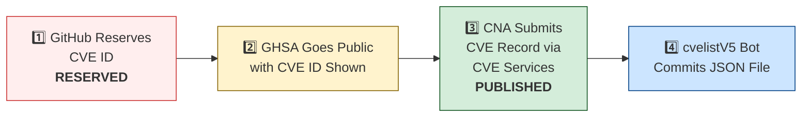

# 🛡️ OpenClaw CVE & Security Advisory Tracker

  
  
  
  
   
  
  
  
  
  

An automated tracker that continuously monitors [OpenClaw](https://github.com/openclaw/openclaw) security advisories across the GitHub Advisory Database, repo-level security advisories, and the [CVE V5 (cvelistV5)](https://github.com/CVEProject/cvelistV5) registry. Every hour it pulls the latest data, reconciles GHSA → CVE publication state, and regenerates this dashboard so you always have an up-to-date picture of the project's vulnerability landscape.

  Last updated: 2026-04-13 12:32 UTC · <a href="LICENSE">MIT License</a> · <a href="ADVISORIES.md">Full Advisory List</a> · <a href="SECURITY.md">Security Policy</a> · Data: <a href="https://github.com/CVEProject/cvelistV5">cvelistV5</a> + <a href="https://github.com/github/advisory-database">Advisory DB</a> · Updates hourly

---

  <a href="#-cves-published-in-cvelistv5-15">Published CVEs</a> ·
  <a href="#-cve-publication-pipeline">Pipeline</a> ·
  <a href="#-all-security-advisories-139">Advisories</a> ·
  <a href="#-vulnerability-categories">Categories</a> ·
  <a href="#-key-insights">Insights</a> ·
  <a href="#-project-identity">Identity</a>

---

## 🏗️ Project Identity

| Field | Value |
|-------|-------|
| **Current Name** | OpenClaw |
| **Previous Names** | Moltbot (second name), Clawdbot (original name) |
| **Repository** | [openclaw/openclaw](https://github.com/openclaw/openclaw) |
| **npm Package** | `openclaw` (formerly `clawdbot`) |
| **Author** | Peter Steinberger (steipete) |

<strong>Search terms for CVE discovery</strong>

To find all CVEs, search for: `openclaw`, `clawdbot`, `moltbot`, `clawhub`, `pkg:npm/clawdbot`, `pkg:npm/openclaw`

---

## 🚀 CVEs Published in cvelistV5 (15)

These CVEs have full records in the [CVEProject/cvelistV5](https://github.com/CVEProject/cvelistV5) repository:

| CVE ID | Severity | CVSS | Title | CWE | Published |
|--------|----------|------|-------|-----|-----------|
| [CVE-2026-22172](https://github.com/openclaw/openclaw/security/advisories/GHSA-rqpp-rjj8-7wv8) |  | 9.4 | OpenClaw < 2026.3.12 - Scope Elevation in WebSocket Shared-Auth Connections | CWE-862 | 2026-03-20 |
| [CVE-2026-28466](https://github.com/openclaw/openclaw/security/advisories/GHSA-gv46-4xfq-jv58) |  | 9.4 | OpenClaw < 2026.2.14 - Remote Code Execution via Node Invoke Approval Bypass | CWE-863 | 2026-03-05 |
| [CVE-2026-28446](https://github.com/openclaw/openclaw/security/advisories/GHSA-4rj2-gpmh-qq5x) |  | 9.2 | OpenClaw < 2026.2.1 - Inbound Allowlist Policy Bypass in voice-call Extension via Empty Caller ID and Suffix Matching | CWE-303 | 2026-03-05 |
| [CVE-2026-25253](https://github.com/openclaw/openclaw/security/advisories/GHSA-g8p2-7wf7-98mq) |  | 8.8 | OpenClaw/Clawdbot has 1-Click RCE via Authentication Token Exfiltration From gatewayUrl | CWE-669 | 2026-02-01 |
| [CVE-2026-24763](https://github.com/openclaw/openclaw/security/advisories/GHSA-mc68-q9jw-2h3v) |  | 8.8 | OpenClaw/Clawdbot Docker Execution has Authenticated Command Injection via PATH Environment Variable | CWE-78 | 2026-02-02 |
| [CVE-2026-32913](https://github.com/openclaw/openclaw/security/advisories/GHSA-6mgf-v5j7-45cr) |  | 8.8 | OpenClaw < 2026.3.7 - Custom Authorization Header Leakage via Cross-Origin Redirects | CWE-522 | 2026-03-23 |
| [CVE-2026-32974](https://github.com/openclaw/openclaw/security/advisories/GHSA-g353-mgv3-8pcj) |  | 8.8 | OpenClaw < 2026.3.12 - Forged Event Injection via Feishu Webhook Verification Token | CWE-347 | 2026-03-29 |
| [CVE-2026-32973](https://github.com/openclaw/openclaw/security/advisories/GHSA-f8r2-vg7x-gh8m) |  | 8.8 | OpenClaw < 2026.3.11 - Exec Allowlist Pattern Overmatch via POSIX Path Normalization | CWE-625 | 2026-03-29 |
| [CVE-2026-28478](https://github.com/openclaw/openclaw/security/advisories/GHSA-q447-rj3r-2cgh) |  | 8.7 | OpenClaw affected by denial of service via unbounded webhook request body buffering | CWE-770 | 2026-03-05 |
| [CVE-2026-28462](https://github.com/openclaw/openclaw/security/advisories/GHSA-gq9c-wg68-gwj2) |  | 8.7 | OpenClaw < 2026.2.13 - Path Traversal in Trace and Download Output Paths | CWE-22 | 2026-03-05 |
| [CVE-2026-32060](https://github.com/openclaw/openclaw/security/advisories/GHSA-r5fq-947m-xm57) |  | 8.7 | OpenClaw < 2026.2.14 - Path Traversal in apply_patch via Crafted Paths | CWE-22 | 2026-03-11 |
| [CVE-2026-32062](https://github.com/openclaw/openclaw/security/advisories/GHSA-mfg5-7q5g-f37j) |  | 8.7 | OpenClaw 2026.2.21-2 < 2026.2.22 - Unauthenticated WebSocket Resource Exhaustion via Media Stream | CWE-770 | 2026-03-11 |
| [CVE-2026-32059](https://github.com/openclaw/openclaw/security/advisories/GHSA-3c6h-g97w-fg78) |  | 8.7 | OpenClaw 2026.2.22-2 < 2026.2.23 - Allowlist Bypass via sort Long-Option Abbreviation in tools.exec.safeBins | CWE-863 | 2026-03-11 |
| [CVE-2026-32914](https://github.com/openclaw/openclaw/security/advisories/GHSA-r7vr-gr74-94p8) |  | 8.7 | OpenClaw < 2026.3.12 - Insufficient Access Control in /config and /debug Endpoints | CWE-863 | 2026-03-29 |
| [CVE-2026-32980](https://github.com/openclaw/openclaw/security/advisories/GHSA-jq3f-vjww-8rq7) |  | 8.7 | OpenClaw < 2026.3.13 - Resource Exhaustion via Unauthenticated Telegram Webhook Request | CWE-770 | 2026-03-29 |
| [CVE-2026-35639](https://github.com/openclaw/openclaw/security/advisories/GHSA-hf68-49fm-59cq) |  | 8.7 | OpenClaw < 2026.3.22 - Privilege Escalation via device.pair.approve Scope Validation | CWE-648 | 2026-04-09 |
| [CVE-2026-27001](https://github.com/openclaw/openclaw/security/advisories/GHSA-2qj5-gwg2-xwc4) |  | 8.6 | OpenClaw: Unsanitized CWD path injection into LLM prompts | CWE-77 | 2026-02-19 |
| [CVE-2026-28463](https://github.com/openclaw/openclaw/security/advisories/GHSA-xvhf-x56f-2hpp) |  | 8.6 | OpenClaw < 2026.2.14 - Arbitrary File Read via Shell Expansion in Safe Bins Allowlist | CWE-78 | 2026-03-05 |
| [CVE-2026-32014](https://github.com/openclaw/openclaw/security/advisories/GHSA-r65x-2hqr-j5hf) |  | 8.6 | OpenClaw < 2026.2.26 - Node Reconnect Metadata Spoofing via Unsigned Platform Fields | CWE-290 | 2026-03-19 |
| [CVE-2026-33579](https://github.com/openclaw/openclaw/security/advisories/GHSA-hc5h-pmr3-3497) |  | 8.6 | OpenClaw < 2026.3.28 - Privilege Escalation via Missing Caller Scope Validation in Device Pair Approval | CWE-863 | 2026-03-31 |
| [CVE-2026-33577](https://github.com/openclaw/openclaw/security/advisories/GHSA-2x4x-cc5g-qmmg) |  | 8.6 | OpenClaw < 2026.3.28 - Insufficient Scope Validation in node.pair.approve | CWE-863 | 2026-03-31 |
| [CVE-2026-32064](https://github.com/openclaw/openclaw/security/advisories/GHSA-25gx-x37c-7pph) |  | 8.5 | OpenClaw < 2026.2.21 - Missing VNC Authentication in Sandbox Browser noVNC Observer | CWE-306 | 2026-03-21 |
| [CVE-2026-28482](https://github.com/openclaw/openclaw/security/advisories/GHSA-5xfq-5mr7-426q) |  | 8.4 | OpenClaw < 2026.2.12 - Path Traversal via Unsanitized sessionId and sessionFile Parameters | CWE-22 | 2026-03-05 |
| [CVE-2026-35641](https://github.com/openclaw/openclaw/security/advisories/GHSA-m3mh-3mpg-37hw) |  | 8.4 | OpenClaw < 2026.3.24 - Arbitrary Code Execution via .npmrc in Local Plugin/Hook Installation | CWE-349 | 2026-04-10 |
| [CVE-2026-35618](https://github.com/openclaw/openclaw/security/advisories/GHSA-cg6c-q2hx-69h7) |  | 8.3 | OpenClaw < 2026.3.23 - Replay Identity Drift via Query-Only Variants in Plivo V2 Verification | CWE-294 | 2026-04-09 |
| [CVE-2026-28464](https://github.com/openclaw/openclaw/security/advisories/GHSA-jmm5-fvh5-gf4p) |  | 8.2 | OpenClaw < 2026.2.12 - Timing Attack in Hooks Token Authentication | CWE-208 | 2026-03-05 |
| [CVE-2026-28465](https://github.com/openclaw/openclaw/security/advisories/GHSA-3m3q-x3gj-f79x) |  | 8.2 | OpenClaw voice-call < 2026.2.3 - Webhook Verification Bypass via Forwarded Headers | CWE-345 | 2026-03-05 |
| [CVE-2026-28469](https://github.com/openclaw/openclaw/security/advisories/GHSA-rq6g-px6m-c248) |  | 8.2 | OpenClaw Google Chat shared-path webhook target ambiguity allowed cross-account policy-context misrouting | CWE-639 | 2026-03-05 |
| [CVE-2026-32030](https://github.com/openclaw/openclaw/security/advisories/GHSA-x9cf-3w63-rpq9) |  | 8.2 | OpenClaw < 2026.2.19 - Sensitive File Disclosure via stageSandboxMedia Path Traversal | CWE-22 | 2026-03-19 |
| [CVE-2026-32045](https://github.com/openclaw/openclaw/security/advisories/GHSA-hff7-ccv5-52f8) |  | 8.2 | OpenClaw < 2026.2.21 - Authentication Bypass in HTTP Gateway Routes via Tokenless Tailscale Auth | CWE-290 | 2026-03-21 |
| [CVE-2026-25157](https://github.com/openclaw/openclaw/security/advisories/GHSA-q284-4pvr-m585) |  | 7.8 | OpenClaw/Clawdbot has OS Command Injection via Project Root Path in sshNodeCommand | CWE-78 | 2026-02-04 |
| [CVE-2026-32056](https://github.com/openclaw/openclaw/security/advisories/GHSA-xgf2-vxv2-rrmg) |  | 7.7 | OpenClaw < 2026.2.22 - Remote Code Execution via Shell Startup Environment Variable Injection in system.run | CWE-78 | 2026-03-21 |
| [CVE-2026-26319](https://github.com/openclaw/openclaw/security/advisories/GHSA-4hg8-92x6-h2f3) |  | 7.5 | OpenClaw has Missing Webhook Authentication in Telnyx Provider Allowing Unauthenticated Requests | CWE-306 | 2026-02-19 |
| [CVE-2026-26324](https://github.com/openclaw/openclaw/security/advisories/GHSA-jrvc-8ff5-2f9f) |  | 7.5 | OpenClaw has a SSRF guard bypass via full-form IPv4-mapped IPv6 (loopback / metadata reachable) | CWE-918 | 2026-02-19 |
| [CVE-2026-25474](https://github.com/openclaw/openclaw/security/advisories/GHSA-mp5h-m6qj-6292) |  | 7.5 | OpenClaw has a Telegram webhook request forgery (missing `channels.telegram.webhookSecret`) → auth bypass | CWE-345 | 2026-02-19 |
| [CVE-2026-28485](https://github.com/openclaw/openclaw/security/advisories/GHSA-qpjj-47vm-64pj) |  | 7.5 | OpenClaw 2026.1.5 < 2026.2.12 - Missing Authentication in Browser Control HTTP Endpoints | CWE-306 | 2026-03-05 |
| [CVE-2026-32003](https://github.com/openclaw/openclaw/security/advisories/GHSA-2fgq-7j6h-9rm4) |  | 7.5 | OpenClaw < 2026.2.22 - Remote Code Execution via SHELLOPTS/PS4 Environment Injection in system.run | CWE-78 | 2026-03-19 |
| [CVE-2026-32041](https://github.com/openclaw/openclaw/security/advisories/GHSA-vpj2-69hf-rppw) |  | 7.5 | OpenClaw < 2026.3.1 - Unauthenticated Browser Control Access via Failed Auth Bootstrap | CWE-306 | 2026-03-19 |
| [CVE-2026-28458](https://github.com/openclaw/openclaw/security/advisories/GHSA-mr32-vwc2-5j6h) |  | 7.4 | OpenClaw's Browser Relay /cdp websocket is missing auth which could allow cross-tab cookie access | CWE-306 | 2026-03-05 |
| [CVE-2026-32015](https://github.com/openclaw/openclaw/security/advisories/GHSA-g75x-8qqm-2vxp) |  | 7.3 | OpenClaw 2026.1.21 < 2026.2.19 - PATH Hijacking Bypass in tools.exec.safeBins Allowlist Validation | CWE-426 | 2026-03-19 |
| [CVE-2026-26325](https://github.com/openclaw/openclaw/security/advisories/GHSA-h3f9-mjwj-w476) |  | 7.2 | OpenClaw Node host system.run rawCommand/command mismatch can bypass allowlist/approvals | CWE-284 | 2026-02-19 |
| [CVE-2026-32055](https://github.com/openclaw/openclaw/security/advisories/GHSA-mgrq-9f93-wpp5) |  | 7.2 | OpenClaw < 2026.2.26 - Workspace Path Boundary Bypass via Non-existent Symlink | CWE-22 | 2026-03-21 |
| [CVE-2026-26320](https://github.com/openclaw/openclaw/security/advisories/GHSA-7q2j-c4q5-rm27) |  | 7.1 | OpenClaw macOS deep link confirmation truncation can conceal executed agent message | CWE-451 | 2026-02-19 |
| [CVE-2026-26317](https://github.com/openclaw/openclaw/security/advisories/GHSA-3fqr-4cg8-h96q) |  | 7.1 | OpenClaw affected by cross-site request forgery (CSRF) through loopback browser mutation endpoints | CWE-352 | 2026-02-19 |
| [CVE-2026-28459](https://github.com/openclaw/openclaw/security/advisories/GHSA-64qx-vpxx-mvqf) |  | 7.1 | OpenClaw < 2026.2.12 - Arbitrary File Write via Untrusted sessionFile Path | CWE-73 | 2026-03-05 |
| [CVE-2026-32976](https://github.com/openclaw/openclaw/security/advisories/GHSA-8jhh-jcqg-mj5p) |  | 7.1 | OpenClaw < 2026.3.11 - Account-Scoped configWrites Policy Bypass via Channel Commands | CWE-639 | 2026-03-31 |
| [CVE-2026-33581](https://github.com/openclaw/openclaw/security/advisories/GHSA-v8wv-jg3q-qwpq) |  | 7.1 | OpenClaw < 2026.3.24 - Arbitrary File Read via mediaUrl and fileUrl Parameters | CWE-22 | 2026-03-31 |
| [CVE-2026-35631](https://github.com/openclaw/openclaw/security/advisories/GHSA-3w6x-gv34-mqpf) |  | 7.1 | OpenClaw < 2026.3.22 - Missing Authorization Enforcement in Internal ACP Chat Commands | CWE-862 | 2026-04-09 |
| [CVE-2026-35636](https://github.com/openclaw/openclaw/security/advisories/GHSA-q2qc-744p-66r2) |  | 7.1 | OpenClaw 2026.3.11 < 2026.3.25 - Session Isolation Bypass via sessionId Resolution | CWE-696 | 2026-04-09 |
| [CVE-2026-40037](https://github.com/openclaw/openclaw/security/advisories/GHSA-qx8j-g322-qj6m) |  | 7.1 | OpenClaw: `fetchWithSsrFGuard` replays unsafe request bodies across cross-origin redirects | CWE-601 | 2026-04-08 |
| [CVE-2026-35668](https://github.com/openclaw/openclaw/security/advisories/GHSA-hr5v-j9h9-xjhg) |  | 7.1 | OpenClaw < 2026.3.24 - Sandbox Media Root Bypass via Unnormalized mediaUrl and fileUrl Parameters | CWE-22 | 2026-04-10 |
| [CVE-2026-28447](https://github.com/openclaw/openclaw/security/advisories/GHSA-qrq5-wjgg-rvqw) |  | 7 | OpenClaw 2026.1.29-beta.1 < 2026.2.1 - Path Traversal in Plugin Installation via Package Name | CWE-22 | 2026-03-05 |
| [CVE-2026-32979](https://github.com/openclaw/openclaw/security/advisories/GHSA-xf99-j42q-5w5p) |  | 7 | OpenClaw < 2026.3.11 - Unbound Interpreter and Runtime Commands Bypass in node-host Approval | CWE-367 | 2026-03-29 |
| [CVE-2026-27545](https://github.com/openclaw/openclaw/security/advisories/GHSA-f7ww-2725-qvw2) |  | 6.9 | OpenClaw < 2026.2.26 - Approval Bypass via Parent Symlink Current Working Directory Rebind | CWE-367 | 2026-03-18 |
| [CVE-2026-27003](https://github.com/openclaw/openclaw/security/advisories/GHSA-chf7-jq6g-qrwv) |  | 6.9 | OpenClaw: Telegram bot token exposure via logs | CWE-522 | 2026-02-19 |
| [CVE-2026-28467](https://github.com/openclaw/openclaw/security/advisories/GHSA-wfp2-v9c7-fh79) |  | 6.9 | OpenClaw < 2026.2.2 - SSRF via Attachment Media URL Hydration | CWE-918 | 2026-03-05 |
| [CVE-2026-28480](https://github.com/openclaw/openclaw/security/advisories/GHSA-mj5r-hh7j-4gxf) |  | 6.9 | OpenClaw Telegram allowlist authorization accepted mutable usernames | CWE-290 | 2026-03-05 |
| [CVE-2026-32919](https://github.com/openclaw/openclaw/security/advisories/GHSA-jf6w-m8jw-jfxc) |  | 6.9 | OpenClaw < 2026.3.11 - Unauthorized Session Reset via agent Slash Commands | CWE-863 | 2026-03-29 |
| [CVE-2026-32975](https://github.com/openclaw/openclaw/security/advisories/GHSA-f5mf-3r52-r83w) |  | 6.9 | OpenClaw < 2026.3.12 - Weak Authorization via Mutable Group Names in Zalouser Allowlist | CWE-807 | 2026-03-29 |
| [CVE-2026-35632](https://github.com/openclaw/openclaw/security/advisories/GHSA-7xr2-q9vf-x4r5) |  | 6.9 | OpenClaw < 2026.2.22 - Symlink Traversal via IDENTITY.md appendFile in agents.create/update | CWE-61 | 2026-04-09 |
| [CVE-2026-35664](https://github.com/openclaw/openclaw/security/advisories/GHSA-77w2-crqv-cmv3) |  | 6.9 | OpenClaw < 2026.3.25 - DM Pairing Bypass via Legacy Card Callbacks | CWE-288 | 2026-04-10 |
| [CVE-2026-35633](https://github.com/openclaw/openclaw/security/advisories/GHSA-4qwc-c7g9-4xcw) |  | 6.9 | OpenClaw < 2026.3.22 - Unbounded Memory Allocation via Remote Media Error Responses | CWE-789 | 2026-04-09 |
| [CVE-2026-35652](https://github.com/openclaw/openclaw/security/advisories/GHSA-8883-9w57-vwv6) |  | 6.9 | OpenClaw < 2026.3.22 - Unauthorized Action Execution via Callback Dispatch | CWE-696 | 2026-04-10 |
| [CVE-2026-35667](https://github.com/openclaw/openclaw/security/advisories/GHSA-3298-56p6-rpw2) |  | 6.9 | OpenClaw < 2026.3.24 - Improper Process Termination via Unpatched killProcessTree in shell-utils.ts | CWE-404 | 2026-04-10 |
| [CVE-2026-29612](https://github.com/openclaw/openclaw/security/advisories/GHSA-w2cg-vxx6-5xjg) |  | 6.8 | OpenClaw < 2026.2.14 - Denial of Service via Large Base64 Media File Decoding | CWE-770 | 2026-03-05 |
| [CVE-2026-28486](https://github.com/openclaw/openclaw/security/advisories/GHSA-v892-hwpg-jwqp) |  | 6.8 | OpenClaw 2026.1.16-2 < 2026.2.14 - Path Traversal (Zip Slip) in Archive Extraction via Installation Commands | CWE-22 | 2026-03-05 |
| [CVE-2026-26972](https://github.com/openclaw/openclaw/security/advisories/GHSA-xwjm-j929-xq7c) |  | 6.7 | OpenClaw has a Path Traversal in Browser Download Functionality | CWE-22 | 2026-02-19 |
| [CVE-2026-28452](https://github.com/openclaw/openclaw/security/advisories/GHSA-h89v-j3x9-8wqj) |  | 6.7 | OpenClaw affected by denial of service through unguarded archive extraction allowing high expansion/resource abuse (ZIP/TAR) | CWE-770 | 2026-03-05 |
| [CVE-2026-32044](https://github.com/openclaw/openclaw/security/advisories/GHSA-77hf-7fqf-f227) |  | 6.7 | OpenClaw < 2026.3.2 - Tar Archive Safety Bypass in Skills Installation | CWE-409 | 2026-03-21 |
| [CVE-2026-26328](https://github.com/openclaw/openclaw/security/advisories/GHSA-g34w-4xqq-h79m) |  | 6.5 | OpenClaw iMessage group allowlist authorization inherited DM pairing-store identities | CWE-284, CWE-863 | 2026-02-19 |
| [CVE-2026-25475](https://github.com/openclaw/openclaw/security/advisories/GHSA-r8g4-86fx-92mq) |  | 6.5 | OpenClaw Vulnerable to Local File Inclusion via MEDIA: Path Extraction | CWE-200, CWE-22 | 2026-02-04 |
| [CVE-2026-28449](https://github.com/openclaw/openclaw/security/advisories/GHSA-r9q5-c7qc-p26w) |  | 6.3 | OpenClaw < 2026.2.25 - Webhook Replay Attack via Missing Durable Replay Suppression | CWE-294 | 2026-03-19 |
| [CVE-2026-28475](https://github.com/openclaw/openclaw/security/advisories/GHSA-47q7-97xp-m272) |  | 6.3 | OpenClaw < 2026.2.13 - Timing Attack via Hook Token Comparison | CWE-208 | 2026-03-05 |
| [CVE-2026-32031](https://github.com/openclaw/openclaw/security/advisories/GHSA-8j2w-6fmm-m587) |  | 6.3 | OpenClaw < 2026.2.26 - Authentication Bypass via Path Canonicalization Mismatch in /api/channels Gateway | CWE-288 | 2026-03-19 |
| [CVE-2026-32029](https://github.com/openclaw/openclaw/security/advisories/GHSA-2rgf-hm63-5qph) |  | 6.3 | OpenClaw < 2026.2.21 - Client IP Spoofing via X-Forwarded-For Header Parsing | CWE-345 | 2026-03-19 |
| [CVE-2026-32050](https://github.com/openclaw/openclaw/security/advisories/GHSA-792q-qw95-f446) |  | 6.3 | OpenClaw < 2026.2.25 - Unauthorized Reaction Status Event Enqueue via Access Check Bypass | CWE-863 | 2026-03-21 |
| [CVE-2026-32896](https://github.com/openclaw/openclaw/security/advisories/GHSA-5mx2-2mgw-x8rm) |  | 6.3 | OpenClaw < 2026.2.21 - Unauthenticated Webhook Access via Passwordless Fallback in BlueBubbles Plugin | CWE-306 | 2026-03-21 |
| [CVE-2026-33580](https://github.com/openclaw/openclaw/security/advisories/GHSA-9528-x887-j2fp) |  | 6.3 | OpenClaw < 2026.3.28 - Brute Force Attack via Missing Rate Limiting on Webhook Shared Secret Authentication | CWE-307 | 2026-03-31 |
| [CVE-2026-35649](https://github.com/openclaw/openclaw/security/advisories/GHSA-pw7h-9g6p-c378) |  | 6.3 | OpenClaw < 2026.3.22 - Settings Reconciliation Bypass via Empty Allowlist | CWE-183 | 2026-04-10 |
| [CVE-2026-35656](https://github.com/openclaw/openclaw/security/advisories/GHSA-844j-xrrq-wgh4) |  | 6.3 | OpenClaw < 2026.3.22 - XFF Loopback Spoofing Bypass in Canvas Authentication and Rate Limiter | CWE-290 | 2026-04-10 |
| [CVE-2026-35645](https://github.com/openclaw/openclaw/security/advisories/GHSA-h4jx-hjr3-fhgc) |  | 6.1 | OpenClaw < 2026.3.25 - Privilege Escalation via Synthetic operator.admin in deleteSession | CWE-648 | 2026-04-09 |
| [CVE-2026-32002](https://github.com/openclaw/openclaw/security/advisories/GHSA-q6qf-4p5j-r25g) |  | 6 | OpenClaw < 2026.2.23 - Sandbox Boundary Bypass via Image Tool workspaceOnly Bypass | CWE-200 | 2026-03-19 |
| [CVE-2026-32023](https://github.com/openclaw/openclaw/security/advisories/GHSA-ccg8-46r6-9qgj) |  | 6 | OpenClaw < 2026.2.24 - Approval Gating Bypass via Dispatch-Wrapper Depth-Cap Mismatch in system.run | CWE-863 | 2026-03-19 |
| [CVE-2026-32017](https://github.com/openclaw/openclaw/security/advisories/GHSA-3x3x-h76w-hp98) |  | 6 | OpenClaw < 2026.2.19 - Arbitrary File Write via Short-Option Bypass in exec Allowlist | CWE-184 | 2026-03-19 |
| [CVE-2026-32033](https://github.com/openclaw/openclaw/security/advisories/GHSA-27cr-4p5m-74rj) |  | 6 | OpenClaw < 2026.2.24 - Path Traversal via @-prefixed Absolute Paths in Workspace Boundary Validation | CWE-22 | 2026-03-19 |
| [CVE-2026-34511](https://github.com/openclaw/openclaw/security/advisories/GHSA-9jpj-g8vv-j5mf) |  | 6 | OpenClaw < 2026.4.2 - PKCE Verifier Exposure via OAuth State Parameter | CWE-330 | 2026-04-03 |
| [CVE-2026-35622](https://github.com/openclaw/openclaw/security/advisories/GHSA-mp66-rf4f-mhh8) |  | 6 | OpenClaw < 2026.3.22 - Improper Authentication Verification in Google Chat Webhook | CWE-290 | 2026-04-09 |
| [CVE-2026-35658](https://github.com/openclaw/openclaw/security/advisories/GHSA-cfp9-w5v9-3q4h) |  | 6 | OpenClaw < 2026.3.2 - Filesystem Boundary Bypass in Image Tool | CWE-668 | 2026-04-10 |
| [CVE-2026-35670](https://github.com/openclaw/openclaw/security/advisories/GHSA-wv46-v6xc-2qhf) |  | 6 | OpenClaw < 2026.3.22 - Webhook Reply Rebinding via Username Resolution in Synology Chat | CWE-807 | 2026-04-10 |
| [CVE-2026-22174](https://github.com/openclaw/openclaw/security/advisories/GHSA-v3j7-34xh-6g3w) |  | 5.9 | OpenClaw < 2026.2.22 - Gateway Token Disclosure via Chrome CDP Probe | CWE-306 | 2026-03-18 |
| [CVE-2026-27670](https://github.com/openclaw/openclaw/security/advisories/GHSA-r54r-wmmq-mh84) |  | 5.8 | OpenClaw < 2026.3.2 - Arbitrary File Write via ZIP Extraction Parent Symlink Race Condition | CWE-367 | 2026-03-19 |
| [CVE-2026-32010](https://github.com/openclaw/openclaw/security/advisories/GHSA-4gc7-qcvf-38wg) |  | 5.8 | OpenClaw < 2026.2.22 - Allowlist Bypass via sort --compress-program Parameter | CWE-78 | 2026-03-19 |
| [CVE-2026-31995](https://github.com/openclaw/openclaw/security/advisories/GHSA-fg3m-vhrr-8gj6) |  | 5.8 | OpenClaw 2026.1.21 < 2026.2.19 - Command Injection via Windows Shell Fallback in Lobster Extension | CWE-78 | 2026-03-19 |
| [CVE-2026-32035](https://github.com/openclaw/openclaw/security/advisories/GHSA-wpg9-4g4v-f9rc) |  | 5.8 | OpenClaw < 2026.3.2 - Missing Owner Flag Validation in Discord Voice Transcript Handler | CWE-863 | 2026-03-19 |
| [CVE-2026-32921](https://github.com/openclaw/openclaw/security/advisories/GHSA-8g75-q649-6pv6) |  | 5.3 | OpenClaw < 2026.3.8 - Script Content Modification via Mutable Operand Binding in system.run | CWE-367 | 2026-03-31 |
| [CVE-2026-34425](https://github.com/openclaw/openclaw/security/advisories/GHSA-fvx6-pj3r-5q4q) |  | 5.3 | OpenClaw - Shell-Bleed Protection Preflight Validation Bypass | CWE-184 | 2026-04-02 |
| [CVE-2026-35619](https://github.com/openclaw/openclaw/security/advisories/GHSA-68f8-9mhj-h2mp) |  | 5.3 | OpenClaw < 2026.3.24 - Authorization Bypass via HTTP /v1/models Endpoint | CWE-863 | 2026-04-10 |
| [CVE-2026-35629](https://github.com/openclaw/openclaw/security/advisories/GHSA-rhfg-j8jq-7v2h) |  | 5.3 | OpenClaw < 2026.3.25 - Server-Side Request Forgery via Unguarded Configured Base URLs in Channel Extensions | CWE-918 | 2026-04-09 |
| [CVE-2026-32020](https://github.com/openclaw/openclaw/security/advisories/GHSA-5ghc-98wh-gwwf) |  | 4.8 | OpenClaw < 2026.2.22 - Arbitrary File Read via Symlink Following in Static File Handler | CWE-59 | 2026-03-19 |
| [CVE-2026-32046](https://github.com/openclaw/openclaw/security/advisories/GHSA-43x4-g22p-3hrq) |  | 4.8 | OpenClaw < 2026.2.21 - OS-level Sandbox Bypass via --no-sandbox Flag | CWE-1188 | 2026-03-21 |
| [CVE-2026-27485](https://github.com/openclaw/openclaw/security/advisories/GHSA-r6h2-5gqq-v5v6) |  | 4.6 | OpenClaw affected by Stored XSS in Control UI via unsanitized assistant name/avatar in inline script injection | CWE-61 | 2026-02-21 |
| [CVE-2026-27486](https://github.com/openclaw/openclaw/security/advisories/GHSA-jfv4-h8mc-jcp8) |  | 4.3 | OpenClaw: Process Safety - Unvalidated PID Kill via SIGKILL in Process Cleanup | CWE-283 | 2026-02-21 |
| [CVE-2026-24764](https://github.com/openclaw/openclaw/security/advisories/GHSA-782p-5fr5-7fj8) |  | 3.7 | OpenClaw has Remote Code Execution via System Prompt Injection in Slack Channel Descriptions | CWE-74, CWE-94 | 2026-02-19 |
| [CVE-2026-31996](https://github.com/openclaw/openclaw/security/advisories/GHSA-4685-c5cp-vp95) |  | 2 | OpenClaw < 2026.2.19 - safeBins stdin-only bypass via sort output and recursive grep flags | CWE-78 | 2026-03-19 |
| [CVE-2026-32970](https://github.com/openclaw/openclaw/security/advisories/GHSA-qvr7-g57c-mrc7) |  | 2 | OpenClaw < 2026.3.11 - Credential Fallback Logic Bypass via Unavailable Local Auth SecretRefs | CWE-636 | 2026-03-31 |

<strong>📖 Detailed CVE Analysis (click to expand)</strong>

### CVE-2026-22172 — OpenClaw < 2026.3.12 - Scope Elevation in WebSocket Shared-Auth Connections

| Field | Detail |
|-------|--------|
| **CVSS** | 9.4 (CRITICAL) — `CVSS:4.0/AV:N/AC:L/AT:N/PR:L/UI:N/VC:H/VI:H/VA:H/SC:H/SI:H/SA:H` |
| **CWE** | CWE-862 (CWE-862 Missing Authorization) |
| **Affected** | < 2026.3.12 |
| **Vendor/Product** | OpenClaw / OpenClaw |
| **Advisory** | [GHSA-rqpp-rjj8-7wv8](https://github.com/openclaw/openclaw/security/advisories/GHSA-rqpp-rjj8-7wv8) |

OpenClaw versions prior to 2026.3.12 contain an authorization bypass vulnerability in the WebSocket connect path that allows shared-token or password-authenticated connections to self-declare elevated scopes without server-side binding. Attackers can exploit this logic flaw to present unauthorized scopes such as operator.admin and perform admin-only gateway operations.

**References:**
- [openclaw-scope-elevation-in-websocket-shared-auth-connections](https://www.vulncheck.com/advisories/openclaw-scope-elevation-in-websocket-shared-auth-connections)
---

### CVE-2026-28466 — OpenClaw < 2026.2.14 - Remote Code Execution via Node Invoke Approval Bypass

| Field | Detail |
|-------|--------|
| **CVSS** | 9.4 (CRITICAL) — `CVSS:4.0/AV:N/AC:L/AT:N/PR:L/UI:N/VC:H/VI:H/VA:H/SC:H/SI:H/SA:H` |
| **CWE** | CWE-863 (Incorrect Authorization) |
| **Affected** | < 2026.2.14 |
| **Vendor/Product** | OpenClaw / OpenClaw |
| **Advisory** | [GHSA-gv46-4xfq-jv58](https://github.com/openclaw/openclaw/security/advisories/GHSA-gv46-4xfq-jv58) |

OpenClaw versions prior to 2026.2.14 contain a vulnerability in the gateway in which it fails to sanitize internal approval fields in node.invoke parameters, allowing authenticated clients to bypass exec approval gating for system.run commands. Attackers with valid gateway credentials can inject approval control fields to execute arbitrary commands on connected node hosts, potentially compromising developer workstations and CI runners.

**References:**
- [Patch Commit #1](https://github.com/openclaw/openclaw/commit/318379cdb8d045da0009b0051bd0e712e5c65e2d)
- [Patch Commit #2](https://github.com/openclaw/openclaw/commit/a7af646fdab124a7536998db6bd6ad567d2b06b0)
- [Patch Commit #3](https://github.com/openclaw/openclaw/commit/c1594627421f95b6bc4ad7c606657dc75b5ad0ce)
- [Patch Commit #4](https://github.com/openclaw/openclaw/commit/0af76f5f0e93540efbdf054895216c398692afcd)
- [VulnCheck Advisory: OpenClaw < 2026.2.14 - Remote Code Execution via Node Invoke Approval Bypass](https://www.vulncheck.com/advisories/openclaw-remote-code-execution-via-node-invoke-approval-bypass)
---

### CVE-2026-28446 — OpenClaw < 2026.2.1 - Inbound Allowlist Policy Bypass in voice-call Extension via Empty Caller ID and Suffix Matching

| Field | Detail |
|-------|--------|
| **CVSS** | 9.2 (CRITICAL) — `CVSS:4.0/AV:N/AC:L/AT:P/PR:N/UI:N/VC:H/VI:H/VA:L/SC:N/SI:N/SA:N` |
| **CWE** | CWE-303 (Incorrect Implementation of Authentication Algorithm) |
| **Affected** | < 2026.2.1 |
| **Vendor/Product** | OpenClaw / OpenClaw |
| **Advisory** | [GHSA-4rj2-gpmh-qq5x](https://github.com/openclaw/openclaw/security/advisories/GHSA-4rj2-gpmh-qq5x) |

OpenClaw versions prior to 2026.2.1 with the voice-call extension installed and enabled contain an authentication bypass vulnerability in inbound allowlist policy validation that accepts empty caller IDs and uses suffix-based matching instead of strict equality. Remote attackers can bypass inbound access controls by placing calls with missing caller IDs or numbers ending with allowlisted digits to reach the voice-call agent and execute tools.

**References:**
- [Patch Commit](https://github.com/openclaw/openclaw/commit/f8dfd034f5d9235c5485f492a9e4ccc114e97fdb)
- [VulnCheck Advisory: OpenClaw < 2026.2.1 - Inbound Allowlist Policy Bypass in voice-call Extension via Empty Caller ID and Suffix Matching](https://www.vulncheck.com/advisories/openclaw-inbound-allowlist-policy-bypass-in-voice-call-extension-via-empty-caller-id)
---

### CVE-2026-25253 — OpenClaw/Clawdbot has 1-Click RCE via Authentication Token Exfiltration From gatewayUrl

| Field | Detail |
|-------|--------|
| **CVSS** | 8.8 (HIGH) — `CVSS:3.1/AV:N/AC:L/PR:N/UI:R/S:U/C:H/I:H/A:H` |
| **CWE** | CWE-669 (CWE-669 Incorrect Resource Transfer Between Spheres) |
| **Affected** | < 2026.1.29 |
| **Vendor/Product** | OpenClaw / OpenClaw |
| **Advisory** | [GHSA-g8p2-7wf7-98mq](https://github.com/openclaw/openclaw/security/advisories/GHSA-g8p2-7wf7-98mq) |

OpenClaw (aka clawdbot or Moltbot) before 2026.1.29 obtains a gatewayUrl value from a query string and automatically makes a WebSocket connection without prompting, sending a token value.

> **Naming note:** Uses all three names in description. packageURL still references `pkg:npm/clawdbot`.
**References:**
- [1-click-rce-to-steal-your-moltbot-data-and-keys](https://depthfirst.com/post/1-click-rce-to-steal-your-moltbot-data-and-keys)
- [blog](https://openclaw.ai/blog)
- [one-click-rce-moltbot](https://ethiack.com/news/blog/one-click-rce-moltbot)
- [2016913750557651228](https://x.com/0xacb/status/2016913750557651228)
---

### CVE-2026-24763 — OpenClaw/Clawdbot Docker Execution has Authenticated Command Injection via PATH Environment Variable

| Field | Detail |
|-------|--------|
| **CVSS** | 8.8 (HIGH) — `CVSS:3.1/AV:N/AC:L/PR:L/UI:N/S:U/C:H/I:H/A:H` |
| **CWE** | CWE-78 (CWE-78: Improper Neutralization of Special Elements used in an OS Command ('OS Command Injection')) |
| **Affected** | < 2026.1.29 |
| **Vendor/Product** | clawdbot / clawdbot |
| **Advisory** | [GHSA-mc68-q9jw-2h3v](https://github.com/openclaw/openclaw/security/advisories/GHSA-mc68-q9jw-2h3v) |

OpenClaw (formerly  Clawdbot) is a personal AI assistant you run on your own devices. Prior to 2026.1.29, a command injection vulnerability existed in OpenClaw’s Docker sandbox execution mechanism due to unsafe handling of the PATH environment variable when constructing shell commands. An authenticated user able to control environment variables could influence command execution within the container context. This vulnerability is fixed in 2026.1.29.

> **Naming note:** Uses old name `clawdbot/clawdbot` as vendor/product.
**References:**
- [https://github.com/openclaw/openclaw/commit/771f23d36b95ec2204cc9a0054045f5d8439ea75](https://github.com/openclaw/openclaw/commit/771f23d36b95ec2204cc9a0054045f5d8439ea75)
- [https://github.com/openclaw/openclaw/releases/tag/v2026.1.29](https://github.com/openclaw/openclaw/releases/tag/v2026.1.29)
---

### CVE-2026-32913 — OpenClaw < 2026.3.7 - Custom Authorization Header Leakage via Cross-Origin Redirects

| Field | Detail |
|-------|--------|
| **CVSS** | 8.8 (HIGH) — `CVSS:4.0/AV:N/AC:L/AT:N/PR:N/UI:N/VC:H/VI:L/VA:N/SC:L/SI:L/SA:N` |
| **CWE** | CWE-522 (CWE-522 Insufficiently Protected Credentials) |
| **Affected** | < 2026.3.7 |
| **Vendor/Product** | OpenClaw / OpenClaw |
| **Advisory** | [GHSA-6mgf-v5j7-45cr](https://github.com/openclaw/openclaw/security/advisories/GHSA-6mgf-v5j7-45cr) |

OpenClaw before 2026.3.7 contains an improper header validation vulnerability in fetchWithSsrFGuard that forwards custom authorization headers across cross-origin redirects. Attackers can trigger redirects to different origins to intercept sensitive headers like X-Api-Key and Private-Token intended for the original destination.

**References:**
- [Patch Commit](https://github.com/openclaw/openclaw/commit/46715371b0612a6f9114dffd1466941ac476cef5)
- [VulnCheck Advisory](https://vulncheck.com/advisories/openclaw-mar-custom-authorization-header-leakage-via-cross-origin-redirects)
---

### CVE-2026-32974 — OpenClaw < 2026.3.12 - Forged Event Injection via Feishu Webhook Verification Token

| Field | Detail |
|-------|--------|
| **CVSS** | 8.8 (HIGH) — `CVSS:4.0/AV:N/AC:L/AT:N/PR:N/UI:N/VC:L/VI:H/VA:L/SC:N/SI:N/SA:N` |
| **CWE** | CWE-347 (Improper Verification of Cryptographic Signature) |
| **Affected** | < 2026.3.12 |
| **Vendor/Product** | OpenClaw / OpenClaw |
| **Advisory** | [GHSA-g353-mgv3-8pcj](https://github.com/openclaw/openclaw/security/advisories/GHSA-g353-mgv3-8pcj) |

OpenClaw before 2026.3.12 contains an authentication bypass vulnerability in Feishu webhook mode when only verificationToken is configured without encryptKey, allowing acceptance of forged events. Unauthenticated network attackers can inject forged Feishu events and trigger downstream tool execution by reaching the webhook endpoint.

**References:**
- [VulnCheck Advisory: OpenClaw < 2026.3.12 - Forged Event Injection via Feishu Webhook Verification Token](https://www.vulncheck.com/advisories/openclaw-forged-event-injection-via-feishu-webhook-verification-token)
---

### CVE-2026-32973 — OpenClaw < 2026.3.11 - Exec Allowlist Pattern Overmatch via POSIX Path Normalization

| Field | Detail |
|-------|--------|
| **CVSS** | 8.8 (HIGH) — `CVSS:4.0/AV:N/AC:L/AT:N/PR:N/UI:N/VC:N/VI:H/VA:H/SC:N/SI:N/SA:N` |
| **CWE** | CWE-625 (Permissive Regular Expression) |
| **Affected** | < 2026.3.11 |
| **Vendor/Product** | OpenClaw / OpenClaw |
| **Advisory** | [GHSA-f8r2-vg7x-gh8m](https://github.com/openclaw/openclaw/security/advisories/GHSA-f8r2-vg7x-gh8m) |

OpenClaw before 2026.3.11 contains an exec allowlist bypass vulnerability where matchesExecAllowlistPattern improperly normalizes patterns with lowercasing and glob matching that overmatches on POSIX paths. Attackers can exploit the ? wildcard matching across path segments to execute commands or paths not intended by operators.

**References:**
- [VulnCheck Advisory: OpenClaw < 2026.3.11 - Exec Allowlist Pattern Overmatch via POSIX Path Normalization](https://www.vulncheck.com/advisories/openclaw-exec-allowlist-pattern-overmatch-via-posix-path-normalization)
---

### CVE-2026-28478 — OpenClaw affected by denial of service via unbounded webhook request body buffering

| Field | Detail |
|-------|--------|
| **CVSS** | 8.7 (HIGH) — `CVSS:4.0/AV:N/AC:L/AT:N/PR:N/UI:N/VC:N/VI:N/VA:H/SC:N/SI:N/SA:N` |
| **CWE** | CWE-770 (Allocation of Resources Without Limits or Throttling) |
| **Affected** | < 2026.2.13 |
| **Vendor/Product** | OpenClaw / OpenClaw |
| **Advisory** | [GHSA-q447-rj3r-2cgh](https://github.com/openclaw/openclaw/security/advisories/GHSA-q447-rj3r-2cgh) |

OpenClaw versions prior to 2026.2.13 contain a denial of service vulnerability in webhook handlers that buffer request bodies without strict byte or time limits. Remote unauthenticated attackers can send oversized JSON payloads or slow uploads to webhook endpoints causing memory pressure and availability degradation.

**References:**
- [Patch Commit](https://github.com/openclaw/openclaw/commit/3cbcba10cf30c2ffb898f0d8c7dfb929f15f8930)
- [VulnCheck Advisory: OpenClaw < 2026.2.13 - Denial of Service via Unbounded Webhook Request Body Buffering](https://www.vulncheck.com/advisories/openclaw-denial-of-service-via-unbounded-webhook-request-body-buffering)
---

### CVE-2026-28462 — OpenClaw < 2026.2.13 - Path Traversal in Trace and Download Output Paths

| Field | Detail |
|-------|--------|
| **CVSS** | 8.7 (HIGH) — `CVSS:4.0/AV:N/AC:L/AT:N/PR:N/UI:N/VC:H/VI:N/VA:N/SC:N/SI:N/SA:N` |
| **CWE** | CWE-22 (Improper Limitation of a Pathname to a Restricted Directory ('Path Traversal')) |
| **Affected** | < 2026.2.13 |
| **Vendor/Product** | OpenClaw / OpenClaw |
| **Advisory** | [GHSA-gq9c-wg68-gwj2](https://github.com/openclaw/openclaw/security/advisories/GHSA-gq9c-wg68-gwj2) |

OpenClaw versions prior to 2026.2.13 contain a vulnerability in the browser control API in which it accepts user-supplied output paths for trace and download files without consistently constraining writes to temporary directories. Attackers with API access can exploit path traversal in POST /trace/stop, POST /wait/download, and POST /download endpoints to write files outside intended temp roots.

**References:**
- [Patch Commit](https://github.com/openclaw/openclaw/commit/7f0489e4731c8d965d78d6eac4a60312e46a9426)
- [VulnCheck Advisory: OpenClaw < 2026.2.13 - Path Traversal in Trace and Download Output Paths](https://www.vulncheck.com/advisories/openclaw-path-traversal-in-trace-and-download-output-paths)
---

### CVE-2026-32060 — OpenClaw < 2026.2.14 - Path Traversal in apply_patch via Crafted Paths

| Field | Detail |
|-------|--------|
| **CVSS** | 8.7 (HIGH) — `CVSS:4.0/AV:N/AC:L/AT:N/PR:L/UI:N/VC:H/VI:H/VA:H/SC:N/SI:N/SA:N` |
| **CWE** | CWE-22 (Improper Limitation of a Pathname to a Restricted Directory ('Path Traversal')) |
| **Affected** | < 2026.2.14 |
| **Vendor/Product** | openclaw / openclaw |
| **Advisory** | [GHSA-r5fq-947m-xm57](https://github.com/openclaw/openclaw/security/advisories/GHSA-r5fq-947m-xm57) |

OpenClaw versions prior to 2026.2.14 contain a path traversal vulnerability in apply_patch that allows attackers to write or delete files outside the configured workspace directory. When apply_patch is enabled without filesystem sandbox containment, attackers can exploit crafted paths including directory traversal sequences or absolute paths to escape workspace boundaries and modify arbitrary files.

**References:**
- [Patch Commit](https://github.com/openclaw/openclaw/commit/5544646a09c0121fca7d7093812dc2de8437c7f1)
- [VulnCheck Advisory: OpenClaw < 2026.2.14 - Path Traversal in apply_patch via Crafted Paths](https://www.vulncheck.com/advisories/openclaw-path-traversal-in-apply-patch-via-crafted-paths)
---

### CVE-2026-32062 — OpenClaw 2026.2.21-2 < 2026.2.22 - Unauthenticated WebSocket Resource Exhaustion via Media Stream

| Field | Detail |
|-------|--------|
| **CVSS** | 8.7 (HIGH) — `CVSS:4.0/AV:N/AC:L/AT:N/PR:N/UI:N/VC:N/VI:N/VA:H/SC:N/SI:N/SA:N` |
| **CWE** | CWE-770 (Allocation of Resources Without Limits or Throttling) |
| **Affected** | < 2026.2.22 |
| **Vendor/Product** | openclaw / voice-call |
| **Advisory** | [GHSA-mfg5-7q5g-f37j](https://github.com/openclaw/openclaw/security/advisories/GHSA-mfg5-7q5g-f37j) |

OpenClaw versions2026.2.21-2 prior to 2026.2.22 and @openclaw/voice-call versions 2026.2.21 prior to 2026.2.22 accept media-stream WebSocket upgrades before stream validation, allowing unauthenticated clients to establish connections. Remote attackers can hold idle pre-authenticated sockets open to consume connection resources and degrade service availability for legitimate streams.

**References:**
- [Patch Commit](https://github.com/openclaw/openclaw/commit/1d8968c8a821ff1a05c294a1846b3bcb6f343794)
- [VulnCheck Advisory: OpenClaw 2026.2.21-2 < 2026.2.22 - Unauthenticated WebSocket Resource Exhaustion via Media Stream](https://www.vulncheck.com/advisories/openclaw-unauthenticated-websocket-resource-exhaustion-via-media-stream)
---

### CVE-2026-32059 — OpenClaw 2026.2.22-2 < 2026.2.23 - Allowlist Bypass via sort Long-Option Abbreviation in tools.exec.safeBins

| Field | Detail |
|-------|--------|
| **CVSS** | 8.7 (HIGH) — `CVSS:4.0/AV:N/AC:L/AT:N/PR:L/UI:N/VC:H/VI:H/VA:H/SC:N/SI:N/SA:N` |
| **CWE** | CWE-863 (Incorrect Authorization) |
| **Affected** | < 2026.2.23 |
| **Vendor/Product** | openclaw / openclaw |
| **Advisory** | [GHSA-3c6h-g97w-fg78](https://github.com/openclaw/openclaw/security/advisories/GHSA-3c6h-g97w-fg78) |

OpenClaw version 2026.2.22-2 prior to 2026.2.23 tools.exec.safeBins validation for sort command fails to properly validate GNU long-option abbreviations, allowing attackers to bypass denied-flag checks via abbreviated options. Remote attackers can execute sort commands with abbreviated long options to skip approval requirements in allowlist mode.

**References:**
- [Patch Commit](https://github.com/openclaw/openclaw/commit/3b8e33037ae2e12af7beb56fcf0346f1f8cbde6f)
- [VulnCheck Advisory: OpenClaw 2026.2.22-2 < 2026.2.23 - Allowlist Bypass via sort Long-Option Abbreviation in tools.exec.safeBins](https://www.vulncheck.com/advisories/openclaw-allowlist-bypass-via-sort-long-option-abbreviation-in-toolsexecsafebins)
---

### CVE-2026-32914 — OpenClaw < 2026.3.12 - Insufficient Access Control in /config and /debug Endpoints

| Field | Detail |
|-------|--------|
| **CVSS** | 8.7 (HIGH) — `CVSS:4.0/AV:N/AC:L/AT:N/PR:L/UI:N/VC:H/VI:H/VA:H/SC:N/SI:N/SA:N` |
| **CWE** | CWE-863 (Incorrect Authorization) |
| **Affected** | < 2026.3.12 |
| **Vendor/Product** | OpenClaw / OpenClaw |
| **Advisory** | [GHSA-r7vr-gr74-94p8](https://github.com/openclaw/openclaw/security/advisories/GHSA-r7vr-gr74-94p8) |

OpenClaw before 2026.3.12 contains an insufficient access control vulnerability in the /config and /debug command handlers that allows command-authorized non-owners to access owner-only surfaces. Attackers with command authorization can read or modify privileged configuration settings restricted to owners by exploiting missing owner-level permission checks.

**References:**
- [VulnCheck Advisory: OpenClaw < 2026.3.12 - Insufficient Access Control in /config and /debug Endpoints](https://www.vulncheck.com/advisories/openclaw-insufficient-access-control-in-config-and-debug-endpoints)
---

### CVE-2026-32980 — OpenClaw < 2026.3.13 - Resource Exhaustion via Unauthenticated Telegram Webhook Request

| Field | Detail |
|-------|--------|
| **CVSS** | 8.7 (HIGH) — `CVSS:4.0/AV:N/AC:L/AT:N/PR:N/UI:N/VC:N/VI:N/VA:H/SC:N/SI:N/SA:N` |
| **CWE** | CWE-770 (Allocation of Resources Without Limits or Throttling) |
| **Affected** | < 2026.3.13 |
| **Vendor/Product** | OpenClaw / OpenClaw |
| **Advisory** | [GHSA-jq3f-vjww-8rq7](https://github.com/openclaw/openclaw/security/advisories/GHSA-jq3f-vjww-8rq7) |

OpenClaw before 2026.3.13 reads and buffers Telegram webhook request bodies before validating the x-telegram-bot-api-secret-token header, allowing unauthenticated attackers to exhaust server resources. Attackers can send POST requests to the webhook endpoint to force memory consumption, socket time, and JSON parsing work before authentication validation occurs.

**References:**
- [Patch Commit](https://github.com/openclaw/openclaw/commit/7e49e98f79073b11134beac27fdff547ba5a4a02)
- [VulnCheck Advisory: OpenClaw < 2026.3.13 - Resource Exhaustion via Unauthenticated Telegram Webhook Request](https://www.vulncheck.com/advisories/openclaw-resource-exhaustion-via-unauthenticated-telegram-webhook-request)
---

### CVE-2026-35639 — OpenClaw < 2026.3.22 - Privilege Escalation via device.pair.approve Scope Validation

| Field | Detail |
|-------|--------|
| **CVSS** | 8.7 (HIGH) — `CVSS:4.0/AV:N/AC:L/AT:N/PR:L/UI:N/VC:H/VI:H/VA:H/SC:N/SI:N/SA:N` |
| **CWE** | CWE-648 (CWE-648: Incorrect Use of Privileged APIs) |
| **Affected** | < 2026.3.22 |
| **Vendor/Product** | OpenClaw / OpenClaw |
| **Advisory** | [GHSA-hf68-49fm-59cq](https://github.com/openclaw/openclaw/security/advisories/GHSA-hf68-49fm-59cq) |

OpenClaw before 2026.3.22 contains a privilege escalation vulnerability in the device.pair.approve method that allows an operator.pairing approver to approve pending device requests with broader operator scopes than the approver actually holds. Attackers can exploit insufficient scope validation to escalate privileges to operator.admin and achieve remote code execution on the Node infrastructure.

**References:**
- [Patch Commit #1](https://github.com/openclaw/openclaw/commit/630f1479c44f78484dfa21bb407cbe6f171dac87)
- [Patch Commit #2](https://github.com/openclaw/openclaw/commit/fc2d29ea926f47c428c556e92ec981441228d2a4)
- [VulnCheck Advisory: OpenClaw < 2026.3.22 - Privilege Escalation via device.pair.approve Scope Validation](https://www.vulncheck.com/advisories/openclaw-privilege-escalation-via-device-pair-approve-scope-validation)
---

### CVE-2026-27001 — OpenClaw: Unsanitized CWD path injection into LLM prompts

| Field | Detail |
|-------|--------|
| **CVSS** | 8.6 (HIGH) — `CVSS:4.0/AV:L/AC:L/AT:N/PR:N/UI:N/VC:H/VI:H/VA:H/SC:N/SI:N/SA:N` |
| **CWE** | CWE-77 (CWE-77: Improper Neutralization of Special Elements used in a Command ('Command Injection')) |
| **Affected** | < 2026.2.15 |
| **Vendor/Product** | openclaw / openclaw |
| **Advisory** | [GHSA-2qj5-gwg2-xwc4](https://github.com/openclaw/openclaw/security/advisories/GHSA-2qj5-gwg2-xwc4) |

OpenClaw is a personal AI assistant. Prior to version 2026.2.15, OpenClaw embedded the current working directory (workspace path) into the agent system prompt without sanitization. If an attacker can cause OpenClaw to run inside a directory whose name contains control/format characters (for example newlines or Unicode bidi/zero-width markers), those characters could break the prompt structure and inject attacker-controlled instructions. Starting in version 2026.2.15, the workspace path is sanitized before it is embedded into any LLM prompt output, stripping Unicode control/format characters and explicit line/paragraph separators. Workspace path resolution also applies the same sanitization as defense-in-depth.

**References:**
- [https://github.com/openclaw/openclaw/commit/6254e96acf16e70ceccc8f9b2abecee44d606f79](https://github.com/openclaw/openclaw/commit/6254e96acf16e70ceccc8f9b2abecee44d606f79)
- [https://github.com/openclaw/openclaw/releases/tag/v2026.2.15](https://github.com/openclaw/openclaw/releases/tag/v2026.2.15)
---

### CVE-2026-28463 — OpenClaw < 2026.2.14 - Arbitrary File Read via Shell Expansion in Safe Bins Allowlist

| Field | Detail |
|-------|--------|
| **CVSS** | 8.6 (HIGH) — `CVSS:4.0/AV:L/AC:L/AT:N/PR:N/UI:N/VC:H/VI:H/VA:H/SC:N/SI:N/SA:N` |
| **CWE** | CWE-78 (Improper Neutralization of Special Elements used in an OS Command ('OS Command Injection')) |
| **Affected** | < 2026.2.14 |
| **Vendor/Product** | OpenClaw / OpenClaw |
| **Advisory** | [GHSA-xvhf-x56f-2hpp](https://github.com/openclaw/openclaw/security/advisories/GHSA-xvhf-x56f-2hpp) |

OpenClaw exec-approvals allowlist validation checks pre-expansion argv tokens but execution uses real shell expansion, allowing safe bins like head, tail, or grep to read arbitrary local files via glob patterns or environment variables. Authorized callers or prompt-injection attacks can exploit this to disclose files readable by the gateway or node process when host execution is enabled in allowlist mode.

**References:**
- [Patch Commit](https://github.com/openclaw/openclaw/commit/77b89719d5b7e271f48b6f49e334a8b991468c3b)
- [VulnCheck Advisory: OpenClaw < 2026.2.14 - Arbitrary File Read via Shell Expansion in Safe Bins Allowlist](https://www.vulncheck.com/advisories/openclaw-arbitrary-file-read-via-shell-expansion-in-safe-bins-allowlist)
---

### CVE-2026-32014 — OpenClaw < 2026.2.26 - Node Reconnect Metadata Spoofing via Unsigned Platform Fields

| Field | Detail |
|-------|--------|
| **CVSS** | 8.6 (HIGH) — `CVSS:4.0/AV:A/AC:L/AT:N/PR:L/UI:N/VC:H/VI:H/VA:H/SC:N/SI:N/SA:N` |
| **CWE** | CWE-290 (CWE-290: Authentication Bypass by Spoofing) |
| **Affected** | < 2026.2.26 |
| **Vendor/Product** | OpenClaw / OpenClaw |
| **Advisory** | [GHSA-r65x-2hqr-j5hf](https://github.com/openclaw/openclaw/security/advisories/GHSA-r65x-2hqr-j5hf) |

OpenClaw versions prior to 2026.2.26 contain a metadata spoofing vulnerability where reconnect platform and deviceFamily fields are accepted from the client without being bound into the device-auth signature. An attacker with a paired node identity on the trusted network can spoof reconnect metadata to bypass platform-based node command policies and gain access to restricted commands.

**References:**
- [Patch Commit](https://github.com/openclaw/openclaw/commit/7d8aeaaf06e2e616545d2c2cec7fa27f36b59b6a)
- [VulnCheck Advisory: OpenClaw < 2026.2.26 - Node Reconnect Metadata Spoofing via Unsigned Platform Fields](https://www.vulncheck.com/advisories/openclaw-node-reconnect-metadata-spoofing-via-unsigned-platform-fields)
---

### CVE-2026-33579 — OpenClaw < 2026.3.28 - Privilege Escalation via Missing Caller Scope Validation in Device Pair Approval

| Field | Detail |
|-------|--------|
| **CVSS** | 8.6 (HIGH) — `CVSS:4.0/AV:N/AC:L/AT:N/PR:L/UI:N/VC:H/VI:H/VA:N/SC:N/SI:N/SA:N` |
| **CWE** | CWE-863 (CWE-863 Incorrect Authorization) |
| **Affected** | < 2026.3.28 |
| **Vendor/Product** | OpenClaw / OpenClaw |
| **Advisory** | [GHSA-hc5h-pmr3-3497](https://github.com/openclaw/openclaw/security/advisories/GHSA-hc5h-pmr3-3497) |

OpenClaw before 2026.3.28 contains a privilege escalation vulnerability in the /pair approve command path that fails to forward caller scopes into the core approval check. A caller with pairing privileges but without admin privileges can approve pending device requests asking for broader scopes including admin access by exploiting the missing scope validation in extensions/device-pair/index.ts and src/infra/device-pairing.ts.

**References:**
- [Patch Commit](https://github.com/openclaw/openclaw/commit/e403decb6e20091b5402780a7ccd2085f98aa3cd)
- [VulnCheck Advisory: OpenClaw < 2026.3.28 - Privilege Escalation via Missing Caller Scope Validation in Device Pair Approval](https://www.vulncheck.com/advisories/openclaw-privilege-escalation-via-missing-caller-scope-validation-in-device-pair-approval)
---

### CVE-2026-33577 — OpenClaw < 2026.3.28 - Insufficient Scope Validation in node.pair.approve

| Field | Detail |
|-------|--------|
| **CVSS** | 8.6 (HIGH) — `CVSS:4.0/AV:N/AC:L/AT:N/PR:L/UI:N/VC:H/VI:H/VA:N/SC:N/SI:N/SA:N` |
| **CWE** | CWE-863 (CWE-863 Incorrect Authorization) |
| **Affected** | < 2026.3.28 |
| **Vendor/Product** | OpenClaw / OpenClaw |
| **Advisory** | [GHSA-2x4x-cc5g-qmmg](https://github.com/openclaw/openclaw/security/advisories/GHSA-2x4x-cc5g-qmmg) |

OpenClaw before 2026.3.28 contains an insufficient scope validation vulnerability in the node pairing approval path that allows low-privilege operators to approve nodes with broader scopes. Attackers can exploit missing callerScopes validation in node-pairing.ts to extend privileges onto paired nodes beyond their authorization level.

**References:**
- [Patch Commit](https://github.com/openclaw/openclaw/commit/4d7cc6bb4fac68b5a5fadd1c5a23168281221f34)
- [VulnCheck Advisory: OpenClaw < 2026.3.28 - Insufficient Scope Validation in node.pair.approve](https://www.vulncheck.com/advisories/openclaw-insufficient-scope-validation-in-node-pair-approve)
---

### CVE-2026-32064 — OpenClaw < 2026.2.21 - Missing VNC Authentication in Sandbox Browser noVNC Observer

| Field | Detail |
|-------|--------|
| **CVSS** | 8.5 (HIGH) — `CVSS:4.0/AV:L/AC:L/AT:N/PR:N/UI:N/VC:H/VI:H/VA:N/SC:N/SI:N/SA:N` |
| **CWE** | CWE-306 (CWE-306 Missing Authentication for Critical Function) |
| **Affected** | < 2026.2.21 |
| **Vendor/Product** | OpenClaw / OpenClaw |
| **Advisory** | [GHSA-25gx-x37c-7pph](https://github.com/openclaw/openclaw/security/advisories/GHSA-25gx-x37c-7pph) |

OpenClaw versions prior to 2026.2.21 sandbox browser entrypoint launches x11vnc without authentication for noVNC observer sessions, allowing unauthenticated access to the VNC interface. Remote attackers on the host loopback interface can connect to the exposed noVNC port to observe or interact with the sandbox browser without credentials.

**References:**
- [Patch Commit #1](https://github.com/openclaw/openclaw/commit/621d8e1312482f122f18c43c72c67211b141da01)
- [Patch Commit #2](https://github.com/openclaw/openclaw/commit/8c1518f0f3e0533593cd2dec3a46c9b746753661)
- [VulnCheck Advisory: OpenClaw < 2026.2.21 - Missing VNC Authentication in Sandbox Browser noVNC Observer](https://www.vulncheck.com/advisories/openclaw-missing-vnc-authentication-in-sandbox-browser-novnc-observer)
---

### CVE-2026-28482 — OpenClaw < 2026.2.12 - Path Traversal via Unsanitized sessionId and sessionFile Parameters

| Field | Detail |
|-------|--------|
| **CVSS** | 8.4 (HIGH) — `CVSS:4.0/AV:L/AC:L/AT:N/PR:L/UI:N/VC:H/VI:H/VA:N/SC:N/SI:N/SA:N` |
| **CWE** | CWE-22 (Improper Limitation of a Pathname to a Restricted Directory ('Path Traversal')) |
| **Affected** | < 2026.2.12 |
| **Vendor/Product** | OpenClaw / OpenClaw |
| **Advisory** | [GHSA-5xfq-5mr7-426q](https://github.com/openclaw/openclaw/security/advisories/GHSA-5xfq-5mr7-426q) |

OpenClaw versions prior to 2026.2.12 construct transcript file paths using unsanitized sessionId parameters and sessionFile paths without enforcing directory containment. Authenticated attackers can exploit path traversal sequences like ../../etc/passwd in sessionId or sessionFile parameters to read or write arbitrary files outside the agent sessions directory.

**References:**
- [Patch Commit](https://github.com/openclaw/openclaw/commit/4199f9889f0c307b77096a229b9e085b8d856c26)
- [Hardening Commit](https://github.com/openclaw/openclaw/commit/cab0abf52ac91e12ea7a0cf04fff315cf0c94d64)
- [VulnCheck Advisory: OpenClaw < 2026.2.12 - Path Traversal via Unsanitized sessionId and sessionFile Parameters](https://www.vulncheck.com/advisories/openclaw-path-traversal-via-unsanitized-sessionid-and-sessionfile-parameters)
---

### CVE-2026-35641 — OpenClaw < 2026.3.24 - Arbitrary Code Execution via .npmrc in Local Plugin/Hook Installation

| Field | Detail |
|-------|--------|
| **CVSS** | 8.4 (HIGH) — `CVSS:4.0/AV:L/AC:L/AT:N/PR:N/UI:A/VC:H/VI:H/VA:H/SC:N/SI:N/SA:N` |
| **CWE** | CWE-349 (CWE-349: Acceptance of Extraneous Untrusted Data With Trusted Data) |
| **Affected** | < 2026.3.24 |
| **Vendor/Product** | OpenClaw / OpenClaw |
| **Advisory** | [GHSA-m3mh-3mpg-37hw](https://github.com/openclaw/openclaw/security/advisories/GHSA-m3mh-3mpg-37hw) |

OpenClaw before 2026.3.24 contains an arbitrary code execution vulnerability in local plugin and hook installation that allows attackers to execute malicious code by crafting a .npmrc file with a git executable override. During npm install execution in the staged package directory, attackers can leverage git dependencies to trigger execution of arbitrary programs specified in the attacker-controlled .npmrc configuration file.

**References:**
- [VulnCheck Advisory: OpenClaw < 2026.3.24 - Arbitrary Code Execution via .npmrc in Local Plugin/Hook Installation](https://www.vulncheck.com/advisories/openclaw-arbitrary-code-execution-via-npmrc-in-local-plugin-hook-installation)
---

### CVE-2026-35618 — OpenClaw < 2026.3.23 - Replay Identity Drift via Query-Only Variants in Plivo V2 Verification

| Field | Detail |
|-------|--------|
| **CVSS** | 8.3 (HIGH) — `CVSS:4.0/AV:N/AC:H/AT:N/PR:N/UI:N/VC:L/VI:H/VA:N/SC:N/SI:N/SA:N` |
| **CWE** | CWE-294 (CWE-294 Authentication Bypass by Capture-replay) |
| **Affected** | < 2026.3.23 |
| **Vendor/Product** | OpenClaw / OpenClaw |
| **Advisory** | [GHSA-cg6c-q2hx-69h7](https://github.com/openclaw/openclaw/security/advisories/GHSA-cg6c-q2hx-69h7) |

OpenClaw before 2026.3.23 contains a replay identity vulnerability in Plivo V2 signature verification that allows attackers to bypass replay protection by modifying query parameters. The verification path derives replay keys from the full URL including query strings instead of the canonicalized base URL, enabling attackers to mint new verified request keys through unsigned query-only changes to signed requests.

**References:**
- [Patch Commit #1](https://github.com/openclaw/openclaw/commit/630f1479c44f78484dfa21bb407cbe6f171dac87)
- [Patch Commit #2](https://github.com/openclaw/openclaw/commit/b0ce53a79cf63834660270513e26d921899b4e5b)
- [VulnCheck Advisory: OpenClaw < 2026.3.23 - Replay Identity Drift via Query-Only Variants in Plivo V2 Verification](https://www.vulncheck.com/advisories/openclaw-replay-identity-drift-via-query-only-variants-in-plivo-v2-verification)
---

### CVE-2026-28464 — OpenClaw < 2026.2.12 - Timing Attack in Hooks Token Authentication

| Field | Detail |
|-------|--------|
| **CVSS** | 8.2 (HIGH) — `CVSS:4.0/AV:N/AC:H/AT:P/PR:N/UI:N/VC:H/VI:N/VA:N/SC:N/SI:N/SA:N` |
| **CWE** | CWE-208 (Observable Timing Discrepancy) |
| **Affected** | < 2026.2.12 |
| **Vendor/Product** | OpenClaw / OpenClaw |
| **Advisory** | [GHSA-jmm5-fvh5-gf4p](https://github.com/openclaw/openclaw/security/advisories/GHSA-jmm5-fvh5-gf4p) |

OpenClaw versions prior to 2026.2.12 use non-constant-time string comparison for hook token validation, allowing attackers to infer tokens through timing measurements. Remote attackers with network access to the hooks endpoint can exploit timing side-channels across multiple requests to gradually determine the authentication token.

**References:**
- [Patch Commit](https://github.com/openclaw/openclaw/commit/113ebfd6a23c4beb8a575d48f7482593254506ec)
- [VulnCheck Advisory: OpenClaw < 2026.2.12 - Timing Attack in Hooks Token Authentication](https://www.vulncheck.com/advisories/openclaw-timing-attack-in-hooks-token-authentication)
---

### CVE-2026-28465 — OpenClaw voice-call < 2026.2.3 - Webhook Verification Bypass via Forwarded Headers

| Field | Detail |
|-------|--------|
| **CVSS** | 8.2 (HIGH) — `CVSS:4.0/AV:N/AC:H/AT:P/PR:N/UI:N/VC:N/VI:H/VA:N/SC:N/SI:N/SA:N` |
| **CWE** | CWE-345 (Insufficient Verification of Data Authenticity) |
| **Affected** | < 2026.2.3 |
| **Vendor/Product** | OpenClaw / voice-call |
| **Advisory** | [GHSA-3m3q-x3gj-f79x](https://github.com/openclaw/openclaw/security/advisories/GHSA-3m3q-x3gj-f79x) |

OpenClaw's voice-call plugin versions before 2026.2.3 contain an improper authentication vulnerability in webhook verification that allows remote attackers to bypass verification by supplying untrusted forwarded headers. Attackers can spoof webhook events by manipulating Forwarded or X-Forwarded-* headers in reverse-proxy configurations that implicitly trust these headers.

**References:**
- [Patch Commit](https://github.com/openclaw/openclaw/commit/a749db9820eb6d6224032a5a34223d286d2dcc2f)
- [VulnCheck Advisory: OpenClaw voice-call < 2026.2.3 - Webhook Verification Bypass via Forwarded Headers](https://www.vulncheck.com/advisories/openclaw-voice-call-webhook-verification-bypass-via-forwarded-headers)
---

### CVE-2026-28469 — OpenClaw Google Chat shared-path webhook target ambiguity allowed cross-account policy-context misrouting

| Field | Detail |
|-------|--------|
| **CVSS** | 8.2 (HIGH) — `CVSS:4.0/AV:N/AC:L/AT:P/PR:N/UI:N/VC:N/VI:H/VA:N/SC:N/SI:N/SA:N` |
| **CWE** | CWE-639 (Authorization Bypass Through User-Controlled Key) |
| **Affected** | < 2026.2.14 |
| **Vendor/Product** | OpenClaw / OpenClaw |
| **Advisory** | [GHSA-rq6g-px6m-c248](https://github.com/openclaw/openclaw/security/advisories/GHSA-rq6g-px6m-c248) |

OpenClaw versions prior to 2026.2.14 contain a webhook routing vulnerability in the Google Chat monitor component that allows cross-account policy context misrouting when multiple webhook targets share the same HTTP path. Attackers can exploit first-match request verification semantics to process inbound webhook events under incorrect account contexts, bypassing intended allowlists and session policies.

**References:**
- [Patch Commit](https://github.com/openclaw/openclaw/commit/61d59a802869177d9cef52204767cd83357ab79e)
- [VulnCheck Advisory: OpenClaw < 2026.2.14 - Cross-Account Policy Context Misrouting via Shared Webhook Path Ambiguity](https://www.vulncheck.com/advisories/openclaw-cross-account-policy-context-misrouting-via-shared-webhook-path-ambiguity)
---

### CVE-2026-32030 — OpenClaw < 2026.2.19 - Sensitive File Disclosure via stageSandboxMedia Path Traversal

| Field | Detail |
|-------|--------|
| **CVSS** | 8.2 (HIGH) — `CVSS:4.0/AV:N/AC:L/AT:P/PR:N/UI:N/VC:H/VI:N/VA:N/SC:N/SI:N/SA:N` |
| **CWE** | CWE-22 (CWE-22 Improper Limitation of a Pathname to a Restricted Directory ('Path Traversal')) |
| **Affected** | < 2026.2.19 |
| **Vendor/Product** | OpenClaw / OpenClaw |
| **Advisory** | [GHSA-x9cf-3w63-rpq9](https://github.com/openclaw/openclaw/security/advisories/GHSA-x9cf-3w63-rpq9) |

OpenClaw versions prior to 2026.2.19 contain a path traversal vulnerability in the stageSandboxMedia function that accepts arbitrary absolute paths when iMessage remote attachment fetching is enabled. An attacker who can tamper with attachment path metadata can disclose files readable by the OpenClaw process on the configured remote host via SCP.

**References:**
- [Patch Commit](https://github.com/openclaw/openclaw/commit/1316e5740382926e45a42097b4bfe0aef7d63e8e)
- [VulnCheck Advisory: OpenClaw < 2026.2.19 - Sensitive File Disclosure via stageSandboxMedia Path Traversal](https://www.vulncheck.com/advisories/openclaw-sensitive-file-disclosure-via-stagesandboxmedia-path-traversal)
---

### CVE-2026-32045 — OpenClaw < 2026.2.21 - Authentication Bypass in HTTP Gateway Routes via Tokenless Tailscale Auth

| Field | Detail |
|-------|--------|
| **CVSS** | 8.2 (HIGH) — `CVSS:4.0/AV:N/AC:H/AT:P/PR:N/UI:N/VC:H/VI:N/VA:N/SC:N/SI:N/SA:N` |
| **CWE** | CWE-290 (CWE-290: Authentication Bypass by Spoofing) |
| **Affected** | < 2026.2.21 |
| **Vendor/Product** | OpenClaw / OpenClaw |
| **Advisory** | [GHSA-hff7-ccv5-52f8](https://github.com/openclaw/openclaw/security/advisories/GHSA-hff7-ccv5-52f8) |

OpenClaw versions prior to 2026.2.21 incorrectly apply tokenless Tailscale header authentication to HTTP gateway routes, allowing bypass of token and password requirements. Attackers on trusted networks can exploit this misconfiguration to access HTTP gateway routes without proper authentication credentials.

**References:**
- [Patch Commit](https://github.com/openclaw/openclaw/commit/356d61aacfa5b0f1d5830716ec59d70682a3e7b8)
- [VulnCheck Advisory: OpenClaw < 2026.2.21 - Authentication Bypass in HTTP Gateway Routes via Tokenless Tailscale Auth](https://www.vulncheck.com/advisories/openclaw-authentication-bypass-in-http-gateway-routes-via-tokenless-tailscale-auth)
---

### CVE-2026-25157 — OpenClaw/Clawdbot has OS Command Injection via Project Root Path in sshNodeCommand

| Field | Detail |
|-------|--------|
| **CVSS** | 7.8 (HIGH) — `CVSS:3.1/AV:L/AC:H/PR:N/UI:R/S:C/C:H/I:H/A:H` |
| **CWE** | CWE-78 (CWE-78: Improper Neutralization of Special Elements used in an OS Command ('OS Command Injection')) |
| **Affected** | < 2026.1.29 |
| **Vendor/Product** | openclaw / openclaw |
| **Advisory** | [GHSA-q284-4pvr-m585](https://github.com/openclaw/openclaw/security/advisories/GHSA-q284-4pvr-m585) |

OpenClaw is a personal AI assistant. Prior to version 2026.1.29, there is an OS command injection vulnerability via the Project Root Path in sshNodeCommand. The sshNodeCommand function constructed a shell script without properly escaping the user-supplied project path in an error message. When the cd command failed, the unescaped path was interpolated directly into an echo statement, allowing arbitrary command execution on the remote SSH host. The parseSSHTarget function did not validate that SSH target strings could not begin with a dash. An attacker-supplied target like -oProxyCommand=... would be interpreted as an SSH configuration flag rather than a hostname, allowing arbitrary command execution on the local machine. This issue has been patched in version 2026.1.29.

---

### CVE-2026-32056 — OpenClaw < 2026.2.22 - Remote Code Execution via Shell Startup Environment Variable Injection in system.run

| Field | Detail |
|-------|--------|
| **CVSS** | 7.7 (HIGH) — `CVSS:4.0/AV:N/AC:H/AT:N/PR:L/UI:N/VC:H/VI:H/VA:H/SC:N/SI:N/SA:N` |
| **CWE** | CWE-78 (Improper Neutralization of Special Elements used in an OS Command ('OS Command Injection') (CWE-78)) |
| **Affected** | < 2026.2.22 |
| **Vendor/Product** | OpenClaw / OpenClaw |
| **Advisory** | [GHSA-xgf2-vxv2-rrmg](https://github.com/openclaw/openclaw/security/advisories/GHSA-xgf2-vxv2-rrmg) |

OpenClaw versions prior to 2026.2.22 fail to sanitize shell startup environment variables HOME and ZDOTDIR in the system.run function, allowing attackers to bypass command allowlist protections. Remote attackers can inject malicious startup files such as .bash_profile or .zshenv to achieve arbitrary code execution before allowlist-evaluated commands are executed.

**References:**
- [Patch Commit](https://github.com/openclaw/openclaw/commit/c2c7114ed39a547ab6276e1e933029b9530ee906)
- [VulnCheck Advisory: OpenClaw < 2026.2.22 - Remote Code Execution via Shell Startup Environment Variable Injection in system.run](https://www.vulncheck.com/advisories/openclaw-remote-code-execution-via-shell-startup-environment-variable-injection-in-system-run)
---

### CVE-2026-26319 — OpenClaw has Missing Webhook Authentication in Telnyx Provider Allowing Unauthenticated Requests

| Field | Detail |
|-------|--------|
| **CVSS** | 7.5 (HIGH) — `CVSS:3.1/AV:N/AC:L/PR:N/UI:N/S:U/C:N/I:H/A:N` |
| **CWE** | CWE-306 (CWE-306: Missing Authentication for Critical Function) |
| **Affected** | < 2026.2.14 |
| **Vendor/Product** | openclaw / openclaw |
| **Advisory** | [GHSA-4hg8-92x6-h2f3](https://github.com/openclaw/openclaw/security/advisories/GHSA-4hg8-92x6-h2f3) |

OpenClaw is a personal AI assistant. Versions 2026.2.13 and below allow the optional @openclaw/voice-call plugin Telnyx webhook handler to accept unsigned inbound webhook requests when telnyx.publicKey is not configured, enabling unauthenticated callers to forge Telnyx events. Telnyx webhooks are expected to be authenticated via Ed25519 signature verification. In affected versions, TelnyxProvider.verifyWebhook() could effectively fail open when no Telnyx public key was configured, allowing arbitrary HTTP POST requests to the voice-call webhook endpoint to be treated as legitimate Telnyx events. This only impacts deployments where the Voice Call plugin is installed, enabled, and the webhook endpoint is reachable from the attacker (for example, publicly exposed via a tunnel/proxy). The issue has been fixed in version 2026.2.14.

**References:**
- [https://github.com/openclaw/openclaw/commit/29b587e73cbdc941caec573facd16e87d52f007b](https://github.com/openclaw/openclaw/commit/29b587e73cbdc941caec573facd16e87d52f007b)
- [https://github.com/openclaw/openclaw/commit/f47584fec86d6d73f2d483043a2ad0e7e3c50411](https://github.com/openclaw/openclaw/commit/f47584fec86d6d73f2d483043a2ad0e7e3c50411)
- [https://github.com/openclaw/openclaw/releases/tag/v2026.2.14](https://github.com/openclaw/openclaw/releases/tag/v2026.2.14)
---

### CVE-2026-26324 — OpenClaw has a SSRF guard bypass via full-form IPv4-mapped IPv6 (loopback / metadata reachable)

| Field | Detail |
|-------|--------|
| **CVSS** | 7.5 (HIGH) — `CVSS:3.1/AV:N/AC:L/PR:N/UI:N/S:U/C:H/I:N/A:N` |
| **CWE** | CWE-918 (CWE-918: Server-Side Request Forgery (SSRF)) |
| **Affected** | < 2026.2.14 |
| **Vendor/Product** | openclaw / openclaw |
| **Advisory** | [GHSA-jrvc-8ff5-2f9f](https://github.com/openclaw/openclaw/security/advisories/GHSA-jrvc-8ff5-2f9f) |

OpenClaw is a personal AI assistant. Prior to version 2026.2.14, OpenClaw's SSRF protection could be bypassed using full-form IPv4-mapped IPv6 literals such as `0:0:0:0:0:ffff:7f00:1` (which is `127.0.0.1`). This could allow requests that should be blocked (loopback / private network / link-local metadata) to pass the SSRF guard. Version 2026.2.14 patches the issue.

**References:**
- [https://github.com/openclaw/openclaw/commit/c0c0e0f9aecb913e738742f73e091f2f72d39a19](https://github.com/openclaw/openclaw/commit/c0c0e0f9aecb913e738742f73e091f2f72d39a19)
- [https://github.com/openclaw/openclaw/releases/tag/v2026.2.14](https://github.com/openclaw/openclaw/releases/tag/v2026.2.14)
---

### CVE-2026-25474 — OpenClaw has a Telegram webhook request forgery (missing `channels.telegram.webhookSecret`) → auth bypass

| Field | Detail |
|-------|--------|
| **CVSS** | 7.5 (HIGH) — `CVSS:3.1/AV:N/AC:L/PR:N/UI:N/S:U/C:N/I:H/A:N` |
| **CWE** | CWE-345 (CWE-345: Insufficient Verification of Data Authenticity) |
| **Affected** | < 2026.2.1 |
| **Vendor/Product** | openclaw / openclaw |
| **Advisory** | [GHSA-mp5h-m6qj-6292](https://github.com/openclaw/openclaw/security/advisories/GHSA-mp5h-m6qj-6292) |

OpenClaw is a personal AI assistant. In versions 2026.1.30 and below, if channels.telegram.webhookSecret is not set when in Telegram webhook mode, OpenClaw may accept webhook HTTP requests without verifying Telegram’s secret token header. In deployments where the webhook endpoint is reachable by an attacker, this can allow forged Telegram updates (for example spoofing message.from.id). If an attacker can reach the webhook endpoint, they may be able to send forged updates that are processed as if they came from Telegram. Depending on enabled commands/tools and configuration, this could lead to unintended bot actions. Note: Telegram webhook mode is not enabled by default. It is enabled only when `channels.telegram.webhookUrl` is configured. This issue has been fixed in version 2026.2.1.

**References:**
- [https://github.com/openclaw/openclaw/commit/3cbcba10cf30c2ffb898f0d8c7dfb929f15f8930](https://github.com/openclaw/openclaw/commit/3cbcba10cf30c2ffb898f0d8c7dfb929f15f8930)
- [https://github.com/openclaw/openclaw/commit/5643a934799dc523ec2ef18c007e1aa2c386b670](https://github.com/openclaw/openclaw/commit/5643a934799dc523ec2ef18c007e1aa2c386b670)
- [https://github.com/openclaw/openclaw/commit/633fe8b9c17f02fcc68ecdb5ec212a5ace932f09](https://github.com/openclaw/openclaw/commit/633fe8b9c17f02fcc68ecdb5ec212a5ace932f09)
- [https://github.com/openclaw/openclaw/commit/ca92597e1f9593236ad86810b66633144b69314d](https://github.com/openclaw/openclaw/commit/ca92597e1f9593236ad86810b66633144b69314d)
- [https://github.com/openclaw/openclaw/releases/tag/v2026.2.1](https://github.com/openclaw/openclaw/releases/tag/v2026.2.1)
---

### CVE-2026-28485 — OpenClaw 2026.1.5 < 2026.2.12 - Missing Authentication in Browser Control HTTP Endpoints

| Field | Detail |
|-------|--------|
| **CVSS** | 7.5 (HIGH) — `CVSS:4.0/AV:L/AC:L/AT:P/PR:N/UI:N/VC:H/VI:H/VA:L/SC:N/SI:N/SA:N` |
| **CWE** | CWE-306 (Missing Authentication for Critical Function) |
| **Affected** | < 2026.2.12 |
| **Vendor/Product** | OpenClaw / OpenClaw |
| **Advisory** | [GHSA-qpjj-47vm-64pj](https://github.com/openclaw/openclaw/security/advisories/GHSA-qpjj-47vm-64pj) |

OpenClaw versions 2026.1.5 prior to 2026.2.12 fail to enforce mandatory authentication on the /agent/act browser-control HTTP route, allowing unauthorized local callers to invoke privileged operations. Remote attackers on the local network or local processes can execute arbitrary browser-context actions and access sensitive in-session data by sending requests to unauthenticated endpoints.

**References:**
- [Patch Commit](https://github.com/openclaw/openclaw/commit/9230a2ae14307740a13ada7afd6dcfab34e0287f)
- [VulnCheck Advisory: OpenClaw 2026.1.5 < 2026.2.12 - Missing Authentication in Browser Control HTTP Endpoints](https://www.vulncheck.com/advisories/openclaw-missing-authentication-in-browser-control-http-endpoints)
---

### CVE-2026-32003 — OpenClaw < 2026.2.22 - Remote Code Execution via SHELLOPTS/PS4 Environment Injection in system.run

| Field | Detail |
|-------|--------|
| **CVSS** | 7.5 (HIGH) — `CVSS:4.0/AV:N/AC:H/AT:N/PR:H/UI:N/VC:H/VI:H/VA:H/SC:N/SI:N/SA:N` |
| **CWE** | CWE-78 (Improper Neutralization of Special Elements used in an OS Command ('OS Command Injection') (CWE-78)) |
| **Affected** | < 2026.2.22 |
| **Vendor/Product** | OpenClaw / OpenClaw |
| **Advisory** | [GHSA-2fgq-7j6h-9rm4](https://github.com/openclaw/openclaw/security/advisories/GHSA-2fgq-7j6h-9rm4) |

OpenClaw versions prior to 2026.2.22 contain an environment variable injection vulnerability in the system.run function that allows attackers to bypass command allowlist restrictions via SHELLOPTS and PS4 environment variables. An attacker who can invoke system.run with request-scoped environment variables can execute arbitrary shell commands outside the intended allowlisted command body through bash xtrace expansion.

**References:**
- [Patch Commit](https://github.com/openclaw/openclaw/commit/e80c803fa887f9699ad87a9e906ab5c1ff85bd9a)
- [VulnCheck Advisory: OpenClaw < 2026.2.22 - Remote Code Execution via SHELLOPTS/PS4 Environment Injection in system.run](https://www.vulncheck.com/advisories/openclaw-remote-code-execution-via-shellopts-ps4-environment-injection-in-system-run)
---

### CVE-2026-32041 — OpenClaw < 2026.3.1 - Unauthenticated Browser Control Access via Failed Auth Bootstrap

| Field | Detail |
|-------|--------|
| **CVSS** | 7.5 (HIGH) — `CVSS:4.0/AV:L/AC:H/AT:P/PR:N/UI:N/VC:H/VI:H/VA:L/SC:N/SI:N/SA:N` |
| **CWE** | CWE-306 (CWE-306 Missing Authentication for Critical Function) |
| **Affected** | < 2026.3.1 |
| **Vendor/Product** | OpenClaw / OpenClaw |
| **Advisory** | [GHSA-vpj2-69hf-rppw](https://github.com/openclaw/openclaw/security/advisories/GHSA-vpj2-69hf-rppw) |

OpenClaw versions prior to 2026.3.1 fail to properly handle authentication bootstrap errors during startup, allowing browser-control routes to remain accessible without authentication. Local processes or loopback-reachable SSRF paths can exploit this to access browser-control routes including evaluate-capable actions without valid credentials.

**References:**
- [VulnCheck Advisory: OpenClaw < 2026.3.1 - Unauthenticated Browser Control Access via Failed Auth Bootstrap](https://www.vulncheck.com/advisories/openclaw-unauthenticated-browser-control-access-via-failed-auth-bootstrap)
---

### CVE-2026-28458 — OpenClaw's Browser Relay /cdp websocket is missing auth which could allow cross-tab cookie access

| Field | Detail |
|-------|--------|
| **CVSS** | 7.4 (HIGH) — `CVSS:4.0/AV:N/AC:L/AT:P/PR:N/UI:A/VC:H/VI:H/VA:N/SC:N/SI:N/SA:N` |
| **CWE** | CWE-306 (Missing Authentication for Critical Function) |
| **Affected** | < 2026.2.1 |
| **Vendor/Product** | OpenClaw / OpenClaw |
| **Advisory** | [GHSA-mr32-vwc2-5j6h](https://github.com/openclaw/openclaw/security/advisories/GHSA-mr32-vwc2-5j6h) |

OpenClaw version 2026.1.20 prior to 2026.2.1 contains a vulnerability in the Browser Relay (extension must be installed and enabled) /cdp WebSocket endpoint in which it does not require authentication tokens, allowing websites to connect via loopback and access sensitive data. Attackers can exploit this by connecting to ws://127.0.0.1:18792/cdp to steal session cookies and execute JavaScript in other browser tabs.

**References:**
- [Patch Commit](https://github.com/openclaw/openclaw/commit/a1e89afcc19efd641c02b24d66d689f181ae2b5c)
- [VulnCheck Advisory: OpenClaw 2026.1.20 < 2026.2.1 - Missing Authentication in Browser Relay /cdp WebSocket Endpoint](https://www.vulncheck.com/advisories/openclaw-missing-authentication-in-browser-relay-cdp-websocket-endpoint)
---

### CVE-2026-32015 — OpenClaw 2026.1.21 < 2026.2.19 - PATH Hijacking Bypass in tools.exec.safeBins Allowlist Validation

| Field | Detail |
|-------|--------|
| **CVSS** | 7.3 (HIGH) — `CVSS:4.0/AV:L/AC:L/AT:P/PR:L/UI:N/VC:H/VI:H/VA:H/SC:N/SI:N/SA:N` |
| **CWE** | CWE-426 (CWE-426: Untrusted Search Path) |
| **Affected** | < 2026.2.19 |
| **Vendor/Product** | OpenClaw / OpenClaw |
| **Advisory** | [GHSA-g75x-8qqm-2vxp](https://github.com/openclaw/openclaw/security/advisories/GHSA-g75x-8qqm-2vxp) |

OpenClaw versions 2026.1.21 prior to 2026.2.19 contain a path hijacking vulnerability in tools.exec.safeBins that allows attackers to bypass allowlist checks by controlling process PATH resolution. Attackers who can influence the gateway process PATH or launch environment can execute trojan binaries with allowlisted names, such as jq, circumventing executable validation controls.

**References:**
- [Patch Commit](https://github.com/openclaw/openclaw/commit/28bac46c92069dc728524fbf383024c1b64e5c23)
- [VulnCheck Advisory: OpenClaw 2026.1.21 < 2026.2.19 - PATH Hijacking Bypass in tools.exec.safeBins Allowlist Validation](https://www.vulncheck.com/advisories/openclaw-path-hijacking-bypass-in-tools-exec-safebins-allowlist-validation)
---

### CVE-2026-26325 — OpenClaw Node host system.run rawCommand/command mismatch can bypass allowlist/approvals

| Field | Detail |
|-------|--------|
| **CVSS** | 7.2 (HIGH) — `CVSS:3.1/AV:N/AC:L/PR:H/UI:N/S:U/C:H/I:H/A:H` |
| **CWE** | CWE-284 (CWE-284: Improper Access Control) |
| **Affected** | < 2026.2.14 |
| **Vendor/Product** | openclaw / openclaw |
| **Advisory** | [GHSA-h3f9-mjwj-w476](https://github.com/openclaw/openclaw/security/advisories/GHSA-h3f9-mjwj-w476) |

OpenClaw is a personal AI assistant. Prior to version 2026.2.14, a mismatch between `rawCommand` and `command[]` in the node host `system.run` handler could cause allowlist/approval evaluation to be performed on one command while executing a different argv. This only impacts deployments that use the node host / companion node execution path (`system.run` on a node), enable allowlist-based exec policy (`security=allowlist`) with approval prompting driven by allowlist misses (for example `ask=on-miss`), allow an attacker to invoke `system.run`. Default/non-node configurations are not affected. Version 2026.2.14 enforces `rawCommand`/`command[]` consistency (gateway fail-fast + node host validation).

**References:**
- [https://github.com/openclaw/openclaw/commit/cb3290fca32593956638f161d9776266b90ab891](https://github.com/openclaw/openclaw/commit/cb3290fca32593956638f161d9776266b90ab891)
- [https://github.com/openclaw/openclaw/releases/tag/v2026.2.14](https://github.com/openclaw/openclaw/releases/tag/v2026.2.14)
---

### CVE-2026-32055 — OpenClaw < 2026.2.26 - Workspace Path Boundary Bypass via Non-existent Symlink

| Field | Detail |
|-------|--------|
| **CVSS** | 7.2 (HIGH) — `CVSS:4.0/AV:N/AC:L/AT:N/PR:L/UI:N/VC:L/VI:H/VA:L/SC:N/SI:N/SA:N` |
| **CWE** | CWE-22 (CWE-22 Improper Limitation of a Pathname to a Restricted Directory ('Path Traversal')) |
| **Affected** | < 2026.2.26 |
| **Vendor/Product** | OpenClaw / OpenClaw |
| **Advisory** | [GHSA-mgrq-9f93-wpp5](https://github.com/openclaw/openclaw/security/advisories/GHSA-mgrq-9f93-wpp5) |

OpenClaw versions prior to 2026.2.26 contain a path traversal vulnerability in workspace boundary validation that allows attackers to write files outside the workspace through in-workspace symlinks pointing to non-existent out-of-root targets. The vulnerability exists because the boundary check improperly resolves aliases, permitting the first write operation to escape the workspace boundary and create files in arbitrary locations.

**References:**
- [Patch Commit #1](https://github.com/openclaw/openclaw/commit/46eba86b45e9db05b7b792e914c4fe0de1b40a23)
- [Patch Commit #2](https://github.com/openclaw/openclaw/commit/1aef45bc060b28a0af45a67dc66acd36aef763c9)
- [VulnCheck Advisory: OpenClaw < 2026.2.26 - Workspace Path Boundary Bypass via Non-existent Symlink](https://www.vulncheck.com/advisories/openclaw-workspace-path-boundary-bypass-via-non-existent-symlink)
---

### CVE-2026-26320 — OpenClaw macOS deep link confirmation truncation can conceal executed agent message

| Field | Detail |
|-------|--------|
| **CVSS** | 7.1 (HIGH) — `CVSS:4.0/AV:N/AC:L/AT:N/PR:N/UI:P/VC:N/VI:H/VA:N/SC:N/SI:N/SA:N` |
| **CWE** | CWE-451 (CWE-451: User Interface (UI) Misrepresentation of Critical Information) |
| **Affected** | < >= 2026.2.6-0, < 2026.2.14 |
| **Vendor/Product** | openclaw / openclaw |
| **Advisory** | [GHSA-7q2j-c4q5-rm27](https://github.com/openclaw/openclaw/security/advisories/GHSA-7q2j-c4q5-rm27) |

OpenClaw is a personal AI assistant. OpenClaw macOS desktop client registers the `openclaw://` URL scheme. For `openclaw://agent` deep links without an unattended `key`, the app shows a confirmation dialog that previously displayed only the first 240 characters of the message, but executed the full message after the user clicked "Run." At the time of writing, the OpenClaw macOS desktop client is still in beta. In versions 2026.2.6 through 2026.2.13, an attacker could pad the message with whitespace to push a malicious payload outside the visible preview, increasing the chance a user approves a different message than the one that is actually executed. If a user runs the deep link, the agent may perform actions that can lead to arbitrary command execution depending on the user's configured tool approvals/allowlists. This is a social-engineering mediated vulnerability: the confirmation prompt could be made to misrepresent the executed message. The issue is fixed in 2026.2.14. Other mitigations include not approve unexpected "Run OpenClaw agent?" prompts triggered while browsing untrusted sites and usingunattended deep links only with a valid `key` for trusted personal automations.

**References:**
- [https://github.com/openclaw/openclaw/commit/28d9dd7a772501ccc3f71457b4adfee79084fe6f](https://github.com/openclaw/openclaw/commit/28d9dd7a772501ccc3f71457b4adfee79084fe6f)
- [https://github.com/openclaw/openclaw/releases/tag/v2026.2.14](https://github.com/openclaw/openclaw/releases/tag/v2026.2.14)
---

### CVE-2026-26317 — OpenClaw affected by cross-site request forgery (CSRF) through loopback browser mutation endpoints

| Field | Detail |
|-------|--------|
| **CVSS** | 7.1 (HIGH) — `CVSS:3.1/AV:N/AC:L/PR:N/UI:R/S:U/C:N/I:H/A:L` |
| **CWE** | CWE-352 (CWE-352: Cross-Site Request Forgery (CSRF)) |
| **Affected** | <= 2026.1.24-3 |
| **Vendor/Product** | openclaw / clawdbot |
| **Advisory** | [GHSA-3fqr-4cg8-h96q](https://github.com/openclaw/openclaw/security/advisories/GHSA-3fqr-4cg8-h96q) |

OpenClaw is a personal AI assistant. Prior to 2026.2.14, browser-facing localhost mutation routes accepted cross-origin browser requests without explicit Origin/Referer validation. Loopback binding reduces remote exposure but does not prevent browser-initiated requests from malicious origins. A malicious website can trigger unauthorized state changes against a victim's local OpenClaw browser control plane (for example opening tabs, starting/stopping the browser, mutating storage/cookies) if the browser control service is reachable on loopback in the victim's browser context. Starting in version 2026.2.14, mutating HTTP methods (POST/PUT/PATCH/DELETE) are rejected when the request indicates a non-loopback Origin/Referer (or `Sec-Fetch-Site: cross-site`). Other mitigations include enabling browser control auth (token/password) and avoid running with auth disabled.

> **Naming note:** Uses old name `openclaw/clawdbot` as vendor/product.
**References:**
- [https://github.com/openclaw/openclaw/commit/b566b09f81e2b704bf9398d8d97d5f7a90aa94c3](https://github.com/openclaw/openclaw/commit/b566b09f81e2b704bf9398d8d97d5f7a90aa94c3)
- [https://github.com/openclaw/openclaw/releases/tag/v2026.2.14](https://github.com/openclaw/openclaw/releases/tag/v2026.2.14)
---

### CVE-2026-28459 — OpenClaw < 2026.2.12 - Arbitrary File Write via Untrusted sessionFile Path

| Field | Detail |
|-------|--------|
| **CVSS** | 7.1 (HIGH) — `CVSS:4.0/AV:N/AC:L/AT:N/PR:L/UI:N/VC:N/VI:L/VA:H/SC:N/SI:N/SA:N` |
| **CWE** | CWE-73 (External Control of File Name or Path) |
| **Affected** | < 2026.2.12 |
| **Vendor/Product** | OpenClaw / OpenClaw |
| **Advisory** | [GHSA-64qx-vpxx-mvqf](https://github.com/openclaw/openclaw/security/advisories/GHSA-64qx-vpxx-mvqf) |

OpenClaw versions prior to 2026.2.12 fail to validate the sessionFile path parameter, allowing authenticated gateway clients to write transcript data to arbitrary locations on the host filesystem. Attackers can supply a sessionFile path outside the sessions directory to create files and append data repeatedly, potentially causing configuration corruption or denial of service.

**References:**
- [Patch Commit #1](https://github.com/openclaw/openclaw/commit/4199f9889f0c307b77096a229b9e085b8d856c26)
- [Patch Commit #2](https://github.com/openclaw/openclaw/commit/25950bcbb8ba4d8cde002557f6e27c219ae4deda)
- [VulnCheck Advisory: OpenClaw < 2026.2.12 - Arbitrary File Write via Untrusted sessionFile Path](https://www.vulncheck.com/advisories/openclaw-arbitrary-file-write-via-untrusted-sessionfile-path)
---

### CVE-2026-32976 — OpenClaw < 2026.3.11 - Account-Scoped configWrites Policy Bypass via Channel Commands

| Field | Detail |
|-------|--------|
| **CVSS** | 7.1 (HIGH) — `CVSS:4.0/AV:N/AC:L/AT:N/PR:L/UI:N/VC:N/VI:H/VA:N/SC:N/SI:N/SA:N` |
| **CWE** | CWE-639 (Authorization Bypass Through User-Controlled Key) |
| **Affected** | < 2026.3.11 |
| **Vendor/Product** | OpenClaw / OpenClaw |
| **Advisory** | [GHSA-8jhh-jcqg-mj5p](https://github.com/openclaw/openclaw/security/advisories/GHSA-8jhh-jcqg-mj5p) |

OpenClaw before 2026.3.11 contains an authorization bypass vulnerability allowing channel commands to mutate protected sibling-account configuration despite configWrites restrictions. Attackers with authorized access on one account can execute channel commands like /config set channels.<provider>.accounts.<id> to modify configuration on target accounts with configWrites: false.

**References:**
- [VulnCheck Advisory: OpenClaw < 2026.3.11 - Account-Scoped configWrites Policy Bypass via Channel Commands](https://www.vulncheck.com/advisories/openclaw-account-scoped-configwrites-policy-bypass-via-channel-commands)
---

### CVE-2026-33581 — OpenClaw < 2026.3.24 - Arbitrary File Read via mediaUrl and fileUrl Parameters

| Field | Detail |
|-------|--------|
| **CVSS** | 7.1 (HIGH) — `CVSS:4.0/AV:N/AC:L/AT:N/PR:L/UI:N/VC:H/VI:N/VA:N/SC:N/SI:N/SA:N` |
| **CWE** | CWE-22 (CWE-22 Improper Limitation of a Pathname to a Restricted Directory ('Path Traversal')) |
| **Affected** | < 2026.3.24 |
| **Vendor/Product** | OpenClaw / OpenClaw |
| **Advisory** | [GHSA-v8wv-jg3q-qwpq](https://github.com/openclaw/openclaw/security/advisories/GHSA-v8wv-jg3q-qwpq) |

OpenClaw before 2026.3.24 contains a sandbox bypass vulnerability in the message tool that allows attackers to read arbitrary local files by using mediaUrl and fileUrl alias parameters that bypass localRoots validation. Remote attackers can exploit this by routing file requests through unvalidated alias parameters to access files outside the intended sandbox directory.

**References:**
- [Patch Commit](https://github.com/openclaw/openclaw/commit/1d7cb6fc03552bbba00e7cffb3aa9741f5556416)
- [VulnCheck Advisory: OpenClaw < 2026.3.24 - Arbitrary File Read via mediaUrl and fileUrl Parameters](https://www.vulncheck.com/advisories/openclaw-arbitrary-file-read-via-mediaurl-and-fileurl-parameters)
---

### CVE-2026-35631 — OpenClaw < 2026.3.22 - Missing Authorization Enforcement in Internal ACP Chat Commands

| Field | Detail |
|-------|--------|
| **CVSS** | 7.1 (HIGH) — `CVSS:4.0/AV:N/AC:L/AT:N/PR:L/UI:N/VC:N/VI:H/VA:N/SC:N/SI:N/SA:N` |
| **CWE** | CWE-862 (CWE-862 Missing Authorization) |
| **Affected** | < 2026.3.22 |
| **Vendor/Product** | OpenClaw / OpenClaw |
| **Advisory** | [GHSA-3w6x-gv34-mqpf](https://github.com/openclaw/openclaw/security/advisories/GHSA-3w6x-gv34-mqpf) |

OpenClaw before 2026.3.22 fails to enforce operator.admin scope on mutating internal ACP chat commands, allowing unauthorized modifications. Attackers without admin privileges can execute mutating control-plane actions by directly invoking affected ACP commands to bypass authorization gates.

**References:**
- [Patch Commit #1](https://github.com/openclaw/openclaw/commit/630f1479c44f78484dfa21bb407cbe6f171dac87)
- [Patch Commit #2](https://github.com/openclaw/openclaw/commit/229426a257e49694a59fa4e3895861d02a4d767f)
- [VulnCheck Advisory: OpenClaw < 2026.3.22 - Missing Authorization Enforcement in Internal ACP Chat Commands](https://www.vulncheck.com/advisories/openclaw-missing-authorization-enforcement-in-internal-acp-chat-commands)
---

### CVE-2026-35636 — OpenClaw 2026.3.11 < 2026.3.25 - Session Isolation Bypass via sessionId Resolution

| Field | Detail |
|-------|--------|
| **CVSS** | 7.1 (HIGH) — `CVSS:4.0/AV:N/AC:L/AT:N/PR:L/UI:N/VC:H/VI:N/VA:N/SC:N/SI:N/SA:N` |
| **CWE** | CWE-696 (CWE-696: Incorrect Behavior Order) |
| **Affected** | < * |
| **Vendor/Product** | OpenClaw / OpenClaw |
| **Advisory** | [GHSA-q2qc-744p-66r2](https://github.com/openclaw/openclaw/security/advisories/GHSA-q2qc-744p-66r2) |

OpenClaw versions 2026.3.11 through 2026.3.24 contain a session isolation bypass vulnerability where session_status resolves sessionId to canonical session keys before enforcing visibility checks. Sandboxed child sessions can exploit this to access parent or sibling sessions that should be blocked by explicit sessionKey restrictions.

**References:**
- [Patch Commit](https://github.com/openclaw/openclaw/commit/d9810811b6c3c9266d7580f00574e5e02f7663de)
- [VulnCheck Advisory: OpenClaw 2026.3.11 < 2026.3.25 - Session Isolation Bypass via sessionId Resolution](https://www.vulncheck.com/advisories/openclaw-session-isolation-bypass-via-sessionid-resolution)
---

### CVE-2026-40037 — OpenClaw: `fetchWithSsrFGuard` replays unsafe request bodies across cross-origin redirects

| Field | Detail |
|-------|--------|
| **CVSS** | 7.1 (HIGH) — `CVSS:4.0/AV:N/AC:L/AT:N/PR:N/UI:P/VC:H/VI:N/VA:N/SC:N/SI:N/SA:N` |
| **CWE** | CWE-601 (CWE-601 URL Redirection to Untrusted Site ('Open Redirect')) |
| **Affected** | < 2026.3.31 |
| **Vendor/Product** | OpenClaw / OpenClaw |
| **Advisory** | [GHSA-qx8j-g322-qj6m](https://github.com/openclaw/openclaw/security/advisories/GHSA-qx8j-g322-qj6m) |

OpenClaw before 2026.3.31 (patched in 2026.4.8) contains a request body replay vulnerability in fetchWithSsrFGuard that allows unsafe request bodies to be resent across cross-origin redirects. Attackers can exploit this by triggering redirects to exfiltrate sensitive request data or headers to unintended origins.

**References:**
- [Patch Commit](https://github.com/openclaw/openclaw/commit/d7c3210cd6f5fdfdc1beff4c9541673e814354d5)
- [VulnCheck Advisory: OpenClaw < 2026.3.31 - Unsafe Request Body Replay via fetchWithSsrFGuard Cross-Origin Redirects](https://www.vulncheck.com/advisories/openclaw-unsafe-request-body-replay-via-fetchwithssrfguard-cross-origin-redirects)
---

### CVE-2026-35668 — OpenClaw < 2026.3.24 - Sandbox Media Root Bypass via Unnormalized mediaUrl and fileUrl Parameters

| Field | Detail |
|-------|--------|
| **CVSS** | 7.1 (HIGH) — `CVSS:4.0/AV:N/AC:L/AT:N/PR:L/UI:N/VC:H/VI:N/VA:N/SC:N/SI:N/SA:N` |
| **CWE** | CWE-22 (CWE-22 Improper Limitation of a Pathname to a Restricted Directory ('Path Traversal')) |
| **Affected** | < 2026.3.24 |
| **Vendor/Product** | OpenClaw / OpenClaw |
| **Advisory** | [GHSA-hr5v-j9h9-xjhg](https://github.com/openclaw/openclaw/security/advisories/GHSA-hr5v-j9h9-xjhg) |

OpenClaw before 2026.3.24 contains a path traversal vulnerability in sandbox enforcement allowing sandboxed agents to read arbitrary files from other agents' workspaces via unnormalized mediaUrl or fileUrl parameter keys. Attackers can exploit incomplete parameter validation in normalizeSandboxMediaParams and missing mediaLocalRoots context to access sensitive files including API keys and configuration data outside designated sandbox roots.

**References:**
- [VulnCheck Advisory: OpenClaw < 2026.3.24 - Sandbox Media Root Bypass via Unnormalized mediaUrl and fileUrl Parameters](https://www.vulncheck.com/advisories/openclaw-sandbox-media-root-bypass-via-unnormalized-mediaurl-and-fileurl-parameters)
---

### CVE-2026-28447 — OpenClaw 2026.1.29-beta.1 < 2026.2.1 - Path Traversal in Plugin Installation via Package Name

| Field | Detail |
|-------|--------|
| **CVSS** | 7 (HIGH) — `CVSS:4.0/AV:N/AC:L/AT:N/PR:N/UI:A/VC:N/VI:H/VA:H/SC:N/SI:N/SA:N` |
| **CWE** | CWE-22 (Improper Limitation of a Pathname to a Restricted Directory ('Path Traversal')) |
| **Affected** | < 2026.2.1 |
| **Vendor/Product** | OpenClaw / OpenClaw |
| **Advisory** | [GHSA-qrq5-wjgg-rvqw](https://github.com/openclaw/openclaw/security/advisories/GHSA-qrq5-wjgg-rvqw) |

OpenClaw versions 2026.1.29-beta.1 prior to 2026.2.1 contain a path traversal vulnerability in plugin installation that allows malicious plugin package names to escape the extensions directory. Attackers can craft scoped package names containing path traversal sequences like .. to write files outside the intended installation directory when victims run the plugins install command.

**References:**
- [Patch Commit](https://github.com/openclaw/openclaw/commit/d03eca8450dc493b198a88b105fd180895238e57)
- [VulnCheck Advisory: OpenClaw 2026.1.29-beta.1 < 2026.2.1 - Path Traversal in Plugin Installation via Package Name](https://www.vulncheck.com/advisories/openclaw-beta-path-traversal-in-plugin-installation-via-package-name)
---

### CVE-2026-32979 — OpenClaw < 2026.3.11 - Unbound Interpreter and Runtime Commands Bypass in node-host Approval

| Field | Detail |
|-------|--------|
| **CVSS** | 7 (HIGH) — `CVSS:4.0/AV:L/AC:L/AT:N/PR:L/UI:P/VC:H/VI:H/VA:H/SC:N/SI:N/SA:N` |
| **CWE** | CWE-367 (Time-of-check Time-of-use (TOCTOU) Race Condition) |
| **Affected** | < 2026.3.11 |
| **Vendor/Product** | OpenClaw / OpenClaw |
| **Advisory** | [GHSA-xf99-j42q-5w5p](https://github.com/openclaw/openclaw/security/advisories/GHSA-xf99-j42q-5w5p) |

OpenClaw before 2026.3.11 contains an approval integrity vulnerability allowing attackers to execute rewritten local code by modifying scripts between approval and execution when exact file binding cannot occur. Remote attackers can change approved local scripts before execution to achieve unintended code execution as the OpenClaw runtime user.

**References:**
- [VulnCheck Advisory: OpenClaw < 2026.3.11 - Unbound Interpreter and Runtime Commands Bypass in node-host Approval](https://www.vulncheck.com/advisories/openclaw-unbound-interpreter-and-runtime-commands-bypass-in-node-host-approval)
---

### CVE-2026-27545 — OpenClaw < 2026.2.26 - Approval Bypass via Parent Symlink Current Working Directory Rebind

| Field | Detail |
|-------|--------|
| **CVSS** | 6.9 (MEDIUM) — `CVSS:4.0/AV:L/AC:L/AT:N/PR:L/UI:N/VC:N/VI:H/VA:L/SC:N/SI:N/SA:N` |
| **CWE** | CWE-367 (CWE-367: Time-of-check Time-of-use (TOCTOU) Race Condition) |
| **Affected** | < 2026.2.26 |
| **Vendor/Product** | OpenClaw / OpenClaw |
| **Advisory** | [GHSA-f7ww-2725-qvw2](https://github.com/openclaw/openclaw/security/advisories/GHSA-f7ww-2725-qvw2) |

OpenClaw versions prior to 2026.2.26 contain an approval bypass vulnerability in system.run execution that allows attackers to execute commands from unintended filesystem locations by rebinding writable parent symlinks in the current working directory after approval. An attacker can modify mutable parent symlink path components between approval and execution time to redirect command execution to a different location while preserving the visible working directory string.

**References:**
- [Patch Commit #1](https://github.com/openclaw/openclaw/commit/78a7ff2d50fb3bcef351571cb5a0f21430a340c1)
- [Patch Commit #2](https://github.com/openclaw/openclaw/commit/d82c042b09727a6148f3ca651b254c4a677aff26)
- [Patch Commit #3](https://github.com/openclaw/openclaw/commit/d06632ba45a8482192792c55d5ff0b2e21abb0a7)
- [Patch Commit #4](https://github.com/openclaw/openclaw/commit/4e690e09c746408b5e27617a20cb3fdc5190dbda)
- [Patch Commit #5](https://github.com/openclaw/openclaw/commit/4b4718c8dfce2e2c48404aa5088af7c013bed60b)
- [VulnCheck Advisory: OpenClaw < 2026.2.26 - Approval Bypass via Parent Symlink Current Working Directory Rebind](https://www.vulncheck.com/advisories/openclaw-approval-bypass-via-parent-symlink-current-working-directory-rebind)
---

### CVE-2026-27003 — OpenClaw: Telegram bot token exposure via logs

| Field | Detail |
|-------|--------|
| **CVSS** | 6.9 (MEDIUM) — `CVSS:4.0/AV:L/AC:L/AT:N/PR:N/UI:N/VC:H/VI:N/VA:N/SC:N/SI:N/SA:N` |
| **CWE** | CWE-522 (CWE-522: Insufficiently Protected Credentials) |
| **Affected** | < 2026.2.15 |
| **Vendor/Product** | openclaw / openclaw |
| **Advisory** | [GHSA-chf7-jq6g-qrwv](https://github.com/openclaw/openclaw/security/advisories/GHSA-chf7-jq6g-qrwv) |

OpenClaw is a personal AI assistant. Telegram bot tokens can appear in error messages and stack traces (for example, when request URLs include `https://api.telegram.org/bot<token>/...`). Prior to version 2026.2.15, OpenClaw logged these strings without redaction, which could leak the bot token into logs, crash reports, CI output, or support bundles. Disclosure of a Telegram bot token allows an attacker to impersonate the bot and take over Bot API access. Users should upgrade to version 2026.2.15 to obtain a fix and rotate the Telegram bot token if it may have been exposed.

**References:**
- [https://github.com/openclaw/openclaw/commit/cf69907015b659e5025efb735ee31bd05c4ee3d5](https://github.com/openclaw/openclaw/commit/cf69907015b659e5025efb735ee31bd05c4ee3d5)
---

### CVE-2026-28467 — OpenClaw < 2026.2.2 - SSRF via Attachment Media URL Hydration

| Field | Detail |
|-------|--------|
| **CVSS** | 6.9 (MEDIUM) — `CVSS:4.0/AV:N/AC:L/AT:N/PR:N/UI:N/VC:N/VI:L/VA:N/SC:L/SI:L/SA:L` |
| **CWE** | CWE-918 (Server-Side Request Forgery (SSRF)) |
| **Affected** | < 2026.2.2 |
| **Vendor/Product** | OpenClaw / OpenClaw |
| **Advisory** | [GHSA-wfp2-v9c7-fh79](https://github.com/openclaw/openclaw/security/advisories/GHSA-wfp2-v9c7-fh79) |

OpenClaw versions prior to 2026.2.2 contain a server-side request forgery vulnerability in attachment and media URL hydration that allows remote attackers to fetch arbitrary HTTP(S) URLs. Attackers who can influence media URLs through model-controlled sendAttachment or auto-reply mechanisms can trigger SSRF to internal resources and exfiltrate fetched response bytes as outbound attachments.

**References:**
- [Patch Commit #1](https://github.com/openclaw/openclaw/commit/81c68f582d4a9a20d9cca9f367d2da9edc5a65ae)
- [Patch Commit #2](https://github.com/openclaw/openclaw/commit/9bd64c8a1f91dda602afc1d5246a2ff2be164647)
- [VulnCheck Advisory: OpenClaw < 2026.2.2 - SSRF via Attachment Media URL Hydration](https://www.vulncheck.com/advisories/openclaw-ssrf-via-attachment-media-url-hydration)
---

### CVE-2026-28480 — OpenClaw Telegram allowlist authorization accepted mutable usernames

| Field | Detail |
|-------|--------|
| **CVSS** | 6.9 (MEDIUM) — `CVSS:4.0/AV:N/AC:L/AT:N/PR:N/UI:N/VC:L/VI:L/VA:N/SC:N/SI:N/SA:N` |
| **CWE** | CWE-290 (Authentication Bypass by Spoofing) |
| **Affected** | < 2026.2.14 |
| **Vendor/Product** | OpenClaw / OpenClaw |
| **Advisory** | [GHSA-mj5r-hh7j-4gxf](https://github.com/openclaw/openclaw/security/advisories/GHSA-mj5r-hh7j-4gxf) |

OpenClaw versions prior to 2026.2.14 contain an authorization bypass vulnerability where Telegram allowlist matching accepts mutable usernames instead of immutable numeric sender IDs. Attackers can spoof identity by obtaining recycled usernames to bypass allowlist restrictions and interact with bots as unauthorized senders.

**References:**
- [Patch Commit #1](https://github.com/openclaw/openclaw/commit/e3b432e481a96b8fd41b91273818e514074e05c3)
- [Patch Commit #2](https://github.com/openclaw/openclaw/commit/9e147f00b48e63e7be6964e0e2a97f2980854128)
- [VulnCheck Advisory: OpenClaw < 2026.2.14 - Identity Spoofing via Mutable Username in Telegram Allowlist Authorization](https://www.vulncheck.com/advisories/openclaw-identity-spoofing-via-mutable-username-in-telegram-allowlist-authorization)
---

### CVE-2026-32919 — OpenClaw < 2026.3.11 - Unauthorized Session Reset via agent Slash Commands

| Field | Detail |
|-------|--------|
| **CVSS** | 6.9 (MEDIUM) — `CVSS:4.0/AV:L/AC:L/AT:N/PR:L/UI:N/VC:N/VI:L/VA:H/SC:N/SI:N/SA:N` |
| **CWE** | CWE-863 (Incorrect Authorization) |
| **Affected** | < 2026.3.11 |
| **Vendor/Product** | OpenClaw / OpenClaw |
| **Advisory** | [GHSA-jf6w-m8jw-jfxc](https://github.com/openclaw/openclaw/security/advisories/GHSA-jf6w-m8jw-jfxc) |

OpenClaw before 2026.3.11 contains an authorization bypass vulnerability allowing write-scoped callers to reach admin-only session reset logic. Attackers with operator.write scope can issue agent requests containing /new or /reset slash commands to reset targeted conversation state without holding operator.admin privileges.

**References:**
- [VulnCheck Advisory: OpenClaw < 2026.3.11 - Unauthorized Session Reset via agent Slash Commands](https://www.vulncheck.com/advisories/openclaw-unauthorized-session-reset-via-agent-slash-commands)
---

### CVE-2026-32975 — OpenClaw < 2026.3.12 - Weak Authorization via Mutable Group Names in Zalouser Allowlist

| Field | Detail |
|-------|--------|
| **CVSS** | 6.9 (MEDIUM) — `CVSS:4.0/AV:N/AC:L/AT:N/PR:N/UI:N/VC:L/VI:L/VA:N/SC:N/SI:N/SA:N` |
| **CWE** | CWE-807 (Reliance on Untrusted Inputs in a Security Decision) |
| **Affected** | < 2026.3.12 |
| **Vendor/Product** | OpenClaw / OpenClaw |
| **Advisory** | [GHSA-f5mf-3r52-r83w](https://github.com/openclaw/openclaw/security/advisories/GHSA-f5mf-3r52-r83w) |

OpenClaw before 2026.3.12 contains a weak authorization vulnerability in Zalouser allowlist mode that matches mutable group display names instead of stable group identifiers. Attackers can create groups with identical names to allowlisted groups to bypass channel authorization and route messages from unintended groups to the agent.

**References:**
- [VulnCheck Advisory: OpenClaw < 2026.3.12 - Weak Authorization via Mutable Group Names in Zalouser Allowlist](https://www.vulncheck.com/advisories/openclaw-weak-authorization-via-mutable-group-names-in-zalouser-allowlist)
---

### CVE-2026-35632 — OpenClaw < 2026.2.22 - Symlink Traversal via IDENTITY.md appendFile in agents.create/update

| Field | Detail |
|-------|--------|
| **CVSS** | 6.9 (MEDIUM) — `CVSS:4.0/AV:L/AC:L/AT:N/PR:L/UI:N/VC:N/VI:H/VA:H/SC:N/SI:N/SA:N` |
| **CWE** | CWE-61 (CWE-61 UNIX Symbolic Link (Symlink) Following) |
| **Affected** | < None |
| **Vendor/Product** | OpenClaw / OpenClaw |
| **Advisory** | [GHSA-7xr2-q9vf-x4r5](https://github.com/openclaw/openclaw/security/advisories/GHSA-7xr2-q9vf-x4r5) |

OpenClaw through 2026.2.22 contains a symlink traversal vulnerability in agents.create and agents.update handlers that use fs.appendFile on IDENTITY.md without symlink containment checks. Attackers with workspace access can plant symlinks to append attacker-controlled content to arbitrary files, enabling remote code execution via crontab injection or unauthorized access via SSH key manipulation.

**References:**
- [VulnCheck Advisory: OpenClaw < 2026.2.22 - Symlink Traversal via IDENTITY.md appendFile in agents.create/update](https://www.vulncheck.com/advisories/openclaw-symlink-traversal-via-identity-md-appendfile-in-agents-create-update)
---

### CVE-2026-35664 — OpenClaw < 2026.3.25 - DM Pairing Bypass via Legacy Card Callbacks

| Field | Detail |
|-------|--------|
| **CVSS** | 6.9 (MEDIUM) — `CVSS:4.0/AV:N/AC:L/AT:N/PR:N/UI:N/VC:N/VI:L/VA:N/SC:N/SI:N/SA:N` |
| **CWE** | CWE-288 (CWE-288: Authentication Bypass Using an Alternate Path or Channel) |
| **Affected** | < 2026.3.25 |
| **Vendor/Product** | OpenClaw / OpenClaw |
| **Advisory** | [GHSA-77w2-crqv-cmv3](https://github.com/openclaw/openclaw/security/advisories/GHSA-77w2-crqv-cmv3) |

OpenClaw before 2026.3.25 contains an authentication bypass vulnerability in raw card send surface that allows unpaired recipients to mint legacy callback payloads. Attackers can send raw card commands to bypass DM pairing restrictions and reach callback handling without proper authorization.

**References:**
- [Patch Commit](https://github.com/openclaw/openclaw/commit/81c45976db532324b5a0918a70decc19520dc354)
- [VulnCheck Advisory: OpenClaw < 2026.3.25 - DM Pairing Bypass via Legacy Card Callbacks](https://www.vulncheck.com/advisories/openclaw-dm-pairing-bypass-via-legacy-card-callbacks)
---

### CVE-2026-35633 — OpenClaw < 2026.3.22 - Unbounded Memory Allocation via Remote Media Error Responses

| Field | Detail |
|-------|--------|
| **CVSS** | 6.9 (MEDIUM) — `CVSS:4.0/AV:N/AC:L/AT:N/PR:N/UI:N/VC:N/VI:N/VA:L/SC:N/SI:N/SA:N` |
| **CWE** | CWE-789 (Uncontrolled Memory Allocation) |
| **Affected** | < 2026.3.22 |
| **Vendor/Product** | OpenClaw / OpenClaw |
| **Advisory** | [GHSA-4qwc-c7g9-4xcw](https://github.com/openclaw/openclaw/security/advisories/GHSA-4qwc-c7g9-4xcw) |

OpenClaw before 2026.3.22 contains an unbounded memory allocation vulnerability in remote media HTTP error handling that allows attackers to trigger excessive memory consumption. Attackers can send crafted HTTP error responses with large bodies to remote media endpoints, causing the application to allocate unbounded memory before failure handling occurs.

**References:**
- [Patch Commit #1](https://github.com/openclaw/openclaw/commit/630f1479c44f78484dfa21bb407cbe6f171dac87)
- [Patch Commit #2](https://github.com/openclaw/openclaw/commit/81445a901091a5d27ef0b56fceedbe4724566438)
- [VulnCheck Advisory: OpenClaw < 2026.3.22 - Unbounded Memory Allocation via Remote Media Error Responses](https://www.vulncheck.com/advisories/openclaw-unbounded-memory-allocation-via-remote-media-error-responses)
---

### CVE-2026-35652 — OpenClaw < 2026.3.22 - Unauthorized Action Execution via Callback Dispatch

| Field | Detail |
|-------|--------|
| **CVSS** | 6.9 (MEDIUM) — `CVSS:4.0/AV:N/AC:L/AT:N/PR:N/UI:N/VC:N/VI:L/VA:L/SC:N/SI:N/SA:N` |
| **CWE** | CWE-696 (CWE-696: Incorrect Behavior Order) |
| **Affected** | < 2026.3.22 |
| **Vendor/Product** | OpenClaw / OpenClaw |
| **Advisory** | [GHSA-8883-9w57-vwv6](https://github.com/openclaw/openclaw/security/advisories/GHSA-8883-9w57-vwv6) |

OpenClaw before 2026.3.22 contains an authorization bypass vulnerability in interactive callback dispatch that allows non-allowlisted senders to execute action handlers. Attackers can bypass sender authorization checks by dispatching callbacks before normal security validation completes, enabling unauthorized actions.

**References:**
- [Patch Commit #1](https://github.com/openclaw/openclaw/commit/630f1479c44f78484dfa21bb407cbe6f171dac87)
- [Patch Commit #2](https://github.com/openclaw/openclaw/commit/a47722de7e3c9cbda8d5512747ca7e3bb8f6ee66)
- [VulnCheck Advisory: OpenClaw < 2026.3.22 - Unauthorized Action Execution via Callback Dispatch](https://www.vulncheck.com/advisories/openclaw-unauthorized-action-execution-via-callback-dispatch)
---

### CVE-2026-35667 — OpenClaw < 2026.3.24 - Improper Process Termination via Unpatched killProcessTree in shell-utils.ts

| Field | Detail |
|-------|--------|
| **CVSS** | 6.9 (MEDIUM) — `CVSS:4.0/AV:L/AC:L/AT:N/PR:L/UI:N/VC:N/VI:L/VA:H/SC:N/SI:N/SA:N` |
| **CWE** | CWE-404 (CWE-404 Improper Resource Shutdown or Release) |
| **Affected** | < 2026.3.24 |
| **Vendor/Product** | OpenClaw / OpenClaw |
| **Advisory** | [GHSA-3298-56p6-rpw2](https://github.com/openclaw/openclaw/security/advisories/GHSA-3298-56p6-rpw2) |

OpenClaw before 2026.3.24 contains an incomplete fix for CVE-2026-27486 where the !stop chat command uses an unpatched killProcessTree function from shell-utils.ts that sends SIGKILL immediately without graceful SIGTERM shutdown. Attackers can trigger process termination via the !stop command, causing data corruption, resource leaks, and skipped security-sensitive cleanup operations.

**References:**
- [VulnCheck Advisory: OpenClaw < 2026.3.24 - Improper Process Termination via Unpatched killProcessTree in shell-utils.ts](https://www.vulncheck.com/advisories/openclaw-improper-process-termination-via-unpatched-killprocesstree-in-shell-utils-ts)
---

### CVE-2026-29612 — OpenClaw < 2026.2.14 - Denial of Service via Large Base64 Media File Decoding

| Field | Detail |
|-------|--------|
| **CVSS** | 6.8 (MEDIUM) — `CVSS:4.0/AV:L/AC:L/AT:N/PR:L/UI:N/VC:N/VI:N/VA:H/SC:N/SI:N/SA:N` |
| **CWE** | CWE-770 (Allocation of Resources Without Limits or Throttling) |
| **Affected** | < 2026.2.14 |
| **Vendor/Product** | OpenClaw / OpenClaw |
| **Advisory** | [GHSA-w2cg-vxx6-5xjg](https://github.com/openclaw/openclaw/security/advisories/GHSA-w2cg-vxx6-5xjg) |

OpenClaw versions prior to 2026.2.14 decode base64-backed media inputs into buffers before enforcing decoded-size budget limits, allowing attackers to trigger large memory allocations. Remote attackers can supply oversized base64 payloads to cause memory pressure and denial of service.

**References:**
- [Patch Commit](https://github.com/openclaw/openclaw/commit/31791233d60495725fa012745dde8d6ee69e9595)
- [VulnCheck Advisory: OpenClaw < 2026.2.14 - Denial of Service via Large Base64 Media File Decoding](https://www.vulncheck.com/advisories/openclaw-denial-of-service-via-large-base-media-file-decoding)
---

### CVE-2026-28486 — OpenClaw 2026.1.16-2 < 2026.2.14 - Path Traversal (Zip Slip) in Archive Extraction via Installation Commands

| Field | Detail |
|-------|--------|
| **CVSS** | 6.8 (MEDIUM) — `CVSS:4.0/AV:L/AC:L/AT:N/PR:N/UI:A/VC:N/VI:H/VA:L/SC:N/SI:N/SA:N` |
| **CWE** | CWE-22 (Improper Limitation of a Pathname to a Restricted Directory ('Path Traversal')) |
| **Affected** | < 2026.2.14 |
| **Vendor/Product** | OpenClaw / OpenClaw |
| **Advisory** | [GHSA-v892-hwpg-jwqp](https://github.com/openclaw/openclaw/security/advisories/GHSA-v892-hwpg-jwqp) |

OpenClaw versions 2026.1.16-2 prior to 2026.2.14 contain a path traversal vulnerability in archive extraction during installation commands that allows arbitrary file writes outside the intended directory. Attackers can craft malicious archives that, when extracted via skills install, hooks install, plugins install, or signal install commands, write files to arbitrary locations enabling persistence or code execution.

**References:**
- [Patch Commit](https://github.com/openclaw/openclaw/commit/3aa94afcfd12104c683c9cad81faf434d0dadf87)
- [VulnCheck Advisory: OpenClaw 2026.1.16-2 < 2026.2.14 - Path Traversal (Zip Slip) in Archive Extraction via Installation Commands](https://www.vulncheck.com/advisories/openclaw-path-traversal-zip-slip-in-archive-extraction-via-installation-commands)
---

### CVE-2026-26972 — OpenClaw has a Path Traversal in Browser Download Functionality

| Field | Detail |
|-------|--------|
| **CVSS** | 6.7 (MEDIUM) — `CVSS:3.1/AV:L/AC:L/PR:H/UI:N/S:U/C:H/I:H/A:H` |
| **CWE** | CWE-22 (CWE-22: Improper Limitation of a Pathname to a Restricted Directory ('Path Traversal')) |
| **Affected** | < >= 2026.1.12, < 2026.2.13 |
| **Vendor/Product** | openclaw / openclaw |
| **Advisory** | [GHSA-xwjm-j929-xq7c](https://github.com/openclaw/openclaw/security/advisories/GHSA-xwjm-j929-xq7c) |

OpenClaw is a personal AI assistant. In versions 2026.1.12 through 2026.2.12, OpenClaw browser download helpers accepted an unsanitized output path. When invoked via the browser control gateway routes, this allowed path traversal to write downloads outside the intended OpenClaw temp downloads directory. This issue is not exposed via the AI agent tool schema (no `download` action). Exploitation requires authenticated CLI access or an authenticated gateway RPC token. Version 2026.2.13 fixes the issue.

**References:**
- [https://github.com/openclaw/openclaw/commit/7f0489e4731c8d965d78d6eac4a60312e46a9426](https://github.com/openclaw/openclaw/commit/7f0489e4731c8d965d78d6eac4a60312e46a9426)
- [https://github.com/openclaw/openclaw/releases/tag/v2026.2.13](https://github.com/openclaw/openclaw/releases/tag/v2026.2.13)
---

### CVE-2026-28452 — OpenClaw affected by denial of service through unguarded archive extraction allowing high expansion/resource abuse (ZIP/TAR)

| Field | Detail |
|-------|--------|
| **CVSS** | 6.7 (MEDIUM) — `CVSS:4.0/AV:L/AC:L/AT:N/PR:N/UI:A/VC:N/VI:N/VA:H/SC:N/SI:N/SA:N` |
| **CWE** | CWE-770 (Allocation of Resources Without Limits or Throttling) |
| **Affected** | < 2026.2.14 |
| **Vendor/Product** | OpenClaw / OpenClaw |
| **Advisory** | [GHSA-h89v-j3x9-8wqj](https://github.com/openclaw/openclaw/security/advisories/GHSA-h89v-j3x9-8wqj) |

OpenClaw versions prior to 2026.2.14 contain a denial of service vulnerability in the extractArchive function within src/infra/archive.ts that allows attackers to consume excessive CPU, memory, and disk resources through high-expansion ZIP and TAR archives. Remote attackers can trigger resource exhaustion by providing maliciously crafted archive files during install or update operations, causing service degradation or system unavailability.

**References:**
- [Patch Commit #1](https://github.com/openclaw/openclaw/commit/d3ee5deb87ee2ad0ab83c92c365611165423cb71)
- [Patch Commit #2](https://github.com/openclaw/openclaw/commit/5f4b29145c236d124524c2c9af0f8acd048fbdea)
- [VulnCheck Advisory: OpenClaw < 2026.2.14 - Denial of Service via Unguarded Archive Extraction in extractArchive](https://www.vulncheck.com/advisories/openclaw-denial-of-service-via-unguarded-archive-extraction-in-extractarchive)
---

### CVE-2026-32044 — OpenClaw < 2026.3.2 - Tar Archive Safety Bypass in Skills Installation

| Field | Detail |
|-------|--------|
| **CVSS** | 6.7 (MEDIUM) — `CVSS:4.0/AV:L/AC:L/AT:N/PR:N/UI:A/VC:N/VI:N/VA:H/SC:N/SI:N/SA:N` |
| **CWE** | CWE-409 (CWE-409 Improper Handling of Highly Compressed Data (Data Amplification)) |
| **Affected** | < 2026.3.2 |
| **Vendor/Product** | OpenClaw / OpenClaw |
| **Advisory** | [GHSA-77hf-7fqf-f227](https://github.com/openclaw/openclaw/security/advisories/GHSA-77hf-7fqf-f227) |

OpenClaw versions prior to 2026.3.2 contain an archive extraction vulnerability in the tar.bz2 installer path that bypasses safety checks enforced on other archive formats. Attackers can craft malicious tar.bz2 skill archives to bypass special-entry blocking and extracted-size guardrails, causing local denial of service during skill installation.

**References:**
- [Patch Commit](https://github.com/openclaw/openclaw/commit/0dbb92dd2bcf9a32379d11c0f11ed016669dae3e)
- [VulnCheck Advisory: OpenClaw < 2026.3.2 - Tar Archive Safety Bypass in Skills Installation](https://www.vulncheck.com/advisories/openclaw-tar-archive-safety-bypass-in-skills-installation)
---

### CVE-2026-26328 — OpenClaw iMessage group allowlist authorization inherited DM pairing-store identities

| Field | Detail |
|-------|--------|
| **CVSS** | 6.5 (MEDIUM) — `CVSS:3.1/AV:N/AC:L/PR:L/UI:N/S:U/C:N/I:H/A:N` |
| **CWE** | CWE-284 (CWE-284: Improper Access Control), CWE-863 (CWE-863: Incorrect Authorization) |
| **Affected** | <= 2026.1.24-3 |
| **Vendor/Product** | openclaw / clawdbot |
| **Advisory** | [GHSA-g34w-4xqq-h79m](https://github.com/openclaw/openclaw/security/advisories/GHSA-g34w-4xqq-h79m) |

OpenClaw is a personal AI assistant. Prior to version 2026.2.14, under iMessage `groupPolicy=allowlist`, group authorization could be satisfied by sender identities coming from the DM pairing store, broadening DM trust into group contexts. Version 2026.2.14 fixes the issue.

> **Naming note:** Uses old name `openclaw/clawdbot` as vendor/product.
**References:**
- [https://github.com/openclaw/openclaw/commit/872079d42fe105ece2900a1dd6ab321b92da2d59](https://github.com/openclaw/openclaw/commit/872079d42fe105ece2900a1dd6ab321b92da2d59)
- [https://github.com/openclaw/openclaw/releases/tag/v2026.2.14](https://github.com/openclaw/openclaw/releases/tag/v2026.2.14)
---

### CVE-2026-25475 — OpenClaw Vulnerable to Local File Inclusion via MEDIA: Path Extraction

| Field | Detail |
|-------|--------|
| **CVSS** | 6.5 (MEDIUM) — `CVSS:3.1/AV:N/AC:L/PR:L/UI:N/S:U/C:H/I:N/A:N` |
| **CWE** | CWE-200 (CWE-200: Exposure of Sensitive Information to an Unauthorized Actor), CWE-22 (CWE-22: Improper Limitation of a Pathname to a Restricted Directory ('Path Traversal')) |
| **Affected** | < 2026.1.30 |
| **Vendor/Product** | openclaw / openclaw |
| **Advisory** | [GHSA-r8g4-86fx-92mq](https://github.com/openclaw/openclaw/security/advisories/GHSA-r8g4-86fx-92mq) |

OpenClaw is a personal AI assistant. Prior to version 2026.1.30, the isValidMedia() function in src/media/parse.ts allows arbitrary file paths including absolute paths, home directory paths, and directory traversal sequences. An agent can read any file on the system by outputting MEDIA:/path/to/file, exfiltrating sensitive data to the user/channel. This issue has been patched in version 2026.1.30.

---

### CVE-2026-28449 — OpenClaw < 2026.2.25 - Webhook Replay Attack via Missing Durable Replay Suppression

| Field | Detail |
|-------|--------|
| **CVSS** | 6.3 (MEDIUM) — `CVSS:4.0/AV:N/AC:L/AT:P/PR:N/UI:N/VC:N/VI:L/VA:L/SC:N/SI:N/SA:N` |
| **CWE** | CWE-294 (CWE-294 Authentication Bypass by Capture-replay) |
| **Affected** | < 2026.2.25 |
| **Vendor/Product** | OpenClaw / OpenClaw |
| **Advisory** | [GHSA-r9q5-c7qc-p26w](https://github.com/openclaw/openclaw/security/advisories/GHSA-r9q5-c7qc-p26w) |

OpenClaw versions prior to 2026.2.25 lack durable replay state for Nextcloud Talk webhook events, allowing valid signed webhook requests to be replayed without suppression. Attackers can capture and replay previously valid signed webhook requests to trigger duplicate inbound message processing and cause integrity or availability issues.

**References:**
- [Patch Commit](https://github.com/openclaw/openclaw/commit/d512163d686ad6741783e7119ddb3437f493dbbc)
- [VulnCheck Advisory: OpenClaw < 2026.2.25 - Webhook Replay Attack via Missing Durable Replay Suppression](https://www.vulncheck.com/advisories/openclaw-webhook-replay-attack-via-missing-durable-replay-suppression)
---

### CVE-2026-28475 — OpenClaw < 2026.2.13 - Timing Attack via Hook Token Comparison

| Field | Detail |
|-------|--------|
| **CVSS** | 6.3 (MEDIUM) — `CVSS:4.0/AV:N/AC:H/AT:N/PR:N/UI:N/VC:L/VI:L/VA:N/SC:N/SI:N/SA:N` |
| **CWE** | CWE-208 (Observable Timing Discrepancy) |
| **Affected** | < 2026.2.13 |
| **Vendor/Product** | OpenClaw / OpenClaw |
| **Advisory** | [GHSA-47q7-97xp-m272](https://github.com/openclaw/openclaw/security/advisories/GHSA-47q7-97xp-m272) |

OpenClaw versions prior to 2026.2.13 use non-constant-time string comparison for hook token validation, allowing attackers to infer tokens through timing measurements. Remote attackers with network access to the hooks endpoint can exploit timing side-channels across multiple requests to gradually recover the authentication token.

**References:**
- [Patch Commit](https://github.com/openclaw/openclaw/commit/113ebfd6a23c4beb8a575d48f7482593254506ec)
- [VulnCheck Advisory: OpenClaw < 2026.2.13 - Timing Attack via Hook Token Comparison](https://www.vulncheck.com/advisories/openclaw-timing-attack-via-hook-token-comparison)
---

### CVE-2026-32031 — OpenClaw < 2026.2.26 - Authentication Bypass via Path Canonicalization Mismatch in /api/channels Gateway

| Field | Detail |
|-------|--------|
| **CVSS** | 6.3 (MEDIUM) — `CVSS:4.0/AV:N/AC:H/AT:N/PR:N/UI:N/VC:L/VI:L/VA:N/SC:N/SI:N/SA:N` |
| **CWE** | CWE-288 (CWE-288: Authentication Bypass Using an Alternate Path or Channel) |
| **Affected** | < 2026.2.26 |
| **Vendor/Product** | OpenClaw / OpenClaw |
| **Advisory** | [GHSA-8j2w-6fmm-m587](https://github.com/openclaw/openclaw/security/advisories/GHSA-8j2w-6fmm-m587) |

OpenClaw versions prior to 2026.2.26 server-http contains an authentication bypass vulnerability in gateway authentication for plugin channel endpoints due to path canonicalization mismatch between the gateway guard and plugin handler routing. Attackers can bypass authentication by sending requests with alternative path encodings to access protected plugin channel APIs without proper gateway authentication.

**References:**
- [VulnCheck Advisory: OpenClaw < 2026.2.26 - Authentication Bypass via Path Canonicalization Mismatch in /api/channels Gateway](https://www.vulncheck.com/advisories/openclaw-authentication-bypass-via-path-canonicalization-mismatch-in-api-channels-gateway)
---

### CVE-2026-32029 — OpenClaw < 2026.2.21 - Client IP Spoofing via X-Forwarded-For Header Parsing

| Field | Detail |
|-------|--------|
| **CVSS** | 6.3 (MEDIUM) — `CVSS:4.0/AV:N/AC:L/AT:P/PR:N/UI:N/VC:N/VI:L/VA:N/SC:N/SI:N/SA:N` |
| **CWE** | CWE-345 (CWE-345: Insufficient Verification of Data Authenticity) |
| **Affected** | < 2026.2.21 |
| **Vendor/Product** | OpenClaw / OpenClaw |
| **Advisory** | [GHSA-2rgf-hm63-5qph](https://github.com/openclaw/openclaw/security/advisories/GHSA-2rgf-hm63-5qph) |

OpenClaw versions prior to 2026.2.21 improperly parse the left-most X-Forwarded-For header value when requests originate from configured trusted proxies, allowing attackers to spoof client IP addresses. In proxy chains that append or preserve header values, attackers can inject malicious header content to influence security decisions including authentication rate-limiting and IP-based access controls.

**References:**
- [Patch Commit #1](https://github.com/openclaw/openclaw/commit/07039dc089e51589a213ec0d16f8d6f2cd871fa1)
- [Patch Commit #2](https://github.com/openclaw/openclaw/commit/8877bfd11ec7760b115b2d0d7500a45da2749747)
- [VulnCheck Advisory: OpenClaw < 2026.2.21 - Client IP Spoofing via X-Forwarded-For Header Parsing](https://www.vulncheck.com/advisories/openclaw-client-ip-spoofing-via-x-forwarded-for-header-parsing)
---

### CVE-2026-32050 — OpenClaw < 2026.2.25 - Unauthorized Reaction Status Event Enqueue via Access Check Bypass

| Field | Detail |
|-------|--------|
| **CVSS** | 6.3 (MEDIUM) — `CVSS:4.0/AV:N/AC:H/AT:N/PR:N/UI:N/VC:N/VI:L/VA:N/SC:N/SI:N/SA:N` |
| **CWE** | CWE-863 (CWE-863: Incorrect Authorization) |
| **Affected** | < 2026.2.25 |
| **Vendor/Product** | OpenClaw / OpenClaw |
| **Advisory** | [GHSA-792q-qw95-f446](https://github.com/openclaw/openclaw/security/advisories/GHSA-792q-qw95-f446) |

OpenClaw versions prior to 2026.2.25 contain an access control vulnerability in signal reaction notification handling that allows unauthorized senders to enqueue status events before authorization checks are applied. Attackers can exploit the reaction-only event path in event-handler.ts to queue signal reaction status lines for sessions without proper DM or group access validation.

**References:**
- [Patch Commit](https://github.com/openclaw/openclaw/commit/2aa7842adeedef423be7ce283a9144b9f1a0a669)
- [VulnCheck Advisory: OpenClaw < 2026.2.25 - Unauthorized Reaction Status Event Enqueue via Access Check Bypass](https://www.vulncheck.com/advisories/openclaw-unauthorized-reaction-status-event-enqueue-via-access-check-bypass)
---

### CVE-2026-32896 — OpenClaw < 2026.2.21 - Unauthenticated Webhook Access via Passwordless Fallback in BlueBubbles Plugin

| Field | Detail |
|-------|--------|
| **CVSS** | 6.3 (MEDIUM) — `CVSS:4.0/AV:N/AC:H/AT:P/PR:N/UI:N/VC:L/VI:L/VA:N/SC:N/SI:N/SA:N` |
| **CWE** | CWE-306 (CWE-306 Missing Authentication for Critical Function) |
| **Affected** | < 2026.2.21 |
| **Vendor/Product** | OpenClaw / OpenClaw |
| **Advisory** | [GHSA-5mx2-2mgw-x8rm](https://github.com/openclaw/openclaw/security/advisories/GHSA-5mx2-2mgw-x8rm) |

OpenClaw versions prior to 2026.2.21 BlueBubbles webhook handler contains a passwordless fallback authentication path that allows unauthenticated webhook events in certain reverse-proxy or local routing configurations. Attackers can bypass webhook authentication by exploiting the loopback/proxy heuristics to send unauthenticated webhook events to the BlueBubbles plugin.

**References:**
- [Patch Commit #1](https://github.com/openclaw/openclaw/commit/6b2f2811dc623e5faaf2f76afaa9279637174590)
- [Patch Commit #2](https://github.com/openclaw/openclaw/commit/283029bdea23164ab7482b320cb420d1b90df806)
- [VulnCheck Advisory: OpenClaw < 2026.2.21 - Unauthenticated Webhook Access via Passwordless Fallback in BlueBubbles Plugin](https://www.vulncheck.com/advisories/openclaw-unauthenticated-webhook-access-via-passwordless-fallback-in-bluebubbles-plugin)
---

### CVE-2026-33580 — OpenClaw < 2026.3.28 - Brute Force Attack via Missing Rate Limiting on Webhook Shared Secret Authentication

| Field | Detail |
|-------|--------|
| **CVSS** | 6.3 (MEDIUM) — `CVSS:4.0/AV:N/AC:L/AT:P/PR:N/UI:N/VC:L/VI:L/VA:N/SC:N/SI:N/SA:N` |
| **CWE** | CWE-307 (CWE-307 Improper Restriction of Excessive Authentication Attempts) |
| **Affected** | < 2026.3.28 |
| **Vendor/Product** | OpenClaw / OpenClaw |
| **Advisory** | [GHSA-9528-x887-j2fp](https://github.com/openclaw/openclaw/security/advisories/GHSA-9528-x887-j2fp) |

OpenClaw before 2026.3.28 contains a missing rate limiting vulnerability in the Nextcloud Talk webhook authentication that allows attackers to brute-force weak shared secrets. Attackers who can reach the webhook endpoint can exploit this to forge inbound webhook events by repeatedly attempting authentication without throttling.

**References:**
- [Patch Commit](https://github.com/openclaw/openclaw/commit/e403decb6e20091b5402780a7ccd2085f98aa3cd)
- [VulnCheck Advisory: OpenClaw < 2026.3.28 - Brute Force Attack via Missing Rate Limiting on Webhook Shared Secret Authentication](https://www.vulncheck.com/advisories/openclaw-brute-force-attack-via-missing-rate-limiting-on-webhook-shared-secret-authentication)
---

### CVE-2026-35649 — OpenClaw < 2026.3.22 - Settings Reconciliation Bypass via Empty Allowlist

| Field | Detail |
|-------|--------|
| **CVSS** | 6.3 (MEDIUM) — `CVSS:4.0/AV:N/AC:L/AT:P/PR:N/UI:N/VC:L/VI:L/VA:N/SC:N/SI:N/SA:N` |
| **CWE** | CWE-183 (CWE-183: Permissive List of Allowed Inputs) |
| **Affected** | < 2026.3.22 |
| **Vendor/Product** | OpenClaw / OpenClaw |
| **Advisory** | [GHSA-pw7h-9g6p-c378](https://github.com/openclaw/openclaw/security/advisories/GHSA-pw7h-9g6p-c378) |

OpenClaw before 2026.3.22 contains a settings reconciliation vulnerability that allows attackers to bypass intended deny-all revocations by exploiting empty allowlist handling. The vulnerability treats explicit empty allowlists as unset during reconciliation, silently undoing intended access control denials and restoring previously revoked permissions.

**References:**
- [Patch Commit #1](https://github.com/openclaw/openclaw/commit/630f1479c44f78484dfa21bb407cbe6f171dac87)
- [Patch Commit #2](https://github.com/openclaw/openclaw/commit/3cbf932413e41d1836cb91aed1541a28a3122f93)
- [VulnCheck Advisory: OpenClaw < 2026.3.22 - Settings Reconciliation Bypass via Empty Allowlist](https://www.vulncheck.com/advisories/openclaw-settings-reconciliation-bypass-via-empty-allowlist)
---

### CVE-2026-35656 — OpenClaw < 2026.3.22 - XFF Loopback Spoofing Bypass in Canvas Authentication and Rate Limiter

| Field | Detail |
|-------|--------|
| **CVSS** | 6.3 (MEDIUM) — `CVSS:4.0/AV:N/AC:L/AT:P/PR:N/UI:N/VC:L/VI:L/VA:N/SC:N/SI:N/SA:N` |
| **CWE** | CWE-290 (CWE-290: Authentication Bypass by Spoofing) |
| **Affected** | < 2026.3.22 |
| **Vendor/Product** | OpenClaw / OpenClaw |
| **Advisory** | [GHSA-844j-xrrq-wgh4](https://github.com/openclaw/openclaw/security/advisories/GHSA-844j-xrrq-wgh4) |

OpenClaw before 2026.3.22 contains an authentication bypass vulnerability in the X-Forwarded-For header processing when trustedProxies is configured, allowing attackers to spoof loopback hops. Remote attackers can inject forged forwarding headers to bypass canvas authentication and rate-limiting protections by masquerading as loopback clients.

**References:**
- [Patch Commit #1](https://github.com/openclaw/openclaw/commit/630f1479c44f78484dfa21bb407cbe6f171dac87)
- [Patch Commit #2](https://github.com/openclaw/openclaw/commit/fc2d29ea926f47c428c556e92ec981441228d2a4)
- [VulnCheck Advisory: OpenClaw < 2026.3.22 - XFF Loopback Spoofing Bypass in Canvas Authentication and Rate Limiter](https://www.vulncheck.com/advisories/openclaw-xff-loopback-spoofing-bypass-in-canvas-authentication-and-rate-limiter)
---

### CVE-2026-35645 — OpenClaw < 2026.3.25 - Privilege Escalation via Synthetic operator.admin in deleteSession

| Field | Detail |
|-------|--------|
| **CVSS** | 6.1 (MEDIUM) — `CVSS:4.0/AV:N/AC:L/AT:P/PR:L/UI:N/VC:N/VI:H/VA:H/SC:N/SI:N/SA:N` |
| **CWE** | CWE-648 (CWE-648: Incorrect Use of Privileged APIs) |
| **Affected** | < 2026.3.25 |
| **Vendor/Product** | OpenClaw / OpenClaw |
| **Advisory** | [GHSA-h4jx-hjr3-fhgc](https://github.com/openclaw/openclaw/security/advisories/GHSA-h4jx-hjr3-fhgc) |

OpenClaw before 2026.3.25 contains a privilege escalation vulnerability in the gateway plugin subagent fallback deleteSession function that uses a synthetic operator.admin runtime scope. Attackers can exploit this by triggering session deletion without a request-scoped client to execute privileged operations with unintended administrative scope.

**References:**
- [Patch Commit](https://github.com/openclaw/openclaw/commit/b5d785f1a59a56c3471f2cef328f7c9a6c15f3e7)
- [VulnCheck Advisory: OpenClaw < 2026.3.25 - Privilege Escalation via Synthetic operator.admin in deleteSession](https://www.vulncheck.com/advisories/openclaw-privilege-escalation-via-synthetic-operator-admin-in-deletesession)
---

### CVE-2026-32002 — OpenClaw < 2026.2.23 - Sandbox Boundary Bypass via Image Tool workspaceOnly Bypass

| Field | Detail |
|-------|--------|
| **CVSS** | 6 (MEDIUM) — `CVSS:4.0/AV:N/AC:H/AT:N/PR:L/UI:N/VC:H/VI:N/VA:N/SC:N/SI:N/SA:N` |
| **CWE** | CWE-200 (CWE-200 Exposure of Sensitive Information to an Unauthorized Actor) |
| **Affected** | < 2026.2.23 |
| **Vendor/Product** | OpenClaw / OpenClaw |
| **Advisory** | [GHSA-q6qf-4p5j-r25g](https://github.com/openclaw/openclaw/security/advisories/GHSA-q6qf-4p5j-r25g) |

OpenClaw versions prior to 2026.2.23 contain a sandbox bypass vulnerability in the sandboxed image tool that fails to enforce tools.fs.workspaceOnly restrictions on mounted sandbox paths, allowing attackers to read out-of-workspace files. Attackers can load restricted mounted images and exfiltrate them through vision model provider requests to bypass sandbox confidentiality controls.

**References:**
- [Patch Commit](https://github.com/openclaw/openclaw/commit/dd9d9c1c609dcb4579f9e57bd7b5c879d0146b53)
- [VulnCheck Advisory: OpenClaw < 2026.2.23 - Sandbox Boundary Bypass via Image Tool workspaceOnly Bypass](https://www.vulncheck.com/advisories/openclaw-sandbox-boundary-bypass-via-image-tool-workspaceonly-bypass)
---

### CVE-2026-32023 — OpenClaw < 2026.2.24 - Approval Gating Bypass via Dispatch-Wrapper Depth-Cap Mismatch in system.run

| Field | Detail |
|-------|--------|
| **CVSS** | 6 (MEDIUM) — `CVSS:4.0/AV:N/AC:L/AT:P/PR:L/UI:N/VC:N/VI:H/VA:L/SC:N/SI:N/SA:N` |
| **CWE** | CWE-863 (CWE-863: Incorrect Authorization) |
| **Affected** | < 2026.2.24 |
| **Vendor/Product** | OpenClaw / OpenClaw |
| **Advisory** | [GHSA-ccg8-46r6-9qgj](https://github.com/openclaw/openclaw/security/advisories/GHSA-ccg8-46r6-9qgj) |

OpenClaw versions prior to 2026.2.24 contain an approval gating bypass vulnerability in system.run allowlist mode where nested transparent dispatch wrappers can suppress shell-wrapper detection. Attackers can exploit this by chaining multiple dispatch wrappers like /usr/bin/env to execute /bin/sh -c commands without triggering the expected approval prompt in allowlist plus ask=on-miss configurations.

**References:**
- [Patch Commit](https://github.com/openclaw/openclaw/commit/57c9a18180c8b14885bbd95474cbb17ff2d03f0b)
- [VulnCheck Advisory: OpenClaw < 2026.2.24 - Approval Gating Bypass via Dispatch-Wrapper Depth-Cap Mismatch in system.run](https://www.vulncheck.com/advisories/openclaw-approval-gating-bypass-via-dispatch-wrapper-depth-cap-mismatch-in-system-run)
---

### CVE-2026-32017 — OpenClaw < 2026.2.19 - Arbitrary File Write via Short-Option Bypass in exec Allowlist

| Field | Detail |
|-------|--------|
| **CVSS** | 6 (MEDIUM) — `CVSS:4.0/AV:N/AC:L/AT:P/PR:L/UI:N/VC:N/VI:H/VA:L/SC:N/SI:N/SA:N` |
| **CWE** | CWE-184 (CWE-184: Incomplete List of Disallowed Inputs) |
| **Affected** | < 2026.2.19 |
| **Vendor/Product** | OpenClaw / OpenClaw |
| **Advisory** | [GHSA-3x3x-h76w-hp98](https://github.com/openclaw/openclaw/security/advisories/GHSA-3x3x-h76w-hp98) |

OpenClaw versions prior to 2026.2.19 contain an allowlist bypass vulnerability in the exec safeBins policy that allows attackers to write arbitrary files using short-option payloads. Attackers can bypass argument validation by attaching short options like -o to whitelisted binaries, enabling unauthorized file-write operations that should be denied by safeBins checks.

**References:**
- [Patch Commit #1](https://github.com/openclaw/openclaw/commit/cfe8457a0f4aae5324daec261d3b0aad1461a4bc)
- [Patch Commit #2](https://github.com/openclaw/openclaw/commit/bafdbb6f112409a65decd3d4e7350fbd637c7754)
- [Patch Commit #3](https://github.com/openclaw/openclaw/commit/fec48a5006eab37c6a5821726ccaeec886486b13)
- [VulnCheck Advisory: OpenClaw < 2026.2.19 - Arbitrary File Write via Short-Option Bypass in exec Allowlist](https://www.vulncheck.com/advisories/openclaw-arbitrary-file-write-via-short-option-bypass-in-exec-allowlist)
---

### CVE-2026-32033 — OpenClaw < 2026.2.24 - Path Traversal via @-prefixed Absolute Paths in Workspace Boundary Validation

| Field | Detail |
|-------|--------|
| **CVSS** | 6 (MEDIUM) — `CVSS:4.0/AV:N/AC:L/AT:P/PR:L/UI:N/VC:H/VI:N/VA:N/SC:N/SI:N/SA:N` |
| **CWE** | CWE-22 (CWE-22 Improper Limitation of a Pathname to a Restricted Directory ('Path Traversal')) |
| **Affected** | < 2026.2.24 |
| **Vendor/Product** | OpenClaw / OpenClaw |
| **Advisory** | [GHSA-27cr-4p5m-74rj](https://github.com/openclaw/openclaw/security/advisories/GHSA-27cr-4p5m-74rj) |

OpenClaw versions prior to 2026.2.24 contain a path traversal vulnerability where @-prefixed absolute paths bypass workspace-only file-system boundary validation due to canonicalization mismatch. Attackers can exploit this by crafting @-prefixed paths like @/etc/passwd to read files outside the intended workspace boundary when tools.fs.workspaceOnly is enabled.

**References:**
- [Patch Commit](https://github.com/openclaw/openclaw/commit/9ef0fc2ff8fa7b145d1e746d6eb030b1bf692260)
- [VulnCheck Advisory: OpenClaw < 2026.2.24 - Path Traversal via @-prefixed Absolute Paths in Workspace Boundary Validation](https://www.vulncheck.com/advisories/openclaw-path-traversal-via-prefixed-absolute-paths-in-workspace-boundary-validation)
---

### CVE-2026-34511 — OpenClaw < 2026.4.2 - PKCE Verifier Exposure via OAuth State Parameter

| Field | Detail |
|-------|--------|
| **CVSS** | 6 (MEDIUM) — `CVSS:4.0/AV:N/AC:L/AT:P/PR:N/UI:P/VC:H/VI:N/VA:N/SC:N/SI:N/SA:N` |
| **CWE** | CWE-330 (CWE-330 Use of Insufficiently Random Values) |
| **Affected** | < 2026.4.2 |
| **Vendor/Product** | OpenClaw / OpenClaw |
| **Advisory** | [GHSA-9jpj-g8vv-j5mf](https://github.com/openclaw/openclaw/security/advisories/GHSA-9jpj-g8vv-j5mf) |

OpenClaw before 2026.4.2 reuses the PKCE verifier as the OAuth state parameter in the Gemini OAuth flow, exposing it through the redirect URL. Attackers who capture the redirect URL can obtain both the authorization code and PKCE verifier, defeating PKCE protection and enabling token redemption.

**References:**
- [Patch Commit](https://github.com/openclaw/openclaw/commit/a26f4d0f3ef0757db6c6c40277cc06a5de76c52f)
- [openclaw-pkce-verifier-exposure-via-oauth-state-parameter](https://www.vulncheck.com/advisories/openclaw-pkce-verifier-exposure-via-oauth-state-parameter)
---

### CVE-2026-35622 — OpenClaw < 2026.3.22 - Improper Authentication Verification in Google Chat Webhook

| Field | Detail |
|-------|--------|
| **CVSS** | 6 (MEDIUM) — `CVSS:4.0/AV:N/AC:H/AT:N/PR:L/UI:N/VC:L/VI:H/VA:N/SC:N/SI:N/SA:N` |
| **CWE** | CWE-290 (CWE-290: Authentication Bypass by Spoofing) |
| **Affected** | < 2026.3.22 |
| **Vendor/Product** | OpenClaw / OpenClaw |
| **Advisory** | [GHSA-mp66-rf4f-mhh8](https://github.com/openclaw/openclaw/security/advisories/GHSA-mp66-rf4f-mhh8) |

OpenClaw before 2026.3.22 contains an improper authentication verification vulnerability in Google Chat app-url webhook handling that accepts add-on principals outside intended deployment bindings. Attackers can bypass webhook authentication by providing non-deployment add-on principals to execute unauthorized actions through the Google Chat integration.

**References:**
- [Patch Commit #1](https://github.com/openclaw/openclaw/commit/630f1479c44f78484dfa21bb407cbe6f171dac87)
- [Patch Commit #2](https://github.com/openclaw/openclaw/commit/a47722de7e3c9cbda8d5512747ca7e3bb8f6ee66)
- [VulnCheck Advisory: OpenClaw < 2026.3.22 - Improper Authentication Verification in Google Chat Webhook](https://www.vulncheck.com/advisories/openclaw-improper-authentication-verification-in-google-chat-webhook)
---

### CVE-2026-35658 — OpenClaw < 2026.3.2 - Filesystem Boundary Bypass in Image Tool

| Field | Detail |
|-------|--------|
| **CVSS** | 6 (MEDIUM) — `CVSS:4.0/AV:N/AC:L/AT:P/PR:L/UI:N/VC:H/VI:N/VA:N/SC:N/SI:N/SA:N` |
| **CWE** | CWE-668 (CWE-668: Exposure of Resource to Wrong Sphere) |
| **Affected** | < 2026.3.2 |
| **Vendor/Product** | OpenClaw / OpenClaw |
| **Advisory** | [GHSA-cfp9-w5v9-3q4h](https://github.com/openclaw/openclaw/security/advisories/GHSA-cfp9-w5v9-3q4h) |

OpenClaw before 2026.3.2 contains a filesystem boundary bypass vulnerability in the image tool that fails to honor tools.fs.workspaceOnly restrictions. Attackers can traverse sandbox bridge mounts outside the workspace to read files that other filesystem tools would reject.

**References:**
- [Patch Commit #1](https://github.com/openclaw/openclaw/commit/ccfeecb6887cd97937e33a71877ad512741e82b2)
- [Patch Commit #2](https://github.com/openclaw/openclaw/commit/630f1479c44f78484dfa21bb407cbe6f171dac87)
- [Patch Commit #3](https://github.com/openclaw/openclaw/commit/dd9d9c1c609dcb4579f9e57bd7b5c879d0146b53)
- [Patch Commit #4](https://github.com/openclaw/openclaw/commit/14baadda2c456f3cf749f1f97e8678746a34a7f4)
- [VulnCheck Advisory: OpenClaw < 2026.3.2 - Filesystem Boundary Bypass in Image Tool](https://www.vulncheck.com/advisories/openclaw-filesystem-boundary-bypass-in-image-tool)
---

### CVE-2026-35670 — OpenClaw < 2026.3.22 - Webhook Reply Rebinding via Username Resolution in Synology Chat

| Field | Detail |
|-------|--------|
| **CVSS** | 6 (MEDIUM) — `CVSS:4.0/AV:N/AC:H/AT:N/PR:L/UI:N/VC:H/VI:L/VA:N/SC:N/SI:N/SA:N` |
| **CWE** | CWE-807 (CWE-807 Reliance on Untrusted Inputs in a Security Decision) |
| **Affected** | < 2026.3.22 |
| **Vendor/Product** | OpenClaw / OpenClaw |
| **Advisory** | [GHSA-wv46-v6xc-2qhf](https://github.com/openclaw/openclaw/security/advisories/GHSA-wv46-v6xc-2qhf) |

OpenClaw before 2026.3.22 contains a webhook reply delivery vulnerability that allows attackers to rebind chat replies to unintended users by exploiting mutable username matching instead of stable numeric user identifiers. Attackers can manipulate username changes to redirect webhook-triggered replies to different users, bypassing the intended recipient binding recorded in webhook events.

**References:**
- [Patch Commit #1](https://github.com/openclaw/openclaw/commit/630f1479c44f78484dfa21bb407cbe6f171dac87)
- [Patch Commit #2](https://github.com/openclaw/openclaw/commit/7ade3553b74ee3f461c4acd216653d5ba411f455)
- [VulnCheck Advisory: OpenClaw < 2026.3.22 - Webhook Reply Rebinding via Username Resolution in Synology Chat](https://www.vulncheck.com/advisories/openclaw-webhook-reply-rebinding-via-username-resolution-in-synology-chat)
---

### CVE-2026-22174 — OpenClaw < 2026.2.22 - Gateway Token Disclosure via Chrome CDP Probe

| Field | Detail |
|-------|--------|
| **CVSS** | 5.9 (MEDIUM) — `CVSS:4.0/AV:L/AC:L/AT:P/PR:N/UI:N/VC:H/VI:L/VA:N/SC:N/SI:N/SA:N` |
| **CWE** | CWE-306 (CWE-306 Missing Authentication for Critical Function) |
| **Affected** | < 2026.2.22 |
| **Vendor/Product** | OpenClaw / OpenClaw |
| **Advisory** | [GHSA-v3j7-34xh-6g3w](https://github.com/openclaw/openclaw/security/advisories/GHSA-v3j7-34xh-6g3w) |

OpenClaw versions prior to 2026.2.22 inject the x-OpenClaw-relay-token header into Chrome CDP probe traffic on loopback interfaces, allowing local processes to capture the Gateway authentication token. An attacker controlling a loopback port can intercept CDP reachability probes to the /json/version endpoint and reuse the leaked token as Gateway bearer authentication.

**References:**
- [Patch Commit](https://github.com/openclaw/openclaw/commit/afa22acc4a09fdf32be8a167ae216bee85c30dad)
- [VulnCheck Advisory: OpenClaw < 2026.2.22 - Gateway Token Disclosure via Chrome CDP Probe](https://www.vulncheck.com/advisories/openclaw-gateway-token-disclosure-via-chrome-cdp-probe)
---

### CVE-2026-27670 — OpenClaw < 2026.3.2 - Arbitrary File Write via ZIP Extraction Parent Symlink Race Condition

| Field | Detail |
|-------|--------|
| **CVSS** | 5.8 (MEDIUM) — `CVSS:4.0/AV:L/AC:H/AT:N/PR:L/UI:N/VC:N/VI:H/VA:L/SC:N/SI:N/SA:N` |
| **CWE** | CWE-367 (CWE-367: Time-of-check Time-of-use (TOCTOU) Race Condition) |
| **Affected** | < 2026.3.2 |
| **Vendor/Product** | OpenClaw / OpenClaw |
| **Advisory** | [GHSA-r54r-wmmq-mh84](https://github.com/openclaw/openclaw/security/advisories/GHSA-r54r-wmmq-mh84) |

OpenClaw versions prior to 2026.3.2 contain a race condition vulnerability in ZIP extraction that allows local attackers to write files outside the intended destination directory. Attackers can exploit a time-of-check-time-of-use race between path validation and file write operations by rebinding parent directory symlinks to redirect writes outside the extraction root.

**References:**
- [Patch Commit](https://github.com/openclaw/openclaw/commit/7dac9b05dd9d38dd3929637f26fa356fd8bdd107)
- [VulnCheck Advisory: OpenClaw < 2026.3.2 - Arbitrary File Write via ZIP Extraction Parent Symlink Race Condition](https://www.vulncheck.com/advisories/openclaw-arbitrary-file-write-via-zip-extraction-parent-symlink-race-condition)
---

### CVE-2026-32010 — OpenClaw < 2026.2.22 - Allowlist Bypass via sort --compress-program Parameter

| Field | Detail |
|-------|--------|
| **CVSS** | 5.8 (MEDIUM) — `CVSS:4.0/AV:L/AC:H/AT:P/PR:L/UI:N/VC:N/VI:H/VA:H/SC:N/SI:N/SA:N` |
| **CWE** | CWE-78 (Improper Neutralization of Special Elements used in an OS Command ('OS Command Injection') (CWE-78)) |
| **Affected** | < 2026.2.22 |
| **Vendor/Product** | OpenClaw / OpenClaw |
| **Advisory** | [GHSA-4gc7-qcvf-38wg](https://github.com/openclaw/openclaw/security/advisories/GHSA-4gc7-qcvf-38wg) |

OpenClaw versions prior to 2026.2.22 contain an allowlist bypass vulnerability in the safe-bin configuration when sort is manually added to tools.exec.safeBins. Attackers can invoke sort with the --compress-program flag to execute arbitrary external programs without operator approval in allowlist mode with ask=on-miss enabled.

**References:**
- [Patch Commit](https://github.com/openclaw/openclaw/commit/57fbbaebca4d34d17549accf6092ae26eb7b605c)
- [VulnCheck Advisory: OpenClaw < 2026.2.22 - Allowlist Bypass via sort --compress-program Parameter](https://www.vulncheck.com/advisories/openclaw-allowlist-bypass-via-sort-compress-program-parameter)
---

### CVE-2026-31995 — OpenClaw 2026.1.21 < 2026.2.19 - Command Injection via Windows Shell Fallback in Lobster Extension

| Field | Detail |
|-------|--------|
| **CVSS** | 5.8 (MEDIUM) — `CVSS:4.0/AV:L/AC:H/AT:N/PR:L/UI:N/VC:N/VI:H/VA:L/SC:N/SI:N/SA:N` |
| **CWE** | CWE-78 (Improper Neutralization of Special Elements used in an OS Command ('OS Command Injection') (CWE-78)) |
| **Affected** | < 2026.2.19 |
| **Vendor/Product** | OpenClaw / OpenClaw |
| **Advisory** | [GHSA-fg3m-vhrr-8gj6](https://github.com/openclaw/openclaw/security/advisories/GHSA-fg3m-vhrr-8gj6) |

OpenClaw versions 2026.1.21 prior to 2026.2.19 contain a command injection vulnerability in the Lobster extension's Windows shell fallback mechanism that allows attackers to inject arbitrary commands through tool-provided arguments. When spawn failures trigger shell fallback with shell: true, attackers can exploit cmd.exe command interpretation to execute malicious commands by controlling workflow arguments.

**References:**
- [Patch Commit](https://github.com/openclaw/openclaw/commit/ba7be018da354ea9f803ed356d20464df0437916)
- [VulnCheck Advisory: OpenClaw 2026.1.21 < 2026.2.19 - Command Injection via Windows Shell Fallback in Lobster Extension](https://www.vulncheck.com/advisories/openclaw-command-injection-via-windows-shell-fallback-in-lobster-extension)
---

### CVE-2026-32035 — OpenClaw < 2026.3.2 - Missing Owner Flag Validation in Discord Voice Transcript Handler

| Field | Detail |
|-------|--------|
| **CVSS** | 5.8 (MEDIUM) — `CVSS:4.0/AV:N/AC:H/AT:P/PR:L/UI:A/VC:L/VI:H/VA:L/SC:N/SI:N/SA:N` |
| **CWE** | CWE-863 (CWE-863: Incorrect Authorization) |
| **Affected** | < 2026.3.2 |
| **Vendor/Product** | OpenClaw / OpenClaw |
| **Advisory** | [GHSA-wpg9-4g4v-f9rc](https://github.com/openclaw/openclaw/security/advisories/GHSA-wpg9-4g4v-f9rc) |

OpenClaw versions prior to 2026.3.2 fail to pass the senderIsOwner flag when processing Discord voice transcripts in agentCommand, causing the flag to default to true. Non-owner voice participants can exploit this omission to access owner-only tools including gateway and cron functionality in mixed-trust channels.

**References:**
- [VulnCheck Advisory: OpenClaw < 2026.3.2 - Missing Owner Flag Validation in Discord Voice Transcript Handler](https://www.vulncheck.com/advisories/openclaw-missing-owner-flag-validation-in-discord-voice-transcript-handler)
---

### CVE-2026-32921 — OpenClaw < 2026.3.8 - Script Content Modification via Mutable Operand Binding in system.run

| Field | Detail |
|-------|--------|
| **CVSS** | 5.3 (MEDIUM) — `CVSS:4.0/AV:N/AC:L/AT:N/PR:L/UI:N/VC:L/VI:L/VA:L/SC:N/SI:N/SA:N` |
| **CWE** | CWE-367 (Time-of-check Time-of-use (TOCTOU) Race Condition) |
| **Affected** | < 2026.3.8 |
| **Vendor/Product** | OpenClaw / OpenClaw |
| **Advisory** | [GHSA-8g75-q649-6pv6](https://github.com/openclaw/openclaw/security/advisories/GHSA-8g75-q649-6pv6) |

OpenClaw before 2026.3.8 contains an approval bypass vulnerability in system.run where mutable script operands are not bound across approval and execution phases. Attackers can obtain approval for script execution, modify the approved script file before execution, and execute different content while maintaining the same approved command shape.

**References:**
- [Patch Commit #1](https://github.com/openclaw/openclaw/commit/c76d29208bf6a7f058d2cf582519d28069e42240)
- [Patch Commit #2](https://github.com/openclaw/openclaw/commit/cf3a479bd1204f62eef7dd82b4aa328749ae6c91)
- [VulnCheck Advisory: OpenClaw < 2026.3.8 - Script Content Modification via Mutable Operand Binding in system.run](https://www.vulncheck.com/advisories/openclaw-script-content-modification-via-mutable-operand-binding-in-system-run)
---

### CVE-2026-34425 — OpenClaw - Shell-Bleed Protection Preflight Validation Bypass

| Field | Detail |
|-------|--------|
| **CVSS** | 5.3 (MEDIUM) — `CVSS:4.0/AV:N/AC:L/AT:N/PR:L/UI:N/VC:L/VI:L/VA:N/SC:N/SI:N/SA:N` |
| **CWE** | CWE-184 (CWE-184 Incomplete List of Disallowed Inputs) |
| **Affected** | < 8aceaf5d0f0ec552b75a792f7f0a3bfa5b091513 |
| **Vendor/Product** | OpenClaw / OpenClaw |
| **Advisory** | [GHSA-fvx6-pj3r-5q4q](https://github.com/openclaw/openclaw/security/advisories/GHSA-fvx6-pj3r-5q4q) |

OpenClaw versions prior to commit 8aceaf5 contain a preflight validation bypass vulnerability in shell-bleed protection that allows attackers to execute blocked script content by using piped or complex command forms that the parser fails to recognize. Attackers can craft commands such as piped execution, command substitution, or subshell invocation to bypass the validateScriptFileForShellBleed() validation checks and execute arbitrary script content that would otherwise be blocked.

**References:**
- [Patch Commit #1](https://github.com/openclaw/openclaw/commit/8aceaf5d0f0ec552b75a792f7f0a3bfa5b091513)
- [openclaw-shell-bleed-protection-preflight-validation-bypass](https://www.vulncheck.com/advisories/openclaw-shell-bleed-protection-preflight-validation-bypass)
---

### CVE-2026-35619 — OpenClaw < 2026.3.24 - Authorization Bypass via HTTP /v1/models Endpoint

| Field | Detail |
|-------|--------|
| **CVSS** | 5.3 (MEDIUM) — `CVSS:4.0/AV:N/AC:L/AT:N/PR:L/UI:N/VC:L/VI:N/VA:N/SC:N/SI:N/SA:N` |
| **CWE** | CWE-863 (CWE-863: Incorrect Authorization) |
| **Affected** | < 2026.3.24 |
| **Vendor/Product** | OpenClaw / OpenClaw |
| **Advisory** | [GHSA-68f8-9mhj-h2mp](https://github.com/openclaw/openclaw/security/advisories/GHSA-68f8-9mhj-h2mp) |

OpenClaw before 2026.3.24 contains an authorization bypass vulnerability in the HTTP /v1/models endpoint that fails to enforce operator read scope requirements. Attackers with only operator.approvals scope can enumerate gateway model metadata through the HTTP compatibility route, bypassing the stricter WebSocket RPC authorization checks.

**References:**
- [Patch Commit](https://github.com/openclaw/openclaw/commit/06de515b6c42816b62ec752e1c221cab67b38501)
- [VulnCheck Advisory: OpenClaw < 2026.3.24 - Authorization Bypass via HTTP /v1/models Endpoint](https://www.vulncheck.com/advisories/openclaw-authorization-bypass-via-http-v1-models-endpoint)
---

### CVE-2026-35629 — OpenClaw < 2026.3.25 - Server-Side Request Forgery via Unguarded Configured Base URLs in Channel Extensions

| Field | Detail |
|-------|--------|
| **CVSS** | 5.3 (MEDIUM) — `CVSS:4.0/AV:N/AC:L/AT:N/PR:L/UI:N/VC:N/VI:L/VA:N/SC:L/SI:L/SA:L` |
| **CWE** | CWE-918 (CWE-918 Server-Side Request Forgery (SSRF)) |
| **Affected** | < 2026.3.25 |
| **Vendor/Product** | OpenClaw / OpenClaw |
| **Advisory** | [GHSA-rhfg-j8jq-7v2h](https://github.com/openclaw/openclaw/security/advisories/GHSA-rhfg-j8jq-7v2h) |

OpenClaw before 2026.3.25 contains a server-side request forgery vulnerability in multiple channel extensions that fail to properly guard configured base URLs against SSRF attacks. Attackers can exploit unprotected fetch() calls against configured endpoints to rebind requests to blocked internal destinations and access restricted resources.

**References:**
- [Patch Commit](https://github.com/openclaw/openclaw/commit/f92c92515bd439a71bd03eb1bc969c1964f17acf)
- [VulnCheck Advisory: OpenClaw < 2026.3.25 - Server-Side Request Forgery via Unguarded Configured Base URLs in Channel Extensions](https://www.vulncheck.com/advisories/openclaw-server-side-request-forgery-via-unguarded-configured-base-urls-in-channel-extensions)
---

### CVE-2026-32020 — OpenClaw < 2026.2.22 - Arbitrary File Read via Symlink Following in Static File Handler

| Field | Detail |
|-------|--------|
| **CVSS** | 4.8 (MEDIUM) — `CVSS:4.0/AV:L/AC:L/AT:N/PR:L/UI:N/VC:L/VI:N/VA:N/SC:N/SI:N/SA:N` |
| **CWE** | CWE-59 (CWE-59: Improper Link Resolution Before File Access ('Link Following')) |
| **Affected** | < 2026.2.22 |
| **Vendor/Product** | OpenClaw / OpenClaw |
| **Advisory** | [GHSA-5ghc-98wh-gwwf](https://github.com/openclaw/openclaw/security/advisories/GHSA-5ghc-98wh-gwwf) |

OpenClaw versions prior to 2026.2.22 contain a path traversal vulnerability in the static file handler that follows symbolic links, allowing out-of-root file reads. Attackers can place symlinks under the Control UI root directory to bypass directory confinement checks and read arbitrary files outside the intended root.

**References:**
- [Patch Commit](https://github.com/openclaw/openclaw/commit/7c500ff6236fa087ec1ec88696ca9f6881e90dc5)
- [VulnCheck Advisory: OpenClaw < 2026.2.22 - Arbitrary File Read via Symlink Following in Static File Handler](https://www.vulncheck.com/advisories/openclaw-arbitrary-file-read-via-symlink-following-in-static-file-handler)
---

### CVE-2026-32046 — OpenClaw < 2026.2.21 - OS-level Sandbox Bypass via --no-sandbox Flag

| Field | Detail |
|-------|--------|
| **CVSS** | 4.8 (MEDIUM) — `CVSS:4.0/AV:L/AC:L/AT:N/PR:L/UI:N/VC:L/VI:L/VA:L/SC:N/SI:N/SA:N` |
| **CWE** | CWE-1188 (CWE-1188) |
| **Affected** | < 2026.2.21 |
| **Vendor/Product** | OpenClaw / OpenClaw |
| **Advisory** | [GHSA-43x4-g22p-3hrq](https://github.com/openclaw/openclaw/security/advisories/GHSA-43x4-g22p-3hrq) |

OpenClaw versions prior to 2026.2.21 contain an improper sandbox configuration vulnerability that allows attackers to execute arbitrary code by exploiting renderer-side vulnerabilities without requiring a sandbox escape. Attackers can leverage the disabled OS-level sandbox protections in the Chromium browser container to achieve code execution on the host system.

**References:**
- [Patch Commit #1](https://github.com/openclaw/openclaw/commit/e7eba01efc4c3c400e9cfd3ce3d661cbc788a631)
- [Patch Commit #2](https://github.com/openclaw/openclaw/commit/1835dec2004fe7a62c6a7ba46b8485f124ec6199)
- [VulnCheck Advisory: OpenClaw < 2026.2.21 - OS-level Sandbox Bypass via --no-sandbox Flag](https://www.vulncheck.com/advisories/openclaw-os-level-sandbox-bypass-via-no-sandbox-flag)
---

### CVE-2026-27485 — OpenClaw affected by Stored XSS in Control UI via unsanitized assistant name/avatar in inline script injection

| Field | Detail |
|-------|--------|
| **CVSS** | 4.6 (MEDIUM) — `CVSS:4.0/AV:L/AC:L/AT:N/PR:N/UI:A/VC:N/VI:L/VA:N/SC:N/SI:N/SA:N` |
| **CWE** | CWE-61 (CWE-61: UNIX Symbolic Link (Symlink) Following) |
| **Affected** | < 2026.2.19 |
| **Vendor/Product** | openclaw / openclaw |
| **Advisory** | [GHSA-r6h2-5gqq-v5v6](https://github.com/openclaw/openclaw/security/advisories/GHSA-r6h2-5gqq-v5v6) |

OpenClaw is a personal AI assistant. In versions 2026.2.17 and below, skills/skill-creator/scripts/package_skill.py (a local helper script used when authors package skills) previously followed symlinks while building .skill archives. If an author runs this script on a crafted local skill directory containing symlinks to files outside the skill root, the resulting archive can include unintended file contents. If exploited, this vulnerability can lead to potential unintentional disclosure of local files from the packaging machine into a generated .skill artifact, but requires local execution of the packaging script on attacker-controlled skill contents. This issue has been fixed in version 2026.2.18.

**References:**
- [https://github.com/openclaw/openclaw/pull/20796](https://github.com/openclaw/openclaw/pull/20796)
- [https://github.com/openclaw/openclaw/commit/c275932aa4230fb7a8212fe1b9d2a18424874b3f](https://github.com/openclaw/openclaw/commit/c275932aa4230fb7a8212fe1b9d2a18424874b3f)
- [https://github.com/openclaw/openclaw/commit/ee1d6427b544ccadd73e02b1630ea5c29ba9a9f0](https://github.com/openclaw/openclaw/commit/ee1d6427b544ccadd73e02b1630ea5c29ba9a9f0)
- [https://github.com/openclaw/openclaw/releases/tag/v2026.2.19](https://github.com/openclaw/openclaw/releases/tag/v2026.2.19)
---

### CVE-2026-27486 — OpenClaw: Process Safety - Unvalidated PID Kill via SIGKILL in Process Cleanup

| Field | Detail |
|-------|--------|
| **CVSS** | 4.3 (MEDIUM) — `CVSS:4.0/AV:L/AC:L/AT:P/PR:L/UI:N/VC:N/VI:N/VA:N/SC:N/SI:N/SA:H` |
| **CWE** | CWE-283 (CWE-283: Unverified Ownership) |
| **Affected** | < 2026.2.14 |
| **Vendor/Product** | openclaw / openclaw |
| **Advisory** | [GHSA-jfv4-h8mc-jcp8](https://github.com/openclaw/openclaw/security/advisories/GHSA-jfv4-h8mc-jcp8) |

OpenClaw is a personal AI assistant. In versions 2026.2.13 and below of the OpenClaw CLI, the process cleanup uses system-wide process enumeration and pattern matching to terminate processes without verifying if they are owned by the current OpenClaw process. On shared hosts, unrelated processes can be terminated if they match the pattern. The CLI runner cleanup helpers can kill processes matched by command-line patterns without validating process ownership. This issue has been fixed in version 2026.2.14.

**References:**
- [https://github.com/openclaw/openclaw/commit/6084d13b956119e3cf95daaf9a1cae1670ea3557](https://github.com/openclaw/openclaw/commit/6084d13b956119e3cf95daaf9a1cae1670ea3557)
- [https://github.com/openclaw/openclaw/commit/eb60e2e1b213740c3c587a7ba4dbf10da620ca66](https://github.com/openclaw/openclaw/commit/eb60e2e1b213740c3c587a7ba4dbf10da620ca66)
- [https://github.com/openclaw/openclaw/releases/tag/v2026.2.14](https://github.com/openclaw/openclaw/releases/tag/v2026.2.14)
---

### CVE-2026-24764 — OpenClaw has Remote Code Execution via System Prompt Injection in Slack Channel Descriptions

| Field | Detail |
|-------|--------|
| **CVSS** | 3.7 (LOW) — `CVSS:3.1/AV:N/AC:H/PR:L/UI:R/S:U/C:L/I:L/A:N` |
| **CWE** | CWE-74 (CWE-74: Improper Neutralization of Special Elements in Output Used by a Downstream Component ('Injection')), CWE-94 (CWE-94: Improper Control of Generation of Code ('Code Injection')) |
| **Affected** | < 2026.2.3 |
| **Vendor/Product** | clawdbot / clawdbot |
| **Advisory** | [GHSA-782p-5fr5-7fj8](https://github.com/openclaw/openclaw/security/advisories/GHSA-782p-5fr5-7fj8) |

OpenClaw (formerly Clawdbot) is a personal AI assistant users run on their own devices. In versions 2026.2.2 and below, when the Slack integration is enabled, channel metadata (topic/description) can be incorporated into the model's system prompt. Prompt injection is a documented risk for LLM-driven systems. This issue increases the injection surface by allowing untrusted Slack channel metadata to be treated as higher-trust system input. This issue has been fixed in version 2026.2.3.

> **Naming note:** Uses old name `clawdbot/clawdbot` as vendor/product.
**References:**
- [https://github.com/openclaw/openclaw/commit/35eb40a7000b59085e9c638a80fd03917c7a095e](https://github.com/openclaw/openclaw/commit/35eb40a7000b59085e9c638a80fd03917c7a095e)
- [https://github.com/openclaw/openclaw/releases/tag/v2026.2.3](https://github.com/openclaw/openclaw/releases/tag/v2026.2.3)
---

### CVE-2026-31996 — OpenClaw < 2026.2.19 - safeBins stdin-only bypass via sort output and recursive grep flags

| Field | Detail |
|-------|--------|
| **CVSS** | 2 (LOW) — `CVSS:4.0/AV:L/AC:L/AT:P/PR:L/UI:N/VC:L/VI:L/VA:N/SC:N/SI:N/SA:N` |
| **CWE** | CWE-78 (Improper Neutralization of Special Elements used in an OS Command ('OS Command Injection') (CWE-78)) |
| **Affected** | < 2026.2.19 |
| **Vendor/Product** | OpenClaw / OpenClaw |
| **Advisory** | [GHSA-4685-c5cp-vp95](https://github.com/openclaw/openclaw/security/advisories/GHSA-4685-c5cp-vp95) |

OpenClaw versions prior to 2026.2.19 tools.exec.safeBins contains an input validation bypass vulnerability that allows attackers to execute unintended filesystem operations through sort output flags or recursive grep flags. Attackers with command execution access can leverage sort -o flag for arbitrary file writes or grep -R flag for recursive file reads, circumventing intended stdin-only restrictions.

**References:**
- [Patch Commit](https://github.com/openclaw/openclaw/commit/2c05cbb43e48ebad03626d3125746fb1b9a8520f)
- [VulnCheck Advisory: OpenClaw < 2026.2.19 - safeBins stdin-only bypass via sort output and recursive grep flags](https://www.vulncheck.com/advisories/openclaw-safebins-stdin-only-bypass-via-sort-output-and-recursive-grep-flags)
---

### CVE-2026-32970 — OpenClaw < 2026.3.11 - Credential Fallback Logic Bypass via Unavailable Local Auth SecretRefs

| Field | Detail |
|-------|--------|
| **CVSS** | 2 (LOW) — `CVSS:4.0/AV:L/AC:H/AT:N/PR:L/UI:N/VC:L/VI:N/VA:N/SC:N/SI:N/SA:N` |
| **CWE** | CWE-636 (Not Failing Securely ('Failing Open')) |
| **Affected** | < 2026.3.11 |
| **Vendor/Product** | OpenClaw / OpenClaw |
| **Advisory** | [GHSA-qvr7-g57c-mrc7](https://github.com/openclaw/openclaw/security/advisories/GHSA-qvr7-g57c-mrc7) |

OpenClaw before 2026.3.11 contains a credential fallback vulnerability where unavailable local gateway.auth.token and gateway.auth.password SecretRefs are treated as unset, allowing fallback to remote credentials in local mode. Attackers can exploit misconfigured local auth references to cause CLI and helper paths to select incorrect credential sources, potentially bypassing intended local authentication boundaries.

**References:**
- [VulnCheck Advisory: OpenClaw < 2026.3.11 - Credential Fallback Logic Bypass via Unavailable Local Auth SecretRefs](https://www.vulncheck.com/advisories/openclaw-credential-fallback-logic-bypass-via-unavailable-local-auth-secretrefs)
---

---

## ⏳ CVE Publication Pipeline

Of 15 GHSAs with CVE IDs, **15** are fully published and **0** remain `RESERVED`.

| CVE ID | State | cvelistV5 | GHSA Published | CNA |
|--------|-------|-----------|----------------|-----|
| CVE-2026-24763 | ✅ **PUBLISHED** | ✅ | 2026-02-02 | GitHub_M |
| CVE-2026-25157 | ✅ **PUBLISHED** | ✅ | 2026-02-02 | GitHub_M |
| CVE-2026-25253 | ✅ **PUBLISHED** | ✅ | 2026-02-02 | mitre |
| CVE-2026-26317 | ✅ **PUBLISHED** | ✅ | 2026-02-18 | GitHub_M |
| CVE-2026-26328 | ✅ **PUBLISHED** | ✅ | 2026-02-18 | GitHub_M |
| CVE-2026-28452 | ✅ **PUBLISHED** | ✅ | 2026-02-18 | VulnCheck |
| CVE-2026-28458 | ✅ **PUBLISHED** | ✅ | 2026-02-17 | VulnCheck |
| CVE-2026-28469 | ✅ **PUBLISHED** | ✅ | 2026-02-18 | VulnCheck |
| CVE-2026-28478 | ✅ **PUBLISHED** | ✅ | 2026-02-18 | VulnCheck |
| CVE-2026-28480 | ✅ **PUBLISHED** | ✅ | 2026-02-18 | VulnCheck |
| CVE-2026-29612 | ✅ **PUBLISHED** | ✅ | 2026-02-18 | VulnCheck |
| CVE-2026-34425 | ✅ **PUBLISHED** | ✅ | 2026-04-06 | VulnCheck |
| CVE-2026-34511 | ✅ **PUBLISHED** | ✅ | 2026-04-04 | VulnCheck |
| CVE-2026-40037 | ✅ **PUBLISHED** | ✅ | 2026-04-09 | VulnCheck |
| CVE-2026-6011 | ✅ **PUBLISHED** | ❌ | 2026-04-10 | — |

---

## 🔑 Key Insights

| Insight | Detail |
|---------|--------|
| **Dominant Weakness** | 40% of categorized issues relate to **Allowlist Bypass** (40/99) |
| **V5 Sync Rate** | 15/15 CVE IDs (100%) have full cvelistV5 records |
| **Advisory Velocity** | 139 security advisories across 2026-02-02 → 2026-04-10 |
| **Top Severity** | 2 Critical + 39 High = 41 high-impact issues (29%) |

### Vulnerability Categories

| Category | Count | Examples |
|----------|------:|----------|
| **OS Command Injection (CWE-78)** | 18 | PATH injection, SSH command injection, Docker exec, keychain writes |
| **Path Traversal (CWE-22)** | 6 | MEDIA: paths, plugin install, browser downloads, Zip Slip, transcript paths |
| **SSRF** | 10 | Image tool fetch, Feishu extension, attachment/media URLs, IPv6 bypass |
| **Auth Bypass / Missing Auth** | 11 | WebSocket config.apply, webhook verification, browser relay, sandbox bridge |
| **Allowlist Bypass** | 40 | Telegram usernames, Matrix displayName, Slack DM, Twitch, voice-call |
| **Injection (XSS/CSRF/Prompt)** | 9 | XSS in Control UI, prompt injection via Slack/CWD/logs, CSRF |
| **Denial of Service** | 5 | Unbounded media fetch, webhook body buffering, archive expansion |

---

## 📋 All Security Advisories (139)

### Critical & High Severity

| GHSA | CVE | Severity | Title | Published |
|------|-----|----------|-------|-----------|
| [GHSA-r3v5-2grc-429h](https://github.com/advisories/GHSA-r3v5-2grc-429h) | — |  | Duplicate Advisory: OpenClaw Gateway: RCE and Privilege Escalation from operator.pairing to operator.admin via device.pair.approve | 2026-04-10 |
| [GHSA-j56c-wpqm-h24x](https://github.com/advisories/GHSA-j56c-wpqm-h24x) | — |  | Duplicate Advisory: OpenClaw: Plivo V2 verified replay identity drifts on query-only variants | 2026-04-10 |
| [GHSA-qx8j-g322-qj6m](https://github.com/advisories/GHSA-qx8j-g322-qj6m) | CVE-2026-40037 |  | OpenClaw: `fetchWithSsrFGuard` replays unsafe request bodies across cross-origin redirects | 2026-04-09 |
| [GHSA-5wj5-87vq-39xm](https://github.com/advisories/GHSA-5wj5-87vq-39xm) | — |  | OpenClaw: Node Pairing Reconnect Command Escalation Bypasses operator.admin Scope Requirement | 2026-04-09 |
| [GHSA-7437-7hg8-frrw](https://github.com/advisories/GHSA-7437-7hg8-frrw) | — |  | OpenClaw: HGRCPATH, CARGO_BUILD_RUSTC_WRAPPER, RUSTC_WRAPPER, and MAKEFLAGS missing from exec env denylist — RCE via build tool env injection (GHSA-cm8v-2vh9-cxf3 class) | 2026-04-09 |
| [GHSA-jf56-mccx-5f3f](https://github.com/advisories/GHSA-jf56-mccx-5f3f) | — |  | OpenClaw: Authenticated `/hooks/wake` and mapped `wake` payloads are promoted into the trusted `System:` prompt channel | 2026-04-09 |
| [GHSA-gfmx-pph7-g46x](https://github.com/advisories/GHSA-gfmx-pph7-g46x) | — |  | OpenClaw: Lower-trust background runtime output is injected into trusted `System:` events, and local async exec completion misses the intended `exec-event` downgrade | 2026-04-09 |
| [GHSA-pg8g-f2hf-x82m](https://github.com/advisories/GHSA-pg8g-f2hf-x82m) | — |  | Duplicate Advisory: OpenClaw: `fetchWithSsrFGuard` replays unsafe request bodies across cross-origin redirects | 2026-04-09 |
| [GHSA-vfw7-6rhc-6xxg](https://github.com/advisories/GHSA-vfw7-6rhc-6xxg) | — |  | OpenClaw Has Incomplete Fix for CVE-2026-4039: CLI Backend Environment Variable Injection via Workspace Config | 2026-04-07 |
| [GHSA-9jpj-g8vv-j5mf](https://github.com/advisories/GHSA-9jpj-g8vv-j5mf) | CVE-2026-34511 |  | OpenClaw: Gemini OAuth exposed the PKCE verifier through the OAuth state parameter | 2026-04-04 |
| [GHSA-q9w8-cf67-r238](https://github.com/advisories/GHSA-q9w8-cf67-r238) | — |  | OpenClaw: macOS Tailnet DNS Spoofing & Credential Exfiltration | 2026-04-03 |
| [GHSA-gg9v-mgcp-v6m7](https://github.com/advisories/GHSA-gg9v-mgcp-v6m7) | — |  | OpenClaw: Unbound bootstrap setup codes allow privilege escalation during pairing | 2026-04-03 |
| [GHSA-h5hg-h7rr-gpf3](https://github.com/advisories/GHSA-h5hg-h7rr-gpf3) | — |  | OpenClaw: Node browser proxy `allowProfiles` bypass through persistent profile mutation and runtime profile selection | 2026-04-03 |
| [GHSA-gjm7-hw8f-73rq](https://github.com/advisories/GHSA-gjm7-hw8f-73rq) | — |  | OpenClaw: Paired node escalates to gateway RCE via unrestricted node.event agent dispatch | 2026-04-03 |
| [GHSA-9p3r-hh9g-5cmg](https://github.com/advisories/GHSA-9p3r-hh9g-5cmg) | — |  | OpenClaw: Sandbox escape via TOCTOU race in remote FS bridge readFile | 2026-04-03 |
| [GHSA-g374-mggx-p6xc](https://github.com/advisories/GHSA-g374-mggx-p6xc) | — |  | OpenClaw: Incomplete scope-clearing fix allows operator.admin escalation via trusted-proxy auth mode | 2026-04-03 |
| [GHSA-f6pf-4gjx-c94r](https://github.com/advisories/GHSA-f6pf-4gjx-c94r) | — |  | OpenClaw: Media Parsing Path Traversal Leads to Arbitrary File Read | 2026-04-03 |
| [GHSA-v3qc-wrwx-j3pw](https://github.com/advisories/GHSA-v3qc-wrwx-j3pw) | — |  | OpenClaw: Agentic Consent Bypass — LLM Agent Can Silently Disable Exec Approval via `config.patch` | 2026-04-03 |
| [GHSA-g8xp-qx39-9jq9](https://github.com/advisories/GHSA-g8xp-qx39-9jq9) | — |  | OpenClaw: Incomplete host-env-security-policy allows untrusted model to substitute compiler binaries via env overrides | 2026-04-03 |
| [GHSA-xj9w-5r6q-x6v4](https://github.com/advisories/GHSA-xj9w-5r6q-x6v4) | — |  | OpenClaw: Device-Paired Node Skips Node Scope Gate → Host RCE.md | 2026-04-03 |
| [GHSA-57gh-m6rq-54cf](https://github.com/advisories/GHSA-57gh-m6rq-54cf) | — |  | OpenClaw: Self-Whitelisting in appendLocalMediaParentRoots Allows Arbitrary File Read & Credential Exfiltration | 2026-04-03 |
| [GHSA-cwf8-44x6-32c2](https://github.com/advisories/GHSA-cwf8-44x6-32c2) | — |  | OpenClaw: OpenShell Mirror Sync — Sandbox Escape via Unrestricted File Sync + Symlink Traversal | 2026-04-03 |
| [GHSA-qcj9-wwgw-6gm8](https://github.com/advisories/GHSA-qcj9-wwgw-6gm8) | — |  | OpenClaw: Workspace `.env` can override the bundled plugin trust root | 2026-04-03 |
| [GHSA-rq6g-px6m-c248](https://github.com/advisories/GHSA-rq6g-px6m-c248) | CVE-2026-28469 |  | OpenClaw Google Chat shared-path webhook target ambiguity allowed cross-account policy-context misrouting | 2026-02-18 |
| [GHSA-3fqr-4cg8-h96q](https://github.com/advisories/GHSA-3fqr-4cg8-h96q) | CVE-2026-26317 |  | OpenClaw affected by cross-site request forgery (CSRF) through loopback browser mutation endpoints | 2026-02-18 |
| [GHSA-q447-rj3r-2cgh](https://github.com/advisories/GHSA-q447-rj3r-2cgh) | CVE-2026-28478 |  | OpenClaw affected by denial of service via unbounded webhook request body buffering | 2026-02-18 |
| [GHSA-mr32-vwc2-5j6h](https://github.com/advisories/GHSA-mr32-vwc2-5j6h) | CVE-2026-28458 |  | OpenClaw's Browser Relay /cdp websocket is missing auth which could allow cross-tab cookie access | 2026-02-17 |
| [GHSA-q284-4pvr-m585](https://github.com/advisories/GHSA-q284-4pvr-m585) | CVE-2026-25157 |  | OpenClaw/Clawdbot has OS Command Injection via Project Root Path in sshNodeCommand | 2026-02-02 |
| [GHSA-g8p2-7wf7-98mq](https://github.com/advisories/GHSA-g8p2-7wf7-98mq) | CVE-2026-25253 |  | OpenClaw/Clawdbot has 1-Click RCE via Authentication Token Exfiltration From gatewayUrl | 2026-02-02 |
| [GHSA-mc68-q9jw-2h3v](https://github.com/advisories/GHSA-mc68-q9jw-2h3v) | CVE-2026-24763 |  | OpenClaw/Clawdbot Docker Execution has Authenticated Command Injection via PATH Environment Variable | 2026-02-02 |
| [GHSA-r2c6-8jc8-g32w](https://github.com/advisories/GHSA-r2c6-8jc8-g32w) | — |  | Duplicate Advisory: 1-Click RCE via Authentication Token Exfiltration From gatewayUrl | 2026-02-02 |

### Medium Severity

| GHSA | CVE | Severity | Title | Published |
|------|-----|----------|-------|-----------|
| [GHSA-p6j4-wvmc-vx2h](https://github.com/advisories/GHSA-p6j4-wvmc-vx2h) | — |  | Duplicate Advisory: OpenClaw: Tlon cite expansion happens before channel and DM authorization is complete | 2026-04-10 |
| [GHSA-59xc-5v89-r7pr](https://github.com/advisories/GHSA-59xc-5v89-r7pr) | — |  | Duplicate Advisory: OpenClaw: Synology Chat Webhook Pre-Auth Rate-Limit Bypass Enables Brute-Force Guessing of Webhook Token | 2026-04-10 |
| [GHSA-hm63-vwj4-mj2q](https://github.com/advisories/GHSA-hm63-vwj4-mj2q) | — |  | Duplicate Advisory: OpenClaw: Remote media error responses could trigger unbounded memory allocation before failure | 2026-04-10 |
| [GHSA-2j53-2c28-g9v2](https://github.com/advisories/GHSA-2j53-2c28-g9v2) | — |  | Duplicate Advisory: OpenClaw: Nostr inbound DMs could trigger unauthenticated crypto work before sender policy enforcement | 2026-04-10 |
| [GHSA-8f9r-gr6r-x63q](https://github.com/advisories/GHSA-8f9r-gr6r-x63q) | — |  | Duplicate Advisory: OpenClaw: Feishu webhook reads and parses unauthenticated request bodies before signature validation | 2026-04-10 |
| [GHSA-8j7f-g9gv-7jhc](https://github.com/advisories/GHSA-8j7f-g9gv-7jhc) | — |  | Duplicate Advisory: OpenClaw: SSRF via Unguarded Configured Base URLs in Multiple Channel Extensions (Incomplete Fix for CVE-2026-28476) | 2026-04-10 |
| [GHSA-9gvx-vj57-vqqx](https://github.com/advisories/GHSA-9gvx-vj57-vqqx) | — |  | Duplicate Advisory: OpenClaw: Gateway Canvas local-direct requests bypass Canvas HTTP and WebSocket authentication | 2026-04-10 |
| [GHSA-36cp-mh65-x882](https://github.com/advisories/GHSA-36cp-mh65-x882) | — |  | Duplicate Advisory: OpenClaw is vulnerable to unauthenticated resource exhaustion through its voice call webhook handling | 2026-04-10 |
| [GHSA-g8mc-c5f2-mqg7](https://github.com/advisories/GHSA-g8mc-c5f2-mqg7) | — |  | Duplicate Advisory: OpenClaw Bypasses DM Policy Separation via Synology Chat Webhook Path Collision | 2026-04-10 |
| [GHSA-ccx3-fw7q-rr2r](https://github.com/advisories/GHSA-ccx3-fw7q-rr2r) | — |  | OpenClaw: Multiple Code Paths Missing Base64 Pre-Allocation Size Checks | 2026-04-09 |
| [GHSA-3vvq-q2qc-7rmp](https://github.com/advisories/GHSA-3vvq-q2qc-7rmp) | — |  | OpenClaw B-M3: ClawHub package downloads are not enforced with integrity verification | 2026-04-09 |
| [GHSA-w9j9-w4cp-6wgr](https://github.com/advisories/GHSA-w9j9-w4cp-6wgr) | — |  | OpenClaw Host-Exec Environment Variable Injection | 2026-04-09 |
| [GHSA-w8g9-x8gx-crmm](https://github.com/advisories/GHSA-w8g9-x8gx-crmm) | — |  | OpenClaw: Strict browser SSRF bypass in Playwright redirect handling leaves private targets reachable | 2026-04-09 |
| [GHSA-vr5g-mmx7-h897](https://github.com/advisories/GHSA-vr5g-mmx7-h897) | — |  | OpenClaw has Browser SSRF Policy Bypass via Interaction-Triggered Navigation | 2026-04-09 |
| [GHSA-67mf-f936-ppxf](https://github.com/advisories/GHSA-67mf-f936-ppxf) | — |  | OpenClaw `node.pair.approve` placed in `operator.write` scope instead of `operator.pairing` allows unprivileged pairing approval | 2026-04-09 |
| [GHSA-3fv3-6p2v-gxwj](https://github.com/advisories/GHSA-3fv3-6p2v-gxwj) | — |  | OpenClaw QQ Bot Extension missing SSRF Protection on All Media Fetch Paths | 2026-04-09 |
| [GHSA-5h3f-885m-v22w](https://github.com/advisories/GHSA-5h3f-885m-v22w) | — |  | OpenClaw: Existing WS sessions survive shared gateway token rotation | 2026-04-09 |
| [GHSA-vc32-h5mq-453v](https://github.com/advisories/GHSA-vc32-h5mq-453v) | — |  | OpenClaw: /allowlist omits owner-only enforcement for cross-channel allowlist writes | 2026-04-09 |
| [GHSA-68x5-xx89-w9mm](https://github.com/advisories/GHSA-68x5-xx89-w9mm) | — |  | OpenClaw: resolvedAuth closure becomes stale after config reload | 2026-04-09 |
| [GHSA-cmfr-9m2r-xwhq](https://github.com/advisories/GHSA-cmfr-9m2r-xwhq) | — |  | OpenClaw `node.invoke(browser.proxy)` bypasses `browser.request` persistent profile-mutation guard | 2026-04-09 |
| [GHSA-whf9-3hcx-gq54](https://github.com/advisories/GHSA-whf9-3hcx-gq54) | — |  | OpenClaw `device.token.rotate` mints tokens for unapproved roles, bypassing device role-upgrade pairing | 2026-04-09 |
| [GHSA-qqq7-4hxc-x63c](https://github.com/advisories/GHSA-qqq7-4hxc-x63c) | — |  | OpenClaw: Shared reply MEDIA - paths are treated as trusted and can trigger cross-channel local file exfiltration | 2026-04-09 |
| [GHSA-q2gc-xjqw-qp89](https://github.com/advisories/GHSA-q2gc-xjqw-qp89) | — |  | OpenClaw: strictInlineEval explicit-approval boundary bypassed by approval-timeout fallback on gateway and node exec hosts | 2026-04-09 |
| [GHSA-83f3-hh45-vfw9](https://github.com/advisories/GHSA-83f3-hh45-vfw9) | — |  | OpenClaw: Android accepted cleartext remote gateway endpoints and sent stored credentials over ws:// | 2026-04-07 |
| [GHSA-jj6q-rrrf-h66h](https://github.com/advisories/GHSA-jj6q-rrrf-h66h) | — |  | OpenClaw: Shared-secret comparison call sites leaked length information through timing | 2026-04-07 |
| [GHSA-rxmx-g7hr-8mx4](https://github.com/advisories/GHSA-rxmx-g7hr-8mx4) | — |  | OpenClaw: Zalo replay dedupe keys could suppress messages across chats or senders | 2026-04-07 |
| [GHSA-fh32-73r9-rgh5](https://github.com/advisories/GHSA-fh32-73r9-rgh5) | — |  | OpenClaw: Trailing-dot localhost CDP hosts could bypass remote loopback protections | 2026-04-07 |
| [GHSA-w6wx-jq6j-6mcj](https://github.com/advisories/GHSA-w6wx-jq6j-6mcj) | — |  | OpenClaw: pnpm dlx approvals did not bind local script operands | 2026-04-07 |
| [GHSA-98ch-45wp-ch47](https://github.com/advisories/GHSA-98ch-45wp-ch47) | — |  | OpenClaw: Windows-compatible env override keys could bypass system.run approval binding | 2026-04-07 |
| [GHSA-2f7j-rp58-mr42](https://github.com/advisories/GHSA-2f7j-rp58-mr42) | — |  | OpenClaw: Gateway hello snapshots exposed host config and state paths to non-admin clients | 2026-04-07 |
| [GHSA-2qrv-rc5x-2g2h](https://github.com/advisories/GHSA-2qrv-rc5x-2g2h) | — |  | OpenClaw: Untrusted workspace channel shadows could execute during built-in channel setup | 2026-04-07 |
| [GHSA-5hff-46vh-rxmw](https://github.com/advisories/GHSA-5hff-46vh-rxmw) | — |  | OpenClaw: Read-scoped identity-bearing HTTP clients could kill sessions via /sessions/:sessionKey/kill | 2026-04-07 |
| [GHSA-4p4f-fc8q-84m3](https://github.com/advisories/GHSA-4p4f-fc8q-84m3) | — |  | OpenClaw: iOS A2UI bridge trusted generic local-network pages for agent.request dispatch | 2026-04-07 |
| [GHSA-846p-hgpv-vphc](https://github.com/advisories/GHSA-846p-hgpv-vphc) | — |  | OpenClaw: QQ Bot structured payloads could read arbitrary local files | 2026-04-07 |
| [GHSA-m34q-h93w-vg5x](https://github.com/advisories/GHSA-m34q-h93w-vg5x) | — |  | OpenClaw: OpenShell mirror mode could delete arbitrary remote directories when roots were mis-scoped | 2026-04-07 |
| [GHSA-wwfp-w96m-c6x8](https://github.com/advisories/GHSA-wwfp-w96m-c6x8) | — |  | OpenClaw: Pairing pending-request caps were enforced per channel instead of per account | 2026-04-07 |
| [GHSA-h43v-27wg-5mf9](https://github.com/advisories/GHSA-h43v-27wg-5mf9) | — |  | OpenClaw: Forged Nostr DMs could create pairing state before signature verification | 2026-04-07 |
| [GHSA-wpc6-37g7-8q4w](https://github.com/advisories/GHSA-wpc6-37g7-8q4w) | — |  | OpenClaw: Shell init-file options could satisfy exec allowlist script matching | 2026-04-07 |
| [GHSA-42mx-vp8m-j7qh](https://github.com/advisories/GHSA-42mx-vp8m-j7qh) | — |  | OpenClaw: OpenShell `mirror` mode can convert untrusted sandbox files into explicitly enabled workspace hooks and execute them on the host during gateway startup | 2026-04-07 |
| [GHSA-fwjq-xwfj-gv75](https://github.com/advisories/GHSA-fwjq-xwfj-gv75) | — |  | OpenClaw: `session_status` still bypasses configured `tools.sessions.visibility` for unsandboxed invocations | 2026-04-07 |
| [GHSA-3q42-xmxv-9vfr](https://github.com/advisories/GHSA-3q42-xmxv-9vfr) | — |  | OpenClaw: Gateway operator.write Can Reach Admin-Class Talk Voice Config Persistence via chat.send | 2026-04-07 |
| [GHSA-vjx8-8p7h-82gr](https://github.com/advisories/GHSA-vjx8-8p7h-82gr) | — |  | OpenClaw: Marketplace Plugin Download Follows Redirects Without SSRF Protection | 2026-04-07 |
| [GHSA-4g5x-2jfc-xm98](https://github.com/advisories/GHSA-4g5x-2jfc-xm98) | — |  | OpenClaw: Tlon media downloads can bypass core safety limits and exhaust disk | 2026-04-07 |
| [GHSA-h2v7-xc88-xx8c](https://github.com/advisories/GHSA-h2v7-xc88-xx8c) | — |  | OpenClaw: `/phone arm`/`/phone disarm` Bypasses `operator.admin` Scope Check for External Channels | 2026-04-07 |
| [GHSA-fvx6-pj3r-5q4q](https://github.com/advisories/GHSA-fvx6-pj3r-5q4q) | CVE-2026-34425 |  | OpenClaw's complex interpreter pipelines could skip exec script preflight validation | 2026-04-06 |
| [GHSA-ch86-pxr9-j9h9](https://github.com/advisories/GHSA-ch86-pxr9-j9h9) | — |  | Duplicate Advisory: OpenClaw: Gemini OAuth exposed the PKCE verifier through the OAuth state parameter | 2026-04-03 |
| [GHSA-6336-qqw9-v6x6](https://github.com/advisories/GHSA-6336-qqw9-v6x6) | — |  | OpenClaw: Discord Component Interaction Misclassifies Group DM as Direct Message | 2026-04-03 |
| [GHSA-9f4w-67g7-mqwv](https://github.com/advisories/GHSA-9f4w-67g7-mqwv) | — |  | OpenClaw: Endpoint persists after trust decline, leaking gateway credentials | 2026-04-03 |
| [GHSA-3xv9-89fm-7h4r](https://github.com/advisories/GHSA-3xv9-89fm-7h4r) | — |  | OpenClaw: diffs viewer misclassifies proxied remote requests as loopback when `allowRemoteViewer` is disabled | 2026-04-03 |
| [GHSA-rvvf-6vh3-9j43](https://github.com/advisories/GHSA-rvvf-6vh3-9j43) | — |  | OpenClaw: Discord Slash Commands Bypass Group DM Channel Allowlist | 2026-04-03 |
| [GHSA-f693-58pc-2gfr](https://github.com/advisories/GHSA-f693-58pc-2gfr) | — |  | OpenClaw: Telegram legacy allowFrom migration fans default-account trust into all named accounts | 2026-04-03 |
| [GHSA-cqgw-44wg-44rf](https://github.com/advisories/GHSA-cqgw-44wg-44rf) | — |  | OpenClaw: Discord voice manager bypasses channel-level member access allowlist | 2026-04-03 |
| [GHSA-m6fx-m8hc-572m](https://github.com/advisories/GHSA-m6fx-m8hc-572m) | — |  | OpenClaw: Telegram audio preflight transcription enables resource consumption by unauthorized senders | 2026-04-03 |
| [GHSA-2w79-r9g8-wmcr](https://github.com/advisories/GHSA-2w79-r9g8-wmcr) | — |  | OpenClaw: Voice-call still parses large WebSocket frames before start validation (Incomplete fix for CVE-2026-32062) | 2026-04-03 |
| [GHSA-6p8r-6m93-557f](https://github.com/advisories/GHSA-6p8r-6m93-557f) | — |  | OpenClaw: Fake DeviceToken Bypasses Shared Auth Rate Limiting | 2026-04-03 |
| [GHSA-cg7q-fg22-4g98](https://github.com/advisories/GHSA-cg7q-fg22-4g98) | — |  | OpenClaw: Host exec environment sanitization misses package, registry, Docker, compiler, and TLS override variables | 2026-04-03 |
| [GHSA-58q2-7r52-jq62](https://github.com/advisories/GHSA-58q2-7r52-jq62) | — |  | OpenClaw: Path traversal via inbound channel attachment path in ACP dispatch allows arbitrary file read | 2026-04-03 |
| [GHSA-hr8g-2q7x-3f4w](https://github.com/advisories/GHSA-hr8g-2q7x-3f4w) | — |  | OpenClaw Has a Gateway Control Interface Information Disclosure Vulnerability | 2026-04-03 |
| [GHSA-rm5c-4rmf-vvhw](https://github.com/advisories/GHSA-rm5c-4rmf-vvhw) | — |  | OpenClaw: Sandbox file operations use check-then-act, bypassing fd-based TOCTOU defenses | 2026-04-03 |
| [GHSA-w85g-3h6x-4xh2](https://github.com/advisories/GHSA-w85g-3h6x-4xh2) | — |  | OpenClaw: Image pixel-limit guard can fail open on sips and allow decompression-bomb DoS | 2026-04-03 |
| [GHSA-9gp8-hjxr-6f34](https://github.com/advisories/GHSA-9gp8-hjxr-6f34) | — |  | OpenClaw: Host exec environment overrides miss proxy, TLS, Docker, and Git TLS controls | 2026-04-03 |
| [GHSA-hhff-fj5f-qg48](https://github.com/advisories/GHSA-hhff-fj5f-qg48) | — |  | OpenClaw runs Discord audio preflight transcription before member authorization | 2026-04-03 |
| [GHSA-mhr7-2xmv-4c4q](https://github.com/advisories/GHSA-mhr7-2xmv-4c4q) | — |  | OpenClaw: HTTP operator endpoints lack browser-origin validation in trusted-proxy mode | 2026-04-03 |
| [GHSA-p464-m8x6-vhv8](https://github.com/advisories/GHSA-p464-m8x6-vhv8) | — |  | OpenClaw: MS Teams webhook parses body before JWT validation, enabling unauthenticated resource exhaustion | 2026-04-03 |
| [GHSA-68v4-hmwv-f43h](https://github.com/advisories/GHSA-68v4-hmwv-f43h) | — |  | OpenClaw: Media download follows cross-origin redirects with Authorization headers intact | 2026-04-03 |
| [GHSA-rf75-g96h-j3rm](https://github.com/advisories/GHSA-rf75-g96h-j3rm) | — |  | Duplicate Advisory: OpenClaw's complex interpreter pipelines could skip exec script preflight validation | 2026-04-02 |
| [GHSA-mj5r-hh7j-4gxf](https://github.com/advisories/GHSA-mj5r-hh7j-4gxf) | CVE-2026-28480 |  | OpenClaw Telegram allowlist authorization accepted mutable usernames | 2026-02-18 |
| [GHSA-h89v-j3x9-8wqj](https://github.com/advisories/GHSA-h89v-j3x9-8wqj) | CVE-2026-28452 |  | OpenClaw affected by denial of service through unguarded archive extraction allowing high expansion/resource abuse (ZIP/TAR) | 2026-02-18 |
| [GHSA-w2cg-vxx6-5xjg](https://github.com/advisories/GHSA-w2cg-vxx6-5xjg) | CVE-2026-29612 |  | OpenClaw: denial of service through large base64 media files allocating large buffers before limit checks | 2026-02-18 |
| [GHSA-g34w-4xqq-h79m](https://github.com/advisories/GHSA-g34w-4xqq-h79m) | CVE-2026-26328 |  | OpenClaw iMessage group allowlist authorization inherited DM pairing-store identities | 2026-02-18 |

### Low Severity

| GHSA | CVE | Severity | Title | Published |
|------|-----|----------|-------|-----------|
| [GHSA-52vj-fvrv-7q82](https://github.com/advisories/GHSA-52vj-fvrv-7q82) | CVE-2026-6011 |  | OpenClaw vulnerable to SSRF in src/agents/tools/web-fetch.ts | 2026-04-10 |
| [GHSA-cm8v-2vh9-cxf3](https://github.com/advisories/GHSA-cm8v-2vh9-cxf3) | — |  | OpenClaw: GIT_DIR and related git plumbing env vars missing from exec env denylist (GHSA-m866-6qv5-p2fg variant) | 2026-04-09 |
| [GHSA-4f8g-77mw-3rxc](https://github.com/advisories/GHSA-4f8g-77mw-3rxc) | — |  | OpenClaw: Gateway plugin HTTP `auth: gateway` widens identity-bearing `operator.read` requests into runtime `operator.write` | 2026-04-09 |
| [GHSA-5fc7-f62m-8983](https://github.com/advisories/GHSA-5fc7-f62m-8983) | — |  | OpenClaw: Feishu docx upload_file/upload_image Bypasses Workspace-Only Filesystem Policy (GHSA-qf48-qfv4-jjm9 Incomplete Fix) | 2026-04-09 |
| [GHSA-25wv-8phj-8p7r](https://github.com/advisories/GHSA-25wv-8phj-8p7r) | — |  | OpenClaw: Concurrent async auth attempts can bypass the intended shared-secret rate-limit budget on Tailscale-capable paths | 2026-04-09 |
| [GHSA-fqrj-m88p-qf3v](https://github.com/advisories/GHSA-fqrj-m88p-qf3v) | — |  | OpenClaw: Zalo replay dedupe cache could suppress events across authenticated webhook targets | 2026-04-07 |
| [GHSA-767m-xrhc-fxm7](https://github.com/advisories/GHSA-767m-xrhc-fxm7) | — |  | OpenClaw: Gateway operator.write Can Reach Admin-Class Telegram Config and Cron Persistence via send | 2026-04-07 |
| [GHSA-x2m8-53h4-6hch](https://github.com/advisories/GHSA-x2m8-53h4-6hch) | — |  | OpenClaw: Discord voice ingress authorization can be bypassed via channel, name, and stale-role validation gaps | 2026-04-03 |
| [GHSA-3pm9-5j7m-59vc](https://github.com/advisories/GHSA-3pm9-5j7m-59vc) | — |  | OpenClaw: Tlon Startup Migration Rehydrates Empty-Array Revocations From File Config | 2026-04-03 |
| [GHSA-rfqg-qgf8-xr9x](https://github.com/advisories/GHSA-rfqg-qgf8-xr9x) | — |  | OpenClaw: Gateway `device.token.rotate` does not terminate active WebSocket sessions after credential rotation | 2026-04-03 |
| [GHSA-37v6-fxx8-xjmx](https://github.com/advisories/GHSA-37v6-fxx8-xjmx) | — |  | OpenClaw: Telnyx Webhook Replay Detection Bypass via Base64 Signature Re-encoding | 2026-04-03 |
| [GHSA-chm2-m3w2-wcxm](https://github.com/advisories/GHSA-chm2-m3w2-wcxm) | — |  | OpenClaw Google Chat spoofing access with allowlist authorized mutable email principal despite sender-ID mismatch | 2026-02-17 |

### Repo-Only Advisories (~26 more)

These advisories are listed on the [repo security page](https://github.com/openclaw/openclaw/security/advisories) but not yet indexed in the GitHub Advisory Database. See the [full advisory list](ADVISORIES.md) for details.

<strong>Show 26 repo-only advisories</strong>

| GHSA | Severity | Title | Published |
|------|----------|-------|-----------|
| [GHSA-g5cg-8x5w-7jpm](https://github.com/openclaw/openclaw/security/advisories/GHSA-g5cg-8x5w-7jpm) |  | Heartbeat context inheritance bypasses sandbox via senderIsOwner escalation | 2026-03-31 |
| [GHSA-2pr2-hcv6-7gwv](https://github.com/openclaw/openclaw/security/advisories/GHSA-2pr2-hcv6-7gwv) |  | Device removal and token revocation do not terminate active WebSocket sessions | 2026-03-29 |
| [GHSA-2x4x-cc5g-qmmg](https://github.com/openclaw/openclaw/security/advisories/GHSA-2x4x-cc5g-qmmg) |  | node.pair.approve missing callerScopes validation allows low-privilege operator to approve malicious nodes | 2026-03-29 |
| [GHSA-3cw3-5vxw-g2h3](https://github.com/openclaw/openclaw/security/advisories/GHSA-3cw3-5vxw-g2h3) |  | CLI Remote Onboarding Persists Unauthenticated Discovery Endpoint and Exfiltrates Gateway Credentials | 2026-03-29 |
| [GHSA-3qpv-xf3v-mm45](https://github.com/openclaw/openclaw/security/advisories/GHSA-3qpv-xf3v-mm45) |  | Workspace `.env` can override the bundled hooks root and load attacker hook code | 2026-03-31 |
| [GHSA-7ggg-pvrf-458v](https://github.com/openclaw/openclaw/security/advisories/GHSA-7ggg-pvrf-458v) |  | `PIP_INDEX_URL` and `UV_INDEX_URL` bypass host exec env sanitization and redirect Python package-index traffic | 2026-03-31 |
| [GHSA-8689-gm9g-jgr6](https://github.com/openclaw/openclaw/security/advisories/GHSA-8689-gm9g-jgr6) |  | Voice-call Plivo V3 webhook replay key uses unsorted URL, allowing replay via query-parameter reordering | 2026-03-29 |
| [GHSA-98hh-7ghg-x6rq](https://github.com/openclaw/openclaw/security/advisories/GHSA-98hh-7ghg-x6rq) |  | Discord text `/approve` bypasses `channels.discord.execApprovals.approvers` and allows non-approvers to resolve pending exec approvals | 2026-03-29 |
| [GHSA-fv94-qvg8-xqpw](https://github.com/openclaw/openclaw/security/advisories/GHSA-fv94-qvg8-xqpw) |  | SSH sandbox tar upload follows symlinks, enabling arbitrary file write on remote host | 2026-03-31 |
| [GHSA-qxgf-hmcj-3xw3](https://github.com/openclaw/openclaw/security/advisories/GHSA-qxgf-hmcj-3xw3) |  | SSRF via unguarded image download in fal provider | 2026-03-29 |
| [GHSA-63mg-xp9j-jfcm](https://github.com/openclaw/openclaw/security/advisories/GHSA-63mg-xp9j-jfcm) |  | Google Chat and Zalouser group sender allowlist bypass via policy downgrade | 2026-03-29 |
| [GHSA-877v-w3f5-3pcq](https://github.com/openclaw/openclaw/security/advisories/GHSA-877v-w3f5-3pcq) |  | Feishu thread history and quoted messages bypass sender allowlist | 2026-03-31 |
| [GHSA-9528-x887-j2fp](https://github.com/openclaw/openclaw/security/advisories/GHSA-9528-x887-j2fp) |  | Nextcloud Talk webhook missing rate limiting on shared secret authentication | 2026-03-29 |
| [GHSA-9q7v-8mr7-g23p](https://github.com/openclaw/openclaw/security/advisories/GHSA-9q7v-8mr7-g23p) |  | SSRF via Unguarded `fetch()` in Marketplace Plugin Download and Ollama Model Discovery | 2026-03-31 |
| [GHSA-chfm-xgc4-47rj](https://github.com/openclaw/openclaw/security/advisories/GHSA-chfm-xgc4-47rj) |  | MSTeams thread history bypasses sender allowlist via Graph API | 2026-03-31 |
| [GHSA-jjw7-3vjf-fg5j](https://github.com/openclaw/openclaw/security/advisories/GHSA-jjw7-3vjf-fg5j) |  | OpenClaw Nostr privateKey config redaction bypass leaks plaintext signing key via config.get | 2026-03-31 |
| [GHSA-jp4j-q5fc-58gv](https://github.com/openclaw/openclaw/security/advisories/GHSA-jp4j-q5fc-58gv) |  | Discord component interaction ingress skips guild/channel policy enforcement | 2026-03-29 |
| [GHSA-mhgq-xpfq-6r66](https://github.com/openclaw/openclaw/security/advisories/GHSA-mhgq-xpfq-6r66) |  | Unauthenticated plugin-auth HTTP routes receive operator runtime scopes | 2026-03-31 |
| [GHSA-qm77-8qjp-4vcm](https://github.com/openclaw/openclaw/security/advisories/GHSA-qm77-8qjp-4vcm) |  | Slack thread context could include messages from non-allowlisted senders | 2026-04-02 |
| [GHSA-rg8m-3943-vm6q](https://github.com/openclaw/openclaw/security/advisories/GHSA-rg8m-3943-vm6q) |  | Matrix thread root and reply context bypass sender allowlist | 2026-03-31 |
| [GHSA-v2v2-f783-358j](https://github.com/openclaw/openclaw/security/advisories/GHSA-v2v2-f783-358j) |  | Zalo channel downloads media before sender authorization | 2026-03-29 |
| [GHSA-89r3-6x4j-v7wf](https://github.com/openclaw/openclaw/security/advisories/GHSA-89r3-6x4j-v7wf) |  | Voice-call Plivo replay mutates in-process callback origin before replay rejection | 2026-03-31 |
| [GHSA-cwq8-6f96-g3q4](https://github.com/openclaw/openclaw/security/advisories/GHSA-cwq8-6f96-g3q4) |  | Security Scan Failure Does Not Block Plugin Installation (Fail-Open) | 2026-03-31 |
| [GHSA-hhq4-97c2-p447](https://github.com/openclaw/openclaw/security/advisories/GHSA-hhq4-97c2-p447) |  | Zalo webhook replay cache cross-target messageId scope bypass | 2026-03-31 |
| [GHSA-j9pv-rrcj-6pfx](https://github.com/openclaw/openclaw/security/advisories/GHSA-j9pv-rrcj-6pfx) |  | SSH-based sandbox backends pass unsanitized process.env to child processes | 2026-03-31 |
| [GHSA-qcc3-jqwp-5vh2](https://github.com/openclaw/openclaw/security/advisories/GHSA-qcc3-jqwp-5vh2) |  | LINE webhook handler lacks shared pre-auth concurrency budget before signature verification | 2026-03-31 |

---

## Naming Inconsistencies

The OpenClaw project has been renamed multiple times, causing inconsistencies across CVE records:

| CVE | vendor | product | packageURL | Description Names |
|-----|--------|---------|------------|-------------------|
| CVE-2026-22172 | `OpenClaw` | `OpenClaw` | `pkg:npm/openclaw` | OpenClaw |
| CVE-2026-28466 | `OpenClaw` | `OpenClaw` | `pkg:npm/openclaw` | OpenClaw |
| CVE-2026-28446 | `OpenClaw` | `OpenClaw` | `pkg:npm/openclaw` | OpenClaw |
| CVE-2026-25253 | `OpenClaw` | `OpenClaw` | `pkg:npm/clawdbot` | OpenClaw / clawdbot / Moltbot |
| CVE-2026-24763 | `clawdbot` | `clawdbot` | — | OpenClaw (formerly Clawdbot) |
| CVE-2026-32913 | `OpenClaw` | `OpenClaw` | `pkg:npm/openclaw` | OpenClaw |
| CVE-2026-32974 | `OpenClaw` | `OpenClaw` | `pkg:npm/openclaw` | OpenClaw |
| CVE-2026-32973 | `OpenClaw` | `OpenClaw` | `pkg:npm/openclaw` | OpenClaw |
| CVE-2026-28478 | `OpenClaw` | `OpenClaw` | `pkg:npm/openclaw` | OpenClaw |
| CVE-2026-28462 | `OpenClaw` | `OpenClaw` | `pkg:npm/openclaw` | OpenClaw |
| CVE-2026-32060 | `openclaw` | `openclaw` | `pkg:npm/openclaw` | OpenClaw |
| CVE-2026-32062 | `openclaw` | `voice-call` | `pkg:npm/openclaw` | OpenClaw |
| CVE-2026-32059 | `openclaw` | `openclaw` | `pkg:npm/openclaw` | OpenClaw |
| CVE-2026-32914 | `OpenClaw` | `OpenClaw` | `pkg:npm/openclaw` | OpenClaw |
| CVE-2026-32980 | `OpenClaw` | `OpenClaw` | `pkg:npm/openclaw` | OpenClaw |
| CVE-2026-35639 | `OpenClaw` | `OpenClaw` | `pkg:npm/openclaw` | OpenClaw |
| CVE-2026-27001 | `openclaw` | `openclaw` | — | OpenClaw |
| CVE-2026-28463 | `OpenClaw` | `OpenClaw` | `pkg:npm/openclaw` | OpenClaw |
| CVE-2026-32014 | `OpenClaw` | `OpenClaw` | `pkg:npm/openclaw` | OpenClaw |
| CVE-2026-33579 | `OpenClaw` | `OpenClaw` | `pkg:npm/openclaw` | OpenClaw |
| CVE-2026-33577 | `OpenClaw` | `OpenClaw` | `pkg:npm/openclaw` | OpenClaw |
| CVE-2026-32064 | `OpenClaw` | `OpenClaw` | — | OpenClaw |
| CVE-2026-28482 | `OpenClaw` | `OpenClaw` | `pkg:npm/openclaw` | OpenClaw |
| CVE-2026-35641 | `OpenClaw` | `OpenClaw` | `pkg:npm/openclaw` | OpenClaw |
| CVE-2026-35618 | `OpenClaw` | `OpenClaw` | `pkg:npm/openclaw` | OpenClaw |
| CVE-2026-28464 | `OpenClaw` | `OpenClaw` | `pkg:npm/openclaw` | OpenClaw |
| CVE-2026-28465 | `OpenClaw` | `voice-call` | `pkg:npm/openclaw-voice-call` | OpenClaw |
| CVE-2026-28469 | `OpenClaw` | `OpenClaw` | `pkg:npm/openclaw` | OpenClaw |
| CVE-2026-32030 | `OpenClaw` | `OpenClaw` | `pkg:npm/openclaw` | OpenClaw |
| CVE-2026-32045 | `OpenClaw` | `OpenClaw` | `pkg:npm/openclaw` | OpenClaw |
| CVE-2026-25157 | `openclaw` | `openclaw` | — | OpenClaw |
| CVE-2026-32056 | `OpenClaw` | `OpenClaw` | `pkg:npm/openclaw` | OpenClaw |
| CVE-2026-26319 | `openclaw` | `openclaw` | — | OpenClaw |
| CVE-2026-26324 | `openclaw` | `openclaw` | — | OpenClaw |
| CVE-2026-25474 | `openclaw` | `openclaw` | — | OpenClaw |
| CVE-2026-28485 | `OpenClaw` | `OpenClaw` | `pkg:npm/openclaw` | OpenClaw |
| CVE-2026-32003 | `OpenClaw` | `OpenClaw` | `pkg:npm/openclaw` | OpenClaw |
| CVE-2026-32041 | `OpenClaw` | `OpenClaw` | `pkg:npm/openclaw` | OpenClaw |
| CVE-2026-28458 | `OpenClaw` | `OpenClaw` | `pkg:npm/openclaw` | OpenClaw |
| CVE-2026-32015 | `OpenClaw` | `OpenClaw` | `pkg:npm/openclaw` | OpenClaw |
| CVE-2026-26325 | `openclaw` | `openclaw` | — | OpenClaw |
| CVE-2026-32055 | `OpenClaw` | `OpenClaw` | `pkg:npm/openclaw` | OpenClaw |
| CVE-2026-26320 | `openclaw` | `openclaw` | — | OpenClaw |
| CVE-2026-26317 | `openclaw` | `clawdbot` | — | OpenClaw (formerly Clawdbot) |
| CVE-2026-28459 | `OpenClaw` | `OpenClaw` | `pkg:npm/openclaw` | OpenClaw |
| CVE-2026-32976 | `OpenClaw` | `OpenClaw` | `pkg:npm/openclaw` | OpenClaw |
| CVE-2026-33581 | `OpenClaw` | `OpenClaw` | `pkg:npm/openclaw` | OpenClaw |
| CVE-2026-35631 | `OpenClaw` | `OpenClaw` | `pkg:npm/openclaw` | OpenClaw |
| CVE-2026-35636 | `OpenClaw` | `OpenClaw` | `pkg:npm/openclaw` | OpenClaw |
| CVE-2026-40037 | `OpenClaw` | `OpenClaw` | `pkg:npm/openclaw` | OpenClaw |
| CVE-2026-35668 | `OpenClaw` | `OpenClaw` | `pkg:npm/openclaw` | OpenClaw |
| CVE-2026-28447 | `OpenClaw` | `OpenClaw` | `pkg:npm/openclaw` | OpenClaw |
| CVE-2026-32979 | `OpenClaw` | `OpenClaw` | `pkg:npm/openclaw` | OpenClaw |
| CVE-2026-27545 | `OpenClaw` | `OpenClaw` | `pkg:npm/openclaw` | OpenClaw |
| CVE-2026-27003 | `openclaw` | `openclaw` | — | OpenClaw |
| CVE-2026-28467 | `OpenClaw` | `OpenClaw` | `pkg:npm/openclaw` | OpenClaw |
| CVE-2026-28480 | `OpenClaw` | `OpenClaw` | `pkg:npm/openclaw` | OpenClaw |
| CVE-2026-32919 | `OpenClaw` | `OpenClaw` | `pkg:npm/openclaw` | OpenClaw |
| CVE-2026-32975 | `OpenClaw` | `OpenClaw` | `pkg:npm/openclaw` | OpenClaw |
| CVE-2026-35632 | `OpenClaw` | `OpenClaw` | `pkg:npm/openclaw` | OpenClaw |
| CVE-2026-35664 | `OpenClaw` | `OpenClaw` | `pkg:npm/openclaw` | OpenClaw |
| CVE-2026-35633 | `OpenClaw` | `OpenClaw` | `pkg:npm/openclaw` | OpenClaw |
| CVE-2026-35652 | `OpenClaw` | `OpenClaw` | `pkg:npm/openclaw` | OpenClaw |
| CVE-2026-35667 | `OpenClaw` | `OpenClaw` | `pkg:npm/openclaw` | OpenClaw |
| CVE-2026-29612 | `OpenClaw` | `OpenClaw` | `pkg:npm/openclaw` | OpenClaw |
| CVE-2026-28486 | `OpenClaw` | `OpenClaw` | `pkg:npm/openclaw` | OpenClaw |
| CVE-2026-26972 | `openclaw` | `openclaw` | — | OpenClaw |
| CVE-2026-28452 | `OpenClaw` | `OpenClaw` | `pkg:npm/openclaw` | OpenClaw |
| CVE-2026-32044 | `OpenClaw` | `OpenClaw` | `pkg:npm/openclaw` | OpenClaw |
| CVE-2026-26328 | `openclaw` | `clawdbot` | — | OpenClaw (formerly Clawdbot) |
| CVE-2026-25475 | `openclaw` | `openclaw` | — | OpenClaw |
| CVE-2026-28449 | `OpenClaw` | `OpenClaw` | `pkg:npm/openclaw` | OpenClaw |
| CVE-2026-28475 | `OpenClaw` | `OpenClaw` | `pkg:npm/openclaw` | OpenClaw |
| CVE-2026-32031 | `OpenClaw` | `OpenClaw` | `pkg:npm/openclaw` | OpenClaw |
| CVE-2026-32029 | `OpenClaw` | `OpenClaw` | `pkg:npm/openclaw` | OpenClaw |
| CVE-2026-32050 | `OpenClaw` | `OpenClaw` | `pkg:npm/openclaw` | OpenClaw |
| CVE-2026-32896 | `OpenClaw` | `OpenClaw` | `pkg:npm/openclaw/openclaw` | OpenClaw |
| CVE-2026-33580 | `OpenClaw` | `OpenClaw` | `pkg:npm/openclaw` | OpenClaw |
| CVE-2026-35649 | `OpenClaw` | `OpenClaw` | `pkg:npm/openclaw` | OpenClaw |
| CVE-2026-35656 | `OpenClaw` | `OpenClaw` | `pkg:npm/openclaw` | OpenClaw |
| CVE-2026-35645 | `OpenClaw` | `OpenClaw` | `pkg:npm/openclaw` | OpenClaw |
| CVE-2026-32002 | `OpenClaw` | `OpenClaw` | `pkg:npm/openclaw` | OpenClaw |
| CVE-2026-32023 | `OpenClaw` | `OpenClaw` | `pkg:npm/openclaw` | OpenClaw |
| CVE-2026-32017 | `OpenClaw` | `OpenClaw` | `pkg:npm/openclaw` | OpenClaw |
| CVE-2026-32033 | `OpenClaw` | `OpenClaw` | `pkg:npm/openclaw` | OpenClaw |
| CVE-2026-34511 | `OpenClaw` | `OpenClaw` | `pkg:npm/openclaw` | OpenClaw |
| CVE-2026-35622 | `OpenClaw` | `OpenClaw` | `pkg:npm/openclaw` | OpenClaw |
| CVE-2026-35658 | `OpenClaw` | `OpenClaw` | `pkg:npm/openclaw` | OpenClaw |
| CVE-2026-35670 | `OpenClaw` | `OpenClaw` | `pkg:npm/openclaw` | OpenClaw |
| CVE-2026-22174 | `OpenClaw` | `OpenClaw` | `pkg:npm/openclaw` | OpenClaw |
| CVE-2026-27670 | `OpenClaw` | `OpenClaw` | `pkg:npm/openclaw` | OpenClaw |
| CVE-2026-32010 | `OpenClaw` | `OpenClaw` | `pkg:npm/openclaw` | OpenClaw |
| CVE-2026-31995 | `OpenClaw` | `OpenClaw` | `pkg:npm/openclaw` | OpenClaw |
| CVE-2026-32035 | `OpenClaw` | `OpenClaw` | `pkg:npm/openclaw` | OpenClaw |
| CVE-2026-32921 | `OpenClaw` | `OpenClaw` | `pkg:npm/openclaw` | OpenClaw |
| CVE-2026-34425 | `OpenClaw` | `OpenClaw` | `pkg:npm/openclaw` | OpenClaw |
| CVE-2026-35619 | `OpenClaw` | `OpenClaw` | `pkg:npm/openclaw` | OpenClaw |
| CVE-2026-35629 | `OpenClaw` | `OpenClaw` | `pkg:npm/openclaw` | OpenClaw |
| CVE-2026-32020 | `OpenClaw` | `OpenClaw` | `pkg:npm/openclaw` | OpenClaw |
| CVE-2026-32046 | `OpenClaw` | `OpenClaw` | `pkg:npm/openclaw` | OpenClaw |
| CVE-2026-27485 | `openclaw` | `openclaw` | — | OpenClaw |
| CVE-2026-27486 | `openclaw` | `openclaw` | — | OpenClaw |
| CVE-2026-24764 | `clawdbot` | `clawdbot` | — | OpenClaw (formerly Clawdbot) |
| CVE-2026-31996 | `OpenClaw` | `OpenClaw` | `pkg:npm/openclaw` | OpenClaw |
| CVE-2026-32970 | `OpenClaw` | `OpenClaw` | `pkg:npm/openclaw` | OpenClaw |

---

## Data Sources

| Source | URL |
|--------|-----|
| CVE List v5 | [CVEProject/cvelistV5](https://github.com/CVEProject/cvelistV5) |
| GitHub Advisory DB | [github.com/advisories](https://github.com/advisories?query=openclaw) |
| Repo Security Tab | [openclaw/openclaw/security](https://github.com/openclaw/openclaw/security/advisories) |
| CVE Services API | `https://cveawg.mitre.org/api/cve-id/{CVE-ID}` |

---

  
    Auto-generated by <a href="update_readme.py"><code>update_readme.py</code></a> · Updated hourly via <a href=".github/workflows/update-readme.yml">GitHub Actions</a> 
    Data: <a href="ghsa-advisories.json"><code>ghsa-advisories.json</code></a> · <a href="cves.json"><code>cves.json</code></a> · <a href="cve-pipeline-status.json"><code>cve-pipeline-status.json</code></a>  
    Maintained by <a href="https://github.com/jgamblin">Jerry Gamblin</a> · <a href="https://github.com/jgamblin/OpenClawCVEs">OpenClawCVEs</a>
  

