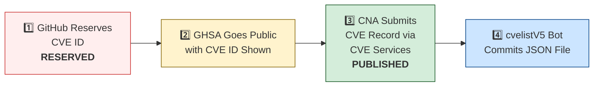

# 🛡️ OpenClaw CVE & Security Advisory Tracker

  
  
  
  
   
  
  
  
  
  

An automated tracker that continuously monitors [OpenClaw](https://github.com/openclaw/openclaw) security advisories across the GitHub Advisory Database, repo-level security advisories, and the [CVE V5 (cvelistV5)](https://github.com/CVEProject/cvelistV5) registry. Every hour it pulls the latest data, reconciles GHSA → CVE publication state, and regenerates this dashboard so you always have an up-to-date picture of the project's vulnerability landscape.

  Last updated: 2026-05-23 12:29 UTC · <a href="LICENSE">MIT License</a> · <a href="ADVISORIES.md">Full Advisory List</a> · <a href="SECURITY.md">Security Policy</a> · Data: <a href="https://github.com/CVEProject/cvelistV5">cvelistV5</a> + <a href="https://github.com/github/advisory-database">Advisory DB</a> · Updates hourly

---

  <a href="#-cves-published-in-cvelistv5-48">Published CVEs</a> ·
  <a href="#-cve-publication-pipeline">Pipeline</a> ·
  <a href="#-all-security-advisories-165">Advisories</a> ·
  <a href="#-vulnerability-categories">Categories</a> ·
  <a href="#-key-insights">Insights</a> ·
  <a href="#-project-identity">Identity</a>

---

## 🏗️ Project Identity

| Field | Value |
|-------|-------|
| **Current Name** | OpenClaw |
| **Previous Names** | Moltbot (second name), Clawdbot (original name) |
| **Repository** | [openclaw/openclaw](https://github.com/openclaw/openclaw) |
| **npm Package** | `openclaw` (formerly `clawdbot`) |
| **Author** | Peter Steinberger (steipete) |

<strong>Search terms for CVE discovery</strong>

To find all CVEs, search for: `openclaw`, `clawdbot`, `moltbot`, `clawhub`, `pkg:npm/clawdbot`, `pkg:npm/openclaw`

---

## 🚀 CVEs Published in cvelistV5 (48)

These CVEs have full records in the [CVEProject/cvelistV5](https://github.com/CVEProject/cvelistV5) repository:

| CVE ID | Severity | CVSS | Title | CWE | Published |
|--------|----------|------|-------|-----|-----------|
| [CVE-2026-32922](https://github.com/openclaw/openclaw/security/advisories/GHSA-4jpw-hj22-2xmc) |  | 9.4 | OpenClaw < 2026.3.11 - Privilege Escalation via Unvalidated Scope in device.token.rotate | CWE-266 | 2026-03-29 |
| [CVE-2026-32978](https://github.com/openclaw/openclaw/security/advisories/GHSA-qc36-x95h-7j53) |  | 9.4 | OpenClaw < 2026.3.11 - Approval Bypass via Unrecognized Script Runners | CWE-863 | 2026-03-29 |
| [CVE-2026-32987](https://github.com/openclaw/openclaw/security/advisories/GHSA-63f5-hhc7-cx6p) |  | 9.3 | OpenClaw < 2026.3.13 - Bootstrap Setup Code Replay via Device Pairing | CWE-294 | 2026-03-29 |
| [CVE-2026-28472](https://github.com/openclaw/openclaw/security/advisories/GHSA-rv39-79c4-7459) |  | 9.2 | OpenClaw < 2026.2.2 - Device Identity Check Bypass in Gateway WebSocket Connect Handshake | CWE-306 | 2026-03-05 |
| [CVE-2026-32916](https://github.com/openclaw/openclaw/security/advisories/GHSA-xw77-45gv-p728) |  | 9.2 | OpenClaw 2026.3.7 < 2026.3.11 - Authorization Bypass in Plugin Subagent Routes via Synthetic Admin Scopes | CWE-266 | 2026-03-31 |
| [CVE-2026-44109](https://github.com/openclaw/openclaw/security/advisories/GHSA-xh72-v6v9-mwhc) |  | 9.2 | OpenClaw: Feishu webhook and card-action validation now fail closed | CWE-1188 | 2026-05-06 |
| [CVE-2026-43585](https://github.com/openclaw/openclaw/security/advisories/GHSA-xmxx-7p24-h892) |  | 9.2 | OpenClaw: Gateway HTTP endpoints re-resolve bearer auth after SecretRef rotation | CWE-672 | 2026-05-06 |
| [CVE-2026-43533](https://github.com/openclaw/openclaw/security/advisories/GHSA-66r7-m7xm-v49h) |  | 8.9 | OpenClaw < 2026.4.10 - Arbitrary Local File Read via QQBot Media Tags | CWE-23 | 2026-05-05 |
| [CVE-2026-24763](https://github.com/openclaw/openclaw/security/advisories/GHSA-mc68-q9jw-2h3v) |  | 8.8 | OpenClaw/Clawdbot Docker Execution has Authenticated Command Injection via PATH Environment Variable | CWE-78 | 2026-02-02 |
| [CVE-2026-25253](https://github.com/openclaw/openclaw/security/advisories/GHSA-g8p2-7wf7-98mq) |  | 8.8 | OpenClaw/Clawdbot has 1-Click RCE via Authentication Token Exfiltration From gatewayUrl | CWE-669 | 2026-02-01 |
| [CVE-2026-32974](https://github.com/openclaw/openclaw/security/advisories/GHSA-g353-mgv3-8pcj) |  | 8.8 | OpenClaw < 2026.3.12 - Forged Event Injection via Feishu Webhook Verification Token | CWE-347 | 2026-03-29 |
| [CVE-2026-32973](https://github.com/openclaw/openclaw/security/advisories/GHSA-f8r2-vg7x-gh8m) |  | 8.8 | OpenClaw < 2026.3.11 - Exec Allowlist Pattern Overmatch via POSIX Path Normalization | CWE-625 | 2026-03-29 |
| [CVE-2026-28478](https://github.com/openclaw/openclaw/security/advisories/GHSA-q447-rj3r-2cgh) |  | 8.7 | OpenClaw affected by denial of service via unbounded webhook request body buffering | CWE-770 | 2026-03-05 |
| [CVE-2026-28479](https://github.com/openclaw/openclaw/security/advisories/GHSA-fh3f-q9qw-93j9) |  | 8.7 | OpenClaw < 2026.2.15 - Cache Poisoning via Deprecated SHA-1 Hash in Sandbox Configuration | CWE-327 | 2026-03-05 |
| [CVE-2026-32011](https://github.com/openclaw/openclaw/security/advisories/GHSA-x4vp-4235-65hg) |  | 8.7 | OpenClaw < 2026.3.2 - Slow-Request Denial of Service via Pre-Auth Webhook Body Parsing | CWE-770 | 2026-03-19 |
| [CVE-2026-32062](https://github.com/openclaw/openclaw/security/advisories/GHSA-mfg5-7q5g-f37j) |  | 8.7 | OpenClaw 2026.2.21-2 < 2026.2.22 - Unauthenticated WebSocket Resource Exhaustion via Media Stream | CWE-770 | 2026-03-11 |
| [CVE-2026-32846](https://github.com/openclaw/openclaw/security/advisories/GHSA-f6pf-4gjx-c94r) |  | 8.7 | OpenClaw Media Parsing Path Traversal to Arbitrary File Read | CWE-22 | 2026-03-26 |
| [CVE-2026-35639](https://github.com/openclaw/openclaw/security/advisories/GHSA-hf68-49fm-59cq) |  | 8.7 | OpenClaw < 2026.3.22 - Privilege Escalation via device.pair.approve Scope Validation | CWE-648 | 2026-04-09 |
| [CVE-2026-32982](https://github.com/openclaw/openclaw/security/advisories/GHSA-xwcj-hwhf-h378) |  | 8.7 | OpenClaw < 2026.3.13 - Telegram Bot Token Exposure in Media Fetch Error Logs | CWE-532 | 2026-03-31 |
| [CVE-2026-41399](https://github.com/openclaw/openclaw/security/advisories/GHSA-f44p-c7w9-7xr7) |  | 8.7 | OpenClaw < 2026.3.28 - Denial of Service via Unbounded Pre-auth WebSocket Upgrades | CWE-770 | 2026-04-28 |
| [CVE-2026-42435](https://github.com/openclaw/openclaw/security/advisories/GHSA-j6c7-3h5x-99g9) |  | 8.7 | OpenClaw 2026.2.22 < 2026.4.12 - Shell-Wrapper Detection Bypass via Environment Variable Assignment Injection | CWE-184 | 2026-05-05 |
| [CVE-2026-42434](https://github.com/openclaw/openclaw/security/advisories/GHSA-736r-jwj6-4w23) |  | 8.7 | OpenClaw: Sandboxed agents could escape exec routing via host=node override | CWE-863 | 2026-05-05 |
| [CVE-2026-43530](https://github.com/openclaw/openclaw/security/advisories/GHSA-2cq5-mf3v-mx44) |  | 8.7 | OpenClaw: busybox and toybox applet execution weakened exec approval binding | CWE-863 | 2026-05-05 |
| [CVE-2026-28463](https://github.com/openclaw/openclaw/security/advisories/GHSA-xvhf-x56f-2hpp) |  | 8.6 | OpenClaw < 2026.2.14 - Arbitrary File Read via Shell Expansion in Safe Bins Allowlist | CWE-78 | 2026-03-05 |
| [CVE-2026-32920](https://github.com/openclaw/openclaw/security/advisories/GHSA-99qw-6mr3-36qr) |  | 8.6 | OpenClaw < 2026.3.12 - Arbitrary Code Execution via Auto-Discovery of Workspace Plugins | CWE-829 | 2026-03-31 |
| [CVE-2026-35643](https://github.com/openclaw/openclaw/security/advisories/GHSA-cxmw-p77q-wchg) |  | 8.6 | OpenClaw < 2026.3.22 - Arbitrary Code Execution via Unvalidated WebView JavascriptInterface | CWE-940 | 2026-04-10 |
| [CVE-2026-32064](https://github.com/openclaw/openclaw/security/advisories/GHSA-25gx-x37c-7pph) |  | 8.5 | OpenClaw < 2026.2.21 - Missing VNC Authentication in Sandbox Browser noVNC Observer | CWE-306 | 2026-03-21 |
| [CVE-2026-44114](https://github.com/openclaw/openclaw/security/advisories/GHSA-hxvm-xjvf-93f3) |  | 8.5 | OpenClaw: Workspace dotenv could override runtime-control environment variables | CWE-184 | 2026-05-06 |
| [CVE-2026-44118](https://github.com/openclaw/openclaw/security/advisories/GHSA-r6xh-pqhr-v4xh) |  | 8.5 | OpenClaw < 2026.4.22 - Owner Context Spoofing via Bearer Token Header | CWE-290 | 2026-05-06 |
| [CVE-2026-45004](https://github.com/openclaw/openclaw/security/advisories/GHSA-r39h-4c2p-3jxp) |  | 8.4 | OpenClaw vulnerable to arbitrary code execution via attacker-controlled setup-api.js loaded from cwd during env-key resolution | CWE-427 | 2026-05-11 |
| [CVE-2026-43526](https://github.com/openclaw/openclaw/security/advisories/GHSA-2767-2q9v-9326) |  | 8.3 | OpenClaw: QQBot reply media URL handling could trigger SSRF and re-upload fetched bytes | CWE-918 | 2026-05-05 |
| [CVE-2026-28469](https://github.com/openclaw/openclaw/security/advisories/GHSA-rq6g-px6m-c248) |  | 8.2 | OpenClaw Google Chat shared-path webhook target ambiguity allowed cross-account policy-context misrouting | CWE-639 | 2026-03-05 |
| [CVE-2026-32302](https://github.com/openclaw/openclaw/security/advisories/GHSA-5wcw-8jjv-m286) |  | 8.1 | OpenClaw: Untrusted web origins can obtain authenticated operator.admin access in trusted-proxy mode | CWE-346 | 2026-03-12 |
| [CVE-2026-25157](https://github.com/openclaw/openclaw/security/advisories/GHSA-q284-4pvr-m585) |  | 7.8 | OpenClaw/Clawdbot has OS Command Injection via Project Root Path in sshNodeCommand | CWE-78 | 2026-02-04 |
| [CVE-2026-32048](https://github.com/openclaw/openclaw/security/advisories/GHSA-p7gr-f84w-hqg5) |  | 7.7 | OpenClaw < 2026.3.1 - Sandbox Escape via Cross-Agent sessions_spawn | CWE-732 | 2026-03-21 |
| [CVE-2026-41404](https://github.com/openclaw/openclaw/security/advisories/GHSA-g374-mggx-p6xc) |  | 7.7 | OpenClaw < 2026.3.31 - Operator Admin Privilege Escalation via Trusted-Proxy Authentication | CWE-863 | 2026-04-28 |
| [CVE-2026-42422](https://github.com/openclaw/openclaw/security/advisories/GHSA-whf9-3hcx-gq54) |  | 7.7 | OpenClaw < 2026.4.8 - Role Bypass in device.token.rotate Function | CWE-863 | 2026-04-28 |
| [CVE-2026-43571](https://github.com/openclaw/openclaw/security/advisories/GHSA-82qx-6vj7-p8m2) |  | 7.7 | OpenClaw: Channel setup catalog lookups could include untrusted workspace plugin shadows | CWE-829 | 2026-05-05 |
| [CVE-2026-43569](https://github.com/openclaw/openclaw/security/advisories/GHSA-939r-rj45-g2rj) |  | 7.7 | OpenClaw: Workspace provider auth choices could auto-enable untrusted provider plugins | CWE-829 | 2026-05-05 |
| [CVE-2026-44110](https://github.com/openclaw/openclaw/security/advisories/GHSA-2gvc-4f3c-2855) |  | 7.7 | OpenClaw: Matrix room control-command authorization no longer trusts DM pairing-store entries | CWE-863 | 2026-05-06 |
| [CVE-2026-41397](https://github.com/openclaw/openclaw/security/advisories/GHSA-cwf8-44x6-32c2) |  | 7.6 | OpenClaw < 2026.3.31 - Sandbox Escape via Unrestricted File Sync and Symlink Traversal | CWE-59 | 2026-04-28 |
| [CVE-2026-42431](https://github.com/openclaw/openclaw/security/advisories/GHSA-cmfr-9m2r-xwhq) |  | 7.6 | OpenClaw < 2026.4.8 - Persistent Profile Mutation via node.invoke(browser.proxy) Bypass | CWE-863 | 2026-04-28 |
| [CVE-2026-43535](https://github.com/openclaw/openclaw/security/advisories/GHSA-jwrq-8g5x-5fhm) |  | 7.6 | OpenClaw < 2026.4.14 - Authorization Context Reuse in Collect-Mode Queue Batches | CWE-266 | 2026-05-05 |
| [CVE-2026-25474](https://github.com/openclaw/openclaw/security/advisories/GHSA-mp5h-m6qj-6292) |  | 7.5 | OpenClaw has a Telegram webhook request forgery (missing `channels.telegram.webhookSecret`) → auth bypass | CWE-345 | 2026-02-19 |
| [CVE-2026-28485](https://github.com/openclaw/openclaw/security/advisories/GHSA-qpjj-47vm-64pj) |  | 7.5 | OpenClaw 2026.1.5 < 2026.2.12 - Missing Authentication in Browser Control HTTP Endpoints | CWE-306 | 2026-03-05 |
| [CVE-2026-42428](https://github.com/openclaw/openclaw/security/advisories/GHSA-3vvq-q2qc-7rmp) |  | 7.5 | OpenClaw < 2026.4.8 - Missing Integrity Verification in Package Downloads | CWE-353 | 2026-04-28 |
| [CVE-2026-28458](https://github.com/openclaw/openclaw/security/advisories/GHSA-mr32-vwc2-5j6h) |  | 7.4 | OpenClaw's Browser Relay /cdp websocket is missing auth which could allow cross-tab cookie access | CWE-306 | 2026-03-05 |
| [CVE-2026-32971](https://github.com/openclaw/openclaw/security/advisories/GHSA-rw39-5899-8mxp) |  | 7.3 | OpenClaw < 2026.3.11 - Node-Host Approval UI Mismatch Allows Execution of Unintended Commands | CWE-451 | 2026-03-31 |
| [CVE-2026-26325](https://github.com/openclaw/openclaw/security/advisories/GHSA-h3f9-mjwj-w476) |  | 7.2 | OpenClaw Node host system.run rawCommand/command mismatch can bypass allowlist/approvals | CWE-284 | 2026-02-19 |
| [CVE-2026-26317](https://github.com/openclaw/openclaw/security/advisories/GHSA-3fqr-4cg8-h96q) |  | 7.1 | OpenClaw affected by cross-site request forgery (CSRF) through loopback browser mutation endpoints | CWE-352 | 2026-02-19 |
| [CVE-2026-22175](https://github.com/openclaw/openclaw/security/advisories/GHSA-gwqp-86q6-w47g) |  | 7.1 | OpenClaw < 2026.2.23 - Exec Approval Bypass via Unrecognized Multiplexer Shell Wrappers | CWE-184 | 2026-03-18 |
| [CVE-2026-26329](https://github.com/openclaw/openclaw/security/advisories/GHSA-cv7m-c9jx-vg7q) |  | 7.1 | OpenClaw has a path traversal in browser upload allows local file read | CWE-22 | 2026-02-19 |
| [CVE-2026-26320](https://github.com/openclaw/openclaw/security/advisories/GHSA-7q2j-c4q5-rm27) |  | 7.1 | OpenClaw macOS deep link confirmation truncation can conceal executed agent message | CWE-451 | 2026-02-19 |
| [CVE-2026-32027](https://github.com/openclaw/openclaw/security/advisories/GHSA-jv6r-27ww-4gw4) |  | 7.1 | OpenClaw < 2026.2.26 - Improper Authorization via DM Pairing Store Identity Inheritance in Group Allowlist | CWE-22 | 2026-03-19 |
| [CVE-2026-35631](https://github.com/openclaw/openclaw/security/advisories/GHSA-3w6x-gv34-mqpf) |  | 7.1 | OpenClaw < 2026.3.22 - Missing Authorization Enforcement in Internal ACP Chat Commands | CWE-862 | 2026-04-09 |
| [CVE-2026-40037](https://github.com/openclaw/openclaw/security/advisories/GHSA-qx8j-g322-qj6m) |  | 7.1 | OpenClaw < 2026.3.31 - Unsafe Request Body Replay via fetchWithSsrFGuard Cross-Origin Redirects | CWE-601 | 2026-04-08 |
| [CVE-2026-41379](https://github.com/openclaw/openclaw/security/advisories/GHSA-3q42-xmxv-9vfr) |  | 7.1 | OpenClaw < 2026.3.28 - Privilege Escalation via chat.send to Admin-Class Talk Voice Config | CWE-863 | 2026-04-28 |
| [CVE-2026-42433](https://github.com/openclaw/openclaw/security/advisories/GHSA-7jp6-r74r-995q) |  | 7.1 | OpenClaw: Matrix profile config persistence was reachable from operator.write message tools | CWE-862 | 2026-05-05 |
| [CVE-2026-43528](https://github.com/openclaw/openclaw/security/advisories/GHSA-8372-7vhw-cm6q) |  | 7.1 | OpenClaw < 2026.4.14 - Redaction Bypass via sourceConfig and runtimeConfig Aliases | CWE-212 | 2026-05-05 |
| [CVE-2026-43567](https://github.com/openclaw/openclaw/security/advisories/GHSA-jf25-7968-h2h5) |  | 7.1 | OpenClaw < 2026.4.10 - Path Traversal in screen_record outPath Parameter | CWE-862 | 2026-05-05 |
| [CVE-2026-43568](https://github.com/openclaw/openclaw/security/advisories/GHSA-5gjc-grvm-m88j) |  | 7.1 | OpenClaw 2026.4.5 < 2026.4.10 - Privilege Escalation via Memory Dreaming Configuration in /dreaming Endpoint | CWE-862 | 2026-05-05 |
| [CVE-2026-41380](https://github.com/openclaw/openclaw/security/advisories/GHSA-p4x4-2r7f-wjxg) |  | 7 | OpenClaw < 2026.3.28 - Arbitrary Execution Allowlist via Wrapper Carrier Executables | CWE-807 | 2026-04-28 |
| [CVE-2026-43531](https://github.com/openclaw/openclaw/security/advisories/GHSA-7wv4-cc7p-jhxc) |  | 7 | OpenClaw < 2026.4.9 - Environment Variable Injection via Workspace .env File | CWE-15 | 2026-05-05 |
| [CVE-2026-22178](https://github.com/openclaw/openclaw/security/advisories/GHSA-c6hr-w26q-c636) |  | 6.9 | OpenClaw < 2026.2.19 - ReDoS and Regex Injection via Unescaped Feishu Mention Metadata | CWE-1333 | 2026-03-18 |
| [CVE-2026-22176](https://github.com/openclaw/openclaw/security/advisories/GHSA-pj5x-38rw-6fph) |  | 6.9 | OpenClaw < 2026.2.19 - Command Injection via Unescaped Environment Variables in Windows Scheduled Task Script Generation | CWE-78 | 2026-03-19 |
| [CVE-2026-28480](https://github.com/openclaw/openclaw/security/advisories/GHSA-mj5r-hh7j-4gxf) |  | 6.9 | OpenClaw Telegram allowlist authorization accepted mutable usernames | CWE-290 | 2026-03-05 |
| [CVE-2026-31994](https://github.com/openclaw/openclaw/security/advisories/GHSA-mqr9-vqhq-3jxw) |  | 6.9 | OpenClaw < 2026.2.19 - Local Command Injection via Unsafe cmd Argument Handling in Windows Scheduled Task Script Generation | CWE-78 | 2026-03-19 |
| [CVE-2026-31990](https://github.com/openclaw/openclaw/security/advisories/GHSA-cfvj-7rx7-fc7c) |  | 6.9 | OpenClaw < 2026.3.2 - Symlink Traversal in stageSandboxMedia Destination | CWE-59 | 2026-03-19 |
| [CVE-2026-32924](https://github.com/openclaw/openclaw/security/advisories/GHSA-m69h-jm2f-2pv8) |  | 6.9 | OpenClaw < 2026.3.12 - Authorization Bypass via Misclassified Reaction Events in Feishu | CWE-863 | 2026-03-29 |
| [CVE-2026-34510](https://github.com/openclaw/openclaw/security/advisories/GHSA-h3x4-hc5v-v2gm) |  | 6.9 | OpenClaw < 2026.3.22 - Remote File URL Acceptance in Windows Media Loaders | CWE-41 | 2026-04-01 |
| [CVE-2026-35633](https://github.com/openclaw/openclaw/security/advisories/GHSA-4qwc-c7g9-4xcw) |  | 6.9 | OpenClaw < 2026.3.22 - Unbounded Memory Allocation via Remote Media Error Responses | CWE-789 | 2026-04-09 |
| [CVE-2026-35665](https://github.com/openclaw/openclaw/security/advisories/GHSA-w6m8-cqvj-pg5v) |  | 6.9 | OpenClaw < 2026.3.24 - Denial of Service via Feishu Webhook Pre-Auth Body Parsing | CWE-405 | 2026-04-10 |
| [CVE-2026-35626](https://github.com/openclaw/openclaw/security/advisories/GHSA-rm59-992w-x2mv) |  | 6.9 | OpenClaw < 2026.3.22 - Unauthenticated Resource Exhaustion via Voice Call Webhook | CWE-405 | 2026-04-09 |
| [CVE-2026-41301](https://github.com/openclaw/openclaw/security/advisories/GHSA-h43v-27wg-5mf9) |  | 6.9 | OpenClaw 2026.3.22 < 2026.3.31 - Forged Nostr DM Pairing State Creation via Signature Verification Bypass | CWE-347 | 2026-04-20 |
| [CVE-2026-44116](https://github.com/openclaw/openclaw/security/advisories/GHSA-2hh7-c75g-qj2r) |  | 6.9 | OpenClaw < 2026.4.22 - Server-Side Request Forgery in Zalo Photo URL Validation | CWE-918 | 2026-05-06 |
| [CVE-2026-29612](https://github.com/openclaw/openclaw/security/advisories/GHSA-w2cg-vxx6-5xjg) |  | 6.8 | OpenClaw < 2026.2.14 - Denial of Service via Large Base64 Media File Decoding | CWE-770 | 2026-03-05 |
| [CVE-2026-28452](https://github.com/openclaw/openclaw/security/advisories/GHSA-h89v-j3x9-8wqj) |  | 6.7 | OpenClaw affected by denial of service through unguarded archive extraction allowing high expansion/resource abuse (ZIP/TAR) | CWE-770 | 2026-03-05 |
| [CVE-2026-32044](https://github.com/openclaw/openclaw/security/advisories/GHSA-77hf-7fqf-f227) |  | 6.7 | OpenClaw < 2026.3.2 - Tar Archive Safety Bypass in Skills Installation | CWE-409 | 2026-03-21 |
| [CVE-2026-25475](https://github.com/openclaw/openclaw/security/advisories/GHSA-r8g4-86fx-92mq) |  | 6.5 | OpenClaw Vulnerable to Local File Inclusion via MEDIA: Path Extraction | CWE-200, CWE-22 | 2026-02-04 |
| [CVE-2026-26328](https://github.com/openclaw/openclaw/security/advisories/GHSA-g34w-4xqq-h79m) |  | 6.5 | OpenClaw iMessage group allowlist authorization inherited DM pairing-store identities | CWE-284, CWE-863 | 2026-02-19 |
| [CVE-2026-28475](https://github.com/openclaw/openclaw/security/advisories/GHSA-47q7-97xp-m272) |  | 6.3 | OpenClaw < 2026.2.13 - Timing Attack via Hook Token Comparison | CWE-208 | 2026-03-05 |
| [CVE-2026-41337](https://github.com/openclaw/openclaw/security/advisories/GHSA-89r3-6x4j-v7wf) |  | 6.3 | OpenClaw < 2026.3.31 - Callback Origin Mutation in Plivo Voice-call Replay | CWE-367 | 2026-04-23 |
| [CVE-2026-41340](https://github.com/openclaw/openclaw/security/advisories/GHSA-f693-58pc-2gfr) |  | 6.3 | OpenClaw < 2026.3.31 - Authentication Boundary Bypass via Telegram Legacy allowFrom Migration | CWE-372 | 2026-04-23 |
| [CVE-2026-41346](https://github.com/openclaw/openclaw/security/advisories/GHSA-wwfp-w96m-c6x8) |  | 6.3 | OpenClaw 2026.2.26 < 2026.3.31 - Denial of Service via Improper Pending Pairing Request Cap Enforcement | CWE-799 | 2026-04-23 |
| [CVE-2026-41389](https://github.com/openclaw/openclaw/security/advisories/GHSA-mr34-9552-qr95) |  | 6.3 | OpenClaw: Webchat media embedding enforces local-root containment for tool-result files | CWE-73 | 2026-04-20 |
| [CVE-2026-43527](https://github.com/openclaw/openclaw/security/advisories/GHSA-53vx-pmqw-863c) |  | 6.3 | OpenClaw: Browser SSRF policy default allowed private-network navigation | CWE-918, CWE-1188 | 2026-05-05 |
| [CVE-2026-43572](https://github.com/openclaw/openclaw/security/advisories/GHSA-gc9r-867r-j85f) |  | 6.3 | OpenClaw 2026.4.10 < 2026.4.14 - Missing Sender Authorization in Microsoft Teams SSO Invoke Handler | CWE-862 | 2026-05-05 |
| [CVE-2026-44117](https://github.com/openclaw/openclaw/security/advisories/GHSA-c4qg-j8jg-42q5) |  | 6.3 | OpenClaw < 2026.4.20 - Server-Side Request Forgery in QQBot Direct Media Upload | CWE-918 | 2026-05-06 |
| [CVE-2026-44994](https://github.com/openclaw/openclaw/security/advisories/GHSA-93rg-2xm5-2p9v) |  | 6.3 | OpenClaw < 2026.4.22 - Authentication Bypass in Gateway Control UI Bootstrap Config Endpoint | CWE-862 | 2026-05-11 |
| [CVE-2026-45002](https://github.com/openclaw/openclaw/security/advisories/GHSA-2xcp-x87w-q377) |  | 6.3 | OpenClaw < 2026.4.20 - Hook Session-Key Bypass via Template Mapping | CWE-863 | 2026-05-11 |
| [CVE-2026-44999](https://github.com/openclaw/openclaw/security/advisories/GHSA-57r2-h2wj-g887) |  | 6.3 | OpenClaw < 2026.4.20 - Improper Trust Labeling in Isolated Cron Awareness Events | CWE-345 | 2026-05-11 |
| [CVE-2026-22181](https://github.com/openclaw/openclaw/security/advisories/GHSA-8mvx-p2r9-r375) |  | 6.1 | OpenClaw < 2026.3.2 - DNS Pinning Bypass via Environment Proxy Configuration in web_fetch | CWE-918 | 2026-03-18 |
| [CVE-2026-28460](https://github.com/openclaw/openclaw/security/advisories/GHSA-9868-vxmx-w862) |  | 6 | OpenClaw < 2026.2.22 - Allowlist Bypass via Shell Line-Continuation Command Substitution in system.run | CWE-78 | 2026-03-19 |
| [CVE-2026-32033](https://github.com/openclaw/openclaw/security/advisories/GHSA-27cr-4p5m-74rj) |  | 6 | OpenClaw < 2026.2.24 - Path Traversal via @-prefixed Absolute Paths in Workspace Boundary Validation | CWE-22 | 2026-03-19 |
| [CVE-2026-32057](https://github.com/openclaw/openclaw/security/advisories/GHSA-vvgp-4c28-m3jm) |  | 6 | OpenClaw < 2026.2.25 - Authentication Bypass via Control UI client.id Parameter | CWE-807 | 2026-03-21 |
| [CVE-2026-35670](https://github.com/openclaw/openclaw/security/advisories/GHSA-wv46-v6xc-2qhf) |  | 6 | OpenClaw < 2026.3.22 - Webhook Reply Rebinding via Username Resolution in Synology Chat | CWE-807 | 2026-04-10 |
| [CVE-2026-41345](https://github.com/openclaw/openclaw/security/advisories/GHSA-68v4-hmwv-f43h) |  | 6 | OpenClaw < 2026.3.31 - Authorization Header Leak via Cross-Origin Redirect in Media Download | CWE-522 | 2026-04-23 |
| [CVE-2026-41363](https://github.com/openclaw/openclaw/security/advisories/GHSA-qf48-qfv4-jjm9) |  | 6 | OpenClaw 2026.2.6 < 2026.3.28 - Arbitrary File Read via Feishu upload_image Parameter | CWE-22 | 2026-04-27 |
| [CVE-2026-43570](https://github.com/openclaw/openclaw/security/advisories/GHSA-cr8r-7g2h-6wr6) |  | 6 | OpenClaw contains a symlink traversal vulnerability | CWE-61 | 2026-05-05 |
| [CVE-2026-44113](https://github.com/openclaw/openclaw/security/advisories/GHSA-5h3g-6xhh-rg6p) |  | 6 | OpenClaw: OpenShell FS bridge reads pin and verify the opened file before returning bytes | CWE-367 | 2026-05-06 |
| [CVE-2026-44112](https://github.com/openclaw/openclaw/security/advisories/GHSA-wppj-c6mr-83jj) |  | 6 | OpenClaw < 2026.4.22 - Symlink Swap Race Condition in OpenShell FS Bridge Writes | CWE-367 | 2026-05-06 |
| [CVE-2026-43579](https://github.com/openclaw/openclaw/security/advisories/GHSA-f3h5-h452-vp3j) |  | 6 | OpenClaw < 2026.4.10 - Insufficient Access Control in Nostr Profile Mutation Routes | CWE-862 | 2026-05-06 |
| [CVE-2026-22174](https://github.com/openclaw/openclaw/security/advisories/GHSA-v3j7-34xh-6g3w) |  | 5.9 | OpenClaw < 2026.2.22 - Gateway Token Disclosure via Chrome CDP Probe | CWE-306 | 2026-03-18 |
| [CVE-2026-45005](https://github.com/openclaw/openclaw/security/advisories/GHSA-q8ff-7ffm-m3r9) |  | 5.9 | OpenClaw < 2026.4.23 - Webhook Route Secret Cache Not Invalidated After Rotation | CWE-672 | 2026-05-11 |
| [CVE-2026-41373](https://github.com/openclaw/openclaw/security/advisories/GHSA-g8xp-qx39-9jq9) |  | 5.8 | OpenClaw < 2026.3.31 - Compiler Binary Substitution via Environment Variable Override in Host Execution Policy | CWE-427 | 2026-04-28 |
| [CVE-2026-44995](https://github.com/openclaw/openclaw/security/advisories/GHSA-mj59-h3q9-ghfh) |  | 5.4 | OpenClaw: MCP stdio server env could load dangerous startup variables from workspace config | CWE-829 | 2026-05-11 |
| [CVE-2026-35620](https://github.com/openclaw/openclaw/security/advisories/GHSA-vqvg-86cc-cg83) |  | 5.3 | OpenClaw < 2026.3.24 - Missing Authorization in /send and /allowlist Chat Commands | CWE-862 | 2026-04-10 |
| [CVE-2026-32898](https://github.com/openclaw/openclaw/security/advisories/GHSA-7jx5-9fjg-hp4m) |  | 5.3 | OpenClaw < 2026.2.23 - ACP Permission Auto-Approval Bypass via Untrusted Tool Metadata | CWE-807 | 2026-03-21 |
| [CVE-2026-35619](https://github.com/openclaw/openclaw/security/advisories/GHSA-68f8-9mhj-h2mp) |  | 5.3 | OpenClaw < 2026.3.24 - Authorization Bypass via HTTP /v1/models Endpoint | CWE-863 | 2026-04-10 |
| [CVE-2026-41339](https://github.com/openclaw/openclaw/security/advisories/GHSA-2f7j-rp58-mr42) |  | 5.3 | OpenClaw < 2026.4.2 - Information Disclosure via Gateway Connect Snapshot | CWE-497 | 2026-04-23 |
| [CVE-2026-41344](https://github.com/openclaw/openclaw/security/advisories/GHSA-5h2w-qmfp-ggp6) |  | 5.3 | OpenClaw < 2026.3.28 - Privilege Escalation via chat.send /verbose Parameter | CWE-863 | 2026-04-23 |
| [CVE-2026-41367](https://github.com/openclaw/openclaw/security/advisories/GHSA-jp4j-q5fc-58gv) |  | 5.3 | OpenClaw 2026.2.14 < 2026.3.28 - Policy Enforcement Bypass in Discord Component Interactions | CWE-863 | 2026-04-27 |
| [CVE-2026-41365](https://github.com/openclaw/openclaw/security/advisories/GHSA-chfm-xgc4-47rj) |  | 5.3 | OpenClaw < 2026.3.31 - Sender Allowlist Bypass via Graph API Thread History | CWE-441 | 2026-04-27 |
| [CVE-2026-35659](https://github.com/openclaw/openclaw/security/advisories/GHSA-rvqr-hrcc-j9vv) |  | 5.1 | OpenClaw < 2026.3.22 - Unresolved Service Metadata Routing via Bonjour and DNS-SD Discovery | CWE-345 | 2026-04-10 |
| [CVE-2026-41914](https://github.com/openclaw/openclaw/security/advisories/GHSA-3fv3-6p2v-gxwj) |  | 5.1 | OpenClaw < 2026.4.8 - Server-Side Request Forgery in QQ Bot Media Fetch Paths | CWE-918 | 2026-04-28 |
| [CVE-2026-42438](https://github.com/openclaw/openclaw/security/advisories/GHSA-jhpv-5j76-m56h) |  | 4.9 | OpenClaw: Sender policy bypass in host media attachment reads allows unauthorized local file disclosure | CWE-863 | 2026-05-05 |
| [CVE-2026-42439](https://github.com/openclaw/openclaw/security/advisories/GHSA-rj2p-j66c-mgqh) |  | 4.9 | OpenClaw < 2026.4.10 - SSRF Policy Bypass in Browser Tabs Action Routes | CWE-862 | 2026-05-05 |
| [CVE-2026-43573](https://github.com/openclaw/openclaw/security/advisories/GHSA-527m-976r-jf79) |  | 4.9 | OpenClaw: Existing-session browser interaction routes bypassed SSRF policy enforcement | CWE-862, CWE-918 | 2026-05-05 |
| [CVE-2026-43580](https://github.com/openclaw/openclaw/security/advisories/GHSA-536q-mj95-h29h) |  | 4.9 | OpenClaw: Browser press/type interaction routes missed complete navigation guard coverage | CWE-862 | 2026-05-06 |
| [CVE-2026-43582](https://github.com/openclaw/openclaw/security/advisories/GHSA-xq94-r468-qwgj) |  | 4.9 | OpenClaw < 2026.4.10 - DNS Rebinding SSRF via Hostname Validation Bypass | CWE-367 | 2026-05-06 |
| [CVE-2026-43576](https://github.com/openclaw/openclaw/security/advisories/GHSA-f7fh-qg34-x2xh) |  | 4.9 | OpenClaw < 2026.4.5 - Second-hop SSRF via CDP /json/version WebSocket URL | CWE-601, CWE-918 | 2026-05-06 |
| [CVE-2026-22180](https://github.com/openclaw/openclaw/security/advisories/GHSA-3pxq-f3cp-jmxp) |  | 4.8 | OpenClaw < 2026.3.2 - Path Confinement Bypass in Browser Output and File Write Operations | CWE-59 | 2026-03-18 |
| [CVE-2026-32020](https://github.com/openclaw/openclaw/security/advisories/GHSA-5ghc-98wh-gwwf) |  | 4.8 | OpenClaw < 2026.2.22 - Arbitrary File Read via Symlink Following in Static File Handler | CWE-59 | 2026-03-19 |
| [CVE-2026-27485](https://github.com/openclaw/openclaw/security/advisories/GHSA-r6h2-5gqq-v5v6) |  | 4.6 | OpenClaw affected by Stored XSS in Control UI via unsanitized assistant name/avatar in inline script injection | CWE-61 | 2026-02-21 |
| [CVE-2026-31997](https://github.com/openclaw/openclaw/security/advisories/GHSA-q399-23r3-hfx4) |  | 4.4 | OpenClaw < 2026.3.1 - Executable Rebind via Unbound PATH-token in system.run Approvals | CWE-367 | 2026-03-19 |
| [CVE-2026-27486](https://github.com/openclaw/openclaw/security/advisories/GHSA-jfv4-h8mc-jcp8) |  | 4.3 | OpenClaw: Process Safety - Unvalidated PID Kill via SIGKILL in Process Cleanup | CWE-283 | 2026-02-21 |
| [CVE-2026-44992](https://github.com/openclaw/openclaw/security/advisories/GHSA-h2vw-ph2c-jvwf) |  | 4.1 | OpenClaw 2026.4.5 < 2026.4.20 - MiniMax API Host Override via Workspace dotenv | CWE-441 | 2026-05-11 |
| [CVE-2026-45003](https://github.com/openclaw/openclaw/security/advisories/GHSA-55cf-xx38-4p9p) |  | 4.1 | OpenClaw: Workspace dotenv files cannot override connector endpoint hosts | CWE-441 | 2026-05-11 |
| [CVE-2026-24764](https://github.com/openclaw/openclaw/security/advisories/GHSA-782p-5fr5-7fj8) |  | 3.7 | OpenClaw has Remote Code Execution via System Prompt Injection in Slack Channel Descriptions | CWE-74, CWE-94 | 2026-02-19 |
| [CVE-2026-35624](https://github.com/openclaw/openclaw/security/advisories/GHSA-xhq5-45pm-2gjr) |  | 2.3 | OpenClaw < 2026.3.22 - Policy Confusion via Room Name Collision in Nextcloud Talk | CWE-807 | 2026-04-09 |
| [CVE-2026-41358](https://github.com/openclaw/openclaw/security/advisories/GHSA-qm77-8qjp-4vcm) |  | 2.3 | OpenClaw < 2026.4.2 - Sender Allowlist Bypass via Slack Thread Context | CWE-346 | 2026-04-23 |
| [CVE-2026-41402](https://github.com/openclaw/openclaw/security/advisories/GHSA-hhq4-97c2-p447) |  | 2.3 | OpenClaw < 2026.3.31 - Webhook Replay Cache Cross-Target messageId Scope Bypass | CWE-706 | 2026-04-28 |
| [CVE-2026-41908](https://github.com/openclaw/openclaw/security/advisories/GHSA-v8qf-fr4g-28p2) |  | 2.3 | OpenClaw < 2026.4.20 - Scope Enforcement Bypass in Assistant-Media Route | CWE-863 | 2026-04-23 |
| [CVE-2026-44991](https://github.com/openclaw/openclaw/security/advisories/GHSA-c28g-vh7m-fm7v) |  | 2.3 | OpenClaw: Owner-enforced commands could accept wildcard channel senders as command owners | CWE-863 | 2026-05-11 |
| [CVE-2026-45000](https://github.com/openclaw/openclaw/security/advisories/GHSA-j4c5-89f5-f3pm) |  | 2.3 | OpenClaw < 2026.4.20 - Server-Side Request Forgery via Browser CDP Profile Creation | CWE-918 | 2026-05-11 |
| [CVE-2026-44997](https://github.com/openclaw/openclaw/security/advisories/GHSA-q3jj-46pq-826r) |  | 2.3 | OpenClaw < 2026.4.22 - Security Envelope Constraint Bypass in ACP Child Sessions | CWE-266 | 2026-05-11 |
| [CVE-2026-44998](https://github.com/openclaw/openclaw/security/advisories/GHSA-qrp5-gfw2-gxv4) |  | 2.3 | OpenClaw < 2026.4.20 - Tool Policy Bypass via Bundled MCP/LSP Tools | CWE-863 | 2026-05-11 |

<strong>📖 Detailed CVE Analysis (click to expand)</strong>

### CVE-2026-32922 — OpenClaw < 2026.3.11 - Privilege Escalation via Unvalidated Scope in device.token.rotate

| Field | Detail |
|-------|--------|
| **CVSS** | 9.4 (CRITICAL) — `CVSS:4.0/AV:N/AC:L/AT:N/PR:L/UI:N/VC:H/VI:H/VA:H/SC:H/SI:H/SA:H` |
| **CWE** | CWE-266 (Incorrect Privilege Assignment) |
| **Affected** | < 2026.3.11 |
| **Vendor/Product** | OpenClaw / OpenClaw |
| **Advisory** | [GHSA-4jpw-hj22-2xmc](https://github.com/openclaw/openclaw/security/advisories/GHSA-4jpw-hj22-2xmc) |

OpenClaw before 2026.3.11 contains a privilege escalation vulnerability in device.token.rotate that allows callers with operator.pairing scope to mint tokens with broader scopes by failing to constrain newly minted scopes to the caller's current scope set. Attackers can obtain operator.admin tokens for paired devices and achieve remote code execution on connected nodes via system.run or gain unauthorized gateway-admin access.

**References:**
- [VulnCheck Advisory: OpenClaw < 2026.3.11 - Privilege Escalation via Unvalidated Scope in device.token.rotate](https://www.vulncheck.com/advisories/openclaw-privilege-escalation-via-unvalidated-scope-in-device-token-rotate)
---

### CVE-2026-32978 — OpenClaw < 2026.3.11 - Approval Bypass via Unrecognized Script Runners

| Field | Detail |
|-------|--------|
| **CVSS** | 9.4 (CRITICAL) — `CVSS:4.0/AV:N/AC:L/AT:N/PR:L/UI:P/VC:H/VI:H/VA:H/SC:H/SI:H/SA:H` |
| **CWE** | CWE-863 (Incorrect Authorization) |
| **Affected** | < 2026.3.11 |
| **Vendor/Product** | OpenClaw / OpenClaw |
| **Advisory** | [GHSA-qc36-x95h-7j53](https://github.com/openclaw/openclaw/security/advisories/GHSA-qc36-x95h-7j53) |

OpenClaw before 2026.3.11 contains an approval integrity vulnerability where system.run approvals fail to bind mutable file operands for certain script runners like tsx and jiti. Attackers can obtain approval for benign script commands, rewrite referenced scripts on disk, and execute modified code under the approved run context.

**References:**
- [VulnCheck Advisory: OpenClaw < 2026.3.11 - Approval Bypass via Unrecognized Script Runners](https://www.vulncheck.com/advisories/openclaw-approval-bypass-via-unrecognized-script-runners)
---

### CVE-2026-32987 — OpenClaw < 2026.3.13 - Bootstrap Setup Code Replay via Device Pairing

| Field | Detail |
|-------|--------|
| **CVSS** | 9.3 (CRITICAL) — `CVSS:4.0/AV:N/AC:L/AT:N/PR:N/UI:N/VC:H/VI:H/VA:H/SC:N/SI:N/SA:N` |
| **CWE** | CWE-294 (Authentication Bypass by Capture-replay) |
| **Affected** | < 2026.3.13 |
| **Vendor/Product** | OpenClaw / OpenClaw |
| **Advisory** | [GHSA-63f5-hhc7-cx6p](https://github.com/openclaw/openclaw/security/advisories/GHSA-63f5-hhc7-cx6p) |

OpenClaw before 2026.3.13 allows bootstrap setup codes to be replayed during device pairing verification in src/infra/device-bootstrap.ts. Attackers can verify a valid bootstrap code multiple times before approval to escalate pending pairing scopes, including privilege escalation to operator.admin.

**References:**
- [Patch Commit](https://github.com/openclaw/openclaw/commit/1803d16d5cec970c54b0e1ac46b31b1cbade335c)
- [VulnCheck Advisory: OpenClaw < 2026.3.13 - Bootstrap Setup Code Replay via Device Pairing](https://www.vulncheck.com/advisories/openclaw-bootstrap-setup-code-replay-via-device-pairing)
---

### CVE-2026-28472 — OpenClaw < 2026.2.2 - Device Identity Check Bypass in Gateway WebSocket Connect Handshake

| Field | Detail |
|-------|--------|
| **CVSS** | 9.2 (CRITICAL) — `CVSS:4.0/AV:N/AC:H/AT:N/PR:N/UI:N/VC:H/VI:H/VA:H/SC:N/SI:N/SA:N` |
| **CWE** | CWE-306 (Missing Authentication for Critical Function) |
| **Affected** | < 2026.2.2 |
| **Vendor/Product** | OpenClaw / OpenClaw |
| **Advisory** | [GHSA-rv39-79c4-7459](https://github.com/openclaw/openclaw/security/advisories/GHSA-rv39-79c4-7459) |

OpenClaw versions prior to 2026.2.2 contain a vulnerability in the gateway WebSocket connect handshake in which it allows skipping device identity checks when auth.token is present but not validated. Attackers can connect to the gateway without providing device identity or pairing by exploiting the presence check instead of validation, potentially gaining operator access in vulnerable deployments.

**References:**
- [Patch Commit](https://github.com/openclaw/openclaw/commit/fe81b1d7125a014b8280da461f34efbf5f761575)
- [VulnCheck Advisory: OpenClaw < 2026.2.2 - Device Identity Check Bypass in Gateway WebSocket Connect Handshake](https://www.vulncheck.com/advisories/openclaw-device-identity-check-bypass-in-gateway-websocket-connect-handshake)
---

### CVE-2026-32916 — OpenClaw 2026.3.7 < 2026.3.11 - Authorization Bypass in Plugin Subagent Routes via Synthetic Admin Scopes

| Field | Detail |
|-------|--------|
| **CVSS** | 9.2 (CRITICAL) — `CVSS:4.0/AV:N/AC:L/AT:P/PR:N/UI:N/VC:H/VI:H/VA:L/SC:N/SI:N/SA:N` |
| **CWE** | CWE-266 (CWE-266: Incorrect Privilege Assignment) |
| **Affected** | < 2026.3.11 |
| **Vendor/Product** | OpenClaw / OpenClaw |
| **Advisory** | [GHSA-xw77-45gv-p728](https://github.com/openclaw/openclaw/security/advisories/GHSA-xw77-45gv-p728) |

OpenClaw versions 2026.3.7 before 2026.3.11 contain an authorization bypass vulnerability where plugin subagent routes execute gateway methods through a synthetic operator client with broad administrative scopes. Remote unauthenticated requests to plugin-owned routes can invoke runtime.subagent methods to perform privileged gateway actions including session deletion and agent execution.

**References:**
- [VulnCheck Advisory: OpenClaw 2026.3.7 < 2026.3.11 - Authorization Bypass in Plugin Subagent Routes via Synthetic Admin Scopes](https://www.vulncheck.com/advisories/openclaw-authorization-bypass-in-plugin-subagent-routes-via-synthetic-admin-scopes)
---

### CVE-2026-44109 — OpenClaw: Feishu webhook and card-action validation now fail closed

| Field | Detail |
|-------|--------|
| **CVSS** | 9.2 (CRITICAL) — `CVSS:4.0/AV:N/AC:L/AT:P/PR:N/UI:N/VC:H/VI:H/VA:H/SC:N/SI:N/SA:N` |
| **CWE** | CWE-1188 (CWE-1188 Initialization of a Resource with an Insecure Default) |
| **Affected** | < 2026.4.15 |
| **Vendor/Product** | OpenClaw / OpenClaw |
| **Advisory** | [GHSA-xh72-v6v9-mwhc](https://github.com/openclaw/openclaw/security/advisories/GHSA-xh72-v6v9-mwhc) |

OpenClaw before 2026.4.15 contains an authentication bypass vulnerability in Feishu webhook and card-action validation that allows unauthenticated requests to reach command dispatch. Missing encryptKey configuration and blank callback tokens fail open instead of rejecting requests, enabling attackers to bypass signature verification and replay protection to execute arbitrary commands.

**References:**
- [Patch Commit](https://github.com/openclaw/openclaw/commit/c8003f1b33ed2924be5f62131bd28742c5a41aae)
- [VulnCheck Advisory: OpenClaw < 2026.4.15 - Authentication Bypass in Feishu Webhook and Card-Action Validation](https://www.vulncheck.com/advisories/openclaw-authentication-bypass-in-feishu-webhook-and-card-action-validation)
---

### CVE-2026-43585 — OpenClaw: Gateway HTTP endpoints re-resolve bearer auth after SecretRef rotation

| Field | Detail |
|-------|--------|
| **CVSS** | 9.2 (CRITICAL) — `CVSS:4.0/AV:N/AC:H/AT:P/PR:N/UI:N/VC:H/VI:H/VA:H/SC:N/SI:N/SA:N` |
| **CWE** | CWE-672 (Operation on a Resource after Expiration or Release) |
| **Affected** | < 2026.4.15 |
| **Vendor/Product** | OpenClaw / OpenClaw |
| **Advisory** | [GHSA-xmxx-7p24-h892](https://github.com/openclaw/openclaw/security/advisories/GHSA-xmxx-7p24-h892) |

OpenClaw before 2026.4.15 captures resolved bearer-auth configuration at startup, allowing revoked tokens to remain valid after SecretRef rotation. Gateway HTTP and WebSocket handlers fail to re-resolve authentication per-request, enabling attackers to use rotated-out bearer tokens for unauthorized gateway access.

**References:**
- [Patch Commit](https://github.com/openclaw/openclaw/commit/acd4e0a32f12e1ad85f3130f63b42443ce90f094)
- [VulnCheck Advisory: OpenClaw < 2026.4.15 - Bearer Token Validation Bypass via Stale SecretRef Resolution](https://www.vulncheck.com/advisories/openclaw-bearer-token-validation-bypass-via-stale-secretref-resolution)
---

### CVE-2026-43533 — OpenClaw < 2026.4.10 - Arbitrary Local File Read via QQBot Media Tags

| Field | Detail |
|-------|--------|
| **CVSS** | 8.9 (HIGH) — `CVSS:4.0/AV:N/AC:L/AT:P/PR:N/UI:N/VC:H/VI:N/VA:N/SC:H/SI:N/SA:N` |
| **CWE** | CWE-23 (CWE-23: Relative Path Traversal) |
| **Affected** | < 2026.4.10 |
| **Vendor/Product** | OpenClaw / OpenClaw |
| **Advisory** | [GHSA-66r7-m7xm-v49h](https://github.com/openclaw/openclaw/security/advisories/GHSA-66r7-m7xm-v49h) |

OpenClaw before 2026.4.10 contains an arbitrary file read vulnerability in QQBot media tags that allows attackers to reference host-local paths outside the intended media storage boundary. Attackers can craft malicious reply text containing media tags to disclose arbitrary local files through outbound media handling.

**References:**
- [Patch Commit](https://github.com/openclaw/openclaw/commit/604777e4414cc3b2ff8861f18f4fb04374c702c6)
- [VulnCheck Advisory: OpenClaw < 2026.4.10 - Arbitrary Local File Read via QQBot Media Tags](https://www.vulncheck.com/advisories/openclaw-arbitrary-local-file-read-via-qqbot-media-tags)
---

### CVE-2026-24763 — OpenClaw/Clawdbot Docker Execution has Authenticated Command Injection via PATH Environment Variable

| Field | Detail |
|-------|--------|
| **CVSS** | 8.8 (HIGH) — `CVSS:3.1/AV:N/AC:L/PR:L/UI:N/S:U/C:H/I:H/A:H` |
| **CWE** | CWE-78 (CWE-78: Improper Neutralization of Special Elements used in an OS Command ('OS Command Injection')) |
| **Affected** | < 2026.1.29 |
| **Vendor/Product** | clawdbot / clawdbot |
| **Advisory** | [GHSA-mc68-q9jw-2h3v](https://github.com/openclaw/openclaw/security/advisories/GHSA-mc68-q9jw-2h3v) |

OpenClaw (formerly  Clawdbot) is a personal AI assistant you run on your own devices. Prior to 2026.1.29, a command injection vulnerability existed in OpenClaw’s Docker sandbox execution mechanism due to unsafe handling of the PATH environment variable when constructing shell commands. An authenticated user able to control environment variables could influence command execution within the container context. This vulnerability is fixed in 2026.1.29.

> **Naming note:** Uses old name `clawdbot/clawdbot` as vendor/product.
**References:**
- [https://github.com/openclaw/openclaw/commit/771f23d36b95ec2204cc9a0054045f5d8439ea75](https://github.com/openclaw/openclaw/commit/771f23d36b95ec2204cc9a0054045f5d8439ea75)
- [https://github.com/openclaw/openclaw/releases/tag/v2026.1.29](https://github.com/openclaw/openclaw/releases/tag/v2026.1.29)
---

### CVE-2026-25253 — OpenClaw/Clawdbot has 1-Click RCE via Authentication Token Exfiltration From gatewayUrl

| Field | Detail |
|-------|--------|
| **CVSS** | 8.8 (HIGH) — `CVSS:3.1/AV:N/AC:L/PR:N/UI:R/S:U/C:H/I:H/A:H` |
| **CWE** | CWE-669 (CWE-669 Incorrect Resource Transfer Between Spheres) |
| **Affected** | < 2026.1.29 |
| **Vendor/Product** | OpenClaw / OpenClaw |
| **Advisory** | [GHSA-g8p2-7wf7-98mq](https://github.com/openclaw/openclaw/security/advisories/GHSA-g8p2-7wf7-98mq) |

OpenClaw (aka clawdbot or Moltbot) before 2026.1.29 obtains a gatewayUrl value from a query string and automatically makes a WebSocket connection without prompting, sending a token value.

> **Naming note:** Uses all three names in description. packageURL still references `pkg:npm/clawdbot`.
**References:**
- [1-click-rce-to-steal-your-moltbot-data-and-keys](https://depthfirst.com/post/1-click-rce-to-steal-your-moltbot-data-and-keys)
- [blog](https://openclaw.ai/blog)
- [one-click-rce-moltbot](https://ethiack.com/news/blog/one-click-rce-moltbot)
- [2016913750557651228](https://x.com/0xacb/status/2016913750557651228)
---

### CVE-2026-32974 — OpenClaw < 2026.3.12 - Forged Event Injection via Feishu Webhook Verification Token

| Field | Detail |
|-------|--------|
| **CVSS** | 8.8 (HIGH) — `CVSS:4.0/AV:N/AC:L/AT:N/PR:N/UI:N/VC:L/VI:H/VA:L/SC:N/SI:N/SA:N` |
| **CWE** | CWE-347 (Improper Verification of Cryptographic Signature) |
| **Affected** | < 2026.3.12 |
| **Vendor/Product** | OpenClaw / OpenClaw |
| **Advisory** | [GHSA-g353-mgv3-8pcj](https://github.com/openclaw/openclaw/security/advisories/GHSA-g353-mgv3-8pcj) |

OpenClaw before 2026.3.12 contains an authentication bypass vulnerability in Feishu webhook mode when only verificationToken is configured without encryptKey, allowing acceptance of forged events. Unauthenticated network attackers can inject forged Feishu events and trigger downstream tool execution by reaching the webhook endpoint.

**References:**
- [VulnCheck Advisory: OpenClaw < 2026.3.12 - Forged Event Injection via Feishu Webhook Verification Token](https://www.vulncheck.com/advisories/openclaw-forged-event-injection-via-feishu-webhook-verification-token)
---

### CVE-2026-32973 — OpenClaw < 2026.3.11 - Exec Allowlist Pattern Overmatch via POSIX Path Normalization

| Field | Detail |
|-------|--------|
| **CVSS** | 8.8 (HIGH) — `CVSS:4.0/AV:N/AC:L/AT:N/PR:N/UI:N/VC:N/VI:H/VA:H/SC:N/SI:N/SA:N` |
| **CWE** | CWE-625 (Permissive Regular Expression) |
| **Affected** | < 2026.3.11 |
| **Vendor/Product** | OpenClaw / OpenClaw |
| **Advisory** | [GHSA-f8r2-vg7x-gh8m](https://github.com/openclaw/openclaw/security/advisories/GHSA-f8r2-vg7x-gh8m) |

OpenClaw before 2026.3.11 contains an exec allowlist bypass vulnerability where matchesExecAllowlistPattern improperly normalizes patterns with lowercasing and glob matching that overmatches on POSIX paths. Attackers can exploit the ? wildcard matching across path segments to execute commands or paths not intended by operators.

**References:**
- [VulnCheck Advisory: OpenClaw < 2026.3.11 - Exec Allowlist Pattern Overmatch via POSIX Path Normalization](https://www.vulncheck.com/advisories/openclaw-exec-allowlist-pattern-overmatch-via-posix-path-normalization)
---

### CVE-2026-28478 — OpenClaw affected by denial of service via unbounded webhook request body buffering

| Field | Detail |
|-------|--------|
| **CVSS** | 8.7 (HIGH) — `CVSS:4.0/AV:N/AC:L/AT:N/PR:N/UI:N/VC:N/VI:N/VA:H/SC:N/SI:N/SA:N` |
| **CWE** | CWE-770 (Allocation of Resources Without Limits or Throttling) |
| **Affected** | < 2026.2.13 |
| **Vendor/Product** | OpenClaw / OpenClaw |
| **Advisory** | [GHSA-q447-rj3r-2cgh](https://github.com/openclaw/openclaw/security/advisories/GHSA-q447-rj3r-2cgh) |

OpenClaw versions prior to 2026.2.13 contain a denial of service vulnerability in webhook handlers that buffer request bodies without strict byte or time limits. Remote unauthenticated attackers can send oversized JSON payloads or slow uploads to webhook endpoints causing memory pressure and availability degradation.

**References:**
- [Patch Commit](https://github.com/openclaw/openclaw/commit/3cbcba10cf30c2ffb898f0d8c7dfb929f15f8930)
- [VulnCheck Advisory: OpenClaw < 2026.2.13 - Denial of Service via Unbounded Webhook Request Body Buffering](https://www.vulncheck.com/advisories/openclaw-denial-of-service-via-unbounded-webhook-request-body-buffering)
---

### CVE-2026-28479 — OpenClaw < 2026.2.15 - Cache Poisoning via Deprecated SHA-1 Hash in Sandbox Configuration

| Field | Detail |
|-------|--------|
| **CVSS** | 8.7 (HIGH) — `CVSS:4.0/AV:N/AC:L/AT:N/PR:N/UI:N/VC:H/VI:N/VA:N/SC:N/SI:N/SA:N` |
| **CWE** | CWE-327 (Use of a Broken or Risky Cryptographic Algorithm) |
| **Affected** | < 2026.2.15 |
| **Vendor/Product** | OpenClaw / OpenClaw |
| **Advisory** | [GHSA-fh3f-q9qw-93j9](https://github.com/openclaw/openclaw/security/advisories/GHSA-fh3f-q9qw-93j9) |

OpenClaw versions prior to 2026.2.15 use SHA-1 to hash sandbox identifier cache keys for Docker and browser sandbox configurations, which is deprecated and vulnerable to collision attacks. An attacker can exploit SHA-1 collisions to cause cache poisoning, allowing one sandbox configuration to be misinterpreted as another and enabling unsafe sandbox state reuse.

**References:**
- [Patch Commit](https://github.com/openclaw/openclaw/commit/559c8d9930eebb5356506ff1a8cd3dbaec92be77)
- [VulnCheck Advisory: OpenClaw < 2026.2.15 - Cache Poisoning via Deprecated SHA-1 Hash in Sandbox Configuration](https://www.vulncheck.com/advisories/openclaw-cache-poisoning-via-deprecated-sha-hash-in-sandbox-configuration)
---

### CVE-2026-32011 — OpenClaw < 2026.3.2 - Slow-Request Denial of Service via Pre-Auth Webhook Body Parsing

| Field | Detail |
|-------|--------|
| **CVSS** | 8.7 (HIGH) — `CVSS:4.0/AV:N/AC:L/AT:N/PR:N/UI:N/VC:N/VI:N/VA:H/SC:N/SI:N/SA:N` |
| **CWE** | CWE-770 (CWE-770: Allocation of Resources Without Limits or Throttling) |
| **Affected** | < 2026.3.2 |
| **Vendor/Product** | OpenClaw / OpenClaw |
| **Advisory** | [GHSA-x4vp-4235-65hg](https://github.com/openclaw/openclaw/security/advisories/GHSA-x4vp-4235-65hg) |

OpenClaw versions prior to 2026.3.2 contain a denial of service vulnerability in webhook handlers for BlueBubbles and Google Chat that parse request bodies before performing authentication and signature validation. Unauthenticated attackers can exploit this by sending slow or oversized request bodies to exhaust parser resources and degrade service availability.

**References:**
- [Patch Commit](https://github.com/openclaw/openclaw/commit/d3e8b17aa6432536806b4853edc7939d891d0f25)
- [VulnCheck Advisory: OpenClaw < 2026.3.2 - Slow-Request Denial of Service via Pre-Auth Webhook Body Parsing](https://www.vulncheck.com/advisories/openclaw-slow-request-denial-of-service-via-pre-auth-webhook-body-parsing)
---

### CVE-2026-32062 — OpenClaw 2026.2.21-2 < 2026.2.22 - Unauthenticated WebSocket Resource Exhaustion via Media Stream

| Field | Detail |
|-------|--------|
| **CVSS** | 8.7 (HIGH) — `CVSS:4.0/AV:N/AC:L/AT:N/PR:N/UI:N/VC:N/VI:N/VA:H/SC:N/SI:N/SA:N` |
| **CWE** | CWE-770 (Allocation of Resources Without Limits or Throttling) |
| **Affected** | < 2026.2.22 |
| **Vendor/Product** | openclaw / voice-call |
| **Advisory** | [GHSA-mfg5-7q5g-f37j](https://github.com/openclaw/openclaw/security/advisories/GHSA-mfg5-7q5g-f37j) |

OpenClaw versions2026.2.21-2 prior to 2026.2.22 and @openclaw/voice-call versions 2026.2.21 prior to 2026.2.22 accept media-stream WebSocket upgrades before stream validation, allowing unauthenticated clients to establish connections. Remote attackers can hold idle pre-authenticated sockets open to consume connection resources and degrade service availability for legitimate streams.

**References:**
- [Patch Commit](https://github.com/openclaw/openclaw/commit/1d8968c8a821ff1a05c294a1846b3bcb6f343794)
- [VulnCheck Advisory: OpenClaw 2026.2.21-2 < 2026.2.22 - Unauthenticated WebSocket Resource Exhaustion via Media Stream](https://www.vulncheck.com/advisories/openclaw-unauthenticated-websocket-resource-exhaustion-via-media-stream)
---

### CVE-2026-32846 — OpenClaw Media Parsing Path Traversal to Arbitrary File Read

| Field | Detail |
|-------|--------|
| **CVSS** | 8.7 (HIGH) — `CVSS:4.0/AV:N/AC:L/AT:N/PR:N/UI:N/VC:H/VI:N/VA:N/SC:N/SI:N/SA:N` |
| **CWE** | CWE-22 (CWE-22: Improper Limitation of a Pathname to a Restricted Directory ('Path Traversal')) |
| **Affected** | < 4797bbc5b96e2cca5532e43b58915c051746fe37 |
| **Vendor/Product** | OpenClaw / OpenClaw |
| **Advisory** | [GHSA-f6pf-4gjx-c94r](https://github.com/openclaw/openclaw/security/advisories/GHSA-f6pf-4gjx-c94r) |

OpenClaw through 2026.3.23 (fixed in commit 4797bbc) contains a path traversal vulnerability in media parsing that allows attackers to read arbitrary files by bypassing path validation in the isLikelyLocalPath() and isValidMedia() functions. Attackers can exploit incomplete validation and the allowBareFilename bypass to reference files outside the intended application sandbox, resulting in disclosure of sensitive information including system files, environment files, and SSH keys.

**References:**
- [54642](https://github.com/openclaw/openclaw/pull/54642)
- [4797bbc5b96e2cca5532e43b58915c051746fe37](https://github.com/openclaw/openclaw/commit/4797bbc5b96e2cca5532e43b58915c051746fe37)
- [openclaw-media-parsing-path-traversal-to-arbitrary-file-read](https://www.vulncheck.com/advisories/openclaw-media-parsing-path-traversal-to-arbitrary-file-read)
---

### CVE-2026-35639 — OpenClaw < 2026.3.22 - Privilege Escalation via device.pair.approve Scope Validation

| Field | Detail |
|-------|--------|
| **CVSS** | 8.7 (HIGH) — `CVSS:4.0/AV:N/AC:L/AT:N/PR:L/UI:N/VC:H/VI:H/VA:H/SC:N/SI:N/SA:N` |
| **CWE** | CWE-648 (CWE-648: Incorrect Use of Privileged APIs) |
| **Affected** | < 2026.3.22 |
| **Vendor/Product** | OpenClaw / OpenClaw |
| **Advisory** | [GHSA-hf68-49fm-59cq](https://github.com/openclaw/openclaw/security/advisories/GHSA-hf68-49fm-59cq) |

OpenClaw before 2026.3.22 contains a privilege escalation vulnerability in the device.pair.approve method that allows an operator.pairing approver to approve pending device requests with broader operator scopes than the approver actually holds. Attackers can exploit insufficient scope validation to escalate privileges to operator.admin and achieve remote code execution on the Node infrastructure.

**References:**
- [Patch Commit #1](https://github.com/openclaw/openclaw/commit/630f1479c44f78484dfa21bb407cbe6f171dac87)
- [Patch Commit #2](https://github.com/openclaw/openclaw/commit/fc2d29ea926f47c428c556e92ec981441228d2a4)
- [VulnCheck Advisory: OpenClaw < 2026.3.22 - Privilege Escalation via device.pair.approve Scope Validation](https://www.vulncheck.com/advisories/openclaw-privilege-escalation-via-device-pair-approve-scope-validation)
---

### CVE-2026-32982 — OpenClaw < 2026.3.13 - Telegram Bot Token Exposure in Media Fetch Error Logs

| Field | Detail |
|-------|--------|
| **CVSS** | 8.7 (HIGH) — `CVSS:4.0/AV:N/AC:L/AT:N/PR:N/UI:N/VC:H/VI:N/VA:N/SC:N/SI:N/SA:N` |
| **CWE** | CWE-532 (Insertion of Sensitive Information into Log File) |
| **Affected** | < 2026.3.13 |
| **Vendor/Product** | OpenClaw / OpenClaw |
| **Advisory** | [GHSA-xwcj-hwhf-h378](https://github.com/openclaw/openclaw/security/advisories/GHSA-xwcj-hwhf-h378) |

OpenClaw before 2026.3.13 contains an information disclosure vulnerability in the fetchRemoteMedia function that exposes Telegram bot tokens in error messages. When media downloads fail, the original Telegram file URLs containing bot tokens are embedded in MediaFetchError strings and leaked to logs and error surfaces.

**References:**
- [Patch Commit](https://github.com/openclaw/openclaw/commit/7a53eb7ea8295b08be137e231c9a98c1a79b5cd5)
- [VulnCheck Advisory: OpenClaw < 2026.3.13 - Telegram Bot Token Exposure in Media Fetch Error Logs](https://www.vulncheck.com/advisories/openclaw-telegram-bot-token-exposure-in-media-fetch-error-logs)
---

### CVE-2026-41399 — OpenClaw < 2026.3.28 - Denial of Service via Unbounded Pre-auth WebSocket Upgrades

| Field | Detail |
|-------|--------|
| **CVSS** | 8.7 (HIGH) — `CVSS:4.0/AV:N/AC:L/AT:N/PR:N/UI:N/VC:N/VI:N/VA:H/SC:N/SI:N/SA:N` |
| **CWE** | CWE-770 (CWE-770: Allocation of Resources Without Limits or Throttling) |
| **Affected** | < 2026.3.28 |
| **Vendor/Product** | OpenClaw / OpenClaw |
| **Advisory** | [GHSA-f44p-c7w9-7xr7](https://github.com/openclaw/openclaw/security/advisories/GHSA-f44p-c7w9-7xr7) |

OpenClaw before 2026.3.28 accepts unbounded concurrent unauthenticated WebSocket upgrades without pre-authentication budget allocation. Unauthenticated network attackers can exhaust socket and worker capacity to disrupt WebSocket availability for legitimate clients.

**References:**
- [VulnCheck Advisory: OpenClaw < 2026.3.28 - Denial of Service via Unbounded Pre-auth WebSocket Upgrades](https://www.vulncheck.com/advisories/openclaw-denial-of-service-via-unbounded-pre-auth-websocket-upgrades)
---

### CVE-2026-42435 — OpenClaw 2026.2.22 < 2026.4.12 - Shell-Wrapper Detection Bypass via Environment Variable Assignment Injection

| Field | Detail |
|-------|--------|
| **CVSS** | 8.7 (HIGH) — `CVSS:4.0/AV:N/AC:L/AT:N/PR:L/UI:N/VC:H/VI:H/VA:H/SC:N/SI:N/SA:N` |
| **CWE** | CWE-184 (CWE-184: Incomplete List of Disallowed Inputs) |
| **Affected** | < 2026.4.12 |
| **Vendor/Product** | OpenClaw / OpenClaw |
| **Advisory** | [GHSA-j6c7-3h5x-99g9](https://github.com/openclaw/openclaw/security/advisories/GHSA-j6c7-3h5x-99g9) |

OpenClaw versions from 2026.2.22 before 2026.4.12 contain an insufficient shell-wrapper detection vulnerability allowing attackers to inject environment variable assignments at the argv level. Attackers can bypass exec preflight handling to manipulate high-risk shell variables like SHELLOPTS and PS4, affecting execution semantics and security controls.

**References:**
- [Patch Commit](https://github.com/openclaw/openclaw/commit/8f8492d172f4c5b4fd7dd9a47855ed620c8770ab)
- [VulnCheck Advisory: OpenClaw 2026.2.22 < 2026.4.12 - Shell-Wrapper Detection Bypass via Environment Variable Assignment Injection](https://www.vulncheck.com/advisories/openclaw-shell-wrapper-detection-bypass-via-environment-variable-assignment-injection)
---

### CVE-2026-42434 — OpenClaw: Sandboxed agents could escape exec routing via host=node override

| Field | Detail |
|-------|--------|
| **CVSS** | 8.7 (HIGH) — `CVSS:4.0/AV:N/AC:L/AT:N/PR:L/UI:N/VC:H/VI:H/VA:H/SC:N/SI:N/SA:N` |
| **CWE** | CWE-863 (CWE-863: Incorrect Authorization) |
| **Affected** | < 2026.4.10 |
| **Vendor/Product** | OpenClaw / OpenClaw |
| **Advisory** | [GHSA-736r-jwj6-4w23](https://github.com/openclaw/openclaw/security/advisories/GHSA-736r-jwj6-4w23) |

OpenClaw versions 2026.4.5 before 2026.4.10 contain a sandbox escape vulnerability allowing sandboxed agents to override exec routing by specifying host=node. Attackers can bypass sandbox boundaries and route execution to remote nodes instead of intended sandbox paths.

**References:**
- [Patch Commit](https://github.com/openclaw/openclaw/commit/dffad08529202edbf34e4808788e1182fe10f6a9)
- [VulnCheck Advisory: OpenClaw 2026.4.5 < 2026.4.10 - Sandbox Escape via host Parameter Override in Exec Routing](https://www.vulncheck.com/advisories/openclaw-sandbox-escape-via-host-parameter-override-in-exec-routing)
---

### CVE-2026-43530 — OpenClaw: busybox and toybox applet execution weakened exec approval binding

| Field | Detail |
|-------|--------|
| **CVSS** | 8.7 (HIGH) — `CVSS:4.0/AV:N/AC:L/AT:N/PR:L/UI:N/VC:H/VI:H/VA:H/SC:N/SI:N/SA:N` |
| **CWE** | CWE-863 (CWE-863: Incorrect Authorization) |
| **Affected** | < 2026.4.12 |
| **Vendor/Product** | OpenClaw / OpenClaw |
| **Advisory** | [GHSA-2cq5-mf3v-mx44](https://github.com/openclaw/openclaw/security/advisories/GHSA-2cq5-mf3v-mx44) |

OpenClaw versions 2026.2.23 before 2026.4.12 contain a weakened exec approval binding vulnerability in busybox and toybox applet execution that allows attackers to obscure which applet would actually run. Attackers can exploit opaque multi-call binaries to bypass exec approval mechanisms and weaken risk classification of unsafe applet invocations.

**References:**
- [Patch Commit](https://github.com/openclaw/openclaw/commit/666f48d9b882a8a1415ca53f9567c72499d850c9)
- [VulnCheck Advisory: OpenClaw 2026.2.23 < 2026.4.12 - Weakened Exec Approval Binding via busybox and toybox Applet Execution](https://www.vulncheck.com/advisories/openclaw-weakened-exec-approval-binding-via-busybox-and-toybox-applet-execution)
---

### CVE-2026-28463 — OpenClaw < 2026.2.14 - Arbitrary File Read via Shell Expansion in Safe Bins Allowlist

| Field | Detail |
|-------|--------|
| **CVSS** | 8.6 (HIGH) — `CVSS:4.0/AV:L/AC:L/AT:N/PR:N/UI:N/VC:H/VI:H/VA:H/SC:N/SI:N/SA:N` |
| **CWE** | CWE-78 (Improper Neutralization of Special Elements used in an OS Command ('OS Command Injection')) |
| **Affected** | < 2026.2.14 |
| **Vendor/Product** | OpenClaw / OpenClaw |
| **Advisory** | [GHSA-xvhf-x56f-2hpp](https://github.com/openclaw/openclaw/security/advisories/GHSA-xvhf-x56f-2hpp) |

OpenClaw exec-approvals allowlist validation checks pre-expansion argv tokens but execution uses real shell expansion, allowing safe bins like head, tail, or grep to read arbitrary local files via glob patterns or environment variables. Authorized callers or prompt-injection attacks can exploit this to disclose files readable by the gateway or node process when host execution is enabled in allowlist mode.

**References:**
- [Patch Commit](https://github.com/openclaw/openclaw/commit/77b89719d5b7e271f48b6f49e334a8b991468c3b)
- [VulnCheck Advisory: OpenClaw < 2026.2.14 - Arbitrary File Read via Shell Expansion in Safe Bins Allowlist](https://www.vulncheck.com/advisories/openclaw-arbitrary-file-read-via-shell-expansion-in-safe-bins-allowlist)
---

### CVE-2026-32920 — OpenClaw < 2026.3.12 - Arbitrary Code Execution via Auto-Discovery of Workspace Plugins

| Field | Detail |
|-------|--------|
| **CVSS** | 8.6 (HIGH) — `CVSS:4.0/AV:L/AC:L/AT:N/PR:N/UI:N/VC:H/VI:H/VA:H/SC:N/SI:N/SA:N` |
| **CWE** | CWE-829 (Inclusion of Functionality from Untrusted Control Sphere) |
| **Affected** | < 2026.3.12 |
| **Vendor/Product** | OpenClaw / OpenClaw |
| **Advisory** | [GHSA-99qw-6mr3-36qr](https://github.com/openclaw/openclaw/security/advisories/GHSA-99qw-6mr3-36qr) |

OpenClaw before 2026.3.12 automatically discovers and loads plugins from .OpenClaw/extensions/ without explicit trust verification, allowing arbitrary code execution. Attackers can execute malicious code by including crafted workspace plugins in cloned repositories that execute when users run OpenClaw from the directory.

**References:**
- [VulnCheck Advisory: OpenClaw < 2026.3.12 - Arbitrary Code Execution via Auto-Discovery of Workspace Plugins](https://www.vulncheck.com/advisories/openclaw-arbitrary-code-execution-via-auto-discovery-of-workspace-plugins)
---

### CVE-2026-35643 — OpenClaw < 2026.3.22 - Arbitrary Code Execution via Unvalidated WebView JavascriptInterface

| Field | Detail |
|-------|--------|
| **CVSS** | 8.6 (HIGH) — `CVSS:4.0/AV:N/AC:L/AT:N/PR:N/UI:A/VC:H/VI:H/VA:H/SC:N/SI:N/SA:N` |
| **CWE** | CWE-940 (CWE-940: Improper Verification of Source of a Communication Channel) |
| **Affected** | < 2026.3.22 |
| **Vendor/Product** | OpenClaw / OpenClaw |
| **Advisory** | [GHSA-cxmw-p77q-wchg](https://github.com/openclaw/openclaw/security/advisories/GHSA-cxmw-p77q-wchg) |

OpenClaw before 2026.3.22 contains an unvalidated WebView JavascriptInterface vulnerability allowing attackers to inject arbitrary instructions. Untrusted pages can invoke the canvas bridge to execute malicious code within the Android application context.

**References:**
- [Patch Commit #1](https://github.com/openclaw/openclaw/commit/630f1479c44f78484dfa21bb407cbe6f171dac87)
- [Patch Commit #2](https://github.com/openclaw/openclaw/commit/8b02ef133275be96d8aac2283100016c8a7f32e5)
- [VulnCheck Advisory: OpenClaw < 2026.3.22 - Arbitrary Code Execution via Unvalidated WebView JavascriptInterface](https://www.vulncheck.com/advisories/openclaw-arbitrary-code-execution-via-unvalidated-webview-javascriptinterface)
---

### CVE-2026-32064 — OpenClaw < 2026.2.21 - Missing VNC Authentication in Sandbox Browser noVNC Observer

| Field | Detail |
|-------|--------|
| **CVSS** | 8.5 (HIGH) — `CVSS:4.0/AV:L/AC:L/AT:N/PR:N/UI:N/VC:H/VI:H/VA:N/SC:N/SI:N/SA:N` |
| **CWE** | CWE-306 (CWE-306 Missing Authentication for Critical Function) |
| **Affected** | < 2026.2.21 |
| **Vendor/Product** | OpenClaw / OpenClaw |
| **Advisory** | [GHSA-25gx-x37c-7pph](https://github.com/openclaw/openclaw/security/advisories/GHSA-25gx-x37c-7pph) |

OpenClaw versions prior to 2026.2.21 sandbox browser entrypoint launches x11vnc without authentication for noVNC observer sessions, allowing unauthenticated access to the VNC interface. Remote attackers on the host loopback interface can connect to the exposed noVNC port to observe or interact with the sandbox browser without credentials.

**References:**
- [Patch Commit #1](https://github.com/openclaw/openclaw/commit/621d8e1312482f122f18c43c72c67211b141da01)
- [Patch Commit #2](https://github.com/openclaw/openclaw/commit/8c1518f0f3e0533593cd2dec3a46c9b746753661)
- [VulnCheck Advisory: OpenClaw < 2026.2.21 - Missing VNC Authentication in Sandbox Browser noVNC Observer](https://www.vulncheck.com/advisories/openclaw-missing-vnc-authentication-in-sandbox-browser-novnc-observer)
---

### CVE-2026-44114 — OpenClaw: Workspace dotenv could override runtime-control environment variables

| Field | Detail |
|-------|--------|
| **CVSS** | 8.5 (HIGH) — `CVSS:4.0/AV:L/AC:L/AT:N/PR:N/UI:P/VC:H/VI:H/VA:H/SC:N/SI:N/SA:N` |
| **CWE** | CWE-184 (CWE-184: Incomplete List of Disallowed Inputs) |
| **Affected** | < 2026.4.20 |
| **Vendor/Product** | OpenClaw / OpenClaw |
| **Advisory** | [GHSA-hxvm-xjvf-93f3](https://github.com/openclaw/openclaw/security/advisories/GHSA-hxvm-xjvf-93f3) |

OpenClaw before 2026.4.20 fails to properly reserve the OPENCLAW_ runtime-control environment namespace in workspace dotenv files, allowing attackers to override critical runtime variables. Malicious workspaces can set variables like OPENCLAW_GIT_DIR to manipulate trusted OpenClaw runtime behavior during source-update or installer flows.

**References:**
- [Patch Commit](https://github.com/openclaw/openclaw/commit/018494fa3ebb9145112e68b56fe1cb2e9f9a9ed6)
- [VulnCheck Advisory: OpenClaw < 2026.4.20 - Environment Variable Namespace Collision via Workspace dotenv](https://www.vulncheck.com/advisories/openclaw-environment-variable-namespace-collision-via-workspace-dotenv)
---

### CVE-2026-44118 — OpenClaw < 2026.4.22 - Owner Context Spoofing via Bearer Token Header

| Field | Detail |
|-------|--------|
| **CVSS** | 8.5 (HIGH) — `CVSS:4.0/AV:L/AC:L/AT:N/PR:L/UI:N/VC:H/VI:H/VA:H/SC:N/SI:N/SA:N` |
| **CWE** | CWE-290 (CWE-290: Authentication Bypass by Spoofing) |
| **Affected** | < 2026.4.22 |
| **Vendor/Product** | OpenClaw / OpenClaw |
| **Advisory** | [GHSA-r6xh-pqhr-v4xh](https://github.com/openclaw/openclaw/security/advisories/GHSA-r6xh-pqhr-v4xh) |

OpenClaw before 2026.4.22 derives loopback MCP owner context from spoofable server-issued bearer tokens in request headers. Non-owner loopback clients can present themselves as owner to bypass owner-gated operations by manipulating the sender-owner header metadata.

**References:**
- [Patch Commit](https://github.com/openclaw/openclaw/commit/3cb1a56bfc9579a0f2336f9cfa12a8a744332a19)
- [VulnCheck Advisory: OpenClaw < 2026.4.22 - Owner Context Spoofing via Bearer Token Header](https://www.vulncheck.com/advisories/openclaw-owner-context-spoofing-via-bearer-token-header)
---

### CVE-2026-45004 — OpenClaw vulnerable to arbitrary code execution via attacker-controlled setup-api.js loaded from cwd during env-key resolution

| Field | Detail |
|-------|--------|
| **CVSS** | 8.4 (HIGH) — `CVSS:4.0/AV:L/AC:L/AT:N/PR:N/UI:A/VC:H/VI:H/VA:H/SC:N/SI:N/SA:N` |
| **CWE** | CWE-427 (Uncontrolled Search Path Element) |
| **Affected** | < 2026.4.23 |
| **Vendor/Product** | OpenClaw / OpenClaw |
| **Advisory** | [GHSA-r39h-4c2p-3jxp](https://github.com/openclaw/openclaw/security/advisories/GHSA-r39h-4c2p-3jxp) |

OpenClaw before 2026.4.23 contains an arbitrary code execution vulnerability in the bundled plugin setup resolver that loads setup-api.js from process.cwd() during provider setup metadata resolution. Attackers can execute arbitrary JavaScript under the current user account by placing a malicious extensions/<plugin>/setup-api.js file in a repository and convincing a user to run OpenClaw commands from that directory.

**References:**
- [Patch Commit](https://github.com/openclaw/openclaw/commit/993781e6e6eaf50f033cfc3e3bf4f47059740707)
- [VulnCheck Advisory: OpenClaw < 2026.4.23 - Arbitrary Code Execution via setup-api.js in Current Working Directory](https://www.vulncheck.com/advisories/openclaw-arbitrary-code-execution-via-setup-api-js-in-current-working-directory)
---

### CVE-2026-43526 — OpenClaw: QQBot reply media URL handling could trigger SSRF and re-upload fetched bytes

| Field | Detail |
|-------|--------|
| **CVSS** | 8.3 (HIGH) — `CVSS:4.0/AV:N/AC:L/AT:P/PR:N/UI:N/VC:H/VI:L/VA:N/SC:N/SI:N/SA:N` |
| **CWE** | CWE-918 (CWE-918 Server-Side Request Forgery (SSRF)) |
| **Affected** | < 2026.4.12 |
| **Vendor/Product** | OpenClaw / OpenClaw |
| **Advisory** | [GHSA-2767-2q9v-9326](https://github.com/openclaw/openclaw/security/advisories/GHSA-2767-2q9v-9326) |

OpenClaw before 2026.4.12 contains a server-side request forgery vulnerability in QQBot reply media URL handling that allows attackers to fetch arbitrary content. Attackers can exploit this by providing malicious media URLs that trigger SSRF requests, with fetched bytes subsequently re-uploaded through the channel.

**References:**
- [Patch Commit (1)](https://github.com/openclaw/openclaw/commit/08ae021d1f4f02e0ca5fd8a3b9659291c1ecf95a)
- [Patch Commit (2)](https://github.com/openclaw/openclaw/commit/ddb7a8dd80b8d5dd04aafa44ce7a4354b568bb2d)
- [VulnCheck Advisory: OpenClaw < 2026.4.12 - Server-Side Request Forgery via QQBot Reply Media URL Handling](https://www.vulncheck.com/advisories/openclaw-server-side-request-forgery-via-qqbot-reply-media-url-handling)
---

### CVE-2026-28469 — OpenClaw Google Chat shared-path webhook target ambiguity allowed cross-account policy-context misrouting

| Field | Detail |
|-------|--------|
| **CVSS** | 8.2 (HIGH) — `CVSS:4.0/AV:N/AC:L/AT:P/PR:N/UI:N/VC:N/VI:H/VA:N/SC:N/SI:N/SA:N` |
| **CWE** | CWE-639 (Authorization Bypass Through User-Controlled Key) |
| **Affected** | < 2026.2.14 |
| **Vendor/Product** | OpenClaw / OpenClaw |
| **Advisory** | [GHSA-rq6g-px6m-c248](https://github.com/openclaw/openclaw/security/advisories/GHSA-rq6g-px6m-c248) |

OpenClaw versions prior to 2026.2.14 contain a webhook routing vulnerability in the Google Chat monitor component that allows cross-account policy context misrouting when multiple webhook targets share the same HTTP path. Attackers can exploit first-match request verification semantics to process inbound webhook events under incorrect account contexts, bypassing intended allowlists and session policies.

**References:**
- [Patch Commit](https://github.com/openclaw/openclaw/commit/61d59a802869177d9cef52204767cd83357ab79e)
- [VulnCheck Advisory: OpenClaw < 2026.2.14 - Cross-Account Policy Context Misrouting via Shared Webhook Path Ambiguity](https://www.vulncheck.com/advisories/openclaw-cross-account-policy-context-misrouting-via-shared-webhook-path-ambiguity)
---

### CVE-2026-32302 — OpenClaw: Untrusted web origins can obtain authenticated operator.admin access in trusted-proxy mode

| Field | Detail |
|-------|--------|
| **CVSS** | 8.1 (HIGH) — `CVSS:3.1/AV:N/AC:L/PR:N/UI:R/S:U/C:H/I:H/A:N` |
| **CWE** | CWE-346 (CWE-346: Origin Validation Error) |
| **Affected** | < 2026.3.11 |
| **Vendor/Product** | openclaw / openclaw |
| **Advisory** | [GHSA-5wcw-8jjv-m286](https://github.com/openclaw/openclaw/security/advisories/GHSA-5wcw-8jjv-m286) |

OpenClaw is a personal AI assistant. Prior to 2026.3.11, browser-originated WebSocket connections could bypass origin validation when gateway.auth.mode was set to trusted-proxy and the request arrived with proxy headers. A page served from an untrusted origin could connect through a trusted reverse proxy, inherit proxy-authenticated identity, and establish a privileged operator session. This vulnerability is fixed in 2026.3.11.

**References:**
- [https://github.com/openclaw/openclaw/commit/ebed3bbde1a72a1aaa9b87b63b91e7c04a50036b](https://github.com/openclaw/openclaw/commit/ebed3bbde1a72a1aaa9b87b63b91e7c04a50036b)
- [https://github.com/openclaw/openclaw/releases/tag/v2026.3.11](https://github.com/openclaw/openclaw/releases/tag/v2026.3.11)
---

### CVE-2026-25157 — OpenClaw/Clawdbot has OS Command Injection via Project Root Path in sshNodeCommand

| Field | Detail |
|-------|--------|
| **CVSS** | 7.8 (HIGH) — `CVSS:3.1/AV:L/AC:H/PR:N/UI:R/S:C/C:H/I:H/A:H` |
| **CWE** | CWE-78 (CWE-78: Improper Neutralization of Special Elements used in an OS Command ('OS Command Injection')) |
| **Affected** | < 2026.1.29 |
| **Vendor/Product** | openclaw / openclaw |
| **Advisory** | [GHSA-q284-4pvr-m585](https://github.com/openclaw/openclaw/security/advisories/GHSA-q284-4pvr-m585) |

OpenClaw is a personal AI assistant. Prior to version 2026.1.29, there is an OS command injection vulnerability via the Project Root Path in sshNodeCommand. The sshNodeCommand function constructed a shell script without properly escaping the user-supplied project path in an error message. When the cd command failed, the unescaped path was interpolated directly into an echo statement, allowing arbitrary command execution on the remote SSH host. The parseSSHTarget function did not validate that SSH target strings could not begin with a dash. An attacker-supplied target like -oProxyCommand=... would be interpreted as an SSH configuration flag rather than a hostname, allowing arbitrary command execution on the local machine. This issue has been patched in version 2026.1.29.

---

### CVE-2026-32048 — OpenClaw < 2026.3.1 - Sandbox Escape via Cross-Agent sessions_spawn

| Field | Detail |
|-------|--------|
| **CVSS** | 7.7 (HIGH) — `CVSS:4.0/AV:N/AC:H/AT:P/PR:L/UI:N/VC:H/VI:H/VA:H/SC:N/SI:N/SA:N` |
| **CWE** | CWE-732 (CWE-732: Incorrect Permission Assignment for Critical Resource) |
| **Affected** | < 2026.3.1 |
| **Vendor/Product** | OpenClaw / OpenClaw |
| **Advisory** | [GHSA-p7gr-f84w-hqg5](https://github.com/openclaw/openclaw/security/advisories/GHSA-p7gr-f84w-hqg5) |

OpenClaw versions prior to 2026.3.1 fail to enforce sandbox inheritance during cross-agent sessions_spawn operations, allowing sandboxed sessions to create child processes under unsandboxed agents. An attacker with a sandboxed session can exploit this to spawn child runtimes with sandbox.mode set to off, bypassing runtime confinement restrictions.

**References:**
- [VulnCheck Advisory: OpenClaw < 2026.3.1 - Sandbox Escape via Cross-Agent sessions_spawn](https://www.vulncheck.com/advisories/openclaw-sandbox-escape-via-cross-agent-sessions-spawn)
---

### CVE-2026-41404 — OpenClaw < 2026.3.31 - Operator Admin Privilege Escalation via Trusted-Proxy Authentication

| Field | Detail |
|-------|--------|
| **CVSS** | 7.7 (HIGH) — `CVSS:4.0/AV:N/AC:L/AT:P/PR:L/UI:N/VC:H/VI:H/VA:H/SC:N/SI:N/SA:N` |
| **CWE** | CWE-863 (CWE-863: Incorrect Authorization) |
| **Affected** | < 2026.3.31 |
| **Vendor/Product** | OpenClaw / OpenClaw |
| **Advisory** | [GHSA-g374-mggx-p6xc](https://github.com/openclaw/openclaw/security/advisories/GHSA-g374-mggx-p6xc) |

OpenClaw before 2026.3.31 contains an incomplete scope-clearing vulnerability in trusted-proxy authentication mode that allows operator.admin privilege escalation. Attackers can exploit this by declaring operator scopes on non-Control-UI clients, allowing self-declared scopes to persist on identity-bearing authentication paths and escalate privileges.

**References:**
- [Patch Commit](https://github.com/openclaw/openclaw/commit/8b88b927cb0747ad24d95b07d35682bf85dc5b0e)
- [VulnCheck Advisory: OpenClaw < 2026.3.31 - Operator Admin Privilege Escalation via Trusted-Proxy Authentication](https://www.vulncheck.com/advisories/openclaw-operator-admin-privilege-escalation-via-trusted-proxy-authentication)
---

### CVE-2026-42422 — OpenClaw < 2026.4.8 - Role Bypass in device.token.rotate Function

| Field | Detail |
|-------|--------|
| **CVSS** | 7.7 (HIGH) — `CVSS:4.0/AV:N/AC:L/AT:P/PR:L/UI:N/VC:H/VI:H/VA:H/SC:N/SI:N/SA:N` |
| **CWE** | CWE-863 (CWE-863: Incorrect Authorization) |
| **Affected** | < 2026.4.8 |
| **Vendor/Product** | OpenClaw / OpenClaw |
| **Advisory** | [GHSA-whf9-3hcx-gq54](https://github.com/openclaw/openclaw/security/advisories/GHSA-whf9-3hcx-gq54) |

OpenClaw before 2026.4.8 contains a role bypass vulnerability in the device.token.rotate function that allows minting tokens for unapproved roles. Attackers can bypass device role-upgrade pairing to preserve or mint roles and scopes that had not undergone intended approval.

**References:**
- [Patch Commit](https://github.com/openclaw/openclaw/commit/d7c3210cd6f5fdfdc1beff4c9541673e814354d5)
- [VulnCheck Advisory: OpenClaw < 2026.4.8 - Role Bypass in device.token.rotate Function](https://www.vulncheck.com/advisories/openclaw-role-bypass-in-device-token-rotate-function)
---

### CVE-2026-43571 — OpenClaw: Channel setup catalog lookups could include untrusted workspace plugin shadows

| Field | Detail |
|-------|--------|
| **CVSS** | 7.7 (HIGH) — `CVSS:4.0/AV:N/AC:L/AT:P/PR:L/UI:N/VC:H/VI:H/VA:H/SC:N/SI:N/SA:N` |
| **CWE** | CWE-829 (CWE-829: Inclusion of Functionality from Untrusted Control Sphere) |
| **Affected** | < 2026.4.10 |
| **Vendor/Product** | OpenClaw / OpenClaw |
| **Advisory** | [GHSA-82qx-6vj7-p8m2](https://github.com/openclaw/openclaw/security/advisories/GHSA-82qx-6vj7-p8m2) |

OpenClaw before 2026.4.10 contains a plugin trust bypass vulnerability that allows channel setup catalog lookups to resolve workspace plugin shadows before bundled channel plugins. Attackers can exploit this by crafting malicious workspace plugins that bypass intended trust gates during setup-time plugin loading.

**References:**
- [Patch Commit](https://github.com/openclaw/openclaw/commit/1fede43b948df40ca8674511d4bd08d39f6c5837)
- [VulnCheck Advisory: OpenClaw < 2026.4.10 - Untrusted Workspace Plugin Shadow Resolution in Channel Setup](https://www.vulncheck.com/advisories/openclaw-untrusted-workspace-plugin-shadow-resolution-in-channel-setup)
---

### CVE-2026-43569 — OpenClaw: Workspace provider auth choices could auto-enable untrusted provider plugins

| Field | Detail |
|-------|--------|
| **CVSS** | 7.7 (HIGH) — `CVSS:4.0/AV:N/AC:L/AT:P/PR:N/UI:P/VC:H/VI:H/VA:H/SC:N/SI:N/SA:N` |
| **CWE** | CWE-829 (CWE-829: Inclusion of Functionality from Untrusted Control Sphere) |
| **Affected** | < 2026.4.9 |
| **Vendor/Product** | OpenClaw / OpenClaw |
| **Advisory** | [GHSA-939r-rj45-g2rj](https://github.com/openclaw/openclaw/security/advisories/GHSA-939r-rj45-g2rj) |

OpenClaw before 2026.4.9 contains an authentication bypass vulnerability allowing untrusted workspace plugins to be auto-enabled during non-interactive onboarding when provider auth choices are shadowed. Attackers can exploit this by crafting malicious workspace plugins that are automatically selected and enabled during authentication setup without explicit user consent.

**References:**
- [Patch Commit](https://github.com/openclaw/openclaw/commit/2d97eae53e212ae26f3aebcd6a50ffc6877f770d)
- [VulnCheck Advisory: OpenClaw < 2026.4.9 - Untrusted Provider Plugin Auto-enablement via Workspace Provider Auth](https://www.vulncheck.com/advisories/openclaw-untrusted-provider-plugin-auto-enablement-via-workspace-provider-auth)
---

### CVE-2026-44110 — OpenClaw: Matrix room control-command authorization no longer trusts DM pairing-store entries

| Field | Detail |
|-------|--------|
| **CVSS** | 7.7 (HIGH) — `CVSS:4.0/AV:N/AC:L/AT:P/PR:L/UI:N/VC:H/VI:H/VA:H/SC:N/SI:N/SA:N` |
| **CWE** | CWE-863 (CWE-863: Incorrect Authorization) |
| **Affected** | < 2026.4.15 |
| **Vendor/Product** | OpenClaw / OpenClaw |
| **Advisory** | [GHSA-2gvc-4f3c-2855](https://github.com/openclaw/openclaw/security/advisories/GHSA-2gvc-4f3c-2855) |

OpenClaw before 2026.4.15 contains an authorization bypass vulnerability in Matrix room control-command authorization that trusts DM pairing-store entries. Attackers with DM-paired sender IDs can execute room control commands without being in configured allowlists by posting in bot rooms, potentially enabling privileged OpenClaw behavior.

**References:**
- [Patch Commit (1)](https://github.com/openclaw/openclaw/commit/f8705f512b09043df02b5da372c33374734bd921)
- [Patch Commit (2)](https://github.com/openclaw/openclaw/commit/2bfd808a83116bd888e3e2633a61473fa2ed81b6)
- [VulnCheck Advisory: OpenClaw <  2026.4.15 - Authorization Bypass in Matrix Room Control Commands via DM Pairing Store](https://www.vulncheck.com/advisories/openclaw-authorization-bypass-in-matrix-room-control-commands-via-dm-pairing-store)
---

### CVE-2026-41397 — OpenClaw < 2026.3.31 - Sandbox Escape via Unrestricted File Sync and Symlink Traversal

| Field | Detail |
|-------|--------|
| **CVSS** | 7.6 (HIGH) — `CVSS:4.0/AV:N/AC:H/AT:P/PR:L/UI:N/VC:H/VI:H/VA:N/SC:N/SI:N/SA:N` |
| **CWE** | CWE-59 (CWE-59: Improper Link Resolution Before File Access ('Link Following')) |
| **Affected** | < 2026.3.31 |
| **Vendor/Product** | OpenClaw / OpenClaw |
| **Advisory** | [GHSA-cwf8-44x6-32c2](https://github.com/openclaw/openclaw/security/advisories/GHSA-cwf8-44x6-32c2) |

OpenClaw before 2026.3.31 contains a sandbox escape vulnerability allowing attackers to traverse directory boundaries through symlink exploitation during file synchronization operations. Remote attackers can bypass sandbox restrictions by crafting malicious symlinks in mirror sync operations to access arbitrary files outside intended boundaries.

**References:**
- [Patch Commit](https://github.com/openclaw/openclaw/commit/c02ee8a3a4cb390b23afdf21317aa8b2096854d1)
- [Patch Commit](https://github.com/openclaw/openclaw/commit/3b9dab0ece4643a9643e6a45459f5c709d3ce320)
- [VulnCheck Advisory: OpenClaw < 2026.3.31 - Sandbox Escape via Unrestricted File Sync and Symlink Traversal](https://www.vulncheck.com/advisories/openclaw-sandbox-escape-via-unrestricted-file-sync-and-symlink-traversal)
---

### CVE-2026-42431 — OpenClaw < 2026.4.8 - Persistent Profile Mutation via node.invoke(browser.proxy) Bypass

| Field | Detail |
|-------|--------|
| **CVSS** | 7.6 (HIGH) — `CVSS:4.0/AV:N/AC:L/AT:P/PR:L/UI:N/VC:H/VI:H/VA:N/SC:N/SI:N/SA:N` |
| **CWE** | CWE-863 (CWE-863: Incorrect Authorization) |
| **Affected** | < 2026.4.8 |
| **Vendor/Product** | OpenClaw / OpenClaw |
| **Advisory** | [GHSA-cmfr-9m2r-xwhq](https://github.com/openclaw/openclaw/security/advisories/GHSA-cmfr-9m2r-xwhq) |

OpenClaw before 2026.4.8 contains a security bypass vulnerability in node.invoke(browser.proxy) that allows mutation of persistent browser profiles. Attackers can exploit this path to circumvent the browser.request persistent profile-mutation guard and modify browser configurations.

**References:**
- [Patch Commit](https://github.com/openclaw/openclaw/commit/d7c3210cd6f5fdfdc1beff4c9541673e814354d5)
- [VulnCheck Advisory: OpenClaw < 2026.4.8 - Persistent Profile Mutation via node.invoke(browser.proxy) Bypass](https://www.vulncheck.com/advisories/openclaw-persistent-profile-mutation-via-node-invoke-browser-proxy-bypass)
---

### CVE-2026-43535 — OpenClaw < 2026.4.14 - Authorization Context Reuse in Collect-Mode Queue Batches

| Field | Detail |
|-------|--------|
| **CVSS** | 7.6 (HIGH) — `CVSS:4.0/AV:N/AC:H/AT:P/PR:L/UI:N/VC:H/VI:H/VA:N/SC:N/SI:N/SA:N` |
| **CWE** | CWE-266 (CWE-266: Incorrect Privilege Assignment) |
| **Affected** | < 2026.4.14 |
| **Vendor/Product** | OpenClaw / OpenClaw |
| **Advisory** | [GHSA-jwrq-8g5x-5fhm](https://github.com/openclaw/openclaw/security/advisories/GHSA-jwrq-8g5x-5fhm) |

OpenClaw before 2026.4.14 contains an authorization context reuse vulnerability in collect-mode queue batches that allows messages from different senders to inherit the final sender's authorization context. Attackers can exploit this by sending multiple queued messages to drain batches using a more privileged sender's context, causing earlier messages to execute with elevated permissions.

**References:**
- [Patch Commit](https://github.com/openclaw/openclaw/commit/43d4be902755c970b3d15608679761877718da69)
- [VulnCheck Advisory: OpenClaw < 2026.4.14 - Authorization Context Reuse in Collect-Mode Queue Batches](https://www.vulncheck.com/advisories/openclaw-authorization-context-reuse-in-collect-mode-queue-batches)
---

### CVE-2026-25474 — OpenClaw has a Telegram webhook request forgery (missing `channels.telegram.webhookSecret`) → auth bypass

| Field | Detail |
|-------|--------|
| **CVSS** | 7.5 (HIGH) — `CVSS:3.1/AV:N/AC:L/PR:N/UI:N/S:U/C:N/I:H/A:N` |
| **CWE** | CWE-345 (CWE-345: Insufficient Verification of Data Authenticity) |
| **Affected** | < 2026.2.1 |
| **Vendor/Product** | openclaw / openclaw |
| **Advisory** | [GHSA-mp5h-m6qj-6292](https://github.com/openclaw/openclaw/security/advisories/GHSA-mp5h-m6qj-6292) |

OpenClaw is a personal AI assistant. In versions 2026.1.30 and below, if channels.telegram.webhookSecret is not set when in Telegram webhook mode, OpenClaw may accept webhook HTTP requests without verifying Telegram’s secret token header. In deployments where the webhook endpoint is reachable by an attacker, this can allow forged Telegram updates (for example spoofing message.from.id). If an attacker can reach the webhook endpoint, they may be able to send forged updates that are processed as if they came from Telegram. Depending on enabled commands/tools and configuration, this could lead to unintended bot actions. Note: Telegram webhook mode is not enabled by default. It is enabled only when `channels.telegram.webhookUrl` is configured. This issue has been fixed in version 2026.2.1.

**References:**
- [https://github.com/openclaw/openclaw/commit/3cbcba10cf30c2ffb898f0d8c7dfb929f15f8930](https://github.com/openclaw/openclaw/commit/3cbcba10cf30c2ffb898f0d8c7dfb929f15f8930)
- [https://github.com/openclaw/openclaw/commit/5643a934799dc523ec2ef18c007e1aa2c386b670](https://github.com/openclaw/openclaw/commit/5643a934799dc523ec2ef18c007e1aa2c386b670)
- [https://github.com/openclaw/openclaw/commit/633fe8b9c17f02fcc68ecdb5ec212a5ace932f09](https://github.com/openclaw/openclaw/commit/633fe8b9c17f02fcc68ecdb5ec212a5ace932f09)
- [https://github.com/openclaw/openclaw/commit/ca92597e1f9593236ad86810b66633144b69314d](https://github.com/openclaw/openclaw/commit/ca92597e1f9593236ad86810b66633144b69314d)
- [https://github.com/openclaw/openclaw/releases/tag/v2026.2.1](https://github.com/openclaw/openclaw/releases/tag/v2026.2.1)
---

### CVE-2026-28485 — OpenClaw 2026.1.5 < 2026.2.12 - Missing Authentication in Browser Control HTTP Endpoints

| Field | Detail |
|-------|--------|
| **CVSS** | 7.5 (HIGH) — `CVSS:4.0/AV:L/AC:L/AT:P/PR:N/UI:N/VC:H/VI:H/VA:L/SC:N/SI:N/SA:N` |
| **CWE** | CWE-306 (Missing Authentication for Critical Function) |
| **Affected** | < 2026.2.12 |
| **Vendor/Product** | OpenClaw / OpenClaw |
| **Advisory** | [GHSA-qpjj-47vm-64pj](https://github.com/openclaw/openclaw/security/advisories/GHSA-qpjj-47vm-64pj) |

OpenClaw versions 2026.1.5 prior to 2026.2.12 fail to enforce mandatory authentication on the /agent/act browser-control HTTP route, allowing unauthorized local callers to invoke privileged operations. Remote attackers on the local network or local processes can execute arbitrary browser-context actions and access sensitive in-session data by sending requests to unauthenticated endpoints.

**References:**
- [Patch Commit](https://github.com/openclaw/openclaw/commit/9230a2ae14307740a13ada7afd6dcfab34e0287f)
- [VulnCheck Advisory: OpenClaw 2026.1.5 < 2026.2.12 - Missing Authentication in Browser Control HTTP Endpoints](https://www.vulncheck.com/advisories/openclaw-missing-authentication-in-browser-control-http-endpoints)
---

### CVE-2026-42428 — OpenClaw < 2026.4.8 - Missing Integrity Verification in Package Downloads

| Field | Detail |
|-------|--------|
| **CVSS** | 7.5 (HIGH) — `CVSS:4.0/AV:N/AC:H/AT:N/PR:L/UI:P/VC:H/VI:H/VA:H/SC:N/SI:N/SA:N` |
| **CWE** | CWE-353 (CWE-353 Missing Support for Integrity Check) |
| **Affected** | < 2026.4.8 |
| **Vendor/Product** | OpenClaw / OpenClaw |
| **Advisory** | [GHSA-3vvq-q2qc-7rmp](https://github.com/openclaw/openclaw/security/advisories/GHSA-3vvq-q2qc-7rmp) |

OpenClaw versions before 2026.4.8 fail to enforce integrity verification on downloaded plugin archives. Attackers can install malicious or tampered plugin packages without detection, compromising the local assistant environment.

**References:**
- [Patch Commit](https://github.com/openclaw/openclaw/commit/d7c3210cd6f5fdfdc1beff4c9541673e814354d5)
- [VulnCheck Advisory: OpenClaw < 2026.4.8 - Missing Integrity Verification in Package Downloads](https://www.vulncheck.com/advisories/openclaw-missing-integrity-verification-in-package-downloads)
---

### CVE-2026-28458 — OpenClaw's Browser Relay /cdp websocket is missing auth which could allow cross-tab cookie access

| Field | Detail |
|-------|--------|
| **CVSS** | 7.4 (HIGH) — `CVSS:4.0/AV:N/AC:L/AT:P/PR:N/UI:A/VC:H/VI:H/VA:N/SC:N/SI:N/SA:N` |
| **CWE** | CWE-306 (Missing Authentication for Critical Function) |
| **Affected** | < 2026.2.1 |
| **Vendor/Product** | OpenClaw / OpenClaw |
| **Advisory** | [GHSA-mr32-vwc2-5j6h](https://github.com/openclaw/openclaw/security/advisories/GHSA-mr32-vwc2-5j6h) |

OpenClaw version 2026.1.20 prior to 2026.2.1 contains a vulnerability in the Browser Relay (extension must be installed and enabled) /cdp WebSocket endpoint in which it does not require authentication tokens, allowing websites to connect via loopback and access sensitive data. Attackers can exploit this by connecting to ws://127.0.0.1:18792/cdp to steal session cookies and execute JavaScript in other browser tabs.

**References:**
- [Patch Commit](https://github.com/openclaw/openclaw/commit/a1e89afcc19efd641c02b24d66d689f181ae2b5c)
- [VulnCheck Advisory: OpenClaw 2026.1.20 < 2026.2.1 - Missing Authentication in Browser Relay /cdp WebSocket Endpoint](https://www.vulncheck.com/advisories/openclaw-missing-authentication-in-browser-relay-cdp-websocket-endpoint)
---

### CVE-2026-32971 — OpenClaw < 2026.3.11 - Node-Host Approval UI Mismatch Allows Execution of Unintended Commands

| Field | Detail |
|-------|--------|
| **CVSS** | 7.3 (HIGH) — `CVSS:4.0/AV:N/AC:H/AT:N/PR:L/UI:A/VC:H/VI:H/VA:H/SC:N/SI:N/SA:N` |
| **CWE** | CWE-451 (User Interface (UI) Misrepresentation of Critical Information) |
| **Affected** | < 2026.3.11 |
| **Vendor/Product** | OpenClaw / OpenClaw |
| **Advisory** | [GHSA-rw39-5899-8mxp](https://github.com/openclaw/openclaw/security/advisories/GHSA-rw39-5899-8mxp) |

OpenClaw before 2026.3.11 contains an approval-integrity vulnerability in node-host system.run approvals that displays extracted shell payloads instead of the executed argv. Attackers can place wrapper binaries and induce wrapper-shaped commands to execute local code after operators approve misleading command text.

**References:**
- [VulnCheck Advisory: OpenClaw < 2026.3.11 - Node-Host Approval UI Mismatch Allows Execution of Unintended Commands](https://www.vulncheck.com/advisories/openclaw-node-host-approval-ui-mismatch-allows-execution-of-unintended-commands)
---

### CVE-2026-26325 — OpenClaw Node host system.run rawCommand/command mismatch can bypass allowlist/approvals

| Field | Detail |
|-------|--------|
| **CVSS** | 7.2 (HIGH) — `CVSS:3.1/AV:N/AC:L/PR:H/UI:N/S:U/C:H/I:H/A:H` |
| **CWE** | CWE-284 (CWE-284: Improper Access Control) |
| **Affected** | < 2026.2.14 |
| **Vendor/Product** | openclaw / openclaw |
| **Advisory** | [GHSA-h3f9-mjwj-w476](https://github.com/openclaw/openclaw/security/advisories/GHSA-h3f9-mjwj-w476) |

OpenClaw is a personal AI assistant. Prior to version 2026.2.14, a mismatch between `rawCommand` and `command[]` in the node host `system.run` handler could cause allowlist/approval evaluation to be performed on one command while executing a different argv. This only impacts deployments that use the node host / companion node execution path (`system.run` on a node), enable allowlist-based exec policy (`security=allowlist`) with approval prompting driven by allowlist misses (for example `ask=on-miss`), allow an attacker to invoke `system.run`. Default/non-node configurations are not affected. Version 2026.2.14 enforces `rawCommand`/`command[]` consistency (gateway fail-fast + node host validation).

**References:**
- [https://github.com/openclaw/openclaw/commit/cb3290fca32593956638f161d9776266b90ab891](https://github.com/openclaw/openclaw/commit/cb3290fca32593956638f161d9776266b90ab891)
- [https://github.com/openclaw/openclaw/releases/tag/v2026.2.14](https://github.com/openclaw/openclaw/releases/tag/v2026.2.14)
---

### CVE-2026-26317 — OpenClaw affected by cross-site request forgery (CSRF) through loopback browser mutation endpoints

| Field | Detail |
|-------|--------|
| **CVSS** | 7.1 (HIGH) — `CVSS:3.1/AV:N/AC:L/PR:N/UI:R/S:U/C:N/I:H/A:L` |
| **CWE** | CWE-352 (CWE-352: Cross-Site Request Forgery (CSRF)) |
| **Affected** | <= 2026.1.24-3 |
| **Vendor/Product** | openclaw / clawdbot |
| **Advisory** | [GHSA-3fqr-4cg8-h96q](https://github.com/openclaw/openclaw/security/advisories/GHSA-3fqr-4cg8-h96q) |

OpenClaw is a personal AI assistant. Prior to 2026.2.14, browser-facing localhost mutation routes accepted cross-origin browser requests without explicit Origin/Referer validation. Loopback binding reduces remote exposure but does not prevent browser-initiated requests from malicious origins. A malicious website can trigger unauthorized state changes against a victim's local OpenClaw browser control plane (for example opening tabs, starting/stopping the browser, mutating storage/cookies) if the browser control service is reachable on loopback in the victim's browser context. Starting in version 2026.2.14, mutating HTTP methods (POST/PUT/PATCH/DELETE) are rejected when the request indicates a non-loopback Origin/Referer (or `Sec-Fetch-Site: cross-site`). Other mitigations include enabling browser control auth (token/password) and avoid running with auth disabled.

> **Naming note:** Uses old name `openclaw/clawdbot` as vendor/product.
**References:**
- [https://github.com/openclaw/openclaw/commit/b566b09f81e2b704bf9398d8d97d5f7a90aa94c3](https://github.com/openclaw/openclaw/commit/b566b09f81e2b704bf9398d8d97d5f7a90aa94c3)
- [https://github.com/openclaw/openclaw/releases/tag/v2026.2.14](https://github.com/openclaw/openclaw/releases/tag/v2026.2.14)
---

### CVE-2026-22175 — OpenClaw < 2026.2.23 - Exec Approval Bypass via Unrecognized Multiplexer Shell Wrappers

| Field | Detail |
|-------|--------|
| **CVSS** | 7.1 (HIGH) — `CVSS:4.0/AV:N/AC:L/AT:N/PR:L/UI:N/VC:N/VI:H/VA:L/SC:N/SI:N/SA:N` |
| **CWE** | CWE-184 (CWE-184: Incomplete List of Disallowed Inputs) |
| **Affected** | < 2026.2.23 |
| **Vendor/Product** | OpenClaw / OpenClaw |
| **Advisory** | [GHSA-gwqp-86q6-w47g](https://github.com/openclaw/openclaw/security/advisories/GHSA-gwqp-86q6-w47g) |

OpenClaw versions prior to 2026.2.23 contain an exec approval bypass vulnerability in allowlist mode where allow-always grants could be circumvented through unrecognized multiplexer shell wrappers like busybox and toybox sh -c commands. Attackers can exploit this by invoking arbitrary payloads under the same multiplexer wrapper to satisfy stored allowlist rules, bypassing intended execution restrictions.

**References:**
- [Patch Commit](https://github.com/openclaw/openclaw/commit/a67689a7e3ad494b6637c76235a664322d526f9e)
- [VulnCheck Advisory: OpenClaw < 2026.2.23 - Exec Approval Bypass via Unrecognized Multiplexer Shell Wrappers](https://www.vulncheck.com/advisories/openclaw-exec-approval-bypass-via-unrecognized-multiplexer-shell-wrappers)
---

### CVE-2026-26329 — OpenClaw has a path traversal in browser upload allows local file read

| Field | Detail |
|-------|--------|
| **CVSS** | 7.1 (HIGH) — `CVSS:4.0/AV:N/AC:L/AT:N/PR:L/UI:N/VC:H/VI:N/VA:N/SC:N/SI:N/SA:N` |
| **CWE** | CWE-22 (CWE-22: Improper Limitation of a Pathname to a Restricted Directory ('Path Traversal')) |
| **Affected** | < 2026.2.14 |
| **Vendor/Product** | openclaw / openclaw |
| **Advisory** | [GHSA-cv7m-c9jx-vg7q](https://github.com/openclaw/openclaw/security/advisories/GHSA-cv7m-c9jx-vg7q) |

OpenClaw is a personal AI assistant. Prior to version 2026.2.14, authenticated attackers can read arbitrary files from the Gateway host by supplying absolute paths or path traversal sequences to the browser tool's `upload` action. The server passed these paths to Playwright's `setInputFiles()` APIs without restricting them to a safe root. An attacker must reach the Gateway HTTP surface (or otherwise invoke the same browser control hook endpoints); present valid Gateway auth (bearer token / password), as required by the Gateway configuration (In common default setups, the Gateway binds to loopback and the onboarding wizard generates a gateway token even for loopback); and have the `browser` tool permitted by tool policy for the target session/context (and have browser support enabled). If an operator exposes the Gateway beyond loopback (LAN/tailnet/custom bind, reverse proxy, tunnels, etc.), the impact increases accordingly. Starting in version 2026.2.14, the upload paths are now confined to OpenClaw's temp uploads root (`DEFAULT_UPLOAD_DIR`) and traversal/escape paths are rejected.

**References:**
- [https://github.com/openclaw/openclaw/commit/3aa94afcfd12104c683c9cad81faf434d0dadf87](https://github.com/openclaw/openclaw/commit/3aa94afcfd12104c683c9cad81faf434d0dadf87)
- [https://github.com/openclaw/openclaw/releases/tag/v2026.2.14](https://github.com/openclaw/openclaw/releases/tag/v2026.2.14)
---

### CVE-2026-26320 — OpenClaw macOS deep link confirmation truncation can conceal executed agent message

| Field | Detail |
|-------|--------|
| **CVSS** | 7.1 (HIGH) — `CVSS:4.0/AV:N/AC:L/AT:N/PR:N/UI:P/VC:N/VI:H/VA:N/SC:N/SI:N/SA:N` |
| **CWE** | CWE-451 (CWE-451: User Interface (UI) Misrepresentation of Critical Information) |
| **Affected** | < >= 2026.2.6-0, < 2026.2.14 |
| **Vendor/Product** | openclaw / openclaw |
| **Advisory** | [GHSA-7q2j-c4q5-rm27](https://github.com/openclaw/openclaw/security/advisories/GHSA-7q2j-c4q5-rm27) |

OpenClaw is a personal AI assistant. OpenClaw macOS desktop client registers the `openclaw://` URL scheme. For `openclaw://agent` deep links without an unattended `key`, the app shows a confirmation dialog that previously displayed only the first 240 characters of the message, but executed the full message after the user clicked "Run." At the time of writing, the OpenClaw macOS desktop client is still in beta. In versions 2026.2.6 through 2026.2.13, an attacker could pad the message with whitespace to push a malicious payload outside the visible preview, increasing the chance a user approves a different message than the one that is actually executed. If a user runs the deep link, the agent may perform actions that can lead to arbitrary command execution depending on the user's configured tool approvals/allowlists. This is a social-engineering mediated vulnerability: the confirmation prompt could be made to misrepresent the executed message. The issue is fixed in 2026.2.14. Other mitigations include not approve unexpected "Run OpenClaw agent?" prompts triggered while browsing untrusted sites and usingunattended deep links only with a valid `key` for trusted personal automations.

**References:**
- [https://github.com/openclaw/openclaw/commit/28d9dd7a772501ccc3f71457b4adfee79084fe6f](https://github.com/openclaw/openclaw/commit/28d9dd7a772501ccc3f71457b4adfee79084fe6f)
- [https://github.com/openclaw/openclaw/releases/tag/v2026.2.14](https://github.com/openclaw/openclaw/releases/tag/v2026.2.14)
---

### CVE-2026-32027 — OpenClaw < 2026.2.26 - Improper Authorization via DM Pairing Store Identity Inheritance in Group Allowlist

| Field | Detail |
|-------|--------|
| **CVSS** | 7.1 (HIGH) — `CVSS:4.0/AV:N/AC:L/AT:N/PR:L/UI:N/VC:H/VI:N/VA:N/SC:N/SI:N/SA:N` |
| **CWE** | CWE-22 (CWE-22 Improper Limitation of a Pathname to a Restricted Directory ('Path Traversal')) |
| **Affected** | < 2026.2.26 |
| **Vendor/Product** | OpenClaw / OpenClaw |
| **Advisory** | [GHSA-jv6r-27ww-4gw4](https://github.com/openclaw/openclaw/security/advisories/GHSA-jv6r-27ww-4gw4) |

OpenClaw versions prior to 2026.2.26 contain an authorization bypass vulnerability where DM pairing-store identities are incorrectly eligible for group allowlist authorization checks. Attackers can exploit this cross-context authorization flaw by using a sender approved via DM pairing to satisfy group sender allowlist checks without explicit presence in groupAllowFrom, bypassing group message access controls.

**References:**
- [Patch Commit #1](https://github.com/openclaw/openclaw/commit/8bdda7a651c21e98faccdbbd73081e79cffe8be0)
- [Patch Commit #2](https://github.com/openclaw/openclaw/commit/051fdcc428129446e7c084260f837b7284279ce9)
- [VulnCheck Advisory: OpenClaw < 2026.2.26 - Improper Authorization via DM Pairing Store Identity Inheritance in Group Allowlist](https://www.vulncheck.com/advisories/openclaw-improper-authorization-via-dm-pairing-store-identity-inheritance-in-group-allowlist)
---

### CVE-2026-35631 — OpenClaw < 2026.3.22 - Missing Authorization Enforcement in Internal ACP Chat Commands

| Field | Detail |
|-------|--------|
| **CVSS** | 7.1 (HIGH) — `CVSS:4.0/AV:N/AC:L/AT:N/PR:L/UI:N/VC:N/VI:H/VA:N/SC:N/SI:N/SA:N` |
| **CWE** | CWE-862 (CWE-862 Missing Authorization) |
| **Affected** | < 2026.3.22 |
| **Vendor/Product** | OpenClaw / OpenClaw |
| **Advisory** | [GHSA-3w6x-gv34-mqpf](https://github.com/openclaw/openclaw/security/advisories/GHSA-3w6x-gv34-mqpf) |

OpenClaw before 2026.3.22 fails to enforce operator.admin scope on mutating internal ACP chat commands, allowing unauthorized modifications. Attackers without admin privileges can execute mutating control-plane actions by directly invoking affected ACP commands to bypass authorization gates.

**References:**
- [Patch Commit #1](https://github.com/openclaw/openclaw/commit/630f1479c44f78484dfa21bb407cbe6f171dac87)
- [Patch Commit #2](https://github.com/openclaw/openclaw/commit/229426a257e49694a59fa4e3895861d02a4d767f)
- [VulnCheck Advisory: OpenClaw < 2026.3.22 - Missing Authorization Enforcement in Internal ACP Chat Commands](https://www.vulncheck.com/advisories/openclaw-missing-authorization-enforcement-in-internal-acp-chat-commands)
---

### CVE-2026-40037 — OpenClaw < 2026.3.31 - Unsafe Request Body Replay via fetchWithSsrFGuard Cross-Origin Redirects

| Field | Detail |
|-------|--------|
| **CVSS** | 7.1 (HIGH) — `CVSS:4.0/AV:N/AC:L/AT:N/PR:N/UI:P/VC:H/VI:N/VA:N/SC:N/SI:N/SA:N` |
| **CWE** | CWE-601 (CWE-601 URL Redirection to Untrusted Site ('Open Redirect')) |
| **Affected** | < 2026.3.31 |
| **Vendor/Product** | OpenClaw / OpenClaw |
| **Advisory** | [GHSA-qx8j-g322-qj6m](https://github.com/openclaw/openclaw/security/advisories/GHSA-qx8j-g322-qj6m) |

OpenClaw before 2026.3.31 (patched in 2026.4.8) contains a request body replay vulnerability in fetchWithSsrFGuard that allows unsafe request bodies to be resent across cross-origin redirects. Attackers can exploit this by triggering redirects to exfiltrate sensitive request data or headers to unintended origins.

**References:**
- [Patch Commit](https://github.com/openclaw/openclaw/commit/d7c3210cd6f5fdfdc1beff4c9541673e814354d5)
- [VulnCheck Advisory: OpenClaw < 2026.3.31 - Unsafe Request Body Replay via fetchWithSsrFGuard Cross-Origin Redirects](https://www.vulncheck.com/advisories/openclaw-unsafe-request-body-replay-via-fetchwithssrfguard-cross-origin-redirects)
---

### CVE-2026-41379 — OpenClaw < 2026.3.28 - Privilege Escalation via chat.send to Admin-Class Talk Voice Config

| Field | Detail |
|-------|--------|
| **CVSS** | 7.1 (HIGH) — `CVSS:4.0/AV:N/AC:L/AT:N/PR:L/UI:N/VC:L/VI:H/VA:N/SC:N/SI:N/SA:N` |
| **CWE** | CWE-863 (CWE-863: Incorrect Authorization) |
| **Affected** | < 2026.3.28 |
| **Vendor/Product** | OpenClaw / OpenClaw |
| **Advisory** | [GHSA-3q42-xmxv-9vfr](https://github.com/openclaw/openclaw/security/advisories/GHSA-3q42-xmxv-9vfr) |

OpenClaw before 2026.3.28 contains a privilege escalation vulnerability allowing authenticated operators with write permissions to access admin-class Talk Voice configuration persistence. Attackers with operator.write privileges can exploit the chat.send endpoint to reach and modify sensitive voice configuration settings intended for administrators only.

**References:**
- [Patch Commit](https://github.com/openclaw/openclaw/commit/e34694733fc64931ed4a543c73d84ad3435d5df1)
- [VulnCheck Advisory: OpenClaw < 2026.3.28 - Privilege Escalation via chat.send to Admin-Class Talk Voice Config](https://www.vulncheck.com/advisories/openclaw-privilege-escalation-via-chat-send-to-admin-class-talk-voice-config)
---

### CVE-2026-42433 — OpenClaw: Matrix profile config persistence was reachable from operator.write message tools

| Field | Detail |
|-------|--------|
| **CVSS** | 7.1 (HIGH) — `CVSS:4.0/AV:N/AC:L/AT:N/PR:L/UI:N/VC:N/VI:H/VA:N/SC:N/SI:N/SA:N` |
| **CWE** | CWE-862 (CWE-862 Missing Authorization) |
| **Affected** | < 2026.4.10 |
| **Vendor/Product** | OpenClaw / OpenClaw |
| **Advisory** | [GHSA-7jp6-r74r-995q](https://github.com/openclaw/openclaw/security/advisories/GHSA-7jp6-r74r-995q) |

OpenClaw before 2026.4.10 contains an authorization bypass vulnerability allowing operator.write message-tool paths to access Matrix profile persistence requiring admin-level authority. Attackers can exploit insufficient access controls to mutate persistent profile configuration through non-owner message-tool runs.

**References:**
- [Patch Commit](https://github.com/openclaw/openclaw/commit/fe0f686c9228fffcec6de4011da45e69a6e23e54)
- [VulnCheck Advisory: OpenClaw < 2026.4.10 - Unauthorized Matrix Profile Config Persistence Access via operator.write Message Tools](https://www.vulncheck.com/advisories/openclaw-unauthorized-matrix-profile-config-persistence-access-via-operator-write-message-tools)
---

### CVE-2026-43528 — OpenClaw < 2026.4.14 - Redaction Bypass via sourceConfig and runtimeConfig Aliases

| Field | Detail |
|-------|--------|
| **CVSS** | 7.1 (HIGH) — `CVSS:4.0/AV:N/AC:L/AT:N/PR:L/UI:N/VC:H/VI:N/VA:N/SC:N/SI:N/SA:N` |
| **CWE** | CWE-212 (CWE-212: Improper Removal of Sensitive Information Before Storage or Transfer) |
| **Affected** | < 2026.4.14 |
| **Vendor/Product** | OpenClaw / OpenClaw |
| **Advisory** | [GHSA-8372-7vhw-cm6q](https://github.com/openclaw/openclaw/security/advisories/GHSA-8372-7vhw-cm6q) |

OpenClaw before 2026.4.14 contains a redaction bypass vulnerability that allows authenticated gateway clients to receive unredacted secrets through sourceConfig and runtimeConfig alias fields. Attackers with config read access can exploit this to obtain provider API keys, gateway authentication material, and channel credentials that should have been redacted.

**References:**
- [Patch Commit](https://github.com/openclaw/openclaw/commit/86734ef93a2f25063371b04f1946eb300548acd4)
- [VulnCheck Advisory: OpenClaw < 2026.4.14 - Redaction Bypass via sourceConfig and runtimeConfig Aliases](https://www.vulncheck.com/advisories/openclaw-redaction-bypass-via-sourceconfig-and-runtimeconfig-aliases)
---

### CVE-2026-43567 — OpenClaw < 2026.4.10 - Path Traversal in screen_record outPath Parameter

| Field | Detail |
|-------|--------|
| **CVSS** | 7.1 (HIGH) — `CVSS:4.0/AV:N/AC:L/AT:N/PR:L/UI:N/VC:N/VI:H/VA:N/SC:N/SI:N/SA:N` |
| **CWE** | CWE-862 (CWE-862 Missing Authorization) |
| **Affected** | < 2026.4.10 |
| **Vendor/Product** | OpenClaw / OpenClaw |
| **Advisory** | [GHSA-jf25-7968-h2h5](https://github.com/openclaw/openclaw/security/advisories/GHSA-jf25-7968-h2h5) |

OpenClaw before 2026.4.10 contains a path traversal vulnerability in the screen_record tool's outPath parameter that bypasses workspace-only filesystem guards. Attackers can exploit this by specifying an outPath outside the workspace boundary to write files to unintended locations on the system.

**References:**
- [Patch Commit](https://github.com/openclaw/openclaw/commit/635bb35b68d8faa5bfa2fda35feadd315122748a)
- [VulnCheck Advisory: OpenClaw < 2026.4.10 - Path Traversal in screen_record outPath Parameter](https://www.vulncheck.com/advisories/openclaw-path-traversal-in-screen-record-outpath-parameter)
---

### CVE-2026-43568 — OpenClaw 2026.4.5 < 2026.4.10 - Privilege Escalation via Memory Dreaming Configuration in /dreaming Endpoint

| Field | Detail |
|-------|--------|
| **CVSS** | 7.1 (HIGH) — `CVSS:4.0/AV:N/AC:L/AT:N/PR:L/UI:N/VC:N/VI:H/VA:N/SC:N/SI:N/SA:N` |
| **CWE** | CWE-862 (CWE-862 Missing Authorization) |
| **Affected** | < 2026.4.10 |
| **Vendor/Product** | OpenClaw / OpenClaw |
| **Advisory** | [GHSA-5gjc-grvm-m88j](https://github.com/openclaw/openclaw/security/advisories/GHSA-5gjc-grvm-m88j) |

OpenClaw versions 2026.4.5 before 2026.4.10 contain a privilege escalation vulnerability allowing write-scoped operators to modify persistent memory dreaming settings. Attackers with write-scoped gateway access can toggle admin-class configuration mutations through the /dreaming endpoint to escalate privileges.

**References:**
- [Patch Commit](https://github.com/openclaw/openclaw/commit/6af17b39e11f5f35e23b7e5a5f71a7d0aa3c7310)
- [VulnCheck Advisory: OpenClaw 2026.4.5 < 2026.4.10 - Privilege Escalation via Memory Dreaming Configuration in /dreaming Endpoint](https://www.vulncheck.com/advisories/openclaw-privilege-escalation-via-memory-dreaming-configuration-in-dreaming-endpoint)
---

### CVE-2026-41380 — OpenClaw < 2026.3.28 - Arbitrary Execution Allowlist via Wrapper Carrier Executables

| Field | Detail |
|-------|--------|
| **CVSS** | 7 (HIGH) — `CVSS:4.0/AV:L/AC:L/AT:N/PR:L/UI:P/VC:H/VI:H/VA:H/SC:N/SI:N/SA:N` |
| **CWE** | CWE-807 (CWE-807 Reliance on Untrusted Inputs in a Security Decision) |
| **Affected** | < 2026.3.28 |
| **Vendor/Product** | OpenClaw / OpenClaw |
| **Advisory** | [GHSA-p4x4-2r7f-wjxg](https://github.com/openclaw/openclaw/security/advisories/GHSA-p4x4-2r7f-wjxg) |

OpenClaw before 2026.3.28 contains an execution approval vulnerability in exec-approvals-allowlist.ts that allows allow-always persistence to trust wrapper carrier executables instead of invoked targets. Attackers can exploit positional carrier executable routing through dispatch wrappers to establish broader allowlist entries than intended, weakening execution approval boundaries.

**References:**
- [VulnCheck Advisory: OpenClaw < 2026.3.28 - Arbitrary Execution Allowlist via Wrapper Carrier Executables](https://www.vulncheck.com/advisories/openclaw-arbitrary-execution-allowlist-via-wrapper-carrier-executables)
---

### CVE-2026-43531 — OpenClaw < 2026.4.9 - Environment Variable Injection via Workspace .env File

| Field | Detail |
|-------|--------|
| **CVSS** | 7 (HIGH) — `CVSS:4.0/AV:L/AC:L/AT:N/PR:L/UI:P/VC:H/VI:H/VA:H/SC:N/SI:N/SA:N` |
| **CWE** | CWE-15 (CWE-15: External Control of System or Configuration Setting) |
| **Affected** | < 2026.4.9 |
| **Vendor/Product** | OpenClaw / OpenClaw |
| **Advisory** | [GHSA-7wv4-cc7p-jhxc](https://github.com/openclaw/openclaw/security/advisories/GHSA-7wv4-cc7p-jhxc) |

OpenClaw before 2026.4.9 contains an environment variable injection vulnerability allowing malicious workspace .env files to set runtime-control variables. Attackers can inject variables affecting update sources, gateway URLs, ClawHub resolution, and browser executable paths to compromise application behavior.

**References:**
- [Patch Commit](https://github.com/openclaw/openclaw/commit/dbfcef319618158fa40b31cdac386ea34c392c0c)
- [VulnCheck Advisory: OpenClaw < 2026.4.9 - Environment Variable Injection via Workspace .env File](https://www.vulncheck.com/advisories/openclaw-environment-variable-injection-via-workspace-env-file)
---

### CVE-2026-22178 — OpenClaw < 2026.2.19 - ReDoS and Regex Injection via Unescaped Feishu Mention Metadata

| Field | Detail |
|-------|--------|
| **CVSS** | 6.9 (MEDIUM) — `CVSS:4.0/AV:N/AC:L/AT:N/PR:N/UI:N/VC:N/VI:L/VA:L/SC:N/SI:N/SA:N` |
| **CWE** | CWE-1333 (CWE-1333) |
| **Affected** | < 2026.2.19 |
| **Vendor/Product** | OpenClaw / OpenClaw |
| **Advisory** | [GHSA-c6hr-w26q-c636](https://github.com/openclaw/openclaw/security/advisories/GHSA-c6hr-w26q-c636) |

OpenClaw versions prior to 2026.2.19 construct RegExp objects directly from unescaped Feishu mention metadata in the stripBotMention function, allowing regex injection and denial of service. Attackers can craft nested-quantifier patterns or metacharacters in mention metadata to trigger catastrophic backtracking, block message processing, or remove unintended content before model processing.

**References:**
- [Patch Commit #1](https://github.com/openclaw/openclaw/commit/7e67ab75cc2f0e93569d12fecd1411c2961fcc8c)
- [Patch Commit #2](https://github.com/openclaw/openclaw/commit/74268489137510b6f6349919d1e197b17290d92c)
- [VulnCheck Advisory: OpenClaw < 2026.2.19 - ReDoS and Regex Injection via Unescaped Feishu Mention Metadata](https://www.vulncheck.com/advisories/openclaw-redos-and-regex-injection-via-unescaped-feishu-mention-metadata)
---

### CVE-2026-22176 — OpenClaw < 2026.2.19 - Command Injection via Unescaped Environment Variables in Windows Scheduled Task Script Generation

| Field | Detail |
|-------|--------|
| **CVSS** | 6.9 (MEDIUM) — `CVSS:4.0/AV:L/AC:L/AT:N/PR:L/UI:N/VC:N/VI:H/VA:L/SC:N/SI:N/SA:N` |
| **CWE** | CWE-78 (Improper Neutralization of Special Elements used in an OS Command ('OS Command Injection') (CWE-78)) |
| **Affected** | < 2026.2.19 |
| **Vendor/Product** | OpenClaw / OpenClaw |
| **Advisory** | [GHSA-pj5x-38rw-6fph](https://github.com/openclaw/openclaw/security/advisories/GHSA-pj5x-38rw-6fph) |

OpenClaw versions prior to 2026.2.19 contain a command injection vulnerability in Windows Scheduled Task script generation where environment variables are written to gateway.cmd using unquoted set KEY=VALUE assignments, allowing shell metacharacters to break out of assignment context. Attackers can inject arbitrary commands through environment variable values containing metacharacters like &, |, ^, %, or ! to achieve command execution when the scheduled task script is generated and executed.

**References:**
- [Patch Commit](https://github.com/openclaw/openclaw/commit/dafe52e8cf1a041d898cfb304a485fa05e5f58fb)
- [VulnCheck Advisory: OpenClaw < 2026.2.19 - Command Injection via Unescaped Environment Variables in Windows Scheduled Task Script Generation](https://www.vulncheck.com/advisories/openclaw-command-injection-via-unescaped-environment-variables-in-windows-scheduled-task)
---

### CVE-2026-28480 — OpenClaw Telegram allowlist authorization accepted mutable usernames

| Field | Detail |
|-------|--------|
| **CVSS** | 6.9 (MEDIUM) — `CVSS:4.0/AV:N/AC:L/AT:N/PR:N/UI:N/VC:L/VI:L/VA:N/SC:N/SI:N/SA:N` |
| **CWE** | CWE-290 (Authentication Bypass by Spoofing) |
| **Affected** | < 2026.2.14 |
| **Vendor/Product** | OpenClaw / OpenClaw |
| **Advisory** | [GHSA-mj5r-hh7j-4gxf](https://github.com/openclaw/openclaw/security/advisories/GHSA-mj5r-hh7j-4gxf) |

OpenClaw versions prior to 2026.2.14 contain an authorization bypass vulnerability where Telegram allowlist matching accepts mutable usernames instead of immutable numeric sender IDs. Attackers can spoof identity by obtaining recycled usernames to bypass allowlist restrictions and interact with bots as unauthorized senders.

**References:**
- [Patch Commit #1](https://github.com/openclaw/openclaw/commit/e3b432e481a96b8fd41b91273818e514074e05c3)
- [Patch Commit #2](https://github.com/openclaw/openclaw/commit/9e147f00b48e63e7be6964e0e2a97f2980854128)
- [VulnCheck Advisory: OpenClaw < 2026.2.14 - Identity Spoofing via Mutable Username in Telegram Allowlist Authorization](https://www.vulncheck.com/advisories/openclaw-identity-spoofing-via-mutable-username-in-telegram-allowlist-authorization)
---

### CVE-2026-31994 — OpenClaw < 2026.2.19 - Local Command Injection via Unsafe cmd Argument Handling in Windows Scheduled Task Script Generation

| Field | Detail |
|-------|--------|
| **CVSS** | 6.9 (MEDIUM) — `CVSS:4.0/AV:L/AC:L/AT:N/PR:L/UI:N/VC:N/VI:H/VA:H/SC:N/SI:N/SA:N` |
| **CWE** | CWE-78 (Improper Neutralization of Special Elements used in an OS Command ('OS Command Injection') (CWE-78)) |
| **Affected** | < 2026.2.19 |
| **Vendor/Product** | OpenClaw / OpenClaw |
| **Advisory** | [GHSA-mqr9-vqhq-3jxw](https://github.com/openclaw/openclaw/security/advisories/GHSA-mqr9-vqhq-3jxw) |

OpenClaw versions prior to 2026.2.19 contain a local command injection vulnerability in Windows scheduled task script generation due to unsafe handling of cmd metacharacters and expansion-sensitive characters in gateway.cmd files. Local attackers with control over service script generation arguments can inject arbitrary commands by providing metacharacter-only values or CR/LF sequences that execute unintended code in the scheduled task context.

**References:**
- [Patch Commit](https://github.com/openclaw/openclaw/commit/280c6b117b2f0e24f398e5219048cd4cc3b82396)
- [VulnCheck Advisory: OpenClaw < 2026.2.19 - Local Command Injection via Unsafe cmd Argument Handling in Windows Scheduled Task Script Generation](https://www.vulncheck.com/advisories/openclaw-local-command-injection-via-unsafe-cmd-argument-handling-in-windows-scheduled-task)
---

### CVE-2026-31990 — OpenClaw < 2026.3.2 - Symlink Traversal in stageSandboxMedia Destination

| Field | Detail |
|-------|--------|
| **CVSS** | 6.9 (MEDIUM) — `CVSS:4.0/AV:L/AC:L/AT:N/PR:L/UI:N/VC:N/VI:H/VA:L/SC:N/SI:N/SA:N` |
| **CWE** | CWE-59 (CWE-59: Improper Link Resolution Before File Access ('Link Following')) |
| **Affected** | < 2026.3.2 |
| **Vendor/Product** | OpenClaw / OpenClaw |
| **Advisory** | [GHSA-cfvj-7rx7-fc7c](https://github.com/openclaw/openclaw/security/advisories/GHSA-cfvj-7rx7-fc7c) |

OpenClaw versions prior to 2026.3.2 contain a vulnerability in the stageSandboxMedia function in which it fails to validate destination symlinks during media staging, allowing writes to follow symlinks outside the sandbox workspace. Attackers can exploit this by placing symlinks in the media/inbound directory to overwrite arbitrary files on the host system outside sandbox boundaries.

**References:**
- [Patch Commit](https://github.com/openclaw/openclaw/commit/17ede52a4be3034f6ec4b883ac6b81ad0101558a)
- [VulnCheck Advisory: OpenClaw < 2026.3.2 - Symlink Traversal in stageSandboxMedia Destination](https://www.vulncheck.com/advisories/openclaw-symlink-traversal-in-stagesandboxmedia-destination)
---

### CVE-2026-32924 — OpenClaw < 2026.3.12 - Authorization Bypass via Misclassified Reaction Events in Feishu

| Field | Detail |
|-------|--------|
| **CVSS** | 6.9 (MEDIUM) — `CVSS:4.0/AV:N/AC:L/AT:N/PR:N/UI:N/VC:L/VI:L/VA:N/SC:N/SI:N/SA:N` |
| **CWE** | CWE-863 (Incorrect Authorization) |
| **Affected** | < 2026.3.12 |
| **Vendor/Product** | OpenClaw / OpenClaw |
| **Advisory** | [GHSA-m69h-jm2f-2pv8](https://github.com/openclaw/openclaw/security/advisories/GHSA-m69h-jm2f-2pv8) |

OpenClaw before 2026.3.12 contains an authorization bypass vulnerability where Feishu reaction events with omitted chat_type are misclassified as p2p conversations instead of group chats. Attackers can exploit this misclassification to bypass groupAllowFrom and requireMention protections in group chat reaction-derived events.

**References:**
- [VulnCheck Advisory: OpenClaw < 2026.3.12 - Authorization Bypass via Misclassified Reaction Events in Feishu](https://www.vulncheck.com/advisories/openclaw-authorization-bypass-via-misclassified-reaction-events-in-feishu)
---

### CVE-2026-34510 — OpenClaw < 2026.3.22 - Remote File URL Acceptance in Windows Media Loaders

| Field | Detail |
|-------|--------|
| **CVSS** | 6.9 (MEDIUM) — `CVSS:4.0/AV:N/AC:L/AT:N/PR:N/UI:N/VC:L/VI:N/VA:N/SC:N/SI:N/SA:N` |
| **CWE** | CWE-41 (CWE-41: Improper Resolution of Path Equivalence) |
| **Affected** | < 2026.3.22 |
| **Vendor/Product** | OpenClaw / OpenClaw |
| **Advisory** | [GHSA-h3x4-hc5v-v2gm](https://github.com/openclaw/openclaw/security/advisories/GHSA-h3x4-hc5v-v2gm) |

OpenClaw before 2026.3.22 contains a path traversal vulnerability in Windows media loaders that accepts remote-host file URLs and UNC-style paths before local-path validation. Attackers can exploit this by providing network-hosted file targets that are treated as local content, bypassing intended access restrictions.

**References:**
- [Patch Commit #1](https://github.com/openclaw/openclaw/commit/630f1479c44f78484dfa21bb407cbe6f171dac87)
- [Patch Commit #2](https://github.com/openclaw/openclaw/commit/4fd7feb0fd4ec16c48ed983980dba79a09b3aaf5)
- [Patch Commit #3](https://github.com/openclaw/openclaw/commit/93880717f1cd34feaa45e74e939b7a5256288901)
- [openclaw-remote-file-url-acceptance-in-windows-media-loaders](https://www.vulncheck.com/advisories/openclaw-remote-file-url-acceptance-in-windows-media-loaders)
---

### CVE-2026-35633 — OpenClaw < 2026.3.22 - Unbounded Memory Allocation via Remote Media Error Responses

| Field | Detail |
|-------|--------|
| **CVSS** | 6.9 (MEDIUM) — `CVSS:4.0/AV:N/AC:L/AT:N/PR:N/UI:N/VC:N/VI:N/VA:L/SC:N/SI:N/SA:N` |
| **CWE** | CWE-789 (Uncontrolled Memory Allocation) |
| **Affected** | < 2026.3.22 |
| **Vendor/Product** | OpenClaw / OpenClaw |
| **Advisory** | [GHSA-4qwc-c7g9-4xcw](https://github.com/openclaw/openclaw/security/advisories/GHSA-4qwc-c7g9-4xcw) |

OpenClaw before 2026.3.22 contains an unbounded memory allocation vulnerability in remote media HTTP error handling that allows attackers to trigger excessive memory consumption. Attackers can send crafted HTTP error responses with large bodies to remote media endpoints, causing the application to allocate unbounded memory before failure handling occurs.

**References:**
- [Patch Commit #1](https://github.com/openclaw/openclaw/commit/630f1479c44f78484dfa21bb407cbe6f171dac87)
- [Patch Commit #2](https://github.com/openclaw/openclaw/commit/81445a901091a5d27ef0b56fceedbe4724566438)
- [VulnCheck Advisory: OpenClaw < 2026.3.22 - Unbounded Memory Allocation via Remote Media Error Responses](https://www.vulncheck.com/advisories/openclaw-unbounded-memory-allocation-via-remote-media-error-responses)
---

### CVE-2026-35665 — OpenClaw < 2026.3.24 - Denial of Service via Feishu Webhook Pre-Auth Body Parsing

| Field | Detail |
|-------|--------|
| **CVSS** | 6.9 (MEDIUM) — `CVSS:4.0/AV:N/AC:L/AT:N/PR:N/UI:N/VC:N/VI:N/VA:L/SC:N/SI:N/SA:N` |
| **CWE** | CWE-405 (CWE-405 Asymmetric Resource Consumption (Amplification)) |
| **Affected** | < 2026.3.24 |
| **Vendor/Product** | OpenClaw / OpenClaw |
| **Advisory** | [GHSA-w6m8-cqvj-pg5v](https://github.com/openclaw/openclaw/security/advisories/GHSA-w6m8-cqvj-pg5v) |

OpenClaw before 2026.3.24 contains an incomplete fix for CVE-2026-32011 where the Feishu webhook handler accepts request bodies with permissive limits of 1MB and 30-second timeout before signature verification. An unauthenticated attacker can exhaust server connection resources by sending concurrent slow HTTP POST requests to the Feishu webhook endpoint, blocking legitimate webhook deliveries.

**References:**
- [VulnCheck Advisory: OpenClaw < 2026.3.24 - Denial of Service via Feishu Webhook Pre-Auth Body Parsing](https://www.vulncheck.com/advisories/openclaw-denial-of-service-via-feishu-webhook-pre-auth-body-parsing)
---

### CVE-2026-35626 — OpenClaw < 2026.3.22 - Unauthenticated Resource Exhaustion via Voice Call Webhook

| Field | Detail |
|-------|--------|
| **CVSS** | 6.9 (MEDIUM) — `CVSS:4.0/AV:N/AC:L/AT:N/PR:N/UI:N/VC:N/VI:N/VA:L/SC:N/SI:N/SA:N` |
| **CWE** | CWE-405 (CWE-405 Asymmetric Resource Consumption (Amplification)) |
| **Affected** | < 2026.3.22 |
| **Vendor/Product** | OpenClaw / OpenClaw |
| **Advisory** | [GHSA-rm59-992w-x2mv](https://github.com/openclaw/openclaw/security/advisories/GHSA-rm59-992w-x2mv) |

OpenClaw before 2026.3.22 contains an unauthenticated resource exhaustion vulnerability in voice call webhook handling that buffers request bodies before provider signature checks. Attackers can send large or malicious webhook requests to exhaust server resources without authentication by bypassing signature validation.

**References:**
- [Patch Commit #1](https://github.com/openclaw/openclaw/commit/630f1479c44f78484dfa21bb407cbe6f171dac87)
- [Patch Commit #2](https://github.com/openclaw/openclaw/commit/651dc7450b68a5396a009db78ef9382633707ead)
- [VulnCheck Advisory: OpenClaw < 2026.3.22 - Unauthenticated Resource Exhaustion via Voice Call Webhook](https://www.vulncheck.com/advisories/openclaw-unauthenticated-resource-exhaustion-via-voice-call-webhook)
---

### CVE-2026-41301 — OpenClaw 2026.3.22 < 2026.3.31 - Forged Nostr DM Pairing State Creation via Signature Verification Bypass

| Field | Detail |
|-------|--------|
| **CVSS** | 6.9 (MEDIUM) — `CVSS:4.0/AV:N/AC:L/AT:N/PR:N/UI:N/VC:N/VI:N/VA:L/SC:N/SI:N/SA:N` |
| **CWE** | CWE-347 (CWE-347: Improper Verification of Cryptographic Signature) |
| **Affected** | < 2026.3.31 |
| **Vendor/Product** | OpenClaw / OpenClaw |
| **Advisory** | [GHSA-h43v-27wg-5mf9](https://github.com/openclaw/openclaw/security/advisories/GHSA-h43v-27wg-5mf9) |

OpenClaw versions 2026.3.22 before 2026.3.31 contain a signature verification bypass vulnerability in the Nostr DM ingress path that allows pairing challenges to be issued before event signature validation. An unauthenticated remote attacker can send forged direct messages to create pending pairing entries and trigger pairing-reply attempts, consuming shared pairing capacity and triggering bounded relay and logging work on the Nostr channel.

**References:**
- [Patch Commit](https://github.com/openclaw/openclaw/commit/4ee742174f36b5445703e3b1ef2fbd6ae6700fa4)
- [VulnCheck Advisory: OpenClaw 2026.3.22 < 2026.3.31 - Forged Nostr DM Pairing State Creation via Signature Verification Bypass](https://www.vulncheck.com/advisories/openclaw-forged-nostr-dm-pairing-state-creation-via-signature-verification-bypass)
---

### CVE-2026-44116 — OpenClaw < 2026.4.22 - Server-Side Request Forgery in Zalo Photo URL Validation

| Field | Detail |
|-------|--------|
| **CVSS** | 6.9 (MEDIUM) — `CVSS:4.0/AV:N/AC:L/AT:P/PR:N/UI:N/VC:N/VI:L/VA:N/SC:H/SI:N/SA:N` |
| **CWE** | CWE-918 (CWE-918 Server-Side Request Forgery (SSRF)) |
| **Affected** | < 2026.4.22 |
| **Vendor/Product** | OpenClaw / OpenClaw |
| **Advisory** | [GHSA-2hh7-c75g-qj2r](https://github.com/openclaw/openclaw/security/advisories/GHSA-2hh7-c75g-qj2r) |

OpenClaw before 2026.4.22 contains a server-side request forgery vulnerability in the Zalo plugin's sendPhoto function that fails to validate outbound photo URLs through the SSRF guard. Attackers can bypass SSRF protection by providing malicious photo URLs to the Zalo Bot API, enabling unauthorized access to internal resources.

**References:**
- [Patch Commit](https://github.com/openclaw/openclaw/commit/a65eb1b864b7630c1242a82de9e5799b80583c3f)
- [VulnCheck Advisory: OpenClaw < 2026.4.22 - Server-Side Request Forgery in Zalo Photo URL Validation](https://www.vulncheck.com/advisories/openclaw-server-side-request-forgery-in-zalo-photo-url-validation)
---

### CVE-2026-29612 — OpenClaw < 2026.2.14 - Denial of Service via Large Base64 Media File Decoding

| Field | Detail |
|-------|--------|
| **CVSS** | 6.8 (MEDIUM) — `CVSS:4.0/AV:L/AC:L/AT:N/PR:L/UI:N/VC:N/VI:N/VA:H/SC:N/SI:N/SA:N` |
| **CWE** | CWE-770 (Allocation of Resources Without Limits or Throttling) |
| **Affected** | < 2026.2.14 |
| **Vendor/Product** | OpenClaw / OpenClaw |
| **Advisory** | [GHSA-w2cg-vxx6-5xjg](https://github.com/openclaw/openclaw/security/advisories/GHSA-w2cg-vxx6-5xjg) |

OpenClaw versions prior to 2026.2.14 decode base64-backed media inputs into buffers before enforcing decoded-size budget limits, allowing attackers to trigger large memory allocations. Remote attackers can supply oversized base64 payloads to cause memory pressure and denial of service.

**References:**
- [Patch Commit](https://github.com/openclaw/openclaw/commit/31791233d60495725fa012745dde8d6ee69e9595)
- [VulnCheck Advisory: OpenClaw < 2026.2.14 - Denial of Service via Large Base64 Media File Decoding](https://www.vulncheck.com/advisories/openclaw-denial-of-service-via-large-base-media-file-decoding)
---

### CVE-2026-28452 — OpenClaw affected by denial of service through unguarded archive extraction allowing high expansion/resource abuse (ZIP/TAR)

| Field | Detail |
|-------|--------|
| **CVSS** | 6.7 (MEDIUM) — `CVSS:4.0/AV:L/AC:L/AT:N/PR:N/UI:A/VC:N/VI:N/VA:H/SC:N/SI:N/SA:N` |
| **CWE** | CWE-770 (Allocation of Resources Without Limits or Throttling) |
| **Affected** | < 2026.2.14 |
| **Vendor/Product** | OpenClaw / OpenClaw |
| **Advisory** | [GHSA-h89v-j3x9-8wqj](https://github.com/openclaw/openclaw/security/advisories/GHSA-h89v-j3x9-8wqj) |

OpenClaw versions prior to 2026.2.14 contain a denial of service vulnerability in the extractArchive function within src/infra/archive.ts that allows attackers to consume excessive CPU, memory, and disk resources through high-expansion ZIP and TAR archives. Remote attackers can trigger resource exhaustion by providing maliciously crafted archive files during install or update operations, causing service degradation or system unavailability.

**References:**
- [Patch Commit #1](https://github.com/openclaw/openclaw/commit/d3ee5deb87ee2ad0ab83c92c365611165423cb71)
- [Patch Commit #2](https://github.com/openclaw/openclaw/commit/5f4b29145c236d124524c2c9af0f8acd048fbdea)
- [VulnCheck Advisory: OpenClaw < 2026.2.14 - Denial of Service via Unguarded Archive Extraction in extractArchive](https://www.vulncheck.com/advisories/openclaw-denial-of-service-via-unguarded-archive-extraction-in-extractarchive)
---

### CVE-2026-32044 — OpenClaw < 2026.3.2 - Tar Archive Safety Bypass in Skills Installation

| Field | Detail |
|-------|--------|
| **CVSS** | 6.7 (MEDIUM) — `CVSS:4.0/AV:L/AC:L/AT:N/PR:N/UI:A/VC:N/VI:N/VA:H/SC:N/SI:N/SA:N` |
| **CWE** | CWE-409 (CWE-409 Improper Handling of Highly Compressed Data (Data Amplification)) |
| **Affected** | < 2026.3.2 |
| **Vendor/Product** | OpenClaw / OpenClaw |
| **Advisory** | [GHSA-77hf-7fqf-f227](https://github.com/openclaw/openclaw/security/advisories/GHSA-77hf-7fqf-f227) |

OpenClaw versions prior to 2026.3.2 contain an archive extraction vulnerability in the tar.bz2 installer path that bypasses safety checks enforced on other archive formats. Attackers can craft malicious tar.bz2 skill archives to bypass special-entry blocking and extracted-size guardrails, causing local denial of service during skill installation.

**References:**
- [Patch Commit](https://github.com/openclaw/openclaw/commit/0dbb92dd2bcf9a32379d11c0f11ed016669dae3e)
- [VulnCheck Advisory: OpenClaw < 2026.3.2 - Tar Archive Safety Bypass in Skills Installation](https://www.vulncheck.com/advisories/openclaw-tar-archive-safety-bypass-in-skills-installation)
---

### CVE-2026-25475 — OpenClaw Vulnerable to Local File Inclusion via MEDIA: Path Extraction

| Field | Detail |
|-------|--------|
| **CVSS** | 6.5 (MEDIUM) — `CVSS:3.1/AV:N/AC:L/PR:L/UI:N/S:U/C:H/I:N/A:N` |
| **CWE** | CWE-200 (CWE-200: Exposure of Sensitive Information to an Unauthorized Actor), CWE-22 (CWE-22: Improper Limitation of a Pathname to a Restricted Directory ('Path Traversal')) |
| **Affected** | < 2026.1.30 |
| **Vendor/Product** | openclaw / openclaw |
| **Advisory** | [GHSA-r8g4-86fx-92mq](https://github.com/openclaw/openclaw/security/advisories/GHSA-r8g4-86fx-92mq) |

OpenClaw is a personal AI assistant. Prior to version 2026.1.30, the isValidMedia() function in src/media/parse.ts allows arbitrary file paths including absolute paths, home directory paths, and directory traversal sequences. An agent can read any file on the system by outputting MEDIA:/path/to/file, exfiltrating sensitive data to the user/channel. This issue has been patched in version 2026.1.30.

---

### CVE-2026-26328 — OpenClaw iMessage group allowlist authorization inherited DM pairing-store identities

| Field | Detail |
|-------|--------|
| **CVSS** | 6.5 (MEDIUM) — `CVSS:3.1/AV:N/AC:L/PR:L/UI:N/S:U/C:N/I:H/A:N` |
| **CWE** | CWE-284 (CWE-284: Improper Access Control), CWE-863 (CWE-863: Incorrect Authorization) |
| **Affected** | <= 2026.1.24-3 |
| **Vendor/Product** | openclaw / clawdbot |
| **Advisory** | [GHSA-g34w-4xqq-h79m](https://github.com/openclaw/openclaw/security/advisories/GHSA-g34w-4xqq-h79m) |

OpenClaw is a personal AI assistant. Prior to version 2026.2.14, under iMessage `groupPolicy=allowlist`, group authorization could be satisfied by sender identities coming from the DM pairing store, broadening DM trust into group contexts. Version 2026.2.14 fixes the issue.

> **Naming note:** Uses old name `openclaw/clawdbot` as vendor/product.
**References:**
- [https://github.com/openclaw/openclaw/commit/872079d42fe105ece2900a1dd6ab321b92da2d59](https://github.com/openclaw/openclaw/commit/872079d42fe105ece2900a1dd6ab321b92da2d59)
- [https://github.com/openclaw/openclaw/releases/tag/v2026.2.14](https://github.com/openclaw/openclaw/releases/tag/v2026.2.14)
---

### CVE-2026-28475 — OpenClaw < 2026.2.13 - Timing Attack via Hook Token Comparison

| Field | Detail |
|-------|--------|
| **CVSS** | 6.3 (MEDIUM) — `CVSS:4.0/AV:N/AC:H/AT:N/PR:N/UI:N/VC:L/VI:L/VA:N/SC:N/SI:N/SA:N` |
| **CWE** | CWE-208 (Observable Timing Discrepancy) |
| **Affected** | < 2026.2.13 |
| **Vendor/Product** | OpenClaw / OpenClaw |
| **Advisory** | [GHSA-47q7-97xp-m272](https://github.com/openclaw/openclaw/security/advisories/GHSA-47q7-97xp-m272) |

OpenClaw versions prior to 2026.2.13 use non-constant-time string comparison for hook token validation, allowing attackers to infer tokens through timing measurements. Remote attackers with network access to the hooks endpoint can exploit timing side-channels across multiple requests to gradually recover the authentication token.

**References:**
- [Patch Commit](https://github.com/openclaw/openclaw/commit/113ebfd6a23c4beb8a575d48f7482593254506ec)
- [VulnCheck Advisory: OpenClaw < 2026.2.13 - Timing Attack via Hook Token Comparison](https://www.vulncheck.com/advisories/openclaw-timing-attack-via-hook-token-comparison)
---

### CVE-2026-41337 — OpenClaw < 2026.3.31 - Callback Origin Mutation in Plivo Voice-call Replay

| Field | Detail |
|-------|--------|
| **CVSS** | 6.3 (MEDIUM) — `CVSS:4.0/AV:N/AC:L/AT:P/PR:N/UI:N/VC:L/VI:N/VA:N/SC:N/SI:N/SA:N` |
| **CWE** | CWE-367 (CWE-367: Time-of-check Time-of-use (TOCTOU) Race Condition) |
| **Affected** | < 2026.3.31 |
| **Vendor/Product** | OpenClaw / OpenClaw |
| **Advisory** | [GHSA-89r3-6x4j-v7wf](https://github.com/openclaw/openclaw/security/advisories/GHSA-89r3-6x4j-v7wf) |

OpenClaw before 2026.3.31 contains a callback origin mutation vulnerability in Plivo voice-call replay that allows attackers to mutate in-process callback origin before replay rejection. Attackers with captured valid callbacks for live calls can exploit this to manipulate callback origins during the replay process.

**References:**
- [Patch Commit](https://github.com/openclaw/openclaw/commit/efe9183f9d2fd5e01c8068fa01f4a07a58a63c0b)
- [VulnCheck Advisory: OpenClaw < 2026.3.31 - Callback Origin Mutation in Plivo Voice-call Replay](https://www.vulncheck.com/advisories/openclaw-callback-origin-mutation-in-plivo-voice-call-replay)
---

### CVE-2026-41340 — OpenClaw < 2026.3.31 - Authentication Boundary Bypass via Telegram Legacy allowFrom Migration

| Field | Detail |
|-------|--------|
| **CVSS** | 6.3 (MEDIUM) — `CVSS:4.0/AV:N/AC:L/AT:P/PR:N/UI:N/VC:L/VI:L/VA:N/SC:N/SI:N/SA:N` |
| **CWE** | CWE-372 (CWE-372: Incomplete Internal State Distinction) |
| **Affected** | < 2026.3.31 |
| **Vendor/Product** | OpenClaw / OpenClaw |
| **Advisory** | [GHSA-f693-58pc-2gfr](https://github.com/openclaw/openclaw/security/advisories/GHSA-f693-58pc-2gfr) |

OpenClaw before 2026.3.31 contains an authentication boundary vulnerability where Telegram legacy allowFrom migration incorrectly fans default-account trust into all named accounts. Attackers can exploit this trust propagation to bypass authentication controls and gain unauthorized access to named accounts.

**References:**
- [Patch Commit](https://github.com/openclaw/openclaw/commit/d8c68c8d4265ea6fa5e8c5e056534c351bddef37)
- [VulnCheck Advisory: OpenClaw < 2026.3.31 - Authentication Boundary Bypass via Telegram Legacy allowFrom Migration](https://www.vulncheck.com/advisories/openclaw-authentication-boundary-bypass-via-telegram-legacy-allowfrom-migration)
---

### CVE-2026-41346 — OpenClaw 2026.2.26 < 2026.3.31 - Denial of Service via Improper Pending Pairing Request Cap Enforcement

| Field | Detail |
|-------|--------|
| **CVSS** | 6.3 (MEDIUM) — `CVSS:4.0/AV:N/AC:L/AT:P/PR:N/UI:N/VC:N/VI:N/VA:L/SC:N/SI:N/SA:N` |
| **CWE** | CWE-799 (Improper Control of Interaction Frequency) |
| **Affected** | < 2026.3.31 |
| **Vendor/Product** | OpenClaw / OpenClaw |
| **Advisory** | [GHSA-wwfp-w96m-c6x8](https://github.com/openclaw/openclaw/security/advisories/GHSA-wwfp-w96m-c6x8) |

OpenClaw 2026.2.26 before 2026.3.31 enforces pending pairing-request caps per channel file instead of per account, allowing attackers to exhaust the shared pending window. Remote attackers can submit pairing requests from other accounts to block new pairing challenges on unaffected accounts, causing denial of service.

**References:**
- [Patch Commit](https://github.com/openclaw/openclaw/commit/9bc1f896c8cd325dd4761681e9bdb8c425f69785)
- [VulnCheck Advisory: OpenClaw 2026.2.26 < 2026.3.31 - Denial of Service via Improper Pending Pairing Request Cap Enforcement](https://www.vulncheck.com/advisories/openclaw-denial-of-service-via-improper-pending-pairing-request-cap-enforcement)
---

### CVE-2026-41389 — OpenClaw: Webchat media embedding enforces local-root containment for tool-result files

| Field | Detail |
|-------|--------|
| **CVSS** | 6.3 (MEDIUM) — `CVSS:4.0/AV:N/AC:L/AT:P/PR:N/UI:N/VC:L/VI:N/VA:N/SC:L/SI:N/SA:N` |
| **CWE** | CWE-73 (CWE-73: External Control of File Name or Path) |
| **Affected** | < 2026.4.15 |
| **Vendor/Product** | OpenClaw / OpenClaw |
| **Advisory** | [GHSA-mr34-9552-qr95](https://github.com/openclaw/openclaw/security/advisories/GHSA-mr34-9552-qr95) |

OpenClaw versions 2026.4.7 before 2026.4.15 fail to enforce local-root containment on tool-result media paths, allowing arbitrary local and UNC file access. Attackers can craft malicious tool-result media references to trigger host-side file reads or Windows network path access, potentially disclosing sensitive files or exposing credentials.

**References:**
- [Patch Commit](https://github.com/openclaw/openclaw/commit/1470de5d3e0970856d86cd99336bb8ada3fe87da)
- [Patch Commit](https://github.com/openclaw/openclaw/commit/6e58f1f9f54bca1fea1268ec0ee4c01a2af03dde)
- [Patch Commit](https://github.com/openclaw/openclaw/commit/52ef42302ead9e183e6c8810e0a04ee4ef8ae9fc)
- [openclaw-arbitrary-file-read-via-unvalidated-tool-result-media-paths](https://www.vulncheck.com/advisories/openclaw-arbitrary-file-read-via-unvalidated-tool-result-media-paths)
---

### CVE-2026-43527 — OpenClaw: Browser SSRF policy default allowed private-network navigation

| Field | Detail |
|-------|--------|
| **CVSS** | 6.3 (MEDIUM) — `CVSS:4.0/AV:N/AC:L/AT:N/PR:L/UI:N/VC:N/VI:N/VA:N/SC:H/SI:N/SA:N` |
| **CWE** | CWE-918 (CWE-918 Server-Side Request Forgery (SSRF)), CWE-1188 (CWE-1188 Initialization of a Resource with an Insecure Default) |
| **Affected** | < 2026.4.14 |
| **Vendor/Product** | OpenClaw / OpenClaw |
| **Advisory** | [GHSA-53vx-pmqw-863c](https://github.com/openclaw/openclaw/security/advisories/GHSA-53vx-pmqw-863c) |

OpenClaw before 2026.4.14 contains a server-side request forgery vulnerability in browser SSRF policy that allows private-network navigation by default. Attackers can exploit this misconfiguration to access internal services or metadata endpoints through browser-driven requests.

**References:**
- [Patch Commit (1)](https://github.com/openclaw/openclaw/commit/024f4614a1a1831406e763adc40ef226e3d5e9ed)
- [Patch Commit (2)](https://github.com/openclaw/openclaw/commit/1dabfef28db523e7de81edeb3dd689e9171236a2)
- [Patch Commit (3)](https://github.com/openclaw/openclaw/commit/213c36cf51121ef6c05cfccd78037371f968f31a)
- [Patch Commit (4)](https://github.com/openclaw/openclaw/commit/7eecfa411df3d12e6b810e6ca5df47254fc3db3f)
- [VulnCheck Advisory: OpenClaw < 2026.4.14 - Server-Side Request Forgery via Private Network Navigation](https://www.vulncheck.com/advisories/openclaw-server-side-request-forgery-via-private-network-navigation)
---

### CVE-2026-43572 — OpenClaw 2026.4.10 < 2026.4.14 - Missing Sender Authorization in Microsoft Teams SSO Invoke Handler

| Field | Detail |
|-------|--------|
| **CVSS** | 6.3 (MEDIUM) — `CVSS:4.0/AV:N/AC:L/AT:P/PR:N/UI:N/VC:L/VI:N/VA:N/SC:N/SI:N/SA:N` |
| **CWE** | CWE-862 (CWE-862 Missing Authorization) |
| **Affected** | < 2026.4.14 |
| **Vendor/Product** | OpenClaw / OpenClaw |
| **Advisory** | [GHSA-gc9r-867r-j85f](https://github.com/openclaw/openclaw/security/advisories/GHSA-gc9r-867r-j85f) |

OpenClaw versions 2026.4.10 before 2026.4.14 contain a missing authorization vulnerability in the Microsoft Teams SSO invoke handler that fails to apply sender allowlist checks. Attackers can bypass sender authorization by sending SSO invoke requests that are processed without proper validation, allowing unauthorized access to Teams SSO signin functionality.

**References:**
- [Patch Commit](https://github.com/openclaw/openclaw/commit/80b1fa17bfc3f6a668492f0326ea52f48bb89776)
- [VulnCheck Advisory: OpenClaw 2026.4.10 < 2026.4.14 - Missing Sender Authorization in Microsoft Teams SSO Invoke Handler](https://www.vulncheck.com/advisories/openclaw-missing-sender-authorization-in-microsoft-teams-sso-invoke-handler)
---

### CVE-2026-44117 — OpenClaw < 2026.4.20 - Server-Side Request Forgery in QQBot Direct Media Upload

| Field | Detail |
|-------|--------|
| **CVSS** | 6.3 (MEDIUM) — `CVSS:4.0/AV:N/AC:L/AT:P/PR:N/UI:N/VC:N/VI:N/VA:N/SC:L/SI:N/SA:N` |
| **CWE** | CWE-918 (CWE-918 Server-Side Request Forgery (SSRF)) |
| **Affected** | < 2026.4.20 |
| **Vendor/Product** | OpenClaw / OpenClaw |
| **Advisory** | [GHSA-c4qg-j8jg-42q5](https://github.com/openclaw/openclaw/security/advisories/GHSA-c4qg-j8jg-42q5) |

OpenClaw before 2026.4.20 contains a server-side request forgery vulnerability in QQBot direct media upload that skips URL validation. Attackers can bypass SSRF protections by sending crafted image URLs to uploadC2CMedia and uploadGroupMedia endpoints to relay unintended requests.

**References:**
- [Patch Commit](https://github.com/openclaw/openclaw/commit/49db424c8001f2f419aad85f434894d8d85c1a09)
- [VulnCheck Advisory: OpenClaw < 2026.4.20 - Server-Side Request Forgery in QQBot Direct Media Upload](https://www.vulncheck.com/advisories/openclaw-server-side-request-forgery-in-qqbot-direct-media-upload)
---

### CVE-2026-44994 — OpenClaw < 2026.4.22 - Authentication Bypass in Gateway Control UI Bootstrap Config Endpoint

| Field | Detail |
|-------|--------|
| **CVSS** | 6.3 (MEDIUM) — `CVSS:4.0/AV:N/AC:L/AT:P/PR:N/UI:N/VC:L/VI:N/VA:N/SC:N/SI:N/SA:N` |
| **CWE** | CWE-862 (Missing Authorization) |
| **Affected** | < 2026.4.22 |
| **Vendor/Product** | OpenClaw / OpenClaw |
| **Advisory** | [GHSA-93rg-2xm5-2p9v](https://github.com/openclaw/openclaw/security/advisories/GHSA-93rg-2xm5-2p9v) |

OpenClaw before 2026.4.22 contains an authentication bypass vulnerability in the Control UI bootstrap config endpoint that allows unauthenticated attackers to read sensitive configuration fields. Attackers can access the bootstrap config route without a valid Gateway token to expose sensitive bootstrap and config information intended only for authenticated Control UI sessions.

**References:**
- [Patch Commit](https://github.com/openclaw/openclaw/commit/2321d67263bc710e357644d59f746b08d891051b)
- [VulnCheck Advisory: OpenClaw < 2026.4.22 - Authentication Bypass in Gateway Control UI Bootstrap Config Endpoint](https://www.vulncheck.com/advisories/openclaw-authentication-bypass-in-gateway-control-ui-bootstrap-config-endpoint)
---

### CVE-2026-45002 — OpenClaw < 2026.4.20 - Hook Session-Key Bypass via Template Mapping

| Field | Detail |
|-------|--------|
| **CVSS** | 6.3 (MEDIUM) — `CVSS:4.0/AV:N/AC:L/AT:P/PR:N/UI:N/VC:N/VI:L/VA:N/SC:N/SI:N/SA:N` |
| **CWE** | CWE-863 (Incorrect Authorization) |
| **Affected** | < 2026.4.20 |
| **Vendor/Product** | OpenClaw / OpenClaw |
| **Advisory** | [GHSA-2xcp-x87w-q377](https://github.com/openclaw/openclaw/security/advisories/GHSA-2xcp-x87w-q377) |

OpenClaw before 2026.4.20 contains a hook session-key bypass vulnerability that allows attackers to circumvent the hooks.allowRequestSessionKey opt-in restriction. Attackers can render externally influenced session keys through templated hook mappings to bypass webhook routing isolation controls.

**References:**
- [Patch Commit](https://github.com/openclaw/openclaw/commit/5275d008ed33203dba3f98e969ad683a65c416c3)
- [VulnCheck Advisory: OpenClaw < 2026.4.20 - Hook Session-Key Bypass via Template Mapping](https://www.vulncheck.com/advisories/openclaw-hook-session-key-bypass-via-template-mapping)
---

### CVE-2026-44999 — OpenClaw < 2026.4.20 - Improper Trust Labeling in Isolated Cron Awareness Events

| Field | Detail |
|-------|--------|
| **CVSS** | 6.3 (MEDIUM) — `CVSS:4.0/AV:N/AC:L/AT:P/PR:N/UI:N/VC:L/VI:N/VA:N/SC:N/SI:N/SA:N` |
| **CWE** | CWE-345 (Insufficient Verification of Data Authenticity) |
| **Affected** | < 2026.4.20 |
| **Vendor/Product** | OpenClaw / OpenClaw |
| **Advisory** | [GHSA-57r2-h2wj-g887](https://github.com/openclaw/openclaw/security/advisories/GHSA-57r2-h2wj-g887) |

OpenClaw before 2026.4.20 fails to properly preserve untrusted labels for isolated cron awareness events, allowing webhook-triggered cron agent output to be recorded as trusted system events. Attackers can exploit this trust-labeling issue to strengthen prompt-injection attacks by rendering untrusted events as trusted System events.

**References:**
- [Patch Commit](https://github.com/openclaw/openclaw/commit/f61896b03cc7031f51106a04566831f4ac2a0bd7)
- [VulnCheck Advisory: OpenClaw < 2026.4.20 - Improper Trust Labeling in Isolated Cron Awareness Events](https://www.vulncheck.com/advisories/openclaw-improper-trust-labeling-in-isolated-cron-awareness-events)
---

### CVE-2026-22181 — OpenClaw < 2026.3.2 - DNS Pinning Bypass via Environment Proxy Configuration in web_fetch

| Field | Detail |
|-------|--------|
| **CVSS** | 6.1 (MEDIUM) — `CVSS:4.0/AV:N/AC:L/AT:P/PR:L/UI:N/VC:H/VI:L/VA:L/SC:N/SI:N/SA:N` |
| **CWE** | CWE-918 (CWE-918 Server-Side Request Forgery (SSRF)) |
| **Affected** | < 2026.3.2 |
| **Vendor/Product** | OpenClaw / OpenClaw |
| **Advisory** | [GHSA-8mvx-p2r9-r375](https://github.com/openclaw/openclaw/security/advisories/GHSA-8mvx-p2r9-r375) |

OpenClaw versions prior to 2026.3.2 contain a DNS pinning bypass vulnerability in strict URL fetch paths that allows attackers to circumvent SSRF guards when environment proxy variables are configured. When HTTP_PROXY, HTTPS_PROXY, or ALL_PROXY environment variables are present, attacker-influenced URLs can be routed through proxy behavior instead of pinned-destination routing, enabling access to internal targets reachable from the proxy environment.

**References:**
- [Patch Commit](https://github.com/openclaw/openclaw/commit/345abf0b2e0f43b0f229e96f252ebf56f1e5549e)
- [VulnCheck Advisory: OpenClaw < 2026.3.2 - DNS Pinning Bypass via Environment Proxy Configuration in web_fetch](https://www.vulncheck.com/advisories/openclaw-dns-pinning-bypass-via-environment-proxy-configuration-in-web-fetch)
---

### CVE-2026-28460 — OpenClaw < 2026.2.22 - Allowlist Bypass via Shell Line-Continuation Command Substitution in system.run

| Field | Detail |
|-------|--------|
| **CVSS** | 6 (MEDIUM) — `CVSS:4.0/AV:N/AC:L/AT:P/PR:L/UI:N/VC:N/VI:H/VA:L/SC:N/SI:N/SA:N` |
| **CWE** | CWE-78 (Improper Neutralization of Special Elements used in an OS Command ('OS Command Injection') (CWE-78)) |
| **Affected** | < 2026.2.22 |
| **Vendor/Product** | OpenClaw / OpenClaw |
| **Advisory** | [GHSA-9868-vxmx-w862](https://github.com/openclaw/openclaw/security/advisories/GHSA-9868-vxmx-w862) |

OpenClaw versions prior to 2026.2.22 contain an allowlist bypass vulnerability in system.run that allows attackers to execute non-allowlisted commands by splitting command substitution using shell line-continuation characters. Attackers can bypass security analysis by injecting $\\ followed by a newline and opening parenthesis inside double quotes, causing the shell to fold the line continuation into executable command substitution that circumvents approval boundaries.

**References:**
- [Patch Commit](https://github.com/openclaw/openclaw/commit/3f0b9dbb36c86e308267924c0d3d4a4e1fc4d1e9)
- [VulnCheck Advisory: OpenClaw < 2026.2.22 - Allowlist Bypass via Shell Line-Continuation Command Substitution in system.run](https://www.vulncheck.com/advisories/openclaw-allowlist-bypass-via-shell-line-continuation-command-substitution-in-system-run)
---

### CVE-2026-32033 — OpenClaw < 2026.2.24 - Path Traversal via @-prefixed Absolute Paths in Workspace Boundary Validation

| Field | Detail |
|-------|--------|
| **CVSS** | 6 (MEDIUM) — `CVSS:4.0/AV:N/AC:L/AT:P/PR:L/UI:N/VC:H/VI:N/VA:N/SC:N/SI:N/SA:N` |
| **CWE** | CWE-22 (CWE-22 Improper Limitation of a Pathname to a Restricted Directory ('Path Traversal')) |
| **Affected** | < 2026.2.24 |
| **Vendor/Product** | OpenClaw / OpenClaw |
| **Advisory** | [GHSA-27cr-4p5m-74rj](https://github.com/openclaw/openclaw/security/advisories/GHSA-27cr-4p5m-74rj) |

OpenClaw versions prior to 2026.2.24 contain a path traversal vulnerability where @-prefixed absolute paths bypass workspace-only file-system boundary validation due to canonicalization mismatch. Attackers can exploit this by crafting @-prefixed paths like @/etc/passwd to read files outside the intended workspace boundary when tools.fs.workspaceOnly is enabled.

**References:**
- [Patch Commit](https://github.com/openclaw/openclaw/commit/9ef0fc2ff8fa7b145d1e746d6eb030b1bf692260)
- [VulnCheck Advisory: OpenClaw < 2026.2.24 - Path Traversal via @-prefixed Absolute Paths in Workspace Boundary Validation](https://www.vulncheck.com/advisories/openclaw-path-traversal-via-prefixed-absolute-paths-in-workspace-boundary-validation)
---

### CVE-2026-32057 — OpenClaw < 2026.2.25 - Authentication Bypass via Control UI client.id Parameter

| Field | Detail |
|-------|--------|
| **CVSS** | 6 (MEDIUM) — `CVSS:4.0/AV:N/AC:L/AT:P/PR:L/UI:N/VC:L/VI:H/VA:N/SC:N/SI:N/SA:N` |
| **CWE** | CWE-807 (CWE-807 Reliance on Untrusted Inputs in a Security Decision) |
| **Affected** | < 2026.2.25 |
| **Vendor/Product** | OpenClaw / OpenClaw |
| **Advisory** | [GHSA-vvgp-4c28-m3jm](https://github.com/openclaw/openclaw/security/advisories/GHSA-vvgp-4c28-m3jm) |

OpenClaw versions prior to 2026.2.25 contain an authentication bypass vulnerability in the trusted-proxy Control UI pairing mechanism that accepts client.id=control-ui without proper device identity verification. An authenticated node role websocket client can exploit this by using the control-ui client identifier to skip pairing requirements and gain unauthorized access to node event execution flows.

**References:**
- [Patch Commit](https://github.com/openclaw/openclaw/commit/ec45c317f5d0631a3d333b236da58c4749ede2a3)
- [VulnCheck Advisory: OpenClaw < 2026.2.25 - Authentication Bypass via Control UI client.id Parameter](https://www.vulncheck.com/advisories/openclaw-authentication-bypass-via-control-ui-client-id-parameter)
---

### CVE-2026-35670 — OpenClaw < 2026.3.22 - Webhook Reply Rebinding via Username Resolution in Synology Chat

| Field | Detail |
|-------|--------|
| **CVSS** | 6 (MEDIUM) — `CVSS:4.0/AV:N/AC:H/AT:N/PR:L/UI:N/VC:H/VI:L/VA:N/SC:N/SI:N/SA:N` |
| **CWE** | CWE-807 (CWE-807 Reliance on Untrusted Inputs in a Security Decision) |
| **Affected** | < 2026.3.22 |
| **Vendor/Product** | OpenClaw / OpenClaw |
| **Advisory** | [GHSA-wv46-v6xc-2qhf](https://github.com/openclaw/openclaw/security/advisories/GHSA-wv46-v6xc-2qhf) |

OpenClaw before 2026.3.22 contains a webhook reply delivery vulnerability that allows attackers to rebind chat replies to unintended users by exploiting mutable username matching instead of stable numeric user identifiers. Attackers can manipulate username changes to redirect webhook-triggered replies to different users, bypassing the intended recipient binding recorded in webhook events.

**References:**
- [Patch Commit #1](https://github.com/openclaw/openclaw/commit/630f1479c44f78484dfa21bb407cbe6f171dac87)
- [Patch Commit #2](https://github.com/openclaw/openclaw/commit/7ade3553b74ee3f461c4acd216653d5ba411f455)
- [VulnCheck Advisory: OpenClaw < 2026.3.22 - Webhook Reply Rebinding via Username Resolution in Synology Chat](https://www.vulncheck.com/advisories/openclaw-webhook-reply-rebinding-via-username-resolution-in-synology-chat)
---

### CVE-2026-41345 — OpenClaw < 2026.3.31 - Authorization Header Leak via Cross-Origin Redirect in Media Download

| Field | Detail |
|-------|--------|
| **CVSS** | 6 (MEDIUM) — `CVSS:4.0/AV:N/AC:H/AT:N/PR:N/UI:P/VC:H/VI:N/VA:N/SC:N/SI:N/SA:N` |
| **CWE** | CWE-522 (CWE-522 Insufficiently Protected Credentials) |
| **Affected** | < 2026.3.31 |
| **Vendor/Product** | OpenClaw / OpenClaw |
| **Advisory** | [GHSA-68v4-hmwv-f43h](https://github.com/openclaw/openclaw/security/advisories/GHSA-68v4-hmwv-f43h) |

OpenClaw before 2026.3.31 contains a credential exposure vulnerability in media download functionality that forwards Authorization headers across cross-origin redirects. Attackers can exploit this by crafting malicious cross-origin redirect chains to intercept sensitive authorization credentials intended for legitimate requests.

**References:**
- [Patch Commit](https://github.com/openclaw/openclaw/commit/e704323ff388ed21f6963f9b8e0b1b8dfaaabc5f)
- [VulnCheck Advisory: OpenClaw < 2026.3.31 - Authorization Header Leak via Cross-Origin Redirect in Media Download](https://www.vulncheck.com/advisories/openclaw-authorization-header-leak-via-cross-origin-redirect-in-media-download)
---

### CVE-2026-41363 — OpenClaw 2026.2.6 < 2026.3.28 - Arbitrary File Read via Feishu upload_image Parameter

| Field | Detail |
|-------|--------|
| **CVSS** | 6 (MEDIUM) — `CVSS:4.0/AV:N/AC:H/AT:N/PR:L/UI:N/VC:H/VI:N/VA:N/SC:N/SI:N/SA:N` |
| **CWE** | CWE-22 (CWE-22 Improper Limitation of a Pathname to a Restricted Directory ('Path Traversal')) |
| **Affected** | < * |
| **Vendor/Product** | OpenClaw / OpenClaw |
| **Advisory** | [GHSA-qf48-qfv4-jjm9](https://github.com/openclaw/openclaw/security/advisories/GHSA-qf48-qfv4-jjm9) |

OpenClaw versions 2026.2.6 through 2026.3.24 contain a path traversal vulnerability in the Feishu extension resolveUploadInput function that bypasses file-system sandbox restrictions. Attackers can exploit improper path resolution during upload_image operations to read arbitrary files outside configured localRoots boundaries.

**References:**
- [VulnCheck Advisory: OpenClaw 2026.2.6 < 2026.3.28 - Arbitrary File Read via Feishu upload_image Parameter](https://www.vulncheck.com/advisories/openclaw-arbitrary-file-read-via-feishu-upload-image-parameter)
---

### CVE-2026-43570 — OpenClaw contains a symlink traversal vulnerability

| Field | Detail |
|-------|--------|
| **CVSS** | 6 (MEDIUM) — `CVSS:4.0/AV:N/AC:L/AT:P/PR:N/UI:P/VC:H/VI:N/VA:N/SC:N/SI:N/SA:N` |
| **CWE** | CWE-61 (CWE-61 UNIX Symbolic Link (Symlink) Following) |
| **Affected** | < 2026.4.5 |
| **Vendor/Product** | OpenClaw / OpenClaw |
| **Advisory** | [GHSA-cr8r-7g2h-6wr6](https://github.com/openclaw/openclaw/security/advisories/GHSA-cr8r-7g2h-6wr6) |

OpenClaw versions 2026.3.22 before 2026.4.5 contain a symlink traversal vulnerability in remote marketplace repository path handling that allows attackers to escape the expected repository root. Attackers can exploit this by providing crafted symlink paths to access files outside the intended repository directory.

**References:**
- [Patch Commit (1)](https://github.com/openclaw/openclaw/commit/94b0062e90467e1582b47cc971f308457c537f3a)
- [Patch Commit (2)](https://github.com/openclaw/openclaw/commit/b1dd3ded3589f6fa60ab85b3930a82d538edaeae)
- [VulnCheck Advisory: OpenClaw 2026.3.22 < 2026.4.5 - Symlink Traversal in Remote Marketplace Repository Path Handling](https://www.vulncheck.com/advisories/openclaw-symlink-traversal-in-remote-marketplace-repository-path-handling)
---

### CVE-2026-44113 — OpenClaw: OpenShell FS bridge reads pin and verify the opened file before returning bytes

| Field | Detail |
|-------|--------|
| **CVSS** | 6 (MEDIUM) — `CVSS:4.0/AV:N/AC:H/AT:P/PR:L/UI:N/VC:H/VI:N/VA:N/SC:N/SI:N/SA:N` |
| **CWE** | CWE-367 (CWE-367: Time-of-check Time-of-use (TOCTOU) Race Condition) |
| **Affected** | < 2026.4.22 |
| **Vendor/Product** | OpenClaw / OpenClaw |
| **Advisory** | [GHSA-5h3g-6xhh-rg6p](https://github.com/openclaw/openclaw/security/advisories/GHSA-5h3g-6xhh-rg6p) |

OpenClaw before 2026.4.22 contains a time-of-check/time-of-use race condition in the OpenShell filesystem bridge that allows attackers to read files outside the intended mount root. Attackers can exploit symlink swaps during filesystem operations to bypass sandbox restrictions and access unauthorized file contents.

**References:**
- [Patch Commit](https://github.com/openclaw/openclaw/commit/95119017c847c737bd113f0bff728c4666d79c45)
- [VulnCheck Advisory: OpenClaw < 2026.4.22 - Time-of-Check/Time-of-Use Race Condition in OpenShell FS Bridge](https://www.vulncheck.com/advisories/openclaw-time-of-check-time-of-use-race-condition-in-openshell-fs-bridge)
---

### CVE-2026-44112 — OpenClaw < 2026.4.22 - Symlink Swap Race Condition in OpenShell FS Bridge Writes

| Field | Detail |
|-------|--------|
| **CVSS** | 6 (MEDIUM) — `CVSS:4.0/AV:N/AC:H/AT:P/PR:L/UI:N/VC:N/VI:H/VA:N/SC:N/SI:N/SA:N` |
| **CWE** | CWE-367 (CWE-367: Time-of-check Time-of-use (TOCTOU) Race Condition) |
| **Affected** | < 2026.4.22 |
| **Vendor/Product** | OpenClaw / OpenClaw |
| **Advisory** | [GHSA-wppj-c6mr-83jj](https://github.com/openclaw/openclaw/security/advisories/GHSA-wppj-c6mr-83jj) |

OpenClaw before 2026.4.22 contains a time-of-check/time-of-use race condition in OpenShell sandbox filesystem writes that allows attackers to redirect writes outside the intended mount root. Attackers can exploit symlink swaps during filesystem operations to bypass sandbox restrictions and write files outside the local mount root.

**References:**
- [Patch Commit](https://github.com/openclaw/openclaw/commit/7be82d4fd1193bcb7e44ee38838f00bf924ffa76)
- [VulnCheck Advisory: OpenClaw < 2026.4.22 - Symlink Swap Race Condition in OpenShell FS Bridge Writes](https://www.vulncheck.com/advisories/openclaw-symlink-swap-race-condition-in-openshell-fs-bridge-writes)
---

### CVE-2026-43579 — OpenClaw < 2026.4.10 - Insufficient Access Control in Nostr Profile Mutation Routes

| Field | Detail |
|-------|--------|
| **CVSS** | 6 (MEDIUM) — `CVSS:4.0/AV:N/AC:L/AT:P/PR:L/UI:N/VC:N/VI:H/VA:N/SC:N/SI:N/SA:N` |
| **CWE** | CWE-862 (CWE-862 Missing Authorization) |
| **Affected** | < 2026.4.10 |
| **Vendor/Product** | OpenClaw / OpenClaw |
| **Advisory** | [GHSA-f3h5-h452-vp3j](https://github.com/openclaw/openclaw/security/advisories/GHSA-f3h5-h452-vp3j) |

OpenClaw before 2026.4.10 contains an insufficient access control vulnerability in Nostr plugin HTTP profile routes that allows operators with write permissions to persist profile configuration without requiring admin authority. Attackers with operator.write scope can modify Nostr profile settings through unprotected mutation endpoints to gain unauthorized configuration persistence.

**References:**
- [Patch Commit](https://github.com/openclaw/openclaw/commit/6517c700de9bb0ee11b41ab625ef3b63d01b6083)
- [VulnCheck Advisory: OpenClaw < 2026.4.10 - Insufficient Access Control in Nostr Profile Mutation Routes](https://www.vulncheck.com/advisories/openclaw-insufficient-access-control-in-nostr-profile-mutation-routes)
---

### CVE-2026-22174 — OpenClaw < 2026.2.22 - Gateway Token Disclosure via Chrome CDP Probe

| Field | Detail |
|-------|--------|
| **CVSS** | 5.9 (MEDIUM) — `CVSS:4.0/AV:L/AC:L/AT:P/PR:N/UI:N/VC:H/VI:L/VA:N/SC:N/SI:N/SA:N` |
| **CWE** | CWE-306 (CWE-306 Missing Authentication for Critical Function) |
| **Affected** | < 2026.2.22 |
| **Vendor/Product** | OpenClaw / OpenClaw |
| **Advisory** | [GHSA-v3j7-34xh-6g3w](https://github.com/openclaw/openclaw/security/advisories/GHSA-v3j7-34xh-6g3w) |

OpenClaw versions prior to 2026.2.22 inject the x-OpenClaw-relay-token header into Chrome CDP probe traffic on loopback interfaces, allowing local processes to capture the Gateway authentication token. An attacker controlling a loopback port can intercept CDP reachability probes to the /json/version endpoint and reuse the leaked token as Gateway bearer authentication.

**References:**
- [Patch Commit](https://github.com/openclaw/openclaw/commit/afa22acc4a09fdf32be8a167ae216bee85c30dad)
- [VulnCheck Advisory: OpenClaw < 2026.2.22 - Gateway Token Disclosure via Chrome CDP Probe](https://www.vulncheck.com/advisories/openclaw-gateway-token-disclosure-via-chrome-cdp-probe)
---

### CVE-2026-45005 — OpenClaw < 2026.4.23 - Webhook Route Secret Cache Not Invalidated After Rotation

| Field | Detail |
|-------|--------|
| **CVSS** | 5.9 (MEDIUM) — `CVSS:4.0/AV:N/AC:L/AT:P/PR:H/UI:N/VC:L/VI:H/VA:L/SC:N/SI:N/SA:N` |
| **CWE** | CWE-672 (Operation on a Resource after Expiration or Release) |
| **Affected** | < 2026.4.23 |
| **Vendor/Product** | OpenClaw / OpenClaw |
| **Advisory** | [GHSA-q8ff-7ffm-m3r9](https://github.com/openclaw/openclaw/security/advisories/GHSA-q8ff-7ffm-m3r9) |

OpenClaw before 2026.4.23 caches resolved webhook route secrets backed by SecretRef values, allowing stale secrets to remain valid after rotation and reload. Attackers with previously valid webhook route secrets can continue authenticating requests and invoking configured webhook task flows until gateway or plugin restart.

**References:**
- [Patch Commit](https://github.com/openclaw/openclaw/commit/36c4a372a0ad5dca8bfc0d93f7aab9c2f2de66fa)
- [VulnCheck Advisory: OpenClaw < 2026.4.23 - Webhook Route Secret Cache Not Invalidated After Rotation](https://www.vulncheck.com/advisories/openclaw-webhook-route-secret-cache-not-invalidated-after-rotation)
---

### CVE-2026-41373 — OpenClaw < 2026.3.31 - Compiler Binary Substitution via Environment Variable Override in Host Execution Policy

| Field | Detail |
|-------|--------|
| **CVSS** | 5.8 (MEDIUM) — `CVSS:4.0/AV:L/AC:L/AT:P/PR:L/UI:N/VC:L/VI:H/VA:N/SC:N/SI:N/SA:N` |
| **CWE** | CWE-427 (CWE-427 Uncontrolled Search Path Element) |
| **Affected** | < 2026.3.31 |
| **Vendor/Product** | OpenClaw / OpenClaw |
| **Advisory** | [GHSA-g8xp-qx39-9jq9](https://github.com/openclaw/openclaw/security/advisories/GHSA-g8xp-qx39-9jq9) |

OpenClaw before 2026.3.31 contains an incomplete host-env-security-policy.json that fails to restrict compiler binary environment variables, allowing untrusted models to substitute CC, CXX, CARGO_BUILD_RUSTC, and CMAKE_C_COMPILER via environment overrides. Attackers with approved host-exec requests can override compiler binaries to execute arbitrary code during build processes.

**References:**
- [Patch Commit](https://github.com/openclaw/openclaw/commit/e277a37f896b5011a1df06e6490c6630074d0afa)
- [VulnCheck Advisory: OpenClaw < 2026.3.31 - Compiler Binary Substitution via Environment Variable Override in Host Execution Policy](https://www.vulncheck.com/advisories/openclaw-compiler-binary-substitution-via-environment-variable-override-in-host-execution-policy)
---

### CVE-2026-44995 — OpenClaw: MCP stdio server env could load dangerous startup variables from workspace config

| Field | Detail |
|-------|--------|
| **CVSS** | 5.4 (MEDIUM) — `CVSS:4.0/AV:L/AC:L/AT:P/PR:L/UI:P/VC:H/VI:H/VA:H/SC:N/SI:N/SA:N` |
| **CWE** | CWE-829 (Inclusion of Functionality from Untrusted Control Sphere) |
| **Affected** | < 2026.4.20 |
| **Vendor/Product** | OpenClaw / OpenClaw |
| **Advisory** | [GHSA-mj59-h3q9-ghfh](https://github.com/openclaw/openclaw/security/advisories/GHSA-mj59-h3q9-ghfh) |

OpenClaw before 2026.4.20 contains an improper environment variable validation vulnerability in MCP stdio server configuration that allows attackers to execute arbitrary code. Malicious workspace configurations can pass dangerous startup variables like NODE_OPTIONS, LD_PRELOAD, or BASH_ENV to spawned MCP server processes, enabling code injection when operators start sessions using those servers.

**References:**
- [Patch Commit (1)](https://github.com/openclaw/openclaw/commit/62fa5071896e95edc7f67d1cebc70a2859e283af)
- [Patch Commit (2)](https://github.com/openclaw/openclaw/commit/85d86ebc4bf3d2226d39d132a484f4f7a299fa1b)
- [VulnCheck Advisory: OpenClaw < 2026.4.20 - Arbitrary Code Execution via MCP stdio Environment Variables](https://www.vulncheck.com/advisories/openclaw-arbitrary-code-execution-via-mcp-stdio-environment-variables)
---

### CVE-2026-35620 — OpenClaw < 2026.3.24 - Missing Authorization in /send and /allowlist Chat Commands

| Field | Detail |
|-------|--------|
| **CVSS** | 5.3 (MEDIUM) — `CVSS:4.0/AV:N/AC:L/AT:N/PR:L/UI:N/VC:N/VI:L/VA:L/SC:N/SI:N/SA:N` |
| **CWE** | CWE-862 (CWE-862 Missing Authorization) |
| **Affected** | < 2026.3.24 |
| **Vendor/Product** | OpenClaw / OpenClaw |
| **Advisory** | [GHSA-vqvg-86cc-cg83](https://github.com/openclaw/openclaw/security/advisories/GHSA-vqvg-86cc-cg83) |

OpenClaw before 2026.3.24 contains missing authorization vulnerabilities in the /send and /allowlist chat command handlers. The /send command allows non-owner command-authorized senders to change owner-only session delivery policy settings, and the /allowlist mutating commands fail to enforce operator.admin scope. Attackers with operator.write scope can invoke /send on|off|inherit to persistently mutate the current session's sendPolicy, and execute /allowlist add commands to modify config-backed allowFrom entries and pairing-store allowlist entries without proper admin authorization.

**References:**
- [Patch Commit #1](https://github.com/openclaw/openclaw/commit/ccfeecb6887cd97937e33a71877ad512741e82b2)
- [Patch Commit #2](https://github.com/openclaw/openclaw/commit/ea018a68ccb92dbc735bc1df9880d5c95c63ca35)
- [Patch Commit #3](https://github.com/openclaw/openclaw/commit/555b2578a8cc6e1b93f717496935ead97bfbed8b)
- [VulnCheck Advisory: OpenClaw < 2026.3.24 - Missing Authorization in /send and /allowlist Chat Commands](https://www.vulncheck.com/advisories/openclaw-missing-authorization-in-send-and-allowlist-chat-commands)
---

### CVE-2026-32898 — OpenClaw < 2026.2.23 - ACP Permission Auto-Approval Bypass via Untrusted Tool Metadata

| Field | Detail |
|-------|--------|
| **CVSS** | 5.3 (MEDIUM) — `CVSS:4.0/AV:N/AC:L/AT:N/PR:L/UI:N/VC:L/VI:L/VA:N/SC:N/SI:N/SA:N` |
| **CWE** | CWE-807 (CWE-807 Reliance on Untrusted Inputs in a Security Decision) |
| **Affected** | < 2026.2.23 |
| **Vendor/Product** | OpenClaw / OpenClaw |
| **Advisory** | [GHSA-7jx5-9fjg-hp4m](https://github.com/openclaw/openclaw/security/advisories/GHSA-7jx5-9fjg-hp4m) |

OpenClaw versions prior to 2026.2.23 contain an authorization bypass vulnerability in the ACP client that auto-approves tool calls based on untrusted toolCall.kind metadata and permissive name heuristics. Attackers can bypass interactive approval prompts for read-class operations by spoofing tool metadata or using non-core read-like names to reach auto-approve paths.

**References:**
- [Patch Commit #1](https://github.com/openclaw/openclaw/commit/12cc754332f9a7c92e158ce7644aa22df79c0904)
- [Patch Commit #2](https://github.com/openclaw/openclaw/commit/63dcd28ae0be2de1c75af09cc81841cebeec068f)
- [VulnCheck Advisory: OpenClaw < 2026.2.23 - ACP Permission Auto-Approval Bypass via Untrusted Tool Metadata](https://www.vulncheck.com/advisories/openclaw-acp-permission-auto-approval-bypass-via-untrusted-tool-metadata)
---

### CVE-2026-35619 — OpenClaw < 2026.3.24 - Authorization Bypass via HTTP /v1/models Endpoint

| Field | Detail |
|-------|--------|
| **CVSS** | 5.3 (MEDIUM) — `CVSS:4.0/AV:N/AC:L/AT:N/PR:L/UI:N/VC:L/VI:N/VA:N/SC:N/SI:N/SA:N` |
| **CWE** | CWE-863 (CWE-863: Incorrect Authorization) |
| **Affected** | < 2026.3.24 |
| **Vendor/Product** | OpenClaw / OpenClaw |
| **Advisory** | [GHSA-68f8-9mhj-h2mp](https://github.com/openclaw/openclaw/security/advisories/GHSA-68f8-9mhj-h2mp) |

OpenClaw before 2026.3.24 contains an authorization bypass vulnerability in the HTTP /v1/models endpoint that fails to enforce operator read scope requirements. Attackers with only operator.approvals scope can enumerate gateway model metadata through the HTTP compatibility route, bypassing the stricter WebSocket RPC authorization checks.

**References:**
- [Patch Commit](https://github.com/openclaw/openclaw/commit/06de515b6c42816b62ec752e1c221cab67b38501)
- [VulnCheck Advisory: OpenClaw < 2026.3.24 - Authorization Bypass via HTTP /v1/models Endpoint](https://www.vulncheck.com/advisories/openclaw-authorization-bypass-via-http-v1-models-endpoint)
---

### CVE-2026-41339 — OpenClaw < 2026.4.2 - Information Disclosure via Gateway Connect Snapshot

| Field | Detail |
|-------|--------|
| **CVSS** | 5.3 (MEDIUM) — `CVSS:4.0/AV:N/AC:L/AT:N/PR:L/UI:N/VC:L/VI:N/VA:N/SC:N/SI:N/SA:N` |
| **CWE** | CWE-497 (CWE-497: Exposure of Sensitive System Information to an Unauthorized Control Sphere) |
| **Affected** | < 2026.4.2 |
| **Vendor/Product** | OpenClaw / OpenClaw |
| **Advisory** | [GHSA-2f7j-rp58-mr42](https://github.com/openclaw/openclaw/security/advisories/GHSA-2f7j-rp58-mr42) |

OpenClaw before 2026.4.2 exposes configPath and stateDir metadata in Gateway connect success snapshots to non-admin authenticated clients. Non-admin clients can recover host-specific filesystem paths and deployment details, enabling host fingerprinting and facilitating chained attacks.

**References:**
- [Patch Commit](https://github.com/openclaw/openclaw/commit/676b748056b5efca6f1255708e9dd9469edf5e2e)
- [VulnCheck Advisory: OpenClaw < 2026.4.2 - Information Disclosure via Gateway Connect Snapshot](https://www.vulncheck.com/advisories/openclaw-information-disclosure-via-gateway-connect-snapshot)
---

### CVE-2026-41344 — OpenClaw < 2026.3.28 - Privilege Escalation via chat.send /verbose Parameter

| Field | Detail |
|-------|--------|
| **CVSS** | 5.3 (MEDIUM) — `CVSS:4.0/AV:N/AC:L/AT:N/PR:L/UI:N/VC:L/VI:L/VA:N/SC:N/SI:N/SA:N` |
| **CWE** | CWE-863 (CWE-863: Incorrect Authorization) |
| **Affected** | < 2026.3.28 |
| **Vendor/Product** | OpenClaw / OpenClaw |
| **Advisory** | [GHSA-5h2w-qmfp-ggp6](https://github.com/openclaw/openclaw/security/advisories/GHSA-5h2w-qmfp-ggp6) |

OpenClaw before 2026.3.28 contains a privilege escalation vulnerability in the chat.send endpoint that allows write-scoped gateway callers to persist admin-only verboseLevel session overrides. Attackers can exploit the /verbose parameter to bypass access controls and expose sensitive reasoning or tool output intended to be restricted to administrators.

**References:**
- [VulnCheck Advisory: OpenClaw < 2026.3.28 - Privilege Escalation via chat.send /verbose Parameter](https://www.vulncheck.com/advisories/openclaw-privilege-escalation-via-chat-send-verbose-parameter)
---

### CVE-2026-41367 — OpenClaw 2026.2.14 < 2026.3.28 - Policy Enforcement Bypass in Discord Component Interactions

| Field | Detail |
|-------|--------|
| **CVSS** | 5.3 (MEDIUM) — `CVSS:4.0/AV:N/AC:L/AT:N/PR:L/UI:N/VC:N/VI:L/VA:N/SC:N/SI:L/SA:N` |
| **CWE** | CWE-863 (CWE-863: Incorrect Authorization) |
| **Affected** | < * |
| **Vendor/Product** | OpenClaw / OpenClaw |
| **Advisory** | [GHSA-jp4j-q5fc-58gv](https://github.com/openclaw/openclaw/security/advisories/GHSA-jp4j-q5fc-58gv) |

OpenClaw versions 2026.2.14 through 2026.3.24 fail to consistently apply guild and channel policy gates to Discord button and component interactions. Attackers can trigger privileged component actions from blocked contexts by bypassing channel policy enforcement.

**References:**
- [VulnCheck Advisory: OpenClaw 2026.2.14 < 2026.3.28 - Policy Enforcement Bypass in Discord Component Interactions](https://www.vulncheck.com/advisories/openclaw-policy-enforcement-bypass-in-discord-component-interactions)
---

### CVE-2026-41365 — OpenClaw < 2026.3.31 - Sender Allowlist Bypass via Graph API Thread History

| Field | Detail |
|-------|--------|
| **CVSS** | 5.3 (MEDIUM) — `CVSS:4.0/AV:N/AC:L/AT:N/PR:L/UI:N/VC:L/VI:L/VA:N/SC:N/SI:N/SA:N` |
| **CWE** | CWE-441 (CWE-441: Unintended Proxy or Intermediary ('Confused Deputy')) |
| **Affected** | < 2026.3.31 |
| **Vendor/Product** | OpenClaw / OpenClaw |
| **Advisory** | [GHSA-chfm-xgc4-47rj](https://github.com/openclaw/openclaw/security/advisories/GHSA-chfm-xgc4-47rj) |

OpenClaw before 2026.3.31 contains a sender allowlist bypass vulnerability in MS Teams thread history fetched via Graph API. Attackers can retrieve thread messages that should be filtered by sender allowlists, bypassing message filtering restrictions.

**References:**
- [Patch Commit](https://github.com/openclaw/openclaw/commit/5cca38084074fb5095aa11b6a59820d63e4937c9)
- [VulnCheck Advisory: OpenClaw < 2026.3.31 - Sender Allowlist Bypass via Graph API Thread History](https://www.vulncheck.com/advisories/openclaw-sender-allowlist-bypass-via-graph-api-thread-history)
---

### CVE-2026-35659 — OpenClaw < 2026.3.22 - Unresolved Service Metadata Routing via Bonjour and DNS-SD Discovery

| Field | Detail |
|-------|--------|
| **CVSS** | 5.1 (MEDIUM) — `CVSS:4.0/AV:A/AC:L/AT:N/PR:N/UI:P/VC:L/VI:L/VA:N/SC:N/SI:N/SA:N` |
| **CWE** | CWE-345 (CWE-345: Insufficient Verification of Data Authenticity) |
| **Affected** | < 2026.3.22 |
| **Vendor/Product** | OpenClaw / OpenClaw |
| **Advisory** | [GHSA-rvqr-hrcc-j9vv](https://github.com/openclaw/openclaw/security/advisories/GHSA-rvqr-hrcc-j9vv) |

OpenClaw before 2026.3.22 contains a service discovery vulnerability where TXT metadata from Bonjour and DNS-SD could influence CLI routing even when actual service resolution failed. Attackers can exploit unresolved hints to steer routing decisions to unintended targets by providing malicious discovery metadata.

**References:**
- [Patch Commit #1](https://github.com/openclaw/openclaw/commit/630f1479c44f78484dfa21bb407cbe6f171dac87)
- [Patch Commit #2](https://github.com/openclaw/openclaw/commit/deecf68b59a9b7eea978e40fd3c2fe543087b569)
- [VulnCheck Advisory: OpenClaw < 2026.3.22 - Unresolved Service Metadata Routing via Bonjour and DNS-SD Discovery](https://www.vulncheck.com/advisories/openclaw-unresolved-service-metadata-routing-via-bonjour-and-dns-sd-discovery)
---

### CVE-2026-41914 — OpenClaw < 2026.4.8 - Server-Side Request Forgery in QQ Bot Media Fetch Paths

| Field | Detail |
|-------|--------|
| **CVSS** | 5.1 (MEDIUM) — `CVSS:4.0/AV:N/AC:L/AT:P/PR:L/UI:N/VC:N/VI:L/VA:N/SC:H/SI:L/SA:N` |
| **CWE** | CWE-918 (CWE-918 Server-Side Request Forgery (SSRF)) |
| **Affected** | < 2026.4.8 |
| **Vendor/Product** | OpenClaw / OpenClaw |
| **Advisory** | [GHSA-3fv3-6p2v-gxwj](https://github.com/openclaw/openclaw/security/advisories/GHSA-3fv3-6p2v-gxwj) |

OpenClaw before 2026.4.8 contains a server-side request forgery vulnerability in QQ Bot media download paths that bypass SSRF protection. Attackers can exploit unprotected media fetch endpoints to access internal resources and bypass allowlist policies.

**References:**
- [Patch Commit](https://github.com/openclaw/openclaw/commit/d7c3210cd6f5fdfdc1beff4c9541673e814354d5)
- [VulnCheck Advisory: OpenClaw < 2026.4.8 - Server-Side Request Forgery in QQ Bot Media Fetch Paths](https://www.vulncheck.com/advisories/openclaw-server-side-request-forgery-in-qq-bot-media-fetch-paths)
---

### CVE-2026-42438 — OpenClaw: Sender policy bypass in host media attachment reads allows unauthorized local file disclosure

| Field | Detail |
|-------|--------|
| **CVSS** | 4.9 (MEDIUM) — `CVSS:4.0/AV:N/AC:L/AT:P/PR:L/UI:N/VC:L/VI:N/VA:N/SC:H/SI:N/SA:N` |
| **CWE** | CWE-863 (CWE-863: Incorrect Authorization) |
| **Affected** | < 2026.4.10 |
| **Vendor/Product** | OpenClaw / OpenClaw |
| **Advisory** | [GHSA-jhpv-5j76-m56h](https://github.com/openclaw/openclaw/security/advisories/GHSA-jhpv-5j76-m56h) |

OpenClaw versions 2026.4.9 before 2026.4.10 contain a sender policy bypass vulnerability in the outbound host-media attachment read helper that allows unauthorized local file disclosure. Attackers with denied read access via toolsBySender or group policy can trigger host-media attachment loading to bypass sender and group-scoped authorization boundaries and retrieve readable local files through the outbound media path.

**References:**
- [Patch Commit](https://github.com/openclaw/openclaw/commit/c949af9fabf3873b5b7c484090cb5f5ab6049a98)
- [VulnCheck Advisory: OpenClaw 2026.4.9 < 2026.4.10 - Sender Policy Bypass in Host Media Attachment Reads](https://www.vulncheck.com/advisories/openclaw-sender-policy-bypass-in-host-media-attachment-reads)
---

### CVE-2026-42439 — OpenClaw < 2026.4.10 - SSRF Policy Bypass in Browser Tabs Action Routes

| Field | Detail |
|-------|--------|
| **CVSS** | 4.9 (MEDIUM) — `CVSS:4.0/AV:N/AC:L/AT:P/PR:L/UI:N/VC:N/VI:L/VA:N/SC:H/SI:N/SA:N` |
| **CWE** | CWE-862 (CWE-862 Missing Authorization) |
| **Affected** | < 2026.4.10 |
| **Vendor/Product** | OpenClaw / OpenClaw |
| **Advisory** | [GHSA-rj2p-j66c-mgqh](https://github.com/openclaw/openclaw/security/advisories/GHSA-rj2p-j66c-mgqh) |

OpenClaw before 2026.4.10 contains a server-side request forgery policy bypass vulnerability in the browser tabs action select and close routes. Attackers can bypass configured browser SSRF policy protections by exploiting the /tabs/action endpoint to perform unauthorized tab navigation operations.

**References:**
- [Patch Commit](https://github.com/openclaw/openclaw/commit/48c0347921b7e9438af0312968fc360ca88023f3)
- [VulnCheck Advisory: OpenClaw < 2026.4.10 - SSRF Policy Bypass in Browser Tabs Action Routes](https://www.vulncheck.com/advisories/openclaw-ssrf-policy-bypass-in-browser-tabs-action-routes)
---

### CVE-2026-43573 — OpenClaw: Existing-session browser interaction routes bypassed SSRF policy enforcement

| Field | Detail |
|-------|--------|
| **CVSS** | 4.9 (MEDIUM) — `CVSS:4.0/AV:N/AC:L/AT:P/PR:L/UI:N/VC:N/VI:N/VA:N/SC:H/SI:N/SA:N` |
| **CWE** | CWE-862 (CWE-862 Missing Authorization), CWE-918 (CWE-918 Server-Side Request Forgery (SSRF)) |
| **Affected** | < 2026.4.10 |
| **Vendor/Product** | OpenClaw / OpenClaw |
| **Advisory** | [GHSA-527m-976r-jf79](https://github.com/openclaw/openclaw/security/advisories/GHSA-527m-976r-jf79) |

OpenClaw before 2026.4.10 contains a server-side request forgery policy bypass vulnerability in existing-session browser interaction routes. Attackers can bypass SSRF navigation guards to interact with or navigate to unauthorized targets without policy enforcement.

**References:**
- [Patch Commit](https://github.com/openclaw/openclaw/commit/daeb74920d5ad986cb600625180037e23221e93a)
- [VulnCheck Advisory: OpenClaw < 2026.4.10 - SSRF Policy Bypass in Existing-Session Browser Interaction Routes](https://www.vulncheck.com/advisories/openclaw-ssrf-policy-bypass-in-existing-session-browser-interaction-routes)
---

### CVE-2026-43580 — OpenClaw: Browser press/type interaction routes missed complete navigation guard coverage

| Field | Detail |
|-------|--------|
| **CVSS** | 4.9 (MEDIUM) — `CVSS:4.0/AV:N/AC:L/AT:P/PR:L/UI:N/VC:N/VI:N/VA:N/SC:H/SI:N/SA:N` |
| **CWE** | CWE-862 (CWE-862 Missing Authorization) |
| **Affected** | < 2026.4.10 |
| **Vendor/Product** | OpenClaw / OpenClaw |
| **Advisory** | [GHSA-536q-mj95-h29h](https://github.com/openclaw/openclaw/security/advisories/GHSA-536q-mj95-h29h) |

OpenClaw before 2026.4.10 contains an incomplete navigation guard vulnerability that allows attackers to trigger navigation without complete SSRF policy enforcement. Browser press/type style interactions, including pressKey and type submit flows, can bypass post-action security checks to execute unauthorized navigation.

**References:**
- [Patch Commit (1)](https://github.com/openclaw/openclaw/commit/049acf23cb03e1b92f5c71cd99c6ec5f35cc56fe)
- [Patch Commit (2)](https://github.com/openclaw/openclaw/commit/5f5b3d733bdd791cb457f838514179e1288b10b3)
- [Patch Commit (3)](https://github.com/openclaw/openclaw/commit/e0b8ddc1a55185aff1cf9e0e095014d2e4f1d894)
- [VulnCheck Advisory: OpenClaw < 2026.4.10 - Incomplete Navigation Guard Coverage in Browser Interactions](https://www.vulncheck.com/advisories/openclaw-incomplete-navigation-guard-coverage-in-browser-interactions)
---

### CVE-2026-43582 — OpenClaw < 2026.4.10 - DNS Rebinding SSRF via Hostname Validation Bypass

| Field | Detail |
|-------|--------|
| **CVSS** | 4.9 (MEDIUM) — `CVSS:4.0/AV:N/AC:H/AT:P/PR:L/UI:N/VC:N/VI:N/VA:N/SC:H/SI:N/SA:N` |
| **CWE** | CWE-367 (CWE-367: Time-of-check Time-of-use (TOCTOU) Race Condition) |
| **Affected** | < 2026.4.10 |
| **Vendor/Product** | OpenClaw / OpenClaw |
| **Advisory** | [GHSA-xq94-r468-qwgj](https://github.com/openclaw/openclaw/security/advisories/GHSA-xq94-r468-qwgj) |

OpenClaw before 2026.4.10 contains a server-side request forgery vulnerability in browser navigation policy that allows attackers to bypass hostname validation through DNS rebinding attacks. Attackers can exploit inconsistent hostname resolution between validation and actual network requests to pivot to internal resources via unallowlisted hostname URLs.

**References:**
- [Patch Commit](https://github.com/openclaw/openclaw/commit/121c452d666d4749744dc2089287d0227aae2ed3)
- [VulnCheck Advisory: OpenClaw < 2026.4.10 - DNS Rebinding SSRF via Hostname Validation Bypass](https://www.vulncheck.com/advisories/openclaw-dns-rebinding-ssrf-via-hostname-validation-bypass)
---

### CVE-2026-43576 — OpenClaw < 2026.4.5 - Second-hop SSRF via CDP /json/version WebSocket URL

| Field | Detail |
|-------|--------|
| **CVSS** | 4.9 (MEDIUM) — `CVSS:4.0/AV:N/AC:L/AT:P/PR:L/UI:N/VC:N/VI:N/VA:N/SC:H/SI:N/SA:N` |
| **CWE** | CWE-601 (CWE-601 URL Redirection to Untrusted Site ('Open Redirect')), CWE-918 (CWE-918 Server-Side Request Forgery (SSRF)) |
| **Affected** | < 2026.4.5 |
| **Vendor/Product** | OpenClaw / OpenClaw |
| **Advisory** | [GHSA-f7fh-qg34-x2xh](https://github.com/openclaw/openclaw/security/advisories/GHSA-f7fh-qg34-x2xh) |

OpenClaw before 2026.4.5 contains a server-side request forgery vulnerability in the CDP /json/version WebSocket endpoint that allows attackers to pivot to untrusted second-hop targets. The webSocketDebuggerUrl response field is not properly validated, enabling attackers to redirect connections to arbitrary hosts and perform SSRF-style attacks.

**References:**
- [Patch Commit](https://github.com/openclaw/openclaw/commit/bc356cc8c2beaa747c71dd86cceab8f804699665)
- [VulnCheck Advisory: OpenClaw < 2026.4.5 - Second-hop SSRF via CDP /json/version WebSocket URL](https://www.vulncheck.com/advisories/openclaw-second-hop-ssrf-via-cdp-json-version-websocket-url)
---

### CVE-2026-22180 — OpenClaw < 2026.3.2 - Path Confinement Bypass in Browser Output and File Write Operations

| Field | Detail |
|-------|--------|
| **CVSS** | 4.8 (MEDIUM) — `CVSS:4.0/AV:L/AC:L/AT:N/PR:L/UI:N/VC:L/VI:L/VA:L/SC:N/SI:N/SA:N` |
| **CWE** | CWE-59 (CWE-59: Improper Link Resolution Before File Access ('Link Following')) |
| **Affected** | < 2026.3.2 |
| **Vendor/Product** | OpenClaw / OpenClaw |
| **Advisory** | [GHSA-3pxq-f3cp-jmxp](https://github.com/openclaw/openclaw/security/advisories/GHSA-3pxq-f3cp-jmxp) |

OpenClaw versions prior to 2026.3.2 contain a path-confinement bypass vulnerability in browser output handling that allows writes outside intended root directories. Attackers can exploit insufficient canonical path-boundary validation in file write operations to escape root-bound restrictions and write files to arbitrary locations.

**References:**
- [Patch Commit](https://github.com/openclaw/openclaw/commit/104d32bb64cdf19d5e77f70553a511a2ae90ad1c)
- [VulnCheck Advisory: OpenClaw < 2026.3.2 - Path Confinement Bypass in Browser Output and File Write Operations](https://www.vulncheck.com/advisories/openclaw-path-confinement-bypass-in-browser-output-and-file-write-operations)
---

### CVE-2026-32020 — OpenClaw < 2026.2.22 - Arbitrary File Read via Symlink Following in Static File Handler

| Field | Detail |
|-------|--------|
| **CVSS** | 4.8 (MEDIUM) — `CVSS:4.0/AV:L/AC:L/AT:N/PR:L/UI:N/VC:L/VI:N/VA:N/SC:N/SI:N/SA:N` |
| **CWE** | CWE-59 (CWE-59: Improper Link Resolution Before File Access ('Link Following')) |
| **Affected** | < 2026.2.22 |
| **Vendor/Product** | OpenClaw / OpenClaw |
| **Advisory** | [GHSA-5ghc-98wh-gwwf](https://github.com/openclaw/openclaw/security/advisories/GHSA-5ghc-98wh-gwwf) |

OpenClaw versions prior to 2026.2.22 contain a path traversal vulnerability in the static file handler that follows symbolic links, allowing out-of-root file reads. Attackers can place symlinks under the Control UI root directory to bypass directory confinement checks and read arbitrary files outside the intended root.

**References:**
- [Patch Commit](https://github.com/openclaw/openclaw/commit/7c500ff6236fa087ec1ec88696ca9f6881e90dc5)
- [VulnCheck Advisory: OpenClaw < 2026.2.22 - Arbitrary File Read via Symlink Following in Static File Handler](https://www.vulncheck.com/advisories/openclaw-arbitrary-file-read-via-symlink-following-in-static-file-handler)
---

### CVE-2026-27485 — OpenClaw affected by Stored XSS in Control UI via unsanitized assistant name/avatar in inline script injection

| Field | Detail |
|-------|--------|
| **CVSS** | 4.6 (MEDIUM) — `CVSS:4.0/AV:L/AC:L/AT:N/PR:N/UI:A/VC:N/VI:L/VA:N/SC:N/SI:N/SA:N` |
| **CWE** | CWE-61 (CWE-61: UNIX Symbolic Link (Symlink) Following) |
| **Affected** | < 2026.2.19 |
| **Vendor/Product** | openclaw / openclaw |
| **Advisory** | [GHSA-r6h2-5gqq-v5v6](https://github.com/openclaw/openclaw/security/advisories/GHSA-r6h2-5gqq-v5v6) |

OpenClaw is a personal AI assistant. In versions 2026.2.17 and below, skills/skill-creator/scripts/package_skill.py (a local helper script used when authors package skills) previously followed symlinks while building .skill archives. If an author runs this script on a crafted local skill directory containing symlinks to files outside the skill root, the resulting archive can include unintended file contents. If exploited, this vulnerability can lead to potential unintentional disclosure of local files from the packaging machine into a generated .skill artifact, but requires local execution of the packaging script on attacker-controlled skill contents. This issue has been fixed in version 2026.2.18.

**References:**
- [https://github.com/openclaw/openclaw/pull/20796](https://github.com/openclaw/openclaw/pull/20796)
- [https://github.com/openclaw/openclaw/commit/c275932aa4230fb7a8212fe1b9d2a18424874b3f](https://github.com/openclaw/openclaw/commit/c275932aa4230fb7a8212fe1b9d2a18424874b3f)
- [https://github.com/openclaw/openclaw/commit/ee1d6427b544ccadd73e02b1630ea5c29ba9a9f0](https://github.com/openclaw/openclaw/commit/ee1d6427b544ccadd73e02b1630ea5c29ba9a9f0)
- [https://github.com/openclaw/openclaw/releases/tag/v2026.2.19](https://github.com/openclaw/openclaw/releases/tag/v2026.2.19)
---

### CVE-2026-31997 — OpenClaw < 2026.3.1 - Executable Rebind via Unbound PATH-token in system.run Approvals

| Field | Detail |
|-------|--------|
| **CVSS** | 4.4 (MEDIUM) — `CVSS:4.0/AV:L/AC:H/AT:N/PR:L/UI:A/VC:N/VI:H/VA:H/SC:N/SI:N/SA:N` |
| **CWE** | CWE-367 (CWE-367: Time-of-check Time-of-use (TOCTOU) Race Condition) |
| **Affected** | < 2026.3.1 |
| **Vendor/Product** | OpenClaw / OpenClaw |
| **Advisory** | [GHSA-q399-23r3-hfx4](https://github.com/openclaw/openclaw/security/advisories/GHSA-q399-23r3-hfx4) |

OpenClaw versions prior to 2026.3.1 fail to pin executable identity for non-path-like argv[0] tokens in system.run approvals, allowing post-approval executable rebind attacks. Attackers can modify PATH resolution after approval to execute a different binary than the operator approved, enabling arbitrary command execution.

**References:**
- [VulnCheck Advisory: OpenClaw < 2026.3.1 - Executable Rebind via Unbound PATH-token in system.run Approvals](https://www.vulncheck.com/advisories/openclaw-executable-rebind-via-unbound-path-token-in-system-run-approvals)
---

### CVE-2026-27486 — OpenClaw: Process Safety - Unvalidated PID Kill via SIGKILL in Process Cleanup

| Field | Detail |
|-------|--------|
| **CVSS** | 4.3 (MEDIUM) — `CVSS:4.0/AV:L/AC:L/AT:P/PR:L/UI:N/VC:N/VI:N/VA:N/SC:N/SI:N/SA:H` |
| **CWE** | CWE-283 (CWE-283: Unverified Ownership) |
| **Affected** | < 2026.2.14 |
| **Vendor/Product** | openclaw / openclaw |
| **Advisory** | [GHSA-jfv4-h8mc-jcp8](https://github.com/openclaw/openclaw/security/advisories/GHSA-jfv4-h8mc-jcp8) |

OpenClaw is a personal AI assistant. In versions 2026.2.13 and below of the OpenClaw CLI, the process cleanup uses system-wide process enumeration and pattern matching to terminate processes without verifying if they are owned by the current OpenClaw process. On shared hosts, unrelated processes can be terminated if they match the pattern. The CLI runner cleanup helpers can kill processes matched by command-line patterns without validating process ownership. This issue has been fixed in version 2026.2.14.

**References:**
- [https://github.com/openclaw/openclaw/commit/6084d13b956119e3cf95daaf9a1cae1670ea3557](https://github.com/openclaw/openclaw/commit/6084d13b956119e3cf95daaf9a1cae1670ea3557)
- [https://github.com/openclaw/openclaw/commit/eb60e2e1b213740c3c587a7ba4dbf10da620ca66](https://github.com/openclaw/openclaw/commit/eb60e2e1b213740c3c587a7ba4dbf10da620ca66)
- [https://github.com/openclaw/openclaw/releases/tag/v2026.2.14](https://github.com/openclaw/openclaw/releases/tag/v2026.2.14)
---

### CVE-2026-44992 — OpenClaw 2026.4.5 < 2026.4.20 - MiniMax API Host Override via Workspace dotenv

| Field | Detail |
|-------|--------|
| **CVSS** | 4.1 (MEDIUM) — `CVSS:4.0/AV:L/AC:L/AT:P/PR:L/UI:P/VC:H/VI:N/VA:N/SC:N/SI:N/SA:N` |
| **CWE** | CWE-441 (Unintended Proxy or Intermediary ('Confused Deputy')) |
| **Affected** | < 2026.4.20 |
| **Vendor/Product** | OpenClaw / OpenClaw |
| **Advisory** | [GHSA-h2vw-ph2c-jvwf](https://github.com/openclaw/openclaw/security/advisories/GHSA-h2vw-ph2c-jvwf) |

OpenClaw versions 2026.4.5 before 2026.4.20 contain an environment variable injection vulnerability allowing workspace dotenv to override MINIMAX_API_HOST. Attackers can redirect credentialed MiniMax API requests to attacker-controlled origins, exposing the MiniMax API key in Authorization headers.

**References:**
- [Patch Commit](https://github.com/openclaw/openclaw/commit/2f06696579a1ab0cb5bbbbb6a900414a6b2e3cd1)
- [VulnCheck Advisory: OpenClaw 2026.4.5 < 2026.4.20 - MiniMax API Host Override via Workspace dotenv](https://www.vulncheck.com/advisories/openclaw-minimax-api-host-override-via-workspace-dotenv)
---

### CVE-2026-45003 — OpenClaw: Workspace dotenv files cannot override connector endpoint hosts

| Field | Detail |
|-------|--------|
| **CVSS** | 4.1 (MEDIUM) — `CVSS:4.0/AV:L/AC:L/AT:P/PR:L/UI:P/VC:H/VI:N/VA:N/SC:N/SI:N/SA:N` |
| **CWE** | CWE-441 (Unintended Proxy or Intermediary ('Confused Deputy')) |
| **Affected** | < 2026.4.22 |
| **Vendor/Product** | OpenClaw / OpenClaw |
| **Advisory** | [GHSA-55cf-xx38-4p9p](https://github.com/openclaw/openclaw/security/advisories/GHSA-55cf-xx38-4p9p) |

OpenClaw before 2026.4.22 allows workspace dotenv files to override connector endpoint hosts for Matrix, Mattermost, IRC, and Synology connectors. Attackers with workspace access can redirect runtime traffic to malicious endpoints by setting endpoint variables in dotenv files.

**References:**
- [Patch Commit](https://github.com/openclaw/openclaw/commit/0623079e98abf7202591f1b04a89755eb7ec9272)
- [VulnCheck Advisory: OpenClaw < 2026.4.22 - Connector Endpoint Host Override via Workspace dotenv Files](https://www.vulncheck.com/advisories/openclaw-connector-endpoint-host-override-via-workspace-dotenv-files)
---

### CVE-2026-24764 — OpenClaw has Remote Code Execution via System Prompt Injection in Slack Channel Descriptions

| Field | Detail |
|-------|--------|
| **CVSS** | 3.7 (LOW) — `CVSS:3.1/AV:N/AC:H/PR:L/UI:R/S:U/C:L/I:L/A:N` |
| **CWE** | CWE-74 (CWE-74: Improper Neutralization of Special Elements in Output Used by a Downstream Component ('Injection')), CWE-94 (CWE-94: Improper Control of Generation of Code ('Code Injection')) |
| **Affected** | < 2026.2.3 |
| **Vendor/Product** | clawdbot / clawdbot |
| **Advisory** | [GHSA-782p-5fr5-7fj8](https://github.com/openclaw/openclaw/security/advisories/GHSA-782p-5fr5-7fj8) |

OpenClaw (formerly Clawdbot) is a personal AI assistant users run on their own devices. In versions 2026.2.2 and below, when the Slack integration is enabled, channel metadata (topic/description) can be incorporated into the model's system prompt. Prompt injection is a documented risk for LLM-driven systems. This issue increases the injection surface by allowing untrusted Slack channel metadata to be treated as higher-trust system input. This issue has been fixed in version 2026.2.3.

> **Naming note:** Uses old name `clawdbot/clawdbot` as vendor/product.
**References:**
- [https://github.com/openclaw/openclaw/commit/35eb40a7000b59085e9c638a80fd03917c7a095e](https://github.com/openclaw/openclaw/commit/35eb40a7000b59085e9c638a80fd03917c7a095e)
- [https://github.com/openclaw/openclaw/releases/tag/v2026.2.3](https://github.com/openclaw/openclaw/releases/tag/v2026.2.3)
---

### CVE-2026-35624 — OpenClaw < 2026.3.22 - Policy Confusion via Room Name Collision in Nextcloud Talk

| Field | Detail |
|-------|--------|
| **CVSS** | 2.3 (LOW) — `CVSS:4.0/AV:N/AC:H/AT:N/PR:L/UI:N/VC:L/VI:L/VA:N/SC:N/SI:N/SA:N` |
| **CWE** | CWE-807 (CWE-807 Reliance on Untrusted Inputs in a Security Decision) |
| **Affected** | < 2026.3.22 |
| **Vendor/Product** | OpenClaw / OpenClaw |
| **Advisory** | [GHSA-xhq5-45pm-2gjr](https://github.com/openclaw/openclaw/security/advisories/GHSA-xhq5-45pm-2gjr) |

OpenClaw before 2026.3.22 contains a policy confusion vulnerability in room authorization that matches colliding room names instead of stable room tokens. Attackers can exploit similarly named rooms to bypass allowlist policies and gain unauthorized access to protected Nextcloud Talk rooms.

**References:**
- [Patch Commit #1](https://github.com/openclaw/openclaw/commit/630f1479c44f78484dfa21bb407cbe6f171dac87)
- [Patch Commit #2](https://github.com/openclaw/openclaw/commit/a47722de7e3c9cbda8d5512747ca7e3bb8f6ee66)
- [VulnCheck Advisory: OpenClaw < 2026.3.22 - Policy Confusion via Room Name Collision in Nextcloud Talk](https://www.vulncheck.com/advisories/openclaw-policy-confusion-via-room-name-collision-in-nextcloud-talk)
---

### CVE-2026-41358 — OpenClaw < 2026.4.2 - Sender Allowlist Bypass via Slack Thread Context

| Field | Detail |
|-------|--------|
| **CVSS** | 2.3 (LOW) — `CVSS:4.0/AV:N/AC:L/AT:P/PR:N/UI:P/VC:L/VI:L/VA:N/SC:N/SI:N/SA:N` |
| **CWE** | CWE-346 (CWE-346: Origin Validation Error) |
| **Affected** | < 2026.4.2 |
| **Vendor/Product** | OpenClaw / OpenClaw |
| **Advisory** | [GHSA-qm77-8qjp-4vcm](https://github.com/openclaw/openclaw/security/advisories/GHSA-qm77-8qjp-4vcm) |

OpenClaw before 2026.4.2 fails to filter Slack thread context by sender allowlist, allowing non-allowlisted messages to enter agent context. Attackers can inject unauthorized thread messages through allowlisted user replies to bypass sender access controls and manipulate model context.

**References:**
- [Patch Commit](https://github.com/openclaw/openclaw/commit/ac5bc4fb37becc64a2ec314864cca1565e921f2d)
- [VulnCheck Advisory: OpenClaw < 2026.4.2 - Sender Allowlist Bypass via Slack Thread Context](https://www.vulncheck.com/advisories/openclaw-sender-allowlist-bypass-via-slack-thread-context)
---

### CVE-2026-41402 — OpenClaw < 2026.3.31 - Webhook Replay Cache Cross-Target messageId Scope Bypass

| Field | Detail |
|-------|--------|
| **CVSS** | 2.3 (LOW) — `CVSS:4.0/AV:N/AC:H/AT:P/PR:L/UI:N/VC:L/VI:L/VA:N/SC:N/SI:N/SA:N` |
| **CWE** | CWE-706 (CWE-706: Use of Incorrectly-Resolved Name or Reference) |
| **Affected** | < 2026.3.31 |
| **Vendor/Product** | OpenClaw / OpenClaw |
| **Advisory** | [GHSA-hhq4-97c2-p447](https://github.com/openclaw/openclaw/security/advisories/GHSA-hhq4-97c2-p447) |

OpenClaw before 2026.3.31 contains a scope bypass vulnerability in webhook replay cache deduplication that allows authenticated attackers to replay messages across sibling targets using the same messageId. Attackers can exploit overly broad cache keying to bypass replay protection and deliver duplicate webhook messages to unintended targets.

**References:**
- [Patch Commit](https://github.com/openclaw/openclaw/commit/4d038bb242c11f39e45f6a4bde400e5fd42e4ebf)
- [VulnCheck Advisory: OpenClaw < 2026.3.31 - Webhook Replay Cache Cross-Target messageId Scope Bypass](https://www.vulncheck.com/advisories/openclaw-webhook-replay-cache-cross-target-messageid-scope-bypass)
---

### CVE-2026-41908 — OpenClaw < 2026.4.20 - Scope Enforcement Bypass in Assistant-Media Route

| Field | Detail |
|-------|--------|
| **CVSS** | 2.3 (LOW) — `CVSS:4.0/AV:N/AC:L/AT:P/PR:L/UI:N/VC:L/VI:N/VA:N/SC:N/SI:N/SA:N` |
| **CWE** | CWE-863 (CWE-863 Incorrect Authorization) |
| **Affected** | < 2026.4.20 |
| **Vendor/Product** | OpenClaw / OpenClaw |
| **Advisory** | [GHSA-v8qf-fr4g-28p2](https://github.com/openclaw/openclaw/security/advisories/GHSA-v8qf-fr4g-28p2) |

OpenClaw before 2026.4.20 contains a scope enforcement bypass vulnerability in the assistant-media route that allows trusted-proxy callers without operator.read scope to access protected assistant-media files and metadata. Attackers can bypass identity-bearing HTTP auth path scope validation to retrieve sensitive media content within allowed media roots.

**References:**
- [Patch Commit](https://github.com/openclaw/openclaw/commit/99ef3a63c58440d53f8e45ad861b846032fcb036)
- [openclaw-scope-enforcement-bypass-in-assistant-media-route](https://www.vulncheck.com/advisories/openclaw-scope-enforcement-bypass-in-assistant-media-route)
---

### CVE-2026-44991 — OpenClaw: Owner-enforced commands could accept wildcard channel senders as command owners

| Field | Detail |
|-------|--------|
| **CVSS** | 2.3 (LOW) — `CVSS:4.0/AV:N/AC:L/AT:P/PR:L/UI:N/VC:L/VI:L/VA:N/SC:N/SI:N/SA:N` |
| **CWE** | CWE-863 (Incorrect Authorization) |
| **Affected** | < 2026.4.21 |
| **Vendor/Product** | OpenClaw / OpenClaw |
| **Advisory** | [GHSA-c28g-vh7m-fm7v](https://github.com/openclaw/openclaw/security/advisories/GHSA-c28g-vh7m-fm7v) |

OpenClaw before 2026.4.21 contains an authorization bypass vulnerability in command-auth.ts that allows non-owner senders to execute owner-enforced slash commands when wildcard inbound senders are configured without explicit owner allowFrom settings. Attackers can exploit this by sending commands like /send, /config, or /debug on affected channels to bypass owner-only command authorization checks.

**References:**
- [Patch Commit (1)](https://github.com/openclaw/openclaw/commit/2aa93d44a1b2c7058c371f261fda2b5d4de4a882)
- [Patch Commit (2)](https://github.com/openclaw/openclaw/commit/995febb7b1e811ff6a1df5b18c22de94103f4c9f)
- [VulnCheck Advisory: OpenClaw < 2026.4.21 - Authorization Bypass in Owner-Enforced Commands via Wildcard Channel Senders](https://www.vulncheck.com/advisories/openclaw-authorization-bypass-in-owner-enforced-commands-via-wildcard-channel-senders)
---

### CVE-2026-45000 — OpenClaw < 2026.4.20 - Server-Side Request Forgery via Browser CDP Profile Creation

| Field | Detail |
|-------|--------|
| **CVSS** | 2.3 (LOW) — `CVSS:4.0/AV:N/AC:L/AT:P/PR:L/UI:N/VC:N/VI:N/VA:N/SC:L/SI:N/SA:N` |
| **CWE** | CWE-918 (Server-Side Request Forgery (SSRF)) |
| **Affected** | < 2026.4.20 |
| **Vendor/Product** | OpenClaw / OpenClaw |
| **Advisory** | [GHSA-j4c5-89f5-f3pm](https://github.com/openclaw/openclaw/security/advisories/GHSA-j4c5-89f5-f3pm) |

OpenClaw before 2026.4.20 contains a server-side request forgery vulnerability in browser CDP profile creation that skips strict-mode SSRF policy checks. Attackers can create stored profiles pointing to private-network or metadata endpoints that bypass security policies and are later probed during normal profile status operations.

**References:**
- [Patch Commit (1)](https://github.com/openclaw/openclaw/commit/1fd049e3074cac72f6734a7fe88468c84f5f8bd7)
- [Patch Commit (2)](https://github.com/openclaw/openclaw/commit/e90c89cf8b1459f2aa1f3a665be67392b6c03fdf)
- [VulnCheck Advisory: OpenClaw < 2026.4.20 - Server-Side Request Forgery via Browser CDP Profile Creation](https://www.vulncheck.com/advisories/openclaw-server-side-request-forgery-via-browser-cdp-profile-creation)
---

### CVE-2026-44997 — OpenClaw < 2026.4.22 - Security Envelope Constraint Bypass in ACP Child Sessions

| Field | Detail |
|-------|--------|
| **CVSS** | 2.3 (LOW) — `CVSS:4.0/AV:N/AC:L/AT:P/PR:L/UI:N/VC:N/VI:L/VA:N/SC:N/SI:N/SA:N` |
| **CWE** | CWE-266 (Incorrect Privilege Assignment) |
| **Affected** | < 2026.4.22 |
| **Vendor/Product** | OpenClaw / OpenClaw |
| **Advisory** | [GHSA-q3jj-46pq-826r](https://github.com/openclaw/openclaw/security/advisories/GHSA-q3jj-46pq-826r) |

OpenClaw before 2026.4.22 contains a security envelope constraint bypass vulnerability allowing restricted subagents to spawn ACP child sessions that fail to inherit depth, child-count limits, control scope, or target-agent restrictions. Attackers can exploit this by spawning child sessions that bypass subagent-only constraints, potentially escalating privileges or accessing restricted resources.

**References:**
- [Patch Commit](https://github.com/openclaw/openclaw/commit/31160dc069b7cc5d833b39c53736a41ad3befda2)
- [VulnCheck Advisory: OpenClaw < 2026.4.22 - Security Envelope Constraint Bypass in ACP Child Sessions](https://www.vulncheck.com/advisories/openclaw-security-envelope-constraint-bypass-in-acp-child-sessions)
---

### CVE-2026-44998 — OpenClaw < 2026.4.20 - Tool Policy Bypass via Bundled MCP/LSP Tools

| Field | Detail |
|-------|--------|
| **CVSS** | 2.3 (LOW) — `CVSS:4.0/AV:N/AC:L/AT:P/PR:L/UI:N/VC:L/VI:L/VA:N/SC:N/SI:N/SA:N` |
| **CWE** | CWE-863 (Incorrect Authorization) |
| **Affected** | < 2026.4.20 |
| **Vendor/Product** | OpenClaw / OpenClaw |
| **Advisory** | [GHSA-qrp5-gfw2-gxv4](https://github.com/openclaw/openclaw/security/advisories/GHSA-qrp5-gfw2-gxv4) |

OpenClaw before 2026.4.20 contains a tool policy bypass vulnerability allowing bundled MCP and LSP tools to circumvent configured tool restrictions. Attackers with local agent access can append restricted tools to the effective tool set after policy filtering, bypassing profile policies, allow/deny lists, owner-only restrictions, sandbox policies, and subagent policies.

**References:**
- [Patch Commit](https://github.com/openclaw/openclaw/commit/0e7a992d3f3155199c1acc2dd9a53c5b3a4d3ada)
- [VulnCheck Advisory: OpenClaw < 2026.4.20 - Tool Policy Bypass via Bundled MCP/LSP Tools](https://www.vulncheck.com/advisories/openclaw-tool-policy-bypass-via-bundled-mcp-lsp-tools)
---

---

## ⏳ CVE Publication Pipeline

Of 48 GHSAs with CVE IDs, **48** are fully published and **0** remain `RESERVED`.

| CVE ID | State | cvelistV5 | GHSA Published | CNA |
|--------|-------|-----------|----------------|-----|
| CVE-2026-24763 | ✅ **PUBLISHED** | ✅ | 2026-02-02 | GitHub_M |
| CVE-2026-25157 | ✅ **PUBLISHED** | ✅ | 2026-02-02 | GitHub_M |
| CVE-2026-25253 | ✅ **PUBLISHED** | ✅ | 2026-02-02 | mitre |
| CVE-2026-26317 | ✅ **PUBLISHED** | ✅ | 2026-02-18 | GitHub_M |
| CVE-2026-26328 | ✅ **PUBLISHED** | ✅ | 2026-02-18 | GitHub_M |
| CVE-2026-28452 | ✅ **PUBLISHED** | ✅ | 2026-02-18 | VulnCheck |
| CVE-2026-28458 | ✅ **PUBLISHED** | ✅ | 2026-02-17 | VulnCheck |
| CVE-2026-28469 | ✅ **PUBLISHED** | ✅ | 2026-02-18 | VulnCheck |
| CVE-2026-28478 | ✅ **PUBLISHED** | ✅ | 2026-02-18 | VulnCheck |
| CVE-2026-28480 | ✅ **PUBLISHED** | ✅ | 2026-02-18 | VulnCheck |
| CVE-2026-29612 | ✅ **PUBLISHED** | ✅ | 2026-02-18 | VulnCheck |
| CVE-2026-41358 | ✅ **PUBLISHED** | ✅ | 2026-05-04 | VulnCheck |
| CVE-2026-41389 | ✅ **PUBLISHED** | ✅ | 2026-04-17 | VulnCheck |
| CVE-2026-41908 | ✅ **PUBLISHED** | ✅ | 2026-04-25 | VulnCheck |
| CVE-2026-42433 | ✅ **PUBLISHED** | ✅ | 2026-04-17 | VulnCheck |
| CVE-2026-42434 | ✅ **PUBLISHED** | ✅ | 2026-04-17 | VulnCheck |
| CVE-2026-42438 | ✅ **PUBLISHED** | ✅ | 2026-04-17 | VulnCheck |
| CVE-2026-42439 | ✅ **PUBLISHED** | ✅ | 2026-04-17 | VulnCheck |
| CVE-2026-43526 | ✅ **PUBLISHED** | ✅ | 2026-04-17 | VulnCheck |
| CVE-2026-43527 | ✅ **PUBLISHED** | ✅ | 2026-04-17 | VulnCheck |
| CVE-2026-43530 | ✅ **PUBLISHED** | ✅ | 2026-04-17 | VulnCheck |
| CVE-2026-43533 | ✅ **PUBLISHED** | ✅ | 2026-04-17 | VulnCheck |
| CVE-2026-43567 | ✅ **PUBLISHED** | ✅ | 2026-04-17 | VulnCheck |
| CVE-2026-43569 | ✅ **PUBLISHED** | ✅ | 2026-04-17 | VulnCheck |
| CVE-2026-43570 | ✅ **PUBLISHED** | ✅ | 2026-05-05 | VulnCheck |
| CVE-2026-43571 | ✅ **PUBLISHED** | ✅ | 2026-04-17 | VulnCheck |
| CVE-2026-43573 | ✅ **PUBLISHED** | ✅ | 2026-04-17 | VulnCheck |
| CVE-2026-43576 | ✅ **PUBLISHED** | ✅ | 2026-04-17 | VulnCheck |
| CVE-2026-43580 | ✅ **PUBLISHED** | ✅ | 2026-04-17 | VulnCheck |
| CVE-2026-43582 | ✅ **PUBLISHED** | ✅ | 2026-04-17 | VulnCheck |
| CVE-2026-43585 | ✅ **PUBLISHED** | ✅ | 2026-04-17 | VulnCheck |
| CVE-2026-44109 | ✅ **PUBLISHED** | ✅ | 2026-04-17 | VulnCheck |
| CVE-2026-44110 | ✅ **PUBLISHED** | ✅ | 2026-04-17 | VulnCheck |
| CVE-2026-44112 | ✅ **PUBLISHED** | ✅ | 2026-05-04 | VulnCheck |
| CVE-2026-44113 | ✅ **PUBLISHED** | ✅ | 2026-05-04 | VulnCheck |
| CVE-2026-44114 | ✅ **PUBLISHED** | ✅ | 2026-04-25 | VulnCheck |
| CVE-2026-44116 | ✅ **PUBLISHED** | ✅ | 2026-05-04 | VulnCheck |
| CVE-2026-44117 | ✅ **PUBLISHED** | ✅ | 2026-04-25 | VulnCheck |
| CVE-2026-44118 | ✅ **PUBLISHED** | ✅ | 2026-05-04 | VulnCheck |
| CVE-2026-44991 | ✅ **PUBLISHED** | ✅ | 2026-04-29 | VulnCheck |
| CVE-2026-44992 | ✅ **PUBLISHED** | ✅ | 2026-04-25 | VulnCheck |
| CVE-2026-44995 | ✅ **PUBLISHED** | ✅ | 2026-04-25 | VulnCheck |
| CVE-2026-44997 | ✅ **PUBLISHED** | ✅ | 2026-05-04 | VulnCheck |
| CVE-2026-44999 | ✅ **PUBLISHED** | ✅ | 2026-04-25 | VulnCheck |
| CVE-2026-45002 | ✅ **PUBLISHED** | ✅ | 2026-04-25 | VulnCheck |
| CVE-2026-45003 | ✅ **PUBLISHED** | ✅ | 2026-05-04 | VulnCheck |
| CVE-2026-45004 | ✅ **PUBLISHED** | ✅ | 2026-05-05 | VulnCheck |
| CVE-2026-45005 | ✅ **PUBLISHED** | ✅ | 2026-05-05 | VulnCheck |

---

## 🔑 Key Insights

| Insight | Detail |
|---------|--------|
| **Dominant Weakness** | 36% of categorized issues relate to **Allowlist Bypass** (33/91) |
| **V5 Sync Rate** | 48/48 CVE IDs (100%) have full cvelistV5 records |
| **Advisory Velocity** | 165 security advisories across 2026-02-02 → 2026-05-11 |
| **Top Severity** | 4 Critical + 51 High = 55 high-impact issues (33%) |

### Vulnerability Categories

| Category | Count | Examples |
|----------|------:|----------|
| **OS Command Injection (CWE-78)** | 21 | PATH injection, SSH command injection, Docker exec, keychain writes |
| **Path Traversal (CWE-22)** | 8 | MEDIA: paths, plugin install, browser downloads, Zip Slip, transcript paths |
| **SSRF** | 14 | Image tool fetch, Feishu extension, attachment/media URLs, IPv6 bypass |
| **Auth Bypass / Missing Auth** | 4 | WebSocket config.apply, webhook verification, browser relay, sandbox bridge |
| **Allowlist Bypass** | 33 | Telegram usernames, Matrix displayName, Slack DM, Twitch, voice-call |
| **Injection (XSS/CSRF/Prompt)** | 8 | XSS in Control UI, prompt injection via Slack/CWD/logs, CSRF |
| **Denial of Service** | 3 | Unbounded media fetch, webhook body buffering, archive expansion |

---

## 📋 All Security Advisories (165)

### Critical & High Severity

| GHSA | CVE | Severity | Title | Published |
|------|-----|----------|-------|-----------|
| [GHSA-xpr6-2hgm-4wwp](https://github.com/advisories/GHSA-xpr6-2hgm-4wwp) | — |  | Duplicate Advisory: OpenClaw vulnerable to arbitrary code execution via attacker-controlled setup-api.js loaded from cwd during env-key resolution | 2026-05-11 |
| [GHSA-9r9j-3r2w-fg3v](https://github.com/advisories/GHSA-9r9j-3r2w-fg3v) | — |  | Duplicate Advisory: OpenClaw: Workspace dotenv could override runtime-control environment variables | 2026-05-06 |
| [GHSA-35vf-vw9f-q3cr](https://github.com/advisories/GHSA-35vf-vw9f-q3cr) | — |  | Duplicate Advisory: OpenClaw: MCP loopback owner context is derived from server-issued bearer tokens | 2026-05-06 |
| [GHSA-m8wm-r5vq-qjpg](https://github.com/advisories/GHSA-m8wm-r5vq-qjpg) | — |  | Duplicate Advisory: OpenClaw: Gateway HTTP endpoints re-resolve bearer auth after SecretRef rotation | 2026-05-06 |
| [GHSA-xrgf-r9gr-jjjf](https://github.com/advisories/GHSA-xrgf-r9gr-jjjf) | — |  | Duplicate Advisory: OpenClaw: Exec environment denylist missed high-risk interpreter startup variables | 2026-05-06 |
| [GHSA-cjg8-85gj-v9q2](https://github.com/advisories/GHSA-cjg8-85gj-v9q2) | — |  | Duplicate Advisory: OpenClaw: Feishu webhook and card-action validation now fail closed | 2026-05-06 |
| [GHSA-79rr-5c85-xvw3](https://github.com/advisories/GHSA-79rr-5c85-xvw3) | — |  | Duplicate Advisory: OpenClaw: Matrix room control-command authorization no longer trusts DM pairing-store entries | 2026-05-06 |
| [GHSA-r39h-4c2p-3jxp](https://github.com/advisories/GHSA-r39h-4c2p-3jxp) | CVE-2026-45004 |  | OpenClaw vulnerable to arbitrary code execution via attacker-controlled setup-api.js loaded from cwd during env-key resolution | 2026-05-05 |
| [GHSA-cwj3-vqpp-pmxr](https://github.com/advisories/GHSA-cwj3-vqpp-pmxr) | — |  | OpenClaw's gateway config mutation guard allowed unsafe model-driven config writes | 2026-05-05 |
| [GHSA-r6xh-pqhr-v4xh](https://github.com/advisories/GHSA-r6xh-pqhr-v4xh) | CVE-2026-44118 |  | OpenClaw: MCP loopback owner context is derived from server-issued bearer tokens | 2026-05-04 |
| [GHSA-5mh4-3rv3-fpcf](https://github.com/advisories/GHSA-5mh4-3rv3-fpcf) | — |  | Duplicate Advisory: OpenClaw: Host exec environment sanitization misses package, registry, Docker, compiler, and TLS override variables | 2026-04-28 |
| [GHSA-5799-3xg7-rfrv](https://github.com/advisories/GHSA-5799-3xg7-rfrv) | — |  | Duplicate Advisory: OpenClaw: SSH sandbox tar upload follows symlinks, enabling arbitrary file write on remote host | 2026-04-28 |
| [GHSA-hxvm-xjvf-93f3](https://github.com/advisories/GHSA-hxvm-xjvf-93f3) | CVE-2026-44114 |  | OpenClaw: Workspace dotenv could override runtime-control environment variables | 2026-04-25 |
| [GHSA-394x-274p-mqc6](https://github.com/advisories/GHSA-394x-274p-mqc6) | — |  | Duplicate Advisory: OpenClaw: Gateway operator.write Can Reach Admin-Class Telegram Config and Cron Persistence via send | 2026-04-24 |
| [GHSA-7vq9-42cc-33j4](https://github.com/advisories/GHSA-7vq9-42cc-33j4) | — |  | Duplicate Advisory: OpenClaw: Device-Paired Node Skips Node Scope Gate → Host RCE.md | 2026-04-24 |
| [GHSA-gv2f-q4wp-fvh5](https://github.com/advisories/GHSA-gv2f-q4wp-fvh5) | — |  | Duplicate Advisory: OpenClaw: CLI Remote Onboarding Persists Unauthenticated Discovery Endpoint and Exfiltrates Gateway Credentials | 2026-04-24 |
| [GHSA-jx3c-247h-cxwp](https://github.com/advisories/GHSA-jx3c-247h-cxwp) | — |  | Duplicate Advisory: OpenClaw: Workspace `.env` can override the bundled hooks root and load attacker hook code | 2026-04-24 |
| [GHSA-xh72-v6v9-mwhc](https://github.com/advisories/GHSA-xh72-v6v9-mwhc) | CVE-2026-44109 |  | OpenClaw: Feishu webhook and card-action validation now fail closed | 2026-04-17 |
| [GHSA-2gvc-4f3c-2855](https://github.com/advisories/GHSA-2gvc-4f3c-2855) | CVE-2026-44110 |  | OpenClaw: Matrix room control-command authorization no longer trusts DM pairing-store entries | 2026-04-17 |
| [GHSA-xmxx-7p24-h892](https://github.com/advisories/GHSA-xmxx-7p24-h892) | CVE-2026-43585 |  | OpenClaw: Gateway HTTP endpoints re-resolve bearer auth after SecretRef rotation | 2026-04-17 |
| [GHSA-66r7-m7xm-v49h](https://github.com/advisories/GHSA-66r7-m7xm-v49h) | CVE-2026-43533 |  | OpenClaw: QQBot media tags could read arbitrary local files through reply text | 2026-04-17 |
| [GHSA-2cq5-mf3v-mx44](https://github.com/advisories/GHSA-2cq5-mf3v-mx44) | CVE-2026-43530 |  | OpenClaw: busybox and toybox applet execution weakened exec approval binding | 2026-04-17 |
| [GHSA-7jp6-r74r-995q](https://github.com/advisories/GHSA-7jp6-r74r-995q) | CVE-2026-42433 |  | OpenClaw: Matrix profile config persistence was reachable from operator.write message tools | 2026-04-17 |
| [GHSA-736r-jwj6-4w23](https://github.com/advisories/GHSA-736r-jwj6-4w23) | CVE-2026-42434 |  | OpenClaw: Sandboxed agents could escape exec routing via host=node override | 2026-04-17 |
| [GHSA-939r-rj45-g2rj](https://github.com/advisories/GHSA-939r-rj45-g2rj) | CVE-2026-43569 |  | OpenClaw: Workspace provider auth choices could auto-enable untrusted provider plugins | 2026-04-17 |
| [GHSA-82qx-6vj7-p8m2](https://github.com/advisories/GHSA-82qx-6vj7-p8m2) | CVE-2026-43571 |  | OpenClaw: Channel setup catalog lookups could include untrusted workspace plugin shadows | 2026-04-17 |
| [GHSA-525j-hqq2-66r4](https://github.com/advisories/GHSA-525j-hqq2-66r4) | — |  | OpenClaw: Sandbox browser CDP relay could expose DevTools protocol on 0.0.0.0 | 2026-04-17 |
| [GHSA-rq6g-px6m-c248](https://github.com/advisories/GHSA-rq6g-px6m-c248) | CVE-2026-28469 |  | OpenClaw Google Chat shared-path webhook target ambiguity allowed cross-account policy-context misrouting | 2026-02-18 |
| [GHSA-3fqr-4cg8-h96q](https://github.com/advisories/GHSA-3fqr-4cg8-h96q) | CVE-2026-26317 |  | OpenClaw affected by cross-site request forgery (CSRF) through loopback browser mutation endpoints | 2026-02-18 |
| [GHSA-q447-rj3r-2cgh](https://github.com/advisories/GHSA-q447-rj3r-2cgh) | CVE-2026-28478 |  | OpenClaw affected by denial of service via unbounded webhook request body buffering | 2026-02-18 |
| [GHSA-mr32-vwc2-5j6h](https://github.com/advisories/GHSA-mr32-vwc2-5j6h) | CVE-2026-28458 |  | OpenClaw's Browser Relay /cdp websocket is missing auth which could allow cross-tab cookie access | 2026-02-17 |
| [GHSA-q284-4pvr-m585](https://github.com/advisories/GHSA-q284-4pvr-m585) | CVE-2026-25157 |  | OpenClaw/Clawdbot has OS Command Injection via Project Root Path in sshNodeCommand | 2026-02-02 |
| [GHSA-g8p2-7wf7-98mq](https://github.com/advisories/GHSA-g8p2-7wf7-98mq) | CVE-2026-25253 |  | OpenClaw/Clawdbot has 1-Click RCE via Authentication Token Exfiltration From gatewayUrl | 2026-02-02 |
| [GHSA-mc68-q9jw-2h3v](https://github.com/advisories/GHSA-mc68-q9jw-2h3v) | CVE-2026-24763 |  | OpenClaw/Clawdbot Docker Execution has Authenticated Command Injection via PATH Environment Variable | 2026-02-02 |
| [GHSA-r2c6-8jc8-g32w](https://github.com/advisories/GHSA-r2c6-8jc8-g32w) | — |  | Duplicate Advisory: 1-Click RCE via Authentication Token Exfiltration From gatewayUrl | 2026-02-02 |

### Medium Severity

| GHSA | CVE | Severity | Title | Published |
|------|-----|----------|-------|-----------|
| [GHSA-v8j2-5f9p-fmh4](https://github.com/advisories/GHSA-v8j2-5f9p-fmh4) | — |  | Duplicate Advisory: OpenClaw's Webhooks SecretRef route secret remains valid after rotation/reload | 2026-05-11 |
| [GHSA-5jgm-f9wr-9qm7](https://github.com/advisories/GHSA-5jgm-f9wr-9qm7) | — |  | Duplicate Advisory: OpenClaw: Workspace dotenv files cannot override connector endpoint hosts | 2026-05-11 |
| [GHSA-9j32-3m66-mc4m](https://github.com/advisories/GHSA-9j32-3m66-mc4m) | — |  | Duplicate Advisory: OpenClaw: Hook mapping templates could bypass hook session-key opt-in | 2026-05-11 |
| [GHSA-m5j2-r859-r5cv](https://github.com/advisories/GHSA-m5j2-r859-r5cv) | — |  | Duplicate Advisory: OpenClaw: Isolated cron awareness events were recorded as trusted system events | 2026-05-11 |
| [GHSA-4mhr-cxr4-2prm](https://github.com/advisories/GHSA-4mhr-cxr4-2prm) | — |  | Duplicate Advisory: OpenClaw: Workspace dotenv MiniMax host override could redirect credentialed requests | 2026-05-11 |
| [GHSA-p3m6-jr2h-hhxj](https://github.com/advisories/GHSA-p3m6-jr2h-hhxj) | — |  | Duplicate Advisory: OpenClaw: MCP stdio server env could load dangerous startup variables from workspace config | 2026-05-11 |
| [GHSA-6f72-9gxx-98mj](https://github.com/advisories/GHSA-6f72-9gxx-98mj) | — |  | Duplicate Advisory: OpenClaw: OpenShell FS bridge writes stay pinned to the sandbox mount root | 2026-05-06 |
| [GHSA-frr5-j3mh-h9ch](https://github.com/advisories/GHSA-frr5-j3mh-h9ch) | — |  | Duplicate Advisory: OpenClaw: OpenShell FS bridge reads pin and verify the opened file before returning bytes | 2026-05-06 |
| [GHSA-qvmw-h675-h7qg](https://github.com/advisories/GHSA-qvmw-h675-h7qg) | — |  | Duplicate Advisory: OpenClaw validates Zalo outbound photo URLs through the SSRF guard | 2026-05-06 |
| [GHSA-r747-33r4-rmjw](https://github.com/advisories/GHSA-r747-33r4-rmjw) | — |  | Duplicate Advisory: OpenClaw: QQBot direct media upload skipped URL SSRF validation | 2026-05-06 |
| [GHSA-82rm-qcfx-2v78](https://github.com/advisories/GHSA-82rm-qcfx-2v78) | — |  | Duplicate Advisory: OpenClaw: Delivery queue recovery could lose group tool-policy context for media replay | 2026-05-06 |
| [GHSA-w7rc-vvgx-pj45](https://github.com/advisories/GHSA-w7rc-vvgx-pj45) | — |  | Duplicate Advisory: OpenClaw: Browser SSRF hostname validation could be bypassed by DNS rebinding | 2026-05-06 |
| [GHSA-3r56-7hhr-vfg9](https://github.com/advisories/GHSA-3r56-7hhr-vfg9) | — |  | Duplicate Advisory: OpenClaw: CDP /json/version WebSocket URL could pivot to untrusted second-hop targets | 2026-05-06 |
| [GHSA-wwwc-f646-vj2j](https://github.com/advisories/GHSA-wwwc-f646-vj2j) | — |  | Duplicate Advisory: OpenClaw: Browser press/type interaction routes missed complete navigation guard coverage | 2026-05-06 |
| [GHSA-q8ff-7ffm-m3r9](https://github.com/advisories/GHSA-q8ff-7ffm-m3r9) | CVE-2026-45005 |  | OpenClaw's Webhooks SecretRef route secret remains valid after rotation/reload | 2026-05-05 |
| [GHSA-35mw-5vvr-vrxc](https://github.com/advisories/GHSA-35mw-5vvr-vrxc) | CVE-2026-43570 |  | OpenClaw contains a symlink traversal vulnerability | 2026-05-05 |
| [GHSA-5h3g-6xhh-rg6p](https://github.com/advisories/GHSA-5h3g-6xhh-rg6p) | CVE-2026-44113 |  | OpenClaw: OpenShell FS bridge reads pin and verify the opened file before returning bytes | 2026-05-04 |
| [GHSA-wppj-c6mr-83jj](https://github.com/advisories/GHSA-wppj-c6mr-83jj) | CVE-2026-44112 |  | OpenClaw: OpenShell FS bridge writes stay pinned to the sandbox mount root | 2026-05-04 |
| [GHSA-55cf-xx38-4p9p](https://github.com/advisories/GHSA-55cf-xx38-4p9p) | CVE-2026-45003 |  | OpenClaw: Workspace dotenv files cannot override connector endpoint hosts | 2026-05-04 |
| [GHSA-q3jj-46pq-826r](https://github.com/advisories/GHSA-q3jj-46pq-826r) | CVE-2026-44997 |  | OpenClaw's ACP child sessions inherit subagent security envelope constraints | 2026-05-04 |
| [GHSA-2hh7-c75g-qj2r](https://github.com/advisories/GHSA-2hh7-c75g-qj2r) | CVE-2026-44116 |  | OpenClaw validates Zalo outbound photo URLs through the SSRF guard | 2026-05-04 |
| [GHSA-93rg-2xm5-2p9v](https://github.com/advisories/GHSA-93rg-2xm5-2p9v) | — |  | OpenClaw's Gateway Control UI bootstrap config required Gateway auth | 2026-05-04 |
| [GHSA-x3h8-jrgh-p8jx](https://github.com/advisories/GHSA-x3h8-jrgh-p8jx) | — |  | OpenClaw's exec allowlist analysis rejects shell expansion in unquoted heredocs | 2026-05-04 |
| [GHSA-c28g-vh7m-fm7v](https://github.com/advisories/GHSA-c28g-vh7m-fm7v) | CVE-2026-44991 |  | OpenClaw: Owner-enforced commands could accept wildcard channel senders as command owners | 2026-04-29 |
| [GHSA-gfg9-5357-hv4c](https://github.com/advisories/GHSA-gfg9-5357-hv4c) | — |  | OpenClaw: Webchat audio embedding could read local files without local-root containment | 2026-04-29 |
| [GHSA-f5fm-9jmp-c88r](https://github.com/advisories/GHSA-f5fm-9jmp-c88r) | — |  | Duplicate Advisory: OpenClaw: Trailing-dot localhost CDP hosts could bypass remote loopback protections | 2026-04-28 |
| [GHSA-8pf2-vj79-4wxg](https://github.com/advisories/GHSA-8pf2-vj79-4wxg) | — |  | Duplicate Advisory: OpenClaw: MSTeams thread history bypasses sender allowlist via Graph API | 2026-04-28 |
| [GHSA-qp56-gp47-jwj3](https://github.com/advisories/GHSA-qp56-gp47-jwj3) | — |  | Duplicate Advisory: OpenClaw: Feishu extension resolveUploadInput bypasses file-system sandbox and allows arbitrary file reads via upload_image | 2026-04-28 |
| [GHSA-h2vw-ph2c-jvwf](https://github.com/advisories/GHSA-h2vw-ph2c-jvwf) | CVE-2026-44992 |  | OpenClaw: Workspace dotenv MiniMax host override could redirect credentialed requests | 2026-04-25 |
| [GHSA-c4qg-j8jg-42q5](https://github.com/advisories/GHSA-c4qg-j8jg-42q5) | CVE-2026-44117 |  | OpenClaw: QQBot direct media upload skipped URL SSRF validation | 2026-04-25 |
| [GHSA-mj59-h3q9-ghfh](https://github.com/advisories/GHSA-mj59-h3q9-ghfh) | CVE-2026-44995 |  | OpenClaw: MCP stdio server env could load dangerous startup variables from workspace config | 2026-04-25 |
| [GHSA-2xcp-x87w-q377](https://github.com/advisories/GHSA-2xcp-x87w-q377) | CVE-2026-45002 |  | OpenClaw: Hook mapping templates could bypass hook session-key opt-in | 2026-04-25 |
| [GHSA-7jm2-g593-4qrc](https://github.com/advisories/GHSA-7jm2-g593-4qrc) | — |  | OpenClaw: Agent gateway config mutations could change protected operator settings | 2026-04-25 |
| [GHSA-qrp5-gfw2-gxv4](https://github.com/advisories/GHSA-qrp5-gfw2-gxv4) | — |  | OpenClaw: Bundled MCP/LSP tools could bypass configured tool policy | 2026-04-25 |
| [GHSA-72q8-jcmc-97wx](https://github.com/advisories/GHSA-72q8-jcmc-97wx) | — |  | OpenClaw: Feishu card actions could misclassify DMs and skip dmPolicy | 2026-04-25 |
| [GHSA-m563-373q-885c](https://github.com/advisories/GHSA-m563-373q-885c) | — |  | Duplicate Advisory: OpenClaw: OpenShell `mirror` mode can convert untrusted sandbox files into explicitly enabled workspace hooks and execute them on the host during gateway startup | 2026-04-24 |
| [GHSA-6477-wvjj-47v6](https://github.com/advisories/GHSA-6477-wvjj-47v6) | — |  | Duplicate Advisory: OpenClaw: Zalo replay dedupe keys could suppress messages across chats or senders | 2026-04-24 |
| [GHSA-m958-864j-xq5w](https://github.com/advisories/GHSA-m958-864j-xq5w) | — |  | Duplicate Advisory: OpenClaw: Telnyx Webhook Replay Detection Bypass via Base64 Signature Re-encoding | 2026-04-24 |
| [GHSA-mf69-r24q-ghhr](https://github.com/advisories/GHSA-mf69-r24q-ghhr) | — |  | Duplicate Advisory: OpenClaw: Pairing pending-request caps were enforced per channel instead of per account | 2026-04-24 |
| [GHSA-v3c2-39fm-jq4h](https://github.com/advisories/GHSA-v3c2-39fm-jq4h) | — |  | Duplicate Advisory: OpenClaw: Gateway `operator.write` can reach admin-only persisted `verboseLevel` via `chat.send` `/verbose` | 2026-04-24 |
| [GHSA-2hv5-4h3g-4hjv](https://github.com/advisories/GHSA-2hv5-4h3g-4hjv) | — |  | Duplicate Advisory: OpenClaw: LINE webhook handler lacks shared pre-auth concurrency budget before signature verification | 2026-04-24 |
| [GHSA-cw28-63x4-37c3](https://github.com/advisories/GHSA-cw28-63x4-37c3) | — |  | Duplicate Advisory: OpenClaw: Voice-call Plivo replay mutates in-process callback origin before replay rejection | 2026-04-24 |
| [GHSA-fjm8-mgc9-mf65](https://github.com/advisories/GHSA-fjm8-mgc9-mf65) | — |  | Duplicate Advisory: OpenClaw Has a Gateway Control Interface Information Disclosure Vulnerability | 2026-04-24 |
| [GHSA-r7p2-r9g4-4xph](https://github.com/advisories/GHSA-r7p2-r9g4-4xph) | — |  | Duplicate Advisory: OpenClaw: Gateway hello snapshots exposed host config and state paths to non-admin clients | 2026-04-24 |
| [GHSA-w9f5-8q83-qwpx](https://github.com/advisories/GHSA-w9f5-8q83-qwpx) | — |  | Duplicate Advisory: OpenClaw: Fake DeviceToken Bypasses Shared Auth Rate Limiting | 2026-04-24 |
| [GHSA-wcm7-94wg-h74h](https://github.com/advisories/GHSA-wcm7-94wg-h74h) | — |  | Duplicate Advisory: OpenClaw host-env blocklist missing `GIT_TEMPLATE_DIR` and `AWS_CONFIG_FILE` allows code execution via env override | 2026-04-24 |
| [GHSA-qc5j-2mqx-x83q](https://github.com/advisories/GHSA-qc5j-2mqx-x83q) | — |  | Duplicate Advisory: OpenClaw: Webchat media embedding enforces local-root containment for tool-result files | 2026-04-20 |
| [GHSA-mr34-9552-qr95](https://github.com/advisories/GHSA-mr34-9552-qr95) | CVE-2026-41389 |  | OpenClaw: Webchat media embedding enforces local-root containment for tool-result files | 2026-04-17 |
| [GHSA-f7fh-qg34-x2xh](https://github.com/advisories/GHSA-f7fh-qg34-x2xh) | CVE-2026-43576 |  | OpenClaw: CDP /json/version WebSocket URL could pivot to untrusted second-hop targets | 2026-04-17 |
| [GHSA-jhpv-5j76-m56h](https://github.com/advisories/GHSA-jhpv-5j76-m56h) | CVE-2026-42438 |  | OpenClaw: Sender policy bypass in host media attachment reads allows unauthorized local file disclosure | 2026-04-17 |
| [GHSA-536q-mj95-h29h](https://github.com/advisories/GHSA-536q-mj95-h29h) | CVE-2026-43580 |  | OpenClaw: Browser press/type interaction routes missed complete navigation guard coverage | 2026-04-17 |
| [GHSA-527m-976r-jf79](https://github.com/advisories/GHSA-527m-976r-jf79) | CVE-2026-43573 |  | OpenClaw: Existing-session browser interaction routes bypassed SSRF policy enforcement | 2026-04-17 |
| [GHSA-rj2p-j66c-mgqh](https://github.com/advisories/GHSA-rj2p-j66c-mgqh) | CVE-2026-42439 |  | OpenClaw: Browser tabs action select and close routes bypassed SSRF policy | 2026-04-17 |
| [GHSA-jf25-7968-h2h5](https://github.com/advisories/GHSA-jf25-7968-h2h5) | CVE-2026-43567 |  | OpenClaw: screen_record outPath bypassed workspace-only filesystem guard | 2026-04-17 |
| [GHSA-53vx-pmqw-863c](https://github.com/advisories/GHSA-53vx-pmqw-863c) | CVE-2026-43527 |  | OpenClaw: Browser SSRF policy default allowed private-network navigation | 2026-04-17 |
| [GHSA-xq94-r468-qwgj](https://github.com/advisories/GHSA-xq94-r468-qwgj) | CVE-2026-43582 |  | OpenClaw: Browser SSRF hostname validation could be bypassed by DNS rebinding | 2026-04-17 |
| [GHSA-2767-2q9v-9326](https://github.com/advisories/GHSA-2767-2q9v-9326) | CVE-2026-43526 |  | OpenClaw: QQBot reply media URL handling could trigger SSRF and re-upload fetched bytes | 2026-04-17 |
| [GHSA-f934-5rqf-xx47](https://github.com/advisories/GHSA-f934-5rqf-xx47) | — |  | OpenClaw: QMD memory_get restricts reads to canonical or indexed memory paths | 2026-04-17 |
| [GHSA-qmwg-qprg-3j38](https://github.com/advisories/GHSA-qmwg-qprg-3j38) | — |  | OpenClaw: Browser interaction routes could pivot into local CDP and regain file reads | 2026-04-17 |
| [GHSA-f3h5-h452-vp3j](https://github.com/advisories/GHSA-f3h5-h452-vp3j) | — |  | OpenClaw: Nostr profile mutation routes allowed operator.write config persistence | 2026-04-17 |
| [GHSA-mj5r-hh7j-4gxf](https://github.com/advisories/GHSA-mj5r-hh7j-4gxf) | CVE-2026-28480 |  | OpenClaw Telegram allowlist authorization accepted mutable usernames | 2026-02-18 |
| [GHSA-h89v-j3x9-8wqj](https://github.com/advisories/GHSA-h89v-j3x9-8wqj) | CVE-2026-28452 |  | OpenClaw affected by denial of service through unguarded archive extraction allowing high expansion/resource abuse (ZIP/TAR) | 2026-02-18 |
| [GHSA-w2cg-vxx6-5xjg](https://github.com/advisories/GHSA-w2cg-vxx6-5xjg) | CVE-2026-29612 |  | OpenClaw: denial of service through large base64 media files allocating large buffers before limit checks | 2026-02-18 |
| [GHSA-g34w-4xqq-h79m](https://github.com/advisories/GHSA-g34w-4xqq-h79m) | CVE-2026-26328 |  | OpenClaw iMessage group allowlist authorization inherited DM pairing-store identities | 2026-02-18 |

### Low Severity

| GHSA | CVE | Severity | Title | Published |
|------|-----|----------|-------|-----------|
| [GHSA-p3pv-c954-9m6f](https://github.com/advisories/GHSA-p3pv-c954-9m6f) | — |  | Duplicate Advisory: OpenClaw: Owner-enforced commands could accept wildcard channel senders as command owners | 2026-05-11 |
| [GHSA-w626-296m-8f85](https://github.com/advisories/GHSA-w626-296m-8f85) | — |  | Duplicate Advisory: OpenClaw's ACP child sessions inherit subagent security envelope constraints | 2026-05-11 |
| [GHSA-qm77-8qjp-4vcm](https://github.com/advisories/GHSA-qm77-8qjp-4vcm) | CVE-2026-41358 |  | OpenClaw: Slack thread context could include messages from non-allowlisted senders | 2026-05-04 |
| [GHSA-57r2-h2wj-g887](https://github.com/advisories/GHSA-57r2-h2wj-g887) | CVE-2026-44999 |  | OpenClaw: Isolated cron awareness events were recorded as trusted system events | 2026-04-25 |
| [GHSA-v8qf-fr4g-28p2](https://github.com/advisories/GHSA-v8qf-fr4g-28p2) | CVE-2026-41908 |  | OpenClaw: Assistant media route missed scope enforcement for trusted-proxy authorization | 2026-04-25 |
| [GHSA-j4c5-89f5-f3pm](https://github.com/advisories/GHSA-j4c5-89f5-f3pm) | — |  | OpenClaw: Browser CDP profile creation skipped strict-mode SSRF checks | 2026-04-25 |
| [GHSA-xrq9-jm7v-g9h7](https://github.com/advisories/GHSA-xrq9-jm7v-g9h7) | — |  | OpenClaw: Paired-device pairing actions were not limited to the caller device | 2026-04-25 |
| [GHSA-7hrg-5w46-5r2x](https://github.com/advisories/GHSA-7hrg-5w46-5r2x) | — |  | Duplicate Advisory: OpenClaw: Slack thread context could include messages from non-allowlisted senders | 2026-04-24 |
| [GHSA-wwc3-c577-533m](https://github.com/advisories/GHSA-wwc3-c577-533m) | — |  | Duplicate Advisory: OpenClaw: Gateway `device.token.rotate` does not terminate active WebSocket sessions after credential rotation | 2026-04-24 |
| [GHSA-qgp3-3rj7-qqq4](https://github.com/advisories/GHSA-qgp3-3rj7-qqq4) | — |  | Duplicate Advisory: OpenClaw: Discord Slash Commands Bypass Group DM Channel Allowlist | 2026-04-24 |
| [GHSA-2xp4-qhr4-xqm2](https://github.com/advisories/GHSA-2xp4-qhr4-xqm2) | — |  | Duplicate Advisory: OpenClaw: HTTP operator endpoints lack browser-origin validation in trusted-proxy mode | 2026-04-24 |
| [GHSA-pr66-whqj-rq5p](https://github.com/advisories/GHSA-pr66-whqj-rq5p) | — |  | Duplicate Advisory: OpenClaw: Discord Component Interaction Misclassifies Group DM as Direct Message | 2026-04-24 |
| [GHSA-qgx9-6px9-7p75](https://github.com/advisories/GHSA-qgx9-6px9-7p75) | — |  | Duplicate Advisory: OpenClaw: Assistant media route missed scope enforcement for trusted-proxy authorization | 2026-04-23 |
| [GHSA-chm2-m3w2-wcxm](https://github.com/advisories/GHSA-chm2-m3w2-wcxm) | — |  | OpenClaw Google Chat spoofing access with allowlist authorized mutable email principal despite sender-ID mismatch | 2026-02-17 |

### Repo-Only Advisories (~52 more)

These advisories are listed on the [repo security page](https://github.com/openclaw/openclaw/security/advisories) but not yet indexed in the GitHub Advisory Database. See the [full advisory list](ADVISORIES.md) for details.

<strong>Show 52 repo-only advisories</strong>

| GHSA | Severity | Title | Published |
|------|----------|-------|-----------|
| [GHSA-3vvq-q2qc-7rmp](https://github.com/openclaw/openclaw/security/advisories/GHSA-3vvq-q2qc-7rmp) |  | B-M3: ClawHub package downloads are not enforced with integrity verification | 2026-04-08 |
| [GHSA-4f8g-77mw-3rxc](https://github.com/openclaw/openclaw/security/advisories/GHSA-4f8g-77mw-3rxc) |  | Gateway plugin HTTP `auth: gateway` widens identity-bearing `operator.read` requests into runtime `operator.write` | 2026-04-08 |
| [GHSA-5wj5-87vq-39xm](https://github.com/openclaw/openclaw/security/advisories/GHSA-5wj5-87vq-39xm) |  | Node Pairing Reconnect Command Escalation Bypasses operator.admin Scope Requirement | 2026-04-08 |
| [GHSA-67mf-f936-ppxf](https://github.com/openclaw/openclaw/security/advisories/GHSA-67mf-f936-ppxf) |  | OpenClaw `node.pair.approve` placed in `operator.write` scope instead of `operator.pairing` allows unprivileged pairing approval | 2026-04-08 |
| [GHSA-7437-7hg8-frrw](https://github.com/openclaw/openclaw/security/advisories/GHSA-7437-7hg8-frrw) |  | HGRCPATH, CARGO_BUILD_RUSTC_WRAPPER, RUSTC_WRAPPER, and MAKEFLAGS missing from exec env denylist — RCE via build tool env injection (GHSA-cm8v-2vh9-cxf3 class) | 2026-04-08 |
| [GHSA-7wv4-cc7p-jhxc](https://github.com/openclaw/openclaw/security/advisories/GHSA-7wv4-cc7p-jhxc) |  | Workspace .env could inject OpenClaw runtime-control variables | 2026-04-16 |
| [GHSA-8372-7vhw-cm6q](https://github.com/openclaw/openclaw/security/advisories/GHSA-8372-7vhw-cm6q) |  | config.get redaction bypass through sourceConfig and runtimeConfig aliases | 2026-04-16 |
| [GHSA-846p-hgpv-vphc](https://github.com/openclaw/openclaw/security/advisories/GHSA-846p-hgpv-vphc) |  | QQ Bot structured payloads could read arbitrary local files | 2026-04-02 |
| [GHSA-92jp-89mq-4374](https://github.com/openclaw/openclaw/security/advisories/GHSA-92jp-89mq-4374) |  | Sandbox noVNC helper route exposed interactive browser session credentials | 2026-04-16 |
| [GHSA-cm8v-2vh9-cxf3](https://github.com/openclaw/openclaw/security/advisories/GHSA-cm8v-2vh9-cxf3) |  | GIT_DIR and related git plumbing env vars missing from exec env denylist (GHSA-m866-6qv5-p2fg variant) | 2026-04-08 |
| [GHSA-cmfr-9m2r-xwhq](https://github.com/openclaw/openclaw/security/advisories/GHSA-cmfr-9m2r-xwhq) |  | OpenClaw `node.invoke(browser.proxy)` bypasses `browser.request` persistent profile-mutation guard | 2026-04-08 |
| [GHSA-gfmx-pph7-g46x](https://github.com/openclaw/openclaw/security/advisories/GHSA-gfmx-pph7-g46x) |  | Lower-trust background runtime output is injected into trusted `System:` events, and local async exec completion misses the intended `exec-event` downgrade | 2026-04-08 |
| [GHSA-jf56-mccx-5f3f](https://github.com/openclaw/openclaw/security/advisories/GHSA-jf56-mccx-5f3f) |  | Authenticated `/hooks/wake` and mapped `wake` payloads are promoted into the trusted `System:` prompt channel | 2026-04-08 |
| [GHSA-m34q-h93w-vg5x](https://github.com/openclaw/openclaw/security/advisories/GHSA-m34q-h93w-vg5x) |  | OpenShell mirror mode could delete arbitrary remote directories when roots were mis-scoped | 2026-04-02 |
| [GHSA-q2gc-xjqw-qp89](https://github.com/openclaw/openclaw/security/advisories/GHSA-q2gc-xjqw-qp89) |  | strictInlineEval explicit-approval boundary bypassed by approval-timeout fallback on gateway and node exec hosts | 2026-04-08 |
| [GHSA-qqq7-4hxc-x63c](https://github.com/openclaw/openclaw/security/advisories/GHSA-qqq7-4hxc-x63c) |  | Shared reply MEDIA: paths are treated as trusted and can trigger cross-channel local file exfiltration | 2026-04-08 |
| [GHSA-qx8j-g322-qj6m](https://github.com/openclaw/openclaw/security/advisories/GHSA-qx8j-g322-qj6m) |  | `fetchWithSsrFGuard` replays unsafe request bodies across cross-origin redirects | 2026-04-08 |
| [GHSA-vfp4-8x56-j7c5](https://github.com/openclaw/openclaw/security/advisories/GHSA-vfp4-8x56-j7c5) |  | Exec environment denylist missed high-risk interpreter startup variables | 2026-04-16 |
| [GHSA-w9j9-w4cp-6wgr](https://github.com/openclaw/openclaw/security/advisories/GHSA-w9j9-w4cp-6wgr) |  | OpenClaw Host-Exec Environment Variable Injection | 2026-04-08 |
| [GHSA-whf9-3hcx-gq54](https://github.com/openclaw/openclaw/security/advisories/GHSA-whf9-3hcx-gq54) |  | OpenClaw `device.token.rotate` mints tokens for unapproved roles, bypassing device role-upgrade pairing | 2026-04-08 |
| [GHSA-25wv-8phj-8p7r](https://github.com/openclaw/openclaw/security/advisories/GHSA-25wv-8phj-8p7r) |  | Concurrent async auth attempts can bypass the intended shared-secret rate-limit budget on Tailscale-capable paths | 2026-04-08 |
| [GHSA-2qrv-rc5x-2g2h](https://github.com/openclaw/openclaw/security/advisories/GHSA-2qrv-rc5x-2g2h) |  | Untrusted workspace channel shadows could execute during built-in channel setup | 2026-04-02 |
| [GHSA-3fv3-6p2v-gxwj](https://github.com/openclaw/openclaw/security/advisories/GHSA-3fv3-6p2v-gxwj) |  | QQ Bot Extension: Missing SSRF Protection on All Media Fetch Paths | 2026-04-08 |
| [GHSA-49cg-279w-m73x](https://github.com/openclaw/openclaw/security/advisories/GHSA-49cg-279w-m73x) |  | Empty approver lists could grant explicit approval authorization | 2026-04-16 |
| [GHSA-4p4f-fc8q-84m3](https://github.com/openclaw/openclaw/security/advisories/GHSA-4p4f-fc8q-84m3) |  | iOS A2UI bridge trusted generic local-network pages for agent.request dispatch | 2026-04-02 |
| [GHSA-5fc7-f62m-8983](https://github.com/openclaw/openclaw/security/advisories/GHSA-5fc7-f62m-8983) |  | Feishu docx upload_file/upload_image Bypasses Workspace-Only Filesystem Policy (GHSA-qf48-qfv4-jjm9 Incomplete Fix) | 2026-04-08 |
| [GHSA-5gjc-grvm-m88j](https://github.com/openclaw/openclaw/security/advisories/GHSA-5gjc-grvm-m88j) |  | Memory dreaming config persistence was reachable from operator.write commands | 2026-04-16 |
| [GHSA-5h3f-885m-v22w](https://github.com/openclaw/openclaw/security/advisories/GHSA-5h3f-885m-v22w) |  | Existing WS sessions survive shared gateway token rotation | 2026-04-08 |
| [GHSA-5hff-46vh-rxmw](https://github.com/openclaw/openclaw/security/advisories/GHSA-5hff-46vh-rxmw) |  | Read-scoped identity-bearing HTTP clients could kill sessions via /sessions/:sessionKey/kill | 2026-04-02 |
| [GHSA-68x5-xx89-w9mm](https://github.com/openclaw/openclaw/security/advisories/GHSA-68x5-xx89-w9mm) |  | resolvedAuth closure becomes stale after config reload | 2026-04-08 |
| [GHSA-7g8c-cfr3-vqqr](https://github.com/openclaw/openclaw/security/advisories/GHSA-7g8c-cfr3-vqqr) |  | Agent hook events could enqueue trusted system events from unsanitized external input | 2026-04-16 |
| [GHSA-98ch-45wp-ch47](https://github.com/openclaw/openclaw/security/advisories/GHSA-98ch-45wp-ch47) |  | Windows-compatible env override keys could bypass system.run approval binding | 2026-04-02 |
| [GHSA-9jpj-g8vv-j5mf](https://github.com/openclaw/openclaw/security/advisories/GHSA-9jpj-g8vv-j5mf) |  | Gemini OAuth exposed the PKCE verifier through the OAuth state parameter | 2026-04-02 |
| [GHSA-c4qm-58hj-j6pj](https://github.com/openclaw/openclaw/security/advisories/GHSA-c4qm-58hj-j6pj) |  | Browser snapshot and screenshot routes could expose internal page content after navigation | 2026-04-16 |
| [GHSA-c9h3-5p7r-mrjh](https://github.com/openclaw/openclaw/security/advisories/GHSA-c9h3-5p7r-mrjh) |  | Discord event cover images bypassed sandbox media normalization | 2026-04-16 |
| [GHSA-ccx3-fw7q-rr2r](https://github.com/openclaw/openclaw/security/advisories/GHSA-ccx3-fw7q-rr2r) |  | Multiple Code Paths Missing Base64 Pre-Allocation Size Checks | 2026-04-08 |
| [GHSA-cqgw-44wg-44rf](https://github.com/openclaw/openclaw/security/advisories/GHSA-cqgw-44wg-44rf) |  | Discord voice manager bypasses channel-level member access allowlist | 2026-03-31 |
| [GHSA-cr8r-7g2h-6wr6](https://github.com/openclaw/openclaw/security/advisories/GHSA-cr8r-7g2h-6wr6) |  | Remote marketplace repository paths could escape through symlink traversal | 2026-04-16 |
| [GHSA-fvx6-pj3r-5q4q](https://github.com/openclaw/openclaw/security/advisories/GHSA-fvx6-pj3r-5q4q) |  | Complex interpreter pipelines could skip exec script preflight validation | 2026-04-02 |
| [GHSA-g2hm-779g-vm32](https://github.com/openclaw/openclaw/security/advisories/GHSA-g2hm-779g-vm32) |  | Heartbeat owner downgrade missed untrusted webhook wake events | 2026-04-16 |
| [GHSA-g375-h3v6-4873](https://github.com/openclaw/openclaw/security/advisories/GHSA-g375-h3v6-4873) |  | Heartbeat owner downgrade missed local async exec completion events | 2026-04-16 |
| [GHSA-j6c7-3h5x-99g9](https://github.com/openclaw/openclaw/security/advisories/GHSA-j6c7-3h5x-99g9) |  | Shell-wrapper detection missed env-argv assignment injection forms | 2026-04-16 |
| [GHSA-jwrq-8g5x-5fhm](https://github.com/openclaw/openclaw/security/advisories/GHSA-jwrq-8g5x-5fhm) |  | Collect-mode queue batches could reuse the last sender authorization context | 2026-04-16 |
| [GHSA-r77c-2cmr-7p47](https://github.com/openclaw/openclaw/security/advisories/GHSA-r77c-2cmr-7p47) |  | Delivery queue recovery could lose group tool-policy context for media replay | 2026-04-16 |
| [GHSA-rxmx-g7hr-8mx4](https://github.com/openclaw/openclaw/security/advisories/GHSA-rxmx-g7hr-8mx4) |  | Zalo replay dedupe keys could suppress messages across chats or senders | 2026-04-02 |
| [GHSA-vc32-h5mq-453v](https://github.com/openclaw/openclaw/security/advisories/GHSA-vc32-h5mq-453v) |  | /allowlist omits owner-only enforcement for cross-channel allowlist writes | 2026-04-08 |
| [GHSA-vr5g-mmx7-h897](https://github.com/openclaw/openclaw/security/advisories/GHSA-vr5g-mmx7-h897) |  | Browser SSRF Policy Bypass via Interaction-Triggered Navigation | 2026-04-08 |
| [GHSA-vw3h-q6xq-jjm5](https://github.com/openclaw/openclaw/security/advisories/GHSA-vw3h-q6xq-jjm5) |  | Voice-call realtime WebSocket accepted oversized frames | 2026-04-16 |
| [GHSA-2f7j-rp58-mr42](https://github.com/openclaw/openclaw/security/advisories/GHSA-2f7j-rp58-mr42) |  | Gateway hello snapshots exposed host config and state paths to non-admin clients | 2026-04-02 |
| [GHSA-gc9r-867r-j85f](https://github.com/openclaw/openclaw/security/advisories/GHSA-gc9r-867r-j85f) |  | Microsoft Teams SSO invoke handler missed sender authorization checks | 2026-04-16 |
| [GHSA-gj9q-8w99-mp8j](https://github.com/openclaw/openclaw/security/advisories/GHSA-gj9q-8w99-mp8j) |  | TOCTOU read in exec script preflight | 2026-04-15 |
| [GHSA-jj6q-rrrf-h66h](https://github.com/openclaw/openclaw/security/advisories/GHSA-jj6q-rrrf-h66h) |  | Shared-secret comparison call sites leaked length information through timing | 2026-04-02 |

---

## Naming Inconsistencies

The OpenClaw project has been renamed multiple times, causing inconsistencies across CVE records:

| CVE | vendor | product | packageURL | Description Names |
|-----|--------|---------|------------|-------------------|
| CVE-2026-32922 | `OpenClaw` | `OpenClaw` | `pkg:npm/openclaw` | OpenClaw |
| CVE-2026-32978 | `OpenClaw` | `OpenClaw` | `pkg:npm/openclaw` | OpenClaw |
| CVE-2026-32987 | `OpenClaw` | `OpenClaw` | `pkg:npm/openclaw` | OpenClaw |
| CVE-2026-28472 | `OpenClaw` | `OpenClaw` | `pkg:npm/openclaw` | OpenClaw |
| CVE-2026-32916 | `OpenClaw` | `OpenClaw` | `pkg:npm/openclaw` | OpenClaw |
| CVE-2026-44109 | `OpenClaw` | `OpenClaw` | `pkg:npm/openclaw` | OpenClaw |
| CVE-2026-43585 | `OpenClaw` | `OpenClaw` | `pkg:npm/openclaw` | OpenClaw |
| CVE-2026-43533 | `OpenClaw` | `OpenClaw` | `pkg:npm/openclaw` | OpenClaw |
| CVE-2026-24763 | `clawdbot` | `clawdbot` | — | OpenClaw (formerly Clawdbot) |
| CVE-2026-25253 | `OpenClaw` | `OpenClaw` | `pkg:npm/clawdbot` | OpenClaw / clawdbot / Moltbot |
| CVE-2026-32974 | `OpenClaw` | `OpenClaw` | `pkg:npm/openclaw` | OpenClaw |
| CVE-2026-32973 | `OpenClaw` | `OpenClaw` | `pkg:npm/openclaw` | OpenClaw |
| CVE-2026-28478 | `OpenClaw` | `OpenClaw` | `pkg:npm/openclaw` | OpenClaw |
| CVE-2026-28479 | `OpenClaw` | `OpenClaw` | `pkg:npm/openclaw` | OpenClaw |
| CVE-2026-32011 | `OpenClaw` | `OpenClaw` | `pkg:npm/openclaw` | OpenClaw |
| CVE-2026-32062 | `openclaw` | `voice-call` | `pkg:npm/openclaw` | OpenClaw |
| CVE-2026-32846 | `OpenClaw` | `OpenClaw` | — | OpenClaw |
| CVE-2026-35639 | `OpenClaw` | `OpenClaw` | `pkg:npm/openclaw` | OpenClaw |
| CVE-2026-32982 | `OpenClaw` | `OpenClaw` | `pkg:npm/openclaw` | OpenClaw |
| CVE-2026-41399 | `OpenClaw` | `OpenClaw` | `pkg:npm/openclaw` | OpenClaw |
| CVE-2026-42435 | `OpenClaw` | `OpenClaw` | `pkg:npm/openclaw` | OpenClaw |
| CVE-2026-42434 | `OpenClaw` | `OpenClaw` | `pkg:npm/openclaw` | OpenClaw |
| CVE-2026-43530 | `OpenClaw` | `OpenClaw` | `pkg:npm/openclaw` | OpenClaw |
| CVE-2026-28463 | `OpenClaw` | `OpenClaw` | `pkg:npm/openclaw` | OpenClaw |
| CVE-2026-32920 | `OpenClaw` | `OpenClaw` | `pkg:npm/openclaw` | OpenClaw |
| CVE-2026-35643 | `OpenClaw` | `OpenClaw` | `pkg:npm/openclaw` | OpenClaw |
| CVE-2026-32064 | `OpenClaw` | `OpenClaw` | — | OpenClaw |
| CVE-2026-44114 | `OpenClaw` | `OpenClaw` | `pkg:npm/openclaw` | OpenClaw |
| CVE-2026-44118 | `OpenClaw` | `OpenClaw` | `pkg:npm/openclaw` | OpenClaw |
| CVE-2026-45004 | `OpenClaw` | `OpenClaw` | `pkg:npm/openclaw` | OpenClaw |
| CVE-2026-43526 | `OpenClaw` | `OpenClaw` | `pkg:npm/openclaw` | OpenClaw |
| CVE-2026-28469 | `OpenClaw` | `OpenClaw` | `pkg:npm/openclaw` | OpenClaw |
| CVE-2026-32302 | `openclaw` | `openclaw` | — | OpenClaw |
| CVE-2026-25157 | `openclaw` | `openclaw` | — | OpenClaw |
| CVE-2026-32048 | `OpenClaw` | `OpenClaw` | `pkg:npm/openclaw` | OpenClaw |
| CVE-2026-41404 | `OpenClaw` | `OpenClaw` | `pkg:npm/openclaw` | OpenClaw |
| CVE-2026-42422 | `OpenClaw` | `OpenClaw` | `pkg:npm/openclaw` | OpenClaw |
| CVE-2026-43571 | `OpenClaw` | `OpenClaw` | `pkg:npm/openclaw` | OpenClaw |
| CVE-2026-43569 | `OpenClaw` | `OpenClaw` | `pkg:npm/openclaw` | OpenClaw |
| CVE-2026-44110 | `OpenClaw` | `OpenClaw` | `pkg:npm/openclaw` | OpenClaw |
| CVE-2026-41397 | `OpenClaw` | `OpenClaw` | `pkg:npm/openclaw` | OpenClaw |
| CVE-2026-42431 | `OpenClaw` | `OpenClaw` | `pkg:npm/openclaw` | OpenClaw |
| CVE-2026-43535 | `OpenClaw` | `OpenClaw` | `pkg:npm/openclaw` | OpenClaw |
| CVE-2026-25474 | `openclaw` | `openclaw` | — | OpenClaw |
| CVE-2026-28485 | `OpenClaw` | `OpenClaw` | `pkg:npm/openclaw` | OpenClaw |
| CVE-2026-42428 | `OpenClaw` | `OpenClaw` | `pkg:npm/openclaw` | OpenClaw |
| CVE-2026-28458 | `OpenClaw` | `OpenClaw` | `pkg:npm/openclaw` | OpenClaw |
| CVE-2026-32971 | `OpenClaw` | `OpenClaw` | `pkg:npm/openclaw` | OpenClaw |
| CVE-2026-26325 | `openclaw` | `openclaw` | — | OpenClaw |
| CVE-2026-26317 | `openclaw` | `clawdbot` | — | OpenClaw (formerly Clawdbot) |
| CVE-2026-22175 | `OpenClaw` | `OpenClaw` | `pkg:npm/openclaw` | OpenClaw |
| CVE-2026-26329 | `openclaw` | `openclaw` | — | OpenClaw |
| CVE-2026-26320 | `openclaw` | `openclaw` | — | OpenClaw |
| CVE-2026-32027 | `OpenClaw` | `OpenClaw` | `pkg:npm/openclaw` | OpenClaw |
| CVE-2026-35631 | `OpenClaw` | `OpenClaw` | `pkg:npm/openclaw` | OpenClaw |
| CVE-2026-40037 | `OpenClaw` | `OpenClaw` | `pkg:npm/openclaw` | OpenClaw |
| CVE-2026-41379 | `OpenClaw` | `OpenClaw` | `pkg:npm/openclaw` | OpenClaw |
| CVE-2026-42433 | `OpenClaw` | `OpenClaw` | `pkg:npm/openclaw` | OpenClaw |
| CVE-2026-43528 | `OpenClaw` | `OpenClaw` | `pkg:npm/openclaw` | OpenClaw |
| CVE-2026-43567 | `OpenClaw` | `OpenClaw` | `pkg:npm/openclaw` | OpenClaw |
| CVE-2026-43568 | `OpenClaw` | `OpenClaw` | `pkg:npm/openclaw` | OpenClaw |
| CVE-2026-41380 | `OpenClaw` | `OpenClaw` | `pkg:npm/openclaw` | OpenClaw |
| CVE-2026-43531 | `OpenClaw` | `OpenClaw` | `pkg:npm/openclaw` | OpenClaw |
| CVE-2026-22178 | `OpenClaw` | `OpenClaw` | `pkg:npm/openclaw` | OpenClaw |
| CVE-2026-22176 | `OpenClaw` | `OpenClaw` | `pkg:npm/openclaw` | OpenClaw |
| CVE-2026-28480 | `OpenClaw` | `OpenClaw` | `pkg:npm/openclaw` | OpenClaw |
| CVE-2026-31994 | `OpenClaw` | `OpenClaw` | `pkg:npm/openclaw` | OpenClaw |
| CVE-2026-31990 | `OpenClaw` | `OpenClaw` | `pkg:npm/openclaw` | OpenClaw |
| CVE-2026-32924 | `OpenClaw` | `OpenClaw` | `pkg:npm/openclaw` | OpenClaw |
| CVE-2026-34510 | `OpenClaw` | `OpenClaw` | `pkg:npm/openclaw` | OpenClaw |
| CVE-2026-35633 | `OpenClaw` | `OpenClaw` | `pkg:npm/openclaw` | OpenClaw |
| CVE-2026-35665 | `OpenClaw` | `OpenClaw` | `pkg:npm/openclaw` | OpenClaw |
| CVE-2026-35626 | `OpenClaw` | `OpenClaw` | `pkg:npm/openclaw` | OpenClaw |
| CVE-2026-41301 | `OpenClaw` | `OpenClaw` | `pkg:npm/openclaw` | OpenClaw |
| CVE-2026-44116 | `OpenClaw` | `OpenClaw` | `pkg:npm/openclaw` | OpenClaw |
| CVE-2026-29612 | `OpenClaw` | `OpenClaw` | `pkg:npm/openclaw` | OpenClaw |
| CVE-2026-28452 | `OpenClaw` | `OpenClaw` | `pkg:npm/openclaw` | OpenClaw |
| CVE-2026-32044 | `OpenClaw` | `OpenClaw` | `pkg:npm/openclaw` | OpenClaw |
| CVE-2026-25475 | `openclaw` | `openclaw` | — | OpenClaw |
| CVE-2026-26328 | `openclaw` | `clawdbot` | — | OpenClaw (formerly Clawdbot) |
| CVE-2026-28475 | `OpenClaw` | `OpenClaw` | `pkg:npm/openclaw` | OpenClaw |
| CVE-2026-41337 | `OpenClaw` | `OpenClaw` | `pkg:npm/openclaw` | OpenClaw |
| CVE-2026-41340 | `OpenClaw` | `OpenClaw` | `pkg:npm/openclaw` | OpenClaw |
| CVE-2026-41346 | `OpenClaw` | `OpenClaw` | `pkg:npm/openclaw` | OpenClaw |
| CVE-2026-41389 | `OpenClaw` | `OpenClaw` | `pkg:npm/openclaw` | OpenClaw |
| CVE-2026-43527 | `OpenClaw` | `OpenClaw` | `pkg:npm/openclaw` | OpenClaw |
| CVE-2026-43572 | `OpenClaw` | `OpenClaw` | `pkg:npm/openclaw` | OpenClaw |
| CVE-2026-44117 | `OpenClaw` | `OpenClaw` | `pkg:npm/openclaw` | OpenClaw |
| CVE-2026-44994 | `OpenClaw` | `OpenClaw` | `pkg:npm/openclaw` | OpenClaw |
| CVE-2026-45002 | `OpenClaw` | `OpenClaw` | `pkg:npm/openclaw` | OpenClaw |
| CVE-2026-44999 | `OpenClaw` | `OpenClaw` | `pkg:npm/openclaw` | OpenClaw |
| CVE-2026-22181 | `OpenClaw` | `OpenClaw` | `pkg:npm/openclaw` | OpenClaw |
| CVE-2026-28460 | `OpenClaw` | `OpenClaw` | `pkg:npm/openclaw` | OpenClaw |
| CVE-2026-32033 | `OpenClaw` | `OpenClaw` | `pkg:npm/openclaw` | OpenClaw |
| CVE-2026-32057 | `OpenClaw` | `OpenClaw` | `pkg:npm/openclaw` | OpenClaw |
| CVE-2026-35670 | `OpenClaw` | `OpenClaw` | `pkg:npm/openclaw` | OpenClaw |
| CVE-2026-41345 | `OpenClaw` | `OpenClaw` | `pkg:npm/openclaw` | OpenClaw |
| CVE-2026-41363 | `OpenClaw` | `OpenClaw` | `pkg:npm/openclaw` | OpenClaw |
| CVE-2026-43570 | `OpenClaw` | `OpenClaw` | `pkg:npm/openclaw` | OpenClaw |
| CVE-2026-44113 | `OpenClaw` | `OpenClaw` | `pkg:npm/openclaw` | OpenClaw |
| CVE-2026-44112 | `OpenClaw` | `OpenClaw` | `pkg:npm/openclaw` | OpenClaw |
| CVE-2026-43579 | `OpenClaw` | `OpenClaw` | `pkg:npm/openclaw` | OpenClaw |
| CVE-2026-22174 | `OpenClaw` | `OpenClaw` | `pkg:npm/openclaw` | OpenClaw |
| CVE-2026-45005 | `OpenClaw` | `OpenClaw` | `pkg:npm/openclaw` | OpenClaw |
| CVE-2026-41373 | `OpenClaw` | `OpenClaw` | `pkg:npm/openclaw` | OpenClaw |
| CVE-2026-44995 | `OpenClaw` | `OpenClaw` | `pkg:npm/openclaw` | OpenClaw |
| CVE-2026-35620 | `OpenClaw` | `OpenClaw` | `pkg:npm/openclaw` | OpenClaw |
| CVE-2026-32898 | `OpenClaw` | `OpenClaw` | `pkg:npm/openclaw` | OpenClaw |
| CVE-2026-35619 | `OpenClaw` | `OpenClaw` | `pkg:npm/openclaw` | OpenClaw |
| CVE-2026-41339 | `OpenClaw` | `OpenClaw` | `pkg:npm/openclaw` | OpenClaw |
| CVE-2026-41344 | `OpenClaw` | `OpenClaw` | `pkg:npm/openclaw` | OpenClaw |
| CVE-2026-41367 | `OpenClaw` | `OpenClaw` | `pkg:npm/openclaw` | OpenClaw |
| CVE-2026-41365 | `OpenClaw` | `OpenClaw` | `pkg:npm/openclaw` | OpenClaw |
| CVE-2026-35659 | `OpenClaw` | `OpenClaw` | `pkg:npm/openclaw` | OpenClaw |
| CVE-2026-41914 | `OpenClaw` | `OpenClaw` | `pkg:npm/openclaw` | OpenClaw |
| CVE-2026-42438 | `OpenClaw` | `OpenClaw` | `pkg:npm/openclaw` | OpenClaw |
| CVE-2026-42439 | `OpenClaw` | `OpenClaw` | `pkg:npm/openclaw` | OpenClaw |
| CVE-2026-43573 | `OpenClaw` | `OpenClaw` | `pkg:npm/openclaw` | OpenClaw |
| CVE-2026-43580 | `OpenClaw` | `OpenClaw` | `pkg:npm/openclaw` | OpenClaw |
| CVE-2026-43582 | `OpenClaw` | `OpenClaw` | `pkg:npm/openclaw` | OpenClaw |
| CVE-2026-43576 | `OpenClaw` | `OpenClaw` | `pkg:npm/openclaw` | OpenClaw |
| CVE-2026-22180 | `OpenClaw` | `OpenClaw` | `pkg:npm/openclaw` | OpenClaw |
| CVE-2026-32020 | `OpenClaw` | `OpenClaw` | `pkg:npm/openclaw` | OpenClaw |
| CVE-2026-27485 | `openclaw` | `openclaw` | — | OpenClaw |
| CVE-2026-31997 | `OpenClaw` | `OpenClaw` | `pkg:npm/openclaw` | OpenClaw |
| CVE-2026-27486 | `openclaw` | `openclaw` | — | OpenClaw |
| CVE-2026-44992 | `OpenClaw` | `OpenClaw` | `pkg:npm/openclaw` | OpenClaw |
| CVE-2026-45003 | `OpenClaw` | `OpenClaw` | `pkg:npm/openclaw` | OpenClaw |
| CVE-2026-24764 | `clawdbot` | `clawdbot` | — | OpenClaw (formerly Clawdbot) |
| CVE-2026-35624 | `OpenClaw` | `OpenClaw` | `pkg:npm/openclaw` | OpenClaw |
| CVE-2026-41358 | `OpenClaw` | `OpenClaw` | `pkg:npm/openclaw` | OpenClaw |
| CVE-2026-41402 | `OpenClaw` | `OpenClaw` | `pkg:npm/openclaw` | OpenClaw |
| CVE-2026-41908 | `OpenClaw` | `OpenClaw` | `pkg:npm/openclaw` | OpenClaw |
| CVE-2026-44991 | `OpenClaw` | `OpenClaw` | `pkg:npm/openclaw` | OpenClaw |
| CVE-2026-45000 | `OpenClaw` | `OpenClaw` | `pkg:npm/openclaw` | OpenClaw |
| CVE-2026-44997 | `OpenClaw` | `OpenClaw` | `pkg:npm/openclaw` | OpenClaw |
| CVE-2026-44998 | `OpenClaw` | `OpenClaw` | `pkg:npm/openclaw` | OpenClaw |

---

## Data Sources

| Source | URL |
|--------|-----|
| CVE List v5 | [CVEProject/cvelistV5](https://github.com/CVEProject/cvelistV5) |
| GitHub Advisory DB | [github.com/advisories](https://github.com/advisories?query=openclaw) |
| Repo Security Tab | [openclaw/openclaw/security](https://github.com/openclaw/openclaw/security/advisories) |
| CVE Services API | `https://cveawg.mitre.org/api/cve-id/{CVE-ID}` |

---

  
    Auto-generated by <a href="update_readme.py"><code>update_readme.py</code></a> · Updated hourly via <a href=".github/workflows/update-readme.yml">GitHub Actions</a> 
    Data: <a href="ghsa-advisories.json"><code>ghsa-advisories.json</code></a> · <a href="cves.json"><code>cves.json</code></a> · <a href="cve-pipeline-status.json"><code>cve-pipeline-status.json</code></a>  
    Maintained by <a href="https://github.com/jgamblin">Jerry Gamblin</a> · <a href="https://github.com/jgamblin/OpenClawCVEs">OpenClawCVEs</a>
  

