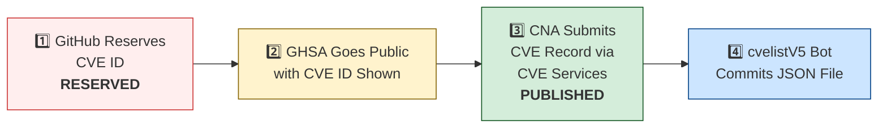

# 🛡️ OpenClaw CVE & Security Advisory Tracker

  
  
  
  
   
  
  
  
  
  

An automated tracker that continuously monitors [OpenClaw](https://github.com/openclaw/openclaw) security advisories across the GitHub Advisory Database, repo-level security advisories, and the [CVE V5 (cvelistV5)](https://github.com/CVEProject/cvelistV5) registry. Every hour it pulls the latest data, reconciles GHSA → CVE publication state, and regenerates this dashboard so you always have an up-to-date picture of the project's vulnerability landscape.

  Last updated: 2026-04-01 12:28 UTC · <a href="LICENSE">MIT License</a> · <a href="ADVISORIES.md">Full Advisory List</a> · <a href="SECURITY.md">Security Policy</a> · Data: <a href="https://github.com/CVEProject/cvelistV5">cvelistV5</a> + <a href="https://github.com/github/advisory-database">Advisory DB</a> · Updates hourly

---

  <a href="#-cves-published-in-cvelistv5-17">Published CVEs</a> ·
  <a href="#-cve-publication-pipeline">Pipeline</a> ·
  <a href="#-all-security-advisories-166">Advisories</a> ·
  <a href="#-vulnerability-categories">Categories</a> ·
  <a href="#-key-insights">Insights</a> ·
  <a href="#-project-identity">Identity</a>

---

## 🏗️ Project Identity

| Field | Value |
|-------|-------|
| **Current Name** | OpenClaw |
| **Previous Names** | Moltbot (second name), Clawdbot (original name) |
| **Repository** | [openclaw/openclaw](https://github.com/openclaw/openclaw) |
| **npm Package** | `openclaw` (formerly `clawdbot`) |
| **Author** | Peter Steinberger (steipete) |

<strong>Search terms for CVE discovery</strong>

To find all CVEs, search for: `openclaw`, `clawdbot`, `moltbot`, `clawhub`, `pkg:npm/clawdbot`, `pkg:npm/openclaw`

---

## 🚀 CVEs Published in cvelistV5 (17)

These CVEs have full records in the [CVEProject/cvelistV5](https://github.com/CVEProject/cvelistV5) repository:

| CVE ID | Severity | CVSS | Title | CWE | Published |
|--------|----------|------|-------|-----|-----------|
| [CVE-2026-32987](https://github.com/openclaw/openclaw/security/advisories/GHSA-63f5-hhc7-cx6p) |  | 9.3 | OpenClaw < 2026.3.13 - Bootstrap Setup Code Replay via Device Pairing | CWE-294 | 2026-03-29 |
| [CVE-2026-32915](https://github.com/openclaw/openclaw/security/advisories/GHSA-4w7m-58cg-cmff) |  | 9.3 | OpenClaw < 2026.3.11 - Sandbox Boundary Bypass via Subagent Control Surface | CWE-863 | 2026-03-29 |
| [CVE-2026-28391](https://github.com/openclaw/openclaw/security/advisories/GHSA-qj77-c3c8-9c3q) |  | 9.2 | OpenClaw < 2026.2.2 - Command Injection via cmd.exe Parsing Bypass in Allowlist Enforcement | CWE-184 | 2026-03-05 |
| [CVE-2026-28472](https://github.com/openclaw/openclaw/security/advisories/GHSA-rv39-79c4-7459) |  | 9.2 | OpenClaw < 2026.2.2 - Device Identity Check Bypass in Gateway WebSocket Connect Handshake | CWE-306 | 2026-03-05 |
| [CVE-2026-32917](https://github.com/openclaw/openclaw/security/advisories/GHSA-g2f6-pwvx-r275) |  | 9.2 | OpenClaw < 2026.3.13 - Remote Command Injection via Unsanitized iMessage Attachment Paths in SCP | CWE-78 | 2026-03-31 |
| [CVE-2026-25253](https://github.com/openclaw/openclaw/security/advisories/GHSA-g8p2-7wf7-98mq) |  | 8.8 | OpenClaw/Clawdbot has 1-Click RCE via Authentication Token Exfiltration From gatewayUrl | CWE-669 | 2026-02-01 |
| [CVE-2026-24763](https://github.com/openclaw/openclaw/security/advisories/GHSA-mc68-q9jw-2h3v) |  | 8.8 | OpenClaw/Clawdbot Docker Execution has Authenticated Command Injection via PATH Environment Variable | CWE-78 | 2026-02-02 |
| [CVE-2026-32974](https://github.com/openclaw/openclaw/security/advisories/GHSA-g353-mgv3-8pcj) |  | 8.8 | OpenClaw < 2026.3.12 - Forged Event Injection via Feishu Webhook Verification Token | CWE-347 | 2026-03-29 |
| [CVE-2026-32973](https://github.com/openclaw/openclaw/security/advisories/GHSA-f8r2-vg7x-gh8m) |  | 8.8 | OpenClaw < 2026.3.11 - Exec Allowlist Pattern Overmatch via POSIX Path Normalization | CWE-625 | 2026-03-29 |
| [CVE-2026-28478](https://github.com/openclaw/openclaw/security/advisories/GHSA-q447-rj3r-2cgh) |  | 8.7 | OpenClaw affected by denial of service via unbounded webhook request body buffering | CWE-770 | 2026-03-05 |
| [CVE-2026-29609](https://github.com/openclaw/openclaw/security/advisories/GHSA-j27p-hq53-9wgc) |  | 8.7 | OpenClaw < 2026.2.14 - Denial of Service via Unbounded URL-backed Media Fetch | CWE-770 | 2026-03-05 |
| [CVE-2026-32013](https://github.com/openclaw/openclaw/security/advisories/GHSA-fgvx-58p6-gjwc) |  | 8.7 | OpenClaw < 2026.2.25 - Symlink Traversal in agents.files Methods | CWE-59 | 2026-03-19 |
| [CVE-2026-32011](https://github.com/openclaw/openclaw/security/advisories/GHSA-x4vp-4235-65hg) |  | 8.7 | OpenClaw < 2026.3.2 - Slow-Request Denial of Service via Pre-Auth Webhook Body Parsing | CWE-770 | 2026-03-19 |
| [CVE-2026-32051](https://github.com/openclaw/openclaw/security/advisories/GHSA-jr6x-2q95-fh2g) |  | 8.7 | OpenClaw < 2026.3.1 - Authorization Bypass in Agent Runs via Owner-Only Tool Access | CWE-863 | 2026-03-21 |
| [CVE-2026-32059](https://github.com/openclaw/openclaw/security/advisories/GHSA-3c6h-g97w-fg78) |  | 8.7 | OpenClaw 2026.2.22-2 < 2026.2.23 - Allowlist Bypass via sort Long-Option Abbreviation in tools.exec.safeBins | CWE-863 | 2026-03-11 |
| [CVE-2026-33573](https://github.com/openclaw/openclaw/security/advisories/GHSA-2rqg-gjgv-84jm) |  | 8.7 | OpenClaw < 2026.3.11 - Workspace Boundary Bypass via Agent RPC Parameters | CWE-668 | 2026-03-29 |
| [CVE-2026-32846](https://github.com/openclaw/openclaw/security/advisories/GHSA-f6pf-4gjx-c94r) |  | 8.7 | OpenClaw Media Parsing Path Traversal to Arbitrary File Read | CWE-22 | 2026-03-26 |
| [CVE-2026-26323](https://github.com/openclaw/openclaw/security/advisories/GHSA-m7x8-2w3w-pr42) |  | 8.6 | OpenClaw has a command injection in maintainer clawtributors updater | CWE-78 | 2026-02-19 |
| [CVE-2026-28456](https://github.com/openclaw/openclaw/security/advisories/GHSA-v6c6-vqqg-w888) |  | 8.6 | OpenClaw 2026.1.5 < 2026.2.14 - Arbitrary Code Execution via Unsafe Hook Module Path Handling | CWE-427 | 2026-03-05 |
| [CVE-2026-33577](https://github.com/openclaw/openclaw/security/advisories/GHSA-2x4x-cc5g-qmmg) |  | 8.6 | OpenClaw < 2026.3.28 - Insufficient Scope Validation in node.pair.approve | CWE-863 | 2026-03-31 |
| [CVE-2026-34503](https://github.com/openclaw/openclaw/security/advisories/GHSA-2pr2-hcv6-7gwv) |  | 8.6 | OpenClaw's device removal and token revocation do not terminate active WebSocket sessions | CWE-613 | 2026-03-31 |
| [CVE-2026-28468](https://github.com/openclaw/openclaw/security/advisories/GHSA-h9g4-589h-68xv) |  | 8.5 | OpenClaw 2026.1.29-beta.1 < 2026.2.14 - Authentication Bypass in Sandbox Browser Bridge Server | CWE-306 | 2026-03-05 |
| [CVE-2026-32064](https://github.com/openclaw/openclaw/security/advisories/GHSA-25gx-x37c-7pph) |  | 8.5 | OpenClaw < 2026.2.21 - Missing VNC Authentication in Sandbox Browser noVNC Observer | CWE-306 | 2026-03-21 |
| [CVE-2026-28482](https://github.com/openclaw/openclaw/security/advisories/GHSA-5xfq-5mr7-426q) |  | 8.4 | OpenClaw < 2026.2.12 - Path Traversal via Unsanitized sessionId and sessionFile Parameters | CWE-22 | 2026-03-05 |
| [CVE-2026-32004](https://github.com/openclaw/openclaw/security/advisories/GHSA-v865-p3gq-hw6m) |  | 8.3 | OpenClaw < 2026.3.2 - Authentication Bypass via Encoded Path in /api/channels Route | CWE-288 | 2026-03-19 |
| [CVE-2026-32036](https://github.com/openclaw/openclaw/security/advisories/GHSA-mwxv-35wr-4vvj) |  | 8.3 | OpenClaw < 2026.2.26- Authentication Bypass via Encoded Dot-Segment Traversal in /api/channels | CWE-289 | 2026-03-19 |
| [CVE-2026-28465](https://github.com/openclaw/openclaw/security/advisories/GHSA-3m3q-x3gj-f79x) |  | 8.2 | OpenClaw voice-call < 2026.2.3 - Webhook Verification Bypass via Forwarded Headers | CWE-345 | 2026-03-05 |
| [CVE-2026-28392](https://github.com/openclaw/openclaw/security/advisories/GHSA-v773-r54f-q32w) |  | 8.2 | OpenClaw < 2026.2.14 - Privilege Escalation in Slack Slash Command Handler via Direct Messages | CWE-863 | 2026-03-05 |
| [CVE-2026-28469](https://github.com/openclaw/openclaw/security/advisories/GHSA-rq6g-px6m-c248) |  | 8.2 | OpenClaw Google Chat shared-path webhook target ambiguity allowed cross-account policy-context misrouting | CWE-639 | 2026-03-05 |
| [CVE-2026-29611](https://github.com/openclaw/openclaw/security/advisories/GHSA-rwj8-p9vq-25gv) |  | 8.2 | OpenClaw < 2026.2.14 - Local File Inclusion via mediaPath Parameter in BlueBubbles Media Handling | CWE-73 | 2026-03-05 |
| [CVE-2026-32045](https://github.com/openclaw/openclaw/security/advisories/GHSA-hff7-ccv5-52f8) |  | 8.2 | OpenClaw < 2026.2.21 - Authentication Bypass in HTTP Gateway Routes via Tokenless Tailscale Auth | CWE-290 | 2026-03-21 |
| [CVE-2026-25157](https://github.com/openclaw/openclaw/security/advisories/GHSA-q284-4pvr-m585) |  | 7.8 | OpenClaw/Clawdbot has OS Command Injection via Project Root Path in sshNodeCommand | CWE-78 | 2026-02-04 |
| [CVE-2026-27002](https://github.com/openclaw/openclaw/security/advisories/GHSA-w235-x559-36mg) |  | 7.7 | OpenClaw: Docker container escape via unvalidated bind mount config injection | CWE-250 | 2026-02-19 |
| [CVE-2026-26322](https://github.com/openclaw/openclaw/security/advisories/GHSA-g6q9-8fvw-f7rf) |  | 7.6 | OpenClaw Gateway tool allowed unrestricted gatewayUrl override | CWE-918 | 2026-02-19 |
| [CVE-2026-32007](https://github.com/openclaw/openclaw/security/advisories/GHSA-h9xm-j4qg-fvpg) |  | 7.6 | OpenClaw < 2026.2.23 - Sandbox Bypass in apply_patch Tool via Workspace-Only Check Bypass | CWE-22 | 2026-03-19 |
| [CVE-2026-22179](https://github.com/openclaw/openclaw/security/advisories/GHSA-9p38-94jf-hgjj) |  | 7.5 | OpenClaw < 2026.2.22 - Allowlist Bypass via Command Substitution in system.run | CWE-78 | 2026-03-18 |
| [CVE-2026-25474](https://github.com/openclaw/openclaw/security/advisories/GHSA-mp5h-m6qj-6292) |  | 7.5 | OpenClaw has a Telegram webhook request forgery (missing `channels.telegram.webhookSecret`) → auth bypass | CWE-345 | 2026-02-19 |
| [CVE-2026-26324](https://github.com/openclaw/openclaw/security/advisories/GHSA-jrvc-8ff5-2f9f) |  | 7.5 | OpenClaw has a SSRF guard bypass via full-form IPv4-mapped IPv6 (loopback / metadata reachable) | CWE-918 | 2026-02-19 |
| [CVE-2026-26316](https://github.com/openclaw/openclaw/security/advisories/GHSA-pchc-86f6-8758) |  | 7.5 | OpenClaw has BlueBubbles webhook auth bypass via loopback proxy trust | CWE-863 | 2026-02-19 |
| [CVE-2026-26321](https://github.com/openclaw/openclaw/security/advisories/GHSA-8jpq-5h99-ff5r) |  | 7.5 | OpenClaw has a local file disclosure via sendMediaFeishu in Feishu extension | CWE-22 | 2026-02-19 |
| [CVE-2026-32003](https://github.com/openclaw/openclaw/security/advisories/GHSA-2fgq-7j6h-9rm4) |  | 7.5 | OpenClaw < 2026.2.22 - Remote Code Execution via SHELLOPTS/PS4 Environment Injection in system.run | CWE-78 | 2026-03-19 |
| [CVE-2026-28458](https://github.com/openclaw/openclaw/security/advisories/GHSA-mr32-vwc2-5j6h) |  | 7.4 | OpenClaw's Browser Relay /cdp websocket is missing auth which could allow cross-tab cookie access | CWE-306 | 2026-03-05 |
| [CVE-2026-32015](https://github.com/openclaw/openclaw/security/advisories/GHSA-g75x-8qqm-2vxp) |  | 7.3 | OpenClaw 2026.1.21 < 2026.2.19 - PATH Hijacking Bypass in tools.exec.safeBins Allowlist Validation | CWE-426 | 2026-03-19 |
| [CVE-2026-32016](https://github.com/openclaw/openclaw/security/advisories/GHSA-7f4q-9rqh-x36p) |  | 7.3 | OpenClaw < 2026.2.22 - Path Traversal via Basename-Only Allowlist Matching on macOS | CWE-426 | 2026-03-19 |
| [CVE-2026-32971](https://github.com/openclaw/openclaw/security/advisories/GHSA-rw39-5899-8mxp) |  | 7.3 | OpenClaw < 2026.3.11 - Node-Host Approval UI Mismatch Allows Execution of Unintended Commands | CWE-451 | 2026-03-31 |
| [CVE-2026-28473](https://github.com/openclaw/openclaw/security/advisories/GHSA-mqpw-46fh-299h) |  | 7.2 | OpenClaw < 2026.2.2 - Authorization Bypass via /approve Chat Command | CWE-863 | 2026-03-05 |
| [CVE-2026-22169](https://github.com/openclaw/openclaw/security/advisories/GHSA-vmqr-rc7x-3446) |  | 7.1 | OpenClaw < 2026.2.22 - Allowlist Bypass via sort Configuration in safeBins | CWE-78 | 2026-03-18 |
| [CVE-2026-22175](https://github.com/openclaw/openclaw/security/advisories/GHSA-gwqp-86q6-w47g) |  | 7.1 | OpenClaw < 2026.2.23 - Exec Approval Bypass via Unrecognized Multiplexer Shell Wrappers | CWE-184 | 2026-03-18 |
| [CVE-2026-22168](https://github.com/openclaw/openclaw/security/advisories/GHSA-5v6x-rfc3-7qfr) |  | 7.1 | OpenClaw < 2026.2.21 - Command Injection via cmd.exe /c Trailing Arguments in system.run | CWE-88 | 2026-03-18 |
| [CVE-2026-26317](https://github.com/openclaw/openclaw/security/advisories/GHSA-3fqr-4cg8-h96q) |  | 7.1 | OpenClaw affected by cross-site request forgery (CSRF) through loopback browser mutation endpoints | CWE-352 | 2026-02-19 |
| [CVE-2026-26320](https://github.com/openclaw/openclaw/security/advisories/GHSA-7q2j-c4q5-rm27) |  | 7.1 | OpenClaw macOS deep link confirmation truncation can conceal executed agent message | CWE-451 | 2026-02-19 |
| [CVE-2026-29607](https://github.com/openclaw/openclaw/security/advisories/GHSA-6j27-pc5c-m8w8) |  | 7.1 | OpenClaw < 2026.2.22 - Authorization Bypass via allow-always Wrapper Persistence | CWE-78 | 2026-03-19 |
| [CVE-2026-32008](https://github.com/openclaw/openclaw/security/advisories/GHSA-45cg-2683-gfmq) |  | 7.1 | OpenClaw < 2026.2.21 - Arbitrary Local File Read via Browser Navigation Guard | CWE-610 | 2026-03-19 |
| [CVE-2026-32026](https://github.com/openclaw/openclaw/security/advisories/GHSA-33hm-cq8r-wc49) |  | 7.1 | OpenClaw < 2026.2.24 - Arbitrary File Read via Improper Temporary Path Validation in Sandbox | CWE-22 | 2026-03-19 |
| [CVE-2026-33581](https://github.com/openclaw/openclaw/security/advisories/GHSA-v8wv-jg3q-qwpq) |  | 7.1 | OpenClaw < 2026.3.24 - Arbitrary File Read via mediaUrl and fileUrl Parameters | CWE-22 | 2026-03-31 |
| [CVE-2026-32009](https://github.com/openclaw/openclaw/security/advisories/GHSA-5gj7-jf77-q2q2) |  | 7 | OpenClaw < 2026.2.24 - Binary Hijacking via Static Default Trusted Directories in safeBins | CWE-426 | 2026-03-19 |
| [CVE-2026-32979](https://github.com/openclaw/openclaw/security/advisories/GHSA-xf99-j42q-5w5p) |  | 7 | OpenClaw < 2026.3.11 - Unbound Interpreter and Runtime Commands Bypass in node-host Approval | CWE-367 | 2026-03-29 |
| [CVE-2026-22176](https://github.com/openclaw/openclaw/security/advisories/GHSA-pj5x-38rw-6fph) |  | 6.9 | OpenClaw < 2026.2.19 - Command Injection via Unescaped Environment Variables in Windows Scheduled Task Script Generation | CWE-78 | 2026-03-19 |
| [CVE-2026-22177](https://github.com/openclaw/openclaw/security/advisories/GHSA-8fmp-37rc-p5g7) |  | 6.9 | OpenClaw < 2026.2.21 - Environment Variable Injection via Config env.vars | CWE-15 | 2026-03-18 |
| [CVE-2026-27003](https://github.com/openclaw/openclaw/security/advisories/GHSA-chf7-jq6g-qrwv) |  | 6.9 | OpenClaw: Telegram bot token exposure via logs | CWE-522 | 2026-02-19 |
| [CVE-2026-27545](https://github.com/openclaw/openclaw/security/advisories/GHSA-f7ww-2725-qvw2) |  | 6.9 | OpenClaw < 2026.2.26 - Approval Bypass via Parent Symlink Current Working Directory Rebind | CWE-367 | 2026-03-18 |
| [CVE-2026-27523](https://github.com/openclaw/openclaw/security/advisories/GHSA-m8v2-6wwh-r4gc) |  | 6.9 | OpenClaw < 2026.2.24 - Sandbox Bind Validation Bypass via Symlink-Parent Missing-Leaf Paths | CWE-22 | 2026-03-18 |
| [CVE-2026-28480](https://github.com/openclaw/openclaw/security/advisories/GHSA-mj5r-hh7j-4gxf) |  | 6.9 | OpenClaw Telegram allowlist authorization accepted mutable usernames | CWE-290 | 2026-03-05 |
| [CVE-2026-31990](https://github.com/openclaw/openclaw/security/advisories/GHSA-cfvj-7rx7-fc7c) |  | 6.9 | OpenClaw < 2026.3.2 - Symlink Traversal in stageSandboxMedia Destination | CWE-59 | 2026-03-19 |
| [CVE-2026-32053](https://github.com/openclaw/openclaw/security/advisories/GHSA-vqx8-9xxw-f2m7) |  | 6.9 | OpenClaw < 2026.2.23 - Twilio Webhook Replay Bypass via Randomized Event ID Normalization | CWE-294 | 2026-03-21 |
| [CVE-2026-32924](https://github.com/openclaw/openclaw/security/advisories/GHSA-m69h-jm2f-2pv8) |  | 6.9 | OpenClaw < 2026.3.12 - Authorization Bypass via Misclassified Reaction Events in Feishu | CWE-863 | 2026-03-29 |
| [CVE-2026-33576](https://github.com/openclaw/openclaw/security/advisories/GHSA-v2v2-f783-358j) |  | 6.9 | OpenClaw < 2026.3.28 - Unauthorized Media Download via Zalo Channel | CWE-863 | 2026-03-31 |
| [CVE-2026-29612](https://github.com/openclaw/openclaw/security/advisories/GHSA-w2cg-vxx6-5xjg) |  | 6.8 | OpenClaw < 2026.2.14 - Denial of Service via Large Base64 Media File Decoding | CWE-770 | 2026-03-05 |
| [CVE-2026-33572](https://github.com/openclaw/openclaw/security/advisories/GHSA-vr7j-g7jv-h5mp) |  | 6.8 | OpenClaw < 2026.2.17 - Insufficient File Permissions in Session Transcript Files | CWE-378 | 2026-03-29 |
| [CVE-2026-28452](https://github.com/openclaw/openclaw/security/advisories/GHSA-h89v-j3x9-8wqj) |  | 6.7 | OpenClaw affected by denial of service through unguarded archive extraction allowing high expansion/resource abuse (ZIP/TAR) | CWE-770 | 2026-03-05 |
| [CVE-2026-32044](https://github.com/openclaw/openclaw/security/advisories/GHSA-77hf-7fqf-f227) |  | 6.7 | OpenClaw < 2026.3.2 - Tar Archive Safety Bypass in Skills Installation | CWE-409 | 2026-03-21 |
| [CVE-2026-32061](https://github.com/openclaw/openclaw/security/advisories/GHSA-56pc-6hvp-4gv4) |  | 6.7 | OpenClaw < 2026.2.17 - Arbitrary File Read via $include Directive Path Traversal | CWE-22 | 2026-03-11 |
| [CVE-2026-25475](https://github.com/openclaw/openclaw/security/advisories/GHSA-r8g4-86fx-92mq) |  | 6.5 | OpenClaw Vulnerable to Local File Inclusion via MEDIA: Path Extraction | CWE-200, CWE-22 | 2026-02-04 |
| [CVE-2026-26328](https://github.com/openclaw/openclaw/security/advisories/GHSA-g34w-4xqq-h79m) |  | 6.5 | OpenClaw iMessage group allowlist authorization inherited DM pairing-store identities | CWE-284, CWE-863 | 2026-02-19 |
| [CVE-2026-32029](https://github.com/openclaw/openclaw/security/advisories/GHSA-2rgf-hm63-5qph) |  | 6.3 | OpenClaw < 2026.2.21 - Client IP Spoofing via X-Forwarded-For Header Parsing | CWE-345 | 2026-03-19 |
| [CVE-2026-32028](https://github.com/openclaw/openclaw/security/advisories/GHSA-354r-7mfh-7rh2) |  | 6.3 | OpenClaw < 2026.2.25 - Missing Authorization Check in Discord DM Reaction Ingress | CWE-863 | 2026-03-19 |
| [CVE-2026-32897](https://github.com/openclaw/openclaw/security/advisories/GHSA-v6x2-2qvm-6gv8) |  | 6.3 | OpenClaw < 2026.2.22 - Authentication Token Reuse in Owner ID Prompt Hashing Fallback | CWE-320 | 2026-03-21 |
| [CVE-2026-33580](https://github.com/openclaw/openclaw/security/advisories/GHSA-9528-x887-j2fp) |  | 6.3 | OpenClaw < 2026.3.28 - Brute Force Attack via Missing Rate Limiting on Webhook Shared Secret Authentication | CWE-307 | 2026-03-31 |
| [CVE-2026-32034](https://github.com/openclaw/openclaw/security/advisories/GHSA-3cvx-236h-m9fj) |  | 6.1 | OpenClaw < 2026.2.21 - Insecure Control UI Authentication over Plaintext HTTP | CWE-78 | 2026-03-19 |
| [CVE-2026-28460](https://github.com/openclaw/openclaw/security/advisories/GHSA-9868-vxmx-w862) |  | 6 | OpenClaw < 2026.2.22 - Allowlist Bypass via Shell Line-Continuation Command Substitution in system.run | CWE-78 | 2026-03-19 |
| [CVE-2026-32002](https://github.com/openclaw/openclaw/security/advisories/GHSA-q6qf-4p5j-r25g) |  | 6 | OpenClaw < 2026.2.23 - Sandbox Boundary Bypass via Image Tool workspaceOnly Bypass | CWE-200 | 2026-03-19 |
| [CVE-2026-32017](https://github.com/openclaw/openclaw/security/advisories/GHSA-3x3x-h76w-hp98) |  | 6 | OpenClaw < 2026.2.19 - Arbitrary File Write via Short-Option Bypass in exec Allowlist | CWE-184 | 2026-03-19 |
| [CVE-2026-32023](https://github.com/openclaw/openclaw/security/advisories/GHSA-ccg8-46r6-9qgj) |  | 6 | OpenClaw < 2026.2.24 - Approval Gating Bypass via Dispatch-Wrapper Depth-Cap Mismatch in system.run | CWE-863 | 2026-03-19 |
| [CVE-2026-32022](https://github.com/openclaw/openclaw/security/advisories/GHSA-3xfw-4pmr-4xc5) |  | 6 | OpenClaw < 2026.2.21 - Arbitrary File Read via grep -e Flag Policy Bypass | CWE-184 | 2026-03-19 |
| [CVE-2026-32057](https://github.com/openclaw/openclaw/security/advisories/GHSA-vvgp-4c28-m3jm) |  | 6 | OpenClaw < 2026.2.25 - Authentication Bypass via Control UI client.id Parameter | CWE-807 | 2026-03-21 |
| [CVE-2026-28477](https://github.com/openclaw/openclaw/security/advisories/GHSA-7rcp-mxpq-72pj) |  | 5.9 | OpenClaw < 2026.2.14 - OAuth State Validation Bypass in Manual Chutes Login Flow | CWE-352 | 2026-03-05 |
| [CVE-2026-28481](https://github.com/openclaw/openclaw/security/advisories/GHSA-7vwx-582j-j332) |  | 5.9 | OpenClaw < 2026.2.1 - Bearer Token Leakage via MS Teams Attachment Downloader Suffix Matching | CWE-201 | 2026-03-05 |
| [CVE-2026-27670](https://github.com/openclaw/openclaw/security/advisories/GHSA-r54r-wmmq-mh84) |  | 5.8 | OpenClaw < 2026.3.2 - Arbitrary File Write via ZIP Extraction Parent Symlink Race Condition | CWE-367 | 2026-03-19 |
| [CVE-2026-32000](https://github.com/openclaw/openclaw/security/advisories/GHSA-7fcc-cw49-xm78) |  | 5.8 | OpenClaw < 2026.2.19 - Command Injection via Windows Shell Fallback in Lobster Tool Execution | CWE-78 | 2026-03-19 |
| [CVE-2026-32052](https://github.com/openclaw/openclaw/security/advisories/GHSA-6rcp-vxwf-3mfp) |  | 5.8 | OpenClaw < 2026.2.24 - Hidden Command Execution via Shell-Wrapper Positional argv Carriers | CWE-436 | 2026-03-21 |
| [CVE-2026-32035](https://github.com/openclaw/openclaw/security/advisories/GHSA-wpg9-4g4v-f9rc) |  | 5.8 | OpenClaw < 2026.3.2 - Missing Owner Flag Validation in Discord Voice Transcript Handler | CWE-863 | 2026-03-19 |
| [CVE-2026-32988](https://github.com/openclaw/openclaw/security/advisories/GHSA-mj4p-rc52-m843) |  | 5.8 | OpenClaw < 2026.3.11 - Sandbox Boundary Bypass via Unvalidated Temporary File Creation | CWE-367 | 2026-03-31 |
| [CVE-2026-32065](https://github.com/openclaw/openclaw/security/advisories/GHSA-hwpq-rrpf-pgcq) |  | 5.7 | OpenClaw < 2026.2.25 - Approval Identity Mismatch in system.run Command Execution | CWE-436 | 2026-03-21 |
| [CVE-2026-29608](https://github.com/openclaw/openclaw/security/advisories/GHSA-h3rm-6x7g-882f) |  | 5.4 | OpenClaw 2026.3.1 < 2026.3.2 - Approval Integrity Bypass via system.run argv Rewriting | CWE-88 | 2026-03-19 |
| [CVE-2026-26326](https://github.com/openclaw/openclaw/security/advisories/GHSA-8mh7-phf8-xgfm) |  | 5.3 | OpenClaw skills.status could leak secrets to operator.read clients | CWE-200 | 2026-02-19 |
| [CVE-2026-32898](https://github.com/openclaw/openclaw/security/advisories/GHSA-7jx5-9fjg-hp4m) |  | 5.3 | OpenClaw < 2026.2.23 - ACP Permission Auto-Approval Bypass via Untrusted Tool Metadata | CWE-807 | 2026-03-21 |
| [CVE-2026-33578](https://github.com/openclaw/openclaw/security/advisories/GHSA-63mg-xp9j-jfcm) |  | 5.3 | OpenClaw: Google Chat and Zalouser group sender allowlist bypass via policy downgrade | CWE-863 | 2026-03-31 |
| [CVE-2026-27576](https://github.com/openclaw/openclaw/security/advisories/GHSA-cxpw-2g23-2vgw) |  | 4.8 | OpenClaw: ACP prompt-size checks missing in local stdio bridge could reduce responsiveness with very large inputs | CWE-400 | 2026-02-21 |
| [CVE-2026-32020](https://github.com/openclaw/openclaw/security/advisories/GHSA-5ghc-98wh-gwwf) |  | 4.8 | OpenClaw < 2026.2.22 - Arbitrary File Read via Symlink Following in Static File Handler | CWE-59 | 2026-03-19 |
| [CVE-2026-31997](https://github.com/openclaw/openclaw/security/advisories/GHSA-q399-23r3-hfx4) |  | 4.4 | OpenClaw < 2026.3.1 - Executable Rebind via Unbound PATH-token in system.run Approvals | CWE-367 | 2026-03-19 |
| [CVE-2026-27486](https://github.com/openclaw/openclaw/security/advisories/GHSA-jfv4-h8mc-jcp8) |  | 4.3 | OpenClaw: Process Safety - Unvalidated PID Kill via SIGKILL in Process Cleanup | CWE-283 | 2026-02-21 |
| [CVE-2026-24764](https://github.com/openclaw/openclaw/security/advisories/GHSA-782p-5fr5-7fj8) |  | 3.7 | OpenClaw has Remote Code Execution via System Prompt Injection in Slack Channel Descriptions | CWE-74, CWE-94 | 2026-02-19 |
| [CVE-2026-32040](https://github.com/openclaw/openclaw/security/advisories/GHSA-2ww6-868g-2c56) |  | 2.4 | OpenClaw < 2026.2.23 - HTML Injection via Unvalidated Image MIME Type in Data-URL Interpolation | CWE-79 | 2026-03-19 |
| [CVE-2026-27524](https://github.com/openclaw/openclaw/security/advisories/GHSA-62f6-mrcj-v8h5) |  | 2.3 | OpenClaw < 2026.2.21 - Prototype Pollution via Debug Override Path | CWE-1321 | 2026-03-18 |
| [CVE-2026-32037](https://github.com/openclaw/openclaw/security/advisories/GHSA-w76h-8m22-hpgh) |  | 2.3 | OpenClaw < 2026.2.22 - Redirect Chain Bypass of Media Host Allowlist in MSTeams Attachment Handling | CWE-918 | 2026-03-19 |
| [CVE-2026-34506](https://github.com/openclaw/openclaw/security/advisories/GHSA-g7cr-9h7q-4qxq) |  | 2.3 | OpenClaw < 2026.3.8 - Sender Allowlist Bypass in Microsoft Teams Plugin via Route Allowlist Configuration | CWE-863 | 2026-03-31 |
| [CVE-2026-32018](https://github.com/openclaw/openclaw/security/advisories/GHSA-gq83-8q7q-9hfx) |  | 2 | OpenClaw < 2026.2.19 - Race Condition in Sandbox Registry Write Operations | CWE-362 | 2026-03-19 |
| [CVE-2026-32067](https://github.com/openclaw/openclaw/security/advisories/GHSA-vjp8-wprm-2jw9) |  | 2 | OpenClaw < 2026.2.26 - Cross-Account Authorization Bypass in DM Pairing Store | CWE-863 | 2026-03-21 |
| [CVE-2026-30741]() |  | None | A remote code execution (RCE) vulnerability in OpenClaw Agent Platform v2026.2.6 |  | 2026-03-11 |

<strong>📖 Detailed CVE Analysis (click to expand)</strong>

### CVE-2026-32987 — OpenClaw < 2026.3.13 - Bootstrap Setup Code Replay via Device Pairing

| Field | Detail |
|-------|--------|
| **CVSS** | 9.3 (CRITICAL) — `CVSS:4.0/AV:N/AC:L/AT:N/PR:N/UI:N/VC:H/VI:H/VA:H/SC:N/SI:N/SA:N` |
| **CWE** | CWE-294 (Authentication Bypass by Capture-replay) |
| **Affected** | < 2026.3.13 |
| **Vendor/Product** | OpenClaw / OpenClaw |
| **Advisory** | [GHSA-63f5-hhc7-cx6p](https://github.com/openclaw/openclaw/security/advisories/GHSA-63f5-hhc7-cx6p) |

OpenClaw before 2026.3.13 allows bootstrap setup codes to be replayed during device pairing verification in src/infra/device-bootstrap.ts. Attackers can verify a valid bootstrap code multiple times before approval to escalate pending pairing scopes, including privilege escalation to operator.admin.

**References:**
- [Patch Commit](https://github.com/openclaw/openclaw/commit/1803d16d5cec970c54b0e1ac46b31b1cbade335c)
- [VulnCheck Advisory: OpenClaw < 2026.3.13 - Bootstrap Setup Code Replay via Device Pairing](https://www.vulncheck.com/advisories/openclaw-bootstrap-setup-code-replay-via-device-pairing)
---

### CVE-2026-32915 — OpenClaw < 2026.3.11 - Sandbox Boundary Bypass via Subagent Control Surface

| Field | Detail |
|-------|--------|
| **CVSS** | 9.3 (CRITICAL) — `CVSS:4.0/AV:L/AC:L/AT:N/PR:L/UI:N/VC:H/VI:H/VA:H/SC:H/SI:H/SA:H` |
| **CWE** | CWE-863 (Incorrect Authorization) |
| **Affected** | < 2026.3.11 |
| **Vendor/Product** | OpenClaw / OpenClaw |
| **Advisory** | [GHSA-4w7m-58cg-cmff](https://github.com/openclaw/openclaw/security/advisories/GHSA-4w7m-58cg-cmff) |

OpenClaw before 2026.3.11 contains a sandbox boundary bypass vulnerability allowing leaf subagents to access the subagents control surface and resolve against parent requester scope instead of their own session tree. A low-privilege sandboxed leaf worker can steer or kill sibling runs and cause execution with broader tool policies by exploiting insufficient authorization checks on subagent control requests.

**References:**
- [VulnCheck Advisory: OpenClaw < 2026.3.11 - Sandbox Boundary Bypass via Subagent Control Surface](https://www.vulncheck.com/advisories/openclaw-sandbox-boundary-bypass-via-subagent-control-surface)
---

### CVE-2026-28391 — OpenClaw < 2026.2.2 - Command Injection via cmd.exe Parsing Bypass in Allowlist Enforcement

| Field | Detail |
|-------|--------|
| **CVSS** | 9.2 (CRITICAL) — `CVSS:4.0/AV:N/AC:L/AT:P/PR:N/UI:N/VC:H/VI:H/VA:H/SC:N/SI:N/SA:N` |
| **CWE** | CWE-184 (Incomplete List of Disallowed Inputs) |
| **Affected** | < 2026.2.2 |
| **Vendor/Product** | OpenClaw / OpenClaw |
| **Advisory** | [GHSA-qj77-c3c8-9c3q](https://github.com/openclaw/openclaw/security/advisories/GHSA-qj77-c3c8-9c3q) |

OpenClaw versions prior to 2026.2.2 fail to properly validate Windows cmd.exe metacharacters in allowlist-gated exec requests, allowing attackers to bypass command approval restrictions. Remote attackers can craft command strings with shell metacharacters like & or %...% to execute unapproved commands beyond the allowlisted operations.

**References:**
- [Patch Commit](https://github.com/openclaw/openclaw/commit/a7f4a53ce80c98ba1452eb90802d447fca9bf3d6)
- [VulnCheck Advisory: OpenClaw < 2026.2.2 - Command Injection via cmd.exe Parsing Bypass in Allowlist Enforcement](https://www.vulncheck.com/advisories/openclaw-command-injection-via-cmdexe-parsing-bypass-in-allowlist-enforcement)
---

### CVE-2026-28472 — OpenClaw < 2026.2.2 - Device Identity Check Bypass in Gateway WebSocket Connect Handshake

| Field | Detail |
|-------|--------|
| **CVSS** | 9.2 (CRITICAL) — `CVSS:4.0/AV:N/AC:H/AT:N/PR:N/UI:N/VC:H/VI:H/VA:H/SC:N/SI:N/SA:N` |
| **CWE** | CWE-306 (Missing Authentication for Critical Function) |
| **Affected** | < 2026.2.2 |
| **Vendor/Product** | OpenClaw / OpenClaw |
| **Advisory** | [GHSA-rv39-79c4-7459](https://github.com/openclaw/openclaw/security/advisories/GHSA-rv39-79c4-7459) |

OpenClaw versions prior to 2026.2.2 contain a vulnerability in the gateway WebSocket connect handshake in which it allows skipping device identity checks when auth.token is present but not validated. Attackers can connect to the gateway without providing device identity or pairing by exploiting the presence check instead of validation, potentially gaining operator access in vulnerable deployments.

**References:**
- [Patch Commit](https://github.com/openclaw/openclaw/commit/fe81b1d7125a014b8280da461f34efbf5f761575)
- [VulnCheck Advisory: OpenClaw < 2026.2.2 - Device Identity Check Bypass in Gateway WebSocket Connect Handshake](https://www.vulncheck.com/advisories/openclaw-device-identity-check-bypass-in-gateway-websocket-connect-handshake)
---

### CVE-2026-32917 — OpenClaw < 2026.3.13 - Remote Command Injection via Unsanitized iMessage Attachment Paths in SCP

| Field | Detail |
|-------|--------|
| **CVSS** | 9.2 (CRITICAL) — `CVSS:4.0/AV:N/AC:L/AT:P/PR:N/UI:N/VC:H/VI:H/VA:H/SC:N/SI:N/SA:N` |
| **CWE** | CWE-78 (Improper Neutralization of Special Elements used in an OS Command ('OS Command Injection')) |
| **Affected** | < 2026.3.13 |
| **Vendor/Product** | OpenClaw / OpenClaw |
| **Advisory** | [GHSA-g2f6-pwvx-r275](https://github.com/openclaw/openclaw/security/advisories/GHSA-g2f6-pwvx-r275) |

OpenClaw before 2026.3.13 contains a remote command injection vulnerability in the iMessage attachment staging flow that allows attackers to execute arbitrary commands on configured remote hosts. The vulnerability exists because unsanitized remote attachment paths containing shell metacharacters are passed directly to the SCP remote operand without validation, enabling command execution when remote attachment staging is enabled.

**References:**
- [Patch Commit](https://github.com/openclaw/openclaw/commit/a54bf71b4c0cbe554a84340b773df37ee8e959de)
- [VulnCheck Advisory: OpenClaw < 2026.3.13 - Remote Command Injection via Unsanitized iMessage Attachment Paths in SCP](https://www.vulncheck.com/advisories/openclaw-remote-command-injection-via-unsanitized-imessage-attachment-paths-in-scp)
---

### CVE-2026-25253 — OpenClaw/Clawdbot has 1-Click RCE via Authentication Token Exfiltration From gatewayUrl

| Field | Detail |
|-------|--------|
| **CVSS** | 8.8 (HIGH) — `CVSS:3.1/AV:N/AC:L/PR:N/UI:R/S:U/C:H/I:H/A:H` |
| **CWE** | CWE-669 (CWE-669 Incorrect Resource Transfer Between Spheres) |
| **Affected** | < 2026.1.29 |
| **Vendor/Product** | OpenClaw / OpenClaw |
| **Advisory** | [GHSA-g8p2-7wf7-98mq](https://github.com/openclaw/openclaw/security/advisories/GHSA-g8p2-7wf7-98mq) |

OpenClaw (aka clawdbot or Moltbot) before 2026.1.29 obtains a gatewayUrl value from a query string and automatically makes a WebSocket connection without prompting, sending a token value.

> **Naming note:** Uses all three names in description. packageURL still references `pkg:npm/clawdbot`.
**References:**
- [1-click-rce-to-steal-your-moltbot-data-and-keys](https://depthfirst.com/post/1-click-rce-to-steal-your-moltbot-data-and-keys)
- [blog](https://openclaw.ai/blog)
- [one-click-rce-moltbot](https://ethiack.com/news/blog/one-click-rce-moltbot)
- [2016913750557651228](https://x.com/0xacb/status/2016913750557651228)
---

### CVE-2026-24763 — OpenClaw/Clawdbot Docker Execution has Authenticated Command Injection via PATH Environment Variable

| Field | Detail |
|-------|--------|
| **CVSS** | 8.8 (HIGH) — `CVSS:3.1/AV:N/AC:L/PR:L/UI:N/S:U/C:H/I:H/A:H` |
| **CWE** | CWE-78 (CWE-78: Improper Neutralization of Special Elements used in an OS Command ('OS Command Injection')) |
| **Affected** | < 2026.1.29 |
| **Vendor/Product** | clawdbot / clawdbot |
| **Advisory** | [GHSA-mc68-q9jw-2h3v](https://github.com/openclaw/openclaw/security/advisories/GHSA-mc68-q9jw-2h3v) |

OpenClaw (formerly  Clawdbot) is a personal AI assistant you run on your own devices. Prior to 2026.1.29, a command injection vulnerability existed in OpenClaw’s Docker sandbox execution mechanism due to unsafe handling of the PATH environment variable when constructing shell commands. An authenticated user able to control environment variables could influence command execution within the container context. This vulnerability is fixed in 2026.1.29.

> **Naming note:** Uses old name `clawdbot/clawdbot` as vendor/product.
**References:**
- [https://github.com/openclaw/openclaw/commit/771f23d36b95ec2204cc9a0054045f5d8439ea75](https://github.com/openclaw/openclaw/commit/771f23d36b95ec2204cc9a0054045f5d8439ea75)
- [https://github.com/openclaw/openclaw/releases/tag/v2026.1.29](https://github.com/openclaw/openclaw/releases/tag/v2026.1.29)
---

### CVE-2026-32974 — OpenClaw < 2026.3.12 - Forged Event Injection via Feishu Webhook Verification Token

| Field | Detail |
|-------|--------|
| **CVSS** | 8.8 (HIGH) — `CVSS:4.0/AV:N/AC:L/AT:N/PR:N/UI:N/VC:L/VI:H/VA:L/SC:N/SI:N/SA:N` |
| **CWE** | CWE-347 (Improper Verification of Cryptographic Signature) |
| **Affected** | < 2026.3.12 |
| **Vendor/Product** | OpenClaw / OpenClaw |
| **Advisory** | [GHSA-g353-mgv3-8pcj](https://github.com/openclaw/openclaw/security/advisories/GHSA-g353-mgv3-8pcj) |

OpenClaw before 2026.3.12 contains an authentication bypass vulnerability in Feishu webhook mode when only verificationToken is configured without encryptKey, allowing acceptance of forged events. Unauthenticated network attackers can inject forged Feishu events and trigger downstream tool execution by reaching the webhook endpoint.

**References:**
- [VulnCheck Advisory: OpenClaw < 2026.3.12 - Forged Event Injection via Feishu Webhook Verification Token](https://www.vulncheck.com/advisories/openclaw-forged-event-injection-via-feishu-webhook-verification-token)
---

### CVE-2026-32973 — OpenClaw < 2026.3.11 - Exec Allowlist Pattern Overmatch via POSIX Path Normalization

| Field | Detail |
|-------|--------|
| **CVSS** | 8.8 (HIGH) — `CVSS:4.0/AV:N/AC:L/AT:N/PR:N/UI:N/VC:N/VI:H/VA:H/SC:N/SI:N/SA:N` |
| **CWE** | CWE-625 (Permissive Regular Expression) |
| **Affected** | < 2026.3.11 |
| **Vendor/Product** | OpenClaw / OpenClaw |
| **Advisory** | [GHSA-f8r2-vg7x-gh8m](https://github.com/openclaw/openclaw/security/advisories/GHSA-f8r2-vg7x-gh8m) |

OpenClaw before 2026.3.11 contains an exec allowlist bypass vulnerability where matchesExecAllowlistPattern improperly normalizes patterns with lowercasing and glob matching that overmatches on POSIX paths. Attackers can exploit the ? wildcard matching across path segments to execute commands or paths not intended by operators.

**References:**
- [VulnCheck Advisory: OpenClaw < 2026.3.11 - Exec Allowlist Pattern Overmatch via POSIX Path Normalization](https://www.vulncheck.com/advisories/openclaw-exec-allowlist-pattern-overmatch-via-posix-path-normalization)
---

### CVE-2026-28478 — OpenClaw affected by denial of service via unbounded webhook request body buffering

| Field | Detail |
|-------|--------|
| **CVSS** | 8.7 (HIGH) — `CVSS:4.0/AV:N/AC:L/AT:N/PR:N/UI:N/VC:N/VI:N/VA:H/SC:N/SI:N/SA:N` |
| **CWE** | CWE-770 (Allocation of Resources Without Limits or Throttling) |
| **Affected** | < 2026.2.13 |
| **Vendor/Product** | OpenClaw / OpenClaw |
| **Advisory** | [GHSA-q447-rj3r-2cgh](https://github.com/openclaw/openclaw/security/advisories/GHSA-q447-rj3r-2cgh) |

OpenClaw versions prior to 2026.2.13 contain a denial of service vulnerability in webhook handlers that buffer request bodies without strict byte or time limits. Remote unauthenticated attackers can send oversized JSON payloads or slow uploads to webhook endpoints causing memory pressure and availability degradation.

**References:**
- [Patch Commit](https://github.com/openclaw/openclaw/commit/3cbcba10cf30c2ffb898f0d8c7dfb929f15f8930)
- [VulnCheck Advisory: OpenClaw < 2026.2.13 - Denial of Service via Unbounded Webhook Request Body Buffering](https://www.vulncheck.com/advisories/openclaw-denial-of-service-via-unbounded-webhook-request-body-buffering)
---

### CVE-2026-29609 — OpenClaw < 2026.2.14 - Denial of Service via Unbounded URL-backed Media Fetch

| Field | Detail |
|-------|--------|
| **CVSS** | 8.7 (HIGH) — `CVSS:4.0/AV:N/AC:L/AT:N/PR:N/UI:N/VC:N/VI:N/VA:H/SC:N/SI:N/SA:N` |
| **CWE** | CWE-770 (Allocation of Resources Without Limits or Throttling) |
| **Affected** | < 2026.2.14 |
| **Vendor/Product** | OpenClaw / OpenClaw |
| **Advisory** | [GHSA-j27p-hq53-9wgc](https://github.com/openclaw/openclaw/security/advisories/GHSA-j27p-hq53-9wgc) |

OpenClaw versions prior to 2026.2.14 contain a denial of service vulnerability in the fetchWithGuard function that allocates entire response payloads in memory before enforcing maxBytes limits. Remote attackers can trigger memory exhaustion by serving oversized responses without content-length headers to cause availability loss.

**References:**
- [Patch Commit](https://github.com/openclaw/openclaw/commit/00a08908892d1743d1fc52e5cbd9499dd5da2fe0)
- [VulnCheck Advisory: OpenClaw < 2026.2.14 - Denial of Service via Unbounded URL-backed Media Fetch](https://www.vulncheck.com/advisories/openclaw-denial-of-service-via-unbounded-url-backed-media-fetch)
---

### CVE-2026-32013 — OpenClaw < 2026.2.25 - Symlink Traversal in agents.files Methods

| Field | Detail |
|-------|--------|
| **CVSS** | 8.7 (HIGH) — `CVSS:4.0/AV:N/AC:L/AT:N/PR:L/UI:N/VC:H/VI:H/VA:H/SC:N/SI:N/SA:N` |
| **CWE** | CWE-59 (CWE-59: Improper Link Resolution Before File Access ('Link Following')) |
| **Affected** | < 2026.2.25 |
| **Vendor/Product** | OpenClaw / OpenClaw |
| **Advisory** | [GHSA-fgvx-58p6-gjwc](https://github.com/openclaw/openclaw/security/advisories/GHSA-fgvx-58p6-gjwc) |

OpenClaw versions prior to 2026.2.25 contain a symlink traversal vulnerability in the agents.files.get and agents.files.set methods that allows reading and writing files outside the agent workspace. Attackers can exploit symlinked allowlisted files to access arbitrary host files within gateway process permissions, potentially enabling code execution through file overwrite attacks.

**References:**
- [Patch Commit](https://github.com/openclaw/openclaw/commit/125f4071bcbc0de32e769940d07967db47f09d3d)
- [VulnCheck Advisory: OpenClaw < 2026.2.25 - Symlink Traversal in agents.files Methods](https://www.vulncheck.com/advisories/openclaw-symlink-traversal-in-agents-files-methods)
---

### CVE-2026-32011 — OpenClaw < 2026.3.2 - Slow-Request Denial of Service via Pre-Auth Webhook Body Parsing

| Field | Detail |
|-------|--------|
| **CVSS** | 8.7 (HIGH) — `CVSS:4.0/AV:N/AC:L/AT:N/PR:N/UI:N/VC:N/VI:N/VA:H/SC:N/SI:N/SA:N` |
| **CWE** | CWE-770 (CWE-770: Allocation of Resources Without Limits or Throttling) |
| **Affected** | < 2026.3.2 |
| **Vendor/Product** | OpenClaw / OpenClaw |
| **Advisory** | [GHSA-x4vp-4235-65hg](https://github.com/openclaw/openclaw/security/advisories/GHSA-x4vp-4235-65hg) |

OpenClaw versions prior to 2026.3.2 contain a denial of service vulnerability in webhook handlers for BlueBubbles and Google Chat that parse request bodies before performing authentication and signature validation. Unauthenticated attackers can exploit this by sending slow or oversized request bodies to exhaust parser resources and degrade service availability.

**References:**
- [Patch Commit](https://github.com/openclaw/openclaw/commit/d3e8b17aa6432536806b4853edc7939d891d0f25)
- [VulnCheck Advisory: OpenClaw < 2026.3.2 - Slow-Request Denial of Service via Pre-Auth Webhook Body Parsing](https://www.vulncheck.com/advisories/openclaw-slow-request-denial-of-service-via-pre-auth-webhook-body-parsing)
---

### CVE-2026-32051 — OpenClaw < 2026.3.1 - Authorization Bypass in Agent Runs via Owner-Only Tool Access

| Field | Detail |
|-------|--------|
| **CVSS** | 8.7 (HIGH) — `CVSS:4.0/AV:N/AC:L/AT:N/PR:L/UI:N/VC:H/VI:H/VA:H/SC:N/SI:N/SA:N` |
| **CWE** | CWE-863 (CWE-863: Incorrect Authorization) |
| **Affected** | < 2026.3.1 |
| **Vendor/Product** | OpenClaw / OpenClaw |
| **Advisory** | [GHSA-jr6x-2q95-fh2g](https://github.com/openclaw/openclaw/security/advisories/GHSA-jr6x-2q95-fh2g) |

OpenClaw versions prior to 2026.3.1 contain an authorization mismatch vulnerability that allows authenticated callers with operator.write scope to invoke owner-only tool surfaces including gateway and cron through agent runs in scoped-token deployments. Attackers with write-scope access can perform control-plane actions beyond their intended authorization level by exploiting inconsistent owner-only gating during agent execution.

**References:**
- [VulnCheck Advisory: OpenClaw < 2026.3.1 - Authorization Bypass in Agent Runs via Owner-Only Tool Access](https://www.vulncheck.com/advisories/openclaw-authorization-bypass-in-agent-runs-via-owner-only-tool-access)
---

### CVE-2026-32059 — OpenClaw 2026.2.22-2 < 2026.2.23 - Allowlist Bypass via sort Long-Option Abbreviation in tools.exec.safeBins

| Field | Detail |
|-------|--------|
| **CVSS** | 8.7 (HIGH) — `CVSS:4.0/AV:N/AC:L/AT:N/PR:L/UI:N/VC:H/VI:H/VA:H/SC:N/SI:N/SA:N` |
| **CWE** | CWE-863 (Incorrect Authorization) |
| **Affected** | < 2026.2.23 |
| **Vendor/Product** | openclaw / openclaw |
| **Advisory** | [GHSA-3c6h-g97w-fg78](https://github.com/openclaw/openclaw/security/advisories/GHSA-3c6h-g97w-fg78) |

OpenClaw version 2026.2.22-2 prior to 2026.2.23 tools.exec.safeBins validation for sort command fails to properly validate GNU long-option abbreviations, allowing attackers to bypass denied-flag checks via abbreviated options. Remote attackers can execute sort commands with abbreviated long options to skip approval requirements in allowlist mode.

**References:**
- [Patch Commit](https://github.com/openclaw/openclaw/commit/3b8e33037ae2e12af7beb56fcf0346f1f8cbde6f)
- [VulnCheck Advisory: OpenClaw 2026.2.22-2 < 2026.2.23 - Allowlist Bypass via sort Long-Option Abbreviation in tools.exec.safeBins](https://www.vulncheck.com/advisories/openclaw-allowlist-bypass-via-sort-long-option-abbreviation-in-toolsexecsafebins)
---

### CVE-2026-33573 — OpenClaw < 2026.3.11 - Workspace Boundary Bypass via Agent RPC Parameters

| Field | Detail |
|-------|--------|
| **CVSS** | 8.7 (HIGH) — `CVSS:4.0/AV:N/AC:L/AT:N/PR:L/UI:N/VC:H/VI:H/VA:H/SC:N/SI:N/SA:N` |
| **CWE** | CWE-668 (Exposure of Resource to Wrong Sphere) |
| **Affected** | < 2026.3.11 |
| **Vendor/Product** | OpenClaw / OpenClaw |
| **Advisory** | [GHSA-2rqg-gjgv-84jm](https://github.com/openclaw/openclaw/security/advisories/GHSA-2rqg-gjgv-84jm) |

OpenClaw before 2026.3.11 contains an authorization bypass vulnerability in the gateway agent RPC that allows authenticated operators with operator.write permission to override workspace boundaries by supplying attacker-controlled spawnedBy and workspaceDir values. Remote operators can escape the configured workspace boundary and execute arbitrary file and exec operations from any process-accessible directory.

**References:**
- [VulnCheck Advisory: OpenClaw < 2026.3.11 - Workspace Boundary Bypass via Agent RPC Parameters](https://www.vulncheck.com/advisories/openclaw-workspace-boundary-bypass-via-agent-rpc-parameters)
---

### CVE-2026-32846 — OpenClaw Media Parsing Path Traversal to Arbitrary File Read

| Field | Detail |
|-------|--------|
| **CVSS** | 8.7 (HIGH) — `CVSS:4.0/AV:N/AC:L/AT:N/PR:N/UI:N/VC:H/VI:N/VA:N/SC:N/SI:N/SA:N` |
| **CWE** | CWE-22 (CWE-22: Improper Limitation of a Pathname to a Restricted Directory ('Path Traversal')) |
| **Affected** | < 4797bbc5b96e2cca5532e43b58915c051746fe37 |
| **Vendor/Product** | OpenClaw / OpenClaw |
| **Advisory** | [GHSA-f6pf-4gjx-c94r](https://github.com/openclaw/openclaw/security/advisories/GHSA-f6pf-4gjx-c94r) |

OpenClaw through 2026.3.23 (fixed in commit 4797bbc) contains a path traversal vulnerability in media parsing that allows attackers to read arbitrary files by bypassing path validation in the isLikelyLocalPath() and isValidMedia() functions. Attackers can exploit incomplete validation and the allowBareFilename bypass to reference files outside the intended application sandbox, resulting in disclosure of sensitive information including system files, environment files, and SSH keys.

**References:**
- [54642](https://github.com/openclaw/openclaw/pull/54642)
- [4797bbc5b96e2cca5532e43b58915c051746fe37](https://github.com/openclaw/openclaw/commit/4797bbc5b96e2cca5532e43b58915c051746fe37)
- [openclaw-media-parsing-path-traversal-to-arbitrary-file-read](https://www.vulncheck.com/advisories/openclaw-media-parsing-path-traversal-to-arbitrary-file-read)
---

### CVE-2026-26323 — OpenClaw has a command injection in maintainer clawtributors updater

| Field | Detail |
|-------|--------|
| **CVSS** | 8.6 (HIGH) — `CVSS:4.0/AV:N/AC:L/AT:N/PR:N/UI:P/VC:H/VI:H/VA:N/SC:N/SI:N/SA:N` |
| **CWE** | CWE-78 (CWE-78: Improper Neutralization of Special Elements used in an OS Command ('OS Command Injection')) |
| **Affected** | < >= 2026.1.8, < 2026.2.14 |
| **Vendor/Product** | openclaw / openclaw |
| **Advisory** | [GHSA-m7x8-2w3w-pr42](https://github.com/openclaw/openclaw/security/advisories/GHSA-m7x8-2w3w-pr42) |

OpenClaw is a personal AI assistant. Versions 2026.1.8 through 2026.2.13 have a command injection in the maintainer/dev script `scripts/update-clawtributors.ts`. The issue affects contributors/maintainers (or CI) who run `bun scripts/update-clawtributors.ts` in a source checkout that contains a malicious commit author email (e.g. crafted `@users[.]noreply[.]github[.]com` values). Normal CLI usage is not affected (`npm i -g openclaw`): this script is not part of the shipped CLI and is not executed during routine operation. The script derived a GitHub login from `git log` author metadata and interpolated it into a shell command (via `execSync`). A malicious commit record could inject shell metacharacters and execute arbitrary commands when the script is run. Version 2026.2.14 contains a patch.

**References:**
- [https://github.com/openclaw/openclaw/commit/a429380e337152746031d290432a4b93aa553d55](https://github.com/openclaw/openclaw/commit/a429380e337152746031d290432a4b93aa553d55)
- [https://github.com/openclaw/openclaw/releases/tag/v2026.2.14](https://github.com/openclaw/openclaw/releases/tag/v2026.2.14)
---

### CVE-2026-28456 — OpenClaw 2026.1.5 < 2026.2.14 - Arbitrary Code Execution via Unsafe Hook Module Path Handling

| Field | Detail |
|-------|--------|
| **CVSS** | 8.6 (HIGH) — `CVSS:4.0/AV:N/AC:L/AT:N/PR:H/UI:N/VC:H/VI:H/VA:H/SC:N/SI:N/SA:N` |
| **CWE** | CWE-427 (Uncontrolled Search Path Element) |
| **Affected** | < 2026.2.14 |
| **Vendor/Product** | OpenClaw / OpenClaw |
| **Advisory** | [GHSA-v6c6-vqqg-w888](https://github.com/openclaw/openclaw/security/advisories/GHSA-v6c6-vqqg-w888) |

OpenClaw versions 2026.1.5 prior to 2026.2.14 contain a vulnerability in the Gateway in which it does not sufficiently constrain configured hook module paths before passing them to dynamic import(), allowing code execution. An attacker with gateway configuration modification access can load and execute unintended local modules in the Node.js process.

**References:**
- [Patch Commit #1](https://github.com/openclaw/openclaw/commit/a0361b8ba959e8506dc79d638b6e6a00d12887e4)
- [Patch Commit #2](https://github.com/openclaw/openclaw/commit/35c0e66ed057f1a9f7ad2515fdcef516bd6584ce)
- [VulnCheck Advisory: OpenClaw 2026.1.5 < 2026.2.14 - Arbitrary Code Execution via Unsafe Hook Module Path Handling](https://www.vulncheck.com/advisories/openclaw-arbitrary-code-execution-via-unsafe-hook-module-path-handling)
---

### CVE-2026-33577 — OpenClaw < 2026.3.28 - Insufficient Scope Validation in node.pair.approve

| Field | Detail |
|-------|--------|
| **CVSS** | 8.6 (HIGH) — `CVSS:4.0/AV:N/AC:L/AT:N/PR:L/UI:N/VC:H/VI:H/VA:N/SC:N/SI:N/SA:N` |
| **CWE** | CWE-863 (CWE-863 Incorrect Authorization) |
| **Affected** | < 2026.3.28 |
| **Vendor/Product** | OpenClaw / OpenClaw |
| **Advisory** | [GHSA-2x4x-cc5g-qmmg](https://github.com/openclaw/openclaw/security/advisories/GHSA-2x4x-cc5g-qmmg) |

OpenClaw before 2026.3.28 contains an insufficient scope validation vulnerability in the node pairing approval path that allows low-privilege operators to approve nodes with broader scopes. Attackers can exploit missing callerScopes validation in node-pairing.ts to extend privileges onto paired nodes beyond their authorization level.

**References:**
- [Patch Commit](https://github.com/openclaw/openclaw/commit/4d7cc6bb4fac68b5a5fadd1c5a23168281221f34)
- [VulnCheck Advisory: OpenClaw < 2026.3.28 - Insufficient Scope Validation in node.pair.approve](https://www.vulncheck.com/advisories/openclaw-insufficient-scope-validation-in-node-pair-approve)
---

### CVE-2026-34503 — OpenClaw's device removal and token revocation do not terminate active WebSocket sessions

| Field | Detail |
|-------|--------|
| **CVSS** | 8.6 (HIGH) — `CVSS:4.0/AV:N/AC:L/AT:N/PR:L/UI:N/VC:H/VI:H/VA:N/SC:N/SI:N/SA:N` |
| **CWE** | CWE-613 (CWE-613 Insufficient Session Expiration) |
| **Affected** | < 2026.3.28 |
| **Vendor/Product** | OpenClaw / OpenClaw |
| **Advisory** | [GHSA-2pr2-hcv6-7gwv](https://github.com/openclaw/openclaw/security/advisories/GHSA-2pr2-hcv6-7gwv) |

OpenClaw before 2026.3.28 fails to disconnect active WebSocket sessions when devices are removed or tokens are revoked. Attackers with revoked credentials can maintain unauthorized access through existing live sessions until forced reconnection.

**References:**
- [Patch Commit](https://github.com/openclaw/openclaw/commit/7a801cc451e9e667b705eeccff651923a1b8c863)
- [VulnCheck Advisory: OpenClaw < 2026.3.28 - Incomplete WebSocket Session Termination on Device Removal and Token Revocation](https://www.vulncheck.com/advisories/openclaw-incomplete-websocket-session-termination-on-device-removal-and-token-revocation)
---

### CVE-2026-28468 — OpenClaw 2026.1.29-beta.1 < 2026.2.14 - Authentication Bypass in Sandbox Browser Bridge Server

| Field | Detail |
|-------|--------|
| **CVSS** | 8.5 (HIGH) — `CVSS:4.0/AV:L/AC:L/AT:N/PR:N/UI:N/VC:H/VI:H/VA:N/SC:N/SI:N/SA:N` |
| **CWE** | CWE-306 (Missing Authentication for Critical Function) |
| **Affected** | < 2026.2.14 |
| **Vendor/Product** | OpenClaw / OpenClaw |
| **Advisory** | [GHSA-h9g4-589h-68xv](https://github.com/openclaw/openclaw/security/advisories/GHSA-h9g4-589h-68xv) |

OpenClaw versions 2026.1.29-beta.1 prior to 2026.2.14 contain a vulnerability in the sandbox browser bridge server in which it accepts requests without requiring gateway authentication, allowing local attackers to access browser control endpoints. A local attacker can enumerate tabs, retrieve WebSocket URLs, execute JavaScript, and exfiltrate cookies and session data from authenticated browser contexts.

**References:**
- [Patch Commit #1](https://github.com/openclaw/openclaw/commit/4711a943e30bc58016247152ba06472dab09d0b0)
- [Patch Commit #2](https://github.com/openclaw/openclaw/commit/6dd6bce997c48752134f2d6ed89b27de01ced7e3)
- [Patch Commit #3](https://github.com/openclaw/openclaw/commit/cd84885a4ac78eadb7bf321aae98db9519426d67)
- [VulnCheck Advisory: OpenClaw 2026.1.29-beta.1 < 2026.2.14 - Authentication Bypass in Sandbox Browser Bridge Server](https://www.vulncheck.com/advisories/openclaw-beta-authentication-bypass-in-sandbox-browser-bridge-server)
---

### CVE-2026-32064 — OpenClaw < 2026.2.21 - Missing VNC Authentication in Sandbox Browser noVNC Observer

| Field | Detail |
|-------|--------|
| **CVSS** | 8.5 (HIGH) — `CVSS:4.0/AV:L/AC:L/AT:N/PR:N/UI:N/VC:H/VI:H/VA:N/SC:N/SI:N/SA:N` |
| **CWE** | CWE-306 (CWE-306 Missing Authentication for Critical Function) |
| **Affected** | < 2026.2.21 |
| **Vendor/Product** | OpenClaw / OpenClaw |
| **Advisory** | [GHSA-25gx-x37c-7pph](https://github.com/openclaw/openclaw/security/advisories/GHSA-25gx-x37c-7pph) |

OpenClaw versions prior to 2026.2.21 sandbox browser entrypoint launches x11vnc without authentication for noVNC observer sessions, allowing unauthenticated access to the VNC interface. Remote attackers on the host loopback interface can connect to the exposed noVNC port to observe or interact with the sandbox browser without credentials.

**References:**
- [Patch Commit #1](https://github.com/openclaw/openclaw/commit/621d8e1312482f122f18c43c72c67211b141da01)
- [Patch Commit #2](https://github.com/openclaw/openclaw/commit/8c1518f0f3e0533593cd2dec3a46c9b746753661)
- [VulnCheck Advisory: OpenClaw < 2026.2.21 - Missing VNC Authentication in Sandbox Browser noVNC Observer](https://www.vulncheck.com/advisories/openclaw-missing-vnc-authentication-in-sandbox-browser-novnc-observer)
---

### CVE-2026-28482 — OpenClaw < 2026.2.12 - Path Traversal via Unsanitized sessionId and sessionFile Parameters

| Field | Detail |
|-------|--------|
| **CVSS** | 8.4 (HIGH) — `CVSS:4.0/AV:L/AC:L/AT:N/PR:L/UI:N/VC:H/VI:H/VA:N/SC:N/SI:N/SA:N` |
| **CWE** | CWE-22 (Improper Limitation of a Pathname to a Restricted Directory ('Path Traversal')) |
| **Affected** | < 2026.2.12 |
| **Vendor/Product** | OpenClaw / OpenClaw |
| **Advisory** | [GHSA-5xfq-5mr7-426q](https://github.com/openclaw/openclaw/security/advisories/GHSA-5xfq-5mr7-426q) |

OpenClaw versions prior to 2026.2.12 construct transcript file paths using unsanitized sessionId parameters and sessionFile paths without enforcing directory containment. Authenticated attackers can exploit path traversal sequences like ../../etc/passwd in sessionId or sessionFile parameters to read or write arbitrary files outside the agent sessions directory.

**References:**
- [Patch Commit](https://github.com/openclaw/openclaw/commit/4199f9889f0c307b77096a229b9e085b8d856c26)
- [Hardening Commit](https://github.com/openclaw/openclaw/commit/cab0abf52ac91e12ea7a0cf04fff315cf0c94d64)
- [VulnCheck Advisory: OpenClaw < 2026.2.12 - Path Traversal via Unsanitized sessionId and sessionFile Parameters](https://www.vulncheck.com/advisories/openclaw-path-traversal-via-unsanitized-sessionid-and-sessionfile-parameters)
---

### CVE-2026-32004 — OpenClaw < 2026.3.2 - Authentication Bypass via Encoded Path in /api/channels Route

| Field | Detail |
|-------|--------|
| **CVSS** | 8.3 (HIGH) — `CVSS:4.0/AV:N/AC:H/AT:N/PR:N/UI:N/VC:L/VI:H/VA:N/SC:N/SI:N/SA:N` |
| **CWE** | CWE-288 (CWE-288: Authentication Bypass Using an Alternate Path or Channel) |
| **Affected** | < 2026.3.2 |
| **Vendor/Product** | OpenClaw / OpenClaw |
| **Advisory** | [GHSA-v865-p3gq-hw6m](https://github.com/openclaw/openclaw/security/advisories/GHSA-v865-p3gq-hw6m) |

OpenClaw versions prior to 2026.3.2 contain an authentication bypass vulnerability in the /api/channels route classification due to canonicalization depth mismatch between auth-path classification and route-path canonicalization. Attackers can bypass plugin route authentication checks by submitting deeply encoded slash variants such as multi-encoded %2f to access protected /api/channels endpoints.

**References:**
- [Patch Commit #1](https://github.com/openclaw/openclaw/commit/93b07240257919f770d1e263e1f22753937b80ea)
- [Patch Commit #2](https://github.com/openclaw/openclaw/commit/2fd8264ab03bd178e62a5f0c50d1c8556c17f12d)
- [Patch Commit #3](https://github.com/openclaw/openclaw/commit/d74bc257d8432f17e50b23ae713d7e0623a1fe0f)
- [Patch Commit #4](https://github.com/openclaw/openclaw/commit/7a7eee920a176a0043398c6b37bf4cc6eb983eeb)
- [VulnCheck Advisory: OpenClaw < 2026.3.2 - Authentication Bypass via Encoded Path in /api/channels Route](https://www.vulncheck.com/advisories/openclaw-authentication-bypass-via-encoded-path-in-api-channels-route)
---

### CVE-2026-32036 — OpenClaw < 2026.2.26- Authentication Bypass via Encoded Dot-Segment Traversal in /api/channels

| Field | Detail |
|-------|--------|
| **CVSS** | 8.3 (HIGH) — `CVSS:4.0/AV:N/AC:H/AT:N/PR:N/UI:N/VC:L/VI:H/VA:N/SC:N/SI:N/SA:N` |
| **CWE** | CWE-289 (CWE-289 Authentication Bypass by Alternate Name) |
| **Affected** | < 2026.2.26 |
| **Vendor/Product** | OpenClaw / OpenClaw |
| **Advisory** | [GHSA-mwxv-35wr-4vvj](https://github.com/openclaw/openclaw/security/advisories/GHSA-mwxv-35wr-4vvj) |

OpenClaw gateway plugin versions prior to 2026.2.26 contain a path traversal vulnerability that allows remote attackers to bypass route authentication checks by manipulating /api/channels paths with encoded dot-segment traversal sequences. Attackers can craft alternate paths using encoded traversal patterns to access protected plugin channel routes when handlers normalize the incoming path, circumventing security controls.

**References:**
- [Patch Commit](https://github.com/openclaw/openclaw/commit/258d615c45527ffda37cecd08cd268f97461bde0)
- [VulnCheck Advisory: OpenClaw < 2026.2.26- Authentication Bypass via Encoded Dot-Segment Traversal in /api/channels](https://www.vulncheck.com/advisories/openclaw-authentication-bypass-via-encoded-dot-segment-traversal-in-api-channels)
---

### CVE-2026-28465 — OpenClaw voice-call < 2026.2.3 - Webhook Verification Bypass via Forwarded Headers

| Field | Detail |
|-------|--------|
| **CVSS** | 8.2 (HIGH) — `CVSS:4.0/AV:N/AC:H/AT:P/PR:N/UI:N/VC:N/VI:H/VA:N/SC:N/SI:N/SA:N` |
| **CWE** | CWE-345 (Insufficient Verification of Data Authenticity) |
| **Affected** | < 2026.2.3 |
| **Vendor/Product** | OpenClaw / voice-call |
| **Advisory** | [GHSA-3m3q-x3gj-f79x](https://github.com/openclaw/openclaw/security/advisories/GHSA-3m3q-x3gj-f79x) |

OpenClaw's voice-call plugin versions before 2026.2.3 contain an improper authentication vulnerability in webhook verification that allows remote attackers to bypass verification by supplying untrusted forwarded headers. Attackers can spoof webhook events by manipulating Forwarded or X-Forwarded-* headers in reverse-proxy configurations that implicitly trust these headers.

**References:**
- [Patch Commit](https://github.com/openclaw/openclaw/commit/a749db9820eb6d6224032a5a34223d286d2dcc2f)
- [VulnCheck Advisory: OpenClaw voice-call < 2026.2.3 - Webhook Verification Bypass via Forwarded Headers](https://www.vulncheck.com/advisories/openclaw-voice-call-webhook-verification-bypass-via-forwarded-headers)
---

### CVE-2026-28392 — OpenClaw < 2026.2.14 - Privilege Escalation in Slack Slash Command Handler via Direct Messages

| Field | Detail |
|-------|--------|
| **CVSS** | 8.2 (HIGH) — `CVSS:4.0/AV:N/AC:L/AT:P/PR:N/UI:N/VC:N/VI:H/VA:N/SC:N/SI:N/SA:N` |
| **CWE** | CWE-863 (Incorrect Authorization) |
| **Affected** | < 2026.2.14 |
| **Vendor/Product** | OpenClaw / OpenClaw |
| **Advisory** | [GHSA-v773-r54f-q32w](https://github.com/openclaw/openclaw/security/advisories/GHSA-v773-r54f-q32w) |

OpenClaw versions prior to 2026.2.14 contain a privilege escalation vulnerability in the Slack slash-command handler that incorrectly authorizes any direct message sender when dmPolicy is set to open (must be configured). Attackers can execute privileged slash commands via direct message to bypass allowlist and access-group restrictions.

**References:**
- [Patch Commit](https://github.com/openclaw/openclaw/commit/f19eabee54c49e9a2e264b4965edf28a2f92e657)
- [VulnCheck Advisory: OpenClaw < 2026.2.14 - Privilege Escalation in Slack Slash Command Handler via Direct Messages](https://www.vulncheck.com/advisories/openclaw-privilege-escalation-in-slack-slash-command-handler-via-direct-messages)
---

### CVE-2026-28469 — OpenClaw Google Chat shared-path webhook target ambiguity allowed cross-account policy-context misrouting

| Field | Detail |
|-------|--------|
| **CVSS** | 8.2 (HIGH) — `CVSS:4.0/AV:N/AC:L/AT:P/PR:N/UI:N/VC:N/VI:H/VA:N/SC:N/SI:N/SA:N` |
| **CWE** | CWE-639 (Authorization Bypass Through User-Controlled Key) |
| **Affected** | < 2026.2.14 |
| **Vendor/Product** | OpenClaw / OpenClaw |
| **Advisory** | [GHSA-rq6g-px6m-c248](https://github.com/openclaw/openclaw/security/advisories/GHSA-rq6g-px6m-c248) |

OpenClaw versions prior to 2026.2.14 contain a webhook routing vulnerability in the Google Chat monitor component that allows cross-account policy context misrouting when multiple webhook targets share the same HTTP path. Attackers can exploit first-match request verification semantics to process inbound webhook events under incorrect account contexts, bypassing intended allowlists and session policies.

**References:**
- [Patch Commit](https://github.com/openclaw/openclaw/commit/61d59a802869177d9cef52204767cd83357ab79e)
- [VulnCheck Advisory: OpenClaw < 2026.2.14 - Cross-Account Policy Context Misrouting via Shared Webhook Path Ambiguity](https://www.vulncheck.com/advisories/openclaw-cross-account-policy-context-misrouting-via-shared-webhook-path-ambiguity)
---

### CVE-2026-29611 — OpenClaw < 2026.2.14 - Local File Inclusion via mediaPath Parameter in BlueBubbles Media Handling

| Field | Detail |
|-------|--------|
| **CVSS** | 8.2 (HIGH) — `CVSS:4.0/AV:N/AC:L/AT:P/PR:N/UI:N/VC:H/VI:N/VA:N/SC:N/SI:N/SA:N` |
| **CWE** | CWE-73 (External Control of File Name or Path) |
| **Affected** | < 2026.2.14 |
| **Vendor/Product** | OpenClaw / OpenClaw |
| **Advisory** | [GHSA-rwj8-p9vq-25gv](https://github.com/openclaw/openclaw/security/advisories/GHSA-rwj8-p9vq-25gv) |

OpenClaw versions prior to 2026.2.14 contain a local file inclusion vulnerability in BlueBubbles extension (must be installed and enabled) media path handling that allows attackers to read arbitrary files from the local filesystem. The sendBlueBubblesMedia function fails to validate mediaPath parameters against an allowlist, enabling attackers to request sensitive files like /etc/passwd and exfiltrate them as media attachments.

**References:**
- [Patch Commit](https://github.com/openclaw/openclaw/commit/71f357d9498cebb0efe016b0496d5fbe807539fc)
- [VulnCheck Advisory: OpenClaw < 2026.2.14 - Local File Inclusion via mediaPath Parameter in BlueBubbles Media Handling](https://www.vulncheck.com/advisories/openclaw-local-file-inclusion-via-mediapath-parameter-in-bluebubbles-media-handling)
---

### CVE-2026-32045 — OpenClaw < 2026.2.21 - Authentication Bypass in HTTP Gateway Routes via Tokenless Tailscale Auth

| Field | Detail |
|-------|--------|
| **CVSS** | 8.2 (HIGH) — `CVSS:4.0/AV:N/AC:H/AT:P/PR:N/UI:N/VC:H/VI:N/VA:N/SC:N/SI:N/SA:N` |
| **CWE** | CWE-290 (CWE-290: Authentication Bypass by Spoofing) |
| **Affected** | < 2026.2.21 |
| **Vendor/Product** | OpenClaw / OpenClaw |
| **Advisory** | [GHSA-hff7-ccv5-52f8](https://github.com/openclaw/openclaw/security/advisories/GHSA-hff7-ccv5-52f8) |

OpenClaw versions prior to 2026.2.21 incorrectly apply tokenless Tailscale header authentication to HTTP gateway routes, allowing bypass of token and password requirements. Attackers on trusted networks can exploit this misconfiguration to access HTTP gateway routes without proper authentication credentials.

**References:**
- [Patch Commit](https://github.com/openclaw/openclaw/commit/356d61aacfa5b0f1d5830716ec59d70682a3e7b8)
- [VulnCheck Advisory: OpenClaw < 2026.2.21 - Authentication Bypass in HTTP Gateway Routes via Tokenless Tailscale Auth](https://www.vulncheck.com/advisories/openclaw-authentication-bypass-in-http-gateway-routes-via-tokenless-tailscale-auth)
---

### CVE-2026-25157 — OpenClaw/Clawdbot has OS Command Injection via Project Root Path in sshNodeCommand

| Field | Detail |
|-------|--------|
| **CVSS** | 7.8 (HIGH) — `CVSS:3.1/AV:L/AC:H/PR:N/UI:R/S:C/C:H/I:H/A:H` |
| **CWE** | CWE-78 (CWE-78: Improper Neutralization of Special Elements used in an OS Command ('OS Command Injection')) |
| **Affected** | < 2026.1.29 |
| **Vendor/Product** | openclaw / openclaw |
| **Advisory** | [GHSA-q284-4pvr-m585](https://github.com/openclaw/openclaw/security/advisories/GHSA-q284-4pvr-m585) |

OpenClaw is a personal AI assistant. Prior to version 2026.1.29, there is an OS command injection vulnerability via the Project Root Path in sshNodeCommand. The sshNodeCommand function constructed a shell script without properly escaping the user-supplied project path in an error message. When the cd command failed, the unescaped path was interpolated directly into an echo statement, allowing arbitrary command execution on the remote SSH host. The parseSSHTarget function did not validate that SSH target strings could not begin with a dash. An attacker-supplied target like -oProxyCommand=... would be interpreted as an SSH configuration flag rather than a hostname, allowing arbitrary command execution on the local machine. This issue has been patched in version 2026.1.29.

---

### CVE-2026-27002 — OpenClaw: Docker container escape via unvalidated bind mount config injection

| Field | Detail |
|-------|--------|
| **CVSS** | 7.7 (HIGH) — `CVSS:4.0/AV:N/AC:L/AT:P/PR:N/UI:P/VC:H/VI:H/VA:H/SC:N/SI:N/SA:N` |
| **CWE** | CWE-250 (CWE-250: Execution with Unnecessary Privileges) |
| **Affected** | < 2026.2.15 |
| **Vendor/Product** | openclaw / openclaw |
| **Advisory** | [GHSA-w235-x559-36mg](https://github.com/openclaw/openclaw/security/advisories/GHSA-w235-x559-36mg) |

OpenClaw is a personal AI assistant. Prior to version 2026.2.15, a configuration injection issue in the Docker tool sandbox could allow dangerous Docker options (bind mounts, host networking, unconfined profiles) to be applied, enabling container escape or host data access. OpenClaw 2026.2.15 blocks dangerous sandbox Docker settings and includes runtime enforcement when building `docker create` args; config-schema validation for `network=host`, `seccompProfile=unconfined`, `apparmorProfile=unconfined`; and security audit findings to surface dangerous sandbox docker config. As a workaround, do not configure `agents.*.sandbox.docker.binds` to mount system directories or Docker socket paths, keep `agents.*.sandbox.docker.network` at `none` (default) or `bridge`, and do not use `unconfined` for seccomp/AppArmor profiles.

**References:**
- [https://github.com/openclaw/openclaw/commit/887b209db47f1f9322fead241a1c0b043fd38339](https://github.com/openclaw/openclaw/commit/887b209db47f1f9322fead241a1c0b043fd38339)
- [https://github.com/openclaw/openclaw/releases/tag/v2026.2.15](https://github.com/openclaw/openclaw/releases/tag/v2026.2.15)
---

### CVE-2026-26322 — OpenClaw Gateway tool allowed unrestricted gatewayUrl override

| Field | Detail |
|-------|--------|
| **CVSS** | 7.6 (HIGH) — `CVSS:3.1/AV:N/AC:L/PR:L/UI:N/S:U/C:H/I:L/A:L` |
| **CWE** | CWE-918 (CWE-918: Server-Side Request Forgery (SSRF)) |
| **Affected** | < 2026.2.14 |
| **Vendor/Product** | openclaw / openclaw |
| **Advisory** | [GHSA-g6q9-8fvw-f7rf](https://github.com/openclaw/openclaw/security/advisories/GHSA-g6q9-8fvw-f7rf) |

OpenClaw is a personal AI assistant. Prior to OpenClaw version 2026.2.14, the Gateway tool accepted a tool-supplied `gatewayUrl` without sufficient restrictions, which could cause the OpenClaw host to attempt outbound WebSocket connections to user-specified targets. This requires the ability to invoke tools that accept `gatewayUrl` overrides (directly or indirectly). In typical setups this is limited to authenticated operators, trusted automation, or environments where tool calls are exposed to non-operators. In other words, this is not a drive-by issue for arbitrary internet users unless a deployment explicitly allows untrusted users to trigger these tool calls. Some tool call paths allowed `gatewayUrl` overrides to flow into the Gateway WebSocket client without validation or allowlisting. This meant the host could be instructed to attempt connections to non-gateway endpoints (for example, localhost services, private network addresses, or cloud metadata IPs). In the common case, this results in an outbound connection attempt from the OpenClaw host (and corresponding errors/timeouts). In environments where the tool caller can observe the results, this can also be used for limited network reachability probing. If the target speaks WebSocket and is reachable, further interaction may be possible. Starting in version 2026.2.14, tool-supplied `gatewayUrl` overrides are restricted to loopback (on the configured gateway port) or the configured `gateway.remote.url`. Disallowed protocols, credentials, query/hash, and non-root paths are rejected.

**References:**
- [https://github.com/openclaw/openclaw/commit/c5406e1d2434be2ef6eb4d26d8f1798d718713f4](https://github.com/openclaw/openclaw/commit/c5406e1d2434be2ef6eb4d26d8f1798d718713f4)
- [https://github.com/openclaw/openclaw/releases/tag/v2026.2.14](https://github.com/openclaw/openclaw/releases/tag/v2026.2.14)
---

### CVE-2026-32007 — OpenClaw < 2026.2.23 - Sandbox Bypass in apply_patch Tool via Workspace-Only Check Bypass

| Field | Detail |
|-------|--------|
| **CVSS** | 7.6 (HIGH) — `CVSS:4.0/AV:N/AC:H/AT:P/PR:L/UI:N/VC:H/VI:H/VA:N/SC:N/SI:N/SA:N` |
| **CWE** | CWE-22 (CWE-22 Improper Limitation of a Pathname to a Restricted Directory ('Path Traversal')) |
| **Affected** | < 2026.2.23 |
| **Vendor/Product** | OpenClaw / OpenClaw |
| **Advisory** | [GHSA-h9xm-j4qg-fvpg](https://github.com/openclaw/openclaw/security/advisories/GHSA-h9xm-j4qg-fvpg) |

OpenClaw versions prior to 2026.2.23 contain a path traversal vulnerability in the experimental apply_patch tool that allows attackers with sandbox access to modify files outside the workspace directory by exploiting inconsistent enforcement of workspace-only checks on mounted paths. Attackers can use apply_patch operations on writable mounts outside the workspace root to access and modify arbitrary files on the system.

**References:**
- [Patch Commit](https://github.com/openclaw/openclaw/commit/6634030be31e1a1842967df046c2f2e47490e6bf)
- [VulnCheck Advisory: OpenClaw < 2026.2.23 - Sandbox Bypass in apply_patch Tool via Workspace-Only Check Bypass](https://www.vulncheck.com/advisories/openclaw-sandbox-bypass-in-apply-patch-tool-via-workspace-only-check-bypass)
---

### CVE-2026-22179 — OpenClaw < 2026.2.22 - Allowlist Bypass via Command Substitution in system.run

| Field | Detail |
|-------|--------|
| **CVSS** | 7.5 (HIGH) — `CVSS:4.0/AV:N/AC:L/AT:P/PR:H/UI:N/VC:H/VI:H/VA:H/SC:N/SI:N/SA:N` |
| **CWE** | CWE-78 (Improper Neutralization of Special Elements used in an OS Command ('OS Command Injection') (CWE-78)) |
| **Affected** | < 2026.2.22 |
| **Vendor/Product** | OpenClaw / OpenClaw |
| **Advisory** | [GHSA-9p38-94jf-hgjj](https://github.com/openclaw/openclaw/security/advisories/GHSA-9p38-94jf-hgjj) |

OpenClaw versions prior to 2026.2.22 in macOS node-host system.run contain an allowlist bypass vulnerability that allows remote attackers to execute non-allowlisted commands by exploiting improper parsing of command substitution tokens. Attackers can craft shell payloads with command substitution syntax within double-quoted text to bypass security restrictions and execute arbitrary commands on the system.

**References:**
- [Patch Commit](https://github.com/openclaw/openclaw/commit/90a378ca3a9ecbf1634cd247f17a35f4612c6ca6)
- [VulnCheck Advisory: OpenClaw < 2026.2.22 - Allowlist Bypass via Command Substitution in system.run](https://www.vulncheck.com/advisories/openclaw-allowlist-bypass-via-command-substitution-in-system-run)
---

### CVE-2026-25474 — OpenClaw has a Telegram webhook request forgery (missing `channels.telegram.webhookSecret`) → auth bypass

| Field | Detail |
|-------|--------|
| **CVSS** | 7.5 (HIGH) — `CVSS:3.1/AV:N/AC:L/PR:N/UI:N/S:U/C:N/I:H/A:N` |
| **CWE** | CWE-345 (CWE-345: Insufficient Verification of Data Authenticity) |
| **Affected** | < 2026.2.1 |
| **Vendor/Product** | openclaw / openclaw |
| **Advisory** | [GHSA-mp5h-m6qj-6292](https://github.com/openclaw/openclaw/security/advisories/GHSA-mp5h-m6qj-6292) |

OpenClaw is a personal AI assistant. In versions 2026.1.30 and below, if channels.telegram.webhookSecret is not set when in Telegram webhook mode, OpenClaw may accept webhook HTTP requests without verifying Telegram’s secret token header. In deployments where the webhook endpoint is reachable by an attacker, this can allow forged Telegram updates (for example spoofing message.from.id). If an attacker can reach the webhook endpoint, they may be able to send forged updates that are processed as if they came from Telegram. Depending on enabled commands/tools and configuration, this could lead to unintended bot actions. Note: Telegram webhook mode is not enabled by default. It is enabled only when `channels.telegram.webhookUrl` is configured. This issue has been fixed in version 2026.2.1.

**References:**
- [https://github.com/openclaw/openclaw/commit/3cbcba10cf30c2ffb898f0d8c7dfb929f15f8930](https://github.com/openclaw/openclaw/commit/3cbcba10cf30c2ffb898f0d8c7dfb929f15f8930)
- [https://github.com/openclaw/openclaw/commit/5643a934799dc523ec2ef18c007e1aa2c386b670](https://github.com/openclaw/openclaw/commit/5643a934799dc523ec2ef18c007e1aa2c386b670)
- [https://github.com/openclaw/openclaw/commit/633fe8b9c17f02fcc68ecdb5ec212a5ace932f09](https://github.com/openclaw/openclaw/commit/633fe8b9c17f02fcc68ecdb5ec212a5ace932f09)
- [https://github.com/openclaw/openclaw/commit/ca92597e1f9593236ad86810b66633144b69314d](https://github.com/openclaw/openclaw/commit/ca92597e1f9593236ad86810b66633144b69314d)
- [https://github.com/openclaw/openclaw/releases/tag/v2026.2.1](https://github.com/openclaw/openclaw/releases/tag/v2026.2.1)
---

### CVE-2026-26324 — OpenClaw has a SSRF guard bypass via full-form IPv4-mapped IPv6 (loopback / metadata reachable)

| Field | Detail |
|-------|--------|
| **CVSS** | 7.5 (HIGH) — `CVSS:3.1/AV:N/AC:L/PR:N/UI:N/S:U/C:H/I:N/A:N` |
| **CWE** | CWE-918 (CWE-918: Server-Side Request Forgery (SSRF)) |
| **Affected** | < 2026.2.14 |
| **Vendor/Product** | openclaw / openclaw |
| **Advisory** | [GHSA-jrvc-8ff5-2f9f](https://github.com/openclaw/openclaw/security/advisories/GHSA-jrvc-8ff5-2f9f) |

OpenClaw is a personal AI assistant. Prior to version 2026.2.14, OpenClaw's SSRF protection could be bypassed using full-form IPv4-mapped IPv6 literals such as `0:0:0:0:0:ffff:7f00:1` (which is `127.0.0.1`). This could allow requests that should be blocked (loopback / private network / link-local metadata) to pass the SSRF guard. Version 2026.2.14 patches the issue.

**References:**
- [https://github.com/openclaw/openclaw/commit/c0c0e0f9aecb913e738742f73e091f2f72d39a19](https://github.com/openclaw/openclaw/commit/c0c0e0f9aecb913e738742f73e091f2f72d39a19)
- [https://github.com/openclaw/openclaw/releases/tag/v2026.2.14](https://github.com/openclaw/openclaw/releases/tag/v2026.2.14)
---

### CVE-2026-26316 — OpenClaw has BlueBubbles webhook auth bypass via loopback proxy trust

| Field | Detail |
|-------|--------|
| **CVSS** | 7.5 (HIGH) — `CVSS:3.1/AV:N/AC:L/PR:N/UI:N/S:U/C:N/I:H/A:N` |
| **CWE** | CWE-863 (CWE-863: Incorrect Authorization) |
| **Affected** | < 2026.2.13 |
| **Vendor/Product** | openclaw / @openclaw/bluebubbles |
| **Advisory** | [GHSA-pchc-86f6-8758](https://github.com/openclaw/openclaw/security/advisories/GHSA-pchc-86f6-8758) |

OpenClaw is a personal AI assistant. Prior to 2026.2.13, the optional BlueBubbles iMessage channel plugin could accept webhook requests as authenticated based only on the TCP peer address being loopback (`127.0.0.1`, `::1`, `::ffff:127.0.0.1`) even when the configured webhook secret was missing or incorrect. This does not affect the default iMessage integration unless BlueBubbles is installed and enabled. Version 2026.2.13 contains a patch. Other mitigations include setting a non-empty BlueBubbles webhook password and avoiding deployments where a public-facing reverse proxy forwards to a loopback-bound Gateway without strong upstream authentication.

**References:**
- [https://github.com/openclaw/openclaw/commit/743f4b28495cdeb0d5bf76f6ebf4af01f6a02e5a](https://github.com/openclaw/openclaw/commit/743f4b28495cdeb0d5bf76f6ebf4af01f6a02e5a)
- [https://github.com/openclaw/openclaw/commit/f836c385ffc746cb954e8ee409f99d079bfdcd2f](https://github.com/openclaw/openclaw/commit/f836c385ffc746cb954e8ee409f99d079bfdcd2f)
- [https://github.com/openclaw/openclaw/releases/tag/v2026.2.13](https://github.com/openclaw/openclaw/releases/tag/v2026.2.13)
---

### CVE-2026-26321 — OpenClaw has a local file disclosure via sendMediaFeishu in Feishu extension

| Field | Detail |
|-------|--------|
| **CVSS** | 7.5 (HIGH) — `CVSS:3.1/AV:N/AC:L/PR:N/UI:N/S:U/C:H/I:N/A:N` |
| **CWE** | CWE-22 (CWE-22: Improper Limitation of a Pathname to a Restricted Directory ('Path Traversal')) |
| **Affected** | < 2026.2.14 |
| **Vendor/Product** | openclaw / openclaw |
| **Advisory** | [GHSA-8jpq-5h99-ff5r](https://github.com/openclaw/openclaw/security/advisories/GHSA-8jpq-5h99-ff5r) |

OpenClaw is a personal AI assistant. Prior to OpenClaw version 2026.2.14, the Feishu extension previously allowed `sendMediaFeishu` to treat attacker-controlled `mediaUrl` values as local filesystem paths and read them directly. If an attacker can influence tool calls (directly or via prompt injection), they may be able to exfiltrate local files by supplying paths such as `/etc/passwd` as `mediaUrl`. Upgrade to OpenClaw `2026.2.14` or newer to receive a fix. The fix removes direct local file reads from this path and routes media loading through hardened helpers that enforce local-root restrictions.

**References:**
- [https://github.com/openclaw/openclaw/commit/5b4121d6011a48c71e747e3c18197f180b872c5d](https://github.com/openclaw/openclaw/commit/5b4121d6011a48c71e747e3c18197f180b872c5d)
- [https://github.com/openclaw/openclaw/releases/tag/v2026.2.14](https://github.com/openclaw/openclaw/releases/tag/v2026.2.14)
---

### CVE-2026-32003 — OpenClaw < 2026.2.22 - Remote Code Execution via SHELLOPTS/PS4 Environment Injection in system.run

| Field | Detail |
|-------|--------|
| **CVSS** | 7.5 (HIGH) — `CVSS:4.0/AV:N/AC:H/AT:N/PR:H/UI:N/VC:H/VI:H/VA:H/SC:N/SI:N/SA:N` |
| **CWE** | CWE-78 (Improper Neutralization of Special Elements used in an OS Command ('OS Command Injection') (CWE-78)) |
| **Affected** | < 2026.2.22 |
| **Vendor/Product** | OpenClaw / OpenClaw |
| **Advisory** | [GHSA-2fgq-7j6h-9rm4](https://github.com/openclaw/openclaw/security/advisories/GHSA-2fgq-7j6h-9rm4) |

OpenClaw versions prior to 2026.2.22 contain an environment variable injection vulnerability in the system.run function that allows attackers to bypass command allowlist restrictions via SHELLOPTS and PS4 environment variables. An attacker who can invoke system.run with request-scoped environment variables can execute arbitrary shell commands outside the intended allowlisted command body through bash xtrace expansion.

**References:**
- [Patch Commit](https://github.com/openclaw/openclaw/commit/e80c803fa887f9699ad87a9e906ab5c1ff85bd9a)
- [VulnCheck Advisory: OpenClaw < 2026.2.22 - Remote Code Execution via SHELLOPTS/PS4 Environment Injection in system.run](https://www.vulncheck.com/advisories/openclaw-remote-code-execution-via-shellopts-ps4-environment-injection-in-system-run)
---

### CVE-2026-28458 — OpenClaw's Browser Relay /cdp websocket is missing auth which could allow cross-tab cookie access

| Field | Detail |
|-------|--------|
| **CVSS** | 7.4 (HIGH) — `CVSS:4.0/AV:N/AC:L/AT:P/PR:N/UI:A/VC:H/VI:H/VA:N/SC:N/SI:N/SA:N` |
| **CWE** | CWE-306 (Missing Authentication for Critical Function) |
| **Affected** | < 2026.2.1 |
| **Vendor/Product** | OpenClaw / OpenClaw |
| **Advisory** | [GHSA-mr32-vwc2-5j6h](https://github.com/openclaw/openclaw/security/advisories/GHSA-mr32-vwc2-5j6h) |

OpenClaw version 2026.1.20 prior to 2026.2.1 contains a vulnerability in the Browser Relay (extension must be installed and enabled) /cdp WebSocket endpoint in which it does not require authentication tokens, allowing websites to connect via loopback and access sensitive data. Attackers can exploit this by connecting to ws://127.0.0.1:18792/cdp to steal session cookies and execute JavaScript in other browser tabs.

**References:**
- [Patch Commit](https://github.com/openclaw/openclaw/commit/a1e89afcc19efd641c02b24d66d689f181ae2b5c)
- [VulnCheck Advisory: OpenClaw 2026.1.20 < 2026.2.1 - Missing Authentication in Browser Relay /cdp WebSocket Endpoint](https://www.vulncheck.com/advisories/openclaw-missing-authentication-in-browser-relay-cdp-websocket-endpoint)
---

### CVE-2026-32015 — OpenClaw 2026.1.21 < 2026.2.19 - PATH Hijacking Bypass in tools.exec.safeBins Allowlist Validation

| Field | Detail |
|-------|--------|
| **CVSS** | 7.3 (HIGH) — `CVSS:4.0/AV:L/AC:L/AT:P/PR:L/UI:N/VC:H/VI:H/VA:H/SC:N/SI:N/SA:N` |
| **CWE** | CWE-426 (CWE-426: Untrusted Search Path) |
| **Affected** | < 2026.2.19 |
| **Vendor/Product** | OpenClaw / OpenClaw |
| **Advisory** | [GHSA-g75x-8qqm-2vxp](https://github.com/openclaw/openclaw/security/advisories/GHSA-g75x-8qqm-2vxp) |

OpenClaw versions 2026.1.21 prior to 2026.2.19 contain a path hijacking vulnerability in tools.exec.safeBins that allows attackers to bypass allowlist checks by controlling process PATH resolution. Attackers who can influence the gateway process PATH or launch environment can execute trojan binaries with allowlisted names, such as jq, circumventing executable validation controls.

**References:**
- [Patch Commit](https://github.com/openclaw/openclaw/commit/28bac46c92069dc728524fbf383024c1b64e5c23)
- [VulnCheck Advisory: OpenClaw 2026.1.21 < 2026.2.19 - PATH Hijacking Bypass in tools.exec.safeBins Allowlist Validation](https://www.vulncheck.com/advisories/openclaw-path-hijacking-bypass-in-tools-exec-safebins-allowlist-validation)
---

### CVE-2026-32016 — OpenClaw < 2026.2.22 - Path Traversal via Basename-Only Allowlist Matching on macOS

| Field | Detail |
|-------|--------|
| **CVSS** | 7.3 (HIGH) — `CVSS:4.0/AV:L/AC:L/AT:P/PR:L/UI:N/VC:H/VI:H/VA:H/SC:N/SI:N/SA:N` |
| **CWE** | CWE-426 (CWE-426: Untrusted Search Path) |
| **Affected** | < 2026.2.22 |
| **Vendor/Product** | OpenClaw / OpenClaw |
| **Advisory** | [GHSA-7f4q-9rqh-x36p](https://github.com/openclaw/openclaw/security/advisories/GHSA-7f4q-9rqh-x36p) |

OpenClaw versions prior to 2026.2.22 on macOS contain a path validation bypass vulnerability in the exec-approval allowlist mode that allows local attackers to execute unauthorized binaries by exploiting basename-only allowlist entries. Attackers can execute same-name local binaries ./echo without approval when security=allowlist and ask=on-miss are configured, bypassing intended path-based policy restrictions.

**References:**
- [Patch Commit](https://github.com/openclaw/openclaw/commit/dd41fadcaf58fd9deb963d6e163c56161e7b35dd)
- [VulnCheck Advisory: OpenClaw < 2026.2.22 - Path Traversal via Basename-Only Allowlist Matching on macOS](https://www.vulncheck.com/advisories/openclaw-path-traversal-via-basename-only-allowlist-matching-on-macos)
---

### CVE-2026-32971 — OpenClaw < 2026.3.11 - Node-Host Approval UI Mismatch Allows Execution of Unintended Commands

| Field | Detail |
|-------|--------|
| **CVSS** | 7.3 (HIGH) — `CVSS:4.0/AV:N/AC:H/AT:N/PR:L/UI:A/VC:H/VI:H/VA:H/SC:N/SI:N/SA:N` |
| **CWE** | CWE-451 (User Interface (UI) Misrepresentation of Critical Information) |
| **Affected** | < 2026.3.11 |
| **Vendor/Product** | OpenClaw / OpenClaw |
| **Advisory** | [GHSA-rw39-5899-8mxp](https://github.com/openclaw/openclaw/security/advisories/GHSA-rw39-5899-8mxp) |

OpenClaw before 2026.3.11 contains an approval-integrity vulnerability in node-host system.run approvals that displays extracted shell payloads instead of the executed argv. Attackers can place wrapper binaries and induce wrapper-shaped commands to execute local code after operators approve misleading command text.

**References:**
- [VulnCheck Advisory: OpenClaw < 2026.3.11 - Node-Host Approval UI Mismatch Allows Execution of Unintended Commands](https://www.vulncheck.com/advisories/openclaw-node-host-approval-ui-mismatch-allows-execution-of-unintended-commands)
---

### CVE-2026-28473 — OpenClaw < 2026.2.2 - Authorization Bypass via /approve Chat Command

| Field | Detail |
|-------|--------|
| **CVSS** | 7.2 (HIGH) — `CVSS:4.0/AV:N/AC:L/AT:N/PR:L/UI:N/VC:N/VI:H/VA:H/SC:N/SI:N/SA:N` |
| **CWE** | CWE-863 (Incorrect Authorization) |
| **Affected** | < 2026.2.2 |
| **Vendor/Product** | OpenClaw / OpenClaw |
| **Advisory** | [GHSA-mqpw-46fh-299h](https://github.com/openclaw/openclaw/security/advisories/GHSA-mqpw-46fh-299h) |

OpenClaw versions prior to 2026.2.2 contain an authorization bypass vulnerability where clients with operator.write scope can approve or deny exec approval requests by sending the /approve chat command. The /approve command path invokes exec.approval.resolve through an internal privileged gateway client, bypassing the operator.approvals permission check that protects direct RPC calls.

**References:**
- [Patch Commit](https://github.com/openclaw/openclaw/commit/efe2a464afcff55bb5a95b959e6bd9ec0fef086e)
- [VulnCheck Advisory: OpenClaw < 2026.2.2 - Authorization Bypass via /approve Chat Command](https://www.vulncheck.com/advisories/openclaw-authorization-bypass-via-approve-chat-command)
---

### CVE-2026-22169 — OpenClaw < 2026.2.22 - Allowlist Bypass via sort Configuration in safeBins

| Field | Detail |
|-------|--------|
| **CVSS** | 7.1 (HIGH) — `CVSS:4.0/AV:L/AC:L/AT:P/PR:H/UI:N/VC:H/VI:H/VA:H/SC:N/SI:N/SA:N` |
| **CWE** | CWE-78 (Improper Neutralization of Special Elements used in an OS Command ('OS Command Injection') (CWE-78)) |
| **Affected** | < 2026.2.22 |
| **Vendor/Product** | OpenClaw / OpenClaw |
| **Advisory** | [GHSA-vmqr-rc7x-3446](https://github.com/openclaw/openclaw/security/advisories/GHSA-vmqr-rc7x-3446) |

OpenClaw versions prior to 2026.2.22 contain an allowlist bypass vulnerability in the safeBins configuration that allows attackers to invoke external helpers through the compress-program option. When sort is explicitly added to tools.exec.safeBins, remote attackers can bypass intended safe-bin approval constraints by leveraging the compress-program parameter to execute unauthorized external programs.

**References:**
- [Patch Commit](https://github.com/openclaw/openclaw/commit/57fbbaebca4d34d17549accf6092ae26eb7b605c)
- [VulnCheck Advisory: OpenClaw < 2026.2.22 - Allowlist Bypass via sort Configuration in safeBins](https://www.vulncheck.com/advisories/openclaw-allowlist-bypass-via-sort-configuration-in-safebins)
---

### CVE-2026-22175 — OpenClaw < 2026.2.23 - Exec Approval Bypass via Unrecognized Multiplexer Shell Wrappers

| Field | Detail |
|-------|--------|
| **CVSS** | 7.1 (HIGH) — `CVSS:4.0/AV:N/AC:L/AT:N/PR:L/UI:N/VC:N/VI:H/VA:L/SC:N/SI:N/SA:N` |
| **CWE** | CWE-184 (CWE-184: Incomplete List of Disallowed Inputs) |
| **Affected** | < 2026.2.23 |
| **Vendor/Product** | OpenClaw / OpenClaw |
| **Advisory** | [GHSA-gwqp-86q6-w47g](https://github.com/openclaw/openclaw/security/advisories/GHSA-gwqp-86q6-w47g) |

OpenClaw versions prior to 2026.2.23 contain an exec approval bypass vulnerability in allowlist mode where allow-always grants could be circumvented through unrecognized multiplexer shell wrappers like busybox and toybox sh -c commands. Attackers can exploit this by invoking arbitrary payloads under the same multiplexer wrapper to satisfy stored allowlist rules, bypassing intended execution restrictions.

**References:**
- [Patch Commit](https://github.com/openclaw/openclaw/commit/a67689a7e3ad494b6637c76235a664322d526f9e)
- [VulnCheck Advisory: OpenClaw < 2026.2.23 - Exec Approval Bypass via Unrecognized Multiplexer Shell Wrappers](https://www.vulncheck.com/advisories/openclaw-exec-approval-bypass-via-unrecognized-multiplexer-shell-wrappers)
---

### CVE-2026-22168 — OpenClaw < 2026.2.21 - Command Injection via cmd.exe /c Trailing Arguments in system.run

| Field | Detail |
|-------|--------|
| **CVSS** | 7.1 (HIGH) — `CVSS:4.0/AV:N/AC:L/AT:N/PR:L/UI:N/VC:H/VI:N/VA:N/SC:N/SI:N/SA:N` |
| **CWE** | CWE-88 (CWE-88 Argument Injection or Modification) |
| **Affected** | < 2026.2.21 |
| **Vendor/Product** | OpenClaw / OpenClaw |
| **Advisory** | [GHSA-5v6x-rfc3-7qfr](https://github.com/openclaw/openclaw/security/advisories/GHSA-5v6x-rfc3-7qfr) |

OpenClaw versions prior to 2026.2.21 contain an approval-integrity mismatch vulnerability in system.run that allows authenticated operators to execute arbitrary trailing arguments after cmd.exe /c while approval text reflects only a benign command. Attackers can smuggle malicious arguments through cmd.exe /c to achieve local command execution on trusted Windows nodes with mismatched audit logs.

**References:**
- [Patch Commit](https://github.com/openclaw/openclaw/commit/6007941f04df1edcca679dd6c95949744fdbd4df)
- [VulnCheck Advisory: OpenClaw <= 2026.2.19-2 - Command Injection via cmd.exe /c Trailing Arguments in system.run](https://www.vulncheck.com/advisories/openclaw-command-injection-via-cmd-exe-c-trailing-arguments-in-system-run)
---

### CVE-2026-26317 — OpenClaw affected by cross-site request forgery (CSRF) through loopback browser mutation endpoints

| Field | Detail |
|-------|--------|
| **CVSS** | 7.1 (HIGH) — `CVSS:3.1/AV:N/AC:L/PR:N/UI:R/S:U/C:N/I:H/A:L` |
| **CWE** | CWE-352 (CWE-352: Cross-Site Request Forgery (CSRF)) |
| **Affected** | <= 2026.1.24-3 |
| **Vendor/Product** | openclaw / clawdbot |
| **Advisory** | [GHSA-3fqr-4cg8-h96q](https://github.com/openclaw/openclaw/security/advisories/GHSA-3fqr-4cg8-h96q) |

OpenClaw is a personal AI assistant. Prior to 2026.2.14, browser-facing localhost mutation routes accepted cross-origin browser requests without explicit Origin/Referer validation. Loopback binding reduces remote exposure but does not prevent browser-initiated requests from malicious origins. A malicious website can trigger unauthorized state changes against a victim's local OpenClaw browser control plane (for example opening tabs, starting/stopping the browser, mutating storage/cookies) if the browser control service is reachable on loopback in the victim's browser context. Starting in version 2026.2.14, mutating HTTP methods (POST/PUT/PATCH/DELETE) are rejected when the request indicates a non-loopback Origin/Referer (or `Sec-Fetch-Site: cross-site`). Other mitigations include enabling browser control auth (token/password) and avoid running with auth disabled.

> **Naming note:** Uses old name `openclaw/clawdbot` as vendor/product.
**References:**
- [https://github.com/openclaw/openclaw/commit/b566b09f81e2b704bf9398d8d97d5f7a90aa94c3](https://github.com/openclaw/openclaw/commit/b566b09f81e2b704bf9398d8d97d5f7a90aa94c3)
- [https://github.com/openclaw/openclaw/releases/tag/v2026.2.14](https://github.com/openclaw/openclaw/releases/tag/v2026.2.14)
---

### CVE-2026-26320 — OpenClaw macOS deep link confirmation truncation can conceal executed agent message

| Field | Detail |
|-------|--------|
| **CVSS** | 7.1 (HIGH) — `CVSS:4.0/AV:N/AC:L/AT:N/PR:N/UI:P/VC:N/VI:H/VA:N/SC:N/SI:N/SA:N` |
| **CWE** | CWE-451 (CWE-451: User Interface (UI) Misrepresentation of Critical Information) |
| **Affected** | < >= 2026.2.6-0, < 2026.2.14 |
| **Vendor/Product** | openclaw / openclaw |
| **Advisory** | [GHSA-7q2j-c4q5-rm27](https://github.com/openclaw/openclaw/security/advisories/GHSA-7q2j-c4q5-rm27) |

OpenClaw is a personal AI assistant. OpenClaw macOS desktop client registers the `openclaw://` URL scheme. For `openclaw://agent` deep links without an unattended `key`, the app shows a confirmation dialog that previously displayed only the first 240 characters of the message, but executed the full message after the user clicked "Run." At the time of writing, the OpenClaw macOS desktop client is still in beta. In versions 2026.2.6 through 2026.2.13, an attacker could pad the message with whitespace to push a malicious payload outside the visible preview, increasing the chance a user approves a different message than the one that is actually executed. If a user runs the deep link, the agent may perform actions that can lead to arbitrary command execution depending on the user's configured tool approvals/allowlists. This is a social-engineering mediated vulnerability: the confirmation prompt could be made to misrepresent the executed message. The issue is fixed in 2026.2.14. Other mitigations include not approve unexpected "Run OpenClaw agent?" prompts triggered while browsing untrusted sites and usingunattended deep links only with a valid `key` for trusted personal automations.

**References:**
- [https://github.com/openclaw/openclaw/commit/28d9dd7a772501ccc3f71457b4adfee79084fe6f](https://github.com/openclaw/openclaw/commit/28d9dd7a772501ccc3f71457b4adfee79084fe6f)
- [https://github.com/openclaw/openclaw/releases/tag/v2026.2.14](https://github.com/openclaw/openclaw/releases/tag/v2026.2.14)
---

### CVE-2026-29607 — OpenClaw < 2026.2.22 - Authorization Bypass via allow-always Wrapper Persistence

| Field | Detail |
|-------|--------|
| **CVSS** | 7.1 (HIGH) — `CVSS:4.0/AV:N/AC:L/AT:P/PR:H/UI:A/VC:H/VI:H/VA:H/SC:N/SI:N/SA:N` |
| **CWE** | CWE-78 (Improper Neutralization of Special Elements used in an OS Command ('OS Command Injection') (CWE-78)) |
| **Affected** | < 2026.2.22 |
| **Vendor/Product** | OpenClaw / OpenClaw |
| **Advisory** | [GHSA-6j27-pc5c-m8w8](https://github.com/openclaw/openclaw/security/advisories/GHSA-6j27-pc5c-m8w8) |

OpenClaw versions prior to 2026.2.22 contain an authorization bypass vulnerability in allow-always wrapper persistence that allows attackers to bypass approval checks by persisting wrapper-level allowlist entries instead of validating inner executable intent. Remote attackers can approve benign wrapped system.run commands and subsequently execute different payloads without approval, enabling remote code execution on gateway and node-host execution flows.

**References:**
- [Patch Commit](https://github.com/openclaw/openclaw/commit/24c954d972400f508814532dea0e4dcb38418bb0)
- [VulnCheck Advisory: OpenClaw < 2026.2.22 - Authorization Bypass via allow-always Wrapper Persistence](https://www.vulncheck.com/advisories/openclaw-authorization-bypass-via-allow-always-wrapper-persistence)
---

### CVE-2026-32008 — OpenClaw < 2026.2.21 - Arbitrary Local File Read via Browser Navigation Guard

| Field | Detail |
|-------|--------|
| **CVSS** | 7.1 (HIGH) — `CVSS:4.0/AV:N/AC:L/AT:N/PR:L/UI:N/VC:H/VI:N/VA:N/SC:N/SI:N/SA:N` |
| **CWE** | CWE-610 (CWE-610: Externally Controlled Reference to a Resource in Another Sphere) |
| **Affected** | < 2026.2.21 |
| **Vendor/Product** | OpenClaw / OpenClaw |
| **Advisory** | [GHSA-45cg-2683-gfmq](https://github.com/openclaw/openclaw/security/advisories/GHSA-45cg-2683-gfmq) |

OpenClaw versions prior to 2026.2.21 contain an improper URL scheme validation vulnerability in the assertBrowserNavigationAllowed() function that allows authenticated users with browser-tool access to navigate to file:// URLs. Attackers can exploit this by accessing local files readable by the OpenClaw process user through browser snapshot and extraction actions to exfiltrate sensitive data.

**References:**
- [Patch Commit](https://github.com/openclaw/openclaw/commit/220bd95eff6838234e8b4b711f86d4565e16e401)
- [VulnCheck Advisory: OpenClaw < 2026.2.21 - Arbitrary Local File Read via Browser Navigation Guard](https://www.vulncheck.com/advisories/openclaw-arbitrary-local-file-read-via-browser-navigation-guard)
---

### CVE-2026-32026 — OpenClaw < 2026.2.24 - Arbitrary File Read via Improper Temporary Path Validation in Sandbox

| Field | Detail |
|-------|--------|
| **CVSS** | 7.1 (HIGH) — `CVSS:4.0/AV:N/AC:L/AT:N/PR:L/UI:N/VC:H/VI:N/VA:N/SC:N/SI:N/SA:N` |
| **CWE** | CWE-22 (CWE-22 Improper Limitation of a Pathname to a Restricted Directory ('Path Traversal')) |
| **Affected** | < 2026.2.24 |
| **Vendor/Product** | OpenClaw / OpenClaw |
| **Advisory** | [GHSA-33hm-cq8r-wc49](https://github.com/openclaw/openclaw/security/advisories/GHSA-33hm-cq8r-wc49) |

OpenClaw versions prior to 2026.2.24 contain an improper path validation vulnerability in sandbox media handling that allows absolute paths under the host temporary directory outside the active sandbox root. Attackers can exploit this by providing malicious media references to read and exfiltrate arbitrary files from the host temporary directory through attachment delivery mechanisms.

**References:**
- [Patch Commit #1](https://github.com/openclaw/openclaw/commit/d3da67c7a9b463edc1a9b1c1f7af107a34ca32f5)
- [Patch Commit #2](https://github.com/openclaw/openclaw/commit/79a7b3d22ef92e36a4031093d80a0acb0d82f351)
- [Patch Commit #3](https://github.com/openclaw/openclaw/commit/def993dbd843ff28f2b3bad5cc24603874ba9f1e)
- [VulnCheck Advisory: OpenClaw < 2026.2.24 - Arbitrary File Read via Improper Temporary Path Validation in Sandbox](https://www.vulncheck.com/advisories/openclaw-arbitrary-file-read-via-improper-temporary-path-validation-in-sandbox)
---

### CVE-2026-33581 — OpenClaw < 2026.3.24 - Arbitrary File Read via mediaUrl and fileUrl Parameters

| Field | Detail |
|-------|--------|
| **CVSS** | 7.1 (HIGH) — `CVSS:4.0/AV:N/AC:L/AT:N/PR:L/UI:N/VC:H/VI:N/VA:N/SC:N/SI:N/SA:N` |
| **CWE** | CWE-22 (CWE-22 Improper Limitation of a Pathname to a Restricted Directory ('Path Traversal')) |
| **Affected** | < 2026.3.24 |
| **Vendor/Product** | OpenClaw / OpenClaw |
| **Advisory** | [GHSA-v8wv-jg3q-qwpq](https://github.com/openclaw/openclaw/security/advisories/GHSA-v8wv-jg3q-qwpq) |

OpenClaw before 2026.3.24 contains a sandbox bypass vulnerability in the message tool that allows attackers to read arbitrary local files by using mediaUrl and fileUrl alias parameters that bypass localRoots validation. Remote attackers can exploit this by routing file requests through unvalidated alias parameters to access files outside the intended sandbox directory.

**References:**
- [Patch Commit](https://github.com/openclaw/openclaw/commit/1d7cb6fc03552bbba00e7cffb3aa9741f5556416)
- [VulnCheck Advisory: OpenClaw < 2026.3.24 - Arbitrary File Read via mediaUrl and fileUrl Parameters](https://www.vulncheck.com/advisories/openclaw-arbitrary-file-read-via-mediaurl-and-fileurl-parameters)
---

### CVE-2026-32009 — OpenClaw < 2026.2.24 - Binary Hijacking via Static Default Trusted Directories in safeBins

| Field | Detail |
|-------|--------|
| **CVSS** | 7 (HIGH) — `CVSS:4.0/AV:L/AC:H/AT:P/PR:H/UI:N/VC:H/VI:H/VA:N/SC:N/SI:N/SA:N` |
| **CWE** | CWE-426 (CWE-426: Untrusted Search Path) |
| **Affected** | < 2026.2.24 |
| **Vendor/Product** | OpenClaw / OpenClaw |
| **Advisory** | [GHSA-5gj7-jf77-q2q2](https://github.com/openclaw/openclaw/security/advisories/GHSA-5gj7-jf77-q2q2) |

OpenClaw versions prior to 2026.2.24 contain a policy bypass vulnerability in the safeBins allowlist evaluation that trusts static default directories including writable package-manager paths like /opt/homebrew/bin and /usr/local/bin. An attacker with write access to these trusted directories can place a malicious binary with the same name as an allowed executable to achieve arbitrary command execution within the OpenClaw runtime context.

**References:**
- [Patch Commit](https://github.com/openclaw/openclaw/commit/b67e600bff696ff2ed9b470826590c0ce6b3bb0a)
- [VulnCheck Advisory: OpenClaw < 2026.2.24 - Binary Hijacking via Static Default Trusted Directories in safeBins](https://www.vulncheck.com/advisories/openclaw-binary-hijacking-via-static-default-trusted-directories-in-safebins)
---

### CVE-2026-32979 — OpenClaw < 2026.3.11 - Unbound Interpreter and Runtime Commands Bypass in node-host Approval

| Field | Detail |
|-------|--------|
| **CVSS** | 7 (HIGH) — `CVSS:4.0/AV:L/AC:L/AT:N/PR:L/UI:P/VC:H/VI:H/VA:H/SC:N/SI:N/SA:N` |
| **CWE** | CWE-367 (Time-of-check Time-of-use (TOCTOU) Race Condition) |
| **Affected** | < 2026.3.11 |
| **Vendor/Product** | OpenClaw / OpenClaw |
| **Advisory** | [GHSA-xf99-j42q-5w5p](https://github.com/openclaw/openclaw/security/advisories/GHSA-xf99-j42q-5w5p) |

OpenClaw before 2026.3.11 contains an approval integrity vulnerability allowing attackers to execute rewritten local code by modifying scripts between approval and execution when exact file binding cannot occur. Remote attackers can change approved local scripts before execution to achieve unintended code execution as the OpenClaw runtime user.

**References:**
- [VulnCheck Advisory: OpenClaw < 2026.3.11 - Unbound Interpreter and Runtime Commands Bypass in node-host Approval](https://www.vulncheck.com/advisories/openclaw-unbound-interpreter-and-runtime-commands-bypass-in-node-host-approval)
---

### CVE-2026-22176 — OpenClaw < 2026.2.19 - Command Injection via Unescaped Environment Variables in Windows Scheduled Task Script Generation

| Field | Detail |
|-------|--------|
| **CVSS** | 6.9 (MEDIUM) — `CVSS:4.0/AV:L/AC:L/AT:N/PR:L/UI:N/VC:N/VI:H/VA:L/SC:N/SI:N/SA:N` |
| **CWE** | CWE-78 (Improper Neutralization of Special Elements used in an OS Command ('OS Command Injection') (CWE-78)) |
| **Affected** | < 2026.2.19 |
| **Vendor/Product** | OpenClaw / OpenClaw |
| **Advisory** | [GHSA-pj5x-38rw-6fph](https://github.com/openclaw/openclaw/security/advisories/GHSA-pj5x-38rw-6fph) |

OpenClaw versions prior to 2026.2.19 contain a command injection vulnerability in Windows Scheduled Task script generation where environment variables are written to gateway.cmd using unquoted set KEY=VALUE assignments, allowing shell metacharacters to break out of assignment context. Attackers can inject arbitrary commands through environment variable values containing metacharacters like &, |, ^, %, or ! to achieve command execution when the scheduled task script is generated and executed.

**References:**
- [Patch Commit](https://github.com/openclaw/openclaw/commit/dafe52e8cf1a041d898cfb304a485fa05e5f58fb)
- [VulnCheck Advisory: OpenClaw < 2026.2.19 - Command Injection via Unescaped Environment Variables in Windows Scheduled Task Script Generation](https://www.vulncheck.com/advisories/openclaw-command-injection-via-unescaped-environment-variables-in-windows-scheduled-task)
---

### CVE-2026-22177 — OpenClaw < 2026.2.21 - Environment Variable Injection via Config env.vars

| Field | Detail |
|-------|--------|
| **CVSS** | 6.9 (MEDIUM) — `CVSS:4.0/AV:L/AC:L/AT:N/PR:L/UI:N/VC:N/VI:H/VA:L/SC:N/SI:N/SA:N` |
| **CWE** | CWE-15 (CWE-15: External Control of System or Configuration Setting) |
| **Affected** | < 2026.2.21 |
| **Vendor/Product** | OpenClaw / OpenClaw |
| **Advisory** | [GHSA-8fmp-37rc-p5g7](https://github.com/openclaw/openclaw/security/advisories/GHSA-8fmp-37rc-p5g7) |

OpenClaw versions prior to 2026.2.21 fail to filter dangerous process-control environment variables from config env.vars, allowing startup-time code execution. Attackers can inject variables like NODE_OPTIONS or LD_* through configuration to execute arbitrary code in the OpenClaw gateway service runtime context.

**References:**
- [Patch Commit](https://github.com/openclaw/openclaw/commit/2cdbadee1f8fcaa93302d7debbfc529e19868ea4)
- [VulnCheck Advisory: OpenClaw < 2026.2.21 - Environment Variable Injection via Config env.vars](https://www.vulncheck.com/advisories/openclaw-environment-variable-injection-via-config-env-vars)
---

### CVE-2026-27003 — OpenClaw: Telegram bot token exposure via logs

| Field | Detail |
|-------|--------|
| **CVSS** | 6.9 (MEDIUM) — `CVSS:4.0/AV:L/AC:L/AT:N/PR:N/UI:N/VC:H/VI:N/VA:N/SC:N/SI:N/SA:N` |
| **CWE** | CWE-522 (CWE-522: Insufficiently Protected Credentials) |
| **Affected** | < 2026.2.15 |
| **Vendor/Product** | openclaw / openclaw |
| **Advisory** | [GHSA-chf7-jq6g-qrwv](https://github.com/openclaw/openclaw/security/advisories/GHSA-chf7-jq6g-qrwv) |

OpenClaw is a personal AI assistant. Telegram bot tokens can appear in error messages and stack traces (for example, when request URLs include `https://api.telegram.org/bot<token>/...`). Prior to version 2026.2.15, OpenClaw logged these strings without redaction, which could leak the bot token into logs, crash reports, CI output, or support bundles. Disclosure of a Telegram bot token allows an attacker to impersonate the bot and take over Bot API access. Users should upgrade to version 2026.2.15 to obtain a fix and rotate the Telegram bot token if it may have been exposed.

**References:**
- [https://github.com/openclaw/openclaw/commit/cf69907015b659e5025efb735ee31bd05c4ee3d5](https://github.com/openclaw/openclaw/commit/cf69907015b659e5025efb735ee31bd05c4ee3d5)
---

### CVE-2026-27545 — OpenClaw < 2026.2.26 - Approval Bypass via Parent Symlink Current Working Directory Rebind

| Field | Detail |
|-------|--------|
| **CVSS** | 6.9 (MEDIUM) — `CVSS:4.0/AV:L/AC:L/AT:N/PR:L/UI:N/VC:N/VI:H/VA:L/SC:N/SI:N/SA:N` |
| **CWE** | CWE-367 (CWE-367: Time-of-check Time-of-use (TOCTOU) Race Condition) |
| **Affected** | < 2026.2.26 |
| **Vendor/Product** | OpenClaw / OpenClaw |
| **Advisory** | [GHSA-f7ww-2725-qvw2](https://github.com/openclaw/openclaw/security/advisories/GHSA-f7ww-2725-qvw2) |

OpenClaw versions prior to 2026.2.26 contain an approval bypass vulnerability in system.run execution that allows attackers to execute commands from unintended filesystem locations by rebinding writable parent symlinks in the current working directory after approval. An attacker can modify mutable parent symlink path components between approval and execution time to redirect command execution to a different location while preserving the visible working directory string.

**References:**
- [Patch Commit #1](https://github.com/openclaw/openclaw/commit/78a7ff2d50fb3bcef351571cb5a0f21430a340c1)
- [Patch Commit #2](https://github.com/openclaw/openclaw/commit/d82c042b09727a6148f3ca651b254c4a677aff26)
- [Patch Commit #3](https://github.com/openclaw/openclaw/commit/d06632ba45a8482192792c55d5ff0b2e21abb0a7)
- [Patch Commit #4](https://github.com/openclaw/openclaw/commit/4e690e09c746408b5e27617a20cb3fdc5190dbda)
- [Patch Commit #5](https://github.com/openclaw/openclaw/commit/4b4718c8dfce2e2c48404aa5088af7c013bed60b)
- [VulnCheck Advisory: OpenClaw < 2026.2.26 - Approval Bypass via Parent Symlink Current Working Directory Rebind](https://www.vulncheck.com/advisories/openclaw-approval-bypass-via-parent-symlink-current-working-directory-rebind)
---

### CVE-2026-27523 — OpenClaw < 2026.2.24 - Sandbox Bind Validation Bypass via Symlink-Parent Missing-Leaf Paths

| Field | Detail |
|-------|--------|
| **CVSS** | 6.9 (MEDIUM) — `CVSS:4.0/AV:L/AC:L/AT:N/PR:L/UI:N/VC:N/VI:H/VA:L/SC:N/SI:N/SA:N` |
| **CWE** | CWE-22 (CWE-22 Improper Limitation of a Pathname to a Restricted Directory ('Path Traversal')) |
| **Affected** | < 2026.2.24 |
| **Vendor/Product** | OpenClaw / OpenClaw |
| **Advisory** | [GHSA-m8v2-6wwh-r4gc](https://github.com/openclaw/openclaw/security/advisories/GHSA-m8v2-6wwh-r4gc) |

OpenClaw versions prior to 2026.2.24 contain a sandbox bind validation vulnerability allowing attackers to bypass allowed-root and blocked-path checks via symlinked parent directories with non-existent leaf paths. Attackers can craft bind source paths that appear within allowed roots but resolve outside sandbox boundaries once missing leaf components are created, weakening bind-source isolation enforcement.

**References:**
- [Patch Commit](https://github.com/openclaw/openclaw/commit/b5787e4abba0dcc6baf09051099f6773c1679ec1)
- [VulnCheck Advisory: OpenClaw < 2026.2.24 - Sandbox Bind Validation Bypass via Symlink-Parent Missing-Leaf Paths](https://www.vulncheck.com/advisories/openclaw-sandbox-bind-validation-bypass-via-symlink-parent-missing-leaf-paths)
---

### CVE-2026-28480 — OpenClaw Telegram allowlist authorization accepted mutable usernames

| Field | Detail |
|-------|--------|
| **CVSS** | 6.9 (MEDIUM) — `CVSS:4.0/AV:N/AC:L/AT:N/PR:N/UI:N/VC:L/VI:L/VA:N/SC:N/SI:N/SA:N` |
| **CWE** | CWE-290 (Authentication Bypass by Spoofing) |
| **Affected** | < 2026.2.14 |
| **Vendor/Product** | OpenClaw / OpenClaw |
| **Advisory** | [GHSA-mj5r-hh7j-4gxf](https://github.com/openclaw/openclaw/security/advisories/GHSA-mj5r-hh7j-4gxf) |

OpenClaw versions prior to 2026.2.14 contain an authorization bypass vulnerability where Telegram allowlist matching accepts mutable usernames instead of immutable numeric sender IDs. Attackers can spoof identity by obtaining recycled usernames to bypass allowlist restrictions and interact with bots as unauthorized senders.

**References:**
- [Patch Commit #1](https://github.com/openclaw/openclaw/commit/e3b432e481a96b8fd41b91273818e514074e05c3)
- [Patch Commit #2](https://github.com/openclaw/openclaw/commit/9e147f00b48e63e7be6964e0e2a97f2980854128)
- [VulnCheck Advisory: OpenClaw < 2026.2.14 - Identity Spoofing via Mutable Username in Telegram Allowlist Authorization](https://www.vulncheck.com/advisories/openclaw-identity-spoofing-via-mutable-username-in-telegram-allowlist-authorization)
---

### CVE-2026-31990 — OpenClaw < 2026.3.2 - Symlink Traversal in stageSandboxMedia Destination

| Field | Detail |
|-------|--------|
| **CVSS** | 6.9 (MEDIUM) — `CVSS:4.0/AV:L/AC:L/AT:N/PR:L/UI:N/VC:N/VI:H/VA:L/SC:N/SI:N/SA:N` |
| **CWE** | CWE-59 (CWE-59: Improper Link Resolution Before File Access ('Link Following')) |
| **Affected** | < 2026.3.2 |
| **Vendor/Product** | OpenClaw / OpenClaw |
| **Advisory** | [GHSA-cfvj-7rx7-fc7c](https://github.com/openclaw/openclaw/security/advisories/GHSA-cfvj-7rx7-fc7c) |

OpenClaw versions prior to 2026.3.2 contain a vulnerability in the stageSandboxMedia function in which it fails to validate destination symlinks during media staging, allowing writes to follow symlinks outside the sandbox workspace. Attackers can exploit this by placing symlinks in the media/inbound directory to overwrite arbitrary files on the host system outside sandbox boundaries.

**References:**
- [Patch Commit](https://github.com/openclaw/openclaw/commit/17ede52a4be3034f6ec4b883ac6b81ad0101558a)
- [VulnCheck Advisory: OpenClaw < 2026.3.2 - Symlink Traversal in stageSandboxMedia Destination](https://www.vulncheck.com/advisories/openclaw-symlink-traversal-in-stagesandboxmedia-destination)
---

### CVE-2026-32053 — OpenClaw < 2026.2.23 - Twilio Webhook Replay Bypass via Randomized Event ID Normalization

| Field | Detail |
|-------|--------|
| **CVSS** | 6.9 (MEDIUM) — `CVSS:4.0/AV:N/AC:L/AT:N/PR:N/UI:N/VC:N/VI:L/VA:L/SC:N/SI:N/SA:N` |
| **CWE** | CWE-294 (CWE-294 Authentication Bypass by Capture-replay) |
| **Affected** | < 2026.2.23 |
| **Vendor/Product** | OpenClaw / OpenClaw |
| **Advisory** | [GHSA-vqx8-9xxw-f2m7](https://github.com/openclaw/openclaw/security/advisories/GHSA-vqx8-9xxw-f2m7) |

OpenClaw versions prior to 2026.2.23 contain a vulnerability in Twilio webhook event deduplication where normalized event IDs are randomized per parse, allowing replay events to bypass manager dedupe checks. Attackers can replay Twilio webhook events to trigger duplicate or stale call-state transitions, potentially causing incorrect call handling and state corruption.

**References:**
- [Patch Commit](https://github.com/openclaw/openclaw/commit/1d28da55a5d0ff409e34999e0961157e9db0a2ab)
- [VulnCheck Advisory: OpenClaw < 2026.2.23 - Twilio Webhook Replay Bypass via Randomized Event ID Normalization](https://www.vulncheck.com/advisories/openclaw-twilio-webhook-replay-bypass-via-randomized-event-id-normalization)
---

### CVE-2026-32924 — OpenClaw < 2026.3.12 - Authorization Bypass via Misclassified Reaction Events in Feishu

| Field | Detail |
|-------|--------|
| **CVSS** | 6.9 (MEDIUM) — `CVSS:4.0/AV:N/AC:L/AT:N/PR:N/UI:N/VC:L/VI:L/VA:N/SC:N/SI:N/SA:N` |
| **CWE** | CWE-863 (Incorrect Authorization) |
| **Affected** | < 2026.3.12 |
| **Vendor/Product** | OpenClaw / OpenClaw |
| **Advisory** | [GHSA-m69h-jm2f-2pv8](https://github.com/openclaw/openclaw/security/advisories/GHSA-m69h-jm2f-2pv8) |

OpenClaw before 2026.3.12 contains an authorization bypass vulnerability where Feishu reaction events with omitted chat_type are misclassified as p2p conversations instead of group chats. Attackers can exploit this misclassification to bypass groupAllowFrom and requireMention protections in group chat reaction-derived events.

**References:**
- [VulnCheck Advisory: OpenClaw < 2026.3.12 - Authorization Bypass via Misclassified Reaction Events in Feishu](https://www.vulncheck.com/advisories/openclaw-authorization-bypass-via-misclassified-reaction-events-in-feishu)
---

### CVE-2026-33576 — OpenClaw < 2026.3.28 - Unauthorized Media Download via Zalo Channel

| Field | Detail |
|-------|--------|
| **CVSS** | 6.9 (MEDIUM) — `CVSS:4.0/AV:N/AC:L/AT:N/PR:N/UI:N/VC:N/VI:L/VA:L/SC:N/SI:N/SA:N` |
| **CWE** | CWE-863 (CWE-863 Incorrect Authorization) |
| **Affected** | < 2026.3.28 |
| **Vendor/Product** | OpenClaw / OpenClaw |
| **Advisory** | [GHSA-v2v2-f783-358j](https://github.com/openclaw/openclaw/security/advisories/GHSA-v2v2-f783-358j) |

OpenClaw before 2026.3.28 downloads and stores inbound media from Zalo channels before validating sender authorization. Unauthorized senders can force network fetches and disk writes to the media store by sending messages that are subsequently rejected.

**References:**
- [Patch Commit](https://github.com/openclaw/openclaw/commit/68ceaf7a5f64a23e78b95eff055e4b497218312a)
- [VulnCheck Advisory: OpenClaw < 2026.3.28 - Unauthorized Media Download via Zalo Channel](https://www.vulncheck.com/advisories/openclaw-unauthorized-media-download-via-zalo-channel)
---

### CVE-2026-29612 — OpenClaw < 2026.2.14 - Denial of Service via Large Base64 Media File Decoding

| Field | Detail |
|-------|--------|
| **CVSS** | 6.8 (MEDIUM) — `CVSS:4.0/AV:L/AC:L/AT:N/PR:L/UI:N/VC:N/VI:N/VA:H/SC:N/SI:N/SA:N` |
| **CWE** | CWE-770 (Allocation of Resources Without Limits or Throttling) |
| **Affected** | < 2026.2.14 |
| **Vendor/Product** | OpenClaw / OpenClaw |
| **Advisory** | [GHSA-w2cg-vxx6-5xjg](https://github.com/openclaw/openclaw/security/advisories/GHSA-w2cg-vxx6-5xjg) |

OpenClaw versions prior to 2026.2.14 decode base64-backed media inputs into buffers before enforcing decoded-size budget limits, allowing attackers to trigger large memory allocations. Remote attackers can supply oversized base64 payloads to cause memory pressure and denial of service.

**References:**
- [Patch Commit](https://github.com/openclaw/openclaw/commit/31791233d60495725fa012745dde8d6ee69e9595)
- [VulnCheck Advisory: OpenClaw < 2026.2.14 - Denial of Service via Large Base64 Media File Decoding](https://www.vulncheck.com/advisories/openclaw-denial-of-service-via-large-base-media-file-decoding)
---

### CVE-2026-33572 — OpenClaw < 2026.2.17 - Insufficient File Permissions in Session Transcript Files

| Field | Detail |
|-------|--------|
| **CVSS** | 6.8 (MEDIUM) — `CVSS:4.0/AV:L/AC:L/AT:N/PR:L/UI:N/VC:H/VI:N/VA:N/SC:N/SI:N/SA:N` |
| **CWE** | CWE-378 (Creation of Temporary File With Insecure Permissions) |
| **Affected** | < 2026.2.17 |
| **Vendor/Product** | OpenClaw / OpenClaw |
| **Advisory** | [GHSA-vr7j-g7jv-h5mp](https://github.com/openclaw/openclaw/security/advisories/GHSA-vr7j-g7jv-h5mp) |

OpenClaw before 2026.2.17 creates session transcript JSONL files with overly broad default permissions, allowing local users to read transcript contents. Attackers with local access can read transcript files to extract sensitive information including secrets from tool output.

**References:**
- [Patch Commit](https://github.com/openclaw/openclaw/commit/095d522099653367e1b76fa5bb09d4ddf7c8a57c)
- [VulnCheck Advisory: OpenClaw < 2026.2.17 - Insufficient File Permissions in Session Transcript Files](https://www.vulncheck.com/advisories/openclaw-insufficient-file-permissions-in-session-transcript-files)
---

### CVE-2026-28452 — OpenClaw affected by denial of service through unguarded archive extraction allowing high expansion/resource abuse (ZIP/TAR)

| Field | Detail |
|-------|--------|
| **CVSS** | 6.7 (MEDIUM) — `CVSS:4.0/AV:L/AC:L/AT:N/PR:N/UI:A/VC:N/VI:N/VA:H/SC:N/SI:N/SA:N` |
| **CWE** | CWE-770 (Allocation of Resources Without Limits or Throttling) |
| **Affected** | < 2026.2.14 |
| **Vendor/Product** | OpenClaw / OpenClaw |
| **Advisory** | [GHSA-h89v-j3x9-8wqj](https://github.com/openclaw/openclaw/security/advisories/GHSA-h89v-j3x9-8wqj) |

OpenClaw versions prior to 2026.2.14 contain a denial of service vulnerability in the extractArchive function within src/infra/archive.ts that allows attackers to consume excessive CPU, memory, and disk resources through high-expansion ZIP and TAR archives. Remote attackers can trigger resource exhaustion by providing maliciously crafted archive files during install or update operations, causing service degradation or system unavailability.

**References:**
- [Patch Commit #1](https://github.com/openclaw/openclaw/commit/d3ee5deb87ee2ad0ab83c92c365611165423cb71)
- [Patch Commit #2](https://github.com/openclaw/openclaw/commit/5f4b29145c236d124524c2c9af0f8acd048fbdea)
- [VulnCheck Advisory: OpenClaw < 2026.2.14 - Denial of Service via Unguarded Archive Extraction in extractArchive](https://www.vulncheck.com/advisories/openclaw-denial-of-service-via-unguarded-archive-extraction-in-extractarchive)
---

### CVE-2026-32044 — OpenClaw < 2026.3.2 - Tar Archive Safety Bypass in Skills Installation

| Field | Detail |
|-------|--------|
| **CVSS** | 6.7 (MEDIUM) — `CVSS:4.0/AV:L/AC:L/AT:N/PR:N/UI:A/VC:N/VI:N/VA:H/SC:N/SI:N/SA:N` |
| **CWE** | CWE-409 (CWE-409 Improper Handling of Highly Compressed Data (Data Amplification)) |
| **Affected** | < 2026.3.2 |
| **Vendor/Product** | OpenClaw / OpenClaw |
| **Advisory** | [GHSA-77hf-7fqf-f227](https://github.com/openclaw/openclaw/security/advisories/GHSA-77hf-7fqf-f227) |

OpenClaw versions prior to 2026.3.2 contain an archive extraction vulnerability in the tar.bz2 installer path that bypasses safety checks enforced on other archive formats. Attackers can craft malicious tar.bz2 skill archives to bypass special-entry blocking and extracted-size guardrails, causing local denial of service during skill installation.

**References:**
- [Patch Commit](https://github.com/openclaw/openclaw/commit/0dbb92dd2bcf9a32379d11c0f11ed016669dae3e)
- [VulnCheck Advisory: OpenClaw < 2026.3.2 - Tar Archive Safety Bypass in Skills Installation](https://www.vulncheck.com/advisories/openclaw-tar-archive-safety-bypass-in-skills-installation)
---

### CVE-2026-32061 — OpenClaw < 2026.2.17 - Arbitrary File Read via $include Directive Path Traversal

| Field | Detail |
|-------|--------|
| **CVSS** | 6.7 (MEDIUM) — `CVSS:4.0/AV:L/AC:L/AT:N/PR:H/UI:N/VC:H/VI:N/VA:N/SC:N/SI:N/SA:N` |
| **CWE** | CWE-22 (Improper Limitation of a Pathname to a Restricted Directory ('Path Traversal')) |
| **Affected** | < 2026.2.17 |
| **Vendor/Product** | openclaw / openclaw |
| **Advisory** | [GHSA-56pc-6hvp-4gv4](https://github.com/openclaw/openclaw/security/advisories/GHSA-56pc-6hvp-4gv4) |

OpenClaw versions prior to 2026.2.17 contain a path traversal vulnerability in the $include directive resolution that allows reading arbitrary local files outside the config directory boundary. Attackers with config modification capabilities can exploit this by specifying absolute paths, traversal sequences, or symlinks to access sensitive files readable by the OpenClaw process user, including API keys and credentials.

**References:**
- [Patch Commit](https://github.com/openclaw/openclaw/commit/d1c00dbb7c64a39e205464dae7f2a068420e91c1)
- [VulnCheck Advisory: OpenClaw < 2026.2.17 - Arbitrary File Read via $include Directive Path Traversal](https://www.vulncheck.com/advisories/openclaw-arbitrary-file-read-via-include-directive-path-traversal)
---

### CVE-2026-25475 — OpenClaw Vulnerable to Local File Inclusion via MEDIA: Path Extraction

| Field | Detail |
|-------|--------|
| **CVSS** | 6.5 (MEDIUM) — `CVSS:3.1/AV:N/AC:L/PR:L/UI:N/S:U/C:H/I:N/A:N` |
| **CWE** | CWE-200 (CWE-200: Exposure of Sensitive Information to an Unauthorized Actor), CWE-22 (CWE-22: Improper Limitation of a Pathname to a Restricted Directory ('Path Traversal')) |
| **Affected** | < 2026.1.30 |
| **Vendor/Product** | openclaw / openclaw |
| **Advisory** | [GHSA-r8g4-86fx-92mq](https://github.com/openclaw/openclaw/security/advisories/GHSA-r8g4-86fx-92mq) |

OpenClaw is a personal AI assistant. Prior to version 2026.1.30, the isValidMedia() function in src/media/parse.ts allows arbitrary file paths including absolute paths, home directory paths, and directory traversal sequences. An agent can read any file on the system by outputting MEDIA:/path/to/file, exfiltrating sensitive data to the user/channel. This issue has been patched in version 2026.1.30.

---

### CVE-2026-26328 — OpenClaw iMessage group allowlist authorization inherited DM pairing-store identities

| Field | Detail |
|-------|--------|
| **CVSS** | 6.5 (MEDIUM) — `CVSS:3.1/AV:N/AC:L/PR:L/UI:N/S:U/C:N/I:H/A:N` |
| **CWE** | CWE-284 (CWE-284: Improper Access Control), CWE-863 (CWE-863: Incorrect Authorization) |
| **Affected** | <= 2026.1.24-3 |
| **Vendor/Product** | openclaw / clawdbot |
| **Advisory** | [GHSA-g34w-4xqq-h79m](https://github.com/openclaw/openclaw/security/advisories/GHSA-g34w-4xqq-h79m) |

OpenClaw is a personal AI assistant. Prior to version 2026.2.14, under iMessage `groupPolicy=allowlist`, group authorization could be satisfied by sender identities coming from the DM pairing store, broadening DM trust into group contexts. Version 2026.2.14 fixes the issue.

> **Naming note:** Uses old name `openclaw/clawdbot` as vendor/product.
**References:**
- [https://github.com/openclaw/openclaw/commit/872079d42fe105ece2900a1dd6ab321b92da2d59](https://github.com/openclaw/openclaw/commit/872079d42fe105ece2900a1dd6ab321b92da2d59)
- [https://github.com/openclaw/openclaw/releases/tag/v2026.2.14](https://github.com/openclaw/openclaw/releases/tag/v2026.2.14)
---

### CVE-2026-32029 — OpenClaw < 2026.2.21 - Client IP Spoofing via X-Forwarded-For Header Parsing

| Field | Detail |
|-------|--------|
| **CVSS** | 6.3 (MEDIUM) — `CVSS:4.0/AV:N/AC:L/AT:P/PR:N/UI:N/VC:N/VI:L/VA:N/SC:N/SI:N/SA:N` |
| **CWE** | CWE-345 (CWE-345: Insufficient Verification of Data Authenticity) |
| **Affected** | < 2026.2.21 |
| **Vendor/Product** | OpenClaw / OpenClaw |
| **Advisory** | [GHSA-2rgf-hm63-5qph](https://github.com/openclaw/openclaw/security/advisories/GHSA-2rgf-hm63-5qph) |

OpenClaw versions prior to 2026.2.21 improperly parse the left-most X-Forwarded-For header value when requests originate from configured trusted proxies, allowing attackers to spoof client IP addresses. In proxy chains that append or preserve header values, attackers can inject malicious header content to influence security decisions including authentication rate-limiting and IP-based access controls.

**References:**
- [Patch Commit #1](https://github.com/openclaw/openclaw/commit/07039dc089e51589a213ec0d16f8d6f2cd871fa1)
- [Patch Commit #2](https://github.com/openclaw/openclaw/commit/8877bfd11ec7760b115b2d0d7500a45da2749747)
- [VulnCheck Advisory: OpenClaw < 2026.2.21 - Client IP Spoofing via X-Forwarded-For Header Parsing](https://www.vulncheck.com/advisories/openclaw-client-ip-spoofing-via-x-forwarded-for-header-parsing)
---

### CVE-2026-32028 — OpenClaw < 2026.2.25 - Missing Authorization Check in Discord DM Reaction Ingress

| Field | Detail |
|-------|--------|
| **CVSS** | 6.3 (MEDIUM) — `CVSS:4.0/AV:N/AC:L/AT:P/PR:N/UI:N/VC:N/VI:L/VA:N/SC:N/SI:N/SA:N` |
| **CWE** | CWE-863 (CWE-863: Incorrect Authorization) |
| **Affected** | < 2026.2.25 |
| **Vendor/Product** | OpenClaw / OpenClaw |
| **Advisory** | [GHSA-354r-7mfh-7rh2](https://github.com/openclaw/openclaw/security/advisories/GHSA-354r-7mfh-7rh2) |

OpenClaw versions prior to 2026.2.25 fail to enforce dmPolicy and allowFrom authorization checks on Discord direct-message reaction notifications, allowing non-allowlisted users to enqueue reaction-derived system events. Attackers can exploit this inconsistency by reacting to bot-authored DM messages to bypass DM authorization restrictions and trigger downstream automation or tool policies.

**References:**
- [Patch Commit](https://github.com/openclaw/openclaw/commit/aedf62ac7e669a89c7b299201bf6537dc6b12e0e)
- [VulnCheck Advisory: OpenClaw < 2026.2.25 - Missing Authorization Check in Discord DM Reaction Ingress](https://www.vulncheck.com/advisories/openclaw-missing-authorization-check-in-discord-dm-reaction-ingress)
---

### CVE-2026-32897 — OpenClaw < 2026.2.22 - Authentication Token Reuse in Owner ID Prompt Hashing Fallback

| Field | Detail |
|-------|--------|
| **CVSS** | 6.3 (MEDIUM) — `CVSS:4.0/AV:N/AC:H/AT:P/PR:N/UI:N/VC:L/VI:N/VA:N/SC:N/SI:N/SA:N` |
| **CWE** | CWE-320 (Key Management Error) |
| **Affected** | < 2026.2.22 |
| **Vendor/Product** | OpenClaw / OpenClaw |
| **Advisory** | [GHSA-v6x2-2qvm-6gv8](https://github.com/openclaw/openclaw/security/advisories/GHSA-v6x2-2qvm-6gv8) |

OpenClaw versions prior to 2026.2.22 reuse gateway.auth.token as a fallback hash secret for owner-ID prompt obfuscation when commands.ownerDisplay is set to hash and commands.ownerDisplaySecret is unset, creating dual-use of authentication secrets across security domains. Attackers with access to system prompts sent to third-party model providers can derive the gateway authentication token from the hash outputs, compromising gateway authentication security.

**References:**
- [Patch Commit](https://github.com/openclaw/openclaw/commit/c99e7696e6893083b256f0a6c88fb060f3a76fb7)
- [VulnCheck Advisory: OpenClaw < 2026.2.22 - Authentication Token Reuse in Owner ID Prompt Hashing Fallback](https://www.vulncheck.com/advisories/openclaw-authentication-token-reuse-in-owner-id-prompt-hashing-fallback)
---

### CVE-2026-33580 — OpenClaw < 2026.3.28 - Brute Force Attack via Missing Rate Limiting on Webhook Shared Secret Authentication

| Field | Detail |
|-------|--------|
| **CVSS** | 6.3 (MEDIUM) — `CVSS:4.0/AV:N/AC:L/AT:P/PR:N/UI:N/VC:L/VI:L/VA:N/SC:N/SI:N/SA:N` |
| **CWE** | CWE-307 (CWE-307 Improper Restriction of Excessive Authentication Attempts) |
| **Affected** | < 2026.3.28 |
| **Vendor/Product** | OpenClaw / OpenClaw |
| **Advisory** | [GHSA-9528-x887-j2fp](https://github.com/openclaw/openclaw/security/advisories/GHSA-9528-x887-j2fp) |

OpenClaw before 2026.3.28 contains a missing rate limiting vulnerability in the Nextcloud Talk webhook authentication that allows attackers to brute-force weak shared secrets. Attackers who can reach the webhook endpoint can exploit this to forge inbound webhook events by repeatedly attempting authentication without throttling.

**References:**
- [Patch Commit](https://github.com/openclaw/openclaw/commit/e403decb6e20091b5402780a7ccd2085f98aa3cd)
- [VulnCheck Advisory: OpenClaw < 2026.3.28 - Brute Force Attack via Missing Rate Limiting on Webhook Shared Secret Authentication](https://www.vulncheck.com/advisories/openclaw-brute-force-attack-via-missing-rate-limiting-on-webhook-shared-secret-authentication)
---

### CVE-2026-32034 — OpenClaw < 2026.2.21 - Insecure Control UI Authentication over Plaintext HTTP

| Field | Detail |
|-------|--------|
| **CVSS** | 6.1 (MEDIUM) — `CVSS:4.0/AV:N/AC:L/AT:P/PR:L/UI:N/VC:N/VI:H/VA:H/SC:N/SI:N/SA:N` |
| **CWE** | CWE-78 (Improper Neutralization of Special Elements used in an OS Command ('OS Command Injection') (CWE-78)) |
| **Affected** | < 2026.2.21 |
| **Vendor/Product** | OpenClaw / OpenClaw |
| **Advisory** | [GHSA-3cvx-236h-m9fj](https://github.com/openclaw/openclaw/security/advisories/GHSA-3cvx-236h-m9fj) |

OpenClaw versions prior to 2026.2.21 contain an authentication bypass vulnerability in the Control UI when allowInsecureAuth is explicitly enabled and the gateway is exposed over plaintext HTTP, allowing attackers to bypass device identity and pairing verification. An attacker with leaked or intercepted credentials can obtain high-privilege Control UI access by exploiting the lack of secure authentication enforcement over unencrypted HTTP connections.

**References:**
- [Patch Commit](https://github.com/openclaw/openclaw/commit/40a292619e1f2be3a3b1db663d7494c9c2dc0abf)
- [VulnCheck Advisory: OpenClaw < 2026.2.21 - Insecure Control UI Authentication over Plaintext HTTP](https://www.vulncheck.com/advisories/openclaw-insecure-control-ui-authentication-over-plaintext-http)
---

### CVE-2026-28460 — OpenClaw < 2026.2.22 - Allowlist Bypass via Shell Line-Continuation Command Substitution in system.run

| Field | Detail |
|-------|--------|
| **CVSS** | 6 (MEDIUM) — `CVSS:4.0/AV:N/AC:L/AT:P/PR:L/UI:N/VC:N/VI:H/VA:L/SC:N/SI:N/SA:N` |
| **CWE** | CWE-78 (Improper Neutralization of Special Elements used in an OS Command ('OS Command Injection') (CWE-78)) |
| **Affected** | < 2026.2.22 |
| **Vendor/Product** | OpenClaw / OpenClaw |
| **Advisory** | [GHSA-9868-vxmx-w862](https://github.com/openclaw/openclaw/security/advisories/GHSA-9868-vxmx-w862) |

OpenClaw versions prior to 2026.2.22 contain an allowlist bypass vulnerability in system.run that allows attackers to execute non-allowlisted commands by splitting command substitution using shell line-continuation characters. Attackers can bypass security analysis by injecting $\\ followed by a newline and opening parenthesis inside double quotes, causing the shell to fold the line continuation into executable command substitution that circumvents approval boundaries.

**References:**
- [Patch Commit](https://github.com/openclaw/openclaw/commit/3f0b9dbb36c86e308267924c0d3d4a4e1fc4d1e9)
- [VulnCheck Advisory: OpenClaw < 2026.2.22 - Allowlist Bypass via Shell Line-Continuation Command Substitution in system.run](https://www.vulncheck.com/advisories/openclaw-allowlist-bypass-via-shell-line-continuation-command-substitution-in-system-run)
---

### CVE-2026-32002 — OpenClaw < 2026.2.23 - Sandbox Boundary Bypass via Image Tool workspaceOnly Bypass

| Field | Detail |
|-------|--------|
| **CVSS** | 6 (MEDIUM) — `CVSS:4.0/AV:N/AC:H/AT:N/PR:L/UI:N/VC:H/VI:N/VA:N/SC:N/SI:N/SA:N` |
| **CWE** | CWE-200 (CWE-200 Exposure of Sensitive Information to an Unauthorized Actor) |
| **Affected** | < 2026.2.23 |
| **Vendor/Product** | OpenClaw / OpenClaw |
| **Advisory** | [GHSA-q6qf-4p5j-r25g](https://github.com/openclaw/openclaw/security/advisories/GHSA-q6qf-4p5j-r25g) |

OpenClaw versions prior to 2026.2.23 contain a sandbox bypass vulnerability in the sandboxed image tool that fails to enforce tools.fs.workspaceOnly restrictions on mounted sandbox paths, allowing attackers to read out-of-workspace files. Attackers can load restricted mounted images and exfiltrate them through vision model provider requests to bypass sandbox confidentiality controls.

**References:**
- [Patch Commit](https://github.com/openclaw/openclaw/commit/dd9d9c1c609dcb4579f9e57bd7b5c879d0146b53)
- [VulnCheck Advisory: OpenClaw < 2026.2.23 - Sandbox Boundary Bypass via Image Tool workspaceOnly Bypass](https://www.vulncheck.com/advisories/openclaw-sandbox-boundary-bypass-via-image-tool-workspaceonly-bypass)
---

### CVE-2026-32017 — OpenClaw < 2026.2.19 - Arbitrary File Write via Short-Option Bypass in exec Allowlist

| Field | Detail |
|-------|--------|
| **CVSS** | 6 (MEDIUM) — `CVSS:4.0/AV:N/AC:L/AT:P/PR:L/UI:N/VC:N/VI:H/VA:L/SC:N/SI:N/SA:N` |
| **CWE** | CWE-184 (CWE-184: Incomplete List of Disallowed Inputs) |
| **Affected** | < 2026.2.19 |
| **Vendor/Product** | OpenClaw / OpenClaw |
| **Advisory** | [GHSA-3x3x-h76w-hp98](https://github.com/openclaw/openclaw/security/advisories/GHSA-3x3x-h76w-hp98) |

OpenClaw versions prior to 2026.2.19 contain an allowlist bypass vulnerability in the exec safeBins policy that allows attackers to write arbitrary files using short-option payloads. Attackers can bypass argument validation by attaching short options like -o to whitelisted binaries, enabling unauthorized file-write operations that should be denied by safeBins checks.

**References:**
- [Patch Commit #1](https://github.com/openclaw/openclaw/commit/cfe8457a0f4aae5324daec261d3b0aad1461a4bc)
- [Patch Commit #2](https://github.com/openclaw/openclaw/commit/bafdbb6f112409a65decd3d4e7350fbd637c7754)
- [Patch Commit #3](https://github.com/openclaw/openclaw/commit/fec48a5006eab37c6a5821726ccaeec886486b13)
- [VulnCheck Advisory: OpenClaw < 2026.2.19 - Arbitrary File Write via Short-Option Bypass in exec Allowlist](https://www.vulncheck.com/advisories/openclaw-arbitrary-file-write-via-short-option-bypass-in-exec-allowlist)
---

### CVE-2026-32023 — OpenClaw < 2026.2.24 - Approval Gating Bypass via Dispatch-Wrapper Depth-Cap Mismatch in system.run

| Field | Detail |
|-------|--------|
| **CVSS** | 6 (MEDIUM) — `CVSS:4.0/AV:N/AC:L/AT:P/PR:L/UI:N/VC:N/VI:H/VA:L/SC:N/SI:N/SA:N` |
| **CWE** | CWE-863 (CWE-863: Incorrect Authorization) |
| **Affected** | < 2026.2.24 |
| **Vendor/Product** | OpenClaw / OpenClaw |
| **Advisory** | [GHSA-ccg8-46r6-9qgj](https://github.com/openclaw/openclaw/security/advisories/GHSA-ccg8-46r6-9qgj) |

OpenClaw versions prior to 2026.2.24 contain an approval gating bypass vulnerability in system.run allowlist mode where nested transparent dispatch wrappers can suppress shell-wrapper detection. Attackers can exploit this by chaining multiple dispatch wrappers like /usr/bin/env to execute /bin/sh -c commands without triggering the expected approval prompt in allowlist plus ask=on-miss configurations.

**References:**
- [Patch Commit](https://github.com/openclaw/openclaw/commit/57c9a18180c8b14885bbd95474cbb17ff2d03f0b)
- [VulnCheck Advisory: OpenClaw < 2026.2.24 - Approval Gating Bypass via Dispatch-Wrapper Depth-Cap Mismatch in system.run](https://www.vulncheck.com/advisories/openclaw-approval-gating-bypass-via-dispatch-wrapper-depth-cap-mismatch-in-system-run)
---

### CVE-2026-32022 — OpenClaw < 2026.2.21 - Arbitrary File Read via grep -e Flag Policy Bypass

| Field | Detail |
|-------|--------|
| **CVSS** | 6 (MEDIUM) — `CVSS:4.0/AV:N/AC:L/AT:P/PR:L/UI:N/VC:H/VI:N/VA:N/SC:N/SI:N/SA:N` |
| **CWE** | CWE-184 (CWE-184: Incomplete List of Disallowed Inputs) |
| **Affected** | < 2026.2.21 |
| **Vendor/Product** | OpenClaw / OpenClaw |
| **Advisory** | [GHSA-3xfw-4pmr-4xc5](https://github.com/openclaw/openclaw/security/advisories/GHSA-3xfw-4pmr-4xc5) |

OpenClaw versions prior to 2026.2.21 contain a stdin-only policy bypass vulnerability in the grep tool within tools.exec.safeBins that allows attackers to read arbitrary files by supplying a pattern via the -e flag parameter. Attackers can include a positional filename operand to bypass file access restrictions and read sensitive files .env from the working directory.

**References:**
- [Patch Commit](https://github.com/openclaw/openclaw/commit/c6ee14d60e4cbd6a82f9b2d74ebeb1e8ee814964)
- [VulnCheck Advisory: OpenClaw < 2026.2.21 - Arbitrary File Read via grep -e Flag Policy Bypass](https://www.vulncheck.com/advisories/openclaw-arbitrary-file-read-via-grep-e-flag-policy-bypass)
---

### CVE-2026-32057 — OpenClaw < 2026.2.25 - Authentication Bypass via Control UI client.id Parameter

| Field | Detail |
|-------|--------|
| **CVSS** | 6 (MEDIUM) — `CVSS:4.0/AV:N/AC:L/AT:P/PR:L/UI:N/VC:L/VI:H/VA:N/SC:N/SI:N/SA:N` |
| **CWE** | CWE-807 (CWE-807 Reliance on Untrusted Inputs in a Security Decision) |
| **Affected** | < 2026.2.25 |
| **Vendor/Product** | OpenClaw / OpenClaw |
| **Advisory** | [GHSA-vvgp-4c28-m3jm](https://github.com/openclaw/openclaw/security/advisories/GHSA-vvgp-4c28-m3jm) |

OpenClaw versions prior to 2026.2.25 contain an authentication bypass vulnerability in the trusted-proxy Control UI pairing mechanism that accepts client.id=control-ui without proper device identity verification. An authenticated node role websocket client can exploit this by using the control-ui client identifier to skip pairing requirements and gain unauthorized access to node event execution flows.

**References:**
- [Patch Commit](https://github.com/openclaw/openclaw/commit/ec45c317f5d0631a3d333b236da58c4749ede2a3)
- [VulnCheck Advisory: OpenClaw < 2026.2.25 - Authentication Bypass via Control UI client.id Parameter](https://www.vulncheck.com/advisories/openclaw-authentication-bypass-via-control-ui-client-id-parameter)
---

### CVE-2026-28477 — OpenClaw < 2026.2.14 - OAuth State Validation Bypass in Manual Chutes Login Flow

| Field | Detail |
|-------|--------|
| **CVSS** | 5.9 (MEDIUM) — `CVSS:4.0/AV:N/AC:L/AT:P/PR:N/UI:A/VC:H/VI:L/VA:N/SC:N/SI:N/SA:N` |
| **CWE** | CWE-352 (Cross-Site Request Forgery (CSRF)) |
| **Affected** | < 2026.2.14 |
| **Vendor/Product** | OpenClaw / OpenClaw |
| **Advisory** | [GHSA-7rcp-mxpq-72pj](https://github.com/openclaw/openclaw/security/advisories/GHSA-7rcp-mxpq-72pj) |

OpenClaw versions prior to 2026.2.14 contain an oauth state validation bypass vulnerability in the manual Chutes login flow that allows attackers to bypass CSRF protection. An attacker can convince a user to paste attacker-controlled OAuth callback data, enabling credential substitution and token persistence for unauthorized accounts.

**References:**
- [Patch Commit](https://github.com/openclaw/openclaw/commit/a99ad11a4107ba8eac58f54a3c1a8a0cf5686f47)
- [VulnCheck Advisory: OpenClaw < 2026.2.14 - OAuth State Validation Bypass in Manual Chutes Login Flow](https://www.vulncheck.com/advisories/openclaw-oauth-state-validation-bypass-in-manual-chutes-login-flow)
---

### CVE-2026-28481 — OpenClaw < 2026.2.1 - Bearer Token Leakage via MS Teams Attachment Downloader Suffix Matching

| Field | Detail |
|-------|--------|
| **CVSS** | 5.9 (MEDIUM) — `CVSS:4.0/AV:N/AC:L/AT:P/PR:N/UI:A/VC:H/VI:N/VA:N/SC:N/SI:N/SA:N` |
| **CWE** | CWE-201 (Insertion of Sensitive Information Into Sent Data) |
| **Affected** | < 0 |
| **Vendor/Product** | OpenClaw / OpenClaw |
| **Advisory** | [GHSA-7vwx-582j-j332](https://github.com/openclaw/openclaw/security/advisories/GHSA-7vwx-582j-j332) |

OpenClaw versions 2026.1.30 and earlier, contain an information disclosure vulnerability, patched in 2026.2.1, in the MS Teams attachment downloader (optional extension must be enabled) that leaks bearer tokens to allowlisted suffix domains. When retrying downloads after receiving 401 or 403 responses, the application sends Authorization bearer tokens to untrusted hosts matching the permissive suffix-based allowlist, enabling token theft.

**References:**
- [Patch Commit](https://github.com/openclaw/openclaw/commit/41cc5bcd4f1d434ad1bbdfa55b56f25025ecbf6b)
- [VulnCheck Advisory: OpenClaw < 2026.2.1 - Bearer Token Leakage via MS Teams Attachment Downloader Suffix Matching](https://www.vulncheck.com/advisories/openclaw-bearer-token-leakage-via-ms-teams-attachment-downloader-suffix-matching)
---

### CVE-2026-27670 — OpenClaw < 2026.3.2 - Arbitrary File Write via ZIP Extraction Parent Symlink Race Condition

| Field | Detail |
|-------|--------|
| **CVSS** | 5.8 (MEDIUM) — `CVSS:4.0/AV:L/AC:H/AT:N/PR:L/UI:N/VC:N/VI:H/VA:L/SC:N/SI:N/SA:N` |
| **CWE** | CWE-367 (CWE-367: Time-of-check Time-of-use (TOCTOU) Race Condition) |
| **Affected** | < 2026.3.2 |
| **Vendor/Product** | OpenClaw / OpenClaw |
| **Advisory** | [GHSA-r54r-wmmq-mh84](https://github.com/openclaw/openclaw/security/advisories/GHSA-r54r-wmmq-mh84) |

OpenClaw versions prior to 2026.3.2 contain a race condition vulnerability in ZIP extraction that allows local attackers to write files outside the intended destination directory. Attackers can exploit a time-of-check-time-of-use race between path validation and file write operations by rebinding parent directory symlinks to redirect writes outside the extraction root.

**References:**
- [Patch Commit](https://github.com/openclaw/openclaw/commit/7dac9b05dd9d38dd3929637f26fa356fd8bdd107)
- [VulnCheck Advisory: OpenClaw < 2026.3.2 - Arbitrary File Write via ZIP Extraction Parent Symlink Race Condition](https://www.vulncheck.com/advisories/openclaw-arbitrary-file-write-via-zip-extraction-parent-symlink-race-condition)
---

### CVE-2026-32000 — OpenClaw < 2026.2.19 - Command Injection via Windows Shell Fallback in Lobster Tool Execution

| Field | Detail |
|-------|--------|
| **CVSS** | 5.8 (MEDIUM) — `CVSS:4.0/AV:L/AC:L/AT:P/PR:L/UI:N/VC:N/VI:H/VA:H/SC:N/SI:N/SA:N` |
| **CWE** | CWE-78 (Improper Neutralization of Special Elements used in an OS Command ('OS Command Injection') (CWE-78)) |
| **Affected** | < 2026.2.19 |
| **Vendor/Product** | OpenClaw / OpenClaw |
| **Advisory** | [GHSA-7fcc-cw49-xm78](https://github.com/openclaw/openclaw/security/advisories/GHSA-7fcc-cw49-xm78) |

OpenClaw versions prior to 2026.2.19 contain a command injection vulnerability in the Lobster extension tool execution that uses Windows shell fallback with shell: true after spawn failures. Attackers can inject shell metacharacters in command arguments to execute arbitrary commands when subprocess launch fails with EINVAL or ENOENT errors.

**References:**
- [Patch Commit](https://github.com/openclaw/openclaw/commit/ba7be018da354ea9f803ed356d20464df0437916)
- [VulnCheck Advisory: OpenClaw < 2026.2.19 - Command Injection via Windows Shell Fallback in Lobster Tool Execution](https://www.vulncheck.com/advisories/openclaw-command-injection-via-windows-shell-fallback-in-lobster-tool-execution)
---

### CVE-2026-32052 — OpenClaw < 2026.2.24 - Hidden Command Execution via Shell-Wrapper Positional argv Carriers

| Field | Detail |
|-------|--------|
| **CVSS** | 5.8 (MEDIUM) — `CVSS:4.0/AV:N/AC:H/AT:N/PR:L/UI:A/VC:N/VI:H/VA:H/SC:N/SI:N/SA:N` |
| **CWE** | CWE-436 (Interpretation Conflict) |
| **Affected** | < 2026.2.24 |
| **Vendor/Product** | OpenClaw / OpenClaw |
| **Advisory** | [GHSA-6rcp-vxwf-3mfp](https://github.com/openclaw/openclaw/security/advisories/GHSA-6rcp-vxwf-3mfp) |

OpenClaw versions prior to 2026.2.24 contain a command injection vulnerability in the system.run shell-wrapper that allows attackers to execute hidden commands by injecting positional argv carriers after inline shell payloads. Attackers can craft misleading approval text while executing arbitrary commands through trailing positional arguments that bypass display context validation.

**References:**
- [Patch Commit #1](https://github.com/openclaw/openclaw/commit/0f0a680d3df81739ea5088a2f88e65f938b7936b)
- [Patch Commit #2](https://github.com/openclaw/openclaw/commit/55cf92578d266987e390c4bf688196af98eac748)
- [VulnCheck Advisory: OpenClaw < 2026.2.24 - Hidden Command Execution via Shell-Wrapper Positional argv Carriers](https://www.vulncheck.com/advisories/openclaw-hidden-command-execution-via-shell-wrapper-positional-argv-carriers)
---

### CVE-2026-32035 — OpenClaw < 2026.3.2 - Missing Owner Flag Validation in Discord Voice Transcript Handler

| Field | Detail |
|-------|--------|
| **CVSS** | 5.8 (MEDIUM) — `CVSS:4.0/AV:N/AC:H/AT:P/PR:L/UI:A/VC:L/VI:H/VA:L/SC:N/SI:N/SA:N` |
| **CWE** | CWE-863 (CWE-863: Incorrect Authorization) |
| **Affected** | < 2026.3.2 |
| **Vendor/Product** | OpenClaw / OpenClaw |
| **Advisory** | [GHSA-wpg9-4g4v-f9rc](https://github.com/openclaw/openclaw/security/advisories/GHSA-wpg9-4g4v-f9rc) |

OpenClaw versions prior to 2026.3.2 fail to pass the senderIsOwner flag when processing Discord voice transcripts in agentCommand, causing the flag to default to true. Non-owner voice participants can exploit this omission to access owner-only tools including gateway and cron functionality in mixed-trust channels.

**References:**
- [VulnCheck Advisory: OpenClaw < 2026.3.2 - Missing Owner Flag Validation in Discord Voice Transcript Handler](https://www.vulncheck.com/advisories/openclaw-missing-owner-flag-validation-in-discord-voice-transcript-handler)
---

### CVE-2026-32988 — OpenClaw < 2026.3.11 - Sandbox Boundary Bypass via Unvalidated Temporary File Creation

| Field | Detail |
|-------|--------|
| **CVSS** | 5.8 (MEDIUM) — `CVSS:4.0/AV:L/AC:H/AT:N/PR:L/UI:N/VC:N/VI:H/VA:H/SC:N/SI:N/SA:N` |
| **CWE** | CWE-367 (Time-of-check Time-of-use (TOCTOU) Race Condition) |
| **Affected** | < 2026.3.11 |
| **Vendor/Product** | OpenClaw / OpenClaw |
| **Advisory** | [GHSA-mj4p-rc52-m843](https://github.com/openclaw/openclaw/security/advisories/GHSA-mj4p-rc52-m843) |

OpenClaw before 2026.3.11 contains a sandbox boundary bypass vulnerability in fs-bridge staged writes where temporary file creation and population are not pinned to a verified parent directory. Attackers can exploit a race condition in parent-path alias changes to write attacker-controlled bytes outside the intended validated path before the final guarded replace step executes.

**References:**
- [VulnCheck Advisory: OpenClaw < 2026.3.11 - Sandbox Boundary Bypass via Unvalidated Temporary File Creation](https://www.vulncheck.com/advisories/openclaw-sandbox-boundary-bypass-via-unvalidated-temporary-file-creation)
---

### CVE-2026-32065 — OpenClaw < 2026.2.25 - Approval Identity Mismatch in system.run Command Execution

| Field | Detail |
|-------|--------|
| **CVSS** | 5.7 (MEDIUM) — `CVSS:4.0/AV:N/AC:H/AT:P/PR:L/UI:A/VC:N/VI:H/VA:N/SC:N/SI:N/SA:N` |
| **CWE** | CWE-436 (Interpretation Conflict) |
| **Affected** | < 2026.2.25 |
| **Vendor/Product** | OpenClaw / OpenClaw |
| **Advisory** | [GHSA-hwpq-rrpf-pgcq](https://github.com/openclaw/openclaw/security/advisories/GHSA-hwpq-rrpf-pgcq) |

OpenClaw versions prior to 2026.2.25 contain an approval-integrity bypass vulnerability in system.run where rendered command text is used as approval identity while trimming argv token whitespace, but runtime execution uses raw argv. An attacker can craft a trailing-space executable token to execute a different binary than what the approver displayed, allowing unexpected command execution under the OpenClaw runtime user when they can influence command argv and reuse an approval context.

**References:**
- [Patch Commit](https://github.com/openclaw/openclaw/commit/03e689fc89bbecbcd02876a95957ef1ad9caa176)
- [VulnCheck Advisory: OpenClaw < 2026.2.25 - Approval Identity Mismatch in system.run Command Execution](https://www.vulncheck.com/advisories/openclaw-approval-identity-mismatch-in-system-run-command-execution)
---

### CVE-2026-29608 — OpenClaw 2026.3.1 < 2026.3.2 - Approval Integrity Bypass via system.run argv Rewriting

| Field | Detail |
|-------|--------|
| **CVSS** | 5.4 (MEDIUM) — `CVSS:4.0/AV:L/AC:H/AT:N/PR:L/UI:A/VC:H/VI:H/VA:H/SC:N/SI:N/SA:N` |
| **CWE** | CWE-88 (CWE-88 Argument Injection or Modification) |
| **Affected** | < 2026.3.2 |
| **Vendor/Product** | OpenClaw / OpenClaw |
| **Advisory** | [GHSA-h3rm-6x7g-882f](https://github.com/openclaw/openclaw/security/advisories/GHSA-h3rm-6x7g-882f) |

OpenClaw 2026.3.1 contains an approval integrity vulnerability in system.run node-host execution where argv rewriting changes command semantics. Attackers can place malicious local scripts in the working directory to execute unintended code despite operator approval of different command text.

**References:**
- [Patch Commit](https://github.com/openclaw/openclaw/commit/dded569626b0d8e7bdab10b5e7528b6caf73a0f1)
- [VulnCheck Advisory: OpenClaw 2026.3.1 < 2026.3.2 - Approval Integrity Bypass via system.run argv Rewriting](https://www.vulncheck.com/advisories/openclaw-approval-integrity-bypass-via-system-run-argv-rewriting)
---

### CVE-2026-26326 — OpenClaw skills.status could leak secrets to operator.read clients

| Field | Detail |
|-------|--------|
| **CVSS** | 5.3 (MEDIUM) — `CVSS:4.0/AV:N/AC:L/AT:N/PR:L/UI:N/VC:L/VI:N/VA:N/SC:N/SI:N/SA:N` |
| **CWE** | CWE-200 (CWE-200: Exposure of Sensitive Information to an Unauthorized Actor) |
| **Affected** | < 2026.2.14 |
| **Vendor/Product** | openclaw / openclaw |
| **Advisory** | [GHSA-8mh7-phf8-xgfm](https://github.com/openclaw/openclaw/security/advisories/GHSA-8mh7-phf8-xgfm) |

OpenClaw is a personal AI assistant. Prior to version 2026.2.14, `skills.status` could disclose secrets to `operator.read` clients by returning raw resolved config values in `configChecks` for skill `requires.config` paths. Version 2026.2.14 stops including raw resolved config values in requirement checks (return only `{ path, satisfied }`) and narrows the Discord skill requirement to the token key. In addition to upgrading, users should rotate any Discord tokens that may have been exposed to read-scoped clients.

**References:**
- [https://github.com/openclaw/openclaw/commit/d3428053d95eefbe10ecf04f92218ffcba55ae5a](https://github.com/openclaw/openclaw/commit/d3428053d95eefbe10ecf04f92218ffcba55ae5a)
- [https://github.com/openclaw/openclaw/commit/ebc68861a61067fc37f9298bded3eec9de0ba783](https://github.com/openclaw/openclaw/commit/ebc68861a61067fc37f9298bded3eec9de0ba783)
- [https://github.com/openclaw/openclaw/releases/tag/v2026.2.14](https://github.com/openclaw/openclaw/releases/tag/v2026.2.14)
---

### CVE-2026-32898 — OpenClaw < 2026.2.23 - ACP Permission Auto-Approval Bypass via Untrusted Tool Metadata

| Field | Detail |
|-------|--------|
| **CVSS** | 5.3 (MEDIUM) — `CVSS:4.0/AV:N/AC:L/AT:N/PR:L/UI:N/VC:L/VI:L/VA:N/SC:N/SI:N/SA:N` |
| **CWE** | CWE-807 (CWE-807 Reliance on Untrusted Inputs in a Security Decision) |
| **Affected** | < 2026.2.23 |
| **Vendor/Product** | OpenClaw / OpenClaw |
| **Advisory** | [GHSA-7jx5-9fjg-hp4m](https://github.com/openclaw/openclaw/security/advisories/GHSA-7jx5-9fjg-hp4m) |

OpenClaw versions prior to 2026.2.23 contain an authorization bypass vulnerability in the ACP client that auto-approves tool calls based on untrusted toolCall.kind metadata and permissive name heuristics. Attackers can bypass interactive approval prompts for read-class operations by spoofing tool metadata or using non-core read-like names to reach auto-approve paths.

**References:**
- [Patch Commit #1](https://github.com/openclaw/openclaw/commit/12cc754332f9a7c92e158ce7644aa22df79c0904)
- [Patch Commit #2](https://github.com/openclaw/openclaw/commit/63dcd28ae0be2de1c75af09cc81841cebeec068f)
- [VulnCheck Advisory: OpenClaw < 2026.2.23 - ACP Permission Auto-Approval Bypass via Untrusted Tool Metadata](https://www.vulncheck.com/advisories/openclaw-acp-permission-auto-approval-bypass-via-untrusted-tool-metadata)
---

### CVE-2026-33578 — OpenClaw: Google Chat and Zalouser group sender allowlist bypass via policy downgrade

| Field | Detail |
|-------|--------|
| **CVSS** | 5.3 (MEDIUM) — `CVSS:4.0/AV:N/AC:L/AT:N/PR:L/UI:N/VC:L/VI:N/VA:N/SC:N/SI:N/SA:N` |
| **CWE** | CWE-863 (CWE-863 Incorrect Authorization) |
| **Affected** | < 2026.3.28 |
| **Vendor/Product** | OpenClaw / OpenClaw |
| **Advisory** | [GHSA-63mg-xp9j-jfcm](https://github.com/openclaw/openclaw/security/advisories/GHSA-63mg-xp9j-jfcm) |

OpenClaw before 2026.3.28 contains a sender policy bypass vulnerability in the Google Chat and Zalouser extensions where route-level group allowlist policies silently downgrade to open policy. Attackers can exploit this policy resolution flaw to bypass sender restrictions and interact with bots despite configured allowlist restrictions.

**References:**
- [Patch Commit](https://github.com/openclaw/openclaw/commit/e64a881ae0fb8af18e451163f4c2d611d60cc8e4)
- [VulnCheck Advisory: OpenClaw < 2026.3.28 - Sender Policy Allowlist Bypass via Policy Downgrade in Google Chat and Zalouser Extensions](https://www.vulncheck.com/advisories/openclaw-sender-policy-allowlist-bypass-via-policy-downgrade-in-google-chat-and-zalouser-extensions)
---

### CVE-2026-27576 — OpenClaw: ACP prompt-size checks missing in local stdio bridge could reduce responsiveness with very large inputs

| Field | Detail |
|-------|--------|
| **CVSS** | 4.8 (MEDIUM) — `CVSS:4.0/AV:L/AC:L/AT:N/PR:L/UI:N/VC:N/VI:N/VA:L/SC:N/SI:N/SA:N` |
| **CWE** | CWE-400 (CWE-400: Uncontrolled Resource Consumption) |
| **Affected** | < 2026.2.19 |
| **Vendor/Product** | openclaw / openclaw |
| **Advisory** | [GHSA-cxpw-2g23-2vgw](https://github.com/openclaw/openclaw/security/advisories/GHSA-cxpw-2g23-2vgw) |

OpenClaw is a personal AI assistant. In versions 2026.2.17 and below, the ACP bridge accepts very large prompt text blocks and can assemble oversized prompt payloads before forwarding them to chat.send. Because ACP runs over local stdio, this mainly affects local ACP clients (for example IDE integrations) that send unusually large inputs. This issue has been fixed in version 2026.2.19.

**References:**
- [https://github.com/openclaw/openclaw/commit/63e39d7f57ac4ad4a5e38d17e7394ae7c4dd0b9c](https://github.com/openclaw/openclaw/commit/63e39d7f57ac4ad4a5e38d17e7394ae7c4dd0b9c)
- [https://github.com/openclaw/openclaw/commit/8ae2d5110f6ceadef73822aa3db194fb60d2ba68](https://github.com/openclaw/openclaw/commit/8ae2d5110f6ceadef73822aa3db194fb60d2ba68)
- [https://github.com/openclaw/openclaw/commit/ebcf19746f5c500a41817e03abecadea8655654a](https://github.com/openclaw/openclaw/commit/ebcf19746f5c500a41817e03abecadea8655654a)
- [https://github.com/openclaw/openclaw/releases/tag/v2026.2.19](https://github.com/openclaw/openclaw/releases/tag/v2026.2.19)
---

### CVE-2026-32020 — OpenClaw < 2026.2.22 - Arbitrary File Read via Symlink Following in Static File Handler

| Field | Detail |
|-------|--------|
| **CVSS** | 4.8 (MEDIUM) — `CVSS:4.0/AV:L/AC:L/AT:N/PR:L/UI:N/VC:L/VI:N/VA:N/SC:N/SI:N/SA:N` |
| **CWE** | CWE-59 (CWE-59: Improper Link Resolution Before File Access ('Link Following')) |
| **Affected** | < 2026.2.22 |
| **Vendor/Product** | OpenClaw / OpenClaw |
| **Advisory** | [GHSA-5ghc-98wh-gwwf](https://github.com/openclaw/openclaw/security/advisories/GHSA-5ghc-98wh-gwwf) |

OpenClaw versions prior to 2026.2.22 contain a path traversal vulnerability in the static file handler that follows symbolic links, allowing out-of-root file reads. Attackers can place symlinks under the Control UI root directory to bypass directory confinement checks and read arbitrary files outside the intended root.

**References:**
- [Patch Commit](https://github.com/openclaw/openclaw/commit/7c500ff6236fa087ec1ec88696ca9f6881e90dc5)
- [VulnCheck Advisory: OpenClaw < 2026.2.22 - Arbitrary File Read via Symlink Following in Static File Handler](https://www.vulncheck.com/advisories/openclaw-arbitrary-file-read-via-symlink-following-in-static-file-handler)
---

### CVE-2026-31997 — OpenClaw < 2026.3.1 - Executable Rebind via Unbound PATH-token in system.run Approvals

| Field | Detail |
|-------|--------|
| **CVSS** | 4.4 (MEDIUM) — `CVSS:4.0/AV:L/AC:H/AT:N/PR:L/UI:A/VC:N/VI:H/VA:H/SC:N/SI:N/SA:N` |
| **CWE** | CWE-367 (CWE-367: Time-of-check Time-of-use (TOCTOU) Race Condition) |
| **Affected** | < 2026.3.1 |
| **Vendor/Product** | OpenClaw / OpenClaw |
| **Advisory** | [GHSA-q399-23r3-hfx4](https://github.com/openclaw/openclaw/security/advisories/GHSA-q399-23r3-hfx4) |

OpenClaw versions prior to 2026.3.1 fail to pin executable identity for non-path-like argv[0] tokens in system.run approvals, allowing post-approval executable rebind attacks. Attackers can modify PATH resolution after approval to execute a different binary than the operator approved, enabling arbitrary command execution.

**References:**
- [VulnCheck Advisory: OpenClaw < 2026.3.1 - Executable Rebind via Unbound PATH-token in system.run Approvals](https://www.vulncheck.com/advisories/openclaw-executable-rebind-via-unbound-path-token-in-system-run-approvals)
---

### CVE-2026-27486 — OpenClaw: Process Safety - Unvalidated PID Kill via SIGKILL in Process Cleanup

| Field | Detail |
|-------|--------|
| **CVSS** | 4.3 (MEDIUM) — `CVSS:4.0/AV:L/AC:L/AT:P/PR:L/UI:N/VC:N/VI:N/VA:N/SC:N/SI:N/SA:H` |
| **CWE** | CWE-283 (CWE-283: Unverified Ownership) |
| **Affected** | < 2026.2.14 |
| **Vendor/Product** | openclaw / openclaw |
| **Advisory** | [GHSA-jfv4-h8mc-jcp8](https://github.com/openclaw/openclaw/security/advisories/GHSA-jfv4-h8mc-jcp8) |

OpenClaw is a personal AI assistant. In versions 2026.2.13 and below of the OpenClaw CLI, the process cleanup uses system-wide process enumeration and pattern matching to terminate processes without verifying if they are owned by the current OpenClaw process. On shared hosts, unrelated processes can be terminated if they match the pattern. The CLI runner cleanup helpers can kill processes matched by command-line patterns without validating process ownership. This issue has been fixed in version 2026.2.14.

**References:**
- [https://github.com/openclaw/openclaw/commit/6084d13b956119e3cf95daaf9a1cae1670ea3557](https://github.com/openclaw/openclaw/commit/6084d13b956119e3cf95daaf9a1cae1670ea3557)
- [https://github.com/openclaw/openclaw/commit/eb60e2e1b213740c3c587a7ba4dbf10da620ca66](https://github.com/openclaw/openclaw/commit/eb60e2e1b213740c3c587a7ba4dbf10da620ca66)
- [https://github.com/openclaw/openclaw/releases/tag/v2026.2.14](https://github.com/openclaw/openclaw/releases/tag/v2026.2.14)
---

### CVE-2026-24764 — OpenClaw has Remote Code Execution via System Prompt Injection in Slack Channel Descriptions

| Field | Detail |
|-------|--------|
| **CVSS** | 3.7 (LOW) — `CVSS:3.1/AV:N/AC:H/PR:L/UI:R/S:U/C:L/I:L/A:N` |
| **CWE** | CWE-74 (CWE-74: Improper Neutralization of Special Elements in Output Used by a Downstream Component ('Injection')), CWE-94 (CWE-94: Improper Control of Generation of Code ('Code Injection')) |
| **Affected** | < 2026.2.3 |
| **Vendor/Product** | clawdbot / clawdbot |
| **Advisory** | [GHSA-782p-5fr5-7fj8](https://github.com/openclaw/openclaw/security/advisories/GHSA-782p-5fr5-7fj8) |

OpenClaw (formerly Clawdbot) is a personal AI assistant users run on their own devices. In versions 2026.2.2 and below, when the Slack integration is enabled, channel metadata (topic/description) can be incorporated into the model's system prompt. Prompt injection is a documented risk for LLM-driven systems. This issue increases the injection surface by allowing untrusted Slack channel metadata to be treated as higher-trust system input. This issue has been fixed in version 2026.2.3.

> **Naming note:** Uses old name `clawdbot/clawdbot` as vendor/product.
**References:**
- [https://github.com/openclaw/openclaw/commit/35eb40a7000b59085e9c638a80fd03917c7a095e](https://github.com/openclaw/openclaw/commit/35eb40a7000b59085e9c638a80fd03917c7a095e)
- [https://github.com/openclaw/openclaw/releases/tag/v2026.2.3](https://github.com/openclaw/openclaw/releases/tag/v2026.2.3)
---

### CVE-2026-32040 — OpenClaw < 2026.2.23 - HTML Injection via Unvalidated Image MIME Type in Data-URL Interpolation

| Field | Detail |
|-------|--------|
| **CVSS** | 2.4 (LOW) — `CVSS:4.0/AV:L/AC:L/AT:N/PR:L/UI:P/VC:N/VI:N/VA:N/SC:L/SI:L/SA:N` |
| **CWE** | CWE-79 (CWE-79 Improper Neutralization of Input During Web Page Generation ('Cross-site Scripting')) |
| **Affected** | < 2026.2.23 |
| **Vendor/Product** | OpenClaw / OpenClaw |
| **Advisory** | [GHSA-2ww6-868g-2c56](https://github.com/openclaw/openclaw/security/advisories/GHSA-2ww6-868g-2c56) |

OpenClaw versions prior to 2026.2.23 contain an html injection vulnerability in the HTML session exporter that allows attackers to execute arbitrary javascript by injecting malicious mimeType values in image content blocks. Attackers can craft session entries with specially crafted mimeType attributes that break out of the img src data-URL context to achieve cross-site scripting when exported HTML is opened.

**References:**
- [Patch PR](https://github.com/openclaw/openclaw/pull/24140)
- [VulnCheck Advisory: OpenClaw < 2026.2.23 - HTML Injection via Unvalidated Image MIME Type in Data-URL Interpolation](https://www.vulncheck.com/advisories/openclaw-html-injection-via-unvalidated-image-mime-type-in-data-url-interpolation)
---

### CVE-2026-27524 — OpenClaw < 2026.2.21 - Prototype Pollution via Debug Override Path

| Field | Detail |
|-------|--------|
| **CVSS** | 2.3 (LOW) — `CVSS:4.0/AV:N/AC:L/AT:P/PR:L/UI:N/VC:N/VI:L/VA:N/SC:N/SI:N/SA:N` |
| **CWE** | CWE-1321 (CWE-1321: Improperly Controlled Modification of Object Prototype Attributes ('Prototype Pollution')) |
| **Affected** | < 2026.2.21 |
| **Vendor/Product** | OpenClaw / OpenClaw |
| **Advisory** | [GHSA-62f6-mrcj-v8h5](https://github.com/openclaw/openclaw/security/advisories/GHSA-62f6-mrcj-v8h5) |

OpenClaw versions prior to 2026.2.21 accept prototype-reserved keys in runtime /debug set override object values, allowing prototype pollution attacks. Authorized /debug set callers can inject __proto__, constructor, or prototype keys to manipulate object prototypes and bypass command gate restrictions.

**References:**
- [Patch Commit](https://github.com/openclaw/openclaw/commit/fbb79d4013000552d6a2c23b9613d8b3cb92f6b6)
- [VulnCheck Advisory: OpenClaw < 2026.2.21 - Prototype Pollution via Debug Override Path](https://www.vulncheck.com/advisories/openclaw-prototype-pollution-via-debug-override-path)
---

### CVE-2026-32037 — OpenClaw < 2026.2.22 - Redirect Chain Bypass of Media Host Allowlist in MSTeams Attachment Handling

| Field | Detail |
|-------|--------|
| **CVSS** | 2.3 (LOW) — `CVSS:4.0/AV:N/AC:H/AT:N/PR:L/UI:N/VC:N/VI:L/VA:N/SC:L/SI:L/SA:L` |
| **CWE** | CWE-918 (CWE-918 Server-Side Request Forgery (SSRF)) |
| **Affected** | < 2026.2.22 |
| **Vendor/Product** | OpenClaw / OpenClaw |
| **Advisory** | [GHSA-w76h-8m22-hpgh](https://github.com/openclaw/openclaw/security/advisories/GHSA-w76h-8m22-hpgh) |

OpenClaw versions prior to 2026.2.22 fail to consistently validate redirect chains against configured mediaAllowHosts allowlists during MSTeams media downloads. Attackers can supply or influence attachment URLs to force redirects to non-allowlisted targets, bypassing SSRF boundary controls.

**References:**
- [Patch Commit #1](https://github.com/openclaw/openclaw/commit/73d93dee64127a26f1acd09d0403b794cdeb4f5c)
- [Patch Commit #2](https://github.com/openclaw/openclaw/commit/b34097f62df9d1960cc22600269cd3f3284e2124)
- [VulnCheck Advisory: OpenClaw < 2026.2.22 - Redirect Chain Bypass of Media Host Allowlist in MSTeams Attachment Handling](https://www.vulncheck.com/advisories/openclaw-redirect-chain-bypass-of-media-host-allowlist-in-msteams-attachment-handling)
---

### CVE-2026-34506 — OpenClaw < 2026.3.8 - Sender Allowlist Bypass in Microsoft Teams Plugin via Route Allowlist Configuration

| Field | Detail |
|-------|--------|
| **CVSS** | 2.3 (LOW) — `CVSS:4.0/AV:N/AC:L/AT:P/PR:L/UI:N/VC:L/VI:N/VA:N/SC:N/SI:N/SA:N` |
| **CWE** | CWE-863 (CWE-863: Incorrect Authorization) |
| **Affected** | < 2026.3.8 |
| **Vendor/Product** | OpenClaw / OpenClaw |
| **Advisory** | [GHSA-g7cr-9h7q-4qxq](https://github.com/openclaw/openclaw/security/advisories/GHSA-g7cr-9h7q-4qxq) |

OpenClaw before 2026.3.8 contains a sender allowlist bypass vulnerability in its Microsoft Teams plugin that allows unauthorized senders to bypass intended authorization checks. When a team/channel route allowlist is configured with an empty groupAllowFrom parameter, the message handler synthesizes wildcard sender authorization, permitting any sender in the matched team/channel to trigger replies in allowlisted Teams routes.

**References:**
- [Patch Commit](https://github.com/openclaw/openclaw/commit/88aee9161e0e6d32e810a25711e32a808a1777b2)
- [VulnCheck Advisory: OpenClaw < 2026.3.8 - Sender Allowlist Bypass in Microsoft Teams Plugin via Route Allowlist Configuration](https://www.vulncheck.com/advisories/openclaw-sender-allowlist-bypass-in-microsoft-teams-plugin-via-route-allowlist-configuration)
---

### CVE-2026-32018 — OpenClaw < 2026.2.19 - Race Condition in Sandbox Registry Write Operations

| Field | Detail |
|-------|--------|
| **CVSS** | 2 (LOW) — `CVSS:4.0/AV:L/AC:H/AT:N/PR:L/UI:N/VC:N/VI:L/VA:L/SC:N/SI:N/SA:N` |
| **CWE** | CWE-362 (CWE-362: Concurrent Execution using Shared Resource with Improper Synchronization ('Race Condition')) |
| **Affected** | < 2026.2.19 |
| **Vendor/Product** | OpenClaw / OpenClaw |
| **Advisory** | [GHSA-gq83-8q7q-9hfx](https://github.com/openclaw/openclaw/security/advisories/GHSA-gq83-8q7q-9hfx) |

OpenClaw versions prior to 2026.2.19 contain a race condition vulnerability in concurrent updateRegistry and removeRegistryEntry operations for sandbox containers and browsers. Attackers can exploit unsynchronized read-modify-write operations without locking to cause registry updates to lose data, resurrect removed entries, or corrupt sandbox state affecting list, prune, and recreate operations.

**References:**
- [Patch Commit](https://github.com/openclaw/openclaw/commit/cc29be8c9bcdfaecb90f0ab13124c8f5362a6741)
- [VulnCheck Advisory: OpenClaw < 2026.2.19 - Race Condition in Sandbox Registry Write Operations](https://www.vulncheck.com/advisories/openclaw-race-condition-in-sandbox-registry-write-operations)
---

### CVE-2026-32067 — OpenClaw < 2026.2.26 - Cross-Account Authorization Bypass in DM Pairing Store

| Field | Detail |
|-------|--------|
| **CVSS** | 2 (LOW) — `CVSS:4.0/AV:N/AC:H/AT:P/PR:L/UI:A/VC:L/VI:L/VA:N/SC:N/SI:N/SA:N` |
| **CWE** | CWE-863 (CWE-863: Incorrect Authorization) |
| **Affected** | < 2026.2.26 |
| **Vendor/Product** | OpenClaw / OpenClaw |
| **Advisory** | [GHSA-vjp8-wprm-2jw9](https://github.com/openclaw/openclaw/security/advisories/GHSA-vjp8-wprm-2jw9) |

OpenClaw versions prior to 2026.2.26 contains an authorization bypass vulnerability in the pairing-store access control for direct message pairing policy that allows attackers to reuse pairing approvals across multiple accounts. An attacker approved as a sender in one account can be automatically accepted in another account in multi-account deployments without explicit approval, bypassing authorization boundaries.

**References:**
- [Patch Commit #1](https://github.com/openclaw/openclaw/commit/a0c5e28f3bf0cc0cd9311f9e9ec2ca0352550dcf)
- [Patch Commit #2](https://github.com/openclaw/openclaw/commit/bce643a0bd145d3e9cb55400af33bd1b85baeb02)
- [VulnCheck Advisory: OpenClaw < 2026.2.26 - Cross-Account Authorization Bypass in DM Pairing Store](https://www.vulncheck.com/advisories/openclaw-cross-account-authorization-bypass-in-dm-pairing-store)
---

### CVE-2026-30741 — A remote code execution (RCE) vulnerability in OpenClaw Agent Platform v2026.2.6

| Field | Detail |
|-------|--------|
| **CVSS** | None () — `` |
| **CWE** |  |
| **Affected** | < n/a |
| **Vendor/Product** | n/a / n/a |
| **Advisory** |  |

A remote code execution (RCE) vulnerability in OpenClaw Agent Platform v2026.2.6 allows attackers to execute arbitrary code via a Request-Side prompt injection attack.

**References:**
- [OpenClaw](https://github.com/OpenClaw/OpenClaw)
- [BV1LoFazeEBM](https://www.bilibili.com/video/BV1LoFazeEBM)
- [CVE-2026-30741](https://github.com/Named1ess/CVE-2026-30741)
---

---

## ⏳ CVE Publication Pipeline

Of 17 GHSAs with CVE IDs, **17** are fully published and **0** remain `RESERVED`.

| CVE ID | State | cvelistV5 | GHSA Published | CNA |
|--------|-------|-----------|----------------|-----|
| CVE-2026-24763 | ✅ **PUBLISHED** | ✅ | 2026-02-02 | GitHub_M |
| CVE-2026-25157 | ✅ **PUBLISHED** | ✅ | 2026-02-02 | GitHub_M |
| CVE-2026-25253 | ✅ **PUBLISHED** | ✅ | 2026-02-02 | mitre |
| CVE-2026-26317 | ✅ **PUBLISHED** | ✅ | 2026-02-18 | GitHub_M |
| CVE-2026-26328 | ✅ **PUBLISHED** | ✅ | 2026-02-18 | GitHub_M |
| CVE-2026-28452 | ✅ **PUBLISHED** | ✅ | 2026-02-18 | VulnCheck |
| CVE-2026-28458 | ✅ **PUBLISHED** | ✅ | 2026-02-17 | VulnCheck |
| CVE-2026-28469 | ✅ **PUBLISHED** | ✅ | 2026-02-18 | VulnCheck |
| CVE-2026-28478 | ✅ **PUBLISHED** | ✅ | 2026-02-18 | VulnCheck |
| CVE-2026-28480 | ✅ **PUBLISHED** | ✅ | 2026-02-18 | VulnCheck |
| CVE-2026-29612 | ✅ **PUBLISHED** | ✅ | 2026-02-18 | VulnCheck |
| CVE-2026-32846 | ✅ **PUBLISHED** | ✅ | 2026-03-26 | VulnCheck |
| CVE-2026-33576 | ✅ **PUBLISHED** | ✅ | 2026-03-31 | VulnCheck |
| CVE-2026-33577 | ✅ **PUBLISHED** | ✅ | 2026-04-01 | VulnCheck |
| CVE-2026-33578 | ✅ **PUBLISHED** | ✅ | 2026-04-01 | VulnCheck |
| CVE-2026-33581 | ✅ **PUBLISHED** | ✅ | 2026-03-31 | VulnCheck |
| CVE-2026-34503 | ✅ **PUBLISHED** | ✅ | 2026-03-31 | VulnCheck |

---

## 🔑 Key Insights

| Insight | Detail |
|---------|--------|
| **Dominant Weakness** | 47% of categorized issues relate to **Allowlist Bypass** (60/127) |
| **V5 Sync Rate** | 17/17 CVE IDs (100%) have full cvelistV5 records |
| **Advisory Velocity** | 166 security advisories across 2026-02-02 → 2026-04-01 |
| **Top Severity** | 8 Critical + 61 High = 69 high-impact issues (42%) |

### Vulnerability Categories

| Category | Count | Examples |
|----------|------:|----------|
| **OS Command Injection (CWE-78)** | 24 | PATH injection, SSH command injection, Docker exec, keychain writes |
| **Path Traversal (CWE-22)** | 6 | MEDIA: paths, plugin install, browser downloads, Zip Slip, transcript paths |
| **SSRF** | 5 | Image tool fetch, Feishu extension, attachment/media URLs, IPv6 bypass |
| **Auth Bypass / Missing Auth** | 13 | WebSocket config.apply, webhook verification, browser relay, sandbox bridge |
| **Allowlist Bypass** | 60 | Telegram usernames, Matrix displayName, Slack DM, Twitch, voice-call |
| **Injection (XSS/CSRF/Prompt)** | 12 | XSS in Control UI, prompt injection via Slack/CWD/logs, CSRF |
| **Denial of Service** | 7 | Unbounded media fetch, webhook body buffering, archive expansion |

---

## 📋 All Security Advisories (166)

### Critical & High Severity

| GHSA | CVE | Severity | Title | Published |
|------|-----|----------|-------|-----------|
| [GHSA-8rh7-6779-cjqq](https://github.com/advisories/GHSA-8rh7-6779-cjqq) | — |  | OpenClaw has a CWD `.env` environment variable injection which bypasses host-env policy and allows config takeover | 2026-04-01 |
| [GHSA-p4x4-2r7f-wjxg](https://github.com/advisories/GHSA-p4x4-2r7f-wjxg) | — |  | OpenClaw gateway exec allow-always over-trusts positional carrier executables | 2026-04-01 |
| [GHSA-5r8f-96gm-5j6g](https://github.com/advisories/GHSA-5r8f-96gm-5j6g) | — |  | OpenClaw Gateway `operator.write` can reach admin-only session reset via `chat.send` `/reset` | 2026-04-01 |
| [GHSA-v8wv-jg3q-qwpq](https://github.com/advisories/GHSA-v8wv-jg3q-qwpq) | CVE-2026-33581 |  | OpenClaw's message tool media parameter bypasses tool policy filesystem isolation | 2026-03-31 |
| [GHSA-2pr2-hcv6-7gwv](https://github.com/advisories/GHSA-2pr2-hcv6-7gwv) | CVE-2026-34503 |  | OpenClaw's device removal and token revocation do not terminate active WebSocket sessions | 2026-03-31 |
| [GHSA-6pfc-6m7w-m8fx](https://github.com/advisories/GHSA-6pfc-6m7w-m8fx) | — |  | OpenClaw has a gateway exec allowlist allow-always bypass via unregistered /usr/bin/script wrapper | 2026-03-31 |
| [GHSA-j7p2-qcwm-94v4](https://github.com/advisories/GHSA-j7p2-qcwm-94v4) | — |  | OpenClaw's incomplete host env sanitization blocklist allows supply-chain redirection via package-manager env overrides | 2026-03-31 |
| [GHSA-6xg4-82hv-cp6f](https://github.com/advisories/GHSA-6xg4-82hv-cp6f) | — |  | OpenClaw: Gateway chat.send ACP-only provenance guard could be bypassed by client identity spoofing | 2026-03-31 |
| [GHSA-5h2w-qmfp-ggp6](https://github.com/advisories/GHSA-5h2w-qmfp-ggp6) | — |  | OpenClaw: Gateway `operator.write` can reach admin-only persisted `verboseLevel` via `chat.send` `/verbose` | 2026-03-31 |
| [GHSA-jccr-rrw2-vc8h](https://github.com/advisories/GHSA-jccr-rrw2-vc8h) | — |  | OpenClaw safeBins jq `$ENV` filter bypass allows environment variable disclosure | 2026-03-31 |
| [GHSA-98hh-7ghg-x6rq](https://github.com/advisories/GHSA-98hh-7ghg-x6rq) | — |  | OpenClaw: Discord text `/approve` bypasses `channels.discord.execApprovals.approvers` and allows non-approvers to resolve pending exec approvals | 2026-03-31 |
| [GHSA-3cw3-5vxw-g2h3](https://github.com/advisories/GHSA-3cw3-5vxw-g2h3) | — |  | OpenClaw: CLI Remote Onboarding Persists Unauthenticated Discovery Endpoint and Exfiltrates Gateway Credentials | 2026-03-31 |
| [GHSA-hc5h-pmr3-3497](https://github.com/advisories/GHSA-hc5h-pmr3-3497) | — |  | OpenClaw: /pair approve command path omitted caller scope subsetting and reopened device pairing escalation | 2026-03-31 |
| [GHSA-8689-gm9g-jgr6](https://github.com/advisories/GHSA-8689-gm9g-jgr6) | — |  | OpenClaw: Voice-call Plivo V3 webhook replay key uses unsorted URL, allowing replay via query-parameter reordering | 2026-03-31 |
| [GHSA-89hr-6x2p-8xjv](https://github.com/advisories/GHSA-89hr-6x2p-8xjv) | — |  | Duplicate Advisory: OpenClaw's device removal and token revocation do not terminate active WebSocket sessions | 2026-03-31 |
| [GHSA-3gr8-2752-h46q](https://github.com/advisories/GHSA-3gr8-2752-h46q) | — |  | Duplicate Advisory: OpenClaw's message tool media parameter bypasses tool policy filesystem isolation | 2026-03-31 |
| [GHSA-xp9r-prpg-373r](https://github.com/advisories/GHSA-xp9r-prpg-373r) | — |  | OpenClaw: `browser.request` still allows `POST /reset-profile` through the `operator.write` surface | 2026-03-30 |
| [GHSA-94pw-c6m8-p9p9](https://github.com/advisories/GHSA-94pw-c6m8-p9p9) | — |  | OpenClaw: Gateway operator.write Can Reach Admin-Class Channel Allowlist Persistence via chat.send | 2026-03-30 |
| [GHSA-m3mh-3mpg-37hw](https://github.com/advisories/GHSA-m3mh-3mpg-37hw) | — |  | OpenClaw has an Arbitrary Malicious Code Execution Vulnerability | 2026-03-30 |
| [GHSA-hr5v-j9h9-xjhg](https://github.com/advisories/GHSA-hr5v-j9h9-xjhg) | — |  | OpenClaw has Sandbox Media Root Bypass via Unnormalized `mediaUrl` / `fileUrl` Parameter Keys (CWE-22) | 2026-03-30 |
| [GHSA-h4jx-hjr3-fhgc](https://github.com/advisories/GHSA-h4jx-hjr3-fhgc) | — |  | OpenClaw: Gateway Plugin Subagent Fallback `deleteSession` Uses Synthetic `operator.admin` | 2026-03-29 |
| [GHSA-rhfg-j8jq-7v2h](https://github.com/advisories/GHSA-rhfg-j8jq-7v2h) | — |  | OpenClaw: SSRF via Unguarded Configured Base URLs in Multiple Channel Extensions (Incomplete Fix for CVE-2026-28476) | 2026-03-29 |
| [GHSA-q2qc-744p-66r2](https://github.com/advisories/GHSA-q2qc-744p-66r2) | — |  | OpenClaw: `session_status` sessionId resolution bypasses sandboxed session-tree visibility | 2026-03-29 |
| [GHSA-c447-w54g-f55j](https://github.com/advisories/GHSA-c447-w54g-f55j) | — |  | Duplicate Advisory: OpenClaw Telegram webhook request bodies were read before secret validation, enabling unauthenticated resource exhaustion | 2026-03-29 |
| [GHSA-hh43-q692-2xmq](https://github.com/advisories/GHSA-hh43-q692-2xmq) | — |  | Duplicate Advisory: `OpenClaw: session_status` let sandboxed subagents access parent or sibling session state | 2026-03-29 |
| [GHSA-qm2m-28pf-hgjw](https://github.com/advisories/GHSA-qm2m-28pf-hgjw) | — |  | OpenClaw: Gateway Plugin HTTP Auth Grants Unrestricted operator.admin Runtime Scope to All Callers | 2026-03-27 |
| [GHSA-fqw4-mph7-2vr8](https://github.com/advisories/GHSA-fqw4-mph7-2vr8) | — |  | OpenClaw: Silent privilege escalation via gateway shared-auth reconnect | 2026-03-27 |
| [GHSA-9hjh-fr4f-gxc4](https://github.com/advisories/GHSA-9hjh-fr4f-gxc4) | — |  | OpenClaw: Gateway Backend Reconnect lets Non-Admin Operator Scopes Self-Claim operator.admin | 2026-03-27 |
| [GHSA-9p93-7j67-5pc2](https://github.com/advisories/GHSA-9p93-7j67-5pc2) | — |  | OpenClaw: Gateway HTTP /sessions/:sessionKey/kill Reaches Admin Kill Path Without Caller Scope Binding | 2026-03-27 |
| [GHSA-hggm-x7r9-mm7v](https://github.com/advisories/GHSA-hggm-x7r9-mm7v) | CVE-2026-32846 |  | OpenClaw is vulnerable to Path Traversal through path validation bypass | 2026-03-26 |
| [GHSA-7xr2-q9vf-x4r5](https://github.com/advisories/GHSA-7xr2-q9vf-x4r5) | — |  | OpenClaw: Symlink Traversal via IDENTITY.md appendFile in agents.create/update (Incomplete Fix for CVE-2026-32013) | 2026-03-26 |
| [GHSA-74wf-h43j-vvmj](https://github.com/advisories/GHSA-74wf-h43j-vvmj) | — |  | OpenClaw's Conflicting Tool Identity Hints Bypass Dangerous-Tool Prompting | 2026-03-26 |
| [GHSA-hf68-49fm-59cq](https://github.com/advisories/GHSA-hf68-49fm-59cq) | — |  | OpenClaw Gateway: RCE and Privilege Escalation from operator.pairing to operator.admin via device.pair.approve | 2026-03-26 |
| [GHSA-mp66-rf4f-mhh8](https://github.com/advisories/GHSA-mp66-rf4f-mhh8) | — |  | OpenClaw: Google Chat app-url webhook auth accepted non-deployment add-on principals | 2026-03-26 |
| [GHSA-3w6x-gv34-mqpf](https://github.com/advisories/GHSA-3w6x-gv34-mqpf) | — |  | OpenClaw's mutating internal ACP chat commands missed operator.admin scope enforcement | 2026-03-26 |
| [GHSA-39pp-xp36-q6mg](https://github.com/advisories/GHSA-39pp-xp36-q6mg) | — |  | OpenClaw has Inconsistent Host Exec Environment Override Sanitization | 2026-03-26 |
| [GHSA-48vw-m3qc-wr99](https://github.com/advisories/GHSA-48vw-m3qc-wr99) | — |  | OpenClaw's Trusted-proxy Control UI sessions retain privileged scopes without device identity on device-less allow paths | 2026-03-26 |
| [GHSA-4qwc-c7g9-4xcw](https://github.com/advisories/GHSA-4qwc-c7g9-4xcw) | — |  | OpenClaw: Remote media error responses could trigger unbounded memory allocation before failure | 2026-03-26 |
| [GHSA-cxmw-p77q-wchg](https://github.com/advisories/GHSA-cxmw-p77q-wchg) | — |  | OpenClaw: Arbitrary code execution via unvalidated WebView JavascriptInterface | 2026-03-26 |
| [GHSA-qm9x-v7cx-7rq4](https://github.com/advisories/GHSA-qm9x-v7cx-7rq4) | — |  | OpenClaw's system.run allowlist can be bypassed through an unregistered time dispatch wrapper | 2026-03-26 |
| [GHSA-65h8-27jh-q8wv](https://github.com/advisories/GHSA-65h8-27jh-q8wv) | — |  | OpenClaw: Nostr inbound DMs could trigger unauthenticated crypto work before sender policy enforcement | 2026-03-26 |
| [GHSA-wv46-v6xc-2qhf](https://github.com/advisories/GHSA-wv46-v6xc-2qhf) | — |  | OpenClaw: Synology Chat reply delivery could be rebound through username-based user resolution. | 2026-03-26 |
| [GHSA-wq58-2pvg-5h4f](https://github.com/advisories/GHSA-wq58-2pvg-5h4f) | — |  | OpenClaw: Gateway agent /reset exposes admin session reset to operator.write callers | 2026-03-26 |
| [GHSA-cg6c-q2hx-69h7](https://github.com/advisories/GHSA-cg6c-q2hx-69h7) | — |  | OpenClaw: Plivo V2 verified replay identity drifts on query-only variants | 2026-03-26 |
| [GHSA-rj39-33v7-9xrq](https://github.com/advisories/GHSA-rj39-33v7-9xrq) | — |  | Duplicate Advisory: OpenClaw's shell startup env injection bypasses system.run allowlist intent (RCE class) | 2026-03-21 |
| [GHSA-cxcw-jm67-3wwp](https://github.com/advisories/GHSA-cxcw-jm67-3wwp) | — |  | Duplicate Advisory: OpenClaw's andbox browser noVNC observer lacked VNC authentication | 2026-03-21 |
| [GHSA-9f79-7pw8-3fj8](https://github.com/advisories/GHSA-9f79-7pw8-3fj8) | — |  | Duplicate Advisory: OpenClaw: workspace path guard bypass on non-existent out-of-root symlink leaf | 2026-03-21 |
| [GHSA-qwmf-95r9-gx9x](https://github.com/advisories/GHSA-qwmf-95r9-gx9x) | — |  | Duplicate Advisory: OpenClaw's gateway tokenless Tailscale auth applied to HTTP routes | 2026-03-21 |
| [GHSA-rq6g-px6m-c248](https://github.com/advisories/GHSA-rq6g-px6m-c248) | CVE-2026-28469 |  | OpenClaw Google Chat shared-path webhook target ambiguity allowed cross-account policy-context misrouting | 2026-02-18 |
| [GHSA-3fqr-4cg8-h96q](https://github.com/advisories/GHSA-3fqr-4cg8-h96q) | CVE-2026-26317 |  | OpenClaw affected by cross-site request forgery (CSRF) through loopback browser mutation endpoints | 2026-02-18 |
| [GHSA-q447-rj3r-2cgh](https://github.com/advisories/GHSA-q447-rj3r-2cgh) | CVE-2026-28478 |  | OpenClaw affected by denial of service via unbounded webhook request body buffering | 2026-02-18 |
| [GHSA-mr32-vwc2-5j6h](https://github.com/advisories/GHSA-mr32-vwc2-5j6h) | CVE-2026-28458 |  | OpenClaw's Browser Relay /cdp websocket is missing auth which could allow cross-tab cookie access | 2026-02-17 |
| [GHSA-q284-4pvr-m585](https://github.com/advisories/GHSA-q284-4pvr-m585) | CVE-2026-25157 |  | OpenClaw/Clawdbot has OS Command Injection via Project Root Path in sshNodeCommand | 2026-02-02 |
| [GHSA-g8p2-7wf7-98mq](https://github.com/advisories/GHSA-g8p2-7wf7-98mq) | CVE-2026-25253 |  | OpenClaw/Clawdbot has 1-Click RCE via Authentication Token Exfiltration From gatewayUrl | 2026-02-02 |
| [GHSA-mc68-q9jw-2h3v](https://github.com/advisories/GHSA-mc68-q9jw-2h3v) | CVE-2026-24763 |  | OpenClaw/Clawdbot Docker Execution has Authenticated Command Injection via PATH Environment Variable | 2026-02-02 |
| [GHSA-r2c6-8jc8-g32w](https://github.com/advisories/GHSA-r2c6-8jc8-g32w) | — |  | Duplicate Advisory: 1-Click RCE via Authentication Token Exfiltration From gatewayUrl | 2026-02-02 |

### Medium Severity

| GHSA | CVE | Severity | Title | Published |
|------|-----|----------|-------|-----------|
| [GHSA-63mg-xp9j-jfcm](https://github.com/advisories/GHSA-63mg-xp9j-jfcm) | CVE-2026-33578 |  | OpenClaw: Google Chat and Zalouser group sender allowlist bypass via policy downgrade | 2026-04-01 |
| [GHSA-2x4x-cc5g-qmmg](https://github.com/advisories/GHSA-2x4x-cc5g-qmmg) | CVE-2026-33577 |  | OpenClaw: node.pair.approve missing callerScopes validation allows low-privilege operator to approve malicious nodes | 2026-04-01 |
| [GHSA-v2v2-f783-358j](https://github.com/advisories/GHSA-v2v2-f783-358j) | CVE-2026-33576 |  | OpenClaw: Zalo channel downloads media before sender authorization | 2026-03-31 |
| [GHSA-9528-x887-j2fp](https://github.com/advisories/GHSA-9528-x887-j2fp) | — |  | OpenClaw's Nextcloud Talk webhook missing rate limiting on shared secret authentication | 2026-03-31 |
| [GHSA-jp4j-q5fc-58gv](https://github.com/advisories/GHSA-jp4j-q5fc-58gv) | — |  | OpenClaw's Discord component interaction ingress skips guild/channel policy enforcement | 2026-03-31 |
| [GHSA-m866-6qv5-p2fg](https://github.com/advisories/GHSA-m866-6qv5-p2fg) | — |  | OpenClaw host-env blocklist missing `GIT_TEMPLATE_DIR` and `AWS_CONFIG_FILE` allows code execution via env override | 2026-03-31 |
| [GHSA-f44p-c7w9-7xr7](https://github.com/advisories/GHSA-f44p-c7w9-7xr7) | — |  | OpenClaw: Gateway WebSocket Denial of Service via unbounded pre-auth upgrades | 2026-03-31 |
| [GHSA-qf48-qfv4-jjm9](https://github.com/advisories/GHSA-qf48-qfv4-jjm9) | — |  | OpenClaw: Feishu extension resolveUploadInput bypasses file-system sandbox and allows arbitrary file reads via upload_image | 2026-03-31 |
| [GHSA-39mp-545q-w789](https://github.com/advisories/GHSA-39mp-545q-w789) | — |  | OpenClaw: Non-owner command-authorized sender can change the owner-only `/send` session delivery policy | 2026-03-30 |
| [GHSA-vqvg-86cc-cg83](https://github.com/advisories/GHSA-vqvg-86cc-cg83) | — |  | OpenClaw: Mutating internal `/allowlist` chat commands missed `operator.admin` scope enforcement | 2026-03-30 |
| [GHSA-68f8-9mhj-h2mp](https://github.com/advisories/GHSA-68f8-9mhj-h2mp) | — |  | OpenClaw has a Gateway HTTP /v1/models Route Bypasses Operator Read Scope | 2026-03-30 |
| [GHSA-w6m8-cqvj-pg5v](https://github.com/advisories/GHSA-w6m8-cqvj-pg5v) | — |  | OpenClaw has incomplete Fix for CVE-2026-32011: Feishu Webhook Pre-Auth Body Parsing DoS (Slow-Body / Slowloris Variant) | 2026-03-30 |
| [GHSA-3298-56p6-rpw2](https://github.com/advisories/GHSA-3298-56p6-rpw2) | — |  | OpenClaw has incomplete Fix for CVE-2026-27486: Unvalidated SIGKILL in `!stop` Chat Command via `shell-utils.ts` | 2026-03-30 |
| [GHSA-4hmj-39m8-jwc7](https://github.com/advisories/GHSA-4hmj-39m8-jwc7) | — |  | OpenClaw has ACP CLI approval prompt ANSI escape sequence injection | 2026-03-29 |
| [GHSA-j4c9-w69r-cw33](https://github.com/advisories/GHSA-j4c9-w69r-cw33) | — |  | OpenClaw: Telegram DM-Scoped Inline Button Callbacks Bypass DM Pairing and Mutate Session State | 2026-03-29 |
| [GHSA-mf5g-6r6f-ghhm](https://github.com/advisories/GHSA-mf5g-6r6f-ghhm) | — |  | OpenClaw: Synology Chat Webhook Pre-Auth Rate-Limit Bypass Enables Brute-Force Guessing of Webhook Token | 2026-03-29 |
| [GHSA-rf6h-5gpw-qrgq](https://github.com/advisories/GHSA-rf6h-5gpw-qrgq) | — |  | OpenClaw: MS Teams Feedback Invocation Bypasses Sender Allowlists and Records Unauthorized Session Feedback | 2026-03-29 |
| [GHSA-77w2-crqv-cmv3](https://github.com/advisories/GHSA-77w2-crqv-cmv3) | — |  | OpenClaw: Feishu Raw Card Send Surface Can Mint Legacy Card Callbacks That Bypass DM Pairing | 2026-03-29 |
| [GHSA-3h52-cx59-c456](https://github.com/advisories/GHSA-3h52-cx59-c456) | — |  | OpenClaw: Feishu webhook reads and parses unauthenticated request bodies before signature validation | 2026-03-29 |
| [GHSA-52q4-3xjc-6778](https://github.com/advisories/GHSA-52q4-3xjc-6778) | — |  | OpenClaw: Google Chat Authz Bypass via Group Policy Rebinding with Mutable Space displayName | 2026-03-29 |
| [GHSA-5jvj-hxmh-6h6j](https://github.com/advisories/GHSA-5jvj-hxmh-6h6j) | — |  | OpenClaw: Gateway HTTP Session History Route Bypasses Operator Read Scope | 2026-03-29 |
| [GHSA-vcx4-4qxg-mfp4](https://github.com/advisories/GHSA-vcx4-4qxg-mfp4) | — |  | OpenClaw: Telegram Webhook Missing Guess Rate Limiting Enables Brute-Force Guessing of Weak Webhook Secret | 2026-03-27 |
| [GHSA-mw7w-g3mg-xqm7](https://github.com/advisories/GHSA-mw7w-g3mg-xqm7) | — |  | OpenClaw: BlueBubbles Group Reactions Bypass requireMention and Still Enqueue Agent-Visible System Events | 2026-03-27 |
| [GHSA-9wqx-g2cw-vc7r](https://github.com/advisories/GHSA-9wqx-g2cw-vc7r) | — |  | OpenClaw: Matrix Verification Notices Bypass Matrix DM Policy and Reply to Unpaired DM Peers | 2026-03-27 |
| [GHSA-xq8g-hgh6-87hv](https://github.com/advisories/GHSA-xq8g-hgh6-87hv) | — |  | OpenClaw: BlueBubbles Webhook Missing Rate Limiting Enables Brute-Force Password Guessing | 2026-03-27 |
| [GHSA-cfp9-w5v9-3q4h](https://github.com/advisories/GHSA-cfp9-w5v9-3q4h) | — |  | OpenClaw: Image Tool `tools.fs.workspaceOnly` Bypass via Sandbox Bridge Mounts | 2026-03-26 |
| [GHSA-rqp8-q22p-5j9q](https://github.com/advisories/GHSA-rqp8-q22p-5j9q) | — |  | OpenClaw Bypasses DM Policy Separation via Synology Chat Webhook Path Collision | 2026-03-26 |
| [GHSA-x2cm-hg9c-mf5w](https://github.com/advisories/GHSA-x2cm-hg9c-mf5w) | — |  | OpenClaw leaf subagents can bypass controlScope restrictions to send messages to child sessions | 2026-03-26 |
| [GHSA-844j-xrrq-wgh4](https://github.com/advisories/GHSA-844j-xrrq-wgh4) | — |  | OpenClaw: Forwarding header spoofing bypasses gateway.trustedProxies origin detection | 2026-03-26 |
| [GHSA-xhq5-45pm-2gjr](https://github.com/advisories/GHSA-xhq5-45pm-2gjr) | — |  | OpenClaw: Nextcloud Talk room allowlist matched colliding room names instead of stable room tokens | 2026-03-26 |
| [GHSA-vfg3-pqpq-93m4](https://github.com/advisories/GHSA-vfg3-pqpq-93m4) | — |  | OpenClaw: Tlon cite expansion happens before channel and DM authorization is complete | 2026-03-26 |
| [GHSA-8883-9w57-vwv6](https://github.com/advisories/GHSA-8883-9w57-vwv6) | — |  | OpenClaw: Mattermost callback dispatch allowed non-allowlisted sender actions | 2026-03-26 |
| [GHSA-ppwq-6v66-5m6j](https://github.com/advisories/GHSA-ppwq-6v66-5m6j) | — |  | OpenClaw Exposes Credentials Embedded in baseUrl Fields via config.get and channels.status | 2026-03-26 |
| [GHSA-wj55-88gf-x564](https://github.com/advisories/GHSA-wj55-88gf-x564) | — |  | OpenClaw may have stale policy enforcement for queued node actions | 2026-03-26 |
| [GHSA-rm59-992w-x2mv](https://github.com/advisories/GHSA-rm59-992w-x2mv) | — |  | OpenClaw is vulnerable to unauthenticated resource exhaustion through its voice call webhook handling | 2026-03-26 |
| [GHSA-rvqr-hrcc-j9vv](https://github.com/advisories/GHSA-rvqr-hrcc-j9vv) | — |  | OpenClaw: Bonjour/DNS-SD TXT metadata steers CLI routing after failed service resolution | 2026-03-26 |
| [GHSA-h3x4-hc5v-v2gm](https://github.com/advisories/GHSA-h3x4-hc5v-v2gm) | — |  | OpenClaw: Windows media loaders accepted remote-host file URLs before local path validation | 2026-03-26 |
| [GHSA-6mqc-jqh6-x8fc](https://github.com/advisories/GHSA-6mqc-jqh6-x8fc) | — |  | OpenClaw: Gateway Canvas local-direct requests bypass Canvas HTTP and WebSocket authentication | 2026-03-26 |
| [GHSA-vh4c-j2xv-9pv9](https://github.com/advisories/GHSA-vh4c-j2xv-9pv9) | — |  | Duplicate Advisory: OpenClaw: BlueBubbles beta plugin webhook auth hardening (remove passwordless fallback) | 2026-03-21 |
| [GHSA-rcx4-77x4-hjx5](https://github.com/advisories/GHSA-rcx4-77x4-hjx5) | — |  | Duplicate Advisory: OpenClaw ACP client has permission auto-approval bypass via untrusted tool metadata | 2026-03-21 |
| [GHSA-g839-vp47-wgh8](https://github.com/advisories/GHSA-g839-vp47-wgh8) | — |  | Duplicate Advisory: OpenClaw's Slack reaction/pin sender-policy consistency issue in non-message ingress | 2026-03-21 |
| [GHSA-mxmg-3p7m-2ghr](https://github.com/advisories/GHSA-mxmg-3p7m-2ghr) | — |  | Duplicate Advisory: OpenClaw: system.run approval identity mismatch could execute a different binary than displayed | 2026-03-21 |
| [GHSA-xh9j-mpc9-2m9p](https://github.com/advisories/GHSA-xh9j-mpc9-2m9p) | — |  | Duplicate Advisory: OpenClaw has a Trusted-proxy Control UI pairing bypass which allows unpaired node sessions | 2026-03-21 |
| [GHSA-ffr4-mrhv-vfr2](https://github.com/advisories/GHSA-ffr4-mrhv-vfr2) | — |  | Duplicate Advisory: OpenClaw has browser trace/download path symlink escape in temp output handling | 2026-03-21 |
| [GHSA-3r78-rqg8-95gg](https://github.com/advisories/GHSA-3r78-rqg8-95gg) | — |  | Duplicate Advisory: OpenClaw's voice-call Twilio webhook replay could bypass manager dedupe because normalized event IDs were randomized per parse | 2026-03-21 |
| [GHSA-xgwg-m42c-8q62](https://github.com/advisories/GHSA-xgwg-m42c-8q62) | — |  | Duplicate Advisory: OpenClaw: Slack system events bypass sender authorization in member and message subtype handlers | 2026-03-21 |
| [GHSA-mj5r-hh7j-4gxf](https://github.com/advisories/GHSA-mj5r-hh7j-4gxf) | CVE-2026-28480 |  | OpenClaw Telegram allowlist authorization accepted mutable usernames | 2026-02-18 |
| [GHSA-h89v-j3x9-8wqj](https://github.com/advisories/GHSA-h89v-j3x9-8wqj) | CVE-2026-28452 |  | OpenClaw affected by denial of service through unguarded archive extraction allowing high expansion/resource abuse (ZIP/TAR) | 2026-02-18 |
| [GHSA-w2cg-vxx6-5xjg](https://github.com/advisories/GHSA-w2cg-vxx6-5xjg) | CVE-2026-29612 |  | OpenClaw: denial of service through large base64 media files allocating large buffers before limit checks | 2026-02-18 |
| [GHSA-g34w-4xqq-h79m](https://github.com/advisories/GHSA-g34w-4xqq-h79m) | CVE-2026-26328 |  | OpenClaw iMessage group allowlist authorization inherited DM pairing-store identities | 2026-02-18 |

### Low Severity

| GHSA | CVE | Severity | Title | Published |
|------|-----|----------|-------|-----------|
| [GHSA-qxgf-hmcj-3xw3](https://github.com/advisories/GHSA-qxgf-hmcj-3xw3) | — |  | OpenClaw affected by SSRF via unguarded image download in fal provider | 2026-04-01 |
| [GHSA-g86v-f9qv-rh6m](https://github.com/advisories/GHSA-g86v-f9qv-rh6m) | — |  | OpenClaw SSRF guard misses four IPv6 special-use ranges | 2026-03-31 |
| [GHSA-pw7h-9g6p-c378](https://github.com/advisories/GHSA-pw7h-9g6p-c378) | — |  | OpenClaw: Tlon settings empty-allowlist reconciliation bypassed intended revocation | 2026-03-26 |
| [GHSA-8mr2-f9wf-hcfq](https://github.com/advisories/GHSA-8mr2-f9wf-hcfq) | — |  | Duplicate Advisory: OpenClaw reuses the gateway auth token in the owner ID prompt hashing fallback | 2026-03-21 |
| [GHSA-cjq8-m7wj-xmq9](https://github.com/advisories/GHSA-cjq8-m7wj-xmq9) | — |  | Duplicate Advisory: OpenClaw Node system.run approval context-binding weakness in approval-enabled host=node flows | 2026-03-21 |
| [GHSA-vmvw-pwwf-cc2w](https://github.com/advisories/GHSA-vmvw-pwwf-cc2w) | — |  | Duplicate Advisory: OpenClaw has cross-account DM pairing authorization bypass via unscoped pairing store access | 2026-03-21 |
| [GHSA-chm2-m3w2-wcxm](https://github.com/advisories/GHSA-chm2-m3w2-wcxm) | — |  | OpenClaw Google Chat spoofing access with allowlist authorized mutable email principal despite sender-ID mismatch | 2026-02-17 |

### Repo-Only Advisories (~53 more)

These advisories are listed on the [repo security page](https://github.com/openclaw/openclaw/security/advisories) but not yet indexed in the GitHub Advisory Database. See the [full advisory list](ADVISORIES.md) for details.

<strong>Show 53 repo-only advisories</strong>

| GHSA | Severity | Title | Published |
|------|----------|-------|-----------|
| [GHSA-9p3r-hh9g-5cmg](https://github.com/openclaw/openclaw/security/advisories/GHSA-9p3r-hh9g-5cmg) |  | Sandbox escape via TOCTOU race in remote FS bridge readFile | 2026-03-31 |
| [GHSA-g5cg-8x5w-7jpm](https://github.com/openclaw/openclaw/security/advisories/GHSA-g5cg-8x5w-7jpm) |  | Heartbeat context inheritance bypasses sandbox via senderIsOwner escalation | 2026-03-31 |
| [GHSA-3qpv-xf3v-mm45](https://github.com/openclaw/openclaw/security/advisories/GHSA-3qpv-xf3v-mm45) |  | Workspace `.env` can override the bundled hooks root and load attacker hook code | 2026-03-31 |
| [GHSA-7ggg-pvrf-458v](https://github.com/openclaw/openclaw/security/advisories/GHSA-7ggg-pvrf-458v) |  | `PIP_INDEX_URL` and `UV_INDEX_URL` bypass host exec env sanitization and redirect Python package-index traffic | 2026-03-31 |
| [GHSA-cwf8-44x6-32c2](https://github.com/openclaw/openclaw/security/advisories/GHSA-cwf8-44x6-32c2) |  | OpenShell Mirror Sync: Sandbox Escape via Unrestricted File Sync + Symlink Traversal | 2026-03-31 |
| [GHSA-f6pf-4gjx-c94r](https://github.com/openclaw/openclaw/security/advisories/GHSA-f6pf-4gjx-c94r) |  | OpenClaw <= 2026.3.23 Media Parsing Path Traversal to Arbitrary File Read | 2026-03-31 |
| [GHSA-fv94-qvg8-xqpw](https://github.com/openclaw/openclaw/security/advisories/GHSA-fv94-qvg8-xqpw) |  | SSH sandbox tar upload follows symlinks, enabling arbitrary file write on remote host | 2026-03-31 |
| [GHSA-g374-mggx-p6xc](https://github.com/openclaw/openclaw/security/advisories/GHSA-g374-mggx-p6xc) |  | Incomplete scope-clearing fix allows operator.admin escalation via trusted-proxy auth mode | 2026-03-31 |
| [GHSA-gjm7-hw8f-73rq](https://github.com/openclaw/openclaw/security/advisories/GHSA-gjm7-hw8f-73rq) |  | Paired node escalates to gateway RCE via unrestricted node.event agent dispatch | 2026-03-31 |
| [GHSA-qcj9-wwgw-6gm8](https://github.com/openclaw/openclaw/security/advisories/GHSA-qcj9-wwgw-6gm8) |  | Workspace `.env` can override the bundled plugin trust root | 2026-03-31 |
| [GHSA-v3qc-wrwx-j3pw](https://github.com/openclaw/openclaw/security/advisories/GHSA-v3qc-wrwx-j3pw) |  | Agentic Consent Bypass: LLM Agent Can Silently Disable Exec Approval via `config.patch` | 2026-03-31 |
| [GHSA-vfw7-6rhc-6xxg](https://github.com/openclaw/openclaw/security/advisories/GHSA-vfw7-6rhc-6xxg) |  | Incomplete Fix for CVE-2026-4039: CLI Backend Environment Variable Injection via Workspace Config | 2026-03-31 |
| [GHSA-xj9w-5r6q-x6v4](https://github.com/openclaw/openclaw/security/advisories/GHSA-xj9w-5r6q-x6v4) |  | Device-Paired Node Skips Node Scope Gate → Host RCE.md | 2026-03-31 |
| [GHSA-2w79-r9g8-wmcr](https://github.com/openclaw/openclaw/security/advisories/GHSA-2w79-r9g8-wmcr) |  | Incomplete fix for CVE-2026-32062: voice-call still parses large WebSocket frames before start validation | 2026-03-31 |
| [GHSA-57gh-m6rq-54cf](https://github.com/openclaw/openclaw/security/advisories/GHSA-57gh-m6rq-54cf) |  | Media Local Roots Self-Whitelisting in <code>appendLocalMediaParentRoots</code> Allows Model-Initiated Arbitrary Host File Read and Credential Exfiltration | 2026-03-31 |
| [GHSA-58q2-7r52-jq62](https://github.com/openclaw/openclaw/security/advisories/GHSA-58q2-7r52-jq62) |  | Path traversal via inbound channel attachment path in ACP dispatch allows arbitrary file read | 2026-03-31 |
| [GHSA-68v4-hmwv-f43h](https://github.com/openclaw/openclaw/security/advisories/GHSA-68v4-hmwv-f43h) |  | Media download follows cross-origin redirects with Authorization headers intact | 2026-03-31 |
| [GHSA-877v-w3f5-3pcq](https://github.com/openclaw/openclaw/security/advisories/GHSA-877v-w3f5-3pcq) |  | Feishu thread history and quoted messages bypass sender allowlist | 2026-03-31 |
| [GHSA-9f4w-67g7-mqwv](https://github.com/openclaw/openclaw/security/advisories/GHSA-9f4w-67g7-mqwv) |  | Remote onboarding preserves attacker-discovered endpoint after trust decline, routing gateway credentials to it | 2026-03-31 |
| [GHSA-9gp8-hjxr-6f34](https://github.com/openclaw/openclaw/security/advisories/GHSA-9gp8-hjxr-6f34) |  | Host exec environment overrides miss proxy, TLS, Docker, and Git TLS controls | 2026-03-31 |
| [GHSA-9q7v-8mr7-g23p](https://github.com/openclaw/openclaw/security/advisories/GHSA-9q7v-8mr7-g23p) |  | SSRF via Unguarded `fetch()` in Marketplace Plugin Download and Ollama Model Discovery | 2026-03-31 |
| [GHSA-cg7q-fg22-4g98](https://github.com/openclaw/openclaw/security/advisories/GHSA-cg7q-fg22-4g98) |  | Host exec environment sanitization misses package, registry, Docker, compiler, and TLS override variables | 2026-03-31 |
| [GHSA-chfm-xgc4-47rj](https://github.com/openclaw/openclaw/security/advisories/GHSA-chfm-xgc4-47rj) |  | MSTeams thread history bypasses sender allowlist via Graph API | 2026-03-31 |
| [GHSA-cqgw-44wg-44rf](https://github.com/openclaw/openclaw/security/advisories/GHSA-cqgw-44wg-44rf) |  | Discord voice manager bypasses channel-level member access allowlist | 2026-03-31 |
| [GHSA-g8xp-qx39-9jq9](https://github.com/openclaw/openclaw/security/advisories/GHSA-g8xp-qx39-9jq9) |  | Incomplete `host-env-security-policy.json` allows untrusted model to substitute compiler binaries (`CC`, `CXX`, `CARGO_BUILD_RUSTC`, `CMAKE_C_COMPILER`) via env overrides on approved host exec requests | 2026-03-31 |
| [GHSA-h2v7-xc88-xx8c](https://github.com/openclaw/openclaw/security/advisories/GHSA-h2v7-xc88-xx8c) |  | `/phone arm`/`/phone disarm` Bypasses `operator.admin` Scope Check for External Channels | 2026-03-31 |
| [GHSA-hhff-fj5f-qg48](https://github.com/openclaw/openclaw/security/advisories/GHSA-hhff-fj5f-qg48) |  | Discord audio preflight transcription before member authorization | 2026-03-31 |
| [GHSA-jjw7-3vjf-fg5j](https://github.com/openclaw/openclaw/security/advisories/GHSA-jjw7-3vjf-fg5j) |  | OpenClaw Nostr privateKey config redaction bypass leaks plaintext signing key via config.get | 2026-03-31 |
| [GHSA-m6fx-m8hc-572m](https://github.com/openclaw/openclaw/security/advisories/GHSA-m6fx-m8hc-572m) |  | Telegram audio preflight transcription enables resource consumption by unauthorized senders | 2026-03-31 |
| [GHSA-mhgq-xpfq-6r66](https://github.com/openclaw/openclaw/security/advisories/GHSA-mhgq-xpfq-6r66) |  | Unauthenticated plugin-auth HTTP routes receive operator runtime scopes | 2026-03-31 |
| [GHSA-mhr7-2xmv-4c4q](https://github.com/openclaw/openclaw/security/advisories/GHSA-mhr7-2xmv-4c4q) |  | HTTP operator endpoints lack browser-origin validation in trusted-proxy mode | 2026-03-31 |
| [GHSA-p464-m8x6-vhv8](https://github.com/openclaw/openclaw/security/advisories/GHSA-p464-m8x6-vhv8) |  | MS Teams webhook parses body before JWT validation, enabling unauthenticated resource exhaustion | 2026-03-31 |
| [GHSA-q9w8-cf67-r238](https://github.com/openclaw/openclaw/security/advisories/GHSA-q9w8-cf67-r238) |  | macOS Wide-Area Discovery Accepts Arbitrary Tailnet Peer as DNS Authority and Exfiltrates Operator Credentials | 2026-03-31 |
| [GHSA-rg8m-3943-vm6q](https://github.com/openclaw/openclaw/security/advisories/GHSA-rg8m-3943-vm6q) |  | Matrix thread root and reply context bypass sender allowlist | 2026-03-31 |
| [GHSA-rm5c-4rmf-vvhw](https://github.com/openclaw/openclaw/security/advisories/GHSA-rm5c-4rmf-vvhw) |  | Sandbox file operations use check-then-act, bypassing fd-based TOCTOU defenses | 2026-03-31 |
| [GHSA-vjx8-8p7h-82gr](https://github.com/openclaw/openclaw/security/advisories/GHSA-vjx8-8p7h-82gr) |  | Marketplace Plugin Download Follows Redirects Without SSRF Protection | 2026-03-31 |
| [GHSA-w85g-3h6x-4xh2](https://github.com/openclaw/openclaw/security/advisories/GHSA-w85g-3h6x-4xh2) |  | Image pixel-limit guard can fail open on sips and allow decompression-bomb DoS | 2026-03-31 |
| [GHSA-x2m8-53h4-6hch](https://github.com/openclaw/openclaw/security/advisories/GHSA-x2m8-53h4-6hch) |  | Discord voice ingress authorization can be bypassed via channel, name, and stale-role validation gaps | 2026-03-31 |
| [GHSA-37v6-fxx8-xjmx](https://github.com/openclaw/openclaw/security/advisories/GHSA-37v6-fxx8-xjmx) |  | Telnyx Webhook Replay Detection Bypass via Base64 Signature Re-encoding | 2026-03-31 |
| [GHSA-3pm9-5j7m-59vc](https://github.com/openclaw/openclaw/security/advisories/GHSA-3pm9-5j7m-59vc) |  | Tlon Startup Migration Rehydrates Empty-Array Revocations From File Config | 2026-03-31 |
| [GHSA-3xv9-89fm-7h4r](https://github.com/openclaw/openclaw/security/advisories/GHSA-3xv9-89fm-7h4r) |  | diffs viewer misclassifies proxied remote requests as loopback when `allowRemoteViewer` is disabled | 2026-03-31 |
| [GHSA-4g5x-2jfc-xm98](https://github.com/openclaw/openclaw/security/advisories/GHSA-4g5x-2jfc-xm98) |  | Tlon media downloads can bypass core safety limits and exhaust disk | 2026-03-31 |
| [GHSA-6336-qqw9-v6x6](https://github.com/openclaw/openclaw/security/advisories/GHSA-6336-qqw9-v6x6) |  | Discord Component Interaction Misclassifies Group DM as Direct Message | 2026-03-31 |
| [GHSA-6p8r-6m93-557f](https://github.com/openclaw/openclaw/security/advisories/GHSA-6p8r-6m93-557f) |  | Fake DeviceToken Bypasses Shared Auth Rate Limiting | 2026-03-31 |
| [GHSA-89r3-6x4j-v7wf](https://github.com/openclaw/openclaw/security/advisories/GHSA-89r3-6x4j-v7wf) |  | Voice-call Plivo replay mutates in-process callback origin before replay rejection | 2026-03-31 |
| [GHSA-cwq8-6f96-g3q4](https://github.com/openclaw/openclaw/security/advisories/GHSA-cwq8-6f96-g3q4) |  | Security Scan Failure Does Not Block Plugin Installation (Fail-Open) | 2026-03-31 |
| [GHSA-f693-58pc-2gfr](https://github.com/openclaw/openclaw/security/advisories/GHSA-f693-58pc-2gfr) |  | Telegram legacy allowFrom migration fans default-account trust into all named accounts | 2026-03-31 |
| [GHSA-hhq4-97c2-p447](https://github.com/openclaw/openclaw/security/advisories/GHSA-hhq4-97c2-p447) |  | Zalo webhook replay cache cross-target messageId scope bypass | 2026-03-31 |
| [GHSA-hr8g-2q7x-3f4w](https://github.com/openclaw/openclaw/security/advisories/GHSA-hr8g-2q7x-3f4w) |  | OpenClaw Gateway Control Interface Information Disclosure Vulnerability | 2026-03-31 |
| [GHSA-j9pv-rrcj-6pfx](https://github.com/openclaw/openclaw/security/advisories/GHSA-j9pv-rrcj-6pfx) |  | SSH-based sandbox backends pass unsanitized process.env to child processes | 2026-03-31 |
| [GHSA-qcc3-jqwp-5vh2](https://github.com/openclaw/openclaw/security/advisories/GHSA-qcc3-jqwp-5vh2) |  | LINE webhook handler lacks shared pre-auth concurrency budget before signature verification | 2026-03-31 |
| [GHSA-rfqg-qgf8-xr9x](https://github.com/openclaw/openclaw/security/advisories/GHSA-rfqg-qgf8-xr9x) |  | Gateway `device.token.rotate` does not terminate active WebSocket sessions after credential rotation | 2026-03-31 |
| [GHSA-rvvf-6vh3-9j43](https://github.com/openclaw/openclaw/security/advisories/GHSA-rvvf-6vh3-9j43) |  | Discord Slash Commands Bypass Group DM Channel Allowlist | 2026-03-31 |

---

## Naming Inconsistencies

The OpenClaw project has been renamed multiple times, causing inconsistencies across CVE records:

| CVE | vendor | product | packageURL | Description Names |
|-----|--------|---------|------------|-------------------|
| CVE-2026-32987 | `OpenClaw` | `OpenClaw` | `pkg:npm/openclaw` | OpenClaw |
| CVE-2026-32915 | `OpenClaw` | `OpenClaw` | `pkg:npm/openclaw` | OpenClaw |
| CVE-2026-28391 | `OpenClaw` | `OpenClaw` | `pkg:npm/openclaw` | OpenClaw |
| CVE-2026-28472 | `OpenClaw` | `OpenClaw` | `pkg:npm/openclaw` | OpenClaw |
| CVE-2026-32917 | `OpenClaw` | `OpenClaw` | `pkg:npm/openclaw` | OpenClaw |
| CVE-2026-25253 | `OpenClaw` | `OpenClaw` | `pkg:npm/clawdbot` | OpenClaw / clawdbot / Moltbot |
| CVE-2026-24763 | `clawdbot` | `clawdbot` | — | OpenClaw (formerly Clawdbot) |
| CVE-2026-32974 | `OpenClaw` | `OpenClaw` | `pkg:npm/openclaw` | OpenClaw |
| CVE-2026-32973 | `OpenClaw` | `OpenClaw` | `pkg:npm/openclaw` | OpenClaw |
| CVE-2026-28478 | `OpenClaw` | `OpenClaw` | `pkg:npm/openclaw` | OpenClaw |
| CVE-2026-29609 | `OpenClaw` | `OpenClaw` | `pkg:npm/openclaw` | OpenClaw |
| CVE-2026-32013 | `OpenClaw` | `OpenClaw` | `pkg:npm/openclaw` | OpenClaw |
| CVE-2026-32011 | `OpenClaw` | `OpenClaw` | `pkg:npm/openclaw` | OpenClaw |
| CVE-2026-32051 | `OpenClaw` | `OpenClaw` | `pkg:npm/openclaw` | OpenClaw |
| CVE-2026-32059 | `openclaw` | `openclaw` | `pkg:npm/openclaw` | OpenClaw |
| CVE-2026-33573 | `OpenClaw` | `OpenClaw` | `pkg:npm/openclaw` | OpenClaw |
| CVE-2026-32846 | `OpenClaw` | `OpenClaw` | — | OpenClaw |
| CVE-2026-26323 | `openclaw` | `openclaw` | — | OpenClaw |
| CVE-2026-28456 | `OpenClaw` | `OpenClaw` | `pkg:npm/openclaw` | OpenClaw |
| CVE-2026-33577 | `OpenClaw` | `OpenClaw` | `pkg:npm/openclaw` | OpenClaw |
| CVE-2026-34503 | `OpenClaw` | `OpenClaw` | `pkg:npm/openclaw` | OpenClaw |
| CVE-2026-28468 | `OpenClaw` | `OpenClaw` | `pkg:npm/openclaw` | OpenClaw |
| CVE-2026-32064 | `OpenClaw` | `OpenClaw` | — | OpenClaw |
| CVE-2026-28482 | `OpenClaw` | `OpenClaw` | `pkg:npm/openclaw` | OpenClaw |
| CVE-2026-32004 | `OpenClaw` | `OpenClaw` | `pkg:npm/openclaw` | OpenClaw |
| CVE-2026-32036 | `OpenClaw` | `OpenClaw` | `pkg:npm/openclaw` | OpenClaw |
| CVE-2026-28465 | `OpenClaw` | `voice-call` | `pkg:npm/openclaw-voice-call` | OpenClaw |
| CVE-2026-28392 | `OpenClaw` | `OpenClaw` | `pkg:npm/openclaw` | OpenClaw |
| CVE-2026-28469 | `OpenClaw` | `OpenClaw` | `pkg:npm/openclaw` | OpenClaw |
| CVE-2026-29611 | `OpenClaw` | `OpenClaw` | `pkg:npm/openclaw` | OpenClaw |
| CVE-2026-32045 | `OpenClaw` | `OpenClaw` | `pkg:npm/openclaw` | OpenClaw |
| CVE-2026-25157 | `openclaw` | `openclaw` | — | OpenClaw |
| CVE-2026-27002 | `openclaw` | `openclaw` | — | OpenClaw |
| CVE-2026-26322 | `openclaw` | `openclaw` | — | OpenClaw |
| CVE-2026-32007 | `OpenClaw` | `OpenClaw` | `pkg:npm/openclaw` | OpenClaw |
| CVE-2026-22179 | `OpenClaw` | `OpenClaw` | `pkg:npm/openclaw` | OpenClaw |
| CVE-2026-25474 | `openclaw` | `openclaw` | — | OpenClaw |
| CVE-2026-26324 | `openclaw` | `openclaw` | — | OpenClaw |
| CVE-2026-26316 | `openclaw` | `@openclaw/bluebubbles` | — | OpenClaw |
| CVE-2026-26321 | `openclaw` | `openclaw` | — | OpenClaw |
| CVE-2026-32003 | `OpenClaw` | `OpenClaw` | `pkg:npm/openclaw` | OpenClaw |
| CVE-2026-28458 | `OpenClaw` | `OpenClaw` | `pkg:npm/openclaw` | OpenClaw |
| CVE-2026-32015 | `OpenClaw` | `OpenClaw` | `pkg:npm/openclaw` | OpenClaw |
| CVE-2026-32016 | `OpenClaw` | `OpenClaw` | `pkg:npm/openclaw` | OpenClaw |
| CVE-2026-32971 | `OpenClaw` | `OpenClaw` | `pkg:npm/openclaw` | OpenClaw |
| CVE-2026-28473 | `OpenClaw` | `OpenClaw` | `pkg:npm/openclaw` | OpenClaw |
| CVE-2026-22169 | `OpenClaw` | `OpenClaw` | `pkg:npm/openclaw` | OpenClaw |
| CVE-2026-22175 | `OpenClaw` | `OpenClaw` | `pkg:npm/openclaw` | OpenClaw |
| CVE-2026-22168 | `OpenClaw` | `OpenClaw` | `pkg:npm/openclaw` | OpenClaw |
| CVE-2026-26317 | `openclaw` | `clawdbot` | — | OpenClaw (formerly Clawdbot) |
| CVE-2026-26320 | `openclaw` | `openclaw` | — | OpenClaw |
| CVE-2026-29607 | `OpenClaw` | `OpenClaw` | `pkg:npm/openclaw` | OpenClaw |
| CVE-2026-32008 | `OpenClaw` | `OpenClaw` | `pkg:npm/openclaw` | OpenClaw |
| CVE-2026-32026 | `OpenClaw` | `OpenClaw` | `pkg:npm/openclaw` | OpenClaw |
| CVE-2026-33581 | `OpenClaw` | `OpenClaw` | `pkg:npm/openclaw` | OpenClaw |
| CVE-2026-32009 | `OpenClaw` | `OpenClaw` | `pkg:npm/openclaw` | OpenClaw |
| CVE-2026-32979 | `OpenClaw` | `OpenClaw` | `pkg:npm/openclaw` | OpenClaw |
| CVE-2026-22176 | `OpenClaw` | `OpenClaw` | `pkg:npm/openclaw` | OpenClaw |
| CVE-2026-22177 | `OpenClaw` | `OpenClaw` | `pkg:npm/openclaw` | OpenClaw |
| CVE-2026-27003 | `openclaw` | `openclaw` | — | OpenClaw |
| CVE-2026-27545 | `OpenClaw` | `OpenClaw` | `pkg:npm/openclaw` | OpenClaw |
| CVE-2026-27523 | `OpenClaw` | `OpenClaw` | `pkg:npm/openclaw` | OpenClaw |
| CVE-2026-28480 | `OpenClaw` | `OpenClaw` | `pkg:npm/openclaw` | OpenClaw |
| CVE-2026-31990 | `OpenClaw` | `OpenClaw` | `pkg:npm/openclaw` | OpenClaw |
| CVE-2026-32053 | `OpenClaw` | `OpenClaw` | `pkg:npm/openclaw` | OpenClaw |
| CVE-2026-32924 | `OpenClaw` | `OpenClaw` | `pkg:npm/openclaw` | OpenClaw |
| CVE-2026-33576 | `OpenClaw` | `OpenClaw` | `pkg:npm/openclaw` | OpenClaw |
| CVE-2026-29612 | `OpenClaw` | `OpenClaw` | `pkg:npm/openclaw` | OpenClaw |
| CVE-2026-33572 | `OpenClaw` | `OpenClaw` | `pkg:npm/openclaw` | OpenClaw |
| CVE-2026-28452 | `OpenClaw` | `OpenClaw` | `pkg:npm/openclaw` | OpenClaw |
| CVE-2026-32044 | `OpenClaw` | `OpenClaw` | `pkg:npm/openclaw` | OpenClaw |
| CVE-2026-32061 | `openclaw` | `openclaw` | `pkg:npm/openclaw` | OpenClaw |
| CVE-2026-25475 | `openclaw` | `openclaw` | — | OpenClaw |
| CVE-2026-26328 | `openclaw` | `clawdbot` | — | OpenClaw (formerly Clawdbot) |
| CVE-2026-32029 | `OpenClaw` | `OpenClaw` | `pkg:npm/openclaw` | OpenClaw |
| CVE-2026-32028 | `OpenClaw` | `OpenClaw` | `pkg:npm/openclaw` | OpenClaw |
| CVE-2026-32897 | `OpenClaw` | `OpenClaw` | `pkg:npm/openclaw` | OpenClaw |
| CVE-2026-33580 | `OpenClaw` | `OpenClaw` | `pkg:npm/openclaw` | OpenClaw |
| CVE-2026-32034 | `OpenClaw` | `OpenClaw` | `pkg:npm/openclaw` | OpenClaw |
| CVE-2026-28460 | `OpenClaw` | `OpenClaw` | `pkg:npm/openclaw` | OpenClaw |
| CVE-2026-32002 | `OpenClaw` | `OpenClaw` | `pkg:npm/openclaw` | OpenClaw |
| CVE-2026-32017 | `OpenClaw` | `OpenClaw` | `pkg:npm/openclaw` | OpenClaw |
| CVE-2026-32023 | `OpenClaw` | `OpenClaw` | `pkg:npm/openclaw` | OpenClaw |
| CVE-2026-32022 | `OpenClaw` | `OpenClaw` | `pkg:npm/openclaw` | OpenClaw |
| CVE-2026-32057 | `OpenClaw` | `OpenClaw` | `pkg:npm/openclaw` | OpenClaw |
| CVE-2026-28477 | `OpenClaw` | `OpenClaw` | `pkg:npm/openclaw` | OpenClaw |
| CVE-2026-28481 | `OpenClaw` | `OpenClaw` | `pkg:npm/openclaw` | OpenClaw |
| CVE-2026-27670 | `OpenClaw` | `OpenClaw` | `pkg:npm/openclaw` | OpenClaw |
| CVE-2026-32000 | `OpenClaw` | `OpenClaw` | `pkg:npm/openclaw` | OpenClaw |
| CVE-2026-32052 | `OpenClaw` | `OpenClaw` | `pkg:npm/openclaw` | OpenClaw |
| CVE-2026-32035 | `OpenClaw` | `OpenClaw` | `pkg:npm/openclaw` | OpenClaw |
| CVE-2026-32988 | `OpenClaw` | `OpenClaw` | `pkg:npm/openclaw` | OpenClaw |
| CVE-2026-32065 | `OpenClaw` | `OpenClaw` | `pkg:npm/openclaw` | OpenClaw |
| CVE-2026-29608 | `OpenClaw` | `OpenClaw` | `pkg:npm/openclaw` | OpenClaw |
| CVE-2026-26326 | `openclaw` | `openclaw` | — | OpenClaw |
| CVE-2026-32898 | `OpenClaw` | `OpenClaw` | `pkg:npm/openclaw` | OpenClaw |
| CVE-2026-33578 | `OpenClaw` | `OpenClaw` | `pkg:npm/openclaw` | OpenClaw |
| CVE-2026-27576 | `openclaw` | `openclaw` | — | OpenClaw |
| CVE-2026-32020 | `OpenClaw` | `OpenClaw` | `pkg:npm/openclaw` | OpenClaw |
| CVE-2026-31997 | `OpenClaw` | `OpenClaw` | `pkg:npm/openclaw` | OpenClaw |
| CVE-2026-27486 | `openclaw` | `openclaw` | — | OpenClaw |
| CVE-2026-24764 | `clawdbot` | `clawdbot` | — | OpenClaw (formerly Clawdbot) |
| CVE-2026-32040 | `OpenClaw` | `OpenClaw` | `pkg:npm/openclaw` | OpenClaw |
| CVE-2026-27524 | `OpenClaw` | `OpenClaw` | `pkg:npm/openclaw` | OpenClaw |
| CVE-2026-32037 | `OpenClaw` | `OpenClaw` | `pkg:npm/openclaw` | OpenClaw |
| CVE-2026-34506 | `OpenClaw` | `OpenClaw` | `pkg:npm/openclaw` | OpenClaw |
| CVE-2026-32018 | `OpenClaw` | `OpenClaw` | `pkg:npm/openclaw` | OpenClaw |
| CVE-2026-32067 | `OpenClaw` | `OpenClaw` | `pkg:npm/openclaw` | OpenClaw |
| CVE-2026-30741 | `n/a` | `n/a` | — | OpenClaw |

---

## Data Sources

| Source | URL |
|--------|-----|
| CVE List v5 | [CVEProject/cvelistV5](https://github.com/CVEProject/cvelistV5) |
| GitHub Advisory DB | [github.com/advisories](https://github.com/advisories?query=openclaw) |
| Repo Security Tab | [openclaw/openclaw/security](https://github.com/openclaw/openclaw/security/advisories) |
| CVE Services API | `https://cveawg.mitre.org/api/cve-id/{CVE-ID}` |

---

  
    Auto-generated by <a href="update_readme.py"><code>update_readme.py</code></a> · Updated hourly via <a href=".github/workflows/update-readme.yml">GitHub Actions</a> 
    Data: <a href="ghsa-advisories.json"><code>ghsa-advisories.json</code></a> · <a href="cves.json"><code>cves.json</code></a> · <a href="cve-pipeline-status.json"><code>cve-pipeline-status.json</code></a>  
    Maintained by <a href="https://github.com/jgamblin">Jerry Gamblin</a> · <a href="https://github.com/jgamblin/OpenClawCVEs">OpenClawCVEs</a>
  

