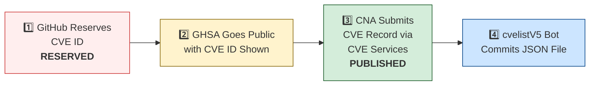

# 🛡️ OpenClaw CVE & Security Advisory Tracker

  
  
  
  
   
  
  
  
  
  

An automated tracker that continuously monitors [OpenClaw](https://github.com/openclaw/openclaw) security advisories across the GitHub Advisory Database, repo-level security advisories, and the [CVE V5 (cvelistV5)](https://github.com/CVEProject/cvelistV5) registry. Every hour it pulls the latest data, reconciles GHSA → CVE publication state, and regenerates this dashboard so you always have an up-to-date picture of the project's vulnerability landscape.

  Last updated: 2026-04-15 00:49 UTC · <a href="LICENSE">MIT License</a> · <a href="ADVISORIES.md">Full Advisory List</a> · <a href="SECURITY.md">Security Policy</a> · Data: <a href="https://github.com/CVEProject/cvelistV5">cvelistV5</a> + <a href="https://github.com/github/advisory-database">Advisory DB</a> · Updates hourly

---

  <a href="#-cves-published-in-cvelistv5-15">Published CVEs</a> ·
  <a href="#-cve-publication-pipeline">Pipeline</a> ·
  <a href="#-all-security-advisories-139">Advisories</a> ·
  <a href="#-vulnerability-categories">Categories</a> ·
  <a href="#-key-insights">Insights</a> ·
  <a href="#-project-identity">Identity</a>

---

## 🏗️ Project Identity

| Field | Value |
|-------|-------|
| **Current Name** | OpenClaw |
| **Previous Names** | Moltbot (second name), Clawdbot (original name) |
| **Repository** | [openclaw/openclaw](https://github.com/openclaw/openclaw) |
| **npm Package** | `openclaw` (formerly `clawdbot`) |
| **Author** | Peter Steinberger (steipete) |

<strong>Search terms for CVE discovery</strong>

To find all CVEs, search for: `openclaw`, `clawdbot`, `moltbot`, `clawhub`, `pkg:npm/clawdbot`, `pkg:npm/openclaw`

---

## 🚀 CVEs Published in cvelistV5 (15)

These CVEs have full records in the [CVEProject/cvelistV5](https://github.com/CVEProject/cvelistV5) repository:

| CVE ID | Severity | CVSS | Title | CWE | Published |
|--------|----------|------|-------|-----|-----------|
| [CVE-2026-32922](https://github.com/openclaw/openclaw/security/advisories/GHSA-4jpw-hj22-2xmc) |  | 9.4 | OpenClaw < 2026.3.11 - Privilege Escalation via Unvalidated Scope in device.token.rotate | CWE-266 | 2026-03-29 |
| [CVE-2026-28474](https://github.com/openclaw/openclaw/security/advisories/GHSA-r5h9-vjqc-hq3r) |  | 9.3 | OpenClaw Nextcloud Talk < 2026.2.6 - Allowlist Bypass via actor.name Display Name Spoofing | CWE-863 | 2026-03-05 |
| [CVE-2026-32987](https://github.com/openclaw/openclaw/security/advisories/GHSA-63f5-hhc7-cx6p) |  | 9.3 | OpenClaw < 2026.3.13 - Bootstrap Setup Code Replay via Device Pairing | CWE-294 | 2026-03-29 |
| [CVE-2026-28391](https://github.com/openclaw/openclaw/security/advisories/GHSA-qj77-c3c8-9c3q) |  | 9.2 | OpenClaw < 2026.2.2 - Command Injection via cmd.exe Parsing Bypass in Allowlist Enforcement | CWE-184 | 2026-03-05 |
| [CVE-2026-28446](https://github.com/openclaw/openclaw/security/advisories/GHSA-4rj2-gpmh-qq5x) |  | 9.2 | OpenClaw < 2026.2.1 - Inbound Allowlist Policy Bypass in voice-call Extension via Empty Caller ID and Suffix Matching | CWE-303 | 2026-03-05 |
| [CVE-2026-32917](https://github.com/openclaw/openclaw/security/advisories/GHSA-g2f6-pwvx-r275) |  | 9.2 | OpenClaw < 2026.3.13 - Remote Command Injection via Unsanitized iMessage Attachment Paths in SCP | CWE-78 | 2026-03-31 |
| [CVE-2026-22171](https://github.com/openclaw/openclaw/security/advisories/GHSA-vj3g-5px3-gr46) |  | 8.8 | OpenClaw < 2026.2.19 - Path Traversal in Feishu Media Temporary File Naming | CWE-22 | 2026-03-18 |
| [CVE-2026-24763](https://github.com/openclaw/openclaw/security/advisories/GHSA-mc68-q9jw-2h3v) |  | 8.8 | OpenClaw/Clawdbot Docker Execution has Authenticated Command Injection via PATH Environment Variable | CWE-78 | 2026-02-02 |
| [CVE-2026-25253](https://github.com/openclaw/openclaw/security/advisories/GHSA-g8p2-7wf7-98mq) |  | 8.8 | OpenClaw/Clawdbot has 1-Click RCE via Authentication Token Exfiltration From gatewayUrl | CWE-669 | 2026-02-01 |
| [CVE-2026-32973](https://github.com/openclaw/openclaw/security/advisories/GHSA-f8r2-vg7x-gh8m) |  | 8.8 | OpenClaw < 2026.3.11 - Exec Allowlist Pattern Overmatch via POSIX Path Normalization | CWE-625 | 2026-03-29 |
| [CVE-2026-28461](https://github.com/openclaw/openclaw/security/advisories/GHSA-wr6m-jg37-68xh) |  | 8.7 | OpenClaw < 2026.3.1 - Unbounded Memory Growth in Zalo Webhook via Query String Key Churn | CWE-770 | 2026-03-19 |
| [CVE-2026-28478](https://github.com/openclaw/openclaw/security/advisories/GHSA-q447-rj3r-2cgh) |  | 8.7 | OpenClaw affected by denial of service via unbounded webhook request body buffering | CWE-770 | 2026-03-05 |
| [CVE-2026-32049](https://github.com/openclaw/openclaw/security/advisories/GHSA-rxxp-482v-7mrh) |  | 8.7 | OpenClaw < 2026.2.22 - Denial of Service via Inbound Media Download Byte Limit Bypass | CWE-770 | 2026-03-21 |
| [CVE-2026-32982](https://github.com/openclaw/openclaw/security/advisories/GHSA-xwcj-hwhf-h378) |  | 8.7 | OpenClaw < 2026.3.13 - Telegram Bot Token Exposure in Media Fetch Error Logs | CWE-532 | 2026-03-31 |
| [CVE-2026-32980](https://github.com/openclaw/openclaw/security/advisories/GHSA-jq3f-vjww-8rq7) |  | 8.7 | OpenClaw < 2026.3.13 - Resource Exhaustion via Unauthenticated Telegram Webhook Request | CWE-770 | 2026-03-29 |
| [CVE-2026-33573](https://github.com/openclaw/openclaw/security/advisories/GHSA-2rqg-gjgv-84jm) |  | 8.7 | OpenClaw < 2026.3.11 - Workspace Boundary Bypass via Agent RPC Parameters | CWE-668 | 2026-03-29 |
| [CVE-2026-35638](https://github.com/openclaw/openclaw/security/advisories/GHSA-48vw-m3qc-wr99) |  | 8.7 | OpenClaw < 2026.3.22 - Privilege Escalation via Self-Declared Scopes in Trusted-Proxy Control UI | CWE-286 | 2026-04-09 |
| [CVE-2026-35639](https://github.com/openclaw/openclaw/security/advisories/GHSA-hf68-49fm-59cq) |  | 8.7 | OpenClaw < 2026.3.22 - Privilege Escalation via device.pair.approve Scope Validation | CWE-648 | 2026-04-09 |
| [CVE-2026-27001](https://github.com/openclaw/openclaw/security/advisories/GHSA-2qj5-gwg2-xwc4) |  | 8.6 | OpenClaw: Unsanitized CWD path injection into LLM prompts | CWE-77 | 2026-02-19 |
| [CVE-2026-33579](https://github.com/openclaw/openclaw/security/advisories/GHSA-hc5h-pmr3-3497) |  | 8.6 | OpenClaw < 2026.3.28 - Privilege Escalation via Missing Caller Scope Validation in Device Pair Approval | CWE-863 | 2026-03-31 |
| [CVE-2026-33577](https://github.com/openclaw/openclaw/security/advisories/GHSA-2x4x-cc5g-qmmg) |  | 8.6 | OpenClaw < 2026.3.28 - Insufficient Scope Validation in node.pair.approve | CWE-863 | 2026-03-31 |
| [CVE-2026-34503](https://github.com/openclaw/openclaw/security/advisories/GHSA-2pr2-hcv6-7gwv) |  | 8.6 | OpenClaw < 2026.3.28 - Incomplete WebSocket Session Termination on Device Removal and Token Revocation | CWE-613 | 2026-03-31 |
| [CVE-2026-28393](https://github.com/openclaw/openclaw/security/advisories/GHSA-7xhj-55q9-pc3m) |  | 8.3 | OpenClaw 2.0.0-beta3 < 2026.2.14 - Arbitrary JavaScript Module Loading via Hook Transform Path Traversal | CWE-427 | 2026-03-05 |
| [CVE-2026-28450](https://github.com/openclaw/openclaw/security/advisories/GHSA-mv9j-6xhh-g383) |  | 8.3 | OpenClaw < 2026.2.12 - Unauthenticated Profile Tampering via Nostr Plugin HTTP Endpoints | CWE-306 | 2026-03-05 |
| [CVE-2026-28453](https://github.com/openclaw/openclaw/security/advisories/GHSA-p25h-9q54-ffvw) |  | 8.3 | OpenClaw < 2026.2.14 - Zip Slip Path Traversal in TAR Archive Extraction | CWE-22 | 2026-03-05 |
| [CVE-2026-32036](https://github.com/openclaw/openclaw/security/advisories/GHSA-mwxv-35wr-4vvj) |  | 8.3 | OpenClaw < 2026.2.26- Authentication Bypass via Encoded Dot-Segment Traversal in /api/channels | CWE-289 | 2026-03-19 |
| [CVE-2026-35618](https://github.com/openclaw/openclaw/security/advisories/GHSA-cg6c-q2hx-69h7) |  | 8.3 | OpenClaw < 2026.3.23 - Replay Identity Drift via Query-Only Variants in Plivo V2 Verification | CWE-294 | 2026-04-09 |
| [CVE-2026-28469](https://github.com/openclaw/openclaw/security/advisories/GHSA-rq6g-px6m-c248) |  | 8.2 | OpenClaw Google Chat shared-path webhook target ambiguity allowed cross-account policy-context misrouting | CWE-639 | 2026-03-05 |
| [CVE-2026-32045](https://github.com/openclaw/openclaw/security/advisories/GHSA-hff7-ccv5-52f8) |  | 8.2 | OpenClaw < 2026.2.21 - Authentication Bypass in HTTP Gateway Routes via Tokenless Tailscale Auth | CWE-290 | 2026-03-21 |
| [CVE-2026-25157](https://github.com/openclaw/openclaw/security/advisories/GHSA-q284-4pvr-m585) |  | 7.8 | OpenClaw/Clawdbot has OS Command Injection via Project Root Path in sshNodeCommand | CWE-78 | 2026-02-04 |
| [CVE-2026-35650](https://github.com/openclaw/openclaw/security/advisories/GHSA-39pp-xp36-q6mg) |  | 7.7 | OpenClaw < 2026.3.22 - Environment Variable Override Bypass via Inconsistent Sanitization | CWE-15 | 2026-04-10 |
| [CVE-2026-35666](https://github.com/openclaw/openclaw/security/advisories/GHSA-qm9x-v7cx-7rq4) |  | 7.7 | OpenClaw < 2026.3.22 - Allowlist Bypass via Unregistered Time Dispatch Wrapper | CWE-706 | 2026-04-10 |
| [CVE-2026-27487](https://github.com/openclaw/openclaw/security/advisories/GHSA-4564-pvr2-qq4h) |  | 7.6 | OpenClaw: Prevent shell injection in macOS keychain credential write | CWE-78 | 2026-02-21 |
| [CVE-2026-32007](https://github.com/openclaw/openclaw/security/advisories/GHSA-h9xm-j4qg-fvpg) |  | 7.6 | OpenClaw < 2026.2.23 - Sandbox Bypass in apply_patch Tool via Workspace-Only Check Bypass | CWE-22 | 2026-03-19 |
| [CVE-2026-25474](https://github.com/openclaw/openclaw/security/advisories/GHSA-mp5h-m6qj-6292) |  | 7.5 | OpenClaw has a Telegram webhook request forgery (missing `channels.telegram.webhookSecret`) → auth bypass | CWE-345 | 2026-02-19 |
| [CVE-2026-26321](https://github.com/openclaw/openclaw/security/advisories/GHSA-8jpq-5h99-ff5r) |  | 7.5 | OpenClaw has a local file disclosure via sendMediaFeishu in Feishu extension | CWE-22 | 2026-02-19 |
| [CVE-2026-26319](https://github.com/openclaw/openclaw/security/advisories/GHSA-4hg8-92x6-h2f3) |  | 7.5 | OpenClaw has Missing Webhook Authentication in Telnyx Provider Allowing Unauthenticated Requests | CWE-306 | 2026-02-19 |
| [CVE-2026-28458](https://github.com/openclaw/openclaw/security/advisories/GHSA-mr32-vwc2-5j6h) |  | 7.4 | OpenClaw's Browser Relay /cdp websocket is missing auth which could allow cross-tab cookie access | CWE-306 | 2026-03-05 |
| [CVE-2026-35653](https://github.com/openclaw/openclaw/security/advisories/GHSA-xp9r-prpg-373r) |  | 7.2 | OpenClaw < 2026.3.24 - Incorrect Authorization in POST /reset-profile via browser.request | CWE-863 | 2026-04-10 |
| [CVE-2026-22175](https://github.com/openclaw/openclaw/security/advisories/GHSA-gwqp-86q6-w47g) |  | 7.1 | OpenClaw < 2026.2.23 - Exec Approval Bypass via Unrecognized Multiplexer Shell Wrappers | CWE-184 | 2026-03-18 |
| [CVE-2026-22169](https://github.com/openclaw/openclaw/security/advisories/GHSA-vmqr-rc7x-3446) |  | 7.1 | OpenClaw < 2026.2.22 - Allowlist Bypass via sort Configuration in safeBins | CWE-78 | 2026-03-18 |
| [CVE-2026-26317](https://github.com/openclaw/openclaw/security/advisories/GHSA-3fqr-4cg8-h96q) |  | 7.1 | OpenClaw affected by cross-site request forgery (CSRF) through loopback browser mutation endpoints | CWE-352 | 2026-02-19 |
| [CVE-2026-22168](https://github.com/openclaw/openclaw/security/advisories/GHSA-5v6x-rfc3-7qfr) |  | 7.1 | OpenClaw < 2026.2.21 - Command Injection via cmd.exe /c Trailing Arguments in system.run | CWE-88 | 2026-03-18 |
| [CVE-2026-28459](https://github.com/openclaw/openclaw/security/advisories/GHSA-64qx-vpxx-mvqf) |  | 7.1 | OpenClaw < 2026.2.12 - Arbitrary File Write via Untrusted sessionFile Path | CWE-73 | 2026-03-05 |
| [CVE-2026-29607](https://github.com/openclaw/openclaw/security/advisories/GHSA-6j27-pc5c-m8w8) |  | 7.1 | OpenClaw < 2026.2.22 - Authorization Bypass via allow-always Wrapper Persistence | CWE-78 | 2026-03-19 |
| [CVE-2026-32027](https://github.com/openclaw/openclaw/security/advisories/GHSA-jv6r-27ww-4gw4) |  | 7.1 | OpenClaw < 2026.2.26 - Improper Authorization via DM Pairing Store Identity Inheritance in Group Allowlist | CWE-22 | 2026-03-19 |
| [CVE-2026-32976](https://github.com/openclaw/openclaw/security/advisories/GHSA-8jhh-jcqg-mj5p) |  | 7.1 | OpenClaw < 2026.3.11 - Account-Scoped configWrites Policy Bypass via Channel Commands | CWE-639 | 2026-03-31 |
| [CVE-2026-35644](https://github.com/openclaw/openclaw/security/advisories/GHSA-ppwq-6v66-5m6j) |  | 7.1 | OpenClaw < 2026.3.22 - Credential Exposure via baseUrl Fields in Gateway Snapshots | CWE-312 | 2026-04-09 |
| [CVE-2026-35657](https://github.com/openclaw/openclaw/security/advisories/GHSA-5jvj-hxmh-6h6j) |  | 7.1 | OpenClaw < 2026.3.25 - Authorization Bypass in HTTP Session History Route | CWE-863 | 2026-04-10 |
| [CVE-2026-35631](https://github.com/openclaw/openclaw/security/advisories/GHSA-3w6x-gv34-mqpf) |  | 7.1 | OpenClaw < 2026.3.22 - Missing Authorization Enforcement in Internal ACP Chat Commands | CWE-862 | 2026-04-09 |
| [CVE-2026-40037](https://github.com/openclaw/openclaw/security/advisories/GHSA-qx8j-g322-qj6m) |  | 7.1 | OpenClaw: `fetchWithSsrFGuard` replays unsafe request bodies across cross-origin redirects | CWE-601 | 2026-04-08 |
| [CVE-2026-28447](https://github.com/openclaw/openclaw/security/advisories/GHSA-qrq5-wjgg-rvqw) |  | 7 | OpenClaw 2026.1.29-beta.1 < 2026.2.1 - Path Traversal in Plugin Installation via Package Name | CWE-22 | 2026-03-05 |
| [CVE-2026-22177](https://github.com/openclaw/openclaw/security/advisories/GHSA-8fmp-37rc-p5g7) |  | 6.9 | OpenClaw < 2026.2.21 - Environment Variable Injection via Config env.vars | CWE-15 | 2026-03-18 |
| [CVE-2026-22176](https://github.com/openclaw/openclaw/security/advisories/GHSA-pj5x-38rw-6fph) |  | 6.9 | OpenClaw < 2026.2.19 - Command Injection via Unescaped Environment Variables in Windows Scheduled Task Script Generation | CWE-78 | 2026-03-19 |
| [CVE-2026-28480](https://github.com/openclaw/openclaw/security/advisories/GHSA-mj5r-hh7j-4gxf) |  | 6.9 | OpenClaw Telegram allowlist authorization accepted mutable usernames | CWE-290 | 2026-03-05 |
| [CVE-2026-32919](https://github.com/openclaw/openclaw/security/advisories/GHSA-jf6w-m8jw-jfxc) |  | 6.9 | OpenClaw < 2026.3.11 - Unauthorized Session Reset via agent Slash Commands | CWE-863 | 2026-03-29 |
| [CVE-2026-32975](https://github.com/openclaw/openclaw/security/advisories/GHSA-f5mf-3r52-r83w) |  | 6.9 | OpenClaw < 2026.3.12 - Weak Authorization via Mutable Group Names in Zalouser Allowlist | CWE-807 | 2026-03-29 |
| [CVE-2026-34510](https://github.com/openclaw/openclaw/security/advisories/GHSA-h3x4-hc5v-v2gm) |  | 6.9 | OpenClaw < 2026.3.22 - Remote File URL Acceptance in Windows Media Loaders | CWE-41 | 2026-04-01 |
| [CVE-2026-35627](https://github.com/openclaw/openclaw/security/advisories/GHSA-65h8-27jh-q8wv) |  | 6.9 | OpenClaw < 2026.3.22 - Unauthenticated Cryptographic Work in Nostr Inbound DM Handling | CWE-696 | 2026-04-09 |
| [CVE-2026-35647](https://github.com/openclaw/openclaw/security/advisories/GHSA-9wqx-g2cw-vc7r) |  | 6.9 | OpenClaw < 2026.3.25 - Direct Message Policy Bypass via Verification Notices | CWE-288 | 2026-04-10 |
| [CVE-2026-35633](https://github.com/openclaw/openclaw/security/advisories/GHSA-4qwc-c7g9-4xcw) |  | 6.9 | OpenClaw < 2026.3.22 - Unbounded Memory Allocation via Remote Media Error Responses | CWE-789 | 2026-04-09 |
| [CVE-2026-35652](https://github.com/openclaw/openclaw/security/advisories/GHSA-8883-9w57-vwv6) |  | 6.9 | OpenClaw < 2026.3.22 - Unauthorized Action Execution via Callback Dispatch | CWE-696 | 2026-04-10 |
| [CVE-2026-35667](https://github.com/openclaw/openclaw/security/advisories/GHSA-3298-56p6-rpw2) |  | 6.9 | OpenClaw < 2026.3.24 - Improper Process Termination via Unpatched killProcessTree in shell-utils.ts | CWE-404 | 2026-04-10 |
| [CVE-2026-35654](https://github.com/openclaw/openclaw/security/advisories/GHSA-rf6h-5gpw-qrgq) |  | 6.9 | OpenClaw < 2026.3.25 - Authorization Bypass in Microsoft Teams Feedback Invoke | CWE-288 | 2026-04-10 |
| [CVE-2026-29612](https://github.com/openclaw/openclaw/security/advisories/GHSA-w2cg-vxx6-5xjg) |  | 6.8 | OpenClaw < 2026.2.14 - Denial of Service via Large Base64 Media File Decoding | CWE-770 | 2026-03-05 |
| [CVE-2026-32024](https://github.com/openclaw/openclaw/security/advisories/GHSA-rx3g-mvc3-qfjf) |  | 6.8 | OpenClaw < 2026.2.22 - Symlink Traversal in Avatar Handling | CWE-59 | 2026-03-19 |
| [CVE-2026-28452](https://github.com/openclaw/openclaw/security/advisories/GHSA-h89v-j3x9-8wqj) |  | 6.7 | OpenClaw affected by denial of service through unguarded archive extraction allowing high expansion/resource abuse (ZIP/TAR) | CWE-770 | 2026-03-05 |
| [CVE-2026-32044](https://github.com/openclaw/openclaw/security/advisories/GHSA-77hf-7fqf-f227) |  | 6.7 | OpenClaw < 2026.3.2 - Tar Archive Safety Bypass in Skills Installation | CWE-409 | 2026-03-21 |
| [CVE-2026-26328](https://github.com/openclaw/openclaw/security/advisories/GHSA-g34w-4xqq-h79m) |  | 6.5 | OpenClaw iMessage group allowlist authorization inherited DM pairing-store identities | CWE-284, CWE-863 | 2026-02-19 |
| [CVE-2026-28395](https://github.com/openclaw/openclaw/security/advisories/GHSA-qw99-grcx-4pvm) |  | 6.3 | OpenClaw 2026.1.14-1 < 2026.2.12 - Unintended Public Binding of Chrome Extension Relay via Wildcard cdpUrl | CWE-1327 | 2026-03-05 |
| [CVE-2026-28451](https://github.com/openclaw/openclaw/security/advisories/GHSA-x22m-j5qq-j49m) |  | 6.3 | OpenClaw < 2026.2.14 - SSRF via Feishu Extension Media Fetching | CWE-918 | 2026-03-05 |
| [CVE-2026-28449](https://github.com/openclaw/openclaw/security/advisories/GHSA-r9q5-c7qc-p26w) |  | 6.3 | OpenClaw < 2026.2.25 - Webhook Replay Attack via Missing Durable Replay Suppression | CWE-294 | 2026-03-19 |
| [CVE-2026-28471](https://github.com/openclaw/openclaw/security/advisories/GHSA-rmxw-jxxx-4cpc) |  | 6.3 | OpenClaw 2026.1.14-1 < 2026.2.2 - Allowlist Bypass via displayName and Cross-Homeserver localpart Matching in Matrix Plugin | CWE-287 | 2026-03-05 |
| [CVE-2026-32031](https://github.com/openclaw/openclaw/security/advisories/GHSA-8j2w-6fmm-m587) |  | 6.3 | OpenClaw < 2026.2.26 - Authentication Bypass via Path Canonicalization Mismatch in /api/channels Gateway | CWE-288 | 2026-03-19 |
| [CVE-2026-32050](https://github.com/openclaw/openclaw/security/advisories/GHSA-792q-qw95-f446) |  | 6.3 | OpenClaw < 2026.2.25 - Unauthorized Reaction Status Event Enqueue via Access Check Bypass | CWE-863 | 2026-03-21 |
| [CVE-2026-33580](https://github.com/openclaw/openclaw/security/advisories/GHSA-9528-x887-j2fp) |  | 6.3 | OpenClaw < 2026.3.28 - Brute Force Attack via Missing Rate Limiting on Webhook Shared Secret Authentication | CWE-307 | 2026-03-31 |
| [CVE-2026-35628](https://github.com/openclaw/openclaw/security/advisories/GHSA-vcx4-4qxg-mfp4) |  | 6.3 | OpenClaw < 2026.3.25 - Brute-Force Attack via Missing Telegram Webhook Rate Limiting | CWE-307 | 2026-04-09 |
| [CVE-2026-35656](https://github.com/openclaw/openclaw/security/advisories/GHSA-844j-xrrq-wgh4) |  | 6.3 | OpenClaw < 2026.3.22 - XFF Loopback Spoofing Bypass in Canvas Authentication and Rate Limiter | CWE-290 | 2026-04-10 |
| [CVE-2026-32057](https://github.com/openclaw/openclaw/security/advisories/GHSA-vvgp-4c28-m3jm) |  | 6 | OpenClaw < 2026.2.25 - Authentication Bypass via Control UI client.id Parameter | CWE-807 | 2026-03-21 |
| [CVE-2026-34511](https://github.com/openclaw/openclaw/security/advisories/GHSA-9jpj-g8vv-j5mf) |  | 6 | OpenClaw < 2026.4.2 - PKCE Verifier Exposure via OAuth State Parameter | CWE-330 | 2026-04-03 |
| [CVE-2026-28477](https://github.com/openclaw/openclaw/security/advisories/GHSA-7rcp-mxpq-72pj) |  | 5.9 | OpenClaw < 2026.2.14 - OAuth State Validation Bypass in Manual Chutes Login Flow | CWE-352 | 2026-03-05 |
| [CVE-2026-27009](https://github.com/openclaw/openclaw/security/advisories/GHSA-37gc-85xm-2ww6) |  | 5.8 | OpenClaw affected by Stored XSS in Control UI via unsanitized assistant name/avatar in inline script injection | CWE-79 | 2026-02-19 |
| [CVE-2026-27670](https://github.com/openclaw/openclaw/security/advisories/GHSA-r54r-wmmq-mh84) |  | 5.8 | OpenClaw < 2026.3.2 - Arbitrary File Write via ZIP Extraction Parent Symlink Race Condition | CWE-367 | 2026-03-19 |
| [CVE-2026-31995](https://github.com/openclaw/openclaw/security/advisories/GHSA-fg3m-vhrr-8gj6) |  | 5.8 | OpenClaw 2026.1.21 < 2026.2.19 - Command Injection via Windows Shell Fallback in Lobster Extension | CWE-78 | 2026-03-19 |
| [CVE-2026-32000](https://github.com/openclaw/openclaw/security/advisories/GHSA-7fcc-cw49-xm78) |  | 5.8 | OpenClaw < 2026.2.19 - Command Injection via Windows Shell Fallback in Lobster Tool Execution | CWE-78 | 2026-03-19 |
| [CVE-2026-32977](https://github.com/openclaw/openclaw/security/advisories/GHSA-xvx8-77m6-gwg6) |  | 5.8 | OpenClaw < 2026.3.11 - Sandbox Boundary Bypass via Unanchored writeFile Commit Path | CWE-367 | 2026-03-31 |
| [CVE-2026-32988](https://github.com/openclaw/openclaw/security/advisories/GHSA-mj4p-rc52-m843) |  | 5.8 | OpenClaw < 2026.3.11 - Sandbox Boundary Bypass via Unvalidated Temporary File Creation | CWE-367 | 2026-03-31 |
| [CVE-2026-33574](https://github.com/openclaw/openclaw/security/advisories/GHSA-vhwf-4x96-vqx2) |  | 5.8 | OpenClaw < 2026.3.8 - Path Traversal via Tools Root Rebinding in Skills Download | CWE-367 | 2026-03-29 |
| [CVE-2026-28457](https://github.com/openclaw/openclaw/security/advisories/GHSA-xw4p-pw82-hqr7) |  | 5.6 | OpenClaw < 2026.2.14 - Path Traversal in Sandbox Skill Mirroring via Name Parameter | CWE-22 | 2026-03-05 |
| [CVE-2026-32001](https://github.com/openclaw/openclaw/security/advisories/GHSA-rv2q-f2h5-6xmg) |  | 5.3 | OpenClaw < 2026.2.22 - Node Role Device-Identity Bypass via WebSocket Authentication | CWE-863 | 2026-03-19 |
| [CVE-2026-31989](https://github.com/openclaw/openclaw/security/advisories/GHSA-g99v-8hwm-g76g) |  | 5.3 | OpenClaw < 2026.3.1 - Server-Side Request Forgery via web_search Citation Redirect | CWE-918 | 2026-03-19 |
| [CVE-2026-32921](https://github.com/openclaw/openclaw/security/advisories/GHSA-8g75-q649-6pv6) |  | 5.3 | OpenClaw < 2026.3.8 - Script Content Modification via Mutable Operand Binding in system.run | CWE-367 | 2026-03-31 |
| [CVE-2026-34425](https://github.com/openclaw/openclaw/security/advisories/GHSA-fvx6-pj3r-5q4q) |  | 5.3 | OpenClaw - Shell-Bleed Protection Preflight Validation Bypass | CWE-184 | 2026-04-02 |
| [CVE-2026-33578](https://github.com/openclaw/openclaw/security/advisories/GHSA-63mg-xp9j-jfcm) |  | 5.3 | OpenClaw < 2026.3.28 - Sender Policy Allowlist Bypass via Policy Downgrade in Google Chat and Zalouser Extensions | CWE-863 | 2026-03-31 |
| [CVE-2026-35629](https://github.com/openclaw/openclaw/security/advisories/GHSA-rhfg-j8jq-7v2h) |  | 5.3 | OpenClaw < 2026.3.25 - Server-Side Request Forgery via Unguarded Configured Base URLs in Channel Extensions | CWE-918 | 2026-04-09 |
| [CVE-2026-35619](https://github.com/openclaw/openclaw/security/advisories/GHSA-68f8-9mhj-h2mp) |  | 5.3 | OpenClaw < 2026.3.24 - Authorization Bypass via HTTP /v1/models Endpoint | CWE-863 | 2026-04-10 |
| [CVE-2026-35642](https://github.com/openclaw/openclaw/security/advisories/GHSA-mw7w-g3mg-xqm7) |  | 5.3 | OpenClaw < 2026.3.25 - Authorization Bypass in Group Reactions via requireMention Bypass | CWE-288 | 2026-04-09 |
| [CVE-2026-32020](https://github.com/openclaw/openclaw/security/advisories/GHSA-5ghc-98wh-gwwf) |  | 4.8 | OpenClaw < 2026.2.22 - Arbitrary File Read via Symlink Following in Static File Handler | CWE-59 | 2026-03-19 |
| [CVE-2026-27486](https://github.com/openclaw/openclaw/security/advisories/GHSA-jfv4-h8mc-jcp8) |  | 4.3 | OpenClaw: Process Safety - Unvalidated PID Kill via SIGKILL in Process Cleanup | CWE-283 | 2026-02-21 |
| [CVE-2026-24764](https://github.com/openclaw/openclaw/security/advisories/GHSA-782p-5fr5-7fj8) |  | 3.7 | OpenClaw has Remote Code Execution via System Prompt Injection in Slack Channel Descriptions | CWE-74, CWE-94 | 2026-02-19 |
| [CVE-2026-32040](https://github.com/openclaw/openclaw/security/advisories/GHSA-2ww6-868g-2c56) |  | 2.4 | OpenClaw < 2026.2.23 - HTML Injection via Unvalidated Image MIME Type in Data-URL Interpolation | CWE-79 | 2026-03-19 |
| [CVE-2026-34506](https://github.com/openclaw/openclaw/security/advisories/GHSA-g7cr-9h7q-4qxq) |  | 2.3 | OpenClaw < 2026.3.8 - Sender Allowlist Bypass in Microsoft Teams Plugin via Route Allowlist Configuration | CWE-863 | 2026-03-31 |
| [CVE-2026-35624](https://github.com/openclaw/openclaw/security/advisories/GHSA-xhq5-45pm-2gjr) |  | 2.3 | OpenClaw < 2026.3.22 - Policy Confusion via Room Name Collision in Nextcloud Talk | CWE-807 | 2026-04-09 |
| [CVE-2026-35648](https://github.com/openclaw/openclaw/security/advisories/GHSA-wj55-88gf-x564) |  | 2.3 | OpenClaw < 2026.3.22 - Policy Bypass via Unvalidated Queued Node Actions | CWE-367 | 2026-04-10 |
| [CVE-2026-32970](https://github.com/openclaw/openclaw/security/advisories/GHSA-qvr7-g57c-mrc7) |  | 2 | OpenClaw < 2026.3.11 - Credential Fallback Logic Bypass via Unavailable Local Auth SecretRefs | CWE-636 | 2026-03-31 |

<strong>📖 Detailed CVE Analysis (click to expand)</strong>

### CVE-2026-32922 — OpenClaw < 2026.3.11 - Privilege Escalation via Unvalidated Scope in device.token.rotate

| Field | Detail |
|-------|--------|
| **CVSS** | 9.4 (CRITICAL) — `CVSS:4.0/AV:N/AC:L/AT:N/PR:L/UI:N/VC:H/VI:H/VA:H/SC:H/SI:H/SA:H` |
| **CWE** | CWE-266 (Incorrect Privilege Assignment) |
| **Affected** | < 2026.3.11 |
| **Vendor/Product** | OpenClaw / OpenClaw |
| **Advisory** | [GHSA-4jpw-hj22-2xmc](https://github.com/openclaw/openclaw/security/advisories/GHSA-4jpw-hj22-2xmc) |

OpenClaw before 2026.3.11 contains a privilege escalation vulnerability in device.token.rotate that allows callers with operator.pairing scope to mint tokens with broader scopes by failing to constrain newly minted scopes to the caller's current scope set. Attackers can obtain operator.admin tokens for paired devices and achieve remote code execution on connected nodes via system.run or gain unauthorized gateway-admin access.

**References:**
- [VulnCheck Advisory: OpenClaw < 2026.3.11 - Privilege Escalation via Unvalidated Scope in device.token.rotate](https://www.vulncheck.com/advisories/openclaw-privilege-escalation-via-unvalidated-scope-in-device-token-rotate)
---

### CVE-2026-28474 — OpenClaw Nextcloud Talk < 2026.2.6 - Allowlist Bypass via actor.name Display Name Spoofing

| Field | Detail |
|-------|--------|
| **CVSS** | 9.3 (CRITICAL) — `CVSS:4.0/AV:N/AC:L/AT:N/PR:N/UI:N/VC:H/VI:H/VA:H/SC:N/SI:N/SA:N` |
| **CWE** | CWE-863 (Incorrect Authorization) |
| **Affected** | < 2026.2.6 |
| **Vendor/Product** | OpenClaw / nextcloud-talk |
| **Advisory** | [GHSA-r5h9-vjqc-hq3r](https://github.com/openclaw/openclaw/security/advisories/GHSA-r5h9-vjqc-hq3r) |

OpenClaw's Nextcloud Talk plugin versions prior to 2026.2.6 accept equality matching on the mutable actor.name display name field for allowlist validation, allowing attackers to bypass DM and room allowlists. An attacker can change their Nextcloud display name to match an allowlisted user ID and gain unauthorized access to restricted conversations.

**References:**
- [Patch Commit #1](https://github.com/openclaw/openclaw/commit/6b4b6049b47c3329a7014509594647826669892d)
- [VulnCheck Advisory: OpenClaw Nextcloud Talk < 2026.2.6 - Allowlist Bypass via actor.name Display Name Spoofing](https://www.vulncheck.com/advisories/openclaw-nextcloud-talk-allowlist-bypass-via-actorname-display-name-spoofing)
---

### CVE-2026-32987 — OpenClaw < 2026.3.13 - Bootstrap Setup Code Replay via Device Pairing

| Field | Detail |
|-------|--------|
| **CVSS** | 9.3 (CRITICAL) — `CVSS:4.0/AV:N/AC:L/AT:N/PR:N/UI:N/VC:H/VI:H/VA:H/SC:N/SI:N/SA:N` |
| **CWE** | CWE-294 (Authentication Bypass by Capture-replay) |
| **Affected** | < 2026.3.13 |
| **Vendor/Product** | OpenClaw / OpenClaw |
| **Advisory** | [GHSA-63f5-hhc7-cx6p](https://github.com/openclaw/openclaw/security/advisories/GHSA-63f5-hhc7-cx6p) |

OpenClaw before 2026.3.13 allows bootstrap setup codes to be replayed during device pairing verification in src/infra/device-bootstrap.ts. Attackers can verify a valid bootstrap code multiple times before approval to escalate pending pairing scopes, including privilege escalation to operator.admin.

**References:**
- [Patch Commit](https://github.com/openclaw/openclaw/commit/1803d16d5cec970c54b0e1ac46b31b1cbade335c)
- [VulnCheck Advisory: OpenClaw < 2026.3.13 - Bootstrap Setup Code Replay via Device Pairing](https://www.vulncheck.com/advisories/openclaw-bootstrap-setup-code-replay-via-device-pairing)
---

### CVE-2026-28391 — OpenClaw < 2026.2.2 - Command Injection via cmd.exe Parsing Bypass in Allowlist Enforcement

| Field | Detail |
|-------|--------|
| **CVSS** | 9.2 (CRITICAL) — `CVSS:4.0/AV:N/AC:L/AT:P/PR:N/UI:N/VC:H/VI:H/VA:H/SC:N/SI:N/SA:N` |
| **CWE** | CWE-184 (Incomplete List of Disallowed Inputs) |
| **Affected** | < 2026.2.2 |
| **Vendor/Product** | OpenClaw / OpenClaw |
| **Advisory** | [GHSA-qj77-c3c8-9c3q](https://github.com/openclaw/openclaw/security/advisories/GHSA-qj77-c3c8-9c3q) |

OpenClaw versions prior to 2026.2.2 fail to properly validate Windows cmd.exe metacharacters in allowlist-gated exec requests, allowing attackers to bypass command approval restrictions. Remote attackers can craft command strings with shell metacharacters like & or %...% to execute unapproved commands beyond the allowlisted operations.

**References:**
- [Patch Commit](https://github.com/openclaw/openclaw/commit/a7f4a53ce80c98ba1452eb90802d447fca9bf3d6)
- [VulnCheck Advisory: OpenClaw < 2026.2.2 - Command Injection via cmd.exe Parsing Bypass in Allowlist Enforcement](https://www.vulncheck.com/advisories/openclaw-command-injection-via-cmdexe-parsing-bypass-in-allowlist-enforcement)
---

### CVE-2026-28446 — OpenClaw < 2026.2.1 - Inbound Allowlist Policy Bypass in voice-call Extension via Empty Caller ID and Suffix Matching

| Field | Detail |
|-------|--------|
| **CVSS** | 9.2 (CRITICAL) — `CVSS:4.0/AV:N/AC:L/AT:P/PR:N/UI:N/VC:H/VI:H/VA:L/SC:N/SI:N/SA:N` |
| **CWE** | CWE-303 (Incorrect Implementation of Authentication Algorithm) |
| **Affected** | < 2026.2.1 |
| **Vendor/Product** | OpenClaw / OpenClaw |
| **Advisory** | [GHSA-4rj2-gpmh-qq5x](https://github.com/openclaw/openclaw/security/advisories/GHSA-4rj2-gpmh-qq5x) |

OpenClaw versions prior to 2026.2.1 with the voice-call extension installed and enabled contain an authentication bypass vulnerability in inbound allowlist policy validation that accepts empty caller IDs and uses suffix-based matching instead of strict equality. Remote attackers can bypass inbound access controls by placing calls with missing caller IDs or numbers ending with allowlisted digits to reach the voice-call agent and execute tools.

**References:**
- [Patch Commit](https://github.com/openclaw/openclaw/commit/f8dfd034f5d9235c5485f492a9e4ccc114e97fdb)
- [VulnCheck Advisory: OpenClaw < 2026.2.1 - Inbound Allowlist Policy Bypass in voice-call Extension via Empty Caller ID and Suffix Matching](https://www.vulncheck.com/advisories/openclaw-inbound-allowlist-policy-bypass-in-voice-call-extension-via-empty-caller-id)
---

### CVE-2026-32917 — OpenClaw < 2026.3.13 - Remote Command Injection via Unsanitized iMessage Attachment Paths in SCP

| Field | Detail |
|-------|--------|
| **CVSS** | 9.2 (CRITICAL) — `CVSS:4.0/AV:N/AC:L/AT:P/PR:N/UI:N/VC:H/VI:H/VA:H/SC:N/SI:N/SA:N` |
| **CWE** | CWE-78 (Improper Neutralization of Special Elements used in an OS Command ('OS Command Injection')) |
| **Affected** | < 2026.3.13 |
| **Vendor/Product** | OpenClaw / OpenClaw |
| **Advisory** | [GHSA-g2f6-pwvx-r275](https://github.com/openclaw/openclaw/security/advisories/GHSA-g2f6-pwvx-r275) |

OpenClaw before 2026.3.13 contains a remote command injection vulnerability in the iMessage attachment staging flow that allows attackers to execute arbitrary commands on configured remote hosts. The vulnerability exists because unsanitized remote attachment paths containing shell metacharacters are passed directly to the SCP remote operand without validation, enabling command execution when remote attachment staging is enabled.

**References:**
- [Patch Commit](https://github.com/openclaw/openclaw/commit/a54bf71b4c0cbe554a84340b773df37ee8e959de)
- [VulnCheck Advisory: OpenClaw < 2026.3.13 - Remote Command Injection via Unsanitized iMessage Attachment Paths in SCP](https://www.vulncheck.com/advisories/openclaw-remote-command-injection-via-unsanitized-imessage-attachment-paths-in-scp)
---

### CVE-2026-22171 — OpenClaw < 2026.2.19 - Path Traversal in Feishu Media Temporary File Naming

| Field | Detail |
|-------|--------|
| **CVSS** | 8.8 (HIGH) — `CVSS:4.0/AV:N/AC:L/AT:N/PR:N/UI:N/VC:N/VI:H/VA:L/SC:N/SI:N/SA:N` |
| **CWE** | CWE-22 (CWE-22 Improper Limitation of a Pathname to a Restricted Directory ('Path Traversal')) |
| **Affected** | < 2026.2.19 |
| **Vendor/Product** | OpenClaw / OpenClaw |
| **Advisory** | [GHSA-vj3g-5px3-gr46](https://github.com/openclaw/openclaw/security/advisories/GHSA-vj3g-5px3-gr46) |

OpenClaw versions prior to 2026.2.19 contain a path traversal vulnerability in the Feishu media download flow where untrusted media keys are interpolated directly into temporary file paths in extensions/feishu/src/media.ts. An attacker who can control Feishu media key values returned to the client can use traversal segments to escape os.tmpdir() and write arbitrary files within the OpenClaw process permissions.

**References:**
- [Patch Commit #1](https://github.com/openclaw/openclaw/commit/c821099157a9767d4df208c6b12f214946507871)
- [Patch Commit #2](https://github.com/openclaw/openclaw/commit/cdb00fe2428000e7a08f9b7848784a0049176705)
- [Patch Commit #3](https://github.com/openclaw/openclaw/commit/ec232a9e2dff60f0e3d7e827a7c868db5254473f)
- [VulnCheck Advisory: OpenClaw < 2026.2.19 - Path Traversal in Feishu Media Temporary File Naming](https://www.vulncheck.com/advisories/openclaw-path-traversal-in-feishu-media-temporary-file-naming)
---

### CVE-2026-24763 — OpenClaw/Clawdbot Docker Execution has Authenticated Command Injection via PATH Environment Variable

| Field | Detail |
|-------|--------|
| **CVSS** | 8.8 (HIGH) — `CVSS:3.1/AV:N/AC:L/PR:L/UI:N/S:U/C:H/I:H/A:H` |
| **CWE** | CWE-78 (CWE-78: Improper Neutralization of Special Elements used in an OS Command ('OS Command Injection')) |
| **Affected** | < 2026.1.29 |
| **Vendor/Product** | clawdbot / clawdbot |
| **Advisory** | [GHSA-mc68-q9jw-2h3v](https://github.com/openclaw/openclaw/security/advisories/GHSA-mc68-q9jw-2h3v) |

OpenClaw (formerly  Clawdbot) is a personal AI assistant you run on your own devices. Prior to 2026.1.29, a command injection vulnerability existed in OpenClaw’s Docker sandbox execution mechanism due to unsafe handling of the PATH environment variable when constructing shell commands. An authenticated user able to control environment variables could influence command execution within the container context. This vulnerability is fixed in 2026.1.29.

> **Naming note:** Uses old name `clawdbot/clawdbot` as vendor/product.
**References:**
- [https://github.com/openclaw/openclaw/commit/771f23d36b95ec2204cc9a0054045f5d8439ea75](https://github.com/openclaw/openclaw/commit/771f23d36b95ec2204cc9a0054045f5d8439ea75)
- [https://github.com/openclaw/openclaw/releases/tag/v2026.1.29](https://github.com/openclaw/openclaw/releases/tag/v2026.1.29)
---

### CVE-2026-25253 — OpenClaw/Clawdbot has 1-Click RCE via Authentication Token Exfiltration From gatewayUrl

| Field | Detail |
|-------|--------|
| **CVSS** | 8.8 (HIGH) — `CVSS:3.1/AV:N/AC:L/PR:N/UI:R/S:U/C:H/I:H/A:H` |
| **CWE** | CWE-669 (CWE-669 Incorrect Resource Transfer Between Spheres) |
| **Affected** | < 2026.1.29 |
| **Vendor/Product** | OpenClaw / OpenClaw |
| **Advisory** | [GHSA-g8p2-7wf7-98mq](https://github.com/openclaw/openclaw/security/advisories/GHSA-g8p2-7wf7-98mq) |

OpenClaw (aka clawdbot or Moltbot) before 2026.1.29 obtains a gatewayUrl value from a query string and automatically makes a WebSocket connection without prompting, sending a token value.

> **Naming note:** Uses all three names in description. packageURL still references `pkg:npm/clawdbot`.
**References:**
- [1-click-rce-to-steal-your-moltbot-data-and-keys](https://depthfirst.com/post/1-click-rce-to-steal-your-moltbot-data-and-keys)
- [blog](https://openclaw.ai/blog)
- [one-click-rce-moltbot](https://ethiack.com/news/blog/one-click-rce-moltbot)
- [2016913750557651228](https://x.com/0xacb/status/2016913750557651228)
---

### CVE-2026-32973 — OpenClaw < 2026.3.11 - Exec Allowlist Pattern Overmatch via POSIX Path Normalization

| Field | Detail |
|-------|--------|
| **CVSS** | 8.8 (HIGH) — `CVSS:4.0/AV:N/AC:L/AT:N/PR:N/UI:N/VC:N/VI:H/VA:H/SC:N/SI:N/SA:N` |
| **CWE** | CWE-625 (Permissive Regular Expression) |
| **Affected** | < 2026.3.11 |
| **Vendor/Product** | OpenClaw / OpenClaw |
| **Advisory** | [GHSA-f8r2-vg7x-gh8m](https://github.com/openclaw/openclaw/security/advisories/GHSA-f8r2-vg7x-gh8m) |

OpenClaw before 2026.3.11 contains an exec allowlist bypass vulnerability where matchesExecAllowlistPattern improperly normalizes patterns with lowercasing and glob matching that overmatches on POSIX paths. Attackers can exploit the ? wildcard matching across path segments to execute commands or paths not intended by operators.

**References:**
- [VulnCheck Advisory: OpenClaw < 2026.3.11 - Exec Allowlist Pattern Overmatch via POSIX Path Normalization](https://www.vulncheck.com/advisories/openclaw-exec-allowlist-pattern-overmatch-via-posix-path-normalization)
---

### CVE-2026-28461 — OpenClaw < 2026.3.1 - Unbounded Memory Growth in Zalo Webhook via Query String Key Churn

| Field | Detail |
|-------|--------|
| **CVSS** | 8.7 (HIGH) — `CVSS:4.0/AV:N/AC:L/AT:N/PR:N/UI:N/VC:N/VI:N/VA:H/SC:N/SI:N/SA:N` |
| **CWE** | CWE-770 (CWE-770: Allocation of Resources Without Limits or Throttling) |
| **Affected** | < 2026.3.1 |
| **Vendor/Product** | OpenClaw / OpenClaw |
| **Advisory** | [GHSA-wr6m-jg37-68xh](https://github.com/openclaw/openclaw/security/advisories/GHSA-wr6m-jg37-68xh) |

OpenClaw versions prior to 2026.3.1 contain an unbounded memory growth vulnerability in the Zalo webhook endpoint that allows unauthenticated attackers to trigger in-memory key accumulation by varying query strings. Remote attackers can exploit this by sending repeated requests with different query parameters to cause memory pressure, process instability, or out-of-memory conditions that degrade service availability.

**References:**
- [VulnCheck Advisory: OpenClaw < 2026.3.1 - Unbounded Memory Growth in Zalo Webhook via Query String Key Churn](https://www.vulncheck.com/advisories/openclaw-unbounded-memory-growth-in-zalo-webhook-via-query-string-key-churn)
---

### CVE-2026-28478 — OpenClaw affected by denial of service via unbounded webhook request body buffering

| Field | Detail |
|-------|--------|
| **CVSS** | 8.7 (HIGH) — `CVSS:4.0/AV:N/AC:L/AT:N/PR:N/UI:N/VC:N/VI:N/VA:H/SC:N/SI:N/SA:N` |
| **CWE** | CWE-770 (Allocation of Resources Without Limits or Throttling) |
| **Affected** | < 2026.2.13 |
| **Vendor/Product** | OpenClaw / OpenClaw |
| **Advisory** | [GHSA-q447-rj3r-2cgh](https://github.com/openclaw/openclaw/security/advisories/GHSA-q447-rj3r-2cgh) |

OpenClaw versions prior to 2026.2.13 contain a denial of service vulnerability in webhook handlers that buffer request bodies without strict byte or time limits. Remote unauthenticated attackers can send oversized JSON payloads or slow uploads to webhook endpoints causing memory pressure and availability degradation.

**References:**
- [Patch Commit](https://github.com/openclaw/openclaw/commit/3cbcba10cf30c2ffb898f0d8c7dfb929f15f8930)
- [VulnCheck Advisory: OpenClaw < 2026.2.13 - Denial of Service via Unbounded Webhook Request Body Buffering](https://www.vulncheck.com/advisories/openclaw-denial-of-service-via-unbounded-webhook-request-body-buffering)
---

### CVE-2026-32049 — OpenClaw < 2026.2.22 - Denial of Service via Inbound Media Download Byte Limit Bypass

| Field | Detail |
|-------|--------|
| **CVSS** | 8.7 (HIGH) — `CVSS:4.0/AV:N/AC:L/AT:N/PR:N/UI:N/VC:N/VI:N/VA:H/SC:N/SI:N/SA:N` |
| **CWE** | CWE-770 (CWE-770: Allocation of Resources Without Limits or Throttling) |
| **Affected** | < 2026.2.22 |
| **Vendor/Product** | OpenClaw / OpenClaw |
| **Advisory** | [GHSA-rxxp-482v-7mrh](https://github.com/openclaw/openclaw/security/advisories/GHSA-rxxp-482v-7mrh) |

OpenClaw versions prior to 2026.2.22 fail to consistently enforce configured inbound media byte limits before buffering remote media across multiple channel ingestion paths. Remote attackers can send oversized media payloads to trigger elevated memory usage and potential process instability.

**References:**
- [Patch Commit](https://github.com/openclaw/openclaw/commit/73d93dee64127a26f1acd09d0403b794cdeb4f5c)
- [VulnCheck Advisory: OpenClaw < 2026.2.22 - Denial of Service via Inbound Media Download Byte Limit Bypass](https://www.vulncheck.com/advisories/openclaw-denial-of-service-via-inbound-media-download-byte-limit-bypass)
---

### CVE-2026-32982 — OpenClaw < 2026.3.13 - Telegram Bot Token Exposure in Media Fetch Error Logs

| Field | Detail |
|-------|--------|
| **CVSS** | 8.7 (HIGH) — `CVSS:4.0/AV:N/AC:L/AT:N/PR:N/UI:N/VC:H/VI:N/VA:N/SC:N/SI:N/SA:N` |
| **CWE** | CWE-532 (Insertion of Sensitive Information into Log File) |
| **Affected** | < 2026.3.13 |
| **Vendor/Product** | OpenClaw / OpenClaw |
| **Advisory** | [GHSA-xwcj-hwhf-h378](https://github.com/openclaw/openclaw/security/advisories/GHSA-xwcj-hwhf-h378) |

OpenClaw before 2026.3.13 contains an information disclosure vulnerability in the fetchRemoteMedia function that exposes Telegram bot tokens in error messages. When media downloads fail, the original Telegram file URLs containing bot tokens are embedded in MediaFetchError strings and leaked to logs and error surfaces.

**References:**
- [Patch Commit](https://github.com/openclaw/openclaw/commit/7a53eb7ea8295b08be137e231c9a98c1a79b5cd5)
- [VulnCheck Advisory: OpenClaw < 2026.3.13 - Telegram Bot Token Exposure in Media Fetch Error Logs](https://www.vulncheck.com/advisories/openclaw-telegram-bot-token-exposure-in-media-fetch-error-logs)
---

### CVE-2026-32980 — OpenClaw < 2026.3.13 - Resource Exhaustion via Unauthenticated Telegram Webhook Request

| Field | Detail |
|-------|--------|
| **CVSS** | 8.7 (HIGH) — `CVSS:4.0/AV:N/AC:L/AT:N/PR:N/UI:N/VC:N/VI:N/VA:H/SC:N/SI:N/SA:N` |
| **CWE** | CWE-770 (Allocation of Resources Without Limits or Throttling) |
| **Affected** | < 2026.3.13 |
| **Vendor/Product** | OpenClaw / OpenClaw |
| **Advisory** | [GHSA-jq3f-vjww-8rq7](https://github.com/openclaw/openclaw/security/advisories/GHSA-jq3f-vjww-8rq7) |

OpenClaw before 2026.3.13 reads and buffers Telegram webhook request bodies before validating the x-telegram-bot-api-secret-token header, allowing unauthenticated attackers to exhaust server resources. Attackers can send POST requests to the webhook endpoint to force memory consumption, socket time, and JSON parsing work before authentication validation occurs.

**References:**
- [Patch Commit](https://github.com/openclaw/openclaw/commit/7e49e98f79073b11134beac27fdff547ba5a4a02)
- [VulnCheck Advisory: OpenClaw < 2026.3.13 - Resource Exhaustion via Unauthenticated Telegram Webhook Request](https://www.vulncheck.com/advisories/openclaw-resource-exhaustion-via-unauthenticated-telegram-webhook-request)
---

### CVE-2026-33573 — OpenClaw < 2026.3.11 - Workspace Boundary Bypass via Agent RPC Parameters

| Field | Detail |
|-------|--------|
| **CVSS** | 8.7 (HIGH) — `CVSS:4.0/AV:N/AC:L/AT:N/PR:L/UI:N/VC:H/VI:H/VA:H/SC:N/SI:N/SA:N` |
| **CWE** | CWE-668 (Exposure of Resource to Wrong Sphere) |
| **Affected** | < 2026.3.11 |
| **Vendor/Product** | OpenClaw / OpenClaw |
| **Advisory** | [GHSA-2rqg-gjgv-84jm](https://github.com/openclaw/openclaw/security/advisories/GHSA-2rqg-gjgv-84jm) |

OpenClaw before 2026.3.11 contains an authorization bypass vulnerability in the gateway agent RPC that allows authenticated operators with operator.write permission to override workspace boundaries by supplying attacker-controlled spawnedBy and workspaceDir values. Remote operators can escape the configured workspace boundary and execute arbitrary file and exec operations from any process-accessible directory.

**References:**
- [VulnCheck Advisory: OpenClaw < 2026.3.11 - Workspace Boundary Bypass via Agent RPC Parameters](https://www.vulncheck.com/advisories/openclaw-workspace-boundary-bypass-via-agent-rpc-parameters)
---

### CVE-2026-35638 — OpenClaw < 2026.3.22 - Privilege Escalation via Self-Declared Scopes in Trusted-Proxy Control UI

| Field | Detail |
|-------|--------|
| **CVSS** | 8.7 (HIGH) — `CVSS:4.0/AV:N/AC:L/AT:N/PR:L/UI:N/VC:H/VI:H/VA:H/SC:N/SI:N/SA:N` |
| **CWE** | CWE-286 (Execute unauthorized code or commands) |
| **Affected** | < 2026.3.22 |
| **Vendor/Product** | OpenClaw / OpenClaw |
| **Advisory** | [GHSA-48vw-m3qc-wr99](https://github.com/openclaw/openclaw/security/advisories/GHSA-48vw-m3qc-wr99) |

OpenClaw before 2026.3.22 contains a privilege escalation vulnerability in the Control UI that allows unauthenticated sessions to retain self-declared privileged scopes without device identity verification. Attackers can exploit the device-less allow path in the trusted-proxy mechanism to maintain elevated permissions by declaring arbitrary scopes, bypassing device identity requirements.

**References:**
- [Patch Commit #1](https://github.com/openclaw/openclaw/commit/630f1479c44f78484dfa21bb407cbe6f171dac87)
- [Patch Commit #2](https://github.com/openclaw/openclaw/commit/ccf16cd8892402022439346ae1d23352e3707e9e)
- [VulnCheck Advisory: OpenClaw < 2026.3.22 - Privilege Escalation via Self-Declared Scopes in Trusted-Proxy Control UI](https://www.vulncheck.com/advisories/openclaw-privilege-escalation-via-self-declared-scopes-in-trusted-proxy-control-ui)
---

### CVE-2026-35639 — OpenClaw < 2026.3.22 - Privilege Escalation via device.pair.approve Scope Validation

| Field | Detail |
|-------|--------|
| **CVSS** | 8.7 (HIGH) — `CVSS:4.0/AV:N/AC:L/AT:N/PR:L/UI:N/VC:H/VI:H/VA:H/SC:N/SI:N/SA:N` |
| **CWE** | CWE-648 (CWE-648: Incorrect Use of Privileged APIs) |
| **Affected** | < 2026.3.22 |
| **Vendor/Product** | OpenClaw / OpenClaw |
| **Advisory** | [GHSA-hf68-49fm-59cq](https://github.com/openclaw/openclaw/security/advisories/GHSA-hf68-49fm-59cq) |

OpenClaw before 2026.3.22 contains a privilege escalation vulnerability in the device.pair.approve method that allows an operator.pairing approver to approve pending device requests with broader operator scopes than the approver actually holds. Attackers can exploit insufficient scope validation to escalate privileges to operator.admin and achieve remote code execution on the Node infrastructure.

**References:**
- [Patch Commit #1](https://github.com/openclaw/openclaw/commit/630f1479c44f78484dfa21bb407cbe6f171dac87)
- [Patch Commit #2](https://github.com/openclaw/openclaw/commit/fc2d29ea926f47c428c556e92ec981441228d2a4)
- [VulnCheck Advisory: OpenClaw < 2026.3.22 - Privilege Escalation via device.pair.approve Scope Validation](https://www.vulncheck.com/advisories/openclaw-privilege-escalation-via-device-pair-approve-scope-validation)
---

### CVE-2026-27001 — OpenClaw: Unsanitized CWD path injection into LLM prompts

| Field | Detail |
|-------|--------|
| **CVSS** | 8.6 (HIGH) — `CVSS:4.0/AV:L/AC:L/AT:N/PR:N/UI:N/VC:H/VI:H/VA:H/SC:N/SI:N/SA:N` |
| **CWE** | CWE-77 (CWE-77: Improper Neutralization of Special Elements used in a Command ('Command Injection')) |
| **Affected** | < 2026.2.15 |
| **Vendor/Product** | openclaw / openclaw |
| **Advisory** | [GHSA-2qj5-gwg2-xwc4](https://github.com/openclaw/openclaw/security/advisories/GHSA-2qj5-gwg2-xwc4) |

OpenClaw is a personal AI assistant. Prior to version 2026.2.15, OpenClaw embedded the current working directory (workspace path) into the agent system prompt without sanitization. If an attacker can cause OpenClaw to run inside a directory whose name contains control/format characters (for example newlines or Unicode bidi/zero-width markers), those characters could break the prompt structure and inject attacker-controlled instructions. Starting in version 2026.2.15, the workspace path is sanitized before it is embedded into any LLM prompt output, stripping Unicode control/format characters and explicit line/paragraph separators. Workspace path resolution also applies the same sanitization as defense-in-depth.

**References:**
- [https://github.com/openclaw/openclaw/commit/6254e96acf16e70ceccc8f9b2abecee44d606f79](https://github.com/openclaw/openclaw/commit/6254e96acf16e70ceccc8f9b2abecee44d606f79)
- [https://github.com/openclaw/openclaw/releases/tag/v2026.2.15](https://github.com/openclaw/openclaw/releases/tag/v2026.2.15)
---

### CVE-2026-33579 — OpenClaw < 2026.3.28 - Privilege Escalation via Missing Caller Scope Validation in Device Pair Approval

| Field | Detail |
|-------|--------|
| **CVSS** | 8.6 (HIGH) — `CVSS:4.0/AV:N/AC:L/AT:N/PR:L/UI:N/VC:H/VI:H/VA:N/SC:N/SI:N/SA:N` |
| **CWE** | CWE-863 (CWE-863 Incorrect Authorization) |
| **Affected** | < 2026.3.28 |
| **Vendor/Product** | OpenClaw / OpenClaw |
| **Advisory** | [GHSA-hc5h-pmr3-3497](https://github.com/openclaw/openclaw/security/advisories/GHSA-hc5h-pmr3-3497) |

OpenClaw before 2026.3.28 contains a privilege escalation vulnerability in the /pair approve command path that fails to forward caller scopes into the core approval check. A caller with pairing privileges but without admin privileges can approve pending device requests asking for broader scopes including admin access by exploiting the missing scope validation in extensions/device-pair/index.ts and src/infra/device-pairing.ts.

**References:**
- [Patch Commit](https://github.com/openclaw/openclaw/commit/e403decb6e20091b5402780a7ccd2085f98aa3cd)
- [VulnCheck Advisory: OpenClaw < 2026.3.28 - Privilege Escalation via Missing Caller Scope Validation in Device Pair Approval](https://www.vulncheck.com/advisories/openclaw-privilege-escalation-via-missing-caller-scope-validation-in-device-pair-approval)
---

### CVE-2026-33577 — OpenClaw < 2026.3.28 - Insufficient Scope Validation in node.pair.approve

| Field | Detail |
|-------|--------|
| **CVSS** | 8.6 (HIGH) — `CVSS:4.0/AV:N/AC:L/AT:N/PR:L/UI:N/VC:H/VI:H/VA:N/SC:N/SI:N/SA:N` |
| **CWE** | CWE-863 (CWE-863 Incorrect Authorization) |
| **Affected** | < 2026.3.28 |
| **Vendor/Product** | OpenClaw / OpenClaw |
| **Advisory** | [GHSA-2x4x-cc5g-qmmg](https://github.com/openclaw/openclaw/security/advisories/GHSA-2x4x-cc5g-qmmg) |

OpenClaw before 2026.3.28 contains an insufficient scope validation vulnerability in the node pairing approval path that allows low-privilege operators to approve nodes with broader scopes. Attackers can exploit missing callerScopes validation in node-pairing.ts to extend privileges onto paired nodes beyond their authorization level.

**References:**
- [Patch Commit](https://github.com/openclaw/openclaw/commit/4d7cc6bb4fac68b5a5fadd1c5a23168281221f34)
- [VulnCheck Advisory: OpenClaw < 2026.3.28 - Insufficient Scope Validation in node.pair.approve](https://www.vulncheck.com/advisories/openclaw-insufficient-scope-validation-in-node-pair-approve)
---

### CVE-2026-34503 — OpenClaw < 2026.3.28 - Incomplete WebSocket Session Termination on Device Removal and Token Revocation

| Field | Detail |
|-------|--------|
| **CVSS** | 8.6 (HIGH) — `CVSS:4.0/AV:N/AC:L/AT:N/PR:L/UI:N/VC:H/VI:H/VA:N/SC:N/SI:N/SA:N` |
| **CWE** | CWE-613 (CWE-613 Insufficient Session Expiration) |
| **Affected** | < 2026.3.28 |
| **Vendor/Product** | OpenClaw / OpenClaw |
| **Advisory** | [GHSA-2pr2-hcv6-7gwv](https://github.com/openclaw/openclaw/security/advisories/GHSA-2pr2-hcv6-7gwv) |

OpenClaw before 2026.3.28 fails to disconnect active WebSocket sessions when devices are removed or tokens are revoked. Attackers with revoked credentials can maintain unauthorized access through existing live sessions until forced reconnection.

**References:**
- [Patch Commit](https://github.com/openclaw/openclaw/commit/7a801cc451e9e667b705eeccff651923a1b8c863)
- [VulnCheck Advisory: OpenClaw < 2026.3.28 - Incomplete WebSocket Session Termination on Device Removal and Token Revocation](https://www.vulncheck.com/advisories/openclaw-incomplete-websocket-session-termination-on-device-removal-and-token-revocation)
---

### CVE-2026-28393 — OpenClaw 2.0.0-beta3 < 2026.2.14 - Arbitrary JavaScript Module Loading via Hook Transform Path Traversal

| Field | Detail |
|-------|--------|
| **CVSS** | 8.3 (HIGH) — `CVSS:4.0/AV:L/AC:L/AT:N/PR:H/UI:N/VC:H/VI:H/VA:N/SC:N/SI:N/SA:N` |
| **CWE** | CWE-427 (Uncontrolled Search Path Element) |
| **Affected** | < 2026.2.14 |
| **Vendor/Product** | OpenClaw / OpenClaw |
| **Advisory** | [GHSA-7xhj-55q9-pc3m](https://github.com/openclaw/openclaw/security/advisories/GHSA-7xhj-55q9-pc3m) |

OpenClaw versions 2.0.0-beta3 prior to 2026.2.14 contain a path traversal vulnerability in hook transform module loading that allows arbitrary JavaScript execution. The hooks.mappings[].transform.module parameter accepts absolute paths and traversal sequences, enabling attackers with configuration write access to load and execute malicious modules with gateway process privileges.

**References:**
- [Patch Commit #1](https://github.com/openclaw/openclaw/commit/a0361b8ba959e8506dc79d638b6e6a00d12887e4)
- [Patch Commit #2](https://github.com/openclaw/openclaw/commit/18e8bd68c5015a894f999c6d5e6e32468965bfb5)
- [VulnCheck Advisory: OpenClaw 2.0.0-beta3 < 2026.2.14 - Arbitrary JavaScript Module Loading via Hook Transform Path Traversal](https://www.vulncheck.com/advisories/openclaw-beta-arbitrary-javascript-module-loading-via-hook-transform-path-traversal)
---

### CVE-2026-28450 — OpenClaw < 2026.2.12 - Unauthenticated Profile Tampering via Nostr Plugin HTTP Endpoints

| Field | Detail |
|-------|--------|
| **CVSS** | 8.3 (HIGH) — `CVSS:4.0/AV:N/AC:L/AT:P/PR:N/UI:N/VC:L/VI:H/VA:N/SC:N/SI:N/SA:N` |
| **CWE** | CWE-306 (Missing Authentication for Critical Function) |
| **Affected** | < 2026.2.12 |
| **Vendor/Product** | OpenClaw / OpenClaw |
| **Advisory** | [GHSA-mv9j-6xhh-g383](https://github.com/openclaw/openclaw/security/advisories/GHSA-mv9j-6xhh-g383) |

OpenClaw versions prior to 2026.2.12 with the optional Nostr plugin enabled expose unauthenticated HTTP endpoints at /api/channels/nostr/:accountId/profile and /api/channels/nostr/:accountId/profile/import that allow reading and modifying Nostr profiles without gateway authentication. Remote attackers can exploit these endpoints to read sensitive profile data, modify Nostr profiles, persist malicious changes to gateway configuration, and publish signed Nostr events using the bot's private key when the gateway HTTP port is accessible beyond localhost.

**References:**
- [Patch Commit](https://github.com/openclaw/openclaw/commit/647d929c9d0fd114249230d939a5cb3b36dc70e7)
- [VulnCheck Advisory: OpenClaw < 2026.2.12 - Unauthenticated Profile Tampering via Nostr Plugin HTTP Endpoints](https://www.vulncheck.com/advisories/openclaw-unauthenticated-profile-tampering-via-nostr-plugin-http-endpoints)
---

### CVE-2026-28453 — OpenClaw < 2026.2.14 - Zip Slip Path Traversal in TAR Archive Extraction

| Field | Detail |
|-------|--------|
| **CVSS** | 8.3 (HIGH) — `CVSS:4.0/AV:L/AC:L/AT:N/PR:N/UI:A/VC:H/VI:H/VA:N/SC:N/SI:N/SA:N` |
| **CWE** | CWE-22 (Improper Limitation of a Pathname to a Restricted Directory ('Path Traversal')) |
| **Affected** | < 2026.2.14 |
| **Vendor/Product** | OpenClaw / OpenClaw |
| **Advisory** | [GHSA-p25h-9q54-ffvw](https://github.com/openclaw/openclaw/security/advisories/GHSA-p25h-9q54-ffvw) |

OpenClaw versions prior to 2026.2.14 fail to validate TAR archive entry paths during extraction, allowing path traversal sequences to write files outside the intended directory. Attackers can craft malicious archives with traversal sequences like ../../ to write files outside extraction boundaries, potentially enabling configuration tampering and code execution.

**References:**
- [Patch Commit](https://github.com/openclaw/openclaw/commit/3aa94afcfd12104c683c9cad81faf434d0dadf87)
- [VulnCheck Advisory: OpenClaw < 2026.2.14 - Zip Slip Path Traversal in TAR Archive Extraction](https://www.vulncheck.com/advisories/openclaw-zip-slip-path-traversal-in-tar-archive-extraction)
---

### CVE-2026-32036 — OpenClaw < 2026.2.26- Authentication Bypass via Encoded Dot-Segment Traversal in /api/channels

| Field | Detail |
|-------|--------|
| **CVSS** | 8.3 (HIGH) — `CVSS:4.0/AV:N/AC:H/AT:N/PR:N/UI:N/VC:L/VI:H/VA:N/SC:N/SI:N/SA:N` |
| **CWE** | CWE-289 (CWE-289 Authentication Bypass by Alternate Name) |
| **Affected** | < 2026.2.26 |
| **Vendor/Product** | OpenClaw / OpenClaw |
| **Advisory** | [GHSA-mwxv-35wr-4vvj](https://github.com/openclaw/openclaw/security/advisories/GHSA-mwxv-35wr-4vvj) |

OpenClaw gateway plugin versions prior to 2026.2.26 contain a path traversal vulnerability that allows remote attackers to bypass route authentication checks by manipulating /api/channels paths with encoded dot-segment traversal sequences. Attackers can craft alternate paths using encoded traversal patterns to access protected plugin channel routes when handlers normalize the incoming path, circumventing security controls.

**References:**
- [Patch Commit](https://github.com/openclaw/openclaw/commit/258d615c45527ffda37cecd08cd268f97461bde0)
- [VulnCheck Advisory: OpenClaw < 2026.2.26- Authentication Bypass via Encoded Dot-Segment Traversal in /api/channels](https://www.vulncheck.com/advisories/openclaw-authentication-bypass-via-encoded-dot-segment-traversal-in-api-channels)
---

### CVE-2026-35618 — OpenClaw < 2026.3.23 - Replay Identity Drift via Query-Only Variants in Plivo V2 Verification

| Field | Detail |
|-------|--------|
| **CVSS** | 8.3 (HIGH) — `CVSS:4.0/AV:N/AC:H/AT:N/PR:N/UI:N/VC:L/VI:H/VA:N/SC:N/SI:N/SA:N` |
| **CWE** | CWE-294 (CWE-294 Authentication Bypass by Capture-replay) |
| **Affected** | < 2026.3.23 |
| **Vendor/Product** | OpenClaw / OpenClaw |
| **Advisory** | [GHSA-cg6c-q2hx-69h7](https://github.com/openclaw/openclaw/security/advisories/GHSA-cg6c-q2hx-69h7) |

OpenClaw before 2026.3.23 contains a replay identity vulnerability in Plivo V2 signature verification that allows attackers to bypass replay protection by modifying query parameters. The verification path derives replay keys from the full URL including query strings instead of the canonicalized base URL, enabling attackers to mint new verified request keys through unsigned query-only changes to signed requests.

**References:**
- [Patch Commit #1](https://github.com/openclaw/openclaw/commit/630f1479c44f78484dfa21bb407cbe6f171dac87)
- [Patch Commit #2](https://github.com/openclaw/openclaw/commit/b0ce53a79cf63834660270513e26d921899b4e5b)
- [VulnCheck Advisory: OpenClaw < 2026.3.23 - Replay Identity Drift via Query-Only Variants in Plivo V2 Verification](https://www.vulncheck.com/advisories/openclaw-replay-identity-drift-via-query-only-variants-in-plivo-v2-verification)
---

### CVE-2026-28469 — OpenClaw Google Chat shared-path webhook target ambiguity allowed cross-account policy-context misrouting

| Field | Detail |
|-------|--------|
| **CVSS** | 8.2 (HIGH) — `CVSS:4.0/AV:N/AC:L/AT:P/PR:N/UI:N/VC:N/VI:H/VA:N/SC:N/SI:N/SA:N` |
| **CWE** | CWE-639 (Authorization Bypass Through User-Controlled Key) |
| **Affected** | < 2026.2.14 |
| **Vendor/Product** | OpenClaw / OpenClaw |
| **Advisory** | [GHSA-rq6g-px6m-c248](https://github.com/openclaw/openclaw/security/advisories/GHSA-rq6g-px6m-c248) |

OpenClaw versions prior to 2026.2.14 contain a webhook routing vulnerability in the Google Chat monitor component that allows cross-account policy context misrouting when multiple webhook targets share the same HTTP path. Attackers can exploit first-match request verification semantics to process inbound webhook events under incorrect account contexts, bypassing intended allowlists and session policies.

**References:**
- [Patch Commit](https://github.com/openclaw/openclaw/commit/61d59a802869177d9cef52204767cd83357ab79e)
- [VulnCheck Advisory: OpenClaw < 2026.2.14 - Cross-Account Policy Context Misrouting via Shared Webhook Path Ambiguity](https://www.vulncheck.com/advisories/openclaw-cross-account-policy-context-misrouting-via-shared-webhook-path-ambiguity)
---

### CVE-2026-32045 — OpenClaw < 2026.2.21 - Authentication Bypass in HTTP Gateway Routes via Tokenless Tailscale Auth

| Field | Detail |
|-------|--------|
| **CVSS** | 8.2 (HIGH) — `CVSS:4.0/AV:N/AC:H/AT:P/PR:N/UI:N/VC:H/VI:N/VA:N/SC:N/SI:N/SA:N` |
| **CWE** | CWE-290 (CWE-290: Authentication Bypass by Spoofing) |
| **Affected** | < 2026.2.21 |
| **Vendor/Product** | OpenClaw / OpenClaw |
| **Advisory** | [GHSA-hff7-ccv5-52f8](https://github.com/openclaw/openclaw/security/advisories/GHSA-hff7-ccv5-52f8) |

OpenClaw versions prior to 2026.2.21 incorrectly apply tokenless Tailscale header authentication to HTTP gateway routes, allowing bypass of token and password requirements. Attackers on trusted networks can exploit this misconfiguration to access HTTP gateway routes without proper authentication credentials.

**References:**
- [Patch Commit](https://github.com/openclaw/openclaw/commit/356d61aacfa5b0f1d5830716ec59d70682a3e7b8)
- [VulnCheck Advisory: OpenClaw < 2026.2.21 - Authentication Bypass in HTTP Gateway Routes via Tokenless Tailscale Auth](https://www.vulncheck.com/advisories/openclaw-authentication-bypass-in-http-gateway-routes-via-tokenless-tailscale-auth)
---

### CVE-2026-25157 — OpenClaw/Clawdbot has OS Command Injection via Project Root Path in sshNodeCommand

| Field | Detail |
|-------|--------|
| **CVSS** | 7.8 (HIGH) — `CVSS:3.1/AV:L/AC:H/PR:N/UI:R/S:C/C:H/I:H/A:H` |
| **CWE** | CWE-78 (CWE-78: Improper Neutralization of Special Elements used in an OS Command ('OS Command Injection')) |
| **Affected** | < 2026.1.29 |
| **Vendor/Product** | openclaw / openclaw |
| **Advisory** | [GHSA-q284-4pvr-m585](https://github.com/openclaw/openclaw/security/advisories/GHSA-q284-4pvr-m585) |

OpenClaw is a personal AI assistant. Prior to version 2026.1.29, there is an OS command injection vulnerability via the Project Root Path in sshNodeCommand. The sshNodeCommand function constructed a shell script without properly escaping the user-supplied project path in an error message. When the cd command failed, the unescaped path was interpolated directly into an echo statement, allowing arbitrary command execution on the remote SSH host. The parseSSHTarget function did not validate that SSH target strings could not begin with a dash. An attacker-supplied target like -oProxyCommand=... would be interpreted as an SSH configuration flag rather than a hostname, allowing arbitrary command execution on the local machine. This issue has been patched in version 2026.1.29.

---

### CVE-2026-35650 — OpenClaw < 2026.3.22 - Environment Variable Override Bypass via Inconsistent Sanitization

| Field | Detail |
|-------|--------|
| **CVSS** | 7.7 (HIGH) — `CVSS:4.0/AV:N/AC:H/AT:N/PR:L/UI:N/VC:H/VI:H/VA:H/SC:N/SI:N/SA:N` |
| **CWE** | CWE-15 (CWE-15: External Control of System or Configuration Setting) |
| **Affected** | < 2026.3.22 |
| **Vendor/Product** | OpenClaw / OpenClaw |
| **Advisory** | [GHSA-39pp-xp36-q6mg](https://github.com/openclaw/openclaw/security/advisories/GHSA-39pp-xp36-q6mg) |

OpenClaw before 2026.3.22 contains an environment variable override handling vulnerability that allows attackers to bypass the shared host environment policy through inconsistent sanitization paths. Attackers can supply blocked or malformed override keys that slip through inconsistent validation to execute arbitrary code with unintended environment variables.

**References:**
- [Patch Commit #1](https://github.com/openclaw/openclaw/commit/630f1479c44f78484dfa21bb407cbe6f171dac87)
- [Patch Commit #2](https://github.com/openclaw/openclaw/commit/7abfff756d6c68d17e21d1657bbacbaec86de232)
- [VulnCheck Advisory: OpenClaw < 2026.3.22 - Environment Variable Override Bypass via Inconsistent Sanitization](https://www.vulncheck.com/advisories/openclaw-environment-variable-override-bypass-via-inconsistent-sanitization)
---

### CVE-2026-35666 — OpenClaw < 2026.3.22 - Allowlist Bypass via Unregistered Time Dispatch Wrapper

| Field | Detail |
|-------|--------|
| **CVSS** | 7.7 (HIGH) — `CVSS:4.0/AV:N/AC:L/AT:P/PR:L/UI:N/VC:H/VI:H/VA:H/SC:N/SI:N/SA:N` |
| **CWE** | CWE-706 (CWE-706: Use of Incorrectly-Resolved Name or Reference) |
| **Affected** | < 2026.3.22 |
| **Vendor/Product** | OpenClaw / OpenClaw |
| **Advisory** | [GHSA-qm9x-v7cx-7rq4](https://github.com/openclaw/openclaw/security/advisories/GHSA-qm9x-v7cx-7rq4) |

OpenClaw before 2026.3.22 contains an allowlist bypass vulnerability in system.run approvals that fails to unwrap /usr/bin/time wrappers. Attackers can bypass executable binding restrictions by using an unregistered time wrapper to reuse approval state for inner commands.

**References:**
- [Patch Commit #1](https://github.com/openclaw/openclaw/commit/630f1479c44f78484dfa21bb407cbe6f171dac87)
- [Patch Commit #2](https://github.com/openclaw/openclaw/commit/39409b6a6dd4239deea682e626bac9ba547bfb14)
- [VulnCheck Advisory: OpenClaw < 2026.3.22 - Allowlist Bypass via Unregistered Time Dispatch Wrapper](https://www.vulncheck.com/advisories/openclaw-allowlist-bypass-via-unregistered-time-dispatch-wrapper)
---

### CVE-2026-27487 — OpenClaw: Prevent shell injection in macOS keychain credential write

| Field | Detail |
|-------|--------|
| **CVSS** | 7.6 (HIGH) — `CVSS:3.1/AV:N/AC:L/PR:L/UI:R/S:U/C:H/I:H/A:L` |
| **CWE** | CWE-78 (CWE-78: Improper Neutralization of Special Elements used in an OS Command ('OS Command Injection')) |
| **Affected** | < 2026.2.14 |
| **Vendor/Product** | openclaw / openclaw |
| **Advisory** | [GHSA-4564-pvr2-qq4h](https://github.com/openclaw/openclaw/security/advisories/GHSA-4564-pvr2-qq4h) |

OpenClaw is a personal AI assistant. In versions 2026.2.13 and below, when using macOS, the Claude CLI keychain credential refresh path constructed a shell command to write the updated JSON blob into Keychain via security add-generic-password -w .... Because OAuth tokens are user-controlled data, this created an OS command injection risk. This issue has been fixed in version 2026.2.14.

**References:**
- [https://github.com/openclaw/openclaw/pull/15924](https://github.com/openclaw/openclaw/pull/15924)
- [https://github.com/openclaw/openclaw/commit/66d7178f2d6f9d60abad35797f97f3e61389b70c](https://github.com/openclaw/openclaw/commit/66d7178f2d6f9d60abad35797f97f3e61389b70c)
- [https://github.com/openclaw/openclaw/commit/9dce3d8bf83f13c067bc3c32291643d2f1f10a06](https://github.com/openclaw/openclaw/commit/9dce3d8bf83f13c067bc3c32291643d2f1f10a06)
- [https://github.com/openclaw/openclaw/commit/b908388245764fb3586859f44d1dff5372b19caf](https://github.com/openclaw/openclaw/commit/b908388245764fb3586859f44d1dff5372b19caf)
- [https://github.com/openclaw/openclaw/releases/tag/v2026.2.14](https://github.com/openclaw/openclaw/releases/tag/v2026.2.14)
---

### CVE-2026-32007 — OpenClaw < 2026.2.23 - Sandbox Bypass in apply_patch Tool via Workspace-Only Check Bypass

| Field | Detail |
|-------|--------|
| **CVSS** | 7.6 (HIGH) — `CVSS:4.0/AV:N/AC:H/AT:P/PR:L/UI:N/VC:H/VI:H/VA:N/SC:N/SI:N/SA:N` |
| **CWE** | CWE-22 (CWE-22 Improper Limitation of a Pathname to a Restricted Directory ('Path Traversal')) |
| **Affected** | < 2026.2.23 |
| **Vendor/Product** | OpenClaw / OpenClaw |
| **Advisory** | [GHSA-h9xm-j4qg-fvpg](https://github.com/openclaw/openclaw/security/advisories/GHSA-h9xm-j4qg-fvpg) |

OpenClaw versions prior to 2026.2.23 contain a path traversal vulnerability in the experimental apply_patch tool that allows attackers with sandbox access to modify files outside the workspace directory by exploiting inconsistent enforcement of workspace-only checks on mounted paths. Attackers can use apply_patch operations on writable mounts outside the workspace root to access and modify arbitrary files on the system.

**References:**
- [Patch Commit](https://github.com/openclaw/openclaw/commit/6634030be31e1a1842967df046c2f2e47490e6bf)
- [VulnCheck Advisory: OpenClaw < 2026.2.23 - Sandbox Bypass in apply_patch Tool via Workspace-Only Check Bypass](https://www.vulncheck.com/advisories/openclaw-sandbox-bypass-in-apply-patch-tool-via-workspace-only-check-bypass)
---

### CVE-2026-25474 — OpenClaw has a Telegram webhook request forgery (missing `channels.telegram.webhookSecret`) → auth bypass

| Field | Detail |
|-------|--------|
| **CVSS** | 7.5 (HIGH) — `CVSS:3.1/AV:N/AC:L/PR:N/UI:N/S:U/C:N/I:H/A:N` |
| **CWE** | CWE-345 (CWE-345: Insufficient Verification of Data Authenticity) |
| **Affected** | < 2026.2.1 |
| **Vendor/Product** | openclaw / openclaw |
| **Advisory** | [GHSA-mp5h-m6qj-6292](https://github.com/openclaw/openclaw/security/advisories/GHSA-mp5h-m6qj-6292) |

OpenClaw is a personal AI assistant. In versions 2026.1.30 and below, if channels.telegram.webhookSecret is not set when in Telegram webhook mode, OpenClaw may accept webhook HTTP requests without verifying Telegram’s secret token header. In deployments where the webhook endpoint is reachable by an attacker, this can allow forged Telegram updates (for example spoofing message.from.id). If an attacker can reach the webhook endpoint, they may be able to send forged updates that are processed as if they came from Telegram. Depending on enabled commands/tools and configuration, this could lead to unintended bot actions. Note: Telegram webhook mode is not enabled by default. It is enabled only when `channels.telegram.webhookUrl` is configured. This issue has been fixed in version 2026.2.1.

**References:**
- [https://github.com/openclaw/openclaw/commit/3cbcba10cf30c2ffb898f0d8c7dfb929f15f8930](https://github.com/openclaw/openclaw/commit/3cbcba10cf30c2ffb898f0d8c7dfb929f15f8930)
- [https://github.com/openclaw/openclaw/commit/5643a934799dc523ec2ef18c007e1aa2c386b670](https://github.com/openclaw/openclaw/commit/5643a934799dc523ec2ef18c007e1aa2c386b670)
- [https://github.com/openclaw/openclaw/commit/633fe8b9c17f02fcc68ecdb5ec212a5ace932f09](https://github.com/openclaw/openclaw/commit/633fe8b9c17f02fcc68ecdb5ec212a5ace932f09)
- [https://github.com/openclaw/openclaw/commit/ca92597e1f9593236ad86810b66633144b69314d](https://github.com/openclaw/openclaw/commit/ca92597e1f9593236ad86810b66633144b69314d)
- [https://github.com/openclaw/openclaw/releases/tag/v2026.2.1](https://github.com/openclaw/openclaw/releases/tag/v2026.2.1)
---

### CVE-2026-26321 — OpenClaw has a local file disclosure via sendMediaFeishu in Feishu extension

| Field | Detail |
|-------|--------|
| **CVSS** | 7.5 (HIGH) — `CVSS:3.1/AV:N/AC:L/PR:N/UI:N/S:U/C:H/I:N/A:N` |
| **CWE** | CWE-22 (CWE-22: Improper Limitation of a Pathname to a Restricted Directory ('Path Traversal')) |
| **Affected** | < 2026.2.14 |
| **Vendor/Product** | openclaw / openclaw |
| **Advisory** | [GHSA-8jpq-5h99-ff5r](https://github.com/openclaw/openclaw/security/advisories/GHSA-8jpq-5h99-ff5r) |

OpenClaw is a personal AI assistant. Prior to OpenClaw version 2026.2.14, the Feishu extension previously allowed `sendMediaFeishu` to treat attacker-controlled `mediaUrl` values as local filesystem paths and read them directly. If an attacker can influence tool calls (directly or via prompt injection), they may be able to exfiltrate local files by supplying paths such as `/etc/passwd` as `mediaUrl`. Upgrade to OpenClaw `2026.2.14` or newer to receive a fix. The fix removes direct local file reads from this path and routes media loading through hardened helpers that enforce local-root restrictions.

**References:**
- [https://github.com/openclaw/openclaw/commit/5b4121d6011a48c71e747e3c18197f180b872c5d](https://github.com/openclaw/openclaw/commit/5b4121d6011a48c71e747e3c18197f180b872c5d)
- [https://github.com/openclaw/openclaw/releases/tag/v2026.2.14](https://github.com/openclaw/openclaw/releases/tag/v2026.2.14)
---

### CVE-2026-26319 — OpenClaw has Missing Webhook Authentication in Telnyx Provider Allowing Unauthenticated Requests

| Field | Detail |
|-------|--------|
| **CVSS** | 7.5 (HIGH) — `CVSS:3.1/AV:N/AC:L/PR:N/UI:N/S:U/C:N/I:H/A:N` |
| **CWE** | CWE-306 (CWE-306: Missing Authentication for Critical Function) |
| **Affected** | < 2026.2.14 |
| **Vendor/Product** | openclaw / openclaw |
| **Advisory** | [GHSA-4hg8-92x6-h2f3](https://github.com/openclaw/openclaw/security/advisories/GHSA-4hg8-92x6-h2f3) |

OpenClaw is a personal AI assistant. Versions 2026.2.13 and below allow the optional @openclaw/voice-call plugin Telnyx webhook handler to accept unsigned inbound webhook requests when telnyx.publicKey is not configured, enabling unauthenticated callers to forge Telnyx events. Telnyx webhooks are expected to be authenticated via Ed25519 signature verification. In affected versions, TelnyxProvider.verifyWebhook() could effectively fail open when no Telnyx public key was configured, allowing arbitrary HTTP POST requests to the voice-call webhook endpoint to be treated as legitimate Telnyx events. This only impacts deployments where the Voice Call plugin is installed, enabled, and the webhook endpoint is reachable from the attacker (for example, publicly exposed via a tunnel/proxy). The issue has been fixed in version 2026.2.14.

**References:**
- [https://github.com/openclaw/openclaw/commit/29b587e73cbdc941caec573facd16e87d52f007b](https://github.com/openclaw/openclaw/commit/29b587e73cbdc941caec573facd16e87d52f007b)
- [https://github.com/openclaw/openclaw/commit/f47584fec86d6d73f2d483043a2ad0e7e3c50411](https://github.com/openclaw/openclaw/commit/f47584fec86d6d73f2d483043a2ad0e7e3c50411)
- [https://github.com/openclaw/openclaw/releases/tag/v2026.2.14](https://github.com/openclaw/openclaw/releases/tag/v2026.2.14)
---

### CVE-2026-28458 — OpenClaw's Browser Relay /cdp websocket is missing auth which could allow cross-tab cookie access

| Field | Detail |
|-------|--------|
| **CVSS** | 7.4 (HIGH) — `CVSS:4.0/AV:N/AC:L/AT:P/PR:N/UI:A/VC:H/VI:H/VA:N/SC:N/SI:N/SA:N` |
| **CWE** | CWE-306 (Missing Authentication for Critical Function) |
| **Affected** | < 2026.2.1 |
| **Vendor/Product** | OpenClaw / OpenClaw |
| **Advisory** | [GHSA-mr32-vwc2-5j6h](https://github.com/openclaw/openclaw/security/advisories/GHSA-mr32-vwc2-5j6h) |

OpenClaw version 2026.1.20 prior to 2026.2.1 contains a vulnerability in the Browser Relay (extension must be installed and enabled) /cdp WebSocket endpoint in which it does not require authentication tokens, allowing websites to connect via loopback and access sensitive data. Attackers can exploit this by connecting to ws://127.0.0.1:18792/cdp to steal session cookies and execute JavaScript in other browser tabs.

**References:**
- [Patch Commit](https://github.com/openclaw/openclaw/commit/a1e89afcc19efd641c02b24d66d689f181ae2b5c)
- [VulnCheck Advisory: OpenClaw 2026.1.20 < 2026.2.1 - Missing Authentication in Browser Relay /cdp WebSocket Endpoint](https://www.vulncheck.com/advisories/openclaw-missing-authentication-in-browser-relay-cdp-websocket-endpoint)
---

### CVE-2026-35653 — OpenClaw < 2026.3.24 - Incorrect Authorization in POST /reset-profile via browser.request

| Field | Detail |
|-------|--------|
| **CVSS** | 7.2 (HIGH) — `CVSS:4.0/AV:N/AC:L/AT:N/PR:L/UI:N/VC:N/VI:H/VA:H/SC:N/SI:N/SA:N` |
| **CWE** | CWE-863 (CWE-863: Incorrect Authorization) |
| **Affected** | < 2026.3.24 |
| **Vendor/Product** | OpenClaw / OpenClaw |
| **Advisory** | [GHSA-xp9r-prpg-373r](https://github.com/openclaw/openclaw/security/advisories/GHSA-xp9r-prpg-373r) |

OpenClaw before 2026.3.24 contains an incorrect authorization vulnerability in the POST /reset-profile endpoint that allows authenticated callers with operator.write access to browser.request to bypass profile mutation restrictions. Attackers can invoke POST /reset-profile through the browser.request surface to stop the running browser, close Playwright connections, and move profile directories to Trash, crossing intended privilege boundaries.

**References:**
- [Patch Commit #1](https://github.com/openclaw/openclaw/commit/e7d11f6c33e223a0dd8a21cfe01076bd76cef87a)
- [Patch Commit #2](https://github.com/openclaw/openclaw/commit/4dcc39c25c6cc63fedfd004f52d173716576fcf0)
- [VulnCheck Advisory: OpenClaw < 2026.3.24 - Incorrect Authorization in POST /reset-profile via browser.request](https://www.vulncheck.com/advisories/openclaw-incorrect-authorization-in-post-reset-profile-via-browser-request)
---

### CVE-2026-22175 — OpenClaw < 2026.2.23 - Exec Approval Bypass via Unrecognized Multiplexer Shell Wrappers

| Field | Detail |
|-------|--------|
| **CVSS** | 7.1 (HIGH) — `CVSS:4.0/AV:N/AC:L/AT:N/PR:L/UI:N/VC:N/VI:H/VA:L/SC:N/SI:N/SA:N` |
| **CWE** | CWE-184 (CWE-184: Incomplete List of Disallowed Inputs) |
| **Affected** | < 2026.2.23 |
| **Vendor/Product** | OpenClaw / OpenClaw |
| **Advisory** | [GHSA-gwqp-86q6-w47g](https://github.com/openclaw/openclaw/security/advisories/GHSA-gwqp-86q6-w47g) |

OpenClaw versions prior to 2026.2.23 contain an exec approval bypass vulnerability in allowlist mode where allow-always grants could be circumvented through unrecognized multiplexer shell wrappers like busybox and toybox sh -c commands. Attackers can exploit this by invoking arbitrary payloads under the same multiplexer wrapper to satisfy stored allowlist rules, bypassing intended execution restrictions.

**References:**
- [Patch Commit](https://github.com/openclaw/openclaw/commit/a67689a7e3ad494b6637c76235a664322d526f9e)
- [VulnCheck Advisory: OpenClaw < 2026.2.23 - Exec Approval Bypass via Unrecognized Multiplexer Shell Wrappers](https://www.vulncheck.com/advisories/openclaw-exec-approval-bypass-via-unrecognized-multiplexer-shell-wrappers)
---

### CVE-2026-22169 — OpenClaw < 2026.2.22 - Allowlist Bypass via sort Configuration in safeBins

| Field | Detail |
|-------|--------|
| **CVSS** | 7.1 (HIGH) — `CVSS:4.0/AV:L/AC:L/AT:P/PR:H/UI:N/VC:H/VI:H/VA:H/SC:N/SI:N/SA:N` |
| **CWE** | CWE-78 (Improper Neutralization of Special Elements used in an OS Command ('OS Command Injection') (CWE-78)) |
| **Affected** | < 2026.2.22 |
| **Vendor/Product** | OpenClaw / OpenClaw |
| **Advisory** | [GHSA-vmqr-rc7x-3446](https://github.com/openclaw/openclaw/security/advisories/GHSA-vmqr-rc7x-3446) |

OpenClaw versions prior to 2026.2.22 contain an allowlist bypass vulnerability in the safeBins configuration that allows attackers to invoke external helpers through the compress-program option. When sort is explicitly added to tools.exec.safeBins, remote attackers can bypass intended safe-bin approval constraints by leveraging the compress-program parameter to execute unauthorized external programs.

**References:**
- [Patch Commit](https://github.com/openclaw/openclaw/commit/57fbbaebca4d34d17549accf6092ae26eb7b605c)
- [VulnCheck Advisory: OpenClaw < 2026.2.22 - Allowlist Bypass via sort Configuration in safeBins](https://www.vulncheck.com/advisories/openclaw-allowlist-bypass-via-sort-configuration-in-safebins)
---

### CVE-2026-26317 — OpenClaw affected by cross-site request forgery (CSRF) through loopback browser mutation endpoints

| Field | Detail |
|-------|--------|
| **CVSS** | 7.1 (HIGH) — `CVSS:3.1/AV:N/AC:L/PR:N/UI:R/S:U/C:N/I:H/A:L` |
| **CWE** | CWE-352 (CWE-352: Cross-Site Request Forgery (CSRF)) |
| **Affected** | <= 2026.1.24-3 |
| **Vendor/Product** | openclaw / clawdbot |
| **Advisory** | [GHSA-3fqr-4cg8-h96q](https://github.com/openclaw/openclaw/security/advisories/GHSA-3fqr-4cg8-h96q) |

OpenClaw is a personal AI assistant. Prior to 2026.2.14, browser-facing localhost mutation routes accepted cross-origin browser requests without explicit Origin/Referer validation. Loopback binding reduces remote exposure but does not prevent browser-initiated requests from malicious origins. A malicious website can trigger unauthorized state changes against a victim's local OpenClaw browser control plane (for example opening tabs, starting/stopping the browser, mutating storage/cookies) if the browser control service is reachable on loopback in the victim's browser context. Starting in version 2026.2.14, mutating HTTP methods (POST/PUT/PATCH/DELETE) are rejected when the request indicates a non-loopback Origin/Referer (or `Sec-Fetch-Site: cross-site`). Other mitigations include enabling browser control auth (token/password) and avoid running with auth disabled.

> **Naming note:** Uses old name `openclaw/clawdbot` as vendor/product.
**References:**
- [https://github.com/openclaw/openclaw/commit/b566b09f81e2b704bf9398d8d97d5f7a90aa94c3](https://github.com/openclaw/openclaw/commit/b566b09f81e2b704bf9398d8d97d5f7a90aa94c3)
- [https://github.com/openclaw/openclaw/releases/tag/v2026.2.14](https://github.com/openclaw/openclaw/releases/tag/v2026.2.14)
---

### CVE-2026-22168 — OpenClaw < 2026.2.21 - Command Injection via cmd.exe /c Trailing Arguments in system.run

| Field | Detail |
|-------|--------|
| **CVSS** | 7.1 (HIGH) — `CVSS:4.0/AV:N/AC:L/AT:N/PR:L/UI:N/VC:H/VI:N/VA:N/SC:N/SI:N/SA:N` |
| **CWE** | CWE-88 (CWE-88 Argument Injection or Modification) |
| **Affected** | < 2026.2.21 |
| **Vendor/Product** | OpenClaw / OpenClaw |
| **Advisory** | [GHSA-5v6x-rfc3-7qfr](https://github.com/openclaw/openclaw/security/advisories/GHSA-5v6x-rfc3-7qfr) |

OpenClaw versions prior to 2026.2.21 contain an approval-integrity mismatch vulnerability in system.run that allows authenticated operators to execute arbitrary trailing arguments after cmd.exe /c while approval text reflects only a benign command. Attackers can smuggle malicious arguments through cmd.exe /c to achieve local command execution on trusted Windows nodes with mismatched audit logs.

**References:**
- [Patch Commit](https://github.com/openclaw/openclaw/commit/6007941f04df1edcca679dd6c95949744fdbd4df)
- [VulnCheck Advisory: OpenClaw <= 2026.2.19-2 - Command Injection via cmd.exe /c Trailing Arguments in system.run](https://www.vulncheck.com/advisories/openclaw-command-injection-via-cmd-exe-c-trailing-arguments-in-system-run)
---

### CVE-2026-28459 — OpenClaw < 2026.2.12 - Arbitrary File Write via Untrusted sessionFile Path

| Field | Detail |
|-------|--------|
| **CVSS** | 7.1 (HIGH) — `CVSS:4.0/AV:N/AC:L/AT:N/PR:L/UI:N/VC:N/VI:L/VA:H/SC:N/SI:N/SA:N` |
| **CWE** | CWE-73 (External Control of File Name or Path) |
| **Affected** | < 2026.2.12 |
| **Vendor/Product** | OpenClaw / OpenClaw |
| **Advisory** | [GHSA-64qx-vpxx-mvqf](https://github.com/openclaw/openclaw/security/advisories/GHSA-64qx-vpxx-mvqf) |

OpenClaw versions prior to 2026.2.12 fail to validate the sessionFile path parameter, allowing authenticated gateway clients to write transcript data to arbitrary locations on the host filesystem. Attackers can supply a sessionFile path outside the sessions directory to create files and append data repeatedly, potentially causing configuration corruption or denial of service.

**References:**
- [Patch Commit #1](https://github.com/openclaw/openclaw/commit/4199f9889f0c307b77096a229b9e085b8d856c26)
- [Patch Commit #2](https://github.com/openclaw/openclaw/commit/25950bcbb8ba4d8cde002557f6e27c219ae4deda)
- [VulnCheck Advisory: OpenClaw < 2026.2.12 - Arbitrary File Write via Untrusted sessionFile Path](https://www.vulncheck.com/advisories/openclaw-arbitrary-file-write-via-untrusted-sessionfile-path)
---

### CVE-2026-29607 — OpenClaw < 2026.2.22 - Authorization Bypass via allow-always Wrapper Persistence

| Field | Detail |
|-------|--------|
| **CVSS** | 7.1 (HIGH) — `CVSS:4.0/AV:N/AC:L/AT:P/PR:H/UI:A/VC:H/VI:H/VA:H/SC:N/SI:N/SA:N` |
| **CWE** | CWE-78 (Improper Neutralization of Special Elements used in an OS Command ('OS Command Injection') (CWE-78)) |
| **Affected** | < 2026.2.22 |
| **Vendor/Product** | OpenClaw / OpenClaw |
| **Advisory** | [GHSA-6j27-pc5c-m8w8](https://github.com/openclaw/openclaw/security/advisories/GHSA-6j27-pc5c-m8w8) |

OpenClaw versions prior to 2026.2.22 contain an authorization bypass vulnerability in allow-always wrapper persistence that allows attackers to bypass approval checks by persisting wrapper-level allowlist entries instead of validating inner executable intent. Remote attackers can approve benign wrapped system.run commands and subsequently execute different payloads without approval, enabling remote code execution on gateway and node-host execution flows.

**References:**
- [Patch Commit](https://github.com/openclaw/openclaw/commit/24c954d972400f508814532dea0e4dcb38418bb0)
- [VulnCheck Advisory: OpenClaw < 2026.2.22 - Authorization Bypass via allow-always Wrapper Persistence](https://www.vulncheck.com/advisories/openclaw-authorization-bypass-via-allow-always-wrapper-persistence)
---

### CVE-2026-32027 — OpenClaw < 2026.2.26 - Improper Authorization via DM Pairing Store Identity Inheritance in Group Allowlist

| Field | Detail |
|-------|--------|
| **CVSS** | 7.1 (HIGH) — `CVSS:4.0/AV:N/AC:L/AT:N/PR:L/UI:N/VC:H/VI:N/VA:N/SC:N/SI:N/SA:N` |
| **CWE** | CWE-22 (CWE-22 Improper Limitation of a Pathname to a Restricted Directory ('Path Traversal')) |
| **Affected** | < 2026.2.26 |
| **Vendor/Product** | OpenClaw / OpenClaw |
| **Advisory** | [GHSA-jv6r-27ww-4gw4](https://github.com/openclaw/openclaw/security/advisories/GHSA-jv6r-27ww-4gw4) |

OpenClaw versions prior to 2026.2.26 contain an authorization bypass vulnerability where DM pairing-store identities are incorrectly eligible for group allowlist authorization checks. Attackers can exploit this cross-context authorization flaw by using a sender approved via DM pairing to satisfy group sender allowlist checks without explicit presence in groupAllowFrom, bypassing group message access controls.

**References:**
- [Patch Commit #1](https://github.com/openclaw/openclaw/commit/8bdda7a651c21e98faccdbbd73081e79cffe8be0)
- [Patch Commit #2](https://github.com/openclaw/openclaw/commit/051fdcc428129446e7c084260f837b7284279ce9)
- [VulnCheck Advisory: OpenClaw < 2026.2.26 - Improper Authorization via DM Pairing Store Identity Inheritance in Group Allowlist](https://www.vulncheck.com/advisories/openclaw-improper-authorization-via-dm-pairing-store-identity-inheritance-in-group-allowlist)
---

### CVE-2026-32976 — OpenClaw < 2026.3.11 - Account-Scoped configWrites Policy Bypass via Channel Commands

| Field | Detail |
|-------|--------|
| **CVSS** | 7.1 (HIGH) — `CVSS:4.0/AV:N/AC:L/AT:N/PR:L/UI:N/VC:N/VI:H/VA:N/SC:N/SI:N/SA:N` |
| **CWE** | CWE-639 (Authorization Bypass Through User-Controlled Key) |
| **Affected** | < 2026.3.11 |
| **Vendor/Product** | OpenClaw / OpenClaw |
| **Advisory** | [GHSA-8jhh-jcqg-mj5p](https://github.com/openclaw/openclaw/security/advisories/GHSA-8jhh-jcqg-mj5p) |

OpenClaw before 2026.3.11 contains an authorization bypass vulnerability allowing channel commands to mutate protected sibling-account configuration despite configWrites restrictions. Attackers with authorized access on one account can execute channel commands like /config set channels.<provider>.accounts.<id> to modify configuration on target accounts with configWrites: false.

**References:**
- [VulnCheck Advisory: OpenClaw < 2026.3.11 - Account-Scoped configWrites Policy Bypass via Channel Commands](https://www.vulncheck.com/advisories/openclaw-account-scoped-configwrites-policy-bypass-via-channel-commands)
---

### CVE-2026-35644 — OpenClaw < 2026.3.22 - Credential Exposure via baseUrl Fields in Gateway Snapshots

| Field | Detail |
|-------|--------|
| **CVSS** | 7.1 (HIGH) — `CVSS:4.0/AV:N/AC:L/AT:N/PR:L/UI:N/VC:H/VI:N/VA:N/SC:N/SI:N/SA:N` |
| **CWE** | CWE-312 (CWE-312: Cleartext Storage of Sensitive Information) |
| **Affected** | < 2026.3.22 |
| **Vendor/Product** | OpenClaw / OpenClaw |
| **Advisory** | [GHSA-ppwq-6v66-5m6j](https://github.com/openclaw/openclaw/security/advisories/GHSA-ppwq-6v66-5m6j) |

OpenClaw before 2026.3.22 contains an information disclosure vulnerability that allows attackers with operator.read scope to expose credentials embedded in channel baseUrl and httpUrl fields. Attackers can access gateway snapshots via config.get and channels.status endpoints to retrieve sensitive authentication information from URL userinfo components.

**References:**
- [Patch Commit #1](https://github.com/openclaw/openclaw/commit/630f1479c44f78484dfa21bb407cbe6f171dac87)
- [Patch Commit #2](https://github.com/openclaw/openclaw/commit/f0202264d0de7ad345382b9008c5963bcefb01b7)
- [VulnCheck Advisory: OpenClaw < 2026.3.22 - Credential Exposure via baseUrl Fields in Gateway Snapshots](https://www.vulncheck.com/advisories/openclaw-credential-exposure-via-baseurl-fields-in-gateway-snapshots)
---

### CVE-2026-35657 — OpenClaw < 2026.3.25 - Authorization Bypass in HTTP Session History Route

| Field | Detail |
|-------|--------|
| **CVSS** | 7.1 (HIGH) — `CVSS:4.0/AV:N/AC:L/AT:N/PR:L/UI:N/VC:H/VI:N/VA:N/SC:N/SI:N/SA:N` |
| **CWE** | CWE-863 (CWE-863: Incorrect Authorization) |
| **Affected** | < 2026.3.25 |
| **Vendor/Product** | OpenClaw / OpenClaw |
| **Advisory** | [GHSA-5jvj-hxmh-6h6j](https://github.com/openclaw/openclaw/security/advisories/GHSA-5jvj-hxmh-6h6j) |

OpenClaw before 2026.3.25 contains an authorization bypass vulnerability in the HTTP /sessions/:sessionKey/history route that skips operator.read scope validation. Attackers can access session history without proper operator read permissions by sending HTTP requests to the vulnerable endpoint.

**References:**
- [Patch Commit](https://github.com/openclaw/openclaw/commit/1c45123231516fa50f8cf8522ba5ff2fb2ca7aea)
- [VulnCheck Advisory: OpenClaw < 2026.3.25 - Authorization Bypass in HTTP Session History Route](https://www.vulncheck.com/advisories/openclaw-authorization-bypass-in-http-session-history-route)
---

### CVE-2026-35631 — OpenClaw < 2026.3.22 - Missing Authorization Enforcement in Internal ACP Chat Commands

| Field | Detail |
|-------|--------|
| **CVSS** | 7.1 (HIGH) — `CVSS:4.0/AV:N/AC:L/AT:N/PR:L/UI:N/VC:N/VI:H/VA:N/SC:N/SI:N/SA:N` |
| **CWE** | CWE-862 (CWE-862 Missing Authorization) |
| **Affected** | < 2026.3.22 |
| **Vendor/Product** | OpenClaw / OpenClaw |
| **Advisory** | [GHSA-3w6x-gv34-mqpf](https://github.com/openclaw/openclaw/security/advisories/GHSA-3w6x-gv34-mqpf) |

OpenClaw before 2026.3.22 fails to enforce operator.admin scope on mutating internal ACP chat commands, allowing unauthorized modifications. Attackers without admin privileges can execute mutating control-plane actions by directly invoking affected ACP commands to bypass authorization gates.

**References:**
- [Patch Commit #1](https://github.com/openclaw/openclaw/commit/630f1479c44f78484dfa21bb407cbe6f171dac87)
- [Patch Commit #2](https://github.com/openclaw/openclaw/commit/229426a257e49694a59fa4e3895861d02a4d767f)
- [VulnCheck Advisory: OpenClaw < 2026.3.22 - Missing Authorization Enforcement in Internal ACP Chat Commands](https://www.vulncheck.com/advisories/openclaw-missing-authorization-enforcement-in-internal-acp-chat-commands)
---

### CVE-2026-40037 — OpenClaw: `fetchWithSsrFGuard` replays unsafe request bodies across cross-origin redirects

| Field | Detail |
|-------|--------|
| **CVSS** | 7.1 (HIGH) — `CVSS:4.0/AV:N/AC:L/AT:N/PR:N/UI:P/VC:H/VI:N/VA:N/SC:N/SI:N/SA:N` |
| **CWE** | CWE-601 (CWE-601 URL Redirection to Untrusted Site ('Open Redirect')) |
| **Affected** | < 2026.3.31 |
| **Vendor/Product** | OpenClaw / OpenClaw |
| **Advisory** | [GHSA-qx8j-g322-qj6m](https://github.com/openclaw/openclaw/security/advisories/GHSA-qx8j-g322-qj6m) |

OpenClaw before 2026.3.31 (patched in 2026.4.8) contains a request body replay vulnerability in fetchWithSsrFGuard that allows unsafe request bodies to be resent across cross-origin redirects. Attackers can exploit this by triggering redirects to exfiltrate sensitive request data or headers to unintended origins.

**References:**
- [Patch Commit](https://github.com/openclaw/openclaw/commit/d7c3210cd6f5fdfdc1beff4c9541673e814354d5)
- [VulnCheck Advisory: OpenClaw < 2026.3.31 - Unsafe Request Body Replay via fetchWithSsrFGuard Cross-Origin Redirects](https://www.vulncheck.com/advisories/openclaw-unsafe-request-body-replay-via-fetchwithssrfguard-cross-origin-redirects)
---

### CVE-2026-28447 — OpenClaw 2026.1.29-beta.1 < 2026.2.1 - Path Traversal in Plugin Installation via Package Name

| Field | Detail |
|-------|--------|
| **CVSS** | 7 (HIGH) — `CVSS:4.0/AV:N/AC:L/AT:N/PR:N/UI:A/VC:N/VI:H/VA:H/SC:N/SI:N/SA:N` |
| **CWE** | CWE-22 (Improper Limitation of a Pathname to a Restricted Directory ('Path Traversal')) |
| **Affected** | < 2026.2.1 |
| **Vendor/Product** | OpenClaw / OpenClaw |
| **Advisory** | [GHSA-qrq5-wjgg-rvqw](https://github.com/openclaw/openclaw/security/advisories/GHSA-qrq5-wjgg-rvqw) |

OpenClaw versions 2026.1.29-beta.1 prior to 2026.2.1 contain a path traversal vulnerability in plugin installation that allows malicious plugin package names to escape the extensions directory. Attackers can craft scoped package names containing path traversal sequences like .. to write files outside the intended installation directory when victims run the plugins install command.

**References:**
- [Patch Commit](https://github.com/openclaw/openclaw/commit/d03eca8450dc493b198a88b105fd180895238e57)
- [VulnCheck Advisory: OpenClaw 2026.1.29-beta.1 < 2026.2.1 - Path Traversal in Plugin Installation via Package Name](https://www.vulncheck.com/advisories/openclaw-beta-path-traversal-in-plugin-installation-via-package-name)
---

### CVE-2026-22177 — OpenClaw < 2026.2.21 - Environment Variable Injection via Config env.vars

| Field | Detail |
|-------|--------|
| **CVSS** | 6.9 (MEDIUM) — `CVSS:4.0/AV:L/AC:L/AT:N/PR:L/UI:N/VC:N/VI:H/VA:L/SC:N/SI:N/SA:N` |
| **CWE** | CWE-15 (CWE-15: External Control of System or Configuration Setting) |
| **Affected** | < 2026.2.21 |
| **Vendor/Product** | OpenClaw / OpenClaw |
| **Advisory** | [GHSA-8fmp-37rc-p5g7](https://github.com/openclaw/openclaw/security/advisories/GHSA-8fmp-37rc-p5g7) |

OpenClaw versions prior to 2026.2.21 fail to filter dangerous process-control environment variables from config env.vars, allowing startup-time code execution. Attackers can inject variables like NODE_OPTIONS or LD_* through configuration to execute arbitrary code in the OpenClaw gateway service runtime context.

**References:**
- [Patch Commit](https://github.com/openclaw/openclaw/commit/2cdbadee1f8fcaa93302d7debbfc529e19868ea4)
- [VulnCheck Advisory: OpenClaw < 2026.2.21 - Environment Variable Injection via Config env.vars](https://www.vulncheck.com/advisories/openclaw-environment-variable-injection-via-config-env-vars)
---

### CVE-2026-22176 — OpenClaw < 2026.2.19 - Command Injection via Unescaped Environment Variables in Windows Scheduled Task Script Generation

| Field | Detail |
|-------|--------|
| **CVSS** | 6.9 (MEDIUM) — `CVSS:4.0/AV:L/AC:L/AT:N/PR:L/UI:N/VC:N/VI:H/VA:L/SC:N/SI:N/SA:N` |
| **CWE** | CWE-78 (Improper Neutralization of Special Elements used in an OS Command ('OS Command Injection') (CWE-78)) |
| **Affected** | < 2026.2.19 |
| **Vendor/Product** | OpenClaw / OpenClaw |
| **Advisory** | [GHSA-pj5x-38rw-6fph](https://github.com/openclaw/openclaw/security/advisories/GHSA-pj5x-38rw-6fph) |

OpenClaw versions prior to 2026.2.19 contain a command injection vulnerability in Windows Scheduled Task script generation where environment variables are written to gateway.cmd using unquoted set KEY=VALUE assignments, allowing shell metacharacters to break out of assignment context. Attackers can inject arbitrary commands through environment variable values containing metacharacters like &, |, ^, %, or ! to achieve command execution when the scheduled task script is generated and executed.

**References:**
- [Patch Commit](https://github.com/openclaw/openclaw/commit/dafe52e8cf1a041d898cfb304a485fa05e5f58fb)
- [VulnCheck Advisory: OpenClaw < 2026.2.19 - Command Injection via Unescaped Environment Variables in Windows Scheduled Task Script Generation](https://www.vulncheck.com/advisories/openclaw-command-injection-via-unescaped-environment-variables-in-windows-scheduled-task)
---

### CVE-2026-28480 — OpenClaw Telegram allowlist authorization accepted mutable usernames

| Field | Detail |
|-------|--------|
| **CVSS** | 6.9 (MEDIUM) — `CVSS:4.0/AV:N/AC:L/AT:N/PR:N/UI:N/VC:L/VI:L/VA:N/SC:N/SI:N/SA:N` |
| **CWE** | CWE-290 (Authentication Bypass by Spoofing) |
| **Affected** | < 2026.2.14 |
| **Vendor/Product** | OpenClaw / OpenClaw |
| **Advisory** | [GHSA-mj5r-hh7j-4gxf](https://github.com/openclaw/openclaw/security/advisories/GHSA-mj5r-hh7j-4gxf) |

OpenClaw versions prior to 2026.2.14 contain an authorization bypass vulnerability where Telegram allowlist matching accepts mutable usernames instead of immutable numeric sender IDs. Attackers can spoof identity by obtaining recycled usernames to bypass allowlist restrictions and interact with bots as unauthorized senders.

**References:**
- [Patch Commit #1](https://github.com/openclaw/openclaw/commit/e3b432e481a96b8fd41b91273818e514074e05c3)
- [Patch Commit #2](https://github.com/openclaw/openclaw/commit/9e147f00b48e63e7be6964e0e2a97f2980854128)
- [VulnCheck Advisory: OpenClaw < 2026.2.14 - Identity Spoofing via Mutable Username in Telegram Allowlist Authorization](https://www.vulncheck.com/advisories/openclaw-identity-spoofing-via-mutable-username-in-telegram-allowlist-authorization)
---

### CVE-2026-32919 — OpenClaw < 2026.3.11 - Unauthorized Session Reset via agent Slash Commands

| Field | Detail |
|-------|--------|
| **CVSS** | 6.9 (MEDIUM) — `CVSS:4.0/AV:L/AC:L/AT:N/PR:L/UI:N/VC:N/VI:L/VA:H/SC:N/SI:N/SA:N` |
| **CWE** | CWE-863 (Incorrect Authorization) |
| **Affected** | < 2026.3.11 |
| **Vendor/Product** | OpenClaw / OpenClaw |
| **Advisory** | [GHSA-jf6w-m8jw-jfxc](https://github.com/openclaw/openclaw/security/advisories/GHSA-jf6w-m8jw-jfxc) |

OpenClaw before 2026.3.11 contains an authorization bypass vulnerability allowing write-scoped callers to reach admin-only session reset logic. Attackers with operator.write scope can issue agent requests containing /new or /reset slash commands to reset targeted conversation state without holding operator.admin privileges.

**References:**
- [VulnCheck Advisory: OpenClaw < 2026.3.11 - Unauthorized Session Reset via agent Slash Commands](https://www.vulncheck.com/advisories/openclaw-unauthorized-session-reset-via-agent-slash-commands)
---

### CVE-2026-32975 — OpenClaw < 2026.3.12 - Weak Authorization via Mutable Group Names in Zalouser Allowlist

| Field | Detail |
|-------|--------|
| **CVSS** | 6.9 (MEDIUM) — `CVSS:4.0/AV:N/AC:L/AT:N/PR:N/UI:N/VC:L/VI:L/VA:N/SC:N/SI:N/SA:N` |
| **CWE** | CWE-807 (Reliance on Untrusted Inputs in a Security Decision) |
| **Affected** | < 2026.3.12 |
| **Vendor/Product** | OpenClaw / OpenClaw |
| **Advisory** | [GHSA-f5mf-3r52-r83w](https://github.com/openclaw/openclaw/security/advisories/GHSA-f5mf-3r52-r83w) |

OpenClaw before 2026.3.12 contains a weak authorization vulnerability in Zalouser allowlist mode that matches mutable group display names instead of stable group identifiers. Attackers can create groups with identical names to allowlisted groups to bypass channel authorization and route messages from unintended groups to the agent.

**References:**
- [VulnCheck Advisory: OpenClaw < 2026.3.12 - Weak Authorization via Mutable Group Names in Zalouser Allowlist](https://www.vulncheck.com/advisories/openclaw-weak-authorization-via-mutable-group-names-in-zalouser-allowlist)
---

### CVE-2026-34510 — OpenClaw < 2026.3.22 - Remote File URL Acceptance in Windows Media Loaders

| Field | Detail |
|-------|--------|
| **CVSS** | 6.9 (MEDIUM) — `CVSS:4.0/AV:N/AC:L/AT:N/PR:N/UI:N/VC:L/VI:N/VA:N/SC:N/SI:N/SA:N` |
| **CWE** | CWE-41 (CWE-41: Improper Resolution of Path Equivalence) |
| **Affected** | < 2026.3.22 |
| **Vendor/Product** | OpenClaw / OpenClaw |
| **Advisory** | [GHSA-h3x4-hc5v-v2gm](https://github.com/openclaw/openclaw/security/advisories/GHSA-h3x4-hc5v-v2gm) |

OpenClaw before 2026.3.22 contains a path traversal vulnerability in Windows media loaders that accepts remote-host file URLs and UNC-style paths before local-path validation. Attackers can exploit this by providing network-hosted file targets that are treated as local content, bypassing intended access restrictions.

**References:**
- [Patch Commit #1](https://github.com/openclaw/openclaw/commit/630f1479c44f78484dfa21bb407cbe6f171dac87)
- [Patch Commit #2](https://github.com/openclaw/openclaw/commit/4fd7feb0fd4ec16c48ed983980dba79a09b3aaf5)
- [Patch Commit #3](https://github.com/openclaw/openclaw/commit/93880717f1cd34feaa45e74e939b7a5256288901)
- [openclaw-remote-file-url-acceptance-in-windows-media-loaders](https://www.vulncheck.com/advisories/openclaw-remote-file-url-acceptance-in-windows-media-loaders)
---

### CVE-2026-35627 — OpenClaw < 2026.3.22 - Unauthenticated Cryptographic Work in Nostr Inbound DM Handling

| Field | Detail |
|-------|--------|
| **CVSS** | 6.9 (MEDIUM) — `CVSS:4.0/AV:N/AC:L/AT:N/PR:N/UI:N/VC:N/VI:L/VA:L/SC:N/SI:N/SA:N` |
| **CWE** | CWE-696 (CWE-696: Incorrect Behavior Order) |
| **Affected** | < 2026.3.22 |
| **Vendor/Product** | OpenClaw / OpenClaw |
| **Advisory** | [GHSA-65h8-27jh-q8wv](https://github.com/openclaw/openclaw/security/advisories/GHSA-65h8-27jh-q8wv) |

OpenClaw before 2026.3.22 performs cryptographic and dispatch operations on inbound Nostr direct messages before enforcing sender and pairing policy validation. Attackers can trigger unauthorized pre-authentication computation by sending crafted DM messages, enabling denial of service through resource exhaustion.

**References:**
- [Patch Commit #1](https://github.com/openclaw/openclaw/commit/630f1479c44f78484dfa21bb407cbe6f171dac87)
- [Patch Commit #2](https://github.com/openclaw/openclaw/commit/1ee9611079e81b9122f4bed01abb3d9f56206c77)
- [VulnCheck Advisory: OpenClaw < 2026.3.22 - Unauthenticated Cryptographic Work in Nostr Inbound DM Handling](https://www.vulncheck.com/advisories/openclaw-unauthenticated-cryptographic-work-in-nostr-inbound-dm-handling)
---

### CVE-2026-35647 — OpenClaw < 2026.3.25 - Direct Message Policy Bypass via Verification Notices

| Field | Detail |
|-------|--------|
| **CVSS** | 6.9 (MEDIUM) — `CVSS:4.0/AV:N/AC:L/AT:N/PR:N/UI:N/VC:N/VI:L/VA:N/SC:N/SI:N/SA:N` |
| **CWE** | CWE-288 (CWE-288: Authentication Bypass Using an Alternate Path or Channel) |
| **Affected** | < 2026.3.25 |
| **Vendor/Product** | OpenClaw / OpenClaw |
| **Advisory** | [GHSA-9wqx-g2cw-vc7r](https://github.com/openclaw/openclaw/security/advisories/GHSA-9wqx-g2cw-vc7r) |

OpenClaw before 2026.3.25 contains an access control vulnerability where verification notices bypass DM policy checks and reply to unpaired peers. Attackers can send verification notices to users outside allowed direct message policies by exploiting insufficient access validation before message transmission.

**References:**
- [Patch Commit](https://github.com/openclaw/openclaw/commit/2383daf5c4a4e08d9553e0e949552ad755ef9ec2)
- [VulnCheck Advisory: OpenClaw < 2026.3.25 - Direct Message Policy Bypass via Verification Notices](https://www.vulncheck.com/advisories/openclaw-direct-message-policy-bypass-via-verification-notices)
---

### CVE-2026-35633 — OpenClaw < 2026.3.22 - Unbounded Memory Allocation via Remote Media Error Responses

| Field | Detail |
|-------|--------|
| **CVSS** | 6.9 (MEDIUM) — `CVSS:4.0/AV:N/AC:L/AT:N/PR:N/UI:N/VC:N/VI:N/VA:L/SC:N/SI:N/SA:N` |
| **CWE** | CWE-789 (Uncontrolled Memory Allocation) |
| **Affected** | < 2026.3.22 |
| **Vendor/Product** | OpenClaw / OpenClaw |
| **Advisory** | [GHSA-4qwc-c7g9-4xcw](https://github.com/openclaw/openclaw/security/advisories/GHSA-4qwc-c7g9-4xcw) |

OpenClaw before 2026.3.22 contains an unbounded memory allocation vulnerability in remote media HTTP error handling that allows attackers to trigger excessive memory consumption. Attackers can send crafted HTTP error responses with large bodies to remote media endpoints, causing the application to allocate unbounded memory before failure handling occurs.

**References:**
- [Patch Commit #1](https://github.com/openclaw/openclaw/commit/630f1479c44f78484dfa21bb407cbe6f171dac87)
- [Patch Commit #2](https://github.com/openclaw/openclaw/commit/81445a901091a5d27ef0b56fceedbe4724566438)
- [VulnCheck Advisory: OpenClaw < 2026.3.22 - Unbounded Memory Allocation via Remote Media Error Responses](https://www.vulncheck.com/advisories/openclaw-unbounded-memory-allocation-via-remote-media-error-responses)
---

### CVE-2026-35652 — OpenClaw < 2026.3.22 - Unauthorized Action Execution via Callback Dispatch

| Field | Detail |
|-------|--------|
| **CVSS** | 6.9 (MEDIUM) — `CVSS:4.0/AV:N/AC:L/AT:N/PR:N/UI:N/VC:N/VI:L/VA:L/SC:N/SI:N/SA:N` |
| **CWE** | CWE-696 (CWE-696: Incorrect Behavior Order) |
| **Affected** | < 2026.3.22 |
| **Vendor/Product** | OpenClaw / OpenClaw |
| **Advisory** | [GHSA-8883-9w57-vwv6](https://github.com/openclaw/openclaw/security/advisories/GHSA-8883-9w57-vwv6) |

OpenClaw before 2026.3.22 contains an authorization bypass vulnerability in interactive callback dispatch that allows non-allowlisted senders to execute action handlers. Attackers can bypass sender authorization checks by dispatching callbacks before normal security validation completes, enabling unauthorized actions.

**References:**
- [Patch Commit #1](https://github.com/openclaw/openclaw/commit/630f1479c44f78484dfa21bb407cbe6f171dac87)
- [Patch Commit #2](https://github.com/openclaw/openclaw/commit/a47722de7e3c9cbda8d5512747ca7e3bb8f6ee66)
- [VulnCheck Advisory: OpenClaw < 2026.3.22 - Unauthorized Action Execution via Callback Dispatch](https://www.vulncheck.com/advisories/openclaw-unauthorized-action-execution-via-callback-dispatch)
---

### CVE-2026-35667 — OpenClaw < 2026.3.24 - Improper Process Termination via Unpatched killProcessTree in shell-utils.ts

| Field | Detail |
|-------|--------|
| **CVSS** | 6.9 (MEDIUM) — `CVSS:4.0/AV:L/AC:L/AT:N/PR:L/UI:N/VC:N/VI:L/VA:H/SC:N/SI:N/SA:N` |
| **CWE** | CWE-404 (CWE-404 Improper Resource Shutdown or Release) |
| **Affected** | < 2026.3.24 |
| **Vendor/Product** | OpenClaw / OpenClaw |
| **Advisory** | [GHSA-3298-56p6-rpw2](https://github.com/openclaw/openclaw/security/advisories/GHSA-3298-56p6-rpw2) |

OpenClaw before 2026.3.24 contains an incomplete fix for CVE-2026-27486 where the !stop chat command uses an unpatched killProcessTree function from shell-utils.ts that sends SIGKILL immediately without graceful SIGTERM shutdown. Attackers can trigger process termination via the !stop command, causing data corruption, resource leaks, and skipped security-sensitive cleanup operations.

**References:**
- [VulnCheck Advisory: OpenClaw < 2026.3.24 - Improper Process Termination via Unpatched killProcessTree in shell-utils.ts](https://www.vulncheck.com/advisories/openclaw-improper-process-termination-via-unpatched-killprocesstree-in-shell-utils-ts)
---

### CVE-2026-35654 — OpenClaw < 2026.3.25 - Authorization Bypass in Microsoft Teams Feedback Invoke

| Field | Detail |
|-------|--------|
| **CVSS** | 6.9 (MEDIUM) — `CVSS:4.0/AV:N/AC:L/AT:N/PR:N/UI:N/VC:N/VI:L/VA:N/SC:N/SI:N/SA:N` |
| **CWE** | CWE-288 (CWE-288: Authentication Bypass Using an Alternate Path or Channel) |
| **Affected** | < 2026.3.25 |
| **Vendor/Product** | OpenClaw / OpenClaw |
| **Advisory** | [GHSA-rf6h-5gpw-qrgq](https://github.com/openclaw/openclaw/security/advisories/GHSA-rf6h-5gpw-qrgq) |

OpenClaw before 2026.3.25 contains an authorization bypass vulnerability in Microsoft Teams feedback invokes that allows unauthorized senders to record session feedback. Attackers can bypass sender allowlist checks via feedback invoke endpoints to trigger unauthorized feedback recording or reflection.

**References:**
- [Patch Commit](https://github.com/openclaw/openclaw/commit/c5415a474bb085404c20f8b312e436997977b1ea)
- [VulnCheck Advisory: OpenClaw < 2026.3.25 - Authorization Bypass in Microsoft Teams Feedback Invoke](https://www.vulncheck.com/advisories/openclaw-authorization-bypass-in-microsoft-teams-feedback-invoke)
---

### CVE-2026-29612 — OpenClaw < 2026.2.14 - Denial of Service via Large Base64 Media File Decoding

| Field | Detail |
|-------|--------|
| **CVSS** | 6.8 (MEDIUM) — `CVSS:4.0/AV:L/AC:L/AT:N/PR:L/UI:N/VC:N/VI:N/VA:H/SC:N/SI:N/SA:N` |
| **CWE** | CWE-770 (Allocation of Resources Without Limits or Throttling) |
| **Affected** | < 2026.2.14 |
| **Vendor/Product** | OpenClaw / OpenClaw |
| **Advisory** | [GHSA-w2cg-vxx6-5xjg](https://github.com/openclaw/openclaw/security/advisories/GHSA-w2cg-vxx6-5xjg) |

OpenClaw versions prior to 2026.2.14 decode base64-backed media inputs into buffers before enforcing decoded-size budget limits, allowing attackers to trigger large memory allocations. Remote attackers can supply oversized base64 payloads to cause memory pressure and denial of service.

**References:**
- [Patch Commit](https://github.com/openclaw/openclaw/commit/31791233d60495725fa012745dde8d6ee69e9595)
- [VulnCheck Advisory: OpenClaw < 2026.2.14 - Denial of Service via Large Base64 Media File Decoding](https://www.vulncheck.com/advisories/openclaw-denial-of-service-via-large-base-media-file-decoding)
---

### CVE-2026-32024 — OpenClaw < 2026.2.22 - Symlink Traversal in Avatar Handling

| Field | Detail |
|-------|--------|
| **CVSS** | 6.8 (MEDIUM) — `CVSS:4.0/AV:L/AC:L/AT:N/PR:L/UI:N/VC:H/VI:N/VA:N/SC:N/SI:N/SA:N` |
| **CWE** | CWE-59 (CWE-59: Improper Link Resolution Before File Access ('Link Following')) |
| **Affected** | < 2026.2.22 |
| **Vendor/Product** | OpenClaw / OpenClaw |
| **Advisory** | [GHSA-rx3g-mvc3-qfjf](https://github.com/openclaw/openclaw/security/advisories/GHSA-rx3g-mvc3-qfjf) |

OpenClaw versions prior to 2026.2.22 contain a symlink traversal vulnerability in avatar handling that allows attackers to read arbitrary files outside the configured workspace boundary. Remote attackers can exploit this by requesting avatar resources through gateway surfaces to disclose local files accessible to the OpenClaw process.

**References:**
- [Patch Commit #1](https://github.com/openclaw/openclaw/commit/3d0337504349954237d09e4d957df5cb844d5e77)
- [Patch Commit #2](https://github.com/openclaw/openclaw/commit/6970c2c2db3ee069ef0fff0ade5cfbdd0134f9d2)
- [VulnCheck Advisory: OpenClaw < 2026.2.22 - Symlink Traversal in Avatar Handling](https://www.vulncheck.com/advisories/openclaw-symlink-traversal-in-avatar-handling)
---

### CVE-2026-28452 — OpenClaw affected by denial of service through unguarded archive extraction allowing high expansion/resource abuse (ZIP/TAR)

| Field | Detail |
|-------|--------|
| **CVSS** | 6.7 (MEDIUM) — `CVSS:4.0/AV:L/AC:L/AT:N/PR:N/UI:A/VC:N/VI:N/VA:H/SC:N/SI:N/SA:N` |
| **CWE** | CWE-770 (Allocation of Resources Without Limits or Throttling) |
| **Affected** | < 2026.2.14 |
| **Vendor/Product** | OpenClaw / OpenClaw |
| **Advisory** | [GHSA-h89v-j3x9-8wqj](https://github.com/openclaw/openclaw/security/advisories/GHSA-h89v-j3x9-8wqj) |

OpenClaw versions prior to 2026.2.14 contain a denial of service vulnerability in the extractArchive function within src/infra/archive.ts that allows attackers to consume excessive CPU, memory, and disk resources through high-expansion ZIP and TAR archives. Remote attackers can trigger resource exhaustion by providing maliciously crafted archive files during install or update operations, causing service degradation or system unavailability.

**References:**
- [Patch Commit #1](https://github.com/openclaw/openclaw/commit/d3ee5deb87ee2ad0ab83c92c365611165423cb71)
- [Patch Commit #2](https://github.com/openclaw/openclaw/commit/5f4b29145c236d124524c2c9af0f8acd048fbdea)
- [VulnCheck Advisory: OpenClaw < 2026.2.14 - Denial of Service via Unguarded Archive Extraction in extractArchive](https://www.vulncheck.com/advisories/openclaw-denial-of-service-via-unguarded-archive-extraction-in-extractarchive)
---

### CVE-2026-32044 — OpenClaw < 2026.3.2 - Tar Archive Safety Bypass in Skills Installation

| Field | Detail |
|-------|--------|
| **CVSS** | 6.7 (MEDIUM) — `CVSS:4.0/AV:L/AC:L/AT:N/PR:N/UI:A/VC:N/VI:N/VA:H/SC:N/SI:N/SA:N` |
| **CWE** | CWE-409 (CWE-409 Improper Handling of Highly Compressed Data (Data Amplification)) |
| **Affected** | < 2026.3.2 |
| **Vendor/Product** | OpenClaw / OpenClaw |
| **Advisory** | [GHSA-77hf-7fqf-f227](https://github.com/openclaw/openclaw/security/advisories/GHSA-77hf-7fqf-f227) |

OpenClaw versions prior to 2026.3.2 contain an archive extraction vulnerability in the tar.bz2 installer path that bypasses safety checks enforced on other archive formats. Attackers can craft malicious tar.bz2 skill archives to bypass special-entry blocking and extracted-size guardrails, causing local denial of service during skill installation.

**References:**
- [Patch Commit](https://github.com/openclaw/openclaw/commit/0dbb92dd2bcf9a32379d11c0f11ed016669dae3e)
- [VulnCheck Advisory: OpenClaw < 2026.3.2 - Tar Archive Safety Bypass in Skills Installation](https://www.vulncheck.com/advisories/openclaw-tar-archive-safety-bypass-in-skills-installation)
---

### CVE-2026-26328 — OpenClaw iMessage group allowlist authorization inherited DM pairing-store identities

| Field | Detail |
|-------|--------|
| **CVSS** | 6.5 (MEDIUM) — `CVSS:3.1/AV:N/AC:L/PR:L/UI:N/S:U/C:N/I:H/A:N` |
| **CWE** | CWE-284 (CWE-284: Improper Access Control), CWE-863 (CWE-863: Incorrect Authorization) |
| **Affected** | <= 2026.1.24-3 |
| **Vendor/Product** | openclaw / clawdbot |
| **Advisory** | [GHSA-g34w-4xqq-h79m](https://github.com/openclaw/openclaw/security/advisories/GHSA-g34w-4xqq-h79m) |

OpenClaw is a personal AI assistant. Prior to version 2026.2.14, under iMessage `groupPolicy=allowlist`, group authorization could be satisfied by sender identities coming from the DM pairing store, broadening DM trust into group contexts. Version 2026.2.14 fixes the issue.

> **Naming note:** Uses old name `openclaw/clawdbot` as vendor/product.
**References:**
- [https://github.com/openclaw/openclaw/commit/872079d42fe105ece2900a1dd6ab321b92da2d59](https://github.com/openclaw/openclaw/commit/872079d42fe105ece2900a1dd6ab321b92da2d59)
- [https://github.com/openclaw/openclaw/releases/tag/v2026.2.14](https://github.com/openclaw/openclaw/releases/tag/v2026.2.14)
---

### CVE-2026-28395 — OpenClaw 2026.1.14-1 < 2026.2.12 - Unintended Public Binding of Chrome Extension Relay via Wildcard cdpUrl

| Field | Detail |
|-------|--------|
| **CVSS** | 6.3 (MEDIUM) — `CVSS:4.0/AV:N/AC:L/AT:P/PR:N/UI:N/VC:L/VI:N/VA:L/SC:N/SI:N/SA:N` |
| **CWE** | CWE-1327 (Binding to an Unrestricted IP Address) |
| **Affected** | < 2026.2.12 |
| **Vendor/Product** | OpenClaw / OpenClaw |
| **Advisory** | [GHSA-qw99-grcx-4pvm](https://github.com/openclaw/openclaw/security/advisories/GHSA-qw99-grcx-4pvm) |

OpenClaw version 2026.1.14-1 prior to 2026.2.12 contain an improper network binding vulnerability in the Chrome extension (must be installed and enabled) relay server that treats wildcard hosts as loopback addresses, allowing the relay HTTP/WS server to bind to all interfaces when a wildcard cdpUrl is configured. Remote attackers can access relay HTTP endpoints off-host to leak service presence and port information, or conduct denial-of-service and brute-force attacks against the relay token header.

**References:**
- [Patch Commit](https://github.com/openclaw/openclaw/commit/8d75a496bf5aaab1755c56cf48502d967c75a1d0)
- [Hardening Commit](https://github.com/openclaw/openclaw/commit/a1e89afcc19efd641c02b24d66d689f181ae2b5c)
- [VulnCheck Advisory: OpenClaw 2026.1.14-1 < 2026.2.12 - Unintended Public Binding of Chrome Extension Relay via Wildcard cdpUrl](https://www.vulncheck.com/advisories/openclaw-unintended-public-binding-of-chrome-extension-relay-via-wildcard-cdpurl)
---

### CVE-2026-28451 — OpenClaw < 2026.2.14 - SSRF via Feishu Extension Media Fetching

| Field | Detail |
|-------|--------|
| **CVSS** | 6.3 (MEDIUM) — `CVSS:4.0/AV:N/AC:L/AT:P/PR:N/UI:N/VC:N/VI:L/VA:N/SC:L/SI:L/SA:L` |
| **CWE** | CWE-918 (Server-Side Request Forgery (SSRF)) |
| **Affected** | < 2026.2.14 |
| **Vendor/Product** | OpenClaw / OpenClaw |
| **Advisory** | [GHSA-x22m-j5qq-j49m](https://github.com/openclaw/openclaw/security/advisories/GHSA-x22m-j5qq-j49m) |

OpenClaw versions prior to 2026.2.14 contain server-side request forgery vulnerabilities in the Feishu extension that allow attackers to fetch attacker-controlled remote URLs without SSRF protections via sendMediaFeishu function and markdown image processing. Attackers can influence tool calls through direct manipulation or prompt injection to trigger requests to internal services and re-upload responses as Feishu media.

**References:**
- [Patch Commit](https://github.com/openclaw/openclaw/commit/5b4121d6011a48c71e747e3c18197f180b872c5d)
- [VulnCheck Advisory: OpenClaw < 2026.2.14 - SSRF via Feishu Extension Media Fetching](https://www.vulncheck.com/advisories/openclaw-ssrf-via-feishu-extension-media-fetching)
---

### CVE-2026-28449 — OpenClaw < 2026.2.25 - Webhook Replay Attack via Missing Durable Replay Suppression

| Field | Detail |
|-------|--------|
| **CVSS** | 6.3 (MEDIUM) — `CVSS:4.0/AV:N/AC:L/AT:P/PR:N/UI:N/VC:N/VI:L/VA:L/SC:N/SI:N/SA:N` |
| **CWE** | CWE-294 (CWE-294 Authentication Bypass by Capture-replay) |
| **Affected** | < 2026.2.25 |
| **Vendor/Product** | OpenClaw / OpenClaw |
| **Advisory** | [GHSA-r9q5-c7qc-p26w](https://github.com/openclaw/openclaw/security/advisories/GHSA-r9q5-c7qc-p26w) |

OpenClaw versions prior to 2026.2.25 lack durable replay state for Nextcloud Talk webhook events, allowing valid signed webhook requests to be replayed without suppression. Attackers can capture and replay previously valid signed webhook requests to trigger duplicate inbound message processing and cause integrity or availability issues.

**References:**
- [Patch Commit](https://github.com/openclaw/openclaw/commit/d512163d686ad6741783e7119ddb3437f493dbbc)
- [VulnCheck Advisory: OpenClaw < 2026.2.25 - Webhook Replay Attack via Missing Durable Replay Suppression](https://www.vulncheck.com/advisories/openclaw-webhook-replay-attack-via-missing-durable-replay-suppression)
---

### CVE-2026-28471 — OpenClaw 2026.1.14-1 < 2026.2.2 - Allowlist Bypass via displayName and Cross-Homeserver localpart Matching in Matrix Plugin

| Field | Detail |
|-------|--------|
| **CVSS** | 6.3 (MEDIUM) — `CVSS:4.0/AV:N/AC:L/AT:P/PR:N/UI:N/VC:L/VI:N/VA:N/SC:N/SI:N/SA:N` |
| **CWE** | CWE-287 (Improper Authentication) |
| **Affected** | < 2026.2.2 |
| **Vendor/Product** | OpenClaw / OpenClaw |
| **Advisory** | [GHSA-rmxw-jxxx-4cpc](https://github.com/openclaw/openclaw/security/advisories/GHSA-rmxw-jxxx-4cpc) |

OpenClaw version 2026.1.14-1 prior to 2026.2.2, with the Matrix plugin installed and enabled, contain a vulnerability in which DM allowlist matching could be bypassed by exact-matching against sender display names and localparts without homeserver validation. Remote Matrix users can impersonate allowed identities by using attacker-controlled display names or matching localparts from different homeservers to reach the routing and agent pipeline.

**References:**
- [Patch Commit](https://github.com/openclaw/openclaw/commit/8f3bfbd1c4fb967a2ddb5b4b9a05784920814bcf)
- [VulnCheck Advisory: OpenClaw 2026.1.14-1 < 2026.2.2 - Allowlist Bypass via displayName and Cross-Homeserver localpart Matching in Matrix Plugin](https://www.vulncheck.com/advisories/openclaw-allowlist-bypass-via-displayname-and-cross-homeserver-localpart-matching-in-matrix)
---

### CVE-2026-32031 — OpenClaw < 2026.2.26 - Authentication Bypass via Path Canonicalization Mismatch in /api/channels Gateway

| Field | Detail |
|-------|--------|
| **CVSS** | 6.3 (MEDIUM) — `CVSS:4.0/AV:N/AC:H/AT:N/PR:N/UI:N/VC:L/VI:L/VA:N/SC:N/SI:N/SA:N` |
| **CWE** | CWE-288 (CWE-288: Authentication Bypass Using an Alternate Path or Channel) |
| **Affected** | < 2026.2.26 |
| **Vendor/Product** | OpenClaw / OpenClaw |
| **Advisory** | [GHSA-8j2w-6fmm-m587](https://github.com/openclaw/openclaw/security/advisories/GHSA-8j2w-6fmm-m587) |

OpenClaw versions prior to 2026.2.26 server-http contains an authentication bypass vulnerability in gateway authentication for plugin channel endpoints due to path canonicalization mismatch between the gateway guard and plugin handler routing. Attackers can bypass authentication by sending requests with alternative path encodings to access protected plugin channel APIs without proper gateway authentication.

**References:**
- [VulnCheck Advisory: OpenClaw < 2026.2.26 - Authentication Bypass via Path Canonicalization Mismatch in /api/channels Gateway](https://www.vulncheck.com/advisories/openclaw-authentication-bypass-via-path-canonicalization-mismatch-in-api-channels-gateway)
---

### CVE-2026-32050 — OpenClaw < 2026.2.25 - Unauthorized Reaction Status Event Enqueue via Access Check Bypass

| Field | Detail |
|-------|--------|
| **CVSS** | 6.3 (MEDIUM) — `CVSS:4.0/AV:N/AC:H/AT:N/PR:N/UI:N/VC:N/VI:L/VA:N/SC:N/SI:N/SA:N` |
| **CWE** | CWE-863 (CWE-863: Incorrect Authorization) |
| **Affected** | < 2026.2.25 |
| **Vendor/Product** | OpenClaw / OpenClaw |
| **Advisory** | [GHSA-792q-qw95-f446](https://github.com/openclaw/openclaw/security/advisories/GHSA-792q-qw95-f446) |

OpenClaw versions prior to 2026.2.25 contain an access control vulnerability in signal reaction notification handling that allows unauthorized senders to enqueue status events before authorization checks are applied. Attackers can exploit the reaction-only event path in event-handler.ts to queue signal reaction status lines for sessions without proper DM or group access validation.

**References:**
- [Patch Commit](https://github.com/openclaw/openclaw/commit/2aa7842adeedef423be7ce283a9144b9f1a0a669)
- [VulnCheck Advisory: OpenClaw < 2026.2.25 - Unauthorized Reaction Status Event Enqueue via Access Check Bypass](https://www.vulncheck.com/advisories/openclaw-unauthorized-reaction-status-event-enqueue-via-access-check-bypass)
---

### CVE-2026-33580 — OpenClaw < 2026.3.28 - Brute Force Attack via Missing Rate Limiting on Webhook Shared Secret Authentication

| Field | Detail |
|-------|--------|
| **CVSS** | 6.3 (MEDIUM) — `CVSS:4.0/AV:N/AC:L/AT:P/PR:N/UI:N/VC:L/VI:L/VA:N/SC:N/SI:N/SA:N` |
| **CWE** | CWE-307 (CWE-307 Improper Restriction of Excessive Authentication Attempts) |
| **Affected** | < 2026.3.28 |
| **Vendor/Product** | OpenClaw / OpenClaw |
| **Advisory** | [GHSA-9528-x887-j2fp](https://github.com/openclaw/openclaw/security/advisories/GHSA-9528-x887-j2fp) |

OpenClaw before 2026.3.28 contains a missing rate limiting vulnerability in the Nextcloud Talk webhook authentication that allows attackers to brute-force weak shared secrets. Attackers who can reach the webhook endpoint can exploit this to forge inbound webhook events by repeatedly attempting authentication without throttling.

**References:**
- [Patch Commit](https://github.com/openclaw/openclaw/commit/e403decb6e20091b5402780a7ccd2085f98aa3cd)
- [VulnCheck Advisory: OpenClaw < 2026.3.28 - Brute Force Attack via Missing Rate Limiting on Webhook Shared Secret Authentication](https://www.vulncheck.com/advisories/openclaw-brute-force-attack-via-missing-rate-limiting-on-webhook-shared-secret-authentication)
---

### CVE-2026-35628 — OpenClaw < 2026.3.25 - Brute-Force Attack via Missing Telegram Webhook Rate Limiting

| Field | Detail |
|-------|--------|
| **CVSS** | 6.3 (MEDIUM) — `CVSS:4.0/AV:N/AC:H/AT:N/PR:N/UI:N/VC:L/VI:L/VA:N/SC:N/SI:N/SA:N` |
| **CWE** | CWE-307 (CWE-307 Improper Restriction of Excessive Authentication Attempts) |
| **Affected** | < 2026.3.25 |
| **Vendor/Product** | OpenClaw / OpenClaw |
| **Advisory** | [GHSA-vcx4-4qxg-mfp4](https://github.com/openclaw/openclaw/security/advisories/GHSA-vcx4-4qxg-mfp4) |

OpenClaw before 2026.3.25 contains a missing rate limiting vulnerability in Telegram webhook authentication that allows attackers to brute-force weak webhook secrets. The vulnerability enables repeated authentication guesses without throttling, permitting attackers to systematically guess webhook secrets through brute-force attacks.

**References:**
- [Patch Commit](https://github.com/openclaw/openclaw/commit/c2c136ae9517ddd0789d742a0fdf4c10e8c729a7)
- [VulnCheck Advisory: OpenClaw < 2026.3.25 - Brute-Force Attack via Missing Telegram Webhook Rate Limiting](https://www.vulncheck.com/advisories/openclaw-brute-force-attack-via-missing-telegram-webhook-rate-limiting)
---

### CVE-2026-35656 — OpenClaw < 2026.3.22 - XFF Loopback Spoofing Bypass in Canvas Authentication and Rate Limiter

| Field | Detail |
|-------|--------|
| **CVSS** | 6.3 (MEDIUM) — `CVSS:4.0/AV:N/AC:L/AT:P/PR:N/UI:N/VC:L/VI:L/VA:N/SC:N/SI:N/SA:N` |
| **CWE** | CWE-290 (CWE-290: Authentication Bypass by Spoofing) |
| **Affected** | < 2026.3.22 |
| **Vendor/Product** | OpenClaw / OpenClaw |
| **Advisory** | [GHSA-844j-xrrq-wgh4](https://github.com/openclaw/openclaw/security/advisories/GHSA-844j-xrrq-wgh4) |

OpenClaw before 2026.3.22 contains an authentication bypass vulnerability in the X-Forwarded-For header processing when trustedProxies is configured, allowing attackers to spoof loopback hops. Remote attackers can inject forged forwarding headers to bypass canvas authentication and rate-limiting protections by masquerading as loopback clients.

**References:**
- [Patch Commit #1](https://github.com/openclaw/openclaw/commit/630f1479c44f78484dfa21bb407cbe6f171dac87)
- [Patch Commit #2](https://github.com/openclaw/openclaw/commit/fc2d29ea926f47c428c556e92ec981441228d2a4)
- [VulnCheck Advisory: OpenClaw < 2026.3.22 - XFF Loopback Spoofing Bypass in Canvas Authentication and Rate Limiter](https://www.vulncheck.com/advisories/openclaw-xff-loopback-spoofing-bypass-in-canvas-authentication-and-rate-limiter)
---

### CVE-2026-32057 — OpenClaw < 2026.2.25 - Authentication Bypass via Control UI client.id Parameter

| Field | Detail |
|-------|--------|
| **CVSS** | 6 (MEDIUM) — `CVSS:4.0/AV:N/AC:L/AT:P/PR:L/UI:N/VC:L/VI:H/VA:N/SC:N/SI:N/SA:N` |
| **CWE** | CWE-807 (CWE-807 Reliance on Untrusted Inputs in a Security Decision) |
| **Affected** | < 2026.2.25 |
| **Vendor/Product** | OpenClaw / OpenClaw |
| **Advisory** | [GHSA-vvgp-4c28-m3jm](https://github.com/openclaw/openclaw/security/advisories/GHSA-vvgp-4c28-m3jm) |

OpenClaw versions prior to 2026.2.25 contain an authentication bypass vulnerability in the trusted-proxy Control UI pairing mechanism that accepts client.id=control-ui without proper device identity verification. An authenticated node role websocket client can exploit this by using the control-ui client identifier to skip pairing requirements and gain unauthorized access to node event execution flows.

**References:**
- [Patch Commit](https://github.com/openclaw/openclaw/commit/ec45c317f5d0631a3d333b236da58c4749ede2a3)
- [VulnCheck Advisory: OpenClaw < 2026.2.25 - Authentication Bypass via Control UI client.id Parameter](https://www.vulncheck.com/advisories/openclaw-authentication-bypass-via-control-ui-client-id-parameter)
---

### CVE-2026-34511 — OpenClaw < 2026.4.2 - PKCE Verifier Exposure via OAuth State Parameter

| Field | Detail |
|-------|--------|
| **CVSS** | 6 (MEDIUM) — `CVSS:4.0/AV:N/AC:L/AT:P/PR:N/UI:P/VC:H/VI:N/VA:N/SC:N/SI:N/SA:N` |
| **CWE** | CWE-330 (CWE-330 Use of Insufficiently Random Values) |
| **Affected** | < 2026.4.2 |
| **Vendor/Product** | OpenClaw / OpenClaw |
| **Advisory** | [GHSA-9jpj-g8vv-j5mf](https://github.com/openclaw/openclaw/security/advisories/GHSA-9jpj-g8vv-j5mf) |

OpenClaw before 2026.4.2 reuses the PKCE verifier as the OAuth state parameter in the Gemini OAuth flow, exposing it through the redirect URL. Attackers who capture the redirect URL can obtain both the authorization code and PKCE verifier, defeating PKCE protection and enabling token redemption.

**References:**
- [Patch Commit](https://github.com/openclaw/openclaw/commit/a26f4d0f3ef0757db6c6c40277cc06a5de76c52f)
- [openclaw-pkce-verifier-exposure-via-oauth-state-parameter](https://www.vulncheck.com/advisories/openclaw-pkce-verifier-exposure-via-oauth-state-parameter)
---

### CVE-2026-28477 — OpenClaw < 2026.2.14 - OAuth State Validation Bypass in Manual Chutes Login Flow

| Field | Detail |
|-------|--------|
| **CVSS** | 5.9 (MEDIUM) — `CVSS:4.0/AV:N/AC:L/AT:P/PR:N/UI:A/VC:H/VI:L/VA:N/SC:N/SI:N/SA:N` |
| **CWE** | CWE-352 (Cross-Site Request Forgery (CSRF)) |
| **Affected** | < 2026.2.14 |
| **Vendor/Product** | OpenClaw / OpenClaw |
| **Advisory** | [GHSA-7rcp-mxpq-72pj](https://github.com/openclaw/openclaw/security/advisories/GHSA-7rcp-mxpq-72pj) |

OpenClaw versions prior to 2026.2.14 contain an oauth state validation bypass vulnerability in the manual Chutes login flow that allows attackers to bypass CSRF protection. An attacker can convince a user to paste attacker-controlled OAuth callback data, enabling credential substitution and token persistence for unauthorized accounts.

**References:**
- [Patch Commit](https://github.com/openclaw/openclaw/commit/a99ad11a4107ba8eac58f54a3c1a8a0cf5686f47)
- [VulnCheck Advisory: OpenClaw < 2026.2.14 - OAuth State Validation Bypass in Manual Chutes Login Flow](https://www.vulncheck.com/advisories/openclaw-oauth-state-validation-bypass-in-manual-chutes-login-flow)
---

### CVE-2026-27009 — OpenClaw affected by Stored XSS in Control UI via unsanitized assistant name/avatar in inline script injection

| Field | Detail |
|-------|--------|
| **CVSS** | 5.8 (MEDIUM) — `CVSS:3.1/AV:L/AC:L/PR:H/UI:R/S:U/C:H/I:H/A:N` |
| **CWE** | CWE-79 (CWE-79: Improper Neutralization of Input During Web Page Generation ('Cross-site Scripting')) |
| **Affected** | < 2026.2.15 |
| **Vendor/Product** | openclaw / openclaw |
| **Advisory** | [GHSA-37gc-85xm-2ww6](https://github.com/openclaw/openclaw/security/advisories/GHSA-37gc-85xm-2ww6) |

OpenClaw is a personal AI assistant. Prior to version 2026.2.15, a atored XSS issue in the OpenClaw Control UI when rendering assistant identity (name/avatar) into an inline `` could break out of the script tag and execute attacker-controlled JavaScript in the Control UI origin. Version 2026.2.15 removed inline script injection and serve bootstrap config from a JSON endpoint and added a restrictive Content Security Policy for the Control UI (`script-src 'self'`, no inline scripts).

**References:**
- [https://github.com/openclaw/openclaw/commit/3b4096e02e7e335f99f5986ec1bd566e90b14a7e](https://github.com/openclaw/openclaw/commit/3b4096e02e7e335f99f5986ec1bd566e90b14a7e)
- [https://github.com/openclaw/openclaw/commit/adc818db4a4b3b8d663e7674ef20436947514e1b](https://github.com/openclaw/openclaw/commit/adc818db4a4b3b8d663e7674ef20436947514e1b)
- [https://github.com/openclaw/openclaw/releases/tag/v2026.2.15](https://github.com/openclaw/openclaw/releases/tag/v2026.2.15)
---

### CVE-2026-27670 — OpenClaw < 2026.3.2 - Arbitrary File Write via ZIP Extraction Parent Symlink Race Condition

| Field | Detail |
|-------|--------|
| **CVSS** | 5.8 (MEDIUM) — `CVSS:4.0/AV:L/AC:H/AT:N/PR:L/UI:N/VC:N/VI:H/VA:L/SC:N/SI:N/SA:N` |
| **CWE** | CWE-367 (CWE-367: Time-of-check Time-of-use (TOCTOU) Race Condition) |
| **Affected** | < 2026.3.2 |
| **Vendor/Product** | OpenClaw / OpenClaw |
| **Advisory** | [GHSA-r54r-wmmq-mh84](https://github.com/openclaw/openclaw/security/advisories/GHSA-r54r-wmmq-mh84) |

OpenClaw versions prior to 2026.3.2 contain a race condition vulnerability in ZIP extraction that allows local attackers to write files outside the intended destination directory. Attackers can exploit a time-of-check-time-of-use race between path validation and file write operations by rebinding parent directory symlinks to redirect writes outside the extraction root.

**References:**
- [Patch Commit](https://github.com/openclaw/openclaw/commit/7dac9b05dd9d38dd3929637f26fa356fd8bdd107)
- [VulnCheck Advisory: OpenClaw < 2026.3.2 - Arbitrary File Write via ZIP Extraction Parent Symlink Race Condition](https://www.vulncheck.com/advisories/openclaw-arbitrary-file-write-via-zip-extraction-parent-symlink-race-condition)
---

### CVE-2026-31995 — OpenClaw 2026.1.21 < 2026.2.19 - Command Injection via Windows Shell Fallback in Lobster Extension

| Field | Detail |
|-------|--------|
| **CVSS** | 5.8 (MEDIUM) — `CVSS:4.0/AV:L/AC:H/AT:N/PR:L/UI:N/VC:N/VI:H/VA:L/SC:N/SI:N/SA:N` |
| **CWE** | CWE-78 (Improper Neutralization of Special Elements used in an OS Command ('OS Command Injection') (CWE-78)) |
| **Affected** | < 2026.2.19 |
| **Vendor/Product** | OpenClaw / OpenClaw |
| **Advisory** | [GHSA-fg3m-vhrr-8gj6](https://github.com/openclaw/openclaw/security/advisories/GHSA-fg3m-vhrr-8gj6) |

OpenClaw versions 2026.1.21 prior to 2026.2.19 contain a command injection vulnerability in the Lobster extension's Windows shell fallback mechanism that allows attackers to inject arbitrary commands through tool-provided arguments. When spawn failures trigger shell fallback with shell: true, attackers can exploit cmd.exe command interpretation to execute malicious commands by controlling workflow arguments.

**References:**
- [Patch Commit](https://github.com/openclaw/openclaw/commit/ba7be018da354ea9f803ed356d20464df0437916)
- [VulnCheck Advisory: OpenClaw 2026.1.21 < 2026.2.19 - Command Injection via Windows Shell Fallback in Lobster Extension](https://www.vulncheck.com/advisories/openclaw-command-injection-via-windows-shell-fallback-in-lobster-extension)
---

### CVE-2026-32000 — OpenClaw < 2026.2.19 - Command Injection via Windows Shell Fallback in Lobster Tool Execution

| Field | Detail |
|-------|--------|
| **CVSS** | 5.8 (MEDIUM) — `CVSS:4.0/AV:L/AC:L/AT:P/PR:L/UI:N/VC:N/VI:H/VA:H/SC:N/SI:N/SA:N` |
| **CWE** | CWE-78 (Improper Neutralization of Special Elements used in an OS Command ('OS Command Injection') (CWE-78)) |
| **Affected** | < 2026.2.19 |
| **Vendor/Product** | OpenClaw / OpenClaw |
| **Advisory** | [GHSA-7fcc-cw49-xm78](https://github.com/openclaw/openclaw/security/advisories/GHSA-7fcc-cw49-xm78) |

OpenClaw versions prior to 2026.2.19 contain a command injection vulnerability in the Lobster extension tool execution that uses Windows shell fallback with shell: true after spawn failures. Attackers can inject shell metacharacters in command arguments to execute arbitrary commands when subprocess launch fails with EINVAL or ENOENT errors.

**References:**
- [Patch Commit](https://github.com/openclaw/openclaw/commit/ba7be018da354ea9f803ed356d20464df0437916)
- [VulnCheck Advisory: OpenClaw < 2026.2.19 - Command Injection via Windows Shell Fallback in Lobster Tool Execution](https://www.vulncheck.com/advisories/openclaw-command-injection-via-windows-shell-fallback-in-lobster-tool-execution)
---

### CVE-2026-32977 — OpenClaw < 2026.3.11 - Sandbox Boundary Bypass via Unanchored writeFile Commit Path

| Field | Detail |
|-------|--------|
| **CVSS** | 5.8 (MEDIUM) — `CVSS:4.0/AV:L/AC:H/AT:N/PR:L/UI:N/VC:N/VI:H/VA:H/SC:N/SI:N/SA:N` |
| **CWE** | CWE-367 (Time-of-check Time-of-use (TOCTOU) Race Condition) |
| **Affected** | < 2026.3.11 |
| **Vendor/Product** | OpenClaw / OpenClaw |
| **Advisory** | [GHSA-xvx8-77m6-gwg6](https://github.com/openclaw/openclaw/security/advisories/GHSA-xvx8-77m6-gwg6) |

OpenClaw before 2026.3.11 contains a sandbox boundary bypass vulnerability in the fs-bridge writeFile commit step that uses an unanchored container path during the final move operation. An attacker can exploit a time-of-check-time-of-use race condition by modifying parent paths inside the sandbox to redirect committed files outside the validated writable path within the container mount namespace.

**References:**
- [VulnCheck Advisory: OpenClaw < 2026.3.11 - Sandbox Boundary Bypass via Unanchored writeFile Commit Path](https://www.vulncheck.com/advisories/openclaw-sandbox-boundary-bypass-via-unanchored-writefile-commit-path)
---

### CVE-2026-32988 — OpenClaw < 2026.3.11 - Sandbox Boundary Bypass via Unvalidated Temporary File Creation

| Field | Detail |
|-------|--------|
| **CVSS** | 5.8 (MEDIUM) — `CVSS:4.0/AV:L/AC:H/AT:N/PR:L/UI:N/VC:N/VI:H/VA:H/SC:N/SI:N/SA:N` |
| **CWE** | CWE-367 (Time-of-check Time-of-use (TOCTOU) Race Condition) |
| **Affected** | < 2026.3.11 |
| **Vendor/Product** | OpenClaw / OpenClaw |
| **Advisory** | [GHSA-mj4p-rc52-m843](https://github.com/openclaw/openclaw/security/advisories/GHSA-mj4p-rc52-m843) |

OpenClaw before 2026.3.11 contains a sandbox boundary bypass vulnerability in fs-bridge staged writes where temporary file creation and population are not pinned to a verified parent directory. Attackers can exploit a race condition in parent-path alias changes to write attacker-controlled bytes outside the intended validated path before the final guarded replace step executes.

**References:**
- [VulnCheck Advisory: OpenClaw < 2026.3.11 - Sandbox Boundary Bypass via Unvalidated Temporary File Creation](https://www.vulncheck.com/advisories/openclaw-sandbox-boundary-bypass-via-unvalidated-temporary-file-creation)
---

### CVE-2026-33574 — OpenClaw < 2026.3.8 - Path Traversal via Tools Root Rebinding in Skills Download

| Field | Detail |
|-------|--------|
| **CVSS** | 5.8 (MEDIUM) — `CVSS:4.0/AV:L/AC:H/AT:N/PR:L/UI:N/VC:N/VI:H/VA:H/SC:N/SI:N/SA:N` |
| **CWE** | CWE-367 (Time-of-check Time-of-use (TOCTOU) Race Condition) |
| **Affected** | < 2026.3.8 |
| **Vendor/Product** | OpenClaw / OpenClaw |
| **Advisory** | [GHSA-vhwf-4x96-vqx2](https://github.com/openclaw/openclaw/security/advisories/GHSA-vhwf-4x96-vqx2) |

OpenClaw before 2026.3.8 contains a path traversal vulnerability in the skills download installer that validates the tools root lexically but reuses the mutable path during archive download and copy operations. A local attacker can rebind the tools-root path between validation and final write to redirect the installer outside the intended tools directory.

**References:**
- [Patch Commit](https://github.com/openclaw/openclaw/commit/9abf014f3502009faf9c73df5ca2cff719e54639)
- [VulnCheck Advisory: OpenClaw < 2026.3.8 - Path Traversal via Tools Root Rebinding in Skills Download](https://www.vulncheck.com/advisories/openclaw-path-traversal-via-tools-root-rebinding-in-skills-download)
---

### CVE-2026-28457 — OpenClaw < 2026.2.14 - Path Traversal in Sandbox Skill Mirroring via Name Parameter

| Field | Detail |
|-------|--------|
| **CVSS** | 5.6 (MEDIUM) — `CVSS:4.0/AV:L/AC:L/AT:P/PR:N/UI:A/VC:N/VI:H/VA:L/SC:N/SI:N/SA:N` |
| **CWE** | CWE-22 (Improper Limitation of a Pathname to a Restricted Directory ('Path Traversal')) |
| **Affected** | < 2026.2.14 |
| **Vendor/Product** | OpenClaw / OpenClaw |
| **Advisory** | [GHSA-xw4p-pw82-hqr7](https://github.com/openclaw/openclaw/security/advisories/GHSA-xw4p-pw82-hqr7) |

OpenClaw versions prior to 2026.2.14 contain a path traversal vulnerability in sandbox skill mirroring (must be enabled) that uses the skill frontmatter name parameter unsanitized when copying skills into the sandbox workspace. Attackers who provide a crafted skill package with traversal sequences like ../ or absolute paths in the name field can write files outside the sandbox workspace root directory.

**References:**
- [Patch Commit](https://github.com/openclaw/openclaw/commit/3eb6a31b6fcf8268456988bfa8e3637d373438c2)
- [VulnCheck Advisory: OpenClaw < 2026.2.14 - Path Traversal in Sandbox Skill Mirroring via Name Parameter](https://www.vulncheck.com/advisories/openclaw-path-traversal-in-sandbox-skill-mirroring-via-name-parameter)
---

### CVE-2026-32001 — OpenClaw < 2026.2.22 - Node Role Device-Identity Bypass via WebSocket Authentication

| Field | Detail |
|-------|--------|
| **CVSS** | 5.3 (MEDIUM) — `CVSS:4.0/AV:N/AC:L/AT:N/PR:L/UI:N/VC:L/VI:L/VA:N/SC:N/SI:N/SA:N` |
| **CWE** | CWE-863 (CWE-863: Incorrect Authorization) |
| **Affected** | < 2026.2.22 |
| **Vendor/Product** | OpenClaw / OpenClaw |
| **Advisory** | [GHSA-rv2q-f2h5-6xmg](https://github.com/openclaw/openclaw/security/advisories/GHSA-rv2q-f2h5-6xmg) |

OpenClaw versions prior to 2026.2.22 contain an authentication bypass vulnerability that allows clients authenticated with a shared gateway token to connect as role=node without device identity verification. Attackers can exploit this by claiming the node role during WebSocket handshake to inject unauthorized node.event calls, triggering agent.request and voice.transcript flows without proper device pairing.

**References:**
- [Patch Commit](https://github.com/openclaw/openclaw/commit/ddcb2d79b17bf2a42c5037d8aeff1537a12b931e)
- [VulnCheck Advisory: OpenClaw < 2026.2.22 - Node Role Device-Identity Bypass via WebSocket Authentication](https://www.vulncheck.com/advisories/openclaw-node-role-device-identity-bypass-via-websocket-authentication)
---

### CVE-2026-31989 — OpenClaw < 2026.3.1 - Server-Side Request Forgery via web_search Citation Redirect

| Field | Detail |
|-------|--------|
| **CVSS** | 5.3 (MEDIUM) — `CVSS:4.0/AV:N/AC:L/AT:N/PR:L/UI:N/VC:N/VI:L/VA:N/SC:L/SI:L/SA:L` |
| **CWE** | CWE-918 (CWE-918 Server-Side Request Forgery (SSRF)) |
| **Affected** | < 2026.3.1 |
| **Vendor/Product** | OpenClaw / OpenClaw |
| **Advisory** | [GHSA-g99v-8hwm-g76g](https://github.com/openclaw/openclaw/security/advisories/GHSA-g99v-8hwm-g76g) |

OpenClaw versions prior to 2026.3.1 contain a server-side request forgery vulnerability in web_search citation redirect resolution that uses a private-network-allowing SSRF policy. An attacker who can influence citation redirect targets can trigger internal-network requests from the OpenClaw host to loopback, private, or internal destinations.

**References:**
- [VulnCheck Advisory: OpenClaw < 2026.3.1 - Server-Side Request Forgery via web_search Citation Redirect](https://www.vulncheck.com/advisories/openclaw-server-side-request-forgery-via-web-search-citation-redirect)
---

### CVE-2026-32921 — OpenClaw < 2026.3.8 - Script Content Modification via Mutable Operand Binding in system.run

| Field | Detail |
|-------|--------|
| **CVSS** | 5.3 (MEDIUM) — `CVSS:4.0/AV:N/AC:L/AT:N/PR:L/UI:N/VC:L/VI:L/VA:L/SC:N/SI:N/SA:N` |
| **CWE** | CWE-367 (Time-of-check Time-of-use (TOCTOU) Race Condition) |
| **Affected** | < 2026.3.8 |
| **Vendor/Product** | OpenClaw / OpenClaw |
| **Advisory** | [GHSA-8g75-q649-6pv6](https://github.com/openclaw/openclaw/security/advisories/GHSA-8g75-q649-6pv6) |

OpenClaw before 2026.3.8 contains an approval bypass vulnerability in system.run where mutable script operands are not bound across approval and execution phases. Attackers can obtain approval for script execution, modify the approved script file before execution, and execute different content while maintaining the same approved command shape.

**References:**
- [Patch Commit #1](https://github.com/openclaw/openclaw/commit/c76d29208bf6a7f058d2cf582519d28069e42240)
- [Patch Commit #2](https://github.com/openclaw/openclaw/commit/cf3a479bd1204f62eef7dd82b4aa328749ae6c91)
- [VulnCheck Advisory: OpenClaw < 2026.3.8 - Script Content Modification via Mutable Operand Binding in system.run](https://www.vulncheck.com/advisories/openclaw-script-content-modification-via-mutable-operand-binding-in-system-run)
---

### CVE-2026-34425 — OpenClaw - Shell-Bleed Protection Preflight Validation Bypass

| Field | Detail |
|-------|--------|
| **CVSS** | 5.3 (MEDIUM) — `CVSS:4.0/AV:N/AC:L/AT:N/PR:L/UI:N/VC:L/VI:L/VA:N/SC:N/SI:N/SA:N` |
| **CWE** | CWE-184 (CWE-184 Incomplete List of Disallowed Inputs) |
| **Affected** | < 8aceaf5d0f0ec552b75a792f7f0a3bfa5b091513 |
| **Vendor/Product** | OpenClaw / OpenClaw |
| **Advisory** | [GHSA-fvx6-pj3r-5q4q](https://github.com/openclaw/openclaw/security/advisories/GHSA-fvx6-pj3r-5q4q) |

OpenClaw versions prior to commit 8aceaf5 contain a preflight validation bypass vulnerability in shell-bleed protection that allows attackers to execute blocked script content by using piped or complex command forms that the parser fails to recognize. Attackers can craft commands such as piped execution, command substitution, or subshell invocation to bypass the validateScriptFileForShellBleed() validation checks and execute arbitrary script content that would otherwise be blocked.

**References:**
- [Patch Commit #1](https://github.com/openclaw/openclaw/commit/8aceaf5d0f0ec552b75a792f7f0a3bfa5b091513)
- [openclaw-shell-bleed-protection-preflight-validation-bypass](https://www.vulncheck.com/advisories/openclaw-shell-bleed-protection-preflight-validation-bypass)
---

### CVE-2026-33578 — OpenClaw < 2026.3.28 - Sender Policy Allowlist Bypass via Policy Downgrade in Google Chat and Zalouser Extensions

| Field | Detail |
|-------|--------|
| **CVSS** | 5.3 (MEDIUM) — `CVSS:4.0/AV:N/AC:L/AT:N/PR:L/UI:N/VC:L/VI:N/VA:N/SC:N/SI:N/SA:N` |
| **CWE** | CWE-863 (CWE-863 Incorrect Authorization) |
| **Affected** | < 2026.3.28 |
| **Vendor/Product** | OpenClaw / OpenClaw |
| **Advisory** | [GHSA-63mg-xp9j-jfcm](https://github.com/openclaw/openclaw/security/advisories/GHSA-63mg-xp9j-jfcm) |

OpenClaw before 2026.3.28 contains a sender policy bypass vulnerability in the Google Chat and Zalouser extensions where route-level group allowlist policies silently downgrade to open policy. Attackers can exploit this policy resolution flaw to bypass sender restrictions and interact with bots despite configured allowlist restrictions.

**References:**
- [Patch Commit](https://github.com/openclaw/openclaw/commit/e64a881ae0fb8af18e451163f4c2d611d60cc8e4)
- [VulnCheck Advisory: OpenClaw < 2026.3.28 - Sender Policy Allowlist Bypass via Policy Downgrade in Google Chat and Zalouser Extensions](https://www.vulncheck.com/advisories/openclaw-sender-policy-allowlist-bypass-via-policy-downgrade-in-google-chat-and-zalouser-extensions)
---

### CVE-2026-35629 — OpenClaw < 2026.3.25 - Server-Side Request Forgery via Unguarded Configured Base URLs in Channel Extensions

| Field | Detail |
|-------|--------|
| **CVSS** | 5.3 (MEDIUM) — `CVSS:4.0/AV:N/AC:L/AT:N/PR:L/UI:N/VC:N/VI:L/VA:N/SC:L/SI:L/SA:L` |
| **CWE** | CWE-918 (CWE-918 Server-Side Request Forgery (SSRF)) |
| **Affected** | < 2026.3.25 |
| **Vendor/Product** | OpenClaw / OpenClaw |
| **Advisory** | [GHSA-rhfg-j8jq-7v2h](https://github.com/openclaw/openclaw/security/advisories/GHSA-rhfg-j8jq-7v2h) |

OpenClaw before 2026.3.25 contains a server-side request forgery vulnerability in multiple channel extensions that fail to properly guard configured base URLs against SSRF attacks. Attackers can exploit unprotected fetch() calls against configured endpoints to rebind requests to blocked internal destinations and access restricted resources.

**References:**
- [Patch Commit](https://github.com/openclaw/openclaw/commit/f92c92515bd439a71bd03eb1bc969c1964f17acf)
- [VulnCheck Advisory: OpenClaw < 2026.3.25 - Server-Side Request Forgery via Unguarded Configured Base URLs in Channel Extensions](https://www.vulncheck.com/advisories/openclaw-server-side-request-forgery-via-unguarded-configured-base-urls-in-channel-extensions)
---

### CVE-2026-35619 — OpenClaw < 2026.3.24 - Authorization Bypass via HTTP /v1/models Endpoint

| Field | Detail |
|-------|--------|
| **CVSS** | 5.3 (MEDIUM) — `CVSS:4.0/AV:N/AC:L/AT:N/PR:L/UI:N/VC:L/VI:N/VA:N/SC:N/SI:N/SA:N` |
| **CWE** | CWE-863 (CWE-863: Incorrect Authorization) |
| **Affected** | < 2026.3.24 |
| **Vendor/Product** | OpenClaw / OpenClaw |
| **Advisory** | [GHSA-68f8-9mhj-h2mp](https://github.com/openclaw/openclaw/security/advisories/GHSA-68f8-9mhj-h2mp) |

OpenClaw before 2026.3.24 contains an authorization bypass vulnerability in the HTTP /v1/models endpoint that fails to enforce operator read scope requirements. Attackers with only operator.approvals scope can enumerate gateway model metadata through the HTTP compatibility route, bypassing the stricter WebSocket RPC authorization checks.

**References:**
- [Patch Commit](https://github.com/openclaw/openclaw/commit/06de515b6c42816b62ec752e1c221cab67b38501)
- [VulnCheck Advisory: OpenClaw < 2026.3.24 - Authorization Bypass via HTTP /v1/models Endpoint](https://www.vulncheck.com/advisories/openclaw-authorization-bypass-via-http-v1-models-endpoint)
---

### CVE-2026-35642 — OpenClaw < 2026.3.25 - Authorization Bypass in Group Reactions via requireMention Bypass

| Field | Detail |
|-------|--------|
| **CVSS** | 5.3 (MEDIUM) — `CVSS:4.0/AV:N/AC:L/AT:N/PR:L/UI:N/VC:N/VI:L/VA:N/SC:N/SI:N/SA:N` |
| **CWE** | CWE-288 (CWE-288: Authentication Bypass Using an Alternate Path or Channel) |
| **Affected** | < 2026.3.25 |
| **Vendor/Product** | OpenClaw / OpenClaw |
| **Advisory** | [GHSA-mw7w-g3mg-xqm7](https://github.com/openclaw/openclaw/security/advisories/GHSA-mw7w-g3mg-xqm7) |

OpenClaw before 2026.3.25 contains an authorization bypass vulnerability where group reaction events bypass the requireMention access control mechanism. Attackers can trigger reactions in mention-gated groups to enqueue agent-visible system events that should remain restricted.

**References:**
- [Patch Commit](https://github.com/openclaw/openclaw/commit/f8c98630785288cc1f1d0893503ef3b653a3cede)
- [VulnCheck Advisory: OpenClaw < 2026.3.25 - Authorization Bypass in Group Reactions via requireMention Bypass](https://www.vulncheck.com/advisories/openclaw-authorization-bypass-in-group-reactions-via-requiremention-bypass)
---

### CVE-2026-32020 — OpenClaw < 2026.2.22 - Arbitrary File Read via Symlink Following in Static File Handler

| Field | Detail |
|-------|--------|
| **CVSS** | 4.8 (MEDIUM) — `CVSS:4.0/AV:L/AC:L/AT:N/PR:L/UI:N/VC:L/VI:N/VA:N/SC:N/SI:N/SA:N` |
| **CWE** | CWE-59 (CWE-59: Improper Link Resolution Before File Access ('Link Following')) |
| **Affected** | < 2026.2.22 |
| **Vendor/Product** | OpenClaw / OpenClaw |
| **Advisory** | [GHSA-5ghc-98wh-gwwf](https://github.com/openclaw/openclaw/security/advisories/GHSA-5ghc-98wh-gwwf) |

OpenClaw versions prior to 2026.2.22 contain a path traversal vulnerability in the static file handler that follows symbolic links, allowing out-of-root file reads. Attackers can place symlinks under the Control UI root directory to bypass directory confinement checks and read arbitrary files outside the intended root.

**References:**
- [Patch Commit](https://github.com/openclaw/openclaw/commit/7c500ff6236fa087ec1ec88696ca9f6881e90dc5)
- [VulnCheck Advisory: OpenClaw < 2026.2.22 - Arbitrary File Read via Symlink Following in Static File Handler](https://www.vulncheck.com/advisories/openclaw-arbitrary-file-read-via-symlink-following-in-static-file-handler)
---

### CVE-2026-27486 — OpenClaw: Process Safety - Unvalidated PID Kill via SIGKILL in Process Cleanup

| Field | Detail |
|-------|--------|
| **CVSS** | 4.3 (MEDIUM) — `CVSS:4.0/AV:L/AC:L/AT:P/PR:L/UI:N/VC:N/VI:N/VA:N/SC:N/SI:N/SA:H` |
| **CWE** | CWE-283 (CWE-283: Unverified Ownership) |
| **Affected** | < 2026.2.14 |
| **Vendor/Product** | openclaw / openclaw |
| **Advisory** | [GHSA-jfv4-h8mc-jcp8](https://github.com/openclaw/openclaw/security/advisories/GHSA-jfv4-h8mc-jcp8) |

OpenClaw is a personal AI assistant. In versions 2026.2.13 and below of the OpenClaw CLI, the process cleanup uses system-wide process enumeration and pattern matching to terminate processes without verifying if they are owned by the current OpenClaw process. On shared hosts, unrelated processes can be terminated if they match the pattern. The CLI runner cleanup helpers can kill processes matched by command-line patterns without validating process ownership. This issue has been fixed in version 2026.2.14.

**References:**
- [https://github.com/openclaw/openclaw/commit/6084d13b956119e3cf95daaf9a1cae1670ea3557](https://github.com/openclaw/openclaw/commit/6084d13b956119e3cf95daaf9a1cae1670ea3557)
- [https://github.com/openclaw/openclaw/commit/eb60e2e1b213740c3c587a7ba4dbf10da620ca66](https://github.com/openclaw/openclaw/commit/eb60e2e1b213740c3c587a7ba4dbf10da620ca66)
- [https://github.com/openclaw/openclaw/releases/tag/v2026.2.14](https://github.com/openclaw/openclaw/releases/tag/v2026.2.14)
---

### CVE-2026-24764 — OpenClaw has Remote Code Execution via System Prompt Injection in Slack Channel Descriptions

| Field | Detail |
|-------|--------|
| **CVSS** | 3.7 (LOW) — `CVSS:3.1/AV:N/AC:H/PR:L/UI:R/S:U/C:L/I:L/A:N` |
| **CWE** | CWE-74 (CWE-74: Improper Neutralization of Special Elements in Output Used by a Downstream Component ('Injection')), CWE-94 (CWE-94: Improper Control of Generation of Code ('Code Injection')) |
| **Affected** | < 2026.2.3 |
| **Vendor/Product** | clawdbot / clawdbot |
| **Advisory** | [GHSA-782p-5fr5-7fj8](https://github.com/openclaw/openclaw/security/advisories/GHSA-782p-5fr5-7fj8) |

OpenClaw (formerly Clawdbot) is a personal AI assistant users run on their own devices. In versions 2026.2.2 and below, when the Slack integration is enabled, channel metadata (topic/description) can be incorporated into the model's system prompt. Prompt injection is a documented risk for LLM-driven systems. This issue increases the injection surface by allowing untrusted Slack channel metadata to be treated as higher-trust system input. This issue has been fixed in version 2026.2.3.

> **Naming note:** Uses old name `clawdbot/clawdbot` as vendor/product.
**References:**
- [https://github.com/openclaw/openclaw/commit/35eb40a7000b59085e9c638a80fd03917c7a095e](https://github.com/openclaw/openclaw/commit/35eb40a7000b59085e9c638a80fd03917c7a095e)
- [https://github.com/openclaw/openclaw/releases/tag/v2026.2.3](https://github.com/openclaw/openclaw/releases/tag/v2026.2.3)
---

### CVE-2026-32040 — OpenClaw < 2026.2.23 - HTML Injection via Unvalidated Image MIME Type in Data-URL Interpolation

| Field | Detail |
|-------|--------|
| **CVSS** | 2.4 (LOW) — `CVSS:4.0/AV:L/AC:L/AT:N/PR:L/UI:P/VC:N/VI:N/VA:N/SC:L/SI:L/SA:N` |
| **CWE** | CWE-79 (CWE-79 Improper Neutralization of Input During Web Page Generation ('Cross-site Scripting')) |
| **Affected** | < 2026.2.23 |
| **Vendor/Product** | OpenClaw / OpenClaw |
| **Advisory** | [GHSA-2ww6-868g-2c56](https://github.com/openclaw/openclaw/security/advisories/GHSA-2ww6-868g-2c56) |

OpenClaw versions prior to 2026.2.23 contain an html injection vulnerability in the HTML session exporter that allows attackers to execute arbitrary javascript by injecting malicious mimeType values in image content blocks. Attackers can craft session entries with specially crafted mimeType attributes that break out of the img src data-URL context to achieve cross-site scripting when exported HTML is opened.

**References:**
- [Patch PR](https://github.com/openclaw/openclaw/pull/24140)
- [VulnCheck Advisory: OpenClaw < 2026.2.23 - HTML Injection via Unvalidated Image MIME Type in Data-URL Interpolation](https://www.vulncheck.com/advisories/openclaw-html-injection-via-unvalidated-image-mime-type-in-data-url-interpolation)
---

### CVE-2026-34506 — OpenClaw < 2026.3.8 - Sender Allowlist Bypass in Microsoft Teams Plugin via Route Allowlist Configuration

| Field | Detail |
|-------|--------|
| **CVSS** | 2.3 (LOW) — `CVSS:4.0/AV:N/AC:L/AT:P/PR:L/UI:N/VC:L/VI:N/VA:N/SC:N/SI:N/SA:N` |
| **CWE** | CWE-863 (CWE-863: Incorrect Authorization) |
| **Affected** | < 2026.3.8 |
| **Vendor/Product** | OpenClaw / OpenClaw |
| **Advisory** | [GHSA-g7cr-9h7q-4qxq](https://github.com/openclaw/openclaw/security/advisories/GHSA-g7cr-9h7q-4qxq) |

OpenClaw before 2026.3.8 contains a sender allowlist bypass vulnerability in its Microsoft Teams plugin that allows unauthorized senders to bypass intended authorization checks. When a team/channel route allowlist is configured with an empty groupAllowFrom parameter, the message handler synthesizes wildcard sender authorization, permitting any sender in the matched team/channel to trigger replies in allowlisted Teams routes.

**References:**
- [Patch Commit](https://github.com/openclaw/openclaw/commit/88aee9161e0e6d32e810a25711e32a808a1777b2)
- [VulnCheck Advisory: OpenClaw < 2026.3.8 - Sender Allowlist Bypass in Microsoft Teams Plugin via Route Allowlist Configuration](https://www.vulncheck.com/advisories/openclaw-sender-allowlist-bypass-in-microsoft-teams-plugin-via-route-allowlist-configuration)
---

### CVE-2026-35624 — OpenClaw < 2026.3.22 - Policy Confusion via Room Name Collision in Nextcloud Talk

| Field | Detail |
|-------|--------|
| **CVSS** | 2.3 (LOW) — `CVSS:4.0/AV:N/AC:H/AT:N/PR:L/UI:N/VC:L/VI:L/VA:N/SC:N/SI:N/SA:N` |
| **CWE** | CWE-807 (CWE-807 Reliance on Untrusted Inputs in a Security Decision) |
| **Affected** | < 2026.3.22 |
| **Vendor/Product** | OpenClaw / OpenClaw |
| **Advisory** | [GHSA-xhq5-45pm-2gjr](https://github.com/openclaw/openclaw/security/advisories/GHSA-xhq5-45pm-2gjr) |

OpenClaw before 2026.3.22 contains a policy confusion vulnerability in room authorization that matches colliding room names instead of stable room tokens. Attackers can exploit similarly named rooms to bypass allowlist policies and gain unauthorized access to protected Nextcloud Talk rooms.

**References:**
- [Patch Commit #1](https://github.com/openclaw/openclaw/commit/630f1479c44f78484dfa21bb407cbe6f171dac87)
- [Patch Commit #2](https://github.com/openclaw/openclaw/commit/a47722de7e3c9cbda8d5512747ca7e3bb8f6ee66)
- [VulnCheck Advisory: OpenClaw < 2026.3.22 - Policy Confusion via Room Name Collision in Nextcloud Talk](https://www.vulncheck.com/advisories/openclaw-policy-confusion-via-room-name-collision-in-nextcloud-talk)
---

### CVE-2026-35648 — OpenClaw < 2026.3.22 - Policy Bypass via Unvalidated Queued Node Actions

| Field | Detail |
|-------|--------|
| **CVSS** | 2.3 (LOW) — `CVSS:4.0/AV:N/AC:H/AT:P/PR:L/UI:N/VC:N/VI:L/VA:N/SC:N/SI:N/SA:N` |
| **CWE** | CWE-367 (CWE-367: Time-of-check Time-of-use (TOCTOU) Race Condition) |
| **Affected** | < 2026.3.22 |
| **Vendor/Product** | OpenClaw / OpenClaw |
| **Advisory** | [GHSA-wj55-88gf-x564](https://github.com/openclaw/openclaw/security/advisories/GHSA-wj55-88gf-x564) |

OpenClaw before 2026.3.22 contains a policy bypass vulnerability where queued node actions are not revalidated against current command policy when delivered. Attackers can exploit stale allowlists or declarations that survive policy tightening to execute unauthorized commands.

**References:**
- [Patch Commit #1](https://github.com/openclaw/openclaw/commit/630f1479c44f78484dfa21bb407cbe6f171dac87)
- [Patch Commit #2](https://github.com/openclaw/openclaw/commit/ec2c6d83b9f5f91d6d9094842e0f19b88e63e3e2)
- [VulnCheck Advisory: OpenClaw < 2026.3.22 - Policy Bypass via Unvalidated Queued Node Actions](https://www.vulncheck.com/advisories/openclaw-policy-bypass-via-unvalidated-queued-node-actions)
---

### CVE-2026-32970 — OpenClaw < 2026.3.11 - Credential Fallback Logic Bypass via Unavailable Local Auth SecretRefs

| Field | Detail |
|-------|--------|
| **CVSS** | 2 (LOW) — `CVSS:4.0/AV:L/AC:H/AT:N/PR:L/UI:N/VC:L/VI:N/VA:N/SC:N/SI:N/SA:N` |
| **CWE** | CWE-636 (Not Failing Securely ('Failing Open')) |
| **Affected** | < 2026.3.11 |
| **Vendor/Product** | OpenClaw / OpenClaw |
| **Advisory** | [GHSA-qvr7-g57c-mrc7](https://github.com/openclaw/openclaw/security/advisories/GHSA-qvr7-g57c-mrc7) |

OpenClaw before 2026.3.11 contains a credential fallback vulnerability where unavailable local gateway.auth.token and gateway.auth.password SecretRefs are treated as unset, allowing fallback to remote credentials in local mode. Attackers can exploit misconfigured local auth references to cause CLI and helper paths to select incorrect credential sources, potentially bypassing intended local authentication boundaries.

**References:**
- [VulnCheck Advisory: OpenClaw < 2026.3.11 - Credential Fallback Logic Bypass via Unavailable Local Auth SecretRefs](https://www.vulncheck.com/advisories/openclaw-credential-fallback-logic-bypass-via-unavailable-local-auth-secretrefs)
---

---

## ⏳ CVE Publication Pipeline

Of 15 GHSAs with CVE IDs, **15** are fully published and **0** remain `RESERVED`.

| CVE ID | State | cvelistV5 | GHSA Published | CNA |
|--------|-------|-----------|----------------|-----|
| CVE-2026-24763 | ✅ **PUBLISHED** | ✅ | 2026-02-02 | GitHub_M |
| CVE-2026-25157 | ✅ **PUBLISHED** | ✅ | 2026-02-02 | GitHub_M |
| CVE-2026-25253 | ✅ **PUBLISHED** | ✅ | 2026-02-02 | mitre |
| CVE-2026-26317 | ✅ **PUBLISHED** | ✅ | 2026-02-18 | GitHub_M |
| CVE-2026-26328 | ✅ **PUBLISHED** | ✅ | 2026-02-18 | GitHub_M |
| CVE-2026-28452 | ✅ **PUBLISHED** | ✅ | 2026-02-18 | VulnCheck |
| CVE-2026-28458 | ✅ **PUBLISHED** | ✅ | 2026-02-17 | VulnCheck |
| CVE-2026-28469 | ✅ **PUBLISHED** | ✅ | 2026-02-18 | VulnCheck |
| CVE-2026-28478 | ✅ **PUBLISHED** | ✅ | 2026-02-18 | VulnCheck |
| CVE-2026-28480 | ✅ **PUBLISHED** | ✅ | 2026-02-18 | VulnCheck |
| CVE-2026-29612 | ✅ **PUBLISHED** | ✅ | 2026-02-18 | VulnCheck |
| CVE-2026-34425 | ✅ **PUBLISHED** | ✅ | 2026-04-06 | VulnCheck |
| CVE-2026-34511 | ✅ **PUBLISHED** | ✅ | 2026-04-04 | VulnCheck |
| CVE-2026-40037 | ✅ **PUBLISHED** | ✅ | 2026-04-09 | VulnCheck |
| CVE-2026-6011 | ✅ **PUBLISHED** | ❌ | 2026-04-10 | — |

---

## 🔑 Key Insights

| Insight | Detail |
|---------|--------|
| **Dominant Weakness** | 40% of categorized issues relate to **Allowlist Bypass** (40/99) |
| **V5 Sync Rate** | 15/15 CVE IDs (100%) have full cvelistV5 records |
| **Advisory Velocity** | 139 security advisories across 2026-02-02 → 2026-04-10 |
| **Top Severity** | 2 Critical + 39 High = 41 high-impact issues (29%) |

### Vulnerability Categories

| Category | Count | Examples |
|----------|------:|----------|
| **OS Command Injection (CWE-78)** | 18 | PATH injection, SSH command injection, Docker exec, keychain writes |
| **Path Traversal (CWE-22)** | 6 | MEDIA: paths, plugin install, browser downloads, Zip Slip, transcript paths |
| **SSRF** | 10 | Image tool fetch, Feishu extension, attachment/media URLs, IPv6 bypass |
| **Auth Bypass / Missing Auth** | 11 | WebSocket config.apply, webhook verification, browser relay, sandbox bridge |
| **Allowlist Bypass** | 40 | Telegram usernames, Matrix displayName, Slack DM, Twitch, voice-call |
| **Injection (XSS/CSRF/Prompt)** | 9 | XSS in Control UI, prompt injection via Slack/CWD/logs, CSRF |
| **Denial of Service** | 5 | Unbounded media fetch, webhook body buffering, archive expansion |

---

## 📋 All Security Advisories (139)

### Critical & High Severity

| GHSA | CVE | Severity | Title | Published |
|------|-----|----------|-------|-----------|
| [GHSA-r3v5-2grc-429h](https://github.com/advisories/GHSA-r3v5-2grc-429h) | — |  | Duplicate Advisory: OpenClaw Gateway: RCE and Privilege Escalation from operator.pairing to operator.admin via device.pair.approve | 2026-04-10 |
| [GHSA-j56c-wpqm-h24x](https://github.com/advisories/GHSA-j56c-wpqm-h24x) | — |  | Duplicate Advisory: OpenClaw: Plivo V2 verified replay identity drifts on query-only variants | 2026-04-10 |
| [GHSA-qx8j-g322-qj6m](https://github.com/advisories/GHSA-qx8j-g322-qj6m) | CVE-2026-40037 |  | OpenClaw: `fetchWithSsrFGuard` replays unsafe request bodies across cross-origin redirects | 2026-04-09 |
| [GHSA-5wj5-87vq-39xm](https://github.com/advisories/GHSA-5wj5-87vq-39xm) | — |  | OpenClaw: Node Pairing Reconnect Command Escalation Bypasses operator.admin Scope Requirement | 2026-04-09 |
| [GHSA-7437-7hg8-frrw](https://github.com/advisories/GHSA-7437-7hg8-frrw) | — |  | OpenClaw: HGRCPATH, CARGO_BUILD_RUSTC_WRAPPER, RUSTC_WRAPPER, and MAKEFLAGS missing from exec env denylist — RCE via build tool env injection (GHSA-cm8v-2vh9-cxf3 class) | 2026-04-09 |
| [GHSA-jf56-mccx-5f3f](https://github.com/advisories/GHSA-jf56-mccx-5f3f) | — |  | OpenClaw: Authenticated `/hooks/wake` and mapped `wake` payloads are promoted into the trusted `System:` prompt channel | 2026-04-09 |
| [GHSA-gfmx-pph7-g46x](https://github.com/advisories/GHSA-gfmx-pph7-g46x) | — |  | OpenClaw: Lower-trust background runtime output is injected into trusted `System:` events, and local async exec completion misses the intended `exec-event` downgrade | 2026-04-09 |
| [GHSA-pg8g-f2hf-x82m](https://github.com/advisories/GHSA-pg8g-f2hf-x82m) | — |  | Duplicate Advisory: OpenClaw: `fetchWithSsrFGuard` replays unsafe request bodies across cross-origin redirects | 2026-04-09 |
| [GHSA-vfw7-6rhc-6xxg](https://github.com/advisories/GHSA-vfw7-6rhc-6xxg) | — |  | OpenClaw Has Incomplete Fix for CVE-2026-4039: CLI Backend Environment Variable Injection via Workspace Config | 2026-04-07 |
| [GHSA-9jpj-g8vv-j5mf](https://github.com/advisories/GHSA-9jpj-g8vv-j5mf) | CVE-2026-34511 |  | OpenClaw: Gemini OAuth exposed the PKCE verifier through the OAuth state parameter | 2026-04-04 |
| [GHSA-q9w8-cf67-r238](https://github.com/advisories/GHSA-q9w8-cf67-r238) | — |  | OpenClaw: macOS Tailnet DNS Spoofing & Credential Exfiltration | 2026-04-03 |
| [GHSA-gg9v-mgcp-v6m7](https://github.com/advisories/GHSA-gg9v-mgcp-v6m7) | — |  | OpenClaw: Unbound bootstrap setup codes allow privilege escalation during pairing | 2026-04-03 |
| [GHSA-h5hg-h7rr-gpf3](https://github.com/advisories/GHSA-h5hg-h7rr-gpf3) | — |  | OpenClaw: Node browser proxy `allowProfiles` bypass through persistent profile mutation and runtime profile selection | 2026-04-03 |
| [GHSA-gjm7-hw8f-73rq](https://github.com/advisories/GHSA-gjm7-hw8f-73rq) | — |  | OpenClaw: Paired node escalates to gateway RCE via unrestricted node.event agent dispatch | 2026-04-03 |
| [GHSA-9p3r-hh9g-5cmg](https://github.com/advisories/GHSA-9p3r-hh9g-5cmg) | — |  | OpenClaw: Sandbox escape via TOCTOU race in remote FS bridge readFile | 2026-04-03 |
| [GHSA-g374-mggx-p6xc](https://github.com/advisories/GHSA-g374-mggx-p6xc) | — |  | OpenClaw: Incomplete scope-clearing fix allows operator.admin escalation via trusted-proxy auth mode | 2026-04-03 |
| [GHSA-f6pf-4gjx-c94r](https://github.com/advisories/GHSA-f6pf-4gjx-c94r) | — |  | OpenClaw: Media Parsing Path Traversal Leads to Arbitrary File Read | 2026-04-03 |
| [GHSA-v3qc-wrwx-j3pw](https://github.com/advisories/GHSA-v3qc-wrwx-j3pw) | — |  | OpenClaw: Agentic Consent Bypass — LLM Agent Can Silently Disable Exec Approval via `config.patch` | 2026-04-03 |
| [GHSA-g8xp-qx39-9jq9](https://github.com/advisories/GHSA-g8xp-qx39-9jq9) | — |  | OpenClaw: Incomplete host-env-security-policy allows untrusted model to substitute compiler binaries via env overrides | 2026-04-03 |
| [GHSA-xj9w-5r6q-x6v4](https://github.com/advisories/GHSA-xj9w-5r6q-x6v4) | — |  | OpenClaw: Device-Paired Node Skips Node Scope Gate → Host RCE.md | 2026-04-03 |
| [GHSA-57gh-m6rq-54cf](https://github.com/advisories/GHSA-57gh-m6rq-54cf) | — |  | OpenClaw: Self-Whitelisting in appendLocalMediaParentRoots Allows Arbitrary File Read & Credential Exfiltration | 2026-04-03 |
| [GHSA-cwf8-44x6-32c2](https://github.com/advisories/GHSA-cwf8-44x6-32c2) | — |  | OpenClaw: OpenShell Mirror Sync — Sandbox Escape via Unrestricted File Sync + Symlink Traversal | 2026-04-03 |
| [GHSA-qcj9-wwgw-6gm8](https://github.com/advisories/GHSA-qcj9-wwgw-6gm8) | — |  | OpenClaw: Workspace `.env` can override the bundled plugin trust root | 2026-04-03 |
| [GHSA-rq6g-px6m-c248](https://github.com/advisories/GHSA-rq6g-px6m-c248) | CVE-2026-28469 |  | OpenClaw Google Chat shared-path webhook target ambiguity allowed cross-account policy-context misrouting | 2026-02-18 |
| [GHSA-3fqr-4cg8-h96q](https://github.com/advisories/GHSA-3fqr-4cg8-h96q) | CVE-2026-26317 |  | OpenClaw affected by cross-site request forgery (CSRF) through loopback browser mutation endpoints | 2026-02-18 |
| [GHSA-q447-rj3r-2cgh](https://github.com/advisories/GHSA-q447-rj3r-2cgh) | CVE-2026-28478 |  | OpenClaw affected by denial of service via unbounded webhook request body buffering | 2026-02-18 |
| [GHSA-mr32-vwc2-5j6h](https://github.com/advisories/GHSA-mr32-vwc2-5j6h) | CVE-2026-28458 |  | OpenClaw's Browser Relay /cdp websocket is missing auth which could allow cross-tab cookie access | 2026-02-17 |
| [GHSA-q284-4pvr-m585](https://github.com/advisories/GHSA-q284-4pvr-m585) | CVE-2026-25157 |  | OpenClaw/Clawdbot has OS Command Injection via Project Root Path in sshNodeCommand | 2026-02-02 |
| [GHSA-g8p2-7wf7-98mq](https://github.com/advisories/GHSA-g8p2-7wf7-98mq) | CVE-2026-25253 |  | OpenClaw/Clawdbot has 1-Click RCE via Authentication Token Exfiltration From gatewayUrl | 2026-02-02 |
| [GHSA-mc68-q9jw-2h3v](https://github.com/advisories/GHSA-mc68-q9jw-2h3v) | CVE-2026-24763 |  | OpenClaw/Clawdbot Docker Execution has Authenticated Command Injection via PATH Environment Variable | 2026-02-02 |
| [GHSA-r2c6-8jc8-g32w](https://github.com/advisories/GHSA-r2c6-8jc8-g32w) | — |  | Duplicate Advisory: 1-Click RCE via Authentication Token Exfiltration From gatewayUrl | 2026-02-02 |

### Medium Severity

| GHSA | CVE | Severity | Title | Published |
|------|-----|----------|-------|-----------|
| [GHSA-p6j4-wvmc-vx2h](https://github.com/advisories/GHSA-p6j4-wvmc-vx2h) | — |  | Duplicate Advisory: OpenClaw: Tlon cite expansion happens before channel and DM authorization is complete | 2026-04-10 |
| [GHSA-59xc-5v89-r7pr](https://github.com/advisories/GHSA-59xc-5v89-r7pr) | — |  | Duplicate Advisory: OpenClaw: Synology Chat Webhook Pre-Auth Rate-Limit Bypass Enables Brute-Force Guessing of Webhook Token | 2026-04-10 |
| [GHSA-hm63-vwj4-mj2q](https://github.com/advisories/GHSA-hm63-vwj4-mj2q) | — |  | Duplicate Advisory: OpenClaw: Remote media error responses could trigger unbounded memory allocation before failure | 2026-04-10 |
| [GHSA-2j53-2c28-g9v2](https://github.com/advisories/GHSA-2j53-2c28-g9v2) | — |  | Duplicate Advisory: OpenClaw: Nostr inbound DMs could trigger unauthenticated crypto work before sender policy enforcement | 2026-04-10 |
| [GHSA-8f9r-gr6r-x63q](https://github.com/advisories/GHSA-8f9r-gr6r-x63q) | — |  | Duplicate Advisory: OpenClaw: Feishu webhook reads and parses unauthenticated request bodies before signature validation | 2026-04-10 |
| [GHSA-8j7f-g9gv-7jhc](https://github.com/advisories/GHSA-8j7f-g9gv-7jhc) | — |  | Duplicate Advisory: OpenClaw: SSRF via Unguarded Configured Base URLs in Multiple Channel Extensions (Incomplete Fix for CVE-2026-28476) | 2026-04-10 |
| [GHSA-9gvx-vj57-vqqx](https://github.com/advisories/GHSA-9gvx-vj57-vqqx) | — |  | Duplicate Advisory: OpenClaw: Gateway Canvas local-direct requests bypass Canvas HTTP and WebSocket authentication | 2026-04-10 |
| [GHSA-36cp-mh65-x882](https://github.com/advisories/GHSA-36cp-mh65-x882) | — |  | Duplicate Advisory: OpenClaw is vulnerable to unauthenticated resource exhaustion through its voice call webhook handling | 2026-04-10 |
| [GHSA-g8mc-c5f2-mqg7](https://github.com/advisories/GHSA-g8mc-c5f2-mqg7) | — |  | Duplicate Advisory: OpenClaw Bypasses DM Policy Separation via Synology Chat Webhook Path Collision | 2026-04-10 |
| [GHSA-ccx3-fw7q-rr2r](https://github.com/advisories/GHSA-ccx3-fw7q-rr2r) | — |  | OpenClaw: Multiple Code Paths Missing Base64 Pre-Allocation Size Checks | 2026-04-09 |
| [GHSA-3vvq-q2qc-7rmp](https://github.com/advisories/GHSA-3vvq-q2qc-7rmp) | — |  | OpenClaw B-M3: ClawHub package downloads are not enforced with integrity verification | 2026-04-09 |
| [GHSA-w9j9-w4cp-6wgr](https://github.com/advisories/GHSA-w9j9-w4cp-6wgr) | — |  | OpenClaw Host-Exec Environment Variable Injection | 2026-04-09 |
| [GHSA-w8g9-x8gx-crmm](https://github.com/advisories/GHSA-w8g9-x8gx-crmm) | — |  | OpenClaw: Strict browser SSRF bypass in Playwright redirect handling leaves private targets reachable | 2026-04-09 |
| [GHSA-vr5g-mmx7-h897](https://github.com/advisories/GHSA-vr5g-mmx7-h897) | — |  | OpenClaw has Browser SSRF Policy Bypass via Interaction-Triggered Navigation | 2026-04-09 |
| [GHSA-67mf-f936-ppxf](https://github.com/advisories/GHSA-67mf-f936-ppxf) | — |  | OpenClaw `node.pair.approve` placed in `operator.write` scope instead of `operator.pairing` allows unprivileged pairing approval | 2026-04-09 |
| [GHSA-3fv3-6p2v-gxwj](https://github.com/advisories/GHSA-3fv3-6p2v-gxwj) | — |  | OpenClaw QQ Bot Extension missing SSRF Protection on All Media Fetch Paths | 2026-04-09 |
| [GHSA-5h3f-885m-v22w](https://github.com/advisories/GHSA-5h3f-885m-v22w) | — |  | OpenClaw: Existing WS sessions survive shared gateway token rotation | 2026-04-09 |
| [GHSA-vc32-h5mq-453v](https://github.com/advisories/GHSA-vc32-h5mq-453v) | — |  | OpenClaw: /allowlist omits owner-only enforcement for cross-channel allowlist writes | 2026-04-09 |
| [GHSA-68x5-xx89-w9mm](https://github.com/advisories/GHSA-68x5-xx89-w9mm) | — |  | OpenClaw: resolvedAuth closure becomes stale after config reload | 2026-04-09 |
| [GHSA-cmfr-9m2r-xwhq](https://github.com/advisories/GHSA-cmfr-9m2r-xwhq) | — |  | OpenClaw `node.invoke(browser.proxy)` bypasses `browser.request` persistent profile-mutation guard | 2026-04-09 |
| [GHSA-whf9-3hcx-gq54](https://github.com/advisories/GHSA-whf9-3hcx-gq54) | — |  | OpenClaw `device.token.rotate` mints tokens for unapproved roles, bypassing device role-upgrade pairing | 2026-04-09 |
| [GHSA-qqq7-4hxc-x63c](https://github.com/advisories/GHSA-qqq7-4hxc-x63c) | — |  | OpenClaw: Shared reply MEDIA - paths are treated as trusted and can trigger cross-channel local file exfiltration | 2026-04-09 |
| [GHSA-q2gc-xjqw-qp89](https://github.com/advisories/GHSA-q2gc-xjqw-qp89) | — |  | OpenClaw: strictInlineEval explicit-approval boundary bypassed by approval-timeout fallback on gateway and node exec hosts | 2026-04-09 |
| [GHSA-83f3-hh45-vfw9](https://github.com/advisories/GHSA-83f3-hh45-vfw9) | — |  | OpenClaw: Android accepted cleartext remote gateway endpoints and sent stored credentials over ws:// | 2026-04-07 |
| [GHSA-jj6q-rrrf-h66h](https://github.com/advisories/GHSA-jj6q-rrrf-h66h) | — |  | OpenClaw: Shared-secret comparison call sites leaked length information through timing | 2026-04-07 |
| [GHSA-rxmx-g7hr-8mx4](https://github.com/advisories/GHSA-rxmx-g7hr-8mx4) | — |  | OpenClaw: Zalo replay dedupe keys could suppress messages across chats or senders | 2026-04-07 |
| [GHSA-fh32-73r9-rgh5](https://github.com/advisories/GHSA-fh32-73r9-rgh5) | — |  | OpenClaw: Trailing-dot localhost CDP hosts could bypass remote loopback protections | 2026-04-07 |
| [GHSA-w6wx-jq6j-6mcj](https://github.com/advisories/GHSA-w6wx-jq6j-6mcj) | — |  | OpenClaw: pnpm dlx approvals did not bind local script operands | 2026-04-07 |
| [GHSA-98ch-45wp-ch47](https://github.com/advisories/GHSA-98ch-45wp-ch47) | — |  | OpenClaw: Windows-compatible env override keys could bypass system.run approval binding | 2026-04-07 |
| [GHSA-2f7j-rp58-mr42](https://github.com/advisories/GHSA-2f7j-rp58-mr42) | — |  | OpenClaw: Gateway hello snapshots exposed host config and state paths to non-admin clients | 2026-04-07 |
| [GHSA-2qrv-rc5x-2g2h](https://github.com/advisories/GHSA-2qrv-rc5x-2g2h) | — |  | OpenClaw: Untrusted workspace channel shadows could execute during built-in channel setup | 2026-04-07 |
| [GHSA-5hff-46vh-rxmw](https://github.com/advisories/GHSA-5hff-46vh-rxmw) | — |  | OpenClaw: Read-scoped identity-bearing HTTP clients could kill sessions via /sessions/:sessionKey/kill | 2026-04-07 |
| [GHSA-4p4f-fc8q-84m3](https://github.com/advisories/GHSA-4p4f-fc8q-84m3) | — |  | OpenClaw: iOS A2UI bridge trusted generic local-network pages for agent.request dispatch | 2026-04-07 |
| [GHSA-846p-hgpv-vphc](https://github.com/advisories/GHSA-846p-hgpv-vphc) | — |  | OpenClaw: QQ Bot structured payloads could read arbitrary local files | 2026-04-07 |
| [GHSA-m34q-h93w-vg5x](https://github.com/advisories/GHSA-m34q-h93w-vg5x) | — |  | OpenClaw: OpenShell mirror mode could delete arbitrary remote directories when roots were mis-scoped | 2026-04-07 |
| [GHSA-wwfp-w96m-c6x8](https://github.com/advisories/GHSA-wwfp-w96m-c6x8) | — |  | OpenClaw: Pairing pending-request caps were enforced per channel instead of per account | 2026-04-07 |
| [GHSA-h43v-27wg-5mf9](https://github.com/advisories/GHSA-h43v-27wg-5mf9) | — |  | OpenClaw: Forged Nostr DMs could create pairing state before signature verification | 2026-04-07 |
| [GHSA-wpc6-37g7-8q4w](https://github.com/advisories/GHSA-wpc6-37g7-8q4w) | — |  | OpenClaw: Shell init-file options could satisfy exec allowlist script matching | 2026-04-07 |
| [GHSA-42mx-vp8m-j7qh](https://github.com/advisories/GHSA-42mx-vp8m-j7qh) | — |  | OpenClaw: OpenShell `mirror` mode can convert untrusted sandbox files into explicitly enabled workspace hooks and execute them on the host during gateway startup | 2026-04-07 |
| [GHSA-fwjq-xwfj-gv75](https://github.com/advisories/GHSA-fwjq-xwfj-gv75) | — |  | OpenClaw: `session_status` still bypasses configured `tools.sessions.visibility` for unsandboxed invocations | 2026-04-07 |
| [GHSA-3q42-xmxv-9vfr](https://github.com/advisories/GHSA-3q42-xmxv-9vfr) | — |  | OpenClaw: Gateway operator.write Can Reach Admin-Class Talk Voice Config Persistence via chat.send | 2026-04-07 |
| [GHSA-vjx8-8p7h-82gr](https://github.com/advisories/GHSA-vjx8-8p7h-82gr) | — |  | OpenClaw: Marketplace Plugin Download Follows Redirects Without SSRF Protection | 2026-04-07 |
| [GHSA-4g5x-2jfc-xm98](https://github.com/advisories/GHSA-4g5x-2jfc-xm98) | — |  | OpenClaw: Tlon media downloads can bypass core safety limits and exhaust disk | 2026-04-07 |
| [GHSA-h2v7-xc88-xx8c](https://github.com/advisories/GHSA-h2v7-xc88-xx8c) | — |  | OpenClaw: `/phone arm`/`/phone disarm` Bypasses `operator.admin` Scope Check for External Channels | 2026-04-07 |
| [GHSA-fvx6-pj3r-5q4q](https://github.com/advisories/GHSA-fvx6-pj3r-5q4q) | CVE-2026-34425 |  | OpenClaw's complex interpreter pipelines could skip exec script preflight validation | 2026-04-06 |
| [GHSA-ch86-pxr9-j9h9](https://github.com/advisories/GHSA-ch86-pxr9-j9h9) | — |  | Duplicate Advisory: OpenClaw: Gemini OAuth exposed the PKCE verifier through the OAuth state parameter | 2026-04-03 |
| [GHSA-6336-qqw9-v6x6](https://github.com/advisories/GHSA-6336-qqw9-v6x6) | — |  | OpenClaw: Discord Component Interaction Misclassifies Group DM as Direct Message | 2026-04-03 |
| [GHSA-9f4w-67g7-mqwv](https://github.com/advisories/GHSA-9f4w-67g7-mqwv) | — |  | OpenClaw: Endpoint persists after trust decline, leaking gateway credentials | 2026-04-03 |
| [GHSA-3xv9-89fm-7h4r](https://github.com/advisories/GHSA-3xv9-89fm-7h4r) | — |  | OpenClaw: diffs viewer misclassifies proxied remote requests as loopback when `allowRemoteViewer` is disabled | 2026-04-03 |
| [GHSA-rvvf-6vh3-9j43](https://github.com/advisories/GHSA-rvvf-6vh3-9j43) | — |  | OpenClaw: Discord Slash Commands Bypass Group DM Channel Allowlist | 2026-04-03 |
| [GHSA-f693-58pc-2gfr](https://github.com/advisories/GHSA-f693-58pc-2gfr) | — |  | OpenClaw: Telegram legacy allowFrom migration fans default-account trust into all named accounts | 2026-04-03 |
| [GHSA-cqgw-44wg-44rf](https://github.com/advisories/GHSA-cqgw-44wg-44rf) | — |  | OpenClaw: Discord voice manager bypasses channel-level member access allowlist | 2026-04-03 |
| [GHSA-m6fx-m8hc-572m](https://github.com/advisories/GHSA-m6fx-m8hc-572m) | — |  | OpenClaw: Telegram audio preflight transcription enables resource consumption by unauthorized senders | 2026-04-03 |
| [GHSA-2w79-r9g8-wmcr](https://github.com/advisories/GHSA-2w79-r9g8-wmcr) | — |  | OpenClaw: Voice-call still parses large WebSocket frames before start validation (Incomplete fix for CVE-2026-32062) | 2026-04-03 |
| [GHSA-6p8r-6m93-557f](https://github.com/advisories/GHSA-6p8r-6m93-557f) | — |  | OpenClaw: Fake DeviceToken Bypasses Shared Auth Rate Limiting | 2026-04-03 |
| [GHSA-cg7q-fg22-4g98](https://github.com/advisories/GHSA-cg7q-fg22-4g98) | — |  | OpenClaw: Host exec environment sanitization misses package, registry, Docker, compiler, and TLS override variables | 2026-04-03 |
| [GHSA-58q2-7r52-jq62](https://github.com/advisories/GHSA-58q2-7r52-jq62) | — |  | OpenClaw: Path traversal via inbound channel attachment path in ACP dispatch allows arbitrary file read | 2026-04-03 |
| [GHSA-hr8g-2q7x-3f4w](https://github.com/advisories/GHSA-hr8g-2q7x-3f4w) | — |  | OpenClaw Has a Gateway Control Interface Information Disclosure Vulnerability | 2026-04-03 |
| [GHSA-rm5c-4rmf-vvhw](https://github.com/advisories/GHSA-rm5c-4rmf-vvhw) | — |  | OpenClaw: Sandbox file operations use check-then-act, bypassing fd-based TOCTOU defenses | 2026-04-03 |
| [GHSA-w85g-3h6x-4xh2](https://github.com/advisories/GHSA-w85g-3h6x-4xh2) | — |  | OpenClaw: Image pixel-limit guard can fail open on sips and allow decompression-bomb DoS | 2026-04-03 |
| [GHSA-9gp8-hjxr-6f34](https://github.com/advisories/GHSA-9gp8-hjxr-6f34) | — |  | OpenClaw: Host exec environment overrides miss proxy, TLS, Docker, and Git TLS controls | 2026-04-03 |
| [GHSA-hhff-fj5f-qg48](https://github.com/advisories/GHSA-hhff-fj5f-qg48) | — |  | OpenClaw runs Discord audio preflight transcription before member authorization | 2026-04-03 |
| [GHSA-mhr7-2xmv-4c4q](https://github.com/advisories/GHSA-mhr7-2xmv-4c4q) | — |  | OpenClaw: HTTP operator endpoints lack browser-origin validation in trusted-proxy mode | 2026-04-03 |
| [GHSA-p464-m8x6-vhv8](https://github.com/advisories/GHSA-p464-m8x6-vhv8) | — |  | OpenClaw: MS Teams webhook parses body before JWT validation, enabling unauthenticated resource exhaustion | 2026-04-03 |
| [GHSA-68v4-hmwv-f43h](https://github.com/advisories/GHSA-68v4-hmwv-f43h) | — |  | OpenClaw: Media download follows cross-origin redirects with Authorization headers intact | 2026-04-03 |
| [GHSA-rf75-g96h-j3rm](https://github.com/advisories/GHSA-rf75-g96h-j3rm) | — |  | Duplicate Advisory: OpenClaw's complex interpreter pipelines could skip exec script preflight validation | 2026-04-02 |
| [GHSA-mj5r-hh7j-4gxf](https://github.com/advisories/GHSA-mj5r-hh7j-4gxf) | CVE-2026-28480 |  | OpenClaw Telegram allowlist authorization accepted mutable usernames | 2026-02-18 |
| [GHSA-h89v-j3x9-8wqj](https://github.com/advisories/GHSA-h89v-j3x9-8wqj) | CVE-2026-28452 |  | OpenClaw affected by denial of service through unguarded archive extraction allowing high expansion/resource abuse (ZIP/TAR) | 2026-02-18 |
| [GHSA-w2cg-vxx6-5xjg](https://github.com/advisories/GHSA-w2cg-vxx6-5xjg) | CVE-2026-29612 |  | OpenClaw: denial of service through large base64 media files allocating large buffers before limit checks | 2026-02-18 |
| [GHSA-g34w-4xqq-h79m](https://github.com/advisories/GHSA-g34w-4xqq-h79m) | CVE-2026-26328 |  | OpenClaw iMessage group allowlist authorization inherited DM pairing-store identities | 2026-02-18 |

### Low Severity

| GHSA | CVE | Severity | Title | Published |
|------|-----|----------|-------|-----------|
| [GHSA-52vj-fvrv-7q82](https://github.com/advisories/GHSA-52vj-fvrv-7q82) | CVE-2026-6011 |  | OpenClaw vulnerable to SSRF in src/agents/tools/web-fetch.ts | 2026-04-10 |
| [GHSA-cm8v-2vh9-cxf3](https://github.com/advisories/GHSA-cm8v-2vh9-cxf3) | — |  | OpenClaw: GIT_DIR and related git plumbing env vars missing from exec env denylist (GHSA-m866-6qv5-p2fg variant) | 2026-04-09 |
| [GHSA-4f8g-77mw-3rxc](https://github.com/advisories/GHSA-4f8g-77mw-3rxc) | — |  | OpenClaw: Gateway plugin HTTP `auth: gateway` widens identity-bearing `operator.read` requests into runtime `operator.write` | 2026-04-09 |
| [GHSA-5fc7-f62m-8983](https://github.com/advisories/GHSA-5fc7-f62m-8983) | — |  | OpenClaw: Feishu docx upload_file/upload_image Bypasses Workspace-Only Filesystem Policy (GHSA-qf48-qfv4-jjm9 Incomplete Fix) | 2026-04-09 |
| [GHSA-25wv-8phj-8p7r](https://github.com/advisories/GHSA-25wv-8phj-8p7r) | — |  | OpenClaw: Concurrent async auth attempts can bypass the intended shared-secret rate-limit budget on Tailscale-capable paths | 2026-04-09 |
| [GHSA-fqrj-m88p-qf3v](https://github.com/advisories/GHSA-fqrj-m88p-qf3v) | — |  | OpenClaw: Zalo replay dedupe cache could suppress events across authenticated webhook targets | 2026-04-07 |
| [GHSA-767m-xrhc-fxm7](https://github.com/advisories/GHSA-767m-xrhc-fxm7) | — |  | OpenClaw: Gateway operator.write Can Reach Admin-Class Telegram Config and Cron Persistence via send | 2026-04-07 |
| [GHSA-x2m8-53h4-6hch](https://github.com/advisories/GHSA-x2m8-53h4-6hch) | — |  | OpenClaw: Discord voice ingress authorization can be bypassed via channel, name, and stale-role validation gaps | 2026-04-03 |
| [GHSA-3pm9-5j7m-59vc](https://github.com/advisories/GHSA-3pm9-5j7m-59vc) | — |  | OpenClaw: Tlon Startup Migration Rehydrates Empty-Array Revocations From File Config | 2026-04-03 |
| [GHSA-rfqg-qgf8-xr9x](https://github.com/advisories/GHSA-rfqg-qgf8-xr9x) | — |  | OpenClaw: Gateway `device.token.rotate` does not terminate active WebSocket sessions after credential rotation | 2026-04-03 |
| [GHSA-37v6-fxx8-xjmx](https://github.com/advisories/GHSA-37v6-fxx8-xjmx) | — |  | OpenClaw: Telnyx Webhook Replay Detection Bypass via Base64 Signature Re-encoding | 2026-04-03 |
| [GHSA-chm2-m3w2-wcxm](https://github.com/advisories/GHSA-chm2-m3w2-wcxm) | — |  | OpenClaw Google Chat spoofing access with allowlist authorized mutable email principal despite sender-ID mismatch | 2026-02-17 |

### Repo-Only Advisories (~26 more)

These advisories are listed on the [repo security page](https://github.com/openclaw/openclaw/security/advisories) but not yet indexed in the GitHub Advisory Database. See the [full advisory list](ADVISORIES.md) for details.

<strong>Show 26 repo-only advisories</strong>

| GHSA | Severity | Title | Published |
|------|----------|-------|-----------|
| [GHSA-g5cg-8x5w-7jpm](https://github.com/openclaw/openclaw/security/advisories/GHSA-g5cg-8x5w-7jpm) |  | Heartbeat context inheritance bypasses sandbox via senderIsOwner escalation | 2026-03-31 |
| [GHSA-2pr2-hcv6-7gwv](https://github.com/openclaw/openclaw/security/advisories/GHSA-2pr2-hcv6-7gwv) |  | Device removal and token revocation do not terminate active WebSocket sessions | 2026-03-29 |
| [GHSA-2x4x-cc5g-qmmg](https://github.com/openclaw/openclaw/security/advisories/GHSA-2x4x-cc5g-qmmg) |  | node.pair.approve missing callerScopes validation allows low-privilege operator to approve malicious nodes | 2026-03-29 |
| [GHSA-3cw3-5vxw-g2h3](https://github.com/openclaw/openclaw/security/advisories/GHSA-3cw3-5vxw-g2h3) |  | CLI Remote Onboarding Persists Unauthenticated Discovery Endpoint and Exfiltrates Gateway Credentials | 2026-03-29 |
| [GHSA-3qpv-xf3v-mm45](https://github.com/openclaw/openclaw/security/advisories/GHSA-3qpv-xf3v-mm45) |  | Workspace `.env` can override the bundled hooks root and load attacker hook code | 2026-03-31 |
| [GHSA-7ggg-pvrf-458v](https://github.com/openclaw/openclaw/security/advisories/GHSA-7ggg-pvrf-458v) |  | `PIP_INDEX_URL` and `UV_INDEX_URL` bypass host exec env sanitization and redirect Python package-index traffic | 2026-03-31 |
| [GHSA-8689-gm9g-jgr6](https://github.com/openclaw/openclaw/security/advisories/GHSA-8689-gm9g-jgr6) |  | Voice-call Plivo V3 webhook replay key uses unsorted URL, allowing replay via query-parameter reordering | 2026-03-29 |
| [GHSA-98hh-7ghg-x6rq](https://github.com/openclaw/openclaw/security/advisories/GHSA-98hh-7ghg-x6rq) |  | Discord text `/approve` bypasses `channels.discord.execApprovals.approvers` and allows non-approvers to resolve pending exec approvals | 2026-03-29 |
| [GHSA-fv94-qvg8-xqpw](https://github.com/openclaw/openclaw/security/advisories/GHSA-fv94-qvg8-xqpw) |  | SSH sandbox tar upload follows symlinks, enabling arbitrary file write on remote host | 2026-03-31 |
| [GHSA-qxgf-hmcj-3xw3](https://github.com/openclaw/openclaw/security/advisories/GHSA-qxgf-hmcj-3xw3) |  | SSRF via unguarded image download in fal provider | 2026-03-29 |
| [GHSA-63mg-xp9j-jfcm](https://github.com/openclaw/openclaw/security/advisories/GHSA-63mg-xp9j-jfcm) |  | Google Chat and Zalouser group sender allowlist bypass via policy downgrade | 2026-03-29 |
| [GHSA-877v-w3f5-3pcq](https://github.com/openclaw/openclaw/security/advisories/GHSA-877v-w3f5-3pcq) |  | Feishu thread history and quoted messages bypass sender allowlist | 2026-03-31 |
| [GHSA-9528-x887-j2fp](https://github.com/openclaw/openclaw/security/advisories/GHSA-9528-x887-j2fp) |  | Nextcloud Talk webhook missing rate limiting on shared secret authentication | 2026-03-29 |
| [GHSA-9q7v-8mr7-g23p](https://github.com/openclaw/openclaw/security/advisories/GHSA-9q7v-8mr7-g23p) |  | SSRF via Unguarded `fetch()` in Marketplace Plugin Download and Ollama Model Discovery | 2026-03-31 |
| [GHSA-chfm-xgc4-47rj](https://github.com/openclaw/openclaw/security/advisories/GHSA-chfm-xgc4-47rj) |  | MSTeams thread history bypasses sender allowlist via Graph API | 2026-03-31 |
| [GHSA-jjw7-3vjf-fg5j](https://github.com/openclaw/openclaw/security/advisories/GHSA-jjw7-3vjf-fg5j) |  | OpenClaw Nostr privateKey config redaction bypass leaks plaintext signing key via config.get | 2026-03-31 |
| [GHSA-jp4j-q5fc-58gv](https://github.com/openclaw/openclaw/security/advisories/GHSA-jp4j-q5fc-58gv) |  | Discord component interaction ingress skips guild/channel policy enforcement | 2026-03-29 |
| [GHSA-mhgq-xpfq-6r66](https://github.com/openclaw/openclaw/security/advisories/GHSA-mhgq-xpfq-6r66) |  | Unauthenticated plugin-auth HTTP routes receive operator runtime scopes | 2026-03-31 |
| [GHSA-qm77-8qjp-4vcm](https://github.com/openclaw/openclaw/security/advisories/GHSA-qm77-8qjp-4vcm) |  | Slack thread context could include messages from non-allowlisted senders | 2026-04-02 |
| [GHSA-rg8m-3943-vm6q](https://github.com/openclaw/openclaw/security/advisories/GHSA-rg8m-3943-vm6q) |  | Matrix thread root and reply context bypass sender allowlist | 2026-03-31 |
| [GHSA-v2v2-f783-358j](https://github.com/openclaw/openclaw/security/advisories/GHSA-v2v2-f783-358j) |  | Zalo channel downloads media before sender authorization | 2026-03-29 |
| [GHSA-89r3-6x4j-v7wf](https://github.com/openclaw/openclaw/security/advisories/GHSA-89r3-6x4j-v7wf) |  | Voice-call Plivo replay mutates in-process callback origin before replay rejection | 2026-03-31 |
| [GHSA-cwq8-6f96-g3q4](https://github.com/openclaw/openclaw/security/advisories/GHSA-cwq8-6f96-g3q4) |  | Security Scan Failure Does Not Block Plugin Installation (Fail-Open) | 2026-03-31 |
| [GHSA-hhq4-97c2-p447](https://github.com/openclaw/openclaw/security/advisories/GHSA-hhq4-97c2-p447) |  | Zalo webhook replay cache cross-target messageId scope bypass | 2026-03-31 |
| [GHSA-j9pv-rrcj-6pfx](https://github.com/openclaw/openclaw/security/advisories/GHSA-j9pv-rrcj-6pfx) |  | SSH-based sandbox backends pass unsanitized process.env to child processes | 2026-03-31 |
| [GHSA-qcc3-jqwp-5vh2](https://github.com/openclaw/openclaw/security/advisories/GHSA-qcc3-jqwp-5vh2) |  | LINE webhook handler lacks shared pre-auth concurrency budget before signature verification | 2026-03-31 |

---

## Naming Inconsistencies

The OpenClaw project has been renamed multiple times, causing inconsistencies across CVE records:

| CVE | vendor | product | packageURL | Description Names |
|-----|--------|---------|------------|-------------------|
| CVE-2026-32922 | `OpenClaw` | `OpenClaw` | `pkg:npm/openclaw` | OpenClaw |
| CVE-2026-28474 | `OpenClaw` | `nextcloud-talk` | `pkg:npm/openclaw-nextcloud-talk` | OpenClaw |
| CVE-2026-32987 | `OpenClaw` | `OpenClaw` | `pkg:npm/openclaw` | OpenClaw |
| CVE-2026-28391 | `OpenClaw` | `OpenClaw` | `pkg:npm/openclaw` | OpenClaw |
| CVE-2026-28446 | `OpenClaw` | `OpenClaw` | `pkg:npm/openclaw` | OpenClaw |
| CVE-2026-32917 | `OpenClaw` | `OpenClaw` | `pkg:npm/openclaw` | OpenClaw |
| CVE-2026-22171 | `OpenClaw` | `OpenClaw` | `pkg:npm/openclaw` | OpenClaw |
| CVE-2026-24763 | `clawdbot` | `clawdbot` | — | OpenClaw (formerly Clawdbot) |
| CVE-2026-25253 | `OpenClaw` | `OpenClaw` | `pkg:npm/clawdbot` | OpenClaw / clawdbot / Moltbot |
| CVE-2026-32973 | `OpenClaw` | `OpenClaw` | `pkg:npm/openclaw` | OpenClaw |
| CVE-2026-28461 | `OpenClaw` | `OpenClaw` | `pkg:npm/openclaw` | OpenClaw |
| CVE-2026-28478 | `OpenClaw` | `OpenClaw` | `pkg:npm/openclaw` | OpenClaw |
| CVE-2026-32049 | `OpenClaw` | `OpenClaw` | `pkg:npm/openclaw` | OpenClaw |
| CVE-2026-32982 | `OpenClaw` | `OpenClaw` | `pkg:npm/openclaw` | OpenClaw |
| CVE-2026-32980 | `OpenClaw` | `OpenClaw` | `pkg:npm/openclaw` | OpenClaw |
| CVE-2026-33573 | `OpenClaw` | `OpenClaw` | `pkg:npm/openclaw` | OpenClaw |
| CVE-2026-35638 | `OpenClaw` | `OpenClaw` | `pkg:npm/openclaw` | OpenClaw |
| CVE-2026-35639 | `OpenClaw` | `OpenClaw` | `pkg:npm/openclaw` | OpenClaw |
| CVE-2026-27001 | `openclaw` | `openclaw` | — | OpenClaw |
| CVE-2026-33579 | `OpenClaw` | `OpenClaw` | `pkg:npm/openclaw` | OpenClaw |
| CVE-2026-33577 | `OpenClaw` | `OpenClaw` | `pkg:npm/openclaw` | OpenClaw |
| CVE-2026-34503 | `OpenClaw` | `OpenClaw` | `pkg:npm/openclaw` | OpenClaw |
| CVE-2026-28393 | `OpenClaw` | `OpenClaw` | `pkg:npm/openclaw` | OpenClaw |
| CVE-2026-28450 | `OpenClaw` | `OpenClaw` | `pkg:npm/openclaw` | OpenClaw |
| CVE-2026-28453 | `OpenClaw` | `OpenClaw` | `pkg:npm/openclaw` | OpenClaw |
| CVE-2026-32036 | `OpenClaw` | `OpenClaw` | `pkg:npm/openclaw` | OpenClaw |
| CVE-2026-35618 | `OpenClaw` | `OpenClaw` | `pkg:npm/openclaw` | OpenClaw |
| CVE-2026-28469 | `OpenClaw` | `OpenClaw` | `pkg:npm/openclaw` | OpenClaw |
| CVE-2026-32045 | `OpenClaw` | `OpenClaw` | `pkg:npm/openclaw` | OpenClaw |
| CVE-2026-25157 | `openclaw` | `openclaw` | — | OpenClaw |
| CVE-2026-35650 | `OpenClaw` | `OpenClaw` | `pkg:npm/openclaw` | OpenClaw |
| CVE-2026-35666 | `OpenClaw` | `OpenClaw` | `pkg:npm/openclaw` | OpenClaw |
| CVE-2026-27487 | `openclaw` | `openclaw` | — | OpenClaw |
| CVE-2026-32007 | `OpenClaw` | `OpenClaw` | `pkg:npm/openclaw` | OpenClaw |
| CVE-2026-25474 | `openclaw` | `openclaw` | — | OpenClaw |
| CVE-2026-26321 | `openclaw` | `openclaw` | — | OpenClaw |
| CVE-2026-26319 | `openclaw` | `openclaw` | — | OpenClaw |
| CVE-2026-28458 | `OpenClaw` | `OpenClaw` | `pkg:npm/openclaw` | OpenClaw |
| CVE-2026-35653 | `OpenClaw` | `OpenClaw` | `pkg:npm/openclaw` | OpenClaw |
| CVE-2026-22175 | `OpenClaw` | `OpenClaw` | `pkg:npm/openclaw` | OpenClaw |
| CVE-2026-22169 | `OpenClaw` | `OpenClaw` | `pkg:npm/openclaw` | OpenClaw |
| CVE-2026-26317 | `openclaw` | `clawdbot` | — | OpenClaw (formerly Clawdbot) |
| CVE-2026-22168 | `OpenClaw` | `OpenClaw` | `pkg:npm/openclaw` | OpenClaw |
| CVE-2026-28459 | `OpenClaw` | `OpenClaw` | `pkg:npm/openclaw` | OpenClaw |
| CVE-2026-29607 | `OpenClaw` | `OpenClaw` | `pkg:npm/openclaw` | OpenClaw |
| CVE-2026-32027 | `OpenClaw` | `OpenClaw` | `pkg:npm/openclaw` | OpenClaw |
| CVE-2026-32976 | `OpenClaw` | `OpenClaw` | `pkg:npm/openclaw` | OpenClaw |
| CVE-2026-35644 | `OpenClaw` | `OpenClaw` | `pkg:npm/openclaw` | OpenClaw |
| CVE-2026-35657 | `OpenClaw` | `OpenClaw` | `pkg:npm/openclaw` | OpenClaw |
| CVE-2026-35631 | `OpenClaw` | `OpenClaw` | `pkg:npm/openclaw` | OpenClaw |
| CVE-2026-40037 | `OpenClaw` | `OpenClaw` | `pkg:npm/openclaw` | OpenClaw |
| CVE-2026-28447 | `OpenClaw` | `OpenClaw` | `pkg:npm/openclaw` | OpenClaw |
| CVE-2026-22177 | `OpenClaw` | `OpenClaw` | `pkg:npm/openclaw` | OpenClaw |
| CVE-2026-22176 | `OpenClaw` | `OpenClaw` | `pkg:npm/openclaw` | OpenClaw |
| CVE-2026-28480 | `OpenClaw` | `OpenClaw` | `pkg:npm/openclaw` | OpenClaw |
| CVE-2026-32919 | `OpenClaw` | `OpenClaw` | `pkg:npm/openclaw` | OpenClaw |
| CVE-2026-32975 | `OpenClaw` | `OpenClaw` | `pkg:npm/openclaw` | OpenClaw |
| CVE-2026-34510 | `OpenClaw` | `OpenClaw` | `pkg:npm/openclaw` | OpenClaw |
| CVE-2026-35627 | `OpenClaw` | `OpenClaw` | `pkg:npm/openclaw` | OpenClaw |
| CVE-2026-35647 | `OpenClaw` | `OpenClaw` | `pkg:npm/openclaw` | OpenClaw |
| CVE-2026-35633 | `OpenClaw` | `OpenClaw` | `pkg:npm/openclaw` | OpenClaw |
| CVE-2026-35652 | `OpenClaw` | `OpenClaw` | `pkg:npm/openclaw` | OpenClaw |
| CVE-2026-35667 | `OpenClaw` | `OpenClaw` | `pkg:npm/openclaw` | OpenClaw |
| CVE-2026-35654 | `OpenClaw` | `OpenClaw` | `pkg:npm/openclaw` | OpenClaw |
| CVE-2026-29612 | `OpenClaw` | `OpenClaw` | `pkg:npm/openclaw` | OpenClaw |
| CVE-2026-32024 | `OpenClaw` | `OpenClaw` | `pkg:npm/openclaw` | OpenClaw |
| CVE-2026-28452 | `OpenClaw` | `OpenClaw` | `pkg:npm/openclaw` | OpenClaw |
| CVE-2026-32044 | `OpenClaw` | `OpenClaw` | `pkg:npm/openclaw` | OpenClaw |
| CVE-2026-26328 | `openclaw` | `clawdbot` | — | OpenClaw (formerly Clawdbot) |
| CVE-2026-28395 | `OpenClaw` | `OpenClaw` | `pkg:npm/openclaw` | OpenClaw |
| CVE-2026-28451 | `OpenClaw` | `OpenClaw` | `pkg:npm/openclaw` | OpenClaw |
| CVE-2026-28449 | `OpenClaw` | `OpenClaw` | `pkg:npm/openclaw` | OpenClaw |
| CVE-2026-28471 | `OpenClaw` | `OpenClaw` | `pkg:npm/openclaw` | OpenClaw |
| CVE-2026-32031 | `OpenClaw` | `OpenClaw` | `pkg:npm/openclaw` | OpenClaw |
| CVE-2026-32050 | `OpenClaw` | `OpenClaw` | `pkg:npm/openclaw` | OpenClaw |
| CVE-2026-33580 | `OpenClaw` | `OpenClaw` | `pkg:npm/openclaw` | OpenClaw |
| CVE-2026-35628 | `OpenClaw` | `OpenClaw` | `pkg:npm/openclaw` | OpenClaw |
| CVE-2026-35656 | `OpenClaw` | `OpenClaw` | `pkg:npm/openclaw` | OpenClaw |
| CVE-2026-32057 | `OpenClaw` | `OpenClaw` | `pkg:npm/openclaw` | OpenClaw |
| CVE-2026-34511 | `OpenClaw` | `OpenClaw` | `pkg:npm/openclaw` | OpenClaw |
| CVE-2026-28477 | `OpenClaw` | `OpenClaw` | `pkg:npm/openclaw` | OpenClaw |
| CVE-2026-27009 | `openclaw` | `openclaw` | — | OpenClaw |
| CVE-2026-27670 | `OpenClaw` | `OpenClaw` | `pkg:npm/openclaw` | OpenClaw |
| CVE-2026-31995 | `OpenClaw` | `OpenClaw` | `pkg:npm/openclaw` | OpenClaw |
| CVE-2026-32000 | `OpenClaw` | `OpenClaw` | `pkg:npm/openclaw` | OpenClaw |
| CVE-2026-32977 | `OpenClaw` | `OpenClaw` | `pkg:npm/openclaw` | OpenClaw |
| CVE-2026-32988 | `OpenClaw` | `OpenClaw` | `pkg:npm/openclaw` | OpenClaw |
| CVE-2026-33574 | `OpenClaw` | `OpenClaw` | `pkg:npm/openclaw` | OpenClaw |
| CVE-2026-28457 | `OpenClaw` | `OpenClaw` | `pkg:npm/openclaw` | OpenClaw |
| CVE-2026-32001 | `OpenClaw` | `OpenClaw` | `pkg:npm/openclaw` | OpenClaw |
| CVE-2026-31989 | `OpenClaw` | `OpenClaw` | `pkg:npm/openclaw` | OpenClaw |
| CVE-2026-32921 | `OpenClaw` | `OpenClaw` | `pkg:npm/openclaw` | OpenClaw |
| CVE-2026-34425 | `OpenClaw` | `OpenClaw` | `pkg:npm/openclaw` | OpenClaw |
| CVE-2026-33578 | `OpenClaw` | `OpenClaw` | `pkg:npm/openclaw` | OpenClaw |
| CVE-2026-35629 | `OpenClaw` | `OpenClaw` | `pkg:npm/openclaw` | OpenClaw |
| CVE-2026-35619 | `OpenClaw` | `OpenClaw` | `pkg:npm/openclaw` | OpenClaw |
| CVE-2026-35642 | `OpenClaw` | `OpenClaw` | `pkg:npm/openclaw` | OpenClaw |
| CVE-2026-32020 | `OpenClaw` | `OpenClaw` | `pkg:npm/openclaw` | OpenClaw |
| CVE-2026-27486 | `openclaw` | `openclaw` | — | OpenClaw |
| CVE-2026-24764 | `clawdbot` | `clawdbot` | — | OpenClaw (formerly Clawdbot) |
| CVE-2026-32040 | `OpenClaw` | `OpenClaw` | `pkg:npm/openclaw` | OpenClaw |
| CVE-2026-34506 | `OpenClaw` | `OpenClaw` | `pkg:npm/openclaw` | OpenClaw |
| CVE-2026-35624 | `OpenClaw` | `OpenClaw` | `pkg:npm/openclaw` | OpenClaw |
| CVE-2026-35648 | `OpenClaw` | `OpenClaw` | `pkg:npm/openclaw` | OpenClaw |
| CVE-2026-32970 | `OpenClaw` | `OpenClaw` | `pkg:npm/openclaw` | OpenClaw |

---

## Data Sources

| Source | URL |
|--------|-----|
| CVE List v5 | [CVEProject/cvelistV5](https://github.com/CVEProject/cvelistV5) |
| GitHub Advisory DB | [github.com/advisories](https://github.com/advisories?query=openclaw) |
| Repo Security Tab | [openclaw/openclaw/security](https://github.com/openclaw/openclaw/security/advisories) |
| CVE Services API | `https://cveawg.mitre.org/api/cve-id/{CVE-ID}` |

---

  
    Auto-generated by <a href="update_readme.py"><code>update_readme.py</code></a> · Updated hourly via <a href=".github/workflows/update-readme.yml">GitHub Actions</a> 
    Data: <a href="ghsa-advisories.json"><code>ghsa-advisories.json</code></a> · <a href="cves.json"><code>cves.json</code></a> · <a href="cve-pipeline-status.json"><code>cve-pipeline-status.json</code></a>  
    Maintained by <a href="https://github.com/jgamblin">Jerry Gamblin</a> · <a href="https://github.com/jgamblin/OpenClawCVEs">OpenClawCVEs</a>
  

