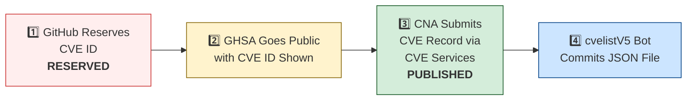

# 🛡️ OpenClaw CVE & Security Advisory Tracker

  
  
  
  
   
  
  
  
  
  

An automated tracker that continuously monitors [OpenClaw](https://github.com/openclaw/openclaw) security advisories across the GitHub Advisory Database, repo-level security advisories, and the [CVE V5 (cvelistV5)](https://github.com/CVEProject/cvelistV5) registry. Every hour it pulls the latest data, reconciles GHSA → CVE publication state, and regenerates this dashboard so you always have an up-to-date picture of the project's vulnerability landscape.

  Last updated: 2026-06-25 18:52 UTC · <a href="LICENSE">MIT License</a> · <a href="ADVISORIES.md">Full Advisory List</a> · <a href="SECURITY.md">Security Policy</a> · Data: <a href="https://github.com/CVEProject/cvelistV5">cvelistV5</a> + <a href="https://github.com/github/advisory-database">Advisory DB</a> · Updates hourly

---

  <a href="#-cves-published-in-cvelistv5-50">Published CVEs</a> ·
  <a href="#-cve-publication-pipeline">Pipeline</a> ·
  <a href="#-all-security-advisories-170">Advisories</a> ·
  <a href="#-vulnerability-categories">Categories</a> ·
  <a href="#-key-insights">Insights</a> ·
  <a href="#-project-identity">Identity</a>

---

## 🏗️ Project Identity

| Field | Value |
|-------|-------|
| **Current Name** | OpenClaw |
| **Previous Names** | Moltbot (second name), Clawdbot (original name) |
| **Repository** | [openclaw/openclaw](https://github.com/openclaw/openclaw) |
| **npm Package** | `openclaw` (formerly `clawdbot`) |
| **Author** | Peter Steinberger (steipete) |

<strong>Search terms for CVE discovery</strong>

To find all CVEs, search for: `openclaw`, `clawdbot`, `moltbot`, `clawhub`, `pkg:npm/clawdbot`, `pkg:npm/openclaw`

---

## 🚀 CVEs Published in cvelistV5 (50)

These CVEs have full records in the [CVEProject/cvelistV5](https://github.com/CVEProject/cvelistV5) repository:

| CVE ID | Severity | CVSS | Title | CWE | Published |
|--------|----------|------|-------|-----|-----------|
| [CVE-2026-32915](https://github.com/openclaw/openclaw/security/advisories/GHSA-4w7m-58cg-cmff) |  | 9.3 | OpenClaw < 2026.3.11 - Sandbox Boundary Bypass via Subagent Control Surface | CWE-863 | 2026-03-29 |
| [CVE-2026-43534](https://github.com/openclaw/openclaw/security/advisories/GHSA-7g8c-cfr3-vqqr) |  | 9.3 | OpenClaw < 2026.4.10 - Unsanitized External Input in Agent Hook Events | CWE-345 | 2026-05-05 |
| [CVE-2026-32917](https://github.com/openclaw/openclaw/security/advisories/GHSA-g2f6-pwvx-r275) |  | 9.2 | OpenClaw < 2026.3.13 - Remote Command Injection via Unsanitized iMessage Attachment Paths in SCP | CWE-78 | 2026-03-31 |
| [CVE-2026-43575](https://github.com/openclaw/openclaw/security/advisories/GHSA-92jp-89mq-4374) |  | 9.2 | OpenClaw 2026.2.21 < 2026.4.10 - Authentication Bypass in Sandbox noVNC Helper Route | CWE-862 | 2026-05-06 |
| [CVE-2026-43578](https://github.com/openclaw/openclaw/security/advisories/GHSA-g375-h3v6-4873) |  | 9.1 | OpenClaw 2026.3.31 < 2026.4.10 - Privilege Escalation via Missed Async Exec Completion Events in Heartbeat Owner Downgrade | CWE-184 | 2026-05-06 |
| [CVE-2026-41329](https://github.com/openclaw/openclaw/security/advisories/GHSA-g5cg-8x5w-7jpm) |  | 9 | OpenClaw < 2026.3.31 - Sandbox Bypass via Heartbeat Context Inheritance and senderIsOwner Escalation | CWE-648 | 2026-04-20 |
| [CVE-2026-43581](https://github.com/openclaw/openclaw/security/advisories/GHSA-525j-hqq2-66r4) |  | 9 | OpenClaw < 2026.4.10 - Chrome DevTools Protocol Exposure via Overly Broad CDP Relay Binding | CWE-1188 | 2026-05-06 |
| [CVE-2026-25253](https://github.com/openclaw/openclaw/security/advisories/GHSA-g8p2-7wf7-98mq) |  | 8.8 | OpenClaw/Clawdbot has 1-Click RCE via Authentication Token Exfiltration From gatewayUrl | CWE-669 | 2026-02-01 |
| [CVE-2026-24763](https://github.com/openclaw/openclaw/security/advisories/GHSA-mc68-q9jw-2h3v) |  | 8.8 | OpenClaw/Clawdbot Docker Execution has Authenticated Command Injection via PATH Environment Variable | CWE-78 | 2026-02-02 |
| [CVE-2026-28478](https://github.com/openclaw/openclaw/security/advisories/GHSA-q447-rj3r-2cgh) |  | 8.7 | OpenClaw affected by denial of service via unbounded webhook request body buffering | CWE-770 | 2026-03-05 |
| [CVE-2026-29609](https://github.com/openclaw/openclaw/security/advisories/GHSA-j27p-hq53-9wgc) |  | 8.7 | OpenClaw < 2026.2.14 - Denial of Service via Unbounded URL-backed Media Fetch | CWE-770 | 2026-03-05 |
| [CVE-2026-32051](https://github.com/openclaw/openclaw/security/advisories/GHSA-jr6x-2q95-fh2g) |  | 8.7 | OpenClaw < 2026.3.1 - Authorization Bypass in Agent Runs via Owner-Only Tool Access | CWE-863 | 2026-03-21 |
| [CVE-2026-43530](https://github.com/openclaw/openclaw/security/advisories/GHSA-2cq5-mf3v-mx44) |  | 8.7 | OpenClaw 2026.2.23 < 2026.4.12 - Weakened Exec Approval Binding via busybox and toybox Applet Execution | CWE-863 | 2026-05-05 |
| [CVE-2026-44115](https://github.com/openclaw/openclaw/security/advisories/GHSA-x3h8-jrgh-p8jx) |  | 8.7 | OpenClaw < 2026.4.22 - Shell Expansion Bypass in Unquoted Heredocs via Exec Allowlist | CWE-184 | 2026-05-06 |
| [CVE-2026-53843](https://github.com/openclaw/openclaw/security/advisories/GHSA-q99w-vh6v-q3v7) |  | 8.7 | OpenClaw: Pairing-scoped device session could restore revoked node token authority | CWE-613 | 2026-06-16 |
| [CVE-2026-26323](https://github.com/openclaw/openclaw/security/advisories/GHSA-m7x8-2w3w-pr42) |  | 8.6 | OpenClaw has a command injection in maintainer clawtributors updater | CWE-78 | 2026-02-19 |
| [CVE-2026-28463](https://github.com/openclaw/openclaw/security/advisories/GHSA-xvhf-x56f-2hpp) |  | 8.6 | OpenClaw < 2026.2.14 - Arbitrary File Read via Shell Expansion in Safe Bins Allowlist | CWE-78 | 2026-03-05 |
| [CVE-2026-33575](https://github.com/openclaw/openclaw/security/advisories/GHSA-7h7g-x2px-94hj) |  | 8.6 | OpenClaw < 2026.3.12 - Long-lived Credential Exposure in Pairing Setup Codes | CWE-522 | 2026-03-29 |
| [CVE-2026-53816](https://github.com/openclaw/openclaw/security/advisories/GHSA-3c6j-hq33-3jv4) |  | 8.6 | OpenClaw < 2026.5.18 - Exec Lifecycle Event Forgery via Paired Node | CWE-862 | 2026-06-11 |
| [CVE-2026-53849](https://github.com/openclaw/openclaw/security/advisories/GHSA-cw4q-gqg5-g38h) |  | 8.6 | OpenClaw: Discord allowFrom could bind to mutable display names | CWE-290 | 2026-06-16 |
| [CVE-2026-53857](https://github.com/openclaw/openclaw/security/advisories/GHSA-8c59-hr4w-qg69) |  | 8.6 | OpenClaw < 2026.5.3 - Mutable Display Name Binding in Zalo allowFrom Policy | CWE-290 | 2026-06-16 |
| [CVE-2026-28468](https://github.com/openclaw/openclaw/security/advisories/GHSA-h9g4-589h-68xv) |  | 8.5 | OpenClaw 2026.1.29-beta.1 < 2026.2.14 - Authentication Bypass in Sandbox Browser Bridge Server | CWE-306 | 2026-03-05 |
| [CVE-2026-41384](https://github.com/openclaw/openclaw/security/advisories/GHSA-vfw7-6rhc-6xxg) |  | 8.5 | OpenClaw < 2026.3.24 - Environment Variable Injection via Workspace Config in CLI Backend | CWE-15 | 2026-04-28 |
| [CVE-2026-44118](https://github.com/openclaw/openclaw/security/advisories/GHSA-r6xh-pqhr-v4xh) |  | 8.5 | OpenClaw < 2026.4.22 - Owner Context Spoofing via Bearer Token Header | CWE-290 | 2026-05-06 |
| [CVE-2026-45004](https://github.com/openclaw/openclaw/security/advisories/GHSA-r39h-4c2p-3jxp) |  | 8.4 | OpenClaw vulnerable to arbitrary code execution via attacker-controlled setup-api.js loaded from cwd during env-key resolution | CWE-427 | 2026-05-11 |
| [CVE-2026-43526](https://github.com/openclaw/openclaw/security/advisories/GHSA-2767-2q9v-9326) |  | 8.3 | OpenClaw < 2026.4.12 - Server-Side Request Forgery via QQBot Reply Media URL Handling | CWE-918 | 2026-05-05 |
| [CVE-2026-28392](https://github.com/openclaw/openclaw/security/advisories/GHSA-v773-r54f-q32w) |  | 8.2 | OpenClaw < 2026.2.14 - Privilege Escalation in Slack Slash Command Handler via Direct Messages | CWE-863 | 2026-03-05 |
| [CVE-2026-28465](https://github.com/openclaw/openclaw/security/advisories/GHSA-3m3q-x3gj-f79x) |  | 8.2 | OpenClaw voice-call < 2026.2.3 - Webhook Verification Bypass via Forwarded Headers | CWE-345 | 2026-03-05 |
| [CVE-2026-28464](https://github.com/openclaw/openclaw/security/advisories/GHSA-jmm5-fvh5-gf4p) |  | 8.2 | OpenClaw < 2026.2.12 - Timing Attack in Hooks Token Authentication | CWE-208 | 2026-03-05 |
| [CVE-2026-32045](https://github.com/openclaw/openclaw/security/advisories/GHSA-hff7-ccv5-52f8) |  | 8.2 | OpenClaw < 2026.2.21 - Authentication Bypass in HTTP Gateway Routes via Tokenless Tailscale Auth | CWE-290 | 2026-03-21 |
| [CVE-2026-29611](https://github.com/openclaw/openclaw/security/advisories/GHSA-rwj8-p9vq-25gv) |  | 8.2 | OpenClaw < 2026.2.14 - Local File Inclusion via mediaPath Parameter in BlueBubbles Media Handling | CWE-73 | 2026-03-05 |
| [CVE-2026-28469](https://github.com/openclaw/openclaw/security/advisories/GHSA-rq6g-px6m-c248) |  | 8.2 | OpenClaw Google Chat shared-path webhook target ambiguity allowed cross-account policy-context misrouting | CWE-639 | 2026-03-05 |
| [CVE-2026-42437](https://github.com/openclaw/openclaw/security/advisories/GHSA-vw3h-q6xq-jjm5) |  | 8.2 | OpenClaw 2026.4.9 < 2026.4.10 - Denial of Service via Oversized WebSocket Frames in Voice-call Realtime Path | CWE-770 | 2026-05-05 |
| [CVE-2026-25157](https://github.com/openclaw/openclaw/security/advisories/GHSA-q284-4pvr-m585) |  | 7.8 | OpenClaw/Clawdbot has OS Command Injection via Project Root Path in sshNodeCommand | CWE-78 | 2026-02-04 |
| [CVE-2026-41378](https://github.com/openclaw/openclaw/security/advisories/GHSA-gjm7-hw8f-73rq) |  | 7.7 | OpenClaw < 2026.3.31 - Privilege Escalation to Remote Code Execution via Unrestricted node.event Agent Dispatch | CWE-862 | 2026-04-28 |
| [CVE-2026-42423](https://github.com/openclaw/openclaw/security/advisories/GHSA-q2gc-xjqw-qp89) |  | 7.7 | OpenClaw < 2026.4.8 - strictInlineEval Approval Boundary Bypass via Approval-Timeout Fallback | CWE-636 | 2026-04-28 |
| [CVE-2026-43569](https://github.com/openclaw/openclaw/security/advisories/GHSA-939r-rj45-g2rj) |  | 7.7 | OpenClaw < 2026.4.9 - Untrusted Provider Plugin Auto-enablement via Workspace Provider Auth | CWE-829 | 2026-05-05 |
| [CVE-2026-44110](https://github.com/openclaw/openclaw/security/advisories/GHSA-2gvc-4f3c-2855) |  | 7.7 | OpenClaw <  2026.4.15 - Authorization Bypass in Matrix Room Control Commands via DM Pairing Store | CWE-863 | 2026-05-06 |
| [CVE-2026-32005](https://github.com/openclaw/openclaw/security/advisories/GHSA-x2ff-j5c2-ggpr) |  | 7.6 | OpenClaw < 2026.2.25 - Authorization Bypass in Interactive Callbacks via Sender Check Skip | CWE-863 | 2026-03-19 |
| [CVE-2026-42431](https://github.com/openclaw/openclaw/security/advisories/GHSA-cmfr-9m2r-xwhq) |  | 7.6 | OpenClaw < 2026.4.8 - Persistent Profile Mutation via node.invoke(browser.proxy) Bypass | CWE-863 | 2026-04-28 |
| [CVE-2026-43535](https://github.com/openclaw/openclaw/security/advisories/GHSA-jwrq-8g5x-5fhm) |  | 7.6 | OpenClaw < 2026.4.14 - Authorization Context Reuse in Collect-Mode Queue Batches | CWE-266 | 2026-05-05 |
| [CVE-2026-53855](https://github.com/openclaw/openclaw/security/advisories/GHSA-5cj2-3jr2-5h77) |  | 7.6 | OpenClaw < 2026.4.2 - Shell Positional Parameters Bypass in Inline-Eval Checks | CWE-184, CWE-863 | 2026-06-16 |
| [CVE-2026-53853](https://github.com/openclaw/openclaw/security/advisories/GHSA-v2ww-5rh7-2h5v) |  | 7.6 | OpenClaw: Linux and macOS exec allowlists skipped configured argument patterns | CWE-693, CWE-863 | 2026-06-16 |
| [CVE-2026-53864](https://github.com/openclaw/openclaw/security/advisories/GHSA-ccwh-wwpp-6wg5) |  | 7.6 | OpenClaw: Host environment sanitizer missed two Node.js control variables | CWE-184 | 2026-06-16 |
| [CVE-2026-53866](https://github.com/openclaw/openclaw/security/advisories/GHSA-f397-5vjw-v2c2) |  | 7.6 | OpenClaw < 2026.5.12 - Allowlist Bypass in Shell Inline-Command Parsing | CWE-862 | 2026-06-16 |
| [CVE-2026-26321](https://github.com/openclaw/openclaw/security/advisories/GHSA-8jpq-5h99-ff5r) |  | 7.5 | OpenClaw has a local file disclosure via sendMediaFeishu in Feishu extension | CWE-22 | 2026-02-19 |
| [CVE-2026-22179](https://github.com/openclaw/openclaw/security/advisories/GHSA-9p38-94jf-hgjj) |  | 7.5 | OpenClaw < 2026.2.22 - Allowlist Bypass via Command Substitution in system.run | CWE-78 | 2026-03-18 |
| [CVE-2026-26316](https://github.com/openclaw/openclaw/security/advisories/GHSA-pchc-86f6-8758) |  | 7.5 | OpenClaw has BlueBubbles webhook auth bypass via loopback proxy trust | CWE-863 | 2026-02-19 |
| [CVE-2026-28458](https://github.com/openclaw/openclaw/security/advisories/GHSA-mr32-vwc2-5j6h) |  | 7.4 | OpenClaw's Browser Relay /cdp websocket is missing auth which could allow cross-tab cookie access | CWE-306 | 2026-03-05 |
| [CVE-2026-28473](https://github.com/openclaw/openclaw/security/advisories/GHSA-mqpw-46fh-299h) |  | 7.2 | OpenClaw < 2026.2.2 - Authorization Bypass via /approve Chat Command | CWE-863 | 2026-03-05 |
| [CVE-2026-35660](https://github.com/openclaw/openclaw/security/advisories/GHSA-wq58-2pvg-5h4f) |  | 7.2 | OpenClaw < 2026.3.23 - Insufficient Access Control in Gateway Agent Session Reset | CWE-862 | 2026-04-10 |
| [CVE-2026-53865](https://github.com/openclaw/openclaw/security/advisories/GHSA-rx78-29qr-5hq8) |  | 7.2 | OpenClaw: Workspace-derived service PATH could influence trash command selection | CWE-426 | 2026-06-16 |
| [CVE-2026-26317](https://github.com/openclaw/openclaw/security/advisories/GHSA-3fqr-4cg8-h96q) |  | 7.1 | OpenClaw affected by cross-site request forgery (CSRF) through loopback browser mutation endpoints | CWE-352 | 2026-02-19 |
| [CVE-2026-26327](https://github.com/openclaw/openclaw/security/advisories/GHSA-pv58-549p-qh99) |  | 7.1 | OpenClaw allows unauthenticated discovery TXT records to steer routing and TLS pinning | CWE-345 | 2026-02-19 |
| [CVE-2026-32008](https://github.com/openclaw/openclaw/security/advisories/GHSA-45cg-2683-gfmq) |  | 7.1 | OpenClaw < 2026.2.21 - Arbitrary Local File Read via Browser Navigation Guard | CWE-610 | 2026-03-19 |
| [CVE-2026-32972](https://github.com/openclaw/openclaw/security/advisories/GHSA-vmhq-cqm9-6p7q) |  | 7.1 | OpenClaw < 2026.3.11 - Authorization Bypass in Browser Profile Management via browser.request | CWE-863 | 2026-03-29 |
| [CVE-2026-35668](https://github.com/openclaw/openclaw/security/advisories/GHSA-hr5v-j9h9-xjhg) |  | 7.1 | OpenClaw < 2026.3.24 - Sandbox Media Root Bypass via Unnormalized mediaUrl and fileUrl Parameters | CWE-22 | 2026-04-10 |
| [CVE-2026-35657](https://github.com/openclaw/openclaw/security/advisories/GHSA-5jvj-hxmh-6h6j) |  | 7.1 | OpenClaw < 2026.3.25 - Authorization Bypass in HTTP Session History Route | CWE-863 | 2026-04-10 |
| [CVE-2026-40037](https://github.com/openclaw/openclaw/security/advisories/GHSA-qx8j-g322-qj6m) |  | 7.1 | OpenClaw < 2026.3.31 - Unsafe Request Body Replay via fetchWithSsrFGuard Cross-Origin Redirects | CWE-601 | 2026-04-08 |
| [CVE-2026-41359](https://github.com/openclaw/openclaw/security/advisories/GHSA-767m-xrhc-fxm7) |  | 7.1 | OpenClaw < 2026.3.28 - Privilege Escalation via operator.write to Admin-Class Telegram Config and Cron Persistence | CWE-269 | 2026-04-23 |
| [CVE-2026-41368](https://github.com/openclaw/openclaw/security/advisories/GHSA-jccr-rrw2-vc8h) |  | 7.1 | OpenClaw < 2026.3.28 - Environment Variable Disclosure via jq $ENV Filter Bypass | CWE-668 | 2026-04-27 |
| [CVE-2026-43567](https://github.com/openclaw/openclaw/security/advisories/GHSA-jf25-7968-h2h5) |  | 7.1 | OpenClaw < 2026.4.10 - Path Traversal in screen_record outPath Parameter | CWE-862 | 2026-05-05 |
| [CVE-2026-43528](https://github.com/openclaw/openclaw/security/advisories/GHSA-8372-7vhw-cm6q) |  | 7.1 | OpenClaw < 2026.4.14 - Redaction Bypass via sourceConfig and runtimeConfig Aliases | CWE-212 | 2026-05-05 |
| [CVE-2026-53815](https://github.com/openclaw/openclaw/security/advisories/GHSA-q7q8-3mgw-q67r) |  | 7.1 | OpenClaw < 2026.5.19 - Channel Allowlist Bypass in Message Read Actions | CWE-862 | 2026-06-11 |
| [CVE-2026-53825](https://github.com/openclaw/openclaw/security/advisories/GHSA-p2fh-f5fc-44hr) |  | 7.1 | OpenClaw < 2026.4.7 - Arbitrary Local File Read via memory-wiki Ingest with operator.write Scope | CWE-22 | 2026-06-12 |
| [CVE-2026-28447](https://github.com/openclaw/openclaw/security/advisories/GHSA-qrq5-wjgg-rvqw) |  | 7 | OpenClaw 2026.1.29-beta.1 < 2026.2.1 - Path Traversal in Plugin Installation via Package Name | CWE-22 | 2026-03-05 |
| [CVE-2026-43531](https://github.com/openclaw/openclaw/security/advisories/GHSA-7wv4-cc7p-jhxc) |  | 7 | OpenClaw < 2026.4.9 - Environment Variable Injection via Workspace .env File | CWE-15 | 2026-05-05 |
| [CVE-2026-53842](https://github.com/openclaw/openclaw/security/advisories/GHSA-fq9j-vw4w-fr6v) |  | 7 | OpenClaw: Workspace .env CLOUDSDK_PYTHON could influence Gmail setup gcloud execution | CWE-426 | 2026-06-16 |
| [CVE-2026-53846](https://github.com/openclaw/openclaw/security/advisories/GHSA-24vr-rprv-67rf) |  | 7 | OpenClaw: Workspace .env npm_execpath could influence bundled runtime dependency install | CWE-426 | 2026-06-16 |
| [CVE-2026-53858](https://github.com/openclaw/openclaw/security/advisories/GHSA-wc84-j36w-pw4x) |  | 7 | OpenClaw: Workspace .env STATE_DIRECTORY could influence bundled runtime dependency roots | CWE-426 | 2026-06-16 |
| [CVE-2026-27003](https://github.com/openclaw/openclaw/security/advisories/GHSA-chf7-jq6g-qrwv) |  | 6.9 | OpenClaw: Telegram bot token exposure via logs | CWE-522 | 2026-02-19 |
| [CVE-2026-28394](https://github.com/openclaw/openclaw/security/advisories/GHSA-p536-vvpp-9mc8) |  | 6.9 | OpenClaw < 2026.2.15 - Denial of Service via Unbounded Response Parsing in web_fetch Tool | CWE-770 | 2026-03-05 |
| [CVE-2026-28480](https://github.com/openclaw/openclaw/security/advisories/GHSA-mj5r-hh7j-4gxf) |  | 6.9 | OpenClaw Telegram allowlist authorization accepted mutable usernames | CWE-290 | 2026-03-05 |
| [CVE-2026-35632](https://github.com/openclaw/openclaw/security/advisories/GHSA-7xr2-q9vf-x4r5) |  | 6.9 | OpenClaw < 2026.2.22 - Symlink Traversal via IDENTITY.md appendFile in agents.create/update | CWE-61 | 2026-04-09 |
| [CVE-2026-35637](https://github.com/openclaw/openclaw/security/advisories/GHSA-vfg3-pqpq-93m4) |  | 6.9 | OpenClaw < 2026.3.22 - Premature Cite Expansion Before Authorization in Channel and DM | CWE-696 | 2026-04-09 |
| [CVE-2026-32924](https://github.com/openclaw/openclaw/security/advisories/GHSA-m69h-jm2f-2pv8) |  | 6.9 | OpenClaw < 2026.3.12 - Authorization Bypass via Misclassified Reaction Events in Feishu | CWE-863 | 2026-03-29 |
| [CVE-2026-35655](https://github.com/openclaw/openclaw/security/advisories/GHSA-74wf-h43j-vvmj) |  | 6.9 | OpenClaw < 2026.3.22 - Identity Spoofing via rawInput Tool in ACP Permission Resolution | CWE-807 | 2026-04-10 |
| [CVE-2026-35626](https://github.com/openclaw/openclaw/security/advisories/GHSA-rm59-992w-x2mv) |  | 6.9 | OpenClaw < 2026.3.22 - Unauthenticated Resource Exhaustion via Voice Call Webhook | CWE-405 | 2026-04-09 |
| [CVE-2026-35665](https://github.com/openclaw/openclaw/security/advisories/GHSA-w6m8-cqvj-pg5v) |  | 6.9 | OpenClaw < 2026.3.24 - Denial of Service via Feishu Webhook Pre-Auth Body Parsing | CWE-405 | 2026-04-10 |
| [CVE-2026-35633](https://github.com/openclaw/openclaw/security/advisories/GHSA-4qwc-c7g9-4xcw) |  | 6.9 | OpenClaw < 2026.3.22 - Unbounded Memory Allocation via Remote Media Error Responses | CWE-789 | 2026-04-09 |
| [CVE-2026-44116](https://github.com/openclaw/openclaw/security/advisories/GHSA-2hh7-c75g-qj2r) |  | 6.9 | OpenClaw < 2026.4.22 - Server-Side Request Forgery in Zalo Photo URL Validation | CWE-918 | 2026-05-06 |
| [CVE-2026-29612](https://github.com/openclaw/openclaw/security/advisories/GHSA-w2cg-vxx6-5xjg) |  | 6.8 | OpenClaw < 2026.2.14 - Denial of Service via Large Base64 Media File Decoding | CWE-770 | 2026-03-05 |
| [CVE-2026-33572](https://github.com/openclaw/openclaw/security/advisories/GHSA-vr7j-g7jv-h5mp) |  | 6.8 | OpenClaw < 2026.2.17 - Insufficient File Permissions in Session Transcript Files | CWE-378 | 2026-03-29 |
| [CVE-2026-53850](https://github.com/openclaw/openclaw/security/advisories/GHSA-mpc8-jxjh-qpgh) |  | 6.8 | OpenClaw < 2026.4.25 - Control Scope Enforcement Bypass in Focus Command | CWE-862 | 2026-06-16 |
| [CVE-2026-28452](https://github.com/openclaw/openclaw/security/advisories/GHSA-h89v-j3x9-8wqj) |  | 6.7 | OpenClaw affected by denial of service through unguarded archive extraction allowing high expansion/resource abuse (ZIP/TAR) | CWE-770 | 2026-03-05 |
| [CVE-2026-26328](https://github.com/openclaw/openclaw/security/advisories/GHSA-g34w-4xqq-h79m) |  | 6.5 | OpenClaw iMessage group allowlist authorization inherited DM pairing-store identities | CWE-284, CWE-863 | 2026-02-19 |
| [CVE-2026-28395](https://github.com/openclaw/openclaw/security/advisories/GHSA-qw99-grcx-4pvm) |  | 6.3 | OpenClaw 2026.1.14-1 < 2026.2.12 - Unintended Public Binding of Chrome Extension Relay via Wildcard cdpUrl | CWE-1327 | 2026-03-05 |
| [CVE-2026-32050](https://github.com/openclaw/openclaw/security/advisories/GHSA-792q-qw95-f446) |  | 6.3 | OpenClaw < 2026.2.25 - Unauthorized Reaction Status Event Enqueue via Access Check Bypass | CWE-863 | 2026-03-21 |
| [CVE-2026-35623](https://github.com/openclaw/openclaw/security/advisories/GHSA-xq8g-hgh6-87hv) |  | 6.3 | OpenClaw < 2026.3.25 - Brute-Force Attack via Missing Webhook Password Rate Limiting | CWE-307 | 2026-04-09 |
| [CVE-2026-41351](https://github.com/openclaw/openclaw/security/advisories/GHSA-37v6-fxx8-xjmx) |  | 6.3 | OpenClaw < 2026.3.31 - Webhook Replay Detection Bypass via Base64 Signature Re-encoding | CWE-294 | 2026-04-23 |
| [CVE-2026-41389](https://github.com/openclaw/openclaw/security/advisories/GHSA-mr34-9552-qr95) |  | 6.3 | OpenClaw 2026.4.7 < 2026.4.15 - Arbitrary File Read via Unvalidated Tool-Result Media Paths | CWE-73 | 2026-04-20 |
| [CVE-2026-41407](https://github.com/openclaw/openclaw/security/advisories/GHSA-jj6q-rrrf-h66h) |  | 6.3 | OpenClaw < 2026.4.2 - Timing Side Channel in Shared-Secret Comparison | CWE-208 | 2026-04-28 |
| [CVE-2026-53851](https://github.com/openclaw/openclaw/security/advisories/GHSA-fcvx-5cxc-v5p8) |  | 6.3 | OpenClaw < 2026.5.12 - Slack Reaction Event Notification Bypass | CWE-862 | 2026-06-16 |
| [CVE-2026-32034](https://github.com/openclaw/openclaw/security/advisories/GHSA-3cvx-236h-m9fj) |  | 6.1 | OpenClaw < 2026.2.21 - Insecure Control UI Authentication over Plaintext HTTP | CWE-78 | 2026-03-19 |
| [CVE-2026-35670](https://github.com/openclaw/openclaw/security/advisories/GHSA-wv46-v6xc-2qhf) |  | 6 | OpenClaw < 2026.3.22 - Webhook Reply Rebinding via Username Resolution in Synology Chat | CWE-807 | 2026-04-10 |
| [CVE-2026-41345](https://github.com/openclaw/openclaw/security/advisories/GHSA-68v4-hmwv-f43h) |  | 6 | OpenClaw < 2026.3.31 - Authorization Header Leak via Cross-Origin Redirect in Media Download | CWE-522 | 2026-04-23 |
| [CVE-2026-43579](https://github.com/openclaw/openclaw/security/advisories/GHSA-f3h5-h452-vp3j) |  | 6 | OpenClaw < 2026.4.10 - Insufficient Access Control in Nostr Profile Mutation Routes | CWE-862 | 2026-05-06 |
| [CVE-2026-43574](https://github.com/openclaw/openclaw/security/advisories/GHSA-49cg-279w-m73x) |  | 6 | OpenClaw < 2026.4.12 - Improper Authorization via Empty Approver Lists | CWE-183 | 2026-05-05 |
| [CVE-2026-43570](https://github.com/openclaw/openclaw/security/advisories/GHSA-cr8r-7g2h-6wr6) |  | 6 | OpenClaw contains a symlink traversal vulnerability | CWE-61 | 2026-05-05 |
| [CVE-2026-44112](https://github.com/openclaw/openclaw/security/advisories/GHSA-wppj-c6mr-83jj) |  | 6 | OpenClaw < 2026.4.22 - Symlink Swap Race Condition in OpenShell FS Bridge Writes | CWE-367 | 2026-05-06 |
| [CVE-2026-53838](https://github.com/openclaw/openclaw/security/advisories/GHSA-83w9-h5wv-j9xm) |  | 6 | OpenClaw < 2026.5.27 - Node Pairing State Mutation via Reconnection | CWE-367 | 2026-06-12 |
| [CVE-2026-53840](https://github.com/openclaw/openclaw/security/advisories/GHSA-rjxq-qqhf-8hwh) |  | 6 | OpenClaw: MCP Streamable HTTP redirects could forward configured custom headers to another origin | CWE-522 | 2026-06-16 |
| [CVE-2026-53844](https://github.com/openclaw/openclaw/security/advisories/GHSA-72fw-cqh5-f324) |  | 6 | OpenClaw < 2026.4.29 - Session Visibility Check Bypass in Shared Memory Search | CWE-862 | 2026-06-16 |
| [CVE-2026-44113](https://github.com/openclaw/openclaw/security/advisories/GHSA-5h3g-6xhh-rg6p) |  | 6 | OpenClaw: OpenShell FS bridge reads pin and verify the opened file before returning bytes | CWE-367 | 2026-05-06 |
| [CVE-2026-53859](https://github.com/openclaw/openclaw/security/advisories/GHSA-gxg4-2rrr-jhc7) |  | 6 | OpenClaw < 2026.5.26 - Hostname Validation Bypass via Trailing-Dot Inconsistency | CWE-1023, CWE-918 | 2026-06-16 |
| [CVE-2026-53854](https://github.com/openclaw/openclaw/security/advisories/GHSA-4hpg-mp64-x7xq) |  | 6 | OpenClaw: Internal/webchat command auth could inherit ownerAllowFrom wildcard state | CWE-863 | 2026-06-16 |
| [CVE-2026-53863](https://github.com/openclaw/openclaw/security/advisories/GHSA-985f-72mj-8gf7) |  | 6 | OpenClaw < 2026.4.25 - Unvalidated Group ID Acceptance in Tool Group Policy | CWE-639 | 2026-06-16 |
| [CVE-2026-28481](https://github.com/openclaw/openclaw/security/advisories/GHSA-7vwx-582j-j332) |  | 5.9 | OpenClaw < 2026.2.1 - Bearer Token Leakage via MS Teams Attachment Downloader Suffix Matching | CWE-201 | 2026-03-05 |
| [CVE-2026-28477](https://github.com/openclaw/openclaw/security/advisories/GHSA-7rcp-mxpq-72pj) |  | 5.9 | OpenClaw < 2026.2.14 - OAuth State Validation Bypass in Manual Chutes Login Flow | CWE-352 | 2026-03-05 |
| [CVE-2026-45005](https://github.com/openclaw/openclaw/security/advisories/GHSA-q8ff-7ffm-m3r9) |  | 5.9 | OpenClaw < 2026.4.23 - Webhook Route Secret Cache Not Invalidated After Rotation | CWE-672 | 2026-05-11 |
| [CVE-2026-41332](https://github.com/openclaw/openclaw/security/advisories/GHSA-m866-6qv5-p2fg) |  | 5.8 | OpenClaw < 2026.3.28 - Code Execution via Missing Environment Variable Blocklist | CWE-184 | 2026-04-23 |
| [CVE-2026-32065](https://github.com/openclaw/openclaw/security/advisories/GHSA-hwpq-rrpf-pgcq) |  | 5.7 | OpenClaw < 2026.2.25 - Approval Identity Mismatch in system.run Command Execution | CWE-436 | 2026-03-21 |
| [CVE-2026-53856](https://github.com/openclaw/openclaw/security/advisories/GHSA-rwp6-7w3q-75fq) |  | 5.7 | OpenClaw: Config recovery could restore openclaw.json with broad file permissions | CWE-732 | 2026-06-16 |
| [CVE-2026-41355](https://github.com/openclaw/openclaw/security/advisories/GHSA-42mx-vp8m-j7qh) |  | 5.4 | OpenShell < 2026.3.28 - Arbitrary Code Execution via Mirror Mode Sandbox File Conversion | CWE-829 | 2026-04-23 |
| [CVE-2026-41392](https://github.com/openclaw/openclaw/security/advisories/GHSA-wpc6-37g7-8q4w) |  | 5.4 | OpenClaw < 2026.3.31 - Exec Allowlist Bypass via Shell Init-File Options | CWE-184 | 2026-04-28 |
| [CVE-2026-32001](https://github.com/openclaw/openclaw/security/advisories/GHSA-rv2q-f2h5-6xmg) |  | 5.3 | OpenClaw < 2026.2.22 - Node Role Device-Identity Bypass via WebSocket Authentication | CWE-863 | 2026-03-19 |
| [CVE-2026-35651](https://github.com/openclaw/openclaw/security/advisories/GHSA-4hmj-39m8-jwc7) |  | 5.3 | OpenClaw 2026.2.13 < 2026.3.25 - ANSI Escape Sequence Injection in Approval Prompt | CWE-150 | 2026-04-10 |
| [CVE-2026-41298](https://github.com/openclaw/openclaw/security/advisories/GHSA-5hff-46vh-rxmw) |  | 5.3 | OpenClaw < 2026.4.2 - Authorization Bypass in Session Termination Endpoint | CWE-862 | 2026-04-20 |
| [CVE-2026-41350](https://github.com/openclaw/openclaw/security/advisories/GHSA-fwjq-xwfj-gv75) |  | 5.3 | OpenClaw < 2026.3.31 - Session Visibility Bypass via session_status in Unsandboxed Invocations | CWE-863 | 2026-04-23 |
| [CVE-2026-41909](https://github.com/openclaw/openclaw/security/advisories/GHSA-xrq9-jm7v-g9h7) |  | 5.3 | OpenClaw < 2026.4.20 - Improper Authorization in Paired-Device Pairing Actions | CWE-863 | 2026-04-23 |
| [CVE-2026-53847](https://github.com/openclaw/openclaw/security/advisories/GHSA-x629-46cc-7xgw) |  | 5.3 | OpenClaw < 2026.5.6 - Privilege Escalation via Active Memory Write Scope | CWE-266 | 2026-06-16 |
| [CVE-2026-53861](https://github.com/openclaw/openclaw/security/advisories/GHSA-c226-q6fx-6j6c) |  | 5.3 | OpenClaw < 2026.5.6 - Allowlist Bypass via Combined POSIX Inline Flags on macOS | CWE-184 | 2026-06-16 |
| [CVE-2026-31997](https://github.com/openclaw/openclaw/security/advisories/GHSA-q399-23r3-hfx4) |  | 4.4 | OpenClaw < 2026.3.1 - Executable Rebind via Unbound PATH-token in system.run Approvals | CWE-367 | 2026-03-19 |
| [CVE-2026-44992](https://github.com/openclaw/openclaw/security/advisories/GHSA-h2vw-ph2c-jvwf) |  | 4.1 | OpenClaw 2026.4.5 < 2026.4.20 - MiniMax API Host Override via Workspace dotenv | CWE-441 | 2026-05-11 |
| [CVE-2026-45003](https://github.com/openclaw/openclaw/security/advisories/GHSA-55cf-xx38-4p9p) |  | 4.1 | OpenClaw: Workspace dotenv files cannot override connector endpoint hosts | CWE-441 | 2026-05-11 |
| [CVE-2026-24764](https://github.com/openclaw/openclaw/security/advisories/GHSA-782p-5fr5-7fj8) |  | 3.7 | OpenClaw has Remote Code Execution via System Prompt Injection in Slack Channel Descriptions | CWE-74, CWE-94 | 2026-02-19 |
| [CVE-2026-34506](https://github.com/openclaw/openclaw/security/advisories/GHSA-g7cr-9h7q-4qxq) |  | 2.3 | OpenClaw < 2026.3.8 - Sender Allowlist Bypass in Microsoft Teams Plugin via Route Allowlist Configuration | CWE-863 | 2026-03-31 |
| [CVE-2026-41358](https://github.com/openclaw/openclaw/security/advisories/GHSA-qm77-8qjp-4vcm) |  | 2.3 | OpenClaw < 2026.4.2 - Sender Allowlist Bypass via Slack Thread Context | CWE-346 | 2026-04-23 |
| [CVE-2026-41916](https://github.com/openclaw/openclaw/security/advisories/GHSA-68x5-xx89-w9mm) |  | 2.3 | OpenClaw < 2026.4.8 - Stale Authentication State via Config Reload | CWE-613 | 2026-04-28 |
| [CVE-2026-44991](https://github.com/openclaw/openclaw/security/advisories/GHSA-c28g-vh7m-fm7v) |  | 2.3 | OpenClaw: Owner-enforced commands could accept wildcard channel senders as command owners | CWE-863 | 2026-05-11 |
| [CVE-2026-44997](https://github.com/openclaw/openclaw/security/advisories/GHSA-q3jj-46pq-826r) |  | 2.3 | OpenClaw < 2026.4.22 - Security Envelope Constraint Bypass in ACP Child Sessions | CWE-266 | 2026-05-11 |
| [CVE-2026-53848](https://github.com/openclaw/openclaw/security/advisories/GHSA-cwpp-5962-q4f6) |  | 2.3 | OpenClaw < 2026.5.26 - Exec Allowlist Bypass via Transparent Command Wrappers | CWE-184 | 2026-06-16 |
| [CVE-2026-53845](https://github.com/openclaw/openclaw/security/advisories/GHSA-68xw-r643-9p5w) |  | 2.3 | OpenClaw: Skill-command dispatch could skip before-tool-call hooks | CWE-693 | 2026-06-16 |
| [CVE-2026-53852](https://github.com/openclaw/openclaw/security/advisories/GHSA-8mg9-j9cf-54cj) |  | 2.3 | OpenClaw < 2026.4.25 - Scope Bypass via Empty-Scope Device Re-pairing | CWE-636 | 2026-06-16 |
| [CVE-2026-53860](https://github.com/openclaw/openclaw/security/advisories/GHSA-8j37-5w68-wj2g) |  | 2.3 | OpenClaw: BlueBubbles sender policy could match mutable conversation identifiers | CWE-807, CWE-863 | 2026-06-16 |
| [CVE-2026-53862](https://github.com/openclaw/openclaw/security/advisories/GHSA-9v8j-9c9g-w66c) |  | 2.3 | OpenClaw < 2026.5.12 - Bootstrap Token Replay via Pending Pairing Scope Widening | CWE-266, CWE-345 | 2026-06-16 |
| [CVE-2026-53841](https://github.com/openclaw/openclaw/security/advisories/GHSA-w9hf-3pp7-pvxv) |  | 2.1 | OpenClaw: Exported session HTML could keep unsafe markdown links | CWE-83 | 2026-06-16 |
| [CVE-2026-32058](https://github.com/openclaw/openclaw/security/advisories/GHSA-hjvp-qhm6-wrh2) |  | 2 | OpenClaw < 2026.2.26 - Approval Context-Binding Weakness in system.run via host=node | CWE-863 | 2026-03-21 |
| [CVE-2026-32067](https://github.com/openclaw/openclaw/security/advisories/GHSA-vjp8-wprm-2jw9) |  | 2 | OpenClaw < 2026.2.26 - Cross-Account Authorization Bypass in DM Pairing Store | CWE-863 | 2026-03-21 |

<strong>📖 Detailed CVE Analysis (click to expand)</strong>

### CVE-2026-32915 — OpenClaw < 2026.3.11 - Sandbox Boundary Bypass via Subagent Control Surface

| Field | Detail |
|-------|--------|
| **CVSS** | 9.3 (CRITICAL) — `CVSS:4.0/AV:L/AC:L/AT:N/PR:L/UI:N/VC:H/VI:H/VA:H/SC:H/SI:H/SA:H` |
| **CWE** | CWE-863 (Incorrect Authorization) |
| **Affected** | < 2026.3.11 |
| **Vendor/Product** | OpenClaw / OpenClaw |
| **Advisory** | [GHSA-4w7m-58cg-cmff](https://github.com/openclaw/openclaw/security/advisories/GHSA-4w7m-58cg-cmff) |

OpenClaw before 2026.3.11 contains a sandbox boundary bypass vulnerability allowing leaf subagents to access the subagents control surface and resolve against parent requester scope instead of their own session tree. A low-privilege sandboxed leaf worker can steer or kill sibling runs and cause execution with broader tool policies by exploiting insufficient authorization checks on subagent control requests.

**References:**
- [VulnCheck Advisory: OpenClaw < 2026.3.11 - Sandbox Boundary Bypass via Subagent Control Surface](https://www.vulncheck.com/advisories/openclaw-sandbox-boundary-bypass-via-subagent-control-surface)
---

### CVE-2026-43534 — OpenClaw < 2026.4.10 - Unsanitized External Input in Agent Hook Events

| Field | Detail |
|-------|--------|
| **CVSS** | 9.3 (CRITICAL) — `CVSS:4.0/AV:N/AC:L/AT:N/PR:N/UI:N/VC:H/VI:H/VA:N/SC:N/SI:N/SA:N` |
| **CWE** | CWE-345 (CWE-345: Insufficient Verification of Data Authenticity) |
| **Affected** | < 2026.4.10 |
| **Vendor/Product** | OpenClaw / OpenClaw |
| **Advisory** | [GHSA-7g8c-cfr3-vqqr](https://github.com/openclaw/openclaw/security/advisories/GHSA-7g8c-cfr3-vqqr) |

OpenClaw before 2026.4.10 contains an input validation vulnerability that allows external hook metadata to be enqueued as trusted system events. Attackers can supply malicious hook names to escalate untrusted input into higher-trust agent context.

**References:**
- [Patch Commit](https://github.com/openclaw/openclaw/commit/e3a845bde5b54f4f1e742d0a51ba9860f9619b29)
- [VulnCheck Advisory: OpenClaw < 2026.4.10 - Unsanitized External Input in Agent Hook Events](https://www.vulncheck.com/advisories/openclaw-unsanitized-external-input-in-agent-hook-events)
---

### CVE-2026-32917 — OpenClaw < 2026.3.13 - Remote Command Injection via Unsanitized iMessage Attachment Paths in SCP

| Field | Detail |
|-------|--------|
| **CVSS** | 9.2 (CRITICAL) — `CVSS:4.0/AV:N/AC:L/AT:P/PR:N/UI:N/VC:H/VI:H/VA:H/SC:N/SI:N/SA:N` |
| **CWE** | CWE-78 (Improper Neutralization of Special Elements used in an OS Command ('OS Command Injection')) |
| **Affected** | < 2026.3.13 |
| **Vendor/Product** | OpenClaw / OpenClaw |
| **Advisory** | [GHSA-g2f6-pwvx-r275](https://github.com/openclaw/openclaw/security/advisories/GHSA-g2f6-pwvx-r275) |

OpenClaw before 2026.3.13 contains a remote command injection vulnerability in the iMessage attachment staging flow that allows attackers to execute arbitrary commands on configured remote hosts. The vulnerability exists because unsanitized remote attachment paths containing shell metacharacters are passed directly to the SCP remote operand without validation, enabling command execution when remote attachment staging is enabled.

**References:**
- [Patch Commit](https://github.com/openclaw/openclaw/commit/a54bf71b4c0cbe554a84340b773df37ee8e959de)
- [VulnCheck Advisory: OpenClaw < 2026.3.13 - Remote Command Injection via Unsanitized iMessage Attachment Paths in SCP](https://www.vulncheck.com/advisories/openclaw-remote-command-injection-via-unsanitized-imessage-attachment-paths-in-scp)
---

### CVE-2026-43575 — OpenClaw 2026.2.21 < 2026.4.10 - Authentication Bypass in Sandbox noVNC Helper Route

| Field | Detail |
|-------|--------|
| **CVSS** | 9.2 (CRITICAL) — `CVSS:4.0/AV:N/AC:L/AT:P/PR:N/UI:N/VC:H/VI:H/VA:H/SC:N/SI:N/SA:N` |
| **CWE** | CWE-862 (CWE-862 Missing Authorization) |
| **Affected** | < 2026.4.10 |
| **Vendor/Product** | OpenClaw / OpenClaw |
| **Advisory** | [GHSA-92jp-89mq-4374](https://github.com/openclaw/openclaw/security/advisories/GHSA-92jp-89mq-4374) |

OpenClaw versions 2026.2.21 before 2026.4.10 contain an authentication bypass vulnerability in the sandbox noVNC helper route that exposes interactive browser session credentials. Attackers can access the noVNC helper route without bridge authentication to gain unauthorized access to the interactive browser session.

**References:**
- [Patch Commit](https://github.com/openclaw/openclaw/commit/8dfbf3268bd224b7377d1ecca77a445100746085)
- [VulnCheck Advisory: OpenClaw 2026.2.21 < 2026.4.10 - Authentication Bypass in Sandbox noVNC Helper Route](https://www.vulncheck.com/advisories/openclaw-authentication-bypass-in-sandbox-novnc-helper-route)
---

### CVE-2026-43578 — OpenClaw 2026.3.31 < 2026.4.10 - Privilege Escalation via Missed Async Exec Completion Events in Heartbeat Owner Downgrade

| Field | Detail |
|-------|--------|
| **CVSS** | 9.1 (CRITICAL) — `CVSS:4.0/AV:N/AC:L/AT:P/PR:N/UI:N/VC:H/VI:H/VA:N/SC:N/SI:N/SA:N` |
| **CWE** | CWE-184 (CWE-184: Incomplete List of Disallowed Inputs) |
| **Affected** | < 2026.4.10 |
| **Vendor/Product** | OpenClaw / OpenClaw |
| **Advisory** | [GHSA-g375-h3v6-4873](https://github.com/openclaw/openclaw/security/advisories/GHSA-g375-h3v6-4873) |

OpenClaw versions 2026.3.31 before 2026.4.10 contain a privilege escalation vulnerability where heartbeat owner downgrade detection misses local background async exec completion events. Attackers can exploit this by providing untrusted completion content to leave a run in a more privileged context than intended.

**References:**
- [Patch Commit](https://github.com/openclaw/openclaw/commit/19a2e9ddb5a8a494abcba812bb11f51075026a27)
- [VulnCheck Advisory: OpenClaw 2026.3.31 < 2026.4.10 - Privilege Escalation via Missed Async Exec Completion Events in Heartbeat Owner Downgrade](https://www.vulncheck.com/advisories/openclaw-privilege-escalation-via-missed-async-exec-completion-events-in-heartbeat-owner-downgrade)
---

### CVE-2026-41329 — OpenClaw < 2026.3.31 - Sandbox Bypass via Heartbeat Context Inheritance and senderIsOwner Escalation

| Field | Detail |
|-------|--------|
| **CVSS** | 9 (CRITICAL) — `CVSS:4.0/AV:N/AC:L/AT:P/PR:L/UI:N/VC:H/VI:H/VA:H/SC:H/SI:H/SA:H` |
| **CWE** | CWE-648 (CWE-648: Incorrect Use of Privileged APIs) |
| **Affected** | < 2026.3.31 |
| **Vendor/Product** | OpenClaw / OpenClaw |
| **Advisory** | [GHSA-g5cg-8x5w-7jpm](https://github.com/openclaw/openclaw/security/advisories/GHSA-g5cg-8x5w-7jpm) |

OpenClaw before 2026.3.31 contains a sandbox bypass vulnerability allowing attackers to escalate privileges via heartbeat context inheritance and senderIsOwner parameter manipulation. Attackers can exploit improper context validation to bypass sandbox restrictions and achieve unauthorized privilege escalation.

**References:**
- [Patch Commit](https://github.com/openclaw/openclaw/commit/a30214a624946fc5c85c9558a27c1580172374fd)
- [VulnCheck Advisory: OpenClaw < 2026.3.31 - Sandbox Bypass via Heartbeat Context Inheritance and senderIsOwner Escalation](https://www.vulncheck.com/advisories/openclaw-sandbox-bypass-via-heartbeat-context-inheritance-and-senderisowner-escalation)
---

### CVE-2026-43581 — OpenClaw < 2026.4.10 - Chrome DevTools Protocol Exposure via Overly Broad CDP Relay Binding

| Field | Detail |
|-------|--------|
| **CVSS** | 9 (CRITICAL) — `CVSS:4.0/AV:A/AC:L/AT:P/PR:N/UI:N/VC:H/VI:H/VA:H/SC:H/SI:H/SA:H` |
| **CWE** | CWE-1188 (CWE-1188 Initialization of a Resource with an Insecure Default) |
| **Affected** | < 2026.4.10 |
| **Vendor/Product** | OpenClaw / OpenClaw |
| **Advisory** | [GHSA-525j-hqq2-66r4](https://github.com/openclaw/openclaw/security/advisories/GHSA-525j-hqq2-66r4) |

OpenClaw before 2026.4.10 contains an improper network binding vulnerability in the sandbox browser CDP relay that exposes Chrome DevTools Protocol on 0.0.0.0. Attackers can access the DevTools protocol outside intended local sandbox boundaries by exploiting the overly broad binding configuration.

**References:**
- [Patch Commit](https://github.com/openclaw/openclaw/commit/fbf11ebdb7110632f93926d0ac7b48f04cb44d77)
- [VulnCheck Advisory: OpenClaw < 2026.4.10 - Chrome DevTools Protocol Exposure via Overly Broad CDP Relay Binding](https://www.vulncheck.com/advisories/openclaw-chrome-devtools-protocol-exposure-via-overly-broad-cdp-relay-binding)
---

### CVE-2026-25253 — OpenClaw/Clawdbot has 1-Click RCE via Authentication Token Exfiltration From gatewayUrl

| Field | Detail |
|-------|--------|
| **CVSS** | 8.8 (HIGH) — `CVSS:3.1/AV:N/AC:L/PR:N/UI:R/S:U/C:H/I:H/A:H` |
| **CWE** | CWE-669 (CWE-669 Incorrect Resource Transfer Between Spheres) |
| **Affected** | < 2026.1.29 |
| **Vendor/Product** | OpenClaw / OpenClaw |
| **Advisory** | [GHSA-g8p2-7wf7-98mq](https://github.com/openclaw/openclaw/security/advisories/GHSA-g8p2-7wf7-98mq) |

OpenClaw (aka clawdbot or Moltbot) before 2026.1.29 obtains a gatewayUrl value from a query string and automatically makes a WebSocket connection without prompting, sending a token value.

> **Naming note:** Uses all three names in description. packageURL still references `pkg:npm/clawdbot`.
**References:**
- [1-click-rce-to-steal-your-moltbot-data-and-keys](https://depthfirst.com/post/1-click-rce-to-steal-your-moltbot-data-and-keys)
- [blog](https://openclaw.ai/blog)
- [one-click-rce-moltbot](https://ethiack.com/news/blog/one-click-rce-moltbot)
- [2016913750557651228](https://x.com/0xacb/status/2016913750557651228)
---

### CVE-2026-24763 — OpenClaw/Clawdbot Docker Execution has Authenticated Command Injection via PATH Environment Variable

| Field | Detail |
|-------|--------|
| **CVSS** | 8.8 (HIGH) — `CVSS:3.1/AV:N/AC:L/PR:L/UI:N/S:U/C:H/I:H/A:H` |
| **CWE** | CWE-78 (CWE-78: Improper Neutralization of Special Elements used in an OS Command ('OS Command Injection')) |
| **Affected** | < 2026.1.29 |
| **Vendor/Product** | clawdbot / clawdbot |
| **Advisory** | [GHSA-mc68-q9jw-2h3v](https://github.com/openclaw/openclaw/security/advisories/GHSA-mc68-q9jw-2h3v) |

OpenClaw (formerly  Clawdbot) is a personal AI assistant you run on your own devices. Prior to 2026.1.29, a command injection vulnerability existed in OpenClaw’s Docker sandbox execution mechanism due to unsafe handling of the PATH environment variable when constructing shell commands. An authenticated user able to control environment variables could influence command execution within the container context. This vulnerability is fixed in 2026.1.29.

> **Naming note:** Uses old name `clawdbot/clawdbot` as vendor/product.
**References:**
- [https://github.com/openclaw/openclaw/commit/771f23d36b95ec2204cc9a0054045f5d8439ea75](https://github.com/openclaw/openclaw/commit/771f23d36b95ec2204cc9a0054045f5d8439ea75)
- [https://github.com/openclaw/openclaw/releases/tag/v2026.1.29](https://github.com/openclaw/openclaw/releases/tag/v2026.1.29)
---

### CVE-2026-28478 — OpenClaw affected by denial of service via unbounded webhook request body buffering

| Field | Detail |
|-------|--------|
| **CVSS** | 8.7 (HIGH) — `CVSS:4.0/AV:N/AC:L/AT:N/PR:N/UI:N/VC:N/VI:N/VA:H/SC:N/SI:N/SA:N` |
| **CWE** | CWE-770 (Allocation of Resources Without Limits or Throttling) |
| **Affected** | < 2026.2.13 |
| **Vendor/Product** | OpenClaw / OpenClaw |
| **Advisory** | [GHSA-q447-rj3r-2cgh](https://github.com/openclaw/openclaw/security/advisories/GHSA-q447-rj3r-2cgh) |

OpenClaw versions prior to 2026.2.13 contain a denial of service vulnerability in webhook handlers that buffer request bodies without strict byte or time limits. Remote unauthenticated attackers can send oversized JSON payloads or slow uploads to webhook endpoints causing memory pressure and availability degradation.

**References:**
- [Patch Commit](https://github.com/openclaw/openclaw/commit/3cbcba10cf30c2ffb898f0d8c7dfb929f15f8930)
- [VulnCheck Advisory: OpenClaw < 2026.2.13 - Denial of Service via Unbounded Webhook Request Body Buffering](https://www.vulncheck.com/advisories/openclaw-denial-of-service-via-unbounded-webhook-request-body-buffering)
---

### CVE-2026-29609 — OpenClaw < 2026.2.14 - Denial of Service via Unbounded URL-backed Media Fetch

| Field | Detail |
|-------|--------|
| **CVSS** | 8.7 (HIGH) — `CVSS:4.0/AV:N/AC:L/AT:N/PR:N/UI:N/VC:N/VI:N/VA:H/SC:N/SI:N/SA:N` |
| **CWE** | CWE-770 (Allocation of Resources Without Limits or Throttling) |
| **Affected** | < 2026.2.14 |
| **Vendor/Product** | OpenClaw / OpenClaw |
| **Advisory** | [GHSA-j27p-hq53-9wgc](https://github.com/openclaw/openclaw/security/advisories/GHSA-j27p-hq53-9wgc) |

OpenClaw versions prior to 2026.2.14 contain a denial of service vulnerability in the fetchWithGuard function that allocates entire response payloads in memory before enforcing maxBytes limits. Remote attackers can trigger memory exhaustion by serving oversized responses without content-length headers to cause availability loss.

**References:**
- [Patch Commit](https://github.com/openclaw/openclaw/commit/00a08908892d1743d1fc52e5cbd9499dd5da2fe0)
- [VulnCheck Advisory: OpenClaw < 2026.2.14 - Denial of Service via Unbounded URL-backed Media Fetch](https://www.vulncheck.com/advisories/openclaw-denial-of-service-via-unbounded-url-backed-media-fetch)
---

### CVE-2026-32051 — OpenClaw < 2026.3.1 - Authorization Bypass in Agent Runs via Owner-Only Tool Access

| Field | Detail |
|-------|--------|
| **CVSS** | 8.7 (HIGH) — `CVSS:4.0/AV:N/AC:L/AT:N/PR:L/UI:N/VC:H/VI:H/VA:H/SC:N/SI:N/SA:N` |
| **CWE** | CWE-863 (CWE-863: Incorrect Authorization) |
| **Affected** | < 2026.3.1 |
| **Vendor/Product** | OpenClaw / OpenClaw |
| **Advisory** | [GHSA-jr6x-2q95-fh2g](https://github.com/openclaw/openclaw/security/advisories/GHSA-jr6x-2q95-fh2g) |

OpenClaw versions prior to 2026.3.1 contain an authorization mismatch vulnerability that allows authenticated callers with operator.write scope to invoke owner-only tool surfaces including gateway and cron through agent runs in scoped-token deployments. Attackers with write-scope access can perform control-plane actions beyond their intended authorization level by exploiting inconsistent owner-only gating during agent execution.

**References:**
- [VulnCheck Advisory: OpenClaw < 2026.3.1 - Authorization Bypass in Agent Runs via Owner-Only Tool Access](https://www.vulncheck.com/advisories/openclaw-authorization-bypass-in-agent-runs-via-owner-only-tool-access)
---

### CVE-2026-43530 — OpenClaw 2026.2.23 < 2026.4.12 - Weakened Exec Approval Binding via busybox and toybox Applet Execution

| Field | Detail |
|-------|--------|
| **CVSS** | 8.7 (HIGH) — `CVSS:4.0/AV:N/AC:L/AT:N/PR:L/UI:N/VC:H/VI:H/VA:H/SC:N/SI:N/SA:N` |
| **CWE** | CWE-863 (CWE-863: Incorrect Authorization) |
| **Affected** | < 2026.4.12 |
| **Vendor/Product** | OpenClaw / OpenClaw |
| **Advisory** | [GHSA-2cq5-mf3v-mx44](https://github.com/openclaw/openclaw/security/advisories/GHSA-2cq5-mf3v-mx44) |

OpenClaw versions 2026.2.23 before 2026.4.12 contain a weakened exec approval binding vulnerability in busybox and toybox applet execution that allows attackers to obscure which applet would actually run. Attackers can exploit opaque multi-call binaries to bypass exec approval mechanisms and weaken risk classification of unsafe applet invocations.

**References:**
- [Patch Commit](https://github.com/openclaw/openclaw/commit/666f48d9b882a8a1415ca53f9567c72499d850c9)
- [VulnCheck Advisory: OpenClaw 2026.2.23 < 2026.4.12 - Weakened Exec Approval Binding via busybox and toybox Applet Execution](https://www.vulncheck.com/advisories/openclaw-weakened-exec-approval-binding-via-busybox-and-toybox-applet-execution)
---

### CVE-2026-44115 — OpenClaw < 2026.4.22 - Shell Expansion Bypass in Unquoted Heredocs via Exec Allowlist

| Field | Detail |
|-------|--------|
| **CVSS** | 8.7 (HIGH) — `CVSS:4.0/AV:N/AC:L/AT:N/PR:L/UI:N/VC:H/VI:H/VA:H/SC:N/SI:N/SA:N` |
| **CWE** | CWE-184 (CWE-184: Incomplete List of Disallowed Inputs) |
| **Affected** | < 2026.4.22 |
| **Vendor/Product** | OpenClaw / OpenClaw |
| **Advisory** | [GHSA-x3h8-jrgh-p8jx](https://github.com/openclaw/openclaw/security/advisories/GHSA-x3h8-jrgh-p8jx) |

OpenClaw before 2026.4.22 contains an exec allowlist analysis vulnerability allowing shell expansion hiding in unquoted heredoc bodies. Attackers can bypass allowlist validation by embedding shell expansion tokens in heredoc bodies to execute unapproved commands at runtime.

**References:**
- [Patch Commit](https://github.com/openclaw/openclaw/commit/b2e8b7d4bb2f22eaa16f5c4b07547774e90b65a5)
- [VulnCheck Advisory: OpenClaw < 2026.4.22 - Shell Expansion Bypass in Unquoted Heredocs via Exec Allowlist](https://www.vulncheck.com/advisories/openclaw-shell-expansion-bypass-in-unquoted-heredocs-via-exec-allowlist)
---

### CVE-2026-53843 — OpenClaw: Pairing-scoped device session could restore revoked node token authority

| Field | Detail |
|-------|--------|
| **CVSS** | 8.7 (HIGH) — `CVSS:4.0/AV:N/AC:L/AT:N/PR:L/UI:N/VC:H/VI:H/VA:H/SC:N/SI:N/SA:N` |
| **CWE** | CWE-613 (Insufficient Session Expiration) |
| **Affected** | < 2026.5.26 |
| **Vendor/Product** | OpenClaw / OpenClaw |
| **Advisory** | [GHSA-q99w-vh6v-q3v7](https://github.com/openclaw/openclaw/security/advisories/GHSA-q99w-vh6v-q3v7) |

OpenClaw before 2026.5.26 contains an authorization bypass vulnerability where a surviving pairing-scoped device session can re-establish node token authority after revocation. Attackers with a paired device can regain WebSocket node-level access without renewed approval, weakening revocation controls and maintaining unauthorized access longer than intended.

**References:**
- [VulnCheck Advisory: OpenClaw < 2026.5.26 - Node Token Revocation Bypass via Pairing-Scoped Device Session](https://www.vulncheck.com/advisories/openclaw-node-token-revocation-bypass-via-pairing-scoped-device-session)
---

### CVE-2026-26323 — OpenClaw has a command injection in maintainer clawtributors updater

| Field | Detail |
|-------|--------|
| **CVSS** | 8.6 (HIGH) — `CVSS:4.0/AV:N/AC:L/AT:N/PR:N/UI:P/VC:H/VI:H/VA:N/SC:N/SI:N/SA:N` |
| **CWE** | CWE-78 (CWE-78: Improper Neutralization of Special Elements used in an OS Command ('OS Command Injection')) |
| **Affected** | < >= 2026.1.8, < 2026.2.14 |
| **Vendor/Product** | openclaw / openclaw |
| **Advisory** | [GHSA-m7x8-2w3w-pr42](https://github.com/openclaw/openclaw/security/advisories/GHSA-m7x8-2w3w-pr42) |

OpenClaw is a personal AI assistant. Versions 2026.1.8 through 2026.2.13 have a command injection in the maintainer/dev script `scripts/update-clawtributors.ts`. The issue affects contributors/maintainers (or CI) who run `bun scripts/update-clawtributors.ts` in a source checkout that contains a malicious commit author email (e.g. crafted `@users[.]noreply[.]github[.]com` values). Normal CLI usage is not affected (`npm i -g openclaw`): this script is not part of the shipped CLI and is not executed during routine operation. The script derived a GitHub login from `git log` author metadata and interpolated it into a shell command (via `execSync`). A malicious commit record could inject shell metacharacters and execute arbitrary commands when the script is run. Version 2026.2.14 contains a patch.

**References:**
- [https://github.com/openclaw/openclaw/commit/a429380e337152746031d290432a4b93aa553d55](https://github.com/openclaw/openclaw/commit/a429380e337152746031d290432a4b93aa553d55)
- [https://github.com/openclaw/openclaw/releases/tag/v2026.2.14](https://github.com/openclaw/openclaw/releases/tag/v2026.2.14)
---

### CVE-2026-28463 — OpenClaw < 2026.2.14 - Arbitrary File Read via Shell Expansion in Safe Bins Allowlist

| Field | Detail |
|-------|--------|
| **CVSS** | 8.6 (HIGH) — `CVSS:4.0/AV:L/AC:L/AT:N/PR:N/UI:N/VC:H/VI:H/VA:H/SC:N/SI:N/SA:N` |
| **CWE** | CWE-78 (Improper Neutralization of Special Elements used in an OS Command ('OS Command Injection')) |
| **Affected** | < 2026.2.14 |
| **Vendor/Product** | OpenClaw / OpenClaw |
| **Advisory** | [GHSA-xvhf-x56f-2hpp](https://github.com/openclaw/openclaw/security/advisories/GHSA-xvhf-x56f-2hpp) |

OpenClaw exec-approvals allowlist validation checks pre-expansion argv tokens but execution uses real shell expansion, allowing safe bins like head, tail, or grep to read arbitrary local files via glob patterns or environment variables. Authorized callers or prompt-injection attacks can exploit this to disclose files readable by the gateway or node process when host execution is enabled in allowlist mode.

**References:**
- [Patch Commit](https://github.com/openclaw/openclaw/commit/77b89719d5b7e271f48b6f49e334a8b991468c3b)
- [VulnCheck Advisory: OpenClaw < 2026.2.14 - Arbitrary File Read via Shell Expansion in Safe Bins Allowlist](https://www.vulncheck.com/advisories/openclaw-arbitrary-file-read-via-shell-expansion-in-safe-bins-allowlist)
---

### CVE-2026-33575 — OpenClaw < 2026.3.12 - Long-lived Credential Exposure in Pairing Setup Codes

| Field | Detail |
|-------|--------|
| **CVSS** | 8.6 (HIGH) — `CVSS:4.0/AV:N/AC:L/AT:N/PR:N/UI:A/VC:H/VI:H/VA:H/SC:N/SI:N/SA:N` |
| **CWE** | CWE-522 (Insufficiently Protected Credentials) |
| **Affected** | < 2026.3.12 |
| **Vendor/Product** | OpenClaw / OpenClaw |
| **Advisory** | [GHSA-7h7g-x2px-94hj](https://github.com/openclaw/openclaw/security/advisories/GHSA-7h7g-x2px-94hj) |

OpenClaw before 2026.3.12 embeds long-lived shared gateway credentials directly in pairing setup codes generated by /pair endpoint and OpenClaw qr command. Attackers with access to leaked setup codes from chat history, logs, or screenshots can recover and reuse the shared gateway credential outside the intended one-time pairing flow.

**References:**
- [VulnCheck Advisory: OpenClaw < 2026.3.12 - Long-lived Credential Exposure in Pairing Setup Codes](https://www.vulncheck.com/advisories/openclaw-long-lived-credential-exposure-in-pairing-setup-codes)
---

### CVE-2026-53816 — OpenClaw < 2026.5.18 - Exec Lifecycle Event Forgery via Paired Node

| Field | Detail |
|-------|--------|
| **CVSS** | 8.6 (HIGH) — `CVSS:4.0/AV:N/AC:L/AT:N/PR:H/UI:N/VC:H/VI:H/VA:H/SC:N/SI:N/SA:N` |
| **CWE** | CWE-862 (Missing Authorization) |
| **Affected** | < 2026.5.18 |
| **Vendor/Product** | OpenClaw / OpenClaw |
| **Advisory** | [GHSA-3c6j-hq33-3jv4](https://github.com/openclaw/openclaw/security/advisories/GHSA-3c6j-hq33-3jv4) |

OpenClaw before 2026.5.18 contains an insufficient provenance validation vulnerability in node event handling that allows paired nodes to forge exec lifecycle events without system.run authorization. A malicious or compromised paired node can send crafted node.event messages to the gateway, steering target sessions into exec-event paths that expose capabilities the reduced node surface should not provide.

**References:**
- [openclaw-exec-lifecycle-event-forgery-via-paired-node](https://www.vulncheck.com/advisories/openclaw-exec-lifecycle-event-forgery-via-paired-node)
---

### CVE-2026-53849 — OpenClaw: Discord allowFrom could bind to mutable display names

| Field | Detail |
|-------|--------|
| **CVSS** | 8.6 (HIGH) — `CVSS:4.0/AV:N/AC:L/AT:N/PR:L/UI:N/VC:H/VI:H/VA:N/SC:N/SI:N/SA:N` |
| **CWE** | CWE-290 (Authentication Bypass by Spoofing) |
| **Affected** | < 2026.5.7 |
| **Vendor/Product** | OpenClaw / OpenClaw |
| **Advisory** | [GHSA-cw4q-gqg5-g38h](https://github.com/openclaw/openclaw/security/advisories/GHSA-cw4q-gqg5-g38h) |

OpenClaw before 2026.5.7 contains a privilege escalation vulnerability where the allowFrom feature improperly validates Discord account identity using mutable display names instead of immutable user IDs. Attackers with Discord accounts can change their display name to match a policy entry and gain unauthorized agent access intended for another Discord identity.

**References:**
- [VulnCheck Advisory: OpenClaw < 2026.5.7 - Privilege Escalation via Mutable Discord Display Names in allowFrom](https://www.vulncheck.com/advisories/openclaw-privilege-escalation-via-mutable-discord-display-names-in-allowfrom)
---

### CVE-2026-53857 — OpenClaw < 2026.5.3 - Mutable Display Name Binding in Zalo allowFrom Policy

| Field | Detail |
|-------|--------|
| **CVSS** | 8.6 (HIGH) — `CVSS:4.0/AV:N/AC:L/AT:N/PR:L/UI:N/VC:H/VI:H/VA:N/SC:N/SI:N/SA:N` |
| **CWE** | CWE-290 (Authentication Bypass by Spoofing) |
| **Affected** | < 2026.5.3 |
| **Vendor/Product** | OpenClaw / OpenClaw |
| **Advisory** | [GHSA-8c59-hr4w-qg69](https://github.com/openclaw/openclaw/security/advisories/GHSA-8c59-hr4w-qg69) |

OpenClaw before 2026.5.3 contains a policy enforcement vulnerability where Zalo contacts with mutable display metadata could match allowFrom policy entries through display name changes. Attackers with mutable display names could receive agent responses intended for different Zalo identities when the feature is enabled.

**References:**
- [VulnCheck Advisory: OpenClaw < 2026.5.3 - Mutable Display Name Binding in Zalo allowFrom Policy](https://www.vulncheck.com/advisories/openclaw-mutable-display-name-binding-in-zalo-allowfrom-policy)
---

### CVE-2026-28468 — OpenClaw 2026.1.29-beta.1 < 2026.2.14 - Authentication Bypass in Sandbox Browser Bridge Server

| Field | Detail |
|-------|--------|
| **CVSS** | 8.5 (HIGH) — `CVSS:4.0/AV:L/AC:L/AT:N/PR:N/UI:N/VC:H/VI:H/VA:N/SC:N/SI:N/SA:N` |
| **CWE** | CWE-306 (Missing Authentication for Critical Function) |
| **Affected** | < 2026.2.14 |
| **Vendor/Product** | OpenClaw / OpenClaw |
| **Advisory** | [GHSA-h9g4-589h-68xv](https://github.com/openclaw/openclaw/security/advisories/GHSA-h9g4-589h-68xv) |

OpenClaw versions 2026.1.29-beta.1 prior to 2026.2.14 contain a vulnerability in the sandbox browser bridge server in which it accepts requests without requiring gateway authentication, allowing local attackers to access browser control endpoints. A local attacker can enumerate tabs, retrieve WebSocket URLs, execute JavaScript, and exfiltrate cookies and session data from authenticated browser contexts.

**References:**
- [Patch Commit #1](https://github.com/openclaw/openclaw/commit/4711a943e30bc58016247152ba06472dab09d0b0)
- [Patch Commit #2](https://github.com/openclaw/openclaw/commit/6dd6bce997c48752134f2d6ed89b27de01ced7e3)
- [Patch Commit #3](https://github.com/openclaw/openclaw/commit/cd84885a4ac78eadb7bf321aae98db9519426d67)
- [VulnCheck Advisory: OpenClaw 2026.1.29-beta.1 < 2026.2.14 - Authentication Bypass in Sandbox Browser Bridge Server](https://www.vulncheck.com/advisories/openclaw-beta-authentication-bypass-in-sandbox-browser-bridge-server)
---

### CVE-2026-41384 — OpenClaw < 2026.3.24 - Environment Variable Injection via Workspace Config in CLI Backend

| Field | Detail |
|-------|--------|
| **CVSS** | 8.5 (HIGH) — `CVSS:4.0/AV:L/AC:L/AT:N/PR:N/UI:P/VC:H/VI:H/VA:H/SC:N/SI:N/SA:N` |
| **CWE** | CWE-15 (CWE-15: External Control of System or Configuration Setting) |
| **Affected** | < 2026.3.24 |
| **Vendor/Product** | OpenClaw / OpenClaw |
| **Advisory** | [GHSA-vfw7-6rhc-6xxg](https://github.com/openclaw/openclaw/security/advisories/GHSA-vfw7-6rhc-6xxg) |

OpenClaw before 2026.3.24 contains an environment variable injection vulnerability in the CLI backend runner that allows attackers to inject malicious environment variables through workspace configuration. Attackers can craft malicious workspace configs to inject arbitrary environment variables into the backend process spawning, enabling code execution or sensitive data exposure.

**References:**
- [Patch Commit](https://github.com/openclaw/openclaw/commit/c2fb7f1948c3226732a630256b5179a60664ec24)
- [VulnCheck Advisory: OpenClaw < 2026.3.24 - Environment Variable Injection via Workspace Config in CLI Backend](https://www.vulncheck.com/advisories/openclaw-environment-variable-injection-via-workspace-config-in-cli-backend)
---

### CVE-2026-44118 — OpenClaw < 2026.4.22 - Owner Context Spoofing via Bearer Token Header

| Field | Detail |
|-------|--------|
| **CVSS** | 8.5 (HIGH) — `CVSS:4.0/AV:L/AC:L/AT:N/PR:L/UI:N/VC:H/VI:H/VA:H/SC:N/SI:N/SA:N` |
| **CWE** | CWE-290 (CWE-290: Authentication Bypass by Spoofing) |
| **Affected** | < 2026.4.22 |
| **Vendor/Product** | OpenClaw / OpenClaw |
| **Advisory** | [GHSA-r6xh-pqhr-v4xh](https://github.com/openclaw/openclaw/security/advisories/GHSA-r6xh-pqhr-v4xh) |

OpenClaw before 2026.4.22 derives loopback MCP owner context from spoofable server-issued bearer tokens in request headers. Non-owner loopback clients can present themselves as owner to bypass owner-gated operations by manipulating the sender-owner header metadata.

**References:**
- [Patch Commit](https://github.com/openclaw/openclaw/commit/3cb1a56bfc9579a0f2336f9cfa12a8a744332a19)
- [VulnCheck Advisory: OpenClaw < 2026.4.22 - Owner Context Spoofing via Bearer Token Header](https://www.vulncheck.com/advisories/openclaw-owner-context-spoofing-via-bearer-token-header)
---

### CVE-2026-45004 — OpenClaw vulnerable to arbitrary code execution via attacker-controlled setup-api.js loaded from cwd during env-key resolution

| Field | Detail |
|-------|--------|
| **CVSS** | 8.4 (HIGH) — `CVSS:4.0/AV:L/AC:L/AT:N/PR:N/UI:A/VC:H/VI:H/VA:H/SC:N/SI:N/SA:N` |
| **CWE** | CWE-427 (Uncontrolled Search Path Element) |
| **Affected** | < 2026.4.23 |
| **Vendor/Product** | OpenClaw / OpenClaw |
| **Advisory** | [GHSA-r39h-4c2p-3jxp](https://github.com/openclaw/openclaw/security/advisories/GHSA-r39h-4c2p-3jxp) |

OpenClaw before 2026.4.23 contains an arbitrary code execution vulnerability in the bundled plugin setup resolver that loads setup-api.js from process.cwd() during provider setup metadata resolution. Attackers can execute arbitrary JavaScript under the current user account by placing a malicious extensions/<plugin>/setup-api.js file in a repository and convincing a user to run OpenClaw commands from that directory.

**References:**
- [Patch Commit](https://github.com/openclaw/openclaw/commit/993781e6e6eaf50f033cfc3e3bf4f47059740707)
- [VulnCheck Advisory: OpenClaw < 2026.4.23 - Arbitrary Code Execution via setup-api.js in Current Working Directory](https://www.vulncheck.com/advisories/openclaw-arbitrary-code-execution-via-setup-api-js-in-current-working-directory)
---

### CVE-2026-43526 — OpenClaw < 2026.4.12 - Server-Side Request Forgery via QQBot Reply Media URL Handling

| Field | Detail |
|-------|--------|
| **CVSS** | 8.3 (HIGH) — `CVSS:4.0/AV:N/AC:L/AT:P/PR:N/UI:N/VC:H/VI:L/VA:N/SC:N/SI:N/SA:N` |
| **CWE** | CWE-918 (CWE-918 Server-Side Request Forgery (SSRF)) |
| **Affected** | < 2026.4.12 |
| **Vendor/Product** | OpenClaw / OpenClaw |
| **Advisory** | [GHSA-2767-2q9v-9326](https://github.com/openclaw/openclaw/security/advisories/GHSA-2767-2q9v-9326) |

OpenClaw before 2026.4.12 contains a server-side request forgery vulnerability in QQBot reply media URL handling that allows attackers to fetch arbitrary content. Attackers can exploit this by providing malicious media URLs that trigger SSRF requests, with fetched bytes subsequently re-uploaded through the channel.

**References:**
- [Patch Commit (1)](https://github.com/openclaw/openclaw/commit/08ae021d1f4f02e0ca5fd8a3b9659291c1ecf95a)
- [Patch Commit (2)](https://github.com/openclaw/openclaw/commit/ddb7a8dd80b8d5dd04aafa44ce7a4354b568bb2d)
- [VulnCheck Advisory: OpenClaw < 2026.4.12 - Server-Side Request Forgery via QQBot Reply Media URL Handling](https://www.vulncheck.com/advisories/openclaw-server-side-request-forgery-via-qqbot-reply-media-url-handling)
---

### CVE-2026-28392 — OpenClaw < 2026.2.14 - Privilege Escalation in Slack Slash Command Handler via Direct Messages

| Field | Detail |
|-------|--------|
| **CVSS** | 8.2 (HIGH) — `CVSS:4.0/AV:N/AC:L/AT:P/PR:N/UI:N/VC:N/VI:H/VA:N/SC:N/SI:N/SA:N` |
| **CWE** | CWE-863 (Incorrect Authorization) |
| **Affected** | < 2026.2.14 |
| **Vendor/Product** | OpenClaw / OpenClaw |
| **Advisory** | [GHSA-v773-r54f-q32w](https://github.com/openclaw/openclaw/security/advisories/GHSA-v773-r54f-q32w) |

OpenClaw versions prior to 2026.2.14 contain a privilege escalation vulnerability in the Slack slash-command handler that incorrectly authorizes any direct message sender when dmPolicy is set to open (must be configured). Attackers can execute privileged slash commands via direct message to bypass allowlist and access-group restrictions.

**References:**
- [Patch Commit](https://github.com/openclaw/openclaw/commit/f19eabee54c49e9a2e264b4965edf28a2f92e657)
- [VulnCheck Advisory: OpenClaw < 2026.2.14 - Privilege Escalation in Slack Slash Command Handler via Direct Messages](https://www.vulncheck.com/advisories/openclaw-privilege-escalation-in-slack-slash-command-handler-via-direct-messages)
---

### CVE-2026-28465 — OpenClaw voice-call < 2026.2.3 - Webhook Verification Bypass via Forwarded Headers

| Field | Detail |
|-------|--------|
| **CVSS** | 8.2 (HIGH) — `CVSS:4.0/AV:N/AC:H/AT:P/PR:N/UI:N/VC:N/VI:H/VA:N/SC:N/SI:N/SA:N` |
| **CWE** | CWE-345 (Insufficient Verification of Data Authenticity) |
| **Affected** | < 2026.2.3 |
| **Vendor/Product** | OpenClaw / voice-call |
| **Advisory** | [GHSA-3m3q-x3gj-f79x](https://github.com/openclaw/openclaw/security/advisories/GHSA-3m3q-x3gj-f79x) |

OpenClaw's voice-call plugin versions before 2026.2.3 contain an improper authentication vulnerability in webhook verification that allows remote attackers to bypass verification by supplying untrusted forwarded headers. Attackers can spoof webhook events by manipulating Forwarded or X-Forwarded-* headers in reverse-proxy configurations that implicitly trust these headers.

**References:**
- [Patch Commit](https://github.com/openclaw/openclaw/commit/a749db9820eb6d6224032a5a34223d286d2dcc2f)
- [VulnCheck Advisory: OpenClaw voice-call < 2026.2.3 - Webhook Verification Bypass via Forwarded Headers](https://www.vulncheck.com/advisories/openclaw-voice-call-webhook-verification-bypass-via-forwarded-headers)
---

### CVE-2026-28464 — OpenClaw < 2026.2.12 - Timing Attack in Hooks Token Authentication

| Field | Detail |
|-------|--------|
| **CVSS** | 8.2 (HIGH) — `CVSS:4.0/AV:N/AC:H/AT:P/PR:N/UI:N/VC:H/VI:N/VA:N/SC:N/SI:N/SA:N` |
| **CWE** | CWE-208 (Observable Timing Discrepancy) |
| **Affected** | < 2026.2.12 |
| **Vendor/Product** | OpenClaw / OpenClaw |
| **Advisory** | [GHSA-jmm5-fvh5-gf4p](https://github.com/openclaw/openclaw/security/advisories/GHSA-jmm5-fvh5-gf4p) |

OpenClaw versions prior to 2026.2.12 use non-constant-time string comparison for hook token validation, allowing attackers to infer tokens through timing measurements. Remote attackers with network access to the hooks endpoint can exploit timing side-channels across multiple requests to gradually determine the authentication token.

**References:**
- [Patch Commit](https://github.com/openclaw/openclaw/commit/113ebfd6a23c4beb8a575d48f7482593254506ec)
- [VulnCheck Advisory: OpenClaw < 2026.2.12 - Timing Attack in Hooks Token Authentication](https://www.vulncheck.com/advisories/openclaw-timing-attack-in-hooks-token-authentication)
---

### CVE-2026-32045 — OpenClaw < 2026.2.21 - Authentication Bypass in HTTP Gateway Routes via Tokenless Tailscale Auth

| Field | Detail |
|-------|--------|
| **CVSS** | 8.2 (HIGH) — `CVSS:4.0/AV:N/AC:H/AT:P/PR:N/UI:N/VC:H/VI:N/VA:N/SC:N/SI:N/SA:N` |
| **CWE** | CWE-290 (CWE-290: Authentication Bypass by Spoofing) |
| **Affected** | < 2026.2.21 |
| **Vendor/Product** | OpenClaw / OpenClaw |
| **Advisory** | [GHSA-hff7-ccv5-52f8](https://github.com/openclaw/openclaw/security/advisories/GHSA-hff7-ccv5-52f8) |

OpenClaw versions prior to 2026.2.21 incorrectly apply tokenless Tailscale header authentication to HTTP gateway routes, allowing bypass of token and password requirements. Attackers on trusted networks can exploit this misconfiguration to access HTTP gateway routes without proper authentication credentials.

**References:**
- [Patch Commit](https://github.com/openclaw/openclaw/commit/356d61aacfa5b0f1d5830716ec59d70682a3e7b8)
- [VulnCheck Advisory: OpenClaw < 2026.2.21 - Authentication Bypass in HTTP Gateway Routes via Tokenless Tailscale Auth](https://www.vulncheck.com/advisories/openclaw-authentication-bypass-in-http-gateway-routes-via-tokenless-tailscale-auth)
---

### CVE-2026-29611 — OpenClaw < 2026.2.14 - Local File Inclusion via mediaPath Parameter in BlueBubbles Media Handling

| Field | Detail |
|-------|--------|
| **CVSS** | 8.2 (HIGH) — `CVSS:4.0/AV:N/AC:L/AT:P/PR:N/UI:N/VC:H/VI:N/VA:N/SC:N/SI:N/SA:N` |
| **CWE** | CWE-73 (External Control of File Name or Path) |
| **Affected** | < 2026.2.14 |
| **Vendor/Product** | OpenClaw / OpenClaw |
| **Advisory** | [GHSA-rwj8-p9vq-25gv](https://github.com/openclaw/openclaw/security/advisories/GHSA-rwj8-p9vq-25gv) |

OpenClaw versions prior to 2026.2.14 contain a local file inclusion vulnerability in BlueBubbles extension (must be installed and enabled) media path handling that allows attackers to read arbitrary files from the local filesystem. The sendBlueBubblesMedia function fails to validate mediaPath parameters against an allowlist, enabling attackers to request sensitive files like /etc/passwd and exfiltrate them as media attachments.

**References:**
- [Patch Commit](https://github.com/openclaw/openclaw/commit/71f357d9498cebb0efe016b0496d5fbe807539fc)
- [VulnCheck Advisory: OpenClaw < 2026.2.14 - Local File Inclusion via mediaPath Parameter in BlueBubbles Media Handling](https://www.vulncheck.com/advisories/openclaw-local-file-inclusion-via-mediapath-parameter-in-bluebubbles-media-handling)
---

### CVE-2026-28469 — OpenClaw Google Chat shared-path webhook target ambiguity allowed cross-account policy-context misrouting

| Field | Detail |
|-------|--------|
| **CVSS** | 8.2 (HIGH) — `CVSS:4.0/AV:N/AC:L/AT:P/PR:N/UI:N/VC:N/VI:H/VA:N/SC:N/SI:N/SA:N` |
| **CWE** | CWE-639 (Authorization Bypass Through User-Controlled Key) |
| **Affected** | < 2026.2.14 |
| **Vendor/Product** | OpenClaw / OpenClaw |
| **Advisory** | [GHSA-rq6g-px6m-c248](https://github.com/openclaw/openclaw/security/advisories/GHSA-rq6g-px6m-c248) |

OpenClaw versions prior to 2026.2.14 contain a webhook routing vulnerability in the Google Chat monitor component that allows cross-account policy context misrouting when multiple webhook targets share the same HTTP path. Attackers can exploit first-match request verification semantics to process inbound webhook events under incorrect account contexts, bypassing intended allowlists and session policies.

**References:**
- [Patch Commit](https://github.com/openclaw/openclaw/commit/61d59a802869177d9cef52204767cd83357ab79e)
- [VulnCheck Advisory: OpenClaw < 2026.2.14 - Cross-Account Policy Context Misrouting via Shared Webhook Path Ambiguity](https://www.vulncheck.com/advisories/openclaw-cross-account-policy-context-misrouting-via-shared-webhook-path-ambiguity)
---

### CVE-2026-42437 — OpenClaw 2026.4.9 < 2026.4.10 - Denial of Service via Oversized WebSocket Frames in Voice-call Realtime Path

| Field | Detail |
|-------|--------|
| **CVSS** | 8.2 (HIGH) — `CVSS:4.0/AV:N/AC:L/AT:P/PR:N/UI:N/VC:N/VI:N/VA:H/SC:N/SI:N/SA:N` |
| **CWE** | CWE-770 (CWE-770: Allocation of Resources Without Limits or Throttling) |
| **Affected** | < 2026.4.10 |
| **Vendor/Product** | OpenClaw / OpenClaw |
| **Advisory** | [GHSA-vw3h-q6xq-jjm5](https://github.com/openclaw/openclaw/security/advisories/GHSA-vw3h-q6xq-jjm5) |

OpenClaw versions 2026.4.9 before 2026.4.10 contain a denial of service vulnerability in the voice-call realtime WebSocket path that accepts oversized frames without proper validation. Remote attackers can send oversized WebSocket frames to cause service unavailability for deployments exposing the webhook path.

**References:**
- [Patch Commit](https://github.com/openclaw/openclaw/commit/afadb7dae6738819ad9c7d2597ace0516957d20e)
- [VulnCheck Advisory: OpenClaw 2026.4.9 < 2026.4.10 - Denial of Service via Oversized WebSocket Frames in Voice-call Realtime Path](https://www.vulncheck.com/advisories/openclaw-denial-of-service-via-oversized-websocket-frames-in-voice-call-realtime-path)
---

### CVE-2026-25157 — OpenClaw/Clawdbot has OS Command Injection via Project Root Path in sshNodeCommand

| Field | Detail |
|-------|--------|
| **CVSS** | 7.8 (HIGH) — `CVSS:3.1/AV:L/AC:H/PR:N/UI:R/S:C/C:H/I:H/A:H` |
| **CWE** | CWE-78 (CWE-78: Improper Neutralization of Special Elements used in an OS Command ('OS Command Injection')) |
| **Affected** | < 2026.1.29 |
| **Vendor/Product** | openclaw / openclaw |
| **Advisory** | [GHSA-q284-4pvr-m585](https://github.com/openclaw/openclaw/security/advisories/GHSA-q284-4pvr-m585) |

OpenClaw is a personal AI assistant. Prior to version 2026.1.29, there is an OS command injection vulnerability via the Project Root Path in sshNodeCommand. The sshNodeCommand function constructed a shell script without properly escaping the user-supplied project path in an error message. When the cd command failed, the unescaped path was interpolated directly into an echo statement, allowing arbitrary command execution on the remote SSH host. The parseSSHTarget function did not validate that SSH target strings could not begin with a dash. An attacker-supplied target like -oProxyCommand=... would be interpreted as an SSH configuration flag rather than a hostname, allowing arbitrary command execution on the local machine. This issue has been patched in version 2026.1.29.

---

### CVE-2026-41378 — OpenClaw < 2026.3.31 - Privilege Escalation to Remote Code Execution via Unrestricted node.event Agent Dispatch

| Field | Detail |
|-------|--------|
| **CVSS** | 7.7 (HIGH) — `CVSS:4.0/AV:N/AC:L/AT:P/PR:L/UI:N/VC:H/VI:H/VA:H/SC:N/SI:N/SA:N` |
| **CWE** | CWE-862 (CWE-862 Missing Authorization) |
| **Affected** | < 2026.3.31 |
| **Vendor/Product** | OpenClaw / OpenClaw |
| **Advisory** | [GHSA-gjm7-hw8f-73rq](https://github.com/openclaw/openclaw/security/advisories/GHSA-gjm7-hw8f-73rq) |

OpenClaw before 2026.3.31 contains a privilege escalation vulnerability allowing paired nodes with role=node to dispatch node.event agent requests with unrestricted gateway-side tool access. Attackers with trusted paired node credentials can escalate privileges by leveraging unrestricted agent.request dispatch to achieve remote code execution on the gateway.

**References:**
- [Patch Commit](https://github.com/openclaw/openclaw/commit/a77928b1087e90f2a8903f8e5aca6dec9237ac62)
- [VulnCheck Advisory: OpenClaw < 2026.3.31 - Privilege Escalation to Remote Code Execution via Unrestricted node.event Agent Dispatch](https://www.vulncheck.com/advisories/openclaw-privilege-escalation-to-remote-code-execution-via-unrestricted-node-event-agent-dispatch)
---

### CVE-2026-42423 — OpenClaw < 2026.4.8 - strictInlineEval Approval Boundary Bypass via Approval-Timeout Fallback

| Field | Detail |
|-------|--------|
| **CVSS** | 7.7 (HIGH) — `CVSS:4.0/AV:N/AC:L/AT:P/PR:L/UI:N/VC:H/VI:H/VA:H/SC:N/SI:N/SA:N` |
| **CWE** | CWE-636 (CWE-636: Not Failing Securely (Failing Open)) |
| **Affected** | < 2026.4.8 |
| **Vendor/Product** | OpenClaw / OpenClaw |
| **Advisory** | [GHSA-q2gc-xjqw-qp89](https://github.com/openclaw/openclaw/security/advisories/GHSA-q2gc-xjqw-qp89) |

OpenClaw before 2026.4.8 contains an approval-timeout fallback mechanism that bypasses strictInlineEval explicit-approval requirements on gateway and node exec hosts. Attackers can exploit this timeout fallback to execute inline eval commands that should require explicit user approval, circumventing the intended security boundary.

**References:**
- [Patch Commit](https://github.com/openclaw/openclaw/commit/d7c3210cd6f5fdfdc1beff4c9541673e814354d5)
- [VulnCheck Advisory: OpenClaw < 2026.4.8 - strictInlineEval Approval Boundary Bypass via Approval-Timeout Fallback](https://www.vulncheck.com/advisories/openclaw-strictinlineeval-approval-boundary-bypass-via-approval-timeout-fallback)
---

### CVE-2026-43569 — OpenClaw < 2026.4.9 - Untrusted Provider Plugin Auto-enablement via Workspace Provider Auth

| Field | Detail |
|-------|--------|
| **CVSS** | 7.7 (HIGH) — `CVSS:4.0/AV:N/AC:L/AT:P/PR:N/UI:P/VC:H/VI:H/VA:H/SC:N/SI:N/SA:N` |
| **CWE** | CWE-829 (CWE-829: Inclusion of Functionality from Untrusted Control Sphere) |
| **Affected** | < 2026.4.9 |
| **Vendor/Product** | OpenClaw / OpenClaw |
| **Advisory** | [GHSA-939r-rj45-g2rj](https://github.com/openclaw/openclaw/security/advisories/GHSA-939r-rj45-g2rj) |

OpenClaw before 2026.4.9 contains an authentication bypass vulnerability allowing untrusted workspace plugins to be auto-enabled during non-interactive onboarding when provider auth choices are shadowed. Attackers can exploit this by crafting malicious workspace plugins that are automatically selected and enabled during authentication setup without explicit user consent.

**References:**
- [Patch Commit](https://github.com/openclaw/openclaw/commit/2d97eae53e212ae26f3aebcd6a50ffc6877f770d)
- [VulnCheck Advisory: OpenClaw < 2026.4.9 - Untrusted Provider Plugin Auto-enablement via Workspace Provider Auth](https://www.vulncheck.com/advisories/openclaw-untrusted-provider-plugin-auto-enablement-via-workspace-provider-auth)
---

### CVE-2026-44110 — OpenClaw <  2026.4.15 - Authorization Bypass in Matrix Room Control Commands via DM Pairing Store

| Field | Detail |
|-------|--------|
| **CVSS** | 7.7 (HIGH) — `CVSS:4.0/AV:N/AC:L/AT:P/PR:L/UI:N/VC:H/VI:H/VA:H/SC:N/SI:N/SA:N` |
| **CWE** | CWE-863 (CWE-863: Incorrect Authorization) |
| **Affected** | < 2026.4.15 |
| **Vendor/Product** | OpenClaw / OpenClaw |
| **Advisory** | [GHSA-2gvc-4f3c-2855](https://github.com/openclaw/openclaw/security/advisories/GHSA-2gvc-4f3c-2855) |

OpenClaw before 2026.4.15 contains an authorization bypass vulnerability in Matrix room control-command authorization that trusts DM pairing-store entries. Attackers with DM-paired sender IDs can execute room control commands without being in configured allowlists by posting in bot rooms, potentially enabling privileged OpenClaw behavior.

**References:**
- [Patch Commit (1)](https://github.com/openclaw/openclaw/commit/f8705f512b09043df02b5da372c33374734bd921)
- [Patch Commit (2)](https://github.com/openclaw/openclaw/commit/2bfd808a83116bd888e3e2633a61473fa2ed81b6)
- [VulnCheck Advisory: OpenClaw <  2026.4.15 - Authorization Bypass in Matrix Room Control Commands via DM Pairing Store](https://www.vulncheck.com/advisories/openclaw-authorization-bypass-in-matrix-room-control-commands-via-dm-pairing-store)
---

### CVE-2026-32005 — OpenClaw < 2026.2.25 - Authorization Bypass in Interactive Callbacks via Sender Check Skip

| Field | Detail |
|-------|--------|
| **CVSS** | 7.6 (HIGH) — `CVSS:4.0/AV:N/AC:H/AT:P/PR:L/UI:N/VC:H/VI:H/VA:N/SC:N/SI:N/SA:N` |
| **CWE** | CWE-863 (CWE-863: Incorrect Authorization) |
| **Affected** | < 2026.2.25 |
| **Vendor/Product** | OpenClaw / OpenClaw |
| **Advisory** | [GHSA-x2ff-j5c2-ggpr](https://github.com/openclaw/openclaw/security/advisories/GHSA-x2ff-j5c2-ggpr) |

OpenClaw versions prior to 2026.2.25 fail to enforce sender authorization checks for interactive callbacks including block_action, view_submission, and view_closed in shared workspace deployments. Unauthorized workspace members can bypass allowFrom restrictions and channel user allowlists to enqueue system-event text into active sessions.

**References:**
- [Patch Commit](https://github.com/openclaw/openclaw/commit/ce8c67c314b93f570f53c2a9abc124e1e3a54715)
- [VulnCheck Advisory: OpenClaw < 2026.2.25 - Authorization Bypass in Interactive Callbacks via Sender Check Skip](https://www.vulncheck.com/advisories/openclaw-authorization-bypass-in-interactive-callbacks-via-sender-check-skip)
---

### CVE-2026-42431 — OpenClaw < 2026.4.8 - Persistent Profile Mutation via node.invoke(browser.proxy) Bypass

| Field | Detail |
|-------|--------|
| **CVSS** | 7.6 (HIGH) — `CVSS:4.0/AV:N/AC:L/AT:P/PR:L/UI:N/VC:H/VI:H/VA:N/SC:N/SI:N/SA:N` |
| **CWE** | CWE-863 (CWE-863: Incorrect Authorization) |
| **Affected** | < 2026.4.8 |
| **Vendor/Product** | OpenClaw / OpenClaw |
| **Advisory** | [GHSA-cmfr-9m2r-xwhq](https://github.com/openclaw/openclaw/security/advisories/GHSA-cmfr-9m2r-xwhq) |

OpenClaw before 2026.4.8 contains a security bypass vulnerability in node.invoke(browser.proxy) that allows mutation of persistent browser profiles. Attackers can exploit this path to circumvent the browser.request persistent profile-mutation guard and modify browser configurations.

**References:**
- [Patch Commit](https://github.com/openclaw/openclaw/commit/d7c3210cd6f5fdfdc1beff4c9541673e814354d5)
- [VulnCheck Advisory: OpenClaw < 2026.4.8 - Persistent Profile Mutation via node.invoke(browser.proxy) Bypass](https://www.vulncheck.com/advisories/openclaw-persistent-profile-mutation-via-node-invoke-browser-proxy-bypass)
---

### CVE-2026-43535 — OpenClaw < 2026.4.14 - Authorization Context Reuse in Collect-Mode Queue Batches

| Field | Detail |
|-------|--------|
| **CVSS** | 7.6 (HIGH) — `CVSS:4.0/AV:N/AC:H/AT:P/PR:L/UI:N/VC:H/VI:H/VA:N/SC:N/SI:N/SA:N` |
| **CWE** | CWE-266 (CWE-266: Incorrect Privilege Assignment) |
| **Affected** | < 2026.4.14 |
| **Vendor/Product** | OpenClaw / OpenClaw |
| **Advisory** | [GHSA-jwrq-8g5x-5fhm](https://github.com/openclaw/openclaw/security/advisories/GHSA-jwrq-8g5x-5fhm) |

OpenClaw before 2026.4.14 contains an authorization context reuse vulnerability in collect-mode queue batches that allows messages from different senders to inherit the final sender's authorization context. Attackers can exploit this by sending multiple queued messages to drain batches using a more privileged sender's context, causing earlier messages to execute with elevated permissions.

**References:**
- [Patch Commit](https://github.com/openclaw/openclaw/commit/43d4be902755c970b3d15608679761877718da69)
- [VulnCheck Advisory: OpenClaw < 2026.4.14 - Authorization Context Reuse in Collect-Mode Queue Batches](https://www.vulncheck.com/advisories/openclaw-authorization-context-reuse-in-collect-mode-queue-batches)
---

### CVE-2026-53855 — OpenClaw < 2026.4.2 - Shell Positional Parameters Bypass in Inline-Eval Checks

| Field | Detail |
|-------|--------|
| **CVSS** | 7.6 (HIGH) — `CVSS:4.0/AV:N/AC:L/AT:P/PR:L/UI:N/VC:H/VI:H/VA:N/SC:N/SI:N/SA:N` |
| **CWE** | CWE-184 (Incomplete List of Disallowed Inputs), CWE-863 (Incorrect Authorization) |
| **Affected** | < 2026.4.2 |
| **Vendor/Product** | OpenClaw / OpenClaw |
| **Advisory** | [GHSA-5cj2-3jr2-5h77](https://github.com/openclaw/openclaw/security/advisories/GHSA-5cj2-3jr2-5h77) |

OpenClaw before 2026.4.2 contains an inline-eval bypass vulnerability allowing authenticated operators to weaken strict allowlist checks via shell positional parameters. Attackers can combine allowlisted tools with shell positional arguments to place inline-eval content in shell carriers outside intended allowlist rules, enabling execution of unapproved shell-provided content.

**References:**
- [VulnCheck Advisory: OpenClaw < 2026.4.2 - Shell Positional Parameters Bypass in Inline-Eval Checks](https://www.vulncheck.com/advisories/openclaw-shell-positional-parameters-bypass-in-inline-eval-checks)
---

### CVE-2026-53853 — OpenClaw: Linux and macOS exec allowlists skipped configured argument patterns

| Field | Detail |
|-------|--------|
| **CVSS** | 7.6 (HIGH) — `CVSS:4.0/AV:N/AC:L/AT:P/PR:L/UI:N/VC:H/VI:H/VA:L/SC:N/SI:N/SA:N` |
| **CWE** | CWE-693 (Protection Mechanism Failure), CWE-863 (Incorrect Authorization) |
| **Affected** | < 2026.5.12 |
| **Vendor/Product** | OpenClaw / OpenClaw |
| **Advisory** | [GHSA-v2ww-5rh7-2h5v](https://github.com/openclaw/openclaw/security/advisories/GHSA-v2ww-5rh7-2h5v) |

OpenClaw before 2026.5.12 contains an argument pattern validation bypass in the exec allowlist that allows attackers to execute disallowed arguments for allowlisted executables on Linux and macOS systems. Attackers can bypass configured argPattern restrictions by directly invoking allowlisted executables with unrestricted arguments, potentially enabling unauthorized file access, network access, or command execution.

**References:**
- [VulnCheck Advisory: OpenClaw < 2026.5.12 - Argument Pattern Bypass in Exec Allowlist via Linux and macOS](https://www.vulncheck.com/advisories/openclaw-argument-pattern-bypass-in-exec-allowlist-via-linux-and-macos)
---

### CVE-2026-53864 — OpenClaw: Host environment sanitizer missed two Node.js control variables

| Field | Detail |
|-------|--------|
| **CVSS** | 7.6 (HIGH) — `CVSS:4.0/AV:N/AC:L/AT:P/PR:L/UI:N/VC:H/VI:H/VA:N/SC:N/SI:N/SA:N` |
| **CWE** | CWE-184 (Incomplete List of Disallowed Inputs) |
| **Affected** | < 2026.5.26 |
| **Vendor/Product** | OpenClaw / OpenClaw |
| **Advisory** | [GHSA-ccwh-wwpp-6wg5](https://github.com/openclaw/openclaw/security/advisories/GHSA-ccwh-wwpp-6wg5) |

OpenClaw before 2026.5.26 contains an insufficient sanitization vulnerability in the host environment sanitizer that allows Node.js control variables to bypass validation. Attackers with access to workspace .env files, tool environment overrides, or skill environment blocks can pass malicious Node.js control variables to influence child processes or coverage output paths.

**References:**
- [VulnCheck Advisory: OpenClaw < 2026.5.26 - Insufficient Environment Variable Sanitization in Node.js Control Variables](https://www.vulncheck.com/advisories/openclaw-insufficient-environment-variable-sanitization-in-node-js-control-variables)
---

### CVE-2026-53866 — OpenClaw < 2026.5.12 - Allowlist Bypass in Shell Inline-Command Parsing

| Field | Detail |
|-------|--------|
| **CVSS** | 7.6 (HIGH) — `CVSS:4.0/AV:N/AC:L/AT:P/PR:L/UI:N/VC:H/VI:H/VA:N/SC:N/SI:N/SA:N` |
| **CWE** | CWE-862 (Missing Authorization) |
| **Affected** | < 2026.5.12 |
| **Vendor/Product** | OpenClaw / OpenClaw |
| **Advisory** | [GHSA-f397-5vjw-v2c2](https://github.com/openclaw/openclaw/security/advisories/GHSA-f397-5vjw-v2c2) |

OpenClaw before 2026.5.12 contains an allowlist bypass vulnerability in shell inline-command parsing that allows authenticated operators to execute unapproved commands. A command request using shell inline-command forms could route through a parser case missing the expected allowlist decision, enabling shell content execution without intended approval prompts.

**References:**
- [VulnCheck Advisory: OpenClaw < 2026.5.12 - Allowlist Bypass in Shell Inline-Command Parsing](https://www.vulncheck.com/advisories/openclaw-allowlist-bypass-in-shell-inline-command-parsing)
---

### CVE-2026-26321 — OpenClaw has a local file disclosure via sendMediaFeishu in Feishu extension

| Field | Detail |
|-------|--------|
| **CVSS** | 7.5 (HIGH) — `CVSS:3.1/AV:N/AC:L/PR:N/UI:N/S:U/C:H/I:N/A:N` |
| **CWE** | CWE-22 (CWE-22: Improper Limitation of a Pathname to a Restricted Directory ('Path Traversal')) |
| **Affected** | < 2026.2.14 |
| **Vendor/Product** | openclaw / openclaw |
| **Advisory** | [GHSA-8jpq-5h99-ff5r](https://github.com/openclaw/openclaw/security/advisories/GHSA-8jpq-5h99-ff5r) |

OpenClaw is a personal AI assistant. Prior to OpenClaw version 2026.2.14, the Feishu extension previously allowed `sendMediaFeishu` to treat attacker-controlled `mediaUrl` values as local filesystem paths and read them directly. If an attacker can influence tool calls (directly or via prompt injection), they may be able to exfiltrate local files by supplying paths such as `/etc/passwd` as `mediaUrl`. Upgrade to OpenClaw `2026.2.14` or newer to receive a fix. The fix removes direct local file reads from this path and routes media loading through hardened helpers that enforce local-root restrictions.

**References:**
- [https://github.com/openclaw/openclaw/commit/5b4121d6011a48c71e747e3c18197f180b872c5d](https://github.com/openclaw/openclaw/commit/5b4121d6011a48c71e747e3c18197f180b872c5d)
- [https://github.com/openclaw/openclaw/releases/tag/v2026.2.14](https://github.com/openclaw/openclaw/releases/tag/v2026.2.14)
---

### CVE-2026-22179 — OpenClaw < 2026.2.22 - Allowlist Bypass via Command Substitution in system.run

| Field | Detail |
|-------|--------|
| **CVSS** | 7.5 (HIGH) — `CVSS:4.0/AV:N/AC:L/AT:P/PR:H/UI:N/VC:H/VI:H/VA:H/SC:N/SI:N/SA:N` |
| **CWE** | CWE-78 (Improper Neutralization of Special Elements used in an OS Command ('OS Command Injection') (CWE-78)) |
| **Affected** | < 2026.2.22 |
| **Vendor/Product** | OpenClaw / OpenClaw |
| **Advisory** | [GHSA-9p38-94jf-hgjj](https://github.com/openclaw/openclaw/security/advisories/GHSA-9p38-94jf-hgjj) |

OpenClaw versions prior to 2026.2.22 in macOS node-host system.run contain an allowlist bypass vulnerability that allows remote attackers to execute non-allowlisted commands by exploiting improper parsing of command substitution tokens. Attackers can craft shell payloads with command substitution syntax within double-quoted text to bypass security restrictions and execute arbitrary commands on the system.

**References:**
- [Patch Commit](https://github.com/openclaw/openclaw/commit/90a378ca3a9ecbf1634cd247f17a35f4612c6ca6)
- [VulnCheck Advisory: OpenClaw < 2026.2.22 - Allowlist Bypass via Command Substitution in system.run](https://www.vulncheck.com/advisories/openclaw-allowlist-bypass-via-command-substitution-in-system-run)
---

### CVE-2026-26316 — OpenClaw has BlueBubbles webhook auth bypass via loopback proxy trust

| Field | Detail |
|-------|--------|
| **CVSS** | 7.5 (HIGH) — `CVSS:3.1/AV:N/AC:L/PR:N/UI:N/S:U/C:N/I:H/A:N` |
| **CWE** | CWE-863 (CWE-863: Incorrect Authorization) |
| **Affected** | < 2026.2.13 |
| **Vendor/Product** | openclaw / @openclaw/bluebubbles |
| **Advisory** | [GHSA-pchc-86f6-8758](https://github.com/openclaw/openclaw/security/advisories/GHSA-pchc-86f6-8758) |

OpenClaw is a personal AI assistant. Prior to 2026.2.13, the optional BlueBubbles iMessage channel plugin could accept webhook requests as authenticated based only on the TCP peer address being loopback (`127.0.0.1`, `::1`, `::ffff:127.0.0.1`) even when the configured webhook secret was missing or incorrect. This does not affect the default iMessage integration unless BlueBubbles is installed and enabled. Version 2026.2.13 contains a patch. Other mitigations include setting a non-empty BlueBubbles webhook password and avoiding deployments where a public-facing reverse proxy forwards to a loopback-bound Gateway without strong upstream authentication.

**References:**
- [https://github.com/openclaw/openclaw/commit/743f4b28495cdeb0d5bf76f6ebf4af01f6a02e5a](https://github.com/openclaw/openclaw/commit/743f4b28495cdeb0d5bf76f6ebf4af01f6a02e5a)
- [https://github.com/openclaw/openclaw/commit/f836c385ffc746cb954e8ee409f99d079bfdcd2f](https://github.com/openclaw/openclaw/commit/f836c385ffc746cb954e8ee409f99d079bfdcd2f)
- [https://github.com/openclaw/openclaw/releases/tag/v2026.2.13](https://github.com/openclaw/openclaw/releases/tag/v2026.2.13)
---

### CVE-2026-28458 — OpenClaw's Browser Relay /cdp websocket is missing auth which could allow cross-tab cookie access

| Field | Detail |
|-------|--------|
| **CVSS** | 7.4 (HIGH) — `CVSS:4.0/AV:N/AC:L/AT:P/PR:N/UI:A/VC:H/VI:H/VA:N/SC:N/SI:N/SA:N` |
| **CWE** | CWE-306 (Missing Authentication for Critical Function) |
| **Affected** | < 2026.2.1 |
| **Vendor/Product** | OpenClaw / OpenClaw |
| **Advisory** | [GHSA-mr32-vwc2-5j6h](https://github.com/openclaw/openclaw/security/advisories/GHSA-mr32-vwc2-5j6h) |

OpenClaw version 2026.1.20 prior to 2026.2.1 contains a vulnerability in the Browser Relay (extension must be installed and enabled) /cdp WebSocket endpoint in which it does not require authentication tokens, allowing websites to connect via loopback and access sensitive data. Attackers can exploit this by connecting to ws://127.0.0.1:18792/cdp to steal session cookies and execute JavaScript in other browser tabs.

**References:**
- [Patch Commit](https://github.com/openclaw/openclaw/commit/a1e89afcc19efd641c02b24d66d689f181ae2b5c)
- [VulnCheck Advisory: OpenClaw 2026.1.20 < 2026.2.1 - Missing Authentication in Browser Relay /cdp WebSocket Endpoint](https://www.vulncheck.com/advisories/openclaw-missing-authentication-in-browser-relay-cdp-websocket-endpoint)
---

### CVE-2026-28473 — OpenClaw < 2026.2.2 - Authorization Bypass via /approve Chat Command

| Field | Detail |
|-------|--------|
| **CVSS** | 7.2 (HIGH) — `CVSS:4.0/AV:N/AC:L/AT:N/PR:L/UI:N/VC:N/VI:H/VA:H/SC:N/SI:N/SA:N` |
| **CWE** | CWE-863 (Incorrect Authorization) |
| **Affected** | < 2026.2.2 |
| **Vendor/Product** | OpenClaw / OpenClaw |
| **Advisory** | [GHSA-mqpw-46fh-299h](https://github.com/openclaw/openclaw/security/advisories/GHSA-mqpw-46fh-299h) |

OpenClaw versions prior to 2026.2.2 contain an authorization bypass vulnerability where clients with operator.write scope can approve or deny exec approval requests by sending the /approve chat command. The /approve command path invokes exec.approval.resolve through an internal privileged gateway client, bypassing the operator.approvals permission check that protects direct RPC calls.

**References:**
- [Patch Commit](https://github.com/openclaw/openclaw/commit/efe2a464afcff55bb5a95b959e6bd9ec0fef086e)
- [VulnCheck Advisory: OpenClaw < 2026.2.2 - Authorization Bypass via /approve Chat Command](https://www.vulncheck.com/advisories/openclaw-authorization-bypass-via-approve-chat-command)
---

### CVE-2026-35660 — OpenClaw < 2026.3.23 - Insufficient Access Control in Gateway Agent Session Reset

| Field | Detail |
|-------|--------|
| **CVSS** | 7.2 (HIGH) — `CVSS:4.0/AV:N/AC:L/AT:N/PR:L/UI:N/VC:N/VI:H/VA:H/SC:N/SI:N/SA:N` |
| **CWE** | CWE-862 (CWE-862 Missing Authorization) |
| **Affected** | < 2026.3.23 |
| **Vendor/Product** | OpenClaw / OpenClaw |
| **Advisory** | [GHSA-wq58-2pvg-5h4f](https://github.com/openclaw/openclaw/security/advisories/GHSA-wq58-2pvg-5h4f) |

OpenClaw before 2026.3.23 contains an insufficient access control vulnerability in the Gateway agent /reset endpoint that allows callers with operator.write permission to reset admin sessions. Attackers with operator.write privileges can invoke /reset or /new messages with an explicit sessionKey to bypass operator.admin requirements and reset arbitrary sessions.

**References:**
- [Patch Commit #1](https://github.com/openclaw/openclaw/commit/630f1479c44f78484dfa21bb407cbe6f171dac87)
- [Patch Commit #2](https://github.com/openclaw/openclaw/commit/50f6a2f136fed85b58548a38f7a3dbb98d2cd1a0)
- [VulnCheck Advisory: OpenClaw < 2026.3.23 - Insufficient Access Control in Gateway Agent Session Reset](https://www.vulncheck.com/advisories/openclaw-insufficient-access-control-in-gateway-agent-session-reset)
---

### CVE-2026-53865 — OpenClaw: Workspace-derived service PATH could influence trash command selection

| Field | Detail |
|-------|--------|
| **CVSS** | 7.2 (HIGH) — `CVSS:4.0/AV:L/AC:L/AT:P/PR:L/UI:N/VC:H/VI:H/VA:N/SC:N/SI:N/SA:N` |
| **CWE** | CWE-426 (Untrusted Search Path) |
| **Affected** | < 2026.5.2 |
| **Vendor/Product** | OpenClaw / OpenClaw |
| **Advisory** | [GHSA-rx78-29qr-5hq8](https://github.com/openclaw/openclaw/security/advisories/GHSA-rx78-29qr-5hq8) |

OpenClaw before 2026.5.2 contains a path traversal vulnerability in maintenance task execution that allows workspace-derived service paths to influence trash command selection. Attackers can execute unintended local executables from operator-unintended paths during maintenance operations by manipulating workspace-derived environment paths.

**References:**
- [VulnCheck Advisory: OpenClaw < 2026.5.2  - Arbitrary Command Execution via Workspace-Derived Service PATH](https://www.vulncheck.com/advisories/openclaw-arbitrary-command-execution-via-workspace-derived-service-path)
---

### CVE-2026-26317 — OpenClaw affected by cross-site request forgery (CSRF) through loopback browser mutation endpoints

| Field | Detail |
|-------|--------|
| **CVSS** | 7.1 (HIGH) — `CVSS:3.1/AV:N/AC:L/PR:N/UI:R/S:U/C:N/I:H/A:L` |
| **CWE** | CWE-352 (CWE-352: Cross-Site Request Forgery (CSRF)) |
| **Affected** | <= 2026.1.24-3 |
| **Vendor/Product** | openclaw / clawdbot |
| **Advisory** | [GHSA-3fqr-4cg8-h96q](https://github.com/openclaw/openclaw/security/advisories/GHSA-3fqr-4cg8-h96q) |

OpenClaw is a personal AI assistant. Prior to 2026.2.14, browser-facing localhost mutation routes accepted cross-origin browser requests without explicit Origin/Referer validation. Loopback binding reduces remote exposure but does not prevent browser-initiated requests from malicious origins. A malicious website can trigger unauthorized state changes against a victim's local OpenClaw browser control plane (for example opening tabs, starting/stopping the browser, mutating storage/cookies) if the browser control service is reachable on loopback in the victim's browser context. Starting in version 2026.2.14, mutating HTTP methods (POST/PUT/PATCH/DELETE) are rejected when the request indicates a non-loopback Origin/Referer (or `Sec-Fetch-Site: cross-site`). Other mitigations include enabling browser control auth (token/password) and avoid running with auth disabled.

> **Naming note:** Uses old name `openclaw/clawdbot` as vendor/product.
**References:**
- [https://github.com/openclaw/openclaw/commit/b566b09f81e2b704bf9398d8d97d5f7a90aa94c3](https://github.com/openclaw/openclaw/commit/b566b09f81e2b704bf9398d8d97d5f7a90aa94c3)
- [https://github.com/openclaw/openclaw/releases/tag/v2026.2.14](https://github.com/openclaw/openclaw/releases/tag/v2026.2.14)
---

### CVE-2026-26327 — OpenClaw allows unauthenticated discovery TXT records to steer routing and TLS pinning

| Field | Detail |
|-------|--------|
| **CVSS** | 7.1 (HIGH) — `CVSS:4.0/AV:A/AC:L/AT:N/PR:N/UI:N/VC:H/VI:N/VA:N/SC:N/SI:N/SA:N` |
| **CWE** | CWE-345 (CWE-345: Insufficient Verification of Data Authenticity) |
| **Affected** | < 2026.2.14 |
| **Vendor/Product** | openclaw / openclaw |
| **Advisory** | [GHSA-pv58-549p-qh99](https://github.com/openclaw/openclaw/security/advisories/GHSA-pv58-549p-qh99) |

OpenClaw is a personal AI assistant. Discovery beacons (Bonjour/mDNS and DNS-SD) include TXT records such as `lanHost`, `tailnetDns`, `gatewayPort`, and `gatewayTlsSha256`. TXT records are unauthenticated. Prior to version 2026.2.14, some clients treated TXT values as authoritative routing/pinning inputs. iOS and macOS used TXT-provided host hints (`lanHost`/`tailnetDns`) and ports (`gatewayPort`) to build the connection URL. iOS and Android allowed the discovery-provided TLS fingerprint (`gatewayTlsSha256`) to override a previously stored TLS pin. On a shared/untrusted LAN, an attacker could advertise a rogue `_openclaw-gw._tcp` service. This could cause a client to connect to an attacker-controlled endpoint and/or accept an attacker certificate, potentially exfiltrating Gateway credentials (`auth.token` / `auth.password`) during connection. As of time of publication, the iOS and Android apps are alpha/not broadly shipped (no public App Store / Play Store release). Practical impact is primarily limited to developers/testers running those builds, plus any other shipped clients relying on discovery on a shared/untrusted LAN. Version 2026.2.14 fixes the issue. Clients now prefer the resolved service endpoint (SRV + A/AAAA) over TXT-provided routing hints. Discovery-provided fingerprints no longer override stored TLS pins. In iOS/Android, first-time TLS pins require explicit user confirmation (fingerprint shown; no silent TOFU) and discovery-based direct connects are TLS-only. In Android, hostname verification is no longer globally disabled (only bypassed when pinning).

**References:**
- [https://github.com/openclaw/openclaw/commit/d583782ee322a6faa1fe87ae52455e0d349de586](https://github.com/openclaw/openclaw/commit/d583782ee322a6faa1fe87ae52455e0d349de586)
- [https://github.com/openclaw/openclaw/releases/tag/v2026.2.14](https://github.com/openclaw/openclaw/releases/tag/v2026.2.14)
---

### CVE-2026-32008 — OpenClaw < 2026.2.21 - Arbitrary Local File Read via Browser Navigation Guard

| Field | Detail |
|-------|--------|
| **CVSS** | 7.1 (HIGH) — `CVSS:4.0/AV:N/AC:L/AT:N/PR:L/UI:N/VC:H/VI:N/VA:N/SC:N/SI:N/SA:N` |
| **CWE** | CWE-610 (CWE-610: Externally Controlled Reference to a Resource in Another Sphere) |
| **Affected** | < 2026.2.21 |
| **Vendor/Product** | OpenClaw / OpenClaw |
| **Advisory** | [GHSA-45cg-2683-gfmq](https://github.com/openclaw/openclaw/security/advisories/GHSA-45cg-2683-gfmq) |

OpenClaw versions prior to 2026.2.21 contain an improper URL scheme validation vulnerability in the assertBrowserNavigationAllowed() function that allows authenticated users with browser-tool access to navigate to file:// URLs. Attackers can exploit this by accessing local files readable by the OpenClaw process user through browser snapshot and extraction actions to exfiltrate sensitive data.

**References:**
- [Patch Commit](https://github.com/openclaw/openclaw/commit/220bd95eff6838234e8b4b711f86d4565e16e401)
- [VulnCheck Advisory: OpenClaw < 2026.2.21 - Arbitrary Local File Read via Browser Navigation Guard](https://www.vulncheck.com/advisories/openclaw-arbitrary-local-file-read-via-browser-navigation-guard)
---

### CVE-2026-32972 — OpenClaw < 2026.3.11 - Authorization Bypass in Browser Profile Management via browser.request

| Field | Detail |
|-------|--------|
| **CVSS** | 7.1 (HIGH) — `CVSS:4.0/AV:N/AC:L/AT:N/PR:L/UI:N/VC:N/VI:H/VA:L/SC:N/SI:N/SA:N` |
| **CWE** | CWE-863 (Incorrect Authorization) |
| **Affected** | < 2026.3.11 |
| **Vendor/Product** | OpenClaw / OpenClaw |
| **Advisory** | [GHSA-vmhq-cqm9-6p7q](https://github.com/openclaw/openclaw/security/advisories/GHSA-vmhq-cqm9-6p7q) |

OpenClaw before 2026.3.11 contains an authorization bypass vulnerability allowing authenticated operators with only operator.write permission to access admin-only browser profile management routes through browser.request. Attackers can create or modify browser profiles and persist attacker-controlled remote CDP endpoints to disk without holding operator.admin privileges.

**References:**
- [VulnCheck Advisory: OpenClaw < 2026.3.11 - Authorization Bypass in Browser Profile Management via browser.request](https://www.vulncheck.com/advisories/openclaw-authorization-bypass-in-browser-profile-management-via-browser-request)
---

### CVE-2026-35668 — OpenClaw < 2026.3.24 - Sandbox Media Root Bypass via Unnormalized mediaUrl and fileUrl Parameters

| Field | Detail |
|-------|--------|
| **CVSS** | 7.1 (HIGH) — `CVSS:4.0/AV:N/AC:L/AT:N/PR:L/UI:N/VC:H/VI:N/VA:N/SC:N/SI:N/SA:N` |
| **CWE** | CWE-22 (CWE-22 Improper Limitation of a Pathname to a Restricted Directory ('Path Traversal')) |
| **Affected** | < 2026.3.24 |
| **Vendor/Product** | OpenClaw / OpenClaw |
| **Advisory** | [GHSA-hr5v-j9h9-xjhg](https://github.com/openclaw/openclaw/security/advisories/GHSA-hr5v-j9h9-xjhg) |

OpenClaw before 2026.3.24 contains a path traversal vulnerability in sandbox enforcement allowing sandboxed agents to read arbitrary files from other agents' workspaces via unnormalized mediaUrl or fileUrl parameter keys. Attackers can exploit incomplete parameter validation in normalizeSandboxMediaParams and missing mediaLocalRoots context to access sensitive files including API keys and configuration data outside designated sandbox roots.

**References:**
- [VulnCheck Advisory: OpenClaw < 2026.3.24 - Sandbox Media Root Bypass via Unnormalized mediaUrl and fileUrl Parameters](https://www.vulncheck.com/advisories/openclaw-sandbox-media-root-bypass-via-unnormalized-mediaurl-and-fileurl-parameters)
---

### CVE-2026-35657 — OpenClaw < 2026.3.25 - Authorization Bypass in HTTP Session History Route

| Field | Detail |
|-------|--------|
| **CVSS** | 7.1 (HIGH) — `CVSS:4.0/AV:N/AC:L/AT:N/PR:L/UI:N/VC:H/VI:N/VA:N/SC:N/SI:N/SA:N` |
| **CWE** | CWE-863 (CWE-863: Incorrect Authorization) |
| **Affected** | < 2026.3.25 |
| **Vendor/Product** | OpenClaw / OpenClaw |
| **Advisory** | [GHSA-5jvj-hxmh-6h6j](https://github.com/openclaw/openclaw/security/advisories/GHSA-5jvj-hxmh-6h6j) |

OpenClaw before 2026.3.25 contains an authorization bypass vulnerability in the HTTP /sessions/:sessionKey/history route that skips operator.read scope validation. Attackers can access session history without proper operator read permissions by sending HTTP requests to the vulnerable endpoint.

**References:**
- [Patch Commit](https://github.com/openclaw/openclaw/commit/1c45123231516fa50f8cf8522ba5ff2fb2ca7aea)
- [VulnCheck Advisory: OpenClaw < 2026.3.25 - Authorization Bypass in HTTP Session History Route](https://www.vulncheck.com/advisories/openclaw-authorization-bypass-in-http-session-history-route)
---

### CVE-2026-40037 — OpenClaw < 2026.3.31 - Unsafe Request Body Replay via fetchWithSsrFGuard Cross-Origin Redirects

| Field | Detail |
|-------|--------|
| **CVSS** | 7.1 (HIGH) — `CVSS:4.0/AV:N/AC:L/AT:N/PR:N/UI:P/VC:H/VI:N/VA:N/SC:N/SI:N/SA:N` |
| **CWE** | CWE-601 (CWE-601 URL Redirection to Untrusted Site ('Open Redirect')) |
| **Affected** | < 2026.3.31 |
| **Vendor/Product** | OpenClaw / OpenClaw |
| **Advisory** | [GHSA-qx8j-g322-qj6m](https://github.com/openclaw/openclaw/security/advisories/GHSA-qx8j-g322-qj6m) |

OpenClaw before 2026.3.31 (patched in 2026.4.8) contains a request body replay vulnerability in fetchWithSsrFGuard that allows unsafe request bodies to be resent across cross-origin redirects. Attackers can exploit this by triggering redirects to exfiltrate sensitive request data or headers to unintended origins.

**References:**
- [Patch Commit](https://github.com/openclaw/openclaw/commit/d7c3210cd6f5fdfdc1beff4c9541673e814354d5)
- [VulnCheck Advisory: OpenClaw < 2026.3.31 - Unsafe Request Body Replay via fetchWithSsrFGuard Cross-Origin Redirects](https://www.vulncheck.com/advisories/openclaw-unsafe-request-body-replay-via-fetchwithssrfguard-cross-origin-redirects)
---

### CVE-2026-41359 — OpenClaw < 2026.3.28 - Privilege Escalation via operator.write to Admin-Class Telegram Config and Cron Persistence

| Field | Detail |
|-------|--------|
| **CVSS** | 7.1 (HIGH) — `CVSS:4.0/AV:N/AC:L/AT:N/PR:L/UI:N/VC:L/VI:H/VA:N/SC:N/SI:N/SA:N` |
| **CWE** | CWE-269 (CWE-269 Improper Privilege Management) |
| **Affected** | < 2026.3.28 |
| **Vendor/Product** | OpenClaw / OpenClaw |
| **Advisory** | [GHSA-767m-xrhc-fxm7](https://github.com/openclaw/openclaw/security/advisories/GHSA-767m-xrhc-fxm7) |

OpenClaw before 2026.3.28 contains a privilege escalation vulnerability allowing authenticated operators with write permissions to access admin-class Telegram configuration and cron persistence settings via the send endpoint. Attackers with operator.write credentials can exploit insufficient access controls to reach sensitive administrative functionality and modify persistence mechanisms.

**References:**
- [Patch Commit](https://github.com/openclaw/openclaw/commit/b7d70ade3b9900dbe97bd73be9c02e924ff3c986)
- [VulnCheck Advisory: OpenClaw < 2026.3.28 - Privilege Escalation via operator.write to Admin-Class Telegram Config and Cron Persistence](https://www.vulncheck.com/advisories/openclaw-privilege-escalation-via-operator-write-to-admin-class-telegram-config-and-cron-persistence)
---

### CVE-2026-41368 — OpenClaw < 2026.3.28 - Environment Variable Disclosure via jq $ENV Filter Bypass

| Field | Detail |
|-------|--------|
| **CVSS** | 7.1 (HIGH) — `CVSS:4.0/AV:N/AC:L/AT:N/PR:L/UI:N/VC:H/VI:N/VA:N/SC:N/SI:N/SA:N` |
| **CWE** | CWE-668 (CWE-668: Exposure of Resource to Wrong Sphere) |
| **Affected** | < 2026.3.28 |
| **Vendor/Product** | OpenClaw / OpenClaw |
| **Advisory** | [GHSA-jccr-rrw2-vc8h](https://github.com/openclaw/openclaw/security/advisories/GHSA-jccr-rrw2-vc8h) |

OpenClaw before 2026.3.28 contains an environment variable disclosure vulnerability in the jq safe-bin policy that fails to block the $ENV filter. Attackers can bypass safe-bin restrictions by using $ENV in jq programs to access sensitive environment variables that should be restricted.

**References:**
- [VulnCheck Advisory: OpenClaw < 2026.3.28 - Environment Variable Disclosure via jq $ENV Filter Bypass](https://www.vulncheck.com/advisories/openclaw-environment-variable-disclosure-via-jq-env-filter-bypass)
---

### CVE-2026-43567 — OpenClaw < 2026.4.10 - Path Traversal in screen_record outPath Parameter

| Field | Detail |
|-------|--------|
| **CVSS** | 7.1 (HIGH) — `CVSS:4.0/AV:N/AC:L/AT:N/PR:L/UI:N/VC:N/VI:H/VA:N/SC:N/SI:N/SA:N` |
| **CWE** | CWE-862 (CWE-862 Missing Authorization) |
| **Affected** | < 2026.4.10 |
| **Vendor/Product** | OpenClaw / OpenClaw |
| **Advisory** | [GHSA-jf25-7968-h2h5](https://github.com/openclaw/openclaw/security/advisories/GHSA-jf25-7968-h2h5) |

OpenClaw before 2026.4.10 contains a path traversal vulnerability in the screen_record tool's outPath parameter that bypasses workspace-only filesystem guards. Attackers can exploit this by specifying an outPath outside the workspace boundary to write files to unintended locations on the system.

**References:**
- [Patch Commit](https://github.com/openclaw/openclaw/commit/635bb35b68d8faa5bfa2fda35feadd315122748a)
- [VulnCheck Advisory: OpenClaw < 2026.4.10 - Path Traversal in screen_record outPath Parameter](https://www.vulncheck.com/advisories/openclaw-path-traversal-in-screen-record-outpath-parameter)
---

### CVE-2026-43528 — OpenClaw < 2026.4.14 - Redaction Bypass via sourceConfig and runtimeConfig Aliases

| Field | Detail |
|-------|--------|
| **CVSS** | 7.1 (HIGH) — `CVSS:4.0/AV:N/AC:L/AT:N/PR:L/UI:N/VC:H/VI:N/VA:N/SC:N/SI:N/SA:N` |
| **CWE** | CWE-212 (CWE-212: Improper Removal of Sensitive Information Before Storage or Transfer) |
| **Affected** | < 2026.4.14 |
| **Vendor/Product** | OpenClaw / OpenClaw |
| **Advisory** | [GHSA-8372-7vhw-cm6q](https://github.com/openclaw/openclaw/security/advisories/GHSA-8372-7vhw-cm6q) |

OpenClaw before 2026.4.14 contains a redaction bypass vulnerability that allows authenticated gateway clients to receive unredacted secrets through sourceConfig and runtimeConfig alias fields. Attackers with config read access can exploit this to obtain provider API keys, gateway authentication material, and channel credentials that should have been redacted.

**References:**
- [Patch Commit](https://github.com/openclaw/openclaw/commit/86734ef93a2f25063371b04f1946eb300548acd4)
- [VulnCheck Advisory: OpenClaw < 2026.4.14 - Redaction Bypass via sourceConfig and runtimeConfig Aliases](https://www.vulncheck.com/advisories/openclaw-redaction-bypass-via-sourceconfig-and-runtimeconfig-aliases)
---

### CVE-2026-53815 — OpenClaw < 2026.5.19 - Channel Allowlist Bypass in Message Read Actions

| Field | Detail |
|-------|--------|
| **CVSS** | 7.1 (HIGH) — `CVSS:4.0/AV:N/AC:L/AT:N/PR:L/UI:N/VC:H/VI:N/VA:N/SC:N/SI:N/SA:N` |
| **CWE** | CWE-862 (Missing Authorization) |
| **Affected** | < 2026.5.19 |
| **Vendor/Product** | OpenClaw / OpenClaw |
| **Advisory** | [GHSA-q7q8-3mgw-q67r](https://github.com/openclaw/openclaw/security/advisories/GHSA-q7q8-3mgw-q67r) |

OpenClaw before 2026.5.19 contains an authorization bypass vulnerability in message read actions that skips channel allowlist checks. Lower-trust callers can request messages from channels not intended for them by exploiting insufficient validation in the affected feature, potentially exposing sensitive channel messages.

**References:**
- [openclaw-channel-allowlist-bypass-in-message-read-actions](https://www.vulncheck.com/advisories/openclaw-channel-allowlist-bypass-in-message-read-actions)
---

### CVE-2026-53825 — OpenClaw < 2026.4.7 - Arbitrary Local File Read via memory-wiki Ingest with operator.write Scope

| Field | Detail |
|-------|--------|
| **CVSS** | 7.1 (HIGH) — `CVSS:4.0/AV:N/AC:L/AT:N/PR:L/UI:N/VC:H/VI:N/VA:N/SC:N/SI:N/SA:N` |
| **CWE** | CWE-22 (Improper Limitation of a Pathname to a Restricted Directory ('Path Traversal')) |
| **Affected** | < 2026.4.7 |
| **Vendor/Product** | OpenClaw / OpenClaw |
| **Advisory** | [GHSA-p2fh-f5fc-44hr](https://github.com/openclaw/openclaw/security/advisories/GHSA-p2fh-f5fc-44hr) |

OpenClaw before 2026.4.7 contains an arbitrary file read vulnerability in the memory-wiki ingest feature that allows authenticated Gateway operators with operator.write scope to read local files outside intended ingest sources. Attackers with operator.write access can specify arbitrary local file paths to import file content into wiki memory, bypassing access restrictions.

**References:**
- [VulnCheck Advisory: OpenClaw < 2026.4.7 - Arbitrary Local File Read via memory-wiki Ingest with operator.write Scope](https://www.vulncheck.com/advisories/openclaw-arbitrary-local-file-read-via-memory-wiki-ingest-with-operator-write-scope)
---

### CVE-2026-28447 — OpenClaw 2026.1.29-beta.1 < 2026.2.1 - Path Traversal in Plugin Installation via Package Name

| Field | Detail |
|-------|--------|
| **CVSS** | 7 (HIGH) — `CVSS:4.0/AV:N/AC:L/AT:N/PR:N/UI:A/VC:N/VI:H/VA:H/SC:N/SI:N/SA:N` |
| **CWE** | CWE-22 (Improper Limitation of a Pathname to a Restricted Directory ('Path Traversal')) |
| **Affected** | < 2026.2.1 |
| **Vendor/Product** | OpenClaw / OpenClaw |
| **Advisory** | [GHSA-qrq5-wjgg-rvqw](https://github.com/openclaw/openclaw/security/advisories/GHSA-qrq5-wjgg-rvqw) |

OpenClaw versions 2026.1.29-beta.1 prior to 2026.2.1 contain a path traversal vulnerability in plugin installation that allows malicious plugin package names to escape the extensions directory. Attackers can craft scoped package names containing path traversal sequences like .. to write files outside the intended installation directory when victims run the plugins install command.

**References:**
- [Patch Commit](https://github.com/openclaw/openclaw/commit/d03eca8450dc493b198a88b105fd180895238e57)
- [VulnCheck Advisory: OpenClaw 2026.1.29-beta.1 < 2026.2.1 - Path Traversal in Plugin Installation via Package Name](https://www.vulncheck.com/advisories/openclaw-beta-path-traversal-in-plugin-installation-via-package-name)
---

### CVE-2026-43531 — OpenClaw < 2026.4.9 - Environment Variable Injection via Workspace .env File

| Field | Detail |
|-------|--------|
| **CVSS** | 7 (HIGH) — `CVSS:4.0/AV:L/AC:L/AT:N/PR:L/UI:P/VC:H/VI:H/VA:H/SC:N/SI:N/SA:N` |
| **CWE** | CWE-15 (CWE-15: External Control of System or Configuration Setting) |
| **Affected** | < 2026.4.9 |
| **Vendor/Product** | OpenClaw / OpenClaw |
| **Advisory** | [GHSA-7wv4-cc7p-jhxc](https://github.com/openclaw/openclaw/security/advisories/GHSA-7wv4-cc7p-jhxc) |

OpenClaw before 2026.4.9 contains an environment variable injection vulnerability allowing malicious workspace .env files to set runtime-control variables. Attackers can inject variables affecting update sources, gateway URLs, ClawHub resolution, and browser executable paths to compromise application behavior.

**References:**
- [Patch Commit](https://github.com/openclaw/openclaw/commit/dbfcef319618158fa40b31cdac386ea34c392c0c)
- [VulnCheck Advisory: OpenClaw < 2026.4.9 - Environment Variable Injection via Workspace .env File](https://www.vulncheck.com/advisories/openclaw-environment-variable-injection-via-workspace-env-file)
---

### CVE-2026-53842 — OpenClaw: Workspace .env CLOUDSDK_PYTHON could influence Gmail setup gcloud execution

| Field | Detail |
|-------|--------|
| **CVSS** | 7 (HIGH) — `CVSS:4.0/AV:L/AC:L/AT:P/PR:N/UI:A/VC:H/VI:H/VA:N/SC:N/SI:N/SA:N` |
| **CWE** | CWE-426 (Untrusted Search Path) |
| **Affected** | < 2026.5.2 |
| **Vendor/Product** | OpenClaw / OpenClaw |
| **Advisory** | [GHSA-fq9j-vw4w-fr6v](https://github.com/openclaw/openclaw/security/advisories/GHSA-fq9j-vw4w-fr6v) |

OpenClaw before 2026.5.2 contains an environment variable injection vulnerability allowing workspace .env files to influence Python runtime selection through CLOUDSDK_PYTHON during Gmail setup gcloud execution. Attackers with repository access can manipulate the CLOUDSDK_PYTHON variable to execute setup through unintended local Python paths, potentially enabling arbitrary code execution.

**References:**
- [VulnCheck Advisory: OpenClaw < 2026.5.2 - Arbitrary Python Runtime Execution via CLOUDSDK_PYTHON Environment Variable](https://www.vulncheck.com/advisories/openclaw-arbitrary-python-runtime-execution-via-cloudsdk-python-environment-variable)
---

### CVE-2026-53846 — OpenClaw: Workspace .env npm_execpath could influence bundled runtime dependency install

| Field | Detail |
|-------|--------|
| **CVSS** | 7 (HIGH) — `CVSS:4.0/AV:L/AC:L/AT:P/PR:N/UI:A/VC:H/VI:H/VA:N/SC:N/SI:N/SA:N` |
| **CWE** | CWE-426 (Untrusted Search Path) |
| **Affected** | < 2026.4.29 |
| **Vendor/Product** | OpenClaw / OpenClaw |
| **Advisory** | [GHSA-24vr-rprv-67rf](https://github.com/openclaw/openclaw/security/advisories/GHSA-24vr-rprv-67rf) |

OpenClaw before 2026.4.29 contains a path traversal vulnerability in the install helper that allows workspace .env files to override the npm_execpath configuration used for bundled runtime dependency installation. Attackers with workspace access can execute unintended local package-manager executables during dependency setup to compromise the build environment.

**References:**
- [VulnCheck Advisory: OpenClaw < 2026.4.29 - Arbitrary Package Manager Execution via Workspace .env npm_execpath](https://www.vulncheck.com/advisories/openclaw-arbitrary-package-manager-execution-via-workspace-env-npm-execpath)
---

### CVE-2026-53858 — OpenClaw: Workspace .env STATE_DIRECTORY could influence bundled runtime dependency roots

| Field | Detail |
|-------|--------|
| **CVSS** | 7 (HIGH) — `CVSS:4.0/AV:L/AC:L/AT:P/PR:N/UI:A/VC:H/VI:H/VA:N/SC:N/SI:N/SA:N` |
| **CWE** | CWE-426 (Untrusted Search Path) |
| **Affected** | < 2026.5.2 |
| **Vendor/Product** | OpenClaw / OpenClaw |
| **Advisory** | [GHSA-wc84-j36w-pw4x](https://github.com/openclaw/openclaw/security/advisories/GHSA-wc84-j36w-pw4x) |

OpenClaw before 2026.5.2 contains an environment variable injection vulnerability where workspace .env STATE_DIRECTORY could influence bundled runtime dependency roots. Attackers can manipulate the STATE_DIRECTORY variable to load runtime dependencies from unintended local paths, potentially executing malicious code during dependency resolution.

**References:**
- [VulnCheck Advisory: OpenClaw < 2026.5.2 - Arbitrary Runtime Dependency Loading via STATE_DIRECTORY Environment Variable](https://www.vulncheck.com/advisories/openclaw-arbitrary-runtime-dependency-loading-via-state-directory-environment-variable)
---

### CVE-2026-27003 — OpenClaw: Telegram bot token exposure via logs

| Field | Detail |
|-------|--------|
| **CVSS** | 6.9 (MEDIUM) — `CVSS:4.0/AV:L/AC:L/AT:N/PR:N/UI:N/VC:H/VI:N/VA:N/SC:N/SI:N/SA:N` |
| **CWE** | CWE-522 (CWE-522: Insufficiently Protected Credentials) |
| **Affected** | < 2026.2.15 |
| **Vendor/Product** | openclaw / openclaw |
| **Advisory** | [GHSA-chf7-jq6g-qrwv](https://github.com/openclaw/openclaw/security/advisories/GHSA-chf7-jq6g-qrwv) |

OpenClaw is a personal AI assistant. Telegram bot tokens can appear in error messages and stack traces (for example, when request URLs include `https://api.telegram.org/bot<token>/...`). Prior to version 2026.2.15, OpenClaw logged these strings without redaction, which could leak the bot token into logs, crash reports, CI output, or support bundles. Disclosure of a Telegram bot token allows an attacker to impersonate the bot and take over Bot API access. Users should upgrade to version 2026.2.15 to obtain a fix and rotate the Telegram bot token if it may have been exposed.

**References:**
- [https://github.com/openclaw/openclaw/commit/cf69907015b659e5025efb735ee31bd05c4ee3d5](https://github.com/openclaw/openclaw/commit/cf69907015b659e5025efb735ee31bd05c4ee3d5)
---

### CVE-2026-28394 — OpenClaw < 2026.2.15 - Denial of Service via Unbounded Response Parsing in web_fetch Tool

| Field | Detail |
|-------|--------|
| **CVSS** | 6.9 (MEDIUM) — `CVSS:4.0/AV:N/AC:L/AT:N/PR:N/UI:A/VC:N/VI:N/VA:H/SC:N/SI:N/SA:N` |
| **CWE** | CWE-770 (Allocation of Resources Without Limits or Throttling) |
| **Affected** | < 2026.2.15 |
| **Vendor/Product** | OpenClaw / OpenClaw |
| **Advisory** | [GHSA-p536-vvpp-9mc8](https://github.com/openclaw/openclaw/security/advisories/GHSA-p536-vvpp-9mc8) |

OpenClaw versions prior to 2026.2.15 contain a denial of service vulnerability in the web_fetch tool that allows attackers to crash the Gateway process through memory exhaustion by parsing oversized or deeply nested HTML responses. Remote attackers can social-engineer users into fetching malicious URLs with pathological HTML structures to exhaust server memory and cause service unavailability.

**References:**
- [Patch Commit](https://github.com/openclaw/openclaw/commit/166cf6a3e04c7df42bea70a7ad5ce2b9df46d147)
- [VulnCheck Advisory: OpenClaw < 2026.2.15 - Denial of Service via Unbounded Response Parsing in web_fetch Tool](https://www.vulncheck.com/advisories/openclaw-denial-of-service-via-unbounded-response-parsing-in-web-fetch-tool)
---

### CVE-2026-28480 — OpenClaw Telegram allowlist authorization accepted mutable usernames

| Field | Detail |
|-------|--------|
| **CVSS** | 6.9 (MEDIUM) — `CVSS:4.0/AV:N/AC:L/AT:N/PR:N/UI:N/VC:L/VI:L/VA:N/SC:N/SI:N/SA:N` |
| **CWE** | CWE-290 (Authentication Bypass by Spoofing) |
| **Affected** | < 2026.2.14 |
| **Vendor/Product** | OpenClaw / OpenClaw |
| **Advisory** | [GHSA-mj5r-hh7j-4gxf](https://github.com/openclaw/openclaw/security/advisories/GHSA-mj5r-hh7j-4gxf) |

OpenClaw versions prior to 2026.2.14 contain an authorization bypass vulnerability where Telegram allowlist matching accepts mutable usernames instead of immutable numeric sender IDs. Attackers can spoof identity by obtaining recycled usernames to bypass allowlist restrictions and interact with bots as unauthorized senders.

**References:**
- [Patch Commit #1](https://github.com/openclaw/openclaw/commit/e3b432e481a96b8fd41b91273818e514074e05c3)
- [Patch Commit #2](https://github.com/openclaw/openclaw/commit/9e147f00b48e63e7be6964e0e2a97f2980854128)
- [VulnCheck Advisory: OpenClaw < 2026.2.14 - Identity Spoofing via Mutable Username in Telegram Allowlist Authorization](https://www.vulncheck.com/advisories/openclaw-identity-spoofing-via-mutable-username-in-telegram-allowlist-authorization)
---

### CVE-2026-35632 — OpenClaw < 2026.2.22 - Symlink Traversal via IDENTITY.md appendFile in agents.create/update

| Field | Detail |
|-------|--------|
| **CVSS** | 6.9 (MEDIUM) — `CVSS:4.0/AV:L/AC:L/AT:N/PR:L/UI:N/VC:N/VI:H/VA:H/SC:N/SI:N/SA:N` |
| **CWE** | CWE-61 (CWE-61 UNIX Symbolic Link (Symlink) Following) |
| **Affected** | < None |
| **Vendor/Product** | OpenClaw / OpenClaw |
| **Advisory** | [GHSA-7xr2-q9vf-x4r5](https://github.com/openclaw/openclaw/security/advisories/GHSA-7xr2-q9vf-x4r5) |

OpenClaw through 2026.2.22 contains a symlink traversal vulnerability in agents.create and agents.update handlers that use fs.appendFile on IDENTITY.md without symlink containment checks. Attackers with workspace access can plant symlinks to append attacker-controlled content to arbitrary files, enabling remote code execution via crontab injection or unauthorized access via SSH key manipulation.

**References:**
- [VulnCheck Advisory: OpenClaw < 2026.2.22 - Symlink Traversal via IDENTITY.md appendFile in agents.create/update](https://www.vulncheck.com/advisories/openclaw-symlink-traversal-via-identity-md-appendfile-in-agents-create-update)
---

### CVE-2026-35637 — OpenClaw < 2026.3.22 - Premature Cite Expansion Before Authorization in Channel and DM

| Field | Detail |
|-------|--------|
| **CVSS** | 6.9 (MEDIUM) — `CVSS:4.0/AV:N/AC:L/AT:N/PR:N/UI:N/VC:L/VI:L/VA:L/SC:N/SI:N/SA:N` |
| **CWE** | CWE-696 (CWE-696: Incorrect Behavior Order) |
| **Affected** | < 2026.3.22 |
| **Vendor/Product** | OpenClaw / OpenClaw |
| **Advisory** | [GHSA-vfg3-pqpq-93m4](https://github.com/openclaw/openclaw/security/advisories/GHSA-vfg3-pqpq-93m4) |

OpenClaw before 2026.3.22 performs cite expansion before completing channel and DM authorization checks, allowing cite work and content handling prior to final auth decisions. Attackers can exploit this timing vulnerability to access or manipulate content before proper authorization validation occurs.

**References:**
- [Patch Commit #1](https://github.com/openclaw/openclaw/commit/630f1479c44f78484dfa21bb407cbe6f171dac87)
- [Patch Commit #2](https://github.com/openclaw/openclaw/commit/3cbf932413e41d1836cb91aed1541a28a3122f93)
- [Patch Commit #3](https://github.com/openclaw/openclaw/commit/ebee4e2210e1f282a982c7ef2ad79d77a572fc87)
- [VulnCheck Advisory: OpenClaw < 2026.3.22 - Premature Cite Expansion Before Authorization in Channel and DM](https://www.vulncheck.com/advisories/openclaw-premature-cite-expansion-before-authorization-in-channel-and-dm)
---

### CVE-2026-32924 — OpenClaw < 2026.3.12 - Authorization Bypass via Misclassified Reaction Events in Feishu

| Field | Detail |
|-------|--------|
| **CVSS** | 6.9 (MEDIUM) — `CVSS:4.0/AV:N/AC:L/AT:N/PR:N/UI:N/VC:L/VI:L/VA:N/SC:N/SI:N/SA:N` |
| **CWE** | CWE-863 (Incorrect Authorization) |
| **Affected** | < 2026.3.12 |
| **Vendor/Product** | OpenClaw / OpenClaw |
| **Advisory** | [GHSA-m69h-jm2f-2pv8](https://github.com/openclaw/openclaw/security/advisories/GHSA-m69h-jm2f-2pv8) |

OpenClaw before 2026.3.12 contains an authorization bypass vulnerability where Feishu reaction events with omitted chat_type are misclassified as p2p conversations instead of group chats. Attackers can exploit this misclassification to bypass groupAllowFrom and requireMention protections in group chat reaction-derived events.

**References:**
- [VulnCheck Advisory: OpenClaw < 2026.3.12 - Authorization Bypass via Misclassified Reaction Events in Feishu](https://www.vulncheck.com/advisories/openclaw-authorization-bypass-via-misclassified-reaction-events-in-feishu)
---

### CVE-2026-35655 — OpenClaw < 2026.3.22 - Identity Spoofing via rawInput Tool in ACP Permission Resolution

| Field | Detail |
|-------|--------|
| **CVSS** | 6.9 (MEDIUM) — `CVSS:4.0/AV:N/AC:L/AT:N/PR:L/UI:P/VC:N/VI:H/VA:N/SC:N/SI:N/SA:N` |
| **CWE** | CWE-807 (CWE-807 Reliance on Untrusted Inputs in a Security Decision) |
| **Affected** | < 2026.3.22 |
| **Vendor/Product** | OpenClaw / OpenClaw |
| **Advisory** | [GHSA-74wf-h43j-vvmj](https://github.com/openclaw/openclaw/security/advisories/GHSA-74wf-h43j-vvmj) |

OpenClaw before 2026.3.22 contains an identity spoofing vulnerability in ACP permission resolution that trusts conflicting tool identity hints from rawInput and metadata. Attackers can spoof tool identities through rawInput parameters to suppress dangerous-tool prompting and bypass security restrictions.

**References:**
- [Patch Commit #1](https://github.com/openclaw/openclaw/commit/630f1479c44f78484dfa21bb407cbe6f171dac87)
- [Patch Commit #2](https://github.com/openclaw/openclaw/commit/e4c61723cd2d530680cc61789311d464ab8cdf60)
- [VulnCheck Advisory: OpenClaw < 2026.3.22 - Identity Spoofing via rawInput Tool in ACP Permission Resolution](https://www.vulncheck.com/advisories/openclaw-identity-spoofing-via-rawinput-tool-in-acp-permission-resolution)
---

### CVE-2026-35626 — OpenClaw < 2026.3.22 - Unauthenticated Resource Exhaustion via Voice Call Webhook

| Field | Detail |
|-------|--------|
| **CVSS** | 6.9 (MEDIUM) — `CVSS:4.0/AV:N/AC:L/AT:N/PR:N/UI:N/VC:N/VI:N/VA:L/SC:N/SI:N/SA:N` |
| **CWE** | CWE-405 (CWE-405 Asymmetric Resource Consumption (Amplification)) |
| **Affected** | < 2026.3.22 |
| **Vendor/Product** | OpenClaw / OpenClaw |
| **Advisory** | [GHSA-rm59-992w-x2mv](https://github.com/openclaw/openclaw/security/advisories/GHSA-rm59-992w-x2mv) |

OpenClaw before 2026.3.22 contains an unauthenticated resource exhaustion vulnerability in voice call webhook handling that buffers request bodies before provider signature checks. Attackers can send large or malicious webhook requests to exhaust server resources without authentication by bypassing signature validation.

**References:**
- [Patch Commit #1](https://github.com/openclaw/openclaw/commit/630f1479c44f78484dfa21bb407cbe6f171dac87)
- [Patch Commit #2](https://github.com/openclaw/openclaw/commit/651dc7450b68a5396a009db78ef9382633707ead)
- [VulnCheck Advisory: OpenClaw < 2026.3.22 - Unauthenticated Resource Exhaustion via Voice Call Webhook](https://www.vulncheck.com/advisories/openclaw-unauthenticated-resource-exhaustion-via-voice-call-webhook)
---

### CVE-2026-35665 — OpenClaw < 2026.3.24 - Denial of Service via Feishu Webhook Pre-Auth Body Parsing

| Field | Detail |
|-------|--------|
| **CVSS** | 6.9 (MEDIUM) — `CVSS:4.0/AV:N/AC:L/AT:N/PR:N/UI:N/VC:N/VI:N/VA:L/SC:N/SI:N/SA:N` |
| **CWE** | CWE-405 (CWE-405 Asymmetric Resource Consumption (Amplification)) |
| **Affected** | < 2026.3.24 |
| **Vendor/Product** | OpenClaw / OpenClaw |
| **Advisory** | [GHSA-w6m8-cqvj-pg5v](https://github.com/openclaw/openclaw/security/advisories/GHSA-w6m8-cqvj-pg5v) |

OpenClaw before 2026.3.24 contains an incomplete fix for CVE-2026-32011 where the Feishu webhook handler accepts request bodies with permissive limits of 1MB and 30-second timeout before signature verification. An unauthenticated attacker can exhaust server connection resources by sending concurrent slow HTTP POST requests to the Feishu webhook endpoint, blocking legitimate webhook deliveries.

**References:**
- [VulnCheck Advisory: OpenClaw < 2026.3.24 - Denial of Service via Feishu Webhook Pre-Auth Body Parsing](https://www.vulncheck.com/advisories/openclaw-denial-of-service-via-feishu-webhook-pre-auth-body-parsing)
---

### CVE-2026-35633 — OpenClaw < 2026.3.22 - Unbounded Memory Allocation via Remote Media Error Responses

| Field | Detail |
|-------|--------|
| **CVSS** | 6.9 (MEDIUM) — `CVSS:4.0/AV:N/AC:L/AT:N/PR:N/UI:N/VC:N/VI:N/VA:L/SC:N/SI:N/SA:N` |
| **CWE** | CWE-789 (Uncontrolled Memory Allocation) |
| **Affected** | < 2026.3.22 |
| **Vendor/Product** | OpenClaw / OpenClaw |
| **Advisory** | [GHSA-4qwc-c7g9-4xcw](https://github.com/openclaw/openclaw/security/advisories/GHSA-4qwc-c7g9-4xcw) |

OpenClaw before 2026.3.22 contains an unbounded memory allocation vulnerability in remote media HTTP error handling that allows attackers to trigger excessive memory consumption. Attackers can send crafted HTTP error responses with large bodies to remote media endpoints, causing the application to allocate unbounded memory before failure handling occurs.

**References:**
- [Patch Commit #1](https://github.com/openclaw/openclaw/commit/630f1479c44f78484dfa21bb407cbe6f171dac87)
- [Patch Commit #2](https://github.com/openclaw/openclaw/commit/81445a901091a5d27ef0b56fceedbe4724566438)
- [VulnCheck Advisory: OpenClaw < 2026.3.22 - Unbounded Memory Allocation via Remote Media Error Responses](https://www.vulncheck.com/advisories/openclaw-unbounded-memory-allocation-via-remote-media-error-responses)
---

### CVE-2026-44116 — OpenClaw < 2026.4.22 - Server-Side Request Forgery in Zalo Photo URL Validation

| Field | Detail |
|-------|--------|
| **CVSS** | 6.9 (MEDIUM) — `CVSS:4.0/AV:N/AC:L/AT:P/PR:N/UI:N/VC:N/VI:L/VA:N/SC:H/SI:N/SA:N` |
| **CWE** | CWE-918 (CWE-918 Server-Side Request Forgery (SSRF)) |
| **Affected** | < 2026.4.22 |
| **Vendor/Product** | OpenClaw / OpenClaw |
| **Advisory** | [GHSA-2hh7-c75g-qj2r](https://github.com/openclaw/openclaw/security/advisories/GHSA-2hh7-c75g-qj2r) |

OpenClaw before 2026.4.22 contains a server-side request forgery vulnerability in the Zalo plugin's sendPhoto function that fails to validate outbound photo URLs through the SSRF guard. Attackers can bypass SSRF protection by providing malicious photo URLs to the Zalo Bot API, enabling unauthorized access to internal resources.

**References:**
- [Patch Commit](https://github.com/openclaw/openclaw/commit/a65eb1b864b7630c1242a82de9e5799b80583c3f)
- [VulnCheck Advisory: OpenClaw < 2026.4.22 - Server-Side Request Forgery in Zalo Photo URL Validation](https://www.vulncheck.com/advisories/openclaw-server-side-request-forgery-in-zalo-photo-url-validation)
---

### CVE-2026-29612 — OpenClaw < 2026.2.14 - Denial of Service via Large Base64 Media File Decoding

| Field | Detail |
|-------|--------|
| **CVSS** | 6.8 (MEDIUM) — `CVSS:4.0/AV:L/AC:L/AT:N/PR:L/UI:N/VC:N/VI:N/VA:H/SC:N/SI:N/SA:N` |
| **CWE** | CWE-770 (Allocation of Resources Without Limits or Throttling) |
| **Affected** | < 2026.2.14 |
| **Vendor/Product** | OpenClaw / OpenClaw |
| **Advisory** | [GHSA-w2cg-vxx6-5xjg](https://github.com/openclaw/openclaw/security/advisories/GHSA-w2cg-vxx6-5xjg) |

OpenClaw versions prior to 2026.2.14 decode base64-backed media inputs into buffers before enforcing decoded-size budget limits, allowing attackers to trigger large memory allocations. Remote attackers can supply oversized base64 payloads to cause memory pressure and denial of service.

**References:**
- [Patch Commit](https://github.com/openclaw/openclaw/commit/31791233d60495725fa012745dde8d6ee69e9595)
- [VulnCheck Advisory: OpenClaw < 2026.2.14 - Denial of Service via Large Base64 Media File Decoding](https://www.vulncheck.com/advisories/openclaw-denial-of-service-via-large-base-media-file-decoding)
---

### CVE-2026-33572 — OpenClaw < 2026.2.17 - Insufficient File Permissions in Session Transcript Files

| Field | Detail |
|-------|--------|
| **CVSS** | 6.8 (MEDIUM) — `CVSS:4.0/AV:L/AC:L/AT:N/PR:L/UI:N/VC:H/VI:N/VA:N/SC:N/SI:N/SA:N` |
| **CWE** | CWE-378 (Creation of Temporary File With Insecure Permissions) |
| **Affected** | < 2026.2.17 |
| **Vendor/Product** | OpenClaw / OpenClaw |
| **Advisory** | [GHSA-vr7j-g7jv-h5mp](https://github.com/openclaw/openclaw/security/advisories/GHSA-vr7j-g7jv-h5mp) |

OpenClaw before 2026.2.17 creates session transcript JSONL files with overly broad default permissions, allowing local users to read transcript contents. Attackers with local access can read transcript files to extract sensitive information including secrets from tool output.

**References:**
- [Patch Commit](https://github.com/openclaw/openclaw/commit/095d522099653367e1b76fa5bb09d4ddf7c8a57c)
- [VulnCheck Advisory: OpenClaw < 2026.2.17 - Insufficient File Permissions in Session Transcript Files](https://www.vulncheck.com/advisories/openclaw-insufficient-file-permissions-in-session-transcript-files)
---

### CVE-2026-53850 — OpenClaw < 2026.4.25 - Control Scope Enforcement Bypass in Focus Command

| Field | Detail |
|-------|--------|
| **CVSS** | 6.8 (MEDIUM) — `CVSS:4.0/AV:L/AC:L/AT:N/PR:L/UI:N/VC:N/VI:H/VA:N/SC:N/SI:N/SA:N` |
| **CWE** | CWE-862 (Missing Authorization) |
| **Affected** | < 2026.4.25 |
| **Vendor/Product** | OpenClaw / OpenClaw |
| **Advisory** | [GHSA-mpc8-jxjh-qpgh](https://github.com/openclaw/openclaw/security/advisories/GHSA-mpc8-jxjh-qpgh) |

OpenClaw before 2026.4.25 contains a control scope enforcement bypass vulnerability in the focus command that allows authenticated callers to execute the command without proper authorization checks. Attackers can trigger the focus command to change focus state outside intended caller authority, potentially enabling unauthorized operations depending on gateway configuration and input trust levels.

**References:**
- [VulnCheck Advisory: OpenClaw < 2026.4.25 - Control Scope Enforcement Bypass in Focus Command](https://www.vulncheck.com/advisories/openclaw-control-scope-enforcement-bypass-in-focus-command)
---

### CVE-2026-28452 — OpenClaw affected by denial of service through unguarded archive extraction allowing high expansion/resource abuse (ZIP/TAR)

| Field | Detail |
|-------|--------|
| **CVSS** | 6.7 (MEDIUM) — `CVSS:4.0/AV:L/AC:L/AT:N/PR:N/UI:A/VC:N/VI:N/VA:H/SC:N/SI:N/SA:N` |
| **CWE** | CWE-770 (Allocation of Resources Without Limits or Throttling) |
| **Affected** | < 2026.2.14 |
| **Vendor/Product** | OpenClaw / OpenClaw |
| **Advisory** | [GHSA-h89v-j3x9-8wqj](https://github.com/openclaw/openclaw/security/advisories/GHSA-h89v-j3x9-8wqj) |

OpenClaw versions prior to 2026.2.14 contain a denial of service vulnerability in the extractArchive function within src/infra/archive.ts that allows attackers to consume excessive CPU, memory, and disk resources through high-expansion ZIP and TAR archives. Remote attackers can trigger resource exhaustion by providing maliciously crafted archive files during install or update operations, causing service degradation or system unavailability.

**References:**
- [Patch Commit #1](https://github.com/openclaw/openclaw/commit/d3ee5deb87ee2ad0ab83c92c365611165423cb71)
- [Patch Commit #2](https://github.com/openclaw/openclaw/commit/5f4b29145c236d124524c2c9af0f8acd048fbdea)
- [VulnCheck Advisory: OpenClaw < 2026.2.14 - Denial of Service via Unguarded Archive Extraction in extractArchive](https://www.vulncheck.com/advisories/openclaw-denial-of-service-via-unguarded-archive-extraction-in-extractarchive)
---

### CVE-2026-26328 — OpenClaw iMessage group allowlist authorization inherited DM pairing-store identities

| Field | Detail |
|-------|--------|
| **CVSS** | 6.5 (MEDIUM) — `CVSS:3.1/AV:N/AC:L/PR:L/UI:N/S:U/C:N/I:H/A:N` |
| **CWE** | CWE-284 (CWE-284: Improper Access Control), CWE-863 (CWE-863: Incorrect Authorization) |
| **Affected** | <= 2026.1.24-3 |
| **Vendor/Product** | openclaw / clawdbot |
| **Advisory** | [GHSA-g34w-4xqq-h79m](https://github.com/openclaw/openclaw/security/advisories/GHSA-g34w-4xqq-h79m) |

OpenClaw is a personal AI assistant. Prior to version 2026.2.14, under iMessage `groupPolicy=allowlist`, group authorization could be satisfied by sender identities coming from the DM pairing store, broadening DM trust into group contexts. Version 2026.2.14 fixes the issue.

> **Naming note:** Uses old name `openclaw/clawdbot` as vendor/product.
**References:**
- [https://github.com/openclaw/openclaw/commit/872079d42fe105ece2900a1dd6ab321b92da2d59](https://github.com/openclaw/openclaw/commit/872079d42fe105ece2900a1dd6ab321b92da2d59)
- [https://github.com/openclaw/openclaw/releases/tag/v2026.2.14](https://github.com/openclaw/openclaw/releases/tag/v2026.2.14)
---

### CVE-2026-28395 — OpenClaw 2026.1.14-1 < 2026.2.12 - Unintended Public Binding of Chrome Extension Relay via Wildcard cdpUrl

| Field | Detail |
|-------|--------|
| **CVSS** | 6.3 (MEDIUM) — `CVSS:4.0/AV:N/AC:L/AT:P/PR:N/UI:N/VC:L/VI:N/VA:L/SC:N/SI:N/SA:N` |
| **CWE** | CWE-1327 (Binding to an Unrestricted IP Address) |
| **Affected** | < 2026.2.12 |
| **Vendor/Product** | OpenClaw / OpenClaw |
| **Advisory** | [GHSA-qw99-grcx-4pvm](https://github.com/openclaw/openclaw/security/advisories/GHSA-qw99-grcx-4pvm) |

OpenClaw version 2026.1.14-1 prior to 2026.2.12 contain an improper network binding vulnerability in the Chrome extension (must be installed and enabled) relay server that treats wildcard hosts as loopback addresses, allowing the relay HTTP/WS server to bind to all interfaces when a wildcard cdpUrl is configured. Remote attackers can access relay HTTP endpoints off-host to leak service presence and port information, or conduct denial-of-service and brute-force attacks against the relay token header.

**References:**
- [Patch Commit](https://github.com/openclaw/openclaw/commit/8d75a496bf5aaab1755c56cf48502d967c75a1d0)
- [Hardening Commit](https://github.com/openclaw/openclaw/commit/a1e89afcc19efd641c02b24d66d689f181ae2b5c)
- [VulnCheck Advisory: OpenClaw 2026.1.14-1 < 2026.2.12 - Unintended Public Binding of Chrome Extension Relay via Wildcard cdpUrl](https://www.vulncheck.com/advisories/openclaw-unintended-public-binding-of-chrome-extension-relay-via-wildcard-cdpurl)
---

### CVE-2026-32050 — OpenClaw < 2026.2.25 - Unauthorized Reaction Status Event Enqueue via Access Check Bypass

| Field | Detail |
|-------|--------|
| **CVSS** | 6.3 (MEDIUM) — `CVSS:4.0/AV:N/AC:H/AT:N/PR:N/UI:N/VC:N/VI:L/VA:N/SC:N/SI:N/SA:N` |
| **CWE** | CWE-863 (CWE-863: Incorrect Authorization) |
| **Affected** | < 2026.2.25 |
| **Vendor/Product** | OpenClaw / OpenClaw |
| **Advisory** | [GHSA-792q-qw95-f446](https://github.com/openclaw/openclaw/security/advisories/GHSA-792q-qw95-f446) |

OpenClaw versions prior to 2026.2.25 contain an access control vulnerability in signal reaction notification handling that allows unauthorized senders to enqueue status events before authorization checks are applied. Attackers can exploit the reaction-only event path in event-handler.ts to queue signal reaction status lines for sessions without proper DM or group access validation.

**References:**
- [Patch Commit](https://github.com/openclaw/openclaw/commit/2aa7842adeedef423be7ce283a9144b9f1a0a669)
- [VulnCheck Advisory: OpenClaw < 2026.2.25 - Unauthorized Reaction Status Event Enqueue via Access Check Bypass](https://www.vulncheck.com/advisories/openclaw-unauthorized-reaction-status-event-enqueue-via-access-check-bypass)
---

### CVE-2026-35623 — OpenClaw < 2026.3.25 - Brute-Force Attack via Missing Webhook Password Rate Limiting

| Field | Detail |
|-------|--------|
| **CVSS** | 6.3 (MEDIUM) — `CVSS:4.0/AV:N/AC:H/AT:N/PR:N/UI:N/VC:L/VI:L/VA:N/SC:N/SI:N/SA:N` |
| **CWE** | CWE-307 (CWE-307 Improper Restriction of Excessive Authentication Attempts) |
| **Affected** | < 2026.3.25 |
| **Vendor/Product** | OpenClaw / OpenClaw |
| **Advisory** | [GHSA-xq8g-hgh6-87hv](https://github.com/openclaw/openclaw/security/advisories/GHSA-xq8g-hgh6-87hv) |

OpenClaw before 2026.3.25 contains a missing rate limiting vulnerability in webhook authentication that allows attackers to brute-force weak webhook passwords without throttling. Remote attackers can repeatedly submit incorrect password guesses to the webhook endpoint to compromise authentication and gain unauthorized access.

**References:**
- [Patch Commit](https://github.com/openclaw/openclaw/commit/5e08ce36d522a1c96df2bfe88e39303ae2643d92)
- [VulnCheck Advisory: OpenClaw < 2026.3.25 - Brute-Force Attack via Missing Webhook Password Rate Limiting](https://www.vulncheck.com/advisories/openclaw-brute-force-attack-via-missing-webhook-password-rate-limiting)
---

### CVE-2026-41351 — OpenClaw < 2026.3.31 - Webhook Replay Detection Bypass via Base64 Signature Re-encoding

| Field | Detail |
|-------|--------|
| **CVSS** | 6.3 (MEDIUM) — `CVSS:4.0/AV:N/AC:L/AT:P/PR:N/UI:N/VC:L/VI:N/VA:N/SC:N/SI:N/SA:N` |
| **CWE** | CWE-294 (CWE-294 Authentication Bypass by Capture-replay) |
| **Affected** | < 2026.3.31 |
| **Vendor/Product** | OpenClaw / OpenClaw |
| **Advisory** | [GHSA-37v6-fxx8-xjmx](https://github.com/openclaw/openclaw/security/advisories/GHSA-37v6-fxx8-xjmx) |

OpenClaw before 2026.3.31 contains a replay detection bypass vulnerability in webhook signature handling that treats Base64 and Base64URL encoded signatures as distinct requests. Attackers can re-encode Telnyx webhook signatures to bypass replay detection while maintaining valid signature verification.

**References:**
- [Patch Commit](https://github.com/openclaw/openclaw/commit/ad77666054651c1fd77b1dc60fd6a8db6600a29a)
- [VulnCheck Advisory: OpenClaw < 2026.3.31 - Webhook Replay Detection Bypass via Base64 Signature Re-encoding](https://www.vulncheck.com/advisories/openclaw-webhook-replay-detection-bypass-via-base64-signature-re-encoding)
---

### CVE-2026-41389 — OpenClaw 2026.4.7 < 2026.4.15 - Arbitrary File Read via Unvalidated Tool-Result Media Paths

| Field | Detail |
|-------|--------|
| **CVSS** | 6.3 (MEDIUM) — `CVSS:4.0/AV:N/AC:L/AT:P/PR:N/UI:N/VC:L/VI:N/VA:N/SC:L/SI:N/SA:N` |
| **CWE** | CWE-73 (CWE-73: External Control of File Name or Path) |
| **Affected** | < 2026.4.15 |
| **Vendor/Product** | OpenClaw / OpenClaw |
| **Advisory** | [GHSA-mr34-9552-qr95](https://github.com/openclaw/openclaw/security/advisories/GHSA-mr34-9552-qr95) |

OpenClaw versions 2026.4.7 before 2026.4.15 fail to enforce local-root containment on tool-result media paths, allowing arbitrary local and UNC file access. Attackers can craft malicious tool-result media references to trigger host-side file reads or Windows network path access, potentially disclosing sensitive files or exposing credentials.

**References:**
- [Patch Commit](https://github.com/openclaw/openclaw/commit/1470de5d3e0970856d86cd99336bb8ada3fe87da)
- [Patch Commit](https://github.com/openclaw/openclaw/commit/6e58f1f9f54bca1fea1268ec0ee4c01a2af03dde)
- [Patch Commit](https://github.com/openclaw/openclaw/commit/52ef42302ead9e183e6c8810e0a04ee4ef8ae9fc)
- [openclaw-arbitrary-file-read-via-unvalidated-tool-result-media-paths](https://www.vulncheck.com/advisories/openclaw-arbitrary-file-read-via-unvalidated-tool-result-media-paths)
---

### CVE-2026-41407 — OpenClaw < 2026.4.2 - Timing Side Channel in Shared-Secret Comparison

| Field | Detail |
|-------|--------|
| **CVSS** | 6.3 (MEDIUM) — `CVSS:4.0/AV:N/AC:H/AT:N/PR:N/UI:N/VC:L/VI:N/VA:N/SC:N/SI:N/SA:N` |
| **CWE** | CWE-208 (CWE-208 Observable Timing Discrepancy) |
| **Affected** | < 2026.4.2 |
| **Vendor/Product** | OpenClaw / OpenClaw |
| **Advisory** | [GHSA-jj6q-rrrf-h66h](https://github.com/openclaw/openclaw/security/advisories/GHSA-jj6q-rrrf-h66h) |

OpenClaw before 2026.4.2 contains a timing side channel vulnerability in shared-secret comparison call sites that use early length-mismatch checks instead of fixed-length comparison helpers. Attackers can measure timing differences to leak secret-length information, weakening constant-time handling for shared secrets.

**References:**
- [Patch Commit](https://github.com/openclaw/openclaw/commit/be10ecef770a4654519869c3641bbb91087c8c7b)
- [VulnCheck Advisory: OpenClaw < 2026.4.2 - Timing Side Channel in Shared-Secret Comparison](https://www.vulncheck.com/advisories/openclaw-timing-side-channel-in-shared-secret-comparison)
---

### CVE-2026-53851 — OpenClaw < 2026.5.12 - Slack Reaction Event Notification Bypass

| Field | Detail |
|-------|--------|
| **CVSS** | 6.3 (MEDIUM) — `CVSS:4.0/AV:N/AC:L/AT:P/PR:N/UI:N/VC:N/VI:L/VA:N/SC:N/SI:N/SA:N` |
| **CWE** | CWE-862 (Missing Authorization) |
| **Affected** | < 2026.5.12 |
| **Vendor/Product** | OpenClaw / OpenClaw |
| **Advisory** | [GHSA-fcvx-5cxc-v5p8](https://github.com/openclaw/openclaw/security/advisories/GHSA-fcvx-5cxc-v5p8) |

OpenClaw before 2026.5.12 contains a notification bypass vulnerability allowing Slack reaction events to enter the agent pipeline despite disabled reaction notifications. Attackers can trigger unintended agent processing by sending reaction events when the feature is enabled, potentially leading to unauthorized processing of lower-trust input.

**References:**
- [VulnCheck Advisory: OpenClaw < 2026.5.12 - Slack Reaction Event Notification Bypass](https://www.vulncheck.com/advisories/openclaw-slack-reaction-event-notification-bypass)
---

### CVE-2026-32034 — OpenClaw < 2026.2.21 - Insecure Control UI Authentication over Plaintext HTTP

| Field | Detail |
|-------|--------|
| **CVSS** | 6.1 (MEDIUM) — `CVSS:4.0/AV:N/AC:L/AT:P/PR:L/UI:N/VC:N/VI:H/VA:H/SC:N/SI:N/SA:N` |
| **CWE** | CWE-78 (Improper Neutralization of Special Elements used in an OS Command ('OS Command Injection') (CWE-78)) |
| **Affected** | < 2026.2.21 |
| **Vendor/Product** | OpenClaw / OpenClaw |
| **Advisory** | [GHSA-3cvx-236h-m9fj](https://github.com/openclaw/openclaw/security/advisories/GHSA-3cvx-236h-m9fj) |

OpenClaw versions prior to 2026.2.21 contain an authentication bypass vulnerability in the Control UI when allowInsecureAuth is explicitly enabled and the gateway is exposed over plaintext HTTP, allowing attackers to bypass device identity and pairing verification. An attacker with leaked or intercepted credentials can obtain high-privilege Control UI access by exploiting the lack of secure authentication enforcement over unencrypted HTTP connections.

**References:**
- [Patch Commit](https://github.com/openclaw/openclaw/commit/40a292619e1f2be3a3b1db663d7494c9c2dc0abf)
- [VulnCheck Advisory: OpenClaw < 2026.2.21 - Insecure Control UI Authentication over Plaintext HTTP](https://www.vulncheck.com/advisories/openclaw-insecure-control-ui-authentication-over-plaintext-http)
---

### CVE-2026-35670 — OpenClaw < 2026.3.22 - Webhook Reply Rebinding via Username Resolution in Synology Chat

| Field | Detail |
|-------|--------|
| **CVSS** | 6 (MEDIUM) — `CVSS:4.0/AV:N/AC:H/AT:N/PR:L/UI:N/VC:H/VI:L/VA:N/SC:N/SI:N/SA:N` |
| **CWE** | CWE-807 (CWE-807 Reliance on Untrusted Inputs in a Security Decision) |
| **Affected** | < 2026.3.22 |
| **Vendor/Product** | OpenClaw / OpenClaw |
| **Advisory** | [GHSA-wv46-v6xc-2qhf](https://github.com/openclaw/openclaw/security/advisories/GHSA-wv46-v6xc-2qhf) |

OpenClaw before 2026.3.22 contains a webhook reply delivery vulnerability that allows attackers to rebind chat replies to unintended users by exploiting mutable username matching instead of stable numeric user identifiers. Attackers can manipulate username changes to redirect webhook-triggered replies to different users, bypassing the intended recipient binding recorded in webhook events.

**References:**
- [Patch Commit #1](https://github.com/openclaw/openclaw/commit/630f1479c44f78484dfa21bb407cbe6f171dac87)
- [Patch Commit #2](https://github.com/openclaw/openclaw/commit/7ade3553b74ee3f461c4acd216653d5ba411f455)
- [VulnCheck Advisory: OpenClaw < 2026.3.22 - Webhook Reply Rebinding via Username Resolution in Synology Chat](https://www.vulncheck.com/advisories/openclaw-webhook-reply-rebinding-via-username-resolution-in-synology-chat)
---

### CVE-2026-41345 — OpenClaw < 2026.3.31 - Authorization Header Leak via Cross-Origin Redirect in Media Download

| Field | Detail |
|-------|--------|
| **CVSS** | 6 (MEDIUM) — `CVSS:4.0/AV:N/AC:H/AT:N/PR:N/UI:P/VC:H/VI:N/VA:N/SC:N/SI:N/SA:N` |
| **CWE** | CWE-522 (CWE-522 Insufficiently Protected Credentials) |
| **Affected** | < 2026.3.31 |
| **Vendor/Product** | OpenClaw / OpenClaw |
| **Advisory** | [GHSA-68v4-hmwv-f43h](https://github.com/openclaw/openclaw/security/advisories/GHSA-68v4-hmwv-f43h) |

OpenClaw before 2026.3.31 contains a credential exposure vulnerability in media download functionality that forwards Authorization headers across cross-origin redirects. Attackers can exploit this by crafting malicious cross-origin redirect chains to intercept sensitive authorization credentials intended for legitimate requests.

**References:**
- [Patch Commit](https://github.com/openclaw/openclaw/commit/e704323ff388ed21f6963f9b8e0b1b8dfaaabc5f)
- [VulnCheck Advisory: OpenClaw < 2026.3.31 - Authorization Header Leak via Cross-Origin Redirect in Media Download](https://www.vulncheck.com/advisories/openclaw-authorization-header-leak-via-cross-origin-redirect-in-media-download)
---

### CVE-2026-43579 — OpenClaw < 2026.4.10 - Insufficient Access Control in Nostr Profile Mutation Routes

| Field | Detail |
|-------|--------|
| **CVSS** | 6 (MEDIUM) — `CVSS:4.0/AV:N/AC:L/AT:P/PR:L/UI:N/VC:N/VI:H/VA:N/SC:N/SI:N/SA:N` |
| **CWE** | CWE-862 (CWE-862 Missing Authorization) |
| **Affected** | < 2026.4.10 |
| **Vendor/Product** | OpenClaw / OpenClaw |
| **Advisory** | [GHSA-f3h5-h452-vp3j](https://github.com/openclaw/openclaw/security/advisories/GHSA-f3h5-h452-vp3j) |

OpenClaw before 2026.4.10 contains an insufficient access control vulnerability in Nostr plugin HTTP profile routes that allows operators with write permissions to persist profile configuration without requiring admin authority. Attackers with operator.write scope can modify Nostr profile settings through unprotected mutation endpoints to gain unauthorized configuration persistence.

**References:**
- [Patch Commit](https://github.com/openclaw/openclaw/commit/6517c700de9bb0ee11b41ab625ef3b63d01b6083)
- [VulnCheck Advisory: OpenClaw < 2026.4.10 - Insufficient Access Control in Nostr Profile Mutation Routes](https://www.vulncheck.com/advisories/openclaw-insufficient-access-control-in-nostr-profile-mutation-routes)
---

### CVE-2026-43574 — OpenClaw < 2026.4.12 - Improper Authorization via Empty Approver Lists

| Field | Detail |
|-------|--------|
| **CVSS** | 6 (MEDIUM) — `CVSS:4.0/AV:N/AC:L/AT:P/PR:L/UI:N/VC:N/VI:H/VA:N/SC:N/SI:N/SA:N` |
| **CWE** | CWE-183 (CWE-183: Permissive List of Allowed Inputs) |
| **Affected** | < 2026.4.12 |
| **Vendor/Product** | OpenClaw / OpenClaw |
| **Advisory** | [GHSA-49cg-279w-m73x](https://github.com/openclaw/openclaw/security/advisories/GHSA-49cg-279w-m73x) |

OpenClaw before 2026.4.12 contains an improper authorization vulnerability in helper-backed channels where empty resolved approver lists are interpreted as explicit approval authorization. Attackers can resolve pending approvals without proper authorization by exploiting this logic flaw if they know an approval id.

**References:**
- [Patch Commit](https://github.com/openclaw/openclaw/commit/0a105c0900de701d2ee9f1abc96b017afbd0afdd)
- [VulnCheck Advisory: OpenClaw < 2026.4.12 - Improper Authorization via Empty Approver Lists](https://www.vulncheck.com/advisories/openclaw-improper-authorization-via-empty-approver-lists)
---

### CVE-2026-43570 — OpenClaw contains a symlink traversal vulnerability

| Field | Detail |
|-------|--------|
| **CVSS** | 6 (MEDIUM) — `CVSS:4.0/AV:N/AC:L/AT:P/PR:N/UI:P/VC:H/VI:N/VA:N/SC:N/SI:N/SA:N` |
| **CWE** | CWE-61 (CWE-61 UNIX Symbolic Link (Symlink) Following) |
| **Affected** | < 2026.4.5 |
| **Vendor/Product** | OpenClaw / OpenClaw |
| **Advisory** | [GHSA-cr8r-7g2h-6wr6](https://github.com/openclaw/openclaw/security/advisories/GHSA-cr8r-7g2h-6wr6) |

OpenClaw versions 2026.3.22 before 2026.4.5 contain a symlink traversal vulnerability in remote marketplace repository path handling that allows attackers to escape the expected repository root. Attackers can exploit this by providing crafted symlink paths to access files outside the intended repository directory.

**References:**
- [Patch Commit (1)](https://github.com/openclaw/openclaw/commit/94b0062e90467e1582b47cc971f308457c537f3a)
- [Patch Commit (2)](https://github.com/openclaw/openclaw/commit/b1dd3ded3589f6fa60ab85b3930a82d538edaeae)
- [VulnCheck Advisory: OpenClaw 2026.3.22 < 2026.4.5 - Symlink Traversal in Remote Marketplace Repository Path Handling](https://www.vulncheck.com/advisories/openclaw-symlink-traversal-in-remote-marketplace-repository-path-handling)
---

### CVE-2026-44112 — OpenClaw < 2026.4.22 - Symlink Swap Race Condition in OpenShell FS Bridge Writes

| Field | Detail |
|-------|--------|
| **CVSS** | 6 (MEDIUM) — `CVSS:4.0/AV:N/AC:H/AT:P/PR:L/UI:N/VC:N/VI:H/VA:N/SC:N/SI:N/SA:N` |
| **CWE** | CWE-367 (CWE-367: Time-of-check Time-of-use (TOCTOU) Race Condition) |
| **Affected** | < 2026.4.22 |
| **Vendor/Product** | OpenClaw / OpenClaw |
| **Advisory** | [GHSA-wppj-c6mr-83jj](https://github.com/openclaw/openclaw/security/advisories/GHSA-wppj-c6mr-83jj) |

OpenClaw before 2026.4.22 contains a time-of-check/time-of-use race condition in OpenShell sandbox filesystem writes that allows attackers to redirect writes outside the intended mount root. Attackers can exploit symlink swaps during filesystem operations to bypass sandbox restrictions and write files outside the local mount root.

**References:**
- [Patch Commit](https://github.com/openclaw/openclaw/commit/7be82d4fd1193bcb7e44ee38838f00bf924ffa76)
- [VulnCheck Advisory: OpenClaw < 2026.4.22 - Symlink Swap Race Condition in OpenShell FS Bridge Writes](https://www.vulncheck.com/advisories/openclaw-symlink-swap-race-condition-in-openshell-fs-bridge-writes)
---

### CVE-2026-53838 — OpenClaw < 2026.5.27 - Node Pairing State Mutation via Reconnection

| Field | Detail |
|-------|--------|
| **CVSS** | 6 (MEDIUM) — `CVSS:4.0/AV:N/AC:L/AT:P/PR:L/UI:N/VC:N/VI:H/VA:N/SC:N/SI:N/SA:N` |
| **CWE** | CWE-367 (Time-of-check Time-of-use (TOCTOU) Race Condition) |
| **Affected** | < 2026.5.27 |
| **Vendor/Product** | OpenClaw / OpenClaw |
| **Advisory** | [GHSA-83w9-h5wv-j9xm](https://github.com/openclaw/openclaw/security/advisories/GHSA-83w9-h5wv-j9xm) |

OpenClaw before 2026.5.27 contains a state mutation vulnerability in node pairing reconnection that allows paired nodes to confuse approval scope decisions. Attackers can exploit reconnection logic to restore or present broader node authority than intended, potentially bypassing approval restrictions.

**References:**
- [VulnCheck Advisory: OpenClaw < 2026.5.27 - Node Pairing State Mutation via Reconnection](https://www.vulncheck.com/advisories/openclaw-node-pairing-state-mutation-via-reconnection)
---

### CVE-2026-53840 — OpenClaw: MCP Streamable HTTP redirects could forward configured custom headers to another origin

| Field | Detail |
|-------|--------|
| **CVSS** | 6 (MEDIUM) — `CVSS:4.0/AV:N/AC:L/AT:P/PR:L/UI:N/VC:H/VI:L/VA:N/SC:N/SI:N/SA:N` |
| **CWE** | CWE-522 (Insufficiently Protected Credentials) |
| **Affected** | < 2026.5.12 |
| **Vendor/Product** | OpenClaw / OpenClaw |
| **Advisory** | [GHSA-rjxq-qqhf-8hwh](https://github.com/openclaw/openclaw/security/advisories/GHSA-rjxq-qqhf-8hwh) |

OpenClaw before 2026.5.12 contains an information disclosure vulnerability in streamable-http MCP servers that forwards operator-configured custom headers during cross-origin redirects. Attackers controlling or compromising an MCP endpoint can redirect requests to exfiltrate sensitive headers like API keys or tenant-routing credentials to attacker-controlled origins.

**References:**
- [VulnCheck Advisory: OpenClaw < 2026.5.12 - Custom Header Leakage via MCP Streamable HTTP Cross-Origin Redirects](https://www.vulncheck.com/advisories/openclaw-custom-header-leakage-via-mcp-streamable-http-cross-origin-redirects)
---

### CVE-2026-53844 — OpenClaw < 2026.4.29 - Session Visibility Check Bypass in Shared Memory Search

| Field | Detail |
|-------|--------|
| **CVSS** | 6 (MEDIUM) — `CVSS:4.0/AV:N/AC:L/AT:P/PR:L/UI:N/VC:H/VI:N/VA:N/SC:N/SI:N/SA:N` |
| **CWE** | CWE-862 (Missing Authorization) |
| **Affected** | < 2026.4.29 |
| **Vendor/Product** | OpenClaw / OpenClaw |
| **Advisory** | [GHSA-72fw-cqh5-f324](https://github.com/openclaw/openclaw/security/advisories/GHSA-72fw-cqh5-f324) |

OpenClaw before 2026.4.29 contains a session visibility check bypass vulnerability in shared memory search that allows authenticated callers to access memory entries without proper authorization. Attackers can skip session visibility guards on the search path to retrieve memory entries that should not be visible to their session.

**References:**
- [VulnCheck Advisory: OpenClaw < 2026.4.29 - Session Visibility Check Bypass in Shared Memory Search](https://www.vulncheck.com/advisories/openclaw-session-visibility-check-bypass-in-shared-memory-search)
---

### CVE-2026-44113 — OpenClaw: OpenShell FS bridge reads pin and verify the opened file before returning bytes

| Field | Detail |
|-------|--------|
| **CVSS** | 6 (MEDIUM) — `CVSS:4.0/AV:N/AC:H/AT:P/PR:L/UI:N/VC:H/VI:N/VA:N/SC:N/SI:N/SA:N` |
| **CWE** | CWE-367 (CWE-367: Time-of-check Time-of-use (TOCTOU) Race Condition) |
| **Affected** | < 2026.4.22 |
| **Vendor/Product** | OpenClaw / OpenClaw |
| **Advisory** | [GHSA-5h3g-6xhh-rg6p](https://github.com/openclaw/openclaw/security/advisories/GHSA-5h3g-6xhh-rg6p) |

OpenClaw before 2026.4.22 contains a time-of-check/time-of-use race condition in the OpenShell filesystem bridge that allows attackers to read files outside the intended mount root. Attackers can exploit symlink swaps during filesystem operations to bypass sandbox restrictions and access unauthorized file contents.

**References:**
- [Patch Commit](https://github.com/openclaw/openclaw/commit/95119017c847c737bd113f0bff728c4666d79c45)
- [VulnCheck Advisory: OpenClaw < 2026.4.22 - Time-of-Check/Time-of-Use Race Condition in OpenShell FS Bridge](https://www.vulncheck.com/advisories/openclaw-time-of-check-time-of-use-race-condition-in-openshell-fs-bridge)
---

### CVE-2026-53859 — OpenClaw < 2026.5.26 - Hostname Validation Bypass via Trailing-Dot Inconsistency

| Field | Detail |
|-------|--------|
| **CVSS** | 6 (MEDIUM) — `CVSS:4.0/AV:N/AC:L/AT:P/PR:L/UI:N/VC:H/VI:N/VA:N/SC:N/SI:N/SA:N` |
| **CWE** | CWE-1023 (Incomplete Comparison with Missing Factors), CWE-918 (Server-Side Request Forgery (SSRF)) |
| **Affected** | < 2026.5.26 |
| **Vendor/Product** | OpenClaw / OpenClaw |
| **Advisory** | [GHSA-gxg4-2rrr-jhc7](https://github.com/openclaw/openclaw/security/advisories/GHSA-gxg4-2rrr-jhc7) |

OpenClaw before 2026.5.26 contains a hostname validation vulnerability allowing attackers to bypass blocklist comparisons using trailing-dot notation in model or workspace-derived URLs. Attackers can exploit inconsistent hostname checks to reach destinations that operators intended to block through hostname policies.

**References:**
- [VulnCheck Advisory: OpenClaw < 2026.5.26 - Hostname Validation Bypass via Trailing-Dot Inconsistency](https://www.vulncheck.com/advisories/openclaw-hostname-validation-bypass-via-trailing-dot-inconsistency)
---

### CVE-2026-53854 — OpenClaw: Internal/webchat command auth could inherit ownerAllowFrom wildcard state

| Field | Detail |
|-------|--------|
| **CVSS** | 6 (MEDIUM) — `CVSS:4.0/AV:N/AC:L/AT:P/PR:L/UI:N/VC:N/VI:H/VA:N/SC:N/SI:N/SA:N` |
| **CWE** | CWE-863 (Incorrect Authorization) |
| **Affected** | < 2026.4.25 |
| **Vendor/Product** | OpenClaw / OpenClaw |
| **Advisory** | [GHSA-4hpg-mp64-x7xq](https://github.com/openclaw/openclaw/security/advisories/GHSA-4hpg-mp64-x7xq) |

OpenClaw before 2026.4.25 contains a privilege escalation vulnerability in internal and webchat command authentication that allows senders to inherit wildcard ownerAllowFrom state across channel boundaries. Attackers can exploit this by sending commands on affected internal or webchat paths to execute owner-style command behavior outside intended channel scope, potentially bypassing access controls.

**References:**
- [VulnCheck Advisory: OpenClaw < 2026.4.25 - Privilege Escalation via ownerAllowFrom Wildcard Inheritance in Internal/Webchat Commands](https://www.vulncheck.com/advisories/openclaw-privilege-escalation-via-ownerallowfrom-wildcard-inheritance-in-internal-webchat-commands)
---

### CVE-2026-53863 — OpenClaw < 2026.4.25 - Unvalidated Group ID Acceptance in Tool Group Policy

| Field | Detail |
|-------|--------|
| **CVSS** | 6 (MEDIUM) — `CVSS:4.0/AV:N/AC:L/AT:P/PR:L/UI:N/VC:L/VI:H/VA:N/SC:N/SI:N/SA:N` |
| **CWE** | CWE-639 (Authorization Bypass Through User-Controlled Key) |
| **Affected** | < 2026.4.25 |
| **Vendor/Product** | OpenClaw / OpenClaw |
| **Advisory** | [GHSA-985f-72mj-8gf7](https://github.com/openclaw/openclaw/security/advisories/GHSA-985f-72mj-8gf7) |

OpenClaw before 2026.4.25 contains an input validation vulnerability in tool group policy callers that accept unvalidated group IDs. Attackers who can supply a group ID to the policy resolver could trigger incorrect group-policy decisions for tool invocations, potentially bypassing intended access controls.

**References:**
- [VulnCheck Advisory: OpenClaw < 2026.4.25 - Unvalidated Group ID Acceptance in Tool Group Policy](https://www.vulncheck.com/advisories/openclaw-unvalidated-group-id-acceptance-in-tool-group-policy)
---

### CVE-2026-28481 — OpenClaw < 2026.2.1 - Bearer Token Leakage via MS Teams Attachment Downloader Suffix Matching

| Field | Detail |
|-------|--------|
| **CVSS** | 5.9 (MEDIUM) — `CVSS:4.0/AV:N/AC:L/AT:P/PR:N/UI:A/VC:H/VI:N/VA:N/SC:N/SI:N/SA:N` |
| **CWE** | CWE-201 (Insertion of Sensitive Information Into Sent Data) |
| **Affected** | < 0 |
| **Vendor/Product** | OpenClaw / OpenClaw |
| **Advisory** | [GHSA-7vwx-582j-j332](https://github.com/openclaw/openclaw/security/advisories/GHSA-7vwx-582j-j332) |

OpenClaw versions 2026.1.30 and earlier, contain an information disclosure vulnerability, patched in 2026.2.1, in the MS Teams attachment downloader (optional extension must be enabled) that leaks bearer tokens to allowlisted suffix domains. When retrying downloads after receiving 401 or 403 responses, the application sends Authorization bearer tokens to untrusted hosts matching the permissive suffix-based allowlist, enabling token theft.

**References:**
- [Patch Commit](https://github.com/openclaw/openclaw/commit/41cc5bcd4f1d434ad1bbdfa55b56f25025ecbf6b)
- [VulnCheck Advisory: OpenClaw < 2026.2.1 - Bearer Token Leakage via MS Teams Attachment Downloader Suffix Matching](https://www.vulncheck.com/advisories/openclaw-bearer-token-leakage-via-ms-teams-attachment-downloader-suffix-matching)
---

### CVE-2026-28477 — OpenClaw < 2026.2.14 - OAuth State Validation Bypass in Manual Chutes Login Flow

| Field | Detail |
|-------|--------|
| **CVSS** | 5.9 (MEDIUM) — `CVSS:4.0/AV:N/AC:L/AT:P/PR:N/UI:A/VC:H/VI:L/VA:N/SC:N/SI:N/SA:N` |
| **CWE** | CWE-352 (Cross-Site Request Forgery (CSRF)) |
| **Affected** | < 2026.2.14 |
| **Vendor/Product** | OpenClaw / OpenClaw |
| **Advisory** | [GHSA-7rcp-mxpq-72pj](https://github.com/openclaw/openclaw/security/advisories/GHSA-7rcp-mxpq-72pj) |

OpenClaw versions prior to 2026.2.14 contain an oauth state validation bypass vulnerability in the manual Chutes login flow that allows attackers to bypass CSRF protection. An attacker can convince a user to paste attacker-controlled OAuth callback data, enabling credential substitution and token persistence for unauthorized accounts.

**References:**
- [Patch Commit](https://github.com/openclaw/openclaw/commit/a99ad11a4107ba8eac58f54a3c1a8a0cf5686f47)
- [VulnCheck Advisory: OpenClaw < 2026.2.14 - OAuth State Validation Bypass in Manual Chutes Login Flow](https://www.vulncheck.com/advisories/openclaw-oauth-state-validation-bypass-in-manual-chutes-login-flow)
---

### CVE-2026-45005 — OpenClaw < 2026.4.23 - Webhook Route Secret Cache Not Invalidated After Rotation

| Field | Detail |
|-------|--------|
| **CVSS** | 5.9 (MEDIUM) — `CVSS:4.0/AV:N/AC:L/AT:P/PR:H/UI:N/VC:L/VI:H/VA:L/SC:N/SI:N/SA:N` |
| **CWE** | CWE-672 (Operation on a Resource after Expiration or Release) |
| **Affected** | < 2026.4.23 |
| **Vendor/Product** | OpenClaw / OpenClaw |
| **Advisory** | [GHSA-q8ff-7ffm-m3r9](https://github.com/openclaw/openclaw/security/advisories/GHSA-q8ff-7ffm-m3r9) |

OpenClaw before 2026.4.23 caches resolved webhook route secrets backed by SecretRef values, allowing stale secrets to remain valid after rotation and reload. Attackers with previously valid webhook route secrets can continue authenticating requests and invoking configured webhook task flows until gateway or plugin restart.

**References:**
- [Patch Commit](https://github.com/openclaw/openclaw/commit/36c4a372a0ad5dca8bfc0d93f7aab9c2f2de66fa)
- [VulnCheck Advisory: OpenClaw < 2026.4.23 - Webhook Route Secret Cache Not Invalidated After Rotation](https://www.vulncheck.com/advisories/openclaw-webhook-route-secret-cache-not-invalidated-after-rotation)
---

### CVE-2026-41332 — OpenClaw < 2026.3.28 - Code Execution via Missing Environment Variable Blocklist

| Field | Detail |
|-------|--------|
| **CVSS** | 5.8 (MEDIUM) — `CVSS:4.0/AV:L/AC:H/AT:N/PR:L/UI:N/VC:L/VI:H/VA:N/SC:N/SI:N/SA:N` |
| **CWE** | CWE-184 (CWE-184: Incomplete List of Disallowed Inputs) |
| **Affected** | < 2026.3.28 |
| **Vendor/Product** | OpenClaw / OpenClaw |
| **Advisory** | [GHSA-m866-6qv5-p2fg](https://github.com/openclaw/openclaw/security/advisories/GHSA-m866-6qv5-p2fg) |

OpenClaw before 2026.3.28 contains an environment variable sanitization vulnerability where GIT_TEMPLATE_DIR and AWS_CONFIG_FILE are not blocked in the host-env blocklist. Attackers can exploit approved exec requests to redirect git or AWS CLI behavior through attacker-controlled configuration files to execute untrusted code or load malicious credentials.

**References:**
- [VulnCheck Advisory: OpenClaw < 2026.3.28 - Code Execution via Missing Environment Variable Blocklist](https://www.vulncheck.com/advisories/openclaw-code-execution-via-missing-environment-variable-blocklist)
---

### CVE-2026-32065 — OpenClaw < 2026.2.25 - Approval Identity Mismatch in system.run Command Execution

| Field | Detail |
|-------|--------|
| **CVSS** | 5.7 (MEDIUM) — `CVSS:4.0/AV:N/AC:H/AT:P/PR:L/UI:A/VC:N/VI:H/VA:N/SC:N/SI:N/SA:N` |
| **CWE** | CWE-436 (Interpretation Conflict) |
| **Affected** | < 2026.2.25 |
| **Vendor/Product** | OpenClaw / OpenClaw |
| **Advisory** | [GHSA-hwpq-rrpf-pgcq](https://github.com/openclaw/openclaw/security/advisories/GHSA-hwpq-rrpf-pgcq) |

OpenClaw versions prior to 2026.2.25 contain an approval-integrity bypass vulnerability in system.run where rendered command text is used as approval identity while trimming argv token whitespace, but runtime execution uses raw argv. An attacker can craft a trailing-space executable token to execute a different binary than what the approver displayed, allowing unexpected command execution under the OpenClaw runtime user when they can influence command argv and reuse an approval context.

**References:**
- [Patch Commit](https://github.com/openclaw/openclaw/commit/03e689fc89bbecbcd02876a95957ef1ad9caa176)
- [VulnCheck Advisory: OpenClaw < 2026.2.25 - Approval Identity Mismatch in system.run Command Execution](https://www.vulncheck.com/advisories/openclaw-approval-identity-mismatch-in-system-run-command-execution)
---

### CVE-2026-53856 — OpenClaw: Config recovery could restore openclaw.json with broad file permissions

| Field | Detail |
|-------|--------|
| **CVSS** | 5.7 (MEDIUM) — `CVSS:4.0/AV:L/AC:L/AT:P/PR:L/UI:N/VC:H/VI:N/VA:N/SC:N/SI:N/SA:N` |
| **CWE** | CWE-732 (Incorrect Permission Assignment for Critical Resource) |
| **Affected** | < 2026.4.24 |
| **Vendor/Product** | OpenClaw / OpenClaw |
| **Advisory** | [GHSA-rwp6-7w3q-75fq](https://github.com/openclaw/openclaw/security/advisories/GHSA-rwp6-7w3q-75fq) |

OpenClaw 2026.4.23 before 2026.4.24 contains an insecure file permissions vulnerability in config recovery that restores OpenClaw.json with overly broad permissions. Local attackers on shared hosts can read sensitive configuration data by exploiting the recovery path to access the restored config file.

**References:**
- [VulnCheck Advisory: OpenClaw < 2026.4.24 - Insecure File Permissions in Config Recovery via OpenClaw.json](https://www.vulncheck.com/advisories/openclaw-insecure-file-permissions-in-config-recovery-via-openclaw-json)
---

### CVE-2026-41355 — OpenShell < 2026.3.28 - Arbitrary Code Execution via Mirror Mode Sandbox File Conversion

| Field | Detail |
|-------|--------|
| **CVSS** | 5.4 (MEDIUM) — `CVSS:4.0/AV:L/AC:L/AT:P/PR:L/UI:P/VC:H/VI:H/VA:H/SC:N/SI:N/SA:N` |
| **CWE** | CWE-829 (CWE-829: Inclusion of Functionality from Untrusted Control Sphere) |
| **Affected** | < 2026.3.28 |
| **Vendor/Product** | OpenClaw / OpenClaw |
| **Advisory** | [GHSA-42mx-vp8m-j7qh](https://github.com/openclaw/openclaw/security/advisories/GHSA-42mx-vp8m-j7qh) |

OpenShell before 2026.3.28 contains an arbitrary code execution vulnerability in mirror mode that converts untrusted sandbox files into workspace hooks. Attackers with mirror mode access can execute arbitrary code on the host during gateway startup by exploiting enabled workspace hooks.

**References:**
- [Patch Commit](https://github.com/openclaw/openclaw/commit/c02ee8a3a4cb390b23afdf21317aa8b2096854d1)
- [VulnCheck Advisory: OpenShell < 2026.3.28 - Arbitrary Code Execution via Mirror Mode Sandbox File Conversion](https://www.vulncheck.com/advisories/openshell-arbitrary-code-execution-via-mirror-mode-sandbox-file-conversion)
---

### CVE-2026-41392 — OpenClaw < 2026.3.31 - Exec Allowlist Bypass via Shell Init-File Options

| Field | Detail |
|-------|--------|
| **CVSS** | 5.4 (MEDIUM) — `CVSS:4.0/AV:L/AC:H/AT:P/PR:L/UI:P/VC:H/VI:H/VA:H/SC:N/SI:N/SA:N` |
| **CWE** | CWE-184 (CWE-184: Incomplete List of Disallowed Inputs) |
| **Affected** | < 2026.3.31 |
| **Vendor/Product** | OpenClaw / OpenClaw |
| **Advisory** | [GHSA-wpc6-37g7-8q4w](https://github.com/openclaw/openclaw/security/advisories/GHSA-wpc6-37g7-8q4w) |

OpenClaw before 2026.3.31 contains an exec allowlist bypass vulnerability allowing attackers to inherit allowlist trust via shell init-file wrapper invocations. Attackers can exploit shell options like --rcfile, --init-file, and --startup-file to load attacker-chosen initialization files while bypassing exec allowlist matching restrictions.

**References:**
- [Patch Commit](https://github.com/openclaw/openclaw/commit/0c8375424620e12777ef24c162eedc7e9fcfd7e3)
- [VulnCheck Advisory: OpenClaw < 2026.3.31 - Exec Allowlist Bypass via Shell Init-File Options](https://www.vulncheck.com/advisories/openclaw-exec-allowlist-bypass-via-shell-init-file-options)
---

### CVE-2026-32001 — OpenClaw < 2026.2.22 - Node Role Device-Identity Bypass via WebSocket Authentication

| Field | Detail |
|-------|--------|
| **CVSS** | 5.3 (MEDIUM) — `CVSS:4.0/AV:N/AC:L/AT:N/PR:L/UI:N/VC:L/VI:L/VA:N/SC:N/SI:N/SA:N` |
| **CWE** | CWE-863 (CWE-863: Incorrect Authorization) |
| **Affected** | < 2026.2.22 |
| **Vendor/Product** | OpenClaw / OpenClaw |
| **Advisory** | [GHSA-rv2q-f2h5-6xmg](https://github.com/openclaw/openclaw/security/advisories/GHSA-rv2q-f2h5-6xmg) |

OpenClaw versions prior to 2026.2.22 contain an authentication bypass vulnerability that allows clients authenticated with a shared gateway token to connect as role=node without device identity verification. Attackers can exploit this by claiming the node role during WebSocket handshake to inject unauthorized node.event calls, triggering agent.request and voice.transcript flows without proper device pairing.

**References:**
- [Patch Commit](https://github.com/openclaw/openclaw/commit/ddcb2d79b17bf2a42c5037d8aeff1537a12b931e)
- [VulnCheck Advisory: OpenClaw < 2026.2.22 - Node Role Device-Identity Bypass via WebSocket Authentication](https://www.vulncheck.com/advisories/openclaw-node-role-device-identity-bypass-via-websocket-authentication)
---

### CVE-2026-35651 — OpenClaw 2026.2.13 < 2026.3.25 - ANSI Escape Sequence Injection in Approval Prompt

| Field | Detail |
|-------|--------|
| **CVSS** | 5.3 (MEDIUM) — `CVSS:4.0/AV:N/AC:L/AT:N/PR:N/UI:P/VC:N/VI:L/VA:N/SC:N/SI:N/SA:N` |
| **CWE** | CWE-150 (CWE-150: Improper Neutralization of Escape, Meta, or Control Sequences) |
| **Affected** | < 2026.2.13 |
| **Vendor/Product** | OpenClaw / OpenClaw |
| **Advisory** | [GHSA-4hmj-39m8-jwc7](https://github.com/openclaw/openclaw/security/advisories/GHSA-4hmj-39m8-jwc7) |

OpenClaw versions 2026.2.13 through 2026.3.24 contain an ANSI escape sequence injection vulnerability in approval prompts that allows attackers to spoof terminal output. Untrusted tool metadata can carry ANSI control sequences into approval prompts and permission logs, enabling attackers to manipulate displayed information through malicious tool titles.

**References:**
- [Patch Commit](https://github.com/openclaw/openclaw/commit/464e2c10a5edceb380d815adb6ff56e1a4c50f60)
- [VulnCheck Advisory: OpenClaw 2026.2.13 < 2026.3.25 - ANSI Escape Sequence Injection in Approval Prompt](https://www.vulncheck.com/advisories/openclaw-ansi-escape-sequence-injection-in-approval-prompt)
---

### CVE-2026-41298 — OpenClaw < 2026.4.2 - Authorization Bypass in Session Termination Endpoint

| Field | Detail |
|-------|--------|
| **CVSS** | 5.3 (MEDIUM) — `CVSS:4.0/AV:N/AC:L/AT:N/PR:L/UI:N/VC:L/VI:L/VA:N/SC:N/SI:N/SA:N` |
| **CWE** | CWE-862 (CWE-862 Missing Authorization) |
| **Affected** | < 2026.4.2 |
| **Vendor/Product** | OpenClaw / OpenClaw |
| **Advisory** | [GHSA-5hff-46vh-rxmw](https://github.com/openclaw/openclaw/security/advisories/GHSA-5hff-46vh-rxmw) |

OpenClaw before 2026.4.2 fails to enforce write scopes on the POST /sessions/:sessionKey/kill endpoint in identity-bearing HTTP modes. Read-scoped callers can terminate running subagent sessions by sending requests to this endpoint, bypassing authorization controls.

**References:**
- [Patch Commit](https://github.com/openclaw/openclaw/commit/54a0878517167c6e49900498cf77420dadb74beb)
- [VulnCheck Advisory: OpenClaw < 2026.4.2 - Authorization Bypass in Session Termination Endpoint](https://www.vulncheck.com/advisories/openclaw-authorization-bypass-in-session-termination-endpoint)
---

### CVE-2026-41350 — OpenClaw < 2026.3.31 - Session Visibility Bypass via session_status in Unsandboxed Invocations

| Field | Detail |
|-------|--------|
| **CVSS** | 5.3 (MEDIUM) — `CVSS:4.0/AV:N/AC:L/AT:N/PR:L/UI:N/VC:L/VI:N/VA:N/SC:N/SI:N/SA:N` |
| **CWE** | CWE-863 (CWE-863: Incorrect Authorization) |
| **Affected** | < 2026.3.31 |
| **Vendor/Product** | OpenClaw / OpenClaw |
| **Advisory** | [GHSA-fwjq-xwfj-gv75](https://github.com/openclaw/openclaw/security/advisories/GHSA-fwjq-xwfj-gv75) |

OpenClaw before 2026.3.31 contains a session visibility bypass vulnerability where the session_status function fails to enforce configured tools.sessions.visibility restrictions for unsandboxed invocations. Attackers can invoke session_status without sandbox constraints to bypass session-policy controls and access restricted session information.

**References:**
- [Patch Commit](https://github.com/openclaw/openclaw/commit/4d369a3400dc9b737fbe8daa63f09d909ce7beb8)
- [VulnCheck Advisory: OpenClaw < 2026.3.31 - Session Visibility Bypass via session_status in Unsandboxed Invocations](https://www.vulncheck.com/advisories/openclaw-session-visibility-bypass-via-session-status-in-unsandboxed-invocations)
---

### CVE-2026-41909 — OpenClaw < 2026.4.20 - Improper Authorization in Paired-Device Pairing Actions

| Field | Detail |
|-------|--------|
| **CVSS** | 5.3 (MEDIUM) — `CVSS:4.0/AV:N/AC:L/AT:N/PR:L/UI:N/VC:L/VI:L/VA:N/SC:N/SI:N/SA:N` |
| **CWE** | CWE-863 (CWE-863 Incorrect Authorization) |
| **Affected** | < 2026.4.20 |
| **Vendor/Product** | OpenClaw / OpenClaw |
| **Advisory** | [GHSA-xrq9-jm7v-g9h7](https://github.com/openclaw/openclaw/security/advisories/GHSA-xrq9-jm7v-g9h7) |

OpenClaw before 2026.4.20 contains an improper authorization vulnerability in paired-device pairing management that allows limited-scope sessions to enumerate and act on pairing requests. Attackers with paired-device access can approve or operate on unrelated pending device requests within the same gateway scope.

**References:**
- [Patch Commit](https://github.com/openclaw/openclaw/commit/5a12f30441d5b0b151f550daa2c5c9e8db61e2e6)
- [openclaw-improper-authorization-in-paired-device-pairing-actions](https://www.vulncheck.com/advisories/openclaw-improper-authorization-in-paired-device-pairing-actions)
---

### CVE-2026-53847 — OpenClaw < 2026.5.6 - Privilege Escalation via Active Memory Write Scope

| Field | Detail |
|-------|--------|
| **CVSS** | 5.3 (MEDIUM) — `CVSS:4.0/AV:N/AC:L/AT:N/PR:L/UI:N/VC:N/VI:L/VA:L/SC:N/SI:N/SA:N` |
| **CWE** | CWE-266 (Incorrect Privilege Assignment) |
| **Affected** | < 2026.5.6 |
| **Vendor/Product** | OpenClaw / OpenClaw |
| **Advisory** | [GHSA-x629-46cc-7xgw](https://github.com/openclaw/openclaw/security/advisories/GHSA-x629-46cc-7xgw) |

OpenClaw before 2026.5.6 contains a privilege escalation vulnerability in the Active Memory write scope that allows Gateway operators with operator.write access to modify global configuration without requiring operator.admin privileges. Attackers with operator.write access can exploit insufficient scope validation to apply unauthorized configuration changes beyond the intended write scope.

**References:**
- [VulnCheck Advisory: OpenClaw < 2026.5.6 - Privilege Escalation via Active Memory Write Scope](https://www.vulncheck.com/advisories/openclaw-privilege-escalation-via-active-memory-write-scope)
---

### CVE-2026-53861 — OpenClaw < 2026.5.6 - Allowlist Bypass via Combined POSIX Inline Flags on macOS

| Field | Detail |
|-------|--------|
| **CVSS** | 5.3 (MEDIUM) — `CVSS:4.0/AV:L/AC:L/AT:P/PR:L/UI:P/VC:H/VI:H/VA:N/SC:N/SI:N/SA:N` |
| **CWE** | CWE-184 (Incomplete List of Disallowed Inputs) |
| **Affected** | < 2026.5.6 |
| **Vendor/Product** | OpenClaw / OpenClaw |
| **Advisory** | [GHSA-c226-q6fx-6j6c](https://github.com/openclaw/openclaw/security/advisories/GHSA-c226-q6fx-6j6c) |

OpenClaw before 2026.5.6 contains an allowlist bypass vulnerability in the macOS Swift exec feature that misses combined POSIX inline-command flags. Attackers can execute shell content outside the intended allowlist check by using combined flag forms, potentially allowing unauthorized command execution depending on operator configuration.

**References:**
- [VulnCheck Advisory: OpenClaw < 2026.5.6 - Allowlist Bypass via Combined POSIX Inline Flags on macOS](https://www.vulncheck.com/advisories/openclaw-allowlist-bypass-via-combined-posix-inline-flags-on-macos)
---

### CVE-2026-31997 — OpenClaw < 2026.3.1 - Executable Rebind via Unbound PATH-token in system.run Approvals

| Field | Detail |
|-------|--------|
| **CVSS** | 4.4 (MEDIUM) — `CVSS:4.0/AV:L/AC:H/AT:N/PR:L/UI:A/VC:N/VI:H/VA:H/SC:N/SI:N/SA:N` |
| **CWE** | CWE-367 (CWE-367: Time-of-check Time-of-use (TOCTOU) Race Condition) |
| **Affected** | < 2026.3.1 |
| **Vendor/Product** | OpenClaw / OpenClaw |
| **Advisory** | [GHSA-q399-23r3-hfx4](https://github.com/openclaw/openclaw/security/advisories/GHSA-q399-23r3-hfx4) |

OpenClaw versions prior to 2026.3.1 fail to pin executable identity for non-path-like argv[0] tokens in system.run approvals, allowing post-approval executable rebind attacks. Attackers can modify PATH resolution after approval to execute a different binary than the operator approved, enabling arbitrary command execution.

**References:**
- [VulnCheck Advisory: OpenClaw < 2026.3.1 - Executable Rebind via Unbound PATH-token in system.run Approvals](https://www.vulncheck.com/advisories/openclaw-executable-rebind-via-unbound-path-token-in-system-run-approvals)
---

### CVE-2026-44992 — OpenClaw 2026.4.5 < 2026.4.20 - MiniMax API Host Override via Workspace dotenv

| Field | Detail |
|-------|--------|
| **CVSS** | 4.1 (MEDIUM) — `CVSS:4.0/AV:L/AC:L/AT:P/PR:L/UI:P/VC:H/VI:N/VA:N/SC:N/SI:N/SA:N` |
| **CWE** | CWE-441 (Unintended Proxy or Intermediary ('Confused Deputy')) |
| **Affected** | < 2026.4.20 |
| **Vendor/Product** | OpenClaw / OpenClaw |
| **Advisory** | [GHSA-h2vw-ph2c-jvwf](https://github.com/openclaw/openclaw/security/advisories/GHSA-h2vw-ph2c-jvwf) |

OpenClaw versions 2026.4.5 before 2026.4.20 contain an environment variable injection vulnerability allowing workspace dotenv to override MINIMAX_API_HOST. Attackers can redirect credentialed MiniMax API requests to attacker-controlled origins, exposing the MiniMax API key in Authorization headers.

**References:**
- [Patch Commit](https://github.com/openclaw/openclaw/commit/2f06696579a1ab0cb5bbbbb6a900414a6b2e3cd1)
- [VulnCheck Advisory: OpenClaw 2026.4.5 < 2026.4.20 - MiniMax API Host Override via Workspace dotenv](https://www.vulncheck.com/advisories/openclaw-minimax-api-host-override-via-workspace-dotenv)
---

### CVE-2026-45003 — OpenClaw: Workspace dotenv files cannot override connector endpoint hosts

| Field | Detail |
|-------|--------|
| **CVSS** | 4.1 (MEDIUM) — `CVSS:4.0/AV:L/AC:L/AT:P/PR:L/UI:P/VC:H/VI:N/VA:N/SC:N/SI:N/SA:N` |
| **CWE** | CWE-441 (Unintended Proxy or Intermediary ('Confused Deputy')) |
| **Affected** | < 2026.4.22 |
| **Vendor/Product** | OpenClaw / OpenClaw |
| **Advisory** | [GHSA-55cf-xx38-4p9p](https://github.com/openclaw/openclaw/security/advisories/GHSA-55cf-xx38-4p9p) |

OpenClaw before 2026.4.22 allows workspace dotenv files to override connector endpoint hosts for Matrix, Mattermost, IRC, and Synology connectors. Attackers with workspace access can redirect runtime traffic to malicious endpoints by setting endpoint variables in dotenv files.

**References:**
- [Patch Commit](https://github.com/openclaw/openclaw/commit/0623079e98abf7202591f1b04a89755eb7ec9272)
- [VulnCheck Advisory: OpenClaw < 2026.4.22 - Connector Endpoint Host Override via Workspace dotenv Files](https://www.vulncheck.com/advisories/openclaw-connector-endpoint-host-override-via-workspace-dotenv-files)
---

### CVE-2026-24764 — OpenClaw has Remote Code Execution via System Prompt Injection in Slack Channel Descriptions

| Field | Detail |
|-------|--------|
| **CVSS** | 3.7 (LOW) — `CVSS:3.1/AV:N/AC:H/PR:L/UI:R/S:U/C:L/I:L/A:N` |
| **CWE** | CWE-74 (CWE-74: Improper Neutralization of Special Elements in Output Used by a Downstream Component ('Injection')), CWE-94 (CWE-94: Improper Control of Generation of Code ('Code Injection')) |
| **Affected** | < 2026.2.3 |
| **Vendor/Product** | clawdbot / clawdbot |
| **Advisory** | [GHSA-782p-5fr5-7fj8](https://github.com/openclaw/openclaw/security/advisories/GHSA-782p-5fr5-7fj8) |

OpenClaw (formerly Clawdbot) is a personal AI assistant users run on their own devices. In versions 2026.2.2 and below, when the Slack integration is enabled, channel metadata (topic/description) can be incorporated into the model's system prompt. Prompt injection is a documented risk for LLM-driven systems. This issue increases the injection surface by allowing untrusted Slack channel metadata to be treated as higher-trust system input. This issue has been fixed in version 2026.2.3.

> **Naming note:** Uses old name `clawdbot/clawdbot` as vendor/product.
**References:**
- [https://github.com/openclaw/openclaw/commit/35eb40a7000b59085e9c638a80fd03917c7a095e](https://github.com/openclaw/openclaw/commit/35eb40a7000b59085e9c638a80fd03917c7a095e)
- [https://github.com/openclaw/openclaw/releases/tag/v2026.2.3](https://github.com/openclaw/openclaw/releases/tag/v2026.2.3)
---

### CVE-2026-34506 — OpenClaw < 2026.3.8 - Sender Allowlist Bypass in Microsoft Teams Plugin via Route Allowlist Configuration

| Field | Detail |
|-------|--------|
| **CVSS** | 2.3 (LOW) — `CVSS:4.0/AV:N/AC:L/AT:P/PR:L/UI:N/VC:L/VI:N/VA:N/SC:N/SI:N/SA:N` |
| **CWE** | CWE-863 (CWE-863: Incorrect Authorization) |
| **Affected** | < 2026.3.8 |
| **Vendor/Product** | OpenClaw / OpenClaw |
| **Advisory** | [GHSA-g7cr-9h7q-4qxq](https://github.com/openclaw/openclaw/security/advisories/GHSA-g7cr-9h7q-4qxq) |

OpenClaw before 2026.3.8 contains a sender allowlist bypass vulnerability in its Microsoft Teams plugin that allows unauthorized senders to bypass intended authorization checks. When a team/channel route allowlist is configured with an empty groupAllowFrom parameter, the message handler synthesizes wildcard sender authorization, permitting any sender in the matched team/channel to trigger replies in allowlisted Teams routes.

**References:**
- [Patch Commit](https://github.com/openclaw/openclaw/commit/88aee9161e0e6d32e810a25711e32a808a1777b2)
- [VulnCheck Advisory: OpenClaw < 2026.3.8 - Sender Allowlist Bypass in Microsoft Teams Plugin via Route Allowlist Configuration](https://www.vulncheck.com/advisories/openclaw-sender-allowlist-bypass-in-microsoft-teams-plugin-via-route-allowlist-configuration)
---

### CVE-2026-41358 — OpenClaw < 2026.4.2 - Sender Allowlist Bypass via Slack Thread Context

| Field | Detail |
|-------|--------|
| **CVSS** | 2.3 (LOW) — `CVSS:4.0/AV:N/AC:L/AT:P/PR:N/UI:P/VC:L/VI:L/VA:N/SC:N/SI:N/SA:N` |
| **CWE** | CWE-346 (CWE-346: Origin Validation Error) |
| **Affected** | < 2026.4.2 |
| **Vendor/Product** | OpenClaw / OpenClaw |
| **Advisory** | [GHSA-qm77-8qjp-4vcm](https://github.com/openclaw/openclaw/security/advisories/GHSA-qm77-8qjp-4vcm) |

OpenClaw before 2026.4.2 fails to filter Slack thread context by sender allowlist, allowing non-allowlisted messages to enter agent context. Attackers can inject unauthorized thread messages through allowlisted user replies to bypass sender access controls and manipulate model context.

**References:**
- [Patch Commit](https://github.com/openclaw/openclaw/commit/ac5bc4fb37becc64a2ec314864cca1565e921f2d)
- [VulnCheck Advisory: OpenClaw < 2026.4.2 - Sender Allowlist Bypass via Slack Thread Context](https://www.vulncheck.com/advisories/openclaw-sender-allowlist-bypass-via-slack-thread-context)
---

### CVE-2026-41916 — OpenClaw < 2026.4.8 - Stale Authentication State via Config Reload

| Field | Detail |
|-------|--------|
| **CVSS** | 2.3 (LOW) — `CVSS:4.0/AV:N/AC:L/AT:P/PR:L/UI:N/VC:L/VI:L/VA:N/SC:N/SI:N/SA:N` |
| **CWE** | CWE-613 (CWE-613: Insufficient Session Expiration) |
| **Affected** | < 2026.4.8 |
| **Vendor/Product** | OpenClaw / OpenClaw |
| **Advisory** | [GHSA-68x5-xx89-w9mm](https://github.com/openclaw/openclaw/security/advisories/GHSA-68x5-xx89-w9mm) |

OpenClaw before 2026.4.8 contains an authentication state management vulnerability where the resolvedAuth closure becomes stale after configuration reload. Newly accepted gateway connections continue using outdated resolved auth state, allowing attackers to bypass authentication controls through config reload operations.

**References:**
- [Patch Commit](https://github.com/openclaw/openclaw/commit/d7c3210cd6f5fdfdc1beff4c9541673e814354d5)
- [VulnCheck Advisory: OpenClaw < 2026.4.8 - Stale Authentication State via Config Reload](https://www.vulncheck.com/advisories/openclaw-stale-authentication-state-via-config-reload)
---

### CVE-2026-44991 — OpenClaw: Owner-enforced commands could accept wildcard channel senders as command owners

| Field | Detail |
|-------|--------|
| **CVSS** | 2.3 (LOW) — `CVSS:4.0/AV:N/AC:L/AT:P/PR:L/UI:N/VC:L/VI:L/VA:N/SC:N/SI:N/SA:N` |
| **CWE** | CWE-863 (Incorrect Authorization) |
| **Affected** | < 2026.4.21 |
| **Vendor/Product** | OpenClaw / OpenClaw |
| **Advisory** | [GHSA-c28g-vh7m-fm7v](https://github.com/openclaw/openclaw/security/advisories/GHSA-c28g-vh7m-fm7v) |

OpenClaw before 2026.4.21 contains an authorization bypass vulnerability in command-auth.ts that allows non-owner senders to execute owner-enforced slash commands when wildcard inbound senders are configured without explicit owner allowFrom settings. Attackers can exploit this by sending commands like /send, /config, or /debug on affected channels to bypass owner-only command authorization checks.

**References:**
- [Patch Commit (1)](https://github.com/openclaw/openclaw/commit/2aa93d44a1b2c7058c371f261fda2b5d4de4a882)
- [Patch Commit (2)](https://github.com/openclaw/openclaw/commit/995febb7b1e811ff6a1df5b18c22de94103f4c9f)
- [VulnCheck Advisory: OpenClaw < 2026.4.21 - Authorization Bypass in Owner-Enforced Commands via Wildcard Channel Senders](https://www.vulncheck.com/advisories/openclaw-authorization-bypass-in-owner-enforced-commands-via-wildcard-channel-senders)
---

### CVE-2026-44997 — OpenClaw < 2026.4.22 - Security Envelope Constraint Bypass in ACP Child Sessions

| Field | Detail |
|-------|--------|
| **CVSS** | 2.3 (LOW) — `CVSS:4.0/AV:N/AC:L/AT:P/PR:L/UI:N/VC:N/VI:L/VA:N/SC:N/SI:N/SA:N` |
| **CWE** | CWE-266 (Incorrect Privilege Assignment) |
| **Affected** | < 2026.4.22 |
| **Vendor/Product** | OpenClaw / OpenClaw |
| **Advisory** | [GHSA-q3jj-46pq-826r](https://github.com/openclaw/openclaw/security/advisories/GHSA-q3jj-46pq-826r) |

OpenClaw before 2026.4.22 contains a security envelope constraint bypass vulnerability allowing restricted subagents to spawn ACP child sessions that fail to inherit depth, child-count limits, control scope, or target-agent restrictions. Attackers can exploit this by spawning child sessions that bypass subagent-only constraints, potentially escalating privileges or accessing restricted resources.

**References:**
- [Patch Commit](https://github.com/openclaw/openclaw/commit/31160dc069b7cc5d833b39c53736a41ad3befda2)
- [VulnCheck Advisory: OpenClaw < 2026.4.22 - Security Envelope Constraint Bypass in ACP Child Sessions](https://www.vulncheck.com/advisories/openclaw-security-envelope-constraint-bypass-in-acp-child-sessions)
---

### CVE-2026-53848 — OpenClaw < 2026.5.26 - Exec Allowlist Bypass via Transparent Command Wrappers

| Field | Detail |
|-------|--------|
| **CVSS** | 2.3 (LOW) — `CVSS:4.0/AV:N/AC:L/AT:P/PR:L/UI:N/VC:N/VI:L/VA:N/SC:N/SI:N/SA:N` |
| **CWE** | CWE-184 (Incomplete List of Disallowed Inputs) |
| **Affected** | < 2026.5.26 |
| **Vendor/Product** | OpenClaw / OpenClaw |
| **Advisory** | [GHSA-cwpp-5962-q4f6](https://github.com/openclaw/openclaw/security/advisories/GHSA-cwpp-5962-q4f6) |

OpenClaw before 2026.5.26 contains an exec allowlist bypass vulnerability allowing authenticated operators to execute wrapper-level side effects outside allowlisted command intent. Attackers can craft command requests that bypass allowlist validation by leveraging transparent command wrappers to perform unintended operations.

**References:**
- [VulnCheck Advisory: OpenClaw < 2026.5.26 - Exec Allowlist Bypass via Transparent Command Wrappers](https://www.vulncheck.com/advisories/openclaw-exec-allowlist-bypass-via-transparent-command-wrappers)
---

### CVE-2026-53845 — OpenClaw: Skill-command dispatch could skip before-tool-call hooks

| Field | Detail |
|-------|--------|
| **CVSS** | 2.3 (LOW) — `CVSS:4.0/AV:N/AC:L/AT:P/PR:L/UI:N/VC:N/VI:L/VA:N/SC:N/SI:N/SA:N` |
| **CWE** | CWE-693 (Protection Mechanism Failure) |
| **Affected** | < 2026.5.6 |
| **Vendor/Product** | OpenClaw / OpenClaw |
| **Advisory** | [GHSA-68xw-r643-9p5w](https://github.com/openclaw/openclaw/security/advisories/GHSA-68xw-r643-9p5w) |

OpenClaw before 2026.5.6 contains a hook bypass vulnerability where skill commands routed through the affected dispatch path skip before-tool-call hook coverage. Attackers can exploit this by sending skill commands through the vulnerable dispatch path to bypass hook-based auditing and policy enforcement mechanisms.

**References:**
- [VulnCheck Advisory: OpenClaw < 2026.5.6 - Skill-Command Dispatch Hook Bypass via Before-Tool-Call Hook Skipping](https://www.vulncheck.com/advisories/openclaw-skill-command-dispatch-hook-bypass-via-before-tool-call-hook-skipping)
---

### CVE-2026-53852 — OpenClaw < 2026.4.25 - Scope Bypass via Empty-Scope Device Re-pairing

| Field | Detail |
|-------|--------|
| **CVSS** | 2.3 (LOW) — `CVSS:4.0/AV:N/AC:L/AT:P/PR:L/UI:N/VC:L/VI:L/VA:N/SC:N/SI:N/SA:N` |
| **CWE** | CWE-636 (Not Failing Securely ('Failing Open')) |
| **Affected** | < 2026.4.25 |
| **Vendor/Product** | OpenClaw / OpenClaw |
| **Advisory** | [GHSA-8mg9-j9cf-54cj](https://github.com/openclaw/openclaw/security/advisories/GHSA-8mg9-j9cf-54cj) |

OpenClaw before 2026.4.25 contains a scope containment bypass vulnerability in device re-pairing that allows authenticated operators to restore broader scopes than intended by submitting empty-scope re-pairing requests. Attackers can exploit this by sending re-pairing requests with empty scope sets to skip containment guards and retain unauthorized device access.

**References:**
- [VulnCheck Advisory: OpenClaw < 2026.4.25 - Scope Bypass via Empty-Scope Device Re-pairing](https://www.vulncheck.com/advisories/openclaw-scope-bypass-via-empty-scope-device-re-pairing)
---

### CVE-2026-53860 — OpenClaw: BlueBubbles sender policy could match mutable conversation identifiers

| Field | Detail |
|-------|--------|
| **CVSS** | 2.3 (LOW) — `CVSS:4.0/AV:N/AC:H/AT:P/PR:L/UI:N/VC:L/VI:L/VA:N/SC:N/SI:N/SA:N` |
| **CWE** | CWE-807 (Reliance on Untrusted Inputs in a Security Decision), CWE-863 (Incorrect Authorization) |
| **Affected** | < 2026.5.7 |
| **Vendor/Product** | OpenClaw / OpenClaw |
| **Advisory** | [GHSA-8j37-5w68-wj2g](https://github.com/openclaw/openclaw/security/advisories/GHSA-8j37-5w68-wj2g) |

OpenClaw before 2026.5.7 contains a sender policy bypass vulnerability in BlueBubbles that allows participants to match allowlist entries through conversation metadata rather than stable sender identity. Attackers can influence conversation-level identifiers to receive agent responses intended for configured senders, potentially bypassing access controls.

**References:**
- [VulnCheck Advisory: OpenClaw < 2026.5.7 - Sender Policy Bypass via Mutable Conversation Identifiers in BlueBubbles](https://www.vulncheck.com/advisories/openclaw-sender-policy-bypass-via-mutable-conversation-identifiers-in-bluebubbles)
---

### CVE-2026-53862 — OpenClaw < 2026.5.12 - Bootstrap Token Replay via Pending Pairing Scope Widening

| Field | Detail |
|-------|--------|
| **CVSS** | 2.3 (LOW) — `CVSS:4.0/AV:N/AC:H/AT:P/PR:N/UI:P/VC:L/VI:L/VA:N/SC:N/SI:N/SA:N` |
| **CWE** | CWE-266 (Incorrect Privilege Assignment), CWE-345 (Insufficient Verification of Data Authenticity) |
| **Affected** | < 2026.5.12 |
| **Vendor/Product** | OpenClaw / OpenClaw |
| **Advisory** | [GHSA-9v8j-9c9g-w66c](https://github.com/openclaw/openclaw/security/advisories/GHSA-9v8j-9c9g-w66c) |

OpenClaw before 2026.5.12 contains a bootstrap token replay vulnerability allowing callers with pending token access to reuse tokens with broader requested scopes. Attackers can replay bootstrap tokens before approval to escalate pairing authority beyond intended scope limits.

**References:**
- [VulnCheck Advisory: OpenClaw < 2026.5.12 - Bootstrap Token Replay via Pending Pairing Scope Widening](https://www.vulncheck.com/advisories/openclaw-bootstrap-token-replay-via-pending-pairing-scope-widening)
---

### CVE-2026-53841 — OpenClaw: Exported session HTML could keep unsafe markdown links

| Field | Detail |
|-------|--------|
| **CVSS** | 2.1 (LOW) — `CVSS:4.0/AV:N/AC:L/AT:P/PR:N/UI:A/VC:N/VI:N/VA:N/SC:L/SI:L/SA:N` |
| **CWE** | CWE-83 (Improper Neutralization of Script in Attributes in a Web Page) |
| **Affected** | < 2026.5.12 |
| **Vendor/Product** | OpenClaw / OpenClaw |
| **Advisory** | [GHSA-w9hf-3pp7-pvxv](https://github.com/openclaw/openclaw/security/advisories/GHSA-w9hf-3pp7-pvxv) |

OpenClaw before 2026.5.12 contains a cross-site scripting vulnerability in exported session HTML that preserves unsafe javascript: and data: links in generated content. Attackers can execute browser-side scripts if a trusted operator opens the exported file and activates a malicious link.

**References:**
- [VulnCheck Advisory: OpenClaw < 2026.5.12 - Cross-Site Scripting via Unsafe Markdown Links in Exported Session HTML](https://www.vulncheck.com/advisories/openclaw-cross-site-scripting-via-unsafe-markdown-links-in-exported-session-html)
---

### CVE-2026-32058 — OpenClaw < 2026.2.26 - Approval Context-Binding Weakness in system.run via host=node

| Field | Detail |
|-------|--------|
| **CVSS** | 2 (LOW) — `CVSS:4.0/AV:N/AC:H/AT:P/PR:L/UI:A/VC:N/VI:L/VA:N/SC:N/SI:N/SA:N` |
| **CWE** | CWE-863 (CWE-863: Incorrect Authorization) |
| **Affected** | < 2026.2.26 |
| **Vendor/Product** | OpenClaw / OpenClaw |
| **Advisory** | [GHSA-hjvp-qhm6-wrh2](https://github.com/openclaw/openclaw/security/advisories/GHSA-hjvp-qhm6-wrh2) |

OpenClaw versions prior to 2026.2.26 contain an approval context-binding weakness in system.run execution flows with host=node that allows reuse of previously approved requests with modified environment variables. Attackers with access to an approval id can exploit this by reusing an approval with changed env input, bypassing execution-integrity controls in approval-enabled workflows.

**References:**
- [Patch Commit](https://github.com/openclaw/openclaw/commit/10481097f8e6dd0346db9be0b5f27570e1bdfcfa)
- [VulnCheck Advisory: OpenClaw < 2026.2.26 - Approval Context-Binding Weakness in system.run via host=node](https://www.vulncheck.com/advisories/openclaw-approval-context-binding-weakness-in-system-run-via-host-node)
---

### CVE-2026-32067 — OpenClaw < 2026.2.26 - Cross-Account Authorization Bypass in DM Pairing Store

| Field | Detail |
|-------|--------|
| **CVSS** | 2 (LOW) — `CVSS:4.0/AV:N/AC:H/AT:P/PR:L/UI:A/VC:L/VI:L/VA:N/SC:N/SI:N/SA:N` |
| **CWE** | CWE-863 (CWE-863: Incorrect Authorization) |
| **Affected** | < 2026.2.26 |
| **Vendor/Product** | OpenClaw / OpenClaw |
| **Advisory** | [GHSA-vjp8-wprm-2jw9](https://github.com/openclaw/openclaw/security/advisories/GHSA-vjp8-wprm-2jw9) |

OpenClaw versions prior to 2026.2.26 contains an authorization bypass vulnerability in the pairing-store access control for direct message pairing policy that allows attackers to reuse pairing approvals across multiple accounts. An attacker approved as a sender in one account can be automatically accepted in another account in multi-account deployments without explicit approval, bypassing authorization boundaries.

**References:**
- [Patch Commit #1](https://github.com/openclaw/openclaw/commit/a0c5e28f3bf0cc0cd9311f9e9ec2ca0352550dcf)
- [Patch Commit #2](https://github.com/openclaw/openclaw/commit/bce643a0bd145d3e9cb55400af33bd1b85baeb02)
- [VulnCheck Advisory: OpenClaw < 2026.2.26 - Cross-Account Authorization Bypass in DM Pairing Store](https://www.vulncheck.com/advisories/openclaw-cross-account-authorization-bypass-in-dm-pairing-store)
---

---

## ⏳ CVE Publication Pipeline

Of 50 GHSAs with CVE IDs, **50** are fully published and **0** remain `RESERVED`.

| CVE ID | State | cvelistV5 | GHSA Published | CNA |
|--------|-------|-----------|----------------|-----|
| CVE-2026-24763 | ✅ **PUBLISHED** | ✅ | 2026-02-02 | GitHub_M |
| CVE-2026-25157 | ✅ **PUBLISHED** | ✅ | 2026-02-02 | GitHub_M |
| CVE-2026-25253 | ✅ **PUBLISHED** | ✅ | 2026-02-02 | mitre |
| CVE-2026-26317 | ✅ **PUBLISHED** | ✅ | 2026-02-18 | GitHub_M |
| CVE-2026-26328 | ✅ **PUBLISHED** | ✅ | 2026-02-18 | GitHub_M |
| CVE-2026-28452 | ✅ **PUBLISHED** | ✅ | 2026-02-18 | VulnCheck |
| CVE-2026-28458 | ✅ **PUBLISHED** | ✅ | 2026-02-17 | VulnCheck |
| CVE-2026-28469 | ✅ **PUBLISHED** | ✅ | 2026-02-18 | VulnCheck |
| CVE-2026-28478 | ✅ **PUBLISHED** | ✅ | 2026-02-18 | VulnCheck |
| CVE-2026-28480 | ✅ **PUBLISHED** | ✅ | 2026-02-18 | VulnCheck |
| CVE-2026-29612 | ✅ **PUBLISHED** | ✅ | 2026-02-18 | VulnCheck |
| CVE-2026-41358 | ✅ **PUBLISHED** | ✅ | 2026-05-04 | VulnCheck |
| CVE-2026-43570 | ✅ **PUBLISHED** | ✅ | 2026-05-05 | VulnCheck |
| CVE-2026-44112 | ✅ **PUBLISHED** | ✅ | 2026-05-04 | VulnCheck |
| CVE-2026-44113 | ✅ **PUBLISHED** | ✅ | 2026-05-04 | VulnCheck |
| CVE-2026-44116 | ✅ **PUBLISHED** | ✅ | 2026-05-04 | VulnCheck |
| CVE-2026-44118 | ✅ **PUBLISHED** | ✅ | 2026-05-04 | VulnCheck |
| CVE-2026-44991 | ✅ **PUBLISHED** | ✅ | 2026-04-29 | VulnCheck |
| CVE-2026-44992 | ✅ **PUBLISHED** | ✅ | 2026-04-25 | VulnCheck |
| CVE-2026-44997 | ✅ **PUBLISHED** | ✅ | 2026-05-04 | VulnCheck |
| CVE-2026-45003 | ✅ **PUBLISHED** | ✅ | 2026-05-04 | VulnCheck |
| CVE-2026-45004 | ✅ **PUBLISHED** | ✅ | 2026-05-05 | VulnCheck |
| CVE-2026-45005 | ✅ **PUBLISHED** | ✅ | 2026-05-05 | VulnCheck |
| CVE-2026-53840 | ✅ **PUBLISHED** | ✅ | 2026-06-17 | VulnCheck |
| CVE-2026-53841 | ✅ **PUBLISHED** | ✅ | 2026-06-18 | VulnCheck |
| CVE-2026-53842 | ✅ **PUBLISHED** | ✅ | 2026-06-18 | VulnCheck |
| CVE-2026-53843 | ✅ **PUBLISHED** | ✅ | 2026-06-18 | VulnCheck |
| CVE-2026-53844 | ✅ **PUBLISHED** | ✅ | 2026-06-18 | VulnCheck |
| CVE-2026-53845 | ✅ **PUBLISHED** | ✅ | 2026-06-18 | VulnCheck |
| CVE-2026-53846 | ✅ **PUBLISHED** | ✅ | 2026-06-18 | VulnCheck |
| CVE-2026-53847 | ✅ **PUBLISHED** | ✅ | 2026-06-18 | VulnCheck |
| CVE-2026-53848 | ✅ **PUBLISHED** | ✅ | 2026-06-18 | VulnCheck |
| CVE-2026-53849 | ✅ **PUBLISHED** | ✅ | 2026-06-18 | VulnCheck |
| CVE-2026-53850 | ✅ **PUBLISHED** | ✅ | 2026-06-18 | VulnCheck |
| CVE-2026-53851 | ✅ **PUBLISHED** | ✅ | 2026-06-18 | VulnCheck |
| CVE-2026-53852 | ✅ **PUBLISHED** | ✅ | 2026-06-18 | VulnCheck |
| CVE-2026-53853 | ✅ **PUBLISHED** | ✅ | 2026-06-18 | VulnCheck |
| CVE-2026-53854 | ✅ **PUBLISHED** | ✅ | 2026-06-18 | VulnCheck |
| CVE-2026-53855 | ✅ **PUBLISHED** | ✅ | 2026-06-18 | VulnCheck |
| CVE-2026-53856 | ✅ **PUBLISHED** | ✅ | 2026-06-18 | VulnCheck |
| CVE-2026-53857 | ✅ **PUBLISHED** | ✅ | 2026-06-18 | VulnCheck |
| CVE-2026-53858 | ✅ **PUBLISHED** | ✅ | 2026-06-18 | VulnCheck |
| CVE-2026-53859 | ✅ **PUBLISHED** | ✅ | 2026-06-18 | VulnCheck |
| CVE-2026-53860 | ✅ **PUBLISHED** | ✅ | 2026-06-18 | VulnCheck |
| CVE-2026-53861 | ✅ **PUBLISHED** | ✅ | 2026-06-18 | VulnCheck |
| CVE-2026-53862 | ✅ **PUBLISHED** | ✅ | 2026-06-18 | VulnCheck |
| CVE-2026-53863 | ✅ **PUBLISHED** | ✅ | 2026-06-18 | VulnCheck |
| CVE-2026-53864 | ✅ **PUBLISHED** | ✅ | 2026-06-18 | VulnCheck |
| CVE-2026-53865 | ✅ **PUBLISHED** | ✅ | 2026-06-18 | VulnCheck |
| CVE-2026-53866 | ✅ **PUBLISHED** | ✅ | 2026-06-18 | VulnCheck |

---

## 🔑 Key Insights

| Insight | Detail |
|---------|--------|
| **Dominant Weakness** | 50% of categorized issues relate to **Allowlist Bypass** (38/76) |
| **V5 Sync Rate** | 50/50 CVE IDs (100%) have full cvelistV5 records |
| **Advisory Velocity** | 170 security advisories across 2026-02-02 → 2026-06-18 |
| **Top Severity** | 2 Critical + 54 High = 56 high-impact issues (33%) |

### Vulnerability Categories

| Category | Count | Examples |
|----------|------:|----------|
| **OS Command Injection (CWE-78)** | 17 | PATH injection, SSH command injection, Docker exec, keychain writes |
| **Path Traversal (CWE-22)** | 4 | MEDIA: paths, plugin install, browser downloads, Zip Slip, transcript paths |
| **SSRF** | 5 | Image tool fetch, Feishu extension, attachment/media URLs, IPv6 bypass |
| **Auth Bypass / Missing Auth** | 3 | WebSocket config.apply, webhook verification, browser relay, sandbox bridge |
| **Allowlist Bypass** | 38 | Telegram usernames, Matrix displayName, Slack DM, Twitch, voice-call |
| **Injection (XSS/CSRF/Prompt)** | 6 | XSS in Control UI, prompt injection via Slack/CWD/logs, CSRF |
| **Denial of Service** | 3 | Unbounded media fetch, webhook body buffering, archive expansion |

---

## 📋 All Security Advisories (170)

### Critical & High Severity

| GHSA | CVE | Severity | Title | Published |
|------|-----|----------|-------|-----------|
| [GHSA-rx78-29qr-5hq8](https://github.com/advisories/GHSA-rx78-29qr-5hq8) | CVE-2026-53865 |  | OpenClaw: Workspace-derived service PATH could influence trash command selection | 2026-06-18 |
| [GHSA-wc84-j36w-pw4x](https://github.com/advisories/GHSA-wc84-j36w-pw4x) | CVE-2026-53858 |  | OpenClaw: Workspace .env STATE_DIRECTORY could influence bundled runtime dependency roots | 2026-06-18 |
| [GHSA-cw4q-gqg5-g38h](https://github.com/advisories/GHSA-cw4q-gqg5-g38h) | CVE-2026-53849 |  | OpenClaw: Discord allowFrom could bind to mutable display names | 2026-06-18 |
| [GHSA-24vr-rprv-67rf](https://github.com/advisories/GHSA-24vr-rprv-67rf) | CVE-2026-53846 |  | OpenClaw: Workspace .env npm_execpath could influence bundled runtime dependency install | 2026-06-18 |
| [GHSA-v2ww-5rh7-2h5v](https://github.com/advisories/GHSA-v2ww-5rh7-2h5v) | CVE-2026-53853 |  | OpenClaw: Linux and macOS exec allowlists skipped configured argument patterns | 2026-06-18 |
| [GHSA-8c59-hr4w-qg69](https://github.com/advisories/GHSA-8c59-hr4w-qg69) | CVE-2026-53857 |  | OpenClaw: Zalo allowFrom could bind to mutable display names | 2026-06-18 |
| [GHSA-5cj2-3jr2-5h77](https://github.com/advisories/GHSA-5cj2-3jr2-5h77) | CVE-2026-53855 |  | OpenClaw: Shell positional parameters could weaken strict inline-eval checks | 2026-06-18 |
| [GHSA-fq9j-vw4w-fr6v](https://github.com/advisories/GHSA-fq9j-vw4w-fr6v) | CVE-2026-53842 |  | OpenClaw: Workspace .env CLOUDSDK_PYTHON could influence Gmail setup gcloud execution | 2026-06-18 |
| [GHSA-f397-5vjw-v2c2](https://github.com/advisories/GHSA-f397-5vjw-v2c2) | CVE-2026-53866 |  | OpenClaw: Shell inline-command parsing could miss an allowlist check | 2026-06-18 |
| [GHSA-q99w-vh6v-q3v7](https://github.com/advisories/GHSA-q99w-vh6v-q3v7) | CVE-2026-53843 |  | OpenClaw: Pairing-scoped device session could restore revoked node token authority | 2026-06-18 |
| [GHSA-ccwh-wwpp-6wg5](https://github.com/advisories/GHSA-ccwh-wwpp-6wg5) | CVE-2026-53864 |  | OpenClaw: Host environment sanitizer missed two Node.js control variables | 2026-06-18 |
| [GHSA-rjxq-qqhf-8hwh](https://github.com/advisories/GHSA-rjxq-qqhf-8hwh) | CVE-2026-53840 |  | OpenClaw: MCP Streamable HTTP redirects could forward configured custom headers to another origin | 2026-06-17 |
| [GHSA-2w22-3f6x-3hf4](https://github.com/advisories/GHSA-2w22-3f6x-3hf4) | — |  | Duplicate Advisory: Workspace-derived service PATH could influence trash command selection | 2026-06-16 |
| [GHSA-vr6h-vxqj-3pjx](https://github.com/advisories/GHSA-vr6h-vxqj-3pjx) | — |  | Duplicate Advisory: Host environment sanitizer missed two Node.js control variables | 2026-06-16 |
| [GHSA-v383-2wgg-v483](https://github.com/advisories/GHSA-v383-2wgg-v483) | — |  | Duplicate Advisory: Shell inline-command parsing could miss an allowlist check | 2026-06-16 |
| [GHSA-3v3j-737j-7g74](https://github.com/advisories/GHSA-3v3j-737j-7g74) | — |  | Duplicate Advisory: Linux and macOS exec allowlists skipped configured argument patterns | 2026-06-16 |
| [GHSA-4qgr-57jq-93vh](https://github.com/advisories/GHSA-4qgr-57jq-93vh) | — |  | Duplicate Advisory: Workspace .env STATE_DIRECTORY could influence bundled runtime dependency roots | 2026-06-16 |
| [GHSA-w7m7-3xcf-mp48](https://github.com/advisories/GHSA-w7m7-3xcf-mp48) | — |  | Duplicate Advisory: Zalo allowFrom could bind to mutable display names | 2026-06-16 |
| [GHSA-27pq-2ph8-8x25](https://github.com/advisories/GHSA-27pq-2ph8-8x25) | — |  | Duplicate Advisory: Shell positional parameters could weaken strict inline-eval checks | 2026-06-16 |
| [GHSA-qp5j-jr73-m2pw](https://github.com/advisories/GHSA-qp5j-jr73-m2pw) | — |  | Duplicate Advisory: Workspace .env npm_execpath could influence bundled runtime dependency install | 2026-06-16 |
| [GHSA-p44v-rx83-vjp4](https://github.com/advisories/GHSA-p44v-rx83-vjp4) | — |  | Duplicate Advisory: Discord allowFrom could bind to mutable display names | 2026-06-16 |
| [GHSA-9fr2-p65v-gqxq](https://github.com/advisories/GHSA-9fr2-p65v-gqxq) | — |  | Duplicate Advisory: Workspace .env CLOUDSDK_PYTHON could influence Gmail setup gcloud execution | 2026-06-16 |
| [GHSA-wrmq-9fc4-gwwj](https://github.com/advisories/GHSA-wrmq-9fc4-gwwj) | — |  | Duplicate Advisory: Pairing-scoped device session could restore revoked node token authority | 2026-06-16 |
| [GHSA-xpr6-2hgm-4wwp](https://github.com/advisories/GHSA-xpr6-2hgm-4wwp) | — |  | Duplicate Advisory: OpenClaw vulnerable to arbitrary code execution via attacker-controlled setup-api.js loaded from cwd during env-key resolution | 2026-05-11 |
| [GHSA-9r9j-3r2w-fg3v](https://github.com/advisories/GHSA-9r9j-3r2w-fg3v) | — |  | Duplicate Advisory: OpenClaw: Workspace dotenv could override runtime-control environment variables | 2026-05-06 |
| [GHSA-35vf-vw9f-q3cr](https://github.com/advisories/GHSA-35vf-vw9f-q3cr) | — |  | Duplicate Advisory: OpenClaw: MCP loopback owner context is derived from server-issued bearer tokens | 2026-05-06 |
| [GHSA-m8wm-r5vq-qjpg](https://github.com/advisories/GHSA-m8wm-r5vq-qjpg) | — |  | Duplicate Advisory: OpenClaw: Gateway HTTP endpoints re-resolve bearer auth after SecretRef rotation | 2026-05-06 |
| [GHSA-xrgf-r9gr-jjjf](https://github.com/advisories/GHSA-xrgf-r9gr-jjjf) | — |  | Duplicate Advisory: OpenClaw: Exec environment denylist missed high-risk interpreter startup variables | 2026-05-06 |
| [GHSA-cjg8-85gj-v9q2](https://github.com/advisories/GHSA-cjg8-85gj-v9q2) | — |  | Duplicate Advisory: OpenClaw: Feishu webhook and card-action validation now fail closed | 2026-05-06 |
| [GHSA-79rr-5c85-xvw3](https://github.com/advisories/GHSA-79rr-5c85-xvw3) | — |  | Duplicate Advisory: OpenClaw: Matrix room control-command authorization no longer trusts DM pairing-store entries | 2026-05-06 |
| [GHSA-r39h-4c2p-3jxp](https://github.com/advisories/GHSA-r39h-4c2p-3jxp) | CVE-2026-45004 |  | OpenClaw vulnerable to arbitrary code execution via attacker-controlled setup-api.js loaded from cwd during env-key resolution | 2026-05-05 |
| [GHSA-cwj3-vqpp-pmxr](https://github.com/advisories/GHSA-cwj3-vqpp-pmxr) | — |  | OpenClaw's gateway config mutation guard allowed unsafe model-driven config writes | 2026-05-05 |
| [GHSA-r6xh-pqhr-v4xh](https://github.com/advisories/GHSA-r6xh-pqhr-v4xh) | CVE-2026-44118 |  | OpenClaw: MCP loopback owner context is derived from server-issued bearer tokens | 2026-05-04 |
| [GHSA-5mh4-3rv3-fpcf](https://github.com/advisories/GHSA-5mh4-3rv3-fpcf) | — |  | Duplicate Advisory: OpenClaw: Host exec environment sanitization misses package, registry, Docker, compiler, and TLS override variables | 2026-04-28 |
| [GHSA-5799-3xg7-rfrv](https://github.com/advisories/GHSA-5799-3xg7-rfrv) | — |  | Duplicate Advisory: OpenClaw: SSH sandbox tar upload follows symlinks, enabling arbitrary file write on remote host | 2026-04-28 |
| [GHSA-rq6g-px6m-c248](https://github.com/advisories/GHSA-rq6g-px6m-c248) | CVE-2026-28469 |  | OpenClaw Google Chat shared-path webhook target ambiguity allowed cross-account policy-context misrouting | 2026-02-18 |
| [GHSA-3fqr-4cg8-h96q](https://github.com/advisories/GHSA-3fqr-4cg8-h96q) | CVE-2026-26317 |  | OpenClaw affected by cross-site request forgery (CSRF) through loopback browser mutation endpoints | 2026-02-18 |
| [GHSA-q447-rj3r-2cgh](https://github.com/advisories/GHSA-q447-rj3r-2cgh) | CVE-2026-28478 |  | OpenClaw affected by denial of service via unbounded webhook request body buffering | 2026-02-18 |
| [GHSA-mr32-vwc2-5j6h](https://github.com/advisories/GHSA-mr32-vwc2-5j6h) | CVE-2026-28458 |  | OpenClaw's Browser Relay /cdp websocket is missing auth which could allow cross-tab cookie access | 2026-02-17 |
| [GHSA-q284-4pvr-m585](https://github.com/advisories/GHSA-q284-4pvr-m585) | CVE-2026-25157 |  | OpenClaw/Clawdbot has OS Command Injection via Project Root Path in sshNodeCommand | 2026-02-02 |
| [GHSA-g8p2-7wf7-98mq](https://github.com/advisories/GHSA-g8p2-7wf7-98mq) | CVE-2026-25253 |  | OpenClaw/Clawdbot has 1-Click RCE via Authentication Token Exfiltration From gatewayUrl | 2026-02-02 |
| [GHSA-mc68-q9jw-2h3v](https://github.com/advisories/GHSA-mc68-q9jw-2h3v) | CVE-2026-24763 |  | OpenClaw/Clawdbot Docker Execution has Authenticated Command Injection via PATH Environment Variable | 2026-02-02 |
| [GHSA-r2c6-8jc8-g32w](https://github.com/advisories/GHSA-r2c6-8jc8-g32w) | — |  | Duplicate Advisory: 1-Click RCE via Authentication Token Exfiltration From gatewayUrl | 2026-02-02 |

### Medium Severity

| GHSA | CVE | Severity | Title | Published |
|------|-----|----------|-------|-----------|
| [GHSA-4hpg-mp64-x7xq](https://github.com/advisories/GHSA-4hpg-mp64-x7xq) | CVE-2026-53854 |  | OpenClaw: Internal/webchat command auth could inherit ownerAllowFrom wildcard state | 2026-06-18 |
| [GHSA-mpc8-jxjh-qpgh](https://github.com/advisories/GHSA-mpc8-jxjh-qpgh) | CVE-2026-53850 |  | OpenClaw: Focus command could miss controlScope enforcement | 2026-06-18 |
| [GHSA-72fw-cqh5-f324](https://github.com/advisories/GHSA-72fw-cqh5-f324) | CVE-2026-53844 |  | OpenClaw: memory-wiki shared search could miss session visibility checks | 2026-06-18 |
| [GHSA-rwp6-7w3q-75fq](https://github.com/advisories/GHSA-rwp6-7w3q-75fq) | CVE-2026-53856 |  | OpenClaw: Config recovery could restore openclaw.json with broad file permissions | 2026-06-18 |
| [GHSA-x629-46cc-7xgw](https://github.com/advisories/GHSA-x629-46cc-7xgw) | CVE-2026-53847 |  | OpenClaw: Active Memory write scope could mutate global config | 2026-06-18 |
| [GHSA-w9hf-3pp7-pvxv](https://github.com/advisories/GHSA-w9hf-3pp7-pvxv) | CVE-2026-53841 |  | OpenClaw: Exported session HTML could keep unsafe markdown links | 2026-06-18 |
| [GHSA-fcvx-5cxc-v5p8](https://github.com/advisories/GHSA-fcvx-5cxc-v5p8) | CVE-2026-53851 |  | OpenClaw: Slack reaction events could ignore reaction notification settings | 2026-06-18 |
| [GHSA-gxg4-2rrr-jhc7](https://github.com/advisories/GHSA-gxg4-2rrr-jhc7) | CVE-2026-53859 |  | OpenClaw: Hostname checks could treat trailing-dot hosts inconsistently | 2026-06-18 |
| [GHSA-c226-q6fx-6j6c](https://github.com/advisories/GHSA-c226-q6fx-6j6c) | CVE-2026-53861 |  | OpenClaw: macOS Swift exec allowlist missed combined POSIX inline flags | 2026-06-18 |
| [GHSA-985f-72mj-8gf7](https://github.com/advisories/GHSA-985f-72mj-8gf7) | CVE-2026-53863 |  | OpenClaw: Tool group policy callers could accept unvalidated group IDs | 2026-06-18 |
| [GHSA-8wmm-344f-mpjg](https://github.com/advisories/GHSA-8wmm-344f-mpjg) | — |  | Duplicate Advisory: Tool group policy callers could accept unvalidated group IDs | 2026-06-16 |
| [GHSA-g796-jqmx-wf9q](https://github.com/advisories/GHSA-g796-jqmx-wf9q) | — |  | Duplicate Advisory: macOS Swift exec allowlist missed combined POSIX inline flags | 2026-06-16 |
| [GHSA-vqx6-6j84-2794](https://github.com/advisories/GHSA-vqx6-6j84-2794) | — |  | Duplicate Advisory: Hostname checks could treat trailing-dot hosts inconsistently | 2026-06-16 |
| [GHSA-r2fx-hp6p-pgrm](https://github.com/advisories/GHSA-r2fx-hp6p-pgrm) | — |  | Duplicate Advisory: Internal/webchat command auth could inherit ownerAllowFrom wildcard state | 2026-06-16 |
| [GHSA-vqj9-vhg4-27mg](https://github.com/advisories/GHSA-vqj9-vhg4-27mg) | — |  | Duplicate Advisory: Config recovery could restore openclaw.json with broad file permissions | 2026-06-16 |
| [GHSA-c8w7-9w9h-x69q](https://github.com/advisories/GHSA-c8w7-9w9h-x69q) | — |  | Duplicate Advisory: Slack reaction events could ignore reaction notification settings | 2026-06-16 |
| [GHSA-gw2c-6hcg-5g52](https://github.com/advisories/GHSA-gw2c-6hcg-5g52) | — |  | Duplicate Advisory: Focus command could miss controlScope enforcement | 2026-06-16 |
| [GHSA-58wc-8wrv-xp9j](https://github.com/advisories/GHSA-58wc-8wrv-xp9j) | — |  | Duplicate Advisory: Active Memory write scope could mutate global config | 2026-06-16 |
| [GHSA-x7cf-6gp3-q5f8](https://github.com/advisories/GHSA-x7cf-6gp3-q5f8) | — |  | Duplicate Advisory: MCP Streamable HTTP redirects could forward configured custom headers to another origin | 2026-06-16 |
| [GHSA-6jm4-83g2-35gv](https://github.com/advisories/GHSA-6jm4-83g2-35gv) | — |  | Duplicate Advisory: memory-wiki shared search could miss session visibility checks | 2026-06-16 |
| [GHSA-v8j2-5f9p-fmh4](https://github.com/advisories/GHSA-v8j2-5f9p-fmh4) | — |  | Duplicate Advisory: OpenClaw's Webhooks SecretRef route secret remains valid after rotation/reload | 2026-05-11 |
| [GHSA-5jgm-f9wr-9qm7](https://github.com/advisories/GHSA-5jgm-f9wr-9qm7) | — |  | Duplicate Advisory: OpenClaw: Workspace dotenv files cannot override connector endpoint hosts | 2026-05-11 |
| [GHSA-9j32-3m66-mc4m](https://github.com/advisories/GHSA-9j32-3m66-mc4m) | — |  | Duplicate Advisory: OpenClaw: Hook mapping templates could bypass hook session-key opt-in | 2026-05-11 |
| [GHSA-m5j2-r859-r5cv](https://github.com/advisories/GHSA-m5j2-r859-r5cv) | — |  | Duplicate Advisory: OpenClaw: Isolated cron awareness events were recorded as trusted system events | 2026-05-11 |
| [GHSA-4mhr-cxr4-2prm](https://github.com/advisories/GHSA-4mhr-cxr4-2prm) | — |  | Duplicate Advisory: OpenClaw: Workspace dotenv MiniMax host override could redirect credentialed requests | 2026-05-11 |
| [GHSA-p3m6-jr2h-hhxj](https://github.com/advisories/GHSA-p3m6-jr2h-hhxj) | — |  | Duplicate Advisory: OpenClaw: MCP stdio server env could load dangerous startup variables from workspace config | 2026-05-11 |
| [GHSA-6f72-9gxx-98mj](https://github.com/advisories/GHSA-6f72-9gxx-98mj) | — |  | Duplicate Advisory: OpenClaw: OpenShell FS bridge writes stay pinned to the sandbox mount root | 2026-05-06 |
| [GHSA-frr5-j3mh-h9ch](https://github.com/advisories/GHSA-frr5-j3mh-h9ch) | — |  | Duplicate Advisory: OpenClaw: OpenShell FS bridge reads pin and verify the opened file before returning bytes | 2026-05-06 |
| [GHSA-qvmw-h675-h7qg](https://github.com/advisories/GHSA-qvmw-h675-h7qg) | — |  | Duplicate Advisory: OpenClaw validates Zalo outbound photo URLs through the SSRF guard | 2026-05-06 |
| [GHSA-r747-33r4-rmjw](https://github.com/advisories/GHSA-r747-33r4-rmjw) | — |  | Duplicate Advisory: OpenClaw: QQBot direct media upload skipped URL SSRF validation | 2026-05-06 |
| [GHSA-82rm-qcfx-2v78](https://github.com/advisories/GHSA-82rm-qcfx-2v78) | — |  | Duplicate Advisory: OpenClaw: Delivery queue recovery could lose group tool-policy context for media replay | 2026-05-06 |
| [GHSA-w7rc-vvgx-pj45](https://github.com/advisories/GHSA-w7rc-vvgx-pj45) | — |  | Duplicate Advisory: OpenClaw: Browser SSRF hostname validation could be bypassed by DNS rebinding | 2026-05-06 |
| [GHSA-3r56-7hhr-vfg9](https://github.com/advisories/GHSA-3r56-7hhr-vfg9) | — |  | Duplicate Advisory: OpenClaw: CDP /json/version WebSocket URL could pivot to untrusted second-hop targets | 2026-05-06 |
| [GHSA-wwwc-f646-vj2j](https://github.com/advisories/GHSA-wwwc-f646-vj2j) | — |  | Duplicate Advisory: OpenClaw: Browser press/type interaction routes missed complete navigation guard coverage | 2026-05-06 |
| [GHSA-q8ff-7ffm-m3r9](https://github.com/advisories/GHSA-q8ff-7ffm-m3r9) | CVE-2026-45005 |  | OpenClaw's Webhooks SecretRef route secret remains valid after rotation/reload | 2026-05-05 |
| [GHSA-35mw-5vvr-vrxc](https://github.com/advisories/GHSA-35mw-5vvr-vrxc) | CVE-2026-43570 |  | OpenClaw contains a symlink traversal vulnerability | 2026-05-05 |
| [GHSA-5h3g-6xhh-rg6p](https://github.com/advisories/GHSA-5h3g-6xhh-rg6p) | CVE-2026-44113 |  | OpenClaw: OpenShell FS bridge reads pin and verify the opened file before returning bytes | 2026-05-04 |
| [GHSA-wppj-c6mr-83jj](https://github.com/advisories/GHSA-wppj-c6mr-83jj) | CVE-2026-44112 |  | OpenClaw: OpenShell FS bridge writes stay pinned to the sandbox mount root | 2026-05-04 |
| [GHSA-55cf-xx38-4p9p](https://github.com/advisories/GHSA-55cf-xx38-4p9p) | CVE-2026-45003 |  | OpenClaw: Workspace dotenv files cannot override connector endpoint hosts | 2026-05-04 |
| [GHSA-q3jj-46pq-826r](https://github.com/advisories/GHSA-q3jj-46pq-826r) | CVE-2026-44997 |  | OpenClaw's ACP child sessions inherit subagent security envelope constraints | 2026-05-04 |
| [GHSA-2hh7-c75g-qj2r](https://github.com/advisories/GHSA-2hh7-c75g-qj2r) | CVE-2026-44116 |  | OpenClaw validates Zalo outbound photo URLs through the SSRF guard | 2026-05-04 |
| [GHSA-93rg-2xm5-2p9v](https://github.com/advisories/GHSA-93rg-2xm5-2p9v) | — |  | OpenClaw's Gateway Control UI bootstrap config required Gateway auth | 2026-05-04 |
| [GHSA-x3h8-jrgh-p8jx](https://github.com/advisories/GHSA-x3h8-jrgh-p8jx) | — |  | OpenClaw's exec allowlist analysis rejects shell expansion in unquoted heredocs | 2026-05-04 |
| [GHSA-c28g-vh7m-fm7v](https://github.com/advisories/GHSA-c28g-vh7m-fm7v) | CVE-2026-44991 |  | OpenClaw: Owner-enforced commands could accept wildcard channel senders as command owners | 2026-04-29 |
| [GHSA-gfg9-5357-hv4c](https://github.com/advisories/GHSA-gfg9-5357-hv4c) | — |  | OpenClaw: Webchat audio embedding could read local files without local-root containment | 2026-04-29 |
| [GHSA-f5fm-9jmp-c88r](https://github.com/advisories/GHSA-f5fm-9jmp-c88r) | — |  | Duplicate Advisory: OpenClaw: Trailing-dot localhost CDP hosts could bypass remote loopback protections | 2026-04-28 |
| [GHSA-8pf2-vj79-4wxg](https://github.com/advisories/GHSA-8pf2-vj79-4wxg) | — |  | Duplicate Advisory: OpenClaw: MSTeams thread history bypasses sender allowlist via Graph API | 2026-04-28 |
| [GHSA-qp56-gp47-jwj3](https://github.com/advisories/GHSA-qp56-gp47-jwj3) | — |  | Duplicate Advisory: OpenClaw: Feishu extension resolveUploadInput bypasses file-system sandbox and allows arbitrary file reads via upload_image | 2026-04-28 |
| [GHSA-h2vw-ph2c-jvwf](https://github.com/advisories/GHSA-h2vw-ph2c-jvwf) | CVE-2026-44992 |  | OpenClaw: Workspace dotenv MiniMax host override could redirect credentialed requests | 2026-04-25 |
| [GHSA-7jm2-g593-4qrc](https://github.com/advisories/GHSA-7jm2-g593-4qrc) | — |  | OpenClaw: Agent gateway config mutations could change protected operator settings | 2026-04-25 |
| [GHSA-qrp5-gfw2-gxv4](https://github.com/advisories/GHSA-qrp5-gfw2-gxv4) | — |  | OpenClaw: Bundled MCP/LSP tools could bypass configured tool policy | 2026-04-25 |
| [GHSA-mj5r-hh7j-4gxf](https://github.com/advisories/GHSA-mj5r-hh7j-4gxf) | CVE-2026-28480 |  | OpenClaw Telegram allowlist authorization accepted mutable usernames | 2026-02-18 |
| [GHSA-h89v-j3x9-8wqj](https://github.com/advisories/GHSA-h89v-j3x9-8wqj) | CVE-2026-28452 |  | OpenClaw affected by denial of service through unguarded archive extraction allowing high expansion/resource abuse (ZIP/TAR) | 2026-02-18 |
| [GHSA-w2cg-vxx6-5xjg](https://github.com/advisories/GHSA-w2cg-vxx6-5xjg) | CVE-2026-29612 |  | OpenClaw: denial of service through large base64 media files allocating large buffers before limit checks | 2026-02-18 |
| [GHSA-g34w-4xqq-h79m](https://github.com/advisories/GHSA-g34w-4xqq-h79m) | CVE-2026-26328 |  | OpenClaw iMessage group allowlist authorization inherited DM pairing-store identities | 2026-02-18 |

### Low Severity

| GHSA | CVE | Severity | Title | Published |
|------|-----|----------|-------|-----------|
| [GHSA-8mg9-j9cf-54cj](https://github.com/advisories/GHSA-8mg9-j9cf-54cj) | CVE-2026-53852 |  | OpenClaw: Empty-scope device re-pairing could confuse caller scope containment | 2026-06-18 |
| [GHSA-8j37-5w68-wj2g](https://github.com/advisories/GHSA-8j37-5w68-wj2g) | CVE-2026-53860 |  | OpenClaw: BlueBubbles sender policy could match mutable conversation identifiers | 2026-06-18 |
| [GHSA-68xw-r643-9p5w](https://github.com/advisories/GHSA-68xw-r643-9p5w) | CVE-2026-53845 |  | OpenClaw: Skill-command dispatch could skip before-tool-call hooks | 2026-06-18 |
| [GHSA-9v8j-9c9g-w66c](https://github.com/advisories/GHSA-9v8j-9c9g-w66c) | CVE-2026-53862 |  | OpenClaw: Bootstrap token replay could widen pending pairing scopes | 2026-06-18 |
| [GHSA-cwpp-5962-q4f6](https://github.com/advisories/GHSA-cwpp-5962-q4f6) | CVE-2026-53848 |  | OpenClaw: Exec allowlist could miss side effects from transparent command wrappers | 2026-06-18 |
| [GHSA-h9h6-pwqv-j9hv](https://github.com/advisories/GHSA-h9h6-pwqv-j9hv) | — |  | Duplicate Advisory: Bootstrap token replay could widen pending pairing scopes | 2026-06-16 |
| [GHSA-8hj2-w4c9-fjfq](https://github.com/advisories/GHSA-8hj2-w4c9-fjfq) | — |  | Duplicate Advisory: BlueBubbles sender policy could match mutable conversation identifiers | 2026-06-16 |
| [GHSA-hc4w-hm59-9w88](https://github.com/advisories/GHSA-hc4w-hm59-9w88) | — |  | Duplicate Advisory: Empty-scope device re-pairing could confuse caller scope containment | 2026-06-16 |
| [GHSA-r7vv-6763-m739](https://github.com/advisories/GHSA-r7vv-6763-m739) | — |  | Duplicate Advisory: Skill-command dispatch could skip before-tool-call hooks | 2026-06-16 |
| [GHSA-wrr6-p5r6-474m](https://github.com/advisories/GHSA-wrr6-p5r6-474m) | — |  | Duplicate Advisory: Exec allowlist could miss side effects from transparent command wrappers | 2026-06-16 |
| [GHSA-6xcg-6q43-rj2v](https://github.com/advisories/GHSA-6xcg-6q43-rj2v) | — |  | Duplicate Advisory: Exported session HTML could keep unsafe markdown links | 2026-06-16 |
| [GHSA-p3pv-c954-9m6f](https://github.com/advisories/GHSA-p3pv-c954-9m6f) | — |  | Duplicate Advisory: OpenClaw: Owner-enforced commands could accept wildcard channel senders as command owners | 2026-05-11 |
| [GHSA-w626-296m-8f85](https://github.com/advisories/GHSA-w626-296m-8f85) | — |  | Duplicate Advisory: OpenClaw's ACP child sessions inherit subagent security envelope constraints | 2026-05-11 |
| [GHSA-qm77-8qjp-4vcm](https://github.com/advisories/GHSA-qm77-8qjp-4vcm) | CVE-2026-41358 |  | OpenClaw: Slack thread context could include messages from non-allowlisted senders | 2026-05-04 |
| [GHSA-chm2-m3w2-wcxm](https://github.com/advisories/GHSA-chm2-m3w2-wcxm) | — |  | OpenClaw Google Chat spoofing access with allowlist authorized mutable email principal despite sender-ID mismatch | 2026-02-17 |

### Repo-Only Advisories (~57 more)

These advisories are listed on the [repo security page](https://github.com/openclaw/openclaw/security/advisories) but not yet indexed in the GitHub Advisory Database. See the [full advisory list](ADVISORIES.md) for details.

<strong>Show 57 repo-only advisories</strong>

| GHSA | Severity | Title | Published |
|------|----------|-------|-----------|
| [GHSA-2gvc-4f3c-2855](https://github.com/openclaw/openclaw/security/advisories/GHSA-2gvc-4f3c-2855) |  | Matrix room control-command authorization no longer trusts DM pairing-store entries | 2026-04-16 |
| [GHSA-2hfg-4fh4-qp7f](https://github.com/openclaw/openclaw/security/advisories/GHSA-2hfg-4fh4-qp7f) |  | Browser act interactions could bypass private-network navigation checks | 2026-05-28 |
| [GHSA-3c6j-hq33-3jv4](https://github.com/openclaw/openclaw/security/advisories/GHSA-3c6j-hq33-3jv4) |  | Paired nodes could forge exec lifecycle events without system.run provenance | 2026-05-28 |
| [GHSA-6fvr-66p3-3qj4](https://github.com/openclaw/openclaw/security/advisories/GHSA-6fvr-66p3-3qj4) |  | Hook-triggered CLI runs could receive owner MCP tool authority | 2026-05-28 |
| [GHSA-8372-7vhw-cm6q](https://github.com/openclaw/openclaw/security/advisories/GHSA-8372-7vhw-cm6q) |  | config.get redaction bypass through sourceConfig and runtimeConfig aliases | 2026-04-16 |
| [GHSA-chr9-m4q2-76hw](https://github.com/openclaw/openclaw/security/advisories/GHSA-chr9-m4q2-76hw) |  | Control UI locality spoofing could mint a durable admin device token | 2026-05-28 |
| [GHSA-hw9r-h9mr-4jff](https://github.com/openclaw/openclaw/security/advisories/GHSA-hw9r-h9mr-4jff) |  | Scoped chat.send route inheritance could bypass admin command scope gates | 2026-05-28 |
| [GHSA-mgq6-vr84-7m2j](https://github.com/openclaw/openclaw/security/advisories/GHSA-mgq6-vr84-7m2j) |  | QQBot native approval buttons did not enforce configured approver identity | 2026-05-28 |
| [GHSA-mhq8-78pj-5j79](https://github.com/openclaw/openclaw/security/advisories/GHSA-mhq8-78pj-5j79) |  | POSIX node system.run safe-bin allowlist could be widened by shell expansion | 2026-05-28 |
| [GHSA-qjpc-qf9m-xwmr](https://github.com/openclaw/openclaw/security/advisories/GHSA-qjpc-qf9m-xwmr) |  | Trusted-proxy Control UI WebSocket accepted client-declared scopes before pairing | 2026-05-28 |
| [GHSA-xmxx-7p24-h892](https://github.com/openclaw/openclaw/security/advisories/GHSA-xmxx-7p24-h892) |  | Gateway HTTP endpoints re-resolve bearer auth after SecretRef rotation | 2026-04-16 |
| [GHSA-xr4f-mjxj-w6w5](https://github.com/openclaw/openclaw/security/advisories/GHSA-xr4f-mjxj-w6w5) |  | Non-owner chat senders could issue device-pairing bootstrap codes | 2026-05-28 |
| [GHSA-xww8-gqvh-92x9](https://github.com/openclaw/openclaw/security/advisories/GHSA-xww8-gqvh-92x9) |  | Exec approval display truncation could hide the command being approved | 2026-05-28 |
| [GHSA-275c-xpvc-jgfw](https://github.com/openclaw/openclaw/security/advisories/GHSA-275c-xpvc-jgfw) |  | Slack and Zalo webhook secrets could remain active after secrets.reload | 2026-05-28 |
| [GHSA-2j8v-hwgc-x698](https://github.com/openclaw/openclaw/security/advisories/GHSA-2j8v-hwgc-x698) |  | Shell wrapper argv could change between approval and execution | 2026-05-28 |
| [GHSA-2xcp-x87w-q377](https://github.com/openclaw/openclaw/security/advisories/GHSA-2xcp-x87w-q377) |  | Hook mapping templates could bypass hook session-key opt-in | 2026-04-21 |
| [GHSA-4m3v-q747-pc6h](https://github.com/openclaw/openclaw/security/advisories/GHSA-4m3v-q747-pc6h) |  | Mattermost slash token revocation could lag until monitor refresh | 2026-05-28 |
| [GHSA-6c4r-g249-wv3c](https://github.com/openclaw/openclaw/security/advisories/GHSA-6c4r-g249-wv3c) |  | Sandboxed session spawn could expose the real workspace path to child prompts | 2026-05-28 |
| [GHSA-72q8-jcmc-97wx](https://github.com/openclaw/openclaw/security/advisories/GHSA-72q8-jcmc-97wx) |  | Feishu card actions could misclassify DMs and skip dmPolicy | 2026-04-21 |
| [GHSA-77pv-3w4q-vrj5](https://github.com/openclaw/openclaw/security/advisories/GHSA-77pv-3w4q-vrj5) |  | QQBot pre-dispatch slash commands could skip allowFrom checks | 2026-05-28 |
| [GHSA-77q5-rr5v-x43q](https://github.com/openclaw/openclaw/security/advisories/GHSA-77q5-rr5v-x43q) |  | Trusted retry endpoint checks could match hostname prefixes | 2026-05-28 |
| [GHSA-7hxm-f538-3xp6](https://github.com/openclaw/openclaw/security/advisories/GHSA-7hxm-f538-3xp6) |  | Matrix allowFrom could bind to mutable display names | 2026-05-28 |
| [GHSA-83w9-h5wv-j9xm](https://github.com/openclaw/openclaw/security/advisories/GHSA-83w9-h5wv-j9xm) |  | Node pairing reconnection could confuse approval scope state | 2026-05-28 |
| [GHSA-8wg3-5mcm-fjq8](https://github.com/openclaw/openclaw/security/advisories/GHSA-8wg3-5mcm-fjq8) |  | Workspace .env could override Homebrew executable selection for skill install flows | 2026-05-28 |
| [GHSA-c29c-2q9c-pc86](https://github.com/openclaw/openclaw/security/advisories/GHSA-c29c-2q9c-pc86) |  | Slack allowFrom could bind to mutable display names | 2026-05-28 |
| [GHSA-c4qm-58hj-j6pj](https://github.com/openclaw/openclaw/security/advisories/GHSA-c4qm-58hj-j6pj) |  | Browser snapshot and screenshot routes could expose internal page content after navigation | 2026-04-16 |
| [GHSA-cqwv-9qjx-vxw2](https://github.com/openclaw/openclaw/security/advisories/GHSA-cqwv-9qjx-vxw2) |  | Skill Workshop apply flow could override pending approval | 2026-05-28 |
| [GHSA-g2hm-779g-vm32](https://github.com/openclaw/openclaw/security/advisories/GHSA-g2hm-779g-vm32) |  | Heartbeat owner downgrade missed untrusted webhook wake events | 2026-04-16 |
| [GHSA-gp79-m99v-gjmh](https://github.com/openclaw/openclaw/security/advisories/GHSA-gp79-m99v-gjmh) |  | Mattermost handlers could fall open when channel type was missing | 2026-05-28 |
| [GHSA-grc3-2j34-p6gm](https://github.com/openclaw/openclaw/security/advisories/GHSA-grc3-2j34-p6gm) |  | message.action forwarding could send Gateway credentials to model-supplied loopback URLs | 2026-05-28 |
| [GHSA-hcm3-8f6r-6xwg](https://github.com/openclaw/openclaw/security/advisories/GHSA-hcm3-8f6r-6xwg) |  | Browser debug/export routes could reuse already-open blocked tabs | 2026-05-28 |
| [GHSA-hxvm-xjvf-93f3](https://github.com/openclaw/openclaw/security/advisories/GHSA-hxvm-xjvf-93f3) |  | Workspace dotenv could override OpenClaw runtime-control environment variables | 2026-04-21 |
| [GHSA-j472-gf56-x589](https://github.com/openclaw/openclaw/security/advisories/GHSA-j472-gf56-x589) |  | PowerShell encoded-command aliases could miss exec allowlist checks | 2026-05-28 |
| [GHSA-jvm4-4j77-39p6](https://github.com/openclaw/openclaw/security/advisories/GHSA-jvm4-4j77-39p6) |  | QQBot streaming command could mutate config without explicit allowFrom | 2026-05-28 |
| [GHSA-jwrq-8g5x-5fhm](https://github.com/openclaw/openclaw/security/advisories/GHSA-jwrq-8g5x-5fhm) |  | Collect-mode queue batches could reuse the last sender authorization context | 2026-04-16 |
| [GHSA-mj59-h3q9-ghfh](https://github.com/openclaw/openclaw/security/advisories/GHSA-mj59-h3q9-ghfh) |  | MCP stdio server env could load dangerous startup variables from workspace config | 2026-04-21 |
| [GHSA-mr34-9552-qr95](https://github.com/openclaw/openclaw/security/advisories/GHSA-mr34-9552-qr95) |  | Webchat media embedding enforces local-root containment for tool-result files | 2026-04-16 |
| [GHSA-p2fh-f5fc-44hr](https://github.com/openclaw/openclaw/security/advisories/GHSA-p2fh-f5fc-44hr) |  | memory-wiki ingest could read local files with operator.write scope | 2026-05-28 |
| [GHSA-p39j-x9h5-q66m](https://github.com/openclaw/openclaw/security/advisories/GHSA-p39j-x9h5-q66m) |  | Embedded runner policy could be confused by provider aliases | 2026-05-28 |
| [GHSA-p73f-w79w-jqr5](https://github.com/openclaw/openclaw/security/advisories/GHSA-p73f-w79w-jqr5) |  | Native command authorization could skip owner-command enforcement | 2026-05-28 |
| [GHSA-q7q8-3mgw-q67r](https://github.com/openclaw/openclaw/security/advisories/GHSA-q7q8-3mgw-q67r) |  | Message read actions could skip channel allowlist checks | 2026-05-28 |
| [GHSA-qh2f-99mv-mrcf](https://github.com/openclaw/openclaw/security/advisories/GHSA-qh2f-99mv-mrcf) |  | Bundle MCP loopback could miss its exec denylist on session spawn | 2026-05-28 |
| [GHSA-r77c-2cmr-7p47](https://github.com/openclaw/openclaw/security/advisories/GHSA-r77c-2cmr-7p47) |  | Delivery queue recovery could lose group tool-policy context for media replay | 2026-04-16 |
| [GHSA-rggc-m335-3wvj](https://github.com/openclaw/openclaw/security/advisories/GHSA-rggc-m335-3wvj) |  | Same-host trusted-proxy deployments could accept local forged identity headers | 2026-05-28 |
| [GHSA-rj6p-xmxr-qj4h](https://github.com/openclaw/openclaw/security/advisories/GHSA-rj6p-xmxr-qj4h) |  | MCP loopback could skip owner-only tool policy for non-owner callers | 2026-05-28 |
| [GHSA-v6r2-jh58-xx6w](https://github.com/openclaw/openclaw/security/advisories/GHSA-v6r2-jh58-xx6w) |  | Marketplace runtime extension metadata could point at unscanned payloads | 2026-05-28 |
| [GHSA-v8cx-933x-r976](https://github.com/openclaw/openclaw/security/advisories/GHSA-v8cx-933x-r976) |  | Fake package roots could influence memory-core artifact loading | 2026-05-28 |
| [GHSA-vxx3-6hc9-7cc3](https://github.com/openclaw/openclaw/security/advisories/GHSA-vxx3-6hc9-7cc3) |  | Combined POSIX shell options could confuse exec revalidation | 2026-05-28 |
| [GHSA-w4v6-g3wm-w36c](https://github.com/openclaw/openclaw/security/advisories/GHSA-w4v6-g3wm-w36c) |  | QQBot admin commands could skip DM-only and allowFrom policy | 2026-05-28 |
| [GHSA-w5ww-7chg-mxcq](https://github.com/openclaw/openclaw/security/advisories/GHSA-w5ww-7chg-mxcq) |  | Telegram interactive callbacks could skip commands.allowFrom | 2026-05-28 |
| [GHSA-wv26-j37q-2g7p](https://github.com/openclaw/openclaw/security/advisories/GHSA-wv26-j37q-2g7p) |  | Slack plugin approvals used the exec approver gate for plugin actions | 2026-05-28 |
| [GHSA-3wqp-prf6-2m72](https://github.com/openclaw/openclaw/security/advisories/GHSA-3wqp-prf6-2m72) |  | Feishu dynamic-agent bindings could miss configWrites enforcement | 2026-05-28 |
| [GHSA-57r2-h2wj-g887](https://github.com/openclaw/openclaw/security/advisories/GHSA-57r2-h2wj-g887) |  | Isolated cron awareness events were recorded as trusted system events | 2026-04-21 |
| [GHSA-c4qg-j8jg-42q5](https://github.com/openclaw/openclaw/security/advisories/GHSA-c4qg-j8jg-42q5) |  | QQBot direct media upload skipped URL SSRF validation | 2026-04-21 |
| [GHSA-gc9r-867r-j85f](https://github.com/openclaw/openclaw/security/advisories/GHSA-gc9r-867r-j85f) |  | Microsoft Teams SSO invoke handler missed sender authorization checks | 2026-04-16 |
| [GHSA-v8qf-fr4g-28p2](https://github.com/openclaw/openclaw/security/advisories/GHSA-v8qf-fr4g-28p2) |  | Assistant media route missed scope enforcement for trusted-proxy auth | 2026-04-21 |
| [GHSA-xrq9-jm7v-g9h7](https://github.com/openclaw/openclaw/security/advisories/GHSA-xrq9-jm7v-g9h7) |  | Paired-device pairing actions were not limited to the caller device | 2026-04-21 |

---

## Naming Inconsistencies

The OpenClaw project has been renamed multiple times, causing inconsistencies across CVE records:

| CVE | vendor | product | packageURL | Description Names |
|-----|--------|---------|------------|-------------------|
| CVE-2026-32915 | `OpenClaw` | `OpenClaw` | `pkg:npm/openclaw` | OpenClaw |
| CVE-2026-43534 | `OpenClaw` | `OpenClaw` | `pkg:npm/openclaw` | OpenClaw |
| CVE-2026-32917 | `OpenClaw` | `OpenClaw` | `pkg:npm/openclaw` | OpenClaw |
| CVE-2026-43575 | `OpenClaw` | `OpenClaw` | `pkg:npm/openclaw` | OpenClaw |
| CVE-2026-43578 | `OpenClaw` | `OpenClaw` | `pkg:npm/openclaw` | OpenClaw |
| CVE-2026-41329 | `OpenClaw` | `OpenClaw` | `pkg:npm/openclaw` | OpenClaw |
| CVE-2026-43581 | `OpenClaw` | `OpenClaw` | `pkg:npm/openclaw` | OpenClaw |
| CVE-2026-25253 | `OpenClaw` | `OpenClaw` | `pkg:npm/clawdbot` | OpenClaw / clawdbot / Moltbot |
| CVE-2026-24763 | `clawdbot` | `clawdbot` | — | OpenClaw (formerly Clawdbot) |
| CVE-2026-28478 | `OpenClaw` | `OpenClaw` | `pkg:npm/openclaw` | OpenClaw |
| CVE-2026-29609 | `OpenClaw` | `OpenClaw` | `pkg:npm/openclaw` | OpenClaw |
| CVE-2026-32051 | `OpenClaw` | `OpenClaw` | `pkg:npm/openclaw` | OpenClaw |
| CVE-2026-43530 | `OpenClaw` | `OpenClaw` | `pkg:npm/openclaw` | OpenClaw |
| CVE-2026-44115 | `OpenClaw` | `OpenClaw` | `pkg:npm/openclaw` | OpenClaw |
| CVE-2026-53843 | `OpenClaw` | `OpenClaw` | `pkg:npm/openclaw` | OpenClaw |
| CVE-2026-26323 | `openclaw` | `openclaw` | — | OpenClaw |
| CVE-2026-28463 | `OpenClaw` | `OpenClaw` | `pkg:npm/openclaw` | OpenClaw |
| CVE-2026-33575 | `OpenClaw` | `OpenClaw` | `pkg:npm/openclaw` | OpenClaw |
| CVE-2026-53816 | `OpenClaw` | `OpenClaw` | `pkg:npm/openclaw` | OpenClaw |
| CVE-2026-53849 | `OpenClaw` | `OpenClaw` | `pkg:npm/openclaw` | OpenClaw |
| CVE-2026-53857 | `OpenClaw` | `OpenClaw` | `pkg:npm/openclaw` | OpenClaw |
| CVE-2026-28468 | `OpenClaw` | `OpenClaw` | `pkg:npm/openclaw` | OpenClaw |
| CVE-2026-41384 | `OpenClaw` | `OpenClaw` | `pkg:npm/openclaw` | OpenClaw |
| CVE-2026-44118 | `OpenClaw` | `OpenClaw` | `pkg:npm/openclaw` | OpenClaw |
| CVE-2026-45004 | `OpenClaw` | `OpenClaw` | `pkg:npm/openclaw` | OpenClaw |
| CVE-2026-43526 | `OpenClaw` | `OpenClaw` | `pkg:npm/openclaw` | OpenClaw |
| CVE-2026-28392 | `OpenClaw` | `OpenClaw` | `pkg:npm/openclaw` | OpenClaw |
| CVE-2026-28465 | `OpenClaw` | `voice-call` | `pkg:npm/openclaw-voice-call` | OpenClaw |
| CVE-2026-28464 | `OpenClaw` | `OpenClaw` | `pkg:npm/openclaw` | OpenClaw |
| CVE-2026-32045 | `OpenClaw` | `OpenClaw` | `pkg:npm/openclaw` | OpenClaw |
| CVE-2026-29611 | `OpenClaw` | `OpenClaw` | `pkg:npm/openclaw` | OpenClaw |
| CVE-2026-28469 | `OpenClaw` | `OpenClaw` | `pkg:npm/openclaw` | OpenClaw |
| CVE-2026-42437 | `OpenClaw` | `OpenClaw` | `pkg:npm/openclaw` | OpenClaw |
| CVE-2026-25157 | `openclaw` | `openclaw` | — | OpenClaw |
| CVE-2026-41378 | `OpenClaw` | `OpenClaw` | `pkg:npm/openclaw` | OpenClaw |
| CVE-2026-42423 | `OpenClaw` | `OpenClaw` | `pkg:npm/openclaw` | OpenClaw |
| CVE-2026-43569 | `OpenClaw` | `OpenClaw` | `pkg:npm/openclaw` | OpenClaw |
| CVE-2026-44110 | `OpenClaw` | `OpenClaw` | `pkg:npm/openclaw` | OpenClaw |
| CVE-2026-32005 | `OpenClaw` | `OpenClaw` | `pkg:npm/openclaw` | OpenClaw |
| CVE-2026-42431 | `OpenClaw` | `OpenClaw` | `pkg:npm/openclaw` | OpenClaw |
| CVE-2026-43535 | `OpenClaw` | `OpenClaw` | `pkg:npm/openclaw` | OpenClaw |
| CVE-2026-53855 | `OpenClaw` | `OpenClaw` | `pkg:npm/openclaw` | OpenClaw |
| CVE-2026-53853 | `OpenClaw` | `OpenClaw` | `pkg:npm/openclaw` | OpenClaw |
| CVE-2026-53864 | `OpenClaw` | `OpenClaw` | `pkg:npm/openclaw` | OpenClaw |
| CVE-2026-53866 | `OpenClaw` | `OpenClaw` | `pkg:npm/openclaw` | OpenClaw |
| CVE-2026-26321 | `openclaw` | `openclaw` | — | OpenClaw |
| CVE-2026-22179 | `OpenClaw` | `OpenClaw` | `pkg:npm/openclaw` | OpenClaw |
| CVE-2026-26316 | `openclaw` | `@openclaw/bluebubbles` | — | OpenClaw |
| CVE-2026-28458 | `OpenClaw` | `OpenClaw` | `pkg:npm/openclaw` | OpenClaw |
| CVE-2026-28473 | `OpenClaw` | `OpenClaw` | `pkg:npm/openclaw` | OpenClaw |
| CVE-2026-35660 | `OpenClaw` | `OpenClaw` | `pkg:npm/openclaw` | OpenClaw |
| CVE-2026-53865 | `OpenClaw` | `OpenClaw` | `pkg:npm/openclaw` | OpenClaw |
| CVE-2026-26317 | `openclaw` | `clawdbot` | — | OpenClaw (formerly Clawdbot) |
| CVE-2026-26327 | `openclaw` | `openclaw` | — | OpenClaw |
| CVE-2026-32008 | `OpenClaw` | `OpenClaw` | `pkg:npm/openclaw` | OpenClaw |
| CVE-2026-32972 | `OpenClaw` | `OpenClaw` | `pkg:npm/openclaw` | OpenClaw |
| CVE-2026-35668 | `OpenClaw` | `OpenClaw` | `pkg:npm/openclaw` | OpenClaw |
| CVE-2026-35657 | `OpenClaw` | `OpenClaw` | `pkg:npm/openclaw` | OpenClaw |
| CVE-2026-40037 | `OpenClaw` | `OpenClaw` | `pkg:npm/openclaw` | OpenClaw |
| CVE-2026-41359 | `OpenClaw` | `OpenClaw` | `pkg:npm/openclaw` | OpenClaw |
| CVE-2026-41368 | `OpenClaw` | `OpenClaw` | `pkg:npm/openclaw` | OpenClaw |
| CVE-2026-43567 | `OpenClaw` | `OpenClaw` | `pkg:npm/openclaw` | OpenClaw |
| CVE-2026-43528 | `OpenClaw` | `OpenClaw` | `pkg:npm/openclaw` | OpenClaw |
| CVE-2026-53815 | `OpenClaw` | `OpenClaw` | `pkg:npm/openclaw` | OpenClaw |
| CVE-2026-53825 | `OpenClaw` | `OpenClaw` | `pkg:npm/openclaw` | OpenClaw |
| CVE-2026-28447 | `OpenClaw` | `OpenClaw` | `pkg:npm/openclaw` | OpenClaw |
| CVE-2026-43531 | `OpenClaw` | `OpenClaw` | `pkg:npm/openclaw` | OpenClaw |
| CVE-2026-53842 | `OpenClaw` | `OpenClaw` | `pkg:npm/openclaw` | OpenClaw |
| CVE-2026-53846 | `OpenClaw` | `OpenClaw` | `pkg:npm/openclaw` | OpenClaw |
| CVE-2026-53858 | `OpenClaw` | `OpenClaw` | `pkg:npm/openclaw` | OpenClaw |
| CVE-2026-27003 | `openclaw` | `openclaw` | — | OpenClaw |
| CVE-2026-28394 | `OpenClaw` | `OpenClaw` | `pkg:npm/openclaw` | OpenClaw |
| CVE-2026-28480 | `OpenClaw` | `OpenClaw` | `pkg:npm/openclaw` | OpenClaw |
| CVE-2026-35632 | `OpenClaw` | `OpenClaw` | `pkg:npm/openclaw` | OpenClaw |
| CVE-2026-35637 | `OpenClaw` | `OpenClaw` | `pkg:npm/openclaw` | OpenClaw |
| CVE-2026-32924 | `OpenClaw` | `OpenClaw` | `pkg:npm/openclaw` | OpenClaw |
| CVE-2026-35655 | `OpenClaw` | `OpenClaw` | `pkg:npm/openclaw` | OpenClaw |
| CVE-2026-35626 | `OpenClaw` | `OpenClaw` | `pkg:npm/openclaw` | OpenClaw |
| CVE-2026-35665 | `OpenClaw` | `OpenClaw` | `pkg:npm/openclaw` | OpenClaw |
| CVE-2026-35633 | `OpenClaw` | `OpenClaw` | `pkg:npm/openclaw` | OpenClaw |
| CVE-2026-44116 | `OpenClaw` | `OpenClaw` | `pkg:npm/openclaw` | OpenClaw |
| CVE-2026-29612 | `OpenClaw` | `OpenClaw` | `pkg:npm/openclaw` | OpenClaw |
| CVE-2026-33572 | `OpenClaw` | `OpenClaw` | `pkg:npm/openclaw` | OpenClaw |
| CVE-2026-53850 | `OpenClaw` | `OpenClaw` | `pkg:npm/openclaw` | OpenClaw |
| CVE-2026-28452 | `OpenClaw` | `OpenClaw` | `pkg:npm/openclaw` | OpenClaw |
| CVE-2026-26328 | `openclaw` | `clawdbot` | — | OpenClaw (formerly Clawdbot) |
| CVE-2026-28395 | `OpenClaw` | `OpenClaw` | `pkg:npm/openclaw` | OpenClaw |
| CVE-2026-32050 | `OpenClaw` | `OpenClaw` | `pkg:npm/openclaw` | OpenClaw |
| CVE-2026-35623 | `OpenClaw` | `OpenClaw` | `pkg:npm/openclaw` | OpenClaw |
| CVE-2026-41351 | `OpenClaw` | `OpenClaw` | `pkg:npm/openclaw` | OpenClaw |
| CVE-2026-41389 | `OpenClaw` | `OpenClaw` | `pkg:npm/openclaw` | OpenClaw |
| CVE-2026-41407 | `OpenClaw` | `OpenClaw` | `pkg:npm/openclaw` | OpenClaw |
| CVE-2026-53851 | `OpenClaw` | `OpenClaw` | `pkg:npm/openclaw` | OpenClaw |
| CVE-2026-32034 | `OpenClaw` | `OpenClaw` | `pkg:npm/openclaw` | OpenClaw |
| CVE-2026-35670 | `OpenClaw` | `OpenClaw` | `pkg:npm/openclaw` | OpenClaw |
| CVE-2026-41345 | `OpenClaw` | `OpenClaw` | `pkg:npm/openclaw` | OpenClaw |
| CVE-2026-43579 | `OpenClaw` | `OpenClaw` | `pkg:npm/openclaw` | OpenClaw |
| CVE-2026-43574 | `OpenClaw` | `OpenClaw` | `pkg:npm/openclaw` | OpenClaw |
| CVE-2026-43570 | `OpenClaw` | `OpenClaw` | `pkg:npm/openclaw` | OpenClaw |
| CVE-2026-44112 | `OpenClaw` | `OpenClaw` | `pkg:npm/openclaw` | OpenClaw |
| CVE-2026-53838 | `OpenClaw` | `OpenClaw` | `pkg:npm/openclaw` | OpenClaw |
| CVE-2026-53840 | `OpenClaw` | `OpenClaw` | `pkg:npm/openclaw` | OpenClaw |
| CVE-2026-53844 | `OpenClaw` | `OpenClaw` | `pkg:npm/openclaw` | OpenClaw |
| CVE-2026-44113 | `OpenClaw` | `OpenClaw` | `pkg:npm/openclaw` | OpenClaw |
| CVE-2026-53859 | `OpenClaw` | `OpenClaw` | `pkg:npm/openclaw` | OpenClaw |
| CVE-2026-53854 | `OpenClaw` | `OpenClaw` | `pkg:npm/openclaw` | OpenClaw |
| CVE-2026-53863 | `OpenClaw` | `OpenClaw` | `pkg:npm/openclaw` | OpenClaw |
| CVE-2026-28481 | `OpenClaw` | `OpenClaw` | `pkg:npm/openclaw` | OpenClaw |
| CVE-2026-28477 | `OpenClaw` | `OpenClaw` | `pkg:npm/openclaw` | OpenClaw |
| CVE-2026-45005 | `OpenClaw` | `OpenClaw` | `pkg:npm/openclaw` | OpenClaw |
| CVE-2026-41332 | `OpenClaw` | `OpenClaw` | `pkg:npm/openclaw` | OpenClaw |
| CVE-2026-32065 | `OpenClaw` | `OpenClaw` | `pkg:npm/openclaw` | OpenClaw |
| CVE-2026-53856 | `OpenClaw` | `OpenClaw` | `pkg:npm/openclaw` | OpenClaw |
| CVE-2026-41355 | `OpenClaw` | `OpenClaw` | `pkg:npm/openclaw` | OpenClaw |
| CVE-2026-41392 | `OpenClaw` | `OpenClaw` | `pkg:npm/openclaw` | OpenClaw |
| CVE-2026-32001 | `OpenClaw` | `OpenClaw` | `pkg:npm/openclaw` | OpenClaw |
| CVE-2026-35651 | `OpenClaw` | `OpenClaw` | `pkg:npm/openclaw` | OpenClaw |
| CVE-2026-41298 | `OpenClaw` | `OpenClaw` | `pkg:npm/openclaw` | OpenClaw |
| CVE-2026-41350 | `OpenClaw` | `OpenClaw` | `pkg:npm/openclaw` | OpenClaw |
| CVE-2026-41909 | `OpenClaw` | `OpenClaw` | `pkg:npm/openclaw` | OpenClaw |
| CVE-2026-53847 | `OpenClaw` | `OpenClaw` | `pkg:npm/openclaw` | OpenClaw |
| CVE-2026-53861 | `OpenClaw` | `OpenClaw` | `pkg:npm/openclaw` | OpenClaw |
| CVE-2026-31997 | `OpenClaw` | `OpenClaw` | `pkg:npm/openclaw` | OpenClaw |
| CVE-2026-44992 | `OpenClaw` | `OpenClaw` | `pkg:npm/openclaw` | OpenClaw |
| CVE-2026-45003 | `OpenClaw` | `OpenClaw` | `pkg:npm/openclaw` | OpenClaw |
| CVE-2026-24764 | `clawdbot` | `clawdbot` | — | OpenClaw (formerly Clawdbot) |
| CVE-2026-34506 | `OpenClaw` | `OpenClaw` | `pkg:npm/openclaw` | OpenClaw |
| CVE-2026-41358 | `OpenClaw` | `OpenClaw` | `pkg:npm/openclaw` | OpenClaw |
| CVE-2026-41916 | `OpenClaw` | `OpenClaw` | `pkg:npm/openclaw` | OpenClaw |
| CVE-2026-44991 | `OpenClaw` | `OpenClaw` | `pkg:npm/openclaw` | OpenClaw |
| CVE-2026-44997 | `OpenClaw` | `OpenClaw` | `pkg:npm/openclaw` | OpenClaw |
| CVE-2026-53848 | `OpenClaw` | `OpenClaw` | `pkg:npm/openclaw` | OpenClaw |
| CVE-2026-53845 | `OpenClaw` | `OpenClaw` | `pkg:npm/openclaw` | OpenClaw |
| CVE-2026-53852 | `OpenClaw` | `OpenClaw` | `pkg:npm/openclaw` | OpenClaw |
| CVE-2026-53860 | `OpenClaw` | `OpenClaw` | `pkg:npm/openclaw` | OpenClaw |
| CVE-2026-53862 | `OpenClaw` | `OpenClaw` | `pkg:npm/openclaw` | OpenClaw |
| CVE-2026-53841 | `OpenClaw` | `OpenClaw` | `pkg:npm/openclaw` | OpenClaw |
| CVE-2026-32058 | `OpenClaw` | `OpenClaw` | `pkg:npm/openclaw` | OpenClaw |
| CVE-2026-32067 | `OpenClaw` | `OpenClaw` | `pkg:npm/openclaw` | OpenClaw |

---

## Data Sources

| Source | URL |
|--------|-----|
| CVE List v5 | [CVEProject/cvelistV5](https://github.com/CVEProject/cvelistV5) |
| GitHub Advisory DB | [github.com/advisories](https://github.com/advisories?query=openclaw) |
| Repo Security Tab | [openclaw/openclaw/security](https://github.com/openclaw/openclaw/security/advisories) |
| CVE Services API | `https://cveawg.mitre.org/api/cve-id/{CVE-ID}` |

---

  
    Auto-generated by <a href="update_readme.py"><code>update_readme.py</code></a> · Updated hourly via <a href=".github/workflows/update-readme.yml">GitHub Actions</a> 
    Data: <a href="ghsa-advisories.json"><code>ghsa-advisories.json</code></a> · <a href="cves.json"><code>cves.json</code></a> · <a href="cve-pipeline-status.json"><code>cve-pipeline-status.json</code></a>  
    Maintained by <a href="https://github.com/jgamblin">Jerry Gamblin</a> · <a href="https://github.com/jgamblin/OpenClawCVEs">OpenClawCVEs</a>
  

