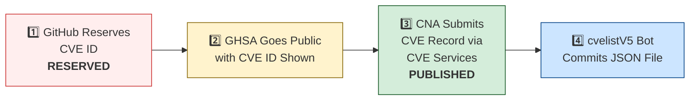

# 🛡️ OpenClaw CVE & Security Advisory Tracker

  
  
  
  
  
   
  
  
  
  
  

An automated tracker that continuously monitors [OpenClaw](https://github.com/openclaw/openclaw) security advisories across the GitHub Advisory Database, repo-level security advisories, and a full scan of the [CVE V5 (cvelistV5)](https://github.com/CVEProject/cvelistV5) registry covering **every CVE affecting OpenClaw regardless of which CNA assigned it**. On each run it pulls the latest data, reconciles GHSA → CVE publication state, breaks the totals down by assigning CNA, and regenerates this dashboard so you always have an up-to-date picture of the project's vulnerability landscape.

  Last updated: 2026-07-10 09:41 UTC · <a href="LICENSE">MIT License</a> · <a href="ADVISORIES.md">Full Advisory List</a> · <a href="SECURITY.md">Security Policy</a> · Data: <a href="https://github.com/CVEProject/cvelistV5">cvelistV5</a> + <a href="https://github.com/github/advisory-database">Advisory DB</a> · Updates every 6h

---

  <a href="#-all-openclaw-cves-by-assigning-cna-cve-list-v5">All CVEs by CNA</a> ·
  <a href="#-cves-published-in-cvelistv5-51">Published CVEs</a> ·
  <a href="#-cve-publication-pipeline">Pipeline</a> ·
  <a href="#-all-security-advisories-157">Advisories</a> ·
  <a href="#-vulnerability-categories">Categories</a> ·
  <a href="#-key-insights">Insights</a> ·
  <a href="#-project-identity">Identity</a>

---

## 🏗️ Project Identity

| Field | Value |
|-------|-------|
| **Current Name** | OpenClaw |
| **Previous Names** | Moltbot (second name), Clawdbot (original name) |
| **Repository** | [openclaw/openclaw](https://github.com/openclaw/openclaw) |
| **npm Package** | `openclaw` (formerly `clawdbot`) |
| **Author** | Peter Steinberger (steipete) |

<strong>Search terms for CVE discovery</strong>

To find all CVEs, search for: `openclaw`, `clawdbot`, `moltbot`, `clawhub`, `pkg:npm/clawdbot`, `pkg:npm/openclaw`

---

## 🌐 All OpenClaw CVEs by Assigning CNA (CVE List V5)

The sections lower down track CVEs that have an OpenClaw **GitHub Security Advisory** — i.e. CVEs the **project issued itself**. That is only part of the picture. A direct scan of the authoritative [CVE List V5](https://github.com/CVEProject/cvelistV5) registry finds **543** CVEs that name OpenClaw as an affected product, the large majority assigned by **third-party researchers** rather than the project. Earlier versions of this tracker reported only the ~51 project-issued (GHSA-linked) CVEs and were blind to this external stream.

| | Count |
|--|------:|
| **Total OpenClaw CVEs (all CNAs)** | **543** |
| Project-issued (GitHub as CNA) | 34 |
| Third-party-issued (VulnCheck, ZDI, MITRE, …) | 509 |

### By Assigning CNA

| CNA | CVEs | Share |
|-----|-----:|------:|
| VulnCheck | 500 | 92.1% |
| GitHub_M | 34 | 6.3% |
| VulDB | 4 | 0.7% |
| zdi | 3 | 0.6% |
| mitre | 2 | 0.4% |

### 2026 Monthly Publish Trend

The steady third-party (VulnCheck-led) disclosure cadence across 2026:

| Month | CVEs | |
|-------|-----:|--|
| 2026-02 | 35 | `████` |
| 2026-03 | 198 | `████████████████████` |
| 2026-04 | 174 | `██████████████████` |
| 2026-05 | 75 | `████████` |
| 2026-06 | 61 | `██████` |

> **Methodology:** generated by [`reconcile_cnas.py`](reconcile_cnas.py), which scans every record in [CVEProject/cvelistV5](https://github.com/CVEProject/cvelistV5) and selects those whose `containers.cna.affected[].vendor` or `.product` is `openclaw` (case-insensitive), or that reference `github.com/openclaw/openclaw`. `REJECTED` records are excluded. **[VulnCheck](https://vulncheck.com) is by far the dominant CNA** — its researchers drive the bulk of OpenClaw disclosures. The GHSA-based sections below cover the project's own advisories and are unchanged. Full reconciled set: [`openclaw-cves-all.json`](openclaw-cves-all.json) · aggregates: [`cna-breakdown.json`](cna-breakdown.json).

---

## 🚀 CVEs Published in cvelistV5 (51)

These CVEs have full records in the [CVEProject/cvelistV5](https://github.com/CVEProject/cvelistV5) repository:

| CVE ID | Severity | CVSS | Title | CWE | Published |
|--------|----------|------|-------|-----|-----------|
| [CVE-2026-28363](https://github.com/openclaw/openclaw/security/advisories/GHSA-3c6h-g97w-fg78) |  | 9.9 | In OpenClaw before 2026.2.23, tools.exec.safeBins validation for sort could be… | CWE-184 | 2026-02-27 |
| [CVE-2026-32987](https://github.com/openclaw/openclaw/security/advisories/GHSA-63f5-hhc7-cx6p) |  | 9.3 | OpenClaw < 2026.3.13 - Bootstrap Setup Code Replay via Device Pairing | CWE-294 | 2026-03-29 |
| [CVE-2026-43585](https://github.com/openclaw/openclaw/security/advisories/GHSA-xmxx-7p24-h892) |  | 9.2 | OpenClaw < 2026.4.15 - Bearer Token Validation Bypass via Stale SecretRef Resolution | CWE-672 | 2026-05-06 |
| [CVE-2026-43578](https://github.com/openclaw/openclaw/security/advisories/GHSA-g375-h3v6-4873) |  | 9.1 | OpenClaw 2026.3.31 < 2026.4.10 - Privilege Escalation via Missed Async Exec Completion Events in Heartbeat Owner Downgrade | CWE-184 | 2026-05-06 |
| [CVE-2026-43581](https://github.com/openclaw/openclaw/security/advisories/GHSA-525j-hqq2-66r4) |  | 9 | OpenClaw < 2026.4.10 - Chrome DevTools Protocol Exposure via Overly Broad CDP Relay Binding | CWE-1188 | 2026-05-06 |
| [CVE-2026-24763](https://github.com/openclaw/openclaw/security/advisories/GHSA-mc68-q9jw-2h3v) |  | 8.8 | OpenClaw/Clawdbot Docker Execution has Authenticated Command Injection via PATH Environment Variable | CWE-78 | 2026-02-02 |
| [CVE-2026-25253](https://github.com/openclaw/openclaw/security/advisories/GHSA-g8p2-7wf7-98mq) |  | 8.8 | OpenClaw/Clawdbot has 1-Click RCE via Authentication Token Exfiltration From gatewayUrl | CWE-669 | 2026-02-01 |
| [CVE-2026-28478](https://github.com/openclaw/openclaw/security/advisories/GHSA-q447-rj3r-2cgh) |  | 8.7 | OpenClaw affected by denial of service via unbounded webhook request body buffering | CWE-770 | 2026-03-05 |
| [CVE-2026-32013](https://github.com/openclaw/openclaw/security/advisories/GHSA-fgvx-58p6-gjwc) |  | 8.7 | OpenClaw < 2026.2.25 - Symlink Traversal in agents.files Methods | CWE-59 | 2026-03-19 |
| [CVE-2026-32846](https://github.com/openclaw/openclaw/security/advisories/GHSA-f6pf-4gjx-c94r) |  | 8.7 | OpenClaw Media Parsing Path Traversal to Arbitrary File Read | CWE-22 | 2026-03-26 |
| [CVE-2026-32982](https://github.com/openclaw/openclaw/security/advisories/GHSA-xwcj-hwhf-h378) |  | 8.7 | OpenClaw < 2026.3.13 - Telegram Bot Token Exposure in Media Fetch Error Logs | CWE-532 | 2026-03-31 |
| [CVE-2026-32980](https://github.com/openclaw/openclaw/security/advisories/GHSA-jq3f-vjww-8rq7) |  | 8.7 | OpenClaw < 2026.3.13 - Resource Exhaustion via Unauthenticated Telegram Webhook Request | CWE-770 | 2026-03-29 |
| [CVE-2026-32914](https://github.com/openclaw/openclaw/security/advisories/GHSA-r7vr-gr74-94p8) |  | 8.7 | OpenClaw < 2026.3.12 - Insufficient Access Control in /config and /debug Endpoints | CWE-863 | 2026-03-29 |
| [CVE-2026-35663](https://github.com/openclaw/openclaw/security/advisories/GHSA-9hjh-fr4f-gxc4) |  | 8.7 | OpenClaw < 2026.3.25 - Privilege Escalation via Backend Reconnect Scope Self-Claim | CWE-648 | 2026-04-10 |
| [CVE-2026-35669](https://github.com/openclaw/openclaw/security/advisories/GHSA-qm2m-28pf-hgjw) |  | 8.7 | OpenClaw < 2026.3.25 - Privilege Escalation via Gateway Plugin HTTP Authentication Scope | CWE-648 | 2026-04-10 |
| [CVE-2026-42435](https://github.com/openclaw/openclaw/security/advisories/GHSA-j6c7-3h5x-99g9) |  | 8.7 | OpenClaw 2026.2.22 < 2026.4.12 - Shell-Wrapper Detection Bypass via Environment Variable Assignment Injection | CWE-184 | 2026-05-05 |
| [CVE-2026-43530](https://github.com/openclaw/openclaw/security/advisories/GHSA-2cq5-mf3v-mx44) |  | 8.7 | OpenClaw 2026.2.23 < 2026.4.12 - Weakened Exec Approval Binding via busybox and toybox Applet Execution | CWE-863 | 2026-05-05 |
| [CVE-2026-53817](https://github.com/openclaw/openclaw/security/advisories/GHSA-chr9-m4q2-76hw) |  | 8.7 | OpenClaw < 2026.5.22 - Control UI Locality Spoofing in Device Pairing | CWE-290 | 2026-06-11 |
| [CVE-2026-53814](https://github.com/openclaw/openclaw/security/advisories/GHSA-6fvr-66p3-3qj4) |  | 8.7 | OpenClaw: Hook-triggered CLI runs could receive owner MCP tool authority | CWE-266 | 2026-06-11 |
| [CVE-2026-53819](https://github.com/openclaw/openclaw/security/advisories/GHSA-8wg3-5mcm-fjq8) |  | 8.7 | OpenClaw: Workspace .env could override Homebrew executable selection for skill install flows | CWE-426 | 2026-06-11 |
| [CVE-2026-53843](https://github.com/openclaw/openclaw/security/advisories/GHSA-q99w-vh6v-q3v7) |  | 8.7 | OpenClaw: Pairing-scoped device session could restore revoked node token authority | CWE-613 | 2026-06-16 |
| [CVE-2026-27001](https://github.com/openclaw/openclaw/security/advisories/GHSA-2qj5-gwg2-xwc4) |  | 8.6 | OpenClaw: Unsanitized CWD path injection into LLM prompts | CWE-77 | 2026-02-19 |
| [CVE-2026-33575](https://github.com/openclaw/openclaw/security/advisories/GHSA-7h7g-x2px-94hj) |  | 8.6 | OpenClaw < 2026.3.12 - Long-lived Credential Exposure in Pairing Setup Codes | CWE-522 | 2026-03-29 |
| [CVE-2026-53816](https://github.com/openclaw/openclaw/security/advisories/GHSA-3c6j-hq33-3jv4) |  | 8.6 | OpenClaw < 2026.5.18 - Exec Lifecycle Event Forgery via Paired Node | CWE-862 | 2026-06-11 |
| [CVE-2026-53823](https://github.com/openclaw/openclaw/security/advisories/GHSA-c29c-2q9c-pc86) |  | 8.6 | OpenClaw < 2026.5.3 - Privilege Escalation via Mutable Slack Display Names in allowFrom | CWE-290 | 2026-06-12 |
| [CVE-2026-53849](https://github.com/openclaw/openclaw/security/advisories/GHSA-cw4q-gqg5-g38h) |  | 8.6 | OpenClaw: Discord allowFrom could bind to mutable display names | CWE-290 | 2026-06-16 |
| [CVE-2026-53857](https://github.com/openclaw/openclaw/security/advisories/GHSA-8c59-hr4w-qg69) |  | 8.6 | OpenClaw < 2026.5.3 - Mutable Display Name Binding in Zalo allowFrom Policy | CWE-290 | 2026-06-16 |
| [CVE-2026-35641](https://github.com/openclaw/openclaw/security/advisories/GHSA-m3mh-3mpg-37hw) |  | 8.4 | OpenClaw < 2026.3.24 - Arbitrary Code Execution via .npmrc in Local Plugin/Hook Installation | CWE-349 | 2026-04-10 |
| [CVE-2026-45004](https://github.com/openclaw/openclaw/security/advisories/GHSA-r39h-4c2p-3jxp) |  | 8.4 | OpenClaw < 2026.4.23 - Arbitrary Code Execution via setup-api.js in Current Working Directory | CWE-427 | 2026-05-11 |
| [CVE-2026-32905](https://github.com/openclaw/openclaw/security/advisories/GHSA-xr4f-mjxj-w6w5) |  | 8.3 | OpenClaw < 2026.5.4 - Unauthorized Device-Pairing Bootstrap Code Issuance via Chat Command | CWE-862 | 2026-05-29 |
| [CVE-2026-35618](https://github.com/openclaw/openclaw/security/advisories/GHSA-cg6c-q2hx-69h7) |  | 8.3 | OpenClaw < 2026.3.23 - Replay Identity Drift via Query-Only Variants in Plivo V2 Verification | CWE-294 | 2026-04-09 |
| [CVE-2026-28469](https://github.com/openclaw/openclaw/security/advisories/GHSA-rq6g-px6m-c248) |  | 8.2 | OpenClaw Google Chat shared-path webhook target ambiguity allowed cross-account policy-context misrouting | CWE-639 | 2026-03-05 |
| [CVE-2026-29613](https://github.com/openclaw/openclaw/security/advisories/GHSA-xc7w-v5x6-cc87) |  | 8.2 | OpenClaw < 2026.2.12 - Webhook Authentication Bypass via Loopback remoteAddress Trust | CWE-306 | 2026-03-05 |
| [CVE-2026-35630](https://github.com/openclaw/openclaw/security/advisories/GHSA-mgq6-vr84-7m2j) |  | 8 | OpenClaw: QQBot native approval buttons did not enforce configured approver identity | CWE-862 | 2026-05-29 |
| [CVE-2026-25157](https://github.com/openclaw/openclaw/security/advisories/GHSA-q284-4pvr-m585) |  | 7.8 | OpenClaw/Clawdbot has OS Command Injection via Project Root Path in sshNodeCommand | CWE-78 | 2026-02-04 |
| [CVE-2026-42423](https://github.com/openclaw/openclaw/security/advisories/GHSA-q2gc-xjqw-qp89) |  | 7.7 | OpenClaw < 2026.4.8 - strictInlineEval Approval Boundary Bypass via Approval-Timeout Fallback | CWE-636 | 2026-04-28 |
| [CVE-2026-43571](https://github.com/openclaw/openclaw/security/advisories/GHSA-82qx-6vj7-p8m2) |  | 7.7 | OpenClaw < 2026.4.10 - Untrusted Workspace Plugin Shadow Resolution in Channel Setup | CWE-829 | 2026-05-05 |
| [CVE-2026-44110](https://github.com/openclaw/openclaw/security/advisories/GHSA-2gvc-4f3c-2855) |  | 7.7 | OpenClaw <  2026.4.15 - Authorization Bypass in Matrix Room Control Commands via DM Pairing Store | CWE-863 | 2026-05-06 |
| [CVE-2026-53807](https://github.com/openclaw/openclaw/security/advisories/GHSA-w5ww-7chg-mxcq) |  | 7.7 | OpenClaw < 2026.5.6 - Authorization Bypass in Telegram Interactive Callbacks via commands.allowFrom | CWE-863 | 2026-06-11 |
| [CVE-2026-53810](https://github.com/openclaw/openclaw/security/advisories/GHSA-v6r2-jh58-xx6w) |  | 7.7 | OpenClaw's marketplace runtime extension metadata could point at unscanned payloads | CWE-829 | 2026-06-11 |
| [CVE-2026-53806](https://github.com/openclaw/openclaw/security/advisories/GHSA-vxx3-6hc9-7cc3) |  | 7.7 | OpenClaw < 2026.5.12 - Shell Option Parsing Bypass in Exec Revalidation | CWE-367 | 2026-06-11 |
| [CVE-2026-53811](https://github.com/openclaw/openclaw/security/advisories/GHSA-7hxm-f538-3xp6) |  | 7.7 | OpenClaw: Matrix allowFrom could bind to mutable display names | CWE-290 | 2026-06-11 |
| [CVE-2026-27487](https://github.com/openclaw/openclaw/security/advisories/GHSA-4564-pvr2-qq4h) |  | 7.6 | OpenClaw: Prevent shell injection in macOS keychain credential write | CWE-78 | 2026-02-21 |
| [CVE-2026-41353](https://github.com/openclaw/openclaw/security/advisories/GHSA-h5hg-h7rr-gpf3) |  | 7.6 | OpenClaw < 2026.3.22 - allowProfiles Bypass via Profile Mutation and Runtime Selection | CWE-472 | 2026-04-23 |
| [CVE-2026-53855](https://github.com/openclaw/openclaw/security/advisories/GHSA-5cj2-3jr2-5h77) |  | 7.6 | OpenClaw < 2026.4.2 - Shell Positional Parameters Bypass in Inline-Eval Checks | CWE-184, CWE-863 | 2026-06-16 |
| [CVE-2026-53853](https://github.com/openclaw/openclaw/security/advisories/GHSA-v2ww-5rh7-2h5v) |  | 7.6 | OpenClaw: Linux and macOS exec allowlists skipped configured argument patterns | CWE-693, CWE-863 | 2026-06-16 |
| [CVE-2026-53864](https://github.com/openclaw/openclaw/security/advisories/GHSA-ccwh-wwpp-6wg5) |  | 7.6 | OpenClaw: Host environment sanitizer missed two Node.js control variables | CWE-184 | 2026-06-16 |
| [CVE-2026-53866](https://github.com/openclaw/openclaw/security/advisories/GHSA-f397-5vjw-v2c2) |  | 7.6 | OpenClaw < 2026.5.12 - Allowlist Bypass in Shell Inline-Command Parsing | CWE-862 | 2026-06-16 |
| [CVE-2026-26319](https://github.com/openclaw/openclaw/security/advisories/GHSA-4hg8-92x6-h2f3) |  | 7.5 | OpenClaw has Missing Webhook Authentication in Telnyx Provider Allowing Unauthenticated Requests | CWE-306 | 2026-02-19 |
| [CVE-2026-26321](https://github.com/openclaw/openclaw/security/advisories/GHSA-8jpq-5h99-ff5r) |  | 7.5 | OpenClaw has a local file disclosure via sendMediaFeishu in Feishu extension | CWE-22 | 2026-02-19 |
| [CVE-2026-22179](https://github.com/openclaw/openclaw/security/advisories/GHSA-9p38-94jf-hgjj) |  | 7.5 | OpenClaw < 2026.2.22 - Allowlist Bypass via Command Substitution in system.run | CWE-78 | 2026-03-18 |
| [CVE-2026-32041](https://github.com/openclaw/openclaw/security/advisories/GHSA-vpj2-69hf-rppw) |  | 7.5 | OpenClaw < 2026.3.1 - Unauthenticated Browser Control Access via Failed Auth Bootstrap | CWE-306 | 2026-03-19 |
| [CVE-2026-28458](https://github.com/openclaw/openclaw/security/advisories/GHSA-mr32-vwc2-5j6h) |  | 7.4 | OpenClaw's Browser Relay /cdp websocket is missing auth which could allow cross-tab cookie access | CWE-306 | 2026-03-05 |
| [CVE-2026-53832](https://github.com/openclaw/openclaw/security/advisories/GHSA-rggc-m335-3wvj) |  | 7.4 | OpenClaw < 2026.5.18 - Identity Header Forgery via Trusted-Proxy Configuration | CWE-290 | 2026-06-12 |
| [CVE-2026-32032](https://github.com/openclaw/openclaw/security/advisories/GHSA-f8mp-vj46-cq8v) |  | 7.3 | OpenClaw < 2026.2.22 - Arbitrary Shell Execution via Unvalidated SHELL Environment Variable | CWE-426 | 2026-03-19 |
| [CVE-2026-53813](https://github.com/openclaw/openclaw/security/advisories/GHSA-v8cx-933x-r976) |  | 7.3 | OpenClaw: Fake package roots could influence memory-core artifact loading | CWE-427 | 2026-06-11 |
| [CVE-2026-35653](https://github.com/openclaw/openclaw/security/advisories/GHSA-xp9r-prpg-373r) |  | 7.2 | OpenClaw < 2026.3.24 - Incorrect Authorization in POST /reset-profile via browser.request | CWE-863 | 2026-04-10 |
| [CVE-2026-53865](https://github.com/openclaw/openclaw/security/advisories/GHSA-rx78-29qr-5hq8) |  | 7.2 | OpenClaw: Workspace-derived service PATH could influence trash command selection | CWE-426 | 2026-06-16 |
| [CVE-2026-26317](https://github.com/openclaw/openclaw/security/advisories/GHSA-3fqr-4cg8-h96q) |  | 7.1 | OpenClaw affected by cross-site request forgery (CSRF) through loopback browser mutation endpoints | CWE-352 | 2026-02-19 |
| [CVE-2026-33581](https://github.com/openclaw/openclaw/security/advisories/GHSA-v8wv-jg3q-qwpq) |  | 7.1 | OpenClaw < 2026.3.24 - Arbitrary File Read via mediaUrl and fileUrl Parameters | CWE-22 | 2026-03-31 |
| [CVE-2026-41369](https://github.com/openclaw/openclaw/security/advisories/GHSA-cg7q-fg22-4g98) |  | 7.1 | OpenClaw < 2026.3.31 - Insufficient Environment Variable Sanitization in Host Execution | CWE-668 | 2026-04-27 |
| [CVE-2026-41370](https://github.com/openclaw/openclaw/security/advisories/GHSA-58q2-7r52-jq62) |  | 7.1 | OpenClaw < 2026.3.31 - Path Traversal via Inbound Channel Attachment Path in ACP Dispatch | CWE-22 | 2026-04-27 |
| [CVE-2026-41385](https://github.com/openclaw/openclaw/security/advisories/GHSA-jjw7-3vjf-fg5j) |  | 7.1 | OpenClaw < 2026.3.31 - Nostr Private Key Exposure via config.get Redaction Bypass | CWE-312 | 2026-04-28 |
| [CVE-2026-43568](https://github.com/openclaw/openclaw/security/advisories/GHSA-5gjc-grvm-m88j) |  | 7.1 | OpenClaw 2026.4.5 < 2026.4.10 - Privilege Escalation via Memory Dreaming Configuration in /dreaming Endpoint | CWE-862 | 2026-05-05 |
| [CVE-2026-53815](https://github.com/openclaw/openclaw/security/advisories/GHSA-q7q8-3mgw-q67r) |  | 7.1 | OpenClaw < 2026.5.19 - Channel Allowlist Bypass in Message Read Actions | CWE-862 | 2026-06-11 |
| [CVE-2026-53825](https://github.com/openclaw/openclaw/security/advisories/GHSA-p2fh-f5fc-44hr) |  | 7.1 | OpenClaw < 2026.4.7 - Arbitrary Local File Read via memory-wiki Ingest with operator.write Scope | CWE-22 | 2026-06-12 |
| [CVE-2026-41390](https://github.com/openclaw/openclaw/security/advisories/GHSA-6pfc-6m7w-m8fx) |  | 7 | OpenClaw < 2026.3.28 - Exec Allowlist Bypass via Unregistered /usr/bin/script Wrapper | CWE-807 | 2026-04-28 |
| [CVE-2026-53842](https://github.com/openclaw/openclaw/security/advisories/GHSA-fq9j-vw4w-fr6v) |  | 7 | OpenClaw: Workspace .env CLOUDSDK_PYTHON could influence Gmail setup gcloud execution | CWE-426 | 2026-06-16 |
| [CVE-2026-53846](https://github.com/openclaw/openclaw/security/advisories/GHSA-24vr-rprv-67rf) |  | 7 | OpenClaw: Workspace .env npm_execpath could influence bundled runtime dependency install | CWE-426 | 2026-06-16 |
| [CVE-2026-53858](https://github.com/openclaw/openclaw/security/advisories/GHSA-wc84-j36w-pw4x) |  | 7 | OpenClaw: Workspace .env STATE_DIRECTORY could influence bundled runtime dependency roots | CWE-426 | 2026-06-16 |
| [CVE-2026-22176](https://github.com/openclaw/openclaw/security/advisories/GHSA-pj5x-38rw-6fph) |  | 6.9 | OpenClaw < 2026.2.19 - Command Injection via Unescaped Environment Variables in Windows Scheduled Task Script Generation | CWE-78 | 2026-03-19 |
| [CVE-2026-27523](https://github.com/openclaw/openclaw/security/advisories/GHSA-m8v2-6wwh-r4gc) |  | 6.9 | OpenClaw < 2026.2.24 - Sandbox Bind Validation Bypass via Symlink-Parent Missing-Leaf Paths | CWE-22 | 2026-03-18 |
| [CVE-2026-28480](https://github.com/openclaw/openclaw/security/advisories/GHSA-mj5r-hh7j-4gxf) |  | 6.9 | OpenClaw Telegram allowlist authorization accepted mutable usernames | CWE-290 | 2026-03-05 |
| [CVE-2026-31994](https://github.com/openclaw/openclaw/security/advisories/GHSA-mqr9-vqhq-3jxw) |  | 6.9 | OpenClaw < 2026.2.19 - Local Command Injection via Unsafe cmd Argument Handling in Windows Scheduled Task Script Generation | CWE-78 | 2026-03-19 |
| [CVE-2026-32919](https://github.com/openclaw/openclaw/security/advisories/GHSA-jf6w-m8jw-jfxc) |  | 6.9 | OpenClaw < 2026.3.11 - Unauthorized Session Reset via agent Slash Commands | CWE-863 | 2026-03-29 |
| [CVE-2026-34505](https://github.com/openclaw/openclaw/security/advisories/GHSA-5m9r-p9g7-679c) |  | 6.9 | OpenClaw < 2026.3.12 - Webhook Rate Limiting Bypass via Pre-Authentication Secret Validation | CWE-307 | 2026-03-31 |
| [CVE-2026-35632](https://github.com/openclaw/openclaw/security/advisories/GHSA-7xr2-q9vf-x4r5) |  | 6.9 | OpenClaw < 2026.2.22 - Symlink Traversal via IDENTITY.md appendFile in agents.create/update | CWE-61 | 2026-04-09 |
| [CVE-2026-35654](https://github.com/openclaw/openclaw/security/advisories/GHSA-rf6h-5gpw-qrgq) |  | 6.9 | OpenClaw < 2026.3.25 - Authorization Bypass in Microsoft Teams Feedback Invoke | CWE-288 | 2026-04-10 |
| [CVE-2026-35655](https://github.com/openclaw/openclaw/security/advisories/GHSA-74wf-h43j-vvmj) |  | 6.9 | OpenClaw < 2026.3.22 - Identity Spoofing via rawInput Tool in ACP Permission Resolution | CWE-807 | 2026-04-10 |
| [CVE-2026-35647](https://github.com/openclaw/openclaw/security/advisories/GHSA-9wqx-g2cw-vc7r) |  | 6.9 | OpenClaw < 2026.3.25 - Direct Message Policy Bypass via Verification Notices | CWE-288 | 2026-04-10 |
| [CVE-2026-41374](https://github.com/openclaw/openclaw/security/advisories/GHSA-hhff-fj5f-qg48) |  | 6.9 | OpenClaw < 2026.3.31 - Resource Consumption via Discord Audio Preflight Before Member Authorization | CWE-408 | 2026-04-28 |
| [CVE-2026-53818](https://github.com/openclaw/openclaw/security/advisories/GHSA-rj6p-xmxr-qj4h) |  | 6.9 | OpenClaw < 2026.4.24 - Owner-Only Tool Policy Bypass via MCP Loopback | CWE-862 | 2026-06-11 |
| [CVE-2026-29612](https://github.com/openclaw/openclaw/security/advisories/GHSA-w2cg-vxx6-5xjg) |  | 6.8 | OpenClaw < 2026.2.14 - Denial of Service via Large Base64 Media File Decoding | CWE-770 | 2026-03-05 |
| [CVE-2026-28486](https://github.com/openclaw/openclaw/security/advisories/GHSA-v892-hwpg-jwqp) |  | 6.8 | OpenClaw 2026.1.16-2 < 2026.2.14 - Path Traversal (Zip Slip) in Archive Extraction via Installation Commands | CWE-22 | 2026-03-05 |
| [CVE-2026-53850](https://github.com/openclaw/openclaw/security/advisories/GHSA-mpc8-jxjh-qpgh) |  | 6.8 | OpenClaw < 2026.4.25 - Control Scope Enforcement Bypass in Focus Command | CWE-862 | 2026-06-16 |
| [CVE-2026-28452](https://github.com/openclaw/openclaw/security/advisories/GHSA-h89v-j3x9-8wqj) |  | 6.7 | OpenClaw affected by denial of service through unguarded archive extraction allowing high expansion/resource abuse (ZIP/TAR) | CWE-770 | 2026-03-05 |
| [CVE-2026-26328](https://github.com/openclaw/openclaw/security/advisories/GHSA-g34w-4xqq-h79m) |  | 6.5 | OpenClaw iMessage group allowlist authorization inherited DM pairing-store identities | CWE-284, CWE-863 | 2026-02-19 |
| [CVE-2026-32021](https://github.com/openclaw/openclaw/security/advisories/GHSA-j4xf-96qf-rx69) |  | 6.3 | OpenClaw < 2026.2.22 - Authorization Bypass via Display Name Collision in Feishu allowFrom | CWE-863 | 2026-03-19 |
| [CVE-2026-35628](https://github.com/openclaw/openclaw/security/advisories/GHSA-vcx4-4qxg-mfp4) |  | 6.3 | OpenClaw < 2026.3.25 - Brute-Force Attack via Missing Telegram Webhook Rate Limiting | CWE-307 | 2026-04-09 |
| [CVE-2026-33580](https://github.com/openclaw/openclaw/security/advisories/GHSA-9528-x887-j2fp) |  | 6.3 | OpenClaw < 2026.3.28 - Brute Force Attack via Missing Rate Limiting on Webhook Shared Secret Authentication | CWE-307 | 2026-03-31 |
| [CVE-2026-41354](https://github.com/openclaw/openclaw/security/advisories/GHSA-rxmx-g7hr-8mx4) |  | 6.3 | OpenClaw < 2026.4.2 - Insufficient Scope in Zalo Webhook Replay Dedupe Keys | CWE-706 | 2026-04-23 |
| [CVE-2026-41346](https://github.com/openclaw/openclaw/security/advisories/GHSA-wwfp-w96m-c6x8) |  | 6.3 | OpenClaw 2026.2.26 < 2026.3.31 - Denial of Service via Improper Pending Pairing Request Cap Enforcement | CWE-799 | 2026-04-23 |
| [CVE-2026-41403](https://github.com/openclaw/openclaw/security/advisories/GHSA-3xv9-89fm-7h4r) |  | 6.3 | OpenClaw < 2026.3.31 - Access Control Bypass via Proxied Remote Request Misclassification | CWE-807 | 2026-04-28 |
| [CVE-2026-44999](https://github.com/openclaw/openclaw/security/advisories/GHSA-57r2-h2wj-g887) |  | 6.3 | OpenClaw < 2026.4.20 - Improper Trust Labeling in Isolated Cron Awareness Events | CWE-345 | 2026-05-11 |
| [CVE-2026-44994](https://github.com/openclaw/openclaw/security/advisories/GHSA-93rg-2xm5-2p9v) |  | 6.3 | OpenClaw < 2026.4.22 - Authentication Bypass in Gateway Control UI Bootstrap Config Endpoint | CWE-862 | 2026-05-11 |
| [CVE-2026-45002](https://github.com/openclaw/openclaw/security/advisories/GHSA-2xcp-x87w-q377) |  | 6.3 | OpenClaw < 2026.4.20 - Hook Session-Key Bypass via Template Mapping | CWE-863 | 2026-05-11 |
| [CVE-2026-53851](https://github.com/openclaw/openclaw/security/advisories/GHSA-fcvx-5cxc-v5p8) |  | 6.3 | OpenClaw < 2026.5.12 - Slack Reaction Event Notification Bypass | CWE-862 | 2026-06-16 |
| [CVE-2026-35645](https://github.com/openclaw/openclaw/security/advisories/GHSA-h4jx-hjr3-fhgc) |  | 6.1 | OpenClaw < 2026.3.25 - Privilege Escalation via Synthetic operator.admin in deleteSession | CWE-648 | 2026-04-09 |
| [CVE-2026-41383](https://github.com/openclaw/openclaw/security/advisories/GHSA-m34q-h93w-vg5x) |  | 6.1 | OpenClaw < 2026.4.2 - Arbitrary Remote Directory Deletion via Mis-scoped Mirror Mode Paths | CWE-22 | 2026-04-28 |
| [CVE-2026-28460](https://github.com/openclaw/openclaw/security/advisories/GHSA-9868-vxmx-w862) |  | 6 | OpenClaw < 2026.2.22 - Allowlist Bypass via Shell Line-Continuation Command Substitution in system.run | CWE-78 | 2026-03-19 |
| [CVE-2026-41911](https://github.com/openclaw/openclaw/security/advisories/GHSA-5fc7-f62m-8983) |  | 6 | OpenClaw < 2026.4.8 - Workspace-Only Filesystem Policy Bypass via docx upload_file/upload_image | CWE-22 | 2026-04-28 |
| [CVE-2026-53827](https://github.com/openclaw/openclaw/security/advisories/GHSA-grc3-2j34-p6gm) |  | 6 | OpenClaw < 2026.5.2 - Credential Exposure via Model-Supplied Loopback URLs in message.action Forwarding | CWE-918 | 2026-06-12 |
| [CVE-2026-53840](https://github.com/openclaw/openclaw/security/advisories/GHSA-rjxq-qqhf-8hwh) |  | 6 | OpenClaw: MCP Streamable HTTP redirects could forward configured custom headers to another origin | CWE-522 | 2026-06-16 |
| [CVE-2026-53844](https://github.com/openclaw/openclaw/security/advisories/GHSA-72fw-cqh5-f324) |  | 6 | OpenClaw < 2026.4.29 - Session Visibility Check Bypass in Shared Memory Search | CWE-862 | 2026-06-16 |
| [CVE-2026-53854](https://github.com/openclaw/openclaw/security/advisories/GHSA-4hpg-mp64-x7xq) |  | 6 | OpenClaw: Internal/webchat command auth could inherit ownerAllowFrom wildcard state | CWE-863 | 2026-06-16 |
| [CVE-2026-53859](https://github.com/openclaw/openclaw/security/advisories/GHSA-gxg4-2rrr-jhc7) |  | 6 | OpenClaw < 2026.5.26 - Hostname Validation Bypass via Trailing-Dot Inconsistency | CWE-1023, CWE-918 | 2026-06-16 |
| [CVE-2026-53863](https://github.com/openclaw/openclaw/security/advisories/GHSA-985f-72mj-8gf7) |  | 6 | OpenClaw < 2026.4.25 - Unvalidated Group ID Acceptance in Tool Group Policy | CWE-639 | 2026-06-16 |
| [CVE-2026-40045](https://github.com/openclaw/openclaw/security/advisories/GHSA-83f3-hh45-vfw9) |  | 5.9 | OpenClaw < 2026.4.2 - Cleartext Credential Transmission via Unencrypted WebSocket Gateway Endpoints | CWE-319 | 2026-04-20 |
| [CVE-2026-27009](https://github.com/openclaw/openclaw/security/advisories/GHSA-37gc-85xm-2ww6) |  | 5.8 | OpenClaw affected by Stored XSS in Control UI via unsanitized assistant name/avatar in inline script injection | CWE-79 | 2026-02-19 |
| [CVE-2026-27646](https://github.com/openclaw/openclaw/security/advisories/GHSA-9q36-67vc-rrwg) |  | 5.8 | OpenClaw < 2026.3.7 - Sandbox Escape via /acp spawn Command | CWE-863 | 2026-03-23 |
| [CVE-2026-32010](https://github.com/openclaw/openclaw/security/advisories/GHSA-4gc7-qcvf-38wg) |  | 5.8 | OpenClaw < 2026.2.22 - Allowlist Bypass via sort --compress-program Parameter | CWE-78 | 2026-03-19 |
| [CVE-2026-33574](https://github.com/openclaw/openclaw/security/advisories/GHSA-vhwf-4x96-vqx2) |  | 5.8 | OpenClaw < 2026.3.8 - Path Traversal via Tools Root Rebinding in Skills Download | CWE-367 | 2026-03-29 |
| [CVE-2026-41373](https://github.com/openclaw/openclaw/security/advisories/GHSA-g8xp-qx39-9jq9) |  | 5.8 | OpenClaw < 2026.3.31 - Compiler Binary Substitution via Environment Variable Override in Host Execution Policy | CWE-427 | 2026-04-28 |
| [CVE-2026-53856](https://github.com/openclaw/openclaw/security/advisories/GHSA-rwp6-7w3q-75fq) |  | 5.7 | OpenClaw: Config recovery could restore openclaw.json with broad file permissions | CWE-732 | 2026-06-16 |
| [CVE-2026-41392](https://github.com/openclaw/openclaw/security/advisories/GHSA-wpc6-37g7-8q4w) |  | 5.4 | OpenClaw < 2026.3.31 - Exec Allowlist Bypass via Shell Init-File Options | CWE-184 | 2026-04-28 |
| [CVE-2026-32898](https://github.com/openclaw/openclaw/security/advisories/GHSA-7jx5-9fjg-hp4m) |  | 5.3 | OpenClaw < 2026.2.23 - ACP Permission Auto-Approval Bypass via Untrusted Tool Metadata | CWE-807 | 2026-03-21 |
| [CVE-2026-35620](https://github.com/openclaw/openclaw/security/advisories/GHSA-vqvg-86cc-cg83) |  | 5.3 | OpenClaw < 2026.3.24 - Missing Authorization in /send and /allowlist Chat Commands | CWE-862 | 2026-04-10 |
| [CVE-2026-41298](https://github.com/openclaw/openclaw/security/advisories/GHSA-5hff-46vh-rxmw) |  | 5.3 | OpenClaw < 2026.4.2 - Authorization Bypass in Session Termination Endpoint | CWE-862 | 2026-04-20 |
| [CVE-2026-42420](https://github.com/openclaw/openclaw/security/advisories/GHSA-ccx3-fw7q-rr2r) |  | 5.3 | OpenClaw < 2026.4.8 - Improper Base64 Decoding Size Validation | CWE-770 | 2026-04-28 |
| [CVE-2026-53847](https://github.com/openclaw/openclaw/security/advisories/GHSA-x629-46cc-7xgw) |  | 5.3 | OpenClaw < 2026.5.6 - Privilege Escalation via Active Memory Write Scope | CWE-266 | 2026-06-16 |
| [CVE-2026-53861](https://github.com/openclaw/openclaw/security/advisories/GHSA-c226-q6fx-6j6c) |  | 5.3 | OpenClaw < 2026.5.6 - Allowlist Bypass via Combined POSIX Inline Flags on macOS | CWE-184 | 2026-06-16 |
| [CVE-2026-42436](https://github.com/openclaw/openclaw/security/advisories/GHSA-c4qm-58hj-j6pj) |  | 4.9 | OpenClaw < 2026.4.14 - Internal Page Content Exposure via Browser Snapshot and Screenshot Routes | CWE-862 | 2026-05-05 |
| [CVE-2026-43573](https://github.com/openclaw/openclaw/security/advisories/GHSA-527m-976r-jf79) |  | 4.9 | OpenClaw < 2026.4.10 - SSRF Policy Bypass in Existing-Session Browser Interaction Routes | CWE-862, CWE-918 | 2026-05-05 |
| [CVE-2026-53812](https://github.com/openclaw/openclaw/security/advisories/GHSA-2hfg-4fh4-qp7f) |  | 4.9 | OpenClaw's browser act interactions could bypass private-network navigation checks | CWE-918 | 2026-06-11 |
| [CVE-2026-32046](https://github.com/openclaw/openclaw/security/advisories/GHSA-43x4-g22p-3hrq) |  | 4.8 | OpenClaw < 2026.2.21 - OS-level Sandbox Bypass via --no-sandbox Flag | CWE-1188 | 2026-03-21 |
| [CVE-2026-53809](https://github.com/openclaw/openclaw/security/advisories/GHSA-p39j-x9h5-q66m) |  | 4.8 | OpenClaw < 2026.4.25 - Provider Alias Confusion in Embedded Runner Policy | CWE-863 | 2026-06-11 |
| [CVE-2026-32019](https://github.com/openclaw/openclaw/security/advisories/GHSA-4rqq-w8v4-7p47) |  | 2.3 | OpenClaw < 2026.2.22 - Incomplete IPv4 Special-Use Range Blocking in SSRF Guard | CWE-918 | 2026-03-19 |
| [CVE-2026-41362](https://github.com/openclaw/openclaw/security/advisories/GHSA-fqrj-m88p-qf3v) |  | 2.3 | OpenClaw 2026.2.19 < 2026.3.31 - Webhook Replay Dedupe Cache Event Suppression via Shared Authentication | CWE-668 | 2026-04-27 |
| [CVE-2026-41382](https://github.com/openclaw/openclaw/security/advisories/GHSA-x2m8-53h4-6hch) |  | 2.3 | OpenClaw < 2026.3.31 - Discord Voice Ingress Authorization Bypass via Channel and Role Validation Gaps | CWE-862 | 2026-04-28 |
| [CVE-2026-44111](https://github.com/openclaw/openclaw/security/advisories/GHSA-f934-5rqf-xx47) |  | 2.3 | OpenClaw < 2026.4.15 - Arbitrary Markdown File Read via QMD memory_get | CWE-183 | 2026-05-06 |
| [CVE-2026-44997](https://github.com/openclaw/openclaw/security/advisories/GHSA-q3jj-46pq-826r) |  | 2.3 | OpenClaw < 2026.4.22 - Security Envelope Constraint Bypass in ACP Child Sessions | CWE-266 | 2026-05-11 |
| [CVE-2026-53845](https://github.com/openclaw/openclaw/security/advisories/GHSA-68xw-r643-9p5w) |  | 2.3 | OpenClaw: Skill-command dispatch could skip before-tool-call hooks | CWE-693 | 2026-06-16 |
| [CVE-2026-53848](https://github.com/openclaw/openclaw/security/advisories/GHSA-cwpp-5962-q4f6) |  | 2.3 | OpenClaw < 2026.5.26 - Exec Allowlist Bypass via Transparent Command Wrappers | CWE-184 | 2026-06-16 |
| [CVE-2026-53852](https://github.com/openclaw/openclaw/security/advisories/GHSA-8mg9-j9cf-54cj) |  | 2.3 | OpenClaw < 2026.4.25 - Scope Bypass via Empty-Scope Device Re-pairing | CWE-636 | 2026-06-16 |
| [CVE-2026-53860](https://github.com/openclaw/openclaw/security/advisories/GHSA-8j37-5w68-wj2g) |  | 2.3 | OpenClaw: BlueBubbles sender policy could match mutable conversation identifiers | CWE-807, CWE-863 | 2026-06-16 |
| [CVE-2026-53862](https://github.com/openclaw/openclaw/security/advisories/GHSA-9v8j-9c9g-w66c) |  | 2.3 | OpenClaw < 2026.5.12 - Bootstrap Token Replay via Pending Pairing Scope Widening | CWE-266, CWE-345 | 2026-06-16 |
| [CVE-2026-53841](https://github.com/openclaw/openclaw/security/advisories/GHSA-w9hf-3pp7-pvxv) |  | 2.1 | OpenClaw: Exported session HTML could keep unsafe markdown links | CWE-83 | 2026-06-16 |
| [CVE-2026-31991](https://github.com/openclaw/openclaw/security/advisories/GHSA-wm8r-w8pf-2v6w) |  | 2 | OpenClaw < 2026.2.26 - Authorization Bypass via DM Pairing-Store Leakage in Signal Group Allowlist | CWE-863 | 2026-03-19 |
| [CVE-2026-32970](https://github.com/openclaw/openclaw/security/advisories/GHSA-qvr7-g57c-mrc7) |  | 2 | OpenClaw < 2026.3.11 - Credential Fallback Logic Bypass via Unavailable Local Auth SecretRefs | CWE-636 | 2026-03-31 |

<strong>📖 Detailed CVE Analysis (click to expand)</strong>

### CVE-2026-28363 — In OpenClaw before 2026.2.23, tools.exec.safeBins validation for sort could be…

| Field | Detail |
|-------|--------|
| **CVSS** | 9.9 (CRITICAL) — `CVSS:3.1/AV:N/AC:L/PR:L/UI:N/S:C/C:H/I:H/A:H` |
| **CWE** | CWE-184 (CWE-184 Incomplete List of Disallowed Inputs) |
| **Affected** | < 2026.2.23 |
| **Vendor/Product** | OpenClaw / OpenClaw |
| **Advisory** | [GHSA-3c6h-g97w-fg78](https://github.com/openclaw/openclaw/security/advisories/GHSA-3c6h-g97w-fg78) |

In OpenClaw before 2026.2.23, tools.exec.safeBins validation for sort could be bypassed via GNU long-option abbreviations (such as --compress-prog) in allowlist mode, leading to approval-free execution paths that were intended to require approval. Only an exact string such as --compress-program was denied.

---

### CVE-2026-32987 — OpenClaw < 2026.3.13 - Bootstrap Setup Code Replay via Device Pairing

| Field | Detail |
|-------|--------|
| **CVSS** | 9.3 (CRITICAL) — `CVSS:4.0/AV:N/AC:L/AT:N/PR:N/UI:N/VC:H/VI:H/VA:H/SC:N/SI:N/SA:N` |
| **CWE** | CWE-294 (Authentication Bypass by Capture-replay) |
| **Affected** | < 2026.3.13 |
| **Vendor/Product** | OpenClaw / OpenClaw |
| **Advisory** | [GHSA-63f5-hhc7-cx6p](https://github.com/openclaw/openclaw/security/advisories/GHSA-63f5-hhc7-cx6p) |

OpenClaw before 2026.3.13 allows bootstrap setup codes to be replayed during device pairing verification in src/infra/device-bootstrap.ts. Attackers can verify a valid bootstrap code multiple times before approval to escalate pending pairing scopes, including privilege escalation to operator.admin.

**References:**
- [Patch Commit](https://github.com/openclaw/openclaw/commit/1803d16d5cec970c54b0e1ac46b31b1cbade335c)
- [VulnCheck Advisory: OpenClaw < 2026.3.13 - Bootstrap Setup Code Replay via Device Pairing](https://www.vulncheck.com/advisories/openclaw-bootstrap-setup-code-replay-via-device-pairing)
---

### CVE-2026-43585 — OpenClaw < 2026.4.15 - Bearer Token Validation Bypass via Stale SecretRef Resolution

| Field | Detail |
|-------|--------|
| **CVSS** | 9.2 (CRITICAL) — `CVSS:4.0/AV:N/AC:H/AT:P/PR:N/UI:N/VC:H/VI:H/VA:H/SC:N/SI:N/SA:N` |
| **CWE** | CWE-672 (Operation on a Resource after Expiration or Release) |
| **Affected** | < 2026.4.15 |
| **Vendor/Product** | OpenClaw / OpenClaw |
| **Advisory** | [GHSA-xmxx-7p24-h892](https://github.com/openclaw/openclaw/security/advisories/GHSA-xmxx-7p24-h892) |

OpenClaw before 2026.4.15 captures resolved bearer-auth configuration at startup, allowing revoked tokens to remain valid after SecretRef rotation. Gateway HTTP and WebSocket handlers fail to re-resolve authentication per-request, enabling attackers to use rotated-out bearer tokens for unauthorized gateway access.

**References:**
- [Patch Commit](https://github.com/openclaw/openclaw/commit/acd4e0a32f12e1ad85f3130f63b42443ce90f094)
- [VulnCheck Advisory: OpenClaw < 2026.4.15 - Bearer Token Validation Bypass via Stale SecretRef Resolution](https://www.vulncheck.com/advisories/openclaw-bearer-token-validation-bypass-via-stale-secretref-resolution)
---

### CVE-2026-43578 — OpenClaw 2026.3.31 < 2026.4.10 - Privilege Escalation via Missed Async Exec Completion Events in Heartbeat Owner Downgrade

| Field | Detail |
|-------|--------|
| **CVSS** | 9.1 (CRITICAL) — `CVSS:4.0/AV:N/AC:L/AT:P/PR:N/UI:N/VC:H/VI:H/VA:N/SC:N/SI:N/SA:N` |
| **CWE** | CWE-184 (CWE-184: Incomplete List of Disallowed Inputs) |
| **Affected** | < 2026.4.10 |
| **Vendor/Product** | OpenClaw / OpenClaw |
| **Advisory** | [GHSA-g375-h3v6-4873](https://github.com/openclaw/openclaw/security/advisories/GHSA-g375-h3v6-4873) |

OpenClaw versions 2026.3.31 before 2026.4.10 contain a privilege escalation vulnerability where heartbeat owner downgrade detection misses local background async exec completion events. Attackers can exploit this by providing untrusted completion content to leave a run in a more privileged context than intended.

**References:**
- [Patch Commit](https://github.com/openclaw/openclaw/commit/19a2e9ddb5a8a494abcba812bb11f51075026a27)
- [VulnCheck Advisory: OpenClaw 2026.3.31 < 2026.4.10 - Privilege Escalation via Missed Async Exec Completion Events in Heartbeat Owner Downgrade](https://www.vulncheck.com/advisories/openclaw-privilege-escalation-via-missed-async-exec-completion-events-in-heartbeat-owner-downgrade)
---

### CVE-2026-43581 — OpenClaw < 2026.4.10 - Chrome DevTools Protocol Exposure via Overly Broad CDP Relay Binding

| Field | Detail |
|-------|--------|
| **CVSS** | 9 (CRITICAL) — `CVSS:4.0/AV:A/AC:L/AT:P/PR:N/UI:N/VC:H/VI:H/VA:H/SC:H/SI:H/SA:H` |
| **CWE** | CWE-1188 (CWE-1188 Initialization of a Resource with an Insecure Default) |
| **Affected** | < 2026.4.10 |
| **Vendor/Product** | OpenClaw / OpenClaw |
| **Advisory** | [GHSA-525j-hqq2-66r4](https://github.com/openclaw/openclaw/security/advisories/GHSA-525j-hqq2-66r4) |

OpenClaw before 2026.4.10 contains an improper network binding vulnerability in the sandbox browser CDP relay that exposes Chrome DevTools Protocol on 0.0.0.0. Attackers can access the DevTools protocol outside intended local sandbox boundaries by exploiting the overly broad binding configuration.

**References:**
- [Patch Commit](https://github.com/openclaw/openclaw/commit/fbf11ebdb7110632f93926d0ac7b48f04cb44d77)
- [VulnCheck Advisory: OpenClaw < 2026.4.10 - Chrome DevTools Protocol Exposure via Overly Broad CDP Relay Binding](https://www.vulncheck.com/advisories/openclaw-chrome-devtools-protocol-exposure-via-overly-broad-cdp-relay-binding)
---

### CVE-2026-24763 — OpenClaw/Clawdbot Docker Execution has Authenticated Command Injection via PATH Environment Variable

| Field | Detail |
|-------|--------|
| **CVSS** | 8.8 (HIGH) — `CVSS:3.1/AV:N/AC:L/PR:L/UI:N/S:U/C:H/I:H/A:H` |
| **CWE** | CWE-78 (CWE-78: Improper Neutralization of Special Elements used in an OS Command ('OS Command Injection')) |
| **Affected** | < 2026.1.29 |
| **Vendor/Product** | clawdbot / clawdbot |
| **Advisory** | [GHSA-mc68-q9jw-2h3v](https://github.com/openclaw/openclaw/security/advisories/GHSA-mc68-q9jw-2h3v) |

OpenClaw (formerly  Clawdbot) is a personal AI assistant you run on your own devices. Prior to 2026.1.29, a command injection vulnerability existed in OpenClaw’s Docker sandbox execution mechanism due to unsafe handling of the PATH environment variable when constructing shell commands. An authenticated user able to control environment variables could influence command execution within the container context. This vulnerability is fixed in 2026.1.29.

> **Naming note:** Uses old name `clawdbot/clawdbot` as vendor/product.
**References:**
- [https://github.com/openclaw/openclaw/commit/771f23d36b95ec2204cc9a0054045f5d8439ea75](https://github.com/openclaw/openclaw/commit/771f23d36b95ec2204cc9a0054045f5d8439ea75)
- [https://github.com/openclaw/openclaw/releases/tag/v2026.1.29](https://github.com/openclaw/openclaw/releases/tag/v2026.1.29)
---

### CVE-2026-25253 — OpenClaw/Clawdbot has 1-Click RCE via Authentication Token Exfiltration From gatewayUrl

| Field | Detail |
|-------|--------|
| **CVSS** | 8.8 (HIGH) — `CVSS:3.1/AV:N/AC:L/PR:N/UI:R/S:U/C:H/I:H/A:H` |
| **CWE** | CWE-669 (CWE-669 Incorrect Resource Transfer Between Spheres) |
| **Affected** | < 2026.1.29 |
| **Vendor/Product** | OpenClaw / OpenClaw |
| **Advisory** | [GHSA-g8p2-7wf7-98mq](https://github.com/openclaw/openclaw/security/advisories/GHSA-g8p2-7wf7-98mq) |

OpenClaw (aka clawdbot or Moltbot) before 2026.1.29 obtains a gatewayUrl value from a query string and automatically makes a WebSocket connection without prompting, sending a token value.

> **Naming note:** Uses all three names in description. packageURL still references `pkg:npm/clawdbot`.
**References:**
- [1-click-rce-to-steal-your-moltbot-data-and-keys](https://depthfirst.com/post/1-click-rce-to-steal-your-moltbot-data-and-keys)
- [blog](https://openclaw.ai/blog)
- [one-click-rce-moltbot](https://ethiack.com/news/blog/one-click-rce-moltbot)
- [2016913750557651228](https://x.com/0xacb/status/2016913750557651228)
---

### CVE-2026-28478 — OpenClaw affected by denial of service via unbounded webhook request body buffering

| Field | Detail |
|-------|--------|
| **CVSS** | 8.7 (HIGH) — `CVSS:4.0/AV:N/AC:L/AT:N/PR:N/UI:N/VC:N/VI:N/VA:H/SC:N/SI:N/SA:N` |
| **CWE** | CWE-770 (Allocation of Resources Without Limits or Throttling) |
| **Affected** | < 2026.2.13 |
| **Vendor/Product** | OpenClaw / OpenClaw |
| **Advisory** | [GHSA-q447-rj3r-2cgh](https://github.com/openclaw/openclaw/security/advisories/GHSA-q447-rj3r-2cgh) |

OpenClaw versions prior to 2026.2.13 contain a denial of service vulnerability in webhook handlers that buffer request bodies without strict byte or time limits. Remote unauthenticated attackers can send oversized JSON payloads or slow uploads to webhook endpoints causing memory pressure and availability degradation.

**References:**
- [Patch Commit](https://github.com/openclaw/openclaw/commit/3cbcba10cf30c2ffb898f0d8c7dfb929f15f8930)
- [VulnCheck Advisory: OpenClaw < 2026.2.13 - Denial of Service via Unbounded Webhook Request Body Buffering](https://www.vulncheck.com/advisories/openclaw-denial-of-service-via-unbounded-webhook-request-body-buffering)
---

### CVE-2026-32013 — OpenClaw < 2026.2.25 - Symlink Traversal in agents.files Methods

| Field | Detail |
|-------|--------|
| **CVSS** | 8.7 (HIGH) — `CVSS:4.0/AV:N/AC:L/AT:N/PR:L/UI:N/VC:H/VI:H/VA:H/SC:N/SI:N/SA:N` |
| **CWE** | CWE-59 (CWE-59: Improper Link Resolution Before File Access ('Link Following')) |
| **Affected** | < 2026.2.25 |
| **Vendor/Product** | OpenClaw / OpenClaw |
| **Advisory** | [GHSA-fgvx-58p6-gjwc](https://github.com/openclaw/openclaw/security/advisories/GHSA-fgvx-58p6-gjwc) |

OpenClaw versions prior to 2026.2.25 contain a symlink traversal vulnerability in the agents.files.get and agents.files.set methods that allows reading and writing files outside the agent workspace. Attackers can exploit symlinked allowlisted files to access arbitrary host files within gateway process permissions, potentially enabling code execution through file overwrite attacks.

**References:**
- [Patch Commit](https://github.com/openclaw/openclaw/commit/125f4071bcbc0de32e769940d07967db47f09d3d)
- [VulnCheck Advisory: OpenClaw < 2026.2.25 - Symlink Traversal in agents.files Methods](https://www.vulncheck.com/advisories/openclaw-symlink-traversal-in-agents-files-methods)
---

### CVE-2026-32846 — OpenClaw Media Parsing Path Traversal to Arbitrary File Read

| Field | Detail |
|-------|--------|
| **CVSS** | 8.7 (HIGH) — `CVSS:4.0/AV:N/AC:L/AT:N/PR:N/UI:N/VC:H/VI:N/VA:N/SC:N/SI:N/SA:N` |
| **CWE** | CWE-22 (CWE-22: Improper Limitation of a Pathname to a Restricted Directory ('Path Traversal')) |
| **Affected** | < 4797bbc5b96e2cca5532e43b58915c051746fe37 |
| **Vendor/Product** | OpenClaw / OpenClaw |
| **Advisory** | [GHSA-f6pf-4gjx-c94r](https://github.com/openclaw/openclaw/security/advisories/GHSA-f6pf-4gjx-c94r) |

OpenClaw through 2026.3.23 (fixed in commit 4797bbc) contains a path traversal vulnerability in media parsing that allows attackers to read arbitrary files by bypassing path validation in the isLikelyLocalPath() and isValidMedia() functions. Attackers can exploit incomplete validation and the allowBareFilename bypass to reference files outside the intended application sandbox, resulting in disclosure of sensitive information including system files, environment files, and SSH keys.

**References:**
- [54642](https://github.com/openclaw/openclaw/pull/54642)
- [4797bbc5b96e2cca5532e43b58915c051746fe37](https://github.com/openclaw/openclaw/commit/4797bbc5b96e2cca5532e43b58915c051746fe37)
- [openclaw-media-parsing-path-traversal-to-arbitrary-file-read](https://www.vulncheck.com/advisories/openclaw-media-parsing-path-traversal-to-arbitrary-file-read)
---

### CVE-2026-32982 — OpenClaw < 2026.3.13 - Telegram Bot Token Exposure in Media Fetch Error Logs

| Field | Detail |
|-------|--------|
| **CVSS** | 8.7 (HIGH) — `CVSS:4.0/AV:N/AC:L/AT:N/PR:N/UI:N/VC:H/VI:N/VA:N/SC:N/SI:N/SA:N` |
| **CWE** | CWE-532 (Insertion of Sensitive Information into Log File) |
| **Affected** | < 2026.3.13 |
| **Vendor/Product** | OpenClaw / OpenClaw |
| **Advisory** | [GHSA-xwcj-hwhf-h378](https://github.com/openclaw/openclaw/security/advisories/GHSA-xwcj-hwhf-h378) |

OpenClaw before 2026.3.13 contains an information disclosure vulnerability in the fetchRemoteMedia function that exposes Telegram bot tokens in error messages. When media downloads fail, the original Telegram file URLs containing bot tokens are embedded in MediaFetchError strings and leaked to logs and error surfaces.

**References:**
- [Patch Commit](https://github.com/openclaw/openclaw/commit/7a53eb7ea8295b08be137e231c9a98c1a79b5cd5)
- [VulnCheck Advisory: OpenClaw < 2026.3.13 - Telegram Bot Token Exposure in Media Fetch Error Logs](https://www.vulncheck.com/advisories/openclaw-telegram-bot-token-exposure-in-media-fetch-error-logs)
---

### CVE-2026-32980 — OpenClaw < 2026.3.13 - Resource Exhaustion via Unauthenticated Telegram Webhook Request

| Field | Detail |
|-------|--------|
| **CVSS** | 8.7 (HIGH) — `CVSS:4.0/AV:N/AC:L/AT:N/PR:N/UI:N/VC:N/VI:N/VA:H/SC:N/SI:N/SA:N` |
| **CWE** | CWE-770 (Allocation of Resources Without Limits or Throttling) |
| **Affected** | < 2026.3.13 |
| **Vendor/Product** | OpenClaw / OpenClaw |
| **Advisory** | [GHSA-jq3f-vjww-8rq7](https://github.com/openclaw/openclaw/security/advisories/GHSA-jq3f-vjww-8rq7) |

OpenClaw before 2026.3.13 reads and buffers Telegram webhook request bodies before validating the x-telegram-bot-api-secret-token header, allowing unauthenticated attackers to exhaust server resources. Attackers can send POST requests to the webhook endpoint to force memory consumption, socket time, and JSON parsing work before authentication validation occurs.

**References:**
- [Patch Commit](https://github.com/openclaw/openclaw/commit/7e49e98f79073b11134beac27fdff547ba5a4a02)
- [VulnCheck Advisory: OpenClaw < 2026.3.13 - Resource Exhaustion via Unauthenticated Telegram Webhook Request](https://www.vulncheck.com/advisories/openclaw-resource-exhaustion-via-unauthenticated-telegram-webhook-request)
---

### CVE-2026-32914 — OpenClaw < 2026.3.12 - Insufficient Access Control in /config and /debug Endpoints

| Field | Detail |
|-------|--------|
| **CVSS** | 8.7 (HIGH) — `CVSS:4.0/AV:N/AC:L/AT:N/PR:L/UI:N/VC:H/VI:H/VA:H/SC:N/SI:N/SA:N` |
| **CWE** | CWE-863 (Incorrect Authorization) |
| **Affected** | < 2026.3.12 |
| **Vendor/Product** | OpenClaw / OpenClaw |
| **Advisory** | [GHSA-r7vr-gr74-94p8](https://github.com/openclaw/openclaw/security/advisories/GHSA-r7vr-gr74-94p8) |

OpenClaw before 2026.3.12 contains an insufficient access control vulnerability in the /config and /debug command handlers that allows command-authorized non-owners to access owner-only surfaces. Attackers with command authorization can read or modify privileged configuration settings restricted to owners by exploiting missing owner-level permission checks.

**References:**
- [VulnCheck Advisory: OpenClaw < 2026.3.12 - Insufficient Access Control in /config and /debug Endpoints](https://www.vulncheck.com/advisories/openclaw-insufficient-access-control-in-config-and-debug-endpoints)
---

### CVE-2026-35663 — OpenClaw < 2026.3.25 - Privilege Escalation via Backend Reconnect Scope Self-Claim

| Field | Detail |
|-------|--------|
| **CVSS** | 8.7 (HIGH) — `CVSS:4.0/AV:N/AC:L/AT:N/PR:L/UI:N/VC:H/VI:H/VA:H/SC:N/SI:N/SA:N` |
| **CWE** | CWE-648 (CWE-648: Incorrect Use of Privileged APIs) |
| **Affected** | < 2026.3.25 |
| **Vendor/Product** | OpenClaw / OpenClaw |
| **Advisory** | [GHSA-9hjh-fr4f-gxc4](https://github.com/openclaw/openclaw/security/advisories/GHSA-9hjh-fr4f-gxc4) |

OpenClaw before 2026.3.25 contains a privilege escalation vulnerability allowing non-admin operators to self-request broader scopes during backend reconnect. Attackers can bypass pairing requirements to reconnect as operator.admin, gaining unauthorized administrative privileges.

**References:**
- [Patch Commit](https://github.com/openclaw/openclaw/commit/d3d8e316bd819d3c7e34253aeb7eccb2510f5f48)
- [VulnCheck Advisory: OpenClaw < 2026.3.25 - Privilege Escalation via Backend Reconnect Scope Self-Claim](https://www.vulncheck.com/advisories/openclaw-privilege-escalation-via-backend-reconnect-scope-self-claim)
---

### CVE-2026-35669 — OpenClaw < 2026.3.25 - Privilege Escalation via Gateway Plugin HTTP Authentication Scope

| Field | Detail |
|-------|--------|
| **CVSS** | 8.7 (HIGH) — `CVSS:4.0/AV:N/AC:L/AT:N/PR:L/UI:N/VC:H/VI:H/VA:H/SC:N/SI:N/SA:N` |
| **CWE** | CWE-648 (CWE-648: Incorrect Use of Privileged APIs) |
| **Affected** | < 2026.3.25 |
| **Vendor/Product** | OpenClaw / OpenClaw |
| **Advisory** | [GHSA-qm2m-28pf-hgjw](https://github.com/openclaw/openclaw/security/advisories/GHSA-qm2m-28pf-hgjw) |

OpenClaw before 2026.3.25 contains a privilege escalation vulnerability in gateway-authenticated plugin HTTP routes that incorrectly mint operator.admin runtime scope regardless of caller-granted scopes. Attackers can exploit this scope boundary bypass to gain elevated privileges and perform unauthorized administrative actions.

**References:**
- [Patch Commit](https://github.com/openclaw/openclaw/commit/ec2dbcff9afd8a52e00de054b506c91726d9fbbe)
- [VulnCheck Advisory: OpenClaw < 2026.3.25 - Privilege Escalation via Gateway Plugin HTTP Authentication Scope](https://www.vulncheck.com/advisories/openclaw-privilege-escalation-via-gateway-plugin-http-authentication-scope)
---

### CVE-2026-42435 — OpenClaw 2026.2.22 < 2026.4.12 - Shell-Wrapper Detection Bypass via Environment Variable Assignment Injection

| Field | Detail |
|-------|--------|
| **CVSS** | 8.7 (HIGH) — `CVSS:4.0/AV:N/AC:L/AT:N/PR:L/UI:N/VC:H/VI:H/VA:H/SC:N/SI:N/SA:N` |
| **CWE** | CWE-184 (CWE-184: Incomplete List of Disallowed Inputs) |
| **Affected** | < 2026.4.12 |
| **Vendor/Product** | OpenClaw / OpenClaw |
| **Advisory** | [GHSA-j6c7-3h5x-99g9](https://github.com/openclaw/openclaw/security/advisories/GHSA-j6c7-3h5x-99g9) |

OpenClaw versions from 2026.2.22 before 2026.4.12 contain an insufficient shell-wrapper detection vulnerability allowing attackers to inject environment variable assignments at the argv level. Attackers can bypass exec preflight handling to manipulate high-risk shell variables like SHELLOPTS and PS4, affecting execution semantics and security controls.

**References:**
- [Patch Commit](https://github.com/openclaw/openclaw/commit/8f8492d172f4c5b4fd7dd9a47855ed620c8770ab)
- [VulnCheck Advisory: OpenClaw 2026.2.22 < 2026.4.12 - Shell-Wrapper Detection Bypass via Environment Variable Assignment Injection](https://www.vulncheck.com/advisories/openclaw-shell-wrapper-detection-bypass-via-environment-variable-assignment-injection)
---

### CVE-2026-43530 — OpenClaw 2026.2.23 < 2026.4.12 - Weakened Exec Approval Binding via busybox and toybox Applet Execution

| Field | Detail |
|-------|--------|
| **CVSS** | 8.7 (HIGH) — `CVSS:4.0/AV:N/AC:L/AT:N/PR:L/UI:N/VC:H/VI:H/VA:H/SC:N/SI:N/SA:N` |
| **CWE** | CWE-863 (CWE-863: Incorrect Authorization) |
| **Affected** | < 2026.4.12 |
| **Vendor/Product** | OpenClaw / OpenClaw |
| **Advisory** | [GHSA-2cq5-mf3v-mx44](https://github.com/openclaw/openclaw/security/advisories/GHSA-2cq5-mf3v-mx44) |

OpenClaw versions 2026.2.23 before 2026.4.12 contain a weakened exec approval binding vulnerability in busybox and toybox applet execution that allows attackers to obscure which applet would actually run. Attackers can exploit opaque multi-call binaries to bypass exec approval mechanisms and weaken risk classification of unsafe applet invocations.

**References:**
- [Patch Commit](https://github.com/openclaw/openclaw/commit/666f48d9b882a8a1415ca53f9567c72499d850c9)
- [VulnCheck Advisory: OpenClaw 2026.2.23 < 2026.4.12 - Weakened Exec Approval Binding via busybox and toybox Applet Execution](https://www.vulncheck.com/advisories/openclaw-weakened-exec-approval-binding-via-busybox-and-toybox-applet-execution)
---

### CVE-2026-53817 — OpenClaw < 2026.5.22 - Control UI Locality Spoofing in Device Pairing

| Field | Detail |
|-------|--------|
| **CVSS** | 8.7 (HIGH) — `CVSS:4.0/AV:N/AC:L/AT:N/PR:L/UI:N/VC:H/VI:H/VA:H/SC:N/SI:N/SA:N` |
| **CWE** | CWE-290 (Authentication Bypass by Spoofing) |
| **Affected** | < 2026.5.22 |
| **Vendor/Product** | OpenClaw / OpenClaw |
| **Advisory** | [GHSA-chr9-m4q2-76hw](https://github.com/openclaw/openclaw/security/advisories/GHSA-chr9-m4q2-76hw) |

OpenClaw before 2026.5.22 contains a locality validation vulnerability in Control UI pairing that allows attackers with network access to spoof locality information and obtain durable admin-capable device tokens. Attackers can exploit insufficient locality-derived trust validation to convert temporary shared access into persistent administrative credentials that survive token rotation.

**References:**
- [openclaw-control-ui-locality-spoofing-in-device-pairing](https://www.vulncheck.com/advisories/openclaw-control-ui-locality-spoofing-in-device-pairing)
---

### CVE-2026-53814 — OpenClaw: Hook-triggered CLI runs could receive owner MCP tool authority

| Field | Detail |
|-------|--------|
| **CVSS** | 8.7 (HIGH) — `CVSS:4.0/AV:N/AC:L/AT:N/PR:L/UI:N/VC:H/VI:H/VA:L/SC:N/SI:N/SA:N` |
| **CWE** | CWE-266 (Incorrect Privilege Assignment) |
| **Affected** | < 2026.5.20 |
| **Vendor/Product** | OpenClaw / OpenClaw |
| **Advisory** | [GHSA-6fvr-66p3-3qj4](https://github.com/openclaw/openclaw/security/advisories/GHSA-6fvr-66p3-3qj4) |

OpenClaw before 2026.5.20 contains a privilege escalation vulnerability where hook-triggered agent runs incorrectly receive owner-scoped MCP loopback authority instead of hook-appropriate scope. Attackers with a valid hook token can exploit the /hooks/agent endpoint to cause spawned CLI runtimes to access or invoke owner-only MCP tools, potentially executing privileged actions like persistent cron state modifications.

**References:**
- [openclaw-privilege-escalation-via-hook-triggered-cli-mcp-tool-authority](https://www.vulncheck.com/advisories/openclaw-privilege-escalation-via-hook-triggered-cli-mcp-tool-authority)
---

### CVE-2026-53819 — OpenClaw: Workspace .env could override Homebrew executable selection for skill install flows

| Field | Detail |
|-------|--------|
| **CVSS** | 8.7 (HIGH) — `CVSS:4.0/AV:N/AC:L/AT:N/PR:N/UI:P/VC:H/VI:H/VA:H/SC:N/SI:N/SA:N` |
| **CWE** | CWE-426 (Untrusted Search Path) |
| **Affected** | < 2026.5.27 |
| **Vendor/Product** | OpenClaw / OpenClaw |
| **Advisory** | [GHSA-8wg3-5mcm-fjq8](https://github.com/openclaw/openclaw/security/advisories/GHSA-8wg3-5mcm-fjq8) |

OpenClaw before 2026.5.27 contains an arbitrary code execution vulnerability in skill install flows where workspace .env files can override the Homebrew executable selection. Attackers with access to trusted operator workspaces can execute unintended Homebrew-compatible executables during skill setup to compromise the system.

**References:**
- [openclaw-arbitrary-homebrew-executable-execution-via-workspace-env-override](https://www.vulncheck.com/advisories/openclaw-arbitrary-homebrew-executable-execution-via-workspace-env-override)
---

### CVE-2026-53843 — OpenClaw: Pairing-scoped device session could restore revoked node token authority

| Field | Detail |
|-------|--------|
| **CVSS** | 8.7 (HIGH) — `CVSS:4.0/AV:N/AC:L/AT:N/PR:L/UI:N/VC:H/VI:H/VA:H/SC:N/SI:N/SA:N` |
| **CWE** | CWE-613 (Insufficient Session Expiration) |
| **Affected** | < 2026.5.26 |
| **Vendor/Product** | OpenClaw / OpenClaw |
| **Advisory** | [GHSA-q99w-vh6v-q3v7](https://github.com/openclaw/openclaw/security/advisories/GHSA-q99w-vh6v-q3v7) |

OpenClaw before 2026.5.26 contains an authorization bypass vulnerability where a surviving pairing-scoped device session can re-establish node token authority after revocation. Attackers with a paired device can regain WebSocket node-level access without renewed approval, weakening revocation controls and maintaining unauthorized access longer than intended.

**References:**
- [VulnCheck Advisory: OpenClaw < 2026.5.26 - Node Token Revocation Bypass via Pairing-Scoped Device Session](https://www.vulncheck.com/advisories/openclaw-node-token-revocation-bypass-via-pairing-scoped-device-session)
---

### CVE-2026-27001 — OpenClaw: Unsanitized CWD path injection into LLM prompts

| Field | Detail |
|-------|--------|
| **CVSS** | 8.6 (HIGH) — `CVSS:4.0/AV:L/AC:L/AT:N/PR:N/UI:N/VC:H/VI:H/VA:H/SC:N/SI:N/SA:N` |
| **CWE** | CWE-77 (CWE-77: Improper Neutralization of Special Elements used in a Command ('Command Injection')) |
| **Affected** | < 2026.2.15 |
| **Vendor/Product** | openclaw / openclaw |
| **Advisory** | [GHSA-2qj5-gwg2-xwc4](https://github.com/openclaw/openclaw/security/advisories/GHSA-2qj5-gwg2-xwc4) |

OpenClaw is a personal AI assistant. Prior to version 2026.2.15, OpenClaw embedded the current working directory (workspace path) into the agent system prompt without sanitization. If an attacker can cause OpenClaw to run inside a directory whose name contains control/format characters (for example newlines or Unicode bidi/zero-width markers), those characters could break the prompt structure and inject attacker-controlled instructions. Starting in version 2026.2.15, the workspace path is sanitized before it is embedded into any LLM prompt output, stripping Unicode control/format characters and explicit line/paragraph separators. Workspace path resolution also applies the same sanitization as defense-in-depth.

**References:**
- [https://github.com/openclaw/openclaw/commit/6254e96acf16e70ceccc8f9b2abecee44d606f79](https://github.com/openclaw/openclaw/commit/6254e96acf16e70ceccc8f9b2abecee44d606f79)
- [https://github.com/openclaw/openclaw/releases/tag/v2026.2.15](https://github.com/openclaw/openclaw/releases/tag/v2026.2.15)
---

### CVE-2026-33575 — OpenClaw < 2026.3.12 - Long-lived Credential Exposure in Pairing Setup Codes

| Field | Detail |
|-------|--------|
| **CVSS** | 8.6 (HIGH) — `CVSS:4.0/AV:N/AC:L/AT:N/PR:N/UI:A/VC:H/VI:H/VA:H/SC:N/SI:N/SA:N` |
| **CWE** | CWE-522 (Insufficiently Protected Credentials) |
| **Affected** | < 2026.3.12 |
| **Vendor/Product** | OpenClaw / OpenClaw |
| **Advisory** | [GHSA-7h7g-x2px-94hj](https://github.com/openclaw/openclaw/security/advisories/GHSA-7h7g-x2px-94hj) |

OpenClaw before 2026.3.12 embeds long-lived shared gateway credentials directly in pairing setup codes generated by /pair endpoint and OpenClaw qr command. Attackers with access to leaked setup codes from chat history, logs, or screenshots can recover and reuse the shared gateway credential outside the intended one-time pairing flow.

**References:**
- [VulnCheck Advisory: OpenClaw < 2026.3.12 - Long-lived Credential Exposure in Pairing Setup Codes](https://www.vulncheck.com/advisories/openclaw-long-lived-credential-exposure-in-pairing-setup-codes)
---

### CVE-2026-53816 — OpenClaw < 2026.5.18 - Exec Lifecycle Event Forgery via Paired Node

| Field | Detail |
|-------|--------|
| **CVSS** | 8.6 (HIGH) — `CVSS:4.0/AV:N/AC:L/AT:N/PR:H/UI:N/VC:H/VI:H/VA:H/SC:N/SI:N/SA:N` |
| **CWE** | CWE-862 (Missing Authorization) |
| **Affected** | < 2026.5.18 |
| **Vendor/Product** | OpenClaw / OpenClaw |
| **Advisory** | [GHSA-3c6j-hq33-3jv4](https://github.com/openclaw/openclaw/security/advisories/GHSA-3c6j-hq33-3jv4) |

OpenClaw before 2026.5.18 contains an insufficient provenance validation vulnerability in node event handling that allows paired nodes to forge exec lifecycle events without system.run authorization. A malicious or compromised paired node can send crafted node.event messages to the gateway, steering target sessions into exec-event paths that expose capabilities the reduced node surface should not provide.

**References:**
- [openclaw-exec-lifecycle-event-forgery-via-paired-node](https://www.vulncheck.com/advisories/openclaw-exec-lifecycle-event-forgery-via-paired-node)
---

### CVE-2026-53823 — OpenClaw < 2026.5.3 - Privilege Escalation via Mutable Slack Display Names in allowFrom

| Field | Detail |
|-------|--------|
| **CVSS** | 8.6 (HIGH) — `CVSS:4.0/AV:N/AC:L/AT:N/PR:L/UI:N/VC:H/VI:H/VA:N/SC:N/SI:N/SA:N` |
| **CWE** | CWE-290 (Authentication Bypass by Spoofing) |
| **Affected** | < 2026.5.3 |
| **Vendor/Product** | OpenClaw / OpenClaw |
| **Advisory** | [GHSA-c29c-2q9c-pc86](https://github.com/openclaw/openclaw/security/advisories/GHSA-c29c-2q9c-pc86) |

OpenClaw before 2026.5.3 contains a privilege escalation vulnerability in the allowFrom feature that binds to mutable Slack display names. Attackers with Slack account access can change display name metadata to match policy entries, potentially gaining unauthorized agent access intended for other identities.

**References:**
- [VulnCheck Advisory: OpenClaw < 2026.5.3 - Privilege Escalation via Mutable Slack Display Names in allowFrom](https://www.vulncheck.com/advisories/openclaw-privilege-escalation-via-mutable-slack-display-names-in-allowfrom)
---

### CVE-2026-53849 — OpenClaw: Discord allowFrom could bind to mutable display names

| Field | Detail |
|-------|--------|
| **CVSS** | 8.6 (HIGH) — `CVSS:4.0/AV:N/AC:L/AT:N/PR:L/UI:N/VC:H/VI:H/VA:N/SC:N/SI:N/SA:N` |
| **CWE** | CWE-290 (Authentication Bypass by Spoofing) |
| **Affected** | < 2026.5.7 |
| **Vendor/Product** | OpenClaw / OpenClaw |
| **Advisory** | [GHSA-cw4q-gqg5-g38h](https://github.com/openclaw/openclaw/security/advisories/GHSA-cw4q-gqg5-g38h) |

OpenClaw before 2026.5.7 contains a privilege escalation vulnerability where the allowFrom feature improperly validates Discord account identity using mutable display names instead of immutable user IDs. Attackers with Discord accounts can change their display name to match a policy entry and gain unauthorized agent access intended for another Discord identity.

**References:**
- [VulnCheck Advisory: OpenClaw < 2026.5.7 - Privilege Escalation via Mutable Discord Display Names in allowFrom](https://www.vulncheck.com/advisories/openclaw-privilege-escalation-via-mutable-discord-display-names-in-allowfrom)
---

### CVE-2026-53857 — OpenClaw < 2026.5.3 - Mutable Display Name Binding in Zalo allowFrom Policy

| Field | Detail |
|-------|--------|
| **CVSS** | 8.6 (HIGH) — `CVSS:4.0/AV:N/AC:L/AT:N/PR:L/UI:N/VC:H/VI:H/VA:N/SC:N/SI:N/SA:N` |
| **CWE** | CWE-290 (Authentication Bypass by Spoofing) |
| **Affected** | < 2026.5.3 |
| **Vendor/Product** | OpenClaw / OpenClaw |
| **Advisory** | [GHSA-8c59-hr4w-qg69](https://github.com/openclaw/openclaw/security/advisories/GHSA-8c59-hr4w-qg69) |

OpenClaw before 2026.5.3 contains a policy enforcement vulnerability where Zalo contacts with mutable display metadata could match allowFrom policy entries through display name changes. Attackers with mutable display names could receive agent responses intended for different Zalo identities when the feature is enabled.

**References:**
- [VulnCheck Advisory: OpenClaw < 2026.5.3 - Mutable Display Name Binding in Zalo allowFrom Policy](https://www.vulncheck.com/advisories/openclaw-mutable-display-name-binding-in-zalo-allowfrom-policy)
---

### CVE-2026-35641 — OpenClaw < 2026.3.24 - Arbitrary Code Execution via .npmrc in Local Plugin/Hook Installation

| Field | Detail |
|-------|--------|
| **CVSS** | 8.4 (HIGH) — `CVSS:4.0/AV:L/AC:L/AT:N/PR:N/UI:A/VC:H/VI:H/VA:H/SC:N/SI:N/SA:N` |
| **CWE** | CWE-349 (CWE-349: Acceptance of Extraneous Untrusted Data With Trusted Data) |
| **Affected** | < 2026.3.24 |
| **Vendor/Product** | OpenClaw / OpenClaw |
| **Advisory** | [GHSA-m3mh-3mpg-37hw](https://github.com/openclaw/openclaw/security/advisories/GHSA-m3mh-3mpg-37hw) |

OpenClaw before 2026.3.24 contains an arbitrary code execution vulnerability in local plugin and hook installation that allows attackers to execute malicious code by crafting a .npmrc file with a git executable override. During npm install execution in the staged package directory, attackers can leverage git dependencies to trigger execution of arbitrary programs specified in the attacker-controlled .npmrc configuration file.

**References:**
- [VulnCheck Advisory: OpenClaw < 2026.3.24 - Arbitrary Code Execution via .npmrc in Local Plugin/Hook Installation](https://www.vulncheck.com/advisories/openclaw-arbitrary-code-execution-via-npmrc-in-local-plugin-hook-installation)
---

### CVE-2026-45004 — OpenClaw < 2026.4.23 - Arbitrary Code Execution via setup-api.js in Current Working Directory

| Field | Detail |
|-------|--------|
| **CVSS** | 8.4 (HIGH) — `CVSS:4.0/AV:L/AC:L/AT:N/PR:N/UI:A/VC:H/VI:H/VA:H/SC:N/SI:N/SA:N` |
| **CWE** | CWE-427 (Uncontrolled Search Path Element) |
| **Affected** | < 2026.4.23 |
| **Vendor/Product** | OpenClaw / OpenClaw |
| **Advisory** | [GHSA-r39h-4c2p-3jxp](https://github.com/openclaw/openclaw/security/advisories/GHSA-r39h-4c2p-3jxp) |

OpenClaw before 2026.4.23 contains an arbitrary code execution vulnerability in the bundled plugin setup resolver that loads setup-api.js from process.cwd() during provider setup metadata resolution. Attackers can execute arbitrary JavaScript under the current user account by placing a malicious extensions/<plugin>/setup-api.js file in a repository and convincing a user to run OpenClaw commands from that directory.

**References:**
- [Patch Commit](https://github.com/openclaw/openclaw/commit/993781e6e6eaf50f033cfc3e3bf4f47059740707)
- [VulnCheck Advisory: OpenClaw < 2026.4.23 - Arbitrary Code Execution via setup-api.js in Current Working Directory](https://www.vulncheck.com/advisories/openclaw-arbitrary-code-execution-via-setup-api-js-in-current-working-directory)
---

### CVE-2026-32905 — OpenClaw < 2026.5.4 - Unauthorized Device-Pairing Bootstrap Code Issuance via Chat Command

| Field | Detail |
|-------|--------|
| **CVSS** | 8.3 (HIGH) — `CVSS:3.1/AV:N/AC:L/PR:L/UI:N/S:U/C:H/I:H/A:L` |
| **CWE** | CWE-862 (Missing Authorization) |
| **Affected** | < 2026.5.4 |
| **Vendor/Product** | OpenClaw / OpenClaw |
| **Advisory** | [GHSA-xr4f-mjxj-w6w5](https://github.com/openclaw/openclaw/security/advisories/GHSA-xr4f-mjxj-w6w5) |

OpenClaw before 2026.5.4 contains an authorization bypass vulnerability in the bundled device-pair plugin that allows non-owner authorized chat senders to issue device-pairing bootstrap codes without proper scope validation. Attackers with chat command access can create setup codes to enroll devices with operator/node capabilities, granting persistent credentials until manual removal.

**References:**
- [openclaw-unauthorized-device-pairing-bootstrap-code-issuance-via-chat-command](https://www.vulncheck.com/advisories/openclaw-unauthorized-device-pairing-bootstrap-code-issuance-via-chat-command)
---

### CVE-2026-35618 — OpenClaw < 2026.3.23 - Replay Identity Drift via Query-Only Variants in Plivo V2 Verification

| Field | Detail |
|-------|--------|
| **CVSS** | 8.3 (HIGH) — `CVSS:4.0/AV:N/AC:H/AT:N/PR:N/UI:N/VC:L/VI:H/VA:N/SC:N/SI:N/SA:N` |
| **CWE** | CWE-294 (CWE-294 Authentication Bypass by Capture-replay) |
| **Affected** | < 2026.3.23 |
| **Vendor/Product** | OpenClaw / OpenClaw |
| **Advisory** | [GHSA-cg6c-q2hx-69h7](https://github.com/openclaw/openclaw/security/advisories/GHSA-cg6c-q2hx-69h7) |

OpenClaw before 2026.3.23 contains a replay identity vulnerability in Plivo V2 signature verification that allows attackers to bypass replay protection by modifying query parameters. The verification path derives replay keys from the full URL including query strings instead of the canonicalized base URL, enabling attackers to mint new verified request keys through unsigned query-only changes to signed requests.

**References:**
- [Patch Commit #1](https://github.com/openclaw/openclaw/commit/630f1479c44f78484dfa21bb407cbe6f171dac87)
- [Patch Commit #2](https://github.com/openclaw/openclaw/commit/b0ce53a79cf63834660270513e26d921899b4e5b)
- [VulnCheck Advisory: OpenClaw < 2026.3.23 - Replay Identity Drift via Query-Only Variants in Plivo V2 Verification](https://www.vulncheck.com/advisories/openclaw-replay-identity-drift-via-query-only-variants-in-plivo-v2-verification)
---

### CVE-2026-28469 — OpenClaw Google Chat shared-path webhook target ambiguity allowed cross-account policy-context misrouting

| Field | Detail |
|-------|--------|
| **CVSS** | 8.2 (HIGH) — `CVSS:4.0/AV:N/AC:L/AT:P/PR:N/UI:N/VC:N/VI:H/VA:N/SC:N/SI:N/SA:N` |
| **CWE** | CWE-639 (Authorization Bypass Through User-Controlled Key) |
| **Affected** | < 2026.2.14 |
| **Vendor/Product** | OpenClaw / OpenClaw |
| **Advisory** | [GHSA-rq6g-px6m-c248](https://github.com/openclaw/openclaw/security/advisories/GHSA-rq6g-px6m-c248) |

OpenClaw versions prior to 2026.2.14 contain a webhook routing vulnerability in the Google Chat monitor component that allows cross-account policy context misrouting when multiple webhook targets share the same HTTP path. Attackers can exploit first-match request verification semantics to process inbound webhook events under incorrect account contexts, bypassing intended allowlists and session policies.

**References:**
- [Patch Commit](https://github.com/openclaw/openclaw/commit/61d59a802869177d9cef52204767cd83357ab79e)
- [VulnCheck Advisory: OpenClaw < 2026.2.14 - Cross-Account Policy Context Misrouting via Shared Webhook Path Ambiguity](https://www.vulncheck.com/advisories/openclaw-cross-account-policy-context-misrouting-via-shared-webhook-path-ambiguity)
---

### CVE-2026-29613 — OpenClaw < 2026.2.12 - Webhook Authentication Bypass via Loopback remoteAddress Trust

| Field | Detail |
|-------|--------|
| **CVSS** | 8.2 (HIGH) — `CVSS:4.0/AV:N/AC:H/AT:P/PR:N/UI:N/VC:N/VI:H/VA:N/SC:N/SI:N/SA:N` |
| **CWE** | CWE-306 (Missing Authentication for Critical Function) |
| **Affected** | < 2026.2.12 |
| **Vendor/Product** | OpenClaw / OpenClaw |
| **Advisory** | [GHSA-xc7w-v5x6-cc87](https://github.com/openclaw/openclaw/security/advisories/GHSA-xc7w-v5x6-cc87) |

OpenClaw versions prior to 2026.2.12 contain a vulnerability in the BlueBubbles (optional plugin) webhook handler in which it authenticates requests based solely on loopback remoteAddress without validating forwarding headers, allowing bypass of configured webhook passwords. When the gateway operates behind a reverse proxy, unauthenticated remote attackers can inject arbitrary BlueBubbles message and reaction events by reaching the proxy endpoint.

**References:**
- [Patch Commit](https://github.com/openclaw/openclaw/commit/f836c385ffc746cb954e8ee409f99d079bfdcd2f)
- [Hardening Commit](https://github.com/openclaw/openclaw/commit/743f4b28495cdeb0d5bf76f6ebf4af01f6a02e5a)
- [VulnCheck Advisory: OpenClaw < 2026.2.12 - Webhook Authentication Bypass via Loopback remoteAddress Trust](https://www.vulncheck.com/advisories/openclaw-webhook-authentication-bypass-via-loopback-remoteaddress-trust)
---

### CVE-2026-35630 — OpenClaw: QQBot native approval buttons did not enforce configured approver identity

| Field | Detail |
|-------|--------|
| **CVSS** | 8 (HIGH) — `CVSS:3.1/AV:N/AC:L/PR:L/UI:R/S:U/C:H/I:H/A:H` |
| **CWE** | CWE-862 (Missing Authorization) |
| **Affected** | < 2026.5.18 |
| **Vendor/Product** | OpenClaw / OpenClaw |
| **Advisory** | [GHSA-mgq6-vr84-7m2j](https://github.com/openclaw/openclaw/security/advisories/GHSA-mgq6-vr84-7m2j) |

OpenClaw before 2026.5.18 contains an authorization bypass vulnerability in QQBot native approval buttons that fails to enforce configured approver identity. Non-approver users can click approval buttons to resolve pending exec or plugin approval requests without proper authorization.

**References:**
- [openclaw-qqbot-missing-approver-identity-enforcement-in-native-approval-buttons](https://www.vulncheck.com/advisories/openclaw-qqbot-missing-approver-identity-enforcement-in-native-approval-buttons)
---

### CVE-2026-25157 — OpenClaw/Clawdbot has OS Command Injection via Project Root Path in sshNodeCommand

| Field | Detail |
|-------|--------|
| **CVSS** | 7.8 (HIGH) — `CVSS:3.1/AV:L/AC:H/PR:N/UI:R/S:C/C:H/I:H/A:H` |
| **CWE** | CWE-78 (CWE-78: Improper Neutralization of Special Elements used in an OS Command ('OS Command Injection')) |
| **Affected** | < 2026.1.29 |
| **Vendor/Product** | openclaw / openclaw |
| **Advisory** | [GHSA-q284-4pvr-m585](https://github.com/openclaw/openclaw/security/advisories/GHSA-q284-4pvr-m585) |

OpenClaw is a personal AI assistant. Prior to version 2026.1.29, there is an OS command injection vulnerability via the Project Root Path in sshNodeCommand. The sshNodeCommand function constructed a shell script without properly escaping the user-supplied project path in an error message. When the cd command failed, the unescaped path was interpolated directly into an echo statement, allowing arbitrary command execution on the remote SSH host. The parseSSHTarget function did not validate that SSH target strings could not begin with a dash. An attacker-supplied target like -oProxyCommand=... would be interpreted as an SSH configuration flag rather than a hostname, allowing arbitrary command execution on the local machine. This issue has been patched in version 2026.1.29.

---

### CVE-2026-42423 — OpenClaw < 2026.4.8 - strictInlineEval Approval Boundary Bypass via Approval-Timeout Fallback

| Field | Detail |
|-------|--------|
| **CVSS** | 7.7 (HIGH) — `CVSS:4.0/AV:N/AC:L/AT:P/PR:L/UI:N/VC:H/VI:H/VA:H/SC:N/SI:N/SA:N` |
| **CWE** | CWE-636 (CWE-636: Not Failing Securely (Failing Open)) |
| **Affected** | < 2026.4.8 |
| **Vendor/Product** | OpenClaw / OpenClaw |
| **Advisory** | [GHSA-q2gc-xjqw-qp89](https://github.com/openclaw/openclaw/security/advisories/GHSA-q2gc-xjqw-qp89) |

OpenClaw before 2026.4.8 contains an approval-timeout fallback mechanism that bypasses strictInlineEval explicit-approval requirements on gateway and node exec hosts. Attackers can exploit this timeout fallback to execute inline eval commands that should require explicit user approval, circumventing the intended security boundary.

**References:**
- [Patch Commit](https://github.com/openclaw/openclaw/commit/d7c3210cd6f5fdfdc1beff4c9541673e814354d5)
- [VulnCheck Advisory: OpenClaw < 2026.4.8 - strictInlineEval Approval Boundary Bypass via Approval-Timeout Fallback](https://www.vulncheck.com/advisories/openclaw-strictinlineeval-approval-boundary-bypass-via-approval-timeout-fallback)
---

### CVE-2026-43571 — OpenClaw < 2026.4.10 - Untrusted Workspace Plugin Shadow Resolution in Channel Setup

| Field | Detail |
|-------|--------|
| **CVSS** | 7.7 (HIGH) — `CVSS:4.0/AV:N/AC:L/AT:P/PR:L/UI:N/VC:H/VI:H/VA:H/SC:N/SI:N/SA:N` |
| **CWE** | CWE-829 (CWE-829: Inclusion of Functionality from Untrusted Control Sphere) |
| **Affected** | < 2026.4.10 |
| **Vendor/Product** | OpenClaw / OpenClaw |
| **Advisory** | [GHSA-82qx-6vj7-p8m2](https://github.com/openclaw/openclaw/security/advisories/GHSA-82qx-6vj7-p8m2) |

OpenClaw before 2026.4.10 contains a plugin trust bypass vulnerability that allows channel setup catalog lookups to resolve workspace plugin shadows before bundled channel plugins. Attackers can exploit this by crafting malicious workspace plugins that bypass intended trust gates during setup-time plugin loading.

**References:**
- [Patch Commit](https://github.com/openclaw/openclaw/commit/1fede43b948df40ca8674511d4bd08d39f6c5837)
- [VulnCheck Advisory: OpenClaw < 2026.4.10 - Untrusted Workspace Plugin Shadow Resolution in Channel Setup](https://www.vulncheck.com/advisories/openclaw-untrusted-workspace-plugin-shadow-resolution-in-channel-setup)
---

### CVE-2026-44110 — OpenClaw <  2026.4.15 - Authorization Bypass in Matrix Room Control Commands via DM Pairing Store

| Field | Detail |
|-------|--------|
| **CVSS** | 7.7 (HIGH) — `CVSS:4.0/AV:N/AC:L/AT:P/PR:L/UI:N/VC:H/VI:H/VA:H/SC:N/SI:N/SA:N` |
| **CWE** | CWE-863 (CWE-863: Incorrect Authorization) |
| **Affected** | < 2026.4.15 |
| **Vendor/Product** | OpenClaw / OpenClaw |
| **Advisory** | [GHSA-2gvc-4f3c-2855](https://github.com/openclaw/openclaw/security/advisories/GHSA-2gvc-4f3c-2855) |

OpenClaw before 2026.4.15 contains an authorization bypass vulnerability in Matrix room control-command authorization that trusts DM pairing-store entries. Attackers with DM-paired sender IDs can execute room control commands without being in configured allowlists by posting in bot rooms, potentially enabling privileged OpenClaw behavior.

**References:**
- [Patch Commit (1)](https://github.com/openclaw/openclaw/commit/f8705f512b09043df02b5da372c33374734bd921)
- [Patch Commit (2)](https://github.com/openclaw/openclaw/commit/2bfd808a83116bd888e3e2633a61473fa2ed81b6)
- [VulnCheck Advisory: OpenClaw <  2026.4.15 - Authorization Bypass in Matrix Room Control Commands via DM Pairing Store](https://www.vulncheck.com/advisories/openclaw-authorization-bypass-in-matrix-room-control-commands-via-dm-pairing-store)
---

### CVE-2026-53807 — OpenClaw < 2026.5.6 - Authorization Bypass in Telegram Interactive Callbacks via commands.allowFrom

| Field | Detail |
|-------|--------|
| **CVSS** | 7.7 (HIGH) — `CVSS:4.0/AV:N/AC:L/AT:P/PR:L/UI:N/VC:H/VI:H/VA:H/SC:N/SI:N/SA:N` |
| **CWE** | CWE-863 (Incorrect Authorization) |
| **Affected** | < 2026.5.6 |
| **Vendor/Product** | OpenClaw / OpenClaw |
| **Advisory** | [GHSA-w5ww-7chg-mxcq](https://github.com/openclaw/openclaw/security/advisories/GHSA-w5ww-7chg-mxcq) |

OpenClaw before 2026.5.6 contains an authorization bypass vulnerability in Telegram interactive callbacks that allows authenticated users to skip commands.allowFrom validation. Attackers can invoke affected callbacks to mark themselves as authorized senders before allowlist checks are applied, triggering command behavior outside configured Telegram sender restrictions.

**References:**
- [openclaw-authorization-bypass-in-telegram-interactive-callbacks-via-commands-allowfrom](https://www.vulncheck.com/advisories/openclaw-authorization-bypass-in-telegram-interactive-callbacks-via-commands-allowfrom)
---

### CVE-2026-53810 — OpenClaw's marketplace runtime extension metadata could point at unscanned payloads

| Field | Detail |
|-------|--------|
| **CVSS** | 7.7 (HIGH) — `CVSS:4.0/AV:N/AC:L/AT:P/PR:N/UI:P/VC:H/VI:H/VA:H/SC:N/SI:N/SA:N` |
| **CWE** | CWE-829 (Inclusion of Functionality from Untrusted Control Sphere) |
| **Affected** | < 2026.5.18 |
| **Vendor/Product** | OpenClaw / OpenClaw |
| **Advisory** | [GHSA-v6r2-jh58-xx6w](https://github.com/openclaw/openclaw/security/advisories/GHSA-v6r2-jh58-xx6w) |

OpenClaw before 2026.5.18 contains a code execution vulnerability where marketplace runtime extension metadata can redirect loading toward unscanned package payloads. Attackers with trusted operator access can manipulate extension metadata to load plugin code outside reviewed package entry points, bypassing security scanning.

**References:**
- [openclaw-arbitrary-code-execution-via-unscanned-marketplace-runtime-extension-metadata](https://www.vulncheck.com/advisories/openclaw-arbitrary-code-execution-via-unscanned-marketplace-runtime-extension-metadata)
---

### CVE-2026-53806 — OpenClaw < 2026.5.12 - Shell Option Parsing Bypass in Exec Revalidation

| Field | Detail |
|-------|--------|
| **CVSS** | 7.7 (HIGH) — `CVSS:4.0/AV:N/AC:L/AT:P/PR:L/UI:N/VC:H/VI:H/VA:H/SC:N/SI:N/SA:N` |
| **CWE** | CWE-367 (Time-of-check Time-of-use (TOCTOU) Race Condition) |
| **Affected** | < 2026.5.12 |
| **Vendor/Product** | OpenClaw / OpenClaw |
| **Advisory** | [GHSA-vxx3-6hc9-7cc3](https://github.com/openclaw/openclaw/security/advisories/GHSA-vxx3-6hc9-7cc3) |

OpenClaw before 2026.5.12 contains a shell option parsing vulnerability that allows combined POSIX shell flags to bypass exec revalidation checks. Attackers can exploit this by using combined shell options to execute inline shell content without intended allowlist validation, potentially enabling unauthorized command execution when the affected feature is enabled.

**References:**
- [openclaw-shell-option-parsing-bypass-in-exec-revalidation](https://www.vulncheck.com/advisories/openclaw-shell-option-parsing-bypass-in-exec-revalidation)
---

### CVE-2026-53811 — OpenClaw: Matrix allowFrom could bind to mutable display names

| Field | Detail |
|-------|--------|
| **CVSS** | 7.7 (HIGH) — `CVSS:4.0/AV:N/AC:L/AT:P/PR:L/UI:N/VC:H/VI:H/VA:H/SC:N/SI:N/SA:N` |
| **CWE** | CWE-290 (Authentication Bypass by Spoofing) |
| **Affected** | < 2026.5.7 |
| **Vendor/Product** | OpenClaw / OpenClaw |
| **Advisory** | [GHSA-7hxm-f538-3xp6](https://github.com/openclaw/openclaw/security/advisories/GHSA-7hxm-f538-3xp6) |

OpenClaw before 2026.5.7 contains a privilege escalation vulnerability in the Matrix allowFrom feature that allows authenticated accounts to match policy entries through mutable display name metadata. Attackers with the ability to change display names can receive agent access intended for another Matrix identity, potentially gaining unauthorized permissions depending on operator configuration.

**References:**
- [openclaw-privilege-escalation-via-mutable-display-names-in-matrix-allowfrom](https://www.vulncheck.com/advisories/openclaw-privilege-escalation-via-mutable-display-names-in-matrix-allowfrom)
---

### CVE-2026-27487 — OpenClaw: Prevent shell injection in macOS keychain credential write

| Field | Detail |
|-------|--------|
| **CVSS** | 7.6 (HIGH) — `CVSS:3.1/AV:N/AC:L/PR:L/UI:R/S:U/C:H/I:H/A:L` |
| **CWE** | CWE-78 (CWE-78: Improper Neutralization of Special Elements used in an OS Command ('OS Command Injection')) |
| **Affected** | < 2026.2.14 |
| **Vendor/Product** | openclaw / openclaw |
| **Advisory** | [GHSA-4564-pvr2-qq4h](https://github.com/openclaw/openclaw/security/advisories/GHSA-4564-pvr2-qq4h) |

OpenClaw is a personal AI assistant. In versions 2026.2.13 and below, when using macOS, the Claude CLI keychain credential refresh path constructed a shell command to write the updated JSON blob into Keychain via security add-generic-password -w .... Because OAuth tokens are user-controlled data, this created an OS command injection risk. This issue has been fixed in version 2026.2.14.

**References:**
- [https://github.com/openclaw/openclaw/pull/15924](https://github.com/openclaw/openclaw/pull/15924)
- [https://github.com/openclaw/openclaw/commit/66d7178f2d6f9d60abad35797f97f3e61389b70c](https://github.com/openclaw/openclaw/commit/66d7178f2d6f9d60abad35797f97f3e61389b70c)
- [https://github.com/openclaw/openclaw/commit/9dce3d8bf83f13c067bc3c32291643d2f1f10a06](https://github.com/openclaw/openclaw/commit/9dce3d8bf83f13c067bc3c32291643d2f1f10a06)
- [https://github.com/openclaw/openclaw/commit/b908388245764fb3586859f44d1dff5372b19caf](https://github.com/openclaw/openclaw/commit/b908388245764fb3586859f44d1dff5372b19caf)
- [https://github.com/openclaw/openclaw/releases/tag/v2026.2.14](https://github.com/openclaw/openclaw/releases/tag/v2026.2.14)
---

### CVE-2026-41353 — OpenClaw < 2026.3.22 - allowProfiles Bypass via Profile Mutation and Runtime Selection

| Field | Detail |
|-------|--------|
| **CVSS** | 7.6 (HIGH) — `CVSS:4.0/AV:N/AC:L/AT:P/PR:L/UI:N/VC:H/VI:H/VA:N/SC:N/SI:N/SA:N` |
| **CWE** | CWE-472 (CWE-472 External Control of Assumed-Immutable Web Parameter) |
| **Affected** | < 2026.3.22 |
| **Vendor/Product** | OpenClaw / OpenClaw |
| **Advisory** | [GHSA-h5hg-h7rr-gpf3](https://github.com/openclaw/openclaw/security/advisories/GHSA-h5hg-h7rr-gpf3) |

OpenClaw before 2026.3.22 contains an access control bypass vulnerability in the allowProfiles feature that allows attackers to circumvent profile restrictions through persistent profile mutation and runtime profile selection. Remote attackers can exploit this by manipulating browser proxy profiles at runtime to access restricted profiles and bypass intended access controls.

**References:**
- [Patch Commit](https://github.com/openclaw/openclaw/commit/eac93507c36ccd0c359fba18fa466ef6448be8a5)
- [VulnCheck Advisory: OpenClaw < 2026.3.22 - allowProfiles Bypass via Profile Mutation and Runtime Selection](https://www.vulncheck.com/advisories/openclaw-allowprofiles-bypass-via-profile-mutation-and-runtime-selection)
---

### CVE-2026-53855 — OpenClaw < 2026.4.2 - Shell Positional Parameters Bypass in Inline-Eval Checks

| Field | Detail |
|-------|--------|
| **CVSS** | 7.6 (HIGH) — `CVSS:4.0/AV:N/AC:L/AT:P/PR:L/UI:N/VC:H/VI:H/VA:N/SC:N/SI:N/SA:N` |
| **CWE** | CWE-184 (Incomplete List of Disallowed Inputs), CWE-863 (Incorrect Authorization) |
| **Affected** | < 2026.4.2 |
| **Vendor/Product** | OpenClaw / OpenClaw |
| **Advisory** | [GHSA-5cj2-3jr2-5h77](https://github.com/openclaw/openclaw/security/advisories/GHSA-5cj2-3jr2-5h77) |

OpenClaw before 2026.4.2 contains an inline-eval bypass vulnerability allowing authenticated operators to weaken strict allowlist checks via shell positional parameters. Attackers can combine allowlisted tools with shell positional arguments to place inline-eval content in shell carriers outside intended allowlist rules, enabling execution of unapproved shell-provided content.

**References:**
- [VulnCheck Advisory: OpenClaw < 2026.4.2 - Shell Positional Parameters Bypass in Inline-Eval Checks](https://www.vulncheck.com/advisories/openclaw-shell-positional-parameters-bypass-in-inline-eval-checks)
---

### CVE-2026-53853 — OpenClaw: Linux and macOS exec allowlists skipped configured argument patterns

| Field | Detail |
|-------|--------|
| **CVSS** | 7.6 (HIGH) — `CVSS:4.0/AV:N/AC:L/AT:P/PR:L/UI:N/VC:H/VI:H/VA:L/SC:N/SI:N/SA:N` |
| **CWE** | CWE-693 (Protection Mechanism Failure), CWE-863 (Incorrect Authorization) |
| **Affected** | < 2026.5.12 |
| **Vendor/Product** | OpenClaw / OpenClaw |
| **Advisory** | [GHSA-v2ww-5rh7-2h5v](https://github.com/openclaw/openclaw/security/advisories/GHSA-v2ww-5rh7-2h5v) |

OpenClaw before 2026.5.12 contains an argument pattern validation bypass in the exec allowlist that allows attackers to execute disallowed arguments for allowlisted executables on Linux and macOS systems. Attackers can bypass configured argPattern restrictions by directly invoking allowlisted executables with unrestricted arguments, potentially enabling unauthorized file access, network access, or command execution.

**References:**
- [VulnCheck Advisory: OpenClaw < 2026.5.12 - Argument Pattern Bypass in Exec Allowlist via Linux and macOS](https://www.vulncheck.com/advisories/openclaw-argument-pattern-bypass-in-exec-allowlist-via-linux-and-macos)
---

### CVE-2026-53864 — OpenClaw: Host environment sanitizer missed two Node.js control variables

| Field | Detail |
|-------|--------|
| **CVSS** | 7.6 (HIGH) — `CVSS:4.0/AV:N/AC:L/AT:P/PR:L/UI:N/VC:H/VI:H/VA:N/SC:N/SI:N/SA:N` |
| **CWE** | CWE-184 (Incomplete List of Disallowed Inputs) |
| **Affected** | < 2026.5.26 |
| **Vendor/Product** | OpenClaw / OpenClaw |
| **Advisory** | [GHSA-ccwh-wwpp-6wg5](https://github.com/openclaw/openclaw/security/advisories/GHSA-ccwh-wwpp-6wg5) |

OpenClaw before 2026.5.26 contains an insufficient sanitization vulnerability in the host environment sanitizer that allows Node.js control variables to bypass validation. Attackers with access to workspace .env files, tool environment overrides, or skill environment blocks can pass malicious Node.js control variables to influence child processes or coverage output paths.

**References:**
- [VulnCheck Advisory: OpenClaw < 2026.5.26 - Insufficient Environment Variable Sanitization in Node.js Control Variables](https://www.vulncheck.com/advisories/openclaw-insufficient-environment-variable-sanitization-in-node-js-control-variables)
---

### CVE-2026-53866 — OpenClaw < 2026.5.12 - Allowlist Bypass in Shell Inline-Command Parsing

| Field | Detail |
|-------|--------|
| **CVSS** | 7.6 (HIGH) — `CVSS:4.0/AV:N/AC:L/AT:P/PR:L/UI:N/VC:H/VI:H/VA:N/SC:N/SI:N/SA:N` |
| **CWE** | CWE-862 (Missing Authorization) |
| **Affected** | < 2026.5.12 |
| **Vendor/Product** | OpenClaw / OpenClaw |
| **Advisory** | [GHSA-f397-5vjw-v2c2](https://github.com/openclaw/openclaw/security/advisories/GHSA-f397-5vjw-v2c2) |

OpenClaw before 2026.5.12 contains an allowlist bypass vulnerability in shell inline-command parsing that allows authenticated operators to execute unapproved commands. A command request using shell inline-command forms could route through a parser case missing the expected allowlist decision, enabling shell content execution without intended approval prompts.

**References:**
- [VulnCheck Advisory: OpenClaw < 2026.5.12 - Allowlist Bypass in Shell Inline-Command Parsing](https://www.vulncheck.com/advisories/openclaw-allowlist-bypass-in-shell-inline-command-parsing)
---

### CVE-2026-26319 — OpenClaw has Missing Webhook Authentication in Telnyx Provider Allowing Unauthenticated Requests

| Field | Detail |
|-------|--------|
| **CVSS** | 7.5 (HIGH) — `CVSS:3.1/AV:N/AC:L/PR:N/UI:N/S:U/C:N/I:H/A:N` |
| **CWE** | CWE-306 (CWE-306: Missing Authentication for Critical Function) |
| **Affected** | < 2026.2.14 |
| **Vendor/Product** | openclaw / openclaw |
| **Advisory** | [GHSA-4hg8-92x6-h2f3](https://github.com/openclaw/openclaw/security/advisories/GHSA-4hg8-92x6-h2f3) |

OpenClaw is a personal AI assistant. Versions 2026.2.13 and below allow the optional @openclaw/voice-call plugin Telnyx webhook handler to accept unsigned inbound webhook requests when telnyx.publicKey is not configured, enabling unauthenticated callers to forge Telnyx events. Telnyx webhooks are expected to be authenticated via Ed25519 signature verification. In affected versions, TelnyxProvider.verifyWebhook() could effectively fail open when no Telnyx public key was configured, allowing arbitrary HTTP POST requests to the voice-call webhook endpoint to be treated as legitimate Telnyx events. This only impacts deployments where the Voice Call plugin is installed, enabled, and the webhook endpoint is reachable from the attacker (for example, publicly exposed via a tunnel/proxy). The issue has been fixed in version 2026.2.14.

**References:**
- [https://github.com/openclaw/openclaw/commit/29b587e73cbdc941caec573facd16e87d52f007b](https://github.com/openclaw/openclaw/commit/29b587e73cbdc941caec573facd16e87d52f007b)
- [https://github.com/openclaw/openclaw/commit/f47584fec86d6d73f2d483043a2ad0e7e3c50411](https://github.com/openclaw/openclaw/commit/f47584fec86d6d73f2d483043a2ad0e7e3c50411)
- [https://github.com/openclaw/openclaw/releases/tag/v2026.2.14](https://github.com/openclaw/openclaw/releases/tag/v2026.2.14)
---

### CVE-2026-26321 — OpenClaw has a local file disclosure via sendMediaFeishu in Feishu extension

| Field | Detail |
|-------|--------|
| **CVSS** | 7.5 (HIGH) — `CVSS:3.1/AV:N/AC:L/PR:N/UI:N/S:U/C:H/I:N/A:N` |
| **CWE** | CWE-22 (CWE-22: Improper Limitation of a Pathname to a Restricted Directory ('Path Traversal')) |
| **Affected** | < 2026.2.14 |
| **Vendor/Product** | openclaw / openclaw |
| **Advisory** | [GHSA-8jpq-5h99-ff5r](https://github.com/openclaw/openclaw/security/advisories/GHSA-8jpq-5h99-ff5r) |

OpenClaw is a personal AI assistant. Prior to OpenClaw version 2026.2.14, the Feishu extension previously allowed `sendMediaFeishu` to treat attacker-controlled `mediaUrl` values as local filesystem paths and read them directly. If an attacker can influence tool calls (directly or via prompt injection), they may be able to exfiltrate local files by supplying paths such as `/etc/passwd` as `mediaUrl`. Upgrade to OpenClaw `2026.2.14` or newer to receive a fix. The fix removes direct local file reads from this path and routes media loading through hardened helpers that enforce local-root restrictions.

**References:**
- [https://github.com/openclaw/openclaw/commit/5b4121d6011a48c71e747e3c18197f180b872c5d](https://github.com/openclaw/openclaw/commit/5b4121d6011a48c71e747e3c18197f180b872c5d)
- [https://github.com/openclaw/openclaw/releases/tag/v2026.2.14](https://github.com/openclaw/openclaw/releases/tag/v2026.2.14)
---

### CVE-2026-22179 — OpenClaw < 2026.2.22 - Allowlist Bypass via Command Substitution in system.run

| Field | Detail |
|-------|--------|
| **CVSS** | 7.5 (HIGH) — `CVSS:4.0/AV:N/AC:L/AT:P/PR:H/UI:N/VC:H/VI:H/VA:H/SC:N/SI:N/SA:N` |
| **CWE** | CWE-78 (Improper Neutralization of Special Elements used in an OS Command ('OS Command Injection') (CWE-78)) |
| **Affected** | < 2026.2.22 |
| **Vendor/Product** | OpenClaw / OpenClaw |
| **Advisory** | [GHSA-9p38-94jf-hgjj](https://github.com/openclaw/openclaw/security/advisories/GHSA-9p38-94jf-hgjj) |

OpenClaw versions prior to 2026.2.22 in macOS node-host system.run contain an allowlist bypass vulnerability that allows remote attackers to execute non-allowlisted commands by exploiting improper parsing of command substitution tokens. Attackers can craft shell payloads with command substitution syntax within double-quoted text to bypass security restrictions and execute arbitrary commands on the system.

**References:**
- [Patch Commit](https://github.com/openclaw/openclaw/commit/90a378ca3a9ecbf1634cd247f17a35f4612c6ca6)
- [VulnCheck Advisory: OpenClaw < 2026.2.22 - Allowlist Bypass via Command Substitution in system.run](https://www.vulncheck.com/advisories/openclaw-allowlist-bypass-via-command-substitution-in-system-run)
---

### CVE-2026-32041 — OpenClaw < 2026.3.1 - Unauthenticated Browser Control Access via Failed Auth Bootstrap

| Field | Detail |
|-------|--------|
| **CVSS** | 7.5 (HIGH) — `CVSS:4.0/AV:L/AC:H/AT:P/PR:N/UI:N/VC:H/VI:H/VA:L/SC:N/SI:N/SA:N` |
| **CWE** | CWE-306 (CWE-306 Missing Authentication for Critical Function) |
| **Affected** | < 2026.3.1 |
| **Vendor/Product** | OpenClaw / OpenClaw |
| **Advisory** | [GHSA-vpj2-69hf-rppw](https://github.com/openclaw/openclaw/security/advisories/GHSA-vpj2-69hf-rppw) |

OpenClaw versions prior to 2026.3.1 fail to properly handle authentication bootstrap errors during startup, allowing browser-control routes to remain accessible without authentication. Local processes or loopback-reachable SSRF paths can exploit this to access browser-control routes including evaluate-capable actions without valid credentials.

**References:**
- [VulnCheck Advisory: OpenClaw < 2026.3.1 - Unauthenticated Browser Control Access via Failed Auth Bootstrap](https://www.vulncheck.com/advisories/openclaw-unauthenticated-browser-control-access-via-failed-auth-bootstrap)
---

### CVE-2026-28458 — OpenClaw's Browser Relay /cdp websocket is missing auth which could allow cross-tab cookie access

| Field | Detail |
|-------|--------|
| **CVSS** | 7.4 (HIGH) — `CVSS:4.0/AV:N/AC:L/AT:P/PR:N/UI:A/VC:H/VI:H/VA:N/SC:N/SI:N/SA:N` |
| **CWE** | CWE-306 (Missing Authentication for Critical Function) |
| **Affected** | < 2026.2.1 |
| **Vendor/Product** | OpenClaw / OpenClaw |
| **Advisory** | [GHSA-mr32-vwc2-5j6h](https://github.com/openclaw/openclaw/security/advisories/GHSA-mr32-vwc2-5j6h) |

OpenClaw version 2026.1.20 prior to 2026.2.1 contains a vulnerability in the Browser Relay (extension must be installed and enabled) /cdp WebSocket endpoint in which it does not require authentication tokens, allowing websites to connect via loopback and access sensitive data. Attackers can exploit this by connecting to ws://127.0.0.1:18792/cdp to steal session cookies and execute JavaScript in other browser tabs.

**References:**
- [Patch Commit](https://github.com/openclaw/openclaw/commit/a1e89afcc19efd641c02b24d66d689f181ae2b5c)
- [VulnCheck Advisory: OpenClaw 2026.1.20 < 2026.2.1 - Missing Authentication in Browser Relay /cdp WebSocket Endpoint](https://www.vulncheck.com/advisories/openclaw-missing-authentication-in-browser-relay-cdp-websocket-endpoint)
---

### CVE-2026-53832 — OpenClaw < 2026.5.18 - Identity Header Forgery via Trusted-Proxy Configuration

| Field | Detail |
|-------|--------|
| **CVSS** | 7.4 (HIGH) — `CVSS:4.0/AV:L/AC:L/AT:P/PR:N/UI:N/VC:H/VI:H/VA:N/SC:N/SI:N/SA:N` |
| **CWE** | CWE-290 (Authentication Bypass by Spoofing) |
| **Affected** | < 2026.5.18 |
| **Vendor/Product** | OpenClaw / OpenClaw |
| **Advisory** | [GHSA-rggc-m335-3wvj](https://github.com/openclaw/openclaw/security/advisories/GHSA-rggc-m335-3wvj) |

OpenClaw before 2026.5.18 contains an identity header validation vulnerability allowing local same-host callers to forge trusted-proxy identity headers. Attackers with access to the proxy-facing Gateway port can supply forged identity headers to assume operator identity and potentially escalate privileges.

**References:**
- [VulnCheck Advisory: OpenClaw < 2026.5.18 - Identity Header Forgery via Trusted-Proxy Configuration](https://www.vulncheck.com/advisories/openclaw-identity-header-forgery-via-trusted-proxy-configuration)
---

### CVE-2026-32032 — OpenClaw < 2026.2.22 - Arbitrary Shell Execution via Unvalidated SHELL Environment Variable

| Field | Detail |
|-------|--------|
| **CVSS** | 7.3 (HIGH) — `CVSS:4.0/AV:L/AC:L/AT:P/PR:L/UI:N/VC:H/VI:H/VA:H/SC:N/SI:N/SA:N` |
| **CWE** | CWE-426 (CWE-426: Untrusted Search Path) |
| **Affected** | < 2026.2.22 |
| **Vendor/Product** | OpenClaw / OpenClaw |
| **Advisory** | [GHSA-f8mp-vj46-cq8v](https://github.com/openclaw/openclaw/security/advisories/GHSA-f8mp-vj46-cq8v) |

OpenClaw versions prior to 2026.2.22 contain an arbitrary shell execution vulnerability in shell environment fallback that trusts the unvalidated SHELL path from the host environment. An attacker with local environment access can inject a malicious SHELL variable to execute arbitrary commands with the privileges of the OpenClaw process.

**References:**
- [Patch Commit](https://github.com/openclaw/openclaw/commit/25e89cc86338ef475d26be043aa541dfdb95e52a)
- [VulnCheck Advisory: OpenClaw < 2026.2.22 - Arbitrary Shell Execution via Unvalidated SHELL Environment Variable](https://www.vulncheck.com/advisories/openclaw-arbitrary-shell-execution-via-unvalidated-shell-environment-variable)
---

### CVE-2026-53813 — OpenClaw: Fake package roots could influence memory-core artifact loading

| Field | Detail |
|-------|--------|
| **CVSS** | 7.3 (HIGH) — `CVSS:4.0/AV:L/AC:L/AT:P/PR:L/UI:N/VC:H/VI:H/VA:H/SC:N/SI:N/SA:N` |
| **CWE** | CWE-427 (Uncontrolled Search Path Element) |
| **Affected** | < 2026.4.25 |
| **Vendor/Product** | OpenClaw / OpenClaw |
| **Advisory** | [GHSA-v8cx-933x-r976](https://github.com/openclaw/openclaw/security/advisories/GHSA-v8cx-933x-r976) |

OpenClaw before 2026.4.25 contains a path traversal vulnerability in memory-core artifact loading where workspace state influences local package root resolution. Attackers with access to affected workspaces can load memory-core artifacts from unintended local locations, potentially executing malicious code or accessing sensitive data.

**References:**
- [openclaw-arbitrary-artifact-loading-via-fake-package-root-resolution](https://www.vulncheck.com/advisories/openclaw-arbitrary-artifact-loading-via-fake-package-root-resolution)
---

### CVE-2026-35653 — OpenClaw < 2026.3.24 - Incorrect Authorization in POST /reset-profile via browser.request

| Field | Detail |
|-------|--------|
| **CVSS** | 7.2 (HIGH) — `CVSS:4.0/AV:N/AC:L/AT:N/PR:L/UI:N/VC:N/VI:H/VA:H/SC:N/SI:N/SA:N` |
| **CWE** | CWE-863 (CWE-863: Incorrect Authorization) |
| **Affected** | < 2026.3.24 |
| **Vendor/Product** | OpenClaw / OpenClaw |
| **Advisory** | [GHSA-xp9r-prpg-373r](https://github.com/openclaw/openclaw/security/advisories/GHSA-xp9r-prpg-373r) |

OpenClaw before 2026.3.24 contains an incorrect authorization vulnerability in the POST /reset-profile endpoint that allows authenticated callers with operator.write access to browser.request to bypass profile mutation restrictions. Attackers can invoke POST /reset-profile through the browser.request surface to stop the running browser, close Playwright connections, and move profile directories to Trash, crossing intended privilege boundaries.

**References:**
- [Patch Commit #1](https://github.com/openclaw/openclaw/commit/e7d11f6c33e223a0dd8a21cfe01076bd76cef87a)
- [Patch Commit #2](https://github.com/openclaw/openclaw/commit/4dcc39c25c6cc63fedfd004f52d173716576fcf0)
- [VulnCheck Advisory: OpenClaw < 2026.3.24 - Incorrect Authorization in POST /reset-profile via browser.request](https://www.vulncheck.com/advisories/openclaw-incorrect-authorization-in-post-reset-profile-via-browser-request)
---

### CVE-2026-53865 — OpenClaw: Workspace-derived service PATH could influence trash command selection

| Field | Detail |
|-------|--------|
| **CVSS** | 7.2 (HIGH) — `CVSS:4.0/AV:L/AC:L/AT:P/PR:L/UI:N/VC:H/VI:H/VA:N/SC:N/SI:N/SA:N` |
| **CWE** | CWE-426 (Untrusted Search Path) |
| **Affected** | < 2026.5.2 |
| **Vendor/Product** | OpenClaw / OpenClaw |
| **Advisory** | [GHSA-rx78-29qr-5hq8](https://github.com/openclaw/openclaw/security/advisories/GHSA-rx78-29qr-5hq8) |

OpenClaw before 2026.5.2 contains a path traversal vulnerability in maintenance task execution that allows workspace-derived service paths to influence trash command selection. Attackers can execute unintended local executables from operator-unintended paths during maintenance operations by manipulating workspace-derived environment paths.

**References:**
- [VulnCheck Advisory: OpenClaw < 2026.5.2  - Arbitrary Command Execution via Workspace-Derived Service PATH](https://www.vulncheck.com/advisories/openclaw-arbitrary-command-execution-via-workspace-derived-service-path)
---

### CVE-2026-26317 — OpenClaw affected by cross-site request forgery (CSRF) through loopback browser mutation endpoints

| Field | Detail |
|-------|--------|
| **CVSS** | 7.1 (HIGH) — `CVSS:3.1/AV:N/AC:L/PR:N/UI:R/S:U/C:N/I:H/A:L` |
| **CWE** | CWE-352 (CWE-352: Cross-Site Request Forgery (CSRF)) |
| **Affected** | <= 2026.1.24-3 |
| **Vendor/Product** | openclaw / clawdbot |
| **Advisory** | [GHSA-3fqr-4cg8-h96q](https://github.com/openclaw/openclaw/security/advisories/GHSA-3fqr-4cg8-h96q) |

OpenClaw is a personal AI assistant. Prior to 2026.2.14, browser-facing localhost mutation routes accepted cross-origin browser requests without explicit Origin/Referer validation. Loopback binding reduces remote exposure but does not prevent browser-initiated requests from malicious origins. A malicious website can trigger unauthorized state changes against a victim's local OpenClaw browser control plane (for example opening tabs, starting/stopping the browser, mutating storage/cookies) if the browser control service is reachable on loopback in the victim's browser context. Starting in version 2026.2.14, mutating HTTP methods (POST/PUT/PATCH/DELETE) are rejected when the request indicates a non-loopback Origin/Referer (or `Sec-Fetch-Site: cross-site`). Other mitigations include enabling browser control auth (token/password) and avoid running with auth disabled.

> **Naming note:** Uses old name `openclaw/clawdbot` as vendor/product.
**References:**
- [https://github.com/openclaw/openclaw/commit/b566b09f81e2b704bf9398d8d97d5f7a90aa94c3](https://github.com/openclaw/openclaw/commit/b566b09f81e2b704bf9398d8d97d5f7a90aa94c3)
- [https://github.com/openclaw/openclaw/releases/tag/v2026.2.14](https://github.com/openclaw/openclaw/releases/tag/v2026.2.14)
---

### CVE-2026-33581 — OpenClaw < 2026.3.24 - Arbitrary File Read via mediaUrl and fileUrl Parameters

| Field | Detail |
|-------|--------|
| **CVSS** | 7.1 (HIGH) — `CVSS:4.0/AV:N/AC:L/AT:N/PR:L/UI:N/VC:H/VI:N/VA:N/SC:N/SI:N/SA:N` |
| **CWE** | CWE-22 (CWE-22 Improper Limitation of a Pathname to a Restricted Directory ('Path Traversal')) |
| **Affected** | < 2026.3.24 |
| **Vendor/Product** | OpenClaw / OpenClaw |
| **Advisory** | [GHSA-v8wv-jg3q-qwpq](https://github.com/openclaw/openclaw/security/advisories/GHSA-v8wv-jg3q-qwpq) |

OpenClaw before 2026.3.24 contains a sandbox bypass vulnerability in the message tool that allows attackers to read arbitrary local files by using mediaUrl and fileUrl alias parameters that bypass localRoots validation. Remote attackers can exploit this by routing file requests through unvalidated alias parameters to access files outside the intended sandbox directory.

**References:**
- [Patch Commit](https://github.com/openclaw/openclaw/commit/1d7cb6fc03552bbba00e7cffb3aa9741f5556416)
- [VulnCheck Advisory: OpenClaw < 2026.3.24 - Arbitrary File Read via mediaUrl and fileUrl Parameters](https://www.vulncheck.com/advisories/openclaw-arbitrary-file-read-via-mediaurl-and-fileurl-parameters)
---

### CVE-2026-41369 — OpenClaw < 2026.3.31 - Insufficient Environment Variable Sanitization in Host Execution

| Field | Detail |
|-------|--------|
| **CVSS** | 7.1 (HIGH) — `CVSS:4.0/AV:N/AC:L/AT:N/PR:L/UI:N/VC:H/VI:N/VA:N/SC:N/SI:N/SA:N` |
| **CWE** | CWE-668 (CWE-668: Exposure of Resource to Wrong Sphere) |
| **Affected** | < 2026.3.31 |
| **Vendor/Product** | OpenClaw / OpenClaw |
| **Advisory** | [GHSA-cg7q-fg22-4g98](https://github.com/openclaw/openclaw/security/advisories/GHSA-cg7q-fg22-4g98) |

OpenClaw before 2026.3.31 contains insufficient environment variable sanitization in host exec operations, failing to filter package, registry, Docker, compiler, and TLS override variables. Attackers can exploit this by injecting malicious environment variables to override critical system configurations and compromise host execution integrity.

**References:**
- [Patch Commit](https://github.com/openclaw/openclaw/commit/eb8de6715f02949c21c4e895fffc8a6dcb00975c)
- [VulnCheck Advisory: OpenClaw < 2026.3.31 - Insufficient Environment Variable Sanitization in Host Execution](https://www.vulncheck.com/advisories/openclaw-insufficient-environment-variable-sanitization-in-host-execution)
---

### CVE-2026-41370 — OpenClaw < 2026.3.31 - Path Traversal via Inbound Channel Attachment Path in ACP Dispatch

| Field | Detail |
|-------|--------|
| **CVSS** | 7.1 (HIGH) — `CVSS:4.0/AV:N/AC:L/AT:N/PR:L/UI:N/VC:H/VI:N/VA:N/SC:N/SI:N/SA:N` |
| **CWE** | CWE-22 (CWE-22 Improper Limitation of a Pathname to a Restricted Directory ('Path Traversal')) |
| **Affected** | < 2026.3.31 |
| **Vendor/Product** | OpenClaw / OpenClaw |
| **Advisory** | [GHSA-58q2-7r52-jq62](https://github.com/openclaw/openclaw/security/advisories/GHSA-58q2-7r52-jq62) |

OpenClaw before 2026.3.31 contains a path traversal vulnerability in ACP dispatch that allows attackers to read arbitrary files by manipulating inbound channel attachment paths. Remote attackers can bypass attachment-cache and root directory checks to access files outside intended directories.

**References:**
- [Patch Commit](https://github.com/openclaw/openclaw/commit/566fb73d9da2d73c0be0d9b8e5b762e4dcd8e81d)
- [VulnCheck Advisory: OpenClaw < 2026.3.31 - Path Traversal via Inbound Channel Attachment Path in ACP Dispatch](https://www.vulncheck.com/advisories/openclaw-path-traversal-via-inbound-channel-attachment-path-in-acp-dispatch)
---

### CVE-2026-41385 — OpenClaw < 2026.3.31 - Nostr Private Key Exposure via config.get Redaction Bypass

| Field | Detail |
|-------|--------|
| **CVSS** | 7.1 (HIGH) — `CVSS:4.0/AV:N/AC:L/AT:N/PR:L/UI:N/VC:H/VI:N/VA:N/SC:N/SI:N/SA:N` |
| **CWE** | CWE-312 (CWE-312: Cleartext Storage of Sensitive Information) |
| **Affected** | < 2026.3.31 |
| **Vendor/Product** | OpenClaw / OpenClaw |
| **Advisory** | [GHSA-jjw7-3vjf-fg5j](https://github.com/openclaw/openclaw/security/advisories/GHSA-jjw7-3vjf-fg5j) |

OpenClaw before 2026.3.31 stores Nostr privateKey as plaintext in configuration, allowing exposure through config.get method calls that bypass redaction mechanisms. Attackers can retrieve unredacted configuration data to obtain plaintext signing keys used for Nostr protocol operations.

**References:**
- [Patch Commit](https://github.com/openclaw/openclaw/commit/57700d716f660591fb6e09727f3ca8041fa48b9d)
- [VulnCheck Advisory: OpenClaw < 2026.3.31 - Nostr Private Key Exposure via config.get Redaction Bypass](https://www.vulncheck.com/advisories/openclaw-nostr-private-key-exposure-via-config-get-redaction-bypass)
---

### CVE-2026-43568 — OpenClaw 2026.4.5 < 2026.4.10 - Privilege Escalation via Memory Dreaming Configuration in /dreaming Endpoint

| Field | Detail |
|-------|--------|
| **CVSS** | 7.1 (HIGH) — `CVSS:4.0/AV:N/AC:L/AT:N/PR:L/UI:N/VC:N/VI:H/VA:N/SC:N/SI:N/SA:N` |
| **CWE** | CWE-862 (CWE-862 Missing Authorization) |
| **Affected** | < 2026.4.10 |
| **Vendor/Product** | OpenClaw / OpenClaw |
| **Advisory** | [GHSA-5gjc-grvm-m88j](https://github.com/openclaw/openclaw/security/advisories/GHSA-5gjc-grvm-m88j) |

OpenClaw versions 2026.4.5 before 2026.4.10 contain a privilege escalation vulnerability allowing write-scoped operators to modify persistent memory dreaming settings. Attackers with write-scoped gateway access can toggle admin-class configuration mutations through the /dreaming endpoint to escalate privileges.

**References:**
- [Patch Commit](https://github.com/openclaw/openclaw/commit/6af17b39e11f5f35e23b7e5a5f71a7d0aa3c7310)
- [VulnCheck Advisory: OpenClaw 2026.4.5 < 2026.4.10 - Privilege Escalation via Memory Dreaming Configuration in /dreaming Endpoint](https://www.vulncheck.com/advisories/openclaw-privilege-escalation-via-memory-dreaming-configuration-in-dreaming-endpoint)
---

### CVE-2026-53815 — OpenClaw < 2026.5.19 - Channel Allowlist Bypass in Message Read Actions

| Field | Detail |
|-------|--------|
| **CVSS** | 7.1 (HIGH) — `CVSS:4.0/AV:N/AC:L/AT:N/PR:L/UI:N/VC:H/VI:N/VA:N/SC:N/SI:N/SA:N` |
| **CWE** | CWE-862 (Missing Authorization) |
| **Affected** | < 2026.5.19 |
| **Vendor/Product** | OpenClaw / OpenClaw |
| **Advisory** | [GHSA-q7q8-3mgw-q67r](https://github.com/openclaw/openclaw/security/advisories/GHSA-q7q8-3mgw-q67r) |

OpenClaw before 2026.5.19 contains an authorization bypass vulnerability in message read actions that skips channel allowlist checks. Lower-trust callers can request messages from channels not intended for them by exploiting insufficient validation in the affected feature, potentially exposing sensitive channel messages.

**References:**
- [openclaw-channel-allowlist-bypass-in-message-read-actions](https://www.vulncheck.com/advisories/openclaw-channel-allowlist-bypass-in-message-read-actions)
---

### CVE-2026-53825 — OpenClaw < 2026.4.7 - Arbitrary Local File Read via memory-wiki Ingest with operator.write Scope

| Field | Detail |
|-------|--------|
| **CVSS** | 7.1 (HIGH) — `CVSS:4.0/AV:N/AC:L/AT:N/PR:L/UI:N/VC:H/VI:N/VA:N/SC:N/SI:N/SA:N` |
| **CWE** | CWE-22 (Improper Limitation of a Pathname to a Restricted Directory ('Path Traversal')) |
| **Affected** | < 2026.4.7 |
| **Vendor/Product** | OpenClaw / OpenClaw |
| **Advisory** | [GHSA-p2fh-f5fc-44hr](https://github.com/openclaw/openclaw/security/advisories/GHSA-p2fh-f5fc-44hr) |

OpenClaw before 2026.4.7 contains an arbitrary file read vulnerability in the memory-wiki ingest feature that allows authenticated Gateway operators with operator.write scope to read local files outside intended ingest sources. Attackers with operator.write access can specify arbitrary local file paths to import file content into wiki memory, bypassing access restrictions.

**References:**
- [VulnCheck Advisory: OpenClaw < 2026.4.7 - Arbitrary Local File Read via memory-wiki Ingest with operator.write Scope](https://www.vulncheck.com/advisories/openclaw-arbitrary-local-file-read-via-memory-wiki-ingest-with-operator-write-scope)
---

### CVE-2026-41390 — OpenClaw < 2026.3.28 - Exec Allowlist Bypass via Unregistered /usr/bin/script Wrapper

| Field | Detail |
|-------|--------|
| **CVSS** | 7 (HIGH) — `CVSS:4.0/AV:L/AC:L/AT:N/PR:L/UI:P/VC:H/VI:H/VA:H/SC:N/SI:N/SA:N` |
| **CWE** | CWE-807 (CWE-807 Reliance on Untrusted Inputs in a Security Decision) |
| **Affected** | < 2026.3.28 |
| **Vendor/Product** | OpenClaw / OpenClaw |
| **Advisory** | [GHSA-6pfc-6m7w-m8fx](https://github.com/openclaw/openclaw/security/advisories/GHSA-6pfc-6m7w-m8fx) |

OpenClaw before 2026.3.28 contains an exec allowlist bypass vulnerability where allow-always persistence fails to unwrap /usr/bin/script and similar wrappers before storing trust decisions. Attackers can obtain user approval for one wrapped command to persist trust for wrapper binaries that execute different underlying programs.

**References:**
- [VulnCheck Advisory: OpenClaw < 2026.3.28 - Exec Allowlist Bypass via Unregistered /usr/bin/script Wrapper](https://www.vulncheck.com/advisories/openclaw-exec-allowlist-bypass-via-unregistered-usr-bin-script-wrapper)
---

### CVE-2026-53842 — OpenClaw: Workspace .env CLOUDSDK_PYTHON could influence Gmail setup gcloud execution

| Field | Detail |
|-------|--------|
| **CVSS** | 7 (HIGH) — `CVSS:4.0/AV:L/AC:L/AT:P/PR:N/UI:A/VC:H/VI:H/VA:N/SC:N/SI:N/SA:N` |
| **CWE** | CWE-426 (Untrusted Search Path) |
| **Affected** | < 2026.5.2 |
| **Vendor/Product** | OpenClaw / OpenClaw |
| **Advisory** | [GHSA-fq9j-vw4w-fr6v](https://github.com/openclaw/openclaw/security/advisories/GHSA-fq9j-vw4w-fr6v) |

OpenClaw before 2026.5.2 contains an environment variable injection vulnerability allowing workspace .env files to influence Python runtime selection through CLOUDSDK_PYTHON during Gmail setup gcloud execution. Attackers with repository access can manipulate the CLOUDSDK_PYTHON variable to execute setup through unintended local Python paths, potentially enabling arbitrary code execution.

**References:**
- [VulnCheck Advisory: OpenClaw < 2026.5.2 - Arbitrary Python Runtime Execution via CLOUDSDK_PYTHON Environment Variable](https://www.vulncheck.com/advisories/openclaw-arbitrary-python-runtime-execution-via-cloudsdk-python-environment-variable)
---

### CVE-2026-53846 — OpenClaw: Workspace .env npm_execpath could influence bundled runtime dependency install

| Field | Detail |
|-------|--------|
| **CVSS** | 7 (HIGH) — `CVSS:4.0/AV:L/AC:L/AT:P/PR:N/UI:A/VC:H/VI:H/VA:N/SC:N/SI:N/SA:N` |
| **CWE** | CWE-426 (Untrusted Search Path) |
| **Affected** | < 2026.4.29 |
| **Vendor/Product** | OpenClaw / OpenClaw |
| **Advisory** | [GHSA-24vr-rprv-67rf](https://github.com/openclaw/openclaw/security/advisories/GHSA-24vr-rprv-67rf) |

OpenClaw before 2026.4.29 contains a path traversal vulnerability in the install helper that allows workspace .env files to override the npm_execpath configuration used for bundled runtime dependency installation. Attackers with workspace access can execute unintended local package-manager executables during dependency setup to compromise the build environment.

**References:**
- [VulnCheck Advisory: OpenClaw < 2026.4.29 - Arbitrary Package Manager Execution via Workspace .env npm_execpath](https://www.vulncheck.com/advisories/openclaw-arbitrary-package-manager-execution-via-workspace-env-npm-execpath)
---

### CVE-2026-53858 — OpenClaw: Workspace .env STATE_DIRECTORY could influence bundled runtime dependency roots

| Field | Detail |
|-------|--------|
| **CVSS** | 7 (HIGH) — `CVSS:4.0/AV:L/AC:L/AT:P/PR:N/UI:A/VC:H/VI:H/VA:N/SC:N/SI:N/SA:N` |
| **CWE** | CWE-426 (Untrusted Search Path) |
| **Affected** | < 2026.5.2 |
| **Vendor/Product** | OpenClaw / OpenClaw |
| **Advisory** | [GHSA-wc84-j36w-pw4x](https://github.com/openclaw/openclaw/security/advisories/GHSA-wc84-j36w-pw4x) |

OpenClaw before 2026.5.2 contains an environment variable injection vulnerability where workspace .env STATE_DIRECTORY could influence bundled runtime dependency roots. Attackers can manipulate the STATE_DIRECTORY variable to load runtime dependencies from unintended local paths, potentially executing malicious code during dependency resolution.

**References:**
- [VulnCheck Advisory: OpenClaw < 2026.5.2 - Arbitrary Runtime Dependency Loading via STATE_DIRECTORY Environment Variable](https://www.vulncheck.com/advisories/openclaw-arbitrary-runtime-dependency-loading-via-state-directory-environment-variable)
---

### CVE-2026-22176 — OpenClaw < 2026.2.19 - Command Injection via Unescaped Environment Variables in Windows Scheduled Task Script Generation

| Field | Detail |
|-------|--------|
| **CVSS** | 6.9 (MEDIUM) — `CVSS:4.0/AV:L/AC:L/AT:N/PR:L/UI:N/VC:N/VI:H/VA:L/SC:N/SI:N/SA:N` |
| **CWE** | CWE-78 (Improper Neutralization of Special Elements used in an OS Command ('OS Command Injection') (CWE-78)) |
| **Affected** | < 2026.2.19 |
| **Vendor/Product** | OpenClaw / OpenClaw |
| **Advisory** | [GHSA-pj5x-38rw-6fph](https://github.com/openclaw/openclaw/security/advisories/GHSA-pj5x-38rw-6fph) |

OpenClaw versions prior to 2026.2.19 contain a command injection vulnerability in Windows Scheduled Task script generation where environment variables are written to gateway.cmd using unquoted set KEY=VALUE assignments, allowing shell metacharacters to break out of assignment context. Attackers can inject arbitrary commands through environment variable values containing metacharacters like &, |, ^, %, or ! to achieve command execution when the scheduled task script is generated and executed.

**References:**
- [Patch Commit](https://github.com/openclaw/openclaw/commit/dafe52e8cf1a041d898cfb304a485fa05e5f58fb)
- [VulnCheck Advisory: OpenClaw < 2026.2.19 - Command Injection via Unescaped Environment Variables in Windows Scheduled Task Script Generation](https://www.vulncheck.com/advisories/openclaw-command-injection-via-unescaped-environment-variables-in-windows-scheduled-task)
---

### CVE-2026-27523 — OpenClaw < 2026.2.24 - Sandbox Bind Validation Bypass via Symlink-Parent Missing-Leaf Paths

| Field | Detail |
|-------|--------|
| **CVSS** | 6.9 (MEDIUM) — `CVSS:4.0/AV:L/AC:L/AT:N/PR:L/UI:N/VC:N/VI:H/VA:L/SC:N/SI:N/SA:N` |
| **CWE** | CWE-22 (CWE-22 Improper Limitation of a Pathname to a Restricted Directory ('Path Traversal')) |
| **Affected** | < 2026.2.24 |
| **Vendor/Product** | OpenClaw / OpenClaw |
| **Advisory** | [GHSA-m8v2-6wwh-r4gc](https://github.com/openclaw/openclaw/security/advisories/GHSA-m8v2-6wwh-r4gc) |

OpenClaw versions prior to 2026.2.24 contain a sandbox bind validation vulnerability allowing attackers to bypass allowed-root and blocked-path checks via symlinked parent directories with non-existent leaf paths. Attackers can craft bind source paths that appear within allowed roots but resolve outside sandbox boundaries once missing leaf components are created, weakening bind-source isolation enforcement.

**References:**
- [Patch Commit](https://github.com/openclaw/openclaw/commit/b5787e4abba0dcc6baf09051099f6773c1679ec1)
- [VulnCheck Advisory: OpenClaw < 2026.2.24 - Sandbox Bind Validation Bypass via Symlink-Parent Missing-Leaf Paths](https://www.vulncheck.com/advisories/openclaw-sandbox-bind-validation-bypass-via-symlink-parent-missing-leaf-paths)
---

### CVE-2026-28480 — OpenClaw Telegram allowlist authorization accepted mutable usernames

| Field | Detail |
|-------|--------|
| **CVSS** | 6.9 (MEDIUM) — `CVSS:4.0/AV:N/AC:L/AT:N/PR:N/UI:N/VC:L/VI:L/VA:N/SC:N/SI:N/SA:N` |
| **CWE** | CWE-290 (Authentication Bypass by Spoofing) |
| **Affected** | < 2026.2.14 |
| **Vendor/Product** | OpenClaw / OpenClaw |
| **Advisory** | [GHSA-mj5r-hh7j-4gxf](https://github.com/openclaw/openclaw/security/advisories/GHSA-mj5r-hh7j-4gxf) |

OpenClaw versions prior to 2026.2.14 contain an authorization bypass vulnerability where Telegram allowlist matching accepts mutable usernames instead of immutable numeric sender IDs. Attackers can spoof identity by obtaining recycled usernames to bypass allowlist restrictions and interact with bots as unauthorized senders.

**References:**
- [Patch Commit #1](https://github.com/openclaw/openclaw/commit/e3b432e481a96b8fd41b91273818e514074e05c3)
- [Patch Commit #2](https://github.com/openclaw/openclaw/commit/9e147f00b48e63e7be6964e0e2a97f2980854128)
- [VulnCheck Advisory: OpenClaw < 2026.2.14 - Identity Spoofing via Mutable Username in Telegram Allowlist Authorization](https://www.vulncheck.com/advisories/openclaw-identity-spoofing-via-mutable-username-in-telegram-allowlist-authorization)
---

### CVE-2026-31994 — OpenClaw < 2026.2.19 - Local Command Injection via Unsafe cmd Argument Handling in Windows Scheduled Task Script Generation

| Field | Detail |
|-------|--------|
| **CVSS** | 6.9 (MEDIUM) — `CVSS:4.0/AV:L/AC:L/AT:N/PR:L/UI:N/VC:N/VI:H/VA:H/SC:N/SI:N/SA:N` |
| **CWE** | CWE-78 (Improper Neutralization of Special Elements used in an OS Command ('OS Command Injection') (CWE-78)) |
| **Affected** | < 2026.2.19 |
| **Vendor/Product** | OpenClaw / OpenClaw |
| **Advisory** | [GHSA-mqr9-vqhq-3jxw](https://github.com/openclaw/openclaw/security/advisories/GHSA-mqr9-vqhq-3jxw) |

OpenClaw versions prior to 2026.2.19 contain a local command injection vulnerability in Windows scheduled task script generation due to unsafe handling of cmd metacharacters and expansion-sensitive characters in gateway.cmd files. Local attackers with control over service script generation arguments can inject arbitrary commands by providing metacharacter-only values or CR/LF sequences that execute unintended code in the scheduled task context.

**References:**
- [Patch Commit](https://github.com/openclaw/openclaw/commit/280c6b117b2f0e24f398e5219048cd4cc3b82396)
- [VulnCheck Advisory: OpenClaw < 2026.2.19 - Local Command Injection via Unsafe cmd Argument Handling in Windows Scheduled Task Script Generation](https://www.vulncheck.com/advisories/openclaw-local-command-injection-via-unsafe-cmd-argument-handling-in-windows-scheduled-task)
---

### CVE-2026-32919 — OpenClaw < 2026.3.11 - Unauthorized Session Reset via agent Slash Commands

| Field | Detail |
|-------|--------|
| **CVSS** | 6.9 (MEDIUM) — `CVSS:4.0/AV:L/AC:L/AT:N/PR:L/UI:N/VC:N/VI:L/VA:H/SC:N/SI:N/SA:N` |
| **CWE** | CWE-863 (Incorrect Authorization) |
| **Affected** | < 2026.3.11 |
| **Vendor/Product** | OpenClaw / OpenClaw |
| **Advisory** | [GHSA-jf6w-m8jw-jfxc](https://github.com/openclaw/openclaw/security/advisories/GHSA-jf6w-m8jw-jfxc) |

OpenClaw before 2026.3.11 contains an authorization bypass vulnerability allowing write-scoped callers to reach admin-only session reset logic. Attackers with operator.write scope can issue agent requests containing /new or /reset slash commands to reset targeted conversation state without holding operator.admin privileges.

**References:**
- [VulnCheck Advisory: OpenClaw < 2026.3.11 - Unauthorized Session Reset via agent Slash Commands](https://www.vulncheck.com/advisories/openclaw-unauthorized-session-reset-via-agent-slash-commands)
---

### CVE-2026-34505 — OpenClaw < 2026.3.12 - Webhook Rate Limiting Bypass via Pre-Authentication Secret Validation

| Field | Detail |
|-------|--------|
| **CVSS** | 6.9 (MEDIUM) — `CVSS:4.0/AV:N/AC:L/AT:N/PR:N/UI:N/VC:L/VI:L/VA:N/SC:N/SI:N/SA:N` |
| **CWE** | CWE-307 (Improper Restriction of Excessive Authentication Attempts) |
| **Affected** | < 2026.3.12 |
| **Vendor/Product** | OpenClaw / OpenClaw |
| **Advisory** | [GHSA-5m9r-p9g7-679c](https://github.com/openclaw/openclaw/security/advisories/GHSA-5m9r-p9g7-679c) |

OpenClaw before 2026.3.12 applies rate limiting only after successful webhook authentication, allowing attackers to bypass rate limits and brute-force webhook secrets. Attackers can submit repeated authentication requests with invalid secrets without triggering rate limit responses, enabling systematic secret guessing and subsequent forged webhook submission.

**References:**
- [VulnCheck Advisory: OpenClaw < 2026.3.12 - Webhook Rate Limiting Bypass via Pre-Authentication Secret Validation](https://www.vulncheck.com/advisories/openclaw-webhook-rate-limiting-bypass-via-pre-authentication-secret-validation)
---

### CVE-2026-35632 — OpenClaw < 2026.2.22 - Symlink Traversal via IDENTITY.md appendFile in agents.create/update

| Field | Detail |
|-------|--------|
| **CVSS** | 6.9 (MEDIUM) — `CVSS:4.0/AV:L/AC:L/AT:N/PR:L/UI:N/VC:N/VI:H/VA:H/SC:N/SI:N/SA:N` |
| **CWE** | CWE-61 (CWE-61 UNIX Symbolic Link (Symlink) Following) |
| **Affected** | < None |
| **Vendor/Product** | OpenClaw / OpenClaw |
| **Advisory** | [GHSA-7xr2-q9vf-x4r5](https://github.com/openclaw/openclaw/security/advisories/GHSA-7xr2-q9vf-x4r5) |

OpenClaw through 2026.2.22 contains a symlink traversal vulnerability in agents.create and agents.update handlers that use fs.appendFile on IDENTITY.md without symlink containment checks. Attackers with workspace access can plant symlinks to append attacker-controlled content to arbitrary files, enabling remote code execution via crontab injection or unauthorized access via SSH key manipulation.

**References:**
- [VulnCheck Advisory: OpenClaw < 2026.2.22 - Symlink Traversal via IDENTITY.md appendFile in agents.create/update](https://www.vulncheck.com/advisories/openclaw-symlink-traversal-via-identity-md-appendfile-in-agents-create-update)
---

### CVE-2026-35654 — OpenClaw < 2026.3.25 - Authorization Bypass in Microsoft Teams Feedback Invoke

| Field | Detail |
|-------|--------|
| **CVSS** | 6.9 (MEDIUM) — `CVSS:4.0/AV:N/AC:L/AT:N/PR:N/UI:N/VC:N/VI:L/VA:N/SC:N/SI:N/SA:N` |
| **CWE** | CWE-288 (CWE-288: Authentication Bypass Using an Alternate Path or Channel) |
| **Affected** | < 2026.3.25 |
| **Vendor/Product** | OpenClaw / OpenClaw |
| **Advisory** | [GHSA-rf6h-5gpw-qrgq](https://github.com/openclaw/openclaw/security/advisories/GHSA-rf6h-5gpw-qrgq) |

OpenClaw before 2026.3.25 contains an authorization bypass vulnerability in Microsoft Teams feedback invokes that allows unauthorized senders to record session feedback. Attackers can bypass sender allowlist checks via feedback invoke endpoints to trigger unauthorized feedback recording or reflection.

**References:**
- [Patch Commit](https://github.com/openclaw/openclaw/commit/c5415a474bb085404c20f8b312e436997977b1ea)
- [VulnCheck Advisory: OpenClaw < 2026.3.25 - Authorization Bypass in Microsoft Teams Feedback Invoke](https://www.vulncheck.com/advisories/openclaw-authorization-bypass-in-microsoft-teams-feedback-invoke)
---

### CVE-2026-35655 — OpenClaw < 2026.3.22 - Identity Spoofing via rawInput Tool in ACP Permission Resolution

| Field | Detail |
|-------|--------|
| **CVSS** | 6.9 (MEDIUM) — `CVSS:4.0/AV:N/AC:L/AT:N/PR:L/UI:P/VC:N/VI:H/VA:N/SC:N/SI:N/SA:N` |
| **CWE** | CWE-807 (CWE-807 Reliance on Untrusted Inputs in a Security Decision) |
| **Affected** | < 2026.3.22 |
| **Vendor/Product** | OpenClaw / OpenClaw |
| **Advisory** | [GHSA-74wf-h43j-vvmj](https://github.com/openclaw/openclaw/security/advisories/GHSA-74wf-h43j-vvmj) |

OpenClaw before 2026.3.22 contains an identity spoofing vulnerability in ACP permission resolution that trusts conflicting tool identity hints from rawInput and metadata. Attackers can spoof tool identities through rawInput parameters to suppress dangerous-tool prompting and bypass security restrictions.

**References:**
- [Patch Commit #1](https://github.com/openclaw/openclaw/commit/630f1479c44f78484dfa21bb407cbe6f171dac87)
- [Patch Commit #2](https://github.com/openclaw/openclaw/commit/e4c61723cd2d530680cc61789311d464ab8cdf60)
- [VulnCheck Advisory: OpenClaw < 2026.3.22 - Identity Spoofing via rawInput Tool in ACP Permission Resolution](https://www.vulncheck.com/advisories/openclaw-identity-spoofing-via-rawinput-tool-in-acp-permission-resolution)
---

### CVE-2026-35647 — OpenClaw < 2026.3.25 - Direct Message Policy Bypass via Verification Notices

| Field | Detail |
|-------|--------|
| **CVSS** | 6.9 (MEDIUM) — `CVSS:4.0/AV:N/AC:L/AT:N/PR:N/UI:N/VC:N/VI:L/VA:N/SC:N/SI:N/SA:N` |
| **CWE** | CWE-288 (CWE-288: Authentication Bypass Using an Alternate Path or Channel) |
| **Affected** | < 2026.3.25 |
| **Vendor/Product** | OpenClaw / OpenClaw |
| **Advisory** | [GHSA-9wqx-g2cw-vc7r](https://github.com/openclaw/openclaw/security/advisories/GHSA-9wqx-g2cw-vc7r) |

OpenClaw before 2026.3.25 contains an access control vulnerability where verification notices bypass DM policy checks and reply to unpaired peers. Attackers can send verification notices to users outside allowed direct message policies by exploiting insufficient access validation before message transmission.

**References:**
- [Patch Commit](https://github.com/openclaw/openclaw/commit/2383daf5c4a4e08d9553e0e949552ad755ef9ec2)
- [VulnCheck Advisory: OpenClaw < 2026.3.25 - Direct Message Policy Bypass via Verification Notices](https://www.vulncheck.com/advisories/openclaw-direct-message-policy-bypass-via-verification-notices)
---

### CVE-2026-41374 — OpenClaw < 2026.3.31 - Resource Consumption via Discord Audio Preflight Before Member Authorization

| Field | Detail |
|-------|--------|
| **CVSS** | 6.9 (MEDIUM) — `CVSS:4.0/AV:N/AC:L/AT:N/PR:N/UI:N/VC:N/VI:N/VA:L/SC:N/SI:N/SA:N` |
| **CWE** | CWE-408 (CWE-408: Incorrect Behavior Order: Early Amplification) |
| **Affected** | < 2026.3.31 |
| **Vendor/Product** | OpenClaw / OpenClaw |
| **Advisory** | [GHSA-hhff-fj5f-qg48](https://github.com/openclaw/openclaw/security/advisories/GHSA-hhff-fj5f-qg48) |

OpenClaw before 2026.3.31 performs Discord audio preflight transcription before validating member authorization, allowing unauthenticated attackers to consume resources. Remote attackers can trigger audio preflight processing without member allowlist validation to cause resource exhaustion.

**References:**
- [Patch Commit](https://github.com/openclaw/openclaw/commit/ee52f64226a03efadfdf1e3b759e13424a3d4e41)
- [VulnCheck Advisory: OpenClaw < 2026.3.31 - Resource Consumption via Discord Audio Preflight Before Member Authorization](https://www.vulncheck.com/advisories/openclaw-resource-consumption-via-discord-audio-preflight-before-member-authorization)
---

### CVE-2026-53818 — OpenClaw < 2026.4.24 - Owner-Only Tool Policy Bypass via MCP Loopback

| Field | Detail |
|-------|--------|
| **CVSS** | 6.9 (MEDIUM) — `CVSS:4.0/AV:L/AC:L/AT:N/PR:L/UI:N/VC:L/VI:H/VA:L/SC:N/SI:N/SA:N` |
| **CWE** | CWE-862 (Missing Authorization) |
| **Affected** | < 2026.4.24 |
| **Vendor/Product** | OpenClaw / OpenClaw |
| **Advisory** | [GHSA-rj6p-xmxr-qj4h](https://github.com/openclaw/openclaw/security/advisories/GHSA-rj6p-xmxr-qj4h) |

OpenClaw before 2026.4.24 contains an authorization bypass vulnerability in the MCP loopback feature that allows non-owner callers to skip owner-only tool policies and before-tool-call hooks. Attackers can invoke owner-only behavior through the affected loopback path to execute restricted tools when the feature is enabled and reachable.

**References:**
- [openclaw-owner-only-tool-policy-bypass-via-mcp-loopback](https://www.vulncheck.com/advisories/openclaw-owner-only-tool-policy-bypass-via-mcp-loopback)
---

### CVE-2026-29612 — OpenClaw < 2026.2.14 - Denial of Service via Large Base64 Media File Decoding

| Field | Detail |
|-------|--------|
| **CVSS** | 6.8 (MEDIUM) — `CVSS:4.0/AV:L/AC:L/AT:N/PR:L/UI:N/VC:N/VI:N/VA:H/SC:N/SI:N/SA:N` |
| **CWE** | CWE-770 (Allocation of Resources Without Limits or Throttling) |
| **Affected** | < 2026.2.14 |
| **Vendor/Product** | OpenClaw / OpenClaw |
| **Advisory** | [GHSA-w2cg-vxx6-5xjg](https://github.com/openclaw/openclaw/security/advisories/GHSA-w2cg-vxx6-5xjg) |

OpenClaw versions prior to 2026.2.14 decode base64-backed media inputs into buffers before enforcing decoded-size budget limits, allowing attackers to trigger large memory allocations. Remote attackers can supply oversized base64 payloads to cause memory pressure and denial of service.

**References:**
- [Patch Commit](https://github.com/openclaw/openclaw/commit/31791233d60495725fa012745dde8d6ee69e9595)
- [VulnCheck Advisory: OpenClaw < 2026.2.14 - Denial of Service via Large Base64 Media File Decoding](https://www.vulncheck.com/advisories/openclaw-denial-of-service-via-large-base-media-file-decoding)
---

### CVE-2026-28486 — OpenClaw 2026.1.16-2 < 2026.2.14 - Path Traversal (Zip Slip) in Archive Extraction via Installation Commands

| Field | Detail |
|-------|--------|
| **CVSS** | 6.8 (MEDIUM) — `CVSS:4.0/AV:L/AC:L/AT:N/PR:N/UI:A/VC:N/VI:H/VA:L/SC:N/SI:N/SA:N` |
| **CWE** | CWE-22 (Improper Limitation of a Pathname to a Restricted Directory ('Path Traversal')) |
| **Affected** | < 2026.2.14 |
| **Vendor/Product** | OpenClaw / OpenClaw |
| **Advisory** | [GHSA-v892-hwpg-jwqp](https://github.com/openclaw/openclaw/security/advisories/GHSA-v892-hwpg-jwqp) |

OpenClaw versions 2026.1.16-2 prior to 2026.2.14 contain a path traversal vulnerability in archive extraction during installation commands that allows arbitrary file writes outside the intended directory. Attackers can craft malicious archives that, when extracted via skills install, hooks install, plugins install, or signal install commands, write files to arbitrary locations enabling persistence or code execution.

**References:**
- [Patch Commit](https://github.com/openclaw/openclaw/commit/3aa94afcfd12104c683c9cad81faf434d0dadf87)
- [VulnCheck Advisory: OpenClaw 2026.1.16-2 < 2026.2.14 - Path Traversal (Zip Slip) in Archive Extraction via Installation Commands](https://www.vulncheck.com/advisories/openclaw-path-traversal-zip-slip-in-archive-extraction-via-installation-commands)
---

### CVE-2026-53850 — OpenClaw < 2026.4.25 - Control Scope Enforcement Bypass in Focus Command

| Field | Detail |
|-------|--------|
| **CVSS** | 6.8 (MEDIUM) — `CVSS:4.0/AV:L/AC:L/AT:N/PR:L/UI:N/VC:N/VI:H/VA:N/SC:N/SI:N/SA:N` |
| **CWE** | CWE-862 (Missing Authorization) |
| **Affected** | < 2026.4.25 |
| **Vendor/Product** | OpenClaw / OpenClaw |
| **Advisory** | [GHSA-mpc8-jxjh-qpgh](https://github.com/openclaw/openclaw/security/advisories/GHSA-mpc8-jxjh-qpgh) |

OpenClaw before 2026.4.25 contains a control scope enforcement bypass vulnerability in the focus command that allows authenticated callers to execute the command without proper authorization checks. Attackers can trigger the focus command to change focus state outside intended caller authority, potentially enabling unauthorized operations depending on gateway configuration and input trust levels.

**References:**
- [VulnCheck Advisory: OpenClaw < 2026.4.25 - Control Scope Enforcement Bypass in Focus Command](https://www.vulncheck.com/advisories/openclaw-control-scope-enforcement-bypass-in-focus-command)
---

### CVE-2026-28452 — OpenClaw affected by denial of service through unguarded archive extraction allowing high expansion/resource abuse (ZIP/TAR)

| Field | Detail |
|-------|--------|
| **CVSS** | 6.7 (MEDIUM) — `CVSS:4.0/AV:L/AC:L/AT:N/PR:N/UI:A/VC:N/VI:N/VA:H/SC:N/SI:N/SA:N` |
| **CWE** | CWE-770 (Allocation of Resources Without Limits or Throttling) |
| **Affected** | < 2026.2.14 |
| **Vendor/Product** | OpenClaw / OpenClaw |
| **Advisory** | [GHSA-h89v-j3x9-8wqj](https://github.com/openclaw/openclaw/security/advisories/GHSA-h89v-j3x9-8wqj) |

OpenClaw versions prior to 2026.2.14 contain a denial of service vulnerability in the extractArchive function within src/infra/archive.ts that allows attackers to consume excessive CPU, memory, and disk resources through high-expansion ZIP and TAR archives. Remote attackers can trigger resource exhaustion by providing maliciously crafted archive files during install or update operations, causing service degradation or system unavailability.

**References:**
- [Patch Commit #1](https://github.com/openclaw/openclaw/commit/d3ee5deb87ee2ad0ab83c92c365611165423cb71)
- [Patch Commit #2](https://github.com/openclaw/openclaw/commit/5f4b29145c236d124524c2c9af0f8acd048fbdea)
- [VulnCheck Advisory: OpenClaw < 2026.2.14 - Denial of Service via Unguarded Archive Extraction in extractArchive](https://www.vulncheck.com/advisories/openclaw-denial-of-service-via-unguarded-archive-extraction-in-extractarchive)
---

### CVE-2026-26328 — OpenClaw iMessage group allowlist authorization inherited DM pairing-store identities

| Field | Detail |
|-------|--------|
| **CVSS** | 6.5 (MEDIUM) — `CVSS:3.1/AV:N/AC:L/PR:L/UI:N/S:U/C:N/I:H/A:N` |
| **CWE** | CWE-284 (CWE-284: Improper Access Control), CWE-863 (CWE-863: Incorrect Authorization) |
| **Affected** | <= 2026.1.24-3 |
| **Vendor/Product** | openclaw / clawdbot |
| **Advisory** | [GHSA-g34w-4xqq-h79m](https://github.com/openclaw/openclaw/security/advisories/GHSA-g34w-4xqq-h79m) |

OpenClaw is a personal AI assistant. Prior to version 2026.2.14, under iMessage `groupPolicy=allowlist`, group authorization could be satisfied by sender identities coming from the DM pairing store, broadening DM trust into group contexts. Version 2026.2.14 fixes the issue.

> **Naming note:** Uses old name `openclaw/clawdbot` as vendor/product.
**References:**
- [https://github.com/openclaw/openclaw/commit/872079d42fe105ece2900a1dd6ab321b92da2d59](https://github.com/openclaw/openclaw/commit/872079d42fe105ece2900a1dd6ab321b92da2d59)
- [https://github.com/openclaw/openclaw/releases/tag/v2026.2.14](https://github.com/openclaw/openclaw/releases/tag/v2026.2.14)
---

### CVE-2026-32021 — OpenClaw < 2026.2.22 - Authorization Bypass via Display Name Collision in Feishu allowFrom

| Field | Detail |
|-------|--------|
| **CVSS** | 6.3 (MEDIUM) — `CVSS:4.0/AV:N/AC:L/AT:P/PR:N/UI:N/VC:L/VI:L/VA:N/SC:N/SI:N/SA:N` |
| **CWE** | CWE-863 (CWE-863: Incorrect Authorization) |
| **Affected** | < 2026.2.22 |
| **Vendor/Product** | OpenClaw / OpenClaw |
| **Advisory** | [GHSA-j4xf-96qf-rx69](https://github.com/openclaw/openclaw/security/advisories/GHSA-j4xf-96qf-rx69) |

OpenClaw versions prior to 2026.2.22 contain an authorization bypass vulnerability in the Feishu allowFrom allowlist implementation that accepts mutable sender display names instead of enforcing ID-only matching. An attacker can set a display name equal to an allowlisted ID string to bypass authorization checks and gain unauthorized access.

**References:**
- [Patch Commit](https://github.com/openclaw/openclaw/commit/4ed87a667263ed2d422b9d5d5a5d326e099f92c7)
- [VulnCheck Advisory: OpenClaw < 2026.2.22 - Authorization Bypass via Display Name Collision in Feishu allowFrom](https://www.vulncheck.com/advisories/openclaw-authorization-bypass-via-display-name-collision-in-feishu-allowfrom)
---

### CVE-2026-35628 — OpenClaw < 2026.3.25 - Brute-Force Attack via Missing Telegram Webhook Rate Limiting

| Field | Detail |
|-------|--------|
| **CVSS** | 6.3 (MEDIUM) — `CVSS:4.0/AV:N/AC:H/AT:N/PR:N/UI:N/VC:L/VI:L/VA:N/SC:N/SI:N/SA:N` |
| **CWE** | CWE-307 (CWE-307 Improper Restriction of Excessive Authentication Attempts) |
| **Affected** | < 2026.3.25 |
| **Vendor/Product** | OpenClaw / OpenClaw |
| **Advisory** | [GHSA-vcx4-4qxg-mfp4](https://github.com/openclaw/openclaw/security/advisories/GHSA-vcx4-4qxg-mfp4) |

OpenClaw before 2026.3.25 contains a missing rate limiting vulnerability in Telegram webhook authentication that allows attackers to brute-force weak webhook secrets. The vulnerability enables repeated authentication guesses without throttling, permitting attackers to systematically guess webhook secrets through brute-force attacks.

**References:**
- [Patch Commit](https://github.com/openclaw/openclaw/commit/c2c136ae9517ddd0789d742a0fdf4c10e8c729a7)
- [VulnCheck Advisory: OpenClaw < 2026.3.25 - Brute-Force Attack via Missing Telegram Webhook Rate Limiting](https://www.vulncheck.com/advisories/openclaw-brute-force-attack-via-missing-telegram-webhook-rate-limiting)
---

### CVE-2026-33580 — OpenClaw < 2026.3.28 - Brute Force Attack via Missing Rate Limiting on Webhook Shared Secret Authentication

| Field | Detail |
|-------|--------|
| **CVSS** | 6.3 (MEDIUM) — `CVSS:4.0/AV:N/AC:L/AT:P/PR:N/UI:N/VC:L/VI:L/VA:N/SC:N/SI:N/SA:N` |
| **CWE** | CWE-307 (CWE-307 Improper Restriction of Excessive Authentication Attempts) |
| **Affected** | < 2026.3.28 |
| **Vendor/Product** | OpenClaw / OpenClaw |
| **Advisory** | [GHSA-9528-x887-j2fp](https://github.com/openclaw/openclaw/security/advisories/GHSA-9528-x887-j2fp) |

OpenClaw before 2026.3.28 contains a missing rate limiting vulnerability in the Nextcloud Talk webhook authentication that allows attackers to brute-force weak shared secrets. Attackers who can reach the webhook endpoint can exploit this to forge inbound webhook events by repeatedly attempting authentication without throttling.

**References:**
- [Patch Commit](https://github.com/openclaw/openclaw/commit/e403decb6e20091b5402780a7ccd2085f98aa3cd)
- [VulnCheck Advisory: OpenClaw < 2026.3.28 - Brute Force Attack via Missing Rate Limiting on Webhook Shared Secret Authentication](https://www.vulncheck.com/advisories/openclaw-brute-force-attack-via-missing-rate-limiting-on-webhook-shared-secret-authentication)
---

### CVE-2026-41354 — OpenClaw < 2026.4.2 - Insufficient Scope in Zalo Webhook Replay Dedupe Keys

| Field | Detail |
|-------|--------|
| **CVSS** | 6.3 (MEDIUM) — `CVSS:4.0/AV:N/AC:H/AT:N/PR:N/UI:N/VC:N/VI:N/VA:L/SC:N/SI:N/SA:N` |
| **CWE** | CWE-706 (CWE-706: Use of Incorrectly-Resolved Name or Reference) |
| **Affected** | < 2026.4.2 |
| **Vendor/Product** | OpenClaw / OpenClaw |
| **Advisory** | [GHSA-rxmx-g7hr-8mx4](https://github.com/openclaw/openclaw/security/advisories/GHSA-rxmx-g7hr-8mx4) |

OpenClaw before 2026.4.2 contains an insufficient scope vulnerability in Zalo webhook replay dedupe keys that allows legitimate events from different conversations or senders to collide. Attackers can exploit weak deduplication scoping to cause silent message suppression and disrupt bot workflows across chat sessions.

**References:**
- [Patch Commit](https://github.com/openclaw/openclaw/commit/ef7c553dd16ee579f1d1a363f5881a99726c1412)
- [VulnCheck Advisory: OpenClaw < 2026.4.2 - Insufficient Scope in Zalo Webhook Replay Dedupe Keys](https://www.vulncheck.com/advisories/openclaw-insufficient-scope-in-zalo-webhook-replay-dedupe-keys)
---

### CVE-2026-41346 — OpenClaw 2026.2.26 < 2026.3.31 - Denial of Service via Improper Pending Pairing Request Cap Enforcement

| Field | Detail |
|-------|--------|
| **CVSS** | 6.3 (MEDIUM) — `CVSS:4.0/AV:N/AC:L/AT:P/PR:N/UI:N/VC:N/VI:N/VA:L/SC:N/SI:N/SA:N` |
| **CWE** | CWE-799 (Improper Control of Interaction Frequency) |
| **Affected** | < 2026.3.31 |
| **Vendor/Product** | OpenClaw / OpenClaw |
| **Advisory** | [GHSA-wwfp-w96m-c6x8](https://github.com/openclaw/openclaw/security/advisories/GHSA-wwfp-w96m-c6x8) |

OpenClaw 2026.2.26 before 2026.3.31 enforces pending pairing-request caps per channel file instead of per account, allowing attackers to exhaust the shared pending window. Remote attackers can submit pairing requests from other accounts to block new pairing challenges on unaffected accounts, causing denial of service.

**References:**
- [Patch Commit](https://github.com/openclaw/openclaw/commit/9bc1f896c8cd325dd4761681e9bdb8c425f69785)
- [VulnCheck Advisory: OpenClaw 2026.2.26 < 2026.3.31 - Denial of Service via Improper Pending Pairing Request Cap Enforcement](https://www.vulncheck.com/advisories/openclaw-denial-of-service-via-improper-pending-pairing-request-cap-enforcement)
---

### CVE-2026-41403 — OpenClaw < 2026.3.31 - Access Control Bypass via Proxied Remote Request Misclassification

| Field | Detail |
|-------|--------|
| **CVSS** | 6.3 (MEDIUM) — `CVSS:4.0/AV:N/AC:H/AT:P/PR:N/UI:N/VC:L/VI:N/VA:N/SC:N/SI:N/SA:N` |
| **CWE** | CWE-807 (CWE-807 Reliance on Untrusted Inputs in a Security Decision) |
| **Affected** | < 2026.3.31 |
| **Vendor/Product** | OpenClaw / OpenClaw |
| **Advisory** | [GHSA-3xv9-89fm-7h4r](https://github.com/openclaw/openclaw/security/advisories/GHSA-3xv9-89fm-7h4r) |

OpenClaw before 2026.3.31 misclassifies proxied remote requests as loopback connections in the diffs viewer when allowRemoteViewer is disabled, allowing unauthorized access. Attackers can bypass access controls by sending proxied requests that are incorrectly identified as local loopback traffic, circumventing intended remote viewer restrictions.

**References:**
- [Patch Commit](https://github.com/openclaw/openclaw/commit/30a1690323088fd291abd11643a264a6828a002c)
- [VulnCheck Advisory: OpenClaw < 2026.3.31 - Access Control Bypass via Proxied Remote Request Misclassification](https://www.vulncheck.com/advisories/openclaw-access-control-bypass-via-proxied-remote-request-misclassification)
---

### CVE-2026-44999 — OpenClaw < 2026.4.20 - Improper Trust Labeling in Isolated Cron Awareness Events

| Field | Detail |
|-------|--------|
| **CVSS** | 6.3 (MEDIUM) — `CVSS:4.0/AV:N/AC:L/AT:P/PR:N/UI:N/VC:L/VI:N/VA:N/SC:N/SI:N/SA:N` |
| **CWE** | CWE-345 (Insufficient Verification of Data Authenticity) |
| **Affected** | < 2026.4.20 |
| **Vendor/Product** | OpenClaw / OpenClaw |
| **Advisory** | [GHSA-57r2-h2wj-g887](https://github.com/openclaw/openclaw/security/advisories/GHSA-57r2-h2wj-g887) |

OpenClaw before 2026.4.20 fails to properly preserve untrusted labels for isolated cron awareness events, allowing webhook-triggered cron agent output to be recorded as trusted system events. Attackers can exploit this trust-labeling issue to strengthen prompt-injection attacks by rendering untrusted events as trusted System events.

**References:**
- [Patch Commit](https://github.com/openclaw/openclaw/commit/f61896b03cc7031f51106a04566831f4ac2a0bd7)
- [VulnCheck Advisory: OpenClaw < 2026.4.20 - Improper Trust Labeling in Isolated Cron Awareness Events](https://www.vulncheck.com/advisories/openclaw-improper-trust-labeling-in-isolated-cron-awareness-events)
---

### CVE-2026-44994 — OpenClaw < 2026.4.22 - Authentication Bypass in Gateway Control UI Bootstrap Config Endpoint

| Field | Detail |
|-------|--------|
| **CVSS** | 6.3 (MEDIUM) — `CVSS:4.0/AV:N/AC:L/AT:P/PR:N/UI:N/VC:L/VI:N/VA:N/SC:N/SI:N/SA:N` |
| **CWE** | CWE-862 (Missing Authorization) |
| **Affected** | < 2026.4.22 |
| **Vendor/Product** | OpenClaw / OpenClaw |
| **Advisory** | [GHSA-93rg-2xm5-2p9v](https://github.com/openclaw/openclaw/security/advisories/GHSA-93rg-2xm5-2p9v) |

OpenClaw before 2026.4.22 contains an authentication bypass vulnerability in the Control UI bootstrap config endpoint that allows unauthenticated attackers to read sensitive configuration fields. Attackers can access the bootstrap config route without a valid Gateway token to expose sensitive bootstrap and config information intended only for authenticated Control UI sessions.

**References:**
- [Patch Commit](https://github.com/openclaw/openclaw/commit/2321d67263bc710e357644d59f746b08d891051b)
- [VulnCheck Advisory: OpenClaw < 2026.4.22 - Authentication Bypass in Gateway Control UI Bootstrap Config Endpoint](https://www.vulncheck.com/advisories/openclaw-authentication-bypass-in-gateway-control-ui-bootstrap-config-endpoint)
---

### CVE-2026-45002 — OpenClaw < 2026.4.20 - Hook Session-Key Bypass via Template Mapping

| Field | Detail |
|-------|--------|
| **CVSS** | 6.3 (MEDIUM) — `CVSS:4.0/AV:N/AC:L/AT:P/PR:N/UI:N/VC:N/VI:L/VA:N/SC:N/SI:N/SA:N` |
| **CWE** | CWE-863 (Incorrect Authorization) |
| **Affected** | < 2026.4.20 |
| **Vendor/Product** | OpenClaw / OpenClaw |
| **Advisory** | [GHSA-2xcp-x87w-q377](https://github.com/openclaw/openclaw/security/advisories/GHSA-2xcp-x87w-q377) |

OpenClaw before 2026.4.20 contains a hook session-key bypass vulnerability that allows attackers to circumvent the hooks.allowRequestSessionKey opt-in restriction. Attackers can render externally influenced session keys through templated hook mappings to bypass webhook routing isolation controls.

**References:**
- [Patch Commit](https://github.com/openclaw/openclaw/commit/5275d008ed33203dba3f98e969ad683a65c416c3)
- [VulnCheck Advisory: OpenClaw < 2026.4.20 - Hook Session-Key Bypass via Template Mapping](https://www.vulncheck.com/advisories/openclaw-hook-session-key-bypass-via-template-mapping)
---

### CVE-2026-53851 — OpenClaw < 2026.5.12 - Slack Reaction Event Notification Bypass

| Field | Detail |
|-------|--------|
| **CVSS** | 6.3 (MEDIUM) — `CVSS:4.0/AV:N/AC:L/AT:P/PR:N/UI:N/VC:N/VI:L/VA:N/SC:N/SI:N/SA:N` |
| **CWE** | CWE-862 (Missing Authorization) |
| **Affected** | < 2026.5.12 |
| **Vendor/Product** | OpenClaw / OpenClaw |
| **Advisory** | [GHSA-fcvx-5cxc-v5p8](https://github.com/openclaw/openclaw/security/advisories/GHSA-fcvx-5cxc-v5p8) |

OpenClaw before 2026.5.12 contains a notification bypass vulnerability allowing Slack reaction events to enter the agent pipeline despite disabled reaction notifications. Attackers can trigger unintended agent processing by sending reaction events when the feature is enabled, potentially leading to unauthorized processing of lower-trust input.

**References:**
- [VulnCheck Advisory: OpenClaw < 2026.5.12 - Slack Reaction Event Notification Bypass](https://www.vulncheck.com/advisories/openclaw-slack-reaction-event-notification-bypass)
---

### CVE-2026-35645 — OpenClaw < 2026.3.25 - Privilege Escalation via Synthetic operator.admin in deleteSession

| Field | Detail |
|-------|--------|
| **CVSS** | 6.1 (MEDIUM) — `CVSS:4.0/AV:N/AC:L/AT:P/PR:L/UI:N/VC:N/VI:H/VA:H/SC:N/SI:N/SA:N` |
| **CWE** | CWE-648 (CWE-648: Incorrect Use of Privileged APIs) |
| **Affected** | < 2026.3.25 |
| **Vendor/Product** | OpenClaw / OpenClaw |
| **Advisory** | [GHSA-h4jx-hjr3-fhgc](https://github.com/openclaw/openclaw/security/advisories/GHSA-h4jx-hjr3-fhgc) |

OpenClaw before 2026.3.25 contains a privilege escalation vulnerability in the gateway plugin subagent fallback deleteSession function that uses a synthetic operator.admin runtime scope. Attackers can exploit this by triggering session deletion without a request-scoped client to execute privileged operations with unintended administrative scope.

**References:**
- [Patch Commit](https://github.com/openclaw/openclaw/commit/b5d785f1a59a56c3471f2cef328f7c9a6c15f3e7)
- [VulnCheck Advisory: OpenClaw < 2026.3.25 - Privilege Escalation via Synthetic operator.admin in deleteSession](https://www.vulncheck.com/advisories/openclaw-privilege-escalation-via-synthetic-operator-admin-in-deletesession)
---

### CVE-2026-41383 — OpenClaw < 2026.4.2 - Arbitrary Remote Directory Deletion via Mis-scoped Mirror Mode Paths

| Field | Detail |
|-------|--------|
| **CVSS** | 6.1 (MEDIUM) — `CVSS:4.0/AV:N/AC:L/AT:P/PR:L/UI:N/VC:N/VI:H/VA:H/SC:N/SI:N/SA:N` |
| **CWE** | CWE-22 (CWE-22 Improper Limitation of a Pathname to a Restricted Directory ('Path Traversal')) |
| **Affected** | < 2026.4.2 |
| **Vendor/Product** | OpenClaw / OpenClaw |
| **Advisory** | [GHSA-m34q-h93w-vg5x](https://github.com/openclaw/openclaw/security/advisories/GHSA-m34q-h93w-vg5x) |

OpenClaw before 2026.4.2 contains an arbitrary directory deletion vulnerability in mirror mode that allows attackers to delete remote directories by influencing remoteWorkspaceDir and remoteAgentWorkspaceDir configuration values. Attackers can manipulate these OpenShell config paths to cause mirror sync operations to delete unintended remote directory contents and replace them with uploaded workspace data.

**References:**
- [Patch Commit](https://github.com/openclaw/openclaw/commit/b21c9840c2e38f4bb338d031511b479d5f07ca25)
- [VulnCheck Advisory: OpenClaw < 2026.4.2 - Arbitrary Remote Directory Deletion via Mis-scoped Mirror Mode Paths](https://www.vulncheck.com/advisories/openclaw-arbitrary-remote-directory-deletion-via-mis-scoped-mirror-mode-paths)
---

### CVE-2026-28460 — OpenClaw < 2026.2.22 - Allowlist Bypass via Shell Line-Continuation Command Substitution in system.run

| Field | Detail |
|-------|--------|
| **CVSS** | 6 (MEDIUM) — `CVSS:4.0/AV:N/AC:L/AT:P/PR:L/UI:N/VC:N/VI:H/VA:L/SC:N/SI:N/SA:N` |
| **CWE** | CWE-78 (Improper Neutralization of Special Elements used in an OS Command ('OS Command Injection') (CWE-78)) |
| **Affected** | < 2026.2.22 |
| **Vendor/Product** | OpenClaw / OpenClaw |
| **Advisory** | [GHSA-9868-vxmx-w862](https://github.com/openclaw/openclaw/security/advisories/GHSA-9868-vxmx-w862) |

OpenClaw versions prior to 2026.2.22 contain an allowlist bypass vulnerability in system.run that allows attackers to execute non-allowlisted commands by splitting command substitution using shell line-continuation characters. Attackers can bypass security analysis by injecting $\\ followed by a newline and opening parenthesis inside double quotes, causing the shell to fold the line continuation into executable command substitution that circumvents approval boundaries.

**References:**
- [Patch Commit](https://github.com/openclaw/openclaw/commit/3f0b9dbb36c86e308267924c0d3d4a4e1fc4d1e9)
- [VulnCheck Advisory: OpenClaw < 2026.2.22 - Allowlist Bypass via Shell Line-Continuation Command Substitution in system.run](https://www.vulncheck.com/advisories/openclaw-allowlist-bypass-via-shell-line-continuation-command-substitution-in-system-run)
---

### CVE-2026-41911 — OpenClaw < 2026.4.8 - Workspace-Only Filesystem Policy Bypass via docx upload_file/upload_image

| Field | Detail |
|-------|--------|
| **CVSS** | 6 (MEDIUM) — `CVSS:4.0/AV:N/AC:L/AT:P/PR:L/UI:N/VC:H/VI:N/VA:N/SC:N/SI:N/SA:N` |
| **CWE** | CWE-22 (CWE-22 Improper Limitation of a Pathname to a Restricted Directory ('Path Traversal')) |
| **Affected** | < 2026.4.8 |
| **Vendor/Product** | OpenClaw / OpenClaw |
| **Advisory** | [GHSA-5fc7-f62m-8983](https://github.com/openclaw/openclaw/security/advisories/GHSA-5fc7-f62m-8983) |

OpenClaw before 2026.4.8 contains a filesystem policy bypass vulnerability in docx upload processing that allows local file reads outside workspace boundaries. Attackers can exploit upload_file and upload_image endpoints to access files beyond the intended workspace-only filesystem policy.

**References:**
- [Patch Commit](https://github.com/openclaw/openclaw/commit/d7c3210cd6f5fdfdc1beff4c9541673e814354d5)
- [VulnCheck Advisory: OpenClaw < 2026.4.8 - Workspace-Only Filesystem Policy Bypass via docx upload_file/upload_image](https://www.vulncheck.com/advisories/openclaw-workspace-only-filesystem-policy-bypass-via-docx-upload-file-upload-image)
---

### CVE-2026-53827 — OpenClaw < 2026.5.2 - Credential Exposure via Model-Supplied Loopback URLs in message.action Forwarding

| Field | Detail |
|-------|--------|
| **CVSS** | 6 (MEDIUM) — `CVSS:4.0/AV:N/AC:L/AT:P/PR:L/UI:N/VC:H/VI:N/VA:N/SC:N/SI:N/SA:N` |
| **CWE** | CWE-918 (Server-Side Request Forgery (SSRF)) |
| **Affected** | < 2026.5.2 |
| **Vendor/Product** | OpenClaw / OpenClaw |
| **Advisory** | [GHSA-grc3-2j34-p6gm](https://github.com/openclaw/openclaw/security/advisories/GHSA-grc3-2j34-p6gm) |

OpenClaw before 2026.5.2 contains a credential exposure vulnerability in message.action forwarding that allows model-controlled metadata to forward action payloads with Gateway credentials to attacker-supplied loopback URLs. Remote attackers can intercept Gateway tokens and action payloads by providing malicious loopback targets through model-controlled action metadata.

**References:**
- [VulnCheck Advisory: OpenClaw < 2026.5.2 - Credential Exposure via Model-Supplied Loopback URLs in message.action Forwarding](https://www.vulncheck.com/advisories/openclaw-credential-exposure-via-model-supplied-loopback-urls-in-message-action-forwarding)
---

### CVE-2026-53840 — OpenClaw: MCP Streamable HTTP redirects could forward configured custom headers to another origin

| Field | Detail |
|-------|--------|
| **CVSS** | 6 (MEDIUM) — `CVSS:4.0/AV:N/AC:L/AT:P/PR:L/UI:N/VC:H/VI:L/VA:N/SC:N/SI:N/SA:N` |
| **CWE** | CWE-522 (Insufficiently Protected Credentials) |
| **Affected** | < 2026.5.12 |
| **Vendor/Product** | OpenClaw / OpenClaw |
| **Advisory** | [GHSA-rjxq-qqhf-8hwh](https://github.com/openclaw/openclaw/security/advisories/GHSA-rjxq-qqhf-8hwh) |

OpenClaw before 2026.5.12 contains an information disclosure vulnerability in streamable-http MCP servers that forwards operator-configured custom headers during cross-origin redirects. Attackers controlling or compromising an MCP endpoint can redirect requests to exfiltrate sensitive headers like API keys or tenant-routing credentials to attacker-controlled origins.

**References:**
- [VulnCheck Advisory: OpenClaw < 2026.5.12 - Custom Header Leakage via MCP Streamable HTTP Cross-Origin Redirects](https://www.vulncheck.com/advisories/openclaw-custom-header-leakage-via-mcp-streamable-http-cross-origin-redirects)
---

### CVE-2026-53844 — OpenClaw < 2026.4.29 - Session Visibility Check Bypass in Shared Memory Search

| Field | Detail |
|-------|--------|
| **CVSS** | 6 (MEDIUM) — `CVSS:4.0/AV:N/AC:L/AT:P/PR:L/UI:N/VC:H/VI:N/VA:N/SC:N/SI:N/SA:N` |
| **CWE** | CWE-862 (Missing Authorization) |
| **Affected** | < 2026.4.29 |
| **Vendor/Product** | OpenClaw / OpenClaw |
| **Advisory** | [GHSA-72fw-cqh5-f324](https://github.com/openclaw/openclaw/security/advisories/GHSA-72fw-cqh5-f324) |

OpenClaw before 2026.4.29 contains a session visibility check bypass vulnerability in shared memory search that allows authenticated callers to access memory entries without proper authorization. Attackers can skip session visibility guards on the search path to retrieve memory entries that should not be visible to their session.

**References:**
- [VulnCheck Advisory: OpenClaw < 2026.4.29 - Session Visibility Check Bypass in Shared Memory Search](https://www.vulncheck.com/advisories/openclaw-session-visibility-check-bypass-in-shared-memory-search)
---

### CVE-2026-53854 — OpenClaw: Internal/webchat command auth could inherit ownerAllowFrom wildcard state

| Field | Detail |
|-------|--------|
| **CVSS** | 6 (MEDIUM) — `CVSS:4.0/AV:N/AC:L/AT:P/PR:L/UI:N/VC:N/VI:H/VA:N/SC:N/SI:N/SA:N` |
| **CWE** | CWE-863 (Incorrect Authorization) |
| **Affected** | < 2026.4.25 |
| **Vendor/Product** | OpenClaw / OpenClaw |
| **Advisory** | [GHSA-4hpg-mp64-x7xq](https://github.com/openclaw/openclaw/security/advisories/GHSA-4hpg-mp64-x7xq) |

OpenClaw before 2026.4.25 contains a privilege escalation vulnerability in internal and webchat command authentication that allows senders to inherit wildcard ownerAllowFrom state across channel boundaries. Attackers can exploit this by sending commands on affected internal or webchat paths to execute owner-style command behavior outside intended channel scope, potentially bypassing access controls.

**References:**
- [VulnCheck Advisory: OpenClaw < 2026.4.25 - Privilege Escalation via ownerAllowFrom Wildcard Inheritance in Internal/Webchat Commands](https://www.vulncheck.com/advisories/openclaw-privilege-escalation-via-ownerallowfrom-wildcard-inheritance-in-internal-webchat-commands)
---

### CVE-2026-53859 — OpenClaw < 2026.5.26 - Hostname Validation Bypass via Trailing-Dot Inconsistency

| Field | Detail |
|-------|--------|
| **CVSS** | 6 (MEDIUM) — `CVSS:4.0/AV:N/AC:L/AT:P/PR:L/UI:N/VC:H/VI:N/VA:N/SC:N/SI:N/SA:N` |
| **CWE** | CWE-1023 (Incomplete Comparison with Missing Factors), CWE-918 (Server-Side Request Forgery (SSRF)) |
| **Affected** | < 2026.5.26 |
| **Vendor/Product** | OpenClaw / OpenClaw |
| **Advisory** | [GHSA-gxg4-2rrr-jhc7](https://github.com/openclaw/openclaw/security/advisories/GHSA-gxg4-2rrr-jhc7) |

OpenClaw before 2026.5.26 contains a hostname validation vulnerability allowing attackers to bypass blocklist comparisons using trailing-dot notation in model or workspace-derived URLs. Attackers can exploit inconsistent hostname checks to reach destinations that operators intended to block through hostname policies.

**References:**
- [VulnCheck Advisory: OpenClaw < 2026.5.26 - Hostname Validation Bypass via Trailing-Dot Inconsistency](https://www.vulncheck.com/advisories/openclaw-hostname-validation-bypass-via-trailing-dot-inconsistency)
---

### CVE-2026-53863 — OpenClaw < 2026.4.25 - Unvalidated Group ID Acceptance in Tool Group Policy

| Field | Detail |
|-------|--------|
| **CVSS** | 6 (MEDIUM) — `CVSS:4.0/AV:N/AC:L/AT:P/PR:L/UI:N/VC:L/VI:H/VA:N/SC:N/SI:N/SA:N` |
| **CWE** | CWE-639 (Authorization Bypass Through User-Controlled Key) |
| **Affected** | < 2026.4.25 |
| **Vendor/Product** | OpenClaw / OpenClaw |
| **Advisory** | [GHSA-985f-72mj-8gf7](https://github.com/openclaw/openclaw/security/advisories/GHSA-985f-72mj-8gf7) |

OpenClaw before 2026.4.25 contains an input validation vulnerability in tool group policy callers that accept unvalidated group IDs. Attackers who can supply a group ID to the policy resolver could trigger incorrect group-policy decisions for tool invocations, potentially bypassing intended access controls.

**References:**
- [VulnCheck Advisory: OpenClaw < 2026.4.25 - Unvalidated Group ID Acceptance in Tool Group Policy](https://www.vulncheck.com/advisories/openclaw-unvalidated-group-id-acceptance-in-tool-group-policy)
---

### CVE-2026-40045 — OpenClaw < 2026.4.2 - Cleartext Credential Transmission via Unencrypted WebSocket Gateway Endpoints

| Field | Detail |
|-------|--------|
| **CVSS** | 5.9 (MEDIUM) — `CVSS:4.0/AV:A/AC:L/AT:P/PR:N/UI:P/VC:H/VI:N/VA:N/SC:N/SI:N/SA:N` |
| **CWE** | CWE-319 (CWE-319: Cleartext Transmission of Sensitive Information) |
| **Affected** | < 2026.4.2 |
| **Vendor/Product** | OpenClaw / OpenClaw |
| **Advisory** | [GHSA-83f3-hh45-vfw9](https://github.com/openclaw/openclaw/security/advisories/GHSA-83f3-hh45-vfw9) |

OpenClaw before 2026.4.2 accepts non-loopback cleartext ws:// gateway endpoints and transmits stored gateway credentials over unencrypted connections. Attackers can forge discovery results or craft setup codes to redirect clients to malicious endpoints, disclosing plaintext gateway credentials.

**References:**
- [Patch Commit](https://github.com/openclaw/openclaw/commit/a941a4fef9bc43b2973c92d0dcff5b8a426210c5)
- [VulnCheck Advisory: OpenClaw < 2026.4.2 - Cleartext Credential Transmission via Unencrypted WebSocket Gateway Endpoints](https://www.vulncheck.com/advisories/openclaw-cleartext-credential-transmission-via-unencrypted-websocket-gateway-endpoints)
---

### CVE-2026-27009 — OpenClaw affected by Stored XSS in Control UI via unsanitized assistant name/avatar in inline script injection

| Field | Detail |
|-------|--------|
| **CVSS** | 5.8 (MEDIUM) — `CVSS:3.1/AV:L/AC:L/PR:H/UI:R/S:U/C:H/I:H/A:N` |
| **CWE** | CWE-79 (CWE-79: Improper Neutralization of Input During Web Page Generation ('Cross-site Scripting')) |
| **Affected** | < 2026.2.15 |
| **Vendor/Product** | openclaw / openclaw |
| **Advisory** | [GHSA-37gc-85xm-2ww6](https://github.com/openclaw/openclaw/security/advisories/GHSA-37gc-85xm-2ww6) |

OpenClaw is a personal AI assistant. Prior to version 2026.2.15, a atored XSS issue in the OpenClaw Control UI when rendering assistant identity (name/avatar) into an inline `` could break out of the script tag and execute attacker-controlled JavaScript in the Control UI origin. Version 2026.2.15 removed inline script injection and serve bootstrap config from a JSON endpoint and added a restrictive Content Security Policy for the Control UI (`script-src 'self'`, no inline scripts).

**References:**
- [https://github.com/openclaw/openclaw/commit/3b4096e02e7e335f99f5986ec1bd566e90b14a7e](https://github.com/openclaw/openclaw/commit/3b4096e02e7e335f99f5986ec1bd566e90b14a7e)
- [https://github.com/openclaw/openclaw/commit/adc818db4a4b3b8d663e7674ef20436947514e1b](https://github.com/openclaw/openclaw/commit/adc818db4a4b3b8d663e7674ef20436947514e1b)
- [https://github.com/openclaw/openclaw/releases/tag/v2026.2.15](https://github.com/openclaw/openclaw/releases/tag/v2026.2.15)
---

### CVE-2026-27646 — OpenClaw < 2026.3.7 - Sandbox Escape via /acp spawn Command

| Field | Detail |
|-------|--------|
| **CVSS** | 5.8 (MEDIUM) — `CVSS:4.0/AV:L/AC:L/AT:P/PR:L/UI:N/VC:L/VI:H/VA:N/SC:N/SI:N/SA:N` |
| **CWE** | CWE-863 (CWE-863: Incorrect Authorization) |
| **Affected** | < 2026.3.7 |
| **Vendor/Product** | OpenClaw / OpenClaw |
| **Advisory** | [GHSA-9q36-67vc-rrwg](https://github.com/openclaw/openclaw/security/advisories/GHSA-9q36-67vc-rrwg) |

OpenClaw versions prior to 2026.3.7 contain a sandbox escape vulnerability in the /acp spawn command that allows authorized sandboxed sessions to initialize host-side ACP runtime. Attackers can bypass sandbox restrictions by invoking the /acp spawn slash-command to cross from sandboxed chat context into host-side ACP session initialization when ACP is enabled.

**References:**
- [Patch Commit](https://github.com/openclaw/openclaw/commit/61000b8e4ded919ca1a825d4700db4cb3fdc56e3)
- [VulnCheck Advisory](https://vulncheck.com/advisories/openclaw-mar-sandbox-escape-via-acp-spawn-command)
---

### CVE-2026-32010 — OpenClaw < 2026.2.22 - Allowlist Bypass via sort --compress-program Parameter

| Field | Detail |
|-------|--------|
| **CVSS** | 5.8 (MEDIUM) — `CVSS:4.0/AV:L/AC:H/AT:P/PR:L/UI:N/VC:N/VI:H/VA:H/SC:N/SI:N/SA:N` |
| **CWE** | CWE-78 (Improper Neutralization of Special Elements used in an OS Command ('OS Command Injection') (CWE-78)) |
| **Affected** | < 2026.2.22 |
| **Vendor/Product** | OpenClaw / OpenClaw |
| **Advisory** | [GHSA-4gc7-qcvf-38wg](https://github.com/openclaw/openclaw/security/advisories/GHSA-4gc7-qcvf-38wg) |

OpenClaw versions prior to 2026.2.22 contain an allowlist bypass vulnerability in the safe-bin configuration when sort is manually added to tools.exec.safeBins. Attackers can invoke sort with the --compress-program flag to execute arbitrary external programs without operator approval in allowlist mode with ask=on-miss enabled.

**References:**
- [Patch Commit](https://github.com/openclaw/openclaw/commit/57fbbaebca4d34d17549accf6092ae26eb7b605c)
- [VulnCheck Advisory: OpenClaw < 2026.2.22 - Allowlist Bypass via sort --compress-program Parameter](https://www.vulncheck.com/advisories/openclaw-allowlist-bypass-via-sort-compress-program-parameter)
---

### CVE-2026-33574 — OpenClaw < 2026.3.8 - Path Traversal via Tools Root Rebinding in Skills Download

| Field | Detail |
|-------|--------|
| **CVSS** | 5.8 (MEDIUM) — `CVSS:4.0/AV:L/AC:H/AT:N/PR:L/UI:N/VC:N/VI:H/VA:H/SC:N/SI:N/SA:N` |
| **CWE** | CWE-367 (Time-of-check Time-of-use (TOCTOU) Race Condition) |
| **Affected** | < 2026.3.8 |
| **Vendor/Product** | OpenClaw / OpenClaw |
| **Advisory** | [GHSA-vhwf-4x96-vqx2](https://github.com/openclaw/openclaw/security/advisories/GHSA-vhwf-4x96-vqx2) |

OpenClaw before 2026.3.8 contains a path traversal vulnerability in the skills download installer that validates the tools root lexically but reuses the mutable path during archive download and copy operations. A local attacker can rebind the tools-root path between validation and final write to redirect the installer outside the intended tools directory.

**References:**
- [Patch Commit](https://github.com/openclaw/openclaw/commit/9abf014f3502009faf9c73df5ca2cff719e54639)
- [VulnCheck Advisory: OpenClaw < 2026.3.8 - Path Traversal via Tools Root Rebinding in Skills Download](https://www.vulncheck.com/advisories/openclaw-path-traversal-via-tools-root-rebinding-in-skills-download)
---

### CVE-2026-41373 — OpenClaw < 2026.3.31 - Compiler Binary Substitution via Environment Variable Override in Host Execution Policy

| Field | Detail |
|-------|--------|
| **CVSS** | 5.8 (MEDIUM) — `CVSS:4.0/AV:L/AC:L/AT:P/PR:L/UI:N/VC:L/VI:H/VA:N/SC:N/SI:N/SA:N` |
| **CWE** | CWE-427 (CWE-427 Uncontrolled Search Path Element) |
| **Affected** | < 2026.3.31 |
| **Vendor/Product** | OpenClaw / OpenClaw |
| **Advisory** | [GHSA-g8xp-qx39-9jq9](https://github.com/openclaw/openclaw/security/advisories/GHSA-g8xp-qx39-9jq9) |

OpenClaw before 2026.3.31 contains an incomplete host-env-security-policy.json that fails to restrict compiler binary environment variables, allowing untrusted models to substitute CC, CXX, CARGO_BUILD_RUSTC, and CMAKE_C_COMPILER via environment overrides. Attackers with approved host-exec requests can override compiler binaries to execute arbitrary code during build processes.

**References:**
- [Patch Commit](https://github.com/openclaw/openclaw/commit/e277a37f896b5011a1df06e6490c6630074d0afa)
- [VulnCheck Advisory: OpenClaw < 2026.3.31 - Compiler Binary Substitution via Environment Variable Override in Host Execution Policy](https://www.vulncheck.com/advisories/openclaw-compiler-binary-substitution-via-environment-variable-override-in-host-execution-policy)
---

### CVE-2026-53856 — OpenClaw: Config recovery could restore openclaw.json with broad file permissions

| Field | Detail |
|-------|--------|
| **CVSS** | 5.7 (MEDIUM) — `CVSS:4.0/AV:L/AC:L/AT:P/PR:L/UI:N/VC:H/VI:N/VA:N/SC:N/SI:N/SA:N` |
| **CWE** | CWE-732 (Incorrect Permission Assignment for Critical Resource) |
| **Affected** | < 2026.4.24 |
| **Vendor/Product** | OpenClaw / OpenClaw |
| **Advisory** | [GHSA-rwp6-7w3q-75fq](https://github.com/openclaw/openclaw/security/advisories/GHSA-rwp6-7w3q-75fq) |

OpenClaw 2026.4.23 before 2026.4.24 contains an insecure file permissions vulnerability in config recovery that restores OpenClaw.json with overly broad permissions. Local attackers on shared hosts can read sensitive configuration data by exploiting the recovery path to access the restored config file.

**References:**
- [VulnCheck Advisory: OpenClaw < 2026.4.24 - Insecure File Permissions in Config Recovery via OpenClaw.json](https://www.vulncheck.com/advisories/openclaw-insecure-file-permissions-in-config-recovery-via-openclaw-json)
---

### CVE-2026-41392 — OpenClaw < 2026.3.31 - Exec Allowlist Bypass via Shell Init-File Options

| Field | Detail |
|-------|--------|
| **CVSS** | 5.4 (MEDIUM) — `CVSS:4.0/AV:L/AC:H/AT:P/PR:L/UI:P/VC:H/VI:H/VA:H/SC:N/SI:N/SA:N` |
| **CWE** | CWE-184 (CWE-184: Incomplete List of Disallowed Inputs) |
| **Affected** | < 2026.3.31 |
| **Vendor/Product** | OpenClaw / OpenClaw |
| **Advisory** | [GHSA-wpc6-37g7-8q4w](https://github.com/openclaw/openclaw/security/advisories/GHSA-wpc6-37g7-8q4w) |

OpenClaw before 2026.3.31 contains an exec allowlist bypass vulnerability allowing attackers to inherit allowlist trust via shell init-file wrapper invocations. Attackers can exploit shell options like --rcfile, --init-file, and --startup-file to load attacker-chosen initialization files while bypassing exec allowlist matching restrictions.

**References:**
- [Patch Commit](https://github.com/openclaw/openclaw/commit/0c8375424620e12777ef24c162eedc7e9fcfd7e3)
- [VulnCheck Advisory: OpenClaw < 2026.3.31 - Exec Allowlist Bypass via Shell Init-File Options](https://www.vulncheck.com/advisories/openclaw-exec-allowlist-bypass-via-shell-init-file-options)
---

### CVE-2026-32898 — OpenClaw < 2026.2.23 - ACP Permission Auto-Approval Bypass via Untrusted Tool Metadata

| Field | Detail |
|-------|--------|
| **CVSS** | 5.3 (MEDIUM) — `CVSS:4.0/AV:N/AC:L/AT:N/PR:L/UI:N/VC:L/VI:L/VA:N/SC:N/SI:N/SA:N` |
| **CWE** | CWE-807 (CWE-807 Reliance on Untrusted Inputs in a Security Decision) |
| **Affected** | < 2026.2.23 |
| **Vendor/Product** | OpenClaw / OpenClaw |
| **Advisory** | [GHSA-7jx5-9fjg-hp4m](https://github.com/openclaw/openclaw/security/advisories/GHSA-7jx5-9fjg-hp4m) |

OpenClaw versions prior to 2026.2.23 contain an authorization bypass vulnerability in the ACP client that auto-approves tool calls based on untrusted toolCall.kind metadata and permissive name heuristics. Attackers can bypass interactive approval prompts for read-class operations by spoofing tool metadata or using non-core read-like names to reach auto-approve paths.

**References:**
- [Patch Commit #1](https://github.com/openclaw/openclaw/commit/12cc754332f9a7c92e158ce7644aa22df79c0904)
- [Patch Commit #2](https://github.com/openclaw/openclaw/commit/63dcd28ae0be2de1c75af09cc81841cebeec068f)
- [VulnCheck Advisory: OpenClaw < 2026.2.23 - ACP Permission Auto-Approval Bypass via Untrusted Tool Metadata](https://www.vulncheck.com/advisories/openclaw-acp-permission-auto-approval-bypass-via-untrusted-tool-metadata)
---

### CVE-2026-35620 — OpenClaw < 2026.3.24 - Missing Authorization in /send and /allowlist Chat Commands

| Field | Detail |
|-------|--------|
| **CVSS** | 5.3 (MEDIUM) — `CVSS:4.0/AV:N/AC:L/AT:N/PR:L/UI:N/VC:N/VI:L/VA:L/SC:N/SI:N/SA:N` |
| **CWE** | CWE-862 (CWE-862 Missing Authorization) |
| **Affected** | < 2026.3.24 |
| **Vendor/Product** | OpenClaw / OpenClaw |
| **Advisory** | [GHSA-vqvg-86cc-cg83](https://github.com/openclaw/openclaw/security/advisories/GHSA-vqvg-86cc-cg83) |

OpenClaw before 2026.3.24 contains missing authorization vulnerabilities in the /send and /allowlist chat command handlers. The /send command allows non-owner command-authorized senders to change owner-only session delivery policy settings, and the /allowlist mutating commands fail to enforce operator.admin scope. Attackers with operator.write scope can invoke /send on|off|inherit to persistently mutate the current session's sendPolicy, and execute /allowlist add commands to modify config-backed allowFrom entries and pairing-store allowlist entries without proper admin authorization.

**References:**
- [Patch Commit #1](https://github.com/openclaw/openclaw/commit/ccfeecb6887cd97937e33a71877ad512741e82b2)
- [Patch Commit #2](https://github.com/openclaw/openclaw/commit/ea018a68ccb92dbc735bc1df9880d5c95c63ca35)
- [Patch Commit #3](https://github.com/openclaw/openclaw/commit/555b2578a8cc6e1b93f717496935ead97bfbed8b)
- [VulnCheck Advisory: OpenClaw < 2026.3.24 - Missing Authorization in /send and /allowlist Chat Commands](https://www.vulncheck.com/advisories/openclaw-missing-authorization-in-send-and-allowlist-chat-commands)
---

### CVE-2026-41298 — OpenClaw < 2026.4.2 - Authorization Bypass in Session Termination Endpoint

| Field | Detail |
|-------|--------|
| **CVSS** | 5.3 (MEDIUM) — `CVSS:4.0/AV:N/AC:L/AT:N/PR:L/UI:N/VC:L/VI:L/VA:N/SC:N/SI:N/SA:N` |
| **CWE** | CWE-862 (CWE-862 Missing Authorization) |
| **Affected** | < 2026.4.2 |
| **Vendor/Product** | OpenClaw / OpenClaw |
| **Advisory** | [GHSA-5hff-46vh-rxmw](https://github.com/openclaw/openclaw/security/advisories/GHSA-5hff-46vh-rxmw) |

OpenClaw before 2026.4.2 fails to enforce write scopes on the POST /sessions/:sessionKey/kill endpoint in identity-bearing HTTP modes. Read-scoped callers can terminate running subagent sessions by sending requests to this endpoint, bypassing authorization controls.

**References:**
- [Patch Commit](https://github.com/openclaw/openclaw/commit/54a0878517167c6e49900498cf77420dadb74beb)
- [VulnCheck Advisory: OpenClaw < 2026.4.2 - Authorization Bypass in Session Termination Endpoint](https://www.vulncheck.com/advisories/openclaw-authorization-bypass-in-session-termination-endpoint)
---

### CVE-2026-42420 — OpenClaw < 2026.4.8 - Improper Base64 Decoding Size Validation

| Field | Detail |
|-------|--------|
| **CVSS** | 5.3 (MEDIUM) — `CVSS:4.0/AV:N/AC:L/AT:N/PR:L/UI:N/VC:N/VI:N/VA:L/SC:N/SI:N/SA:N` |
| **CWE** | CWE-770 (CWE-770: Allocation of Resources Without Limits or Throttling) |
| **Affected** | < 2026.4.8 |
| **Vendor/Product** | OpenClaw / OpenClaw |
| **Advisory** | [GHSA-ccx3-fw7q-rr2r](https://github.com/openclaw/openclaw/security/advisories/GHSA-ccx3-fw7q-rr2r) |

OpenClaw before 2026.4.8 contains improper input validation in base64 decode paths that allocate memory before enforcing decoded-size limits. Attackers can exploit multiple code paths to cause memory exhaustion or denial of service through crafted base64-encoded input.

**References:**
- [Patch Commit](https://github.com/openclaw/openclaw/commit/d7c3210cd6f5fdfdc1beff4c9541673e814354d5)
- [VulnCheck Advisory: OpenClaw < 2026.4.8 - Improper Base64 Decoding Size Validation](https://www.vulncheck.com/advisories/openclaw-improper-base64-decoding-size-validation)
---

### CVE-2026-53847 — OpenClaw < 2026.5.6 - Privilege Escalation via Active Memory Write Scope

| Field | Detail |
|-------|--------|
| **CVSS** | 5.3 (MEDIUM) — `CVSS:4.0/AV:N/AC:L/AT:N/PR:L/UI:N/VC:N/VI:L/VA:L/SC:N/SI:N/SA:N` |
| **CWE** | CWE-266 (Incorrect Privilege Assignment) |
| **Affected** | < 2026.5.6 |
| **Vendor/Product** | OpenClaw / OpenClaw |
| **Advisory** | [GHSA-x629-46cc-7xgw](https://github.com/openclaw/openclaw/security/advisories/GHSA-x629-46cc-7xgw) |

OpenClaw before 2026.5.6 contains a privilege escalation vulnerability in the Active Memory write scope that allows Gateway operators with operator.write access to modify global configuration without requiring operator.admin privileges. Attackers with operator.write access can exploit insufficient scope validation to apply unauthorized configuration changes beyond the intended write scope.

**References:**
- [VulnCheck Advisory: OpenClaw < 2026.5.6 - Privilege Escalation via Active Memory Write Scope](https://www.vulncheck.com/advisories/openclaw-privilege-escalation-via-active-memory-write-scope)
---

### CVE-2026-53861 — OpenClaw < 2026.5.6 - Allowlist Bypass via Combined POSIX Inline Flags on macOS

| Field | Detail |
|-------|--------|
| **CVSS** | 5.3 (MEDIUM) — `CVSS:4.0/AV:L/AC:L/AT:P/PR:L/UI:P/VC:H/VI:H/VA:N/SC:N/SI:N/SA:N` |
| **CWE** | CWE-184 (Incomplete List of Disallowed Inputs) |
| **Affected** | < 2026.5.6 |
| **Vendor/Product** | OpenClaw / OpenClaw |
| **Advisory** | [GHSA-c226-q6fx-6j6c](https://github.com/openclaw/openclaw/security/advisories/GHSA-c226-q6fx-6j6c) |

OpenClaw before 2026.5.6 contains an allowlist bypass vulnerability in the macOS Swift exec feature that misses combined POSIX inline-command flags. Attackers can execute shell content outside the intended allowlist check by using combined flag forms, potentially allowing unauthorized command execution depending on operator configuration.

**References:**
- [VulnCheck Advisory: OpenClaw < 2026.5.6 - Allowlist Bypass via Combined POSIX Inline Flags on macOS](https://www.vulncheck.com/advisories/openclaw-allowlist-bypass-via-combined-posix-inline-flags-on-macos)
---

### CVE-2026-42436 — OpenClaw < 2026.4.14 - Internal Page Content Exposure via Browser Snapshot and Screenshot Routes

| Field | Detail |
|-------|--------|
| **CVSS** | 4.9 (MEDIUM) — `CVSS:4.0/AV:N/AC:L/AT:P/PR:L/UI:N/VC:N/VI:N/VA:N/SC:H/SI:N/SA:N` |
| **CWE** | CWE-862 (CWE-862 Missing Authorization) |
| **Affected** | < 2026.4.14 |
| **Vendor/Product** | OpenClaw / OpenClaw |
| **Advisory** | [GHSA-c4qm-58hj-j6pj](https://github.com/openclaw/openclaw/security/advisories/GHSA-c4qm-58hj-j6pj) |

OpenClaw before 2026.4.14 contains an improper access control vulnerability in browser snapshot, screenshot, and tab routes that fail to consistently validate the final browser target after navigation. Authenticated callers can bypass SSRF restrictions to expose internal or disallowed page content by exploiting route-driven navigation without proper policy re-validation.

**References:**
- [Patch Commit](https://github.com/openclaw/openclaw/commit/b75ad800a59009fc47eaa3471410f69046150e59)
- [VulnCheck Advisory: OpenClaw < 2026.4.14 - Internal Page Content Exposure via Browser Snapshot and Screenshot Routes](https://www.vulncheck.com/advisories/openclaw-internal-page-content-exposure-via-browser-snapshot-and-screenshot-routes)
---

### CVE-2026-43573 — OpenClaw < 2026.4.10 - SSRF Policy Bypass in Existing-Session Browser Interaction Routes

| Field | Detail |
|-------|--------|
| **CVSS** | 4.9 (MEDIUM) — `CVSS:4.0/AV:N/AC:L/AT:P/PR:L/UI:N/VC:N/VI:N/VA:N/SC:H/SI:N/SA:N` |
| **CWE** | CWE-862 (CWE-862 Missing Authorization), CWE-918 (CWE-918 Server-Side Request Forgery (SSRF)) |
| **Affected** | < 2026.4.10 |
| **Vendor/Product** | OpenClaw / OpenClaw |
| **Advisory** | [GHSA-527m-976r-jf79](https://github.com/openclaw/openclaw/security/advisories/GHSA-527m-976r-jf79) |

OpenClaw before 2026.4.10 contains a server-side request forgery policy bypass vulnerability in existing-session browser interaction routes. Attackers can bypass SSRF navigation guards to interact with or navigate to unauthorized targets without policy enforcement.

**References:**
- [Patch Commit](https://github.com/openclaw/openclaw/commit/daeb74920d5ad986cb600625180037e23221e93a)
- [VulnCheck Advisory: OpenClaw < 2026.4.10 - SSRF Policy Bypass in Existing-Session Browser Interaction Routes](https://www.vulncheck.com/advisories/openclaw-ssrf-policy-bypass-in-existing-session-browser-interaction-routes)
---

### CVE-2026-53812 — OpenClaw's browser act interactions could bypass private-network navigation checks

| Field | Detail |
|-------|--------|
| **CVSS** | 4.9 (MEDIUM) — `CVSS:4.0/AV:N/AC:L/AT:P/PR:L/UI:N/VC:N/VI:N/VA:N/SC:H/SI:N/SA:N` |
| **CWE** | CWE-918 (Server-Side Request Forgery (SSRF)) |
| **Affected** | < 2026.5.18 |
| **Vendor/Product** | OpenClaw / OpenClaw |
| **Advisory** | [GHSA-2hfg-4fh4-qp7f](https://github.com/openclaw/openclaw/security/advisories/GHSA-2hfg-4fh4-qp7f) |

OpenClaw before 2026.5.18 contains a server-side request forgery vulnerability in browser control that allows authenticated users to bypass private-network navigation checks through Playwright act interactions. Attackers can trigger navigation to private-network targets via action-triggered redirects and subsequently read restricted page content using browser evaluation capabilities.

**References:**
- [openclaw-private-network-navigation-bypass-via-browser-act-interactions](https://www.vulncheck.com/advisories/openclaw-private-network-navigation-bypass-via-browser-act-interactions)
---

### CVE-2026-32046 — OpenClaw < 2026.2.21 - OS-level Sandbox Bypass via --no-sandbox Flag

| Field | Detail |
|-------|--------|
| **CVSS** | 4.8 (MEDIUM) — `CVSS:4.0/AV:L/AC:L/AT:N/PR:L/UI:N/VC:L/VI:L/VA:L/SC:N/SI:N/SA:N` |
| **CWE** | CWE-1188 (CWE-1188) |
| **Affected** | < 2026.2.21 |
| **Vendor/Product** | OpenClaw / OpenClaw |
| **Advisory** | [GHSA-43x4-g22p-3hrq](https://github.com/openclaw/openclaw/security/advisories/GHSA-43x4-g22p-3hrq) |

OpenClaw versions prior to 2026.2.21 contain an improper sandbox configuration vulnerability that allows attackers to execute arbitrary code by exploiting renderer-side vulnerabilities without requiring a sandbox escape. Attackers can leverage the disabled OS-level sandbox protections in the Chromium browser container to achieve code execution on the host system.

**References:**
- [Patch Commit #1](https://github.com/openclaw/openclaw/commit/e7eba01efc4c3c400e9cfd3ce3d661cbc788a631)
- [Patch Commit #2](https://github.com/openclaw/openclaw/commit/1835dec2004fe7a62c6a7ba46b8485f124ec6199)
- [VulnCheck Advisory: OpenClaw < 2026.2.21 - OS-level Sandbox Bypass via --no-sandbox Flag](https://www.vulncheck.com/advisories/openclaw-os-level-sandbox-bypass-via-no-sandbox-flag)
---

### CVE-2026-53809 — OpenClaw < 2026.4.25 - Provider Alias Confusion in Embedded Runner Policy

| Field | Detail |
|-------|--------|
| **CVSS** | 4.8 (MEDIUM) — `CVSS:4.0/AV:L/AC:L/AT:N/PR:L/UI:N/VC:N/VI:L/VA:N/SC:N/SI:L/SA:N` |
| **CWE** | CWE-863 (Incorrect Authorization) |
| **Affected** | < 2026.4.25 |
| **Vendor/Product** | OpenClaw / OpenClaw |
| **Advisory** | [GHSA-p39j-x9h5-q66m](https://github.com/openclaw/openclaw/security/advisories/GHSA-p39j-x9h5-q66m) |

OpenClaw before 2026.4.25 contains a policy bypass vulnerability in embedded runner policy that allows requests using provider aliases to compare against aliases instead of canonical provider identities. Attackers can exploit this confusion to select bundled tool access outside intended provider policy restrictions when the affected feature is enabled.

**References:**
- [openclaw-provider-alias-confusion-in-embedded-runner-policy](https://www.vulncheck.com/advisories/openclaw-provider-alias-confusion-in-embedded-runner-policy)
---

### CVE-2026-32019 — OpenClaw < 2026.2.22 - Incomplete IPv4 Special-Use Range Blocking in SSRF Guard

| Field | Detail |
|-------|--------|
| **CVSS** | 2.3 (LOW) — `CVSS:4.0/AV:N/AC:L/AT:P/PR:L/UI:N/VC:L/VI:N/VA:N/SC:L/SI:L/SA:L` |
| **CWE** | CWE-918 (CWE-918 Server-Side Request Forgery (SSRF)) |
| **Affected** | < 2026.2.22 |
| **Vendor/Product** | OpenClaw / OpenClaw |
| **Advisory** | [GHSA-4rqq-w8v4-7p47](https://github.com/openclaw/openclaw/security/advisories/GHSA-4rqq-w8v4-7p47) |

OpenClaw versions prior to 2026.2.22 contain incomplete IPv4 special-use range validation in the isPrivateIpv4() function, allowing requests to RFC-reserved ranges to bypass SSRF policy checks. Attackers with network reachability to special-use IPv4 ranges can exploit web_fetch functionality to access blocked addresses such as 198.18.0.0/15 and other non-global ranges.

**References:**
- [Patch Commit #1](https://github.com/openclaw/openclaw/commit/71bd15bb4294d3d1b54386064d69cd0f5f731bd8)
- [Patch Commit #2](https://github.com/openclaw/openclaw/commit/44dfbd23df453e51b71ef79a148c28c53e89168c)
- [Patch Commit #3](https://github.com/openclaw/openclaw/commit/333fbb86347998526dd514290adfd5f727caa6d9)
- [Patch Commit #4](https://github.com/openclaw/openclaw/commit/f14ebd743cfc73f667fae80af70043d0ab1f88bd)
- [VulnCheck Advisory: OpenClaw < 2026.2.22 - Incomplete IPv4 Special-Use Range Blocking in SSRF Guard](https://www.vulncheck.com/advisories/openclaw-incomplete-ipv4-special-use-range-blocking-in-ssrf-guard)
---

### CVE-2026-41362 — OpenClaw 2026.2.19 < 2026.3.31 - Webhook Replay Dedupe Cache Event Suppression via Shared Authentication

| Field | Detail |
|-------|--------|
| **CVSS** | 2.3 (LOW) — `CVSS:4.0/AV:N/AC:L/AT:P/PR:L/UI:N/VC:N/VI:N/VA:L/SC:N/SI:N/SA:N` |
| **CWE** | CWE-668 (CWE-668: Exposure of Resource to Wrong Sphere) |
| **Affected** | < 2026.3.31 |
| **Vendor/Product** | OpenClaw / OpenClaw |
| **Advisory** | [GHSA-fqrj-m88p-qf3v](https://github.com/openclaw/openclaw/security/advisories/GHSA-fqrj-m88p-qf3v) |

OpenClaw versions 2026.2.19 before 2026.3.31 contain an improper cache isolation vulnerability in the Zalo webhook replay-dedupe mechanism that is shared across authenticated webhook targets. Attackers controlling one authenticated Zalo webhook path in multi-account deployments can suppress legitimate events on different accounts by matching event_name and message_id parameters.

**References:**
- [Patch Commit](https://github.com/openclaw/openclaw/commit/4d038bb242c11f39e45f6a4bde400e5fd42e4ebf)
- [Patch Commit](https://github.com/openclaw/openclaw/commit/7cea7c29705b188b464cc9cdc107c275b94b2a72)
- [VulnCheck Advisory: OpenClaw 2026.2.19 < 2026.3.31 - Webhook Replay Dedupe Cache Event Suppression via Shared Authentication](https://www.vulncheck.com/advisories/openclaw-webhook-replay-dedupe-cache-event-suppression-via-shared-authentication)
---

### CVE-2026-41382 — OpenClaw < 2026.3.31 - Discord Voice Ingress Authorization Bypass via Channel and Role Validation Gaps

| Field | Detail |
|-------|--------|
| **CVSS** | 2.3 (LOW) — `CVSS:4.0/AV:N/AC:L/AT:P/PR:L/UI:N/VC:L/VI:L/VA:N/SC:N/SI:N/SA:N` |
| **CWE** | CWE-862 (CWE-862 Missing Authorization) |
| **Affected** | < 2026.3.31 |
| **Vendor/Product** | OpenClaw / OpenClaw |
| **Advisory** | [GHSA-x2m8-53h4-6hch](https://github.com/openclaw/openclaw/security/advisories/GHSA-x2m8-53h4-6hch) |

OpenClaw before 2026.3.31 contains an authorization bypass vulnerability in Discord voice ingress that allows attackers to bypass channel and member allowlist restrictions. Attackers can exploit stale-role validation gaps and improper channel name validation to gain unauthorized access to restricted voice channels.

**References:**
- [Patch Commit](https://github.com/openclaw/openclaw/commit/dba96e7507e0900f120e5e28e57755d69bf78759)
- [VulnCheck Advisory: OpenClaw < 2026.3.31 - Discord Voice Ingress Authorization Bypass via Channel and Role Validation Gaps](https://www.vulncheck.com/advisories/openclaw-discord-voice-ingress-authorization-bypass-via-channel-and-role-validation-gaps)
---

### CVE-2026-44111 — OpenClaw < 2026.4.15 - Arbitrary Markdown File Read via QMD memory_get

| Field | Detail |
|-------|--------|
| **CVSS** | 2.3 (LOW) — `CVSS:4.0/AV:N/AC:L/AT:P/PR:L/UI:N/VC:L/VI:N/VA:N/SC:N/SI:N/SA:N` |
| **CWE** | CWE-183 (CWE-183: Permissive List of Allowed Inputs) |
| **Affected** | < 2026.4.15 |
| **Vendor/Product** | OpenClaw / OpenClaw |
| **Advisory** | [GHSA-f934-5rqf-xx47](https://github.com/openclaw/openclaw/security/advisories/GHSA-f934-5rqf-xx47) |

OpenClaw before 2026.4.15 contains an arbitrary file read vulnerability in the QMD backend memory_get function that allows callers to read any Markdown files within the workspace root. Attackers with access to the memory tool can bypass path restrictions by providing arbitrary workspace Markdown paths to read files outside canonical memory locations or indexed QMD result sets.

**References:**
- [Patch Commit](https://github.com/openclaw/openclaw/commit/37d5971db36491d5050efd42c333cbe0b98ed292)
- [VulnCheck Advisory: OpenClaw < 2026.4.15 - Arbitrary Markdown File Read via QMD memory_get](https://www.vulncheck.com/advisories/openclaw-arbitrary-markdown-file-read-via-qmd-memory-get)
---

### CVE-2026-44997 — OpenClaw < 2026.4.22 - Security Envelope Constraint Bypass in ACP Child Sessions

| Field | Detail |
|-------|--------|
| **CVSS** | 2.3 (LOW) — `CVSS:4.0/AV:N/AC:L/AT:P/PR:L/UI:N/VC:N/VI:L/VA:N/SC:N/SI:N/SA:N` |
| **CWE** | CWE-266 (Incorrect Privilege Assignment) |
| **Affected** | < 2026.4.22 |
| **Vendor/Product** | OpenClaw / OpenClaw |
| **Advisory** | [GHSA-q3jj-46pq-826r](https://github.com/openclaw/openclaw/security/advisories/GHSA-q3jj-46pq-826r) |

OpenClaw before 2026.4.22 contains a security envelope constraint bypass vulnerability allowing restricted subagents to spawn ACP child sessions that fail to inherit depth, child-count limits, control scope, or target-agent restrictions. Attackers can exploit this by spawning child sessions that bypass subagent-only constraints, potentially escalating privileges or accessing restricted resources.

**References:**
- [Patch Commit](https://github.com/openclaw/openclaw/commit/31160dc069b7cc5d833b39c53736a41ad3befda2)
- [VulnCheck Advisory: OpenClaw < 2026.4.22 - Security Envelope Constraint Bypass in ACP Child Sessions](https://www.vulncheck.com/advisories/openclaw-security-envelope-constraint-bypass-in-acp-child-sessions)
---

### CVE-2026-53845 — OpenClaw: Skill-command dispatch could skip before-tool-call hooks

| Field | Detail |
|-------|--------|
| **CVSS** | 2.3 (LOW) — `CVSS:4.0/AV:N/AC:L/AT:P/PR:L/UI:N/VC:N/VI:L/VA:N/SC:N/SI:N/SA:N` |
| **CWE** | CWE-693 (Protection Mechanism Failure) |
| **Affected** | < 2026.5.6 |
| **Vendor/Product** | OpenClaw / OpenClaw |
| **Advisory** | [GHSA-68xw-r643-9p5w](https://github.com/openclaw/openclaw/security/advisories/GHSA-68xw-r643-9p5w) |

OpenClaw before 2026.5.6 contains a hook bypass vulnerability where skill commands routed through the affected dispatch path skip before-tool-call hook coverage. Attackers can exploit this by sending skill commands through the vulnerable dispatch path to bypass hook-based auditing and policy enforcement mechanisms.

**References:**
- [VulnCheck Advisory: OpenClaw < 2026.5.6 - Skill-Command Dispatch Hook Bypass via Before-Tool-Call Hook Skipping](https://www.vulncheck.com/advisories/openclaw-skill-command-dispatch-hook-bypass-via-before-tool-call-hook-skipping)
---

### CVE-2026-53848 — OpenClaw < 2026.5.26 - Exec Allowlist Bypass via Transparent Command Wrappers

| Field | Detail |
|-------|--------|
| **CVSS** | 2.3 (LOW) — `CVSS:4.0/AV:N/AC:L/AT:P/PR:L/UI:N/VC:N/VI:L/VA:N/SC:N/SI:N/SA:N` |
| **CWE** | CWE-184 (Incomplete List of Disallowed Inputs) |
| **Affected** | < 2026.5.26 |
| **Vendor/Product** | OpenClaw / OpenClaw |
| **Advisory** | [GHSA-cwpp-5962-q4f6](https://github.com/openclaw/openclaw/security/advisories/GHSA-cwpp-5962-q4f6) |

OpenClaw before 2026.5.26 contains an exec allowlist bypass vulnerability allowing authenticated operators to execute wrapper-level side effects outside allowlisted command intent. Attackers can craft command requests that bypass allowlist validation by leveraging transparent command wrappers to perform unintended operations.

**References:**
- [VulnCheck Advisory: OpenClaw < 2026.5.26 - Exec Allowlist Bypass via Transparent Command Wrappers](https://www.vulncheck.com/advisories/openclaw-exec-allowlist-bypass-via-transparent-command-wrappers)
---

### CVE-2026-53852 — OpenClaw < 2026.4.25 - Scope Bypass via Empty-Scope Device Re-pairing

| Field | Detail |
|-------|--------|
| **CVSS** | 2.3 (LOW) — `CVSS:4.0/AV:N/AC:L/AT:P/PR:L/UI:N/VC:L/VI:L/VA:N/SC:N/SI:N/SA:N` |
| **CWE** | CWE-636 (Not Failing Securely ('Failing Open')) |
| **Affected** | < 2026.4.25 |
| **Vendor/Product** | OpenClaw / OpenClaw |
| **Advisory** | [GHSA-8mg9-j9cf-54cj](https://github.com/openclaw/openclaw/security/advisories/GHSA-8mg9-j9cf-54cj) |

OpenClaw before 2026.4.25 contains a scope containment bypass vulnerability in device re-pairing that allows authenticated operators to restore broader scopes than intended by submitting empty-scope re-pairing requests. Attackers can exploit this by sending re-pairing requests with empty scope sets to skip containment guards and retain unauthorized device access.

**References:**
- [VulnCheck Advisory: OpenClaw < 2026.4.25 - Scope Bypass via Empty-Scope Device Re-pairing](https://www.vulncheck.com/advisories/openclaw-scope-bypass-via-empty-scope-device-re-pairing)
---

### CVE-2026-53860 — OpenClaw: BlueBubbles sender policy could match mutable conversation identifiers

| Field | Detail |
|-------|--------|
| **CVSS** | 2.3 (LOW) — `CVSS:4.0/AV:N/AC:H/AT:P/PR:L/UI:N/VC:L/VI:L/VA:N/SC:N/SI:N/SA:N` |
| **CWE** | CWE-807 (Reliance on Untrusted Inputs in a Security Decision), CWE-863 (Incorrect Authorization) |
| **Affected** | < 2026.5.7 |
| **Vendor/Product** | OpenClaw / OpenClaw |
| **Advisory** | [GHSA-8j37-5w68-wj2g](https://github.com/openclaw/openclaw/security/advisories/GHSA-8j37-5w68-wj2g) |

OpenClaw before 2026.5.7 contains a sender policy bypass vulnerability in BlueBubbles that allows participants to match allowlist entries through conversation metadata rather than stable sender identity. Attackers can influence conversation-level identifiers to receive agent responses intended for configured senders, potentially bypassing access controls.

**References:**
- [VulnCheck Advisory: OpenClaw < 2026.5.7 - Sender Policy Bypass via Mutable Conversation Identifiers in BlueBubbles](https://www.vulncheck.com/advisories/openclaw-sender-policy-bypass-via-mutable-conversation-identifiers-in-bluebubbles)
---

### CVE-2026-53862 — OpenClaw < 2026.5.12 - Bootstrap Token Replay via Pending Pairing Scope Widening

| Field | Detail |
|-------|--------|
| **CVSS** | 2.3 (LOW) — `CVSS:4.0/AV:N/AC:H/AT:P/PR:N/UI:P/VC:L/VI:L/VA:N/SC:N/SI:N/SA:N` |
| **CWE** | CWE-266 (Incorrect Privilege Assignment), CWE-345 (Insufficient Verification of Data Authenticity) |
| **Affected** | < 2026.5.12 |
| **Vendor/Product** | OpenClaw / OpenClaw |
| **Advisory** | [GHSA-9v8j-9c9g-w66c](https://github.com/openclaw/openclaw/security/advisories/GHSA-9v8j-9c9g-w66c) |

OpenClaw before 2026.5.12 contains a bootstrap token replay vulnerability allowing callers with pending token access to reuse tokens with broader requested scopes. Attackers can replay bootstrap tokens before approval to escalate pairing authority beyond intended scope limits.

**References:**
- [VulnCheck Advisory: OpenClaw < 2026.5.12 - Bootstrap Token Replay via Pending Pairing Scope Widening](https://www.vulncheck.com/advisories/openclaw-bootstrap-token-replay-via-pending-pairing-scope-widening)
---

### CVE-2026-53841 — OpenClaw: Exported session HTML could keep unsafe markdown links

| Field | Detail |
|-------|--------|
| **CVSS** | 2.1 (LOW) — `CVSS:4.0/AV:N/AC:L/AT:P/PR:N/UI:A/VC:N/VI:N/VA:N/SC:L/SI:L/SA:N` |
| **CWE** | CWE-83 (Improper Neutralization of Script in Attributes in a Web Page) |
| **Affected** | < 2026.5.12 |
| **Vendor/Product** | OpenClaw / OpenClaw |
| **Advisory** | [GHSA-w9hf-3pp7-pvxv](https://github.com/openclaw/openclaw/security/advisories/GHSA-w9hf-3pp7-pvxv) |

OpenClaw before 2026.5.12 contains a cross-site scripting vulnerability in exported session HTML that preserves unsafe javascript: and data: links in generated content. Attackers can execute browser-side scripts if a trusted operator opens the exported file and activates a malicious link.

**References:**
- [VulnCheck Advisory: OpenClaw < 2026.5.12 - Cross-Site Scripting via Unsafe Markdown Links in Exported Session HTML](https://www.vulncheck.com/advisories/openclaw-cross-site-scripting-via-unsafe-markdown-links-in-exported-session-html)
---

### CVE-2026-31991 — OpenClaw < 2026.2.26 - Authorization Bypass via DM Pairing-Store Leakage in Signal Group Allowlist

| Field | Detail |
|-------|--------|
| **CVSS** | 2 (LOW) — `CVSS:4.0/AV:N/AC:H/AT:N/PR:L/UI:A/VC:L/VI:L/VA:N/SC:N/SI:N/SA:N` |
| **CWE** | CWE-863 (CWE-863: Incorrect Authorization) |
| **Affected** | < 2026.2.26 |
| **Vendor/Product** | OpenClaw / OpenClaw |
| **Advisory** | [GHSA-wm8r-w8pf-2v6w](https://github.com/openclaw/openclaw/security/advisories/GHSA-wm8r-w8pf-2v6w) |

OpenClaw versions prior to 2026.2.26 contain an authorization bypass vulnerability where Signal group allowlist policy incorrectly accepts sender identities from DM pairing-store approvals. Attackers can exploit this boundary weakness by obtaining DM pairing approval to bypass group allowlist checks and gain unauthorized group access.

**References:**
- [Patch Commit](https://github.com/openclaw/openclaw/commit/8bdda7a651c21e98faccdbbd73081e79cffe8be0)
- [Patch Commit](https://github.com/openclaw/openclaw/commit/64de4b6d6ae81e269ceb4ca16f53cda99ced967a)
- [VulnCheck Advisory: OpenClaw < 2026.2.26 - Authorization Bypass via DM Pairing-Store Leakage in Signal Group Allowlist](https://www.vulncheck.com/advisories/openclaw-authorization-bypass-via-dm-pairing-store-leakage-in-signal-group-allowlist)
---

### CVE-2026-32970 — OpenClaw < 2026.3.11 - Credential Fallback Logic Bypass via Unavailable Local Auth SecretRefs

| Field | Detail |
|-------|--------|
| **CVSS** | 2 (LOW) — `CVSS:4.0/AV:L/AC:H/AT:N/PR:L/UI:N/VC:L/VI:N/VA:N/SC:N/SI:N/SA:N` |
| **CWE** | CWE-636 (Not Failing Securely ('Failing Open')) |
| **Affected** | < 2026.3.11 |
| **Vendor/Product** | OpenClaw / OpenClaw |
| **Advisory** | [GHSA-qvr7-g57c-mrc7](https://github.com/openclaw/openclaw/security/advisories/GHSA-qvr7-g57c-mrc7) |

OpenClaw before 2026.3.11 contains a credential fallback vulnerability where unavailable local gateway.auth.token and gateway.auth.password SecretRefs are treated as unset, allowing fallback to remote credentials in local mode. Attackers can exploit misconfigured local auth references to cause CLI and helper paths to select incorrect credential sources, potentially bypassing intended local authentication boundaries.

**References:**
- [VulnCheck Advisory: OpenClaw < 2026.3.11 - Credential Fallback Logic Bypass via Unavailable Local Auth SecretRefs](https://www.vulncheck.com/advisories/openclaw-credential-fallback-logic-bypass-via-unavailable-local-auth-secretrefs)
---

---

## ⏳ CVE Publication Pipeline

Of 51 GHSAs with CVE IDs, **51** are fully published and **0** remain `RESERVED`.

| CVE ID | State | cvelistV5 | GHSA Published | CNA |
|--------|-------|-----------|----------------|-----|
| CVE-2026-24763 | ✅ **PUBLISHED** | ✅ | 2026-02-02 | GitHub_M |
| CVE-2026-25157 | ✅ **PUBLISHED** | ✅ | 2026-02-02 | GitHub_M |
| CVE-2026-25253 | ✅ **PUBLISHED** | ✅ | 2026-02-02 | mitre |
| CVE-2026-26317 | ✅ **PUBLISHED** | ✅ | 2026-02-18 | GitHub_M |
| CVE-2026-26328 | ✅ **PUBLISHED** | ✅ | 2026-02-18 | GitHub_M |
| CVE-2026-28452 | ✅ **PUBLISHED** | ✅ | 2026-02-18 | VulnCheck |
| CVE-2026-28458 | ✅ **PUBLISHED** | ✅ | 2026-02-17 | VulnCheck |
| CVE-2026-28469 | ✅ **PUBLISHED** | ✅ | 2026-02-18 | VulnCheck |
| CVE-2026-28478 | ✅ **PUBLISHED** | ✅ | 2026-02-18 | VulnCheck |
| CVE-2026-28480 | ✅ **PUBLISHED** | ✅ | 2026-02-18 | VulnCheck |
| CVE-2026-29612 | ✅ **PUBLISHED** | ✅ | 2026-02-18 | VulnCheck |
| CVE-2026-35630 | ✅ **PUBLISHED** | ✅ | 2026-07-02 | VulnCheck |
| CVE-2026-53806 | ✅ **PUBLISHED** | ✅ | 2026-07-02 | VulnCheck |
| CVE-2026-53809 | ✅ **PUBLISHED** | ✅ | 2026-07-02 | VulnCheck |
| CVE-2026-53810 | ✅ **PUBLISHED** | ✅ | 2026-07-02 | VulnCheck |
| CVE-2026-53811 | ✅ **PUBLISHED** | ✅ | 2026-07-02 | VulnCheck |
| CVE-2026-53812 | ✅ **PUBLISHED** | ✅ | 2026-07-02 | VulnCheck |
| CVE-2026-53813 | ✅ **PUBLISHED** | ✅ | 2026-07-02 | VulnCheck |
| CVE-2026-53814 | ✅ **PUBLISHED** | ✅ | 2026-07-02 | VulnCheck |
| CVE-2026-53815 | ✅ **PUBLISHED** | ✅ | 2026-07-02 | VulnCheck |
| CVE-2026-53816 | ✅ **PUBLISHED** | ✅ | 2026-07-02 | VulnCheck |
| CVE-2026-53817 | ✅ **PUBLISHED** | ✅ | 2026-07-02 | VulnCheck |
| CVE-2026-53818 | ✅ **PUBLISHED** | ✅ | 2026-07-02 | VulnCheck |
| CVE-2026-53819 | ✅ **PUBLISHED** | ✅ | 2026-07-02 | VulnCheck |
| CVE-2026-53840 | ✅ **PUBLISHED** | ✅ | 2026-06-17 | VulnCheck |
| CVE-2026-53841 | ✅ **PUBLISHED** | ✅ | 2026-06-18 | VulnCheck |
| CVE-2026-53842 | ✅ **PUBLISHED** | ✅ | 2026-06-18 | VulnCheck |
| CVE-2026-53843 | ✅ **PUBLISHED** | ✅ | 2026-06-18 | VulnCheck |
| CVE-2026-53844 | ✅ **PUBLISHED** | ✅ | 2026-06-18 | VulnCheck |
| CVE-2026-53845 | ✅ **PUBLISHED** | ✅ | 2026-06-18 | VulnCheck |
| CVE-2026-53846 | ✅ **PUBLISHED** | ✅ | 2026-06-18 | VulnCheck |
| CVE-2026-53847 | ✅ **PUBLISHED** | ✅ | 2026-06-18 | VulnCheck |
| CVE-2026-53848 | ✅ **PUBLISHED** | ✅ | 2026-06-18 | VulnCheck |
| CVE-2026-53849 | ✅ **PUBLISHED** | ✅ | 2026-06-18 | VulnCheck |
| CVE-2026-53850 | ✅ **PUBLISHED** | ✅ | 2026-06-18 | VulnCheck |
| CVE-2026-53851 | ✅ **PUBLISHED** | ✅ | 2026-06-18 | VulnCheck |
| CVE-2026-53852 | ✅ **PUBLISHED** | ✅ | 2026-06-18 | VulnCheck |
| CVE-2026-53853 | ✅ **PUBLISHED** | ✅ | 2026-06-18 | VulnCheck |
| CVE-2026-53854 | ✅ **PUBLISHED** | ✅ | 2026-06-18 | VulnCheck |
| CVE-2026-53855 | ✅ **PUBLISHED** | ✅ | 2026-06-18 | VulnCheck |
| CVE-2026-53856 | ✅ **PUBLISHED** | ✅ | 2026-06-18 | VulnCheck |
| CVE-2026-53857 | ✅ **PUBLISHED** | ✅ | 2026-06-18 | VulnCheck |
| CVE-2026-53858 | ✅ **PUBLISHED** | ✅ | 2026-06-18 | VulnCheck |
| CVE-2026-53859 | ✅ **PUBLISHED** | ✅ | 2026-06-18 | VulnCheck |
| CVE-2026-53860 | ✅ **PUBLISHED** | ✅ | 2026-06-18 | VulnCheck |
| CVE-2026-53861 | ✅ **PUBLISHED** | ✅ | 2026-06-18 | VulnCheck |
| CVE-2026-53862 | ✅ **PUBLISHED** | ✅ | 2026-06-18 | VulnCheck |
| CVE-2026-53863 | ✅ **PUBLISHED** | ✅ | 2026-06-18 | VulnCheck |
| CVE-2026-53864 | ✅ **PUBLISHED** | ✅ | 2026-06-18 | VulnCheck |
| CVE-2026-53865 | ✅ **PUBLISHED** | ✅ | 2026-06-18 | VulnCheck |
| CVE-2026-53866 | ✅ **PUBLISHED** | ✅ | 2026-06-18 | VulnCheck |

---

## 🔑 Key Insights

| Insight | Detail |
|---------|--------|
| **Dominant Weakness** | 59% of categorized issues relate to **Allowlist Bypass** (38/64) |
| **V5 Sync Rate** | 51/51 CVE IDs (100%) have full cvelistV5 records |
| **Advisory Velocity** | 157 security advisories across 2026-02-02 → 2026-07-02 |
| **Top Severity** | 1 Critical + 90 High = 91 high-impact issues (58%) |

### Vulnerability Categories

| Category | Count | Examples |
|----------|------:|----------|
| **OS Command Injection (CWE-78)** | 12 | PATH injection, SSH command injection, Docker exec, keychain writes |
| **Path Traversal (CWE-22)** | 1 | MEDIA: paths, plugin install, browser downloads, Zip Slip, transcript paths |
| **SSRF** | 1 | Image tool fetch, Feishu extension, attachment/media URLs, IPv6 bypass |
| **Auth Bypass / Missing Auth** | 3 | WebSocket config.apply, webhook verification, browser relay, sandbox bridge |
| **Allowlist Bypass** | 38 | Telegram usernames, Matrix displayName, Slack DM, Twitch, voice-call |
| **Injection (XSS/CSRF/Prompt)** | 6 | XSS in Control UI, prompt injection via Slack/CWD/logs, CSRF |
| **Denial of Service** | 3 | Unbounded media fetch, webhook body buffering, archive expansion |

---

## 📋 All Security Advisories (157)

### Critical & High Severity

| GHSA | CVE | Severity | Title | Published |
|------|-----|----------|-------|-----------|
| [GHSA-7hxm-f538-3xp6](https://github.com/advisories/GHSA-7hxm-f538-3xp6) | CVE-2026-53811 |  | OpenClaw: Matrix allowFrom could bind to mutable display names | 2026-07-02 |
| [GHSA-3c6j-hq33-3jv4](https://github.com/advisories/GHSA-3c6j-hq33-3jv4) | CVE-2026-53816 |  | OpenClaw: Paired nodes could forge exec lifecycle events without system.run provenance | 2026-07-02 |
| [GHSA-vxx3-6hc9-7cc3](https://github.com/advisories/GHSA-vxx3-6hc9-7cc3) | CVE-2026-53806 |  | OpenClaw: Combined POSIX shell options could confuse exec revalidation | 2026-07-02 |
| [GHSA-v8cx-933x-r976](https://github.com/advisories/GHSA-v8cx-933x-r976) | CVE-2026-53813 |  | OpenClaw: Fake package roots could influence memory-core artifact loading | 2026-07-02 |
| [GHSA-8wg3-5mcm-fjq8](https://github.com/advisories/GHSA-8wg3-5mcm-fjq8) | CVE-2026-53819 |  | OpenClaw: Workspace .env could override Homebrew executable selection for skill install flows | 2026-07-02 |
| [GHSA-mgq6-vr84-7m2j](https://github.com/advisories/GHSA-mgq6-vr84-7m2j) | CVE-2026-35630 |  | OpenClaw: QQBot native approval buttons did not enforce configured approver identity | 2026-07-02 |
| [GHSA-6fvr-66p3-3qj4](https://github.com/advisories/GHSA-6fvr-66p3-3qj4) | CVE-2026-53814 |  | OpenClaw: Hook-triggered CLI runs could receive owner MCP tool authority | 2026-07-02 |
| [GHSA-chr9-m4q2-76hw](https://github.com/advisories/GHSA-chr9-m4q2-76hw) | CVE-2026-53817 |  | OpenClaw: Control UI locality spoofing could mint a durable admin device token | 2026-07-02 |
| [GHSA-v6r2-jh58-xx6w](https://github.com/advisories/GHSA-v6r2-jh58-xx6w) | CVE-2026-53810 |  | OpenClaw's marketplace runtime extension metadata could point at unscanned payloads | 2026-07-02 |
| [GHSA-q7q8-3mgw-q67r](https://github.com/advisories/GHSA-q7q8-3mgw-q67r) | CVE-2026-53815 |  | OpenClaw: Message read actions could skip channel allowlist checks | 2026-07-02 |
| [GHSA-p73f-w79w-jqr5](https://github.com/advisories/GHSA-p73f-w79w-jqr5) | — |  | OpenClaw: Native command authorization could skip owner-command enforcement | 2026-07-02 |
| [GHSA-j472-gf56-x589](https://github.com/advisories/GHSA-j472-gf56-x589) | — |  | OpenClaw: PowerShell encoded-command aliases could miss exec allowlist checks | 2026-07-02 |
| [GHSA-77q5-rr5v-x43q](https://github.com/advisories/GHSA-77q5-rr5v-x43q) | — |  | OpenClaw: Trusted retry endpoint checks could match hostname prefixes | 2026-07-02 |
| [GHSA-w5ww-7chg-mxcq](https://github.com/advisories/GHSA-w5ww-7chg-mxcq) | — |  | OpenClaw: Telegram interactive callbacks could skip commands.allowFrom | 2026-07-02 |
| [GHSA-xr4f-mjxj-w6w5](https://github.com/advisories/GHSA-xr4f-mjxj-w6w5) | — |  | OpenClaw: Non-owner chat senders could issue device-pairing bootstrap codes | 2026-07-02 |
| [GHSA-w4v6-g3wm-w36c](https://github.com/advisories/GHSA-w4v6-g3wm-w36c) | — |  | OpenClaw: QQBot admin commands could skip DM-only and allowFrom policy | 2026-07-02 |
| [GHSA-qjpc-qf9m-xwmr](https://github.com/advisories/GHSA-qjpc-qf9m-xwmr) | — |  | OpenClaw: Trusted-proxy Control UI WebSocket accepted client-declared scopes before pairing | 2026-07-02 |
| [GHSA-c29c-2q9c-pc86](https://github.com/advisories/GHSA-c29c-2q9c-pc86) | — |  | OpenClaw: Slack allowFrom could bind to mutable display names | 2026-07-02 |
| [GHSA-jvm4-4j77-39p6](https://github.com/advisories/GHSA-jvm4-4j77-39p6) | — |  | OpenClaw: QQBot streaming command could mutate config without explicit allowFrom | 2026-07-02 |
| [GHSA-83w9-h5wv-j9xm](https://github.com/advisories/GHSA-83w9-h5wv-j9xm) | — |  | OpenClaw: Node pairing reconnection could confuse approval scope state | 2026-07-02 |
| [GHSA-hw9r-h9mr-4jff](https://github.com/advisories/GHSA-hw9r-h9mr-4jff) | — |  | OpenClaw: Scoped chat.send route inheritance could bypass admin command scope gates | 2026-07-02 |
| [GHSA-mhq8-78pj-5j79](https://github.com/advisories/GHSA-mhq8-78pj-5j79) | — |  | OpenClaw's POSIX node system.run safe-bin allowlist could be widened by shell expansion | 2026-07-02 |
| [GHSA-rggc-m335-3wvj](https://github.com/advisories/GHSA-rggc-m335-3wvj) | — |  | OpenClaw: Same-host trusted-proxy deployments could accept local forged identity headers | 2026-07-02 |
| [GHSA-2j8v-hwgc-x698](https://github.com/advisories/GHSA-2j8v-hwgc-x698) | — |  | OpenClaw: Shell wrapper argv could change between approval and execution | 2026-07-02 |
| [GHSA-xww8-gqvh-92x9](https://github.com/advisories/GHSA-xww8-gqvh-92x9) | — |  | OpenClaw: Exec approval display truncation could hide the command being approved | 2026-07-02 |
| [GHSA-rx78-29qr-5hq8](https://github.com/advisories/GHSA-rx78-29qr-5hq8) | CVE-2026-53865 |  | OpenClaw: Workspace-derived service PATH could influence trash command selection | 2026-06-18 |
| [GHSA-wc84-j36w-pw4x](https://github.com/advisories/GHSA-wc84-j36w-pw4x) | CVE-2026-53858 |  | OpenClaw: Workspace .env STATE_DIRECTORY could influence bundled runtime dependency roots | 2026-06-18 |
| [GHSA-cw4q-gqg5-g38h](https://github.com/advisories/GHSA-cw4q-gqg5-g38h) | CVE-2026-53849 |  | OpenClaw: Discord allowFrom could bind to mutable display names | 2026-06-18 |
| [GHSA-24vr-rprv-67rf](https://github.com/advisories/GHSA-24vr-rprv-67rf) | CVE-2026-53846 |  | OpenClaw: Workspace .env npm_execpath could influence bundled runtime dependency install | 2026-06-18 |
| [GHSA-v2ww-5rh7-2h5v](https://github.com/advisories/GHSA-v2ww-5rh7-2h5v) | CVE-2026-53853 |  | OpenClaw: Linux and macOS exec allowlists skipped configured argument patterns | 2026-06-18 |
| [GHSA-8c59-hr4w-qg69](https://github.com/advisories/GHSA-8c59-hr4w-qg69) | CVE-2026-53857 |  | OpenClaw: Zalo allowFrom could bind to mutable display names | 2026-06-18 |
| [GHSA-5cj2-3jr2-5h77](https://github.com/advisories/GHSA-5cj2-3jr2-5h77) | CVE-2026-53855 |  | OpenClaw: Shell positional parameters could weaken strict inline-eval checks | 2026-06-18 |
| [GHSA-fq9j-vw4w-fr6v](https://github.com/advisories/GHSA-fq9j-vw4w-fr6v) | CVE-2026-53842 |  | OpenClaw: Workspace .env CLOUDSDK_PYTHON could influence Gmail setup gcloud execution | 2026-06-18 |
| [GHSA-f397-5vjw-v2c2](https://github.com/advisories/GHSA-f397-5vjw-v2c2) | CVE-2026-53866 |  | OpenClaw: Shell inline-command parsing could miss an allowlist check | 2026-06-18 |
| [GHSA-q99w-vh6v-q3v7](https://github.com/advisories/GHSA-q99w-vh6v-q3v7) | CVE-2026-53843 |  | OpenClaw: Pairing-scoped device session could restore revoked node token authority | 2026-06-18 |
| [GHSA-ccwh-wwpp-6wg5](https://github.com/advisories/GHSA-ccwh-wwpp-6wg5) | CVE-2026-53864 |  | OpenClaw: Host environment sanitizer missed two Node.js control variables | 2026-06-18 |
| [GHSA-rjxq-qqhf-8hwh](https://github.com/advisories/GHSA-rjxq-qqhf-8hwh) | CVE-2026-53840 |  | OpenClaw: MCP Streamable HTTP redirects could forward configured custom headers to another origin | 2026-06-17 |
| [GHSA-2w22-3f6x-3hf4](https://github.com/advisories/GHSA-2w22-3f6x-3hf4) | — |  | Duplicate Advisory: Workspace-derived service PATH could influence trash command selection | 2026-06-16 |
| [GHSA-vr6h-vxqj-3pjx](https://github.com/advisories/GHSA-vr6h-vxqj-3pjx) | — |  | Duplicate Advisory: Host environment sanitizer missed two Node.js control variables | 2026-06-16 |
| [GHSA-v383-2wgg-v483](https://github.com/advisories/GHSA-v383-2wgg-v483) | — |  | Duplicate Advisory: Shell inline-command parsing could miss an allowlist check | 2026-06-16 |
| [GHSA-3v3j-737j-7g74](https://github.com/advisories/GHSA-3v3j-737j-7g74) | — |  | Duplicate Advisory: Linux and macOS exec allowlists skipped configured argument patterns | 2026-06-16 |
| [GHSA-4qgr-57jq-93vh](https://github.com/advisories/GHSA-4qgr-57jq-93vh) | — |  | Duplicate Advisory: Workspace .env STATE_DIRECTORY could influence bundled runtime dependency roots | 2026-06-16 |
| [GHSA-w7m7-3xcf-mp48](https://github.com/advisories/GHSA-w7m7-3xcf-mp48) | — |  | Duplicate Advisory: Zalo allowFrom could bind to mutable display names | 2026-06-16 |
| [GHSA-27pq-2ph8-8x25](https://github.com/advisories/GHSA-27pq-2ph8-8x25) | — |  | Duplicate Advisory: Shell positional parameters could weaken strict inline-eval checks | 2026-06-16 |
| [GHSA-qp5j-jr73-m2pw](https://github.com/advisories/GHSA-qp5j-jr73-m2pw) | — |  | Duplicate Advisory: Workspace .env npm_execpath could influence bundled runtime dependency install | 2026-06-16 |
| [GHSA-p44v-rx83-vjp4](https://github.com/advisories/GHSA-p44v-rx83-vjp4) | — |  | Duplicate Advisory: Discord allowFrom could bind to mutable display names | 2026-06-16 |
| [GHSA-9fr2-p65v-gqxq](https://github.com/advisories/GHSA-9fr2-p65v-gqxq) | — |  | Duplicate Advisory: Workspace .env CLOUDSDK_PYTHON could influence Gmail setup gcloud execution | 2026-06-16 |
| [GHSA-wrmq-9fc4-gwwj](https://github.com/advisories/GHSA-wrmq-9fc4-gwwj) | — |  | Duplicate Advisory: Pairing-scoped device session could restore revoked node token authority | 2026-06-16 |
| [GHSA-hx4v-668p-g2qr](https://github.com/advisories/GHSA-hx4v-668p-g2qr) | — |  | Duplicate Advisory: OpenClaw: QQBot native approval buttons did not enforce configured approver identity | 2026-05-29 |
| [GHSA-xpr6-2hgm-4wwp](https://github.com/advisories/GHSA-xpr6-2hgm-4wwp) | — |  | Duplicate Advisory: OpenClaw vulnerable to arbitrary code execution via attacker-controlled setup-api.js loaded from cwd during env-key resolution | 2026-05-11 |
| [GHSA-rq6g-px6m-c248](https://github.com/advisories/GHSA-rq6g-px6m-c248) | CVE-2026-28469 |  | OpenClaw Google Chat shared-path webhook target ambiguity allowed cross-account policy-context misrouting | 2026-02-18 |
| [GHSA-3fqr-4cg8-h96q](https://github.com/advisories/GHSA-3fqr-4cg8-h96q) | CVE-2026-26317 |  | OpenClaw affected by cross-site request forgery (CSRF) through loopback browser mutation endpoints | 2026-02-18 |
| [GHSA-q447-rj3r-2cgh](https://github.com/advisories/GHSA-q447-rj3r-2cgh) | CVE-2026-28478 |  | OpenClaw affected by denial of service via unbounded webhook request body buffering | 2026-02-18 |
| [GHSA-mr32-vwc2-5j6h](https://github.com/advisories/GHSA-mr32-vwc2-5j6h) | CVE-2026-28458 |  | OpenClaw's Browser Relay /cdp websocket is missing auth which could allow cross-tab cookie access | 2026-02-17 |
| [GHSA-q284-4pvr-m585](https://github.com/advisories/GHSA-q284-4pvr-m585) | CVE-2026-25157 |  | OpenClaw/Clawdbot has OS Command Injection via Project Root Path in sshNodeCommand | 2026-02-02 |
| [GHSA-g8p2-7wf7-98mq](https://github.com/advisories/GHSA-g8p2-7wf7-98mq) | CVE-2026-25253 |  | OpenClaw/Clawdbot has 1-Click RCE via Authentication Token Exfiltration From gatewayUrl | 2026-02-02 |
| [GHSA-mc68-q9jw-2h3v](https://github.com/advisories/GHSA-mc68-q9jw-2h3v) | CVE-2026-24763 |  | OpenClaw/Clawdbot Docker Execution has Authenticated Command Injection via PATH Environment Variable | 2026-02-02 |
| [GHSA-r2c6-8jc8-g32w](https://github.com/advisories/GHSA-r2c6-8jc8-g32w) | — |  | Duplicate Advisory: 1-Click RCE via Authentication Token Exfiltration From gatewayUrl | 2026-02-02 |

### Medium Severity

| GHSA | CVE | Severity | Title | Published |
|------|-----|----------|-------|-----------|
| [GHSA-rj6p-xmxr-qj4h](https://github.com/advisories/GHSA-rj6p-xmxr-qj4h) | CVE-2026-53818 |  | OpenClaw: MCP loopback could skip owner-only tool policy for non-owner callers | 2026-07-02 |
| [GHSA-p39j-x9h5-q66m](https://github.com/advisories/GHSA-p39j-x9h5-q66m) | CVE-2026-53809 |  | OpenClaw: Embedded runner policy could be confused by provider aliases | 2026-07-02 |
| [GHSA-2hfg-4fh4-qp7f](https://github.com/advisories/GHSA-2hfg-4fh4-qp7f) | CVE-2026-53812 |  | OpenClaw's browser act interactions could bypass private-network navigation checks | 2026-07-02 |
| [GHSA-4m3v-q747-pc6h](https://github.com/advisories/GHSA-4m3v-q747-pc6h) | — |  | OpenClaw: Mattermost slash token revocation could lag until monitor refresh | 2026-07-02 |
| [GHSA-275c-xpvc-jgfw](https://github.com/advisories/GHSA-275c-xpvc-jgfw) | — |  | OpenClaw: Slack and Zalo webhook secrets could remain active after secrets.reload | 2026-07-02 |
| [GHSA-6c4r-g249-wv3c](https://github.com/advisories/GHSA-6c4r-g249-wv3c) | — |  | OpenClaw: Sandboxed session spawn could expose the real workspace path to child prompts | 2026-07-02 |
| [GHSA-77pv-3w4q-vrj5](https://github.com/advisories/GHSA-77pv-3w4q-vrj5) | — |  | OpenClaw: QQBot pre-dispatch slash commands could skip allowFrom checks | 2026-07-02 |
| [GHSA-hcm3-8f6r-6xwg](https://github.com/advisories/GHSA-hcm3-8f6r-6xwg) | — |  | OpenClaw: Browser debug/export routes could reuse already-open blocked tabs | 2026-07-02 |
| [GHSA-grc3-2j34-p6gm](https://github.com/advisories/GHSA-grc3-2j34-p6gm) | — |  | OpenClaw: message.action forwarding could send Gateway credentials to model-supplied loopback URLs | 2026-07-02 |
| [GHSA-gp79-m99v-gjmh](https://github.com/advisories/GHSA-gp79-m99v-gjmh) | — |  | OpenClaw: Mattermost handlers could fall open when channel type was missing | 2026-07-02 |
| [GHSA-cqwv-9qjx-vxw2](https://github.com/advisories/GHSA-cqwv-9qjx-vxw2) | — |  | OpenClaw: Skill Workshop apply flow could override pending approval | 2026-07-02 |
| [GHSA-wv26-j37q-2g7p](https://github.com/advisories/GHSA-wv26-j37q-2g7p) | — |  | OpenClaw's Slack plugin approvals used the exec approver gate for plugin actions | 2026-07-02 |
| [GHSA-p2fh-f5fc-44hr](https://github.com/advisories/GHSA-p2fh-f5fc-44hr) | — |  | OpenClaw: memory-wiki ingest could read local files with operator.write scope | 2026-07-02 |
| [GHSA-qh2f-99mv-mrcf](https://github.com/advisories/GHSA-qh2f-99mv-mrcf) | — |  | OpenClaw: Bundle MCP loopback could miss its exec denylist on session spawn | 2026-07-02 |
| [GHSA-9c3v-684m-579c](https://github.com/advisories/GHSA-9c3v-684m-579c) | — |  | OpenClaw MCP SSE redirects could forward Authorization headers | 2026-07-01 |
| [GHSA-4hpg-mp64-x7xq](https://github.com/advisories/GHSA-4hpg-mp64-x7xq) | CVE-2026-53854 |  | OpenClaw: Internal/webchat command auth could inherit ownerAllowFrom wildcard state | 2026-06-18 |
| [GHSA-mpc8-jxjh-qpgh](https://github.com/advisories/GHSA-mpc8-jxjh-qpgh) | CVE-2026-53850 |  | OpenClaw: Focus command could miss controlScope enforcement | 2026-06-18 |
| [GHSA-72fw-cqh5-f324](https://github.com/advisories/GHSA-72fw-cqh5-f324) | CVE-2026-53844 |  | OpenClaw: memory-wiki shared search could miss session visibility checks | 2026-06-18 |
| [GHSA-rwp6-7w3q-75fq](https://github.com/advisories/GHSA-rwp6-7w3q-75fq) | CVE-2026-53856 |  | OpenClaw: Config recovery could restore openclaw.json with broad file permissions | 2026-06-18 |
| [GHSA-x629-46cc-7xgw](https://github.com/advisories/GHSA-x629-46cc-7xgw) | CVE-2026-53847 |  | OpenClaw: Active Memory write scope could mutate global config | 2026-06-18 |
| [GHSA-w9hf-3pp7-pvxv](https://github.com/advisories/GHSA-w9hf-3pp7-pvxv) | CVE-2026-53841 |  | OpenClaw: Exported session HTML could keep unsafe markdown links | 2026-06-18 |
| [GHSA-fcvx-5cxc-v5p8](https://github.com/advisories/GHSA-fcvx-5cxc-v5p8) | CVE-2026-53851 |  | OpenClaw: Slack reaction events could ignore reaction notification settings | 2026-06-18 |
| [GHSA-gxg4-2rrr-jhc7](https://github.com/advisories/GHSA-gxg4-2rrr-jhc7) | CVE-2026-53859 |  | OpenClaw: Hostname checks could treat trailing-dot hosts inconsistently | 2026-06-18 |
| [GHSA-c226-q6fx-6j6c](https://github.com/advisories/GHSA-c226-q6fx-6j6c) | CVE-2026-53861 |  | OpenClaw: macOS Swift exec allowlist missed combined POSIX inline flags | 2026-06-18 |
| [GHSA-985f-72mj-8gf7](https://github.com/advisories/GHSA-985f-72mj-8gf7) | CVE-2026-53863 |  | OpenClaw: Tool group policy callers could accept unvalidated group IDs | 2026-06-18 |
| [GHSA-8wmm-344f-mpjg](https://github.com/advisories/GHSA-8wmm-344f-mpjg) | — |  | Duplicate Advisory: Tool group policy callers could accept unvalidated group IDs | 2026-06-16 |
| [GHSA-g796-jqmx-wf9q](https://github.com/advisories/GHSA-g796-jqmx-wf9q) | — |  | Duplicate Advisory: macOS Swift exec allowlist missed combined POSIX inline flags | 2026-06-16 |
| [GHSA-vqx6-6j84-2794](https://github.com/advisories/GHSA-vqx6-6j84-2794) | — |  | Duplicate Advisory: Hostname checks could treat trailing-dot hosts inconsistently | 2026-06-16 |
| [GHSA-r2fx-hp6p-pgrm](https://github.com/advisories/GHSA-r2fx-hp6p-pgrm) | — |  | Duplicate Advisory: Internal/webchat command auth could inherit ownerAllowFrom wildcard state | 2026-06-16 |
| [GHSA-vqj9-vhg4-27mg](https://github.com/advisories/GHSA-vqj9-vhg4-27mg) | — |  | Duplicate Advisory: Config recovery could restore openclaw.json with broad file permissions | 2026-06-16 |
| [GHSA-c8w7-9w9h-x69q](https://github.com/advisories/GHSA-c8w7-9w9h-x69q) | — |  | Duplicate Advisory: Slack reaction events could ignore reaction notification settings | 2026-06-16 |
| [GHSA-gw2c-6hcg-5g52](https://github.com/advisories/GHSA-gw2c-6hcg-5g52) | — |  | Duplicate Advisory: Focus command could miss controlScope enforcement | 2026-06-16 |
| [GHSA-58wc-8wrv-xp9j](https://github.com/advisories/GHSA-58wc-8wrv-xp9j) | — |  | Duplicate Advisory: Active Memory write scope could mutate global config | 2026-06-16 |
| [GHSA-x7cf-6gp3-q5f8](https://github.com/advisories/GHSA-x7cf-6gp3-q5f8) | — |  | Duplicate Advisory: MCP Streamable HTTP redirects could forward configured custom headers to another origin | 2026-06-16 |
| [GHSA-6jm4-83g2-35gv](https://github.com/advisories/GHSA-6jm4-83g2-35gv) | — |  | Duplicate Advisory: memory-wiki shared search could miss session visibility checks | 2026-06-16 |
| [GHSA-v8j2-5f9p-fmh4](https://github.com/advisories/GHSA-v8j2-5f9p-fmh4) | — |  | Duplicate Advisory: OpenClaw's Webhooks SecretRef route secret remains valid after rotation/reload | 2026-05-11 |
| [GHSA-5jgm-f9wr-9qm7](https://github.com/advisories/GHSA-5jgm-f9wr-9qm7) | — |  | Duplicate Advisory: OpenClaw: Workspace dotenv files cannot override connector endpoint hosts | 2026-05-11 |
| [GHSA-9j32-3m66-mc4m](https://github.com/advisories/GHSA-9j32-3m66-mc4m) | — |  | Duplicate Advisory: OpenClaw: Hook mapping templates could bypass hook session-key opt-in | 2026-05-11 |
| [GHSA-mj5r-hh7j-4gxf](https://github.com/advisories/GHSA-mj5r-hh7j-4gxf) | CVE-2026-28480 |  | OpenClaw Telegram allowlist authorization accepted mutable usernames | 2026-02-18 |
| [GHSA-h89v-j3x9-8wqj](https://github.com/advisories/GHSA-h89v-j3x9-8wqj) | CVE-2026-28452 |  | OpenClaw affected by denial of service through unguarded archive extraction allowing high expansion/resource abuse (ZIP/TAR) | 2026-02-18 |
| [GHSA-w2cg-vxx6-5xjg](https://github.com/advisories/GHSA-w2cg-vxx6-5xjg) | CVE-2026-29612 |  | OpenClaw: denial of service through large base64 media files allocating large buffers before limit checks | 2026-02-18 |
| [GHSA-g34w-4xqq-h79m](https://github.com/advisories/GHSA-g34w-4xqq-h79m) | CVE-2026-26328 |  | OpenClaw iMessage group allowlist authorization inherited DM pairing-store identities | 2026-02-18 |

### Low Severity

| GHSA | CVE | Severity | Title | Published |
|------|-----|----------|-------|-----------|
| [GHSA-3wqp-prf6-2m72](https://github.com/advisories/GHSA-3wqp-prf6-2m72) | — |  | OpenClaw: Feishu dynamic-agent bindings could miss configWrites enforcement | 2026-07-02 |
| [GHSA-8mg9-j9cf-54cj](https://github.com/advisories/GHSA-8mg9-j9cf-54cj) | CVE-2026-53852 |  | OpenClaw: Empty-scope device re-pairing could confuse caller scope containment | 2026-06-18 |
| [GHSA-8j37-5w68-wj2g](https://github.com/advisories/GHSA-8j37-5w68-wj2g) | CVE-2026-53860 |  | OpenClaw: BlueBubbles sender policy could match mutable conversation identifiers | 2026-06-18 |
| [GHSA-68xw-r643-9p5w](https://github.com/advisories/GHSA-68xw-r643-9p5w) | CVE-2026-53845 |  | OpenClaw: Skill-command dispatch could skip before-tool-call hooks | 2026-06-18 |
| [GHSA-9v8j-9c9g-w66c](https://github.com/advisories/GHSA-9v8j-9c9g-w66c) | CVE-2026-53862 |  | OpenClaw: Bootstrap token replay could widen pending pairing scopes | 2026-06-18 |
| [GHSA-cwpp-5962-q4f6](https://github.com/advisories/GHSA-cwpp-5962-q4f6) | CVE-2026-53848 |  | OpenClaw: Exec allowlist could miss side effects from transparent command wrappers | 2026-06-18 |
| [GHSA-h9h6-pwqv-j9hv](https://github.com/advisories/GHSA-h9h6-pwqv-j9hv) | — |  | Duplicate Advisory: Bootstrap token replay could widen pending pairing scopes | 2026-06-16 |
| [GHSA-8hj2-w4c9-fjfq](https://github.com/advisories/GHSA-8hj2-w4c9-fjfq) | — |  | Duplicate Advisory: BlueBubbles sender policy could match mutable conversation identifiers | 2026-06-16 |
| [GHSA-hc4w-hm59-9w88](https://github.com/advisories/GHSA-hc4w-hm59-9w88) | — |  | Duplicate Advisory: Empty-scope device re-pairing could confuse caller scope containment | 2026-06-16 |
| [GHSA-r7vv-6763-m739](https://github.com/advisories/GHSA-r7vv-6763-m739) | — |  | Duplicate Advisory: Skill-command dispatch could skip before-tool-call hooks | 2026-06-16 |
| [GHSA-wrr6-p5r6-474m](https://github.com/advisories/GHSA-wrr6-p5r6-474m) | — |  | Duplicate Advisory: Exec allowlist could miss side effects from transparent command wrappers | 2026-06-16 |
| [GHSA-6xcg-6q43-rj2v](https://github.com/advisories/GHSA-6xcg-6q43-rj2v) | — |  | Duplicate Advisory: Exported session HTML could keep unsafe markdown links | 2026-06-16 |
| [GHSA-chm2-m3w2-wcxm](https://github.com/advisories/GHSA-chm2-m3w2-wcxm) | — |  | OpenClaw Google Chat spoofing access with allowlist authorized mutable email principal despite sender-ID mismatch | 2026-02-17 |

### Repo-Only Advisories (~44 more)

These advisories are listed on the [repo security page](https://github.com/openclaw/openclaw/security/advisories) but not yet indexed in the GitHub Advisory Database. See the [full advisory list](ADVISORIES.md) for details.

<strong>Show 44 repo-only advisories</strong>

| GHSA | Severity | Title | Published |
|------|----------|-------|-----------|
| [GHSA-2q7j-2vhx-56g8](https://github.com/openclaw/openclaw/security/advisories/GHSA-2q7j-2vhx-56g8) |  | Feishu tools could ignore per-account disablement | 2026-06-30 |
| [GHSA-2x93-h3hg-2xfp](https://github.com/openclaw/openclaw/security/advisories/GHSA-2x93-h3hg-2xfp) |  | Browser snapshot routes could miss post-navigation SSRF checks | 2026-06-30 |
| [GHSA-34mr-7r3m-gfg7](https://github.com/openclaw/openclaw/security/advisories/GHSA-34mr-7r3m-gfg7) |  | Exec allowlist glob matching could allow traversal bypasses | 2026-06-30 |
| [GHSA-3fp5-v549-9v66](https://github.com/openclaw/openclaw/security/advisories/GHSA-3fp5-v549-9v66) |  | flock wrapper could bypass durable exec approval binding | 2026-06-30 |
| [GHSA-3pmr-x9g8-m55r](https://github.com/openclaw/openclaw/security/advisories/GHSA-3pmr-x9g8-m55r) |  | Discord guild actions could skip cross-provider requester authorization | 2026-06-30 |
| [GHSA-3x84-qq85-fj65](https://github.com/openclaw/openclaw/security/advisories/GHSA-3x84-qq85-fj65) |  | Browser CDP discovery could accept blocked WebSocket URLs | 2026-06-30 |
| [GHSA-4pqj-3c56-5fqq](https://github.com/openclaw/openclaw/security/advisories/GHSA-4pqj-3c56-5fqq) |  | Workspace dotenv files could override provider credentials | 2026-06-30 |
| [GHSA-52xj-c9p8-78cv](https://github.com/openclaw/openclaw/security/advisories/GHSA-52xj-c9p8-78cv) |  | MCP loopback could expose owner-only tools to non-owner runs | 2026-06-30 |
| [GHSA-575v-8hfq-m3mc](https://github.com/openclaw/openclaw/security/advisories/GHSA-575v-8hfq-m3mc) |  | Sandbox bind mounts could bypass parent-directory denylist checks | 2026-06-30 |
| [GHSA-724r-v4wf-mqc5](https://github.com/openclaw/openclaw/security/advisories/GHSA-724r-v4wf-mqc5) |  | Hooks allowedAgentIds could be bypassed with blank agent IDs | 2026-06-30 |
| [GHSA-7jx6-764p-fgg9](https://github.com/openclaw/openclaw/security/advisories/GHSA-7jx6-764p-fgg9) |  | QQBot exec approvals could allow non-allowlisted senders | 2026-06-30 |
| [GHSA-7vrr-rp4x-4g76](https://github.com/openclaw/openclaw/security/advisories/GHSA-7vrr-rp4x-4g76) |  | Plugin install commands could allow non-owner persistence | 2026-06-30 |
| [GHSA-8f46-3xx3-8c9m](https://github.com/openclaw/openclaw/security/advisories/GHSA-8f46-3xx3-8c9m) |  | Node exec approvals could use different gateway and node environments | 2026-06-30 |
| [GHSA-8v95-qqcm-qp9h](https://github.com/openclaw/openclaw/security/advisories/GHSA-8v95-qqcm-qp9h) |  | device.pair.approve could bypass role-management checks | 2026-06-30 |
| [GHSA-9969-8g9h-rxwm](https://github.com/openclaw/openclaw/security/advisories/GHSA-9969-8g9h-rxwm) |  | Host exec environment filtering could allow Git ext transport | 2026-06-30 |
| [GHSA-cf2p-f286-mphf](https://github.com/openclaw/openclaw/security/advisories/GHSA-cf2p-f286-mphf) |  | Identity-bearing HTTP callers could reach admin-scoped tools | 2026-06-30 |
| [GHSA-f6p7-6326-vf7v](https://github.com/openclaw/openclaw/security/advisories/GHSA-f6p7-6326-vf7v) |  | Discord moderation actions could miss trusted requester checks | 2026-06-30 |
| [GHSA-fh38-965w-f6c3](https://github.com/openclaw/openclaw/security/advisories/GHSA-fh38-965w-f6c3) |  | WhatsApp group IDs could satisfy elevated sender allowlists | 2026-06-30 |
| [GHSA-hjr6-g723-hmfm](https://github.com/openclaw/openclaw/security/advisories/GHSA-hjr6-g723-hmfm) |  | Host exec environment filtering could miss interpreter startup variables | 2026-06-30 |
| [GHSA-hx85-fgcw-9vrc](https://github.com/openclaw/openclaw/security/advisories/GHSA-hx85-fgcw-9vrc) |  | Device-pair approval could expose node system.run early | 2026-06-30 |
| [GHSA-jhfx-v2j8-x3m6](https://github.com/openclaw/openclaw/security/advisories/GHSA-jhfx-v2j8-x3m6) |  | OpenAI-compatible HTTP model overrides could miss admin authorization | 2026-06-30 |
| [GHSA-m38g-vpwj-mpg9](https://github.com/openclaw/openclaw/security/advisories/GHSA-m38g-vpwj-mpg9) |  | OpenShell mirror sync could follow remote symlink parents | 2026-06-30 |
| [GHSA-mgvr-6gvw-3rgr](https://github.com/openclaw/openclaw/security/advisories/GHSA-mgvr-6gvw-3rgr) |  | Sandbox exec-server HTTP requests could reach internal networks | 2026-06-30 |
| [GHSA-mm9g-83wh-mhwj](https://github.com/openclaw/openclaw/security/advisories/GHSA-mm9g-83wh-mhwj) |  | Isolated cron jobs could regain denied exec tools | 2026-06-30 |
| [GHSA-p5xh-frrh-cmgj](https://github.com/openclaw/openclaw/security/advisories/GHSA-p5xh-frrh-cmgj) |  | MS Teams message actions could miss requester authorization | 2026-06-30 |
| [GHSA-rh6r-vvfc-86jq](https://github.com/openclaw/openclaw/security/advisories/GHSA-rh6r-vvfc-86jq) |  | Setup-mode discovery could load untrusted workspace plugins | 2026-06-30 |
| [GHSA-v7hx-r36p-f68m](https://github.com/openclaw/openclaw/security/advisories/GHSA-v7hx-r36p-f68m) |  | Message mutations could skip requester authorization | 2026-06-30 |
| [GHSA-vr7j-7684-7gm5](https://github.com/openclaw/openclaw/security/advisories/GHSA-vr7j-7684-7gm5) |  | HTTP Canvas responses could forge trusted A2UI actions | 2026-06-30 |
| [GHSA-w8wf-3qvj-6xqf](https://github.com/openclaw/openclaw/security/advisories/GHSA-w8wf-3qvj-6xqf) |  | Feishu permission tools could ignore per-account disablement | 2026-06-30 |
| [GHSA-wp73-f3gg-w4vr](https://github.com/openclaw/openclaw/security/advisories/GHSA-wp73-f3gg-w4vr) |  | ClickClack agent-mode dispatch could ignore toolsAllow | 2026-06-30 |
| [GHSA-wxh3-g47h-q3mc](https://github.com/openclaw/openclaw/security/advisories/GHSA-wxh3-g47h-q3mc) |  | Host exec environment filtering could miss rustup startup variables | 2026-06-30 |
| [GHSA-wxm8-ghhq-q688](https://github.com/openclaw/openclaw/security/advisories/GHSA-wxm8-ghhq-q688) |  | MS Teams safeFetch could race DNS rebinding checks | 2026-06-30 |
| [GHSA-x863-pqjw-hmgf](https://github.com/openclaw/openclaw/security/advisories/GHSA-x863-pqjw-hmgf) |  | Browser act route could miss current-tab URL checks | 2026-06-30 |
| [GHSA-4xwj-mcc7-x7x5](https://github.com/openclaw/openclaw/security/advisories/GHSA-4xwj-mcc7-x7x5) |  | Remote media URLs could slow-read exhaust tool workers | 2026-06-30 |
| [GHSA-5p6w-wmh3-frfr](https://github.com/openclaw/openclaw/security/advisories/GHSA-5p6w-wmh3-frfr) |  | WebSocket auth attempts could avoid non-browser rate limits | 2026-06-30 |
| [GHSA-7w4v-g4m6-j88v](https://github.com/openclaw/openclaw/security/advisories/GHSA-7w4v-g4m6-j88v) |  | [AgentGG] MS Teams allowFrom could bind to mutable display names | 2026-06-30 |
| [GHSA-fh8v-vgcv-pwh4](https://github.com/openclaw/openclaw/security/advisories/GHSA-fh8v-vgcv-pwh4) |  | ClickClack allowFrom could allow non-allowlisted commands | 2026-06-30 |
| [GHSA-fwgr-fpv9-vf5x](https://github.com/openclaw/openclaw/security/advisories/GHSA-fwgr-fpv9-vf5x) |  | QQBot media upload could reach untrusted remote URLs | 2026-06-30 |
| [GHSA-j4cx-jvq7-79vm](https://github.com/openclaw/openclaw/security/advisories/GHSA-j4cx-jvq7-79vm) |  | Trajectory export could skip broad credential redaction | 2026-06-30 |
| [GHSA-mhm4-93fw-4qr2](https://github.com/openclaw/openclaw/security/advisories/GHSA-mhm4-93fw-4qr2) |  | Skill command dispatch could skip effective tool policy | 2026-06-30 |
| [GHSA-prwc-c6w5-mmgr](https://github.com/openclaw/openclaw/security/advisories/GHSA-prwc-c6w5-mmgr) |  | Bot Framework serviceUrl validation could leak bot tokens | 2026-06-30 |
| [GHSA-v4f6-x5g5-2g4g](https://github.com/openclaw/openclaw/security/advisories/GHSA-v4f6-x5g5-2g4g) |  | Native web search could ignore OpenClaw tool policy | 2026-06-30 |
| [GHSA-v54h-q2vx-vgg4](https://github.com/openclaw/openclaw/security/advisories/GHSA-v54h-q2vx-vgg4) |  | MS Teams outbound requests could leak Bot Framework tokens | 2026-06-30 |
| [GHSA-wgq8-x5wm-g4rw](https://github.com/openclaw/openclaw/security/advisories/GHSA-wgq8-x5wm-g4rw) |  | Plugin install wrappers could skip install policy | 2026-06-30 |

---

## Naming Inconsistencies

The OpenClaw project has been renamed multiple times, causing inconsistencies across CVE records:

| CVE | vendor | product | packageURL | Description Names |
|-----|--------|---------|------------|-------------------|
| CVE-2026-28363 | `OpenClaw` | `OpenClaw` | `pkg:npm/openclaw` | OpenClaw |
| CVE-2026-32987 | `OpenClaw` | `OpenClaw` | `pkg:npm/openclaw` | OpenClaw |
| CVE-2026-43585 | `OpenClaw` | `OpenClaw` | `pkg:npm/openclaw` | OpenClaw |
| CVE-2026-43578 | `OpenClaw` | `OpenClaw` | `pkg:npm/openclaw` | OpenClaw |
| CVE-2026-43581 | `OpenClaw` | `OpenClaw` | `pkg:npm/openclaw` | OpenClaw |
| CVE-2026-24763 | `clawdbot` | `clawdbot` | — | OpenClaw (formerly Clawdbot) |
| CVE-2026-25253 | `OpenClaw` | `OpenClaw` | `pkg:npm/clawdbot` | OpenClaw / clawdbot / Moltbot |
| CVE-2026-28478 | `OpenClaw` | `OpenClaw` | `pkg:npm/openclaw` | OpenClaw |
| CVE-2026-32013 | `OpenClaw` | `OpenClaw` | `pkg:npm/openclaw` | OpenClaw |
| CVE-2026-32846 | `OpenClaw` | `OpenClaw` | — | OpenClaw |
| CVE-2026-32982 | `OpenClaw` | `OpenClaw` | `pkg:npm/openclaw` | OpenClaw |
| CVE-2026-32980 | `OpenClaw` | `OpenClaw` | `pkg:npm/openclaw` | OpenClaw |
| CVE-2026-32914 | `OpenClaw` | `OpenClaw` | `pkg:npm/openclaw` | OpenClaw |
| CVE-2026-35663 | `OpenClaw` | `OpenClaw` | `pkg:npm/openclaw` | OpenClaw |
| CVE-2026-35669 | `OpenClaw` | `OpenClaw` | `pkg:npm/openclaw` | OpenClaw |
| CVE-2026-42435 | `OpenClaw` | `OpenClaw` | `pkg:npm/openclaw` | OpenClaw |
| CVE-2026-43530 | `OpenClaw` | `OpenClaw` | `pkg:npm/openclaw` | OpenClaw |
| CVE-2026-53817 | `OpenClaw` | `OpenClaw` | `pkg:npm/openclaw` | OpenClaw |
| CVE-2026-53814 | `OpenClaw` | `OpenClaw` | `pkg:npm/openclaw` | OpenClaw |
| CVE-2026-53819 | `OpenClaw` | `OpenClaw` | `pkg:npm/openclaw` | OpenClaw |
| CVE-2026-53843 | `OpenClaw` | `OpenClaw` | `pkg:npm/openclaw` | OpenClaw |
| CVE-2026-27001 | `openclaw` | `openclaw` | — | OpenClaw |
| CVE-2026-33575 | `OpenClaw` | `OpenClaw` | `pkg:npm/openclaw` | OpenClaw |
| CVE-2026-53816 | `OpenClaw` | `OpenClaw` | `pkg:npm/openclaw` | OpenClaw |
| CVE-2026-53823 | `OpenClaw` | `OpenClaw` | `pkg:npm/openclaw` | OpenClaw |
| CVE-2026-53849 | `OpenClaw` | `OpenClaw` | `pkg:npm/openclaw` | OpenClaw |
| CVE-2026-53857 | `OpenClaw` | `OpenClaw` | `pkg:npm/openclaw` | OpenClaw |
| CVE-2026-35641 | `OpenClaw` | `OpenClaw` | `pkg:npm/openclaw` | OpenClaw |
| CVE-2026-45004 | `OpenClaw` | `OpenClaw` | `pkg:npm/openclaw` | OpenClaw |
| CVE-2026-32905 | `OpenClaw` | `OpenClaw` | `pkg:npm/openclaw` | OpenClaw |
| CVE-2026-35618 | `OpenClaw` | `OpenClaw` | `pkg:npm/openclaw` | OpenClaw |
| CVE-2026-28469 | `OpenClaw` | `OpenClaw` | `pkg:npm/openclaw` | OpenClaw |
| CVE-2026-29613 | `OpenClaw` | `OpenClaw` | `pkg:npm/openclaw` | OpenClaw |
| CVE-2026-35630 | `OpenClaw` | `OpenClaw` | `pkg:npm/openclaw` | OpenClaw |
| CVE-2026-25157 | `openclaw` | `openclaw` | — | OpenClaw |
| CVE-2026-42423 | `OpenClaw` | `OpenClaw` | `pkg:npm/openclaw` | OpenClaw |
| CVE-2026-43571 | `OpenClaw` | `OpenClaw` | `pkg:npm/openclaw` | OpenClaw |
| CVE-2026-44110 | `OpenClaw` | `OpenClaw` | `pkg:npm/openclaw` | OpenClaw |
| CVE-2026-53807 | `OpenClaw` | `OpenClaw` | `pkg:npm/openclaw` | OpenClaw |
| CVE-2026-53810 | `OpenClaw` | `OpenClaw` | `pkg:npm/openclaw` | OpenClaw |
| CVE-2026-53806 | `OpenClaw` | `OpenClaw` | `pkg:npm/openclaw` | OpenClaw |
| CVE-2026-53811 | `OpenClaw` | `OpenClaw` | `pkg:npm/openclaw` | OpenClaw |
| CVE-2026-27487 | `openclaw` | `openclaw` | — | OpenClaw |
| CVE-2026-41353 | `OpenClaw` | `OpenClaw` | `pkg:npm/openclaw` | OpenClaw |
| CVE-2026-53855 | `OpenClaw` | `OpenClaw` | `pkg:npm/openclaw` | OpenClaw |
| CVE-2026-53853 | `OpenClaw` | `OpenClaw` | `pkg:npm/openclaw` | OpenClaw |
| CVE-2026-53864 | `OpenClaw` | `OpenClaw` | `pkg:npm/openclaw` | OpenClaw |
| CVE-2026-53866 | `OpenClaw` | `OpenClaw` | `pkg:npm/openclaw` | OpenClaw |
| CVE-2026-26319 | `openclaw` | `openclaw` | — | OpenClaw |
| CVE-2026-26321 | `openclaw` | `openclaw` | — | OpenClaw |
| CVE-2026-22179 | `OpenClaw` | `OpenClaw` | `pkg:npm/openclaw` | OpenClaw |
| CVE-2026-32041 | `OpenClaw` | `OpenClaw` | `pkg:npm/openclaw` | OpenClaw |
| CVE-2026-28458 | `OpenClaw` | `OpenClaw` | `pkg:npm/openclaw` | OpenClaw |
| CVE-2026-53832 | `OpenClaw` | `OpenClaw` | `pkg:npm/openclaw` | OpenClaw |
| CVE-2026-32032 | `OpenClaw` | `OpenClaw` | `pkg:npm/openclaw` | OpenClaw |
| CVE-2026-53813 | `OpenClaw` | `OpenClaw` | `pkg:npm/openclaw` | OpenClaw |
| CVE-2026-35653 | `OpenClaw` | `OpenClaw` | `pkg:npm/openclaw` | OpenClaw |
| CVE-2026-53865 | `OpenClaw` | `OpenClaw` | `pkg:npm/openclaw` | OpenClaw |
| CVE-2026-26317 | `openclaw` | `clawdbot` | — | OpenClaw (formerly Clawdbot) |
| CVE-2026-33581 | `OpenClaw` | `OpenClaw` | `pkg:npm/openclaw` | OpenClaw |
| CVE-2026-41369 | `OpenClaw` | `OpenClaw` | `pkg:npm/openclaw` | OpenClaw |
| CVE-2026-41370 | `OpenClaw` | `OpenClaw` | `pkg:npm/openclaw` | OpenClaw |
| CVE-2026-41385 | `OpenClaw` | `OpenClaw` | `pkg:npm/openclaw` | OpenClaw |
| CVE-2026-43568 | `OpenClaw` | `OpenClaw` | `pkg:npm/openclaw` | OpenClaw |
| CVE-2026-53815 | `OpenClaw` | `OpenClaw` | `pkg:npm/openclaw` | OpenClaw |
| CVE-2026-53825 | `OpenClaw` | `OpenClaw` | `pkg:npm/openclaw` | OpenClaw |
| CVE-2026-41390 | `OpenClaw` | `OpenClaw` | `pkg:npm/openclaw` | OpenClaw |
| CVE-2026-53842 | `OpenClaw` | `OpenClaw` | `pkg:npm/openclaw` | OpenClaw |
| CVE-2026-53846 | `OpenClaw` | `OpenClaw` | `pkg:npm/openclaw` | OpenClaw |
| CVE-2026-53858 | `OpenClaw` | `OpenClaw` | `pkg:npm/openclaw` | OpenClaw |
| CVE-2026-22176 | `OpenClaw` | `OpenClaw` | `pkg:npm/openclaw` | OpenClaw |
| CVE-2026-27523 | `OpenClaw` | `OpenClaw` | `pkg:npm/openclaw` | OpenClaw |
| CVE-2026-28480 | `OpenClaw` | `OpenClaw` | `pkg:npm/openclaw` | OpenClaw |
| CVE-2026-31994 | `OpenClaw` | `OpenClaw` | `pkg:npm/openclaw` | OpenClaw |
| CVE-2026-32919 | `OpenClaw` | `OpenClaw` | `pkg:npm/openclaw` | OpenClaw |
| CVE-2026-34505 | `OpenClaw` | `OpenClaw` | `pkg:npm/openclaw` | OpenClaw |
| CVE-2026-35632 | `OpenClaw` | `OpenClaw` | `pkg:npm/openclaw` | OpenClaw |
| CVE-2026-35654 | `OpenClaw` | `OpenClaw` | `pkg:npm/openclaw` | OpenClaw |
| CVE-2026-35655 | `OpenClaw` | `OpenClaw` | `pkg:npm/openclaw` | OpenClaw |
| CVE-2026-35647 | `OpenClaw` | `OpenClaw` | `pkg:npm/openclaw` | OpenClaw |
| CVE-2026-41374 | `OpenClaw` | `OpenClaw` | `pkg:npm/openclaw` | OpenClaw |
| CVE-2026-53818 | `OpenClaw` | `OpenClaw` | `pkg:npm/openclaw` | OpenClaw |
| CVE-2026-29612 | `OpenClaw` | `OpenClaw` | `pkg:npm/openclaw` | OpenClaw |
| CVE-2026-28486 | `OpenClaw` | `OpenClaw` | `pkg:npm/openclaw` | OpenClaw |
| CVE-2026-53850 | `OpenClaw` | `OpenClaw` | `pkg:npm/openclaw` | OpenClaw |
| CVE-2026-28452 | `OpenClaw` | `OpenClaw` | `pkg:npm/openclaw` | OpenClaw |
| CVE-2026-26328 | `openclaw` | `clawdbot` | — | OpenClaw (formerly Clawdbot) |
| CVE-2026-32021 | `OpenClaw` | `OpenClaw` | `pkg:npm/openclaw` | OpenClaw |
| CVE-2026-35628 | `OpenClaw` | `OpenClaw` | `pkg:npm/openclaw` | OpenClaw |
| CVE-2026-33580 | `OpenClaw` | `OpenClaw` | `pkg:npm/openclaw` | OpenClaw |
| CVE-2026-41354 | `OpenClaw` | `OpenClaw` | `pkg:npm/openclaw` | OpenClaw |
| CVE-2026-41346 | `OpenClaw` | `OpenClaw` | `pkg:npm/openclaw` | OpenClaw |
| CVE-2026-41403 | `OpenClaw` | `OpenClaw` | `pkg:npm/openclaw` | OpenClaw |
| CVE-2026-44999 | `OpenClaw` | `OpenClaw` | `pkg:npm/openclaw` | OpenClaw |
| CVE-2026-44994 | `OpenClaw` | `OpenClaw` | `pkg:npm/openclaw` | OpenClaw |
| CVE-2026-45002 | `OpenClaw` | `OpenClaw` | `pkg:npm/openclaw` | OpenClaw |
| CVE-2026-53851 | `OpenClaw` | `OpenClaw` | `pkg:npm/openclaw` | OpenClaw |
| CVE-2026-35645 | `OpenClaw` | `OpenClaw` | `pkg:npm/openclaw` | OpenClaw |
| CVE-2026-41383 | `OpenClaw` | `OpenClaw` | `pkg:npm/openclaw` | OpenClaw |
| CVE-2026-28460 | `OpenClaw` | `OpenClaw` | `pkg:npm/openclaw` | OpenClaw |
| CVE-2026-41911 | `OpenClaw` | `OpenClaw` | `pkg:npm/openclaw` | OpenClaw |
| CVE-2026-53827 | `OpenClaw` | `OpenClaw` | `pkg:npm/openclaw` | OpenClaw |
| CVE-2026-53840 | `OpenClaw` | `OpenClaw` | `pkg:npm/openclaw` | OpenClaw |
| CVE-2026-53844 | `OpenClaw` | `OpenClaw` | `pkg:npm/openclaw` | OpenClaw |
| CVE-2026-53854 | `OpenClaw` | `OpenClaw` | `pkg:npm/openclaw` | OpenClaw |
| CVE-2026-53859 | `OpenClaw` | `OpenClaw` | `pkg:npm/openclaw` | OpenClaw |
| CVE-2026-53863 | `OpenClaw` | `OpenClaw` | `pkg:npm/openclaw` | OpenClaw |
| CVE-2026-40045 | `OpenClaw` | `OpenClaw` | `pkg:npm/openclaw` | OpenClaw |
| CVE-2026-27009 | `openclaw` | `openclaw` | — | OpenClaw |
| CVE-2026-27646 | `OpenClaw` | `OpenClaw` | `pkg:npm/openclaw` | OpenClaw |
| CVE-2026-32010 | `OpenClaw` | `OpenClaw` | `pkg:npm/openclaw` | OpenClaw |
| CVE-2026-33574 | `OpenClaw` | `OpenClaw` | `pkg:npm/openclaw` | OpenClaw |
| CVE-2026-41373 | `OpenClaw` | `OpenClaw` | `pkg:npm/openclaw` | OpenClaw |
| CVE-2026-53856 | `OpenClaw` | `OpenClaw` | `pkg:npm/openclaw` | OpenClaw |
| CVE-2026-41392 | `OpenClaw` | `OpenClaw` | `pkg:npm/openclaw` | OpenClaw |
| CVE-2026-32898 | `OpenClaw` | `OpenClaw` | `pkg:npm/openclaw` | OpenClaw |
| CVE-2026-35620 | `OpenClaw` | `OpenClaw` | `pkg:npm/openclaw` | OpenClaw |
| CVE-2026-41298 | `OpenClaw` | `OpenClaw` | `pkg:npm/openclaw` | OpenClaw |
| CVE-2026-42420 | `OpenClaw` | `OpenClaw` | `pkg:npm/openclaw` | OpenClaw |
| CVE-2026-53847 | `OpenClaw` | `OpenClaw` | `pkg:npm/openclaw` | OpenClaw |
| CVE-2026-53861 | `OpenClaw` | `OpenClaw` | `pkg:npm/openclaw` | OpenClaw |
| CVE-2026-42436 | `OpenClaw` | `OpenClaw` | `pkg:npm/openclaw` | OpenClaw |
| CVE-2026-43573 | `OpenClaw` | `OpenClaw` | `pkg:npm/openclaw` | OpenClaw |
| CVE-2026-53812 | `OpenClaw` | `OpenClaw` | `pkg:npm/openclaw` | OpenClaw |
| CVE-2026-32046 | `OpenClaw` | `OpenClaw` | `pkg:npm/openclaw` | OpenClaw |
| CVE-2026-53809 | `OpenClaw` | `OpenClaw` | `pkg:npm/openclaw` | OpenClaw |
| CVE-2026-32019 | `OpenClaw` | `OpenClaw` | `pkg:npm/openclaw` | OpenClaw |
| CVE-2026-41362 | `OpenClaw` | `OpenClaw` | `pkg:npm/openclaw` | OpenClaw |
| CVE-2026-41382 | `OpenClaw` | `OpenClaw` | `pkg:npm/openclaw` | OpenClaw |
| CVE-2026-44111 | `OpenClaw` | `OpenClaw` | `pkg:npm/openclaw` | OpenClaw |
| CVE-2026-44997 | `OpenClaw` | `OpenClaw` | `pkg:npm/openclaw` | OpenClaw |
| CVE-2026-53845 | `OpenClaw` | `OpenClaw` | `pkg:npm/openclaw` | OpenClaw |
| CVE-2026-53848 | `OpenClaw` | `OpenClaw` | `pkg:npm/openclaw` | OpenClaw |
| CVE-2026-53852 | `OpenClaw` | `OpenClaw` | `pkg:npm/openclaw` | OpenClaw |
| CVE-2026-53860 | `OpenClaw` | `OpenClaw` | `pkg:npm/openclaw` | OpenClaw |
| CVE-2026-53862 | `OpenClaw` | `OpenClaw` | `pkg:npm/openclaw` | OpenClaw |
| CVE-2026-53841 | `OpenClaw` | `OpenClaw` | `pkg:npm/openclaw` | OpenClaw |
| CVE-2026-31991 | `OpenClaw` | `OpenClaw` | `pkg:npm/openclaw` | OpenClaw |
| CVE-2026-32970 | `OpenClaw` | `OpenClaw` | `pkg:npm/openclaw` | OpenClaw |

---

## Data Sources

| Source | URL |
|--------|-----|
| CVE List v5 (full scan, all CNAs) | [CVEProject/cvelistV5](https://github.com/CVEProject/cvelistV5) — every record affecting OpenClaw, any assigner |
| GitHub Advisory DB | [github.com/advisories](https://github.com/advisories?query=openclaw) |
| Repo Security Tab | [openclaw/openclaw/security](https://github.com/openclaw/openclaw/security/advisories) |
| CVE Services API | `https://cveawg.mitre.org/api/cve-id/{CVE-ID}` |

---

  
    Auto-generated by <a href="update_readme.py"><code>update_readme.py</code></a> · Updated every 6h via <a href=".github/workflows/update-readme.yml">GitHub Actions</a> 
    Data: <a href="ghsa-advisories.json"><code>ghsa-advisories.json</code></a> · <a href="cves.json"><code>cves.json</code></a> · <a href="cve-pipeline-status.json"><code>cve-pipeline-status.json</code></a>  
    Maintained by <a href="https://github.com/jgamblin">Jerry Gamblin</a> · <a href="https://github.com/jgamblin/OpenClawCVEs">OpenClawCVEs</a>
  

