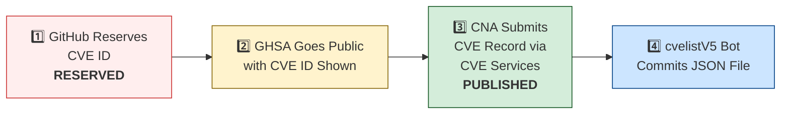

# 🛡️ OpenClaw CVE & Security Advisory Tracker

  
  
  
  
   
  
  
  
  
  

An automated tracker that continuously monitors [OpenClaw](https://github.com/openclaw/openclaw) security advisories across the GitHub Advisory Database, repo-level security advisories, and the [CVE V5 (cvelistV5)](https://github.com/CVEProject/cvelistV5) registry. Every hour it pulls the latest data, reconciles GHSA → CVE publication state, and regenerates this dashboard so you always have an up-to-date picture of the project's vulnerability landscape.

  Last updated: 2026-06-12 01:11 UTC · <a href="LICENSE">MIT License</a> · <a href="ADVISORIES.md">Full Advisory List</a> · <a href="SECURITY.md">Security Policy</a> · Data: <a href="https://github.com/CVEProject/cvelistV5">cvelistV5</a> + <a href="https://github.com/github/advisory-database">Advisory DB</a> · Updates hourly

---

  <a href="#-cves-published-in-cvelistv5-48">Published CVEs</a> ·
  <a href="#-cve-publication-pipeline">Pipeline</a> ·
  <a href="#-all-security-advisories-186">Advisories</a> ·
  <a href="#-vulnerability-categories">Categories</a> ·
  <a href="#-key-insights">Insights</a> ·
  <a href="#-project-identity">Identity</a>

---

## 🏗️ Project Identity

| Field | Value |
|-------|-------|
| **Current Name** | OpenClaw |
| **Previous Names** | Moltbot (second name), Clawdbot (original name) |
| **Repository** | [openclaw/openclaw](https://github.com/openclaw/openclaw) |
| **npm Package** | `openclaw` (formerly `clawdbot`) |
| **Author** | Peter Steinberger (steipete) |

<strong>Search terms for CVE discovery</strong>

To find all CVEs, search for: `openclaw`, `clawdbot`, `moltbot`, `clawhub`, `pkg:npm/clawdbot`, `pkg:npm/openclaw`

---

## 🚀 CVEs Published in cvelistV5 (48)

These CVEs have full records in the [CVEProject/cvelistV5](https://github.com/CVEProject/cvelistV5) repository:

| CVE ID | Severity | CVSS | Title | CWE | Published |
|--------|----------|------|-------|-----|-----------|
| [CVE-2026-32978](https://github.com/openclaw/openclaw/security/advisories/GHSA-qc36-x95h-7j53) |  | 9.4 | OpenClaw < 2026.3.11 - Approval Bypass via Unrecognized Script Runners | CWE-863 | 2026-03-29 |
| [CVE-2026-43585](https://github.com/openclaw/openclaw/security/advisories/GHSA-xmxx-7p24-h892) |  | 9.2 | OpenClaw: Gateway HTTP endpoints re-resolve bearer auth after SecretRef rotation | CWE-672 | 2026-05-06 |
| [CVE-2026-44109](https://github.com/openclaw/openclaw/security/advisories/GHSA-xh72-v6v9-mwhc) |  | 9.2 | OpenClaw: Feishu webhook and card-action validation now fail closed | CWE-1188 | 2026-05-06 |
| [CVE-2026-43566](https://github.com/openclaw/openclaw/security/advisories/GHSA-g2hm-779g-vm32) |  | 9.1 | OpenClaw 2026.4.7 < 2026.4.14 - Privilege Escalation via Untrusted Webhook Wake Events | CWE-184 | 2026-05-05 |
| [CVE-2026-41329](https://github.com/openclaw/openclaw/security/advisories/GHSA-g5cg-8x5w-7jpm) |  | 9 | OpenClaw < 2026.3.31 - Sandbox Bypass via Heartbeat Context Inheritance and senderIsOwner Escalation | CWE-648 | 2026-04-20 |
| [CVE-2026-43581](https://github.com/openclaw/openclaw/security/advisories/GHSA-525j-hqq2-66r4) |  | 9 | OpenClaw < 2026.4.10 - Chrome DevTools Protocol Exposure via Overly Broad CDP Relay Binding | CWE-1188 | 2026-05-06 |
| [CVE-2026-43533](https://github.com/openclaw/openclaw/security/advisories/GHSA-66r7-m7xm-v49h) |  | 8.9 | OpenClaw < 2026.4.10 - Arbitrary Local File Read via QQBot Media Tags | CWE-23 | 2026-05-05 |
| [CVE-2026-24763](https://github.com/openclaw/openclaw/security/advisories/GHSA-mc68-q9jw-2h3v) |  | 8.8 | OpenClaw/Clawdbot Docker Execution has Authenticated Command Injection via PATH Environment Variable | CWE-78 | 2026-02-02 |
| [CVE-2026-25253](https://github.com/openclaw/openclaw/security/advisories/GHSA-g8p2-7wf7-98mq) |  | 8.8 | OpenClaw/Clawdbot has 1-Click RCE via Authentication Token Exfiltration From gatewayUrl | CWE-669 | 2026-02-01 |
| [CVE-2026-32913](https://github.com/openclaw/openclaw/security/advisories/GHSA-6mgf-v5j7-45cr) |  | 8.8 | OpenClaw < 2026.3.7 - Custom Authorization Header Leakage via Cross-Origin Redirects | CWE-522 | 2026-03-23 |
| [CVE-2026-28461](https://github.com/openclaw/openclaw/security/advisories/GHSA-wr6m-jg37-68xh) |  | 8.7 | OpenClaw < 2026.3.1 - Unbounded Memory Growth in Zalo Webhook via Query String Key Churn | CWE-770 | 2026-03-19 |
| [CVE-2026-28478](https://github.com/openclaw/openclaw/security/advisories/GHSA-q447-rj3r-2cgh) |  | 8.7 | OpenClaw affected by denial of service via unbounded webhook request body buffering | CWE-770 | 2026-03-05 |
| [CVE-2026-32062](https://github.com/openclaw/openclaw/security/advisories/GHSA-mfg5-7q5g-f37j) |  | 8.7 | OpenClaw 2026.2.21-2 < 2026.2.22 - Unauthenticated WebSocket Resource Exhaustion via Media Stream | CWE-770 | 2026-03-11 |
| [CVE-2026-32846](https://github.com/openclaw/openclaw/security/advisories/GHSA-f6pf-4gjx-c94r) |  | 8.7 | OpenClaw Media Parsing Path Traversal to Arbitrary File Read | CWE-22 | 2026-03-26 |
| [CVE-2026-35669](https://github.com/openclaw/openclaw/security/advisories/GHSA-qm2m-28pf-hgjw) |  | 8.7 | OpenClaw < 2026.3.25 - Privilege Escalation via Gateway Plugin HTTP Authentication Scope | CWE-648 | 2026-04-10 |
| [CVE-2026-42434](https://github.com/openclaw/openclaw/security/advisories/GHSA-736r-jwj6-4w23) |  | 8.7 | OpenClaw: Sandboxed agents could escape exec routing via host=node override | CWE-863 | 2026-05-05 |
| [CVE-2026-43530](https://github.com/openclaw/openclaw/security/advisories/GHSA-2cq5-mf3v-mx44) |  | 8.7 | OpenClaw: busybox and toybox applet execution weakened exec approval binding | CWE-863 | 2026-05-05 |
| [CVE-2026-53819](https://github.com/openclaw/openclaw/security/advisories/GHSA-8wg3-5mcm-fjq8) |  | 8.7 | OpenClaw < 2026.5.27 - Arbitrary Homebrew Executable Execution via Workspace .env Override | CWE-426 | 2026-06-11 |
| [CVE-2026-32920](https://github.com/openclaw/openclaw/security/advisories/GHSA-99qw-6mr3-36qr) |  | 8.6 | OpenClaw < 2026.3.12 - Arbitrary Code Execution via Auto-Discovery of Workspace Plugins | CWE-829 | 2026-03-31 |
| [CVE-2026-41384](https://github.com/openclaw/openclaw/security/advisories/GHSA-vfw7-6rhc-6xxg) |  | 8.5 | OpenClaw < 2026.3.24 - Environment Variable Injection via Workspace Config in CLI Backend | CWE-15 | 2026-04-28 |
| [CVE-2026-44114](https://github.com/openclaw/openclaw/security/advisories/GHSA-hxvm-xjvf-93f3) |  | 8.5 | OpenClaw: Workspace dotenv could override runtime-control environment variables | CWE-184 | 2026-05-06 |
| [CVE-2026-44118](https://github.com/openclaw/openclaw/security/advisories/GHSA-r6xh-pqhr-v4xh) |  | 8.5 | OpenClaw < 2026.4.22 - Owner Context Spoofing via Bearer Token Header | CWE-290 | 2026-05-06 |
| [CVE-2026-35641](https://github.com/openclaw/openclaw/security/advisories/GHSA-m3mh-3mpg-37hw) |  | 8.4 | OpenClaw < 2026.3.24 - Arbitrary Code Execution via .npmrc in Local Plugin/Hook Installation | CWE-349 | 2026-04-10 |
| [CVE-2026-45004](https://github.com/openclaw/openclaw/security/advisories/GHSA-r39h-4c2p-3jxp) |  | 8.4 | OpenClaw vulnerable to arbitrary code execution via attacker-controlled setup-api.js loaded from cwd during env-key resolution | CWE-427 | 2026-05-11 |
| [CVE-2026-43526](https://github.com/openclaw/openclaw/security/advisories/GHSA-2767-2q9v-9326) |  | 8.3 | OpenClaw: QQBot reply media URL handling could trigger SSRF and re-upload fetched bytes | CWE-918 | 2026-05-05 |
| [CVE-2026-28469](https://github.com/openclaw/openclaw/security/advisories/GHSA-rq6g-px6m-c248) |  | 8.2 | OpenClaw Google Chat shared-path webhook target ambiguity allowed cross-account policy-context misrouting | CWE-639 | 2026-03-05 |
| [CVE-2026-25157](https://github.com/openclaw/openclaw/security/advisories/GHSA-q284-4pvr-m585) |  | 7.8 | OpenClaw/Clawdbot has OS Command Injection via Project Root Path in sshNodeCommand | CWE-78 | 2026-02-04 |
| [CVE-2026-43569](https://github.com/openclaw/openclaw/security/advisories/GHSA-939r-rj45-g2rj) |  | 7.7 | OpenClaw: Workspace provider auth choices could auto-enable untrusted provider plugins | CWE-829 | 2026-05-05 |
| [CVE-2026-43571](https://github.com/openclaw/openclaw/security/advisories/GHSA-82qx-6vj7-p8m2) |  | 7.7 | OpenClaw: Channel setup catalog lookups could include untrusted workspace plugin shadows | CWE-829 | 2026-05-05 |
| [CVE-2026-44110](https://github.com/openclaw/openclaw/security/advisories/GHSA-2gvc-4f3c-2855) |  | 7.7 | OpenClaw: Matrix room control-command authorization no longer trusts DM pairing-store entries | CWE-863 | 2026-05-06 |
| [CVE-2026-53810](https://github.com/openclaw/openclaw/security/advisories/GHSA-v6r2-jh58-xx6w) |  | 7.7 | OpenClaw < 2026.5.18 - Arbitrary Code Execution via Unscanned Marketplace Runtime Extension Metadata | CWE-829 | 2026-06-11 |
| [CVE-2026-26322](https://github.com/openclaw/openclaw/security/advisories/GHSA-g6q9-8fvw-f7rf) |  | 7.6 | OpenClaw Gateway tool allowed unrestricted gatewayUrl override | CWE-918 | 2026-02-19 |
| [CVE-2026-41353](https://github.com/openclaw/openclaw/security/advisories/GHSA-h5hg-h7rr-gpf3) |  | 7.6 | OpenClaw < 2026.3.22 - allowProfiles Bypass via Profile Mutation and Runtime Selection | CWE-472 | 2026-04-23 |
| [CVE-2026-42431](https://github.com/openclaw/openclaw/security/advisories/GHSA-cmfr-9m2r-xwhq) |  | 7.6 | OpenClaw < 2026.4.8 - Persistent Profile Mutation via node.invoke(browser.proxy) Bypass | CWE-863 | 2026-04-28 |
| [CVE-2026-43535](https://github.com/openclaw/openclaw/security/advisories/GHSA-jwrq-8g5x-5fhm) |  | 7.6 | OpenClaw < 2026.4.14 - Authorization Context Reuse in Collect-Mode Queue Batches | CWE-266 | 2026-05-05 |
| [CVE-2026-26319](https://github.com/openclaw/openclaw/security/advisories/GHSA-4hg8-92x6-h2f3) |  | 7.5 | OpenClaw has Missing Webhook Authentication in Telnyx Provider Allowing Unauthenticated Requests | CWE-306 | 2026-02-19 |
| [CVE-2026-25474](https://github.com/openclaw/openclaw/security/advisories/GHSA-mp5h-m6qj-6292) |  | 7.5 | OpenClaw has a Telegram webhook request forgery (missing `channels.telegram.webhookSecret`) → auth bypass | CWE-345 | 2026-02-19 |
| [CVE-2026-28458](https://github.com/openclaw/openclaw/security/advisories/GHSA-mr32-vwc2-5j6h) |  | 7.4 | OpenClaw's Browser Relay /cdp websocket is missing auth which could allow cross-tab cookie access | CWE-306 | 2026-03-05 |
| [CVE-2026-41342](https://github.com/openclaw/openclaw/security/advisories/GHSA-3cw3-5vxw-g2h3) |  | 7.4 | OpenClaw < 2026.3.28 - Unauthenticated Discovery Endpoint Credential Exfiltration via Remote Onboarding | CWE-346 | 2026-04-23 |
| [CVE-2026-27566](https://github.com/openclaw/openclaw/security/advisories/GHSA-jj82-76v6-933r) |  | 7.1 | OpenClaw < 2026.2.22 - Allowlist Bypass via Wrapper Binary Unwrapping in system.run | CWE-78 | 2026-03-19 |
| [CVE-2026-26327](https://github.com/openclaw/openclaw/security/advisories/GHSA-pv58-549p-qh99) |  | 7.1 | OpenClaw allows unauthenticated discovery TXT records to steer routing and TLS pinning | CWE-345 | 2026-02-19 |
| [CVE-2026-22175](https://github.com/openclaw/openclaw/security/advisories/GHSA-gwqp-86q6-w47g) |  | 7.1 | OpenClaw < 2026.2.23 - Exec Approval Bypass via Unrecognized Multiplexer Shell Wrappers | CWE-184 | 2026-03-18 |
| [CVE-2026-22169](https://github.com/openclaw/openclaw/security/advisories/GHSA-vmqr-rc7x-3446) |  | 7.1 | OpenClaw < 2026.2.22 - Allowlist Bypass via sort Configuration in safeBins | CWE-78 | 2026-03-18 |
| [CVE-2026-27522](https://github.com/openclaw/openclaw/security/advisories/GHSA-fqcm-97m6-w7rm) |  | 7.1 | OpenClaw < 2026.2.24 - Arbitrary File Read via sendAttachment and setGroupIcon Message Actions | CWE-22 | 2026-03-18 |
| [CVE-2026-26317](https://github.com/openclaw/openclaw/security/advisories/GHSA-3fqr-4cg8-h96q) |  | 7.1 | OpenClaw affected by cross-site request forgery (CSRF) through loopback browser mutation endpoints | CWE-352 | 2026-02-19 |
| [CVE-2026-32976](https://github.com/openclaw/openclaw/security/advisories/GHSA-8jhh-jcqg-mj5p) |  | 7.1 | OpenClaw < 2026.3.11 - Account-Scoped configWrites Policy Bypass via Channel Commands | CWE-639 | 2026-03-31 |
| [CVE-2026-35644](https://github.com/openclaw/openclaw/security/advisories/GHSA-ppwq-6v66-5m6j) |  | 7.1 | OpenClaw < 2026.3.22 - Credential Exposure via baseUrl Fields in Gateway Snapshots | CWE-312 | 2026-04-09 |
| [CVE-2026-35668](https://github.com/openclaw/openclaw/security/advisories/GHSA-hr5v-j9h9-xjhg) |  | 7.1 | OpenClaw < 2026.3.24 - Sandbox Media Root Bypass via Unnormalized mediaUrl and fileUrl Parameters | CWE-22 | 2026-04-10 |
| [CVE-2026-41368](https://github.com/openclaw/openclaw/security/advisories/GHSA-jccr-rrw2-vc8h) |  | 7.1 | OpenClaw < 2026.3.28 - Environment Variable Disclosure via jq $ENV Filter Bypass | CWE-668 | 2026-04-27 |
| [CVE-2026-41369](https://github.com/openclaw/openclaw/security/advisories/GHSA-cg7q-fg22-4g98) |  | 7.1 | OpenClaw < 2026.3.31 - Insufficient Environment Variable Sanitization in Host Execution | CWE-668 | 2026-04-27 |
| [CVE-2026-41385](https://github.com/openclaw/openclaw/security/advisories/GHSA-jjw7-3vjf-fg5j) |  | 7.1 | OpenClaw < 2026.3.31 - Nostr Private Key Exposure via config.get Redaction Bypass | CWE-312 | 2026-04-28 |
| [CVE-2026-41375](https://github.com/openclaw/openclaw/security/advisories/GHSA-h2v7-xc88-xx8c) |  | 7.1 | OpenClaw < 2026.3.28 - Authorization Bypass in /phone arm and /phone disarm Endpoints | CWE-863 | 2026-04-28 |
| [CVE-2026-42433](https://github.com/openclaw/openclaw/security/advisories/GHSA-7jp6-r74r-995q) |  | 7.1 | OpenClaw: Matrix profile config persistence was reachable from operator.write message tools | CWE-862 | 2026-05-05 |
| [CVE-2026-43568](https://github.com/openclaw/openclaw/security/advisories/GHSA-5gjc-grvm-m88j) |  | 7.1 | OpenClaw 2026.4.5 < 2026.4.10 - Privilege Escalation via Memory Dreaming Configuration in /dreaming Endpoint | CWE-862 | 2026-05-05 |
| [CVE-2026-43567](https://github.com/openclaw/openclaw/security/advisories/GHSA-jf25-7968-h2h5) |  | 7.1 | OpenClaw < 2026.4.10 - Path Traversal in screen_record outPath Parameter | CWE-862 | 2026-05-05 |
| [CVE-2026-53815](https://github.com/openclaw/openclaw/security/advisories/GHSA-q7q8-3mgw-q67r) |  | 7.1 | OpenClaw < 2026.5.19 - Channel Allowlist Bypass in Message Read Actions | CWE-862 | 2026-06-11 |
| [CVE-2026-43531](https://github.com/openclaw/openclaw/security/advisories/GHSA-7wv4-cc7p-jhxc) |  | 7 | OpenClaw < 2026.4.9 - Environment Variable Injection via Workspace .env File | CWE-15 | 2026-05-05 |
| [CVE-2026-27003](https://github.com/openclaw/openclaw/security/advisories/GHSA-chf7-jq6g-qrwv) |  | 6.9 | OpenClaw: Telegram bot token exposure via logs | CWE-522 | 2026-02-19 |
| [CVE-2026-28480](https://github.com/openclaw/openclaw/security/advisories/GHSA-mj5r-hh7j-4gxf) |  | 6.9 | OpenClaw Telegram allowlist authorization accepted mutable usernames | CWE-290 | 2026-03-05 |
| [CVE-2026-32975](https://github.com/openclaw/openclaw/security/advisories/GHSA-f5mf-3r52-r83w) |  | 6.9 | OpenClaw < 2026.3.12 - Weak Authorization via Mutable Group Names in Zalouser Allowlist | CWE-807 | 2026-03-29 |
| [CVE-2026-35627](https://github.com/openclaw/openclaw/security/advisories/GHSA-65h8-27jh-q8wv) |  | 6.9 | OpenClaw < 2026.3.22 - Unauthenticated Cryptographic Work in Nostr Inbound DM Handling | CWE-696 | 2026-04-09 |
| [CVE-2026-35655](https://github.com/openclaw/openclaw/security/advisories/GHSA-74wf-h43j-vvmj) |  | 6.9 | OpenClaw < 2026.3.22 - Identity Spoofing via rawInput Tool in ACP Permission Resolution | CWE-807 | 2026-04-10 |
| [CVE-2026-35665](https://github.com/openclaw/openclaw/security/advisories/GHSA-w6m8-cqvj-pg5v) |  | 6.9 | OpenClaw < 2026.3.24 - Denial of Service via Feishu Webhook Pre-Auth Body Parsing | CWE-405 | 2026-04-10 |
| [CVE-2026-35664](https://github.com/openclaw/openclaw/security/advisories/GHSA-77w2-crqv-cmv3) |  | 6.9 | OpenClaw < 2026.3.25 - DM Pairing Bypass via Legacy Card Callbacks | CWE-288 | 2026-04-10 |
| [CVE-2026-41331](https://github.com/openclaw/openclaw/security/advisories/GHSA-m6fx-m8hc-572m) |  | 6.9 | OpenClaw < 2026.3.31 - Resource Consumption via Unauthorized Telegram Audio Preflight Transcription | CWE-408 | 2026-04-20 |
| [CVE-2026-41300](https://github.com/openclaw/openclaw/security/advisories/GHSA-9f4w-67g7-mqwv) |  | 6.9 | OpenClaw < 2026.3.31 - Attacker-Discovered Endpoint Preservation in Remote Onboarding | CWE-372 | 2026-04-20 |
| [CVE-2026-41374](https://github.com/openclaw/openclaw/security/advisories/GHSA-hhff-fj5f-qg48) |  | 6.9 | OpenClaw < 2026.3.31 - Resource Consumption via Discord Audio Preflight Before Member Authorization | CWE-408 | 2026-04-28 |
| [CVE-2026-41372](https://github.com/openclaw/openclaw/security/advisories/GHSA-fh32-73r9-rgh5) |  | 6.9 | OpenClaw < 2026.4.2 - Loopback Protection Bypass via Trailing-Dot Localhost in CDP Discovery | CWE-639 | 2026-04-27 |
| [CVE-2026-41400](https://github.com/openclaw/openclaw/security/advisories/GHSA-2w79-r9g8-wmcr) |  | 6.9 | OpenClaw < 2026.3.31 - Resource Consumption via Oversized WebSocket Frames in voice-call | CWE-770 | 2026-04-28 |
| [CVE-2026-44116](https://github.com/openclaw/openclaw/security/advisories/GHSA-2hh7-c75g-qj2r) |  | 6.9 | OpenClaw < 2026.4.22 - Server-Side Request Forgery in Zalo Photo URL Validation | CWE-918 | 2026-05-06 |
| [CVE-2026-29612](https://github.com/openclaw/openclaw/security/advisories/GHSA-w2cg-vxx6-5xjg) |  | 6.8 | OpenClaw < 2026.2.14 - Denial of Service via Large Base64 Media File Decoding | CWE-770 | 2026-03-05 |
| [CVE-2026-26972](https://github.com/openclaw/openclaw/security/advisories/GHSA-xwjm-j929-xq7c) |  | 6.7 | OpenClaw has a Path Traversal in Browser Download Functionality | CWE-22 | 2026-02-19 |
| [CVE-2026-28452](https://github.com/openclaw/openclaw/security/advisories/GHSA-h89v-j3x9-8wqj) |  | 6.7 | OpenClaw affected by denial of service through unguarded archive extraction allowing high expansion/resource abuse (ZIP/TAR) | CWE-770 | 2026-03-05 |
| [CVE-2026-32044](https://github.com/openclaw/openclaw/security/advisories/GHSA-77hf-7fqf-f227) |  | 6.7 | OpenClaw < 2026.3.2 - Tar Archive Safety Bypass in Skills Installation | CWE-409 | 2026-03-21 |
| [CVE-2026-26328](https://github.com/openclaw/openclaw/security/advisories/GHSA-g34w-4xqq-h79m) |  | 6.5 | OpenClaw iMessage group allowlist authorization inherited DM pairing-store identities | CWE-284, CWE-863 | 2026-02-19 |
| [CVE-2026-28475](https://github.com/openclaw/openclaw/security/advisories/GHSA-47q7-97xp-m272) |  | 6.3 | OpenClaw < 2026.2.13 - Timing Attack via Hook Token Comparison | CWE-208 | 2026-03-05 |
| [CVE-2026-29606](https://github.com/openclaw/openclaw/security/advisories/GHSA-c37p-4qqg-3p76) |  | 6.3 | OpenClaw < 2026.2.14 - Webhook Signature Verification Bypass via ngrok Loopback Compatibility | CWE-306 | 2026-03-05 |
| [CVE-2026-32896](https://github.com/openclaw/openclaw/security/advisories/GHSA-5mx2-2mgw-x8rm) |  | 6.3 | OpenClaw < 2026.2.21 - Unauthenticated Webhook Access via Passwordless Fallback in BlueBubbles Plugin | CWE-306 | 2026-03-21 |
| [CVE-2026-35656](https://github.com/openclaw/openclaw/security/advisories/GHSA-844j-xrrq-wgh4) |  | 6.3 | OpenClaw < 2026.3.22 - XFF Loopback Spoofing Bypass in Canvas Authentication and Rate Limiter | CWE-290 | 2026-04-10 |
| [CVE-2026-35646](https://github.com/openclaw/openclaw/security/advisories/GHSA-mf5g-6r6f-ghhm) |  | 6.3 | OpenClaw < 2026.3.25 - Pre-Authentication Rate-Limit Bypass in Webhook Token Validation | CWE-307 | 2026-04-09 |
| [CVE-2026-41346](https://github.com/openclaw/openclaw/security/advisories/GHSA-wwfp-w96m-c6x8) |  | 6.3 | OpenClaw 2026.2.26 < 2026.3.31 - Denial of Service via Improper Pending Pairing Request Cap Enforcement | CWE-799 | 2026-04-23 |
| [CVE-2026-41389](https://github.com/openclaw/openclaw/security/advisories/GHSA-mr34-9552-qr95) |  | 6.3 | OpenClaw: Webchat media embedding enforces local-root containment for tool-result files | CWE-73 | 2026-04-20 |
| [CVE-2026-41388](https://github.com/openclaw/openclaw/security/advisories/GHSA-3pm9-5j7m-59vc) |  | 6.3 | OpenClaw < 2026.3.31 - Configuration Rehydration via Empty-Array Revocation Handling | CWE-372 | 2026-04-28 |
| [CVE-2026-41403](https://github.com/openclaw/openclaw/security/advisories/GHSA-3xv9-89fm-7h4r) |  | 6.3 | OpenClaw < 2026.3.31 - Access Control Bypass via Proxied Remote Request Misclassification | CWE-807 | 2026-04-28 |
| [CVE-2026-43527](https://github.com/openclaw/openclaw/security/advisories/GHSA-53vx-pmqw-863c) |  | 6.3 | OpenClaw: Browser SSRF policy default allowed private-network navigation | CWE-918, CWE-1188 | 2026-05-05 |
| [CVE-2026-44117](https://github.com/openclaw/openclaw/security/advisories/GHSA-c4qg-j8jg-42q5) |  | 6.3 | OpenClaw < 2026.4.20 - Server-Side Request Forgery in QQBot Direct Media Upload | CWE-918 | 2026-05-06 |
| [CVE-2026-43572](https://github.com/openclaw/openclaw/security/advisories/GHSA-gc9r-867r-j85f) |  | 6.3 | OpenClaw 2026.4.10 < 2026.4.14 - Missing Sender Authorization in Microsoft Teams SSO Invoke Handler | CWE-862 | 2026-05-05 |
| [CVE-2026-45002](https://github.com/openclaw/openclaw/security/advisories/GHSA-2xcp-x87w-q377) |  | 6.3 | OpenClaw < 2026.4.20 - Hook Session-Key Bypass via Template Mapping | CWE-863 | 2026-05-11 |
| [CVE-2026-44999](https://github.com/openclaw/openclaw/security/advisories/GHSA-57r2-h2wj-g887) |  | 6.3 | OpenClaw < 2026.4.20 - Improper Trust Labeling in Isolated Cron Awareness Events | CWE-345 | 2026-05-11 |
| [CVE-2026-32002](https://github.com/openclaw/openclaw/security/advisories/GHSA-q6qf-4p5j-r25g) |  | 6 | OpenClaw < 2026.2.23 - Sandbox Boundary Bypass via Image Tool workspaceOnly Bypass | CWE-200 | 2026-03-19 |
| [CVE-2026-32033](https://github.com/openclaw/openclaw/security/advisories/GHSA-27cr-4p5m-74rj) |  | 6 | OpenClaw < 2026.2.24 - Path Traversal via @-prefixed Absolute Paths in Workspace Boundary Validation | CWE-22 | 2026-03-19 |
| [CVE-2026-41363](https://github.com/openclaw/openclaw/security/advisories/GHSA-qf48-qfv4-jjm9) |  | 6 | OpenClaw 2026.2.6 < 2026.3.28 - Arbitrary File Read via Feishu upload_image Parameter | CWE-22 | 2026-04-27 |
| [CVE-2026-41366](https://github.com/openclaw/openclaw/security/advisories/GHSA-57gh-m6rq-54cf) |  | 6 | OpenClaw < 2026.3.31 - Arbitrary Host File Read via appendLocalMediaParentRoots Self-Whitelisting | CWE-732 | 2026-04-27 |
| [CVE-2026-43579](https://github.com/openclaw/openclaw/security/advisories/GHSA-f3h5-h452-vp3j) |  | 6 | OpenClaw < 2026.4.10 - Insufficient Access Control in Nostr Profile Mutation Routes | CWE-862 | 2026-05-06 |
| [CVE-2026-44112](https://github.com/openclaw/openclaw/security/advisories/GHSA-wppj-c6mr-83jj) |  | 6 | OpenClaw < 2026.4.22 - Symlink Swap Race Condition in OpenShell FS Bridge Writes | CWE-367 | 2026-05-06 |
| [CVE-2026-44113](https://github.com/openclaw/openclaw/security/advisories/GHSA-5h3g-6xhh-rg6p) |  | 6 | OpenClaw: OpenShell FS bridge reads pin and verify the opened file before returning bytes | CWE-367 | 2026-05-06 |
| [CVE-2026-43570](https://github.com/openclaw/openclaw/security/advisories/GHSA-cr8r-7g2h-6wr6) |  | 6 | OpenClaw contains a symlink traversal vulnerability | CWE-61 | 2026-05-05 |
| [CVE-2026-45005](https://github.com/openclaw/openclaw/security/advisories/GHSA-q8ff-7ffm-m3r9) |  | 5.9 | OpenClaw < 2026.4.23 - Webhook Route Secret Cache Not Invalidated After Rotation | CWE-672 | 2026-05-11 |
| [CVE-2026-32010](https://github.com/openclaw/openclaw/security/advisories/GHSA-4gc7-qcvf-38wg) |  | 5.8 | OpenClaw < 2026.2.22 - Allowlist Bypass via sort --compress-program Parameter | CWE-78 | 2026-03-19 |
| [CVE-2026-31995](https://github.com/openclaw/openclaw/security/advisories/GHSA-fg3m-vhrr-8gj6) |  | 5.8 | OpenClaw 2026.1.21 < 2026.2.19 - Command Injection via Windows Shell Fallback in Lobster Extension | CWE-78 | 2026-03-19 |
| [CVE-2026-33574](https://github.com/openclaw/openclaw/security/advisories/GHSA-vhwf-4x96-vqx2) |  | 5.8 | OpenClaw < 2026.3.8 - Path Traversal via Tools Root Rebinding in Skills Download | CWE-367 | 2026-03-29 |
| [CVE-2026-42427](https://github.com/openclaw/openclaw/security/advisories/GHSA-7437-7hg8-frrw) |  | 5.8 | OpenClaw < 2026.4.8 - Remote Code Execution via Build Tool Environment Variable Injection | CWE-184 | 2026-04-28 |
| [CVE-2026-41915](https://github.com/openclaw/openclaw/security/advisories/GHSA-cm8v-2vh9-cxf3) |  | 5.8 | OpenClaw < 2026.4.8 - Git Environment Variable Injection via Unfiltered Exec Environment | CWE-184 | 2026-04-28 |
| [CVE-2026-31993](https://github.com/openclaw/openclaw/security/advisories/GHSA-5f9p-f3w2-fwch) |  | 5.6 | OpenClaw < 2026.2.22 - Allowlist Parsing Mismatch in system.run Shell Chains | CWE-184 | 2026-03-19 |
| [CVE-2026-41360](https://github.com/openclaw/openclaw/security/advisories/GHSA-w6wx-jq6j-6mcj) |  | 5.4 | OpenClaw < 2026.4.2 - Approval Integrity Bypass in pnpm dlx Local Script Binding | CWE-367 | 2026-04-23 |
| [CVE-2026-41355](https://github.com/openclaw/openclaw/security/advisories/GHSA-42mx-vp8m-j7qh) |  | 5.4 | OpenShell < 2026.3.28 - Arbitrary Code Execution via Mirror Mode Sandbox File Conversion | CWE-829 | 2026-04-23 |
| [CVE-2026-41392](https://github.com/openclaw/openclaw/security/advisories/GHSA-wpc6-37g7-8q4w) |  | 5.4 | OpenClaw < 2026.3.31 - Exec Allowlist Bypass via Shell Init-File Options | CWE-184 | 2026-04-28 |
| [CVE-2026-44995](https://github.com/openclaw/openclaw/security/advisories/GHSA-mj59-h3q9-ghfh) |  | 5.4 | OpenClaw: MCP stdio server env could load dangerous startup variables from workspace config | CWE-829 | 2026-05-11 |
| [CVE-2026-35642](https://github.com/openclaw/openclaw/security/advisories/GHSA-mw7w-g3mg-xqm7) |  | 5.3 | OpenClaw < 2026.3.25 - Authorization Bypass in Group Reactions via requireMention Bypass | CWE-288 | 2026-04-09 |
| [CVE-2026-41344](https://github.com/openclaw/openclaw/security/advisories/GHSA-5h2w-qmfp-ggp6) |  | 5.3 | OpenClaw < 2026.3.28 - Privilege Escalation via chat.send /verbose Parameter | CWE-863 | 2026-04-23 |
| [CVE-2026-41361](https://github.com/openclaw/openclaw/security/advisories/GHSA-g86v-f9qv-rh6m) |  | 5.1 | OpenClaw < 2026.3.28 - SSRF Guard Bypass via IPv6 Special-Use Ranges | CWE-184 | 2026-04-23 |
| [CVE-2026-42438](https://github.com/openclaw/openclaw/security/advisories/GHSA-jhpv-5j76-m56h) |  | 4.9 | OpenClaw: Sender policy bypass in host media attachment reads allows unauthorized local file disclosure | CWE-863 | 2026-05-05 |
| [CVE-2026-42439](https://github.com/openclaw/openclaw/security/advisories/GHSA-rj2p-j66c-mgqh) |  | 4.9 | OpenClaw < 2026.4.10 - SSRF Policy Bypass in Browser Tabs Action Routes | CWE-862 | 2026-05-05 |
| [CVE-2026-43576](https://github.com/openclaw/openclaw/security/advisories/GHSA-f7fh-qg34-x2xh) |  | 4.9 | OpenClaw < 2026.4.5 - Second-hop SSRF via CDP /json/version WebSocket URL | CWE-601, CWE-918 | 2026-05-06 |
| [CVE-2026-43580](https://github.com/openclaw/openclaw/security/advisories/GHSA-536q-mj95-h29h) |  | 4.9 | OpenClaw: Browser press/type interaction routes missed complete navigation guard coverage | CWE-862 | 2026-05-06 |
| [CVE-2026-43582](https://github.com/openclaw/openclaw/security/advisories/GHSA-xq94-r468-qwgj) |  | 4.9 | OpenClaw < 2026.4.10 - DNS Rebinding SSRF via Hostname Validation Bypass | CWE-367 | 2026-05-06 |
| [CVE-2026-43573](https://github.com/openclaw/openclaw/security/advisories/GHSA-527m-976r-jf79) |  | 4.9 | OpenClaw: Existing-session browser interaction routes bypassed SSRF policy enforcement | CWE-862, CWE-918 | 2026-05-05 |
| [CVE-2026-32046](https://github.com/openclaw/openclaw/security/advisories/GHSA-43x4-g22p-3hrq) |  | 4.8 | OpenClaw < 2026.2.21 - OS-level Sandbox Bypass via --no-sandbox Flag | CWE-1188 | 2026-03-21 |
| [CVE-2026-41302](https://github.com/openclaw/openclaw/security/advisories/GHSA-9q7v-8mr7-g23p) |  | 4.8 | OpenClaw < 2026.3.31 - Server-Side Request Forgery via Unguarded fetch() in Marketplace Plugin Download | CWE-918 | 2026-04-20 |
| [CVE-2026-41912](https://github.com/openclaw/openclaw/security/advisories/GHSA-vr5g-mmx7-h897) |  | 4.8 | OpenClaw < 2026.4.8 - Server-Side Request Forgery Policy Bypass via Interaction-Triggered Navigation | CWE-918 | 2026-04-28 |
| [CVE-2026-27486](https://github.com/openclaw/openclaw/security/advisories/GHSA-jfv4-h8mc-jcp8) |  | 4.3 | OpenClaw: Process Safety - Unvalidated PID Kill via SIGKILL in Process Cleanup | CWE-283 | 2026-02-21 |
| [CVE-2026-45003](https://github.com/openclaw/openclaw/security/advisories/GHSA-55cf-xx38-4p9p) |  | 4.1 | OpenClaw: Workspace dotenv files cannot override connector endpoint hosts | CWE-441 | 2026-05-11 |
| [CVE-2026-44992](https://github.com/openclaw/openclaw/security/advisories/GHSA-h2vw-ph2c-jvwf) |  | 4.1 | OpenClaw 2026.4.5 < 2026.4.20 - MiniMax API Host Override via Workspace dotenv | CWE-441 | 2026-05-11 |
| [CVE-2026-24764](https://github.com/openclaw/openclaw/security/advisories/GHSA-782p-5fr5-7fj8) |  | 3.7 | OpenClaw has Remote Code Execution via System Prompt Injection in Slack Channel Descriptions | CWE-74, CWE-94 | 2026-02-19 |
| [CVE-2026-32006](https://github.com/openclaw/openclaw/security/advisories/GHSA-25pw-4h6w-qwvm) |  | 2.3 | OpenClaw < 2026.2.26 - Authorization Bypass via DM Pairing-Store Fallback in Group Allowlist | CWE-863 | 2026-03-19 |
| [CVE-2026-41347](https://github.com/openclaw/openclaw/security/advisories/GHSA-mhr7-2xmv-4c4q) |  | 2.3 | OpenClaw < 2026.3.31 - Cross-Site Request Forgery via Missing Browser-Origin Validation in HTTP Operator Endpoints | CWE-352 | 2026-04-23 |
| [CVE-2026-41356](https://github.com/openclaw/openclaw/security/advisories/GHSA-rfqg-qgf8-xr9x) |  | 2.3 | OpenClaw < 2026.3.31 - Incomplete WebSocket Session Termination in device.token.rotate | CWE-613 | 2026-04-23 |
| [CVE-2026-41358](https://github.com/openclaw/openclaw/security/advisories/GHSA-qm77-8qjp-4vcm) |  | 2.3 | OpenClaw < 2026.4.2 - Sender Allowlist Bypass via Slack Thread Context | CWE-346 | 2026-04-23 |
| [CVE-2026-41908](https://github.com/openclaw/openclaw/security/advisories/GHSA-v8qf-fr4g-28p2) |  | 2.3 | OpenClaw < 2026.4.20 - Scope Enforcement Bypass in Assistant-Media Route | CWE-863 | 2026-04-23 |
| [CVE-2026-41382](https://github.com/openclaw/openclaw/security/advisories/GHSA-x2m8-53h4-6hch) |  | 2.3 | OpenClaw < 2026.3.31 - Discord Voice Ingress Authorization Bypass via Channel and Role Validation Gaps | CWE-862 | 2026-04-28 |
| [CVE-2026-44991](https://github.com/openclaw/openclaw/security/advisories/GHSA-c28g-vh7m-fm7v) |  | 2.3 | OpenClaw: Owner-enforced commands could accept wildcard channel senders as command owners | CWE-863 | 2026-05-11 |
| [CVE-2026-44993](https://github.com/openclaw/openclaw/security/advisories/GHSA-72q8-jcmc-97wx) |  | 2.3 | OpenClaw < 2026.4.20 - Direct Message Misclassification in Feishu Card Actions | CWE-184 | 2026-05-11 |
| [CVE-2026-44997](https://github.com/openclaw/openclaw/security/advisories/GHSA-q3jj-46pq-826r) |  | 2.3 | OpenClaw < 2026.4.22 - Security Envelope Constraint Bypass in ACP Child Sessions | CWE-266 | 2026-05-11 |

<strong>📖 Detailed CVE Analysis (click to expand)</strong>

### CVE-2026-32978 — OpenClaw < 2026.3.11 - Approval Bypass via Unrecognized Script Runners

| Field | Detail |
|-------|--------|
| **CVSS** | 9.4 (CRITICAL) — `CVSS:4.0/AV:N/AC:L/AT:N/PR:L/UI:P/VC:H/VI:H/VA:H/SC:H/SI:H/SA:H` |
| **CWE** | CWE-863 (Incorrect Authorization) |
| **Affected** | < 2026.3.11 |
| **Vendor/Product** | OpenClaw / OpenClaw |
| **Advisory** | [GHSA-qc36-x95h-7j53](https://github.com/openclaw/openclaw/security/advisories/GHSA-qc36-x95h-7j53) |

OpenClaw before 2026.3.11 contains an approval integrity vulnerability where system.run approvals fail to bind mutable file operands for certain script runners like tsx and jiti. Attackers can obtain approval for benign script commands, rewrite referenced scripts on disk, and execute modified code under the approved run context.

**References:**
- [VulnCheck Advisory: OpenClaw < 2026.3.11 - Approval Bypass via Unrecognized Script Runners](https://www.vulncheck.com/advisories/openclaw-approval-bypass-via-unrecognized-script-runners)
---

### CVE-2026-43585 — OpenClaw: Gateway HTTP endpoints re-resolve bearer auth after SecretRef rotation

| Field | Detail |
|-------|--------|
| **CVSS** | 9.2 (CRITICAL) — `CVSS:4.0/AV:N/AC:H/AT:P/PR:N/UI:N/VC:H/VI:H/VA:H/SC:N/SI:N/SA:N` |
| **CWE** | CWE-672 (Operation on a Resource after Expiration or Release) |
| **Affected** | < 2026.4.15 |
| **Vendor/Product** | OpenClaw / OpenClaw |
| **Advisory** | [GHSA-xmxx-7p24-h892](https://github.com/openclaw/openclaw/security/advisories/GHSA-xmxx-7p24-h892) |

OpenClaw before 2026.4.15 captures resolved bearer-auth configuration at startup, allowing revoked tokens to remain valid after SecretRef rotation. Gateway HTTP and WebSocket handlers fail to re-resolve authentication per-request, enabling attackers to use rotated-out bearer tokens for unauthorized gateway access.

**References:**
- [Patch Commit](https://github.com/openclaw/openclaw/commit/acd4e0a32f12e1ad85f3130f63b42443ce90f094)
- [VulnCheck Advisory: OpenClaw < 2026.4.15 - Bearer Token Validation Bypass via Stale SecretRef Resolution](https://www.vulncheck.com/advisories/openclaw-bearer-token-validation-bypass-via-stale-secretref-resolution)
---

### CVE-2026-44109 — OpenClaw: Feishu webhook and card-action validation now fail closed

| Field | Detail |
|-------|--------|
| **CVSS** | 9.2 (CRITICAL) — `CVSS:4.0/AV:N/AC:L/AT:P/PR:N/UI:N/VC:H/VI:H/VA:H/SC:N/SI:N/SA:N` |
| **CWE** | CWE-1188 (CWE-1188 Initialization of a Resource with an Insecure Default) |
| **Affected** | < 2026.4.15 |
| **Vendor/Product** | OpenClaw / OpenClaw |
| **Advisory** | [GHSA-xh72-v6v9-mwhc](https://github.com/openclaw/openclaw/security/advisories/GHSA-xh72-v6v9-mwhc) |

OpenClaw before 2026.4.15 contains an authentication bypass vulnerability in Feishu webhook and card-action validation that allows unauthenticated requests to reach command dispatch. Missing encryptKey configuration and blank callback tokens fail open instead of rejecting requests, enabling attackers to bypass signature verification and replay protection to execute arbitrary commands.

**References:**
- [Patch Commit](https://github.com/openclaw/openclaw/commit/c8003f1b33ed2924be5f62131bd28742c5a41aae)
- [VulnCheck Advisory: OpenClaw < 2026.4.15 - Authentication Bypass in Feishu Webhook and Card-Action Validation](https://www.vulncheck.com/advisories/openclaw-authentication-bypass-in-feishu-webhook-and-card-action-validation)
---

### CVE-2026-43566 — OpenClaw 2026.4.7 < 2026.4.14 - Privilege Escalation via Untrusted Webhook Wake Events

| Field | Detail |
|-------|--------|
| **CVSS** | 9.1 (CRITICAL) — `CVSS:4.0/AV:N/AC:L/AT:P/PR:N/UI:N/VC:H/VI:H/VA:N/SC:N/SI:N/SA:N` |
| **CWE** | CWE-184 (CWE-184: Incomplete List of Disallowed Inputs) |
| **Affected** | < 2026.4.14 |
| **Vendor/Product** | OpenClaw / OpenClaw |
| **Advisory** | [GHSA-g2hm-779g-vm32](https://github.com/openclaw/openclaw/security/advisories/GHSA-g2hm-779g-vm32) |

OpenClaw versions 2026.4.7 before 2026.4.14 contain a privilege escalation vulnerability where heartbeat owner downgrade logic skips webhook wake events carrying untrusted content. Attackers can exploit this by sending untrusted webhook wake events to preserve owner-like execution context when the run should have been downgraded.

**References:**
- [Patch Commit](https://github.com/openclaw/openclaw/commit/31281bc92f55796817a92bc43f722cba1e77ab42)
- [VulnCheck Advisory: OpenClaw 2026.4.7 < 2026.4.14 - Privilege Escalation via Untrusted Webhook Wake Events](https://www.vulncheck.com/advisories/openclaw-privilege-escalation-via-untrusted-webhook-wake-events)
---

### CVE-2026-41329 — OpenClaw < 2026.3.31 - Sandbox Bypass via Heartbeat Context Inheritance and senderIsOwner Escalation

| Field | Detail |
|-------|--------|
| **CVSS** | 9 (CRITICAL) — `CVSS:4.0/AV:N/AC:L/AT:P/PR:L/UI:N/VC:H/VI:H/VA:H/SC:H/SI:H/SA:H` |
| **CWE** | CWE-648 (CWE-648: Incorrect Use of Privileged APIs) |
| **Affected** | < 2026.3.31 |
| **Vendor/Product** | OpenClaw / OpenClaw |
| **Advisory** | [GHSA-g5cg-8x5w-7jpm](https://github.com/openclaw/openclaw/security/advisories/GHSA-g5cg-8x5w-7jpm) |

OpenClaw before 2026.3.31 contains a sandbox bypass vulnerability allowing attackers to escalate privileges via heartbeat context inheritance and senderIsOwner parameter manipulation. Attackers can exploit improper context validation to bypass sandbox restrictions and achieve unauthorized privilege escalation.

**References:**
- [Patch Commit](https://github.com/openclaw/openclaw/commit/a30214a624946fc5c85c9558a27c1580172374fd)
- [VulnCheck Advisory: OpenClaw < 2026.3.31 - Sandbox Bypass via Heartbeat Context Inheritance and senderIsOwner Escalation](https://www.vulncheck.com/advisories/openclaw-sandbox-bypass-via-heartbeat-context-inheritance-and-senderisowner-escalation)
---

### CVE-2026-43581 — OpenClaw < 2026.4.10 - Chrome DevTools Protocol Exposure via Overly Broad CDP Relay Binding

| Field | Detail |
|-------|--------|
| **CVSS** | 9 (CRITICAL) — `CVSS:4.0/AV:A/AC:L/AT:P/PR:N/UI:N/VC:H/VI:H/VA:H/SC:H/SI:H/SA:H` |
| **CWE** | CWE-1188 (CWE-1188 Initialization of a Resource with an Insecure Default) |
| **Affected** | < 2026.4.10 |
| **Vendor/Product** | OpenClaw / OpenClaw |
| **Advisory** | [GHSA-525j-hqq2-66r4](https://github.com/openclaw/openclaw/security/advisories/GHSA-525j-hqq2-66r4) |

OpenClaw before 2026.4.10 contains an improper network binding vulnerability in the sandbox browser CDP relay that exposes Chrome DevTools Protocol on 0.0.0.0. Attackers can access the DevTools protocol outside intended local sandbox boundaries by exploiting the overly broad binding configuration.

**References:**
- [Patch Commit](https://github.com/openclaw/openclaw/commit/fbf11ebdb7110632f93926d0ac7b48f04cb44d77)
- [VulnCheck Advisory: OpenClaw < 2026.4.10 - Chrome DevTools Protocol Exposure via Overly Broad CDP Relay Binding](https://www.vulncheck.com/advisories/openclaw-chrome-devtools-protocol-exposure-via-overly-broad-cdp-relay-binding)
---

### CVE-2026-43533 — OpenClaw < 2026.4.10 - Arbitrary Local File Read via QQBot Media Tags

| Field | Detail |
|-------|--------|
| **CVSS** | 8.9 (HIGH) — `CVSS:4.0/AV:N/AC:L/AT:P/PR:N/UI:N/VC:H/VI:N/VA:N/SC:H/SI:N/SA:N` |
| **CWE** | CWE-23 (CWE-23: Relative Path Traversal) |
| **Affected** | < 2026.4.10 |
| **Vendor/Product** | OpenClaw / OpenClaw |
| **Advisory** | [GHSA-66r7-m7xm-v49h](https://github.com/openclaw/openclaw/security/advisories/GHSA-66r7-m7xm-v49h) |

OpenClaw before 2026.4.10 contains an arbitrary file read vulnerability in QQBot media tags that allows attackers to reference host-local paths outside the intended media storage boundary. Attackers can craft malicious reply text containing media tags to disclose arbitrary local files through outbound media handling.

**References:**
- [Patch Commit](https://github.com/openclaw/openclaw/commit/604777e4414cc3b2ff8861f18f4fb04374c702c6)
- [VulnCheck Advisory: OpenClaw < 2026.4.10 - Arbitrary Local File Read via QQBot Media Tags](https://www.vulncheck.com/advisories/openclaw-arbitrary-local-file-read-via-qqbot-media-tags)
---

### CVE-2026-24763 — OpenClaw/Clawdbot Docker Execution has Authenticated Command Injection via PATH Environment Variable

| Field | Detail |
|-------|--------|
| **CVSS** | 8.8 (HIGH) — `CVSS:3.1/AV:N/AC:L/PR:L/UI:N/S:U/C:H/I:H/A:H` |
| **CWE** | CWE-78 (CWE-78: Improper Neutralization of Special Elements used in an OS Command ('OS Command Injection')) |
| **Affected** | < 2026.1.29 |
| **Vendor/Product** | clawdbot / clawdbot |
| **Advisory** | [GHSA-mc68-q9jw-2h3v](https://github.com/openclaw/openclaw/security/advisories/GHSA-mc68-q9jw-2h3v) |

OpenClaw (formerly  Clawdbot) is a personal AI assistant you run on your own devices. Prior to 2026.1.29, a command injection vulnerability existed in OpenClaw’s Docker sandbox execution mechanism due to unsafe handling of the PATH environment variable when constructing shell commands. An authenticated user able to control environment variables could influence command execution within the container context. This vulnerability is fixed in 2026.1.29.

> **Naming note:** Uses old name `clawdbot/clawdbot` as vendor/product.
**References:**
- [https://github.com/openclaw/openclaw/commit/771f23d36b95ec2204cc9a0054045f5d8439ea75](https://github.com/openclaw/openclaw/commit/771f23d36b95ec2204cc9a0054045f5d8439ea75)
- [https://github.com/openclaw/openclaw/releases/tag/v2026.1.29](https://github.com/openclaw/openclaw/releases/tag/v2026.1.29)
---

### CVE-2026-25253 — OpenClaw/Clawdbot has 1-Click RCE via Authentication Token Exfiltration From gatewayUrl

| Field | Detail |
|-------|--------|
| **CVSS** | 8.8 (HIGH) — `CVSS:3.1/AV:N/AC:L/PR:N/UI:R/S:U/C:H/I:H/A:H` |
| **CWE** | CWE-669 (CWE-669 Incorrect Resource Transfer Between Spheres) |
| **Affected** | < 2026.1.29 |
| **Vendor/Product** | OpenClaw / OpenClaw |
| **Advisory** | [GHSA-g8p2-7wf7-98mq](https://github.com/openclaw/openclaw/security/advisories/GHSA-g8p2-7wf7-98mq) |

OpenClaw (aka clawdbot or Moltbot) before 2026.1.29 obtains a gatewayUrl value from a query string and automatically makes a WebSocket connection without prompting, sending a token value.

> **Naming note:** Uses all three names in description. packageURL still references `pkg:npm/clawdbot`.
**References:**
- [1-click-rce-to-steal-your-moltbot-data-and-keys](https://depthfirst.com/post/1-click-rce-to-steal-your-moltbot-data-and-keys)
- [blog](https://openclaw.ai/blog)
- [one-click-rce-moltbot](https://ethiack.com/news/blog/one-click-rce-moltbot)
- [2016913750557651228](https://x.com/0xacb/status/2016913750557651228)
---

### CVE-2026-32913 — OpenClaw < 2026.3.7 - Custom Authorization Header Leakage via Cross-Origin Redirects

| Field | Detail |
|-------|--------|
| **CVSS** | 8.8 (HIGH) — `CVSS:4.0/AV:N/AC:L/AT:N/PR:N/UI:N/VC:H/VI:L/VA:N/SC:L/SI:L/SA:N` |
| **CWE** | CWE-522 (CWE-522 Insufficiently Protected Credentials) |
| **Affected** | < 2026.3.7 |
| **Vendor/Product** | OpenClaw / OpenClaw |
| **Advisory** | [GHSA-6mgf-v5j7-45cr](https://github.com/openclaw/openclaw/security/advisories/GHSA-6mgf-v5j7-45cr) |

OpenClaw before 2026.3.7 contains an improper header validation vulnerability in fetchWithSsrFGuard that forwards custom authorization headers across cross-origin redirects. Attackers can trigger redirects to different origins to intercept sensitive headers like X-Api-Key and Private-Token intended for the original destination.

**References:**
- [Patch Commit](https://github.com/openclaw/openclaw/commit/46715371b0612a6f9114dffd1466941ac476cef5)
- [VulnCheck Advisory](https://vulncheck.com/advisories/openclaw-mar-custom-authorization-header-leakage-via-cross-origin-redirects)
---

### CVE-2026-28461 — OpenClaw < 2026.3.1 - Unbounded Memory Growth in Zalo Webhook via Query String Key Churn

| Field | Detail |
|-------|--------|
| **CVSS** | 8.7 (HIGH) — `CVSS:4.0/AV:N/AC:L/AT:N/PR:N/UI:N/VC:N/VI:N/VA:H/SC:N/SI:N/SA:N` |
| **CWE** | CWE-770 (CWE-770: Allocation of Resources Without Limits or Throttling) |
| **Affected** | < 2026.3.1 |
| **Vendor/Product** | OpenClaw / OpenClaw |
| **Advisory** | [GHSA-wr6m-jg37-68xh](https://github.com/openclaw/openclaw/security/advisories/GHSA-wr6m-jg37-68xh) |

OpenClaw versions prior to 2026.3.1 contain an unbounded memory growth vulnerability in the Zalo webhook endpoint that allows unauthenticated attackers to trigger in-memory key accumulation by varying query strings. Remote attackers can exploit this by sending repeated requests with different query parameters to cause memory pressure, process instability, or out-of-memory conditions that degrade service availability.

**References:**
- [VulnCheck Advisory: OpenClaw < 2026.3.1 - Unbounded Memory Growth in Zalo Webhook via Query String Key Churn](https://www.vulncheck.com/advisories/openclaw-unbounded-memory-growth-in-zalo-webhook-via-query-string-key-churn)
---

### CVE-2026-28478 — OpenClaw affected by denial of service via unbounded webhook request body buffering

| Field | Detail |
|-------|--------|
| **CVSS** | 8.7 (HIGH) — `CVSS:4.0/AV:N/AC:L/AT:N/PR:N/UI:N/VC:N/VI:N/VA:H/SC:N/SI:N/SA:N` |
| **CWE** | CWE-770 (Allocation of Resources Without Limits or Throttling) |
| **Affected** | < 2026.2.13 |
| **Vendor/Product** | OpenClaw / OpenClaw |
| **Advisory** | [GHSA-q447-rj3r-2cgh](https://github.com/openclaw/openclaw/security/advisories/GHSA-q447-rj3r-2cgh) |

OpenClaw versions prior to 2026.2.13 contain a denial of service vulnerability in webhook handlers that buffer request bodies without strict byte or time limits. Remote unauthenticated attackers can send oversized JSON payloads or slow uploads to webhook endpoints causing memory pressure and availability degradation.

**References:**
- [Patch Commit](https://github.com/openclaw/openclaw/commit/3cbcba10cf30c2ffb898f0d8c7dfb929f15f8930)
- [VulnCheck Advisory: OpenClaw < 2026.2.13 - Denial of Service via Unbounded Webhook Request Body Buffering](https://www.vulncheck.com/advisories/openclaw-denial-of-service-via-unbounded-webhook-request-body-buffering)
---

### CVE-2026-32062 — OpenClaw 2026.2.21-2 < 2026.2.22 - Unauthenticated WebSocket Resource Exhaustion via Media Stream

| Field | Detail |
|-------|--------|
| **CVSS** | 8.7 (HIGH) — `CVSS:4.0/AV:N/AC:L/AT:N/PR:N/UI:N/VC:N/VI:N/VA:H/SC:N/SI:N/SA:N` |
| **CWE** | CWE-770 (Allocation of Resources Without Limits or Throttling) |
| **Affected** | < 2026.2.22 |
| **Vendor/Product** | openclaw / voice-call |
| **Advisory** | [GHSA-mfg5-7q5g-f37j](https://github.com/openclaw/openclaw/security/advisories/GHSA-mfg5-7q5g-f37j) |

OpenClaw versions2026.2.21-2 prior to 2026.2.22 and @openclaw/voice-call versions 2026.2.21 prior to 2026.2.22 accept media-stream WebSocket upgrades before stream validation, allowing unauthenticated clients to establish connections. Remote attackers can hold idle pre-authenticated sockets open to consume connection resources and degrade service availability for legitimate streams.

**References:**
- [Patch Commit](https://github.com/openclaw/openclaw/commit/1d8968c8a821ff1a05c294a1846b3bcb6f343794)
- [VulnCheck Advisory: OpenClaw 2026.2.21-2 < 2026.2.22 - Unauthenticated WebSocket Resource Exhaustion via Media Stream](https://www.vulncheck.com/advisories/openclaw-unauthenticated-websocket-resource-exhaustion-via-media-stream)
---

### CVE-2026-32846 — OpenClaw Media Parsing Path Traversal to Arbitrary File Read

| Field | Detail |
|-------|--------|
| **CVSS** | 8.7 (HIGH) — `CVSS:4.0/AV:N/AC:L/AT:N/PR:N/UI:N/VC:H/VI:N/VA:N/SC:N/SI:N/SA:N` |
| **CWE** | CWE-22 (CWE-22: Improper Limitation of a Pathname to a Restricted Directory ('Path Traversal')) |
| **Affected** | < 4797bbc5b96e2cca5532e43b58915c051746fe37 |
| **Vendor/Product** | OpenClaw / OpenClaw |
| **Advisory** | [GHSA-f6pf-4gjx-c94r](https://github.com/openclaw/openclaw/security/advisories/GHSA-f6pf-4gjx-c94r) |

OpenClaw through 2026.3.23 (fixed in commit 4797bbc) contains a path traversal vulnerability in media parsing that allows attackers to read arbitrary files by bypassing path validation in the isLikelyLocalPath() and isValidMedia() functions. Attackers can exploit incomplete validation and the allowBareFilename bypass to reference files outside the intended application sandbox, resulting in disclosure of sensitive information including system files, environment files, and SSH keys.

**References:**
- [54642](https://github.com/openclaw/openclaw/pull/54642)
- [4797bbc5b96e2cca5532e43b58915c051746fe37](https://github.com/openclaw/openclaw/commit/4797bbc5b96e2cca5532e43b58915c051746fe37)
- [openclaw-media-parsing-path-traversal-to-arbitrary-file-read](https://www.vulncheck.com/advisories/openclaw-media-parsing-path-traversal-to-arbitrary-file-read)
---

### CVE-2026-35669 — OpenClaw < 2026.3.25 - Privilege Escalation via Gateway Plugin HTTP Authentication Scope

| Field | Detail |
|-------|--------|
| **CVSS** | 8.7 (HIGH) — `CVSS:4.0/AV:N/AC:L/AT:N/PR:L/UI:N/VC:H/VI:H/VA:H/SC:N/SI:N/SA:N` |
| **CWE** | CWE-648 (CWE-648: Incorrect Use of Privileged APIs) |
| **Affected** | < 2026.3.25 |
| **Vendor/Product** | OpenClaw / OpenClaw |
| **Advisory** | [GHSA-qm2m-28pf-hgjw](https://github.com/openclaw/openclaw/security/advisories/GHSA-qm2m-28pf-hgjw) |

OpenClaw before 2026.3.25 contains a privilege escalation vulnerability in gateway-authenticated plugin HTTP routes that incorrectly mint operator.admin runtime scope regardless of caller-granted scopes. Attackers can exploit this scope boundary bypass to gain elevated privileges and perform unauthorized administrative actions.

**References:**
- [Patch Commit](https://github.com/openclaw/openclaw/commit/ec2dbcff9afd8a52e00de054b506c91726d9fbbe)
- [VulnCheck Advisory: OpenClaw < 2026.3.25 - Privilege Escalation via Gateway Plugin HTTP Authentication Scope](https://www.vulncheck.com/advisories/openclaw-privilege-escalation-via-gateway-plugin-http-authentication-scope)
---

### CVE-2026-42434 — OpenClaw: Sandboxed agents could escape exec routing via host=node override

| Field | Detail |
|-------|--------|
| **CVSS** | 8.7 (HIGH) — `CVSS:4.0/AV:N/AC:L/AT:N/PR:L/UI:N/VC:H/VI:H/VA:H/SC:N/SI:N/SA:N` |
| **CWE** | CWE-863 (CWE-863: Incorrect Authorization) |
| **Affected** | < 2026.4.10 |
| **Vendor/Product** | OpenClaw / OpenClaw |
| **Advisory** | [GHSA-736r-jwj6-4w23](https://github.com/openclaw/openclaw/security/advisories/GHSA-736r-jwj6-4w23) |

OpenClaw versions 2026.4.5 before 2026.4.10 contain a sandbox escape vulnerability allowing sandboxed agents to override exec routing by specifying host=node. Attackers can bypass sandbox boundaries and route execution to remote nodes instead of intended sandbox paths.

**References:**
- [Patch Commit](https://github.com/openclaw/openclaw/commit/dffad08529202edbf34e4808788e1182fe10f6a9)
- [VulnCheck Advisory: OpenClaw 2026.4.5 < 2026.4.10 - Sandbox Escape via host Parameter Override in Exec Routing](https://www.vulncheck.com/advisories/openclaw-sandbox-escape-via-host-parameter-override-in-exec-routing)
---

### CVE-2026-43530 — OpenClaw: busybox and toybox applet execution weakened exec approval binding

| Field | Detail |
|-------|--------|
| **CVSS** | 8.7 (HIGH) — `CVSS:4.0/AV:N/AC:L/AT:N/PR:L/UI:N/VC:H/VI:H/VA:H/SC:N/SI:N/SA:N` |
| **CWE** | CWE-863 (CWE-863: Incorrect Authorization) |
| **Affected** | < 2026.4.12 |
| **Vendor/Product** | OpenClaw / OpenClaw |
| **Advisory** | [GHSA-2cq5-mf3v-mx44](https://github.com/openclaw/openclaw/security/advisories/GHSA-2cq5-mf3v-mx44) |

OpenClaw versions 2026.2.23 before 2026.4.12 contain a weakened exec approval binding vulnerability in busybox and toybox applet execution that allows attackers to obscure which applet would actually run. Attackers can exploit opaque multi-call binaries to bypass exec approval mechanisms and weaken risk classification of unsafe applet invocations.

**References:**
- [Patch Commit](https://github.com/openclaw/openclaw/commit/666f48d9b882a8a1415ca53f9567c72499d850c9)
- [VulnCheck Advisory: OpenClaw 2026.2.23 < 2026.4.12 - Weakened Exec Approval Binding via busybox and toybox Applet Execution](https://www.vulncheck.com/advisories/openclaw-weakened-exec-approval-binding-via-busybox-and-toybox-applet-execution)
---

### CVE-2026-53819 — OpenClaw < 2026.5.27 - Arbitrary Homebrew Executable Execution via Workspace .env Override

| Field | Detail |
|-------|--------|
| **CVSS** | 8.7 (HIGH) — `CVSS:4.0/AV:N/AC:L/AT:N/PR:N/UI:P/VC:H/VI:H/VA:H/SC:N/SI:N/SA:N` |
| **CWE** | CWE-426 (Untrusted Search Path) |
| **Affected** | < 2026.5.27 |
| **Vendor/Product** | OpenClaw / OpenClaw |
| **Advisory** | [GHSA-8wg3-5mcm-fjq8](https://github.com/openclaw/openclaw/security/advisories/GHSA-8wg3-5mcm-fjq8) |

OpenClaw before 2026.5.27 contains an arbitrary code execution vulnerability in skill install flows where workspace .env files can override the Homebrew executable selection. Attackers with access to trusted operator workspaces can execute unintended Homebrew-compatible executables during skill setup to compromise the system.

**References:**
- [openclaw-arbitrary-homebrew-executable-execution-via-workspace-env-override](https://www.vulncheck.com/advisories/openclaw-arbitrary-homebrew-executable-execution-via-workspace-env-override)
---

### CVE-2026-32920 — OpenClaw < 2026.3.12 - Arbitrary Code Execution via Auto-Discovery of Workspace Plugins

| Field | Detail |
|-------|--------|
| **CVSS** | 8.6 (HIGH) — `CVSS:4.0/AV:L/AC:L/AT:N/PR:N/UI:N/VC:H/VI:H/VA:H/SC:N/SI:N/SA:N` |
| **CWE** | CWE-829 (Inclusion of Functionality from Untrusted Control Sphere) |
| **Affected** | < 2026.3.12 |
| **Vendor/Product** | OpenClaw / OpenClaw |
| **Advisory** | [GHSA-99qw-6mr3-36qr](https://github.com/openclaw/openclaw/security/advisories/GHSA-99qw-6mr3-36qr) |

OpenClaw before 2026.3.12 automatically discovers and loads plugins from .OpenClaw/extensions/ without explicit trust verification, allowing arbitrary code execution. Attackers can execute malicious code by including crafted workspace plugins in cloned repositories that execute when users run OpenClaw from the directory.

**References:**
- [VulnCheck Advisory: OpenClaw < 2026.3.12 - Arbitrary Code Execution via Auto-Discovery of Workspace Plugins](https://www.vulncheck.com/advisories/openclaw-arbitrary-code-execution-via-auto-discovery-of-workspace-plugins)
---

### CVE-2026-41384 — OpenClaw < 2026.3.24 - Environment Variable Injection via Workspace Config in CLI Backend

| Field | Detail |
|-------|--------|
| **CVSS** | 8.5 (HIGH) — `CVSS:4.0/AV:L/AC:L/AT:N/PR:N/UI:P/VC:H/VI:H/VA:H/SC:N/SI:N/SA:N` |
| **CWE** | CWE-15 (CWE-15: External Control of System or Configuration Setting) |
| **Affected** | < 2026.3.24 |
| **Vendor/Product** | OpenClaw / OpenClaw |
| **Advisory** | [GHSA-vfw7-6rhc-6xxg](https://github.com/openclaw/openclaw/security/advisories/GHSA-vfw7-6rhc-6xxg) |

OpenClaw before 2026.3.24 contains an environment variable injection vulnerability in the CLI backend runner that allows attackers to inject malicious environment variables through workspace configuration. Attackers can craft malicious workspace configs to inject arbitrary environment variables into the backend process spawning, enabling code execution or sensitive data exposure.

**References:**
- [Patch Commit](https://github.com/openclaw/openclaw/commit/c2fb7f1948c3226732a630256b5179a60664ec24)
- [VulnCheck Advisory: OpenClaw < 2026.3.24 - Environment Variable Injection via Workspace Config in CLI Backend](https://www.vulncheck.com/advisories/openclaw-environment-variable-injection-via-workspace-config-in-cli-backend)
---

### CVE-2026-44114 — OpenClaw: Workspace dotenv could override runtime-control environment variables

| Field | Detail |
|-------|--------|
| **CVSS** | 8.5 (HIGH) — `CVSS:4.0/AV:L/AC:L/AT:N/PR:N/UI:P/VC:H/VI:H/VA:H/SC:N/SI:N/SA:N` |
| **CWE** | CWE-184 (CWE-184: Incomplete List of Disallowed Inputs) |
| **Affected** | < 2026.4.20 |
| **Vendor/Product** | OpenClaw / OpenClaw |
| **Advisory** | [GHSA-hxvm-xjvf-93f3](https://github.com/openclaw/openclaw/security/advisories/GHSA-hxvm-xjvf-93f3) |

OpenClaw before 2026.4.20 fails to properly reserve the OPENCLAW_ runtime-control environment namespace in workspace dotenv files, allowing attackers to override critical runtime variables. Malicious workspaces can set variables like OPENCLAW_GIT_DIR to manipulate trusted OpenClaw runtime behavior during source-update or installer flows.

**References:**
- [Patch Commit](https://github.com/openclaw/openclaw/commit/018494fa3ebb9145112e68b56fe1cb2e9f9a9ed6)
- [VulnCheck Advisory: OpenClaw < 2026.4.20 - Environment Variable Namespace Collision via Workspace dotenv](https://www.vulncheck.com/advisories/openclaw-environment-variable-namespace-collision-via-workspace-dotenv)
---

### CVE-2026-44118 — OpenClaw < 2026.4.22 - Owner Context Spoofing via Bearer Token Header

| Field | Detail |
|-------|--------|
| **CVSS** | 8.5 (HIGH) — `CVSS:4.0/AV:L/AC:L/AT:N/PR:L/UI:N/VC:H/VI:H/VA:H/SC:N/SI:N/SA:N` |
| **CWE** | CWE-290 (CWE-290: Authentication Bypass by Spoofing) |
| **Affected** | < 2026.4.22 |
| **Vendor/Product** | OpenClaw / OpenClaw |
| **Advisory** | [GHSA-r6xh-pqhr-v4xh](https://github.com/openclaw/openclaw/security/advisories/GHSA-r6xh-pqhr-v4xh) |

OpenClaw before 2026.4.22 derives loopback MCP owner context from spoofable server-issued bearer tokens in request headers. Non-owner loopback clients can present themselves as owner to bypass owner-gated operations by manipulating the sender-owner header metadata.

**References:**
- [Patch Commit](https://github.com/openclaw/openclaw/commit/3cb1a56bfc9579a0f2336f9cfa12a8a744332a19)
- [VulnCheck Advisory: OpenClaw < 2026.4.22 - Owner Context Spoofing via Bearer Token Header](https://www.vulncheck.com/advisories/openclaw-owner-context-spoofing-via-bearer-token-header)
---

### CVE-2026-35641 — OpenClaw < 2026.3.24 - Arbitrary Code Execution via .npmrc in Local Plugin/Hook Installation

| Field | Detail |
|-------|--------|
| **CVSS** | 8.4 (HIGH) — `CVSS:4.0/AV:L/AC:L/AT:N/PR:N/UI:A/VC:H/VI:H/VA:H/SC:N/SI:N/SA:N` |
| **CWE** | CWE-349 (CWE-349: Acceptance of Extraneous Untrusted Data With Trusted Data) |
| **Affected** | < 2026.3.24 |
| **Vendor/Product** | OpenClaw / OpenClaw |
| **Advisory** | [GHSA-m3mh-3mpg-37hw](https://github.com/openclaw/openclaw/security/advisories/GHSA-m3mh-3mpg-37hw) |

OpenClaw before 2026.3.24 contains an arbitrary code execution vulnerability in local plugin and hook installation that allows attackers to execute malicious code by crafting a .npmrc file with a git executable override. During npm install execution in the staged package directory, attackers can leverage git dependencies to trigger execution of arbitrary programs specified in the attacker-controlled .npmrc configuration file.

**References:**
- [VulnCheck Advisory: OpenClaw < 2026.3.24 - Arbitrary Code Execution via .npmrc in Local Plugin/Hook Installation](https://www.vulncheck.com/advisories/openclaw-arbitrary-code-execution-via-npmrc-in-local-plugin-hook-installation)
---

### CVE-2026-45004 — OpenClaw vulnerable to arbitrary code execution via attacker-controlled setup-api.js loaded from cwd during env-key resolution

| Field | Detail |
|-------|--------|
| **CVSS** | 8.4 (HIGH) — `CVSS:4.0/AV:L/AC:L/AT:N/PR:N/UI:A/VC:H/VI:H/VA:H/SC:N/SI:N/SA:N` |
| **CWE** | CWE-427 (Uncontrolled Search Path Element) |
| **Affected** | < 2026.4.23 |
| **Vendor/Product** | OpenClaw / OpenClaw |
| **Advisory** | [GHSA-r39h-4c2p-3jxp](https://github.com/openclaw/openclaw/security/advisories/GHSA-r39h-4c2p-3jxp) |

OpenClaw before 2026.4.23 contains an arbitrary code execution vulnerability in the bundled plugin setup resolver that loads setup-api.js from process.cwd() during provider setup metadata resolution. Attackers can execute arbitrary JavaScript under the current user account by placing a malicious extensions/<plugin>/setup-api.js file in a repository and convincing a user to run OpenClaw commands from that directory.

**References:**
- [Patch Commit](https://github.com/openclaw/openclaw/commit/993781e6e6eaf50f033cfc3e3bf4f47059740707)
- [VulnCheck Advisory: OpenClaw < 2026.4.23 - Arbitrary Code Execution via setup-api.js in Current Working Directory](https://www.vulncheck.com/advisories/openclaw-arbitrary-code-execution-via-setup-api-js-in-current-working-directory)
---

### CVE-2026-43526 — OpenClaw: QQBot reply media URL handling could trigger SSRF and re-upload fetched bytes

| Field | Detail |
|-------|--------|
| **CVSS** | 8.3 (HIGH) — `CVSS:4.0/AV:N/AC:L/AT:P/PR:N/UI:N/VC:H/VI:L/VA:N/SC:N/SI:N/SA:N` |
| **CWE** | CWE-918 (CWE-918 Server-Side Request Forgery (SSRF)) |
| **Affected** | < 2026.4.12 |
| **Vendor/Product** | OpenClaw / OpenClaw |
| **Advisory** | [GHSA-2767-2q9v-9326](https://github.com/openclaw/openclaw/security/advisories/GHSA-2767-2q9v-9326) |

OpenClaw before 2026.4.12 contains a server-side request forgery vulnerability in QQBot reply media URL handling that allows attackers to fetch arbitrary content. Attackers can exploit this by providing malicious media URLs that trigger SSRF requests, with fetched bytes subsequently re-uploaded through the channel.

**References:**
- [Patch Commit (1)](https://github.com/openclaw/openclaw/commit/08ae021d1f4f02e0ca5fd8a3b9659291c1ecf95a)
- [Patch Commit (2)](https://github.com/openclaw/openclaw/commit/ddb7a8dd80b8d5dd04aafa44ce7a4354b568bb2d)
- [VulnCheck Advisory: OpenClaw < 2026.4.12 - Server-Side Request Forgery via QQBot Reply Media URL Handling](https://www.vulncheck.com/advisories/openclaw-server-side-request-forgery-via-qqbot-reply-media-url-handling)
---

### CVE-2026-28469 — OpenClaw Google Chat shared-path webhook target ambiguity allowed cross-account policy-context misrouting

| Field | Detail |
|-------|--------|
| **CVSS** | 8.2 (HIGH) — `CVSS:4.0/AV:N/AC:L/AT:P/PR:N/UI:N/VC:N/VI:H/VA:N/SC:N/SI:N/SA:N` |
| **CWE** | CWE-639 (Authorization Bypass Through User-Controlled Key) |
| **Affected** | < 2026.2.14 |
| **Vendor/Product** | OpenClaw / OpenClaw |
| **Advisory** | [GHSA-rq6g-px6m-c248](https://github.com/openclaw/openclaw/security/advisories/GHSA-rq6g-px6m-c248) |

OpenClaw versions prior to 2026.2.14 contain a webhook routing vulnerability in the Google Chat monitor component that allows cross-account policy context misrouting when multiple webhook targets share the same HTTP path. Attackers can exploit first-match request verification semantics to process inbound webhook events under incorrect account contexts, bypassing intended allowlists and session policies.

**References:**
- [Patch Commit](https://github.com/openclaw/openclaw/commit/61d59a802869177d9cef52204767cd83357ab79e)
- [VulnCheck Advisory: OpenClaw < 2026.2.14 - Cross-Account Policy Context Misrouting via Shared Webhook Path Ambiguity](https://www.vulncheck.com/advisories/openclaw-cross-account-policy-context-misrouting-via-shared-webhook-path-ambiguity)
---

### CVE-2026-25157 — OpenClaw/Clawdbot has OS Command Injection via Project Root Path in sshNodeCommand

| Field | Detail |
|-------|--------|
| **CVSS** | 7.8 (HIGH) — `CVSS:3.1/AV:L/AC:H/PR:N/UI:R/S:C/C:H/I:H/A:H` |
| **CWE** | CWE-78 (CWE-78: Improper Neutralization of Special Elements used in an OS Command ('OS Command Injection')) |
| **Affected** | < 2026.1.29 |
| **Vendor/Product** | openclaw / openclaw |
| **Advisory** | [GHSA-q284-4pvr-m585](https://github.com/openclaw/openclaw/security/advisories/GHSA-q284-4pvr-m585) |

OpenClaw is a personal AI assistant. Prior to version 2026.1.29, there is an OS command injection vulnerability via the Project Root Path in sshNodeCommand. The sshNodeCommand function constructed a shell script without properly escaping the user-supplied project path in an error message. When the cd command failed, the unescaped path was interpolated directly into an echo statement, allowing arbitrary command execution on the remote SSH host. The parseSSHTarget function did not validate that SSH target strings could not begin with a dash. An attacker-supplied target like -oProxyCommand=... would be interpreted as an SSH configuration flag rather than a hostname, allowing arbitrary command execution on the local machine. This issue has been patched in version 2026.1.29.

---

### CVE-2026-43569 — OpenClaw: Workspace provider auth choices could auto-enable untrusted provider plugins

| Field | Detail |
|-------|--------|
| **CVSS** | 7.7 (HIGH) — `CVSS:4.0/AV:N/AC:L/AT:P/PR:N/UI:P/VC:H/VI:H/VA:H/SC:N/SI:N/SA:N` |
| **CWE** | CWE-829 (CWE-829: Inclusion of Functionality from Untrusted Control Sphere) |
| **Affected** | < 2026.4.9 |
| **Vendor/Product** | OpenClaw / OpenClaw |
| **Advisory** | [GHSA-939r-rj45-g2rj](https://github.com/openclaw/openclaw/security/advisories/GHSA-939r-rj45-g2rj) |

OpenClaw before 2026.4.9 contains an authentication bypass vulnerability allowing untrusted workspace plugins to be auto-enabled during non-interactive onboarding when provider auth choices are shadowed. Attackers can exploit this by crafting malicious workspace plugins that are automatically selected and enabled during authentication setup without explicit user consent.

**References:**
- [Patch Commit](https://github.com/openclaw/openclaw/commit/2d97eae53e212ae26f3aebcd6a50ffc6877f770d)
- [VulnCheck Advisory: OpenClaw < 2026.4.9 - Untrusted Provider Plugin Auto-enablement via Workspace Provider Auth](https://www.vulncheck.com/advisories/openclaw-untrusted-provider-plugin-auto-enablement-via-workspace-provider-auth)
---

### CVE-2026-43571 — OpenClaw: Channel setup catalog lookups could include untrusted workspace plugin shadows

| Field | Detail |
|-------|--------|
| **CVSS** | 7.7 (HIGH) — `CVSS:4.0/AV:N/AC:L/AT:P/PR:L/UI:N/VC:H/VI:H/VA:H/SC:N/SI:N/SA:N` |
| **CWE** | CWE-829 (CWE-829: Inclusion of Functionality from Untrusted Control Sphere) |
| **Affected** | < 2026.4.10 |
| **Vendor/Product** | OpenClaw / OpenClaw |
| **Advisory** | [GHSA-82qx-6vj7-p8m2](https://github.com/openclaw/openclaw/security/advisories/GHSA-82qx-6vj7-p8m2) |

OpenClaw before 2026.4.10 contains a plugin trust bypass vulnerability that allows channel setup catalog lookups to resolve workspace plugin shadows before bundled channel plugins. Attackers can exploit this by crafting malicious workspace plugins that bypass intended trust gates during setup-time plugin loading.

**References:**
- [Patch Commit](https://github.com/openclaw/openclaw/commit/1fede43b948df40ca8674511d4bd08d39f6c5837)
- [VulnCheck Advisory: OpenClaw < 2026.4.10 - Untrusted Workspace Plugin Shadow Resolution in Channel Setup](https://www.vulncheck.com/advisories/openclaw-untrusted-workspace-plugin-shadow-resolution-in-channel-setup)
---

### CVE-2026-44110 — OpenClaw: Matrix room control-command authorization no longer trusts DM pairing-store entries

| Field | Detail |
|-------|--------|
| **CVSS** | 7.7 (HIGH) — `CVSS:4.0/AV:N/AC:L/AT:P/PR:L/UI:N/VC:H/VI:H/VA:H/SC:N/SI:N/SA:N` |
| **CWE** | CWE-863 (CWE-863: Incorrect Authorization) |
| **Affected** | < 2026.4.15 |
| **Vendor/Product** | OpenClaw / OpenClaw |
| **Advisory** | [GHSA-2gvc-4f3c-2855](https://github.com/openclaw/openclaw/security/advisories/GHSA-2gvc-4f3c-2855) |

OpenClaw before 2026.4.15 contains an authorization bypass vulnerability in Matrix room control-command authorization that trusts DM pairing-store entries. Attackers with DM-paired sender IDs can execute room control commands without being in configured allowlists by posting in bot rooms, potentially enabling privileged OpenClaw behavior.

**References:**
- [Patch Commit (1)](https://github.com/openclaw/openclaw/commit/f8705f512b09043df02b5da372c33374734bd921)
- [Patch Commit (2)](https://github.com/openclaw/openclaw/commit/2bfd808a83116bd888e3e2633a61473fa2ed81b6)
- [VulnCheck Advisory: OpenClaw <  2026.4.15 - Authorization Bypass in Matrix Room Control Commands via DM Pairing Store](https://www.vulncheck.com/advisories/openclaw-authorization-bypass-in-matrix-room-control-commands-via-dm-pairing-store)
---

### CVE-2026-53810 — OpenClaw < 2026.5.18 - Arbitrary Code Execution via Unscanned Marketplace Runtime Extension Metadata

| Field | Detail |
|-------|--------|
| **CVSS** | 7.7 (HIGH) — `CVSS:4.0/AV:N/AC:L/AT:P/PR:N/UI:P/VC:H/VI:H/VA:H/SC:N/SI:N/SA:N` |
| **CWE** | CWE-829 (Inclusion of Functionality from Untrusted Control Sphere) |
| **Affected** | < 2026.5.18 |
| **Vendor/Product** | OpenClaw / OpenClaw |
| **Advisory** | [GHSA-v6r2-jh58-xx6w](https://github.com/openclaw/openclaw/security/advisories/GHSA-v6r2-jh58-xx6w) |

OpenClaw before 2026.5.18 contains a code execution vulnerability where marketplace runtime extension metadata can redirect loading toward unscanned package payloads. Attackers with trusted operator access can manipulate extension metadata to load plugin code outside reviewed package entry points, bypassing security scanning.

**References:**
- [openclaw-arbitrary-code-execution-via-unscanned-marketplace-runtime-extension-metadata](https://www.vulncheck.com/advisories/openclaw-arbitrary-code-execution-via-unscanned-marketplace-runtime-extension-metadata)
---

### CVE-2026-26322 — OpenClaw Gateway tool allowed unrestricted gatewayUrl override

| Field | Detail |
|-------|--------|
| **CVSS** | 7.6 (HIGH) — `CVSS:3.1/AV:N/AC:L/PR:L/UI:N/S:U/C:H/I:L/A:L` |
| **CWE** | CWE-918 (CWE-918: Server-Side Request Forgery (SSRF)) |
| **Affected** | < 2026.2.14 |
| **Vendor/Product** | openclaw / openclaw |
| **Advisory** | [GHSA-g6q9-8fvw-f7rf](https://github.com/openclaw/openclaw/security/advisories/GHSA-g6q9-8fvw-f7rf) |

OpenClaw is a personal AI assistant. Prior to OpenClaw version 2026.2.14, the Gateway tool accepted a tool-supplied `gatewayUrl` without sufficient restrictions, which could cause the OpenClaw host to attempt outbound WebSocket connections to user-specified targets. This requires the ability to invoke tools that accept `gatewayUrl` overrides (directly or indirectly). In typical setups this is limited to authenticated operators, trusted automation, or environments where tool calls are exposed to non-operators. In other words, this is not a drive-by issue for arbitrary internet users unless a deployment explicitly allows untrusted users to trigger these tool calls. Some tool call paths allowed `gatewayUrl` overrides to flow into the Gateway WebSocket client without validation or allowlisting. This meant the host could be instructed to attempt connections to non-gateway endpoints (for example, localhost services, private network addresses, or cloud metadata IPs). In the common case, this results in an outbound connection attempt from the OpenClaw host (and corresponding errors/timeouts). In environments where the tool caller can observe the results, this can also be used for limited network reachability probing. If the target speaks WebSocket and is reachable, further interaction may be possible. Starting in version 2026.2.14, tool-supplied `gatewayUrl` overrides are restricted to loopback (on the configured gateway port) or the configured `gateway.remote.url`. Disallowed protocols, credentials, query/hash, and non-root paths are rejected.

**References:**
- [https://github.com/openclaw/openclaw/commit/c5406e1d2434be2ef6eb4d26d8f1798d718713f4](https://github.com/openclaw/openclaw/commit/c5406e1d2434be2ef6eb4d26d8f1798d718713f4)
- [https://github.com/openclaw/openclaw/releases/tag/v2026.2.14](https://github.com/openclaw/openclaw/releases/tag/v2026.2.14)
---

### CVE-2026-41353 — OpenClaw < 2026.3.22 - allowProfiles Bypass via Profile Mutation and Runtime Selection

| Field | Detail |
|-------|--------|
| **CVSS** | 7.6 (HIGH) — `CVSS:4.0/AV:N/AC:L/AT:P/PR:L/UI:N/VC:H/VI:H/VA:N/SC:N/SI:N/SA:N` |
| **CWE** | CWE-472 (CWE-472 External Control of Assumed-Immutable Web Parameter) |
| **Affected** | < 2026.3.22 |
| **Vendor/Product** | OpenClaw / OpenClaw |
| **Advisory** | [GHSA-h5hg-h7rr-gpf3](https://github.com/openclaw/openclaw/security/advisories/GHSA-h5hg-h7rr-gpf3) |

OpenClaw before 2026.3.22 contains an access control bypass vulnerability in the allowProfiles feature that allows attackers to circumvent profile restrictions through persistent profile mutation and runtime profile selection. Remote attackers can exploit this by manipulating browser proxy profiles at runtime to access restricted profiles and bypass intended access controls.

**References:**
- [Patch Commit](https://github.com/openclaw/openclaw/commit/eac93507c36ccd0c359fba18fa466ef6448be8a5)
- [VulnCheck Advisory: OpenClaw < 2026.3.22 - allowProfiles Bypass via Profile Mutation and Runtime Selection](https://www.vulncheck.com/advisories/openclaw-allowprofiles-bypass-via-profile-mutation-and-runtime-selection)
---

### CVE-2026-42431 — OpenClaw < 2026.4.8 - Persistent Profile Mutation via node.invoke(browser.proxy) Bypass

| Field | Detail |
|-------|--------|
| **CVSS** | 7.6 (HIGH) — `CVSS:4.0/AV:N/AC:L/AT:P/PR:L/UI:N/VC:H/VI:H/VA:N/SC:N/SI:N/SA:N` |
| **CWE** | CWE-863 (CWE-863: Incorrect Authorization) |
| **Affected** | < 2026.4.8 |
| **Vendor/Product** | OpenClaw / OpenClaw |
| **Advisory** | [GHSA-cmfr-9m2r-xwhq](https://github.com/openclaw/openclaw/security/advisories/GHSA-cmfr-9m2r-xwhq) |

OpenClaw before 2026.4.8 contains a security bypass vulnerability in node.invoke(browser.proxy) that allows mutation of persistent browser profiles. Attackers can exploit this path to circumvent the browser.request persistent profile-mutation guard and modify browser configurations.

**References:**
- [Patch Commit](https://github.com/openclaw/openclaw/commit/d7c3210cd6f5fdfdc1beff4c9541673e814354d5)
- [VulnCheck Advisory: OpenClaw < 2026.4.8 - Persistent Profile Mutation via node.invoke(browser.proxy) Bypass](https://www.vulncheck.com/advisories/openclaw-persistent-profile-mutation-via-node-invoke-browser-proxy-bypass)
---

### CVE-2026-43535 — OpenClaw < 2026.4.14 - Authorization Context Reuse in Collect-Mode Queue Batches

| Field | Detail |
|-------|--------|
| **CVSS** | 7.6 (HIGH) — `CVSS:4.0/AV:N/AC:H/AT:P/PR:L/UI:N/VC:H/VI:H/VA:N/SC:N/SI:N/SA:N` |
| **CWE** | CWE-266 (CWE-266: Incorrect Privilege Assignment) |
| **Affected** | < 2026.4.14 |
| **Vendor/Product** | OpenClaw / OpenClaw |
| **Advisory** | [GHSA-jwrq-8g5x-5fhm](https://github.com/openclaw/openclaw/security/advisories/GHSA-jwrq-8g5x-5fhm) |

OpenClaw before 2026.4.14 contains an authorization context reuse vulnerability in collect-mode queue batches that allows messages from different senders to inherit the final sender's authorization context. Attackers can exploit this by sending multiple queued messages to drain batches using a more privileged sender's context, causing earlier messages to execute with elevated permissions.

**References:**
- [Patch Commit](https://github.com/openclaw/openclaw/commit/43d4be902755c970b3d15608679761877718da69)
- [VulnCheck Advisory: OpenClaw < 2026.4.14 - Authorization Context Reuse in Collect-Mode Queue Batches](https://www.vulncheck.com/advisories/openclaw-authorization-context-reuse-in-collect-mode-queue-batches)
---

### CVE-2026-26319 — OpenClaw has Missing Webhook Authentication in Telnyx Provider Allowing Unauthenticated Requests

| Field | Detail |
|-------|--------|
| **CVSS** | 7.5 (HIGH) — `CVSS:3.1/AV:N/AC:L/PR:N/UI:N/S:U/C:N/I:H/A:N` |
| **CWE** | CWE-306 (CWE-306: Missing Authentication for Critical Function) |
| **Affected** | < 2026.2.14 |
| **Vendor/Product** | openclaw / openclaw |
| **Advisory** | [GHSA-4hg8-92x6-h2f3](https://github.com/openclaw/openclaw/security/advisories/GHSA-4hg8-92x6-h2f3) |

OpenClaw is a personal AI assistant. Versions 2026.2.13 and below allow the optional @openclaw/voice-call plugin Telnyx webhook handler to accept unsigned inbound webhook requests when telnyx.publicKey is not configured, enabling unauthenticated callers to forge Telnyx events. Telnyx webhooks are expected to be authenticated via Ed25519 signature verification. In affected versions, TelnyxProvider.verifyWebhook() could effectively fail open when no Telnyx public key was configured, allowing arbitrary HTTP POST requests to the voice-call webhook endpoint to be treated as legitimate Telnyx events. This only impacts deployments where the Voice Call plugin is installed, enabled, and the webhook endpoint is reachable from the attacker (for example, publicly exposed via a tunnel/proxy). The issue has been fixed in version 2026.2.14.

**References:**
- [https://github.com/openclaw/openclaw/commit/29b587e73cbdc941caec573facd16e87d52f007b](https://github.com/openclaw/openclaw/commit/29b587e73cbdc941caec573facd16e87d52f007b)
- [https://github.com/openclaw/openclaw/commit/f47584fec86d6d73f2d483043a2ad0e7e3c50411](https://github.com/openclaw/openclaw/commit/f47584fec86d6d73f2d483043a2ad0e7e3c50411)
- [https://github.com/openclaw/openclaw/releases/tag/v2026.2.14](https://github.com/openclaw/openclaw/releases/tag/v2026.2.14)
---

### CVE-2026-25474 — OpenClaw has a Telegram webhook request forgery (missing `channels.telegram.webhookSecret`) → auth bypass

| Field | Detail |
|-------|--------|
| **CVSS** | 7.5 (HIGH) — `CVSS:3.1/AV:N/AC:L/PR:N/UI:N/S:U/C:N/I:H/A:N` |
| **CWE** | CWE-345 (CWE-345: Insufficient Verification of Data Authenticity) |
| **Affected** | < 2026.2.1 |
| **Vendor/Product** | openclaw / openclaw |
| **Advisory** | [GHSA-mp5h-m6qj-6292](https://github.com/openclaw/openclaw/security/advisories/GHSA-mp5h-m6qj-6292) |

OpenClaw is a personal AI assistant. In versions 2026.1.30 and below, if channels.telegram.webhookSecret is not set when in Telegram webhook mode, OpenClaw may accept webhook HTTP requests without verifying Telegram’s secret token header. In deployments where the webhook endpoint is reachable by an attacker, this can allow forged Telegram updates (for example spoofing message.from.id). If an attacker can reach the webhook endpoint, they may be able to send forged updates that are processed as if they came from Telegram. Depending on enabled commands/tools and configuration, this could lead to unintended bot actions. Note: Telegram webhook mode is not enabled by default. It is enabled only when `channels.telegram.webhookUrl` is configured. This issue has been fixed in version 2026.2.1.

**References:**
- [https://github.com/openclaw/openclaw/commit/3cbcba10cf30c2ffb898f0d8c7dfb929f15f8930](https://github.com/openclaw/openclaw/commit/3cbcba10cf30c2ffb898f0d8c7dfb929f15f8930)
- [https://github.com/openclaw/openclaw/commit/5643a934799dc523ec2ef18c007e1aa2c386b670](https://github.com/openclaw/openclaw/commit/5643a934799dc523ec2ef18c007e1aa2c386b670)
- [https://github.com/openclaw/openclaw/commit/633fe8b9c17f02fcc68ecdb5ec212a5ace932f09](https://github.com/openclaw/openclaw/commit/633fe8b9c17f02fcc68ecdb5ec212a5ace932f09)
- [https://github.com/openclaw/openclaw/commit/ca92597e1f9593236ad86810b66633144b69314d](https://github.com/openclaw/openclaw/commit/ca92597e1f9593236ad86810b66633144b69314d)
- [https://github.com/openclaw/openclaw/releases/tag/v2026.2.1](https://github.com/openclaw/openclaw/releases/tag/v2026.2.1)
---

### CVE-2026-28458 — OpenClaw's Browser Relay /cdp websocket is missing auth which could allow cross-tab cookie access

| Field | Detail |
|-------|--------|
| **CVSS** | 7.4 (HIGH) — `CVSS:4.0/AV:N/AC:L/AT:P/PR:N/UI:A/VC:H/VI:H/VA:N/SC:N/SI:N/SA:N` |
| **CWE** | CWE-306 (Missing Authentication for Critical Function) |
| **Affected** | < 2026.2.1 |
| **Vendor/Product** | OpenClaw / OpenClaw |
| **Advisory** | [GHSA-mr32-vwc2-5j6h](https://github.com/openclaw/openclaw/security/advisories/GHSA-mr32-vwc2-5j6h) |

OpenClaw version 2026.1.20 prior to 2026.2.1 contains a vulnerability in the Browser Relay (extension must be installed and enabled) /cdp WebSocket endpoint in which it does not require authentication tokens, allowing websites to connect via loopback and access sensitive data. Attackers can exploit this by connecting to ws://127.0.0.1:18792/cdp to steal session cookies and execute JavaScript in other browser tabs.

**References:**
- [Patch Commit](https://github.com/openclaw/openclaw/commit/a1e89afcc19efd641c02b24d66d689f181ae2b5c)
- [VulnCheck Advisory: OpenClaw 2026.1.20 < 2026.2.1 - Missing Authentication in Browser Relay /cdp WebSocket Endpoint](https://www.vulncheck.com/advisories/openclaw-missing-authentication-in-browser-relay-cdp-websocket-endpoint)
---

### CVE-2026-41342 — OpenClaw < 2026.3.28 - Unauthenticated Discovery Endpoint Credential Exfiltration via Remote Onboarding

| Field | Detail |
|-------|--------|
| **CVSS** | 7.4 (HIGH) — `CVSS:4.0/AV:A/AC:L/AT:P/PR:N/UI:P/VC:H/VI:H/VA:N/SC:N/SI:N/SA:N` |
| **CWE** | CWE-346 (CWE-346: Origin Validation Error) |
| **Affected** | < 2026.3.28 |
| **Vendor/Product** | OpenClaw / OpenClaw |
| **Advisory** | [GHSA-3cw3-5vxw-g2h3](https://github.com/openclaw/openclaw/security/advisories/GHSA-3cw3-5vxw-g2h3) |

OpenClaw before 2026.3.28 contains an authentication bypass vulnerability in the remote onboarding component that persists unauthenticated discovery endpoints without explicit trust confirmation. Attackers can spoof discovery endpoints to redirect onboarding toward malicious gateways and capture gateway credentials or traffic.

**References:**
- [VulnCheck Advisory: OpenClaw < 2026.3.28 - Unauthenticated Discovery Endpoint Credential Exfiltration via Remote Onboarding](https://www.vulncheck.com/advisories/openclaw-unauthenticated-discovery-endpoint-credential-exfiltration-via-remote-onboarding)
---

### CVE-2026-27566 — OpenClaw < 2026.2.22 - Allowlist Bypass via Wrapper Binary Unwrapping in system.run

| Field | Detail |
|-------|--------|
| **CVSS** | 7.1 (HIGH) — `CVSS:4.0/AV:N/AC:L/AT:N/PR:L/UI:N/VC:N/VI:H/VA:L/SC:N/SI:N/SA:N` |
| **CWE** | CWE-78 (Improper Neutralization of Special Elements used in an OS Command ('OS Command Injection') (CWE-78)) |
| **Affected** | < 2026.2.22 |
| **Vendor/Product** | OpenClaw / OpenClaw |
| **Advisory** | [GHSA-jj82-76v6-933r](https://github.com/openclaw/openclaw/security/advisories/GHSA-jj82-76v6-933r) |

OpenClaw versions prior to 2026.2.22 contain an allowlist bypass vulnerability in system.run exec analysis that fails to unwrap env and shell-dispatch wrapper chains. Attackers can route execution through wrapper binaries like env bash to smuggle payloads that satisfy allowlist entries while executing non-allowlisted commands.

**References:**
- [Patch Commit](https://github.com/openclaw/openclaw/commit/2b63592be57782c8946e521bc81286933f0f99c7)
- [VulnCheck Advisory: OpenClaw < 2026.2.22 - Allowlist Bypass via Wrapper Binary Unwrapping in system.run](https://www.vulncheck.com/advisories/openclaw-allowlist-bypass-via-wrapper-binary-unwrapping-in-system-run)
---

### CVE-2026-26327 — OpenClaw allows unauthenticated discovery TXT records to steer routing and TLS pinning

| Field | Detail |
|-------|--------|
| **CVSS** | 7.1 (HIGH) — `CVSS:4.0/AV:A/AC:L/AT:N/PR:N/UI:N/VC:H/VI:N/VA:N/SC:N/SI:N/SA:N` |
| **CWE** | CWE-345 (CWE-345: Insufficient Verification of Data Authenticity) |
| **Affected** | < 2026.2.14 |
| **Vendor/Product** | openclaw / openclaw |
| **Advisory** | [GHSA-pv58-549p-qh99](https://github.com/openclaw/openclaw/security/advisories/GHSA-pv58-549p-qh99) |

OpenClaw is a personal AI assistant. Discovery beacons (Bonjour/mDNS and DNS-SD) include TXT records such as `lanHost`, `tailnetDns`, `gatewayPort`, and `gatewayTlsSha256`. TXT records are unauthenticated. Prior to version 2026.2.14, some clients treated TXT values as authoritative routing/pinning inputs. iOS and macOS used TXT-provided host hints (`lanHost`/`tailnetDns`) and ports (`gatewayPort`) to build the connection URL. iOS and Android allowed the discovery-provided TLS fingerprint (`gatewayTlsSha256`) to override a previously stored TLS pin. On a shared/untrusted LAN, an attacker could advertise a rogue `_openclaw-gw._tcp` service. This could cause a client to connect to an attacker-controlled endpoint and/or accept an attacker certificate, potentially exfiltrating Gateway credentials (`auth.token` / `auth.password`) during connection. As of time of publication, the iOS and Android apps are alpha/not broadly shipped (no public App Store / Play Store release). Practical impact is primarily limited to developers/testers running those builds, plus any other shipped clients relying on discovery on a shared/untrusted LAN. Version 2026.2.14 fixes the issue. Clients now prefer the resolved service endpoint (SRV + A/AAAA) over TXT-provided routing hints. Discovery-provided fingerprints no longer override stored TLS pins. In iOS/Android, first-time TLS pins require explicit user confirmation (fingerprint shown; no silent TOFU) and discovery-based direct connects are TLS-only. In Android, hostname verification is no longer globally disabled (only bypassed when pinning).

**References:**
- [https://github.com/openclaw/openclaw/commit/d583782ee322a6faa1fe87ae52455e0d349de586](https://github.com/openclaw/openclaw/commit/d583782ee322a6faa1fe87ae52455e0d349de586)
- [https://github.com/openclaw/openclaw/releases/tag/v2026.2.14](https://github.com/openclaw/openclaw/releases/tag/v2026.2.14)
---

### CVE-2026-22175 — OpenClaw < 2026.2.23 - Exec Approval Bypass via Unrecognized Multiplexer Shell Wrappers

| Field | Detail |
|-------|--------|
| **CVSS** | 7.1 (HIGH) — `CVSS:4.0/AV:N/AC:L/AT:N/PR:L/UI:N/VC:N/VI:H/VA:L/SC:N/SI:N/SA:N` |
| **CWE** | CWE-184 (CWE-184: Incomplete List of Disallowed Inputs) |
| **Affected** | < 2026.2.23 |
| **Vendor/Product** | OpenClaw / OpenClaw |
| **Advisory** | [GHSA-gwqp-86q6-w47g](https://github.com/openclaw/openclaw/security/advisories/GHSA-gwqp-86q6-w47g) |

OpenClaw versions prior to 2026.2.23 contain an exec approval bypass vulnerability in allowlist mode where allow-always grants could be circumvented through unrecognized multiplexer shell wrappers like busybox and toybox sh -c commands. Attackers can exploit this by invoking arbitrary payloads under the same multiplexer wrapper to satisfy stored allowlist rules, bypassing intended execution restrictions.

**References:**
- [Patch Commit](https://github.com/openclaw/openclaw/commit/a67689a7e3ad494b6637c76235a664322d526f9e)
- [VulnCheck Advisory: OpenClaw < 2026.2.23 - Exec Approval Bypass via Unrecognized Multiplexer Shell Wrappers](https://www.vulncheck.com/advisories/openclaw-exec-approval-bypass-via-unrecognized-multiplexer-shell-wrappers)
---

### CVE-2026-22169 — OpenClaw < 2026.2.22 - Allowlist Bypass via sort Configuration in safeBins

| Field | Detail |
|-------|--------|
| **CVSS** | 7.1 (HIGH) — `CVSS:4.0/AV:L/AC:L/AT:P/PR:H/UI:N/VC:H/VI:H/VA:H/SC:N/SI:N/SA:N` |
| **CWE** | CWE-78 (Improper Neutralization of Special Elements used in an OS Command ('OS Command Injection') (CWE-78)) |
| **Affected** | < 2026.2.22 |
| **Vendor/Product** | OpenClaw / OpenClaw |
| **Advisory** | [GHSA-vmqr-rc7x-3446](https://github.com/openclaw/openclaw/security/advisories/GHSA-vmqr-rc7x-3446) |

OpenClaw versions prior to 2026.2.22 contain an allowlist bypass vulnerability in the safeBins configuration that allows attackers to invoke external helpers through the compress-program option. When sort is explicitly added to tools.exec.safeBins, remote attackers can bypass intended safe-bin approval constraints by leveraging the compress-program parameter to execute unauthorized external programs.

**References:**
- [Patch Commit](https://github.com/openclaw/openclaw/commit/57fbbaebca4d34d17549accf6092ae26eb7b605c)
- [VulnCheck Advisory: OpenClaw < 2026.2.22 - Allowlist Bypass via sort Configuration in safeBins](https://www.vulncheck.com/advisories/openclaw-allowlist-bypass-via-sort-configuration-in-safebins)
---

### CVE-2026-27522 — OpenClaw < 2026.2.24 - Arbitrary File Read via sendAttachment and setGroupIcon Message Actions

| Field | Detail |
|-------|--------|
| **CVSS** | 7.1 (HIGH) — `CVSS:4.0/AV:N/AC:L/AT:N/PR:L/UI:N/VC:H/VI:N/VA:N/SC:N/SI:N/SA:N` |
| **CWE** | CWE-22 (CWE-22 Improper Limitation of a Pathname to a Restricted Directory ('Path Traversal')) |
| **Affected** | < 2026.2.24 |
| **Vendor/Product** | OpenClaw / OpenClaw |
| **Advisory** | [GHSA-fqcm-97m6-w7rm](https://github.com/openclaw/openclaw/security/advisories/GHSA-fqcm-97m6-w7rm) |

OpenClaw versions prior to 2026.2.24 contain a local media root bypass vulnerability in sendAttachment and setGroupIcon message actions when sandboxRoot is unset. Attackers can hydrate media from local absolute paths to read arbitrary host files accessible by the runtime user.

**References:**
- [Patch Commit](https://github.com/openclaw/openclaw/commit/270ab03e379f9653e15f7033c9830399b66b7e51)
- [VulnCheck Advisory: OpenClaw < 2026.2.24 - Arbitrary File Read via sendAttachment and setGroupIcon Message Actions](https://www.vulncheck.com/advisories/openclaw-arbitrary-file-read-via-sendattachment-and-setgroupicon-message-actions)
---

### CVE-2026-26317 — OpenClaw affected by cross-site request forgery (CSRF) through loopback browser mutation endpoints

| Field | Detail |
|-------|--------|
| **CVSS** | 7.1 (HIGH) — `CVSS:3.1/AV:N/AC:L/PR:N/UI:R/S:U/C:N/I:H/A:L` |
| **CWE** | CWE-352 (CWE-352: Cross-Site Request Forgery (CSRF)) |
| **Affected** | <= 2026.1.24-3 |
| **Vendor/Product** | openclaw / clawdbot |
| **Advisory** | [GHSA-3fqr-4cg8-h96q](https://github.com/openclaw/openclaw/security/advisories/GHSA-3fqr-4cg8-h96q) |

OpenClaw is a personal AI assistant. Prior to 2026.2.14, browser-facing localhost mutation routes accepted cross-origin browser requests without explicit Origin/Referer validation. Loopback binding reduces remote exposure but does not prevent browser-initiated requests from malicious origins. A malicious website can trigger unauthorized state changes against a victim's local OpenClaw browser control plane (for example opening tabs, starting/stopping the browser, mutating storage/cookies) if the browser control service is reachable on loopback in the victim's browser context. Starting in version 2026.2.14, mutating HTTP methods (POST/PUT/PATCH/DELETE) are rejected when the request indicates a non-loopback Origin/Referer (or `Sec-Fetch-Site: cross-site`). Other mitigations include enabling browser control auth (token/password) and avoid running with auth disabled.

> **Naming note:** Uses old name `openclaw/clawdbot` as vendor/product.
**References:**
- [https://github.com/openclaw/openclaw/commit/b566b09f81e2b704bf9398d8d97d5f7a90aa94c3](https://github.com/openclaw/openclaw/commit/b566b09f81e2b704bf9398d8d97d5f7a90aa94c3)
- [https://github.com/openclaw/openclaw/releases/tag/v2026.2.14](https://github.com/openclaw/openclaw/releases/tag/v2026.2.14)
---

### CVE-2026-32976 — OpenClaw < 2026.3.11 - Account-Scoped configWrites Policy Bypass via Channel Commands

| Field | Detail |
|-------|--------|
| **CVSS** | 7.1 (HIGH) — `CVSS:4.0/AV:N/AC:L/AT:N/PR:L/UI:N/VC:N/VI:H/VA:N/SC:N/SI:N/SA:N` |
| **CWE** | CWE-639 (Authorization Bypass Through User-Controlled Key) |
| **Affected** | < 2026.3.11 |
| **Vendor/Product** | OpenClaw / OpenClaw |
| **Advisory** | [GHSA-8jhh-jcqg-mj5p](https://github.com/openclaw/openclaw/security/advisories/GHSA-8jhh-jcqg-mj5p) |

OpenClaw before 2026.3.11 contains an authorization bypass vulnerability allowing channel commands to mutate protected sibling-account configuration despite configWrites restrictions. Attackers with authorized access on one account can execute channel commands like /config set channels.<provider>.accounts.<id> to modify configuration on target accounts with configWrites: false.

**References:**
- [VulnCheck Advisory: OpenClaw < 2026.3.11 - Account-Scoped configWrites Policy Bypass via Channel Commands](https://www.vulncheck.com/advisories/openclaw-account-scoped-configwrites-policy-bypass-via-channel-commands)
---

### CVE-2026-35644 — OpenClaw < 2026.3.22 - Credential Exposure via baseUrl Fields in Gateway Snapshots

| Field | Detail |
|-------|--------|
| **CVSS** | 7.1 (HIGH) — `CVSS:4.0/AV:N/AC:L/AT:N/PR:L/UI:N/VC:H/VI:N/VA:N/SC:N/SI:N/SA:N` |
| **CWE** | CWE-312 (CWE-312: Cleartext Storage of Sensitive Information) |
| **Affected** | < 2026.3.22 |
| **Vendor/Product** | OpenClaw / OpenClaw |
| **Advisory** | [GHSA-ppwq-6v66-5m6j](https://github.com/openclaw/openclaw/security/advisories/GHSA-ppwq-6v66-5m6j) |

OpenClaw before 2026.3.22 contains an information disclosure vulnerability that allows attackers with operator.read scope to expose credentials embedded in channel baseUrl and httpUrl fields. Attackers can access gateway snapshots via config.get and channels.status endpoints to retrieve sensitive authentication information from URL userinfo components.

**References:**
- [Patch Commit #1](https://github.com/openclaw/openclaw/commit/630f1479c44f78484dfa21bb407cbe6f171dac87)
- [Patch Commit #2](https://github.com/openclaw/openclaw/commit/f0202264d0de7ad345382b9008c5963bcefb01b7)
- [VulnCheck Advisory: OpenClaw < 2026.3.22 - Credential Exposure via baseUrl Fields in Gateway Snapshots](https://www.vulncheck.com/advisories/openclaw-credential-exposure-via-baseurl-fields-in-gateway-snapshots)
---

### CVE-2026-35668 — OpenClaw < 2026.3.24 - Sandbox Media Root Bypass via Unnormalized mediaUrl and fileUrl Parameters

| Field | Detail |
|-------|--------|
| **CVSS** | 7.1 (HIGH) — `CVSS:4.0/AV:N/AC:L/AT:N/PR:L/UI:N/VC:H/VI:N/VA:N/SC:N/SI:N/SA:N` |
| **CWE** | CWE-22 (CWE-22 Improper Limitation of a Pathname to a Restricted Directory ('Path Traversal')) |
| **Affected** | < 2026.3.24 |
| **Vendor/Product** | OpenClaw / OpenClaw |
| **Advisory** | [GHSA-hr5v-j9h9-xjhg](https://github.com/openclaw/openclaw/security/advisories/GHSA-hr5v-j9h9-xjhg) |

OpenClaw before 2026.3.24 contains a path traversal vulnerability in sandbox enforcement allowing sandboxed agents to read arbitrary files from other agents' workspaces via unnormalized mediaUrl or fileUrl parameter keys. Attackers can exploit incomplete parameter validation in normalizeSandboxMediaParams and missing mediaLocalRoots context to access sensitive files including API keys and configuration data outside designated sandbox roots.

**References:**
- [VulnCheck Advisory: OpenClaw < 2026.3.24 - Sandbox Media Root Bypass via Unnormalized mediaUrl and fileUrl Parameters](https://www.vulncheck.com/advisories/openclaw-sandbox-media-root-bypass-via-unnormalized-mediaurl-and-fileurl-parameters)
---

### CVE-2026-41368 — OpenClaw < 2026.3.28 - Environment Variable Disclosure via jq $ENV Filter Bypass

| Field | Detail |
|-------|--------|
| **CVSS** | 7.1 (HIGH) — `CVSS:4.0/AV:N/AC:L/AT:N/PR:L/UI:N/VC:H/VI:N/VA:N/SC:N/SI:N/SA:N` |
| **CWE** | CWE-668 (CWE-668: Exposure of Resource to Wrong Sphere) |
| **Affected** | < 2026.3.28 |
| **Vendor/Product** | OpenClaw / OpenClaw |
| **Advisory** | [GHSA-jccr-rrw2-vc8h](https://github.com/openclaw/openclaw/security/advisories/GHSA-jccr-rrw2-vc8h) |

OpenClaw before 2026.3.28 contains an environment variable disclosure vulnerability in the jq safe-bin policy that fails to block the $ENV filter. Attackers can bypass safe-bin restrictions by using $ENV in jq programs to access sensitive environment variables that should be restricted.

**References:**
- [VulnCheck Advisory: OpenClaw < 2026.3.28 - Environment Variable Disclosure via jq $ENV Filter Bypass](https://www.vulncheck.com/advisories/openclaw-environment-variable-disclosure-via-jq-env-filter-bypass)
---

### CVE-2026-41369 — OpenClaw < 2026.3.31 - Insufficient Environment Variable Sanitization in Host Execution

| Field | Detail |
|-------|--------|
| **CVSS** | 7.1 (HIGH) — `CVSS:4.0/AV:N/AC:L/AT:N/PR:L/UI:N/VC:H/VI:N/VA:N/SC:N/SI:N/SA:N` |
| **CWE** | CWE-668 (CWE-668: Exposure of Resource to Wrong Sphere) |
| **Affected** | < 2026.3.31 |
| **Vendor/Product** | OpenClaw / OpenClaw |
| **Advisory** | [GHSA-cg7q-fg22-4g98](https://github.com/openclaw/openclaw/security/advisories/GHSA-cg7q-fg22-4g98) |

OpenClaw before 2026.3.31 contains insufficient environment variable sanitization in host exec operations, failing to filter package, registry, Docker, compiler, and TLS override variables. Attackers can exploit this by injecting malicious environment variables to override critical system configurations and compromise host execution integrity.

**References:**
- [Patch Commit](https://github.com/openclaw/openclaw/commit/eb8de6715f02949c21c4e895fffc8a6dcb00975c)
- [VulnCheck Advisory: OpenClaw < 2026.3.31 - Insufficient Environment Variable Sanitization in Host Execution](https://www.vulncheck.com/advisories/openclaw-insufficient-environment-variable-sanitization-in-host-execution)
---

### CVE-2026-41385 — OpenClaw < 2026.3.31 - Nostr Private Key Exposure via config.get Redaction Bypass

| Field | Detail |
|-------|--------|
| **CVSS** | 7.1 (HIGH) — `CVSS:4.0/AV:N/AC:L/AT:N/PR:L/UI:N/VC:H/VI:N/VA:N/SC:N/SI:N/SA:N` |
| **CWE** | CWE-312 (CWE-312: Cleartext Storage of Sensitive Information) |
| **Affected** | < 2026.3.31 |
| **Vendor/Product** | OpenClaw / OpenClaw |
| **Advisory** | [GHSA-jjw7-3vjf-fg5j](https://github.com/openclaw/openclaw/security/advisories/GHSA-jjw7-3vjf-fg5j) |

OpenClaw before 2026.3.31 stores Nostr privateKey as plaintext in configuration, allowing exposure through config.get method calls that bypass redaction mechanisms. Attackers can retrieve unredacted configuration data to obtain plaintext signing keys used for Nostr protocol operations.

**References:**
- [Patch Commit](https://github.com/openclaw/openclaw/commit/57700d716f660591fb6e09727f3ca8041fa48b9d)
- [VulnCheck Advisory: OpenClaw < 2026.3.31 - Nostr Private Key Exposure via config.get Redaction Bypass](https://www.vulncheck.com/advisories/openclaw-nostr-private-key-exposure-via-config-get-redaction-bypass)
---

### CVE-2026-41375 — OpenClaw < 2026.3.28 - Authorization Bypass in /phone arm and /phone disarm Endpoints

| Field | Detail |
|-------|--------|
| **CVSS** | 7.1 (HIGH) — `CVSS:4.0/AV:N/AC:L/AT:N/PR:L/UI:N/VC:N/VI:H/VA:N/SC:N/SI:N/SA:N` |
| **CWE** | CWE-863 (CWE-863: Incorrect Authorization) |
| **Affected** | < 2026.3.28 |
| **Vendor/Product** | OpenClaw / OpenClaw |
| **Advisory** | [GHSA-h2v7-xc88-xx8c](https://github.com/openclaw/openclaw/security/advisories/GHSA-h2v7-xc88-xx8c) |

OpenClaw before 2026.3.28 contains an authorization bypass vulnerability in the /phone arm and /phone disarm endpoints that fails to properly enforce operator.admin scope checks for external channels. Attackers can bypass authentication restrictions to arm or disarm phone channels without proper administrative privileges.

**References:**
- [Patch Commit](https://github.com/openclaw/openclaw/commit/aa66ae1fc797d3298cc409ed2c5da69a89950a45)
- [VulnCheck Advisory: OpenClaw < 2026.3.28 - Authorization Bypass in /phone arm and /phone disarm Endpoints](https://www.vulncheck.com/advisories/openclaw-authorization-bypass-in-phone-arm-and-phone-disarm-endpoints)
---

### CVE-2026-42433 — OpenClaw: Matrix profile config persistence was reachable from operator.write message tools

| Field | Detail |
|-------|--------|
| **CVSS** | 7.1 (HIGH) — `CVSS:4.0/AV:N/AC:L/AT:N/PR:L/UI:N/VC:N/VI:H/VA:N/SC:N/SI:N/SA:N` |
| **CWE** | CWE-862 (CWE-862 Missing Authorization) |
| **Affected** | < 2026.4.10 |
| **Vendor/Product** | OpenClaw / OpenClaw |
| **Advisory** | [GHSA-7jp6-r74r-995q](https://github.com/openclaw/openclaw/security/advisories/GHSA-7jp6-r74r-995q) |

OpenClaw before 2026.4.10 contains an authorization bypass vulnerability allowing operator.write message-tool paths to access Matrix profile persistence requiring admin-level authority. Attackers can exploit insufficient access controls to mutate persistent profile configuration through non-owner message-tool runs.

**References:**
- [Patch Commit](https://github.com/openclaw/openclaw/commit/fe0f686c9228fffcec6de4011da45e69a6e23e54)
- [VulnCheck Advisory: OpenClaw < 2026.4.10 - Unauthorized Matrix Profile Config Persistence Access via operator.write Message Tools](https://www.vulncheck.com/advisories/openclaw-unauthorized-matrix-profile-config-persistence-access-via-operator-write-message-tools)
---

### CVE-2026-43568 — OpenClaw 2026.4.5 < 2026.4.10 - Privilege Escalation via Memory Dreaming Configuration in /dreaming Endpoint

| Field | Detail |
|-------|--------|
| **CVSS** | 7.1 (HIGH) — `CVSS:4.0/AV:N/AC:L/AT:N/PR:L/UI:N/VC:N/VI:H/VA:N/SC:N/SI:N/SA:N` |
| **CWE** | CWE-862 (CWE-862 Missing Authorization) |
| **Affected** | < 2026.4.10 |
| **Vendor/Product** | OpenClaw / OpenClaw |
| **Advisory** | [GHSA-5gjc-grvm-m88j](https://github.com/openclaw/openclaw/security/advisories/GHSA-5gjc-grvm-m88j) |

OpenClaw versions 2026.4.5 before 2026.4.10 contain a privilege escalation vulnerability allowing write-scoped operators to modify persistent memory dreaming settings. Attackers with write-scoped gateway access can toggle admin-class configuration mutations through the /dreaming endpoint to escalate privileges.

**References:**
- [Patch Commit](https://github.com/openclaw/openclaw/commit/6af17b39e11f5f35e23b7e5a5f71a7d0aa3c7310)
- [VulnCheck Advisory: OpenClaw 2026.4.5 < 2026.4.10 - Privilege Escalation via Memory Dreaming Configuration in /dreaming Endpoint](https://www.vulncheck.com/advisories/openclaw-privilege-escalation-via-memory-dreaming-configuration-in-dreaming-endpoint)
---

### CVE-2026-43567 — OpenClaw < 2026.4.10 - Path Traversal in screen_record outPath Parameter

| Field | Detail |
|-------|--------|
| **CVSS** | 7.1 (HIGH) — `CVSS:4.0/AV:N/AC:L/AT:N/PR:L/UI:N/VC:N/VI:H/VA:N/SC:N/SI:N/SA:N` |
| **CWE** | CWE-862 (CWE-862 Missing Authorization) |
| **Affected** | < 2026.4.10 |
| **Vendor/Product** | OpenClaw / OpenClaw |
| **Advisory** | [GHSA-jf25-7968-h2h5](https://github.com/openclaw/openclaw/security/advisories/GHSA-jf25-7968-h2h5) |

OpenClaw before 2026.4.10 contains a path traversal vulnerability in the screen_record tool's outPath parameter that bypasses workspace-only filesystem guards. Attackers can exploit this by specifying an outPath outside the workspace boundary to write files to unintended locations on the system.

**References:**
- [Patch Commit](https://github.com/openclaw/openclaw/commit/635bb35b68d8faa5bfa2fda35feadd315122748a)
- [VulnCheck Advisory: OpenClaw < 2026.4.10 - Path Traversal in screen_record outPath Parameter](https://www.vulncheck.com/advisories/openclaw-path-traversal-in-screen-record-outpath-parameter)
---

### CVE-2026-53815 — OpenClaw < 2026.5.19 - Channel Allowlist Bypass in Message Read Actions

| Field | Detail |
|-------|--------|
| **CVSS** | 7.1 (HIGH) — `CVSS:4.0/AV:N/AC:L/AT:N/PR:L/UI:N/VC:H/VI:N/VA:N/SC:N/SI:N/SA:N` |
| **CWE** | CWE-862 (Missing Authorization) |
| **Affected** | < 2026.5.19 |
| **Vendor/Product** | OpenClaw / OpenClaw |
| **Advisory** | [GHSA-q7q8-3mgw-q67r](https://github.com/openclaw/openclaw/security/advisories/GHSA-q7q8-3mgw-q67r) |

OpenClaw before 2026.5.19 contains an authorization bypass vulnerability in message read actions that skips channel allowlist checks. Lower-trust callers can request messages from channels not intended for them by exploiting insufficient validation in the affected feature, potentially exposing sensitive channel messages.

**References:**
- [openclaw-channel-allowlist-bypass-in-message-read-actions](https://www.vulncheck.com/advisories/openclaw-channel-allowlist-bypass-in-message-read-actions)
---

### CVE-2026-43531 — OpenClaw < 2026.4.9 - Environment Variable Injection via Workspace .env File

| Field | Detail |
|-------|--------|
| **CVSS** | 7 (HIGH) — `CVSS:4.0/AV:L/AC:L/AT:N/PR:L/UI:P/VC:H/VI:H/VA:H/SC:N/SI:N/SA:N` |
| **CWE** | CWE-15 (CWE-15: External Control of System or Configuration Setting) |
| **Affected** | < 2026.4.9 |
| **Vendor/Product** | OpenClaw / OpenClaw |
| **Advisory** | [GHSA-7wv4-cc7p-jhxc](https://github.com/openclaw/openclaw/security/advisories/GHSA-7wv4-cc7p-jhxc) |

OpenClaw before 2026.4.9 contains an environment variable injection vulnerability allowing malicious workspace .env files to set runtime-control variables. Attackers can inject variables affecting update sources, gateway URLs, ClawHub resolution, and browser executable paths to compromise application behavior.

**References:**
- [Patch Commit](https://github.com/openclaw/openclaw/commit/dbfcef319618158fa40b31cdac386ea34c392c0c)
- [VulnCheck Advisory: OpenClaw < 2026.4.9 - Environment Variable Injection via Workspace .env File](https://www.vulncheck.com/advisories/openclaw-environment-variable-injection-via-workspace-env-file)
---

### CVE-2026-27003 — OpenClaw: Telegram bot token exposure via logs

| Field | Detail |
|-------|--------|
| **CVSS** | 6.9 (MEDIUM) — `CVSS:4.0/AV:L/AC:L/AT:N/PR:N/UI:N/VC:H/VI:N/VA:N/SC:N/SI:N/SA:N` |
| **CWE** | CWE-522 (CWE-522: Insufficiently Protected Credentials) |
| **Affected** | < 2026.2.15 |
| **Vendor/Product** | openclaw / openclaw |
| **Advisory** | [GHSA-chf7-jq6g-qrwv](https://github.com/openclaw/openclaw/security/advisories/GHSA-chf7-jq6g-qrwv) |

OpenClaw is a personal AI assistant. Telegram bot tokens can appear in error messages and stack traces (for example, when request URLs include `https://api.telegram.org/bot<token>/...`). Prior to version 2026.2.15, OpenClaw logged these strings without redaction, which could leak the bot token into logs, crash reports, CI output, or support bundles. Disclosure of a Telegram bot token allows an attacker to impersonate the bot and take over Bot API access. Users should upgrade to version 2026.2.15 to obtain a fix and rotate the Telegram bot token if it may have been exposed.

**References:**
- [https://github.com/openclaw/openclaw/commit/cf69907015b659e5025efb735ee31bd05c4ee3d5](https://github.com/openclaw/openclaw/commit/cf69907015b659e5025efb735ee31bd05c4ee3d5)
---

### CVE-2026-28480 — OpenClaw Telegram allowlist authorization accepted mutable usernames

| Field | Detail |
|-------|--------|
| **CVSS** | 6.9 (MEDIUM) — `CVSS:4.0/AV:N/AC:L/AT:N/PR:N/UI:N/VC:L/VI:L/VA:N/SC:N/SI:N/SA:N` |
| **CWE** | CWE-290 (Authentication Bypass by Spoofing) |
| **Affected** | < 2026.2.14 |
| **Vendor/Product** | OpenClaw / OpenClaw |
| **Advisory** | [GHSA-mj5r-hh7j-4gxf](https://github.com/openclaw/openclaw/security/advisories/GHSA-mj5r-hh7j-4gxf) |

OpenClaw versions prior to 2026.2.14 contain an authorization bypass vulnerability where Telegram allowlist matching accepts mutable usernames instead of immutable numeric sender IDs. Attackers can spoof identity by obtaining recycled usernames to bypass allowlist restrictions and interact with bots as unauthorized senders.

**References:**
- [Patch Commit #1](https://github.com/openclaw/openclaw/commit/e3b432e481a96b8fd41b91273818e514074e05c3)
- [Patch Commit #2](https://github.com/openclaw/openclaw/commit/9e147f00b48e63e7be6964e0e2a97f2980854128)
- [VulnCheck Advisory: OpenClaw < 2026.2.14 - Identity Spoofing via Mutable Username in Telegram Allowlist Authorization](https://www.vulncheck.com/advisories/openclaw-identity-spoofing-via-mutable-username-in-telegram-allowlist-authorization)
---

### CVE-2026-32975 — OpenClaw < 2026.3.12 - Weak Authorization via Mutable Group Names in Zalouser Allowlist

| Field | Detail |
|-------|--------|
| **CVSS** | 6.9 (MEDIUM) — `CVSS:4.0/AV:N/AC:L/AT:N/PR:N/UI:N/VC:L/VI:L/VA:N/SC:N/SI:N/SA:N` |
| **CWE** | CWE-807 (Reliance on Untrusted Inputs in a Security Decision) |
| **Affected** | < 2026.3.12 |
| **Vendor/Product** | OpenClaw / OpenClaw |
| **Advisory** | [GHSA-f5mf-3r52-r83w](https://github.com/openclaw/openclaw/security/advisories/GHSA-f5mf-3r52-r83w) |

OpenClaw before 2026.3.12 contains a weak authorization vulnerability in Zalouser allowlist mode that matches mutable group display names instead of stable group identifiers. Attackers can create groups with identical names to allowlisted groups to bypass channel authorization and route messages from unintended groups to the agent.

**References:**
- [VulnCheck Advisory: OpenClaw < 2026.3.12 - Weak Authorization via Mutable Group Names in Zalouser Allowlist](https://www.vulncheck.com/advisories/openclaw-weak-authorization-via-mutable-group-names-in-zalouser-allowlist)
---

### CVE-2026-35627 — OpenClaw < 2026.3.22 - Unauthenticated Cryptographic Work in Nostr Inbound DM Handling

| Field | Detail |
|-------|--------|
| **CVSS** | 6.9 (MEDIUM) — `CVSS:4.0/AV:N/AC:L/AT:N/PR:N/UI:N/VC:N/VI:L/VA:L/SC:N/SI:N/SA:N` |
| **CWE** | CWE-696 (CWE-696: Incorrect Behavior Order) |
| **Affected** | < 2026.3.22 |
| **Vendor/Product** | OpenClaw / OpenClaw |
| **Advisory** | [GHSA-65h8-27jh-q8wv](https://github.com/openclaw/openclaw/security/advisories/GHSA-65h8-27jh-q8wv) |

OpenClaw before 2026.3.22 performs cryptographic and dispatch operations on inbound Nostr direct messages before enforcing sender and pairing policy validation. Attackers can trigger unauthorized pre-authentication computation by sending crafted DM messages, enabling denial of service through resource exhaustion.

**References:**
- [Patch Commit #1](https://github.com/openclaw/openclaw/commit/630f1479c44f78484dfa21bb407cbe6f171dac87)
- [Patch Commit #2](https://github.com/openclaw/openclaw/commit/1ee9611079e81b9122f4bed01abb3d9f56206c77)
- [VulnCheck Advisory: OpenClaw < 2026.3.22 - Unauthenticated Cryptographic Work in Nostr Inbound DM Handling](https://www.vulncheck.com/advisories/openclaw-unauthenticated-cryptographic-work-in-nostr-inbound-dm-handling)
---

### CVE-2026-35655 — OpenClaw < 2026.3.22 - Identity Spoofing via rawInput Tool in ACP Permission Resolution

| Field | Detail |
|-------|--------|
| **CVSS** | 6.9 (MEDIUM) — `CVSS:4.0/AV:N/AC:L/AT:N/PR:L/UI:P/VC:N/VI:H/VA:N/SC:N/SI:N/SA:N` |
| **CWE** | CWE-807 (CWE-807 Reliance on Untrusted Inputs in a Security Decision) |
| **Affected** | < 2026.3.22 |
| **Vendor/Product** | OpenClaw / OpenClaw |
| **Advisory** | [GHSA-74wf-h43j-vvmj](https://github.com/openclaw/openclaw/security/advisories/GHSA-74wf-h43j-vvmj) |

OpenClaw before 2026.3.22 contains an identity spoofing vulnerability in ACP permission resolution that trusts conflicting tool identity hints from rawInput and metadata. Attackers can spoof tool identities through rawInput parameters to suppress dangerous-tool prompting and bypass security restrictions.

**References:**
- [Patch Commit #1](https://github.com/openclaw/openclaw/commit/630f1479c44f78484dfa21bb407cbe6f171dac87)
- [Patch Commit #2](https://github.com/openclaw/openclaw/commit/e4c61723cd2d530680cc61789311d464ab8cdf60)
- [VulnCheck Advisory: OpenClaw < 2026.3.22 - Identity Spoofing via rawInput Tool in ACP Permission Resolution](https://www.vulncheck.com/advisories/openclaw-identity-spoofing-via-rawinput-tool-in-acp-permission-resolution)
---

### CVE-2026-35665 — OpenClaw < 2026.3.24 - Denial of Service via Feishu Webhook Pre-Auth Body Parsing

| Field | Detail |
|-------|--------|
| **CVSS** | 6.9 (MEDIUM) — `CVSS:4.0/AV:N/AC:L/AT:N/PR:N/UI:N/VC:N/VI:N/VA:L/SC:N/SI:N/SA:N` |
| **CWE** | CWE-405 (CWE-405 Asymmetric Resource Consumption (Amplification)) |
| **Affected** | < 2026.3.24 |
| **Vendor/Product** | OpenClaw / OpenClaw |
| **Advisory** | [GHSA-w6m8-cqvj-pg5v](https://github.com/openclaw/openclaw/security/advisories/GHSA-w6m8-cqvj-pg5v) |

OpenClaw before 2026.3.24 contains an incomplete fix for CVE-2026-32011 where the Feishu webhook handler accepts request bodies with permissive limits of 1MB and 30-second timeout before signature verification. An unauthenticated attacker can exhaust server connection resources by sending concurrent slow HTTP POST requests to the Feishu webhook endpoint, blocking legitimate webhook deliveries.

**References:**
- [VulnCheck Advisory: OpenClaw < 2026.3.24 - Denial of Service via Feishu Webhook Pre-Auth Body Parsing](https://www.vulncheck.com/advisories/openclaw-denial-of-service-via-feishu-webhook-pre-auth-body-parsing)
---

### CVE-2026-35664 — OpenClaw < 2026.3.25 - DM Pairing Bypass via Legacy Card Callbacks

| Field | Detail |
|-------|--------|
| **CVSS** | 6.9 (MEDIUM) — `CVSS:4.0/AV:N/AC:L/AT:N/PR:N/UI:N/VC:N/VI:L/VA:N/SC:N/SI:N/SA:N` |
| **CWE** | CWE-288 (CWE-288: Authentication Bypass Using an Alternate Path or Channel) |
| **Affected** | < 2026.3.25 |
| **Vendor/Product** | OpenClaw / OpenClaw |
| **Advisory** | [GHSA-77w2-crqv-cmv3](https://github.com/openclaw/openclaw/security/advisories/GHSA-77w2-crqv-cmv3) |

OpenClaw before 2026.3.25 contains an authentication bypass vulnerability in raw card send surface that allows unpaired recipients to mint legacy callback payloads. Attackers can send raw card commands to bypass DM pairing restrictions and reach callback handling without proper authorization.

**References:**
- [Patch Commit](https://github.com/openclaw/openclaw/commit/81c45976db532324b5a0918a70decc19520dc354)
- [VulnCheck Advisory: OpenClaw < 2026.3.25 - DM Pairing Bypass via Legacy Card Callbacks](https://www.vulncheck.com/advisories/openclaw-dm-pairing-bypass-via-legacy-card-callbacks)
---

### CVE-2026-41331 — OpenClaw < 2026.3.31 - Resource Consumption via Unauthorized Telegram Audio Preflight Transcription

| Field | Detail |
|-------|--------|
| **CVSS** | 6.9 (MEDIUM) — `CVSS:4.0/AV:N/AC:L/AT:N/PR:N/UI:N/VC:N/VI:N/VA:L/SC:N/SI:N/SA:N` |
| **CWE** | CWE-408 (CWE-408: Incorrect Behavior Order: Early Amplification) |
| **Affected** | < 2026.3.31 |
| **Vendor/Product** | OpenClaw / OpenClaw |
| **Advisory** | [GHSA-m6fx-m8hc-572m](https://github.com/openclaw/openclaw/security/advisories/GHSA-m6fx-m8hc-572m) |

OpenClaw before 2026.3.31 contains a resource consumption vulnerability in Telegram audio preflight transcription that allows unauthorized group senders to trigger transcription processing. Attackers can exploit insufficient allowlist enforcement to cause resource or billing consumption by initiating audio preflight operations before authorization checks are applied.

**References:**
- [Patch Commit](https://github.com/openclaw/openclaw/commit/c4fa8635d03943ffe9e294d501089521dca635c5)
- [VulnCheck Advisory: OpenClaw < 2026.3.31 - Resource Consumption via Unauthorized Telegram Audio Preflight Transcription](https://www.vulncheck.com/advisories/openclaw-resource-consumption-via-unauthorized-telegram-audio-preflight-transcription)
---

### CVE-2026-41300 — OpenClaw < 2026.3.31 - Attacker-Discovered Endpoint Preservation in Remote Onboarding

| Field | Detail |
|-------|--------|
| **CVSS** | 6.9 (MEDIUM) — `CVSS:4.0/AV:N/AC:L/AT:N/PR:N/UI:A/VC:H/VI:N/VA:N/SC:N/SI:N/SA:N` |
| **CWE** | CWE-372 (CWE-372: Incomplete Internal State Distinction) |
| **Affected** | < 2026.3.31 |
| **Vendor/Product** | OpenClaw / OpenClaw |
| **Advisory** | [GHSA-9f4w-67g7-mqwv](https://github.com/openclaw/openclaw/security/advisories/GHSA-9f4w-67g7-mqwv) |

OpenClaw before 2026.3.31 contains a trust-decline vulnerability that preserves attacker-discovered endpoints in remote onboarding flows. Attackers can route gateway credentials to malicious endpoints by having their discovered URL survive the trust decline process into manual prompts requiring operator acceptance.

**References:**
- [Patch Commit](https://github.com/openclaw/openclaw/commit/2a75416634837c21ed05b8c3ed906eb7a7807060)
- [VulnCheck Advisory: OpenClaw < 2026.3.31 - Attacker-Discovered Endpoint Preservation in Remote Onboarding](https://www.vulncheck.com/advisories/openclaw-attacker-discovered-endpoint-preservation-in-remote-onboarding)
---

### CVE-2026-41374 — OpenClaw < 2026.3.31 - Resource Consumption via Discord Audio Preflight Before Member Authorization

| Field | Detail |
|-------|--------|
| **CVSS** | 6.9 (MEDIUM) — `CVSS:4.0/AV:N/AC:L/AT:N/PR:N/UI:N/VC:N/VI:N/VA:L/SC:N/SI:N/SA:N` |
| **CWE** | CWE-408 (CWE-408: Incorrect Behavior Order: Early Amplification) |
| **Affected** | < 2026.3.31 |
| **Vendor/Product** | OpenClaw / OpenClaw |
| **Advisory** | [GHSA-hhff-fj5f-qg48](https://github.com/openclaw/openclaw/security/advisories/GHSA-hhff-fj5f-qg48) |

OpenClaw before 2026.3.31 performs Discord audio preflight transcription before validating member authorization, allowing unauthenticated attackers to consume resources. Remote attackers can trigger audio preflight processing without member allowlist validation to cause resource exhaustion.

**References:**
- [Patch Commit](https://github.com/openclaw/openclaw/commit/ee52f64226a03efadfdf1e3b759e13424a3d4e41)
- [VulnCheck Advisory: OpenClaw < 2026.3.31 - Resource Consumption via Discord Audio Preflight Before Member Authorization](https://www.vulncheck.com/advisories/openclaw-resource-consumption-via-discord-audio-preflight-before-member-authorization)
---

### CVE-2026-41372 — OpenClaw < 2026.4.2 - Loopback Protection Bypass via Trailing-Dot Localhost in CDP Discovery

| Field | Detail |
|-------|--------|
| **CVSS** | 6.9 (MEDIUM) — `CVSS:4.0/AV:N/AC:L/AT:N/PR:N/UI:N/VC:L/VI:N/VA:N/SC:L/SI:N/SA:N` |
| **CWE** | CWE-639 (CWE-639 Authorization Bypass Through User-Controlled Key) |
| **Affected** | < 2026.4.2 |
| **Vendor/Product** | OpenClaw / OpenClaw |
| **Advisory** | [GHSA-fh32-73r9-rgh5](https://github.com/openclaw/openclaw/security/advisories/GHSA-fh32-73r9-rgh5) |

OpenClaw before 2026.4.2 fails to normalize trailing-dot localhost hosts in remote CDP discovery responses, allowing bypass of loopback protections. Attackers can craft hostile discovery responses returning localhost. to retarget authenticated browser control toward localhost endpoints and expose browser state.

**References:**
- [Patch Commit](https://github.com/openclaw/openclaw/commit/9c22d636697336a6b22b0ae24798d8b8325d7828)
- [VulnCheck Advisory: OpenClaw < 2026.4.2 - Loopback Protection Bypass via Trailing-Dot Localhost in CDP Discovery](https://www.vulncheck.com/advisories/openclaw-loopback-protection-bypass-via-trailing-dot-localhost-in-cdp-discovery)
---

### CVE-2026-41400 — OpenClaw < 2026.3.31 - Resource Consumption via Oversized WebSocket Frames in voice-call

| Field | Detail |
|-------|--------|
| **CVSS** | 6.9 (MEDIUM) — `CVSS:4.0/AV:N/AC:L/AT:N/PR:N/UI:N/VC:N/VI:N/VA:L/SC:N/SI:N/SA:N` |
| **CWE** | CWE-770 (CWE-770: Allocation of Resources Without Limits or Throttling) |
| **Affected** | < 2026.3.31 |
| **Vendor/Product** | OpenClaw / OpenClaw |
| **Advisory** | [GHSA-2w79-r9g8-wmcr](https://github.com/openclaw/openclaw/security/advisories/GHSA-2w79-r9g8-wmcr) |

OpenClaw before 2026.3.31 contains an incomplete fix for CVE-2026-32062 where the voice-call component parses large WebSocket frames before start validation. Remote attackers can send oversized pre-start WebSocket frames to cause resource consumption and denial of service.

**References:**
- [Patch Commit](https://github.com/openclaw/openclaw/commit/9abcfdadf591bf266d85fbdfe14ae833e557a110)
- [VulnCheck Advisory: OpenClaw < 2026.3.31 - Resource Consumption via Oversized WebSocket Frames in voice-call](https://www.vulncheck.com/advisories/openclaw-resource-consumption-via-oversized-websocket-frames-in-voice-call)
---

### CVE-2026-44116 — OpenClaw < 2026.4.22 - Server-Side Request Forgery in Zalo Photo URL Validation

| Field | Detail |
|-------|--------|
| **CVSS** | 6.9 (MEDIUM) — `CVSS:4.0/AV:N/AC:L/AT:P/PR:N/UI:N/VC:N/VI:L/VA:N/SC:H/SI:N/SA:N` |
| **CWE** | CWE-918 (CWE-918 Server-Side Request Forgery (SSRF)) |
| **Affected** | < 2026.4.22 |
| **Vendor/Product** | OpenClaw / OpenClaw |
| **Advisory** | [GHSA-2hh7-c75g-qj2r](https://github.com/openclaw/openclaw/security/advisories/GHSA-2hh7-c75g-qj2r) |

OpenClaw before 2026.4.22 contains a server-side request forgery vulnerability in the Zalo plugin's sendPhoto function that fails to validate outbound photo URLs through the SSRF guard. Attackers can bypass SSRF protection by providing malicious photo URLs to the Zalo Bot API, enabling unauthorized access to internal resources.

**References:**
- [Patch Commit](https://github.com/openclaw/openclaw/commit/a65eb1b864b7630c1242a82de9e5799b80583c3f)
- [VulnCheck Advisory: OpenClaw < 2026.4.22 - Server-Side Request Forgery in Zalo Photo URL Validation](https://www.vulncheck.com/advisories/openclaw-server-side-request-forgery-in-zalo-photo-url-validation)
---

### CVE-2026-29612 — OpenClaw < 2026.2.14 - Denial of Service via Large Base64 Media File Decoding

| Field | Detail |
|-------|--------|
| **CVSS** | 6.8 (MEDIUM) — `CVSS:4.0/AV:L/AC:L/AT:N/PR:L/UI:N/VC:N/VI:N/VA:H/SC:N/SI:N/SA:N` |
| **CWE** | CWE-770 (Allocation of Resources Without Limits or Throttling) |
| **Affected** | < 2026.2.14 |
| **Vendor/Product** | OpenClaw / OpenClaw |
| **Advisory** | [GHSA-w2cg-vxx6-5xjg](https://github.com/openclaw/openclaw/security/advisories/GHSA-w2cg-vxx6-5xjg) |

OpenClaw versions prior to 2026.2.14 decode base64-backed media inputs into buffers before enforcing decoded-size budget limits, allowing attackers to trigger large memory allocations. Remote attackers can supply oversized base64 payloads to cause memory pressure and denial of service.

**References:**
- [Patch Commit](https://github.com/openclaw/openclaw/commit/31791233d60495725fa012745dde8d6ee69e9595)
- [VulnCheck Advisory: OpenClaw < 2026.2.14 - Denial of Service via Large Base64 Media File Decoding](https://www.vulncheck.com/advisories/openclaw-denial-of-service-via-large-base-media-file-decoding)
---

### CVE-2026-26972 — OpenClaw has a Path Traversal in Browser Download Functionality

| Field | Detail |
|-------|--------|
| **CVSS** | 6.7 (MEDIUM) — `CVSS:3.1/AV:L/AC:L/PR:H/UI:N/S:U/C:H/I:H/A:H` |
| **CWE** | CWE-22 (CWE-22: Improper Limitation of a Pathname to a Restricted Directory ('Path Traversal')) |
| **Affected** | < >= 2026.1.12, < 2026.2.13 |
| **Vendor/Product** | openclaw / openclaw |
| **Advisory** | [GHSA-xwjm-j929-xq7c](https://github.com/openclaw/openclaw/security/advisories/GHSA-xwjm-j929-xq7c) |

OpenClaw is a personal AI assistant. In versions 2026.1.12 through 2026.2.12, OpenClaw browser download helpers accepted an unsanitized output path. When invoked via the browser control gateway routes, this allowed path traversal to write downloads outside the intended OpenClaw temp downloads directory. This issue is not exposed via the AI agent tool schema (no `download` action). Exploitation requires authenticated CLI access or an authenticated gateway RPC token. Version 2026.2.13 fixes the issue.

**References:**
- [https://github.com/openclaw/openclaw/commit/7f0489e4731c8d965d78d6eac4a60312e46a9426](https://github.com/openclaw/openclaw/commit/7f0489e4731c8d965d78d6eac4a60312e46a9426)
- [https://github.com/openclaw/openclaw/releases/tag/v2026.2.13](https://github.com/openclaw/openclaw/releases/tag/v2026.2.13)
---

### CVE-2026-28452 — OpenClaw affected by denial of service through unguarded archive extraction allowing high expansion/resource abuse (ZIP/TAR)

| Field | Detail |
|-------|--------|
| **CVSS** | 6.7 (MEDIUM) — `CVSS:4.0/AV:L/AC:L/AT:N/PR:N/UI:A/VC:N/VI:N/VA:H/SC:N/SI:N/SA:N` |
| **CWE** | CWE-770 (Allocation of Resources Without Limits or Throttling) |
| **Affected** | < 2026.2.14 |
| **Vendor/Product** | OpenClaw / OpenClaw |
| **Advisory** | [GHSA-h89v-j3x9-8wqj](https://github.com/openclaw/openclaw/security/advisories/GHSA-h89v-j3x9-8wqj) |

OpenClaw versions prior to 2026.2.14 contain a denial of service vulnerability in the extractArchive function within src/infra/archive.ts that allows attackers to consume excessive CPU, memory, and disk resources through high-expansion ZIP and TAR archives. Remote attackers can trigger resource exhaustion by providing maliciously crafted archive files during install or update operations, causing service degradation or system unavailability.

**References:**
- [Patch Commit #1](https://github.com/openclaw/openclaw/commit/d3ee5deb87ee2ad0ab83c92c365611165423cb71)
- [Patch Commit #2](https://github.com/openclaw/openclaw/commit/5f4b29145c236d124524c2c9af0f8acd048fbdea)
- [VulnCheck Advisory: OpenClaw < 2026.2.14 - Denial of Service via Unguarded Archive Extraction in extractArchive](https://www.vulncheck.com/advisories/openclaw-denial-of-service-via-unguarded-archive-extraction-in-extractarchive)
---

### CVE-2026-32044 — OpenClaw < 2026.3.2 - Tar Archive Safety Bypass in Skills Installation

| Field | Detail |
|-------|--------|
| **CVSS** | 6.7 (MEDIUM) — `CVSS:4.0/AV:L/AC:L/AT:N/PR:N/UI:A/VC:N/VI:N/VA:H/SC:N/SI:N/SA:N` |
| **CWE** | CWE-409 (CWE-409 Improper Handling of Highly Compressed Data (Data Amplification)) |
| **Affected** | < 2026.3.2 |
| **Vendor/Product** | OpenClaw / OpenClaw |
| **Advisory** | [GHSA-77hf-7fqf-f227](https://github.com/openclaw/openclaw/security/advisories/GHSA-77hf-7fqf-f227) |

OpenClaw versions prior to 2026.3.2 contain an archive extraction vulnerability in the tar.bz2 installer path that bypasses safety checks enforced on other archive formats. Attackers can craft malicious tar.bz2 skill archives to bypass special-entry blocking and extracted-size guardrails, causing local denial of service during skill installation.

**References:**
- [Patch Commit](https://github.com/openclaw/openclaw/commit/0dbb92dd2bcf9a32379d11c0f11ed016669dae3e)
- [VulnCheck Advisory: OpenClaw < 2026.3.2 - Tar Archive Safety Bypass in Skills Installation](https://www.vulncheck.com/advisories/openclaw-tar-archive-safety-bypass-in-skills-installation)
---

### CVE-2026-26328 — OpenClaw iMessage group allowlist authorization inherited DM pairing-store identities

| Field | Detail |
|-------|--------|
| **CVSS** | 6.5 (MEDIUM) — `CVSS:3.1/AV:N/AC:L/PR:L/UI:N/S:U/C:N/I:H/A:N` |
| **CWE** | CWE-284 (CWE-284: Improper Access Control), CWE-863 (CWE-863: Incorrect Authorization) |
| **Affected** | <= 2026.1.24-3 |
| **Vendor/Product** | openclaw / clawdbot |
| **Advisory** | [GHSA-g34w-4xqq-h79m](https://github.com/openclaw/openclaw/security/advisories/GHSA-g34w-4xqq-h79m) |

OpenClaw is a personal AI assistant. Prior to version 2026.2.14, under iMessage `groupPolicy=allowlist`, group authorization could be satisfied by sender identities coming from the DM pairing store, broadening DM trust into group contexts. Version 2026.2.14 fixes the issue.

> **Naming note:** Uses old name `openclaw/clawdbot` as vendor/product.
**References:**
- [https://github.com/openclaw/openclaw/commit/872079d42fe105ece2900a1dd6ab321b92da2d59](https://github.com/openclaw/openclaw/commit/872079d42fe105ece2900a1dd6ab321b92da2d59)
- [https://github.com/openclaw/openclaw/releases/tag/v2026.2.14](https://github.com/openclaw/openclaw/releases/tag/v2026.2.14)
---

### CVE-2026-28475 — OpenClaw < 2026.2.13 - Timing Attack via Hook Token Comparison

| Field | Detail |
|-------|--------|
| **CVSS** | 6.3 (MEDIUM) — `CVSS:4.0/AV:N/AC:H/AT:N/PR:N/UI:N/VC:L/VI:L/VA:N/SC:N/SI:N/SA:N` |
| **CWE** | CWE-208 (Observable Timing Discrepancy) |
| **Affected** | < 2026.2.13 |
| **Vendor/Product** | OpenClaw / OpenClaw |
| **Advisory** | [GHSA-47q7-97xp-m272](https://github.com/openclaw/openclaw/security/advisories/GHSA-47q7-97xp-m272) |

OpenClaw versions prior to 2026.2.13 use non-constant-time string comparison for hook token validation, allowing attackers to infer tokens through timing measurements. Remote attackers with network access to the hooks endpoint can exploit timing side-channels across multiple requests to gradually recover the authentication token.

**References:**
- [Patch Commit](https://github.com/openclaw/openclaw/commit/113ebfd6a23c4beb8a575d48f7482593254506ec)
- [VulnCheck Advisory: OpenClaw < 2026.2.13 - Timing Attack via Hook Token Comparison](https://www.vulncheck.com/advisories/openclaw-timing-attack-via-hook-token-comparison)
---

### CVE-2026-29606 — OpenClaw < 2026.2.14 - Webhook Signature Verification Bypass via ngrok Loopback Compatibility

| Field | Detail |
|-------|--------|
| **CVSS** | 6.3 (MEDIUM) — `CVSS:4.0/AV:N/AC:L/AT:P/PR:N/UI:N/VC:N/VI:L/VA:L/SC:N/SI:N/SA:N` |
| **CWE** | CWE-306 (Missing Authentication for Critical Function) |
| **Affected** | < 2026.2.14 |
| **Vendor/Product** | OpenClaw / OpenClaw |
| **Advisory** | [GHSA-c37p-4qqg-3p76](https://github.com/openclaw/openclaw/security/advisories/GHSA-c37p-4qqg-3p76) |

OpenClaw versions prior to 2026.2.14 contain a webhook signature-verification bypass in the voice-call extension that allows unauthenticated requests when the tunnel.allowNgrokFreeTierLoopbackBypass option is explicitly enabled. An external attacker can send forged requests to the publicly reachable webhook endpoint without a valid X-Twilio-Signature header, resulting in unauthorized webhook event handling and potential request flooding attacks.

**References:**
- [Patch Commit](https://github.com/openclaw/openclaw/commit/ff11d8793b90c52f8d84dae3fbb99307da51b5c9)
- [VulnCheck Advisory: OpenClaw < 2026.2.14 - Webhook Signature Verification Bypass via ngrok Loopback Compatibility](https://www.vulncheck.com/advisories/openclaw-webhook-signature-verification-bypass-via-ngrok-loopback-compatibility)
---

### CVE-2026-32896 — OpenClaw < 2026.2.21 - Unauthenticated Webhook Access via Passwordless Fallback in BlueBubbles Plugin

| Field | Detail |
|-------|--------|
| **CVSS** | 6.3 (MEDIUM) — `CVSS:4.0/AV:N/AC:H/AT:P/PR:N/UI:N/VC:L/VI:L/VA:N/SC:N/SI:N/SA:N` |
| **CWE** | CWE-306 (CWE-306 Missing Authentication for Critical Function) |
| **Affected** | < 2026.2.21 |
| **Vendor/Product** | OpenClaw / OpenClaw |
| **Advisory** | [GHSA-5mx2-2mgw-x8rm](https://github.com/openclaw/openclaw/security/advisories/GHSA-5mx2-2mgw-x8rm) |

OpenClaw versions prior to 2026.2.21 BlueBubbles webhook handler contains a passwordless fallback authentication path that allows unauthenticated webhook events in certain reverse-proxy or local routing configurations. Attackers can bypass webhook authentication by exploiting the loopback/proxy heuristics to send unauthenticated webhook events to the BlueBubbles plugin.

**References:**
- [Patch Commit #1](https://github.com/openclaw/openclaw/commit/6b2f2811dc623e5faaf2f76afaa9279637174590)
- [Patch Commit #2](https://github.com/openclaw/openclaw/commit/283029bdea23164ab7482b320cb420d1b90df806)
- [VulnCheck Advisory: OpenClaw < 2026.2.21 - Unauthenticated Webhook Access via Passwordless Fallback in BlueBubbles Plugin](https://www.vulncheck.com/advisories/openclaw-unauthenticated-webhook-access-via-passwordless-fallback-in-bluebubbles-plugin)
---

### CVE-2026-35656 — OpenClaw < 2026.3.22 - XFF Loopback Spoofing Bypass in Canvas Authentication and Rate Limiter

| Field | Detail |
|-------|--------|
| **CVSS** | 6.3 (MEDIUM) — `CVSS:4.0/AV:N/AC:L/AT:P/PR:N/UI:N/VC:L/VI:L/VA:N/SC:N/SI:N/SA:N` |
| **CWE** | CWE-290 (CWE-290: Authentication Bypass by Spoofing) |
| **Affected** | < 2026.3.22 |
| **Vendor/Product** | OpenClaw / OpenClaw |
| **Advisory** | [GHSA-844j-xrrq-wgh4](https://github.com/openclaw/openclaw/security/advisories/GHSA-844j-xrrq-wgh4) |

OpenClaw before 2026.3.22 contains an authentication bypass vulnerability in the X-Forwarded-For header processing when trustedProxies is configured, allowing attackers to spoof loopback hops. Remote attackers can inject forged forwarding headers to bypass canvas authentication and rate-limiting protections by masquerading as loopback clients.

**References:**
- [Patch Commit #1](https://github.com/openclaw/openclaw/commit/630f1479c44f78484dfa21bb407cbe6f171dac87)
- [Patch Commit #2](https://github.com/openclaw/openclaw/commit/fc2d29ea926f47c428c556e92ec981441228d2a4)
- [VulnCheck Advisory: OpenClaw < 2026.3.22 - XFF Loopback Spoofing Bypass in Canvas Authentication and Rate Limiter](https://www.vulncheck.com/advisories/openclaw-xff-loopback-spoofing-bypass-in-canvas-authentication-and-rate-limiter)
---

### CVE-2026-35646 — OpenClaw < 2026.3.25 - Pre-Authentication Rate-Limit Bypass in Webhook Token Validation

| Field | Detail |
|-------|--------|
| **CVSS** | 6.3 (MEDIUM) — `CVSS:4.0/AV:N/AC:H/AT:N/PR:N/UI:N/VC:L/VI:L/VA:N/SC:N/SI:N/SA:N` |
| **CWE** | CWE-307 (CWE-307 Improper Restriction of Excessive Authentication Attempts) |
| **Affected** | < 2026.3.25 |
| **Vendor/Product** | OpenClaw / OpenClaw |
| **Advisory** | [GHSA-mf5g-6r6f-ghhm](https://github.com/openclaw/openclaw/security/advisories/GHSA-mf5g-6r6f-ghhm) |

OpenClaw before 2026.3.25 contains a pre-authentication rate-limit bypass vulnerability in webhook token validation that allows attackers to brute-force weak webhook secrets. The vulnerability exists because invalid webhook tokens are rejected without throttling repeated authentication attempts, enabling attackers to guess weak tokens through rapid successive requests.

**References:**
- [Patch Commit](https://github.com/openclaw/openclaw/commit/0b4d07337467f4d40a0cc1ced83d45ceaec0863c)
- [VulnCheck Advisory: OpenClaw < 2026.3.25 - Pre-Authentication Rate-Limit Bypass in Webhook Token Validation](https://www.vulncheck.com/advisories/openclaw-pre-authentication-rate-limit-bypass-in-webhook-token-validation)
---

### CVE-2026-41346 — OpenClaw 2026.2.26 < 2026.3.31 - Denial of Service via Improper Pending Pairing Request Cap Enforcement

| Field | Detail |
|-------|--------|
| **CVSS** | 6.3 (MEDIUM) — `CVSS:4.0/AV:N/AC:L/AT:P/PR:N/UI:N/VC:N/VI:N/VA:L/SC:N/SI:N/SA:N` |
| **CWE** | CWE-799 (Improper Control of Interaction Frequency) |
| **Affected** | < 2026.3.31 |
| **Vendor/Product** | OpenClaw / OpenClaw |
| **Advisory** | [GHSA-wwfp-w96m-c6x8](https://github.com/openclaw/openclaw/security/advisories/GHSA-wwfp-w96m-c6x8) |

OpenClaw 2026.2.26 before 2026.3.31 enforces pending pairing-request caps per channel file instead of per account, allowing attackers to exhaust the shared pending window. Remote attackers can submit pairing requests from other accounts to block new pairing challenges on unaffected accounts, causing denial of service.

**References:**
- [Patch Commit](https://github.com/openclaw/openclaw/commit/9bc1f896c8cd325dd4761681e9bdb8c425f69785)
- [VulnCheck Advisory: OpenClaw 2026.2.26 < 2026.3.31 - Denial of Service via Improper Pending Pairing Request Cap Enforcement](https://www.vulncheck.com/advisories/openclaw-denial-of-service-via-improper-pending-pairing-request-cap-enforcement)
---

### CVE-2026-41389 — OpenClaw: Webchat media embedding enforces local-root containment for tool-result files

| Field | Detail |
|-------|--------|
| **CVSS** | 6.3 (MEDIUM) — `CVSS:4.0/AV:N/AC:L/AT:P/PR:N/UI:N/VC:L/VI:N/VA:N/SC:L/SI:N/SA:N` |
| **CWE** | CWE-73 (CWE-73: External Control of File Name or Path) |
| **Affected** | < 2026.4.15 |
| **Vendor/Product** | OpenClaw / OpenClaw |
| **Advisory** | [GHSA-mr34-9552-qr95](https://github.com/openclaw/openclaw/security/advisories/GHSA-mr34-9552-qr95) |

OpenClaw versions 2026.4.7 before 2026.4.15 fail to enforce local-root containment on tool-result media paths, allowing arbitrary local and UNC file access. Attackers can craft malicious tool-result media references to trigger host-side file reads or Windows network path access, potentially disclosing sensitive files or exposing credentials.

**References:**
- [Patch Commit](https://github.com/openclaw/openclaw/commit/1470de5d3e0970856d86cd99336bb8ada3fe87da)
- [Patch Commit](https://github.com/openclaw/openclaw/commit/6e58f1f9f54bca1fea1268ec0ee4c01a2af03dde)
- [Patch Commit](https://github.com/openclaw/openclaw/commit/52ef42302ead9e183e6c8810e0a04ee4ef8ae9fc)
- [openclaw-arbitrary-file-read-via-unvalidated-tool-result-media-paths](https://www.vulncheck.com/advisories/openclaw-arbitrary-file-read-via-unvalidated-tool-result-media-paths)
---

### CVE-2026-41388 — OpenClaw < 2026.3.31 - Configuration Rehydration via Empty-Array Revocation Handling

| Field | Detail |
|-------|--------|
| **CVSS** | 6.3 (MEDIUM) — `CVSS:4.0/AV:N/AC:L/AT:P/PR:N/UI:N/VC:L/VI:L/VA:N/SC:N/SI:N/SA:N` |
| **CWE** | CWE-372 (CWE-372: Incomplete Internal State Distinction) |
| **Affected** | < 2026.3.31 |
| **Vendor/Product** | OpenClaw / OpenClaw |
| **Advisory** | [GHSA-3pm9-5j7m-59vc](https://github.com/openclaw/openclaw/security/advisories/GHSA-3pm9-5j7m-59vc) |

OpenClaw before 2026.3.31 contains a configuration management vulnerability where startup migration treats empty-array settings as missing values. Attackers can restart the application to rehydrate revoked Tlon configuration from file state, bypassing intended revocation controls.

**References:**
- [Patch Commit](https://github.com/openclaw/openclaw/commit/a4d72a83f01fedd35964c352e3473c7712a3511b)
- [VulnCheck Advisory: OpenClaw < 2026.3.31 - Configuration Rehydration via Empty-Array Revocation Handling](https://www.vulncheck.com/advisories/openclaw-configuration-rehydration-via-empty-array-revocation-handling)
---

### CVE-2026-41403 — OpenClaw < 2026.3.31 - Access Control Bypass via Proxied Remote Request Misclassification

| Field | Detail |
|-------|--------|
| **CVSS** | 6.3 (MEDIUM) — `CVSS:4.0/AV:N/AC:H/AT:P/PR:N/UI:N/VC:L/VI:N/VA:N/SC:N/SI:N/SA:N` |
| **CWE** | CWE-807 (CWE-807 Reliance on Untrusted Inputs in a Security Decision) |
| **Affected** | < 2026.3.31 |
| **Vendor/Product** | OpenClaw / OpenClaw |
| **Advisory** | [GHSA-3xv9-89fm-7h4r](https://github.com/openclaw/openclaw/security/advisories/GHSA-3xv9-89fm-7h4r) |

OpenClaw before 2026.3.31 misclassifies proxied remote requests as loopback connections in the diffs viewer when allowRemoteViewer is disabled, allowing unauthorized access. Attackers can bypass access controls by sending proxied requests that are incorrectly identified as local loopback traffic, circumventing intended remote viewer restrictions.

**References:**
- [Patch Commit](https://github.com/openclaw/openclaw/commit/30a1690323088fd291abd11643a264a6828a002c)
- [VulnCheck Advisory: OpenClaw < 2026.3.31 - Access Control Bypass via Proxied Remote Request Misclassification](https://www.vulncheck.com/advisories/openclaw-access-control-bypass-via-proxied-remote-request-misclassification)
---

### CVE-2026-43527 — OpenClaw: Browser SSRF policy default allowed private-network navigation

| Field | Detail |
|-------|--------|
| **CVSS** | 6.3 (MEDIUM) — `CVSS:4.0/AV:N/AC:L/AT:N/PR:L/UI:N/VC:N/VI:N/VA:N/SC:H/SI:N/SA:N` |
| **CWE** | CWE-918 (CWE-918 Server-Side Request Forgery (SSRF)), CWE-1188 (CWE-1188 Initialization of a Resource with an Insecure Default) |
| **Affected** | < 2026.4.14 |
| **Vendor/Product** | OpenClaw / OpenClaw |
| **Advisory** | [GHSA-53vx-pmqw-863c](https://github.com/openclaw/openclaw/security/advisories/GHSA-53vx-pmqw-863c) |

OpenClaw before 2026.4.14 contains a server-side request forgery vulnerability in browser SSRF policy that allows private-network navigation by default. Attackers can exploit this misconfiguration to access internal services or metadata endpoints through browser-driven requests.

**References:**
- [Patch Commit (1)](https://github.com/openclaw/openclaw/commit/024f4614a1a1831406e763adc40ef226e3d5e9ed)
- [Patch Commit (2)](https://github.com/openclaw/openclaw/commit/1dabfef28db523e7de81edeb3dd689e9171236a2)
- [Patch Commit (3)](https://github.com/openclaw/openclaw/commit/213c36cf51121ef6c05cfccd78037371f968f31a)
- [Patch Commit (4)](https://github.com/openclaw/openclaw/commit/7eecfa411df3d12e6b810e6ca5df47254fc3db3f)
- [VulnCheck Advisory: OpenClaw < 2026.4.14 - Server-Side Request Forgery via Private Network Navigation](https://www.vulncheck.com/advisories/openclaw-server-side-request-forgery-via-private-network-navigation)
---

### CVE-2026-44117 — OpenClaw < 2026.4.20 - Server-Side Request Forgery in QQBot Direct Media Upload

| Field | Detail |
|-------|--------|
| **CVSS** | 6.3 (MEDIUM) — `CVSS:4.0/AV:N/AC:L/AT:P/PR:N/UI:N/VC:N/VI:N/VA:N/SC:L/SI:N/SA:N` |
| **CWE** | CWE-918 (CWE-918 Server-Side Request Forgery (SSRF)) |
| **Affected** | < 2026.4.20 |
| **Vendor/Product** | OpenClaw / OpenClaw |
| **Advisory** | [GHSA-c4qg-j8jg-42q5](https://github.com/openclaw/openclaw/security/advisories/GHSA-c4qg-j8jg-42q5) |

OpenClaw before 2026.4.20 contains a server-side request forgery vulnerability in QQBot direct media upload that skips URL validation. Attackers can bypass SSRF protections by sending crafted image URLs to uploadC2CMedia and uploadGroupMedia endpoints to relay unintended requests.

**References:**
- [Patch Commit](https://github.com/openclaw/openclaw/commit/49db424c8001f2f419aad85f434894d8d85c1a09)
- [VulnCheck Advisory: OpenClaw < 2026.4.20 - Server-Side Request Forgery in QQBot Direct Media Upload](https://www.vulncheck.com/advisories/openclaw-server-side-request-forgery-in-qqbot-direct-media-upload)
---

### CVE-2026-43572 — OpenClaw 2026.4.10 < 2026.4.14 - Missing Sender Authorization in Microsoft Teams SSO Invoke Handler

| Field | Detail |
|-------|--------|
| **CVSS** | 6.3 (MEDIUM) — `CVSS:4.0/AV:N/AC:L/AT:P/PR:N/UI:N/VC:L/VI:N/VA:N/SC:N/SI:N/SA:N` |
| **CWE** | CWE-862 (CWE-862 Missing Authorization) |
| **Affected** | < 2026.4.14 |
| **Vendor/Product** | OpenClaw / OpenClaw |
| **Advisory** | [GHSA-gc9r-867r-j85f](https://github.com/openclaw/openclaw/security/advisories/GHSA-gc9r-867r-j85f) |

OpenClaw versions 2026.4.10 before 2026.4.14 contain a missing authorization vulnerability in the Microsoft Teams SSO invoke handler that fails to apply sender allowlist checks. Attackers can bypass sender authorization by sending SSO invoke requests that are processed without proper validation, allowing unauthorized access to Teams SSO signin functionality.

**References:**
- [Patch Commit](https://github.com/openclaw/openclaw/commit/80b1fa17bfc3f6a668492f0326ea52f48bb89776)
- [VulnCheck Advisory: OpenClaw 2026.4.10 < 2026.4.14 - Missing Sender Authorization in Microsoft Teams SSO Invoke Handler](https://www.vulncheck.com/advisories/openclaw-missing-sender-authorization-in-microsoft-teams-sso-invoke-handler)
---

### CVE-2026-45002 — OpenClaw < 2026.4.20 - Hook Session-Key Bypass via Template Mapping

| Field | Detail |
|-------|--------|
| **CVSS** | 6.3 (MEDIUM) — `CVSS:4.0/AV:N/AC:L/AT:P/PR:N/UI:N/VC:N/VI:L/VA:N/SC:N/SI:N/SA:N` |
| **CWE** | CWE-863 (Incorrect Authorization) |
| **Affected** | < 2026.4.20 |
| **Vendor/Product** | OpenClaw / OpenClaw |
| **Advisory** | [GHSA-2xcp-x87w-q377](https://github.com/openclaw/openclaw/security/advisories/GHSA-2xcp-x87w-q377) |

OpenClaw before 2026.4.20 contains a hook session-key bypass vulnerability that allows attackers to circumvent the hooks.allowRequestSessionKey opt-in restriction. Attackers can render externally influenced session keys through templated hook mappings to bypass webhook routing isolation controls.

**References:**
- [Patch Commit](https://github.com/openclaw/openclaw/commit/5275d008ed33203dba3f98e969ad683a65c416c3)
- [VulnCheck Advisory: OpenClaw < 2026.4.20 - Hook Session-Key Bypass via Template Mapping](https://www.vulncheck.com/advisories/openclaw-hook-session-key-bypass-via-template-mapping)
---

### CVE-2026-44999 — OpenClaw < 2026.4.20 - Improper Trust Labeling in Isolated Cron Awareness Events

| Field | Detail |
|-------|--------|
| **CVSS** | 6.3 (MEDIUM) — `CVSS:4.0/AV:N/AC:L/AT:P/PR:N/UI:N/VC:L/VI:N/VA:N/SC:N/SI:N/SA:N` |
| **CWE** | CWE-345 (Insufficient Verification of Data Authenticity) |
| **Affected** | < 2026.4.20 |
| **Vendor/Product** | OpenClaw / OpenClaw |
| **Advisory** | [GHSA-57r2-h2wj-g887](https://github.com/openclaw/openclaw/security/advisories/GHSA-57r2-h2wj-g887) |

OpenClaw before 2026.4.20 fails to properly preserve untrusted labels for isolated cron awareness events, allowing webhook-triggered cron agent output to be recorded as trusted system events. Attackers can exploit this trust-labeling issue to strengthen prompt-injection attacks by rendering untrusted events as trusted System events.

**References:**
- [Patch Commit](https://github.com/openclaw/openclaw/commit/f61896b03cc7031f51106a04566831f4ac2a0bd7)
- [VulnCheck Advisory: OpenClaw < 2026.4.20 - Improper Trust Labeling in Isolated Cron Awareness Events](https://www.vulncheck.com/advisories/openclaw-improper-trust-labeling-in-isolated-cron-awareness-events)
---

### CVE-2026-32002 — OpenClaw < 2026.2.23 - Sandbox Boundary Bypass via Image Tool workspaceOnly Bypass

| Field | Detail |
|-------|--------|
| **CVSS** | 6 (MEDIUM) — `CVSS:4.0/AV:N/AC:H/AT:N/PR:L/UI:N/VC:H/VI:N/VA:N/SC:N/SI:N/SA:N` |
| **CWE** | CWE-200 (CWE-200 Exposure of Sensitive Information to an Unauthorized Actor) |
| **Affected** | < 2026.2.23 |
| **Vendor/Product** | OpenClaw / OpenClaw |
| **Advisory** | [GHSA-q6qf-4p5j-r25g](https://github.com/openclaw/openclaw/security/advisories/GHSA-q6qf-4p5j-r25g) |

OpenClaw versions prior to 2026.2.23 contain a sandbox bypass vulnerability in the sandboxed image tool that fails to enforce tools.fs.workspaceOnly restrictions on mounted sandbox paths, allowing attackers to read out-of-workspace files. Attackers can load restricted mounted images and exfiltrate them through vision model provider requests to bypass sandbox confidentiality controls.

**References:**
- [Patch Commit](https://github.com/openclaw/openclaw/commit/dd9d9c1c609dcb4579f9e57bd7b5c879d0146b53)
- [VulnCheck Advisory: OpenClaw < 2026.2.23 - Sandbox Boundary Bypass via Image Tool workspaceOnly Bypass](https://www.vulncheck.com/advisories/openclaw-sandbox-boundary-bypass-via-image-tool-workspaceonly-bypass)
---

### CVE-2026-32033 — OpenClaw < 2026.2.24 - Path Traversal via @-prefixed Absolute Paths in Workspace Boundary Validation

| Field | Detail |
|-------|--------|
| **CVSS** | 6 (MEDIUM) — `CVSS:4.0/AV:N/AC:L/AT:P/PR:L/UI:N/VC:H/VI:N/VA:N/SC:N/SI:N/SA:N` |
| **CWE** | CWE-22 (CWE-22 Improper Limitation of a Pathname to a Restricted Directory ('Path Traversal')) |
| **Affected** | < 2026.2.24 |
| **Vendor/Product** | OpenClaw / OpenClaw |
| **Advisory** | [GHSA-27cr-4p5m-74rj](https://github.com/openclaw/openclaw/security/advisories/GHSA-27cr-4p5m-74rj) |

OpenClaw versions prior to 2026.2.24 contain a path traversal vulnerability where @-prefixed absolute paths bypass workspace-only file-system boundary validation due to canonicalization mismatch. Attackers can exploit this by crafting @-prefixed paths like @/etc/passwd to read files outside the intended workspace boundary when tools.fs.workspaceOnly is enabled.

**References:**
- [Patch Commit](https://github.com/openclaw/openclaw/commit/9ef0fc2ff8fa7b145d1e746d6eb030b1bf692260)
- [VulnCheck Advisory: OpenClaw < 2026.2.24 - Path Traversal via @-prefixed Absolute Paths in Workspace Boundary Validation](https://www.vulncheck.com/advisories/openclaw-path-traversal-via-prefixed-absolute-paths-in-workspace-boundary-validation)
---

### CVE-2026-41363 — OpenClaw 2026.2.6 < 2026.3.28 - Arbitrary File Read via Feishu upload_image Parameter

| Field | Detail |
|-------|--------|
| **CVSS** | 6 (MEDIUM) — `CVSS:4.0/AV:N/AC:H/AT:N/PR:L/UI:N/VC:H/VI:N/VA:N/SC:N/SI:N/SA:N` |
| **CWE** | CWE-22 (CWE-22 Improper Limitation of a Pathname to a Restricted Directory ('Path Traversal')) |
| **Affected** | < * |
| **Vendor/Product** | OpenClaw / OpenClaw |
| **Advisory** | [GHSA-qf48-qfv4-jjm9](https://github.com/openclaw/openclaw/security/advisories/GHSA-qf48-qfv4-jjm9) |

OpenClaw versions 2026.2.6 through 2026.3.24 contain a path traversal vulnerability in the Feishu extension resolveUploadInput function that bypasses file-system sandbox restrictions. Attackers can exploit improper path resolution during upload_image operations to read arbitrary files outside configured localRoots boundaries.

**References:**
- [VulnCheck Advisory: OpenClaw 2026.2.6 < 2026.3.28 - Arbitrary File Read via Feishu upload_image Parameter](https://www.vulncheck.com/advisories/openclaw-arbitrary-file-read-via-feishu-upload-image-parameter)
---

### CVE-2026-41366 — OpenClaw < 2026.3.31 - Arbitrary Host File Read via appendLocalMediaParentRoots Self-Whitelisting

| Field | Detail |
|-------|--------|
| **CVSS** | 6 (MEDIUM) — `CVSS:4.0/AV:N/AC:L/AT:P/PR:L/UI:N/VC:H/VI:N/VA:N/SC:N/SI:N/SA:N` |
| **CWE** | CWE-732 (CWE-732: Incorrect Permission Assignment for Critical Resource) |
| **Affected** | < 2026.3.31 |
| **Vendor/Product** | OpenClaw / OpenClaw |
| **Advisory** | [GHSA-57gh-m6rq-54cf](https://github.com/openclaw/openclaw/security/advisories/GHSA-57gh-m6rq-54cf) |

OpenClaw before 2026.3.31 contains a local roots self-whitelisting vulnerability in appendLocalMediaParentRoots that allows model-initiated arbitrary host file read. Attackers can exploit improper media parent directory validation to exfiltrate credentials and access sensitive files.

**References:**
- [Patch Commit](https://github.com/openclaw/openclaw/commit/1ca4261d7e055d0be141ed79ebb1365d0fbc7364)
- [VulnCheck Advisory: OpenClaw < 2026.3.31 - Arbitrary Host File Read via appendLocalMediaParentRoots Self-Whitelisting](https://www.vulncheck.com/advisories/openclaw-arbitrary-host-file-read-via-appendlocalmediaparentroots-self-whitelisting)
---

### CVE-2026-43579 — OpenClaw < 2026.4.10 - Insufficient Access Control in Nostr Profile Mutation Routes

| Field | Detail |
|-------|--------|
| **CVSS** | 6 (MEDIUM) — `CVSS:4.0/AV:N/AC:L/AT:P/PR:L/UI:N/VC:N/VI:H/VA:N/SC:N/SI:N/SA:N` |
| **CWE** | CWE-862 (CWE-862 Missing Authorization) |
| **Affected** | < 2026.4.10 |
| **Vendor/Product** | OpenClaw / OpenClaw |
| **Advisory** | [GHSA-f3h5-h452-vp3j](https://github.com/openclaw/openclaw/security/advisories/GHSA-f3h5-h452-vp3j) |

OpenClaw before 2026.4.10 contains an insufficient access control vulnerability in Nostr plugin HTTP profile routes that allows operators with write permissions to persist profile configuration without requiring admin authority. Attackers with operator.write scope can modify Nostr profile settings through unprotected mutation endpoints to gain unauthorized configuration persistence.

**References:**
- [Patch Commit](https://github.com/openclaw/openclaw/commit/6517c700de9bb0ee11b41ab625ef3b63d01b6083)
- [VulnCheck Advisory: OpenClaw < 2026.4.10 - Insufficient Access Control in Nostr Profile Mutation Routes](https://www.vulncheck.com/advisories/openclaw-insufficient-access-control-in-nostr-profile-mutation-routes)
---

### CVE-2026-44112 — OpenClaw < 2026.4.22 - Symlink Swap Race Condition in OpenShell FS Bridge Writes

| Field | Detail |
|-------|--------|
| **CVSS** | 6 (MEDIUM) — `CVSS:4.0/AV:N/AC:H/AT:P/PR:L/UI:N/VC:N/VI:H/VA:N/SC:N/SI:N/SA:N` |
| **CWE** | CWE-367 (CWE-367: Time-of-check Time-of-use (TOCTOU) Race Condition) |
| **Affected** | < 2026.4.22 |
| **Vendor/Product** | OpenClaw / OpenClaw |
| **Advisory** | [GHSA-wppj-c6mr-83jj](https://github.com/openclaw/openclaw/security/advisories/GHSA-wppj-c6mr-83jj) |

OpenClaw before 2026.4.22 contains a time-of-check/time-of-use race condition in OpenShell sandbox filesystem writes that allows attackers to redirect writes outside the intended mount root. Attackers can exploit symlink swaps during filesystem operations to bypass sandbox restrictions and write files outside the local mount root.

**References:**
- [Patch Commit](https://github.com/openclaw/openclaw/commit/7be82d4fd1193bcb7e44ee38838f00bf924ffa76)
- [VulnCheck Advisory: OpenClaw < 2026.4.22 - Symlink Swap Race Condition in OpenShell FS Bridge Writes](https://www.vulncheck.com/advisories/openclaw-symlink-swap-race-condition-in-openshell-fs-bridge-writes)
---

### CVE-2026-44113 — OpenClaw: OpenShell FS bridge reads pin and verify the opened file before returning bytes

| Field | Detail |
|-------|--------|
| **CVSS** | 6 (MEDIUM) — `CVSS:4.0/AV:N/AC:H/AT:P/PR:L/UI:N/VC:H/VI:N/VA:N/SC:N/SI:N/SA:N` |
| **CWE** | CWE-367 (CWE-367: Time-of-check Time-of-use (TOCTOU) Race Condition) |
| **Affected** | < 2026.4.22 |
| **Vendor/Product** | OpenClaw / OpenClaw |
| **Advisory** | [GHSA-5h3g-6xhh-rg6p](https://github.com/openclaw/openclaw/security/advisories/GHSA-5h3g-6xhh-rg6p) |

OpenClaw before 2026.4.22 contains a time-of-check/time-of-use race condition in the OpenShell filesystem bridge that allows attackers to read files outside the intended mount root. Attackers can exploit symlink swaps during filesystem operations to bypass sandbox restrictions and access unauthorized file contents.

**References:**
- [Patch Commit](https://github.com/openclaw/openclaw/commit/95119017c847c737bd113f0bff728c4666d79c45)
- [VulnCheck Advisory: OpenClaw < 2026.4.22 - Time-of-Check/Time-of-Use Race Condition in OpenShell FS Bridge](https://www.vulncheck.com/advisories/openclaw-time-of-check-time-of-use-race-condition-in-openshell-fs-bridge)
---

### CVE-2026-43570 — OpenClaw contains a symlink traversal vulnerability

| Field | Detail |
|-------|--------|
| **CVSS** | 6 (MEDIUM) — `CVSS:4.0/AV:N/AC:L/AT:P/PR:N/UI:P/VC:H/VI:N/VA:N/SC:N/SI:N/SA:N` |
| **CWE** | CWE-61 (CWE-61 UNIX Symbolic Link (Symlink) Following) |
| **Affected** | < 2026.4.5 |
| **Vendor/Product** | OpenClaw / OpenClaw |
| **Advisory** | [GHSA-cr8r-7g2h-6wr6](https://github.com/openclaw/openclaw/security/advisories/GHSA-cr8r-7g2h-6wr6) |

OpenClaw versions 2026.3.22 before 2026.4.5 contain a symlink traversal vulnerability in remote marketplace repository path handling that allows attackers to escape the expected repository root. Attackers can exploit this by providing crafted symlink paths to access files outside the intended repository directory.

**References:**
- [Patch Commit (1)](https://github.com/openclaw/openclaw/commit/94b0062e90467e1582b47cc971f308457c537f3a)
- [Patch Commit (2)](https://github.com/openclaw/openclaw/commit/b1dd3ded3589f6fa60ab85b3930a82d538edaeae)
- [VulnCheck Advisory: OpenClaw 2026.3.22 < 2026.4.5 - Symlink Traversal in Remote Marketplace Repository Path Handling](https://www.vulncheck.com/advisories/openclaw-symlink-traversal-in-remote-marketplace-repository-path-handling)
---

### CVE-2026-45005 — OpenClaw < 2026.4.23 - Webhook Route Secret Cache Not Invalidated After Rotation

| Field | Detail |
|-------|--------|
| **CVSS** | 5.9 (MEDIUM) — `CVSS:4.0/AV:N/AC:L/AT:P/PR:H/UI:N/VC:L/VI:H/VA:L/SC:N/SI:N/SA:N` |
| **CWE** | CWE-672 (Operation on a Resource after Expiration or Release) |
| **Affected** | < 2026.4.23 |
| **Vendor/Product** | OpenClaw / OpenClaw |
| **Advisory** | [GHSA-q8ff-7ffm-m3r9](https://github.com/openclaw/openclaw/security/advisories/GHSA-q8ff-7ffm-m3r9) |

OpenClaw before 2026.4.23 caches resolved webhook route secrets backed by SecretRef values, allowing stale secrets to remain valid after rotation and reload. Attackers with previously valid webhook route secrets can continue authenticating requests and invoking configured webhook task flows until gateway or plugin restart.

**References:**
- [Patch Commit](https://github.com/openclaw/openclaw/commit/36c4a372a0ad5dca8bfc0d93f7aab9c2f2de66fa)
- [VulnCheck Advisory: OpenClaw < 2026.4.23 - Webhook Route Secret Cache Not Invalidated After Rotation](https://www.vulncheck.com/advisories/openclaw-webhook-route-secret-cache-not-invalidated-after-rotation)
---

### CVE-2026-32010 — OpenClaw < 2026.2.22 - Allowlist Bypass via sort --compress-program Parameter

| Field | Detail |
|-------|--------|
| **CVSS** | 5.8 (MEDIUM) — `CVSS:4.0/AV:L/AC:H/AT:P/PR:L/UI:N/VC:N/VI:H/VA:H/SC:N/SI:N/SA:N` |
| **CWE** | CWE-78 (Improper Neutralization of Special Elements used in an OS Command ('OS Command Injection') (CWE-78)) |
| **Affected** | < 2026.2.22 |
| **Vendor/Product** | OpenClaw / OpenClaw |
| **Advisory** | [GHSA-4gc7-qcvf-38wg](https://github.com/openclaw/openclaw/security/advisories/GHSA-4gc7-qcvf-38wg) |

OpenClaw versions prior to 2026.2.22 contain an allowlist bypass vulnerability in the safe-bin configuration when sort is manually added to tools.exec.safeBins. Attackers can invoke sort with the --compress-program flag to execute arbitrary external programs without operator approval in allowlist mode with ask=on-miss enabled.

**References:**
- [Patch Commit](https://github.com/openclaw/openclaw/commit/57fbbaebca4d34d17549accf6092ae26eb7b605c)
- [VulnCheck Advisory: OpenClaw < 2026.2.22 - Allowlist Bypass via sort --compress-program Parameter](https://www.vulncheck.com/advisories/openclaw-allowlist-bypass-via-sort-compress-program-parameter)
---

### CVE-2026-31995 — OpenClaw 2026.1.21 < 2026.2.19 - Command Injection via Windows Shell Fallback in Lobster Extension

| Field | Detail |
|-------|--------|
| **CVSS** | 5.8 (MEDIUM) — `CVSS:4.0/AV:L/AC:H/AT:N/PR:L/UI:N/VC:N/VI:H/VA:L/SC:N/SI:N/SA:N` |
| **CWE** | CWE-78 (Improper Neutralization of Special Elements used in an OS Command ('OS Command Injection') (CWE-78)) |
| **Affected** | < 2026.2.19 |
| **Vendor/Product** | OpenClaw / OpenClaw |
| **Advisory** | [GHSA-fg3m-vhrr-8gj6](https://github.com/openclaw/openclaw/security/advisories/GHSA-fg3m-vhrr-8gj6) |

OpenClaw versions 2026.1.21 prior to 2026.2.19 contain a command injection vulnerability in the Lobster extension's Windows shell fallback mechanism that allows attackers to inject arbitrary commands through tool-provided arguments. When spawn failures trigger shell fallback with shell: true, attackers can exploit cmd.exe command interpretation to execute malicious commands by controlling workflow arguments.

**References:**
- [Patch Commit](https://github.com/openclaw/openclaw/commit/ba7be018da354ea9f803ed356d20464df0437916)
- [VulnCheck Advisory: OpenClaw 2026.1.21 < 2026.2.19 - Command Injection via Windows Shell Fallback in Lobster Extension](https://www.vulncheck.com/advisories/openclaw-command-injection-via-windows-shell-fallback-in-lobster-extension)
---

### CVE-2026-33574 — OpenClaw < 2026.3.8 - Path Traversal via Tools Root Rebinding in Skills Download

| Field | Detail |
|-------|--------|
| **CVSS** | 5.8 (MEDIUM) — `CVSS:4.0/AV:L/AC:H/AT:N/PR:L/UI:N/VC:N/VI:H/VA:H/SC:N/SI:N/SA:N` |
| **CWE** | CWE-367 (Time-of-check Time-of-use (TOCTOU) Race Condition) |
| **Affected** | < 2026.3.8 |
| **Vendor/Product** | OpenClaw / OpenClaw |
| **Advisory** | [GHSA-vhwf-4x96-vqx2](https://github.com/openclaw/openclaw/security/advisories/GHSA-vhwf-4x96-vqx2) |

OpenClaw before 2026.3.8 contains a path traversal vulnerability in the skills download installer that validates the tools root lexically but reuses the mutable path during archive download and copy operations. A local attacker can rebind the tools-root path between validation and final write to redirect the installer outside the intended tools directory.

**References:**
- [Patch Commit](https://github.com/openclaw/openclaw/commit/9abf014f3502009faf9c73df5ca2cff719e54639)
- [VulnCheck Advisory: OpenClaw < 2026.3.8 - Path Traversal via Tools Root Rebinding in Skills Download](https://www.vulncheck.com/advisories/openclaw-path-traversal-via-tools-root-rebinding-in-skills-download)
---

### CVE-2026-42427 — OpenClaw < 2026.4.8 - Remote Code Execution via Build Tool Environment Variable Injection

| Field | Detail |
|-------|--------|
| **CVSS** | 5.8 (MEDIUM) — `CVSS:4.0/AV:L/AC:H/AT:N/PR:L/UI:N/VC:L/VI:H/VA:N/SC:N/SI:N/SA:N` |
| **CWE** | CWE-184 (CWE-184: Incomplete List of Disallowed Inputs) |
| **Affected** | < 2026.4.8 |
| **Vendor/Product** | OpenClaw / OpenClaw |
| **Advisory** | [GHSA-7437-7hg8-frrw](https://github.com/openclaw/openclaw/security/advisories/GHSA-7437-7hg8-frrw) |

OpenClaw before 2026.4.8 contains a remote code execution vulnerability caused by missing environment variable denylist entries for HGRCPATH, CARGO_BUILD_RUSTC_WRAPPER, RUSTC_WRAPPER, and MAKEFLAGS. Attackers can inject malicious build tool environment variables to influence host exec commands and achieve arbitrary code execution.

**References:**
- [Patch Commit](https://github.com/openclaw/openclaw/commit/d7c3210cd6f5fdfdc1beff4c9541673e814354d5)
- [VulnCheck Advisory: OpenClaw < 2026.4.8 - Remote Code Execution via Build Tool Environment Variable Injection](https://www.vulncheck.com/advisories/openclaw-remote-code-execution-via-build-tool-environment-variable-injection)
---

### CVE-2026-41915 — OpenClaw < 2026.4.8 - Git Environment Variable Injection via Unfiltered Exec Environment

| Field | Detail |
|-------|--------|
| **CVSS** | 5.8 (MEDIUM) — `CVSS:4.0/AV:L/AC:H/AT:N/PR:L/UI:N/VC:L/VI:H/VA:N/SC:N/SI:N/SA:N` |
| **CWE** | CWE-184 (CWE-184: Incomplete List of Disallowed Inputs) |
| **Affected** | < 2026.4.8 |
| **Vendor/Product** | OpenClaw / OpenClaw |
| **Advisory** | [GHSA-cm8v-2vh9-cxf3](https://github.com/openclaw/openclaw/security/advisories/GHSA-cm8v-2vh9-cxf3) |

OpenClaw before 2026.4.8 fails to remove git plumbing environment variables from the execution environment before host exec operations. Attackers can exploit this by setting GIT_DIR and related variables to redirect git operations and compromise repository integrity.

**References:**
- [Patch Commit](https://github.com/openclaw/openclaw/commit/d7c3210cd6f5fdfdc1beff4c9541673e814354d5)
- [VulnCheck Advisory: OpenClaw < 2026.4.8 - Git Environment Variable Injection via Unfiltered Exec Environment](https://www.vulncheck.com/advisories/openclaw-git-environment-variable-injection-via-unfiltered-exec-environment)
---

### CVE-2026-31993 — OpenClaw < 2026.2.22 - Allowlist Parsing Mismatch in system.run Shell Chains

| Field | Detail |
|-------|--------|
| **CVSS** | 5.6 (MEDIUM) — `CVSS:4.0/AV:N/AC:H/AT:N/PR:H/UI:A/VC:N/VI:H/VA:L/SC:N/SI:N/SA:N` |
| **CWE** | CWE-184 (CWE-184: Incomplete List of Disallowed Inputs) |
| **Affected** | < 2026.2.22 |
| **Vendor/Product** | OpenClaw / OpenClaw |
| **Advisory** | [GHSA-5f9p-f3w2-fwch](https://github.com/openclaw/openclaw/security/advisories/GHSA-5f9p-f3w2-fwch) |

OpenClaw versions prior to 2026.2.22 contain an allowlist parsing mismatch vulnerability in the macOS companion app that allows authenticated operators to bypass exec approval checks. Attackers with operator.write privileges and a paired macOS beta node can craft shell-chain payloads that pass incomplete allowlist validation and execute arbitrary commands on the paired host.

**References:**
- [Patch Commit](https://github.com/openclaw/openclaw/commit/5da03e622119fa012285cdb590fcf4264c965cb5)
- [Patch Commit](https://github.com/openclaw/openclaw/commit/e371da38aab99521c4e076cd3d95fd775e00b784)
- [VulnCheck Advisory: OpenClaw < 2026.2.22 - Allowlist Parsing Mismatch in system.run Shell Chains](https://www.vulncheck.com/advisories/openclaw-allowlist-parsing-mismatch-in-system-run-shell-chains)
---

### CVE-2026-41360 — OpenClaw < 2026.4.2 - Approval Integrity Bypass in pnpm dlx Local Script Binding

| Field | Detail |
|-------|--------|
| **CVSS** | 5.4 (MEDIUM) — `CVSS:4.0/AV:L/AC:H/AT:N/PR:L/UI:P/VC:H/VI:H/VA:H/SC:N/SI:N/SA:N` |
| **CWE** | CWE-367 (CWE-367: Time-of-check Time-of-use (TOCTOU) Race Condition) |
| **Affected** | < 2026.4.2 |
| **Vendor/Product** | OpenClaw / OpenClaw |
| **Advisory** | [GHSA-w6wx-jq6j-6mcj](https://github.com/openclaw/openclaw/security/advisories/GHSA-w6wx-jq6j-6mcj) |

OpenClaw before 2026.4.2 contains an approval integrity vulnerability in pnpm dlx that fails to bind local script operands consistently with pnpm exec flows. Attackers can replace approved local scripts before execution without invalidating the approval plan, allowing execution of modified script contents.

**References:**
- [Patch Commit](https://github.com/openclaw/openclaw/commit/176c059b05357df1bc09d4328a2380670859eeff)
- [VulnCheck Advisory: OpenClaw < 2026.4.2 - Approval Integrity Bypass in pnpm dlx Local Script Binding](https://www.vulncheck.com/advisories/openclaw-approval-integrity-bypass-in-pnpm-dlx-local-script-binding)
---

### CVE-2026-41355 — OpenShell < 2026.3.28 - Arbitrary Code Execution via Mirror Mode Sandbox File Conversion

| Field | Detail |
|-------|--------|
| **CVSS** | 5.4 (MEDIUM) — `CVSS:4.0/AV:L/AC:L/AT:P/PR:L/UI:P/VC:H/VI:H/VA:H/SC:N/SI:N/SA:N` |
| **CWE** | CWE-829 (CWE-829: Inclusion of Functionality from Untrusted Control Sphere) |
| **Affected** | < 2026.3.28 |
| **Vendor/Product** | OpenClaw / OpenClaw |
| **Advisory** | [GHSA-42mx-vp8m-j7qh](https://github.com/openclaw/openclaw/security/advisories/GHSA-42mx-vp8m-j7qh) |

OpenShell before 2026.3.28 contains an arbitrary code execution vulnerability in mirror mode that converts untrusted sandbox files into workspace hooks. Attackers with mirror mode access can execute arbitrary code on the host during gateway startup by exploiting enabled workspace hooks.

**References:**
- [Patch Commit](https://github.com/openclaw/openclaw/commit/c02ee8a3a4cb390b23afdf21317aa8b2096854d1)
- [VulnCheck Advisory: OpenShell < 2026.3.28 - Arbitrary Code Execution via Mirror Mode Sandbox File Conversion](https://www.vulncheck.com/advisories/openshell-arbitrary-code-execution-via-mirror-mode-sandbox-file-conversion)
---

### CVE-2026-41392 — OpenClaw < 2026.3.31 - Exec Allowlist Bypass via Shell Init-File Options

| Field | Detail |
|-------|--------|
| **CVSS** | 5.4 (MEDIUM) — `CVSS:4.0/AV:L/AC:H/AT:P/PR:L/UI:P/VC:H/VI:H/VA:H/SC:N/SI:N/SA:N` |
| **CWE** | CWE-184 (CWE-184: Incomplete List of Disallowed Inputs) |
| **Affected** | < 2026.3.31 |
| **Vendor/Product** | OpenClaw / OpenClaw |
| **Advisory** | [GHSA-wpc6-37g7-8q4w](https://github.com/openclaw/openclaw/security/advisories/GHSA-wpc6-37g7-8q4w) |

OpenClaw before 2026.3.31 contains an exec allowlist bypass vulnerability allowing attackers to inherit allowlist trust via shell init-file wrapper invocations. Attackers can exploit shell options like --rcfile, --init-file, and --startup-file to load attacker-chosen initialization files while bypassing exec allowlist matching restrictions.

**References:**
- [Patch Commit](https://github.com/openclaw/openclaw/commit/0c8375424620e12777ef24c162eedc7e9fcfd7e3)
- [VulnCheck Advisory: OpenClaw < 2026.3.31 - Exec Allowlist Bypass via Shell Init-File Options](https://www.vulncheck.com/advisories/openclaw-exec-allowlist-bypass-via-shell-init-file-options)
---

### CVE-2026-44995 — OpenClaw: MCP stdio server env could load dangerous startup variables from workspace config

| Field | Detail |
|-------|--------|
| **CVSS** | 5.4 (MEDIUM) — `CVSS:4.0/AV:L/AC:L/AT:P/PR:L/UI:P/VC:H/VI:H/VA:H/SC:N/SI:N/SA:N` |
| **CWE** | CWE-829 (Inclusion of Functionality from Untrusted Control Sphere) |
| **Affected** | < 2026.4.20 |
| **Vendor/Product** | OpenClaw / OpenClaw |
| **Advisory** | [GHSA-mj59-h3q9-ghfh](https://github.com/openclaw/openclaw/security/advisories/GHSA-mj59-h3q9-ghfh) |

OpenClaw before 2026.4.20 contains an improper environment variable validation vulnerability in MCP stdio server configuration that allows attackers to execute arbitrary code. Malicious workspace configurations can pass dangerous startup variables like NODE_OPTIONS, LD_PRELOAD, or BASH_ENV to spawned MCP server processes, enabling code injection when operators start sessions using those servers.

**References:**
- [Patch Commit (1)](https://github.com/openclaw/openclaw/commit/62fa5071896e95edc7f67d1cebc70a2859e283af)
- [Patch Commit (2)](https://github.com/openclaw/openclaw/commit/85d86ebc4bf3d2226d39d132a484f4f7a299fa1b)
- [VulnCheck Advisory: OpenClaw < 2026.4.20 - Arbitrary Code Execution via MCP stdio Environment Variables](https://www.vulncheck.com/advisories/openclaw-arbitrary-code-execution-via-mcp-stdio-environment-variables)
---

### CVE-2026-35642 — OpenClaw < 2026.3.25 - Authorization Bypass in Group Reactions via requireMention Bypass

| Field | Detail |
|-------|--------|
| **CVSS** | 5.3 (MEDIUM) — `CVSS:4.0/AV:N/AC:L/AT:N/PR:L/UI:N/VC:N/VI:L/VA:N/SC:N/SI:N/SA:N` |
| **CWE** | CWE-288 (CWE-288: Authentication Bypass Using an Alternate Path or Channel) |
| **Affected** | < 2026.3.25 |
| **Vendor/Product** | OpenClaw / OpenClaw |
| **Advisory** | [GHSA-mw7w-g3mg-xqm7](https://github.com/openclaw/openclaw/security/advisories/GHSA-mw7w-g3mg-xqm7) |

OpenClaw before 2026.3.25 contains an authorization bypass vulnerability where group reaction events bypass the requireMention access control mechanism. Attackers can trigger reactions in mention-gated groups to enqueue agent-visible system events that should remain restricted.

**References:**
- [Patch Commit](https://github.com/openclaw/openclaw/commit/f8c98630785288cc1f1d0893503ef3b653a3cede)
- [VulnCheck Advisory: OpenClaw < 2026.3.25 - Authorization Bypass in Group Reactions via requireMention Bypass](https://www.vulncheck.com/advisories/openclaw-authorization-bypass-in-group-reactions-via-requiremention-bypass)
---

### CVE-2026-41344 — OpenClaw < 2026.3.28 - Privilege Escalation via chat.send /verbose Parameter

| Field | Detail |
|-------|--------|
| **CVSS** | 5.3 (MEDIUM) — `CVSS:4.0/AV:N/AC:L/AT:N/PR:L/UI:N/VC:L/VI:L/VA:N/SC:N/SI:N/SA:N` |
| **CWE** | CWE-863 (CWE-863: Incorrect Authorization) |
| **Affected** | < 2026.3.28 |
| **Vendor/Product** | OpenClaw / OpenClaw |
| **Advisory** | [GHSA-5h2w-qmfp-ggp6](https://github.com/openclaw/openclaw/security/advisories/GHSA-5h2w-qmfp-ggp6) |

OpenClaw before 2026.3.28 contains a privilege escalation vulnerability in the chat.send endpoint that allows write-scoped gateway callers to persist admin-only verboseLevel session overrides. Attackers can exploit the /verbose parameter to bypass access controls and expose sensitive reasoning or tool output intended to be restricted to administrators.

**References:**
- [VulnCheck Advisory: OpenClaw < 2026.3.28 - Privilege Escalation via chat.send /verbose Parameter](https://www.vulncheck.com/advisories/openclaw-privilege-escalation-via-chat-send-verbose-parameter)
---

### CVE-2026-41361 — OpenClaw < 2026.3.28 - SSRF Guard Bypass via IPv6 Special-Use Ranges

| Field | Detail |
|-------|--------|
| **CVSS** | 5.1 (MEDIUM) — `CVSS:4.0/AV:N/AC:H/AT:N/PR:L/UI:N/VC:N/VI:L/VA:N/SC:H/SI:L/SA:N` |
| **CWE** | CWE-184 (CWE-184: Incomplete List of Disallowed Inputs) |
| **Affected** | < 2026.3.28 |
| **Vendor/Product** | OpenClaw / OpenClaw |
| **Advisory** | [GHSA-g86v-f9qv-rh6m](https://github.com/openclaw/openclaw/security/advisories/GHSA-g86v-f9qv-rh6m) |

OpenClaw before 2026.3.28 contains an SSRF guard bypass vulnerability that fails to block four IPv6 special-use ranges. Attackers can exploit this by crafting URLs targeting internal or non-routable IPv6 addresses to bypass SSRF protections.

**References:**
- [VulnCheck Advisory: OpenClaw < 2026.3.28 - SSRF Guard Bypass via IPv6 Special-Use Ranges](https://www.vulncheck.com/advisories/openclaw-ssrf-guard-bypass-via-ipv6-special-use-ranges)
---

### CVE-2026-42438 — OpenClaw: Sender policy bypass in host media attachment reads allows unauthorized local file disclosure

| Field | Detail |
|-------|--------|
| **CVSS** | 4.9 (MEDIUM) — `CVSS:4.0/AV:N/AC:L/AT:P/PR:L/UI:N/VC:L/VI:N/VA:N/SC:H/SI:N/SA:N` |
| **CWE** | CWE-863 (CWE-863: Incorrect Authorization) |
| **Affected** | < 2026.4.10 |
| **Vendor/Product** | OpenClaw / OpenClaw |
| **Advisory** | [GHSA-jhpv-5j76-m56h](https://github.com/openclaw/openclaw/security/advisories/GHSA-jhpv-5j76-m56h) |

OpenClaw versions 2026.4.9 before 2026.4.10 contain a sender policy bypass vulnerability in the outbound host-media attachment read helper that allows unauthorized local file disclosure. Attackers with denied read access via toolsBySender or group policy can trigger host-media attachment loading to bypass sender and group-scoped authorization boundaries and retrieve readable local files through the outbound media path.

**References:**
- [Patch Commit](https://github.com/openclaw/openclaw/commit/c949af9fabf3873b5b7c484090cb5f5ab6049a98)
- [VulnCheck Advisory: OpenClaw 2026.4.9 < 2026.4.10 - Sender Policy Bypass in Host Media Attachment Reads](https://www.vulncheck.com/advisories/openclaw-sender-policy-bypass-in-host-media-attachment-reads)
---

### CVE-2026-42439 — OpenClaw < 2026.4.10 - SSRF Policy Bypass in Browser Tabs Action Routes

| Field | Detail |
|-------|--------|
| **CVSS** | 4.9 (MEDIUM) — `CVSS:4.0/AV:N/AC:L/AT:P/PR:L/UI:N/VC:N/VI:L/VA:N/SC:H/SI:N/SA:N` |
| **CWE** | CWE-862 (CWE-862 Missing Authorization) |
| **Affected** | < 2026.4.10 |
| **Vendor/Product** | OpenClaw / OpenClaw |
| **Advisory** | [GHSA-rj2p-j66c-mgqh](https://github.com/openclaw/openclaw/security/advisories/GHSA-rj2p-j66c-mgqh) |

OpenClaw before 2026.4.10 contains a server-side request forgery policy bypass vulnerability in the browser tabs action select and close routes. Attackers can bypass configured browser SSRF policy protections by exploiting the /tabs/action endpoint to perform unauthorized tab navigation operations.

**References:**
- [Patch Commit](https://github.com/openclaw/openclaw/commit/48c0347921b7e9438af0312968fc360ca88023f3)
- [VulnCheck Advisory: OpenClaw < 2026.4.10 - SSRF Policy Bypass in Browser Tabs Action Routes](https://www.vulncheck.com/advisories/openclaw-ssrf-policy-bypass-in-browser-tabs-action-routes)
---

### CVE-2026-43576 — OpenClaw < 2026.4.5 - Second-hop SSRF via CDP /json/version WebSocket URL

| Field | Detail |
|-------|--------|
| **CVSS** | 4.9 (MEDIUM) — `CVSS:4.0/AV:N/AC:L/AT:P/PR:L/UI:N/VC:N/VI:N/VA:N/SC:H/SI:N/SA:N` |
| **CWE** | CWE-601 (CWE-601 URL Redirection to Untrusted Site ('Open Redirect')), CWE-918 (CWE-918 Server-Side Request Forgery (SSRF)) |
| **Affected** | < 2026.4.5 |
| **Vendor/Product** | OpenClaw / OpenClaw |
| **Advisory** | [GHSA-f7fh-qg34-x2xh](https://github.com/openclaw/openclaw/security/advisories/GHSA-f7fh-qg34-x2xh) |

OpenClaw before 2026.4.5 contains a server-side request forgery vulnerability in the CDP /json/version WebSocket endpoint that allows attackers to pivot to untrusted second-hop targets. The webSocketDebuggerUrl response field is not properly validated, enabling attackers to redirect connections to arbitrary hosts and perform SSRF-style attacks.

**References:**
- [Patch Commit](https://github.com/openclaw/openclaw/commit/bc356cc8c2beaa747c71dd86cceab8f804699665)
- [VulnCheck Advisory: OpenClaw < 2026.4.5 - Second-hop SSRF via CDP /json/version WebSocket URL](https://www.vulncheck.com/advisories/openclaw-second-hop-ssrf-via-cdp-json-version-websocket-url)
---

### CVE-2026-43580 — OpenClaw: Browser press/type interaction routes missed complete navigation guard coverage

| Field | Detail |
|-------|--------|
| **CVSS** | 4.9 (MEDIUM) — `CVSS:4.0/AV:N/AC:L/AT:P/PR:L/UI:N/VC:N/VI:N/VA:N/SC:H/SI:N/SA:N` |
| **CWE** | CWE-862 (CWE-862 Missing Authorization) |
| **Affected** | < 2026.4.10 |
| **Vendor/Product** | OpenClaw / OpenClaw |
| **Advisory** | [GHSA-536q-mj95-h29h](https://github.com/openclaw/openclaw/security/advisories/GHSA-536q-mj95-h29h) |

OpenClaw before 2026.4.10 contains an incomplete navigation guard vulnerability that allows attackers to trigger navigation without complete SSRF policy enforcement. Browser press/type style interactions, including pressKey and type submit flows, can bypass post-action security checks to execute unauthorized navigation.

**References:**
- [Patch Commit (1)](https://github.com/openclaw/openclaw/commit/049acf23cb03e1b92f5c71cd99c6ec5f35cc56fe)
- [Patch Commit (2)](https://github.com/openclaw/openclaw/commit/5f5b3d733bdd791cb457f838514179e1288b10b3)
- [Patch Commit (3)](https://github.com/openclaw/openclaw/commit/e0b8ddc1a55185aff1cf9e0e095014d2e4f1d894)
- [VulnCheck Advisory: OpenClaw < 2026.4.10 - Incomplete Navigation Guard Coverage in Browser Interactions](https://www.vulncheck.com/advisories/openclaw-incomplete-navigation-guard-coverage-in-browser-interactions)
---

### CVE-2026-43582 — OpenClaw < 2026.4.10 - DNS Rebinding SSRF via Hostname Validation Bypass

| Field | Detail |
|-------|--------|
| **CVSS** | 4.9 (MEDIUM) — `CVSS:4.0/AV:N/AC:H/AT:P/PR:L/UI:N/VC:N/VI:N/VA:N/SC:H/SI:N/SA:N` |
| **CWE** | CWE-367 (CWE-367: Time-of-check Time-of-use (TOCTOU) Race Condition) |
| **Affected** | < 2026.4.10 |
| **Vendor/Product** | OpenClaw / OpenClaw |
| **Advisory** | [GHSA-xq94-r468-qwgj](https://github.com/openclaw/openclaw/security/advisories/GHSA-xq94-r468-qwgj) |

OpenClaw before 2026.4.10 contains a server-side request forgery vulnerability in browser navigation policy that allows attackers to bypass hostname validation through DNS rebinding attacks. Attackers can exploit inconsistent hostname resolution between validation and actual network requests to pivot to internal resources via unallowlisted hostname URLs.

**References:**
- [Patch Commit](https://github.com/openclaw/openclaw/commit/121c452d666d4749744dc2089287d0227aae2ed3)
- [VulnCheck Advisory: OpenClaw < 2026.4.10 - DNS Rebinding SSRF via Hostname Validation Bypass](https://www.vulncheck.com/advisories/openclaw-dns-rebinding-ssrf-via-hostname-validation-bypass)
---

### CVE-2026-43573 — OpenClaw: Existing-session browser interaction routes bypassed SSRF policy enforcement

| Field | Detail |
|-------|--------|
| **CVSS** | 4.9 (MEDIUM) — `CVSS:4.0/AV:N/AC:L/AT:P/PR:L/UI:N/VC:N/VI:N/VA:N/SC:H/SI:N/SA:N` |
| **CWE** | CWE-862 (CWE-862 Missing Authorization), CWE-918 (CWE-918 Server-Side Request Forgery (SSRF)) |
| **Affected** | < 2026.4.10 |
| **Vendor/Product** | OpenClaw / OpenClaw |
| **Advisory** | [GHSA-527m-976r-jf79](https://github.com/openclaw/openclaw/security/advisories/GHSA-527m-976r-jf79) |

OpenClaw before 2026.4.10 contains a server-side request forgery policy bypass vulnerability in existing-session browser interaction routes. Attackers can bypass SSRF navigation guards to interact with or navigate to unauthorized targets without policy enforcement.

**References:**
- [Patch Commit](https://github.com/openclaw/openclaw/commit/daeb74920d5ad986cb600625180037e23221e93a)
- [VulnCheck Advisory: OpenClaw < 2026.4.10 - SSRF Policy Bypass in Existing-Session Browser Interaction Routes](https://www.vulncheck.com/advisories/openclaw-ssrf-policy-bypass-in-existing-session-browser-interaction-routes)
---

### CVE-2026-32046 — OpenClaw < 2026.2.21 - OS-level Sandbox Bypass via --no-sandbox Flag

| Field | Detail |
|-------|--------|
| **CVSS** | 4.8 (MEDIUM) — `CVSS:4.0/AV:L/AC:L/AT:N/PR:L/UI:N/VC:L/VI:L/VA:L/SC:N/SI:N/SA:N` |
| **CWE** | CWE-1188 (CWE-1188) |
| **Affected** | < 2026.2.21 |
| **Vendor/Product** | OpenClaw / OpenClaw |
| **Advisory** | [GHSA-43x4-g22p-3hrq](https://github.com/openclaw/openclaw/security/advisories/GHSA-43x4-g22p-3hrq) |

OpenClaw versions prior to 2026.2.21 contain an improper sandbox configuration vulnerability that allows attackers to execute arbitrary code by exploiting renderer-side vulnerabilities without requiring a sandbox escape. Attackers can leverage the disabled OS-level sandbox protections in the Chromium browser container to achieve code execution on the host system.

**References:**
- [Patch Commit #1](https://github.com/openclaw/openclaw/commit/e7eba01efc4c3c400e9cfd3ce3d661cbc788a631)
- [Patch Commit #2](https://github.com/openclaw/openclaw/commit/1835dec2004fe7a62c6a7ba46b8485f124ec6199)
- [VulnCheck Advisory: OpenClaw < 2026.2.21 - OS-level Sandbox Bypass via --no-sandbox Flag](https://www.vulncheck.com/advisories/openclaw-os-level-sandbox-bypass-via-no-sandbox-flag)
---

### CVE-2026-41302 — OpenClaw < 2026.3.31 - Server-Side Request Forgery via Unguarded fetch() in Marketplace Plugin Download

| Field | Detail |
|-------|--------|
| **CVSS** | 4.8 (MEDIUM) — `CVSS:4.0/AV:N/AC:L/AT:P/PR:L/UI:P/VC:N/VI:L/VA:N/SC:H/SI:L/SA:N` |
| **CWE** | CWE-918 (CWE-918 Server-Side Request Forgery (SSRF)) |
| **Affected** | < 2026.3.31 |
| **Vendor/Product** | OpenClaw / OpenClaw |
| **Advisory** | [GHSA-9q7v-8mr7-g23p](https://github.com/openclaw/openclaw/security/advisories/GHSA-9q7v-8mr7-g23p) |

OpenClaw before 2026.3.31 contains a server-side request forgery vulnerability in the marketplace plugin download functionality that allows remote attackers to make arbitrary network requests. Attackers can exploit unguarded fetch() calls to access internal resources or interact with external services on behalf of the affected system.

**References:**
- [Patch Commit](https://github.com/openclaw/openclaw/commit/8deb9522f3d2680820588b190adb4a2a52f3670b)
- [VulnCheck Advisory: OpenClaw < 2026.3.31 - Server-Side Request Forgery via Unguarded fetch() in Marketplace Plugin Download](https://www.vulncheck.com/advisories/openclaw-server-side-request-forgery-via-unguarded-fetch-in-marketplace-plugin-download)
---

### CVE-2026-41912 — OpenClaw < 2026.4.8 - Server-Side Request Forgery Policy Bypass via Interaction-Triggered Navigation

| Field | Detail |
|-------|--------|
| **CVSS** | 4.8 (MEDIUM) — `CVSS:4.0/AV:N/AC:L/AT:P/PR:L/UI:P/VC:N/VI:L/VA:N/SC:H/SI:L/SA:N` |
| **CWE** | CWE-918 (CWE-918 Server-Side Request Forgery (SSRF)) |
| **Affected** | < 2026.4.8 |
| **Vendor/Product** | OpenClaw / OpenClaw |
| **Advisory** | [GHSA-vr5g-mmx7-h897](https://github.com/openclaw/openclaw/security/advisories/GHSA-vr5g-mmx7-h897) |

OpenClaw before 2026.4.8 contains a server-side request forgery policy bypass vulnerability allowing attackers to trigger navigations bypassing normal SSRF checks. Attackers can exploit browser interactions to bypass SSRF protections and access restricted resources.

**References:**
- [Patch Commit](https://github.com/openclaw/openclaw/commit/d7c3210cd6f5fdfdc1beff4c9541673e814354d5)
- [VulnCheck Advisory: OpenClaw < 2026.4.8 - Server-Side Request Forgery Policy Bypass via Interaction-Triggered Navigation](https://www.vulncheck.com/advisories/openclaw-server-side-request-forgery-policy-bypass-via-interaction-triggered-navigation)
---

### CVE-2026-27486 — OpenClaw: Process Safety - Unvalidated PID Kill via SIGKILL in Process Cleanup

| Field | Detail |
|-------|--------|
| **CVSS** | 4.3 (MEDIUM) — `CVSS:4.0/AV:L/AC:L/AT:P/PR:L/UI:N/VC:N/VI:N/VA:N/SC:N/SI:N/SA:H` |
| **CWE** | CWE-283 (CWE-283: Unverified Ownership) |
| **Affected** | < 2026.2.14 |
| **Vendor/Product** | openclaw / openclaw |
| **Advisory** | [GHSA-jfv4-h8mc-jcp8](https://github.com/openclaw/openclaw/security/advisories/GHSA-jfv4-h8mc-jcp8) |

OpenClaw is a personal AI assistant. In versions 2026.2.13 and below of the OpenClaw CLI, the process cleanup uses system-wide process enumeration and pattern matching to terminate processes without verifying if they are owned by the current OpenClaw process. On shared hosts, unrelated processes can be terminated if they match the pattern. The CLI runner cleanup helpers can kill processes matched by command-line patterns without validating process ownership. This issue has been fixed in version 2026.2.14.

**References:**
- [https://github.com/openclaw/openclaw/commit/6084d13b956119e3cf95daaf9a1cae1670ea3557](https://github.com/openclaw/openclaw/commit/6084d13b956119e3cf95daaf9a1cae1670ea3557)
- [https://github.com/openclaw/openclaw/commit/eb60e2e1b213740c3c587a7ba4dbf10da620ca66](https://github.com/openclaw/openclaw/commit/eb60e2e1b213740c3c587a7ba4dbf10da620ca66)
- [https://github.com/openclaw/openclaw/releases/tag/v2026.2.14](https://github.com/openclaw/openclaw/releases/tag/v2026.2.14)
---

### CVE-2026-45003 — OpenClaw: Workspace dotenv files cannot override connector endpoint hosts

| Field | Detail |
|-------|--------|
| **CVSS** | 4.1 (MEDIUM) — `CVSS:4.0/AV:L/AC:L/AT:P/PR:L/UI:P/VC:H/VI:N/VA:N/SC:N/SI:N/SA:N` |
| **CWE** | CWE-441 (Unintended Proxy or Intermediary ('Confused Deputy')) |
| **Affected** | < 2026.4.22 |
| **Vendor/Product** | OpenClaw / OpenClaw |
| **Advisory** | [GHSA-55cf-xx38-4p9p](https://github.com/openclaw/openclaw/security/advisories/GHSA-55cf-xx38-4p9p) |

OpenClaw before 2026.4.22 allows workspace dotenv files to override connector endpoint hosts for Matrix, Mattermost, IRC, and Synology connectors. Attackers with workspace access can redirect runtime traffic to malicious endpoints by setting endpoint variables in dotenv files.

**References:**
- [Patch Commit](https://github.com/openclaw/openclaw/commit/0623079e98abf7202591f1b04a89755eb7ec9272)
- [VulnCheck Advisory: OpenClaw < 2026.4.22 - Connector Endpoint Host Override via Workspace dotenv Files](https://www.vulncheck.com/advisories/openclaw-connector-endpoint-host-override-via-workspace-dotenv-files)
---

### CVE-2026-44992 — OpenClaw 2026.4.5 < 2026.4.20 - MiniMax API Host Override via Workspace dotenv

| Field | Detail |
|-------|--------|
| **CVSS** | 4.1 (MEDIUM) — `CVSS:4.0/AV:L/AC:L/AT:P/PR:L/UI:P/VC:H/VI:N/VA:N/SC:N/SI:N/SA:N` |
| **CWE** | CWE-441 (Unintended Proxy or Intermediary ('Confused Deputy')) |
| **Affected** | < 2026.4.20 |
| **Vendor/Product** | OpenClaw / OpenClaw |
| **Advisory** | [GHSA-h2vw-ph2c-jvwf](https://github.com/openclaw/openclaw/security/advisories/GHSA-h2vw-ph2c-jvwf) |

OpenClaw versions 2026.4.5 before 2026.4.20 contain an environment variable injection vulnerability allowing workspace dotenv to override MINIMAX_API_HOST. Attackers can redirect credentialed MiniMax API requests to attacker-controlled origins, exposing the MiniMax API key in Authorization headers.

**References:**
- [Patch Commit](https://github.com/openclaw/openclaw/commit/2f06696579a1ab0cb5bbbbb6a900414a6b2e3cd1)
- [VulnCheck Advisory: OpenClaw 2026.4.5 < 2026.4.20 - MiniMax API Host Override via Workspace dotenv](https://www.vulncheck.com/advisories/openclaw-minimax-api-host-override-via-workspace-dotenv)
---

### CVE-2026-24764 — OpenClaw has Remote Code Execution via System Prompt Injection in Slack Channel Descriptions

| Field | Detail |
|-------|--------|
| **CVSS** | 3.7 (LOW) — `CVSS:3.1/AV:N/AC:H/PR:L/UI:R/S:U/C:L/I:L/A:N` |
| **CWE** | CWE-74 (CWE-74: Improper Neutralization of Special Elements in Output Used by a Downstream Component ('Injection')), CWE-94 (CWE-94: Improper Control of Generation of Code ('Code Injection')) |
| **Affected** | < 2026.2.3 |
| **Vendor/Product** | clawdbot / clawdbot |
| **Advisory** | [GHSA-782p-5fr5-7fj8](https://github.com/openclaw/openclaw/security/advisories/GHSA-782p-5fr5-7fj8) |

OpenClaw (formerly Clawdbot) is a personal AI assistant users run on their own devices. In versions 2026.2.2 and below, when the Slack integration is enabled, channel metadata (topic/description) can be incorporated into the model's system prompt. Prompt injection is a documented risk for LLM-driven systems. This issue increases the injection surface by allowing untrusted Slack channel metadata to be treated as higher-trust system input. This issue has been fixed in version 2026.2.3.

> **Naming note:** Uses old name `clawdbot/clawdbot` as vendor/product.
**References:**
- [https://github.com/openclaw/openclaw/commit/35eb40a7000b59085e9c638a80fd03917c7a095e](https://github.com/openclaw/openclaw/commit/35eb40a7000b59085e9c638a80fd03917c7a095e)
- [https://github.com/openclaw/openclaw/releases/tag/v2026.2.3](https://github.com/openclaw/openclaw/releases/tag/v2026.2.3)
---

### CVE-2026-32006 — OpenClaw < 2026.2.26 - Authorization Bypass via DM Pairing-Store Fallback in Group Allowlist

| Field | Detail |
|-------|--------|
| **CVSS** | 2.3 (LOW) — `CVSS:4.0/AV:N/AC:H/AT:P/PR:L/UI:N/VC:N/VI:L/VA:N/SC:N/SI:N/SA:N` |
| **CWE** | CWE-863 (CWE-863: Incorrect Authorization) |
| **Affected** | < 2026.2.26 |
| **Vendor/Product** | OpenClaw / OpenClaw |
| **Advisory** | [GHSA-25pw-4h6w-qwvm](https://github.com/openclaw/openclaw/security/advisories/GHSA-25pw-4h6w-qwvm) |

OpenClaw versions prior to 2026.2.26 contain an authorization bypass vulnerability where DM pairing-store identities are incorrectly treated as group allowlist identities when dmPolicy=pairing and groupPolicy=allowlist. Remote attackers can send messages and reactions as DM-paired identities without explicit groupAllowFrom membership to bypass group sender authorization checks.

**References:**
- [Patch Commit](https://github.com/openclaw/openclaw/commit/051fdcc428129446e7c084260f837b7284279ce9)
- [VulnCheck Advisory: OpenClaw < 2026.2.26 - Authorization Bypass via DM Pairing-Store Fallback in Group Allowlist](https://www.vulncheck.com/advisories/openclaw-authorization-bypass-via-dm-pairing-store-fallback-in-group-allowlist)
---

### CVE-2026-41347 — OpenClaw < 2026.3.31 - Cross-Site Request Forgery via Missing Browser-Origin Validation in HTTP Operator Endpoints

| Field | Detail |
|-------|--------|
| **CVSS** | 2.3 (LOW) — `CVSS:4.0/AV:N/AC:L/AT:P/PR:N/UI:P/VC:N/VI:L/VA:N/SC:L/SI:L/SA:L` |
| **CWE** | CWE-352 (CWE-352 Cross-Site Request Forgery (CSRF)) |
| **Affected** | < 2026.3.31 |
| **Vendor/Product** | OpenClaw / OpenClaw |
| **Advisory** | [GHSA-mhr7-2xmv-4c4q](https://github.com/openclaw/openclaw/security/advisories/GHSA-mhr7-2xmv-4c4q) |

OpenClaw before 2026.3.31 lacks browser-origin validation in HTTP operator endpoints when operating in trusted-proxy mode, allowing cross-site request forgery attacks. Attackers can exploit this by sending malicious requests from a browser in trusted-proxy deployments to perform unauthorized actions on HTTP operator endpoints.

**References:**
- [Patch Commit](https://github.com/openclaw/openclaw/commit/6b3f99a11f4d070fa5ed2533abbb3d7329ea4f0d)
- [VulnCheck Advisory: OpenClaw < 2026.3.31 - Cross-Site Request Forgery via Missing Browser-Origin Validation in HTTP Operator Endpoints](https://www.vulncheck.com/advisories/openclaw-cross-site-request-forgery-via-missing-browser-origin-validation-in-http-operator-endpoints)
---

### CVE-2026-41356 — OpenClaw < 2026.3.31 - Incomplete WebSocket Session Termination in device.token.rotate

| Field | Detail |
|-------|--------|
| **CVSS** | 2.3 (LOW) — `CVSS:4.0/AV:N/AC:L/AT:P/PR:L/UI:N/VC:L/VI:L/VA:N/SC:N/SI:N/SA:N` |
| **CWE** | CWE-613 (CWE-613: Insufficient Session Expiration) |
| **Affected** | < 2026.3.31 |
| **Vendor/Product** | OpenClaw / OpenClaw |
| **Advisory** | [GHSA-rfqg-qgf8-xr9x](https://github.com/openclaw/openclaw/security/advisories/GHSA-rfqg-qgf8-xr9x) |

OpenClaw before 2026.3.31 fails to terminate active WebSocket sessions when rotating device tokens. Attackers with previously compromised credentials can maintain unauthorized access through existing WebSocket connections after token rotation.

**References:**
- [Patch Commit](https://github.com/openclaw/openclaw/commit/91f7a6b0fd67b703897e6e307762d471ca09333d)
- [VulnCheck Advisory: OpenClaw < 2026.3.31 - Incomplete WebSocket Session Termination in device.token.rotate](https://www.vulncheck.com/advisories/openclaw-incomplete-websocket-session-termination-in-device-token-rotate)
---

### CVE-2026-41358 — OpenClaw < 2026.4.2 - Sender Allowlist Bypass via Slack Thread Context

| Field | Detail |
|-------|--------|
| **CVSS** | 2.3 (LOW) — `CVSS:4.0/AV:N/AC:L/AT:P/PR:N/UI:P/VC:L/VI:L/VA:N/SC:N/SI:N/SA:N` |
| **CWE** | CWE-346 (CWE-346: Origin Validation Error) |
| **Affected** | < 2026.4.2 |
| **Vendor/Product** | OpenClaw / OpenClaw |
| **Advisory** | [GHSA-qm77-8qjp-4vcm](https://github.com/openclaw/openclaw/security/advisories/GHSA-qm77-8qjp-4vcm) |

OpenClaw before 2026.4.2 fails to filter Slack thread context by sender allowlist, allowing non-allowlisted messages to enter agent context. Attackers can inject unauthorized thread messages through allowlisted user replies to bypass sender access controls and manipulate model context.

**References:**
- [Patch Commit](https://github.com/openclaw/openclaw/commit/ac5bc4fb37becc64a2ec314864cca1565e921f2d)
- [VulnCheck Advisory: OpenClaw < 2026.4.2 - Sender Allowlist Bypass via Slack Thread Context](https://www.vulncheck.com/advisories/openclaw-sender-allowlist-bypass-via-slack-thread-context)
---

### CVE-2026-41908 — OpenClaw < 2026.4.20 - Scope Enforcement Bypass in Assistant-Media Route

| Field | Detail |
|-------|--------|
| **CVSS** | 2.3 (LOW) — `CVSS:4.0/AV:N/AC:L/AT:P/PR:L/UI:N/VC:L/VI:N/VA:N/SC:N/SI:N/SA:N` |
| **CWE** | CWE-863 (CWE-863 Incorrect Authorization) |
| **Affected** | < 2026.4.20 |
| **Vendor/Product** | OpenClaw / OpenClaw |
| **Advisory** | [GHSA-v8qf-fr4g-28p2](https://github.com/openclaw/openclaw/security/advisories/GHSA-v8qf-fr4g-28p2) |

OpenClaw before 2026.4.20 contains a scope enforcement bypass vulnerability in the assistant-media route that allows trusted-proxy callers without operator.read scope to access protected assistant-media files and metadata. Attackers can bypass identity-bearing HTTP auth path scope validation to retrieve sensitive media content within allowed media roots.

**References:**
- [Patch Commit](https://github.com/openclaw/openclaw/commit/99ef3a63c58440d53f8e45ad861b846032fcb036)
- [openclaw-scope-enforcement-bypass-in-assistant-media-route](https://www.vulncheck.com/advisories/openclaw-scope-enforcement-bypass-in-assistant-media-route)
---

### CVE-2026-41382 — OpenClaw < 2026.3.31 - Discord Voice Ingress Authorization Bypass via Channel and Role Validation Gaps

| Field | Detail |
|-------|--------|
| **CVSS** | 2.3 (LOW) — `CVSS:4.0/AV:N/AC:L/AT:P/PR:L/UI:N/VC:L/VI:L/VA:N/SC:N/SI:N/SA:N` |
| **CWE** | CWE-862 (CWE-862 Missing Authorization) |
| **Affected** | < 2026.3.31 |
| **Vendor/Product** | OpenClaw / OpenClaw |
| **Advisory** | [GHSA-x2m8-53h4-6hch](https://github.com/openclaw/openclaw/security/advisories/GHSA-x2m8-53h4-6hch) |

OpenClaw before 2026.3.31 contains an authorization bypass vulnerability in Discord voice ingress that allows attackers to bypass channel and member allowlist restrictions. Attackers can exploit stale-role validation gaps and improper channel name validation to gain unauthorized access to restricted voice channels.

**References:**
- [Patch Commit](https://github.com/openclaw/openclaw/commit/dba96e7507e0900f120e5e28e57755d69bf78759)
- [VulnCheck Advisory: OpenClaw < 2026.3.31 - Discord Voice Ingress Authorization Bypass via Channel and Role Validation Gaps](https://www.vulncheck.com/advisories/openclaw-discord-voice-ingress-authorization-bypass-via-channel-and-role-validation-gaps)
---

### CVE-2026-44991 — OpenClaw: Owner-enforced commands could accept wildcard channel senders as command owners

| Field | Detail |
|-------|--------|
| **CVSS** | 2.3 (LOW) — `CVSS:4.0/AV:N/AC:L/AT:P/PR:L/UI:N/VC:L/VI:L/VA:N/SC:N/SI:N/SA:N` |
| **CWE** | CWE-863 (Incorrect Authorization) |
| **Affected** | < 2026.4.21 |
| **Vendor/Product** | OpenClaw / OpenClaw |
| **Advisory** | [GHSA-c28g-vh7m-fm7v](https://github.com/openclaw/openclaw/security/advisories/GHSA-c28g-vh7m-fm7v) |

OpenClaw before 2026.4.21 contains an authorization bypass vulnerability in command-auth.ts that allows non-owner senders to execute owner-enforced slash commands when wildcard inbound senders are configured without explicit owner allowFrom settings. Attackers can exploit this by sending commands like /send, /config, or /debug on affected channels to bypass owner-only command authorization checks.

**References:**
- [Patch Commit (1)](https://github.com/openclaw/openclaw/commit/2aa93d44a1b2c7058c371f261fda2b5d4de4a882)
- [Patch Commit (2)](https://github.com/openclaw/openclaw/commit/995febb7b1e811ff6a1df5b18c22de94103f4c9f)
- [VulnCheck Advisory: OpenClaw < 2026.4.21 - Authorization Bypass in Owner-Enforced Commands via Wildcard Channel Senders](https://www.vulncheck.com/advisories/openclaw-authorization-bypass-in-owner-enforced-commands-via-wildcard-channel-senders)
---

### CVE-2026-44993 — OpenClaw < 2026.4.20 - Direct Message Misclassification in Feishu Card Actions

| Field | Detail |
|-------|--------|
| **CVSS** | 2.3 (LOW) — `CVSS:4.0/AV:N/AC:L/AT:P/PR:L/UI:N/VC:L/VI:L/VA:N/SC:N/SI:N/SA:N` |
| **CWE** | CWE-184 (Incomplete List of Disallowed Inputs) |
| **Affected** | < 2026.4.20 |
| **Vendor/Product** | OpenClaw / OpenClaw |
| **Advisory** | [GHSA-72q8-jcmc-97wx](https://github.com/openclaw/openclaw/security/advisories/GHSA-72q8-jcmc-97wx) |

OpenClaw before 2026.4.20 contains a message classification vulnerability in Feishu card-action callbacks that misclassifies direct messages as group conversations. Attackers can bypass dmPolicy enforcement by triggering card-action flows in direct message conversations that should have been blocked by restrictive policies.

**References:**
- [Patch Commit](https://github.com/openclaw/openclaw/commit/90979d7c3ef7ec30b9f8aa6963a5e38d2f17d166)
- [VulnCheck Advisory: OpenClaw < 2026.4.20 - Direct Message Misclassification in Feishu Card Actions](https://www.vulncheck.com/advisories/openclaw-direct-message-misclassification-in-feishu-card-actions)
---

### CVE-2026-44997 — OpenClaw < 2026.4.22 - Security Envelope Constraint Bypass in ACP Child Sessions

| Field | Detail |
|-------|--------|
| **CVSS** | 2.3 (LOW) — `CVSS:4.0/AV:N/AC:L/AT:P/PR:L/UI:N/VC:N/VI:L/VA:N/SC:N/SI:N/SA:N` |
| **CWE** | CWE-266 (Incorrect Privilege Assignment) |
| **Affected** | < 2026.4.22 |
| **Vendor/Product** | OpenClaw / OpenClaw |
| **Advisory** | [GHSA-q3jj-46pq-826r](https://github.com/openclaw/openclaw/security/advisories/GHSA-q3jj-46pq-826r) |

OpenClaw before 2026.4.22 contains a security envelope constraint bypass vulnerability allowing restricted subagents to spawn ACP child sessions that fail to inherit depth, child-count limits, control scope, or target-agent restrictions. Attackers can exploit this by spawning child sessions that bypass subagent-only constraints, potentially escalating privileges or accessing restricted resources.

**References:**
- [Patch Commit](https://github.com/openclaw/openclaw/commit/31160dc069b7cc5d833b39c53736a41ad3befda2)
- [VulnCheck Advisory: OpenClaw < 2026.4.22 - Security Envelope Constraint Bypass in ACP Child Sessions](https://www.vulncheck.com/advisories/openclaw-security-envelope-constraint-bypass-in-acp-child-sessions)
---

---

## ⏳ CVE Publication Pipeline

Of 48 GHSAs with CVE IDs, **48** are fully published and **0** remain `RESERVED`.

| CVE ID | State | cvelistV5 | GHSA Published | CNA |
|--------|-------|-----------|----------------|-----|
| CVE-2026-24763 | ✅ **PUBLISHED** | ✅ | 2026-02-02 | GitHub_M |
| CVE-2026-25157 | ✅ **PUBLISHED** | ✅ | 2026-02-02 | GitHub_M |
| CVE-2026-25253 | ✅ **PUBLISHED** | ✅ | 2026-02-02 | mitre |
| CVE-2026-26317 | ✅ **PUBLISHED** | ✅ | 2026-02-18 | GitHub_M |
| CVE-2026-26328 | ✅ **PUBLISHED** | ✅ | 2026-02-18 | GitHub_M |
| CVE-2026-28452 | ✅ **PUBLISHED** | ✅ | 2026-02-18 | VulnCheck |
| CVE-2026-28458 | ✅ **PUBLISHED** | ✅ | 2026-02-17 | VulnCheck |
| CVE-2026-28469 | ✅ **PUBLISHED** | ✅ | 2026-02-18 | VulnCheck |
| CVE-2026-28478 | ✅ **PUBLISHED** | ✅ | 2026-02-18 | VulnCheck |
| CVE-2026-28480 | ✅ **PUBLISHED** | ✅ | 2026-02-18 | VulnCheck |
| CVE-2026-29612 | ✅ **PUBLISHED** | ✅ | 2026-02-18 | VulnCheck |
| CVE-2026-41358 | ✅ **PUBLISHED** | ✅ | 2026-05-04 | VulnCheck |
| CVE-2026-41389 | ✅ **PUBLISHED** | ✅ | 2026-04-17 | VulnCheck |
| CVE-2026-41908 | ✅ **PUBLISHED** | ✅ | 2026-04-25 | VulnCheck |
| CVE-2026-42433 | ✅ **PUBLISHED** | ✅ | 2026-04-17 | VulnCheck |
| CVE-2026-42434 | ✅ **PUBLISHED** | ✅ | 2026-04-17 | VulnCheck |
| CVE-2026-42438 | ✅ **PUBLISHED** | ✅ | 2026-04-17 | VulnCheck |
| CVE-2026-42439 | ✅ **PUBLISHED** | ✅ | 2026-04-17 | VulnCheck |
| CVE-2026-43526 | ✅ **PUBLISHED** | ✅ | 2026-04-17 | VulnCheck |
| CVE-2026-43527 | ✅ **PUBLISHED** | ✅ | 2026-04-17 | VulnCheck |
| CVE-2026-43530 | ✅ **PUBLISHED** | ✅ | 2026-04-17 | VulnCheck |
| CVE-2026-43533 | ✅ **PUBLISHED** | ✅ | 2026-04-17 | VulnCheck |
| CVE-2026-43567 | ✅ **PUBLISHED** | ✅ | 2026-04-17 | VulnCheck |
| CVE-2026-43569 | ✅ **PUBLISHED** | ✅ | 2026-04-17 | VulnCheck |
| CVE-2026-43570 | ✅ **PUBLISHED** | ✅ | 2026-05-05 | VulnCheck |
| CVE-2026-43571 | ✅ **PUBLISHED** | ✅ | 2026-04-17 | VulnCheck |
| CVE-2026-43573 | ✅ **PUBLISHED** | ✅ | 2026-04-17 | VulnCheck |
| CVE-2026-43576 | ✅ **PUBLISHED** | ✅ | 2026-04-17 | VulnCheck |
| CVE-2026-43580 | ✅ **PUBLISHED** | ✅ | 2026-04-17 | VulnCheck |
| CVE-2026-43582 | ✅ **PUBLISHED** | ✅ | 2026-04-17 | VulnCheck |
| CVE-2026-43585 | ✅ **PUBLISHED** | ✅ | 2026-04-17 | VulnCheck |
| CVE-2026-44109 | ✅ **PUBLISHED** | ✅ | 2026-04-17 | VulnCheck |
| CVE-2026-44110 | ✅ **PUBLISHED** | ✅ | 2026-04-17 | VulnCheck |
| CVE-2026-44112 | ✅ **PUBLISHED** | ✅ | 2026-05-04 | VulnCheck |
| CVE-2026-44113 | ✅ **PUBLISHED** | ✅ | 2026-05-04 | VulnCheck |
| CVE-2026-44114 | ✅ **PUBLISHED** | ✅ | 2026-04-25 | VulnCheck |
| CVE-2026-44116 | ✅ **PUBLISHED** | ✅ | 2026-05-04 | VulnCheck |
| CVE-2026-44117 | ✅ **PUBLISHED** | ✅ | 2026-04-25 | VulnCheck |
| CVE-2026-44118 | ✅ **PUBLISHED** | ✅ | 2026-05-04 | VulnCheck |
| CVE-2026-44991 | ✅ **PUBLISHED** | ✅ | 2026-04-29 | VulnCheck |
| CVE-2026-44992 | ✅ **PUBLISHED** | ✅ | 2026-04-25 | VulnCheck |
| CVE-2026-44995 | ✅ **PUBLISHED** | ✅ | 2026-04-25 | VulnCheck |
| CVE-2026-44997 | ✅ **PUBLISHED** | ✅ | 2026-05-04 | VulnCheck |
| CVE-2026-44999 | ✅ **PUBLISHED** | ✅ | 2026-04-25 | VulnCheck |
| CVE-2026-45002 | ✅ **PUBLISHED** | ✅ | 2026-04-25 | VulnCheck |
| CVE-2026-45003 | ✅ **PUBLISHED** | ✅ | 2026-05-04 | VulnCheck |
| CVE-2026-45004 | ✅ **PUBLISHED** | ✅ | 2026-05-05 | VulnCheck |
| CVE-2026-45005 | ✅ **PUBLISHED** | ✅ | 2026-05-05 | VulnCheck |

---

## 🔑 Key Insights

| Insight | Detail |
|---------|--------|
| **Dominant Weakness** | 43% of categorized issues relate to **Allowlist Bypass** (40/93) |
| **V5 Sync Rate** | 48/48 CVE IDs (100%) have full cvelistV5 records |
| **Advisory Velocity** | 186 security advisories across 2026-02-02 → 2026-05-11 |
| **Top Severity** | 4 Critical + 45 High = 49 high-impact issues (26%) |

### Vulnerability Categories

| Category | Count | Examples |
|----------|------:|----------|
| **OS Command Injection (CWE-78)** | 22 | PATH injection, SSH command injection, Docker exec, keychain writes |
| **Path Traversal (CWE-22)** | 7 | MEDIA: paths, plugin install, browser downloads, Zip Slip, transcript paths |
| **SSRF** | 11 | Image tool fetch, Feishu extension, attachment/media URLs, IPv6 bypass |
| **Auth Bypass / Missing Auth** | 4 | WebSocket config.apply, webhook verification, browser relay, sandbox bridge |
| **Allowlist Bypass** | 40 | Telegram usernames, Matrix displayName, Slack DM, Twitch, voice-call |
| **Injection (XSS/CSRF/Prompt)** | 6 | XSS in Control UI, prompt injection via Slack/CWD/logs, CSRF |
| **Denial of Service** | 3 | Unbounded media fetch, webhook body buffering, archive expansion |

---

## 📋 All Security Advisories (186)

### Critical & High Severity

| GHSA | CVE | Severity | Title | Published |
|------|-----|----------|-------|-----------|
| [GHSA-xpr6-2hgm-4wwp](https://github.com/advisories/GHSA-xpr6-2hgm-4wwp) | — |  | Duplicate Advisory: OpenClaw vulnerable to arbitrary code execution via attacker-controlled setup-api.js loaded from cwd during env-key resolution | 2026-05-11 |
| [GHSA-9r9j-3r2w-fg3v](https://github.com/advisories/GHSA-9r9j-3r2w-fg3v) | — |  | Duplicate Advisory: OpenClaw: Workspace dotenv could override runtime-control environment variables | 2026-05-06 |
| [GHSA-35vf-vw9f-q3cr](https://github.com/advisories/GHSA-35vf-vw9f-q3cr) | — |  | Duplicate Advisory: OpenClaw: MCP loopback owner context is derived from server-issued bearer tokens | 2026-05-06 |
| [GHSA-m8wm-r5vq-qjpg](https://github.com/advisories/GHSA-m8wm-r5vq-qjpg) | — |  | Duplicate Advisory: OpenClaw: Gateway HTTP endpoints re-resolve bearer auth after SecretRef rotation | 2026-05-06 |
| [GHSA-xrgf-r9gr-jjjf](https://github.com/advisories/GHSA-xrgf-r9gr-jjjf) | — |  | Duplicate Advisory: OpenClaw: Exec environment denylist missed high-risk interpreter startup variables | 2026-05-06 |
| [GHSA-cjg8-85gj-v9q2](https://github.com/advisories/GHSA-cjg8-85gj-v9q2) | — |  | Duplicate Advisory: OpenClaw: Feishu webhook and card-action validation now fail closed | 2026-05-06 |
| [GHSA-79rr-5c85-xvw3](https://github.com/advisories/GHSA-79rr-5c85-xvw3) | — |  | Duplicate Advisory: OpenClaw: Matrix room control-command authorization no longer trusts DM pairing-store entries | 2026-05-06 |
| [GHSA-r39h-4c2p-3jxp](https://github.com/advisories/GHSA-r39h-4c2p-3jxp) | CVE-2026-45004 |  | OpenClaw vulnerable to arbitrary code execution via attacker-controlled setup-api.js loaded from cwd during env-key resolution | 2026-05-05 |
| [GHSA-cwj3-vqpp-pmxr](https://github.com/advisories/GHSA-cwj3-vqpp-pmxr) | — |  | OpenClaw's gateway config mutation guard allowed unsafe model-driven config writes | 2026-05-05 |
| [GHSA-r6xh-pqhr-v4xh](https://github.com/advisories/GHSA-r6xh-pqhr-v4xh) | CVE-2026-44118 |  | OpenClaw: MCP loopback owner context is derived from server-issued bearer tokens | 2026-05-04 |
| [GHSA-5mh4-3rv3-fpcf](https://github.com/advisories/GHSA-5mh4-3rv3-fpcf) | — |  | Duplicate Advisory: OpenClaw: Host exec environment sanitization misses package, registry, Docker, compiler, and TLS override variables | 2026-04-28 |
| [GHSA-5799-3xg7-rfrv](https://github.com/advisories/GHSA-5799-3xg7-rfrv) | — |  | Duplicate Advisory: OpenClaw: SSH sandbox tar upload follows symlinks, enabling arbitrary file write on remote host | 2026-04-28 |
| [GHSA-hxvm-xjvf-93f3](https://github.com/advisories/GHSA-hxvm-xjvf-93f3) | CVE-2026-44114 |  | OpenClaw: Workspace dotenv could override runtime-control environment variables | 2026-04-25 |
| [GHSA-394x-274p-mqc6](https://github.com/advisories/GHSA-394x-274p-mqc6) | — |  | Duplicate Advisory: OpenClaw: Gateway operator.write Can Reach Admin-Class Telegram Config and Cron Persistence via send | 2026-04-24 |
| [GHSA-7vq9-42cc-33j4](https://github.com/advisories/GHSA-7vq9-42cc-33j4) | — |  | Duplicate Advisory: OpenClaw: Device-Paired Node Skips Node Scope Gate → Host RCE.md | 2026-04-24 |
| [GHSA-gv2f-q4wp-fvh5](https://github.com/advisories/GHSA-gv2f-q4wp-fvh5) | — |  | Duplicate Advisory: OpenClaw: CLI Remote Onboarding Persists Unauthenticated Discovery Endpoint and Exfiltrates Gateway Credentials | 2026-04-24 |
| [GHSA-jx3c-247h-cxwp](https://github.com/advisories/GHSA-jx3c-247h-cxwp) | — |  | Duplicate Advisory: OpenClaw: Workspace `.env` can override the bundled hooks root and load attacker hook code | 2026-04-24 |
| [GHSA-xh72-v6v9-mwhc](https://github.com/advisories/GHSA-xh72-v6v9-mwhc) | CVE-2026-44109 |  | OpenClaw: Feishu webhook and card-action validation now fail closed | 2026-04-17 |
| [GHSA-2gvc-4f3c-2855](https://github.com/advisories/GHSA-2gvc-4f3c-2855) | CVE-2026-44110 |  | OpenClaw: Matrix room control-command authorization no longer trusts DM pairing-store entries | 2026-04-17 |
| [GHSA-xmxx-7p24-h892](https://github.com/advisories/GHSA-xmxx-7p24-h892) | CVE-2026-43585 |  | OpenClaw: Gateway HTTP endpoints re-resolve bearer auth after SecretRef rotation | 2026-04-17 |
| [GHSA-66r7-m7xm-v49h](https://github.com/advisories/GHSA-66r7-m7xm-v49h) | CVE-2026-43533 |  | OpenClaw: QQBot media tags could read arbitrary local files through reply text | 2026-04-17 |
| [GHSA-2cq5-mf3v-mx44](https://github.com/advisories/GHSA-2cq5-mf3v-mx44) | CVE-2026-43530 |  | OpenClaw: busybox and toybox applet execution weakened exec approval binding | 2026-04-17 |
| [GHSA-7jp6-r74r-995q](https://github.com/advisories/GHSA-7jp6-r74r-995q) | CVE-2026-42433 |  | OpenClaw: Matrix profile config persistence was reachable from operator.write message tools | 2026-04-17 |
| [GHSA-736r-jwj6-4w23](https://github.com/advisories/GHSA-736r-jwj6-4w23) | CVE-2026-42434 |  | OpenClaw: Sandboxed agents could escape exec routing via host=node override | 2026-04-17 |
| [GHSA-939r-rj45-g2rj](https://github.com/advisories/GHSA-939r-rj45-g2rj) | CVE-2026-43569 |  | OpenClaw: Workspace provider auth choices could auto-enable untrusted provider plugins | 2026-04-17 |
| [GHSA-82qx-6vj7-p8m2](https://github.com/advisories/GHSA-82qx-6vj7-p8m2) | CVE-2026-43571 |  | OpenClaw: Channel setup catalog lookups could include untrusted workspace plugin shadows | 2026-04-17 |
| [GHSA-525j-hqq2-66r4](https://github.com/advisories/GHSA-525j-hqq2-66r4) | — |  | OpenClaw: Sandbox browser CDP relay could expose DevTools protocol on 0.0.0.0 | 2026-04-17 |
| [GHSA-rq6g-px6m-c248](https://github.com/advisories/GHSA-rq6g-px6m-c248) | CVE-2026-28469 |  | OpenClaw Google Chat shared-path webhook target ambiguity allowed cross-account policy-context misrouting | 2026-02-18 |
| [GHSA-3fqr-4cg8-h96q](https://github.com/advisories/GHSA-3fqr-4cg8-h96q) | CVE-2026-26317 |  | OpenClaw affected by cross-site request forgery (CSRF) through loopback browser mutation endpoints | 2026-02-18 |
| [GHSA-q447-rj3r-2cgh](https://github.com/advisories/GHSA-q447-rj3r-2cgh) | CVE-2026-28478 |  | OpenClaw affected by denial of service via unbounded webhook request body buffering | 2026-02-18 |
| [GHSA-mr32-vwc2-5j6h](https://github.com/advisories/GHSA-mr32-vwc2-5j6h) | CVE-2026-28458 |  | OpenClaw's Browser Relay /cdp websocket is missing auth which could allow cross-tab cookie access | 2026-02-17 |
| [GHSA-q284-4pvr-m585](https://github.com/advisories/GHSA-q284-4pvr-m585) | CVE-2026-25157 |  | OpenClaw/Clawdbot has OS Command Injection via Project Root Path in sshNodeCommand | 2026-02-02 |
| [GHSA-g8p2-7wf7-98mq](https://github.com/advisories/GHSA-g8p2-7wf7-98mq) | CVE-2026-25253 |  | OpenClaw/Clawdbot has 1-Click RCE via Authentication Token Exfiltration From gatewayUrl | 2026-02-02 |
| [GHSA-mc68-q9jw-2h3v](https://github.com/advisories/GHSA-mc68-q9jw-2h3v) | CVE-2026-24763 |  | OpenClaw/Clawdbot Docker Execution has Authenticated Command Injection via PATH Environment Variable | 2026-02-02 |
| [GHSA-r2c6-8jc8-g32w](https://github.com/advisories/GHSA-r2c6-8jc8-g32w) | — |  | Duplicate Advisory: 1-Click RCE via Authentication Token Exfiltration From gatewayUrl | 2026-02-02 |

### Medium Severity

| GHSA | CVE | Severity | Title | Published |
|------|-----|----------|-------|-----------|
| [GHSA-v8j2-5f9p-fmh4](https://github.com/advisories/GHSA-v8j2-5f9p-fmh4) | — |  | Duplicate Advisory: OpenClaw's Webhooks SecretRef route secret remains valid after rotation/reload | 2026-05-11 |
| [GHSA-5jgm-f9wr-9qm7](https://github.com/advisories/GHSA-5jgm-f9wr-9qm7) | — |  | Duplicate Advisory: OpenClaw: Workspace dotenv files cannot override connector endpoint hosts | 2026-05-11 |
| [GHSA-9j32-3m66-mc4m](https://github.com/advisories/GHSA-9j32-3m66-mc4m) | — |  | Duplicate Advisory: OpenClaw: Hook mapping templates could bypass hook session-key opt-in | 2026-05-11 |
| [GHSA-m5j2-r859-r5cv](https://github.com/advisories/GHSA-m5j2-r859-r5cv) | — |  | Duplicate Advisory: OpenClaw: Isolated cron awareness events were recorded as trusted system events | 2026-05-11 |
| [GHSA-4mhr-cxr4-2prm](https://github.com/advisories/GHSA-4mhr-cxr4-2prm) | — |  | Duplicate Advisory: OpenClaw: Workspace dotenv MiniMax host override could redirect credentialed requests | 2026-05-11 |
| [GHSA-p3m6-jr2h-hhxj](https://github.com/advisories/GHSA-p3m6-jr2h-hhxj) | — |  | Duplicate Advisory: OpenClaw: MCP stdio server env could load dangerous startup variables from workspace config | 2026-05-11 |
| [GHSA-6f72-9gxx-98mj](https://github.com/advisories/GHSA-6f72-9gxx-98mj) | — |  | Duplicate Advisory: OpenClaw: OpenShell FS bridge writes stay pinned to the sandbox mount root | 2026-05-06 |
| [GHSA-frr5-j3mh-h9ch](https://github.com/advisories/GHSA-frr5-j3mh-h9ch) | — |  | Duplicate Advisory: OpenClaw: OpenShell FS bridge reads pin and verify the opened file before returning bytes | 2026-05-06 |
| [GHSA-qvmw-h675-h7qg](https://github.com/advisories/GHSA-qvmw-h675-h7qg) | — |  | Duplicate Advisory: OpenClaw validates Zalo outbound photo URLs through the SSRF guard | 2026-05-06 |
| [GHSA-r747-33r4-rmjw](https://github.com/advisories/GHSA-r747-33r4-rmjw) | — |  | Duplicate Advisory: OpenClaw: QQBot direct media upload skipped URL SSRF validation | 2026-05-06 |
| [GHSA-82rm-qcfx-2v78](https://github.com/advisories/GHSA-82rm-qcfx-2v78) | — |  | Duplicate Advisory: OpenClaw: Delivery queue recovery could lose group tool-policy context for media replay | 2026-05-06 |
| [GHSA-w7rc-vvgx-pj45](https://github.com/advisories/GHSA-w7rc-vvgx-pj45) | — |  | Duplicate Advisory: OpenClaw: Browser SSRF hostname validation could be bypassed by DNS rebinding | 2026-05-06 |
| [GHSA-3r56-7hhr-vfg9](https://github.com/advisories/GHSA-3r56-7hhr-vfg9) | — |  | Duplicate Advisory: OpenClaw: CDP /json/version WebSocket URL could pivot to untrusted second-hop targets | 2026-05-06 |
| [GHSA-wwwc-f646-vj2j](https://github.com/advisories/GHSA-wwwc-f646-vj2j) | — |  | Duplicate Advisory: OpenClaw: Browser press/type interaction routes missed complete navigation guard coverage | 2026-05-06 |
| [GHSA-q8ff-7ffm-m3r9](https://github.com/advisories/GHSA-q8ff-7ffm-m3r9) | CVE-2026-45005 |  | OpenClaw's Webhooks SecretRef route secret remains valid after rotation/reload | 2026-05-05 |
| [GHSA-35mw-5vvr-vrxc](https://github.com/advisories/GHSA-35mw-5vvr-vrxc) | CVE-2026-43570 |  | OpenClaw contains a symlink traversal vulnerability | 2026-05-05 |
| [GHSA-5h3g-6xhh-rg6p](https://github.com/advisories/GHSA-5h3g-6xhh-rg6p) | CVE-2026-44113 |  | OpenClaw: OpenShell FS bridge reads pin and verify the opened file before returning bytes | 2026-05-04 |
| [GHSA-wppj-c6mr-83jj](https://github.com/advisories/GHSA-wppj-c6mr-83jj) | CVE-2026-44112 |  | OpenClaw: OpenShell FS bridge writes stay pinned to the sandbox mount root | 2026-05-04 |
| [GHSA-55cf-xx38-4p9p](https://github.com/advisories/GHSA-55cf-xx38-4p9p) | CVE-2026-45003 |  | OpenClaw: Workspace dotenv files cannot override connector endpoint hosts | 2026-05-04 |
| [GHSA-q3jj-46pq-826r](https://github.com/advisories/GHSA-q3jj-46pq-826r) | CVE-2026-44997 |  | OpenClaw's ACP child sessions inherit subagent security envelope constraints | 2026-05-04 |
| [GHSA-2hh7-c75g-qj2r](https://github.com/advisories/GHSA-2hh7-c75g-qj2r) | CVE-2026-44116 |  | OpenClaw validates Zalo outbound photo URLs through the SSRF guard | 2026-05-04 |
| [GHSA-93rg-2xm5-2p9v](https://github.com/advisories/GHSA-93rg-2xm5-2p9v) | — |  | OpenClaw's Gateway Control UI bootstrap config required Gateway auth | 2026-05-04 |
| [GHSA-x3h8-jrgh-p8jx](https://github.com/advisories/GHSA-x3h8-jrgh-p8jx) | — |  | OpenClaw's exec allowlist analysis rejects shell expansion in unquoted heredocs | 2026-05-04 |
| [GHSA-c28g-vh7m-fm7v](https://github.com/advisories/GHSA-c28g-vh7m-fm7v) | CVE-2026-44991 |  | OpenClaw: Owner-enforced commands could accept wildcard channel senders as command owners | 2026-04-29 |
| [GHSA-gfg9-5357-hv4c](https://github.com/advisories/GHSA-gfg9-5357-hv4c) | — |  | OpenClaw: Webchat audio embedding could read local files without local-root containment | 2026-04-29 |
| [GHSA-f5fm-9jmp-c88r](https://github.com/advisories/GHSA-f5fm-9jmp-c88r) | — |  | Duplicate Advisory: OpenClaw: Trailing-dot localhost CDP hosts could bypass remote loopback protections | 2026-04-28 |
| [GHSA-8pf2-vj79-4wxg](https://github.com/advisories/GHSA-8pf2-vj79-4wxg) | — |  | Duplicate Advisory: OpenClaw: MSTeams thread history bypasses sender allowlist via Graph API | 2026-04-28 |
| [GHSA-qp56-gp47-jwj3](https://github.com/advisories/GHSA-qp56-gp47-jwj3) | — |  | Duplicate Advisory: OpenClaw: Feishu extension resolveUploadInput bypasses file-system sandbox and allows arbitrary file reads via upload_image | 2026-04-28 |
| [GHSA-h2vw-ph2c-jvwf](https://github.com/advisories/GHSA-h2vw-ph2c-jvwf) | CVE-2026-44992 |  | OpenClaw: Workspace dotenv MiniMax host override could redirect credentialed requests | 2026-04-25 |
| [GHSA-c4qg-j8jg-42q5](https://github.com/advisories/GHSA-c4qg-j8jg-42q5) | CVE-2026-44117 |  | OpenClaw: QQBot direct media upload skipped URL SSRF validation | 2026-04-25 |
| [GHSA-mj59-h3q9-ghfh](https://github.com/advisories/GHSA-mj59-h3q9-ghfh) | CVE-2026-44995 |  | OpenClaw: MCP stdio server env could load dangerous startup variables from workspace config | 2026-04-25 |
| [GHSA-2xcp-x87w-q377](https://github.com/advisories/GHSA-2xcp-x87w-q377) | CVE-2026-45002 |  | OpenClaw: Hook mapping templates could bypass hook session-key opt-in | 2026-04-25 |
| [GHSA-7jm2-g593-4qrc](https://github.com/advisories/GHSA-7jm2-g593-4qrc) | — |  | OpenClaw: Agent gateway config mutations could change protected operator settings | 2026-04-25 |
| [GHSA-qrp5-gfw2-gxv4](https://github.com/advisories/GHSA-qrp5-gfw2-gxv4) | — |  | OpenClaw: Bundled MCP/LSP tools could bypass configured tool policy | 2026-04-25 |
| [GHSA-72q8-jcmc-97wx](https://github.com/advisories/GHSA-72q8-jcmc-97wx) | — |  | OpenClaw: Feishu card actions could misclassify DMs and skip dmPolicy | 2026-04-25 |
| [GHSA-m563-373q-885c](https://github.com/advisories/GHSA-m563-373q-885c) | — |  | Duplicate Advisory: OpenClaw: OpenShell `mirror` mode can convert untrusted sandbox files into explicitly enabled workspace hooks and execute them on the host during gateway startup | 2026-04-24 |
| [GHSA-6477-wvjj-47v6](https://github.com/advisories/GHSA-6477-wvjj-47v6) | — |  | Duplicate Advisory: OpenClaw: Zalo replay dedupe keys could suppress messages across chats or senders | 2026-04-24 |
| [GHSA-m958-864j-xq5w](https://github.com/advisories/GHSA-m958-864j-xq5w) | — |  | Duplicate Advisory: OpenClaw: Telnyx Webhook Replay Detection Bypass via Base64 Signature Re-encoding | 2026-04-24 |
| [GHSA-mf69-r24q-ghhr](https://github.com/advisories/GHSA-mf69-r24q-ghhr) | — |  | Duplicate Advisory: OpenClaw: Pairing pending-request caps were enforced per channel instead of per account | 2026-04-24 |
| [GHSA-v3c2-39fm-jq4h](https://github.com/advisories/GHSA-v3c2-39fm-jq4h) | — |  | Duplicate Advisory: OpenClaw: Gateway `operator.write` can reach admin-only persisted `verboseLevel` via `chat.send` `/verbose` | 2026-04-24 |
| [GHSA-2hv5-4h3g-4hjv](https://github.com/advisories/GHSA-2hv5-4h3g-4hjv) | — |  | Duplicate Advisory: OpenClaw: LINE webhook handler lacks shared pre-auth concurrency budget before signature verification | 2026-04-24 |
| [GHSA-cw28-63x4-37c3](https://github.com/advisories/GHSA-cw28-63x4-37c3) | — |  | Duplicate Advisory: OpenClaw: Voice-call Plivo replay mutates in-process callback origin before replay rejection | 2026-04-24 |
| [GHSA-fjm8-mgc9-mf65](https://github.com/advisories/GHSA-fjm8-mgc9-mf65) | — |  | Duplicate Advisory: OpenClaw Has a Gateway Control Interface Information Disclosure Vulnerability | 2026-04-24 |
| [GHSA-r7p2-r9g4-4xph](https://github.com/advisories/GHSA-r7p2-r9g4-4xph) | — |  | Duplicate Advisory: OpenClaw: Gateway hello snapshots exposed host config and state paths to non-admin clients | 2026-04-24 |
| [GHSA-w9f5-8q83-qwpx](https://github.com/advisories/GHSA-w9f5-8q83-qwpx) | — |  | Duplicate Advisory: OpenClaw: Fake DeviceToken Bypasses Shared Auth Rate Limiting | 2026-04-24 |
| [GHSA-wcm7-94wg-h74h](https://github.com/advisories/GHSA-wcm7-94wg-h74h) | — |  | Duplicate Advisory: OpenClaw host-env blocklist missing `GIT_TEMPLATE_DIR` and `AWS_CONFIG_FILE` allows code execution via env override | 2026-04-24 |
| [GHSA-qc5j-2mqx-x83q](https://github.com/advisories/GHSA-qc5j-2mqx-x83q) | — |  | Duplicate Advisory: OpenClaw: Webchat media embedding enforces local-root containment for tool-result files | 2026-04-20 |
| [GHSA-mr34-9552-qr95](https://github.com/advisories/GHSA-mr34-9552-qr95) | CVE-2026-41389 |  | OpenClaw: Webchat media embedding enforces local-root containment for tool-result files | 2026-04-17 |
| [GHSA-f7fh-qg34-x2xh](https://github.com/advisories/GHSA-f7fh-qg34-x2xh) | CVE-2026-43576 |  | OpenClaw: CDP /json/version WebSocket URL could pivot to untrusted second-hop targets | 2026-04-17 |
| [GHSA-jhpv-5j76-m56h](https://github.com/advisories/GHSA-jhpv-5j76-m56h) | CVE-2026-42438 |  | OpenClaw: Sender policy bypass in host media attachment reads allows unauthorized local file disclosure | 2026-04-17 |
| [GHSA-536q-mj95-h29h](https://github.com/advisories/GHSA-536q-mj95-h29h) | CVE-2026-43580 |  | OpenClaw: Browser press/type interaction routes missed complete navigation guard coverage | 2026-04-17 |
| [GHSA-527m-976r-jf79](https://github.com/advisories/GHSA-527m-976r-jf79) | CVE-2026-43573 |  | OpenClaw: Existing-session browser interaction routes bypassed SSRF policy enforcement | 2026-04-17 |
| [GHSA-rj2p-j66c-mgqh](https://github.com/advisories/GHSA-rj2p-j66c-mgqh) | CVE-2026-42439 |  | OpenClaw: Browser tabs action select and close routes bypassed SSRF policy | 2026-04-17 |
| [GHSA-jf25-7968-h2h5](https://github.com/advisories/GHSA-jf25-7968-h2h5) | CVE-2026-43567 |  | OpenClaw: screen_record outPath bypassed workspace-only filesystem guard | 2026-04-17 |
| [GHSA-53vx-pmqw-863c](https://github.com/advisories/GHSA-53vx-pmqw-863c) | CVE-2026-43527 |  | OpenClaw: Browser SSRF policy default allowed private-network navigation | 2026-04-17 |
| [GHSA-xq94-r468-qwgj](https://github.com/advisories/GHSA-xq94-r468-qwgj) | CVE-2026-43582 |  | OpenClaw: Browser SSRF hostname validation could be bypassed by DNS rebinding | 2026-04-17 |
| [GHSA-2767-2q9v-9326](https://github.com/advisories/GHSA-2767-2q9v-9326) | CVE-2026-43526 |  | OpenClaw: QQBot reply media URL handling could trigger SSRF and re-upload fetched bytes | 2026-04-17 |
| [GHSA-f934-5rqf-xx47](https://github.com/advisories/GHSA-f934-5rqf-xx47) | — |  | OpenClaw: QMD memory_get restricts reads to canonical or indexed memory paths | 2026-04-17 |
| [GHSA-qmwg-qprg-3j38](https://github.com/advisories/GHSA-qmwg-qprg-3j38) | — |  | OpenClaw: Browser interaction routes could pivot into local CDP and regain file reads | 2026-04-17 |
| [GHSA-f3h5-h452-vp3j](https://github.com/advisories/GHSA-f3h5-h452-vp3j) | — |  | OpenClaw: Nostr profile mutation routes allowed operator.write config persistence | 2026-04-17 |
| [GHSA-mj5r-hh7j-4gxf](https://github.com/advisories/GHSA-mj5r-hh7j-4gxf) | CVE-2026-28480 |  | OpenClaw Telegram allowlist authorization accepted mutable usernames | 2026-02-18 |
| [GHSA-h89v-j3x9-8wqj](https://github.com/advisories/GHSA-h89v-j3x9-8wqj) | CVE-2026-28452 |  | OpenClaw affected by denial of service through unguarded archive extraction allowing high expansion/resource abuse (ZIP/TAR) | 2026-02-18 |
| [GHSA-w2cg-vxx6-5xjg](https://github.com/advisories/GHSA-w2cg-vxx6-5xjg) | CVE-2026-29612 |  | OpenClaw: denial of service through large base64 media files allocating large buffers before limit checks | 2026-02-18 |
| [GHSA-g34w-4xqq-h79m](https://github.com/advisories/GHSA-g34w-4xqq-h79m) | CVE-2026-26328 |  | OpenClaw iMessage group allowlist authorization inherited DM pairing-store identities | 2026-02-18 |

### Low Severity

| GHSA | CVE | Severity | Title | Published |
|------|-----|----------|-------|-----------|
| [GHSA-p3pv-c954-9m6f](https://github.com/advisories/GHSA-p3pv-c954-9m6f) | — |  | Duplicate Advisory: OpenClaw: Owner-enforced commands could accept wildcard channel senders as command owners | 2026-05-11 |
| [GHSA-w626-296m-8f85](https://github.com/advisories/GHSA-w626-296m-8f85) | — |  | Duplicate Advisory: OpenClaw's ACP child sessions inherit subagent security envelope constraints | 2026-05-11 |
| [GHSA-qm77-8qjp-4vcm](https://github.com/advisories/GHSA-qm77-8qjp-4vcm) | CVE-2026-41358 |  | OpenClaw: Slack thread context could include messages from non-allowlisted senders | 2026-05-04 |
| [GHSA-57r2-h2wj-g887](https://github.com/advisories/GHSA-57r2-h2wj-g887) | CVE-2026-44999 |  | OpenClaw: Isolated cron awareness events were recorded as trusted system events | 2026-04-25 |
| [GHSA-v8qf-fr4g-28p2](https://github.com/advisories/GHSA-v8qf-fr4g-28p2) | CVE-2026-41908 |  | OpenClaw: Assistant media route missed scope enforcement for trusted-proxy authorization | 2026-04-25 |
| [GHSA-j4c5-89f5-f3pm](https://github.com/advisories/GHSA-j4c5-89f5-f3pm) | — |  | OpenClaw: Browser CDP profile creation skipped strict-mode SSRF checks | 2026-04-25 |
| [GHSA-xrq9-jm7v-g9h7](https://github.com/advisories/GHSA-xrq9-jm7v-g9h7) | — |  | OpenClaw: Paired-device pairing actions were not limited to the caller device | 2026-04-25 |
| [GHSA-7hrg-5w46-5r2x](https://github.com/advisories/GHSA-7hrg-5w46-5r2x) | — |  | Duplicate Advisory: OpenClaw: Slack thread context could include messages from non-allowlisted senders | 2026-04-24 |
| [GHSA-wwc3-c577-533m](https://github.com/advisories/GHSA-wwc3-c577-533m) | — |  | Duplicate Advisory: OpenClaw: Gateway `device.token.rotate` does not terminate active WebSocket sessions after credential rotation | 2026-04-24 |
| [GHSA-qgp3-3rj7-qqq4](https://github.com/advisories/GHSA-qgp3-3rj7-qqq4) | — |  | Duplicate Advisory: OpenClaw: Discord Slash Commands Bypass Group DM Channel Allowlist | 2026-04-24 |
| [GHSA-2xp4-qhr4-xqm2](https://github.com/advisories/GHSA-2xp4-qhr4-xqm2) | — |  | Duplicate Advisory: OpenClaw: HTTP operator endpoints lack browser-origin validation in trusted-proxy mode | 2026-04-24 |
| [GHSA-pr66-whqj-rq5p](https://github.com/advisories/GHSA-pr66-whqj-rq5p) | — |  | Duplicate Advisory: OpenClaw: Discord Component Interaction Misclassifies Group DM as Direct Message | 2026-04-24 |
| [GHSA-qgx9-6px9-7p75](https://github.com/advisories/GHSA-qgx9-6px9-7p75) | — |  | Duplicate Advisory: OpenClaw: Assistant media route missed scope enforcement for trusted-proxy authorization | 2026-04-23 |
| [GHSA-chm2-m3w2-wcxm](https://github.com/advisories/GHSA-chm2-m3w2-wcxm) | — |  | OpenClaw Google Chat spoofing access with allowlist authorized mutable email principal despite sender-ID mismatch | 2026-02-17 |

### Repo-Only Advisories (~73 more)

These advisories are listed on the [repo security page](https://github.com/openclaw/openclaw/security/advisories) but not yet indexed in the GitHub Advisory Database. See the [full advisory list](ADVISORIES.md) for details.

<strong>Show 73 repo-only advisories</strong>

| GHSA | Severity | Title | Published |
|------|----------|-------|-----------|
| [GHSA-2hfg-4fh4-qp7f](https://github.com/openclaw/openclaw/security/advisories/GHSA-2hfg-4fh4-qp7f) |  | Browser act interactions could bypass private-network navigation checks | 2026-05-28 |
| [GHSA-3c6j-hq33-3jv4](https://github.com/openclaw/openclaw/security/advisories/GHSA-3c6j-hq33-3jv4) |  | Paired nodes could forge exec lifecycle events without system.run provenance | 2026-05-28 |
| [GHSA-6fvr-66p3-3qj4](https://github.com/openclaw/openclaw/security/advisories/GHSA-6fvr-66p3-3qj4) |  | Hook-triggered CLI runs could receive owner MCP tool authority | 2026-05-28 |
| [GHSA-8372-7vhw-cm6q](https://github.com/openclaw/openclaw/security/advisories/GHSA-8372-7vhw-cm6q) |  | config.get redaction bypass through sourceConfig and runtimeConfig aliases | 2026-04-16 |
| [GHSA-chr9-m4q2-76hw](https://github.com/openclaw/openclaw/security/advisories/GHSA-chr9-m4q2-76hw) |  | Control UI locality spoofing could mint a durable admin device token | 2026-05-28 |
| [GHSA-hw9r-h9mr-4jff](https://github.com/openclaw/openclaw/security/advisories/GHSA-hw9r-h9mr-4jff) |  | Scoped chat.send route inheritance could bypass admin command scope gates | 2026-05-28 |
| [GHSA-mgq6-vr84-7m2j](https://github.com/openclaw/openclaw/security/advisories/GHSA-mgq6-vr84-7m2j) |  | QQBot native approval buttons did not enforce configured approver identity | 2026-05-28 |
| [GHSA-mhq8-78pj-5j79](https://github.com/openclaw/openclaw/security/advisories/GHSA-mhq8-78pj-5j79) |  | POSIX node system.run safe-bin allowlist could be widened by shell expansion | 2026-05-28 |
| [GHSA-q99w-vh6v-q3v7](https://github.com/openclaw/openclaw/security/advisories/GHSA-q99w-vh6v-q3v7) |  | Pairing-scoped device session could restore revoked node token authority | 2026-05-28 |
| [GHSA-qjpc-qf9m-xwmr](https://github.com/openclaw/openclaw/security/advisories/GHSA-qjpc-qf9m-xwmr) |  | Trusted-proxy Control UI WebSocket accepted client-declared scopes before pairing | 2026-05-28 |
| [GHSA-rjxq-qqhf-8hwh](https://github.com/openclaw/openclaw/security/advisories/GHSA-rjxq-qqhf-8hwh) |  | MCP Streamable HTTP redirects could forward configured custom headers to another origin | 2026-05-28 |
| [GHSA-v2ww-5rh7-2h5v](https://github.com/openclaw/openclaw/security/advisories/GHSA-v2ww-5rh7-2h5v) |  | Linux and macOS exec allowlists skipped configured argument patterns | 2026-05-28 |
| [GHSA-xr4f-mjxj-w6w5](https://github.com/openclaw/openclaw/security/advisories/GHSA-xr4f-mjxj-w6w5) |  | Non-owner chat senders could issue device-pairing bootstrap codes | 2026-05-28 |
| [GHSA-xww8-gqvh-92x9](https://github.com/openclaw/openclaw/security/advisories/GHSA-xww8-gqvh-92x9) |  | Exec approval display truncation could hide the command being approved | 2026-05-28 |
| [GHSA-24vr-rprv-67rf](https://github.com/openclaw/openclaw/security/advisories/GHSA-24vr-rprv-67rf) |  | Workspace .env npm_execpath could influence bundled runtime dependency install | 2026-05-28 |
| [GHSA-275c-xpvc-jgfw](https://github.com/openclaw/openclaw/security/advisories/GHSA-275c-xpvc-jgfw) |  | Slack and Zalo webhook secrets could remain active after secrets.reload | 2026-05-28 |
| [GHSA-2j8v-hwgc-x698](https://github.com/openclaw/openclaw/security/advisories/GHSA-2j8v-hwgc-x698) |  | Shell wrapper argv could change between approval and execution | 2026-05-28 |
| [GHSA-4hpg-mp64-x7xq](https://github.com/openclaw/openclaw/security/advisories/GHSA-4hpg-mp64-x7xq) |  | Internal/webchat command auth could inherit ownerAllowFrom wildcard state | 2026-05-28 |
| [GHSA-4m3v-q747-pc6h](https://github.com/openclaw/openclaw/security/advisories/GHSA-4m3v-q747-pc6h) |  | Mattermost slash token revocation could lag until monitor refresh | 2026-05-28 |
| [GHSA-5cj2-3jr2-5h77](https://github.com/openclaw/openclaw/security/advisories/GHSA-5cj2-3jr2-5h77) |  | Shell positional parameters could weaken strict inline-eval checks | 2026-05-28 |
| [GHSA-6c4r-g249-wv3c](https://github.com/openclaw/openclaw/security/advisories/GHSA-6c4r-g249-wv3c) |  | Sandboxed session spawn could expose the real workspace path to child prompts | 2026-05-28 |
| [GHSA-72fw-cqh5-f324](https://github.com/openclaw/openclaw/security/advisories/GHSA-72fw-cqh5-f324) |  | memory-wiki shared search could miss session visibility checks | 2026-05-28 |
| [GHSA-77pv-3w4q-vrj5](https://github.com/openclaw/openclaw/security/advisories/GHSA-77pv-3w4q-vrj5) |  | QQBot pre-dispatch slash commands could skip allowFrom checks | 2026-05-28 |
| [GHSA-77q5-rr5v-x43q](https://github.com/openclaw/openclaw/security/advisories/GHSA-77q5-rr5v-x43q) |  | Trusted retry endpoint checks could match hostname prefixes | 2026-05-28 |
| [GHSA-7hxm-f538-3xp6](https://github.com/openclaw/openclaw/security/advisories/GHSA-7hxm-f538-3xp6) |  | Matrix allowFrom could bind to mutable display names | 2026-05-28 |
| [GHSA-83w9-h5wv-j9xm](https://github.com/openclaw/openclaw/security/advisories/GHSA-83w9-h5wv-j9xm) |  | Node pairing reconnection could confuse approval scope state | 2026-05-28 |
| [GHSA-8c59-hr4w-qg69](https://github.com/openclaw/openclaw/security/advisories/GHSA-8c59-hr4w-qg69) |  | Zalo allowFrom could bind to mutable display names | 2026-05-28 |
| [GHSA-8mg9-j9cf-54cj](https://github.com/openclaw/openclaw/security/advisories/GHSA-8mg9-j9cf-54cj) |  | Empty-scope device re-pairing could confuse caller scope containment | 2026-05-28 |
| [GHSA-8wg3-5mcm-fjq8](https://github.com/openclaw/openclaw/security/advisories/GHSA-8wg3-5mcm-fjq8) |  | Workspace .env could override Homebrew executable selection for skill install flows | 2026-05-28 |
| [GHSA-985f-72mj-8gf7](https://github.com/openclaw/openclaw/security/advisories/GHSA-985f-72mj-8gf7) |  | Tool group policy callers could accept unvalidated group IDs | 2026-05-28 |
| [GHSA-9v8j-9c9g-w66c](https://github.com/openclaw/openclaw/security/advisories/GHSA-9v8j-9c9g-w66c) |  | Bootstrap token replay could widen pending pairing scopes | 2026-05-28 |
| [GHSA-c226-q6fx-6j6c](https://github.com/openclaw/openclaw/security/advisories/GHSA-c226-q6fx-6j6c) |  | macOS Swift exec allowlist missed combined POSIX inline flags | 2026-05-28 |
| [GHSA-c29c-2q9c-pc86](https://github.com/openclaw/openclaw/security/advisories/GHSA-c29c-2q9c-pc86) |  | Slack allowFrom could bind to mutable display names | 2026-05-28 |
| [GHSA-c4qm-58hj-j6pj](https://github.com/openclaw/openclaw/security/advisories/GHSA-c4qm-58hj-j6pj) |  | Browser snapshot and screenshot routes could expose internal page content after navigation | 2026-04-16 |
| [GHSA-ccwh-wwpp-6wg5](https://github.com/openclaw/openclaw/security/advisories/GHSA-ccwh-wwpp-6wg5) |  | Host environment sanitizer missed two Node.js control variables | 2026-05-28 |
| [GHSA-cqwv-9qjx-vxw2](https://github.com/openclaw/openclaw/security/advisories/GHSA-cqwv-9qjx-vxw2) |  | Skill Workshop apply flow could override pending approval | 2026-05-28 |
| [GHSA-cw4q-gqg5-g38h](https://github.com/openclaw/openclaw/security/advisories/GHSA-cw4q-gqg5-g38h) |  | Discord allowFrom could bind to mutable display names | 2026-05-28 |
| [GHSA-cwpp-5962-q4f6](https://github.com/openclaw/openclaw/security/advisories/GHSA-cwpp-5962-q4f6) |  | Exec allowlist could miss side effects from transparent command wrappers | 2026-05-28 |
| [GHSA-f397-5vjw-v2c2](https://github.com/openclaw/openclaw/security/advisories/GHSA-f397-5vjw-v2c2) |  | Shell inline-command parsing could miss an allowlist check | 2026-05-28 |
| [GHSA-fq9j-vw4w-fr6v](https://github.com/openclaw/openclaw/security/advisories/GHSA-fq9j-vw4w-fr6v) |  | Workspace .env CLOUDSDK_PYTHON could influence Gmail setup gcloud execution | 2026-05-28 |
| [GHSA-g2hm-779g-vm32](https://github.com/openclaw/openclaw/security/advisories/GHSA-g2hm-779g-vm32) |  | Heartbeat owner downgrade missed untrusted webhook wake events | 2026-04-16 |
| [GHSA-gp79-m99v-gjmh](https://github.com/openclaw/openclaw/security/advisories/GHSA-gp79-m99v-gjmh) |  | Mattermost handlers could fall open when channel type was missing | 2026-05-28 |
| [GHSA-grc3-2j34-p6gm](https://github.com/openclaw/openclaw/security/advisories/GHSA-grc3-2j34-p6gm) |  | message.action forwarding could send Gateway credentials to model-supplied loopback URLs | 2026-05-28 |
| [GHSA-gxg4-2rrr-jhc7](https://github.com/openclaw/openclaw/security/advisories/GHSA-gxg4-2rrr-jhc7) |  | Hostname checks could treat trailing-dot hosts inconsistently | 2026-05-28 |
| [GHSA-hcm3-8f6r-6xwg](https://github.com/openclaw/openclaw/security/advisories/GHSA-hcm3-8f6r-6xwg) |  | Browser debug/export routes could reuse already-open blocked tabs | 2026-05-28 |
| [GHSA-j472-gf56-x589](https://github.com/openclaw/openclaw/security/advisories/GHSA-j472-gf56-x589) |  | PowerShell encoded-command aliases could miss exec allowlist checks | 2026-05-28 |
| [GHSA-jvm4-4j77-39p6](https://github.com/openclaw/openclaw/security/advisories/GHSA-jvm4-4j77-39p6) |  | QQBot streaming command could mutate config without explicit allowFrom | 2026-05-28 |
| [GHSA-jwrq-8g5x-5fhm](https://github.com/openclaw/openclaw/security/advisories/GHSA-jwrq-8g5x-5fhm) |  | Collect-mode queue batches could reuse the last sender authorization context | 2026-04-16 |
| [GHSA-mpc8-jxjh-qpgh](https://github.com/openclaw/openclaw/security/advisories/GHSA-mpc8-jxjh-qpgh) |  | Focus command could miss controlScope enforcement | 2026-05-28 |
| [GHSA-p2fh-f5fc-44hr](https://github.com/openclaw/openclaw/security/advisories/GHSA-p2fh-f5fc-44hr) |  | memory-wiki ingest could read local files with operator.write scope | 2026-05-28 |
| [GHSA-p39j-x9h5-q66m](https://github.com/openclaw/openclaw/security/advisories/GHSA-p39j-x9h5-q66m) |  | Embedded runner policy could be confused by provider aliases | 2026-05-28 |
| [GHSA-p73f-w79w-jqr5](https://github.com/openclaw/openclaw/security/advisories/GHSA-p73f-w79w-jqr5) |  | Native command authorization could skip owner-command enforcement | 2026-05-28 |
| [GHSA-q7q8-3mgw-q67r](https://github.com/openclaw/openclaw/security/advisories/GHSA-q7q8-3mgw-q67r) |  | Message read actions could skip channel allowlist checks | 2026-05-28 |
| [GHSA-qh2f-99mv-mrcf](https://github.com/openclaw/openclaw/security/advisories/GHSA-qh2f-99mv-mrcf) |  | Bundle MCP loopback could miss its exec denylist on session spawn | 2026-05-28 |
| [GHSA-r77c-2cmr-7p47](https://github.com/openclaw/openclaw/security/advisories/GHSA-r77c-2cmr-7p47) |  | Delivery queue recovery could lose group tool-policy context for media replay | 2026-04-16 |
| [GHSA-rggc-m335-3wvj](https://github.com/openclaw/openclaw/security/advisories/GHSA-rggc-m335-3wvj) |  | Same-host trusted-proxy deployments could accept local forged identity headers | 2026-05-28 |
| [GHSA-rj6p-xmxr-qj4h](https://github.com/openclaw/openclaw/security/advisories/GHSA-rj6p-xmxr-qj4h) |  | MCP loopback could skip owner-only tool policy for non-owner callers | 2026-05-28 |
| [GHSA-rwp6-7w3q-75fq](https://github.com/openclaw/openclaw/security/advisories/GHSA-rwp6-7w3q-75fq) |  | Config recovery could restore openclaw.json with broad file permissions | 2026-05-28 |
| [GHSA-rx78-29qr-5hq8](https://github.com/openclaw/openclaw/security/advisories/GHSA-rx78-29qr-5hq8) |  | Workspace-derived service PATH could influence trash command selection | 2026-05-28 |
| [GHSA-v6r2-jh58-xx6w](https://github.com/openclaw/openclaw/security/advisories/GHSA-v6r2-jh58-xx6w) |  | Marketplace runtime extension metadata could point at unscanned payloads | 2026-05-28 |
| [GHSA-v8cx-933x-r976](https://github.com/openclaw/openclaw/security/advisories/GHSA-v8cx-933x-r976) |  | Fake package roots could influence memory-core artifact loading | 2026-05-28 |
| [GHSA-vxx3-6hc9-7cc3](https://github.com/openclaw/openclaw/security/advisories/GHSA-vxx3-6hc9-7cc3) |  | Combined POSIX shell options could confuse exec revalidation | 2026-05-28 |
| [GHSA-w4v6-g3wm-w36c](https://github.com/openclaw/openclaw/security/advisories/GHSA-w4v6-g3wm-w36c) |  | QQBot admin commands could skip DM-only and allowFrom policy | 2026-05-28 |
| [GHSA-w5ww-7chg-mxcq](https://github.com/openclaw/openclaw/security/advisories/GHSA-w5ww-7chg-mxcq) |  | Telegram interactive callbacks could skip commands.allowFrom | 2026-05-28 |
| [GHSA-w9hf-3pp7-pvxv](https://github.com/openclaw/openclaw/security/advisories/GHSA-w9hf-3pp7-pvxv) |  | Exported session HTML could keep unsafe markdown links | 2026-05-28 |
| [GHSA-wc84-j36w-pw4x](https://github.com/openclaw/openclaw/security/advisories/GHSA-wc84-j36w-pw4x) |  | Workspace .env STATE_DIRECTORY could influence bundled runtime dependency roots | 2026-05-28 |
| [GHSA-wv26-j37q-2g7p](https://github.com/openclaw/openclaw/security/advisories/GHSA-wv26-j37q-2g7p) |  | Slack plugin approvals used the exec approver gate for plugin actions | 2026-05-28 |
| [GHSA-x629-46cc-7xgw](https://github.com/openclaw/openclaw/security/advisories/GHSA-x629-46cc-7xgw) |  | Active Memory write scope could mutate global config | 2026-05-28 |
| [GHSA-3wqp-prf6-2m72](https://github.com/openclaw/openclaw/security/advisories/GHSA-3wqp-prf6-2m72) |  | Feishu dynamic-agent bindings could miss configWrites enforcement | 2026-05-28 |
| [GHSA-68xw-r643-9p5w](https://github.com/openclaw/openclaw/security/advisories/GHSA-68xw-r643-9p5w) |  | Skill-command dispatch could skip before-tool-call hooks | 2026-05-28 |
| [GHSA-8j37-5w68-wj2g](https://github.com/openclaw/openclaw/security/advisories/GHSA-8j37-5w68-wj2g) |  | BlueBubbles sender policy could match mutable conversation identifiers | 2026-05-28 |
| [GHSA-fcvx-5cxc-v5p8](https://github.com/openclaw/openclaw/security/advisories/GHSA-fcvx-5cxc-v5p8) |  | Slack reaction events could ignore reaction notification settings | 2026-05-28 |
| [GHSA-gc9r-867r-j85f](https://github.com/openclaw/openclaw/security/advisories/GHSA-gc9r-867r-j85f) |  | Microsoft Teams SSO invoke handler missed sender authorization checks | 2026-04-16 |

---

## Naming Inconsistencies

The OpenClaw project has been renamed multiple times, causing inconsistencies across CVE records:

| CVE | vendor | product | packageURL | Description Names |
|-----|--------|---------|------------|-------------------|
| CVE-2026-32978 | `OpenClaw` | `OpenClaw` | `pkg:npm/openclaw` | OpenClaw |
| CVE-2026-43585 | `OpenClaw` | `OpenClaw` | `pkg:npm/openclaw` | OpenClaw |
| CVE-2026-44109 | `OpenClaw` | `OpenClaw` | `pkg:npm/openclaw` | OpenClaw |
| CVE-2026-43566 | `OpenClaw` | `OpenClaw` | `pkg:npm/openclaw` | OpenClaw |
| CVE-2026-41329 | `OpenClaw` | `OpenClaw` | `pkg:npm/openclaw` | OpenClaw |
| CVE-2026-43581 | `OpenClaw` | `OpenClaw` | `pkg:npm/openclaw` | OpenClaw |
| CVE-2026-43533 | `OpenClaw` | `OpenClaw` | `pkg:npm/openclaw` | OpenClaw |
| CVE-2026-24763 | `clawdbot` | `clawdbot` | — | OpenClaw (formerly Clawdbot) |
| CVE-2026-25253 | `OpenClaw` | `OpenClaw` | `pkg:npm/clawdbot` | OpenClaw / clawdbot / Moltbot |
| CVE-2026-32913 | `OpenClaw` | `OpenClaw` | `pkg:npm/openclaw` | OpenClaw |
| CVE-2026-28461 | `OpenClaw` | `OpenClaw` | `pkg:npm/openclaw` | OpenClaw |
| CVE-2026-28478 | `OpenClaw` | `OpenClaw` | `pkg:npm/openclaw` | OpenClaw |
| CVE-2026-32062 | `openclaw` | `voice-call` | `pkg:npm/openclaw` | OpenClaw |
| CVE-2026-32846 | `OpenClaw` | `OpenClaw` | — | OpenClaw |
| CVE-2026-35669 | `OpenClaw` | `OpenClaw` | `pkg:npm/openclaw` | OpenClaw |
| CVE-2026-42434 | `OpenClaw` | `OpenClaw` | `pkg:npm/openclaw` | OpenClaw |
| CVE-2026-43530 | `OpenClaw` | `OpenClaw` | `pkg:npm/openclaw` | OpenClaw |
| CVE-2026-53819 | `OpenClaw` | `OpenClaw` | `pkg:npm/openclaw` | OpenClaw |
| CVE-2026-32920 | `OpenClaw` | `OpenClaw` | `pkg:npm/openclaw` | OpenClaw |
| CVE-2026-41384 | `OpenClaw` | `OpenClaw` | `pkg:npm/openclaw` | OpenClaw |
| CVE-2026-44114 | `OpenClaw` | `OpenClaw` | `pkg:npm/openclaw` | OpenClaw |
| CVE-2026-44118 | `OpenClaw` | `OpenClaw` | `pkg:npm/openclaw` | OpenClaw |
| CVE-2026-35641 | `OpenClaw` | `OpenClaw` | `pkg:npm/openclaw` | OpenClaw |
| CVE-2026-45004 | `OpenClaw` | `OpenClaw` | `pkg:npm/openclaw` | OpenClaw |
| CVE-2026-43526 | `OpenClaw` | `OpenClaw` | `pkg:npm/openclaw` | OpenClaw |
| CVE-2026-28469 | `OpenClaw` | `OpenClaw` | `pkg:npm/openclaw` | OpenClaw |
| CVE-2026-25157 | `openclaw` | `openclaw` | — | OpenClaw |
| CVE-2026-43569 | `OpenClaw` | `OpenClaw` | `pkg:npm/openclaw` | OpenClaw |
| CVE-2026-43571 | `OpenClaw` | `OpenClaw` | `pkg:npm/openclaw` | OpenClaw |
| CVE-2026-44110 | `OpenClaw` | `OpenClaw` | `pkg:npm/openclaw` | OpenClaw |
| CVE-2026-53810 | `OpenClaw` | `OpenClaw` | `pkg:npm/openclaw` | OpenClaw |
| CVE-2026-26322 | `openclaw` | `openclaw` | — | OpenClaw |
| CVE-2026-41353 | `OpenClaw` | `OpenClaw` | `pkg:npm/openclaw` | OpenClaw |
| CVE-2026-42431 | `OpenClaw` | `OpenClaw` | `pkg:npm/openclaw` | OpenClaw |
| CVE-2026-43535 | `OpenClaw` | `OpenClaw` | `pkg:npm/openclaw` | OpenClaw |
| CVE-2026-26319 | `openclaw` | `openclaw` | — | OpenClaw |
| CVE-2026-25474 | `openclaw` | `openclaw` | — | OpenClaw |
| CVE-2026-28458 | `OpenClaw` | `OpenClaw` | `pkg:npm/openclaw` | OpenClaw |
| CVE-2026-41342 | `OpenClaw` | `OpenClaw` | `pkg:npm/openclaw` | OpenClaw |
| CVE-2026-27566 | `OpenClaw` | `OpenClaw` | `pkg:npm/openclaw` | OpenClaw |
| CVE-2026-26327 | `openclaw` | `openclaw` | — | OpenClaw |
| CVE-2026-22175 | `OpenClaw` | `OpenClaw` | `pkg:npm/openclaw` | OpenClaw |
| CVE-2026-22169 | `OpenClaw` | `OpenClaw` | `pkg:npm/openclaw` | OpenClaw |
| CVE-2026-27522 | `OpenClaw` | `OpenClaw` | `pkg:npm/openclaw` | OpenClaw |
| CVE-2026-26317 | `openclaw` | `clawdbot` | — | OpenClaw (formerly Clawdbot) |
| CVE-2026-32976 | `OpenClaw` | `OpenClaw` | `pkg:npm/openclaw` | OpenClaw |
| CVE-2026-35644 | `OpenClaw` | `OpenClaw` | `pkg:npm/openclaw` | OpenClaw |
| CVE-2026-35668 | `OpenClaw` | `OpenClaw` | `pkg:npm/openclaw` | OpenClaw |
| CVE-2026-41368 | `OpenClaw` | `OpenClaw` | `pkg:npm/openclaw` | OpenClaw |
| CVE-2026-41369 | `OpenClaw` | `OpenClaw` | `pkg:npm/openclaw` | OpenClaw |
| CVE-2026-41385 | `OpenClaw` | `OpenClaw` | `pkg:npm/openclaw` | OpenClaw |
| CVE-2026-41375 | `OpenClaw` | `OpenClaw` | `pkg:npm/openclaw` | OpenClaw |
| CVE-2026-42433 | `OpenClaw` | `OpenClaw` | `pkg:npm/openclaw` | OpenClaw |
| CVE-2026-43568 | `OpenClaw` | `OpenClaw` | `pkg:npm/openclaw` | OpenClaw |
| CVE-2026-43567 | `OpenClaw` | `OpenClaw` | `pkg:npm/openclaw` | OpenClaw |
| CVE-2026-53815 | `OpenClaw` | `OpenClaw` | `pkg:npm/openclaw` | OpenClaw |
| CVE-2026-43531 | `OpenClaw` | `OpenClaw` | `pkg:npm/openclaw` | OpenClaw |
| CVE-2026-27003 | `openclaw` | `openclaw` | — | OpenClaw |
| CVE-2026-28480 | `OpenClaw` | `OpenClaw` | `pkg:npm/openclaw` | OpenClaw |
| CVE-2026-32975 | `OpenClaw` | `OpenClaw` | `pkg:npm/openclaw` | OpenClaw |
| CVE-2026-35627 | `OpenClaw` | `OpenClaw` | `pkg:npm/openclaw` | OpenClaw |
| CVE-2026-35655 | `OpenClaw` | `OpenClaw` | `pkg:npm/openclaw` | OpenClaw |
| CVE-2026-35665 | `OpenClaw` | `OpenClaw` | `pkg:npm/openclaw` | OpenClaw |
| CVE-2026-35664 | `OpenClaw` | `OpenClaw` | `pkg:npm/openclaw` | OpenClaw |
| CVE-2026-41331 | `OpenClaw` | `OpenClaw` | `pkg:npm/openclaw` | OpenClaw |
| CVE-2026-41300 | `OpenClaw` | `OpenClaw` | `pkg:npm/openclaw` | OpenClaw |
| CVE-2026-41374 | `OpenClaw` | `OpenClaw` | `pkg:npm/openclaw` | OpenClaw |
| CVE-2026-41372 | `OpenClaw` | `OpenClaw` | `pkg:npm/openclaw` | OpenClaw |
| CVE-2026-41400 | `OpenClaw` | `OpenClaw` | `pkg:npm/openclaw` | OpenClaw |
| CVE-2026-44116 | `OpenClaw` | `OpenClaw` | `pkg:npm/openclaw` | OpenClaw |
| CVE-2026-29612 | `OpenClaw` | `OpenClaw` | `pkg:npm/openclaw` | OpenClaw |
| CVE-2026-26972 | `openclaw` | `openclaw` | — | OpenClaw |
| CVE-2026-28452 | `OpenClaw` | `OpenClaw` | `pkg:npm/openclaw` | OpenClaw |
| CVE-2026-32044 | `OpenClaw` | `OpenClaw` | `pkg:npm/openclaw` | OpenClaw |
| CVE-2026-26328 | `openclaw` | `clawdbot` | — | OpenClaw (formerly Clawdbot) |
| CVE-2026-28475 | `OpenClaw` | `OpenClaw` | `pkg:npm/openclaw` | OpenClaw |
| CVE-2026-29606 | `OpenClaw` | `OpenClaw` | `pkg:npm/openclaw` | OpenClaw |
| CVE-2026-32896 | `OpenClaw` | `OpenClaw` | `pkg:npm/openclaw/openclaw` | OpenClaw |
| CVE-2026-35656 | `OpenClaw` | `OpenClaw` | `pkg:npm/openclaw` | OpenClaw |
| CVE-2026-35646 | `OpenClaw` | `OpenClaw` | `pkg:npm/openclaw` | OpenClaw |
| CVE-2026-41346 | `OpenClaw` | `OpenClaw` | `pkg:npm/openclaw` | OpenClaw |
| CVE-2026-41389 | `OpenClaw` | `OpenClaw` | `pkg:npm/openclaw` | OpenClaw |
| CVE-2026-41388 | `OpenClaw` | `OpenClaw` | `pkg:npm/openclaw` | OpenClaw |
| CVE-2026-41403 | `OpenClaw` | `OpenClaw` | `pkg:npm/openclaw` | OpenClaw |
| CVE-2026-43527 | `OpenClaw` | `OpenClaw` | `pkg:npm/openclaw` | OpenClaw |
| CVE-2026-44117 | `OpenClaw` | `OpenClaw` | `pkg:npm/openclaw` | OpenClaw |
| CVE-2026-43572 | `OpenClaw` | `OpenClaw` | `pkg:npm/openclaw` | OpenClaw |
| CVE-2026-45002 | `OpenClaw` | `OpenClaw` | `pkg:npm/openclaw` | OpenClaw |
| CVE-2026-44999 | `OpenClaw` | `OpenClaw` | `pkg:npm/openclaw` | OpenClaw |
| CVE-2026-32002 | `OpenClaw` | `OpenClaw` | `pkg:npm/openclaw` | OpenClaw |
| CVE-2026-32033 | `OpenClaw` | `OpenClaw` | `pkg:npm/openclaw` | OpenClaw |
| CVE-2026-41363 | `OpenClaw` | `OpenClaw` | `pkg:npm/openclaw` | OpenClaw |
| CVE-2026-41366 | `OpenClaw` | `OpenClaw` | `pkg:npm/openclaw` | OpenClaw |
| CVE-2026-43579 | `OpenClaw` | `OpenClaw` | `pkg:npm/openclaw` | OpenClaw |
| CVE-2026-44112 | `OpenClaw` | `OpenClaw` | `pkg:npm/openclaw` | OpenClaw |
| CVE-2026-44113 | `OpenClaw` | `OpenClaw` | `pkg:npm/openclaw` | OpenClaw |
| CVE-2026-43570 | `OpenClaw` | `OpenClaw` | `pkg:npm/openclaw` | OpenClaw |
| CVE-2026-45005 | `OpenClaw` | `OpenClaw` | `pkg:npm/openclaw` | OpenClaw |
| CVE-2026-32010 | `OpenClaw` | `OpenClaw` | `pkg:npm/openclaw` | OpenClaw |
| CVE-2026-31995 | `OpenClaw` | `OpenClaw` | `pkg:npm/openclaw` | OpenClaw |
| CVE-2026-33574 | `OpenClaw` | `OpenClaw` | `pkg:npm/openclaw` | OpenClaw |
| CVE-2026-42427 | `OpenClaw` | `OpenClaw` | `pkg:npm/openclaw` | OpenClaw |
| CVE-2026-41915 | `OpenClaw` | `OpenClaw` | `pkg:npm/openclaw` | OpenClaw |
| CVE-2026-31993 | `OpenClaw` | `OpenClaw` | `pkg:npm/openclaw` | OpenClaw |
| CVE-2026-41360 | `OpenClaw` | `OpenClaw` | `pkg:npm/openclaw` | OpenClaw |
| CVE-2026-41355 | `OpenClaw` | `OpenClaw` | `pkg:npm/openclaw` | OpenClaw |
| CVE-2026-41392 | `OpenClaw` | `OpenClaw` | `pkg:npm/openclaw` | OpenClaw |
| CVE-2026-44995 | `OpenClaw` | `OpenClaw` | `pkg:npm/openclaw` | OpenClaw |
| CVE-2026-35642 | `OpenClaw` | `OpenClaw` | `pkg:npm/openclaw` | OpenClaw |
| CVE-2026-41344 | `OpenClaw` | `OpenClaw` | `pkg:npm/openclaw` | OpenClaw |
| CVE-2026-41361 | `OpenClaw` | `OpenClaw` | `pkg:npm/openclaw` | OpenClaw |
| CVE-2026-42438 | `OpenClaw` | `OpenClaw` | `pkg:npm/openclaw` | OpenClaw |
| CVE-2026-42439 | `OpenClaw` | `OpenClaw` | `pkg:npm/openclaw` | OpenClaw |
| CVE-2026-43576 | `OpenClaw` | `OpenClaw` | `pkg:npm/openclaw` | OpenClaw |
| CVE-2026-43580 | `OpenClaw` | `OpenClaw` | `pkg:npm/openclaw` | OpenClaw |
| CVE-2026-43582 | `OpenClaw` | `OpenClaw` | `pkg:npm/openclaw` | OpenClaw |
| CVE-2026-43573 | `OpenClaw` | `OpenClaw` | `pkg:npm/openclaw` | OpenClaw |
| CVE-2026-32046 | `OpenClaw` | `OpenClaw` | `pkg:npm/openclaw` | OpenClaw |
| CVE-2026-41302 | `OpenClaw` | `OpenClaw` | `pkg:npm/openclaw` | OpenClaw |
| CVE-2026-41912 | `OpenClaw` | `OpenClaw` | `pkg:npm/openclaw` | OpenClaw |
| CVE-2026-27486 | `openclaw` | `openclaw` | — | OpenClaw |
| CVE-2026-45003 | `OpenClaw` | `OpenClaw` | `pkg:npm/openclaw` | OpenClaw |
| CVE-2026-44992 | `OpenClaw` | `OpenClaw` | `pkg:npm/openclaw` | OpenClaw |
| CVE-2026-24764 | `clawdbot` | `clawdbot` | — | OpenClaw (formerly Clawdbot) |
| CVE-2026-32006 | `OpenClaw` | `OpenClaw` | `pkg:npm/openclaw` | OpenClaw |
| CVE-2026-41347 | `OpenClaw` | `OpenClaw` | `pkg:npm/openclaw` | OpenClaw |
| CVE-2026-41356 | `OpenClaw` | `OpenClaw` | `pkg:npm/openclaw` | OpenClaw |
| CVE-2026-41358 | `OpenClaw` | `OpenClaw` | `pkg:npm/openclaw` | OpenClaw |
| CVE-2026-41908 | `OpenClaw` | `OpenClaw` | `pkg:npm/openclaw` | OpenClaw |
| CVE-2026-41382 | `OpenClaw` | `OpenClaw` | `pkg:npm/openclaw` | OpenClaw |
| CVE-2026-44991 | `OpenClaw` | `OpenClaw` | `pkg:npm/openclaw` | OpenClaw |
| CVE-2026-44993 | `OpenClaw` | `OpenClaw` | `pkg:npm/openclaw` | OpenClaw |
| CVE-2026-44997 | `OpenClaw` | `OpenClaw` | `pkg:npm/openclaw` | OpenClaw |

---

## Data Sources

| Source | URL |
|--------|-----|
| CVE List v5 | [CVEProject/cvelistV5](https://github.com/CVEProject/cvelistV5) |
| GitHub Advisory DB | [github.com/advisories](https://github.com/advisories?query=openclaw) |
| Repo Security Tab | [openclaw/openclaw/security](https://github.com/openclaw/openclaw/security/advisories) |
| CVE Services API | `https://cveawg.mitre.org/api/cve-id/{CVE-ID}` |

---

  
    Auto-generated by <a href="update_readme.py"><code>update_readme.py</code></a> · Updated hourly via <a href=".github/workflows/update-readme.yml">GitHub Actions</a> 
    Data: <a href="ghsa-advisories.json"><code>ghsa-advisories.json</code></a> · <a href="cves.json"><code>cves.json</code></a> · <a href="cve-pipeline-status.json"><code>cve-pipeline-status.json</code></a>  
    Maintained by <a href="https://github.com/jgamblin">Jerry Gamblin</a> · <a href="https://github.com/jgamblin/OpenClawCVEs">OpenClawCVEs</a>
  

