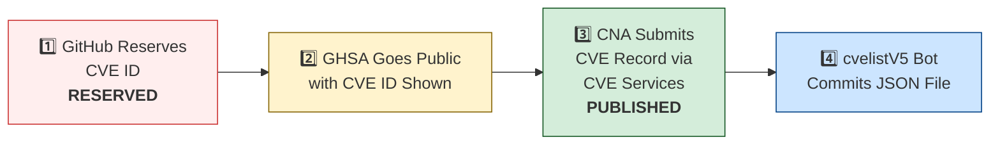

# 🛡️ OpenClaw CVE & Security Advisory Tracker

  
  
  
  
   
  
  
  
  
  

An automated tracker that continuously monitors [OpenClaw](https://github.com/openclaw/openclaw) security advisories across the GitHub Advisory Database, repo-level security advisories, and the [CVE V5 (cvelistV5)](https://github.com/CVEProject/cvelistV5) registry. Every hour it pulls the latest data, reconciles GHSA → CVE publication state, and regenerates this dashboard so you always have an up-to-date picture of the project's vulnerability landscape.

  Last updated: 2026-06-25 12:56 UTC · <a href="LICENSE">MIT License</a> · <a href="ADVISORIES.md">Full Advisory List</a> · <a href="SECURITY.md">Security Policy</a> · Data: <a href="https://github.com/CVEProject/cvelistV5">cvelistV5</a> + <a href="https://github.com/github/advisory-database">Advisory DB</a> · Updates hourly

---

  <a href="#-cves-published-in-cvelistv5-50">Published CVEs</a> ·
  <a href="#-cve-publication-pipeline">Pipeline</a> ·
  <a href="#-all-security-advisories-170">Advisories</a> ·
  <a href="#-vulnerability-categories">Categories</a> ·
  <a href="#-key-insights">Insights</a> ·
  <a href="#-project-identity">Identity</a>

---

## 🏗️ Project Identity

| Field | Value |
|-------|-------|
| **Current Name** | OpenClaw |
| **Previous Names** | Moltbot (second name), Clawdbot (original name) |
| **Repository** | [openclaw/openclaw](https://github.com/openclaw/openclaw) |
| **npm Package** | `openclaw` (formerly `clawdbot`) |
| **Author** | Peter Steinberger (steipete) |

<strong>Search terms for CVE discovery</strong>

To find all CVEs, search for: `openclaw`, `clawdbot`, `moltbot`, `clawhub`, `pkg:npm/clawdbot`, `pkg:npm/openclaw`

---

## 🚀 CVEs Published in cvelistV5 (50)

These CVEs have full records in the [CVEProject/cvelistV5](https://github.com/CVEProject/cvelistV5) repository:

| CVE ID | Severity | CVSS | Title | CWE | Published |
|--------|----------|------|-------|-----|-----------|
| [CVE-2026-32917](https://github.com/openclaw/openclaw/security/advisories/GHSA-g2f6-pwvx-r275) |  | 9.2 | OpenClaw < 2026.3.13 - Remote Command Injection via Unsanitized iMessage Attachment Paths in SCP | CWE-78 | 2026-03-31 |
| [CVE-2026-43575](https://github.com/openclaw/openclaw/security/advisories/GHSA-92jp-89mq-4374) |  | 9.2 | OpenClaw 2026.2.21 < 2026.4.10 - Authentication Bypass in Sandbox noVNC Helper Route | CWE-862 | 2026-05-06 |
| [CVE-2026-41329](https://github.com/openclaw/openclaw/security/advisories/GHSA-g5cg-8x5w-7jpm) |  | 9 | OpenClaw < 2026.3.31 - Sandbox Bypass via Heartbeat Context Inheritance and senderIsOwner Escalation | CWE-648 | 2026-04-20 |
| [CVE-2026-25253](https://github.com/openclaw/openclaw/security/advisories/GHSA-g8p2-7wf7-98mq) |  | 8.8 | OpenClaw/Clawdbot has 1-Click RCE via Authentication Token Exfiltration From gatewayUrl | CWE-669 | 2026-02-01 |
| [CVE-2026-24763](https://github.com/openclaw/openclaw/security/advisories/GHSA-mc68-q9jw-2h3v) |  | 8.8 | OpenClaw/Clawdbot Docker Execution has Authenticated Command Injection via PATH Environment Variable | CWE-78 | 2026-02-02 |
| [CVE-2026-32913](https://github.com/openclaw/openclaw/security/advisories/GHSA-6mgf-v5j7-45cr) |  | 8.8 | OpenClaw < 2026.3.7 - Custom Authorization Header Leakage via Cross-Origin Redirects | CWE-522 | 2026-03-23 |
| [CVE-2026-41394](https://github.com/openclaw/openclaw/security/advisories/GHSA-mhgq-xpfq-6r66) |  | 8.8 | OpenClaw < 2026.3.31 - Unauthorized Operator Scope Access in Unauthenticated Plugin-Auth Routes | CWE-862 | 2026-04-28 |
| [CVE-2026-28478](https://github.com/openclaw/openclaw/security/advisories/GHSA-q447-rj3r-2cgh) |  | 8.7 | OpenClaw affected by denial of service via unbounded webhook request body buffering | CWE-770 | 2026-03-05 |
| [CVE-2026-32914](https://github.com/openclaw/openclaw/security/advisories/GHSA-r7vr-gr74-94p8) |  | 8.7 | OpenClaw < 2026.3.12 - Insufficient Access Control in /config and /debug Endpoints | CWE-863 | 2026-03-29 |
| [CVE-2026-33573](https://github.com/openclaw/openclaw/security/advisories/GHSA-2rqg-gjgv-84jm) |  | 8.7 | OpenClaw < 2026.3.11 - Workspace Boundary Bypass via Agent RPC Parameters | CWE-668 | 2026-03-29 |
| [CVE-2026-43530](https://github.com/openclaw/openclaw/security/advisories/GHSA-2cq5-mf3v-mx44) |  | 8.7 | OpenClaw 2026.2.23 < 2026.4.12 - Weakened Exec Approval Binding via busybox and toybox Applet Execution | CWE-863 | 2026-05-05 |
| [CVE-2026-43584](https://github.com/openclaw/openclaw/security/advisories/GHSA-vfp4-8x56-j7c5) |  | 8.7 | OpenClaw < 2026.4.10 - Insufficient Environment Variable Denylist in Exec Policy | CWE-184 | 2026-05-06 |
| [CVE-2026-53836](https://github.com/openclaw/openclaw/security/advisories/GHSA-j472-gf56-x589) |  | 8.7 | OpenClaw < 2026.5.12 - Allowlist Bypass via PowerShell Encoded-Command Aliases | CWE-184 | 2026-06-12 |
| [CVE-2026-53843](https://github.com/openclaw/openclaw/security/advisories/GHSA-q99w-vh6v-q3v7) |  | 8.7 | OpenClaw: Pairing-scoped device session could restore revoked node token authority | CWE-613 | 2026-06-16 |
| [CVE-2026-53849](https://github.com/openclaw/openclaw/security/advisories/GHSA-cw4q-gqg5-g38h) |  | 8.6 | OpenClaw: Discord allowFrom could bind to mutable display names | CWE-290 | 2026-06-16 |
| [CVE-2026-53857](https://github.com/openclaw/openclaw/security/advisories/GHSA-8c59-hr4w-qg69) |  | 8.6 | OpenClaw < 2026.5.3 - Mutable Display Name Binding in Zalo allowFrom Policy | CWE-290 | 2026-06-16 |
| [CVE-2026-32064](https://github.com/openclaw/openclaw/security/advisories/GHSA-25gx-x37c-7pph) |  | 8.5 | OpenClaw < 2026.2.21 - Missing VNC Authentication in Sandbox Browser noVNC Observer | CWE-306 | 2026-03-21 |
| [CVE-2026-41336](https://github.com/openclaw/openclaw/security/advisories/GHSA-3qpv-xf3v-mm45) |  | 8.5 | OpenClaw < 2026.3.31 - Arbitrary Hook Code Execution via OPENCLAW_BUNDLED_HOOKS_DIR Environment Variable Override | CWE-829 | 2026-04-23 |
| [CVE-2026-41384](https://github.com/openclaw/openclaw/security/advisories/GHSA-vfw7-6rhc-6xxg) |  | 8.5 | OpenClaw < 2026.3.24 - Environment Variable Injection via Workspace Config in CLI Backend | CWE-15 | 2026-04-28 |
| [CVE-2026-44118](https://github.com/openclaw/openclaw/security/advisories/GHSA-r6xh-pqhr-v4xh) |  | 8.5 | OpenClaw < 2026.4.22 - Owner Context Spoofing via Bearer Token Header | CWE-290 | 2026-05-06 |
| [CVE-2026-45004](https://github.com/openclaw/openclaw/security/advisories/GHSA-r39h-4c2p-3jxp) |  | 8.4 | OpenClaw vulnerable to arbitrary code execution via attacker-controlled setup-api.js loaded from cwd during env-key resolution | CWE-427 | 2026-05-11 |
| [CVE-2026-32905](https://github.com/openclaw/openclaw/security/advisories/GHSA-xr4f-mjxj-w6w5) |  | 8.3 | OpenClaw < 2026.5.4 - Unauthorized Device-Pairing Bootstrap Code Issuance via Chat Command | CWE-862 | 2026-05-29 |
| [CVE-2026-35618](https://github.com/openclaw/openclaw/security/advisories/GHSA-cg6c-q2hx-69h7) |  | 8.3 | OpenClaw < 2026.3.23 - Replay Identity Drift via Query-Only Variants in Plivo V2 Verification | CWE-294 | 2026-04-09 |
| [CVE-2026-28469](https://github.com/openclaw/openclaw/security/advisories/GHSA-rq6g-px6m-c248) |  | 8.2 | OpenClaw Google Chat shared-path webhook target ambiguity allowed cross-account policy-context misrouting | CWE-639 | 2026-03-05 |
| [CVE-2026-35630](https://github.com/openclaw/openclaw/security/advisories/GHSA-mgq6-vr84-7m2j) |  | 8 | OpenClaw < 2026.5.18 - QQBot Missing Approver Identity Enforcement in Native Approval Buttons | CWE-862 | 2026-05-29 |
| [CVE-2026-25157](https://github.com/openclaw/openclaw/security/advisories/GHSA-q284-4pvr-m585) |  | 7.8 | OpenClaw/Clawdbot has OS Command Injection via Project Root Path in sshNodeCommand | CWE-78 | 2026-02-04 |
| [CVE-2026-27002](https://github.com/openclaw/openclaw/security/advisories/GHSA-w235-x559-36mg) |  | 7.7 | OpenClaw: Docker container escape via unvalidated bind mount config injection | CWE-250 | 2026-02-19 |
| [CVE-2026-32056](https://github.com/openclaw/openclaw/security/advisories/GHSA-xgf2-vxv2-rrmg) |  | 7.7 | OpenClaw < 2026.2.22 - Remote Code Execution via Shell Startup Environment Variable Injection in system.run | CWE-78 | 2026-03-21 |
| [CVE-2026-32048](https://github.com/openclaw/openclaw/security/advisories/GHSA-p7gr-f84w-hqg5) |  | 7.7 | OpenClaw < 2026.3.1 - Sandbox Escape via Cross-Agent sessions_spawn | CWE-732 | 2026-03-21 |
| [CVE-2026-35666](https://github.com/openclaw/openclaw/security/advisories/GHSA-qm9x-v7cx-7rq4) |  | 7.7 | OpenClaw < 2026.3.22 - Allowlist Bypass via Unregistered Time Dispatch Wrapper | CWE-706 | 2026-04-10 |
| [CVE-2026-35650](https://github.com/openclaw/openclaw/security/advisories/GHSA-39pp-xp36-q6mg) |  | 7.7 | OpenClaw < 2026.3.22 - Environment Variable Override Bypass via Inconsistent Sanitization | CWE-15 | 2026-04-10 |
| [CVE-2026-53806](https://github.com/openclaw/openclaw/security/advisories/GHSA-vxx3-6hc9-7cc3) |  | 7.7 | OpenClaw < 2026.5.12 - Shell Option Parsing Bypass in Exec Revalidation | CWE-367 | 2026-06-11 |
| [CVE-2026-53807](https://github.com/openclaw/openclaw/security/advisories/GHSA-w5ww-7chg-mxcq) |  | 7.7 | OpenClaw < 2026.5.6 - Authorization Bypass in Telegram Interactive Callbacks via commands.allowFrom | CWE-863 | 2026-06-11 |
| [CVE-2026-53811](https://github.com/openclaw/openclaw/security/advisories/GHSA-7hxm-f538-3xp6) |  | 7.7 | OpenClaw < 2026.5.7 - Privilege Escalation via Mutable Display Names in Matrix allowFrom | CWE-290 | 2026-06-11 |
| [CVE-2026-53828](https://github.com/openclaw/openclaw/security/advisories/GHSA-p73f-w79w-jqr5) |  | 7.7 | OpenClaw < 2026.5.6 - Native Command Authorization Bypass via Owner-Command Enforcement | CWE-863 | 2026-06-12 |
| [CVE-2026-43535](https://github.com/openclaw/openclaw/security/advisories/GHSA-jwrq-8g5x-5fhm) |  | 7.6 | OpenClaw < 2026.4.14 - Authorization Context Reuse in Collect-Mode Queue Batches | CWE-266 | 2026-05-05 |
| [CVE-2026-53853](https://github.com/openclaw/openclaw/security/advisories/GHSA-v2ww-5rh7-2h5v) |  | 7.6 | OpenClaw: Linux and macOS exec allowlists skipped configured argument patterns | CWE-693, CWE-863 | 2026-06-16 |
| [CVE-2026-53855](https://github.com/openclaw/openclaw/security/advisories/GHSA-5cj2-3jr2-5h77) |  | 7.6 | OpenClaw < 2026.4.2 - Shell Positional Parameters Bypass in Inline-Eval Checks | CWE-184, CWE-863 | 2026-06-16 |
| [CVE-2026-53864](https://github.com/openclaw/openclaw/security/advisories/GHSA-ccwh-wwpp-6wg5) |  | 7.6 | OpenClaw: Host environment sanitizer missed two Node.js control variables | CWE-184 | 2026-06-16 |
| [CVE-2026-53866](https://github.com/openclaw/openclaw/security/advisories/GHSA-f397-5vjw-v2c2) |  | 7.6 | OpenClaw < 2026.5.12 - Allowlist Bypass in Shell Inline-Command Parsing | CWE-862 | 2026-06-16 |
| [CVE-2026-26324](https://github.com/openclaw/openclaw/security/advisories/GHSA-jrvc-8ff5-2f9f) |  | 7.5 | OpenClaw has a SSRF guard bypass via full-form IPv4-mapped IPv6 (loopback / metadata reachable) | CWE-918 | 2026-02-19 |
| [CVE-2026-26319](https://github.com/openclaw/openclaw/security/advisories/GHSA-4hg8-92x6-h2f3) |  | 7.5 | OpenClaw has Missing Webhook Authentication in Telnyx Provider Allowing Unauthenticated Requests | CWE-306 | 2026-02-19 |
| [CVE-2026-32041](https://github.com/openclaw/openclaw/security/advisories/GHSA-vpj2-69hf-rppw) |  | 7.5 | OpenClaw < 2026.3.1 - Unauthenticated Browser Control Access via Failed Auth Bootstrap | CWE-306 | 2026-03-19 |
| [CVE-2026-28458](https://github.com/openclaw/openclaw/security/advisories/GHSA-mr32-vwc2-5j6h) |  | 7.4 | OpenClaw's Browser Relay /cdp websocket is missing auth which could allow cross-tab cookie access | CWE-306 | 2026-03-05 |
| [CVE-2026-53833](https://github.com/openclaw/openclaw/security/advisories/GHSA-jvm4-4j77-39p6) |  | 7.4 | QQBot for OpenClaw < 2026.4.29 - Authorization Bypass via QQBot Streaming Command | CWE-290 | 2026-06-12 |
| [CVE-2026-53813](https://github.com/openclaw/openclaw/security/advisories/GHSA-v8cx-933x-r976) |  | 7.3 | OpenClaw < 2026.4.25 - Arbitrary Artifact Loading via Fake Package Root Resolution | CWE-427 | 2026-06-11 |
| [CVE-2026-53865](https://github.com/openclaw/openclaw/security/advisories/GHSA-rx78-29qr-5hq8) |  | 7.2 | OpenClaw: Workspace-derived service PATH could influence trash command selection | CWE-426 | 2026-06-16 |
| [CVE-2026-22168](https://github.com/openclaw/openclaw/security/advisories/GHSA-5v6x-rfc3-7qfr) |  | 7.1 | OpenClaw < 2026.2.21 - Command Injection via cmd.exe /c Trailing Arguments in system.run | CWE-88 | 2026-03-18 |
| [CVE-2026-26320](https://github.com/openclaw/openclaw/security/advisories/GHSA-7q2j-c4q5-rm27) |  | 7.1 | OpenClaw macOS deep link confirmation truncation can conceal executed agent message | CWE-451 | 2026-02-19 |
| [CVE-2026-26317](https://github.com/openclaw/openclaw/security/advisories/GHSA-3fqr-4cg8-h96q) |  | 7.1 | OpenClaw affected by cross-site request forgery (CSRF) through loopback browser mutation endpoints | CWE-352 | 2026-02-19 |
| [CVE-2026-22175](https://github.com/openclaw/openclaw/security/advisories/GHSA-gwqp-86q6-w47g) |  | 7.1 | OpenClaw < 2026.2.23 - Exec Approval Bypass via Unrecognized Multiplexer Shell Wrappers | CWE-184 | 2026-03-18 |
| [CVE-2026-31992](https://github.com/openclaw/openclaw/security/advisories/GHSA-48wf-g7cp-gr3m) |  | 7.1 | OpenClaw < 2026.2.23 - Allowlist Exec-Guard Bypass via env -S | CWE-184 | 2026-03-19 |
| [CVE-2026-32972](https://github.com/openclaw/openclaw/security/advisories/GHSA-vmhq-cqm9-6p7q) |  | 7.1 | OpenClaw < 2026.3.11 - Authorization Bypass in Browser Profile Management via browser.request | CWE-863 | 2026-03-29 |
| [CVE-2026-35636](https://github.com/openclaw/openclaw/security/advisories/GHSA-q2qc-744p-66r2) |  | 7.1 | OpenClaw 2026.3.11 < 2026.3.25 - Session Isolation Bypass via sessionId Resolution | CWE-696 | 2026-04-09 |
| [CVE-2026-41334](https://github.com/openclaw/openclaw/security/advisories/GHSA-w85g-3h6x-4xh2) |  | 7.1 | OpenClaw < 2026.3.31 - Decompression Bomb Denial of Service via Image Pixel-Limit Guard Bypass | CWE-636 | 2026-04-23 |
| [CVE-2026-41359](https://github.com/openclaw/openclaw/security/advisories/GHSA-767m-xrhc-fxm7) |  | 7.1 | OpenClaw < 2026.3.28 - Privilege Escalation via operator.write to Admin-Class Telegram Config and Cron Persistence | CWE-269 | 2026-04-23 |
| [CVE-2026-41368](https://github.com/openclaw/openclaw/security/advisories/GHSA-jccr-rrw2-vc8h) |  | 7.1 | OpenClaw < 2026.3.28 - Environment Variable Disclosure via jq $ENV Filter Bypass | CWE-668 | 2026-04-27 |
| [CVE-2026-41370](https://github.com/openclaw/openclaw/security/advisories/GHSA-58q2-7r52-jq62) |  | 7.1 | OpenClaw < 2026.3.31 - Path Traversal via Inbound Channel Attachment Path in ACP Dispatch | CWE-22 | 2026-04-27 |
| [CVE-2026-43528](https://github.com/openclaw/openclaw/security/advisories/GHSA-8372-7vhw-cm6q) |  | 7.1 | OpenClaw < 2026.4.14 - Redaction Bypass via sourceConfig and runtimeConfig Aliases | CWE-212 | 2026-05-05 |
| [CVE-2026-32979](https://github.com/openclaw/openclaw/security/advisories/GHSA-xf99-j42q-5w5p) |  | 7 | OpenClaw < 2026.3.11 - Unbound Interpreter and Runtime Commands Bypass in node-host Approval | CWE-367 | 2026-03-29 |
| [CVE-2026-41390](https://github.com/openclaw/openclaw/security/advisories/GHSA-6pfc-6m7w-m8fx) |  | 7 | OpenClaw < 2026.3.28 - Exec Allowlist Bypass via Unregistered /usr/bin/script Wrapper | CWE-807 | 2026-04-28 |
| [CVE-2026-43531](https://github.com/openclaw/openclaw/security/advisories/GHSA-7wv4-cc7p-jhxc) |  | 7 | OpenClaw < 2026.4.9 - Environment Variable Injection via Workspace .env File | CWE-15 | 2026-05-05 |
| [CVE-2026-53846](https://github.com/openclaw/openclaw/security/advisories/GHSA-24vr-rprv-67rf) |  | 7 | OpenClaw: Workspace .env npm_execpath could influence bundled runtime dependency install | CWE-426 | 2026-06-16 |
| [CVE-2026-53842](https://github.com/openclaw/openclaw/security/advisories/GHSA-fq9j-vw4w-fr6v) |  | 7 | OpenClaw: Workspace .env CLOUDSDK_PYTHON could influence Gmail setup gcloud execution | CWE-426 | 2026-06-16 |
| [CVE-2026-53858](https://github.com/openclaw/openclaw/security/advisories/GHSA-wc84-j36w-pw4x) |  | 7 | OpenClaw: Workspace .env STATE_DIRECTORY could influence bundled runtime dependency roots | CWE-426 | 2026-06-16 |
| [CVE-2026-27003](https://github.com/openclaw/openclaw/security/advisories/GHSA-chf7-jq6g-qrwv) |  | 6.9 | OpenClaw: Telegram bot token exposure via logs | CWE-522 | 2026-02-19 |
| [CVE-2026-28480](https://github.com/openclaw/openclaw/security/advisories/GHSA-mj5r-hh7j-4gxf) |  | 6.9 | OpenClaw Telegram allowlist authorization accepted mutable usernames | CWE-290 | 2026-03-05 |
| [CVE-2026-32975](https://github.com/openclaw/openclaw/security/advisories/GHSA-f5mf-3r52-r83w) |  | 6.9 | OpenClaw < 2026.3.12 - Weak Authorization via Mutable Group Names in Zalouser Allowlist | CWE-807 | 2026-03-29 |
| [CVE-2026-34426](https://github.com/openclaw/openclaw/security/advisories/GHSA-98ch-45wp-ch47) |  | 6.9 | OpenClaw - Approval Bypass via Environment Variable Normalization | CWE-184 | 2026-04-02 |
| [CVE-2026-34505](https://github.com/openclaw/openclaw/security/advisories/GHSA-5m9r-p9g7-679c) |  | 6.9 | OpenClaw < 2026.3.12 - Webhook Rate Limiting Bypass via Pre-Authentication Secret Validation | CWE-307 | 2026-03-31 |
| [CVE-2026-35632](https://github.com/openclaw/openclaw/security/advisories/GHSA-7xr2-q9vf-x4r5) |  | 6.9 | OpenClaw < 2026.2.22 - Symlink Traversal via IDENTITY.md appendFile in agents.create/update | CWE-61 | 2026-04-09 |
| [CVE-2026-35633](https://github.com/openclaw/openclaw/security/advisories/GHSA-4qwc-c7g9-4xcw) |  | 6.9 | OpenClaw < 2026.3.22 - Unbounded Memory Allocation via Remote Media Error Responses | CWE-789 | 2026-04-09 |
| [CVE-2026-35661](https://github.com/openclaw/openclaw/security/advisories/GHSA-j4c9-w69r-cw33) |  | 6.9 | OpenClaw < 2026.3.25 - Telegram DM-Scoped Inline Button Callback Authorization Bypass | CWE-288 | 2026-04-10 |
| [CVE-2026-44116](https://github.com/openclaw/openclaw/security/advisories/GHSA-2hh7-c75g-qj2r) |  | 6.9 | OpenClaw < 2026.4.22 - Server-Side Request Forgery in Zalo Photo URL Validation | CWE-918 | 2026-05-06 |
| [CVE-2026-29612](https://github.com/openclaw/openclaw/security/advisories/GHSA-w2cg-vxx6-5xjg) |  | 6.8 | OpenClaw < 2026.2.14 - Denial of Service via Large Base64 Media File Decoding | CWE-770 | 2026-03-05 |
| [CVE-2026-53850](https://github.com/openclaw/openclaw/security/advisories/GHSA-mpc8-jxjh-qpgh) |  | 6.8 | OpenClaw < 2026.4.25 - Control Scope Enforcement Bypass in Focus Command | CWE-862 | 2026-06-16 |
| [CVE-2026-26972](https://github.com/openclaw/openclaw/security/advisories/GHSA-xwjm-j929-xq7c) |  | 6.7 | OpenClaw has a Path Traversal in Browser Download Functionality | CWE-22 | 2026-02-19 |
| [CVE-2026-28452](https://github.com/openclaw/openclaw/security/advisories/GHSA-h89v-j3x9-8wqj) |  | 6.7 | OpenClaw affected by denial of service through unguarded archive extraction allowing high expansion/resource abuse (ZIP/TAR) | CWE-770 | 2026-03-05 |
| [CVE-2026-26328](https://github.com/openclaw/openclaw/security/advisories/GHSA-g34w-4xqq-h79m) |  | 6.5 | OpenClaw iMessage group allowlist authorization inherited DM pairing-store identities | CWE-284, CWE-863 | 2026-02-19 |
| [CVE-2026-28448](https://github.com/openclaw/openclaw/security/advisories/GHSA-33rq-m5x2-fvgf) |  | 6.3 | OpenClaw 2026.1.29 < 2026.2.1 - Authorization Bypass in Twitch Plugin allowFrom Access Control | CWE-285 | 2026-03-05 |
| [CVE-2026-28449](https://github.com/openclaw/openclaw/security/advisories/GHSA-r9q5-c7qc-p26w) |  | 6.3 | OpenClaw < 2026.2.25 - Webhook Replay Attack via Missing Durable Replay Suppression | CWE-294 | 2026-03-19 |
| [CVE-2026-32050](https://github.com/openclaw/openclaw/security/advisories/GHSA-792q-qw95-f446) |  | 6.3 | OpenClaw < 2026.2.25 - Unauthorized Reaction Status Event Enqueue via Access Check Bypass | CWE-863 | 2026-03-21 |
| [CVE-2026-41337](https://github.com/openclaw/openclaw/security/advisories/GHSA-89r3-6x4j-v7wf) |  | 6.3 | OpenClaw < 2026.3.31 - Callback Origin Mutation in Plivo Voice-call Replay | CWE-367 | 2026-04-23 |
| [CVE-2026-41913](https://github.com/openclaw/openclaw/security/advisories/GHSA-25wv-8phj-8p7r) |  | 6.3 | OpenClaw < 2026.4.4 - Rate-Limit Bypass via Concurrent Async Authentication Attempts | CWE-362 | 2026-04-28 |
| [CVE-2026-44999](https://github.com/openclaw/openclaw/security/advisories/GHSA-57r2-h2wj-g887) |  | 6.3 | OpenClaw < 2026.4.20 - Improper Trust Labeling in Isolated Cron Awareness Events | CWE-345 | 2026-05-11 |
| [CVE-2026-53851](https://github.com/openclaw/openclaw/security/advisories/GHSA-fcvx-5cxc-v5p8) |  | 6.3 | OpenClaw < 2026.5.12 - Slack Reaction Event Notification Bypass | CWE-862 | 2026-06-16 |
| [CVE-2026-32039](https://github.com/openclaw/openclaw/security/advisories/GHSA-wpph-cjgr-7c39) |  | 6 | OpenClaw < 2026.2.22 - Sender Authorization Bypass via Identity Collision in toolsBySender | CWE-639 | 2026-03-19 |
| [CVE-2026-35622](https://github.com/openclaw/openclaw/security/advisories/GHSA-mp66-rf4f-mhh8) |  | 6 | OpenClaw < 2026.3.22 - Improper Authentication Verification in Google Chat Webhook | CWE-290 | 2026-04-09 |
| [CVE-2026-41345](https://github.com/openclaw/openclaw/security/advisories/GHSA-68v4-hmwv-f43h) |  | 6 | OpenClaw < 2026.3.31 - Authorization Header Leak via Cross-Origin Redirect in Media Download | CWE-522 | 2026-04-23 |
| [CVE-2026-43570](https://github.com/openclaw/openclaw/security/advisories/GHSA-cr8r-7g2h-6wr6) |  | 6 | OpenClaw contains a symlink traversal vulnerability | CWE-61 | 2026-05-05 |
| [CVE-2026-44112](https://github.com/openclaw/openclaw/security/advisories/GHSA-wppj-c6mr-83jj) |  | 6 | OpenClaw < 2026.4.22 - Symlink Swap Race Condition in OpenShell FS Bridge Writes | CWE-367 | 2026-05-06 |
| [CVE-2026-44113](https://github.com/openclaw/openclaw/security/advisories/GHSA-5h3g-6xhh-rg6p) |  | 6 | OpenClaw: OpenShell FS bridge reads pin and verify the opened file before returning bytes | CWE-367 | 2026-05-06 |
| [CVE-2026-53830](https://github.com/openclaw/openclaw/security/advisories/GHSA-275c-xpvc-jgfw) |  | 6 | OpenClaw < 2026.4.22 - Webhook Secret Revocation Bypass via secrets.reload | CWE-613 | 2026-06-12 |
| [CVE-2026-53824](https://github.com/openclaw/openclaw/security/advisories/GHSA-4m3v-q747-pc6h) |  | 6 | Mattermost plugin for OpenClaw < 2026.4.24 - Slash Token Revocation Lag via Monitor Refresh Delay | CWE-613 | 2026-06-12 |
| [CVE-2026-53854](https://github.com/openclaw/openclaw/security/advisories/GHSA-4hpg-mp64-x7xq) |  | 6 | OpenClaw: Internal/webchat command auth could inherit ownerAllowFrom wildcard state | CWE-863 | 2026-06-16 |
| [CVE-2026-53844](https://github.com/openclaw/openclaw/security/advisories/GHSA-72fw-cqh5-f324) |  | 6 | OpenClaw < 2026.4.29 - Session Visibility Check Bypass in Shared Memory Search | CWE-862 | 2026-06-16 |
| [CVE-2026-53840](https://github.com/openclaw/openclaw/security/advisories/GHSA-rjxq-qqhf-8hwh) |  | 6 | OpenClaw: MCP Streamable HTTP redirects could forward configured custom headers to another origin | CWE-522 | 2026-06-16 |
| [CVE-2026-53863](https://github.com/openclaw/openclaw/security/advisories/GHSA-985f-72mj-8gf7) |  | 6 | OpenClaw < 2026.4.25 - Unvalidated Group ID Acceptance in Tool Group Policy | CWE-639 | 2026-06-16 |
| [CVE-2026-53859](https://github.com/openclaw/openclaw/security/advisories/GHSA-gxg4-2rrr-jhc7) |  | 6 | OpenClaw < 2026.5.26 - Hostname Validation Bypass via Trailing-Dot Inconsistency | CWE-1023, CWE-918 | 2026-06-16 |
| [CVE-2026-45005](https://github.com/openclaw/openclaw/security/advisories/GHSA-q8ff-7ffm-m3r9) |  | 5.9 | OpenClaw < 2026.4.23 - Webhook Route Secret Cache Not Invalidated After Rotation | CWE-672 | 2026-05-11 |
| [CVE-2026-32052](https://github.com/openclaw/openclaw/security/advisories/GHSA-6rcp-vxwf-3mfp) |  | 5.8 | OpenClaw < 2026.2.24 - Hidden Command Execution via Shell-Wrapper Positional argv Carriers | CWE-436 | 2026-03-21 |
| [CVE-2026-31999](https://github.com/openclaw/openclaw/security/advisories/GHSA-6f6j-wx9w-ff4j) |  | 5.8 | OpenClaw 2026.2.26 < 2026.3.1 - Current Working Directory Injection via Windows Wrapper Resolution Fallback | CWE-78 | 2026-03-19 |
| [CVE-2026-41373](https://github.com/openclaw/openclaw/security/advisories/GHSA-g8xp-qx39-9jq9) |  | 5.8 | OpenClaw < 2026.3.31 - Compiler Binary Substitution via Environment Variable Override in Host Execution Policy | CWE-427 | 2026-04-28 |
| [CVE-2026-41391](https://github.com/openclaw/openclaw/security/advisories/GHSA-7ggg-pvrf-458v) |  | 5.8 | OpenClaw < 2026.3.31 - Environment Variable Bypass in Package Index URL Handling | CWE-184 | 2026-04-28 |
| [CVE-2026-41915](https://github.com/openclaw/openclaw/security/advisories/GHSA-cm8v-2vh9-cxf3) |  | 5.8 | OpenClaw < 2026.4.8 - Git Environment Variable Injection via Unfiltered Exec Environment | CWE-184 | 2026-04-28 |
| [CVE-2026-32065](https://github.com/openclaw/openclaw/security/advisories/GHSA-hwpq-rrpf-pgcq) |  | 5.7 | OpenClaw < 2026.2.25 - Approval Identity Mismatch in system.run Command Execution | CWE-436 | 2026-03-21 |
| [CVE-2026-53856](https://github.com/openclaw/openclaw/security/advisories/GHSA-rwp6-7w3q-75fq) |  | 5.7 | OpenClaw: Config recovery could restore openclaw.json with broad file permissions | CWE-732 | 2026-06-16 |
| [CVE-2026-29608](https://github.com/openclaw/openclaw/security/advisories/GHSA-h3rm-6x7g-882f) |  | 5.4 | OpenClaw 2026.3.1 < 2026.3.2 - Approval Integrity Bypass via system.run argv Rewriting | CWE-88 | 2026-03-19 |
| [CVE-2026-41355](https://github.com/openclaw/openclaw/security/advisories/GHSA-42mx-vp8m-j7qh) |  | 5.4 | OpenShell < 2026.3.28 - Arbitrary Code Execution via Mirror Mode Sandbox File Conversion | CWE-829 | 2026-04-23 |
| [CVE-2026-41392](https://github.com/openclaw/openclaw/security/advisories/GHSA-wpc6-37g7-8q4w) |  | 5.4 | OpenClaw < 2026.3.31 - Exec Allowlist Bypass via Shell Init-File Options | CWE-184 | 2026-04-28 |
| [CVE-2026-32895](https://github.com/openclaw/openclaw/security/advisories/GHSA-v8cg-4474-49v8) |  | 5.3 | OpenClaw < 2026.2.26 - Sender Authorization Bypass in Slack System Event Handlers | CWE-863 | 2026-03-21 |
| [CVE-2026-35662](https://github.com/openclaw/openclaw/security/advisories/GHSA-x2cm-hg9c-mf5w) |  | 5.3 | OpenClaw < 2026.3.22 - Missing controlScope Enforcement in Send Action | CWE-862 | 2026-04-10 |
| [CVE-2026-35651](https://github.com/openclaw/openclaw/security/advisories/GHSA-4hmj-39m8-jwc7) |  | 5.3 | OpenClaw 2026.2.13 < 2026.3.25 - ANSI Escape Sequence Injection in Approval Prompt | CWE-150 | 2026-04-10 |
| [CVE-2026-53847](https://github.com/openclaw/openclaw/security/advisories/GHSA-x629-46cc-7xgw) |  | 5.3 | OpenClaw < 2026.5.6 - Privilege Escalation via Active Memory Write Scope | CWE-266 | 2026-06-16 |
| [CVE-2026-53861](https://github.com/openclaw/openclaw/security/advisories/GHSA-c226-q6fx-6j6c) |  | 5.3 | OpenClaw < 2026.5.6 - Allowlist Bypass via Combined POSIX Inline Flags on macOS | CWE-184 | 2026-06-16 |
| [CVE-2026-42439](https://github.com/openclaw/openclaw/security/advisories/GHSA-rj2p-j66c-mgqh) |  | 4.9 | OpenClaw < 2026.4.10 - SSRF Policy Bypass in Browser Tabs Action Routes | CWE-862 | 2026-05-05 |
| [CVE-2026-53809](https://github.com/openclaw/openclaw/security/advisories/GHSA-p39j-x9h5-q66m) |  | 4.8 | OpenClaw < 2026.4.25 - Provider Alias Confusion in Embedded Runner Policy | CWE-863 | 2026-06-11 |
| [CVE-2026-27486](https://github.com/openclaw/openclaw/security/advisories/GHSA-jfv4-h8mc-jcp8) |  | 4.3 | OpenClaw: Process Safety - Unvalidated PID Kill via SIGKILL in Process Cleanup | CWE-283 | 2026-02-21 |
| [CVE-2026-44992](https://github.com/openclaw/openclaw/security/advisories/GHSA-h2vw-ph2c-jvwf) |  | 4.1 | OpenClaw 2026.4.5 < 2026.4.20 - MiniMax API Host Override via Workspace dotenv | CWE-441 | 2026-05-11 |
| [CVE-2026-45003](https://github.com/openclaw/openclaw/security/advisories/GHSA-55cf-xx38-4p9p) |  | 4.1 | OpenClaw: Workspace dotenv files cannot override connector endpoint hosts | CWE-441 | 2026-05-11 |
| [CVE-2026-24764](https://github.com/openclaw/openclaw/security/advisories/GHSA-782p-5fr5-7fj8) |  | 3.7 | OpenClaw has Remote Code Execution via System Prompt Injection in Slack Channel Descriptions | CWE-74, CWE-94 | 2026-02-19 |
| [CVE-2026-27484](https://github.com/openclaw/openclaw/security/advisories/GHSA-wh94-p5m6-mr7j) |  | 2.3 | OpenClaw Discord moderation authorization used untrusted sender identity in tool-driven flows | CWE-862 | 2026-02-21 |
| [CVE-2026-32906](https://github.com/openclaw/openclaw/security/advisories/GHSA-wv26-j37q-2g7p) |  | 2.3 | OpenClaw < 2026.5.12 - Privilege Escalation in Slack Plugin Approvals via Exec Approver Gate | CWE-863 | 2026-05-29 |
| [CVE-2026-41358](https://github.com/openclaw/openclaw/security/advisories/GHSA-qm77-8qjp-4vcm) |  | 2.3 | OpenClaw < 2026.4.2 - Sender Allowlist Bypass via Slack Thread Context | CWE-346 | 2026-04-23 |
| [CVE-2026-42421](https://github.com/openclaw/openclaw/security/advisories/GHSA-5h3f-885m-v22w) |  | 2.3 | OpenClaw < 2026.4.8 - WebSocket Session Persistence via Shared Gateway Token Rotation | CWE-613 | 2026-04-28 |
| [CVE-2026-41910](https://github.com/openclaw/openclaw/security/advisories/GHSA-vc32-h5mq-453v) |  | 2.3 | OpenClaw < 2026.4.8 - Missing Owner-Only Enforcement in /allowlist Cross-Channel Writes | CWE-863 | 2026-04-28 |
| [CVE-2026-44991](https://github.com/openclaw/openclaw/security/advisories/GHSA-c28g-vh7m-fm7v) |  | 2.3 | OpenClaw: Owner-enforced commands could accept wildcard channel senders as command owners | CWE-863 | 2026-05-11 |
| [CVE-2026-44997](https://github.com/openclaw/openclaw/security/advisories/GHSA-q3jj-46pq-826r) |  | 2.3 | OpenClaw < 2026.4.22 - Security Envelope Constraint Bypass in ACP Child Sessions | CWE-266 | 2026-05-11 |
| [CVE-2026-53845](https://github.com/openclaw/openclaw/security/advisories/GHSA-68xw-r643-9p5w) |  | 2.3 | OpenClaw: Skill-command dispatch could skip before-tool-call hooks | CWE-693 | 2026-06-16 |
| [CVE-2026-53848](https://github.com/openclaw/openclaw/security/advisories/GHSA-cwpp-5962-q4f6) |  | 2.3 | OpenClaw < 2026.5.26 - Exec Allowlist Bypass via Transparent Command Wrappers | CWE-184 | 2026-06-16 |
| [CVE-2026-53852](https://github.com/openclaw/openclaw/security/advisories/GHSA-8mg9-j9cf-54cj) |  | 2.3 | OpenClaw < 2026.4.25 - Scope Bypass via Empty-Scope Device Re-pairing | CWE-636 | 2026-06-16 |
| [CVE-2026-53860](https://github.com/openclaw/openclaw/security/advisories/GHSA-8j37-5w68-wj2g) |  | 2.3 | OpenClaw: BlueBubbles sender policy could match mutable conversation identifiers | CWE-807, CWE-863 | 2026-06-16 |
| [CVE-2026-53862](https://github.com/openclaw/openclaw/security/advisories/GHSA-9v8j-9c9g-w66c) |  | 2.3 | OpenClaw < 2026.5.12 - Bootstrap Token Replay via Pending Pairing Scope Widening | CWE-266, CWE-345 | 2026-06-16 |
| [CVE-2026-53841](https://github.com/openclaw/openclaw/security/advisories/GHSA-w9hf-3pp7-pvxv) |  | 2.1 | OpenClaw: Exported session HTML could keep unsafe markdown links | CWE-83 | 2026-06-16 |
| [CVE-2026-41330](https://github.com/openclaw/openclaw/security/advisories/GHSA-9gp8-hjxr-6f34) |  | 2 | OpenClaw < 2026.3.31 - Environment Variable Override via Host Exec Policy | CWE-453 | 2026-04-20 |

<strong>📖 Detailed CVE Analysis (click to expand)</strong>

### CVE-2026-32917 — OpenClaw < 2026.3.13 - Remote Command Injection via Unsanitized iMessage Attachment Paths in SCP

| Field | Detail |
|-------|--------|
| **CVSS** | 9.2 (CRITICAL) — `CVSS:4.0/AV:N/AC:L/AT:P/PR:N/UI:N/VC:H/VI:H/VA:H/SC:N/SI:N/SA:N` |
| **CWE** | CWE-78 (Improper Neutralization of Special Elements used in an OS Command ('OS Command Injection')) |
| **Affected** | < 2026.3.13 |
| **Vendor/Product** | OpenClaw / OpenClaw |
| **Advisory** | [GHSA-g2f6-pwvx-r275](https://github.com/openclaw/openclaw/security/advisories/GHSA-g2f6-pwvx-r275) |

OpenClaw before 2026.3.13 contains a remote command injection vulnerability in the iMessage attachment staging flow that allows attackers to execute arbitrary commands on configured remote hosts. The vulnerability exists because unsanitized remote attachment paths containing shell metacharacters are passed directly to the SCP remote operand without validation, enabling command execution when remote attachment staging is enabled.

**References:**
- [Patch Commit](https://github.com/openclaw/openclaw/commit/a54bf71b4c0cbe554a84340b773df37ee8e959de)
- [VulnCheck Advisory: OpenClaw < 2026.3.13 - Remote Command Injection via Unsanitized iMessage Attachment Paths in SCP](https://www.vulncheck.com/advisories/openclaw-remote-command-injection-via-unsanitized-imessage-attachment-paths-in-scp)
---

### CVE-2026-43575 — OpenClaw 2026.2.21 < 2026.4.10 - Authentication Bypass in Sandbox noVNC Helper Route

| Field | Detail |
|-------|--------|
| **CVSS** | 9.2 (CRITICAL) — `CVSS:4.0/AV:N/AC:L/AT:P/PR:N/UI:N/VC:H/VI:H/VA:H/SC:N/SI:N/SA:N` |
| **CWE** | CWE-862 (CWE-862 Missing Authorization) |
| **Affected** | < 2026.4.10 |
| **Vendor/Product** | OpenClaw / OpenClaw |
| **Advisory** | [GHSA-92jp-89mq-4374](https://github.com/openclaw/openclaw/security/advisories/GHSA-92jp-89mq-4374) |

OpenClaw versions 2026.2.21 before 2026.4.10 contain an authentication bypass vulnerability in the sandbox noVNC helper route that exposes interactive browser session credentials. Attackers can access the noVNC helper route without bridge authentication to gain unauthorized access to the interactive browser session.

**References:**
- [Patch Commit](https://github.com/openclaw/openclaw/commit/8dfbf3268bd224b7377d1ecca77a445100746085)
- [VulnCheck Advisory: OpenClaw 2026.2.21 < 2026.4.10 - Authentication Bypass in Sandbox noVNC Helper Route](https://www.vulncheck.com/advisories/openclaw-authentication-bypass-in-sandbox-novnc-helper-route)
---

### CVE-2026-41329 — OpenClaw < 2026.3.31 - Sandbox Bypass via Heartbeat Context Inheritance and senderIsOwner Escalation

| Field | Detail |
|-------|--------|
| **CVSS** | 9 (CRITICAL) — `CVSS:4.0/AV:N/AC:L/AT:P/PR:L/UI:N/VC:H/VI:H/VA:H/SC:H/SI:H/SA:H` |
| **CWE** | CWE-648 (CWE-648: Incorrect Use of Privileged APIs) |
| **Affected** | < 2026.3.31 |
| **Vendor/Product** | OpenClaw / OpenClaw |
| **Advisory** | [GHSA-g5cg-8x5w-7jpm](https://github.com/openclaw/openclaw/security/advisories/GHSA-g5cg-8x5w-7jpm) |

OpenClaw before 2026.3.31 contains a sandbox bypass vulnerability allowing attackers to escalate privileges via heartbeat context inheritance and senderIsOwner parameter manipulation. Attackers can exploit improper context validation to bypass sandbox restrictions and achieve unauthorized privilege escalation.

**References:**
- [Patch Commit](https://github.com/openclaw/openclaw/commit/a30214a624946fc5c85c9558a27c1580172374fd)
- [VulnCheck Advisory: OpenClaw < 2026.3.31 - Sandbox Bypass via Heartbeat Context Inheritance and senderIsOwner Escalation](https://www.vulncheck.com/advisories/openclaw-sandbox-bypass-via-heartbeat-context-inheritance-and-senderisowner-escalation)
---

### CVE-2026-25253 — OpenClaw/Clawdbot has 1-Click RCE via Authentication Token Exfiltration From gatewayUrl

| Field | Detail |
|-------|--------|
| **CVSS** | 8.8 (HIGH) — `CVSS:3.1/AV:N/AC:L/PR:N/UI:R/S:U/C:H/I:H/A:H` |
| **CWE** | CWE-669 (CWE-669 Incorrect Resource Transfer Between Spheres) |
| **Affected** | < 2026.1.29 |
| **Vendor/Product** | OpenClaw / OpenClaw |
| **Advisory** | [GHSA-g8p2-7wf7-98mq](https://github.com/openclaw/openclaw/security/advisories/GHSA-g8p2-7wf7-98mq) |

OpenClaw (aka clawdbot or Moltbot) before 2026.1.29 obtains a gatewayUrl value from a query string and automatically makes a WebSocket connection without prompting, sending a token value.

> **Naming note:** Uses all three names in description. packageURL still references `pkg:npm/clawdbot`.
**References:**
- [1-click-rce-to-steal-your-moltbot-data-and-keys](https://depthfirst.com/post/1-click-rce-to-steal-your-moltbot-data-and-keys)
- [blog](https://openclaw.ai/blog)
- [one-click-rce-moltbot](https://ethiack.com/news/blog/one-click-rce-moltbot)
- [2016913750557651228](https://x.com/0xacb/status/2016913750557651228)
---

### CVE-2026-24763 — OpenClaw/Clawdbot Docker Execution has Authenticated Command Injection via PATH Environment Variable

| Field | Detail |
|-------|--------|
| **CVSS** | 8.8 (HIGH) — `CVSS:3.1/AV:N/AC:L/PR:L/UI:N/S:U/C:H/I:H/A:H` |
| **CWE** | CWE-78 (CWE-78: Improper Neutralization of Special Elements used in an OS Command ('OS Command Injection')) |
| **Affected** | < 2026.1.29 |
| **Vendor/Product** | clawdbot / clawdbot |
| **Advisory** | [GHSA-mc68-q9jw-2h3v](https://github.com/openclaw/openclaw/security/advisories/GHSA-mc68-q9jw-2h3v) |

OpenClaw (formerly  Clawdbot) is a personal AI assistant you run on your own devices. Prior to 2026.1.29, a command injection vulnerability existed in OpenClaw’s Docker sandbox execution mechanism due to unsafe handling of the PATH environment variable when constructing shell commands. An authenticated user able to control environment variables could influence command execution within the container context. This vulnerability is fixed in 2026.1.29.

> **Naming note:** Uses old name `clawdbot/clawdbot` as vendor/product.
**References:**
- [https://github.com/openclaw/openclaw/commit/771f23d36b95ec2204cc9a0054045f5d8439ea75](https://github.com/openclaw/openclaw/commit/771f23d36b95ec2204cc9a0054045f5d8439ea75)
- [https://github.com/openclaw/openclaw/releases/tag/v2026.1.29](https://github.com/openclaw/openclaw/releases/tag/v2026.1.29)
---

### CVE-2026-32913 — OpenClaw < 2026.3.7 - Custom Authorization Header Leakage via Cross-Origin Redirects

| Field | Detail |
|-------|--------|
| **CVSS** | 8.8 (HIGH) — `CVSS:4.0/AV:N/AC:L/AT:N/PR:N/UI:N/VC:H/VI:L/VA:N/SC:L/SI:L/SA:N` |
| **CWE** | CWE-522 (CWE-522 Insufficiently Protected Credentials) |
| **Affected** | < 2026.3.7 |
| **Vendor/Product** | OpenClaw / OpenClaw |
| **Advisory** | [GHSA-6mgf-v5j7-45cr](https://github.com/openclaw/openclaw/security/advisories/GHSA-6mgf-v5j7-45cr) |

OpenClaw before 2026.3.7 contains an improper header validation vulnerability in fetchWithSsrFGuard that forwards custom authorization headers across cross-origin redirects. Attackers can trigger redirects to different origins to intercept sensitive headers like X-Api-Key and Private-Token intended for the original destination.

**References:**
- [Patch Commit](https://github.com/openclaw/openclaw/commit/46715371b0612a6f9114dffd1466941ac476cef5)
- [VulnCheck Advisory](https://vulncheck.com/advisories/openclaw-mar-custom-authorization-header-leakage-via-cross-origin-redirects)
---

### CVE-2026-41394 — OpenClaw < 2026.3.31 - Unauthorized Operator Scope Access in Unauthenticated Plugin-Auth Routes

| Field | Detail |
|-------|--------|
| **CVSS** | 8.8 (HIGH) — `CVSS:4.0/AV:N/AC:L/AT:N/PR:N/UI:N/VC:L/VI:H/VA:N/SC:N/SI:N/SA:N` |
| **CWE** | CWE-862 (CWE-862 Missing Authorization) |
| **Affected** | < 2026.3.31 |
| **Vendor/Product** | OpenClaw / OpenClaw |
| **Advisory** | [GHSA-mhgq-xpfq-6r66](https://github.com/openclaw/openclaw/security/advisories/GHSA-mhgq-xpfq-6r66) |

OpenClaw before 2026.3.31 contains an authentication bypass vulnerability where unauthenticated plugin-auth HTTP routes receive operator runtime write scopes. Attackers can access these routes without authentication to perform privileged runtime actions intended for authorized operators.

**References:**
- [Patch Commit](https://github.com/openclaw/openclaw/commit/2a1db0c0f1fa375004a95ba0ef030534790a6d47)
- [VulnCheck Advisory: OpenClaw < 2026.3.31 - Unauthorized Operator Scope Access in Unauthenticated Plugin-Auth Routes](https://www.vulncheck.com/advisories/openclaw-unauthorized-operator-scope-access-in-unauthenticated-plugin-auth-routes)
---

### CVE-2026-28478 — OpenClaw affected by denial of service via unbounded webhook request body buffering

| Field | Detail |
|-------|--------|
| **CVSS** | 8.7 (HIGH) — `CVSS:4.0/AV:N/AC:L/AT:N/PR:N/UI:N/VC:N/VI:N/VA:H/SC:N/SI:N/SA:N` |
| **CWE** | CWE-770 (Allocation of Resources Without Limits or Throttling) |
| **Affected** | < 2026.2.13 |
| **Vendor/Product** | OpenClaw / OpenClaw |
| **Advisory** | [GHSA-q447-rj3r-2cgh](https://github.com/openclaw/openclaw/security/advisories/GHSA-q447-rj3r-2cgh) |

OpenClaw versions prior to 2026.2.13 contain a denial of service vulnerability in webhook handlers that buffer request bodies without strict byte or time limits. Remote unauthenticated attackers can send oversized JSON payloads or slow uploads to webhook endpoints causing memory pressure and availability degradation.

**References:**
- [Patch Commit](https://github.com/openclaw/openclaw/commit/3cbcba10cf30c2ffb898f0d8c7dfb929f15f8930)
- [VulnCheck Advisory: OpenClaw < 2026.2.13 - Denial of Service via Unbounded Webhook Request Body Buffering](https://www.vulncheck.com/advisories/openclaw-denial-of-service-via-unbounded-webhook-request-body-buffering)
---

### CVE-2026-32914 — OpenClaw < 2026.3.12 - Insufficient Access Control in /config and /debug Endpoints

| Field | Detail |
|-------|--------|
| **CVSS** | 8.7 (HIGH) — `CVSS:4.0/AV:N/AC:L/AT:N/PR:L/UI:N/VC:H/VI:H/VA:H/SC:N/SI:N/SA:N` |
| **CWE** | CWE-863 (Incorrect Authorization) |
| **Affected** | < 2026.3.12 |
| **Vendor/Product** | OpenClaw / OpenClaw |
| **Advisory** | [GHSA-r7vr-gr74-94p8](https://github.com/openclaw/openclaw/security/advisories/GHSA-r7vr-gr74-94p8) |

OpenClaw before 2026.3.12 contains an insufficient access control vulnerability in the /config and /debug command handlers that allows command-authorized non-owners to access owner-only surfaces. Attackers with command authorization can read or modify privileged configuration settings restricted to owners by exploiting missing owner-level permission checks.

**References:**
- [VulnCheck Advisory: OpenClaw < 2026.3.12 - Insufficient Access Control in /config and /debug Endpoints](https://www.vulncheck.com/advisories/openclaw-insufficient-access-control-in-config-and-debug-endpoints)
---

### CVE-2026-33573 — OpenClaw < 2026.3.11 - Workspace Boundary Bypass via Agent RPC Parameters

| Field | Detail |
|-------|--------|
| **CVSS** | 8.7 (HIGH) — `CVSS:4.0/AV:N/AC:L/AT:N/PR:L/UI:N/VC:H/VI:H/VA:H/SC:N/SI:N/SA:N` |
| **CWE** | CWE-668 (Exposure of Resource to Wrong Sphere) |
| **Affected** | < 2026.3.11 |
| **Vendor/Product** | OpenClaw / OpenClaw |
| **Advisory** | [GHSA-2rqg-gjgv-84jm](https://github.com/openclaw/openclaw/security/advisories/GHSA-2rqg-gjgv-84jm) |

OpenClaw before 2026.3.11 contains an authorization bypass vulnerability in the gateway agent RPC that allows authenticated operators with operator.write permission to override workspace boundaries by supplying attacker-controlled spawnedBy and workspaceDir values. Remote operators can escape the configured workspace boundary and execute arbitrary file and exec operations from any process-accessible directory.

**References:**
- [VulnCheck Advisory: OpenClaw < 2026.3.11 - Workspace Boundary Bypass via Agent RPC Parameters](https://www.vulncheck.com/advisories/openclaw-workspace-boundary-bypass-via-agent-rpc-parameters)
---

### CVE-2026-43530 — OpenClaw 2026.2.23 < 2026.4.12 - Weakened Exec Approval Binding via busybox and toybox Applet Execution

| Field | Detail |
|-------|--------|
| **CVSS** | 8.7 (HIGH) — `CVSS:4.0/AV:N/AC:L/AT:N/PR:L/UI:N/VC:H/VI:H/VA:H/SC:N/SI:N/SA:N` |
| **CWE** | CWE-863 (CWE-863: Incorrect Authorization) |
| **Affected** | < 2026.4.12 |
| **Vendor/Product** | OpenClaw / OpenClaw |
| **Advisory** | [GHSA-2cq5-mf3v-mx44](https://github.com/openclaw/openclaw/security/advisories/GHSA-2cq5-mf3v-mx44) |

OpenClaw versions 2026.2.23 before 2026.4.12 contain a weakened exec approval binding vulnerability in busybox and toybox applet execution that allows attackers to obscure which applet would actually run. Attackers can exploit opaque multi-call binaries to bypass exec approval mechanisms and weaken risk classification of unsafe applet invocations.

**References:**
- [Patch Commit](https://github.com/openclaw/openclaw/commit/666f48d9b882a8a1415ca53f9567c72499d850c9)
- [VulnCheck Advisory: OpenClaw 2026.2.23 < 2026.4.12 - Weakened Exec Approval Binding via busybox and toybox Applet Execution](https://www.vulncheck.com/advisories/openclaw-weakened-exec-approval-binding-via-busybox-and-toybox-applet-execution)
---

### CVE-2026-43584 — OpenClaw < 2026.4.10 - Insufficient Environment Variable Denylist in Exec Policy

| Field | Detail |
|-------|--------|
| **CVSS** | 8.7 (HIGH) — `CVSS:4.0/AV:N/AC:L/AT:N/PR:L/UI:N/VC:H/VI:H/VA:H/SC:N/SI:N/SA:N` |
| **CWE** | CWE-184 (CWE-184: Incomplete List of Disallowed Inputs) |
| **Affected** | < 2026.4.10 |
| **Vendor/Product** | OpenClaw / OpenClaw |
| **Advisory** | [GHSA-vfp4-8x56-j7c5](https://github.com/openclaw/openclaw/security/advisories/GHSA-vfp4-8x56-j7c5) |

OpenClaw before 2026.4.10 contains an insufficient environment variable denylist vulnerability in its exec environment policy that allows operator-supplied overrides of high-risk interpreter startup variables including VIMINIT, EXINIT, LUA_INIT, and HOSTALIASES. Attackers can exploit this by manipulating these environment variables to influence downstream execution behavior or network connectivity.

**References:**
- [Patch Commit](https://github.com/openclaw/openclaw/commit/2d126fc62343a7b6895351f96e4e1474bc358140)
- [VulnCheck Advisory: OpenClaw < 2026.4.10 - Insufficient Environment Variable Denylist in Exec Policy](https://www.vulncheck.com/advisories/openclaw-insufficient-environment-variable-denylist-in-exec-policy)
---

### CVE-2026-53836 — OpenClaw < 2026.5.12 - Allowlist Bypass via PowerShell Encoded-Command Aliases

| Field | Detail |
|-------|--------|
| **CVSS** | 8.7 (HIGH) — `CVSS:4.0/AV:N/AC:L/AT:N/PR:L/UI:N/VC:H/VI:H/VA:H/SC:N/SI:N/SA:N` |
| **CWE** | CWE-184 (Incomplete List of Disallowed Inputs) |
| **Affected** | < 2026.5.12 |
| **Vendor/Product** | OpenClaw / OpenClaw |
| **Advisory** | [GHSA-j472-gf56-x589](https://github.com/openclaw/openclaw/security/advisories/GHSA-j472-gf56-x589) |

OpenClaw before 2026.5.12 contains an allowlist bypass vulnerability in PowerShell encoded-command handling that allows attackers to execute encoded commands using abbreviated flag aliases not recognized by the allowlist parser. Remote authenticated operators can bypass execution allowlist checks by using unrecognized encoded-command alias forms to execute arbitrary PowerShell content.

**References:**
- [VulnCheck Advisory: OpenClaw < 2026.5.12 - Allowlist Bypass via PowerShell Encoded-Command Aliases](https://www.vulncheck.com/advisories/openclaw-allowlist-bypass-via-powershell-encoded-command-aliases)
---

### CVE-2026-53843 — OpenClaw: Pairing-scoped device session could restore revoked node token authority

| Field | Detail |
|-------|--------|
| **CVSS** | 8.7 (HIGH) — `CVSS:4.0/AV:N/AC:L/AT:N/PR:L/UI:N/VC:H/VI:H/VA:H/SC:N/SI:N/SA:N` |
| **CWE** | CWE-613 (Insufficient Session Expiration) |
| **Affected** | < 2026.5.26 |
| **Vendor/Product** | OpenClaw / OpenClaw |
| **Advisory** | [GHSA-q99w-vh6v-q3v7](https://github.com/openclaw/openclaw/security/advisories/GHSA-q99w-vh6v-q3v7) |

OpenClaw before 2026.5.26 contains an authorization bypass vulnerability where a surviving pairing-scoped device session can re-establish node token authority after revocation. Attackers with a paired device can regain WebSocket node-level access without renewed approval, weakening revocation controls and maintaining unauthorized access longer than intended.

**References:**
- [VulnCheck Advisory: OpenClaw < 2026.5.26 - Node Token Revocation Bypass via Pairing-Scoped Device Session](https://www.vulncheck.com/advisories/openclaw-node-token-revocation-bypass-via-pairing-scoped-device-session)
---

### CVE-2026-53849 — OpenClaw: Discord allowFrom could bind to mutable display names

| Field | Detail |
|-------|--------|
| **CVSS** | 8.6 (HIGH) — `CVSS:4.0/AV:N/AC:L/AT:N/PR:L/UI:N/VC:H/VI:H/VA:N/SC:N/SI:N/SA:N` |
| **CWE** | CWE-290 (Authentication Bypass by Spoofing) |
| **Affected** | < 2026.5.7 |
| **Vendor/Product** | OpenClaw / OpenClaw |
| **Advisory** | [GHSA-cw4q-gqg5-g38h](https://github.com/openclaw/openclaw/security/advisories/GHSA-cw4q-gqg5-g38h) |

OpenClaw before 2026.5.7 contains a privilege escalation vulnerability where the allowFrom feature improperly validates Discord account identity using mutable display names instead of immutable user IDs. Attackers with Discord accounts can change their display name to match a policy entry and gain unauthorized agent access intended for another Discord identity.

**References:**
- [VulnCheck Advisory: OpenClaw < 2026.5.7 - Privilege Escalation via Mutable Discord Display Names in allowFrom](https://www.vulncheck.com/advisories/openclaw-privilege-escalation-via-mutable-discord-display-names-in-allowfrom)
---

### CVE-2026-53857 — OpenClaw < 2026.5.3 - Mutable Display Name Binding in Zalo allowFrom Policy

| Field | Detail |
|-------|--------|
| **CVSS** | 8.6 (HIGH) — `CVSS:4.0/AV:N/AC:L/AT:N/PR:L/UI:N/VC:H/VI:H/VA:N/SC:N/SI:N/SA:N` |
| **CWE** | CWE-290 (Authentication Bypass by Spoofing) |
| **Affected** | < 2026.5.3 |
| **Vendor/Product** | OpenClaw / OpenClaw |
| **Advisory** | [GHSA-8c59-hr4w-qg69](https://github.com/openclaw/openclaw/security/advisories/GHSA-8c59-hr4w-qg69) |

OpenClaw before 2026.5.3 contains a policy enforcement vulnerability where Zalo contacts with mutable display metadata could match allowFrom policy entries through display name changes. Attackers with mutable display names could receive agent responses intended for different Zalo identities when the feature is enabled.

**References:**
- [VulnCheck Advisory: OpenClaw < 2026.5.3 - Mutable Display Name Binding in Zalo allowFrom Policy](https://www.vulncheck.com/advisories/openclaw-mutable-display-name-binding-in-zalo-allowfrom-policy)
---

### CVE-2026-32064 — OpenClaw < 2026.2.21 - Missing VNC Authentication in Sandbox Browser noVNC Observer

| Field | Detail |
|-------|--------|
| **CVSS** | 8.5 (HIGH) — `CVSS:4.0/AV:L/AC:L/AT:N/PR:N/UI:N/VC:H/VI:H/VA:N/SC:N/SI:N/SA:N` |
| **CWE** | CWE-306 (CWE-306 Missing Authentication for Critical Function) |
| **Affected** | < 2026.2.21 |
| **Vendor/Product** | OpenClaw / OpenClaw |
| **Advisory** | [GHSA-25gx-x37c-7pph](https://github.com/openclaw/openclaw/security/advisories/GHSA-25gx-x37c-7pph) |

OpenClaw versions prior to 2026.2.21 sandbox browser entrypoint launches x11vnc without authentication for noVNC observer sessions, allowing unauthenticated access to the VNC interface. Remote attackers on the host loopback interface can connect to the exposed noVNC port to observe or interact with the sandbox browser without credentials.

**References:**
- [Patch Commit #1](https://github.com/openclaw/openclaw/commit/621d8e1312482f122f18c43c72c67211b141da01)
- [Patch Commit #2](https://github.com/openclaw/openclaw/commit/8c1518f0f3e0533593cd2dec3a46c9b746753661)
- [VulnCheck Advisory: OpenClaw < 2026.2.21 - Missing VNC Authentication in Sandbox Browser noVNC Observer](https://www.vulncheck.com/advisories/openclaw-missing-vnc-authentication-in-sandbox-browser-novnc-observer)
---

### CVE-2026-41336 — OpenClaw < 2026.3.31 - Arbitrary Hook Code Execution via OPENCLAW_BUNDLED_HOOKS_DIR Environment Variable Override

| Field | Detail |
|-------|--------|
| **CVSS** | 8.5 (HIGH) — `CVSS:4.0/AV:L/AC:L/AT:N/PR:N/UI:P/VC:H/VI:H/VA:H/SC:N/SI:N/SA:N` |
| **CWE** | CWE-829 (CWE-829: Inclusion of Functionality from Untrusted Control Sphere) |
| **Affected** | < 2026.3.31 |
| **Vendor/Product** | OpenClaw / OpenClaw |
| **Advisory** | [GHSA-3qpv-xf3v-mm45](https://github.com/openclaw/openclaw/security/advisories/GHSA-3qpv-xf3v-mm45) |

OpenClaw before 2026.3.31 allows workspace .env files to override the OPENCLAW_BUNDLED_HOOKS_DIR environment variable, enabling loading of attacker-controlled hook code. Attackers can replace trusted default-on bundled hooks from untrusted workspaces to execute arbitrary code.

**References:**
- [Patch Commit](https://github.com/openclaw/openclaw/commit/330a9f98cb29c79b1c16a2117e03d6276a0d6289)
- [VulnCheck Advisory: OpenClaw < 2026.3.31 - Arbitrary Hook Code Execution via OPENCLAW_BUNDLED_HOOKS_DIR Environment Variable Override](https://www.vulncheck.com/advisories/openclaw-arbitrary-hook-code-execution-via-openclaw-bundled-hooks-dir-environment-variable-override)
---

### CVE-2026-41384 — OpenClaw < 2026.3.24 - Environment Variable Injection via Workspace Config in CLI Backend

| Field | Detail |
|-------|--------|
| **CVSS** | 8.5 (HIGH) — `CVSS:4.0/AV:L/AC:L/AT:N/PR:N/UI:P/VC:H/VI:H/VA:H/SC:N/SI:N/SA:N` |
| **CWE** | CWE-15 (CWE-15: External Control of System or Configuration Setting) |
| **Affected** | < 2026.3.24 |
| **Vendor/Product** | OpenClaw / OpenClaw |
| **Advisory** | [GHSA-vfw7-6rhc-6xxg](https://github.com/openclaw/openclaw/security/advisories/GHSA-vfw7-6rhc-6xxg) |

OpenClaw before 2026.3.24 contains an environment variable injection vulnerability in the CLI backend runner that allows attackers to inject malicious environment variables through workspace configuration. Attackers can craft malicious workspace configs to inject arbitrary environment variables into the backend process spawning, enabling code execution or sensitive data exposure.

**References:**
- [Patch Commit](https://github.com/openclaw/openclaw/commit/c2fb7f1948c3226732a630256b5179a60664ec24)
- [VulnCheck Advisory: OpenClaw < 2026.3.24 - Environment Variable Injection via Workspace Config in CLI Backend](https://www.vulncheck.com/advisories/openclaw-environment-variable-injection-via-workspace-config-in-cli-backend)
---

### CVE-2026-44118 — OpenClaw < 2026.4.22 - Owner Context Spoofing via Bearer Token Header

| Field | Detail |
|-------|--------|
| **CVSS** | 8.5 (HIGH) — `CVSS:4.0/AV:L/AC:L/AT:N/PR:L/UI:N/VC:H/VI:H/VA:H/SC:N/SI:N/SA:N` |
| **CWE** | CWE-290 (CWE-290: Authentication Bypass by Spoofing) |
| **Affected** | < 2026.4.22 |
| **Vendor/Product** | OpenClaw / OpenClaw |
| **Advisory** | [GHSA-r6xh-pqhr-v4xh](https://github.com/openclaw/openclaw/security/advisories/GHSA-r6xh-pqhr-v4xh) |

OpenClaw before 2026.4.22 derives loopback MCP owner context from spoofable server-issued bearer tokens in request headers. Non-owner loopback clients can present themselves as owner to bypass owner-gated operations by manipulating the sender-owner header metadata.

**References:**
- [Patch Commit](https://github.com/openclaw/openclaw/commit/3cb1a56bfc9579a0f2336f9cfa12a8a744332a19)
- [VulnCheck Advisory: OpenClaw < 2026.4.22 - Owner Context Spoofing via Bearer Token Header](https://www.vulncheck.com/advisories/openclaw-owner-context-spoofing-via-bearer-token-header)
---

### CVE-2026-45004 — OpenClaw vulnerable to arbitrary code execution via attacker-controlled setup-api.js loaded from cwd during env-key resolution

| Field | Detail |
|-------|--------|
| **CVSS** | 8.4 (HIGH) — `CVSS:4.0/AV:L/AC:L/AT:N/PR:N/UI:A/VC:H/VI:H/VA:H/SC:N/SI:N/SA:N` |
| **CWE** | CWE-427 (Uncontrolled Search Path Element) |
| **Affected** | < 2026.4.23 |
| **Vendor/Product** | OpenClaw / OpenClaw |
| **Advisory** | [GHSA-r39h-4c2p-3jxp](https://github.com/openclaw/openclaw/security/advisories/GHSA-r39h-4c2p-3jxp) |

OpenClaw before 2026.4.23 contains an arbitrary code execution vulnerability in the bundled plugin setup resolver that loads setup-api.js from process.cwd() during provider setup metadata resolution. Attackers can execute arbitrary JavaScript under the current user account by placing a malicious extensions/<plugin>/setup-api.js file in a repository and convincing a user to run OpenClaw commands from that directory.

**References:**
- [Patch Commit](https://github.com/openclaw/openclaw/commit/993781e6e6eaf50f033cfc3e3bf4f47059740707)
- [VulnCheck Advisory: OpenClaw < 2026.4.23 - Arbitrary Code Execution via setup-api.js in Current Working Directory](https://www.vulncheck.com/advisories/openclaw-arbitrary-code-execution-via-setup-api-js-in-current-working-directory)
---

### CVE-2026-32905 — OpenClaw < 2026.5.4 - Unauthorized Device-Pairing Bootstrap Code Issuance via Chat Command

| Field | Detail |
|-------|--------|
| **CVSS** | 8.3 (HIGH) — `CVSS:3.1/AV:N/AC:L/PR:L/UI:N/S:U/C:H/I:H/A:L` |
| **CWE** | CWE-862 (Missing Authorization) |
| **Affected** | < 2026.5.4 |
| **Vendor/Product** | OpenClaw / OpenClaw |
| **Advisory** | [GHSA-xr4f-mjxj-w6w5](https://github.com/openclaw/openclaw/security/advisories/GHSA-xr4f-mjxj-w6w5) |

OpenClaw before 2026.5.4 contains an authorization bypass vulnerability in the bundled device-pair plugin that allows non-owner authorized chat senders to issue device-pairing bootstrap codes without proper scope validation. Attackers with chat command access can create setup codes to enroll devices with operator/node capabilities, granting persistent credentials until manual removal.

**References:**
- [openclaw-unauthorized-device-pairing-bootstrap-code-issuance-via-chat-command](https://www.vulncheck.com/advisories/openclaw-unauthorized-device-pairing-bootstrap-code-issuance-via-chat-command)
---

### CVE-2026-35618 — OpenClaw < 2026.3.23 - Replay Identity Drift via Query-Only Variants in Plivo V2 Verification

| Field | Detail |
|-------|--------|
| **CVSS** | 8.3 (HIGH) — `CVSS:4.0/AV:N/AC:H/AT:N/PR:N/UI:N/VC:L/VI:H/VA:N/SC:N/SI:N/SA:N` |
| **CWE** | CWE-294 (CWE-294 Authentication Bypass by Capture-replay) |
| **Affected** | < 2026.3.23 |
| **Vendor/Product** | OpenClaw / OpenClaw |
| **Advisory** | [GHSA-cg6c-q2hx-69h7](https://github.com/openclaw/openclaw/security/advisories/GHSA-cg6c-q2hx-69h7) |

OpenClaw before 2026.3.23 contains a replay identity vulnerability in Plivo V2 signature verification that allows attackers to bypass replay protection by modifying query parameters. The verification path derives replay keys from the full URL including query strings instead of the canonicalized base URL, enabling attackers to mint new verified request keys through unsigned query-only changes to signed requests.

**References:**
- [Patch Commit #1](https://github.com/openclaw/openclaw/commit/630f1479c44f78484dfa21bb407cbe6f171dac87)
- [Patch Commit #2](https://github.com/openclaw/openclaw/commit/b0ce53a79cf63834660270513e26d921899b4e5b)
- [VulnCheck Advisory: OpenClaw < 2026.3.23 - Replay Identity Drift via Query-Only Variants in Plivo V2 Verification](https://www.vulncheck.com/advisories/openclaw-replay-identity-drift-via-query-only-variants-in-plivo-v2-verification)
---

### CVE-2026-28469 — OpenClaw Google Chat shared-path webhook target ambiguity allowed cross-account policy-context misrouting

| Field | Detail |
|-------|--------|
| **CVSS** | 8.2 (HIGH) — `CVSS:4.0/AV:N/AC:L/AT:P/PR:N/UI:N/VC:N/VI:H/VA:N/SC:N/SI:N/SA:N` |
| **CWE** | CWE-639 (Authorization Bypass Through User-Controlled Key) |
| **Affected** | < 2026.2.14 |
| **Vendor/Product** | OpenClaw / OpenClaw |
| **Advisory** | [GHSA-rq6g-px6m-c248](https://github.com/openclaw/openclaw/security/advisories/GHSA-rq6g-px6m-c248) |

OpenClaw versions prior to 2026.2.14 contain a webhook routing vulnerability in the Google Chat monitor component that allows cross-account policy context misrouting when multiple webhook targets share the same HTTP path. Attackers can exploit first-match request verification semantics to process inbound webhook events under incorrect account contexts, bypassing intended allowlists and session policies.

**References:**
- [Patch Commit](https://github.com/openclaw/openclaw/commit/61d59a802869177d9cef52204767cd83357ab79e)
- [VulnCheck Advisory: OpenClaw < 2026.2.14 - Cross-Account Policy Context Misrouting via Shared Webhook Path Ambiguity](https://www.vulncheck.com/advisories/openclaw-cross-account-policy-context-misrouting-via-shared-webhook-path-ambiguity)
---

### CVE-2026-35630 — OpenClaw < 2026.5.18 - QQBot Missing Approver Identity Enforcement in Native Approval Buttons

| Field | Detail |
|-------|--------|
| **CVSS** | 8 (HIGH) — `CVSS:3.1/AV:N/AC:L/PR:L/UI:R/S:U/C:H/I:H/A:H` |
| **CWE** | CWE-862 (Missing Authorization) |
| **Affected** | < 2026.5.18 |
| **Vendor/Product** | OpenClaw / OpenClaw |
| **Advisory** | [GHSA-mgq6-vr84-7m2j](https://github.com/openclaw/openclaw/security/advisories/GHSA-mgq6-vr84-7m2j) |

OpenClaw before 2026.5.18 contains an authorization bypass vulnerability in QQBot native approval buttons that fails to enforce configured approver identity. Non-approver users can click approval buttons to resolve pending exec or plugin approval requests without proper authorization.

**References:**
- [openclaw-qqbot-missing-approver-identity-enforcement-in-native-approval-buttons](https://www.vulncheck.com/advisories/openclaw-qqbot-missing-approver-identity-enforcement-in-native-approval-buttons)
---

### CVE-2026-25157 — OpenClaw/Clawdbot has OS Command Injection via Project Root Path in sshNodeCommand

| Field | Detail |
|-------|--------|
| **CVSS** | 7.8 (HIGH) — `CVSS:3.1/AV:L/AC:H/PR:N/UI:R/S:C/C:H/I:H/A:H` |
| **CWE** | CWE-78 (CWE-78: Improper Neutralization of Special Elements used in an OS Command ('OS Command Injection')) |
| **Affected** | < 2026.1.29 |
| **Vendor/Product** | openclaw / openclaw |
| **Advisory** | [GHSA-q284-4pvr-m585](https://github.com/openclaw/openclaw/security/advisories/GHSA-q284-4pvr-m585) |

OpenClaw is a personal AI assistant. Prior to version 2026.1.29, there is an OS command injection vulnerability via the Project Root Path in sshNodeCommand. The sshNodeCommand function constructed a shell script without properly escaping the user-supplied project path in an error message. When the cd command failed, the unescaped path was interpolated directly into an echo statement, allowing arbitrary command execution on the remote SSH host. The parseSSHTarget function did not validate that SSH target strings could not begin with a dash. An attacker-supplied target like -oProxyCommand=... would be interpreted as an SSH configuration flag rather than a hostname, allowing arbitrary command execution on the local machine. This issue has been patched in version 2026.1.29.

---

### CVE-2026-27002 — OpenClaw: Docker container escape via unvalidated bind mount config injection

| Field | Detail |
|-------|--------|
| **CVSS** | 7.7 (HIGH) — `CVSS:4.0/AV:N/AC:L/AT:P/PR:N/UI:P/VC:H/VI:H/VA:H/SC:N/SI:N/SA:N` |
| **CWE** | CWE-250 (CWE-250: Execution with Unnecessary Privileges) |
| **Affected** | < 2026.2.15 |
| **Vendor/Product** | openclaw / openclaw |
| **Advisory** | [GHSA-w235-x559-36mg](https://github.com/openclaw/openclaw/security/advisories/GHSA-w235-x559-36mg) |

OpenClaw is a personal AI assistant. Prior to version 2026.2.15, a configuration injection issue in the Docker tool sandbox could allow dangerous Docker options (bind mounts, host networking, unconfined profiles) to be applied, enabling container escape or host data access. OpenClaw 2026.2.15 blocks dangerous sandbox Docker settings and includes runtime enforcement when building `docker create` args; config-schema validation for `network=host`, `seccompProfile=unconfined`, `apparmorProfile=unconfined`; and security audit findings to surface dangerous sandbox docker config. As a workaround, do not configure `agents.*.sandbox.docker.binds` to mount system directories or Docker socket paths, keep `agents.*.sandbox.docker.network` at `none` (default) or `bridge`, and do not use `unconfined` for seccomp/AppArmor profiles.

**References:**
- [https://github.com/openclaw/openclaw/commit/887b209db47f1f9322fead241a1c0b043fd38339](https://github.com/openclaw/openclaw/commit/887b209db47f1f9322fead241a1c0b043fd38339)
- [https://github.com/openclaw/openclaw/releases/tag/v2026.2.15](https://github.com/openclaw/openclaw/releases/tag/v2026.2.15)
---

### CVE-2026-32056 — OpenClaw < 2026.2.22 - Remote Code Execution via Shell Startup Environment Variable Injection in system.run

| Field | Detail |
|-------|--------|
| **CVSS** | 7.7 (HIGH) — `CVSS:4.0/AV:N/AC:H/AT:N/PR:L/UI:N/VC:H/VI:H/VA:H/SC:N/SI:N/SA:N` |
| **CWE** | CWE-78 (Improper Neutralization of Special Elements used in an OS Command ('OS Command Injection') (CWE-78)) |
| **Affected** | < 2026.2.22 |
| **Vendor/Product** | OpenClaw / OpenClaw |
| **Advisory** | [GHSA-xgf2-vxv2-rrmg](https://github.com/openclaw/openclaw/security/advisories/GHSA-xgf2-vxv2-rrmg) |

OpenClaw versions prior to 2026.2.22 fail to sanitize shell startup environment variables HOME and ZDOTDIR in the system.run function, allowing attackers to bypass command allowlist protections. Remote attackers can inject malicious startup files such as .bash_profile or .zshenv to achieve arbitrary code execution before allowlist-evaluated commands are executed.

**References:**
- [Patch Commit](https://github.com/openclaw/openclaw/commit/c2c7114ed39a547ab6276e1e933029b9530ee906)
- [VulnCheck Advisory: OpenClaw < 2026.2.22 - Remote Code Execution via Shell Startup Environment Variable Injection in system.run](https://www.vulncheck.com/advisories/openclaw-remote-code-execution-via-shell-startup-environment-variable-injection-in-system-run)
---

### CVE-2026-32048 — OpenClaw < 2026.3.1 - Sandbox Escape via Cross-Agent sessions_spawn

| Field | Detail |
|-------|--------|
| **CVSS** | 7.7 (HIGH) — `CVSS:4.0/AV:N/AC:H/AT:P/PR:L/UI:N/VC:H/VI:H/VA:H/SC:N/SI:N/SA:N` |
| **CWE** | CWE-732 (CWE-732: Incorrect Permission Assignment for Critical Resource) |
| **Affected** | < 2026.3.1 |
| **Vendor/Product** | OpenClaw / OpenClaw |
| **Advisory** | [GHSA-p7gr-f84w-hqg5](https://github.com/openclaw/openclaw/security/advisories/GHSA-p7gr-f84w-hqg5) |

OpenClaw versions prior to 2026.3.1 fail to enforce sandbox inheritance during cross-agent sessions_spawn operations, allowing sandboxed sessions to create child processes under unsandboxed agents. An attacker with a sandboxed session can exploit this to spawn child runtimes with sandbox.mode set to off, bypassing runtime confinement restrictions.

**References:**
- [VulnCheck Advisory: OpenClaw < 2026.3.1 - Sandbox Escape via Cross-Agent sessions_spawn](https://www.vulncheck.com/advisories/openclaw-sandbox-escape-via-cross-agent-sessions-spawn)
---

### CVE-2026-35666 — OpenClaw < 2026.3.22 - Allowlist Bypass via Unregistered Time Dispatch Wrapper

| Field | Detail |
|-------|--------|
| **CVSS** | 7.7 (HIGH) — `CVSS:4.0/AV:N/AC:L/AT:P/PR:L/UI:N/VC:H/VI:H/VA:H/SC:N/SI:N/SA:N` |
| **CWE** | CWE-706 (CWE-706: Use of Incorrectly-Resolved Name or Reference) |
| **Affected** | < 2026.3.22 |
| **Vendor/Product** | OpenClaw / OpenClaw |
| **Advisory** | [GHSA-qm9x-v7cx-7rq4](https://github.com/openclaw/openclaw/security/advisories/GHSA-qm9x-v7cx-7rq4) |

OpenClaw before 2026.3.22 contains an allowlist bypass vulnerability in system.run approvals that fails to unwrap /usr/bin/time wrappers. Attackers can bypass executable binding restrictions by using an unregistered time wrapper to reuse approval state for inner commands.

**References:**
- [Patch Commit #1](https://github.com/openclaw/openclaw/commit/630f1479c44f78484dfa21bb407cbe6f171dac87)
- [Patch Commit #2](https://github.com/openclaw/openclaw/commit/39409b6a6dd4239deea682e626bac9ba547bfb14)
- [VulnCheck Advisory: OpenClaw < 2026.3.22 - Allowlist Bypass via Unregistered Time Dispatch Wrapper](https://www.vulncheck.com/advisories/openclaw-allowlist-bypass-via-unregistered-time-dispatch-wrapper)
---

### CVE-2026-35650 — OpenClaw < 2026.3.22 - Environment Variable Override Bypass via Inconsistent Sanitization

| Field | Detail |
|-------|--------|
| **CVSS** | 7.7 (HIGH) — `CVSS:4.0/AV:N/AC:H/AT:N/PR:L/UI:N/VC:H/VI:H/VA:H/SC:N/SI:N/SA:N` |
| **CWE** | CWE-15 (CWE-15: External Control of System or Configuration Setting) |
| **Affected** | < 2026.3.22 |
| **Vendor/Product** | OpenClaw / OpenClaw |
| **Advisory** | [GHSA-39pp-xp36-q6mg](https://github.com/openclaw/openclaw/security/advisories/GHSA-39pp-xp36-q6mg) |

OpenClaw before 2026.3.22 contains an environment variable override handling vulnerability that allows attackers to bypass the shared host environment policy through inconsistent sanitization paths. Attackers can supply blocked or malformed override keys that slip through inconsistent validation to execute arbitrary code with unintended environment variables.

**References:**
- [Patch Commit #1](https://github.com/openclaw/openclaw/commit/630f1479c44f78484dfa21bb407cbe6f171dac87)
- [Patch Commit #2](https://github.com/openclaw/openclaw/commit/7abfff756d6c68d17e21d1657bbacbaec86de232)
- [VulnCheck Advisory: OpenClaw < 2026.3.22 - Environment Variable Override Bypass via Inconsistent Sanitization](https://www.vulncheck.com/advisories/openclaw-environment-variable-override-bypass-via-inconsistent-sanitization)
---

### CVE-2026-53806 — OpenClaw < 2026.5.12 - Shell Option Parsing Bypass in Exec Revalidation

| Field | Detail |
|-------|--------|
| **CVSS** | 7.7 (HIGH) — `CVSS:4.0/AV:N/AC:L/AT:P/PR:L/UI:N/VC:H/VI:H/VA:H/SC:N/SI:N/SA:N` |
| **CWE** | CWE-367 (Time-of-check Time-of-use (TOCTOU) Race Condition) |
| **Affected** | < 2026.5.12 |
| **Vendor/Product** | OpenClaw / OpenClaw |
| **Advisory** | [GHSA-vxx3-6hc9-7cc3](https://github.com/openclaw/openclaw/security/advisories/GHSA-vxx3-6hc9-7cc3) |

OpenClaw before 2026.5.12 contains a shell option parsing vulnerability that allows combined POSIX shell flags to bypass exec revalidation checks. Attackers can exploit this by using combined shell options to execute inline shell content without intended allowlist validation, potentially enabling unauthorized command execution when the affected feature is enabled.

**References:**
- [openclaw-shell-option-parsing-bypass-in-exec-revalidation](https://www.vulncheck.com/advisories/openclaw-shell-option-parsing-bypass-in-exec-revalidation)
---

### CVE-2026-53807 — OpenClaw < 2026.5.6 - Authorization Bypass in Telegram Interactive Callbacks via commands.allowFrom

| Field | Detail |
|-------|--------|
| **CVSS** | 7.7 (HIGH) — `CVSS:4.0/AV:N/AC:L/AT:P/PR:L/UI:N/VC:H/VI:H/VA:H/SC:N/SI:N/SA:N` |
| **CWE** | CWE-863 (Incorrect Authorization) |
| **Affected** | < 2026.5.6 |
| **Vendor/Product** | OpenClaw / OpenClaw |
| **Advisory** | [GHSA-w5ww-7chg-mxcq](https://github.com/openclaw/openclaw/security/advisories/GHSA-w5ww-7chg-mxcq) |

OpenClaw before 2026.5.6 contains an authorization bypass vulnerability in Telegram interactive callbacks that allows authenticated users to skip commands.allowFrom validation. Attackers can invoke affected callbacks to mark themselves as authorized senders before allowlist checks are applied, triggering command behavior outside configured Telegram sender restrictions.

**References:**
- [openclaw-authorization-bypass-in-telegram-interactive-callbacks-via-commands-allowfrom](https://www.vulncheck.com/advisories/openclaw-authorization-bypass-in-telegram-interactive-callbacks-via-commands-allowfrom)
---

### CVE-2026-53811 — OpenClaw < 2026.5.7 - Privilege Escalation via Mutable Display Names in Matrix allowFrom

| Field | Detail |
|-------|--------|
| **CVSS** | 7.7 (HIGH) — `CVSS:4.0/AV:N/AC:L/AT:P/PR:L/UI:N/VC:H/VI:H/VA:H/SC:N/SI:N/SA:N` |
| **CWE** | CWE-290 (Authentication Bypass by Spoofing) |
| **Affected** | < 2026.5.7 |
| **Vendor/Product** | OpenClaw / OpenClaw |
| **Advisory** | [GHSA-7hxm-f538-3xp6](https://github.com/openclaw/openclaw/security/advisories/GHSA-7hxm-f538-3xp6) |

OpenClaw before 2026.5.7 contains a privilege escalation vulnerability in the Matrix allowFrom feature that allows authenticated accounts to match policy entries through mutable display name metadata. Attackers with the ability to change display names can receive agent access intended for another Matrix identity, potentially gaining unauthorized permissions depending on operator configuration.

**References:**
- [openclaw-privilege-escalation-via-mutable-display-names-in-matrix-allowfrom](https://www.vulncheck.com/advisories/openclaw-privilege-escalation-via-mutable-display-names-in-matrix-allowfrom)
---

### CVE-2026-53828 — OpenClaw < 2026.5.6 - Native Command Authorization Bypass via Owner-Command Enforcement

| Field | Detail |
|-------|--------|
| **CVSS** | 7.7 (HIGH) — `CVSS:4.0/AV:N/AC:L/AT:P/PR:L/UI:N/VC:H/VI:H/VA:H/SC:N/SI:N/SA:N` |
| **CWE** | CWE-863 (Incorrect Authorization) |
| **Affected** | < 2026.5.6 |
| **Vendor/Product** | OpenClaw / OpenClaw |
| **Advisory** | [GHSA-p73f-w79w-jqr5](https://github.com/openclaw/openclaw/security/advisories/GHSA-p73f-w79w-jqr5) |

OpenClaw before 2026.5.6 contains an authorization bypass vulnerability in native command handling that allows authenticated senders to execute owner-only commands without proper policy enforcement. Attackers can trigger native command handling to bypass the configured owner-command access control, potentially executing privileged commands from unauthorized users.

**References:**
- [VulnCheck Advisory: OpenClaw < 2026.5.6 - Native Command Authorization Bypass via Owner-Command Enforcement](https://www.vulncheck.com/advisories/openclaw-native-command-authorization-bypass-via-owner-command-enforcement)
---

### CVE-2026-43535 — OpenClaw < 2026.4.14 - Authorization Context Reuse in Collect-Mode Queue Batches

| Field | Detail |
|-------|--------|
| **CVSS** | 7.6 (HIGH) — `CVSS:4.0/AV:N/AC:H/AT:P/PR:L/UI:N/VC:H/VI:H/VA:N/SC:N/SI:N/SA:N` |
| **CWE** | CWE-266 (CWE-266: Incorrect Privilege Assignment) |
| **Affected** | < 2026.4.14 |
| **Vendor/Product** | OpenClaw / OpenClaw |
| **Advisory** | [GHSA-jwrq-8g5x-5fhm](https://github.com/openclaw/openclaw/security/advisories/GHSA-jwrq-8g5x-5fhm) |

OpenClaw before 2026.4.14 contains an authorization context reuse vulnerability in collect-mode queue batches that allows messages from different senders to inherit the final sender's authorization context. Attackers can exploit this by sending multiple queued messages to drain batches using a more privileged sender's context, causing earlier messages to execute with elevated permissions.

**References:**
- [Patch Commit](https://github.com/openclaw/openclaw/commit/43d4be902755c970b3d15608679761877718da69)
- [VulnCheck Advisory: OpenClaw < 2026.4.14 - Authorization Context Reuse in Collect-Mode Queue Batches](https://www.vulncheck.com/advisories/openclaw-authorization-context-reuse-in-collect-mode-queue-batches)
---

### CVE-2026-53853 — OpenClaw: Linux and macOS exec allowlists skipped configured argument patterns

| Field | Detail |
|-------|--------|
| **CVSS** | 7.6 (HIGH) — `CVSS:4.0/AV:N/AC:L/AT:P/PR:L/UI:N/VC:H/VI:H/VA:L/SC:N/SI:N/SA:N` |
| **CWE** | CWE-693 (Protection Mechanism Failure), CWE-863 (Incorrect Authorization) |
| **Affected** | < 2026.5.12 |
| **Vendor/Product** | OpenClaw / OpenClaw |
| **Advisory** | [GHSA-v2ww-5rh7-2h5v](https://github.com/openclaw/openclaw/security/advisories/GHSA-v2ww-5rh7-2h5v) |

OpenClaw before 2026.5.12 contains an argument pattern validation bypass in the exec allowlist that allows attackers to execute disallowed arguments for allowlisted executables on Linux and macOS systems. Attackers can bypass configured argPattern restrictions by directly invoking allowlisted executables with unrestricted arguments, potentially enabling unauthorized file access, network access, or command execution.

**References:**
- [VulnCheck Advisory: OpenClaw < 2026.5.12 - Argument Pattern Bypass in Exec Allowlist via Linux and macOS](https://www.vulncheck.com/advisories/openclaw-argument-pattern-bypass-in-exec-allowlist-via-linux-and-macos)
---

### CVE-2026-53855 — OpenClaw < 2026.4.2 - Shell Positional Parameters Bypass in Inline-Eval Checks

| Field | Detail |
|-------|--------|
| **CVSS** | 7.6 (HIGH) — `CVSS:4.0/AV:N/AC:L/AT:P/PR:L/UI:N/VC:H/VI:H/VA:N/SC:N/SI:N/SA:N` |
| **CWE** | CWE-184 (Incomplete List of Disallowed Inputs), CWE-863 (Incorrect Authorization) |
| **Affected** | < 2026.4.2 |
| **Vendor/Product** | OpenClaw / OpenClaw |
| **Advisory** | [GHSA-5cj2-3jr2-5h77](https://github.com/openclaw/openclaw/security/advisories/GHSA-5cj2-3jr2-5h77) |

OpenClaw before 2026.4.2 contains an inline-eval bypass vulnerability allowing authenticated operators to weaken strict allowlist checks via shell positional parameters. Attackers can combine allowlisted tools with shell positional arguments to place inline-eval content in shell carriers outside intended allowlist rules, enabling execution of unapproved shell-provided content.

**References:**
- [VulnCheck Advisory: OpenClaw < 2026.4.2 - Shell Positional Parameters Bypass in Inline-Eval Checks](https://www.vulncheck.com/advisories/openclaw-shell-positional-parameters-bypass-in-inline-eval-checks)
---

### CVE-2026-53864 — OpenClaw: Host environment sanitizer missed two Node.js control variables

| Field | Detail |
|-------|--------|
| **CVSS** | 7.6 (HIGH) — `CVSS:4.0/AV:N/AC:L/AT:P/PR:L/UI:N/VC:H/VI:H/VA:N/SC:N/SI:N/SA:N` |
| **CWE** | CWE-184 (Incomplete List of Disallowed Inputs) |
| **Affected** | < 2026.5.26 |
| **Vendor/Product** | OpenClaw / OpenClaw |
| **Advisory** | [GHSA-ccwh-wwpp-6wg5](https://github.com/openclaw/openclaw/security/advisories/GHSA-ccwh-wwpp-6wg5) |

OpenClaw before 2026.5.26 contains an insufficient sanitization vulnerability in the host environment sanitizer that allows Node.js control variables to bypass validation. Attackers with access to workspace .env files, tool environment overrides, or skill environment blocks can pass malicious Node.js control variables to influence child processes or coverage output paths.

**References:**
- [VulnCheck Advisory: OpenClaw < 2026.5.26 - Insufficient Environment Variable Sanitization in Node.js Control Variables](https://www.vulncheck.com/advisories/openclaw-insufficient-environment-variable-sanitization-in-node-js-control-variables)
---

### CVE-2026-53866 — OpenClaw < 2026.5.12 - Allowlist Bypass in Shell Inline-Command Parsing

| Field | Detail |
|-------|--------|
| **CVSS** | 7.6 (HIGH) — `CVSS:4.0/AV:N/AC:L/AT:P/PR:L/UI:N/VC:H/VI:H/VA:N/SC:N/SI:N/SA:N` |
| **CWE** | CWE-862 (Missing Authorization) |
| **Affected** | < 2026.5.12 |
| **Vendor/Product** | OpenClaw / OpenClaw |
| **Advisory** | [GHSA-f397-5vjw-v2c2](https://github.com/openclaw/openclaw/security/advisories/GHSA-f397-5vjw-v2c2) |

OpenClaw before 2026.5.12 contains an allowlist bypass vulnerability in shell inline-command parsing that allows authenticated operators to execute unapproved commands. A command request using shell inline-command forms could route through a parser case missing the expected allowlist decision, enabling shell content execution without intended approval prompts.

**References:**
- [VulnCheck Advisory: OpenClaw < 2026.5.12 - Allowlist Bypass in Shell Inline-Command Parsing](https://www.vulncheck.com/advisories/openclaw-allowlist-bypass-in-shell-inline-command-parsing)
---

### CVE-2026-26324 — OpenClaw has a SSRF guard bypass via full-form IPv4-mapped IPv6 (loopback / metadata reachable)

| Field | Detail |
|-------|--------|
| **CVSS** | 7.5 (HIGH) — `CVSS:3.1/AV:N/AC:L/PR:N/UI:N/S:U/C:H/I:N/A:N` |
| **CWE** | CWE-918 (CWE-918: Server-Side Request Forgery (SSRF)) |
| **Affected** | < 2026.2.14 |
| **Vendor/Product** | openclaw / openclaw |
| **Advisory** | [GHSA-jrvc-8ff5-2f9f](https://github.com/openclaw/openclaw/security/advisories/GHSA-jrvc-8ff5-2f9f) |

OpenClaw is a personal AI assistant. Prior to version 2026.2.14, OpenClaw's SSRF protection could be bypassed using full-form IPv4-mapped IPv6 literals such as `0:0:0:0:0:ffff:7f00:1` (which is `127.0.0.1`). This could allow requests that should be blocked (loopback / private network / link-local metadata) to pass the SSRF guard. Version 2026.2.14 patches the issue.

**References:**
- [https://github.com/openclaw/openclaw/commit/c0c0e0f9aecb913e738742f73e091f2f72d39a19](https://github.com/openclaw/openclaw/commit/c0c0e0f9aecb913e738742f73e091f2f72d39a19)
- [https://github.com/openclaw/openclaw/releases/tag/v2026.2.14](https://github.com/openclaw/openclaw/releases/tag/v2026.2.14)
---

### CVE-2026-26319 — OpenClaw has Missing Webhook Authentication in Telnyx Provider Allowing Unauthenticated Requests

| Field | Detail |
|-------|--------|
| **CVSS** | 7.5 (HIGH) — `CVSS:3.1/AV:N/AC:L/PR:N/UI:N/S:U/C:N/I:H/A:N` |
| **CWE** | CWE-306 (CWE-306: Missing Authentication for Critical Function) |
| **Affected** | < 2026.2.14 |
| **Vendor/Product** | openclaw / openclaw |
| **Advisory** | [GHSA-4hg8-92x6-h2f3](https://github.com/openclaw/openclaw/security/advisories/GHSA-4hg8-92x6-h2f3) |

OpenClaw is a personal AI assistant. Versions 2026.2.13 and below allow the optional @openclaw/voice-call plugin Telnyx webhook handler to accept unsigned inbound webhook requests when telnyx.publicKey is not configured, enabling unauthenticated callers to forge Telnyx events. Telnyx webhooks are expected to be authenticated via Ed25519 signature verification. In affected versions, TelnyxProvider.verifyWebhook() could effectively fail open when no Telnyx public key was configured, allowing arbitrary HTTP POST requests to the voice-call webhook endpoint to be treated as legitimate Telnyx events. This only impacts deployments where the Voice Call plugin is installed, enabled, and the webhook endpoint is reachable from the attacker (for example, publicly exposed via a tunnel/proxy). The issue has been fixed in version 2026.2.14.

**References:**
- [https://github.com/openclaw/openclaw/commit/29b587e73cbdc941caec573facd16e87d52f007b](https://github.com/openclaw/openclaw/commit/29b587e73cbdc941caec573facd16e87d52f007b)
- [https://github.com/openclaw/openclaw/commit/f47584fec86d6d73f2d483043a2ad0e7e3c50411](https://github.com/openclaw/openclaw/commit/f47584fec86d6d73f2d483043a2ad0e7e3c50411)
- [https://github.com/openclaw/openclaw/releases/tag/v2026.2.14](https://github.com/openclaw/openclaw/releases/tag/v2026.2.14)
---

### CVE-2026-32041 — OpenClaw < 2026.3.1 - Unauthenticated Browser Control Access via Failed Auth Bootstrap

| Field | Detail |
|-------|--------|
| **CVSS** | 7.5 (HIGH) — `CVSS:4.0/AV:L/AC:H/AT:P/PR:N/UI:N/VC:H/VI:H/VA:L/SC:N/SI:N/SA:N` |
| **CWE** | CWE-306 (CWE-306 Missing Authentication for Critical Function) |
| **Affected** | < 2026.3.1 |
| **Vendor/Product** | OpenClaw / OpenClaw |
| **Advisory** | [GHSA-vpj2-69hf-rppw](https://github.com/openclaw/openclaw/security/advisories/GHSA-vpj2-69hf-rppw) |

OpenClaw versions prior to 2026.3.1 fail to properly handle authentication bootstrap errors during startup, allowing browser-control routes to remain accessible without authentication. Local processes or loopback-reachable SSRF paths can exploit this to access browser-control routes including evaluate-capable actions without valid credentials.

**References:**
- [VulnCheck Advisory: OpenClaw < 2026.3.1 - Unauthenticated Browser Control Access via Failed Auth Bootstrap](https://www.vulncheck.com/advisories/openclaw-unauthenticated-browser-control-access-via-failed-auth-bootstrap)
---

### CVE-2026-28458 — OpenClaw's Browser Relay /cdp websocket is missing auth which could allow cross-tab cookie access

| Field | Detail |
|-------|--------|
| **CVSS** | 7.4 (HIGH) — `CVSS:4.0/AV:N/AC:L/AT:P/PR:N/UI:A/VC:H/VI:H/VA:N/SC:N/SI:N/SA:N` |
| **CWE** | CWE-306 (Missing Authentication for Critical Function) |
| **Affected** | < 2026.2.1 |
| **Vendor/Product** | OpenClaw / OpenClaw |
| **Advisory** | [GHSA-mr32-vwc2-5j6h](https://github.com/openclaw/openclaw/security/advisories/GHSA-mr32-vwc2-5j6h) |

OpenClaw version 2026.1.20 prior to 2026.2.1 contains a vulnerability in the Browser Relay (extension must be installed and enabled) /cdp WebSocket endpoint in which it does not require authentication tokens, allowing websites to connect via loopback and access sensitive data. Attackers can exploit this by connecting to ws://127.0.0.1:18792/cdp to steal session cookies and execute JavaScript in other browser tabs.

**References:**
- [Patch Commit](https://github.com/openclaw/openclaw/commit/a1e89afcc19efd641c02b24d66d689f181ae2b5c)
- [VulnCheck Advisory: OpenClaw 2026.1.20 < 2026.2.1 - Missing Authentication in Browser Relay /cdp WebSocket Endpoint](https://www.vulncheck.com/advisories/openclaw-missing-authentication-in-browser-relay-cdp-websocket-endpoint)
---

### CVE-2026-53833 — QQBot for OpenClaw < 2026.4.29 - Authorization Bypass via QQBot Streaming Command

| Field | Detail |
|-------|--------|
| **CVSS** | 7.4 (HIGH) — `CVSS:4.0/AV:L/AC:L/AT:P/PR:N/UI:N/VC:H/VI:H/VA:N/SC:N/SI:N/SA:N` |
| **CWE** | CWE-290 (Authentication Bypass by Spoofing) |
| **Affected** | < 2026.4.29 |
| **Vendor/Product** | OpenClaw / OpenClaw |
| **Advisory** | [GHSA-jvm4-4j77-39p6](https://github.com/openclaw/openclaw/security/advisories/GHSA-jvm4-4j77-39p6) |

OpenClaw before 2026.4.29 contains an authorization bypass vulnerability in the QQBot streaming command that allows authenticated senders to mutate configuration without explicit allowFrom restrictions. Attackers can modify QQBot streaming configuration outside intended admin policy by reaching the affected command without non-wildcard allowlist entry requirements.

**References:**
- [VulnCheck Advisory: OpenClaw < 2026.4.29 - Authorization Bypass via QQBot Streaming Command](https://www.vulncheck.com/advisories/openclaw-authorization-bypass-via-qqbot-streaming-command)
---

### CVE-2026-53813 — OpenClaw < 2026.4.25 - Arbitrary Artifact Loading via Fake Package Root Resolution

| Field | Detail |
|-------|--------|
| **CVSS** | 7.3 (HIGH) — `CVSS:4.0/AV:L/AC:L/AT:P/PR:L/UI:N/VC:H/VI:H/VA:H/SC:N/SI:N/SA:N` |
| **CWE** | CWE-427 (Uncontrolled Search Path Element) |
| **Affected** | < 2026.4.25 |
| **Vendor/Product** | OpenClaw / OpenClaw |
| **Advisory** | [GHSA-v8cx-933x-r976](https://github.com/openclaw/openclaw/security/advisories/GHSA-v8cx-933x-r976) |

OpenClaw before 2026.4.25 contains a path traversal vulnerability in memory-core artifact loading where workspace state influences local package root resolution. Attackers with access to affected workspaces can load memory-core artifacts from unintended local locations, potentially executing malicious code or accessing sensitive data.

**References:**
- [openclaw-arbitrary-artifact-loading-via-fake-package-root-resolution](https://www.vulncheck.com/advisories/openclaw-arbitrary-artifact-loading-via-fake-package-root-resolution)
---

### CVE-2026-53865 — OpenClaw: Workspace-derived service PATH could influence trash command selection

| Field | Detail |
|-------|--------|
| **CVSS** | 7.2 (HIGH) — `CVSS:4.0/AV:L/AC:L/AT:P/PR:L/UI:N/VC:H/VI:H/VA:N/SC:N/SI:N/SA:N` |
| **CWE** | CWE-426 (Untrusted Search Path) |
| **Affected** | < 2026.5.2 |
| **Vendor/Product** | OpenClaw / OpenClaw |
| **Advisory** | [GHSA-rx78-29qr-5hq8](https://github.com/openclaw/openclaw/security/advisories/GHSA-rx78-29qr-5hq8) |

OpenClaw before 2026.5.2 contains a path traversal vulnerability in maintenance task execution that allows workspace-derived service paths to influence trash command selection. Attackers can execute unintended local executables from operator-unintended paths during maintenance operations by manipulating workspace-derived environment paths.

**References:**
- [VulnCheck Advisory: OpenClaw < 2026.5.2  - Arbitrary Command Execution via Workspace-Derived Service PATH](https://www.vulncheck.com/advisories/openclaw-arbitrary-command-execution-via-workspace-derived-service-path)
---

### CVE-2026-22168 — OpenClaw < 2026.2.21 - Command Injection via cmd.exe /c Trailing Arguments in system.run

| Field | Detail |
|-------|--------|
| **CVSS** | 7.1 (HIGH) — `CVSS:4.0/AV:N/AC:L/AT:N/PR:L/UI:N/VC:H/VI:N/VA:N/SC:N/SI:N/SA:N` |
| **CWE** | CWE-88 (CWE-88 Argument Injection or Modification) |
| **Affected** | < 2026.2.21 |
| **Vendor/Product** | OpenClaw / OpenClaw |
| **Advisory** | [GHSA-5v6x-rfc3-7qfr](https://github.com/openclaw/openclaw/security/advisories/GHSA-5v6x-rfc3-7qfr) |

OpenClaw versions prior to 2026.2.21 contain an approval-integrity mismatch vulnerability in system.run that allows authenticated operators to execute arbitrary trailing arguments after cmd.exe /c while approval text reflects only a benign command. Attackers can smuggle malicious arguments through cmd.exe /c to achieve local command execution on trusted Windows nodes with mismatched audit logs.

**References:**
- [Patch Commit](https://github.com/openclaw/openclaw/commit/6007941f04df1edcca679dd6c95949744fdbd4df)
- [VulnCheck Advisory: OpenClaw <= 2026.2.19-2 - Command Injection via cmd.exe /c Trailing Arguments in system.run](https://www.vulncheck.com/advisories/openclaw-command-injection-via-cmd-exe-c-trailing-arguments-in-system-run)
---

### CVE-2026-26320 — OpenClaw macOS deep link confirmation truncation can conceal executed agent message

| Field | Detail |
|-------|--------|
| **CVSS** | 7.1 (HIGH) — `CVSS:4.0/AV:N/AC:L/AT:N/PR:N/UI:P/VC:N/VI:H/VA:N/SC:N/SI:N/SA:N` |
| **CWE** | CWE-451 (CWE-451: User Interface (UI) Misrepresentation of Critical Information) |
| **Affected** | < >= 2026.2.6-0, < 2026.2.14 |
| **Vendor/Product** | openclaw / openclaw |
| **Advisory** | [GHSA-7q2j-c4q5-rm27](https://github.com/openclaw/openclaw/security/advisories/GHSA-7q2j-c4q5-rm27) |

OpenClaw is a personal AI assistant. OpenClaw macOS desktop client registers the `openclaw://` URL scheme. For `openclaw://agent` deep links without an unattended `key`, the app shows a confirmation dialog that previously displayed only the first 240 characters of the message, but executed the full message after the user clicked "Run." At the time of writing, the OpenClaw macOS desktop client is still in beta. In versions 2026.2.6 through 2026.2.13, an attacker could pad the message with whitespace to push a malicious payload outside the visible preview, increasing the chance a user approves a different message than the one that is actually executed. If a user runs the deep link, the agent may perform actions that can lead to arbitrary command execution depending on the user's configured tool approvals/allowlists. This is a social-engineering mediated vulnerability: the confirmation prompt could be made to misrepresent the executed message. The issue is fixed in 2026.2.14. Other mitigations include not approve unexpected "Run OpenClaw agent?" prompts triggered while browsing untrusted sites and usingunattended deep links only with a valid `key` for trusted personal automations.

**References:**
- [https://github.com/openclaw/openclaw/commit/28d9dd7a772501ccc3f71457b4adfee79084fe6f](https://github.com/openclaw/openclaw/commit/28d9dd7a772501ccc3f71457b4adfee79084fe6f)
- [https://github.com/openclaw/openclaw/releases/tag/v2026.2.14](https://github.com/openclaw/openclaw/releases/tag/v2026.2.14)
---

### CVE-2026-26317 — OpenClaw affected by cross-site request forgery (CSRF) through loopback browser mutation endpoints

| Field | Detail |
|-------|--------|
| **CVSS** | 7.1 (HIGH) — `CVSS:3.1/AV:N/AC:L/PR:N/UI:R/S:U/C:N/I:H/A:L` |
| **CWE** | CWE-352 (CWE-352: Cross-Site Request Forgery (CSRF)) |
| **Affected** | <= 2026.1.24-3 |
| **Vendor/Product** | openclaw / clawdbot |
| **Advisory** | [GHSA-3fqr-4cg8-h96q](https://github.com/openclaw/openclaw/security/advisories/GHSA-3fqr-4cg8-h96q) |

OpenClaw is a personal AI assistant. Prior to 2026.2.14, browser-facing localhost mutation routes accepted cross-origin browser requests without explicit Origin/Referer validation. Loopback binding reduces remote exposure but does not prevent browser-initiated requests from malicious origins. A malicious website can trigger unauthorized state changes against a victim's local OpenClaw browser control plane (for example opening tabs, starting/stopping the browser, mutating storage/cookies) if the browser control service is reachable on loopback in the victim's browser context. Starting in version 2026.2.14, mutating HTTP methods (POST/PUT/PATCH/DELETE) are rejected when the request indicates a non-loopback Origin/Referer (or `Sec-Fetch-Site: cross-site`). Other mitigations include enabling browser control auth (token/password) and avoid running with auth disabled.

> **Naming note:** Uses old name `openclaw/clawdbot` as vendor/product.
**References:**
- [https://github.com/openclaw/openclaw/commit/b566b09f81e2b704bf9398d8d97d5f7a90aa94c3](https://github.com/openclaw/openclaw/commit/b566b09f81e2b704bf9398d8d97d5f7a90aa94c3)
- [https://github.com/openclaw/openclaw/releases/tag/v2026.2.14](https://github.com/openclaw/openclaw/releases/tag/v2026.2.14)
---

### CVE-2026-22175 — OpenClaw < 2026.2.23 - Exec Approval Bypass via Unrecognized Multiplexer Shell Wrappers

| Field | Detail |
|-------|--------|
| **CVSS** | 7.1 (HIGH) — `CVSS:4.0/AV:N/AC:L/AT:N/PR:L/UI:N/VC:N/VI:H/VA:L/SC:N/SI:N/SA:N` |
| **CWE** | CWE-184 (CWE-184: Incomplete List of Disallowed Inputs) |
| **Affected** | < 2026.2.23 |
| **Vendor/Product** | OpenClaw / OpenClaw |
| **Advisory** | [GHSA-gwqp-86q6-w47g](https://github.com/openclaw/openclaw/security/advisories/GHSA-gwqp-86q6-w47g) |

OpenClaw versions prior to 2026.2.23 contain an exec approval bypass vulnerability in allowlist mode where allow-always grants could be circumvented through unrecognized multiplexer shell wrappers like busybox and toybox sh -c commands. Attackers can exploit this by invoking arbitrary payloads under the same multiplexer wrapper to satisfy stored allowlist rules, bypassing intended execution restrictions.

**References:**
- [Patch Commit](https://github.com/openclaw/openclaw/commit/a67689a7e3ad494b6637c76235a664322d526f9e)
- [VulnCheck Advisory: OpenClaw < 2026.2.23 - Exec Approval Bypass via Unrecognized Multiplexer Shell Wrappers](https://www.vulncheck.com/advisories/openclaw-exec-approval-bypass-via-unrecognized-multiplexer-shell-wrappers)
---

### CVE-2026-31992 — OpenClaw < 2026.2.23 - Allowlist Exec-Guard Bypass via env -S

| Field | Detail |
|-------|--------|
| **CVSS** | 7.1 (HIGH) — `CVSS:4.0/AV:N/AC:L/AT:N/PR:L/UI:N/VC:N/VI:H/VA:L/SC:N/SI:N/SA:N` |
| **CWE** | CWE-184 (CWE-184: Incomplete List of Disallowed Inputs) |
| **Affected** | < 2026.2.23 |
| **Vendor/Product** | OpenClaw / OpenClaw |
| **Advisory** | [GHSA-48wf-g7cp-gr3m](https://github.com/openclaw/openclaw/security/advisories/GHSA-48wf-g7cp-gr3m) |

OpenClaw versions prior to 2026.2.23 contain an allowlist bypass vulnerability in system.run guardrails that allows authenticated operators to execute unintended commands. When /usr/bin/env is allowlisted, attackers can use env -S to bypass policy analysis and execute shell wrapper payloads at runtime.

**References:**
- [Patch Commit](https://github.com/openclaw/openclaw/commit/a1c4bf07c6baad3ef87a0e710fe9aef127b1f606)
- [Patch Commit](https://github.com/openclaw/openclaw/commit/3f923e831364d83d0f23499ee49961de334cf58b)
- [VulnCheck Advisory: OpenClaw < 2026.2.23 - Allowlist Exec-Guard Bypass via env -S](https://www.vulncheck.com/advisories/openclaw-allowlist-exec-guard-bypass-via-env-s)
---

### CVE-2026-32972 — OpenClaw < 2026.3.11 - Authorization Bypass in Browser Profile Management via browser.request

| Field | Detail |
|-------|--------|
| **CVSS** | 7.1 (HIGH) — `CVSS:4.0/AV:N/AC:L/AT:N/PR:L/UI:N/VC:N/VI:H/VA:L/SC:N/SI:N/SA:N` |
| **CWE** | CWE-863 (Incorrect Authorization) |
| **Affected** | < 2026.3.11 |
| **Vendor/Product** | OpenClaw / OpenClaw |
| **Advisory** | [GHSA-vmhq-cqm9-6p7q](https://github.com/openclaw/openclaw/security/advisories/GHSA-vmhq-cqm9-6p7q) |

OpenClaw before 2026.3.11 contains an authorization bypass vulnerability allowing authenticated operators with only operator.write permission to access admin-only browser profile management routes through browser.request. Attackers can create or modify browser profiles and persist attacker-controlled remote CDP endpoints to disk without holding operator.admin privileges.

**References:**
- [VulnCheck Advisory: OpenClaw < 2026.3.11 - Authorization Bypass in Browser Profile Management via browser.request](https://www.vulncheck.com/advisories/openclaw-authorization-bypass-in-browser-profile-management-via-browser-request)
---

### CVE-2026-35636 — OpenClaw 2026.3.11 < 2026.3.25 - Session Isolation Bypass via sessionId Resolution

| Field | Detail |
|-------|--------|
| **CVSS** | 7.1 (HIGH) — `CVSS:4.0/AV:N/AC:L/AT:N/PR:L/UI:N/VC:H/VI:N/VA:N/SC:N/SI:N/SA:N` |
| **CWE** | CWE-696 (CWE-696: Incorrect Behavior Order) |
| **Affected** | < * |
| **Vendor/Product** | OpenClaw / OpenClaw |
| **Advisory** | [GHSA-q2qc-744p-66r2](https://github.com/openclaw/openclaw/security/advisories/GHSA-q2qc-744p-66r2) |

OpenClaw versions 2026.3.11 through 2026.3.24 contain a session isolation bypass vulnerability where session_status resolves sessionId to canonical session keys before enforcing visibility checks. Sandboxed child sessions can exploit this to access parent or sibling sessions that should be blocked by explicit sessionKey restrictions.

**References:**
- [Patch Commit](https://github.com/openclaw/openclaw/commit/d9810811b6c3c9266d7580f00574e5e02f7663de)
- [VulnCheck Advisory: OpenClaw 2026.3.11 < 2026.3.25 - Session Isolation Bypass via sessionId Resolution](https://www.vulncheck.com/advisories/openclaw-session-isolation-bypass-via-sessionid-resolution)
---

### CVE-2026-41334 — OpenClaw < 2026.3.31 - Decompression Bomb Denial of Service via Image Pixel-Limit Guard Bypass

| Field | Detail |
|-------|--------|
| **CVSS** | 7.1 (HIGH) — `CVSS:4.0/AV:N/AC:L/AT:N/PR:N/UI:P/VC:N/VI:N/VA:H/SC:N/SI:N/SA:N` |
| **CWE** | CWE-636 (CWE-636: Not Failing Securely (Failing Open)) |
| **Affected** | < 2026.3.31 |
| **Vendor/Product** | OpenClaw / OpenClaw |
| **Advisory** | [GHSA-w85g-3h6x-4xh2](https://github.com/openclaw/openclaw/security/advisories/GHSA-w85g-3h6x-4xh2) |

OpenClaw before 2026.3.31 contains a decompression bomb vulnerability in image processing that fails to properly enforce pixel-limit guards on sips. Attackers can exploit this by uploading oversized images to cause denial of service through excessive memory consumption.

**References:**
- [Patch Commit](https://github.com/openclaw/openclaw/commit/0ed4f8a72bb140045962e97ab01c94c076b758a4)
- [VulnCheck Advisory: OpenClaw < 2026.3.31 - Decompression Bomb Denial of Service via Image Pixel-Limit Guard Bypass](https://www.vulncheck.com/advisories/openclaw-decompression-bomb-denial-of-service-via-image-pixel-limit-guard-bypass)
---

### CVE-2026-41359 — OpenClaw < 2026.3.28 - Privilege Escalation via operator.write to Admin-Class Telegram Config and Cron Persistence

| Field | Detail |
|-------|--------|
| **CVSS** | 7.1 (HIGH) — `CVSS:4.0/AV:N/AC:L/AT:N/PR:L/UI:N/VC:L/VI:H/VA:N/SC:N/SI:N/SA:N` |
| **CWE** | CWE-269 (CWE-269 Improper Privilege Management) |
| **Affected** | < 2026.3.28 |
| **Vendor/Product** | OpenClaw / OpenClaw |
| **Advisory** | [GHSA-767m-xrhc-fxm7](https://github.com/openclaw/openclaw/security/advisories/GHSA-767m-xrhc-fxm7) |

OpenClaw before 2026.3.28 contains a privilege escalation vulnerability allowing authenticated operators with write permissions to access admin-class Telegram configuration and cron persistence settings via the send endpoint. Attackers with operator.write credentials can exploit insufficient access controls to reach sensitive administrative functionality and modify persistence mechanisms.

**References:**
- [Patch Commit](https://github.com/openclaw/openclaw/commit/b7d70ade3b9900dbe97bd73be9c02e924ff3c986)
- [VulnCheck Advisory: OpenClaw < 2026.3.28 - Privilege Escalation via operator.write to Admin-Class Telegram Config and Cron Persistence](https://www.vulncheck.com/advisories/openclaw-privilege-escalation-via-operator-write-to-admin-class-telegram-config-and-cron-persistence)
---

### CVE-2026-41368 — OpenClaw < 2026.3.28 - Environment Variable Disclosure via jq $ENV Filter Bypass

| Field | Detail |
|-------|--------|
| **CVSS** | 7.1 (HIGH) — `CVSS:4.0/AV:N/AC:L/AT:N/PR:L/UI:N/VC:H/VI:N/VA:N/SC:N/SI:N/SA:N` |
| **CWE** | CWE-668 (CWE-668: Exposure of Resource to Wrong Sphere) |
| **Affected** | < 2026.3.28 |
| **Vendor/Product** | OpenClaw / OpenClaw |
| **Advisory** | [GHSA-jccr-rrw2-vc8h](https://github.com/openclaw/openclaw/security/advisories/GHSA-jccr-rrw2-vc8h) |

OpenClaw before 2026.3.28 contains an environment variable disclosure vulnerability in the jq safe-bin policy that fails to block the $ENV filter. Attackers can bypass safe-bin restrictions by using $ENV in jq programs to access sensitive environment variables that should be restricted.

**References:**
- [VulnCheck Advisory: OpenClaw < 2026.3.28 - Environment Variable Disclosure via jq $ENV Filter Bypass](https://www.vulncheck.com/advisories/openclaw-environment-variable-disclosure-via-jq-env-filter-bypass)
---

### CVE-2026-41370 — OpenClaw < 2026.3.31 - Path Traversal via Inbound Channel Attachment Path in ACP Dispatch

| Field | Detail |
|-------|--------|
| **CVSS** | 7.1 (HIGH) — `CVSS:4.0/AV:N/AC:L/AT:N/PR:L/UI:N/VC:H/VI:N/VA:N/SC:N/SI:N/SA:N` |
| **CWE** | CWE-22 (CWE-22 Improper Limitation of a Pathname to a Restricted Directory ('Path Traversal')) |
| **Affected** | < 2026.3.31 |
| **Vendor/Product** | OpenClaw / OpenClaw |
| **Advisory** | [GHSA-58q2-7r52-jq62](https://github.com/openclaw/openclaw/security/advisories/GHSA-58q2-7r52-jq62) |

OpenClaw before 2026.3.31 contains a path traversal vulnerability in ACP dispatch that allows attackers to read arbitrary files by manipulating inbound channel attachment paths. Remote attackers can bypass attachment-cache and root directory checks to access files outside intended directories.

**References:**
- [Patch Commit](https://github.com/openclaw/openclaw/commit/566fb73d9da2d73c0be0d9b8e5b762e4dcd8e81d)
- [VulnCheck Advisory: OpenClaw < 2026.3.31 - Path Traversal via Inbound Channel Attachment Path in ACP Dispatch](https://www.vulncheck.com/advisories/openclaw-path-traversal-via-inbound-channel-attachment-path-in-acp-dispatch)
---

### CVE-2026-43528 — OpenClaw < 2026.4.14 - Redaction Bypass via sourceConfig and runtimeConfig Aliases

| Field | Detail |
|-------|--------|
| **CVSS** | 7.1 (HIGH) — `CVSS:4.0/AV:N/AC:L/AT:N/PR:L/UI:N/VC:H/VI:N/VA:N/SC:N/SI:N/SA:N` |
| **CWE** | CWE-212 (CWE-212: Improper Removal of Sensitive Information Before Storage or Transfer) |
| **Affected** | < 2026.4.14 |
| **Vendor/Product** | OpenClaw / OpenClaw |
| **Advisory** | [GHSA-8372-7vhw-cm6q](https://github.com/openclaw/openclaw/security/advisories/GHSA-8372-7vhw-cm6q) |

OpenClaw before 2026.4.14 contains a redaction bypass vulnerability that allows authenticated gateway clients to receive unredacted secrets through sourceConfig and runtimeConfig alias fields. Attackers with config read access can exploit this to obtain provider API keys, gateway authentication material, and channel credentials that should have been redacted.

**References:**
- [Patch Commit](https://github.com/openclaw/openclaw/commit/86734ef93a2f25063371b04f1946eb300548acd4)
- [VulnCheck Advisory: OpenClaw < 2026.4.14 - Redaction Bypass via sourceConfig and runtimeConfig Aliases](https://www.vulncheck.com/advisories/openclaw-redaction-bypass-via-sourceconfig-and-runtimeconfig-aliases)
---

### CVE-2026-32979 — OpenClaw < 2026.3.11 - Unbound Interpreter and Runtime Commands Bypass in node-host Approval

| Field | Detail |
|-------|--------|
| **CVSS** | 7 (HIGH) — `CVSS:4.0/AV:L/AC:L/AT:N/PR:L/UI:P/VC:H/VI:H/VA:H/SC:N/SI:N/SA:N` |
| **CWE** | CWE-367 (Time-of-check Time-of-use (TOCTOU) Race Condition) |
| **Affected** | < 2026.3.11 |
| **Vendor/Product** | OpenClaw / OpenClaw |
| **Advisory** | [GHSA-xf99-j42q-5w5p](https://github.com/openclaw/openclaw/security/advisories/GHSA-xf99-j42q-5w5p) |

OpenClaw before 2026.3.11 contains an approval integrity vulnerability allowing attackers to execute rewritten local code by modifying scripts between approval and execution when exact file binding cannot occur. Remote attackers can change approved local scripts before execution to achieve unintended code execution as the OpenClaw runtime user.

**References:**
- [VulnCheck Advisory: OpenClaw < 2026.3.11 - Unbound Interpreter and Runtime Commands Bypass in node-host Approval](https://www.vulncheck.com/advisories/openclaw-unbound-interpreter-and-runtime-commands-bypass-in-node-host-approval)
---

### CVE-2026-41390 — OpenClaw < 2026.3.28 - Exec Allowlist Bypass via Unregistered /usr/bin/script Wrapper

| Field | Detail |
|-------|--------|
| **CVSS** | 7 (HIGH) — `CVSS:4.0/AV:L/AC:L/AT:N/PR:L/UI:P/VC:H/VI:H/VA:H/SC:N/SI:N/SA:N` |
| **CWE** | CWE-807 (CWE-807 Reliance on Untrusted Inputs in a Security Decision) |
| **Affected** | < 2026.3.28 |
| **Vendor/Product** | OpenClaw / OpenClaw |
| **Advisory** | [GHSA-6pfc-6m7w-m8fx](https://github.com/openclaw/openclaw/security/advisories/GHSA-6pfc-6m7w-m8fx) |

OpenClaw before 2026.3.28 contains an exec allowlist bypass vulnerability where allow-always persistence fails to unwrap /usr/bin/script and similar wrappers before storing trust decisions. Attackers can obtain user approval for one wrapped command to persist trust for wrapper binaries that execute different underlying programs.

**References:**
- [VulnCheck Advisory: OpenClaw < 2026.3.28 - Exec Allowlist Bypass via Unregistered /usr/bin/script Wrapper](https://www.vulncheck.com/advisories/openclaw-exec-allowlist-bypass-via-unregistered-usr-bin-script-wrapper)
---

### CVE-2026-43531 — OpenClaw < 2026.4.9 - Environment Variable Injection via Workspace .env File

| Field | Detail |
|-------|--------|
| **CVSS** | 7 (HIGH) — `CVSS:4.0/AV:L/AC:L/AT:N/PR:L/UI:P/VC:H/VI:H/VA:H/SC:N/SI:N/SA:N` |
| **CWE** | CWE-15 (CWE-15: External Control of System or Configuration Setting) |
| **Affected** | < 2026.4.9 |
| **Vendor/Product** | OpenClaw / OpenClaw |
| **Advisory** | [GHSA-7wv4-cc7p-jhxc](https://github.com/openclaw/openclaw/security/advisories/GHSA-7wv4-cc7p-jhxc) |

OpenClaw before 2026.4.9 contains an environment variable injection vulnerability allowing malicious workspace .env files to set runtime-control variables. Attackers can inject variables affecting update sources, gateway URLs, ClawHub resolution, and browser executable paths to compromise application behavior.

**References:**
- [Patch Commit](https://github.com/openclaw/openclaw/commit/dbfcef319618158fa40b31cdac386ea34c392c0c)
- [VulnCheck Advisory: OpenClaw < 2026.4.9 - Environment Variable Injection via Workspace .env File](https://www.vulncheck.com/advisories/openclaw-environment-variable-injection-via-workspace-env-file)
---

### CVE-2026-53846 — OpenClaw: Workspace .env npm_execpath could influence bundled runtime dependency install

| Field | Detail |
|-------|--------|
| **CVSS** | 7 (HIGH) — `CVSS:4.0/AV:L/AC:L/AT:P/PR:N/UI:A/VC:H/VI:H/VA:N/SC:N/SI:N/SA:N` |
| **CWE** | CWE-426 (Untrusted Search Path) |
| **Affected** | < 2026.4.29 |
| **Vendor/Product** | OpenClaw / OpenClaw |
| **Advisory** | [GHSA-24vr-rprv-67rf](https://github.com/openclaw/openclaw/security/advisories/GHSA-24vr-rprv-67rf) |

OpenClaw before 2026.4.29 contains a path traversal vulnerability in the install helper that allows workspace .env files to override the npm_execpath configuration used for bundled runtime dependency installation. Attackers with workspace access can execute unintended local package-manager executables during dependency setup to compromise the build environment.

**References:**
- [VulnCheck Advisory: OpenClaw < 2026.4.29 - Arbitrary Package Manager Execution via Workspace .env npm_execpath](https://www.vulncheck.com/advisories/openclaw-arbitrary-package-manager-execution-via-workspace-env-npm-execpath)
---

### CVE-2026-53842 — OpenClaw: Workspace .env CLOUDSDK_PYTHON could influence Gmail setup gcloud execution

| Field | Detail |
|-------|--------|
| **CVSS** | 7 (HIGH) — `CVSS:4.0/AV:L/AC:L/AT:P/PR:N/UI:A/VC:H/VI:H/VA:N/SC:N/SI:N/SA:N` |
| **CWE** | CWE-426 (Untrusted Search Path) |
| **Affected** | < 2026.5.2 |
| **Vendor/Product** | OpenClaw / OpenClaw |
| **Advisory** | [GHSA-fq9j-vw4w-fr6v](https://github.com/openclaw/openclaw/security/advisories/GHSA-fq9j-vw4w-fr6v) |

OpenClaw before 2026.5.2 contains an environment variable injection vulnerability allowing workspace .env files to influence Python runtime selection through CLOUDSDK_PYTHON during Gmail setup gcloud execution. Attackers with repository access can manipulate the CLOUDSDK_PYTHON variable to execute setup through unintended local Python paths, potentially enabling arbitrary code execution.

**References:**
- [VulnCheck Advisory: OpenClaw < 2026.5.2 - Arbitrary Python Runtime Execution via CLOUDSDK_PYTHON Environment Variable](https://www.vulncheck.com/advisories/openclaw-arbitrary-python-runtime-execution-via-cloudsdk-python-environment-variable)
---

### CVE-2026-53858 — OpenClaw: Workspace .env STATE_DIRECTORY could influence bundled runtime dependency roots

| Field | Detail |
|-------|--------|
| **CVSS** | 7 (HIGH) — `CVSS:4.0/AV:L/AC:L/AT:P/PR:N/UI:A/VC:H/VI:H/VA:N/SC:N/SI:N/SA:N` |
| **CWE** | CWE-426 (Untrusted Search Path) |
| **Affected** | < 2026.5.2 |
| **Vendor/Product** | OpenClaw / OpenClaw |
| **Advisory** | [GHSA-wc84-j36w-pw4x](https://github.com/openclaw/openclaw/security/advisories/GHSA-wc84-j36w-pw4x) |

OpenClaw before 2026.5.2 contains an environment variable injection vulnerability where workspace .env STATE_DIRECTORY could influence bundled runtime dependency roots. Attackers can manipulate the STATE_DIRECTORY variable to load runtime dependencies from unintended local paths, potentially executing malicious code during dependency resolution.

**References:**
- [VulnCheck Advisory: OpenClaw < 2026.5.2 - Arbitrary Runtime Dependency Loading via STATE_DIRECTORY Environment Variable](https://www.vulncheck.com/advisories/openclaw-arbitrary-runtime-dependency-loading-via-state-directory-environment-variable)
---

### CVE-2026-27003 — OpenClaw: Telegram bot token exposure via logs

| Field | Detail |
|-------|--------|
| **CVSS** | 6.9 (MEDIUM) — `CVSS:4.0/AV:L/AC:L/AT:N/PR:N/UI:N/VC:H/VI:N/VA:N/SC:N/SI:N/SA:N` |
| **CWE** | CWE-522 (CWE-522: Insufficiently Protected Credentials) |
| **Affected** | < 2026.2.15 |
| **Vendor/Product** | openclaw / openclaw |
| **Advisory** | [GHSA-chf7-jq6g-qrwv](https://github.com/openclaw/openclaw/security/advisories/GHSA-chf7-jq6g-qrwv) |

OpenClaw is a personal AI assistant. Telegram bot tokens can appear in error messages and stack traces (for example, when request URLs include `https://api.telegram.org/bot<token>/...`). Prior to version 2026.2.15, OpenClaw logged these strings without redaction, which could leak the bot token into logs, crash reports, CI output, or support bundles. Disclosure of a Telegram bot token allows an attacker to impersonate the bot and take over Bot API access. Users should upgrade to version 2026.2.15 to obtain a fix and rotate the Telegram bot token if it may have been exposed.

**References:**
- [https://github.com/openclaw/openclaw/commit/cf69907015b659e5025efb735ee31bd05c4ee3d5](https://github.com/openclaw/openclaw/commit/cf69907015b659e5025efb735ee31bd05c4ee3d5)
---

### CVE-2026-28480 — OpenClaw Telegram allowlist authorization accepted mutable usernames

| Field | Detail |
|-------|--------|
| **CVSS** | 6.9 (MEDIUM) — `CVSS:4.0/AV:N/AC:L/AT:N/PR:N/UI:N/VC:L/VI:L/VA:N/SC:N/SI:N/SA:N` |
| **CWE** | CWE-290 (Authentication Bypass by Spoofing) |
| **Affected** | < 2026.2.14 |
| **Vendor/Product** | OpenClaw / OpenClaw |
| **Advisory** | [GHSA-mj5r-hh7j-4gxf](https://github.com/openclaw/openclaw/security/advisories/GHSA-mj5r-hh7j-4gxf) |

OpenClaw versions prior to 2026.2.14 contain an authorization bypass vulnerability where Telegram allowlist matching accepts mutable usernames instead of immutable numeric sender IDs. Attackers can spoof identity by obtaining recycled usernames to bypass allowlist restrictions and interact with bots as unauthorized senders.

**References:**
- [Patch Commit #1](https://github.com/openclaw/openclaw/commit/e3b432e481a96b8fd41b91273818e514074e05c3)
- [Patch Commit #2](https://github.com/openclaw/openclaw/commit/9e147f00b48e63e7be6964e0e2a97f2980854128)
- [VulnCheck Advisory: OpenClaw < 2026.2.14 - Identity Spoofing via Mutable Username in Telegram Allowlist Authorization](https://www.vulncheck.com/advisories/openclaw-identity-spoofing-via-mutable-username-in-telegram-allowlist-authorization)
---

### CVE-2026-32975 — OpenClaw < 2026.3.12 - Weak Authorization via Mutable Group Names in Zalouser Allowlist

| Field | Detail |
|-------|--------|
| **CVSS** | 6.9 (MEDIUM) — `CVSS:4.0/AV:N/AC:L/AT:N/PR:N/UI:N/VC:L/VI:L/VA:N/SC:N/SI:N/SA:N` |
| **CWE** | CWE-807 (Reliance on Untrusted Inputs in a Security Decision) |
| **Affected** | < 2026.3.12 |
| **Vendor/Product** | OpenClaw / OpenClaw |
| **Advisory** | [GHSA-f5mf-3r52-r83w](https://github.com/openclaw/openclaw/security/advisories/GHSA-f5mf-3r52-r83w) |

OpenClaw before 2026.3.12 contains a weak authorization vulnerability in Zalouser allowlist mode that matches mutable group display names instead of stable group identifiers. Attackers can create groups with identical names to allowlisted groups to bypass channel authorization and route messages from unintended groups to the agent.

**References:**
- [VulnCheck Advisory: OpenClaw < 2026.3.12 - Weak Authorization via Mutable Group Names in Zalouser Allowlist](https://www.vulncheck.com/advisories/openclaw-weak-authorization-via-mutable-group-names-in-zalouser-allowlist)
---

### CVE-2026-34426 — OpenClaw - Approval Bypass via Environment Variable Normalization

| Field | Detail |
|-------|--------|
| **CVSS** | 6.9 (MEDIUM) — `CVSS:4.0/AV:N/AC:L/AT:N/PR:L/UI:A/VC:L/VI:H/VA:N/SC:N/SI:N/SA:N` |
| **CWE** | CWE-184 (CWE-184 Incomplete List of Disallowed Inputs) |
| **Affected** | < b57b680c0c34de907d57f60c38fb358e82aef8f7 |
| **Vendor/Product** | OpenClaw / OpenClaw |
| **Advisory** | [GHSA-98ch-45wp-ch47](https://github.com/openclaw/openclaw/security/advisories/GHSA-98ch-45wp-ch47) |

OpenClaw versions prior to commit b57b680 contain an approval bypass vulnerability due to inconsistent environment variable normalization between approval and execution paths, allowing attackers to inject attacker-controlled environment variables into execution without approval system validation. Attackers can exploit differing normalization logic to discard non-portable keys during approval processing while accepting them at execution time, bypassing operator review and potentially influencing runtime behavior including execution of attacker-controlled binaries.

**References:**
- [Patch Commit #1](https://github.com/openclaw/openclaw/pull/59182)
- [b57b680c0c34de907d57f60c38fb358e82aef8f7](https://github.com/openclaw/openclaw/commit/b57b680c0c34de907d57f60c38fb358e82aef8f7)
- [openclaw-approval-bypass-via-environment-variable-normalization](https://www.vulncheck.com/advisories/openclaw-approval-bypass-via-environment-variable-normalization)
---

### CVE-2026-34505 — OpenClaw < 2026.3.12 - Webhook Rate Limiting Bypass via Pre-Authentication Secret Validation

| Field | Detail |
|-------|--------|
| **CVSS** | 6.9 (MEDIUM) — `CVSS:4.0/AV:N/AC:L/AT:N/PR:N/UI:N/VC:L/VI:L/VA:N/SC:N/SI:N/SA:N` |
| **CWE** | CWE-307 (Improper Restriction of Excessive Authentication Attempts) |
| **Affected** | < 2026.3.12 |
| **Vendor/Product** | OpenClaw / OpenClaw |
| **Advisory** | [GHSA-5m9r-p9g7-679c](https://github.com/openclaw/openclaw/security/advisories/GHSA-5m9r-p9g7-679c) |

OpenClaw before 2026.3.12 applies rate limiting only after successful webhook authentication, allowing attackers to bypass rate limits and brute-force webhook secrets. Attackers can submit repeated authentication requests with invalid secrets without triggering rate limit responses, enabling systematic secret guessing and subsequent forged webhook submission.

**References:**
- [VulnCheck Advisory: OpenClaw < 2026.3.12 - Webhook Rate Limiting Bypass via Pre-Authentication Secret Validation](https://www.vulncheck.com/advisories/openclaw-webhook-rate-limiting-bypass-via-pre-authentication-secret-validation)
---

### CVE-2026-35632 — OpenClaw < 2026.2.22 - Symlink Traversal via IDENTITY.md appendFile in agents.create/update

| Field | Detail |
|-------|--------|
| **CVSS** | 6.9 (MEDIUM) — `CVSS:4.0/AV:L/AC:L/AT:N/PR:L/UI:N/VC:N/VI:H/VA:H/SC:N/SI:N/SA:N` |
| **CWE** | CWE-61 (CWE-61 UNIX Symbolic Link (Symlink) Following) |
| **Affected** | < None |
| **Vendor/Product** | OpenClaw / OpenClaw |
| **Advisory** | [GHSA-7xr2-q9vf-x4r5](https://github.com/openclaw/openclaw/security/advisories/GHSA-7xr2-q9vf-x4r5) |

OpenClaw through 2026.2.22 contains a symlink traversal vulnerability in agents.create and agents.update handlers that use fs.appendFile on IDENTITY.md without symlink containment checks. Attackers with workspace access can plant symlinks to append attacker-controlled content to arbitrary files, enabling remote code execution via crontab injection or unauthorized access via SSH key manipulation.

**References:**
- [VulnCheck Advisory: OpenClaw < 2026.2.22 - Symlink Traversal via IDENTITY.md appendFile in agents.create/update](https://www.vulncheck.com/advisories/openclaw-symlink-traversal-via-identity-md-appendfile-in-agents-create-update)
---

### CVE-2026-35633 — OpenClaw < 2026.3.22 - Unbounded Memory Allocation via Remote Media Error Responses

| Field | Detail |
|-------|--------|
| **CVSS** | 6.9 (MEDIUM) — `CVSS:4.0/AV:N/AC:L/AT:N/PR:N/UI:N/VC:N/VI:N/VA:L/SC:N/SI:N/SA:N` |
| **CWE** | CWE-789 (Uncontrolled Memory Allocation) |
| **Affected** | < 2026.3.22 |
| **Vendor/Product** | OpenClaw / OpenClaw |
| **Advisory** | [GHSA-4qwc-c7g9-4xcw](https://github.com/openclaw/openclaw/security/advisories/GHSA-4qwc-c7g9-4xcw) |

OpenClaw before 2026.3.22 contains an unbounded memory allocation vulnerability in remote media HTTP error handling that allows attackers to trigger excessive memory consumption. Attackers can send crafted HTTP error responses with large bodies to remote media endpoints, causing the application to allocate unbounded memory before failure handling occurs.

**References:**
- [Patch Commit #1](https://github.com/openclaw/openclaw/commit/630f1479c44f78484dfa21bb407cbe6f171dac87)
- [Patch Commit #2](https://github.com/openclaw/openclaw/commit/81445a901091a5d27ef0b56fceedbe4724566438)
- [VulnCheck Advisory: OpenClaw < 2026.3.22 - Unbounded Memory Allocation via Remote Media Error Responses](https://www.vulncheck.com/advisories/openclaw-unbounded-memory-allocation-via-remote-media-error-responses)
---

### CVE-2026-35661 — OpenClaw < 2026.3.25 - Telegram DM-Scoped Inline Button Callback Authorization Bypass

| Field | Detail |
|-------|--------|
| **CVSS** | 6.9 (MEDIUM) — `CVSS:4.0/AV:N/AC:L/AT:N/PR:N/UI:N/VC:N/VI:L/VA:N/SC:N/SI:N/SA:N` |
| **CWE** | CWE-288 (CWE-288: Authentication Bypass Using an Alternate Path or Channel) |
| **Affected** | < 2026.3.25 |
| **Vendor/Product** | OpenClaw / OpenClaw |
| **Advisory** | [GHSA-j4c9-w69r-cw33](https://github.com/openclaw/openclaw/security/advisories/GHSA-j4c9-w69r-cw33) |

OpenClaw before 2026.3.25 contains an authorization bypass vulnerability in Telegram callback query handling that allows attackers to mutate session state without satisfying normal DM pairing requirements. Remote attackers can exploit weaker callback-only authorization in direct messages to bypass DM pairing and modify session state.

**References:**
- [Patch Commit](https://github.com/openclaw/openclaw/commit/269282ac69ab6030d5f30d04822668f607f13065)
- [VulnCheck Advisory: OpenClaw < 2026.3.25 - Telegram DM-Scoped Inline Button Callback Authorization Bypass](https://www.vulncheck.com/advisories/openclaw-telegram-dm-scoped-inline-button-callback-authorization-bypass)
---

### CVE-2026-44116 — OpenClaw < 2026.4.22 - Server-Side Request Forgery in Zalo Photo URL Validation

| Field | Detail |
|-------|--------|
| **CVSS** | 6.9 (MEDIUM) — `CVSS:4.0/AV:N/AC:L/AT:P/PR:N/UI:N/VC:N/VI:L/VA:N/SC:H/SI:N/SA:N` |
| **CWE** | CWE-918 (CWE-918 Server-Side Request Forgery (SSRF)) |
| **Affected** | < 2026.4.22 |
| **Vendor/Product** | OpenClaw / OpenClaw |
| **Advisory** | [GHSA-2hh7-c75g-qj2r](https://github.com/openclaw/openclaw/security/advisories/GHSA-2hh7-c75g-qj2r) |

OpenClaw before 2026.4.22 contains a server-side request forgery vulnerability in the Zalo plugin's sendPhoto function that fails to validate outbound photo URLs through the SSRF guard. Attackers can bypass SSRF protection by providing malicious photo URLs to the Zalo Bot API, enabling unauthorized access to internal resources.

**References:**
- [Patch Commit](https://github.com/openclaw/openclaw/commit/a65eb1b864b7630c1242a82de9e5799b80583c3f)
- [VulnCheck Advisory: OpenClaw < 2026.4.22 - Server-Side Request Forgery in Zalo Photo URL Validation](https://www.vulncheck.com/advisories/openclaw-server-side-request-forgery-in-zalo-photo-url-validation)
---

### CVE-2026-29612 — OpenClaw < 2026.2.14 - Denial of Service via Large Base64 Media File Decoding

| Field | Detail |
|-------|--------|
| **CVSS** | 6.8 (MEDIUM) — `CVSS:4.0/AV:L/AC:L/AT:N/PR:L/UI:N/VC:N/VI:N/VA:H/SC:N/SI:N/SA:N` |
| **CWE** | CWE-770 (Allocation of Resources Without Limits or Throttling) |
| **Affected** | < 2026.2.14 |
| **Vendor/Product** | OpenClaw / OpenClaw |
| **Advisory** | [GHSA-w2cg-vxx6-5xjg](https://github.com/openclaw/openclaw/security/advisories/GHSA-w2cg-vxx6-5xjg) |

OpenClaw versions prior to 2026.2.14 decode base64-backed media inputs into buffers before enforcing decoded-size budget limits, allowing attackers to trigger large memory allocations. Remote attackers can supply oversized base64 payloads to cause memory pressure and denial of service.

**References:**
- [Patch Commit](https://github.com/openclaw/openclaw/commit/31791233d60495725fa012745dde8d6ee69e9595)
- [VulnCheck Advisory: OpenClaw < 2026.2.14 - Denial of Service via Large Base64 Media File Decoding](https://www.vulncheck.com/advisories/openclaw-denial-of-service-via-large-base-media-file-decoding)
---

### CVE-2026-53850 — OpenClaw < 2026.4.25 - Control Scope Enforcement Bypass in Focus Command

| Field | Detail |
|-------|--------|
| **CVSS** | 6.8 (MEDIUM) — `CVSS:4.0/AV:L/AC:L/AT:N/PR:L/UI:N/VC:N/VI:H/VA:N/SC:N/SI:N/SA:N` |
| **CWE** | CWE-862 (Missing Authorization) |
| **Affected** | < 2026.4.25 |
| **Vendor/Product** | OpenClaw / OpenClaw |
| **Advisory** | [GHSA-mpc8-jxjh-qpgh](https://github.com/openclaw/openclaw/security/advisories/GHSA-mpc8-jxjh-qpgh) |

OpenClaw before 2026.4.25 contains a control scope enforcement bypass vulnerability in the focus command that allows authenticated callers to execute the command without proper authorization checks. Attackers can trigger the focus command to change focus state outside intended caller authority, potentially enabling unauthorized operations depending on gateway configuration and input trust levels.

**References:**
- [VulnCheck Advisory: OpenClaw < 2026.4.25 - Control Scope Enforcement Bypass in Focus Command](https://www.vulncheck.com/advisories/openclaw-control-scope-enforcement-bypass-in-focus-command)
---

### CVE-2026-26972 — OpenClaw has a Path Traversal in Browser Download Functionality

| Field | Detail |
|-------|--------|
| **CVSS** | 6.7 (MEDIUM) — `CVSS:3.1/AV:L/AC:L/PR:H/UI:N/S:U/C:H/I:H/A:H` |
| **CWE** | CWE-22 (CWE-22: Improper Limitation of a Pathname to a Restricted Directory ('Path Traversal')) |
| **Affected** | < >= 2026.1.12, < 2026.2.13 |
| **Vendor/Product** | openclaw / openclaw |
| **Advisory** | [GHSA-xwjm-j929-xq7c](https://github.com/openclaw/openclaw/security/advisories/GHSA-xwjm-j929-xq7c) |

OpenClaw is a personal AI assistant. In versions 2026.1.12 through 2026.2.12, OpenClaw browser download helpers accepted an unsanitized output path. When invoked via the browser control gateway routes, this allowed path traversal to write downloads outside the intended OpenClaw temp downloads directory. This issue is not exposed via the AI agent tool schema (no `download` action). Exploitation requires authenticated CLI access or an authenticated gateway RPC token. Version 2026.2.13 fixes the issue.

**References:**
- [https://github.com/openclaw/openclaw/commit/7f0489e4731c8d965d78d6eac4a60312e46a9426](https://github.com/openclaw/openclaw/commit/7f0489e4731c8d965d78d6eac4a60312e46a9426)
- [https://github.com/openclaw/openclaw/releases/tag/v2026.2.13](https://github.com/openclaw/openclaw/releases/tag/v2026.2.13)
---

### CVE-2026-28452 — OpenClaw affected by denial of service through unguarded archive extraction allowing high expansion/resource abuse (ZIP/TAR)

| Field | Detail |
|-------|--------|
| **CVSS** | 6.7 (MEDIUM) — `CVSS:4.0/AV:L/AC:L/AT:N/PR:N/UI:A/VC:N/VI:N/VA:H/SC:N/SI:N/SA:N` |
| **CWE** | CWE-770 (Allocation of Resources Without Limits or Throttling) |
| **Affected** | < 2026.2.14 |
| **Vendor/Product** | OpenClaw / OpenClaw |
| **Advisory** | [GHSA-h89v-j3x9-8wqj](https://github.com/openclaw/openclaw/security/advisories/GHSA-h89v-j3x9-8wqj) |

OpenClaw versions prior to 2026.2.14 contain a denial of service vulnerability in the extractArchive function within src/infra/archive.ts that allows attackers to consume excessive CPU, memory, and disk resources through high-expansion ZIP and TAR archives. Remote attackers can trigger resource exhaustion by providing maliciously crafted archive files during install or update operations, causing service degradation or system unavailability.

**References:**
- [Patch Commit #1](https://github.com/openclaw/openclaw/commit/d3ee5deb87ee2ad0ab83c92c365611165423cb71)
- [Patch Commit #2](https://github.com/openclaw/openclaw/commit/5f4b29145c236d124524c2c9af0f8acd048fbdea)
- [VulnCheck Advisory: OpenClaw < 2026.2.14 - Denial of Service via Unguarded Archive Extraction in extractArchive](https://www.vulncheck.com/advisories/openclaw-denial-of-service-via-unguarded-archive-extraction-in-extractarchive)
---

### CVE-2026-26328 — OpenClaw iMessage group allowlist authorization inherited DM pairing-store identities

| Field | Detail |
|-------|--------|
| **CVSS** | 6.5 (MEDIUM) — `CVSS:3.1/AV:N/AC:L/PR:L/UI:N/S:U/C:N/I:H/A:N` |
| **CWE** | CWE-284 (CWE-284: Improper Access Control), CWE-863 (CWE-863: Incorrect Authorization) |
| **Affected** | <= 2026.1.24-3 |
| **Vendor/Product** | openclaw / clawdbot |
| **Advisory** | [GHSA-g34w-4xqq-h79m](https://github.com/openclaw/openclaw/security/advisories/GHSA-g34w-4xqq-h79m) |

OpenClaw is a personal AI assistant. Prior to version 2026.2.14, under iMessage `groupPolicy=allowlist`, group authorization could be satisfied by sender identities coming from the DM pairing store, broadening DM trust into group contexts. Version 2026.2.14 fixes the issue.

> **Naming note:** Uses old name `openclaw/clawdbot` as vendor/product.
**References:**
- [https://github.com/openclaw/openclaw/commit/872079d42fe105ece2900a1dd6ab321b92da2d59](https://github.com/openclaw/openclaw/commit/872079d42fe105ece2900a1dd6ab321b92da2d59)
- [https://github.com/openclaw/openclaw/releases/tag/v2026.2.14](https://github.com/openclaw/openclaw/releases/tag/v2026.2.14)
---

### CVE-2026-28448 — OpenClaw 2026.1.29 < 2026.2.1 - Authorization Bypass in Twitch Plugin allowFrom Access Control

| Field | Detail |
|-------|--------|
| **CVSS** | 6.3 (MEDIUM) — `CVSS:4.0/AV:N/AC:L/AT:P/PR:N/UI:N/VC:L/VI:L/VA:L/SC:N/SI:N/SA:N` |
| **CWE** | CWE-285 (Improper Authorization) |
| **Affected** | < 2026.2.1 |
| **Vendor/Product** | OpenClaw / OpenClaw |
| **Advisory** | [GHSA-33rq-m5x2-fvgf](https://github.com/openclaw/openclaw/security/advisories/GHSA-33rq-m5x2-fvgf) |

OpenClaw versions 2026.1.29 prior to 2026.2.1 contain a vulnerability in the Twitch plugin (must be installed and enabled) in which it fails to enforce the allowFrom allowlist when allowedRoles is unset or empty, allowing unauthorized Twitch users to trigger agent dispatch. Remote attackers can mention the bot in Twitch chat to bypass access control and invoke the agent pipeline, potentially causing unintended actions or resource exhaustion.

**References:**
- [Patch Commit](https://github.com/openclaw/openclaw/commit/8c7901c984866a776eb59662dc9d8b028de4f0d0)
- [VulnCheck Advisory: OpenClaw 2026.1.29 < 2026.2.1 - Authorization Bypass in Twitch Plugin allowFrom Access Control](https://www.vulncheck.com/advisories/openclaw-authorization-bypass-in-twitch-plugin-allowfrom-access-control)
---

### CVE-2026-28449 — OpenClaw < 2026.2.25 - Webhook Replay Attack via Missing Durable Replay Suppression

| Field | Detail |
|-------|--------|
| **CVSS** | 6.3 (MEDIUM) — `CVSS:4.0/AV:N/AC:L/AT:P/PR:N/UI:N/VC:N/VI:L/VA:L/SC:N/SI:N/SA:N` |
| **CWE** | CWE-294 (CWE-294 Authentication Bypass by Capture-replay) |
| **Affected** | < 2026.2.25 |
| **Vendor/Product** | OpenClaw / OpenClaw |
| **Advisory** | [GHSA-r9q5-c7qc-p26w](https://github.com/openclaw/openclaw/security/advisories/GHSA-r9q5-c7qc-p26w) |

OpenClaw versions prior to 2026.2.25 lack durable replay state for Nextcloud Talk webhook events, allowing valid signed webhook requests to be replayed without suppression. Attackers can capture and replay previously valid signed webhook requests to trigger duplicate inbound message processing and cause integrity or availability issues.

**References:**
- [Patch Commit](https://github.com/openclaw/openclaw/commit/d512163d686ad6741783e7119ddb3437f493dbbc)
- [VulnCheck Advisory: OpenClaw < 2026.2.25 - Webhook Replay Attack via Missing Durable Replay Suppression](https://www.vulncheck.com/advisories/openclaw-webhook-replay-attack-via-missing-durable-replay-suppression)
---

### CVE-2026-32050 — OpenClaw < 2026.2.25 - Unauthorized Reaction Status Event Enqueue via Access Check Bypass

| Field | Detail |
|-------|--------|
| **CVSS** | 6.3 (MEDIUM) — `CVSS:4.0/AV:N/AC:H/AT:N/PR:N/UI:N/VC:N/VI:L/VA:N/SC:N/SI:N/SA:N` |
| **CWE** | CWE-863 (CWE-863: Incorrect Authorization) |
| **Affected** | < 2026.2.25 |
| **Vendor/Product** | OpenClaw / OpenClaw |
| **Advisory** | [GHSA-792q-qw95-f446](https://github.com/openclaw/openclaw/security/advisories/GHSA-792q-qw95-f446) |

OpenClaw versions prior to 2026.2.25 contain an access control vulnerability in signal reaction notification handling that allows unauthorized senders to enqueue status events before authorization checks are applied. Attackers can exploit the reaction-only event path in event-handler.ts to queue signal reaction status lines for sessions without proper DM or group access validation.

**References:**
- [Patch Commit](https://github.com/openclaw/openclaw/commit/2aa7842adeedef423be7ce283a9144b9f1a0a669)
- [VulnCheck Advisory: OpenClaw < 2026.2.25 - Unauthorized Reaction Status Event Enqueue via Access Check Bypass](https://www.vulncheck.com/advisories/openclaw-unauthorized-reaction-status-event-enqueue-via-access-check-bypass)
---

### CVE-2026-41337 — OpenClaw < 2026.3.31 - Callback Origin Mutation in Plivo Voice-call Replay

| Field | Detail |
|-------|--------|
| **CVSS** | 6.3 (MEDIUM) — `CVSS:4.0/AV:N/AC:L/AT:P/PR:N/UI:N/VC:L/VI:N/VA:N/SC:N/SI:N/SA:N` |
| **CWE** | CWE-367 (CWE-367: Time-of-check Time-of-use (TOCTOU) Race Condition) |
| **Affected** | < 2026.3.31 |
| **Vendor/Product** | OpenClaw / OpenClaw |
| **Advisory** | [GHSA-89r3-6x4j-v7wf](https://github.com/openclaw/openclaw/security/advisories/GHSA-89r3-6x4j-v7wf) |

OpenClaw before 2026.3.31 contains a callback origin mutation vulnerability in Plivo voice-call replay that allows attackers to mutate in-process callback origin before replay rejection. Attackers with captured valid callbacks for live calls can exploit this to manipulate callback origins during the replay process.

**References:**
- [Patch Commit](https://github.com/openclaw/openclaw/commit/efe9183f9d2fd5e01c8068fa01f4a07a58a63c0b)
- [VulnCheck Advisory: OpenClaw < 2026.3.31 - Callback Origin Mutation in Plivo Voice-call Replay](https://www.vulncheck.com/advisories/openclaw-callback-origin-mutation-in-plivo-voice-call-replay)
---

### CVE-2026-41913 — OpenClaw < 2026.4.4 - Rate-Limit Bypass via Concurrent Async Authentication Attempts

| Field | Detail |
|-------|--------|
| **CVSS** | 6.3 (MEDIUM) — `CVSS:4.0/AV:N/AC:H/AT:P/PR:N/UI:N/VC:L/VI:N/VA:N/SC:N/SI:N/SA:N` |
| **CWE** | CWE-362 (CWE-362: Concurrent Execution using Shared Resource with Improper Synchronization ('Race Condition')) |
| **Affected** | < 2026.4.4 |
| **Vendor/Product** | OpenClaw / OpenClaw |
| **Advisory** | [GHSA-25wv-8phj-8p7r](https://github.com/openclaw/openclaw/security/advisories/GHSA-25wv-8phj-8p7r) |

OpenClaw before 2026.4.4 contains a race condition vulnerability in shared-secret authentication that allows concurrent asynchronous requests to bypass the per-key rate-limit budget. Attackers can exploit this by sending multiple simultaneous authentication attempts to circumvent intended rate-limiting protections on Tailscale-capable paths.

**References:**
- [Patch Commit](https://github.com/openclaw/openclaw/commit/d7c3210cd6f5fdfdc1beff4c9541673e814354d5)
- [VulnCheck Advisory: OpenClaw < 2026.4.4 - Rate-Limit Bypass via Concurrent Async Authentication Attempts](https://www.vulncheck.com/advisories/openclaw-rate-limit-bypass-via-concurrent-async-authentication-attempts)
---

### CVE-2026-44999 — OpenClaw < 2026.4.20 - Improper Trust Labeling in Isolated Cron Awareness Events

| Field | Detail |
|-------|--------|
| **CVSS** | 6.3 (MEDIUM) — `CVSS:4.0/AV:N/AC:L/AT:P/PR:N/UI:N/VC:L/VI:N/VA:N/SC:N/SI:N/SA:N` |
| **CWE** | CWE-345 (Insufficient Verification of Data Authenticity) |
| **Affected** | < 2026.4.20 |
| **Vendor/Product** | OpenClaw / OpenClaw |
| **Advisory** | [GHSA-57r2-h2wj-g887](https://github.com/openclaw/openclaw/security/advisories/GHSA-57r2-h2wj-g887) |

OpenClaw before 2026.4.20 fails to properly preserve untrusted labels for isolated cron awareness events, allowing webhook-triggered cron agent output to be recorded as trusted system events. Attackers can exploit this trust-labeling issue to strengthen prompt-injection attacks by rendering untrusted events as trusted System events.

**References:**
- [Patch Commit](https://github.com/openclaw/openclaw/commit/f61896b03cc7031f51106a04566831f4ac2a0bd7)
- [VulnCheck Advisory: OpenClaw < 2026.4.20 - Improper Trust Labeling in Isolated Cron Awareness Events](https://www.vulncheck.com/advisories/openclaw-improper-trust-labeling-in-isolated-cron-awareness-events)
---

### CVE-2026-53851 — OpenClaw < 2026.5.12 - Slack Reaction Event Notification Bypass

| Field | Detail |
|-------|--------|
| **CVSS** | 6.3 (MEDIUM) — `CVSS:4.0/AV:N/AC:L/AT:P/PR:N/UI:N/VC:N/VI:L/VA:N/SC:N/SI:N/SA:N` |
| **CWE** | CWE-862 (Missing Authorization) |
| **Affected** | < 2026.5.12 |
| **Vendor/Product** | OpenClaw / OpenClaw |
| **Advisory** | [GHSA-fcvx-5cxc-v5p8](https://github.com/openclaw/openclaw/security/advisories/GHSA-fcvx-5cxc-v5p8) |

OpenClaw before 2026.5.12 contains a notification bypass vulnerability allowing Slack reaction events to enter the agent pipeline despite disabled reaction notifications. Attackers can trigger unintended agent processing by sending reaction events when the feature is enabled, potentially leading to unauthorized processing of lower-trust input.

**References:**
- [VulnCheck Advisory: OpenClaw < 2026.5.12 - Slack Reaction Event Notification Bypass](https://www.vulncheck.com/advisories/openclaw-slack-reaction-event-notification-bypass)
---

### CVE-2026-32039 — OpenClaw < 2026.2.22 - Sender Authorization Bypass via Identity Collision in toolsBySender

| Field | Detail |
|-------|--------|
| **CVSS** | 6 (MEDIUM) — `CVSS:4.0/AV:N/AC:H/AT:N/PR:L/UI:N/VC:L/VI:H/VA:N/SC:N/SI:N/SA:N` |
| **CWE** | CWE-639 (CWE-639 Authorization Bypass Through User-Controlled Key) |
| **Affected** | < 2026.2.22 |
| **Vendor/Product** | OpenClaw / OpenClaw |
| **Advisory** | [GHSA-wpph-cjgr-7c39](https://github.com/openclaw/openclaw/security/advisories/GHSA-wpph-cjgr-7c39) |

OpenClaw versions prior to 2026.2.22 contain an authorization bypass vulnerability in the toolsBySender group policy matching that allows attackers to inherit elevated tool permissions through identifier collision attacks. Attackers can exploit untyped sender keys by forcing collisions with mutable identity values such as senderName or senderUsername to bypass sender-authorization policies and gain unauthorized access to privileged tools.

**References:**
- [Patch Commit](https://github.com/openclaw/openclaw/commit/5547a2275cb69413af3b62c795b93214fe913b57)
- [VulnCheck Advisory: OpenClaw < 2026.2.22 - Sender Authorization Bypass via Identity Collision in toolsBySender](https://www.vulncheck.com/advisories/openclaw-sender-authorization-bypass-via-identity-collision-in-toolsbysender)
---

### CVE-2026-35622 — OpenClaw < 2026.3.22 - Improper Authentication Verification in Google Chat Webhook

| Field | Detail |
|-------|--------|
| **CVSS** | 6 (MEDIUM) — `CVSS:4.0/AV:N/AC:H/AT:N/PR:L/UI:N/VC:L/VI:H/VA:N/SC:N/SI:N/SA:N` |
| **CWE** | CWE-290 (CWE-290: Authentication Bypass by Spoofing) |
| **Affected** | < 2026.3.22 |
| **Vendor/Product** | OpenClaw / OpenClaw |
| **Advisory** | [GHSA-mp66-rf4f-mhh8](https://github.com/openclaw/openclaw/security/advisories/GHSA-mp66-rf4f-mhh8) |

OpenClaw before 2026.3.22 contains an improper authentication verification vulnerability in Google Chat app-url webhook handling that accepts add-on principals outside intended deployment bindings. Attackers can bypass webhook authentication by providing non-deployment add-on principals to execute unauthorized actions through the Google Chat integration.

**References:**
- [Patch Commit #1](https://github.com/openclaw/openclaw/commit/630f1479c44f78484dfa21bb407cbe6f171dac87)
- [Patch Commit #2](https://github.com/openclaw/openclaw/commit/a47722de7e3c9cbda8d5512747ca7e3bb8f6ee66)
- [VulnCheck Advisory: OpenClaw < 2026.3.22 - Improper Authentication Verification in Google Chat Webhook](https://www.vulncheck.com/advisories/openclaw-improper-authentication-verification-in-google-chat-webhook)
---

### CVE-2026-41345 — OpenClaw < 2026.3.31 - Authorization Header Leak via Cross-Origin Redirect in Media Download

| Field | Detail |
|-------|--------|
| **CVSS** | 6 (MEDIUM) — `CVSS:4.0/AV:N/AC:H/AT:N/PR:N/UI:P/VC:H/VI:N/VA:N/SC:N/SI:N/SA:N` |
| **CWE** | CWE-522 (CWE-522 Insufficiently Protected Credentials) |
| **Affected** | < 2026.3.31 |
| **Vendor/Product** | OpenClaw / OpenClaw |
| **Advisory** | [GHSA-68v4-hmwv-f43h](https://github.com/openclaw/openclaw/security/advisories/GHSA-68v4-hmwv-f43h) |

OpenClaw before 2026.3.31 contains a credential exposure vulnerability in media download functionality that forwards Authorization headers across cross-origin redirects. Attackers can exploit this by crafting malicious cross-origin redirect chains to intercept sensitive authorization credentials intended for legitimate requests.

**References:**
- [Patch Commit](https://github.com/openclaw/openclaw/commit/e704323ff388ed21f6963f9b8e0b1b8dfaaabc5f)
- [VulnCheck Advisory: OpenClaw < 2026.3.31 - Authorization Header Leak via Cross-Origin Redirect in Media Download](https://www.vulncheck.com/advisories/openclaw-authorization-header-leak-via-cross-origin-redirect-in-media-download)
---

### CVE-2026-43570 — OpenClaw contains a symlink traversal vulnerability

| Field | Detail |
|-------|--------|
| **CVSS** | 6 (MEDIUM) — `CVSS:4.0/AV:N/AC:L/AT:P/PR:N/UI:P/VC:H/VI:N/VA:N/SC:N/SI:N/SA:N` |
| **CWE** | CWE-61 (CWE-61 UNIX Symbolic Link (Symlink) Following) |
| **Affected** | < 2026.4.5 |
| **Vendor/Product** | OpenClaw / OpenClaw |
| **Advisory** | [GHSA-cr8r-7g2h-6wr6](https://github.com/openclaw/openclaw/security/advisories/GHSA-cr8r-7g2h-6wr6) |

OpenClaw versions 2026.3.22 before 2026.4.5 contain a symlink traversal vulnerability in remote marketplace repository path handling that allows attackers to escape the expected repository root. Attackers can exploit this by providing crafted symlink paths to access files outside the intended repository directory.

**References:**
- [Patch Commit (1)](https://github.com/openclaw/openclaw/commit/94b0062e90467e1582b47cc971f308457c537f3a)
- [Patch Commit (2)](https://github.com/openclaw/openclaw/commit/b1dd3ded3589f6fa60ab85b3930a82d538edaeae)
- [VulnCheck Advisory: OpenClaw 2026.3.22 < 2026.4.5 - Symlink Traversal in Remote Marketplace Repository Path Handling](https://www.vulncheck.com/advisories/openclaw-symlink-traversal-in-remote-marketplace-repository-path-handling)
---

### CVE-2026-44112 — OpenClaw < 2026.4.22 - Symlink Swap Race Condition in OpenShell FS Bridge Writes

| Field | Detail |
|-------|--------|
| **CVSS** | 6 (MEDIUM) — `CVSS:4.0/AV:N/AC:H/AT:P/PR:L/UI:N/VC:N/VI:H/VA:N/SC:N/SI:N/SA:N` |
| **CWE** | CWE-367 (CWE-367: Time-of-check Time-of-use (TOCTOU) Race Condition) |
| **Affected** | < 2026.4.22 |
| **Vendor/Product** | OpenClaw / OpenClaw |
| **Advisory** | [GHSA-wppj-c6mr-83jj](https://github.com/openclaw/openclaw/security/advisories/GHSA-wppj-c6mr-83jj) |

OpenClaw before 2026.4.22 contains a time-of-check/time-of-use race condition in OpenShell sandbox filesystem writes that allows attackers to redirect writes outside the intended mount root. Attackers can exploit symlink swaps during filesystem operations to bypass sandbox restrictions and write files outside the local mount root.

**References:**
- [Patch Commit](https://github.com/openclaw/openclaw/commit/7be82d4fd1193bcb7e44ee38838f00bf924ffa76)
- [VulnCheck Advisory: OpenClaw < 2026.4.22 - Symlink Swap Race Condition in OpenShell FS Bridge Writes](https://www.vulncheck.com/advisories/openclaw-symlink-swap-race-condition-in-openshell-fs-bridge-writes)
---

### CVE-2026-44113 — OpenClaw: OpenShell FS bridge reads pin and verify the opened file before returning bytes

| Field | Detail |
|-------|--------|
| **CVSS** | 6 (MEDIUM) — `CVSS:4.0/AV:N/AC:H/AT:P/PR:L/UI:N/VC:H/VI:N/VA:N/SC:N/SI:N/SA:N` |
| **CWE** | CWE-367 (CWE-367: Time-of-check Time-of-use (TOCTOU) Race Condition) |
| **Affected** | < 2026.4.22 |
| **Vendor/Product** | OpenClaw / OpenClaw |
| **Advisory** | [GHSA-5h3g-6xhh-rg6p](https://github.com/openclaw/openclaw/security/advisories/GHSA-5h3g-6xhh-rg6p) |

OpenClaw before 2026.4.22 contains a time-of-check/time-of-use race condition in the OpenShell filesystem bridge that allows attackers to read files outside the intended mount root. Attackers can exploit symlink swaps during filesystem operations to bypass sandbox restrictions and access unauthorized file contents.

**References:**
- [Patch Commit](https://github.com/openclaw/openclaw/commit/95119017c847c737bd113f0bff728c4666d79c45)
- [VulnCheck Advisory: OpenClaw < 2026.4.22 - Time-of-Check/Time-of-Use Race Condition in OpenShell FS Bridge](https://www.vulncheck.com/advisories/openclaw-time-of-check-time-of-use-race-condition-in-openshell-fs-bridge)
---

### CVE-2026-53830 — OpenClaw < 2026.4.22 - Webhook Secret Revocation Bypass via secrets.reload

| Field | Detail |
|-------|--------|
| **CVSS** | 6 (MEDIUM) — `CVSS:4.0/AV:N/AC:L/AT:P/PR:L/UI:N/VC:N/VI:H/VA:N/SC:N/SI:N/SA:N` |
| **CWE** | CWE-613 (Insufficient Session Expiration) |
| **Affected** | < 2026.4.22 |
| **Vendor/Product** | OpenClaw / OpenClaw |
| **Advisory** | [GHSA-275c-xpvc-jgfw](https://github.com/openclaw/openclaw/security/advisories/GHSA-275c-xpvc-jgfw) |

OpenClaw before 2026.4.22 contains a webhook secret revocation bypass vulnerability allowing callers with old Slack and Zalo webhook secrets to remain active after secrets.reload. Attackers can exploit the stale-secret window to deliver webhook events after operator-expected secret revocation, potentially accepting previous credentials.

**References:**
- [VulnCheck Advisory: OpenClaw < 2026.4.22 - Webhook Secret Revocation Bypass via secrets.reload](https://www.vulncheck.com/advisories/openclaw-webhook-secret-revocation-bypass-via-secrets-reload)
---

### CVE-2026-53824 — Mattermost plugin for OpenClaw < 2026.4.24 - Slash Token Revocation Lag via Monitor Refresh Delay

| Field | Detail |
|-------|--------|
| **CVSS** | 6 (MEDIUM) — `CVSS:4.0/AV:N/AC:L/AT:P/PR:L/UI:N/VC:N/VI:H/VA:N/SC:N/SI:N/SA:N` |
| **CWE** | CWE-613 (Insufficient Session Expiration) |
| **Affected** | < 2026.4.24 |
| **Vendor/Product** | OpenClaw / OpenClaw |
| **Advisory** | [GHSA-4m3v-q747-pc6h](https://github.com/openclaw/openclaw/security/advisories/GHSA-4m3v-q747-pc6h) |

OpenClaw before 2026.4.24 contains a token revocation vulnerability allowing callers with revoked slash tokens to continue executing commands during monitor refresh windows. Attackers can exploit stale token acceptance to invoke slash command behavior briefly after token revocation, potentially executing unauthorized actions depending on operator configuration.

**References:**
- [VulnCheck Advisory: Mattermost < 2026.4.24 - Slash Token Revocation Lag via Monitor Refresh Delay](https://www.vulncheck.com/advisories/mattermost-slash-token-revocation-lag-via-monitor-refresh-delay)
---

### CVE-2026-53854 — OpenClaw: Internal/webchat command auth could inherit ownerAllowFrom wildcard state

| Field | Detail |
|-------|--------|
| **CVSS** | 6 (MEDIUM) — `CVSS:4.0/AV:N/AC:L/AT:P/PR:L/UI:N/VC:N/VI:H/VA:N/SC:N/SI:N/SA:N` |
| **CWE** | CWE-863 (Incorrect Authorization) |
| **Affected** | < 2026.4.25 |
| **Vendor/Product** | OpenClaw / OpenClaw |
| **Advisory** | [GHSA-4hpg-mp64-x7xq](https://github.com/openclaw/openclaw/security/advisories/GHSA-4hpg-mp64-x7xq) |

OpenClaw before 2026.4.25 contains a privilege escalation vulnerability in internal and webchat command authentication that allows senders to inherit wildcard ownerAllowFrom state across channel boundaries. Attackers can exploit this by sending commands on affected internal or webchat paths to execute owner-style command behavior outside intended channel scope, potentially bypassing access controls.

**References:**
- [VulnCheck Advisory: OpenClaw < 2026.4.25 - Privilege Escalation via ownerAllowFrom Wildcard Inheritance in Internal/Webchat Commands](https://www.vulncheck.com/advisories/openclaw-privilege-escalation-via-ownerallowfrom-wildcard-inheritance-in-internal-webchat-commands)
---

### CVE-2026-53844 — OpenClaw < 2026.4.29 - Session Visibility Check Bypass in Shared Memory Search

| Field | Detail |
|-------|--------|
| **CVSS** | 6 (MEDIUM) — `CVSS:4.0/AV:N/AC:L/AT:P/PR:L/UI:N/VC:H/VI:N/VA:N/SC:N/SI:N/SA:N` |
| **CWE** | CWE-862 (Missing Authorization) |
| **Affected** | < 2026.4.29 |
| **Vendor/Product** | OpenClaw / OpenClaw |
| **Advisory** | [GHSA-72fw-cqh5-f324](https://github.com/openclaw/openclaw/security/advisories/GHSA-72fw-cqh5-f324) |

OpenClaw before 2026.4.29 contains a session visibility check bypass vulnerability in shared memory search that allows authenticated callers to access memory entries without proper authorization. Attackers can skip session visibility guards on the search path to retrieve memory entries that should not be visible to their session.

**References:**
- [VulnCheck Advisory: OpenClaw < 2026.4.29 - Session Visibility Check Bypass in Shared Memory Search](https://www.vulncheck.com/advisories/openclaw-session-visibility-check-bypass-in-shared-memory-search)
---

### CVE-2026-53840 — OpenClaw: MCP Streamable HTTP redirects could forward configured custom headers to another origin

| Field | Detail |
|-------|--------|
| **CVSS** | 6 (MEDIUM) — `CVSS:4.0/AV:N/AC:L/AT:P/PR:L/UI:N/VC:H/VI:L/VA:N/SC:N/SI:N/SA:N` |
| **CWE** | CWE-522 (Insufficiently Protected Credentials) |
| **Affected** | < 2026.5.12 |
| **Vendor/Product** | OpenClaw / OpenClaw |
| **Advisory** | [GHSA-rjxq-qqhf-8hwh](https://github.com/openclaw/openclaw/security/advisories/GHSA-rjxq-qqhf-8hwh) |

OpenClaw before 2026.5.12 contains an information disclosure vulnerability in streamable-http MCP servers that forwards operator-configured custom headers during cross-origin redirects. Attackers controlling or compromising an MCP endpoint can redirect requests to exfiltrate sensitive headers like API keys or tenant-routing credentials to attacker-controlled origins.

**References:**
- [VulnCheck Advisory: OpenClaw < 2026.5.12 - Custom Header Leakage via MCP Streamable HTTP Cross-Origin Redirects](https://www.vulncheck.com/advisories/openclaw-custom-header-leakage-via-mcp-streamable-http-cross-origin-redirects)
---

### CVE-2026-53863 — OpenClaw < 2026.4.25 - Unvalidated Group ID Acceptance in Tool Group Policy

| Field | Detail |
|-------|--------|
| **CVSS** | 6 (MEDIUM) — `CVSS:4.0/AV:N/AC:L/AT:P/PR:L/UI:N/VC:L/VI:H/VA:N/SC:N/SI:N/SA:N` |
| **CWE** | CWE-639 (Authorization Bypass Through User-Controlled Key) |
| **Affected** | < 2026.4.25 |
| **Vendor/Product** | OpenClaw / OpenClaw |
| **Advisory** | [GHSA-985f-72mj-8gf7](https://github.com/openclaw/openclaw/security/advisories/GHSA-985f-72mj-8gf7) |

OpenClaw before 2026.4.25 contains an input validation vulnerability in tool group policy callers that accept unvalidated group IDs. Attackers who can supply a group ID to the policy resolver could trigger incorrect group-policy decisions for tool invocations, potentially bypassing intended access controls.

**References:**
- [VulnCheck Advisory: OpenClaw < 2026.4.25 - Unvalidated Group ID Acceptance in Tool Group Policy](https://www.vulncheck.com/advisories/openclaw-unvalidated-group-id-acceptance-in-tool-group-policy)
---

### CVE-2026-53859 — OpenClaw < 2026.5.26 - Hostname Validation Bypass via Trailing-Dot Inconsistency

| Field | Detail |
|-------|--------|
| **CVSS** | 6 (MEDIUM) — `CVSS:4.0/AV:N/AC:L/AT:P/PR:L/UI:N/VC:H/VI:N/VA:N/SC:N/SI:N/SA:N` |
| **CWE** | CWE-1023 (Incomplete Comparison with Missing Factors), CWE-918 (Server-Side Request Forgery (SSRF)) |
| **Affected** | < 2026.5.26 |
| **Vendor/Product** | OpenClaw / OpenClaw |
| **Advisory** | [GHSA-gxg4-2rrr-jhc7](https://github.com/openclaw/openclaw/security/advisories/GHSA-gxg4-2rrr-jhc7) |

OpenClaw before 2026.5.26 contains a hostname validation vulnerability allowing attackers to bypass blocklist comparisons using trailing-dot notation in model or workspace-derived URLs. Attackers can exploit inconsistent hostname checks to reach destinations that operators intended to block through hostname policies.

**References:**
- [VulnCheck Advisory: OpenClaw < 2026.5.26 - Hostname Validation Bypass via Trailing-Dot Inconsistency](https://www.vulncheck.com/advisories/openclaw-hostname-validation-bypass-via-trailing-dot-inconsistency)
---

### CVE-2026-45005 — OpenClaw < 2026.4.23 - Webhook Route Secret Cache Not Invalidated After Rotation

| Field | Detail |
|-------|--------|
| **CVSS** | 5.9 (MEDIUM) — `CVSS:4.0/AV:N/AC:L/AT:P/PR:H/UI:N/VC:L/VI:H/VA:L/SC:N/SI:N/SA:N` |
| **CWE** | CWE-672 (Operation on a Resource after Expiration or Release) |
| **Affected** | < 2026.4.23 |
| **Vendor/Product** | OpenClaw / OpenClaw |
| **Advisory** | [GHSA-q8ff-7ffm-m3r9](https://github.com/openclaw/openclaw/security/advisories/GHSA-q8ff-7ffm-m3r9) |

OpenClaw before 2026.4.23 caches resolved webhook route secrets backed by SecretRef values, allowing stale secrets to remain valid after rotation and reload. Attackers with previously valid webhook route secrets can continue authenticating requests and invoking configured webhook task flows until gateway or plugin restart.

**References:**
- [Patch Commit](https://github.com/openclaw/openclaw/commit/36c4a372a0ad5dca8bfc0d93f7aab9c2f2de66fa)
- [VulnCheck Advisory: OpenClaw < 2026.4.23 - Webhook Route Secret Cache Not Invalidated After Rotation](https://www.vulncheck.com/advisories/openclaw-webhook-route-secret-cache-not-invalidated-after-rotation)
---

### CVE-2026-32052 — OpenClaw < 2026.2.24 - Hidden Command Execution via Shell-Wrapper Positional argv Carriers

| Field | Detail |
|-------|--------|
| **CVSS** | 5.8 (MEDIUM) — `CVSS:4.0/AV:N/AC:H/AT:N/PR:L/UI:A/VC:N/VI:H/VA:H/SC:N/SI:N/SA:N` |
| **CWE** | CWE-436 (Interpretation Conflict) |
| **Affected** | < 2026.2.24 |
| **Vendor/Product** | OpenClaw / OpenClaw |
| **Advisory** | [GHSA-6rcp-vxwf-3mfp](https://github.com/openclaw/openclaw/security/advisories/GHSA-6rcp-vxwf-3mfp) |

OpenClaw versions prior to 2026.2.24 contain a command injection vulnerability in the system.run shell-wrapper that allows attackers to execute hidden commands by injecting positional argv carriers after inline shell payloads. Attackers can craft misleading approval text while executing arbitrary commands through trailing positional arguments that bypass display context validation.

**References:**
- [Patch Commit #1](https://github.com/openclaw/openclaw/commit/0f0a680d3df81739ea5088a2f88e65f938b7936b)
- [Patch Commit #2](https://github.com/openclaw/openclaw/commit/55cf92578d266987e390c4bf688196af98eac748)
- [VulnCheck Advisory: OpenClaw < 2026.2.24 - Hidden Command Execution via Shell-Wrapper Positional argv Carriers](https://www.vulncheck.com/advisories/openclaw-hidden-command-execution-via-shell-wrapper-positional-argv-carriers)
---

### CVE-2026-31999 — OpenClaw 2026.2.26 < 2026.3.1 - Current Working Directory Injection via Windows Wrapper Resolution Fallback

| Field | Detail |
|-------|--------|
| **CVSS** | 5.8 (MEDIUM) — `CVSS:4.0/AV:L/AC:H/AT:N/PR:L/UI:N/VC:N/VI:H/VA:H/SC:N/SI:N/SA:N` |
| **CWE** | CWE-78 (Improper Neutralization of Special Elements used in an OS Command ('OS Command Injection') (CWE-78)) |
| **Affected** | < 2026.3.1 |
| **Vendor/Product** | OpenClaw / OpenClaw |
| **Advisory** | [GHSA-6f6j-wx9w-ff4j](https://github.com/openclaw/openclaw/security/advisories/GHSA-6f6j-wx9w-ff4j) |

OpenClaw versions 2026.2.26 prior to 2026.3.1 on Windows contain a current working directory injection vulnerability in wrapper resolution for .cmd/.bat files that allows attackers to influence execution behavior through cwd manipulation. Remote attackers can exploit improper shell execution fallback mechanisms to achieve command execution integrity loss by controlling the current working directory during wrapper resolution.

**References:**
- [VulnCheck Advisory: OpenClaw 2026.2.26 < 2026.3.1 - Current Working Directory Injection via Windows Wrapper Resolution Fallback](https://www.vulncheck.com/advisories/openclaw-current-working-directory-injection-via-windows-wrapper-resolution-fallback)
---

### CVE-2026-41373 — OpenClaw < 2026.3.31 - Compiler Binary Substitution via Environment Variable Override in Host Execution Policy

| Field | Detail |
|-------|--------|
| **CVSS** | 5.8 (MEDIUM) — `CVSS:4.0/AV:L/AC:L/AT:P/PR:L/UI:N/VC:L/VI:H/VA:N/SC:N/SI:N/SA:N` |
| **CWE** | CWE-427 (CWE-427 Uncontrolled Search Path Element) |
| **Affected** | < 2026.3.31 |
| **Vendor/Product** | OpenClaw / OpenClaw |
| **Advisory** | [GHSA-g8xp-qx39-9jq9](https://github.com/openclaw/openclaw/security/advisories/GHSA-g8xp-qx39-9jq9) |

OpenClaw before 2026.3.31 contains an incomplete host-env-security-policy.json that fails to restrict compiler binary environment variables, allowing untrusted models to substitute CC, CXX, CARGO_BUILD_RUSTC, and CMAKE_C_COMPILER via environment overrides. Attackers with approved host-exec requests can override compiler binaries to execute arbitrary code during build processes.

**References:**
- [Patch Commit](https://github.com/openclaw/openclaw/commit/e277a37f896b5011a1df06e6490c6630074d0afa)
- [VulnCheck Advisory: OpenClaw < 2026.3.31 - Compiler Binary Substitution via Environment Variable Override in Host Execution Policy](https://www.vulncheck.com/advisories/openclaw-compiler-binary-substitution-via-environment-variable-override-in-host-execution-policy)
---

### CVE-2026-41391 — OpenClaw < 2026.3.31 - Environment Variable Bypass in Package Index URL Handling

| Field | Detail |
|-------|--------|
| **CVSS** | 5.8 (MEDIUM) — `CVSS:4.0/AV:L/AC:L/AT:P/PR:L/UI:N/VC:L/VI:H/VA:N/SC:N/SI:N/SA:N` |
| **CWE** | CWE-184 (CWE-184: Incomplete List of Disallowed Inputs) |
| **Affected** | < 2026.3.31 |
| **Vendor/Product** | OpenClaw / OpenClaw |
| **Advisory** | [GHSA-7ggg-pvrf-458v](https://github.com/openclaw/openclaw/security/advisories/GHSA-7ggg-pvrf-458v) |

OpenClaw before 2026.3.31 fails to properly sanitize PIP_INDEX_URL and UV_INDEX_URL environment variables in host execution contexts, allowing attackers to redirect Python package-index traffic. Attackers can exploit this bypass to intercept or manipulate package management operations by injecting malicious index URLs through unsanitized environment variables.

**References:**
- [Patch Commit](https://github.com/openclaw/openclaw/commit/7ae1bb0c7799fd0cbd2d4de7b0f5b8039837ab8d)
- [VulnCheck Advisory: OpenClaw < 2026.3.31 - Environment Variable Bypass in Package Index URL Handling](https://www.vulncheck.com/advisories/openclaw-environment-variable-bypass-in-package-index-url-handling)
---

### CVE-2026-41915 — OpenClaw < 2026.4.8 - Git Environment Variable Injection via Unfiltered Exec Environment

| Field | Detail |
|-------|--------|
| **CVSS** | 5.8 (MEDIUM) — `CVSS:4.0/AV:L/AC:H/AT:N/PR:L/UI:N/VC:L/VI:H/VA:N/SC:N/SI:N/SA:N` |
| **CWE** | CWE-184 (CWE-184: Incomplete List of Disallowed Inputs) |
| **Affected** | < 2026.4.8 |
| **Vendor/Product** | OpenClaw / OpenClaw |
| **Advisory** | [GHSA-cm8v-2vh9-cxf3](https://github.com/openclaw/openclaw/security/advisories/GHSA-cm8v-2vh9-cxf3) |

OpenClaw before 2026.4.8 fails to remove git plumbing environment variables from the execution environment before host exec operations. Attackers can exploit this by setting GIT_DIR and related variables to redirect git operations and compromise repository integrity.

**References:**
- [Patch Commit](https://github.com/openclaw/openclaw/commit/d7c3210cd6f5fdfdc1beff4c9541673e814354d5)
- [VulnCheck Advisory: OpenClaw < 2026.4.8 - Git Environment Variable Injection via Unfiltered Exec Environment](https://www.vulncheck.com/advisories/openclaw-git-environment-variable-injection-via-unfiltered-exec-environment)
---

### CVE-2026-32065 — OpenClaw < 2026.2.25 - Approval Identity Mismatch in system.run Command Execution

| Field | Detail |
|-------|--------|
| **CVSS** | 5.7 (MEDIUM) — `CVSS:4.0/AV:N/AC:H/AT:P/PR:L/UI:A/VC:N/VI:H/VA:N/SC:N/SI:N/SA:N` |
| **CWE** | CWE-436 (Interpretation Conflict) |
| **Affected** | < 2026.2.25 |
| **Vendor/Product** | OpenClaw / OpenClaw |
| **Advisory** | [GHSA-hwpq-rrpf-pgcq](https://github.com/openclaw/openclaw/security/advisories/GHSA-hwpq-rrpf-pgcq) |

OpenClaw versions prior to 2026.2.25 contain an approval-integrity bypass vulnerability in system.run where rendered command text is used as approval identity while trimming argv token whitespace, but runtime execution uses raw argv. An attacker can craft a trailing-space executable token to execute a different binary than what the approver displayed, allowing unexpected command execution under the OpenClaw runtime user when they can influence command argv and reuse an approval context.

**References:**
- [Patch Commit](https://github.com/openclaw/openclaw/commit/03e689fc89bbecbcd02876a95957ef1ad9caa176)
- [VulnCheck Advisory: OpenClaw < 2026.2.25 - Approval Identity Mismatch in system.run Command Execution](https://www.vulncheck.com/advisories/openclaw-approval-identity-mismatch-in-system-run-command-execution)
---

### CVE-2026-53856 — OpenClaw: Config recovery could restore openclaw.json with broad file permissions

| Field | Detail |
|-------|--------|
| **CVSS** | 5.7 (MEDIUM) — `CVSS:4.0/AV:L/AC:L/AT:P/PR:L/UI:N/VC:H/VI:N/VA:N/SC:N/SI:N/SA:N` |
| **CWE** | CWE-732 (Incorrect Permission Assignment for Critical Resource) |
| **Affected** | < 2026.4.24 |
| **Vendor/Product** | OpenClaw / OpenClaw |
| **Advisory** | [GHSA-rwp6-7w3q-75fq](https://github.com/openclaw/openclaw/security/advisories/GHSA-rwp6-7w3q-75fq) |

OpenClaw 2026.4.23 before 2026.4.24 contains an insecure file permissions vulnerability in config recovery that restores OpenClaw.json with overly broad permissions. Local attackers on shared hosts can read sensitive configuration data by exploiting the recovery path to access the restored config file.

**References:**
- [VulnCheck Advisory: OpenClaw < 2026.4.24 - Insecure File Permissions in Config Recovery via OpenClaw.json](https://www.vulncheck.com/advisories/openclaw-insecure-file-permissions-in-config-recovery-via-openclaw-json)
---

### CVE-2026-29608 — OpenClaw 2026.3.1 < 2026.3.2 - Approval Integrity Bypass via system.run argv Rewriting

| Field | Detail |
|-------|--------|
| **CVSS** | 5.4 (MEDIUM) — `CVSS:4.0/AV:L/AC:H/AT:N/PR:L/UI:A/VC:H/VI:H/VA:H/SC:N/SI:N/SA:N` |
| **CWE** | CWE-88 (CWE-88 Argument Injection or Modification) |
| **Affected** | < 2026.3.2 |
| **Vendor/Product** | OpenClaw / OpenClaw |
| **Advisory** | [GHSA-h3rm-6x7g-882f](https://github.com/openclaw/openclaw/security/advisories/GHSA-h3rm-6x7g-882f) |

OpenClaw 2026.3.1 contains an approval integrity vulnerability in system.run node-host execution where argv rewriting changes command semantics. Attackers can place malicious local scripts in the working directory to execute unintended code despite operator approval of different command text.

**References:**
- [Patch Commit](https://github.com/openclaw/openclaw/commit/dded569626b0d8e7bdab10b5e7528b6caf73a0f1)
- [VulnCheck Advisory: OpenClaw 2026.3.1 < 2026.3.2 - Approval Integrity Bypass via system.run argv Rewriting](https://www.vulncheck.com/advisories/openclaw-approval-integrity-bypass-via-system-run-argv-rewriting)
---

### CVE-2026-41355 — OpenShell < 2026.3.28 - Arbitrary Code Execution via Mirror Mode Sandbox File Conversion

| Field | Detail |
|-------|--------|
| **CVSS** | 5.4 (MEDIUM) — `CVSS:4.0/AV:L/AC:L/AT:P/PR:L/UI:P/VC:H/VI:H/VA:H/SC:N/SI:N/SA:N` |
| **CWE** | CWE-829 (CWE-829: Inclusion of Functionality from Untrusted Control Sphere) |
| **Affected** | < 2026.3.28 |
| **Vendor/Product** | OpenClaw / OpenClaw |
| **Advisory** | [GHSA-42mx-vp8m-j7qh](https://github.com/openclaw/openclaw/security/advisories/GHSA-42mx-vp8m-j7qh) |

OpenShell before 2026.3.28 contains an arbitrary code execution vulnerability in mirror mode that converts untrusted sandbox files into workspace hooks. Attackers with mirror mode access can execute arbitrary code on the host during gateway startup by exploiting enabled workspace hooks.

**References:**
- [Patch Commit](https://github.com/openclaw/openclaw/commit/c02ee8a3a4cb390b23afdf21317aa8b2096854d1)
- [VulnCheck Advisory: OpenShell < 2026.3.28 - Arbitrary Code Execution via Mirror Mode Sandbox File Conversion](https://www.vulncheck.com/advisories/openshell-arbitrary-code-execution-via-mirror-mode-sandbox-file-conversion)
---

### CVE-2026-41392 — OpenClaw < 2026.3.31 - Exec Allowlist Bypass via Shell Init-File Options

| Field | Detail |
|-------|--------|
| **CVSS** | 5.4 (MEDIUM) — `CVSS:4.0/AV:L/AC:H/AT:P/PR:L/UI:P/VC:H/VI:H/VA:H/SC:N/SI:N/SA:N` |
| **CWE** | CWE-184 (CWE-184: Incomplete List of Disallowed Inputs) |
| **Affected** | < 2026.3.31 |
| **Vendor/Product** | OpenClaw / OpenClaw |
| **Advisory** | [GHSA-wpc6-37g7-8q4w](https://github.com/openclaw/openclaw/security/advisories/GHSA-wpc6-37g7-8q4w) |

OpenClaw before 2026.3.31 contains an exec allowlist bypass vulnerability allowing attackers to inherit allowlist trust via shell init-file wrapper invocations. Attackers can exploit shell options like --rcfile, --init-file, and --startup-file to load attacker-chosen initialization files while bypassing exec allowlist matching restrictions.

**References:**
- [Patch Commit](https://github.com/openclaw/openclaw/commit/0c8375424620e12777ef24c162eedc7e9fcfd7e3)
- [VulnCheck Advisory: OpenClaw < 2026.3.31 - Exec Allowlist Bypass via Shell Init-File Options](https://www.vulncheck.com/advisories/openclaw-exec-allowlist-bypass-via-shell-init-file-options)
---

### CVE-2026-32895 — OpenClaw < 2026.2.26 - Sender Authorization Bypass in Slack System Event Handlers

| Field | Detail |
|-------|--------|
| **CVSS** | 5.3 (MEDIUM) — `CVSS:4.0/AV:N/AC:L/AT:N/PR:L/UI:N/VC:L/VI:L/VA:N/SC:N/SI:N/SA:N` |
| **CWE** | CWE-863 (CWE-863: Incorrect Authorization) |
| **Affected** | < 2026.2.26 |
| **Vendor/Product** | OpenClaw / OpenClaw |
| **Advisory** | [GHSA-v8cg-4474-49v8](https://github.com/openclaw/openclaw/security/advisories/GHSA-v8cg-4474-49v8) |

OpenClaw versions prior to 2026.2.26 fail to enforce sender authorization in member and message subtype system event handlers, allowing unauthorized events to be enqueued. Attackers can bypass Slack DM allowlists and per-channel user allowlists by sending system events from non-allowlisted senders through message_changed, message_deleted, and thread_broadcast events.

**References:**
- [Patch Commit](https://github.com/openclaw/openclaw/commit/3d30ba18a2aba1e1b302e77ff33145c3b06c01c8)
- [VulnCheck Advisory: OpenClaw < 2026.2.26 - Sender Authorization Bypass in Slack System Event Handlers](https://www.vulncheck.com/advisories/openclaw-sender-authorization-bypass-in-slack-system-event-handlers)
---

### CVE-2026-35662 — OpenClaw < 2026.3.22 - Missing controlScope Enforcement in Send Action

| Field | Detail |
|-------|--------|
| **CVSS** | 5.3 (MEDIUM) — `CVSS:4.0/AV:N/AC:L/AT:N/PR:L/UI:N/VC:N/VI:L/VA:N/SC:N/SI:N/SA:N` |
| **CWE** | CWE-862 (CWE-862 Missing Authorization) |
| **Affected** | < 2026.3.22 |
| **Vendor/Product** | OpenClaw / OpenClaw |
| **Advisory** | [GHSA-x2cm-hg9c-mf5w](https://github.com/openclaw/openclaw/security/advisories/GHSA-x2cm-hg9c-mf5w) |

OpenClaw before 2026.3.22 fails to enforce controlScope restrictions on the send action, allowing leaf subagents to message controlled child sessions beyond their authorized scope. Attackers can exploit this by using the send action to communicate with child sessions without proper scope validation, bypassing intended access control restrictions.

**References:**
- [Patch Commit #1](https://github.com/openclaw/openclaw/commit/630f1479c44f78484dfa21bb407cbe6f171dac87)
- [Patch Commit #2](https://github.com/openclaw/openclaw/commit/7679eb375294941b02214c234aff3948796969d0)
- [VulnCheck Advisory: OpenClaw < 2026.3.22 - Missing controlScope Enforcement in Send Action](https://www.vulncheck.com/advisories/openclaw-missing-controlscope-enforcement-in-send-action)
---

### CVE-2026-35651 — OpenClaw 2026.2.13 < 2026.3.25 - ANSI Escape Sequence Injection in Approval Prompt

| Field | Detail |
|-------|--------|
| **CVSS** | 5.3 (MEDIUM) — `CVSS:4.0/AV:N/AC:L/AT:N/PR:N/UI:P/VC:N/VI:L/VA:N/SC:N/SI:N/SA:N` |
| **CWE** | CWE-150 (CWE-150: Improper Neutralization of Escape, Meta, or Control Sequences) |
| **Affected** | < 2026.2.13 |
| **Vendor/Product** | OpenClaw / OpenClaw |
| **Advisory** | [GHSA-4hmj-39m8-jwc7](https://github.com/openclaw/openclaw/security/advisories/GHSA-4hmj-39m8-jwc7) |

OpenClaw versions 2026.2.13 through 2026.3.24 contain an ANSI escape sequence injection vulnerability in approval prompts that allows attackers to spoof terminal output. Untrusted tool metadata can carry ANSI control sequences into approval prompts and permission logs, enabling attackers to manipulate displayed information through malicious tool titles.

**References:**
- [Patch Commit](https://github.com/openclaw/openclaw/commit/464e2c10a5edceb380d815adb6ff56e1a4c50f60)
- [VulnCheck Advisory: OpenClaw 2026.2.13 < 2026.3.25 - ANSI Escape Sequence Injection in Approval Prompt](https://www.vulncheck.com/advisories/openclaw-ansi-escape-sequence-injection-in-approval-prompt)
---

### CVE-2026-53847 — OpenClaw < 2026.5.6 - Privilege Escalation via Active Memory Write Scope

| Field | Detail |
|-------|--------|
| **CVSS** | 5.3 (MEDIUM) — `CVSS:4.0/AV:N/AC:L/AT:N/PR:L/UI:N/VC:N/VI:L/VA:L/SC:N/SI:N/SA:N` |
| **CWE** | CWE-266 (Incorrect Privilege Assignment) |
| **Affected** | < 2026.5.6 |
| **Vendor/Product** | OpenClaw / OpenClaw |
| **Advisory** | [GHSA-x629-46cc-7xgw](https://github.com/openclaw/openclaw/security/advisories/GHSA-x629-46cc-7xgw) |

OpenClaw before 2026.5.6 contains a privilege escalation vulnerability in the Active Memory write scope that allows Gateway operators with operator.write access to modify global configuration without requiring operator.admin privileges. Attackers with operator.write access can exploit insufficient scope validation to apply unauthorized configuration changes beyond the intended write scope.

**References:**
- [VulnCheck Advisory: OpenClaw < 2026.5.6 - Privilege Escalation via Active Memory Write Scope](https://www.vulncheck.com/advisories/openclaw-privilege-escalation-via-active-memory-write-scope)
---

### CVE-2026-53861 — OpenClaw < 2026.5.6 - Allowlist Bypass via Combined POSIX Inline Flags on macOS

| Field | Detail |
|-------|--------|
| **CVSS** | 5.3 (MEDIUM) — `CVSS:4.0/AV:L/AC:L/AT:P/PR:L/UI:P/VC:H/VI:H/VA:N/SC:N/SI:N/SA:N` |
| **CWE** | CWE-184 (Incomplete List of Disallowed Inputs) |
| **Affected** | < 2026.5.6 |
| **Vendor/Product** | OpenClaw / OpenClaw |
| **Advisory** | [GHSA-c226-q6fx-6j6c](https://github.com/openclaw/openclaw/security/advisories/GHSA-c226-q6fx-6j6c) |

OpenClaw before 2026.5.6 contains an allowlist bypass vulnerability in the macOS Swift exec feature that misses combined POSIX inline-command flags. Attackers can execute shell content outside the intended allowlist check by using combined flag forms, potentially allowing unauthorized command execution depending on operator configuration.

**References:**
- [VulnCheck Advisory: OpenClaw < 2026.5.6 - Allowlist Bypass via Combined POSIX Inline Flags on macOS](https://www.vulncheck.com/advisories/openclaw-allowlist-bypass-via-combined-posix-inline-flags-on-macos)
---

### CVE-2026-42439 — OpenClaw < 2026.4.10 - SSRF Policy Bypass in Browser Tabs Action Routes

| Field | Detail |
|-------|--------|
| **CVSS** | 4.9 (MEDIUM) — `CVSS:4.0/AV:N/AC:L/AT:P/PR:L/UI:N/VC:N/VI:L/VA:N/SC:H/SI:N/SA:N` |
| **CWE** | CWE-862 (CWE-862 Missing Authorization) |
| **Affected** | < 2026.4.10 |
| **Vendor/Product** | OpenClaw / OpenClaw |
| **Advisory** | [GHSA-rj2p-j66c-mgqh](https://github.com/openclaw/openclaw/security/advisories/GHSA-rj2p-j66c-mgqh) |

OpenClaw before 2026.4.10 contains a server-side request forgery policy bypass vulnerability in the browser tabs action select and close routes. Attackers can bypass configured browser SSRF policy protections by exploiting the /tabs/action endpoint to perform unauthorized tab navigation operations.

**References:**
- [Patch Commit](https://github.com/openclaw/openclaw/commit/48c0347921b7e9438af0312968fc360ca88023f3)
- [VulnCheck Advisory: OpenClaw < 2026.4.10 - SSRF Policy Bypass in Browser Tabs Action Routes](https://www.vulncheck.com/advisories/openclaw-ssrf-policy-bypass-in-browser-tabs-action-routes)
---

### CVE-2026-53809 — OpenClaw < 2026.4.25 - Provider Alias Confusion in Embedded Runner Policy

| Field | Detail |
|-------|--------|
| **CVSS** | 4.8 (MEDIUM) — `CVSS:4.0/AV:L/AC:L/AT:N/PR:L/UI:N/VC:N/VI:L/VA:N/SC:N/SI:L/SA:N` |
| **CWE** | CWE-863 (Incorrect Authorization) |
| **Affected** | < 2026.4.25 |
| **Vendor/Product** | OpenClaw / OpenClaw |
| **Advisory** | [GHSA-p39j-x9h5-q66m](https://github.com/openclaw/openclaw/security/advisories/GHSA-p39j-x9h5-q66m) |

OpenClaw before 2026.4.25 contains a policy bypass vulnerability in embedded runner policy that allows requests using provider aliases to compare against aliases instead of canonical provider identities. Attackers can exploit this confusion to select bundled tool access outside intended provider policy restrictions when the affected feature is enabled.

**References:**
- [openclaw-provider-alias-confusion-in-embedded-runner-policy](https://www.vulncheck.com/advisories/openclaw-provider-alias-confusion-in-embedded-runner-policy)
---

### CVE-2026-27486 — OpenClaw: Process Safety - Unvalidated PID Kill via SIGKILL in Process Cleanup

| Field | Detail |
|-------|--------|
| **CVSS** | 4.3 (MEDIUM) — `CVSS:4.0/AV:L/AC:L/AT:P/PR:L/UI:N/VC:N/VI:N/VA:N/SC:N/SI:N/SA:H` |
| **CWE** | CWE-283 (CWE-283: Unverified Ownership) |
| **Affected** | < 2026.2.14 |
| **Vendor/Product** | openclaw / openclaw |
| **Advisory** | [GHSA-jfv4-h8mc-jcp8](https://github.com/openclaw/openclaw/security/advisories/GHSA-jfv4-h8mc-jcp8) |

OpenClaw is a personal AI assistant. In versions 2026.2.13 and below of the OpenClaw CLI, the process cleanup uses system-wide process enumeration and pattern matching to terminate processes without verifying if they are owned by the current OpenClaw process. On shared hosts, unrelated processes can be terminated if they match the pattern. The CLI runner cleanup helpers can kill processes matched by command-line patterns without validating process ownership. This issue has been fixed in version 2026.2.14.

**References:**
- [https://github.com/openclaw/openclaw/commit/6084d13b956119e3cf95daaf9a1cae1670ea3557](https://github.com/openclaw/openclaw/commit/6084d13b956119e3cf95daaf9a1cae1670ea3557)
- [https://github.com/openclaw/openclaw/commit/eb60e2e1b213740c3c587a7ba4dbf10da620ca66](https://github.com/openclaw/openclaw/commit/eb60e2e1b213740c3c587a7ba4dbf10da620ca66)
- [https://github.com/openclaw/openclaw/releases/tag/v2026.2.14](https://github.com/openclaw/openclaw/releases/tag/v2026.2.14)
---

### CVE-2026-44992 — OpenClaw 2026.4.5 < 2026.4.20 - MiniMax API Host Override via Workspace dotenv

| Field | Detail |
|-------|--------|
| **CVSS** | 4.1 (MEDIUM) — `CVSS:4.0/AV:L/AC:L/AT:P/PR:L/UI:P/VC:H/VI:N/VA:N/SC:N/SI:N/SA:N` |
| **CWE** | CWE-441 (Unintended Proxy or Intermediary ('Confused Deputy')) |
| **Affected** | < 2026.4.20 |
| **Vendor/Product** | OpenClaw / OpenClaw |
| **Advisory** | [GHSA-h2vw-ph2c-jvwf](https://github.com/openclaw/openclaw/security/advisories/GHSA-h2vw-ph2c-jvwf) |

OpenClaw versions 2026.4.5 before 2026.4.20 contain an environment variable injection vulnerability allowing workspace dotenv to override MINIMAX_API_HOST. Attackers can redirect credentialed MiniMax API requests to attacker-controlled origins, exposing the MiniMax API key in Authorization headers.

**References:**
- [Patch Commit](https://github.com/openclaw/openclaw/commit/2f06696579a1ab0cb5bbbbb6a900414a6b2e3cd1)
- [VulnCheck Advisory: OpenClaw 2026.4.5 < 2026.4.20 - MiniMax API Host Override via Workspace dotenv](https://www.vulncheck.com/advisories/openclaw-minimax-api-host-override-via-workspace-dotenv)
---

### CVE-2026-45003 — OpenClaw: Workspace dotenv files cannot override connector endpoint hosts

| Field | Detail |
|-------|--------|
| **CVSS** | 4.1 (MEDIUM) — `CVSS:4.0/AV:L/AC:L/AT:P/PR:L/UI:P/VC:H/VI:N/VA:N/SC:N/SI:N/SA:N` |
| **CWE** | CWE-441 (Unintended Proxy or Intermediary ('Confused Deputy')) |
| **Affected** | < 2026.4.22 |
| **Vendor/Product** | OpenClaw / OpenClaw |
| **Advisory** | [GHSA-55cf-xx38-4p9p](https://github.com/openclaw/openclaw/security/advisories/GHSA-55cf-xx38-4p9p) |

OpenClaw before 2026.4.22 allows workspace dotenv files to override connector endpoint hosts for Matrix, Mattermost, IRC, and Synology connectors. Attackers with workspace access can redirect runtime traffic to malicious endpoints by setting endpoint variables in dotenv files.

**References:**
- [Patch Commit](https://github.com/openclaw/openclaw/commit/0623079e98abf7202591f1b04a89755eb7ec9272)
- [VulnCheck Advisory: OpenClaw < 2026.4.22 - Connector Endpoint Host Override via Workspace dotenv Files](https://www.vulncheck.com/advisories/openclaw-connector-endpoint-host-override-via-workspace-dotenv-files)
---

### CVE-2026-24764 — OpenClaw has Remote Code Execution via System Prompt Injection in Slack Channel Descriptions

| Field | Detail |
|-------|--------|
| **CVSS** | 3.7 (LOW) — `CVSS:3.1/AV:N/AC:H/PR:L/UI:R/S:U/C:L/I:L/A:N` |
| **CWE** | CWE-74 (CWE-74: Improper Neutralization of Special Elements in Output Used by a Downstream Component ('Injection')), CWE-94 (CWE-94: Improper Control of Generation of Code ('Code Injection')) |
| **Affected** | < 2026.2.3 |
| **Vendor/Product** | clawdbot / clawdbot |
| **Advisory** | [GHSA-782p-5fr5-7fj8](https://github.com/openclaw/openclaw/security/advisories/GHSA-782p-5fr5-7fj8) |

OpenClaw (formerly Clawdbot) is a personal AI assistant users run on their own devices. In versions 2026.2.2 and below, when the Slack integration is enabled, channel metadata (topic/description) can be incorporated into the model's system prompt. Prompt injection is a documented risk for LLM-driven systems. This issue increases the injection surface by allowing untrusted Slack channel metadata to be treated as higher-trust system input. This issue has been fixed in version 2026.2.3.

> **Naming note:** Uses old name `clawdbot/clawdbot` as vendor/product.
**References:**
- [https://github.com/openclaw/openclaw/commit/35eb40a7000b59085e9c638a80fd03917c7a095e](https://github.com/openclaw/openclaw/commit/35eb40a7000b59085e9c638a80fd03917c7a095e)
- [https://github.com/openclaw/openclaw/releases/tag/v2026.2.3](https://github.com/openclaw/openclaw/releases/tag/v2026.2.3)
---

### CVE-2026-27484 — OpenClaw Discord moderation authorization used untrusted sender identity in tool-driven flows

| Field | Detail |
|-------|--------|
| **CVSS** | 2.3 (LOW) — `CVSS:4.0/AV:N/AC:L/AT:P/PR:L/UI:N/VC:N/VI:N/VA:L/SC:N/SI:N/SA:N` |
| **CWE** | CWE-862 (CWE-862: Missing Authorization) |
| **Affected** | < 2026.2.18 |
| **Vendor/Product** | openclaw / openclaw |
| **Advisory** | [GHSA-wh94-p5m6-mr7j](https://github.com/openclaw/openclaw/security/advisories/GHSA-wh94-p5m6-mr7j) |

OpenClaw is a personal AI assistant. In versions 2026.2.17 and below, the Discord moderation action handling (timeout, kick, ban) uses sender identity from request parameters in tool-driven flows, instead of trusted runtime sender context. In setups where Discord moderation actions are enabled and the bot has the necessary guild permissions, a non-admin user can request moderation actions by spoofing sender identity fields. This issue has been fixed in version 2026.2.18.

**References:**
- [https://github.com/openclaw/openclaw/commit/775816035ecc6bb243843f8000c9a58ff609e32d](https://github.com/openclaw/openclaw/commit/775816035ecc6bb243843f8000c9a58ff609e32d)
- [https://github.com/openclaw/openclaw/releases/tag/v2026.2.19](https://github.com/openclaw/openclaw/releases/tag/v2026.2.19)
---

### CVE-2026-32906 — OpenClaw < 2026.5.12 - Privilege Escalation in Slack Plugin Approvals via Exec Approver Gate

| Field | Detail |
|-------|--------|
| **CVSS** | 2.3 (LOW) — `CVSS:4.0/AV:N/AC:L/AT:P/PR:L/UI:N/VC:L/VI:N/VA:N/SC:N/SI:N/SA:N` |
| **CWE** | CWE-863 (Incorrect Authorization) |
| **Affected** | < 2026.5.12 |
| **Vendor/Product** | OpenClaw / OpenClaw |
| **Advisory** | [GHSA-wv26-j37q-2g7p](https://github.com/openclaw/openclaw/security/advisories/GHSA-wv26-j37q-2g7p) |

OpenClaw before 2026.5.12 contains a privilege escalation vulnerability in Slack plugin approvals that allows exec-authorized users to resolve plugin approvals through the exec approver gate. Attackers with limited exec approval permissions can bypass intended approval splits to approve plugin actions outside operator configuration.

**References:**
- [openclaw-privilege-escalation-in-slack-plugin-approvals-via-exec-approver-gate](https://www.vulncheck.com/advisories/openclaw-privilege-escalation-in-slack-plugin-approvals-via-exec-approver-gate)
---

### CVE-2026-41358 — OpenClaw < 2026.4.2 - Sender Allowlist Bypass via Slack Thread Context

| Field | Detail |
|-------|--------|
| **CVSS** | 2.3 (LOW) — `CVSS:4.0/AV:N/AC:L/AT:P/PR:N/UI:P/VC:L/VI:L/VA:N/SC:N/SI:N/SA:N` |
| **CWE** | CWE-346 (CWE-346: Origin Validation Error) |
| **Affected** | < 2026.4.2 |
| **Vendor/Product** | OpenClaw / OpenClaw |
| **Advisory** | [GHSA-qm77-8qjp-4vcm](https://github.com/openclaw/openclaw/security/advisories/GHSA-qm77-8qjp-4vcm) |

OpenClaw before 2026.4.2 fails to filter Slack thread context by sender allowlist, allowing non-allowlisted messages to enter agent context. Attackers can inject unauthorized thread messages through allowlisted user replies to bypass sender access controls and manipulate model context.

**References:**
- [Patch Commit](https://github.com/openclaw/openclaw/commit/ac5bc4fb37becc64a2ec314864cca1565e921f2d)
- [VulnCheck Advisory: OpenClaw < 2026.4.2 - Sender Allowlist Bypass via Slack Thread Context](https://www.vulncheck.com/advisories/openclaw-sender-allowlist-bypass-via-slack-thread-context)
---

### CVE-2026-42421 — OpenClaw < 2026.4.8 - WebSocket Session Persistence via Shared Gateway Token Rotation

| Field | Detail |
|-------|--------|
| **CVSS** | 2.3 (LOW) — `CVSS:4.0/AV:N/AC:L/AT:P/PR:L/UI:N/VC:L/VI:L/VA:N/SC:N/SI:N/SA:N` |
| **CWE** | CWE-613 (CWE-613: Insufficient Session Expiration) |
| **Affected** | < 2026.4.8 |
| **Vendor/Product** | OpenClaw / OpenClaw |
| **Advisory** | [GHSA-5h3f-885m-v22w](https://github.com/openclaw/openclaw/security/advisories/GHSA-5h3f-885m-v22w) |

OpenClaw before 2026.4.8 contains a session management vulnerability where existing WebSocket sessions survive shared gateway token rotation. Attackers can maintain unauthorized access to WebSocket connections after token rotation by exploiting the failure to disconnect existing shared-token sessions.

**References:**
- [Patch Commit](https://github.com/openclaw/openclaw/commit/d7c3210cd6f5fdfdc1beff4c9541673e814354d5)
- [VulnCheck Advisory: OpenClaw < 2026.4.8 - WebSocket Session Persistence via Shared Gateway Token Rotation](https://www.vulncheck.com/advisories/openclaw-websocket-session-persistence-via-shared-gateway-token-rotation)
---

### CVE-2026-41910 — OpenClaw < 2026.4.8 - Missing Owner-Only Enforcement in /allowlist Cross-Channel Writes

| Field | Detail |
|-------|--------|
| **CVSS** | 2.3 (LOW) — `CVSS:4.0/AV:N/AC:L/AT:P/PR:L/UI:N/VC:N/VI:L/VA:N/SC:N/SI:N/SA:N` |
| **CWE** | CWE-863 (CWE-863: Incorrect Authorization) |
| **Affected** | < 2026.4.8 |
| **Vendor/Product** | OpenClaw / OpenClaw |
| **Advisory** | [GHSA-vc32-h5mq-453v](https://github.com/openclaw/openclaw/security/advisories/GHSA-vc32-h5mq-453v) |

OpenClaw before 2026.4.8 omits owner-only enforcement for cross-channel allowlist writes in the /allowlist endpoint. An authorized non-owner sender can bypass access controls to perform allowlist modifications against different channels, violating the intended trust model.

**References:**
- [Patch Commit](https://github.com/openclaw/openclaw/commit/d7c3210cd6f5fdfdc1beff4c9541673e814354d5)
- [VulnCheck Advisory: OpenClaw < 2026.4.8 - Missing Owner-Only Enforcement in /allowlist Cross-Channel Writes](https://www.vulncheck.com/advisories/openclaw-missing-owner-only-enforcement-in-allowlist-cross-channel-writes)
---

### CVE-2026-44991 — OpenClaw: Owner-enforced commands could accept wildcard channel senders as command owners

| Field | Detail |
|-------|--------|
| **CVSS** | 2.3 (LOW) — `CVSS:4.0/AV:N/AC:L/AT:P/PR:L/UI:N/VC:L/VI:L/VA:N/SC:N/SI:N/SA:N` |
| **CWE** | CWE-863 (Incorrect Authorization) |
| **Affected** | < 2026.4.21 |
| **Vendor/Product** | OpenClaw / OpenClaw |
| **Advisory** | [GHSA-c28g-vh7m-fm7v](https://github.com/openclaw/openclaw/security/advisories/GHSA-c28g-vh7m-fm7v) |

OpenClaw before 2026.4.21 contains an authorization bypass vulnerability in command-auth.ts that allows non-owner senders to execute owner-enforced slash commands when wildcard inbound senders are configured without explicit owner allowFrom settings. Attackers can exploit this by sending commands like /send, /config, or /debug on affected channels to bypass owner-only command authorization checks.

**References:**
- [Patch Commit (1)](https://github.com/openclaw/openclaw/commit/2aa93d44a1b2c7058c371f261fda2b5d4de4a882)
- [Patch Commit (2)](https://github.com/openclaw/openclaw/commit/995febb7b1e811ff6a1df5b18c22de94103f4c9f)
- [VulnCheck Advisory: OpenClaw < 2026.4.21 - Authorization Bypass in Owner-Enforced Commands via Wildcard Channel Senders](https://www.vulncheck.com/advisories/openclaw-authorization-bypass-in-owner-enforced-commands-via-wildcard-channel-senders)
---

### CVE-2026-44997 — OpenClaw < 2026.4.22 - Security Envelope Constraint Bypass in ACP Child Sessions

| Field | Detail |
|-------|--------|
| **CVSS** | 2.3 (LOW) — `CVSS:4.0/AV:N/AC:L/AT:P/PR:L/UI:N/VC:N/VI:L/VA:N/SC:N/SI:N/SA:N` |
| **CWE** | CWE-266 (Incorrect Privilege Assignment) |
| **Affected** | < 2026.4.22 |
| **Vendor/Product** | OpenClaw / OpenClaw |
| **Advisory** | [GHSA-q3jj-46pq-826r](https://github.com/openclaw/openclaw/security/advisories/GHSA-q3jj-46pq-826r) |

OpenClaw before 2026.4.22 contains a security envelope constraint bypass vulnerability allowing restricted subagents to spawn ACP child sessions that fail to inherit depth, child-count limits, control scope, or target-agent restrictions. Attackers can exploit this by spawning child sessions that bypass subagent-only constraints, potentially escalating privileges or accessing restricted resources.

**References:**
- [Patch Commit](https://github.com/openclaw/openclaw/commit/31160dc069b7cc5d833b39c53736a41ad3befda2)
- [VulnCheck Advisory: OpenClaw < 2026.4.22 - Security Envelope Constraint Bypass in ACP Child Sessions](https://www.vulncheck.com/advisories/openclaw-security-envelope-constraint-bypass-in-acp-child-sessions)
---

### CVE-2026-53845 — OpenClaw: Skill-command dispatch could skip before-tool-call hooks

| Field | Detail |
|-------|--------|
| **CVSS** | 2.3 (LOW) — `CVSS:4.0/AV:N/AC:L/AT:P/PR:L/UI:N/VC:N/VI:L/VA:N/SC:N/SI:N/SA:N` |
| **CWE** | CWE-693 (Protection Mechanism Failure) |
| **Affected** | < 2026.5.6 |
| **Vendor/Product** | OpenClaw / OpenClaw |
| **Advisory** | [GHSA-68xw-r643-9p5w](https://github.com/openclaw/openclaw/security/advisories/GHSA-68xw-r643-9p5w) |

OpenClaw before 2026.5.6 contains a hook bypass vulnerability where skill commands routed through the affected dispatch path skip before-tool-call hook coverage. Attackers can exploit this by sending skill commands through the vulnerable dispatch path to bypass hook-based auditing and policy enforcement mechanisms.

**References:**
- [VulnCheck Advisory: OpenClaw < 2026.5.6 - Skill-Command Dispatch Hook Bypass via Before-Tool-Call Hook Skipping](https://www.vulncheck.com/advisories/openclaw-skill-command-dispatch-hook-bypass-via-before-tool-call-hook-skipping)
---

### CVE-2026-53848 — OpenClaw < 2026.5.26 - Exec Allowlist Bypass via Transparent Command Wrappers

| Field | Detail |
|-------|--------|
| **CVSS** | 2.3 (LOW) — `CVSS:4.0/AV:N/AC:L/AT:P/PR:L/UI:N/VC:N/VI:L/VA:N/SC:N/SI:N/SA:N` |
| **CWE** | CWE-184 (Incomplete List of Disallowed Inputs) |
| **Affected** | < 2026.5.26 |
| **Vendor/Product** | OpenClaw / OpenClaw |
| **Advisory** | [GHSA-cwpp-5962-q4f6](https://github.com/openclaw/openclaw/security/advisories/GHSA-cwpp-5962-q4f6) |

OpenClaw before 2026.5.26 contains an exec allowlist bypass vulnerability allowing authenticated operators to execute wrapper-level side effects outside allowlisted command intent. Attackers can craft command requests that bypass allowlist validation by leveraging transparent command wrappers to perform unintended operations.

**References:**
- [VulnCheck Advisory: OpenClaw < 2026.5.26 - Exec Allowlist Bypass via Transparent Command Wrappers](https://www.vulncheck.com/advisories/openclaw-exec-allowlist-bypass-via-transparent-command-wrappers)
---

### CVE-2026-53852 — OpenClaw < 2026.4.25 - Scope Bypass via Empty-Scope Device Re-pairing

| Field | Detail |
|-------|--------|
| **CVSS** | 2.3 (LOW) — `CVSS:4.0/AV:N/AC:L/AT:P/PR:L/UI:N/VC:L/VI:L/VA:N/SC:N/SI:N/SA:N` |
| **CWE** | CWE-636 (Not Failing Securely ('Failing Open')) |
| **Affected** | < 2026.4.25 |
| **Vendor/Product** | OpenClaw / OpenClaw |
| **Advisory** | [GHSA-8mg9-j9cf-54cj](https://github.com/openclaw/openclaw/security/advisories/GHSA-8mg9-j9cf-54cj) |

OpenClaw before 2026.4.25 contains a scope containment bypass vulnerability in device re-pairing that allows authenticated operators to restore broader scopes than intended by submitting empty-scope re-pairing requests. Attackers can exploit this by sending re-pairing requests with empty scope sets to skip containment guards and retain unauthorized device access.

**References:**
- [VulnCheck Advisory: OpenClaw < 2026.4.25 - Scope Bypass via Empty-Scope Device Re-pairing](https://www.vulncheck.com/advisories/openclaw-scope-bypass-via-empty-scope-device-re-pairing)
---

### CVE-2026-53860 — OpenClaw: BlueBubbles sender policy could match mutable conversation identifiers

| Field | Detail |
|-------|--------|
| **CVSS** | 2.3 (LOW) — `CVSS:4.0/AV:N/AC:H/AT:P/PR:L/UI:N/VC:L/VI:L/VA:N/SC:N/SI:N/SA:N` |
| **CWE** | CWE-807 (Reliance on Untrusted Inputs in a Security Decision), CWE-863 (Incorrect Authorization) |
| **Affected** | < 2026.5.7 |
| **Vendor/Product** | OpenClaw / OpenClaw |
| **Advisory** | [GHSA-8j37-5w68-wj2g](https://github.com/openclaw/openclaw/security/advisories/GHSA-8j37-5w68-wj2g) |

OpenClaw before 2026.5.7 contains a sender policy bypass vulnerability in BlueBubbles that allows participants to match allowlist entries through conversation metadata rather than stable sender identity. Attackers can influence conversation-level identifiers to receive agent responses intended for configured senders, potentially bypassing access controls.

**References:**
- [VulnCheck Advisory: OpenClaw < 2026.5.7 - Sender Policy Bypass via Mutable Conversation Identifiers in BlueBubbles](https://www.vulncheck.com/advisories/openclaw-sender-policy-bypass-via-mutable-conversation-identifiers-in-bluebubbles)
---

### CVE-2026-53862 — OpenClaw < 2026.5.12 - Bootstrap Token Replay via Pending Pairing Scope Widening

| Field | Detail |
|-------|--------|
| **CVSS** | 2.3 (LOW) — `CVSS:4.0/AV:N/AC:H/AT:P/PR:N/UI:P/VC:L/VI:L/VA:N/SC:N/SI:N/SA:N` |
| **CWE** | CWE-266 (Incorrect Privilege Assignment), CWE-345 (Insufficient Verification of Data Authenticity) |
| **Affected** | < 2026.5.12 |
| **Vendor/Product** | OpenClaw / OpenClaw |
| **Advisory** | [GHSA-9v8j-9c9g-w66c](https://github.com/openclaw/openclaw/security/advisories/GHSA-9v8j-9c9g-w66c) |

OpenClaw before 2026.5.12 contains a bootstrap token replay vulnerability allowing callers with pending token access to reuse tokens with broader requested scopes. Attackers can replay bootstrap tokens before approval to escalate pairing authority beyond intended scope limits.

**References:**
- [VulnCheck Advisory: OpenClaw < 2026.5.12 - Bootstrap Token Replay via Pending Pairing Scope Widening](https://www.vulncheck.com/advisories/openclaw-bootstrap-token-replay-via-pending-pairing-scope-widening)
---

### CVE-2026-53841 — OpenClaw: Exported session HTML could keep unsafe markdown links

| Field | Detail |
|-------|--------|
| **CVSS** | 2.1 (LOW) — `CVSS:4.0/AV:N/AC:L/AT:P/PR:N/UI:A/VC:N/VI:N/VA:N/SC:L/SI:L/SA:N` |
| **CWE** | CWE-83 (Improper Neutralization of Script in Attributes in a Web Page) |
| **Affected** | < 2026.5.12 |
| **Vendor/Product** | OpenClaw / OpenClaw |
| **Advisory** | [GHSA-w9hf-3pp7-pvxv](https://github.com/openclaw/openclaw/security/advisories/GHSA-w9hf-3pp7-pvxv) |

OpenClaw before 2026.5.12 contains a cross-site scripting vulnerability in exported session HTML that preserves unsafe javascript: and data: links in generated content. Attackers can execute browser-side scripts if a trusted operator opens the exported file and activates a malicious link.

**References:**
- [VulnCheck Advisory: OpenClaw < 2026.5.12 - Cross-Site Scripting via Unsafe Markdown Links in Exported Session HTML](https://www.vulncheck.com/advisories/openclaw-cross-site-scripting-via-unsafe-markdown-links-in-exported-session-html)
---

### CVE-2026-41330 — OpenClaw < 2026.3.31 - Environment Variable Override via Host Exec Policy

| Field | Detail |
|-------|--------|
| **CVSS** | 2 (LOW) — `CVSS:4.0/AV:L/AC:L/AT:P/PR:L/UI:N/VC:L/VI:L/VA:N/SC:N/SI:N/SA:N` |
| **CWE** | CWE-453 (CWE-453: Insecure Default Variable Initialization) |
| **Affected** | < 2026.3.31 |
| **Vendor/Product** | OpenClaw / OpenClaw |
| **Advisory** | [GHSA-9gp8-hjxr-6f34](https://github.com/openclaw/openclaw/security/advisories/GHSA-9gp8-hjxr-6f34) |

OpenClaw before 2026.3.31 contains an environment variable override vulnerability in host exec policy that fails to properly enforce proxy, TLS, Docker, and Git TLS controls. Attackers can bypass security controls by overriding environment variables to circumvent proxy settings, TLS verification, Docker restrictions, and Git TLS enforcement.

**References:**
- [Patch Commit](https://github.com/openclaw/openclaw/commit/4d912e04519b4bd53b248437c53748cdebce9a41)
- [VulnCheck Advisory: OpenClaw < 2026.3.31 - Environment Variable Override via Host Exec Policy](https://www.vulncheck.com/advisories/openclaw-environment-variable-override-via-host-exec-policy)
---

---

## ⏳ CVE Publication Pipeline

Of 50 GHSAs with CVE IDs, **50** are fully published and **0** remain `RESERVED`.

| CVE ID | State | cvelistV5 | GHSA Published | CNA |
|--------|-------|-----------|----------------|-----|
| CVE-2026-24763 | ✅ **PUBLISHED** | ✅ | 2026-02-02 | GitHub_M |
| CVE-2026-25157 | ✅ **PUBLISHED** | ✅ | 2026-02-02 | GitHub_M |
| CVE-2026-25253 | ✅ **PUBLISHED** | ✅ | 2026-02-02 | mitre |
| CVE-2026-26317 | ✅ **PUBLISHED** | ✅ | 2026-02-18 | GitHub_M |
| CVE-2026-26328 | ✅ **PUBLISHED** | ✅ | 2026-02-18 | GitHub_M |
| CVE-2026-28452 | ✅ **PUBLISHED** | ✅ | 2026-02-18 | VulnCheck |
| CVE-2026-28458 | ✅ **PUBLISHED** | ✅ | 2026-02-17 | VulnCheck |
| CVE-2026-28469 | ✅ **PUBLISHED** | ✅ | 2026-02-18 | VulnCheck |
| CVE-2026-28478 | ✅ **PUBLISHED** | ✅ | 2026-02-18 | VulnCheck |
| CVE-2026-28480 | ✅ **PUBLISHED** | ✅ | 2026-02-18 | VulnCheck |
| CVE-2026-29612 | ✅ **PUBLISHED** | ✅ | 2026-02-18 | VulnCheck |
| CVE-2026-41358 | ✅ **PUBLISHED** | ✅ | 2026-05-04 | VulnCheck |
| CVE-2026-43570 | ✅ **PUBLISHED** | ✅ | 2026-05-05 | VulnCheck |
| CVE-2026-44112 | ✅ **PUBLISHED** | ✅ | 2026-05-04 | VulnCheck |
| CVE-2026-44113 | ✅ **PUBLISHED** | ✅ | 2026-05-04 | VulnCheck |
| CVE-2026-44116 | ✅ **PUBLISHED** | ✅ | 2026-05-04 | VulnCheck |
| CVE-2026-44118 | ✅ **PUBLISHED** | ✅ | 2026-05-04 | VulnCheck |
| CVE-2026-44991 | ✅ **PUBLISHED** | ✅ | 2026-04-29 | VulnCheck |
| CVE-2026-44992 | ✅ **PUBLISHED** | ✅ | 2026-04-25 | VulnCheck |
| CVE-2026-44997 | ✅ **PUBLISHED** | ✅ | 2026-05-04 | VulnCheck |
| CVE-2026-45003 | ✅ **PUBLISHED** | ✅ | 2026-05-04 | VulnCheck |
| CVE-2026-45004 | ✅ **PUBLISHED** | ✅ | 2026-05-05 | VulnCheck |
| CVE-2026-45005 | ✅ **PUBLISHED** | ✅ | 2026-05-05 | VulnCheck |
| CVE-2026-53840 | ✅ **PUBLISHED** | ✅ | 2026-06-17 | VulnCheck |
| CVE-2026-53841 | ✅ **PUBLISHED** | ✅ | 2026-06-18 | VulnCheck |
| CVE-2026-53842 | ✅ **PUBLISHED** | ✅ | 2026-06-18 | VulnCheck |
| CVE-2026-53843 | ✅ **PUBLISHED** | ✅ | 2026-06-18 | VulnCheck |
| CVE-2026-53844 | ✅ **PUBLISHED** | ✅ | 2026-06-18 | VulnCheck |
| CVE-2026-53845 | ✅ **PUBLISHED** | ✅ | 2026-06-18 | VulnCheck |
| CVE-2026-53846 | ✅ **PUBLISHED** | ✅ | 2026-06-18 | VulnCheck |
| CVE-2026-53847 | ✅ **PUBLISHED** | ✅ | 2026-06-18 | VulnCheck |
| CVE-2026-53848 | ✅ **PUBLISHED** | ✅ | 2026-06-18 | VulnCheck |
| CVE-2026-53849 | ✅ **PUBLISHED** | ✅ | 2026-06-18 | VulnCheck |
| CVE-2026-53850 | ✅ **PUBLISHED** | ✅ | 2026-06-18 | VulnCheck |
| CVE-2026-53851 | ✅ **PUBLISHED** | ✅ | 2026-06-18 | VulnCheck |
| CVE-2026-53852 | ✅ **PUBLISHED** | ✅ | 2026-06-18 | VulnCheck |
| CVE-2026-53853 | ✅ **PUBLISHED** | ✅ | 2026-06-18 | VulnCheck |
| CVE-2026-53854 | ✅ **PUBLISHED** | ✅ | 2026-06-18 | VulnCheck |
| CVE-2026-53855 | ✅ **PUBLISHED** | ✅ | 2026-06-18 | VulnCheck |
| CVE-2026-53856 | ✅ **PUBLISHED** | ✅ | 2026-06-18 | VulnCheck |
| CVE-2026-53857 | ✅ **PUBLISHED** | ✅ | 2026-06-18 | VulnCheck |
| CVE-2026-53858 | ✅ **PUBLISHED** | ✅ | 2026-06-18 | VulnCheck |
| CVE-2026-53859 | ✅ **PUBLISHED** | ✅ | 2026-06-18 | VulnCheck |
| CVE-2026-53860 | ✅ **PUBLISHED** | ✅ | 2026-06-18 | VulnCheck |
| CVE-2026-53861 | ✅ **PUBLISHED** | ✅ | 2026-06-18 | VulnCheck |
| CVE-2026-53862 | ✅ **PUBLISHED** | ✅ | 2026-06-18 | VulnCheck |
| CVE-2026-53863 | ✅ **PUBLISHED** | ✅ | 2026-06-18 | VulnCheck |
| CVE-2026-53864 | ✅ **PUBLISHED** | ✅ | 2026-06-18 | VulnCheck |
| CVE-2026-53865 | ✅ **PUBLISHED** | ✅ | 2026-06-18 | VulnCheck |
| CVE-2026-53866 | ✅ **PUBLISHED** | ✅ | 2026-06-18 | VulnCheck |

---

## 🔑 Key Insights

| Insight | Detail |
|---------|--------|
| **Dominant Weakness** | 50% of categorized issues relate to **Allowlist Bypass** (38/76) |
| **V5 Sync Rate** | 50/50 CVE IDs (100%) have full cvelistV5 records |
| **Advisory Velocity** | 170 security advisories across 2026-02-02 → 2026-06-18 |
| **Top Severity** | 2 Critical + 54 High = 56 high-impact issues (33%) |

### Vulnerability Categories

| Category | Count | Examples |
|----------|------:|----------|
| **OS Command Injection (CWE-78)** | 17 | PATH injection, SSH command injection, Docker exec, keychain writes |
| **Path Traversal (CWE-22)** | 4 | MEDIA: paths, plugin install, browser downloads, Zip Slip, transcript paths |
| **SSRF** | 5 | Image tool fetch, Feishu extension, attachment/media URLs, IPv6 bypass |
| **Auth Bypass / Missing Auth** | 3 | WebSocket config.apply, webhook verification, browser relay, sandbox bridge |
| **Allowlist Bypass** | 38 | Telegram usernames, Matrix displayName, Slack DM, Twitch, voice-call |
| **Injection (XSS/CSRF/Prompt)** | 6 | XSS in Control UI, prompt injection via Slack/CWD/logs, CSRF |
| **Denial of Service** | 3 | Unbounded media fetch, webhook body buffering, archive expansion |

---

## 📋 All Security Advisories (170)

### Critical & High Severity

| GHSA | CVE | Severity | Title | Published |
|------|-----|----------|-------|-----------|
| [GHSA-rx78-29qr-5hq8](https://github.com/advisories/GHSA-rx78-29qr-5hq8) | CVE-2026-53865 |  | OpenClaw: Workspace-derived service PATH could influence trash command selection | 2026-06-18 |
| [GHSA-wc84-j36w-pw4x](https://github.com/advisories/GHSA-wc84-j36w-pw4x) | CVE-2026-53858 |  | OpenClaw: Workspace .env STATE_DIRECTORY could influence bundled runtime dependency roots | 2026-06-18 |
| [GHSA-cw4q-gqg5-g38h](https://github.com/advisories/GHSA-cw4q-gqg5-g38h) | CVE-2026-53849 |  | OpenClaw: Discord allowFrom could bind to mutable display names | 2026-06-18 |
| [GHSA-24vr-rprv-67rf](https://github.com/advisories/GHSA-24vr-rprv-67rf) | CVE-2026-53846 |  | OpenClaw: Workspace .env npm_execpath could influence bundled runtime dependency install | 2026-06-18 |
| [GHSA-v2ww-5rh7-2h5v](https://github.com/advisories/GHSA-v2ww-5rh7-2h5v) | CVE-2026-53853 |  | OpenClaw: Linux and macOS exec allowlists skipped configured argument patterns | 2026-06-18 |
| [GHSA-8c59-hr4w-qg69](https://github.com/advisories/GHSA-8c59-hr4w-qg69) | CVE-2026-53857 |  | OpenClaw: Zalo allowFrom could bind to mutable display names | 2026-06-18 |
| [GHSA-5cj2-3jr2-5h77](https://github.com/advisories/GHSA-5cj2-3jr2-5h77) | CVE-2026-53855 |  | OpenClaw: Shell positional parameters could weaken strict inline-eval checks | 2026-06-18 |
| [GHSA-fq9j-vw4w-fr6v](https://github.com/advisories/GHSA-fq9j-vw4w-fr6v) | CVE-2026-53842 |  | OpenClaw: Workspace .env CLOUDSDK_PYTHON could influence Gmail setup gcloud execution | 2026-06-18 |
| [GHSA-f397-5vjw-v2c2](https://github.com/advisories/GHSA-f397-5vjw-v2c2) | CVE-2026-53866 |  | OpenClaw: Shell inline-command parsing could miss an allowlist check | 2026-06-18 |
| [GHSA-q99w-vh6v-q3v7](https://github.com/advisories/GHSA-q99w-vh6v-q3v7) | CVE-2026-53843 |  | OpenClaw: Pairing-scoped device session could restore revoked node token authority | 2026-06-18 |
| [GHSA-ccwh-wwpp-6wg5](https://github.com/advisories/GHSA-ccwh-wwpp-6wg5) | CVE-2026-53864 |  | OpenClaw: Host environment sanitizer missed two Node.js control variables | 2026-06-18 |
| [GHSA-rjxq-qqhf-8hwh](https://github.com/advisories/GHSA-rjxq-qqhf-8hwh) | CVE-2026-53840 |  | OpenClaw: MCP Streamable HTTP redirects could forward configured custom headers to another origin | 2026-06-17 |
| [GHSA-2w22-3f6x-3hf4](https://github.com/advisories/GHSA-2w22-3f6x-3hf4) | — |  | Duplicate Advisory: Workspace-derived service PATH could influence trash command selection | 2026-06-16 |
| [GHSA-vr6h-vxqj-3pjx](https://github.com/advisories/GHSA-vr6h-vxqj-3pjx) | — |  | Duplicate Advisory: Host environment sanitizer missed two Node.js control variables | 2026-06-16 |
| [GHSA-v383-2wgg-v483](https://github.com/advisories/GHSA-v383-2wgg-v483) | — |  | Duplicate Advisory: Shell inline-command parsing could miss an allowlist check | 2026-06-16 |
| [GHSA-3v3j-737j-7g74](https://github.com/advisories/GHSA-3v3j-737j-7g74) | — |  | Duplicate Advisory: Linux and macOS exec allowlists skipped configured argument patterns | 2026-06-16 |
| [GHSA-4qgr-57jq-93vh](https://github.com/advisories/GHSA-4qgr-57jq-93vh) | — |  | Duplicate Advisory: Workspace .env STATE_DIRECTORY could influence bundled runtime dependency roots | 2026-06-16 |
| [GHSA-w7m7-3xcf-mp48](https://github.com/advisories/GHSA-w7m7-3xcf-mp48) | — |  | Duplicate Advisory: Zalo allowFrom could bind to mutable display names | 2026-06-16 |
| [GHSA-27pq-2ph8-8x25](https://github.com/advisories/GHSA-27pq-2ph8-8x25) | — |  | Duplicate Advisory: Shell positional parameters could weaken strict inline-eval checks | 2026-06-16 |
| [GHSA-qp5j-jr73-m2pw](https://github.com/advisories/GHSA-qp5j-jr73-m2pw) | — |  | Duplicate Advisory: Workspace .env npm_execpath could influence bundled runtime dependency install | 2026-06-16 |
| [GHSA-p44v-rx83-vjp4](https://github.com/advisories/GHSA-p44v-rx83-vjp4) | — |  | Duplicate Advisory: Discord allowFrom could bind to mutable display names | 2026-06-16 |
| [GHSA-9fr2-p65v-gqxq](https://github.com/advisories/GHSA-9fr2-p65v-gqxq) | — |  | Duplicate Advisory: Workspace .env CLOUDSDK_PYTHON could influence Gmail setup gcloud execution | 2026-06-16 |
| [GHSA-wrmq-9fc4-gwwj](https://github.com/advisories/GHSA-wrmq-9fc4-gwwj) | — |  | Duplicate Advisory: Pairing-scoped device session could restore revoked node token authority | 2026-06-16 |
| [GHSA-xpr6-2hgm-4wwp](https://github.com/advisories/GHSA-xpr6-2hgm-4wwp) | — |  | Duplicate Advisory: OpenClaw vulnerable to arbitrary code execution via attacker-controlled setup-api.js loaded from cwd during env-key resolution | 2026-05-11 |
| [GHSA-9r9j-3r2w-fg3v](https://github.com/advisories/GHSA-9r9j-3r2w-fg3v) | — |  | Duplicate Advisory: OpenClaw: Workspace dotenv could override runtime-control environment variables | 2026-05-06 |
| [GHSA-35vf-vw9f-q3cr](https://github.com/advisories/GHSA-35vf-vw9f-q3cr) | — |  | Duplicate Advisory: OpenClaw: MCP loopback owner context is derived from server-issued bearer tokens | 2026-05-06 |
| [GHSA-m8wm-r5vq-qjpg](https://github.com/advisories/GHSA-m8wm-r5vq-qjpg) | — |  | Duplicate Advisory: OpenClaw: Gateway HTTP endpoints re-resolve bearer auth after SecretRef rotation | 2026-05-06 |
| [GHSA-xrgf-r9gr-jjjf](https://github.com/advisories/GHSA-xrgf-r9gr-jjjf) | — |  | Duplicate Advisory: OpenClaw: Exec environment denylist missed high-risk interpreter startup variables | 2026-05-06 |
| [GHSA-cjg8-85gj-v9q2](https://github.com/advisories/GHSA-cjg8-85gj-v9q2) | — |  | Duplicate Advisory: OpenClaw: Feishu webhook and card-action validation now fail closed | 2026-05-06 |
| [GHSA-79rr-5c85-xvw3](https://github.com/advisories/GHSA-79rr-5c85-xvw3) | — |  | Duplicate Advisory: OpenClaw: Matrix room control-command authorization no longer trusts DM pairing-store entries | 2026-05-06 |
| [GHSA-r39h-4c2p-3jxp](https://github.com/advisories/GHSA-r39h-4c2p-3jxp) | CVE-2026-45004 |  | OpenClaw vulnerable to arbitrary code execution via attacker-controlled setup-api.js loaded from cwd during env-key resolution | 2026-05-05 |
| [GHSA-cwj3-vqpp-pmxr](https://github.com/advisories/GHSA-cwj3-vqpp-pmxr) | — |  | OpenClaw's gateway config mutation guard allowed unsafe model-driven config writes | 2026-05-05 |
| [GHSA-r6xh-pqhr-v4xh](https://github.com/advisories/GHSA-r6xh-pqhr-v4xh) | CVE-2026-44118 |  | OpenClaw: MCP loopback owner context is derived from server-issued bearer tokens | 2026-05-04 |
| [GHSA-5mh4-3rv3-fpcf](https://github.com/advisories/GHSA-5mh4-3rv3-fpcf) | — |  | Duplicate Advisory: OpenClaw: Host exec environment sanitization misses package, registry, Docker, compiler, and TLS override variables | 2026-04-28 |
| [GHSA-5799-3xg7-rfrv](https://github.com/advisories/GHSA-5799-3xg7-rfrv) | — |  | Duplicate Advisory: OpenClaw: SSH sandbox tar upload follows symlinks, enabling arbitrary file write on remote host | 2026-04-28 |
| [GHSA-rq6g-px6m-c248](https://github.com/advisories/GHSA-rq6g-px6m-c248) | CVE-2026-28469 |  | OpenClaw Google Chat shared-path webhook target ambiguity allowed cross-account policy-context misrouting | 2026-02-18 |
| [GHSA-3fqr-4cg8-h96q](https://github.com/advisories/GHSA-3fqr-4cg8-h96q) | CVE-2026-26317 |  | OpenClaw affected by cross-site request forgery (CSRF) through loopback browser mutation endpoints | 2026-02-18 |
| [GHSA-q447-rj3r-2cgh](https://github.com/advisories/GHSA-q447-rj3r-2cgh) | CVE-2026-28478 |  | OpenClaw affected by denial of service via unbounded webhook request body buffering | 2026-02-18 |
| [GHSA-mr32-vwc2-5j6h](https://github.com/advisories/GHSA-mr32-vwc2-5j6h) | CVE-2026-28458 |  | OpenClaw's Browser Relay /cdp websocket is missing auth which could allow cross-tab cookie access | 2026-02-17 |
| [GHSA-q284-4pvr-m585](https://github.com/advisories/GHSA-q284-4pvr-m585) | CVE-2026-25157 |  | OpenClaw/Clawdbot has OS Command Injection via Project Root Path in sshNodeCommand | 2026-02-02 |
| [GHSA-g8p2-7wf7-98mq](https://github.com/advisories/GHSA-g8p2-7wf7-98mq) | CVE-2026-25253 |  | OpenClaw/Clawdbot has 1-Click RCE via Authentication Token Exfiltration From gatewayUrl | 2026-02-02 |
| [GHSA-mc68-q9jw-2h3v](https://github.com/advisories/GHSA-mc68-q9jw-2h3v) | CVE-2026-24763 |  | OpenClaw/Clawdbot Docker Execution has Authenticated Command Injection via PATH Environment Variable | 2026-02-02 |
| [GHSA-r2c6-8jc8-g32w](https://github.com/advisories/GHSA-r2c6-8jc8-g32w) | — |  | Duplicate Advisory: 1-Click RCE via Authentication Token Exfiltration From gatewayUrl | 2026-02-02 |

### Medium Severity

| GHSA | CVE | Severity | Title | Published |
|------|-----|----------|-------|-----------|
| [GHSA-4hpg-mp64-x7xq](https://github.com/advisories/GHSA-4hpg-mp64-x7xq) | CVE-2026-53854 |  | OpenClaw: Internal/webchat command auth could inherit ownerAllowFrom wildcard state | 2026-06-18 |
| [GHSA-mpc8-jxjh-qpgh](https://github.com/advisories/GHSA-mpc8-jxjh-qpgh) | CVE-2026-53850 |  | OpenClaw: Focus command could miss controlScope enforcement | 2026-06-18 |
| [GHSA-72fw-cqh5-f324](https://github.com/advisories/GHSA-72fw-cqh5-f324) | CVE-2026-53844 |  | OpenClaw: memory-wiki shared search could miss session visibility checks | 2026-06-18 |
| [GHSA-rwp6-7w3q-75fq](https://github.com/advisories/GHSA-rwp6-7w3q-75fq) | CVE-2026-53856 |  | OpenClaw: Config recovery could restore openclaw.json with broad file permissions | 2026-06-18 |
| [GHSA-x629-46cc-7xgw](https://github.com/advisories/GHSA-x629-46cc-7xgw) | CVE-2026-53847 |  | OpenClaw: Active Memory write scope could mutate global config | 2026-06-18 |
| [GHSA-w9hf-3pp7-pvxv](https://github.com/advisories/GHSA-w9hf-3pp7-pvxv) | CVE-2026-53841 |  | OpenClaw: Exported session HTML could keep unsafe markdown links | 2026-06-18 |
| [GHSA-fcvx-5cxc-v5p8](https://github.com/advisories/GHSA-fcvx-5cxc-v5p8) | CVE-2026-53851 |  | OpenClaw: Slack reaction events could ignore reaction notification settings | 2026-06-18 |
| [GHSA-gxg4-2rrr-jhc7](https://github.com/advisories/GHSA-gxg4-2rrr-jhc7) | CVE-2026-53859 |  | OpenClaw: Hostname checks could treat trailing-dot hosts inconsistently | 2026-06-18 |
| [GHSA-c226-q6fx-6j6c](https://github.com/advisories/GHSA-c226-q6fx-6j6c) | CVE-2026-53861 |  | OpenClaw: macOS Swift exec allowlist missed combined POSIX inline flags | 2026-06-18 |
| [GHSA-985f-72mj-8gf7](https://github.com/advisories/GHSA-985f-72mj-8gf7) | CVE-2026-53863 |  | OpenClaw: Tool group policy callers could accept unvalidated group IDs | 2026-06-18 |
| [GHSA-8wmm-344f-mpjg](https://github.com/advisories/GHSA-8wmm-344f-mpjg) | — |  | Duplicate Advisory: Tool group policy callers could accept unvalidated group IDs | 2026-06-16 |
| [GHSA-g796-jqmx-wf9q](https://github.com/advisories/GHSA-g796-jqmx-wf9q) | — |  | Duplicate Advisory: macOS Swift exec allowlist missed combined POSIX inline flags | 2026-06-16 |
| [GHSA-vqx6-6j84-2794](https://github.com/advisories/GHSA-vqx6-6j84-2794) | — |  | Duplicate Advisory: Hostname checks could treat trailing-dot hosts inconsistently | 2026-06-16 |
| [GHSA-r2fx-hp6p-pgrm](https://github.com/advisories/GHSA-r2fx-hp6p-pgrm) | — |  | Duplicate Advisory: Internal/webchat command auth could inherit ownerAllowFrom wildcard state | 2026-06-16 |
| [GHSA-vqj9-vhg4-27mg](https://github.com/advisories/GHSA-vqj9-vhg4-27mg) | — |  | Duplicate Advisory: Config recovery could restore openclaw.json with broad file permissions | 2026-06-16 |
| [GHSA-c8w7-9w9h-x69q](https://github.com/advisories/GHSA-c8w7-9w9h-x69q) | — |  | Duplicate Advisory: Slack reaction events could ignore reaction notification settings | 2026-06-16 |
| [GHSA-gw2c-6hcg-5g52](https://github.com/advisories/GHSA-gw2c-6hcg-5g52) | — |  | Duplicate Advisory: Focus command could miss controlScope enforcement | 2026-06-16 |
| [GHSA-58wc-8wrv-xp9j](https://github.com/advisories/GHSA-58wc-8wrv-xp9j) | — |  | Duplicate Advisory: Active Memory write scope could mutate global config | 2026-06-16 |
| [GHSA-x7cf-6gp3-q5f8](https://github.com/advisories/GHSA-x7cf-6gp3-q5f8) | — |  | Duplicate Advisory: MCP Streamable HTTP redirects could forward configured custom headers to another origin | 2026-06-16 |
| [GHSA-6jm4-83g2-35gv](https://github.com/advisories/GHSA-6jm4-83g2-35gv) | — |  | Duplicate Advisory: memory-wiki shared search could miss session visibility checks | 2026-06-16 |
| [GHSA-v8j2-5f9p-fmh4](https://github.com/advisories/GHSA-v8j2-5f9p-fmh4) | — |  | Duplicate Advisory: OpenClaw's Webhooks SecretRef route secret remains valid after rotation/reload | 2026-05-11 |
| [GHSA-5jgm-f9wr-9qm7](https://github.com/advisories/GHSA-5jgm-f9wr-9qm7) | — |  | Duplicate Advisory: OpenClaw: Workspace dotenv files cannot override connector endpoint hosts | 2026-05-11 |
| [GHSA-9j32-3m66-mc4m](https://github.com/advisories/GHSA-9j32-3m66-mc4m) | — |  | Duplicate Advisory: OpenClaw: Hook mapping templates could bypass hook session-key opt-in | 2026-05-11 |
| [GHSA-m5j2-r859-r5cv](https://github.com/advisories/GHSA-m5j2-r859-r5cv) | — |  | Duplicate Advisory: OpenClaw: Isolated cron awareness events were recorded as trusted system events | 2026-05-11 |
| [GHSA-4mhr-cxr4-2prm](https://github.com/advisories/GHSA-4mhr-cxr4-2prm) | — |  | Duplicate Advisory: OpenClaw: Workspace dotenv MiniMax host override could redirect credentialed requests | 2026-05-11 |
| [GHSA-p3m6-jr2h-hhxj](https://github.com/advisories/GHSA-p3m6-jr2h-hhxj) | — |  | Duplicate Advisory: OpenClaw: MCP stdio server env could load dangerous startup variables from workspace config | 2026-05-11 |
| [GHSA-6f72-9gxx-98mj](https://github.com/advisories/GHSA-6f72-9gxx-98mj) | — |  | Duplicate Advisory: OpenClaw: OpenShell FS bridge writes stay pinned to the sandbox mount root | 2026-05-06 |
| [GHSA-frr5-j3mh-h9ch](https://github.com/advisories/GHSA-frr5-j3mh-h9ch) | — |  | Duplicate Advisory: OpenClaw: OpenShell FS bridge reads pin and verify the opened file before returning bytes | 2026-05-06 |
| [GHSA-qvmw-h675-h7qg](https://github.com/advisories/GHSA-qvmw-h675-h7qg) | — |  | Duplicate Advisory: OpenClaw validates Zalo outbound photo URLs through the SSRF guard | 2026-05-06 |
| [GHSA-r747-33r4-rmjw](https://github.com/advisories/GHSA-r747-33r4-rmjw) | — |  | Duplicate Advisory: OpenClaw: QQBot direct media upload skipped URL SSRF validation | 2026-05-06 |
| [GHSA-82rm-qcfx-2v78](https://github.com/advisories/GHSA-82rm-qcfx-2v78) | — |  | Duplicate Advisory: OpenClaw: Delivery queue recovery could lose group tool-policy context for media replay | 2026-05-06 |
| [GHSA-w7rc-vvgx-pj45](https://github.com/advisories/GHSA-w7rc-vvgx-pj45) | — |  | Duplicate Advisory: OpenClaw: Browser SSRF hostname validation could be bypassed by DNS rebinding | 2026-05-06 |
| [GHSA-3r56-7hhr-vfg9](https://github.com/advisories/GHSA-3r56-7hhr-vfg9) | — |  | Duplicate Advisory: OpenClaw: CDP /json/version WebSocket URL could pivot to untrusted second-hop targets | 2026-05-06 |
| [GHSA-wwwc-f646-vj2j](https://github.com/advisories/GHSA-wwwc-f646-vj2j) | — |  | Duplicate Advisory: OpenClaw: Browser press/type interaction routes missed complete navigation guard coverage | 2026-05-06 |
| [GHSA-q8ff-7ffm-m3r9](https://github.com/advisories/GHSA-q8ff-7ffm-m3r9) | CVE-2026-45005 |  | OpenClaw's Webhooks SecretRef route secret remains valid after rotation/reload | 2026-05-05 |
| [GHSA-35mw-5vvr-vrxc](https://github.com/advisories/GHSA-35mw-5vvr-vrxc) | CVE-2026-43570 |  | OpenClaw contains a symlink traversal vulnerability | 2026-05-05 |
| [GHSA-5h3g-6xhh-rg6p](https://github.com/advisories/GHSA-5h3g-6xhh-rg6p) | CVE-2026-44113 |  | OpenClaw: OpenShell FS bridge reads pin and verify the opened file before returning bytes | 2026-05-04 |
| [GHSA-wppj-c6mr-83jj](https://github.com/advisories/GHSA-wppj-c6mr-83jj) | CVE-2026-44112 |  | OpenClaw: OpenShell FS bridge writes stay pinned to the sandbox mount root | 2026-05-04 |
| [GHSA-55cf-xx38-4p9p](https://github.com/advisories/GHSA-55cf-xx38-4p9p) | CVE-2026-45003 |  | OpenClaw: Workspace dotenv files cannot override connector endpoint hosts | 2026-05-04 |
| [GHSA-q3jj-46pq-826r](https://github.com/advisories/GHSA-q3jj-46pq-826r) | CVE-2026-44997 |  | OpenClaw's ACP child sessions inherit subagent security envelope constraints | 2026-05-04 |
| [GHSA-2hh7-c75g-qj2r](https://github.com/advisories/GHSA-2hh7-c75g-qj2r) | CVE-2026-44116 |  | OpenClaw validates Zalo outbound photo URLs through the SSRF guard | 2026-05-04 |
| [GHSA-93rg-2xm5-2p9v](https://github.com/advisories/GHSA-93rg-2xm5-2p9v) | — |  | OpenClaw's Gateway Control UI bootstrap config required Gateway auth | 2026-05-04 |
| [GHSA-x3h8-jrgh-p8jx](https://github.com/advisories/GHSA-x3h8-jrgh-p8jx) | — |  | OpenClaw's exec allowlist analysis rejects shell expansion in unquoted heredocs | 2026-05-04 |
| [GHSA-c28g-vh7m-fm7v](https://github.com/advisories/GHSA-c28g-vh7m-fm7v) | CVE-2026-44991 |  | OpenClaw: Owner-enforced commands could accept wildcard channel senders as command owners | 2026-04-29 |
| [GHSA-gfg9-5357-hv4c](https://github.com/advisories/GHSA-gfg9-5357-hv4c) | — |  | OpenClaw: Webchat audio embedding could read local files without local-root containment | 2026-04-29 |
| [GHSA-f5fm-9jmp-c88r](https://github.com/advisories/GHSA-f5fm-9jmp-c88r) | — |  | Duplicate Advisory: OpenClaw: Trailing-dot localhost CDP hosts could bypass remote loopback protections | 2026-04-28 |
| [GHSA-8pf2-vj79-4wxg](https://github.com/advisories/GHSA-8pf2-vj79-4wxg) | — |  | Duplicate Advisory: OpenClaw: MSTeams thread history bypasses sender allowlist via Graph API | 2026-04-28 |
| [GHSA-qp56-gp47-jwj3](https://github.com/advisories/GHSA-qp56-gp47-jwj3) | — |  | Duplicate Advisory: OpenClaw: Feishu extension resolveUploadInput bypasses file-system sandbox and allows arbitrary file reads via upload_image | 2026-04-28 |
| [GHSA-h2vw-ph2c-jvwf](https://github.com/advisories/GHSA-h2vw-ph2c-jvwf) | CVE-2026-44992 |  | OpenClaw: Workspace dotenv MiniMax host override could redirect credentialed requests | 2026-04-25 |
| [GHSA-7jm2-g593-4qrc](https://github.com/advisories/GHSA-7jm2-g593-4qrc) | — |  | OpenClaw: Agent gateway config mutations could change protected operator settings | 2026-04-25 |
| [GHSA-qrp5-gfw2-gxv4](https://github.com/advisories/GHSA-qrp5-gfw2-gxv4) | — |  | OpenClaw: Bundled MCP/LSP tools could bypass configured tool policy | 2026-04-25 |
| [GHSA-mj5r-hh7j-4gxf](https://github.com/advisories/GHSA-mj5r-hh7j-4gxf) | CVE-2026-28480 |  | OpenClaw Telegram allowlist authorization accepted mutable usernames | 2026-02-18 |
| [GHSA-h89v-j3x9-8wqj](https://github.com/advisories/GHSA-h89v-j3x9-8wqj) | CVE-2026-28452 |  | OpenClaw affected by denial of service through unguarded archive extraction allowing high expansion/resource abuse (ZIP/TAR) | 2026-02-18 |
| [GHSA-w2cg-vxx6-5xjg](https://github.com/advisories/GHSA-w2cg-vxx6-5xjg) | CVE-2026-29612 |  | OpenClaw: denial of service through large base64 media files allocating large buffers before limit checks | 2026-02-18 |
| [GHSA-g34w-4xqq-h79m](https://github.com/advisories/GHSA-g34w-4xqq-h79m) | CVE-2026-26328 |  | OpenClaw iMessage group allowlist authorization inherited DM pairing-store identities | 2026-02-18 |

### Low Severity

| GHSA | CVE | Severity | Title | Published |
|------|-----|----------|-------|-----------|
| [GHSA-8mg9-j9cf-54cj](https://github.com/advisories/GHSA-8mg9-j9cf-54cj) | CVE-2026-53852 |  | OpenClaw: Empty-scope device re-pairing could confuse caller scope containment | 2026-06-18 |
| [GHSA-8j37-5w68-wj2g](https://github.com/advisories/GHSA-8j37-5w68-wj2g) | CVE-2026-53860 |  | OpenClaw: BlueBubbles sender policy could match mutable conversation identifiers | 2026-06-18 |
| [GHSA-68xw-r643-9p5w](https://github.com/advisories/GHSA-68xw-r643-9p5w) | CVE-2026-53845 |  | OpenClaw: Skill-command dispatch could skip before-tool-call hooks | 2026-06-18 |
| [GHSA-9v8j-9c9g-w66c](https://github.com/advisories/GHSA-9v8j-9c9g-w66c) | CVE-2026-53862 |  | OpenClaw: Bootstrap token replay could widen pending pairing scopes | 2026-06-18 |
| [GHSA-cwpp-5962-q4f6](https://github.com/advisories/GHSA-cwpp-5962-q4f6) | CVE-2026-53848 |  | OpenClaw: Exec allowlist could miss side effects from transparent command wrappers | 2026-06-18 |
| [GHSA-h9h6-pwqv-j9hv](https://github.com/advisories/GHSA-h9h6-pwqv-j9hv) | — |  | Duplicate Advisory: Bootstrap token replay could widen pending pairing scopes | 2026-06-16 |
| [GHSA-8hj2-w4c9-fjfq](https://github.com/advisories/GHSA-8hj2-w4c9-fjfq) | — |  | Duplicate Advisory: BlueBubbles sender policy could match mutable conversation identifiers | 2026-06-16 |
| [GHSA-hc4w-hm59-9w88](https://github.com/advisories/GHSA-hc4w-hm59-9w88) | — |  | Duplicate Advisory: Empty-scope device re-pairing could confuse caller scope containment | 2026-06-16 |
| [GHSA-r7vv-6763-m739](https://github.com/advisories/GHSA-r7vv-6763-m739) | — |  | Duplicate Advisory: Skill-command dispatch could skip before-tool-call hooks | 2026-06-16 |
| [GHSA-wrr6-p5r6-474m](https://github.com/advisories/GHSA-wrr6-p5r6-474m) | — |  | Duplicate Advisory: Exec allowlist could miss side effects from transparent command wrappers | 2026-06-16 |
| [GHSA-6xcg-6q43-rj2v](https://github.com/advisories/GHSA-6xcg-6q43-rj2v) | — |  | Duplicate Advisory: Exported session HTML could keep unsafe markdown links | 2026-06-16 |
| [GHSA-p3pv-c954-9m6f](https://github.com/advisories/GHSA-p3pv-c954-9m6f) | — |  | Duplicate Advisory: OpenClaw: Owner-enforced commands could accept wildcard channel senders as command owners | 2026-05-11 |
| [GHSA-w626-296m-8f85](https://github.com/advisories/GHSA-w626-296m-8f85) | — |  | Duplicate Advisory: OpenClaw's ACP child sessions inherit subagent security envelope constraints | 2026-05-11 |
| [GHSA-qm77-8qjp-4vcm](https://github.com/advisories/GHSA-qm77-8qjp-4vcm) | CVE-2026-41358 |  | OpenClaw: Slack thread context could include messages from non-allowlisted senders | 2026-05-04 |
| [GHSA-chm2-m3w2-wcxm](https://github.com/advisories/GHSA-chm2-m3w2-wcxm) | — |  | OpenClaw Google Chat spoofing access with allowlist authorized mutable email principal despite sender-ID mismatch | 2026-02-17 |

### Repo-Only Advisories (~57 more)

These advisories are listed on the [repo security page](https://github.com/openclaw/openclaw/security/advisories) but not yet indexed in the GitHub Advisory Database. See the [full advisory list](ADVISORIES.md) for details.

<strong>Show 57 repo-only advisories</strong>

| GHSA | Severity | Title | Published |
|------|----------|-------|-----------|
| [GHSA-2gvc-4f3c-2855](https://github.com/openclaw/openclaw/security/advisories/GHSA-2gvc-4f3c-2855) |  | Matrix room control-command authorization no longer trusts DM pairing-store entries | 2026-04-16 |
| [GHSA-2hfg-4fh4-qp7f](https://github.com/openclaw/openclaw/security/advisories/GHSA-2hfg-4fh4-qp7f) |  | Browser act interactions could bypass private-network navigation checks | 2026-05-28 |
| [GHSA-3c6j-hq33-3jv4](https://github.com/openclaw/openclaw/security/advisories/GHSA-3c6j-hq33-3jv4) |  | Paired nodes could forge exec lifecycle events without system.run provenance | 2026-05-28 |
| [GHSA-6fvr-66p3-3qj4](https://github.com/openclaw/openclaw/security/advisories/GHSA-6fvr-66p3-3qj4) |  | Hook-triggered CLI runs could receive owner MCP tool authority | 2026-05-28 |
| [GHSA-8372-7vhw-cm6q](https://github.com/openclaw/openclaw/security/advisories/GHSA-8372-7vhw-cm6q) |  | config.get redaction bypass through sourceConfig and runtimeConfig aliases | 2026-04-16 |
| [GHSA-chr9-m4q2-76hw](https://github.com/openclaw/openclaw/security/advisories/GHSA-chr9-m4q2-76hw) |  | Control UI locality spoofing could mint a durable admin device token | 2026-05-28 |
| [GHSA-hw9r-h9mr-4jff](https://github.com/openclaw/openclaw/security/advisories/GHSA-hw9r-h9mr-4jff) |  | Scoped chat.send route inheritance could bypass admin command scope gates | 2026-05-28 |
| [GHSA-mgq6-vr84-7m2j](https://github.com/openclaw/openclaw/security/advisories/GHSA-mgq6-vr84-7m2j) |  | QQBot native approval buttons did not enforce configured approver identity | 2026-05-28 |
| [GHSA-mhq8-78pj-5j79](https://github.com/openclaw/openclaw/security/advisories/GHSA-mhq8-78pj-5j79) |  | POSIX node system.run safe-bin allowlist could be widened by shell expansion | 2026-05-28 |
| [GHSA-qjpc-qf9m-xwmr](https://github.com/openclaw/openclaw/security/advisories/GHSA-qjpc-qf9m-xwmr) |  | Trusted-proxy Control UI WebSocket accepted client-declared scopes before pairing | 2026-05-28 |
| [GHSA-xmxx-7p24-h892](https://github.com/openclaw/openclaw/security/advisories/GHSA-xmxx-7p24-h892) |  | Gateway HTTP endpoints re-resolve bearer auth after SecretRef rotation | 2026-04-16 |
| [GHSA-xr4f-mjxj-w6w5](https://github.com/openclaw/openclaw/security/advisories/GHSA-xr4f-mjxj-w6w5) |  | Non-owner chat senders could issue device-pairing bootstrap codes | 2026-05-28 |
| [GHSA-xww8-gqvh-92x9](https://github.com/openclaw/openclaw/security/advisories/GHSA-xww8-gqvh-92x9) |  | Exec approval display truncation could hide the command being approved | 2026-05-28 |
| [GHSA-275c-xpvc-jgfw](https://github.com/openclaw/openclaw/security/advisories/GHSA-275c-xpvc-jgfw) |  | Slack and Zalo webhook secrets could remain active after secrets.reload | 2026-05-28 |
| [GHSA-2j8v-hwgc-x698](https://github.com/openclaw/openclaw/security/advisories/GHSA-2j8v-hwgc-x698) |  | Shell wrapper argv could change between approval and execution | 2026-05-28 |
| [GHSA-2xcp-x87w-q377](https://github.com/openclaw/openclaw/security/advisories/GHSA-2xcp-x87w-q377) |  | Hook mapping templates could bypass hook session-key opt-in | 2026-04-21 |
| [GHSA-4m3v-q747-pc6h](https://github.com/openclaw/openclaw/security/advisories/GHSA-4m3v-q747-pc6h) |  | Mattermost slash token revocation could lag until monitor refresh | 2026-05-28 |
| [GHSA-6c4r-g249-wv3c](https://github.com/openclaw/openclaw/security/advisories/GHSA-6c4r-g249-wv3c) |  | Sandboxed session spawn could expose the real workspace path to child prompts | 2026-05-28 |
| [GHSA-72q8-jcmc-97wx](https://github.com/openclaw/openclaw/security/advisories/GHSA-72q8-jcmc-97wx) |  | Feishu card actions could misclassify DMs and skip dmPolicy | 2026-04-21 |
| [GHSA-77pv-3w4q-vrj5](https://github.com/openclaw/openclaw/security/advisories/GHSA-77pv-3w4q-vrj5) |  | QQBot pre-dispatch slash commands could skip allowFrom checks | 2026-05-28 |
| [GHSA-77q5-rr5v-x43q](https://github.com/openclaw/openclaw/security/advisories/GHSA-77q5-rr5v-x43q) |  | Trusted retry endpoint checks could match hostname prefixes | 2026-05-28 |
| [GHSA-7hxm-f538-3xp6](https://github.com/openclaw/openclaw/security/advisories/GHSA-7hxm-f538-3xp6) |  | Matrix allowFrom could bind to mutable display names | 2026-05-28 |
| [GHSA-83w9-h5wv-j9xm](https://github.com/openclaw/openclaw/security/advisories/GHSA-83w9-h5wv-j9xm) |  | Node pairing reconnection could confuse approval scope state | 2026-05-28 |
| [GHSA-8wg3-5mcm-fjq8](https://github.com/openclaw/openclaw/security/advisories/GHSA-8wg3-5mcm-fjq8) |  | Workspace .env could override Homebrew executable selection for skill install flows | 2026-05-28 |
| [GHSA-c29c-2q9c-pc86](https://github.com/openclaw/openclaw/security/advisories/GHSA-c29c-2q9c-pc86) |  | Slack allowFrom could bind to mutable display names | 2026-05-28 |
| [GHSA-c4qm-58hj-j6pj](https://github.com/openclaw/openclaw/security/advisories/GHSA-c4qm-58hj-j6pj) |  | Browser snapshot and screenshot routes could expose internal page content after navigation | 2026-04-16 |
| [GHSA-cqwv-9qjx-vxw2](https://github.com/openclaw/openclaw/security/advisories/GHSA-cqwv-9qjx-vxw2) |  | Skill Workshop apply flow could override pending approval | 2026-05-28 |
| [GHSA-g2hm-779g-vm32](https://github.com/openclaw/openclaw/security/advisories/GHSA-g2hm-779g-vm32) |  | Heartbeat owner downgrade missed untrusted webhook wake events | 2026-04-16 |
| [GHSA-gp79-m99v-gjmh](https://github.com/openclaw/openclaw/security/advisories/GHSA-gp79-m99v-gjmh) |  | Mattermost handlers could fall open when channel type was missing | 2026-05-28 |
| [GHSA-grc3-2j34-p6gm](https://github.com/openclaw/openclaw/security/advisories/GHSA-grc3-2j34-p6gm) |  | message.action forwarding could send Gateway credentials to model-supplied loopback URLs | 2026-05-28 |
| [GHSA-hcm3-8f6r-6xwg](https://github.com/openclaw/openclaw/security/advisories/GHSA-hcm3-8f6r-6xwg) |  | Browser debug/export routes could reuse already-open blocked tabs | 2026-05-28 |
| [GHSA-hxvm-xjvf-93f3](https://github.com/openclaw/openclaw/security/advisories/GHSA-hxvm-xjvf-93f3) |  | Workspace dotenv could override OpenClaw runtime-control environment variables | 2026-04-21 |
| [GHSA-j472-gf56-x589](https://github.com/openclaw/openclaw/security/advisories/GHSA-j472-gf56-x589) |  | PowerShell encoded-command aliases could miss exec allowlist checks | 2026-05-28 |
| [GHSA-jvm4-4j77-39p6](https://github.com/openclaw/openclaw/security/advisories/GHSA-jvm4-4j77-39p6) |  | QQBot streaming command could mutate config without explicit allowFrom | 2026-05-28 |
| [GHSA-jwrq-8g5x-5fhm](https://github.com/openclaw/openclaw/security/advisories/GHSA-jwrq-8g5x-5fhm) |  | Collect-mode queue batches could reuse the last sender authorization context | 2026-04-16 |
| [GHSA-mj59-h3q9-ghfh](https://github.com/openclaw/openclaw/security/advisories/GHSA-mj59-h3q9-ghfh) |  | MCP stdio server env could load dangerous startup variables from workspace config | 2026-04-21 |
| [GHSA-mr34-9552-qr95](https://github.com/openclaw/openclaw/security/advisories/GHSA-mr34-9552-qr95) |  | Webchat media embedding enforces local-root containment for tool-result files | 2026-04-16 |
| [GHSA-p2fh-f5fc-44hr](https://github.com/openclaw/openclaw/security/advisories/GHSA-p2fh-f5fc-44hr) |  | memory-wiki ingest could read local files with operator.write scope | 2026-05-28 |
| [GHSA-p39j-x9h5-q66m](https://github.com/openclaw/openclaw/security/advisories/GHSA-p39j-x9h5-q66m) |  | Embedded runner policy could be confused by provider aliases | 2026-05-28 |
| [GHSA-p73f-w79w-jqr5](https://github.com/openclaw/openclaw/security/advisories/GHSA-p73f-w79w-jqr5) |  | Native command authorization could skip owner-command enforcement | 2026-05-28 |
| [GHSA-q7q8-3mgw-q67r](https://github.com/openclaw/openclaw/security/advisories/GHSA-q7q8-3mgw-q67r) |  | Message read actions could skip channel allowlist checks | 2026-05-28 |
| [GHSA-qh2f-99mv-mrcf](https://github.com/openclaw/openclaw/security/advisories/GHSA-qh2f-99mv-mrcf) |  | Bundle MCP loopback could miss its exec denylist on session spawn | 2026-05-28 |
| [GHSA-r77c-2cmr-7p47](https://github.com/openclaw/openclaw/security/advisories/GHSA-r77c-2cmr-7p47) |  | Delivery queue recovery could lose group tool-policy context for media replay | 2026-04-16 |
| [GHSA-rggc-m335-3wvj](https://github.com/openclaw/openclaw/security/advisories/GHSA-rggc-m335-3wvj) |  | Same-host trusted-proxy deployments could accept local forged identity headers | 2026-05-28 |
| [GHSA-rj6p-xmxr-qj4h](https://github.com/openclaw/openclaw/security/advisories/GHSA-rj6p-xmxr-qj4h) |  | MCP loopback could skip owner-only tool policy for non-owner callers | 2026-05-28 |
| [GHSA-v6r2-jh58-xx6w](https://github.com/openclaw/openclaw/security/advisories/GHSA-v6r2-jh58-xx6w) |  | Marketplace runtime extension metadata could point at unscanned payloads | 2026-05-28 |
| [GHSA-v8cx-933x-r976](https://github.com/openclaw/openclaw/security/advisories/GHSA-v8cx-933x-r976) |  | Fake package roots could influence memory-core artifact loading | 2026-05-28 |
| [GHSA-vxx3-6hc9-7cc3](https://github.com/openclaw/openclaw/security/advisories/GHSA-vxx3-6hc9-7cc3) |  | Combined POSIX shell options could confuse exec revalidation | 2026-05-28 |
| [GHSA-w4v6-g3wm-w36c](https://github.com/openclaw/openclaw/security/advisories/GHSA-w4v6-g3wm-w36c) |  | QQBot admin commands could skip DM-only and allowFrom policy | 2026-05-28 |
| [GHSA-w5ww-7chg-mxcq](https://github.com/openclaw/openclaw/security/advisories/GHSA-w5ww-7chg-mxcq) |  | Telegram interactive callbacks could skip commands.allowFrom | 2026-05-28 |
| [GHSA-wv26-j37q-2g7p](https://github.com/openclaw/openclaw/security/advisories/GHSA-wv26-j37q-2g7p) |  | Slack plugin approvals used the exec approver gate for plugin actions | 2026-05-28 |
| [GHSA-3wqp-prf6-2m72](https://github.com/openclaw/openclaw/security/advisories/GHSA-3wqp-prf6-2m72) |  | Feishu dynamic-agent bindings could miss configWrites enforcement | 2026-05-28 |
| [GHSA-57r2-h2wj-g887](https://github.com/openclaw/openclaw/security/advisories/GHSA-57r2-h2wj-g887) |  | Isolated cron awareness events were recorded as trusted system events | 2026-04-21 |
| [GHSA-c4qg-j8jg-42q5](https://github.com/openclaw/openclaw/security/advisories/GHSA-c4qg-j8jg-42q5) |  | QQBot direct media upload skipped URL SSRF validation | 2026-04-21 |
| [GHSA-gc9r-867r-j85f](https://github.com/openclaw/openclaw/security/advisories/GHSA-gc9r-867r-j85f) |  | Microsoft Teams SSO invoke handler missed sender authorization checks | 2026-04-16 |
| [GHSA-v8qf-fr4g-28p2](https://github.com/openclaw/openclaw/security/advisories/GHSA-v8qf-fr4g-28p2) |  | Assistant media route missed scope enforcement for trusted-proxy auth | 2026-04-21 |
| [GHSA-xrq9-jm7v-g9h7](https://github.com/openclaw/openclaw/security/advisories/GHSA-xrq9-jm7v-g9h7) |  | Paired-device pairing actions were not limited to the caller device | 2026-04-21 |

---

## Naming Inconsistencies

The OpenClaw project has been renamed multiple times, causing inconsistencies across CVE records:

| CVE | vendor | product | packageURL | Description Names |
|-----|--------|---------|------------|-------------------|
| CVE-2026-32917 | `OpenClaw` | `OpenClaw` | `pkg:npm/openclaw` | OpenClaw |
| CVE-2026-43575 | `OpenClaw` | `OpenClaw` | `pkg:npm/openclaw` | OpenClaw |
| CVE-2026-41329 | `OpenClaw` | `OpenClaw` | `pkg:npm/openclaw` | OpenClaw |
| CVE-2026-25253 | `OpenClaw` | `OpenClaw` | `pkg:npm/clawdbot` | OpenClaw / clawdbot / Moltbot |
| CVE-2026-24763 | `clawdbot` | `clawdbot` | — | OpenClaw (formerly Clawdbot) |
| CVE-2026-32913 | `OpenClaw` | `OpenClaw` | `pkg:npm/openclaw` | OpenClaw |
| CVE-2026-41394 | `OpenClaw` | `OpenClaw` | `pkg:npm/openclaw` | OpenClaw |
| CVE-2026-28478 | `OpenClaw` | `OpenClaw` | `pkg:npm/openclaw` | OpenClaw |
| CVE-2026-32914 | `OpenClaw` | `OpenClaw` | `pkg:npm/openclaw` | OpenClaw |
| CVE-2026-33573 | `OpenClaw` | `OpenClaw` | `pkg:npm/openclaw` | OpenClaw |
| CVE-2026-43530 | `OpenClaw` | `OpenClaw` | `pkg:npm/openclaw` | OpenClaw |
| CVE-2026-43584 | `OpenClaw` | `OpenClaw` | `pkg:npm/openclaw` | OpenClaw |
| CVE-2026-53836 | `OpenClaw` | `OpenClaw` | `pkg:npm/openclaw` | OpenClaw |
| CVE-2026-53843 | `OpenClaw` | `OpenClaw` | `pkg:npm/openclaw` | OpenClaw |
| CVE-2026-53849 | `OpenClaw` | `OpenClaw` | `pkg:npm/openclaw` | OpenClaw |
| CVE-2026-53857 | `OpenClaw` | `OpenClaw` | `pkg:npm/openclaw` | OpenClaw |
| CVE-2026-32064 | `OpenClaw` | `OpenClaw` | — | OpenClaw |
| CVE-2026-41336 | `OpenClaw` | `OpenClaw` | `pkg:npm/openclaw` | OpenClaw |
| CVE-2026-41384 | `OpenClaw` | `OpenClaw` | `pkg:npm/openclaw` | OpenClaw |
| CVE-2026-44118 | `OpenClaw` | `OpenClaw` | `pkg:npm/openclaw` | OpenClaw |
| CVE-2026-45004 | `OpenClaw` | `OpenClaw` | `pkg:npm/openclaw` | OpenClaw |
| CVE-2026-32905 | `OpenClaw` | `OpenClaw` | `pkg:npm/openclaw` | OpenClaw |
| CVE-2026-35618 | `OpenClaw` | `OpenClaw` | `pkg:npm/openclaw` | OpenClaw |
| CVE-2026-28469 | `OpenClaw` | `OpenClaw` | `pkg:npm/openclaw` | OpenClaw |
| CVE-2026-35630 | `OpenClaw` | `OpenClaw` | `pkg:npm/openclaw` | OpenClaw |
| CVE-2026-25157 | `openclaw` | `openclaw` | — | OpenClaw |
| CVE-2026-27002 | `openclaw` | `openclaw` | — | OpenClaw |
| CVE-2026-32056 | `OpenClaw` | `OpenClaw` | `pkg:npm/openclaw` | OpenClaw |
| CVE-2026-32048 | `OpenClaw` | `OpenClaw` | `pkg:npm/openclaw` | OpenClaw |
| CVE-2026-35666 | `OpenClaw` | `OpenClaw` | `pkg:npm/openclaw` | OpenClaw |
| CVE-2026-35650 | `OpenClaw` | `OpenClaw` | `pkg:npm/openclaw` | OpenClaw |
| CVE-2026-53806 | `OpenClaw` | `OpenClaw` | `pkg:npm/openclaw` | OpenClaw |
| CVE-2026-53807 | `OpenClaw` | `OpenClaw` | `pkg:npm/openclaw` | OpenClaw |
| CVE-2026-53811 | `OpenClaw` | `OpenClaw` | `pkg:npm/openclaw` | OpenClaw |
| CVE-2026-53828 | `OpenClaw` | `OpenClaw` | `pkg:npm/openclaw` | OpenClaw |
| CVE-2026-43535 | `OpenClaw` | `OpenClaw` | `pkg:npm/openclaw` | OpenClaw |
| CVE-2026-53853 | `OpenClaw` | `OpenClaw` | `pkg:npm/openclaw` | OpenClaw |
| CVE-2026-53855 | `OpenClaw` | `OpenClaw` | `pkg:npm/openclaw` | OpenClaw |
| CVE-2026-53864 | `OpenClaw` | `OpenClaw` | `pkg:npm/openclaw` | OpenClaw |
| CVE-2026-53866 | `OpenClaw` | `OpenClaw` | `pkg:npm/openclaw` | OpenClaw |
| CVE-2026-26324 | `openclaw` | `openclaw` | — | OpenClaw |
| CVE-2026-26319 | `openclaw` | `openclaw` | — | OpenClaw |
| CVE-2026-32041 | `OpenClaw` | `OpenClaw` | `pkg:npm/openclaw` | OpenClaw |
| CVE-2026-28458 | `OpenClaw` | `OpenClaw` | `pkg:npm/openclaw` | OpenClaw |
| CVE-2026-53833 | `OpenClaw` | `OpenClaw` | `pkg:npm/openclaw/qqbot` | OpenClaw |
| CVE-2026-53813 | `OpenClaw` | `OpenClaw` | `pkg:npm/openclaw` | OpenClaw |
| CVE-2026-53865 | `OpenClaw` | `OpenClaw` | `pkg:npm/openclaw` | OpenClaw |
| CVE-2026-22168 | `OpenClaw` | `OpenClaw` | `pkg:npm/openclaw` | OpenClaw |
| CVE-2026-26320 | `openclaw` | `openclaw` | — | OpenClaw |
| CVE-2026-26317 | `openclaw` | `clawdbot` | — | OpenClaw (formerly Clawdbot) |
| CVE-2026-22175 | `OpenClaw` | `OpenClaw` | `pkg:npm/openclaw` | OpenClaw |
| CVE-2026-31992 | `OpenClaw` | `OpenClaw` | `pkg:npm/openclaw` | OpenClaw |
| CVE-2026-32972 | `OpenClaw` | `OpenClaw` | `pkg:npm/openclaw` | OpenClaw |
| CVE-2026-35636 | `OpenClaw` | `OpenClaw` | `pkg:npm/openclaw` | OpenClaw |
| CVE-2026-41334 | `OpenClaw` | `OpenClaw` | `pkg:npm/openclaw` | OpenClaw |
| CVE-2026-41359 | `OpenClaw` | `OpenClaw` | `pkg:npm/openclaw` | OpenClaw |
| CVE-2026-41368 | `OpenClaw` | `OpenClaw` | `pkg:npm/openclaw` | OpenClaw |
| CVE-2026-41370 | `OpenClaw` | `OpenClaw` | `pkg:npm/openclaw` | OpenClaw |
| CVE-2026-43528 | `OpenClaw` | `OpenClaw` | `pkg:npm/openclaw` | OpenClaw |
| CVE-2026-32979 | `OpenClaw` | `OpenClaw` | `pkg:npm/openclaw` | OpenClaw |
| CVE-2026-41390 | `OpenClaw` | `OpenClaw` | `pkg:npm/openclaw` | OpenClaw |
| CVE-2026-43531 | `OpenClaw` | `OpenClaw` | `pkg:npm/openclaw` | OpenClaw |
| CVE-2026-53846 | `OpenClaw` | `OpenClaw` | `pkg:npm/openclaw` | OpenClaw |
| CVE-2026-53842 | `OpenClaw` | `OpenClaw` | `pkg:npm/openclaw` | OpenClaw |
| CVE-2026-53858 | `OpenClaw` | `OpenClaw` | `pkg:npm/openclaw` | OpenClaw |
| CVE-2026-27003 | `openclaw` | `openclaw` | — | OpenClaw |
| CVE-2026-28480 | `OpenClaw` | `OpenClaw` | `pkg:npm/openclaw` | OpenClaw |
| CVE-2026-32975 | `OpenClaw` | `OpenClaw` | `pkg:npm/openclaw` | OpenClaw |
| CVE-2026-34426 | `OpenClaw` | `OpenClaw` | `pkg:npm/openclaw` | OpenClaw |
| CVE-2026-34505 | `OpenClaw` | `OpenClaw` | `pkg:npm/openclaw` | OpenClaw |
| CVE-2026-35632 | `OpenClaw` | `OpenClaw` | `pkg:npm/openclaw` | OpenClaw |
| CVE-2026-35633 | `OpenClaw` | `OpenClaw` | `pkg:npm/openclaw` | OpenClaw |
| CVE-2026-35661 | `OpenClaw` | `OpenClaw` | `pkg:npm/openclaw` | OpenClaw |
| CVE-2026-44116 | `OpenClaw` | `OpenClaw` | `pkg:npm/openclaw` | OpenClaw |
| CVE-2026-29612 | `OpenClaw` | `OpenClaw` | `pkg:npm/openclaw` | OpenClaw |
| CVE-2026-53850 | `OpenClaw` | `OpenClaw` | `pkg:npm/openclaw` | OpenClaw |
| CVE-2026-26972 | `openclaw` | `openclaw` | — | OpenClaw |
| CVE-2026-28452 | `OpenClaw` | `OpenClaw` | `pkg:npm/openclaw` | OpenClaw |
| CVE-2026-26328 | `openclaw` | `clawdbot` | — | OpenClaw (formerly Clawdbot) |
| CVE-2026-28448 | `OpenClaw` | `OpenClaw` | `pkg:npm/openclaw` | OpenClaw |
| CVE-2026-28449 | `OpenClaw` | `OpenClaw` | `pkg:npm/openclaw` | OpenClaw |
| CVE-2026-32050 | `OpenClaw` | `OpenClaw` | `pkg:npm/openclaw` | OpenClaw |
| CVE-2026-41337 | `OpenClaw` | `OpenClaw` | `pkg:npm/openclaw` | OpenClaw |
| CVE-2026-41913 | `OpenClaw` | `OpenClaw` | `pkg:npm/openclaw` | OpenClaw |
| CVE-2026-44999 | `OpenClaw` | `OpenClaw` | `pkg:npm/openclaw` | OpenClaw |
| CVE-2026-53851 | `OpenClaw` | `OpenClaw` | `pkg:npm/openclaw` | OpenClaw |
| CVE-2026-32039 | `OpenClaw` | `OpenClaw` | `pkg:npm/openclaw` | OpenClaw |
| CVE-2026-35622 | `OpenClaw` | `OpenClaw` | `pkg:npm/openclaw` | OpenClaw |
| CVE-2026-41345 | `OpenClaw` | `OpenClaw` | `pkg:npm/openclaw` | OpenClaw |
| CVE-2026-43570 | `OpenClaw` | `OpenClaw` | `pkg:npm/openclaw` | OpenClaw |
| CVE-2026-44112 | `OpenClaw` | `OpenClaw` | `pkg:npm/openclaw` | OpenClaw |
| CVE-2026-44113 | `OpenClaw` | `OpenClaw` | `pkg:npm/openclaw` | OpenClaw |
| CVE-2026-53830 | `OpenClaw` | `OpenClaw` | `pkg:npm/openclaw` | OpenClaw |
| CVE-2026-53824 | `OpenClaw` | `OpenClaw` | `pkg:npm/openclaw` | OpenClaw |
| CVE-2026-53854 | `OpenClaw` | `OpenClaw` | `pkg:npm/openclaw` | OpenClaw |
| CVE-2026-53844 | `OpenClaw` | `OpenClaw` | `pkg:npm/openclaw` | OpenClaw |
| CVE-2026-53840 | `OpenClaw` | `OpenClaw` | `pkg:npm/openclaw` | OpenClaw |
| CVE-2026-53863 | `OpenClaw` | `OpenClaw` | `pkg:npm/openclaw` | OpenClaw |
| CVE-2026-53859 | `OpenClaw` | `OpenClaw` | `pkg:npm/openclaw` | OpenClaw |
| CVE-2026-45005 | `OpenClaw` | `OpenClaw` | `pkg:npm/openclaw` | OpenClaw |
| CVE-2026-32052 | `OpenClaw` | `OpenClaw` | `pkg:npm/openclaw` | OpenClaw |
| CVE-2026-31999 | `OpenClaw` | `OpenClaw` | `pkg:npm/openclaw` | OpenClaw |
| CVE-2026-41373 | `OpenClaw` | `OpenClaw` | `pkg:npm/openclaw` | OpenClaw |
| CVE-2026-41391 | `OpenClaw` | `OpenClaw` | `pkg:npm/openclaw` | OpenClaw |
| CVE-2026-41915 | `OpenClaw` | `OpenClaw` | `pkg:npm/openclaw` | OpenClaw |
| CVE-2026-32065 | `OpenClaw` | `OpenClaw` | `pkg:npm/openclaw` | OpenClaw |
| CVE-2026-53856 | `OpenClaw` | `OpenClaw` | `pkg:npm/openclaw` | OpenClaw |
| CVE-2026-29608 | `OpenClaw` | `OpenClaw` | `pkg:npm/openclaw` | OpenClaw |
| CVE-2026-41355 | `OpenClaw` | `OpenClaw` | `pkg:npm/openclaw` | OpenClaw |
| CVE-2026-41392 | `OpenClaw` | `OpenClaw` | `pkg:npm/openclaw` | OpenClaw |
| CVE-2026-32895 | `OpenClaw` | `OpenClaw` | `pkg:npm/openclaw` | OpenClaw |
| CVE-2026-35662 | `OpenClaw` | `OpenClaw` | `pkg:npm/openclaw` | OpenClaw |
| CVE-2026-35651 | `OpenClaw` | `OpenClaw` | `pkg:npm/openclaw` | OpenClaw |
| CVE-2026-53847 | `OpenClaw` | `OpenClaw` | `pkg:npm/openclaw` | OpenClaw |
| CVE-2026-53861 | `OpenClaw` | `OpenClaw` | `pkg:npm/openclaw` | OpenClaw |
| CVE-2026-42439 | `OpenClaw` | `OpenClaw` | `pkg:npm/openclaw` | OpenClaw |
| CVE-2026-53809 | `OpenClaw` | `OpenClaw` | `pkg:npm/openclaw` | OpenClaw |
| CVE-2026-27486 | `openclaw` | `openclaw` | — | OpenClaw |
| CVE-2026-44992 | `OpenClaw` | `OpenClaw` | `pkg:npm/openclaw` | OpenClaw |
| CVE-2026-45003 | `OpenClaw` | `OpenClaw` | `pkg:npm/openclaw` | OpenClaw |
| CVE-2026-24764 | `clawdbot` | `clawdbot` | — | OpenClaw (formerly Clawdbot) |
| CVE-2026-27484 | `openclaw` | `openclaw` | — | OpenClaw |
| CVE-2026-32906 | `OpenClaw` | `OpenClaw` | `pkg:npm/openclaw` | OpenClaw |
| CVE-2026-41358 | `OpenClaw` | `OpenClaw` | `pkg:npm/openclaw` | OpenClaw |
| CVE-2026-42421 | `OpenClaw` | `OpenClaw` | `pkg:npm/openclaw` | OpenClaw |
| CVE-2026-41910 | `OpenClaw` | `OpenClaw` | `pkg:npm/openclaw` | OpenClaw |
| CVE-2026-44991 | `OpenClaw` | `OpenClaw` | `pkg:npm/openclaw` | OpenClaw |
| CVE-2026-44997 | `OpenClaw` | `OpenClaw` | `pkg:npm/openclaw` | OpenClaw |
| CVE-2026-53845 | `OpenClaw` | `OpenClaw` | `pkg:npm/openclaw` | OpenClaw |
| CVE-2026-53848 | `OpenClaw` | `OpenClaw` | `pkg:npm/openclaw` | OpenClaw |
| CVE-2026-53852 | `OpenClaw` | `OpenClaw` | `pkg:npm/openclaw` | OpenClaw |
| CVE-2026-53860 | `OpenClaw` | `OpenClaw` | `pkg:npm/openclaw` | OpenClaw |
| CVE-2026-53862 | `OpenClaw` | `OpenClaw` | `pkg:npm/openclaw` | OpenClaw |
| CVE-2026-53841 | `OpenClaw` | `OpenClaw` | `pkg:npm/openclaw` | OpenClaw |
| CVE-2026-41330 | `OpenClaw` | `OpenClaw` | `pkg:npm/openclaw` | OpenClaw |

---

## Data Sources

| Source | URL |
|--------|-----|
| CVE List v5 | [CVEProject/cvelistV5](https://github.com/CVEProject/cvelistV5) |
| GitHub Advisory DB | [github.com/advisories](https://github.com/advisories?query=openclaw) |
| Repo Security Tab | [openclaw/openclaw/security](https://github.com/openclaw/openclaw/security/advisories) |
| CVE Services API | `https://cveawg.mitre.org/api/cve-id/{CVE-ID}` |

---

  
    Auto-generated by <a href="update_readme.py"><code>update_readme.py</code></a> · Updated hourly via <a href=".github/workflows/update-readme.yml">GitHub Actions</a> 
    Data: <a href="ghsa-advisories.json"><code>ghsa-advisories.json</code></a> · <a href="cves.json"><code>cves.json</code></a> · <a href="cve-pipeline-status.json"><code>cve-pipeline-status.json</code></a>  
    Maintained by <a href="https://github.com/jgamblin">Jerry Gamblin</a> · <a href="https://github.com/jgamblin/OpenClawCVEs">OpenClawCVEs</a>
  

