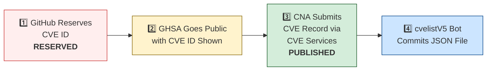

# 🛡️ OpenClaw CVE & Security Advisory Tracker

  
  
  
  
   
  
  
  
  
  

An automated tracker that continuously monitors [OpenClaw](https://github.com/openclaw/openclaw) security advisories across the GitHub Advisory Database, repo-level security advisories, and the [CVE V5 (cvelistV5)](https://github.com/CVEProject/cvelistV5) registry. Every hour it pulls the latest data, reconciles GHSA → CVE publication state, and regenerates this dashboard so you always have an up-to-date picture of the project's vulnerability landscape.

  Last updated: 2026-06-07 18:35 UTC · <a href="LICENSE">MIT License</a> · <a href="ADVISORIES.md">Full Advisory List</a> · <a href="SECURITY.md">Security Policy</a> · Data: <a href="https://github.com/CVEProject/cvelistV5">cvelistV5</a> + <a href="https://github.com/github/advisory-database">Advisory DB</a> · Updates hourly

---

  <a href="#-cves-published-in-cvelistv5-48">Published CVEs</a> ·
  <a href="#-cve-publication-pipeline">Pipeline</a> ·
  <a href="#-all-security-advisories-186">Advisories</a> ·
  <a href="#-vulnerability-categories">Categories</a> ·
  <a href="#-key-insights">Insights</a> ·
  <a href="#-project-identity">Identity</a>

---

## 🏗️ Project Identity

| Field | Value |
|-------|-------|
| **Current Name** | OpenClaw |
| **Previous Names** | Moltbot (second name), Clawdbot (original name) |
| **Repository** | [openclaw/openclaw](https://github.com/openclaw/openclaw) |
| **npm Package** | `openclaw` (formerly `clawdbot`) |
| **Author** | Peter Steinberger (steipete) |

<strong>Search terms for CVE discovery</strong>

To find all CVEs, search for: `openclaw`, `clawdbot`, `moltbot`, `clawhub`, `pkg:npm/clawdbot`, `pkg:npm/openclaw`

---

## 🚀 CVEs Published in cvelistV5 (48)

These CVEs have full records in the [CVEProject/cvelistV5](https://github.com/CVEProject/cvelistV5) repository:

| CVE ID | Severity | CVSS | Title | CWE | Published |
|--------|----------|------|-------|-----|-----------|
| [CVE-2026-32978](https://github.com/openclaw/openclaw/security/advisories/GHSA-qc36-x95h-7j53) |  | 9.4 | OpenClaw < 2026.3.11 - Approval Bypass via Unrecognized Script Runners | CWE-863 | 2026-03-29 |
| [CVE-2026-32915](https://github.com/openclaw/openclaw/security/advisories/GHSA-4w7m-58cg-cmff) |  | 9.3 | OpenClaw < 2026.3.11 - Sandbox Boundary Bypass via Subagent Control Surface | CWE-863 | 2026-03-29 |
| [CVE-2026-43585](https://github.com/openclaw/openclaw/security/advisories/GHSA-xmxx-7p24-h892) |  | 9.2 | OpenClaw: Gateway HTTP endpoints re-resolve bearer auth after SecretRef rotation | CWE-672 | 2026-05-06 |
| [CVE-2026-44109](https://github.com/openclaw/openclaw/security/advisories/GHSA-xh72-v6v9-mwhc) |  | 9.2 | OpenClaw: Feishu webhook and card-action validation now fail closed | CWE-1188 | 2026-05-06 |
| [CVE-2026-41386](https://github.com/openclaw/openclaw/security/advisories/GHSA-gg9v-mgcp-v6m7) |  | 9.1 | OpenClaw < 2026.3.22 - Privilege Escalation via Unbound Bootstrap Setup Codes | CWE-648 | 2026-04-28 |
| [CVE-2026-43533](https://github.com/openclaw/openclaw/security/advisories/GHSA-66r7-m7xm-v49h) |  | 8.9 | OpenClaw < 2026.4.10 - Arbitrary Local File Read via QQBot Media Tags | CWE-23 | 2026-05-05 |
| [CVE-2026-25253](https://github.com/openclaw/openclaw/security/advisories/GHSA-g8p2-7wf7-98mq) |  | 8.8 | OpenClaw/Clawdbot has 1-Click RCE via Authentication Token Exfiltration From gatewayUrl | CWE-669 | 2026-02-01 |
| [CVE-2026-24763](https://github.com/openclaw/openclaw/security/advisories/GHSA-mc68-q9jw-2h3v) |  | 8.8 | OpenClaw/Clawdbot Docker Execution has Authenticated Command Injection via PATH Environment Variable | CWE-78 | 2026-02-02 |
| [CVE-2026-32913](https://github.com/openclaw/openclaw/security/advisories/GHSA-6mgf-v5j7-45cr) |  | 8.8 | OpenClaw < 2026.3.7 - Custom Authorization Header Leakage via Cross-Origin Redirects | CWE-522 | 2026-03-23 |
| [CVE-2026-28478](https://github.com/openclaw/openclaw/security/advisories/GHSA-q447-rj3r-2cgh) |  | 8.7 | OpenClaw affected by denial of service via unbounded webhook request body buffering | CWE-770 | 2026-03-05 |
| [CVE-2026-32982](https://github.com/openclaw/openclaw/security/advisories/GHSA-xwcj-hwhf-h378) |  | 8.7 | OpenClaw < 2026.3.13 - Telegram Bot Token Exposure in Media Fetch Error Logs | CWE-532 | 2026-03-31 |
| [CVE-2026-41303](https://github.com/openclaw/openclaw/security/advisories/GHSA-98hh-7ghg-x6rq) |  | 8.7 | OpenClaw < 2026.3.28 - Authorization Bypass in Discord Text Approval Commands | CWE-863 | 2026-04-20 |
| [CVE-2026-42434](https://github.com/openclaw/openclaw/security/advisories/GHSA-736r-jwj6-4w23) |  | 8.7 | OpenClaw: Sandboxed agents could escape exec routing via host=node override | CWE-863 | 2026-05-05 |
| [CVE-2026-43530](https://github.com/openclaw/openclaw/security/advisories/GHSA-2cq5-mf3v-mx44) |  | 8.7 | OpenClaw: busybox and toybox applet execution weakened exec approval binding | CWE-863 | 2026-05-05 |
| [CVE-2026-44115](https://github.com/openclaw/openclaw/security/advisories/GHSA-x3h8-jrgh-p8jx) |  | 8.7 | OpenClaw < 2026.4.22 - Shell Expansion Bypass in Unquoted Heredocs via Exec Allowlist | CWE-184 | 2026-05-06 |
| [CVE-2026-43584](https://github.com/openclaw/openclaw/security/advisories/GHSA-vfp4-8x56-j7c5) |  | 8.7 | OpenClaw < 2026.4.10 - Insufficient Environment Variable Denylist in Exec Policy | CWE-184 | 2026-05-06 |
| [CVE-2026-26323](https://github.com/openclaw/openclaw/security/advisories/GHSA-m7x8-2w3w-pr42) |  | 8.6 | OpenClaw has a command injection in maintainer clawtributors updater | CWE-78 | 2026-02-19 |
| [CVE-2026-32920](https://github.com/openclaw/openclaw/security/advisories/GHSA-99qw-6mr3-36qr) |  | 8.6 | OpenClaw < 2026.3.12 - Arbitrary Code Execution via Auto-Discovery of Workspace Plugins | CWE-829 | 2026-03-31 |
| [CVE-2026-41294](https://github.com/openclaw/openclaw/security/advisories/GHSA-8rh7-6779-cjqq) |  | 8.5 | OpenClaw < 2026.3.28 - Environment Variable Injection via CWD .env File | CWE-15 | 2026-04-20 |
| [CVE-2026-41336](https://github.com/openclaw/openclaw/security/advisories/GHSA-3qpv-xf3v-mm45) |  | 8.5 | OpenClaw < 2026.3.31 - Arbitrary Hook Code Execution via OPENCLAW_BUNDLED_HOOKS_DIR Environment Variable Override | CWE-829 | 2026-04-23 |
| [CVE-2026-41384](https://github.com/openclaw/openclaw/security/advisories/GHSA-vfw7-6rhc-6xxg) |  | 8.5 | OpenClaw < 2026.3.24 - Environment Variable Injection via Workspace Config in CLI Backend | CWE-15 | 2026-04-28 |
| [CVE-2026-44114](https://github.com/openclaw/openclaw/security/advisories/GHSA-hxvm-xjvf-93f3) |  | 8.5 | OpenClaw: Workspace dotenv could override runtime-control environment variables | CWE-184 | 2026-05-06 |
| [CVE-2026-44118](https://github.com/openclaw/openclaw/security/advisories/GHSA-r6xh-pqhr-v4xh) |  | 8.5 | OpenClaw < 2026.4.22 - Owner Context Spoofing via Bearer Token Header | CWE-290 | 2026-05-06 |
| [CVE-2026-41371](https://github.com/openclaw/openclaw/security/advisories/GHSA-5r8f-96gm-5j6g) |  | 8.4 | OpenClaw < 2026.3.28 - Privilege Escalation via chat.send Reset Command | CWE-863 | 2026-04-27 |
| [CVE-2026-45004](https://github.com/openclaw/openclaw/security/advisories/GHSA-r39h-4c2p-3jxp) |  | 8.4 | OpenClaw vulnerable to arbitrary code execution via attacker-controlled setup-api.js loaded from cwd during env-key resolution | CWE-427 | 2026-05-11 |
| [CVE-2026-28453](https://github.com/openclaw/openclaw/security/advisories/GHSA-p25h-9q54-ffvw) |  | 8.3 | OpenClaw < 2026.2.14 - Zip Slip Path Traversal in TAR Archive Extraction | CWE-22 | 2026-03-05 |
| [CVE-2026-32004](https://github.com/openclaw/openclaw/security/advisories/GHSA-v865-p3gq-hw6m) |  | 8.3 | OpenClaw < 2026.3.2 - Authentication Bypass via Encoded Path in /api/channels Route | CWE-288 | 2026-03-19 |
| [CVE-2026-32905](https://github.com/openclaw/openclaw/security/advisories/GHSA-xr4f-mjxj-w6w5) |  | 8.3 | OpenClaw < 2026.5.4 - Unauthorized Device-Pairing Bootstrap Code Issuance via Chat Command | CWE-862 | 2026-05-29 |
| [CVE-2026-43526](https://github.com/openclaw/openclaw/security/advisories/GHSA-2767-2q9v-9326) |  | 8.3 | OpenClaw: QQBot reply media URL handling could trigger SSRF and re-upload fetched bytes | CWE-918 | 2026-05-05 |
| [CVE-2026-28454](https://github.com/openclaw/openclaw/security/advisories/GHSA-fhvm-j76f-qmjv) |  | 8.2 | OpenClaw < 2026.2.2 - Authorization Bypass via Unauthenticated Telegram Webhook | CWE-345 | 2026-03-05 |
| [CVE-2026-29611](https://github.com/openclaw/openclaw/security/advisories/GHSA-rwj8-p9vq-25gv) |  | 8.2 | OpenClaw < 2026.2.14 - Local File Inclusion via mediaPath Parameter in BlueBubbles Media Handling | CWE-73 | 2026-03-05 |
| [CVE-2026-28469](https://github.com/openclaw/openclaw/security/advisories/GHSA-rq6g-px6m-c248) |  | 8.2 | OpenClaw Google Chat shared-path webhook target ambiguity allowed cross-account policy-context misrouting | CWE-639 | 2026-03-05 |
| [CVE-2026-25157](https://github.com/openclaw/openclaw/security/advisories/GHSA-q284-4pvr-m585) |  | 7.8 | OpenClaw/Clawdbot has OS Command Injection via Project Root Path in sshNodeCommand | CWE-78 | 2026-02-04 |
| [CVE-2026-27002](https://github.com/openclaw/openclaw/security/advisories/GHSA-w235-x559-36mg) |  | 7.7 | OpenClaw: Docker container escape via unvalidated bind mount config injection | CWE-250 | 2026-02-19 |
| [CVE-2026-29610](https://github.com/openclaw/openclaw/security/advisories/GHSA-jqpq-mgvm-f9r6) |  | 7.7 | OpenClaw < 2026.2.14 - Command Hijacking via Unsafe PATH Handling | CWE-427 | 2026-03-05 |
| [CVE-2026-35666](https://github.com/openclaw/openclaw/security/advisories/GHSA-qm9x-v7cx-7rq4) |  | 7.7 | OpenClaw < 2026.3.22 - Allowlist Bypass via Unregistered Time Dispatch Wrapper | CWE-706 | 2026-04-10 |
| [CVE-2026-41404](https://github.com/openclaw/openclaw/security/advisories/GHSA-g374-mggx-p6xc) |  | 7.7 | OpenClaw < 2026.3.31 - Operator Admin Privilege Escalation via Trusted-Proxy Authentication | CWE-863 | 2026-04-28 |
| [CVE-2026-42423](https://github.com/openclaw/openclaw/security/advisories/GHSA-q2gc-xjqw-qp89) |  | 7.7 | OpenClaw < 2026.4.8 - strictInlineEval Approval Boundary Bypass via Approval-Timeout Fallback | CWE-636 | 2026-04-28 |
| [CVE-2026-43571](https://github.com/openclaw/openclaw/security/advisories/GHSA-82qx-6vj7-p8m2) |  | 7.7 | OpenClaw: Channel setup catalog lookups could include untrusted workspace plugin shadows | CWE-829 | 2026-05-05 |
| [CVE-2026-43569](https://github.com/openclaw/openclaw/security/advisories/GHSA-939r-rj45-g2rj) |  | 7.7 | OpenClaw: Workspace provider auth choices could auto-enable untrusted provider plugins | CWE-829 | 2026-05-05 |
| [CVE-2026-44110](https://github.com/openclaw/openclaw/security/advisories/GHSA-2gvc-4f3c-2855) |  | 7.7 | OpenClaw: Matrix room control-command authorization no longer trusts DM pairing-store entries | CWE-863 | 2026-05-06 |
| [CVE-2026-45223]() |  | 7.7 | Crabbox < 0.9.0 Authentication Bypass via Admin Claim Injection | CWE-290 | 2026-05-11 |
| [CVE-2026-26322](https://github.com/openclaw/openclaw/security/advisories/GHSA-g6q9-8fvw-f7rf) |  | 7.6 | OpenClaw Gateway tool allowed unrestricted gatewayUrl override | CWE-918 | 2026-02-19 |
| [CVE-2026-41397](https://github.com/openclaw/openclaw/security/advisories/GHSA-cwf8-44x6-32c2) |  | 7.6 | OpenClaw < 2026.3.31 - Sandbox Escape via Unrestricted File Sync and Symlink Traversal | CWE-59 | 2026-04-28 |
| [CVE-2026-42431](https://github.com/openclaw/openclaw/security/advisories/GHSA-cmfr-9m2r-xwhq) |  | 7.6 | OpenClaw < 2026.4.8 - Persistent Profile Mutation via node.invoke(browser.proxy) Bypass | CWE-863 | 2026-04-28 |
| [CVE-2026-26324](https://github.com/openclaw/openclaw/security/advisories/GHSA-jrvc-8ff5-2f9f) |  | 7.5 | OpenClaw has a SSRF guard bypass via full-form IPv4-mapped IPv6 (loopback / metadata reachable) | CWE-918 | 2026-02-19 |
| [CVE-2026-32025](https://github.com/openclaw/openclaw/security/advisories/GHSA-jmmg-jqc7-5qf4) |  | 7.5 | OpenClaw < 2026.2.25 - Password Brute-Force via Browser-Origin WebSocket Authentication Bypass | CWE-307 | 2026-03-19 |
| [CVE-2026-42428](https://github.com/openclaw/openclaw/security/advisories/GHSA-3vvq-q2qc-7rmp) |  | 7.5 | OpenClaw < 2026.4.8 - Missing Integrity Verification in Package Downloads | CWE-353 | 2026-04-28 |
| [CVE-2026-28458](https://github.com/openclaw/openclaw/security/advisories/GHSA-mr32-vwc2-5j6h) |  | 7.4 | OpenClaw's Browser Relay /cdp websocket is missing auth which could allow cross-tab cookie access | CWE-306 | 2026-03-05 |
| [CVE-2026-32032](https://github.com/openclaw/openclaw/security/advisories/GHSA-f8mp-vj46-cq8v) |  | 7.3 | OpenClaw < 2026.2.22 - Arbitrary Shell Execution via Unvalidated SHELL Environment Variable | CWE-426 | 2026-03-19 |
| [CVE-2026-32055](https://github.com/openclaw/openclaw/security/advisories/GHSA-mgrq-9f93-wpp5) |  | 7.2 | OpenClaw < 2026.2.26 - Workspace Path Boundary Bypass via Non-existent Symlink | CWE-22 | 2026-03-21 |
| [CVE-2026-26317](https://github.com/openclaw/openclaw/security/advisories/GHSA-3fqr-4cg8-h96q) |  | 7.1 | OpenClaw affected by cross-site request forgery (CSRF) through loopback browser mutation endpoints | CWE-352 | 2026-02-19 |
| [CVE-2026-27522](https://github.com/openclaw/openclaw/security/advisories/GHSA-fqcm-97m6-w7rm) |  | 7.1 | OpenClaw < 2026.2.24 - Arbitrary File Read via sendAttachment and setGroupIcon Message Actions | CWE-22 | 2026-03-18 |
| [CVE-2026-32976](https://github.com/openclaw/openclaw/security/advisories/GHSA-8jhh-jcqg-mj5p) |  | 7.1 | OpenClaw < 2026.3.11 - Account-Scoped configWrites Policy Bypass via Channel Commands | CWE-639 | 2026-03-31 |
| [CVE-2026-41370](https://github.com/openclaw/openclaw/security/advisories/GHSA-58q2-7r52-jq62) |  | 7.1 | OpenClaw < 2026.3.31 - Path Traversal via Inbound Channel Attachment Path in ACP Dispatch | CWE-22 | 2026-04-27 |
| [CVE-2026-41385](https://github.com/openclaw/openclaw/security/advisories/GHSA-jjw7-3vjf-fg5j) |  | 7.1 | OpenClaw < 2026.3.31 - Nostr Private Key Exposure via config.get Redaction Bypass | CWE-312 | 2026-04-28 |
| [CVE-2026-42433](https://github.com/openclaw/openclaw/security/advisories/GHSA-7jp6-r74r-995q) |  | 7.1 | OpenClaw: Matrix profile config persistence was reachable from operator.write message tools | CWE-862 | 2026-05-05 |
| [CVE-2026-43567](https://github.com/openclaw/openclaw/security/advisories/GHSA-jf25-7968-h2h5) |  | 7.1 | OpenClaw < 2026.4.10 - Path Traversal in screen_record outPath Parameter | CWE-862 | 2026-05-05 |
| [CVE-2026-32979](https://github.com/openclaw/openclaw/security/advisories/GHSA-xf99-j42q-5w5p) |  | 7 | OpenClaw < 2026.3.11 - Unbound Interpreter and Runtime Commands Bypass in node-host Approval | CWE-367 | 2026-03-29 |
| [CVE-2026-41390](https://github.com/openclaw/openclaw/security/advisories/GHSA-6pfc-6m7w-m8fx) |  | 7 | OpenClaw < 2026.3.28 - Exec Allowlist Bypass via Unregistered /usr/bin/script Wrapper | CWE-807 | 2026-04-28 |
| [CVE-2026-43531](https://github.com/openclaw/openclaw/security/advisories/GHSA-7wv4-cc7p-jhxc) |  | 7 | OpenClaw < 2026.4.9 - Environment Variable Injection via Workspace .env File | CWE-15 | 2026-05-05 |
| [CVE-2026-22178](https://github.com/openclaw/openclaw/security/advisories/GHSA-c6hr-w26q-c636) |  | 6.9 | OpenClaw < 2026.2.19 - ReDoS and Regex Injection via Unescaped Feishu Mention Metadata | CWE-1333 | 2026-03-18 |
| [CVE-2026-28480](https://github.com/openclaw/openclaw/security/advisories/GHSA-mj5r-hh7j-4gxf) |  | 6.9 | OpenClaw Telegram allowlist authorization accepted mutable usernames | CWE-290 | 2026-03-05 |
| [CVE-2026-31994](https://github.com/openclaw/openclaw/security/advisories/GHSA-mqr9-vqhq-3jxw) |  | 6.9 | OpenClaw < 2026.2.19 - Local Command Injection via Unsafe cmd Argument Handling in Windows Scheduled Task Script Generation | CWE-78 | 2026-03-19 |
| [CVE-2026-32919](https://github.com/openclaw/openclaw/security/advisories/GHSA-jf6w-m8jw-jfxc) |  | 6.9 | OpenClaw < 2026.3.11 - Unauthorized Session Reset via agent Slash Commands | CWE-863 | 2026-03-29 |
| [CVE-2026-35632](https://github.com/openclaw/openclaw/security/advisories/GHSA-7xr2-q9vf-x4r5) |  | 6.9 | OpenClaw < 2026.2.22 - Symlink Traversal via IDENTITY.md appendFile in agents.create/update | CWE-61 | 2026-04-09 |
| [CVE-2026-35654](https://github.com/openclaw/openclaw/security/advisories/GHSA-rf6h-5gpw-qrgq) |  | 6.9 | OpenClaw < 2026.3.25 - Authorization Bypass in Microsoft Teams Feedback Invoke | CWE-288 | 2026-04-10 |
| [CVE-2026-35627](https://github.com/openclaw/openclaw/security/advisories/GHSA-65h8-27jh-q8wv) |  | 6.9 | OpenClaw < 2026.3.22 - Unauthenticated Cryptographic Work in Nostr Inbound DM Handling | CWE-696 | 2026-04-09 |
| [CVE-2026-35665](https://github.com/openclaw/openclaw/security/advisories/GHSA-w6m8-cqvj-pg5v) |  | 6.9 | OpenClaw < 2026.3.24 - Denial of Service via Feishu Webhook Pre-Auth Body Parsing | CWE-405 | 2026-04-10 |
| [CVE-2026-41300](https://github.com/openclaw/openclaw/security/advisories/GHSA-9f4w-67g7-mqwv) |  | 6.9 | OpenClaw < 2026.3.31 - Attacker-Discovered Endpoint Preservation in Remote Onboarding | CWE-372 | 2026-04-20 |
| [CVE-2026-35667](https://github.com/openclaw/openclaw/security/advisories/GHSA-3298-56p6-rpw2) |  | 6.9 | OpenClaw < 2026.3.24 - Improper Process Termination via Unpatched killProcessTree in shell-utils.ts | CWE-404 | 2026-04-10 |
| [CVE-2026-41372](https://github.com/openclaw/openclaw/security/advisories/GHSA-fh32-73r9-rgh5) |  | 6.9 | OpenClaw < 2026.4.2 - Loopback Protection Bypass via Trailing-Dot Localhost in CDP Discovery | CWE-639 | 2026-04-27 |
| [CVE-2026-44116](https://github.com/openclaw/openclaw/security/advisories/GHSA-2hh7-c75g-qj2r) |  | 6.9 | OpenClaw < 2026.4.22 - Server-Side Request Forgery in Zalo Photo URL Validation | CWE-918 | 2026-05-06 |
| [CVE-2026-28486](https://github.com/openclaw/openclaw/security/advisories/GHSA-v892-hwpg-jwqp) |  | 6.8 | OpenClaw 2026.1.16-2 < 2026.2.14 - Path Traversal (Zip Slip) in Archive Extraction via Installation Commands | CWE-22 | 2026-03-05 |
| [CVE-2026-29612](https://github.com/openclaw/openclaw/security/advisories/GHSA-w2cg-vxx6-5xjg) |  | 6.8 | OpenClaw < 2026.2.14 - Denial of Service via Large Base64 Media File Decoding | CWE-770 | 2026-03-05 |
| [CVE-2026-26972](https://github.com/openclaw/openclaw/security/advisories/GHSA-xwjm-j929-xq7c) |  | 6.7 | OpenClaw has a Path Traversal in Browser Download Functionality | CWE-22 | 2026-02-19 |
| [CVE-2026-28452](https://github.com/openclaw/openclaw/security/advisories/GHSA-h89v-j3x9-8wqj) |  | 6.7 | OpenClaw affected by denial of service through unguarded archive extraction allowing high expansion/resource abuse (ZIP/TAR) | CWE-770 | 2026-03-05 |
| [CVE-2026-26328](https://github.com/openclaw/openclaw/security/advisories/GHSA-g34w-4xqq-h79m) |  | 6.5 | OpenClaw iMessage group allowlist authorization inherited DM pairing-store identities | CWE-284, CWE-863 | 2026-02-19 |
| [CVE-2026-32050](https://github.com/openclaw/openclaw/security/advisories/GHSA-792q-qw95-f446) |  | 6.3 | OpenClaw < 2026.2.25 - Unauthorized Reaction Status Event Enqueue via Access Check Bypass | CWE-863 | 2026-03-21 |
| [CVE-2026-35628](https://github.com/openclaw/openclaw/security/advisories/GHSA-vcx4-4qxg-mfp4) |  | 6.3 | OpenClaw < 2026.3.25 - Brute-Force Attack via Missing Telegram Webhook Rate Limiting | CWE-307 | 2026-04-09 |
| [CVE-2026-35646](https://github.com/openclaw/openclaw/security/advisories/GHSA-mf5g-6r6f-ghhm) |  | 6.3 | OpenClaw < 2026.3.25 - Pre-Authentication Rate-Limit Bypass in Webhook Token Validation | CWE-307 | 2026-04-09 |
| [CVE-2026-35656](https://github.com/openclaw/openclaw/security/advisories/GHSA-844j-xrrq-wgh4) |  | 6.3 | OpenClaw < 2026.3.22 - XFF Loopback Spoofing Bypass in Canvas Authentication and Rate Limiter | CWE-290 | 2026-04-10 |
| [CVE-2026-41333](https://github.com/openclaw/openclaw/security/advisories/GHSA-6p8r-6m93-557f) |  | 6.3 | OpenClaw < 2026.3.31 - Authentication Rate Limiting Bypass via Fake DeviceToken | CWE-799 | 2026-04-23 |
| [CVE-2026-41389](https://github.com/openclaw/openclaw/security/advisories/GHSA-mr34-9552-qr95) |  | 6.3 | OpenClaw: Webchat media embedding enforces local-root containment for tool-result files | CWE-73 | 2026-04-20 |
| [CVE-2026-41351](https://github.com/openclaw/openclaw/security/advisories/GHSA-37v6-fxx8-xjmx) |  | 6.3 | OpenClaw < 2026.3.31 - Webhook Replay Detection Bypass via Base64 Signature Re-encoding | CWE-294 | 2026-04-23 |
| [CVE-2026-43527](https://github.com/openclaw/openclaw/security/advisories/GHSA-53vx-pmqw-863c) |  | 6.3 | OpenClaw: Browser SSRF policy default allowed private-network navigation | CWE-918, CWE-1188 | 2026-05-05 |
| [CVE-2026-44117](https://github.com/openclaw/openclaw/security/advisories/GHSA-c4qg-j8jg-42q5) |  | 6.3 | OpenClaw < 2026.4.20 - Server-Side Request Forgery in QQBot Direct Media Upload | CWE-918 | 2026-05-06 |
| [CVE-2026-45002](https://github.com/openclaw/openclaw/security/advisories/GHSA-2xcp-x87w-q377) |  | 6.3 | OpenClaw < 2026.4.20 - Hook Session-Key Bypass via Template Mapping | CWE-863 | 2026-05-11 |
| [CVE-2026-44999](https://github.com/openclaw/openclaw/security/advisories/GHSA-57r2-h2wj-g887) |  | 6.3 | OpenClaw < 2026.4.20 - Improper Trust Labeling in Isolated Cron Awareness Events | CWE-345 | 2026-05-11 |
| [CVE-2026-35645](https://github.com/openclaw/openclaw/security/advisories/GHSA-h4jx-hjr3-fhgc) |  | 6.1 | OpenClaw < 2026.3.25 - Privilege Escalation via Synthetic operator.admin in deleteSession | CWE-648 | 2026-04-09 |
| [CVE-2026-41366](https://github.com/openclaw/openclaw/security/advisories/GHSA-57gh-m6rq-54cf) |  | 6 | OpenClaw < 2026.3.31 - Arbitrary Host File Read via appendLocalMediaParentRoots Self-Whitelisting | CWE-732 | 2026-04-27 |
| [CVE-2026-41363](https://github.com/openclaw/openclaw/security/advisories/GHSA-qf48-qfv4-jjm9) |  | 6 | OpenClaw 2026.2.6 < 2026.3.28 - Arbitrary File Read via Feishu upload_image Parameter | CWE-22 | 2026-04-27 |
| [CVE-2026-43570](https://github.com/openclaw/openclaw/security/advisories/GHSA-cr8r-7g2h-6wr6) |  | 6 | OpenClaw contains a symlink traversal vulnerability | CWE-61 | 2026-05-05 |
| [CVE-2026-43574](https://github.com/openclaw/openclaw/security/advisories/GHSA-49cg-279w-m73x) |  | 6 | OpenClaw < 2026.4.12 - Improper Authorization via Empty Approver Lists | CWE-183 | 2026-05-05 |
| [CVE-2026-43583](https://github.com/openclaw/openclaw/security/advisories/GHSA-r77c-2cmr-7p47) |  | 6 | OpenClaw 2026.4.10 < 2026.4.14 - Loss of Group Tool-Policy Context in Delivery Queue Recovery | CWE-862 | 2026-05-06 |
| [CVE-2026-44113](https://github.com/openclaw/openclaw/security/advisories/GHSA-5h3g-6xhh-rg6p) |  | 6 | OpenClaw: OpenShell FS bridge reads pin and verify the opened file before returning bytes | CWE-367 | 2026-05-06 |
| [CVE-2026-44112](https://github.com/openclaw/openclaw/security/advisories/GHSA-wppj-c6mr-83jj) |  | 6 | OpenClaw < 2026.4.22 - Symlink Swap Race Condition in OpenShell FS Bridge Writes | CWE-367 | 2026-05-06 |
| [CVE-2026-45001](https://github.com/openclaw/openclaw/security/advisories/GHSA-7jm2-g593-4qrc) |  | 6 | OpenClaw < 2026.4.20 - Gateway Config Mutation Guard Bypass via Agent Tool Access | CWE-862 | 2026-05-11 |
| [CVE-2026-45005](https://github.com/openclaw/openclaw/security/advisories/GHSA-q8ff-7ffm-m3r9) |  | 5.9 | OpenClaw < 2026.4.23 - Webhook Route Secret Cache Not Invalidated After Rotation | CWE-672 | 2026-05-11 |
| [CVE-2026-31999](https://github.com/openclaw/openclaw/security/advisories/GHSA-6f6j-wx9w-ff4j) |  | 5.8 | OpenClaw 2026.2.26 < 2026.3.1 - Current Working Directory Injection via Windows Wrapper Resolution Fallback | CWE-78 | 2026-03-19 |
| [CVE-2026-32052](https://github.com/openclaw/openclaw/security/advisories/GHSA-6rcp-vxwf-3mfp) |  | 5.8 | OpenClaw < 2026.2.24 - Hidden Command Execution via Shell-Wrapper Positional argv Carriers | CWE-436 | 2026-03-21 |
| [CVE-2026-41915](https://github.com/openclaw/openclaw/security/advisories/GHSA-cm8v-2vh9-cxf3) |  | 5.8 | OpenClaw < 2026.4.8 - Git Environment Variable Injection via Unfiltered Exec Environment | CWE-184 | 2026-04-28 |
| [CVE-2026-41392](https://github.com/openclaw/openclaw/security/advisories/GHSA-wpc6-37g7-8q4w) |  | 5.4 | OpenClaw < 2026.3.31 - Exec Allowlist Bypass via Shell Init-File Options | CWE-184 | 2026-04-28 |
| [CVE-2026-44995](https://github.com/openclaw/openclaw/security/advisories/GHSA-mj59-h3q9-ghfh) |  | 5.4 | OpenClaw: MCP stdio server env could load dangerous startup variables from workspace config | CWE-829 | 2026-05-11 |
| [CVE-2026-26326](https://github.com/openclaw/openclaw/security/advisories/GHSA-8mh7-phf8-xgfm) |  | 5.3 | OpenClaw skills.status could leak secrets to operator.read clients | CWE-200 | 2026-02-19 |
| [CVE-2026-31989](https://github.com/openclaw/openclaw/security/advisories/GHSA-g99v-8hwm-g76g) |  | 5.3 | OpenClaw < 2026.3.1 - Server-Side Request Forgery via web_search Citation Redirect | CWE-918 | 2026-03-19 |
| [CVE-2026-32895](https://github.com/openclaw/openclaw/security/advisories/GHSA-v8cg-4474-49v8) |  | 5.3 | OpenClaw < 2026.2.26 - Sender Authorization Bypass in Slack System Event Handlers | CWE-863 | 2026-03-21 |
| [CVE-2026-32899](https://github.com/openclaw/openclaw/security/advisories/GHSA-rm2p-j3r7-4x4j) |  | 5.3 | OpenClaw < 2026.2.25 - Sender Policy Bypass in Slack Reaction and Pin Event Handlers | CWE-863 | 2026-03-21 |
| [CVE-2026-35662](https://github.com/openclaw/openclaw/security/advisories/GHSA-x2cm-hg9c-mf5w) |  | 5.3 | OpenClaw < 2026.3.22 - Missing controlScope Enforcement in Send Action | CWE-862 | 2026-04-10 |
| [CVE-2026-42436](https://github.com/openclaw/openclaw/security/advisories/GHSA-c4qm-58hj-j6pj) |  | 4.9 | OpenClaw < 2026.4.14 - Internal Page Content Exposure via Browser Snapshot and Screenshot Routes | CWE-862 | 2026-05-05 |
| [CVE-2026-42439](https://github.com/openclaw/openclaw/security/advisories/GHSA-rj2p-j66c-mgqh) |  | 4.9 | OpenClaw < 2026.4.10 - SSRF Policy Bypass in Browser Tabs Action Routes | CWE-862 | 2026-05-05 |
| [CVE-2026-42438](https://github.com/openclaw/openclaw/security/advisories/GHSA-jhpv-5j76-m56h) |  | 4.9 | OpenClaw: Sender policy bypass in host media attachment reads allows unauthorized local file disclosure | CWE-863 | 2026-05-05 |
| [CVE-2026-43532](https://github.com/openclaw/openclaw/security/advisories/GHSA-c9h3-5p7r-mrjh) |  | 4.9 | OpenClaw 2026.4.7 < 2026.4.10 - Sandbox Media Normalization Bypass via Discord Event Cover Image | CWE-184 | 2026-05-05 |
| [CVE-2026-43576](https://github.com/openclaw/openclaw/security/advisories/GHSA-f7fh-qg34-x2xh) |  | 4.9 | OpenClaw < 2026.4.5 - Second-hop SSRF via CDP /json/version WebSocket URL | CWE-601, CWE-918 | 2026-05-06 |
| [CVE-2026-43573](https://github.com/openclaw/openclaw/security/advisories/GHSA-527m-976r-jf79) |  | 4.9 | OpenClaw: Existing-session browser interaction routes bypassed SSRF policy enforcement | CWE-862, CWE-918 | 2026-05-05 |
| [CVE-2026-43582](https://github.com/openclaw/openclaw/security/advisories/GHSA-xq94-r468-qwgj) |  | 4.9 | OpenClaw < 2026.4.10 - DNS Rebinding SSRF via Hostname Validation Bypass | CWE-367 | 2026-05-06 |
| [CVE-2026-43580](https://github.com/openclaw/openclaw/security/advisories/GHSA-536q-mj95-h29h) |  | 4.9 | OpenClaw: Browser press/type interaction routes missed complete navigation guard coverage | CWE-862 | 2026-05-06 |
| [CVE-2026-22180](https://github.com/openclaw/openclaw/security/advisories/GHSA-3pxq-f3cp-jmxp) |  | 4.8 | OpenClaw < 2026.3.2 - Path Confinement Bypass in Browser Output and File Write Operations | CWE-59 | 2026-03-18 |
| [CVE-2026-27576](https://github.com/openclaw/openclaw/security/advisories/GHSA-cxpw-2g23-2vgw) |  | 4.8 | OpenClaw: ACP prompt-size checks missing in local stdio bridge could reduce responsiveness with very large inputs | CWE-400 | 2026-02-21 |
| [CVE-2026-41297](https://github.com/openclaw/openclaw/security/advisories/GHSA-vjx8-8p7h-82gr) |  | 4.8 | OpenClaw < 2026.3.31 - Server-Side Request Forgery via Marketplace Plugin Download Redirect | CWE-918 | 2026-04-20 |
| [CVE-2026-27485](https://github.com/openclaw/openclaw/security/advisories/GHSA-r6h2-5gqq-v5v6) |  | 4.6 | OpenClaw affected by Stored XSS in Control UI via unsanitized assistant name/avatar in inline script injection | CWE-61 | 2026-02-21 |
| [CVE-2026-44992](https://github.com/openclaw/openclaw/security/advisories/GHSA-h2vw-ph2c-jvwf) |  | 4.1 | OpenClaw 2026.4.5 < 2026.4.20 - MiniMax API Host Override via Workspace dotenv | CWE-441 | 2026-05-11 |
| [CVE-2026-45003](https://github.com/openclaw/openclaw/security/advisories/GHSA-55cf-xx38-4p9p) |  | 4.1 | OpenClaw: Workspace dotenv files cannot override connector endpoint hosts | CWE-441 | 2026-05-11 |
| [CVE-2026-24764](https://github.com/openclaw/openclaw/security/advisories/GHSA-782p-5fr5-7fj8) |  | 3.7 | OpenClaw has Remote Code Execution via System Prompt Injection in Slack Channel Descriptions | CWE-74, CWE-94 | 2026-02-19 |
| [CVE-2026-32040](https://github.com/openclaw/openclaw/security/advisories/GHSA-2ww6-868g-2c56) |  | 2.4 | OpenClaw < 2026.2.23 - HTML Injection via Unvalidated Image MIME Type in Data-URL Interpolation | CWE-79 | 2026-03-19 |
| [CVE-2026-27484](https://github.com/openclaw/openclaw/security/advisories/GHSA-wh94-p5m6-mr7j) |  | 2.3 | OpenClaw Discord moderation authorization used untrusted sender identity in tool-driven flows | CWE-862 | 2026-02-21 |
| [CVE-2026-32006](https://github.com/openclaw/openclaw/security/advisories/GHSA-25pw-4h6w-qwvm) |  | 2.3 | OpenClaw < 2026.2.26 - Authorization Bypass via DM Pairing-Store Fallback in Group Allowlist | CWE-863 | 2026-03-19 |
| [CVE-2026-41341](https://github.com/openclaw/openclaw/security/advisories/GHSA-6336-qqw9-v6x6) |  | 2.3 | OpenClaw < 2026.3.31 - Component Interaction Misclassification in Discord Extension | CWE-351 | 2026-04-23 |
| [CVE-2026-41358](https://github.com/openclaw/openclaw/security/advisories/GHSA-qm77-8qjp-4vcm) |  | 2.3 | OpenClaw < 2026.4.2 - Sender Allowlist Bypass via Slack Thread Context | CWE-346 | 2026-04-23 |
| [CVE-2026-41348](https://github.com/openclaw/openclaw/security/advisories/GHSA-rvvf-6vh3-9j43) |  | 2.3 | OpenClaw < 2026.3.31 - Group DM Channel Allowlist Bypass via Discord Slash Commands | CWE-863 | 2026-04-23 |
| [CVE-2026-41362](https://github.com/openclaw/openclaw/security/advisories/GHSA-fqrj-m88p-qf3v) |  | 2.3 | OpenClaw 2026.2.19 < 2026.3.31 - Webhook Replay Dedupe Cache Event Suppression via Shared Authentication | CWE-668 | 2026-04-27 |
| [CVE-2026-41347](https://github.com/openclaw/openclaw/security/advisories/GHSA-mhr7-2xmv-4c4q) |  | 2.3 | OpenClaw < 2026.3.31 - Cross-Site Request Forgery via Missing Browser-Origin Validation in HTTP Operator Endpoints | CWE-352 | 2026-04-23 |
| [CVE-2026-41908](https://github.com/openclaw/openclaw/security/advisories/GHSA-v8qf-fr4g-28p2) |  | 2.3 | OpenClaw < 2026.4.20 - Scope Enforcement Bypass in Assistant-Media Route | CWE-863 | 2026-04-23 |
| [CVE-2026-41910](https://github.com/openclaw/openclaw/security/advisories/GHSA-vc32-h5mq-453v) |  | 2.3 | OpenClaw < 2026.4.8 - Missing Owner-Only Enforcement in /allowlist Cross-Channel Writes | CWE-863 | 2026-04-28 |
| [CVE-2026-44997](https://github.com/openclaw/openclaw/security/advisories/GHSA-q3jj-46pq-826r) |  | 2.3 | OpenClaw < 2026.4.22 - Security Envelope Constraint Bypass in ACP Child Sessions | CWE-266 | 2026-05-11 |
| [CVE-2026-44991](https://github.com/openclaw/openclaw/security/advisories/GHSA-c28g-vh7m-fm7v) |  | 2.3 | OpenClaw: Owner-enforced commands could accept wildcard channel senders as command owners | CWE-863 | 2026-05-11 |
| [CVE-2026-32018](https://github.com/openclaw/openclaw/security/advisories/GHSA-gq83-8q7q-9hfx) |  | 2 | OpenClaw < 2026.2.19 - Race Condition in Sandbox Registry Write Operations | CWE-362 | 2026-03-19 |
| [CVE-2026-32058](https://github.com/openclaw/openclaw/security/advisories/GHSA-hjvp-qhm6-wrh2) |  | 2 | OpenClaw < 2026.2.26 - Approval Context-Binding Weakness in system.run via host=node | CWE-863 | 2026-03-21 |

<strong>📖 Detailed CVE Analysis (click to expand)</strong>

### CVE-2026-32978 — OpenClaw < 2026.3.11 - Approval Bypass via Unrecognized Script Runners

| Field | Detail |
|-------|--------|
| **CVSS** | 9.4 (CRITICAL) — `CVSS:4.0/AV:N/AC:L/AT:N/PR:L/UI:P/VC:H/VI:H/VA:H/SC:H/SI:H/SA:H` |
| **CWE** | CWE-863 (Incorrect Authorization) |
| **Affected** | < 2026.3.11 |
| **Vendor/Product** | OpenClaw / OpenClaw |
| **Advisory** | [GHSA-qc36-x95h-7j53](https://github.com/openclaw/openclaw/security/advisories/GHSA-qc36-x95h-7j53) |

OpenClaw before 2026.3.11 contains an approval integrity vulnerability where system.run approvals fail to bind mutable file operands for certain script runners like tsx and jiti. Attackers can obtain approval for benign script commands, rewrite referenced scripts on disk, and execute modified code under the approved run context.

**References:**
- [VulnCheck Advisory: OpenClaw < 2026.3.11 - Approval Bypass via Unrecognized Script Runners](https://www.vulncheck.com/advisories/openclaw-approval-bypass-via-unrecognized-script-runners)
---

### CVE-2026-32915 — OpenClaw < 2026.3.11 - Sandbox Boundary Bypass via Subagent Control Surface

| Field | Detail |
|-------|--------|
| **CVSS** | 9.3 (CRITICAL) — `CVSS:4.0/AV:L/AC:L/AT:N/PR:L/UI:N/VC:H/VI:H/VA:H/SC:H/SI:H/SA:H` |
| **CWE** | CWE-863 (Incorrect Authorization) |
| **Affected** | < 2026.3.11 |
| **Vendor/Product** | OpenClaw / OpenClaw |
| **Advisory** | [GHSA-4w7m-58cg-cmff](https://github.com/openclaw/openclaw/security/advisories/GHSA-4w7m-58cg-cmff) |

OpenClaw before 2026.3.11 contains a sandbox boundary bypass vulnerability allowing leaf subagents to access the subagents control surface and resolve against parent requester scope instead of their own session tree. A low-privilege sandboxed leaf worker can steer or kill sibling runs and cause execution with broader tool policies by exploiting insufficient authorization checks on subagent control requests.

**References:**
- [VulnCheck Advisory: OpenClaw < 2026.3.11 - Sandbox Boundary Bypass via Subagent Control Surface](https://www.vulncheck.com/advisories/openclaw-sandbox-boundary-bypass-via-subagent-control-surface)
---

### CVE-2026-43585 — OpenClaw: Gateway HTTP endpoints re-resolve bearer auth after SecretRef rotation

| Field | Detail |
|-------|--------|
| **CVSS** | 9.2 (CRITICAL) — `CVSS:4.0/AV:N/AC:H/AT:P/PR:N/UI:N/VC:H/VI:H/VA:H/SC:N/SI:N/SA:N` |
| **CWE** | CWE-672 (Operation on a Resource after Expiration or Release) |
| **Affected** | < 2026.4.15 |
| **Vendor/Product** | OpenClaw / OpenClaw |
| **Advisory** | [GHSA-xmxx-7p24-h892](https://github.com/openclaw/openclaw/security/advisories/GHSA-xmxx-7p24-h892) |

OpenClaw before 2026.4.15 captures resolved bearer-auth configuration at startup, allowing revoked tokens to remain valid after SecretRef rotation. Gateway HTTP and WebSocket handlers fail to re-resolve authentication per-request, enabling attackers to use rotated-out bearer tokens for unauthorized gateway access.

**References:**
- [Patch Commit](https://github.com/openclaw/openclaw/commit/acd4e0a32f12e1ad85f3130f63b42443ce90f094)
- [VulnCheck Advisory: OpenClaw < 2026.4.15 - Bearer Token Validation Bypass via Stale SecretRef Resolution](https://www.vulncheck.com/advisories/openclaw-bearer-token-validation-bypass-via-stale-secretref-resolution)
---

### CVE-2026-44109 — OpenClaw: Feishu webhook and card-action validation now fail closed

| Field | Detail |
|-------|--------|
| **CVSS** | 9.2 (CRITICAL) — `CVSS:4.0/AV:N/AC:L/AT:P/PR:N/UI:N/VC:H/VI:H/VA:H/SC:N/SI:N/SA:N` |
| **CWE** | CWE-1188 (CWE-1188 Initialization of a Resource with an Insecure Default) |
| **Affected** | < 2026.4.15 |
| **Vendor/Product** | OpenClaw / OpenClaw |
| **Advisory** | [GHSA-xh72-v6v9-mwhc](https://github.com/openclaw/openclaw/security/advisories/GHSA-xh72-v6v9-mwhc) |

OpenClaw before 2026.4.15 contains an authentication bypass vulnerability in Feishu webhook and card-action validation that allows unauthenticated requests to reach command dispatch. Missing encryptKey configuration and blank callback tokens fail open instead of rejecting requests, enabling attackers to bypass signature verification and replay protection to execute arbitrary commands.

**References:**
- [Patch Commit](https://github.com/openclaw/openclaw/commit/c8003f1b33ed2924be5f62131bd28742c5a41aae)
- [VulnCheck Advisory: OpenClaw < 2026.4.15 - Authentication Bypass in Feishu Webhook and Card-Action Validation](https://www.vulncheck.com/advisories/openclaw-authentication-bypass-in-feishu-webhook-and-card-action-validation)
---

### CVE-2026-41386 — OpenClaw < 2026.3.22 - Privilege Escalation via Unbound Bootstrap Setup Codes

| Field | Detail |
|-------|--------|
| **CVSS** | 9.1 (CRITICAL) — `CVSS:4.0/AV:N/AC:L/AT:P/PR:N/UI:N/VC:H/VI:H/VA:N/SC:N/SI:N/SA:N` |
| **CWE** | CWE-648 (CWE-648: Incorrect Use of Privileged APIs) |
| **Affected** | < 2026.3.22 |
| **Vendor/Product** | OpenClaw / OpenClaw |
| **Advisory** | [GHSA-gg9v-mgcp-v6m7](https://github.com/openclaw/openclaw/security/advisories/GHSA-gg9v-mgcp-v6m7) |

OpenClaw before 2026.3.22 contains a privilege escalation vulnerability where bootstrap setup codes are not bound to intended device roles and scopes during pairing. Attackers can exploit this during first-use device pairing to escalate privileges beyond their intended role and scope.

**References:**
- [Patch Commit](https://github.com/openclaw/openclaw/commit/a600c72ed7d0045a27f58bf031d2b36ecb0141c9)
- [VulnCheck Advisory: OpenClaw < 2026.3.22 - Privilege Escalation via Unbound Bootstrap Setup Codes](https://www.vulncheck.com/advisories/openclaw-privilege-escalation-via-unbound-bootstrap-setup-codes)
---

### CVE-2026-43533 — OpenClaw < 2026.4.10 - Arbitrary Local File Read via QQBot Media Tags

| Field | Detail |
|-------|--------|
| **CVSS** | 8.9 (HIGH) — `CVSS:4.0/AV:N/AC:L/AT:P/PR:N/UI:N/VC:H/VI:N/VA:N/SC:H/SI:N/SA:N` |
| **CWE** | CWE-23 (CWE-23: Relative Path Traversal) |
| **Affected** | < 2026.4.10 |
| **Vendor/Product** | OpenClaw / OpenClaw |
| **Advisory** | [GHSA-66r7-m7xm-v49h](https://github.com/openclaw/openclaw/security/advisories/GHSA-66r7-m7xm-v49h) |

OpenClaw before 2026.4.10 contains an arbitrary file read vulnerability in QQBot media tags that allows attackers to reference host-local paths outside the intended media storage boundary. Attackers can craft malicious reply text containing media tags to disclose arbitrary local files through outbound media handling.

**References:**
- [Patch Commit](https://github.com/openclaw/openclaw/commit/604777e4414cc3b2ff8861f18f4fb04374c702c6)
- [VulnCheck Advisory: OpenClaw < 2026.4.10 - Arbitrary Local File Read via QQBot Media Tags](https://www.vulncheck.com/advisories/openclaw-arbitrary-local-file-read-via-qqbot-media-tags)
---

### CVE-2026-25253 — OpenClaw/Clawdbot has 1-Click RCE via Authentication Token Exfiltration From gatewayUrl

| Field | Detail |
|-------|--------|
| **CVSS** | 8.8 (HIGH) — `CVSS:3.1/AV:N/AC:L/PR:N/UI:R/S:U/C:H/I:H/A:H` |
| **CWE** | CWE-669 (CWE-669 Incorrect Resource Transfer Between Spheres) |
| **Affected** | < 2026.1.29 |
| **Vendor/Product** | OpenClaw / OpenClaw |
| **Advisory** | [GHSA-g8p2-7wf7-98mq](https://github.com/openclaw/openclaw/security/advisories/GHSA-g8p2-7wf7-98mq) |

OpenClaw (aka clawdbot or Moltbot) before 2026.1.29 obtains a gatewayUrl value from a query string and automatically makes a WebSocket connection without prompting, sending a token value.

> **Naming note:** Uses all three names in description. packageURL still references `pkg:npm/clawdbot`.
**References:**
- [1-click-rce-to-steal-your-moltbot-data-and-keys](https://depthfirst.com/post/1-click-rce-to-steal-your-moltbot-data-and-keys)
- [blog](https://openclaw.ai/blog)
- [one-click-rce-moltbot](https://ethiack.com/news/blog/one-click-rce-moltbot)
- [2016913750557651228](https://x.com/0xacb/status/2016913750557651228)
---

### CVE-2026-24763 — OpenClaw/Clawdbot Docker Execution has Authenticated Command Injection via PATH Environment Variable

| Field | Detail |
|-------|--------|
| **CVSS** | 8.8 (HIGH) — `CVSS:3.1/AV:N/AC:L/PR:L/UI:N/S:U/C:H/I:H/A:H` |
| **CWE** | CWE-78 (CWE-78: Improper Neutralization of Special Elements used in an OS Command ('OS Command Injection')) |
| **Affected** | < 2026.1.29 |
| **Vendor/Product** | clawdbot / clawdbot |
| **Advisory** | [GHSA-mc68-q9jw-2h3v](https://github.com/openclaw/openclaw/security/advisories/GHSA-mc68-q9jw-2h3v) |

OpenClaw (formerly  Clawdbot) is a personal AI assistant you run on your own devices. Prior to 2026.1.29, a command injection vulnerability existed in OpenClaw’s Docker sandbox execution mechanism due to unsafe handling of the PATH environment variable when constructing shell commands. An authenticated user able to control environment variables could influence command execution within the container context. This vulnerability is fixed in 2026.1.29.

> **Naming note:** Uses old name `clawdbot/clawdbot` as vendor/product.
**References:**
- [https://github.com/openclaw/openclaw/commit/771f23d36b95ec2204cc9a0054045f5d8439ea75](https://github.com/openclaw/openclaw/commit/771f23d36b95ec2204cc9a0054045f5d8439ea75)
- [https://github.com/openclaw/openclaw/releases/tag/v2026.1.29](https://github.com/openclaw/openclaw/releases/tag/v2026.1.29)
---

### CVE-2026-32913 — OpenClaw < 2026.3.7 - Custom Authorization Header Leakage via Cross-Origin Redirects

| Field | Detail |
|-------|--------|
| **CVSS** | 8.8 (HIGH) — `CVSS:4.0/AV:N/AC:L/AT:N/PR:N/UI:N/VC:H/VI:L/VA:N/SC:L/SI:L/SA:N` |
| **CWE** | CWE-522 (CWE-522 Insufficiently Protected Credentials) |
| **Affected** | < 2026.3.7 |
| **Vendor/Product** | OpenClaw / OpenClaw |
| **Advisory** | [GHSA-6mgf-v5j7-45cr](https://github.com/openclaw/openclaw/security/advisories/GHSA-6mgf-v5j7-45cr) |

OpenClaw before 2026.3.7 contains an improper header validation vulnerability in fetchWithSsrFGuard that forwards custom authorization headers across cross-origin redirects. Attackers can trigger redirects to different origins to intercept sensitive headers like X-Api-Key and Private-Token intended for the original destination.

**References:**
- [Patch Commit](https://github.com/openclaw/openclaw/commit/46715371b0612a6f9114dffd1466941ac476cef5)
- [VulnCheck Advisory](https://vulncheck.com/advisories/openclaw-mar-custom-authorization-header-leakage-via-cross-origin-redirects)
---

### CVE-2026-28478 — OpenClaw affected by denial of service via unbounded webhook request body buffering

| Field | Detail |
|-------|--------|
| **CVSS** | 8.7 (HIGH) — `CVSS:4.0/AV:N/AC:L/AT:N/PR:N/UI:N/VC:N/VI:N/VA:H/SC:N/SI:N/SA:N` |
| **CWE** | CWE-770 (Allocation of Resources Without Limits or Throttling) |
| **Affected** | < 2026.2.13 |
| **Vendor/Product** | OpenClaw / OpenClaw |
| **Advisory** | [GHSA-q447-rj3r-2cgh](https://github.com/openclaw/openclaw/security/advisories/GHSA-q447-rj3r-2cgh) |

OpenClaw versions prior to 2026.2.13 contain a denial of service vulnerability in webhook handlers that buffer request bodies without strict byte or time limits. Remote unauthenticated attackers can send oversized JSON payloads or slow uploads to webhook endpoints causing memory pressure and availability degradation.

**References:**
- [Patch Commit](https://github.com/openclaw/openclaw/commit/3cbcba10cf30c2ffb898f0d8c7dfb929f15f8930)
- [VulnCheck Advisory: OpenClaw < 2026.2.13 - Denial of Service via Unbounded Webhook Request Body Buffering](https://www.vulncheck.com/advisories/openclaw-denial-of-service-via-unbounded-webhook-request-body-buffering)
---

### CVE-2026-32982 — OpenClaw < 2026.3.13 - Telegram Bot Token Exposure in Media Fetch Error Logs

| Field | Detail |
|-------|--------|
| **CVSS** | 8.7 (HIGH) — `CVSS:4.0/AV:N/AC:L/AT:N/PR:N/UI:N/VC:H/VI:N/VA:N/SC:N/SI:N/SA:N` |
| **CWE** | CWE-532 (Insertion of Sensitive Information into Log File) |
| **Affected** | < 2026.3.13 |
| **Vendor/Product** | OpenClaw / OpenClaw |
| **Advisory** | [GHSA-xwcj-hwhf-h378](https://github.com/openclaw/openclaw/security/advisories/GHSA-xwcj-hwhf-h378) |

OpenClaw before 2026.3.13 contains an information disclosure vulnerability in the fetchRemoteMedia function that exposes Telegram bot tokens in error messages. When media downloads fail, the original Telegram file URLs containing bot tokens are embedded in MediaFetchError strings and leaked to logs and error surfaces.

**References:**
- [Patch Commit](https://github.com/openclaw/openclaw/commit/7a53eb7ea8295b08be137e231c9a98c1a79b5cd5)
- [VulnCheck Advisory: OpenClaw < 2026.3.13 - Telegram Bot Token Exposure in Media Fetch Error Logs](https://www.vulncheck.com/advisories/openclaw-telegram-bot-token-exposure-in-media-fetch-error-logs)
---

### CVE-2026-41303 — OpenClaw < 2026.3.28 - Authorization Bypass in Discord Text Approval Commands

| Field | Detail |
|-------|--------|
| **CVSS** | 8.7 (HIGH) — `CVSS:4.0/AV:N/AC:L/AT:N/PR:L/UI:N/VC:H/VI:H/VA:H/SC:N/SI:N/SA:N` |
| **CWE** | CWE-863 (CWE-863: Incorrect Authorization) |
| **Affected** | < 2026.3.28 |
| **Vendor/Product** | OpenClaw / OpenClaw |
| **Advisory** | [GHSA-98hh-7ghg-x6rq](https://github.com/openclaw/openclaw/security/advisories/GHSA-98hh-7ghg-x6rq) |

OpenClaw before 2026.3.28 contains an authorization bypass vulnerability in Discord text approval commands that allows non-approvers to resolve pending exec approvals. Attackers can send Discord text commands to bypass the channels.discord.execApprovals.approvers allowlist and approve pending host execution requests.

**References:**
- [VulnCheck Advisory: OpenClaw < 2026.3.28 - Authorization Bypass in Discord Text Approval Commands](https://www.vulncheck.com/advisories/openclaw-authorization-bypass-in-discord-text-approval-commands)
---

### CVE-2026-42434 — OpenClaw: Sandboxed agents could escape exec routing via host=node override

| Field | Detail |
|-------|--------|
| **CVSS** | 8.7 (HIGH) — `CVSS:4.0/AV:N/AC:L/AT:N/PR:L/UI:N/VC:H/VI:H/VA:H/SC:N/SI:N/SA:N` |
| **CWE** | CWE-863 (CWE-863: Incorrect Authorization) |
| **Affected** | < 2026.4.10 |
| **Vendor/Product** | OpenClaw / OpenClaw |
| **Advisory** | [GHSA-736r-jwj6-4w23](https://github.com/openclaw/openclaw/security/advisories/GHSA-736r-jwj6-4w23) |

OpenClaw versions 2026.4.5 before 2026.4.10 contain a sandbox escape vulnerability allowing sandboxed agents to override exec routing by specifying host=node. Attackers can bypass sandbox boundaries and route execution to remote nodes instead of intended sandbox paths.

**References:**
- [Patch Commit](https://github.com/openclaw/openclaw/commit/dffad08529202edbf34e4808788e1182fe10f6a9)
- [VulnCheck Advisory: OpenClaw 2026.4.5 < 2026.4.10 - Sandbox Escape via host Parameter Override in Exec Routing](https://www.vulncheck.com/advisories/openclaw-sandbox-escape-via-host-parameter-override-in-exec-routing)
---

### CVE-2026-43530 — OpenClaw: busybox and toybox applet execution weakened exec approval binding

| Field | Detail |
|-------|--------|
| **CVSS** | 8.7 (HIGH) — `CVSS:4.0/AV:N/AC:L/AT:N/PR:L/UI:N/VC:H/VI:H/VA:H/SC:N/SI:N/SA:N` |
| **CWE** | CWE-863 (CWE-863: Incorrect Authorization) |
| **Affected** | < 2026.4.12 |
| **Vendor/Product** | OpenClaw / OpenClaw |
| **Advisory** | [GHSA-2cq5-mf3v-mx44](https://github.com/openclaw/openclaw/security/advisories/GHSA-2cq5-mf3v-mx44) |

OpenClaw versions 2026.2.23 before 2026.4.12 contain a weakened exec approval binding vulnerability in busybox and toybox applet execution that allows attackers to obscure which applet would actually run. Attackers can exploit opaque multi-call binaries to bypass exec approval mechanisms and weaken risk classification of unsafe applet invocations.

**References:**
- [Patch Commit](https://github.com/openclaw/openclaw/commit/666f48d9b882a8a1415ca53f9567c72499d850c9)
- [VulnCheck Advisory: OpenClaw 2026.2.23 < 2026.4.12 - Weakened Exec Approval Binding via busybox and toybox Applet Execution](https://www.vulncheck.com/advisories/openclaw-weakened-exec-approval-binding-via-busybox-and-toybox-applet-execution)
---

### CVE-2026-44115 — OpenClaw < 2026.4.22 - Shell Expansion Bypass in Unquoted Heredocs via Exec Allowlist

| Field | Detail |
|-------|--------|
| **CVSS** | 8.7 (HIGH) — `CVSS:4.0/AV:N/AC:L/AT:N/PR:L/UI:N/VC:H/VI:H/VA:H/SC:N/SI:N/SA:N` |
| **CWE** | CWE-184 (CWE-184: Incomplete List of Disallowed Inputs) |
| **Affected** | < 2026.4.22 |
| **Vendor/Product** | OpenClaw / OpenClaw |
| **Advisory** | [GHSA-x3h8-jrgh-p8jx](https://github.com/openclaw/openclaw/security/advisories/GHSA-x3h8-jrgh-p8jx) |

OpenClaw before 2026.4.22 contains an exec allowlist analysis vulnerability allowing shell expansion hiding in unquoted heredoc bodies. Attackers can bypass allowlist validation by embedding shell expansion tokens in heredoc bodies to execute unapproved commands at runtime.

**References:**
- [Patch Commit](https://github.com/openclaw/openclaw/commit/b2e8b7d4bb2f22eaa16f5c4b07547774e90b65a5)
- [VulnCheck Advisory: OpenClaw < 2026.4.22 - Shell Expansion Bypass in Unquoted Heredocs via Exec Allowlist](https://www.vulncheck.com/advisories/openclaw-shell-expansion-bypass-in-unquoted-heredocs-via-exec-allowlist)
---

### CVE-2026-43584 — OpenClaw < 2026.4.10 - Insufficient Environment Variable Denylist in Exec Policy

| Field | Detail |
|-------|--------|
| **CVSS** | 8.7 (HIGH) — `CVSS:4.0/AV:N/AC:L/AT:N/PR:L/UI:N/VC:H/VI:H/VA:H/SC:N/SI:N/SA:N` |
| **CWE** | CWE-184 (CWE-184: Incomplete List of Disallowed Inputs) |
| **Affected** | < 2026.4.10 |
| **Vendor/Product** | OpenClaw / OpenClaw |
| **Advisory** | [GHSA-vfp4-8x56-j7c5](https://github.com/openclaw/openclaw/security/advisories/GHSA-vfp4-8x56-j7c5) |

OpenClaw before 2026.4.10 contains an insufficient environment variable denylist vulnerability in its exec environment policy that allows operator-supplied overrides of high-risk interpreter startup variables including VIMINIT, EXINIT, LUA_INIT, and HOSTALIASES. Attackers can exploit this by manipulating these environment variables to influence downstream execution behavior or network connectivity.

**References:**
- [Patch Commit](https://github.com/openclaw/openclaw/commit/2d126fc62343a7b6895351f96e4e1474bc358140)
- [VulnCheck Advisory: OpenClaw < 2026.4.10 - Insufficient Environment Variable Denylist in Exec Policy](https://www.vulncheck.com/advisories/openclaw-insufficient-environment-variable-denylist-in-exec-policy)
---

### CVE-2026-26323 — OpenClaw has a command injection in maintainer clawtributors updater

| Field | Detail |
|-------|--------|
| **CVSS** | 8.6 (HIGH) — `CVSS:4.0/AV:N/AC:L/AT:N/PR:N/UI:P/VC:H/VI:H/VA:N/SC:N/SI:N/SA:N` |
| **CWE** | CWE-78 (CWE-78: Improper Neutralization of Special Elements used in an OS Command ('OS Command Injection')) |
| **Affected** | < >= 2026.1.8, < 2026.2.14 |
| **Vendor/Product** | openclaw / openclaw |
| **Advisory** | [GHSA-m7x8-2w3w-pr42](https://github.com/openclaw/openclaw/security/advisories/GHSA-m7x8-2w3w-pr42) |

OpenClaw is a personal AI assistant. Versions 2026.1.8 through 2026.2.13 have a command injection in the maintainer/dev script `scripts/update-clawtributors.ts`. The issue affects contributors/maintainers (or CI) who run `bun scripts/update-clawtributors.ts` in a source checkout that contains a malicious commit author email (e.g. crafted `@users[.]noreply[.]github[.]com` values). Normal CLI usage is not affected (`npm i -g openclaw`): this script is not part of the shipped CLI and is not executed during routine operation. The script derived a GitHub login from `git log` author metadata and interpolated it into a shell command (via `execSync`). A malicious commit record could inject shell metacharacters and execute arbitrary commands when the script is run. Version 2026.2.14 contains a patch.

**References:**
- [https://github.com/openclaw/openclaw/commit/a429380e337152746031d290432a4b93aa553d55](https://github.com/openclaw/openclaw/commit/a429380e337152746031d290432a4b93aa553d55)
- [https://github.com/openclaw/openclaw/releases/tag/v2026.2.14](https://github.com/openclaw/openclaw/releases/tag/v2026.2.14)
---

### CVE-2026-32920 — OpenClaw < 2026.3.12 - Arbitrary Code Execution via Auto-Discovery of Workspace Plugins

| Field | Detail |
|-------|--------|
| **CVSS** | 8.6 (HIGH) — `CVSS:4.0/AV:L/AC:L/AT:N/PR:N/UI:N/VC:H/VI:H/VA:H/SC:N/SI:N/SA:N` |
| **CWE** | CWE-829 (Inclusion of Functionality from Untrusted Control Sphere) |
| **Affected** | < 2026.3.12 |
| **Vendor/Product** | OpenClaw / OpenClaw |
| **Advisory** | [GHSA-99qw-6mr3-36qr](https://github.com/openclaw/openclaw/security/advisories/GHSA-99qw-6mr3-36qr) |

OpenClaw before 2026.3.12 automatically discovers and loads plugins from .OpenClaw/extensions/ without explicit trust verification, allowing arbitrary code execution. Attackers can execute malicious code by including crafted workspace plugins in cloned repositories that execute when users run OpenClaw from the directory.

**References:**
- [VulnCheck Advisory: OpenClaw < 2026.3.12 - Arbitrary Code Execution via Auto-Discovery of Workspace Plugins](https://www.vulncheck.com/advisories/openclaw-arbitrary-code-execution-via-auto-discovery-of-workspace-plugins)
---

### CVE-2026-41294 — OpenClaw < 2026.3.28 - Environment Variable Injection via CWD .env File

| Field | Detail |
|-------|--------|
| **CVSS** | 8.5 (HIGH) — `CVSS:4.0/AV:L/AC:L/AT:N/PR:N/UI:P/VC:H/VI:H/VA:H/SC:N/SI:N/SA:N` |
| **CWE** | CWE-15 (CWE-15: External Control of System or Configuration Setting) |
| **Affected** | < 2026.3.28 |
| **Vendor/Product** | OpenClaw / OpenClaw |
| **Advisory** | [GHSA-8rh7-6779-cjqq](https://github.com/openclaw/openclaw/security/advisories/GHSA-8rh7-6779-cjqq) |

OpenClaw before 2026.3.28 loads the current working directory .env file before trusted state-dir configuration, allowing environment variable injection. Attackers can place a malicious .env file in a repository or workspace to override runtime configuration and security-sensitive environment settings during OpenClaw startup.

**References:**
- [VulnCheck Advisory: OpenClaw < 2026.3.28 - Environment Variable Injection via CWD .env File](https://www.vulncheck.com/advisories/openclaw-environment-variable-injection-via-cwd-env-file)
---

### CVE-2026-41336 — OpenClaw < 2026.3.31 - Arbitrary Hook Code Execution via OPENCLAW_BUNDLED_HOOKS_DIR Environment Variable Override

| Field | Detail |
|-------|--------|
| **CVSS** | 8.5 (HIGH) — `CVSS:4.0/AV:L/AC:L/AT:N/PR:N/UI:P/VC:H/VI:H/VA:H/SC:N/SI:N/SA:N` |
| **CWE** | CWE-829 (CWE-829: Inclusion of Functionality from Untrusted Control Sphere) |
| **Affected** | < 2026.3.31 |
| **Vendor/Product** | OpenClaw / OpenClaw |
| **Advisory** | [GHSA-3qpv-xf3v-mm45](https://github.com/openclaw/openclaw/security/advisories/GHSA-3qpv-xf3v-mm45) |

OpenClaw before 2026.3.31 allows workspace .env files to override the OPENCLAW_BUNDLED_HOOKS_DIR environment variable, enabling loading of attacker-controlled hook code. Attackers can replace trusted default-on bundled hooks from untrusted workspaces to execute arbitrary code.

**References:**
- [Patch Commit](https://github.com/openclaw/openclaw/commit/330a9f98cb29c79b1c16a2117e03d6276a0d6289)
- [VulnCheck Advisory: OpenClaw < 2026.3.31 - Arbitrary Hook Code Execution via OPENCLAW_BUNDLED_HOOKS_DIR Environment Variable Override](https://www.vulncheck.com/advisories/openclaw-arbitrary-hook-code-execution-via-openclaw-bundled-hooks-dir-environment-variable-override)
---

### CVE-2026-41384 — OpenClaw < 2026.3.24 - Environment Variable Injection via Workspace Config in CLI Backend

| Field | Detail |
|-------|--------|
| **CVSS** | 8.5 (HIGH) — `CVSS:4.0/AV:L/AC:L/AT:N/PR:N/UI:P/VC:H/VI:H/VA:H/SC:N/SI:N/SA:N` |
| **CWE** | CWE-15 (CWE-15: External Control of System or Configuration Setting) |
| **Affected** | < 2026.3.24 |
| **Vendor/Product** | OpenClaw / OpenClaw |
| **Advisory** | [GHSA-vfw7-6rhc-6xxg](https://github.com/openclaw/openclaw/security/advisories/GHSA-vfw7-6rhc-6xxg) |

OpenClaw before 2026.3.24 contains an environment variable injection vulnerability in the CLI backend runner that allows attackers to inject malicious environment variables through workspace configuration. Attackers can craft malicious workspace configs to inject arbitrary environment variables into the backend process spawning, enabling code execution or sensitive data exposure.

**References:**
- [Patch Commit](https://github.com/openclaw/openclaw/commit/c2fb7f1948c3226732a630256b5179a60664ec24)
- [VulnCheck Advisory: OpenClaw < 2026.3.24 - Environment Variable Injection via Workspace Config in CLI Backend](https://www.vulncheck.com/advisories/openclaw-environment-variable-injection-via-workspace-config-in-cli-backend)
---

### CVE-2026-44114 — OpenClaw: Workspace dotenv could override runtime-control environment variables

| Field | Detail |
|-------|--------|
| **CVSS** | 8.5 (HIGH) — `CVSS:4.0/AV:L/AC:L/AT:N/PR:N/UI:P/VC:H/VI:H/VA:H/SC:N/SI:N/SA:N` |
| **CWE** | CWE-184 (CWE-184: Incomplete List of Disallowed Inputs) |
| **Affected** | < 2026.4.20 |
| **Vendor/Product** | OpenClaw / OpenClaw |
| **Advisory** | [GHSA-hxvm-xjvf-93f3](https://github.com/openclaw/openclaw/security/advisories/GHSA-hxvm-xjvf-93f3) |

OpenClaw before 2026.4.20 fails to properly reserve the OPENCLAW_ runtime-control environment namespace in workspace dotenv files, allowing attackers to override critical runtime variables. Malicious workspaces can set variables like OPENCLAW_GIT_DIR to manipulate trusted OpenClaw runtime behavior during source-update or installer flows.

**References:**
- [Patch Commit](https://github.com/openclaw/openclaw/commit/018494fa3ebb9145112e68b56fe1cb2e9f9a9ed6)
- [VulnCheck Advisory: OpenClaw < 2026.4.20 - Environment Variable Namespace Collision via Workspace dotenv](https://www.vulncheck.com/advisories/openclaw-environment-variable-namespace-collision-via-workspace-dotenv)
---

### CVE-2026-44118 — OpenClaw < 2026.4.22 - Owner Context Spoofing via Bearer Token Header

| Field | Detail |
|-------|--------|
| **CVSS** | 8.5 (HIGH) — `CVSS:4.0/AV:L/AC:L/AT:N/PR:L/UI:N/VC:H/VI:H/VA:H/SC:N/SI:N/SA:N` |
| **CWE** | CWE-290 (CWE-290: Authentication Bypass by Spoofing) |
| **Affected** | < 2026.4.22 |
| **Vendor/Product** | OpenClaw / OpenClaw |
| **Advisory** | [GHSA-r6xh-pqhr-v4xh](https://github.com/openclaw/openclaw/security/advisories/GHSA-r6xh-pqhr-v4xh) |

OpenClaw before 2026.4.22 derives loopback MCP owner context from spoofable server-issued bearer tokens in request headers. Non-owner loopback clients can present themselves as owner to bypass owner-gated operations by manipulating the sender-owner header metadata.

**References:**
- [Patch Commit](https://github.com/openclaw/openclaw/commit/3cb1a56bfc9579a0f2336f9cfa12a8a744332a19)
- [VulnCheck Advisory: OpenClaw < 2026.4.22 - Owner Context Spoofing via Bearer Token Header](https://www.vulncheck.com/advisories/openclaw-owner-context-spoofing-via-bearer-token-header)
---

### CVE-2026-41371 — OpenClaw < 2026.3.28 - Privilege Escalation via chat.send Reset Command

| Field | Detail |
|-------|--------|
| **CVSS** | 8.4 (HIGH) — `CVSS:4.0/AV:N/AC:L/AT:N/PR:L/UI:N/VC:N/VI:H/VA:L/SC:N/SI:H/SA:L` |
| **CWE** | CWE-863 (CWE-863: Incorrect Authorization) |
| **Affected** | < 2026.3.28 |
| **Vendor/Product** | OpenClaw / OpenClaw |
| **Advisory** | [GHSA-5r8f-96gm-5j6g](https://github.com/openclaw/openclaw/security/advisories/GHSA-5r8f-96gm-5j6g) |

OpenClaw before 2026.3.28 contains a privilege escalation vulnerability in chat.send that allows write-scoped gateway callers to trigger admin-only session reset operations. Attackers can rotate target sessions, archive prior transcript state, and force new session IDs without requiring admin scope by exploiting improper authorization checks in the chat.send path.

**References:**
- [VulnCheck Advisory: OpenClaw < 2026.3.28 - Privilege Escalation via chat.send Reset Command](https://www.vulncheck.com/advisories/openclaw-privilege-escalation-via-chat-send-reset-command)
---

### CVE-2026-45004 — OpenClaw vulnerable to arbitrary code execution via attacker-controlled setup-api.js loaded from cwd during env-key resolution

| Field | Detail |
|-------|--------|
| **CVSS** | 8.4 (HIGH) — `CVSS:4.0/AV:L/AC:L/AT:N/PR:N/UI:A/VC:H/VI:H/VA:H/SC:N/SI:N/SA:N` |
| **CWE** | CWE-427 (Uncontrolled Search Path Element) |
| **Affected** | < 2026.4.23 |
| **Vendor/Product** | OpenClaw / OpenClaw |
| **Advisory** | [GHSA-r39h-4c2p-3jxp](https://github.com/openclaw/openclaw/security/advisories/GHSA-r39h-4c2p-3jxp) |

OpenClaw before 2026.4.23 contains an arbitrary code execution vulnerability in the bundled plugin setup resolver that loads setup-api.js from process.cwd() during provider setup metadata resolution. Attackers can execute arbitrary JavaScript under the current user account by placing a malicious extensions/<plugin>/setup-api.js file in a repository and convincing a user to run OpenClaw commands from that directory.

**References:**
- [Patch Commit](https://github.com/openclaw/openclaw/commit/993781e6e6eaf50f033cfc3e3bf4f47059740707)
- [VulnCheck Advisory: OpenClaw < 2026.4.23 - Arbitrary Code Execution via setup-api.js in Current Working Directory](https://www.vulncheck.com/advisories/openclaw-arbitrary-code-execution-via-setup-api-js-in-current-working-directory)
---

### CVE-2026-28453 — OpenClaw < 2026.2.14 - Zip Slip Path Traversal in TAR Archive Extraction

| Field | Detail |
|-------|--------|
| **CVSS** | 8.3 (HIGH) — `CVSS:4.0/AV:L/AC:L/AT:N/PR:N/UI:A/VC:H/VI:H/VA:N/SC:N/SI:N/SA:N` |
| **CWE** | CWE-22 (Improper Limitation of a Pathname to a Restricted Directory ('Path Traversal')) |
| **Affected** | < 2026.2.14 |
| **Vendor/Product** | OpenClaw / OpenClaw |
| **Advisory** | [GHSA-p25h-9q54-ffvw](https://github.com/openclaw/openclaw/security/advisories/GHSA-p25h-9q54-ffvw) |

OpenClaw versions prior to 2026.2.14 fail to validate TAR archive entry paths during extraction, allowing path traversal sequences to write files outside the intended directory. Attackers can craft malicious archives with traversal sequences like ../../ to write files outside extraction boundaries, potentially enabling configuration tampering and code execution.

**References:**
- [Patch Commit](https://github.com/openclaw/openclaw/commit/3aa94afcfd12104c683c9cad81faf434d0dadf87)
- [VulnCheck Advisory: OpenClaw < 2026.2.14 - Zip Slip Path Traversal in TAR Archive Extraction](https://www.vulncheck.com/advisories/openclaw-zip-slip-path-traversal-in-tar-archive-extraction)
---

### CVE-2026-32004 — OpenClaw < 2026.3.2 - Authentication Bypass via Encoded Path in /api/channels Route

| Field | Detail |
|-------|--------|
| **CVSS** | 8.3 (HIGH) — `CVSS:4.0/AV:N/AC:H/AT:N/PR:N/UI:N/VC:L/VI:H/VA:N/SC:N/SI:N/SA:N` |
| **CWE** | CWE-288 (CWE-288: Authentication Bypass Using an Alternate Path or Channel) |
| **Affected** | < 2026.3.2 |
| **Vendor/Product** | OpenClaw / OpenClaw |
| **Advisory** | [GHSA-v865-p3gq-hw6m](https://github.com/openclaw/openclaw/security/advisories/GHSA-v865-p3gq-hw6m) |

OpenClaw versions prior to 2026.3.2 contain an authentication bypass vulnerability in the /api/channels route classification due to canonicalization depth mismatch between auth-path classification and route-path canonicalization. Attackers can bypass plugin route authentication checks by submitting deeply encoded slash variants such as multi-encoded %2f to access protected /api/channels endpoints.

**References:**
- [Patch Commit #1](https://github.com/openclaw/openclaw/commit/93b07240257919f770d1e263e1f22753937b80ea)
- [Patch Commit #2](https://github.com/openclaw/openclaw/commit/2fd8264ab03bd178e62a5f0c50d1c8556c17f12d)
- [Patch Commit #3](https://github.com/openclaw/openclaw/commit/d74bc257d8432f17e50b23ae713d7e0623a1fe0f)
- [Patch Commit #4](https://github.com/openclaw/openclaw/commit/7a7eee920a176a0043398c6b37bf4cc6eb983eeb)
- [VulnCheck Advisory: OpenClaw < 2026.3.2 - Authentication Bypass via Encoded Path in /api/channels Route](https://www.vulncheck.com/advisories/openclaw-authentication-bypass-via-encoded-path-in-api-channels-route)
---

### CVE-2026-32905 — OpenClaw < 2026.5.4 - Unauthorized Device-Pairing Bootstrap Code Issuance via Chat Command

| Field | Detail |
|-------|--------|
| **CVSS** | 8.3 (HIGH) — `CVSS:3.1/AV:N/AC:L/PR:L/UI:N/S:U/C:H/I:H/A:L` |
| **CWE** | CWE-862 (Missing Authorization) |
| **Affected** | < 2026.5.4 |
| **Vendor/Product** | OpenClaw / OpenClaw |
| **Advisory** | [GHSA-xr4f-mjxj-w6w5](https://github.com/openclaw/openclaw/security/advisories/GHSA-xr4f-mjxj-w6w5) |

OpenClaw before 2026.5.4 contains an authorization bypass vulnerability in the bundled device-pair plugin that allows non-owner authorized chat senders to issue device-pairing bootstrap codes without proper scope validation. Attackers with chat command access can create setup codes to enroll devices with operator/node capabilities, granting persistent credentials until manual removal.

**References:**
- [openclaw-unauthorized-device-pairing-bootstrap-code-issuance-via-chat-command](https://www.vulncheck.com/advisories/openclaw-unauthorized-device-pairing-bootstrap-code-issuance-via-chat-command)
---

### CVE-2026-43526 — OpenClaw: QQBot reply media URL handling could trigger SSRF and re-upload fetched bytes

| Field | Detail |
|-------|--------|
| **CVSS** | 8.3 (HIGH) — `CVSS:4.0/AV:N/AC:L/AT:P/PR:N/UI:N/VC:H/VI:L/VA:N/SC:N/SI:N/SA:N` |
| **CWE** | CWE-918 (CWE-918 Server-Side Request Forgery (SSRF)) |
| **Affected** | < 2026.4.12 |
| **Vendor/Product** | OpenClaw / OpenClaw |
| **Advisory** | [GHSA-2767-2q9v-9326](https://github.com/openclaw/openclaw/security/advisories/GHSA-2767-2q9v-9326) |

OpenClaw before 2026.4.12 contains a server-side request forgery vulnerability in QQBot reply media URL handling that allows attackers to fetch arbitrary content. Attackers can exploit this by providing malicious media URLs that trigger SSRF requests, with fetched bytes subsequently re-uploaded through the channel.

**References:**
- [Patch Commit (1)](https://github.com/openclaw/openclaw/commit/08ae021d1f4f02e0ca5fd8a3b9659291c1ecf95a)
- [Patch Commit (2)](https://github.com/openclaw/openclaw/commit/ddb7a8dd80b8d5dd04aafa44ce7a4354b568bb2d)
- [VulnCheck Advisory: OpenClaw < 2026.4.12 - Server-Side Request Forgery via QQBot Reply Media URL Handling](https://www.vulncheck.com/advisories/openclaw-server-side-request-forgery-via-qqbot-reply-media-url-handling)
---

### CVE-2026-28454 — OpenClaw < 2026.2.2 - Authorization Bypass via Unauthenticated Telegram Webhook

| Field | Detail |
|-------|--------|
| **CVSS** | 8.2 (HIGH) — `CVSS:4.0/AV:N/AC:L/AT:P/PR:N/UI:N/VC:N/VI:H/VA:N/SC:N/SI:N/SA:N` |
| **CWE** | CWE-345 (Insufficient Verification of Data Authenticity) |
| **Affected** | < 2026.2.2 |
| **Vendor/Product** | OpenClaw / OpenClaw |
| **Advisory** | [GHSA-fhvm-j76f-qmjv](https://github.com/openclaw/openclaw/security/advisories/GHSA-fhvm-j76f-qmjv) |

OpenClaw versions prior to 2026.2.2 fail to validate webhook secrets in Telegram webhook mode (must be enabled), allowing unauthenticated HTTP POST requests to the webhook endpoint that trust attacker-controlled JSON payloads. Remote attackers can forge Telegram updates by spoofing message.from.id and chat.id fields to bypass sender allowlists and execute privileged bot commands.

**References:**
- [Patch Commit](https://github.com/openclaw/openclaw/commit/ca92597e1f9593236ad86810b66633144b69314d)
- [Hardening Commit #1](https://github.com/openclaw/openclaw/commit/5643a934799dc523ec2ef18c007e1aa2c386b670)
- [Hardening Commit #2](https://github.com/openclaw/openclaw/commit/3cbcba10cf30c2ffb898f0d8c7dfb929f15f8930)
- [Hardening Commit #3](https://github.com/openclaw/openclaw/commit/633fe8b9c17f02fcc68ecdb5ec212a5ace932f09)
- [VulnCheck Advisory: OpenClaw < 2026.2.2 - Authorization Bypass via Unauthenticated Telegram Webhook](https://www.vulncheck.com/advisories/openclaw-authorization-bypass-via-unauthenticated-telegram-webhook)
---

### CVE-2026-29611 — OpenClaw < 2026.2.14 - Local File Inclusion via mediaPath Parameter in BlueBubbles Media Handling

| Field | Detail |
|-------|--------|
| **CVSS** | 8.2 (HIGH) — `CVSS:4.0/AV:N/AC:L/AT:P/PR:N/UI:N/VC:H/VI:N/VA:N/SC:N/SI:N/SA:N` |
| **CWE** | CWE-73 (External Control of File Name or Path) |
| **Affected** | < 2026.2.14 |
| **Vendor/Product** | OpenClaw / OpenClaw |
| **Advisory** | [GHSA-rwj8-p9vq-25gv](https://github.com/openclaw/openclaw/security/advisories/GHSA-rwj8-p9vq-25gv) |

OpenClaw versions prior to 2026.2.14 contain a local file inclusion vulnerability in BlueBubbles extension (must be installed and enabled) media path handling that allows attackers to read arbitrary files from the local filesystem. The sendBlueBubblesMedia function fails to validate mediaPath parameters against an allowlist, enabling attackers to request sensitive files like /etc/passwd and exfiltrate them as media attachments.

**References:**
- [Patch Commit](https://github.com/openclaw/openclaw/commit/71f357d9498cebb0efe016b0496d5fbe807539fc)
- [VulnCheck Advisory: OpenClaw < 2026.2.14 - Local File Inclusion via mediaPath Parameter in BlueBubbles Media Handling](https://www.vulncheck.com/advisories/openclaw-local-file-inclusion-via-mediapath-parameter-in-bluebubbles-media-handling)
---

### CVE-2026-28469 — OpenClaw Google Chat shared-path webhook target ambiguity allowed cross-account policy-context misrouting

| Field | Detail |
|-------|--------|
| **CVSS** | 8.2 (HIGH) — `CVSS:4.0/AV:N/AC:L/AT:P/PR:N/UI:N/VC:N/VI:H/VA:N/SC:N/SI:N/SA:N` |
| **CWE** | CWE-639 (Authorization Bypass Through User-Controlled Key) |
| **Affected** | < 2026.2.14 |
| **Vendor/Product** | OpenClaw / OpenClaw |
| **Advisory** | [GHSA-rq6g-px6m-c248](https://github.com/openclaw/openclaw/security/advisories/GHSA-rq6g-px6m-c248) |

OpenClaw versions prior to 2026.2.14 contain a webhook routing vulnerability in the Google Chat monitor component that allows cross-account policy context misrouting when multiple webhook targets share the same HTTP path. Attackers can exploit first-match request verification semantics to process inbound webhook events under incorrect account contexts, bypassing intended allowlists and session policies.

**References:**
- [Patch Commit](https://github.com/openclaw/openclaw/commit/61d59a802869177d9cef52204767cd83357ab79e)
- [VulnCheck Advisory: OpenClaw < 2026.2.14 - Cross-Account Policy Context Misrouting via Shared Webhook Path Ambiguity](https://www.vulncheck.com/advisories/openclaw-cross-account-policy-context-misrouting-via-shared-webhook-path-ambiguity)
---

### CVE-2026-25157 — OpenClaw/Clawdbot has OS Command Injection via Project Root Path in sshNodeCommand

| Field | Detail |
|-------|--------|
| **CVSS** | 7.8 (HIGH) — `CVSS:3.1/AV:L/AC:H/PR:N/UI:R/S:C/C:H/I:H/A:H` |
| **CWE** | CWE-78 (CWE-78: Improper Neutralization of Special Elements used in an OS Command ('OS Command Injection')) |
| **Affected** | < 2026.1.29 |
| **Vendor/Product** | openclaw / openclaw |
| **Advisory** | [GHSA-q284-4pvr-m585](https://github.com/openclaw/openclaw/security/advisories/GHSA-q284-4pvr-m585) |

OpenClaw is a personal AI assistant. Prior to version 2026.1.29, there is an OS command injection vulnerability via the Project Root Path in sshNodeCommand. The sshNodeCommand function constructed a shell script without properly escaping the user-supplied project path in an error message. When the cd command failed, the unescaped path was interpolated directly into an echo statement, allowing arbitrary command execution on the remote SSH host. The parseSSHTarget function did not validate that SSH target strings could not begin with a dash. An attacker-supplied target like -oProxyCommand=... would be interpreted as an SSH configuration flag rather than a hostname, allowing arbitrary command execution on the local machine. This issue has been patched in version 2026.1.29.

---

### CVE-2026-27002 — OpenClaw: Docker container escape via unvalidated bind mount config injection

| Field | Detail |
|-------|--------|
| **CVSS** | 7.7 (HIGH) — `CVSS:4.0/AV:N/AC:L/AT:P/PR:N/UI:P/VC:H/VI:H/VA:H/SC:N/SI:N/SA:N` |
| **CWE** | CWE-250 (CWE-250: Execution with Unnecessary Privileges) |
| **Affected** | < 2026.2.15 |
| **Vendor/Product** | openclaw / openclaw |
| **Advisory** | [GHSA-w235-x559-36mg](https://github.com/openclaw/openclaw/security/advisories/GHSA-w235-x559-36mg) |

OpenClaw is a personal AI assistant. Prior to version 2026.2.15, a configuration injection issue in the Docker tool sandbox could allow dangerous Docker options (bind mounts, host networking, unconfined profiles) to be applied, enabling container escape or host data access. OpenClaw 2026.2.15 blocks dangerous sandbox Docker settings and includes runtime enforcement when building `docker create` args; config-schema validation for `network=host`, `seccompProfile=unconfined`, `apparmorProfile=unconfined`; and security audit findings to surface dangerous sandbox docker config. As a workaround, do not configure `agents.*.sandbox.docker.binds` to mount system directories or Docker socket paths, keep `agents.*.sandbox.docker.network` at `none` (default) or `bridge`, and do not use `unconfined` for seccomp/AppArmor profiles.

**References:**
- [https://github.com/openclaw/openclaw/commit/887b209db47f1f9322fead241a1c0b043fd38339](https://github.com/openclaw/openclaw/commit/887b209db47f1f9322fead241a1c0b043fd38339)
- [https://github.com/openclaw/openclaw/releases/tag/v2026.2.15](https://github.com/openclaw/openclaw/releases/tag/v2026.2.15)
---

### CVE-2026-29610 — OpenClaw < 2026.2.14 - Command Hijacking via Unsafe PATH Handling

| Field | Detail |
|-------|--------|
| **CVSS** | 7.7 (HIGH) — `CVSS:4.0/AV:N/AC:L/AT:P/PR:L/UI:N/VC:H/VI:H/VA:H/SC:N/SI:N/SA:N` |
| **CWE** | CWE-427 (Uncontrolled Search Path Element) |
| **Affected** | < 2026.2.14 |
| **Vendor/Product** | OpenClaw / OpenClaw |
| **Advisory** | [GHSA-jqpq-mgvm-f9r6](https://github.com/openclaw/openclaw/security/advisories/GHSA-jqpq-mgvm-f9r6) |

OpenClaw versions prior to 2026.2.14 contain a command hijacking vulnerability that allows attackers to execute unintended binaries by manipulating PATH environment variables through node-host execution or project-local bootstrapping. Attackers with authenticated access to node-host execution surfaces or those running OpenClaw in attacker-controlled directories can place malicious executables in PATH to override allowlisted safe-bin commands and achieve arbitrary command execution.

**References:**
- [Patch Commit](https://github.com/openclaw/openclaw/commit/013e8f6b3be3333a229a066eef26a45fec47ffcc)
- [VulnCheck Advisory: OpenClaw < 2026.2.14 - Command Hijacking via Unsafe PATH Handling](https://www.vulncheck.com/advisories/openclaw-command-hijacking-via-unsafe-path-handling)
---

### CVE-2026-35666 — OpenClaw < 2026.3.22 - Allowlist Bypass via Unregistered Time Dispatch Wrapper

| Field | Detail |
|-------|--------|
| **CVSS** | 7.7 (HIGH) — `CVSS:4.0/AV:N/AC:L/AT:P/PR:L/UI:N/VC:H/VI:H/VA:H/SC:N/SI:N/SA:N` |
| **CWE** | CWE-706 (CWE-706: Use of Incorrectly-Resolved Name or Reference) |
| **Affected** | < 2026.3.22 |
| **Vendor/Product** | OpenClaw / OpenClaw |
| **Advisory** | [GHSA-qm9x-v7cx-7rq4](https://github.com/openclaw/openclaw/security/advisories/GHSA-qm9x-v7cx-7rq4) |

OpenClaw before 2026.3.22 contains an allowlist bypass vulnerability in system.run approvals that fails to unwrap /usr/bin/time wrappers. Attackers can bypass executable binding restrictions by using an unregistered time wrapper to reuse approval state for inner commands.

**References:**
- [Patch Commit #1](https://github.com/openclaw/openclaw/commit/630f1479c44f78484dfa21bb407cbe6f171dac87)
- [Patch Commit #2](https://github.com/openclaw/openclaw/commit/39409b6a6dd4239deea682e626bac9ba547bfb14)
- [VulnCheck Advisory: OpenClaw < 2026.3.22 - Allowlist Bypass via Unregistered Time Dispatch Wrapper](https://www.vulncheck.com/advisories/openclaw-allowlist-bypass-via-unregistered-time-dispatch-wrapper)
---

### CVE-2026-41404 — OpenClaw < 2026.3.31 - Operator Admin Privilege Escalation via Trusted-Proxy Authentication

| Field | Detail |
|-------|--------|
| **CVSS** | 7.7 (HIGH) — `CVSS:4.0/AV:N/AC:L/AT:P/PR:L/UI:N/VC:H/VI:H/VA:H/SC:N/SI:N/SA:N` |
| **CWE** | CWE-863 (CWE-863: Incorrect Authorization) |
| **Affected** | < 2026.3.31 |
| **Vendor/Product** | OpenClaw / OpenClaw |
| **Advisory** | [GHSA-g374-mggx-p6xc](https://github.com/openclaw/openclaw/security/advisories/GHSA-g374-mggx-p6xc) |

OpenClaw before 2026.3.31 contains an incomplete scope-clearing vulnerability in trusted-proxy authentication mode that allows operator.admin privilege escalation. Attackers can exploit this by declaring operator scopes on non-Control-UI clients, allowing self-declared scopes to persist on identity-bearing authentication paths and escalate privileges.

**References:**
- [Patch Commit](https://github.com/openclaw/openclaw/commit/8b88b927cb0747ad24d95b07d35682bf85dc5b0e)
- [VulnCheck Advisory: OpenClaw < 2026.3.31 - Operator Admin Privilege Escalation via Trusted-Proxy Authentication](https://www.vulncheck.com/advisories/openclaw-operator-admin-privilege-escalation-via-trusted-proxy-authentication)
---

### CVE-2026-42423 — OpenClaw < 2026.4.8 - strictInlineEval Approval Boundary Bypass via Approval-Timeout Fallback

| Field | Detail |
|-------|--------|
| **CVSS** | 7.7 (HIGH) — `CVSS:4.0/AV:N/AC:L/AT:P/PR:L/UI:N/VC:H/VI:H/VA:H/SC:N/SI:N/SA:N` |
| **CWE** | CWE-636 (CWE-636: Not Failing Securely (Failing Open)) |
| **Affected** | < 2026.4.8 |
| **Vendor/Product** | OpenClaw / OpenClaw |
| **Advisory** | [GHSA-q2gc-xjqw-qp89](https://github.com/openclaw/openclaw/security/advisories/GHSA-q2gc-xjqw-qp89) |

OpenClaw before 2026.4.8 contains an approval-timeout fallback mechanism that bypasses strictInlineEval explicit-approval requirements on gateway and node exec hosts. Attackers can exploit this timeout fallback to execute inline eval commands that should require explicit user approval, circumventing the intended security boundary.

**References:**
- [Patch Commit](https://github.com/openclaw/openclaw/commit/d7c3210cd6f5fdfdc1beff4c9541673e814354d5)
- [VulnCheck Advisory: OpenClaw < 2026.4.8 - strictInlineEval Approval Boundary Bypass via Approval-Timeout Fallback](https://www.vulncheck.com/advisories/openclaw-strictinlineeval-approval-boundary-bypass-via-approval-timeout-fallback)
---

### CVE-2026-43571 — OpenClaw: Channel setup catalog lookups could include untrusted workspace plugin shadows

| Field | Detail |
|-------|--------|
| **CVSS** | 7.7 (HIGH) — `CVSS:4.0/AV:N/AC:L/AT:P/PR:L/UI:N/VC:H/VI:H/VA:H/SC:N/SI:N/SA:N` |
| **CWE** | CWE-829 (CWE-829: Inclusion of Functionality from Untrusted Control Sphere) |
| **Affected** | < 2026.4.10 |
| **Vendor/Product** | OpenClaw / OpenClaw |
| **Advisory** | [GHSA-82qx-6vj7-p8m2](https://github.com/openclaw/openclaw/security/advisories/GHSA-82qx-6vj7-p8m2) |

OpenClaw before 2026.4.10 contains a plugin trust bypass vulnerability that allows channel setup catalog lookups to resolve workspace plugin shadows before bundled channel plugins. Attackers can exploit this by crafting malicious workspace plugins that bypass intended trust gates during setup-time plugin loading.

**References:**
- [Patch Commit](https://github.com/openclaw/openclaw/commit/1fede43b948df40ca8674511d4bd08d39f6c5837)
- [VulnCheck Advisory: OpenClaw < 2026.4.10 - Untrusted Workspace Plugin Shadow Resolution in Channel Setup](https://www.vulncheck.com/advisories/openclaw-untrusted-workspace-plugin-shadow-resolution-in-channel-setup)
---

### CVE-2026-43569 — OpenClaw: Workspace provider auth choices could auto-enable untrusted provider plugins

| Field | Detail |
|-------|--------|
| **CVSS** | 7.7 (HIGH) — `CVSS:4.0/AV:N/AC:L/AT:P/PR:N/UI:P/VC:H/VI:H/VA:H/SC:N/SI:N/SA:N` |
| **CWE** | CWE-829 (CWE-829: Inclusion of Functionality from Untrusted Control Sphere) |
| **Affected** | < 2026.4.9 |
| **Vendor/Product** | OpenClaw / OpenClaw |
| **Advisory** | [GHSA-939r-rj45-g2rj](https://github.com/openclaw/openclaw/security/advisories/GHSA-939r-rj45-g2rj) |

OpenClaw before 2026.4.9 contains an authentication bypass vulnerability allowing untrusted workspace plugins to be auto-enabled during non-interactive onboarding when provider auth choices are shadowed. Attackers can exploit this by crafting malicious workspace plugins that are automatically selected and enabled during authentication setup without explicit user consent.

**References:**
- [Patch Commit](https://github.com/openclaw/openclaw/commit/2d97eae53e212ae26f3aebcd6a50ffc6877f770d)
- [VulnCheck Advisory: OpenClaw < 2026.4.9 - Untrusted Provider Plugin Auto-enablement via Workspace Provider Auth](https://www.vulncheck.com/advisories/openclaw-untrusted-provider-plugin-auto-enablement-via-workspace-provider-auth)
---

### CVE-2026-44110 — OpenClaw: Matrix room control-command authorization no longer trusts DM pairing-store entries

| Field | Detail |
|-------|--------|
| **CVSS** | 7.7 (HIGH) — `CVSS:4.0/AV:N/AC:L/AT:P/PR:L/UI:N/VC:H/VI:H/VA:H/SC:N/SI:N/SA:N` |
| **CWE** | CWE-863 (CWE-863: Incorrect Authorization) |
| **Affected** | < 2026.4.15 |
| **Vendor/Product** | OpenClaw / OpenClaw |
| **Advisory** | [GHSA-2gvc-4f3c-2855](https://github.com/openclaw/openclaw/security/advisories/GHSA-2gvc-4f3c-2855) |

OpenClaw before 2026.4.15 contains an authorization bypass vulnerability in Matrix room control-command authorization that trusts DM pairing-store entries. Attackers with DM-paired sender IDs can execute room control commands without being in configured allowlists by posting in bot rooms, potentially enabling privileged OpenClaw behavior.

**References:**
- [Patch Commit (1)](https://github.com/openclaw/openclaw/commit/f8705f512b09043df02b5da372c33374734bd921)
- [Patch Commit (2)](https://github.com/openclaw/openclaw/commit/2bfd808a83116bd888e3e2633a61473fa2ed81b6)
- [VulnCheck Advisory: OpenClaw <  2026.4.15 - Authorization Bypass in Matrix Room Control Commands via DM Pairing Store](https://www.vulncheck.com/advisories/openclaw-authorization-bypass-in-matrix-room-control-commands-via-dm-pairing-store)
---

### CVE-2026-45223 — Crabbox < 0.9.0 Authentication Bypass via Admin Claim Injection

| Field | Detail |
|-------|--------|
| **CVSS** | 7.7 (HIGH) — `CVSS:4.0/AV:N/AC:L/AT:P/PR:L/UI:N/VC:H/VI:H/VA:H/SC:N/SI:N/SA:N` |
| **CWE** | CWE-290 (Authentication Bypass by Spoofing) |
| **Affected** | < 0.9.0 |
| **Vendor/Product** | openclaw / crabbox |
| **Advisory** |  |

Crabbox before 0.9.0 contains an authentication bypass vulnerability in the coordinator user-token verification path where the verifyUserToken() function fails to reject payloads containing an admin claim, allowing attackers to escalate privileges. An attacker with access to the shared non-admin token can craft a user-token payload with admin: true, sign it using HMAC-SHA256, and present it to admin-only coordinator routes to gain full coordinator admin access including lease visibility, pool state management, and forced release operations.

**References:**
- [v0.9.0](https://github.com/openclaw/crabbox/releases/tag/v0.9.0)
- [64](https://github.com/openclaw/crabbox/pull/64)
- [46079f6de7f10cf61bc47efebd0c143a41664898](https://github.com/openclaw/crabbox/commit/46079f6de7f10cf61bc47efebd0c143a41664898)
- [crabbox-authentication-bypass-via-admin-claim-injection](https://www.vulncheck.com/advisories/crabbox-authentication-bypass-via-admin-claim-injection)
---

### CVE-2026-26322 — OpenClaw Gateway tool allowed unrestricted gatewayUrl override

| Field | Detail |
|-------|--------|
| **CVSS** | 7.6 (HIGH) — `CVSS:3.1/AV:N/AC:L/PR:L/UI:N/S:U/C:H/I:L/A:L` |
| **CWE** | CWE-918 (CWE-918: Server-Side Request Forgery (SSRF)) |
| **Affected** | < 2026.2.14 |
| **Vendor/Product** | openclaw / openclaw |
| **Advisory** | [GHSA-g6q9-8fvw-f7rf](https://github.com/openclaw/openclaw/security/advisories/GHSA-g6q9-8fvw-f7rf) |

OpenClaw is a personal AI assistant. Prior to OpenClaw version 2026.2.14, the Gateway tool accepted a tool-supplied `gatewayUrl` without sufficient restrictions, which could cause the OpenClaw host to attempt outbound WebSocket connections to user-specified targets. This requires the ability to invoke tools that accept `gatewayUrl` overrides (directly or indirectly). In typical setups this is limited to authenticated operators, trusted automation, or environments where tool calls are exposed to non-operators. In other words, this is not a drive-by issue for arbitrary internet users unless a deployment explicitly allows untrusted users to trigger these tool calls. Some tool call paths allowed `gatewayUrl` overrides to flow into the Gateway WebSocket client without validation or allowlisting. This meant the host could be instructed to attempt connections to non-gateway endpoints (for example, localhost services, private network addresses, or cloud metadata IPs). In the common case, this results in an outbound connection attempt from the OpenClaw host (and corresponding errors/timeouts). In environments where the tool caller can observe the results, this can also be used for limited network reachability probing. If the target speaks WebSocket and is reachable, further interaction may be possible. Starting in version 2026.2.14, tool-supplied `gatewayUrl` overrides are restricted to loopback (on the configured gateway port) or the configured `gateway.remote.url`. Disallowed protocols, credentials, query/hash, and non-root paths are rejected.

**References:**
- [https://github.com/openclaw/openclaw/commit/c5406e1d2434be2ef6eb4d26d8f1798d718713f4](https://github.com/openclaw/openclaw/commit/c5406e1d2434be2ef6eb4d26d8f1798d718713f4)
- [https://github.com/openclaw/openclaw/releases/tag/v2026.2.14](https://github.com/openclaw/openclaw/releases/tag/v2026.2.14)
---

### CVE-2026-41397 — OpenClaw < 2026.3.31 - Sandbox Escape via Unrestricted File Sync and Symlink Traversal

| Field | Detail |
|-------|--------|
| **CVSS** | 7.6 (HIGH) — `CVSS:4.0/AV:N/AC:H/AT:P/PR:L/UI:N/VC:H/VI:H/VA:N/SC:N/SI:N/SA:N` |
| **CWE** | CWE-59 (CWE-59: Improper Link Resolution Before File Access ('Link Following')) |
| **Affected** | < 2026.3.31 |
| **Vendor/Product** | OpenClaw / OpenClaw |
| **Advisory** | [GHSA-cwf8-44x6-32c2](https://github.com/openclaw/openclaw/security/advisories/GHSA-cwf8-44x6-32c2) |

OpenClaw before 2026.3.31 contains a sandbox escape vulnerability allowing attackers to traverse directory boundaries through symlink exploitation during file synchronization operations. Remote attackers can bypass sandbox restrictions by crafting malicious symlinks in mirror sync operations to access arbitrary files outside intended boundaries.

**References:**
- [Patch Commit](https://github.com/openclaw/openclaw/commit/c02ee8a3a4cb390b23afdf21317aa8b2096854d1)
- [Patch Commit](https://github.com/openclaw/openclaw/commit/3b9dab0ece4643a9643e6a45459f5c709d3ce320)
- [VulnCheck Advisory: OpenClaw < 2026.3.31 - Sandbox Escape via Unrestricted File Sync and Symlink Traversal](https://www.vulncheck.com/advisories/openclaw-sandbox-escape-via-unrestricted-file-sync-and-symlink-traversal)
---

### CVE-2026-42431 — OpenClaw < 2026.4.8 - Persistent Profile Mutation via node.invoke(browser.proxy) Bypass

| Field | Detail |
|-------|--------|
| **CVSS** | 7.6 (HIGH) — `CVSS:4.0/AV:N/AC:L/AT:P/PR:L/UI:N/VC:H/VI:H/VA:N/SC:N/SI:N/SA:N` |
| **CWE** | CWE-863 (CWE-863: Incorrect Authorization) |
| **Affected** | < 2026.4.8 |
| **Vendor/Product** | OpenClaw / OpenClaw |
| **Advisory** | [GHSA-cmfr-9m2r-xwhq](https://github.com/openclaw/openclaw/security/advisories/GHSA-cmfr-9m2r-xwhq) |

OpenClaw before 2026.4.8 contains a security bypass vulnerability in node.invoke(browser.proxy) that allows mutation of persistent browser profiles. Attackers can exploit this path to circumvent the browser.request persistent profile-mutation guard and modify browser configurations.

**References:**
- [Patch Commit](https://github.com/openclaw/openclaw/commit/d7c3210cd6f5fdfdc1beff4c9541673e814354d5)
- [VulnCheck Advisory: OpenClaw < 2026.4.8 - Persistent Profile Mutation via node.invoke(browser.proxy) Bypass](https://www.vulncheck.com/advisories/openclaw-persistent-profile-mutation-via-node-invoke-browser-proxy-bypass)
---

### CVE-2026-26324 — OpenClaw has a SSRF guard bypass via full-form IPv4-mapped IPv6 (loopback / metadata reachable)

| Field | Detail |
|-------|--------|
| **CVSS** | 7.5 (HIGH) — `CVSS:3.1/AV:N/AC:L/PR:N/UI:N/S:U/C:H/I:N/A:N` |
| **CWE** | CWE-918 (CWE-918: Server-Side Request Forgery (SSRF)) |
| **Affected** | < 2026.2.14 |
| **Vendor/Product** | openclaw / openclaw |
| **Advisory** | [GHSA-jrvc-8ff5-2f9f](https://github.com/openclaw/openclaw/security/advisories/GHSA-jrvc-8ff5-2f9f) |

OpenClaw is a personal AI assistant. Prior to version 2026.2.14, OpenClaw's SSRF protection could be bypassed using full-form IPv4-mapped IPv6 literals such as `0:0:0:0:0:ffff:7f00:1` (which is `127.0.0.1`). This could allow requests that should be blocked (loopback / private network / link-local metadata) to pass the SSRF guard. Version 2026.2.14 patches the issue.

**References:**
- [https://github.com/openclaw/openclaw/commit/c0c0e0f9aecb913e738742f73e091f2f72d39a19](https://github.com/openclaw/openclaw/commit/c0c0e0f9aecb913e738742f73e091f2f72d39a19)
- [https://github.com/openclaw/openclaw/releases/tag/v2026.2.14](https://github.com/openclaw/openclaw/releases/tag/v2026.2.14)
---

### CVE-2026-32025 — OpenClaw < 2026.2.25 - Password Brute-Force via Browser-Origin WebSocket Authentication Bypass

| Field | Detail |
|-------|--------|
| **CVSS** | 7.5 (HIGH) — `CVSS:4.0/AV:N/AC:H/AT:P/PR:N/UI:A/VC:H/VI:H/VA:H/SC:N/SI:N/SA:N` |
| **CWE** | CWE-307 (CWE-307 Improper Restriction of Excessive Authentication Attempts) |
| **Affected** | < 2026.2.25 |
| **Vendor/Product** | OpenClaw / OpenClaw |
| **Advisory** | [GHSA-jmmg-jqc7-5qf4](https://github.com/openclaw/openclaw/security/advisories/GHSA-jmmg-jqc7-5qf4) |

OpenClaw versions prior to 2026.2.25 contain an authentication hardening gap in browser-origin WebSocket clients that allows attackers to bypass origin checks and auth throttling on loopback deployments. An attacker can trick a user into opening a malicious webpage and perform password brute-force attacks against the gateway to establish an authenticated operator session and invoke control-plane methods.

**References:**
- [Patch Commit](https://github.com/openclaw/openclaw/commit/c736f11a16d6bc27ea62a0fe40fffae4cb071fdb)
- [VulnCheck Advisory: OpenClaw < 2026.2.25 - Password Brute-Force via Browser-Origin WebSocket Authentication Bypass](https://www.vulncheck.com/advisories/openclaw-password-brute-force-via-browser-origin-websocket-authentication-bypass)
---

### CVE-2026-42428 — OpenClaw < 2026.4.8 - Missing Integrity Verification in Package Downloads

| Field | Detail |
|-------|--------|
| **CVSS** | 7.5 (HIGH) — `CVSS:4.0/AV:N/AC:H/AT:N/PR:L/UI:P/VC:H/VI:H/VA:H/SC:N/SI:N/SA:N` |
| **CWE** | CWE-353 (CWE-353 Missing Support for Integrity Check) |
| **Affected** | < 2026.4.8 |
| **Vendor/Product** | OpenClaw / OpenClaw |
| **Advisory** | [GHSA-3vvq-q2qc-7rmp](https://github.com/openclaw/openclaw/security/advisories/GHSA-3vvq-q2qc-7rmp) |

OpenClaw versions before 2026.4.8 fail to enforce integrity verification on downloaded plugin archives. Attackers can install malicious or tampered plugin packages without detection, compromising the local assistant environment.

**References:**
- [Patch Commit](https://github.com/openclaw/openclaw/commit/d7c3210cd6f5fdfdc1beff4c9541673e814354d5)
- [VulnCheck Advisory: OpenClaw < 2026.4.8 - Missing Integrity Verification in Package Downloads](https://www.vulncheck.com/advisories/openclaw-missing-integrity-verification-in-package-downloads)
---

### CVE-2026-28458 — OpenClaw's Browser Relay /cdp websocket is missing auth which could allow cross-tab cookie access

| Field | Detail |
|-------|--------|
| **CVSS** | 7.4 (HIGH) — `CVSS:4.0/AV:N/AC:L/AT:P/PR:N/UI:A/VC:H/VI:H/VA:N/SC:N/SI:N/SA:N` |
| **CWE** | CWE-306 (Missing Authentication for Critical Function) |
| **Affected** | < 2026.2.1 |
| **Vendor/Product** | OpenClaw / OpenClaw |
| **Advisory** | [GHSA-mr32-vwc2-5j6h](https://github.com/openclaw/openclaw/security/advisories/GHSA-mr32-vwc2-5j6h) |

OpenClaw version 2026.1.20 prior to 2026.2.1 contains a vulnerability in the Browser Relay (extension must be installed and enabled) /cdp WebSocket endpoint in which it does not require authentication tokens, allowing websites to connect via loopback and access sensitive data. Attackers can exploit this by connecting to ws://127.0.0.1:18792/cdp to steal session cookies and execute JavaScript in other browser tabs.

**References:**
- [Patch Commit](https://github.com/openclaw/openclaw/commit/a1e89afcc19efd641c02b24d66d689f181ae2b5c)
- [VulnCheck Advisory: OpenClaw 2026.1.20 < 2026.2.1 - Missing Authentication in Browser Relay /cdp WebSocket Endpoint](https://www.vulncheck.com/advisories/openclaw-missing-authentication-in-browser-relay-cdp-websocket-endpoint)
---

### CVE-2026-32032 — OpenClaw < 2026.2.22 - Arbitrary Shell Execution via Unvalidated SHELL Environment Variable

| Field | Detail |
|-------|--------|
| **CVSS** | 7.3 (HIGH) — `CVSS:4.0/AV:L/AC:L/AT:P/PR:L/UI:N/VC:H/VI:H/VA:H/SC:N/SI:N/SA:N` |
| **CWE** | CWE-426 (CWE-426: Untrusted Search Path) |
| **Affected** | < 2026.2.22 |
| **Vendor/Product** | OpenClaw / OpenClaw |
| **Advisory** | [GHSA-f8mp-vj46-cq8v](https://github.com/openclaw/openclaw/security/advisories/GHSA-f8mp-vj46-cq8v) |

OpenClaw versions prior to 2026.2.22 contain an arbitrary shell execution vulnerability in shell environment fallback that trusts the unvalidated SHELL path from the host environment. An attacker with local environment access can inject a malicious SHELL variable to execute arbitrary commands with the privileges of the OpenClaw process.

**References:**
- [Patch Commit](https://github.com/openclaw/openclaw/commit/25e89cc86338ef475d26be043aa541dfdb95e52a)
- [VulnCheck Advisory: OpenClaw < 2026.2.22 - Arbitrary Shell Execution via Unvalidated SHELL Environment Variable](https://www.vulncheck.com/advisories/openclaw-arbitrary-shell-execution-via-unvalidated-shell-environment-variable)
---

### CVE-2026-32055 — OpenClaw < 2026.2.26 - Workspace Path Boundary Bypass via Non-existent Symlink

| Field | Detail |
|-------|--------|
| **CVSS** | 7.2 (HIGH) — `CVSS:4.0/AV:N/AC:L/AT:N/PR:L/UI:N/VC:L/VI:H/VA:L/SC:N/SI:N/SA:N` |
| **CWE** | CWE-22 (CWE-22 Improper Limitation of a Pathname to a Restricted Directory ('Path Traversal')) |
| **Affected** | < 2026.2.26 |
| **Vendor/Product** | OpenClaw / OpenClaw |
| **Advisory** | [GHSA-mgrq-9f93-wpp5](https://github.com/openclaw/openclaw/security/advisories/GHSA-mgrq-9f93-wpp5) |

OpenClaw versions prior to 2026.2.26 contain a path traversal vulnerability in workspace boundary validation that allows attackers to write files outside the workspace through in-workspace symlinks pointing to non-existent out-of-root targets. The vulnerability exists because the boundary check improperly resolves aliases, permitting the first write operation to escape the workspace boundary and create files in arbitrary locations.

**References:**
- [Patch Commit #1](https://github.com/openclaw/openclaw/commit/46eba86b45e9db05b7b792e914c4fe0de1b40a23)
- [Patch Commit #2](https://github.com/openclaw/openclaw/commit/1aef45bc060b28a0af45a67dc66acd36aef763c9)
- [VulnCheck Advisory: OpenClaw < 2026.2.26 - Workspace Path Boundary Bypass via Non-existent Symlink](https://www.vulncheck.com/advisories/openclaw-workspace-path-boundary-bypass-via-non-existent-symlink)
---

### CVE-2026-26317 — OpenClaw affected by cross-site request forgery (CSRF) through loopback browser mutation endpoints

| Field | Detail |
|-------|--------|
| **CVSS** | 7.1 (HIGH) — `CVSS:3.1/AV:N/AC:L/PR:N/UI:R/S:U/C:N/I:H/A:L` |
| **CWE** | CWE-352 (CWE-352: Cross-Site Request Forgery (CSRF)) |
| **Affected** | <= 2026.1.24-3 |
| **Vendor/Product** | openclaw / clawdbot |
| **Advisory** | [GHSA-3fqr-4cg8-h96q](https://github.com/openclaw/openclaw/security/advisories/GHSA-3fqr-4cg8-h96q) |

OpenClaw is a personal AI assistant. Prior to 2026.2.14, browser-facing localhost mutation routes accepted cross-origin browser requests without explicit Origin/Referer validation. Loopback binding reduces remote exposure but does not prevent browser-initiated requests from malicious origins. A malicious website can trigger unauthorized state changes against a victim's local OpenClaw browser control plane (for example opening tabs, starting/stopping the browser, mutating storage/cookies) if the browser control service is reachable on loopback in the victim's browser context. Starting in version 2026.2.14, mutating HTTP methods (POST/PUT/PATCH/DELETE) are rejected when the request indicates a non-loopback Origin/Referer (or `Sec-Fetch-Site: cross-site`). Other mitigations include enabling browser control auth (token/password) and avoid running with auth disabled.

> **Naming note:** Uses old name `openclaw/clawdbot` as vendor/product.
**References:**
- [https://github.com/openclaw/openclaw/commit/b566b09f81e2b704bf9398d8d97d5f7a90aa94c3](https://github.com/openclaw/openclaw/commit/b566b09f81e2b704bf9398d8d97d5f7a90aa94c3)
- [https://github.com/openclaw/openclaw/releases/tag/v2026.2.14](https://github.com/openclaw/openclaw/releases/tag/v2026.2.14)
---

### CVE-2026-27522 — OpenClaw < 2026.2.24 - Arbitrary File Read via sendAttachment and setGroupIcon Message Actions

| Field | Detail |
|-------|--------|
| **CVSS** | 7.1 (HIGH) — `CVSS:4.0/AV:N/AC:L/AT:N/PR:L/UI:N/VC:H/VI:N/VA:N/SC:N/SI:N/SA:N` |
| **CWE** | CWE-22 (CWE-22 Improper Limitation of a Pathname to a Restricted Directory ('Path Traversal')) |
| **Affected** | < 2026.2.24 |
| **Vendor/Product** | OpenClaw / OpenClaw |
| **Advisory** | [GHSA-fqcm-97m6-w7rm](https://github.com/openclaw/openclaw/security/advisories/GHSA-fqcm-97m6-w7rm) |

OpenClaw versions prior to 2026.2.24 contain a local media root bypass vulnerability in sendAttachment and setGroupIcon message actions when sandboxRoot is unset. Attackers can hydrate media from local absolute paths to read arbitrary host files accessible by the runtime user.

**References:**
- [Patch Commit](https://github.com/openclaw/openclaw/commit/270ab03e379f9653e15f7033c9830399b66b7e51)
- [VulnCheck Advisory: OpenClaw < 2026.2.24 - Arbitrary File Read via sendAttachment and setGroupIcon Message Actions](https://www.vulncheck.com/advisories/openclaw-arbitrary-file-read-via-sendattachment-and-setgroupicon-message-actions)
---

### CVE-2026-32976 — OpenClaw < 2026.3.11 - Account-Scoped configWrites Policy Bypass via Channel Commands

| Field | Detail |
|-------|--------|
| **CVSS** | 7.1 (HIGH) — `CVSS:4.0/AV:N/AC:L/AT:N/PR:L/UI:N/VC:N/VI:H/VA:N/SC:N/SI:N/SA:N` |
| **CWE** | CWE-639 (Authorization Bypass Through User-Controlled Key) |
| **Affected** | < 2026.3.11 |
| **Vendor/Product** | OpenClaw / OpenClaw |
| **Advisory** | [GHSA-8jhh-jcqg-mj5p](https://github.com/openclaw/openclaw/security/advisories/GHSA-8jhh-jcqg-mj5p) |

OpenClaw before 2026.3.11 contains an authorization bypass vulnerability allowing channel commands to mutate protected sibling-account configuration despite configWrites restrictions. Attackers with authorized access on one account can execute channel commands like /config set channels.<provider>.accounts.<id> to modify configuration on target accounts with configWrites: false.

**References:**
- [VulnCheck Advisory: OpenClaw < 2026.3.11 - Account-Scoped configWrites Policy Bypass via Channel Commands](https://www.vulncheck.com/advisories/openclaw-account-scoped-configwrites-policy-bypass-via-channel-commands)
---

### CVE-2026-41370 — OpenClaw < 2026.3.31 - Path Traversal via Inbound Channel Attachment Path in ACP Dispatch

| Field | Detail |
|-------|--------|
| **CVSS** | 7.1 (HIGH) — `CVSS:4.0/AV:N/AC:L/AT:N/PR:L/UI:N/VC:H/VI:N/VA:N/SC:N/SI:N/SA:N` |
| **CWE** | CWE-22 (CWE-22 Improper Limitation of a Pathname to a Restricted Directory ('Path Traversal')) |
| **Affected** | < 2026.3.31 |
| **Vendor/Product** | OpenClaw / OpenClaw |
| **Advisory** | [GHSA-58q2-7r52-jq62](https://github.com/openclaw/openclaw/security/advisories/GHSA-58q2-7r52-jq62) |

OpenClaw before 2026.3.31 contains a path traversal vulnerability in ACP dispatch that allows attackers to read arbitrary files by manipulating inbound channel attachment paths. Remote attackers can bypass attachment-cache and root directory checks to access files outside intended directories.

**References:**
- [Patch Commit](https://github.com/openclaw/openclaw/commit/566fb73d9da2d73c0be0d9b8e5b762e4dcd8e81d)
- [VulnCheck Advisory: OpenClaw < 2026.3.31 - Path Traversal via Inbound Channel Attachment Path in ACP Dispatch](https://www.vulncheck.com/advisories/openclaw-path-traversal-via-inbound-channel-attachment-path-in-acp-dispatch)
---

### CVE-2026-41385 — OpenClaw < 2026.3.31 - Nostr Private Key Exposure via config.get Redaction Bypass

| Field | Detail |
|-------|--------|
| **CVSS** | 7.1 (HIGH) — `CVSS:4.0/AV:N/AC:L/AT:N/PR:L/UI:N/VC:H/VI:N/VA:N/SC:N/SI:N/SA:N` |
| **CWE** | CWE-312 (CWE-312: Cleartext Storage of Sensitive Information) |
| **Affected** | < 2026.3.31 |
| **Vendor/Product** | OpenClaw / OpenClaw |
| **Advisory** | [GHSA-jjw7-3vjf-fg5j](https://github.com/openclaw/openclaw/security/advisories/GHSA-jjw7-3vjf-fg5j) |

OpenClaw before 2026.3.31 stores Nostr privateKey as plaintext in configuration, allowing exposure through config.get method calls that bypass redaction mechanisms. Attackers can retrieve unredacted configuration data to obtain plaintext signing keys used for Nostr protocol operations.

**References:**
- [Patch Commit](https://github.com/openclaw/openclaw/commit/57700d716f660591fb6e09727f3ca8041fa48b9d)
- [VulnCheck Advisory: OpenClaw < 2026.3.31 - Nostr Private Key Exposure via config.get Redaction Bypass](https://www.vulncheck.com/advisories/openclaw-nostr-private-key-exposure-via-config-get-redaction-bypass)
---

### CVE-2026-42433 — OpenClaw: Matrix profile config persistence was reachable from operator.write message tools

| Field | Detail |
|-------|--------|
| **CVSS** | 7.1 (HIGH) — `CVSS:4.0/AV:N/AC:L/AT:N/PR:L/UI:N/VC:N/VI:H/VA:N/SC:N/SI:N/SA:N` |
| **CWE** | CWE-862 (CWE-862 Missing Authorization) |
| **Affected** | < 2026.4.10 |
| **Vendor/Product** | OpenClaw / OpenClaw |
| **Advisory** | [GHSA-7jp6-r74r-995q](https://github.com/openclaw/openclaw/security/advisories/GHSA-7jp6-r74r-995q) |

OpenClaw before 2026.4.10 contains an authorization bypass vulnerability allowing operator.write message-tool paths to access Matrix profile persistence requiring admin-level authority. Attackers can exploit insufficient access controls to mutate persistent profile configuration through non-owner message-tool runs.

**References:**
- [Patch Commit](https://github.com/openclaw/openclaw/commit/fe0f686c9228fffcec6de4011da45e69a6e23e54)
- [VulnCheck Advisory: OpenClaw < 2026.4.10 - Unauthorized Matrix Profile Config Persistence Access via operator.write Message Tools](https://www.vulncheck.com/advisories/openclaw-unauthorized-matrix-profile-config-persistence-access-via-operator-write-message-tools)
---

### CVE-2026-43567 — OpenClaw < 2026.4.10 - Path Traversal in screen_record outPath Parameter

| Field | Detail |
|-------|--------|
| **CVSS** | 7.1 (HIGH) — `CVSS:4.0/AV:N/AC:L/AT:N/PR:L/UI:N/VC:N/VI:H/VA:N/SC:N/SI:N/SA:N` |
| **CWE** | CWE-862 (CWE-862 Missing Authorization) |
| **Affected** | < 2026.4.10 |
| **Vendor/Product** | OpenClaw / OpenClaw |
| **Advisory** | [GHSA-jf25-7968-h2h5](https://github.com/openclaw/openclaw/security/advisories/GHSA-jf25-7968-h2h5) |

OpenClaw before 2026.4.10 contains a path traversal vulnerability in the screen_record tool's outPath parameter that bypasses workspace-only filesystem guards. Attackers can exploit this by specifying an outPath outside the workspace boundary to write files to unintended locations on the system.

**References:**
- [Patch Commit](https://github.com/openclaw/openclaw/commit/635bb35b68d8faa5bfa2fda35feadd315122748a)
- [VulnCheck Advisory: OpenClaw < 2026.4.10 - Path Traversal in screen_record outPath Parameter](https://www.vulncheck.com/advisories/openclaw-path-traversal-in-screen-record-outpath-parameter)
---

### CVE-2026-32979 — OpenClaw < 2026.3.11 - Unbound Interpreter and Runtime Commands Bypass in node-host Approval

| Field | Detail |
|-------|--------|
| **CVSS** | 7 (HIGH) — `CVSS:4.0/AV:L/AC:L/AT:N/PR:L/UI:P/VC:H/VI:H/VA:H/SC:N/SI:N/SA:N` |
| **CWE** | CWE-367 (Time-of-check Time-of-use (TOCTOU) Race Condition) |
| **Affected** | < 2026.3.11 |
| **Vendor/Product** | OpenClaw / OpenClaw |
| **Advisory** | [GHSA-xf99-j42q-5w5p](https://github.com/openclaw/openclaw/security/advisories/GHSA-xf99-j42q-5w5p) |

OpenClaw before 2026.3.11 contains an approval integrity vulnerability allowing attackers to execute rewritten local code by modifying scripts between approval and execution when exact file binding cannot occur. Remote attackers can change approved local scripts before execution to achieve unintended code execution as the OpenClaw runtime user.

**References:**
- [VulnCheck Advisory: OpenClaw < 2026.3.11 - Unbound Interpreter and Runtime Commands Bypass in node-host Approval](https://www.vulncheck.com/advisories/openclaw-unbound-interpreter-and-runtime-commands-bypass-in-node-host-approval)
---

### CVE-2026-41390 — OpenClaw < 2026.3.28 - Exec Allowlist Bypass via Unregistered /usr/bin/script Wrapper

| Field | Detail |
|-------|--------|
| **CVSS** | 7 (HIGH) — `CVSS:4.0/AV:L/AC:L/AT:N/PR:L/UI:P/VC:H/VI:H/VA:H/SC:N/SI:N/SA:N` |
| **CWE** | CWE-807 (CWE-807 Reliance on Untrusted Inputs in a Security Decision) |
| **Affected** | < 2026.3.28 |
| **Vendor/Product** | OpenClaw / OpenClaw |
| **Advisory** | [GHSA-6pfc-6m7w-m8fx](https://github.com/openclaw/openclaw/security/advisories/GHSA-6pfc-6m7w-m8fx) |

OpenClaw before 2026.3.28 contains an exec allowlist bypass vulnerability where allow-always persistence fails to unwrap /usr/bin/script and similar wrappers before storing trust decisions. Attackers can obtain user approval for one wrapped command to persist trust for wrapper binaries that execute different underlying programs.

**References:**
- [VulnCheck Advisory: OpenClaw < 2026.3.28 - Exec Allowlist Bypass via Unregistered /usr/bin/script Wrapper](https://www.vulncheck.com/advisories/openclaw-exec-allowlist-bypass-via-unregistered-usr-bin-script-wrapper)
---

### CVE-2026-43531 — OpenClaw < 2026.4.9 - Environment Variable Injection via Workspace .env File

| Field | Detail |
|-------|--------|
| **CVSS** | 7 (HIGH) — `CVSS:4.0/AV:L/AC:L/AT:N/PR:L/UI:P/VC:H/VI:H/VA:H/SC:N/SI:N/SA:N` |
| **CWE** | CWE-15 (CWE-15: External Control of System or Configuration Setting) |
| **Affected** | < 2026.4.9 |
| **Vendor/Product** | OpenClaw / OpenClaw |
| **Advisory** | [GHSA-7wv4-cc7p-jhxc](https://github.com/openclaw/openclaw/security/advisories/GHSA-7wv4-cc7p-jhxc) |

OpenClaw before 2026.4.9 contains an environment variable injection vulnerability allowing malicious workspace .env files to set runtime-control variables. Attackers can inject variables affecting update sources, gateway URLs, ClawHub resolution, and browser executable paths to compromise application behavior.

**References:**
- [Patch Commit](https://github.com/openclaw/openclaw/commit/dbfcef319618158fa40b31cdac386ea34c392c0c)
- [VulnCheck Advisory: OpenClaw < 2026.4.9 - Environment Variable Injection via Workspace .env File](https://www.vulncheck.com/advisories/openclaw-environment-variable-injection-via-workspace-env-file)
---

### CVE-2026-22178 — OpenClaw < 2026.2.19 - ReDoS and Regex Injection via Unescaped Feishu Mention Metadata

| Field | Detail |
|-------|--------|
| **CVSS** | 6.9 (MEDIUM) — `CVSS:4.0/AV:N/AC:L/AT:N/PR:N/UI:N/VC:N/VI:L/VA:L/SC:N/SI:N/SA:N` |
| **CWE** | CWE-1333 (CWE-1333) |
| **Affected** | < 2026.2.19 |
| **Vendor/Product** | OpenClaw / OpenClaw |
| **Advisory** | [GHSA-c6hr-w26q-c636](https://github.com/openclaw/openclaw/security/advisories/GHSA-c6hr-w26q-c636) |

OpenClaw versions prior to 2026.2.19 construct RegExp objects directly from unescaped Feishu mention metadata in the stripBotMention function, allowing regex injection and denial of service. Attackers can craft nested-quantifier patterns or metacharacters in mention metadata to trigger catastrophic backtracking, block message processing, or remove unintended content before model processing.

**References:**
- [Patch Commit #1](https://github.com/openclaw/openclaw/commit/7e67ab75cc2f0e93569d12fecd1411c2961fcc8c)
- [Patch Commit #2](https://github.com/openclaw/openclaw/commit/74268489137510b6f6349919d1e197b17290d92c)
- [VulnCheck Advisory: OpenClaw < 2026.2.19 - ReDoS and Regex Injection via Unescaped Feishu Mention Metadata](https://www.vulncheck.com/advisories/openclaw-redos-and-regex-injection-via-unescaped-feishu-mention-metadata)
---

### CVE-2026-28480 — OpenClaw Telegram allowlist authorization accepted mutable usernames

| Field | Detail |
|-------|--------|
| **CVSS** | 6.9 (MEDIUM) — `CVSS:4.0/AV:N/AC:L/AT:N/PR:N/UI:N/VC:L/VI:L/VA:N/SC:N/SI:N/SA:N` |
| **CWE** | CWE-290 (Authentication Bypass by Spoofing) |
| **Affected** | < 2026.2.14 |
| **Vendor/Product** | OpenClaw / OpenClaw |
| **Advisory** | [GHSA-mj5r-hh7j-4gxf](https://github.com/openclaw/openclaw/security/advisories/GHSA-mj5r-hh7j-4gxf) |

OpenClaw versions prior to 2026.2.14 contain an authorization bypass vulnerability where Telegram allowlist matching accepts mutable usernames instead of immutable numeric sender IDs. Attackers can spoof identity by obtaining recycled usernames to bypass allowlist restrictions and interact with bots as unauthorized senders.

**References:**
- [Patch Commit #1](https://github.com/openclaw/openclaw/commit/e3b432e481a96b8fd41b91273818e514074e05c3)
- [Patch Commit #2](https://github.com/openclaw/openclaw/commit/9e147f00b48e63e7be6964e0e2a97f2980854128)
- [VulnCheck Advisory: OpenClaw < 2026.2.14 - Identity Spoofing via Mutable Username in Telegram Allowlist Authorization](https://www.vulncheck.com/advisories/openclaw-identity-spoofing-via-mutable-username-in-telegram-allowlist-authorization)
---

### CVE-2026-31994 — OpenClaw < 2026.2.19 - Local Command Injection via Unsafe cmd Argument Handling in Windows Scheduled Task Script Generation

| Field | Detail |
|-------|--------|
| **CVSS** | 6.9 (MEDIUM) — `CVSS:4.0/AV:L/AC:L/AT:N/PR:L/UI:N/VC:N/VI:H/VA:H/SC:N/SI:N/SA:N` |
| **CWE** | CWE-78 (Improper Neutralization of Special Elements used in an OS Command ('OS Command Injection') (CWE-78)) |
| **Affected** | < 2026.2.19 |
| **Vendor/Product** | OpenClaw / OpenClaw |
| **Advisory** | [GHSA-mqr9-vqhq-3jxw](https://github.com/openclaw/openclaw/security/advisories/GHSA-mqr9-vqhq-3jxw) |

OpenClaw versions prior to 2026.2.19 contain a local command injection vulnerability in Windows scheduled task script generation due to unsafe handling of cmd metacharacters and expansion-sensitive characters in gateway.cmd files. Local attackers with control over service script generation arguments can inject arbitrary commands by providing metacharacter-only values or CR/LF sequences that execute unintended code in the scheduled task context.

**References:**
- [Patch Commit](https://github.com/openclaw/openclaw/commit/280c6b117b2f0e24f398e5219048cd4cc3b82396)
- [VulnCheck Advisory: OpenClaw < 2026.2.19 - Local Command Injection via Unsafe cmd Argument Handling in Windows Scheduled Task Script Generation](https://www.vulncheck.com/advisories/openclaw-local-command-injection-via-unsafe-cmd-argument-handling-in-windows-scheduled-task)
---

### CVE-2026-32919 — OpenClaw < 2026.3.11 - Unauthorized Session Reset via agent Slash Commands

| Field | Detail |
|-------|--------|
| **CVSS** | 6.9 (MEDIUM) — `CVSS:4.0/AV:L/AC:L/AT:N/PR:L/UI:N/VC:N/VI:L/VA:H/SC:N/SI:N/SA:N` |
| **CWE** | CWE-863 (Incorrect Authorization) |
| **Affected** | < 2026.3.11 |
| **Vendor/Product** | OpenClaw / OpenClaw |
| **Advisory** | [GHSA-jf6w-m8jw-jfxc](https://github.com/openclaw/openclaw/security/advisories/GHSA-jf6w-m8jw-jfxc) |

OpenClaw before 2026.3.11 contains an authorization bypass vulnerability allowing write-scoped callers to reach admin-only session reset logic. Attackers with operator.write scope can issue agent requests containing /new or /reset slash commands to reset targeted conversation state without holding operator.admin privileges.

**References:**
- [VulnCheck Advisory: OpenClaw < 2026.3.11 - Unauthorized Session Reset via agent Slash Commands](https://www.vulncheck.com/advisories/openclaw-unauthorized-session-reset-via-agent-slash-commands)
---

### CVE-2026-35632 — OpenClaw < 2026.2.22 - Symlink Traversal via IDENTITY.md appendFile in agents.create/update

| Field | Detail |
|-------|--------|
| **CVSS** | 6.9 (MEDIUM) — `CVSS:4.0/AV:L/AC:L/AT:N/PR:L/UI:N/VC:N/VI:H/VA:H/SC:N/SI:N/SA:N` |
| **CWE** | CWE-61 (CWE-61 UNIX Symbolic Link (Symlink) Following) |
| **Affected** | < None |
| **Vendor/Product** | OpenClaw / OpenClaw |
| **Advisory** | [GHSA-7xr2-q9vf-x4r5](https://github.com/openclaw/openclaw/security/advisories/GHSA-7xr2-q9vf-x4r5) |

OpenClaw through 2026.2.22 contains a symlink traversal vulnerability in agents.create and agents.update handlers that use fs.appendFile on IDENTITY.md without symlink containment checks. Attackers with workspace access can plant symlinks to append attacker-controlled content to arbitrary files, enabling remote code execution via crontab injection or unauthorized access via SSH key manipulation.

**References:**
- [VulnCheck Advisory: OpenClaw < 2026.2.22 - Symlink Traversal via IDENTITY.md appendFile in agents.create/update](https://www.vulncheck.com/advisories/openclaw-symlink-traversal-via-identity-md-appendfile-in-agents-create-update)
---

### CVE-2026-35654 — OpenClaw < 2026.3.25 - Authorization Bypass in Microsoft Teams Feedback Invoke

| Field | Detail |
|-------|--------|
| **CVSS** | 6.9 (MEDIUM) — `CVSS:4.0/AV:N/AC:L/AT:N/PR:N/UI:N/VC:N/VI:L/VA:N/SC:N/SI:N/SA:N` |
| **CWE** | CWE-288 (CWE-288: Authentication Bypass Using an Alternate Path or Channel) |
| **Affected** | < 2026.3.25 |
| **Vendor/Product** | OpenClaw / OpenClaw |
| **Advisory** | [GHSA-rf6h-5gpw-qrgq](https://github.com/openclaw/openclaw/security/advisories/GHSA-rf6h-5gpw-qrgq) |

OpenClaw before 2026.3.25 contains an authorization bypass vulnerability in Microsoft Teams feedback invokes that allows unauthorized senders to record session feedback. Attackers can bypass sender allowlist checks via feedback invoke endpoints to trigger unauthorized feedback recording or reflection.

**References:**
- [Patch Commit](https://github.com/openclaw/openclaw/commit/c5415a474bb085404c20f8b312e436997977b1ea)
- [VulnCheck Advisory: OpenClaw < 2026.3.25 - Authorization Bypass in Microsoft Teams Feedback Invoke](https://www.vulncheck.com/advisories/openclaw-authorization-bypass-in-microsoft-teams-feedback-invoke)
---

### CVE-2026-35627 — OpenClaw < 2026.3.22 - Unauthenticated Cryptographic Work in Nostr Inbound DM Handling

| Field | Detail |
|-------|--------|
| **CVSS** | 6.9 (MEDIUM) — `CVSS:4.0/AV:N/AC:L/AT:N/PR:N/UI:N/VC:N/VI:L/VA:L/SC:N/SI:N/SA:N` |
| **CWE** | CWE-696 (CWE-696: Incorrect Behavior Order) |
| **Affected** | < 2026.3.22 |
| **Vendor/Product** | OpenClaw / OpenClaw |
| **Advisory** | [GHSA-65h8-27jh-q8wv](https://github.com/openclaw/openclaw/security/advisories/GHSA-65h8-27jh-q8wv) |

OpenClaw before 2026.3.22 performs cryptographic and dispatch operations on inbound Nostr direct messages before enforcing sender and pairing policy validation. Attackers can trigger unauthorized pre-authentication computation by sending crafted DM messages, enabling denial of service through resource exhaustion.

**References:**
- [Patch Commit #1](https://github.com/openclaw/openclaw/commit/630f1479c44f78484dfa21bb407cbe6f171dac87)
- [Patch Commit #2](https://github.com/openclaw/openclaw/commit/1ee9611079e81b9122f4bed01abb3d9f56206c77)
- [VulnCheck Advisory: OpenClaw < 2026.3.22 - Unauthenticated Cryptographic Work in Nostr Inbound DM Handling](https://www.vulncheck.com/advisories/openclaw-unauthenticated-cryptographic-work-in-nostr-inbound-dm-handling)
---

### CVE-2026-35665 — OpenClaw < 2026.3.24 - Denial of Service via Feishu Webhook Pre-Auth Body Parsing

| Field | Detail |
|-------|--------|
| **CVSS** | 6.9 (MEDIUM) — `CVSS:4.0/AV:N/AC:L/AT:N/PR:N/UI:N/VC:N/VI:N/VA:L/SC:N/SI:N/SA:N` |
| **CWE** | CWE-405 (CWE-405 Asymmetric Resource Consumption (Amplification)) |
| **Affected** | < 2026.3.24 |
| **Vendor/Product** | OpenClaw / OpenClaw |
| **Advisory** | [GHSA-w6m8-cqvj-pg5v](https://github.com/openclaw/openclaw/security/advisories/GHSA-w6m8-cqvj-pg5v) |

OpenClaw before 2026.3.24 contains an incomplete fix for CVE-2026-32011 where the Feishu webhook handler accepts request bodies with permissive limits of 1MB and 30-second timeout before signature verification. An unauthenticated attacker can exhaust server connection resources by sending concurrent slow HTTP POST requests to the Feishu webhook endpoint, blocking legitimate webhook deliveries.

**References:**
- [VulnCheck Advisory: OpenClaw < 2026.3.24 - Denial of Service via Feishu Webhook Pre-Auth Body Parsing](https://www.vulncheck.com/advisories/openclaw-denial-of-service-via-feishu-webhook-pre-auth-body-parsing)
---

### CVE-2026-41300 — OpenClaw < 2026.3.31 - Attacker-Discovered Endpoint Preservation in Remote Onboarding

| Field | Detail |
|-------|--------|
| **CVSS** | 6.9 (MEDIUM) — `CVSS:4.0/AV:N/AC:L/AT:N/PR:N/UI:A/VC:H/VI:N/VA:N/SC:N/SI:N/SA:N` |
| **CWE** | CWE-372 (CWE-372: Incomplete Internal State Distinction) |
| **Affected** | < 2026.3.31 |
| **Vendor/Product** | OpenClaw / OpenClaw |
| **Advisory** | [GHSA-9f4w-67g7-mqwv](https://github.com/openclaw/openclaw/security/advisories/GHSA-9f4w-67g7-mqwv) |

OpenClaw before 2026.3.31 contains a trust-decline vulnerability that preserves attacker-discovered endpoints in remote onboarding flows. Attackers can route gateway credentials to malicious endpoints by having their discovered URL survive the trust decline process into manual prompts requiring operator acceptance.

**References:**
- [Patch Commit](https://github.com/openclaw/openclaw/commit/2a75416634837c21ed05b8c3ed906eb7a7807060)
- [VulnCheck Advisory: OpenClaw < 2026.3.31 - Attacker-Discovered Endpoint Preservation in Remote Onboarding](https://www.vulncheck.com/advisories/openclaw-attacker-discovered-endpoint-preservation-in-remote-onboarding)
---

### CVE-2026-35667 — OpenClaw < 2026.3.24 - Improper Process Termination via Unpatched killProcessTree in shell-utils.ts

| Field | Detail |
|-------|--------|
| **CVSS** | 6.9 (MEDIUM) — `CVSS:4.0/AV:L/AC:L/AT:N/PR:L/UI:N/VC:N/VI:L/VA:H/SC:N/SI:N/SA:N` |
| **CWE** | CWE-404 (CWE-404 Improper Resource Shutdown or Release) |
| **Affected** | < 2026.3.24 |
| **Vendor/Product** | OpenClaw / OpenClaw |
| **Advisory** | [GHSA-3298-56p6-rpw2](https://github.com/openclaw/openclaw/security/advisories/GHSA-3298-56p6-rpw2) |

OpenClaw before 2026.3.24 contains an incomplete fix for CVE-2026-27486 where the !stop chat command uses an unpatched killProcessTree function from shell-utils.ts that sends SIGKILL immediately without graceful SIGTERM shutdown. Attackers can trigger process termination via the !stop command, causing data corruption, resource leaks, and skipped security-sensitive cleanup operations.

**References:**
- [VulnCheck Advisory: OpenClaw < 2026.3.24 - Improper Process Termination via Unpatched killProcessTree in shell-utils.ts](https://www.vulncheck.com/advisories/openclaw-improper-process-termination-via-unpatched-killprocesstree-in-shell-utils-ts)
---

### CVE-2026-41372 — OpenClaw < 2026.4.2 - Loopback Protection Bypass via Trailing-Dot Localhost in CDP Discovery

| Field | Detail |
|-------|--------|
| **CVSS** | 6.9 (MEDIUM) — `CVSS:4.0/AV:N/AC:L/AT:N/PR:N/UI:N/VC:L/VI:N/VA:N/SC:L/SI:N/SA:N` |
| **CWE** | CWE-639 (CWE-639 Authorization Bypass Through User-Controlled Key) |
| **Affected** | < 2026.4.2 |
| **Vendor/Product** | OpenClaw / OpenClaw |
| **Advisory** | [GHSA-fh32-73r9-rgh5](https://github.com/openclaw/openclaw/security/advisories/GHSA-fh32-73r9-rgh5) |

OpenClaw before 2026.4.2 fails to normalize trailing-dot localhost hosts in remote CDP discovery responses, allowing bypass of loopback protections. Attackers can craft hostile discovery responses returning localhost. to retarget authenticated browser control toward localhost endpoints and expose browser state.

**References:**
- [Patch Commit](https://github.com/openclaw/openclaw/commit/9c22d636697336a6b22b0ae24798d8b8325d7828)
- [VulnCheck Advisory: OpenClaw < 2026.4.2 - Loopback Protection Bypass via Trailing-Dot Localhost in CDP Discovery](https://www.vulncheck.com/advisories/openclaw-loopback-protection-bypass-via-trailing-dot-localhost-in-cdp-discovery)
---

### CVE-2026-44116 — OpenClaw < 2026.4.22 - Server-Side Request Forgery in Zalo Photo URL Validation

| Field | Detail |
|-------|--------|
| **CVSS** | 6.9 (MEDIUM) — `CVSS:4.0/AV:N/AC:L/AT:P/PR:N/UI:N/VC:N/VI:L/VA:N/SC:H/SI:N/SA:N` |
| **CWE** | CWE-918 (CWE-918 Server-Side Request Forgery (SSRF)) |
| **Affected** | < 2026.4.22 |
| **Vendor/Product** | OpenClaw / OpenClaw |
| **Advisory** | [GHSA-2hh7-c75g-qj2r](https://github.com/openclaw/openclaw/security/advisories/GHSA-2hh7-c75g-qj2r) |

OpenClaw before 2026.4.22 contains a server-side request forgery vulnerability in the Zalo plugin's sendPhoto function that fails to validate outbound photo URLs through the SSRF guard. Attackers can bypass SSRF protection by providing malicious photo URLs to the Zalo Bot API, enabling unauthorized access to internal resources.

**References:**
- [Patch Commit](https://github.com/openclaw/openclaw/commit/a65eb1b864b7630c1242a82de9e5799b80583c3f)
- [VulnCheck Advisory: OpenClaw < 2026.4.22 - Server-Side Request Forgery in Zalo Photo URL Validation](https://www.vulncheck.com/advisories/openclaw-server-side-request-forgery-in-zalo-photo-url-validation)
---

### CVE-2026-28486 — OpenClaw 2026.1.16-2 < 2026.2.14 - Path Traversal (Zip Slip) in Archive Extraction via Installation Commands

| Field | Detail |
|-------|--------|
| **CVSS** | 6.8 (MEDIUM) — `CVSS:4.0/AV:L/AC:L/AT:N/PR:N/UI:A/VC:N/VI:H/VA:L/SC:N/SI:N/SA:N` |
| **CWE** | CWE-22 (Improper Limitation of a Pathname to a Restricted Directory ('Path Traversal')) |
| **Affected** | < 2026.2.14 |
| **Vendor/Product** | OpenClaw / OpenClaw |
| **Advisory** | [GHSA-v892-hwpg-jwqp](https://github.com/openclaw/openclaw/security/advisories/GHSA-v892-hwpg-jwqp) |

OpenClaw versions 2026.1.16-2 prior to 2026.2.14 contain a path traversal vulnerability in archive extraction during installation commands that allows arbitrary file writes outside the intended directory. Attackers can craft malicious archives that, when extracted via skills install, hooks install, plugins install, or signal install commands, write files to arbitrary locations enabling persistence or code execution.

**References:**
- [Patch Commit](https://github.com/openclaw/openclaw/commit/3aa94afcfd12104c683c9cad81faf434d0dadf87)
- [VulnCheck Advisory: OpenClaw 2026.1.16-2 < 2026.2.14 - Path Traversal (Zip Slip) in Archive Extraction via Installation Commands](https://www.vulncheck.com/advisories/openclaw-path-traversal-zip-slip-in-archive-extraction-via-installation-commands)
---

### CVE-2026-29612 — OpenClaw < 2026.2.14 - Denial of Service via Large Base64 Media File Decoding

| Field | Detail |
|-------|--------|
| **CVSS** | 6.8 (MEDIUM) — `CVSS:4.0/AV:L/AC:L/AT:N/PR:L/UI:N/VC:N/VI:N/VA:H/SC:N/SI:N/SA:N` |
| **CWE** | CWE-770 (Allocation of Resources Without Limits or Throttling) |
| **Affected** | < 2026.2.14 |
| **Vendor/Product** | OpenClaw / OpenClaw |
| **Advisory** | [GHSA-w2cg-vxx6-5xjg](https://github.com/openclaw/openclaw/security/advisories/GHSA-w2cg-vxx6-5xjg) |

OpenClaw versions prior to 2026.2.14 decode base64-backed media inputs into buffers before enforcing decoded-size budget limits, allowing attackers to trigger large memory allocations. Remote attackers can supply oversized base64 payloads to cause memory pressure and denial of service.

**References:**
- [Patch Commit](https://github.com/openclaw/openclaw/commit/31791233d60495725fa012745dde8d6ee69e9595)
- [VulnCheck Advisory: OpenClaw < 2026.2.14 - Denial of Service via Large Base64 Media File Decoding](https://www.vulncheck.com/advisories/openclaw-denial-of-service-via-large-base-media-file-decoding)
---

### CVE-2026-26972 — OpenClaw has a Path Traversal in Browser Download Functionality

| Field | Detail |
|-------|--------|
| **CVSS** | 6.7 (MEDIUM) — `CVSS:3.1/AV:L/AC:L/PR:H/UI:N/S:U/C:H/I:H/A:H` |
| **CWE** | CWE-22 (CWE-22: Improper Limitation of a Pathname to a Restricted Directory ('Path Traversal')) |
| **Affected** | < >= 2026.1.12, < 2026.2.13 |
| **Vendor/Product** | openclaw / openclaw |
| **Advisory** | [GHSA-xwjm-j929-xq7c](https://github.com/openclaw/openclaw/security/advisories/GHSA-xwjm-j929-xq7c) |

OpenClaw is a personal AI assistant. In versions 2026.1.12 through 2026.2.12, OpenClaw browser download helpers accepted an unsanitized output path. When invoked via the browser control gateway routes, this allowed path traversal to write downloads outside the intended OpenClaw temp downloads directory. This issue is not exposed via the AI agent tool schema (no `download` action). Exploitation requires authenticated CLI access or an authenticated gateway RPC token. Version 2026.2.13 fixes the issue.

**References:**
- [https://github.com/openclaw/openclaw/commit/7f0489e4731c8d965d78d6eac4a60312e46a9426](https://github.com/openclaw/openclaw/commit/7f0489e4731c8d965d78d6eac4a60312e46a9426)
- [https://github.com/openclaw/openclaw/releases/tag/v2026.2.13](https://github.com/openclaw/openclaw/releases/tag/v2026.2.13)
---

### CVE-2026-28452 — OpenClaw affected by denial of service through unguarded archive extraction allowing high expansion/resource abuse (ZIP/TAR)

| Field | Detail |
|-------|--------|
| **CVSS** | 6.7 (MEDIUM) — `CVSS:4.0/AV:L/AC:L/AT:N/PR:N/UI:A/VC:N/VI:N/VA:H/SC:N/SI:N/SA:N` |
| **CWE** | CWE-770 (Allocation of Resources Without Limits or Throttling) |
| **Affected** | < 2026.2.14 |
| **Vendor/Product** | OpenClaw / OpenClaw |
| **Advisory** | [GHSA-h89v-j3x9-8wqj](https://github.com/openclaw/openclaw/security/advisories/GHSA-h89v-j3x9-8wqj) |

OpenClaw versions prior to 2026.2.14 contain a denial of service vulnerability in the extractArchive function within src/infra/archive.ts that allows attackers to consume excessive CPU, memory, and disk resources through high-expansion ZIP and TAR archives. Remote attackers can trigger resource exhaustion by providing maliciously crafted archive files during install or update operations, causing service degradation or system unavailability.

**References:**
- [Patch Commit #1](https://github.com/openclaw/openclaw/commit/d3ee5deb87ee2ad0ab83c92c365611165423cb71)
- [Patch Commit #2](https://github.com/openclaw/openclaw/commit/5f4b29145c236d124524c2c9af0f8acd048fbdea)
- [VulnCheck Advisory: OpenClaw < 2026.2.14 - Denial of Service via Unguarded Archive Extraction in extractArchive](https://www.vulncheck.com/advisories/openclaw-denial-of-service-via-unguarded-archive-extraction-in-extractarchive)
---

### CVE-2026-26328 — OpenClaw iMessage group allowlist authorization inherited DM pairing-store identities

| Field | Detail |
|-------|--------|
| **CVSS** | 6.5 (MEDIUM) — `CVSS:3.1/AV:N/AC:L/PR:L/UI:N/S:U/C:N/I:H/A:N` |
| **CWE** | CWE-284 (CWE-284: Improper Access Control), CWE-863 (CWE-863: Incorrect Authorization) |
| **Affected** | <= 2026.1.24-3 |
| **Vendor/Product** | openclaw / clawdbot |
| **Advisory** | [GHSA-g34w-4xqq-h79m](https://github.com/openclaw/openclaw/security/advisories/GHSA-g34w-4xqq-h79m) |

OpenClaw is a personal AI assistant. Prior to version 2026.2.14, under iMessage `groupPolicy=allowlist`, group authorization could be satisfied by sender identities coming from the DM pairing store, broadening DM trust into group contexts. Version 2026.2.14 fixes the issue.

> **Naming note:** Uses old name `openclaw/clawdbot` as vendor/product.
**References:**
- [https://github.com/openclaw/openclaw/commit/872079d42fe105ece2900a1dd6ab321b92da2d59](https://github.com/openclaw/openclaw/commit/872079d42fe105ece2900a1dd6ab321b92da2d59)
- [https://github.com/openclaw/openclaw/releases/tag/v2026.2.14](https://github.com/openclaw/openclaw/releases/tag/v2026.2.14)
---

### CVE-2026-32050 — OpenClaw < 2026.2.25 - Unauthorized Reaction Status Event Enqueue via Access Check Bypass

| Field | Detail |
|-------|--------|
| **CVSS** | 6.3 (MEDIUM) — `CVSS:4.0/AV:N/AC:H/AT:N/PR:N/UI:N/VC:N/VI:L/VA:N/SC:N/SI:N/SA:N` |
| **CWE** | CWE-863 (CWE-863: Incorrect Authorization) |
| **Affected** | < 2026.2.25 |
| **Vendor/Product** | OpenClaw / OpenClaw |
| **Advisory** | [GHSA-792q-qw95-f446](https://github.com/openclaw/openclaw/security/advisories/GHSA-792q-qw95-f446) |

OpenClaw versions prior to 2026.2.25 contain an access control vulnerability in signal reaction notification handling that allows unauthorized senders to enqueue status events before authorization checks are applied. Attackers can exploit the reaction-only event path in event-handler.ts to queue signal reaction status lines for sessions without proper DM or group access validation.

**References:**
- [Patch Commit](https://github.com/openclaw/openclaw/commit/2aa7842adeedef423be7ce283a9144b9f1a0a669)
- [VulnCheck Advisory: OpenClaw < 2026.2.25 - Unauthorized Reaction Status Event Enqueue via Access Check Bypass](https://www.vulncheck.com/advisories/openclaw-unauthorized-reaction-status-event-enqueue-via-access-check-bypass)
---

### CVE-2026-35628 — OpenClaw < 2026.3.25 - Brute-Force Attack via Missing Telegram Webhook Rate Limiting

| Field | Detail |
|-------|--------|
| **CVSS** | 6.3 (MEDIUM) — `CVSS:4.0/AV:N/AC:H/AT:N/PR:N/UI:N/VC:L/VI:L/VA:N/SC:N/SI:N/SA:N` |
| **CWE** | CWE-307 (CWE-307 Improper Restriction of Excessive Authentication Attempts) |
| **Affected** | < 2026.3.25 |
| **Vendor/Product** | OpenClaw / OpenClaw |
| **Advisory** | [GHSA-vcx4-4qxg-mfp4](https://github.com/openclaw/openclaw/security/advisories/GHSA-vcx4-4qxg-mfp4) |

OpenClaw before 2026.3.25 contains a missing rate limiting vulnerability in Telegram webhook authentication that allows attackers to brute-force weak webhook secrets. The vulnerability enables repeated authentication guesses without throttling, permitting attackers to systematically guess webhook secrets through brute-force attacks.

**References:**
- [Patch Commit](https://github.com/openclaw/openclaw/commit/c2c136ae9517ddd0789d742a0fdf4c10e8c729a7)
- [VulnCheck Advisory: OpenClaw < 2026.3.25 - Brute-Force Attack via Missing Telegram Webhook Rate Limiting](https://www.vulncheck.com/advisories/openclaw-brute-force-attack-via-missing-telegram-webhook-rate-limiting)
---

### CVE-2026-35646 — OpenClaw < 2026.3.25 - Pre-Authentication Rate-Limit Bypass in Webhook Token Validation

| Field | Detail |
|-------|--------|
| **CVSS** | 6.3 (MEDIUM) — `CVSS:4.0/AV:N/AC:H/AT:N/PR:N/UI:N/VC:L/VI:L/VA:N/SC:N/SI:N/SA:N` |
| **CWE** | CWE-307 (CWE-307 Improper Restriction of Excessive Authentication Attempts) |
| **Affected** | < 2026.3.25 |
| **Vendor/Product** | OpenClaw / OpenClaw |
| **Advisory** | [GHSA-mf5g-6r6f-ghhm](https://github.com/openclaw/openclaw/security/advisories/GHSA-mf5g-6r6f-ghhm) |

OpenClaw before 2026.3.25 contains a pre-authentication rate-limit bypass vulnerability in webhook token validation that allows attackers to brute-force weak webhook secrets. The vulnerability exists because invalid webhook tokens are rejected without throttling repeated authentication attempts, enabling attackers to guess weak tokens through rapid successive requests.

**References:**
- [Patch Commit](https://github.com/openclaw/openclaw/commit/0b4d07337467f4d40a0cc1ced83d45ceaec0863c)
- [VulnCheck Advisory: OpenClaw < 2026.3.25 - Pre-Authentication Rate-Limit Bypass in Webhook Token Validation](https://www.vulncheck.com/advisories/openclaw-pre-authentication-rate-limit-bypass-in-webhook-token-validation)
---

### CVE-2026-35656 — OpenClaw < 2026.3.22 - XFF Loopback Spoofing Bypass in Canvas Authentication and Rate Limiter

| Field | Detail |
|-------|--------|
| **CVSS** | 6.3 (MEDIUM) — `CVSS:4.0/AV:N/AC:L/AT:P/PR:N/UI:N/VC:L/VI:L/VA:N/SC:N/SI:N/SA:N` |
| **CWE** | CWE-290 (CWE-290: Authentication Bypass by Spoofing) |
| **Affected** | < 2026.3.22 |
| **Vendor/Product** | OpenClaw / OpenClaw |
| **Advisory** | [GHSA-844j-xrrq-wgh4](https://github.com/openclaw/openclaw/security/advisories/GHSA-844j-xrrq-wgh4) |

OpenClaw before 2026.3.22 contains an authentication bypass vulnerability in the X-Forwarded-For header processing when trustedProxies is configured, allowing attackers to spoof loopback hops. Remote attackers can inject forged forwarding headers to bypass canvas authentication and rate-limiting protections by masquerading as loopback clients.

**References:**
- [Patch Commit #1](https://github.com/openclaw/openclaw/commit/630f1479c44f78484dfa21bb407cbe6f171dac87)
- [Patch Commit #2](https://github.com/openclaw/openclaw/commit/fc2d29ea926f47c428c556e92ec981441228d2a4)
- [VulnCheck Advisory: OpenClaw < 2026.3.22 - XFF Loopback Spoofing Bypass in Canvas Authentication and Rate Limiter](https://www.vulncheck.com/advisories/openclaw-xff-loopback-spoofing-bypass-in-canvas-authentication-and-rate-limiter)
---

### CVE-2026-41333 — OpenClaw < 2026.3.31 - Authentication Rate Limiting Bypass via Fake DeviceToken

| Field | Detail |
|-------|--------|
| **CVSS** | 6.3 (MEDIUM) — `CVSS:4.0/AV:N/AC:H/AT:N/PR:N/UI:N/VC:L/VI:N/VA:N/SC:N/SI:N/SA:N` |
| **CWE** | CWE-799 (Improper Control of Interaction Frequency) |
| **Affected** | < 2026.3.31 |
| **Vendor/Product** | OpenClaw / OpenClaw |
| **Advisory** | [GHSA-6p8r-6m93-557f](https://github.com/openclaw/openclaw/security/advisories/GHSA-6p8r-6m93-557f) |

OpenClaw before 2026.3.31 contains an authentication rate limiting bypass vulnerability that allows attackers to circumvent shared authentication protections using fake device tokens. Attackers can exploit the mixed WebSocket authentication flow to bypass rate limiting controls and conduct brute force attacks against weak shared passwords.

**References:**
- [Patch Commit](https://github.com/openclaw/openclaw/commit/af0c0862f22ca4492406a3103d05e3628f94cbe9)
- [VulnCheck Advisory: OpenClaw < 2026.3.31 - Authentication Rate Limiting Bypass via Fake DeviceToken](https://www.vulncheck.com/advisories/openclaw-authentication-rate-limiting-bypass-via-fake-devicetoken)
---

### CVE-2026-41389 — OpenClaw: Webchat media embedding enforces local-root containment for tool-result files

| Field | Detail |
|-------|--------|
| **CVSS** | 6.3 (MEDIUM) — `CVSS:4.0/AV:N/AC:L/AT:P/PR:N/UI:N/VC:L/VI:N/VA:N/SC:L/SI:N/SA:N` |
| **CWE** | CWE-73 (CWE-73: External Control of File Name or Path) |
| **Affected** | < 2026.4.15 |
| **Vendor/Product** | OpenClaw / OpenClaw |
| **Advisory** | [GHSA-mr34-9552-qr95](https://github.com/openclaw/openclaw/security/advisories/GHSA-mr34-9552-qr95) |

OpenClaw versions 2026.4.7 before 2026.4.15 fail to enforce local-root containment on tool-result media paths, allowing arbitrary local and UNC file access. Attackers can craft malicious tool-result media references to trigger host-side file reads or Windows network path access, potentially disclosing sensitive files or exposing credentials.

**References:**
- [Patch Commit](https://github.com/openclaw/openclaw/commit/1470de5d3e0970856d86cd99336bb8ada3fe87da)
- [Patch Commit](https://github.com/openclaw/openclaw/commit/6e58f1f9f54bca1fea1268ec0ee4c01a2af03dde)
- [Patch Commit](https://github.com/openclaw/openclaw/commit/52ef42302ead9e183e6c8810e0a04ee4ef8ae9fc)
- [openclaw-arbitrary-file-read-via-unvalidated-tool-result-media-paths](https://www.vulncheck.com/advisories/openclaw-arbitrary-file-read-via-unvalidated-tool-result-media-paths)
---

### CVE-2026-41351 — OpenClaw < 2026.3.31 - Webhook Replay Detection Bypass via Base64 Signature Re-encoding

| Field | Detail |
|-------|--------|
| **CVSS** | 6.3 (MEDIUM) — `CVSS:4.0/AV:N/AC:L/AT:P/PR:N/UI:N/VC:L/VI:N/VA:N/SC:N/SI:N/SA:N` |
| **CWE** | CWE-294 (CWE-294 Authentication Bypass by Capture-replay) |
| **Affected** | < 2026.3.31 |
| **Vendor/Product** | OpenClaw / OpenClaw |
| **Advisory** | [GHSA-37v6-fxx8-xjmx](https://github.com/openclaw/openclaw/security/advisories/GHSA-37v6-fxx8-xjmx) |

OpenClaw before 2026.3.31 contains a replay detection bypass vulnerability in webhook signature handling that treats Base64 and Base64URL encoded signatures as distinct requests. Attackers can re-encode Telnyx webhook signatures to bypass replay detection while maintaining valid signature verification.

**References:**
- [Patch Commit](https://github.com/openclaw/openclaw/commit/ad77666054651c1fd77b1dc60fd6a8db6600a29a)
- [VulnCheck Advisory: OpenClaw < 2026.3.31 - Webhook Replay Detection Bypass via Base64 Signature Re-encoding](https://www.vulncheck.com/advisories/openclaw-webhook-replay-detection-bypass-via-base64-signature-re-encoding)
---

### CVE-2026-43527 — OpenClaw: Browser SSRF policy default allowed private-network navigation

| Field | Detail |
|-------|--------|
| **CVSS** | 6.3 (MEDIUM) — `CVSS:4.0/AV:N/AC:L/AT:N/PR:L/UI:N/VC:N/VI:N/VA:N/SC:H/SI:N/SA:N` |
| **CWE** | CWE-918 (CWE-918 Server-Side Request Forgery (SSRF)), CWE-1188 (CWE-1188 Initialization of a Resource with an Insecure Default) |
| **Affected** | < 2026.4.14 |
| **Vendor/Product** | OpenClaw / OpenClaw |
| **Advisory** | [GHSA-53vx-pmqw-863c](https://github.com/openclaw/openclaw/security/advisories/GHSA-53vx-pmqw-863c) |

OpenClaw before 2026.4.14 contains a server-side request forgery vulnerability in browser SSRF policy that allows private-network navigation by default. Attackers can exploit this misconfiguration to access internal services or metadata endpoints through browser-driven requests.

**References:**
- [Patch Commit (1)](https://github.com/openclaw/openclaw/commit/024f4614a1a1831406e763adc40ef226e3d5e9ed)
- [Patch Commit (2)](https://github.com/openclaw/openclaw/commit/1dabfef28db523e7de81edeb3dd689e9171236a2)
- [Patch Commit (3)](https://github.com/openclaw/openclaw/commit/213c36cf51121ef6c05cfccd78037371f968f31a)
- [Patch Commit (4)](https://github.com/openclaw/openclaw/commit/7eecfa411df3d12e6b810e6ca5df47254fc3db3f)
- [VulnCheck Advisory: OpenClaw < 2026.4.14 - Server-Side Request Forgery via Private Network Navigation](https://www.vulncheck.com/advisories/openclaw-server-side-request-forgery-via-private-network-navigation)
---

### CVE-2026-44117 — OpenClaw < 2026.4.20 - Server-Side Request Forgery in QQBot Direct Media Upload

| Field | Detail |
|-------|--------|
| **CVSS** | 6.3 (MEDIUM) — `CVSS:4.0/AV:N/AC:L/AT:P/PR:N/UI:N/VC:N/VI:N/VA:N/SC:L/SI:N/SA:N` |
| **CWE** | CWE-918 (CWE-918 Server-Side Request Forgery (SSRF)) |
| **Affected** | < 2026.4.20 |
| **Vendor/Product** | OpenClaw / OpenClaw |
| **Advisory** | [GHSA-c4qg-j8jg-42q5](https://github.com/openclaw/openclaw/security/advisories/GHSA-c4qg-j8jg-42q5) |

OpenClaw before 2026.4.20 contains a server-side request forgery vulnerability in QQBot direct media upload that skips URL validation. Attackers can bypass SSRF protections by sending crafted image URLs to uploadC2CMedia and uploadGroupMedia endpoints to relay unintended requests.

**References:**
- [Patch Commit](https://github.com/openclaw/openclaw/commit/49db424c8001f2f419aad85f434894d8d85c1a09)
- [VulnCheck Advisory: OpenClaw < 2026.4.20 - Server-Side Request Forgery in QQBot Direct Media Upload](https://www.vulncheck.com/advisories/openclaw-server-side-request-forgery-in-qqbot-direct-media-upload)
---

### CVE-2026-45002 — OpenClaw < 2026.4.20 - Hook Session-Key Bypass via Template Mapping

| Field | Detail |
|-------|--------|
| **CVSS** | 6.3 (MEDIUM) — `CVSS:4.0/AV:N/AC:L/AT:P/PR:N/UI:N/VC:N/VI:L/VA:N/SC:N/SI:N/SA:N` |
| **CWE** | CWE-863 (Incorrect Authorization) |
| **Affected** | < 2026.4.20 |
| **Vendor/Product** | OpenClaw / OpenClaw |
| **Advisory** | [GHSA-2xcp-x87w-q377](https://github.com/openclaw/openclaw/security/advisories/GHSA-2xcp-x87w-q377) |

OpenClaw before 2026.4.20 contains a hook session-key bypass vulnerability that allows attackers to circumvent the hooks.allowRequestSessionKey opt-in restriction. Attackers can render externally influenced session keys through templated hook mappings to bypass webhook routing isolation controls.

**References:**
- [Patch Commit](https://github.com/openclaw/openclaw/commit/5275d008ed33203dba3f98e969ad683a65c416c3)
- [VulnCheck Advisory: OpenClaw < 2026.4.20 - Hook Session-Key Bypass via Template Mapping](https://www.vulncheck.com/advisories/openclaw-hook-session-key-bypass-via-template-mapping)
---

### CVE-2026-44999 — OpenClaw < 2026.4.20 - Improper Trust Labeling in Isolated Cron Awareness Events

| Field | Detail |
|-------|--------|
| **CVSS** | 6.3 (MEDIUM) — `CVSS:4.0/AV:N/AC:L/AT:P/PR:N/UI:N/VC:L/VI:N/VA:N/SC:N/SI:N/SA:N` |
| **CWE** | CWE-345 (Insufficient Verification of Data Authenticity) |
| **Affected** | < 2026.4.20 |
| **Vendor/Product** | OpenClaw / OpenClaw |
| **Advisory** | [GHSA-57r2-h2wj-g887](https://github.com/openclaw/openclaw/security/advisories/GHSA-57r2-h2wj-g887) |

OpenClaw before 2026.4.20 fails to properly preserve untrusted labels for isolated cron awareness events, allowing webhook-triggered cron agent output to be recorded as trusted system events. Attackers can exploit this trust-labeling issue to strengthen prompt-injection attacks by rendering untrusted events as trusted System events.

**References:**
- [Patch Commit](https://github.com/openclaw/openclaw/commit/f61896b03cc7031f51106a04566831f4ac2a0bd7)
- [VulnCheck Advisory: OpenClaw < 2026.4.20 - Improper Trust Labeling in Isolated Cron Awareness Events](https://www.vulncheck.com/advisories/openclaw-improper-trust-labeling-in-isolated-cron-awareness-events)
---

### CVE-2026-35645 — OpenClaw < 2026.3.25 - Privilege Escalation via Synthetic operator.admin in deleteSession

| Field | Detail |
|-------|--------|
| **CVSS** | 6.1 (MEDIUM) — `CVSS:4.0/AV:N/AC:L/AT:P/PR:L/UI:N/VC:N/VI:H/VA:H/SC:N/SI:N/SA:N` |
| **CWE** | CWE-648 (CWE-648: Incorrect Use of Privileged APIs) |
| **Affected** | < 2026.3.25 |
| **Vendor/Product** | OpenClaw / OpenClaw |
| **Advisory** | [GHSA-h4jx-hjr3-fhgc](https://github.com/openclaw/openclaw/security/advisories/GHSA-h4jx-hjr3-fhgc) |

OpenClaw before 2026.3.25 contains a privilege escalation vulnerability in the gateway plugin subagent fallback deleteSession function that uses a synthetic operator.admin runtime scope. Attackers can exploit this by triggering session deletion without a request-scoped client to execute privileged operations with unintended administrative scope.

**References:**
- [Patch Commit](https://github.com/openclaw/openclaw/commit/b5d785f1a59a56c3471f2cef328f7c9a6c15f3e7)
- [VulnCheck Advisory: OpenClaw < 2026.3.25 - Privilege Escalation via Synthetic operator.admin in deleteSession](https://www.vulncheck.com/advisories/openclaw-privilege-escalation-via-synthetic-operator-admin-in-deletesession)
---

### CVE-2026-41366 — OpenClaw < 2026.3.31 - Arbitrary Host File Read via appendLocalMediaParentRoots Self-Whitelisting

| Field | Detail |
|-------|--------|
| **CVSS** | 6 (MEDIUM) — `CVSS:4.0/AV:N/AC:L/AT:P/PR:L/UI:N/VC:H/VI:N/VA:N/SC:N/SI:N/SA:N` |
| **CWE** | CWE-732 (CWE-732: Incorrect Permission Assignment for Critical Resource) |
| **Affected** | < 2026.3.31 |
| **Vendor/Product** | OpenClaw / OpenClaw |
| **Advisory** | [GHSA-57gh-m6rq-54cf](https://github.com/openclaw/openclaw/security/advisories/GHSA-57gh-m6rq-54cf) |

OpenClaw before 2026.3.31 contains a local roots self-whitelisting vulnerability in appendLocalMediaParentRoots that allows model-initiated arbitrary host file read. Attackers can exploit improper media parent directory validation to exfiltrate credentials and access sensitive files.

**References:**
- [Patch Commit](https://github.com/openclaw/openclaw/commit/1ca4261d7e055d0be141ed79ebb1365d0fbc7364)
- [VulnCheck Advisory: OpenClaw < 2026.3.31 - Arbitrary Host File Read via appendLocalMediaParentRoots Self-Whitelisting](https://www.vulncheck.com/advisories/openclaw-arbitrary-host-file-read-via-appendlocalmediaparentroots-self-whitelisting)
---

### CVE-2026-41363 — OpenClaw 2026.2.6 < 2026.3.28 - Arbitrary File Read via Feishu upload_image Parameter

| Field | Detail |
|-------|--------|
| **CVSS** | 6 (MEDIUM) — `CVSS:4.0/AV:N/AC:H/AT:N/PR:L/UI:N/VC:H/VI:N/VA:N/SC:N/SI:N/SA:N` |
| **CWE** | CWE-22 (CWE-22 Improper Limitation of a Pathname to a Restricted Directory ('Path Traversal')) |
| **Affected** | < * |
| **Vendor/Product** | OpenClaw / OpenClaw |
| **Advisory** | [GHSA-qf48-qfv4-jjm9](https://github.com/openclaw/openclaw/security/advisories/GHSA-qf48-qfv4-jjm9) |

OpenClaw versions 2026.2.6 through 2026.3.24 contain a path traversal vulnerability in the Feishu extension resolveUploadInput function that bypasses file-system sandbox restrictions. Attackers can exploit improper path resolution during upload_image operations to read arbitrary files outside configured localRoots boundaries.

**References:**
- [VulnCheck Advisory: OpenClaw 2026.2.6 < 2026.3.28 - Arbitrary File Read via Feishu upload_image Parameter](https://www.vulncheck.com/advisories/openclaw-arbitrary-file-read-via-feishu-upload-image-parameter)
---

### CVE-2026-43570 — OpenClaw contains a symlink traversal vulnerability

| Field | Detail |
|-------|--------|
| **CVSS** | 6 (MEDIUM) — `CVSS:4.0/AV:N/AC:L/AT:P/PR:N/UI:P/VC:H/VI:N/VA:N/SC:N/SI:N/SA:N` |
| **CWE** | CWE-61 (CWE-61 UNIX Symbolic Link (Symlink) Following) |
| **Affected** | < 2026.4.5 |
| **Vendor/Product** | OpenClaw / OpenClaw |
| **Advisory** | [GHSA-cr8r-7g2h-6wr6](https://github.com/openclaw/openclaw/security/advisories/GHSA-cr8r-7g2h-6wr6) |

OpenClaw versions 2026.3.22 before 2026.4.5 contain a symlink traversal vulnerability in remote marketplace repository path handling that allows attackers to escape the expected repository root. Attackers can exploit this by providing crafted symlink paths to access files outside the intended repository directory.

**References:**
- [Patch Commit (1)](https://github.com/openclaw/openclaw/commit/94b0062e90467e1582b47cc971f308457c537f3a)
- [Patch Commit (2)](https://github.com/openclaw/openclaw/commit/b1dd3ded3589f6fa60ab85b3930a82d538edaeae)
- [VulnCheck Advisory: OpenClaw 2026.3.22 < 2026.4.5 - Symlink Traversal in Remote Marketplace Repository Path Handling](https://www.vulncheck.com/advisories/openclaw-symlink-traversal-in-remote-marketplace-repository-path-handling)
---

### CVE-2026-43574 — OpenClaw < 2026.4.12 - Improper Authorization via Empty Approver Lists

| Field | Detail |
|-------|--------|
| **CVSS** | 6 (MEDIUM) — `CVSS:4.0/AV:N/AC:L/AT:P/PR:L/UI:N/VC:N/VI:H/VA:N/SC:N/SI:N/SA:N` |
| **CWE** | CWE-183 (CWE-183: Permissive List of Allowed Inputs) |
| **Affected** | < 2026.4.12 |
| **Vendor/Product** | OpenClaw / OpenClaw |
| **Advisory** | [GHSA-49cg-279w-m73x](https://github.com/openclaw/openclaw/security/advisories/GHSA-49cg-279w-m73x) |

OpenClaw before 2026.4.12 contains an improper authorization vulnerability in helper-backed channels where empty resolved approver lists are interpreted as explicit approval authorization. Attackers can resolve pending approvals without proper authorization by exploiting this logic flaw if they know an approval id.

**References:**
- [Patch Commit](https://github.com/openclaw/openclaw/commit/0a105c0900de701d2ee9f1abc96b017afbd0afdd)
- [VulnCheck Advisory: OpenClaw < 2026.4.12 - Improper Authorization via Empty Approver Lists](https://www.vulncheck.com/advisories/openclaw-improper-authorization-via-empty-approver-lists)
---

### CVE-2026-43583 — OpenClaw 2026.4.10 < 2026.4.14 - Loss of Group Tool-Policy Context in Delivery Queue Recovery

| Field | Detail |
|-------|--------|
| **CVSS** | 6 (MEDIUM) — `CVSS:4.0/AV:N/AC:H/AT:P/PR:L/UI:N/VC:N/VI:H/VA:N/SC:N/SI:N/SA:N` |
| **CWE** | CWE-862 (CWE-862 Missing Authorization) |
| **Affected** | < 2026.4.14 |
| **Vendor/Product** | OpenClaw / OpenClaw |
| **Advisory** | [GHSA-r77c-2cmr-7p47](https://github.com/openclaw/openclaw/security/advisories/GHSA-r77c-2cmr-7p47) |

OpenClaw versions 2026.4.10 before 2026.4.14 fail to persist session context during delivery queue recovery for media replay. Attackers can exploit recovered queued outbound media to bypass group tool policy enforcement and weaken channel media restrictions after service restart or recovery.

**References:**
- [Patch Commit](https://github.com/openclaw/openclaw/commit/48aae82bbc19ba8b0741e61a08063eb0d1df464e)
- [VulnCheck Advisory: OpenClaw 2026.4.10 < 2026.4.14 - Loss of Group Tool-Policy Context in Delivery Queue Recovery](https://www.vulncheck.com/advisories/openclaw-loss-of-group-tool-policy-context-in-delivery-queue-recovery)
---

### CVE-2026-44113 — OpenClaw: OpenShell FS bridge reads pin and verify the opened file before returning bytes

| Field | Detail |
|-------|--------|
| **CVSS** | 6 (MEDIUM) — `CVSS:4.0/AV:N/AC:H/AT:P/PR:L/UI:N/VC:H/VI:N/VA:N/SC:N/SI:N/SA:N` |
| **CWE** | CWE-367 (CWE-367: Time-of-check Time-of-use (TOCTOU) Race Condition) |
| **Affected** | < 2026.4.22 |
| **Vendor/Product** | OpenClaw / OpenClaw |
| **Advisory** | [GHSA-5h3g-6xhh-rg6p](https://github.com/openclaw/openclaw/security/advisories/GHSA-5h3g-6xhh-rg6p) |

OpenClaw before 2026.4.22 contains a time-of-check/time-of-use race condition in the OpenShell filesystem bridge that allows attackers to read files outside the intended mount root. Attackers can exploit symlink swaps during filesystem operations to bypass sandbox restrictions and access unauthorized file contents.

**References:**
- [Patch Commit](https://github.com/openclaw/openclaw/commit/95119017c847c737bd113f0bff728c4666d79c45)
- [VulnCheck Advisory: OpenClaw < 2026.4.22 - Time-of-Check/Time-of-Use Race Condition in OpenShell FS Bridge](https://www.vulncheck.com/advisories/openclaw-time-of-check-time-of-use-race-condition-in-openshell-fs-bridge)
---

### CVE-2026-44112 — OpenClaw < 2026.4.22 - Symlink Swap Race Condition in OpenShell FS Bridge Writes

| Field | Detail |
|-------|--------|
| **CVSS** | 6 (MEDIUM) — `CVSS:4.0/AV:N/AC:H/AT:P/PR:L/UI:N/VC:N/VI:H/VA:N/SC:N/SI:N/SA:N` |
| **CWE** | CWE-367 (CWE-367: Time-of-check Time-of-use (TOCTOU) Race Condition) |
| **Affected** | < 2026.4.22 |
| **Vendor/Product** | OpenClaw / OpenClaw |
| **Advisory** | [GHSA-wppj-c6mr-83jj](https://github.com/openclaw/openclaw/security/advisories/GHSA-wppj-c6mr-83jj) |

OpenClaw before 2026.4.22 contains a time-of-check/time-of-use race condition in OpenShell sandbox filesystem writes that allows attackers to redirect writes outside the intended mount root. Attackers can exploit symlink swaps during filesystem operations to bypass sandbox restrictions and write files outside the local mount root.

**References:**
- [Patch Commit](https://github.com/openclaw/openclaw/commit/7be82d4fd1193bcb7e44ee38838f00bf924ffa76)
- [VulnCheck Advisory: OpenClaw < 2026.4.22 - Symlink Swap Race Condition in OpenShell FS Bridge Writes](https://www.vulncheck.com/advisories/openclaw-symlink-swap-race-condition-in-openshell-fs-bridge-writes)
---

### CVE-2026-45001 — OpenClaw < 2026.4.20 - Gateway Config Mutation Guard Bypass via Agent Tool Access

| Field | Detail |
|-------|--------|
| **CVSS** | 6 (MEDIUM) — `CVSS:4.0/AV:N/AC:L/AT:P/PR:L/UI:N/VC:L/VI:H/VA:N/SC:N/SI:N/SA:N` |
| **CWE** | CWE-862 (Missing Authorization) |
| **Affected** | < 2026.4.20 |
| **Vendor/Product** | OpenClaw / OpenClaw |
| **Advisory** | [GHSA-7jm2-g593-4qrc](https://github.com/openclaw/openclaw/security/advisories/GHSA-7jm2-g593-4qrc) |

OpenClaw before 2026.4.20 contains a guard bypass vulnerability in the agent-facing gateway config.patch and config.apply endpoints that fails to protect operator-trusted settings including sandbox policy, plugin enablement, gateway auth/TLS, hook routing, MCP server configuration, SSRF policy, and filesystem hardening. A prompt-injected model with access to the owner-only gateway tool can persist unauthorized changes to protected operator settings.

**References:**
- [Patch Commit](https://github.com/openclaw/openclaw/commit/fe30b31a97a917ecc6e92f6c85378b6b20352422)
- [VulnCheck Advisory: OpenClaw < 2026.4.20 - Gateway Config Mutation Guard Bypass via Agent Tool Access](https://www.vulncheck.com/advisories/openclaw-gateway-config-mutation-guard-bypass-via-agent-tool-access)
---

### CVE-2026-45005 — OpenClaw < 2026.4.23 - Webhook Route Secret Cache Not Invalidated After Rotation

| Field | Detail |
|-------|--------|
| **CVSS** | 5.9 (MEDIUM) — `CVSS:4.0/AV:N/AC:L/AT:P/PR:H/UI:N/VC:L/VI:H/VA:L/SC:N/SI:N/SA:N` |
| **CWE** | CWE-672 (Operation on a Resource after Expiration or Release) |
| **Affected** | < 2026.4.23 |
| **Vendor/Product** | OpenClaw / OpenClaw |
| **Advisory** | [GHSA-q8ff-7ffm-m3r9](https://github.com/openclaw/openclaw/security/advisories/GHSA-q8ff-7ffm-m3r9) |

OpenClaw before 2026.4.23 caches resolved webhook route secrets backed by SecretRef values, allowing stale secrets to remain valid after rotation and reload. Attackers with previously valid webhook route secrets can continue authenticating requests and invoking configured webhook task flows until gateway or plugin restart.

**References:**
- [Patch Commit](https://github.com/openclaw/openclaw/commit/36c4a372a0ad5dca8bfc0d93f7aab9c2f2de66fa)
- [VulnCheck Advisory: OpenClaw < 2026.4.23 - Webhook Route Secret Cache Not Invalidated After Rotation](https://www.vulncheck.com/advisories/openclaw-webhook-route-secret-cache-not-invalidated-after-rotation)
---

### CVE-2026-31999 — OpenClaw 2026.2.26 < 2026.3.1 - Current Working Directory Injection via Windows Wrapper Resolution Fallback

| Field | Detail |
|-------|--------|
| **CVSS** | 5.8 (MEDIUM) — `CVSS:4.0/AV:L/AC:H/AT:N/PR:L/UI:N/VC:N/VI:H/VA:H/SC:N/SI:N/SA:N` |
| **CWE** | CWE-78 (Improper Neutralization of Special Elements used in an OS Command ('OS Command Injection') (CWE-78)) |
| **Affected** | < 2026.3.1 |
| **Vendor/Product** | OpenClaw / OpenClaw |
| **Advisory** | [GHSA-6f6j-wx9w-ff4j](https://github.com/openclaw/openclaw/security/advisories/GHSA-6f6j-wx9w-ff4j) |

OpenClaw versions 2026.2.26 prior to 2026.3.1 on Windows contain a current working directory injection vulnerability in wrapper resolution for .cmd/.bat files that allows attackers to influence execution behavior through cwd manipulation. Remote attackers can exploit improper shell execution fallback mechanisms to achieve command execution integrity loss by controlling the current working directory during wrapper resolution.

**References:**
- [VulnCheck Advisory: OpenClaw 2026.2.26 < 2026.3.1 - Current Working Directory Injection via Windows Wrapper Resolution Fallback](https://www.vulncheck.com/advisories/openclaw-current-working-directory-injection-via-windows-wrapper-resolution-fallback)
---

### CVE-2026-32052 — OpenClaw < 2026.2.24 - Hidden Command Execution via Shell-Wrapper Positional argv Carriers

| Field | Detail |
|-------|--------|
| **CVSS** | 5.8 (MEDIUM) — `CVSS:4.0/AV:N/AC:H/AT:N/PR:L/UI:A/VC:N/VI:H/VA:H/SC:N/SI:N/SA:N` |
| **CWE** | CWE-436 (Interpretation Conflict) |
| **Affected** | < 2026.2.24 |
| **Vendor/Product** | OpenClaw / OpenClaw |
| **Advisory** | [GHSA-6rcp-vxwf-3mfp](https://github.com/openclaw/openclaw/security/advisories/GHSA-6rcp-vxwf-3mfp) |

OpenClaw versions prior to 2026.2.24 contain a command injection vulnerability in the system.run shell-wrapper that allows attackers to execute hidden commands by injecting positional argv carriers after inline shell payloads. Attackers can craft misleading approval text while executing arbitrary commands through trailing positional arguments that bypass display context validation.

**References:**
- [Patch Commit #1](https://github.com/openclaw/openclaw/commit/0f0a680d3df81739ea5088a2f88e65f938b7936b)
- [Patch Commit #2](https://github.com/openclaw/openclaw/commit/55cf92578d266987e390c4bf688196af98eac748)
- [VulnCheck Advisory: OpenClaw < 2026.2.24 - Hidden Command Execution via Shell-Wrapper Positional argv Carriers](https://www.vulncheck.com/advisories/openclaw-hidden-command-execution-via-shell-wrapper-positional-argv-carriers)
---

### CVE-2026-41915 — OpenClaw < 2026.4.8 - Git Environment Variable Injection via Unfiltered Exec Environment

| Field | Detail |
|-------|--------|
| **CVSS** | 5.8 (MEDIUM) — `CVSS:4.0/AV:L/AC:H/AT:N/PR:L/UI:N/VC:L/VI:H/VA:N/SC:N/SI:N/SA:N` |
| **CWE** | CWE-184 (CWE-184: Incomplete List of Disallowed Inputs) |
| **Affected** | < 2026.4.8 |
| **Vendor/Product** | OpenClaw / OpenClaw |
| **Advisory** | [GHSA-cm8v-2vh9-cxf3](https://github.com/openclaw/openclaw/security/advisories/GHSA-cm8v-2vh9-cxf3) |

OpenClaw before 2026.4.8 fails to remove git plumbing environment variables from the execution environment before host exec operations. Attackers can exploit this by setting GIT_DIR and related variables to redirect git operations and compromise repository integrity.

**References:**
- [Patch Commit](https://github.com/openclaw/openclaw/commit/d7c3210cd6f5fdfdc1beff4c9541673e814354d5)
- [VulnCheck Advisory: OpenClaw < 2026.4.8 - Git Environment Variable Injection via Unfiltered Exec Environment](https://www.vulncheck.com/advisories/openclaw-git-environment-variable-injection-via-unfiltered-exec-environment)
---

### CVE-2026-41392 — OpenClaw < 2026.3.31 - Exec Allowlist Bypass via Shell Init-File Options

| Field | Detail |
|-------|--------|
| **CVSS** | 5.4 (MEDIUM) — `CVSS:4.0/AV:L/AC:H/AT:P/PR:L/UI:P/VC:H/VI:H/VA:H/SC:N/SI:N/SA:N` |
| **CWE** | CWE-184 (CWE-184: Incomplete List of Disallowed Inputs) |
| **Affected** | < 2026.3.31 |
| **Vendor/Product** | OpenClaw / OpenClaw |
| **Advisory** | [GHSA-wpc6-37g7-8q4w](https://github.com/openclaw/openclaw/security/advisories/GHSA-wpc6-37g7-8q4w) |

OpenClaw before 2026.3.31 contains an exec allowlist bypass vulnerability allowing attackers to inherit allowlist trust via shell init-file wrapper invocations. Attackers can exploit shell options like --rcfile, --init-file, and --startup-file to load attacker-chosen initialization files while bypassing exec allowlist matching restrictions.

**References:**
- [Patch Commit](https://github.com/openclaw/openclaw/commit/0c8375424620e12777ef24c162eedc7e9fcfd7e3)
- [VulnCheck Advisory: OpenClaw < 2026.3.31 - Exec Allowlist Bypass via Shell Init-File Options](https://www.vulncheck.com/advisories/openclaw-exec-allowlist-bypass-via-shell-init-file-options)
---

### CVE-2026-44995 — OpenClaw: MCP stdio server env could load dangerous startup variables from workspace config

| Field | Detail |
|-------|--------|
| **CVSS** | 5.4 (MEDIUM) — `CVSS:4.0/AV:L/AC:L/AT:P/PR:L/UI:P/VC:H/VI:H/VA:H/SC:N/SI:N/SA:N` |
| **CWE** | CWE-829 (Inclusion of Functionality from Untrusted Control Sphere) |
| **Affected** | < 2026.4.20 |
| **Vendor/Product** | OpenClaw / OpenClaw |
| **Advisory** | [GHSA-mj59-h3q9-ghfh](https://github.com/openclaw/openclaw/security/advisories/GHSA-mj59-h3q9-ghfh) |

OpenClaw before 2026.4.20 contains an improper environment variable validation vulnerability in MCP stdio server configuration that allows attackers to execute arbitrary code. Malicious workspace configurations can pass dangerous startup variables like NODE_OPTIONS, LD_PRELOAD, or BASH_ENV to spawned MCP server processes, enabling code injection when operators start sessions using those servers.

**References:**
- [Patch Commit (1)](https://github.com/openclaw/openclaw/commit/62fa5071896e95edc7f67d1cebc70a2859e283af)
- [Patch Commit (2)](https://github.com/openclaw/openclaw/commit/85d86ebc4bf3d2226d39d132a484f4f7a299fa1b)
- [VulnCheck Advisory: OpenClaw < 2026.4.20 - Arbitrary Code Execution via MCP stdio Environment Variables](https://www.vulncheck.com/advisories/openclaw-arbitrary-code-execution-via-mcp-stdio-environment-variables)
---

### CVE-2026-26326 — OpenClaw skills.status could leak secrets to operator.read clients

| Field | Detail |
|-------|--------|
| **CVSS** | 5.3 (MEDIUM) — `CVSS:4.0/AV:N/AC:L/AT:N/PR:L/UI:N/VC:L/VI:N/VA:N/SC:N/SI:N/SA:N` |
| **CWE** | CWE-200 (CWE-200: Exposure of Sensitive Information to an Unauthorized Actor) |
| **Affected** | < 2026.2.14 |
| **Vendor/Product** | openclaw / openclaw |
| **Advisory** | [GHSA-8mh7-phf8-xgfm](https://github.com/openclaw/openclaw/security/advisories/GHSA-8mh7-phf8-xgfm) |

OpenClaw is a personal AI assistant. Prior to version 2026.2.14, `skills.status` could disclose secrets to `operator.read` clients by returning raw resolved config values in `configChecks` for skill `requires.config` paths. Version 2026.2.14 stops including raw resolved config values in requirement checks (return only `{ path, satisfied }`) and narrows the Discord skill requirement to the token key. In addition to upgrading, users should rotate any Discord tokens that may have been exposed to read-scoped clients.

**References:**
- [https://github.com/openclaw/openclaw/commit/d3428053d95eefbe10ecf04f92218ffcba55ae5a](https://github.com/openclaw/openclaw/commit/d3428053d95eefbe10ecf04f92218ffcba55ae5a)
- [https://github.com/openclaw/openclaw/commit/ebc68861a61067fc37f9298bded3eec9de0ba783](https://github.com/openclaw/openclaw/commit/ebc68861a61067fc37f9298bded3eec9de0ba783)
- [https://github.com/openclaw/openclaw/releases/tag/v2026.2.14](https://github.com/openclaw/openclaw/releases/tag/v2026.2.14)
---

### CVE-2026-31989 — OpenClaw < 2026.3.1 - Server-Side Request Forgery via web_search Citation Redirect

| Field | Detail |
|-------|--------|
| **CVSS** | 5.3 (MEDIUM) — `CVSS:4.0/AV:N/AC:L/AT:N/PR:L/UI:N/VC:N/VI:L/VA:N/SC:L/SI:L/SA:L` |
| **CWE** | CWE-918 (CWE-918 Server-Side Request Forgery (SSRF)) |
| **Affected** | < 2026.3.1 |
| **Vendor/Product** | OpenClaw / OpenClaw |
| **Advisory** | [GHSA-g99v-8hwm-g76g](https://github.com/openclaw/openclaw/security/advisories/GHSA-g99v-8hwm-g76g) |

OpenClaw versions prior to 2026.3.1 contain a server-side request forgery vulnerability in web_search citation redirect resolution that uses a private-network-allowing SSRF policy. An attacker who can influence citation redirect targets can trigger internal-network requests from the OpenClaw host to loopback, private, or internal destinations.

**References:**
- [VulnCheck Advisory: OpenClaw < 2026.3.1 - Server-Side Request Forgery via web_search Citation Redirect](https://www.vulncheck.com/advisories/openclaw-server-side-request-forgery-via-web-search-citation-redirect)
---

### CVE-2026-32895 — OpenClaw < 2026.2.26 - Sender Authorization Bypass in Slack System Event Handlers

| Field | Detail |
|-------|--------|
| **CVSS** | 5.3 (MEDIUM) — `CVSS:4.0/AV:N/AC:L/AT:N/PR:L/UI:N/VC:L/VI:L/VA:N/SC:N/SI:N/SA:N` |
| **CWE** | CWE-863 (CWE-863: Incorrect Authorization) |
| **Affected** | < 2026.2.26 |
| **Vendor/Product** | OpenClaw / OpenClaw |
| **Advisory** | [GHSA-v8cg-4474-49v8](https://github.com/openclaw/openclaw/security/advisories/GHSA-v8cg-4474-49v8) |

OpenClaw versions prior to 2026.2.26 fail to enforce sender authorization in member and message subtype system event handlers, allowing unauthorized events to be enqueued. Attackers can bypass Slack DM allowlists and per-channel user allowlists by sending system events from non-allowlisted senders through message_changed, message_deleted, and thread_broadcast events.

**References:**
- [Patch Commit](https://github.com/openclaw/openclaw/commit/3d30ba18a2aba1e1b302e77ff33145c3b06c01c8)
- [VulnCheck Advisory: OpenClaw < 2026.2.26 - Sender Authorization Bypass in Slack System Event Handlers](https://www.vulncheck.com/advisories/openclaw-sender-authorization-bypass-in-slack-system-event-handlers)
---

### CVE-2026-32899 — OpenClaw < 2026.2.25 - Sender Policy Bypass in Slack Reaction and Pin Event Handlers

| Field | Detail |
|-------|--------|
| **CVSS** | 5.3 (MEDIUM) — `CVSS:4.0/AV:N/AC:L/AT:N/PR:L/UI:N/VC:N/VI:L/VA:N/SC:N/SI:N/SA:N` |
| **CWE** | CWE-863 (CWE-863: Incorrect Authorization) |
| **Affected** | < 2026.2.25 |
| **Vendor/Product** | OpenClaw / OpenClaw |
| **Advisory** | [GHSA-rm2p-j3r7-4x4j](https://github.com/openclaw/openclaw/security/advisories/GHSA-rm2p-j3r7-4x4j) |

OpenClaw versions prior to 2026.2.25 fail to consistently apply sender-policy checks to reaction_* and pin_* non-message events before adding them to system-event context. Attackers can bypass configured DM policies and channel user allowlists to inject unauthorized reaction and pin events from restricted senders.

**References:**
- [Patch Commit #1](https://github.com/openclaw/openclaw/commit/aedf62ac7e669a89c7b299201bf6537dc6b12e0e)
- [Patch Commit #2](https://github.com/openclaw/openclaw/commit/75dfb71e4e8b7c2feba5a8ca662f92ea840e0147)
- [VulnCheck Advisory: OpenClaw < 2026.2.25 - Sender Policy Bypass in Slack Reaction and Pin Event Handlers](https://www.vulncheck.com/advisories/openclaw-sender-policy-bypass-in-slack-reaction-and-pin-event-handlers)
---

### CVE-2026-35662 — OpenClaw < 2026.3.22 - Missing controlScope Enforcement in Send Action

| Field | Detail |
|-------|--------|
| **CVSS** | 5.3 (MEDIUM) — `CVSS:4.0/AV:N/AC:L/AT:N/PR:L/UI:N/VC:N/VI:L/VA:N/SC:N/SI:N/SA:N` |
| **CWE** | CWE-862 (CWE-862 Missing Authorization) |
| **Affected** | < 2026.3.22 |
| **Vendor/Product** | OpenClaw / OpenClaw |
| **Advisory** | [GHSA-x2cm-hg9c-mf5w](https://github.com/openclaw/openclaw/security/advisories/GHSA-x2cm-hg9c-mf5w) |

OpenClaw before 2026.3.22 fails to enforce controlScope restrictions on the send action, allowing leaf subagents to message controlled child sessions beyond their authorized scope. Attackers can exploit this by using the send action to communicate with child sessions without proper scope validation, bypassing intended access control restrictions.

**References:**
- [Patch Commit #1](https://github.com/openclaw/openclaw/commit/630f1479c44f78484dfa21bb407cbe6f171dac87)
- [Patch Commit #2](https://github.com/openclaw/openclaw/commit/7679eb375294941b02214c234aff3948796969d0)
- [VulnCheck Advisory: OpenClaw < 2026.3.22 - Missing controlScope Enforcement in Send Action](https://www.vulncheck.com/advisories/openclaw-missing-controlscope-enforcement-in-send-action)
---

### CVE-2026-42436 — OpenClaw < 2026.4.14 - Internal Page Content Exposure via Browser Snapshot and Screenshot Routes

| Field | Detail |
|-------|--------|
| **CVSS** | 4.9 (MEDIUM) — `CVSS:4.0/AV:N/AC:L/AT:P/PR:L/UI:N/VC:N/VI:N/VA:N/SC:H/SI:N/SA:N` |
| **CWE** | CWE-862 (CWE-862 Missing Authorization) |
| **Affected** | < 2026.4.14 |
| **Vendor/Product** | OpenClaw / OpenClaw |
| **Advisory** | [GHSA-c4qm-58hj-j6pj](https://github.com/openclaw/openclaw/security/advisories/GHSA-c4qm-58hj-j6pj) |

OpenClaw before 2026.4.14 contains an improper access control vulnerability in browser snapshot, screenshot, and tab routes that fail to consistently validate the final browser target after navigation. Authenticated callers can bypass SSRF restrictions to expose internal or disallowed page content by exploiting route-driven navigation without proper policy re-validation.

**References:**
- [Patch Commit](https://github.com/openclaw/openclaw/commit/b75ad800a59009fc47eaa3471410f69046150e59)
- [VulnCheck Advisory: OpenClaw < 2026.4.14 - Internal Page Content Exposure via Browser Snapshot and Screenshot Routes](https://www.vulncheck.com/advisories/openclaw-internal-page-content-exposure-via-browser-snapshot-and-screenshot-routes)
---

### CVE-2026-42439 — OpenClaw < 2026.4.10 - SSRF Policy Bypass in Browser Tabs Action Routes

| Field | Detail |
|-------|--------|
| **CVSS** | 4.9 (MEDIUM) — `CVSS:4.0/AV:N/AC:L/AT:P/PR:L/UI:N/VC:N/VI:L/VA:N/SC:H/SI:N/SA:N` |
| **CWE** | CWE-862 (CWE-862 Missing Authorization) |
| **Affected** | < 2026.4.10 |
| **Vendor/Product** | OpenClaw / OpenClaw |
| **Advisory** | [GHSA-rj2p-j66c-mgqh](https://github.com/openclaw/openclaw/security/advisories/GHSA-rj2p-j66c-mgqh) |

OpenClaw before 2026.4.10 contains a server-side request forgery policy bypass vulnerability in the browser tabs action select and close routes. Attackers can bypass configured browser SSRF policy protections by exploiting the /tabs/action endpoint to perform unauthorized tab navigation operations.

**References:**
- [Patch Commit](https://github.com/openclaw/openclaw/commit/48c0347921b7e9438af0312968fc360ca88023f3)
- [VulnCheck Advisory: OpenClaw < 2026.4.10 - SSRF Policy Bypass in Browser Tabs Action Routes](https://www.vulncheck.com/advisories/openclaw-ssrf-policy-bypass-in-browser-tabs-action-routes)
---

### CVE-2026-42438 — OpenClaw: Sender policy bypass in host media attachment reads allows unauthorized local file disclosure

| Field | Detail |
|-------|--------|
| **CVSS** | 4.9 (MEDIUM) — `CVSS:4.0/AV:N/AC:L/AT:P/PR:L/UI:N/VC:L/VI:N/VA:N/SC:H/SI:N/SA:N` |
| **CWE** | CWE-863 (CWE-863: Incorrect Authorization) |
| **Affected** | < 2026.4.10 |
| **Vendor/Product** | OpenClaw / OpenClaw |
| **Advisory** | [GHSA-jhpv-5j76-m56h](https://github.com/openclaw/openclaw/security/advisories/GHSA-jhpv-5j76-m56h) |

OpenClaw versions 2026.4.9 before 2026.4.10 contain a sender policy bypass vulnerability in the outbound host-media attachment read helper that allows unauthorized local file disclosure. Attackers with denied read access via toolsBySender or group policy can trigger host-media attachment loading to bypass sender and group-scoped authorization boundaries and retrieve readable local files through the outbound media path.

**References:**
- [Patch Commit](https://github.com/openclaw/openclaw/commit/c949af9fabf3873b5b7c484090cb5f5ab6049a98)
- [VulnCheck Advisory: OpenClaw 2026.4.9 < 2026.4.10 - Sender Policy Bypass in Host Media Attachment Reads](https://www.vulncheck.com/advisories/openclaw-sender-policy-bypass-in-host-media-attachment-reads)
---

### CVE-2026-43532 — OpenClaw 2026.4.7 < 2026.4.10 - Sandbox Media Normalization Bypass via Discord Event Cover Image

| Field | Detail |
|-------|--------|
| **CVSS** | 4.9 (MEDIUM) — `CVSS:4.0/AV:N/AC:L/AT:P/PR:L/UI:N/VC:N/VI:N/VA:N/SC:H/SI:N/SA:N` |
| **CWE** | CWE-184 (CWE-184: Incomplete List of Disallowed Inputs) |
| **Affected** | < 2026.4.10 |
| **Vendor/Product** | OpenClaw / OpenClaw |
| **Advisory** | [GHSA-c9h3-5p7r-mrjh](https://github.com/openclaw/openclaw/security/advisories/GHSA-c9h3-5p7r-mrjh) |

OpenClaw versions 2026.4.7 before 2026.4.10 fail to normalize Discord event cover image parameters in sandbox media processing. Attackers can bypass media normalization to inject host-local media references into channel action paths expecting normalized media.

**References:**
- [Patch Commit](https://github.com/openclaw/openclaw/commit/979c6f09d6fad96596feb91c905934be7e0b4f15)
- [VulnCheck Advisory: OpenClaw 2026.4.7 < 2026.4.10 - Sandbox Media Normalization Bypass via Discord Event Cover Image](https://www.vulncheck.com/advisories/openclaw-sandbox-media-normalization-bypass-via-discord-event-cover-image)
---

### CVE-2026-43576 — OpenClaw < 2026.4.5 - Second-hop SSRF via CDP /json/version WebSocket URL

| Field | Detail |
|-------|--------|
| **CVSS** | 4.9 (MEDIUM) — `CVSS:4.0/AV:N/AC:L/AT:P/PR:L/UI:N/VC:N/VI:N/VA:N/SC:H/SI:N/SA:N` |
| **CWE** | CWE-601 (CWE-601 URL Redirection to Untrusted Site ('Open Redirect')), CWE-918 (CWE-918 Server-Side Request Forgery (SSRF)) |
| **Affected** | < 2026.4.5 |
| **Vendor/Product** | OpenClaw / OpenClaw |
| **Advisory** | [GHSA-f7fh-qg34-x2xh](https://github.com/openclaw/openclaw/security/advisories/GHSA-f7fh-qg34-x2xh) |

OpenClaw before 2026.4.5 contains a server-side request forgery vulnerability in the CDP /json/version WebSocket endpoint that allows attackers to pivot to untrusted second-hop targets. The webSocketDebuggerUrl response field is not properly validated, enabling attackers to redirect connections to arbitrary hosts and perform SSRF-style attacks.

**References:**
- [Patch Commit](https://github.com/openclaw/openclaw/commit/bc356cc8c2beaa747c71dd86cceab8f804699665)
- [VulnCheck Advisory: OpenClaw < 2026.4.5 - Second-hop SSRF via CDP /json/version WebSocket URL](https://www.vulncheck.com/advisories/openclaw-second-hop-ssrf-via-cdp-json-version-websocket-url)
---

### CVE-2026-43573 — OpenClaw: Existing-session browser interaction routes bypassed SSRF policy enforcement

| Field | Detail |
|-------|--------|
| **CVSS** | 4.9 (MEDIUM) — `CVSS:4.0/AV:N/AC:L/AT:P/PR:L/UI:N/VC:N/VI:N/VA:N/SC:H/SI:N/SA:N` |
| **CWE** | CWE-862 (CWE-862 Missing Authorization), CWE-918 (CWE-918 Server-Side Request Forgery (SSRF)) |
| **Affected** | < 2026.4.10 |
| **Vendor/Product** | OpenClaw / OpenClaw |
| **Advisory** | [GHSA-527m-976r-jf79](https://github.com/openclaw/openclaw/security/advisories/GHSA-527m-976r-jf79) |

OpenClaw before 2026.4.10 contains a server-side request forgery policy bypass vulnerability in existing-session browser interaction routes. Attackers can bypass SSRF navigation guards to interact with or navigate to unauthorized targets without policy enforcement.

**References:**
- [Patch Commit](https://github.com/openclaw/openclaw/commit/daeb74920d5ad986cb600625180037e23221e93a)
- [VulnCheck Advisory: OpenClaw < 2026.4.10 - SSRF Policy Bypass in Existing-Session Browser Interaction Routes](https://www.vulncheck.com/advisories/openclaw-ssrf-policy-bypass-in-existing-session-browser-interaction-routes)
---

### CVE-2026-43582 — OpenClaw < 2026.4.10 - DNS Rebinding SSRF via Hostname Validation Bypass

| Field | Detail |
|-------|--------|
| **CVSS** | 4.9 (MEDIUM) — `CVSS:4.0/AV:N/AC:H/AT:P/PR:L/UI:N/VC:N/VI:N/VA:N/SC:H/SI:N/SA:N` |
| **CWE** | CWE-367 (CWE-367: Time-of-check Time-of-use (TOCTOU) Race Condition) |
| **Affected** | < 2026.4.10 |
| **Vendor/Product** | OpenClaw / OpenClaw |
| **Advisory** | [GHSA-xq94-r468-qwgj](https://github.com/openclaw/openclaw/security/advisories/GHSA-xq94-r468-qwgj) |

OpenClaw before 2026.4.10 contains a server-side request forgery vulnerability in browser navigation policy that allows attackers to bypass hostname validation through DNS rebinding attacks. Attackers can exploit inconsistent hostname resolution between validation and actual network requests to pivot to internal resources via unallowlisted hostname URLs.

**References:**
- [Patch Commit](https://github.com/openclaw/openclaw/commit/121c452d666d4749744dc2089287d0227aae2ed3)
- [VulnCheck Advisory: OpenClaw < 2026.4.10 - DNS Rebinding SSRF via Hostname Validation Bypass](https://www.vulncheck.com/advisories/openclaw-dns-rebinding-ssrf-via-hostname-validation-bypass)
---

### CVE-2026-43580 — OpenClaw: Browser press/type interaction routes missed complete navigation guard coverage

| Field | Detail |
|-------|--------|
| **CVSS** | 4.9 (MEDIUM) — `CVSS:4.0/AV:N/AC:L/AT:P/PR:L/UI:N/VC:N/VI:N/VA:N/SC:H/SI:N/SA:N` |
| **CWE** | CWE-862 (CWE-862 Missing Authorization) |
| **Affected** | < 2026.4.10 |
| **Vendor/Product** | OpenClaw / OpenClaw |
| **Advisory** | [GHSA-536q-mj95-h29h](https://github.com/openclaw/openclaw/security/advisories/GHSA-536q-mj95-h29h) |

OpenClaw before 2026.4.10 contains an incomplete navigation guard vulnerability that allows attackers to trigger navigation without complete SSRF policy enforcement. Browser press/type style interactions, including pressKey and type submit flows, can bypass post-action security checks to execute unauthorized navigation.

**References:**
- [Patch Commit (1)](https://github.com/openclaw/openclaw/commit/049acf23cb03e1b92f5c71cd99c6ec5f35cc56fe)
- [Patch Commit (2)](https://github.com/openclaw/openclaw/commit/5f5b3d733bdd791cb457f838514179e1288b10b3)
- [Patch Commit (3)](https://github.com/openclaw/openclaw/commit/e0b8ddc1a55185aff1cf9e0e095014d2e4f1d894)
- [VulnCheck Advisory: OpenClaw < 2026.4.10 - Incomplete Navigation Guard Coverage in Browser Interactions](https://www.vulncheck.com/advisories/openclaw-incomplete-navigation-guard-coverage-in-browser-interactions)
---

### CVE-2026-22180 — OpenClaw < 2026.3.2 - Path Confinement Bypass in Browser Output and File Write Operations

| Field | Detail |
|-------|--------|
| **CVSS** | 4.8 (MEDIUM) — `CVSS:4.0/AV:L/AC:L/AT:N/PR:L/UI:N/VC:L/VI:L/VA:L/SC:N/SI:N/SA:N` |
| **CWE** | CWE-59 (CWE-59: Improper Link Resolution Before File Access ('Link Following')) |
| **Affected** | < 2026.3.2 |
| **Vendor/Product** | OpenClaw / OpenClaw |
| **Advisory** | [GHSA-3pxq-f3cp-jmxp](https://github.com/openclaw/openclaw/security/advisories/GHSA-3pxq-f3cp-jmxp) |

OpenClaw versions prior to 2026.3.2 contain a path-confinement bypass vulnerability in browser output handling that allows writes outside intended root directories. Attackers can exploit insufficient canonical path-boundary validation in file write operations to escape root-bound restrictions and write files to arbitrary locations.

**References:**
- [Patch Commit](https://github.com/openclaw/openclaw/commit/104d32bb64cdf19d5e77f70553a511a2ae90ad1c)
- [VulnCheck Advisory: OpenClaw < 2026.3.2 - Path Confinement Bypass in Browser Output and File Write Operations](https://www.vulncheck.com/advisories/openclaw-path-confinement-bypass-in-browser-output-and-file-write-operations)
---

### CVE-2026-27576 — OpenClaw: ACP prompt-size checks missing in local stdio bridge could reduce responsiveness with very large inputs

| Field | Detail |
|-------|--------|
| **CVSS** | 4.8 (MEDIUM) — `CVSS:4.0/AV:L/AC:L/AT:N/PR:L/UI:N/VC:N/VI:N/VA:L/SC:N/SI:N/SA:N` |
| **CWE** | CWE-400 (CWE-400: Uncontrolled Resource Consumption) |
| **Affected** | < 2026.2.19 |
| **Vendor/Product** | openclaw / openclaw |
| **Advisory** | [GHSA-cxpw-2g23-2vgw](https://github.com/openclaw/openclaw/security/advisories/GHSA-cxpw-2g23-2vgw) |

OpenClaw is a personal AI assistant. In versions 2026.2.17 and below, the ACP bridge accepts very large prompt text blocks and can assemble oversized prompt payloads before forwarding them to chat.send. Because ACP runs over local stdio, this mainly affects local ACP clients (for example IDE integrations) that send unusually large inputs. This issue has been fixed in version 2026.2.19.

**References:**
- [https://github.com/openclaw/openclaw/commit/63e39d7f57ac4ad4a5e38d17e7394ae7c4dd0b9c](https://github.com/openclaw/openclaw/commit/63e39d7f57ac4ad4a5e38d17e7394ae7c4dd0b9c)
- [https://github.com/openclaw/openclaw/commit/8ae2d5110f6ceadef73822aa3db194fb60d2ba68](https://github.com/openclaw/openclaw/commit/8ae2d5110f6ceadef73822aa3db194fb60d2ba68)
- [https://github.com/openclaw/openclaw/commit/ebcf19746f5c500a41817e03abecadea8655654a](https://github.com/openclaw/openclaw/commit/ebcf19746f5c500a41817e03abecadea8655654a)
- [https://github.com/openclaw/openclaw/releases/tag/v2026.2.19](https://github.com/openclaw/openclaw/releases/tag/v2026.2.19)
---

### CVE-2026-41297 — OpenClaw < 2026.3.31 - Server-Side Request Forgery via Marketplace Plugin Download Redirect

| Field | Detail |
|-------|--------|
| **CVSS** | 4.8 (MEDIUM) — `CVSS:4.0/AV:N/AC:L/AT:P/PR:L/UI:P/VC:N/VI:L/VA:N/SC:H/SI:L/SA:N` |
| **CWE** | CWE-918 (CWE-918 Server-Side Request Forgery (SSRF)) |
| **Affected** | < 2026.3.31 |
| **Vendor/Product** | OpenClaw / OpenClaw |
| **Advisory** | [GHSA-vjx8-8p7h-82gr](https://github.com/openclaw/openclaw/security/advisories/GHSA-vjx8-8p7h-82gr) |

OpenClaw before 2026.3.31 contains a server-side request forgery vulnerability in the marketplace plugin download functionality that allows attackers to access internal resources by following unvalidated redirects. The marketplace.ts module fails to restrict redirect destinations during archive downloads, enabling remote attackers to redirect requests to arbitrary internal or external servers.

**References:**
- [Patch Commit](https://github.com/openclaw/openclaw/commit/2ce44ca6a1302b166a128abbd78f72114f2f4f52)
- [VulnCheck Advisory: OpenClaw < 2026.3.31 - Server-Side Request Forgery via Marketplace Plugin Download Redirect](https://www.vulncheck.com/advisories/openclaw-server-side-request-forgery-via-marketplace-plugin-download-redirect)
---

### CVE-2026-27485 — OpenClaw affected by Stored XSS in Control UI via unsanitized assistant name/avatar in inline script injection

| Field | Detail |
|-------|--------|
| **CVSS** | 4.6 (MEDIUM) — `CVSS:4.0/AV:L/AC:L/AT:N/PR:N/UI:A/VC:N/VI:L/VA:N/SC:N/SI:N/SA:N` |
| **CWE** | CWE-61 (CWE-61: UNIX Symbolic Link (Symlink) Following) |
| **Affected** | < 2026.2.19 |
| **Vendor/Product** | openclaw / openclaw |
| **Advisory** | [GHSA-r6h2-5gqq-v5v6](https://github.com/openclaw/openclaw/security/advisories/GHSA-r6h2-5gqq-v5v6) |

OpenClaw is a personal AI assistant. In versions 2026.2.17 and below, skills/skill-creator/scripts/package_skill.py (a local helper script used when authors package skills) previously followed symlinks while building .skill archives. If an author runs this script on a crafted local skill directory containing symlinks to files outside the skill root, the resulting archive can include unintended file contents. If exploited, this vulnerability can lead to potential unintentional disclosure of local files from the packaging machine into a generated .skill artifact, but requires local execution of the packaging script on attacker-controlled skill contents. This issue has been fixed in version 2026.2.18.

**References:**
- [https://github.com/openclaw/openclaw/pull/20796](https://github.com/openclaw/openclaw/pull/20796)
- [https://github.com/openclaw/openclaw/commit/c275932aa4230fb7a8212fe1b9d2a18424874b3f](https://github.com/openclaw/openclaw/commit/c275932aa4230fb7a8212fe1b9d2a18424874b3f)
- [https://github.com/openclaw/openclaw/commit/ee1d6427b544ccadd73e02b1630ea5c29ba9a9f0](https://github.com/openclaw/openclaw/commit/ee1d6427b544ccadd73e02b1630ea5c29ba9a9f0)
- [https://github.com/openclaw/openclaw/releases/tag/v2026.2.19](https://github.com/openclaw/openclaw/releases/tag/v2026.2.19)
---

### CVE-2026-44992 — OpenClaw 2026.4.5 < 2026.4.20 - MiniMax API Host Override via Workspace dotenv

| Field | Detail |
|-------|--------|
| **CVSS** | 4.1 (MEDIUM) — `CVSS:4.0/AV:L/AC:L/AT:P/PR:L/UI:P/VC:H/VI:N/VA:N/SC:N/SI:N/SA:N` |
| **CWE** | CWE-441 (Unintended Proxy or Intermediary ('Confused Deputy')) |
| **Affected** | < 2026.4.20 |
| **Vendor/Product** | OpenClaw / OpenClaw |
| **Advisory** | [GHSA-h2vw-ph2c-jvwf](https://github.com/openclaw/openclaw/security/advisories/GHSA-h2vw-ph2c-jvwf) |

OpenClaw versions 2026.4.5 before 2026.4.20 contain an environment variable injection vulnerability allowing workspace dotenv to override MINIMAX_API_HOST. Attackers can redirect credentialed MiniMax API requests to attacker-controlled origins, exposing the MiniMax API key in Authorization headers.

**References:**
- [Patch Commit](https://github.com/openclaw/openclaw/commit/2f06696579a1ab0cb5bbbbb6a900414a6b2e3cd1)
- [VulnCheck Advisory: OpenClaw 2026.4.5 < 2026.4.20 - MiniMax API Host Override via Workspace dotenv](https://www.vulncheck.com/advisories/openclaw-minimax-api-host-override-via-workspace-dotenv)
---

### CVE-2026-45003 — OpenClaw: Workspace dotenv files cannot override connector endpoint hosts

| Field | Detail |
|-------|--------|
| **CVSS** | 4.1 (MEDIUM) — `CVSS:4.0/AV:L/AC:L/AT:P/PR:L/UI:P/VC:H/VI:N/VA:N/SC:N/SI:N/SA:N` |
| **CWE** | CWE-441 (Unintended Proxy or Intermediary ('Confused Deputy')) |
| **Affected** | < 2026.4.22 |
| **Vendor/Product** | OpenClaw / OpenClaw |
| **Advisory** | [GHSA-55cf-xx38-4p9p](https://github.com/openclaw/openclaw/security/advisories/GHSA-55cf-xx38-4p9p) |

OpenClaw before 2026.4.22 allows workspace dotenv files to override connector endpoint hosts for Matrix, Mattermost, IRC, and Synology connectors. Attackers with workspace access can redirect runtime traffic to malicious endpoints by setting endpoint variables in dotenv files.

**References:**
- [Patch Commit](https://github.com/openclaw/openclaw/commit/0623079e98abf7202591f1b04a89755eb7ec9272)
- [VulnCheck Advisory: OpenClaw < 2026.4.22 - Connector Endpoint Host Override via Workspace dotenv Files](https://www.vulncheck.com/advisories/openclaw-connector-endpoint-host-override-via-workspace-dotenv-files)
---

### CVE-2026-24764 — OpenClaw has Remote Code Execution via System Prompt Injection in Slack Channel Descriptions

| Field | Detail |
|-------|--------|
| **CVSS** | 3.7 (LOW) — `CVSS:3.1/AV:N/AC:H/PR:L/UI:R/S:U/C:L/I:L/A:N` |
| **CWE** | CWE-74 (CWE-74: Improper Neutralization of Special Elements in Output Used by a Downstream Component ('Injection')), CWE-94 (CWE-94: Improper Control of Generation of Code ('Code Injection')) |
| **Affected** | < 2026.2.3 |
| **Vendor/Product** | clawdbot / clawdbot |
| **Advisory** | [GHSA-782p-5fr5-7fj8](https://github.com/openclaw/openclaw/security/advisories/GHSA-782p-5fr5-7fj8) |

OpenClaw (formerly Clawdbot) is a personal AI assistant users run on their own devices. In versions 2026.2.2 and below, when the Slack integration is enabled, channel metadata (topic/description) can be incorporated into the model's system prompt. Prompt injection is a documented risk for LLM-driven systems. This issue increases the injection surface by allowing untrusted Slack channel metadata to be treated as higher-trust system input. This issue has been fixed in version 2026.2.3.

> **Naming note:** Uses old name `clawdbot/clawdbot` as vendor/product.
**References:**
- [https://github.com/openclaw/openclaw/commit/35eb40a7000b59085e9c638a80fd03917c7a095e](https://github.com/openclaw/openclaw/commit/35eb40a7000b59085e9c638a80fd03917c7a095e)
- [https://github.com/openclaw/openclaw/releases/tag/v2026.2.3](https://github.com/openclaw/openclaw/releases/tag/v2026.2.3)
---

### CVE-2026-32040 — OpenClaw < 2026.2.23 - HTML Injection via Unvalidated Image MIME Type in Data-URL Interpolation

| Field | Detail |
|-------|--------|
| **CVSS** | 2.4 (LOW) — `CVSS:4.0/AV:L/AC:L/AT:N/PR:L/UI:P/VC:N/VI:N/VA:N/SC:L/SI:L/SA:N` |
| **CWE** | CWE-79 (CWE-79 Improper Neutralization of Input During Web Page Generation ('Cross-site Scripting')) |
| **Affected** | < 2026.2.23 |
| **Vendor/Product** | OpenClaw / OpenClaw |
| **Advisory** | [GHSA-2ww6-868g-2c56](https://github.com/openclaw/openclaw/security/advisories/GHSA-2ww6-868g-2c56) |

OpenClaw versions prior to 2026.2.23 contain an html injection vulnerability in the HTML session exporter that allows attackers to execute arbitrary javascript by injecting malicious mimeType values in image content blocks. Attackers can craft session entries with specially crafted mimeType attributes that break out of the img src data-URL context to achieve cross-site scripting when exported HTML is opened.

**References:**
- [Patch PR](https://github.com/openclaw/openclaw/pull/24140)
- [VulnCheck Advisory: OpenClaw < 2026.2.23 - HTML Injection via Unvalidated Image MIME Type in Data-URL Interpolation](https://www.vulncheck.com/advisories/openclaw-html-injection-via-unvalidated-image-mime-type-in-data-url-interpolation)
---

### CVE-2026-27484 — OpenClaw Discord moderation authorization used untrusted sender identity in tool-driven flows

| Field | Detail |
|-------|--------|
| **CVSS** | 2.3 (LOW) — `CVSS:4.0/AV:N/AC:L/AT:P/PR:L/UI:N/VC:N/VI:N/VA:L/SC:N/SI:N/SA:N` |
| **CWE** | CWE-862 (CWE-862: Missing Authorization) |
| **Affected** | < 2026.2.18 |
| **Vendor/Product** | openclaw / openclaw |
| **Advisory** | [GHSA-wh94-p5m6-mr7j](https://github.com/openclaw/openclaw/security/advisories/GHSA-wh94-p5m6-mr7j) |

OpenClaw is a personal AI assistant. In versions 2026.2.17 and below, the Discord moderation action handling (timeout, kick, ban) uses sender identity from request parameters in tool-driven flows, instead of trusted runtime sender context. In setups where Discord moderation actions are enabled and the bot has the necessary guild permissions, a non-admin user can request moderation actions by spoofing sender identity fields. This issue has been fixed in version 2026.2.18.

**References:**
- [https://github.com/openclaw/openclaw/commit/775816035ecc6bb243843f8000c9a58ff609e32d](https://github.com/openclaw/openclaw/commit/775816035ecc6bb243843f8000c9a58ff609e32d)
- [https://github.com/openclaw/openclaw/releases/tag/v2026.2.19](https://github.com/openclaw/openclaw/releases/tag/v2026.2.19)
---

### CVE-2026-32006 — OpenClaw < 2026.2.26 - Authorization Bypass via DM Pairing-Store Fallback in Group Allowlist

| Field | Detail |
|-------|--------|
| **CVSS** | 2.3 (LOW) — `CVSS:4.0/AV:N/AC:H/AT:P/PR:L/UI:N/VC:N/VI:L/VA:N/SC:N/SI:N/SA:N` |
| **CWE** | CWE-863 (CWE-863: Incorrect Authorization) |
| **Affected** | < 2026.2.26 |
| **Vendor/Product** | OpenClaw / OpenClaw |
| **Advisory** | [GHSA-25pw-4h6w-qwvm](https://github.com/openclaw/openclaw/security/advisories/GHSA-25pw-4h6w-qwvm) |

OpenClaw versions prior to 2026.2.26 contain an authorization bypass vulnerability where DM pairing-store identities are incorrectly treated as group allowlist identities when dmPolicy=pairing and groupPolicy=allowlist. Remote attackers can send messages and reactions as DM-paired identities without explicit groupAllowFrom membership to bypass group sender authorization checks.

**References:**
- [Patch Commit](https://github.com/openclaw/openclaw/commit/051fdcc428129446e7c084260f837b7284279ce9)
- [VulnCheck Advisory: OpenClaw < 2026.2.26 - Authorization Bypass via DM Pairing-Store Fallback in Group Allowlist](https://www.vulncheck.com/advisories/openclaw-authorization-bypass-via-dm-pairing-store-fallback-in-group-allowlist)
---

### CVE-2026-41341 — OpenClaw < 2026.3.31 - Component Interaction Misclassification in Discord Extension

| Field | Detail |
|-------|--------|
| **CVSS** | 2.3 (LOW) — `CVSS:4.0/AV:N/AC:L/AT:P/PR:L/UI:N/VC:L/VI:L/VA:N/SC:N/SI:N/SA:N` |
| **CWE** | CWE-351 (CWE-351 Insufficient Type Distinction) |
| **Affected** | < 2026.3.31 |
| **Vendor/Product** | OpenClaw / OpenClaw |
| **Advisory** | [GHSA-6336-qqw9-v6x6](https://github.com/openclaw/openclaw/security/advisories/GHSA-6336-qqw9-v6x6) |

OpenClaw before 2026.3.31 contains a logic error in Discord component interaction routing that misclassifies group direct messages as direct messages in extensions/discord/src/monitor/agent-components-helpers.ts. Attackers can exploit this misclassification to bypass group DM policy enforcement or trigger incorrect session handling.

**References:**
- [Patch Commit](https://github.com/openclaw/openclaw/commit/8c83128fc38d5a3642b8ccbea58550755fdbbbaf)
- [VulnCheck Advisory: OpenClaw < 2026.3.31 - Component Interaction Misclassification in Discord Extension](https://www.vulncheck.com/advisories/openclaw-component-interaction-misclassification-in-discord-extension)
---

### CVE-2026-41358 — OpenClaw < 2026.4.2 - Sender Allowlist Bypass via Slack Thread Context

| Field | Detail |
|-------|--------|
| **CVSS** | 2.3 (LOW) — `CVSS:4.0/AV:N/AC:L/AT:P/PR:N/UI:P/VC:L/VI:L/VA:N/SC:N/SI:N/SA:N` |
| **CWE** | CWE-346 (CWE-346: Origin Validation Error) |
| **Affected** | < 2026.4.2 |
| **Vendor/Product** | OpenClaw / OpenClaw |
| **Advisory** | [GHSA-qm77-8qjp-4vcm](https://github.com/openclaw/openclaw/security/advisories/GHSA-qm77-8qjp-4vcm) |

OpenClaw before 2026.4.2 fails to filter Slack thread context by sender allowlist, allowing non-allowlisted messages to enter agent context. Attackers can inject unauthorized thread messages through allowlisted user replies to bypass sender access controls and manipulate model context.

**References:**
- [Patch Commit](https://github.com/openclaw/openclaw/commit/ac5bc4fb37becc64a2ec314864cca1565e921f2d)
- [VulnCheck Advisory: OpenClaw < 2026.4.2 - Sender Allowlist Bypass via Slack Thread Context](https://www.vulncheck.com/advisories/openclaw-sender-allowlist-bypass-via-slack-thread-context)
---

### CVE-2026-41348 — OpenClaw < 2026.3.31 - Group DM Channel Allowlist Bypass via Discord Slash Commands

| Field | Detail |
|-------|--------|
| **CVSS** | 2.3 (LOW) — `CVSS:4.0/AV:N/AC:L/AT:P/PR:L/UI:N/VC:L/VI:L/VA:N/SC:N/SI:N/SA:N` |
| **CWE** | CWE-863 (CWE-863: Incorrect Authorization) |
| **Affected** | < 2026.3.31 |
| **Vendor/Product** | OpenClaw / OpenClaw |
| **Advisory** | [GHSA-rvvf-6vh3-9j43](https://github.com/openclaw/openclaw/security/advisories/GHSA-rvvf-6vh3-9j43) |

OpenClaw before 2026.3.31 contains an authorization bypass vulnerability in Discord slash command and autocomplete paths that fail to enforce group DM channel allowlist restrictions. Authorized Discord users can bypass channel restrictions by invoking slash commands, allowing access to restricted group DM channels.

**References:**
- [Patch Commit](https://github.com/openclaw/openclaw/commit/8fdb19676ab44cf85d47ee13c578195f2e527591)
- [VulnCheck Advisory: OpenClaw < 2026.3.31 - Group DM Channel Allowlist Bypass via Discord Slash Commands](https://www.vulncheck.com/advisories/openclaw-group-dm-channel-allowlist-bypass-via-discord-slash-commands)
---

### CVE-2026-41362 — OpenClaw 2026.2.19 < 2026.3.31 - Webhook Replay Dedupe Cache Event Suppression via Shared Authentication

| Field | Detail |
|-------|--------|
| **CVSS** | 2.3 (LOW) — `CVSS:4.0/AV:N/AC:L/AT:P/PR:L/UI:N/VC:N/VI:N/VA:L/SC:N/SI:N/SA:N` |
| **CWE** | CWE-668 (CWE-668: Exposure of Resource to Wrong Sphere) |
| **Affected** | < 2026.3.31 |
| **Vendor/Product** | OpenClaw / OpenClaw |
| **Advisory** | [GHSA-fqrj-m88p-qf3v](https://github.com/openclaw/openclaw/security/advisories/GHSA-fqrj-m88p-qf3v) |

OpenClaw versions 2026.2.19 before 2026.3.31 contain an improper cache isolation vulnerability in the Zalo webhook replay-dedupe mechanism that is shared across authenticated webhook targets. Attackers controlling one authenticated Zalo webhook path in multi-account deployments can suppress legitimate events on different accounts by matching event_name and message_id parameters.

**References:**
- [Patch Commit](https://github.com/openclaw/openclaw/commit/4d038bb242c11f39e45f6a4bde400e5fd42e4ebf)
- [Patch Commit](https://github.com/openclaw/openclaw/commit/7cea7c29705b188b464cc9cdc107c275b94b2a72)
- [VulnCheck Advisory: OpenClaw 2026.2.19 < 2026.3.31 - Webhook Replay Dedupe Cache Event Suppression via Shared Authentication](https://www.vulncheck.com/advisories/openclaw-webhook-replay-dedupe-cache-event-suppression-via-shared-authentication)
---

### CVE-2026-41347 — OpenClaw < 2026.3.31 - Cross-Site Request Forgery via Missing Browser-Origin Validation in HTTP Operator Endpoints

| Field | Detail |
|-------|--------|
| **CVSS** | 2.3 (LOW) — `CVSS:4.0/AV:N/AC:L/AT:P/PR:N/UI:P/VC:N/VI:L/VA:N/SC:L/SI:L/SA:L` |
| **CWE** | CWE-352 (CWE-352 Cross-Site Request Forgery (CSRF)) |
| **Affected** | < 2026.3.31 |
| **Vendor/Product** | OpenClaw / OpenClaw |
| **Advisory** | [GHSA-mhr7-2xmv-4c4q](https://github.com/openclaw/openclaw/security/advisories/GHSA-mhr7-2xmv-4c4q) |

OpenClaw before 2026.3.31 lacks browser-origin validation in HTTP operator endpoints when operating in trusted-proxy mode, allowing cross-site request forgery attacks. Attackers can exploit this by sending malicious requests from a browser in trusted-proxy deployments to perform unauthorized actions on HTTP operator endpoints.

**References:**
- [Patch Commit](https://github.com/openclaw/openclaw/commit/6b3f99a11f4d070fa5ed2533abbb3d7329ea4f0d)
- [VulnCheck Advisory: OpenClaw < 2026.3.31 - Cross-Site Request Forgery via Missing Browser-Origin Validation in HTTP Operator Endpoints](https://www.vulncheck.com/advisories/openclaw-cross-site-request-forgery-via-missing-browser-origin-validation-in-http-operator-endpoints)
---

### CVE-2026-41908 — OpenClaw < 2026.4.20 - Scope Enforcement Bypass in Assistant-Media Route

| Field | Detail |
|-------|--------|
| **CVSS** | 2.3 (LOW) — `CVSS:4.0/AV:N/AC:L/AT:P/PR:L/UI:N/VC:L/VI:N/VA:N/SC:N/SI:N/SA:N` |
| **CWE** | CWE-863 (CWE-863 Incorrect Authorization) |
| **Affected** | < 2026.4.20 |
| **Vendor/Product** | OpenClaw / OpenClaw |
| **Advisory** | [GHSA-v8qf-fr4g-28p2](https://github.com/openclaw/openclaw/security/advisories/GHSA-v8qf-fr4g-28p2) |

OpenClaw before 2026.4.20 contains a scope enforcement bypass vulnerability in the assistant-media route that allows trusted-proxy callers without operator.read scope to access protected assistant-media files and metadata. Attackers can bypass identity-bearing HTTP auth path scope validation to retrieve sensitive media content within allowed media roots.

**References:**
- [Patch Commit](https://github.com/openclaw/openclaw/commit/99ef3a63c58440d53f8e45ad861b846032fcb036)
- [openclaw-scope-enforcement-bypass-in-assistant-media-route](https://www.vulncheck.com/advisories/openclaw-scope-enforcement-bypass-in-assistant-media-route)
---

### CVE-2026-41910 — OpenClaw < 2026.4.8 - Missing Owner-Only Enforcement in /allowlist Cross-Channel Writes

| Field | Detail |
|-------|--------|
| **CVSS** | 2.3 (LOW) — `CVSS:4.0/AV:N/AC:L/AT:P/PR:L/UI:N/VC:N/VI:L/VA:N/SC:N/SI:N/SA:N` |
| **CWE** | CWE-863 (CWE-863: Incorrect Authorization) |
| **Affected** | < 2026.4.8 |
| **Vendor/Product** | OpenClaw / OpenClaw |
| **Advisory** | [GHSA-vc32-h5mq-453v](https://github.com/openclaw/openclaw/security/advisories/GHSA-vc32-h5mq-453v) |

OpenClaw before 2026.4.8 omits owner-only enforcement for cross-channel allowlist writes in the /allowlist endpoint. An authorized non-owner sender can bypass access controls to perform allowlist modifications against different channels, violating the intended trust model.

**References:**
- [Patch Commit](https://github.com/openclaw/openclaw/commit/d7c3210cd6f5fdfdc1beff4c9541673e814354d5)
- [VulnCheck Advisory: OpenClaw < 2026.4.8 - Missing Owner-Only Enforcement in /allowlist Cross-Channel Writes](https://www.vulncheck.com/advisories/openclaw-missing-owner-only-enforcement-in-allowlist-cross-channel-writes)
---

### CVE-2026-44997 — OpenClaw < 2026.4.22 - Security Envelope Constraint Bypass in ACP Child Sessions

| Field | Detail |
|-------|--------|
| **CVSS** | 2.3 (LOW) — `CVSS:4.0/AV:N/AC:L/AT:P/PR:L/UI:N/VC:N/VI:L/VA:N/SC:N/SI:N/SA:N` |
| **CWE** | CWE-266 (Incorrect Privilege Assignment) |
| **Affected** | < 2026.4.22 |
| **Vendor/Product** | OpenClaw / OpenClaw |
| **Advisory** | [GHSA-q3jj-46pq-826r](https://github.com/openclaw/openclaw/security/advisories/GHSA-q3jj-46pq-826r) |

OpenClaw before 2026.4.22 contains a security envelope constraint bypass vulnerability allowing restricted subagents to spawn ACP child sessions that fail to inherit depth, child-count limits, control scope, or target-agent restrictions. Attackers can exploit this by spawning child sessions that bypass subagent-only constraints, potentially escalating privileges or accessing restricted resources.

**References:**
- [Patch Commit](https://github.com/openclaw/openclaw/commit/31160dc069b7cc5d833b39c53736a41ad3befda2)
- [VulnCheck Advisory: OpenClaw < 2026.4.22 - Security Envelope Constraint Bypass in ACP Child Sessions](https://www.vulncheck.com/advisories/openclaw-security-envelope-constraint-bypass-in-acp-child-sessions)
---

### CVE-2026-44991 — OpenClaw: Owner-enforced commands could accept wildcard channel senders as command owners

| Field | Detail |
|-------|--------|
| **CVSS** | 2.3 (LOW) — `CVSS:4.0/AV:N/AC:L/AT:P/PR:L/UI:N/VC:L/VI:L/VA:N/SC:N/SI:N/SA:N` |
| **CWE** | CWE-863 (Incorrect Authorization) |
| **Affected** | < 2026.4.21 |
| **Vendor/Product** | OpenClaw / OpenClaw |
| **Advisory** | [GHSA-c28g-vh7m-fm7v](https://github.com/openclaw/openclaw/security/advisories/GHSA-c28g-vh7m-fm7v) |

OpenClaw before 2026.4.21 contains an authorization bypass vulnerability in command-auth.ts that allows non-owner senders to execute owner-enforced slash commands when wildcard inbound senders are configured without explicit owner allowFrom settings. Attackers can exploit this by sending commands like /send, /config, or /debug on affected channels to bypass owner-only command authorization checks.

**References:**
- [Patch Commit (1)](https://github.com/openclaw/openclaw/commit/2aa93d44a1b2c7058c371f261fda2b5d4de4a882)
- [Patch Commit (2)](https://github.com/openclaw/openclaw/commit/995febb7b1e811ff6a1df5b18c22de94103f4c9f)
- [VulnCheck Advisory: OpenClaw < 2026.4.21 - Authorization Bypass in Owner-Enforced Commands via Wildcard Channel Senders](https://www.vulncheck.com/advisories/openclaw-authorization-bypass-in-owner-enforced-commands-via-wildcard-channel-senders)
---

### CVE-2026-32018 — OpenClaw < 2026.2.19 - Race Condition in Sandbox Registry Write Operations

| Field | Detail |
|-------|--------|
| **CVSS** | 2 (LOW) — `CVSS:4.0/AV:L/AC:H/AT:N/PR:L/UI:N/VC:N/VI:L/VA:L/SC:N/SI:N/SA:N` |
| **CWE** | CWE-362 (CWE-362: Concurrent Execution using Shared Resource with Improper Synchronization ('Race Condition')) |
| **Affected** | < 2026.2.19 |
| **Vendor/Product** | OpenClaw / OpenClaw |
| **Advisory** | [GHSA-gq83-8q7q-9hfx](https://github.com/openclaw/openclaw/security/advisories/GHSA-gq83-8q7q-9hfx) |

OpenClaw versions prior to 2026.2.19 contain a race condition vulnerability in concurrent updateRegistry and removeRegistryEntry operations for sandbox containers and browsers. Attackers can exploit unsynchronized read-modify-write operations without locking to cause registry updates to lose data, resurrect removed entries, or corrupt sandbox state affecting list, prune, and recreate operations.

**References:**
- [Patch Commit](https://github.com/openclaw/openclaw/commit/cc29be8c9bcdfaecb90f0ab13124c8f5362a6741)
- [VulnCheck Advisory: OpenClaw < 2026.2.19 - Race Condition in Sandbox Registry Write Operations](https://www.vulncheck.com/advisories/openclaw-race-condition-in-sandbox-registry-write-operations)
---

### CVE-2026-32058 — OpenClaw < 2026.2.26 - Approval Context-Binding Weakness in system.run via host=node

| Field | Detail |
|-------|--------|
| **CVSS** | 2 (LOW) — `CVSS:4.0/AV:N/AC:H/AT:P/PR:L/UI:A/VC:N/VI:L/VA:N/SC:N/SI:N/SA:N` |
| **CWE** | CWE-863 (CWE-863: Incorrect Authorization) |
| **Affected** | < 2026.2.26 |
| **Vendor/Product** | OpenClaw / OpenClaw |
| **Advisory** | [GHSA-hjvp-qhm6-wrh2](https://github.com/openclaw/openclaw/security/advisories/GHSA-hjvp-qhm6-wrh2) |

OpenClaw versions prior to 2026.2.26 contain an approval context-binding weakness in system.run execution flows with host=node that allows reuse of previously approved requests with modified environment variables. Attackers with access to an approval id can exploit this by reusing an approval with changed env input, bypassing execution-integrity controls in approval-enabled workflows.

**References:**
- [Patch Commit](https://github.com/openclaw/openclaw/commit/10481097f8e6dd0346db9be0b5f27570e1bdfcfa)
- [VulnCheck Advisory: OpenClaw < 2026.2.26 - Approval Context-Binding Weakness in system.run via host=node](https://www.vulncheck.com/advisories/openclaw-approval-context-binding-weakness-in-system-run-via-host-node)
---

---

## ⏳ CVE Publication Pipeline

Of 48 GHSAs with CVE IDs, **48** are fully published and **0** remain `RESERVED`.

| CVE ID | State | cvelistV5 | GHSA Published | CNA |
|--------|-------|-----------|----------------|-----|
| CVE-2026-24763 | ✅ **PUBLISHED** | ✅ | 2026-02-02 | GitHub_M |
| CVE-2026-25157 | ✅ **PUBLISHED** | ✅ | 2026-02-02 | GitHub_M |
| CVE-2026-25253 | ✅ **PUBLISHED** | ✅ | 2026-02-02 | mitre |
| CVE-2026-26317 | ✅ **PUBLISHED** | ✅ | 2026-02-18 | GitHub_M |
| CVE-2026-26328 | ✅ **PUBLISHED** | ✅ | 2026-02-18 | GitHub_M |
| CVE-2026-28452 | ✅ **PUBLISHED** | ✅ | 2026-02-18 | VulnCheck |
| CVE-2026-28458 | ✅ **PUBLISHED** | ✅ | 2026-02-17 | VulnCheck |
| CVE-2026-28469 | ✅ **PUBLISHED** | ✅ | 2026-02-18 | VulnCheck |
| CVE-2026-28478 | ✅ **PUBLISHED** | ✅ | 2026-02-18 | VulnCheck |
| CVE-2026-28480 | ✅ **PUBLISHED** | ✅ | 2026-02-18 | VulnCheck |
| CVE-2026-29612 | ✅ **PUBLISHED** | ✅ | 2026-02-18 | VulnCheck |
| CVE-2026-41358 | ✅ **PUBLISHED** | ✅ | 2026-05-04 | VulnCheck |
| CVE-2026-41389 | ✅ **PUBLISHED** | ✅ | 2026-04-17 | VulnCheck |
| CVE-2026-41908 | ✅ **PUBLISHED** | ✅ | 2026-04-25 | VulnCheck |
| CVE-2026-42433 | ✅ **PUBLISHED** | ✅ | 2026-04-17 | VulnCheck |
| CVE-2026-42434 | ✅ **PUBLISHED** | ✅ | 2026-04-17 | VulnCheck |
| CVE-2026-42438 | ✅ **PUBLISHED** | ✅ | 2026-04-17 | VulnCheck |
| CVE-2026-42439 | ✅ **PUBLISHED** | ✅ | 2026-04-17 | VulnCheck |
| CVE-2026-43526 | ✅ **PUBLISHED** | ✅ | 2026-04-17 | VulnCheck |
| CVE-2026-43527 | ✅ **PUBLISHED** | ✅ | 2026-04-17 | VulnCheck |
| CVE-2026-43530 | ✅ **PUBLISHED** | ✅ | 2026-04-17 | VulnCheck |
| CVE-2026-43533 | ✅ **PUBLISHED** | ✅ | 2026-04-17 | VulnCheck |
| CVE-2026-43567 | ✅ **PUBLISHED** | ✅ | 2026-04-17 | VulnCheck |
| CVE-2026-43569 | ✅ **PUBLISHED** | ✅ | 2026-04-17 | VulnCheck |
| CVE-2026-43570 | ✅ **PUBLISHED** | ✅ | 2026-05-05 | VulnCheck |
| CVE-2026-43571 | ✅ **PUBLISHED** | ✅ | 2026-04-17 | VulnCheck |
| CVE-2026-43573 | ✅ **PUBLISHED** | ✅ | 2026-04-17 | VulnCheck |
| CVE-2026-43576 | ✅ **PUBLISHED** | ✅ | 2026-04-17 | VulnCheck |
| CVE-2026-43580 | ✅ **PUBLISHED** | ✅ | 2026-04-17 | VulnCheck |
| CVE-2026-43582 | ✅ **PUBLISHED** | ✅ | 2026-04-17 | VulnCheck |
| CVE-2026-43585 | ✅ **PUBLISHED** | ✅ | 2026-04-17 | VulnCheck |
| CVE-2026-44109 | ✅ **PUBLISHED** | ✅ | 2026-04-17 | VulnCheck |
| CVE-2026-44110 | ✅ **PUBLISHED** | ✅ | 2026-04-17 | VulnCheck |
| CVE-2026-44112 | ✅ **PUBLISHED** | ✅ | 2026-05-04 | VulnCheck |
| CVE-2026-44113 | ✅ **PUBLISHED** | ✅ | 2026-05-04 | VulnCheck |
| CVE-2026-44114 | ✅ **PUBLISHED** | ✅ | 2026-04-25 | VulnCheck |
| CVE-2026-44116 | ✅ **PUBLISHED** | ✅ | 2026-05-04 | VulnCheck |
| CVE-2026-44117 | ✅ **PUBLISHED** | ✅ | 2026-04-25 | VulnCheck |
| CVE-2026-44118 | ✅ **PUBLISHED** | ✅ | 2026-05-04 | VulnCheck |
| CVE-2026-44991 | ✅ **PUBLISHED** | ✅ | 2026-04-29 | VulnCheck |
| CVE-2026-44992 | ✅ **PUBLISHED** | ✅ | 2026-04-25 | VulnCheck |
| CVE-2026-44995 | ✅ **PUBLISHED** | ✅ | 2026-04-25 | VulnCheck |
| CVE-2026-44997 | ✅ **PUBLISHED** | ✅ | 2026-05-04 | VulnCheck |
| CVE-2026-44999 | ✅ **PUBLISHED** | ✅ | 2026-04-25 | VulnCheck |
| CVE-2026-45002 | ✅ **PUBLISHED** | ✅ | 2026-04-25 | VulnCheck |
| CVE-2026-45003 | ✅ **PUBLISHED** | ✅ | 2026-05-04 | VulnCheck |
| CVE-2026-45004 | ✅ **PUBLISHED** | ✅ | 2026-05-05 | VulnCheck |
| CVE-2026-45005 | ✅ **PUBLISHED** | ✅ | 2026-05-05 | VulnCheck |

---

## 🔑 Key Insights

| Insight | Detail |
|---------|--------|
| **Dominant Weakness** | 43% of categorized issues relate to **Allowlist Bypass** (40/93) |
| **V5 Sync Rate** | 48/48 CVE IDs (100%) have full cvelistV5 records |
| **Advisory Velocity** | 186 security advisories across 2026-02-02 → 2026-05-11 |
| **Top Severity** | 4 Critical + 45 High = 49 high-impact issues (26%) |

### Vulnerability Categories

| Category | Count | Examples |
|----------|------:|----------|
| **OS Command Injection (CWE-78)** | 22 | PATH injection, SSH command injection, Docker exec, keychain writes |
| **Path Traversal (CWE-22)** | 7 | MEDIA: paths, plugin install, browser downloads, Zip Slip, transcript paths |
| **SSRF** | 11 | Image tool fetch, Feishu extension, attachment/media URLs, IPv6 bypass |
| **Auth Bypass / Missing Auth** | 4 | WebSocket config.apply, webhook verification, browser relay, sandbox bridge |
| **Allowlist Bypass** | 40 | Telegram usernames, Matrix displayName, Slack DM, Twitch, voice-call |
| **Injection (XSS/CSRF/Prompt)** | 6 | XSS in Control UI, prompt injection via Slack/CWD/logs, CSRF |
| **Denial of Service** | 3 | Unbounded media fetch, webhook body buffering, archive expansion |

---

## 📋 All Security Advisories (186)

### Critical & High Severity

| GHSA | CVE | Severity | Title | Published |
|------|-----|----------|-------|-----------|
| [GHSA-xpr6-2hgm-4wwp](https://github.com/advisories/GHSA-xpr6-2hgm-4wwp) | — |  | Duplicate Advisory: OpenClaw vulnerable to arbitrary code execution via attacker-controlled setup-api.js loaded from cwd during env-key resolution | 2026-05-11 |
| [GHSA-9r9j-3r2w-fg3v](https://github.com/advisories/GHSA-9r9j-3r2w-fg3v) | — |  | Duplicate Advisory: OpenClaw: Workspace dotenv could override runtime-control environment variables | 2026-05-06 |
| [GHSA-35vf-vw9f-q3cr](https://github.com/advisories/GHSA-35vf-vw9f-q3cr) | — |  | Duplicate Advisory: OpenClaw: MCP loopback owner context is derived from server-issued bearer tokens | 2026-05-06 |
| [GHSA-m8wm-r5vq-qjpg](https://github.com/advisories/GHSA-m8wm-r5vq-qjpg) | — |  | Duplicate Advisory: OpenClaw: Gateway HTTP endpoints re-resolve bearer auth after SecretRef rotation | 2026-05-06 |
| [GHSA-xrgf-r9gr-jjjf](https://github.com/advisories/GHSA-xrgf-r9gr-jjjf) | — |  | Duplicate Advisory: OpenClaw: Exec environment denylist missed high-risk interpreter startup variables | 2026-05-06 |
| [GHSA-cjg8-85gj-v9q2](https://github.com/advisories/GHSA-cjg8-85gj-v9q2) | — |  | Duplicate Advisory: OpenClaw: Feishu webhook and card-action validation now fail closed | 2026-05-06 |
| [GHSA-79rr-5c85-xvw3](https://github.com/advisories/GHSA-79rr-5c85-xvw3) | — |  | Duplicate Advisory: OpenClaw: Matrix room control-command authorization no longer trusts DM pairing-store entries | 2026-05-06 |
| [GHSA-r39h-4c2p-3jxp](https://github.com/advisories/GHSA-r39h-4c2p-3jxp) | CVE-2026-45004 |  | OpenClaw vulnerable to arbitrary code execution via attacker-controlled setup-api.js loaded from cwd during env-key resolution | 2026-05-05 |
| [GHSA-cwj3-vqpp-pmxr](https://github.com/advisories/GHSA-cwj3-vqpp-pmxr) | — |  | OpenClaw's gateway config mutation guard allowed unsafe model-driven config writes | 2026-05-05 |
| [GHSA-r6xh-pqhr-v4xh](https://github.com/advisories/GHSA-r6xh-pqhr-v4xh) | CVE-2026-44118 |  | OpenClaw: MCP loopback owner context is derived from server-issued bearer tokens | 2026-05-04 |
| [GHSA-5mh4-3rv3-fpcf](https://github.com/advisories/GHSA-5mh4-3rv3-fpcf) | — |  | Duplicate Advisory: OpenClaw: Host exec environment sanitization misses package, registry, Docker, compiler, and TLS override variables | 2026-04-28 |
| [GHSA-5799-3xg7-rfrv](https://github.com/advisories/GHSA-5799-3xg7-rfrv) | — |  | Duplicate Advisory: OpenClaw: SSH sandbox tar upload follows symlinks, enabling arbitrary file write on remote host | 2026-04-28 |
| [GHSA-hxvm-xjvf-93f3](https://github.com/advisories/GHSA-hxvm-xjvf-93f3) | CVE-2026-44114 |  | OpenClaw: Workspace dotenv could override runtime-control environment variables | 2026-04-25 |
| [GHSA-394x-274p-mqc6](https://github.com/advisories/GHSA-394x-274p-mqc6) | — |  | Duplicate Advisory: OpenClaw: Gateway operator.write Can Reach Admin-Class Telegram Config and Cron Persistence via send | 2026-04-24 |
| [GHSA-7vq9-42cc-33j4](https://github.com/advisories/GHSA-7vq9-42cc-33j4) | — |  | Duplicate Advisory: OpenClaw: Device-Paired Node Skips Node Scope Gate → Host RCE.md | 2026-04-24 |
| [GHSA-gv2f-q4wp-fvh5](https://github.com/advisories/GHSA-gv2f-q4wp-fvh5) | — |  | Duplicate Advisory: OpenClaw: CLI Remote Onboarding Persists Unauthenticated Discovery Endpoint and Exfiltrates Gateway Credentials | 2026-04-24 |
| [GHSA-jx3c-247h-cxwp](https://github.com/advisories/GHSA-jx3c-247h-cxwp) | — |  | Duplicate Advisory: OpenClaw: Workspace `.env` can override the bundled hooks root and load attacker hook code | 2026-04-24 |
| [GHSA-xh72-v6v9-mwhc](https://github.com/advisories/GHSA-xh72-v6v9-mwhc) | CVE-2026-44109 |  | OpenClaw: Feishu webhook and card-action validation now fail closed | 2026-04-17 |
| [GHSA-2gvc-4f3c-2855](https://github.com/advisories/GHSA-2gvc-4f3c-2855) | CVE-2026-44110 |  | OpenClaw: Matrix room control-command authorization no longer trusts DM pairing-store entries | 2026-04-17 |
| [GHSA-xmxx-7p24-h892](https://github.com/advisories/GHSA-xmxx-7p24-h892) | CVE-2026-43585 |  | OpenClaw: Gateway HTTP endpoints re-resolve bearer auth after SecretRef rotation | 2026-04-17 |
| [GHSA-66r7-m7xm-v49h](https://github.com/advisories/GHSA-66r7-m7xm-v49h) | CVE-2026-43533 |  | OpenClaw: QQBot media tags could read arbitrary local files through reply text | 2026-04-17 |
| [GHSA-2cq5-mf3v-mx44](https://github.com/advisories/GHSA-2cq5-mf3v-mx44) | CVE-2026-43530 |  | OpenClaw: busybox and toybox applet execution weakened exec approval binding | 2026-04-17 |
| [GHSA-7jp6-r74r-995q](https://github.com/advisories/GHSA-7jp6-r74r-995q) | CVE-2026-42433 |  | OpenClaw: Matrix profile config persistence was reachable from operator.write message tools | 2026-04-17 |
| [GHSA-736r-jwj6-4w23](https://github.com/advisories/GHSA-736r-jwj6-4w23) | CVE-2026-42434 |  | OpenClaw: Sandboxed agents could escape exec routing via host=node override | 2026-04-17 |
| [GHSA-939r-rj45-g2rj](https://github.com/advisories/GHSA-939r-rj45-g2rj) | CVE-2026-43569 |  | OpenClaw: Workspace provider auth choices could auto-enable untrusted provider plugins | 2026-04-17 |
| [GHSA-82qx-6vj7-p8m2](https://github.com/advisories/GHSA-82qx-6vj7-p8m2) | CVE-2026-43571 |  | OpenClaw: Channel setup catalog lookups could include untrusted workspace plugin shadows | 2026-04-17 |
| [GHSA-525j-hqq2-66r4](https://github.com/advisories/GHSA-525j-hqq2-66r4) | — |  | OpenClaw: Sandbox browser CDP relay could expose DevTools protocol on 0.0.0.0 | 2026-04-17 |
| [GHSA-rq6g-px6m-c248](https://github.com/advisories/GHSA-rq6g-px6m-c248) | CVE-2026-28469 |  | OpenClaw Google Chat shared-path webhook target ambiguity allowed cross-account policy-context misrouting | 2026-02-18 |
| [GHSA-3fqr-4cg8-h96q](https://github.com/advisories/GHSA-3fqr-4cg8-h96q) | CVE-2026-26317 |  | OpenClaw affected by cross-site request forgery (CSRF) through loopback browser mutation endpoints | 2026-02-18 |
| [GHSA-q447-rj3r-2cgh](https://github.com/advisories/GHSA-q447-rj3r-2cgh) | CVE-2026-28478 |  | OpenClaw affected by denial of service via unbounded webhook request body buffering | 2026-02-18 |
| [GHSA-mr32-vwc2-5j6h](https://github.com/advisories/GHSA-mr32-vwc2-5j6h) | CVE-2026-28458 |  | OpenClaw's Browser Relay /cdp websocket is missing auth which could allow cross-tab cookie access | 2026-02-17 |
| [GHSA-q284-4pvr-m585](https://github.com/advisories/GHSA-q284-4pvr-m585) | CVE-2026-25157 |  | OpenClaw/Clawdbot has OS Command Injection via Project Root Path in sshNodeCommand | 2026-02-02 |
| [GHSA-g8p2-7wf7-98mq](https://github.com/advisories/GHSA-g8p2-7wf7-98mq) | CVE-2026-25253 |  | OpenClaw/Clawdbot has 1-Click RCE via Authentication Token Exfiltration From gatewayUrl | 2026-02-02 |
| [GHSA-mc68-q9jw-2h3v](https://github.com/advisories/GHSA-mc68-q9jw-2h3v) | CVE-2026-24763 |  | OpenClaw/Clawdbot Docker Execution has Authenticated Command Injection via PATH Environment Variable | 2026-02-02 |
| [GHSA-r2c6-8jc8-g32w](https://github.com/advisories/GHSA-r2c6-8jc8-g32w) | — |  | Duplicate Advisory: 1-Click RCE via Authentication Token Exfiltration From gatewayUrl | 2026-02-02 |

### Medium Severity

| GHSA | CVE | Severity | Title | Published |
|------|-----|----------|-------|-----------|
| [GHSA-v8j2-5f9p-fmh4](https://github.com/advisories/GHSA-v8j2-5f9p-fmh4) | — |  | Duplicate Advisory: OpenClaw's Webhooks SecretRef route secret remains valid after rotation/reload | 2026-05-11 |
| [GHSA-5jgm-f9wr-9qm7](https://github.com/advisories/GHSA-5jgm-f9wr-9qm7) | — |  | Duplicate Advisory: OpenClaw: Workspace dotenv files cannot override connector endpoint hosts | 2026-05-11 |
| [GHSA-9j32-3m66-mc4m](https://github.com/advisories/GHSA-9j32-3m66-mc4m) | — |  | Duplicate Advisory: OpenClaw: Hook mapping templates could bypass hook session-key opt-in | 2026-05-11 |
| [GHSA-m5j2-r859-r5cv](https://github.com/advisories/GHSA-m5j2-r859-r5cv) | — |  | Duplicate Advisory: OpenClaw: Isolated cron awareness events were recorded as trusted system events | 2026-05-11 |
| [GHSA-4mhr-cxr4-2prm](https://github.com/advisories/GHSA-4mhr-cxr4-2prm) | — |  | Duplicate Advisory: OpenClaw: Workspace dotenv MiniMax host override could redirect credentialed requests | 2026-05-11 |
| [GHSA-p3m6-jr2h-hhxj](https://github.com/advisories/GHSA-p3m6-jr2h-hhxj) | — |  | Duplicate Advisory: OpenClaw: MCP stdio server env could load dangerous startup variables from workspace config | 2026-05-11 |
| [GHSA-6f72-9gxx-98mj](https://github.com/advisories/GHSA-6f72-9gxx-98mj) | — |  | Duplicate Advisory: OpenClaw: OpenShell FS bridge writes stay pinned to the sandbox mount root | 2026-05-06 |
| [GHSA-frr5-j3mh-h9ch](https://github.com/advisories/GHSA-frr5-j3mh-h9ch) | — |  | Duplicate Advisory: OpenClaw: OpenShell FS bridge reads pin and verify the opened file before returning bytes | 2026-05-06 |
| [GHSA-qvmw-h675-h7qg](https://github.com/advisories/GHSA-qvmw-h675-h7qg) | — |  | Duplicate Advisory: OpenClaw validates Zalo outbound photo URLs through the SSRF guard | 2026-05-06 |
| [GHSA-r747-33r4-rmjw](https://github.com/advisories/GHSA-r747-33r4-rmjw) | — |  | Duplicate Advisory: OpenClaw: QQBot direct media upload skipped URL SSRF validation | 2026-05-06 |
| [GHSA-82rm-qcfx-2v78](https://github.com/advisories/GHSA-82rm-qcfx-2v78) | — |  | Duplicate Advisory: OpenClaw: Delivery queue recovery could lose group tool-policy context for media replay | 2026-05-06 |
| [GHSA-w7rc-vvgx-pj45](https://github.com/advisories/GHSA-w7rc-vvgx-pj45) | — |  | Duplicate Advisory: OpenClaw: Browser SSRF hostname validation could be bypassed by DNS rebinding | 2026-05-06 |
| [GHSA-3r56-7hhr-vfg9](https://github.com/advisories/GHSA-3r56-7hhr-vfg9) | — |  | Duplicate Advisory: OpenClaw: CDP /json/version WebSocket URL could pivot to untrusted second-hop targets | 2026-05-06 |
| [GHSA-wwwc-f646-vj2j](https://github.com/advisories/GHSA-wwwc-f646-vj2j) | — |  | Duplicate Advisory: OpenClaw: Browser press/type interaction routes missed complete navigation guard coverage | 2026-05-06 |
| [GHSA-q8ff-7ffm-m3r9](https://github.com/advisories/GHSA-q8ff-7ffm-m3r9) | CVE-2026-45005 |  | OpenClaw's Webhooks SecretRef route secret remains valid after rotation/reload | 2026-05-05 |
| [GHSA-35mw-5vvr-vrxc](https://github.com/advisories/GHSA-35mw-5vvr-vrxc) | CVE-2026-43570 |  | OpenClaw contains a symlink traversal vulnerability | 2026-05-05 |
| [GHSA-5h3g-6xhh-rg6p](https://github.com/advisories/GHSA-5h3g-6xhh-rg6p) | CVE-2026-44113 |  | OpenClaw: OpenShell FS bridge reads pin and verify the opened file before returning bytes | 2026-05-04 |
| [GHSA-wppj-c6mr-83jj](https://github.com/advisories/GHSA-wppj-c6mr-83jj) | CVE-2026-44112 |  | OpenClaw: OpenShell FS bridge writes stay pinned to the sandbox mount root | 2026-05-04 |
| [GHSA-55cf-xx38-4p9p](https://github.com/advisories/GHSA-55cf-xx38-4p9p) | CVE-2026-45003 |  | OpenClaw: Workspace dotenv files cannot override connector endpoint hosts | 2026-05-04 |
| [GHSA-q3jj-46pq-826r](https://github.com/advisories/GHSA-q3jj-46pq-826r) | CVE-2026-44997 |  | OpenClaw's ACP child sessions inherit subagent security envelope constraints | 2026-05-04 |
| [GHSA-2hh7-c75g-qj2r](https://github.com/advisories/GHSA-2hh7-c75g-qj2r) | CVE-2026-44116 |  | OpenClaw validates Zalo outbound photo URLs through the SSRF guard | 2026-05-04 |
| [GHSA-93rg-2xm5-2p9v](https://github.com/advisories/GHSA-93rg-2xm5-2p9v) | — |  | OpenClaw's Gateway Control UI bootstrap config required Gateway auth | 2026-05-04 |
| [GHSA-x3h8-jrgh-p8jx](https://github.com/advisories/GHSA-x3h8-jrgh-p8jx) | — |  | OpenClaw's exec allowlist analysis rejects shell expansion in unquoted heredocs | 2026-05-04 |
| [GHSA-c28g-vh7m-fm7v](https://github.com/advisories/GHSA-c28g-vh7m-fm7v) | CVE-2026-44991 |  | OpenClaw: Owner-enforced commands could accept wildcard channel senders as command owners | 2026-04-29 |
| [GHSA-gfg9-5357-hv4c](https://github.com/advisories/GHSA-gfg9-5357-hv4c) | — |  | OpenClaw: Webchat audio embedding could read local files without local-root containment | 2026-04-29 |
| [GHSA-f5fm-9jmp-c88r](https://github.com/advisories/GHSA-f5fm-9jmp-c88r) | — |  | Duplicate Advisory: OpenClaw: Trailing-dot localhost CDP hosts could bypass remote loopback protections | 2026-04-28 |
| [GHSA-8pf2-vj79-4wxg](https://github.com/advisories/GHSA-8pf2-vj79-4wxg) | — |  | Duplicate Advisory: OpenClaw: MSTeams thread history bypasses sender allowlist via Graph API | 2026-04-28 |
| [GHSA-qp56-gp47-jwj3](https://github.com/advisories/GHSA-qp56-gp47-jwj3) | — |  | Duplicate Advisory: OpenClaw: Feishu extension resolveUploadInput bypasses file-system sandbox and allows arbitrary file reads via upload_image | 2026-04-28 |
| [GHSA-h2vw-ph2c-jvwf](https://github.com/advisories/GHSA-h2vw-ph2c-jvwf) | CVE-2026-44992 |  | OpenClaw: Workspace dotenv MiniMax host override could redirect credentialed requests | 2026-04-25 |
| [GHSA-c4qg-j8jg-42q5](https://github.com/advisories/GHSA-c4qg-j8jg-42q5) | CVE-2026-44117 |  | OpenClaw: QQBot direct media upload skipped URL SSRF validation | 2026-04-25 |
| [GHSA-mj59-h3q9-ghfh](https://github.com/advisories/GHSA-mj59-h3q9-ghfh) | CVE-2026-44995 |  | OpenClaw: MCP stdio server env could load dangerous startup variables from workspace config | 2026-04-25 |
| [GHSA-2xcp-x87w-q377](https://github.com/advisories/GHSA-2xcp-x87w-q377) | CVE-2026-45002 |  | OpenClaw: Hook mapping templates could bypass hook session-key opt-in | 2026-04-25 |
| [GHSA-7jm2-g593-4qrc](https://github.com/advisories/GHSA-7jm2-g593-4qrc) | — |  | OpenClaw: Agent gateway config mutations could change protected operator settings | 2026-04-25 |
| [GHSA-qrp5-gfw2-gxv4](https://github.com/advisories/GHSA-qrp5-gfw2-gxv4) | — |  | OpenClaw: Bundled MCP/LSP tools could bypass configured tool policy | 2026-04-25 |
| [GHSA-72q8-jcmc-97wx](https://github.com/advisories/GHSA-72q8-jcmc-97wx) | — |  | OpenClaw: Feishu card actions could misclassify DMs and skip dmPolicy | 2026-04-25 |
| [GHSA-m563-373q-885c](https://github.com/advisories/GHSA-m563-373q-885c) | — |  | Duplicate Advisory: OpenClaw: OpenShell `mirror` mode can convert untrusted sandbox files into explicitly enabled workspace hooks and execute them on the host during gateway startup | 2026-04-24 |
| [GHSA-6477-wvjj-47v6](https://github.com/advisories/GHSA-6477-wvjj-47v6) | — |  | Duplicate Advisory: OpenClaw: Zalo replay dedupe keys could suppress messages across chats or senders | 2026-04-24 |
| [GHSA-m958-864j-xq5w](https://github.com/advisories/GHSA-m958-864j-xq5w) | — |  | Duplicate Advisory: OpenClaw: Telnyx Webhook Replay Detection Bypass via Base64 Signature Re-encoding | 2026-04-24 |
| [GHSA-mf69-r24q-ghhr](https://github.com/advisories/GHSA-mf69-r24q-ghhr) | — |  | Duplicate Advisory: OpenClaw: Pairing pending-request caps were enforced per channel instead of per account | 2026-04-24 |
| [GHSA-v3c2-39fm-jq4h](https://github.com/advisories/GHSA-v3c2-39fm-jq4h) | — |  | Duplicate Advisory: OpenClaw: Gateway `operator.write` can reach admin-only persisted `verboseLevel` via `chat.send` `/verbose` | 2026-04-24 |
| [GHSA-2hv5-4h3g-4hjv](https://github.com/advisories/GHSA-2hv5-4h3g-4hjv) | — |  | Duplicate Advisory: OpenClaw: LINE webhook handler lacks shared pre-auth concurrency budget before signature verification | 2026-04-24 |
| [GHSA-cw28-63x4-37c3](https://github.com/advisories/GHSA-cw28-63x4-37c3) | — |  | Duplicate Advisory: OpenClaw: Voice-call Plivo replay mutates in-process callback origin before replay rejection | 2026-04-24 |
| [GHSA-fjm8-mgc9-mf65](https://github.com/advisories/GHSA-fjm8-mgc9-mf65) | — |  | Duplicate Advisory: OpenClaw Has a Gateway Control Interface Information Disclosure Vulnerability | 2026-04-24 |
| [GHSA-r7p2-r9g4-4xph](https://github.com/advisories/GHSA-r7p2-r9g4-4xph) | — |  | Duplicate Advisory: OpenClaw: Gateway hello snapshots exposed host config and state paths to non-admin clients | 2026-04-24 |
| [GHSA-w9f5-8q83-qwpx](https://github.com/advisories/GHSA-w9f5-8q83-qwpx) | — |  | Duplicate Advisory: OpenClaw: Fake DeviceToken Bypasses Shared Auth Rate Limiting | 2026-04-24 |
| [GHSA-wcm7-94wg-h74h](https://github.com/advisories/GHSA-wcm7-94wg-h74h) | — |  | Duplicate Advisory: OpenClaw host-env blocklist missing `GIT_TEMPLATE_DIR` and `AWS_CONFIG_FILE` allows code execution via env override | 2026-04-24 |
| [GHSA-qc5j-2mqx-x83q](https://github.com/advisories/GHSA-qc5j-2mqx-x83q) | — |  | Duplicate Advisory: OpenClaw: Webchat media embedding enforces local-root containment for tool-result files | 2026-04-20 |
| [GHSA-mr34-9552-qr95](https://github.com/advisories/GHSA-mr34-9552-qr95) | CVE-2026-41389 |  | OpenClaw: Webchat media embedding enforces local-root containment for tool-result files | 2026-04-17 |
| [GHSA-f7fh-qg34-x2xh](https://github.com/advisories/GHSA-f7fh-qg34-x2xh) | CVE-2026-43576 |  | OpenClaw: CDP /json/version WebSocket URL could pivot to untrusted second-hop targets | 2026-04-17 |
| [GHSA-jhpv-5j76-m56h](https://github.com/advisories/GHSA-jhpv-5j76-m56h) | CVE-2026-42438 |  | OpenClaw: Sender policy bypass in host media attachment reads allows unauthorized local file disclosure | 2026-04-17 |
| [GHSA-536q-mj95-h29h](https://github.com/advisories/GHSA-536q-mj95-h29h) | CVE-2026-43580 |  | OpenClaw: Browser press/type interaction routes missed complete navigation guard coverage | 2026-04-17 |
| [GHSA-527m-976r-jf79](https://github.com/advisories/GHSA-527m-976r-jf79) | CVE-2026-43573 |  | OpenClaw: Existing-session browser interaction routes bypassed SSRF policy enforcement | 2026-04-17 |
| [GHSA-rj2p-j66c-mgqh](https://github.com/advisories/GHSA-rj2p-j66c-mgqh) | CVE-2026-42439 |  | OpenClaw: Browser tabs action select and close routes bypassed SSRF policy | 2026-04-17 |
| [GHSA-jf25-7968-h2h5](https://github.com/advisories/GHSA-jf25-7968-h2h5) | CVE-2026-43567 |  | OpenClaw: screen_record outPath bypassed workspace-only filesystem guard | 2026-04-17 |
| [GHSA-53vx-pmqw-863c](https://github.com/advisories/GHSA-53vx-pmqw-863c) | CVE-2026-43527 |  | OpenClaw: Browser SSRF policy default allowed private-network navigation | 2026-04-17 |
| [GHSA-xq94-r468-qwgj](https://github.com/advisories/GHSA-xq94-r468-qwgj) | CVE-2026-43582 |  | OpenClaw: Browser SSRF hostname validation could be bypassed by DNS rebinding | 2026-04-17 |
| [GHSA-2767-2q9v-9326](https://github.com/advisories/GHSA-2767-2q9v-9326) | CVE-2026-43526 |  | OpenClaw: QQBot reply media URL handling could trigger SSRF and re-upload fetched bytes | 2026-04-17 |
| [GHSA-f934-5rqf-xx47](https://github.com/advisories/GHSA-f934-5rqf-xx47) | — |  | OpenClaw: QMD memory_get restricts reads to canonical or indexed memory paths | 2026-04-17 |
| [GHSA-qmwg-qprg-3j38](https://github.com/advisories/GHSA-qmwg-qprg-3j38) | — |  | OpenClaw: Browser interaction routes could pivot into local CDP and regain file reads | 2026-04-17 |
| [GHSA-f3h5-h452-vp3j](https://github.com/advisories/GHSA-f3h5-h452-vp3j) | — |  | OpenClaw: Nostr profile mutation routes allowed operator.write config persistence | 2026-04-17 |
| [GHSA-mj5r-hh7j-4gxf](https://github.com/advisories/GHSA-mj5r-hh7j-4gxf) | CVE-2026-28480 |  | OpenClaw Telegram allowlist authorization accepted mutable usernames | 2026-02-18 |
| [GHSA-h89v-j3x9-8wqj](https://github.com/advisories/GHSA-h89v-j3x9-8wqj) | CVE-2026-28452 |  | OpenClaw affected by denial of service through unguarded archive extraction allowing high expansion/resource abuse (ZIP/TAR) | 2026-02-18 |
| [GHSA-w2cg-vxx6-5xjg](https://github.com/advisories/GHSA-w2cg-vxx6-5xjg) | CVE-2026-29612 |  | OpenClaw: denial of service through large base64 media files allocating large buffers before limit checks | 2026-02-18 |
| [GHSA-g34w-4xqq-h79m](https://github.com/advisories/GHSA-g34w-4xqq-h79m) | CVE-2026-26328 |  | OpenClaw iMessage group allowlist authorization inherited DM pairing-store identities | 2026-02-18 |

### Low Severity

| GHSA | CVE | Severity | Title | Published |
|------|-----|----------|-------|-----------|
| [GHSA-p3pv-c954-9m6f](https://github.com/advisories/GHSA-p3pv-c954-9m6f) | — |  | Duplicate Advisory: OpenClaw: Owner-enforced commands could accept wildcard channel senders as command owners | 2026-05-11 |
| [GHSA-w626-296m-8f85](https://github.com/advisories/GHSA-w626-296m-8f85) | — |  | Duplicate Advisory: OpenClaw's ACP child sessions inherit subagent security envelope constraints | 2026-05-11 |
| [GHSA-qm77-8qjp-4vcm](https://github.com/advisories/GHSA-qm77-8qjp-4vcm) | CVE-2026-41358 |  | OpenClaw: Slack thread context could include messages from non-allowlisted senders | 2026-05-04 |
| [GHSA-57r2-h2wj-g887](https://github.com/advisories/GHSA-57r2-h2wj-g887) | CVE-2026-44999 |  | OpenClaw: Isolated cron awareness events were recorded as trusted system events | 2026-04-25 |
| [GHSA-v8qf-fr4g-28p2](https://github.com/advisories/GHSA-v8qf-fr4g-28p2) | CVE-2026-41908 |  | OpenClaw: Assistant media route missed scope enforcement for trusted-proxy authorization | 2026-04-25 |
| [GHSA-j4c5-89f5-f3pm](https://github.com/advisories/GHSA-j4c5-89f5-f3pm) | — |  | OpenClaw: Browser CDP profile creation skipped strict-mode SSRF checks | 2026-04-25 |
| [GHSA-xrq9-jm7v-g9h7](https://github.com/advisories/GHSA-xrq9-jm7v-g9h7) | — |  | OpenClaw: Paired-device pairing actions were not limited to the caller device | 2026-04-25 |
| [GHSA-7hrg-5w46-5r2x](https://github.com/advisories/GHSA-7hrg-5w46-5r2x) | — |  | Duplicate Advisory: OpenClaw: Slack thread context could include messages from non-allowlisted senders | 2026-04-24 |
| [GHSA-wwc3-c577-533m](https://github.com/advisories/GHSA-wwc3-c577-533m) | — |  | Duplicate Advisory: OpenClaw: Gateway `device.token.rotate` does not terminate active WebSocket sessions after credential rotation | 2026-04-24 |
| [GHSA-qgp3-3rj7-qqq4](https://github.com/advisories/GHSA-qgp3-3rj7-qqq4) | — |  | Duplicate Advisory: OpenClaw: Discord Slash Commands Bypass Group DM Channel Allowlist | 2026-04-24 |
| [GHSA-2xp4-qhr4-xqm2](https://github.com/advisories/GHSA-2xp4-qhr4-xqm2) | — |  | Duplicate Advisory: OpenClaw: HTTP operator endpoints lack browser-origin validation in trusted-proxy mode | 2026-04-24 |
| [GHSA-pr66-whqj-rq5p](https://github.com/advisories/GHSA-pr66-whqj-rq5p) | — |  | Duplicate Advisory: OpenClaw: Discord Component Interaction Misclassifies Group DM as Direct Message | 2026-04-24 |
| [GHSA-qgx9-6px9-7p75](https://github.com/advisories/GHSA-qgx9-6px9-7p75) | — |  | Duplicate Advisory: OpenClaw: Assistant media route missed scope enforcement for trusted-proxy authorization | 2026-04-23 |
| [GHSA-chm2-m3w2-wcxm](https://github.com/advisories/GHSA-chm2-m3w2-wcxm) | — |  | OpenClaw Google Chat spoofing access with allowlist authorized mutable email principal despite sender-ID mismatch | 2026-02-17 |

### Repo-Only Advisories (~73 more)

These advisories are listed on the [repo security page](https://github.com/openclaw/openclaw/security/advisories) but not yet indexed in the GitHub Advisory Database. See the [full advisory list](ADVISORIES.md) for details.

<strong>Show 73 repo-only advisories</strong>

| GHSA | Severity | Title | Published |
|------|----------|-------|-----------|
| [GHSA-2hfg-4fh4-qp7f](https://github.com/openclaw/openclaw/security/advisories/GHSA-2hfg-4fh4-qp7f) |  | Browser act interactions could bypass private-network navigation checks | 2026-05-28 |
| [GHSA-3c6j-hq33-3jv4](https://github.com/openclaw/openclaw/security/advisories/GHSA-3c6j-hq33-3jv4) |  | Paired nodes could forge exec lifecycle events without system.run provenance | 2026-05-28 |
| [GHSA-6fvr-66p3-3qj4](https://github.com/openclaw/openclaw/security/advisories/GHSA-6fvr-66p3-3qj4) |  | Hook-triggered CLI runs could receive owner MCP tool authority | 2026-05-28 |
| [GHSA-8372-7vhw-cm6q](https://github.com/openclaw/openclaw/security/advisories/GHSA-8372-7vhw-cm6q) |  | config.get redaction bypass through sourceConfig and runtimeConfig aliases | 2026-04-16 |
| [GHSA-chr9-m4q2-76hw](https://github.com/openclaw/openclaw/security/advisories/GHSA-chr9-m4q2-76hw) |  | Control UI locality spoofing could mint a durable admin device token | 2026-05-28 |
| [GHSA-hw9r-h9mr-4jff](https://github.com/openclaw/openclaw/security/advisories/GHSA-hw9r-h9mr-4jff) |  | Scoped chat.send route inheritance could bypass admin command scope gates | 2026-05-28 |
| [GHSA-mgq6-vr84-7m2j](https://github.com/openclaw/openclaw/security/advisories/GHSA-mgq6-vr84-7m2j) |  | QQBot native approval buttons did not enforce configured approver identity | 2026-05-28 |
| [GHSA-mhq8-78pj-5j79](https://github.com/openclaw/openclaw/security/advisories/GHSA-mhq8-78pj-5j79) |  | POSIX node system.run safe-bin allowlist could be widened by shell expansion | 2026-05-28 |
| [GHSA-q99w-vh6v-q3v7](https://github.com/openclaw/openclaw/security/advisories/GHSA-q99w-vh6v-q3v7) |  | Pairing-scoped device session could restore revoked node token authority | 2026-05-28 |
| [GHSA-qjpc-qf9m-xwmr](https://github.com/openclaw/openclaw/security/advisories/GHSA-qjpc-qf9m-xwmr) |  | Trusted-proxy Control UI WebSocket accepted client-declared scopes before pairing | 2026-05-28 |
| [GHSA-rjxq-qqhf-8hwh](https://github.com/openclaw/openclaw/security/advisories/GHSA-rjxq-qqhf-8hwh) |  | MCP Streamable HTTP redirects could forward configured custom headers to another origin | 2026-05-28 |
| [GHSA-v2ww-5rh7-2h5v](https://github.com/openclaw/openclaw/security/advisories/GHSA-v2ww-5rh7-2h5v) |  | Linux and macOS exec allowlists skipped configured argument patterns | 2026-05-28 |
| [GHSA-xr4f-mjxj-w6w5](https://github.com/openclaw/openclaw/security/advisories/GHSA-xr4f-mjxj-w6w5) |  | Non-owner chat senders could issue device-pairing bootstrap codes | 2026-05-28 |
| [GHSA-xww8-gqvh-92x9](https://github.com/openclaw/openclaw/security/advisories/GHSA-xww8-gqvh-92x9) |  | Exec approval display truncation could hide the command being approved | 2026-05-28 |
| [GHSA-24vr-rprv-67rf](https://github.com/openclaw/openclaw/security/advisories/GHSA-24vr-rprv-67rf) |  | Workspace .env npm_execpath could influence bundled runtime dependency install | 2026-05-28 |
| [GHSA-275c-xpvc-jgfw](https://github.com/openclaw/openclaw/security/advisories/GHSA-275c-xpvc-jgfw) |  | Slack and Zalo webhook secrets could remain active after secrets.reload | 2026-05-28 |
| [GHSA-2j8v-hwgc-x698](https://github.com/openclaw/openclaw/security/advisories/GHSA-2j8v-hwgc-x698) |  | Shell wrapper argv could change between approval and execution | 2026-05-28 |
| [GHSA-4hpg-mp64-x7xq](https://github.com/openclaw/openclaw/security/advisories/GHSA-4hpg-mp64-x7xq) |  | Internal/webchat command auth could inherit ownerAllowFrom wildcard state | 2026-05-28 |
| [GHSA-4m3v-q747-pc6h](https://github.com/openclaw/openclaw/security/advisories/GHSA-4m3v-q747-pc6h) |  | Mattermost slash token revocation could lag until monitor refresh | 2026-05-28 |
| [GHSA-5cj2-3jr2-5h77](https://github.com/openclaw/openclaw/security/advisories/GHSA-5cj2-3jr2-5h77) |  | Shell positional parameters could weaken strict inline-eval checks | 2026-05-28 |
| [GHSA-6c4r-g249-wv3c](https://github.com/openclaw/openclaw/security/advisories/GHSA-6c4r-g249-wv3c) |  | Sandboxed session spawn could expose the real workspace path to child prompts | 2026-05-28 |
| [GHSA-72fw-cqh5-f324](https://github.com/openclaw/openclaw/security/advisories/GHSA-72fw-cqh5-f324) |  | memory-wiki shared search could miss session visibility checks | 2026-05-28 |
| [GHSA-77pv-3w4q-vrj5](https://github.com/openclaw/openclaw/security/advisories/GHSA-77pv-3w4q-vrj5) |  | QQBot pre-dispatch slash commands could skip allowFrom checks | 2026-05-28 |
| [GHSA-77q5-rr5v-x43q](https://github.com/openclaw/openclaw/security/advisories/GHSA-77q5-rr5v-x43q) |  | Trusted retry endpoint checks could match hostname prefixes | 2026-05-28 |
| [GHSA-7hxm-f538-3xp6](https://github.com/openclaw/openclaw/security/advisories/GHSA-7hxm-f538-3xp6) |  | Matrix allowFrom could bind to mutable display names | 2026-05-28 |
| [GHSA-83w9-h5wv-j9xm](https://github.com/openclaw/openclaw/security/advisories/GHSA-83w9-h5wv-j9xm) |  | Node pairing reconnection could confuse approval scope state | 2026-05-28 |
| [GHSA-8c59-hr4w-qg69](https://github.com/openclaw/openclaw/security/advisories/GHSA-8c59-hr4w-qg69) |  | Zalo allowFrom could bind to mutable display names | 2026-05-28 |
| [GHSA-8mg9-j9cf-54cj](https://github.com/openclaw/openclaw/security/advisories/GHSA-8mg9-j9cf-54cj) |  | Empty-scope device re-pairing could confuse caller scope containment | 2026-05-28 |
| [GHSA-8wg3-5mcm-fjq8](https://github.com/openclaw/openclaw/security/advisories/GHSA-8wg3-5mcm-fjq8) |  | Workspace .env could override Homebrew executable selection for skill install flows | 2026-05-28 |
| [GHSA-985f-72mj-8gf7](https://github.com/openclaw/openclaw/security/advisories/GHSA-985f-72mj-8gf7) |  | Tool group policy callers could accept unvalidated group IDs | 2026-05-28 |
| [GHSA-9v8j-9c9g-w66c](https://github.com/openclaw/openclaw/security/advisories/GHSA-9v8j-9c9g-w66c) |  | Bootstrap token replay could widen pending pairing scopes | 2026-05-28 |
| [GHSA-c226-q6fx-6j6c](https://github.com/openclaw/openclaw/security/advisories/GHSA-c226-q6fx-6j6c) |  | macOS Swift exec allowlist missed combined POSIX inline flags | 2026-05-28 |
| [GHSA-c29c-2q9c-pc86](https://github.com/openclaw/openclaw/security/advisories/GHSA-c29c-2q9c-pc86) |  | Slack allowFrom could bind to mutable display names | 2026-05-28 |
| [GHSA-c4qm-58hj-j6pj](https://github.com/openclaw/openclaw/security/advisories/GHSA-c4qm-58hj-j6pj) |  | Browser snapshot and screenshot routes could expose internal page content after navigation | 2026-04-16 |
| [GHSA-ccwh-wwpp-6wg5](https://github.com/openclaw/openclaw/security/advisories/GHSA-ccwh-wwpp-6wg5) |  | Host environment sanitizer missed two Node.js control variables | 2026-05-28 |
| [GHSA-cqwv-9qjx-vxw2](https://github.com/openclaw/openclaw/security/advisories/GHSA-cqwv-9qjx-vxw2) |  | Skill Workshop apply flow could override pending approval | 2026-05-28 |
| [GHSA-cw4q-gqg5-g38h](https://github.com/openclaw/openclaw/security/advisories/GHSA-cw4q-gqg5-g38h) |  | Discord allowFrom could bind to mutable display names | 2026-05-28 |
| [GHSA-cwpp-5962-q4f6](https://github.com/openclaw/openclaw/security/advisories/GHSA-cwpp-5962-q4f6) |  | Exec allowlist could miss side effects from transparent command wrappers | 2026-05-28 |
| [GHSA-f397-5vjw-v2c2](https://github.com/openclaw/openclaw/security/advisories/GHSA-f397-5vjw-v2c2) |  | Shell inline-command parsing could miss an allowlist check | 2026-05-28 |
| [GHSA-fq9j-vw4w-fr6v](https://github.com/openclaw/openclaw/security/advisories/GHSA-fq9j-vw4w-fr6v) |  | Workspace .env CLOUDSDK_PYTHON could influence Gmail setup gcloud execution | 2026-05-28 |
| [GHSA-g2hm-779g-vm32](https://github.com/openclaw/openclaw/security/advisories/GHSA-g2hm-779g-vm32) |  | Heartbeat owner downgrade missed untrusted webhook wake events | 2026-04-16 |
| [GHSA-gp79-m99v-gjmh](https://github.com/openclaw/openclaw/security/advisories/GHSA-gp79-m99v-gjmh) |  | Mattermost handlers could fall open when channel type was missing | 2026-05-28 |
| [GHSA-grc3-2j34-p6gm](https://github.com/openclaw/openclaw/security/advisories/GHSA-grc3-2j34-p6gm) |  | message.action forwarding could send Gateway credentials to model-supplied loopback URLs | 2026-05-28 |
| [GHSA-gxg4-2rrr-jhc7](https://github.com/openclaw/openclaw/security/advisories/GHSA-gxg4-2rrr-jhc7) |  | Hostname checks could treat trailing-dot hosts inconsistently | 2026-05-28 |
| [GHSA-hcm3-8f6r-6xwg](https://github.com/openclaw/openclaw/security/advisories/GHSA-hcm3-8f6r-6xwg) |  | Browser debug/export routes could reuse already-open blocked tabs | 2026-05-28 |
| [GHSA-j472-gf56-x589](https://github.com/openclaw/openclaw/security/advisories/GHSA-j472-gf56-x589) |  | PowerShell encoded-command aliases could miss exec allowlist checks | 2026-05-28 |
| [GHSA-jvm4-4j77-39p6](https://github.com/openclaw/openclaw/security/advisories/GHSA-jvm4-4j77-39p6) |  | QQBot streaming command could mutate config without explicit allowFrom | 2026-05-28 |
| [GHSA-jwrq-8g5x-5fhm](https://github.com/openclaw/openclaw/security/advisories/GHSA-jwrq-8g5x-5fhm) |  | Collect-mode queue batches could reuse the last sender authorization context | 2026-04-16 |
| [GHSA-mpc8-jxjh-qpgh](https://github.com/openclaw/openclaw/security/advisories/GHSA-mpc8-jxjh-qpgh) |  | Focus command could miss controlScope enforcement | 2026-05-28 |
| [GHSA-p2fh-f5fc-44hr](https://github.com/openclaw/openclaw/security/advisories/GHSA-p2fh-f5fc-44hr) |  | memory-wiki ingest could read local files with operator.write scope | 2026-05-28 |
| [GHSA-p39j-x9h5-q66m](https://github.com/openclaw/openclaw/security/advisories/GHSA-p39j-x9h5-q66m) |  | Embedded runner policy could be confused by provider aliases | 2026-05-28 |
| [GHSA-p73f-w79w-jqr5](https://github.com/openclaw/openclaw/security/advisories/GHSA-p73f-w79w-jqr5) |  | Native command authorization could skip owner-command enforcement | 2026-05-28 |
| [GHSA-q7q8-3mgw-q67r](https://github.com/openclaw/openclaw/security/advisories/GHSA-q7q8-3mgw-q67r) |  | Message read actions could skip channel allowlist checks | 2026-05-28 |
| [GHSA-qh2f-99mv-mrcf](https://github.com/openclaw/openclaw/security/advisories/GHSA-qh2f-99mv-mrcf) |  | Bundle MCP loopback could miss its exec denylist on session spawn | 2026-05-28 |
| [GHSA-r77c-2cmr-7p47](https://github.com/openclaw/openclaw/security/advisories/GHSA-r77c-2cmr-7p47) |  | Delivery queue recovery could lose group tool-policy context for media replay | 2026-04-16 |
| [GHSA-rggc-m335-3wvj](https://github.com/openclaw/openclaw/security/advisories/GHSA-rggc-m335-3wvj) |  | Same-host trusted-proxy deployments could accept local forged identity headers | 2026-05-28 |
| [GHSA-rj6p-xmxr-qj4h](https://github.com/openclaw/openclaw/security/advisories/GHSA-rj6p-xmxr-qj4h) |  | MCP loopback could skip owner-only tool policy for non-owner callers | 2026-05-28 |
| [GHSA-rwp6-7w3q-75fq](https://github.com/openclaw/openclaw/security/advisories/GHSA-rwp6-7w3q-75fq) |  | Config recovery could restore openclaw.json with broad file permissions | 2026-05-28 |
| [GHSA-rx78-29qr-5hq8](https://github.com/openclaw/openclaw/security/advisories/GHSA-rx78-29qr-5hq8) |  | Workspace-derived service PATH could influence trash command selection | 2026-05-28 |
| [GHSA-v6r2-jh58-xx6w](https://github.com/openclaw/openclaw/security/advisories/GHSA-v6r2-jh58-xx6w) |  | Marketplace runtime extension metadata could point at unscanned payloads | 2026-05-28 |
| [GHSA-v8cx-933x-r976](https://github.com/openclaw/openclaw/security/advisories/GHSA-v8cx-933x-r976) |  | Fake package roots could influence memory-core artifact loading | 2026-05-28 |
| [GHSA-vxx3-6hc9-7cc3](https://github.com/openclaw/openclaw/security/advisories/GHSA-vxx3-6hc9-7cc3) |  | Combined POSIX shell options could confuse exec revalidation | 2026-05-28 |
| [GHSA-w4v6-g3wm-w36c](https://github.com/openclaw/openclaw/security/advisories/GHSA-w4v6-g3wm-w36c) |  | QQBot admin commands could skip DM-only and allowFrom policy | 2026-05-28 |
| [GHSA-w5ww-7chg-mxcq](https://github.com/openclaw/openclaw/security/advisories/GHSA-w5ww-7chg-mxcq) |  | Telegram interactive callbacks could skip commands.allowFrom | 2026-05-28 |
| [GHSA-w9hf-3pp7-pvxv](https://github.com/openclaw/openclaw/security/advisories/GHSA-w9hf-3pp7-pvxv) |  | Exported session HTML could keep unsafe markdown links | 2026-05-28 |
| [GHSA-wc84-j36w-pw4x](https://github.com/openclaw/openclaw/security/advisories/GHSA-wc84-j36w-pw4x) |  | Workspace .env STATE_DIRECTORY could influence bundled runtime dependency roots | 2026-05-28 |
| [GHSA-wv26-j37q-2g7p](https://github.com/openclaw/openclaw/security/advisories/GHSA-wv26-j37q-2g7p) |  | Slack plugin approvals used the exec approver gate for plugin actions | 2026-05-28 |
| [GHSA-x629-46cc-7xgw](https://github.com/openclaw/openclaw/security/advisories/GHSA-x629-46cc-7xgw) |  | Active Memory write scope could mutate global config | 2026-05-28 |
| [GHSA-3wqp-prf6-2m72](https://github.com/openclaw/openclaw/security/advisories/GHSA-3wqp-prf6-2m72) |  | Feishu dynamic-agent bindings could miss configWrites enforcement | 2026-05-28 |
| [GHSA-68xw-r643-9p5w](https://github.com/openclaw/openclaw/security/advisories/GHSA-68xw-r643-9p5w) |  | Skill-command dispatch could skip before-tool-call hooks | 2026-05-28 |
| [GHSA-8j37-5w68-wj2g](https://github.com/openclaw/openclaw/security/advisories/GHSA-8j37-5w68-wj2g) |  | BlueBubbles sender policy could match mutable conversation identifiers | 2026-05-28 |
| [GHSA-fcvx-5cxc-v5p8](https://github.com/openclaw/openclaw/security/advisories/GHSA-fcvx-5cxc-v5p8) |  | Slack reaction events could ignore reaction notification settings | 2026-05-28 |
| [GHSA-gc9r-867r-j85f](https://github.com/openclaw/openclaw/security/advisories/GHSA-gc9r-867r-j85f) |  | Microsoft Teams SSO invoke handler missed sender authorization checks | 2026-04-16 |

---

## Naming Inconsistencies

The OpenClaw project has been renamed multiple times, causing inconsistencies across CVE records:

| CVE | vendor | product | packageURL | Description Names |
|-----|--------|---------|------------|-------------------|
| CVE-2026-32978 | `OpenClaw` | `OpenClaw` | `pkg:npm/openclaw` | OpenClaw |
| CVE-2026-32915 | `OpenClaw` | `OpenClaw` | `pkg:npm/openclaw` | OpenClaw |
| CVE-2026-43585 | `OpenClaw` | `OpenClaw` | `pkg:npm/openclaw` | OpenClaw |
| CVE-2026-44109 | `OpenClaw` | `OpenClaw` | `pkg:npm/openclaw` | OpenClaw |
| CVE-2026-41386 | `OpenClaw` | `OpenClaw` | `pkg:npm/openclaw` | OpenClaw |
| CVE-2026-43533 | `OpenClaw` | `OpenClaw` | `pkg:npm/openclaw` | OpenClaw |
| CVE-2026-25253 | `OpenClaw` | `OpenClaw` | `pkg:npm/clawdbot` | OpenClaw / clawdbot / Moltbot |
| CVE-2026-24763 | `clawdbot` | `clawdbot` | — | OpenClaw (formerly Clawdbot) |
| CVE-2026-32913 | `OpenClaw` | `OpenClaw` | `pkg:npm/openclaw` | OpenClaw |
| CVE-2026-28478 | `OpenClaw` | `OpenClaw` | `pkg:npm/openclaw` | OpenClaw |
| CVE-2026-32982 | `OpenClaw` | `OpenClaw` | `pkg:npm/openclaw` | OpenClaw |
| CVE-2026-41303 | `OpenClaw` | `OpenClaw` | `pkg:npm/openclaw` | OpenClaw |
| CVE-2026-42434 | `OpenClaw` | `OpenClaw` | `pkg:npm/openclaw` | OpenClaw |
| CVE-2026-43530 | `OpenClaw` | `OpenClaw` | `pkg:npm/openclaw` | OpenClaw |
| CVE-2026-44115 | `OpenClaw` | `OpenClaw` | `pkg:npm/openclaw` | OpenClaw |
| CVE-2026-43584 | `OpenClaw` | `OpenClaw` | `pkg:npm/openclaw` | OpenClaw |
| CVE-2026-26323 | `openclaw` | `openclaw` | — | OpenClaw |
| CVE-2026-32920 | `OpenClaw` | `OpenClaw` | `pkg:npm/openclaw` | OpenClaw |
| CVE-2026-41294 | `OpenClaw` | `OpenClaw` | `pkg:npm/openclaw` | OpenClaw |
| CVE-2026-41336 | `OpenClaw` | `OpenClaw` | `pkg:npm/openclaw` | OpenClaw |
| CVE-2026-41384 | `OpenClaw` | `OpenClaw` | `pkg:npm/openclaw` | OpenClaw |
| CVE-2026-44114 | `OpenClaw` | `OpenClaw` | `pkg:npm/openclaw` | OpenClaw |
| CVE-2026-44118 | `OpenClaw` | `OpenClaw` | `pkg:npm/openclaw` | OpenClaw |
| CVE-2026-41371 | `OpenClaw` | `OpenClaw` | `pkg:npm/openclaw` | OpenClaw |
| CVE-2026-45004 | `OpenClaw` | `OpenClaw` | `pkg:npm/openclaw` | OpenClaw |
| CVE-2026-28453 | `OpenClaw` | `OpenClaw` | `pkg:npm/openclaw` | OpenClaw |
| CVE-2026-32004 | `OpenClaw` | `OpenClaw` | `pkg:npm/openclaw` | OpenClaw |
| CVE-2026-32905 | `OpenClaw` | `OpenClaw` | `pkg:npm/openclaw` | OpenClaw |
| CVE-2026-43526 | `OpenClaw` | `OpenClaw` | `pkg:npm/openclaw` | OpenClaw |
| CVE-2026-28454 | `OpenClaw` | `OpenClaw` | `pkg:npm/openclaw` | OpenClaw |
| CVE-2026-29611 | `OpenClaw` | `OpenClaw` | `pkg:npm/openclaw` | OpenClaw |
| CVE-2026-28469 | `OpenClaw` | `OpenClaw` | `pkg:npm/openclaw` | OpenClaw |
| CVE-2026-25157 | `openclaw` | `openclaw` | — | OpenClaw |
| CVE-2026-27002 | `openclaw` | `openclaw` | — | OpenClaw |
| CVE-2026-29610 | `OpenClaw` | `OpenClaw` | `pkg:npm/openclaw` | OpenClaw |
| CVE-2026-35666 | `OpenClaw` | `OpenClaw` | `pkg:npm/openclaw` | OpenClaw |
| CVE-2026-41404 | `OpenClaw` | `OpenClaw` | `pkg:npm/openclaw` | OpenClaw |
| CVE-2026-42423 | `OpenClaw` | `OpenClaw` | `pkg:npm/openclaw` | OpenClaw |
| CVE-2026-43571 | `OpenClaw` | `OpenClaw` | `pkg:npm/openclaw` | OpenClaw |
| CVE-2026-43569 | `OpenClaw` | `OpenClaw` | `pkg:npm/openclaw` | OpenClaw |
| CVE-2026-44110 | `OpenClaw` | `OpenClaw` | `pkg:npm/openclaw` | OpenClaw |
| CVE-2026-45223 | `openclaw` | `crabbox` | — | OpenClaw |
| CVE-2026-26322 | `openclaw` | `openclaw` | — | OpenClaw |
| CVE-2026-41397 | `OpenClaw` | `OpenClaw` | `pkg:npm/openclaw` | OpenClaw |
| CVE-2026-42431 | `OpenClaw` | `OpenClaw` | `pkg:npm/openclaw` | OpenClaw |
| CVE-2026-26324 | `openclaw` | `openclaw` | — | OpenClaw |
| CVE-2026-32025 | `OpenClaw` | `OpenClaw` | `pkg:npm/openclaw` | OpenClaw |
| CVE-2026-42428 | `OpenClaw` | `OpenClaw` | `pkg:npm/openclaw` | OpenClaw |
| CVE-2026-28458 | `OpenClaw` | `OpenClaw` | `pkg:npm/openclaw` | OpenClaw |
| CVE-2026-32032 | `OpenClaw` | `OpenClaw` | `pkg:npm/openclaw` | OpenClaw |
| CVE-2026-32055 | `OpenClaw` | `OpenClaw` | `pkg:npm/openclaw` | OpenClaw |
| CVE-2026-26317 | `openclaw` | `clawdbot` | — | OpenClaw (formerly Clawdbot) |
| CVE-2026-27522 | `OpenClaw` | `OpenClaw` | `pkg:npm/openclaw` | OpenClaw |
| CVE-2026-32976 | `OpenClaw` | `OpenClaw` | `pkg:npm/openclaw` | OpenClaw |
| CVE-2026-41370 | `OpenClaw` | `OpenClaw` | `pkg:npm/openclaw` | OpenClaw |
| CVE-2026-41385 | `OpenClaw` | `OpenClaw` | `pkg:npm/openclaw` | OpenClaw |
| CVE-2026-42433 | `OpenClaw` | `OpenClaw` | `pkg:npm/openclaw` | OpenClaw |
| CVE-2026-43567 | `OpenClaw` | `OpenClaw` | `pkg:npm/openclaw` | OpenClaw |
| CVE-2026-32979 | `OpenClaw` | `OpenClaw` | `pkg:npm/openclaw` | OpenClaw |
| CVE-2026-41390 | `OpenClaw` | `OpenClaw` | `pkg:npm/openclaw` | OpenClaw |
| CVE-2026-43531 | `OpenClaw` | `OpenClaw` | `pkg:npm/openclaw` | OpenClaw |
| CVE-2026-22178 | `OpenClaw` | `OpenClaw` | `pkg:npm/openclaw` | OpenClaw |
| CVE-2026-28480 | `OpenClaw` | `OpenClaw` | `pkg:npm/openclaw` | OpenClaw |
| CVE-2026-31994 | `OpenClaw` | `OpenClaw` | `pkg:npm/openclaw` | OpenClaw |
| CVE-2026-32919 | `OpenClaw` | `OpenClaw` | `pkg:npm/openclaw` | OpenClaw |
| CVE-2026-35632 | `OpenClaw` | `OpenClaw` | `pkg:npm/openclaw` | OpenClaw |
| CVE-2026-35654 | `OpenClaw` | `OpenClaw` | `pkg:npm/openclaw` | OpenClaw |
| CVE-2026-35627 | `OpenClaw` | `OpenClaw` | `pkg:npm/openclaw` | OpenClaw |
| CVE-2026-35665 | `OpenClaw` | `OpenClaw` | `pkg:npm/openclaw` | OpenClaw |
| CVE-2026-41300 | `OpenClaw` | `OpenClaw` | `pkg:npm/openclaw` | OpenClaw |
| CVE-2026-35667 | `OpenClaw` | `OpenClaw` | `pkg:npm/openclaw` | OpenClaw |
| CVE-2026-41372 | `OpenClaw` | `OpenClaw` | `pkg:npm/openclaw` | OpenClaw |
| CVE-2026-44116 | `OpenClaw` | `OpenClaw` | `pkg:npm/openclaw` | OpenClaw |
| CVE-2026-28486 | `OpenClaw` | `OpenClaw` | `pkg:npm/openclaw` | OpenClaw |
| CVE-2026-29612 | `OpenClaw` | `OpenClaw` | `pkg:npm/openclaw` | OpenClaw |
| CVE-2026-26972 | `openclaw` | `openclaw` | — | OpenClaw |
| CVE-2026-28452 | `OpenClaw` | `OpenClaw` | `pkg:npm/openclaw` | OpenClaw |
| CVE-2026-26328 | `openclaw` | `clawdbot` | — | OpenClaw (formerly Clawdbot) |
| CVE-2026-32050 | `OpenClaw` | `OpenClaw` | `pkg:npm/openclaw` | OpenClaw |
| CVE-2026-35628 | `OpenClaw` | `OpenClaw` | `pkg:npm/openclaw` | OpenClaw |
| CVE-2026-35646 | `OpenClaw` | `OpenClaw` | `pkg:npm/openclaw` | OpenClaw |
| CVE-2026-35656 | `OpenClaw` | `OpenClaw` | `pkg:npm/openclaw` | OpenClaw |
| CVE-2026-41333 | `OpenClaw` | `OpenClaw` | `pkg:npm/openclaw` | OpenClaw |
| CVE-2026-41389 | `OpenClaw` | `OpenClaw` | `pkg:npm/openclaw` | OpenClaw |
| CVE-2026-41351 | `OpenClaw` | `OpenClaw` | `pkg:npm/openclaw` | OpenClaw |
| CVE-2026-43527 | `OpenClaw` | `OpenClaw` | `pkg:npm/openclaw` | OpenClaw |
| CVE-2026-44117 | `OpenClaw` | `OpenClaw` | `pkg:npm/openclaw` | OpenClaw |
| CVE-2026-45002 | `OpenClaw` | `OpenClaw` | `pkg:npm/openclaw` | OpenClaw |
| CVE-2026-44999 | `OpenClaw` | `OpenClaw` | `pkg:npm/openclaw` | OpenClaw |
| CVE-2026-35645 | `OpenClaw` | `OpenClaw` | `pkg:npm/openclaw` | OpenClaw |
| CVE-2026-41366 | `OpenClaw` | `OpenClaw` | `pkg:npm/openclaw` | OpenClaw |
| CVE-2026-41363 | `OpenClaw` | `OpenClaw` | `pkg:npm/openclaw` | OpenClaw |
| CVE-2026-43570 | `OpenClaw` | `OpenClaw` | `pkg:npm/openclaw` | OpenClaw |
| CVE-2026-43574 | `OpenClaw` | `OpenClaw` | `pkg:npm/openclaw` | OpenClaw |
| CVE-2026-43583 | `OpenClaw` | `OpenClaw` | `pkg:npm/openclaw` | OpenClaw |
| CVE-2026-44113 | `OpenClaw` | `OpenClaw` | `pkg:npm/openclaw` | OpenClaw |
| CVE-2026-44112 | `OpenClaw` | `OpenClaw` | `pkg:npm/openclaw` | OpenClaw |
| CVE-2026-45001 | `OpenClaw` | `OpenClaw` | `pkg:npm/openclaw` | OpenClaw |
| CVE-2026-45005 | `OpenClaw` | `OpenClaw` | `pkg:npm/openclaw` | OpenClaw |
| CVE-2026-31999 | `OpenClaw` | `OpenClaw` | `pkg:npm/openclaw` | OpenClaw |
| CVE-2026-32052 | `OpenClaw` | `OpenClaw` | `pkg:npm/openclaw` | OpenClaw |
| CVE-2026-41915 | `OpenClaw` | `OpenClaw` | `pkg:npm/openclaw` | OpenClaw |
| CVE-2026-41392 | `OpenClaw` | `OpenClaw` | `pkg:npm/openclaw` | OpenClaw |
| CVE-2026-44995 | `OpenClaw` | `OpenClaw` | `pkg:npm/openclaw` | OpenClaw |
| CVE-2026-26326 | `openclaw` | `openclaw` | — | OpenClaw |
| CVE-2026-31989 | `OpenClaw` | `OpenClaw` | `pkg:npm/openclaw` | OpenClaw |
| CVE-2026-32895 | `OpenClaw` | `OpenClaw` | `pkg:npm/openclaw` | OpenClaw |
| CVE-2026-32899 | `OpenClaw` | `OpenClaw` | `pkg:npm/openclaw` | OpenClaw |
| CVE-2026-35662 | `OpenClaw` | `OpenClaw` | `pkg:npm/openclaw` | OpenClaw |
| CVE-2026-42436 | `OpenClaw` | `OpenClaw` | `pkg:npm/openclaw` | OpenClaw |
| CVE-2026-42439 | `OpenClaw` | `OpenClaw` | `pkg:npm/openclaw` | OpenClaw |
| CVE-2026-42438 | `OpenClaw` | `OpenClaw` | `pkg:npm/openclaw` | OpenClaw |
| CVE-2026-43532 | `OpenClaw` | `OpenClaw` | `pkg:npm/openclaw` | OpenClaw |
| CVE-2026-43576 | `OpenClaw` | `OpenClaw` | `pkg:npm/openclaw` | OpenClaw |
| CVE-2026-43573 | `OpenClaw` | `OpenClaw` | `pkg:npm/openclaw` | OpenClaw |
| CVE-2026-43582 | `OpenClaw` | `OpenClaw` | `pkg:npm/openclaw` | OpenClaw |
| CVE-2026-43580 | `OpenClaw` | `OpenClaw` | `pkg:npm/openclaw` | OpenClaw |
| CVE-2026-22180 | `OpenClaw` | `OpenClaw` | `pkg:npm/openclaw` | OpenClaw |
| CVE-2026-27576 | `openclaw` | `openclaw` | — | OpenClaw |
| CVE-2026-41297 | `OpenClaw` | `OpenClaw` | `pkg:npm/openclaw` | OpenClaw |
| CVE-2026-27485 | `openclaw` | `openclaw` | — | OpenClaw |
| CVE-2026-44992 | `OpenClaw` | `OpenClaw` | `pkg:npm/openclaw` | OpenClaw |
| CVE-2026-45003 | `OpenClaw` | `OpenClaw` | `pkg:npm/openclaw` | OpenClaw |
| CVE-2026-24764 | `clawdbot` | `clawdbot` | — | OpenClaw (formerly Clawdbot) |
| CVE-2026-32040 | `OpenClaw` | `OpenClaw` | `pkg:npm/openclaw` | OpenClaw |
| CVE-2026-27484 | `openclaw` | `openclaw` | — | OpenClaw |
| CVE-2026-32006 | `OpenClaw` | `OpenClaw` | `pkg:npm/openclaw` | OpenClaw |
| CVE-2026-41341 | `OpenClaw` | `OpenClaw` | `pkg:npm/openclaw` | OpenClaw |
| CVE-2026-41358 | `OpenClaw` | `OpenClaw` | `pkg:npm/openclaw` | OpenClaw |
| CVE-2026-41348 | `OpenClaw` | `OpenClaw` | `pkg:npm/openclaw` | OpenClaw |
| CVE-2026-41362 | `OpenClaw` | `OpenClaw` | `pkg:npm/openclaw` | OpenClaw |
| CVE-2026-41347 | `OpenClaw` | `OpenClaw` | `pkg:npm/openclaw` | OpenClaw |
| CVE-2026-41908 | `OpenClaw` | `OpenClaw` | `pkg:npm/openclaw` | OpenClaw |
| CVE-2026-41910 | `OpenClaw` | `OpenClaw` | `pkg:npm/openclaw` | OpenClaw |
| CVE-2026-44997 | `OpenClaw` | `OpenClaw` | `pkg:npm/openclaw` | OpenClaw |
| CVE-2026-44991 | `OpenClaw` | `OpenClaw` | `pkg:npm/openclaw` | OpenClaw |
| CVE-2026-32018 | `OpenClaw` | `OpenClaw` | `pkg:npm/openclaw` | OpenClaw |
| CVE-2026-32058 | `OpenClaw` | `OpenClaw` | `pkg:npm/openclaw` | OpenClaw |

---

## Data Sources

| Source | URL |
|--------|-----|
| CVE List v5 | [CVEProject/cvelistV5](https://github.com/CVEProject/cvelistV5) |
| GitHub Advisory DB | [github.com/advisories](https://github.com/advisories?query=openclaw) |
| Repo Security Tab | [openclaw/openclaw/security](https://github.com/openclaw/openclaw/security/advisories) |
| CVE Services API | `https://cveawg.mitre.org/api/cve-id/{CVE-ID}` |

---

  
    Auto-generated by <a href="update_readme.py"><code>update_readme.py</code></a> · Updated hourly via <a href=".github/workflows/update-readme.yml">GitHub Actions</a> 
    Data: <a href="ghsa-advisories.json"><code>ghsa-advisories.json</code></a> · <a href="cves.json"><code>cves.json</code></a> · <a href="cve-pipeline-status.json"><code>cve-pipeline-status.json</code></a>  
    Maintained by <a href="https://github.com/jgamblin">Jerry Gamblin</a> · <a href="https://github.com/jgamblin/OpenClawCVEs">OpenClawCVEs</a>
  

