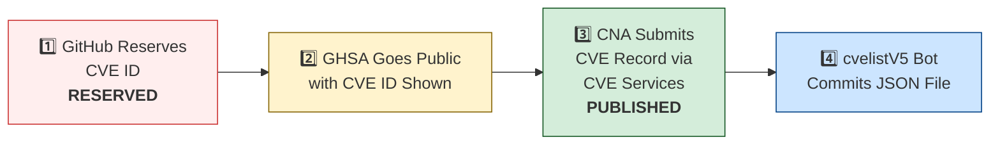

# 🛡️ OpenClaw CVE & Security Advisory Tracker

  
  
  
  
  
   
  
  
  
  
  

An automated tracker that continuously monitors [OpenClaw](https://github.com/openclaw/openclaw) security advisories across the GitHub Advisory Database, repo-level security advisories, and a full scan of the [CVE V5 (cvelistV5)](https://github.com/CVEProject/cvelistV5) registry covering **every CVE affecting OpenClaw regardless of which CNA assigned it**. On each run it pulls the latest data, reconciles GHSA → CVE publication state, breaks the totals down by assigning CNA, and regenerates this dashboard so you always have an up-to-date picture of the project's vulnerability landscape.

  Last updated: 2026-08-03 09:52 UTC · <a href="LICENSE">MIT License</a> · <a href="ADVISORIES.md">Full Advisory List</a> · <a href="SECURITY.md">Security Policy</a> · Data: <a href="https://github.com/CVEProject/cvelistV5">cvelistV5</a> + <a href="https://github.com/github/advisory-database">Advisory DB</a> · Updates every 6h

---

  <a href="#-all-openclaw-cves-by-assigning-cna-cve-list-v5">All CVEs by CNA</a> ·
  <a href="#-cves-published-in-cvelistv5-51">Published CVEs</a> ·
  <a href="#-cve-publication-pipeline">Pipeline</a> ·
  <a href="#-all-security-advisories-157">Advisories</a> ·
  <a href="#-vulnerability-categories">Categories</a> ·
  <a href="#-key-insights">Insights</a> ·
  <a href="#-project-identity">Identity</a>

---

## 🏗️ Project Identity

| Field | Value |
|-------|-------|
| **Current Name** | OpenClaw |
| **Previous Names** | Moltbot (second name), Clawdbot (original name) |
| **Repository** | [openclaw/openclaw](https://github.com/openclaw/openclaw) |
| **npm Package** | `openclaw` (formerly `clawdbot`) |
| **Author** | Peter Steinberger (steipete) |

<strong>Search terms for CVE discovery</strong>

To find all CVEs, search for: `openclaw`, `clawdbot`, `moltbot`, `clawhub`, `pkg:npm/clawdbot`, `pkg:npm/openclaw`

---

## 🌐 All OpenClaw CVEs by Assigning CNA (CVE List V5)

The sections lower down track CVEs that have an OpenClaw **GitHub Security Advisory** — i.e. CVEs the **project issued itself**. That is only part of the picture. A direct scan of the authoritative [CVE List V5](https://github.com/CVEProject/cvelistV5) registry finds **543** CVEs that name OpenClaw as an affected product, the large majority assigned by **third-party researchers** rather than the project. Earlier versions of this tracker reported only the ~51 project-issued (GHSA-linked) CVEs and were blind to this external stream.

| | Count |
|--|------:|
| **Total OpenClaw CVEs (all CNAs)** | **543** |
| Project-issued (GitHub as CNA) | 34 |
| Third-party-issued (VulnCheck, ZDI, MITRE, …) | 509 |

### By Assigning CNA

| CNA | CVEs | Share |
|-----|-----:|------:|
| VulnCheck | 500 | 92.1% |
| GitHub_M | 34 | 6.3% |
| VulDB | 4 | 0.7% |
| zdi | 3 | 0.6% |
| mitre | 2 | 0.4% |

### 2026 Monthly Publish Trend

The steady third-party (VulnCheck-led) disclosure cadence across 2026:

| Month | CVEs | |
|-------|-----:|--|
| 2026-02 | 35 | `████` |
| 2026-03 | 198 | `████████████████████` |
| 2026-04 | 174 | `██████████████████` |
| 2026-05 | 75 | `████████` |
| 2026-06 | 61 | `██████` |

> **Methodology:** generated by [`reconcile_cnas.py`](reconcile_cnas.py), which scans every record in [CVEProject/cvelistV5](https://github.com/CVEProject/cvelistV5) and selects those whose `containers.cna.affected[].vendor` or `.product` is `openclaw` (case-insensitive), or that reference `github.com/openclaw/openclaw`. `REJECTED` records are excluded. **[VulnCheck](https://vulncheck.com) is by far the dominant CNA** — its researchers drive the bulk of OpenClaw disclosures. The GHSA-based sections below cover the project's own advisories and are unchanged. Full reconciled set: [`openclaw-cves-all.json`](openclaw-cves-all.json) · aggregates: [`cna-breakdown.json`](cna-breakdown.json).

---

## 🚀 CVEs Published in cvelistV5 (51)

These CVEs have full records in the [CVEProject/cvelistV5](https://github.com/CVEProject/cvelistV5) repository:

| CVE ID | Severity | CVSS | Title | CWE | Published |
|--------|----------|------|-------|-----|-----------|
| [CVE-2026-22172](https://github.com/openclaw/openclaw/security/advisories/GHSA-rqpp-rjj8-7wv8) |  | 9.4 | OpenClaw < 2026.3.12 - Scope Elevation in WebSocket Shared-Auth Connections | CWE-862 | 2026-03-20 |
| [CVE-2026-28446](https://github.com/openclaw/openclaw/security/advisories/GHSA-4rj2-gpmh-qq5x) |  | 9.2 | OpenClaw < 2026.2.1 - Inbound Allowlist Policy Bypass in voice-call Extension via Empty Caller ID and Suffix Matching | CWE-303 | 2026-03-05 |
| [CVE-2026-32918](https://github.com/openclaw/openclaw/security/advisories/GHSA-wcxr-59v9-rxr8) |  | 9.2 | OpenClaw < 2026.3.11 - Session Sandbox Escape via session_status Tool | CWE-863 | 2026-03-29 |
| [CVE-2026-43533](https://github.com/openclaw/openclaw/security/advisories/GHSA-66r7-m7xm-v49h) |  | 8.9 | OpenClaw < 2026.4.10 - Arbitrary Local File Read via QQBot Media Tags | CWE-23 | 2026-05-05 |
| [CVE-2026-22171](https://github.com/openclaw/openclaw/security/advisories/GHSA-vj3g-5px3-gr46) |  | 8.8 | OpenClaw < 2026.2.19 - Path Traversal in Feishu Media Temporary File Naming | CWE-22 | 2026-03-18 |
| [CVE-2026-25253](https://github.com/openclaw/openclaw/security/advisories/GHSA-g8p2-7wf7-98mq) |  | 8.8 | OpenClaw/Clawdbot has 1-Click RCE via Authentication Token Exfiltration From gatewayUrl | CWE-669 | 2026-02-01 |
| [CVE-2026-24763](https://github.com/openclaw/openclaw/security/advisories/GHSA-mc68-q9jw-2h3v) |  | 8.8 | OpenClaw/Clawdbot Docker Execution has Authenticated Command Injection via PATH Environment Variable | CWE-78 | 2026-02-02 |
| [CVE-2026-28462](https://github.com/openclaw/openclaw/security/advisories/GHSA-gq9c-wg68-gwj2) |  | 8.7 | OpenClaw < 2026.2.13 - Path Traversal in Trace and Download Output Paths | CWE-22 | 2026-03-05 |
| [CVE-2026-28478](https://github.com/openclaw/openclaw/security/advisories/GHSA-q447-rj3r-2cgh) |  | 8.7 | OpenClaw affected by denial of service via unbounded webhook request body buffering | CWE-770 | 2026-03-05 |
| [CVE-2026-32060](https://github.com/openclaw/openclaw/security/advisories/GHSA-r5fq-947m-xm57) |  | 8.7 | OpenClaw < 2026.2.14 - Path Traversal in apply_patch via Crafted Paths | CWE-22 | 2026-03-11 |
| [CVE-2026-32042](https://github.com/openclaw/openclaw/security/advisories/GHSA-553v-f69r-656j) |  | 8.7 | OpenClaw < 2026.2.25 - Privilege Escalation via Unpaired Device Identity in Shared Gateway Authentication | CWE-863 | 2026-03-21 |
| [CVE-2026-32049](https://github.com/openclaw/openclaw/security/advisories/GHSA-rxxp-482v-7mrh) |  | 8.7 | OpenClaw < 2026.2.22 - Denial of Service via Inbound Media Download Byte Limit Bypass | CWE-770 | 2026-03-21 |
| [CVE-2026-32846](https://github.com/openclaw/openclaw/security/advisories/GHSA-f6pf-4gjx-c94r) |  | 8.7 | OpenClaw Media Parsing Path Traversal to Arbitrary File Read | CWE-22 | 2026-03-26 |
| [CVE-2026-35639](https://github.com/openclaw/openclaw/security/advisories/GHSA-hf68-49fm-59cq) |  | 8.7 | OpenClaw < 2026.3.22 - Privilege Escalation via device.pair.approve Scope Validation | CWE-648 | 2026-04-09 |
| [CVE-2026-35663](https://github.com/openclaw/openclaw/security/advisories/GHSA-9hjh-fr4f-gxc4) |  | 8.7 | OpenClaw < 2026.3.25 - Privilege Escalation via Backend Reconnect Scope Self-Claim | CWE-648 | 2026-04-10 |
| [CVE-2026-41349](https://github.com/openclaw/openclaw/security/advisories/GHSA-v3qc-wrwx-j3pw) |  | 8.7 | OpenClaw < 2026.3.28 - Agentic Consent Bypass via config.patch | CWE-862 | 2026-04-23 |
| [CVE-2026-53814](https://github.com/openclaw/openclaw/security/advisories/GHSA-6fvr-66p3-3qj4) |  | 8.7 | OpenClaw: Hook-triggered CLI runs could receive owner MCP tool authority | CWE-266 | 2026-06-11 |
| [CVE-2026-53817](https://github.com/openclaw/openclaw/security/advisories/GHSA-chr9-m4q2-76hw) |  | 8.7 | OpenClaw < 2026.5.22 - Control UI Locality Spoofing in Device Pairing | CWE-290 | 2026-06-11 |
| [CVE-2026-53819](https://github.com/openclaw/openclaw/security/advisories/GHSA-8wg3-5mcm-fjq8) |  | 8.7 | OpenClaw: Workspace .env could override Homebrew executable selection for skill install flows | CWE-426 | 2026-06-11 |
| [CVE-2026-53843](https://github.com/openclaw/openclaw/security/advisories/GHSA-q99w-vh6v-q3v7) |  | 8.7 | OpenClaw: Pairing-scoped device session could restore revoked node token authority | CWE-613 | 2026-06-16 |
| [CVE-2026-62196](https://github.com/openclaw/openclaw/security/advisories/GHSA-fh38-965w-f6c3) |  | 8.7 | OpenClaw 2026.3.22 < 2026.6.6 Authorization Bypass via WhatsApp Group IDs | CWE-863 | 2026-07-13 |
| [CVE-2026-26323](https://github.com/openclaw/openclaw/security/advisories/GHSA-m7x8-2w3w-pr42) |  | 8.6 | OpenClaw has a command injection in maintainer clawtributors updater | CWE-78 | 2026-02-19 |
| [CVE-2026-53816](https://github.com/openclaw/openclaw/security/advisories/GHSA-3c6j-hq33-3jv4) |  | 8.6 | OpenClaw < 2026.5.18 - Exec Lifecycle Event Forgery via Paired Node | CWE-862 | 2026-06-11 |
| [CVE-2026-53849](https://github.com/openclaw/openclaw/security/advisories/GHSA-cw4q-gqg5-g38h) |  | 8.6 | OpenClaw: Discord allowFrom could bind to mutable display names | CWE-290 | 2026-06-16 |
| [CVE-2026-53857](https://github.com/openclaw/openclaw/security/advisories/GHSA-8c59-hr4w-qg69) |  | 8.6 | OpenClaw < 2026.5.3 - Mutable Display Name Binding in Zalo allowFrom Policy | CWE-290 | 2026-06-16 |
| [CVE-2026-41396](https://github.com/openclaw/openclaw/security/advisories/GHSA-qcj9-wwgw-6gm8) |  | 8.5 | OpenClaw < 2026.3.31 - Environment Variable Override of Plugin Trust Root | CWE-829 | 2026-04-28 |
| [CVE-2026-53829](https://github.com/openclaw/openclaw/security/advisories/GHSA-xww8-gqvh-92x9) |  | 8.5 | OpenClaw < 2026.5.18 - Command Truncation in Exec Approval Display | CWE-451 | 2026-06-12 |
| [CVE-2026-28482](https://github.com/openclaw/openclaw/security/advisories/GHSA-5xfq-5mr7-426q) |  | 8.4 | OpenClaw < 2026.2.12 - Path Traversal via Unsanitized sessionId and sessionFile Parameters | CWE-22 | 2026-03-05 |
| [CVE-2026-28393](https://github.com/openclaw/openclaw/security/advisories/GHSA-7xhj-55q9-pc3m) |  | 8.3 | OpenClaw 2.0.0-beta3 < 2026.2.14 - Arbitrary JavaScript Module Loading via Hook Transform Path Traversal | CWE-427 | 2026-03-05 |
| [CVE-2026-28469](https://github.com/openclaw/openclaw/security/advisories/GHSA-rq6g-px6m-c248) |  | 8.2 | OpenClaw Google Chat shared-path webhook target ambiguity allowed cross-account policy-context misrouting | CWE-639 | 2026-03-05 |
| [CVE-2026-35630](https://github.com/openclaw/openclaw/security/advisories/GHSA-mgq6-vr84-7m2j) |  | 8 | OpenClaw: QQBot native approval buttons did not enforce configured approver identity | CWE-862 | 2026-05-29 |
| [CVE-2026-25157](https://github.com/openclaw/openclaw/security/advisories/GHSA-q284-4pvr-m585) |  | 7.8 | OpenClaw/Clawdbot has OS Command Injection via Project Root Path in sshNodeCommand | CWE-78 | 2026-02-04 |
| [CVE-2026-27002](https://github.com/openclaw/openclaw/security/advisories/GHSA-w235-x559-36mg) |  | 7.7 | OpenClaw: Docker container escape via unvalidated bind mount config injection | CWE-250 | 2026-02-19 |
| [CVE-2026-32048](https://github.com/openclaw/openclaw/security/advisories/GHSA-p7gr-f84w-hqg5) |  | 7.7 | OpenClaw < 2026.3.1 - Sandbox Escape via Cross-Agent sessions_spawn | CWE-732 | 2026-03-21 |
| [CVE-2026-42422](https://github.com/openclaw/openclaw/security/advisories/GHSA-whf9-3hcx-gq54) |  | 7.7 | OpenClaw < 2026.4.8 - Role Bypass in device.token.rotate Function | CWE-863 | 2026-04-28 |
| [CVE-2026-53806](https://github.com/openclaw/openclaw/security/advisories/GHSA-vxx3-6hc9-7cc3) |  | 7.7 | OpenClaw < 2026.5.12 - Shell Option Parsing Bypass in Exec Revalidation | CWE-367 | 2026-06-11 |
| [CVE-2026-53810](https://github.com/openclaw/openclaw/security/advisories/GHSA-v6r2-jh58-xx6w) |  | 7.7 | OpenClaw's marketplace runtime extension metadata could point at unscanned payloads | CWE-829 | 2026-06-11 |
| [CVE-2026-53811](https://github.com/openclaw/openclaw/security/advisories/GHSA-7hxm-f538-3xp6) |  | 7.7 | OpenClaw: Matrix allowFrom could bind to mutable display names | CWE-290 | 2026-06-11 |
| [CVE-2026-53853](https://github.com/openclaw/openclaw/security/advisories/GHSA-v2ww-5rh7-2h5v) |  | 7.6 | OpenClaw: Linux and macOS exec allowlists skipped configured argument patterns | CWE-693, CWE-863 | 2026-06-16 |
| [CVE-2026-53855](https://github.com/openclaw/openclaw/security/advisories/GHSA-5cj2-3jr2-5h77) |  | 7.6 | OpenClaw < 2026.4.2 - Shell Positional Parameters Bypass in Inline-Eval Checks | CWE-184, CWE-863 | 2026-06-16 |
| [CVE-2026-53864](https://github.com/openclaw/openclaw/security/advisories/GHSA-ccwh-wwpp-6wg5) |  | 7.6 | OpenClaw: Host environment sanitizer missed two Node.js control variables | CWE-184 | 2026-06-16 |
| [CVE-2026-53866](https://github.com/openclaw/openclaw/security/advisories/GHSA-f397-5vjw-v2c2) |  | 7.6 | OpenClaw < 2026.5.12 - Allowlist Bypass in Shell Inline-Command Parsing | CWE-862 | 2026-06-16 |
| [CVE-2026-42428](https://github.com/openclaw/openclaw/security/advisories/GHSA-3vvq-q2qc-7rmp) |  | 7.5 | OpenClaw < 2026.4.8 - Missing Integrity Verification in Package Downloads | CWE-353 | 2026-04-28 |
| [CVE-2026-28458](https://github.com/openclaw/openclaw/security/advisories/GHSA-mr32-vwc2-5j6h) |  | 7.4 | OpenClaw's Browser Relay /cdp websocket is missing auth which could allow cross-tab cookie access | CWE-306 | 2026-03-05 |
| [CVE-2026-53833](https://github.com/openclaw/openclaw/security/advisories/GHSA-jvm4-4j77-39p6) |  | 7.4 | QQBot for OpenClaw < 2026.4.29 - Authorization Bypass via QQBot Streaming Command | CWE-290 | 2026-06-12 |
| [CVE-2026-42432](https://github.com/openclaw/openclaw/security/advisories/GHSA-5wj5-87vq-39xm) |  | 7.3 | OpenClaw < 2026.4.8 - Command Escalation via Node Pairing Reconnect Bypass | CWE-863 | 2026-04-28 |
| [CVE-2026-53813](https://github.com/openclaw/openclaw/security/advisories/GHSA-v8cx-933x-r976) |  | 7.3 | OpenClaw: Fake package roots could influence memory-core artifact loading | CWE-427 | 2026-06-11 |
| [CVE-2026-34512](https://github.com/openclaw/openclaw/security/advisories/GHSA-9p93-7j67-5pc2) |  | 7.2 | OpenClaw < 2026.3.25 - Improper Access Control in /sessions/:sessionKey/kill Endpoint | CWE-863 | 2026-04-09 |
| [CVE-2026-41364](https://github.com/openclaw/openclaw/security/advisories/GHSA-fv94-qvg8-xqpw) |  | 7.2 | OpenClaw < 2026.3.31 - Arbitrary File Write via Symlink Following in SSH Sandbox Tar Upload | CWE-59 | 2026-04-27 |
| [CVE-2026-53865](https://github.com/openclaw/openclaw/security/advisories/GHSA-rx78-29qr-5hq8) |  | 7.2 | OpenClaw: Workspace-derived service PATH could influence trash command selection | CWE-426 | 2026-06-16 |
| [CVE-2026-26317](https://github.com/openclaw/openclaw/security/advisories/GHSA-3fqr-4cg8-h96q) |  | 7.1 | OpenClaw affected by cross-site request forgery (CSRF) through loopback browser mutation endpoints | CWE-352 | 2026-02-19 |
| [CVE-2026-22169](https://github.com/openclaw/openclaw/security/advisories/GHSA-vmqr-rc7x-3446) |  | 7.1 | OpenClaw < 2026.2.22 - Allowlist Bypass via sort Configuration in safeBins | CWE-78 | 2026-03-18 |
| [CVE-2026-35621](https://github.com/openclaw/openclaw/security/advisories/GHSA-94pw-c6m8-p9p9) |  | 7.1 | OpenClaw < 2026.3.24 - Privilege Escalation via chat.send to Allowlist Persistence | CWE-862 | 2026-04-10 |
| [CVE-2026-35636](https://github.com/openclaw/openclaw/security/advisories/GHSA-q2qc-744p-66r2) |  | 7.1 | OpenClaw 2026.3.11 < 2026.3.25 - Session Isolation Bypass via sessionId Resolution | CWE-696 | 2026-04-09 |
| [CVE-2026-41299](https://github.com/openclaw/openclaw/security/advisories/GHSA-6xg4-82hv-cp6f) |  | 7.1 | OpenClaw < 2026.3.28 - Client Identity Spoofing in chat.send Gateway Provenance Guard | CWE-807 | 2026-04-20 |
| [CVE-2026-41359](https://github.com/openclaw/openclaw/security/advisories/GHSA-767m-xrhc-fxm7) |  | 7.1 | OpenClaw < 2026.3.28 - Privilege Escalation via operator.write to Admin-Class Telegram Config and Cron Persistence | CWE-269 | 2026-04-23 |
| [CVE-2026-41375](https://github.com/openclaw/openclaw/security/advisories/GHSA-h2v7-xc88-xx8c) |  | 7.1 | OpenClaw < 2026.3.28 - Authorization Bypass in /phone arm and /phone disarm Endpoints | CWE-863 | 2026-04-28 |
| [CVE-2026-53815](https://github.com/openclaw/openclaw/security/advisories/GHSA-q7q8-3mgw-q67r) |  | 7.1 | OpenClaw < 2026.5.19 - Channel Allowlist Bypass in Message Read Actions | CWE-862 | 2026-06-11 |
| [CVE-2026-43531](https://github.com/openclaw/openclaw/security/advisories/GHSA-7wv4-cc7p-jhxc) |  | 7 | OpenClaw < 2026.4.9 - Environment Variable Injection via Workspace .env File | CWE-15 | 2026-05-05 |
| [CVE-2026-53842](https://github.com/openclaw/openclaw/security/advisories/GHSA-fq9j-vw4w-fr6v) |  | 7 | OpenClaw: Workspace .env CLOUDSDK_PYTHON could influence Gmail setup gcloud execution | CWE-426 | 2026-06-16 |
| [CVE-2026-53846](https://github.com/openclaw/openclaw/security/advisories/GHSA-24vr-rprv-67rf) |  | 7 | OpenClaw: Workspace .env npm_execpath could influence bundled runtime dependency install | CWE-426 | 2026-06-16 |
| [CVE-2026-53858](https://github.com/openclaw/openclaw/security/advisories/GHSA-wc84-j36w-pw4x) |  | 7 | OpenClaw: Workspace .env STATE_DIRECTORY could influence bundled runtime dependency roots | CWE-426 | 2026-06-16 |
| [CVE-2026-27004](https://github.com/openclaw/openclaw/security/advisories/GHSA-6hf3-mhgc-cm65) |  | 6.9 | OpenClaw session tool visibility hardening and Telegram webhook secret fallback | CWE-209, CWE-346 | 2026-02-19 |
| [CVE-2026-27523](https://github.com/openclaw/openclaw/security/advisories/GHSA-m8v2-6wwh-r4gc) |  | 6.9 | OpenClaw < 2026.2.24 - Sandbox Bind Validation Bypass via Symlink-Parent Missing-Leaf Paths | CWE-22 | 2026-03-18 |
| [CVE-2026-27545](https://github.com/openclaw/openclaw/security/advisories/GHSA-f7ww-2725-qvw2) |  | 6.9 | OpenClaw < 2026.2.26 - Approval Bypass via Parent Symlink Current Working Directory Rebind | CWE-367 | 2026-03-18 |
| [CVE-2026-28480](https://github.com/openclaw/openclaw/security/advisories/GHSA-mj5r-hh7j-4gxf) |  | 6.9 | OpenClaw Telegram allowlist authorization accepted mutable usernames | CWE-290 | 2026-03-05 |
| [CVE-2026-32919](https://github.com/openclaw/openclaw/security/advisories/GHSA-jf6w-m8jw-jfxc) |  | 6.9 | OpenClaw < 2026.3.11 - Unauthorized Session Reset via agent Slash Commands | CWE-863 | 2026-03-29 |
| [CVE-2026-35652](https://github.com/openclaw/openclaw/security/advisories/GHSA-8883-9w57-vwv6) |  | 6.9 | OpenClaw < 2026.3.22 - Unauthorized Action Execution via Callback Dispatch | CWE-696 | 2026-04-10 |
| [CVE-2026-41335](https://github.com/openclaw/openclaw/security/advisories/GHSA-hr8g-2q7x-3f4w) |  | 6.9 | OpenClaw < 2026.3.31 - Information Disclosure via Control UI Bootstrap JSON | CWE-497 | 2026-04-23 |
| [CVE-2026-41301](https://github.com/openclaw/openclaw/security/advisories/GHSA-h43v-27wg-5mf9) |  | 6.9 | OpenClaw 2026.3.22 < 2026.3.31 - Forged Nostr DM Pairing State Creation via Signature Verification Bypass | CWE-347 | 2026-04-20 |
| [CVE-2026-41343](https://github.com/openclaw/openclaw/security/advisories/GHSA-qcc3-jqwp-5vh2) |  | 6.9 | OpenClaw < 2026.3.31 - Denial of Service via LINE Webhook Handler Pre-Auth Concurrency | CWE-799 | 2026-04-23 |
| [CVE-2026-41372](https://github.com/openclaw/openclaw/security/advisories/GHSA-fh32-73r9-rgh5) |  | 6.9 | OpenClaw < 2026.4.2 - Loopback Protection Bypass via Trailing-Dot Localhost in CDP Discovery | CWE-639 | 2026-04-27 |
| [CVE-2026-53818](https://github.com/openclaw/openclaw/security/advisories/GHSA-rj6p-xmxr-qj4h) |  | 6.9 | OpenClaw < 2026.4.24 - Owner-Only Tool Policy Bypass via MCP Loopback | CWE-862 | 2026-06-11 |
| [CVE-2026-29612](https://github.com/openclaw/openclaw/security/advisories/GHSA-w2cg-vxx6-5xjg) |  | 6.8 | OpenClaw < 2026.2.14 - Denial of Service via Large Base64 Media File Decoding | CWE-770 | 2026-03-05 |
| [CVE-2026-45224]() |  | 6.8 | Crabbox < 0.9.0 Path Traversal via Islo Provider Workspace Resolution | CWE-22 | 2026-05-11 |
| [CVE-2026-53850](https://github.com/openclaw/openclaw/security/advisories/GHSA-mpc8-jxjh-qpgh) |  | 6.8 | OpenClaw < 2026.4.25 - Control Scope Enforcement Bypass in Focus Command | CWE-862 | 2026-06-16 |
| [CVE-2026-28452](https://github.com/openclaw/openclaw/security/advisories/GHSA-h89v-j3x9-8wqj) |  | 6.7 | OpenClaw affected by denial of service through unguarded archive extraction allowing high expansion/resource abuse (ZIP/TAR) | CWE-770 | 2026-03-05 |
| [CVE-2026-32044](https://github.com/openclaw/openclaw/security/advisories/GHSA-77hf-7fqf-f227) |  | 6.7 | OpenClaw < 2026.3.2 - Tar Archive Safety Bypass in Skills Installation | CWE-409 | 2026-03-21 |
| [CVE-2026-26328](https://github.com/openclaw/openclaw/security/advisories/GHSA-g34w-4xqq-h79m) |  | 6.5 | OpenClaw iMessage group allowlist authorization inherited DM pairing-store identities | CWE-284, CWE-863 | 2026-02-19 |
| [CVE-2026-35673](https://github.com/openclaw/openclaw/security/advisories/GHSA-hcm3-8f6r-6xwg) |  | 6.5 | OpenClaw < 2026.4.29 - SSRF Policy Bypass via Browser Debug/Export Routes | CWE-863 | 2026-05-29 |
| [CVE-2026-28448](https://github.com/openclaw/openclaw/security/advisories/GHSA-33rq-m5x2-fvgf) |  | 6.3 | OpenClaw 2026.1.29 < 2026.2.1 - Authorization Bypass in Twitch Plugin allowFrom Access Control | CWE-285 | 2026-03-05 |
| [CVE-2026-28471](https://github.com/openclaw/openclaw/security/advisories/GHSA-rmxw-jxxx-4cpc) |  | 6.3 | OpenClaw 2026.1.14-1 < 2026.2.2 - Allowlist Bypass via displayName and Cross-Homeserver localpart Matching in Matrix Plugin | CWE-287 | 2026-03-05 |
| [CVE-2026-33580](https://github.com/openclaw/openclaw/security/advisories/GHSA-9528-x887-j2fp) |  | 6.3 | OpenClaw < 2026.3.28 - Brute Force Attack via Missing Rate Limiting on Webhook Shared Secret Authentication | CWE-307 | 2026-03-31 |
| [CVE-2026-35649](https://github.com/openclaw/openclaw/security/advisories/GHSA-pw7h-9g6p-c378) |  | 6.3 | OpenClaw < 2026.3.22 - Settings Reconciliation Bypass via Empty Allowlist | CWE-183 | 2026-04-10 |
| [CVE-2026-35656](https://github.com/openclaw/openclaw/security/advisories/GHSA-844j-xrrq-wgh4) |  | 6.3 | OpenClaw < 2026.3.22 - XFF Loopback Spoofing Bypass in Canvas Authentication and Rate Limiter | CWE-290 | 2026-04-10 |
| [CVE-2026-53851](https://github.com/openclaw/openclaw/security/advisories/GHSA-fcvx-5cxc-v5p8) |  | 6.3 | OpenClaw < 2026.5.12 - Slack Reaction Event Notification Bypass | CWE-862 | 2026-06-16 |
| [CVE-2026-62220](https://github.com/openclaw/openclaw/security/advisories/GHSA-5p6w-wmh3-frfr) |  | 6.3 | OpenClaw 2026.2.25 < 2026.5.26 WebSocket Rate Limit Bypass | CWE-307 | 2026-07-17 |
| [CVE-2026-41366](https://github.com/openclaw/openclaw/security/advisories/GHSA-57gh-m6rq-54cf) |  | 6 | OpenClaw < 2026.3.31 - Arbitrary Host File Read via appendLocalMediaParentRoots Self-Whitelisting | CWE-732 | 2026-04-27 |
| [CVE-2026-45001](https://github.com/openclaw/openclaw/security/advisories/GHSA-7jm2-g593-4qrc) |  | 6 | OpenClaw < 2026.4.20 - Gateway Config Mutation Guard Bypass via Agent Tool Access | CWE-862 | 2026-05-11 |
| [CVE-2026-53840](https://github.com/openclaw/openclaw/security/advisories/GHSA-rjxq-qqhf-8hwh) |  | 6 | OpenClaw: MCP Streamable HTTP redirects could forward configured custom headers to another origin | CWE-522 | 2026-06-16 |
| [CVE-2026-53844](https://github.com/openclaw/openclaw/security/advisories/GHSA-72fw-cqh5-f324) |  | 6 | OpenClaw < 2026.4.29 - Session Visibility Check Bypass in Shared Memory Search | CWE-862 | 2026-06-16 |
| [CVE-2026-53854](https://github.com/openclaw/openclaw/security/advisories/GHSA-4hpg-mp64-x7xq) |  | 6 | OpenClaw: Internal/webchat command auth could inherit ownerAllowFrom wildcard state | CWE-863 | 2026-06-16 |
| [CVE-2026-53859](https://github.com/openclaw/openclaw/security/advisories/GHSA-gxg4-2rrr-jhc7) |  | 6 | OpenClaw < 2026.5.26 - Hostname Validation Bypass via Trailing-Dot Inconsistency | CWE-1023, CWE-918 | 2026-06-16 |
| [CVE-2026-53863](https://github.com/openclaw/openclaw/security/advisories/GHSA-985f-72mj-8gf7) |  | 6 | OpenClaw < 2026.4.25 - Unvalidated Group ID Acceptance in Tool Group Policy | CWE-639 | 2026-06-16 |
| [CVE-2026-62205](https://github.com/openclaw/openclaw/security/advisories/GHSA-p5xh-frrh-cmgj) |  | 6 | OpenClaw 2026.4.12-beta.1 < 2026.6.6 Authorization Bypass via message actions | CWE-862 | 2026-07-17 |
| [CVE-2026-62210](https://github.com/openclaw/openclaw/security/advisories/GHSA-4xwj-mcc7-x7x5) |  | 6 | OpenClaw < 2026.6.1 Denial of Service via Remote Media URLs | CWE-770 | 2026-07-17 |
| [CVE-2026-32054](https://github.com/openclaw/openclaw/security/advisories/GHSA-36h3-7c54-j27r) |  | 5.9 | OpenClaw < 2026.2.25 - Symlink Traversal in Browser Trace/Download Path Handling | CWE-59 | 2026-03-21 |
| [CVE-2026-41393](https://github.com/openclaw/openclaw/security/advisories/GHSA-q9w8-cf67-r238) |  | 5.9 | OpenClaw < 2026.3.31 - Arbitrary DNS Authority Acceptance and Credential Exfiltration via Wide-Area Discovery | CWE-346 | 2026-04-28 |
| [CVE-2026-27646](https://github.com/openclaw/openclaw/security/advisories/GHSA-9q36-67vc-rrwg) |  | 5.8 | OpenClaw < 2026.3.7 - Sandbox Escape via /acp spawn Command | CWE-863 | 2026-03-23 |
| [CVE-2026-31995](https://github.com/openclaw/openclaw/security/advisories/GHSA-fg3m-vhrr-8gj6) |  | 5.8 | OpenClaw 2026.1.21 < 2026.2.19 - Command Injection via Windows Shell Fallback in Lobster Extension | CWE-78 | 2026-03-19 |
| [CVE-2026-32035](https://github.com/openclaw/openclaw/security/advisories/GHSA-wpg9-4g4v-f9rc) |  | 5.8 | OpenClaw < 2026.3.2 - Missing Owner Flag Validation in Discord Voice Transcript Handler | CWE-863 | 2026-03-19 |
| [CVE-2026-32977](https://github.com/openclaw/openclaw/security/advisories/GHSA-xvx8-77m6-gwg6) |  | 5.8 | OpenClaw < 2026.3.11 - Sandbox Boundary Bypass via Unanchored writeFile Commit Path | CWE-367 | 2026-03-31 |
| [CVE-2026-32988](https://github.com/openclaw/openclaw/security/advisories/GHSA-mj4p-rc52-m843) |  | 5.8 | OpenClaw < 2026.3.11 - Sandbox Boundary Bypass via Unvalidated Temporary File Creation | CWE-367 | 2026-03-31 |
| [CVE-2026-53856](https://github.com/openclaw/openclaw/security/advisories/GHSA-rwp6-7w3q-75fq) |  | 5.7 | OpenClaw: Config recovery could restore openclaw.json with broad file permissions | CWE-732 | 2026-06-16 |
| [CVE-2026-28457](https://github.com/openclaw/openclaw/security/advisories/GHSA-xw4p-pw82-hqr7) |  | 5.6 | OpenClaw < 2026.2.14 - Path Traversal in Sandbox Skill Mirroring via Name Parameter | CWE-22 | 2026-03-05 |
| [CVE-2026-33578](https://github.com/openclaw/openclaw/security/advisories/GHSA-63mg-xp9j-jfcm) |  | 5.3 | OpenClaw < 2026.3.28 - Sender Policy Allowlist Bypass via Policy Downgrade in Google Chat and Zalouser Extensions | CWE-863 | 2026-03-31 |
| [CVE-2026-34425](https://github.com/openclaw/openclaw/security/advisories/GHSA-fvx6-pj3r-5q4q) |  | 5.3 | OpenClaw - Shell-Bleed Protection Preflight Validation Bypass | CWE-184 | 2026-04-02 |
| [CVE-2026-41367](https://github.com/openclaw/openclaw/security/advisories/GHSA-jp4j-q5fc-58gv) |  | 5.3 | OpenClaw 2026.2.14 < 2026.3.28 - Policy Enforcement Bypass in Discord Component Interactions | CWE-863 | 2026-04-27 |
| [CVE-2026-53847](https://github.com/openclaw/openclaw/security/advisories/GHSA-x629-46cc-7xgw) |  | 5.3 | OpenClaw < 2026.5.6 - Privilege Escalation via Active Memory Write Scope | CWE-266 | 2026-06-16 |
| [CVE-2026-53861](https://github.com/openclaw/openclaw/security/advisories/GHSA-c226-q6fx-6j6c) |  | 5.3 | OpenClaw < 2026.5.6 - Allowlist Bypass via Combined POSIX Inline Flags on macOS | CWE-184 | 2026-06-16 |
| [CVE-2026-53812](https://github.com/openclaw/openclaw/security/advisories/GHSA-2hfg-4fh4-qp7f) |  | 4.9 | OpenClaw's browser act interactions could bypass private-network navigation checks | CWE-918 | 2026-06-11 |
| [CVE-2026-62201](https://github.com/openclaw/openclaw/security/advisories/GHSA-mgvr-6gvw-3rgr) |  | 4.9 | OpenClaw < 2026.6.6 Network Policy Bypass via exec-server | CWE-918 | 2026-07-17 |
| [CVE-2026-15193]() |  | 4.8 | AidanPark openclaw-android Android WebView Bridge JsBridge.kt os command injection | CWE-78, CWE-77 | 2026-07-09 |
| [CVE-2026-22180](https://github.com/openclaw/openclaw/security/advisories/GHSA-3pxq-f3cp-jmxp) |  | 4.8 | OpenClaw < 2026.3.2 - Path Confinement Bypass in Browser Output and File Write Operations | CWE-59 | 2026-03-18 |
| [CVE-2026-32020](https://github.com/openclaw/openclaw/security/advisories/GHSA-5ghc-98wh-gwwf) |  | 4.8 | OpenClaw < 2026.2.22 - Arbitrary File Read via Symlink Following in Static File Handler | CWE-59 | 2026-03-19 |
| [CVE-2026-53809](https://github.com/openclaw/openclaw/security/advisories/GHSA-p39j-x9h5-q66m) |  | 4.8 | OpenClaw < 2026.4.25 - Provider Alias Confusion in Embedded Runner Policy | CWE-863 | 2026-06-11 |
| [CVE-2026-41338](https://github.com/openclaw/openclaw/security/advisories/GHSA-rm5c-4rmf-vvhw) |  | 4.3 | OpenClaw < 2026.3.31 - Time-of-Check-Time-of-Use (TOCTOU) Vulnerability in Sandbox File Operations | CWE-367 | 2026-04-23 |
| [CVE-2026-24764](https://github.com/openclaw/openclaw/security/advisories/GHSA-782p-5fr5-7fj8) |  | 3.7 | OpenClaw has Remote Code Execution via System Prompt Injection in Slack Channel Descriptions | CWE-74, CWE-94 | 2026-02-19 |
| [CVE-2026-32906](https://github.com/openclaw/openclaw/security/advisories/GHSA-wv26-j37q-2g7p) |  | 2.3 | OpenClaw < 2026.5.12 - Privilege Escalation in Slack Plugin Approvals via Exec Approver Gate | CWE-863 | 2026-05-29 |
| [CVE-2026-34507](https://github.com/openclaw/openclaw/security/advisories/GHSA-w4v6-g3wm-w36c) |  | 2.3 | OpenClaw < 2026.4.29  - Policy Bypass in QQBot Admin Commands via DM-only and allowFrom Checks | CWE-863 | 2026-05-29 |
| [CVE-2026-35624](https://github.com/openclaw/openclaw/security/advisories/GHSA-xhq5-45pm-2gjr) |  | 2.3 | OpenClaw < 2026.3.22 - Policy Confusion via Room Name Collision in Nextcloud Talk | CWE-807 | 2026-04-09 |
| [CVE-2026-35617](https://github.com/openclaw/openclaw/security/advisories/GHSA-52q4-3xjc-6778) |  | 2.3 | OpenClaw < 2026.3.25 - Authorization Bypass via Group Policy Rebinding with Mutable Space displayName | CWE-807 | 2026-04-09 |
| [CVE-2026-41916](https://github.com/openclaw/openclaw/security/advisories/GHSA-68x5-xx89-w9mm) |  | 2.3 | OpenClaw < 2026.4.8 - Stale Authentication State via Config Reload | CWE-613 | 2026-04-28 |
| [CVE-2026-41408](https://github.com/openclaw/openclaw/security/advisories/GHSA-4g5x-2jfc-xm98) |  | 2.3 | OpenClaw < 2026.3.31 - Disk Exhaustion via Media Download Bypass | CWE-770 | 2026-04-28 |
| [CVE-2026-41402](https://github.com/openclaw/openclaw/security/advisories/GHSA-hhq4-97c2-p447) |  | 2.3 | OpenClaw < 2026.3.31 - Webhook Replay Cache Cross-Target messageId Scope Bypass | CWE-706 | 2026-04-28 |
| [CVE-2026-44993](https://github.com/openclaw/openclaw/security/advisories/GHSA-72q8-jcmc-97wx) |  | 2.3 | OpenClaw < 2026.4.20 - Direct Message Misclassification in Feishu Card Actions | CWE-184 | 2026-05-11 |
| [CVE-2026-44991](https://github.com/openclaw/openclaw/security/advisories/GHSA-c28g-vh7m-fm7v) |  | 2.3 | OpenClaw < 2026.4.21 - Authorization Bypass in Owner-Enforced Commands via Wildcard Channel Senders | CWE-863 | 2026-05-11 |
| [CVE-2026-53845](https://github.com/openclaw/openclaw/security/advisories/GHSA-68xw-r643-9p5w) |  | 2.3 | OpenClaw: Skill-command dispatch could skip before-tool-call hooks | CWE-693 | 2026-06-16 |
| [CVE-2026-53848](https://github.com/openclaw/openclaw/security/advisories/GHSA-cwpp-5962-q4f6) |  | 2.3 | OpenClaw < 2026.5.26 - Exec Allowlist Bypass via Transparent Command Wrappers | CWE-184 | 2026-06-16 |
| [CVE-2026-53852](https://github.com/openclaw/openclaw/security/advisories/GHSA-8mg9-j9cf-54cj) |  | 2.3 | OpenClaw < 2026.4.25 - Scope Bypass via Empty-Scope Device Re-pairing | CWE-636 | 2026-06-16 |
| [CVE-2026-53860](https://github.com/openclaw/openclaw/security/advisories/GHSA-8j37-5w68-wj2g) |  | 2.3 | OpenClaw: BlueBubbles sender policy could match mutable conversation identifiers | CWE-807, CWE-863 | 2026-06-16 |
| [CVE-2026-53862](https://github.com/openclaw/openclaw/security/advisories/GHSA-9v8j-9c9g-w66c) |  | 2.3 | OpenClaw < 2026.5.12 - Bootstrap Token Replay via Pending Pairing Scope Widening | CWE-266, CWE-345 | 2026-06-16 |
| [CVE-2026-62221](https://github.com/openclaw/openclaw/security/advisories/GHSA-fh8v-vgcv-pwh4) |  | 2.3 | OpenClaw 2026.5.12 < 2026.5.26 Authorization Bypass via allowFrom | CWE-863 | 2026-07-17 |
| [CVE-2026-53841](https://github.com/openclaw/openclaw/security/advisories/GHSA-w9hf-3pp7-pvxv) |  | 2.1 | OpenClaw: Exported session HTML could keep unsafe markdown links | CWE-83 | 2026-06-16 |
| [CVE-2026-30741]() |  | None | A remote code execution (RCE) vulnerability in OpenClaw Agent Platform v2026.2.6 |  | 2026-03-11 |

<strong>📖 Detailed CVE Analysis (click to expand)</strong>

### CVE-2026-22172 — OpenClaw < 2026.3.12 - Scope Elevation in WebSocket Shared-Auth Connections

| Field | Detail |
|-------|--------|
| **CVSS** | 9.4 (CRITICAL) — `CVSS:4.0/AV:N/AC:L/AT:N/PR:L/UI:N/VC:H/VI:H/VA:H/SC:H/SI:H/SA:H` |
| **CWE** | CWE-862 (CWE-862 Missing Authorization) |
| **Affected** | < 2026.3.12 |
| **Vendor/Product** | OpenClaw / OpenClaw |
| **Advisory** | [GHSA-rqpp-rjj8-7wv8](https://github.com/openclaw/openclaw/security/advisories/GHSA-rqpp-rjj8-7wv8) |

OpenClaw versions prior to 2026.3.12 contain an authorization bypass vulnerability in the WebSocket connect path that allows shared-token or password-authenticated connections to self-declare elevated scopes without server-side binding. Attackers can exploit this logic flaw to present unauthorized scopes such as operator.admin and perform admin-only gateway operations.

**References:**
- [openclaw-scope-elevation-in-websocket-shared-auth-connections](https://www.vulncheck.com/advisories/openclaw-scope-elevation-in-websocket-shared-auth-connections)
---

### CVE-2026-28446 — OpenClaw < 2026.2.1 - Inbound Allowlist Policy Bypass in voice-call Extension via Empty Caller ID and Suffix Matching

| Field | Detail |
|-------|--------|
| **CVSS** | 9.2 (CRITICAL) — `CVSS:4.0/AV:N/AC:L/AT:P/PR:N/UI:N/VC:H/VI:H/VA:L/SC:N/SI:N/SA:N` |
| **CWE** | CWE-303 (Incorrect Implementation of Authentication Algorithm) |
| **Affected** | < 2026.2.1 |
| **Vendor/Product** | OpenClaw / OpenClaw |
| **Advisory** | [GHSA-4rj2-gpmh-qq5x](https://github.com/openclaw/openclaw/security/advisories/GHSA-4rj2-gpmh-qq5x) |

OpenClaw versions prior to 2026.2.1 with the voice-call extension installed and enabled contain an authentication bypass vulnerability in inbound allowlist policy validation that accepts empty caller IDs and uses suffix-based matching instead of strict equality. Remote attackers can bypass inbound access controls by placing calls with missing caller IDs or numbers ending with allowlisted digits to reach the voice-call agent and execute tools.

**References:**
- [Patch Commit](https://github.com/openclaw/openclaw/commit/f8dfd034f5d9235c5485f492a9e4ccc114e97fdb)
- [VulnCheck Advisory: OpenClaw < 2026.2.1 - Inbound Allowlist Policy Bypass in voice-call Extension via Empty Caller ID and Suffix Matching](https://www.vulncheck.com/advisories/openclaw-inbound-allowlist-policy-bypass-in-voice-call-extension-via-empty-caller-id)
---

### CVE-2026-32918 — OpenClaw < 2026.3.11 - Session Sandbox Escape via session_status Tool

| Field | Detail |
|-------|--------|
| **CVSS** | 9.2 (CRITICAL) — `CVSS:4.0/AV:L/AC:L/AT:N/PR:L/UI:N/VC:H/VI:H/VA:N/SC:H/SI:H/SA:N` |
| **CWE** | CWE-863 (Incorrect Authorization) |
| **Affected** | < 2026.3.11 |
| **Vendor/Product** | OpenClaw / OpenClaw |
| **Advisory** | [GHSA-wcxr-59v9-rxr8](https://github.com/openclaw/openclaw/security/advisories/GHSA-wcxr-59v9-rxr8) |

OpenClaw before 2026.3.11 contains a session sandbox escape vulnerability in the session_status tool that allows sandboxed subagents to access parent or sibling session state. Attackers can supply arbitrary sessionKey values to read or modify session data outside their sandbox scope, including persisted model overrides.

**References:**
- [VulnCheck Advisory: OpenClaw < 2026.3.11 - Session Sandbox Escape via session_status Tool](https://www.vulncheck.com/advisories/openclaw-session-sandbox-escape-via-session-status-tool)
---

### CVE-2026-43533 — OpenClaw < 2026.4.10 - Arbitrary Local File Read via QQBot Media Tags

| Field | Detail |
|-------|--------|
| **CVSS** | 8.9 (HIGH) — `CVSS:4.0/AV:N/AC:L/AT:P/PR:N/UI:N/VC:H/VI:N/VA:N/SC:H/SI:N/SA:N` |
| **CWE** | CWE-23 (CWE-23: Relative Path Traversal) |
| **Affected** | < 2026.4.10 |
| **Vendor/Product** | OpenClaw / OpenClaw |
| **Advisory** | [GHSA-66r7-m7xm-v49h](https://github.com/openclaw/openclaw/security/advisories/GHSA-66r7-m7xm-v49h) |

OpenClaw before 2026.4.10 contains an arbitrary file read vulnerability in QQBot media tags that allows attackers to reference host-local paths outside the intended media storage boundary. Attackers can craft malicious reply text containing media tags to disclose arbitrary local files through outbound media handling.

**References:**
- [Patch Commit](https://github.com/openclaw/openclaw/commit/604777e4414cc3b2ff8861f18f4fb04374c702c6)
- [VulnCheck Advisory: OpenClaw < 2026.4.10 - Arbitrary Local File Read via QQBot Media Tags](https://www.vulncheck.com/advisories/openclaw-arbitrary-local-file-read-via-qqbot-media-tags)
---

### CVE-2026-22171 — OpenClaw < 2026.2.19 - Path Traversal in Feishu Media Temporary File Naming

| Field | Detail |
|-------|--------|
| **CVSS** | 8.8 (HIGH) — `CVSS:4.0/AV:N/AC:L/AT:N/PR:N/UI:N/VC:N/VI:H/VA:L/SC:N/SI:N/SA:N` |
| **CWE** | CWE-22 (CWE-22 Improper Limitation of a Pathname to a Restricted Directory ('Path Traversal')) |
| **Affected** | < 2026.2.19 |
| **Vendor/Product** | OpenClaw / OpenClaw |
| **Advisory** | [GHSA-vj3g-5px3-gr46](https://github.com/openclaw/openclaw/security/advisories/GHSA-vj3g-5px3-gr46) |

OpenClaw versions prior to 2026.2.19 contain a path traversal vulnerability in the Feishu media download flow where untrusted media keys are interpolated directly into temporary file paths in extensions/feishu/src/media.ts. An attacker who can control Feishu media key values returned to the client can use traversal segments to escape os.tmpdir() and write arbitrary files within the OpenClaw process permissions.

**References:**
- [Patch Commit #1](https://github.com/openclaw/openclaw/commit/c821099157a9767d4df208c6b12f214946507871)
- [Patch Commit #2](https://github.com/openclaw/openclaw/commit/cdb00fe2428000e7a08f9b7848784a0049176705)
- [Patch Commit #3](https://github.com/openclaw/openclaw/commit/ec232a9e2dff60f0e3d7e827a7c868db5254473f)
- [VulnCheck Advisory: OpenClaw < 2026.2.19 - Path Traversal in Feishu Media Temporary File Naming](https://www.vulncheck.com/advisories/openclaw-path-traversal-in-feishu-media-temporary-file-naming)
---

### CVE-2026-25253 — OpenClaw/Clawdbot has 1-Click RCE via Authentication Token Exfiltration From gatewayUrl

| Field | Detail |
|-------|--------|
| **CVSS** | 8.8 (HIGH) — `CVSS:3.1/AV:N/AC:L/PR:N/UI:R/S:U/C:H/I:H/A:H` |
| **CWE** | CWE-669 (CWE-669 Incorrect Resource Transfer Between Spheres) |
| **Affected** | < 2026.1.29 |
| **Vendor/Product** | OpenClaw / OpenClaw |
| **Advisory** | [GHSA-g8p2-7wf7-98mq](https://github.com/openclaw/openclaw/security/advisories/GHSA-g8p2-7wf7-98mq) |

OpenClaw (aka clawdbot or Moltbot) before 2026.1.29 obtains a gatewayUrl value from a query string and automatically makes a WebSocket connection without prompting, sending a token value.

> **Naming note:** Uses all three names in description. packageURL still references `pkg:npm/clawdbot`.
**References:**
- [1-click-rce-to-steal-your-moltbot-data-and-keys](https://depthfirst.com/post/1-click-rce-to-steal-your-moltbot-data-and-keys)
- [blog](https://openclaw.ai/blog)
- [one-click-rce-moltbot](https://ethiack.com/news/blog/one-click-rce-moltbot)
- [2016913750557651228](https://x.com/0xacb/status/2016913750557651228)
---

### CVE-2026-24763 — OpenClaw/Clawdbot Docker Execution has Authenticated Command Injection via PATH Environment Variable

| Field | Detail |
|-------|--------|
| **CVSS** | 8.8 (HIGH) — `CVSS:3.1/AV:N/AC:L/PR:L/UI:N/S:U/C:H/I:H/A:H` |
| **CWE** | CWE-78 (CWE-78: Improper Neutralization of Special Elements used in an OS Command ('OS Command Injection')) |
| **Affected** | < 2026.1.29 |
| **Vendor/Product** | clawdbot / clawdbot |
| **Advisory** | [GHSA-mc68-q9jw-2h3v](https://github.com/openclaw/openclaw/security/advisories/GHSA-mc68-q9jw-2h3v) |

OpenClaw (formerly  Clawdbot) is a personal AI assistant you run on your own devices. Prior to 2026.1.29, a command injection vulnerability existed in OpenClaw’s Docker sandbox execution mechanism due to unsafe handling of the PATH environment variable when constructing shell commands. An authenticated user able to control environment variables could influence command execution within the container context. This vulnerability is fixed in 2026.1.29.

> **Naming note:** Uses old name `clawdbot/clawdbot` as vendor/product.
**References:**
- [https://github.com/openclaw/openclaw/commit/771f23d36b95ec2204cc9a0054045f5d8439ea75](https://github.com/openclaw/openclaw/commit/771f23d36b95ec2204cc9a0054045f5d8439ea75)
- [https://github.com/openclaw/openclaw/releases/tag/v2026.1.29](https://github.com/openclaw/openclaw/releases/tag/v2026.1.29)
---

### CVE-2026-28462 — OpenClaw < 2026.2.13 - Path Traversal in Trace and Download Output Paths

| Field | Detail |
|-------|--------|
| **CVSS** | 8.7 (HIGH) — `CVSS:4.0/AV:N/AC:L/AT:N/PR:N/UI:N/VC:H/VI:N/VA:N/SC:N/SI:N/SA:N` |
| **CWE** | CWE-22 (Improper Limitation of a Pathname to a Restricted Directory ('Path Traversal')) |
| **Affected** | < 2026.2.13 |
| **Vendor/Product** | OpenClaw / OpenClaw |
| **Advisory** | [GHSA-gq9c-wg68-gwj2](https://github.com/openclaw/openclaw/security/advisories/GHSA-gq9c-wg68-gwj2) |

OpenClaw versions prior to 2026.2.13 contain a vulnerability in the browser control API in which it accepts user-supplied output paths for trace and download files without consistently constraining writes to temporary directories. Attackers with API access can exploit path traversal in POST /trace/stop, POST /wait/download, and POST /download endpoints to write files outside intended temp roots.

**References:**
- [Patch Commit](https://github.com/openclaw/openclaw/commit/7f0489e4731c8d965d78d6eac4a60312e46a9426)
- [VulnCheck Advisory: OpenClaw < 2026.2.13 - Path Traversal in Trace and Download Output Paths](https://www.vulncheck.com/advisories/openclaw-path-traversal-in-trace-and-download-output-paths)
---

### CVE-2026-28478 — OpenClaw affected by denial of service via unbounded webhook request body buffering

| Field | Detail |
|-------|--------|
| **CVSS** | 8.7 (HIGH) — `CVSS:4.0/AV:N/AC:L/AT:N/PR:N/UI:N/VC:N/VI:N/VA:H/SC:N/SI:N/SA:N` |
| **CWE** | CWE-770 (Allocation of Resources Without Limits or Throttling) |
| **Affected** | < 2026.2.13 |
| **Vendor/Product** | OpenClaw / OpenClaw |
| **Advisory** | [GHSA-q447-rj3r-2cgh](https://github.com/openclaw/openclaw/security/advisories/GHSA-q447-rj3r-2cgh) |

OpenClaw versions prior to 2026.2.13 contain a denial of service vulnerability in webhook handlers that buffer request bodies without strict byte or time limits. Remote unauthenticated attackers can send oversized JSON payloads or slow uploads to webhook endpoints causing memory pressure and availability degradation.

**References:**
- [Patch Commit](https://github.com/openclaw/openclaw/commit/3cbcba10cf30c2ffb898f0d8c7dfb929f15f8930)
- [VulnCheck Advisory: OpenClaw < 2026.2.13 - Denial of Service via Unbounded Webhook Request Body Buffering](https://www.vulncheck.com/advisories/openclaw-denial-of-service-via-unbounded-webhook-request-body-buffering)
---

### CVE-2026-32060 — OpenClaw < 2026.2.14 - Path Traversal in apply_patch via Crafted Paths

| Field | Detail |
|-------|--------|
| **CVSS** | 8.7 (HIGH) — `CVSS:4.0/AV:N/AC:L/AT:N/PR:L/UI:N/VC:H/VI:H/VA:H/SC:N/SI:N/SA:N` |
| **CWE** | CWE-22 (Improper Limitation of a Pathname to a Restricted Directory ('Path Traversal')) |
| **Affected** | < 2026.2.14 |
| **Vendor/Product** | openclaw / openclaw |
| **Advisory** | [GHSA-r5fq-947m-xm57](https://github.com/openclaw/openclaw/security/advisories/GHSA-r5fq-947m-xm57) |

OpenClaw versions prior to 2026.2.14 contain a path traversal vulnerability in apply_patch that allows attackers to write or delete files outside the configured workspace directory. When apply_patch is enabled without filesystem sandbox containment, attackers can exploit crafted paths including directory traversal sequences or absolute paths to escape workspace boundaries and modify arbitrary files.

**References:**
- [Patch Commit](https://github.com/openclaw/openclaw/commit/5544646a09c0121fca7d7093812dc2de8437c7f1)
- [VulnCheck Advisory: OpenClaw < 2026.2.14 - Path Traversal in apply_patch via Crafted Paths](https://www.vulncheck.com/advisories/openclaw-path-traversal-in-apply-patch-via-crafted-paths)
---

### CVE-2026-32042 — OpenClaw < 2026.2.25 - Privilege Escalation via Unpaired Device Identity in Shared Gateway Authentication

| Field | Detail |
|-------|--------|
| **CVSS** | 8.7 (HIGH) — `CVSS:4.0/AV:N/AC:L/AT:N/PR:L/UI:N/VC:H/VI:H/VA:H/SC:N/SI:N/SA:N` |
| **CWE** | CWE-863 (CWE-863: Incorrect Authorization) |
| **Affected** | < 2026.2.25 |
| **Vendor/Product** | OpenClaw / OpenClaw |
| **Advisory** | [GHSA-553v-f69r-656j](https://github.com/openclaw/openclaw/security/advisories/GHSA-553v-f69r-656j) |

OpenClaw versions 2026.2.22 prior to 2026.2.25 contain a privilege escalation vulnerability allowing unpaired device identities to bypass operator pairing requirements and self-assign elevated operator scopes including operator.admin. Attackers with valid shared gateway authentication can present a self-signed unpaired device identity to request and obtain higher operator scopes before pairing approval is granted.

**References:**
- [Patch Commit](https://github.com/openclaw/openclaw/commit/8d1481cb4a9d31bd617e52dc8c392c35689d9dea)
- [VulnCheck Advisory: OpenClaw < 2026.2.25 - Privilege Escalation via Unpaired Device Identity in Shared Gateway Authentication](https://www.vulncheck.com/advisories/openclaw-privilege-escalation-via-unpaired-device-identity-in-shared-gateway-authentication)
---

### CVE-2026-32049 — OpenClaw < 2026.2.22 - Denial of Service via Inbound Media Download Byte Limit Bypass

| Field | Detail |
|-------|--------|
| **CVSS** | 8.7 (HIGH) — `CVSS:4.0/AV:N/AC:L/AT:N/PR:N/UI:N/VC:N/VI:N/VA:H/SC:N/SI:N/SA:N` |
| **CWE** | CWE-770 (CWE-770: Allocation of Resources Without Limits or Throttling) |
| **Affected** | < 2026.2.22 |
| **Vendor/Product** | OpenClaw / OpenClaw |
| **Advisory** | [GHSA-rxxp-482v-7mrh](https://github.com/openclaw/openclaw/security/advisories/GHSA-rxxp-482v-7mrh) |

OpenClaw versions prior to 2026.2.22 fail to consistently enforce configured inbound media byte limits before buffering remote media across multiple channel ingestion paths. Remote attackers can send oversized media payloads to trigger elevated memory usage and potential process instability.

**References:**
- [Patch Commit](https://github.com/openclaw/openclaw/commit/73d93dee64127a26f1acd09d0403b794cdeb4f5c)
- [VulnCheck Advisory: OpenClaw < 2026.2.22 - Denial of Service via Inbound Media Download Byte Limit Bypass](https://www.vulncheck.com/advisories/openclaw-denial-of-service-via-inbound-media-download-byte-limit-bypass)
---

### CVE-2026-32846 — OpenClaw Media Parsing Path Traversal to Arbitrary File Read

| Field | Detail |
|-------|--------|
| **CVSS** | 8.7 (HIGH) — `CVSS:4.0/AV:N/AC:L/AT:N/PR:N/UI:N/VC:H/VI:N/VA:N/SC:N/SI:N/SA:N` |
| **CWE** | CWE-22 (CWE-22: Improper Limitation of a Pathname to a Restricted Directory ('Path Traversal')) |
| **Affected** | < 4797bbc5b96e2cca5532e43b58915c051746fe37 |
| **Vendor/Product** | OpenClaw / OpenClaw |
| **Advisory** | [GHSA-f6pf-4gjx-c94r](https://github.com/openclaw/openclaw/security/advisories/GHSA-f6pf-4gjx-c94r) |

OpenClaw through 2026.3.23 (fixed in commit 4797bbc) contains a path traversal vulnerability in media parsing that allows attackers to read arbitrary files by bypassing path validation in the isLikelyLocalPath() and isValidMedia() functions. Attackers can exploit incomplete validation and the allowBareFilename bypass to reference files outside the intended application sandbox, resulting in disclosure of sensitive information including system files, environment files, and SSH keys.

**References:**
- [54642](https://github.com/openclaw/openclaw/pull/54642)
- [4797bbc5b96e2cca5532e43b58915c051746fe37](https://github.com/openclaw/openclaw/commit/4797bbc5b96e2cca5532e43b58915c051746fe37)
- [openclaw-media-parsing-path-traversal-to-arbitrary-file-read](https://www.vulncheck.com/advisories/openclaw-media-parsing-path-traversal-to-arbitrary-file-read)
---

### CVE-2026-35639 — OpenClaw < 2026.3.22 - Privilege Escalation via device.pair.approve Scope Validation

| Field | Detail |
|-------|--------|
| **CVSS** | 8.7 (HIGH) — `CVSS:4.0/AV:N/AC:L/AT:N/PR:L/UI:N/VC:H/VI:H/VA:H/SC:N/SI:N/SA:N` |
| **CWE** | CWE-648 (CWE-648: Incorrect Use of Privileged APIs) |
| **Affected** | < 2026.3.22 |
| **Vendor/Product** | OpenClaw / OpenClaw |
| **Advisory** | [GHSA-hf68-49fm-59cq](https://github.com/openclaw/openclaw/security/advisories/GHSA-hf68-49fm-59cq) |

OpenClaw before 2026.3.22 contains a privilege escalation vulnerability in the device.pair.approve method that allows an operator.pairing approver to approve pending device requests with broader operator scopes than the approver actually holds. Attackers can exploit insufficient scope validation to escalate privileges to operator.admin and achieve remote code execution on the Node infrastructure.

**References:**
- [Patch Commit #1](https://github.com/openclaw/openclaw/commit/630f1479c44f78484dfa21bb407cbe6f171dac87)
- [Patch Commit #2](https://github.com/openclaw/openclaw/commit/fc2d29ea926f47c428c556e92ec981441228d2a4)
- [VulnCheck Advisory: OpenClaw < 2026.3.22 - Privilege Escalation via device.pair.approve Scope Validation](https://www.vulncheck.com/advisories/openclaw-privilege-escalation-via-device-pair-approve-scope-validation)
---

### CVE-2026-35663 — OpenClaw < 2026.3.25 - Privilege Escalation via Backend Reconnect Scope Self-Claim

| Field | Detail |
|-------|--------|
| **CVSS** | 8.7 (HIGH) — `CVSS:4.0/AV:N/AC:L/AT:N/PR:L/UI:N/VC:H/VI:H/VA:H/SC:N/SI:N/SA:N` |
| **CWE** | CWE-648 (CWE-648: Incorrect Use of Privileged APIs) |
| **Affected** | < 2026.3.25 |
| **Vendor/Product** | OpenClaw / OpenClaw |
| **Advisory** | [GHSA-9hjh-fr4f-gxc4](https://github.com/openclaw/openclaw/security/advisories/GHSA-9hjh-fr4f-gxc4) |

OpenClaw before 2026.3.25 contains a privilege escalation vulnerability allowing non-admin operators to self-request broader scopes during backend reconnect. Attackers can bypass pairing requirements to reconnect as operator.admin, gaining unauthorized administrative privileges.

**References:**
- [Patch Commit](https://github.com/openclaw/openclaw/commit/d3d8e316bd819d3c7e34253aeb7eccb2510f5f48)
- [VulnCheck Advisory: OpenClaw < 2026.3.25 - Privilege Escalation via Backend Reconnect Scope Self-Claim](https://www.vulncheck.com/advisories/openclaw-privilege-escalation-via-backend-reconnect-scope-self-claim)
---

### CVE-2026-41349 — OpenClaw < 2026.3.28 - Agentic Consent Bypass via config.patch

| Field | Detail |
|-------|--------|
| **CVSS** | 8.7 (HIGH) — `CVSS:4.0/AV:N/AC:L/AT:N/PR:L/UI:N/VC:H/VI:H/VA:H/SC:N/SI:N/SA:N` |
| **CWE** | CWE-862 (CWE-862 Missing Authorization) |
| **Affected** | < 2026.3.28 |
| **Vendor/Product** | OpenClaw / OpenClaw |
| **Advisory** | [GHSA-v3qc-wrwx-j3pw](https://github.com/openclaw/openclaw/security/advisories/GHSA-v3qc-wrwx-j3pw) |

OpenClaw before 2026.3.28 contains an agentic consent bypass vulnerability allowing LLM agents to silently disable execution approval via config.patch parameter. Remote attackers can exploit this to bypass security controls and execute unauthorized operations without user consent.

**References:**
- [Patch Commit](https://github.com/openclaw/openclaw/commit/76411b2afc4ae721e36c12e0ea24fd23e2fed61e)
- [VulnCheck Advisory: OpenClaw < 2026.3.28 - Agentic Consent Bypass via config.patch](https://www.vulncheck.com/advisories/openclaw-agentic-consent-bypass-via-config-patch)
---

### CVE-2026-53814 — OpenClaw: Hook-triggered CLI runs could receive owner MCP tool authority

| Field | Detail |
|-------|--------|
| **CVSS** | 8.7 (HIGH) — `CVSS:4.0/AV:N/AC:L/AT:N/PR:L/UI:N/VC:H/VI:H/VA:L/SC:N/SI:N/SA:N` |
| **CWE** | CWE-266 (Incorrect Privilege Assignment) |
| **Affected** | < 2026.5.20 |
| **Vendor/Product** | OpenClaw / OpenClaw |
| **Advisory** | [GHSA-6fvr-66p3-3qj4](https://github.com/openclaw/openclaw/security/advisories/GHSA-6fvr-66p3-3qj4) |

OpenClaw before 2026.5.20 contains a privilege escalation vulnerability where hook-triggered agent runs incorrectly receive owner-scoped MCP loopback authority instead of hook-appropriate scope. Attackers with a valid hook token can exploit the /hooks/agent endpoint to cause spawned CLI runtimes to access or invoke owner-only MCP tools, potentially executing privileged actions like persistent cron state modifications.

**References:**
- [openclaw-privilege-escalation-via-hook-triggered-cli-mcp-tool-authority](https://www.vulncheck.com/advisories/openclaw-privilege-escalation-via-hook-triggered-cli-mcp-tool-authority)
---

### CVE-2026-53817 — OpenClaw < 2026.5.22 - Control UI Locality Spoofing in Device Pairing

| Field | Detail |
|-------|--------|
| **CVSS** | 8.7 (HIGH) — `CVSS:4.0/AV:N/AC:L/AT:N/PR:L/UI:N/VC:H/VI:H/VA:H/SC:N/SI:N/SA:N` |
| **CWE** | CWE-290 (Authentication Bypass by Spoofing) |
| **Affected** | < 2026.5.22 |
| **Vendor/Product** | OpenClaw / OpenClaw |
| **Advisory** | [GHSA-chr9-m4q2-76hw](https://github.com/openclaw/openclaw/security/advisories/GHSA-chr9-m4q2-76hw) |

OpenClaw before 2026.5.22 contains a locality validation vulnerability in Control UI pairing that allows attackers with network access to spoof locality information and obtain durable admin-capable device tokens. Attackers can exploit insufficient locality-derived trust validation to convert temporary shared access into persistent administrative credentials that survive token rotation.

**References:**
- [openclaw-control-ui-locality-spoofing-in-device-pairing](https://www.vulncheck.com/advisories/openclaw-control-ui-locality-spoofing-in-device-pairing)
---

### CVE-2026-53819 — OpenClaw: Workspace .env could override Homebrew executable selection for skill install flows

| Field | Detail |
|-------|--------|
| **CVSS** | 8.7 (HIGH) — `CVSS:4.0/AV:N/AC:L/AT:N/PR:N/UI:P/VC:H/VI:H/VA:H/SC:N/SI:N/SA:N` |
| **CWE** | CWE-426 (Untrusted Search Path) |
| **Affected** | < 2026.5.27 |
| **Vendor/Product** | OpenClaw / OpenClaw |
| **Advisory** | [GHSA-8wg3-5mcm-fjq8](https://github.com/openclaw/openclaw/security/advisories/GHSA-8wg3-5mcm-fjq8) |

OpenClaw before 2026.5.27 contains an arbitrary code execution vulnerability in skill install flows where workspace .env files can override the Homebrew executable selection. Attackers with access to trusted operator workspaces can execute unintended Homebrew-compatible executables during skill setup to compromise the system.

**References:**
- [openclaw-arbitrary-homebrew-executable-execution-via-workspace-env-override](https://www.vulncheck.com/advisories/openclaw-arbitrary-homebrew-executable-execution-via-workspace-env-override)
---

### CVE-2026-53843 — OpenClaw: Pairing-scoped device session could restore revoked node token authority

| Field | Detail |
|-------|--------|
| **CVSS** | 8.7 (HIGH) — `CVSS:4.0/AV:N/AC:L/AT:N/PR:L/UI:N/VC:H/VI:H/VA:H/SC:N/SI:N/SA:N` |
| **CWE** | CWE-613 (Insufficient Session Expiration) |
| **Affected** | < 2026.5.26 |
| **Vendor/Product** | OpenClaw / OpenClaw |
| **Advisory** | [GHSA-q99w-vh6v-q3v7](https://github.com/openclaw/openclaw/security/advisories/GHSA-q99w-vh6v-q3v7) |

OpenClaw before 2026.5.26 contains an authorization bypass vulnerability where a surviving pairing-scoped device session can re-establish node token authority after revocation. Attackers with a paired device can regain WebSocket node-level access without renewed approval, weakening revocation controls and maintaining unauthorized access longer than intended.

**References:**
- [VulnCheck Advisory: OpenClaw < 2026.5.26 - Node Token Revocation Bypass via Pairing-Scoped Device Session](https://www.vulncheck.com/advisories/openclaw-node-token-revocation-bypass-via-pairing-scoped-device-session)
---

### CVE-2026-62196 — OpenClaw 2026.3.22 < 2026.6.6 Authorization Bypass via WhatsApp Group IDs

| Field | Detail |
|-------|--------|
| **CVSS** | 8.7 (HIGH) — `CVSS:4.0/AV:N/AC:L/AT:N/PR:L/UI:N/VC:H/VI:H/VA:L/SC:N/SI:N/SA:N` |
| **CWE** | CWE-863 (Incorrect Authorization) |
| **Affected** | < 2026.6.6 |
| **Vendor/Product** | OpenClaw / OpenClaw |
| **Advisory** | [GHSA-fh38-965w-f6c3](https://github.com/openclaw/openclaw/security/advisories/GHSA-fh38-965w-f6c3) |

OpenClaw versions 2026.3.22 before 2026.6.6 contain an authorization bypass vulnerability where WhatsApp group IDs can satisfy elevated sender allowlists. Attackers with lower-trust access can perform actions requiring stronger authorization by leveraging group ID validation in the affected feature.

**References:**
- [VulnCheck Advisory: OpenClaw 2026.3.22 < 2026.6.6 Authorization Bypass via WhatsApp Group IDs](https://www.vulncheck.com/advisories/openclaw-authorization-bypass-via-whatsapp-group-ids)
---

### CVE-2026-26323 — OpenClaw has a command injection in maintainer clawtributors updater

| Field | Detail |
|-------|--------|
| **CVSS** | 8.6 (HIGH) — `CVSS:4.0/AV:N/AC:L/AT:N/PR:N/UI:P/VC:H/VI:H/VA:N/SC:N/SI:N/SA:N` |
| **CWE** | CWE-78 (CWE-78: Improper Neutralization of Special Elements used in an OS Command ('OS Command Injection')) |
| **Affected** | < >= 2026.1.8, < 2026.2.14 |
| **Vendor/Product** | openclaw / openclaw |
| **Advisory** | [GHSA-m7x8-2w3w-pr42](https://github.com/openclaw/openclaw/security/advisories/GHSA-m7x8-2w3w-pr42) |

OpenClaw is a personal AI assistant. Versions 2026.1.8 through 2026.2.13 have a command injection in the maintainer/dev script `scripts/update-clawtributors.ts`. The issue affects contributors/maintainers (or CI) who run `bun scripts/update-clawtributors.ts` in a source checkout that contains a malicious commit author email (e.g. crafted `@users[.]noreply[.]github[.]com` values). Normal CLI usage is not affected (`npm i -g openclaw`): this script is not part of the shipped CLI and is not executed during routine operation. The script derived a GitHub login from `git log` author metadata and interpolated it into a shell command (via `execSync`). A malicious commit record could inject shell metacharacters and execute arbitrary commands when the script is run. Version 2026.2.14 contains a patch.

**References:**
- [https://github.com/openclaw/openclaw/commit/a429380e337152746031d290432a4b93aa553d55](https://github.com/openclaw/openclaw/commit/a429380e337152746031d290432a4b93aa553d55)
- [https://github.com/openclaw/openclaw/releases/tag/v2026.2.14](https://github.com/openclaw/openclaw/releases/tag/v2026.2.14)
---

### CVE-2026-53816 — OpenClaw < 2026.5.18 - Exec Lifecycle Event Forgery via Paired Node

| Field | Detail |
|-------|--------|
| **CVSS** | 8.6 (HIGH) — `CVSS:4.0/AV:N/AC:L/AT:N/PR:H/UI:N/VC:H/VI:H/VA:H/SC:N/SI:N/SA:N` |
| **CWE** | CWE-862 (Missing Authorization) |
| **Affected** | < 2026.5.18 |
| **Vendor/Product** | OpenClaw / OpenClaw |
| **Advisory** | [GHSA-3c6j-hq33-3jv4](https://github.com/openclaw/openclaw/security/advisories/GHSA-3c6j-hq33-3jv4) |

OpenClaw before 2026.5.18 contains an insufficient provenance validation vulnerability in node event handling that allows paired nodes to forge exec lifecycle events without system.run authorization. A malicious or compromised paired node can send crafted node.event messages to the gateway, steering target sessions into exec-event paths that expose capabilities the reduced node surface should not provide.

**References:**
- [openclaw-exec-lifecycle-event-forgery-via-paired-node](https://www.vulncheck.com/advisories/openclaw-exec-lifecycle-event-forgery-via-paired-node)
---

### CVE-2026-53849 — OpenClaw: Discord allowFrom could bind to mutable display names

| Field | Detail |
|-------|--------|
| **CVSS** | 8.6 (HIGH) — `CVSS:4.0/AV:N/AC:L/AT:N/PR:L/UI:N/VC:H/VI:H/VA:N/SC:N/SI:N/SA:N` |
| **CWE** | CWE-290 (Authentication Bypass by Spoofing) |
| **Affected** | < 2026.5.7 |
| **Vendor/Product** | OpenClaw / OpenClaw |
| **Advisory** | [GHSA-cw4q-gqg5-g38h](https://github.com/openclaw/openclaw/security/advisories/GHSA-cw4q-gqg5-g38h) |

OpenClaw before 2026.5.7 contains a privilege escalation vulnerability where the allowFrom feature improperly validates Discord account identity using mutable display names instead of immutable user IDs. Attackers with Discord accounts can change their display name to match a policy entry and gain unauthorized agent access intended for another Discord identity.

**References:**
- [VulnCheck Advisory: OpenClaw < 2026.5.7 - Privilege Escalation via Mutable Discord Display Names in allowFrom](https://www.vulncheck.com/advisories/openclaw-privilege-escalation-via-mutable-discord-display-names-in-allowfrom)
---

### CVE-2026-53857 — OpenClaw < 2026.5.3 - Mutable Display Name Binding in Zalo allowFrom Policy

| Field | Detail |
|-------|--------|
| **CVSS** | 8.6 (HIGH) — `CVSS:4.0/AV:N/AC:L/AT:N/PR:L/UI:N/VC:H/VI:H/VA:N/SC:N/SI:N/SA:N` |
| **CWE** | CWE-290 (Authentication Bypass by Spoofing) |
| **Affected** | < 2026.5.3 |
| **Vendor/Product** | OpenClaw / OpenClaw |
| **Advisory** | [GHSA-8c59-hr4w-qg69](https://github.com/openclaw/openclaw/security/advisories/GHSA-8c59-hr4w-qg69) |

OpenClaw before 2026.5.3 contains a policy enforcement vulnerability where Zalo contacts with mutable display metadata could match allowFrom policy entries through display name changes. Attackers with mutable display names could receive agent responses intended for different Zalo identities when the feature is enabled.

**References:**
- [VulnCheck Advisory: OpenClaw < 2026.5.3 - Mutable Display Name Binding in Zalo allowFrom Policy](https://www.vulncheck.com/advisories/openclaw-mutable-display-name-binding-in-zalo-allowfrom-policy)
---

### CVE-2026-41396 — OpenClaw < 2026.3.31 - Environment Variable Override of Plugin Trust Root

| Field | Detail |
|-------|--------|
| **CVSS** | 8.5 (HIGH) — `CVSS:4.0/AV:L/AC:L/AT:N/PR:N/UI:P/VC:H/VI:H/VA:H/SC:N/SI:N/SA:N` |
| **CWE** | CWE-829 (CWE-829: Inclusion of Functionality from Untrusted Control Sphere) |
| **Affected** | < 2026.3.31 |
| **Vendor/Product** | OpenClaw / OpenClaw |
| **Advisory** | [GHSA-qcj9-wwgw-6gm8](https://github.com/openclaw/openclaw/security/advisories/GHSA-qcj9-wwgw-6gm8) |

OpenClaw before 2026.3.31 allows workspace .env files to override the OPENCLAW_BUNDLED_PLUGINS_DIR environment variable, compromising plugin trust verification. Attackers with control over workspace configuration can inject malicious plugins by overriding the bundled plugin trust root directory.

**References:**
- [Patch Commit](https://github.com/openclaw/openclaw/commit/330a9f98cb29c79b1c16a2117e03d6276a0d6289)
- [VulnCheck Advisory: OpenClaw < 2026.3.31 - Environment Variable Override of Plugin Trust Root](https://www.vulncheck.com/advisories/openclaw-environment-variable-override-of-plugin-trust-root)
---

### CVE-2026-53829 — OpenClaw < 2026.5.18 - Command Truncation in Exec Approval Display

| Field | Detail |
|-------|--------|
| **CVSS** | 8.5 (HIGH) — `CVSS:4.0/AV:N/AC:L/AT:N/PR:L/UI:A/VC:H/VI:H/VA:H/SC:N/SI:N/SA:N` |
| **CWE** | CWE-451 (User Interface (UI) Misrepresentation of Critical Information) |
| **Affected** | < 2026.5.18 |
| **Vendor/Product** | OpenClaw / OpenClaw |
| **Advisory** | [GHSA-xww8-gqvh-92x9](https://github.com/openclaw/openclaw/security/advisories/GHSA-xww8-gqvh-92x9) |

OpenClaw before 2026.5.18 contains an approval display truncation vulnerability allowing authenticated users to hide command suffixes from approvers. Attackers can submit oversized exec commands with benign prefixes and malicious suffixes to execute unauthorized operations after approval.

**References:**
- [VulnCheck Advisory: OpenClaw < 2026.5.18 - Command Truncation in Exec Approval Display](https://www.vulncheck.com/advisories/openclaw-command-truncation-in-exec-approval-display)
---

### CVE-2026-28482 — OpenClaw < 2026.2.12 - Path Traversal via Unsanitized sessionId and sessionFile Parameters

| Field | Detail |
|-------|--------|
| **CVSS** | 8.4 (HIGH) — `CVSS:4.0/AV:L/AC:L/AT:N/PR:L/UI:N/VC:H/VI:H/VA:N/SC:N/SI:N/SA:N` |
| **CWE** | CWE-22 (Improper Limitation of a Pathname to a Restricted Directory ('Path Traversal')) |
| **Affected** | < 2026.2.12 |
| **Vendor/Product** | OpenClaw / OpenClaw |
| **Advisory** | [GHSA-5xfq-5mr7-426q](https://github.com/openclaw/openclaw/security/advisories/GHSA-5xfq-5mr7-426q) |

OpenClaw versions prior to 2026.2.12 construct transcript file paths using unsanitized sessionId parameters and sessionFile paths without enforcing directory containment. Authenticated attackers can exploit path traversal sequences like ../../etc/passwd in sessionId or sessionFile parameters to read or write arbitrary files outside the agent sessions directory.

**References:**
- [Patch Commit](https://github.com/openclaw/openclaw/commit/4199f9889f0c307b77096a229b9e085b8d856c26)
- [Hardening Commit](https://github.com/openclaw/openclaw/commit/cab0abf52ac91e12ea7a0cf04fff315cf0c94d64)
- [VulnCheck Advisory: OpenClaw < 2026.2.12 - Path Traversal via Unsanitized sessionId and sessionFile Parameters](https://www.vulncheck.com/advisories/openclaw-path-traversal-via-unsanitized-sessionid-and-sessionfile-parameters)
---

### CVE-2026-28393 — OpenClaw 2.0.0-beta3 < 2026.2.14 - Arbitrary JavaScript Module Loading via Hook Transform Path Traversal

| Field | Detail |
|-------|--------|
| **CVSS** | 8.3 (HIGH) — `CVSS:4.0/AV:L/AC:L/AT:N/PR:H/UI:N/VC:H/VI:H/VA:N/SC:N/SI:N/SA:N` |
| **CWE** | CWE-427 (Uncontrolled Search Path Element) |
| **Affected** | < 2026.2.14 |
| **Vendor/Product** | OpenClaw / OpenClaw |
| **Advisory** | [GHSA-7xhj-55q9-pc3m](https://github.com/openclaw/openclaw/security/advisories/GHSA-7xhj-55q9-pc3m) |

OpenClaw versions 2.0.0-beta3 prior to 2026.2.14 contain a path traversal vulnerability in hook transform module loading that allows arbitrary JavaScript execution. The hooks.mappings[].transform.module parameter accepts absolute paths and traversal sequences, enabling attackers with configuration write access to load and execute malicious modules with gateway process privileges.

**References:**
- [Patch Commit #1](https://github.com/openclaw/openclaw/commit/a0361b8ba959e8506dc79d638b6e6a00d12887e4)
- [Patch Commit #2](https://github.com/openclaw/openclaw/commit/18e8bd68c5015a894f999c6d5e6e32468965bfb5)
- [VulnCheck Advisory: OpenClaw 2.0.0-beta3 < 2026.2.14 - Arbitrary JavaScript Module Loading via Hook Transform Path Traversal](https://www.vulncheck.com/advisories/openclaw-beta-arbitrary-javascript-module-loading-via-hook-transform-path-traversal)
---

### CVE-2026-28469 — OpenClaw Google Chat shared-path webhook target ambiguity allowed cross-account policy-context misrouting

| Field | Detail |
|-------|--------|
| **CVSS** | 8.2 (HIGH) — `CVSS:4.0/AV:N/AC:L/AT:P/PR:N/UI:N/VC:N/VI:H/VA:N/SC:N/SI:N/SA:N` |
| **CWE** | CWE-639 (Authorization Bypass Through User-Controlled Key) |
| **Affected** | < 2026.2.14 |
| **Vendor/Product** | OpenClaw / OpenClaw |
| **Advisory** | [GHSA-rq6g-px6m-c248](https://github.com/openclaw/openclaw/security/advisories/GHSA-rq6g-px6m-c248) |

OpenClaw versions prior to 2026.2.14 contain a webhook routing vulnerability in the Google Chat monitor component that allows cross-account policy context misrouting when multiple webhook targets share the same HTTP path. Attackers can exploit first-match request verification semantics to process inbound webhook events under incorrect account contexts, bypassing intended allowlists and session policies.

**References:**
- [Patch Commit](https://github.com/openclaw/openclaw/commit/61d59a802869177d9cef52204767cd83357ab79e)
- [VulnCheck Advisory: OpenClaw < 2026.2.14 - Cross-Account Policy Context Misrouting via Shared Webhook Path Ambiguity](https://www.vulncheck.com/advisories/openclaw-cross-account-policy-context-misrouting-via-shared-webhook-path-ambiguity)
---

### CVE-2026-35630 — OpenClaw: QQBot native approval buttons did not enforce configured approver identity

| Field | Detail |
|-------|--------|
| **CVSS** | 8 (HIGH) — `CVSS:3.1/AV:N/AC:L/PR:L/UI:R/S:U/C:H/I:H/A:H` |
| **CWE** | CWE-862 (Missing Authorization) |
| **Affected** | < 2026.5.18 |
| **Vendor/Product** | OpenClaw / OpenClaw |
| **Advisory** | [GHSA-mgq6-vr84-7m2j](https://github.com/openclaw/openclaw/security/advisories/GHSA-mgq6-vr84-7m2j) |

OpenClaw before 2026.5.18 contains an authorization bypass vulnerability in QQBot native approval buttons that fails to enforce configured approver identity. Non-approver users can click approval buttons to resolve pending exec or plugin approval requests without proper authorization.

**References:**
- [openclaw-qqbot-missing-approver-identity-enforcement-in-native-approval-buttons](https://www.vulncheck.com/advisories/openclaw-qqbot-missing-approver-identity-enforcement-in-native-approval-buttons)
---

### CVE-2026-25157 — OpenClaw/Clawdbot has OS Command Injection via Project Root Path in sshNodeCommand

| Field | Detail |
|-------|--------|
| **CVSS** | 7.8 (HIGH) — `CVSS:3.1/AV:L/AC:H/PR:N/UI:R/S:C/C:H/I:H/A:H` |
| **CWE** | CWE-78 (CWE-78: Improper Neutralization of Special Elements used in an OS Command ('OS Command Injection')) |
| **Affected** | < 2026.1.29 |
| **Vendor/Product** | openclaw / openclaw |
| **Advisory** | [GHSA-q284-4pvr-m585](https://github.com/openclaw/openclaw/security/advisories/GHSA-q284-4pvr-m585) |

OpenClaw is a personal AI assistant. Prior to version 2026.1.29, there is an OS command injection vulnerability via the Project Root Path in sshNodeCommand. The sshNodeCommand function constructed a shell script without properly escaping the user-supplied project path in an error message. When the cd command failed, the unescaped path was interpolated directly into an echo statement, allowing arbitrary command execution on the remote SSH host. The parseSSHTarget function did not validate that SSH target strings could not begin with a dash. An attacker-supplied target like -oProxyCommand=... would be interpreted as an SSH configuration flag rather than a hostname, allowing arbitrary command execution on the local machine. This issue has been patched in version 2026.1.29.

---

### CVE-2026-27002 — OpenClaw: Docker container escape via unvalidated bind mount config injection

| Field | Detail |
|-------|--------|
| **CVSS** | 7.7 (HIGH) — `CVSS:4.0/AV:N/AC:L/AT:P/PR:N/UI:P/VC:H/VI:H/VA:H/SC:N/SI:N/SA:N` |
| **CWE** | CWE-250 (CWE-250: Execution with Unnecessary Privileges) |
| **Affected** | < 2026.2.15 |
| **Vendor/Product** | openclaw / openclaw |
| **Advisory** | [GHSA-w235-x559-36mg](https://github.com/openclaw/openclaw/security/advisories/GHSA-w235-x559-36mg) |

OpenClaw is a personal AI assistant. Prior to version 2026.2.15, a configuration injection issue in the Docker tool sandbox could allow dangerous Docker options (bind mounts, host networking, unconfined profiles) to be applied, enabling container escape or host data access. OpenClaw 2026.2.15 blocks dangerous sandbox Docker settings and includes runtime enforcement when building `docker create` args; config-schema validation for `network=host`, `seccompProfile=unconfined`, `apparmorProfile=unconfined`; and security audit findings to surface dangerous sandbox docker config. As a workaround, do not configure `agents.*.sandbox.docker.binds` to mount system directories or Docker socket paths, keep `agents.*.sandbox.docker.network` at `none` (default) or `bridge`, and do not use `unconfined` for seccomp/AppArmor profiles.

**References:**
- [https://github.com/openclaw/openclaw/commit/887b209db47f1f9322fead241a1c0b043fd38339](https://github.com/openclaw/openclaw/commit/887b209db47f1f9322fead241a1c0b043fd38339)
- [https://github.com/openclaw/openclaw/releases/tag/v2026.2.15](https://github.com/openclaw/openclaw/releases/tag/v2026.2.15)
---

### CVE-2026-32048 — OpenClaw < 2026.3.1 - Sandbox Escape via Cross-Agent sessions_spawn

| Field | Detail |
|-------|--------|
| **CVSS** | 7.7 (HIGH) — `CVSS:4.0/AV:N/AC:H/AT:P/PR:L/UI:N/VC:H/VI:H/VA:H/SC:N/SI:N/SA:N` |
| **CWE** | CWE-732 (CWE-732: Incorrect Permission Assignment for Critical Resource) |
| **Affected** | < 2026.3.1 |
| **Vendor/Product** | OpenClaw / OpenClaw |
| **Advisory** | [GHSA-p7gr-f84w-hqg5](https://github.com/openclaw/openclaw/security/advisories/GHSA-p7gr-f84w-hqg5) |

OpenClaw versions prior to 2026.3.1 fail to enforce sandbox inheritance during cross-agent sessions_spawn operations, allowing sandboxed sessions to create child processes under unsandboxed agents. An attacker with a sandboxed session can exploit this to spawn child runtimes with sandbox.mode set to off, bypassing runtime confinement restrictions.

**References:**
- [VulnCheck Advisory: OpenClaw < 2026.3.1 - Sandbox Escape via Cross-Agent sessions_spawn](https://www.vulncheck.com/advisories/openclaw-sandbox-escape-via-cross-agent-sessions-spawn)
---

### CVE-2026-42422 — OpenClaw < 2026.4.8 - Role Bypass in device.token.rotate Function

| Field | Detail |
|-------|--------|
| **CVSS** | 7.7 (HIGH) — `CVSS:4.0/AV:N/AC:L/AT:P/PR:L/UI:N/VC:H/VI:H/VA:H/SC:N/SI:N/SA:N` |
| **CWE** | CWE-863 (CWE-863: Incorrect Authorization) |
| **Affected** | < 2026.4.8 |
| **Vendor/Product** | OpenClaw / OpenClaw |
| **Advisory** | [GHSA-whf9-3hcx-gq54](https://github.com/openclaw/openclaw/security/advisories/GHSA-whf9-3hcx-gq54) |

OpenClaw before 2026.4.8 contains a role bypass vulnerability in the device.token.rotate function that allows minting tokens for unapproved roles. Attackers can bypass device role-upgrade pairing to preserve or mint roles and scopes that had not undergone intended approval.

**References:**
- [Patch Commit](https://github.com/openclaw/openclaw/commit/d7c3210cd6f5fdfdc1beff4c9541673e814354d5)
- [VulnCheck Advisory: OpenClaw < 2026.4.8 - Role Bypass in device.token.rotate Function](https://www.vulncheck.com/advisories/openclaw-role-bypass-in-device-token-rotate-function)
---

### CVE-2026-53806 — OpenClaw < 2026.5.12 - Shell Option Parsing Bypass in Exec Revalidation

| Field | Detail |
|-------|--------|
| **CVSS** | 7.7 (HIGH) — `CVSS:4.0/AV:N/AC:L/AT:P/PR:L/UI:N/VC:H/VI:H/VA:H/SC:N/SI:N/SA:N` |
| **CWE** | CWE-367 (Time-of-check Time-of-use (TOCTOU) Race Condition) |
| **Affected** | < 2026.5.12 |
| **Vendor/Product** | OpenClaw / OpenClaw |
| **Advisory** | [GHSA-vxx3-6hc9-7cc3](https://github.com/openclaw/openclaw/security/advisories/GHSA-vxx3-6hc9-7cc3) |

OpenClaw before 2026.5.12 contains a shell option parsing vulnerability that allows combined POSIX shell flags to bypass exec revalidation checks. Attackers can exploit this by using combined shell options to execute inline shell content without intended allowlist validation, potentially enabling unauthorized command execution when the affected feature is enabled.

**References:**
- [openclaw-shell-option-parsing-bypass-in-exec-revalidation](https://www.vulncheck.com/advisories/openclaw-shell-option-parsing-bypass-in-exec-revalidation)
---

### CVE-2026-53810 — OpenClaw's marketplace runtime extension metadata could point at unscanned payloads

| Field | Detail |
|-------|--------|
| **CVSS** | 7.7 (HIGH) — `CVSS:4.0/AV:N/AC:L/AT:P/PR:N/UI:P/VC:H/VI:H/VA:H/SC:N/SI:N/SA:N` |
| **CWE** | CWE-829 (Inclusion of Functionality from Untrusted Control Sphere) |
| **Affected** | < 2026.5.18 |
| **Vendor/Product** | OpenClaw / OpenClaw |
| **Advisory** | [GHSA-v6r2-jh58-xx6w](https://github.com/openclaw/openclaw/security/advisories/GHSA-v6r2-jh58-xx6w) |

OpenClaw before 2026.5.18 contains a code execution vulnerability where marketplace runtime extension metadata can redirect loading toward unscanned package payloads. Attackers with trusted operator access can manipulate extension metadata to load plugin code outside reviewed package entry points, bypassing security scanning.

**References:**
- [openclaw-arbitrary-code-execution-via-unscanned-marketplace-runtime-extension-metadata](https://www.vulncheck.com/advisories/openclaw-arbitrary-code-execution-via-unscanned-marketplace-runtime-extension-metadata)
---

### CVE-2026-53811 — OpenClaw: Matrix allowFrom could bind to mutable display names

| Field | Detail |
|-------|--------|
| **CVSS** | 7.7 (HIGH) — `CVSS:4.0/AV:N/AC:L/AT:P/PR:L/UI:N/VC:H/VI:H/VA:H/SC:N/SI:N/SA:N` |
| **CWE** | CWE-290 (Authentication Bypass by Spoofing) |
| **Affected** | < 2026.5.7 |
| **Vendor/Product** | OpenClaw / OpenClaw |
| **Advisory** | [GHSA-7hxm-f538-3xp6](https://github.com/openclaw/openclaw/security/advisories/GHSA-7hxm-f538-3xp6) |

OpenClaw before 2026.5.7 contains a privilege escalation vulnerability in the Matrix allowFrom feature that allows authenticated accounts to match policy entries through mutable display name metadata. Attackers with the ability to change display names can receive agent access intended for another Matrix identity, potentially gaining unauthorized permissions depending on operator configuration.

**References:**
- [openclaw-privilege-escalation-via-mutable-display-names-in-matrix-allowfrom](https://www.vulncheck.com/advisories/openclaw-privilege-escalation-via-mutable-display-names-in-matrix-allowfrom)
---

### CVE-2026-53853 — OpenClaw: Linux and macOS exec allowlists skipped configured argument patterns

| Field | Detail |
|-------|--------|
| **CVSS** | 7.6 (HIGH) — `CVSS:4.0/AV:N/AC:L/AT:P/PR:L/UI:N/VC:H/VI:H/VA:L/SC:N/SI:N/SA:N` |
| **CWE** | CWE-693 (Protection Mechanism Failure), CWE-863 (Incorrect Authorization) |
| **Affected** | < 2026.5.12 |
| **Vendor/Product** | OpenClaw / OpenClaw |
| **Advisory** | [GHSA-v2ww-5rh7-2h5v](https://github.com/openclaw/openclaw/security/advisories/GHSA-v2ww-5rh7-2h5v) |

OpenClaw before 2026.5.12 contains an argument pattern validation bypass in the exec allowlist that allows attackers to execute disallowed arguments for allowlisted executables on Linux and macOS systems. Attackers can bypass configured argPattern restrictions by directly invoking allowlisted executables with unrestricted arguments, potentially enabling unauthorized file access, network access, or command execution.

**References:**
- [VulnCheck Advisory: OpenClaw < 2026.5.12 - Argument Pattern Bypass in Exec Allowlist via Linux and macOS](https://www.vulncheck.com/advisories/openclaw-argument-pattern-bypass-in-exec-allowlist-via-linux-and-macos)
---

### CVE-2026-53855 — OpenClaw < 2026.4.2 - Shell Positional Parameters Bypass in Inline-Eval Checks

| Field | Detail |
|-------|--------|
| **CVSS** | 7.6 (HIGH) — `CVSS:4.0/AV:N/AC:L/AT:P/PR:L/UI:N/VC:H/VI:H/VA:N/SC:N/SI:N/SA:N` |
| **CWE** | CWE-184 (Incomplete List of Disallowed Inputs), CWE-863 (Incorrect Authorization) |
| **Affected** | < 2026.4.2 |
| **Vendor/Product** | OpenClaw / OpenClaw |
| **Advisory** | [GHSA-5cj2-3jr2-5h77](https://github.com/openclaw/openclaw/security/advisories/GHSA-5cj2-3jr2-5h77) |

OpenClaw before 2026.4.2 contains an inline-eval bypass vulnerability allowing authenticated operators to weaken strict allowlist checks via shell positional parameters. Attackers can combine allowlisted tools with shell positional arguments to place inline-eval content in shell carriers outside intended allowlist rules, enabling execution of unapproved shell-provided content.

**References:**
- [VulnCheck Advisory: OpenClaw < 2026.4.2 - Shell Positional Parameters Bypass in Inline-Eval Checks](https://www.vulncheck.com/advisories/openclaw-shell-positional-parameters-bypass-in-inline-eval-checks)
---

### CVE-2026-53864 — OpenClaw: Host environment sanitizer missed two Node.js control variables

| Field | Detail |
|-------|--------|
| **CVSS** | 7.6 (HIGH) — `CVSS:4.0/AV:N/AC:L/AT:P/PR:L/UI:N/VC:H/VI:H/VA:N/SC:N/SI:N/SA:N` |
| **CWE** | CWE-184 (Incomplete List of Disallowed Inputs) |
| **Affected** | < 2026.5.26 |
| **Vendor/Product** | OpenClaw / OpenClaw |
| **Advisory** | [GHSA-ccwh-wwpp-6wg5](https://github.com/openclaw/openclaw/security/advisories/GHSA-ccwh-wwpp-6wg5) |

OpenClaw before 2026.5.26 contains an insufficient sanitization vulnerability in the host environment sanitizer that allows Node.js control variables to bypass validation. Attackers with access to workspace .env files, tool environment overrides, or skill environment blocks can pass malicious Node.js control variables to influence child processes or coverage output paths.

**References:**
- [VulnCheck Advisory: OpenClaw < 2026.5.26 - Insufficient Environment Variable Sanitization in Node.js Control Variables](https://www.vulncheck.com/advisories/openclaw-insufficient-environment-variable-sanitization-in-node-js-control-variables)
---

### CVE-2026-53866 — OpenClaw < 2026.5.12 - Allowlist Bypass in Shell Inline-Command Parsing

| Field | Detail |
|-------|--------|
| **CVSS** | 7.6 (HIGH) — `CVSS:4.0/AV:N/AC:L/AT:P/PR:L/UI:N/VC:H/VI:H/VA:N/SC:N/SI:N/SA:N` |
| **CWE** | CWE-862 (Missing Authorization) |
| **Affected** | < 2026.5.12 |
| **Vendor/Product** | OpenClaw / OpenClaw |
| **Advisory** | [GHSA-f397-5vjw-v2c2](https://github.com/openclaw/openclaw/security/advisories/GHSA-f397-5vjw-v2c2) |

OpenClaw before 2026.5.12 contains an allowlist bypass vulnerability in shell inline-command parsing that allows authenticated operators to execute unapproved commands. A command request using shell inline-command forms could route through a parser case missing the expected allowlist decision, enabling shell content execution without intended approval prompts.

**References:**
- [VulnCheck Advisory: OpenClaw < 2026.5.12 - Allowlist Bypass in Shell Inline-Command Parsing](https://www.vulncheck.com/advisories/openclaw-allowlist-bypass-in-shell-inline-command-parsing)
---

### CVE-2026-42428 — OpenClaw < 2026.4.8 - Missing Integrity Verification in Package Downloads

| Field | Detail |
|-------|--------|
| **CVSS** | 7.5 (HIGH) — `CVSS:4.0/AV:N/AC:H/AT:N/PR:L/UI:P/VC:H/VI:H/VA:H/SC:N/SI:N/SA:N` |
| **CWE** | CWE-353 (CWE-353 Missing Support for Integrity Check) |
| **Affected** | < 2026.4.8 |
| **Vendor/Product** | OpenClaw / OpenClaw |
| **Advisory** | [GHSA-3vvq-q2qc-7rmp](https://github.com/openclaw/openclaw/security/advisories/GHSA-3vvq-q2qc-7rmp) |

OpenClaw versions before 2026.4.8 fail to enforce integrity verification on downloaded plugin archives. Attackers can install malicious or tampered plugin packages without detection, compromising the local assistant environment.

**References:**
- [Patch Commit](https://github.com/openclaw/openclaw/commit/d7c3210cd6f5fdfdc1beff4c9541673e814354d5)
- [VulnCheck Advisory: OpenClaw < 2026.4.8 - Missing Integrity Verification in Package Downloads](https://www.vulncheck.com/advisories/openclaw-missing-integrity-verification-in-package-downloads)
---

### CVE-2026-28458 — OpenClaw's Browser Relay /cdp websocket is missing auth which could allow cross-tab cookie access

| Field | Detail |
|-------|--------|
| **CVSS** | 7.4 (HIGH) — `CVSS:4.0/AV:N/AC:L/AT:P/PR:N/UI:A/VC:H/VI:H/VA:N/SC:N/SI:N/SA:N` |
| **CWE** | CWE-306 (Missing Authentication for Critical Function) |
| **Affected** | < 2026.2.1 |
| **Vendor/Product** | OpenClaw / OpenClaw |
| **Advisory** | [GHSA-mr32-vwc2-5j6h](https://github.com/openclaw/openclaw/security/advisories/GHSA-mr32-vwc2-5j6h) |

OpenClaw version 2026.1.20 prior to 2026.2.1 contains a vulnerability in the Browser Relay (extension must be installed and enabled) /cdp WebSocket endpoint in which it does not require authentication tokens, allowing websites to connect via loopback and access sensitive data. Attackers can exploit this by connecting to ws://127.0.0.1:18792/cdp to steal session cookies and execute JavaScript in other browser tabs.

**References:**
- [Patch Commit](https://github.com/openclaw/openclaw/commit/a1e89afcc19efd641c02b24d66d689f181ae2b5c)
- [VulnCheck Advisory: OpenClaw 2026.1.20 < 2026.2.1 - Missing Authentication in Browser Relay /cdp WebSocket Endpoint](https://www.vulncheck.com/advisories/openclaw-missing-authentication-in-browser-relay-cdp-websocket-endpoint)
---

### CVE-2026-53833 — QQBot for OpenClaw < 2026.4.29 - Authorization Bypass via QQBot Streaming Command

| Field | Detail |
|-------|--------|
| **CVSS** | 7.4 (HIGH) — `CVSS:4.0/AV:L/AC:L/AT:P/PR:N/UI:N/VC:H/VI:H/VA:N/SC:N/SI:N/SA:N` |
| **CWE** | CWE-290 (Authentication Bypass by Spoofing) |
| **Affected** | < 2026.4.29 |
| **Vendor/Product** | OpenClaw / OpenClaw |
| **Advisory** | [GHSA-jvm4-4j77-39p6](https://github.com/openclaw/openclaw/security/advisories/GHSA-jvm4-4j77-39p6) |

OpenClaw before 2026.4.29 contains an authorization bypass vulnerability in the QQBot streaming command that allows authenticated senders to mutate configuration without explicit allowFrom restrictions. Attackers can modify QQBot streaming configuration outside intended admin policy by reaching the affected command without non-wildcard allowlist entry requirements.

**References:**
- [VulnCheck Advisory: OpenClaw < 2026.4.29 - Authorization Bypass via QQBot Streaming Command](https://www.vulncheck.com/advisories/openclaw-authorization-bypass-via-qqbot-streaming-command)
---

### CVE-2026-42432 — OpenClaw < 2026.4.8 - Command Escalation via Node Pairing Reconnect Bypass

| Field | Detail |
|-------|--------|
| **CVSS** | 7.3 (HIGH) — `CVSS:4.0/AV:L/AC:L/AT:P/PR:L/UI:N/VC:H/VI:H/VA:H/SC:N/SI:N/SA:N` |
| **CWE** | CWE-863 (CWE-863: Incorrect Authorization) |
| **Affected** | < 2026.4.8 |
| **Vendor/Product** | OpenClaw / OpenClaw |
| **Advisory** | [GHSA-5wj5-87vq-39xm](https://github.com/openclaw/openclaw/security/advisories/GHSA-5wj5-87vq-39xm) |

OpenClaw before 2026.4.8 contains a privilege escalation vulnerability allowing previously paired nodes to reconnect with exec-capable commands without operator.admin scope requirement. Attackers can bypass re-pairing authentication to execute privileged commands on the local assistant system.

**References:**
- [Patch Commit](https://github.com/openclaw/openclaw/commit/d7c3210cd6f5fdfdc1beff4c9541673e814354d5)
- [VulnCheck Advisory: OpenClaw < 2026.4.8 - Command Escalation via Node Pairing Reconnect Bypass](https://www.vulncheck.com/advisories/openclaw-command-escalation-via-node-pairing-reconnect-bypass)
---

### CVE-2026-53813 — OpenClaw: Fake package roots could influence memory-core artifact loading

| Field | Detail |
|-------|--------|
| **CVSS** | 7.3 (HIGH) — `CVSS:4.0/AV:L/AC:L/AT:P/PR:L/UI:N/VC:H/VI:H/VA:H/SC:N/SI:N/SA:N` |
| **CWE** | CWE-427 (Uncontrolled Search Path Element) |
| **Affected** | < 2026.4.25 |
| **Vendor/Product** | OpenClaw / OpenClaw |
| **Advisory** | [GHSA-v8cx-933x-r976](https://github.com/openclaw/openclaw/security/advisories/GHSA-v8cx-933x-r976) |

OpenClaw before 2026.4.25 contains a path traversal vulnerability in memory-core artifact loading where workspace state influences local package root resolution. Attackers with access to affected workspaces can load memory-core artifacts from unintended local locations, potentially executing malicious code or accessing sensitive data.

**References:**
- [openclaw-arbitrary-artifact-loading-via-fake-package-root-resolution](https://www.vulncheck.com/advisories/openclaw-arbitrary-artifact-loading-via-fake-package-root-resolution)
---

### CVE-2026-34512 — OpenClaw < 2026.3.25 - Improper Access Control in /sessions/:sessionKey/kill Endpoint

| Field | Detail |
|-------|--------|
| **CVSS** | 7.2 (HIGH) — `CVSS:4.0/AV:N/AC:L/AT:N/PR:L/UI:N/VC:N/VI:H/VA:H/SC:N/SI:N/SA:N` |
| **CWE** | CWE-863 (CWE-863: Incorrect Authorization) |
| **Affected** | < 2026.3.25 |
| **Vendor/Product** | OpenClaw / OpenClaw |
| **Advisory** | [GHSA-9p93-7j67-5pc2](https://github.com/openclaw/openclaw/security/advisories/GHSA-9p93-7j67-5pc2) |

OpenClaw before 2026.3.25 contains an improper access control vulnerability in the HTTP /sessions/:sessionKey/kill route that allows any bearer-authenticated user to invoke admin-level session termination functions without proper scope validation. Attackers can exploit this by sending authenticated requests to kill arbitrary subagent sessions via the killSubagentRunAdmin function, bypassing ownership and operator scope restrictions.

**References:**
- [Patch Commit](https://github.com/openclaw/openclaw/commit/02cf12371f9353a16455da01cc02e6c4ecfc4152)
- [VulnCheck Advisory: OpenClaw < 2026.3.25 - Improper Access Control in /sessions/:sessionKey/kill Endpoint](https://www.vulncheck.com/advisories/openclaw-improper-access-control-in-sessions-sessionkey-kill-endpoint)
---

### CVE-2026-41364 — OpenClaw < 2026.3.31 - Arbitrary File Write via Symlink Following in SSH Sandbox Tar Upload

| Field | Detail |
|-------|--------|
| **CVSS** | 7.2 (HIGH) — `CVSS:4.0/AV:N/AC:L/AT:N/PR:L/UI:N/VC:N/VI:H/VA:H/SC:N/SI:N/SA:N` |
| **CWE** | CWE-59 (CWE-59: Improper Link Resolution Before File Access ('Link Following')) |
| **Affected** | < 2026.3.31 |
| **Vendor/Product** | OpenClaw / OpenClaw |
| **Advisory** | [GHSA-fv94-qvg8-xqpw](https://github.com/openclaw/openclaw/security/advisories/GHSA-fv94-qvg8-xqpw) |

OpenClaw before 2026.3.31 contains a symlink following vulnerability in SSH sandbox tar upload that allows remote attackers to write arbitrary files. Attackers can exploit this by uploading tar archives containing symlinks to escape the sandbox and overwrite files on the remote host.

**References:**
- [Patch Commit](https://github.com/openclaw/openclaw/commit/3d5af14984ac1976c747a8e11581d697bd0829dc)
- [VulnCheck Advisory: OpenClaw < 2026.3.31 - Arbitrary File Write via Symlink Following in SSH Sandbox Tar Upload](https://www.vulncheck.com/advisories/openclaw-arbitrary-file-write-via-symlink-following-in-ssh-sandbox-tar-upload)
---

### CVE-2026-53865 — OpenClaw: Workspace-derived service PATH could influence trash command selection

| Field | Detail |
|-------|--------|
| **CVSS** | 7.2 (HIGH) — `CVSS:4.0/AV:L/AC:L/AT:P/PR:L/UI:N/VC:H/VI:H/VA:N/SC:N/SI:N/SA:N` |
| **CWE** | CWE-426 (Untrusted Search Path) |
| **Affected** | < 2026.5.2 |
| **Vendor/Product** | OpenClaw / OpenClaw |
| **Advisory** | [GHSA-rx78-29qr-5hq8](https://github.com/openclaw/openclaw/security/advisories/GHSA-rx78-29qr-5hq8) |

OpenClaw before 2026.5.2 contains a path traversal vulnerability in maintenance task execution that allows workspace-derived service paths to influence trash command selection. Attackers can execute unintended local executables from operator-unintended paths during maintenance operations by manipulating workspace-derived environment paths.

**References:**
- [VulnCheck Advisory: OpenClaw < 2026.5.2  - Arbitrary Command Execution via Workspace-Derived Service PATH](https://www.vulncheck.com/advisories/openclaw-arbitrary-command-execution-via-workspace-derived-service-path)
---

### CVE-2026-26317 — OpenClaw affected by cross-site request forgery (CSRF) through loopback browser mutation endpoints

| Field | Detail |
|-------|--------|
| **CVSS** | 7.1 (HIGH) — `CVSS:3.1/AV:N/AC:L/PR:N/UI:R/S:U/C:N/I:H/A:L` |
| **CWE** | CWE-352 (CWE-352: Cross-Site Request Forgery (CSRF)) |
| **Affected** | <= 2026.1.24-3 |
| **Vendor/Product** | openclaw / clawdbot |
| **Advisory** | [GHSA-3fqr-4cg8-h96q](https://github.com/openclaw/openclaw/security/advisories/GHSA-3fqr-4cg8-h96q) |

OpenClaw is a personal AI assistant. Prior to 2026.2.14, browser-facing localhost mutation routes accepted cross-origin browser requests without explicit Origin/Referer validation. Loopback binding reduces remote exposure but does not prevent browser-initiated requests from malicious origins. A malicious website can trigger unauthorized state changes against a victim's local OpenClaw browser control plane (for example opening tabs, starting/stopping the browser, mutating storage/cookies) if the browser control service is reachable on loopback in the victim's browser context. Starting in version 2026.2.14, mutating HTTP methods (POST/PUT/PATCH/DELETE) are rejected when the request indicates a non-loopback Origin/Referer (or `Sec-Fetch-Site: cross-site`). Other mitigations include enabling browser control auth (token/password) and avoid running with auth disabled.

> **Naming note:** Uses old name `openclaw/clawdbot` as vendor/product.
**References:**
- [https://github.com/openclaw/openclaw/commit/b566b09f81e2b704bf9398d8d97d5f7a90aa94c3](https://github.com/openclaw/openclaw/commit/b566b09f81e2b704bf9398d8d97d5f7a90aa94c3)
- [https://github.com/openclaw/openclaw/releases/tag/v2026.2.14](https://github.com/openclaw/openclaw/releases/tag/v2026.2.14)
---

### CVE-2026-22169 — OpenClaw < 2026.2.22 - Allowlist Bypass via sort Configuration in safeBins

| Field | Detail |
|-------|--------|
| **CVSS** | 7.1 (HIGH) — `CVSS:4.0/AV:L/AC:L/AT:P/PR:H/UI:N/VC:H/VI:H/VA:H/SC:N/SI:N/SA:N` |
| **CWE** | CWE-78 (Improper Neutralization of Special Elements used in an OS Command ('OS Command Injection') (CWE-78)) |
| **Affected** | < 2026.2.22 |
| **Vendor/Product** | OpenClaw / OpenClaw |
| **Advisory** | [GHSA-vmqr-rc7x-3446](https://github.com/openclaw/openclaw/security/advisories/GHSA-vmqr-rc7x-3446) |

OpenClaw versions prior to 2026.2.22 contain an allowlist bypass vulnerability in the safeBins configuration that allows attackers to invoke external helpers through the compress-program option. When sort is explicitly added to tools.exec.safeBins, remote attackers can bypass intended safe-bin approval constraints by leveraging the compress-program parameter to execute unauthorized external programs.

**References:**
- [Patch Commit](https://github.com/openclaw/openclaw/commit/57fbbaebca4d34d17549accf6092ae26eb7b605c)
- [VulnCheck Advisory: OpenClaw < 2026.2.22 - Allowlist Bypass via sort Configuration in safeBins](https://www.vulncheck.com/advisories/openclaw-allowlist-bypass-via-sort-configuration-in-safebins)
---

### CVE-2026-35621 — OpenClaw < 2026.3.24 - Privilege Escalation via chat.send to Allowlist Persistence

| Field | Detail |
|-------|--------|
| **CVSS** | 7.1 (HIGH) — `CVSS:4.0/AV:N/AC:L/AT:N/PR:L/UI:N/VC:N/VI:H/VA:N/SC:N/SI:N/SA:N` |
| **CWE** | CWE-862 (CWE-862 Missing Authorization) |
| **Affected** | < 2026.3.24 |
| **Vendor/Product** | OpenClaw / OpenClaw |
| **Advisory** | [GHSA-94pw-c6m8-p9p9](https://github.com/openclaw/openclaw/security/advisories/GHSA-94pw-c6m8-p9p9) |

OpenClaw before 2026.3.24 contains a privilege escalation vulnerability where the /allowlist command fails to re-validate gateway client scopes for internal callers, allowing operator.write-scoped clients to mutate channel authorization policy. Attackers can exploit chat.send to build an internal command-authorized context and persist channel allowFrom and groupAllowFrom policy changes reserved for operator.admin scope.

**References:**
- [VulnCheck Advisory: OpenClaw < 2026.3.24 - Privilege Escalation via chat.send to Allowlist Persistence](https://www.vulncheck.com/advisories/openclaw-privilege-escalation-via-chat-send-to-allowlist-persistence)
---

### CVE-2026-35636 — OpenClaw 2026.3.11 < 2026.3.25 - Session Isolation Bypass via sessionId Resolution

| Field | Detail |
|-------|--------|
| **CVSS** | 7.1 (HIGH) — `CVSS:4.0/AV:N/AC:L/AT:N/PR:L/UI:N/VC:H/VI:N/VA:N/SC:N/SI:N/SA:N` |
| **CWE** | CWE-696 (CWE-696: Incorrect Behavior Order) |
| **Affected** | < * |
| **Vendor/Product** | OpenClaw / OpenClaw |
| **Advisory** | [GHSA-q2qc-744p-66r2](https://github.com/openclaw/openclaw/security/advisories/GHSA-q2qc-744p-66r2) |

OpenClaw versions 2026.3.11 through 2026.3.24 contain a session isolation bypass vulnerability where session_status resolves sessionId to canonical session keys before enforcing visibility checks. Sandboxed child sessions can exploit this to access parent or sibling sessions that should be blocked by explicit sessionKey restrictions.

**References:**
- [Patch Commit](https://github.com/openclaw/openclaw/commit/d9810811b6c3c9266d7580f00574e5e02f7663de)
- [VulnCheck Advisory: OpenClaw 2026.3.11 < 2026.3.25 - Session Isolation Bypass via sessionId Resolution](https://www.vulncheck.com/advisories/openclaw-session-isolation-bypass-via-sessionid-resolution)
---

### CVE-2026-41299 — OpenClaw < 2026.3.28 - Client Identity Spoofing in chat.send Gateway Provenance Guard

| Field | Detail |
|-------|--------|
| **CVSS** | 7.1 (HIGH) — `CVSS:4.0/AV:N/AC:L/AT:N/PR:L/UI:N/VC:L/VI:H/VA:N/SC:N/SI:N/SA:N` |
| **CWE** | CWE-807 (CWE-807 Reliance on Untrusted Inputs in a Security Decision) |
| **Affected** | < 2026.3.28 |
| **Vendor/Product** | OpenClaw / OpenClaw |
| **Advisory** | [GHSA-6xg4-82hv-cp6f](https://github.com/openclaw/openclaw/security/advisories/GHSA-6xg4-82hv-cp6f) |

OpenClaw before 2026.3.28 contains an authorization bypass vulnerability in the chat.send gateway method where ACP-only provenance fields are gated by self-declared client metadata from WebSocket handshake rather than verified authorization state. Authenticated operator clients can spoof ACP identity labels and inject reserved provenance fields intended only for the ACP bridge by manipulating client metadata during connection.

**References:**
- [VulnCheck Advisory: OpenClaw < 2026.3.28 - Client Identity Spoofing in chat.send Gateway Provenance Guard](https://www.vulncheck.com/advisories/openclaw-client-identity-spoofing-in-chat-send-gateway-provenance-guard)
---

### CVE-2026-41359 — OpenClaw < 2026.3.28 - Privilege Escalation via operator.write to Admin-Class Telegram Config and Cron Persistence

| Field | Detail |
|-------|--------|
| **CVSS** | 7.1 (HIGH) — `CVSS:4.0/AV:N/AC:L/AT:N/PR:L/UI:N/VC:L/VI:H/VA:N/SC:N/SI:N/SA:N` |
| **CWE** | CWE-269 (CWE-269 Improper Privilege Management) |
| **Affected** | < 2026.3.28 |
| **Vendor/Product** | OpenClaw / OpenClaw |
| **Advisory** | [GHSA-767m-xrhc-fxm7](https://github.com/openclaw/openclaw/security/advisories/GHSA-767m-xrhc-fxm7) |

OpenClaw before 2026.3.28 contains a privilege escalation vulnerability allowing authenticated operators with write permissions to access admin-class Telegram configuration and cron persistence settings via the send endpoint. Attackers with operator.write credentials can exploit insufficient access controls to reach sensitive administrative functionality and modify persistence mechanisms.

**References:**
- [Patch Commit](https://github.com/openclaw/openclaw/commit/b7d70ade3b9900dbe97bd73be9c02e924ff3c986)
- [VulnCheck Advisory: OpenClaw < 2026.3.28 - Privilege Escalation via operator.write to Admin-Class Telegram Config and Cron Persistence](https://www.vulncheck.com/advisories/openclaw-privilege-escalation-via-operator-write-to-admin-class-telegram-config-and-cron-persistence)
---

### CVE-2026-41375 — OpenClaw < 2026.3.28 - Authorization Bypass in /phone arm and /phone disarm Endpoints

| Field | Detail |
|-------|--------|
| **CVSS** | 7.1 (HIGH) — `CVSS:4.0/AV:N/AC:L/AT:N/PR:L/UI:N/VC:N/VI:H/VA:N/SC:N/SI:N/SA:N` |
| **CWE** | CWE-863 (CWE-863: Incorrect Authorization) |
| **Affected** | < 2026.3.28 |
| **Vendor/Product** | OpenClaw / OpenClaw |
| **Advisory** | [GHSA-h2v7-xc88-xx8c](https://github.com/openclaw/openclaw/security/advisories/GHSA-h2v7-xc88-xx8c) |

OpenClaw before 2026.3.28 contains an authorization bypass vulnerability in the /phone arm and /phone disarm endpoints that fails to properly enforce operator.admin scope checks for external channels. Attackers can bypass authentication restrictions to arm or disarm phone channels without proper administrative privileges.

**References:**
- [Patch Commit](https://github.com/openclaw/openclaw/commit/aa66ae1fc797d3298cc409ed2c5da69a89950a45)
- [VulnCheck Advisory: OpenClaw < 2026.3.28 - Authorization Bypass in /phone arm and /phone disarm Endpoints](https://www.vulncheck.com/advisories/openclaw-authorization-bypass-in-phone-arm-and-phone-disarm-endpoints)
---

### CVE-2026-53815 — OpenClaw < 2026.5.19 - Channel Allowlist Bypass in Message Read Actions

| Field | Detail |
|-------|--------|
| **CVSS** | 7.1 (HIGH) — `CVSS:4.0/AV:N/AC:L/AT:N/PR:L/UI:N/VC:H/VI:N/VA:N/SC:N/SI:N/SA:N` |
| **CWE** | CWE-862 (Missing Authorization) |
| **Affected** | < 2026.5.19 |
| **Vendor/Product** | OpenClaw / OpenClaw |
| **Advisory** | [GHSA-q7q8-3mgw-q67r](https://github.com/openclaw/openclaw/security/advisories/GHSA-q7q8-3mgw-q67r) |

OpenClaw before 2026.5.19 contains an authorization bypass vulnerability in message read actions that skips channel allowlist checks. Lower-trust callers can request messages from channels not intended for them by exploiting insufficient validation in the affected feature, potentially exposing sensitive channel messages.

**References:**
- [openclaw-channel-allowlist-bypass-in-message-read-actions](https://www.vulncheck.com/advisories/openclaw-channel-allowlist-bypass-in-message-read-actions)
---

### CVE-2026-43531 — OpenClaw < 2026.4.9 - Environment Variable Injection via Workspace .env File

| Field | Detail |
|-------|--------|
| **CVSS** | 7 (HIGH) — `CVSS:4.0/AV:L/AC:L/AT:N/PR:L/UI:P/VC:H/VI:H/VA:H/SC:N/SI:N/SA:N` |
| **CWE** | CWE-15 (CWE-15: External Control of System or Configuration Setting) |
| **Affected** | < 2026.4.9 |
| **Vendor/Product** | OpenClaw / OpenClaw |
| **Advisory** | [GHSA-7wv4-cc7p-jhxc](https://github.com/openclaw/openclaw/security/advisories/GHSA-7wv4-cc7p-jhxc) |

OpenClaw before 2026.4.9 contains an environment variable injection vulnerability allowing malicious workspace .env files to set runtime-control variables. Attackers can inject variables affecting update sources, gateway URLs, ClawHub resolution, and browser executable paths to compromise application behavior.

**References:**
- [Patch Commit](https://github.com/openclaw/openclaw/commit/dbfcef319618158fa40b31cdac386ea34c392c0c)
- [VulnCheck Advisory: OpenClaw < 2026.4.9 - Environment Variable Injection via Workspace .env File](https://www.vulncheck.com/advisories/openclaw-environment-variable-injection-via-workspace-env-file)
---

### CVE-2026-53842 — OpenClaw: Workspace .env CLOUDSDK_PYTHON could influence Gmail setup gcloud execution

| Field | Detail |
|-------|--------|
| **CVSS** | 7 (HIGH) — `CVSS:4.0/AV:L/AC:L/AT:P/PR:N/UI:A/VC:H/VI:H/VA:N/SC:N/SI:N/SA:N` |
| **CWE** | CWE-426 (Untrusted Search Path) |
| **Affected** | < 2026.5.2 |
| **Vendor/Product** | OpenClaw / OpenClaw |
| **Advisory** | [GHSA-fq9j-vw4w-fr6v](https://github.com/openclaw/openclaw/security/advisories/GHSA-fq9j-vw4w-fr6v) |

OpenClaw before 2026.5.2 contains an environment variable injection vulnerability allowing workspace .env files to influence Python runtime selection through CLOUDSDK_PYTHON during Gmail setup gcloud execution. Attackers with repository access can manipulate the CLOUDSDK_PYTHON variable to execute setup through unintended local Python paths, potentially enabling arbitrary code execution.

**References:**
- [VulnCheck Advisory: OpenClaw < 2026.5.2 - Arbitrary Python Runtime Execution via CLOUDSDK_PYTHON Environment Variable](https://www.vulncheck.com/advisories/openclaw-arbitrary-python-runtime-execution-via-cloudsdk-python-environment-variable)
---

### CVE-2026-53846 — OpenClaw: Workspace .env npm_execpath could influence bundled runtime dependency install

| Field | Detail |
|-------|--------|
| **CVSS** | 7 (HIGH) — `CVSS:4.0/AV:L/AC:L/AT:P/PR:N/UI:A/VC:H/VI:H/VA:N/SC:N/SI:N/SA:N` |
| **CWE** | CWE-426 (Untrusted Search Path) |
| **Affected** | < 2026.4.29 |
| **Vendor/Product** | OpenClaw / OpenClaw |
| **Advisory** | [GHSA-24vr-rprv-67rf](https://github.com/openclaw/openclaw/security/advisories/GHSA-24vr-rprv-67rf) |

OpenClaw before 2026.4.29 contains a path traversal vulnerability in the install helper that allows workspace .env files to override the npm_execpath configuration used for bundled runtime dependency installation. Attackers with workspace access can execute unintended local package-manager executables during dependency setup to compromise the build environment.

**References:**
- [VulnCheck Advisory: OpenClaw < 2026.4.29 - Arbitrary Package Manager Execution via Workspace .env npm_execpath](https://www.vulncheck.com/advisories/openclaw-arbitrary-package-manager-execution-via-workspace-env-npm-execpath)
---

### CVE-2026-53858 — OpenClaw: Workspace .env STATE_DIRECTORY could influence bundled runtime dependency roots

| Field | Detail |
|-------|--------|
| **CVSS** | 7 (HIGH) — `CVSS:4.0/AV:L/AC:L/AT:P/PR:N/UI:A/VC:H/VI:H/VA:N/SC:N/SI:N/SA:N` |
| **CWE** | CWE-426 (Untrusted Search Path) |
| **Affected** | < 2026.5.2 |
| **Vendor/Product** | OpenClaw / OpenClaw |
| **Advisory** | [GHSA-wc84-j36w-pw4x](https://github.com/openclaw/openclaw/security/advisories/GHSA-wc84-j36w-pw4x) |

OpenClaw before 2026.5.2 contains an environment variable injection vulnerability where workspace .env STATE_DIRECTORY could influence bundled runtime dependency roots. Attackers can manipulate the STATE_DIRECTORY variable to load runtime dependencies from unintended local paths, potentially executing malicious code during dependency resolution.

**References:**
- [VulnCheck Advisory: OpenClaw < 2026.5.2 - Arbitrary Runtime Dependency Loading via STATE_DIRECTORY Environment Variable](https://www.vulncheck.com/advisories/openclaw-arbitrary-runtime-dependency-loading-via-state-directory-environment-variable)
---

### CVE-2026-27004 — OpenClaw session tool visibility hardening and Telegram webhook secret fallback

| Field | Detail |
|-------|--------|
| **CVSS** | 6.9 (MEDIUM) — `CVSS:4.0/AV:L/AC:L/AT:N/PR:N/UI:N/VC:H/VI:N/VA:N/SC:N/SI:N/SA:N` |
| **CWE** | CWE-209 (CWE-209: Generation of Error Message Containing Sensitive Information), CWE-346 (CWE-346: Origin Validation Error) |
| **Affected** | < 2026.2.15 |
| **Vendor/Product** | openclaw / openclaw |
| **Advisory** | [GHSA-6hf3-mhgc-cm65](https://github.com/openclaw/openclaw/security/advisories/GHSA-6hf3-mhgc-cm65) |

OpenClaw is a personal AI assistant. Prior to version 2026.2.15, in some shared-agent deployments, OpenClaw session tools (`sessions_list`, `sessions_history`, `sessions_send`) allowed broader session targeting than some operators intended. This is primarily a configuration/visibility-scoping issue in multi-user environments where peers are not equally trusted. In Telegram webhook mode, monitor startup also did not fall back to per-account `webhookSecret` when only the account-level secret was configured. In shared-agent, multi-user, less-trusted environments: session-tool access could expose transcript content across peer sessions. In single-agent or trusted environments, practical impact is limited. In Telegram webhook mode, account-level secret wiring could be missed unless an explicit monitor webhook secret override was provided. Version 2026.2.15 fixes the issue.

**References:**
- [https://github.com/openclaw/openclaw/commit/c6c53437f7da033b94a01d492e904974e7bda74c](https://github.com/openclaw/openclaw/commit/c6c53437f7da033b94a01d492e904974e7bda74c)
---

### CVE-2026-27523 — OpenClaw < 2026.2.24 - Sandbox Bind Validation Bypass via Symlink-Parent Missing-Leaf Paths

| Field | Detail |
|-------|--------|
| **CVSS** | 6.9 (MEDIUM) — `CVSS:4.0/AV:L/AC:L/AT:N/PR:L/UI:N/VC:N/VI:H/VA:L/SC:N/SI:N/SA:N` |
| **CWE** | CWE-22 (CWE-22 Improper Limitation of a Pathname to a Restricted Directory ('Path Traversal')) |
| **Affected** | < 2026.2.24 |
| **Vendor/Product** | OpenClaw / OpenClaw |
| **Advisory** | [GHSA-m8v2-6wwh-r4gc](https://github.com/openclaw/openclaw/security/advisories/GHSA-m8v2-6wwh-r4gc) |

OpenClaw versions prior to 2026.2.24 contain a sandbox bind validation vulnerability allowing attackers to bypass allowed-root and blocked-path checks via symlinked parent directories with non-existent leaf paths. Attackers can craft bind source paths that appear within allowed roots but resolve outside sandbox boundaries once missing leaf components are created, weakening bind-source isolation enforcement.

**References:**
- [Patch Commit](https://github.com/openclaw/openclaw/commit/b5787e4abba0dcc6baf09051099f6773c1679ec1)
- [VulnCheck Advisory: OpenClaw < 2026.2.24 - Sandbox Bind Validation Bypass via Symlink-Parent Missing-Leaf Paths](https://www.vulncheck.com/advisories/openclaw-sandbox-bind-validation-bypass-via-symlink-parent-missing-leaf-paths)
---

### CVE-2026-27545 — OpenClaw < 2026.2.26 - Approval Bypass via Parent Symlink Current Working Directory Rebind

| Field | Detail |
|-------|--------|
| **CVSS** | 6.9 (MEDIUM) — `CVSS:4.0/AV:L/AC:L/AT:N/PR:L/UI:N/VC:N/VI:H/VA:L/SC:N/SI:N/SA:N` |
| **CWE** | CWE-367 (CWE-367: Time-of-check Time-of-use (TOCTOU) Race Condition) |
| **Affected** | < 2026.2.26 |
| **Vendor/Product** | OpenClaw / OpenClaw |
| **Advisory** | [GHSA-f7ww-2725-qvw2](https://github.com/openclaw/openclaw/security/advisories/GHSA-f7ww-2725-qvw2) |

OpenClaw versions prior to 2026.2.26 contain an approval bypass vulnerability in system.run execution that allows attackers to execute commands from unintended filesystem locations by rebinding writable parent symlinks in the current working directory after approval. An attacker can modify mutable parent symlink path components between approval and execution time to redirect command execution to a different location while preserving the visible working directory string.

**References:**
- [Patch Commit #1](https://github.com/openclaw/openclaw/commit/78a7ff2d50fb3bcef351571cb5a0f21430a340c1)
- [Patch Commit #2](https://github.com/openclaw/openclaw/commit/d82c042b09727a6148f3ca651b254c4a677aff26)
- [Patch Commit #3](https://github.com/openclaw/openclaw/commit/d06632ba45a8482192792c55d5ff0b2e21abb0a7)
- [Patch Commit #4](https://github.com/openclaw/openclaw/commit/4e690e09c746408b5e27617a20cb3fdc5190dbda)
- [Patch Commit #5](https://github.com/openclaw/openclaw/commit/4b4718c8dfce2e2c48404aa5088af7c013bed60b)
- [VulnCheck Advisory: OpenClaw < 2026.2.26 - Approval Bypass via Parent Symlink Current Working Directory Rebind](https://www.vulncheck.com/advisories/openclaw-approval-bypass-via-parent-symlink-current-working-directory-rebind)
---

### CVE-2026-28480 — OpenClaw Telegram allowlist authorization accepted mutable usernames

| Field | Detail |
|-------|--------|
| **CVSS** | 6.9 (MEDIUM) — `CVSS:4.0/AV:N/AC:L/AT:N/PR:N/UI:N/VC:L/VI:L/VA:N/SC:N/SI:N/SA:N` |
| **CWE** | CWE-290 (Authentication Bypass by Spoofing) |
| **Affected** | < 2026.2.14 |
| **Vendor/Product** | OpenClaw / OpenClaw |
| **Advisory** | [GHSA-mj5r-hh7j-4gxf](https://github.com/openclaw/openclaw/security/advisories/GHSA-mj5r-hh7j-4gxf) |

OpenClaw versions prior to 2026.2.14 contain an authorization bypass vulnerability where Telegram allowlist matching accepts mutable usernames instead of immutable numeric sender IDs. Attackers can spoof identity by obtaining recycled usernames to bypass allowlist restrictions and interact with bots as unauthorized senders.

**References:**
- [Patch Commit #1](https://github.com/openclaw/openclaw/commit/e3b432e481a96b8fd41b91273818e514074e05c3)
- [Patch Commit #2](https://github.com/openclaw/openclaw/commit/9e147f00b48e63e7be6964e0e2a97f2980854128)
- [VulnCheck Advisory: OpenClaw < 2026.2.14 - Identity Spoofing via Mutable Username in Telegram Allowlist Authorization](https://www.vulncheck.com/advisories/openclaw-identity-spoofing-via-mutable-username-in-telegram-allowlist-authorization)
---

### CVE-2026-32919 — OpenClaw < 2026.3.11 - Unauthorized Session Reset via agent Slash Commands

| Field | Detail |
|-------|--------|
| **CVSS** | 6.9 (MEDIUM) — `CVSS:4.0/AV:L/AC:L/AT:N/PR:L/UI:N/VC:N/VI:L/VA:H/SC:N/SI:N/SA:N` |
| **CWE** | CWE-863 (Incorrect Authorization) |
| **Affected** | < 2026.3.11 |
| **Vendor/Product** | OpenClaw / OpenClaw |
| **Advisory** | [GHSA-jf6w-m8jw-jfxc](https://github.com/openclaw/openclaw/security/advisories/GHSA-jf6w-m8jw-jfxc) |

OpenClaw before 2026.3.11 contains an authorization bypass vulnerability allowing write-scoped callers to reach admin-only session reset logic. Attackers with operator.write scope can issue agent requests containing /new or /reset slash commands to reset targeted conversation state without holding operator.admin privileges.

**References:**
- [VulnCheck Advisory: OpenClaw < 2026.3.11 - Unauthorized Session Reset via agent Slash Commands](https://www.vulncheck.com/advisories/openclaw-unauthorized-session-reset-via-agent-slash-commands)
---

### CVE-2026-35652 — OpenClaw < 2026.3.22 - Unauthorized Action Execution via Callback Dispatch

| Field | Detail |
|-------|--------|
| **CVSS** | 6.9 (MEDIUM) — `CVSS:4.0/AV:N/AC:L/AT:N/PR:N/UI:N/VC:N/VI:L/VA:L/SC:N/SI:N/SA:N` |
| **CWE** | CWE-696 (CWE-696: Incorrect Behavior Order) |
| **Affected** | < 2026.3.22 |
| **Vendor/Product** | OpenClaw / OpenClaw |
| **Advisory** | [GHSA-8883-9w57-vwv6](https://github.com/openclaw/openclaw/security/advisories/GHSA-8883-9w57-vwv6) |

OpenClaw before 2026.3.22 contains an authorization bypass vulnerability in interactive callback dispatch that allows non-allowlisted senders to execute action handlers. Attackers can bypass sender authorization checks by dispatching callbacks before normal security validation completes, enabling unauthorized actions.

**References:**
- [Patch Commit #1](https://github.com/openclaw/openclaw/commit/630f1479c44f78484dfa21bb407cbe6f171dac87)
- [Patch Commit #2](https://github.com/openclaw/openclaw/commit/a47722de7e3c9cbda8d5512747ca7e3bb8f6ee66)
- [VulnCheck Advisory: OpenClaw < 2026.3.22 - Unauthorized Action Execution via Callback Dispatch](https://www.vulncheck.com/advisories/openclaw-unauthorized-action-execution-via-callback-dispatch)
---

### CVE-2026-41335 — OpenClaw < 2026.3.31 - Information Disclosure via Control UI Bootstrap JSON

| Field | Detail |
|-------|--------|
| **CVSS** | 6.9 (MEDIUM) — `CVSS:4.0/AV:N/AC:L/AT:N/PR:N/UI:N/VC:L/VI:N/VA:N/SC:N/SI:N/SA:N` |
| **CWE** | CWE-497 (CWE-497: Exposure of Sensitive System Information to an Unauthorized Control Sphere) |
| **Affected** | < 2026.3.31 |
| **Vendor/Product** | OpenClaw / OpenClaw |
| **Advisory** | [GHSA-hr8g-2q7x-3f4w](https://github.com/openclaw/openclaw/security/advisories/GHSA-hr8g-2q7x-3f4w) |

OpenClaw before 2026.3.31 contains an information disclosure vulnerability in the Control Interface bootstrap JSON that exposes version and assistant agent identifiers. Attackers can extract sensitive fingerprinting information from the Control UI bootstrap payload to identify system versions and agent configurations.

**References:**
- [Patch Commit](https://github.com/openclaw/openclaw/commit/c5c10adc022f42eb75ebb3bf364dd607738683b3)
- [VulnCheck Advisory: OpenClaw < 2026.3.31 - Information Disclosure via Control UI Bootstrap JSON](https://www.vulncheck.com/advisories/openclaw-information-disclosure-via-control-ui-bootstrap-json)
---

### CVE-2026-41301 — OpenClaw 2026.3.22 < 2026.3.31 - Forged Nostr DM Pairing State Creation via Signature Verification Bypass

| Field | Detail |
|-------|--------|
| **CVSS** | 6.9 (MEDIUM) — `CVSS:4.0/AV:N/AC:L/AT:N/PR:N/UI:N/VC:N/VI:N/VA:L/SC:N/SI:N/SA:N` |
| **CWE** | CWE-347 (CWE-347: Improper Verification of Cryptographic Signature) |
| **Affected** | < 2026.3.31 |
| **Vendor/Product** | OpenClaw / OpenClaw |
| **Advisory** | [GHSA-h43v-27wg-5mf9](https://github.com/openclaw/openclaw/security/advisories/GHSA-h43v-27wg-5mf9) |

OpenClaw versions 2026.3.22 before 2026.3.31 contain a signature verification bypass vulnerability in the Nostr DM ingress path that allows pairing challenges to be issued before event signature validation. An unauthenticated remote attacker can send forged direct messages to create pending pairing entries and trigger pairing-reply attempts, consuming shared pairing capacity and triggering bounded relay and logging work on the Nostr channel.

**References:**
- [Patch Commit](https://github.com/openclaw/openclaw/commit/4ee742174f36b5445703e3b1ef2fbd6ae6700fa4)
- [VulnCheck Advisory: OpenClaw 2026.3.22 < 2026.3.31 - Forged Nostr DM Pairing State Creation via Signature Verification Bypass](https://www.vulncheck.com/advisories/openclaw-forged-nostr-dm-pairing-state-creation-via-signature-verification-bypass)
---

### CVE-2026-41343 — OpenClaw < 2026.3.31 - Denial of Service via LINE Webhook Handler Pre-Auth Concurrency

| Field | Detail |
|-------|--------|
| **CVSS** | 6.9 (MEDIUM) — `CVSS:4.0/AV:N/AC:L/AT:N/PR:N/UI:N/VC:N/VI:N/VA:L/SC:N/SI:N/SA:N` |
| **CWE** | CWE-799 (Improper Control of Interaction Frequency) |
| **Affected** | < 2026.3.31 |
| **Vendor/Product** | OpenClaw / OpenClaw |
| **Advisory** | [GHSA-qcc3-jqwp-5vh2](https://github.com/openclaw/openclaw/security/advisories/GHSA-qcc3-jqwp-5vh2) |

OpenClaw before 2026.3.31 lacks a shared pre-auth concurrency budget on the public LINE webhook path, allowing attackers to cause transient availability loss. Remote attackers can flood the webhook endpoint with concurrent requests before signature verification to exhaust resources and degrade service availability.

**References:**
- [Patch Commit](https://github.com/openclaw/openclaw/commit/57c47d8c7fbf5a2e70cc4dec2380977968903cad)
- [VulnCheck Advisory: OpenClaw < 2026.3.31 - Denial of Service via LINE Webhook Handler Pre-Auth Concurrency](https://www.vulncheck.com/advisories/openclaw-denial-of-service-via-line-webhook-handler-pre-auth-concurrency)
---

### CVE-2026-41372 — OpenClaw < 2026.4.2 - Loopback Protection Bypass via Trailing-Dot Localhost in CDP Discovery

| Field | Detail |
|-------|--------|
| **CVSS** | 6.9 (MEDIUM) — `CVSS:4.0/AV:N/AC:L/AT:N/PR:N/UI:N/VC:L/VI:N/VA:N/SC:L/SI:N/SA:N` |
| **CWE** | CWE-639 (CWE-639 Authorization Bypass Through User-Controlled Key) |
| **Affected** | < 2026.4.2 |
| **Vendor/Product** | OpenClaw / OpenClaw |
| **Advisory** | [GHSA-fh32-73r9-rgh5](https://github.com/openclaw/openclaw/security/advisories/GHSA-fh32-73r9-rgh5) |

OpenClaw before 2026.4.2 fails to normalize trailing-dot localhost hosts in remote CDP discovery responses, allowing bypass of loopback protections. Attackers can craft hostile discovery responses returning localhost. to retarget authenticated browser control toward localhost endpoints and expose browser state.

**References:**
- [Patch Commit](https://github.com/openclaw/openclaw/commit/9c22d636697336a6b22b0ae24798d8b8325d7828)
- [VulnCheck Advisory: OpenClaw < 2026.4.2 - Loopback Protection Bypass via Trailing-Dot Localhost in CDP Discovery](https://www.vulncheck.com/advisories/openclaw-loopback-protection-bypass-via-trailing-dot-localhost-in-cdp-discovery)
---

### CVE-2026-53818 — OpenClaw < 2026.4.24 - Owner-Only Tool Policy Bypass via MCP Loopback

| Field | Detail |
|-------|--------|
| **CVSS** | 6.9 (MEDIUM) — `CVSS:4.0/AV:L/AC:L/AT:N/PR:L/UI:N/VC:L/VI:H/VA:L/SC:N/SI:N/SA:N` |
| **CWE** | CWE-862 (Missing Authorization) |
| **Affected** | < 2026.4.24 |
| **Vendor/Product** | OpenClaw / OpenClaw |
| **Advisory** | [GHSA-rj6p-xmxr-qj4h](https://github.com/openclaw/openclaw/security/advisories/GHSA-rj6p-xmxr-qj4h) |

OpenClaw before 2026.4.24 contains an authorization bypass vulnerability in the MCP loopback feature that allows non-owner callers to skip owner-only tool policies and before-tool-call hooks. Attackers can invoke owner-only behavior through the affected loopback path to execute restricted tools when the feature is enabled and reachable.

**References:**
- [openclaw-owner-only-tool-policy-bypass-via-mcp-loopback](https://www.vulncheck.com/advisories/openclaw-owner-only-tool-policy-bypass-via-mcp-loopback)
---

### CVE-2026-29612 — OpenClaw < 2026.2.14 - Denial of Service via Large Base64 Media File Decoding

| Field | Detail |
|-------|--------|
| **CVSS** | 6.8 (MEDIUM) — `CVSS:4.0/AV:L/AC:L/AT:N/PR:L/UI:N/VC:N/VI:N/VA:H/SC:N/SI:N/SA:N` |
| **CWE** | CWE-770 (Allocation of Resources Without Limits or Throttling) |
| **Affected** | < 2026.2.14 |
| **Vendor/Product** | OpenClaw / OpenClaw |
| **Advisory** | [GHSA-w2cg-vxx6-5xjg](https://github.com/openclaw/openclaw/security/advisories/GHSA-w2cg-vxx6-5xjg) |

OpenClaw versions prior to 2026.2.14 decode base64-backed media inputs into buffers before enforcing decoded-size budget limits, allowing attackers to trigger large memory allocations. Remote attackers can supply oversized base64 payloads to cause memory pressure and denial of service.

**References:**
- [Patch Commit](https://github.com/openclaw/openclaw/commit/31791233d60495725fa012745dde8d6ee69e9595)
- [VulnCheck Advisory: OpenClaw < 2026.2.14 - Denial of Service via Large Base64 Media File Decoding](https://www.vulncheck.com/advisories/openclaw-denial-of-service-via-large-base-media-file-decoding)
---

### CVE-2026-45224 — Crabbox < 0.9.0 Path Traversal via Islo Provider Workspace Resolution

| Field | Detail |
|-------|--------|
| **CVSS** | 6.8 (MEDIUM) — `CVSS:4.0/AV:L/AC:L/AT:N/PR:N/UI:A/VC:N/VI:H/VA:H/SC:N/SI:N/SA:N` |
| **CWE** | CWE-22 (Improper Limitation of a Pathname to a Restricted Directory ('Path Traversal')) |
| **Affected** | < 0.9.0 |
| **Vendor/Product** | openclaw / crabbox |
| **Advisory** |  |

Crabbox before 0.9.0 contains a path traversal vulnerability in the Islo provider's workspace path resolution that allows attackers to supply absolute or relative paths that resolve outside the intended /workspace directory. Attackers can craft a malicious .crabbox.yaml or crabbox.yaml file with traversal sequences to cause arbitrary file deletion and overwrite when sync.delete is enabled, as the workspace preparation logic executes rm -rf and mkdir -p operations on the resolved path without proper validation.

**References:**
- [v0.9.0](https://github.com/openclaw/crabbox/releases/tag/v0.9.0)
- [65](https://github.com/openclaw/crabbox/pull/65)
- [6b07193fb5670aac315ea47215651c67b8127868](https://github.com/openclaw/crabbox/commit/6b07193fb5670aac315ea47215651c67b8127868)
- [crabbox-path-traversal-via-islo-provider-workspace-resolution](https://www.vulncheck.com/advisories/crabbox-path-traversal-via-islo-provider-workspace-resolution)
---

### CVE-2026-53850 — OpenClaw < 2026.4.25 - Control Scope Enforcement Bypass in Focus Command

| Field | Detail |
|-------|--------|
| **CVSS** | 6.8 (MEDIUM) — `CVSS:4.0/AV:L/AC:L/AT:N/PR:L/UI:N/VC:N/VI:H/VA:N/SC:N/SI:N/SA:N` |
| **CWE** | CWE-862 (Missing Authorization) |
| **Affected** | < 2026.4.25 |
| **Vendor/Product** | OpenClaw / OpenClaw |
| **Advisory** | [GHSA-mpc8-jxjh-qpgh](https://github.com/openclaw/openclaw/security/advisories/GHSA-mpc8-jxjh-qpgh) |

OpenClaw before 2026.4.25 contains a control scope enforcement bypass vulnerability in the focus command that allows authenticated callers to execute the command without proper authorization checks. Attackers can trigger the focus command to change focus state outside intended caller authority, potentially enabling unauthorized operations depending on gateway configuration and input trust levels.

**References:**
- [VulnCheck Advisory: OpenClaw < 2026.4.25 - Control Scope Enforcement Bypass in Focus Command](https://www.vulncheck.com/advisories/openclaw-control-scope-enforcement-bypass-in-focus-command)
---

### CVE-2026-28452 — OpenClaw affected by denial of service through unguarded archive extraction allowing high expansion/resource abuse (ZIP/TAR)

| Field | Detail |
|-------|--------|
| **CVSS** | 6.7 (MEDIUM) — `CVSS:4.0/AV:L/AC:L/AT:N/PR:N/UI:A/VC:N/VI:N/VA:H/SC:N/SI:N/SA:N` |
| **CWE** | CWE-770 (Allocation of Resources Without Limits or Throttling) |
| **Affected** | < 2026.2.14 |
| **Vendor/Product** | OpenClaw / OpenClaw |
| **Advisory** | [GHSA-h89v-j3x9-8wqj](https://github.com/openclaw/openclaw/security/advisories/GHSA-h89v-j3x9-8wqj) |

OpenClaw versions prior to 2026.2.14 contain a denial of service vulnerability in the extractArchive function within src/infra/archive.ts that allows attackers to consume excessive CPU, memory, and disk resources through high-expansion ZIP and TAR archives. Remote attackers can trigger resource exhaustion by providing maliciously crafted archive files during install or update operations, causing service degradation or system unavailability.

**References:**
- [Patch Commit #1](https://github.com/openclaw/openclaw/commit/d3ee5deb87ee2ad0ab83c92c365611165423cb71)
- [Patch Commit #2](https://github.com/openclaw/openclaw/commit/5f4b29145c236d124524c2c9af0f8acd048fbdea)
- [VulnCheck Advisory: OpenClaw < 2026.2.14 - Denial of Service via Unguarded Archive Extraction in extractArchive](https://www.vulncheck.com/advisories/openclaw-denial-of-service-via-unguarded-archive-extraction-in-extractarchive)
---

### CVE-2026-32044 — OpenClaw < 2026.3.2 - Tar Archive Safety Bypass in Skills Installation

| Field | Detail |
|-------|--------|
| **CVSS** | 6.7 (MEDIUM) — `CVSS:4.0/AV:L/AC:L/AT:N/PR:N/UI:A/VC:N/VI:N/VA:H/SC:N/SI:N/SA:N` |
| **CWE** | CWE-409 (CWE-409 Improper Handling of Highly Compressed Data (Data Amplification)) |
| **Affected** | < 2026.3.2 |
| **Vendor/Product** | OpenClaw / OpenClaw |
| **Advisory** | [GHSA-77hf-7fqf-f227](https://github.com/openclaw/openclaw/security/advisories/GHSA-77hf-7fqf-f227) |

OpenClaw versions prior to 2026.3.2 contain an archive extraction vulnerability in the tar.bz2 installer path that bypasses safety checks enforced on other archive formats. Attackers can craft malicious tar.bz2 skill archives to bypass special-entry blocking and extracted-size guardrails, causing local denial of service during skill installation.

**References:**
- [Patch Commit](https://github.com/openclaw/openclaw/commit/0dbb92dd2bcf9a32379d11c0f11ed016669dae3e)
- [VulnCheck Advisory: OpenClaw < 2026.3.2 - Tar Archive Safety Bypass in Skills Installation](https://www.vulncheck.com/advisories/openclaw-tar-archive-safety-bypass-in-skills-installation)
---

### CVE-2026-26328 — OpenClaw iMessage group allowlist authorization inherited DM pairing-store identities

| Field | Detail |
|-------|--------|
| **CVSS** | 6.5 (MEDIUM) — `CVSS:3.1/AV:N/AC:L/PR:L/UI:N/S:U/C:N/I:H/A:N` |
| **CWE** | CWE-284 (CWE-284: Improper Access Control), CWE-863 (CWE-863: Incorrect Authorization) |
| **Affected** | <= 2026.1.24-3 |
| **Vendor/Product** | openclaw / clawdbot |
| **Advisory** | [GHSA-g34w-4xqq-h79m](https://github.com/openclaw/openclaw/security/advisories/GHSA-g34w-4xqq-h79m) |

OpenClaw is a personal AI assistant. Prior to version 2026.2.14, under iMessage `groupPolicy=allowlist`, group authorization could be satisfied by sender identities coming from the DM pairing store, broadening DM trust into group contexts. Version 2026.2.14 fixes the issue.

> **Naming note:** Uses old name `openclaw/clawdbot` as vendor/product.
**References:**
- [https://github.com/openclaw/openclaw/commit/872079d42fe105ece2900a1dd6ab321b92da2d59](https://github.com/openclaw/openclaw/commit/872079d42fe105ece2900a1dd6ab321b92da2d59)
- [https://github.com/openclaw/openclaw/releases/tag/v2026.2.14](https://github.com/openclaw/openclaw/releases/tag/v2026.2.14)
---

### CVE-2026-35673 — OpenClaw < 2026.4.29 - SSRF Policy Bypass via Browser Debug/Export Routes

| Field | Detail |
|-------|--------|
| **CVSS** | 6.5 (MEDIUM) — `CVSS:3.1/AV:N/AC:H/PR:L/UI:R/S:C/C:H/I:L/A:N` |
| **CWE** | CWE-863 (Incorrect Authorization) |
| **Affected** | < 2026.4.29 |
| **Vendor/Product** | OpenClaw / OpenClaw |
| **Advisory** | [GHSA-hcm3-8f6r-6xwg](https://github.com/openclaw/openclaw/security/advisories/GHSA-hcm3-8f6r-6xwg) |

OpenClaw before 2026.4.29 contains an SSRF policy bypass vulnerability in browser debug and export routes that allows reuse of already-open blocked tabs. Attackers with access to these routes can bypass private-network SSRF policies by reusing blocked tabs to export or inspect content that should remain protected.

**References:**
- [openclaw-ssrf-policy-bypass-via-browser-debug-export-routes](https://www.vulncheck.com/advisories/openclaw-ssrf-policy-bypass-via-browser-debug-export-routes)
---

### CVE-2026-28448 — OpenClaw 2026.1.29 < 2026.2.1 - Authorization Bypass in Twitch Plugin allowFrom Access Control

| Field | Detail |
|-------|--------|
| **CVSS** | 6.3 (MEDIUM) — `CVSS:4.0/AV:N/AC:L/AT:P/PR:N/UI:N/VC:L/VI:L/VA:L/SC:N/SI:N/SA:N` |
| **CWE** | CWE-285 (Improper Authorization) |
| **Affected** | < 2026.2.1 |
| **Vendor/Product** | OpenClaw / OpenClaw |
| **Advisory** | [GHSA-33rq-m5x2-fvgf](https://github.com/openclaw/openclaw/security/advisories/GHSA-33rq-m5x2-fvgf) |

OpenClaw versions 2026.1.29 prior to 2026.2.1 contain a vulnerability in the Twitch plugin (must be installed and enabled) in which it fails to enforce the allowFrom allowlist when allowedRoles is unset or empty, allowing unauthorized Twitch users to trigger agent dispatch. Remote attackers can mention the bot in Twitch chat to bypass access control and invoke the agent pipeline, potentially causing unintended actions or resource exhaustion.

**References:**
- [Patch Commit](https://github.com/openclaw/openclaw/commit/8c7901c984866a776eb59662dc9d8b028de4f0d0)
- [VulnCheck Advisory: OpenClaw 2026.1.29 < 2026.2.1 - Authorization Bypass in Twitch Plugin allowFrom Access Control](https://www.vulncheck.com/advisories/openclaw-authorization-bypass-in-twitch-plugin-allowfrom-access-control)
---

### CVE-2026-28471 — OpenClaw 2026.1.14-1 < 2026.2.2 - Allowlist Bypass via displayName and Cross-Homeserver localpart Matching in Matrix Plugin

| Field | Detail |
|-------|--------|
| **CVSS** | 6.3 (MEDIUM) — `CVSS:4.0/AV:N/AC:L/AT:P/PR:N/UI:N/VC:L/VI:N/VA:N/SC:N/SI:N/SA:N` |
| **CWE** | CWE-287 (Improper Authentication) |
| **Affected** | < 2026.2.2 |
| **Vendor/Product** | OpenClaw / OpenClaw |
| **Advisory** | [GHSA-rmxw-jxxx-4cpc](https://github.com/openclaw/openclaw/security/advisories/GHSA-rmxw-jxxx-4cpc) |

OpenClaw version 2026.1.14-1 prior to 2026.2.2, with the Matrix plugin installed and enabled, contain a vulnerability in which DM allowlist matching could be bypassed by exact-matching against sender display names and localparts without homeserver validation. Remote Matrix users can impersonate allowed identities by using attacker-controlled display names or matching localparts from different homeservers to reach the routing and agent pipeline.

**References:**
- [Patch Commit](https://github.com/openclaw/openclaw/commit/8f3bfbd1c4fb967a2ddb5b4b9a05784920814bcf)
- [VulnCheck Advisory: OpenClaw 2026.1.14-1 < 2026.2.2 - Allowlist Bypass via displayName and Cross-Homeserver localpart Matching in Matrix Plugin](https://www.vulncheck.com/advisories/openclaw-allowlist-bypass-via-displayname-and-cross-homeserver-localpart-matching-in-matrix)
---

### CVE-2026-33580 — OpenClaw < 2026.3.28 - Brute Force Attack via Missing Rate Limiting on Webhook Shared Secret Authentication

| Field | Detail |
|-------|--------|
| **CVSS** | 6.3 (MEDIUM) — `CVSS:4.0/AV:N/AC:L/AT:P/PR:N/UI:N/VC:L/VI:L/VA:N/SC:N/SI:N/SA:N` |
| **CWE** | CWE-307 (CWE-307 Improper Restriction of Excessive Authentication Attempts) |
| **Affected** | < 2026.3.28 |
| **Vendor/Product** | OpenClaw / OpenClaw |
| **Advisory** | [GHSA-9528-x887-j2fp](https://github.com/openclaw/openclaw/security/advisories/GHSA-9528-x887-j2fp) |

OpenClaw before 2026.3.28 contains a missing rate limiting vulnerability in the Nextcloud Talk webhook authentication that allows attackers to brute-force weak shared secrets. Attackers who can reach the webhook endpoint can exploit this to forge inbound webhook events by repeatedly attempting authentication without throttling.

**References:**
- [Patch Commit](https://github.com/openclaw/openclaw/commit/e403decb6e20091b5402780a7ccd2085f98aa3cd)
- [VulnCheck Advisory: OpenClaw < 2026.3.28 - Brute Force Attack via Missing Rate Limiting on Webhook Shared Secret Authentication](https://www.vulncheck.com/advisories/openclaw-brute-force-attack-via-missing-rate-limiting-on-webhook-shared-secret-authentication)
---

### CVE-2026-35649 — OpenClaw < 2026.3.22 - Settings Reconciliation Bypass via Empty Allowlist

| Field | Detail |
|-------|--------|
| **CVSS** | 6.3 (MEDIUM) — `CVSS:4.0/AV:N/AC:L/AT:P/PR:N/UI:N/VC:L/VI:L/VA:N/SC:N/SI:N/SA:N` |
| **CWE** | CWE-183 (CWE-183: Permissive List of Allowed Inputs) |
| **Affected** | < 2026.3.22 |
| **Vendor/Product** | OpenClaw / OpenClaw |
| **Advisory** | [GHSA-pw7h-9g6p-c378](https://github.com/openclaw/openclaw/security/advisories/GHSA-pw7h-9g6p-c378) |

OpenClaw before 2026.3.22 contains a settings reconciliation vulnerability that allows attackers to bypass intended deny-all revocations by exploiting empty allowlist handling. The vulnerability treats explicit empty allowlists as unset during reconciliation, silently undoing intended access control denials and restoring previously revoked permissions.

**References:**
- [Patch Commit #1](https://github.com/openclaw/openclaw/commit/630f1479c44f78484dfa21bb407cbe6f171dac87)
- [Patch Commit #2](https://github.com/openclaw/openclaw/commit/3cbf932413e41d1836cb91aed1541a28a3122f93)
- [VulnCheck Advisory: OpenClaw < 2026.3.22 - Settings Reconciliation Bypass via Empty Allowlist](https://www.vulncheck.com/advisories/openclaw-settings-reconciliation-bypass-via-empty-allowlist)
---

### CVE-2026-35656 — OpenClaw < 2026.3.22 - XFF Loopback Spoofing Bypass in Canvas Authentication and Rate Limiter

| Field | Detail |
|-------|--------|
| **CVSS** | 6.3 (MEDIUM) — `CVSS:4.0/AV:N/AC:L/AT:P/PR:N/UI:N/VC:L/VI:L/VA:N/SC:N/SI:N/SA:N` |
| **CWE** | CWE-290 (CWE-290: Authentication Bypass by Spoofing) |
| **Affected** | < 2026.3.22 |
| **Vendor/Product** | OpenClaw / OpenClaw |
| **Advisory** | [GHSA-844j-xrrq-wgh4](https://github.com/openclaw/openclaw/security/advisories/GHSA-844j-xrrq-wgh4) |

OpenClaw before 2026.3.22 contains an authentication bypass vulnerability in the X-Forwarded-For header processing when trustedProxies is configured, allowing attackers to spoof loopback hops. Remote attackers can inject forged forwarding headers to bypass canvas authentication and rate-limiting protections by masquerading as loopback clients.

**References:**
- [Patch Commit #1](https://github.com/openclaw/openclaw/commit/630f1479c44f78484dfa21bb407cbe6f171dac87)
- [Patch Commit #2](https://github.com/openclaw/openclaw/commit/fc2d29ea926f47c428c556e92ec981441228d2a4)
- [VulnCheck Advisory: OpenClaw < 2026.3.22 - XFF Loopback Spoofing Bypass in Canvas Authentication and Rate Limiter](https://www.vulncheck.com/advisories/openclaw-xff-loopback-spoofing-bypass-in-canvas-authentication-and-rate-limiter)
---

### CVE-2026-53851 — OpenClaw < 2026.5.12 - Slack Reaction Event Notification Bypass

| Field | Detail |
|-------|--------|
| **CVSS** | 6.3 (MEDIUM) — `CVSS:4.0/AV:N/AC:L/AT:P/PR:N/UI:N/VC:N/VI:L/VA:N/SC:N/SI:N/SA:N` |
| **CWE** | CWE-862 (Missing Authorization) |
| **Affected** | < 2026.5.12 |
| **Vendor/Product** | OpenClaw / OpenClaw |
| **Advisory** | [GHSA-fcvx-5cxc-v5p8](https://github.com/openclaw/openclaw/security/advisories/GHSA-fcvx-5cxc-v5p8) |

OpenClaw before 2026.5.12 contains a notification bypass vulnerability allowing Slack reaction events to enter the agent pipeline despite disabled reaction notifications. Attackers can trigger unintended agent processing by sending reaction events when the feature is enabled, potentially leading to unauthorized processing of lower-trust input.

**References:**
- [VulnCheck Advisory: OpenClaw < 2026.5.12 - Slack Reaction Event Notification Bypass](https://www.vulncheck.com/advisories/openclaw-slack-reaction-event-notification-bypass)
---

### CVE-2026-62220 — OpenClaw 2026.2.25 < 2026.5.26 WebSocket Rate Limit Bypass

| Field | Detail |
|-------|--------|
| **CVSS** | 6.3 (MEDIUM) — `CVSS:4.0/AV:N/AC:L/AT:P/PR:N/UI:N/VC:N/VI:N/VA:L/SC:N/SI:N/SA:N` |
| **CWE** | CWE-307 (Improper Restriction of Excessive Authentication Attempts) |
| **Affected** | < 2026.5.26 |
| **Vendor/Product** | OpenClaw / OpenClaw |
| **Advisory** | [GHSA-5p6w-wmh3-frfr](https://github.com/openclaw/openclaw/security/advisories/GHSA-5p6w-wmh3-frfr) |

OpenClaw 2026.2.25 before 2026.5.26 allow a lower-trust caller or configured input path to bypass non-browser rate limits on WebSocket authentication attempts. When the affected feature is enabled and reachable by lower-trust input, this can consume gateway resources and reduce service availability.

**References:**
- [VulnCheck Advisory: OpenClaw 2026.2.25 < 2026.5.26 WebSocket Rate Limit Bypass](https://www.vulncheck.com/advisories/openclaw-websocket-rate-limit-bypass)
---

### CVE-2026-41366 — OpenClaw < 2026.3.31 - Arbitrary Host File Read via appendLocalMediaParentRoots Self-Whitelisting

| Field | Detail |
|-------|--------|
| **CVSS** | 6 (MEDIUM) — `CVSS:4.0/AV:N/AC:L/AT:P/PR:L/UI:N/VC:H/VI:N/VA:N/SC:N/SI:N/SA:N` |
| **CWE** | CWE-732 (CWE-732: Incorrect Permission Assignment for Critical Resource) |
| **Affected** | < 2026.3.31 |
| **Vendor/Product** | OpenClaw / OpenClaw |
| **Advisory** | [GHSA-57gh-m6rq-54cf](https://github.com/openclaw/openclaw/security/advisories/GHSA-57gh-m6rq-54cf) |

OpenClaw before 2026.3.31 contains a local roots self-whitelisting vulnerability in appendLocalMediaParentRoots that allows model-initiated arbitrary host file read. Attackers can exploit improper media parent directory validation to exfiltrate credentials and access sensitive files.

**References:**
- [Patch Commit](https://github.com/openclaw/openclaw/commit/1ca4261d7e055d0be141ed79ebb1365d0fbc7364)
- [VulnCheck Advisory: OpenClaw < 2026.3.31 - Arbitrary Host File Read via appendLocalMediaParentRoots Self-Whitelisting](https://www.vulncheck.com/advisories/openclaw-arbitrary-host-file-read-via-appendlocalmediaparentroots-self-whitelisting)
---

### CVE-2026-45001 — OpenClaw < 2026.4.20 - Gateway Config Mutation Guard Bypass via Agent Tool Access

| Field | Detail |
|-------|--------|
| **CVSS** | 6 (MEDIUM) — `CVSS:4.0/AV:N/AC:L/AT:P/PR:L/UI:N/VC:L/VI:H/VA:N/SC:N/SI:N/SA:N` |
| **CWE** | CWE-862 (Missing Authorization) |
| **Affected** | < 2026.4.20 |
| **Vendor/Product** | OpenClaw / OpenClaw |
| **Advisory** | [GHSA-7jm2-g593-4qrc](https://github.com/openclaw/openclaw/security/advisories/GHSA-7jm2-g593-4qrc) |

OpenClaw before 2026.4.20 contains a guard bypass vulnerability in the agent-facing gateway config.patch and config.apply endpoints that fails to protect operator-trusted settings including sandbox policy, plugin enablement, gateway auth/TLS, hook routing, MCP server configuration, SSRF policy, and filesystem hardening. A prompt-injected model with access to the owner-only gateway tool can persist unauthorized changes to protected operator settings.

**References:**
- [Patch Commit](https://github.com/openclaw/openclaw/commit/fe30b31a97a917ecc6e92f6c85378b6b20352422)
- [VulnCheck Advisory: OpenClaw < 2026.4.20 - Gateway Config Mutation Guard Bypass via Agent Tool Access](https://www.vulncheck.com/advisories/openclaw-gateway-config-mutation-guard-bypass-via-agent-tool-access)
---

### CVE-2026-53840 — OpenClaw: MCP Streamable HTTP redirects could forward configured custom headers to another origin

| Field | Detail |
|-------|--------|
| **CVSS** | 6 (MEDIUM) — `CVSS:4.0/AV:N/AC:L/AT:P/PR:L/UI:N/VC:H/VI:L/VA:N/SC:N/SI:N/SA:N` |
| **CWE** | CWE-522 (Insufficiently Protected Credentials) |
| **Affected** | < 2026.5.12 |
| **Vendor/Product** | OpenClaw / OpenClaw |
| **Advisory** | [GHSA-rjxq-qqhf-8hwh](https://github.com/openclaw/openclaw/security/advisories/GHSA-rjxq-qqhf-8hwh) |

OpenClaw before 2026.5.12 contains an information disclosure vulnerability in streamable-http MCP servers that forwards operator-configured custom headers during cross-origin redirects. Attackers controlling or compromising an MCP endpoint can redirect requests to exfiltrate sensitive headers like API keys or tenant-routing credentials to attacker-controlled origins.

**References:**
- [VulnCheck Advisory: OpenClaw < 2026.5.12 - Custom Header Leakage via MCP Streamable HTTP Cross-Origin Redirects](https://www.vulncheck.com/advisories/openclaw-custom-header-leakage-via-mcp-streamable-http-cross-origin-redirects)
---

### CVE-2026-53844 — OpenClaw < 2026.4.29 - Session Visibility Check Bypass in Shared Memory Search

| Field | Detail |
|-------|--------|
| **CVSS** | 6 (MEDIUM) — `CVSS:4.0/AV:N/AC:L/AT:P/PR:L/UI:N/VC:H/VI:N/VA:N/SC:N/SI:N/SA:N` |
| **CWE** | CWE-862 (Missing Authorization) |
| **Affected** | < 2026.4.29 |
| **Vendor/Product** | OpenClaw / OpenClaw |
| **Advisory** | [GHSA-72fw-cqh5-f324](https://github.com/openclaw/openclaw/security/advisories/GHSA-72fw-cqh5-f324) |

OpenClaw before 2026.4.29 contains a session visibility check bypass vulnerability in shared memory search that allows authenticated callers to access memory entries without proper authorization. Attackers can skip session visibility guards on the search path to retrieve memory entries that should not be visible to their session.

**References:**
- [VulnCheck Advisory: OpenClaw < 2026.4.29 - Session Visibility Check Bypass in Shared Memory Search](https://www.vulncheck.com/advisories/openclaw-session-visibility-check-bypass-in-shared-memory-search)
---

### CVE-2026-53854 — OpenClaw: Internal/webchat command auth could inherit ownerAllowFrom wildcard state

| Field | Detail |
|-------|--------|
| **CVSS** | 6 (MEDIUM) — `CVSS:4.0/AV:N/AC:L/AT:P/PR:L/UI:N/VC:N/VI:H/VA:N/SC:N/SI:N/SA:N` |
| **CWE** | CWE-863 (Incorrect Authorization) |
| **Affected** | < 2026.4.25 |
| **Vendor/Product** | OpenClaw / OpenClaw |
| **Advisory** | [GHSA-4hpg-mp64-x7xq](https://github.com/openclaw/openclaw/security/advisories/GHSA-4hpg-mp64-x7xq) |

OpenClaw before 2026.4.25 contains a privilege escalation vulnerability in internal and webchat command authentication that allows senders to inherit wildcard ownerAllowFrom state across channel boundaries. Attackers can exploit this by sending commands on affected internal or webchat paths to execute owner-style command behavior outside intended channel scope, potentially bypassing access controls.

**References:**
- [VulnCheck Advisory: OpenClaw < 2026.4.25 - Privilege Escalation via ownerAllowFrom Wildcard Inheritance in Internal/Webchat Commands](https://www.vulncheck.com/advisories/openclaw-privilege-escalation-via-ownerallowfrom-wildcard-inheritance-in-internal-webchat-commands)
---

### CVE-2026-53859 — OpenClaw < 2026.5.26 - Hostname Validation Bypass via Trailing-Dot Inconsistency

| Field | Detail |
|-------|--------|
| **CVSS** | 6 (MEDIUM) — `CVSS:4.0/AV:N/AC:L/AT:P/PR:L/UI:N/VC:H/VI:N/VA:N/SC:N/SI:N/SA:N` |
| **CWE** | CWE-1023 (Incomplete Comparison with Missing Factors), CWE-918 (Server-Side Request Forgery (SSRF)) |
| **Affected** | < 2026.5.26 |
| **Vendor/Product** | OpenClaw / OpenClaw |
| **Advisory** | [GHSA-gxg4-2rrr-jhc7](https://github.com/openclaw/openclaw/security/advisories/GHSA-gxg4-2rrr-jhc7) |

OpenClaw before 2026.5.26 contains a hostname validation vulnerability allowing attackers to bypass blocklist comparisons using trailing-dot notation in model or workspace-derived URLs. Attackers can exploit inconsistent hostname checks to reach destinations that operators intended to block through hostname policies.

**References:**
- [VulnCheck Advisory: OpenClaw < 2026.5.26 - Hostname Validation Bypass via Trailing-Dot Inconsistency](https://www.vulncheck.com/advisories/openclaw-hostname-validation-bypass-via-trailing-dot-inconsistency)
---

### CVE-2026-53863 — OpenClaw < 2026.4.25 - Unvalidated Group ID Acceptance in Tool Group Policy

| Field | Detail |
|-------|--------|
| **CVSS** | 6 (MEDIUM) — `CVSS:4.0/AV:N/AC:L/AT:P/PR:L/UI:N/VC:L/VI:H/VA:N/SC:N/SI:N/SA:N` |
| **CWE** | CWE-639 (Authorization Bypass Through User-Controlled Key) |
| **Affected** | < 2026.4.25 |
| **Vendor/Product** | OpenClaw / OpenClaw |
| **Advisory** | [GHSA-985f-72mj-8gf7](https://github.com/openclaw/openclaw/security/advisories/GHSA-985f-72mj-8gf7) |

OpenClaw before 2026.4.25 contains an input validation vulnerability in tool group policy callers that accept unvalidated group IDs. Attackers who can supply a group ID to the policy resolver could trigger incorrect group-policy decisions for tool invocations, potentially bypassing intended access controls.

**References:**
- [VulnCheck Advisory: OpenClaw < 2026.4.25 - Unvalidated Group ID Acceptance in Tool Group Policy](https://www.vulncheck.com/advisories/openclaw-unvalidated-group-id-acceptance-in-tool-group-policy)
---

### CVE-2026-62205 — OpenClaw 2026.4.12-beta.1 < 2026.6.6 Authorization Bypass via message actions

| Field | Detail |
|-------|--------|
| **CVSS** | 6 (MEDIUM) — `CVSS:4.0/AV:N/AC:L/AT:P/PR:L/UI:N/VC:N/VI:H/VA:L/SC:N/SI:N/SA:N` |
| **CWE** | CWE-862 (Missing Authorization) |
| **Affected** | < 2026.6.6 |
| **Vendor/Product** | OpenClaw / OpenClaw |
| **Advisory** | [GHSA-p5xh-frrh-cmgj](https://github.com/openclaw/openclaw/security/advisories/GHSA-p5xh-frrh-cmgj) |

OpenClaw versions 2026.4.12-beta.1 before 2026.6.6 contain a missing-authorization vulnerability in the MS Teams message actions feature. When the affected feature is enabled and reachable, a lower-trust caller or a configured input path can perform actions that should have required a stronger authorization or policy check. Practical impact depends on the operator's configuration and whether lower-trust input can reach that path. The issue is fixed in 2026.6.6.

**References:**
- [VulnCheck Advisory: OpenClaw 2026.4.12-beta.1 < 2026.6.6 Authorization Bypass via message actions](https://www.vulncheck.com/advisories/openclaw-beta-1-authorization-bypass-via-message-actions)
---

### CVE-2026-62210 — OpenClaw < 2026.6.1 Denial of Service via Remote Media URLs

| Field | Detail |
|-------|--------|
| **CVSS** | 6 (MEDIUM) — `CVSS:4.0/AV:N/AC:L/AT:P/PR:L/UI:N/VC:N/VI:N/VA:H/SC:N/SI:N/SA:N` |
| **CWE** | CWE-770 (Allocation of Resources Without Limits or Throttling) |
| **Affected** | < 2026.6.1 |
| **Vendor/Product** | OpenClaw / OpenClaw |
| **Advisory** | [GHSA-4xwj-mcc7-x7x5](https://github.com/openclaw/openclaw/security/advisories/GHSA-4xwj-mcc7-x7x5) |

OpenClaw versions before 2026.6.1 contain a denial of service vulnerability where remote media URLs can trigger slow-read attacks that exhaust gateway worker resources. Attackers with access to configured input paths can supply remote media URLs that consume gateway resources and reduce availability.

**References:**
- [VulnCheck Advisory: OpenClaw < 2026.6.1 Denial of Service via Remote Media URLs](https://www.vulncheck.com/advisories/openclaw-denial-of-service-via-remote-media-urls)
---

### CVE-2026-32054 — OpenClaw < 2026.2.25 - Symlink Traversal in Browser Trace/Download Path Handling

| Field | Detail |
|-------|--------|
| **CVSS** | 5.9 (MEDIUM) — `CVSS:4.0/AV:L/AC:H/AT:N/PR:L/UI:N/VC:L/VI:H/VA:H/SC:N/SI:N/SA:N` |
| **CWE** | CWE-59 (CWE-59: Improper Link Resolution Before File Access ('Link Following')) |
| **Affected** | < 2026.2.25 |
| **Vendor/Product** | OpenClaw / OpenClaw |
| **Advisory** | [GHSA-36h3-7c54-j27r](https://github.com/openclaw/openclaw/security/advisories/GHSA-36h3-7c54-j27r) |

OpenClaw versions prior to 2026.2.25 contain a symlink traversal vulnerability in browser trace and download output path handling that allows local attackers to escape the managed temp root directory. An attacker with local access can create symlinks to route file writes outside the intended temp directory, enabling arbitrary file overwrite on the affected system.

**References:**
- [Patch Commit](https://github.com/openclaw/openclaw/commit/496a76c03ba85e15ea715e5a583e498ae04d36e3)
- [VulnCheck Advisory: OpenClaw < 2026.2.25 - Symlink Traversal in Browser Trace/Download Path Handling](https://www.vulncheck.com/advisories/openclaw-symlink-traversal-in-browser-trace-download-path-handling)
---

### CVE-2026-41393 — OpenClaw < 2026.3.31 - Arbitrary DNS Authority Acceptance and Credential Exfiltration via Wide-Area Discovery

| Field | Detail |
|-------|--------|
| **CVSS** | 5.9 (MEDIUM) — `CVSS:4.0/AV:A/AC:H/AT:P/PR:N/UI:P/VC:H/VI:N/VA:N/SC:N/SI:N/SA:N` |
| **CWE** | CWE-346 (CWE-346: Origin Validation Error) |
| **Affected** | < 2026.3.31 |
| **Vendor/Product** | OpenClaw / OpenClaw |
| **Advisory** | [GHSA-q9w8-cf67-r238](https://github.com/openclaw/openclaw/security/advisories/GHSA-q9w8-cf67-r238) |

OpenClaw before 2026.3.31 contains a wide-area discovery vulnerability allowing arbitrary tailnet peers to be accepted as DNS authorities. Attackers with same-tailnet position and CA-trusted endpoint access can exfiltrate operator credentials through DNS steering manipulation.

**References:**
- [Patch Commit](https://github.com/openclaw/openclaw/commit/a23c33a681f8c1b22dc793995acc4c5c4b568346)
- [VulnCheck Advisory: OpenClaw < 2026.3.31 - Arbitrary DNS Authority Acceptance and Credential Exfiltration via Wide-Area Discovery](https://www.vulncheck.com/advisories/openclaw-arbitrary-dns-authority-acceptance-and-credential-exfiltration-via-wide-area-discovery)
---

### CVE-2026-27646 — OpenClaw < 2026.3.7 - Sandbox Escape via /acp spawn Command

| Field | Detail |
|-------|--------|
| **CVSS** | 5.8 (MEDIUM) — `CVSS:4.0/AV:L/AC:L/AT:P/PR:L/UI:N/VC:L/VI:H/VA:N/SC:N/SI:N/SA:N` |
| **CWE** | CWE-863 (CWE-863: Incorrect Authorization) |
| **Affected** | < 2026.3.7 |
| **Vendor/Product** | OpenClaw / OpenClaw |
| **Advisory** | [GHSA-9q36-67vc-rrwg](https://github.com/openclaw/openclaw/security/advisories/GHSA-9q36-67vc-rrwg) |

OpenClaw versions prior to 2026.3.7 contain a sandbox escape vulnerability in the /acp spawn command that allows authorized sandboxed sessions to initialize host-side ACP runtime. Attackers can bypass sandbox restrictions by invoking the /acp spawn slash-command to cross from sandboxed chat context into host-side ACP session initialization when ACP is enabled.

**References:**
- [Patch Commit](https://github.com/openclaw/openclaw/commit/61000b8e4ded919ca1a825d4700db4cb3fdc56e3)
- [VulnCheck Advisory](https://vulncheck.com/advisories/openclaw-mar-sandbox-escape-via-acp-spawn-command)
---

### CVE-2026-31995 — OpenClaw 2026.1.21 < 2026.2.19 - Command Injection via Windows Shell Fallback in Lobster Extension

| Field | Detail |
|-------|--------|
| **CVSS** | 5.8 (MEDIUM) — `CVSS:4.0/AV:L/AC:H/AT:N/PR:L/UI:N/VC:N/VI:H/VA:L/SC:N/SI:N/SA:N` |
| **CWE** | CWE-78 (Improper Neutralization of Special Elements used in an OS Command ('OS Command Injection') (CWE-78)) |
| **Affected** | < 2026.2.19 |
| **Vendor/Product** | OpenClaw / OpenClaw |
| **Advisory** | [GHSA-fg3m-vhrr-8gj6](https://github.com/openclaw/openclaw/security/advisories/GHSA-fg3m-vhrr-8gj6) |

OpenClaw versions 2026.1.21 prior to 2026.2.19 contain a command injection vulnerability in the Lobster extension's Windows shell fallback mechanism that allows attackers to inject arbitrary commands through tool-provided arguments. When spawn failures trigger shell fallback with shell: true, attackers can exploit cmd.exe command interpretation to execute malicious commands by controlling workflow arguments.

**References:**
- [Patch Commit](https://github.com/openclaw/openclaw/commit/ba7be018da354ea9f803ed356d20464df0437916)
- [VulnCheck Advisory: OpenClaw 2026.1.21 < 2026.2.19 - Command Injection via Windows Shell Fallback in Lobster Extension](https://www.vulncheck.com/advisories/openclaw-command-injection-via-windows-shell-fallback-in-lobster-extension)
---

### CVE-2026-32035 — OpenClaw < 2026.3.2 - Missing Owner Flag Validation in Discord Voice Transcript Handler

| Field | Detail |
|-------|--------|
| **CVSS** | 5.8 (MEDIUM) — `CVSS:4.0/AV:N/AC:H/AT:P/PR:L/UI:A/VC:L/VI:H/VA:L/SC:N/SI:N/SA:N` |
| **CWE** | CWE-863 (CWE-863: Incorrect Authorization) |
| **Affected** | < 2026.3.2 |
| **Vendor/Product** | OpenClaw / OpenClaw |
| **Advisory** | [GHSA-wpg9-4g4v-f9rc](https://github.com/openclaw/openclaw/security/advisories/GHSA-wpg9-4g4v-f9rc) |

OpenClaw versions prior to 2026.3.2 fail to pass the senderIsOwner flag when processing Discord voice transcripts in agentCommand, causing the flag to default to true. Non-owner voice participants can exploit this omission to access owner-only tools including gateway and cron functionality in mixed-trust channels.

**References:**
- [VulnCheck Advisory: OpenClaw < 2026.3.2 - Missing Owner Flag Validation in Discord Voice Transcript Handler](https://www.vulncheck.com/advisories/openclaw-missing-owner-flag-validation-in-discord-voice-transcript-handler)
---

### CVE-2026-32977 — OpenClaw < 2026.3.11 - Sandbox Boundary Bypass via Unanchored writeFile Commit Path

| Field | Detail |
|-------|--------|
| **CVSS** | 5.8 (MEDIUM) — `CVSS:4.0/AV:L/AC:H/AT:N/PR:L/UI:N/VC:N/VI:H/VA:H/SC:N/SI:N/SA:N` |
| **CWE** | CWE-367 (Time-of-check Time-of-use (TOCTOU) Race Condition) |
| **Affected** | < 2026.3.11 |
| **Vendor/Product** | OpenClaw / OpenClaw |
| **Advisory** | [GHSA-xvx8-77m6-gwg6](https://github.com/openclaw/openclaw/security/advisories/GHSA-xvx8-77m6-gwg6) |

OpenClaw before 2026.3.11 contains a sandbox boundary bypass vulnerability in the fs-bridge writeFile commit step that uses an unanchored container path during the final move operation. An attacker can exploit a time-of-check-time-of-use race condition by modifying parent paths inside the sandbox to redirect committed files outside the validated writable path within the container mount namespace.

**References:**
- [VulnCheck Advisory: OpenClaw < 2026.3.11 - Sandbox Boundary Bypass via Unanchored writeFile Commit Path](https://www.vulncheck.com/advisories/openclaw-sandbox-boundary-bypass-via-unanchored-writefile-commit-path)
---

### CVE-2026-32988 — OpenClaw < 2026.3.11 - Sandbox Boundary Bypass via Unvalidated Temporary File Creation

| Field | Detail |
|-------|--------|
| **CVSS** | 5.8 (MEDIUM) — `CVSS:4.0/AV:L/AC:H/AT:N/PR:L/UI:N/VC:N/VI:H/VA:H/SC:N/SI:N/SA:N` |
| **CWE** | CWE-367 (Time-of-check Time-of-use (TOCTOU) Race Condition) |
| **Affected** | < 2026.3.11 |
| **Vendor/Product** | OpenClaw / OpenClaw |
| **Advisory** | [GHSA-mj4p-rc52-m843](https://github.com/openclaw/openclaw/security/advisories/GHSA-mj4p-rc52-m843) |

OpenClaw before 2026.3.11 contains a sandbox boundary bypass vulnerability in fs-bridge staged writes where temporary file creation and population are not pinned to a verified parent directory. Attackers can exploit a race condition in parent-path alias changes to write attacker-controlled bytes outside the intended validated path before the final guarded replace step executes.

**References:**
- [VulnCheck Advisory: OpenClaw < 2026.3.11 - Sandbox Boundary Bypass via Unvalidated Temporary File Creation](https://www.vulncheck.com/advisories/openclaw-sandbox-boundary-bypass-via-unvalidated-temporary-file-creation)
---

### CVE-2026-53856 — OpenClaw: Config recovery could restore openclaw.json with broad file permissions

| Field | Detail |
|-------|--------|
| **CVSS** | 5.7 (MEDIUM) — `CVSS:4.0/AV:L/AC:L/AT:P/PR:L/UI:N/VC:H/VI:N/VA:N/SC:N/SI:N/SA:N` |
| **CWE** | CWE-732 (Incorrect Permission Assignment for Critical Resource) |
| **Affected** | < 2026.4.24 |
| **Vendor/Product** | OpenClaw / OpenClaw |
| **Advisory** | [GHSA-rwp6-7w3q-75fq](https://github.com/openclaw/openclaw/security/advisories/GHSA-rwp6-7w3q-75fq) |

OpenClaw 2026.4.23 before 2026.4.24 contains an insecure file permissions vulnerability in config recovery that restores OpenClaw.json with overly broad permissions. Local attackers on shared hosts can read sensitive configuration data by exploiting the recovery path to access the restored config file.

**References:**
- [VulnCheck Advisory: OpenClaw < 2026.4.24 - Insecure File Permissions in Config Recovery via OpenClaw.json](https://www.vulncheck.com/advisories/openclaw-insecure-file-permissions-in-config-recovery-via-openclaw-json)
---

### CVE-2026-28457 — OpenClaw < 2026.2.14 - Path Traversal in Sandbox Skill Mirroring via Name Parameter

| Field | Detail |
|-------|--------|
| **CVSS** | 5.6 (MEDIUM) — `CVSS:4.0/AV:L/AC:L/AT:P/PR:N/UI:A/VC:N/VI:H/VA:L/SC:N/SI:N/SA:N` |
| **CWE** | CWE-22 (Improper Limitation of a Pathname to a Restricted Directory ('Path Traversal')) |
| **Affected** | < 2026.2.14 |
| **Vendor/Product** | OpenClaw / OpenClaw |
| **Advisory** | [GHSA-xw4p-pw82-hqr7](https://github.com/openclaw/openclaw/security/advisories/GHSA-xw4p-pw82-hqr7) |

OpenClaw versions prior to 2026.2.14 contain a path traversal vulnerability in sandbox skill mirroring (must be enabled) that uses the skill frontmatter name parameter unsanitized when copying skills into the sandbox workspace. Attackers who provide a crafted skill package with traversal sequences like ../ or absolute paths in the name field can write files outside the sandbox workspace root directory.

**References:**
- [Patch Commit](https://github.com/openclaw/openclaw/commit/3eb6a31b6fcf8268456988bfa8e3637d373438c2)
- [VulnCheck Advisory: OpenClaw < 2026.2.14 - Path Traversal in Sandbox Skill Mirroring via Name Parameter](https://www.vulncheck.com/advisories/openclaw-path-traversal-in-sandbox-skill-mirroring-via-name-parameter)
---

### CVE-2026-33578 — OpenClaw < 2026.3.28 - Sender Policy Allowlist Bypass via Policy Downgrade in Google Chat and Zalouser Extensions

| Field | Detail |
|-------|--------|
| **CVSS** | 5.3 (MEDIUM) — `CVSS:4.0/AV:N/AC:L/AT:N/PR:L/UI:N/VC:L/VI:N/VA:N/SC:N/SI:N/SA:N` |
| **CWE** | CWE-863 (CWE-863 Incorrect Authorization) |
| **Affected** | < 2026.3.28 |
| **Vendor/Product** | OpenClaw / OpenClaw |
| **Advisory** | [GHSA-63mg-xp9j-jfcm](https://github.com/openclaw/openclaw/security/advisories/GHSA-63mg-xp9j-jfcm) |

OpenClaw before 2026.3.28 contains a sender policy bypass vulnerability in the Google Chat and Zalouser extensions where route-level group allowlist policies silently downgrade to open policy. Attackers can exploit this policy resolution flaw to bypass sender restrictions and interact with bots despite configured allowlist restrictions.

**References:**
- [Patch Commit](https://github.com/openclaw/openclaw/commit/e64a881ae0fb8af18e451163f4c2d611d60cc8e4)
- [VulnCheck Advisory: OpenClaw < 2026.3.28 - Sender Policy Allowlist Bypass via Policy Downgrade in Google Chat and Zalouser Extensions](https://www.vulncheck.com/advisories/openclaw-sender-policy-allowlist-bypass-via-policy-downgrade-in-google-chat-and-zalouser-extensions)
---

### CVE-2026-34425 — OpenClaw - Shell-Bleed Protection Preflight Validation Bypass

| Field | Detail |
|-------|--------|
| **CVSS** | 5.3 (MEDIUM) — `CVSS:4.0/AV:N/AC:L/AT:N/PR:L/UI:N/VC:L/VI:L/VA:N/SC:N/SI:N/SA:N` |
| **CWE** | CWE-184 (CWE-184 Incomplete List of Disallowed Inputs) |
| **Affected** | < 8aceaf5d0f0ec552b75a792f7f0a3bfa5b091513 |
| **Vendor/Product** | OpenClaw / OpenClaw |
| **Advisory** | [GHSA-fvx6-pj3r-5q4q](https://github.com/openclaw/openclaw/security/advisories/GHSA-fvx6-pj3r-5q4q) |

OpenClaw versions prior to commit 8aceaf5 contain a preflight validation bypass vulnerability in shell-bleed protection that allows attackers to execute blocked script content by using piped or complex command forms that the parser fails to recognize. Attackers can craft commands such as piped execution, command substitution, or subshell invocation to bypass the validateScriptFileForShellBleed() validation checks and execute arbitrary script content that would otherwise be blocked.

**References:**
- [Patch Commit #1](https://github.com/openclaw/openclaw/commit/8aceaf5d0f0ec552b75a792f7f0a3bfa5b091513)
- [openclaw-shell-bleed-protection-preflight-validation-bypass](https://www.vulncheck.com/advisories/openclaw-shell-bleed-protection-preflight-validation-bypass)
---

### CVE-2026-41367 — OpenClaw 2026.2.14 < 2026.3.28 - Policy Enforcement Bypass in Discord Component Interactions

| Field | Detail |
|-------|--------|
| **CVSS** | 5.3 (MEDIUM) — `CVSS:4.0/AV:N/AC:L/AT:N/PR:L/UI:N/VC:N/VI:L/VA:N/SC:N/SI:L/SA:N` |
| **CWE** | CWE-863 (CWE-863: Incorrect Authorization) |
| **Affected** | < * |
| **Vendor/Product** | OpenClaw / OpenClaw |
| **Advisory** | [GHSA-jp4j-q5fc-58gv](https://github.com/openclaw/openclaw/security/advisories/GHSA-jp4j-q5fc-58gv) |

OpenClaw versions 2026.2.14 through 2026.3.24 fail to consistently apply guild and channel policy gates to Discord button and component interactions. Attackers can trigger privileged component actions from blocked contexts by bypassing channel policy enforcement.

**References:**
- [VulnCheck Advisory: OpenClaw 2026.2.14 < 2026.3.28 - Policy Enforcement Bypass in Discord Component Interactions](https://www.vulncheck.com/advisories/openclaw-policy-enforcement-bypass-in-discord-component-interactions)
---

### CVE-2026-53847 — OpenClaw < 2026.5.6 - Privilege Escalation via Active Memory Write Scope

| Field | Detail |
|-------|--------|
| **CVSS** | 5.3 (MEDIUM) — `CVSS:4.0/AV:N/AC:L/AT:N/PR:L/UI:N/VC:N/VI:L/VA:L/SC:N/SI:N/SA:N` |
| **CWE** | CWE-266 (Incorrect Privilege Assignment) |
| **Affected** | < 2026.5.6 |
| **Vendor/Product** | OpenClaw / OpenClaw |
| **Advisory** | [GHSA-x629-46cc-7xgw](https://github.com/openclaw/openclaw/security/advisories/GHSA-x629-46cc-7xgw) |

OpenClaw before 2026.5.6 contains a privilege escalation vulnerability in the Active Memory write scope that allows Gateway operators with operator.write access to modify global configuration without requiring operator.admin privileges. Attackers with operator.write access can exploit insufficient scope validation to apply unauthorized configuration changes beyond the intended write scope.

**References:**
- [VulnCheck Advisory: OpenClaw < 2026.5.6 - Privilege Escalation via Active Memory Write Scope](https://www.vulncheck.com/advisories/openclaw-privilege-escalation-via-active-memory-write-scope)
---

### CVE-2026-53861 — OpenClaw < 2026.5.6 - Allowlist Bypass via Combined POSIX Inline Flags on macOS

| Field | Detail |
|-------|--------|
| **CVSS** | 5.3 (MEDIUM) — `CVSS:4.0/AV:L/AC:L/AT:P/PR:L/UI:P/VC:H/VI:H/VA:N/SC:N/SI:N/SA:N` |
| **CWE** | CWE-184 (Incomplete List of Disallowed Inputs) |
| **Affected** | < 2026.5.6 |
| **Vendor/Product** | OpenClaw / OpenClaw |
| **Advisory** | [GHSA-c226-q6fx-6j6c](https://github.com/openclaw/openclaw/security/advisories/GHSA-c226-q6fx-6j6c) |

OpenClaw before 2026.5.6 contains an allowlist bypass vulnerability in the macOS Swift exec feature that misses combined POSIX inline-command flags. Attackers can execute shell content outside the intended allowlist check by using combined flag forms, potentially allowing unauthorized command execution depending on operator configuration.

**References:**
- [VulnCheck Advisory: OpenClaw < 2026.5.6 - Allowlist Bypass via Combined POSIX Inline Flags on macOS](https://www.vulncheck.com/advisories/openclaw-allowlist-bypass-via-combined-posix-inline-flags-on-macos)
---

### CVE-2026-53812 — OpenClaw's browser act interactions could bypass private-network navigation checks

| Field | Detail |
|-------|--------|
| **CVSS** | 4.9 (MEDIUM) — `CVSS:4.0/AV:N/AC:L/AT:P/PR:L/UI:N/VC:N/VI:N/VA:N/SC:H/SI:N/SA:N` |
| **CWE** | CWE-918 (Server-Side Request Forgery (SSRF)) |
| **Affected** | < 2026.5.18 |
| **Vendor/Product** | OpenClaw / OpenClaw |
| **Advisory** | [GHSA-2hfg-4fh4-qp7f](https://github.com/openclaw/openclaw/security/advisories/GHSA-2hfg-4fh4-qp7f) |

OpenClaw before 2026.5.18 contains a server-side request forgery vulnerability in browser control that allows authenticated users to bypass private-network navigation checks through Playwright act interactions. Attackers can trigger navigation to private-network targets via action-triggered redirects and subsequently read restricted page content using browser evaluation capabilities.

**References:**
- [openclaw-private-network-navigation-bypass-via-browser-act-interactions](https://www.vulncheck.com/advisories/openclaw-private-network-navigation-bypass-via-browser-act-interactions)
---

### CVE-2026-62201 — OpenClaw < 2026.6.6 Network Policy Bypass via exec-server

| Field | Detail |
|-------|--------|
| **CVSS** | 4.9 (MEDIUM) — `CVSS:4.0/AV:N/AC:L/AT:P/PR:L/UI:N/VC:N/VI:N/VA:N/SC:H/SI:N/SA:N` |
| **CWE** | CWE-918 (Server-Side Request Forgery (SSRF)) |
| **Affected** | < 2026.6.6 |
| **Vendor/Product** | OpenClaw / OpenClaw |
| **Advisory** | [GHSA-mgvr-6gvw-3rgr](https://github.com/openclaw/openclaw/security/advisories/GHSA-mgvr-6gvw-3rgr) |

OpenClaw versions before 2026.6.6 contain a network policy bypass vulnerability in the sandbox exec-server that allows lower-trust callers to reach internal network destinations blocked by OpenClaw policy. Attackers can send HTTP requests through the exec-server to access network resources that should have been restricted by configured policies.

**References:**
- [VulnCheck Advisory: OpenClaw < 2026.6.6 Network Policy Bypass via exec-server](https://www.vulncheck.com/advisories/openclaw-network-policy-bypass-via-exec-server)
---

### CVE-2026-15193 — AidanPark openclaw-android Android WebView Bridge JsBridge.kt os command injection

| Field | Detail |
|-------|--------|
| **CVSS** | 4.8 (MEDIUM) — `CVSS:4.0/AV:L/AC:L/AT:N/PR:L/UI:N/VC:L/VI:L/VA:L/SC:N/SI:N/SA:N/E:P` |
| **CWE** | CWE-78 (OS Command Injection), CWE-77 (Command Injection) |
| **Affected** | < 0.4.0 |
| **Vendor/Product** | AidanPark / openclaw-android |
| **Advisory** |  |

A vulnerability was determined in AidanPark openclaw-android up to 0.4.0. The affected element is an unknown function of the file android/app/src/main/java/com/openclaw/android/JsBridge.kt of the component Android WebView Bridge. This manipulation causes os command injection. The attack can only be executed locally. The exploit has been publicly disclosed and may be utilized. The pull request to fix this issue awaits acceptance.

**References:**
- [VDB-377120 | AidanPark openclaw-android Android WebView Bridge JsBridge.kt os command injection](https://vuldb.com/vuln/377120)
- [VDB-377120 | CTI Indicators (IOB, IOC, TTP, IOA)](https://vuldb.com/vuln/377120/cti)
- [CVE-2026-15193 | CVE Analysis and Report](https://vuldb.com/cve/CVE-2026-15193)
- [Submit #851623 | AidanPark openclaw-android 0.4.0 Arbitrary Command Execution / Policy Bypass](https://vuldb.com/submit/851623)
- [136](https://github.com/AidanPark/openclaw-android/issues/136)
- [137](https://github.com/AidanPark/openclaw-android/pull/137)
- 
---

### CVE-2026-22180 — OpenClaw < 2026.3.2 - Path Confinement Bypass in Browser Output and File Write Operations

| Field | Detail |
|-------|--------|
| **CVSS** | 4.8 (MEDIUM) — `CVSS:4.0/AV:L/AC:L/AT:N/PR:L/UI:N/VC:L/VI:L/VA:L/SC:N/SI:N/SA:N` |
| **CWE** | CWE-59 (CWE-59: Improper Link Resolution Before File Access ('Link Following')) |
| **Affected** | < 2026.3.2 |
| **Vendor/Product** | OpenClaw / OpenClaw |
| **Advisory** | [GHSA-3pxq-f3cp-jmxp](https://github.com/openclaw/openclaw/security/advisories/GHSA-3pxq-f3cp-jmxp) |

OpenClaw versions prior to 2026.3.2 contain a path-confinement bypass vulnerability in browser output handling that allows writes outside intended root directories. Attackers can exploit insufficient canonical path-boundary validation in file write operations to escape root-bound restrictions and write files to arbitrary locations.

**References:**
- [Patch Commit](https://github.com/openclaw/openclaw/commit/104d32bb64cdf19d5e77f70553a511a2ae90ad1c)
- [VulnCheck Advisory: OpenClaw < 2026.3.2 - Path Confinement Bypass in Browser Output and File Write Operations](https://www.vulncheck.com/advisories/openclaw-path-confinement-bypass-in-browser-output-and-file-write-operations)
---

### CVE-2026-32020 — OpenClaw < 2026.2.22 - Arbitrary File Read via Symlink Following in Static File Handler

| Field | Detail |
|-------|--------|
| **CVSS** | 4.8 (MEDIUM) — `CVSS:4.0/AV:L/AC:L/AT:N/PR:L/UI:N/VC:L/VI:N/VA:N/SC:N/SI:N/SA:N` |
| **CWE** | CWE-59 (CWE-59: Improper Link Resolution Before File Access ('Link Following')) |
| **Affected** | < 2026.2.22 |
| **Vendor/Product** | OpenClaw / OpenClaw |
| **Advisory** | [GHSA-5ghc-98wh-gwwf](https://github.com/openclaw/openclaw/security/advisories/GHSA-5ghc-98wh-gwwf) |

OpenClaw versions prior to 2026.2.22 contain a path traversal vulnerability in the static file handler that follows symbolic links, allowing out-of-root file reads. Attackers can place symlinks under the Control UI root directory to bypass directory confinement checks and read arbitrary files outside the intended root.

**References:**
- [Patch Commit](https://github.com/openclaw/openclaw/commit/7c500ff6236fa087ec1ec88696ca9f6881e90dc5)
- [VulnCheck Advisory: OpenClaw < 2026.2.22 - Arbitrary File Read via Symlink Following in Static File Handler](https://www.vulncheck.com/advisories/openclaw-arbitrary-file-read-via-symlink-following-in-static-file-handler)
---

### CVE-2026-53809 — OpenClaw < 2026.4.25 - Provider Alias Confusion in Embedded Runner Policy

| Field | Detail |
|-------|--------|
| **CVSS** | 4.8 (MEDIUM) — `CVSS:4.0/AV:L/AC:L/AT:N/PR:L/UI:N/VC:N/VI:L/VA:N/SC:N/SI:L/SA:N` |
| **CWE** | CWE-863 (Incorrect Authorization) |
| **Affected** | < 2026.4.25 |
| **Vendor/Product** | OpenClaw / OpenClaw |
| **Advisory** | [GHSA-p39j-x9h5-q66m](https://github.com/openclaw/openclaw/security/advisories/GHSA-p39j-x9h5-q66m) |

OpenClaw before 2026.4.25 contains a policy bypass vulnerability in embedded runner policy that allows requests using provider aliases to compare against aliases instead of canonical provider identities. Attackers can exploit this confusion to select bundled tool access outside intended provider policy restrictions when the affected feature is enabled.

**References:**
- [openclaw-provider-alias-confusion-in-embedded-runner-policy](https://www.vulncheck.com/advisories/openclaw-provider-alias-confusion-in-embedded-runner-policy)
---

### CVE-2026-41338 — OpenClaw < 2026.3.31 - Time-of-Check-Time-of-Use (TOCTOU) Vulnerability in Sandbox File Operations

| Field | Detail |
|-------|--------|
| **CVSS** | 4.3 (MEDIUM) — `CVSS:4.0/AV:L/AC:H/AT:N/PR:L/UI:P/VC:N/VI:H/VA:L/SC:N/SI:N/SA:N` |
| **CWE** | CWE-367 (CWE-367: Time-of-check Time-of-use (TOCTOU) Race Condition) |
| **Affected** | < 2026.3.31 |
| **Vendor/Product** | OpenClaw / OpenClaw |
| **Advisory** | [GHSA-rm5c-4rmf-vvhw](https://github.com/openclaw/openclaw/security/advisories/GHSA-rm5c-4rmf-vvhw) |

OpenClaw before 2026.3.31 contains a time-of-check-time-of-use vulnerability in sandbox file operations that allows attackers to bypass fd-based defenses. Attackers can exploit check-then-act patterns in apply_patch, remove, and mkdir operations to manipulate files between validation and execution.

**References:**
- [Patch Commit](https://github.com/openclaw/openclaw/commit/32a4a47d602e0618f87b3e59f94d8c142767f860)
- [VulnCheck Advisory: OpenClaw < 2026.3.31 - Time-of-Check-Time-of-Use (TOCTOU) Vulnerability in Sandbox File Operations](https://www.vulncheck.com/advisories/openclaw-time-of-check-time-of-use-toctou-vulnerability-in-sandbox-file-operations)
---

### CVE-2026-24764 — OpenClaw has Remote Code Execution via System Prompt Injection in Slack Channel Descriptions

| Field | Detail |
|-------|--------|
| **CVSS** | 3.7 (LOW) — `CVSS:3.1/AV:N/AC:H/PR:L/UI:R/S:U/C:L/I:L/A:N` |
| **CWE** | CWE-74 (CWE-74: Improper Neutralization of Special Elements in Output Used by a Downstream Component ('Injection')), CWE-94 (CWE-94: Improper Control of Generation of Code ('Code Injection')) |
| **Affected** | < 2026.2.3 |
| **Vendor/Product** | clawdbot / clawdbot |
| **Advisory** | [GHSA-782p-5fr5-7fj8](https://github.com/openclaw/openclaw/security/advisories/GHSA-782p-5fr5-7fj8) |

OpenClaw (formerly Clawdbot) is a personal AI assistant users run on their own devices. In versions 2026.2.2 and below, when the Slack integration is enabled, channel metadata (topic/description) can be incorporated into the model's system prompt. Prompt injection is a documented risk for LLM-driven systems. This issue increases the injection surface by allowing untrusted Slack channel metadata to be treated as higher-trust system input. This issue has been fixed in version 2026.2.3.

> **Naming note:** Uses old name `clawdbot/clawdbot` as vendor/product.
**References:**
- [https://github.com/openclaw/openclaw/commit/35eb40a7000b59085e9c638a80fd03917c7a095e](https://github.com/openclaw/openclaw/commit/35eb40a7000b59085e9c638a80fd03917c7a095e)
- [https://github.com/openclaw/openclaw/releases/tag/v2026.2.3](https://github.com/openclaw/openclaw/releases/tag/v2026.2.3)
---

### CVE-2026-32906 — OpenClaw < 2026.5.12 - Privilege Escalation in Slack Plugin Approvals via Exec Approver Gate

| Field | Detail |
|-------|--------|
| **CVSS** | 2.3 (LOW) — `CVSS:4.0/AV:N/AC:L/AT:P/PR:L/UI:N/VC:L/VI:N/VA:N/SC:N/SI:N/SA:N` |
| **CWE** | CWE-863 (Incorrect Authorization) |
| **Affected** | < 2026.5.12 |
| **Vendor/Product** | OpenClaw / OpenClaw |
| **Advisory** | [GHSA-wv26-j37q-2g7p](https://github.com/openclaw/openclaw/security/advisories/GHSA-wv26-j37q-2g7p) |

OpenClaw before 2026.5.12 contains a privilege escalation vulnerability in Slack plugin approvals that allows exec-authorized users to resolve plugin approvals through the exec approver gate. Attackers with limited exec approval permissions can bypass intended approval splits to approve plugin actions outside operator configuration.

**References:**
- [openclaw-privilege-escalation-in-slack-plugin-approvals-via-exec-approver-gate](https://www.vulncheck.com/advisories/openclaw-privilege-escalation-in-slack-plugin-approvals-via-exec-approver-gate)
---

### CVE-2026-34507 — OpenClaw < 2026.4.29  - Policy Bypass in QQBot Admin Commands via DM-only and allowFrom Checks

| Field | Detail |
|-------|--------|
| **CVSS** | 2.3 (LOW) — `CVSS:4.0/AV:N/AC:L/AT:P/PR:L/UI:N/VC:L/VI:L/VA:N/SC:N/SI:N/SA:N` |
| **CWE** | CWE-863 (Incorrect Authorization) |
| **Affected** | < 2026.4.29 |
| **Vendor/Product** | OpenClaw / OpenClaw |
| **Advisory** | [GHSA-w4v6-g3wm-w36c](https://github.com/openclaw/openclaw/security/advisories/GHSA-w4v6-g3wm-w36c) |

OpenClaw before 2026.4.29 contains a policy bypass vulnerability in QQBot admin commands that allows authenticated senders to skip DM-only and allowFrom policy checks. Attackers can route admin commands from unauthorized senders or contexts to execute restricted behavior that policy should have blocked.

**References:**
- [openclaw-policy-bypass-in-qqbot-admin-commands-via-dm-only-and-allowfrom-checks](https://www.vulncheck.com/advisories/openclaw-policy-bypass-in-qqbot-admin-commands-via-dm-only-and-allowfrom-checks)
---

### CVE-2026-35624 — OpenClaw < 2026.3.22 - Policy Confusion via Room Name Collision in Nextcloud Talk

| Field | Detail |
|-------|--------|
| **CVSS** | 2.3 (LOW) — `CVSS:4.0/AV:N/AC:H/AT:N/PR:L/UI:N/VC:L/VI:L/VA:N/SC:N/SI:N/SA:N` |
| **CWE** | CWE-807 (CWE-807 Reliance on Untrusted Inputs in a Security Decision) |
| **Affected** | < 2026.3.22 |
| **Vendor/Product** | OpenClaw / OpenClaw |
| **Advisory** | [GHSA-xhq5-45pm-2gjr](https://github.com/openclaw/openclaw/security/advisories/GHSA-xhq5-45pm-2gjr) |

OpenClaw before 2026.3.22 contains a policy confusion vulnerability in room authorization that matches colliding room names instead of stable room tokens. Attackers can exploit similarly named rooms to bypass allowlist policies and gain unauthorized access to protected Nextcloud Talk rooms.

**References:**
- [Patch Commit #1](https://github.com/openclaw/openclaw/commit/630f1479c44f78484dfa21bb407cbe6f171dac87)
- [Patch Commit #2](https://github.com/openclaw/openclaw/commit/a47722de7e3c9cbda8d5512747ca7e3bb8f6ee66)
- [VulnCheck Advisory: OpenClaw < 2026.3.22 - Policy Confusion via Room Name Collision in Nextcloud Talk](https://www.vulncheck.com/advisories/openclaw-policy-confusion-via-room-name-collision-in-nextcloud-talk)
---

### CVE-2026-35617 — OpenClaw < 2026.3.25 - Authorization Bypass via Group Policy Rebinding with Mutable Space displayName

| Field | Detail |
|-------|--------|
| **CVSS** | 2.3 (LOW) — `CVSS:4.0/AV:N/AC:H/AT:N/PR:L/UI:N/VC:L/VI:L/VA:N/SC:N/SI:N/SA:N` |
| **CWE** | CWE-807 (CWE-807 Reliance on Untrusted Inputs in a Security Decision) |
| **Affected** | < 2026.3.25 |
| **Vendor/Product** | OpenClaw / OpenClaw |
| **Advisory** | [GHSA-52q4-3xjc-6778](https://github.com/openclaw/openclaw/security/advisories/GHSA-52q4-3xjc-6778) |

OpenClaw before 2026.3.25 contains an authorization bypass vulnerability in Google Chat group policy enforcement that relies on mutable space display names. Attackers can rebind group policies by changing or colliding space display names to gain unauthorized access to protected resources.

**References:**
- [Patch Commit](https://github.com/openclaw/openclaw/commit/11ea1f67863d88b6cbcb229dd368a45e07094bff)
- [VulnCheck Advisory: OpenClaw < 2026.3.25 - Authorization Bypass via Group Policy Rebinding with Mutable Space displayName](https://www.vulncheck.com/advisories/openclaw-authorization-bypass-via-group-policy-rebinding-with-mutable-space-displayname)
---

### CVE-2026-41916 — OpenClaw < 2026.4.8 - Stale Authentication State via Config Reload

| Field | Detail |
|-------|--------|
| **CVSS** | 2.3 (LOW) — `CVSS:4.0/AV:N/AC:L/AT:P/PR:L/UI:N/VC:L/VI:L/VA:N/SC:N/SI:N/SA:N` |
| **CWE** | CWE-613 (CWE-613: Insufficient Session Expiration) |
| **Affected** | < 2026.4.8 |
| **Vendor/Product** | OpenClaw / OpenClaw |
| **Advisory** | [GHSA-68x5-xx89-w9mm](https://github.com/openclaw/openclaw/security/advisories/GHSA-68x5-xx89-w9mm) |

OpenClaw before 2026.4.8 contains an authentication state management vulnerability where the resolvedAuth closure becomes stale after configuration reload. Newly accepted gateway connections continue using outdated resolved auth state, allowing attackers to bypass authentication controls through config reload operations.

**References:**
- [Patch Commit](https://github.com/openclaw/openclaw/commit/d7c3210cd6f5fdfdc1beff4c9541673e814354d5)
- [VulnCheck Advisory: OpenClaw < 2026.4.8 - Stale Authentication State via Config Reload](https://www.vulncheck.com/advisories/openclaw-stale-authentication-state-via-config-reload)
---

### CVE-2026-41408 — OpenClaw < 2026.3.31 - Disk Exhaustion via Media Download Bypass

| Field | Detail |
|-------|--------|
| **CVSS** | 2.3 (LOW) — `CVSS:4.0/AV:N/AC:L/AT:P/PR:L/UI:N/VC:N/VI:N/VA:L/SC:N/SI:N/SA:N` |
| **CWE** | CWE-770 (CWE-770: Allocation of Resources Without Limits or Throttling) |
| **Affected** | < 2026.3.31 |
| **Vendor/Product** | OpenClaw / OpenClaw |
| **Advisory** | [GHSA-4g5x-2jfc-xm98](https://github.com/openclaw/openclaw/security/advisories/GHSA-4g5x-2jfc-xm98) |

OpenClaw before 2026.3.31 contains a resource exhaustion vulnerability in media downloads that bypasses core safety limits for file size, count, and cleanup operations. Attackers can exhaust disk space by downloading media files without triggering intended safety restrictions, causing availability impact.

**References:**
- [Patch Commit](https://github.com/openclaw/openclaw/commit/2194587d70d2aef863508b945319c5a7c88b12ce)
- [VulnCheck Advisory: OpenClaw < 2026.3.31 - Disk Exhaustion via Media Download Bypass](https://www.vulncheck.com/advisories/openclaw-disk-exhaustion-via-media-download-bypass)
---

### CVE-2026-41402 — OpenClaw < 2026.3.31 - Webhook Replay Cache Cross-Target messageId Scope Bypass

| Field | Detail |
|-------|--------|
| **CVSS** | 2.3 (LOW) — `CVSS:4.0/AV:N/AC:H/AT:P/PR:L/UI:N/VC:L/VI:L/VA:N/SC:N/SI:N/SA:N` |
| **CWE** | CWE-706 (CWE-706: Use of Incorrectly-Resolved Name or Reference) |
| **Affected** | < 2026.3.31 |
| **Vendor/Product** | OpenClaw / OpenClaw |
| **Advisory** | [GHSA-hhq4-97c2-p447](https://github.com/openclaw/openclaw/security/advisories/GHSA-hhq4-97c2-p447) |

OpenClaw before 2026.3.31 contains a scope bypass vulnerability in webhook replay cache deduplication that allows authenticated attackers to replay messages across sibling targets using the same messageId. Attackers can exploit overly broad cache keying to bypass replay protection and deliver duplicate webhook messages to unintended targets.

**References:**
- [Patch Commit](https://github.com/openclaw/openclaw/commit/4d038bb242c11f39e45f6a4bde400e5fd42e4ebf)
- [VulnCheck Advisory: OpenClaw < 2026.3.31 - Webhook Replay Cache Cross-Target messageId Scope Bypass](https://www.vulncheck.com/advisories/openclaw-webhook-replay-cache-cross-target-messageid-scope-bypass)
---

### CVE-2026-44993 — OpenClaw < 2026.4.20 - Direct Message Misclassification in Feishu Card Actions

| Field | Detail |
|-------|--------|
| **CVSS** | 2.3 (LOW) — `CVSS:4.0/AV:N/AC:L/AT:P/PR:L/UI:N/VC:L/VI:L/VA:N/SC:N/SI:N/SA:N` |
| **CWE** | CWE-184 (Incomplete List of Disallowed Inputs) |
| **Affected** | < 2026.4.20 |
| **Vendor/Product** | OpenClaw / OpenClaw |
| **Advisory** | [GHSA-72q8-jcmc-97wx](https://github.com/openclaw/openclaw/security/advisories/GHSA-72q8-jcmc-97wx) |

OpenClaw before 2026.4.20 contains a message classification vulnerability in Feishu card-action callbacks that misclassifies direct messages as group conversations. Attackers can bypass dmPolicy enforcement by triggering card-action flows in direct message conversations that should have been blocked by restrictive policies.

**References:**
- [Patch Commit](https://github.com/openclaw/openclaw/commit/90979d7c3ef7ec30b9f8aa6963a5e38d2f17d166)
- [VulnCheck Advisory: OpenClaw < 2026.4.20 - Direct Message Misclassification in Feishu Card Actions](https://www.vulncheck.com/advisories/openclaw-direct-message-misclassification-in-feishu-card-actions)
---

### CVE-2026-44991 — OpenClaw < 2026.4.21 - Authorization Bypass in Owner-Enforced Commands via Wildcard Channel Senders

| Field | Detail |
|-------|--------|
| **CVSS** | 2.3 (LOW) — `CVSS:4.0/AV:N/AC:L/AT:P/PR:L/UI:N/VC:L/VI:L/VA:N/SC:N/SI:N/SA:N` |
| **CWE** | CWE-863 (Incorrect Authorization) |
| **Affected** | < 2026.4.21 |
| **Vendor/Product** | OpenClaw / OpenClaw |
| **Advisory** | [GHSA-c28g-vh7m-fm7v](https://github.com/openclaw/openclaw/security/advisories/GHSA-c28g-vh7m-fm7v) |

OpenClaw before 2026.4.21 contains an authorization bypass vulnerability in command-auth.ts that allows non-owner senders to execute owner-enforced slash commands when wildcard inbound senders are configured without explicit owner allowFrom settings. Attackers can exploit this by sending commands like /send, /config, or /debug on affected channels to bypass owner-only command authorization checks.

**References:**
- [Patch Commit (1)](https://github.com/openclaw/openclaw/commit/2aa93d44a1b2c7058c371f261fda2b5d4de4a882)
- [Patch Commit (2)](https://github.com/openclaw/openclaw/commit/995febb7b1e811ff6a1df5b18c22de94103f4c9f)
- [VulnCheck Advisory: OpenClaw < 2026.4.21 - Authorization Bypass in Owner-Enforced Commands via Wildcard Channel Senders](https://www.vulncheck.com/advisories/openclaw-authorization-bypass-in-owner-enforced-commands-via-wildcard-channel-senders)
---

### CVE-2026-53845 — OpenClaw: Skill-command dispatch could skip before-tool-call hooks

| Field | Detail |
|-------|--------|
| **CVSS** | 2.3 (LOW) — `CVSS:4.0/AV:N/AC:L/AT:P/PR:L/UI:N/VC:N/VI:L/VA:N/SC:N/SI:N/SA:N` |
| **CWE** | CWE-693 (Protection Mechanism Failure) |
| **Affected** | < 2026.5.6 |
| **Vendor/Product** | OpenClaw / OpenClaw |
| **Advisory** | [GHSA-68xw-r643-9p5w](https://github.com/openclaw/openclaw/security/advisories/GHSA-68xw-r643-9p5w) |

OpenClaw before 2026.5.6 contains a hook bypass vulnerability where skill commands routed through the affected dispatch path skip before-tool-call hook coverage. Attackers can exploit this by sending skill commands through the vulnerable dispatch path to bypass hook-based auditing and policy enforcement mechanisms.

**References:**
- [VulnCheck Advisory: OpenClaw < 2026.5.6 - Skill-Command Dispatch Hook Bypass via Before-Tool-Call Hook Skipping](https://www.vulncheck.com/advisories/openclaw-skill-command-dispatch-hook-bypass-via-before-tool-call-hook-skipping)
---

### CVE-2026-53848 — OpenClaw < 2026.5.26 - Exec Allowlist Bypass via Transparent Command Wrappers

| Field | Detail |
|-------|--------|
| **CVSS** | 2.3 (LOW) — `CVSS:4.0/AV:N/AC:L/AT:P/PR:L/UI:N/VC:N/VI:L/VA:N/SC:N/SI:N/SA:N` |
| **CWE** | CWE-184 (Incomplete List of Disallowed Inputs) |
| **Affected** | < 2026.5.26 |
| **Vendor/Product** | OpenClaw / OpenClaw |
| **Advisory** | [GHSA-cwpp-5962-q4f6](https://github.com/openclaw/openclaw/security/advisories/GHSA-cwpp-5962-q4f6) |

OpenClaw before 2026.5.26 contains an exec allowlist bypass vulnerability allowing authenticated operators to execute wrapper-level side effects outside allowlisted command intent. Attackers can craft command requests that bypass allowlist validation by leveraging transparent command wrappers to perform unintended operations.

**References:**
- [VulnCheck Advisory: OpenClaw < 2026.5.26 - Exec Allowlist Bypass via Transparent Command Wrappers](https://www.vulncheck.com/advisories/openclaw-exec-allowlist-bypass-via-transparent-command-wrappers)
---

### CVE-2026-53852 — OpenClaw < 2026.4.25 - Scope Bypass via Empty-Scope Device Re-pairing

| Field | Detail |
|-------|--------|
| **CVSS** | 2.3 (LOW) — `CVSS:4.0/AV:N/AC:L/AT:P/PR:L/UI:N/VC:L/VI:L/VA:N/SC:N/SI:N/SA:N` |
| **CWE** | CWE-636 (Not Failing Securely ('Failing Open')) |
| **Affected** | < 2026.4.25 |
| **Vendor/Product** | OpenClaw / OpenClaw |
| **Advisory** | [GHSA-8mg9-j9cf-54cj](https://github.com/openclaw/openclaw/security/advisories/GHSA-8mg9-j9cf-54cj) |

OpenClaw before 2026.4.25 contains a scope containment bypass vulnerability in device re-pairing that allows authenticated operators to restore broader scopes than intended by submitting empty-scope re-pairing requests. Attackers can exploit this by sending re-pairing requests with empty scope sets to skip containment guards and retain unauthorized device access.

**References:**
- [VulnCheck Advisory: OpenClaw < 2026.4.25 - Scope Bypass via Empty-Scope Device Re-pairing](https://www.vulncheck.com/advisories/openclaw-scope-bypass-via-empty-scope-device-re-pairing)
---

### CVE-2026-53860 — OpenClaw: BlueBubbles sender policy could match mutable conversation identifiers

| Field | Detail |
|-------|--------|
| **CVSS** | 2.3 (LOW) — `CVSS:4.0/AV:N/AC:H/AT:P/PR:L/UI:N/VC:L/VI:L/VA:N/SC:N/SI:N/SA:N` |
| **CWE** | CWE-807 (Reliance on Untrusted Inputs in a Security Decision), CWE-863 (Incorrect Authorization) |
| **Affected** | < 2026.5.7 |
| **Vendor/Product** | OpenClaw / OpenClaw |
| **Advisory** | [GHSA-8j37-5w68-wj2g](https://github.com/openclaw/openclaw/security/advisories/GHSA-8j37-5w68-wj2g) |

OpenClaw before 2026.5.7 contains a sender policy bypass vulnerability in BlueBubbles that allows participants to match allowlist entries through conversation metadata rather than stable sender identity. Attackers can influence conversation-level identifiers to receive agent responses intended for configured senders, potentially bypassing access controls.

**References:**
- [VulnCheck Advisory: OpenClaw < 2026.5.7 - Sender Policy Bypass via Mutable Conversation Identifiers in BlueBubbles](https://www.vulncheck.com/advisories/openclaw-sender-policy-bypass-via-mutable-conversation-identifiers-in-bluebubbles)
---

### CVE-2026-53862 — OpenClaw < 2026.5.12 - Bootstrap Token Replay via Pending Pairing Scope Widening

| Field | Detail |
|-------|--------|
| **CVSS** | 2.3 (LOW) — `CVSS:4.0/AV:N/AC:H/AT:P/PR:N/UI:P/VC:L/VI:L/VA:N/SC:N/SI:N/SA:N` |
| **CWE** | CWE-266 (Incorrect Privilege Assignment), CWE-345 (Insufficient Verification of Data Authenticity) |
| **Affected** | < 2026.5.12 |
| **Vendor/Product** | OpenClaw / OpenClaw |
| **Advisory** | [GHSA-9v8j-9c9g-w66c](https://github.com/openclaw/openclaw/security/advisories/GHSA-9v8j-9c9g-w66c) |

OpenClaw before 2026.5.12 contains a bootstrap token replay vulnerability allowing callers with pending token access to reuse tokens with broader requested scopes. Attackers can replay bootstrap tokens before approval to escalate pairing authority beyond intended scope limits.

**References:**
- [VulnCheck Advisory: OpenClaw < 2026.5.12 - Bootstrap Token Replay via Pending Pairing Scope Widening](https://www.vulncheck.com/advisories/openclaw-bootstrap-token-replay-via-pending-pairing-scope-widening)
---

### CVE-2026-62221 — OpenClaw 2026.5.12 < 2026.5.26 Authorization Bypass via allowFrom

| Field | Detail |
|-------|--------|
| **CVSS** | 2.3 (LOW) — `CVSS:4.0/AV:N/AC:L/AT:P/PR:L/UI:N/VC:L/VI:L/VA:N/SC:N/SI:N/SA:N` |
| **CWE** | CWE-863 (Incorrect Authorization) |
| **Affected** | < 2026.5.26 |
| **Vendor/Product** | OpenClaw / OpenClaw |
| **Advisory** | [GHSA-fh8v-vgcv-pwh4](https://github.com/openclaw/openclaw/security/advisories/GHSA-fh8v-vgcv-pwh4) |

OpenClaw 2026.5.12 before 2026.5.26 contain an incorrect authorization vulnerability in the ClickClack allowFrom feature. When the affected feature is enabled and reachable, a lower-trust caller or configured input path could execute or persist actions beyond the caller's intended authorization, including running non-allowlisted commands.

**References:**
- [VulnCheck Advisory: OpenClaw 2026.5.12 < 2026.5.26 Authorization Bypass via allowFrom](https://www.vulncheck.com/advisories/openclaw-authorization-bypass-via-allowfrom)
---

### CVE-2026-53841 — OpenClaw: Exported session HTML could keep unsafe markdown links

| Field | Detail |
|-------|--------|
| **CVSS** | 2.1 (LOW) — `CVSS:4.0/AV:N/AC:L/AT:P/PR:N/UI:A/VC:N/VI:N/VA:N/SC:L/SI:L/SA:N` |
| **CWE** | CWE-83 (Improper Neutralization of Script in Attributes in a Web Page) |
| **Affected** | < 2026.5.12 |
| **Vendor/Product** | OpenClaw / OpenClaw |
| **Advisory** | [GHSA-w9hf-3pp7-pvxv](https://github.com/openclaw/openclaw/security/advisories/GHSA-w9hf-3pp7-pvxv) |

OpenClaw before 2026.5.12 contains a cross-site scripting vulnerability in exported session HTML that preserves unsafe javascript: and data: links in generated content. Attackers can execute browser-side scripts if a trusted operator opens the exported file and activates a malicious link.

**References:**
- [VulnCheck Advisory: OpenClaw < 2026.5.12 - Cross-Site Scripting via Unsafe Markdown Links in Exported Session HTML](https://www.vulncheck.com/advisories/openclaw-cross-site-scripting-via-unsafe-markdown-links-in-exported-session-html)
---

### CVE-2026-30741 — A remote code execution (RCE) vulnerability in OpenClaw Agent Platform v2026.2.6

| Field | Detail |
|-------|--------|
| **CVSS** | None () — `` |
| **CWE** |  |
| **Affected** | < n/a |
| **Vendor/Product** | n/a / n/a |
| **Advisory** |  |

A remote code execution (RCE) vulnerability in OpenClaw Agent Platform v2026.2.6 allows attackers to execute arbitrary code via a Request-Side prompt injection attack.

**References:**
- [OpenClaw](https://github.com/OpenClaw/OpenClaw)
- [BV1LoFazeEBM](https://www.bilibili.com/video/BV1LoFazeEBM)
- [CVE-2026-30741](https://github.com/Named1ess/CVE-2026-30741)
---

---

## ⏳ CVE Publication Pipeline

Of 51 GHSAs with CVE IDs, **51** are fully published and **0** remain `RESERVED`.

| CVE ID | State | cvelistV5 | GHSA Published | CNA |
|--------|-------|-----------|----------------|-----|
| CVE-2026-24763 | ✅ **PUBLISHED** | ✅ | 2026-02-02 | GitHub_M |
| CVE-2026-25157 | ✅ **PUBLISHED** | ✅ | 2026-02-02 | GitHub_M |
| CVE-2026-25253 | ✅ **PUBLISHED** | ✅ | 2026-02-02 | mitre |
| CVE-2026-26317 | ✅ **PUBLISHED** | ✅ | 2026-02-18 | GitHub_M |
| CVE-2026-26328 | ✅ **PUBLISHED** | ✅ | 2026-02-18 | GitHub_M |
| CVE-2026-28452 | ✅ **PUBLISHED** | ✅ | 2026-02-18 | VulnCheck |
| CVE-2026-28458 | ✅ **PUBLISHED** | ✅ | 2026-02-17 | VulnCheck |
| CVE-2026-28469 | ✅ **PUBLISHED** | ✅ | 2026-02-18 | VulnCheck |
| CVE-2026-28478 | ✅ **PUBLISHED** | ✅ | 2026-02-18 | VulnCheck |
| CVE-2026-28480 | ✅ **PUBLISHED** | ✅ | 2026-02-18 | VulnCheck |
| CVE-2026-29612 | ✅ **PUBLISHED** | ✅ | 2026-02-18 | VulnCheck |
| CVE-2026-35630 | ✅ **PUBLISHED** | ✅ | 2026-07-02 | VulnCheck |
| CVE-2026-53806 | ✅ **PUBLISHED** | ✅ | 2026-07-02 | VulnCheck |
| CVE-2026-53809 | ✅ **PUBLISHED** | ✅ | 2026-07-02 | VulnCheck |
| CVE-2026-53810 | ✅ **PUBLISHED** | ✅ | 2026-07-02 | VulnCheck |
| CVE-2026-53811 | ✅ **PUBLISHED** | ✅ | 2026-07-02 | VulnCheck |
| CVE-2026-53812 | ✅ **PUBLISHED** | ✅ | 2026-07-02 | VulnCheck |
| CVE-2026-53813 | ✅ **PUBLISHED** | ✅ | 2026-07-02 | VulnCheck |
| CVE-2026-53814 | ✅ **PUBLISHED** | ✅ | 2026-07-02 | VulnCheck |
| CVE-2026-53815 | ✅ **PUBLISHED** | ✅ | 2026-07-02 | VulnCheck |
| CVE-2026-53816 | ✅ **PUBLISHED** | ✅ | 2026-07-02 | VulnCheck |
| CVE-2026-53817 | ✅ **PUBLISHED** | ✅ | 2026-07-02 | VulnCheck |
| CVE-2026-53818 | ✅ **PUBLISHED** | ✅ | 2026-07-02 | VulnCheck |
| CVE-2026-53819 | ✅ **PUBLISHED** | ✅ | 2026-07-02 | VulnCheck |
| CVE-2026-53840 | ✅ **PUBLISHED** | ✅ | 2026-06-17 | VulnCheck |
| CVE-2026-53841 | ✅ **PUBLISHED** | ✅ | 2026-06-18 | VulnCheck |
| CVE-2026-53842 | ✅ **PUBLISHED** | ✅ | 2026-06-18 | VulnCheck |
| CVE-2026-53843 | ✅ **PUBLISHED** | ✅ | 2026-06-18 | VulnCheck |
| CVE-2026-53844 | ✅ **PUBLISHED** | ✅ | 2026-06-18 | VulnCheck |
| CVE-2026-53845 | ✅ **PUBLISHED** | ✅ | 2026-06-18 | VulnCheck |
| CVE-2026-53846 | ✅ **PUBLISHED** | ✅ | 2026-06-18 | VulnCheck |
| CVE-2026-53847 | ✅ **PUBLISHED** | ✅ | 2026-06-18 | VulnCheck |
| CVE-2026-53848 | ✅ **PUBLISHED** | ✅ | 2026-06-18 | VulnCheck |
| CVE-2026-53849 | ✅ **PUBLISHED** | ✅ | 2026-06-18 | VulnCheck |
| CVE-2026-53850 | ✅ **PUBLISHED** | ✅ | 2026-06-18 | VulnCheck |
| CVE-2026-53851 | ✅ **PUBLISHED** | ✅ | 2026-06-18 | VulnCheck |
| CVE-2026-53852 | ✅ **PUBLISHED** | ✅ | 2026-06-18 | VulnCheck |
| CVE-2026-53853 | ✅ **PUBLISHED** | ✅ | 2026-06-18 | VulnCheck |
| CVE-2026-53854 | ✅ **PUBLISHED** | ✅ | 2026-06-18 | VulnCheck |
| CVE-2026-53855 | ✅ **PUBLISHED** | ✅ | 2026-06-18 | VulnCheck |
| CVE-2026-53856 | ✅ **PUBLISHED** | ✅ | 2026-06-18 | VulnCheck |
| CVE-2026-53857 | ✅ **PUBLISHED** | ✅ | 2026-06-18 | VulnCheck |
| CVE-2026-53858 | ✅ **PUBLISHED** | ✅ | 2026-06-18 | VulnCheck |
| CVE-2026-53859 | ✅ **PUBLISHED** | ✅ | 2026-06-18 | VulnCheck |
| CVE-2026-53860 | ✅ **PUBLISHED** | ✅ | 2026-06-18 | VulnCheck |
| CVE-2026-53861 | ✅ **PUBLISHED** | ✅ | 2026-06-18 | VulnCheck |
| CVE-2026-53862 | ✅ **PUBLISHED** | ✅ | 2026-06-18 | VulnCheck |
| CVE-2026-53863 | ✅ **PUBLISHED** | ✅ | 2026-06-18 | VulnCheck |
| CVE-2026-53864 | ✅ **PUBLISHED** | ✅ | 2026-06-18 | VulnCheck |
| CVE-2026-53865 | ✅ **PUBLISHED** | ✅ | 2026-06-18 | VulnCheck |
| CVE-2026-53866 | ✅ **PUBLISHED** | ✅ | 2026-06-18 | VulnCheck |

---

## 🔑 Key Insights

| Insight | Detail |
|---------|--------|
| **Dominant Weakness** | 59% of categorized issues relate to **Allowlist Bypass** (38/64) |
| **V5 Sync Rate** | 51/51 CVE IDs (100%) have full cvelistV5 records |
| **Advisory Velocity** | 157 security advisories across 2026-02-02 → 2026-07-02 |
| **Top Severity** | 1 Critical + 90 High = 91 high-impact issues (58%) |

### Vulnerability Categories

| Category | Count | Examples |
|----------|------:|----------|
| **OS Command Injection (CWE-78)** | 12 | PATH injection, SSH command injection, Docker exec, keychain writes |
| **Path Traversal (CWE-22)** | 1 | MEDIA: paths, plugin install, browser downloads, Zip Slip, transcript paths |
| **SSRF** | 1 | Image tool fetch, Feishu extension, attachment/media URLs, IPv6 bypass |
| **Auth Bypass / Missing Auth** | 3 | WebSocket config.apply, webhook verification, browser relay, sandbox bridge |
| **Allowlist Bypass** | 38 | Telegram usernames, Matrix displayName, Slack DM, Twitch, voice-call |
| **Injection (XSS/CSRF/Prompt)** | 6 | XSS in Control UI, prompt injection via Slack/CWD/logs, CSRF |
| **Denial of Service** | 3 | Unbounded media fetch, webhook body buffering, archive expansion |

---

## 📋 All Security Advisories (157)

### Critical & High Severity

| GHSA | CVE | Severity | Title | Published |
|------|-----|----------|-------|-----------|
| [GHSA-7hxm-f538-3xp6](https://github.com/advisories/GHSA-7hxm-f538-3xp6) | CVE-2026-53811 |  | OpenClaw: Matrix allowFrom could bind to mutable display names | 2026-07-02 |
| [GHSA-3c6j-hq33-3jv4](https://github.com/advisories/GHSA-3c6j-hq33-3jv4) | CVE-2026-53816 |  | OpenClaw: Paired nodes could forge exec lifecycle events without system.run provenance | 2026-07-02 |
| [GHSA-vxx3-6hc9-7cc3](https://github.com/advisories/GHSA-vxx3-6hc9-7cc3) | CVE-2026-53806 |  | OpenClaw: Combined POSIX shell options could confuse exec revalidation | 2026-07-02 |
| [GHSA-v8cx-933x-r976](https://github.com/advisories/GHSA-v8cx-933x-r976) | CVE-2026-53813 |  | OpenClaw: Fake package roots could influence memory-core artifact loading | 2026-07-02 |
| [GHSA-8wg3-5mcm-fjq8](https://github.com/advisories/GHSA-8wg3-5mcm-fjq8) | CVE-2026-53819 |  | OpenClaw: Workspace .env could override Homebrew executable selection for skill install flows | 2026-07-02 |
| [GHSA-mgq6-vr84-7m2j](https://github.com/advisories/GHSA-mgq6-vr84-7m2j) | CVE-2026-35630 |  | OpenClaw: QQBot native approval buttons did not enforce configured approver identity | 2026-07-02 |
| [GHSA-6fvr-66p3-3qj4](https://github.com/advisories/GHSA-6fvr-66p3-3qj4) | CVE-2026-53814 |  | OpenClaw: Hook-triggered CLI runs could receive owner MCP tool authority | 2026-07-02 |
| [GHSA-chr9-m4q2-76hw](https://github.com/advisories/GHSA-chr9-m4q2-76hw) | CVE-2026-53817 |  | OpenClaw: Control UI locality spoofing could mint a durable admin device token | 2026-07-02 |
| [GHSA-v6r2-jh58-xx6w](https://github.com/advisories/GHSA-v6r2-jh58-xx6w) | CVE-2026-53810 |  | OpenClaw's marketplace runtime extension metadata could point at unscanned payloads | 2026-07-02 |
| [GHSA-q7q8-3mgw-q67r](https://github.com/advisories/GHSA-q7q8-3mgw-q67r) | CVE-2026-53815 |  | OpenClaw: Message read actions could skip channel allowlist checks | 2026-07-02 |
| [GHSA-p73f-w79w-jqr5](https://github.com/advisories/GHSA-p73f-w79w-jqr5) | — |  | OpenClaw: Native command authorization could skip owner-command enforcement | 2026-07-02 |
| [GHSA-j472-gf56-x589](https://github.com/advisories/GHSA-j472-gf56-x589) | — |  | OpenClaw: PowerShell encoded-command aliases could miss exec allowlist checks | 2026-07-02 |
| [GHSA-77q5-rr5v-x43q](https://github.com/advisories/GHSA-77q5-rr5v-x43q) | — |  | OpenClaw: Trusted retry endpoint checks could match hostname prefixes | 2026-07-02 |
| [GHSA-w5ww-7chg-mxcq](https://github.com/advisories/GHSA-w5ww-7chg-mxcq) | — |  | OpenClaw: Telegram interactive callbacks could skip commands.allowFrom | 2026-07-02 |
| [GHSA-xr4f-mjxj-w6w5](https://github.com/advisories/GHSA-xr4f-mjxj-w6w5) | — |  | OpenClaw: Non-owner chat senders could issue device-pairing bootstrap codes | 2026-07-02 |
| [GHSA-w4v6-g3wm-w36c](https://github.com/advisories/GHSA-w4v6-g3wm-w36c) | — |  | OpenClaw: QQBot admin commands could skip DM-only and allowFrom policy | 2026-07-02 |
| [GHSA-qjpc-qf9m-xwmr](https://github.com/advisories/GHSA-qjpc-qf9m-xwmr) | — |  | OpenClaw: Trusted-proxy Control UI WebSocket accepted client-declared scopes before pairing | 2026-07-02 |
| [GHSA-c29c-2q9c-pc86](https://github.com/advisories/GHSA-c29c-2q9c-pc86) | — |  | OpenClaw: Slack allowFrom could bind to mutable display names | 2026-07-02 |
| [GHSA-jvm4-4j77-39p6](https://github.com/advisories/GHSA-jvm4-4j77-39p6) | — |  | OpenClaw: QQBot streaming command could mutate config without explicit allowFrom | 2026-07-02 |
| [GHSA-83w9-h5wv-j9xm](https://github.com/advisories/GHSA-83w9-h5wv-j9xm) | — |  | OpenClaw: Node pairing reconnection could confuse approval scope state | 2026-07-02 |
| [GHSA-hw9r-h9mr-4jff](https://github.com/advisories/GHSA-hw9r-h9mr-4jff) | — |  | OpenClaw: Scoped chat.send route inheritance could bypass admin command scope gates | 2026-07-02 |
| [GHSA-mhq8-78pj-5j79](https://github.com/advisories/GHSA-mhq8-78pj-5j79) | — |  | OpenClaw's POSIX node system.run safe-bin allowlist could be widened by shell expansion | 2026-07-02 |
| [GHSA-rggc-m335-3wvj](https://github.com/advisories/GHSA-rggc-m335-3wvj) | — |  | OpenClaw: Same-host trusted-proxy deployments could accept local forged identity headers | 2026-07-02 |
| [GHSA-2j8v-hwgc-x698](https://github.com/advisories/GHSA-2j8v-hwgc-x698) | — |  | OpenClaw: Shell wrapper argv could change between approval and execution | 2026-07-02 |
| [GHSA-xww8-gqvh-92x9](https://github.com/advisories/GHSA-xww8-gqvh-92x9) | — |  | OpenClaw: Exec approval display truncation could hide the command being approved | 2026-07-02 |
| [GHSA-rx78-29qr-5hq8](https://github.com/advisories/GHSA-rx78-29qr-5hq8) | CVE-2026-53865 |  | OpenClaw: Workspace-derived service PATH could influence trash command selection | 2026-06-18 |
| [GHSA-wc84-j36w-pw4x](https://github.com/advisories/GHSA-wc84-j36w-pw4x) | CVE-2026-53858 |  | OpenClaw: Workspace .env STATE_DIRECTORY could influence bundled runtime dependency roots | 2026-06-18 |
| [GHSA-cw4q-gqg5-g38h](https://github.com/advisories/GHSA-cw4q-gqg5-g38h) | CVE-2026-53849 |  | OpenClaw: Discord allowFrom could bind to mutable display names | 2026-06-18 |
| [GHSA-24vr-rprv-67rf](https://github.com/advisories/GHSA-24vr-rprv-67rf) | CVE-2026-53846 |  | OpenClaw: Workspace .env npm_execpath could influence bundled runtime dependency install | 2026-06-18 |
| [GHSA-v2ww-5rh7-2h5v](https://github.com/advisories/GHSA-v2ww-5rh7-2h5v) | CVE-2026-53853 |  | OpenClaw: Linux and macOS exec allowlists skipped configured argument patterns | 2026-06-18 |
| [GHSA-8c59-hr4w-qg69](https://github.com/advisories/GHSA-8c59-hr4w-qg69) | CVE-2026-53857 |  | OpenClaw: Zalo allowFrom could bind to mutable display names | 2026-06-18 |
| [GHSA-5cj2-3jr2-5h77](https://github.com/advisories/GHSA-5cj2-3jr2-5h77) | CVE-2026-53855 |  | OpenClaw: Shell positional parameters could weaken strict inline-eval checks | 2026-06-18 |
| [GHSA-fq9j-vw4w-fr6v](https://github.com/advisories/GHSA-fq9j-vw4w-fr6v) | CVE-2026-53842 |  | OpenClaw: Workspace .env CLOUDSDK_PYTHON could influence Gmail setup gcloud execution | 2026-06-18 |
| [GHSA-f397-5vjw-v2c2](https://github.com/advisories/GHSA-f397-5vjw-v2c2) | CVE-2026-53866 |  | OpenClaw: Shell inline-command parsing could miss an allowlist check | 2026-06-18 |
| [GHSA-q99w-vh6v-q3v7](https://github.com/advisories/GHSA-q99w-vh6v-q3v7) | CVE-2026-53843 |  | OpenClaw: Pairing-scoped device session could restore revoked node token authority | 2026-06-18 |
| [GHSA-ccwh-wwpp-6wg5](https://github.com/advisories/GHSA-ccwh-wwpp-6wg5) | CVE-2026-53864 |  | OpenClaw: Host environment sanitizer missed two Node.js control variables | 2026-06-18 |
| [GHSA-rjxq-qqhf-8hwh](https://github.com/advisories/GHSA-rjxq-qqhf-8hwh) | CVE-2026-53840 |  | OpenClaw: MCP Streamable HTTP redirects could forward configured custom headers to another origin | 2026-06-17 |
| [GHSA-2w22-3f6x-3hf4](https://github.com/advisories/GHSA-2w22-3f6x-3hf4) | — |  | Duplicate Advisory: Workspace-derived service PATH could influence trash command selection | 2026-06-16 |
| [GHSA-vr6h-vxqj-3pjx](https://github.com/advisories/GHSA-vr6h-vxqj-3pjx) | — |  | Duplicate Advisory: Host environment sanitizer missed two Node.js control variables | 2026-06-16 |
| [GHSA-v383-2wgg-v483](https://github.com/advisories/GHSA-v383-2wgg-v483) | — |  | Duplicate Advisory: Shell inline-command parsing could miss an allowlist check | 2026-06-16 |
| [GHSA-3v3j-737j-7g74](https://github.com/advisories/GHSA-3v3j-737j-7g74) | — |  | Duplicate Advisory: Linux and macOS exec allowlists skipped configured argument patterns | 2026-06-16 |
| [GHSA-4qgr-57jq-93vh](https://github.com/advisories/GHSA-4qgr-57jq-93vh) | — |  | Duplicate Advisory: Workspace .env STATE_DIRECTORY could influence bundled runtime dependency roots | 2026-06-16 |
| [GHSA-w7m7-3xcf-mp48](https://github.com/advisories/GHSA-w7m7-3xcf-mp48) | — |  | Duplicate Advisory: Zalo allowFrom could bind to mutable display names | 2026-06-16 |
| [GHSA-27pq-2ph8-8x25](https://github.com/advisories/GHSA-27pq-2ph8-8x25) | — |  | Duplicate Advisory: Shell positional parameters could weaken strict inline-eval checks | 2026-06-16 |
| [GHSA-qp5j-jr73-m2pw](https://github.com/advisories/GHSA-qp5j-jr73-m2pw) | — |  | Duplicate Advisory: Workspace .env npm_execpath could influence bundled runtime dependency install | 2026-06-16 |
| [GHSA-p44v-rx83-vjp4](https://github.com/advisories/GHSA-p44v-rx83-vjp4) | — |  | Duplicate Advisory: Discord allowFrom could bind to mutable display names | 2026-06-16 |
| [GHSA-9fr2-p65v-gqxq](https://github.com/advisories/GHSA-9fr2-p65v-gqxq) | — |  | Duplicate Advisory: Workspace .env CLOUDSDK_PYTHON could influence Gmail setup gcloud execution | 2026-06-16 |
| [GHSA-wrmq-9fc4-gwwj](https://github.com/advisories/GHSA-wrmq-9fc4-gwwj) | — |  | Duplicate Advisory: Pairing-scoped device session could restore revoked node token authority | 2026-06-16 |
| [GHSA-hx4v-668p-g2qr](https://github.com/advisories/GHSA-hx4v-668p-g2qr) | — |  | Duplicate Advisory: OpenClaw: QQBot native approval buttons did not enforce configured approver identity | 2026-05-29 |
| [GHSA-xpr6-2hgm-4wwp](https://github.com/advisories/GHSA-xpr6-2hgm-4wwp) | — |  | Duplicate Advisory: OpenClaw vulnerable to arbitrary code execution via attacker-controlled setup-api.js loaded from cwd during env-key resolution | 2026-05-11 |
| [GHSA-rq6g-px6m-c248](https://github.com/advisories/GHSA-rq6g-px6m-c248) | CVE-2026-28469 |  | OpenClaw Google Chat shared-path webhook target ambiguity allowed cross-account policy-context misrouting | 2026-02-18 |
| [GHSA-3fqr-4cg8-h96q](https://github.com/advisories/GHSA-3fqr-4cg8-h96q) | CVE-2026-26317 |  | OpenClaw affected by cross-site request forgery (CSRF) through loopback browser mutation endpoints | 2026-02-18 |
| [GHSA-q447-rj3r-2cgh](https://github.com/advisories/GHSA-q447-rj3r-2cgh) | CVE-2026-28478 |  | OpenClaw affected by denial of service via unbounded webhook request body buffering | 2026-02-18 |
| [GHSA-mr32-vwc2-5j6h](https://github.com/advisories/GHSA-mr32-vwc2-5j6h) | CVE-2026-28458 |  | OpenClaw's Browser Relay /cdp websocket is missing auth which could allow cross-tab cookie access | 2026-02-17 |
| [GHSA-q284-4pvr-m585](https://github.com/advisories/GHSA-q284-4pvr-m585) | CVE-2026-25157 |  | OpenClaw/Clawdbot has OS Command Injection via Project Root Path in sshNodeCommand | 2026-02-02 |
| [GHSA-g8p2-7wf7-98mq](https://github.com/advisories/GHSA-g8p2-7wf7-98mq) | CVE-2026-25253 |  | OpenClaw/Clawdbot has 1-Click RCE via Authentication Token Exfiltration From gatewayUrl | 2026-02-02 |
| [GHSA-mc68-q9jw-2h3v](https://github.com/advisories/GHSA-mc68-q9jw-2h3v) | CVE-2026-24763 |  | OpenClaw/Clawdbot Docker Execution has Authenticated Command Injection via PATH Environment Variable | 2026-02-02 |
| [GHSA-r2c6-8jc8-g32w](https://github.com/advisories/GHSA-r2c6-8jc8-g32w) | — |  | Duplicate Advisory: 1-Click RCE via Authentication Token Exfiltration From gatewayUrl | 2026-02-02 |

### Medium Severity

| GHSA | CVE | Severity | Title | Published |
|------|-----|----------|-------|-----------|
| [GHSA-rj6p-xmxr-qj4h](https://github.com/advisories/GHSA-rj6p-xmxr-qj4h) | CVE-2026-53818 |  | OpenClaw: MCP loopback could skip owner-only tool policy for non-owner callers | 2026-07-02 |
| [GHSA-p39j-x9h5-q66m](https://github.com/advisories/GHSA-p39j-x9h5-q66m) | CVE-2026-53809 |  | OpenClaw: Embedded runner policy could be confused by provider aliases | 2026-07-02 |
| [GHSA-2hfg-4fh4-qp7f](https://github.com/advisories/GHSA-2hfg-4fh4-qp7f) | CVE-2026-53812 |  | OpenClaw's browser act interactions could bypass private-network navigation checks | 2026-07-02 |
| [GHSA-4m3v-q747-pc6h](https://github.com/advisories/GHSA-4m3v-q747-pc6h) | — |  | OpenClaw: Mattermost slash token revocation could lag until monitor refresh | 2026-07-02 |
| [GHSA-275c-xpvc-jgfw](https://github.com/advisories/GHSA-275c-xpvc-jgfw) | — |  | OpenClaw: Slack and Zalo webhook secrets could remain active after secrets.reload | 2026-07-02 |
| [GHSA-6c4r-g249-wv3c](https://github.com/advisories/GHSA-6c4r-g249-wv3c) | — |  | OpenClaw: Sandboxed session spawn could expose the real workspace path to child prompts | 2026-07-02 |
| [GHSA-77pv-3w4q-vrj5](https://github.com/advisories/GHSA-77pv-3w4q-vrj5) | — |  | OpenClaw: QQBot pre-dispatch slash commands could skip allowFrom checks | 2026-07-02 |
| [GHSA-hcm3-8f6r-6xwg](https://github.com/advisories/GHSA-hcm3-8f6r-6xwg) | — |  | OpenClaw: Browser debug/export routes could reuse already-open blocked tabs | 2026-07-02 |
| [GHSA-grc3-2j34-p6gm](https://github.com/advisories/GHSA-grc3-2j34-p6gm) | — |  | OpenClaw: message.action forwarding could send Gateway credentials to model-supplied loopback URLs | 2026-07-02 |
| [GHSA-gp79-m99v-gjmh](https://github.com/advisories/GHSA-gp79-m99v-gjmh) | — |  | OpenClaw: Mattermost handlers could fall open when channel type was missing | 2026-07-02 |
| [GHSA-cqwv-9qjx-vxw2](https://github.com/advisories/GHSA-cqwv-9qjx-vxw2) | — |  | OpenClaw: Skill Workshop apply flow could override pending approval | 2026-07-02 |
| [GHSA-wv26-j37q-2g7p](https://github.com/advisories/GHSA-wv26-j37q-2g7p) | — |  | OpenClaw's Slack plugin approvals used the exec approver gate for plugin actions | 2026-07-02 |
| [GHSA-p2fh-f5fc-44hr](https://github.com/advisories/GHSA-p2fh-f5fc-44hr) | — |  | OpenClaw: memory-wiki ingest could read local files with operator.write scope | 2026-07-02 |
| [GHSA-qh2f-99mv-mrcf](https://github.com/advisories/GHSA-qh2f-99mv-mrcf) | — |  | OpenClaw: Bundle MCP loopback could miss its exec denylist on session spawn | 2026-07-02 |
| [GHSA-9c3v-684m-579c](https://github.com/advisories/GHSA-9c3v-684m-579c) | — |  | OpenClaw MCP SSE redirects could forward Authorization headers | 2026-07-01 |
| [GHSA-4hpg-mp64-x7xq](https://github.com/advisories/GHSA-4hpg-mp64-x7xq) | CVE-2026-53854 |  | OpenClaw: Internal/webchat command auth could inherit ownerAllowFrom wildcard state | 2026-06-18 |
| [GHSA-mpc8-jxjh-qpgh](https://github.com/advisories/GHSA-mpc8-jxjh-qpgh) | CVE-2026-53850 |  | OpenClaw: Focus command could miss controlScope enforcement | 2026-06-18 |
| [GHSA-72fw-cqh5-f324](https://github.com/advisories/GHSA-72fw-cqh5-f324) | CVE-2026-53844 |  | OpenClaw: memory-wiki shared search could miss session visibility checks | 2026-06-18 |
| [GHSA-rwp6-7w3q-75fq](https://github.com/advisories/GHSA-rwp6-7w3q-75fq) | CVE-2026-53856 |  | OpenClaw: Config recovery could restore openclaw.json with broad file permissions | 2026-06-18 |
| [GHSA-x629-46cc-7xgw](https://github.com/advisories/GHSA-x629-46cc-7xgw) | CVE-2026-53847 |  | OpenClaw: Active Memory write scope could mutate global config | 2026-06-18 |
| [GHSA-w9hf-3pp7-pvxv](https://github.com/advisories/GHSA-w9hf-3pp7-pvxv) | CVE-2026-53841 |  | OpenClaw: Exported session HTML could keep unsafe markdown links | 2026-06-18 |
| [GHSA-fcvx-5cxc-v5p8](https://github.com/advisories/GHSA-fcvx-5cxc-v5p8) | CVE-2026-53851 |  | OpenClaw: Slack reaction events could ignore reaction notification settings | 2026-06-18 |
| [GHSA-gxg4-2rrr-jhc7](https://github.com/advisories/GHSA-gxg4-2rrr-jhc7) | CVE-2026-53859 |  | OpenClaw: Hostname checks could treat trailing-dot hosts inconsistently | 2026-06-18 |
| [GHSA-c226-q6fx-6j6c](https://github.com/advisories/GHSA-c226-q6fx-6j6c) | CVE-2026-53861 |  | OpenClaw: macOS Swift exec allowlist missed combined POSIX inline flags | 2026-06-18 |
| [GHSA-985f-72mj-8gf7](https://github.com/advisories/GHSA-985f-72mj-8gf7) | CVE-2026-53863 |  | OpenClaw: Tool group policy callers could accept unvalidated group IDs | 2026-06-18 |
| [GHSA-8wmm-344f-mpjg](https://github.com/advisories/GHSA-8wmm-344f-mpjg) | — |  | Duplicate Advisory: Tool group policy callers could accept unvalidated group IDs | 2026-06-16 |
| [GHSA-g796-jqmx-wf9q](https://github.com/advisories/GHSA-g796-jqmx-wf9q) | — |  | Duplicate Advisory: macOS Swift exec allowlist missed combined POSIX inline flags | 2026-06-16 |
| [GHSA-vqx6-6j84-2794](https://github.com/advisories/GHSA-vqx6-6j84-2794) | — |  | Duplicate Advisory: Hostname checks could treat trailing-dot hosts inconsistently | 2026-06-16 |
| [GHSA-r2fx-hp6p-pgrm](https://github.com/advisories/GHSA-r2fx-hp6p-pgrm) | — |  | Duplicate Advisory: Internal/webchat command auth could inherit ownerAllowFrom wildcard state | 2026-06-16 |
| [GHSA-vqj9-vhg4-27mg](https://github.com/advisories/GHSA-vqj9-vhg4-27mg) | — |  | Duplicate Advisory: Config recovery could restore openclaw.json with broad file permissions | 2026-06-16 |
| [GHSA-c8w7-9w9h-x69q](https://github.com/advisories/GHSA-c8w7-9w9h-x69q) | — |  | Duplicate Advisory: Slack reaction events could ignore reaction notification settings | 2026-06-16 |
| [GHSA-gw2c-6hcg-5g52](https://github.com/advisories/GHSA-gw2c-6hcg-5g52) | — |  | Duplicate Advisory: Focus command could miss controlScope enforcement | 2026-06-16 |
| [GHSA-58wc-8wrv-xp9j](https://github.com/advisories/GHSA-58wc-8wrv-xp9j) | — |  | Duplicate Advisory: Active Memory write scope could mutate global config | 2026-06-16 |
| [GHSA-x7cf-6gp3-q5f8](https://github.com/advisories/GHSA-x7cf-6gp3-q5f8) | — |  | Duplicate Advisory: MCP Streamable HTTP redirects could forward configured custom headers to another origin | 2026-06-16 |
| [GHSA-6jm4-83g2-35gv](https://github.com/advisories/GHSA-6jm4-83g2-35gv) | — |  | Duplicate Advisory: memory-wiki shared search could miss session visibility checks | 2026-06-16 |
| [GHSA-v8j2-5f9p-fmh4](https://github.com/advisories/GHSA-v8j2-5f9p-fmh4) | — |  | Duplicate Advisory: OpenClaw's Webhooks SecretRef route secret remains valid after rotation/reload | 2026-05-11 |
| [GHSA-5jgm-f9wr-9qm7](https://github.com/advisories/GHSA-5jgm-f9wr-9qm7) | — |  | Duplicate Advisory: OpenClaw: Workspace dotenv files cannot override connector endpoint hosts | 2026-05-11 |
| [GHSA-9j32-3m66-mc4m](https://github.com/advisories/GHSA-9j32-3m66-mc4m) | — |  | Duplicate Advisory: OpenClaw: Hook mapping templates could bypass hook session-key opt-in | 2026-05-11 |
| [GHSA-mj5r-hh7j-4gxf](https://github.com/advisories/GHSA-mj5r-hh7j-4gxf) | CVE-2026-28480 |  | OpenClaw Telegram allowlist authorization accepted mutable usernames | 2026-02-18 |
| [GHSA-h89v-j3x9-8wqj](https://github.com/advisories/GHSA-h89v-j3x9-8wqj) | CVE-2026-28452 |  | OpenClaw affected by denial of service through unguarded archive extraction allowing high expansion/resource abuse (ZIP/TAR) | 2026-02-18 |
| [GHSA-w2cg-vxx6-5xjg](https://github.com/advisories/GHSA-w2cg-vxx6-5xjg) | CVE-2026-29612 |  | OpenClaw: denial of service through large base64 media files allocating large buffers before limit checks | 2026-02-18 |
| [GHSA-g34w-4xqq-h79m](https://github.com/advisories/GHSA-g34w-4xqq-h79m) | CVE-2026-26328 |  | OpenClaw iMessage group allowlist authorization inherited DM pairing-store identities | 2026-02-18 |

### Low Severity

| GHSA | CVE | Severity | Title | Published |
|------|-----|----------|-------|-----------|
| [GHSA-3wqp-prf6-2m72](https://github.com/advisories/GHSA-3wqp-prf6-2m72) | — |  | OpenClaw: Feishu dynamic-agent bindings could miss configWrites enforcement | 2026-07-02 |
| [GHSA-8mg9-j9cf-54cj](https://github.com/advisories/GHSA-8mg9-j9cf-54cj) | CVE-2026-53852 |  | OpenClaw: Empty-scope device re-pairing could confuse caller scope containment | 2026-06-18 |
| [GHSA-8j37-5w68-wj2g](https://github.com/advisories/GHSA-8j37-5w68-wj2g) | CVE-2026-53860 |  | OpenClaw: BlueBubbles sender policy could match mutable conversation identifiers | 2026-06-18 |
| [GHSA-68xw-r643-9p5w](https://github.com/advisories/GHSA-68xw-r643-9p5w) | CVE-2026-53845 |  | OpenClaw: Skill-command dispatch could skip before-tool-call hooks | 2026-06-18 |
| [GHSA-9v8j-9c9g-w66c](https://github.com/advisories/GHSA-9v8j-9c9g-w66c) | CVE-2026-53862 |  | OpenClaw: Bootstrap token replay could widen pending pairing scopes | 2026-06-18 |
| [GHSA-cwpp-5962-q4f6](https://github.com/advisories/GHSA-cwpp-5962-q4f6) | CVE-2026-53848 |  | OpenClaw: Exec allowlist could miss side effects from transparent command wrappers | 2026-06-18 |
| [GHSA-h9h6-pwqv-j9hv](https://github.com/advisories/GHSA-h9h6-pwqv-j9hv) | — |  | Duplicate Advisory: Bootstrap token replay could widen pending pairing scopes | 2026-06-16 |
| [GHSA-8hj2-w4c9-fjfq](https://github.com/advisories/GHSA-8hj2-w4c9-fjfq) | — |  | Duplicate Advisory: BlueBubbles sender policy could match mutable conversation identifiers | 2026-06-16 |
| [GHSA-hc4w-hm59-9w88](https://github.com/advisories/GHSA-hc4w-hm59-9w88) | — |  | Duplicate Advisory: Empty-scope device re-pairing could confuse caller scope containment | 2026-06-16 |
| [GHSA-r7vv-6763-m739](https://github.com/advisories/GHSA-r7vv-6763-m739) | — |  | Duplicate Advisory: Skill-command dispatch could skip before-tool-call hooks | 2026-06-16 |
| [GHSA-wrr6-p5r6-474m](https://github.com/advisories/GHSA-wrr6-p5r6-474m) | — |  | Duplicate Advisory: Exec allowlist could miss side effects from transparent command wrappers | 2026-06-16 |
| [GHSA-6xcg-6q43-rj2v](https://github.com/advisories/GHSA-6xcg-6q43-rj2v) | — |  | Duplicate Advisory: Exported session HTML could keep unsafe markdown links | 2026-06-16 |
| [GHSA-chm2-m3w2-wcxm](https://github.com/advisories/GHSA-chm2-m3w2-wcxm) | — |  | OpenClaw Google Chat spoofing access with allowlist authorized mutable email principal despite sender-ID mismatch | 2026-02-17 |

### Repo-Only Advisories (~44 more)

These advisories are listed on the [repo security page](https://github.com/openclaw/openclaw/security/advisories) but not yet indexed in the GitHub Advisory Database. See the [full advisory list](ADVISORIES.md) for details.

<strong>Show 44 repo-only advisories</strong>

| GHSA | Severity | Title | Published |
|------|----------|-------|-----------|
| [GHSA-2q7j-2vhx-56g8](https://github.com/openclaw/openclaw/security/advisories/GHSA-2q7j-2vhx-56g8) |  | Feishu tools could ignore per-account disablement | 2026-06-30 |
| [GHSA-2x93-h3hg-2xfp](https://github.com/openclaw/openclaw/security/advisories/GHSA-2x93-h3hg-2xfp) |  | Browser snapshot routes could miss post-navigation SSRF checks | 2026-06-30 |
| [GHSA-34mr-7r3m-gfg7](https://github.com/openclaw/openclaw/security/advisories/GHSA-34mr-7r3m-gfg7) |  | Exec allowlist glob matching could allow traversal bypasses | 2026-06-30 |
| [GHSA-3fp5-v549-9v66](https://github.com/openclaw/openclaw/security/advisories/GHSA-3fp5-v549-9v66) |  | flock wrapper could bypass durable exec approval binding | 2026-06-30 |
| [GHSA-3pmr-x9g8-m55r](https://github.com/openclaw/openclaw/security/advisories/GHSA-3pmr-x9g8-m55r) |  | Discord guild actions could skip cross-provider requester authorization | 2026-06-30 |
| [GHSA-3x84-qq85-fj65](https://github.com/openclaw/openclaw/security/advisories/GHSA-3x84-qq85-fj65) |  | Browser CDP discovery could accept blocked WebSocket URLs | 2026-06-30 |
| [GHSA-4pqj-3c56-5fqq](https://github.com/openclaw/openclaw/security/advisories/GHSA-4pqj-3c56-5fqq) |  | Workspace dotenv files could override provider credentials | 2026-06-30 |
| [GHSA-52xj-c9p8-78cv](https://github.com/openclaw/openclaw/security/advisories/GHSA-52xj-c9p8-78cv) |  | MCP loopback could expose owner-only tools to non-owner runs | 2026-06-30 |
| [GHSA-575v-8hfq-m3mc](https://github.com/openclaw/openclaw/security/advisories/GHSA-575v-8hfq-m3mc) |  | Sandbox bind mounts could bypass parent-directory denylist checks | 2026-06-30 |
| [GHSA-724r-v4wf-mqc5](https://github.com/openclaw/openclaw/security/advisories/GHSA-724r-v4wf-mqc5) |  | Hooks allowedAgentIds could be bypassed with blank agent IDs | 2026-06-30 |
| [GHSA-7jx6-764p-fgg9](https://github.com/openclaw/openclaw/security/advisories/GHSA-7jx6-764p-fgg9) |  | QQBot exec approvals could allow non-allowlisted senders | 2026-06-30 |
| [GHSA-7vrr-rp4x-4g76](https://github.com/openclaw/openclaw/security/advisories/GHSA-7vrr-rp4x-4g76) |  | Plugin install commands could allow non-owner persistence | 2026-06-30 |
| [GHSA-8f46-3xx3-8c9m](https://github.com/openclaw/openclaw/security/advisories/GHSA-8f46-3xx3-8c9m) |  | Node exec approvals could use different gateway and node environments | 2026-06-30 |
| [GHSA-8v95-qqcm-qp9h](https://github.com/openclaw/openclaw/security/advisories/GHSA-8v95-qqcm-qp9h) |  | device.pair.approve could bypass role-management checks | 2026-06-30 |
| [GHSA-9969-8g9h-rxwm](https://github.com/openclaw/openclaw/security/advisories/GHSA-9969-8g9h-rxwm) |  | Host exec environment filtering could allow Git ext transport | 2026-06-30 |
| [GHSA-cf2p-f286-mphf](https://github.com/openclaw/openclaw/security/advisories/GHSA-cf2p-f286-mphf) |  | Identity-bearing HTTP callers could reach admin-scoped tools | 2026-06-30 |
| [GHSA-f6p7-6326-vf7v](https://github.com/openclaw/openclaw/security/advisories/GHSA-f6p7-6326-vf7v) |  | Discord moderation actions could miss trusted requester checks | 2026-06-30 |
| [GHSA-fh38-965w-f6c3](https://github.com/openclaw/openclaw/security/advisories/GHSA-fh38-965w-f6c3) |  | WhatsApp group IDs could satisfy elevated sender allowlists | 2026-06-30 |
| [GHSA-hjr6-g723-hmfm](https://github.com/openclaw/openclaw/security/advisories/GHSA-hjr6-g723-hmfm) |  | Host exec environment filtering could miss interpreter startup variables | 2026-06-30 |
| [GHSA-hx85-fgcw-9vrc](https://github.com/openclaw/openclaw/security/advisories/GHSA-hx85-fgcw-9vrc) |  | Device-pair approval could expose node system.run early | 2026-06-30 |
| [GHSA-jhfx-v2j8-x3m6](https://github.com/openclaw/openclaw/security/advisories/GHSA-jhfx-v2j8-x3m6) |  | OpenAI-compatible HTTP model overrides could miss admin authorization | 2026-06-30 |
| [GHSA-m38g-vpwj-mpg9](https://github.com/openclaw/openclaw/security/advisories/GHSA-m38g-vpwj-mpg9) |  | OpenShell mirror sync could follow remote symlink parents | 2026-06-30 |
| [GHSA-mgvr-6gvw-3rgr](https://github.com/openclaw/openclaw/security/advisories/GHSA-mgvr-6gvw-3rgr) |  | Sandbox exec-server HTTP requests could reach internal networks | 2026-06-30 |
| [GHSA-mm9g-83wh-mhwj](https://github.com/openclaw/openclaw/security/advisories/GHSA-mm9g-83wh-mhwj) |  | Isolated cron jobs could regain denied exec tools | 2026-06-30 |
| [GHSA-p5xh-frrh-cmgj](https://github.com/openclaw/openclaw/security/advisories/GHSA-p5xh-frrh-cmgj) |  | MS Teams message actions could miss requester authorization | 2026-06-30 |
| [GHSA-rh6r-vvfc-86jq](https://github.com/openclaw/openclaw/security/advisories/GHSA-rh6r-vvfc-86jq) |  | Setup-mode discovery could load untrusted workspace plugins | 2026-06-30 |
| [GHSA-v7hx-r36p-f68m](https://github.com/openclaw/openclaw/security/advisories/GHSA-v7hx-r36p-f68m) |  | Message mutations could skip requester authorization | 2026-06-30 |
| [GHSA-vr7j-7684-7gm5](https://github.com/openclaw/openclaw/security/advisories/GHSA-vr7j-7684-7gm5) |  | HTTP Canvas responses could forge trusted A2UI actions | 2026-06-30 |
| [GHSA-w8wf-3qvj-6xqf](https://github.com/openclaw/openclaw/security/advisories/GHSA-w8wf-3qvj-6xqf) |  | Feishu permission tools could ignore per-account disablement | 2026-06-30 |
| [GHSA-wp73-f3gg-w4vr](https://github.com/openclaw/openclaw/security/advisories/GHSA-wp73-f3gg-w4vr) |  | ClickClack agent-mode dispatch could ignore toolsAllow | 2026-06-30 |
| [GHSA-wxh3-g47h-q3mc](https://github.com/openclaw/openclaw/security/advisories/GHSA-wxh3-g47h-q3mc) |  | Host exec environment filtering could miss rustup startup variables | 2026-06-30 |
| [GHSA-wxm8-ghhq-q688](https://github.com/openclaw/openclaw/security/advisories/GHSA-wxm8-ghhq-q688) |  | MS Teams safeFetch could race DNS rebinding checks | 2026-06-30 |
| [GHSA-x863-pqjw-hmgf](https://github.com/openclaw/openclaw/security/advisories/GHSA-x863-pqjw-hmgf) |  | Browser act route could miss current-tab URL checks | 2026-06-30 |
| [GHSA-4xwj-mcc7-x7x5](https://github.com/openclaw/openclaw/security/advisories/GHSA-4xwj-mcc7-x7x5) |  | Remote media URLs could slow-read exhaust tool workers | 2026-06-30 |
| [GHSA-5p6w-wmh3-frfr](https://github.com/openclaw/openclaw/security/advisories/GHSA-5p6w-wmh3-frfr) |  | WebSocket auth attempts could avoid non-browser rate limits | 2026-06-30 |
| [GHSA-7w4v-g4m6-j88v](https://github.com/openclaw/openclaw/security/advisories/GHSA-7w4v-g4m6-j88v) |  | [AgentGG] MS Teams allowFrom could bind to mutable display names | 2026-06-30 |
| [GHSA-fh8v-vgcv-pwh4](https://github.com/openclaw/openclaw/security/advisories/GHSA-fh8v-vgcv-pwh4) |  | ClickClack allowFrom could allow non-allowlisted commands | 2026-06-30 |
| [GHSA-fwgr-fpv9-vf5x](https://github.com/openclaw/openclaw/security/advisories/GHSA-fwgr-fpv9-vf5x) |  | QQBot media upload could reach untrusted remote URLs | 2026-06-30 |
| [GHSA-j4cx-jvq7-79vm](https://github.com/openclaw/openclaw/security/advisories/GHSA-j4cx-jvq7-79vm) |  | Trajectory export could skip broad credential redaction | 2026-06-30 |
| [GHSA-mhm4-93fw-4qr2](https://github.com/openclaw/openclaw/security/advisories/GHSA-mhm4-93fw-4qr2) |  | Skill command dispatch could skip effective tool policy | 2026-06-30 |
| [GHSA-prwc-c6w5-mmgr](https://github.com/openclaw/openclaw/security/advisories/GHSA-prwc-c6w5-mmgr) |  | Bot Framework serviceUrl validation could leak bot tokens | 2026-06-30 |
| [GHSA-v4f6-x5g5-2g4g](https://github.com/openclaw/openclaw/security/advisories/GHSA-v4f6-x5g5-2g4g) |  | Native web search could ignore OpenClaw tool policy | 2026-06-30 |
| [GHSA-v54h-q2vx-vgg4](https://github.com/openclaw/openclaw/security/advisories/GHSA-v54h-q2vx-vgg4) |  | MS Teams outbound requests could leak Bot Framework tokens | 2026-06-30 |
| [GHSA-wgq8-x5wm-g4rw](https://github.com/openclaw/openclaw/security/advisories/GHSA-wgq8-x5wm-g4rw) |  | Plugin install wrappers could skip install policy | 2026-06-30 |

---

## Naming Inconsistencies

The OpenClaw project has been renamed multiple times, causing inconsistencies across CVE records:

| CVE | vendor | product | packageURL | Description Names |
|-----|--------|---------|------------|-------------------|
| CVE-2026-22172 | `OpenClaw` | `OpenClaw` | `pkg:npm/openclaw` | OpenClaw |
| CVE-2026-28446 | `OpenClaw` | `OpenClaw` | `pkg:npm/openclaw` | OpenClaw |
| CVE-2026-32918 | `OpenClaw` | `OpenClaw` | `pkg:npm/openclaw` | OpenClaw |
| CVE-2026-43533 | `OpenClaw` | `OpenClaw` | `pkg:npm/openclaw` | OpenClaw |
| CVE-2026-22171 | `OpenClaw` | `OpenClaw` | `pkg:npm/openclaw` | OpenClaw |
| CVE-2026-25253 | `OpenClaw` | `OpenClaw` | `pkg:npm/clawdbot` | OpenClaw / clawdbot / Moltbot |
| CVE-2026-24763 | `clawdbot` | `clawdbot` | — | OpenClaw (formerly Clawdbot) |
| CVE-2026-28462 | `OpenClaw` | `OpenClaw` | `pkg:npm/openclaw` | OpenClaw |
| CVE-2026-28478 | `OpenClaw` | `OpenClaw` | `pkg:npm/openclaw` | OpenClaw |
| CVE-2026-32060 | `openclaw` | `openclaw` | `pkg:npm/openclaw` | OpenClaw |
| CVE-2026-32042 | `OpenClaw` | `OpenClaw` | `pkg:npm/openclaw` | OpenClaw |
| CVE-2026-32049 | `OpenClaw` | `OpenClaw` | `pkg:npm/openclaw` | OpenClaw |
| CVE-2026-32846 | `OpenClaw` | `OpenClaw` | — | OpenClaw |
| CVE-2026-35639 | `OpenClaw` | `OpenClaw` | `pkg:npm/openclaw` | OpenClaw |
| CVE-2026-35663 | `OpenClaw` | `OpenClaw` | `pkg:npm/openclaw` | OpenClaw |
| CVE-2026-41349 | `OpenClaw` | `OpenClaw` | `pkg:npm/openclaw` | OpenClaw |
| CVE-2026-53814 | `OpenClaw` | `OpenClaw` | `pkg:npm/openclaw` | OpenClaw |
| CVE-2026-53817 | `OpenClaw` | `OpenClaw` | `pkg:npm/openclaw` | OpenClaw |
| CVE-2026-53819 | `OpenClaw` | `OpenClaw` | `pkg:npm/openclaw` | OpenClaw |
| CVE-2026-53843 | `OpenClaw` | `OpenClaw` | `pkg:npm/openclaw` | OpenClaw |
| CVE-2026-62196 | `OpenClaw` | `OpenClaw` | `pkg:npm/openclaw` | OpenClaw |
| CVE-2026-26323 | `openclaw` | `openclaw` | — | OpenClaw |
| CVE-2026-53816 | `OpenClaw` | `OpenClaw` | `pkg:npm/openclaw` | OpenClaw |
| CVE-2026-53849 | `OpenClaw` | `OpenClaw` | `pkg:npm/openclaw` | OpenClaw |
| CVE-2026-53857 | `OpenClaw` | `OpenClaw` | `pkg:npm/openclaw` | OpenClaw |
| CVE-2026-41396 | `OpenClaw` | `OpenClaw` | `pkg:npm/openclaw` | OpenClaw |
| CVE-2026-53829 | `OpenClaw` | `OpenClaw` | `pkg:npm/openclaw` | OpenClaw |
| CVE-2026-28482 | `OpenClaw` | `OpenClaw` | `pkg:npm/openclaw` | OpenClaw |
| CVE-2026-28393 | `OpenClaw` | `OpenClaw` | `pkg:npm/openclaw` | OpenClaw |
| CVE-2026-28469 | `OpenClaw` | `OpenClaw` | `pkg:npm/openclaw` | OpenClaw |
| CVE-2026-35630 | `OpenClaw` | `OpenClaw` | `pkg:npm/openclaw` | OpenClaw |
| CVE-2026-25157 | `openclaw` | `openclaw` | — | OpenClaw |
| CVE-2026-27002 | `openclaw` | `openclaw` | — | OpenClaw |
| CVE-2026-32048 | `OpenClaw` | `OpenClaw` | `pkg:npm/openclaw` | OpenClaw |
| CVE-2026-42422 | `OpenClaw` | `OpenClaw` | `pkg:npm/openclaw` | OpenClaw |
| CVE-2026-53806 | `OpenClaw` | `OpenClaw` | `pkg:npm/openclaw` | OpenClaw |
| CVE-2026-53810 | `OpenClaw` | `OpenClaw` | `pkg:npm/openclaw` | OpenClaw |
| CVE-2026-53811 | `OpenClaw` | `OpenClaw` | `pkg:npm/openclaw` | OpenClaw |
| CVE-2026-53853 | `OpenClaw` | `OpenClaw` | `pkg:npm/openclaw` | OpenClaw |
| CVE-2026-53855 | `OpenClaw` | `OpenClaw` | `pkg:npm/openclaw` | OpenClaw |
| CVE-2026-53864 | `OpenClaw` | `OpenClaw` | `pkg:npm/openclaw` | OpenClaw |
| CVE-2026-53866 | `OpenClaw` | `OpenClaw` | `pkg:npm/openclaw` | OpenClaw |
| CVE-2026-42428 | `OpenClaw` | `OpenClaw` | `pkg:npm/openclaw` | OpenClaw |
| CVE-2026-28458 | `OpenClaw` | `OpenClaw` | `pkg:npm/openclaw` | OpenClaw |
| CVE-2026-53833 | `OpenClaw` | `OpenClaw` | `pkg:npm/openclaw/qqbot` | OpenClaw |
| CVE-2026-42432 | `OpenClaw` | `OpenClaw` | `pkg:npm/openclaw` | OpenClaw |
| CVE-2026-53813 | `OpenClaw` | `OpenClaw` | `pkg:npm/openclaw` | OpenClaw |
| CVE-2026-34512 | `OpenClaw` | `OpenClaw` | `pkg:npm/openclaw` | OpenClaw |
| CVE-2026-41364 | `OpenClaw` | `OpenClaw` | `pkg:npm/openclaw` | OpenClaw |
| CVE-2026-53865 | `OpenClaw` | `OpenClaw` | `pkg:npm/openclaw` | OpenClaw |
| CVE-2026-26317 | `openclaw` | `clawdbot` | — | OpenClaw (formerly Clawdbot) |
| CVE-2026-22169 | `OpenClaw` | `OpenClaw` | `pkg:npm/openclaw` | OpenClaw |
| CVE-2026-35621 | `OpenClaw` | `OpenClaw` | `pkg:npm/openclaw` | OpenClaw |
| CVE-2026-35636 | `OpenClaw` | `OpenClaw` | `pkg:npm/openclaw` | OpenClaw |
| CVE-2026-41299 | `OpenClaw` | `OpenClaw` | `pkg:npm/openclaw` | OpenClaw |
| CVE-2026-41359 | `OpenClaw` | `OpenClaw` | `pkg:npm/openclaw` | OpenClaw |
| CVE-2026-41375 | `OpenClaw` | `OpenClaw` | `pkg:npm/openclaw` | OpenClaw |
| CVE-2026-53815 | `OpenClaw` | `OpenClaw` | `pkg:npm/openclaw` | OpenClaw |
| CVE-2026-43531 | `OpenClaw` | `OpenClaw` | `pkg:npm/openclaw` | OpenClaw |
| CVE-2026-53842 | `OpenClaw` | `OpenClaw` | `pkg:npm/openclaw` | OpenClaw |
| CVE-2026-53846 | `OpenClaw` | `OpenClaw` | `pkg:npm/openclaw` | OpenClaw |
| CVE-2026-53858 | `OpenClaw` | `OpenClaw` | `pkg:npm/openclaw` | OpenClaw |
| CVE-2026-27004 | `openclaw` | `openclaw` | — | OpenClaw |
| CVE-2026-27523 | `OpenClaw` | `OpenClaw` | `pkg:npm/openclaw` | OpenClaw |
| CVE-2026-27545 | `OpenClaw` | `OpenClaw` | `pkg:npm/openclaw` | OpenClaw |
| CVE-2026-28480 | `OpenClaw` | `OpenClaw` | `pkg:npm/openclaw` | OpenClaw |
| CVE-2026-32919 | `OpenClaw` | `OpenClaw` | `pkg:npm/openclaw` | OpenClaw |
| CVE-2026-35652 | `OpenClaw` | `OpenClaw` | `pkg:npm/openclaw` | OpenClaw |
| CVE-2026-41335 | `OpenClaw` | `OpenClaw` | `pkg:npm/openclaw` | OpenClaw |
| CVE-2026-41301 | `OpenClaw` | `OpenClaw` | `pkg:npm/openclaw` | OpenClaw |
| CVE-2026-41343 | `OpenClaw` | `OpenClaw` | `pkg:npm/openclaw` | OpenClaw |
| CVE-2026-41372 | `OpenClaw` | `OpenClaw` | `pkg:npm/openclaw` | OpenClaw |
| CVE-2026-53818 | `OpenClaw` | `OpenClaw` | `pkg:npm/openclaw` | OpenClaw |
| CVE-2026-29612 | `OpenClaw` | `OpenClaw` | `pkg:npm/openclaw` | OpenClaw |
| CVE-2026-45224 | `openclaw` | `crabbox` | — | OpenClaw |
| CVE-2026-53850 | `OpenClaw` | `OpenClaw` | `pkg:npm/openclaw` | OpenClaw |
| CVE-2026-28452 | `OpenClaw` | `OpenClaw` | `pkg:npm/openclaw` | OpenClaw |
| CVE-2026-32044 | `OpenClaw` | `OpenClaw` | `pkg:npm/openclaw` | OpenClaw |
| CVE-2026-26328 | `openclaw` | `clawdbot` | — | OpenClaw (formerly Clawdbot) |
| CVE-2026-35673 | `OpenClaw` | `OpenClaw` | `pkg:npm/OpenClaw` | OpenClaw |
| CVE-2026-28448 | `OpenClaw` | `OpenClaw` | `pkg:npm/openclaw` | OpenClaw |
| CVE-2026-28471 | `OpenClaw` | `OpenClaw` | `pkg:npm/openclaw` | OpenClaw |
| CVE-2026-33580 | `OpenClaw` | `OpenClaw` | `pkg:npm/openclaw` | OpenClaw |
| CVE-2026-35649 | `OpenClaw` | `OpenClaw` | `pkg:npm/openclaw` | OpenClaw |
| CVE-2026-35656 | `OpenClaw` | `OpenClaw` | `pkg:npm/openclaw` | OpenClaw |
| CVE-2026-53851 | `OpenClaw` | `OpenClaw` | `pkg:npm/openclaw` | OpenClaw |
| CVE-2026-62220 | `OpenClaw` | `OpenClaw` | `pkg:npm/openclaw` | OpenClaw |
| CVE-2026-41366 | `OpenClaw` | `OpenClaw` | `pkg:npm/openclaw` | OpenClaw |
| CVE-2026-45001 | `OpenClaw` | `OpenClaw` | `pkg:npm/openclaw` | OpenClaw |
| CVE-2026-53840 | `OpenClaw` | `OpenClaw` | `pkg:npm/openclaw` | OpenClaw |
| CVE-2026-53844 | `OpenClaw` | `OpenClaw` | `pkg:npm/openclaw` | OpenClaw |
| CVE-2026-53854 | `OpenClaw` | `OpenClaw` | `pkg:npm/openclaw` | OpenClaw |
| CVE-2026-53859 | `OpenClaw` | `OpenClaw` | `pkg:npm/openclaw` | OpenClaw |
| CVE-2026-53863 | `OpenClaw` | `OpenClaw` | `pkg:npm/openclaw` | OpenClaw |
| CVE-2026-62205 | `OpenClaw` | `OpenClaw` | `pkg:npm/openclaw` | OpenClaw |
| CVE-2026-62210 | `OpenClaw` | `OpenClaw` | `pkg:npm/openclaw` | OpenClaw |
| CVE-2026-32054 | `OpenClaw` | `OpenClaw` | `pkg:npm/openclaw` | OpenClaw |
| CVE-2026-41393 | `OpenClaw` | `OpenClaw` | `pkg:npm/openclaw` | OpenClaw |
| CVE-2026-27646 | `OpenClaw` | `OpenClaw` | `pkg:npm/openclaw` | OpenClaw |
| CVE-2026-31995 | `OpenClaw` | `OpenClaw` | `pkg:npm/openclaw` | OpenClaw |
| CVE-2026-32035 | `OpenClaw` | `OpenClaw` | `pkg:npm/openclaw` | OpenClaw |
| CVE-2026-32977 | `OpenClaw` | `OpenClaw` | `pkg:npm/openclaw` | OpenClaw |
| CVE-2026-32988 | `OpenClaw` | `OpenClaw` | `pkg:npm/openclaw` | OpenClaw |
| CVE-2026-53856 | `OpenClaw` | `OpenClaw` | `pkg:npm/openclaw` | OpenClaw |
| CVE-2026-28457 | `OpenClaw` | `OpenClaw` | `pkg:npm/openclaw` | OpenClaw |
| CVE-2026-33578 | `OpenClaw` | `OpenClaw` | `pkg:npm/openclaw` | OpenClaw |
| CVE-2026-34425 | `OpenClaw` | `OpenClaw` | `pkg:npm/openclaw` | OpenClaw |
| CVE-2026-41367 | `OpenClaw` | `OpenClaw` | `pkg:npm/openclaw` | OpenClaw |
| CVE-2026-53847 | `OpenClaw` | `OpenClaw` | `pkg:npm/openclaw` | OpenClaw |
| CVE-2026-53861 | `OpenClaw` | `OpenClaw` | `pkg:npm/openclaw` | OpenClaw |
| CVE-2026-53812 | `OpenClaw` | `OpenClaw` | `pkg:npm/openclaw` | OpenClaw |
| CVE-2026-62201 | `OpenClaw` | `OpenClaw` | `pkg:npm/openclaw` | OpenClaw |
| CVE-2026-15193 | `AidanPark` | `openclaw-android` | — | OpenClaw |
| CVE-2026-22180 | `OpenClaw` | `OpenClaw` | `pkg:npm/openclaw` | OpenClaw |
| CVE-2026-32020 | `OpenClaw` | `OpenClaw` | `pkg:npm/openclaw` | OpenClaw |
| CVE-2026-53809 | `OpenClaw` | `OpenClaw` | `pkg:npm/openclaw` | OpenClaw |
| CVE-2026-41338 | `OpenClaw` | `OpenClaw` | `pkg:npm/openclaw` | OpenClaw |
| CVE-2026-24764 | `clawdbot` | `clawdbot` | — | OpenClaw (formerly Clawdbot) |
| CVE-2026-32906 | `OpenClaw` | `OpenClaw` | `pkg:npm/openclaw` | OpenClaw |
| CVE-2026-34507 | `OpenClaw` | `OpenClaw` | `pkg:npm/openclaw` | OpenClaw |
| CVE-2026-35624 | `OpenClaw` | `OpenClaw` | `pkg:npm/openclaw` | OpenClaw |
| CVE-2026-35617 | `OpenClaw` | `OpenClaw` | `pkg:npm/openclaw` | OpenClaw |
| CVE-2026-41916 | `OpenClaw` | `OpenClaw` | `pkg:npm/openclaw` | OpenClaw |
| CVE-2026-41408 | `OpenClaw` | `OpenClaw` | `pkg:npm/openclaw` | OpenClaw |
| CVE-2026-41402 | `OpenClaw` | `OpenClaw` | `pkg:npm/openclaw` | OpenClaw |
| CVE-2026-44993 | `OpenClaw` | `OpenClaw` | `pkg:npm/openclaw` | OpenClaw |
| CVE-2026-44991 | `OpenClaw` | `OpenClaw` | `pkg:npm/openclaw` | OpenClaw |
| CVE-2026-53845 | `OpenClaw` | `OpenClaw` | `pkg:npm/openclaw` | OpenClaw |
| CVE-2026-53848 | `OpenClaw` | `OpenClaw` | `pkg:npm/openclaw` | OpenClaw |
| CVE-2026-53852 | `OpenClaw` | `OpenClaw` | `pkg:npm/openclaw` | OpenClaw |
| CVE-2026-53860 | `OpenClaw` | `OpenClaw` | `pkg:npm/openclaw` | OpenClaw |
| CVE-2026-53862 | `OpenClaw` | `OpenClaw` | `pkg:npm/openclaw` | OpenClaw |
| CVE-2026-62221 | `OpenClaw` | `OpenClaw` | `pkg:npm/openclaw` | OpenClaw |
| CVE-2026-53841 | `OpenClaw` | `OpenClaw` | `pkg:npm/openclaw` | OpenClaw |
| CVE-2026-30741 | `n/a` | `n/a` | — | OpenClaw |

---

## Data Sources

| Source | URL |
|--------|-----|
| CVE List v5 (full scan, all CNAs) | [CVEProject/cvelistV5](https://github.com/CVEProject/cvelistV5) — every record affecting OpenClaw, any assigner |
| GitHub Advisory DB | [github.com/advisories](https://github.com/advisories?query=openclaw) |
| Repo Security Tab | [openclaw/openclaw/security](https://github.com/openclaw/openclaw/security/advisories) |
| CVE Services API | `https://cveawg.mitre.org/api/cve-id/{CVE-ID}` |

---

  
    Auto-generated by <a href="update_readme.py"><code>update_readme.py</code></a> · Updated every 6h via <a href=".github/workflows/update-readme.yml">GitHub Actions</a> 
    Data: <a href="ghsa-advisories.json"><code>ghsa-advisories.json</code></a> · <a href="cves.json"><code>cves.json</code></a> · <a href="cve-pipeline-status.json"><code>cve-pipeline-status.json</code></a>  
    Maintained by <a href="https://github.com/jgamblin">Jerry Gamblin</a> · <a href="https://github.com/jgamblin/OpenClawCVEs">OpenClawCVEs</a>
  

