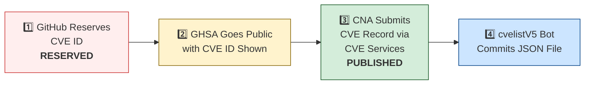

# 🛡️ OpenClaw CVE & Security Advisory Tracker

  
  
  
  
   
  
  
  
  
  

An automated tracker that continuously monitors [OpenClaw](https://github.com/openclaw/openclaw) security advisories across the GitHub Advisory Database, repo-level security advisories, and the [CVE V5 (cvelistV5)](https://github.com/CVEProject/cvelistV5) registry. Every hour it pulls the latest data, reconciles GHSA → CVE publication state, and regenerates this dashboard so you always have an up-to-date picture of the project's vulnerability landscape.

  Last updated: 2026-03-31 06:36 UTC · <a href="LICENSE">MIT License</a> · <a href="ADVISORIES.md">Full Advisory List</a> · <a href="SECURITY.md">Security Policy</a> · Data: <a href="https://github.com/CVEProject/cvelistV5">cvelistV5</a> + <a href="https://github.com/github/advisory-database">Advisory DB</a> · Updates hourly

---

  <a href="#-cves-published-in-cvelistv5-13">Published CVEs</a> ·
  <a href="#-cve-publication-pipeline">Pipeline</a> ·
  <a href="#-all-security-advisories-154">Advisories</a> ·
  <a href="#-vulnerability-categories">Categories</a> ·
  <a href="#-key-insights">Insights</a> ·
  <a href="#-project-identity">Identity</a>

---

## 🏗️ Project Identity

| Field | Value |
|-------|-------|
| **Current Name** | OpenClaw |
| **Previous Names** | Moltbot (second name), Clawdbot (original name) |
| **Repository** | [openclaw/openclaw](https://github.com/openclaw/openclaw) |
| **npm Package** | `openclaw` (formerly `clawdbot`) |
| **Author** | Peter Steinberger (steipete) |

<strong>Search terms for CVE discovery</strong>

To find all CVEs, search for: `openclaw`, `clawdbot`, `moltbot`, `clawhub`, `pkg:npm/clawdbot`, `pkg:npm/openclaw`

---

## 🚀 CVEs Published in cvelistV5 (13)

These CVEs have full records in the [CVEProject/cvelistV5](https://github.com/CVEProject/cvelistV5) repository:

| CVE ID | Severity | CVSS | Title | CWE | Published |
|--------|----------|------|-------|-----|-----------|
| [CVE-2026-25253](https://github.com/openclaw/openclaw/security/advisories/GHSA-g8p2-7wf7-98mq) |  | 8.8 | OpenClaw/Clawdbot has 1-Click RCE via Authentication Token Exfiltration From gatewayUrl | CWE-669 | 2026-02-01 |
| [CVE-2026-24763](https://github.com/openclaw/openclaw/security/advisories/GHSA-mc68-q9jw-2h3v) |  | 8.8 | OpenClaw/Clawdbot Docker Execution has Authenticated Command Injection via PATH Environment Variable | CWE-78 | 2026-02-02 |
| [CVE-2026-28478](https://github.com/openclaw/openclaw/security/advisories/GHSA-q447-rj3r-2cgh) |  | 8.7 | OpenClaw affected by denial of service via unbounded webhook request body buffering | CWE-770 | 2026-03-05 |
| [CVE-2026-32846](https://github.com/openclaw/openclaw/security/advisories/GHSA-f6pf-4gjx-c94r) |  | 8.7 | OpenClaw Media Parsing Path Traversal to Arbitrary File Read | CWE-22 | 2026-03-26 |
| [CVE-2026-28469](https://github.com/openclaw/openclaw/security/advisories/GHSA-rq6g-px6m-c248) |  | 8.2 | OpenClaw Google Chat shared-path webhook target ambiguity allowed cross-account policy-context misrouting | CWE-639 | 2026-03-05 |
| [CVE-2026-32302](https://github.com/openclaw/openclaw/security/advisories/GHSA-5wcw-8jjv-m286) |  | 8.1 | OpenClaw: Untrusted web origins can obtain authenticated operator.admin access in trusted-proxy mode | CWE-346 | 2026-03-12 |
| [CVE-2026-25157](https://github.com/openclaw/openclaw/security/advisories/GHSA-q284-4pvr-m585) |  | 7.8 | OpenClaw/Clawdbot has OS Command Injection via Project Root Path in sshNodeCommand | CWE-78 | 2026-02-04 |
| [CVE-2026-28458](https://github.com/openclaw/openclaw/security/advisories/GHSA-mr32-vwc2-5j6h) |  | 7.4 | OpenClaw's Browser Relay /cdp websocket is missing auth which could allow cross-tab cookie access | CWE-306 | 2026-03-05 |
| [CVE-2026-26317](https://github.com/openclaw/openclaw/security/advisories/GHSA-3fqr-4cg8-h96q) |  | 7.1 | OpenClaw affected by cross-site request forgery (CSRF) through loopback browser mutation endpoints | CWE-352 | 2026-02-19 |
| [CVE-2026-28480](https://github.com/openclaw/openclaw/security/advisories/GHSA-mj5r-hh7j-4gxf) |  | 6.9 | OpenClaw Telegram allowlist authorization accepted mutable usernames | CWE-290 | 2026-03-05 |
| [CVE-2026-29612](https://github.com/openclaw/openclaw/security/advisories/GHSA-w2cg-vxx6-5xjg) |  | 6.8 | OpenClaw < 2026.2.14 - Denial of Service via Large Base64 Media File Decoding | CWE-770 | 2026-03-05 |
| [CVE-2026-28452](https://github.com/openclaw/openclaw/security/advisories/GHSA-h89v-j3x9-8wqj) |  | 6.7 | OpenClaw affected by denial of service through unguarded archive extraction allowing high expansion/resource abuse (ZIP/TAR) | CWE-770 | 2026-03-05 |
| [CVE-2026-26328](https://github.com/openclaw/openclaw/security/advisories/GHSA-g34w-4xqq-h79m) |  | 6.5 | OpenClaw iMessage group allowlist authorization inherited DM pairing-store identities | CWE-284, CWE-863 | 2026-02-19 |

<strong>📖 Detailed CVE Analysis (click to expand)</strong>

### CVE-2026-25253 — OpenClaw/Clawdbot has 1-Click RCE via Authentication Token Exfiltration From gatewayUrl

| Field | Detail |
|-------|--------|
| **CVSS** | 8.8 (HIGH) — `CVSS:3.1/AV:N/AC:L/PR:N/UI:R/S:U/C:H/I:H/A:H` |
| **CWE** | CWE-669 (CWE-669 Incorrect Resource Transfer Between Spheres) |
| **Affected** | < 2026.1.29 |
| **Vendor/Product** | OpenClaw / OpenClaw |
| **Advisory** | [GHSA-g8p2-7wf7-98mq](https://github.com/openclaw/openclaw/security/advisories/GHSA-g8p2-7wf7-98mq) |

OpenClaw (aka clawdbot or Moltbot) before 2026.1.29 obtains a gatewayUrl value from a query string and automatically makes a WebSocket connection without prompting, sending a token value.

> **Naming note:** Uses all three names in description. packageURL still references `pkg:npm/clawdbot`.
**References:**
- [1-click-rce-to-steal-your-moltbot-data-and-keys](https://depthfirst.com/post/1-click-rce-to-steal-your-moltbot-data-and-keys)
- [blog](https://openclaw.ai/blog)
- [one-click-rce-moltbot](https://ethiack.com/news/blog/one-click-rce-moltbot)
- [2016913750557651228](https://x.com/0xacb/status/2016913750557651228)
---

### CVE-2026-24763 — OpenClaw/Clawdbot Docker Execution has Authenticated Command Injection via PATH Environment Variable

| Field | Detail |
|-------|--------|
| **CVSS** | 8.8 (HIGH) — `CVSS:3.1/AV:N/AC:L/PR:L/UI:N/S:U/C:H/I:H/A:H` |
| **CWE** | CWE-78 (CWE-78: Improper Neutralization of Special Elements used in an OS Command ('OS Command Injection')) |
| **Affected** | < 2026.1.29 |
| **Vendor/Product** | clawdbot / clawdbot |
| **Advisory** | [GHSA-mc68-q9jw-2h3v](https://github.com/openclaw/openclaw/security/advisories/GHSA-mc68-q9jw-2h3v) |

OpenClaw (formerly  Clawdbot) is a personal AI assistant you run on your own devices. Prior to 2026.1.29, a command injection vulnerability existed in OpenClaw’s Docker sandbox execution mechanism due to unsafe handling of the PATH environment variable when constructing shell commands. An authenticated user able to control environment variables could influence command execution within the container context. This vulnerability is fixed in 2026.1.29.

> **Naming note:** Uses old name `clawdbot/clawdbot` as vendor/product.
**References:**
- [https://github.com/openclaw/openclaw/commit/771f23d36b95ec2204cc9a0054045f5d8439ea75](https://github.com/openclaw/openclaw/commit/771f23d36b95ec2204cc9a0054045f5d8439ea75)
- [https://github.com/openclaw/openclaw/releases/tag/v2026.1.29](https://github.com/openclaw/openclaw/releases/tag/v2026.1.29)
---

### CVE-2026-28478 — OpenClaw affected by denial of service via unbounded webhook request body buffering

| Field | Detail |
|-------|--------|
| **CVSS** | 8.7 (HIGH) — `CVSS:4.0/AV:N/AC:L/AT:N/PR:N/UI:N/VC:N/VI:N/VA:H/SC:N/SI:N/SA:N` |
| **CWE** | CWE-770 (Allocation of Resources Without Limits or Throttling) |
| **Affected** | < 2026.2.13 |
| **Vendor/Product** | OpenClaw / OpenClaw |
| **Advisory** | [GHSA-q447-rj3r-2cgh](https://github.com/openclaw/openclaw/security/advisories/GHSA-q447-rj3r-2cgh) |

OpenClaw versions prior to 2026.2.13 contain a denial of service vulnerability in webhook handlers that buffer request bodies without strict byte or time limits. Remote unauthenticated attackers can send oversized JSON payloads or slow uploads to webhook endpoints causing memory pressure and availability degradation.

**References:**
- [Patch Commit](https://github.com/openclaw/openclaw/commit/3cbcba10cf30c2ffb898f0d8c7dfb929f15f8930)
- [VulnCheck Advisory: OpenClaw < 2026.2.13 - Denial of Service via Unbounded Webhook Request Body Buffering](https://www.vulncheck.com/advisories/openclaw-denial-of-service-via-unbounded-webhook-request-body-buffering)
---

### CVE-2026-32846 — OpenClaw Media Parsing Path Traversal to Arbitrary File Read

| Field | Detail |
|-------|--------|
| **CVSS** | 8.7 (HIGH) — `CVSS:4.0/AV:N/AC:L/AT:N/PR:N/UI:N/VC:H/VI:N/VA:N/SC:N/SI:N/SA:N` |
| **CWE** | CWE-22 (CWE-22: Improper Limitation of a Pathname to a Restricted Directory ('Path Traversal')) |
| **Affected** | < 4797bbc5b96e2cca5532e43b58915c051746fe37 |
| **Vendor/Product** | OpenClaw / OpenClaw |
| **Advisory** | [GHSA-f6pf-4gjx-c94r](https://github.com/openclaw/openclaw/security/advisories/GHSA-f6pf-4gjx-c94r) |

OpenClaw through 2026.3.23 (fixed in commit 4797bbc) contains a path traversal vulnerability in media parsing that allows attackers to read arbitrary files by bypassing path validation in the isLikelyLocalPath() and isValidMedia() functions. Attackers can exploit incomplete validation and the allowBareFilename bypass to reference files outside the intended application sandbox, resulting in disclosure of sensitive information including system files, environment files, and SSH keys.

**References:**
- [54642](https://github.com/openclaw/openclaw/pull/54642)
- [4797bbc5b96e2cca5532e43b58915c051746fe37](https://github.com/openclaw/openclaw/commit/4797bbc5b96e2cca5532e43b58915c051746fe37)
- [openclaw-media-parsing-path-traversal-to-arbitrary-file-read](https://www.vulncheck.com/advisories/openclaw-media-parsing-path-traversal-to-arbitrary-file-read)
---

### CVE-2026-28469 — OpenClaw Google Chat shared-path webhook target ambiguity allowed cross-account policy-context misrouting

| Field | Detail |
|-------|--------|
| **CVSS** | 8.2 (HIGH) — `CVSS:4.0/AV:N/AC:L/AT:P/PR:N/UI:N/VC:N/VI:H/VA:N/SC:N/SI:N/SA:N` |
| **CWE** | CWE-639 (Authorization Bypass Through User-Controlled Key) |
| **Affected** | < 2026.2.14 |
| **Vendor/Product** | OpenClaw / OpenClaw |
| **Advisory** | [GHSA-rq6g-px6m-c248](https://github.com/openclaw/openclaw/security/advisories/GHSA-rq6g-px6m-c248) |

OpenClaw versions prior to 2026.2.14 contain a webhook routing vulnerability in the Google Chat monitor component that allows cross-account policy context misrouting when multiple webhook targets share the same HTTP path. Attackers can exploit first-match request verification semantics to process inbound webhook events under incorrect account contexts, bypassing intended allowlists and session policies.

**References:**
- [Patch Commit](https://github.com/openclaw/openclaw/commit/61d59a802869177d9cef52204767cd83357ab79e)
- [VulnCheck Advisory: OpenClaw < 2026.2.14 - Cross-Account Policy Context Misrouting via Shared Webhook Path Ambiguity](https://www.vulncheck.com/advisories/openclaw-cross-account-policy-context-misrouting-via-shared-webhook-path-ambiguity)
---

### CVE-2026-32302 — OpenClaw: Untrusted web origins can obtain authenticated operator.admin access in trusted-proxy mode

| Field | Detail |
|-------|--------|
| **CVSS** | 8.1 (HIGH) — `CVSS:3.1/AV:N/AC:L/PR:N/UI:R/S:U/C:H/I:H/A:N` |
| **CWE** | CWE-346 (CWE-346: Origin Validation Error) |
| **Affected** | < 2026.3.11 |
| **Vendor/Product** | openclaw / openclaw |
| **Advisory** | [GHSA-5wcw-8jjv-m286](https://github.com/openclaw/openclaw/security/advisories/GHSA-5wcw-8jjv-m286) |

OpenClaw is a personal AI assistant. Prior to 2026.3.11, browser-originated WebSocket connections could bypass origin validation when gateway.auth.mode was set to trusted-proxy and the request arrived with proxy headers. A page served from an untrusted origin could connect through a trusted reverse proxy, inherit proxy-authenticated identity, and establish a privileged operator session. This vulnerability is fixed in 2026.3.11.

**References:**
- [https://github.com/openclaw/openclaw/commit/ebed3bbde1a72a1aaa9b87b63b91e7c04a50036b](https://github.com/openclaw/openclaw/commit/ebed3bbde1a72a1aaa9b87b63b91e7c04a50036b)
- [https://github.com/openclaw/openclaw/releases/tag/v2026.3.11](https://github.com/openclaw/openclaw/releases/tag/v2026.3.11)
---

### CVE-2026-25157 — OpenClaw/Clawdbot has OS Command Injection via Project Root Path in sshNodeCommand

| Field | Detail |
|-------|--------|
| **CVSS** | 7.8 (HIGH) — `CVSS:3.1/AV:L/AC:H/PR:N/UI:R/S:C/C:H/I:H/A:H` |
| **CWE** | CWE-78 (CWE-78: Improper Neutralization of Special Elements used in an OS Command ('OS Command Injection')) |
| **Affected** | < 2026.1.29 |
| **Vendor/Product** | openclaw / openclaw |
| **Advisory** | [GHSA-q284-4pvr-m585](https://github.com/openclaw/openclaw/security/advisories/GHSA-q284-4pvr-m585) |

OpenClaw is a personal AI assistant. Prior to version 2026.1.29, there is an OS command injection vulnerability via the Project Root Path in sshNodeCommand. The sshNodeCommand function constructed a shell script without properly escaping the user-supplied project path in an error message. When the cd command failed, the unescaped path was interpolated directly into an echo statement, allowing arbitrary command execution on the remote SSH host. The parseSSHTarget function did not validate that SSH target strings could not begin with a dash. An attacker-supplied target like -oProxyCommand=... would be interpreted as an SSH configuration flag rather than a hostname, allowing arbitrary command execution on the local machine. This issue has been patched in version 2026.1.29.

---

### CVE-2026-28458 — OpenClaw's Browser Relay /cdp websocket is missing auth which could allow cross-tab cookie access

| Field | Detail |
|-------|--------|
| **CVSS** | 7.4 (HIGH) — `CVSS:4.0/AV:N/AC:L/AT:P/PR:N/UI:A/VC:H/VI:H/VA:N/SC:N/SI:N/SA:N` |
| **CWE** | CWE-306 (Missing Authentication for Critical Function) |
| **Affected** | < 2026.2.1 |
| **Vendor/Product** | OpenClaw / OpenClaw |
| **Advisory** | [GHSA-mr32-vwc2-5j6h](https://github.com/openclaw/openclaw/security/advisories/GHSA-mr32-vwc2-5j6h) |

OpenClaw version 2026.1.20 prior to 2026.2.1 contains a vulnerability in the Browser Relay (extension must be installed and enabled) /cdp WebSocket endpoint in which it does not require authentication tokens, allowing websites to connect via loopback and access sensitive data. Attackers can exploit this by connecting to ws://127.0.0.1:18792/cdp to steal session cookies and execute JavaScript in other browser tabs.

**References:**
- [Patch Commit](https://github.com/openclaw/openclaw/commit/a1e89afcc19efd641c02b24d66d689f181ae2b5c)
- [VulnCheck Advisory: OpenClaw 2026.1.20 < 2026.2.1 - Missing Authentication in Browser Relay /cdp WebSocket Endpoint](https://www.vulncheck.com/advisories/openclaw-missing-authentication-in-browser-relay-cdp-websocket-endpoint)
---

### CVE-2026-26317 — OpenClaw affected by cross-site request forgery (CSRF) through loopback browser mutation endpoints

| Field | Detail |
|-------|--------|
| **CVSS** | 7.1 (HIGH) — `CVSS:3.1/AV:N/AC:L/PR:N/UI:R/S:U/C:N/I:H/A:L` |
| **CWE** | CWE-352 (CWE-352: Cross-Site Request Forgery (CSRF)) |
| **Affected** | <= 2026.1.24-3 |
| **Vendor/Product** | openclaw / clawdbot |
| **Advisory** | [GHSA-3fqr-4cg8-h96q](https://github.com/openclaw/openclaw/security/advisories/GHSA-3fqr-4cg8-h96q) |

OpenClaw is a personal AI assistant. Prior to 2026.2.14, browser-facing localhost mutation routes accepted cross-origin browser requests without explicit Origin/Referer validation. Loopback binding reduces remote exposure but does not prevent browser-initiated requests from malicious origins. A malicious website can trigger unauthorized state changes against a victim's local OpenClaw browser control plane (for example opening tabs, starting/stopping the browser, mutating storage/cookies) if the browser control service is reachable on loopback in the victim's browser context. Starting in version 2026.2.14, mutating HTTP methods (POST/PUT/PATCH/DELETE) are rejected when the request indicates a non-loopback Origin/Referer (or `Sec-Fetch-Site: cross-site`). Other mitigations include enabling browser control auth (token/password) and avoid running with auth disabled.

> **Naming note:** Uses old name `openclaw/clawdbot` as vendor/product.
**References:**
- [https://github.com/openclaw/openclaw/commit/b566b09f81e2b704bf9398d8d97d5f7a90aa94c3](https://github.com/openclaw/openclaw/commit/b566b09f81e2b704bf9398d8d97d5f7a90aa94c3)
- [https://github.com/openclaw/openclaw/releases/tag/v2026.2.14](https://github.com/openclaw/openclaw/releases/tag/v2026.2.14)
---

### CVE-2026-28480 — OpenClaw Telegram allowlist authorization accepted mutable usernames

| Field | Detail |
|-------|--------|
| **CVSS** | 6.9 (MEDIUM) — `CVSS:4.0/AV:N/AC:L/AT:N/PR:N/UI:N/VC:L/VI:L/VA:N/SC:N/SI:N/SA:N` |
| **CWE** | CWE-290 (Authentication Bypass by Spoofing) |
| **Affected** | < 2026.2.14 |
| **Vendor/Product** | OpenClaw / OpenClaw |
| **Advisory** | [GHSA-mj5r-hh7j-4gxf](https://github.com/openclaw/openclaw/security/advisories/GHSA-mj5r-hh7j-4gxf) |

OpenClaw versions prior to 2026.2.14 contain an authorization bypass vulnerability where Telegram allowlist matching accepts mutable usernames instead of immutable numeric sender IDs. Attackers can spoof identity by obtaining recycled usernames to bypass allowlist restrictions and interact with bots as unauthorized senders.

**References:**
- [Patch Commit #1](https://github.com/openclaw/openclaw/commit/e3b432e481a96b8fd41b91273818e514074e05c3)
- [Patch Commit #2](https://github.com/openclaw/openclaw/commit/9e147f00b48e63e7be6964e0e2a97f2980854128)
- [VulnCheck Advisory: OpenClaw < 2026.2.14 - Identity Spoofing via Mutable Username in Telegram Allowlist Authorization](https://www.vulncheck.com/advisories/openclaw-identity-spoofing-via-mutable-username-in-telegram-allowlist-authorization)
---

### CVE-2026-29612 — OpenClaw < 2026.2.14 - Denial of Service via Large Base64 Media File Decoding

| Field | Detail |
|-------|--------|
| **CVSS** | 6.8 (MEDIUM) — `CVSS:4.0/AV:L/AC:L/AT:N/PR:L/UI:N/VC:N/VI:N/VA:H/SC:N/SI:N/SA:N` |
| **CWE** | CWE-770 (Allocation of Resources Without Limits or Throttling) |
| **Affected** | < 2026.2.14 |
| **Vendor/Product** | OpenClaw / OpenClaw |
| **Advisory** | [GHSA-w2cg-vxx6-5xjg](https://github.com/openclaw/openclaw/security/advisories/GHSA-w2cg-vxx6-5xjg) |

OpenClaw versions prior to 2026.2.14 decode base64-backed media inputs into buffers before enforcing decoded-size budget limits, allowing attackers to trigger large memory allocations. Remote attackers can supply oversized base64 payloads to cause memory pressure and denial of service.

**References:**
- [Patch Commit](https://github.com/openclaw/openclaw/commit/31791233d60495725fa012745dde8d6ee69e9595)
- [VulnCheck Advisory: OpenClaw < 2026.2.14 - Denial of Service via Large Base64 Media File Decoding](https://www.vulncheck.com/advisories/openclaw-denial-of-service-via-large-base-media-file-decoding)
---

### CVE-2026-28452 — OpenClaw affected by denial of service through unguarded archive extraction allowing high expansion/resource abuse (ZIP/TAR)

| Field | Detail |
|-------|--------|
| **CVSS** | 6.7 (MEDIUM) — `CVSS:4.0/AV:L/AC:L/AT:N/PR:N/UI:A/VC:N/VI:N/VA:H/SC:N/SI:N/SA:N` |
| **CWE** | CWE-770 (Allocation of Resources Without Limits or Throttling) |
| **Affected** | < 2026.2.14 |
| **Vendor/Product** | OpenClaw / OpenClaw |
| **Advisory** | [GHSA-h89v-j3x9-8wqj](https://github.com/openclaw/openclaw/security/advisories/GHSA-h89v-j3x9-8wqj) |

OpenClaw versions prior to 2026.2.14 contain a denial of service vulnerability in the extractArchive function within src/infra/archive.ts that allows attackers to consume excessive CPU, memory, and disk resources through high-expansion ZIP and TAR archives. Remote attackers can trigger resource exhaustion by providing maliciously crafted archive files during install or update operations, causing service degradation or system unavailability.

**References:**
- [Patch Commit #1](https://github.com/openclaw/openclaw/commit/d3ee5deb87ee2ad0ab83c92c365611165423cb71)
- [Patch Commit #2](https://github.com/openclaw/openclaw/commit/5f4b29145c236d124524c2c9af0f8acd048fbdea)
- [VulnCheck Advisory: OpenClaw < 2026.2.14 - Denial of Service via Unguarded Archive Extraction in extractArchive](https://www.vulncheck.com/advisories/openclaw-denial-of-service-via-unguarded-archive-extraction-in-extractarchive)
---

### CVE-2026-26328 — OpenClaw iMessage group allowlist authorization inherited DM pairing-store identities

| Field | Detail |
|-------|--------|
| **CVSS** | 6.5 (MEDIUM) — `CVSS:3.1/AV:N/AC:L/PR:L/UI:N/S:U/C:N/I:H/A:N` |
| **CWE** | CWE-284 (CWE-284: Improper Access Control), CWE-863 (CWE-863: Incorrect Authorization) |
| **Affected** | <= 2026.1.24-3 |
| **Vendor/Product** | openclaw / clawdbot |
| **Advisory** | [GHSA-g34w-4xqq-h79m](https://github.com/openclaw/openclaw/security/advisories/GHSA-g34w-4xqq-h79m) |

OpenClaw is a personal AI assistant. Prior to version 2026.2.14, under iMessage `groupPolicy=allowlist`, group authorization could be satisfied by sender identities coming from the DM pairing store, broadening DM trust into group contexts. Version 2026.2.14 fixes the issue.

> **Naming note:** Uses old name `openclaw/clawdbot` as vendor/product.
**References:**
- [https://github.com/openclaw/openclaw/commit/872079d42fe105ece2900a1dd6ab321b92da2d59](https://github.com/openclaw/openclaw/commit/872079d42fe105ece2900a1dd6ab321b92da2d59)
- [https://github.com/openclaw/openclaw/releases/tag/v2026.2.14](https://github.com/openclaw/openclaw/releases/tag/v2026.2.14)
---

---

## ⏳ CVE Publication Pipeline

Of 13 GHSAs with CVE IDs, **13** are fully published and **0** remain `RESERVED`.

| CVE ID | State | cvelistV5 | GHSA Published | CNA |
|--------|-------|-----------|----------------|-----|
| CVE-2026-24763 | ✅ **PUBLISHED** | ✅ | 2026-02-02 | GitHub_M |
| CVE-2026-25157 | ✅ **PUBLISHED** | ✅ | 2026-02-02 | GitHub_M |
| CVE-2026-25253 | ✅ **PUBLISHED** | ✅ | 2026-02-02 | mitre |
| CVE-2026-26317 | ✅ **PUBLISHED** | ✅ | 2026-02-18 | GitHub_M |
| CVE-2026-26328 | ✅ **PUBLISHED** | ✅ | 2026-02-18 | GitHub_M |
| CVE-2026-28452 | ✅ **PUBLISHED** | ✅ | 2026-02-18 | VulnCheck |
| CVE-2026-28458 | ✅ **PUBLISHED** | ✅ | 2026-02-17 | VulnCheck |
| CVE-2026-28469 | ✅ **PUBLISHED** | ✅ | 2026-02-18 | VulnCheck |
| CVE-2026-28478 | ✅ **PUBLISHED** | ✅ | 2026-02-18 | VulnCheck |
| CVE-2026-28480 | ✅ **PUBLISHED** | ✅ | 2026-02-18 | VulnCheck |
| CVE-2026-29612 | ✅ **PUBLISHED** | ✅ | 2026-02-18 | VulnCheck |
| CVE-2026-32302 | ✅ **PUBLISHED** | ✅ |  | GitHub_M |
| CVE-2026-32846 | ✅ **PUBLISHED** | ✅ | 2026-03-26 | VulnCheck |

---

## 🔑 Key Insights

| Insight | Detail |
|---------|--------|
| **Dominant Weakness** | 46% of categorized issues relate to **Allowlist Bypass** (57/124) |
| **V5 Sync Rate** | 13/13 CVE IDs (100%) have full cvelistV5 records |
| **Advisory Velocity** | 154 security advisories across 2026-02-02 → 2026-03-30 |
| **Top Severity** | 9 Critical + 63 High = 72 high-impact issues (47%) |

### Vulnerability Categories

| Category | Count | Examples |
|----------|------:|----------|
| **OS Command Injection (CWE-78)** | 28 | PATH injection, SSH command injection, Docker exec, keychain writes |
| **Path Traversal (CWE-22)** | 2 | MEDIA: paths, plugin install, browser downloads, Zip Slip, transcript paths |
| **SSRF** | 4 | Image tool fetch, Feishu extension, attachment/media URLs, IPv6 bypass |
| **Auth Bypass / Missing Auth** | 11 | WebSocket config.apply, webhook verification, browser relay, sandbox bridge |
| **Allowlist Bypass** | 57 | Telegram usernames, Matrix displayName, Slack DM, Twitch, voice-call |
| **Injection (XSS/CSRF/Prompt)** | 16 | XSS in Control UI, prompt injection via Slack/CWD/logs, CSRF |
| **Denial of Service** | 6 | Unbounded media fetch, webhook body buffering, archive expansion |

---

## 📋 All Security Advisories (154)

### Critical & High Severity

| GHSA | CVE | Severity | Title | Published |
|------|-----|----------|-------|-----------|
| [GHSA-xp9r-prpg-373r](https://github.com/advisories/GHSA-xp9r-prpg-373r) | — |  | OpenClaw: `browser.request` still allows `POST /reset-profile` through the `operator.write` surface | 2026-03-30 |
| [GHSA-94pw-c6m8-p9p9](https://github.com/advisories/GHSA-94pw-c6m8-p9p9) | — |  | OpenClaw: Gateway operator.write Can Reach Admin-Class Channel Allowlist Persistence via chat.send | 2026-03-30 |
| [GHSA-m3mh-3mpg-37hw](https://github.com/advisories/GHSA-m3mh-3mpg-37hw) | — |  | OpenClaw has an Arbitrary Malicious Code Execution Vulnerability | 2026-03-30 |
| [GHSA-hr5v-j9h9-xjhg](https://github.com/advisories/GHSA-hr5v-j9h9-xjhg) | — |  | OpenClaw has Sandbox Media Root Bypass via Unnormalized `mediaUrl` / `fileUrl` Parameter Keys (CWE-22) | 2026-03-30 |
| [GHSA-h4jx-hjr3-fhgc](https://github.com/advisories/GHSA-h4jx-hjr3-fhgc) | — |  | OpenClaw: Gateway Plugin Subagent Fallback `deleteSession` Uses Synthetic `operator.admin` | 2026-03-29 |
| [GHSA-rhfg-j8jq-7v2h](https://github.com/advisories/GHSA-rhfg-j8jq-7v2h) | — |  | OpenClaw: SSRF via Unguarded Configured Base URLs in Multiple Channel Extensions (Incomplete Fix for CVE-2026-28476) | 2026-03-29 |
| [GHSA-q2qc-744p-66r2](https://github.com/advisories/GHSA-q2qc-744p-66r2) | — |  | OpenClaw: `session_status` sessionId resolution bypasses sandboxed session-tree visibility | 2026-03-29 |
| [GHSA-qm2m-28pf-hgjw](https://github.com/advisories/GHSA-qm2m-28pf-hgjw) | — |  | OpenClaw: Gateway Plugin HTTP Auth Grants Unrestricted operator.admin Runtime Scope to All Callers | 2026-03-27 |
| [GHSA-fqw4-mph7-2vr8](https://github.com/advisories/GHSA-fqw4-mph7-2vr8) | — |  | OpenClaw: Silent privilege escalation via gateway shared-auth reconnect | 2026-03-27 |
| [GHSA-9hjh-fr4f-gxc4](https://github.com/advisories/GHSA-9hjh-fr4f-gxc4) | — |  | OpenClaw: Gateway Backend Reconnect lets Non-Admin Operator Scopes Self-Claim operator.admin | 2026-03-27 |
| [GHSA-9p93-7j67-5pc2](https://github.com/advisories/GHSA-9p93-7j67-5pc2) | — |  | OpenClaw: Gateway HTTP /sessions/:sessionKey/kill Reaches Admin Kill Path Without Caller Scope Binding | 2026-03-27 |
| [GHSA-hggm-x7r9-mm7v](https://github.com/advisories/GHSA-hggm-x7r9-mm7v) | CVE-2026-32846 |  | OpenClaw is vulnerable to Path Traversal through path validation bypass | 2026-03-26 |
| [GHSA-7xr2-q9vf-x4r5](https://github.com/advisories/GHSA-7xr2-q9vf-x4r5) | — |  | OpenClaw: Symlink Traversal via IDENTITY.md appendFile in agents.create/update (Incomplete Fix for CVE-2026-32013) | 2026-03-26 |
| [GHSA-74wf-h43j-vvmj](https://github.com/advisories/GHSA-74wf-h43j-vvmj) | — |  | OpenClaw's Conflicting Tool Identity Hints Bypass Dangerous-Tool Prompting | 2026-03-26 |
| [GHSA-hf68-49fm-59cq](https://github.com/advisories/GHSA-hf68-49fm-59cq) | — |  | OpenClaw Gateway: RCE and Privilege Escalation from operator.pairing to operator.admin via device.pair.approve | 2026-03-26 |
| [GHSA-mp66-rf4f-mhh8](https://github.com/advisories/GHSA-mp66-rf4f-mhh8) | — |  | OpenClaw: Google Chat app-url webhook auth accepted non-deployment add-on principals | 2026-03-26 |
| [GHSA-3w6x-gv34-mqpf](https://github.com/advisories/GHSA-3w6x-gv34-mqpf) | — |  | OpenClaw's mutating internal ACP chat commands missed operator.admin scope enforcement | 2026-03-26 |
| [GHSA-39pp-xp36-q6mg](https://github.com/advisories/GHSA-39pp-xp36-q6mg) | — |  | OpenClaw has Inconsistent Host Exec Environment Override Sanitization | 2026-03-26 |
| [GHSA-48vw-m3qc-wr99](https://github.com/advisories/GHSA-48vw-m3qc-wr99) | — |  | OpenClaw's Trusted-proxy Control UI sessions retain privileged scopes without device identity on device-less allow paths | 2026-03-26 |
| [GHSA-4qwc-c7g9-4xcw](https://github.com/advisories/GHSA-4qwc-c7g9-4xcw) | — |  | OpenClaw: Remote media error responses could trigger unbounded memory allocation before failure | 2026-03-26 |
| [GHSA-cxmw-p77q-wchg](https://github.com/advisories/GHSA-cxmw-p77q-wchg) | — |  | OpenClaw: Arbitrary code execution via unvalidated WebView JavascriptInterface | 2026-03-26 |
| [GHSA-qm9x-v7cx-7rq4](https://github.com/advisories/GHSA-qm9x-v7cx-7rq4) | — |  | OpenClaw's system.run allowlist can be bypassed through an unregistered time dispatch wrapper | 2026-03-26 |
| [GHSA-65h8-27jh-q8wv](https://github.com/advisories/GHSA-65h8-27jh-q8wv) | — |  | OpenClaw: Nostr inbound DMs could trigger unauthenticated crypto work before sender policy enforcement | 2026-03-26 |
| [GHSA-wv46-v6xc-2qhf](https://github.com/advisories/GHSA-wv46-v6xc-2qhf) | — |  | OpenClaw: Synology Chat reply delivery could be rebound through username-based user resolution. | 2026-03-26 |
| [GHSA-wq58-2pvg-5h4f](https://github.com/advisories/GHSA-wq58-2pvg-5h4f) | — |  | OpenClaw: Gateway agent /reset exposes admin session reset to operator.write callers | 2026-03-26 |
| [GHSA-cg6c-q2hx-69h7](https://github.com/advisories/GHSA-cg6c-q2hx-69h7) | — |  | OpenClaw: Plivo V2 verified replay identity drifts on query-only variants | 2026-03-26 |
| [GHSA-rj39-33v7-9xrq](https://github.com/advisories/GHSA-rj39-33v7-9xrq) | — |  | Duplicate Advisory: OpenClaw's shell startup env injection bypasses system.run allowlist intent (RCE class) | 2026-03-21 |
| [GHSA-cxcw-jm67-3wwp](https://github.com/advisories/GHSA-cxcw-jm67-3wwp) | — |  | Duplicate Advisory: OpenClaw's andbox browser noVNC observer lacked VNC authentication | 2026-03-21 |
| [GHSA-9f79-7pw8-3fj8](https://github.com/advisories/GHSA-9f79-7pw8-3fj8) | — |  | Duplicate Advisory: OpenClaw: workspace path guard bypass on non-existent out-of-root symlink leaf | 2026-03-21 |
| [GHSA-qwmf-95r9-gx9x](https://github.com/advisories/GHSA-qwmf-95r9-gx9x) | — |  | Duplicate Advisory: OpenClaw's gateway tokenless Tailscale auth applied to HTTP routes | 2026-03-21 |
| [GHSA-xq3g-m3j8-2vmm](https://github.com/advisories/GHSA-xq3g-m3j8-2vmm) | — |  | Duplicate Advisory: OpenClaw's inbound media downloads could exceed configured byte limits before rejection across multiple channels | 2026-03-21 |
| [GHSA-wr92-6w3g-2hwc](https://github.com/advisories/GHSA-wr92-6w3g-2hwc) | — |  | Duplicate Advisory: OpenClaw's sandboxed sessions_spawn now enforces sandbox inheritance for cross-agent spawns | 2026-03-21 |
| [GHSA-x49q-fhhm-r9jf](https://github.com/advisories/GHSA-x49q-fhhm-r9jf) | — |  | Duplicate Advisory: OpenClaw: WebSocket shared-auth connections could self-declare elevated scopes | 2026-03-20 |
| [GHSA-jqpf-vj28-9v7r](https://github.com/advisories/GHSA-jqpf-vj28-9v7r) | — |  | Duplicate Advisory: Synology Chat dmPolicy=allowlist failed open on empty allowedUserIds, allowing unauthorized agent dispatch | 2026-03-19 |
| [GHSA-x742-88jj-7hv9](https://github.com/advisories/GHSA-x742-88jj-7hv9) | — |  | Duplicate Advisory: allowlist exec-guard bypass via env -S | 2026-03-19 |
| [GHSA-3846-mfvc-xwpf](https://github.com/advisories/GHSA-3846-mfvc-xwpf) | — |  | Duplicate Advisory: Exec allowlist wrapper analysis did not unwrap env/shell dispatch chains | 2026-03-19 |
| [GHSA-pfv5-rpcw-x34x](https://github.com/advisories/GHSA-pfv5-rpcw-x34x) | — |  | Duplicate Advisory: OpenClaw's allow-always wrapper persistence could bypass future approvals and enable command execution | 2026-03-19 |
| [GHSA-g2f6-pwvx-r275](https://github.com/advisories/GHSA-g2f6-pwvx-r275) | — |  | OpneClaw accepts unsanitized iMessage attachment paths which allowed SCP remote-path command injection | 2026-03-16 |
| [GHSA-jq3f-vjww-8rq7](https://github.com/advisories/GHSA-jq3f-vjww-8rq7) | — |  | OpenClaw Telegram webhook request bodies were read before secret validation, enabling unauthenticated resource exhaustion | 2026-03-16 |
| [GHSA-rq6g-px6m-c248](https://github.com/advisories/GHSA-rq6g-px6m-c248) | CVE-2026-28469 |  | OpenClaw Google Chat shared-path webhook target ambiguity allowed cross-account policy-context misrouting | 2026-02-18 |
| [GHSA-3fqr-4cg8-h96q](https://github.com/advisories/GHSA-3fqr-4cg8-h96q) | CVE-2026-26317 |  | OpenClaw affected by cross-site request forgery (CSRF) through loopback browser mutation endpoints | 2026-02-18 |
| [GHSA-q447-rj3r-2cgh](https://github.com/advisories/GHSA-q447-rj3r-2cgh) | CVE-2026-28478 |  | OpenClaw affected by denial of service via unbounded webhook request body buffering | 2026-02-18 |
| [GHSA-mr32-vwc2-5j6h](https://github.com/advisories/GHSA-mr32-vwc2-5j6h) | CVE-2026-28458 |  | OpenClaw's Browser Relay /cdp websocket is missing auth which could allow cross-tab cookie access | 2026-02-17 |
| [GHSA-q284-4pvr-m585](https://github.com/advisories/GHSA-q284-4pvr-m585) | CVE-2026-25157 |  | OpenClaw/Clawdbot has OS Command Injection via Project Root Path in sshNodeCommand | 2026-02-02 |
| [GHSA-g8p2-7wf7-98mq](https://github.com/advisories/GHSA-g8p2-7wf7-98mq) | CVE-2026-25253 |  | OpenClaw/Clawdbot has 1-Click RCE via Authentication Token Exfiltration From gatewayUrl | 2026-02-02 |
| [GHSA-mc68-q9jw-2h3v](https://github.com/advisories/GHSA-mc68-q9jw-2h3v) | CVE-2026-24763 |  | OpenClaw/Clawdbot Docker Execution has Authenticated Command Injection via PATH Environment Variable | 2026-02-02 |
| [GHSA-r2c6-8jc8-g32w](https://github.com/advisories/GHSA-r2c6-8jc8-g32w) | — |  | Duplicate Advisory: 1-Click RCE via Authentication Token Exfiltration From gatewayUrl | 2026-02-02 |

### Medium Severity

| GHSA | CVE | Severity | Title | Published |
|------|-----|----------|-------|-----------|
| [GHSA-39mp-545q-w789](https://github.com/advisories/GHSA-39mp-545q-w789) | — |  | OpenClaw: Non-owner command-authorized sender can change the owner-only `/send` session delivery policy | 2026-03-30 |
| [GHSA-vqvg-86cc-cg83](https://github.com/advisories/GHSA-vqvg-86cc-cg83) | — |  | OpenClaw: Mutating internal `/allowlist` chat commands missed `operator.admin` scope enforcement | 2026-03-30 |
| [GHSA-68f8-9mhj-h2mp](https://github.com/advisories/GHSA-68f8-9mhj-h2mp) | — |  | OpenClaw has a Gateway HTTP /v1/models Route Bypasses Operator Read Scope | 2026-03-30 |
| [GHSA-w6m8-cqvj-pg5v](https://github.com/advisories/GHSA-w6m8-cqvj-pg5v) | — |  | OpenClaw has incomplete Fix for CVE-2026-32011: Feishu Webhook Pre-Auth Body Parsing DoS (Slow-Body / Slowloris Variant) | 2026-03-30 |
| [GHSA-3298-56p6-rpw2](https://github.com/advisories/GHSA-3298-56p6-rpw2) | — |  | OpenClaw has incomplete Fix for CVE-2026-27486: Unvalidated SIGKILL in `!stop` Chat Command via `shell-utils.ts` | 2026-03-30 |
| [GHSA-4hmj-39m8-jwc7](https://github.com/advisories/GHSA-4hmj-39m8-jwc7) | — |  | OpenClaw has ACP CLI approval prompt ANSI escape sequence injection | 2026-03-29 |
| [GHSA-j4c9-w69r-cw33](https://github.com/advisories/GHSA-j4c9-w69r-cw33) | — |  | OpenClaw: Telegram DM-Scoped Inline Button Callbacks Bypass DM Pairing and Mutate Session State | 2026-03-29 |
| [GHSA-mf5g-6r6f-ghhm](https://github.com/advisories/GHSA-mf5g-6r6f-ghhm) | — |  | OpenClaw: Synology Chat Webhook Pre-Auth Rate-Limit Bypass Enables Brute-Force Guessing of Webhook Token | 2026-03-29 |
| [GHSA-rf6h-5gpw-qrgq](https://github.com/advisories/GHSA-rf6h-5gpw-qrgq) | — |  | OpenClaw: MS Teams Feedback Invocation Bypasses Sender Allowlists and Records Unauthorized Session Feedback | 2026-03-29 |
| [GHSA-77w2-crqv-cmv3](https://github.com/advisories/GHSA-77w2-crqv-cmv3) | — |  | OpenClaw: Feishu Raw Card Send Surface Can Mint Legacy Card Callbacks That Bypass DM Pairing | 2026-03-29 |
| [GHSA-3h52-cx59-c456](https://github.com/advisories/GHSA-3h52-cx59-c456) | — |  | OpenClaw: Feishu webhook reads and parses unauthenticated request bodies before signature validation | 2026-03-29 |
| [GHSA-52q4-3xjc-6778](https://github.com/advisories/GHSA-52q4-3xjc-6778) | — |  | OpenClaw: Google Chat Authz Bypass via Group Policy Rebinding with Mutable Space displayName | 2026-03-29 |
| [GHSA-5jvj-hxmh-6h6j](https://github.com/advisories/GHSA-5jvj-hxmh-6h6j) | — |  | OpenClaw: Gateway HTTP Session History Route Bypasses Operator Read Scope | 2026-03-29 |
| [GHSA-vcx4-4qxg-mfp4](https://github.com/advisories/GHSA-vcx4-4qxg-mfp4) | — |  | OpenClaw: Telegram Webhook Missing Guess Rate Limiting Enables Brute-Force Guessing of Weak Webhook Secret | 2026-03-27 |
| [GHSA-mw7w-g3mg-xqm7](https://github.com/advisories/GHSA-mw7w-g3mg-xqm7) | — |  | OpenClaw: BlueBubbles Group Reactions Bypass requireMention and Still Enqueue Agent-Visible System Events | 2026-03-27 |
| [GHSA-9wqx-g2cw-vc7r](https://github.com/advisories/GHSA-9wqx-g2cw-vc7r) | — |  | OpenClaw: Matrix Verification Notices Bypass Matrix DM Policy and Reply to Unpaired DM Peers | 2026-03-27 |
| [GHSA-xq8g-hgh6-87hv](https://github.com/advisories/GHSA-xq8g-hgh6-87hv) | — |  | OpenClaw: BlueBubbles Webhook Missing Rate Limiting Enables Brute-Force Password Guessing | 2026-03-27 |
| [GHSA-cfp9-w5v9-3q4h](https://github.com/advisories/GHSA-cfp9-w5v9-3q4h) | — |  | OpenClaw: Image Tool `tools.fs.workspaceOnly` Bypass via Sandbox Bridge Mounts | 2026-03-26 |
| [GHSA-rqp8-q22p-5j9q](https://github.com/advisories/GHSA-rqp8-q22p-5j9q) | — |  | OpenClaw Bypasses DM Policy Separation via Synology Chat Webhook Path Collision | 2026-03-26 |
| [GHSA-x2cm-hg9c-mf5w](https://github.com/advisories/GHSA-x2cm-hg9c-mf5w) | — |  | OpenClaw leaf subagents can bypass controlScope restrictions to send messages to child sessions | 2026-03-26 |
| [GHSA-844j-xrrq-wgh4](https://github.com/advisories/GHSA-844j-xrrq-wgh4) | — |  | OpenClaw: Forwarding header spoofing bypasses gateway.trustedProxies origin detection | 2026-03-26 |
| [GHSA-xhq5-45pm-2gjr](https://github.com/advisories/GHSA-xhq5-45pm-2gjr) | — |  | OpenClaw: Nextcloud Talk room allowlist matched colliding room names instead of stable room tokens | 2026-03-26 |
| [GHSA-vfg3-pqpq-93m4](https://github.com/advisories/GHSA-vfg3-pqpq-93m4) | — |  | OpenClaw: Tlon cite expansion happens before channel and DM authorization is complete | 2026-03-26 |
| [GHSA-8883-9w57-vwv6](https://github.com/advisories/GHSA-8883-9w57-vwv6) | — |  | OpenClaw: Mattermost callback dispatch allowed non-allowlisted sender actions | 2026-03-26 |
| [GHSA-ppwq-6v66-5m6j](https://github.com/advisories/GHSA-ppwq-6v66-5m6j) | — |  | OpenClaw Exposes Credentials Embedded in baseUrl Fields via config.get and channels.status | 2026-03-26 |
| [GHSA-wj55-88gf-x564](https://github.com/advisories/GHSA-wj55-88gf-x564) | — |  | OpenClaw may have stale policy enforcement for queued node actions | 2026-03-26 |
| [GHSA-rm59-992w-x2mv](https://github.com/advisories/GHSA-rm59-992w-x2mv) | — |  | OpenClaw is vulnerable to unauthenticated resource exhaustion through its voice call webhook handling | 2026-03-26 |
| [GHSA-rvqr-hrcc-j9vv](https://github.com/advisories/GHSA-rvqr-hrcc-j9vv) | — |  | OpenClaw: Bonjour/DNS-SD TXT metadata steers CLI routing after failed service resolution | 2026-03-26 |
| [GHSA-h3x4-hc5v-v2gm](https://github.com/advisories/GHSA-h3x4-hc5v-v2gm) | — |  | OpenClaw: Windows media loaders accepted remote-host file URLs before local path validation | 2026-03-26 |
| [GHSA-6mqc-jqh6-x8fc](https://github.com/advisories/GHSA-6mqc-jqh6-x8fc) | — |  | OpenClaw: Gateway Canvas local-direct requests bypass Canvas HTTP and WebSocket authentication | 2026-03-26 |
| [GHSA-vh4c-j2xv-9pv9](https://github.com/advisories/GHSA-vh4c-j2xv-9pv9) | — |  | Duplicate Advisory: OpenClaw: BlueBubbles beta plugin webhook auth hardening (remove passwordless fallback) | 2026-03-21 |
| [GHSA-rcx4-77x4-hjx5](https://github.com/advisories/GHSA-rcx4-77x4-hjx5) | — |  | Duplicate Advisory: OpenClaw ACP client has permission auto-approval bypass via untrusted tool metadata | 2026-03-21 |
| [GHSA-g839-vp47-wgh8](https://github.com/advisories/GHSA-g839-vp47-wgh8) | — |  | Duplicate Advisory: OpenClaw's Slack reaction/pin sender-policy consistency issue in non-message ingress | 2026-03-21 |
| [GHSA-mxmg-3p7m-2ghr](https://github.com/advisories/GHSA-mxmg-3p7m-2ghr) | — |  | Duplicate Advisory: OpenClaw: system.run approval identity mismatch could execute a different binary than displayed | 2026-03-21 |
| [GHSA-xh9j-mpc9-2m9p](https://github.com/advisories/GHSA-xh9j-mpc9-2m9p) | — |  | Duplicate Advisory: OpenClaw has a Trusted-proxy Control UI pairing bypass which allows unpaired node sessions | 2026-03-21 |
| [GHSA-ffr4-mrhv-vfr2](https://github.com/advisories/GHSA-ffr4-mrhv-vfr2) | — |  | Duplicate Advisory: OpenClaw has browser trace/download path symlink escape in temp output handling | 2026-03-21 |
| [GHSA-3r78-rqg8-95gg](https://github.com/advisories/GHSA-3r78-rqg8-95gg) | — |  | Duplicate Advisory: OpenClaw's voice-call Twilio webhook replay could bypass manager dedupe because normalized event IDs were randomized per parse | 2026-03-21 |
| [GHSA-xgwg-m42c-8q62](https://github.com/advisories/GHSA-xgwg-m42c-8q62) | — |  | Duplicate Advisory: OpenClaw: Slack system events bypass sender authorization in member and message subtype handlers | 2026-03-21 |
| [GHSA-q94v-v6m9-jhq9](https://github.com/advisories/GHSA-q94v-v6m9-jhq9) | — |  | Duplicate Advisory: OpenClaw has an improper sandbox configuration vulnerability | 2026-03-21 |
| [GHSA-3p2x-hjxj-c7rv](https://github.com/advisories/GHSA-3p2x-hjxj-c7rv) | — |  | Duplicate Advisory: OpenClaw's system.run approval TOCTOU via mutable symlink cwd target on node host | 2026-03-21 |
| [GHSA-w6f4-3v35-qjhj](https://github.com/advisories/GHSA-w6f4-3v35-qjhj) | — |  | Duplicate Advisory: OpenClaw's system.run shell-wrapper positional argv carriers could execute hidden commands under misleading approval text | 2026-03-21 |
| [GHSA-86jj-29wc-7q2w](https://github.com/advisories/GHSA-86jj-29wc-7q2w) | — |  | Duplicate Advisory: OpenClaw's Signal reaction-only status events could, in limited cases, be enqueued before access checks | 2026-03-21 |
| [GHSA-5rp4-cwgh-gvwq](https://github.com/advisories/GHSA-5rp4-cwgh-gvwq) | — |  | Duplicate Advisory: OpenClaw: WebSocket shared-auth connections could self-declare elevated scopes | 2026-03-19 |
| [GHSA-2cwr-f5hx-gg3w](https://github.com/advisories/GHSA-2cwr-f5hx-gg3w) | — |  | Duplicate Advisory: OpenClaw: stageSandboxMedia destination symlink traversal can overwrite files outside sandbox workspace | 2026-03-19 |
| [GHSA-h36m-2vh5-x699](https://github.com/advisories/GHSA-h36m-2vh5-x699) | — |  | Duplicate Advisory: ACPX Windows wrapper shell fallback allowed cwd injection in specific paths | 2026-03-19 |
| [GHSA-g87j-gm7p-6vw2](https://github.com/advisories/GHSA-g87j-gm7p-6vw2) | — |  | Duplicate Advisory: OpenClaw's Node system.run approval hardening wrapper semantic drift can execute unintended local scripts | 2026-03-19 |
| [GHSA-5326-6f73-m96w](https://github.com/advisories/GHSA-5326-6f73-m96w) | — |  | Duplicate Advisory: OpenClaw macOS companion app (beta): allowlist parsing mismatch for system.run shell chains | 2026-03-19 |
| [GHSA-5gqg-mqh5-2v39](https://github.com/advisories/GHSA-5gqg-mqh5-2v39) | — |  | Duplicate Advisory: OpenClaw Windows Scheduled Task script generation allowed local command injection via unsafe cmd argument handling | 2026-03-19 |
| [GHSA-82gw-wqw6-r2cf](https://github.com/advisories/GHSA-82gw-wqw6-r2cf) | — |  | Duplicate Advisory: Command Injection via unescaped environment assignments in Windows Scheduled Task script generation | 2026-03-19 |
| [GHSA-q86m-697p-h7fh](https://github.com/advisories/GHSA-q86m-697p-h7fh) | — |  | Duplicate Advisory: OpenClaw: system.run approvals did not bind PATH-token executable identity, enabling post-approval executable rebind | 2026-03-19 |
| [GHSA-866c-wwm5-4rj7](https://github.com/advisories/GHSA-866c-wwm5-4rj7) | — |  | Duplicate Advisory: OpenClaw's Nextcloud Talk webhook replay could trigger duplicate inbound processing | 2026-03-19 |
| [GHSA-44c9-4rg5-qjgq](https://github.com/advisories/GHSA-44c9-4rg5-qjgq) | — |  | Duplicate Advisory: web_search citation redirect SSRF via private-network-allowing policy | 2026-03-19 |
| [GHSA-8px5-2gfr-7ph6](https://github.com/advisories/GHSA-8px5-2gfr-7ph6) | — |  | Duplicate Advisory: OpenClaw has Windows Lobster shell fallback command injection in constrained fallback path | 2026-03-19 |
| [GHSA-xrgv-34cc-q765](https://github.com/advisories/GHSA-xrgv-34cc-q765) | — |  | Duplicate Advisory: OpenClaw's system.run allowlist bypass via shell line-continuation command substitution | 2026-03-19 |
| [GHSA-vr7j-g7jv-h5mp](https://github.com/advisories/GHSA-vr7j-g7jv-h5mp) | — |  | OpenClaw session transcript files were created without forced user-only permissions | 2026-03-16 |
| [GHSA-mj5r-hh7j-4gxf](https://github.com/advisories/GHSA-mj5r-hh7j-4gxf) | CVE-2026-28480 |  | OpenClaw Telegram allowlist authorization accepted mutable usernames | 2026-02-18 |
| [GHSA-h89v-j3x9-8wqj](https://github.com/advisories/GHSA-h89v-j3x9-8wqj) | CVE-2026-28452 |  | OpenClaw affected by denial of service through unguarded archive extraction allowing high expansion/resource abuse (ZIP/TAR) | 2026-02-18 |
| [GHSA-w2cg-vxx6-5xjg](https://github.com/advisories/GHSA-w2cg-vxx6-5xjg) | CVE-2026-29612 |  | OpenClaw: denial of service through large base64 media files allocating large buffers before limit checks | 2026-02-18 |
| [GHSA-g34w-4xqq-h79m](https://github.com/advisories/GHSA-g34w-4xqq-h79m) | CVE-2026-26328 |  | OpenClaw iMessage group allowlist authorization inherited DM pairing-store identities | 2026-02-18 |

### Low Severity

| GHSA | CVE | Severity | Title | Published |
|------|-----|----------|-------|-----------|
| [GHSA-pw7h-9g6p-c378](https://github.com/advisories/GHSA-pw7h-9g6p-c378) | — |  | OpenClaw: Tlon settings empty-allowlist reconciliation bypassed intended revocation | 2026-03-26 |
| [GHSA-8mr2-f9wf-hcfq](https://github.com/advisories/GHSA-8mr2-f9wf-hcfq) | — |  | Duplicate Advisory: OpenClaw reuses the gateway auth token in the owner ID prompt hashing fallback | 2026-03-21 |
| [GHSA-cjq8-m7wj-xmq9](https://github.com/advisories/GHSA-cjq8-m7wj-xmq9) | — |  | Duplicate Advisory: OpenClaw Node system.run approval context-binding weakness in approval-enabled host=node flows | 2026-03-21 |
| [GHSA-vmvw-pwwf-cc2w](https://github.com/advisories/GHSA-vmvw-pwwf-cc2w) | — |  | Duplicate Advisory: OpenClaw has cross-account DM pairing authorization bypass via unscoped pairing store access | 2026-03-21 |
| [GHSA-r849-826x-wgqm](https://github.com/advisories/GHSA-r849-826x-wgqm) | — |  | Duplicate Advisory: Signal group allowlist authorization bypass via DM pairing-store leakage | 2026-03-19 |
| [GHSA-ggm6-h3mx-cmmp](https://github.com/advisories/GHSA-ggm6-h3mx-cmmp) | — |  | Duplicate Advisory: safeBins stdin-only bypass via sort output and recursive grep flags | 2026-03-19 |
| [GHSA-chm2-m3w2-wcxm](https://github.com/advisories/GHSA-chm2-m3w2-wcxm) | — |  | OpenClaw Google Chat spoofing access with allowlist authorized mutable email principal despite sender-ID mismatch | 2026-02-17 |

### Repo-Only Advisories (~41 more)

These advisories are listed on the [repo security page](https://github.com/openclaw/openclaw/security/advisories) but not yet indexed in the GitHub Advisory Database. See the [full advisory list](ADVISORIES.md) for details.

<strong>Show 41 repo-only advisories</strong>

| GHSA | Severity | Title | Published |
|------|----------|-------|-----------|
| [GHSA-4jpw-hj22-2xmc](https://github.com/openclaw/openclaw/security/advisories/GHSA-4jpw-hj22-2xmc) |  | Pairing-scoped device tokens could mint `operator.admin` and reach node RCE | 2026-03-12 |
| [GHSA-8rh7-6779-cjqq](https://github.com/openclaw/openclaw/security/advisories/GHSA-8rh7-6779-cjqq) |  | CWD `.env` environment variable injection bypasses host-env policy and allows config takeover | 2026-03-29 |
| [GHSA-hc5h-pmr3-3497](https://github.com/openclaw/openclaw/security/advisories/GHSA-hc5h-pmr3-3497) |  | /pair approve command path omitted caller scope subsetting and reopened device pairing escalation | 2026-03-29 |
| [GHSA-j7p2-qcwm-94v4](https://github.com/openclaw/openclaw/security/advisories/GHSA-j7p2-qcwm-94v4) |  | Incomplete host env sanitization blocklist allows supply-chain redirection via package-manager env overrides | 2026-03-29 |
| [GHSA-rqpp-rjj8-7wv8](https://github.com/openclaw/openclaw/security/advisories/GHSA-rqpp-rjj8-7wv8) |  | WebSocket shared-auth connections could self-declare elevated scopes | 2026-03-13 |
| [GHSA-2pr2-hcv6-7gwv](https://github.com/openclaw/openclaw/security/advisories/GHSA-2pr2-hcv6-7gwv) |  | Device removal and token revocation do not terminate active WebSocket sessions | 2026-03-29 |
| [GHSA-2x4x-cc5g-qmmg](https://github.com/openclaw/openclaw/security/advisories/GHSA-2x4x-cc5g-qmmg) |  | node.pair.approve missing callerScopes validation allows low-privilege operator to approve malicious nodes | 2026-03-29 |
| [GHSA-3cw3-5vxw-g2h3](https://github.com/openclaw/openclaw/security/advisories/GHSA-3cw3-5vxw-g2h3) |  | CLI Remote Onboarding Persists Unauthenticated Discovery Endpoint and Exfiltrates Gateway Credentials | 2026-03-29 |
| [GHSA-5r8f-96gm-5j6g](https://github.com/openclaw/openclaw/security/advisories/GHSA-5r8f-96gm-5j6g) |  | Gateway `operator.write` can reach admin-only session reset via `chat.send` `/reset` | 2026-03-29 |
| [GHSA-5wcw-8jjv-m286](https://github.com/openclaw/openclaw/security/advisories/GHSA-5wcw-8jjv-m286) |  | Browser-originated WebSocket connections could bypass origin validation in trusted-proxy mode | 2026-03-12 |
| [GHSA-63f5-hhc7-cx6p](https://github.com/openclaw/openclaw/security/advisories/GHSA-63f5-hhc7-cx6p) |  | Bootstrap setup codes could be replayed to escalate pending pairing scopes before approval | 2026-03-14 |
| [GHSA-6pfc-6m7w-m8fx](https://github.com/openclaw/openclaw/security/advisories/GHSA-6pfc-6m7w-m8fx) |  | Gateway exec allowlist allow-always bypass via unregistered /usr/bin/script wrapper | 2026-03-29 |
| [GHSA-6xg4-82hv-cp6f](https://github.com/openclaw/openclaw/security/advisories/GHSA-6xg4-82hv-cp6f) |  | Gateway chat.send ACP-only provenance guard could be bypassed by client identity spoofing | 2026-03-29 |
| [GHSA-8689-gm9g-jgr6](https://github.com/openclaw/openclaw/security/advisories/GHSA-8689-gm9g-jgr6) |  | Voice-call Plivo V3 webhook replay key uses unsorted URL, allowing replay via query-parameter reordering | 2026-03-29 |
| [GHSA-98hh-7ghg-x6rq](https://github.com/openclaw/openclaw/security/advisories/GHSA-98hh-7ghg-x6rq) |  | Discord text `/approve` bypasses `channels.discord.execApprovals.approvers` and allows non-approvers to resolve pending exec approvals | 2026-03-29 |
| [GHSA-99qw-6mr3-36qr](https://github.com/openclaw/openclaw/security/advisories/GHSA-99qw-6mr3-36qr) |  | Workspace plugin auto-discovery allowed code execution from cloned repositories | 2026-03-13 |
| [GHSA-f44p-c7w9-7xr7](https://github.com/openclaw/openclaw/security/advisories/GHSA-f44p-c7w9-7xr7) |  | OpenClaw Gateway WebSocket denial of service via unbounded pre-auth upgrades | 2026-03-29 |
| [GHSA-g353-mgv3-8pcj](https://github.com/openclaw/openclaw/security/advisories/GHSA-g353-mgv3-8pcj) |  | Feishu webhook mode accepted forged events when only `verificationToken` was configured | 2026-03-13 |
| [GHSA-jccr-rrw2-vc8h](https://github.com/openclaw/openclaw/security/advisories/GHSA-jccr-rrw2-vc8h) |  | OpenClaw safeBins jq `$ENV` filter bypass allows environment variable disclosure | 2026-03-29 |
| [GHSA-p4x4-2r7f-wjxg](https://github.com/openclaw/openclaw/security/advisories/GHSA-p4x4-2r7f-wjxg) |  | Gateway exec allow-always over-trusts positional carrier executables | 2026-03-29 |
| [GHSA-qc36-x95h-7j53](https://github.com/openclaw/openclaw/security/advisories/GHSA-qc36-x95h-7j53) |  | Unrecognized script runners could bypass `system.run` approval integrity | 2026-03-12 |
| [GHSA-qxgf-hmcj-3xw3](https://github.com/openclaw/openclaw/security/advisories/GHSA-qxgf-hmcj-3xw3) |  | SSRF via unguarded image download in fal provider | 2026-03-29 |
| [GHSA-r7vr-gr74-94p8](https://github.com/openclaw/openclaw/security/advisories/GHSA-r7vr-gr74-94p8) |  | Command-authorized non-owners could reach owner-only `/config` and `/debug` surfaces | 2026-03-13 |
| [GHSA-v8wv-jg3q-qwpq](https://github.com/openclaw/openclaw/security/advisories/GHSA-v8wv-jg3q-qwpq) |  | message tool media parameter bypasses tool policy filesystem isolation | 2026-03-29 |
| [GHSA-vmhq-cqm9-6p7q](https://github.com/openclaw/openclaw/security/advisories/GHSA-vmhq-cqm9-6p7q) |  | `browser.request` let `operator.write` persist admin-only browser profile changes | 2026-03-13 |
| [GHSA-5h2w-qmfp-ggp6](https://github.com/openclaw/openclaw/security/advisories/GHSA-5h2w-qmfp-ggp6) |  | Gateway `operator.write` can reach admin-only persisted `verboseLevel` via `chat.send` `/verbose` | 2026-03-29 |
| [GHSA-5m9r-p9g7-679c](https://github.com/openclaw/openclaw/security/advisories/GHSA-5m9r-p9g7-679c) |  | Zalo webhook rate limiting could be bypassed before secret validation | 2026-03-13 |
| [GHSA-63mg-xp9j-jfcm](https://github.com/openclaw/openclaw/security/advisories/GHSA-63mg-xp9j-jfcm) |  | Google Chat and Zalouser group sender allowlist bypass via policy downgrade | 2026-03-29 |
| [GHSA-7h7g-x2px-94hj](https://github.com/openclaw/openclaw/security/advisories/GHSA-7h7g-x2px-94hj) |  | Pairing setup codes exposed long-lived shared gateway credentials instead of short-lived bootstrap tokens | 2026-03-13 |
| [GHSA-9528-x887-j2fp](https://github.com/openclaw/openclaw/security/advisories/GHSA-9528-x887-j2fp) |  | Nextcloud Talk webhook missing rate limiting on shared secret authentication | 2026-03-29 |
| [GHSA-9vvh-2768-c8vp](https://github.com/openclaw/openclaw/security/advisories/GHSA-9vvh-2768-c8vp) |  | Discord guild reaction ingress could bypass users and roles allowlists | 2026-03-12 |
| [GHSA-f5mf-3r52-r83w](https://github.com/openclaw/openclaw/security/advisories/GHSA-f5mf-3r52-r83w) |  | Zalouser allowlist authorization matched mutable group names by default | 2026-03-13 |
| [GHSA-f8r2-vg7x-gh8m](https://github.com/openclaw/openclaw/security/advisories/GHSA-f8r2-vg7x-gh8m) |  | Exec approval allowlist patterns overmatched on POSIX paths | 2026-03-13 |
| [GHSA-jp4j-q5fc-58gv](https://github.com/openclaw/openclaw/security/advisories/GHSA-jp4j-q5fc-58gv) |  | Discord component interaction ingress skips guild/channel policy enforcement | 2026-03-29 |
| [GHSA-m69h-jm2f-2pv8](https://github.com/openclaw/openclaw/security/advisories/GHSA-m69h-jm2f-2pv8) |  | Feishu reaction events could bypass group authorization and mention gating | 2026-03-13 |
| [GHSA-m866-6qv5-p2fg](https://github.com/openclaw/openclaw/security/advisories/GHSA-m866-6qv5-p2fg) |  | OpenClaw host-env blocklist missing `GIT_TEMPLATE_DIR` and `AWS_CONFIG_FILE` allows code execution via env override | 2026-03-29 |
| [GHSA-qf48-qfv4-jjm9](https://github.com/openclaw/openclaw/security/advisories/GHSA-qf48-qfv4-jjm9) |  | Feishu extension resolveUploadInput bypasses file-system sandbox and allows arbitrary file reads via upload_image | 2026-03-29 |
| [GHSA-v2v2-f783-358j](https://github.com/openclaw/openclaw/security/advisories/GHSA-v2v2-f783-358j) |  | Zalo channel downloads media before sender authorization | 2026-03-29 |
| [GHSA-xvx8-77m6-gwg6](https://github.com/openclaw/openclaw/security/advisories/GHSA-xvx8-77m6-gwg6) |  | Sandbox `writeFile` commit could race outside the validated path | 2026-03-12 |
| [GHSA-xwcj-hwhf-h378](https://github.com/openclaw/openclaw/security/advisories/GHSA-xwcj-hwhf-h378) |  | Telegram media fetch errors exposed bot tokens in logged file URLs | 2026-03-14 |
| [GHSA-g86v-f9qv-rh6m](https://github.com/openclaw/openclaw/security/advisories/GHSA-g86v-f9qv-rh6m) |  | OpenClaw SSRF guard misses four IPv6 special-use ranges | 2026-03-29 |

---

## Naming Inconsistencies

The OpenClaw project has been renamed multiple times, causing inconsistencies across CVE records:

| CVE | vendor | product | packageURL | Description Names |
|-----|--------|---------|------------|-------------------|
| CVE-2026-25253 | `OpenClaw` | `OpenClaw` | `pkg:npm/clawdbot` | OpenClaw / clawdbot / Moltbot |
| CVE-2026-24763 | `clawdbot` | `clawdbot` | — | OpenClaw (formerly Clawdbot) |
| CVE-2026-28478 | `OpenClaw` | `OpenClaw` | `pkg:npm/openclaw` | OpenClaw |
| CVE-2026-32846 | `OpenClaw` | `OpenClaw` | — | OpenClaw |
| CVE-2026-28469 | `OpenClaw` | `OpenClaw` | `pkg:npm/openclaw` | OpenClaw |
| CVE-2026-32302 | `openclaw` | `openclaw` | — | OpenClaw |
| CVE-2026-25157 | `openclaw` | `openclaw` | — | OpenClaw |
| CVE-2026-28458 | `OpenClaw` | `OpenClaw` | `pkg:npm/openclaw` | OpenClaw |
| CVE-2026-26317 | `openclaw` | `clawdbot` | — | OpenClaw (formerly Clawdbot) |
| CVE-2026-28480 | `OpenClaw` | `OpenClaw` | `pkg:npm/openclaw` | OpenClaw |
| CVE-2026-29612 | `OpenClaw` | `OpenClaw` | `pkg:npm/openclaw` | OpenClaw |
| CVE-2026-28452 | `OpenClaw` | `OpenClaw` | `pkg:npm/openclaw` | OpenClaw |
| CVE-2026-26328 | `openclaw` | `clawdbot` | — | OpenClaw (formerly Clawdbot) |

---

## Data Sources

| Source | URL |
|--------|-----|
| CVE List v5 | [CVEProject/cvelistV5](https://github.com/CVEProject/cvelistV5) |
| GitHub Advisory DB | [github.com/advisories](https://github.com/advisories?query=openclaw) |
| Repo Security Tab | [openclaw/openclaw/security](https://github.com/openclaw/openclaw/security/advisories) |
| CVE Services API | `https://cveawg.mitre.org/api/cve-id/{CVE-ID}` |

---

  
    Auto-generated by <a href="update_readme.py"><code>update_readme.py</code></a> · Updated hourly via <a href=".github/workflows/update-readme.yml">GitHub Actions</a> 
    Data: <a href="ghsa-advisories.json"><code>ghsa-advisories.json</code></a> · <a href="cves.json"><code>cves.json</code></a> · <a href="cve-pipeline-status.json"><code>cve-pipeline-status.json</code></a>  
    Maintained by <a href="https://github.com/jgamblin">Jerry Gamblin</a> · <a href="https://github.com/jgamblin/OpenClawCVEs">OpenClawCVEs</a>
  

