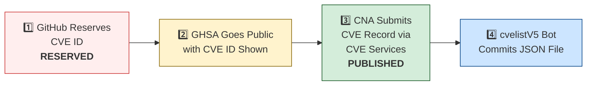

# 🛡️ OpenClaw CVE & Security Advisory Tracker

  
  
  
  
   
  
  
  
  
  

An automated tracker that continuously monitors [OpenClaw](https://github.com/openclaw/openclaw) security advisories across the GitHub Advisory Database, repo-level security advisories, and the [CVE V5 (cvelistV5)](https://github.com/CVEProject/cvelistV5) registry. Every hour it pulls the latest data, reconciles GHSA → CVE publication state, and regenerates this dashboard so you always have an up-to-date picture of the project's vulnerability landscape.

  Last updated: 2026-02-19 17:24 UTC · <a href="LICENSE">MIT License</a> · <a href="ADVISORIES.md">Full Advisory List</a> · <a href="SECURITY.md">Security Policy</a> · Data: <a href="https://github.com/CVEProject/cvelistV5">cvelistV5</a> + <a href="https://github.com/github/advisory-database">Advisory DB</a> · Updates hourly

---

  <a href="#-cves-published-in-cvelistv5-7">Published CVEs</a> ·
  <a href="#-cve-publication-pipeline">Pipeline</a> ·
  <a href="#-all-security-advisories-99">Advisories</a> ·
  <a href="#-vulnerability-categories">Categories</a> ·
  <a href="#-key-insights">Insights</a> ·
  <a href="#-project-identity">Identity</a>

---

## 🏗️ Project Identity

| Field | Value |
|-------|-------|
| **Current Name** | OpenClaw |
| **Previous Names** | Moltbot (second name), Clawdbot (original name) |
| **Repository** | [openclaw/openclaw](https://github.com/openclaw/openclaw) |
| **npm Package** | `openclaw` (formerly `clawdbot`) |
| **Author** | Peter Steinberger (steipete) |

<strong>Search terms for CVE discovery</strong>

To find all CVEs, search for: `openclaw`, `clawdbot`, `moltbot`, `clawhub`, `pkg:npm/clawdbot`, `pkg:npm/openclaw`

---

## 🚀 CVEs Published in cvelistV5 (7)

These CVEs have full records in the [CVEProject/cvelistV5](https://github.com/CVEProject/cvelistV5) repository:

| CVE ID | Severity | CVSS | Title | CWE | Published |
|--------|----------|------|-------|-----|-----------|
| [CVE-2026-24763](https://github.com/openclaw/openclaw/security/advisories/GHSA-mc68-q9jw-2h3v) |  | 8.8 | OpenClaw/Clawdbot Docker Execution has Authenticated Command Injection via PATH Environment Variable | CWE-78 | 2026-02-02 |
| [CVE-2026-25253](https://github.com/openclaw/openclaw/security/advisories/GHSA-g8p2-7wf7-98mq) |  | 8.8 | OpenClaw/Clawdbot has 1-Click RCE via Authentication Token Exfiltration From gatewayUrl | CWE-669 | 2026-02-01 |
| [CVE-2026-25593](https://github.com/openclaw/openclaw/security/advisories/GHSA-g55j-c2v4-pjcg) |  | 8.4 | OpenClaw Affected by Unauthenticated Local RCE via WebSocket config.apply | CWE-78, CWE-306 | 2026-02-06 |
| [CVE-2026-25157](https://github.com/openclaw/openclaw/security/advisories/GHSA-q284-4pvr-m585) |  | 7.8 | OpenClaw/Clawdbot has OS Command Injection via Project Root Path in sshNodeCommand | CWE-78 | 2026-02-04 |
| [CVE-2026-25474](https://github.com/openclaw/openclaw/security/advisories/GHSA-mp5h-m6qj-6292) |  | 7.5 | OpenClaw has a Telegram webhook request forgery (missing `channels.telegram.webhookSecret`) → auth bypass | CWE-345 | 2026-02-19 |
| [CVE-2026-25475](https://github.com/openclaw/openclaw/security/advisories/GHSA-r8g4-86fx-92mq) |  | 6.5 | OpenClaw Vulnerable to Local File Inclusion via MEDIA: Path Extraction | CWE-200, CWE-22 | 2026-02-04 |
| [CVE-2026-24764](https://github.com/openclaw/openclaw/security/advisories/GHSA-782p-5fr5-7fj8) |  | 3.7 | OpenClaw Affected by Remote Code Execution via System Prompt Injection in Slack Channel Descriptions | CWE-74, CWE-94 | 2026-02-19 |

<strong>📖 Detailed CVE Analysis (click to expand)</strong>

### CVE-2026-24763 — OpenClaw/Clawdbot Docker Execution has Authenticated Command Injection via PATH Environment Variable

| Field | Detail |
|-------|--------|
| **CVSS** | 8.8 (HIGH) — `CVSS:3.1/AV:N/AC:L/PR:L/UI:N/S:U/C:H/I:H/A:H` |
| **CWE** | CWE-78 (CWE-78: Improper Neutralization of Special Elements used in an OS Command ('OS Command Injection')) |
| **Affected** | < 2026.1.29 |
| **Vendor/Product** | clawdbot / clawdbot |
| **Advisory** | [GHSA-mc68-q9jw-2h3v](https://github.com/openclaw/openclaw/security/advisories/GHSA-mc68-q9jw-2h3v) |

OpenClaw (formerly  Clawdbot) is a personal AI assistant you run on your own devices. Prior to 2026.1.29, a command injection vulnerability existed in OpenClaw’s Docker sandbox execution mechanism due to unsafe handling of the PATH environment variable when constructing shell commands. An authenticated user able to control environment variables could influence command execution within the container context. This vulnerability is fixed in 2026.1.29.

> **Naming note:** Uses old name `clawdbot/clawdbot` as vendor/product.
**References:**
- [https://github.com/openclaw/openclaw/commit/771f23d36b95ec2204cc9a0054045f5d8439ea75](https://github.com/openclaw/openclaw/commit/771f23d36b95ec2204cc9a0054045f5d8439ea75)
- [https://github.com/openclaw/openclaw/releases/tag/v2026.1.29](https://github.com/openclaw/openclaw/releases/tag/v2026.1.29)
---

### CVE-2026-25253 — OpenClaw/Clawdbot has 1-Click RCE via Authentication Token Exfiltration From gatewayUrl

| Field | Detail |
|-------|--------|
| **CVSS** | 8.8 (HIGH) — `CVSS:3.1/AV:N/AC:L/PR:N/UI:R/S:U/C:H/I:H/A:H` |
| **CWE** | CWE-669 (CWE-669 Incorrect Resource Transfer Between Spheres) |
| **Affected** | < 2026.1.29 |
| **Vendor/Product** | OpenClaw / OpenClaw |
| **Advisory** | [GHSA-g8p2-7wf7-98mq](https://github.com/openclaw/openclaw/security/advisories/GHSA-g8p2-7wf7-98mq) |

OpenClaw (aka clawdbot or Moltbot) before 2026.1.29 obtains a gatewayUrl value from a query string and automatically makes a WebSocket connection without prompting, sending a token value.

> **Naming note:** Uses all three names in description. packageURL still references `pkg:npm/clawdbot`.
**References:**
- [1-click-rce-to-steal-your-moltbot-data-and-keys](https://depthfirst.com/post/1-click-rce-to-steal-your-moltbot-data-and-keys)
- [blog](https://openclaw.ai/blog)
- [one-click-rce-moltbot](https://ethiack.com/news/blog/one-click-rce-moltbot)
- [2016913750557651228](https://x.com/0xacb/status/2016913750557651228)
---

### CVE-2026-25593 — OpenClaw Affected by Unauthenticated Local RCE via WebSocket config.apply

| Field | Detail |
|-------|--------|
| **CVSS** | 8.4 (HIGH) — `CVSS:3.1/AV:L/AC:L/PR:N/UI:N/S:U/C:H/I:H/A:H` |
| **CWE** | CWE-78 (CWE-78: Improper Neutralization of Special Elements used in an OS Command ('OS Command Injection')), CWE-306 (CWE-306: Missing Authentication for Critical Function) |
| **Affected** | < 2026.1.20 |
| **Vendor/Product** | openclaw / openclaw |
| **Advisory** | [GHSA-g55j-c2v4-pjcg](https://github.com/openclaw/openclaw/security/advisories/GHSA-g55j-c2v4-pjcg) |

OpenClaw is a personal AI assistant. Prior to 2026.1.20, an unauthenticated local client could use the Gateway WebSocket API to write config via config.apply and set unsafe cliPath values that were later used for command discovery, enabling command injection as the gateway user. This vulnerability is fixed in 2026.1.20.

---

### CVE-2026-25157 — OpenClaw/Clawdbot has OS Command Injection via Project Root Path in sshNodeCommand

| Field | Detail |
|-------|--------|
| **CVSS** | 7.8 (HIGH) — `CVSS:3.1/AV:L/AC:H/PR:N/UI:R/S:C/C:H/I:H/A:H` |
| **CWE** | CWE-78 (CWE-78: Improper Neutralization of Special Elements used in an OS Command ('OS Command Injection')) |
| **Affected** | < 2026.1.29 |
| **Vendor/Product** | openclaw / openclaw |
| **Advisory** | [GHSA-q284-4pvr-m585](https://github.com/openclaw/openclaw/security/advisories/GHSA-q284-4pvr-m585) |

OpenClaw is a personal AI assistant. Prior to version 2026.1.29, there is an OS command injection vulnerability via the Project Root Path in sshNodeCommand. The sshNodeCommand function constructed a shell script without properly escaping the user-supplied project path in an error message. When the cd command failed, the unescaped path was interpolated directly into an echo statement, allowing arbitrary command execution on the remote SSH host. The parseSSHTarget function did not validate that SSH target strings could not begin with a dash. An attacker-supplied target like -oProxyCommand=... would be interpreted as an SSH configuration flag rather than a hostname, allowing arbitrary command execution on the local machine. This issue has been patched in version 2026.1.29.

---

### CVE-2026-25474 — OpenClaw has a Telegram webhook request forgery (missing `channels.telegram.webhookSecret`) → auth bypass

| Field | Detail |
|-------|--------|
| **CVSS** | 7.5 (HIGH) — `CVSS:3.1/AV:N/AC:L/PR:N/UI:N/S:U/C:N/I:H/A:N` |
| **CWE** | CWE-345 (CWE-345: Insufficient Verification of Data Authenticity) |
| **Affected** | < 2026.2.1 |
| **Vendor/Product** | openclaw / openclaw |
| **Advisory** | [GHSA-mp5h-m6qj-6292](https://github.com/openclaw/openclaw/security/advisories/GHSA-mp5h-m6qj-6292) |

OpenClaw is a personal AI assistant. In versions 2026.1.30 and below, if channels.telegram.webhookSecret is not set when in Telegram webhook mode, OpenClaw may accept webhook HTTP requests without verifying Telegram’s secret token header. In deployments where the webhook endpoint is reachable by an attacker, this can allow forged Telegram updates (for example spoofing message.from.id). If an attacker can reach the webhook endpoint, they may be able to send forged updates that are processed as if they came from Telegram. Depending on enabled commands/tools and configuration, this could lead to unintended bot actions. Note: Telegram webhook mode is not enabled by default. It is enabled only when `channels.telegram.webhookUrl` is configured. This issue has been fixed in version 2026.2.1.

**References:**
- [https://github.com/openclaw/openclaw/commit/3cbcba10cf30c2ffb898f0d8c7dfb929f15f8930](https://github.com/openclaw/openclaw/commit/3cbcba10cf30c2ffb898f0d8c7dfb929f15f8930)
- [https://github.com/openclaw/openclaw/commit/5643a934799dc523ec2ef18c007e1aa2c386b670](https://github.com/openclaw/openclaw/commit/5643a934799dc523ec2ef18c007e1aa2c386b670)
- [https://github.com/openclaw/openclaw/commit/633fe8b9c17f02fcc68ecdb5ec212a5ace932f09](https://github.com/openclaw/openclaw/commit/633fe8b9c17f02fcc68ecdb5ec212a5ace932f09)
- [https://github.com/openclaw/openclaw/commit/ca92597e1f9593236ad86810b66633144b69314d](https://github.com/openclaw/openclaw/commit/ca92597e1f9593236ad86810b66633144b69314d)
- [https://github.com/openclaw/openclaw/releases/tag/v2026.2.1](https://github.com/openclaw/openclaw/releases/tag/v2026.2.1)
---

### CVE-2026-25475 — OpenClaw Vulnerable to Local File Inclusion via MEDIA: Path Extraction

| Field | Detail |
|-------|--------|
| **CVSS** | 6.5 (MEDIUM) — `CVSS:3.1/AV:N/AC:L/PR:L/UI:N/S:U/C:H/I:N/A:N` |
| **CWE** | CWE-200 (CWE-200: Exposure of Sensitive Information to an Unauthorized Actor), CWE-22 (CWE-22: Improper Limitation of a Pathname to a Restricted Directory ('Path Traversal')) |
| **Affected** | < 2026.1.30 |
| **Vendor/Product** | openclaw / openclaw |
| **Advisory** | [GHSA-r8g4-86fx-92mq](https://github.com/openclaw/openclaw/security/advisories/GHSA-r8g4-86fx-92mq) |

OpenClaw is a personal AI assistant. Prior to version 2026.1.30, the isValidMedia() function in src/media/parse.ts allows arbitrary file paths including absolute paths, home directory paths, and directory traversal sequences. An agent can read any file on the system by outputting MEDIA:/path/to/file, exfiltrating sensitive data to the user/channel. This issue has been patched in version 2026.1.30.

---

### CVE-2026-24764 — OpenClaw Affected by Remote Code Execution via System Prompt Injection in Slack Channel Descriptions

| Field | Detail |
|-------|--------|
| **CVSS** | 3.7 (LOW) — `CVSS:3.1/AV:N/AC:H/PR:L/UI:R/S:U/C:L/I:L/A:N` |
| **CWE** | CWE-74 (CWE-74: Improper Neutralization of Special Elements in Output Used by a Downstream Component ('Injection')), CWE-94 (CWE-94: Improper Control of Generation of Code ('Code Injection')) |
| **Affected** | < 2026.2.3 |
| **Vendor/Product** | clawdbot / clawdbot |
| **Advisory** | [GHSA-782p-5fr5-7fj8](https://github.com/openclaw/openclaw/security/advisories/GHSA-782p-5fr5-7fj8) |

OpenClaw (formerly Clawdbot) is a personal AI assistant users run on their own devices. In versions 2026.2.2 and below, when the Slack integration is enabled, channel metadata (topic/description) can be incorporated into the model's system prompt. Prompt injection is a documented risk for LLM-driven systems. This issue increases the injection surface by allowing untrusted Slack channel metadata to be treated as higher-trust system input. This issue has been fixed in version 2026.2.3.

> **Naming note:** Uses old name `clawdbot/clawdbot` as vendor/product.
**References:**
- [https://github.com/openclaw/openclaw/commit/35eb40a7000b59085e9c638a80fd03917c7a095e](https://github.com/openclaw/openclaw/commit/35eb40a7000b59085e9c638a80fd03917c7a095e)
- [https://github.com/openclaw/openclaw/releases/tag/v2026.2.3](https://github.com/openclaw/openclaw/releases/tag/v2026.2.3)
---

---

## ⏳ CVE Publication Pipeline

Of 28 GHSAs with CVE IDs, **7** are fully published and **21** remain `RESERVED`.

| CVE ID | State | cvelistV5 | GHSA Published | CNA |
|--------|-------|-----------|----------------|-----|
| CVE-2026-24763 | ✅ **PUBLISHED** | ✅ | 2026-02-02 | GitHub_M |
| CVE-2026-24764 | ✅ **PUBLISHED** | ✅ | 2026-02-17 | GitHub_M |
| CVE-2026-25157 | ✅ **PUBLISHED** | ✅ | 2026-02-02 | GitHub_M |
| CVE-2026-25253 | ✅ **PUBLISHED** | ✅ | 2026-02-02 | mitre |
| CVE-2026-25474 | ✅ **PUBLISHED** | ✅ | 2026-02-17 | GitHub_M |
| CVE-2026-25475 | ✅ **PUBLISHED** | ✅ | 2026-02-04 | GitHub_M |
| CVE-2026-25593 | ✅ **PUBLISHED** | ✅ | 2026-02-04 | GitHub_M |
| CVE-2026-26316 | ⏳ RESERVED | ❌ | 2026-02-17 | — |
| CVE-2026-26317 | ⏳ RESERVED | ❌ | 2026-02-18 | — |
| CVE-2026-26319 | ⏳ RESERVED | ❌ | 2026-02-17 | — |
| CVE-2026-26320 | ⏳ RESERVED | ❌ | 2026-02-17 | — |
| CVE-2026-26321 | ⏳ RESERVED | ❌ | 2026-02-17 | — |
| CVE-2026-26322 | ⏳ RESERVED | ❌ | 2026-02-17 | — |
| CVE-2026-26323 | ⏳ RESERVED | ❌ | 2026-02-18 | — |
| CVE-2026-26324 | ⏳ RESERVED | ❌ | 2026-02-17 | — |
| CVE-2026-26325 | ⏳ RESERVED | ❌ | 2026-02-17 | — |
| CVE-2026-26326 | ⏳ RESERVED | ❌ | 2026-02-17 | — |
| CVE-2026-26327 | ⏳ RESERVED | ❌ | 2026-02-18 | — |
| CVE-2026-26328 | ⏳ RESERVED | ❌ | 2026-02-18 | — |
| CVE-2026-26329 | ⏳ RESERVED | ❌ | 2026-02-18 | — |
| CVE-2026-26972 | ⏳ RESERVED | ❌ | 2026-02-18 | — |
| CVE-2026-27001 | ⏳ RESERVED | ❌ | 2026-02-18 | — |
| CVE-2026-27002 | ⏳ RESERVED | ❌ | 2026-02-18 | — |
| CVE-2026-27003 | ⏳ RESERVED | ❌ | 2026-02-18 | — |
| CVE-2026-27004 | ⏳ RESERVED | ❌ | 2026-02-18 | — |
| CVE-2026-27007 | ⏳ RESERVED | ❌ | 2026-02-18 | — |
| CVE-2026-27008 | ⏳ RESERVED | ❌ | 2026-02-18 | — |
| CVE-2026-27009 | ⏳ RESERVED | ❌ | 2026-02-18 | — |

---

## 🔑 Key Insights

| Insight | Detail |
|---------|--------|
| **Dominant Weakness** | 26% of categorized issues relate to **Allowlist Bypass** (25/98) |
| **V5 Sync Rate** | 7/28 CVE IDs (25%) have full cvelistV5 records |
| **Advisory Velocity** | 99 security advisories across 2026-02-02 → 2026-02-18 |
| **Top Severity** | 5 Critical + 52 High = 57 high-impact issues (58%) |

### Vulnerability Categories

| Category | Count | Examples |
|----------|------:|----------|
| **OS Command Injection (CWE-78)** | 14 | PATH injection, SSH command injection, Docker exec, keychain writes |
| **Path Traversal (CWE-22)** | 15 | MEDIA: paths, plugin install, browser downloads, Zip Slip, transcript paths |
| **SSRF** | 6 | Image tool fetch, Feishu extension, attachment/media URLs, IPv6 bypass |
| **Auth Bypass / Missing Auth** | 16 | WebSocket config.apply, webhook verification, browser relay, sandbox bridge |
| **Allowlist Bypass** | 25 | Telegram usernames, Matrix displayName, Slack DM, Twitch, voice-call |
| **Injection (XSS/CSRF/Prompt)** | 17 | XSS in Control UI, prompt injection via Slack/CWD/logs, CSRF |
| **Denial of Service** | 5 | Unbounded media fetch, webhook body buffering, archive expansion |

---

## 📋 All Security Advisories (99)

### Critical & High Severity

| GHSA | CVE | Severity | Title | Published |
|------|-----|----------|-------|-----------|
| [GHSA-w235-x559-36mg](https://github.com/advisories/GHSA-w235-x559-36mg) | CVE-2026-27002 |  | OpenClaw: Docker container escape via unvalidated bind mount config injection | 2026-02-18 |
| [GHSA-2qj5-gwg2-xwc4](https://github.com/advisories/GHSA-2qj5-gwg2-xwc4) | CVE-2026-27001 |  | OpenClaw: Unsanitized CWD path injection into LLM prompts | 2026-02-18 |
| [GHSA-3fqr-4cg8-h96q](https://github.com/advisories/GHSA-3fqr-4cg8-h96q) | CVE-2026-26317 |  | OpenClaw affected by cross-site request forgery (CSRF) through loopback browser mutation endpoints | 2026-02-18 |
| [GHSA-m7x8-2w3w-pr42](https://github.com/advisories/GHSA-m7x8-2w3w-pr42) | CVE-2026-26323 |  | OpenClaw has a command injection in maintainer clawtributors updater | 2026-02-18 |
| [GHSA-cv7m-c9jx-vg7q](https://github.com/advisories/GHSA-cv7m-c9jx-vg7q) | CVE-2026-26329 |  | OpenClaw has a path traversal in browser upload allows local file read | 2026-02-18 |
| [GHSA-pv58-549p-qh99](https://github.com/advisories/GHSA-pv58-549p-qh99) | CVE-2026-26327 |  | OpenClaw allows unauthenticated discovery TXT records could steer routing and TLS pinning | 2026-02-18 |
| [GHSA-h9g4-589h-68xv](https://github.com/advisories/GHSA-h9g4-589h-68xv) | — |  | OpenClaw has an authentication bypass in sandbox browser bridge server | 2026-02-18 |
| [GHSA-x22m-j5qq-j49m](https://github.com/advisories/GHSA-x22m-j5qq-j49m) | — |  | OpenClaw has two SSRF via sendMediaFeishu and markdown image fetching in Feishu extension | 2026-02-18 |
| [GHSA-rwj8-p9vq-25gv](https://github.com/advisories/GHSA-rwj8-p9vq-25gv) | — |  | OpenClaw has a LFI in BlueBubbles media path handling | 2026-02-18 |
| [GHSA-4564-pvr2-qq4h](https://github.com/advisories/GHSA-4564-pvr2-qq4h) | — |  | OpenClaw: Prevent shell injection in macOS keychain credential write | 2026-02-18 |
| [GHSA-gq9c-wg68-gwj2](https://github.com/advisories/GHSA-gq9c-wg68-gwj2) | — |  | OpenClaw has a path traversal in browser trace/download output paths may allow arbitrary file writes | 2026-02-18 |
| [GHSA-v6c6-vqqg-w888](https://github.com/advisories/GHSA-v6c6-vqqg-w888) | — |  | OpenClaw affected by potential code execution via unsafe hook module path handling in Gateway | 2026-02-18 |
| [GHSA-w5c7-9qqw-6645](https://github.com/advisories/GHSA-w5c7-9qqw-6645) | — |  | OpenClaw inter-session prompts could be treated as direct user instructions | 2026-02-18 |
| [GHSA-jqpq-mgvm-f9r6](https://github.com/advisories/GHSA-jqpq-mgvm-f9r6) | — |  | OpenClaw: Command hijacking via unsafe PATH handling (bootstrapping + node-host PATH overrides) | 2026-02-18 |
| [GHSA-rq6g-px6m-c248](https://github.com/advisories/GHSA-rq6g-px6m-c248) | — |  | OpenClaw Google Chat shared-path webhook target ambiguity allowed cross-account policy-context misrouting | 2026-02-18 |
| [GHSA-q447-rj3r-2cgh](https://github.com/advisories/GHSA-q447-rj3r-2cgh) | — |  | OpenClaw affected by denial of service via unbounded webhook request body buffering | 2026-02-18 |
| [GHSA-j27p-hq53-9wgc](https://github.com/advisories/GHSA-j27p-hq53-9wgc) | — |  | OpenClaw affected by denial of service via unbounded URL-backed media fetch | 2026-02-18 |
| [GHSA-h3f9-mjwj-w476](https://github.com/advisories/GHSA-h3f9-mjwj-w476) | CVE-2026-26325 |  | OpenClaw Node host system.run rawCommand/command mismatch can bypass allowlist/approvals | 2026-02-17 |
| [GHSA-jrvc-8ff5-2f9f](https://github.com/advisories/GHSA-jrvc-8ff5-2f9f) | CVE-2026-26324 |  | OpenClaw has a SSRF guard bypass via full-form IPv4-mapped IPv6 (loopback / metadata reachable) | 2026-02-17 |
| [GHSA-g6q9-8fvw-f7rf](https://github.com/advisories/GHSA-g6q9-8fvw-f7rf) | CVE-2026-26322 |  | OpenClaw Gateway tool allowed unrestricted gatewayUrl override | 2026-02-17 |
| [GHSA-8jpq-5h99-ff5r](https://github.com/advisories/GHSA-8jpq-5h99-ff5r) | CVE-2026-26321 |  | OpenClaw has a local file disclosure via sendMediaFeishu in Feishu extension | 2026-02-17 |
| [GHSA-7q2j-c4q5-rm27](https://github.com/advisories/GHSA-7q2j-c4q5-rm27) | CVE-2026-26320 |  | OpenClaw macOS deep link confirmation truncation can conceal executed agent message | 2026-02-17 |
| [GHSA-4hg8-92x6-h2f3](https://github.com/advisories/GHSA-4hg8-92x6-h2f3) | CVE-2026-26319 |  | OpenClaw is Missing Webhook Authentication in Telnyx Provider Allows Unauthenticated Requests | 2026-02-17 |
| [GHSA-pchc-86f6-8758](https://github.com/advisories/GHSA-pchc-86f6-8758) | CVE-2026-26316 |  | OpenClaw BlueBubbles webhook auth bypass via loopback proxy trust | 2026-02-17 |
| [GHSA-mp5h-m6qj-6292](https://github.com/advisories/GHSA-mp5h-m6qj-6292) | CVE-2026-25474 |  | OpenClaw has a Telegram webhook request forgery (missing `channels.telegram.webhookSecret`) → auth bypass | 2026-02-17 |
| [GHSA-qrq5-wjgg-rvqw](https://github.com/advisories/GHSA-qrq5-wjgg-rvqw) | — |  | OpenClaw has a Path Traversal in Plugin Installation | 2026-02-17 |
| [GHSA-mqpw-46fh-299h](https://github.com/advisories/GHSA-mqpw-46fh-299h) | — |  | OpenClaw authorization bypass: operator.write can resolve exec approvals via chat.send -> /approve | 2026-02-17 |
| [GHSA-7vwx-582j-j332](https://github.com/advisories/GHSA-7vwx-582j-j332) | — |  | OpenClaw MS Teams inbound attachment downloader leaks bearer tokens to allowlisted suffix domains | 2026-02-17 |
| [GHSA-33rq-m5x2-fvgf](https://github.com/advisories/GHSA-33rq-m5x2-fvgf) | — |  | OpenClaw Twitch allowFrom is not enforced in optional plugin, unauthorized chat users can trigger agent pipeline | 2026-02-17 |
| [GHSA-4rj2-gpmh-qq5x](https://github.com/advisories/GHSA-4rj2-gpmh-qq5x) | — |  | OpenClaw has an inbound allowlist policy bypass in voice-call extension (empty caller ID + suffix matching) | 2026-02-17 |
| [GHSA-fhvm-j76f-qmjv](https://github.com/advisories/GHSA-fhvm-j76f-qmjv) | — |  | OpenClaw has a potential access-group authorization bypass if channel type lookup fails | 2026-02-17 |
| [GHSA-56f2-hvwg-5743](https://github.com/advisories/GHSA-56f2-hvwg-5743) | — |  | OpenClaw affected by SSRF in Image Tool Remote Fetch | 2026-02-17 |
| [GHSA-3hcm-ggvf-rch5](https://github.com/advisories/GHSA-3hcm-ggvf-rch5) | — |  | OpenClaw has an exec allowlist bypass via command substitution/backticks inside double quotes | 2026-02-17 |
| [GHSA-mr32-vwc2-5j6h](https://github.com/advisories/GHSA-mr32-vwc2-5j6h) | — |  | OpenClaw's Browser Relay /cdp websocket is missing auth which could allow cross-tab cookie access | 2026-02-17 |
| [GHSA-qj77-c3c8-9c3q](https://github.com/advisories/GHSA-qj77-c3c8-9c3q) | — |  | OpenClaw's Windows cmd.exe parsing may bypass exec allowlist/approval gating | 2026-02-17 |
| [GHSA-64qx-vpxx-mvqf](https://github.com/advisories/GHSA-64qx-vpxx-mvqf) | — |  | OpenClaw has an arbitrary transcript path file write via gateway sessionFile | 2026-02-17 |
| [GHSA-hv93-r4j3-q65f](https://github.com/advisories/GHSA-hv93-r4j3-q65f) | — |  | OpenClaw Hook Session Key Override Enables Targeted Cross-Session Routing | 2026-02-17 |
| [GHSA-rv39-79c4-7459](https://github.com/advisories/GHSA-rv39-79c4-7459) | — |  | OpenClaw's gateway connect could skip device identity checks when auth.token was present but not yet validated | 2026-02-17 |
| [GHSA-g55j-c2v4-pjcg](https://github.com/advisories/GHSA-g55j-c2v4-pjcg) | CVE-2026-25593 |  | OpenClaw vulnerable to Unauthenticated Local RCE via WebSocket config.apply | 2026-02-04 |
| [GHSA-q284-4pvr-m585](https://github.com/advisories/GHSA-q284-4pvr-m585) | CVE-2026-25157 |  | OpenClaw/Clawdbot has OS Command Injection via Project Root Path in sshNodeCommand | 2026-02-02 |
| [GHSA-g8p2-7wf7-98mq](https://github.com/advisories/GHSA-g8p2-7wf7-98mq) | CVE-2026-25253 |  | OpenClaw/Clawdbot has 1-Click RCE via Authentication Token Exfiltration From gatewayUrl | 2026-02-02 |
| [GHSA-mc68-q9jw-2h3v](https://github.com/advisories/GHSA-mc68-q9jw-2h3v) | CVE-2026-24763 |  | OpenClaw/Clawdbot Docker Execution has Authenticated Command Injection via PATH Environment Variable | 2026-02-02 |
| [GHSA-r2c6-8jc8-g32w](https://github.com/advisories/GHSA-r2c6-8jc8-g32w) | — |  | Duplicate Advisory: 1-Click RCE via Authentication Token Exfiltration From gatewayUrl | 2026-02-02 |

### Medium Severity

| GHSA | CVE | Severity | Title | Published |
|------|-----|----------|-------|-----------|
| [GHSA-37gc-85xm-2ww6](https://github.com/advisories/GHSA-37gc-85xm-2ww6) | CVE-2026-27009 |  | OpenClaw affected by Stored XSS in Control UI via unsanitized assistant name/avatar in inline script injection | 2026-02-18 |
| [GHSA-h7f7-89mm-pqh6](https://github.com/advisories/GHSA-h7f7-89mm-pqh6) | CVE-2026-27008 |  | OpenClaw hardened the skill download target directory validation | 2026-02-18 |
| [GHSA-xxvh-5hwj-42pp](https://github.com/advisories/GHSA-xxvh-5hwj-42pp) | CVE-2026-27007 |  | OpenClaw's sandbox config hash sorted primitive arrays and suppressed needed container recreation | 2026-02-18 |
| [GHSA-6hf3-mhgc-cm65](https://github.com/advisories/GHSA-6hf3-mhgc-cm65) | CVE-2026-27004 |  | OpenClaw session tool visibility hardening and Telegram webhook secret fallback | 2026-02-18 |
| [GHSA-chf7-jq6g-qrwv](https://github.com/advisories/GHSA-chf7-jq6g-qrwv) | CVE-2026-27003 |  | OpenClaw: Telegram bot token exposure via logs | 2026-02-18 |
| [GHSA-xwjm-j929-xq7c](https://github.com/advisories/GHSA-xwjm-j929-xq7c) | CVE-2026-26972 |  | OpenClaw has a Path Traversal in Browser Download Functionality | 2026-02-18 |
| [GHSA-g34w-4xqq-h79m](https://github.com/advisories/GHSA-g34w-4xqq-h79m) | CVE-2026-26328 |  | OpenClaw iMessage group allowlist authorization inherited DM pairing-store identities | 2026-02-18 |
| [GHSA-jfv4-h8mc-jcp8](https://github.com/advisories/GHSA-jfv4-h8mc-jcp8) | — |  | OpenClaw: Process Safety - Unvalidated PID Kill via SIGKILL in Process Cleanup | 2026-02-18 |
| [GHSA-7rcp-mxpq-72pj](https://github.com/advisories/GHSA-7rcp-mxpq-72pj) | — |  | OpenClaw Chutes manual OAuth state validation bypass can cause credential substitution | 2026-02-18 |
| [GHSA-5xfq-5mr7-426q](https://github.com/advisories/GHSA-5xfq-5mr7-426q) | — |  | OpenClaw's unsanitized session ID enables path traversal in transcript file operations | 2026-02-18 |
| [GHSA-pg2v-8xwh-qhcc](https://github.com/advisories/GHSA-pg2v-8xwh-qhcc) | — |  | OpenClaw affected by SSRF in optional Tlon (Urbit) extension authentication | 2026-02-18 |
| [GHSA-c37p-4qqg-3p76](https://github.com/advisories/GHSA-c37p-4qqg-3p76) | — |  | OpenClaw Twilio voice-call webhook auth bypass when ngrok loopback compatibility is enabled | 2026-02-18 |
| [GHSA-mj5r-hh7j-4gxf](https://github.com/advisories/GHSA-mj5r-hh7j-4gxf) | — |  | OpenClaw Telegram allowlist authorization accepted mutable usernames | 2026-02-18 |
| [GHSA-h89v-j3x9-8wqj](https://github.com/advisories/GHSA-h89v-j3x9-8wqj) | — |  | OpenClaw affected by denial of service through unguarded archive extraction allowing high expansion/resource abuse (ZIP/TAR) | 2026-02-18 |
| [GHSA-w2cg-vxx6-5xjg](https://github.com/advisories/GHSA-w2cg-vxx6-5xjg) | — |  | OpenClaw: denial of service through large base64 media files allocating large buffers before limit checks | 2026-02-18 |
| [GHSA-v773-r54f-q32w](https://github.com/advisories/GHSA-v773-r54f-q32w) | — |  | OpenClaw Slack: dmPolicy=open allowed any DM sender to run privileged slash commands | 2026-02-18 |
| [GHSA-xvhf-x56f-2hpp](https://github.com/advisories/GHSA-xvhf-x56f-2hpp) | — |  | OpenClaw exec approvals: safeBins could bypass stdin-only constraints via shell expansion | 2026-02-18 |
| [GHSA-8mh7-phf8-xgfm](https://github.com/advisories/GHSA-8mh7-phf8-xgfm) | CVE-2026-26326 |  | OpenClaw skills.status could leak secrets to operator.read clients | 2026-02-17 |
| [GHSA-rmxw-jxxx-4cpc](https://github.com/advisories/GHSA-rmxw-jxxx-4cpc) | — |  | OpenClaw has a Matrix allowlist bypass via displayName and cross-homeserver localpart matching | 2026-02-17 |
| [GHSA-mv9j-6xhh-g383](https://github.com/advisories/GHSA-mv9j-6xhh-g383) | — |  | OpenClaw's unauthenticated Nostr profile HTTP endpoints allow remote profile/config tampering | 2026-02-17 |
| [GHSA-wfp2-v9c7-fh79](https://github.com/advisories/GHSA-wfp2-v9c7-fh79) | — |  | OpenClaw affected by SSRF via attachment/media URL hydration | 2026-02-17 |
| [GHSA-xc7w-v5x6-cc87](https://github.com/advisories/GHSA-xc7w-v5x6-cc87) | — |  | OpenClaw has a webhook auth bypass when gateway is behind a reverse proxy (loopback remoteAddress trust) | 2026-02-17 |
| [GHSA-qw99-grcx-4pvm](https://github.com/advisories/GHSA-qw99-grcx-4pvm) | — |  | OpenClaw's Chrome extension relay binds publicly due to wildcard treated as loopback | 2026-02-17 |
| [GHSA-r8g4-86fx-92mq](https://github.com/advisories/GHSA-r8g4-86fx-92mq) | CVE-2026-25475 |  | OpenClaw Vulnerable to Local File Inclusion via MEDIA: Path Extraction | 2026-02-04 |

### Low Severity

| GHSA | CVE | Severity | Title | Published |
|------|-----|----------|-------|-----------|
| [GHSA-782p-5fr5-7fj8](https://github.com/advisories/GHSA-782p-5fr5-7fj8) | CVE-2026-24764 |  | OpenClaw Affected by Remote Code Execution via System Prompt Injection in Slack Channel Descriptions | 2026-02-17 |
| [GHSA-chm2-m3w2-wcxm](https://github.com/advisories/GHSA-chm2-m3w2-wcxm) | — |  | OpenClaw Google Chat spoofing access with allowlist authorized mutable email principal despite sender-ID mismatch | 2026-02-17 |
| [GHSA-g27f-9qjv-22pm](https://github.com/advisories/GHSA-g27f-9qjv-22pm) | — |  | OpenClaw log poisoning (indirect prompt injection) via WebSocket headers | 2026-02-17 |

### Repo-Only Advisories (~29 more)

These advisories are listed on the [repo security page](https://github.com/openclaw/openclaw/security/advisories) but not yet indexed in the GitHub Advisory Database. See the [full advisory list](ADVISORIES.md) for details.

<strong>Show 29 repo-only advisories</strong>

| GHSA | Severity | Title |
|------|----------|-------|
| [GHSA-gv46-4xfq-jv58](https://github.com/openclaw/openclaw/security/advisories/GHSA-gv46-4xfq-jv58) |  | RCE via Node Invoke Approval Bypass in Gateway |
| [GHSA-943q-mwmv-hhvh](https://github.com/openclaw/openclaw/security/advisories/GHSA-943q-mwmv-hhvh) |  | Gateway /tools/invoke tool escalation + ACP permission auto-approval |
| [GHSA-rwj8-p9vq-25gv](https://github.com/openclaw/openclaw/security/advisories/GHSA-rwj8-p9vq-25gv) |  | LFI in BlueBubbles media path handling |
| [GHSA-4564-pvr2-qq4h](https://github.com/openclaw/openclaw/security/advisories/GHSA-4564-pvr2-qq4h) |  | Shell injection in macOS keychain credential write |
| [GHSA-x22m-j5qq-j49m](https://github.com/openclaw/openclaw/security/advisories/GHSA-x22m-j5qq-j49m) |  | Two SSRF via sendMediaFeishu and markdown image fetching |
| [GHSA-gq9c-wg68-gwj2](https://github.com/openclaw/openclaw/security/advisories/GHSA-gq9c-wg68-gwj2) |  | Path traversal in browser trace/download output paths |
| [GHSA-h9g4-589h-68xv](https://github.com/openclaw/openclaw/security/advisories/GHSA-h9g4-589h-68xv) |  | Auth bypass in sandbox browser bridge server |
| [GHSA-xw4p-pw82-hqr7](https://github.com/openclaw/openclaw/security/advisories/GHSA-xw4p-pw82-hqr7) |  | Sandbox skill mirroring path traversal |
| [GHSA-v892-hwpg-jwqp](https://github.com/openclaw/openclaw/security/advisories/GHSA-v892-hwpg-jwqp) |  | Path traversal (Zip Slip) in archive extraction |
| [GHSA-qpjj-47vm-64pj](https://github.com/openclaw/openclaw/security/advisories/GHSA-qpjj-47vm-64pj) |  | Missing auth for local browser-control endpoints |
| [GHSA-p25h-9q54-ffvw](https://github.com/openclaw/openclaw/security/advisories/GHSA-p25h-9q54-ffvw) |  | Zip Slip path traversal in tar archive extraction |
| [GHSA-r5h9-vjqc-hq3r](https://github.com/openclaw/openclaw/security/advisories/GHSA-r5h9-vjqc-hq3r) |  | Nextcloud Talk allowlist bypass via displayName spoofing |
| [GHSA-2qj5-gwg2-xwc4](https://github.com/openclaw/openclaw/security/advisories/GHSA-2qj5-gwg2-xwc4) |  | Unsanitized CWD path injection into LLM prompts |
| [GHSA-w235-x559-36mg](https://github.com/openclaw/openclaw/security/advisories/GHSA-w235-x559-36mg) |  | Docker container escape via unvalidated bind mount config |
| [GHSA-6hf3-mhgc-cm65](https://github.com/openclaw/openclaw/security/advisories/GHSA-6hf3-mhgc-cm65) |  | Session tool visibility hardening and Telegram webhook secret fallback |
| [GHSA-37gc-85xm-2ww6](https://github.com/openclaw/openclaw/security/advisories/GHSA-37gc-85xm-2ww6) |  | Stored XSS in Control UI via unsanitized assistant name/avatar |
| [GHSA-fh3f-q9qw-93j9](https://github.com/openclaw/openclaw/security/advisories/GHSA-fh3f-q9qw-93j9) |  | Replace deprecated sandbox hash algorithm |
| [GHSA-xxvh-5hwj-42pp](https://github.com/openclaw/openclaw/security/advisories/GHSA-xxvh-5hwj-42pp) |  | Sandbox config hash sorted primitive arrays suppressed container recreation |
| [GHSA-h7f7-89mm-pqh6](https://github.com/openclaw/openclaw/security/advisories/GHSA-h7f7-89mm-pqh6) |  | Harden skill download target directory validation |
| [GHSA-7rcp-mxpq-72pj](https://github.com/openclaw/openclaw/security/advisories/GHSA-7rcp-mxpq-72pj) |  | Chutes manual OAuth state validation bypass |
| [GHSA-7xhj-55q9-pc3m](https://github.com/openclaw/openclaw/security/advisories/GHSA-7xhj-55q9-pc3m) |  | Hook transform module path allows traversal |
| [GHSA-jmm5-fvh5-gf4p](https://github.com/openclaw/openclaw/security/advisories/GHSA-jmm5-fvh5-gf4p) |  | Non-constant-time token comparison in hooks authentication |
| [GHSA-47q7-97xp-m272](https://github.com/openclaw/openclaw/security/advisories/GHSA-47q7-97xp-m272) |  | Config writes could persist resolved ${VAR} secrets to disk |
| [GHSA-xwjm-j929-xq7c](https://github.com/openclaw/openclaw/security/advisories/GHSA-xwjm-j929-xq7c) |  | Path Traversal in Browser Download Functionality |
| [GHSA-p536-vvpp-9mc8](https://github.com/openclaw/openclaw/security/advisories/GHSA-p536-vvpp-9mc8) |  | Web Fetch DoS via unbounded response parsing |
| [GHSA-3m3q-x3gj-f79x](https://github.com/openclaw/openclaw/security/advisories/GHSA-3m3q-x3gj-f79x) |  | Voice-call plugin webhook verification bypass behind proxy |
| [GHSA-chf7-jq6g-qrwv](https://github.com/openclaw/openclaw/security/advisories/GHSA-chf7-jq6g-qrwv) |  | Telegram bot token exposure via logs |
| [GHSA-mmpf-jwf4-h3qv](https://github.com/openclaw/openclaw/security/advisories/GHSA-mmpf-jwf4-h3qv) |  | Option injection in pre-commit hook can stage ignored files |
| [GHSA-jfv4-h8mc-jcp8](https://github.com/openclaw/openclaw/security/advisories/GHSA-jfv4-h8mc-jcp8) |  | Unvalidated PID Kill via SIGKILL in Process Cleanup |

---

## Naming Inconsistencies

The OpenClaw project has been renamed multiple times, causing inconsistencies across CVE records:

| CVE | vendor | product | packageURL | Description Names |
|-----|--------|---------|------------|-------------------|
| CVE-2026-24763 | `clawdbot` | `clawdbot` | — | OpenClaw (formerly Clawdbot) |
| CVE-2026-25253 | `OpenClaw` | `OpenClaw` | `pkg:npm/clawdbot` | OpenClaw / clawdbot / Moltbot |
| CVE-2026-25593 | `openclaw` | `openclaw` | — | OpenClaw |
| CVE-2026-25157 | `openclaw` | `openclaw` | — | OpenClaw |
| CVE-2026-25474 | `openclaw` | `openclaw` | — | OpenClaw |
| CVE-2026-25475 | `openclaw` | `openclaw` | — | OpenClaw |
| CVE-2026-24764 | `clawdbot` | `clawdbot` | — | OpenClaw (formerly Clawdbot) |

---

## Data Sources

| Source | URL |
|--------|-----|
| CVE List v5 | [CVEProject/cvelistV5](https://github.com/CVEProject/cvelistV5) |
| GitHub Advisory DB | [github.com/advisories](https://github.com/advisories?query=openclaw) |
| Repo Security Tab | [openclaw/openclaw/security](https://github.com/openclaw/openclaw/security/advisories) |
| CVE Services API | `https://cveawg.mitre.org/api/cve-id/{CVE-ID}` |

---

  
    Auto-generated by <a href="update_readme.py"><code>update_readme.py</code></a> · Updated hourly via <a href=".github/workflows/update-readme.yml">GitHub Actions</a> 
    Data: <a href="ghsa-advisories.json"><code>ghsa-advisories.json</code></a> · <a href="cves.json"><code>cves.json</code></a> · <a href="cve-pipeline-status.json"><code>cve-pipeline-status.json</code></a>  
    Maintained by <a href="https://github.com/jgamblin">Jerry Gamblin</a> · <a href="https://github.com/jgamblin/OpenClawCVEs">OpenClawCVEs</a>
  

