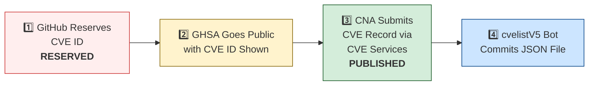

# 🛡️ OpenClaw CVE & Security Advisory Tracker

  
  
  
  
   
  
  
  
  
  

An automated tracker that continuously monitors [OpenClaw](https://github.com/openclaw/openclaw) security advisories across the GitHub Advisory Database, repo-level security advisories, and the [CVE V5 (cvelistV5)](https://github.com/CVEProject/cvelistV5) registry. Every hour it pulls the latest data, reconciles GHSA → CVE publication state, and regenerates this dashboard so you always have an up-to-date picture of the project's vulnerability landscape.

  Last updated: 2026-03-05 06:23 UTC · <a href="LICENSE">MIT License</a> · <a href="ADVISORIES.md">Full Advisory List</a> · <a href="SECURITY.md">Security Policy</a> · Data: <a href="https://github.com/CVEProject/cvelistV5">cvelistV5</a> + <a href="https://github.com/github/advisory-database">Advisory DB</a> · Updates hourly

---

  <a href="#-cves-published-in-cvelistv5-5">Published CVEs</a> ·
  <a href="#-cve-publication-pipeline">Pipeline</a> ·
  <a href="#-all-security-advisories-151">Advisories</a> ·
  <a href="#-vulnerability-categories">Categories</a> ·
  <a href="#-key-insights">Insights</a> ·
  <a href="#-project-identity">Identity</a>

---

## 🏗️ Project Identity

| Field | Value |
|-------|-------|
| **Current Name** | OpenClaw |
| **Previous Names** | Moltbot (second name), Clawdbot (original name) |
| **Repository** | [openclaw/openclaw](https://github.com/openclaw/openclaw) |
| **npm Package** | `openclaw` (formerly `clawdbot`) |
| **Author** | Peter Steinberger (steipete) |

<strong>Search terms for CVE discovery</strong>

To find all CVEs, search for: `openclaw`, `clawdbot`, `moltbot`, `clawhub`, `pkg:npm/clawdbot`, `pkg:npm/openclaw`

---

## 🚀 CVEs Published in cvelistV5 (5)

These CVEs have full records in the [CVEProject/cvelistV5](https://github.com/CVEProject/cvelistV5) repository:

| CVE ID | Severity | CVSS | Title | CWE | Published |
|--------|----------|------|-------|-----|-----------|
| [CVE-2026-25253](https://github.com/openclaw/openclaw/security/advisories/GHSA-g8p2-7wf7-98mq) |  | 8.8 | OpenClaw/Clawdbot has 1-Click RCE via Authentication Token Exfiltration From gatewayUrl | CWE-669 | 2026-02-01 |
| [CVE-2026-24763](https://github.com/openclaw/openclaw/security/advisories/GHSA-mc68-q9jw-2h3v) |  | 8.8 | OpenClaw/Clawdbot Docker Execution has Authenticated Command Injection via PATH Environment Variable | CWE-78 | 2026-02-02 |
| [CVE-2026-25157](https://github.com/openclaw/openclaw/security/advisories/GHSA-q284-4pvr-m585) |  | 7.8 | OpenClaw/Clawdbot has OS Command Injection via Project Root Path in sshNodeCommand | CWE-78 | 2026-02-04 |
| [CVE-2026-26317](https://github.com/openclaw/openclaw/security/advisories/GHSA-3fqr-4cg8-h96q) |  | 7.1 | OpenClaw affected by cross-site request forgery (CSRF) through loopback browser mutation endpoints | CWE-352 | 2026-02-19 |
| [CVE-2026-26328](https://github.com/openclaw/openclaw/security/advisories/GHSA-g34w-4xqq-h79m) |  | 6.5 | OpenClaw iMessage group allowlist authorization inherited DM pairing-store identities | CWE-284, CWE-863 | 2026-02-19 |

<strong>📖 Detailed CVE Analysis (click to expand)</strong>

### CVE-2026-25253 — OpenClaw/Clawdbot has 1-Click RCE via Authentication Token Exfiltration From gatewayUrl

| Field | Detail |
|-------|--------|
| **CVSS** | 8.8 (HIGH) — `CVSS:3.1/AV:N/AC:L/PR:N/UI:R/S:U/C:H/I:H/A:H` |
| **CWE** | CWE-669 (CWE-669 Incorrect Resource Transfer Between Spheres) |
| **Affected** | < 2026.1.29 |
| **Vendor/Product** | OpenClaw / OpenClaw |
| **Advisory** | [GHSA-g8p2-7wf7-98mq](https://github.com/openclaw/openclaw/security/advisories/GHSA-g8p2-7wf7-98mq) |

OpenClaw (aka clawdbot or Moltbot) before 2026.1.29 obtains a gatewayUrl value from a query string and automatically makes a WebSocket connection without prompting, sending a token value.

> **Naming note:** Uses all three names in description. packageURL still references `pkg:npm/clawdbot`.
**References:**
- [1-click-rce-to-steal-your-moltbot-data-and-keys](https://depthfirst.com/post/1-click-rce-to-steal-your-moltbot-data-and-keys)
- [blog](https://openclaw.ai/blog)
- [one-click-rce-moltbot](https://ethiack.com/news/blog/one-click-rce-moltbot)
- [2016913750557651228](https://x.com/0xacb/status/2016913750557651228)
---

### CVE-2026-24763 — OpenClaw/Clawdbot Docker Execution has Authenticated Command Injection via PATH Environment Variable

| Field | Detail |
|-------|--------|
| **CVSS** | 8.8 (HIGH) — `CVSS:3.1/AV:N/AC:L/PR:L/UI:N/S:U/C:H/I:H/A:H` |
| **CWE** | CWE-78 (CWE-78: Improper Neutralization of Special Elements used in an OS Command ('OS Command Injection')) |
| **Affected** | < 2026.1.29 |
| **Vendor/Product** | clawdbot / clawdbot |
| **Advisory** | [GHSA-mc68-q9jw-2h3v](https://github.com/openclaw/openclaw/security/advisories/GHSA-mc68-q9jw-2h3v) |

OpenClaw (formerly  Clawdbot) is a personal AI assistant you run on your own devices. Prior to 2026.1.29, a command injection vulnerability existed in OpenClaw’s Docker sandbox execution mechanism due to unsafe handling of the PATH environment variable when constructing shell commands. An authenticated user able to control environment variables could influence command execution within the container context. This vulnerability is fixed in 2026.1.29.

> **Naming note:** Uses old name `clawdbot/clawdbot` as vendor/product.
**References:**
- [https://github.com/openclaw/openclaw/commit/771f23d36b95ec2204cc9a0054045f5d8439ea75](https://github.com/openclaw/openclaw/commit/771f23d36b95ec2204cc9a0054045f5d8439ea75)
- [https://github.com/openclaw/openclaw/releases/tag/v2026.1.29](https://github.com/openclaw/openclaw/releases/tag/v2026.1.29)
---

### CVE-2026-25157 — OpenClaw/Clawdbot has OS Command Injection via Project Root Path in sshNodeCommand

| Field | Detail |
|-------|--------|
| **CVSS** | 7.8 (HIGH) — `CVSS:3.1/AV:L/AC:H/PR:N/UI:R/S:C/C:H/I:H/A:H` |
| **CWE** | CWE-78 (CWE-78: Improper Neutralization of Special Elements used in an OS Command ('OS Command Injection')) |
| **Affected** | < 2026.1.29 |
| **Vendor/Product** | openclaw / openclaw |
| **Advisory** | [GHSA-q284-4pvr-m585](https://github.com/openclaw/openclaw/security/advisories/GHSA-q284-4pvr-m585) |

OpenClaw is a personal AI assistant. Prior to version 2026.1.29, there is an OS command injection vulnerability via the Project Root Path in sshNodeCommand. The sshNodeCommand function constructed a shell script without properly escaping the user-supplied project path in an error message. When the cd command failed, the unescaped path was interpolated directly into an echo statement, allowing arbitrary command execution on the remote SSH host. The parseSSHTarget function did not validate that SSH target strings could not begin with a dash. An attacker-supplied target like -oProxyCommand=... would be interpreted as an SSH configuration flag rather than a hostname, allowing arbitrary command execution on the local machine. This issue has been patched in version 2026.1.29.

---

### CVE-2026-26317 — OpenClaw affected by cross-site request forgery (CSRF) through loopback browser mutation endpoints

| Field | Detail |
|-------|--------|
| **CVSS** | 7.1 (HIGH) — `CVSS:3.1/AV:N/AC:L/PR:N/UI:R/S:U/C:N/I:H/A:L` |
| **CWE** | CWE-352 (CWE-352: Cross-Site Request Forgery (CSRF)) |
| **Affected** | <= 2026.1.24-3 |
| **Vendor/Product** | openclaw / clawdbot |
| **Advisory** | [GHSA-3fqr-4cg8-h96q](https://github.com/openclaw/openclaw/security/advisories/GHSA-3fqr-4cg8-h96q) |

OpenClaw is a personal AI assistant. Prior to 2026.2.14, browser-facing localhost mutation routes accepted cross-origin browser requests without explicit Origin/Referer validation. Loopback binding reduces remote exposure but does not prevent browser-initiated requests from malicious origins. A malicious website can trigger unauthorized state changes against a victim's local OpenClaw browser control plane (for example opening tabs, starting/stopping the browser, mutating storage/cookies) if the browser control service is reachable on loopback in the victim's browser context. Starting in version 2026.2.14, mutating HTTP methods (POST/PUT/PATCH/DELETE) are rejected when the request indicates a non-loopback Origin/Referer (or `Sec-Fetch-Site: cross-site`). Other mitigations include enabling browser control auth (token/password) and avoid running with auth disabled.

> **Naming note:** Uses old name `openclaw/clawdbot` as vendor/product.
**References:**
- [https://github.com/openclaw/openclaw/commit/b566b09f81e2b704bf9398d8d97d5f7a90aa94c3](https://github.com/openclaw/openclaw/commit/b566b09f81e2b704bf9398d8d97d5f7a90aa94c3)
- [https://github.com/openclaw/openclaw/releases/tag/v2026.2.14](https://github.com/openclaw/openclaw/releases/tag/v2026.2.14)
---

### CVE-2026-26328 — OpenClaw iMessage group allowlist authorization inherited DM pairing-store identities

| Field | Detail |
|-------|--------|
| **CVSS** | 6.5 (MEDIUM) — `CVSS:3.1/AV:N/AC:L/PR:L/UI:N/S:U/C:N/I:H/A:N` |
| **CWE** | CWE-284 (CWE-284: Improper Access Control), CWE-863 (CWE-863: Incorrect Authorization) |
| **Affected** | <= 2026.1.24-3 |
| **Vendor/Product** | openclaw / clawdbot |
| **Advisory** | [GHSA-g34w-4xqq-h79m](https://github.com/openclaw/openclaw/security/advisories/GHSA-g34w-4xqq-h79m) |

OpenClaw is a personal AI assistant. Prior to version 2026.2.14, under iMessage `groupPolicy=allowlist`, group authorization could be satisfied by sender identities coming from the DM pairing store, broadening DM trust into group contexts. Version 2026.2.14 fixes the issue.

> **Naming note:** Uses old name `openclaw/clawdbot` as vendor/product.
**References:**
- [https://github.com/openclaw/openclaw/commit/872079d42fe105ece2900a1dd6ab321b92da2d59](https://github.com/openclaw/openclaw/commit/872079d42fe105ece2900a1dd6ab321b92da2d59)
- [https://github.com/openclaw/openclaw/releases/tag/v2026.2.14](https://github.com/openclaw/openclaw/releases/tag/v2026.2.14)
---

---

## ⏳ CVE Publication Pipeline

Of 5 GHSAs with CVE IDs, **5** are fully published and **0** remain `RESERVED`.

| CVE ID | State | cvelistV5 | GHSA Published | CNA |
|--------|-------|-----------|----------------|-----|
| CVE-2026-24763 | ✅ **PUBLISHED** | ✅ | 2026-02-02 | GitHub_M |
| CVE-2026-25157 | ✅ **PUBLISHED** | ✅ | 2026-02-02 | GitHub_M |
| CVE-2026-25253 | ✅ **PUBLISHED** | ✅ | 2026-02-02 | mitre |
| CVE-2026-26317 | ✅ **PUBLISHED** | ✅ | 2026-02-18 | GitHub_M |
| CVE-2026-26328 | ✅ **PUBLISHED** | ✅ | 2026-02-18 | GitHub_M |

---

## 🔑 Key Insights

| Insight | Detail |
|---------|--------|
| **Dominant Weakness** | 50% of categorized issues relate to **Allowlist Bypass** (68/135) |
| **V5 Sync Rate** | 5/5 CVE IDs (100%) have full cvelistV5 records |
| **Advisory Velocity** | 151 security advisories across 2026-02-02 → 2026-03-04 |
| **Top Severity** | 0 Critical + 49 High = 49 high-impact issues (32%) |

### Vulnerability Categories

| Category | Count | Examples |
|----------|------:|----------|
| **OS Command Injection (CWE-78)** | 13 | PATH injection, SSH command injection, Docker exec, keychain writes |
| **Path Traversal (CWE-22)** | 10 | MEDIA: paths, plugin install, browser downloads, Zip Slip, transcript paths |
| **SSRF** | 5 | Image tool fetch, Feishu extension, attachment/media URLs, IPv6 bypass |
| **Auth Bypass / Missing Auth** | 11 | WebSocket config.apply, webhook verification, browser relay, sandbox bridge |
| **Allowlist Bypass** | 68 | Telegram usernames, Matrix displayName, Slack DM, Twitch, voice-call |
| **Injection (XSS/CSRF/Prompt)** | 22 | XSS in Control UI, prompt injection via Slack/CWD/logs, CSRF |
| **Denial of Service** | 6 | Unbounded media fetch, webhook body buffering, archive expansion |

---

## 📋 All Security Advisories (151)

### Critical & High Severity

| GHSA | CVE | Severity | Title | Published |
|------|-----|----------|-------|-----------|
| [GHSA-3jx4-q2m7-r496](https://github.com/advisories/GHSA-3jx4-q2m7-r496) | — |  | OpenClaw: Hardlink alias checks could bypass workspace-only file boundaries in specific configurations | 2026-03-04 |
| [GHSA-vvjh-f6p9-5vcf](https://github.com/advisories/GHSA-vvjh-f6p9-5vcf) | — |  | OpenClaw Canvas Authentication Bypass Vulnerability | 2026-03-04 |
| [GHSA-x2ff-j5c2-ggpr](https://github.com/advisories/GHSA-x2ff-j5c2-ggpr) | — |  | OpenClaw: Slack interactive callbacks could skip configured sender checks in some shared-workspace flows | 2026-03-04 |
| [GHSA-2ch6-x3g4-7759](https://github.com/advisories/GHSA-2ch6-x3g4-7759) | — |  | OpenClaw's commands.allowFrom sender authorization accepted conversation identifiers via ctx.From | 2026-03-03 |
| [GHSA-jj82-76v6-933r](https://github.com/advisories/GHSA-jj82-76v6-933r) | — |  | OpenClaw's exec allowlist wrapper analysis did not unwrap env/shell dispatch chains | 2026-03-03 |
| [GHSA-m8v2-6wwh-r4gc](https://github.com/advisories/GHSA-m8v2-6wwh-r4gc) | — |  | OpenClaw's sandbox bind validation could bypass allowed-root and blocked-path checks via symlink-parent missing-leaf paths | 2026-03-03 |
| [GHSA-jxrq-8fm4-9p58](https://github.com/advisories/GHSA-jxrq-8fm4-9p58) | — |  | OpenClaw: Zip extraction symlink traversal could write outside destination | 2026-03-03 |
| [GHSA-659f-22xc-98f2](https://github.com/advisories/GHSA-659f-22xc-98f2) | — |  | OpenClaw hook transform path containment missed symlink-resolved escapes | 2026-03-03 |
| [GHSA-4gc7-qcvf-38wg](https://github.com/advisories/GHSA-4gc7-qcvf-38wg) | — |  | In OpenClaw, manually adding sort to tools.exec.safeBins could bypass allowlist approval via --compress-program | 2026-03-03 |
| [GHSA-w7j5-j98m-w679](https://github.com/advisories/GHSA-w7j5-j98m-w679) | — |  | OpenClaw has multiple E2E/test Dockerfiles that run all processes as root | 2026-03-03 |
| [GHSA-7ff8-xjh3-mgh6](https://github.com/advisories/GHSA-7ff8-xjh3-mgh6) | — |  | OpenClaw's non-default autoAllowSkills setting could bypass on-miss exec prompt | 2026-03-03 |
| [GHSA-xgf2-vxv2-rrmg](https://github.com/advisories/GHSA-xgf2-vxv2-rrmg) | — |  | OpenClaw's shell startup env injection bypasses system.run allowlist intent (RCE class) | 2026-03-03 |
| [GHSA-w9cg-v44m-4qv8](https://github.com/advisories/GHSA-w9cg-v44m-4qv8) | — |  | OpenClaw affected by BASH_ENV / ENV startup-file injection into spawned shell commands | 2026-03-03 |
| [GHSA-xmv6-r34m-62p4](https://github.com/advisories/GHSA-xmv6-r34m-62p4) | — |  | OpenClaw: Sandbox media fallback tmp symlink alias bypass allows host file reads outside sandboxRoot | 2026-03-03 |
| [GHSA-g75x-8qqm-2vxp](https://github.com/advisories/GHSA-g75x-8qqm-2vxp) | — |  | OpenClaw's `tools.exec.safeBins` PATH-hijack allowed trojan binaries to bypass allowlist checks | 2026-03-03 |
| [GHSA-vffc-f7r7-rx2w](https://github.com/advisories/GHSA-vffc-f7r7-rx2w) | — |  | OpenClaw Improperly Neutralizes Line Breaks in systemd Unit Generation Enables Local Command Execution (Linux) | 2026-03-03 |
| [GHSA-pj5x-38rw-6fph](https://github.com/advisories/GHSA-pj5x-38rw-6fph) | — |  | OpenClaw has a Command Injection via unescaped environment assignments in Windows Scheduled Task script generation | 2026-03-03 |
| [GHSA-3c6h-g97w-fg78](https://github.com/advisories/GHSA-3c6h-g97w-fg78) | — |  | OpenClaw's tools.exec.safeBins sort long-option abbreviation bypass can skip exec approval in allowlist mode | 2026-03-03 |
| [GHSA-mqr9-vqhq-3jxw](https://github.com/advisories/GHSA-mqr9-vqhq-3jxw) | — |  | OpenClaw Windows Scheduled Task script generation allowed local command injection via unsafe cmd argument handling | 2026-03-03 |
| [GHSA-p4wh-cr8m-gm6c](https://github.com/advisories/GHSA-p4wh-cr8m-gm6c) | — |  | OpenClaw: shell-env trusted-prefix fallback allowed attacker-controlled binary execution via $SHELL | 2026-03-03 |
| [GHSA-5gj7-jf77-q2q2](https://github.com/advisories/GHSA-5gj7-jf77-q2q2) | — |  | OpenClaw: safeBins static default trusted dirs allow writable-dir binary hijack (`jq`) | 2026-03-03 |
| [GHSA-474h-prjg-mmw3](https://github.com/advisories/GHSA-474h-prjg-mmw3) | — |  | OpenClaw: Sandboxed sessions_spawn(runtime="acp") bypassed sandbox inheritance and allowed host ACP initialization | 2026-03-03 |
| [GHSA-r54r-wmmq-mh84](https://github.com/advisories/GHSA-r54r-wmmq-mh84) | — |  | OpenClaw: ZIP extraction race could write outside destination via parent symlink rebind | 2026-03-03 |
| [GHSA-8mvx-p2r9-r375](https://github.com/advisories/GHSA-8mvx-p2r9-r375) | — |  | OpenClaw's web tools strict URL guard could lose DNS pinning when env proxy is configured | 2026-03-03 |
| [GHSA-cfvj-7rx7-fc7c](https://github.com/advisories/GHSA-cfvj-7rx7-fc7c) | — |  | OpenClaw: stageSandboxMedia destination symlink traversal can overwrite files outside sandbox workspace | 2026-03-03 |
| [GHSA-x9cf-3w63-rpq9](https://github.com/advisories/GHSA-x9cf-3w63-rpq9) | — |  | OpenClaw vulnerable to sensitive file disclosure via stageSandboxMedia | 2026-03-03 |
| [GHSA-8fmp-37rc-p5g7](https://github.com/advisories/GHSA-8fmp-37rc-p5g7) | — |  | OpenClaw's config env vars allowed startup env injection into service runtime | 2026-03-03 |
| [GHSA-6rcp-vxwf-3mfp](https://github.com/advisories/GHSA-6rcp-vxwf-3mfp) | — |  | OpenClaw's system.run shell-wrapper positional argv carriers could execute hidden commands under misleading approval text | 2026-03-03 |
| [GHSA-mwcg-wfq3-4gjc](https://github.com/advisories/GHSA-mwcg-wfq3-4gjc) | — |  | OpenClaw's system.run approval TOCTOU via mutable symlink cwd target on node host | 2026-03-03 |
| [GHSA-9f72-qcpw-2hxc](https://github.com/advisories/GHSA-9f72-qcpw-2hxc) | — |  | OpenClaw: Native prompt image auto-load did not honor tools.fs.workspaceOnly in sandboxed runs | 2026-03-03 |
| [GHSA-mwxv-35wr-4vvj](https://github.com/advisories/GHSA-mwxv-35wr-4vvj) | — |  | OpenClaw has gateway plugin auth bypass via encoded dot-segment traversal in protected /api/channels paths | 2026-03-03 |
| [GHSA-3fqr-4cg8-h96q](https://github.com/advisories/GHSA-3fqr-4cg8-h96q) | CVE-2026-26317 |  | OpenClaw affected by cross-site request forgery (CSRF) through loopback browser mutation endpoints | 2026-02-18 |
| [GHSA-rq6g-px6m-c248](https://github.com/advisories/GHSA-rq6g-px6m-c248) | — |  | OpenClaw Google Chat shared-path webhook target ambiguity allowed cross-account policy-context misrouting | 2026-02-18 |
| [GHSA-q447-rj3r-2cgh](https://github.com/advisories/GHSA-q447-rj3r-2cgh) | — |  | OpenClaw affected by denial of service via unbounded webhook request body buffering | 2026-02-18 |
| [GHSA-mr32-vwc2-5j6h](https://github.com/advisories/GHSA-mr32-vwc2-5j6h) | — |  | OpenClaw's Browser Relay /cdp websocket is missing auth which could allow cross-tab cookie access | 2026-02-17 |
| [GHSA-q284-4pvr-m585](https://github.com/advisories/GHSA-q284-4pvr-m585) | CVE-2026-25157 |  | OpenClaw/Clawdbot has OS Command Injection via Project Root Path in sshNodeCommand | 2026-02-02 |
| [GHSA-g8p2-7wf7-98mq](https://github.com/advisories/GHSA-g8p2-7wf7-98mq) | CVE-2026-25253 |  | OpenClaw/Clawdbot has 1-Click RCE via Authentication Token Exfiltration From gatewayUrl | 2026-02-02 |
| [GHSA-mc68-q9jw-2h3v](https://github.com/advisories/GHSA-mc68-q9jw-2h3v) | CVE-2026-24763 |  | OpenClaw/Clawdbot Docker Execution has Authenticated Command Injection via PATH Environment Variable | 2026-02-02 |
| [GHSA-r2c6-8jc8-g32w](https://github.com/advisories/GHSA-r2c6-8jc8-g32w) | — |  | Duplicate Advisory: 1-Click RCE via Authentication Token Exfiltration From gatewayUrl | 2026-02-02 |

### Medium Severity

| GHSA | CVE | Severity | Title | Published |
|------|-----|----------|-------|-----------|
| [GHSA-jwf4-8wf4-jf2m](https://github.com/advisories/GHSA-jwf4-8wf4-jf2m) | — |  | OpenClaw: BlueBubbles (optional plugin) pairing/allowlist mismatch when allowFrom is empty | 2026-03-04 |
| [GHSA-jjgj-cpp9-cvpv](https://github.com/advisories/GHSA-jjgj-cpp9-cvpv) | — |  | OpenClaw Vulnerable to Local File Exfiltration via MCP Tool Result MEDIA: Directive Injection | 2026-03-04 |
| [GHSA-q6qf-4p5j-r25g](https://github.com/advisories/GHSA-q6qf-4p5j-r25g) | — |  | OpenClaw's image tool bypasses tools.fs.workspaceOnly on sandbox mount paths and exfiltrates out-of-workspace images | 2026-03-04 |
| [GHSA-4rqq-w8v4-7p47](https://github.com/advisories/GHSA-4rqq-w8v4-7p47) | — |  | OpenClaw has incomplete IPv4 special-use SSRF blocking in web fetch guard | 2026-03-04 |
| [GHSA-9mph-4f7v-fmvh](https://github.com/advisories/GHSA-9mph-4f7v-fmvh) | — |  | OpenClaw has agent avatar symlink traversal in gateway session metadata | 2026-03-04 |
| [GHSA-f6h3-846h-2r8w](https://github.com/advisories/GHSA-f6h3-846h-2r8w) | — |  | OpenClaw's elevated allowFrom accepted broader identity signals than specified within sender-scoped authorization | 2026-03-04 |
| [GHSA-8cp7-rp8r-mg77](https://github.com/advisories/GHSA-8cp7-rp8r-mg77) | — |  | OpenClaw has SSRF guard bypass via IPv6 transition over ISATAP | 2026-03-04 |
| [GHSA-gq83-8q7q-9hfx](https://github.com/advisories/GHSA-gq83-8q7q-9hfx) | — |  | OpenClaw's serialize sandbox registry writes to prevent races and delete-rollback corruption | 2026-03-03 |
| [GHSA-rv2q-f2h5-6xmg](https://github.com/advisories/GHSA-rv2q-f2h5-6xmg) | — |  | OpenClaw's Node role device-identity bypass allows unauthorized node.event injection | 2026-03-03 |
| [GHSA-fg3m-vhrr-8gj6](https://github.com/advisories/GHSA-fg3m-vhrr-8gj6) | — |  | OpenClaw has Windows Lobster shell fallback command injection in constrained fallback path | 2026-03-03 |
| [GHSA-534w-2vm4-89xr](https://github.com/advisories/GHSA-534w-2vm4-89xr) | — |  | OpenClaw's Zalo group sender allowlist bypass permits unauthorized GROUP dispatch | 2026-03-03 |
| [GHSA-cjv3-m589-v3rx](https://github.com/advisories/GHSA-cjv3-m589-v3rx) | — |  | OpenClaw has Canvas route hardening for mixed-trust deployments | 2026-03-03 |
| [GHSA-wpph-cjgr-7c39](https://github.com/advisories/GHSA-wpph-cjgr-7c39) | — |  | OpenClaw's typed sender-key matching for toolsBySender prevents identity-collision policy bypass | 2026-03-03 |
| [GHSA-792q-qw95-f446](https://github.com/advisories/GHSA-792q-qw95-f446) | — |  | OpenClaw's Signal reaction-only status events could, in limited cases, be enqueued before access checks | 2026-03-03 |
| [GHSA-r9q5-c7qc-p26w](https://github.com/advisories/GHSA-r9q5-c7qc-p26w) | — |  | OpenClaw's Nextcloud Talk webhook replay could trigger duplicate inbound processing | 2026-03-03 |
| [GHSA-gw85-xp4q-5gp9](https://github.com/advisories/GHSA-gw85-xp4q-5gp9) | — |  | OpenClaw's Synology Chat dmPolicy=allowlist failed open on empty allowedUserIds, allowing unauthorized agent dispatch | 2026-03-03 |
| [GHSA-25pw-4h6w-qwvm](https://github.com/advisories/GHSA-25pw-4h6w-qwvm) | — |  | OpenClaw has a BlueBubbles group allowlist mismatch via DM pairing-store fallback | 2026-03-03 |
| [GHSA-796m-2973-wc5q](https://github.com/advisories/GHSA-796m-2973-wc5q) | — |  | OpenClaw has exec allowlist/safeBins policy-runtime mismatch via env -S wrapper interpretation | 2026-03-03 |
| [GHSA-jmmg-jqc7-5qf4](https://github.com/advisories/GHSA-jmmg-jqc7-5qf4) | — |  | OpenClaw's browser-origin WebSocket auth hardening gap could enable loopback password brute-force chains | 2026-03-03 |
| [GHSA-2rgf-hm63-5qph](https://github.com/advisories/GHSA-2rgf-hm63-5qph) | — |  | OpenClaw improperly parses X-Forwarded-For behind trusted proxies allows client IP spoofing in security decisions | 2026-03-03 |
| [GHSA-27cr-4p5m-74rj](https://github.com/advisories/GHSA-27cr-4p5m-74rj) | — |  | OpenClaw has a workspace-only sandbox guard mismatch for @-prefixed absolute paths | 2026-03-03 |
| [GHSA-r294-2894-92j3](https://github.com/advisories/GHSA-r294-2894-92j3) | — |  | OpenClaw has stored XSS in exported session HTML viewer via markdown/raw-HTML rendering | 2026-03-03 |
| [GHSA-v3j7-34xh-6g3w](https://github.com/advisories/GHSA-v3j7-34xh-6g3w) | — |  | OpenClaw Loopback CDP probe can leak Gateway token to local listener | 2026-03-03 |
| [GHSA-4cqv-h74h-93j4](https://github.com/advisories/GHSA-4cqv-h74h-93j4) | — |  | OpenClaw has a Discord `allowFrom` slug-collision authorization bypass | 2026-03-03 |
| [GHSA-3cvx-236h-m9fj](https://github.com/advisories/GHSA-3cvx-236h-m9fj) | — |  | OpenClaw has an opt-in insecure Control UI auth over plaintext HTTP could allow privileged access | 2026-03-03 |
| [GHSA-h97f-6pqj-q452](https://github.com/advisories/GHSA-h97f-6pqj-q452) | — |  | OpenClaw has a IPv6 multicast SSRF classifier bypass | 2026-03-03 |
| [GHSA-3x3x-h76w-hp98](https://github.com/advisories/GHSA-3x3x-h76w-hp98) | — |  | OpenClaw exec allowlist safeBins short-option bypass could permit arbitrary file write | 2026-03-03 |
| [GHSA-pfv7-rr5m-qmv6](https://github.com/advisories/GHSA-pfv7-rr5m-qmv6) | — |  | OpenClaw has auth inconsistency on local Browser Extension Relay /extension endpoint | 2026-03-03 |
| [GHSA-j4xf-96qf-rx69](https://github.com/advisories/GHSA-j4xf-96qf-rx69) | — |  | OpenClaw has a Feishu allowFrom authorization bypass via display-name collision | 2026-03-03 |
| [GHSA-9p38-94jf-hgjj](https://github.com/advisories/GHSA-9p38-94jf-hgjj) | — |  | OpenClaw has macOS `system.run` allowlist bypass via quoted command substitution | 2026-03-03 |
| [GHSA-5h2c-8v84-qpvr](https://github.com/advisories/GHSA-5h2c-8v84-qpvr) | — |  | OpenClaw shell-env fallback trusted startup env and could execute attacker-influenced login-shell paths | 2026-03-03 |
| [GHSA-ff98-w8hj-qrxf](https://github.com/advisories/GHSA-ff98-w8hj-qrxf) | — |  | OpenClaw plugin runtime command execution is part of trusted plugin boundary | 2026-03-03 |
| [GHSA-553v-f69r-656j](https://github.com/advisories/GHSA-553v-f69r-656j) | — |  | OpenClaw unpaired device identity can bypass operator pairing and self-assign operator scopes with shared auth | 2026-03-03 |
| [GHSA-45cg-2683-gfmq](https://github.com/advisories/GHSA-45cg-2683-gfmq) | — |  | OpenClaw browser navigation guard allowed non-network URL schemes, enabling authenticated browser-tool users to access file:// local files | 2026-03-03 |
| [GHSA-h9xm-j4qg-fvpg](https://github.com/advisories/GHSA-h9xm-j4qg-fvpg) | — |  | OpenClaw: Experimental apply_patch may bypass workspace-only checks in opt-in sandbox mounts (off by default) | 2026-03-03 |
| [GHSA-j26j-7qc4-3mrf](https://github.com/advisories/GHSA-j26j-7qc4-3mrf) | — |  | OpenClaw: MS Teams fileConsent/invoke missing conversation binding allowed cross-conversation pending-upload consumption | 2026-03-03 |
| [GHSA-2hm8-rqrm-xfjq](https://github.com/advisories/GHSA-2hm8-rqrm-xfjq) | — |  | OpenClaw's owner-only gateway tool access checks were incomplete in specific authenticated DM flows | 2026-03-03 |
| [GHSA-2mc2-g238-722j](https://github.com/advisories/GHSA-2mc2-g238-722j) | — |  | OpenClaw affected by iMessage remote attachment SCP hardening (strict host-key checks and remoteHost validation) | 2026-03-03 |
| [GHSA-77hf-7fqf-f227](https://github.com/advisories/GHSA-77hf-7fqf-f227) | — |  | OpenClaw skills-install-download: tar.bz2 extraction bypassed archive safety parity checks (local DoS) | 2026-03-03 |
| [GHSA-wpg9-4g4v-f9rc](https://github.com/advisories/GHSA-wpg9-4g4v-f9rc) | — |  | OpenClaw: Discord voice transcript owner-flag omission could expose owner-only tools in mixed-trust channels | 2026-03-03 |
| [GHSA-v865-p3gq-hw6m](https://github.com/advisories/GHSA-v865-p3gq-hw6m) | — |  | OpenClaw has encoded-path auth bypass in plugin `/api/channels` route classification | 2026-03-03 |
| [GHSA-354r-7mfh-7rh2](https://github.com/advisories/GHSA-354r-7mfh-7rh2) | — |  | OpenClaw: Discord DM reaction ingress missed dmPolicy/allowFrom checks in restricted setups | 2026-03-03 |
| [GHSA-3pxq-f3cp-jmxp](https://github.com/advisories/GHSA-3pxq-f3cp-jmxp) | — |  | OpenClaw: Unified root-bound write hardening for browser output and related path-boundary flows | 2026-03-03 |
| [GHSA-h3rm-6x7g-882f](https://github.com/advisories/GHSA-h3rm-6x7g-882f) | — |  | OpenClaw's Node system.run approval hardening wrapper semantic drift can execute unintended local scripts | 2026-03-03 |
| [GHSA-2858-xg23-26fp](https://github.com/advisories/GHSA-2858-xg23-26fp) | — |  | OpenClaw: Node camera URL payload host-binding bypass allowed gateway fetch pivots | 2026-03-03 |
| [GHSA-x4vp-4235-65hg](https://github.com/advisories/GHSA-x4vp-4235-65hg) | — |  | OpenClaw has pre-auth webhook body parsing that can enable unauthenticated slow-request DoS | 2026-03-03 |
| [GHSA-56pc-6hvp-4gv4](https://github.com/advisories/GHSA-56pc-6hvp-4gv4) | — |  | OpenClaw vulnerable to arbitrary file read via $include directive | 2026-03-03 |
| [GHSA-9868-vxmx-w862](https://github.com/advisories/GHSA-9868-vxmx-w862) | — |  | OpenClaw's system.run allowlist bypass via shell line-continuation command substitution | 2026-03-03 |
| [GHSA-f8mp-vj46-cq8v](https://github.com/advisories/GHSA-f8mp-vj46-cq8v) | — |  | OpenClaw's shell env fallback trusts unvalidated SHELL path from host environment | 2026-03-03 |
| [GHSA-qhrr-grqp-6x2g](https://github.com/advisories/GHSA-qhrr-grqp-6x2g) | — |  | OpenClaw's tools.exec.safeBins trusted PATH directories allowed binary shadowing in allowlist mode | 2026-03-03 |
| [GHSA-rm2p-j3r7-4x4j](https://github.com/advisories/GHSA-rm2p-j3r7-4x4j) | — |  | OpenClaw's Slack reaction/pin sender-policy consistency issue in non-message ingress | 2026-03-03 |
| [GHSA-25gx-x37c-7pph](https://github.com/advisories/GHSA-25gx-x37c-7pph) | — |  | OpenClaw's andbox browser noVNC observer lacked VNC authentication | 2026-03-03 |
| [GHSA-jv6r-27ww-4gw4](https://github.com/advisories/GHSA-jv6r-27ww-4gw4) | — |  | OpenClaw DM pairing-store identities could satisfy group allowlist authorization | 2026-03-03 |
| [GHSA-ccg8-46r6-9qgj](https://github.com/advisories/GHSA-ccg8-46r6-9qgj) | — |  | OpenClaw's dispatch-wrapper depth-cap mismatch can bypass shell-wrapper approval gating in system.run allowlist mode | 2026-03-03 |
| [GHSA-vqx8-9xxw-f2m7](https://github.com/advisories/GHSA-vqx8-9xxw-f2m7) | — |  | OpenClaw's voice-call Twilio webhook replay could bypass manager dedupe because normalized event IDs were randomized per parse | 2026-03-03 |
| [GHSA-3xfw-4pmr-4xc5](https://github.com/advisories/GHSA-3xfw-4pmr-4xc5) | — |  | OpenClaw safeBins grep -e File Read Bypass (stdin-only policy bypass) | 2026-03-03 |
| [GHSA-h656-5vcf-cm23](https://github.com/advisories/GHSA-h656-5vcf-cm23) | — |  | OpenClaw: Unauthorized Telegram Senders Trigger Media Download and Disk Write Before Access Check | 2026-03-03 |
| [GHSA-vmqr-rc7x-3446](https://github.com/advisories/GHSA-vmqr-rc7x-3446) | — |  | OpenClaw's non-default safeBins sort configuration can bypass intended allowlist approval constraints | 2026-03-03 |
| [GHSA-hff7-ccv5-52f8](https://github.com/advisories/GHSA-hff7-ccv5-52f8) | — |  | OpenClaw's gateway tokenless Tailscale auth applied to HTTP routes | 2026-03-03 |
| [GHSA-vj3g-5px3-gr46](https://github.com/advisories/GHSA-vj3g-5px3-gr46) | — |  | OpenClaw vulnerable to path traversal in Feishu media temp-file naming allows writes outside os.tmpdir() | 2026-03-03 |
| [GHSA-2ww6-868g-2c56](https://github.com/advisories/GHSA-2ww6-868g-2c56) | — |  | OpenClaw Vulnerable to HTML injection via unvalidated image MIME type in data-URL interpolation | 2026-03-03 |
| [GHSA-33hm-cq8r-wc49](https://github.com/advisories/GHSA-33hm-cq8r-wc49) | — |  | Temporary path handling could write outside OpenClaw temp boundary | 2026-03-03 |
| [GHSA-g34w-4xqq-h79m](https://github.com/advisories/GHSA-g34w-4xqq-h79m) | CVE-2026-26328 |  | OpenClaw iMessage group allowlist authorization inherited DM pairing-store identities | 2026-02-18 |
| [GHSA-mj5r-hh7j-4gxf](https://github.com/advisories/GHSA-mj5r-hh7j-4gxf) | — |  | OpenClaw Telegram allowlist authorization accepted mutable usernames | 2026-02-18 |
| [GHSA-h89v-j3x9-8wqj](https://github.com/advisories/GHSA-h89v-j3x9-8wqj) | — |  | OpenClaw affected by denial of service through unguarded archive extraction allowing high expansion/resource abuse (ZIP/TAR) | 2026-02-18 |
| [GHSA-w2cg-vxx6-5xjg](https://github.com/advisories/GHSA-w2cg-vxx6-5xjg) | — |  | OpenClaw: denial of service through large base64 media files allocating large buffers before limit checks | 2026-02-18 |

### Low Severity

| GHSA | CVE | Severity | Title | Published |
|------|-----|----------|-------|-----------|
| [GHSA-vjp8-wprm-2jw9](https://github.com/advisories/GHSA-vjp8-wprm-2jw9) | — |  | OpenClaw has cross-account DM pairing authorization bypass via unscoped pairing store access | 2026-03-04 |
| [GHSA-8mf7-vv8w-hjr2](https://github.com/advisories/GHSA-8mf7-vv8w-hjr2) | — |  | OpenClaw's tools.exec.safeBins generic fallback allowed interpreter-style inline payload execution in allowlist mode | 2026-03-03 |
| [GHSA-v6x2-2qvm-6gv8](https://github.com/advisories/GHSA-v6x2-2qvm-6gv8) | — |  | OpenClaw reuses the gateway auth token in the owner ID prompt hashing fallback | 2026-03-03 |
| [GHSA-gcj7-r3hg-m7w6](https://github.com/advisories/GHSA-gcj7-r3hg-m7w6) | — |  | OpenClaw's voice-call Twilio replay dedupe now bound to authenticated webhook identity | 2026-03-03 |
| [GHSA-7qf6-h84j-8fq4](https://github.com/advisories/GHSA-7qf6-h84j-8fq4) | — |  | OpenClaw: Microsoft Teams media fetch paths bypass shared SSRF guard model | 2026-03-03 |
| [GHSA-62f6-mrcj-v8h5](https://github.com/advisories/GHSA-62f6-mrcj-v8h5) | — |  | OpenClaw's runtime /debug override path accepted prototype-reserved keys | 2026-03-03 |
| [GHSA-vvgp-4c28-m3jm](https://github.com/advisories/GHSA-vvgp-4c28-m3jm) | — |  | OpenClaw has a Trusted-proxy Control UI pairing bypass which allows unpaired node sessions | 2026-03-03 |
| [GHSA-chm2-m3w2-wcxm](https://github.com/advisories/GHSA-chm2-m3w2-wcxm) | — |  | OpenClaw Google Chat spoofing access with allowlist authorized mutable email principal despite sender-ID mismatch | 2026-02-17 |

### Repo-Only Advisories (~38 more)

These advisories are listed on the [repo security page](https://github.com/openclaw/openclaw/security/advisories) but not yet indexed in the GitHub Advisory Database. See the [full advisory list](ADVISORIES.md) for details.

<strong>Show 38 repo-only advisories</strong>

| GHSA | Severity | Title | Published |
|------|----------|-------|-----------|
| [GHSA-6f6j-wx9w-ff4j](https://github.com/openclaw/openclaw/security/advisories/GHSA-6f6j-wx9w-ff4j) |  | ACPX Windows wrapper shell fallback allowed cwd injection in specific paths | 2026-03-02 |
| [GHSA-gp3q-wpq4-5c5h](https://github.com/openclaw/openclaw/security/advisories/GHSA-gp3q-wpq4-5c5h) |  | LINE group allowlist scope mismatch with DM pairing-store entries | 2026-02-26 |
| [GHSA-hwpq-rrpf-pgcq](https://github.com/openclaw/openclaw/security/advisories/GHSA-hwpq-rrpf-pgcq) |  | system.run approval identity mismatch could execute a different binary than displayed | 2026-02-26 |
| [GHSA-jr6x-2q95-fh2g](https://github.com/openclaw/openclaw/security/advisories/GHSA-jr6x-2q95-fh2g) |  | Authorization mismatch allowed write-scope agent runs to reach owner-only tools | 2026-03-02 |
| [GHSA-mfg5-7q5g-f37j](https://github.com/openclaw/openclaw/security/advisories/GHSA-mfg5-7q5g-f37j) |  | voice-call media stream validated streams after upgrade, which could allow pre-start unauthenticated sockets to increase resource pressure | 2026-02-23 |
| [GHSA-mgrq-9f93-wpp5](https://github.com/openclaw/openclaw/security/advisories/GHSA-mgrq-9f93-wpp5) |  | workspace path guard bypass on non-existent out-of-root symlink leaf | 2026-02-26 |
| [GHSA-p7gr-f84w-hqg5](https://github.com/openclaw/openclaw/security/advisories/GHSA-p7gr-f84w-hqg5) |  | Sandboxed sessions_spawn now enforces sandbox inheritance for cross-agent spawns | 2026-03-02 |
| [GHSA-q399-23r3-hfx4](https://github.com/openclaw/openclaw/security/advisories/GHSA-q399-23r3-hfx4) |  | system.run approvals did not bind PATH-token executable identity, enabling post-approval executable rebind | 2026-03-02 |
| [GHSA-qcc4-p59m-p54m](https://github.com/openclaw/openclaw/security/advisories/GHSA-qcc4-p59m-p54m) |  | Sandbox dangling-symlink alias handling could bypass workspace-only write boundary | 2026-02-26 |
| [GHSA-r65x-2hqr-j5hf](https://github.com/openclaw/openclaw/security/advisories/GHSA-r65x-2hqr-j5hf) |  | Node reconnect metadata spoofing could bypass platform-based node command policy | 2026-02-26 |
| [GHSA-2fgq-7j6h-9rm4](https://github.com/openclaw/openclaw/security/advisories/GHSA-2fgq-7j6h-9rm4) |  | system.run shell-wrapper env injection via SHELLOPTS/PS4 can bypass allowlist intent (RCE) | 2026-02-23 |
| [GHSA-36h3-7c54-j27r](https://github.com/openclaw/openclaw/security/advisories/GHSA-36h3-7c54-j27r) |  | Browser trace/download path symlink escape in temp output handling | 2026-02-26 |
| [GHSA-392f-ggf5-fp3c](https://github.com/openclaw/openclaw/security/advisories/GHSA-392f-ggf5-fp3c) |  | Unicode canonicalization drift in node metadata policy classification could broaden node allowlists | 2026-03-02 |
| [GHSA-48wf-g7cp-gr3m](https://github.com/openclaw/openclaw/security/advisories/GHSA-48wf-g7cp-gr3m) |  | allowlist exec-guard bypass via env -S | 2026-02-24 |
| [GHSA-5847-rm3g-23mw](https://github.com/openclaw/openclaw/security/advisories/GHSA-5847-rm3g-23mw) |  | Hook auth rate limiter bypass via IPv4-mapped IPv6 client key variants | 2026-02-23 |
| [GHSA-6j27-pc5c-m8w8](https://github.com/openclaw/openclaw/security/advisories/GHSA-6j27-pc5c-m8w8) |  | allow-always wrapper persistence could bypass future approvals and enable command execution | 2026-02-23 |
| [GHSA-6x2m-hqfw-hvpj](https://github.com/openclaw/openclaw/security/advisories/GHSA-6x2m-hqfw-hvpj) |  | Node exec approvals could be replayed across nodes | 2026-02-24 |
| [GHSA-7jx5-9fjg-hp4m](https://github.com/openclaw/openclaw/security/advisories/GHSA-7jx5-9fjg-hp4m) |  | ACP permission auto-approval bypass via untrusted tool metadata | 2026-02-24 |
| [GHSA-7xmq-g46g-f8pv](https://github.com/openclaw/openclaw/security/advisories/GHSA-7xmq-g46g-f8pv) |  | Sandbox media TOCTOU could read files outside sandbox root | 2026-03-02 |
| [GHSA-8j2w-6fmm-m587](https://github.com/openclaw/openclaw/security/advisories/GHSA-8j2w-6fmm-m587) |  | /api/channels gateway-auth boundary bypass via path canonicalization mismatch | 2026-02-26 |
| [GHSA-8j9w-9pm5-pv8m](https://github.com/openclaw/openclaw/security/advisories/GHSA-8j9w-9pm5-pv8m) |  | DUPLICATE of GHSA-3c6h-g97w-fg78: safeBins denied flags can be bypassed via GNU long-option abbreviations | 2026-02-24 |
| [GHSA-8m9v-xpgf-g99m](https://github.com/openclaw/openclaw/security/advisories/GHSA-8m9v-xpgf-g99m) |  | Unauthorized sender bypass in stop triggers and /models command authorization | 2026-03-02 |
| [GHSA-f7ww-2725-qvw2](https://github.com/openclaw/openclaw/security/advisories/GHSA-f7ww-2725-qvw2) |  | Node system.run approval bypass via parent-symlink cwd rebind | 2026-02-26 |
| [GHSA-fgvx-58p6-gjwc](https://github.com/openclaw/openclaw/security/advisories/GHSA-fgvx-58p6-gjwc) |  | Gateway agents.files symlink escape allowed out-of-workspace file read/write | 2026-02-26 |
| [GHSA-fqcm-97m6-w7rm](https://github.com/openclaw/openclaw/security/advisories/GHSA-fqcm-97m6-w7rm) |  | Message action attachment hydration bypasses local media root checks when sandboxRoot is unset | 2026-02-25 |
| [GHSA-g99v-8hwm-g76g](https://github.com/openclaw/openclaw/security/advisories/GHSA-g99v-8hwm-g76g) |  | web_search citation redirect SSRF via private-network-allowing policy | 2026-03-02 |
| [GHSA-gwqp-86q6-w47g](https://github.com/openclaw/openclaw/security/advisories/GHSA-gwqp-86q6-w47g) |  | exec allow-always can be bypassed via unrecognized multiplexer shell wrappers (busybox/toybox sh -c) | 2026-02-24 |
| [GHSA-hjvp-qhm6-wrh2](https://github.com/openclaw/openclaw/security/advisories/GHSA-hjvp-qhm6-wrh2) |  | Node system.run approval context-binding weakness in approval-enabled host=node flows | 2026-02-26 |
| [GHSA-qj22-xqjr-v83v](https://github.com/openclaw/openclaw/security/advisories/GHSA-qj22-xqjr-v83v) |  | Telegram message_reaction authorization bypass allows unauthorized system-event injection | 2026-02-26 |
| [GHSA-rx3g-mvc3-qfjf](https://github.com/openclaw/openclaw/security/advisories/GHSA-rx3g-mvc3-qfjf) |  | Avatar symlink traversal can expose out-of-workspace local files | 2026-02-23 |
| [GHSA-v8cg-4474-49v8](https://github.com/openclaw/openclaw/security/advisories/GHSA-v8cg-4474-49v8) |  | Slack system events bypass sender authorization in member and message subtype handlers | 2026-02-26 |
| [GHSA-vpj2-69hf-rppw](https://github.com/openclaw/openclaw/security/advisories/GHSA-vpj2-69hf-rppw) |  | Browser control startup could continue unauthenticated after auth bootstrap failure | 2026-03-02 |
| [GHSA-wr6m-jg37-68xh](https://github.com/openclaw/openclaw/security/advisories/GHSA-wr6m-jg37-68xh) |  | Unbounded memory growth in Zalo webhook via query-string key churn (unauthenticated DoS) | 2026-03-02 |
| [GHSA-x82f-27x3-q89c](https://github.com/openclaw/openclaw/security/advisories/GHSA-x82f-27x3-q89c) |  | TOCTOU symlink race in writeFileWithinRoot could create or truncate files outside root boundaries | 2026-03-02 |
| [GHSA-2j9j-gf59-p4p5](https://github.com/openclaw/openclaw/security/advisories/GHSA-2j9j-gf59-p4p5) |  | iOS deep link (openclaw://agent) can trigger gateway agent requests without local confirmation | 2026-02-24 |
| [GHSA-6g25-pc82-vfwp](https://github.com/openclaw/openclaw/security/advisories/GHSA-6g25-pc82-vfwp) |  | macOS beta onboarding exposed PKCE verifier via OAuth state | 2026-02-26 |
| [GHSA-wm8r-w8pf-2v6w](https://github.com/openclaw/openclaw/security/advisories/GHSA-wm8r-w8pf-2v6w) |  | Signal group allowlist authorization bypass via DM pairing-store leakage | 2026-02-26 |
| [GHSA-ww6v-v748-x7g9](https://github.com/openclaw/openclaw/security/advisories/GHSA-ww6v-v748-x7g9) |  | sandbox network isolation bypass via docker.network=container:<id> | 2026-02-25 |

---

## Naming Inconsistencies

The OpenClaw project has been renamed multiple times, causing inconsistencies across CVE records:

| CVE | vendor | product | packageURL | Description Names |
|-----|--------|---------|------------|-------------------|
| CVE-2026-25253 | `OpenClaw` | `OpenClaw` | `pkg:npm/clawdbot` | OpenClaw / clawdbot / Moltbot |
| CVE-2026-24763 | `clawdbot` | `clawdbot` | — | OpenClaw (formerly Clawdbot) |
| CVE-2026-25157 | `openclaw` | `openclaw` | — | OpenClaw |
| CVE-2026-26317 | `openclaw` | `clawdbot` | — | OpenClaw (formerly Clawdbot) |
| CVE-2026-26328 | `openclaw` | `clawdbot` | — | OpenClaw (formerly Clawdbot) |

---

## Data Sources

| Source | URL |
|--------|-----|
| CVE List v5 | [CVEProject/cvelistV5](https://github.com/CVEProject/cvelistV5) |
| GitHub Advisory DB | [github.com/advisories](https://github.com/advisories?query=openclaw) |
| Repo Security Tab | [openclaw/openclaw/security](https://github.com/openclaw/openclaw/security/advisories) |
| CVE Services API | `https://cveawg.mitre.org/api/cve-id/{CVE-ID}` |

---

  
    Auto-generated by <a href="update_readme.py"><code>update_readme.py</code></a> · Updated hourly via <a href=".github/workflows/update-readme.yml">GitHub Actions</a> 
    Data: <a href="ghsa-advisories.json"><code>ghsa-advisories.json</code></a> · <a href="cves.json"><code>cves.json</code></a> · <a href="cve-pipeline-status.json"><code>cve-pipeline-status.json</code></a>  
    Maintained by <a href="https://github.com/jgamblin">Jerry Gamblin</a> · <a href="https://github.com/jgamblin/OpenClawCVEs">OpenClawCVEs</a>
  

